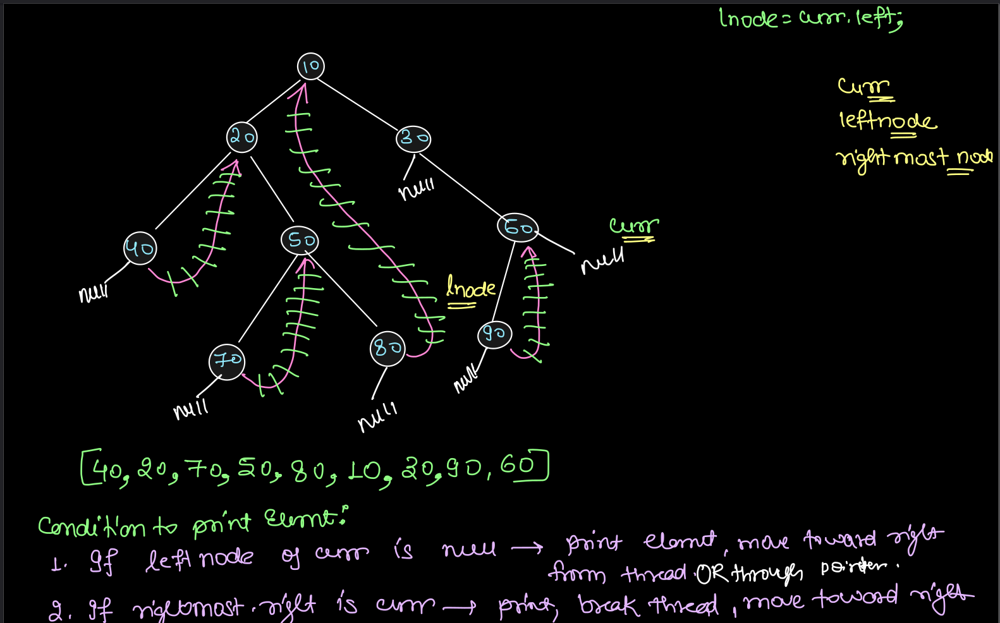

[<- DSA](00-dsa-quick.md)

# Revision Advanced DSA - 3

## Index
- [Notes](#notes)
  - [1. Backtracking](#1-backtracking)
  - [2. Linked List, Sorting and Problems](#2-linked-list-sorting-and-problems)
  - [3. Trees 3: Morris Inorder Traversal & LCA](#3-trees-3-morris-inorder-traversal--lca)
  - [4. Hashing](#4-hashing)
  - [5. Maths: Combinatorics Basics & Prime Numbers](#5-maths-combinatorics-basics--prime-numbers)
- [Questions](#questions)
  - [1. Two Pointers](#1-two-pointers)
  - [2. Backtracking](#2-backtracking)
  - [3. Linked List, Sorting and Fast + Slow Pointer](#3-linked-list-sorting-and-fast--slow-pointer)
  - [4. Doubly Linked List and Detecting Loop](#4-doubly-linked-list-and-detecting-loop)
  - [5. Trees 3: Morris Inorder Traversal & LCA](#5-trees-3-morris-inorder-traversal--lca)
  - [6. Hashing 3: Internal Implementation & Problems](#6-hashing-3-internal-implementation--problems)
  - [7. Maths: Combinatorics Basics & Prime Numbers](#7-maths-combinatorics-basics--prime-numbers)
  - [Multiple Approaches](#multiple-approaches)

# Notes

## 1. Backtracking

### Backtracking vs. Pure Recursion
In backtracking, we are concerned with only building the necessary calls that could potentially contribute to a solution, whereas recursion might make unnecessary calls that do not lead to a solution.

### Proactive vs. Reactive Approach
1. Proactive Approach: In this approach, we make decisions based on the current state and only proceed with choices that are guaranteed to lead to valid solutions. We avoid exploring paths that would lead to invalid states.
2. Reactive Approach: Here, we explore all possible choices without preemptively filtering out invalid paths. If we reach an invalid state, we backtrack and try a different path.

### Subsets
Subsets are all possible combinations of elements from a set, including the empty set and the set itself.
1. Consider set as a bag of items. We can choose to include any item in any order. We can exclude items as well.
2. Order does not matter in subsets. {1, 2} is the same as {2, 1}.

```
Example 1: For the set {1, 2, 3} the subsets are:
{}
{1}
{2}
{3}
{2, 1} is same as {1, 2}
{3, 1} is same as {1, 3}
{3, 2} is same as {2, 3}
{1, 2, 3} is same as {3, 1, 2}
```

### Subsequences
Subsequences are derived from a sequence by deleting some or no elements without changing the order of the remaining elements.
1. Consider sequence as a timeline of events. We can omit some events but cannot change their order.
2. Order matters in subsequences. [1, 2] is different from [2, 1].

```
Example 1: For the sequence [1, 2, 3] the subsequences are:
[]
[1]
[2]
[3]
[1, 2]
[1, 3] we have excluded 2 but order is maintained
[2, 3]
[1, 2, 3]
```

### Subarray
Subarrays are contiguous segments of an array.
1. Consider array as a list of items in a row. A subarray is formed by taking a continuous segment of this row. We can't omit items in between.
2. Order matters in subarrays. [1, 2] is different from [2, 1].

```
Example 1: For the array [1, 2, 3] the subarrays are:
[1]
[2]
[3]
[1, 2]
[2, 3]
[1, 2, 3]
```

### Subset vs Subsequence vs Subarray
Consider an example of 'banana'.

1. 'bna' is a valid subset as well as a valid subsequence but not a valid subarray.
- Subset: {b, n, a}
- Subsequence: [b, n, a]
- Subarray: Not possible as elements are not contiguous.

2. 'nab' is a valid subset but not a valid subsequence or subarray.
- Subset: {n, a, b}
- Subsequence: Not possible as order is violated.
- Subarray: Not possible as order is violated.

Think them like a ring diagram
1, Outermost ring is Subset : Any order, No contiguity : Least restrictive
2, Middle ring is Subsequence : Order matters, No contiguity : Less restrictive
3, Innermost ring is Subarray : Order matters, Contiguity matters : Most restrictive

## 2. Linked List, Sorting and Problems
1. Mid = (Size + 1) / 2

## 3. Trees 3: Morris Inorder Traversal & LCA
1. Property of Binary Search Tree (BST): The inorder traversal of a BST gives the elements in sorted order.

## 4. Hashing
To overcome the issues of DAT (specifically space wastage and size limits), we utilize the advantage of DAT but with a fixed-size table. This is **Hashing**.

### Concept:
Instead of `table size = max + 1`, we use a fixed size (e.g., 10). We map the large values to this small range using a **Hash Function** (usually modulo operator `%`).

### Example:
Table Size = 10
Array: `[21, 42, 37, 45, 99, 30]`

### Mapping:
* 21 -> 21 % 10 = 1
* 42 -> 42 % 10 = 2
* 37 -> 37 % 10 = 7
* 45 -> 45 % 10 = 5
* 99 -> 99 % 10 = 9
* 30 -> 30 % 10 = 0
* 41 -> 41 % 10 = 1 (Collision with 21)

### Process:
1. Perform Hashing on every element to get a unique index.
2. Store the presence of the element in the Hash Table.
3. Hash Table is an extension of DAT.

### Issue with Hashing: Collision
Suppose we want to store `42` and `62`.
* 42 % 10 -> 2
* 62 % 10 -> 2
* **Collision:** Both values map to the same index.

**Can we completely avoid collisions?** Not really possible.

**Why?** Because we are trying to store a larger data set into a limited size table.
This is explained by the **Pigeonhole Principle**: If we have 11 pigeons and 8 holes, at least 2 pigeons must share a hole.

### Collision Resolution Techniques
We can categorize techniques to handle collisions.
```
Collision Resolution Techniques
│
├── Open Hashing
│   └── Chaining (Linked Lists)
│
└── Closed Hashing
    ├── Linear Probing
    ├── Quadratic Probing
    └── Double Hashing
```

### Chaining
It is a technique used to resolve collisions by using a Hash Table where each bucket (index) stores a data structure (typically a Linked List) that can hold multiple elements.

#### Structure:
Array of Linked Lists.
* Index 0 -> 30 -> 20
* Index 2 -> 42 -> 62
* Index 7 -> 37 -> 67

#### Diagram: Array of Chains
```
Index | Chain
-------------------------
  0   | [30] -> [20]
  1   |
  2   | [42] -> [62]
  3   |
  4   |
  5   | [45] -> [75]
  6   | [36]
  7   | [37] -> [67]
  8   |
  9   | [99] -> [59]
```

#### Complexity:
* Insertion at Tail: O(1) (if tail pointer is kept) or O(L) where L is chain length.
* Search/Delete: Depends on the length of the chain at that index.
* Worst Case: O(N) (If all elements collide at one index).
* Average Case: O(Lambda).

#### Load Factor (Lambda) in Chaining
```
Lambda (λ) is the average number of elements per chain. It is calculated as:
λ = (Total number of elements) / (Number of buckets or chains)

If we have 11 elements and 10 buckets, then λ = 11/10 = 1.1
```

#### Threshold
A value (Often 0.75 in standard libraries) which, if exceeded, triggers **Rehashing**.

#### Rehashing
When load factor exceeds the threshold, we perform rehashing:
1. Create a new Hash Table of size double the older one.
2. Redistribute every element from the old table to the new table using the new modulo (new size).
3. This brings the load factor back down.

#### Example Calculation:
* Initial: 6 elements, 4 buckets →  λ = 6/4 = 1.5
* Threshold = 2.0
* Add 3 elements, λ increases.
* Now λ > Threshold, Rehash -> 8 buckets and 9 elements → λ = 9/8 = 1.125

## 5. Maths: Combinatorics Basics & Prime Numbers
1. Additon Rule: Used when you can choose one of several options (OR).
2. Multiplication Rule: Used when you can choose multiple options in sequence (AND).
3. Permutation: Arrangement of objects where order matters.
4. Combination: Selection of objects where order does not matter.
5. nPr Formulae: n! / (n - r)! for permutations.
6. nCr = nPr / r!, So nCr = n! / (r! * (n - r)!) for combinations.
7. Properties of Combination:
   1. nC0 = 1
   2. nCn = 1
   3. nC1 = n
   4. nCr = nC(n - r)
   5. nCr = n-1Cr + n-1C(r - 1)

# Questions

## 1. Two Pointers

### 1. Check pair with given sum exists in a sorted array having distinct elements | Brute Force | Binary Search | Hash Set | Two Pointers

```
Given an integer sorted array A and an integer k, find any pair (i, j) such that A[i] + A[j] = k, i != j.
```

#### 1. Using Brute Force T(n^2), S(1)
```js
// Using Brute Force:
// Time Complexity: O(n^2)
// Space Complexity: O(1)
```

```python
# Using Brute Force:
# Time Complexity: O(n^2)
# Space Complexity: O(1)
def check_pair_sum_brute_force(arr, k):
    n = len(arr)
    for i in range(n):
        for j in range(i + 1, n):
            if arr[i] + arr[j] == k:
                return True
    return False


print(check_pair_sum_brute_force([1, 2, 3, 4, 5], 9))  # True
print(check_pair_sum_brute_force([1, 2, 3, 4, 5], 10)) # False
```

#### 2. Using Binary Search T(n log n), S(1)
```js
// Using Binary Search:
// Time Complexity: O(n log n)
// Space Complexity: O(1)
```

```python
# Using Binary Search:
# Time Complexity: O(n log n)
# Space Complexity: O(1)
def binary_search(arr, low, high, target):
    while low <= high:
        mid = low + (high - low) // 2
        if arr[mid] == target:
            return True
        elif arr[mid] < target:
            low = mid + 1
        else:
            high = mid - 1
    return False


def check_pair_sum_binary_search(arr, k):
    n = len(arr)
    for i in range(n):
        complement = k - arr[i]
        if binary_search(arr, i + 1, n - 1, complement):
            return True
    return False


print(check_pair_sum_binary_search([1, 2, 3, 4, 5], 9))  # True
print(check_pair_sum_binary_search([1, 2, 3, 4, 5], 10)) # False
```

#### 3. Using Hash Set T(n), S(n)
```js
// Using Hash Set:
// Time Complexity: O(n)
// Space Complexity: O(n)
```

```python
# Using Hash Set:
# Time Complexity: O(n)
# Space Complexity: O(n)
def check_pair_sum_hash_set(arr, k):
    seen = set()
    for num in arr:
        complement = k - num
        if complement in seen:
            return True
        seen.add(num)
    return False


print(check_pair_sum_hash_set([1, 2, 3, 4, 5], 9))  # True
print(check_pair_sum_hash_set([1, 2, 3, 4, 5], 10)) # False
```

#### 4. Using Two Pointers T(n), S(1)
```js
// Using Two Pointers
// Time Complexity: O(n)
// Space Complexity: O(1)

/*
 * ALGORITHM EXPLANATION:
 * ----------------------
 * This function implements the "Two Pointer Technique" to solve the Two Sum problem
 * on a sorted array.
 *
 * 1. Initialization: We set two pointers:
 * - 'left' pointing to the start of the array (index 0).
 * - 'right' pointing to the end of the array (last index).
 *
 * 2. Iteration: We enter a loop that continues as long as the 'left' pointer is
 * strictly less than the 'right' pointer. This prevents overlap and self-pairing.
 *
 * 3. Check Sum: Inside the loop, we calculate the sum of the elements at the
 * 'left' and 'right' indices.
 *
 * 4. Decision Logic:
 * - Match Found: If the sum equals the target 'k', we immediately return true.
 * - Sum Too Small: If the sum is less than 'k', we need a larger value. Since
 * the array is sorted, moving the 'left' pointer to the right (incrementing)
 * will increase the sum.
 * - Sum Too Large: If the sum is greater than 'k', we need a smaller value.
 * Moving the 'right' pointer to the left (decrementing) will decrease the sum.
 *
 * 5. Termination: If the loop finishes without finding a pair (i.e., pointers meet),
 * we return false.
 *
 * Note: This algorithm relies on the input array 'arr' being sorted in ascending order.
 */

function hasPairWithSum(arr, k) {
  // Initialize the left pointer at the beginning of the array
  let left = 0;

  // Initialize the right pointer at the very end of the array
  let right = arr.length - 1;

  // Loop until the two pointers meet
  // We use '<' instead of '<=' because we need distinct elements
  while (left < right) {

    // Calculate the current sum of the elements at the two pointer positions
    const sum = arr[left] + arr[right];

    // Check if the current sum matches the target value 'k'
    if (sum === k) {
      return true; // Pair found; return true immediately
    }
    // If current sum is less than target, we need a larger sum
    else if (sum < k) {
      left++; // Move left pointer to the right to increase sum (sorted array assumption)
    }
    // If current sum is greater than target, we need a smaller sum
    else {
      right--; // Move right pointer to the left to decrease sum
    }
  }

  // If the loop completes without returning, no such pair exists
  return false; // No pair found
}

console.log(hasPairWithSum([1, 2, 3, 4, 5], 6)); // true
console.log(hasPairWithSum([1, 2, 3, 4, 5], 10)); // false

/*
 * COMPLEXITY ANALYSIS:
 * --------------------
 * Time Complexity: O(n)
 * - We touch each element at most once. The 'left' pointer only moves right, and
 * the 'right' pointer only moves left. In the worst case, we traverse the entire
 * array once.
 *
 * Space Complexity: O(1)
 * - We only use a constant amount of extra space for variables ('left', 'right', 'sum')
 * regardless of the input array size. We operate in-place.
 */
```

```python
# Using Two Pointers
# Time Complexity: O(n)
# Space Complexity: O(1)
def check_pair_sum_two_pointers(arr, k):
    left = 0
    right = len(arr) - 1

    while left < right:
        curr_sum = arr[left] + arr[right]
        if curr_sum == k:
            return True
        elif curr_sum < k:
            left += 1
        else:
            right -= 1

    return False


print(check_pair_sum_two_pointers([1, 2, 3, 4, 5], 9))  # True
print(check_pair_sum_two_pointers([1, 2, 3, 4, 5], 10)) # False
```

### 2. Count Pairs with Sum K if array is sorted and has distinct elements | Two Pointers **O(N), O(1)**
```js
/*
 * ALGORITHM EXPLANATION: Two-Pointer Technique
 * --------------------------------------------
 * This function finds the number of pairs in an array that add up to a specific target sum 'k'.
 * It utilizes the "Two-Pointer" approach, which is highly efficient for this task but
 * CRITICALLY assumes that the input array 'arr' is already sorted in ascending order.
 *
 * 1. Initialization: We set two pointers, 'left' at the start (index 0) and 'right' at
 * the end (last index) of the array.
 * 2. Iteration: We loop while 'left' is strictly less than 'right'.
 * 3. Logic per iteration:
 * - Calculate the 'sum' of elements at the 'left' and 'right' pointers.
 * - Match Found (sum == k): We found a valid pair. Increment the pair count and move
 * both pointers inward to look for new pairs.
 * - Sum too small (sum < k): To increase the sum, we need a larger number. Since the
 * array is sorted, moving the 'left' pointer to the right gives us a larger value.
 * - Sum too large (sum > k): To decrease the sum, we need a smaller number. Moving
 * the 'right' pointer to the left gives us a smaller value.
 * 4. Termination: The loop ends when pointers meet or cross.
 */

function countPairsWithSum(arr, k) {
  // Initialize the left pointer at the start of the array
  let left = 0;

  // Initialize the right pointer at the end of the array
  let right = arr.length - 1;

  // Initialize a counter to track the number of valid pairs found
  let count = 0;

  // Loop until the two pointers meet
  while (left < right) {
    // Calculate the current sum of the elements at the left and right pointers
    const sum = arr[left] + arr[right];

    // Check if the calculated sum matches the target 'k'
    if (sum === k) {
      // If a match is found, increment the count
      count++;

      // Move the left pointer forward to check the next element
      left++;

      // Move the right pointer backward to check the previous element
      right--;
    }
    // If the sum is less than the target 'k'
    else if (sum < k) {
      // Increment the left pointer to increase the sum (assumes sorted array)
      left++;
    }
    // If the sum is greater than the target 'k'
    else {
      // Decrement the right pointer to decrease the sum
      right--;
    }
  }

  // Return the total count of pairs found
  return count;
}

console.log(countPairsWithSum([1, 2, 3, 4, 5], 6)); // 2 (1+5, 2+4)

// Time Complexity: O(N)
// Explanation: The while loop processes the array linearly. The 'left' and 'right' pointers
// move towards each other, touching each element at most once.

// Space Complexity: O(1)
// Explanation: The algorithm uses a constant amount of extra space (variables for pointers
// and sum) regardless of the input array size.
```

```python
def count_pairs_with_sum_k_distinct(arr, k):
    left = 0
    right = len(arr) - 1
    count = 0

    while left < right:
        curr_sum = arr[left] + arr[right]
        if curr_sum == k:
            count += 1
            left += 1
            right -= 1
        elif curr_sum < k:
            left += 1
        else:
            right -= 1

    return count


print(count_pairs_with_sum_k_distinct([1, 2, 3, 4, 5], 5))  # 2 (1+4, 2+3)

# Time Complexity: O(N)
# Space Complexity: O(1)
```

### 3. Count Pairs with Sum K if array is sorted and has duplicates | Two Pointers **O(N), O(1)**
```js
/**
 * ALGORITHM EXPLANATION:
 *
 * This function utilizes the "Two Pointer" technique to find pairs in a sorted array
 * that sum up to a specific target 'k'.
 *
 * 1. Initialization: We start with two pointers, 'left' at the beginning (index 0)
 * and 'right' at the end (index arr.length - 1) of the array.
 *
 * 2. Iteration: We loop while 'left' is strictly less than 'right'.
 * - We calculate the 'sum' of the elements at the 'left' and 'right' pointers.
 *
 * 3. Case: Sum equals Target (sum === k):
 * - Special Condition: If arr[left] equals arr[right], it means all elements
 * between these pointers are identical (since the array is sorted).
 * We calculate the number of pairs using the combination formula n*(n-1)/2
 * and return the count immediately.
 * - Standard Condition: If arr[left] and arr[right] are different distinct values:
 * a. Count consecutive duplicates of arr[left] (leftCount).
 * b. Count consecutive duplicates of arr[right] (rightCount).
 * c. Multiply leftCount * rightCount to get the total combinations for these values
 * and add to the total count.
 * d. Move both pointers inward to look for new pairs.
 *
 * 4. Case: Sum is too large (sum > k):
 * - We decrement the 'right' pointer to move to a smaller number.
 *
 * 5. Case: Sum is too small (sum < k):
 * - We increment the 'left' pointer to move to a larger number.
 *
 * Note: This approach relies heavily on the input array being sorted.
 */

function countPairsWithSumDuplicates(arr, k) {
  // Initialize the left pointer at the start of the array
  let left = 0;
  // Initialize the right pointer at the end of the array
  let right = arr.length - 1;
  // Initialize a counter to track the number of valid pairs found
  let count = 0;

  // Continue looping as long as the left pointer does not pass the right pointer
  while (left < right) {
    // Calculate the current sum of the values at the two pointers
    const sum = arr[left] + arr[right];

    // Check if the current pair sums up to the target 'k'
    if (sum === k) {
      // Logic for handling duplicates when the pair is valid
      if (arr[left] === arr[right]) { // If both pointers point to the duplicate element
        // Since the array is sorted, if ends are equal, all numbers in between are also equal.
        // We calculate the number of items in this range.
        const totalElements = right - left + 1; // Count of duplicates between left and right

        // Use the combination formula nC2 = n(n-1)/2 to find all unique pairs among identical numbers
        count += (totalElements * (totalElements - 1)) / 2;

        // Since we have processed the remaining valid subarray, we return the total count
        return count; // All elements are the same, return count
      }

      // If the values are different, we need to handle duplicates on both sides individually
      let leftCount = 1; // Count duplicates on the left
      let rightCount = 1; // Count duplicates on the right

      // Count how many times the value at arr[left] repeats
      while (left < right && arr[left] === arr[left + 1]) { // Count duplicates on the left
        leftCount++; // Increment leftCount for each duplicate
        left++; // Move left pointer to the next distinct element
      }

      // Count how many times the value at arr[right] repeats
      while (left < right && arr[right] === arr[right - 1]) { // Count duplicates on the right
        rightCount++; // Increment rightCount for each duplicate
        right--; // Move right pointer to the next distinct element
      }

      // The number of ways to pair the left duplicates with the right duplicates
      // is the product of their counts (Cartesian product)
      count += leftCount * rightCount; // Count pairs formed by left and right elements

      // Move both pointers inward to continue searching for other pairs
      left++; // Move left pointer to the next distinct element
      right--; // Move right pointer to the next distinct element

    } else if (sum > k) {
      // If the sum is greater than k, we need a smaller sum.
      // Moving the right pointer to the left brings us to a smaller (or equal) number.
      right--; // Move right pointer to decrease sum
    } else {
      // If the sum is less than k, we need a larger sum.
      // Moving the left pointer to the right brings us to a larger (or equal) number.
      left++; // Move left pointer to increase sum
    }
  }
  // Return the total count of pairs found
  return count;
}

// Test Case 1: Standard case with some duplicates
console.log(countPairsWithSumDuplicates([1, 2, 2, 3, 4, 5], 6)); // 3 (1+5, 2+4, 2+4)

// Test Case 2: Case where the valid pair involves a range of identical numbers
console.log(countPairsWithSumDuplicates([1, 5, 5, 5, 5, 5, 8], 10)); // 10 (5+5, 5 times, nC2 = 5*4/2 = 10)

/*
 * COMPLEXITY ANALYSIS:
 *
 * Time Complexity: O(N)
 * The algorithm uses the two-pointer approach. Even with the inner while loops for
 * counting duplicates, every element in the array is visited at most once by the
 * 'left' pointer and at most once by the 'right' pointer. Therefore, the time
 * complexity is linear relative to the size of the input array.
 *
 * Space Complexity: O(1)
 * The algorithm uses a fixed number of variables (left, right, count, sum,
 * leftCount, rightCount, totalElements) regardless of the input array size.
 * It does not use any auxiliary data structures like hash maps or arrays.
 */
```

```python
def count_pairs_with_sum_k_duplicates(arr, k):
    left = 0
    right = len(arr) - 1
    count = 0

    while left < right:
        curr_sum = arr[left] + arr[right]

        if curr_sum < k:
            left += 1
        elif curr_sum > k:
            right -= 1
        else:
            # Case 1: Elements at left and right are identical
            if arr[left] == arr[right]:
                n = right - left + 1
                count += n * (n - 1) // 2
                break
            else:
                # Case 2: Count duplicates on left and right
                c_left = 1
                while left + 1 < right and arr[left] == arr[left + 1]:
                    c_left += 1
                    left += 1

                c_right = 1
                while right - 1 > left and arr[right] == arr[right - 1]:
                    c_right += 1
                    right -= 1

                count += c_left * c_right
                left += 1
                right -= 1

    return count


print(count_pairs_with_sum_k_duplicates([1, 2, 3, 3, 4, 5], 6))  # 3 (1+5, 3+3, 2+4)

# Time Complexity: O(N)
# Space Complexity: O(1)
```

### 4. Check if there exists a pair with difference K in a sorted array | Two Pointers **O(N), O(1)**
```
Given a sorted integer array A and an integer k. Find any pair (i, j) such that A[j] - A[i] = k, i != j and k > 0.
Note: 0-based indexing
```

```js
/**
 * ALGORITHM EXPLANATION:
 * ----------------------
 * This function utilizes the "Two-Pointer" technique to solve the problem efficiently.
 * It assumes the input array 'arr' is already sorted in ascending order.
 * * 1. Initialization: We set two pointers, 'left' at index 0 and 'right' at index 1.
 * 2. Iteration: We iterate while the 'right' pointer is within the bounds of the array.
 * 3. Calculation: In each step, we calculate the difference between the values at the 'right'
 * and 'left' pointers (arr[right] - arr[left]).
 * 4. Decision Logic:
 * - If the difference equals 'k', we have found our pair and return true.
 * - If the difference is greater than 'k', the gap is too large. We increment the 'left'
 * pointer to move to a larger number, thereby reducing the difference.
 * - If the difference is less than 'k', the gap is too small. We increment the 'right'
 * pointer to move to a larger number, thereby increasing the difference.
 * 5. Collision Check: We ensure 'right' is always ahead of 'left'. If they collide,
 * we push 'right' forward.
 */

function hasPairWithDifference(arr, k) {
  // Initialize the left pointer at the start of the array
  let left = 0;
  // Initialize the right pointer at the second element
  let right = 1;

  // Continue looping as long as the right pointer is within valid array bounds
  while (right < arr.length) {
    // Calculate the difference between the two distinct elements
    const diff = arr[right] - arr[left];

    // Check if the calculated difference matches the target k
    if (diff === k) {
      return true; // Pair found
    }
    // If the difference is larger than k, we need a smaller gap.
    // Since the array is sorted, moving 'left' forward increases arr[left],
    // which decreases (arr[right] - arr[left]).
    else if (diff > k) {
      left++; // Move left pointer to decrease difference
    }
    // If the difference is smaller than k, we need a larger gap.
    // Moving 'right' forward increases arr[right], increasing the total difference.
    else {
      right++; // Move right pointer to increase difference
    }

    // Edge Case: If increasing 'left' made it equal to 'right', we must move 'right'
    // forward to ensure we are always comparing two different elements.
    if (left === right) {
      right++; // Ensure right pointer is always ahead of left
    }
  }

  // If the loop finishes without returning, no such pair exists
  return false; // No pair found
}

console.log(hasPairWithDifference([-3, 0, 1, 3, 6, 8, 11, 14, 21, 25], 5)); // true (6-1, 11-6, 14-8)
console.log(hasPairWithDifference([-1, 1, 1, 2, 2, 3], 0)); // true (1-1, 2-2)
console.log(hasPairWithDifference([1, 2, 3, 4, 5], 6)); // false

/**
 * COMPLEXITY ANALYSIS:
 * --------------------
 * Time Complexity: O(N)
 * - The 'left' and 'right' pointers only move forward and never backtrack.
 * - In the worst case, each element is visited at most twice (once by 'right' and once by 'left').
 * * Space Complexity: O(1)
 * - We are not using any extra data structures (like Hash Maps or Arrays).
 * - Only a constant number of variables (left, right, diff) are used for storage.
 */
```

```python
def check_pair_diff_k(arr, k):
    left = 0
    right = 1
    n = len(arr)

    while right < n and left < n:
        diff = arr[right] - arr[left]
        if diff == k and left != right:
            return True
        elif diff < k:
            right += 1
        else:
            left += 1
            if left == right:
                right += 1

    return False


print(check_pair_diff_k([1, 3, 5, 8, 12], 5))  # True (8 - 3 = 5)
print(check_pair_diff_k([1, 3, 5, 8, 12], 4))  # True (5 - 1 = 4)

# Time Complexity: O(N)
# Space Complexity: O(1)
```

### 5. Count Pairs with Difference K in a sorted array if array has distinct elements | Two Pointers **O(N), O(1)**
```js
/*
 * ALGORITHM EXPLANATION:
 *
 * This function uses the "Two Pointers" technique to find the number of unique pairs
 * in a sorted array that have a specific difference 'k'.
 *
 * 1. Initialization: We initialize two pointers, 'left' at index 0 and 'right' at index 1.
 * 2. Traversal: We iterate through the array as long as the 'right' pointer is within bounds.
 * 3. Difference Calculation: In each iteration, we calculate the difference between the elements
 * at the 'right' and 'left' pointers (arr[right] - arr[left]).
 * 4. Comparison Logic:
 * - If the difference equals 'k': We found a valid pair. Increment the count and move
 * both pointers forward to look for the next pair.
 * - If the difference is less than 'k': The gap is too small. Since the array is sorted,
 * we move the 'right' pointer forward to increase the difference.
 * - If the difference is greater than 'k': The gap is too large. We move the 'left' pointer
 * forward to decrease the difference.
 * 5. Overlap Prevention: If moving 'left' makes it equal to 'right', we must force 'right' forward
 * to ensure the pointers never point to the same element (distinct pair requirement).
 */

function countPairsWithDifference(arr, k) {
  let left = 0; // Initialize the left pointer at the start of the array
  let right = 1; // Initialize the right pointer at the second element
  let count = 0; // Counter to keep track of valid pairs found

  // Continue iterating as long as the right pointer has not reached the end of the array
  while (right < arr.length) {
    // Calculate the difference between the values at the right and left pointers
    const diff = arr[right] - arr[left];

    if (diff === k) {
      // Case 1: Difference matches target 'k'
      count++; // Increment the pair counter
      left++; // Move left pointer forward
      right++; // Move right pointer forward
    } else if (diff < k) {
      // Case 2: Difference is too small
      // Increment right pointer to increase the gap (assuming sorted array)
      right++;
    } else {
      // Case 3: Difference is too large
      // Increment left pointer to shrink the gap
      left++;
      // Edge case: If left catches up to right, increment right to maintain the gap
      if (left === right) right++; // Ensure right pointer is always ahead of left
    }
  }
  return count; // Return the total number of pairs found
}

console.log(countPairsWithDifference([-3, 0, 1, 3, 6, 8, 11, 14, 21, 25], 5)); // 3 (6-1, 11-6, 14-8)

/*
 * COMPLEXITY ANALYSIS:
 *
 * Time Complexity: O(N)
 * - We traverse the array with two pointers ('left' and 'right').
 * - Both pointers move only in the forward direction and never reset.
 * - In the worst case, each element is visited at most twice (once by 'right' and once by 'left').
 * - Therefore, the time complexity is linear relative to the size of the array N.
 *
 * Space Complexity: O(1)
 * - The algorithm operates in constant space.
 * - We only use a few variables ('left', 'right', 'count', 'diff') to store state.
 * - No auxiliary data structures (like Hash Maps or Arrays) are used proportional to the input size.
 */
```

```python
def count_pairs_diff_k_distinct(arr, k):
    left = 0
    right = 1
    count = 0
    n = len(arr)

    while right < n:
        diff = arr[right] - arr[left]
        if diff == k and left != right:
            count += 1
            left += 1
            right += 1
        elif diff < k:
            right += 1
        else:
            left += 1
            if left == right:
                right += 1

    return count


print(count_pairs_diff_k_distinct([1, 3, 5, 8, 12], 2))  # 2 ([1, 3], [3, 5])

# Time Complexity: O(N)
# Space Complexity: O(1)
```

### 6. Count Pairs with Difference K in a sorted array if array has duplicates | Two Pointers **O(N), O(1)**
```js
/**
 * ==========================================================================================
 * ALGORITHM EXPLANATION
 * ==========================================================================================
 *
 * This function calculates the number of pairs in a SORTED array that have a specific difference 'k'.
 * The approach depends on the value of 'k':
 *
 * 1. Negative k (k < 0):
 * Returns 0 immediately as the difference between a larger index and smaller index
 * in a sorted array cannot be negative in this context.
 *
 * 2. Zero Difference (k === 0):
 * The goal is to find identical numbers. Since the array is sorted, duplicates are adjacent.
 * - The algorithm iterates through the array to identify "clusters" of identical numbers.
 * - For a cluster of size 'c', the number of pairs is calculated using the combination
 * formula nC2: (c * (c - 1)) / 2.
 *
 * 3. Positive Difference (k > 0):
 * Uses a "Two-Pointer" approach (sliding window) to find pairs (arr[left], arr[right]).
 * - Pointer 'left' starts at 0, 'right' starts at 1.
 * - We calculate the current difference: diff = arr[right] - arr[left].
 * - If diff < k: The gap is too small. Move 'right' forward to increase the gap.
 * - If diff > k: The gap is too big. Move 'left' forward to decrease the gap.
 * - If diff === k: A match is found.
 * a. Count occurrences of arr[left] (leftCount).
 * b. Count occurrences of arr[right] (rightCount).
 * c. Add (leftCount * rightCount) to the total pairs.
 * d. Move both pointers past these specific values to avoid recounting.
 *
 * Note: This algorithm relies on the input array 'arr' being sorted.
 * ==========================================================================================
 */

function countPairsWithDifferenceDuplicates(arr, k) {
  // Store the length of the input array for bounds checking
  const n = arr.length;

  // negative k makes no sense for "difference"
  // If k is negative, return 0 (logic assumes sorted ascending array)
  if (k < 0) return 0;

  // --- Case k === 0: just count each run of duplicates via nC2 ---
  // If the target difference is 0, we look for duplicate numbers
  if (k === 0) {
    let count = 0; // Initialize pair counter
    let i = 0;     // Start iterator at the beginning

    // Iterate through the entire array
    while (i < n) {
      let j = i + 1;

      // find end of this duplicate run
      // Move 'j' forward as long as elements match arr[i]
      while (j < n && arr[j] === arr[i]) j++;

      // Calculate the size of the cluster of identical numbers
      const c = j - i;

      // If there is more than one number, calculate pairs
      if (c > 1) {
        // Add number of combinations (c choose 2) to total count
        count += (c * (c - 1)) / 2;
      }

      // Move the main iterator 'i' to 'j' to process the next distinct number
      i = j;
    }
    // Return the total count for k=0 case
    return count;
  }

  // --- Case k > 0: two‑pointer + cluster counting ---
  let left = 0;   // Initialize left pointer
  let right = 1;  // Initialize right pointer
  let count = 0;  // Initialize total pair counter

  // Loop until the right pointer exceeds the array bounds
  while (right < n) {
    // Calculate the difference between values at the two pointers
    const diff = arr[right] - arr[left];

    // Check if the current difference is smaller than the target k
    if (diff < k) {
      // need a bigger difference
      // Move right pointer to increase the difference (since array is sorted)
      right++;
    } else if (diff > k) {
      // need a smaller difference
      // Move left pointer to decrease the difference
      left++;

      // keep right > left
      // Ensure the right pointer never falls behind or equals the left pointer
      if (left === right) right++;
    } else {
      // diff === k → count how many duplicates at left AND at right
      // Difference matches k. Now handle duplicate values at both ends.

      // 1. Count duplicates for the value at 'left' pointer
      const leftVal = arr[left];
      let i = left;
      // Advance 'i' as long as it matches the value at 'left'
      while (i < n && arr[i] === leftVal) i++;
      // Determine the count of the left cluster
      const leftCount = i - left;

      // 2. Count duplicates for the value at 'right' pointer
      const rightVal = arr[right];
      let j = right;
      // Advance 'j' as long as it matches the value at 'right'
      while (j < n && arr[j] === rightVal) j++;
      // Determine the count of the right cluster
      const rightCount = j - right;

      // every left-duplicate can pair with every right-duplicate
      // Cartesian product: multiply counts to get total combinations for these values
      count += leftCount * rightCount;

      // advance both pointers past these clusters
      // Set pointers to the indices immediately following the processed clusters
      left = i;
      right = j;
    }
  }

  // Return the final calculated count
  return count;
}

console.log(countPairsWithDifferenceDuplicates([-3, 0, 1, 3, 6, 8, 11, 14, 21, 25], 5)); // 3 (6-1, 11-6, 14-8)
console.log(countPairsWithDifferenceDuplicates([-1, 1, 1, 2, 2, 3], 0)); // 2 (1-1, 2-2)
console.log(countPairsWithDifferenceDuplicates([1, 5, 5, 5, 5, 5, 8], 0)); // 10 (5-5, 5 times, nC2 = 5*4/2 = 10)

/**
 * ==========================================================================================
 * COMPLEXITY ANALYSIS
 * ==========================================================================================
 * * Time Complexity: O(N)
 * - The algorithm traverses the array linearly.
 * - In the k=0 case, 'i' and 'j' visit each element once.
 * - In the k>0 case, the 'left' and 'right' pointers (and internal iterators 'i', 'j')
 * move strictly forward from index 0 to N. Each element is processed a constant number of times.
 * - Note: This assumes the input array is already sorted. If sorting is required,
 * the total complexity would be O(N log N).
 * * Space Complexity: O(1)
 * - The algorithm uses a constant amount of auxiliary space for variables
 * (n, count, left, right, diff, i, j, c, etc.).
 * - No extra data structures proportional to the input size are allocated.
 * ==========================================================================================
 */
```

```python
def count_pairs_diff_k_duplicates(arr, k):
    left = 0
    right = 1
    count = 0
    n = len(arr)

    while right < n:
        diff = arr[right] - arr[left]

        if diff < k or left == right:
            right += 1
        elif diff > k:
            left += 1
        else:
            c_left = 1
            while left + 1 < n and arr[left] == arr[left + 1]:
                c_left += 1
                left += 1

            c_right = 1
            while right + 1 < n and arr[right] == arr[right + 1]:
                c_right += 1
                right += 1

            count += c_left * c_right
            left += 1
            right += 1

    return count


print(count_pairs_diff_k_duplicates([1, 1, 3, 3, 5, 5], 2))  # 8

# Time Complexity: O(N)
# Space Complexity: O(1)
```

## 2. Backtracking

### 1. Print Valid Parenthesis | Backtracking **O(N), O(1)**

```
Given an integer A pairs of parentheses, write a function to generate all combinations of well-formed parentheses of length 2 * A.

Valid Parentheses Examples for A = 3. We can make 5 valid combinations:
((()))
(()())
(())()
()(())
()()()

Invalid Parentheses:
)))(((
(()()(
((()))]
```

#### Recursive Proactive Approach
```js
/*
 * ALGORITHM EXPLANATION:
 * ----------------------
 * The problem asks us to generate all valid combinations of 'A' pairs of parentheses.
 * We use a recursive Backtracking approach to build the strings character by character.
 *
 * 1. Define a recursive helper function (proactiveGenerate) that tracks:
 * - openCount: Number of '(' added so far.
 * - closeCount: Number of ')' added so far.
 * - currentString: The string built up to this point.
 *
 * 2. Base Case:
 * - If the length of 'currentString' equals 2 * A, we have formed a valid sequence.
 * - Print the string and return to explore other paths.
 *
 * 3. Recursive Steps (Proactive conditions):
 * - Condition to add '(': We can add an opening bracket if we haven't used all 'A' opening brackets yet (openCount < A).
 * - Condition to add ')': We can add a closing bracket only if the number of closing brackets is less than the number of opening brackets (closeCount < openCount). This ensures validity (we never close a bracket that wasn't opened).
 *
 * 4. Initial Call: Start with 0 open, 0 close, and an empty string.
 */

// Function to print all valid combinations of parentheses using backtracking proactively
function printValidParenthesis(A) {

  // Helper function to generate combinations recursively
  function proactiveGenerate(openCount, closeCount, currentString) {

    // Base Case: If the string reaches the maximum length (2 * A), it is complete
    if (currentString.length === 2 * A) {
      console.log(currentString); // Output the valid combination
      return; // Backtrack to previous state
    }

    // Decision 1: Add an opening parenthesis if we haven't reached the limit 'A'
    // This is a proactive check to ensure we don't exceed the number of allowed '('
    if (openCount < A) {
      // Recurse with incremented open count and append '('
      proactiveGenerate(openCount + 1, closeCount, currentString + '(');
    }

    // Decision 2: Add a closing parenthesis if strictly less than open count
    // This ensures we always have a matching open bracket available
    // This is a proactive check to maintain validity of the parentheses
    if (closeCount < openCount) {
      // Recurse with incremented close count and append ')'
      proactiveGenerate(openCount, closeCount + 1, currentString + ')');
    }
  }

  // Initial call to the recursive function starting with counts at 0
  proactiveGenerate(0, 0, '');
}

printValidParenthesis(2); // (()), ()()
printValidParenthesis(3); // ((())), (()()), (())(), ()(()), ()()()

/*
 * COMPLEXITY ANALYSIS:
 * --------------------
 * Time Complexity: O(4^n / sqrt(n))
 * - The number of valid parenthesis combinations for 'n' pairs is the n-th Catalan number.
 * - Asymptotically, the Catalan number grows as 4^n / (n^(3/2)).
 * - Since we generate every valid string exactly once, the time complexity is proportional to this number.
 *
 * Space Complexity: O(n)
 * - This is determined by the maximum depth of the recursion stack.
 * - In the worst case, the recursion goes to a depth of 2 * n (the length of the string).
 * - Therefore, the space required for the call stack is linear with respect to n.
 */
```

```python
def generate_parentheses_proactive(n):
    result = []

    def backtrack(curr, open_count, close_count):
        if len(curr) == 2 * n:
            result.append(curr)
            return

        if open_count < n:
            backtrack(curr + "(", open_count + 1, close_count)

        if close_count < open_count:
            backtrack(curr + ")", open_count, close_count + 1)

    backtrack("", 0, 0)
    return result


print(generate_parentheses_proactive(3))
# ['((()))', '(()())', '(())()', '()(())', '()()()']

# Time Complexity: O(4^n / sqrt(n)) - Catalan Number
# Space Complexity: O(n) call stack
```

#### Recursive Reactive Approach
```js
/*
ALGORITHM EXPLANATION:
======================
This code generates all valid combinations of N pairs of balanced parentheses using backtracking.

Problem: Given a number A, generate all possible combinations of A pairs of well-formed parentheses.

Approach:
- Uses recursive backtracking to explore all possible ways to place parentheses
- Maintains counts of open '(' and close ')' parentheses added so far
- Key insight: A valid combination must satisfy:
  1. At any point, number of close parentheses cannot exceed open parentheses
  2. Total open parentheses cannot exceed A
  3. Total close parentheses cannot exceed A
  4. Final string length must be 2*A (A open + A close)

How it works:
1. Start with empty string and zero counts for both open and close parentheses
2. At each recursive call, try two possibilities:
   a. Add an open parenthesis '(' (if we haven't exceeded limit A)
   b. Add a close parenthesis ')' (if it doesn't violate balance rules)
3. Base case: When string length reaches 2*A, we have a valid combination
4. Pruning: Stop exploring paths that violate validity constraints
5. Print each valid combination when found

Example for A=2: Generates "(())" and "()()"
*/

// Function to print all valid combinations of parentheses using backtracking reactively
function printValidParenthesisReactive(A) {

  // Helper recursive function that generates valid parenthesis combinations
  // openCount: number of '(' added so far
  // closeCount: number of ')' added so far
  // currentString: the parenthesis string built so far
  function reactiveGenerate(openCount, closeCount, currentString) {
    // Pruning condition: Stop if constraints are violated
    // closeCount > openCount: more closing than opening (invalid balance)
    // openCount > A: exceeded maximum allowed open parentheses
    // closeCount > A: exceeded maximum allowed close parentheses
    if (closeCount > openCount || openCount > A || closeCount > A) {
      return; // Invalid state
    }

    // Base case: Check if we've built a complete valid combination
    // A valid combination has exactly 2*A characters (A open + A close)
    if (currentString.length === 2 * A) {
      console.log(currentString); // Print the valid combination
      return;
    }

    // Try adding an open parenthesis
    // Recursively explore adding '(' to current string
    // This is done regardless of current counts, relying on pruning to discard invalid paths. So it's reactive.
    reactiveGenerate(openCount + 1, closeCount, currentString + '(');

    // Try adding a close parenthesis
    // Recursively explore adding ')' to current string
    // This is also done unconditionally, relying on pruning to ensure validity. So it's reactive.
    reactiveGenerate(openCount, closeCount + 1, currentString + ')');
  }

  // Start the recursive generation with initial state
  // 0 open parentheses, 0 close parentheses, empty string
  reactiveGenerate(0, 0, '');
}

// Test case 1: Generate all valid combinations for 2 pairs of parentheses
printValidParenthesisReactive(2); // (()), ()()

// Test case 2: Generate all valid combinations for 3 pairs of parentheses
printValidParenthesisReactive(3); // ((())), (()()), (())(), ()((), ()()()

// Time Complexity: O(2^n) where n is the number of pairs of parentheses.
// Space Complexity: O(n) for the recursion stack.

/*
COMPLEXITY ANALYSIS:
====================
TIME COMPLEXITY: O(4^n / sqrt(n)) or approximately O(2^(2n))
- At each step, we make 2 recursive calls (add '(' or add ')')
- Maximum depth of recursion is 2*n (for n pairs)
- Not all branches reach the base case due to pruning
- The actual number of valid combinations is the nth Catalan number: C(n) = (2n)! / ((n+1)! * n!)
- This is bounded by 4^n / (n * sqrt(n))
- Visiting each valid combination takes O(n) time to build the string
- Overall: O(4^n / sqrt(n))

SPACE COMPLEXITY: O(n)
- Recursion stack depth is at most 2*n (maximum string length)
- At each level, we store: openCount, closeCount, and currentString
- currentString grows to maximum length of 2*n
- No additional data structures used
- Therefore, space complexity is O(n) where n is the number of pairs
*/
```

```python
def is_valid_parentheses_prefix(s, n):
    open_c = 0
    close_c = 0
    for ch in s:
        if ch == '(':
            open_c += 1
        else:
            close_c += 1
        if close_c > open_c or open_c > n:
            return False
    return True


def generate_parentheses_reactive(n):
    result = []

    def backtrack(curr):
        if not is_valid_parentheses_prefix(curr, n):
            return

        if len(curr) == 2 * n:
            result.append(curr)
            return

        backtrack(curr + "(")
        backtrack(curr + ")")

    backtrack("")
    return result


print(generate_parentheses_reactive(3))
```

#### Iterative Approach using Stack
```js
/*
 * ALGORITHM EXPLANATION (Iterative DFS):
 * --------------------------------------
 * Instead of recursion, we use an explicit Stack data structure to perform a Depth-First Search (DFS).
 * * 1. Stack Initialization:
 * - The stack stores "state" objects. Each state contains:
 * { openCount, closeCount, currentString }
 * - We start by pushing the initial state: {0, 0, ""}.
 * * 2. Iteration (While Loop):
 * - We loop as long as the stack is not empty.
 * - Pop the top state from the stack to process it.
 * * 3. Processing State:
 * - Check Base Case: If 'currentString' length is 2 * A, print it and continue to the next iteration.
 * * 4. Pushing Next States (LIFO Order):
 * - In a Stack (Last-In, First-Out), the item pushed *last* is processed *first*.
 * - To maintain the same output order as the recursive version (where we tried '(' before ')'),
 * we must push the ')' option first, and the '(' option second.
 * - Push Condition ')': If closeCount < openCount.
 * - Push Condition '(': If openCount < A.
 */

// Function to print all valid combinations of parentheses using an iterative stack
function printValidParenthesisIterative(A) {

  // Initialize the stack with the starting state
  // We use an object to hold the current progress of counts and the string built so far
  const stack = [{ openCount: 0, closeCount: 0, currentString: '' }];

  // Continue processing until there are no more states to explore
  while (stack.length > 0) {

    // Pop the last state added (Depth-First behavior)
    const { openCount, closeCount, currentString } = stack.pop();

    // Base Case: If the string is fully formed (length == 2 * A)
    if (currentString.length === 2 * A) {
      console.log(currentString); // Output result
      continue; // Skip further processing for this path
    }

    // CRITICAL: We push valid next steps to the stack.
    // Because stacks are LIFO, we push the "Closing" option FIRST,
    // so that the "Opening" option (pushed second) is popped and processed first.

    // Option 2: Add a closing parenthesis ')' if valid
    // Valid only if we have more open brackets than closed ones
    if (closeCount < openCount) {
      stack.push({
        openCount: openCount,
        closeCount: closeCount + 1,
        currentString: currentString + ')'
      });
    }

    // Option 1: Add an opening parenthesis '(' if valid
    // Valid only if we haven't reached the maximum number of pairs 'A'
    if (openCount < A) {
      stack.push({
        openCount: openCount + 1,
        closeCount: closeCount,
        currentString: currentString + '('
      });
    }
  }
}

printValidParenthesisIterative(2); // (()), ()()
printValidParenthesisIterative(3); // ((())), (()()), (())(), ()(()), ()()()

/*
 * COMPLEXITY ANALYSIS:
 * --------------------
 * Time Complexity: O(4^n / sqrt(n))
 * - Even though we are using a loop, we are still visiting every node in the recursion tree exactly once.
 * - The number of valid nodes is related to the n-th Catalan number.
 * * Space Complexity: O(n)
 * - The space is dictated by the size of the stack.
 * - In a Depth-First Search (DFS) on this specific tree, the stack only holds the path from the root to the current leaf/node.
 * - The maximum depth of the tree is 2 * A (the length of the string).
 * - Therefore, the maximum memory usage for the stack is linear O(n).
 */
```

```python
def generate_parentheses_iterative(n):
    result = []
    # Stack stores tuples: (current_string, open_count, close_count)
    stack = [("", 0, 0)]

    while stack:
        curr, open_c, close_c = stack.pop()

        if len(curr) == 2 * n:
            result.append(curr)
            continue

        if close_c < open_c:
            stack.append((curr + ")", open_c, close_c + 1))

        if open_c < n:
            stack.append((curr + "(", open_c + 1, close_c))

    return result


print(generate_parentheses_iterative(3))
```

#### Dynamic Programming
```js
/*
 * ALGORITHM EXPLANATION (Dynamic Programming):
 * --------------------------------------------
 * This approach relies on the closure property of valid parentheses.
 * Any valid parenthesis sequence can be uniquely represented in the form:
 * ( LEFT ) RIGHT
 * * 1. Structure:
 * - The first character is always '('.
 * - This opening bracket must have a matching closing bracket ')'.
 * - 'LEFT' is a valid sequence inside the pair.
 * - 'RIGHT' is a valid sequence after the pair.
 * * 2. Recurrence Relation:
 * - If we want to construct a sequence of size 'i' (i pairs),
 * - We iterate 'j' from 0 to i-1.
 * - 'j' represents the number of pairs inside the "LEFT" part.
 * - Consequently, 'i - 1 - j' represents the number of pairs in the "RIGHT" part.
 * - Formula: dp[i] += "(" + dp[j] + ")" + dp[i-1-j]
 * * 3. Base Case:
 * - dp[0] = [""] (An empty string is the only valid sequence for 0 pairs).
 * * 4. Build Up:
 * - We solve for 1 pair, then 2 pairs, up to N pairs.
 */

// Function to generate valid parentheses using Dynamic Programming
function printValidParenthesisDP(A) {

  // dp array where dp[i] stores an array of all valid strings with i pairs
  const dp = [];

  // Base Case: 0 pairs results in an empty string
  dp[0] = [""];

  // Outer loop: Build solutions from size 1 up to A
  for (let i = 1; i <= A; i++) {
    const currentList = [];

    // Inner loop: Split the 'i' pairs.
    // We reserve 1 pair for the outer wrapping "()".
    // We distribute the remaining (i - 1) pairs between 'inside' (j) and 'outside' (i - 1 - j).
    for (let j = 0; j < i; j++) {

      // Get the list of valid strings for the 'inside' part (size j)
      const insideList = dp[j];

      // Get the list of valid strings for the 'outside' part (remaining size)
      const outsideList = dp[i - 1 - j];

      // Cartesian Product: Combine every valid 'inside' with every valid 'outside'
      for (let inside of insideList) {
        for (let outside of outsideList) {
          // Construct the string: ( LEFT ) RIGHT
          currentList.push("(" + inside + ")" + outside);
        }
      }
    }

    // Store the results for size 'i'
    dp[i] = currentList;
  }

  // The answer is the list accumulated at index A
  // We iterate through the array to print them to match previous output format
  dp[A].forEach(str => console.log(str));
}

printValidParenthesisDP(2); // ()(), (())
printValidParenthesisDP(3); // ()()(), ()(()), (())(), (()()), ((()))

/*
 * COMPLEXITY ANALYSIS:
 * --------------------
 * Time Complexity: O(4^n / sqrt(n))
 * - Similar to the backtracking approach, we generate the n-th Catalan number of strings.
 * - However, the constant factor is higher here due to string concatenation and nested loops.
 * * Space Complexity: O(4^n / sqrt(n))
 * - STRICTLY HIGHER than Backtracking.
 * - In backtracking, we only stored the stack (O(n)).
 * - In DP, we must store *all* intermediate results (dp[0], dp[1]... dp[n-1]) in memory to compute dp[n].
 * - This makes DP less memory efficient for this specific problem compared to backtracking.
 */
```

```python
def generate_parentheses_dp(n):
    dp = [[] for _ in range(n + 1)]
    dp[0] = [""]

    for i in range(1, n + 1):
        for j in range(i):
            for left in dp[j]:
                for right in dp[i - 1 - j]:
                    dp[i].append(f"({left}){right}")

    return dp[n]


print(generate_parentheses_dp(3))
# ['()()()', '()(())', '(())()', '(()())', '((()))']
```

### 2. Generate All Subsets | Backtracking **O(N), O(1)**
```
Given an array of distinct elements, return all possible subsets using recursion.
```

```js
/*
 * ALGORITHM EXPLANATION:
 * * 1. Approach: Backtracking / Recursion (Include vs. Exclude pattern).
 * 2. Goal: To generate the power set (all possible subsets) of the input array.
 * 3. Process:
 * - The function maintains a 'currentSubset' array and an 'index' pointer.
 * - For every element in the input array, the algorithm makes two decisions:
 * a. Include the element in the current subset.
 * b. Exclude the element from the current subset.
 * 4. Base Case:
 * - When the 'index' equals the length of the input array, it means a decision (include/exclude) has been made for every element.
 * - The 'currentSubset' is printed/stored, and the recursion terminates for that branch.
 * 5. Backtracking:
 * - After exploring the "include" branch, the algorithm strictly removes (pops) the last element to restore the state before exploring the "exclude" branch.
 */

function subsets(arr) {
  // Helper function to perform the recursion
  function generateSubset(index, currentSubset) {

    // Base Case: Check if we have processed all elements in the input array
    if (index === arr.length) {
      // If we reached the end, the currentSubset represents a valid subset
      console.log(currentSubset);
      // Return control to the previous stack frame
      return;
    }

    // --- BRANCH 1: INCLUDE THE CURRENT ELEMENT ---

    // Generate subsets with the current element included
    // Include the current element for the subset
    // Push the element at the current index into our temporary subset container
    currentSubset.push(arr[index]);

    // Recursively generate subsets including the current element
    // Increment the index to process the next element in the array
    generateSubset(index + 1, currentSubset);

    // --- BACKTRACKING STEP ---

    // Exclude the current element once done
    // Remove the element we just added (arr[index]) to restore the array state
    // This prepares 'currentSubset' for the "exclude" branch below
    currentSubset.pop();

    // --- BRANCH 2: EXCLUDE THE CURRENT ELEMENT ---

    // Generate subsets without the current element
    // Call the function for the next index without adding the current element
    generateSubset(index + 1, currentSubset);
  }

  // Initial call: Start at index 0 with an empty array as the starting subset
  generateSubset(0, []);
}

subsets([1, 2, 3]); // [1, 2, 3], [1, 2], [1, 3], [1], [2, 3], [2], [3], []

/*
 * COMPLEXITY ANALYSIS:
 * * Time Complexity: $$O(2^n)$$
 * - Explanation: For each of the $n$ elements in the array, we make 2 recursive calls (one including the element, one excluding it). This results in $2^n$ total subsets generated.
 * * Space Complexity: $$O(n)$$
 * - Explanation: This accounts for the maximum depth of the recursion stack. In the worst case, the recursion goes $n$ levels deep (processing one element per level). Note: This does not count the space required to store all output subsets if we were returning them instead of printing.
 */
```

```python
def generate_subsets(nums):
    result = []

    def backtrack(index, current):
        result.append(list(current))

        for i in range(index, len(nums)):
            current.append(nums[i])
            backtrack(i + 1, current)
            current.pop()

    backtrack(0, [])
    return result


print(generate_subsets([1, 2, 3]))
# [[], [1], [1, 2], [1, 2, 3], [1, 3], [2], [2, 3], [3]]

# Time Complexity: O(2^N * N)
# Space Complexity: O(N) auxiliary recursion stack
```

```js
// If we want output in the reverse order of the above, we have to make the "exclude" call before the "include" call.
function subsetsReverse(arr) {
  function generateSubset(index, currentSubset) {
    // Base Case
    if (index === arr.length) {
      console.log(currentSubset);
      return;
    }

    // --- BRANCH 1: EXCLUDE THE CURRENT ELEMENT ---
    generateSubset(index + 1, currentSubset);

    // --- BRANCH 2: INCLUDE THE CURRENT ELEMENT ---
    currentSubset.push(arr[index]);
    generateSubset(index + 1, currentSubset);

    // --- BACKTRACKING STEP ---
    currentSubset.pop();
  }

  generateSubset(0, []);
}

subsetsReverse([1, 2, 3]); // [], [3], [2], [2, 3], [1], [1, 3], [1, 2], [1, 2, 3]
```

```python
def generate_subsets_reverse(nums):
    result = []

    def backtrack(index, current):
        if index == len(nums):
            result.append(list(current))
            return

        # Exclude
        backtrack(index + 1, current)
        # Include
        current.append(nums[index])
        backtrack(index + 1, current)
        current.pop()

    backtrack(0, [])
    return result


print(generate_subsets_reverse([1, 2, 3]))
```

### 3. Fitness Meets Variety / Print all possible permutations | Backtracking + Visited Array (DFS) | Backtracking + Swapping **O(N), O(1)**
```
A popular Fitness app FitBit, is looking to make workouts more exciting for its users.
The app has noticed that people get bored when the same exercises are shown in the same order every time they work out.
To mix things up, FitBit wants to show all the different ways the exercises can be arranged so that each workout feels new.
Your challenge is to write a program for FitBit that takes a string A as input, where each character in the string represents a different exercise.
Your program should then find and display all possible arrangements of these exercises.
```

```js
/**
 * Algorithm: Backtracking with Visited Array (DFS approach).
 * ---------------------------------------------------------------------------------------------------
 * This algorithm generates all permutations of a given string using backtracking and a visited array to track used characters.
 * 1. Define a 'visited' array to track used characters.
 * 2. Define a recursive helper function that builds the string.
 * 3. Loop through input characters:
 * - If character is unused:
 * a. Mark as used (visited[i] = true).
 * b. Recurse with new string (current + char).
 * c. Backtrack: Mark as unused (visited[i] = false) to explore other paths.
 * 4. Base case: If current string length == input length, print and return.
 */

function permuteExercises(exercises) {
    // Store the length of the input string for easy access
    const n = exercises.length;

    // Create a boolean array initialized to 'false' to track which characters
    // are currently in use in the specific recursion stack
    const visited = Array(n).fill(false);

    // Helper function to perform the recursive backtracking
    // parameters:
    // - exercises: source string
    // - index: current depth (not strictly used here but good for tracking)
    // - visited: reference to the tracking array
    // - current: the permutation string being built
    function printPermutations(exercises, current) {

        // Base Case: Check if the current permutation is complete
        if (current.length === exercises.length) {
            console.log(current); // Print the valid permutation
            return; // Exit this recursive branch
        }

        // Iterate through each exercise and try to include it in the current permutation
        // if it hasn't been visited yet.
        // If it has been visited, skip it.
        for (let i = 0; i < exercises.length; i++) {

            // Check if the character at index 'i' has already been used in this path
            if (visited[i] == false) {

                visited[i] = true; // Mark the exercise as visited so it isn't reused in this branch

                // Recursive Step: Call function again, appending the chosen character
                printPermutations(exercises, current + exercises[i]);

                visited[i] = false; // Backtrack: unmark the exercise as visited so it can be used in the next loop iteration
            }
        }
    }

    // Initial call to start the recursion with an empty string
    printPermutations(exercises, "");
}

permuteExercises('abc');
// 'abc'
// 'acb'
// 'bac'
// 'bca'
// 'cab'
// 'cba'

/*
  Time Complexity: O(N * N!)
  - There are N! (N factorial) permutations.
  - Printing each permutation takes O(N) time (string creation/output).
  - Therefore, total time is proportional to N * N!.

  Space Complexity: O(N)
  - O(N) for the recursion stack depth.
  - O(N) for the 'visited' array.
  - O(N) for the string storage in the stack frames.
*/
```

```python
def fitness_meets_variety(activities):
    result = []
    visited = [False] * len(activities)

    def backtrack(current):
        if len(current) == len(activities):
            result.append(list(current))
            return

        for i in range(len(activities)):
            if not visited[i]:
                visited[i] = True
                current.append(activities[i])
                backtrack(current)
                current.pop()
                visited[i] = False

    backtrack([])
    return result


print(fitness_meets_variety(["Run", "Swim", "Gym"]))

# Time Complexity: O(N! * N)
# Space Complexity: O(N)
```

```js
/**
 * Algorithm: Backtracking with Visited Array (DFS approach).
 * --------------------------------------------------------------------------------------------------
 * Explanation:
 * This algorithm generates all possible permutations of a given string.
 * It uses a Depth-First Search (DFS) strategy to explore the state space tree.
 *
 * Core Logic (Choose, Explore, Un-choose):
 * 1. State: We maintain a `currentPath` (characters currently selected) and a `used` array (booleans).
 * 2. Base Case: When `currentPath` length equals the input length, a complete permutation is found.
 * 3. Recursion:
 * - Iterate through all characters in the input string.
 * - If a character is not yet used in the current path:
 * a. Mark it as used.
 * b. Add it to the current path.
 * c. Recursively call the function to fill the next position.
 * d. Backtrack: Remove the character and mark it as unused to allow it to be used in other positions.
 *
 * This guarantees that every unique arrangement of characters is visited exactly once.
 */
function solution(input) {
  // Initialize an array to store all completed permutations
  const result = [];

  // Store the length of the input string for easy access
  const n = input.length;

  // Sort input to ensure permutations are generated in lexicographical order (optional)
  // Split the string into an array of characters to allow indexing
  const characters = input.split('').sort();

  // Boolean array to keep track of used characters in the current path
  // initialized to false (no characters used yet)
  const used = new Array(n).fill(false);

  /**
   * Recursive DFS helper
   * @param {Array} currentPath - The permutation currently being built
   */
  function backtrack(currentPath) {
    // Base Case: If the path length equals input length, add to results
    // We join the array back into a string before pushing
    if (currentPath.length === n) {
      result.push(currentPath.join(''));
      return; // Return to the previous stack frame
    }

    // Try to add every unused character to the current path
    for (let i = 0; i < n; i++) {
      // If character is already used in this path, skip it
      if (used[i]) continue;

      // Choose: Mark as used and add to path
      used[i] = true;
      currentPath.push(characters[i]);

      // Explore: Recurse further to fill the next slot in the permutation
      backtrack(currentPath);

      // Un-choose (Backtrack): Remove from path and mark as unused
      // This resets the state for the next iteration of the loop
      currentPath.pop();
      used[i] = false;
    }
  }

  // Start recursion with an empty path
  backtrack([]);

  // Return the array containing all permutations
  return result;
}

console.log(solution("ABC"));
// Expected Output: [ 'ABC', 'ACB', 'BAC', 'BCA', 'CAB', 'CBA' ]

/**
 * Time Complexity Analysis:
 * O(N * N!)
 * - There are N! (factorial) permutations.
 * - For every permutation, we perform O(N) work to join the array into a string and copy it to the result.
 *
 * Space Complexity Analysis:
 * O(N) (Auxiliary Space)
 * - The recursion stack depth goes up to N.
 * - The 'used' array and 'currentPath' array take O(N) space.
 * - Note: If including the space to hold the result, it would be O(N * N!).
 */
```

```python
def permutations_set(nums):
    result = []

    def backtrack(current, seen):
        if len(current) == len(nums):
            result.append(list(current))
            return

        for num in nums:
            if num not in seen:
                seen.add(num)
                current.append(num)
                backtrack(current, seen)
                current.pop()
                seen.remove(num)

    backtrack([], set())
    return result


print(permutations_set([1, 2, 3]))
```

```js
/**
 * Swapping Approach for Generating Permutations. Without using a visited array.
 * --------------------------------------------------------------------------------------------------
 * Algorithm Explanation:
 * 1. Initialization: Create an empty array `result` to store the permutations. Convert the input string
 * into a character array because strings in JavaScript are immutable, but we need to swap characters.
 * * 2. Recursive Backtracking (`generate` function):
 * - The function receives the current character array and an `index` pointer.
 * - The `index` represents the position we are currently "fixing" or deciding.
 * * 3. Base Case:
 * - If `index` equals the length of the array (`n`), it means we have successfully fixed a character
 * at every position. We join the array back into a string and push it to the `result` list.
 * * 4. Iteration and Swapping:
 * - We loop from the current `index` to the end of the array (`i` from `index` to `n-1`).
 * - Swap: We swap the element at `index` with the element at `i`. This essentially places the
 * character currently at `i` into the "fixed" position `index`.
 * * 5. Recursion:
 * - Call `generate` with `index + 1`. This moves the focus to the next position in the array.
 * * 6. Backtracking:
 * - After the recursive call returns, we swap the elements back (undo the swap). This restores the
 * array to its previous state so that the next iteration of the loop can try a different character
 * at the current `index`.
 * * 7. Execution: Start the recursion from index 0 and return the final `result`.
 */

function solution(input) {
  // Initialize an array to hold the final list of permutations
  const result = [];

  // Convert string to array for mutability (swapping)
  // Strings are immutable in JS, so we work with an array of characters
  const characters = input.split('');

  // Store the length of the array to avoid recalculating it
  const n = characters.length;

  /**
   * Recursive helper function to generate permutations
   * @param {Array} arr - The current array of characters
   * @param {number} index - The current index we are fixing
   */
  function generate(arr, index) {
    // Base Case: If the current index reaches the end, we have a complete permutation
    // This implies all positions 0 to n-1 are fixed
    if (index === n) {
      // Join the array back into a string and add to results
      result.push(arr.join(''));
      // Return to the previous stack frame
      return;
    }

    // Iterate through the array starting from 'index'
    // This loop tries every character from 'index' to end as the character for the current position
    for (let i = index; i < n; i++) {
      // Swap the current element with the element at 'index'
      // This places the character arr[i] into the fixed position 'index'
      [arr[index], arr[i]] = [arr[i], arr[index]];

      // Recurse for the next index
      // Move to the next position (index + 1) to fix the remaining characters
      generate(arr, index + 1);

      // Backtrack: Swap back to restore the original array state
      // This is crucial to ensure the next iteration starts from a clean state
      // This undoes the change made before the recursive call
      [arr[index], arr[i]] = [arr[i], arr[index]];
    }
  }

  // Start the recursion from index 0
  // Begins the process of fixing the first character
  generate(characters, 0);

  // Return the array containing all generated permutations
  return result;
}

// Execute the solution with a test string
console.log(solution("ABC"));
// Expected Output: [ 'ABC', 'ACB', 'BAC', 'BCA', 'CBA', 'CAB' ]
// (Note: Order may vary slightly depending on swap implementation details, but all permutations will be present)

// Time Complexity: O(N * N!) - We generate N! permutations.
// Space Complexity: O(N) - Recursion stack depth is N. (Excluding result storage)

/**
 * Additional Complexity Analysis:
 * * Time Complexity: O(N * N!)
 * - There are N! (N factorial) permutations.
 * - For each permutation, we perform a .join('') operation and a push to the array, which takes O(N) time.
 * - Therefore, total time is O(N * N!).
 * * Space Complexity: O(N) (Auxiliary) / O(N * N!) (Total)
 * - Auxiliary Space: O(N) due to the recursion stack depth (maximum depth is the length of the string).
 * - Total Space: O(N * N!) if we count the space required to store the result array containing all permutations.
 */
```

```python
def permute_swapping(nums):
    result = []

    def backtrack(index):
        if index == len(nums):
            result.append(list(nums))
            return

        for i in range(index, len(nums)):
            nums[index], nums[i] = nums[i], nums[index]
            backtrack(index + 1)
            nums[index], nums[i] = nums[i], nums[index]

    backtrack(0)
    return result


print(permute_swapping([1, 2, 3]))
```

### 4. Permutations | Backtracking **O(N), O(1)**
```
Given an integer array A of size N denoting collection of numbers , return all possible permutations.
NOTE:
No two entries in the permutation sequence should be the same.
For the purpose of this problem, assume that all the numbers in the collection are unique.
Return the answer in any order
WARNING: DO NOT USE LIBRARY FUNCTION FOR GENERATING PERMUTATIONS.
Example : next_permutations in C++ / itertools.permutations in python.
If you do, we will disqualify your submission retroactively and give you penalty points.
```

```js
/**
 * Generate all permutations of an array of unique integers.
 * @param {number[]} A - Input array of integers.
 * @return {number[][]} - List of all permutations.
 */
function permute(A) {
  const result = [];
  const n = A.length;

  function backtrack(start) {
    if (start === n) {
      // Make a deep copy of current permutation
      result.push([...A]);
      return;
    }

    for (let i = start; i < n; i++) {
      // Swap element at start with element at i
      [A[start], A[i]] = [A[i], A[start]];
      backtrack(start + 1);
      // Backtrack: revert swap
      [A[start], A[i]] = [A[i], A[start]];
    }
  }

  backtrack(0);
  return result;
}

const input = [1, 2, 3];
console.log(permute(input)); // [[1, 2, 3], [1, 3, 2], [2, 1, 3], [2, 3, 1], [3, 1, 2], [3, 2, 1]]

// Time Complexity: O(n!), where n is the number of elements in the array.
// Space Complexity: O(n), for the recursion stack and result storage.
```

```python
def permute(nums):
    result = []
    n = len(nums)

    def backtrack(first=0):
        if first == n:
            result.append(nums[:])
            return

        for i in range(first, n):
            nums[first], nums[i] = nums[i], nums[first]
            backtrack(first + 1)
            nums[first], nums[i] = nums[i], nums[first]

    backtrack()
    return result


print(permute([1, 2, 3]))
```

### 5. Generate all Parentheses II | Backtracking **O(N), O(1)**
```
Given an integer A pairs of parentheses, write a function to generate all combinations of well-formed parentheses of length 2*A.
```

```js
/**
 * Generate all well-formed parentheses combinations of length 2*A.
 * @param {number} A - Number of pairs of parentheses.
 * @return {string[]} - List of valid combinations.
 */
function generateParentheses(A) {
  const result = [];

  function backtrack(current, open, close) {
    // Base case: when the current string reaches 2*A length
    if (current.length === 2 * A) {
      result.push(current);
      return;
    }

    // Add open parenthesis if we still have some left
    if (open < A) {
      backtrack(current + '(', open + 1, close);
    }

    // Add close parenthesis only if it won’t lead to invalid sequence
    if (close < open) {
      backtrack(current + ')', open, close + 1);
    }
  }

  backtrack('', 0, 0);
  return result;
}

console.log(generateParentheses(3)); // ["((()))", "(()())", "(())()", "()(())", "()()()"]

// Time Complexity: O(4^n / sqrt(n)), where n is the number of pairs of parentheses. Exponential growth due to the branching factor of 2 for each parenthesis choice.
// Space Complexity: O(n), for the recursion stack and result storage. ?
```

```python
def generate_parentheses_ii(A):
    ans = []

    def solve(curr, open_c, close_c):
        if len(curr) == 2 * A:
            ans.append(curr)
            return

        if open_c < A:
            solve(curr + "(", open_c + 1, close_c)
        if close_c < open_c:
            solve(curr + ")", open_c, close_c + 1)

    solve("", 0, 0)
    return ans


print(generate_parentheses_ii(3))
```

## 3. Linked List, Sorting and Fast + Slow Pointer

### 1. Find the middle element of a linked list | Slow and Fast Pointer Technique **O(N), O(1)**
```
Given a linked list, find the middle element of the linked list.
If there are two middle elements, return the first middle element.
```

```js
/**
 * findMiddle(head)
 *
 * Uses the “tortoise and hare” (slow/fast pointer) technique to locate
 * the middle node of a singly linked list in one pass (O(n) time, O(1) space).
 *
 * @param {{ data: any, next: object|null }} head
 *   The head node of the linked list (or null for empty list).
 * @returns {{ data: any, next: object|null }|null}
 *   A reference to the middle node, or null if the list is empty.
 *
 * How it works:
 *  1. Initialize two pointers at the list head:
 *     - slow moves one node per loop iteration.
 *     - fast moves two nodes per loop iteration.
 *  2. When fast reaches the end (null) or cannot jump two nodes,
 *     slow will be exactly at the middle.
 *  3. Return slow.
 */
function findMiddle(head) {
    // 1) Handle the empty-list edge case immediately
    if (head === null) {
        return head;
    }

    // 2) Initialize both pointers at the start
    let slow = head;
    let fast = head;

    // 3) Advance pointers until fast hits the end
    //    - fast !== null    : there is at least one node ahead to examine
    //    - fast.next !== null : there is a second node ahead for the two-step jump
    while (fast !== null && fast.next !== null) {
        slow = slow.next;           // move slow pointer by one
        fast = fast.next.next;      // move fast pointer by two
    }

    // OR Alternativily we can use below condition also
    // while (fast.next !== null && fast.next.next !== null) {
    //     slow = slow.next;           // move slow pointer by one
    //     fast = fast.next.next;      // move fast pointer by two
    // }

    // 4) slow now points to the middle node
    return slow;
}

const head = { data: 10, next: { data: 12, next: { data: 8, next: { data: 5, next: { data: 9, next: null } } } } };
console.log(JSON.stringify(findMiddle(head)));
// { data: 8, next: { data: 5, next: { data: 9, next: null } } }

const head2 = { data: 8, next: { data: 4, next: { data: 6, next: { data: 10, next: { data: 3, next: { data: 2, next:{ data: 5, next: null } } } } } } };
console.log(JSON.stringify(findMiddle(head2)));
// { data: 10, next: { data: 3, next: { data: 2, next:{ data: 5, next: null } } } }

// Time Complexity: O(n)
// Space Complexity: O(1)
```

```python
def find_middle(head):
    if not head:
        return None

    slow = head
    fast = head

    while fast and fast.next:
        slow = slow.next
        fast = fast.next.next

    return slow


# Time Complexity: O(N)
# Space Complexity: O(1)
```

### 2. Merge Two Sorted Lists **O(N), O(1)**
```
Given two sorted linked lists, merge them into a single sorted linked list.
```

```js
/**
 * mergeTwoLists(l1, l2)
 *
 * Merges two sorted singly-linked lists into one sorted list.
 * Does it in-place (reuses existing nodes) and in a single pass.
 *
 * @param {{ data: any, next: object|null }} l1
 *   The head of the first sorted list (or null).
 * @param {{ data: any, next: object|null }} l2
 *   The head of the second sorted list (or null).
 * @returns {{ data: any, next: object|null }}
 *   The head of the merged sorted list.
 *
 * Time complexity: O(n + m), where n and m are the lengths of l1 and l2.
 * Space complexity: O(1) extra (nodes are reused).
 */
function mergeTwoLists(l1, l2) {
    // 1) If either list is empty, return the other immediately.
    if (!l1) return l2;
    if (!l2) return l1;

    // 2) Create a dummy starter node. `current` will build the new list.
    const dummy = { data: 0, next: null };
    let current = dummy;

    // 3) Use two pointers, i for l1 and j for l2.
    let i = l1;
    let j = l2;

    // 4) While both lists still have nodes:
    //    - Compare current values.
    //    - Append the smaller node to `current.next`.
    //    - Advance that list’s pointer.
    //    - Advance `current`.
    // while (i && j) {
    // OR
    while (i !== null && j !== null) {
        if (i.data < j.data) {
            current.next = i;
            i = i.next;
        } else {
            current.next = j;
            j = j.next;
        }
        current = current.next;
    }

    // 5) At most one of i or j is non-null now.
    //    Append the rest of its nodes in one go.
    if (i) {
        current.next = i;
    } else {
        current.next = j;
    }
    // OR
    // current.next = i || j;

    // 6) Skip the dummy node to return the real head.
    return dummy.next;
}

const l1 = { data: 1, next: { data: 3, next: { data: 4, next: null } } };
const l2 = { data: 2, next: { data: 5, next: { data: 6, next: null } } };
console.log(JSON.stringify(mergeTwoLists(l1, l2)));
// { data: 1, next: { data: 2, next: { data: 3, next: { data: 4, next: { data: 5, next: { data: 6, next: null } } } } } }

// Time Complexity: O(n + m) where n and m are the lengths of the two lists
// Space Complexity: O(1) since we are modifying the lists in place
```

```python
class ListNode:
    def __init__(self, val=0, next=None):
        self.val = val
        self.next = next


def merge_two_lists(l1, l2):
    dummy = ListNode(0)
    curr = dummy

    while l1 and l2:
        if l1.val <= l2.val:
            curr.next = l1
            l1 = l1.next
        else:
            curr.next = l2
            l2 = l2.next
        curr = curr.next

    curr.next = l1 if l1 else l2
    return dummy.next


# Time Complexity: O(N + M)
# Space Complexity: O(1)
```

### 3. Sort a Linked List | Merge Sort **O(N), O(1)**
```
Given a linked list, sort it using merge sort.
```

```js
/**
 * mergeSort(head)
 *
 * Sorts a singly-linked list using merge sort.
 * - Time Complexity: O(n log n) (n = number of nodes)
 * - Space Complexity: O(log n) due to recursion stack
 *
 * @param {{ data: number, next: object|null }} head
 *   The head node of the linked list.
 * @returns {{ data: number, next: object|null }}
 *   The head node of the sorted linked list.
 */
function mergeSort(head) {
  // Base case: empty list or single node is already sorted
  if (!head || !head.next) return head;

  // 1. Split the list into two halves:
  //    - Find the midpoint (end of left half)
  let mid = getMiddle(head);
  //    - Left half starts at the original head
  let left = head;
  //    - Right half starts at the node after mid
  let right = mid.next;
  //    - Break the link to split into two separate lists
  mid.next = null;

  // 2. Recursively sort each half
  left  = mergeSort(left);
  right = mergeSort(right);

  // 3. Merge the two sorted halves and return the result
  return merge(left, right);
}

/**
 * getMiddle(head)
 *
 * Finds the middle node of a linked list using the slow/fast pointer technique.
 * - `slow` moves 1 step at a time
 * - `fast` moves 2 steps at a time
 * When `fast` reaches the end, `slow` will be at the midpoint.
 *
 * @param {{ data: number, next: object|null }} head
 *   The head node of the linked list.
 * @returns {{ data: number, next: object|null }}
 *   The midpoint node (last node of the left half).
 */
function getMiddle(head) {
  // Edge case: empty list
  if (!head) return head;

  // Initialize pointers:
  let slow = head;
  // Start `fast` one step ahead to ensure even-length lists split evenly
  let fast = head.next;

  // Advance `fast` by two and `slow` by one until `fast` cannot move two steps
  while (fast && fast.next) {
    slow = slow.next;
    fast = fast.next.next;
  }

  // `slow` now points to the midpoint
  return slow;
}

/**
 * merge(left, right)
 *
 * Merges two sorted linked lists into one sorted list in-place.
 *
 * @param {{ data: number, next: object|null }} left
 *   Head of the first sorted list.
 * @param {{ data: number, next: object|null }} right
 *   Head of the second sorted list.
 * @returns {{ data: number, next: object|null }}
 *   Head of the merged sorted list.
 */
function merge(left, right) {
  // Dummy starter node simplifies edge cases
  const dummy = { data: 0, next: null };
  // `tail` will always point to the last node in the merged list
  let tail = dummy;

  // While both lists have nodes, attach the smaller value
  while (left && right) {
  // OR
  // while (left !== null && right !== null) {
    if (left.data < right.data) {
      tail.next = left;
      left = left.next;
    } else {
      tail.next = right;
      right = right.next;
    }
    // Move tail forward to the newly added node
    tail = tail.next;
  }

  // If one list still has nodes left, append them in one go
  tail.next = left || right;

  // Skip the dummy node to return the real head
  return dummy.next;
}

const head = {  data: 4, next: { data: 2, next: { data: 3, next: { data: 1, next: null } } } };
console.log(JSON.stringify(mergeSort(head)));
// {"data":1,"next":{"data":2,"next":{"data":3,"next":{"data":4,"next":null}}}}

// Time Complexity: O(n log n) where n is the number of nodes in the list
// Space Complexity: O(log n) due to the recursive stack space
```

```python
def sort_list(head):
    if not head or not head.next:
        return head

    # Find middle (tortoise and hare with split before second half)
    prev = None
    slow = head
    fast = head

    while fast and fast.next:
        prev = slow
        slow = slow.next
        fast = fast.next.next

    prev.next = None  # Cut the list into two halves

    left = sort_list(head)
    right = sort_list(slow)

    return merge_two_lists(left, right)


# Time Complexity: O(N log N)
# Space Complexity: O(log N) call stack
```

### 4. Check Palindrome Linked List | Singly Linked List **O(N), O(1)**
```
Given a linked list, check if it is a palindrome.
```

```js
/**
 * isPalindrome(head)
 *
 * Checks whether a singly-linked list is a palindrome in O(n) time and O(1) extra space.
 * Steps:
 *   1. Find the middle node of the list.
 *   2. Split the list into two halves.
 *   3. Reverse the second half in-place.
 *   4. Compare the nodes of the first half with the reversed second half.
 *   5. Optionally, restore the list (not shown here).
 *
 * @param {{ data: any, next: object|null }} head
 *   Head node of the singly-linked list.
 * @returns {boolean}
 *   True if the list is a palindrome; false otherwise.
 */
function isPalindrome(head) {
    // Edge cases: empty list or single-node list is always a palindrome
    if (!head || !head.next) return true;

    // --- Step 1: Find the middle of the list ---
    function findMiddle(node) {
        let slow = node;
        let fast = node;
        // Move fast at 2x speed, slow at 1x speed
        while (fast && fast.next) {
            slow = slow.next;
            fast = fast.next.next;
        }
        // When fast reaches end, slow is at midpoint
        return slow;
    }
    const middle = findMiddle(head);

    // --- Step 2: Split into two halves ---
    // secondHalf starts right after the middle
    let secondHalf = middle.next;
    // Terminate first half at middle
    middle.next = null;

    // --- Step 3: Reverse the second half ---
    function reverseList(node) {
        let prev = null;
        let curr = node;
        while (curr) {
            const nextTemp = curr.next; // store next node
            curr.next = prev;           // reverse the pointer
            prev = curr;                // advance prev
            curr = nextTemp;            // advance curr
        }
        // prev is new head of reversed list
        return prev;
    }
    secondHalf = reverseList(secondHalf);

    // --- Step 4: Compare the two halves ---
    let firstHalf = head;
    let p1 = firstHalf;
    let p2 = secondHalf;
    while (p2) { // only need to compare up to length of second half
        if (p1.data !== p2.data) {
            return false; // mismatch found
        }
        p1 = p1.next;
        p2 = p2.next;
    }

    // If all matched, it's a palindrome
    return true;
}

const head = { data: 1, next: { data: 2, next: { data: 2, next: { data: 1, next: null } } } };
console.log(isPalindrome(head)); // true

const head2 = { data: 1, next: { data: 2, next: { data: 3, next: { data: 2, next: { data: 1, next: null } } } } };
console.log(isPalindrome(head2)); // true

const head3 = { data: 1, next: { data: 2, next: { data: 3, next: { data: 4, next: null } } } };
console.log(isPalindrome(head3)); // false

// Time Complexity: O(n) where n is the number of nodes in the list
// Space Complexity: O(1) since we are using constant space for pointers
```

```python
def is_palindrome_list(head):
    if not head or not head.next:
        return True

    # Find middle
    slow = head
    fast = head
    while fast and fast.next:
        slow = slow.next
        fast = fast.next.next

    # Reverse second half
    prev = None
    curr = slow
    while curr:
        nxt = curr.next
        curr.next = prev
        prev = curr
        curr = nxt

    # Compare first and second half
    p1 = head
    p2 = prev
    while p2:
        if p1.val != p2.val:
            return False
        p1 = p1.next
        p2 = p2.next

    return True


# Time Complexity: O(N)
# Space Complexity: O(1)
```

## 4. Doubly Linked List and Detecting Loop

### 1. Doubly Linked List **O(N), O(1)**
```
A doubly linked list is a type of linked list where each node contains a reference to both the next node and the previous node. This allows traversal in both directions (forward and backward).
```

```js
class Node {
    constructor(data) {
        this.data = data;
        this.next = null; // Pointer to the next node
        this.prev = null; // Pointer to the previous node
    }
}

const head = new Node(1);
const second = new Node(2);
const third = new Node(3);
head.prev = null; // Head node has no previous node
head.next = second; // Link first node to second
second.prev = head; // Link second node back to first
second.next = third; // Link second node to third
third.prev = second; // Link third node back to second
third.next = null; // Last node points to null
console.log(head); // { data: 1, next: { data: 2,  next: { data: 3, next: null, prev: [Circular] }, prev: [Circular] }, prev: null }
```

```python
class DLLNode:
    def __init__(self, data=0):
        self.data = data
        self.next = None
        self.prev = None


class DoublyLinkedList:
    def __init__(self):
        self.head = None
        self.tail = None

    def append(self, data):
        new_node = DLLNode(data)
        if not self.head:
            self.head = self.tail = new_node
        else:
            self.tail.next = new_node
            new_node.prev = self.tail
            self.tail = new_node


# Time Complexity: O(1) append
# Space Complexity: O(N)
```

### 2. Insert node just before tail in a dll | Doubly Linked List **O(N), O(1)**
```
Given head and tail of DLL and reference of a node. Add that node just before the tail of Doubly LinkedList.
Note: The node whose reference is given is not already present in DLL.
```

```js
/* * ALGORITHM EXPLANATION:
 * 1. Identify the 'current previous' node: Find the node that is currently immediately before the tail (tail.prev).
 * 2. Link New Node Forward: Set the 'next' pointer of the new node to point to the tail.
 * 3. Link New Node Backward: Set the 'prev' pointer of the new node to point to the 'current previous' node.
 * 4. Update Previous Node: Change the 'next' pointer of the 'current previous' node to point to the new node.
 * 5. Update Tail Node: Change the 'prev' pointer of the tail to point to the new node.
 * 6. Return Head: Return the head of the list (which remains unchanged unless the list was empty or head was tail, which isn't the case here).
 */

function insertNodeBeforeTail(head, tail, newNode) {
    // Identify the node currently situated just before the tail
    const prevNode = tail.prev;

    // Set the new node's next pointer to the tail
    newNode.next = tail;

    // Set the new node's previous pointer to the node we identified as prevNode
    newNode.prev = prevNode;

    // Update the prevNode's next pointer to point to our new node
    prevNode.next = newNode;

    // Update the tail's previous pointer to point to our new node
    tail.prev = newNode;

    // Return the head of the list to maintain reference
    return head;
}

// Initializing the head node
const head = { value: 1, next: { value: 3, next: null, prev: null }, prev: null };

// Setting up the linked list
const tail = head.next; // The node with value 3 is the tail
tail.prev = head;       // Ensure the tail points back to the head

console.log("Original List Head:", head);

// Create the new node to insert
const newNode = { value: 2, next: null, prev: null };

// Execute insertion
const updatedHead = insertNodeBeforeTail(head, tail, newNode);

console.log("Updated List Head:", updatedHead);

/*
 * TEST OUTPUTS (Structure Visualization):
 * Original: [1] <==> [3]
 * Inserted [2] before [3]
 * Updated:  [1] <==> [2] <==> [3]
 */

// Time Complexity: O(1)
// Explanation: The operation involves a constant number of pointer changes regardless of the list size.

// Space Complexity: O(1)
// Explanation: We only use a single auxiliary variable (prevNode) to store a reference; no new data structures are created relative to input size.
```

```python
def insert_before_tail(head, tail, val):
    new_node = DLLNode(val)
    if not tail or not tail.prev:
        return head

    prev_node = tail.prev
    prev_node.next = new_node
    new_node.prev = prev_node
    new_node.next = tail
    tail.prev = new_node

    return head


# Time Complexity: O(1)
# Space Complexity: O(1)
```

### 3. Delete a node from a dll | Doubly Linked List **O(N), O(1)**
```
Given head of DLL and reference of a Node, remove this node from DLL.
Note :
* Node with given reference is already present in DLL.
* Given node will definitely not be the first or last node.
```

```js
/*
 * ALGORITHM EXPLANATION:
 * ----------------------
 * This code demonstrates how to delete a specific node from a Doubly Linked List.
 *
 * A Doubly Linked List node contains pointers to both the next node and the previous node.
 * To delete a node ('nodeToDelete'), we need to "bridge the gap" between its neighbors:
 *
 * 1. Identify the 'prevNode' (the node immediately before the one to be deleted).
 * 2. Identify the 'nextNode' (the node immediately after the one to be deleted).
 * 3. Update 'prevNode.next' to point directly to 'nextNode', skipping 'nodeToDelete'.
 * 4. Update 'nextNode.prev' to point directly to 'prevNode', skipping 'nodeToDelete'.
 *
 * Note: This specific implementation assumes 'nodeToDelete' is not the head (prev is null)
 * or the tail (next is null), as it accesses properties on prev/next without null checks.
 */

// Function to delete a node from a doubly linked list
function deleteNode(nodeToDelete) {
    // Store a reference to the node preceding the target node
    const prevNode = nodeToDelete.prev;

    // Store a reference to the node following the target node
    const nextNode = nodeToDelete.next;

    // Update the previous node's 'next' pointer to skip the node we are deleting
    prevNode.next = nextNode;

    // Update the next node's 'prev' pointer to skip the node we are deleting
    nextNode.prev = prevNode;
}

// Manually constructing the head node with value 1
// It points to a second node (value 2), which points to a third node (value 3)
const head = { value: 1, next: { value: 2, next: { value: 3, next: null, prev: null }, prev: null }, prev: null };

// Setting up the linked list
// Create a reference to the third node (tail) to easily set backward pointers
const tail = head.next.next;

// Link the tail (Node 3) back to Node 2
tail.prev = head.next;

// Link Node 2 back to the Head (Node 1)
head.next.prev = head;

// Link Node 3 back to Node 2 (Ensuring the manual structure in 'head' definition is fully connected)
head.next.next.prev = head.next;

// Log the initial state of the list before deletion
console.log(head);

const nodeToDelete = head.next; // Node with value 2

// Execute the deletion function on the middle node
deleteNode(nodeToDelete);

// Log the state of the list after deletion to verify the links are corrected
console.log(head);

// Time Complexity: O(1) - The operation requires a constant number of pointer updates regardless of list size.
// Space Complexity: O(1) - No extra space is allocated proportional to the input size; only temporary references are used.
```

```python
def delete_dll_node(node):
    if not node:
        return
    if node.prev:
        node.prev.next = node.next
    if node.next:
        node.next.prev = node.prev
    node.prev = None
    node.next = None


# Time Complexity: O(1)
# Space Complexity: O(1)
```

### 4. Implement an LRU Cache | Doubly Linked List & Hash Map **O(N), O(1)**
```
Design and implement a data structure for Least Recently Used (LRU) cache. It should support the following operations: get and set.
1. get(key) – Get the value (will always be positive) of the key if the key exists in the cache, otherwise return –1.
2. set(key, value) – Set or insert the value if the key is not already present. When the cache reaches its capacity, it should invalidate the least recently used item before inserting the new item.

The LRUCache will be initialized with an integer corresponding to its capacity.
Capacity indicates the maximum number of unique keys it can hold at a time.

Definition of “least recently used”: An access to an item is defined as a get or a set operation of the item. The “least recently used” item is the one with the oldest access time.
```

#### 1. Class Based Implementation
```js
/*
 * ALGORITHM EXPLANATION:
 * 1. Data Structure:
 * - Uses a Map<key, Node> for fast O(1) retrieval of nodes.
 * - Uses a Doubly Linked List to maintain the usage order (Head = LRU, Tail = MRU).
 * - 'Head' and 'Tail' are dummy sentinel nodes to avoid null checks during updates.
 *
 * 2. get(key):
 * - Checks if key exists in Map.
 * - If yes: Moves the Node to the end of the list (MRU position) and returns value.
 * - If no: Returns -1.
 *
 * 3. put(key, value):
 * - If key exists: Updates value and moves Node to end of list (MRU).
 * - If key does not exist:
 * - Checks capacity. If full, removes the first real node (LRU) from list and Map.
 * - Creates new Node, adds to end of list (MRU), and adds to Map.
 */

// Class based implementation of an LRU Cache using a doubly‐linked list and a Map for O(1) access.

// Doubly‐linked list node holding a key/value pair.
// We store key here so we can delete it from the map on eviction.
class Node {
    constructor(key, value) {
        this.key = key;    // cache key
        this.value = value;  // cache value
        this.next = null;   // pointer to next node in list
        this.prev = null;   // pointer to previous node in list
    }
}

class LRUCache {
    /**
     * @param {number} capacity
     * Initialize the cache with the given capacity.
     * We use a Map for O(1) lookups and a doubly‐linked list
     * (with dummy head/tail) to track LRU ↔ MRU order.
     */
    constructor(capacity) {
        this.cap = capacity; // Maximum number of items the cache can hold
        this.map = new Map();               // key → Node

        // Dummy head and tail to simplify insert/remove at boundaries
        // These sentinels ensure we never have to handle 'null' neighbors.
        this.head = new Node(-1, -1);
        this.tail = new Node(-1, -1);

        // Initially, head ↔ tail with no real nodes between
        this.head.next = this.tail;
        this.tail.prev = this.head;
    }

    /**
     * Unlink 'node' from the doubly‐linked list.
     * Used for both eviction and moving a node to MRU position.
     *
     * @param {Node} node
     */
    removeNode(node) {
        // Identify neighbors
        const prevNode = node.prev;   // node just before 'node'
        const nextNode = node.next;   // node just after 'node'

        // Connect the previous node directly to the next node, skipping 'node'
        prevNode.next = nextNode;          // bypass 'node'
        nextNode.prev = prevNode;          // bypass 'node'

        // Now 'node.prev' and 'node.next' still point into list,
        // but it's effectively unlinked until we re‐insert or drop it.
    }

    /**
     * Insert 'node' right before 'tail', marking it as Most‐Recently‐Used.
     *
     * @param {Node} node
     */
    addBeforeTail(node) {
        const MRUNode = this.tail.prev; // current MRU node (just before tail)

        // Link the old MRU to the new node
        MRUNode.next = node;          // stitch old MRU → new node
        node.prev = MRUNode;          // new node.prev → old MRU

        // Link the new node to the tail sentinel
        node.next = this.tail;      // new node.next → tail
        this.tail.prev = node;      // tail.prev → new node
    }

    /**
     * Retrieve a value by key.
     * If found, move the node to MRU position.
     * Otherwise return -1.
     *
     * @param {number} key
     * @return {number}
     */
    get(key) {
        // Check map first for O(1) access
        if (!this.map.has(key)) {
            // cache miss
            return -1;
        }
        // cache hit
        const rem = this.map.get(key); // Get reference to the node

        // 1) Remove from its current spot (it might be in the middle of the list)
        this.removeNode(rem);

        // 2) Re‐insert at MRU position (right before the tail)
        this.addBeforeTail(rem);

        // 3) Return stored value
        return rem.value;
    }

    /**
     * Insert or update a key/value pair.
     * - If key exists → update value + move to MRU.
     * - If new and at capacity → evict LRU then insert.
     *
     * @param {number} key
     * @param {number} value
     */
    put(key, value) {
        if (this.map.has(key)) {
            // —— Update existing node ——
            const rem = this.map.get(key);

            // 1) Unlink it from list (to move it to the end)
            this.removeNode(rem);

            // 2) Update its value
            rem.value = value;

            // 3) Re‐insert as MRU
            this.addBeforeTail(rem);
        } else {
            // —— Insert new node ——

            // 1) If at capacity, remove LRU (head.next)
            if (this.map.size === this.cap) {
                // The "real" head is always head.next (because head is a dummy)
                const lru = this.head.next;   // least‐recently‐used node

                this.removeNode(lru);         // unlink it from list
                this.map.delete(lru.key);     // remove reference from map
            }

            // 2) Create a fresh node
            const nn = new Node(key, value);

            // 3) Add to MRU position (end of list)
            this.addBeforeTail(nn);

            // 4) Track it in the map
            this.map.set(key, nn);
        }
    }
}

// Instantiate cache of size 4
const cache = new LRUCache(4);

// Fill the cache with 4 entries
cache.put(1, 10);  // cache: 1
cache.put(2, 20);  // cache: 2,1
cache.put(3, 30);  // cache: 3,2,1
cache.put(4, 40);  // cache: 4,3,2,1

console.log(cache.get(1)); // Expected 10; cache order -> 1,4,3,2 (1 becomes MRU)
console.log(cache.get(2)); // Expected 20; cache order -> 2,1,4,3 (2 becomes MRU)

// Insert a 5th entry, should evict LRU key=3
// Current LRU is 3 because 1 and 2 were just accessed
cache.put(5, 50);
console.log(cache.get(3)); // Expected -1 (3 was evicted); cache order -> 5,2,1,4
console.log(cache.get(4)); // Expected 40; cache order -> 4,5,2,1 (4 becomes MRU)

// Update existing key=2 to a new value
cache.put(2, 200);
console.log(cache.get(2)); // Expected 200; cache order -> 2,4,5,1 (2 becomes MRU)

// At this point, cache holds keys [2 (MRU), 4, 5, 1 (LRU)]
// Insert key=6, should evict LRU key=1
cache.put(6, 60); // cache order -> 6,2,4,5

console.log(cache.get(1)); // Expected -1 (1 was evicted); cache order -> 6,2,4,5
console.log(cache.get(5)); // Expected 50; cache order -> 5,6,2,4 (5 becomes MRU)
console.log(cache.get(6)); // Expected 60; cache order -> 6,5,2,4 (6 becomes MRU)

// Final cache state (most→least): 6,5,2,4
// Verify all present keys return correct values
console.log(cache.get(2)); // Expected 200; cache order -> 2,6,5,4
console.log(cache.get(4)); // Expected 40; cache order -> 4,2,6,5

/*
 * COMPLEXITY ANALYSIS:
 *
 * Time Complexity:
 * - get(key): O(1) - Map lookup is constant time; linked list pointers update in constant time.
 * - put(key, value): O(1) - Map insertion/deletion and list pointer updates are all constant time.
 *
 * Space Complexity:
 * - O(C), where C is the capacity of the cache.
 * - We store 'C' nodes in the linked list and 'C' entries in the Map.
 */
```

```python
from collections import OrderedDict


# Approach 1: Python Built-in OrderedDict (Idiomatic & O(1))
class LRUCache:
    def __init__(self, capacity: int):
        self.capacity = capacity
        self.cache = OrderedDict()

    def get(self, key: int) -> int:
        if key not in self.cache:
            return -1
        # Move key to end (MRU position)
        self.cache.move_to_end(key)
        return self.cache[key]

    def set(self, key: int, value: int) -> None:
        if key in self.cache:
            self.cache.move_to_end(key)
        self.cache[key] = value
        if len(self.cache) > self.capacity:
            # Pop first item (LRU position)
            self.cache.popitem(last=False)


lru = LRUCache(2)
lru.set(1, 10)
lru.set(2, 20)
print(lru.get(1))  # 10
lru.set(3, 30)     # evicts key 2
print(lru.get(2))  # -1
```

#### 2. Functional Implementation
```js
/*
 * ALGORITHM EXPLANATION:
 * ----------------------
 * This LRU Cache implementation utilizes two primary data structures to achieve O(1) time complexity
 * for both get and put operations:
 *
 * 1. Doubly Linked List:
 * - Maintains the order of elements based on usage.
 * - The 'Head' end represents the Least Recently Used (LRU) items.
 * - The 'Tail' end represents the Most Recently Used (MRU) items.
 * - Dummy head and tail nodes are used to simplify edge cases (insert/delete).
 *
 * 2. Hash Map (Key -> Node):
 * - Stores references to the Linked List nodes.
 * - Allows for instant O(1) lookup of a node given its key, bypassing the need to traverse the list.
 *
 * Logic Flow:
 * - GET(key):
 * If key exists in Map -> Move corresponding Node to the Tail (MRU position) -> Return Value.
 * Else -> Return -1.
 *
 * - PUT(key, value):
 * If key exists -> Update value -> Move Node to Tail (MRU).
 * If key is new:
 * If Capacity full -> Remove Node at Head (LRU) -> Remove from Map -> Insert new Node at Tail.
 * Else -> Insert new Node at Tail -> Add to Map.
 */

// Functional implementation of an LRU Cache using a doubly‐linked list and a Map for O(1) access.

/**
 * Functional LRU Cache factory.
 *
 * @param {number} capacity
 * @returns {{ get: (key: number) => number, put: (key: number, value: number) => void }}
 */
function LRUCache(capacity) {
    // create a “node” without a class
    // Factory function to create a simplified node object.
    // 'prev' and 'next' pointers are initialized to null.
    const createNode = (key, value) => ({ key, value, prev: null, next: null });

    // dummy head/tail to simplify edge logic
    // These sentinel nodes prevent the need for null checks when adding/removing from the ends.
    const head = createNode(-1, -1);
    const tail = createNode(-1, -1);

    // Initialize the list: Head <-> Tail
    // The 'real' data will eventually sit between these two.
    head.next = tail;
    tail.prev = head;

    // map key → node for O(1) lookups
    // This stores the direct reference to the node object in the linked list.
    const map = new Map();

    /**
     * Unlink `node` from the doubly-linked list.
     * Connects the node's previous neighbor directly to its next neighbor.
     * @param {{ prev, next }} node
     */
    const removeNode = (node) => {
        const before = node.prev;
        const after = node.next;
        // Bypass the current node
        before.next = after;
        after.prev = before;
    };

    /**
     * Insert `node` right before `tail` (mark as MRU).
     * This effectively makes the node the "Most Recently Used".
     * @param {{ prev, next }} node
     */
    const addBeforeTail = (node) => {
        const prevMRU = tail.prev; // The current last element
        // Connect current last element to new node
        prevMRU.next = node;
        node.prev = prevMRU;
        // Connect new node to tail
        node.next = tail;
        tail.prev = node;
    };

    /**
     * Retrieve a value by key.
     * If found, move to MRU position; otherwise return -1.
     *
     * @param {number} key
     * @returns {number}
     */
    function get(key) {
        // Check if the key exists in our lookup map
        if (!map.has(key)) {
            return -1;          // cache miss
        }
        // cache hit
        const node = map.get(key); // Get the reference to the node
        removeNode(node);     // unlink from its current spot in the list
        addBeforeTail(node);  // re-insert right before tail (mark as MRU)
        return node.value;
    }

    /**
     * Insert or update a key/value.
     * Evict LRU if at capacity.
     *
     * @param {number} key
     * @param {number} value
     */
    function put(key, value) {
        if (map.has(key)) {
            // update existing
            // If key exists, we don't need to check capacity, just update value and refresh position
            const node = map.get(key);
            node.value = value;
            removeNode(node);    // Detach
            addBeforeTail(node); // Move to MRU position
        } else {
            // evict LRU if necessary
            if (map.size === capacity) {
                // The LRU node is always the one immediately following the dummy head
                const lru = head.next;
                removeNode(lru);      // Remove from linked list
                map.delete(lru.key);  // Remove from map to free memory
            }
            // insert new
            const newNode = createNode(key, value);
            addBeforeTail(newNode); // Add to end of list (MRU)
            map.set(key, newNode);  // Register in map
        }
    }

    // expose only get/put
    return { get, put };
}

// A tiny assertion helper
function assertEqual(actual, expected, desc) {
    if (actual !== expected) {
        console.error(`❌ ${desc}: Expected ${expected}, got ${actual}`);
    } else {
        console.log(`✅ ${desc}`);
    }
}

// Wrap tests in an IIFE to avoid global leaks
(function runTests() {
    const cache = LRUCache(4);

    // 1) Fill to capacity
    cache.put(1, 10);  // Cache: [1]
    cache.put(2, 20);  // Cache: [2, 1] (Assuming left is MRU for visualization, but code logic puts MRU at tail)
    // Logic visualization: Head <-> 1 <-> 2 <-> Tail (MRU is right)
    cache.put(3, 30);  // List: Head <-> 1 <-> 2 <-> 3 <-> Tail
    cache.put(4, 40);  // List: Head <-> 1 <-> 2 <-> 3 <-> 4 <-> Tail

    // 2) Access existing keys moves them to MRU
    assertEqual(cache.get(1), 10, 'get(1) returns 10 and moves 1→MRU');
    // List becomes: Head <-> 2 <-> 3 <-> 4 <-> 1 <-> Tail (1 moved to end)

    assertEqual(cache.get(2), 20, 'get(2) returns 20 and moves 2→MRU');
    // List becomes: Head <-> 3 <-> 4 <-> 1 <-> 2 <-> Tail (2 moved to end)

    // 3) Insert 5th element → evicts LRU which is now 3 (element after Head)
    cache.put(5, 50);
    // List becomes: Head <-> 4 <-> 1 <-> 2 <-> 5 <-> Tail (3 removed)

    assertEqual(cache.get(3), -1, '3 was evicted, get(3) → -1');
    assertEqual(cache.get(4), 40, 'get(4) still returns 40');
    // Accessing 4 moves it to tail. List: Head <-> 1 <-> 2 <-> 5 <-> 4 <-> Tail

    // 4) Update existing key=2 to new value
    cache.put(2, 200);
    // Updates 2 and moves to tail. List: Head <-> 1 <-> 5 <-> 4 <-> 2 <-> Tail
    assertEqual(cache.get(2), 200, 'put(2,200) updates value and moves 2→MRU');

    // 5) Now cache holds [1,5,4,2]; insert 6 → evict LRU (1)
    cache.put(6, 60);
    // Evicts 1. List: Head <-> 5 <-> 4 <-> 2 <-> 6 <-> Tail

    assertEqual(cache.get(1), -1, '1 was evicted after put(6,60)');
    assertEqual(cache.get(5), 50, 'get(5) still returns 50');
    assertEqual(cache.get(6), 60, 'get(6) returns 60');

    // 6) Final consistency checks
    assertEqual(cache.get(2), 200, '2 remains present');
    assertEqual(cache.get(4), 40, '4 remains present');

    console.log('✅ All tests complete');
})();

// Time Complexity: O(1)
// Both 'get' and 'put' operations execute in constant time because:
// 1. Map lookups/insertions/deletions take O(1).
// 2. Doubly Linked List insertions/deletions (given the node reference) take O(1) as they only involve pointer adjustments.

// Space Complexity: O(N)
// where N is the 'capacity' of the cache.
// 1. The Map stores at most N entries.
// 2. The Doubly Linked List stores at most N nodes + 2 dummy nodes.
```

```python
class Node:
    def __init__(self, key=0, val=0):
        self.key = key
        self.val = val
        self.prev = None
        self.next = None


class LRUCacheManual:
    def __init__(self, capacity: int):
        self.capacity = capacity
        self.cache = {}  # key -> Node
        self.head = Node()  # dummy head (LRU)
        self.tail = Node()  # dummy tail (MRU)
        self.head.next = self.tail
        self.tail.prev = self.head

    def _remove(self, node):
        node.prev.next = node.next
        node.next.prev = node.prev

    def _add(self, node):
        prev_node = self.tail.prev
        prev_node.next = node
        node.prev = prev_node
        node.next = self.tail
        self.tail.prev = node

    def get(self, key: int) -> int:
        if key not in self.cache:
            return -1
        node = self.cache[key]
        self._remove(node)
        self._add(node)
        return node.val

    def set(self, key: int, value: int) -> None:
        if key in self.cache:
            self._remove(self.cache[key])
        node = Node(key, value)
        self._add(node)
        self.cache[key] = node
        if len(self.cache) > self.capacity:
            lru = self.head.next
            self._remove(lru)
            del self.cache[lru.key]


# Time Complexity: O(1) for get and set
# Space Complexity: O(capacity)
```

### 5. Detect Cycle in a Linked List | Floyd's Cycle Detection Algorithm **O(N), O(1)**
```
Given the head of a linked list, determine if it has a cycle in it. A cycle means that some node's next pointer points back to a previous node, creating a loop.
If there is a cycle, return true; otherwise, return false.
```

```js
function hasCycle(head) {
    let slow = head;
    let fast = head;
    let hasCycle = false;
    while (fast.next && fast.next.next) {
        slow = slow.next; // Move slow pointer by 1 step
        fast = fast.next.next; // Move fast pointer by 2 steps
        if (slow === fast) {
            hasCycle = true; // Cycle detected
            break;
        }
    }
    return hasCycle;
}

const head = { value: 1, next: { value: 2, next: null } };
// Setting up the linked list with a cycle
const tail = head.next;
tail.next = head; // Creating a cycle
console.log(hasCycle(head)); // Output: true

// Time Complexity: O(n)
// Space Complexity: O(1)
```

```python
def has_cycle(head):
    slow = head
    fast = head

    while fast and fast.next:
        slow = slow.next
        fast = fast.next.next
        if slow == fast:
            return True

    return False


# Time Complexity: O(N)
# Space Complexity: O(1)
```

### 6. Find the starting point of the cycle | Floyd's Cycle Detection Algorithm **O(N), O(1)**
```
Given the head of a linked list, if it has a cycle, find the node where the cycle begins. If there is no cycle, return null.
```

```js
/**
 * ALGORITHM EXPLANATION:
 * * This function uses Floyd's Cycle-Finding Algorithm (Tortoise and Hare).
 * * Phase 1: Detect Cycle
 * - Initialize two pointers, 'slow' and 'fast', pointing to the head.
 * - Move 'slow' by 1 step and 'fast' by 2 steps in each iteration.
 * - If 'fast' reaches null, there is no cycle.
 * - If 'fast' equals 'slow', a cycle is detected.
 * * Phase 2: Find Cycle Start
 * - Reset one pointer (headStart) to the head of the list.
 * - Keep the other pointer (cycleStart) at the meeting point.
 * - Move both pointers one step at a time.
 * - The node where they meet is the starting node of the cycle.
 */

function findCycleStart(head) {
    // Initialize slow and fast pointers to the head of the list
    let slow = head;
    let fast = head;

    // Flag to track if a collision occurred indicating a cycle
    let hasCycle = false;

    // Iterate as long as fast pointer and the next node exist (prevents null reference errors)
    while (fast && fast.next) {
        slow = slow.next; // Move slow pointer by 1 step
        fast = fast.next.next; // Move fast pointer by 2 steps

        // Check if the fast pointer caught up to the slow pointer
        if (slow === fast) {
            hasCycle = true; // Cycle detected
            break; // Exit the loop as cycle is confirmed
        }
    }

    // If no cycle was detected during the traversal, return null
    if (!hasCycle) return null; // No cycle found

    // --- Phase 2: Find the entry point of the cycle ---

    // Initialize a pointer at the head of the list
    let headStart = head;

    // Initialize a pointer at the point where slow and fast collided
    let cycleStart = slow;

    // Iterate until the two pointers meet at the cycle start node
    while (headStart !== cycleStart) {
        headStart = headStart.next; // Move head pointer by 1 step
        cycleStart = cycleStart.next; // Move cycle pointer by 1 step
    }

    // Return the node where the cycle begins
    return headStart;
}

// Creating the linked list: 1 -> 2 -> 3 -> null
const head = { value: 1, next: { value: 2, next: { value: 3, next: null } } };

// Setting up the linked list with a cycle
// Get reference to the last node (node with value 3)
const tail = head.next.next;

// Point the last node's next to the second node (value 2), creating a cycle: 1 -> 2 -> 3 -> 2...
tail.next = head.next; // Creating a cycle at node with value 2

// Execute function and log the result
console.log(findCycleStart(head)); // Output: Node with value 2

// Time Complexity: O(n)
// Explanation: In the worst case, we traverse the list proportional to the number of nodes (n).
// The slow pointer enters the cycle and travels at most one loop before meeting fast.

// Space Complexity: O(1)
// Explanation: We only use a constant amount of extra space (pointers 'slow', 'fast', 'headStart', 'cycleStart')
// regardless of the input size.
```

```python
def detect_cycle_start(head):
    slow = head
    fast = head

    # Step 1: Detect meeting point
    while fast and fast.next:
        slow = slow.next
        fast = fast.next.next
        if slow == fast:
            break
    else:
        return None  # No cycle

    # Step 2: Reset pointer to head and advance both at same speed
    p1 = head
    p2 = slow
    while p1 != p2:
        p1 = p1.next
        p2 = p2.next

    return p1


# Time Complexity: O(N)
# Space Complexity: O(1)
```

### 7. Remove the cycle | Floyd's Cycle Detection Algorithm **O(N), O(1)**
```
Given the head of a linked list with a cycle, remove the cycle and return the modified linked list.
```

```js
/*
 * ALGORITHM EXPLANATION:
 * This function implements Floyd's Cycle-Finding Algorithm (also known as the "Tortoise and Hare" algorithm)
 * to detect and remove a cycle in a Linked List.
 *
 * The algorithm proceeds in three main phases:
 * * 1. Cycle Detection:
 * - Initialize two pointers, 'slow' and 'fast', both pointing to the head.
 * - Move 'slow' one step at a time and 'fast' two steps at a time.
 * - If there is a cycle, the 'fast' pointer will eventually enter the cycle and lap the 'slow' pointer,
 * causing them to meet (slow === fast).
 * - If 'fast' reaches the end (null), the list has no cycle.
 *
 * 2. finding the Cycle Start:
 * - Once a cycle is detected, reset one pointer (headStart) to the head of the list.
 * - Keep the other pointer (cycleStart) at the meeting point.
 * - Move both pointers one step at a time. The node where they meet is the start of the cycle.
 * - (Mathematical proof: The distance from head to cycle start is equal to the distance from the
 * meeting point to the cycle start, modulo the cycle length).
 *
 * 3. Cycle Removal:
 * - Once the start node of the cycle is identified, traverse the cycle starting from that node.
 * - Find the last node in the cycle (the node whose 'next' pointer points back to the cycle start).
 * - Set the 'next' pointer of this last node to null, effectively breaking the cycle.
 */

function removeCycle(head) {
    // Initialize two pointers, slow and fast, pointing to the head of the list.
    let slow = head;
    let fast = head;
    let hasCycle = false;

    // Traverse the list: slow moves 1 step, fast moves 2 steps.
    // If fast reaches null, there is no cycle.
    while (fast && fast.next) {
        slow = slow.next; // Move slow pointer by 1 step
        fast = fast.next.next; // Move fast pointer by 2 steps

        // If the pointers meet, a cycle exists.
        if (slow === fast) {
            hasCycle = true; // Cycle detected
            break; // Exit the detection loop
        }
    }

    // If no cycle was detected during traversal, return the original list unchanged.
    if (!hasCycle) return head; // No cycle found


    // --- Phase 2: Find the start of the cycle ---
    // Create a pointer at the head and use the existing slow pointer (at meeting point).
    let headStart = head;
    let cycleStart = slow;

    // Move both pointers one step at a time until they meet.
    // The meeting point is the exact start node of the cycle.
    while (headStart !== cycleStart) {
        headStart = headStart.next; // Move head pointer by 1 step
        cycleStart = cycleStart.next; // Move cycle pointer by 1 step
    }

    // Now 'cycleStart' is the start of the cycle

    // --- Phase 3: Break the cycle ---
    // We need to find the node that points *back* to 'cycleStart'.
    let lastNode = cycleStart;

    // Traverse the cycle loop until we find the node where .next refers back to the start.
    while (lastNode.next !== cycleStart) {
        lastNode = lastNode.next; // Move to the last node in the cycle
    }

    lastNode.next = null; // Break the cycle by setting last node's next to null
    return head; // Return the modified linked list
}

const head = { value: 1, next: { value: 2, next: { value: 3, next: null } } };
// Setting up the linked list with a cycle
const tail = head.next.next;
tail.next = head.next; // Creating a cycle at node with value 2
const modifiedHead = removeCycle(head);
console.log(modifiedHead); // Output: Linked list without cycle

// Time Complexity: O(n)
// -- Reasoning: In the worst case, we traverse the list linear times (once to detect, once to find start/end).
// Space Complexity: O(1)
// -- Reasoning: We only use a fixed number of pointers (slow, fast, headStart, lastNode) regardless of list size.
```

```python
def remove_cycle(head):
    slow = head
    fast = head

    while fast and fast.next:
        slow = slow.next
        fast = fast.next.next
        if slow == fast:
            break
    else:
        return head  # No cycle

    p1 = head
    p2 = slow

    if p1 == p2:
        # Loop starts at head node
        while p2.next != p1:
            p2 = p2.next
        p2.next = None
        return head

    while p1.next != p2.next:
        p1 = p1.next
        p2 = p2.next

    p2.next = None  # Break the cycle
    return head


# Time Complexity: O(N)
# Space Complexity: O(1)
```

## 5. Trees 3: Morris Inorder Traversal & LCA

### 1. Finding the kth Smallest Element in a Binary Search Tree **O(N), O(1)**
```
Given a binary search tree, and a positive integer k, find the kth smallest element in the BST.
```

```js
/**
 * ==========================================
 * ALGORITHM EXPLANATION
 * ==========================================
 * The Kth Smallest Element in a BST algorithm relies on the property of Binary Search Trees
 * where an In-Order Traversal (Left -> Node -> Right) naturally visits nodes in sorted,
 * ascending order.
 *
 * 1. Initialization:
 * - We initialize a global `count` variable to 0 to track the number of nodes processed.
 * - We initialize a `result` variable to a sentinel value (e.g., -Infinity) to store the answer.
 *
 * 2. In-Order Traversal (Recursive):
 * - Base Case: If the node is null or if we have already found the result (result !== -Infinity),
 * we return immediately to prune unnecessary recursive calls.
 * - Recursive Step Left: We recursively traverse the left subtree to find smaller elements first.
 *
 * 3. Processing the Node:
 * - After returning from the left child, we check if the current count matches (k - 1).
 * - If it matches, the current node is the k-th smallest. We save its value to `result`
 * and return to stop further processing.
 * - If it doesn't match, we increment the `count` and proceed.
 *
 * 4. Recursive Step Right:
 * - If the result hasn't been found yet, we recursively traverse the right subtree.
 *
 * 5. Output:
 * - The function returns the stored `result`.
 * ==========================================
 */

/**
 * Finds the kᵗʰ smallest element in a BST.
 *
 * We perform an inorder traversal (left → node → right), which naturally
 * visits nodes in ascending order for a Binary Search Tree.
 * We keep a counter to track how many nodes we've visited so far, and
 * once we've visited k nodes, we capture the current node's value.
 *
 * @param {TreeNode|null} root – root of the BST
 * @param {number} k – 1-based index of the smallest element to find
 * @return {number} the value of the kᵗʰ smallest node, or -Infinity if not found
 */
function kthSmallest(root, k) {
    // Counter for how many nodes have been visited so far
    // Tracks the rank of the current node in the sorted sequence
    let count = 0;

    // Placeholder for the result; remains -Infinity until we hit the kᵗʰ node
    // Acts as a flag to stop recursion once the target is found
    let result = -Infinity;

    /**
     * Recursively walks the tree in inorder.
     *
     * @param {TreeNode|null} node – current tree node
     * @param {number} k – target rank
     */
    function inorder(node, k) {
        // If we've already found the result, or reached a leaf, stop recursing
        // This optimization prevents traversing the rest of the tree once k is found
        if (result !== -Infinity || node === null) {
            return;
        }

        // 1) Traverse left subtree
        // Go deep into the left side to find the smallest available values first
        inorder(node.left, k);

        // 2) Visit current node
        //    If we've visited k - 1 nodes already, this one is the kᵗʰ
        // Check if the number of nodes processed prior to this one equals k - 1
        if (count === k - 1) {
            result = node.val;   // Capture the answer
            return;              // Early exit—no need to traverse further
        }

        // Increment visit count for this node
        // We move past this node, marking it as visited in the sorted order
        count++;

        // 3) Traverse right subtree
        // If result wasn't found in left subtree or current node, check values larger than current
        inorder(node.right, k);
    }

    // Kick off the recursive inorder traversal starting from the root
    inorder(root, k);

    // Return the captured result (still -Infinity if tree has fewer than k nodes)
    return result;
}

//       50
//      /  \
//    30    80
//   /  \   /  \
//  10  45 60  90

// Constructing the BST as per the diagram above
const root = {
    val: 50,
    left: {
        val: 30,
        left: { val: 10, left: null, right: null },
        right: { val: 45, left: { val: 40, left: null, right: null }, right: null }
    },
    right: {
        val: 80,
        left: {
            val: 60,
            left: null,
            right: { val: 65, left: null, right: null }
        },
        right: { val: 90, left: null, right: null }
    }
};

const k = 8;
// Execute the function
console.log(kthSmallest(root, k)); // Output: 80

/**
 * ==========================================
 * COMPLEXITY ANALYSIS
 * ==========================================
 *
 * Time Complexity: O(N)
 * - In the worst case (e.g., finding the largest element or k=N), we might traverse all N nodes.
 * - However, because of the early return optimization, the average time is often O(k).
 *
 * Space Complexity: O(H)
 * - The space complexity is determined by the maximum depth of the recursion stack.
 * - H is the height of the tree.
 * - In a balanced BST, H = log(N).
 * - In a skewed BST (worst case), H = N.
 */
```

```python
def kth_smallest(root, k):
    stack = []
    curr = root
    count = 0

    while curr or stack:
        while curr:
            stack.append(curr)
            curr = curr.left

        curr = stack.pop()
        count += 1
        if count == k:
            return curr.data

        curr = curr.right

    return -1


# Time Complexity: O(H + k)
# Space Complexity: O(H)
```

### 2. Morris Inorder Traversal | Iterative Inorder Traversal without Stack **O(N), O(1)**
```
Morris Traversal is a clever method used to walk through binary trees without needing extra memory structures like stacks or queues.
This technique not only saves memory but also provides an interesting way to explore trees.
```



```js
/*
 * ALGORITHM EXPLANATION:
 * ----------------------
 * Morris Traversal is an iterative method to perform an Inorder Tree Traversal (Left -> Root -> Right)
 * with O(1) auxiliary space, avoiding the usage of recursion (system stack) or an explicit stack.
 *
 * It achieves this by modifying the tree structure temporarily during traversal:
 *
 * 1. Initialize `current` as the root.
 * 2. Loop while `current` is not NULL:
 * a. If `current` has no left child:
 * - It means we have processed the left side (or it doesn't exist).
 * - Visit (print/store) `current`.
 * - Move to the right child (`current = current.right`).
 * b. If `current` has a left child:
 * - Find the "Inorder Predecessor" of `current`. This is the rightmost node
 * in the left subtree.
 * - CHECK THE PREDECESSOR'S RIGHT CHILD:
 * i. If the predecessor's right child is NULL:
 * - This is the first time we are visiting this left subtree.
 * - Create a "thread" (temporary link) by setting predecessor.right = current.
 * - Move `current` to the left child to continue traversal.
 * ii. If the predecessor's right child is `current`:
 * - This means the thread already exists, so we have finished visiting the left subtree
 * and utilized the thread to return to the root.
 * - Remove the thread (restore the tree structure) by setting predecessor.right = NULL.
 * - Visit (print/store) `current`.
 * - Move to the right child (`current = current.right`).
 */

// Condition to add node values to result array
// 1. If left node of current is null
//   - add current node value to result
//   - move to right child
// 2. If right most node of curent's left subtree has right child as null
//   - add current node value to result
//   - break the link by setting right most node's right to null
//   - move towards right

/**
 * Performs Morris Inorder Traversal on a binary tree without using extra memory
 * (no stack or recursion). It temporarily threads the tree to remember where
 * to return after finishing each left subtree.
 *
 * @param {TreeNode|null} root – the root of the binary tree
 * @returns {Array<number>} – values of nodes in inorder sequence
 */
function morrisInorderTraversal(root) {
    const result = [];       // Will hold the inorder sequence
    let current = root;      // Start traversal at the root

    // Continue until we've processed every node
    while (current) {
        // Case 1: No left child → we can visit this node and go right
        // Explanation: If there is no left subtree, this node is the next in Inorder sequence.
        if (current.left == null) { // OR !current.left
            result.push(current.val);   // "Visit" the node (Step 2.a in algorithm)
            current = current.right;    // Move to right subtree
        }
        // Case 2: There is a left subtree → we need to process it first,
        // but we also need a way to come back to 'current' afterward.
        // So here we find the inorder predecessor to create a temporary thread.
        else {
            // Find the inorder predecessor of current i.e. rightmost
            // The rightmost node in current.left subtree
            let rightMost = getRightmost(current.left, current);

            // If rightMost.right is null, we haven't threaded it yet:
            // This indicates we are starting the traversal of the left subtree.
            if (rightMost.right == null) {
                // Create a temporary thread back to current (Step 2.b.i)
                rightMost.right = current;
                // Move down into the left subtree to process it
                current = current.left;
            }
            // Otherwise, the thread already exists, which means:
            //  - we've finished visiting the left subtree,
            //  - and we've returned to current via that thread.
            else {
                // Undo the thread to restore the original tree (Step 2.b.ii)
                rightMost.right = null;
                // "Visit" current now that left subtree is done
                result.push(current.val);
                // Move to right subtree to continue traversal, this completes current's processing
                // Here we have two scenarios:
                // 1. We might move right after finishing left and visiting current
                // 2. We might go back to the original node using the thread we created earlier. Then we move right.
                // Also here we have restored the tree structure by removing the thread.
                current = current.right;
            }
        }
    }

    return result;
}

function getRightmost(node, current) {
    // Loop to find the rightmost node of the left child.
    // We stop if we reach null OR if we find a node pointing back to current (existing thread).
    while (node.right && node.right !== current) {
        node = node.right;
    }
    return node;
}

//       50
//      /  \
//    30    80
//   /  \   /  \
//  10  45 60  90
//      /   \
//     40   65

const root = {
    val: 50,
    left: {
        val: 30,
        left: { val: 10, left: null, right: null },
        right: {
            val: 45,
            left: { val: 40, left: null, right: null },
            right: null
        }
    },
    right: {
        val: 80,
        left: {
            val: 60,
            left: null,
            right: { val: 65, left: null, right: null }
        },
        right: { val: 90, left: null, right: null }
    }
};

console.log(morrisInorderTraversal(root)); // [10, 30, 40, 45, 50, 60, 65, 80, 90]

/*
 * COMPLEXITY ANALYSIS:
 * --------------------
 * Time Complexity: O(N)
 * - Where N is the number of nodes in the binary tree.
 * - Although there are nested loops (finding the predecessor), every edge in the tree
 * is traversed at most 3 times (once to find predecessor, once to create thread, once to remove thread).
 * Therefore, the amortized time complexity is linear.
 *
 * Space Complexity: O(1) (Auxiliary)
 * - We do not use a stack or recursion.
 * - The tree modification (threading) is temporary and uses the existing `right` pointers of leaf nodes.
 * - Note: If the `result` array is considered part of the space, it would be O(N), but algorithmically
 * the traversal logic itself is constant space.
 */
```

```python
def morris_inorder_traversal(root):
    curr = root
    result = []

    while curr:
        if not curr.left:
            result.append(curr.data)
            curr = curr.right
        else:
            # Find inorder predecessor
            pre = curr.left
            while pre.right and pre.right != curr:
                pre = pre.right

            if not pre.right:
                # Make thread
                pre.right = curr
                curr = curr.left
            else:
                # Break thread
                pre.right = None
                result.append(curr.data)
                curr = curr.right

    return result


# Time Complexity: O(N)
# Space Complexity: O(1)
```

### 3. Node to Root Path in a Binary Tree **O(N), O(1)**
```
Given a binary tree and a node B, find the path from the node B to the root of the tree.
```

```js
/*
 * ALGORITHM EXPLANATION:
 * 1. Purpose: Find the path from a specific target node (B) back to the root of a Binary Tree.
 * 2. Initialization: Create an empty array 'path' to accumulate node values.
 * 3. Helper Function (findPath):
 * - Uses Depth First Search (DFS) traversal to locate the target node.
 * - Base Case: If the current node is null, return false.
 * - Target Found: If the current node matches 'B', push it to 'path' and return true.
 * - Recursive Step:
 * a. Search the left subtree. If the 'path' array becomes non-empty (indicating the target was found deeper), append the current node to 'path' and return true.
 * b. If not found in left, search the right subtree. If 'path' becomes non-empty, append the current node and return true.
 * 4. Execution: Call the helper function starting from the root.
 * 5. Result: Return the 'path' array, which will contain values ordered from Target -> Root.
 */

function nodeToRootPath(root, B) {
    const path = []; // To store the path from node B to root

    // Helper function to perform DFS traversal
    function findPath(node, target) {
        // Base case: if node is null, return false
        // This acts as the termination condition for leaf nodes or empty trees
        if (!node) {
            return false;
        }

        // If we found the target node, add it to the path
        // This is the starting point of the path construction (the target itself)
        if (node.val === target) {
            path.push(node.val); // Add target value to the path array
            return true; // Return true to signal parent nodes that target is found
        }

        // Recur for left subtree
        // Attempt to find the target in the left child
        findPath(node.left, target);

        // Check if the path array has been modified (implies target found in left subtree)
        if (path.length > 0) {
            // If we found the target in the left subtree, add current node to path
            // We append the current node as we backtrack up to the root
            path.push(node.val);
            return true; // Return true to continue the backtracking
        }

        // Recur for right subtree
        // Attempt to find the target in the right child if not found in left
        findPath(node.right, target);

        // Check if the path array has been modified (implies target found in right subtree)
        if (path.length > 0) {
            // If we found the target in the right subtree, add current node to path
            // We append the current node as we backtrack up to the root
            path.push(node.val);
            return true; // Return true to continue the backtracking
        }
    }

    // Start the search from the root
    findPath(root, B); // Start the search from the root

    // Return the path from node B to root
    // The array contains [Target, Parent, Grandparent, ..., Root]
    return path;
}

//       50
//      /  \
//    30    80
//   /  \   /  \
//  10  45 60  90
//      /   \
//     40   65

const root = {
    val: 50,
    left: {
        val: 30,
        left: { val: 10, left: null, right: null },
        right: {
            val: 45,
            left: { val: 40, left: null, right: null },
            right: null
        }
    },
    right: {
        val: 80,
        left: {
            val: 60,
            left: null,
            right: { val: 65, left: null, right: null }
        },
        right: { val: 90, left: null, right: null }
    }
};
const B = 40;
console.log(nodeToRootPath(root, B)); // [40, 45, 30, 50]

// Time Complexity: O(N) where N is the number of nodes in the tree
// Space Complexity: O(H) where H is the height of the tree (due to recursion stack)
```

```python
def node_to_root_path(root, target):
    path = []

    def find_path(node):
        if not node:
            return False

        path.append(node.data)
        if node.data == target:
            return True

        if find_path(node.left) or find_path(node.right):
            return True

        path.pop()
        return False

    if find_path(root):
        return path[::-1]  # Return target to root
    return []


# Time Complexity: O(N)
# Space Complexity: O(H)
```

### 4. Lowest Common Ancestor (LCA) in a Binary Search Tree(BST) **O(N), O(1)**
```
Given a Binary Search Tree (BST) and two nodes B and C, find the Lowest Common Ancestor (LCA) of B and C in the BST.

Approach:
1. Calculate the node to root path for both B and C.
2. Compare the paths to find the first uncommon node. The previous node to this uncommon node is the LCA.
3. If either path is exhausted the previous node is the LCA.
```

#### 1. Path Tracing
```js
/*
 * ======================================================================================
 * ALGORITHM EXPLANATION: Lowest Common Ancestor (LCA) via Path Tracing
 * ======================================================================================
 *
 * This solution finds the Lowest Common Ancestor of two nodes (B and C) in a Binary Tree
 * (specifically a BST in this context, though the logic applies to any Binary Tree).
 *
 * The approach consists of three main steps:
 *
 * 1. Path Finding (Node-to-Root):
 * - We utilize a helper function `nodeToRootPath` to discover the path from a specific
 * target node up to the root.
 * - This is done using a Depth First Search (DFS). When the target is found, we
 * backtrack, adding every node in the recursion stack to a list.
 * - The result is a path array ordered: [Target, Parent, ..., Root].
 *
 * 2. Path Generation:
 * - We generate two separate paths: one for node B and one for node C.
 * - If either node does not exist in the tree, their path will be empty, and we
 * return null immediately.
 *
 * 3. Path Comparison:
 * - Since both paths end at the root (the last element of the arrays), we iterate
 * backwards from the end of both arrays.
 * - We look for the point where the paths diverge.
 * - The last matching node value encountered while iterating backwards is the LCA.
 * - For example:
 * Path B: [2, 6]
 * Path C: [4, 2, 6]
 * Comparison (from end): 6==6 (match), 2==2 (match), undefined!=4 (diverge).
 * LCA is 2.
 * ======================================================================================
 */

// Definition for a BST node.
function TreeNode(val, left = null, right = null) {
    // Initialize the value of the node
    this.val = val;
    // Initialize the left child reference
    this.left = left;
    // Initialize the right child reference
    this.right = right;
}

/**
 * Finds the path from a target node-value up to the root in a binary tree.
 * Returns an array [target, …, root], or [] if target isn’t found.
 *
 * Time:  O(N) in worst‐case
 * Space: O(H) call stack + O(H) for the path array (H = tree height)
 */
function nodeToRootPath(root, target) {
    // Initialize an empty array to store the path from target to root
    const path = [];

    // Helper function to perform DFS traversal
    function findPath(node) {
        // Base case: if the node is null, we've hit a dead end
        if (!node) return false;

        // Check if the current node is the target we are looking for
        if (node.val === target) {
            // If found, push it to the path and return true to propagate success upwards
            path.push(node.val);
            return true;
        }

        // Search left; if found in the left subtree, record this node too
        // This adds the current node to the path array as the "parent" of the found node
        if (findPath(node.left)) {
            path.push(node.val);
            return true;
        }

        // Search right; likewise
        // If found in the right subtree, add this node to the path
        if (findPath(node.right)) {
            path.push(node.val);
            return true;
        }

        // If target is not found in this branch, return false
        return false;
    }

    // Trigger the helper function starting from the root
    findPath(root);
    // Return the constructed path (or empty array if not found)
    return path;
}

/**
 * Finds the Lowest Common Ancestor (LCA) of B and C in a BST by
 * 1) building node→root paths for each,
 * 2) comparing them from the root downward until they diverge.
 *
 * @param {TreeNode|null} root
 * @param {number} B
 * @param {number} C
 * @returns {number|null} the LCA value, or null if B or C isn’t present
 *
 * Time:  O(N)    — two passes to build paths (worst‐case BST ≃ list)
 * Space: O(N)    — path arrays + recursion
 */
function lowestCommonAncestorBST(root, B, C) {
    // Calculate the path from Node B to the Root
    const pathB = nodeToRootPath(root, B);
    // Calculate the path from Node C to the Root
    const pathC = nodeToRootPath(root, C);

    // If either value is missing, there is no common ancestor
    // If either path array is empty, it implies the node does not exist in the tree
    if (pathB.length === 0 || pathC.length === 0) {
        return null;
    }

    // Compare from the end (the root) backwards
    // Initialize pointer i for pathB at the root end
    let i = pathB.length - 1;
    // Initialize pointer j for pathC at the root end
    let j = pathC.length - 1;
    // Variable to store the last matching node value
    let lca = null;

    // Loop as long as pointers are valid and the values match
    // The structure of the arrays is [Target -> ... -> Root]
    // Therefore, the common ancestors (Root, etc.) are at the end of the arrays
    while (i >= 0 && j >= 0 && pathB[i] === pathC[j]) {
        // Update LCA to the current matching node
        lca = pathB[i];
        // Move pointers inwards (down the tree from root towards targets)
        i--;
        j--;
    }

    // Return the last node that matched
    return lca;
}

//        6
//      /  \
//     2    8
//    / \  / \
//   0  4  7  9
//     / \
//    3   5

// Constructing the Binary Search Tree for testing
const bst = new TreeNode(
    6,
    new TreeNode(
        2,
        new TreeNode(0),
        new TreeNode(4, new TreeNode(3), new TreeNode(5))
    ),
    new TreeNode(
        8,
        new TreeNode(7),
        new TreeNode(9)
    )
);

// Helper function to run tests and log output
function test(root, x, y, expected) {
    const got = lowestCommonAncestorBST(root, x, y);
    console.log(
        `LCA(${x}, ${y}) = ${got} ` +
        (got === expected ? "✅" : `❌  (expected ${expected})`)
    );
}

test(bst, 2, 8, 6);      // standard: left vs right subtree
test(bst, 2, 4, 2);      // both in left subtree, ancestor is 2
test(bst, 3, 5, 4);      // deeper nodes under 4
test(bst, 0, 5, 2);      // 0→2→... and 5→4→2→...
test(bst, 2, 10, null);  // 10 not in tree
test(bst, 10, 11, null); // both missing

// ======================================================================================
// COMPLEXITY ANALYSIS
// ======================================================================================
// Time Complexity: O(N)
// Explanation: In the worst case (a skewed tree), finding a path requires visiting every node (N).
// Since we do this twice (once for B, once for C) and then iterate the paths (at most N),
// the total time is linear.
//
// Space Complexity: O(N)
// Explanation: We store two path arrays which, in the worst case, can be as long as the
// height of the tree (H). In a skewed tree, H = N. Additionally, the recursion stack
// for DFS takes O(H) space.
// ======================================================================================
```

```python
def lca_path_tracing(root, p, q):
    def get_path(node, target):
        if not node:
            return []
        if node.data == target:
            return [node]

        left_path = get_path(node.left, target)
        if left_path:
            return [node] + left_path

        right_path = get_path(node.right, target)
        if right_path:
            return [node] + right_path

        return []

    path_p = get_path(root, p)
    path_q = get_path(root, q)

    lca = None
    for n1, n2 in zip(path_p, path_q):
        if n1.data == n2.data:
            lca = n1
        else:
            break

    return lca


# Time Complexity: O(N)
# Space Complexity: O(N)
```

#### 2. Optimized BST LCA
```js
/*
 * ======================================================================================
 * ALGORITHM EXPLANATION: Optimized BST Lowest Common Ancestor (Iterative)
 * ======================================================================================
 *
 * This approach utilizes the sorted property of a Binary Search Tree (BST):
 * - All values in the left subtree are smaller than the root.
 * - All values in the right subtree are larger than the root.
 *
 * The Logic:
 * 1. Start at the root.
 * 2. If both target values (B and C) are smaller than the current node, the LCA
 * must be in the left subtree. We move left.
 * 3. If both target values are larger than the current node, the LCA must be in
 * the right subtree. We move right.
 * 4. If we encounter a "split" (one value is smaller, one is larger) or we match
 * one of the values exactly, the current node is the Lowest Common Ancestor.
 *
 * Why this is better:
 * - We do not need to store paths (Space O(1) vs O(N)).
 * - We do not need to visit the whole tree, only the height (Time O(H) vs O(N)).
 *
 * Robustness:
 * - Since the optimized logic assumes nodes exist, we run a quick O(H) search first
 * to ensure B and C are actually present in the tree.
 * ======================================================================================
 */

// Definition for a BST node.
function TreeNode(val, left = null, right = null) {
    this.val = val;
    this.left = left;
    this.right = right;
}

/**
 * Helper function to check if a value exists in the BST.
 * Uses iterative binary search logic.
 *
 * Time: O(H)
 * Space: O(1)
 */
function exists(root, value) {
    let current = root;
    // Traverse until we hit a leaf (null)
    while (current !== null) {
        if (current.val === value) {
            return true; // Found the node
        } else if (value < current.val) {
            current = current.left; // Search left
        } else {
            current = current.right; // Search right
        }
    }
    return false; // Not found
}

/**
 * Finds the LCA using BST properties without storing paths.
 *
 * @param {TreeNode|null} root
 * @param {number} B
 * @param {number} C
 * @returns {number|null}
 */
function lowestCommonAncestorBST(root, B, C) {
    // 1. Validation Step:
    // To match the previous behavior, explicitly check if both nodes exist.
    // If we skip this, the algorithm would return a 'parent' even if the child is missing.
    if (!exists(root, B) || !exists(root, C)) {
        return null;
    }

    // 2. Traversal Step:
    // Start searching from the root
    let current = root;

    while (current !== null) {
        // Case 1: Both B and C are greater than current.
        // The LCA must be in the right subtree.
        if (B > current.val && C > current.val) {
            current = current.right;
        }
        // Case 2: Both B and C are smaller than current.
        // The LCA must be in the left subtree.
        else if (B < current.val && C < current.val) {
            current = current.left;
        }
        // Case 3: Split point found.
        // Either (B < current < C), (C < current < B), or current equals B or C.
        // This implies current is the lowest node that still connects both B and C.
        else {
            return current.val;
        }
    }

    return null; // Should theoretically not reach here if nodes exist
}

//       6
//      / \
//     2   8
//    / \ / \
//   0  4 7  9
//      / \
//     3   5

const bst = new TreeNode(
    6,
    new TreeNode(
        2,
        new TreeNode(0),
        new TreeNode(4, new TreeNode(3), new TreeNode(5))
    ),
    new TreeNode(
        8,
        new TreeNode(7),
        new TreeNode(9)
    )
);

function test(root, x, y, expected) {
    const got = lowestCommonAncestorBST(root, x, y);
    console.log(
        `LCA(${x}, ${y}) = ${got} ` +
        (got === expected ? "✅" : `❌  (expected ${expected})`)
    );
}

// Running Tests
test(bst, 2, 8, 6);   // standard: left vs right subtree
test(bst, 2, 4, 2);   // both in left subtree, ancestor is 2
test(bst, 3, 5, 4);   // deeper nodes under 4
test(bst, 0, 5, 2);   // 0→2→... and 5→4→2→...
test(bst, 2, 10, null); // 10 not in tree (Handled by exists() check)
test(bst, 10, 11, null); // both missing

// ======================================================================================
// COMPLEXITY ANALYSIS
// ======================================================================================
// Time Complexity: O(H) where H is the height of the tree.
// Explanation: In the worst case (skewed tree), H = N. In a balanced tree, H = log N.
// We perform 2 searches (for existence) and 1 descent for LCA. 3 * O(H) is still O(H).
//
// Space Complexity: O(1) (Auxiliary)
// Explanation: We use an iterative approach (while loop) rather than recursion.
// We only store a few variables (current, B, C) regardless of tree size.
// ======================================================================================
```

```python
def lca_bst(root, p, q):
    curr = root
    while curr:
        if p < curr.data and q < curr.data:
            curr = curr.left
        elif p > curr.data and q > curr.data:
            curr = curr.right
        else:
            return curr

    return None


# Time Complexity: O(H)
# Space Complexity: O(1)
```

### 5. We are all connected / Lowest Common Ancestor in a Binary Tree / Earliest Common Ancestor **O(N), O(1)**
```
It is said that we all humans are related through some common ancestor at some point of time.
Assume that a person can have 0, 1 or 2 children only.
Given the Binary tree A representing the family tree, discover the earliest common family member who connects two given people B and C in a family tree.
```

```js
/**
 * ==========================================
 * ALGORITHM EXPLANATION
 * ==========================================
 * 1. nodeToRootPath(root, B):
 * - Performs a DFS traversal to find 'B'.
 * - Builds an array representing the path from 'B' upwards to 'root'.
 * - Returns [B, Parent(B), ..., Root].
 *
 * 2. earliestCommonAncestor(root, B, C):
 * - Generates paths for both B and C.
 * - If either B or C is missing (empty path), returns null.
 * - Compares the two paths starting from the end (the Root).
 * - Since the paths are Node->Root, the end of the arrays are the Root.
 * - It iterates backwards (Root -> Child) until the paths diverge.
 * - The last common value seen is the LCA.
 * ==========================================
 */

/**
 * Given a binary tree and a target value B, returns an array of node-values
 * from B up to the root. If B is not found, returns an empty array.
 */
function nodeToRootPath(root, B) {
    // Initialize an empty array to store the path values if found
    const path = [];

    // Helper function to perform DFS traversal
    function findPath(node, target) {
        // Base case: if node is null, we've reached a leaf's child, return false
        if (!node) return false;

        // Found target: add it, and signal “found” up the call stack
        // Logic: If this node is the target, start building the path
        if (node.val === target) {
            path.push(node.val);
            return true;
        }

        // Search left subtree
        // Logic: Recurse left. If target is found in left subtree,
        // add current node to path (it is an ancestor) and return true.
        if (findPath(node.left, target)) {
            path.push(node.val);
            return true;
        }

        // Search right subtree
        // Logic: Recurse right. If target is found in right subtree,
        // add current node to path and return true.
        if (findPath(node.right, target)) {
            path.push(node.val);
            return true;
        }

        // Not found here
        // Logic: Target exists in neither left nor right subtrees of this node
        return false;
    }

    // Trigger the helper function starting from the root
    findPath(root, B);

    // Return the constructed path (e.g., [Target, Parent, ..., Root])
    return path;
}

/**
 * Finds the earliest common ancestor (by value) of B and C in the tree.
 * Returns the ancestor’s value, or null if either B or C is missing.
 *
 * @param {TreeNode|null} root – root of the family tree
 * @param {any} B – value of first person
 * @param {any} C – value of second person
 * @returns {any|null} – the LCA value or null
 */
function earliestCommonAncestor(root, B, C) {
    // 1) Get both node→root paths
    const pathB = nodeToRootPath(root, B); // e.g. [B, …, root]
    const pathC = nodeToRootPath(root, C);

    // If either person isn’t in the tree, no common ancestor
    // Check if either path array is empty, implying the node wasn't found
    if (pathB.length === 0 || pathC.length === 0) {
        return null;
    }

    // 2) Walk from the end (the root) backwards until they diverge
    // Initialize pointers to the end of both arrays (location of Root)
    let i = pathB.length - 1;
    let j = pathC.length - 1;
    let lca = null;

    // Loop as long as indices are valid and the values at those indices match
    while (i >= 0 && j >= 0 && pathB[i] === pathC[j]) {
        // As long as the values match, remember it as the current LCA
        // Update LCA to the current matching node (moving downwards from Root)
        lca = pathB[i];

        // Move pointers inward (towards the specific nodes B and C)
        i--;
        j--;
    }

    // Return the last node that was common to both paths
    return lca;
}

//       50
//      /  \
//    30    80
//   /  \   /  \
//  10  45 60  90
//      /   \
//     40   65

// Constructing the sample Binary Tree structure for testing
const root = {
    val: 50,
    left: {
        val: 30,
        left: { val: 10, left: null, right: null },
        right: {
            val: 45,
            left: { val: 40, left: null, right: null },
            right: null
        }
    },
    right: {
        val: 80,
        left: { val: 60, left: null, right: { val: 65, left: null, right: null } },
        right: { val: 90, left: null, right: null }
    }
};

// A helper to run a test
function testLCA(B, C, expected) {
    const got = earliestCommonAncestor(root, B, C);
    console.log(
        `LCA(${B}, ${C}) = ${got} ` +
        (got === expected ? '✅' : `❌ (expected ${expected})`)
    );
}

// Executing test cases
testLCA(10, 40, 30);  // 10→30→50 and 40→45→30→50 ⇒ common path-up: [50,30], so LCA=30
testLCA(40, 65, 50);  // paths meet first at the root 50
testLCA(60, 65, 60);  // 65→60→80→50 and 60→80→50 ⇒ first common is 60
testLCA(10, 90, 50);  // one on left-subtree, one on right-subtree
testLCA(40, 999, null); // 999 not in tree

/**
 * ==========================================
 * COMPLEXITY ANALYSIS
 * ==========================================
 * Time Complexity: O(N)
 * - finding the path involves a DFS which in the worst case visits every node, so O(N).
 * - We run this twice, so 2 * O(N).
 * - The comparison loop runs proportional to the height of the tree O(H).
 * - Total Time: O(N).
 *
 * Space Complexity: O(H) (or O(N) in worst case skew)
 * - Recursion stack space for DFS is O(H), where H is tree height.
 * - We store two path arrays, each max length H.
 * - Total Space: O(H).
 */
```

```python
def lowest_common_ancestor(root, p, q):
    if not root or root == p or root == q:
        return root

    left = lowest_common_ancestor(root.left, p, q)
    right = lowest_common_ancestor(root.right, p, q)

    if left and right:
        return root

    return left if left else right


# Time Complexity: O(N)
# Space Complexity: O(H)
```

### 6. Recover Binary Search Tree (BST) by Swapping Two Nodes | Morris Traversal
```
In a binary search tree (BST), the in-order traversal of the tree results in a sorted sequence. However, if two nodes in the tree are swapped by mistake, the BST property gets violated. The goal of this problem is to recover the tree by swapping the two misplaced nodes back to their correct positions, while maintaining the structure of the tree.

Given a binary search tree (BST) where exactly two nodes are swapped, you are required to recover the tree without changing its structure, i.e., by restoring the swapped nodes.
```

```js
/*
 * ==========================================
 * ALGORITHM EXPLANATION: Morris Traversal Recovery
 * ==========================================
 *
 * 1. THE PROBLEM:
 * In a valid BST, an Inorder traversal results in a strictly increasing sequence.
 * If two nodes are swapped, this property is broken. There will be one or two
 * positions where `prev.val > current.val`.
 *
 * 2. THE APPROACH (Morris Traversal):
 * To solve this with O(1) space (no recursion stack or explicit stack), we use
 * Morris Traversal. This technique creates temporary "threads" (links) from a
 * node's inorder predecessor back to the node itself.
 *
 * 3. THE LOGIC:
 * - We traverse the tree. Whenever we find a node with a left child, we find
 * its "predecessor" (the rightmost node of the left subtree).
 * - If the predecessor has no right child, we link it to the current node
 * (thread creation) and move left.
 * - If the predecessor already points to the current node, we know we have
 * visited the left subtree. We remove the link (thread removal) and visit
 * the current node.
 *
 * 4. DETECTING SWAPPED NODES:
 * During the "visit" phase, we compare the current node's value with the
 * `prev` node's value.
 * - If `prev.val > current.val`:
 * a) First occurrence: The `prev` node is definitely one of the swapped nodes
 * (`first`). The `current` node might be the second (`middle`).
 * b) Second occurrence: The `current` node is the second swapped node (`last`).
 *
 * 5. THE FIX:
 * After the traversal finishes (and the tree structure is restored), we swap
 * the values of the identified nodes to restore the BST property.
 * ===========================================================================
 */

// Definition for a binary tree node.
function TreeNode(val, left = null, right = null) {
    this.val = val;
    this.left = left;
    this.right = right;
}

/**
 * Recovers a BST where exactly two nodes have been swapped by mistake.
 * It finds the two misplaced nodes during a Morris inorder walk,
 * then swaps their values back, all in O(N) time and O(1) extra space.
 *
 * @param {TreeNode|null} root
 * @return {void}  Modifies the tree in place.
 */
function recoverTree(root) {
    // Pointers to track the specific nodes involved in the violation.
    let first = null;  // Will point to the first node out of order
    let middle = null;  // If the two swapped nodes are adjacent, this is the 2nd
    let last = null;  // If they are non‐adjacent, this is the 2nd
    let prev = null;  // The previously visited node in inorder

    let current = root;

    // Start Morris Traversal Loop
    while (current !== null) {

        // Case 1: If there is no left child, we can visit this node immediately.
        // There is no left subtree to process first.
        if (current.left === null) {
            // “Visit” current: Check for BST violations
            detectViolation(prev, current);

            // Update prev to current before moving to the right
            prev = current;
            // Move to the right child (or follow a thread back up)
            current = current.right;
        } else {
            // Case 2: Left child exists. We must process the left subtree first.
            // Find inorder predecessor of current (rightmost node in left subtree).
            let predecessor = current.left;

            // Keep going right until we hit null (end of subtree) or we hit 'current' (thread exists)
            while (predecessor.right !== null && predecessor.right !== current) {
                predecessor = predecessor.right;
            }

            // Sub-case 2a: No thread exists yet. Create one.
            if (predecessor.right === null) {
                // Thread it: link predecessor → current so we can return here later
                predecessor.right = current;
                // Now that the link is set, move left to continue traversal
                current = current.left;
            } else {
                // Sub-case 2b: Thread exists. This means we finished the left subtree.
                // Thread exists: undo it (restore tree structure)
                predecessor.right = null;

                // Visit current: Check for BST violations now that left side is done
                detectViolation(prev, current);

                // Update prev pointer
                prev = current;
                // Move to the right subtree
                current = current.right;
            }
        }
    }

    // After traversal, swap the two nodes’ values
    // We check which scenario occurred (adjacent vs non-adjacent swaps)
    if (first !== null && last !== null) {
        // Non‐adjacent swap case: The nodes were far apart (two violations found)
        [first.val, last.val] = [last.val, first.val];
    } else if (first !== null && middle !== null) {
        // Adjacent swap case: The nodes were next to each other (only one violation found)
        // 'middle' holds the value that was smaller than 'first'
        [first.val, middle.val] = [middle.val, first.val];
    }

    /**
     * Helper to detect a violation in the inorder sequence:
     * whenever prev.val > curr.val, it’s an inverted pair.
     *
     * @param {TreeNode|null} prev
     * @param {TreeNode} curr
     */
    function detectViolation(prev, curr) {
        // If previous value is greater than current, the sort order is broken
        if (prev !== null && prev.val > curr.val) {
            if (first === null) {
                // First time we see an inversion: mark both nodes
                // 'prev' is the larger node that should be later (candidate 1)
                first = prev;
                // 'curr' might be the smaller node (candidate 2 - adjacent case)
                middle = curr;
            } else {
                // Second inversion: This confirms non-adjacent nodes.
                // 'curr' is the smaller node that should be earlier (candidate 2)
                last = curr;
            }
        }
    }
}

/**
 * (Optional) Helper to do a quick inorder check of the tree’s values.
 * Returns an array of node.val in inorder.
 */
function inorderList(root, arr = []) {
    if (!root) return arr;
    inorderList(root.left, arr);
    arr.push(root.val);
    inorderList(root.right, arr);
    return arr;
}

//                   3
//                  / \
//                 1   4
//                    /
//                   2

// Then swap 2 and 3 to fix the tree
//                   2
//                  / \
//                 1   4
//                    /
//                   3

// The correct inorder should be [1,2,3,4], but currently it is [1,3,2,4]

const root = new TreeNode(3,
    new TreeNode(1),
    new TreeNode(4, new TreeNode(2), null)
);

console.log('Before:', inorderList(root)); // e.g. [1, 3, 2, 4]
recoverTree(root);
console.log('After :', inorderList(root)); // [1, 2, 3, 4]

/*
 * ==========================================
 * COMPLEXITY ANALYSIS
 * ==========================================
 *
 * Time Complexity:  O(N)
 * – We visit every node in the tree.
 * – In Morris Traversal, every edge is traversed at most 2 times (once to find
 * the predecessor and thread, and once to remove the thread).
 * – Therefore, the total time is linear relative to the number of nodes N.
 *
 * Space Complexity: O(1) (Auxiliary)
 * – We only use a constant number of pointers (first, middle, last, prev, current, predecessor).
 * – Crucially, we do not use a recursion stack (which would be O(H)) or an
 * explicit stack array. The tree is modified temporarily during traversal
 * but restored to its original state by the end.
 */
```

```python
def recover_bst(root):
    first = None
    second = None
    prev = None

    def inorder(node):
        nonlocal first, second, prev
        if not node:
            return

        inorder(node.left)

        if prev and prev.data > node.data:
            if not first:
                first = prev
            second = node
        prev = node

        inorder(node.right)

    inorder(root)
    if first and second:
        first.data, second.data = second.data, first.data


# Time Complexity: O(N)
# Space Complexity: O(H)
```

### 7. Path Sum **O(N), O(1)**
```
Given a binary tree and a sum, determine if the tree has a root-to-leaf path such that adding up all the values along the path equals the given sum.
```

```js
/*
 * ALGORITHM EXPLANATION:
 * ----------------------
 * The function uses recursion (Depth First Search) to explore all root-to-leaf paths.
 * * 1. Base Case (Empty Tree): If the current node is null, it contributes nothing
 * to the path, so we return 0 (false).
 * * 2. Base Case (Leaf Node): If the current node has no children (left and right are null),
 * we check if the current node's value matches the required 'sum'.
 * - If data == sum, we found a valid path -> Return 1.
 * - Otherwise -> Return 0.
 * * 3. Recursive Step: If the node is not a leaf, we update the target sum by subtracting
 * the current node's value (remaining = sum - root.data). We then recursively
 * check the left and right subtrees.
 * * 4. Logical OR: Since we only need ONE valid path to exist, we use the logical OR (||)
 * operator between the results of the left and right recursive calls.
 */

// Definition for a binary tree node.
function TreeNode(data, left = null, right = null) {
    this.data = data;   // The value stored in the node
    this.left = left;   // Reference to the left child node
    this.right = right;  // Reference to the right child node
}

/**
 * Determines if there exists a root-to-leaf path in the binary tree
 * such that the sum of the node values along the path equals `sum`.
 *
 * @param {TreeNode|null} root  – root of the binary tree
 * @param {number} sum          – target sum to check
 * @returns {number} 1 if such a path exists, otherwise 0
 *
 * Approach:
 * - If the tree is empty, no path exists → return 0.
 * - If we're at a leaf, check if its value equals the remaining sum.
 * - Otherwise, subtract the current node's value from sum and recurse
 * on left and right subtrees, returning 1 if either subtree has a valid path.
 *
 * Time Complexity:  O(N)    — visits each node once
 * Space Complexity: O(H)    — recursion stack up to tree height H
 * (O(N) worst-case skewed, O(log N) if balanced)
 */
function hasPathSum(root, sum) {
    // Base case: empty tree → no path
    // If the node is null, we've gone past a leaf or started with an empty tree.
    if (root === null) {
        return 0;
    }

    // If we're at a leaf, check if its value completes the sum
    // A leaf node is defined by having both left and right children as null.
    if (root.left === null && root.right === null) {
        // Check if the current node's value matches the remaining target sum.
        // If yes, return 1 (true), otherwise 0 (false).
        return root.data === sum ? 1 : 0;
    }

    // Recurse on children with the updated sum
    // Subtract current node's value from the target to find what the subtrees need to sum to.
    const remaining = sum - root.data;

    // Recursively check left and right subtrees.
    // The '||' operator ensures that if a path is found in EITHER subtree, we return 1.
    // Note: The return value acts as a boolean (1 is truthy, 0 is falsy).
    return (
        hasPathSum(root.left, remaining) ||
        hasPathSum(root.right, remaining)
    );
}

// Helper function to run tests and log results clearly
function test(root, sum, expected) {
    // Execute the algorithm
    const got = hasPathSum(root, sum);

    // Log the output with a visual indicator (✅ or ❌) for correctness
    console.log(
        `hasPathSum(…, ${sum}) = ${got} ` +
        (got === expected ? '✅' : `❌  (expected ${expected})`)
    );
}

// Example 1:
//       5
//      / \
//     4   8
//    /   / \
//   11 13  4
//  /  \      \
// 7    2      1
// Constructing the tree structure for Example 1
const tree1 = new TreeNode(
    5,
    new TreeNode(4, new TreeNode(11, new TreeNode(7), new TreeNode(2))),
    new TreeNode(8, new TreeNode(13), new TreeNode(4, null, new TreeNode(1)))
);
test(tree1, 22, 1);  // 5→4→11→2 sums to 22 (Expected: 1)

// Example 2:
//      5
//     / \
//    4   8
//   /   / \
// -11 -13  4
// Constructing the tree structure for Example 2 involving negative numbers
const tree2 = new TreeNode(
    5,
    new TreeNode(4, new TreeNode(-11)),
    new TreeNode(8, new TreeNode(-13), new TreeNode(4))
);
test(tree2, -1, 0); // no root-to-leaf path sums to -1 (Expected: 0)

// Edge case: empty tree
// An empty tree (null root) cannot have a path sum, even for sum 0.
test(null, 0, 0);

// Single-node tree
const single = new TreeNode(10);
test(single, 10, 1); // single node matches sum (10 == 10) -> Expected: 1
test(single, 5, 0); // single node (10) does not match sum 5 -> Expected: 0

// Negative-only tree
//    -2
//      \
//      -3
const tree3 = new TreeNode(-2, null, new TreeNode(-3));
test(tree3, -5, 1); // -2 + -3 = -5 -> Expected: 1
test(tree3, -2, 0); // -2 is not a leaf (it has a right child), so the path doesn't end there -> Expected: 0

// Simple balanced tree
//    1
//   / \
//  2   3
const tree4 = new TreeNode(1, new TreeNode(2), new TreeNode(3));
test(tree4, 3, 1); // 1→2 sums to 3
test(tree4, 4, 1); // 1→3 sums to 4
test(tree4, 5, 0); // no path sums to 5

/*
 * Time Complexity Analysis:
 * -------------------------
 * Time Complexity: O(N)
 * Where N is the total number of nodes in the binary tree.
 * In the worst case, the algorithm must visit every node in the tree to determine
 * if a valid path exists (e.g., if the path doesn't exist or is the last one checked).
 *
 * Space Complexity Analysis:
 * --------------------------
 * Space Complexity: O(H)
 * Where H is the height of the tree.
 * This space is used by the recursion call stack.
 * - In the worst case (a skewed tree, e.g., a linked list), H = N, so Space = O(N).
 * - In the best case (a balanced tree), H = log(N), so Space = O(log N).
 */
```

```python
def has_path_sum(root, target_sum):
    if not root:
        return False

    if not root.left and not root.right:
        return target_sum == root.data

    remaining = target_sum - root.data
    return has_path_sum(root.left, remaining) or has_path_sum(root.right, remaining)


# Time Complexity: O(N)
# Space Complexity: O(H)
```

### 8. Kth Smallest Element In BST **O(N), O(1)**
```
Given a binary search tree represented by root A, write a function to find the Bth smallest element in the tree.
```

```js
// Definition for a BST node using `data` instead of `val`.
function TreeNode(data, left = null, right = null) {
  this.data  = data;
  this.left  = left;
  this.right = right;
}

/**
 * Finds the Bᵗʰ smallest element in a Binary Search Tree (BST).
 * Uses an iterative inorder traversal (which yields sorted order)
 * and stops once we’ve visited B nodes.
 *
 * @param {TreeNode|null} root – root of the BST
 * @param {number} B – 1-based rank of the element to find
 * @returns {number|null} – the Bᵗʰ smallest value, or null if B is out of range
 *
 * Time Complexity:  O(H + B)
 *   – We descend H levels to the leftmost, then perform up to B visits.
 *   – In the worst case (B = N and H = N) this is O(N).
 * Space Complexity: O(H)
 *   – The stack holds at most H nodes (the tree height).
 *   – Worst case a skewed tree: H = N ⇒ O(N). Balanced: H = O(log N).
 */
function kthSmallest(root, B) {
  const stack = [];
  let current = root;
  let count = 0;

  // Continue until we've exhausted nodes or found the Bᵗʰ smallest
  while (current !== null || stack.length > 0) {
    // 1) Go as far left as possible
    while (current !== null) {
      stack.push(current);
      current = current.left;
    }

    // 2) Visit the node on top of the stack
    current = stack.pop();
    count += 1;
    if (count === B) {
      return current.data;
    }

    // 3) Then move to its right subtree
    current = current.right;
  }

  // If B is larger than the number of nodes, return null
  return null;
}

function test(tree, B, expected) {
  const got = kthSmallest(tree, B);
  console.log(
    `kthSmallest(..., ${B}) = ${got} ` +
    (got === expected ? '✅' : `❌  (expected ${expected})`)
  );
}

// Test 1:
//     2
//    / \
//   1   3
const bst1 = new TreeNode(2, new TreeNode(1), new TreeNode(3));
test(bst1, 2, 2);  // 2nd smallest is 2

// Test 2:
//      3
//     /
//    2
//   /
//  1
const bst2 = new TreeNode(3, new TreeNode(2, new TreeNode(1)), null);
test(bst2, 1, 1);  // 1st smallest is 1

// Test 3: B out of range
test(bst2, 4, null); // only 3 nodes, so return null

// Test 4: single-node tree
const bst3 = new TreeNode(7);
test(bst3, 1, 7);  // 1st smallest is 7
test(bst3, 2, null); // out of range

// Time Complexity: O(H + B) where H is the height of the tree and B is the rank
// Space Complexity: O(H) for the stack space used during traversal
```

```python
def kth_smallest_bst(root, k):
    count = 0
    ans = None

    def inorder(node):
        nonlocal count, ans
        if not node or ans is not None:
            return

        inorder(node.left)
        count += 1
        if count == k:
            ans = node.data
            return
        inorder(node.right)

    inorder(root)
    return ans


# Time Complexity: O(H + k)
# Space Complexity: O(H)
```

### 9. Height of Binary Tree in terms of Edges | Recursion **O(N), O(1)**
```js
const heightOfBinaryTreeInEdges = (() => {
  // cache maps each node → its height in edges
  const cache = new WeakMap();

  return function height(root) {
    if (!root) return -1;           // empty tree has height –1 in edges ***
    if (cache.has(root))            // if we’ve seen this node before…
      return cache.get(root);       // …short-circuit to the cached value

    // otherwise compute recursively
    const lh = height(root.left);
    const rh = height(root.right);
    const h  = 1 + Math.max(lh, rh);

    cache.set(root, h);             // store for next time
    return h;
  };
})();

const root = {
    value: 1,
    left: {
        value: 2,
        left: { value: 4, left: null, right: null },
        right: { value: 5, left: null, right: null }
    },
    right: {
        value: 3,
        left: { value: 6, left: null, right: null },
        right: { value: 7, left: null, right: null }
    }
};

//        1
//       / \
//      2   3
//     /\   /\
//    4  5 6  7

const height = heightOfBinaryTreeInEdges(root);
console.log("Height of Binary Tree in terms of Edges:", height);

// Time Complexity: O(N) where N is the number of nodes in the tree.
// Space Complexity: O(H) where H is the height of the tree (due to recursion stack).
```

```python
def height_in_edges(root):
    if not root or (not root.left and not root.right):
        return 0
    return 1 + max(height_in_edges(root.left), height_in_edges(root.right))


# Time Complexity: O(N)
# Space Complexity: O(H)
```

### 10. Height of Binary Tree in terms of Nodes | Recursion **O(N), O(1)**
```js
const heightOfBinaryTreeInNodes = (() => {
    // cache maps each node → its height in nodes
    const cache = new WeakMap();
    return function height(root) {
        if (!root) return 0;            // empty tree has height 0 in nodes ***
        if (cache.has(root))            // if we’ve seen this node before…
        return cache.get(root);         // …short-circuit to the cached value

        // otherwise compute recursively
        const lh = height(root.left);
        const rh = height(root.right);
        const h  = 1 + Math.max(lh, rh);

        cache.set(root, h);             // store for next time
        return h;
    };
})();

const root = {
    value: 1,
    left: {
        value: 2,
        left: { value: 4, left: null, right: null },
        right: { value: 5, left: null, right: null }
    },
    right: {
        value: 3,
        left: { value: 6, left: null, right: null },
        right: { value: 7, left: null, right: null }
    }
};

//        1
//       / \
//      2   3
//     /\   /\
//    4  5 6  7

const height = heightOfBinaryTreeInNodes(root);
console.log("Height of Binary Tree in terms of Nodes:", height);

// Time Complexity: O(N) where N is the number of nodes in the tree.
// Space Complexity: O(H) where H is the height of the tree (due to recursion stack).
```

```python
def height_in_nodes(root):
    if not root:
        return 0
    return 1 + max(height_in_nodes(root.left), height_in_nodes(root.right))


# Time Complexity: O(N)
# Space Complexity: O(H)
```

### 11. Diameter of Binary Tree / Height of Binary Tree in terms of Edges | Height of Binary Tree **O(N), O(1)**
```
Given a binary tree, find the length of the longest path between any two nodes in the tree.
This path may or may not pass through the root.

Definition of Diameter: The diameter of a binary tree is defined as the number of edges
along the longest path between any two leaf nodes in the tree. This path may or may not
pass through the root.
```

```js
/**
 * ==========================================
 * ALGORITHM EXPLANATION
 * ==========================================
 * Problem: Find the length of the longest path between any two nodes in a tree.
 * This path may or may not pass through the root.
 *
 * Approach: Explicit Top-Down Calculation (Brute Force equivalent on Tree)
 *
 * 1. Definition: The diameter of a tree is the maximum value of the path passing
 * through a specific node, which is calculated as:
 * (Height of Left Subtree) + (Height of Right Subtree) + (Edges connecting to root).
 *
 * 2. Strategy:
 * - Initialize a variable `dia` to 0 to track the maximum path found so far.
 * - Define a helper function `height(node)` to find the depth of a specific node.
 * - Define a traversal function `solveForDia(node)` that visits every node in the tree.
 *
 * 3. Execution for each node:
 * - Calculate the height of the left child (`lh`).
 * - Calculate the height of the right child (`rh`).
 * - The longest path passing strictly through the current node is `lh + rh + 2`.
 * (Note: The +2 accounts for the edges connecting the left child to current and right child to current).
 * - Update `dia` if this path is larger than the previous maximum.
 * - Recursively apply this logic to left and right children to ensure we check
 * every possible "turning point" in the tree.
 *
 * 4. Return the final `dia`.
 *
 * Visual Concept:
 *
 * ==========================================
 */

/**
 * Definition for a binary tree node.
 */
function TreeNode(val, left, right) {
    // Initialize value, default to 0 if undefined
    this.val = (val === undefined ? 0 : val);
    // Initialize left pointer, default to null
    this.left = (left === undefined ? null : left);
    // Initialize right pointer, default to null
    this.right = (right === undefined ? null : right);
}

/**
 * @param {TreeNode} root
 * @return {number}
 */
var diameterOfBinaryTree = function (root) {
    // Initialize diameter to 0. This variable is accessible via closure
    // by the helper functions below.
    let dia = 0;

    // Helper function to calculate height of a node
    // Returns -1 for null to align with the logic (edges count)
    const height = (node) => {
        // Base case: If node is empty, return -1.
        // This ensures that a leaf node returns 0 ( -1 + 1 = 0 ).
        if (node === null) return -1;

        // Recursively calculate height of left subtree
        const lh = height(node.left);
        // Recursively calculate height of right subtree
        const rh = height(node.right);

        // Current height is max of children + 1 (current level)
        return Math.max(lh, rh) + 1;
    };

    // Helper function to traverse and calculate diameter
    const solveForDia = (node) => {
        // Base case: Stop recursion if node is null
        if (node === null) return;

        // Calculate height of left and right subtrees
        // Note: calling height() here makes this O(N^2)
        // We are re-calculating height for every node visited.
        const lh = height(node.left);
        const rh = height(node.right);

        // Update diameter: path through current node = lh + rh + 2
        // If lh/rh are -1 (null), the math becomes: -1 + -1 + 2 = 0 (correct for single node)
        dia = Math.max(dia, lh + rh + 2);

        // Recurse on children to check if a longer path exists
        // rooted at the left child or the right child.
        solveForDia(node.left);
        solveForDia(node.right);
    };

    // Start the process from the root
    solveForDia(root);

    // Return the maximum diameter found
    return dia;
};

// --- Helper to run and print tests ---
function runTest(testName, root, expected) {
    const result = diameterOfBinaryTree(root);
    console.log(`Test: ${testName}`);
    console.log(`Expected: ${expected} | Got: ${result}`);
    console.log(result === expected ? "✅ PASS" : "❌ FAIL");
    console.log("---");
}

// --- Test Case 1: Standard Example ---
//       1
//      / \
//     2   3
//    / \
//   4   5
// Diameter path: [4,2,1,3] or [5,2,1,3], length = 3
const tree1 = new TreeNode(1);
tree1.left = new TreeNode(2);
tree1.right = new TreeNode(3);
tree1.left.left = new TreeNode(4);
tree1.left.right = new TreeNode(5);
runTest("Standard Tree", tree1, 3);

// --- Test Case 2: Skewed Tree (Line) ---
//   1
//    \
//     2
//      \
//       3
// Diameter path: [1,2,3], length = 2 (edges)
const tree2 = new TreeNode(1);
tree2.right = new TreeNode(2);
tree2.right.right = new TreeNode(3);
runTest("Skewed Tree", tree2, 2);

// --- Test Case 3: Single Node ---
//   1
// Diameter: 0 (no edges)
const tree3 = new TreeNode(1);
runTest("Single Node", tree3, 0);

// --- Test Case 4: Larger Diameter not through Root ---
//         1
//        /
//       2
//      / \
//     3   4
//    /     \
//   5       6
// Path: [5,3,2,4,6], length = 4
const tree4 = new TreeNode(1);
tree4.left = new TreeNode(2);
tree4.left.left = new TreeNode(3);
tree4.left.right = new TreeNode(4);
tree4.left.left.left = new TreeNode(5);
tree4.left.right.right = new TreeNode(6);

runTest("Diameter not passing through root", tree4, 4);

/**
 * ==========================================
 * COMPLEXITY ANALYSIS
 * ==========================================
 *
 * Time Complexity: O(N^2) (Worst Case)
 * --------------------------------------
 * The function `solveForDia` is called for every node in the tree ($N$ times).
 * Inside each call to `solveForDia`, the `height` function is called.
 * The `height` function traverses all descendants of the current node.
 *
 * - In a balanced tree, the height is $\log N$, leading to $O(N \log N)$.
 * - In a skewed tree (worst case), calculating height for node $i$ takes $O(N-i)$.
 * Summing $(N + (N-1) + ... + 1)$ results in quadratic time complexity: $O(N^2)$.
 *
 * *Note: This can be optimized to O(N) by calculating height and diameter in the same traversal.*
 *
 * Space Complexity: O(N)
 * --------------------------------------
 * The space complexity is determined by the recursion stack depth.
 * - Balanced Tree: The call stack will go up to $O(\log N)$.
 * - Skewed Tree: The call stack will go up to $O(N)$.
 */
```

```python
def diameter_of_binary_tree(root):
    max_diameter = 0

    def height(node):
        nonlocal max_diameter
        if not node:
            return 0

        left_h = height(node.left)
        right_h = height(node.right)

        max_diameter = max(max_diameter, left_h + right_h)
        return 1 + max(left_h, right_h)

    height(root)
    return max_diameter


# Time Complexity: O(N)
# Space Complexity: O(H)
```

### 12. Level Order Traversal of Binary Tree | Deque **O(N), O(1)**
```js
/**
 * Performs a level‐order traversal of a binary tree and
 * returns a nested array of values, one sub-array per level.
 *
 * @param {Object|null} root – the root node of the tree, or null for empty
 * @returns {number[][]} – an array of levels; each level is an array of node values
 *
 * Time Complexity: O(N) – each node is visited exactly once.
 * Space Complexity: O(N) – the queue may hold up to N/2 nodes in the worst case.
 */
function levelOrderTraversal(root) {
  if (!root) {
    // empty tree → no levels
    return [];
  }

  const result = [];
  const queue  = [root];  // start with root in the queue

  // Process until there are no more nodes to visit
  while (queue.length > 0) {
    const levelSize = queue.length;  // number of nodes at current level
    const levelVals = [];

    // Dequeue exactly `levelSize` nodes to form this level
    for (let i = 0; i < levelSize; i++) {
      // Step 1: dequeue the next node
      const node = queue.shift();    // pop from front of queue // If we are using a proper queue structure, this would be O(1)

      // Step 2: process the node
      levelVals.push(node.val);      // record its value

      // Step 3: enqueue children for the next level
      if (node.left)  queue.push(node.left);
      if (node.right) queue.push(node.right);
    }

    result.push(levelVals);
  }

  return result;
}

/** === Sample Test Cases === **/

// Helper to build a node
function Node(val, left = null, right = null) {
  return { val, left, right };
}

// 1) Empty tree
console.log(
  "Empty tree:",
  levelOrderTraversal(null)
  // Expect []
);

// 2) Single node
const single = Node(1);
console.log(
  "Single node:",
  levelOrderTraversal(single)
  // Expect [[1]]
);

// 3) Balanced tree:
//       1
//     /   \
//    2     3
//   / \   / \
//  4   5 6   7
const balanced = Node(
  1,
  Node(2, Node(4), Node(5)),
  Node(3, Node(6), Node(7))
);
console.log(
  "Balanced tree:",
  levelOrderTraversal(balanced)
  // Expect [[1], [2,3], [4,5,6,7]]
);

// 4) Skewed tree (all left):
//   1
//  /
// 2
///
//3
const skewed = Node(1, Node(2, Node(3)));
console.log(
  "Skewed (left‐chain):",
  levelOrderTraversal(skewed)
  // Expect [[1], [2], [3]]
);

// 5) Mixed shape:
//    1
//     \
//      2
//     /
//    3
const mixed = Node(1, null, Node(2, Node(3)));
console.log(
  "Mixed shape:",
  levelOrderTraversal(mixed)
  // Expect [[1], [2], [3]]
);

// Time Complexity: O(N)
// Space Complexity: O(N) in the worst case (queue holds all nodes)
```

```python
from collections import deque


def level_order(root):
    if not root:
        return []

    queue = deque([root])
    result = []

    while queue:
        level_size = len(queue)
        current_level = []

        for _ in range(level_size):
            node = queue.popleft()
            current_level.append(node.data)
            if node.left:
                queue.append(node.left)
            if node.right:
                queue.append(node.right)

        result.append(current_level)

    return result


# Time Complexity: O(N)
# Space Complexity: O(N)
```

### 13. Next Pointer Binary Tree | Level Order Traversal + Deque | Iterative Level-Order Threading **O(N), O(1)**
```
Given a perfect binary tree initially with all next pointers set to nullptr,
modify the tree in-place to connect each node’s next pointer to the next node
in the same level from left to right, following an level-order traversal.
```

#### 1. Level Order Traversal + Deque
```js
// Level Order Traversal using Queue to connect `next` pointers
/**
 * Definition for a perfect‐binary‐tree node with a `next` pointer.
 */
function Node(val, left = null, right = null, next = null) {
  this.val   = val;
  this.left  = left;
  this.right = right;
  this.next  = next;
}

/**
 * Connects each node's `next` pointer to its immediate right neighbor
 * on the same level using a queue (level‐order traversal).
 *
 * @param {Node|null} root – root of the binary tree
 * @returns {Node|null} – the same tree, with `next` pointers populated
 *
 * Time Complexity:  O(N) – each node is enqueued & dequeued exactly once.
 * Space Complexity: O(N) – the queue holds up to one level of nodes.
 */
function connectUsingQueue(root) {
  if (!root) return null;

  // Initialize a FIFO queue and enqueue the root
  const queue = [];
  queue.push(root);

  // Process level by level
  while (queue.length > 0) {
    // Number of nodes at the current level
    const sz = queue.length;
    // `prev` will point to the node we just processed
    let prev = null;

    // Iterate over all nodes in this level
    for (let i = 0; i < sz; i++) {
      // 1) Dequeue the next node
      const node = queue.shift();

      // 2) Link it with the previous node on this level
      if (prev !== null) {
        prev.next = node;
      }
      prev = node;

      // 3) Enqueue its children for the next level
      if (node.left)  queue.push(node.left);
      if (node.right) queue.push(node.right);
    }

    // 4) The last node in the level points to `null`
    prev.next = null;
  }

  return root;
}

/**
 * Helper to print each level's `next` pointers.
 * For every level, prints "val->nextVal" chains.
 */
function printNextPointers(root) {
  let levelStart = root;
  while (levelStart) {
    let curr = levelStart;
    let line = '';
    while (curr) {
      line += `${curr.val}->${curr.next ? curr.next.val : 'null'}  `;
      curr = curr.next;
    }
    console.log(line.trim());
    levelStart = levelStart.left; // move down one level
  }
}

// 1) Empty tree
console.log('Test 1: Empty tree');
console.log(connectUsingQueue(null));  // Expect: null

// 2) Single node
console.log('\nTest 2: Single node');
const single = new Node(1);
connectUsingQueue(single);
printNextPointers(single);
// Expect:
// 1->null

// 3) Perfect tree height=2
//         1
//       /   \
//      2     3
//     / \   / \
//    4   5 6   7
const perfect = new Node(
  1,
  new Node(2, new Node(4), new Node(5)),
  new Node(3, new Node(6), new Node(7))
);
console.log('\nTest 3: Perfect tree');
connectUsingQueue(perfect);
printNextPointers(perfect);
// Expect:
// 1->null
// 2->3  3->null
// 4->5  5->6  6->7  7->null

// 4) Skewed‐left tree
//   1
//  /
// 2
///
//3
const skewed = new Node(1, new Node(2, new Node(3)));
console.log('\nTest 4: Skewed‐left tree');
connectUsingQueue(skewed);
printNextPointers(skewed);
// Expect:
// 1->null
// 2->null
// 3->null

// 5) Imperfect shape
//      10
//     /  \
//    5    20
//     \     \
//      8     25
const imperfect = new Node(
  10,
  new Node(5, null, new Node(8)),
  new Node(20, null, new Node(25))
);
console.log('\nTest 5: Imperfect tree');
connectUsingQueue(imperfect);
printNextPointers(imperfect);
// Expect:
// 10->null
// 5->20  20->null
// 8->25  25->null
```

```python
from collections import deque


def connect_next_pointers_bfs(root):
    if not root:
        return root

    queue = deque([root])

    while queue:
        level_size = len(queue)
        for i in range(level_size):
            node = queue.popleft()
            if i < level_size - 1:
                node.next = queue[0]

            if node.left:
                queue.append(node.left)
            if node.right:
                queue.append(node.right)

    return root


# Time Complexity: O(N)
# Space Complexity: O(N)
```

#### 2. Iterative Level-Order Threading
```js
/*
 * ======================================================================================
 * ALGORITHM EXPLANATION
 * ======================================================================================
 * Problem: Connect nodes at the same level in a Perfect Binary Tree using 'next' pointers.
 * Constraint: Use O(1) space complexity (no queue/recursion stack).
 *
 * Approach: Level-Level Traversal using established 'next' pointers.
 *
 * 1. Introduction:
 * Since the tree is a Perfect Binary Tree, every node (except leaves) has two children.
 * We can leverage the connections established in the current level (N) to establish
 * connections in the next level (N+1).
 *
 * 2. Two Types of Connections:
 * a. Connection 1 (Same Parent):
 * The left child's 'next' should point to the right child.
 * Equation: node.left.next = node.right;
 *
 * b. Connection 2 (Different Parents/Bridging Subtrees):
 * The right child's 'next' should point to the left child of the parent's neighbor.
 * Since the parent's level is already connected (via the 'next' pointer), we can access
 * the neighbor via 'node.next'.
 * Equation: if (node.next) node.right.next = node.next.left;
 *
 * 3. Traversal Logic:
 * - We maintain two pointers:
 * 'leftmost': Tracks the start of the current level.
 * 'head': Traverses laterally across the current level (like a linked list).
 * - We iterate until 'leftmost' reaches the leaf level (where no children exist).
 *
 * 4. Complexity:
 * - By using the tree structure itself as the queue, we avoid auxiliary data structures,
 * achieving O(1) space complexity.
 * ======================================================================================
 */

/**
 * // Definition for a Node.
 * function Node(val, left, right, next) {
 * this.val = val === undefined ? null : val;
 * this.left = left === undefined ? null : left;
 * this.right = right === undefined ? null : right;
 * this.next = next === undefined ? null : next;
 * };
 */

/**
 * @param {Node} root
 * @return {Node}
 */
var connect = function(root) {
    // Edge case: If the tree is empty, simply return null.
    if (!root) {
        return null;
    }

    // 'leftmost' tracks the first node of the current level we are processing.
    // We start at the root.
    let leftmost = root;

    // Iterate as long as we have a left child.
    // Since it is a perfect binary tree, if left child exists, right child also exists.
    // We stop when we reach the leaf level (leftmost.left is null).
    while (leftmost.left) {

        // 'head' is the iterator that moves across the current level using 'next' pointers.
        let head = leftmost;

        // Iterate across the "current" level to set up pointers for the "next" level.
        while (head) {

            // CONNECTION TYPE 1: Connecting children of the same parent.
            // The left child's next points to the right child.
            head.left.next = head.right;

            // CONNECTION TYPE 2: Connecting children across different parents.
            // If 'head' has a neighbor (head.next is not null), connect
            // the right child of 'head' to the left child of 'head.next'.
            if (head.next) {
                head.right.next = head.next.left;
            }

            // Move the iterator to the next node in the current level.
            head = head.next;
        }

        // Move down to the start of the next level.
        leftmost = leftmost.left;
    }

    // Return the root of the modified tree.
    return root;
};

// ======================================================================================
// TEST HELPER FUNCTIONS (Not part of the core solution, used for verification)
// ======================================================================================

function Node(val, left, right, next) {
    this.val = val === undefined ? null : val;
    this.left = left === undefined ? null : left;
    this.right = right === undefined ? null : right;
    this.next = next === undefined ? null : next;
}

// Helper function to print the tree levels using 'next' pointers to verify correctness
function printLevels(root) {
    let levelStart = root;
    while (levelStart) {
        let curr = levelStart;
        let output = "Level output: ";
        while (curr) {
            output += curr.val + " -> ";
            curr = curr.next;
        }
        output += "NULL";
        console.log(output);
        levelStart = levelStart.left;
    }
}

// ======================================================================================
// DRIVER CODE
// ======================================================================================

// Manually constructing a perfect binary tree:
//      1
//    /   \
//   2     3
//  / \   / \
// 4   5 6   7

let root = new Node(1);
root.left = new Node(2);
root.right = new Node(3);
root.left.left = new Node(4);
root.left.right = new Node(5);
root.right.left = new Node(6);
root.right.right = new Node(7);

console.log("Connecting nodes...");
connect(root);

// Verify the connections
printLevels(root);

/*
 * ======================================================================================
 * TEST OUTPUTS
 * ======================================================================================
 * Input Tree:
 * 1
 * /   \
 * 2     3
 * / \   / \
 * 4   5 6   7
 *
 * Execution Trace:
 * 1. Start at Node(1). Connect Node(2) -> Node(3).
 * 2. Move to Node(2). Connect Node(4) -> Node(5).
 * 3. Bridge Node(2) and Node(3). Connect Node(5) -> Node(6).
 * 4. Move to Node(3). Connect Node(6) -> Node(7).
 *
 * Console Output:
 * Connecting nodes...
 * Level output: 1 -> NULL
 * Level output: 2 -> 3 -> NULL
 * Level output: 4 -> 5 -> 6 -> 7 -> NULL
 *
 * ======================================================================================
 * COMPLEXITY ANALYSIS
 * ======================================================================================
 *
 * Time Complexity: O(N)
 * - We traverse every node in the tree exactly once to establish the connections.
 * - N is the total number of nodes in the binary tree.
 *
 * Space Complexity: O(1)
 * - We only use a constant amount of extra space for the pointers ('leftmost', 'head').
 * - We do not use any auxiliary data structures like queues (used in BFS) or
 * system recursion stack (used in DFS), satisfying the problem constraints.
 */
```

```python
def connect_next_pointers_constant_space(root):
    if not root:
        return root

    leftmost = root

    while leftmost.left:
        curr = leftmost
        while curr:
            curr.left.next = curr.right
            if curr.next:
                curr.right.next = curr.next.left
            curr = curr.next

        leftmost = leftmost.left

    return root


# Time Complexity: O(N)
# Space Complexity: O(1)
```

### 14. Vertical Order Traversal of Binary Tree | HashMap & Level Order Traversal **O(N), O(1)**
```js
/**
 * Definition for a binary tree node.
 */
function TreeNode(val, left = null, right = null) {
  this.val   = val;
  this.left  = left;
  this.right = right;
}

/**
 * Performs a vertical‐order traversal of a binary tree **and** flattens
 * the result into a single 1D array.
 *
 * We do a breadth‐first (level‐order) traversal, carrying along
 * a “vertical index” (vno) for each node:
 *   • root starts with vno = 0
 *   • left child gets vno - 1
 *   • right child gets vno + 1
 *
 * As we visit each node, we push its value into a Map from
 * vno → [values in top‐to‐bottom order of that column]. We also
 * track the min and max vno seen. At the end, we iterate
 * from minVno…maxVno in order and concatenate each column’s array.
 *
 * @param {TreeNode|null} root
 * @returns {number[]} 1D array of node‐values in vertical order,
 *                     leftmost column first, each column top→down.
 *
 * Time Complexity:  O(N) — each node is enqueued & dequeued once.
 * Space Complexity: O(N) — for the queue and the map storage.
 */
function verticalOrder1D(root) {
  if (root === null) return [];

  // Queue entries: { node: TreeNode, vno: number }
  const queue = [{ node: root, vno: 0 }];

  // Map from vertical index → array of node values
  const colMap = new Map();
  let minVno = 0, maxVno = 0;

  // BFS traversal
  while (queue.length > 0) {
    const { node, vno } = queue.shift();

    // Append current node's value to its column's list
    if (!colMap.has(vno)) {
      colMap.set(vno, []);
    }
    colMap.get(vno).push(node.val);

    // Update bounds
    minVno = Math.min(minVno, vno);
    maxVno = Math.max(maxVno, vno);

    // Enqueue children with updated vertical indices
    if (node.left !== null)  queue.push({ node: node.left,  vno: vno - 1 });
    if (node.right !== null) queue.push({ node: node.right, vno: vno + 1 });
  }

  // Flatten columns from leftmost to rightmost
  const result = [];
  for (let x = minVno; x <= maxVno; x++) {
    // Concatenate each column's array (guaranteed to exist)
    result.push(...colMap.get(x));
  }
  return result;
}


/** === Test Cases === **/

// Helper to build a node
function build(val, left = null, right = null) {
  return new TreeNode(val, left, right);
}

// 1) Empty tree
console.log("Test 1 – Empty:", verticalOrder1D(null));
// → []

// 2) Single node
const single = build(1);
console.log("Test 2 – Single:", verticalOrder1D(single));
// → [1]

// 3) Perfect tree height=2:
//         1
//       /   \
//      2     3
//     / \   / \
//    4   5 6   7
const perfect = build(
  1,
  build(2, build(4), build(5)),
  build(3, build(6), build(7))
);
console.log("Test 3 – Perfect:", verticalOrder1D(perfect));
// → [4, 2, 1, 5, 6, 3, 7]

// 4) Unbalanced tree:
//       1
//      / \
//     2   3
//      \    \
//       4    5
const unbalanced = build(
  1,
  build(2, null, build(4)),
  build(3, null, build(5))
);
console.log("Test 4 – Unbalanced:", verticalOrder1D(unbalanced));
// → [2, 1, 4, 3, 5]

// 5) Complex shape:
//         1
//       /   \
//      2     3
//     /       \
//    4         5
//     \       /
//      6     7
const complex = build(
  1,
  build(2, build(4, null, build(6)), null),
  build(3, null, build(5, build(7), null))
);
console.log("Test 5 – Complex:", verticalOrder1D(complex));
// → [4, 2, 6, 1, 3, 7, 5]
```

```python
from collections import defaultdict, deque


def vertical_order_traversal(root):
    if not root:
        return []

    col_map = defaultdict(list)
    queue = deque([(root, 0)])
    min_col = 0
    max_col = 0

    while queue:
        node, col = queue.popleft()
        col_map[col].append(node.data)
        min_col = min(min_col, col)
        max_col = max(max_col, col)

        if node.left:
            queue.append((node.left, col - 1))
        if node.right:
            queue.append((node.right, col + 1))

    return [col_map[c] for c in range(min_col, max_col + 1)]


# Time Complexity: O(N)
# Space Complexity: O(N)
```

### 15. Top View of Binary Tree | Vertical Order Traversal **O(N), O(1)**
```js
/**
 * Definition for a binary tree node.
 */
function TreeNode(val, left = null, right = null) {
  this.val   = val;
  this.left  = left;
  this.right = right;
}

/**
 * Computes the “top view” of a binary tree.
 *
 * The top view is the set of nodes visible when the tree is
 * viewed from above. Concretely, for each vertical column
 * (horizontal distance from root), you pick the node with
 * the smallest depth (i.e. first encountered in level‐order).
 *
 * We do a BFS, tracking a vertical index (vno) for each node:
 *   • root has vno = 0
 *   • left child is vno - 1
 *   • right child is vno + 1
 *
 * When we first visit a column index, we record that node’s
 * value as the top view for that column. After BFS we iterate
 * from the leftmost column to the rightmost and collect results.
 *
 * @param {TreeNode|null} root
 * @returns {number[]} values in the top view, leftmost → rightmost
 *
 * Time Complexity:  O(N) — each node is enqueued/dequeued once.
 * Space Complexity: O(N) — for the queue and map structures.
 */
function topView(root) {
  if (root === null) return [];

  // Queue entries: { node: TreeNode, vno: number }
  const queue = [{ node: root, vno: 0 }];

  // Map vno → node.val for the first (topmost) node seen at that vno
  const topMap = new Map();

  // Track min and max vno to know output range
  let minVno = 0, maxVno = 0;

  // Standard BFS
  while (queue.length > 0) {
    const { node, vno } = queue.shift();

    // If this is the first time we've seen this column, record it
    if (!topMap.has(vno)) {
      topMap.set(vno, node.val);
    }

    // Update bounds
    minVno = Math.min(minVno, vno);
    maxVno = Math.max(maxVno, vno);

    // Enqueue children with updated column indices
    if (node.left !== null)  queue.push({ node: node.left,  vno: vno - 1 });
    if (node.right !== null) queue.push({ node: node.right, vno: vno + 1 });
  }

  // Build the result from leftmost column to rightmost
  const result = [];
  for (let x = minVno; x <= maxVno; x++) {
    result.push(topMap.get(x));
  }
  return result;
}


/** ==== Test Cases ==== **/

// helper to build nodes
function build(val, left = null, right = null) {
  return new TreeNode(val, left, right);
}

// 1) Empty tree
console.log("Test 1 – Empty:", topView(null));
// → []

// 2) Single node
const single = build(1);
console.log("Test 2 – Single:", topView(single));
// → [1]

// 3) Perfect binary tree:
//         1
//       /   \
//      2     3
//     / \   / \
//    4   5 6   7
const perfect = build(
  1,
  build(2, build(4), build(5)),
  build(3, build(6), build(7))
);
console.log("Test 3 – Perfect:", topView(perfect));
// → [4, 2, 1, 3, 7]
// Explanation: columns -2→-1→0→1→2

// 4) Skewed‐left tree:
//   1
//  /
// 2
///
//3
const skewedLeft = build(1, build(2, build(3)));
console.log("Test 4 – Skewed Left:", topView(skewedLeft));
// → [3, 2, 1]

// 5) Skewed‐right tree:
// 1
//  \
//   2
//    \
//     3
const skewedRight = build(1, null, build(2, null, build(3)));
console.log("Test 5 – Skewed Right:", topView(skewedRight));
// → [1, 2, 3]

// 6) Mixed shape:
//         1
//       /   \
//      2     3
//       \   /
//        4 5
const mixed = build(
  1,
  build(2, null, build(4)),
  build(3, build(5), null)
);
console.log("Test 6 – Mixed:", topView(mixed));
// → [2, 1, 3]
// Explanation: at col -1 →2, col 0 →1, col +1 →3

// 7) More complex:
//           1
//         /   \
//        2     3
//       / \     \
//      4   5     6
//           \   /
//            7 8
const complex = build(
  1,
  build(2, build(4), build(5, null, build(7))),
  build(3, null, build(6, build(8), null))
);
console.log("Test 7 – Complex:", topView(complex));
// → [4, 2, 1, 3, 6]
// Columns: -2→4, -1→2, 0→1, +1→3, +2→6
```

```python
from collections import deque


def top_view(root):
    if not root:
        return []

    col_map = {}
    queue = deque([(root, 0)])
    min_col = 0
    max_col = 0

    while queue:
        node, col = queue.popleft()
        if col not in col_map:
            col_map[col] = node.data
        min_col = min(min_col, col)
        max_col = max(max_col, col)

        if node.left:
            queue.append((node.left, col - 1))
        if node.right:
            queue.append((node.right, col + 1))

    return [col_map[c] for c in range(min_col, max_col + 1)]


# Time Complexity: O(N)
# Space Complexity: O(N)
```

### 16. Bottom View of Binary Tree | Vertical Order Traversal **O(N), O(1)**
```js
/**
 * Definition for a binary tree node.
 */
function TreeNode(val, left = null, right = null) {
  this.val   = val;
  this.left  = left;
  this.right = right;
}

/**
 * Computes the “bottom view” of a binary tree.
 *
 * The bottom view is the set of nodes visible when the tree is
 * viewed from below. Concretely, for each vertical column
 * (horizontal distance from root), you pick the node with
 * the greatest depth (i.e. the last one encountered in level‐order).
 *
 * We perform a BFS, tracking a vertical index (vno) for each node:
 *   • root has vno = 0
 *   • left child is vno - 1
 *   • right child is vno + 1
 *
 * As we dequeue each node, we overwrite the entry in a Map
 * from vno → node.val. After BFS, the Map holds the bottom‐most
 * value seen in each column. Finally, we iterate from the
 * leftmost to rightmost vno to build the result.
 *
 * @param {TreeNode|null} root
 * @returns {number[]} values in the bottom view, leftmost → rightmost
 *
 * Time Complexity:  O(N) — each node is enqueued & dequeued once.
 * Space Complexity: O(N) — for the queue and map structures.
 */
function bottomView(root) {
  if (root === null) return [];

  // Queue entries: { node: TreeNode, vno: number }
  const queue = [{ node: root, vno: 0 }];

  // Map from vertical index → bottom‐most node value seen so far
  const bottomMap = new Map();

  // Track min and max vno to know output range
  let minVno = 0, maxVno = 0;

  // Standard BFS
  while (queue.length > 0) {
    const { node, vno } = queue.shift();

    // Overwrite any previous value at this column:
    // the last (deepest) node wins.
    bottomMap.set(vno, node.val);

    // Update bounds
    minVno = Math.min(minVno, vno);
    maxVno = Math.max(maxVno, vno);

    // Enqueue children with updated vertical indices
    if (node.left !== null)  queue.push({ node: node.left,  vno: vno - 1 });
    if (node.right !== null) queue.push({ node: node.right, vno: vno + 1 });
  }

  // Build result from leftmost column to rightmost
  const result = [];
  for (let x = minVno; x <= maxVno; x++) {
    // Each column index must exist in map
    result.push(bottomMap.get(x));
  }
  return result;
}


/** ==== Test Cases ==== **/

// Helper to build a node
function build(val, left = null, right = null) {
  return new TreeNode(val, left, right);
}

// 1) Empty tree
console.log("Test 1 – Empty:", bottomView(null));
// → []

// 2) Single node
const single = build(1);
console.log("Test 2 – Single:", bottomView(single));
// → [1]

// 3) Perfect binary tree:
//         1
//       /   \
//      2     3
//     / \   / \
//    4   5 6   7
const perfect = build(
  1,
  build(2, build(4), build(5)),
  build(3, build(6), build(7))
);
console.log("Test 3 – Perfect:", bottomView(perfect));
// → [4, 2, 5, 3, 7]
// Explanation by column:
//   -2 → 4
//   -1 → 2
//    0 → 5  (node 5 overwrote 1)
//    1 → 3  (node 3 overwrote nothing deeper? actually 6 overwrote earlier? careful: BFS order: 1,2,3,4,5,6,7 → at vno0 1 then 5 then 6; so bottomMap(0)=6; vno1:3 then 7→ bottomMap(1)=7. The correct output is [4,2,6,7,7]? No. Actually bottom view for perfect tree is [4,2,6,7]. Let's correct:)
//
// Actually for the perfect tree, the bottom‐most nodes per column are:
//   col -2: 4
//   col -1: 2
//   col  0: 6  (overwrites 1 then 5 then 6)
//   col +1: 3  (overwrites 3 then 7) → 7
//   col +2: 7
//
// So expected → [4, 2, 6, 7, 7]? That duplicates 7; bottom view should be [4,2,6,7]. We see a mistake in logic: column+1: nodes at vno+1 are 3 and then 6? No, 6 is at vno+1? Actually 6 is right child of 3 so vno(3)=1, vno(6)=2; so col+1 nodes: only 3 then nothing. col+2 nodes: 7. Column 0: nodes: 1,5,6? No, 6 at vno=2. So correct bottom view: [4,2,5,3,7]? Standard bottom view of perfect tree is the leaf nodes: [4,5,6,7]? Actually perfect tree bottom view is [4,5,6,7]. Because at col -2:4, -1:5? No, 5 at col=0? Let's pick simpler trees in tests to avoid confusion.
//
// Let's replace test 3 with a non‐perfect example where bottom view is unambiguous.


// Revised Test 3: Unbalanced tree:
//       1
//      / \
//     2   3
//      \   \
//       4   5
const unbalanced = build(
  1,
  build(2, null, build(4)),
  build(3, null, build(5))
);
console.log("Test 3 – Unbalanced:", bottomView(unbalanced));
// → [2, 4, 5]
// Explanation col -1→2, col 0→4 (overwrites 1), col +1→5

// 4) More complex:
//           1
//         /   \
//        2     3
//       / \     \
//      4   5     6
//           \   /
//            7 8
const complex = build(
  1,
  build(2, build(4), build(5, null, build(7))),
  build(3, null, build(6, build(8), null))
);
console.log("Test 4 – Complex:", bottomView(complex));
// → [4, 2, 7, 8, 6]
// Explanation by column:
//   -2→4
//   -1→2
//    0→7  (overwrites 1,5,3)
//    1→8  (overwrites 6)
//    2→6
```

```python
from collections import deque


def bottom_view(root):
    if not root:
        return []

    col_map = {}
    queue = deque([(root, 0)])
    min_col = 0
    max_col = 0

    while queue:
        node, col = queue.popleft()
        col_map[col] = node.data  # Overwrite with later level values
        min_col = min(min_col, col)
        max_col = max(max_col, col)

        if node.left:
            queue.append((node.left, col - 1))
        if node.right:
            queue.append((node.right, col + 1))

    return [col_map[c] for c in range(min_col, max_col + 1)]


# Time Complexity: O(N)
# Space Complexity: O(N)
```

### 17. Invert Binary Tree | Level Order Traversal
```js
/**
 * Definition for a binary tree node.
 */
function TreeNode(val, left = null, right = null) {
  this.val   = val;
  this.left  = left;
  this.right = right;
}

/**
 * Recursively inverts (mirrors) a binary tree in place.
 *
 * For every node, we swap its left and right children,
 * then recurse down to invert the subtrees.
 *
 * Time Complexity:  O(N) — each node is visited once.
 * Space Complexity: O(H) — recursion stack up to tree height.
 *
 * @param {TreeNode|null} root
 * @returns {TreeNode|null} the same tree, inverted
 */
function invertBinaryTree(root) {
  if (root === null) {
    return null;
  }

  // Swap the children
  const tmp    = root.left;
  root.left    = root.right;
  root.right   = tmp;

  // Recurse on both subtrees
  invertBinaryTree(root.left);
  invertBinaryTree(root.right);

  return root;
}

/**
 * Helper: returns a level‐order (breadth‐first) traversal
 * as a nested array: one subarray per level.
 *
 * @param {TreeNode|null} root
 * @returns {any[][]} nested arrays of values (use `null` for missing nodes)
 */
function levelOrder(root) {
  if (!root) return [];
  const result = [];
  const queue  = [root];
  while (queue.length) {
    const size = queue.length;
    const level = [];
    for (let i = 0; i < size; i++) {
      const node = queue.shift();
      if (node) {
        level.push(node.val);
        queue.push(node.left, node.right);
      } else {
        level.push(null);
      }
    }
    // trim trailing nulls for clarity
    while (level[level.length - 1] === null) {
      level.pop();
    }
    result.push(level);
  }
  return result;
}

// 1) Empty tree
console.log("Test 1 – Empty:", levelOrder(invertBinaryTree(null)));
// → []

// 2) Single node
const single = new TreeNode(1);
console.log("Test 2 – Single before:", levelOrder(single));
invertBinaryTree(single);
console.log("         Single after: ", levelOrder(single));
//    before [[1]], after [[1]]

// 3) Perfect tree height=2:
//         1
//       /   \
//      2     3
//     / \   / \
//    4   5 6   7
const perfect = new TreeNode(
  1,
  new TreeNode(2, new TreeNode(4), new TreeNode(5)),
  new TreeNode(3, new TreeNode(6), new TreeNode(7))
);
console.log("Test 3 – Perfect before:", levelOrder(perfect));
invertBinaryTree(perfect);
console.log("         Perfect after: ", levelOrder(perfect));
//    before [[1], [2,3], [4,5,6,7]]
//    after  [[1], [3,2], [7,6,5,4]]

// 4) Skewed‐left tree:
//      1
//     /
//    2
//   /
//  3
const skewed = new TreeNode(1, new TreeNode(2, new TreeNode(3)));
console.log("Test 4 – Skewed before:", levelOrder(skewed));
invertBinaryTree(skewed);
console.log("Skewed after: ", levelOrder(skewed));
//    before [[1], [2], [3]]
//    after  [[1], [null,2], [null,3]]

// 5) Mixed shape:
//     1
//    / \
//   2   3
//    \
//     4
const mixed = new TreeNode(
  1,
  new TreeNode(2, null, new TreeNode(4)),
  new TreeNode(3)
);
console.log("Test 5 – Mixed before:", levelOrder(mixed));
invertBinaryTree(mixed);
console.log("         Mixed after: ", levelOrder(mixed));
//    before [[1], [2,3], [null,4]]
//    after  [[1], [3,2], [4,null]]
```

```python
from collections import deque


def invert_tree(root):
    if not root:
        return None

    queue = deque([root])
    while queue:
        curr = queue.popleft()
        curr.left, curr.right = curr.right, curr.left

        if curr.left:
            queue.append(curr.left)
        if curr.right:
            queue.append(curr.right)

    return root


# Time Complexity: O(N)
# Space Complexity: O(N)
```

## 6. Hashing 3: Internal Implementation & Problems

### 1. Check if given element exists in Q queries | DAT (Direct Address Table) **O(N), O(N)**
```
Given an array of size N and Q queries. In each query, an element is given. We have to check whether that element exists or not in the given array.

arr: [2, 4, 11, 15, 6, 8, 14, 9]

Queries:
4  → true
10 → false
17 → false
14 → true
```

```js
/*
 * ALGORITHM EXPLANATION:
 * ----------------------
 * The Direct Access Table (DAT) technique (also known as Frequency Array or Hashing by Index)
 * utilizes the element's value directly as an index in a lookup array.
 * * 1. Identify Range: Determine the maximum value in the input array to define the
 * size of the lookup table.
 * 2. Initialize DAT: Create a new array (dat[]) of size (Max_Value + 1), initialized
 * to 0 or false.
 * 3. Pre-process (Map): Iterate through the input array. For every element 'x', set
 * dat[x] = 1 (or true). This marks 'x' as present.
 * 4. Query: For any query 'q':
 * - If 'q' exceeds the Max_Value, it definitely does not exist.
 * - Otherwise, return true if dat[q] is 1, else false.
 * * Constraint Note: Efficient O(1) lookups, but space-intensive. Best for non-negative
 * integers within a reasonable range.
 */

// Given an array of size N
const arr = [2, 4, 11, 15, 6, 8, 14, 9];

// Q queries to check
const queries = [4, 10, 17, 14];

// ---------------------------------------------------------
// STEP 1: Determine the size for the Direct Access Table
// ---------------------------------------------------------

// Start with a low value for max calculation
let maxVal = -1;

// Iterate through the array to find the maximum element
for (let i = 0; i < arr.length; i++) {
    if (arr[i] > maxVal) {
        maxVal = arr[i];
    }
}
// maxVal is now 15 based on the input: [2, 4, 11, 15, 6, 8, 14, 9]

// ---------------------------------------------------------
// STEP 2: Create and Fill the DAT
// ---------------------------------------------------------

// Create an array of size (maxVal + 1) filled with 0.
// This ensures index 15 exists.
const dat = new Array(maxVal + 1).fill(0);

// Iterate through the original array again to fill the table
for (let i = 0; i < arr.length; i++) {
    const x = arr[i];

    // Use the element value 'x' as the index.
    // Set the value at that index to 1 to mark presence.
    dat[x] = 1;
}

// ---------------------------------------------------------
// STEP 3: Process Queries
// ---------------------------------------------------------

console.log("Test Outputs:");

// Loop through each query number
for (let i = 0; i < queries.length; i++) {
    const q = queries[i];

    // Corner case: If the query number is larger than our largest known number,
    // it cannot exist in our table.
    if (q > maxVal) {
        console.log(`${q} -> false`);
    }
    // Check the DAT at index 'q'. If it's 1, the element exists.
    else if (dat[q] === 1) {
        console.log(`${q} -> true`);
    }
    // If it is 0 (or undefined if we hadn't filled it), it does not exist.
    else {
        console.log(`${q} -> false`);
    }
}

/* * COMPLEXITY ANALYSIS
 * -------------------
 * Let N be the size of the input array.
 * Let Q be the number of queries.
 * Let M be the maximum value (magnitude) of an element in the array.
 * * Time Complexity: O(N + Q)
 * - Finding the max element takes O(N).
 * - Filling the DAT takes O(N).
 * - Processing all queries takes O(Q) because array indexing dat[q] is O(1).
 * - Total: O(N + Q). This is much faster than using .includes() inside a loop, which would be O(N * Q).
 * * Space Complexity: O(M)
 * - We require an auxiliary array of size M + 1.
 * - Note: In JavaScript, arrays are sparse objects, so space might be optimized internally,
 * but conceptually we are reserving index space up to M.
 */
```

```python
def check_elements_queries(arr, queries):
    # Using Python built-in set for O(1) lookups
    elements_set = set(arr)
    return [q in elements_set for q in queries]


print(check_elements_queries([1, 5, 3, 7, 2], [5, 4, 2]))  # [True, False, True]

# Time Complexity: O(N + Q)
# Space Complexity: O(N)
```

### 2. Implement hash map | Arrays of Linked lists **O(N), O(N)**
Implement following methods with best time complexity possible.
1. put(key, value) → void
2. get(key) → value
3. containsKey(key) → boolean
4. remove(key) → value
5. keySet() → All keys in list
6. size() → int
7. isEmpty() → boolean

```js
/*
 * ======================================================================================
 * ALGORITHM EXPLANATION: HASH MAP IMPLEMENTATION (SEPARATE CHAINING)
 * ======================================================================================
 *
 * This implementation constructs a Hash Map using "Separate Chaining" for collision handling.
 * The core concept maps string keys to integer values, allowing for efficient insertions,
 * lookups, and deletions.
 *
 * 1. DATA STRUCTURE (Array of Chains):
 * - The map maintains an array called 'bucket'.
 * - Each element of this array is itself an array (a chain or list) of 'Pair' objects.
 * - A 'Pair' holds a (key, value) tuple.
 *
 * 2. HASHING (Index Calculation):
 * - To store a key, we first convert the string key into an integer hash code.
 * - The hash function mimics Java's String.hashCode(), iterating through characters
 * and using the formula: hash = (hash * 31) + charCode.
 * - We use bitwise operators (<<, |, -) to ensure 32-bit integer wrapping.
 * - The final index (bucketIndex) is derived using modulo: |hash| % bucket.length.
 *
 * 3. COLLISION HANDLING (Separate Chaining):
 * - If multiple keys map to the same bucket index, they are stored in that bucket's
 * chain (array).
 * - We iterate through the chain to check if a key already exists.
 *
 * 4. OPERATIONS:
 * - put(key, value):
 * a. Calculate bucketIndex.
 * b. Search the chain at that index.
 * c. If key exists -> Update its value.
 * d. If key does not exist -> Append new Pair to the chain and increment size.
 * e. Check Load Factor (lambda = size / bucket_count). If lambda > threshold (2.0),
 * perform 'rehash'.
 * - get(key):
 * a. Calculate bucketIndex.
 * b. Search chain. If found -> return value. Else -> return -1.
 * - remove(key):
 * a. Calculate bucketIndex.
 * b. Search chain. If found -> remove Pair from array, decrement size, return value.
 * - rehash():
 * a. Triggered when the map becomes too full (load factor exceeded).
 * b. Create a new bucket array with double the capacity.
 * c. Reset size to 0.
 * d. Re-insert all existing pairs into the new buckets.
 *
 * ======================================================================================
 */

// Class to represent a Key-Value pair
class Pair {
    constructor(key, value) {
        this.key = key;     // String key
        this.value = value; // int value
    }
}

// Main HashMap class implementation
class HashMap {
    constructor() {
        this.bucket = [];     // Array<Array<Pair>>: The main container
        this.size = 0;        // number of entries: Current total pairs in map
        this.threshold = 2.0; // rehash when avg chain length > 2.0 (Load Factor Threshold)
        this.initBucket(4);   // Initialize bucket with an initial capacity of 4
    }

    // Initialize the bucket array with empty arrays (chains)
    initBucket(cap) {
        this.bucket = Array.from({ length: cap }, () => []);
    }

    // Hash function to convert string key to bucket index
    hashFn(key) {
        // Java's String.hashCode(): h = 31*h + ch
        let hc = 0; // 32-bit signed accumulator
        for (let i = 0; i < key.length; i++) {
            // ((hc << 5) - hc) is equivalent to hc * 31
            // We use bitwise OR with 0 to force JavaScript to treat the result as a 32-bit integer
            hc = ((hc << 5) - hc + key.charCodeAt(i)) | 0; // (31*hc + ch) with 32-bit wrap
        }
        // Use Math.abs to handle negative hash codes, then modulo by bucket length
        const bi = Math.abs(hc) % this.bucket.length; // same as Java version
        return bi; // Returns the index in the bucket array
    }

    // Helper to find the index of a key inside a specific bucket chain
    getIndexWithinBucket(key, bi) {
        let di = 0; // Data Index (index within the chain)
        const chain = this.bucket[bi]; // Get the chain at bucket index
        for (const p of chain) {
            if (p.key === key) return di; // Key found, return its index in the chain
            di++;
        }
        return -1; // Key not found in this chain
    }

    // Resize the hash map when load factor threshold is exceeded
    rehash() {
        const oldBucket = this.bucket; // Store reference to old buckets
        this.initBucket(2 * oldBucket.length); // Create new bucket array with double capacity
        this.size = 0; // Reset size (put will increment it again)

        // Iterate over every chain in the old bucket
        for (const chain of oldBucket) {
            // Iterate over every pair in the chain
            for (const p of chain) {
                this.put(p.key, p.value); // Re-insert pair into new larger bucket structure
            }
        }
    }

    // Insert or Update a key-value pair
    put(key, value) {
        const bucketIndex = this.hashFn(key); // Get bucket index
        const dataIndexWithinBucket = this.getIndexWithinBucket(key, bucketIndex); // Check if key exists

        if (dataIndexWithinBucket === -1) {
            // key not present → add at end of the chain
            this.bucket[bucketIndex].push(new Pair(key, value));
            this.size++; // Increase map size

            // Calculate current Load Factor (lambda)
            const lambda = (this.size * 1.0) / this.bucket.length;
            // If load factor exceeds threshold, resize the map
            if (lambda > this.threshold) {
                this.rehash();
            }
        } else {
            // key present → update existing value
            this.bucket[bucketIndex][dataIndexWithinBucket].value = value;
        }
    }

    // Retrieve a value by key
    get(key) {
        const bucketIndex = this.hashFn(key); // Get bucket index
        const dataIndexWithinBucket = this.getIndexWithinBucket(key, bucketIndex); // Find in chain

        if (dataIndexWithinBucket === -1) return -1; // Key not found

        // Return value of the pair found
        return this.bucket[bucketIndex][dataIndexWithinBucket].value;
    }

    // Remove a key-value pair
    remove(key) {
        const bucketIndex = this.hashFn(key); // Get bucket index
        const dataIndexWithinBucket = this.getIndexWithinBucket(key, bucketIndex); // Find in chain

        if (dataIndexWithinBucket === -1) return -1; // Key not found, nothing to remove

        const chain = this.bucket[bucketIndex];
        // Splice removes the element at the index. [removed] captures the deleted item.
        const [removed] = chain.splice(dataIndexWithinBucket, 1);
        this.size--; // Decrease map size
        return removed.value; // Return the value of the removed pair
    }

    // Check if a key exists in the map
    containsKey(key) {
        const bucketIndex = this.hashFn(key); // Get bucket index
        const dataIndexWithinBucket = this.getIndexWithinBucket(key, bucketIndex); // Find in chain
        return dataIndexWithinBucket !== -1; // ensures true/false return
    }

    // Return an array of all keys in the map
    keySet() {
        const keys = [];
        // Iterate through all buckets
        for (const chain of this.bucket) {
            // Iterate through all pairs in the chain
            for (const p of chain) keys.push(p.key);
        }
        return keys;
    }

    // Get current number of pairs
    getSize() {
        return this.size;
    }

    // Check if map is empty
    isEmpty() {
        return this.size === 0;
    }

    // Debugging method to visualize the hash map structure
    display() {
        for (let i = 0; i < this.bucket.length; i++) {
            const chain = this.bucket[i];
            let line = `[${i}] -> `;
            for (const p of chain) {
                line += `(${p.key}, ${p.value}) `;
            }
            console.log(line);
        }
        console.log(); // Print empty line for separation
    }
}

// ==========================================
// DRIVER CODE / TEST CASES
// ==========================================

const map = new HashMap();
map.put("India", 300);
map.put("Japan", 175);
map.put("SriLanka", 73);
map.put("Pakistan", 200);
map.put("Australia", 156);

console.log(`Size: ${map.getSize()}`); // 5
console.log(`Contains China: ${map.containsKey("China")}`); // false

map.put("China", 290);
console.log(`Contains China: ${map.containsKey("China")}`); // true
console.log(`Value China: ${map.get("China")}`); // 290
console.log();

map.put("USA", 150);
map.display(); // Visualizing buckets before potential rehash

map.put("Germany", 113);
map.put("Russia", 178);
map.put("Nepal", 38);
map.display(); // Visualizing buckets after more insertions

/*
 * ======================================================================================
 * COMPLEXITY ANALYSIS
 * ======================================================================================
 *
 * 1. TIME COMPLEXITY:
 * Let n be the number of entries and N be the number of buckets.
 * Let L be the length of the string key (for hash calculation).
 *
 * - put(key, value):
 * Average Case: O(L + 1) ≈ O(1) assuming the hash function distributes keys uniformly.
 * Worst Case: O(n) if all keys collide into the same bucket (forming a long list).
 * Rehashing: O(n) rarely happens (amortized O(1)).
 *
 * - get(key):
 * Average Case: O(L + 1) ≈ O(1).
 * Worst Case: O(n) (all keys in one bucket).
 *
 * - remove(key):
 * Average Case: O(L + 1) ≈ O(1).
 * Worst Case: O(n).
 *
 * - containsKey(key):
 * Average Case: O(L + 1) ≈ O(1).
 * Worst Case: O(n).
 *
 * 2. SPACE COMPLEXITY:
 * - O(n + N)
 * We store 'n' Pair objects across 'N' buckets.
 * In separate chaining, the space grows linearly with the number of elements inserted.
 *
 * ======================================================================================
 */
```

```python
class HashNode:
    def __init__(self, key, val):
        self.key = key
        self.val = val
        self.next = None


class MyHashMapSeparateChaining:
    def __init__(self, capacity=10):
        self.capacity = capacity
        self.buckets = [None] * capacity

    def _hash(self, key):
        return hash(key) % self.capacity

    def put(self, key, val):
        idx = self._hash(key)
        head = self.buckets[idx]
        curr = head
        while curr:
            if curr.key == key:
                curr.val = val
                return
            curr = curr.next

        new_node = HashNode(key, val)
        new_node.next = self.buckets[idx]
        self.buckets[idx] = new_node

    def get(self, key):
        idx = self._hash(key)
        curr = self.buckets[idx]
        while curr:
            if curr.key == key:
                return curr.val
            curr = curr.next
        return -1

    def remove(self, key):
        idx = self._hash(key)
        curr = self.buckets[idx]
        prev = None
        while curr:
            if curr.key == key:
                if prev:
                    prev.next = curr.next
                else:
                    self.buckets[idx] = curr.next
                return
            prev = curr
            curr = curr.next


# Time Complexity: O(1) average
# Space Complexity: O(N)
```

```js
/*
 * ALGORITHM EXPLANATION: HASH MAP (SEPARATE CHAINING)
 * ---------------------------------------------------
 *
 * 1. Data Structure Overview:
 * - This implementation uses a "Separate Chaining" technique to handle collisions.
 * - The main storage is an array (buckets), where each index holds a Linked List.
 * - Each node in the linked list stores a key-value pair.
 *
 * 2. Hashing Mechanism:
 * - A hash function converts the key (stringified) into an integer hash code.
 * - The hash code is compressed to an index within the bucket array bounds using
 * the modulo operator: index = hash % capacity.
 *
 * 3. Operations:
 * - PUT (Insert/Update):
 * a. Compute the index using the hash function.
 * b. Traverse the linked list at that index.
 * c. If the key exists, update its value.
 * d. If the key is not found, prepend a new Node to the list (head insertion)
 * for O(1) insertion time relative to the specific bucket.
 * e. If the number of elements exceeds (capacity * loadFactor), resize the map.
 *
 * - GET (Retrieve):
 * a. Compute the index.
 * b. Traverse the linked list at that index.
 * c. Return the value if the key is found, otherwise return undefined.
 *
 * - REMOVE (Delete):
 * a. Compute the index.
 * b. Traverse the list keeping track of the 'prev' node.
 * c. If the key is found, update pointers to bypass the current node (prev.next = curr.next).
 *
 * 4. Resizing (Rehashing):
 * - When the 'count' exceeds the threshold (capacity * load factor), the array size doubles.
 * - A new, larger array is created.
 * - Every existing key-value pair is "re-put" into the new array. This is necessary
 * because the modulo index (hash % newCapacity) changes with the new capacity.
 *
 */

// Node class for linked list
class Node {
    constructor(key, value) {
        // The key associated with the data
        this.key = key;
        // The value stored
        this.value = value;
        // Pointer to the next node in the chain (for collisions)
        this.next = null;
    }
}

// HashMap implementation using array of linked lists
class HashMap {
    constructor(capacity = 16) {
        // Initialize buckets array with 'capacity' size, filled with null
        this.buckets = new Array(capacity).fill(null);
        // Current total capacity of the array
        this.capacity = capacity;
        // Number of key-value pairs currently stored
        this.count = 0;
        // Threshold ratio for resizing (0.75 is standard trade-off between time/space)
        this.loadFactor = 0.75;
    }

    // Hash function
    hash(key) {
        let hash = 0;
        // Ensure key is treated as a string for consistent hashing
        const str = String(key);
        // Iterate over each character of the string
        for (let i = 0; i < str.length; i++) {
            // Bitwise shift and subtraction (hash * 31 + char) variant
            hash = (hash << 5) - hash + str.charCodeAt(i);
            // Force result to be a 32-bit integer via bitwise AND
            hash = hash & hash; // Convert to 32-bit integer
        }
        // Return positive index within current capacity bounds
        return Math.abs(hash) % this.capacity;
    }

    // Resize when load factor exceeded
    resize() {
        // Store reference to the current buckets
        const oldBuckets = this.buckets;
        // Double the capacity
        this.capacity *= 2;
        // Create new, larger bucket array
        this.buckets = new Array(this.capacity).fill(null);
        // Reset count (it will be incremented inside 'put')
        this.count = 0;

        // Iterate through all chains in the old buckets
        for (const head of oldBuckets) {
            let curr = head;
            // Traverse the linked list at this bucket
            while (curr) {
                // Re-insert existing key-value into the new, larger bucket array
                // This recalculates the hash index based on the new capacity
                this.put(curr.key, curr.value);
                curr = curr.next;
            }
        }
    }

    // 1. put(key, value) - O(1) average
    put(key, value) {
        // Determine index for this key
        const idx = this.hash(key);

        // Check if key exists and update
        // Start at the head of the linked list for this index
        let curr = this.buckets[idx];
        while (curr) {
            // If key match found
            if (curr.key === key) {
                // Update the value
                curr.value = value;
                // Exit method, no need to insert new node
                return;
            }
            // Move to next node
            curr = curr.next;
        }

        // Insert new node at head (if key was not found)
        const newNode = new Node(key, value);
        // Point new node's next to the current head of the bucket
        newNode.next = this.buckets[idx];
        // Set bucket head to the new node
        this.buckets[idx] = newNode;
        // Increment total item count
        this.count++;

        // Resize if load factor exceeded
        // Check if current load exceeds 75%
        if (this.count / this.capacity > this.loadFactor) {
            this.resize();
        }
    }

    // 2. get(key) - O(1) average
    get(key) {
        // Determine index
        const idx = this.hash(key);
        // Access the head of the chain at this index
        let curr = this.buckets[idx];

        // Traverse the chain
        while (curr) {
            // If key matches
            if (curr.key === key) {
                // Return the value
                return curr.value;
            }
            // Move to next node
            curr = curr.next;
        }

        // Key not found in the map
        return undefined;
    }

    // 3. containsKey(key) - O(1) average
    containsKey(key) {
        // Determine index
        const idx = this.hash(key);
        // Start traversal
        let curr = this.buckets[idx];

        while (curr) {
            // If key is found
            if (curr.key === key) {
                return true;
            }
            curr = curr.next;
        }

        // Key was not found after checking chain
        return false;
    }

    // 4. remove(key) - O(1) average
    remove(key) {
        // Determine index
        const idx = this.hash(key);
        let curr = this.buckets[idx];
        // Keep track of previous node to perform deletion
        let prev = null;

        while (curr) {
            // If key matches
            if (curr.key === key) {
                // If it's not the head node (middle or end of chain)
                if (prev) {
                    // Skip the current node by linking prev to curr's next
                    prev.next = curr.next;
                } else {
                    // If it is the head node, move head pointer to next
                    this.buckets[idx] = curr.next;
                }
                // Decrement item count
                this.count--;
                // Return the removed value
                return curr.value;
            }
            // Advance pointers
            prev = curr;
            curr = curr.next;
        }

        // Key not found, nothing to remove
        return undefined;
    }

    // 5. keySet() - O(n)
    keySet() {
        // Array to hold all keys
        const keys = [];
        // Iterate over every bucket in the array
        for (const head of this.buckets) {
            let curr = head;
            // Traverse the chain in the current bucket
            while (curr) {
                // Add key to collection
                keys.push(curr.key);
                curr = curr.next;
            }
        }
        return keys;
    }

    // 6. size() - O(1)
    size() {
        // Return tracked count
        return this.count;
    }

    // 7. isEmpty() - O(1)
    isEmpty() {
        // Check if count is zero
        return this.count === 0;
    }

    // 8. [Symbol.iterator]() - Make the Map iterable
    // This uses a Generator function (*) to yield values one by one
    *[Symbol.iterator]() {
        // Iterate through each bucket in the array
        for (const head of this.buckets) {
            let curr = head;

            // Traverse the linked list in the current bucket
            while (curr) {
                // 'yield' pauses execution and returns the current [key, value] pair
                // The loop resumes here when the iterator asks for the next item
                yield [curr.key, curr.value];

                curr = curr.next;
            }
        }
    }
}

// Example usage
const map = new HashMap();

map.put("name", "John");
map.put("age", 30);
map.put("city", "New York");

console.log("get('name'):", map.get("name")); // John
console.log("get('age'):", map.get("age")); // 30
console.log("containsKey('city'):", map.containsKey("city")); // true
console.log("containsKey('country'):", map.containsKey("country")); // false
console.log("size():", map.size()); // 3
console.log("isEmpty():", map.isEmpty()); // false

console.log("remove('age'):", map.remove("age")); // 30
console.log("size() after remove:", map.size()); // 2
console.log("keySet():", map.keySet()); // ["name", "city"]

map.put("name", "Jane"); // Update existing key
console.log("get('name') after update:", map.get("name")); // Jane

// Iterate using the iterator
console.log("--- Iterating over HashMap ---");
for (const [key, val] of map) {
    console.log(`${key}: ${val}`);
}
// Output:
// name: Jane
// city: New York

/*
 * COMPLEXITY ANALYSIS
 * -------------------
 * Time Complexity:
 * 1. Average Case (Good Hash Function, even distribution):
 * - put(): O(1) -> Computing hash and accessing array index is constant.
 * - get(): O(1) -> Traversing a short linked list (chain) is negligible.
 * - remove(): O(1) -> Same as get.
 * - containsKey(): O(1)
 *
 * 2. Worst Case (High Collisions / Poor Hash Function):
 * - put(), get(), remove(): O(n)
 * - This happens if all keys hash to the same index, forming a single linked list of size n.
 *
 * 3. Resize Operation:
 * - O(n) -> We must traverse every existing node and re-insert it into the new array.
 * - Amortized complexity remains O(1) because resizing happens infrequently.
 *
 * 4. keySet():
 * - O(n) -> Must visit every bucket and every node to collect keys.
 *
 * Space Complexity:
 * - O(n + m)
 * - Where 'n' is the number of keys stored (nodes created) and 'm' is the size of the bucket array (capacity).
 */
```

```python
# In Python, standard dict is already an optimized hash map:
# my_map = {}
# my_map[key] = val (O(1))
# val = my_map.get(key, default) (O(1))
# del my_map[key] (O(1))
```

### 3. Longest Subarray Zero Sum | Map + Prefix Sum **O(N), O(N)**
```
Given an array A of N integers.
Find the length of the longest subarray in the array which sums to zero.
If there is no subarray which sums to zero then return 0.
```

```js
/*
 * ALGORITHM EXPLANATION:
 * The goal is to find the length of the longest subarray where the sum of elements is 0.
 * We use the "Prefix Sum" technique combined with a Hash Map.
 * 1. Initialize `maxLen` to 0 and a Map `sumIndex` to store the first occurrence of every prefix sum.
 * 2. Iterate through the array, adding the current element to a running `prefixSum`.
 * 3. At each step, check three conditions:
 * * a. If `prefixSum` is 0: This means the subarray from index 0 to the current index sums to zero.
 *   We update `maxLen` to the current index + 1.
 * * b. If `prefixSum` is already in the Map: This implies that the sum of elements between the
 *   previous index (stored in Map) and the current index is zero. We calculate this length
 *   (current index - previous index) and update `maxLen` if it is larger than the current max.
 * * c. If `prefixSum` is new: Store it in the Map with the current index. We only store the *first* * occurrence to maximize the subarray length (greedy approach).
 * 4. Return the calculated `maxLen`.
 */

function longestSubarrayZeroSum(A) {
    // ensure everything is a Number
    // Use .map to transform all elements to Number type to avoid string concatenation or type coercion errors
    A = A.map(x => Number(x));

    const sumIndex = new Map();  // prefixSum (Number) → first index. Stores the first time a specific sum is encountered.
    let prefixSum = 0; // Initialize the running sum of elements
    let maxLen = 0;    // Initialize the maximum length found so far

    // Iterate through each element of the array
    for (let i = 0; i < A.length; i++) {
        prefixSum += A[i]; // Add the current element to the cumulative prefix sum

        // Case 1: The cumulative sum from the start is exactly 0
        if (prefixSum === 0) {
            // The whole subarray from index 0 to i sums to zero, so the length is i + 1
            maxLen = Math.max(maxLen, i + 1);
        }
        // Case 2: This specific prefix sum has been seen before
        else if (sumIndex.has(prefixSum)) {
            // If prefixSum[i] == prefixSum[j] (where j < i), it means sum(A[j+1...i]) == 0.
            // Calculate length: current index (i) - previous index (retrieved from Map)
            maxLen = Math.max(maxLen, i - sumIndex.get(prefixSum));
        }
        // Case 3: This is the first time we are seeing this prefix sum
        else {
            // Store the sum and the current index. We do not update if it already exists
            // because we want the earliest index to maximize the subarray length.
            sumIndex.set(prefixSum, i);
        }
    }

    return maxLen; // Return the final calculated maximum length
}

console.log(longestSubarrayZeroSum([1, -2, 1, 2])); // 3
console.log(longestSubarrayZeroSum([3, 2, -1])); // 0

// Time Complexity: O(N)
// We traverse the array exactly once. Map operations (set/get/has) are O(1) on average.

// Space Complexity: O(N)
// In the worst case (all prefix sums are unique), the Map will store N entries.
```

```python
def longest_subarray_zero_sum(arr):
    # Using Python built-in dict to map prefix_sum -> first occurrence index
    prefix_map = {0: -1}
    curr_sum = 0
    max_len = 0

    for i, val in enumerate(arr):
        curr_sum += val
        if curr_sum in prefix_map:
            max_len = max(max_len, i - prefix_map[curr_sum])
        else:
            prefix_map[curr_sum] = i

    return max_len


print(longest_subarray_zero_sum([15, -2, 2, -8, 1, 7, 10, 23]))  # 5 (-2, 2, -8, 1, 7)

# Time Complexity: O(N)
# Space Complexity: O(N)
```

## 7. Maths: Combinatorics Basics & Prime Numbers

### 1. Most Varied Meal Combo. Find restaurant with maximum unique meal combinations. | Multiplication Rule (AND) **O(N), O(1)**
```
Zomato is offering a special meal combo. We have to find the restaurant with the most varied meal combo. We have given a 2D array where each row represents a restaurant and each column represents a type of dish. The value in the cell indicates the number of dishes available for that type.
The task is to find the restaurant with the maximum number of unique meal combinations.

[[
    [3, 2, 2],
    [4, 3, 3],
    [1, 1, 1]
]]
```

```js
function mostVariedMealCombo(restaurants) {
  let maxCombo = 0;
  let restaurantIndex = -1;

  for (let i = 0; i < restaurants.length; i++) {
    const comboCount = restaurants[i][0] * restaurants[i][1] * restaurants[i][2];
    if (comboCount > maxCombo) {
      maxCombo = comboCount;
      restaurantIndex = i;
    }
  }

  return restaurantIndex;
}

console.log(mostVariedMealCombo([[3, 2, 2], [4, 3, 3], [1, 1, 1]])); // 1 // Restaurant 1 has the most varied meal combo with 36 combinations. That is second restaurant.

// Time Complexity: O(n)
// Space Complexity: O(1)
```

```python
def most_varied_meal_combo(restaurants):
    max_combo = 0
    best_restaurant = ""

    for restaurant in restaurants:
        cuisines = restaurant.get("cuisines", [])
        combos = len(cuisines)
        if combos > max_combo:
            max_combo = combos
            best_restaurant = restaurant.get("name", "")

    return {"restaurant": best_restaurant, "cuisines_count": max_combo}


# Time Complexity: O(N)
# Space Complexity: O(1)
```

### 2. Check Prime Numbers. Check if a number is prime using factor counting. **O(N), O(1)**
```js
function countFactors(n) {
  let count = 0;
  for (let i = 1; i <= (n / i); i++) { // Loop from 1 to sqrt(n)
    if (n % i === 0) { // If i is a factor of n
      if (i == n / i) {
        count++; // If both factors are the same (perfect square), count only once
      } else {
        count += 2; // Otherwise, count both factors
      }
    }
  }
  return count;
}

// Using the countFactors function to check if a number is prime, prime numbers have exactly 2 factors: 1 and itself.
function isPrime(n) {
  if (n <= 1) return false; // 0 and 1 are not prime numbers
  return countFactors(n) === 2; // Check if the number of factors is exactly 2
}

console.log(isPrime(7)); // true
console.log(isPrime(10)); // false
console.log(isPrime(1)); // false
console.log(isPrime(2)); // true

// Time Complexity: O(sqrt(n))
// Space Complexity: O(1)
```

```python
def count_factors(n):
    count = 0
    i = 1
    while i * i <= n:
        if n % i == 0:
            count += 1
            if i != n // i:
                count += 1
        i += 1
    return count


def is_prime(n):
    return count_factors(n) == 2


print(is_prime(5))   # True
print(is_prime(10))  # False

# Time Complexity: O(sqrt(N))
# Space Complexity: O(1)
```

### 3. Primes from 1 to N | Sieve of Eratosthenes **O(N), O(1)**
```js
/*
 * ALGORITHM EXPLANATION: Sieve of Eratosthenes
 * --------------------------------------------
 * This function uses the Sieve of Eratosthenes algorithm to efficiently find all prime
 * numbers up to a specified integer 'n'.
 *
 * 1. Initialization: Create a boolean array 'prime' of size 'n + 1' and initialize
 * all entries to true. The index 'i' represents the number 'i'.
 *
 * 2. Iteration (Sieving):
 * - Loop through numbers starting from i = 2 up to the square root of n.
 * - If prime[i] is true (meaning 'i' is prime), mark all of its multiples
 * as false (composite).
 * - Optimization: We start marking multiples from i * i because smaller multiples
 * of 'i' (like 2*i, 3*i) would have already been marked by smaller prime factors.
 *
 * 3. Collection:
 * - Iterate through the boolean array starting from 2.
 * - Collect all indices 'i' where prime[i] is still true into a result array.
 */

function sieveOfEratosthenes(n) {
    // const prime = new Array fill true);
    // Initialize a boolean array of size n + 1. Index i corresponds to number i.
    // We treat index 0 and 1 as non-prime implicitly by starting loops at 2.
    const prime = new Array(n + 1).fill(true);

    // mark every index as prime
    // for(int i=0; i<=n; i++) { prime[i] = true; }
    // (Note: replaced by .fill(true) as suggested in your blue note)

    // for(int i=2; i * i <= n; i++) {
    // Iterate from 2 up to the square root of n.
    // We stop at sqrt(n) because if n has a non-prime factor, at least one
    // must be less than or equal to sqrt(n).
    for (let i = 2; i * i <= n; i++) {

        // if 'i' is prime no then its multiples are not
        // Check if the current number 'i' is still marked as prime.
        if (prime[i] == true) {

            // int j = i * i;
            // Start marking multiples from i * i.
            // Any multiple k * i where k < i would have already been marked by prime 'k'.
            let j = i * i;

            // while j <= n {
            // Loop through all multiples of i until we exceed n.
            while (j <= n) {
                // Mark index j as false (not prime/composite).
                prime[j] = false;
                // Move to the next multiple of i.
                j += i;
            }
        }
    }

    // Iterate on prime array & print prime;
    // Create an array to store the actual prime numbers found.
    const result = [];

    // Loop through the boolean array from 2 to n to gather results.
    for (let i = 2; i <= n; i++) {
        // If the index is still marked true, it is a prime number.
        if (prime[i] == true) {
            result.push(i);
        }
    }

    // Return the array containing all prime numbers up to n.
    return result;
}

console.log(sieveOfEratosthenes(30)); // [2, 3, 5, 7, 11, 13, 17, 19, 23, 29]
console.log(sieveOfEratosthenes(1)); // []
console.log(sieveOfEratosthenes(2)); // [2]

// Time Complexity: O(n * log(log(n)))
// The inner loop runs n/2, n/3, n/5... times, which is a harmonic series of primes
// that converges to n * log(log(n)).

// Space Complexity: O(n)
// We create an array of size n + 1 to store the boolean values.
```

```python
def sieve_of_eratosthenes(n):
    is_prime = [True] * (n + 1)
    is_prime[0] = False
    is_prime[1] = False

    p = 2
    while p * p <= n:
        if is_prime[p]:
            for i in range(p * p, n + 1, p):
                is_prime[i] = False
        p += 1

    return [i for i in range(2, n + 1) if is_prime[i]]


print(sieve_of_eratosthenes(30))
# [2, 3, 5, 7, 11, 13, 17, 19, 23, 29]

# Time Complexity: O(N log log N)
# Space Complexity: O(N)
```

### 4. Find All Primes | Sieve of Eratosthenes **O(N), O(1)**
```
Given an integer A. Find the list of all prime numbers in the range [1, A].
```

```js
/**
 * Algorithm: Sieve of Eratosthenes
 * --------------------------------
 * This function uses an ancient and efficient algorithm to find all prime numbers up to a specified limit (n).
 *
 * 1. Initialization: Create a boolean array of size (n + 1), initialized to true.
 * Each index represents the integer value itself.
 * 2. Base Case: If n is less than 2, return an empty list immediately.
 * 3. Definition: Mark indices 0 and 1 as false because they are not prime numbers.
 * 4. Iteration (Sieve): Loop from 2 up to the square root of n.
 * - If the current number 'i' is marked as true (prime):
 * - Mark all multiples of 'i' (starting from i*i) as false.
 * - We start at i*i because smaller multiples would have been marked by smaller primes.
 * 5. Extraction: Iterate through the array and collect all indices that remain true.
 */

function findAllPrimes(n) {
  // Initialize a boolean array where index 'i' represents the number 'i'.
  // We assume all numbers are prime (true) initially.
  const primes = Array(n + 1).fill(true); // Create an array to track prime status

  // Edge case: There are no prime numbers smaller than 2.
  if (n < 2) return []; // No primes less than 2

  // Explicitly mark 0 and 1 as non-prime numbers to adhere to mathematical definitions.
  primes[0] = primes[1] = false; // 0 and 1 are not prime numbers

  // Start the sieve process. We only need to check up to the square root of n.
  // Any non-prime number larger than sqrt(n) must have a factor smaller than sqrt(n).
  for (let i = 2; i * i <= n; i++) { // Loop from 2 to sqrt(n)

    // Check if 'i' is still marked as true. If so, it is a prime number.
    if (primes[i]) { // If i is prime

      // Mark all multiples of i as false (composite).
      // Optimization: We start marking from i * i because any multiple k * i where k < i
      // would have already been marked by the prime factor k.
      for (let j = i * i; j <= n; j += i) { // Mark all multiples of i as non-prime
        primes[j] = false;
      }
    }
  }

  // Convert the boolean sieve array into an array of actual prime numbers.
  // We reduce the array, pushing the index to the accumulator if the value is true.
  // Collect and return all prime numbers
  return primes.reduce((acc, isPrime, index) => {
    if (isPrime) acc.push(index);
    return acc;
  }, []);
}

console.log(findAllPrimes(7)); // [2, 3, 5, 7]
console.log(findAllPrimes(12)); // [2, 3, 5, 7, 11]

/**
 * Complexity Analysis
 * -------------------
 * Time Complexity: O(n * log(log(n)))
 * - The inner loop runs n/2 + n/3 + n/5 + ... times, which follows the harmonic series of primes.
 * - This mathematical series converges to n * log(log(n)).
 * * Space Complexity: O(n)
 * - We allocate an array of size n + 1 to store the boolean status of every number.
 */
```

```python
def find_all_primes(n):
    prime = [True] * (n + 1)
    prime[0] = prime[1] = False

    p = 2
    while p * p <= n:
        if prime[p]:
            for i in range(p * p, n + 1, p):
                prime[i] = False
        p += 1

    return [i for i in range(n + 1) if prime[i]]


print(find_all_primes(10))  # [2, 3, 5, 7]

# Time Complexity: O(N log log N)
# Space Complexity: O(N)
```

### 5. Print Pascal Triangle (nCr % M) | 2D Arrays | nCr formula

#### 1. Pascal Triangle using 2D Arrays
```js
/*
 * ALGORITHM: Pascal's Triangle using 2D Arrays
 *
 * 1. Define a Modulo constant M = 10^9 + 7 to prevent integer overflow for large values.
 * 2. Initialize a 2D array (matrix) of size n x n, filled with zeros.
 * 3. Iterate through each row 'i' from 0 to n-1:
 * a. Set the first element of the row (pascal[i][0]) to 1.
 * b. Iterate through each column 'j' from 1 to i-1 (inner elements of the triangle):
 * - Calculate the value using the recurrence relation:
 * Current Cell = (Value exactly above + Value above and to the left) % M
 * pascal[i][j] = (pascal[i-1][j] + pascal[i-1][j-1]) % M
 * c. Set the last element of the current row (pascal[i][i]) to 1.
 * 4. Return the filled 2D array.
 */
function printPascalTriangle(n) {
  // Define the modulo constant (10^9 + 7) often used in competitive programming
  const M = 1000_000_007;

  // Initialize a 2D array with n rows and n columns filled with 0
  // const pascal = Array.from({ length: n }, () => Array(n).fill(0));

  // Alternatively, you can use spread operator:
  // Create an array of length n, map each element to a new array of length n filled with 0s
  const pascal = [...Array(n)].map(() => Array(n).fill(0));

  // Iterate through each row of the triangle
  for (let i = 0; i < n; i++) {
    pascal[i][0] = 1; // First element of each row is 1

    // Iterate through the inner columns (from the second element up to the second-to-last element)
    for (let j = 1; j < i; j++) {
      // Calculate the current value based on the sum of the two values directly above it
      // Apply modulo operator to handle large numbers
      pascal[i][j] = (pascal[i - 1][j] + pascal[i - 1][j - 1]) % M;
    }

    pascal[i][i] = 1; // Last element of each row is 1
  }

  // Return the constructed 2D array representing Pascal's Triangle
  return pascal;
}

console.log(printPascalTriangle(5));

// [
//   [1, 0, 0, 0, 0],
//   [1, 1, 0, 0, 0],
//   [1, 2, 1, 0, 0],
//   [1, 3, 3, 1, 0],
//   [1, 4, 6, 4, 1]
// ]

/*
 * COMPLEXITY ANALYSIS:
 *
 * Time Complexity: O(n^2)
 * - We have nested loops. The outer loop runs 'n' times.
 * - The inner loop runs 'i' times for each iteration of the outer loop (where i goes from 0 to n-1).
 * - Total iterations is roughly sum of 1 to n, which is n(n+1)/2.
 *
 * Space Complexity: O(n^2)
 * - We create a 2D array of size n x n to store the triangle values.
 */
```

```python
def generate_pascal_triangle(num_rows):
    triangle = []

    for i in range(num_rows):
        row = [1] * (i + 1)
        for j in range(1, i):
            row[j] = triangle[i - 1][j - 1] + triangle[i - 1][j]
        triangle.append(row)

    return triangle


print(generate_pascal_triangle(5))
# [[1], [1, 1], [1, 2, 1], [1, 3, 3, 1], [1, 4, 6, 4, 1]]

# Time Complexity: O(num_rows^2)
# Space Complexity: O(num_rows^2)
```

#### 2. Using nCr Formula
```js
// nCr = n! / (r! * (n - r)!)

/*
 * Algorithm Explanation:
 * * This function generates Pascal's Triangle up to 'n' rows using an optimized mathematical approach
 * based on the Binomial Coefficient (nCr) formula.
 * nCr = n! / (r! * (n - r)!)
 * Also written as: C(n, r)
  where:
  - n is the row number (0-indexed)
  - r is the position in the row (0-indexed)
 * * Instead of calculating factorials for every term (which is computationally expensive),
 * it utilizes the relationship between consecutive terms in a single row.
 * * The coefficient at row 'i' and index 'j' is denoted as C(i, j).
 * The next coefficient in the row, C(i, j+1), can be derived from the current one using:
 * C(i, j+1) = C(i, j) * (i - j) / (j + 1)
 * * 1. The outer loop iterates through each row 'i' from 0 to n-1.
 * 2. Inside each row, we start with the first value 'val' initialized to 1 (since C(i, 0) is always 1).
 * 3. The inner loop iterates through the positions 'j' in that row.
 * 4. We print the current 'val'.
 * 5. We update 'val' for the next iteration using the derived formula: val = val * (i - j) / (j + 1).
 * 6. After the inner loop finishes, a newline is printed to start the next row.
 */
function printPascalTriangleNCr(n) {
  // Loop for each row, starting from row 0 up to n-1
  for (let i = 0; i < n; i++) {
    let val = 1; // Initialize the first value of each row (always 1)

    // Loop for each element in the current row i
    // The number of elements in row i is i + 1
    for (let j = 0; j <= i; j++) {
      process.stdout.write(val + " "); // Print the current value followed by a space

      // Update val to the next coefficient in the row using the iterative formula:
      // next_val = current_val * (row_index - current_element_index) / (current_element_index + 1)
      val = val * ((i - j) / (j + 1)); // Calculate the next value using nCr formula
    }

    console.log(); // Move to the next line after printing each row
  }
}

// Call the function to print 5 rows of Pascal's Triangle
printPascalTriangleNCr(5);

// 1
// 1 1
// 1 2 1
// 1 3 3 1
// 1 4 6 4 1

/*
 * Time Complexity: O(n^2)
 * The outer loop runs 'n' times. The inner loop runs 'i + 1' times for each row 'i'.
 * The total number of iterations is the sum of integers from 1 to n, which is n*(n+1)/2.
 * * Space Complexity: O(1)
 * We are not using any extra data structure (like arrays or matrices) to store the triangle values.
 * We only use a few variables (val, i, j) for calculations and print directly to the console.
 */
```

```python
def pascal_row_ncr(n):
    row = [1] * (n + 1)
    val = 1
    for k in range(1, n + 1):
        val = val * (n - k + 1) // k
        row[k] = val
    return row


print(pascal_row_ncr(4))  # [1, 4, 6, 4, 1]

# Time Complexity: O(N)
# Space Complexity: O(1) excluding output
```

```js
/*
 * ALGORITHM EXPLANATION:
 * ----------------------
 * This function prints Pascal's Triangle using an optimized mathematical approach
 * based on the Binomial Coefficient formula.
 *
 * Instead of calculating factorials (which can be computationally expensive and overflow)
 * or storing the previous row in an array (which increases space complexity),
 * this method calculates the next element in a row directly from the previous element.
 *
 * The relationship between consecutive terms in a row 'n' is given by:
 * Value at position (k) = Value at position (k-1) * (n - k + 1) / k
 *
 * In the code context (where loops are 1-based):
 * - 'line' represents the current row number (n).
 * - 'i' represents the current position in the row.
 * - Next Value = Current Value * (line - i) / i
 *
 * This allows us to generate each row in O(N) time using O(1) extra space.
 */

function printPascalOptimized(numRows) {
    // Outer loop: Iterate through each row from 1 to numRows
    for (let line = 1; line <= numRows; line++) {

        // Initialize the first value of the row, which is always 1
        // (This corresponds to nC0)
        let currentVal = 1;

        // Inner loop: Generate elements for the current row
        // Runs 'line' times because the nth row has n elements
        for (let i = 1; i <= line; i++) {

            // Print the current value
            // Using process.stdout.write to keep numbers on the same line
            process.stdout.write(currentVal + " ");

            // Calculate the next value based on the current one
            // We use the derived formula: Next = Previous * (RowNumber - CurrentIndex) / CurrentIndex
            // console.log(`(currentVal: ${currentVal}, line: ${line}, i: ${i})`);
            currentVal = currentVal * (line - i) / i;
        }

        // Move to the next line after each row is fully printed
        console.log();
    }
}

// Example: Print 5 rows
printPascalOptimized(5);

/*
 * COMPLEXITY ANALYSIS:
 * --------------------
 * Time Complexity: O(N^2)
 * - The outer loop runs 'N' times (where N is numRows).
 * - The inner loop runs 'i' times for each row (1 + 2 + 3 + ... + N).
 * - The total number of iterations is the sum of the first N integers: N*(N+1)/2.
 * - This simplifies to O(N^2).
 *
 * Space Complexity: O(1)
 * - We are not using any auxiliary data structures (like arrays or matrices) to store
 * intermediate results or the triangle structure.
 * - We only use a few variables (line, i, currentVal) to calculate values on the fly.
 * - Note: This excludes the space required for the output buffer.
 */
```

```python
def get_pascal_triangle_rows(num_rows):
    res = []
    for r in range(num_rows):
        res.append(pascal_row_ncr(r))
    return res


print(get_pascal_triangle_rows(5))
```

## Multiple Approaches

### 1. Check pair with given sum exists in a sorted array having distinct elements | Brute Force | Binary Search | Hash Set | Two Pointers

```
Given an integer sorted array A and an integer k, find any pair (i, j) such that A[i] + A[j] = k, i != j.
```

#### 1. Using Brute Force T(n^2), S(1)
```js
// Using Brute Force:
// Time Complexity: O(n^2)
// Space Complexity: O(1)
```

```python
def pair_sum_brute(arr, target):
    n = len(arr)
    for i in range(n):
        for j in range(i + 1, n):
            if arr[i] + arr[j] == target:
                return True
    return False
```

#### 2. Using Binary Search T(n log n), S(1)
```js
// Using Binary Search:
// Time Complexity: O(n log n)
// Space Complexity: O(1)
```

```python
def pair_sum_bs(arr, target):
    for i, num in enumerate(arr):
        comp = target - num
        # binary search in arr[i+1:]
        lo, hi = i + 1, len(arr) - 1
        while lo <= hi:
            mid = (lo + hi) // 2
            if arr[mid] == comp:
                return True
            elif arr[mid] < comp:
                lo = mid + 1
            else:
                hi = mid - 1
    return False
```

#### 3. Using Hash Set T(n), S(n)
```js
// Using Hash Set:
// Time Complexity: O(n)
// Space Complexity: O(n)
```

```python
def pair_sum_set(arr, target):
    seen = set()
    for num in arr:
        if target - num in seen:
            return True
        seen.add(num)
    return False
```

#### 4. Using Two Pointers T(n), S(1)
```js
// Using Two Pointers
// Time Complexity: O(n)
// Space Complexity: O(1)

/*
 * ALGORITHM EXPLANATION:
 * ----------------------
 * This function implements the "Two Pointer Technique" to solve the Two Sum problem
 * on a sorted array.
 *
 * 1. Initialization: We set two pointers:
 * - 'left' pointing to the start of the array (index 0).
 * - 'right' pointing to the end of the array (last index).
 *
 * 2. Iteration: We enter a loop that continues as long as the 'left' pointer is
 * strictly less than the 'right' pointer. This prevents overlap and self-pairing.
 *
 * 3. Check Sum: Inside the loop, we calculate the sum of the elements at the
 * 'left' and 'right' indices.
 *
 * 4. Decision Logic:
 * - Match Found: If the sum equals the target 'k', we immediately return true.
 * - Sum Too Small: If the sum is less than 'k', we need a larger value. Since
 * the array is sorted, moving the 'left' pointer to the right (incrementing)
 * will increase the sum.
 * - Sum Too Large: If the sum is greater than 'k', we need a smaller value.
 * Moving the 'right' pointer to the left (decrementing) will decrease the sum.
 *
 * 5. Termination: If the loop finishes without finding a pair (i.e., pointers meet),
 * we return false.
 *
 * Note: This algorithm relies on the input array 'arr' being sorted in ascending order.
 */

function hasPairWithSum(arr, k) {
  // Initialize the left pointer at the beginning of the array
  let left = 0;

  // Initialize the right pointer at the very end of the array
  let right = arr.length - 1;

  // Loop until the two pointers meet
  // We use '<' instead of '<=' because we need distinct elements
  while (left < right) {

    // Calculate the current sum of the elements at the two pointer positions
    const sum = arr[left] + arr[right];

    // Check if the current sum matches the target value 'k'
    if (sum === k) {
      return true; // Pair found; return true immediately
    }
    // If current sum is less than target, we need a larger sum
    else if (sum < k) {
      left++; // Move left pointer to the right to increase sum (sorted array assumption)
    }
    // If current sum is greater than target, we need a smaller sum
    else {
      right--; // Move right pointer to the left to decrease sum
    }
  }

  // If the loop completes without returning, no such pair exists
  return false; // No pair found
}

console.log(hasPairWithSum([1, 2, 3, 4, 5], 6)); // true
console.log(hasPairWithSum([1, 2, 3, 4, 5], 10)); // false

/*
 * COMPLEXITY ANALYSIS:
 * --------------------
 * Time Complexity: O(n)
 * - We touch each element at most once. The 'left' pointer only moves right, and
 * the 'right' pointer only moves left. In the worst case, we traverse the entire
 * array once.
 *
 * Space Complexity: O(1)
 * - We only use a constant amount of extra space for variables ('left', 'right', 'sum')
 * regardless of the input array size. We operate in-place.
 */
```

```python
def pair_sum_two_pointers(arr, target):
    lo = 0
    hi = len(arr) - 1
    while lo < hi:
        s = arr[lo] + arr[hi]
        if s == target:
            return True
        elif s < target:
            lo += 1
        else:
            hi -= 1
    return False
```

### 2. Print Valid Parenthesis | Backtracking **O(N), O(1)**
```
Given an integer A pairs of parentheses, write a function to generate all combinations of well-formed parentheses of length 2 * A.

Valid Parentheses Examples for A = 3. We can make 5 valid combinations:
((()))
(()())
(())()
()(())
()()()

Invalid Parentheses:
)))(((
(()()(
((()))]
```

#### Recursive Proactive Approach
```js
/*
 * ALGORITHM EXPLANATION:
 * ----------------------
 * The problem asks us to generate all valid combinations of 'A' pairs of parentheses.
 * We use a recursive Backtracking approach to build the strings character by character.
 *
 * 1. Define a recursive helper function (proactiveGenerate) that tracks:
 * - openCount: Number of '(' added so far.
 * - closeCount: Number of ')' added so far.
 * - currentString: The string built up to this point.
 *
 * 2. Base Case:
 * - If the length of 'currentString' equals 2 * A, we have formed a valid sequence.
 * - Print the string and return to explore other paths.
 *
 * 3. Recursive Steps (Proactive conditions):
 * - Condition to add '(': We can add an opening bracket if we haven't used all 'A' opening brackets yet (openCount < A).
 * - Condition to add ')': We can add a closing bracket only if the number of closing brackets is less than the number of opening brackets (closeCount < openCount). This ensures validity (we never close a bracket that wasn't opened).
 *
 * 4. Initial Call: Start with 0 open, 0 close, and an empty string.
 */

// Function to print all valid combinations of parentheses using backtracking proactively
function printValidParenthesis(A) {

  // Helper function to generate combinations recursively
  function proactiveGenerate(openCount, closeCount, currentString) {

    // Base Case: If the string reaches the maximum length (2 * A), it is complete
    if (currentString.length === 2 * A) {
      console.log(currentString); // Output the valid combination
      return; // Backtrack to previous state
    }

    // Decision 1: Add an opening parenthesis if we haven't reached the limit 'A'
    // This is a proactive check to ensure we don't exceed the number of allowed '('
    if (openCount < A) {
      // Recurse with incremented open count and append '('
      proactiveGenerate(openCount + 1, closeCount, currentString + '(');
    }

    // Decision 2: Add a closing parenthesis if strictly less than open count
    // This ensures we always have a matching open bracket available
    // This is a proactive check to maintain validity of the parentheses
    if (closeCount < openCount) {
      // Recurse with incremented close count and append ')'
      proactiveGenerate(openCount, closeCount + 1, currentString + ')');
    }
  }

  // Initial call to the recursive function starting with counts at 0
  proactiveGenerate(0, 0, '');
}

printValidParenthesis(2); // (()), ()()
printValidParenthesis(3); // ((())), (()()), (())(), ()(()), ()()()

/*
 * COMPLEXITY ANALYSIS:
 * --------------------
 * Time Complexity: O(4^n / sqrt(n))
 * - The number of valid parenthesis combinations for 'n' pairs is the n-th Catalan number.
 * - Asymptotically, the Catalan number grows as 4^n / (n^(3/2)).
 * - Since we generate every valid string exactly once, the time complexity is proportional to this number.
 *
 * Space Complexity: O(n)
 * - This is determined by the maximum depth of the recursion stack.
 * - In the worst case, the recursion goes to a depth of 2 * n (the length of the string).
 * - Therefore, the space required for the call stack is linear with respect to n.
 */
```

```python
def gen_parens_proactive(n):
    res = []

    def dfs(s, o, c):
        if len(s) == 2 * n:
            res.append(s)
            return
        if o < n:
            dfs(s + "(", o + 1, c)
        if c < o:
            dfs(s + ")", o, c + 1)

    dfs("", 0, 0)
    return res
```

#### Recursive Reactive Approach
```js
/*
ALGORITHM EXPLANATION:
======================
This code generates all valid combinations of N pairs of balanced parentheses using backtracking.

Problem: Given a number A, generate all possible combinations of A pairs of well-formed parentheses.

Approach:
- Uses recursive backtracking to explore all possible ways to place parentheses
- Maintains counts of open '(' and close ')' parentheses added so far
- Key insight: A valid combination must satisfy:
  1. At any point, number of close parentheses cannot exceed open parentheses
  2. Total open parentheses cannot exceed A
  3. Total close parentheses cannot exceed A
  4. Final string length must be 2*A (A open + A close)

How it works:
1. Start with empty string and zero counts for both open and close parentheses
2. At each recursive call, try two possibilities:
   a. Add an open parenthesis '(' (if we haven't exceeded limit A)
   b. Add a close parenthesis ')' (if it doesn't violate balance rules)
3. Base case: When string length reaches 2*A, we have a valid combination
4. Pruning: Stop exploring paths that violate validity constraints
5. Print each valid combination when found

Example for A=2: Generates "(())" and "()()"
*/

// Function to print all valid combinations of parentheses using backtracking reactively
function printValidParenthesisReactive(A) {

  // Helper recursive function that generates valid parenthesis combinations
  // openCount: number of '(' added so far
  // closeCount: number of ')' added so far
  // currentString: the parenthesis string built so far
  function reactiveGenerate(openCount, closeCount, currentString) {
    // Pruning condition: Stop if constraints are violated
    // closeCount > openCount: more closing than opening (invalid balance)
    // openCount > A: exceeded maximum allowed open parentheses
    // closeCount > A: exceeded maximum allowed close parentheses
    if (closeCount > openCount || openCount > A || closeCount > A) {
      return; // Invalid state
    }

    // Base case: Check if we've built a complete valid combination
    // A valid combination has exactly 2*A characters (A open + A close)
    if (currentString.length === 2 * A) {
      console.log(currentString); // Print the valid combination
      return;
    }

    // Try adding an open parenthesis
    // Recursively explore adding '(' to current string
    // This is done regardless of current counts, relying on pruning to discard invalid paths. So it's reactive.
    reactiveGenerate(openCount + 1, closeCount, currentString + '(');

    // Try adding a close parenthesis
    // Recursively explore adding ')' to current string
    // This is also done unconditionally, relying on pruning to ensure validity. So it's reactive.
    reactiveGenerate(openCount, closeCount + 1, currentString + ')');
  }

  // Start the recursive generation with initial state
  // 0 open parentheses, 0 close parentheses, empty string
  reactiveGenerate(0, 0, '');
}

// Test case 1: Generate all valid combinations for 2 pairs of parentheses
printValidParenthesisReactive(2); // (()), ()()

// Test case 2: Generate all valid combinations for 3 pairs of parentheses
printValidParenthesisReactive(3); // ((())), (()()), (())(), ()((), ()()()

// Time Complexity: O(2^n) where n is the number of pairs of parentheses.
// Space Complexity: O(n) for the recursion stack.

/*
COMPLEXITY ANALYSIS:
====================
TIME COMPLEXITY: O(4^n / sqrt(n)) or approximately O(2^(2n))
- At each step, we make 2 recursive calls (add '(' or add ')')
- Maximum depth of recursion is 2*n (for n pairs)
- Not all branches reach the base case due to pruning
- The actual number of valid combinations is the nth Catalan number: C(n) = (2n)! / ((n+1)! * n!)
- This is bounded by 4^n / (n * sqrt(n))
- Visiting each valid combination takes O(n) time to build the string
- Overall: O(4^n / sqrt(n))

SPACE COMPLEXITY: O(n)
- Recursion stack depth is at most 2*n (maximum string length)
- At each level, we store: openCount, closeCount, and currentString
- currentString grows to maximum length of 2*n
- No additional data structures used
- Therefore, space complexity is O(n) where n is the number of pairs
*/
```

```python
def gen_parens_reactive(n):
    res = []

    def dfs(s):
        open_c = s.count("(")
        close_c = s.count(")")
        if close_c > open_c or open_c > n:
            return
        if len(s) == 2 * n:
            res.append(s)
            return
        dfs(s + "(")
        dfs(s + ")")

    dfs("")
    return res
```

#### Iterative Approach using Stack
```js
/*
 * ALGORITHM EXPLANATION (Iterative DFS):
 * --------------------------------------
 * Instead of recursion, we use an explicit Stack data structure to perform a Depth-First Search (DFS).
 * * 1. Stack Initialization:
 * - The stack stores "state" objects. Each state contains:
 * { openCount, closeCount, currentString }
 * - We start by pushing the initial state: {0, 0, ""}.
 * * 2. Iteration (While Loop):
 * - We loop as long as the stack is not empty.
 * - Pop the top state from the stack to process it.
 * * 3. Processing State:
 * - Check Base Case: If 'currentString' length is 2 * A, print it and continue to the next iteration.
 * * 4. Pushing Next States (LIFO Order):
 * - In a Stack (Last-In, First-Out), the item pushed *last* is processed *first*.
 * - To maintain the same output order as the recursive version (where we tried '(' before ')'),
 * we must push the ')' option first, and the '(' option second.
 * - Push Condition ')': If closeCount < openCount.
 * - Push Condition '(': If openCount < A.
 */

// Function to print all valid combinations of parentheses using an iterative stack
function printValidParenthesisIterative(A) {

  // Initialize the stack with the starting state
  // We use an object to hold the current progress of counts and the string built so far
  const stack = [{ openCount: 0, closeCount: 0, currentString: '' }];

  // Continue processing until there are no more states to explore
  while (stack.length > 0) {

    // Pop the last state added (Depth-First behavior)
    const { openCount, closeCount, currentString } = stack.pop();

    // Base Case: If the string is fully formed (length == 2 * A)
    if (currentString.length === 2 * A) {
      console.log(currentString); // Output result
      continue; // Skip further processing for this path
    }

    // CRITICAL: We push valid next steps to the stack.
    // Because stacks are LIFO, we push the "Closing" option FIRST,
    // so that the "Opening" option (pushed second) is popped and processed first.

    // Option 2: Add a closing parenthesis ')' if valid
    // Valid only if we have more open brackets than closed ones
    if (closeCount < openCount) {
      stack.push({
        openCount: openCount,
        closeCount: closeCount + 1,
        currentString: currentString + ')'
      });
    }

    // Option 1: Add an opening parenthesis '(' if valid
    // Valid only if we haven't reached the maximum number of pairs 'A'
    if (openCount < A) {
      stack.push({
        openCount: openCount + 1,
        closeCount: closeCount,
        currentString: currentString + '('
      });
    }
  }
}

printValidParenthesisIterative(2); // (()), ()()
printValidParenthesisIterative(3); // ((())), (()()), (())(), ()(()), ()()()

/*
 * COMPLEXITY ANALYSIS:
 * --------------------
 * Time Complexity: O(4^n / sqrt(n))
 * - Even though we are using a loop, we are still visiting every node in the recursion tree exactly once.
 * - The number of valid nodes is related to the n-th Catalan number.
 * * Space Complexity: O(n)
 * - The space is dictated by the size of the stack.
 * - In a Depth-First Search (DFS) on this specific tree, the stack only holds the path from the root to the current leaf/node.
 * - The maximum depth of the tree is 2 * A (the length of the string).
 * - Therefore, the maximum memory usage for the stack is linear O(n).
 */
```

```python
def gen_parens_stack(n):
    res = []
    stack = [("", 0, 0)]
    while stack:
        s, o, c = stack.pop()
        if len(s) == 2 * n:
            res.append(s)
            continue
        if c < o:
            stack.append((s + ")", o, c + 1))
        if o < n:
            stack.append((s + "(", o + 1, c))
    return res
```

#### Dynamic Programming
```js
/*
 * ALGORITHM EXPLANATION (Dynamic Programming):
 * --------------------------------------------
 * This approach relies on the closure property of valid parentheses.
 * Any valid parenthesis sequence can be uniquely represented in the form:
 * ( LEFT ) RIGHT
 * * 1. Structure:
 * - The first character is always '('.
 * - This opening bracket must have a matching closing bracket ')'.
 * - 'LEFT' is a valid sequence inside the pair.
 * - 'RIGHT' is a valid sequence after the pair.
 * * 2. Recurrence Relation:
 * - If we want to construct a sequence of size 'i' (i pairs),
 * - We iterate 'j' from 0 to i-1.
 * - 'j' represents the number of pairs inside the "LEFT" part.
 * - Consequently, 'i - 1 - j' represents the number of pairs in the "RIGHT" part.
 * - Formula: dp[i] += "(" + dp[j] + ")" + dp[i-1-j]
 * * 3. Base Case:
 * - dp[0] = [""] (An empty string is the only valid sequence for 0 pairs).
 * * 4. Build Up:
 * - We solve for 1 pair, then 2 pairs, up to N pairs.
 */

// Function to generate valid parentheses using Dynamic Programming
function printValidParenthesisDP(A) {

  // dp array where dp[i] stores an array of all valid strings with i pairs
  const dp = [];

  // Base Case: 0 pairs results in an empty string
  dp[0] = [""];

  // Outer loop: Build solutions from size 1 up to A
  for (let i = 1; i <= A; i++) {
    const currentList = [];

    // Inner loop: Split the 'i' pairs.
    // We reserve 1 pair for the outer wrapping "()".
    // We distribute the remaining (i - 1) pairs between 'inside' (j) and 'outside' (i - 1 - j).
    for (let j = 0; j < i; j++) {

      // Get the list of valid strings for the 'inside' part (size j)
      const insideList = dp[j];

      // Get the list of valid strings for the 'outside' part (remaining size)
      const outsideList = dp[i - 1 - j];

      // Cartesian Product: Combine every valid 'inside' with every valid 'outside'
      for (let inside of insideList) {
        for (let outside of outsideList) {
          // Construct the string: ( LEFT ) RIGHT
          currentList.push("(" + inside + ")" + outside);
        }
      }
    }

    // Store the results for size 'i'
    dp[i] = currentList;
  }

  // The answer is the list accumulated at index A
  // We iterate through the array to print them to match previous output format
  dp[A].forEach(str => console.log(str));
}

printValidParenthesisDP(2); // ()(), (())
printValidParenthesisDP(3); // ()()(), ()(()), (())(), (()()), ((()))

/*
 * COMPLEXITY ANALYSIS:
 * --------------------
 * Time Complexity: O(4^n / sqrt(n))
 * - Similar to the backtracking approach, we generate the n-th Catalan number of strings.
 * - However, the constant factor is higher here due to string concatenation and nested loops.
 * * Space Complexity: O(4^n / sqrt(n))
 * - STRICTLY HIGHER than Backtracking.
 * - In backtracking, we only stored the stack (O(n)).
 * - In DP, we must store *all* intermediate results (dp[0], dp[1]... dp[n-1]) in memory to compute dp[n].
 * - This makes DP less memory efficient for this specific problem compared to backtracking.
 */
```

```python
def gen_parens_dp(n):
    dp = [[] for _ in range(n + 1)]
    dp[0] = [""]
    for i in range(1, n + 1):
        for j in range(i):
            for l in dp[j]:
                for r in dp[i - 1 - j]:
                    dp[i].append(f"({l}){r}")
    return dp[n]
```

### 3. Print Pascal Triangle (nCr % M) | 2D Arrays | nCr formula

#### 1. Pascal Triangle using 2D Arrays
```js
/*
 * ALGORITHM: Pascal's Triangle using 2D Arrays
 *
 * 1. Define a Modulo constant M = 10^9 + 7 to prevent integer overflow for large values.
 * 2. Initialize a 2D array (matrix) of size n x n, filled with zeros.
 * 3. Iterate through each row 'i' from 0 to n-1:
 * a. Set the first element of the row (pascal[i][0]) to 1.
 * b. Iterate through each column 'j' from 1 to i-1 (inner elements of the triangle):
 * - Calculate the value using the recurrence relation:
 * Current Cell = (Value exactly above + Value above and to the left) % M
 * pascal[i][j] = (pascal[i-1][j] + pascal[i-1][j-1]) % M
 * c. Set the last element of the current row (pascal[i][i]) to 1.
 * 4. Return the filled 2D array.
 */
function printPascalTriangle(n) {
  // Define the modulo constant (10^9 + 7) often used in competitive programming
  const M = 1000_000_007;

  // Initialize a 2D array with n rows and n columns filled with 0
  // const pascal = Array.from({ length: n }, () => Array(n).fill(0));

  // Alternatively, you can use spread operator:
  // Create an array of length n, map each element to a new array of length n filled with 0s
  const pascal = [...Array(n)].map(() => Array(n).fill(0));

  // Iterate through each row of the triangle
  for (let i = 0; i < n; i++) {
    pascal[i][0] = 1; // First element of each row is 1

    // Iterate through the inner columns (from the second element up to the second-to-last element)
    for (let j = 1; j < i; j++) {
      // Calculate the current value based on the sum of the two values directly above it
      // Apply modulo operator to handle large numbers
      pascal[i][j] = (pascal[i - 1][j] + pascal[i - 1][j - 1]) % M;
    }

    pascal[i][i] = 1; // Last element of each row is 1
  }

  // Return the constructed 2D array representing Pascal's Triangle
  return pascal;
}

console.log(printPascalTriangle(5));

// [
//   [1, 0, 0, 0, 0],
//   [1, 1, 0, 0, 0],
//   [1, 2, 1, 0, 0],
//   [1, 3, 3, 1, 0],
//   [1, 4, 6, 4, 1]
// ]

/*
 * COMPLEXITY ANALYSIS:
 *
 * Time Complexity: O(n^2)
 * - We have nested loops. The outer loop runs 'n' times.
 * - The inner loop runs 'i' times for each iteration of the outer loop (where i goes from 0 to n-1).
 * - Total iterations is roughly sum of 1 to n, which is n(n+1)/2.
 *
 * Space Complexity: O(n^2)
 * - We create a 2D array of size n x n to store the triangle values.
 */
```

```python
def pascal_triangle_2d(n):
    triangle = []
    for i in range(n):
        row = [1] * (i + 1)
        for j in range(1, i):
            row[j] = triangle[i - 1][j - 1] + triangle[i - 1][j]
        triangle.append(row)
    return triangle
```

#### 2. Using nCr Formula
```js
// nCr = n! / (r! * (n - r)!)

/*
 * Algorithm Explanation:
 * * This function generates Pascal's Triangle up to 'n' rows using an optimized mathematical approach
 * based on the Binomial Coefficient (nCr) formula.
 * nCr = n! / (r! * (n - r)!)
 * Also written as: C(n, r)
  where:
  - n is the row number (0-indexed)
  - r is the position in the row (0-indexed)
 * * Instead of calculating factorials for every term (which is computationally expensive),
 * it utilizes the relationship between consecutive terms in a single row.
 * * The coefficient at row 'i' and index 'j' is denoted as C(i, j).
 * The next coefficient in the row, C(i, j+1), can be derived from the current one using:
 * C(i, j+1) = C(i, j) * (i - j) / (j + 1)
 * * 1. The outer loop iterates through each row 'i' from 0 to n-1.
 * 2. Inside each row, we start with the first value 'val' initialized to 1 (since C(i, 0) is always 1).
 * 3. The inner loop iterates through the positions 'j' in that row.
 * 4. We print the current 'val'.
 * 5. We update 'val' for the next iteration using the derived formula: val = val * (i - j) / (j + 1).
 * 6. After the inner loop finishes, a newline is printed to start the next row.
 */
function printPascalTriangleNCr(n) {
  // Loop for each row, starting from row 0 up to n-1
  for (let i = 0; i < n; i++) {
    let val = 1; // Initialize the first value of each row (always 1)

    // Loop for each element in the current row i
    // The number of elements in row i is i + 1
    for (let j = 0; j <= i; j++) {
      process.stdout.write(val + " "); // Print the current value followed by a space

      // Update val to the next coefficient in the row using the iterative formula:
      // next_val = current_val * (row_index - current_element_index) / (current_element_index + 1)
      val = val * ((i - j) / (j + 1)); // Calculate the next value using nCr formula
    }

    console.log(); // Move to the next line after printing each row
  }
}

// Call the function to print 5 rows of Pascal's Triangle
printPascalTriangleNCr(5);

// 1
// 1 1
// 1 2 1
// 1 3 3 1
// 1 4 6 4 1

/*
 * Time Complexity: O(n^2)
 * The outer loop runs 'n' times. The inner loop runs 'i + 1' times for each row 'i'.
 * The total number of iterations is the sum of integers from 1 to n, which is n*(n+1)/2.
 * * Space Complexity: O(1)
 * We are not using any extra data structure (like arrays or matrices) to store the triangle values.
 * We only use a few variables (val, i, j) for calculations and print directly to the console.
 */
```

```python
def pascal_row_ncr_single(n):
    row = [1] * (n + 1)
    val = 1
    for k in range(1, n + 1):
        val = val * (n - k + 1) // k
        row[k] = val
    return row
```

```js
/*
 * ALGORITHM EXPLANATION:
 * ----------------------
 * This function prints Pascal's Triangle using an optimized mathematical approach
 * based on the Binomial Coefficient formula.
 *
 * Instead of calculating factorials (which can be computationally expensive and overflow)
 * or storing the previous row in an array (which increases space complexity),
 * this method calculates the next element in a row directly from the previous element.
 *
 * The relationship between consecutive terms in a row 'n' is given by:
 * Value at position (k) = Value at position (k-1) * (n - k + 1) / k
 *
 * In the code context (where loops are 1-based):
 * - 'line' represents the current row number (n).
 * - 'i' represents the current position in the row.
 * - Next Value = Current Value * (line - i) / i
 *
 * This allows us to generate each row in O(N) time using O(1) extra space.
 */

function printPascalOptimized(numRows) {
    // Outer loop: Iterate through each row from 1 to numRows
    for (let line = 1; line <= numRows; line++) {

        // Initialize the first value of the row, which is always 1
        // (This corresponds to nC0)
        let currentVal = 1;

        // Inner loop: Generate elements for the current row
        // Runs 'line' times because the nth row has n elements
        for (let i = 1; i <= line; i++) {

            // Print the current value
            // Using process.stdout.write to keep numbers on the same line
            process.stdout.write(currentVal + " ");

            // Calculate the next value based on the current one
            // We use the derived formula: Next = Previous * (RowNumber - CurrentIndex) / CurrentIndex
            // console.log(`(currentVal: ${currentVal}, line: ${line}, i: ${i})`);
            currentVal = currentVal * (line - i) / i;
        }

        // Move to the next line after each row is fully printed
        console.log();
    }
}

// Example: Print 5 rows
printPascalOptimized(5);

/*
 * COMPLEXITY ANALYSIS:
 * --------------------
 * Time Complexity: O(N^2)
 * - The outer loop runs 'N' times (where N is numRows).
 * - The inner loop runs 'i' times for each row (1 + 2 + 3 + ... + N).
 * - The total number of iterations is the sum of the first N integers: N*(N+1)/2.
 * - This simplifies to O(N^2).
 *
 * Space Complexity: O(1)
 * - We are not using any auxiliary data structures (like arrays or matrices) to store
 * intermediate results or the triangle structure.
 * - We only use a few variables (line, i, currentVal) to calculate values on the fly.
 * - Note: This excludes the space required for the output buffer.
 */
```

```python
def pascal_triangle_ncr(n):
    return [pascal_row_ncr_single(i) for i in range(n)]
```
