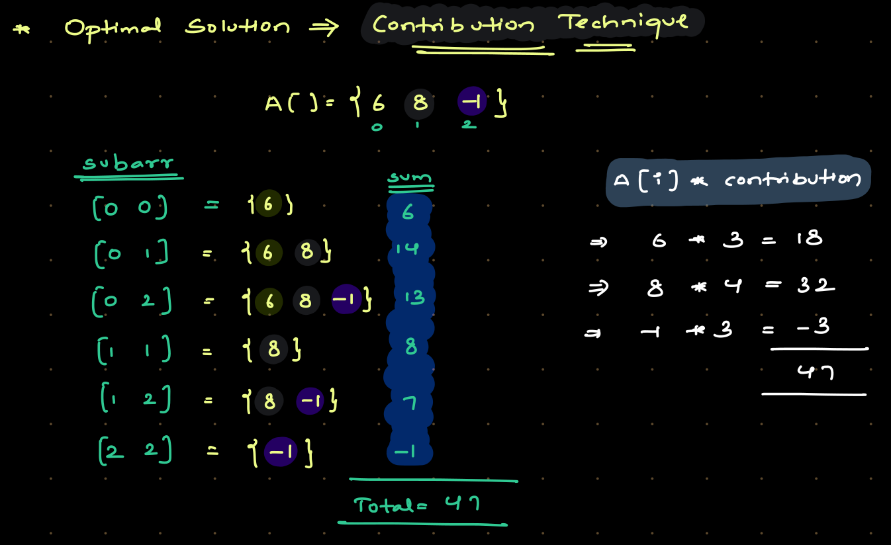
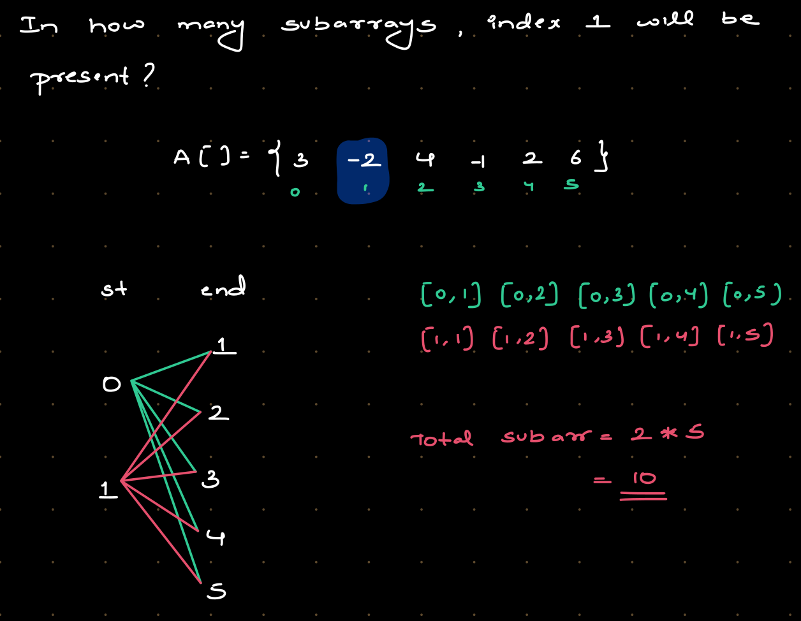
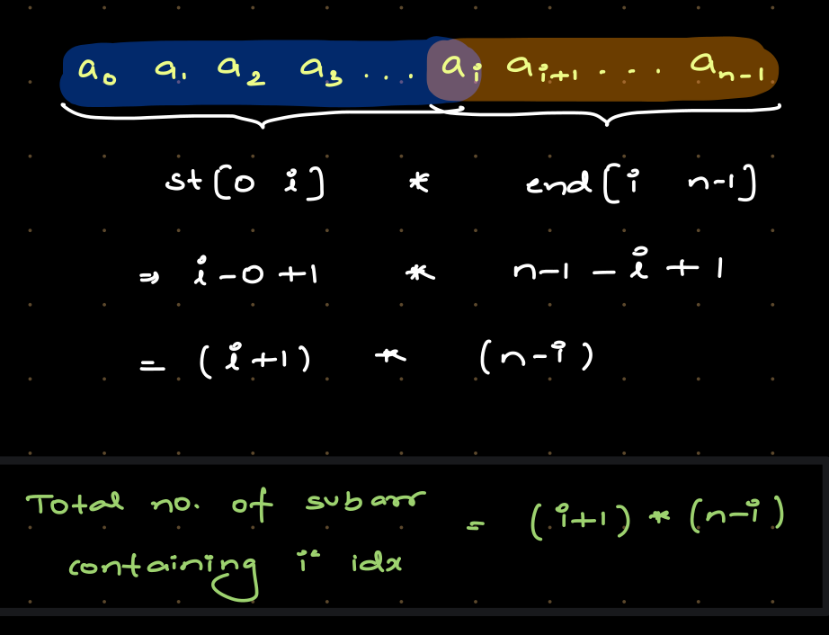
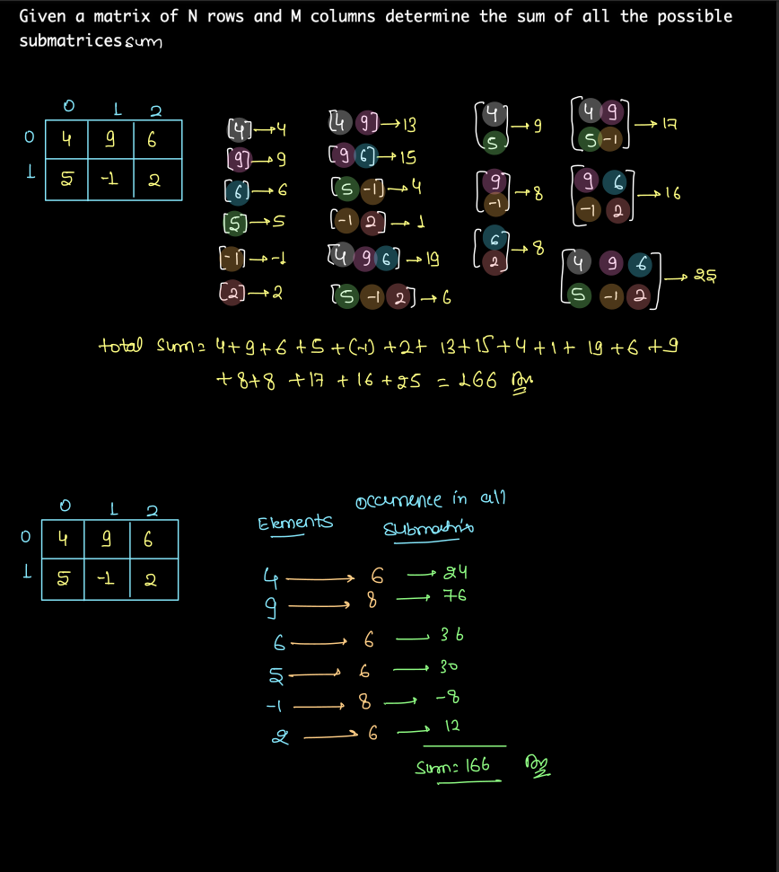
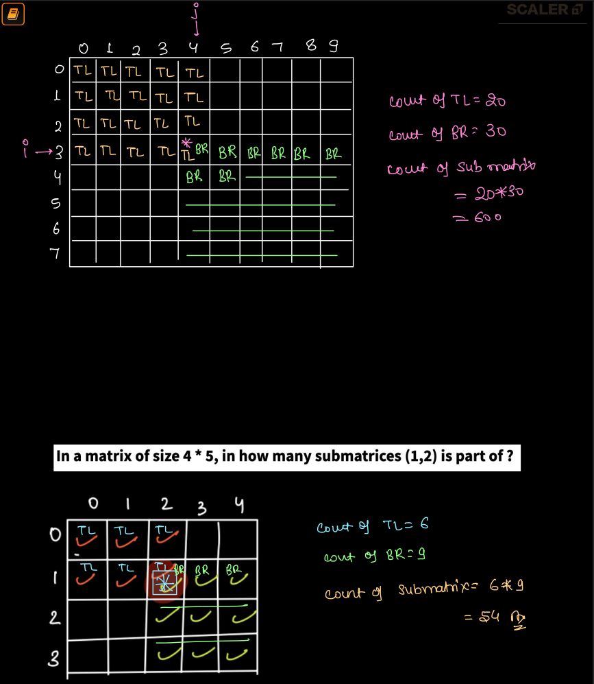
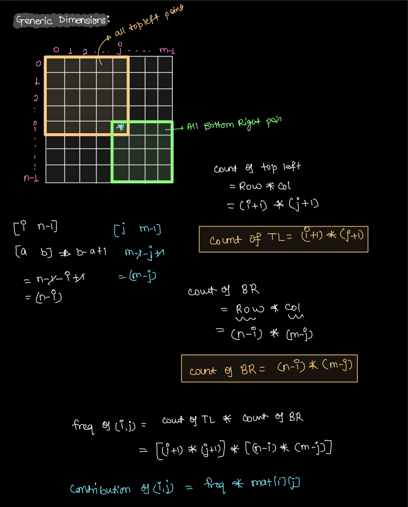

[<- DSA](00-dsa-quick.md)

# Revision Intermediate DSA

## Index
- [Notes](#notes)
  - [1. Time Complexity Notes](#1-time-complexity-notes)
  - [2. Numbers Notes](#2-numbers-notes)
  - [3. Logarithms Notes](#3-logarithms-notes)
  - [4. Subarrays Notes](#4-subarrays-notes)
  - [5. Bit Manipulation Basics Notes](#5-bit-manipulation-basics-notes)
- [Questions](#questions)
  - [1. Time Complexity](#1-time-complexity)
  - [2. Numbers](#2-numbers)
  - [3. 1D Arrays Basics](#3-1d-arrays-basics)
  - [4. Subarrays](#4-subarrays)
  - [5. Prefix Sum Basics](#5-prefix-sum-basics)
  - [6. Carry Forward](#6-carry-forward)
  - [7. Contribution Technique](#7-contribution-technique)
  - [8. 2D Arrays / Matrix Basics](#8-2d-arrays--matrix-basics)
  - [9. Sliding Window Fixed](#9-sliding-window-fixed)
  - [10. Sliding Window Dynamic](#10-sliding-window-dynamic)
  - [11. Strings Basics](#11-strings-basics)
  - [12. Strings | Two Pointers](#12-strings--two-pointers)
  - [13. Sorting Basics](#13-sorting-basics)
  - [14. Boyer-Moore Voting Algorithm](#14-boyer-moore-voting-algorithm)

# Notes

## 1. Time Complexity Notes
1.  O(1)          - Constant time complexity.
2.  O(log log n)  - Double logarithmic time complexity.
3.  O(log n)      - Logarithmic time complexity.
4.  O(sqrt(n))    - Square root time complexity.
5.  O(n)          - Linear time complexity.
6.  O(n log n)    - Linearithmic time complexity.
7.  O(n^2)        - Quadratic time complexity.
8.  O(n^3)        - Cubic time complexity.
9.  O(2^n)        - Exponential time complexity.
10. O(n!)         - Factorial time complexity.

### TLE Note
- Online editors have a time limit of 1 sec which is equivalent to **10^9 instructions**.
- To avoid TLE in online editors, optimize the code to reduce the number of **iterations** to **10^8 or less**.

## 2. Numbers Notes
1. Sum of first N natural numbers = N * (N + 1) / 2.
2. [a, b] inclusive range of numbers. [a, b] = b - a + 1.
3. (a, b) exclusive range of numbers. (a, b) = b - a - 1.
4. 0 is neither prime nor composite. It has infinite factors.
5. 1 is neither prime nor composite. It has only 1 factor which is 1 itself.

## 3. Logarithms Notes
1. 2³ = 8 means ∛8 = 2 means log₂(8) = 3.
2. 3⁴ = 81 means ∜81 = 3 means log₃(81) = 4.

## 4. Subarrays Notes
1. Total number of subarrays in an array of size N = N * (N + 1) / 2.
For example, [1, 2, 3] size of array = 3, total number of subarrays = 3 * (3 + 1) / 2 = 6. Subarrays are [1], [1, 2], [1, 2, 3], [2], [2, 3], [3].
2. Total number of subarrays of size K in an array of size N = N - K + 1.
For example, [1, 2, 3, 4, 5] size of array = 5, size of subarray = 3, total number of subarrays of size 3 = 5 - 3 + 1 = 3. Subarrays of size 3 are [1, 2, 3], [2, 3, 4], [3, 4, 5].
3. Length of subarray = end - start + 1. This is an inclusive range example [a, b] = b - a + 1.
For example, in [1, 2, 3, 4, 5], if we have a subarray starting at index 2 and ending at index 4, the length of the subarray is 4 - 2 + 1 = 3. The subarray would include the elements at indices 2, 3, and 4. So [3, 4, 5].

## 5. Bit Manipulation Basics Notes

### 1. Decimal Number System
- Base 10 number system
- Digits: 0, 1, 2, 3, 4, 5, 6, 7, 8, 9
- Positional value in terms of power: ......, 10^5,   10^4,  10^3, 10^2, 10^1, 10^0
- Positional values in terms of numbers: ..., 100000, 10000, 1000, 100,  10,   1

```
1234 (decimal)
(1 * 10³) + (2 * 10²) + (3 * 10¹) + (4 * 10⁰)
1000 + 200 + 30 + 4
1234
```

### 2. Binary Number System
- Base 2 number system
- Digits: 0, 1
- Positional value in terms of power: ......, 2^5, 2^4, 2^3, 2^2, 2^1, 2^0
- Positional values in terms of numbers: ..., 32,  16,  8,   4,   2,   1

```
1011 (binary)
(1 * 2³) + (0 * 2²) + (1 * 2¹) + (1 * 2⁰)
8 + 0 + 2 + 1
11 (decimal)
```

### 3. Truth Table
```
| a   | b   | a & b | a OR b | a ^ b | ~ a |
| --- | --- | ----- | ------ | ----- | --- |
| 0   | 0   | 0     | 0      | 0     | 1   |
| 0   | 1   | 0     | 1      | 1     | 1   |
| 1   | 0   | 0     | 1      | 1     | 0   |
| 1   | 1   | 1     | 1      | 0     | 0   |
```

### 4. Bitwise Operations Example
1. Bitwise AND: 5 & 3 = 1   // (0101 & 0011 = 0001)
2. Bitwise OR:  5 | 3 = 7   // (0101 | 0011 = 0111)
3. Bitwise XOR: 5 ^ 3 = 6   // (0101 ^ 0011 = 0110)
4. Bitwise NOT: ~5 = -6     // (~0101 = 1010, In 2's complement this is -6)
5. Left Shift:  5 << 1 = 10 // (0101 << 1 = 1010) // It is equal to multiplying the number by 2^1
6. Right Shift: 5 >> 1 = 2  // (0101 >> 1 = 0010) // It is equal to dividing the number by 2^1

```js
function bitwiseOperations(num1, num2) {
  console.log("Bitwise AND: " + (num1 & num2)); // 5 & 3 = 1   // (0101 & 0011 = 0001)
  console.log("Bitwise OR: " + (num1 | num2));  // 5 | 3 = 7   // (0101 | 0011 = 0111)
  console.log("Bitwise XOR: " + (num1 ^ num2)); // 5 ^ 3 = 6   // (0101 ^ 0011 = 0110)
  console.log("Bitwise NOT: " + (~num1));       // ~5 = -6     // (~0101 = 1010, In 2's complement this is -6)
  console.log("Left Shift: " + (num1 << 1));    // 5 << 1 = 10 // (0101 << 1 = 1010)
  console.log("Right Shift: " + (num1 >> 1));   // 5 >> 1 = 2  // (0101 >> 1 = 0010)
}
bitwiseOperations(5, 3)
```

```python
def bitwise_operations(num1, num2):
    print("Bitwise AND: " + str(num1 & num2))  # 5 & 3 = 1   # (0101 & 0011 = 0001)
    print("Bitwise OR: " + str(num1 | num2))   # 5 | 3 = 7   # (0101 | 0011 = 0111)
    print("Bitwise XOR: " + str(num1 ^ num2))  # 5 ^ 3 = 6   # (0101 ^ 0011 = 0110)
    print("Bitwise NOT: " + str(~num1))        # ~5 = -6     # (~0101 = 1010, In 2's complement this is -6)
    print("Left Shift: " + str(num1 << 1))     # 5 << 1 = 10 # (0101 << 1 = 1010)
    print("Right Shift: " + str(num1 >> 1))    # 5 >> 1 = 2  # (0101 >> 1 = 0010)


bitwise_operations(5, 3)
```

```java
public static void bitwiseOperations(int num1, int num2) {
    System.out.println("Bitwise AND: " + (num1 & num2)); // 5 & 3 = 1   // (0101 & 0011 = 0001)
    System.out.println("Bitwise OR: " + (num1 | num2));  // 5 | 3 = 7   // (0101 | 0011 = 0111)
    System.out.println("Bitwise XOR: " + (num1 ^ num2)); // 5 ^ 3 = 6   // (0101 ^ 0011 = 0110)
    System.out.println("Bitwise NOT: " + (~num1));       // ~5 = -6     // (~0101 = 1010, In 2's complement this is -6)
    System.out.println("Left Shift: " + (num1 << 1));    // 5 << 1 = 10 // (0101 << 1 = 1010)
    System.out.println("Right Shift: " + (num1 >> 1));   // 5 >> 1 = 2  // (0101 >> 1 = 0010)
}
bitwiseOperations(5, 3);
```

# Questions

## 1. Time Complexity

### 1. Constant Time Complexity
```js
function constant(n) {
  process.stdout.write(n + " ");
}

// For example, if n = 10
constant(10);

// Time complexity: O(1) as there is only one operation
```

```python
import sys


def constant(n):
    sys.stdout.write(str(n) + " ")


# For example, if n = 10
constant(10)

# Time complexity: O(1) as there is only one operation
```

```java
public static void constant(int n) {
    System.out.print(n + " ");
}
// constant(10);
// Time complexity: O(1) as there is only one operation
```

### 2. Double Logarithm complexity
```js
function loglog(n) {
  for (let i = 1; i <= n; i = i * i) {
    process.stdout.write(i + " ");
  }
}

// For example, if n = 128, then i will take values 1, 2, 4, 8, 16, 32, 64, 128
log2(128);

// Time complexity: O(log log n) as the loop runs log log n times.
```

```python
import sys


def loglog(n):
    i = 2
    while i <= n:
        sys.stdout.write(str(i) + " ")
        i = i * i


# For example, if n = 128
loglog(128)

# Time complexity: O(log log n) as the loop runs log log n times.
```

```java
public static void loglog(int n) {
    for (int i = 1; i <= n; i = i * i) {
        System.out.print(i + " ");
    }
}
// loglog(128);
// Time complexity: O(log log n) as the loop runs log log n times.
```

### 3. Logarithm complexity (Base 2)
```js
function log2(n) {
  // Its a Geometric progression
  for (let i = 1; i <= n; i = i * 2) {
    process.stdout.write(i + " ");
  }
}

// For example, if n = 128, then i will take values 1, 2, 4, 8, 16, 32, 64, 128
log2(128);

// Time complexity: O(log n) as the loop runs log n times. base 2
```

```python
import sys


def log2(n):
    # Its a Geometric progression
    i = 1
    while i <= n:
        sys.stdout.write(str(i) + " ")
        i = i * 2


# For example, if n = 128, then i will take values 1, 2, 4, 8, 16, 32, 64, 128
log2(128)

# Time complexity: O(log n) as the loop runs log n times. base 2
```

```java
public static void log2(int n) {
    // Its a Geometric progression
    for (int i = 1; i <= n; i = i * 2) {
        System.out.print(i + " ");
    }
}
// log2(128);
// Time complexity: O(log n) as the loop runs log n times. base 2
```

### 4. Square root complexity
```js
function sqrt(n) {
  // for (let i = 1; i <= Math.sqrt(n); i++) {
  // for (let i = 1; i <= n/i; i++) {
  for (let i = 1; i * i <= n; i++) {
    process.stdout.write(i * i + " ");
  }
}

// For example, if n = 128, then i will take values 1, 4, 9, 16, 25, 36, 49, 64, 81, 100, 121
sqrt(128);

// Time complexity: O(sqrt(n)) as the loop runs sqrt(n) times
// Its can also be written as O(n^(1/2))
```

```python
import sys


def sqrt(n):
    # for i in range(1, int(math.isqrt(n)) + 1):
    i = 1
    while i * i <= n:
        sys.stdout.write(str(i * i) + " ")
        i += 1


# For example, if n = 128, then i will take values 1, 4, 9, 16, 25, 36, 49, 64, 81, 100, 121
sqrt(128)

# Time complexity: O(sqrt(n)) as the loop runs sqrt(n) times
# It can also be written as O(n^(1/2))
```

```java
public static void sqrtComplexity(int n) {
    // for (int i = 1; i <= Math.sqrt(n); i++) {
    // for (int i = 1; i <= n / i; i++) {
    for (int i = 1; i * i <= n; i++) {
        System.out.print((i * i) + " ");
    }
}
// sqrtComplexity(128);
// Time complexity: O(sqrt(n)) as the loop runs sqrt(n) times
// It can also be written as O(n^(1/2))
```

### 5. Linear complexity
```js
function linear(n) {
  for (let i = 1; i <= n; i++) {
    process.stdout.write(i + " ");
  }
}

// For example, if n = 10, then i will take values 1, 2, 3, ..., 10
linear(10);

// Time complexity: O(n) as the loop runs n times
```

```python
import sys


def linear(n):
    for i in range(1, n + 1):
        sys.stdout.write(str(i) + " ")


# For example, if n = 10, then i will take values 1, 2, 3, ..., 10
linear(10)

# Time complexity: O(n) as the loop runs n times
```

```java
public static void linear(int n) {
    for (int i = 1; i <= n; i++) {
        System.out.print(i + " ");
    }
}
// linear(10);
// Time complexity: O(n) as the loop runs n times
```

### 6. Linearithmic complexity
```js
function linearithmic(n) {
  for (let i = 1; i <= n; i++) {
    for (let j = 1; j <= n; j = j * 2) {
      process.stdout.write(i + " ");
    }
  }
}

// For example, if n = 8, then i will take values 1, 2, 3, ..., 8 and j will take values 1, 2, 4, 8
linearithmic(8);

// Time complexity: O(n log n) as the outer loop runs n times and the inner loop runs log n times
```

```python
import sys


def linearithmic(n):
    for i in range(1, n + 1):
        j = 1
        while j <= n:
            sys.stdout.write(str(i) + " ")
            j = j * 2


# For example, if n = 8, then i will take values 1, 2, 3, ..., 8 and j will take values 1, 2, 4, 8
linearithmic(8)

# Time complexity: O(n log n) as the outer loop runs n times and the inner loop runs log n times
```

```java
public static void linearithmic(int n) {
    for (int i = 1; i <= n; i++) {
        for (int j = 1; j <= n; j = j * 2) {
            System.out.print(i + " ");
        }
    }
}
// linearithmic(8);
// Time complexity: O(n log n) as the outer loop runs n times and the inner loop runs log n times
```

### 7. Quadratic complexity
```js
function quadratic(n) {
  for (let i = 1; i <= n; i++) {
    for (let j = 1; j <= n; j++) {
      process.stdout.write(i + j + " ");
    }
  }
}

// For example, if n = 3, then i will take values 1, 2, 3 and j will take values 1, 2, 3
quadratic(3);

// Time complexity: O(n^2) as the outer loop runs n times and the inner loop runs n times
// This is equivalent to O(n * n)
```

```python
import sys


def quadratic(n):
    for i in range(1, n + 1):
        for j in range(1, n + 1):
            sys.stdout.write(str(i + j) + " ")


# For example, if n = 3, then i will take values 1, 2, 3 and j will take values 1, 2, 3
quadratic(3)

# Time complexity: O(n^2) as the outer loop runs n times and the inner loop runs n times
```

```java
public static void quadratic(int n) {
    for (int i = 1; i <= n; i++) {
        for (int j = 1; j <= n; j++) {
            System.out.print((i + j) + " ");
        }
    }
}
// quadratic(3);
// Time complexity: O(n^2) as the outer loop runs n times and the inner loop runs n times
```

### 8. Cubic complexity
```js
function cubic(n) {
  for (let i = 1; i <= n; i++) {
    for (let j = 1; j <= n; j++) {
      for (let k = 1; k <= n; k++) {
        process.stdout.write(i + j + k + " ");
      }
    }
  }
}

// For example, if n = 3, then i will take values 1, 2, 3 and j will take values 1, 2, 3 and k will take values 1, 2, 3
cubic(3);

// Time complexity: O(n^3) as the outer loop runs n times and the inner loop runs n times and the innermost loop runs n times
// This is equivalent to O(n * n * n)
```

```python
import sys


def cubic(n):
    for i in range(1, n + 1):
        for j in range(1, n + 1):
            for k in range(1, n + 1):
                sys.stdout.write(str(i + j + k) + " ")


# For example, if n = 3, then i will take values 1, 2, 3
cubic(3)

# Time complexity: O(n^3) as the outer loop runs n times and the inner loops run n times
```

```java
public static void cubic(int n) {
    for (int i = 1; i <= n; i++) {
        for (int j = 1; j <= n; j++) {
            for (int k = 1; k <= n; k++) {
                System.out.print((i + j + k) + " ");
            }
        }
    }
}
// cubic(3);
// Time complexity: O(n^3)
```

### 9. Exponential complexity
```js
function exponential2(n) {
    for (let i = 0; i < 2 ** n; i++) {
        process.stdout.write(i + " ");
    }
}
// For example, if n = 3, then i will take values 0, 1, 2, ..., 7
exponential2(3);
// Time complexity: O(2^n) as the loop runs 2^n times

function exponential3(n) {
    for (let i = 0; i < 3 ** n; i++) {
        process.stdout.write(i + " "); // Added a space for readability
    }
}
// For example, if n = 3, then i will take values 0, 1, 2, ..., 26
exponential3(3);
// Time complexity: O(3^n) as the loop runs 3^n times
```

```python
import sys


def exponential2(n):
    for i in range(2 ** n):
        sys.stdout.write(str(i) + " ")


# For example, if n = 3, then i will take values 0, 1, 2, ..., 7
exponential2(3)
# Time complexity: O(2^n) as the loop runs 2^n times
```

```java
public static void exponential2(int n) {
    int limit = (int) Math.pow(2, n);
    for (int i = 0; i < limit; i++) {
        System.out.print(i + " ");
    }
}
// exponential2(3);
// Time complexity: O(2^n) as the loop runs 2^n times

public static void exponential3(int n) {
    int limit = (int) Math.pow(3, n);
    for (int i = 0; i < limit; i++) {
        System.out.print(i + " ");
    }
}
// exponential3(3);
// Time complexity: O(3^n) as the loop runs 3^n times
```

### 10. Factorial complexity
```js
/**
 * ALGORITHM EXPLANATION:
 * This function demonstrates a recursive branching structure that results in
 * factorial time complexity.
 * * 1. The function takes an integer 'n'.
 * 2. It uses a loop to spawn 'n' recursive calls, each reducing 'n' by 1.
 * 3. This creates a tree structure where the number of branches at each level
 * corresponds to the current value of 'n'.
 * 4. The process continues until 'n' reaches 0 (the base case), at which
 * point it logs "Leaf reached!" and returns.
 * 5. The total number of leaf nodes triggered equals n! (n factorial).
 */

function factorialComplexityRecursive(n) {
    // Base Case: when n reaches 0, we stop
    if (n === 0) {
        // Log a message when the recursion hits the bottom level
        console.log("Leaf reached!");
        // Return to the previous caller to continue the loop or finish
        return;
    }

    // The loop runs 'n' times, creating 'n' branches of recursion
    for (let i = 0; i < n; i++) {
        // Each time the loop runs, it calls itself with (n - 1)
        // This causes the branching factor to decrease by 1 at each depth
        factorialComplexityRecursive(n - 1);
    }
}

// Execute the function with an input of 3
factorialComplexityRecursive(3);

// Output for n = 3:
// Leaf reached!
// Leaf reached!
// Leaf reached!
// Leaf reached!
// Leaf reached!
// Leaf reached!

/**
 * COMPLEXITY ANALYSIS:
 * * Time Complexity: O(n!)
 * The total number of calls follows the pattern of n * (n-1) * (n-2)...
 * For n=3, the loop runs 3 times, each calling n=2. Those call n=1,
 * which finally call n=0. This results in exactly 3 * 2 * 1 = 6 leaf executions.
 *
 * * Space Complexity: O(n)
 * This is determined by the maximum depth of the recursive call stack.
 * Since we decrement n by 1 in each call, the stack will grow to a
 * maximum height of 'n' before it starts returning.
 */
```

```python
"""
ALGORITHM EXPLANATION:
This function demonstrates a recursive branching structure that results in
factorial time complexity.

1. The function takes an integer 'n'.
2. It uses a loop to spawn 'n' recursive calls, each reducing 'n' by 1: factorial(n - 1).
3. The base case stops the recursion when 'n <= 1'.
4. This produces a branching pattern where the number of operations is proportional to n!.
"""


def factorial_complexity(n):
    if n <= 1:
        return

    # Loop runs 'n' times, each iteration making a recursive call
    for i in range(n):
        factorial_complexity(n - 1)


factorial_complexity(3)

# Time complexity: O(n!) - Factorial complexity
# Space complexity: O(n) - Call stack depth is at most n
```

```java
/**
 * ALGORITHM EXPLANATION:
 * Demonstrates a recursive branching structure with factorial time complexity.
 * Time Complexity: O(n!)
 * Space Complexity: O(n) - max depth of call stack
 */
public static void factorialComplexityRecursive(int n) {
    // Base Case: when n reaches 0, we stop
    if (n == 0) {
        System.out.println("Leaf reached!");
        return;
    }
    // The loop runs 'n' times, creating 'n' branches of recursion
    for (int i = 0; i < n; i++) {
        factorialComplexityRecursive(n - 1);
    }
}
// factorialComplexityRecursive(3);
// Output: Leaf reached! (printed 6 times for n=3)
```

## 2. Numbers

### 1. Count factors of a number. **O(sqrt(N)), O(1)**
```js
function countFactors(N) {
  // Initialize the count of factors to 0. This variable will store our final result.
  let count = 0;

  // We iterate from i = 1 up to (and including) the square root of N.
  for (let i = 1; i * i <= N; i++) {
  // for (let i = 1; i <= Math.sqrt(N); i++) {
  // for (let i = 1; i <= N / i; i++) {
    // Check if 'i' is a factor of N.
    // The modulo operator (%) returns the remainder of a division.
    // If the remainder is 0, 'i' divides N perfectly.
    if (N % i === 0) {
      // If 'i' is a factor, we have found a pair of factors: 'i' and 'N / i'.

      // Now, we need to handle the special case of perfect squares.
      // If i * i = N, it means 'i' is the square root of N.
      // In this case, 'i' and 'N / i' are the same number.
      // For example, if N = 36 and i = 6, the pair is (6, 6). We should only count this factor once.
      if (i === N / i) {
        count++;
      } else {
        // If 'i' is not the square root of N, then 'i' and 'N / i' are two distinct factors.
        // For example, if N = 10 and i = 2, the pair of factors is (2, 5).
        // Since we found two different factors, we increment the count by 2.
        count += 2;
      }
    }
  }
  // Return the total count of factors found.
  return count;
}

// Example calls to demonstrate the function's output.
console.log(`Factors of 5: ${countFactors(5)}`);   // Expected: 2 (Factors are 1, 5)
console.log(`Factors of 16: ${countFactors(16)}`); // Expected: 5 (Factors are 1, 2, 4, 8, 16), 4 is counted once because 4 * 4 = 16
console.log(`Factors of 1: ${countFactors(1)}`);   // Expected: 1 (Factor is 1)
console.log(`Factors of 36: ${countFactors(36)}`); // Expected: 9 (Factors are 1, 2, 3, 4, 6, 9, 12, 18, 36)

// Time Complexity: O(sqrt(N))
// The loop runs approximately sqrt(N) times. This makes the algorithm very efficient,
// especially for large input values of N, compared to a naive O(N) solution.

// Space Complexity: O(1)
// The algorithm uses a fixed amount of extra space (for variables 'count' and 'i'),
// regardless of the size of the input N. This is known as constant space complexity.
```

```python
def count_factors(N):
    # Initialize the count of factors to 0. This variable will store our final result.
    count = 0

    # We iterate from i = 1 up to (and including) the square root of N.
    i = 1
    while i * i <= N:
        # Check if 'i' is a factor of N.
        if N % i == 0:
            # If the divisors are equal (e.g., for N=36, i=6 and N/i=6),
            # it means N is a perfect square. We count this factor only once.
            if i == N // i:
                count += 1
            else:
                # If the divisors are distinct (e.g., for N=36, i=4 and N/i=9),
                # we count both 'i' and its counterpart 'N/i'. Thus, we add 2.
                count += 2
        i += 1

    # Return the total count of factors found.
    return count


print(count_factors(24))  # 8
print(count_factors(36))  # 9
print(count_factors(1))   # 1
print(count_factors(10))  # 4
print(count_factors(100)) # 9

# Time Complexity: O(sqrt(N))
# Space Complexity: O(1)
```

```java
public static int countFactors(int N) {
    int count = 0;
    for (int i = 1; (long) i * i <= N; i++) {
        if (N % i == 0) {
            if (i == N / i) {
                count++; // perfect square, count once
            } else {
                count += 2; // two distinct factors
            }
        }
    }
    return count;
}
// System.out.println("Factors of 5: " + countFactors(5));   // 2
// System.out.println("Factors of 16: " + countFactors(16)); // 5
// System.out.println("Factors of 1: " + countFactors(1));   // 1
// System.out.println("Factors of 36: " + countFactors(36)); // 9
// Time Complexity: O(sqrt(N))
// Space Complexity: O(1)
```

### 2. Prime Number Check. **O(sqrt(N)), O(1)**
```
Prime number is a number that can only be divided evenly (without leaving a remainder) by 1 and the number itself.
Thus it has exactly 2 factors. For example, 2, 3, 5, 7, 11, 13, 17, 19, 23, 29 are prime numbers.
```

```js
function isPrime(N) {
  if (countFactors(N) == 2) {
    return true;
  }
  return false;
}

console.log(isPrime(5)); // true
console.log(isPrime(10)); // false
console.log(isPrime(1)); // false // 1 is not prime as per the modern theory also it has only 1 factor as per logic
console.log(isPrime(2)); // true

// Time Complexity: O(sqrt(N))
// - Delegates to countFactors which iterates up to sqrt(N).

// Space Complexity: O(1)
// - Only uses a constant number of variables.
```

```python
def is_prime(N):
    if count_factors(N) == 2:
        return True
    return False


print(is_prime(5))   # True
print(is_prime(10))  # False
print(is_prime(1))   # False (1 is not prime as it has only 1 factor)

# Time Complexity: O(sqrt(N))
# Space Complexity: O(1)
```

```java
public static boolean isPrime(int N) {
    return countFactors(N) == 2;
}
// System.out.println(isPrime(5));  // true
// System.out.println(isPrime(10)); // false
// System.out.println(isPrime(1));  // false
// System.out.println(isPrime(2));  // true
// Time Complexity: O(sqrt(N))
// Space Complexity: O(1)
```

### 3. Count Prime Numbers below given number. **O(N * sqrt(N)), O(1)**
```js
function countFactors(N) {
  let count = 0;
  for (let i = 1; i * i <= N; i++) {
    if (N % i === 0) {
      if (i === N / i) { // If i and N/i are same, then count only 1
        count++;
      } else { // Otherwise count both
        count += 2;
      }
    }
  }

  return count;
}

function isPrime(N) {
  if (countFactors(N) == 2) {
    return 1;
  }

  return 0;
}

function countPrimes(A) {
  let count = 0;
  // Start from 2, because 0 and 1 are not prime numbers. We will check for all numbers from 2 to A (inclusive) if they are prime or not.
  for (let i = 2; i <= A; i++) {
    if (isPrime(i) === 1) {
      count++;
    }
  }

  return count;
}

console.log(countPrimes(10)); // 4 // Prime numbers are 2, 3, 5, 7
console.log(countPrimes(20)); // 8 // Prime numbers are 2, 3, 5, 7, 11, 13, 17, 19

// Time Complexity: O(N * sqrt(N))
// - The outer loop runs from 2 to A (N times).
// - For each number, isPrime calls countFactors which runs in O(sqrt(N)).
// - Total: N iterations × O(sqrt(N)) per iteration = O(N * sqrt(N)).

// Space Complexity: O(1)
// - Only uses a constant number of variables across all function calls.
```

```python
def count_factors(N):
    count = 0
    i = 1
    while i * i <= N:
        if N % i == 0:
            if i == N // i:
                count += 1
            else:
                count += 2
        i += 1
    return count


def is_prime(N):
    return count_factors(N) == 2


def count_primes(N):
    count = 0
    for i in range(1, N + 1):
        if is_prime(i):
            count += 1
    return count


print(count_primes(5))   # 3 (Primes are 2, 3, 5)
print(count_primes(10))  # 4 (Primes are 2, 3, 5, 7)
print(count_primes(19))  # 8 (Primes are 2, 3, 5, 7, 11, 13, 17, 19)

# Time Complexity: O(N * sqrt(N))
# Space Complexity: O(1)
```

```java
public static int countFactors(int N) {
    int count = 0;
    for (int i = 1; (long) i * i <= N; i++) {
        if (N % i == 0) {
            if (i == N / i) { count++; } else { count += 2; }
        }
    }
    return count;
}

public static int isPrime(int N) {
    return countFactors(N) == 2 ? 1 : 0;
}

public static int countPrimes(int A) {
    int count = 0;
    for (int i = 2; i <= A; i++) {
        if (isPrime(i) == 1) {
            count++;
        }
    }
    return count;
}
// System.out.println(countPrimes(10)); // 4
// System.out.println(countPrimes(20)); // 8
// Time Complexity: O(N * sqrt(N))
// Space Complexity: O(1)
```

## 3. 1D Arrays Basics

### 1. Reversing an array involves swapping elements from the start and end. **O(N), O(1)**
```js
// Reverse the array elements from start to end
function reverse(Arr, start, end){
  let i = start;
  let j = end;
  while(i < j){
    let temp = Arr[i];
    Arr[i] = Arr[j];
    Arr[j] = temp;

    // Alternatively, you can use destructuring assignment
    // [Arr[i], Arr[j]] = [Arr[j], Arr[i]];

    i++;
    j--;
  }

  return Arr;
}

console.log(reverse([1, 2, 3, 4, 5], 0, 4)); // [ 5, 4, 3, 2, 1 ]
console.log(reverse([1, 2, 3, 4, 5], 1, 3)); // [ 1, 4, 3, 2, 5 ]

// Time Complexity: O(N)
// - Two pointers move inward, each element is visited at most once.
// - Total swaps = (end - start + 1) / 2 which is O(N).

// Space Complexity: O(1)
// - Swap is done in-place using a single temp variable.
```

```python
# Reverse the array elements from start to end
def reverse(Arr, start, end):
    i = start
    j = end
    while i < j:
        Arr[i], Arr[j] = Arr[j], Arr[i]
        i += 1
        j -= 1
    return Arr


# Reverse whole array
Arr = [1, 2, 3, 4, 5]
print("Reverse whole array: ", reverse(Arr, 0, len(Arr) - 1))  # [5, 4, 3, 2, 1]

# Reverse array from start index to end index
Arr2 = [1, 2, 3, 4, 5]
print("Reverse array from index 1 to 3: ", reverse(Arr2, 1, 3))  # [1, 4, 3, 2, 5]

# Time Complexity: O(N)
# Space Complexity: O(1)
```

```java
public static void reverse(int[] arr, int start, int end) {
    int i = start, j = end;
    while (i < j) {
        int temp = arr[i];
        arr[i] = arr[j];
        arr[j] = temp;
        i++;
        j--;
    }
}
// reverse(new int[]{1,2,3,4,5}, 0, 4); // [5, 4, 3, 2, 1]
// reverse(new int[]{1,2,3,4,5}, 1, 3); // [1, 4, 3, 2, 5]
// Time Complexity: O(N)
// Space Complexity: O(1)
```

### 2. Rotating an array involves reversing segments of the array. **O(N), O(1)**
```js
function rotateArray(A, B) {
    // Reverse the array elements from start to end
    function reverse(Arr, start, end) {
        let i = start;
        let j = end;
        while (i < j) {
            let temp = Arr[i];
            Arr[i] = Arr[j];
            Arr[j] = temp;
            i++;
            j--;
        }
    }

    // Calculate the effective rotation offset as B modulo the array length because rotating by the array's length results in the same array. Also, if B is larger than the array length, we only need to rotate by the remainder. This ensures we don't perform unnecessary rotations.
    let offset = B % A.length;

    reverse(A, 0, A.length - 1); // reverse all elements
    reverse(A, 0, offset - 1); // reverse first half. why we are using (offset - 1), because we are using 0 based index.
    reverse(A, offset, A.length - 1); // reverse second half

    return A;
}

console.log(rotateArray([1, 2, 3, 4, 5], 2)); // [ 4, 5, 1, 2, 3 ]
console.log(rotateArray([1, 2, 3, 4, 5], 8)); // [ 3, 4, 5, 1, 2 ]
console.log(rotateArray([1, 2, 3, 4, 5], 11)); // [ 5, 1, 2, 3, 4 ]

// Time Complexity: O(N)
// - Three reverse calls, each traversing a portion of the array.
// - Total elements reversed = N + offset + (N - offset) = 2N, which is O(N).

// Space Complexity: O(1)
// - All reversals are done in-place using swaps.
```

```python
def rotate_array(A, B):
    # Reverse the array elements from start to end
    def reverse(Arr, start, end):
        i = start
        j = end
        while i < j:
            Arr[i], Arr[j] = Arr[j], Arr[i]
            i += 1
            j -= 1
        return Arr

    n = len(A)
    # If B is greater than n, then we can take B % n
    B = B % n

    # Reverse the whole array
    reverse(A, 0, n - 1)

    # Reverse the first B elements
    reverse(A, 0, B - 1)

    # Reverse the remaining elements
    reverse(A, B, n - 1)

    return A


print(rotate_array([1, 2, 3, 4, 5], 2))  # [4, 5, 1, 2, 3]
print(rotate_array([1, 2, 3, 4, 5], 3))  # [3, 4, 5, 1, 2]

# Time Complexity: O(N)
# Space Complexity: O(1)
```

```java
public static int[] rotateArray(int[] A, int B) {
    int n = A.length;
    int offset = B % n;
    reverse(A, 0, n - 1);      // reverse all elements
    reverse(A, 0, offset - 1); // reverse first part
    reverse(A, offset, n - 1); // reverse second part
    return A;
}
// System.out.println(Arrays.toString(rotateArray(new int[]{1,2,3,4,5}, 2)));  // [4, 5, 1, 2, 3]
// System.out.println(Arrays.toString(rotateArray(new int[]{1,2,3,4,5}, 8)));  // [3, 4, 5, 1, 2]
// System.out.println(Arrays.toString(rotateArray(new int[]{1,2,3,4,5}, 11))); // [5, 1, 2, 3, 4]
// Time Complexity: O(N)
// Space Complexity: O(1)
```

## 4. Subarrays

### 1. Print all possible Subarrays of the array. No optimised solution available | Three Nested For Loops **O(N^3), O(N^3)**
```js
function printAllSubarrays(A) {
    const result = [];
    for (let i = 0; i < A.length; i++) {
        for (let j = i; j < A.length; j++) {
            let subarray = [];
            for (let k = i; k <= j; k++) {
                subarray.push(A[k]);
            }
            result.push(subarray);
            // console.log(subarray);
        }
    }
    return result;
}

console.log(printAllSubarrays([1, 2, 3])); // [ [ 1 ], [ 1, 2 ], [ 1, 2, 3 ], [ 2 ], [ 2, 3 ], [ 3 ] ]
console.log(printAllSubarrays([1, 2])); // [ [ 1 ], [ 1, 2 ], [ 2 ] ]

// Time Complexity: O(N^3)
// - Three nested loops: i picks start, j picks end, k iterates from start to end.
// - Total work = sum of all subarray lengths = O(N^3).

// Space Complexity: O(N^3)
// - Storing all N*(N+1)/2 subarrays, with total elements across all subarrays = O(N^3).
```

```python
def print_all_subarrays(A):
    result = []
    n = len(A)
    for i in range(n):
        for j in range(i, n):
            subarray = []
            for k in range(i, j + 1):
                subarray.append(A[k])
            result.append(subarray)
    return result


print(print_all_subarrays([1, 2, 3]))
# Output: [[1], [1, 2], [1, 2, 3], [2], [2, 3], [3]]

# Time Complexity: O(n^3) - Three nested loops
# Space Complexity: O(n^3) - To store all subarrays in result
```

```java
public static List<List<Integer>> printAllSubarrays(int[] A) {
    List<List<Integer>> result = new ArrayList<>();
    for (int i = 0; i < A.length; i++) {
        for (int j = i; j < A.length; j++) {
            List<Integer> subarray = new ArrayList<>();
            for (int k = i; k <= j; k++) {
                subarray.add(A[k]);
            }
            result.add(subarray);
        }
    }
    return result;
}
// System.out.println(printAllSubarrays(new int[]{1, 2, 3}));
// Output: [[1], [1, 2], [1, 2, 3], [2], [2, 3], [3]]
// Time Complexity: O(N^3), Space Complexity: O(N^3)
```

### 2. Count all possible Subarrays of the array | Two Nested For Loops **O(N^2), O(1)** | Using formula **O(1), O(1)**
```js
function countAllSubarrays(A) {
    let count = 0;
    for (let i = 0; i < A.length; i++) {
        for (let j = i; j < A.length; j++) {
            count++;
        }
    }
    return count;
}
console.log(countAllSubarrays([1, 2, 3])); // 6

// Time Complexity: O(N^2)
// - Two nested loops, outer runs N times, inner runs (N - i) times.
// - Total iterations = N*(N+1)/2 which is O(N^2).

// Space Complexity: O(1)
// - Only a single counter variable is used.


function countAllSubarrays(A) {
  const count = (A.length * (A.length + 1)) / 2; // formula for first n natural numbers: N(N+1)/2.
  return count;
}
// Time Complexity: O(1)
// Space Complexity: O(1)
```

```python
def count_all_subarrays(A):
    count = 0
    n = len(A)
    for i in range(n):
        for j in range(i, n):
            count += 1
    return count


print(count_all_subarrays([1, 2, 3]))  # 6
# Time Complexity: O(n^2) - Two nested loops
# Space Complexity: O(1) - Constant extra space


def count_all_subarrays_formula(A):
    n = len(A)
    return n * (n + 1) // 2


print(count_all_subarrays_formula([1, 2, 3]))  # 6
# Time Complexity: O(1)
# Space Complexity: O(1)
```

```java
// O(N^2) approach: two nested loops
public static int countAllSubarrays(int[] A) {
    int count = 0;
    for (int i = 0; i < A.length; i++) {
        for (int j = i; j < A.length; j++) {
            count++;
        }
    }
    return count;
}
// System.out.println(countAllSubarrays(new int[]{1, 2, 3})); // 6
// Time Complexity: O(N^2), Space Complexity: O(1)

// O(1) approach: using formula N*(N+1)/2
public static long countAllSubarraysFormula(int[] A) {
    long n = A.length;
    return n * (n + 1) / 2;
}
// Time Complexity: O(1), Space Complexity: O(1)
```

## 5. Prefix Sum Basics

### 1. Create a prefix sum array. **O(N), O(N)**
```js
function createPrefixSumArray(A) {
    const psa = [];
    psa[0] = A[0];
    for (let i = 1; i < A.length; i++) {
        psa[i] = psa[i - 1] + A[i];
    }
    return psa;
}

console.log(createPrefixSumArray([2, 3, 1, 6, 4, 5])); // [2, 5, 6, 12, 16, 21]

// Time Complexity: O(n)
// Space Complexity: O(n)
```

```python
def create_prefix_sum_array(A):
    psa = [0] * len(A)
    psa[0] = A[0]
    for i in range(1, len(A)):
        psa[i] = psa[i - 1] + A[i]
    return psa


print(create_prefix_sum_array([1, 2, 3, 4, 5]))  # [1, 3, 6, 10, 15]

# Time Complexity: O(N)
# Space Complexity: O(N)
```

```java
public static int[] createPrefixSumArray(int[] A) {
    int[] psa = new int[A.length];
    psa[0] = A[0];
    for (int i = 1; i < A.length; i++) {
        psa[i] = psa[i - 1] + A[i];
    }
    return psa;
}
// System.out.println(Arrays.toString(createPrefixSumArray(new int[]{2,3,1,6,4,5})));
// Output: [2, 5, 6, 12, 16, 21]
// Time Complexity: O(n), Space Complexity: O(n)
```

### 2. Calculate the sum of elements in an array in a given range. / Range Sum Query **O(N), O(N)**
```js
function prefixSum(A, Q) {
    // prefix sum array of all elements
    const psa = [];
    psa[0] = A[0];
    for (let i = 1; i < A.length; i++) {
        psa[i] = psa[i - 1] + A[i];
    }

    const result = [];
    for (let i = 0; i < Q.length; i++) {
        const left = Q[i][0];
        const right = Q[i][1];

        if (left == 0) {
            result[i] = psa[right];
        } else {
            result[i] = psa[right] - psa[left - 1];
        }
    }

    return { psa, result };
}

console.log(prefixSum([-3, 6, 2, 4, 5, 2, 8, -9, 3, 1], [[4, 8], [3, 7], [1, 3], [0, 4], [7, 7]]));
// Output: { psa: [ -3, 3, 5, 9, 14, 16, 24, 15, 18, 19 ], result: [ 9, 10, 12, 14, -9 ] }

// Time Complexity: O(n + q)
// Space Complexity: O(n)
```

```python
def prefix_sum(A, Q):
    # prefix sum array of all elements
    psa = [0] * len(A)
    psa[0] = A[0]
    for i in range(1, len(A)):
        psa[i] = psa[i - 1] + A[i]

    ans = []
    for s, e in Q:
        if s == 0:
            ans.append(psa[e])
        else:
            ans.append(psa[e] - psa[s - 1])
    return ans


print(prefix_sum([-3, 6, 2, 4, 5, 2, 8, -9, 3, 1], [[4, 8], [3, 7], [1, 3], [0, 4], [7, 7]]))
# [8, 4, 12, 14, -9]

# Time Complexity: O(N + Q)
# Space Complexity: O(N)
```

```java
public static int[] prefixSum(int[] A, int[][] Q) {
    int[] psa = new int[A.length];
    psa[0] = A[0];
    for (int i = 1; i < A.length; i++) {
        psa[i] = psa[i - 1] + A[i];
    }
    int[] result = new int[Q.length];
    for (int i = 0; i < Q.length; i++) {
        int left = Q[i][0];
        int right = Q[i][1];
        result[i] = (left == 0) ? psa[right] : psa[right] - psa[left - 1];
    }
    return result;
}
// int[] res = prefixSum(new int[]{-3,6,2,4,5,2,8,-9,3,1},
//     new int[][]{{4,8},{3,7},{1,3},{0,4},{7,7}});
// System.out.println(Arrays.toString(res)); // [9, 10, 12, 14, -9]
// Time Complexity: O(n + q), Space Complexity: O(n)
```

### 3. In place prefix sum. **O(N), O(1)**
```js
function inPlacePrefixSum(A) {
    for (let i = 1; i < A.length; i++) {
        A[i] = A[i] + A[i - 1];
    }
    return A;
}

console.log("inPlacePrefixSum", inPlacePrefixSum([1, 2, 3, 4, 5])); // [1, 3, 6, 10, 15]
console.log("inPlacePrefixSum", inPlacePrefixSum([1, 2, 3, 4, 5, 6])); // [1, 3, 6, 10, 15, 21]

// Time Complexity: O(N)
// Space Complexity: O(1)
```

```python
def in_place_prefix_sum(A):
    for i in range(1, len(A)):
        A[i] = A[i] + A[i - 1]
    return A


print("inPlacePrefixSum", in_place_prefix_sum([1, 2, 3, 4, 5]))  # [1, 3, 6, 10, 15]

# Time Complexity: O(N)
# Space Complexity: O(1)
```

```java
public static void inPlacePrefixSum(int[] A) {
    for (int i = 1; i < A.length; i++) {
        A[i] = A[i] + A[i - 1];
    }
}
// int[] a1 = {1, 2, 3, 4, 5};
// inPlacePrefixSum(a1);
// System.out.println(Arrays.toString(a1)); // [1, 3, 6, 10, 15]
// Time Complexity: O(N), Space Complexity: O(1)
```

## 6. Carry Forward

### 1. Print Subarrays sums starting from given index | Carry Forward **O(N), O(1)**
```js
function printSubarraysSumsFromIndex(A, startIndex) {
    let subarraySum = 0;
    let totalSum = 0;
    for (let j = startIndex; j < A.length; j++) {
        // we are carrying forward the subarraySum of subarray starting from startIndex to end of array
        subarraySum += A[j];
        process.stdout.write(subarraySum + ", "); // Print subarraySum of current subarray
        totalSum += subarraySum; // Keep track of total sum of all subarrays
    }
    process.stdout.write(`(Total: ${totalSum}) `); // Print total sum so far
    console.log(); // New line after printing the subarray
}

printSubarraysSumsFromIndex([1, 2, 3, 4], 1); // [2] [2, 3] [2, 3, 4] // 2, 5, 9, (Total: 16)
printSubarraysSumsFromIndex([1, 2, 3, 4], 2); // [3] [3, 4] // 3, 7, (Total: 10)
printSubarraysSumsFromIndex([1, 2, 3, 4], 0); // [1] [1, 2] [1, 2, 3] [1, 2, 3, 4] // 1, 3, 6, 10, (Total: 20)

// Time Complexity: O(N)
// - Single loop from startIndex to end of array, visiting each element once.

// Space Complexity: O(1)
// - Only uses two variables (subarraySum, totalSum) regardless of input size.
```

```python
def print_subarrays_sums_from_index(A, start_index):
    subarray_sum = 0
    total_sum = 0
    for j in range(start_index, len(A)):
        # we are carrying forward the subarraySum to the next iteration
        subarray_sum += A[j]
        print(f"Sum of subarray from {start_index} to {j} is {subarray_sum}")
        total_sum += subarray_sum
    return total_sum


print("Total sum: " + str(print_subarrays_sums_from_index([1, 2, 3], 0)))
# Sum of subarray from 0 to 0 is 1
# Sum of subarray from 0 to 1 is 3
# Sum of subarray from 0 to 2 is 6
# Total sum: 10

# Time Complexity: O(N)
# Space Complexity: O(1)
```

```java
public static void printSubarraysSumsFromIndex(int[] A, int startIndex) {
    int subarraySum = 0;
    int totalSum = 0;
    for (int j = startIndex; j < A.length; j++) {
        subarraySum += A[j];
        System.out.print(subarraySum + ", ");
        totalSum += subarraySum;
    }
    System.out.println("(Total: " + totalSum + ")");
}
// printSubarraysSumsFromIndex(new int[]{1,2,3,4}, 1); // 2, 5, 9, (Total: 16)
// Time Complexity: O(N), Space Complexity: O(1)
```

### 2. Sum of all Subarrays sums | Carry Forward **O(N^2), O(1)**
```js
function sumOfAllSubarrays(A) {
  let totalSum = 0;
  for (let i = 0; i < A.length; i++) {
    let subarraySum = 0;
    // Calculate sum of subarray starting from i to end of array
    for (let j = i; j < A.length; j++) {
      subarraySum += A[j];
      totalSum += subarraySum;
    }
  }
  return totalSum;
}

console.log(sumOfAllSubarrays([1, 2, 3])); // [1] [1, 2] [1, 2, 3], [2] [2, 3], [3] // 1, 3, 6, 2, 5, 3 (Total: 20)
console.log(sumOfAllSubarrays([1, 2, 3, 4])); // [1] [1, 2] [1, 2, 3] [1, 2, 3, 4], [2] [2, 3] [2, 3, 4], [3] [3, 4], [4] // 1, 3, 6, 10, 2, 5, 9, 3, 7, 4 (Total: 50)

// Time Complexity: O(N^2)
// - Outer loop runs N times, inner loop runs (N - i) times for each i.
// - Carry forward avoids the third loop by reusing the running sum.

// Space Complexity: O(1)
// - Only uses a few variables (totalSum, subarraySum).
```

```python
def sum_of_all_subarrays(A):
    total_sum = 0
    n = len(A)
    for i in range(n):
        subarray_sum = 0
        # Calculate sum of subarray starting from i to end of array
        for j in range(i, n):
            # Carry forward the sum of subarray from i to j-1
            subarray_sum += A[j]
            total_sum += subarray_sum
    return total_sum


print(sum_of_all_subarrays([1, 2, 3]))  # 20
print(sum_of_all_subarrays([2, 1, 3]))  # 19

# Time Complexity: O(N^2)
# Space Complexity: O(1)
```

```java
public static long sumOfAllSubarrays(int[] A) {
    long totalSum = 0;
    for (int i = 0; i < A.length; i++) {
        int subarraySum = 0;
        for (int j = i; j < A.length; j++) {
            subarraySum += A[j];
            totalSum += subarraySum;
        }
    }
    return totalSum;
}
// System.out.println(sumOfAllSubarrays(new int[]{1,2,3}));   // 20
// System.out.println(sumOfAllSubarrays(new int[]{1,2,3,4})); // 50
// Time Complexity: O(N^2), Space Complexity: O(1)
```

### 3. Count of pairs of two given characters in an array (AG) | Carry Forward **O(N), O(1)**
```js
function countOfPairs(A) {
  let pairCount = 0; // Total number of "ag" pairs found
  let aCount = 0;    // Running count of 'a' characters encountered

  for (let i = 0; i < A.length; i++) {
    if (A[i] === 'a') {
      aCount++; // Increment 'a' count to pair with future 'g's
    } else if (A[i] === 'g') {
      pairCount += aCount; // Add all preceding 'a's to the total pairs
    }
  }

  return pairCount; // Return the final count of subsequences
}

console.log("countOfPairs", countOfPairs(['b', 'a', 'a', 'g', 'd', 'c', 'a', 'g'])); // Output: 5
console.log("countOfPairs", countOfPairs(['a', 'g', 'a', 'g', 'a', 'g'])); // Output: 6
console.log("countOfPairs", countOfPairs(['a', 'g', 'a', 'a', 'a', 'a'])); // Output: 1

// Time Complexity: O(N)
// - Single pass through the array, each element is checked once.
// - Carry forward: we carry aCount forward to pair with future 'g's.

// Space Complexity: O(1)
// - Only two variables (pairCount, aCount) are used.
```

```python
def count_of_pairs(A):
    pair_count = 0  # Total number of "ag" pairs found
    a_count = 0     # Running count of 'a' characters encountered

    for ch in A:
        if ch == 'a':
            a_count += 1
        elif ch == 'g':
            # Every 'g' pairs with all preceding 'a' characters
            pair_count += a_count

    return pair_count


print(count_of_pairs(['a', 'b', 'e', 'g', 'a', 'g']))  # 3
print(count_of_pairs("abegag"))  # 3

# Time Complexity: O(N)
# Space Complexity: O(1)
```

```java
public static int countOfPairs(char[] A) {
    int pairCount = 0;
    int aCount = 0;
    for (char ch : A) {
        if (ch == 'a') {
            aCount++;
        } else if (ch == 'g') {
            pairCount += aCount;
        }
    }
    return pairCount;
}
// System.out.println(countOfPairs(new char[]{'b','a','a','g','d','c','a','g'})); // 5
// System.out.println(countOfPairs(new char[]{'a','g','a','g','a','g'}));         // 6
// Time Complexity: O(N), Space Complexity: O(1)
```

### 4. Smallest subarray containing min & max elements | Carry Forward **O(N), O(1)**
```js
// Optimised solution using carry forward technique
function smallestSubarrayContainingMinMax(A) {
  // Find the minimum and maximum elements of the array
  let minElement = Math.min(...A);
  let maxElement = Math.max(...A);

  if (minElement == maxElement) {
    return 1;
  }

  let length = A.length;
  let minIndex = -1;
  let maxIndex = -1;

  // Iterate from right to left and find the length of the smallest subarray containing both the minimum and maximum elements
  for (let i = A.length - 1; i >= 0; i--) {
    if(A[i] == minElement) {
      minIndex = i;
      if (maxIndex != -1) {
        // length = Math.min(length, maxIndex - minIndex + 1); since we are iterating from right to left, maxIndex will always be greater than minIndex
        length = Math.min(length, Math.abs(maxIndex - minIndex) + 1);
      }
    }

    if(A[i] == maxElement) {
      maxIndex = i;
      if (minIndex != -1) {
        // length = Math.min(length, minIndex - maxIndex + 1); since we are iterating from right to left, minIndex will always be greater than maxIndex
        length = Math.min(length, Math.abs(maxIndex - minIndex) + 1);
      }
    }
  }

  // Alternatively, iterate from left to right and find the length of the smallest subarray containing both the minimum and maximum elements
  // for (let i = 0; i < A.length; i++) {
  //   if(A[i] == minElement) {
  //     minIndex = i;
  //     if (maxIndex != -1) {
  //       length = Math.min(length, Math.abs(maxIndex - minIndex) + 1);
  //     }
  //   }

  //   if(A[i] == maxElement) {
  //     maxIndex = i;
  //     if (minIndex != -1) {
  //       length = Math.min(length, Math.abs(maxIndex - minIndex) + 1);
  //     }
  //   }
  // }

  return length;
}

console.log("smallestSubarrayContainingMinMax", smallestSubarrayContainingMinMax([1, 2, 3, 1, 3, 4, 6, 4, 6, 3])); // 4
console.log("smallestSubarrayContainingMinMax", smallestSubarrayContainingMinMax([2, 2, 6, 4, 5, 1, 5, 2, 6, 4, 1])); // 3

// Time Complexity: O(N)
// - Math.min/max spread takes O(N) each to find min and max elements.
// - Single pass through the array (right to left) to find closest pair.
// - Total: O(N) + O(N) + O(N) = O(N).

// Space Complexity: O(1)
// - Only a fixed number of variables (minElement, maxElement, minIndex, maxIndex, length).
```

```python
# Optimised solution using carry forward technique
def smallest_subarray_containing_min_max(A):
    # Find the minimum and maximum elements of the array
    min_element = min(A)
    max_element = max(A)

    # If min and max are the same, the smallest subarray is of length 1
    if min_element == max_element:
        return 1

    last_min_index = -1
    last_max_index = -1
    min_length = len(A)

    # Iterate through the array to find the smallest subarray
    for i, val in enumerate(A):
        if val == min_element:
            last_min_index = i
            # If we have already seen a max element, calculate length
            if last_max_index != -1:
                min_length = min(min_length, i - last_max_index + 1)
        elif val == max_element:
            last_max_index = i
            # If we have already seen a min element, calculate length
            if last_min_index != -1:
                min_length = min(min_length, i - last_min_index + 1)

    return min_length


print(smallest_subarray_containing_min_max([1, 2, 3, 1, 3, 4, 6, 4, 6, 3]))  # 4
print(smallest_subarray_containing_min_max([2, 2, 2, 2]))  # 1

# Time Complexity: O(N)
# Space Complexity: O(1)
```

```java
public static int smallestSubarrayContainingMinMax(int[] A) {
    int minElement = A[0], maxElement = A[0];
    for (int x : A) {
        minElement = Math.min(minElement, x);
        maxElement = Math.max(maxElement, x);
    }
    if (minElement == maxElement) return 1;

    int length = A.length;
    int minIndex = -1, maxIndex = -1;

    for (int i = A.length - 1; i >= 0; i--) {
        if (A[i] == minElement) {
            minIndex = i;
            if (maxIndex != -1)
                length = Math.min(length, Math.abs(maxIndex - minIndex) + 1);
        }
        if (A[i] == maxElement) {
            maxIndex = i;
            if (minIndex != -1)
                length = Math.min(length, Math.abs(maxIndex - minIndex) + 1);
        }
    }
    return length;
}
// System.out.println(smallestSubarrayContainingMinMax(new int[]{1,2,3,1,3,4,6,4,6,3})); // 4
// System.out.println(smallestSubarrayContainingMinMax(new int[]{2,2,6,4,5,1,5,2,6,4,1})); // 3
// Time Complexity: O(N), Space Complexity: O(1)
```

## 7. Contribution Technique

### 1. Sum of all Subarrays sums. **O(N), O(1)**




```js
function sumOfAllSubarraysSums(A) {
  let sum = 0;
  const N = A.length;
  for (let i = 0; i < N; i++) {
    // For each element A[i], it contributes to (i + 1) * (N - i) subarrays
    // In other words index i will be present in (i + 1) * (N - i) subarrays
    const subarrayCount = (i + 1) * (N - i);

    // Contribution of A[i] is A[i] * subarrayCount
    const contribution = A[i] * subarrayCount;

    // Add contribution of A[i] to the total sum
    sum += contribution;
  }
  return sum;
}

console.log(sumOfAllSubarraysSums([1, 2, 3])); // 20
console.log(sumOfAllSubarraysSums([1, 2, 3, 4])); // 50

// Time Complexity: O(N)
// - Single loop through the array, O(1) work per element.
// - Each element's contribution is calculated using the formula (i+1)*(N-i).

// Space Complexity: O(1)
// - Only uses a few variables (sum, subarrayCount, contribution).
```

```python
def sum_of_all_subarrays_sums(A):
    total = 0
    N = len(A)
    for i in range(N):
        # For each element A[i], it contributes to (i + 1) * (N - i) subarrays
        contribution = (i + 1) * (N - i) * A[i]
        total += contribution
    return total


print(sum_of_all_subarrays_sums([1, 2, 3]))  # 20
print(sum_of_all_subarrays_sums([2, 1, 3]))  # 19

# Time Complexity: O(N)
# Space Complexity: O(1)
```

```java
public static long sumOfAllSubarraysSums(int[] A) {
    long sum = 0;
    int N = A.length;
    for (int i = 0; i < N; i++) {
        long subarrayCount = (long)(i + 1) * (N - i);
        sum += A[i] * subarrayCount;
    }
    return sum;
}
// System.out.println(sumOfAllSubarraysSums(new int[]{1,2,3}));   // 20
// System.out.println(sumOfAllSubarraysSums(new int[]{1,2,3,4})); // 50
// Time Complexity: O(N), Space Complexity: O(1)
```

### 2. Sum of all Submatrices sums. **O(N^2), O(1)**




```js
/**
 * Calculates the sum of all possible submatrices in a given matrix
 * using an efficient, contribution-based mathematical approach.
 *
 * @param {number[][]} matrix - The input 2D array (n x m).
 * @returns {number} The sum of all elements in all possible submatrices.
 */
function sumOfSubmatricesSums(matrix) {
  // Get the dimensions of the matrix
  let rows = matrix.length; // Number of rows
  let cols = matrix[0].length; // Number of columns
  let sum = 0; // This will store the grand total sum

  // Iterate over every single element (cell) in the matrix
  for (let i = 0; i < rows; i++) { // 'i' is the current row index
    for (let j = 0; j < cols; j++) { // 'j' is the current column index

      // --- The Contribution Technique ---
      // For the current element matrix[i][j], we calculate how many
      // submatrices contain this element.

      // 1. Calculate the number of possible top-left corners.
      // A submatrix containing (i, j) must have its top-left corner
      // at any cell (r, c) where 0 <= r <= i and 0 <= c <= j.
      // Number of choices for 'r' = (i + 1)
      // Number of choices for 'c' = (j + 1)
      const topLeft = (i + 1) * (j + 1);

      // 2. Calculate the number of possible bottom-right corners.
      // A submatrix containing (i, j) must have its bottom-right corner
      // at any cell (r, c) where i <= r < rows and j <= c < cols.
      // Number of choices for 'r' = (rows - i)
      // Number of choices for 'c' = (cols - j)
      const bottomRight = (rows - i) * (cols - j);

      // 3. Calculate the total frequency.
      // The total number of submatrices containing the element (i, j) is the
      // product of the number of possible top-left and bottom-right corners.
      const frequency = topLeft * bottomRight;

      // 4. Calculate the contribution of the current element.
      // The value of the element matrix[i][j] will be added to the
      // grand total sum 'frequency' times.
      const contribution = frequency * matrix[i][j];

      // 5. Add this element's total contribution to the final sum.
      sum += contribution;
    }
  }

  // After iterating through all cells, we have the final sum.
  return sum;
}

// Example 1:
// For the 2x2 matrix [[1, 2], [3, 4]]:
// Cell 1 (i=0, j=0): topLeft=1, bottomRight=4, freq=4. matrix[i][j] = 1. Contribution = freq * matrix[i][j] = 4 * 1 = 4
// Cell 2 (i=0, j=1): topLeft=2, bottomRight=2, freq=4. matrix[i][j] = 2. Contribution = freq * matrix[i][j] = 4 * 2 = 8
// Cell 3 (i=1, j=0): topLeft=2, bottomRight=2, freq=4. matrix[i][j] = 3. Contribution = freq * matrix[i][j] = 4 * 3 = 12
// Cell 4 (i=1, j=1): topLeft=4, bottomRight=1, freq=4. matrix[i][j] = 4. Contribution = freq * matrix[i][j] = 4 * 4 = 16
// Total Sum = 4 + 8 + 12 + 16 = 40
console.log(sumOfSubmatricesSums([[1, 2], [3, 4]])); // 40

// Example 2:
console.log(sumOfSubmatricesSums([[1, 2, 3], [4, 5, 6], [7, 8, 9]])); // 500

// Time Complexity: O(n * m)
// We visit every element in the n x m matrix exactly once,
// and all calculations inside the loop are O(1) (constant time).

// Space Complexity: O(1)
// We only use a few variables (rows, cols, sum, i, j, etc.) to store
// numbers. The space required does not grow with the size of the input matrix.
```

```python
"""
Calculates the sum of all possible submatrices in a given matrix
using an efficient, contribution-based mathematical approach.

@param {number[][]} matrix - The input 2D array (n x m).
@returns {number} The total sum of all submatrices.
"""


def sum_of_all_submatrices_sums(matrix):
    n = len(matrix)
    m = len(matrix[0])
    total_sum = 0

    for i in range(n):
        for j in range(m):
            # Number of possible top-left corners for a submatrix containing (i, j)
            top_left_choices = (i + 1) * (j + 1)

            # Number of possible bottom-right corners for a submatrix containing (i, j)
            bottom_right_choices = (n - i) * (m - j)

            # Total occurrences of matrix[i][j] across all submatrices
            occurrences = top_left_choices * bottom_right_choices

            total_sum += matrix[i][j] * occurrences

    return total_sum


print(sum_of_all_submatrices_sums([[1, 1], [1, 1]]))  # 16
print(sum_of_all_submatrices_sums([[1, 2], [3, 4]]))  # 40

# Time Complexity: O(n * m)
# Space Complexity: O(1)
```

```java
public static long sumOfSubmatricesSums(int[][] matrix) {
    int rows = matrix.length;
    int cols = matrix[0].length;
    long sum = 0;
    for (int i = 0; i < rows; i++) {
        for (int j = 0; j < cols; j++) {
            long topLeft = (long)(i + 1) * (j + 1);
            long bottomRight = (long)(rows - i) * (cols - j);
            long frequency = topLeft * bottomRight;
            sum += frequency * matrix[i][j];
        }
    }
    return sum;
}
// System.out.println(sumOfSubmatricesSums(new int[][]{{1,2},{3,4}}));           // 40
// System.out.println(sumOfSubmatricesSums(new int[][]{{1,2,3},{4,5,6},{7,8,9}})); // 500
// Time Complexity: O(n * m), Space Complexity: O(1)
```

## 8. 2D Arrays / Matrix Basics

### 1. Creating and printing a 2D Array. **O(N * M), O(N * M)**
```js
let rows = 3; // number of rows
let cols = 3; // number of columns
let arr = Array.from({ length: rows }, () => new Array(cols).fill(0));

// let str = "";
for (let i = 0; i < rows; i++) {
    for (let j = 0; j < cols; j++) {
        // str += arr[i][j] + " ";
        process.stdout.write(arr[i][j] + " ")
    }
    // str += "\n";
    console.log();
}
// 0 0 0
// 0 0 0
// 0 0 0
// console.log(str);

// Time Complexity: O(N*M)
// - Two nested loops iterate over all N rows and M columns.

// Space Complexity: O(N*M)
// - The 2D array itself takes N*M space to store.
```

```python
rows = 3  # number of rows
cols = 3  # number of columns
arr = [[0] * cols for _ in range(rows)]

for i in range(rows):
    for j in range(cols):
        print(arr[i][j], end=" ")
    print()

# Time Complexity: O(N * M)
# Space Complexity: O(N * M)
```

```java
int rows = 3;
int cols = 3;
int[][] arr = new int[rows][cols]; // Automatically initialized to 0 in Java

for (int i = 0; i < rows; i++) {
    for (int j = 0; j < cols; j++) {
        System.out.print(arr[i][j] + " ");
    }
    System.out.println();
}
```

### 2. Given a matrix print row-wise sum. **O(N*M), O(1)**
```js
function rowWiseSum(arr) {
    let rows = arr.length;
    let cols = arr[0].length;
    // let str = "";
    for (let i = 0; i < rows; i++) {
        let sum = 0;
        for (let j = 0; j < cols; j++) {
            sum += arr[i][j];
        }
        // str += sum + "\n";
        process.stdout.write(sum + " ")
    }
    // console.log(str);
    console.log();
}
console.log(rowWiseSum([[1, 2, 3], [4, 5, 6], [7, 8, 9]])); // 6 15 24

// Time Complexity: O(N*M)
// - Two nested loops: outer iterates N rows, inner iterates M columns.

// Space Complexity: O(1)
// - Only a single sum variable is reused per row.
```

```python
def row_wise_sum(arr):
    rows = len(arr)
    cols = len(arr[0])
    for i in range(rows):
        row_sum = 0
        for j in range(cols):
            row_sum += arr[i][j]
            print(arr[i][j], end=" ")
        print(f"Row {i} Sum: {row_sum}")


row_wise_sum([[1, 2, 3], [4, 5, 6], [7, 8, 9]])

# Time Complexity: O(N * M)
# Space Complexity: O(1)
```

```java
public static void rowWiseSum(int[][] arr) {
    int rows = arr.length;
    int cols = arr[0].length;
    for (int i = 0; i < rows; i++) {
        int sum = 0;
        for (int j = 0; j < cols; j++) {
            sum += arr[i][j];
        }
        System.out.print(sum + " ");
    }
    System.out.println();
}
// rowWiseSum(new int[][]{{1,2,3},{4,5,6},{7,8,9}}); // 6 15 24
// Time Complexity: O(N*M), Space Complexity: O(1)
```

### 3. Given a matrix print col-wise sum. **O(N*M), O(1)**
```js
function colWiseSum(arr) {
    let rows = arr.length;
    let cols = arr[0].length;
    for (let i = 0; i < rows; i++) {
        let sum = 0;
        for (let j = 0; j < cols; j++) {
            sum += arr[j][i];
        }
        // str += sum + "\n";
        process.stdout.write(sum + " ")
    }
    // console.log(str);
    console.log();
}
console.log(colWiseSum([[1, 2, 3], [4, 5, 6], [7, 8, 9]])); // 12 15 18

// Time Complexity: O(N*M)
// - Two nested loops: outer iterates N columns, inner iterates M rows.

// Space Complexity: O(1)
// - Only a single sum variable is reused per column.
```

```python
def col_wise_sum(arr):
    rows = len(arr)
    cols = len(arr[0])
    for j in range(cols):
        col_sum = 0
        for i in range(rows):
            col_sum += arr[i][j]
            print(arr[i][j], end=" ")
        print(f"Col {j} Sum: {col_sum}")


col_wise_sum([[1, 2, 3], [4, 5, 6], [7, 8, 9]])

# Time Complexity: O(N * M)
# Space Complexity: O(1)
```

```java
public static void colWiseSum(int[][] arr) {
    int rows = arr.length;
    int cols = arr[0].length;
    for (int j = 0; j < cols; j++) {
        int sum = 0;
        for (int i = 0; i < rows; i++) {
            sum += arr[i][j];
        }
        System.out.print(sum + " ");
    }
    System.out.println();
}
// colWiseSum(new int[][]{{1,2,3},{4,5,6},{7,8,9}}); // 12 15 18
// Time Complexity: O(N*M), Space Complexity: O(1)
```

### 4. Given a square matrix print principal diagonal. **O(N), O(1)**
```js
function printMainDiagonal(arr){
  let n = arr.length;
  let i = 0;
  let j = 0;
  while(i < n && j < n){
    process.stdout.write(arr[i][j] + " ")
    i++;
    j++;
  }
}
console.log(printMainDiagonal([[1, 2, 3], [4, 5, 6], [7, 8, 9]])); // 1 5 9

// Time Complexity: O(N)
// - Single loop traverses N diagonal elements (where row == col).

// Space Complexity: O(1)
// - Only uses two pointer variables (i, j).
```

```python
import sys


def print_main_diagonal(arr):
    n = len(arr)
    i = 0
    j = 0
    while i < n and j < n:
        sys.stdout.write(str(arr[i][j]) + " ")
        i += 1
        j += 1
    print()


print_main_diagonal([[1, 2, 3], [4, 5, 6], [7, 8, 9]])  # 1 5 9

# Time Complexity: O(N)
# Space Complexity: O(1)
```

```java
public static void printMainDiagonal(int[][] arr) {
    int n = arr.length;
    for (int i = 0; i < n; i++) {
        System.out.print(arr[i][i] + " ");
    }
    System.out.println();
}
// printMainDiagonal(new int[][]{{1,2,3},{4,5,6},{7,8,9}}); // 1 5 9
// Time Complexity: O(N), Space Complexity: O(1)
```

### 5. Given a square matrix print anti-diagonal. **O(N), O(1)**
```js
function printAntiDiagonal(arr) {
    let n = arr.length;
    // let str = "";
    let i = 0;
    let j = n - 1;
    while (i < n && j >= 0) {
        // str += arr[i][j] + " ";
        process.stdout.write(arr[i][j] + " ");
        i++;
        j--;
    }

    // Alternative approach:
    // for (int i = 0; i < n; i++) {
    // i + j = n-1, so j = n - 1 - i
    //     process.stdout.write(arr[i][n - i - 1] + " ");
    // }


    // console.log(str);
}
const matrix = [
  [1, 2, 3],
  [4, 5, 6],
  [7, 8, 9]
];
console.log(printAntiDiagonal(matrix)); // 3 5 7

// Time Complexity: O(N)
// - Single loop traverses N anti-diagonal elements (i goes 0→N-1, j goes N-1→0).

// Space Complexity: O(1)
// - Only uses two pointer variables (i, j).
```

```python
import sys


def print_anti_diagonal(arr):
    n = len(arr)
    i = 0
    j = n - 1
    while i < n and j >= 0:
        sys.stdout.write(str(arr[i][j]) + " ")
        i += 1
        j -= 1
    print()


print_anti_diagonal([[1, 2, 3], [4, 5, 6], [7, 8, 9]])  # 3 5 7

# Time Complexity: O(N)
# Space Complexity: O(1)
```

```java
public static void printAntiDiagonal(int[][] arr) {
    int n = arr.length;
    int i = 0, j = n - 1;
    while (i < n && j >= 0) {
        System.out.print(arr[i][j] + " ");
        i++;
        j--;
    }
    System.out.println();
}
// printAntiDiagonal(new int[][]{{1,2,3},{4,5,6},{7,8,9}}); // 3 5 7
// Time Complexity: O(N), Space Complexity: O(1)
```

### 6. Print all anti-diagonals in a rec matrix (right to left). **O(N*M), O(1)**
```js
function printAntiDiagonals(arr) {
    let totalRows = arr.length; // Number of rows
    let totalCols = arr[0].length; // Number of columns
    // let str = "";

    // Print all anti-diagonals starting from the top row
    for (let col = 0; col < totalCols; col++) {
        let currentRow = 0;
        let currentCol = col;
        while (currentRow < totalRows && currentCol >= 0) {
            // str += arr[currentRow][currentCol] + " ";
            process.stdout.write(arr[currentRow][currentCol] + " ");
            currentRow++;
            currentCol--;
        }
        // str += "\n";
        console.log();
    }

    // Print all anti-diagonals starting from the rightmost column except the top row
    for (let row = 1; row < totalRows; row++) {
        let currentRow = row;
        let currentCol = totalCols - 1;
        while (currentRow < totalRows && currentCol >= 0) {
            // str += arr[currentRow][currentCol] + " ";
            process.stdout.write(arr[currentRow][currentCol] + " ");
            currentRow++;
            currentCol--;
        }
        // str += "\n";
        console.log();
    }
    // console.log(str);
}

// 3 X 3 Matrix
const matrix = [
    [1, 2, 3],
    [4, 5, 6],
    [7, 8, 9]
]
console.log(printAntiDiagonals(matrix));

// 4 X 4 Matrix
const matrix2 = [
    [11, 12, 13, 14],
    [15, 16, 17, 18],
    [19, 20, 21, 22],
    [23, 24, 25, 26]
]
console.log(printAntiDiagonals(matrix2));

// Time Complexity: O(N*M)
// - Every element in the matrix is visited exactly once across all anti-diagonals.

// Space Complexity: O(1)
// - Only pointer variables (i, j, row, col) are used. Output is printed directly.
```

```python
import sys


def print_anti_diagonals(arr):
    total_rows = len(arr)
    total_cols = len(arr[0])

    # Print all anti-diagonals starting from the 0th row
    for col in range(total_cols):
        i = 0
        j = col
        while i < total_rows and j >= 0:
            sys.stdout.write(str(arr[i][j]) + " ")
            i += 1
            j -= 1
        print()

    # Print all anti-diagonals starting from the last column (excluding row 0)
    for row in range(1, total_rows):
        i = row
        j = total_cols - 1
        while i < total_rows and j >= 0:
            sys.stdout.write(str(arr[i][j]) + " ")
            i += 1
            j -= 1
        print()


matrix = [
    [1, 2, 3, 4],
    [5, 6, 7, 8],
    [9, 10, 11, 12]
]
print_anti_diagonals(matrix)

# Time Complexity: O(N * M)
# Space Complexity: O(1)
```

```java
public static void printAntiDiagonals(int[][] arr) {
    int totalRows = arr.length;
    int totalCols = arr[0].length;

    // Print anti-diagonals starting from top row
    for (int col = 0; col < totalCols; col++) {
        int currentRow = 0, currentCol = col;
        while (currentRow < totalRows && currentCol >= 0) {
            System.out.print(arr[currentRow][currentCol] + " ");
            currentRow++;
            currentCol--;
        }
        System.out.println();
    }

    // Print anti-diagonals starting from leftmost column (except row 0)
    for (int row = 1; row < totalRows; row++) {
        int currentRow = row, currentCol = totalCols - 1;
        while (currentRow < totalRows && currentCol >= 0) {
            System.out.print(arr[currentRow][currentCol] + " ");
            currentRow++;
            currentCol--;
        }
        System.out.println();
    }
}
// Time Complexity: O(N*M), Space Complexity: O(1)
```

### 7. Transpose of a square matrix. Swap A[i][j] with A[j][i]. **O(N*N), O(1)**
```js
function transpose(matrix) {
    let size = matrix.length;

    // We only iterate over the UPPER triangle (col starts at row+1, not 0).
    // Reason: transposing swaps matrix[row][col] ↔ matrix[col][row].
    // If col started at 0, every pair would be swapped twice (once as (row,col)
    // and again as (col,row)), which would undo all the swaps and return the
    // original matrix. Starting col at row+1 ensures each pair is visited once.
    // The main diagonal (row == col) never needs to move, so we skip it too.
    for (let row = 0; row < size; row++) {
        for (let col = row + 1; col < size; col++) {
            // Swap matrix[row][col] and matrix[col][row] using a temp variable.
            // After the swap, the element originally at row, col
            // is now at col, row — that's the definition of a transpose.
            let swapTemp = matrix[row][col];
            matrix[row][col] = matrix[col][row];
            matrix[col][row] = swapTemp;

            // Alternate way using destructuring
            // [matrix[row][col], matrix[col][row]] = [matrix[col][row], matrix[row][col]];
        }
    }
    return matrix;
}

// Dry run on [[1,2,3],[4,5,6],[7,8,9]]:
// (row=0,col=1): swap matrix[0][1]=2 ↔ matrix[1][0]=4  → row0=[1,4,3], row1=[2,5,6]
// (row=0,col=2): swap matrix[0][2]=3 ↔ matrix[2][0]=7  → row0=[1,4,7], row2=[3,8,9]
// (row=1,col=2): swap matrix[1][2]=6 ↔ matrix[2][1]=8  → row1=[2,5,8], row2=[3,6,9]
// Result: [[1,4,7],[2,5,8],[3,6,9]]
const matrix = [
    [1, 2, 3],
    [4, 5, 6],
    [7, 8, 9]
];
console.log(transpose(matrix));
// [1, 4, 7]
// [2, 5, 8]
// [3, 6, 9]

// Time Complexity: O(N^2)
// - Two nested loops iterate over the upper triangle: N*(N-1)/2 swaps.

// Space Complexity: O(1)
// - Swap is done in-place using a single temp variable.
```

```python
def transpose(matrix):
    size = len(matrix)

    # We only iterate over the UPPER triangle (col starts at row+1, not 0).
    for row in range(size):
        for col in range(row + 1, size):
            # In-place swap
            matrix[row][col], matrix[col][row] = matrix[col][row], matrix[row][col]

    return matrix


matrix = [
    [1, 2, 3],
    [4, 5, 6],
    [7, 8, 9]
]
print(transpose(matrix))
# [[1, 4, 7], [2, 5, 8], [3, 6, 9]]

# Time Complexity: O(N^2)
# Space Complexity: O(1)
```

```java
public static void transpose(int[][] matrix) {
    int size = matrix.length;
    for (int row = 0; row < size; row++) {
        for (int col = row + 1; col < size; col++) {
            int swapTemp = matrix[row][col];
            matrix[row][col] = matrix[col][row];
            matrix[col][row] = swapTemp;
        }
    }
}
// int[][] m = {{1,2,3},{4,5,6},{7,8,9}};
// transpose(m);
// Result: [[1,4,7],[2,5,8],[3,6,9]]
// Time Complexity: O(N^2), Space Complexity: O(1)
```

### 8. Rotate a matrix 90 degree clockwise. Transpose + Reverse rows. **O(N*N), O(1)**
```js
// Key insight: a 90° clockwise rotation = Transpose + Reverse each row.
// Why this works:
//   Original col 0 (top→bottom) becomes row 0 (left→right) after clockwise rotation.
//   Transposing turns col 0 into row 0 but in the same order (top→bottom = left→right).
//   Reversing each row then flips them to match the clockwise direction.
//
// Example:
//   Original:        After Transpose:   After Reverse Rows:
//   1 2 3            1 4 7              7 4 1
//   4 5 6     →      2 5 8      →       8 5 2
//   7 8 9            3 6 9              9 6 3
function rotateMatrix(arr){
  // Step 1: Transpose the matrix in-place (swap rows and columns)
  transpose(arr);

  let n = arr.length;

  // Step 2: Reverse each row in-place using two pointers.
  // This is equivalent to a horizontal flip of the transposed matrix.
  for(let row = 0; row < n; row++){
    let start = 0;
    let end = n - 1;
    while(start < end){
      let temp = arr[row][start];
      arr[row][start] = arr[row][end];
      arr[row][end] = temp;
      start++;
      end--;

      // Alternate way using destructuring
      // [arr[row][start], arr[row][end]] = [arr[row][end], arr[row][start]];
    }
  }
  return arr;
}
const matrix = [
    [1, 2, 3],
    [4, 5, 6],
    [7, 8, 9]
];
console.log(rotateMatrix(matrix));
// After transpose:
// [1, 4, 7]
// [2, 5, 8]
// [3, 6, 9]
// After reversing each row:
// [7, 4, 1]
// [8, 5, 2]
// [9, 6, 3]

// Time Complexity: O(N^2)
// - Transpose takes O(N^2), reversing each row takes O(N) per row × N rows = O(N^2).

// Space Complexity: O(1)
// - Both transpose and row reversal are done in-place.
```

```python
# Key insight: a 90° clockwise rotation = Transpose + Reverse each row.
def rotate_matrix(matrix):
    n = len(matrix)

    # Step 1: Transpose the matrix in-place (swap matrix[i][j] with matrix[j][i])
    for i in range(n):
        for j in range(i + 1, n):
            matrix[i][j], matrix[j][i] = matrix[j][i], matrix[i][j]

    # Step 2: Reverse each row in-place
    for i in range(n):
        matrix[i].reverse()

    return matrix


matrix = [
    [1, 2, 3],
    [4, 5, 6],
    [7, 8, 9]
]
print(rotate_matrix(matrix))
# [[7, 4, 1], [8, 5, 2], [9, 6, 3]]

# Time Complexity: O(N^2)
# Space Complexity: O(1)
```

```java
public static void rotateMatrix(int[][] arr) {
    // Step 1: Transpose
    transpose(arr);
    int n = arr.length;
    // Step 2: Reverse each row
    for (int row = 0; row < n; row++) {
        int start = 0, end = n - 1;
        while (start < end) {
            int temp = arr[row][start];
            arr[row][start] = arr[row][end];
            arr[row][end] = temp;
            start++;
            end--;
        }
    }
}
// int[][] m = {{1,2,3},{4,5,6},{7,8,9}};
// rotateMatrix(m);
// Result: [[7,4,1],[8,5,2],[9,6,3]]
// Time Complexity: O(N^2), Space Complexity: O(1)
```

## 9. Sliding Window Fixed

### 1. Count all Subarrays of given length K | Sliding Window Fixed (While Loop) **O(N), O(1)**
```js
function countSubarraysOfLengthK(A, K) {
  let count = 0;
  let start = 0;
  let end = K - 1;

  while (end < A.length) {
    console.log(`Start index: ${start}, End index: ${end}`);
    count++;
    start++;
    end++;
  }

  return count;
}

console.log(countSubarraysOfLengthK([1, 2, 3, 4, 5], 3)); // 3
// Start index: 0, End index: 2
// Start index: 1, End index: 3
// Start index: 2, End index: 4

// Time Complexity: O(N)
// - The window slides from start to end, visiting each position once.
// - Total iterations = N - K + 1, which is O(N).

// Space Complexity: O(1)
// - Only uses a few variables (count, start, end).

// Alternatively, we can use the formula: Number of subarrays of length K = N - K + 1, where N is the length of the array.
```

```python
def count_subarrays_of_length_k(A, K):
    count = 0
    start = 0
    end = K - 1

    while end < len(A):
        print(f"Start index: {start}, End index: {end}")
        count += 1
        start += 1
        end += 1

    return count


print(count_subarrays_of_length_k([1, 2, 3, 4, 5], 3))  # 3

# Time Complexity: O(N)
# Space Complexity: O(1)
```

```java
public static int countSubarraysOfLengthK(int[] A, int K) {
    int count = 0;
    int start = 0, end = K - 1;
    while (end < A.length) {
        count++;
        start++;
        end++;
    }
    return count;
    // Alternative: return A.length - K + 1;
}
// System.out.println(countSubarraysOfLengthK(new int[]{1,2,3,4,5}, 3)); // 3
// Time Complexity: O(N), Space Complexity: O(1)
```

### 2. Find maximum subarray sum of length K. **O(N), O(1)**
```js
function maxSubarraySum(A, K) {
  let currentWindowSum = 0;
  // Calculate sum of first K elements
  for (let i = 0; i < K; i++) {
    currentWindowSum += A[i];
  }

  let maxSum = currentWindowSum;

  let start = 0;
  let end = K;
  while (end < A.length) {
    currentWindowSum = currentWindowSum - A[start] + A[end];
    maxSum = Math.max(maxSum, currentWindowSum);
    start++;
    end++;
  }

  return maxSum;
}

console.log(maxSubarraySum([1, 2, 3, 4, 5], 3)); // 12

// Time Complexity: O(N)
// - First loop runs K times to compute initial window sum.
// - Second loop slides the window (N - K) times.
// - Total: K + (N - K) = N iterations = O(N).

// Space Complexity: O(1)
// - Only uses a few variables (currentWindowSum, maxSum, start, end).
```

```python
def max_subarray_sum(A, K):
    current_window_sum = 0
    # Calculate sum of first K elements
    for i in range(K):
        current_window_sum += A[i]

    max_sum = current_window_sum

    # Slide the window across the rest of the array
    start = 1
    end = K
    while end < len(A):
        # Subtract element leaving the window, add element entering
        current_window_sum = current_window_sum - A[start - 1] + A[end]
        max_sum = max(max_sum, current_window_sum)
        start += 1
        end += 1

    return max_sum


print(max_subarray_sum([-3, 4, -2, 5, 3, -2, 8, 2, -1, 4], 5))  # 14

# Time Complexity: O(N)
# Space Complexity: O(1)
```

```java
public static int maxSubarraySum(int[] A, int K) {
    int currentWindowSum = 0;
    for (int i = 0; i < K; i++) {
        currentWindowSum += A[i];
    }
    int maxSum = currentWindowSum;
    int start = 0, end = K;
    while (end < A.length) {
        currentWindowSum = currentWindowSum - A[start] + A[end];
        maxSum = Math.max(maxSum, currentWindowSum);
        start++;
        end++;
    }
    return maxSum;
}
// System.out.println(maxSubarraySum(new int[]{1,2,3,4,5}, 3)); // 12
// Time Complexity: O(N), Space Complexity: O(1)
```

### 3. Check if there is a subarray with given sum and length K. **O(N), O(1)**
```js
function subarrayWithGivenSum(arr, subarrayLength, targetSum) {
  let n = arr.length;
  if (subarrayLength > n) {
    return 0; // If subarrayLength is greater than array size, no valid subarray exists
  }

  // Step 1: Calculate the sum of the first window
  let currentSum = 0;
  for (let i = 0; i < subarrayLength; i++) {
    currentSum += Number(arr[i]);
  }

  // Step 2: Check if the first window matches the sum
  if (currentSum == targetSum) {
    return 1;
  }

  // Step 3: Slide the window
  let start = 0;
  let end = subarrayLength;
  while (end < arr.length) {
    // Add next element, remove first element of the previous window
    currentSum = currentSum - Number(arr[start]) + Number(arr[end]);
    if (currentSum == targetSum) {
      return 1;
    }
    start++;
    end++;
  }

  // Step 4: If no valid window is found, return 0
  return 0;
}

console.log(subarrayWithGivenSum([4, 3, 2, 6, 1], 3, 11)); // 1

// Time Complexity: O(N)
// - First loop runs subarrayLength (K) times for initial window.
// - Sliding loop runs (N - subarrayLength) times.
// - Total: O(N).

// Space Complexity: O(1)
// - Only uses a few variables (currentSum, start, end).
```

```python
def subarray_with_given_sum(arr, subarray_length, target_sum):
    n = len(arr)
    if subarray_length > n:
        return 0

    current_window_sum = 0
    for i in range(subarray_length):
        current_window_sum += arr[i]

    if current_window_sum == target_sum:
        return 1

    start = 1
    end = subarray_length
    while end < n:
        current_window_sum = current_window_sum - arr[start - 1] + arr[end]
        if current_window_sum == target_sum:
            return 1
        start += 1
        end += 1

    return 0


print(subarray_with_given_sum([4, 2, 2, 5, 1], 3, 8))   # 1
print(subarray_with_given_sum([4, 2, 2, 5, 1], 3, 100)) # 0

# Time Complexity: O(N)
# Space Complexity: O(1)
```

```java
public static int subarrayWithGivenSum(int[] arr, int subarrayLength, int targetSum) {
    int n = arr.length;
    if (subarrayLength > n) return 0;

    int currentSum = 0;
    for (int i = 0; i < subarrayLength; i++) {
        currentSum += arr[i];
    }
    if (currentSum == targetSum) return 1;

    int start = 0, end = subarrayLength;
    while (end < n) {
        currentSum = currentSum - arr[start] + arr[end];
        if (currentSum == targetSum) return 1;
        start++;
        end++;
    }
    return 0;
}
// System.out.println(subarrayWithGivenSum(new int[]{4,3,2,6,1}, 3, 11)); // 1
// Time Complexity: O(N), Space Complexity: O(1)
```

## 10. Sliding Window Dynamic

### 1. Maximum Subarray Sum less than or equal to given sum. Positive Numbers Only | Brute Force **O(N^2), O(1)** | Sliding Window Dynamic **O(N), O(1)**
```js
function findMaxSubarraySumOptimal(arr, targetSum) {
    // Initialize the maximum sum found so far to 0.
    let maxSum = 0;
    // Initialize the sum of the current window to 0.
    let currentSum = 0;
    // Initialize the start pointer of the sliding window.
    let start = 0;
    // Initialize the end pointer of the sliding window.
    let end = 0;

    // Iterate through the array with the 'end' pointer to expand the window.
    while (end < arr.length) {
        // Add the element at the 'end' pointer to the current window's sum.
        currentSum += arr[end];

        // While the current window's sum exceeds targetSum, we need to shrink the window
        // from the left side.
        while (currentSum > targetSum && start <= end) {
            // Subtract the element at the 'start' pointer from the sum.
            currentSum -= arr[start];

            // Move the 'start' pointer one step to the right, effectively shrinking the window.
            start++;
        }

        // After the while loop, currentSum is guaranteed to be <= targetSum.
        // We update our overall maximum sum if the current window's sum is larger.
        maxSum = Math.max(maxSum, currentSum);

        // Move the 'end' pointer one step to the right, effectively expanding the window.
        end++;
    }

    // Return the final maximum sum found.
    return maxSum;
}

const arr1 = [2, 5, 3, 4, 5], targetSum1 = 13;
console.log(`Max sum for [${arr1}] with limit ${targetSum1} is: ${findMaxSubarraySumOptimal(arr1, targetSum1)}`); // 12

const arr2 = [2, 2, 2], targetSum2 = 1;
console.log(`Max sum for [${arr2}] with limit ${targetSum2} is: ${findMaxSubarraySumOptimal(arr2, targetSum2)}`); // 0

// Time Complexity: O(N)
// The 'end' pointer iterates through the array once (N steps). The 'start' pointer also moves from left to right and can at most iterate through the array once. In total, each element is visited a constant number of times.

// Space Complexity: O(1)
// We only use a few variables (maxSum, currentSum, start, end) to store the state. The space required does not grow with the size of the input array.
```

```python
def find_max_subarray_sum_optimal(arr, target_sum):
    max_sum = 0
    current_sum = 0
    start = 0

    for end in range(len(arr)):
        current_sum += arr[end]

        # Shrink window if current_sum exceeds target_sum
        while current_sum > target_sum and start <= end:
            current_sum -= arr[start]
            start += 1

        if current_sum <= target_sum:
            max_sum = max(max_sum, current_sum)

    return max_sum


print(find_max_subarray_sum_optimal([1, 2, 3, 4, 5], 10))  # 10
print(find_max_subarray_sum_optimal([2, 1, 3, 4, 5], 12))  # 12
print(find_max_subarray_sum_optimal([2, 2, 2], 1))         # 0

# Time Complexity: O(N)
# Space Complexity: O(1)
```

```java
public static int findMaxSubarraySumOptimal(int[] arr, int targetSum) {
    int maxSum = 0, currentSum = 0;
    int start = 0, end = 0;
    while (end < arr.length) {
        currentSum += arr[end];
        while (currentSum > targetSum && start <= end) {
            currentSum -= arr[start];
            start++;
        }
        maxSum = Math.max(maxSum, currentSum);
        end++;
    }
    return maxSum;
}
// System.out.println(findMaxSubarraySumOptimal(new int[]{2,5,3,4,5}, 13)); // 12
// System.out.println(findMaxSubarraySumOptimal(new int[]{2,2,2}, 1));      // 0
// Time Complexity: O(N), Space Complexity: O(1)
```

### 2. Counting Subarrays with Sum less than given sum. Positive Numbers Only | Brute Force (Carry forward technique) **O(N^2), O(1)** | Sliding Window Dynamic / Two Pointers. **O(N), O(1)**
```js
function countSubarraysWithSum(arr, targetSum) {
    // Handle edge case of an empty array.
    if (!arr || arr.length === 0) {
        return 0;
    }

    let count = 0;
    let currentSum = 0;
    let start = 0;
    let end = 0;

    // Iterate through the array with the 'end' pointer to expand the window.
    while (end < arr.length) {
        // Add the current element to the window sum.
        currentSum += arr[end];

        // Shrink the window from the left while the sum is greater than the target.
        // The start pointer should not pass the end pointer.
        while (currentSum > targetSum && start <= end) {
            currentSum -= arr[start];
            start++;
        }

        // At this point, the sum of the window [start...end] is <= targetSum.
        // All subarrays ending at 'end' and starting from 'start' onwards are valid.
        // The number of such subarrays is (end - start + 1).
        // For example, if the window is [a, b, c], the valid subarrays ending at c
        // are [c], [b, c], and [a, b, c].
        count += (end - start + 1);

        // Move the 'end' pointer one step to the right to expand the window.
        end++;
    }

    return count;
}

console.log("Count of subarrays:", countSubarraysWithSum([2, 5, 6], 10)); // 4
console.log("Count of subarrays:", countSubarraysWithSum([1, 11, 2, 3, 15], 10)); // 4
console.log("Count of subarrays:", countSubarraysWithSum([1, 2, 3], 3)); // 4

// Time Complexity: O(N)
// - The 'end' pointer moves from 0 to N-1 (N steps).
// - The 'start' pointer also moves left to right, at most N steps total.
// - Each element is added and removed from the window at most once.

// Space Complexity: O(1)
// - Only uses a few variables (count, currentSum, start, end).
```

```python
def count_subarrays_with_sum(arr, target_sum):
    if not arr or len(arr) == 0:
        return 0

    count = 0
    current_sum = 0
    start = 0

    for end in range(len(arr)):
        current_sum += arr[end]

        while current_sum >= target_sum and start <= end:
            current_sum -= arr[start]
            start += 1

        # All subarrays ending at 'end' starting from 'start' to 'end' have sum < target_sum
        count += (end - start + 1)

    return count


print(count_subarrays_with_sum([1, 11, 2, 3, 15], 10))  # 4
print(count_subarrays_with_sum([1, 2, 3], 6))           # 5

# Time Complexity: O(N)
# Space Complexity: O(1)
```

```java
public static int countSubarraysWithSum(int[] arr, int targetSum) {
    if (arr == null || arr.length == 0) return 0;
    int count = 0, currentSum = 0;
    int start = 0, end = 0;
    while (end < arr.length) {
        currentSum += arr[end];
        while (currentSum > targetSum && start <= end) {
            currentSum -= arr[start];
            start++;
        }
        count += (end - start + 1);
        end++;
    }
    return count;
}
// System.out.println(countSubarraysWithSum(new int[]{2,5,6}, 10));       // 4
// System.out.println(countSubarraysWithSum(new int[]{1,11,2,3,15}, 10)); // 4
// System.out.println(countSubarraysWithSum(new int[]{1,2,3}, 3));        // 4
// Time Complexity: O(N), Space Complexity: O(1)
```

## 11. Strings Basics

### 1. Toggling case of a string / Toggling Case of each character in a string. **O(N), O(N)**
```js
function toggleCaseString(str) {
  let result = [];

  for(let ch of str) {
    if (ch >= 'a' && ch <= 'z') {
      result.push(String.fromCharCode(ch.charCodeAt(0) - 32));
      // result.push(ch.toUpperCase());
    } else if (ch >= 'A' && ch <= 'Z') {
      result.push(String.fromCharCode(ch.charCodeAt(0) + 32));
      // result.push(ch.toLowerCase());
    } else {
      result.push(ch);
    }

    // Alternative approach
    // XOR with 32 flips the 6th bit, which toggles case in ASCII
    // result.push(String.fromCharCode(ch.charCodeAt(0) ^ 32))

    // Alternative approach
    // const toggled = ch === ch.toUpperCase() ? ch.toLowerCase() : ch.toUpperCase();
    // result.push(toggled);
  }

  return result.join("");
}
console.log(toggleCaseString("Hello")); // hELLO

// Time Complexity: O(N)
// - Single loop iterates through each character of the string once.

// Space Complexity: O(N)
// - The result array stores N characters before joining into a string.
```

```python
def toggle_case_string(s):
    result = []
    for ch in s:
        if 'a' <= ch <= 'z':
            result.append(chr(ord(ch) - 32))
        elif 'A' <= ch <= 'Z':
            result.append(chr(ord(ch) + 32))
        else:
            result.append(ch)
    return "".join(result)


print(toggle_case_string("Hello World!"))  # hELLO wORLD!

# Time Complexity: O(N)
# Space Complexity: O(N)
```

```java
public static String toggleCaseString(String str) {
    StringBuilder result = new StringBuilder();
    for (char ch : str.toCharArray()) {
        if (ch >= 'a' && ch <= 'z') {
            result.append((char)(ch - 32)); // to uppercase
        } else if (ch >= 'A' && ch <= 'Z') {
            result.append((char)(ch + 32)); // to lowercase
        } else {
            result.append(ch);
        }
    }
    return result.toString();
}
// System.out.println(toggleCaseString("Hello")); // hELLO
// Time Complexity: O(N), Space Complexity: O(N)
```

### 2. Count occurrences of a given substring in a string. **O(N*M), O(M)**
```
(Better solution will be KMP -> O(N + M), O(M))
```

```js
function countOccurrences(A, sub) {
    let count = 0;
    let start = 0;
    let end = sub.length - 1;
    while (end < A.length) {
        // Approach 1: Using substring
        if (A.substring(start, end + 1) === sub) {
            count++;
        }
        start++;
        end++;

        // Approach 2: Using loop
        // let match = true;
        // for (let i = 0; i < sub.length; i++) {
        //     if (A[start + i] !== sub[i]) {
        //         match = false;
        //         break;
        //     }
        // }
        // if (match) {
        //     count++;
        // }
        // start++;
        // end++;
    }

    return count;
}

console.log(countOccurrences("bobob", "bob")); // 2
// str = "bobob", sub = "bob"
// i = 0: str.substring(0, 3) is "bob". "bob" === "bob". count = 1.
// i = 1: str.substring(1, 4) is "obo". "obo" !== "bob".
// i = 2: str.substring(2, 5) is "bob". "bob" === "bob". count = 2.
// i = 3: str.substring(3, 6) is "ob". "ob" !== "bob".
// i = 4: str.substring(4, 7) is "b". "b" !== "bob".
// Loop finishes. Returns 2.
console.log(countOccurrences("aaaa", "aa")); // 3

// Time Complexity: O(N * M)
// - The window slides (N - M + 1) times, where N = string length, M = substring length.
// - Each slice + comparison takes O(M) time.
// - Total: O((N - M + 1) * M) = O(N * M).

// Space Complexity: O(M)
// - slice() creates a new string of length M on each iteration.
```

```python
def count_occurrences(A, sub):
    count = 0
    start = 0
    sub_len = len(sub)
    end = sub_len - 1

    while end < len(A):
        if A[start:end + 1] == sub:
            count += 1
        start += 1
        end += 1

    return count


print(count_occurrences("abcdebcd", "bcd"))   # 2
print(count_occurrences("aaaaa", "aa"))       # 4

# Time Complexity: O(N * M)
# Space Complexity: O(M)
```

```java
public static int countOccurrences(String A, String sub) {
    int count = 0;
    int start = 0, end = sub.length() - 1;
    while (end < A.length()) {
        if (A.substring(start, end + 1).equals(sub)) {
            count++;
        }
        start++;
        end++;
    }
    return count;
}
// System.out.println(countOccurrences("bobob", "bob")); // 2
// System.out.println(countOccurrences("aaaa", "aa"));   // 3
// Time Complexity: O(N*M), Space Complexity: O(M)
```

### 3. Count all the substrings of a string starting with a vowel. **O(N), O(1)**
```js
function countVowelSubstrings(A) {
    // If A is null, undefined, or empty, there are no substrings
    if (!A || A.length === 0) {
        return 0;
    }

    const n = A.length;
    let count = 0;

    // Set of vowels for quick lookup (both lowercase and uppercase)
    const vowels = ['a', 'e', 'i', 'o', 'u', 'A', 'E', 'I', 'O', 'U'];

    // For each character position i...
    for (let i = 0; i < n; i++) {
        // If it's a vowel, then every substring starting at i
        // (of which there are (n - i)) counts toward the total.
        if (vowels.includes(A[i])) {
            count = count + (n - i);
        }
    }

    return count;
}

console.log(countVowelSubstrings(null));      // 0
console.log(countVowelSubstrings(""));        // 0
console.log(countVowelSubstrings("abc"));     // 3 // substrings: "a", "ab", "abc" all start with 'a'
console.log(countVowelSubstrings("baceb"));   // 6 // 'a' at index 1 -> 4 substrings (baceb, aceb, ceb, eb); 'e' at index 3 -> 2 substrings (eb, b)

// Time Complexity: O(N)
// - Single loop through the string. vowels.includes() is O(1) for a fixed-size array of 10.

// Space Complexity: O(1)
// - The vowels array is a fixed constant (10 elements), does not grow with input.
```

```python
def count_vowel_substrings(A):
    if not A or len(A) == 0:
        return 0

    n = len(A)
    count = 0
    vowels = {'a', 'e', 'i', 'o', 'u', 'A', 'E', 'I', 'O', 'U'}

    for i in range(n):
        if A[i] in vowels:
            # If A[i] is a vowel, every substring starting at i and ending at j (i <= j < n)
            # is a valid substring. There are (n - i) such substrings.
            count = (count + (n - i)) % 10003

    return count


print(count_vowel_substrings("ABEC"))   # 5
print(count_vowel_substrings("a"))      # 1
print(count_vowel_substrings("b"))      # 0
print(count_vowel_substrings("aeiou"))  # 15

# Time Complexity: O(N)
# Space Complexity: O(1)
```

```java
public static int countVowelSubstrings(String A) {
    if (A == null || A.isEmpty()) return 0;
    int n = A.length();
    int count = 0;
    String vowels = "aeiouAEIOU";
    for (int i = 0; i < n; i++) {
        if (vowels.indexOf(A.charAt(i)) != -1) {
            count += (n - i);
        }
    }
    return count;
}
// System.out.println(countVowelSubstrings("abc"));   // 3
// System.out.println(countVowelSubstrings("baceb")); // 6
// Time Complexity: O(N), Space Complexity: O(1)
```

### 4. Longest common prefix in an array of strings. **O(N*M), O(1)**
```js
function longestCommonPrefix(strs) {
    // If the input array is empty, return an empty string since no common prefix exists.
    if (strs.length === 0) return "";

    // Initialize the prefix as the first string in the array.
    let prefix = strs[0];

    // Loop over the remaining strings in the array, starting from the second element.
    for (let i = 1; i < strs.length; i++) {
        // Continue looping until the current string starts with the current prefix.
        while (!strs[i].startsWith(prefix)) {
            // If the prefix becomes an empty string, it means no common prefix was found.
            if (prefix === "") return "";

            // Typically, here you would shorten the prefix by removing the last character.
            // This step is necessary to eventually find a valid common prefix or reduce prefix to an empty string.
            // prefix = prefix.slice(0, prefix.length - 1);
            prefix = prefix.substring(0, prefix.length - 1);
        }
    }

    // Return the common prefix found after examining all strings.
    return prefix;
}
console.log(longestCommonPrefix(["flower", "flow", "flight"])); // fl

// Time Complexity: O(N * M)
// - N = number of strings, M = length of the shortest string.
// - In the worst case, we compare each string against the prefix,
//   and each comparison (indexOf) can take up to O(M) time.

// Space Complexity: O(1)
// - Only uses the prefix variable (a reference to a substring, no extra data structure).
```

```python
def longest_common_prefix(strs):
    if not strs:
        return ""

    prefix = strs[0]

    for i in range(1, len(strs)):
        # While the current string does not start with the prefix
        while not strs[i].startswith(prefix):
            # Shorten the prefix by removing the last character
            prefix = prefix[:-1]
            if not prefix:
                return ""

    return prefix


print(longest_common_prefix(["flower", "flow", "flight"]))  # "fl"
print(longest_common_prefix(["dog", "racecar", "car"]))     # ""
print(longest_common_prefix(["interspecies", "interstellar", "interstate"]))  # "inters"

# Time Complexity: O(N * M)
# Space Complexity: O(1)
```

```java
public static String longestCommonPrefix(String[] strs) {
    if (strs.length == 0) return "";
    String prefix = strs[0];
    for (int i = 1; i < strs.length; i++) {
        while (!strs[i].startsWith(prefix)) {
            if (prefix.isEmpty()) return "";
            prefix = prefix.substring(0, prefix.length() - 1);
        }
    }
    return prefix;
}
// System.out.println(longestCommonPrefix(new String[]{"flower","flow","flight"})); // "fl"
// Time Complexity: O(N*M), Space Complexity: O(1)
```

## 12. Strings | Two Pointers

### 1. Checking whether the given string is palindrome or not. **O(N), O(1)**
```js
function isPalindrome(str, startIndex, endIndex) {
  while (startIndex < endIndex) {
    if (str[startIndex] !== str[endIndex]) {
      return false;
    }
    startIndex++;
    endIndex--;
  }

  return true;
}

console.log(isPalindrome("abccbad", 0, 6)); // false
console.log(isPalindrome("abccbad", 1, 4)); // true

// Time Complexity: O(N)
// - Two pointers converge toward the center, visiting at most N/2 characters.

// Space Complexity: O(1)
// - Only uses two pointer variables (startIndex, endIndex).
```

```python
def is_palindrome(s, start_index, end_index):
    while start_index < end_index:
        if s[start_index] != s[end_index]:
            return False
        start_index += 1
        end_index -= 1
    return True


print(is_palindrome("madam", 0, 4))  # True
print(is_palindrome("apple", 0, 4))  # False

# Time Complexity: O(N)
# Space Complexity: O(1)
```

```java
public static boolean isPalindrome(String str, int startIndex, int endIndex) {
    while (startIndex < endIndex) {
        if (str.charAt(startIndex) != str.charAt(endIndex)) {
            return false;
        }
        startIndex++;
        endIndex--;
    }
    return true;
}
// System.out.println(isPalindrome("abccbad", 0, 6)); // false
// System.out.println(isPalindrome("abccbad", 1, 4)); // true
// Time Complexity: O(N), Space Complexity: O(1)
```

### 2. Longest palindrome substring. **O(N^2), O(1)**
```
Better solution will be: Manacher's Algo -> O(N), O(N)
```

```js
function longestPalindromeSubstring(str) {
    // Initialize a variable to track the length of the longest palindrome found
    let maxLen = 0;

    // Edge case: If the string is empty, the longest palindrome length is 0
    if (str.length === 0) return 0;

    // Helper function to keep the code DRY (Don't Repeat Yourself)
    /**
     * Expands outward from the given center indices and returns the length
     * of the valid palindrome discovered.
     */
    function expand(start, end) {
        let localMax = 0;
        // Expand as long as pointers are within bounds and characters match
        while (str[start] === str[end]) {
            // Calculate current palindrome length: (right index - left index + 1)
            localMax = end - start + 1;
            // Move pointers outward
            start--;
            end++;
        }
        return localMax;
    }

    // Loop through each index of the string to test as a potential center
    for (let i = 0; i < str.length; i++) {
        // Check for odd length (center is i)
        // Example: "aba", i = 1, start = 1, end = 1
        // So start and end both point to the same middle element
        let oddLen = expand(i, i);

        // Check for even length (center is between i and i + 1)
        // Example: "abba", i = 1, start = 1, end = 2
        // So start and end point to the two middle elements
        let evenLen = expand(i, i + 1);

        // Update maxLen if either the odd or even expansion produced a longer result
        maxLen = Math.max(maxLen, oddLen, evenLen);
    }

    // Return the final maximum length found
    return maxLen;
}

console.log(longestPalindromeSubstring("abccbad")); // 6 (Sub-palindrome: "abccba")
console.log(longestPalindromeSubstring("cbbd"));    // 2 (Sub-palindrome: "bb")
console.log(longestPalindromeSubstring("babad"));   // 3 (Sub-palindrome: "bab" or "aba")

// Time and Space Complexity:
//
// Time Complexity: O(N^2)
// - The outer for loop runs N times (once for each index i).
// - For each i, we call expand() twice (odd and even).
// - Each expand() call can expand up to O(N) times in the worst case
//   (e.g., "aaaa" — expanding from the center reaches both ends).
// - So total work = N iterations × O(N) expansion = O(N^2).
//
// Space Complexity: O(1)
// - We only use a fixed number of variables (maxLen, oddLen, evenLen, start, end, localMax).
// - No extra arrays, hash maps, or recursive call stacks are used.
// - The space does not grow with the input size.
```

```python
def longest_palindrome_substring(s):
    max_len = 0
    if not s or len(s) == 0:
        return max_len

    n = len(s)

    # 1. Check for ODD length palindromes
    for i in range(n):
        left = i
        right = i
        while left >= 0 and right < n and s[left] == s[right]:
            current_len = right - left + 1
            max_len = max(max_len, current_len)
            left -= 1
            right += 1

    # 2. Check for EVEN length palindromes
    for i in range(n - 1):
        left = i
        right = i + 1
        while left >= 0 and right < n and s[left] == s[right]:
            current_len = right - left + 1
            max_len = max(max_len, current_len)
            left -= 1
            right += 1

    return max_len


print(longest_palindrome_substring("babad"))  # 3 ("bab" or "aba")
print(longest_palindrome_substring("cbbd"))   # 2 ("bb")
print(longest_palindrome_substring("a"))      # 1
print(longest_palindrome_substring("racecar"))# 7

# Time Complexity: O(N^2)
# Space Complexity: O(1)
```

```java
public static int longestPalindromeSubstring(String str) {
    if (str.isEmpty()) return 0;
    int maxLen = 0;

    for (int i = 0; i < str.length(); i++) {
        // Odd length
        int oddLen = expand(str, i, i);
        // Even length
        int evenLen = expand(str, i, i + 1);
        maxLen = Math.max(maxLen, oddLen, evenLen);
    }
    return maxLen;
}

private static int expand(String str, int start, int end) {
    int localMax = 0;
    while (start >= 0 && end < str.length() && str.charAt(start) == str.charAt(end)) {
        localMax = end - start + 1;
        start--;
        end++;
    }
    return localMax;
}
// System.out.println(longestPalindromeSubstring("abccbad")); // 6
// System.out.println(longestPalindromeSubstring("cbbd"));    // 2
// System.out.println(longestPalindromeSubstring("babad"));   // 3
// Time Complexity: O(N^2), Space Complexity: O(1)
```

### 3. Reverse vowels in a string | Two Pointers: **O(N), O(N)**
```js
function reverseVowels(str) {
    const vowels = ['a', 'e', 'i', 'o', 'u', 'A', 'E', 'I', 'O', 'U'];
    const arr = str.split('');
    let i = 0;
    let j = arr.length - 1;

    while (i < j) {
        if (!vowels.includes(arr[i])) {
            i++;
        } else if (!vowels.includes(arr[j])) {
            j--;
        } else {
            [arr[i], arr[j]] = [arr[j], arr[i]];
            i++;
            j--;
        }
    }

    return arr.join('');
}

console.log(reverseVowels("hello")); // holle
console.log(reverseVowels("leetcode")); // leotcede
console.log(reverseVowels("casio")); // cosia

// Time Complexity: O(N)
// - Two pointers converge, each character is visited at most once.
// - vowels.includes() is O(1) for a fixed-size array of 10.

// Space Complexity: O(N)
// - str.split('') creates an array of N characters.
// - Strings in JS are immutable, so we need this array to swap characters.
```

```python
def reverse_vowels(s):
    vowels = {'a', 'e', 'i', 'o', 'u', 'A', 'E', 'I', 'O', 'U'}
    arr = list(s)
    i = 0
    j = len(arr) - 1

    while i < j:
        while i < j and arr[i] not in vowels:
            i += 1
        while i < j and arr[j] not in vowels:
            j -= 1

        if i < j:
            arr[i], arr[j] = arr[j], arr[i]
            i += 1
            j -= 1

    return "".join(arr)


print(reverse_vowels("hello"))     # "holle"
print(reverse_vowels("leetcode"))  # "leotcede"

# Time Complexity: O(N)
# Space Complexity: O(N)
```

```java
public static String reverseVowels(String str) {
    String vowels = "aeiouAEIOU";
    char[] arr = str.toCharArray();
    int i = 0, j = arr.length - 1;
    while (i < j) {
        if (vowels.indexOf(arr[i]) == -1) {
            i++;
        } else if (vowels.indexOf(arr[j]) == -1) {
            j--;
        } else {
            char temp = arr[i];
            arr[i] = arr[j];
            arr[j] = temp;
            i++;
            j--;
        }
    }
    return new String(arr);
}
// System.out.println(reverseVowels("hello"));    // holle
// System.out.println(reverseVowels("leetcode")); // leotcede
// System.out.println(reverseVowels("casio"));    // cosia
// Time Complexity: O(N), Space Complexity: O(N)
```

## 13. Sorting Basics

### 1. Minimize the cost to empty an array | Sorting & Contribution **O(N log N), O(1)**
```
The cost of removing an element is the sum of the elements present in the array before removing the element.
```

```js
function minCostToEmptyArray(arr) {
  arr.sort((a, b) => b - a); // Descending order
  let n = arr.length;
  let cost = 0;
  for (let i = 0; i < n; i++) {
    const contribution = arr[i] * (i + 1);
    cost += contribution;
  }
  return cost;
}

console.log(minCostToEmptyArray([3, 1, 2, 4]));
// [4, 3, 2, 1]

// Time Complexity: O(N log N)
// - Sorting takes O(N log N). The loop after sorting takes O(N).
// - Dominant term: O(N log N).

// Space Complexity: O(1)
// - Sorting is done in-place. Only a few variables (cost, contribution) are used.
```

```python
def min_cost_to_empty_array(arr):
    arr.sort(reverse=True)  # Descending order
    n = len(arr)
    cost = 0
    for i in range(n):
        contribution = arr[i] * (i + 1)
        cost += contribution
    return cost


print(min_cost_to_empty_array([2, 1, 4]))     # 11 (4*1 + 2*2 + 1*3 = 11)
print(min_cost_to_empty_array([3, 5, 1, -3]))  # 15

# Time Complexity: O(N log N)
# Space Complexity: O(1)
```

```java
public static long minCostToEmptyArray(int[] arr) {
    // Sort in descending order
    Integer[] boxed = Arrays.stream(arr).boxed().toArray(Integer[]::new);
    Arrays.sort(boxed, (a, b) -> b - a);
    long cost = 0;
    for (int i = 0; i < boxed.length; i++) {
        cost += (long) boxed[i] * (i + 1);
    }
    return cost;
}
// System.out.println(minCostToEmptyArray(new int[]{3,1,2,4})); // 20
// Time Complexity: O(N log N), Space Complexity: O(N) for boxing
```

### 2. Find count of Noble Integers | Sorting **O(N log N), O(1)**
```
A number is called Noble if the count of elements less than the given element is equal to the integer itself.
```

```js
function countNobleIntegers(arr) {
  arr.sort((a, b) => a - b); // Ascending order

  let count = 0;
  for (let i = 0; i < arr.length; i++) {
    // if element is equal to its index then it is a noble integer
    if (arr[i] == i) {
      count++;
    }
  }

  return count;
}

console.log(countNobleIntegers([-3, 0, 2, 5])); // 1 // 2 is noble because count of elements less than 2 is 2 (i.e., -3, 0)

// Time complexity: O(N log N) due to sorting
// Space complexity: O(1) auxiliary space (or O(log N) / O(N) depending on sort implementation)
```

```python
def count_noble_integers(arr):
    arr.sort()  # Ascending order
    count = 0
    for i in range(len(arr)):
        if arr[i] == i:
            count += 1
    return count


print(count_noble_integers([-1, -5, 3, 5, -10, 4]))  # 3
print(count_noble_integers([-10, 1, 1, 3, 100]))     # 0

# Time Complexity: O(N log N)
# Space Complexity: O(1)
```

```java
public static int countNobleIntegers(int[] arr) {
    Arrays.sort(arr); // ascending
    int count = 0;
    for (int i = 0; i < arr.length; i++) {
        if (arr[i] == i) count++;
    }
    return count;
}
// System.out.println(countNobleIntegers(new int[]{-3,0,2,5})); // 1
// Time Complexity: O(N log N), Space Complexity: O(1)
```

### 3. Find count of Nobel integers (Not Distinct) | Sorting **O(N log N), O(1)**
```js
function countNobleIntegers(arr) {
  // Sort in ascending order so that for any element at index i,
  // all elements before it (indices 0..i-1) are strictly less than or equal to arr[i].
  arr.sort((a, b) => a - b);
  let n = arr.length;
  let count = 0;
  let lessCount = 0;

  if(arr[0] == 0) {
    count++;
  }

  for (let i = 1; i < n; i++) {
    if(arr[i] != arr[i-1]) {
      lessCount = i;
    }
    if(arr[i] == lessCount) {
      count++;
    }
  }

  return count;
}

console.log(countNobleIntegers([0, 2, 2, 3, 3, 6])); // 3 // [0, 3, 3]
console.log(countNobleIntegers([-10, 1, 1, 2, 4, 4, 4, 8, 10])); // 5 // [1, 1, 4, 4, 4]

// Time Complexity: O(N log N)
// - Sorting takes O(N log N). The single pass after sorting takes O(N).
// - Dominant term: O(N log N).

// Space Complexity: O(1)
// - Sorting is done in-place. Only a few variables (count, lessCount) are used.
```

```python
def count_noble_integers_duplicates(arr):
    arr.sort()
    count = 0
    smaller_count = 0

    for i in range(len(arr)):
        # If current element is different from previous, update smaller_count
        if i > 0 and arr[i] != arr[i - 1]:
            smaller_count = i

        if arr[i] == smaller_count:
            count += 1

    return count


print(count_noble_integers_duplicates([1, 2, 2, 3]))       # 0
print(count_noble_integers_duplicates([-10, 1, 1, 2, 4, 4, 4, 8, 10]))  # 4

# Time Complexity: O(N log N)
# Space Complexity: O(1)
```

```java
public static int countNobleIntegersWithDuplicates(int[] arr) {
    Arrays.sort(arr);
    int n = arr.length;
    int count = 0;
    int lessCount = 0;

    if (arr[0] == 0) count++;

    for (int i = 1; i < n; i++) {
        if (arr[i] != arr[i - 1]) {
            lessCount = i;
        }
        if (arr[i] == lessCount) {
            count++;
        }
    }
    return count;
}
// System.out.println(countNobleIntegersWithDuplicates(new int[]{0,2,2,3,3,6}));         // 3
// System.out.println(countNobleIntegersWithDuplicates(new int[]{-10,1,1,2,4,4,4,8,10})); // 5
// Time Complexity: O(N log N), Space Complexity: O(1)
```

## 14. Boyer-Moore Voting Algorithm

### 1. Majority Element. **O(N), O(1)**
```
Majority Element is an element that occurs more than n/2 times.
```

```js
function findMajorityElement(arr) {
    // Candidate to potentially be the majority element.
    let candidate = null;
    // Counter to keep track of the candidate's "score".
    let count = 0;

    // First pass: determine the candidate for majority element.
    // The idea is that we "cancel out" each occurrence of a candidate with
    // a different element. If a majority element exists, it will remain after all cancellations.
    for (const element of arr) {
        if (count === 0) {
            candidate = element;
            count = 1;
        } else if (element === candidate) {
            count++;
        } else {
            count--;
        }
    }

    // Second pass (optional but recommended): verify that the candidate is indeed the majority.
    // It is possible that the algorithm returns a candidate even if no majority exists.
    let occurrences = 0;
    for (const element of arr) {
        if (element === candidate) {
            occurrences++;
        }
    }

    // Check if the candidate appears more than n/2 times.
    if (occurrences > arr.length / 2) {
        return Number(candidate);
    }

    // If no majority element exists, return null.
    return null;
}

console.log(findMajorityElement([2, 2, 1, 1, 1, 2, 2])); // 2
console.log(findMajorityElement([3, 3, 4, 2, 4, 4, 2, 4, 4])); // 4
console.log(findMajorityElement([1, 2, 3, 4])); // null
console.log(findMajorityElement([1, 1, 2, 2])); // null

// Time Complexity: O(N)
// - Two passes through the array: first pass finds candidate, second pass verifies.
// - Each pass is O(N), total = O(N).

// Space Complexity: O(1)
// - Only uses a few variables (candidate, count, occurrences).
```

```python
def find_majority_element(arr):
    candidate = None
    count = 0

    # Step 1: Find a candidate
    for num in arr:
        if count == 0:
            candidate = num
            count = 1
        elif num == candidate:
            count += 1
        else:
            count -= 1

    # Step 2: Verify candidate
    freq = 0
    for num in arr:
        if num == candidate:
            freq += 1

    if freq > len(arr) // 2:
        return candidate
    return -1


print(find_majority_element([2, 2, 1, 1, 1, 2, 2]))  # 2
print(find_majority_element([1, 2, 3, 4]))           # -1

# Time Complexity: O(N)
# Space Complexity: O(1)
```

```java
public static Integer findMajorityElement(int[] arr) {
    Integer candidate = null;
    int count = 0;

    // First pass: Boyer-Moore voting
    for (int element : arr) {
        if (count == 0) {
            candidate = element;
            count = 1;
        } else if (element == candidate) {
            count++;
        } else {
            count--;
        }
    }

    // Second pass: verify candidate
    int occurrences = 0;
    for (int element : arr) {
        if (element == candidate) occurrences++;
    }

    return (occurrences > arr.length / 2) ? candidate : null;
}
// System.out.println(findMajorityElement(new int[]{2,2,1,1,1,2,2}));         // 2
// System.out.println(findMajorityElement(new int[]{3,3,4,2,4,4,2,4,4}));     // 4
// System.out.println(findMajorityElement(new int[]{1,2,3,4}));               // null
// Time Complexity: O(N), Space Complexity: O(1)
```
