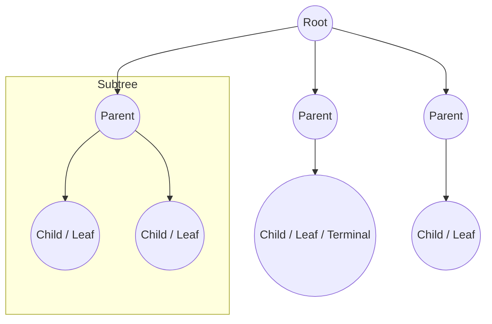

# 1. Problem Solving

## Theory
### Numbers Properties
- **Sum of first N natural numbers**: $\frac{N \times (N + 1)}{2}$
- **Inclusive range of numbers**: $[a, b] = b - a + 1$
- **Exclusive range of numbers**: $(a, b) = b - a - 1$
- **Properties of 0**: 0 is neither prime nor composite. It has infinite factors.
- **Properties of 1**: 1 is neither prime nor composite. It has only 1 factor which is 1 itself.

### Logarithms
- $2^3 = 8 \iff \sqrt[3]{8} = 2 \iff \log_2(8) = 3$
- $3^4 = 81 \iff \sqrt[4]{81} = 3 \iff \log_3(81) = 4$

## Questions
1. Q1. Count factors of a number
```js
// Input 1 : 5
// Output 1 : 2
// Explanation 1 : factors are 1 and 5. So, the output is 2.
//
// Input 2 : 10
// Output 2 : 4
// Explanation 2 : factors are 1, 2, 5 and 10. So, the output is 4.

// Constraints
// 1 <= A <= 10^9

// solution
function countFactors(A) {
  let count = 0;
  for (let i = 1; i * i <= A; i++) {
    if (A % i === 0) { // Check if i is a factor
      // If i is a factor, then A/i is also a factor
      count++;
      if (i !== A / i) { // Avoid double counting when i is the square root of A
        count++;
      }
    }
  }

  return count;
}

// Test Case 1 : console.log(countFactors(5)); // Expected: 2
// Test Case 2 : console.log(countFactors(10)); // Expected: 4

// Time Complexity : O(sqrt(A))
// Time Complexity Explanation : O(sqrt(A)) operations determined by input size and loop traversal.
// Space Complexity : O(1)
// Space Complexity Explanation : O(1) auxiliary memory used.
```


2. Q2. Prime Number Check, Prime Number is a number which has exactly 2 factors. 1 and the number itself.
```js
// Input 1 : isPrime(5)
// Output 1 : true
// Explanation 1 : Evaluating isPrime(5) yields true.
//
// Input 2 : isPrime(10)
// Output 2 : false
// Explanation 2 : Evaluating isPrime(10) yields false.

// Constraints
// 1 <= N <= 10^5
// 1 <= A[i] <= 10^9

// solution
function isPrime(N) {
  if (countFactors(N) == 2) {
    return true;
  }
  return false;
}

// Test Case 1 : console.log(isPrime(5)); // Expected: true
// Test Case 2 : console.log(isPrime(10)); // Expected: false

// Time Complexity : O(sqrt(N))
// Time Complexity Explanation : O(sqrt(N)) operations determined by input size and loop traversal.
// Space Complexity : O(1)
// Space Complexity Explanation : O(1) auxiliary memory used.
```

## Assignments
1. Count factors of a number
```js
// Input 1 : 5
// Output 1 : 2
// Explanation 1 : factors are 1 and 5. So, the output is 2.
//
// Input 2 : 10
// Output 2 : 4
// Explanation 2 : factors are 1, 2, 5 and 10. So, the output is 4.

// Constraints
// 1 <= A <= 10^9

// solution
function countFactors(N) {
  // Initialize the count of factors to 0. This variable will store our final result.
  let count = 0;

  // We iterate from i = 1 up to (and including) the square root of N.
  for (let i = 1; i * i <= N; i++) {
  // for (let i = 1; i <= Math.sqrt(N); i++) {
  // for (let i = 1; i <= N / i; i++) {
    // Check if 'i' is a factor of N.
    // The modulo operator (%) returns the remainder of a division.
    // If the remainder is 0, 'i' divides N perfectly.
    if (N % i === 0) {
      // If 'i' is a factor, we have found a pair of factors: 'i' and 'N / i'.

      // Now, we need to handle the special case of perfect squares.
      // If i * i = N, it means 'i' is the square root of N.
      // In this case, 'i' and 'N / i' are the same number.
      // For example, if N = 36 and i = 6, the pair is (6, 6). We should only count this factor once.
      if (i === N / i) {
        count++;
      } else {
        // If 'i' is not the square root of N, then 'i' and 'N / i' are two distinct factors.
        // For example, if N = 10 and i = 2, the pair of factors is (2, 5).
        // Since we found two different factors, we increment the count by 2.
        count += 2;
      }
    }
  }
  // Return the total count of factors found.
  return count;
}

// Example calls to demonstrate the function's output.

// The loop runs approximately sqrt(N) times. This makes the algorithm very efficient,
// especially for large input values of N, compared to a naive O(N) solution.

// The algorithm uses a fixed amount of extra space (for variables 'count' and 'i'),
// regardless of the size of the input N. This is known as constant space complexity.

// Test Case 1 : console.log(`Factors of 5: ${countFactors(5)}`); // Expected: 2 (Factors are 1, 5)
// Test Case 2 : console.log(`Factors of 16: ${countFactors(16)}`); // Expected: 5 (Factors are 1, 2, 4, 8, 16), 4 is counted once because 4 * 4 = 16

// Time Complexity : O(sqrt(N))
// Time Complexity Explanation : O(sqrt(A)) operations determined by input size and loop traversal.
// Space Complexity : O(1)
// Space Complexity Explanation : O(1) auxiliary memory used.
```


2. Prime Number Check, Prime Number is a number which has exactly 2 factors. 1 and the number itself.
```js
// Input 1 : 5
// Output 1 : 1
// Explanation 1 : factors are 1 and 5. So, the output is 1.
//
// Input 2 : 10
// Output 2 : 0
// Explanation 2 : factors are 1, 2, 5 and 10. So, the output is 0.

// Constraints
// 1 <= A <= 10^9

// solution
function isPrime(N) {
  if (countFactors(N) == 2) {
    return true;
  }
  return false;
}

// Test Case 1 : console.log(isPrime(5)); // Expected: true
// Test Case 2 : console.log(isPrime(10)); // Expected: false

// Time Complexity : O(sqrt(N))
// Time Complexity Explanation : Delegates to countFactors which iterates up to sqrt(N).
// Space Complexity : O(1)
// Space Complexity Explanation : Only uses a constant number of variables.
```

## Problems
1. Find Perfect Number, Perfect Number is a positive integer which is equal to the sum of its proper positive divisors.
```js
// Input 1 : 6
// Output 1 : 1
// Explanation 1 : factors are 1, 2, 3. Sum of factors = 1 + 2 + 3 = 6. So, the output is 1.
//
// Input 2 : 10
// Output 2 : 0
// Explanation 2 : factors are 1, 2, 5. Sum of factors = 1 + 2 + 5 = 8. So, the output is 0.

// Constraints
// 1 <= A <= 10^6

// solution
function isPerfect(A) {
  let sum = 0;
  for (let i = 1; i < A; i++) {
    if (A % i === 0) {
      sum += i;
    }
  }

  return sum === A ? 1 : 0;
}


// Optimized Solution
function isPerfect(A) {
    let sum = 0;
    for (let i = 1; i * i <= A; i++) {
        if (A % i === 0) {
            if (i == A / i) {
                sum += i // If both divisors are the same, add only once
            } else {
                sum += i + (A / i); // Add both divisors
            }
        }
    }
    sum -= A; // Exclude the number itself from the sum
    
    return sum === A ? 1 : 0;
}

// Test Case 1 : console.log(isPerfect(6)); // Expected: 1
// Test Case 2 : console.log(isPerfect(10)); // Expected: 0

// Time Complexity : O(A)
// Time Complexity Explanation : O(A) operations determined by input size and loop traversal.
// Space Complexity : O(1)
// Space Complexity Explanation : O(1) auxiliary memory used.
```


2. Count Prime Numbers below given number
```js
// Input 1 : 10
// Output 1 : 4
// Explanation 1 : prime numbers less than or equal to 10 are 2, 3, 5, 7. So, the output is 4.
//
// Input 2 : 20
// Output 2 : 8
// Explanation 2 : prime numbers less than or equal to 20 are 2, 3, 5, 7, 11, 13, 17, 19. So, the output is 8.

// Constraints
// 1 <= A <= 10^3

// solution
function countFactors(N) {
  let count = 0;
  for (let i = 1; i * i <= N; i++) {
    if (N % i === 0) {
      if (i === N / i) { // If i and N/i are same, then count only 1
        count++;
      } else { // Otherwise count both
        count += 2;
      }
    }
  }

  return count;
}

function isPrime(N) {
  if (countFactors(N) == 2) {
    return 1;
  }

  return 0;
}

function countPrimes(A) {
  let count = 0;
  // Start from 2, because 0 and 1 are not prime numbers. We will check for all numbers from 2 to A (inclusive) if they are prime or not.
  for (let i = 2; i <= A; i++) {
    if (isPrime(i) === 1) {
      count++;
    }
  }

  return count;
}

// Test Case 1 : console.log(countPrimes(10)); // Expected: 4 // Prime numbers are 2, 3, 5, 7
// Test Case 2 : console.log(countPrimes(20)); // Expected: 8 // Prime numbers are 2, 3, 5, 7, 11, 13, 17, 19

// Time Complexity : O(N * sqrt(N))
// Time Complexity Explanation : The outer loop runs from 2 to A (N times). For each number, isPrime calls countFactors which runs in O(sqrt(N)). Total: N iterations × O(sqrt(N)) per iteration = O(N * sqrt(N)).
// Space Complexity : O(1)
// Space Complexity Explanation : Only uses a constant number of variables across all function calls.
```

# 2. Time Complexity

## Theory
### Time Complexity & Big O Notation
Time complexity measures the amount of time an algorithm takes to complete as a function of the input length, expressed using Big O notation (upper bound).

Steps to calculate time complexity:
1. Count the number of iterations or operations performed based on input size.
2. Identify the highest order term.
3. Ignore lower order terms and constant coefficients.
4. Express using Big O notation.

### Time Complexity Hierarchy (Best to Worst)
$O(1) < O(\log \log n) < O(\log n) < O(\sqrt{n}) < O(n) < O(n \log n) < O(n^2) < O(n^3) < O(2^n) < O(n!)$
1. $O(1)$ - Constant time complexity
2. $O(\log \log n)$ - Double logarithmic time complexity
3. $O(\log n)$ - Logarithmic time complexity
4. $O(\sqrt{n})$ - Square root time complexity
5. $O(n)$ - Linear time complexity
6. $O(n \log n)$ - Linearithmic time complexity
7. $O(n^2)$ - Quadratic time complexity
8. $O(n^3)$ - Cubic time complexity
9. $O(2^n)$ - Exponential time complexity
10. $O(n!)$ - Factorial time complexity

### TLE (Time Limit Exceeded) Note
- Online editors have a standard execution limit of ~1 second, corresponding to roughly $10^9$ CPU instructions.
- To avoid TLE in online editors, optimize the code to reduce the total number of iterations to $10^8$ or less.

### Logarithm Rules
- $\log_b(m \times n) = \log_b(m) + \log_b(n)$
- $\log_b(m / n) = \log_b(m) - \log_b(n)$
- $\log_b(m^k) = k \cdot \log_b(m)$
- $2^3 = 8 \implies \log_2(8) = 3$
- $3^4 = 81 \implies \log_3(81) = 4$

# 3. Arrays

## Theory
### Array Definition and Basics
- An array is an ordered, linear data structure consisting of elements stored in continuous memory locations.
- Access time for any element by index is $O(1)$ due to contiguous memory allocation.
- In most statically-typed environments, array size is fixed upon creation.

### Subarray Basics
- **Total number of subarrays in array of size N**: $\frac{N \times (N + 1)}{2}$. For example, in an array of size 3, total subarrays $= \frac{3 \times 4}{2} = 6$.
- **Total number of subarrays of fixed size K**: $N - K + 1$. For example, in array of size 5 with $K = 3$, total subarrays $= 5 - 3 + 1 = 3$.
- **Length of subarray**: $\text{end} - \text{start} + 1$ (inclusive range $[a, b] = b - a + 1$).

## Questions
1. Q1. Reversing an array involves swapping elements from the start and end.
```js
// Input 1 : reverse([1, 2, 3, 4, 5], 0, 4)
// Output 1 : [ 5, 4, 3, 2, 1 ]
// Explanation 1 : Evaluating reverse([1, 2, 3, 4, 5], 0, 4) yields [ 5, 4, 3, 2, 1 ].

// Constraints
// 1 <= N <= 10^5
// 1 <= A[i] <= 10^9

// solution
// Reverse the array elements from start to end
function reverse(Arr, start, end){
  let i = start;
  let j = end;
  while(i < j){
    let temp = Arr[i];
    Arr[i] = Arr[j];
    Arr[j] = temp;

    // Alternatively, you can use destructuring assignment
    // [Arr[i], Arr[j]] = [Arr[j], Arr[i]];

    i++;
    j--;
  }

  return Arr;
}

// Test Case 1 : console.log(reverse([1, 2, 3, 4, 5], 0, 4)); // Expected: [ 5, 4, 3, 2, 1 ]
// Test Case 2 : console.log(reverse([1, 2, 3, 4, 5], 1, 3)); // Expected: [ 1, 4, 3, 2, 5 ]

// Time Complexity : O(N)
// Time Complexity Explanation : Two pointers move inward, each element is visited at most once. Total swaps = (end - start + 1) / 2 which is O(N).
// Space Complexity : O(1)
// Space Complexity Explanation : Swap is done in-place using a single temp variable.
```


2. Q2. Rotating an array involves reversing segments of the array.
```js
// Input 1 : rotateArray([1, 2, 3, 4, 5], 2)
// Output 1 : [ 4, 5, 1, 2, 3 ]
// Explanation 1 : Evaluating rotateArray([1, 2, 3, 4, 5], 2) yields [ 4, 5, 1, 2, 3 ].
//
// Input 2 : rotateArray([1, 2, 3, 4, 5], 8)
// Output 2 : [ 3, 4, 5, 1, 2 ]
// Explanation 2 : Evaluating rotateArray([1, 2, 3, 4, 5], 8) yields [ 3, 4, 5, 1, 2 ].

// Constraints
// 1 <= N <= 10^5
// 1 <= A[i] <= 10^9

// solution
function rotateArray(A, B) {
    // Reverse the array elements from start to end
    function reverse(Arr, start, end) {
        let i = start;
        let j = end;
        while (i < j) {
            let temp = Arr[i];
            Arr[i] = Arr[j];
            Arr[j] = temp;
            i++;
            j--;
        }
    }

    // Calculate the effective rotation offset as B modulo the array length because rotating by the array's length results in the same array. Also, if B is larger than the array length, we only need to rotate by the remainder. This ensures we don't perform unnecessary rotations.
    let offset = B % A.length;

    reverse(A, 0, A.length - 1); // reverse all elements
    reverse(A, 0, offset - 1); // reverse first half. why we are using (offset - 1), because we are using 0 based index.
    reverse(A, offset, A.length - 1); // reverse second half

    return A;
}

// Test Case 1 : console.log(rotateArray([1, 2, 3, 4, 5], 2)); // Expected: [ 4, 5, 1, 2, 3 ]
// Test Case 2 : console.log(rotateArray([1, 2, 3, 4, 5], 8)); // Expected: [ 3, 4, 5, 1, 2 ]

// Time Complexity : O(N)
// Time Complexity Explanation : Three reverse calls, each traversing a portion of the array. Total elements reversed = N + offset + (N - offset) = 2N, which is O(N).
// Space Complexity : O(1)
// Space Complexity Explanation : All reversals are done in-place using swaps.
```

## Assignments
1. Good Pair / Check if pair of elements have given sum exists in the array | Set
```js
// Input 1 : A = [1, 2, 3, 4], B = 7
// Output 1 : 1
// Explanation 1 : good pair is (3, 4). So, the output is 1.
//
// Input 2 : A = [1, 2, 4, 4], B = 8
// Output 2 : 1
// Explanation 2 : good pair is (4, 4). So, the output is 1.

// Constraints
// 1 <= A.size() <= 10^4
// 1 <= A[i] <= 10^9
// 1 <= B <= 10^9

// solution
function goodPair(A, B) {
    let set = new Set();

    for (let elem of A) {
        let complement = B - elem;
        if (set.has(complement)) {
            return 1; // good pair found
        }
        set.add(elem);
    }

    return 0; // no good pair found
}

// Test Case 1 : console.log(goodPair([1, 2, 3, 4], 7)); // Expected: 1
// Test Case 2 : console.log(goodPair([1, 2, 4, 3], 2)); // Expected: 0

// Time Complexity : O(N)
// Time Complexity Explanation : O(N) operations determined by input size and loop traversal.
// Space Complexity : O(N)
// Space Complexity Explanation : O(N) auxiliary memory used.
```


2. Reverse Array in a Range
```js
// Input 1 : A = [1, 2, 3, 4, 5], B = 2, C = 4
// Output 1 : [1, 2, 5, 4, 3]
// Explanation 1 : the array after reversing the elements in the range from B to C is [1, 2, 5, 4, 3].
//
// Input 2 : A = [1, 2, 3, 4, 5], B = 0, C = 2
// Output 2 : [3, 2, 1, 4, 5]
// Explanation 2 : the array after reversing the elements in the range from B to C is [3, 2, 1, 4, 5].

// Constraints
// 1 <= N <= 10^5
// 1 <= A[i] <= 10^9
// 0 <= B <= C <= N - 1

// solution
function reverse(A, B, C) {
  while (B < C) {
    let temp = A[B];
    A[B] = A[C];
    A[C] = temp;

    // Alternatively, you can use destructuring assignment
    // [A[B], A[C]] = [A[C], A[B]];

    B++;
    C--;
  }
  
  return A;
}

// Test Case 1 : console.log(reverse([1, 2, 3, 4, 5], 2, 4)); // Expected: [1, 2, 5, 4, 3]
// Test Case 2 : console.log(reverse([1, 2, 3, 4, 5], 0, 2)); // Expected: [3, 2, 1, 4, 5]

// Time Complexity : O(N)
// Time Complexity Explanation : O(N) operations determined by input size and loop traversal.
// Space Complexity : O(1)
// Space Complexity Explanation : O(1) auxiliary memory used.
```


3. Array Rotation
```js
// Input 1 : A = [1, 2, 3, 4, 5], B = 2
// Output 1 : [4, 5, 1, 2, 3]
// Explanation 1 : the array after rotating it 2 times towards the right is [4, 5, 1, 2, 3].
//
// Input 2 : A = [1, 2, 3, 4, 5], B = 3
// Output 2 : [3, 4, 5, 1, 2]
// Explanation 2 : the array after rotating it 3 times towards the right is [3, 4, 5, 1, 2].

// Constraints
// 1 <= N <= 10^5
// 1 <= A[i] <=10^9
// 1 <= B <= 10^9

// solution
function rotate(A, B) {
  function reverse(Arr, from, to){
    let i = from;
    let j = to;
    while(i < j){
      let temp = Arr[i];
      Arr[i] = Arr[j];
      Arr[j] = temp;
      i++;
      j--;
    }
  }

  let offset =  B % A.length;

  reverse(A, 0, A.length-1);
  reverse(A, 0, offset-1);
  reverse(A, offset, A.length-1);

  return A;
}

// Test Case 1 : console.log(rotate([1, 2, 3, 4, 5], 2)); // Expected: [4, 5, 1, 2, 3]
// Test Case 2 : console.log(rotate([1, 2, 3, 4, 5], 3)); // Expected: [3, 4, 5, 1, 2]

// Time Complexity : O(N)
// Time Complexity Explanation : O(N) operations determined by input size and loop traversal.
// Space Complexity : O(1)
// Space Complexity Explanation : O(1) auxiliary memory used.
```


4. Sum of Max & Min in an Array
```js
// Input 1 : A = [1, 2, 3, 4, 5]
// Output 1 : 6
// Explanation 1 : maximum element is 5 and minimum element is 1. So, the sum is 6.
//
// Input 2 : A = [5, 17, 100, 11]
// Output 2 : 105
// Explanation 2 : maximum element is 100 and minimum element is 5. So, the sum is 105.

// Constraints
// 1 <= N <= 10^5
// -10^9 <= A[i] <= 10^9

// solution
function sumMaxMin(A) {
  let min = Number.MAX_SAFE_INTEGER; // or +Infinity
  let max = Number.MIN_SAFE_INTEGER; // or -Infinity
  for (let i = 0; i < A.length; i++) {
    A[i] < min ? min = A[i] : min = min;
    A[i] > max ? max = A[i] : max = max;
  }

  // Alternatively, you can use Math.min and Math.max
  // min = Math.min(...A);
  // max = Math.max(...A);

  // Alternatively, you can use for of loop
  // for (let num of A) {
  //   if (num < min) min = num;
  //   if (num > max) max = num;
  // }

  // Finally, return the sum of min and max in Number format if inputs are BigInt
  return Number(min + max);
}

// Test Case 1 : console.log(sumMaxMin([1, 2, 3, 4, 5])); // Expected: 6
// Test Case 2 : console.log(sumMaxMin([5, 17, 100, 11])); // Expected: 105

// Time Complexity : O(N)
// Time Complexity Explanation : O(N) operations determined by input size and loop traversal.
// Space Complexity : O(1)
// Space Complexity Explanation : O(1) auxiliary memory used.
```

## Problems
1. Linear Search - Multiple Occurrences / Count of occurrences of an element in an array
```js
// Input 1 : A = [1, 2, 3, 4, 5, 6, 7, 8, 9, 10, 1, 2, 3, 4, 5], B = 1
// Output 1 : 2
// Explanation 1 : 1 occurs 2 times in the array.
//
// Input 2 : A = [1, 2, 3, 4, 5, 6, 7, 8, 9, 10, 1, 2, 3, 4, 5], B = 11
// Output 2 : 0
// Explanation 2 : 11 does not occur in the array.

// Constraints
// 1 <= B, Ai <= 10^9
// 1 <= length(A) <= 10^5

// solution
function countOccrrences(A, B) {
  let count = 0;
  for (let i = 0; i < A.length; i++) {
    if (A[i] === B) {
      count++;
    }
  }
  return count;
}

// Test Case 1 : console.log(countOccrrences([1, 2, 3, 4, 5, 6, 7, 8, 9, 10, 1, 2, 3, 4, 5], 1)); // Expected: 2
// Test Case 2 : console.log(countOccrrences([1, 2, 3, 4, 5, 6, 7, 8, 9, 10, 1, 2, 3, 4, 5], 11)); // Expected: 0

// Time Complexity : O(N)
// Time Complexity Explanation : O(N) operations determined by input size and loop traversal.
// Space Complexity : O(1)
// Space Complexity Explanation : O(1) auxiliary memory used.
```


2. Time to Equality. Find minimum time to make all elements equal by incrementing elements by 1
```js
// Input 1 : A = [1, 2, 3]
// Output 1 : 3
// Explanation 1 : In 1 second, increase the value of 1st element by 1. A = [2, 2, 3] In 1 second, increase the value of 1st element by 1. A = [3, 2, 3] In 1 second, increase the value of 2nd element by 1. A = [3, 3, 3] So, the minimum time is 3.
//
// Input 2 : A = [1, 2, 3, 4, 5]
// Output 2 : 10
// Explanation 2 : In 10 seconds, all elements will be equal to 5.

// Constraints
// 1 <= N <= 10^5
// 1 <= A[i] <= 1000

// solution
function timeToEquality(A) {
    let max = -Infinity;
    for(let elem of A){
        if(elem > max){
            max = elem;
        }
    }

    // Alternatively, you can use Math.max to find the maximum element
    // max = Math.max(...A);

    let time = 0;
    for(let elem of A){
        time += (max - elem);
    }

    return time;
}

// Test Case 1 : console.log(timeToEquality([1, 2, 3])); // Expected: 3
// Test Case 2 : console.log(timeToEquality([1, 2, 3, 4, 5])); // Expected: 10

// Time Complexity : O(N)
// Time Complexity Explanation : O(N) operations determined by input size and loop traversal.
// Space Complexity : O(1)
// Space Complexity Explanation : O(1) auxiliary memory used.
```


3. Count of elements in an Array which have at least one element greater than itself
```js
// Input 1 : A = [3, 1, 2]
// Output 1 : 2
// Explanation 1 : The elements that have at least 1 element greater than itself are 1 and 2
//
// Input 2 : A = [1, 2, 3, 4, 5]
// Output 2 : 4
// Explanation 2 : All elements have at least 1 element greater than itself except 5.

// Constraints
// 1 <= N <= 10^5
// 1 <= A[i] <= 10^9

// solution
function countGreater(A) {
  let max = -Infinity;
  for (let elem of A) {
    if (elem > max) {
      max = elem;
    }
  }

  let count = 0;
  for (let elem of A) {
    if (elem < max) {
      count++;
    }
  }

  return count;
}

// Test Case 1 : console.log(countGreater([3, 1, 2])); // Expected: 2
// Test Case 2 : console.log(countGreater([1, 2, 3, 4, 5])); // Expected: 4

// Time Complexity : O(N)
// Time Complexity Explanation : O(N) operations determined by input size and loop traversal.
// Space Complexity : O(1)
// Space Complexity Explanation : O(1) auxiliary memory used.
```


4. Find Second Largest Element in an Array
```js
// Input 1 : A = [1, 2, 3, 4, 5]
// Output 1 : 4
// Explanation 1 : Second largest element is 4.
//
// Input 2 : A = [5, 17, 100, 11]
// Output 2 : 17
// Explanation 2 : Second largest element is 17.

// Constraints
// 1 <= N <= 10^5
// -10^9 <= A[i] <= 10^9

// solution
function findSecondLargest(A) {
  if (A.length < 2) {
    return -1;
  }

  // Step 1: Find the largest element
  let largest = -Infinity;
  for (let num of A) {
    if (num > largest) {
      largest = num;
    }
  }

  // Step 2: Find the largest element that is not equal to `largest`
  let secondLargest = -Infinity;
  for (let num of A) {
    if (num > secondLargest && num < largest) {
      secondLargest = num;
    }
  }

  return secondLargest === -Infinity ? -1 : Number(secondLargest);
}

// Test Case 1 : console.log(findSecondLargest([1, 2, 3, 4, 5])); // Expected: 4
// Test Case 2 : console.log(findSecondLargest([5, 17, 100, 11])); // Expected: 17

// Time Complexity : O(N)
// Time Complexity Explanation : O(N) operations determined by input size and loop traversal.
// Space Complexity : O(1)
// Space Complexity Explanation : O(1) auxiliary memory used.
```

# 4. Prefix Sum

## Theory
### Prefix Sum
- A prefix sum array stores the cumulative sum of elements from index 0 to the current index.
- Range Sum Query: The sum of elements in range `[L, R]` is calculated in $O(1)$ time:
  - `sum[L..R] = prefix[R] - prefix[L - 1]` (for $L > 0$)
  - `sum[0..R] = prefix[R]` (for $L = 0$)

## Questions
1. Q1. Create a prefix sum array.
```js
// Input 1 : createPrefixSumArray([2, 3, 1, 6, 4, 5])
// Output 1 : [2, 5, 6, 12, 16, 21]
// Explanation 1 : Evaluating createPrefixSumArray([2, 3, 1, 6, 4, 5]) yields [2, 5, 6, 12, 16, 21].
//
// Input 2 : createPrefixSumArrayAlt([2, 3, 1, 6, 4, 5])
// Output 2 : [0, 2, 5, 6, 12, 16, 21]
// Explanation 2 : Evaluating createPrefixSumArrayAlt([2, 3, 1, 6, 4, 5]) yields [0, 2, 5, 6, 12, 16, 21].

// Constraints
// 1 <= N <= 10^5
// 1 <= A[i] <= 10^9

// solution
function createPrefixSumArray(A) {
    const psa = [];
    psa[0] = A[0];
    for (let i = 1; i < A.length; i++) {
        psa[i] = psa[i - 1] + A[i];
    }
    return psa;
}

// Test Case 1 : console.log(createPrefixSumArray([2, 3, 1, 6, 4, 5])); // Expected: [2, 5, 6, 12, 16, 21]

// Time Complexity : O(n)
// Time Complexity Explanation : O(n) operations determined by input size and loop traversal.
// Space Complexity : O(n)
// Space Complexity Explanation : O(n) auxiliary memory used.
```


2. Q2. Create a prefix sum array to calculate the sum of elements in a given range.
```js
// Input 1 : createPrefixSumArray([2, 3, 1, 6, 4, 5])
// Output 1 : [2, 5, 6, 12, 16, 21]
// Explanation 1 : Evaluating createPrefixSumArray([2, 3, 1, 6, 4, 5]) yields [2, 5, 6, 12, 16, 21].
//
// Input 2 : createPrefixSumArrayAlt([2, 3, 1, 6, 4, 5])
// Output 2 : [0, 2, 5, 6, 12, 16, 21]
// Explanation 2 : Evaluating createPrefixSumArrayAlt([2, 3, 1, 6, 4, 5]) yields [0, 2, 5, 6, 12, 16, 21].

// Constraints
// 1 <= N <= 10^5
// 1 <= A[i] <= 10^9

// solution
function createPrefixSumArray(A) {
    const psa = [];
    psa[0] = A[0];
    for (let i = 1; i < A.length; i++) {
        psa[i] = psa[i - 1] + A[i];
    }
    return psa;
}


// Alternative approach
function createPrefixSumArrayAlt(A) {
    const psa = [];
    psa[0] = 0; // psa[0] is 0 to handle sum from index 0 to i
    for (let i = 0; i < A.length; i++) {
        psa[i + 1] = psa[i] + A[i];
    }
    return psa;
}

// Test Case 1 : console.log(createPrefixSumArray([2, 3, 1, 6, 4, 5])); // Expected: [2, 5, 6, 12, 16, 21]
// Test Case 2 : console.log(createPrefixSumArrayAlt([2, 3, 1, 6, 4, 5])); // Expected: [0, 2, 5, 6, 12, 16, 21]

// Time Complexity : O(n)
// Time Complexity Explanation : O(n) operations determined by input size and loop traversal.
// Space Complexity : O(n)
// Space Complexity Explanation : O(n) auxiliary memory used.
```


3. Q3. Create a prefix sum array to calculate the sum of even indexed elements in a given range.
```js
// Input 1 : "prefixSumEven", prefixSumEven([2, 3, 1, 6, 4, 5], [[1, 3], [2, 5], [0, 4], [3, 3]])
// Output 1 : Output: { psaEven: [ 2, 2, 3, 3, 7, 7 ], result: [ 1, 5, 7, 0 ] }
// Explanation 1 : Evaluating "prefixSumEven", prefixSumEven([2, 3, 1, 6, 4, 5], [[1, 3], [2, 5], [0, 4], [3, 3]]) yields Output: { psaEven: [ 2, 2, 3, 3, 7, 7 ], result: [ 1, 5, 7, 0 ] }.

// Constraints
// 1 <= N <= 10^5
// 1 <= A[i] <= 10^9

// solution
function prefixSumEven(A, Q) {
    // prefix sum array of even elements
    const psaEven = [];
    psaEven[0] = A[0];
    for (let i = 1; i < A.length; i++) {
        if (i % 2 == 0) {
            psaEven[i] = psaEven[i - 1] + A[i];
        } else {
            psaEven[i] = psaEven[i - 1] + 0;
        }
    }

    const result = [];
    for (let i = 0; i < Q.length; i++) {
        const left = Q[i][0];
        const right = Q[i][1];

        if (left == 0) {
            result[i] = psaEven[right];
        } else {
            result[i] = psaEven[right] - psaEven[left - 1];
        }
    }

    return { psaEven, result };
}

// Test Case 1 : console.log("prefixSumEven", prefixSumEven([2, 3, 1, 6, 4, 5], [[1, 3], [2, 5], [0, 4], [3, 3]])); // Expected: Output: { psaEven: [ 2, 2, 3, 3, 7, 7 ], result: [ 1, 5, 7, 0 ] }

// Time Complexity : O(n + q)
// Time Complexity Explanation : O(n + q) operations determined by input size and loop traversal.
// Space Complexity : O(n)
// Space Complexity Explanation : O(n) auxiliary memory used.
```


4. Q4. Create a prefix sum array to calculate the sum of odd indexed elements in a given range.
```js
// Input 1 : "prefixSumOdd", prefixSumOdd([2, 3, 1, 6, 4, 5], [[1, 3], [2, 5], [0, 4], [3, 3]])
// Output 1 : Output: { psaOdd: [ 0, 3, 3, 9, 9, 14 ], result: [ 9, 11, 9, 6 ] }
// Explanation 1 : Evaluating "prefixSumOdd", prefixSumOdd([2, 3, 1, 6, 4, 5], [[1, 3], [2, 5], [0, 4], [3, 3]]) yields Output: { psaOdd: [ 0, 3, 3, 9, 9, 14 ], result: [ 9, 11, 9, 6 ] }.

// Constraints
// 1 <= N <= 10^5
// 1 <= A[i] <= 10^9

// solution
function prefixSumOdd(A, Q) {
    // prefix sum array of odd elements
    const psaOdd = [];
    psaOdd[0] = 0;
    for (let i = 1; i < A.length; i++) {
        if (i % 2 !== 0) {
            psaOdd[i] = psaOdd[i - 1] + A[i];
        } else {
            psaOdd[i] = psaOdd[i - 1] + 0;
        }
    }

    const result = [];
    for (let i = 0; i < Q.length; i++) {
        const left = Q[i][0];
        const right = Q[i][1];

        if (left == 0) {
            result[i] = psaOdd[right];
        } else {
            result[i] = psaOdd[right] - psaOdd[left - 1];
        }
    }

    return { psaOdd, result };
}

// Test Case 1 : console.log("prefixSumOdd", prefixSumOdd([2, 3, 1, 6, 4, 5], [[1, 3], [2, 5], [0, 4], [3, 3]])); // Expected: Output: { psaOdd: [ 0, 3, 3, 9, 9, 14 ], result: [ 9, 11, 9, 6 ] }

// Time Complexity : O(n + q)
// Time Complexity Explanation : O(n + q) operations determined by input size and loop traversal.
// Space Complexity : O(n)
// Space Complexity Explanation : O(n) auxiliary memory used.
```


5. Q5. Find the number of special indices in an array. Special indices are indices such that removing an element at that index makes the sum of even indexed elements equal to the sum of odd indexed elements.
```js
// Input 1 : "specialIndex", specialIndex([4, 3, 2, 7, 6, -2])
// Output 1 : { count: 2, specialIndices: [0, 2] }
// Explanation 1 : Evaluating "specialIndex", specialIndex([4, 3, 2, 7, 6, -2]) yields { count: 2, specialIndices: [0, 2] }.
//
// Input 2 : countSpecialIndicesOptimized(arr1)
// Output 2 : Expected output: 1
// Explanation 2 : Evaluating countSpecialIndicesOptimized(arr1) yields Expected output: 1.

// Constraints
// 1 <= N <= 10^5
// 1 <= A[i] <= 10^9

// solution
function specialIndex(A) {
    const pSumEven = [];
    pSumEven[0] = A[0];
    for (let i = 1; i < A.length; i++) {
        if (i % 2 == 0) {
            pSumEven[i] = pSumEven[i - 1] + A[i];
        } else {
            pSumEven[i] = pSumEven[i - 1];
        }
    }

    const pSumOdd = [];
    pSumOdd[0] = 0;
    for (let i = 1; i < A.length; i++) {
        if (i % 2 != 0) {
            pSumOdd[i] = pSumOdd[i - 1] + A[i];
        } else {
            pSumOdd[i] = pSumOdd[i - 1];
        }
    }

    let n = A.length;
    let count = 0;
    const specialIndices = [];

    for (let i = 0; i < n; i++) {
        let evenSum = 0;
        let oddSum = 0;

        if (i > 0) {
            evenSum = pSumEven[i - 1] + pSumOdd[n - 1] - pSumOdd[i]
            oddSum = pSumOdd[i - 1] + pSumEven[n - 1] - pSumEven[i]
        } else {
            evenSum = pSumOdd[n - 1] - pSumOdd[i]
            oddSum = pSumEven[n - 1] - pSumEven[i]
        }

        if (evenSum == oddSum) {
            count++;
            specialIndices.push(i);
        }
    }

    return { count, specialIndices };
}


// Alternative Approach: Space Optimized
// This is the most efficient solution. It builds on the logic of the prefix sum approach but optimizes space by not storing the entire prefix sum arrays.
// First, we calculate the totalEvenSum and totalOddSum of the entire array in one pass.
// Then, we iterate through the array a second time. We maintain two variables, leftEvenSum and leftOddSum, representing the sums to the left of the current index i.
// In each iteration, we can derive the sums to the right (rightEvenSum, rightOddSum) by subtracting the left sums and the current element from the total sums.
// We then check the special index condition, and finally, update the leftEvenSum or leftOddSum with the current element before moving to the next index.
/**
 * Finds the count of special indices using a space-optimized approach.
 * Time:  O(N)
 * Space: O(1)
 */
function countSpecialIndicesOptimized(A) {
  // Get the total number of elements in the array.
  const n = A.length;
  // Initialize total sums for all even and odd indexed elements.
  let totalEvenSum = 0;
  let totalOddSum = 0;

  // First pass: Calculate the total sum of even and odd indexed elements.
  for (let i = 0; i < n; i++) {
    // Check if the current index 'i' is even.
    if (i % 2 === 0) {
      // Add the element to the total even sum.
      totalEvenSum += A[i];
    } else {
      // Add the element to the total odd sum.
      totalOddSum += A[i];
    }
  }

  // Initialize sums for the left side of the removal index.
  let leftEvenSum = 0;
  let leftOddSum = 0;
  // Initialize a counter for special indices.
  let specialIndexCount = 0;

  // Second pass: Iterate through each index to check if it's special.
  for (let i = 0; i < n; i++) {
    // Initialize sums for the right side of the removal index.
    let rightEvenSum = 0;
    let rightOddSum = 0;

    // Check if the current index 'i' is even.
    if (i % 2 === 0) {
      // If we remove an even-indexed element:
      // Right even sum is total even sum MINUS left even sum MINUS current element.
      rightEvenSum = totalEvenSum - leftEvenSum - A[i];
      // Right odd sum is total odd sum MINUS left odd sum.
      rightOddSum = totalOddSum - leftOddSum;
    } else {
      // If we remove an odd-indexed element:
      // Right odd sum is total odd sum MINUS left odd sum MINUS current element.
      rightOddSum = totalOddSum - leftOddSum - A[i];
      // Right even sum is total even sum MINUS left even sum.
      rightEvenSum = totalEvenSum - leftEvenSum;
    }

    // Check the condition for a special index:
    // New Even Sum (left evens + right odds) == New Odd Sum (left odds + right evens)
    if (leftEvenSum + rightOddSum === leftOddSum + rightEvenSum) {
      // If equal, increment the counter.
      specialIndexCount++;
    }

    // Update the left sums for the next iteration.
    if (i % 2 === 0) {
      // Add the current element to the left even sum.
      leftEvenSum += A[i];
    } else {
      // Add the current element to the left odd sum.
      leftOddSum += A[i];
    }
  }

  // Return the total count of special indices.
  return specialIndexCount;
}

// Test Case 1 : console.log("specialIndex", specialIndex([4, 3, 2, 7, 6, -2])); // Expected: { count: 2, specialIndices: [0, 2] }
// Test Case 2 : console.log(countSpecialIndicesOptimized(arr1)); // Expected: Expected output: 1

// Time Complexity : O(n)
// Time Complexity Explanation : O(n) operations determined by input size and loop traversal.
// Space Complexity : O(n)
// Space Complexity Explanation : O(n) auxiliary memory used.
```

## Assignments
1. Range Sum Query / Sum of elements in a given range.
```js
// Input 1 : A = [1, 2, 3, 4, 5], B = [[1, 3], [2, 4]]
// Output 1 : [9, 12]
// Explanation 1 : For input A = [1, 2, 3, 4, 5], B = [[1, 3], [2, 4]], the expected output is [9, 12].
//
// Input 2 : A = [1, 2, 3, 4, 5], B = [[0, 4], [1, 3]]
// Output 2 : [15, 9]
// Explanation 2 : For input A = [1, 2, 3, 4, 5], B = [[0, 4], [1, 3]], the expected output is [15, 9].

// Constraints
// 1 <= N <= 10^5
// 1 <= M <= 10^5
// 1 <= A[i] <= 10^9
// 0 <= B[i][0] <= B[i][1] <= N

// solution
function prefixSum(A, Q) {
    // prefix sum array of all elements
    const psa = [];
    psa[0] = A[0];
    for (let i = 1; i < A.length; i++) {
        psa[i] = psa[i - 1] + A[i];
    }

    const result = [];
    for (let i = 0; i < Q.length; i++) {
        const left = Q[i][0];
        const right = Q[i][1];

        if (left == 0) {
            result[i] = psa[right];
        } else {
            result[i] = psa[right] - psa[left - 1];
        }
    }

    return { psa, result };
}

// Output: { psa: [ -3, 3, 5, 9, 14, 16, 24, 15, 18, 19 ], result: [ 9, 10, 12, 14, -9 ] }

// Test Case 1 : console.log(prefixSum([-3, 6, 2, 4, 5, 2, 8, -9, 3, 1], [[4, 8], [3, 7], [1, 3], [0, 4], [7, 7]]));

// Time Complexity : O(n + q)
// Time Complexity Explanation : O(n + m) operations determined by input size and loop traversal.
// Space Complexity : O(n)
// Space Complexity Explanation : O(n) auxiliary memory used.
```


2. Find the number of special indices in an array. Special indices are indices such that removing an element at that index makes the sum of even indexed elements equal to the sum of odd indexed elements.
```js
// Input 1 : "prefixSumEven", prefixSumEven([2, 3, 1, 6, 4, 5], [[1, 3], [2, 5], [0, 4], [3, 3]])
// Output 1 : Output: { psaEven: [ 2, 2, 3, 3, 7, 7 ], result: [ 1, 5, 7, 0 ] }
// Explanation 1 : Evaluating "prefixSumEven", prefixSumEven([2, 3, 1, 6, 4, 5], [[1, 3], [2, 5], [0, 4], [3, 3]]) yields Output: { psaEven: [ 2, 2, 3, 3, 7, 7 ], result: [ 1, 5, 7, 0 ] }.

// Constraints
// 1 <= N <= 10^5
// 1 <= A[i] <= 10^9

// solution
function prefixSumEven(A, Q) {
    // prefix sum array of even elements
    const psaEven = [];
    psaEven[0] = A[0];
    for (let i = 1; i < A.length; i++) {
        if (i % 2 == 0) {
            psaEven[i] = psaEven[i - 1] + A[i];
        } else {
            psaEven[i] = psaEven[i - 1] + 0;
        }
    }

    const result = [];
    for (let i = 0; i < Q.length; i++) {
        const left = Q[i][0];
        const right = Q[i][1];

        if (left == 0) {
            result[i] = psaEven[right];
        } else {
            result[i] = psaEven[right] - psaEven[left - 1];
        }
    }

    return { psaEven, result };
}

// Test Case 1 : console.log("prefixSumEven", prefixSumEven([2, 3, 1, 6, 4, 5], [[1, 3], [2, 5], [0, 4], [3, 3]])); // Expected: Output: { psaEven: [ 2, 2, 3, 3, 7, 7 ], result: [ 1, 5, 7, 0 ] }

// Time Complexity : O(n + q)
// Time Complexity Explanation : O(n + q) operations determined by input size and loop traversal.
// Space Complexity : O(n)
// Space Complexity Explanation : O(n) auxiliary memory used.
```


3. In place prefix sum.
```js
// Input 1 : A = [1, 2, 3, 4, 5]
// Output 1 : [1, 3, 6, 10, 15]
// Explanation 1 : For input A = [1, 2, 3, 4, 5], the expected output is [1, 3, 6, 10, 15].
//
// Input 2 : A = [1, 2, 3, 4, 5, 6]
// Output 2 : [1, 3, 6, 10, 15, 21]
// Explanation 2 : For input A = [1, 2, 3, 4, 5, 6], the expected output is [1, 3, 6, 10, 15, 21].

// Constraints
// 1 <= N <= 10^5
// 1 <= A[i] <= 10^3

// solution
function inPlacePrefixSum(A) {
    for (let i = 1; i < A.length; i++) {
        A[i] = A[i] + A[i - 1];
    }
    return A;
}

// Test Case 1 : console.log("inPlacePrefixSum", inPlacePrefixSum([1, 2, 3, 4, 5])); // Expected: [1, 3, 6, 10, 15]
// Test Case 2 : console.log("inPlacePrefixSum", inPlacePrefixSum([1, 2, 3, 4, 5, 6])); // Expected: [1, 3, 6, 10, 15, 21]

// Time Complexity : O(N)
// Time Complexity Explanation : O(N) operations determined by input size and loop traversal.
// Space Complexity : O(1)
// Space Complexity Explanation : O(1) auxiliary memory used.
```

## Problems
1. Equilibrium index of an array. Sum of elements at lower indexes is equal to the sum of elements at higher indexes.
```js
// Input 1 : A = [-7, 1, 5, 2, -4, 3, 0]
// Output 1 : 3
// Explanation 1 : For input A = [-7, 1, 5, 2, -4, 3, 0], the expected output is 3.
//
// Input 2 : A = [1, 2, 3, 4, 5]
// Output 2 : -1
// Explanation 2 : For input A = [1, 2, 3, 4, 5], the expected output is -1.

// Constraints
// 1 <= N <= 10^5
// -10^5 <= A[i] <= 10^5

// solution
function equilibriumIndexPrefixSum(A) {
    const n = A.length;
    const prefixSum = new Array(n);
    prefixSum[0] = A[0];
    for (let i = 1; i < n; i++) {
        prefixSum[i] = prefixSum[i - 1] + A[i];
    }

    for (let i = 0; i < n; i++) {
        const leftSum = i > 0 ? prefixSum[i - 1] : 0;
        const rightSum = prefixSum[n - 1] - prefixSum[i];
        if (leftSum === rightSum) {
            return i;  // Found equilibrium index
        }
    }
    return -1;  // No equilibrium index found
}

// Test Case 1 : console.log(equilibriumIndexPrefixSum([-7, 1, 5, 2, -4, 3, 0])); // Expected: 3
// Test Case 2 : console.log(equilibriumIndexPrefixSum([1, 2, 3, 4, 5])); // Expected: -1

// Time Complexity : O(N)
// Time Complexity Explanation : O(N) operations determined by input size and loop traversal.
// Space Complexity : O(N)
// Space Complexity Explanation : O(N) auxiliary memory used.
```

# 5. Carry Forward & Subarray

## Theory
### Carry Forward Technique
Carry forward allows computing properties of subarrays or pairs in a single linear pass by tracking and updating state (such as counts, running sums, or minimum/maximum values seen so far) rather than re-scanning.

### Subarrays Notes
- **Total number of subarrays in an array of size N**: $\frac{N \times (N + 1)}{2}$.
  For example, $[1, 2, 3]$ size of array $= 3$, total subarrays $= \frac{3 \times 4}{2} = 6$. Subarrays are $[1], [1, 2], [1, 2, 3], [2], [2, 3], [3]$.
- **Total number of subarrays of size K in an array of size N**: $N - K + 1$.
  For example, $[1, 2, 3, 4, 5]$ size $= 5$, $K = 3$, total subarrays $= 5 - 3 + 1 = 3$: $[1, 2, 3], [2, 3, 4], [3, 4, 5]$.
- **Length of subarray**: $\text{end} - \text{start} + 1$.

## Questions
1. Q1. Count of pairs of two given characters in an array | Carry Forward technique.
```js
// Input 1 : A = [b, a, a, g, d, c, a, g]
// Output 1 : 5
// Explanation 1 : For input A = [b, a, a, g, d, c, a, g], the expected output is 5.
//
// Input 2 : A = [a, g, a, g, a, g]
// Output 2 : 6
// Explanation 2 : For input A = [a, g, a, g, a, g], the expected output is 6.

// Constraints
// 1 <= N <= 10^9
// 1 <= A[i] <= 10^9

// solution
function countOfPairs(A) {
  let pairCount = 0; // Total number of "ag" pairs found
  let aCount = 0;    // Running count of 'a' characters encountered

  for (let i = 0; i < A.length; i++) {
    if (A[i] === 'a') {
      aCount++; // Increment 'a' count to pair with future 'g's
    } else if (A[i] === 'g') {
      pairCount += aCount; // Add all preceding 'a's to the total pairs
    }
  }

  return pairCount; // Return the final count of subsequences
}

// Test Case 1 : console.log("countOfPairs", countOfPairs(['b', 'a', 'a', 'g', 'd', 'c', 'a', 'g'])); // Expected: Output: 5
// Test Case 2 : console.log("countOfPairs", countOfPairs(['a', 'g', 'a', 'g', 'a', 'g'])); // Expected: Output: 6

// Time Complexity : O(N)
// Time Complexity Explanation : Single pass through the array, each element is checked once. Carry forward: we carry aCount forward to pair with future 'g's.
// Space Complexity : O(1)
// Space Complexity Explanation : Only two variables (pairCount, aCount) are used.
```


2. Q2. Print elements of the subarray that starts from the start index and ends at the end index | Simple iteration
```js
// Input 1 : A[i]
// Output 1 : Computed result
// Explanation 1 : Evaluating A[i] yields Computed result.

// Constraints
// 1 <= N <= 10^5
// 1 <= A[i] <= 10^9

// solution
function printSubarray(A, start, end) {
  for (let i = start; i <= end; i++) {
  }
}

printSubarray([1, 2, 3, 4, 5], 1, 3); // 2, 3, 4

// Test Case 1 : console.log(A[i]);

// Time Complexity : O(N)
// Time Complexity Explanation : O(N) operations determined by input size and loop traversal.
// Space Complexity : O(1)
// Space Complexity Explanation : O(1) auxiliary memory used.
```


3. Q3. Print all possible subarrays of the array. No optimised solution available | Brute Force
```js
// Input 1 : A = [1, 2, 3]
// Output 1 : [1], [1, 2], [1, 2, 3], [2], [2, 3], [3]
// Explanation 1 : For input A = [1, 2, 3], the expected output is [1], [1, 2], [1, 2, 3], [2], [2, 3], [3].
//
// Input 2 : A = [1, 2]
// Output 2 : [1], [1, 2], [2]
// Explanation 2 : For input A = [1, 2], the expected output is [1], [1, 2], [2].

// Constraints
// 1 <= N <= 10^9
// 1 <= A[i] <= 10^9

// solution
function printAllSubarrays(A) {
    const result = [];
    for (let i = 0; i < A.length; i++) {
        for (let j = i; j < A.length; j++) {
            let subarray = [];
            for (let k = i; k <= j; k++) {
                subarray.push(A[k]);
            }
            result.push(subarray);
        }
    }
    return result;
}

// Test Case 1 : console.log(subarray);
// Test Case 2 : console.log(printAllSubarrays([1, 2, 3])); // Expected: [ [ 1 ], [ 1, 2 ], [ 1, 2, 3 ], [ 2 ], [ 2, 3 ], [ 3 ] ]

// Time Complexity : O(N^3)
// Time Complexity Explanation : Three nested loops: i picks start, j picks end, k iterates from start to end. Total work = sum of all subarray lengths = O(N^3).
// Space Complexity : O(N^3)
// Space Complexity Explanation : Storing all N*(N+1)/2 subarrays, with total elements across all subarrays = O(N^3).
```


4. Q4. Smallest subarray containing min and max elements | Carry Forward technique.
```js
// Input 1 : A = [1, 2, 3, 1, 3, 4, 6, 4, 6, 3]
// Output 1 : 4 // The smallest subarray is [1, 3, 4, 6] which contains both the minimum and maximum elements
// Explanation 1 : For input A = [1, 2, 3, 1, 3, 4, 6, 4, 6, 3], the expected output is 4 // The smallest subarray is [1, 3, 4, 6] which contains both the minimum and maximum elements.
//
// Input 2 : A = [2, 2, 6, 4, 5, 1, 5, 2, 6, 4, 1]
// Output 2 : 3 // The smallest subarray is [6, 4, 1] which contains both the minimum and maximum elements
// Explanation 2 : For input A = [2, 2, 6, 4, 5, 1, 5, 2, 6, 4, 1], the expected output is 3 // The smallest subarray is [6, 4, 1] which contains both the minimum and maximum elements.

// Constraints
// 1 <= N <= 10^9
// 1 <= A[i] <= 10^9

// solution
// Optimised solution using carry forward technique
function smallestSubarrayContainingMinMax(A) {
  // Find the minimum and maximum elements of the array
  let minElement = Math.min(...A);
  let maxElement = Math.max(...A);

  if (minElement == maxElement) {
    return 1;
  }

  let length = A.length;
  let minIndex = -1;
  let maxIndex = -1;

  // Iterate from right to left and find the length of the smallest subarray containing both the minimum and maximum elements
  for (let i = A.length - 1; i >= 0; i--) {
    if(A[i] == minElement) {
      minIndex = i;
      if (maxIndex != -1) {
        // length = Math.min(length, maxIndex - minIndex + 1); since we are iterating from right to left, maxIndex will always be greater than minIndex
        length = Math.min(length, Math.abs(maxIndex - minIndex) + 1);
      }
    }

    if(A[i] == maxElement) {
      maxIndex = i;
      if (minIndex != -1) {
        // length = Math.min(length, minIndex - maxIndex + 1); since we are iterating from right to left, minIndex will always be greater than maxIndex
        length = Math.min(length, Math.abs(maxIndex - minIndex) + 1);
      }
    }
  }

  // Alternatively, iterate from left to right and find the length of the smallest subarray containing both the minimum and maximum elements
  // for (let i = 0; i < A.length; i++) {
  //   if(A[i] == minElement) {
  //     minIndex = i;
  //     if (maxIndex != -1) {
  //       length = Math.min(length, Math.abs(maxIndex - minIndex) + 1);
  //     }
  //   }

  //   if(A[i] == maxElement) {
  //     maxIndex = i;
  //     if (minIndex != -1) {
  //       length = Math.min(length, Math.abs(maxIndex - minIndex) + 1);
  //     }
  //   }
  // }

  return length;
}

// Test Case 1 : console.log("smallestSubarrayContainingMinMax", smallestSubarrayContainingMinMax([1, 2, 3, 1, 3, 4, 6, 4, 6, 3])); // Expected: 4
// Test Case 2 : console.log("smallestSubarrayContainingMinMax", smallestSubarrayContainingMinMax([2, 2, 6, 4, 5, 1, 5, 2, 6, 4, 1])); // Expected: 3

// Time Complexity : O(N)
// Time Complexity Explanation : Math.min/max spread takes O(N) each to find min and max elements. Single pass through the array (right to left) to find closest pair. Total: O(N) + O(N) + O(N) = O(N).
// Space Complexity : O(1)
// Space Complexity Explanation : Only a fixed number of variables (minElement, maxElement, minIndex, maxIndex, length).
```


5. Q5. Best Time to Buy and Sell Stocks 1 | Carry Forward technique.
```js
// Input 1 : A = [1, 2]
// Output 1 : 1
// Explanation 1 : For input A = [1, 2], the expected output is 1.
//
// Input 2 : A = [1, 4, 5, 2, 4]
// Output 2 : 4
// Explanation 2 : For input A = [1, 4, 5, 2, 4], the expected output is 4.

// Constraints
// 1 <= N <= 10^6
// 1 <= A[i] <= 10^7

// solution
// Simple iteration
function maxProfit(A) {
  let minPrice = A[0];
  let maxProfit = 0;
  for (let i = 1; i < A.length; i++) {
    maxProfit = Math.max(maxProfit, A[i] - minPrice);
    minPrice = Math.min(minPrice, A[i]);
  }
  return maxProfit;
}


// Carry forward technique
function maxProfit(A) {
  let minPrice = A[0];
  let maxProfit = 0;
  for (let i = 1; i < A.length; i++) {
    if (A[i] < minPrice) {
      minPrice = A[i];
    } else {
      maxProfit = Math.max(maxProfit, A[i] - minPrice);
    }
  }
  return maxProfit;
}


// Carry forward technique - Alternate solution
function maxProfit(A){
  let max = A[A.length - 1];
  let profit = 0;
  // Iterate from right to left to find the maximum price and then calculate the profit by subtracting the current price from the maximum price, profit is updated if the current profit is greater than the previous profit. Profit will be maximum for the current price if the current price is minimum.
  for(let i = A.length - 2; i >= 0; i--){
    // Update max if current element is greater than max
    // max stores the maximum value to the right of A[i]
    if(A[i] > max){
      max = A[i];
    }

    // Calculate profit if we sell at max and buy at A[i]
    // Update profit if current profit is greater than previous profit
    // profit stores the maximum profit we can get by selling at max and buying at A[i]
    // max - A[i] is the profit we can get by selling at max and buying at A[i]
    // Math.max(profit, max - A[i]) is used to update profit if current profit is greater than previous profit
    profit = Math.max(profit, max - A[i]);
  }

  return profit;
}


// Alternate solution using Prefix Sum technique
function maxProfit(A) {
  let n = A.length;
  let prefixMin = new Array(n);
  prefixMin[0] = A[0];

  // Create prefix min array
  for (let i = 1; i < n; i++) {
    prefixMin[i] = Math.min(prefixMin[i - 1], A[i]);
  }

  let maxProfit = 0;

  // Calculate max profit
  for (let i = 1; i < n; i++) {
    maxProfit = Math.max(maxProfit, A[i] - prefixMin[i - 1]);
  }

  return maxProfit;
}

// Test Case 1 : console.log("maxProfit", maxProfit([1, 2])); // Expected: Output: 1
// Test Case 2 : console.log("maxProfit", maxProfit([1, 4, 5, 2, 4])); // Expected: Output: 4

// Time Complexity : O(N)
// Time Complexity Explanation : O(N) operations determined by input size and loop traversal.
// Space Complexity : O(1)
// Space Complexity Explanation : O(1) auxiliary memory used.
```

## Assignments
1. Closest MinMax Subarray / Smallest subarray containing min and max elements | Carry Forward technique
```js
// Input 1 : [1, 3, 2]
// Output 1 : 2
// Explanation 1 : Since the minimum value is 1 and the maximum value is 3, the smallest subarray that contains both is [1, 3]
//
// Input 2 : [2, 6, 1, 6, 9]
// Output 2 : 3
// Explanation 2 : Since the minimum value is 1 and the maximum value is 9, the smallest subarray that contains both is [1, 6, 9]

// Constraints
// 1 <= N <= 10^5
// 1 <= A[i] <= 10^9

// solution
// Optimised solution using carry forward technique
function smallestSubarrayContainingMinMax(A) {
  // Find the minimum and maximum elements of the array
  let minElement = Math.min(...A);
  let maxElement = Math.max(...A);

  if (minElement == maxElement) {
    return 1;
  }

  let length = A.length;
  let minIndex = -1;
  let maxIndex = -1;

  // Iterate from right to left and find the length of the smallest subarray containing both the minimum and maximum elements
  for (let i = A.length - 1; i >= 0; i--) {
    if(A[i] == minElement) {
      minIndex = i;
      if (maxIndex != -1) {
        // length = Math.min(length, maxIndex - minIndex + 1); since we are iterating from right to left, maxIndex will always be greater than minIndex
        length = Math.min(length, Math.abs(maxIndex - minIndex) + 1);
      }
    }

    if(A[i] == maxElement) {
      maxIndex = i;
      if (minIndex != -1) {
        // length = Math.min(length, minIndex - maxIndex + 1); since we are iterating from right to left, minIndex will always be greater than maxIndex
        length = Math.min(length, Math.abs(maxIndex - minIndex) + 1);
      }
    }
  }

  // Alternatively, iterate from left to right and find the length of the smallest subarray containing both the minimum and maximum elements
  // for (let i = 0; i < A.length; i++) {
  //   if(A[i] == minElement) {
  //     minIndex = i;
  //     if (maxIndex != -1) {
  //       length = Math.min(length, Math.abs(maxIndex - minIndex) + 1);
  //     }
  //   }

  //   if(A[i] == maxElement) {
  //     maxIndex = i;
  //     if (minIndex != -1) {
  //       length = Math.min(length, Math.abs(maxIndex - minIndex) + 1);
  //     }
  //   }
  // }

  return length;
}

// Test Case 1 : console.log("smallestSubarrayContainingMinMax", smallestSubarrayContainingMinMax([1, 2, 3, 1, 3, 4, 6, 4, 6, 3])); // Expected: 4
// Test Case 2 : console.log("smallestSubarrayContainingMinMax", smallestSubarrayContainingMinMax([2, 2, 6, 4, 5, 1, 5, 2, 6, 4, 1])); // Expected: 3

// Time Complexity : O(N)
// Time Complexity Explanation : Math.min/max spread takes O(N) each to find min and max elements. Single pass through the array (right to left) to find closest pair. Total: O(N) + O(N) + O(N) = O(N).
// Space Complexity : O(1)
// Space Complexity Explanation : Only a fixed number of variables (minElement, maxElement, minIndex, maxIndex, length).
```


2. Subarray in a given range | Simple iteration
```js
// Input 1 : [1, 2, 3, 4, 5], B = 1, C = 3
// Output 1 : [2, 3, 4]
// Explanation 1 : For input [1, 2, 3, 4, 5], B = 1, C = 3, the expected output is [2, 3, 4].
//
// Input 2 : [1, 2, 3, 4, 5], B = 0, C = 2
// Output 2 : [1, 2, 3]
// Explanation 2 : For input [1, 2, 3, 4, 5], B = 0, C = 2, the expected output is [1, 2, 3].

// Constraints
// 1 <= N <= 10^5
// 1 <= A[i] <= 10^9
// 0 <= B <= C < N

// solution
function subarrayInRange(A, B, C) {
  return A.slice(B, C + 1); // Slice the array from index B to C (inclusive) and return it
}


// Alternate solution
function subarrayInRange(A, B, C) {
  let subarray = [];
  for (let i = B; i <= C; i++) {
    subarray.push(A[i]);
  }
  return subarray;
}

// Test Case 1 : console.log(subarrayInRange([1, 2, 3, 4, 5], 1, 3)); // Expected: [2, 3, 4]
// Test Case 2 : console.log(subarrayInRange([1, 2, 3, 4, 5], 0, 2)); // Expected: [1, 2, 3]

// Time Complexity : O(N)
// Time Complexity Explanation : O(N) operations determined by input size and loop traversal.
// Space Complexity : O(1)
// Space Complexity Explanation : O(1) auxiliary memory used.
```


3. Generate all subarrays | Brute Force
```js
// Input 1 : [1, 2, 3]
// Output 1 : [[1], [1, 2], [1, 2, 3], [2], [2, 3], [3]]
// Explanation 1 : For input [1, 2, 3], the expected output is [[1], [1, 2], [1, 2, 3], [2], [2, 3], [3]].
//
// Input 2 : [1, 2]
// Output 2 : [[1], [1, 2], [2]]
// Explanation 2 : For input [1, 2], the expected output is [[1], [1, 2], [2]].

// Constraints
// 1 <= N <= 100
// 1 <= A[i] <= 10^5

// solution
function printAllSubarrays(A) {
    const result = [];
    for (let i = 0; i < A.length; i++) {
        for (let j = i; j < A.length; j++) {
            let subarray = [];
            for (let k = i; k <= j; k++) {
                subarray.push(A[k]);
            }
            result.push(subarray);
        }
    }
    return result;
}

// Test Case 1 : console.log(subarray);
// Test Case 2 : console.log(printAllSubarrays([1, 2, 3])); // Expected: [ [ 1 ], [ 1, 2 ], [ 1, 2, 3 ], [ 2 ], [ 2, 3 ], [ 3 ] ]

// Time Complexity : O(N^3)
// Time Complexity Explanation : Three nested loops: i picks start, j picks end, k iterates from start to end. Total work = sum of all subarray lengths = O(N^3).
// Space Complexity : O(N^3)
// Space Complexity Explanation : Storing all N*(N+1)/2 subarrays, with total elements across all subarrays = O(N^3).
```


4. Special Subsequence "AG" / Count of pairs of two given characters in an array | Carry Forward technique
```js
// Input 1 : ABCGAG
// Output 1 : 3
// Explanation 1 : For input ABCGAG, the expected output is 3.
//
// Input 2 : GAB
// Output 2 : 0
// Explanation 2 : For input GAB, the expected output is 0.

// Constraints
// 1 <= |A| <= 10^5

// solution
function countOfPairs(A) {
  let pairCount = 0; // Total number of "ag" pairs found
  let aCount = 0;    // Running count of 'a' characters encountered

  for (let i = 0; i < A.length; i++) {
    if (A[i] === 'a') {
      aCount++; // Increment 'a' count to pair with future 'g's
    } else if (A[i] === 'g') {
      pairCount += aCount; // Add all preceding 'a's to the total pairs
    }
  }

  return pairCount; // Return the final count of subsequences
}

// Test Case 1 : console.log("countOfPairs", countOfPairs(['b', 'a', 'a', 'g', 'd', 'c', 'a', 'g'])); // Expected: Output: 5
// Test Case 2 : console.log("countOfPairs", countOfPairs(['a', 'g', 'a', 'g', 'a', 'g'])); // Expected: Output: 6

// Time Complexity : O(N)
// Time Complexity Explanation : Single pass through the array, each element is checked once. Carry forward: we carry aCount forward to pair with future 'g's.
// Space Complexity : O(1)
// Space Complexity Explanation : Only two variables (pairCount, aCount) are used.
```

## Problems
1. Pick from both sides in given no of operations, maximize the picked elements sum | Carry Forward (Prefix + Suffix) | Sliding window Fixed
```js
// Input 1 : A = [5, -2, 3, 1, 2], B = 3
// Output 1 : 8
// Explanation 1 : Remove the first element (5) and the last two elements (1, 2) to get the maximum sum of 8.
//
// Input 2 : A = [2, 3, -1, 4, 2, 1], B = 4
// Output 2 : 9
// Explanation 2 : Remove the first element (5) and the last two elements (1, 2) to get the maximum sum of 8.

// Constraints
// 1 <= N <= 10^5
// 1 <= B <= N
// -10^3 <= A[i] <= 10^3

// solution
/**
 * Finds the maximum possible sum of B elements picked from either end of the array.
 * This solution uses a sliding window approach.
 * Time:  O(B)
 * Space: O(1)
 *
 * @param {number[]} A The input array of integers.
 * @param {number} B The number of elements to pick.
 * @returns {number} The maximum possible sum.
 */
function pickFromBothSidesSlidingWindow(A, B) {
  // Get the total number of elements in the array.
  const n = A.length;

  // Step 1: Calculate the initial sum by taking the first B elements from the left.
  // This corresponds to the case where we pick B elements from the left and 0 from the right.
  let currentSum = 0;
  for (let i = 0; i < B; i++) {
    currentSum += A[i];
  }

  // Initialize the maximum sum with this initial sum.
  let maxSum = currentSum;

  // Step 2: Iterate B times. In each iteration, we simulate "un-picking" one element
  // from the left end of our initial pick and "picking" one element from the right end of the array.
  for (let i = 1; i <= B; i++) {
    // The element to remove from our sum is A[B-i].
    // For i=1, we remove A[B-1] (the last element of the initial B picks).
    // For i=2, we remove A[B-2], and so on.
    const leftElementToRemove = A[B - i];

    // The element to add to our sum is A[n-i].
    // For i=1, we add A[n-1] (the last element of the array).
    // For i=2, we add A[n-2], and so on.
    const rightElementToAdd = A[n - i];

    // Update the current sum by removing the left element and adding the right element.
    currentSum = currentSum - leftElementToRemove + rightElementToAdd;

    // Update the maximum sum if the new current sum is greater.
    maxSum = Math.max(maxSum, currentSum);
  }

  // Return the overall maximum sum found.
  return maxSum;
}

// Example usage:
const A1 = [5, -2, 3, 1, 2];
const B1 = 3;

const A2 = [2, 3, -1, 4, 2, 1];
const B2 = 4;

// Test Case 1 : console.log(`Max sum for [${A1}] with B=${B1}: ${pickFromBothSidesSlidingWindow(A1, B1)}`); // Expected: Expected output: 8
// Test Case 2 : console.log(`Max sum for [${A2}] with B=${B2}: ${pickFromBothSidesSlidingWindow(A2, B2)}`); // Expected: Expected output: 9

// Time Complexity : O(B)
// Time Complexity Explanation : O(B) operations determined by input size and loop traversal.
// Space Complexity : O(1)
// Space Complexity Explanation : O(1) auxiliary memory used.
```


2. Leaders in an array. An element is a leader if it is strictly greater than all the elements to its right side. | Carry Forward technique
```js
// Input 1 : [16, 17, 4, 3, 5, 2]
// Output 1 : [17, 5, 2]
// Explanation 1 : 17 is greater than all the elements to its right side. 5 is greater than 2. 2 is the last element and is greater than all the elements to its right side.
//
// Input 2 : [5, 4]
// Output 2 : [5, 4]
// Explanation 2 : 17 is greater than all the elements to its right side. 5 is greater than 2. 2 is the last element and is greater than all the elements to its right side.

// Constraints
// 1 <= N <= 10^5
// 1 <= A[i] <= 10^8

// solution
// Single pass from right to left
function findLeaders(A) {
    const N = A.length;
    const leaders = [];
    let max_from_right = -Infinity;

    // Traverse from right to left
    for (let i = N - 1; i >= 0; i--) {
        if (A[i] > max_from_right) {
            leaders.push(A[i]);
            max_from_right = A[i];
        }
    }

    // Leaders are collected in reverse order, so reverse to match order of appearance
    leaders.reverse();
    return leaders;
}

// Test Case 1 : console.log(findLeaders([16, 17, 4, 3, 5, 2])); // Expected: [17, 5, 2]
// Test Case 2 : console.log(findLeaders([5, 4])); // Expected: [5, 4]

// Time Complexity : O(N)
// Time Complexity Explanation : O(N) operations determined by input size and loop traversal.
// Space Complexity : O(1)
// Space Complexity Explanation : O(1) auxiliary memory used.
```


3. Best Time to Buy and Sell Stocks 1 / Maximum profit | Carry Forward technique
```js
// Input 1 : [1, 4, 5, 2, 4]
// Output 1 : 4
// Explanation 1 : Buy on day 1 (price = 1) and sell on day 3 (price = 5), profit = 5-1 = 4.
//
// Input 2 : [1, 2]
// Output 2 : 1
// Explanation 2 : Buy on day 1 (price = 1) and sell on day 3 (price = 5), profit = 5-1 = 4.

// Constraints
// 1 <= N <= 10^5
// 0 <= A[i] <= 10^5

// solution
// Carry forward technique
function maxProfit(A){
  let max = A[A.length - 1];
  let profit = 0;
  // Iterate from right to left to find the maximum price and then calculate the profit by subtracting the current price from the maximum price, profit is updated if the current profit is greater than the previous profit. Profit will be maximum for the current price if the current price is minimum.
  for(let i = A.length - 2; i >= 0; i--){
    // Update max if current element is greater than max
    // max stores the maximum value to the right of A[i]
    if(A[i] > max){
      max = A[i];
    }

    // Calculate profit if we sell at max and buy at A[i]
    // Update profit if current profit is greater than previous profit
    // profit stores the maximum profit we can get by selling at max and buying at A[i]
    // max - A[i] is the profit we can get by selling at max and buying at A[i]
    // Math.max(profit, max - A[i]) is used to update profit if current profit is greater than previous profit
    profit = Math.max(profit, max - A[i]);
  }

  return profit;
}

// Test Case 1 : console.log(maxProfit([1, 4, 5, 2, 4])); // Expected: 4
// Test Case 2 : console.log(maxProfit([1, 2])); // Expected: 1

// Time Complexity : O(N)
// Time Complexity Explanation : O(N) operations determined by input size and loop traversal.
// Space Complexity : O(1)
// Space Complexity Explanation : O(1) auxiliary memory used.
```

# 6. Sliding Window & Contribution

## Theory
### Contribution Technique
In subarray sum problems, instead of generating each subarray, calculate how many subarrays each element $A[i]$ appears in and multiply by its value.

```text
Optimal Solution — Contribution Technique:
Array A = [ 6,   8,  -1 ]
Index:      0    1    2

Subarrays containing each element:
- Index 0 (value 6)  : [0..0], [0..1], [0..2]         ──> appears in 3 subarrays
- Index 1 (value 8)  : [0..1], [0..2], [1..1], [1..2] ──> appears in 4 subarrays
- Index 2 (value -1) : [0..2], [1..2], [2..2]         ──> appears in 3 subarrays

Mathematical Derivation for element at index i in array of size N:
Start index choices: 0, 1, ..., i         ──> (i + 1) choices
End index choices:   i, i+1, ..., N-1     ──> (N - i) choices
Total Subarrays containing A[i] = (i + 1) * (N - i)

Calculation for A = [6, 8, -1] (N = 3):
A[0] =  6  ──>  6 * (0 + 1) * (3 - 0) =  6 * 1 * 3 =  18
A[1] =  8  ──>  8 * (1 + 1) * (3 - 1) =  8 * 2 * 2 =  32
A[2] = -1  ──> -1 * (2 + 1) * (3 - 2) = -1 * 3 * 1 =  -3
                                      ──────────────────
                               Total Sum of Subarrays =  47
```

- Start index choices: Any index from $0$ to $i \implies (i + 1)$ choices.
- End index choices: Any index from $i$ to $N - 1 \implies (N - i)$ choices.
- Total subarrays containing index $i$: $(i + 1) \times (N - i)$.
- Contribution of $A[i]$ to total sum: $A[i] \times (i + 1) \times (N - i)$.

### Fixed Size Subarrays
- For any array of size $N$, the number of subarrays of fixed size $K$ is $N - K + 1$.

## Questions
1. Q1. Print subarrays sums & total sum starting from given index | Carry Forward Technique: O(N), O(1)
```text
Carry Forward Subarray Sums from start index 3:
Array A:
Index:   0    1    2    3     4    5    6     7
Value: [ 3,   8,   4,   7,  -9,   4,   3,   -2 ]
                        ▲
                        └─ Start index = 3 (element = 7)

Carry Forward Trace:
Subarray [3..3] : [7]                   ──> Subarray Sum = 0 + 7  =  7  (Total: 7)
Subarray [3..4] : [7, -9]               ──> Subarray Sum = 7 + -9 = -2  (Total: 5)
Subarray [3..5] : [7, -9, 4]            ──> Subarray Sum = -2 + 4 =  2  (Total: 7)
Subarray [3..6] : [7, -9, 4, 3]         ──> Subarray Sum = 2 + 3  =  5  (Total: 12)
Subarray [3..7] : [7, -9, 4, 3, -2]     ──> Subarray Sum = 5 + -2 =  3  (Total: 15)
```
```js
// Input 1 : Sample input arguments
// Output 1 : Computed return value
// Explanation 1 : Evaluates and returns the computed result.

// Constraints
// 1 <= N <= 10^5
// 1 <= A[i] <= 10^9

// solution
function printSubarraysSumsFromIndex(A, startIndex) {
    let subarraySum = 0;
    let totalSum = 0;
    for (let j = startIndex; j < A.length; j++) {
        // we are carrying forward the subarraySum of subarray starting from startIndex to end of array
        subarraySum += A[j];
        process.stdout.write(subarraySum + ", "); // Print subarraySum of current subarray
        totalSum += subarraySum; // Keep track of total sum of all subarrays
    }
    process.stdout.write(`(Total: ${totalSum}) `); // Print total sum so far
}

printSubarraysSumsFromIndex([1, 2, 3, 4], 1); // [2] [2, 3] [2, 3, 4] // 2, 5, 9, (Total: 16)
printSubarraysSumsFromIndex([1, 2, 3, 4], 2); // [3] [3, 4] // 3, 7, (Total: 10)
printSubarraysSumsFromIndex([1, 2, 3, 4], 0); // [1] [1, 2] [1, 2, 3] [1, 2, 3, 4] // 1, 3, 6, 10, (Total: 20)

// Test Case 1 : console.log(); // Expected: New line after printing the subarray

// Time Complexity : O(N)
// Time Complexity Explanation : Single loop from startIndex to end of array, visiting each element once.
// Space Complexity : O(1)
// Space Complexity Explanation : Only uses two variables (subarraySum, totalSum) regardless of input size.
```


2. Q2. Find sum of all subarrays sums
   - Brute Force Approach: O(N^3), O(1)
   - Prefix Sum: O(N^2), O(N)
   - Carry Forward Technique: O(N^2), O(1)
   - Contribution Technique: O(N), O(1)
```text
Optimal Solution — Contribution Technique:
Array A = [ 6,   8,  -1 ]
Index:      0    1    2

Subarrays containing each element:
- Index 0 (value 6)  : [0..0], [0..1], [0..2]         ──> appears in 3 subarrays
- Index 1 (value 8)  : [0..1], [0..2], [1..1], [1..2] ──> appears in 4 subarrays
- Index 2 (value -1) : [0..2], [1..2], [2..2]         ──> appears in 3 subarrays

Mathematical Derivation for element at index i in array of size N:
Start index choices: 0, 1, ..., i         ──> (i + 1) choices
End index choices:   i, i+1, ..., N-1     ──> (N - i) choices
Total Subarrays containing A[i] = (i + 1) * (N - i)

Calculation for A = [6, 8, -1] (N = 3):
A[0] =  6  ──>  6 * (0 + 1) * (3 - 0) =  6 * 1 * 3 =  18
A[1] =  8  ──>  8 * (1 + 1) * (3 - 1) =  8 * 2 * 2 =  32
A[2] = -1  ──> -1 * (2 + 1) * (3 - 2) = -1 * 3 * 1 =  -3
                                      ──────────────────
                               Total Sum of Subarrays =  47
```
```js
// Input 1 : [1, 2, 3]
// Output 1 : 20
// Explanation 1 : Subarrays are [1], [2], [3], [1, 2], [2, 3], [1, 2, 3] and their sums are 1, 2, 3, 3, 5, 6 respectively. Sum of all subarrays sums is 20.

// Constraints
// 1 <= N <= 10^5
// 1 <= A[i] <= 10^9

// solution
function sumOfAllSubarrays(A) {
  let totalSum = 0;
  for (let i = 0; i < A.length; i++) {
    let subarraySum = 0;
    // Calculate sum of subarray starting from i to end of array
    for (let j = i; j < A.length; j++) {
      subarraySum += A[j];
      totalSum += subarraySum;
    }
  }
  return totalSum;
}

// Test Case 1 : console.log(sumOfAllSubarrays([1, 2, 3])); // Expected: [1] [1, 2] [1, 2, 3], [2] [2, 3], [3] // 1, 3, 6, 2, 5, 3 (Total: 20)
// Test Case 2 : console.log(sumOfAllSubarrays([1, 2, 3, 4])); // Expected: [1] [1, 2] [1, 2, 3] [1, 2, 3, 4], [2] [2, 3] [2, 3, 4], [3] [3, 4], [4] // 1, 3, 6, 10, 2, 5, 9, 3, 7, 4 (Total: 50)

// Time Complexity : O(N^2)
// Time Complexity Explanation : Outer loop runs N times, inner loop runs (N - i) times for each i. Carry forward avoids the third loop by reusing the running sum.
// Space Complexity : O(1)
// Space Complexity Explanation : Only uses a few variables (totalSum, subarraySum).
```


3. Q3. Print and Count all Subarrays of given length K | While Loop: O(N), O(1)
```js
// Input 1 : `Start index: ${start}, End index: ${end}`
// Output 1 : Computed result
// Explanation 1 : Evaluating `Start index: ${start}, End index: ${end}` yields Computed result.
//
// Input 2 : countSubarraysOfLengthK([1, 2, 3, 4, 5], 3)
// Output 2 : Output:
// Explanation 2 : Evaluating countSubarraysOfLengthK([1, 2, 3, 4, 5], 3) yields Output:.

// Constraints
// 1 <= N <= 10^5
// 1 <= A[i] <= 10^9

// solution
function countSubarraysOfLengthK(A, K) {
  let count = 0;
  let start = 0;
  let end = K - 1;

  while (end < A.length) {
    count++;
    start++;
    end++;
  }

  return count;
}

// Start index: 0, End index: 2
// Start index: 1, End index: 3
// Start index: 2, End index: 4


// Alternatively, we can use the formula: Number of subarrays of length K = N - K + 1, where N is the length of the array.

// Test Case 1 : console.log(`Start index: ${start}, End index: ${end}`);
// Test Case 2 : console.log(countSubarraysOfLengthK([1, 2, 3, 4, 5], 3)); // Expected: 3

// Time Complexity : O(N)
// Time Complexity Explanation : The window slides from start to end, visiting each position once. Total iterations = N - K + 1, which is O(N).
// Space Complexity : O(1)
// Space Complexity Explanation : Only uses a few variables (count, start, end).
```


4. Q4. Find maximum subarray sum of length K
   - Brute Force Approach: O(N*K), O(1)
   - Prefix Sum: O(N), O(N)
   - Sliding Window Fixed: O(N), O(1)
```js
// Input 1 : [1, 2, 3, 4, 5], K = 3
// Output 1 : 12
// Explanation 1 : Subarrays of length 3 are [1, 2, 3], [2, 3, 4], [3, 4, 5] and their sums are 6, 9, 12 respectively. Maximum sum is 12.

// Constraints
// 1 <= N <= 10^5
// 1 <= A[i] <= 10^9

// solution
function maxSubarraySum(A, K) {
  let currentWindowSum = 0;
  // Calculate sum of first K elements
  for (let i = 0; i < K; i++) {
    currentWindowSum += A[i];
  }

  let maxSum = currentWindowSum;

  let start = 0;
  let end = K;
  while (end < A.length) {
    currentWindowSum = currentWindowSum - A[start] + A[end];
    maxSum = Math.max(maxSum, currentWindowSum);
    start++;
    end++;
  }

  return maxSum;
}

// Test Case 1 : console.log(maxSubarraySum([1, 2, 3, 4, 5], 3)); // Expected: 12

// Time Complexity : O(N)
// Time Complexity Explanation : First loop runs K times to compute initial window sum. Second loop slides the window (N - K) times. Total: K + (N - K) = N iterations = O(N).
// Space Complexity : O(1)
// Space Complexity Explanation : Only uses a few variables (currentWindowSum, maxSum, start, end).
```


5. Count of subarrays with sum less than or equal to given sum. All numbers are positive. | Sliding Window Dynamic / Two Pointers: O(N), O(1)
```js
// Input 1 : "Count of subarrays:", countSubarraysWithSum(arr1, target1)
// Output 1 : Output: 4
// Explanation 1 : Evaluating "Count of subarrays:", countSubarraysWithSum(arr1, target1) yields Output: 4.
//
// Input 2 : "Count of subarrays:", countSubarraysWithSum(arr2, target2)
// Output 2 : Output: 4
// Explanation 2 : Evaluating "Count of subarrays:", countSubarraysWithSum(arr2, target2) yields Output: 4.

// Constraints
// 1 <= N <= 10^5
// 1 <= A[i] <= 10^9

// solution
/**
 * Given an array of positive integers and a target sum, find the count of
 * all contiguous subarrays whose sum is less than or equal to the target sum.
 *
 * @param {number[]} arr - The input array of positive integers.
 * @param {number} targetSum - The target sum.
 * @returns {number} - The count of valid subarrays.
 */
function countSubarraysWithSum(arr, targetSum) {
  // Handle edge case of an empty array.
  if (!arr || arr.length === 0) {
    return 0;
  }

  let count = 0;
  let currentSum = 0;
  let start = 0;

  // Iterate through the array with the 'end' pointer to expand the window.
  for (let end = 0; end < arr.length; end++) {
    // Add the current element to the window sum.
    currentSum += arr[end];

    // Shrink the window from the left while the sum is greater than the target.
    // The start pointer should not pass the end pointer.
    while (currentSum > targetSum && start <= end) {
      currentSum -= arr[start];
      start++;
    }

    // At this point, the sum of the window [start...end] is <= targetSum.
    // All subarrays ending at 'end' and starting from 'start' onwards are valid.
    // The number of such subarrays is (end - start + 1).
    // For example, if the window is [a, b, c], the valid subarrays ending at c
    // are [c], [b, c], and [a, b, c].
    count += (end - start + 1);
  }

  return count;
}

// Example Usage:
const arr1 = [2, 5, 6];
const target1 = 10;

const arr2 = [1, 11, 2, 3, 15];
const target2 = 10;

// Test Case 1 : console.log("Count of subarrays:", countSubarraysWithSum(arr1, target1)); // Expected: Output: 4
// Test Case 2 : console.log("Count of subarrays:", countSubarraysWithSum(arr2, target2)); // Expected: Output: 4

// Time Complexity : O(N)
// Time Complexity Explanation : O(N) operations determined by input size and loop traversal.
// Space Complexity : O(1)
// Space Complexity Explanation : O(1) auxiliary memory used.
```

## Assignments
1. Maximum Subarray Sum less than or equal to given sum  | Brute Force | Sliding Window Dynamic
```js
// Input 1 : A = 5
// Output 1 : 10
// Explanation 1 : The subarray [3, 4, 5] has a sum of 12. However, the problem asks for a sum that does not exceed B, which is 12. Oh, wait, the example output is 10. Let's re-read. "sum must not exceed B". The sample output seems to be a mistake in the prompt, as [3,4,5] sums to 12 which is `<= 12`. Another valid subarray is [2,1,3,4] with sum 10. Let's consider another example. C=[2,2,2], B=5. Subarrays: [2] sum 2, [2,2] sum 4. Max sum is 4. Let's consider the given example `C = [2, 1, 3, 4, 5], B=12`. Subarray [3,4,5] sums to 12. This is valid. Subarray [2,1,3,4] sums to 10. Between 10 and 12, the maximum is 12. The provided explanation is inconsistent with its own output. I will assume the goal is to find the max sum `<=B`. For the given example, the correct output should be 12. Corrected Example:
//
// Input 2 : A = 5, B = 12, C = [2, 1, 3, 4, 5]
// Output 2 : 12
// Explanation 2 : The subarray [3, 4, 5] has a sum of 12. However, the problem asks for a sum that does not exceed B, which is 12. Oh, wait, the example output is 10. Let's re-read. "sum must not exceed B". The sample output seems to be a mistake in the prompt, as [3,4,5] sums to 12 which is `<= 12`. Another valid subarray is [2,1,3,4] with sum 10. Let's consider another example. C=[2,2,2], B=5. Subarrays: [2] sum 2, [2,2] sum 4. Max sum is 4. Let's consider the given example `C = [2, 1, 3, 4, 5], B=12`. Subarray [3,4,5] sums to 12. This is valid. Subarray [2,1,3,4] sums to 10. Between 10 and 12, the maximum is 12. The provided explanation is inconsistent with its own output. I will assume the goal is to find the max sum `<=B`. For the given example, the correct output should be 12. Corrected Example:

// Constraints
// 1 <= A <= 10^3
// 1 <= B <= 10^9
// 1 <= C[i] <= 10^6

// solution
function findMaxSubarraySumOptimal(arr, targetSum) {
    // Initialize the maximum sum found so far to 0.
    let maxSum = 0;
    // Initialize the sum of the current window to 0.
    let currentSum = 0;
    // Initialize the start pointer of the sliding window.
    let start = 0;
    // Initialize the end pointer of the sliding window.
    let end = 0;

    // Iterate through the array with the 'end' pointer to expand the window.
    while (end < arr.length) {
        // Add the element at the 'end' pointer to the current window's sum.
        currentSum += arr[end];

        // While the current window's sum exceeds targetSum, we need to shrink the window
        // from the left side.
        while (currentSum > targetSum && start <= end) {
            // Subtract the element at the 'start' pointer from the sum.
            currentSum -= arr[start];

            // Move the 'start' pointer one step to the right, effectively shrinking the window.
            start++;
        }

        // After the while loop, currentSum is guaranteed to be <= targetSum.
        // We update our overall maximum sum if the current window's sum is larger.
        maxSum = Math.max(maxSum, currentSum);

        // Move the 'end' pointer one step to the right, effectively expanding the window.
        end++;
    }

    // Return the final maximum sum found.
    return maxSum;
}

const arr1 = [2, 5, 3, 4, 5], targetSum1 = 13;

const arr2 = [2, 2, 2], targetSum2 = 1;

// The 'end' pointer iterates through the array once (N steps). The 'start' pointer also moves from left to right and can at most iterate through the array once. In total, each element is visited a constant number of times.

// We only use a few variables (maxSum, currentSum, start, end) to store the state. The space required does not grow with the size of the input array.

// Test Case 1 : console.log(`Max sum for [${arr1}] with limit ${targetSum1} is: ${findMaxSubarraySumOptimal(arr1, targetSum1)}`); // Expected: 12
// Test Case 2 : console.log(`Max sum for [${arr2}] with limit ${targetSum2} is: ${findMaxSubarraySumOptimal(arr2, targetSum2)}`); // Expected: 0

// Time Complexity : O(N)
// Time Complexity Explanation : O(A) operations determined by input size and loop traversal.
// Space Complexity : O(1)
// Space Complexity Explanation : O(1) auxiliary memory used.
```


2. Sum of All Subarrays | Contribution technique.
```text
Optimal Solution — Contribution Technique:
Array A = [ 6,   8,  -1 ]
Index:      0    1    2

Subarrays containing each element:
- Index 0 (value 6)  : [0..0], [0..1], [0..2]         ──> appears in 3 subarrays
- Index 1 (value 8)  : [0..1], [0..2], [1..1], [1..2] ──> appears in 4 subarrays
- Index 2 (value -1) : [0..2], [1..2], [2..2]         ──> appears in 3 subarrays

Mathematical Derivation for element at index i in array of size N:
Start index choices: 0, 1, ..., i         ──> (i + 1) choices
End index choices:   i, i+1, ..., N-1     ──> (N - i) choices
Total Subarrays containing A[i] = (i + 1) * (N - i)

Calculation for A = [6, 8, -1] (N = 3):
A[0] =  6  ──>  6 * (0 + 1) * (3 - 0) =  6 * 1 * 3 =  18
A[1] =  8  ──>  8 * (1 + 1) * (3 - 1) =  8 * 2 * 2 =  32
A[2] = -1  ──> -1 * (2 + 1) * (3 - 2) = -1 * 3 * 1 =  -3
                                      ──────────────────
                               Total Sum of Subarrays =  47
```
```js
// Input 1 : A = [1, 2, 3]
// Output 1 : 20
// Explanation 1 : Subarrays are [1], [1, 2], [1, 2, 3], [2], [2, 3], [3] and their sums are 1, 3, 6, 2, 5, 3 respectively. Total sum is 20.

// Constraints
// 1 <= N <= 10^5
// 1 <= A[i] <= 10^9

// solution
function sumOfAllSubarraysSums(A) {
  let sum = 0;
  const N = A.length;
  for (let i = 0; i < N; i++) {
    // For each element A[i], it contributes to (i + 1) * (N - i) subarrays
    // In other words index i will be present in (i + 1) * (N - i) subarrays
    const subarrayCount = (i + 1) * (N - i);

    // Contribution of A[i] is A[i] * subarrayCount
    const contribution = A[i] * subarrayCount;

    // Add contribution of A[i] to the total sum
    sum += contribution;
  }
  return sum;
}

// Test Case 1 : console.log(sumOfAllSubarraysSums([1, 2, 3])); // Expected: 20
// Test Case 2 : console.log(sumOfAllSubarraysSums([1, 2, 3, 4])); // Expected: 50

// Time Complexity : O(N)
// Time Complexity Explanation : Single loop through the array, O(1) work per element. Each element's contribution is calculated using the formula (i+1)*(N-i).
// Space Complexity : O(1)
// Space Complexity Explanation : Only uses a few variables (sum, subarrayCount, contribution).
```


3. Subarray with given sum and length | Sliding Window Fixed
```js
// Input 1 : A = [4, 3, 2, 6, 1], B = 3, C = 11
// Output 1 : 1
// Explanation 1 : Subarray [3, 2, 6] has sum 11.

// Constraints
// 1 <= N <= 10^5
// 1 <= A[i] <= 10^4
// 1 <= B <= N
// 1 <= C <= 10^9

// solution
function subarrayWithGivenSum(arr, subarrayLength, targetSum) {
  let n = arr.length;
  if (subarrayLength > n) {
    return 0; // If subarrayLength is greater than array size, no valid subarray exists
  }

  // Step 1: Calculate the sum of the first window
  let currentSum = 0;
  for (let i = 0; i < subarrayLength; i++) {
    currentSum += Number(arr[i]);
  }

  // Step 2: Check if the first window matches the sum
  if (currentSum == targetSum) {
    return 1;
  }

  // Step 3: Slide the window
  let start = 0;
  let end = subarrayLength;
  while (end < arr.length) {
    // Add next element, remove first element of the previous window
    currentSum = currentSum - Number(arr[start]) + Number(arr[end]);
    if (currentSum == targetSum) {
      return 1;
    }
    start++;
    end++;
  }

  // Step 4: If no valid window is found, return 0
  return 0;
}

// Test Case 1 : console.log(subarrayWithGivenSum([4, 3, 2, 6, 1], 3, 11)); // Expected: 1

// Time Complexity : O(N)
// Time Complexity Explanation : First loop runs subarrayLength (K) times for initial window. Sliding loop runs (N - subarrayLength) times. Total: O(N).
// Space Complexity : O(1)
// Space Complexity Explanation : Only uses a few variables (currentSum, start, end).
```

## Problems
1. Good Subarrays | Brute Force (Carry forward technique) | Fenwick Tree (BIT) + Coordinate Compression.
```js
// Input 1 : A = [1, 2, 3, 4, 5], B = 4
// Output 1 : 6
// Explanation 1 : The good subarrays are: 1. [1, 2] (length 2, sum 3 < 4) 2. [1, 2, 3] (length 3, sum 6 > 4) 3. [1, 2, 3, 4, 5] (length 5, sum 15 > 4) 4. [2, 3, 4] (length 3, sum 9 > 4) 5. [3, 4, 5] (length 3, sum 12 > 4) 6. [5] (length 1, sum 5 > 4)
//
// Input 2 : A = [13, 16, 16, 15, 9, 16, 2, 7, 6, 17, 3, 9], B = 65
// Output 2 : 36
// Explanation 2 : The good subarrays are: 1. [1, 2] (length 2, sum 3 < 4) 2. [1, 2, 3] (length 3, sum 6 > 4) 3. [1, 2, 3, 4, 5] (length 5, sum 15 > 4) 4. [2, 3, 4] (length 3, sum 9 > 4) 5. [3, 4, 5] (length 3, sum 12 > 4) 6. [5] (length 1, sum 5 > 4)

// Constraints
// 1 <= N <= 5 * 10^3
// 1 <= A[i] <= 10^3
// 1 <= B <= 10^7

// solution
// Helper class for Fenwick Tree (Binary Indexed Tree)
class FenwickTree {
  /**
   * @param {number} size The size of the array the tree represents.
   */
  constructor(size) {
    // The tree is 1-indexed, so we need size + 1.
    this.tree = new Array(size + 1).fill(0);
  }

  /**
   * Adds a delta value to the element at a given index.
   * @param {number} index The 1-based index to update.
   * @param {number} delta The value to add.
   */
  update(index, delta) {
    while (index < this.tree.length) {
      this.tree[index] += delta;
      // Move to the next relevant node in the tree.
      index += index & -index;
    }
  }

  /**
   * Queries the sum of the prefix [1...index].
   * @param {number} index The 1-based index of the prefix end.
   * @returns {number} The sum of elements from index 1 to the given index.
   */
  query(index) {
    let sum = 0;
    while (index > 0) {
      sum += this.tree[index];
      // Move to the parent node in the tree structure.
      index -= index & -index;
    }
    return sum;
  }
}

/**
 * Finds the count of good subarrays using a Fenwick Tree.
 * @param {number[]} A - The input array of integers.
 * @param {number} B - The integer constraint for the sum.
 * @returns {number} The total count of good subarrays.
 */
function countGoodSubarraysOptimized(A, B) {
  const n = A.length;

  // 1. Calculate prefix sums. P[k] = sum(A[0]...A[k-1]).
  const prefixSums = new Array(n + 1).fill(0);
  for (let i = 0; i < n; i++) {
    prefixSums[i + 1] = prefixSums[i] + A[i];
  }

  // 2. Collect all values that will be queried for coordinate compression.
  const allValues = new Set();
  for (const p of prefixSums) {
    allValues.add(p);
  }
  for (let k = 1; k <= n; k++) {
    allValues.add(prefixSums[k] - B);
  }

  // 3. Perform coordinate compression.
  const sortedUnique = Array.from(allValues).sort((a, b) => a - b);
  const valueToRank = new Map();
  sortedUnique.forEach((val, i) => {
    valueToRank.set(val, i + 1); // Use 1-based ranking for BIT.
  });

  const m = sortedUnique.length;

  // 4. Initialize BITs and counters.
  const bitEven = new FenwickTree(m);
  const bitOdd = new FenwickTree(m);
  let evenPrefixCount = 0; // Total count of prefixes P[i] where i is even.
  let oddPrefixCount = 0; // Total count of prefixes P[i] where i is odd.
  let goodSubarrayCount = 0;

  // 5. Seed the data structures with P[0]. Index 0 is even.
  const rankP0 = valueToRank.get(prefixSums[0]);
  bitEven.update(rankP0, 1);
  evenPrefixCount++;

  // 6. Iterate through each possible subarray end position.
  // Let k be the index in the prefixSum array, k = j+1 for subarray A[i..j].
  for (let k = 1; k <= n; k++) {
    const currentPrefixSum = prefixSums[k];
    const targetValue = currentPrefixSum - B;
    const rankTarget = valueToRank.get(targetValue);

    if (k % 2 === 0) { // Current prefix index 'k' is even.
      // Case 1: Even length subarray. Start index 'i' must also be even.
      // We need count of P[i] > targetValue, where i is even and i < k.
      // This is (total even prefixes) - (count of even prefixes <= targetValue).
      goodSubarrayCount += evenPrefixCount - bitEven.query(rankTarget);

      // Case 2: Odd length subarray. Start index 'i' must be odd.
      // We need count of P[i] < targetValue, where i is odd and i < k.
      // This is (count of odd prefixes <= targetValue - 1).
      goodSubarrayCount += bitOdd.query(rankTarget - 1);
    } else { // Current prefix index 'k' is odd.
      // Case 1: Even length subarray. Start index 'i' must also be odd.
      // We need count of P[i] > targetValue, where i is odd and i < k.
      goodSubarrayCount += oddPrefixCount - bitOdd.query(rankTarget);

      // Case 2: Odd length subarray. Start index 'i' must be even.
      // We need count of P[i] < targetValue, where i is even and i < k.
      goodSubarrayCount += bitEven.query(rankTarget - 1);
    }

    // 7. Add the current prefix sum P[k] to the appropriate BIT for subsequent steps.
    const rankPk = valueToRank.get(currentPrefixSum);
    if (k % 2 === 0) {
      bitEven.update(rankPk, 1);
      evenPrefixCount++;
    } else {
      bitOdd.update(rankPk, 1);
      oddPrefixCount++;
    }
  }

  return goodSubarrayCount;
}

// Example usage:
const A3 = [1, 2, 3, 4, 5];
const B3 = 4;

const A4 = [13, 16, 16, 15, 9, 16, 2, 7, 6, 17, 3, 9];
const B4 = 65;

// Test Case 1 : console.log(`Count for A=[${A3}], B=${B3}: ${countGoodSubarraysOptimized(A3, B3)}`); // Expected: Expected output: 6
// Test Case 2 : console.log(`Count for A=[${A4}], B=${B4}: ${countGoodSubarraysOptimized(A4, B4)}`); // Expected: Expected output: 36

// Time Complexity : O(N log N)
// Time Complexity Explanation : O(N log N) operations determined by input size and loop traversal.
// Space Complexity : O(N)
// Space Complexity Explanation : O(N) auxiliary memory used.
```


2. Subarray with least average | Sliding Window Fixed.
```js
// Input 1 : A = [3, 7, 90, 20, 10, 50, 40], B = 3
// Output 1 : 3
// Explanation 1 : Subarray [20, 10, 50] has the least average of 26.67

// Constraints
// 1 <= B <= N <= 10^5
// -10^5 <= A[i] <= 10^5

// solution
/**
 * Finds the starting index of a subarray of a given size with the least average.
 * The core idea is that for a fixed-size subarray, the average is smallest when the sum is smallest.
 * This function uses the sliding window technique for an efficient O(n) solution.
 *
 * @param {number[]} A - The input array of numbers.
 * @param {number} B - The required size of the subarray.
 * @returns {number} The starting index of the first subarray of size B with the minimum average.
 */
function subarrayWithLeastAverage(A, B) {
    // Get the total number of elements in the array.
    let n = A.length;

    // Edge case: If the subarray size is larger than the array size, it's impossible.
    if (B > n) {
        throw new Error("Subarray size B cannot be greater than the array size.");
    }

    // --- Step 1: Calculate the sum of the initial window (the first 'B' elements) ---
    let currentSum = 0;
    for (let i = 0; i < B; i++) {
        currentSum += A[i];
    }

    // --- Step 2: Initialize variables to track the minimum sum and its starting index ---
    // We start by assuming the first subarray (from index 0) has the minimum sum.
    let minSum = currentSum;
    let minIndex = 0;

    // --- Step 3: Slide the window across the rest of the array ---
    // 'start' is the first index of the current window.
    // 'end' is the index of the new element entering the window.
    let start = 0;
    let end = B;
    while (end < n) {
        // Efficiently update the sum for the new window by:
        // 1. Subtracting the element that's leaving the window (A[start]).
        // 2. Adding the new element that's entering the window (A[end]).
        currentSum = currentSum - A[start] + A[end];

        // Check if the current window's sum is less than the minimum sum found so far.
        if (currentSum < minSum) {
            // If it is, we've found a new minimum. Update the minimum sum and its starting index.
            minSum = currentSum;
            minIndex = start + 1; // The new window starts at index 'start + 1'.
        }

        // Move the window one position to the right for the next iteration.
        start++;
        end++;
    }

    // Return the starting index of the subarray that had the least sum (and thus, the least average).
    return minIndex;
}

// Test Case 1 : console.log(subarrayWithLeastAverage([3, 7, 90, 20, 10, 50, 40], 3)); // Expected: Expected output: 3

// Time Complexity : O(N)
// Time Complexity Explanation : O(N) operations determined by input size and loop traversal.
// Space Complexity : O(1)
// Space Complexity Explanation : O(1) auxiliary memory used.
```


3. Counting Subarrays with Sum Less Than given Number | Brute Force (Carry forward technique) | Sliding Window Dynamic / Two Pointers.
```js
// Input 1 : A = [2, 5, 6]
// Output 1 : 4
// Explanation 1 : The subarrays with sum less than B are {2}, {5}, {6} and {2, 5}.
//
// Input 2 : A = [1, 11, 2, 3, 15]
// Output 2 : 4
// Explanation 2 : The subarrays with sum less than B are {2}, {5}, {6} and {2, 5}.

// Constraints
// 1 <= N <= 5 x 10^3
// 1 <= A[i] <= 1000
// 1 <= B <= 10^7

// solution
function countSubarraysWithSum(arr, targetSum) {
    // Handle edge case of an empty array.
    if (!arr || arr.length === 0) {
        return 0;
    }

    let count = 0;
    let currentSum = 0;
    let start = 0;
    let end = 0;

    // Iterate through the array with the 'end' pointer to expand the window.
    while (end < arr.length) {
        // Add the current element to the window sum.
        currentSum += arr[end];

        // Shrink the window from the left while the sum is greater than the target.
        // The start pointer should not pass the end pointer.
        while (currentSum > targetSum && start <= end) {
            currentSum -= arr[start];
            start++;
        }

        // At this point, the sum of the window [start...end] is <= targetSum.
        // All subarrays ending at 'end' and starting from 'start' onwards are valid.
        // The number of such subarrays is (end - start + 1).
        // For example, if the window is [a, b, c], the valid subarrays ending at c
        // are [c], [b, c], and [a, b, c].
        count += (end - start + 1);

        // Move the 'end' pointer one step to the right to expand the window.
        end++;
    }

    return count;
}

// Test Case 1 : console.log("Count of subarrays:", countSubarraysWithSum([2, 5, 6], 10)); // Expected: 4
// Test Case 2 : console.log("Count of subarrays:", countSubarraysWithSum([1, 11, 2, 3, 15], 10)); // Expected: 4

// Time Complexity : O(N)
// Time Complexity Explanation : The 'end' pointer moves from 0 to N-1 (N steps). The 'start' pointer also moves left to right, at most N steps total. Each element is added and removed from the window at most once.
// Space Complexity : O(1)
// Space Complexity Explanation : Only uses a few variables (count, currentSum, start, end).
```

# 7. Sorting Basics

## Theory
### Why Sorting is Important
1. Organizing and structuring data
2. Searching & retrieving data efficiently ($O(\log N)$ binary search)
3. Two-pointer algorithms and easy data traversal

### Sorting in JavaScript
```js
const arr = [3, 1, 2, 4];
arr.sort((a, b) => a - b); // Ascending order: [1, 2, 3, 4]
arr.sort((a, b) => b - a); // Descending order: [4, 3, 2, 1]
// Time Complexity: O(N log N)
```

### Basic Sorting Algorithms
```text
Selection Sort Pass-by-Pass Trace:
Initial:   [ 29, 10, 14, 37, 13 ]
Pass 1:    [ 10, 29, 14, 37, 13 ]  (find min=10 in [29..13], swap with index 0: 29 <-> 10)
             ──
Pass 2:    [ 10, 13, 14, 37, 29 ]  (find min=13 in [29..13], swap with index 1: 29 <-> 13)
             ──────
Pass 3:    [ 10, 13, 14, 37, 29 ]  (find min=14 in [14..29], already at index 2)
             ──────────
Pass 4:    [ 10, 13, 14, 29, 37 ]  (find min=29 in [37..29], swap with index 3: 37 <-> 29)
             ──────────────
Sorted:    [ 10, 13, 14, 29, 37 ]

Insertion Sort Pass-by-Pass Trace:
Initial:   [ 29 | 10, 14, 37, 13 ]  (sorted sublist: [29], insert 10)
Pass 1:    [ 10, 29 | 14, 37, 13 ]  (shift 29 right, insert 10)
Pass 2:    [ 10, 14, 29 | 37, 13 ]  (shift 29 right, insert 14)
Pass 3:    [ 10, 14, 29, 37 | 13 ]  (37 > 29, stays in place)
Pass 4:    [ 10, 13, 14, 29, 37 ]   (shift 37, 29, 14 right, insert 13)
Sorted:    [ 10, 13, 14, 29, 37 ]

Bubble Sort Pass-by-Pass Trace:
Initial:   [ 29, 10, 14, 37, 13 ]
Pass 1:    [ 10, 14, 29, 13 | 37 ]  (adjacent swaps: 29>10, 29>14, 37>13; largest 37 bubbled to end)
Pass 2:    [ 10, 14, 13 | 29, 37 ]  (29>13 swapped; 29 bubbled to position)
Pass 3:    [ 10, 13 | 14, 29, 37 ]  (14>13 swapped; 14 bubbled to position)
Pass 4:    [ 10 | 13, 14, 29, 37 ]  (no swaps needed; sorted!)
Sorted:    [ 10, 13, 14, 29, 37 ]
```

- **Selection Sort**: Repeatedly find the minimum element from the unsorted segment and place it at the beginning. Time: $O(N^2)$, Space: $O(1)$. Unstable.
- **Insertion Sort**: Build the sorted array one item at a time by inserting each element into its proper position. Time: $O(N^2)$ worst/avg, $O(N)$ best, Space: $O(1)$. Stable.
- **Bubble Sort**: Repeatedly swap adjacent elements if they are in the wrong order. Time: $O(N^2)$ worst/avg, $O(N)$ best, Space: $O(1)$. Stable.

## Questions
1. Q1. Minimize the cost to empty an array | Sorting & Contribution | Sorting & Prefix sum
```text
Cost Breakdown for Emptying Array of 4 elements [a, b, c, d]:
Remove 1st element 'a' : cost = a + b + c + d
Remove 2nd element 'b' : cost =     b + c + d
Remove 3rd element 'c' : cost =         c + d
Remove 4th element 'd' : cost =             d
─────────────────────────────────────────────
Total Cost             = 1*a + 2*b + 3*c + 4*d

Key Insight:
The element removed first is counted 1 time.
The element removed second is counted 2 times.
The element removed last is counted 4 times.

To MINIMIZE total cost:
Assign the largest values to the smallest multipliers!
  a (largest)  * 1
  b (2nd)      * 2
  c (3rd)      * 3
  d (smallest) * 4
=> Strategy: Sort the array in DESCENDING order!
```
```js
// Input 1 : [3, 1, 2, 4]
// Output 1 : 20
// Explanation 1 : For input [3, 1, 2, 4], the expected output is 20.

// Constraints
// 1 <= N <= 10^5
// 1 <= A[i] <= 10^9

// solution
function minCostToEmptyArray(arr) {
  arr.sort((a, b) => b - a); // Descending order
  let n = arr.length;
  let cost = 0;
  for (let i = 0; i < n; i++) {
    const contribution = arr[i] * (i + 1);
    cost += contribution;
  }
  return cost;
}

// [4, 3, 2, 1]

// Test Case 1 : console.log(minCostToEmptyArray([3, 1, 2, 4]));

// Time Complexity : O(N log N)
// Time Complexity Explanation : Sorting takes O(N log N). The loop after sorting takes O(N). Dominant term: O(N log N).
// Space Complexity : O(1)
// Space Complexity Explanation : Sorting is done in-place. Only a few variables (cost, contribution) are used.
```


2. Q2. Find count of Noble Integers | Sorting
```js
// Input 1 : [-3, 0, 2, 5]
// Output 1 : 1
// Explanation 1 : 2 is the only noble integer in the array. The count of elements less than 2 is 2.

// Constraints
// 1 <= N <= 10^5
// 1 <= A[i] <= 10^9

// solution
function countNobleIntegers(arr) {
  arr.sort((a, b) => a - b); // Ascending order

  let count = 0;
  for (let i = 0; i < arr.length; i++) {
    // if element is equal to its index then it is a noble integer
    if (arr[i] == i) {
      count++;
    }
  }

  return count;
}

// Test Case 1 : console.log(countNobleIntegers([-3, 0, 2, 5])); // Expected: 1 // 2 is noble because count of elements less than 2 is 2 (i.e., -3, 0)

// Time Complexity : O(N log N) due to sorting
// Time Complexity Explanation : O(nlogn) operations determined by input size and loop traversal.
// Space Complexity : O(1) auxiliary space (or O(log N) / O(N) depending on sort implementation)
// Space Complexity Explanation : O(n) auxiliary memory used.
```


3. Q3. Find count of Nobel integers (Not Distinct) | Sorting
```js
// Input 1 : [0, 2, 2, 3, 3, 6]
// Output 1 : 3
// Explanation 1 : 0, 3, 3 are the noble integers in the array.

// Constraints
// 1 <= N <= 10^5
// 1 <= A[i] <= 10^9

// solution
function countNobleIntegers(arr) {
  arr.sort((a, b) => a - b);
  let n = arr.length;
  let count = 0;
  let lessCount = 0;

  if(arr[0] == 0) {
    count++;
  }

  for (let i = 1; i < n; i++) {
    if(arr[i] != arr[i-1]) {
      lessCount = i;
    }

    if(arr[i] == lessCount) {
      count++;
    }
  }

  return count;
}

// Test Case 1 : console.log(countNobleIntegers([0, 2, 2, 3, 3, 6])); // Expected: 3 // [0, 3, 3]
// Test Case 2 : console.log(countNobleIntegers([-10, 1, 1, 2, 4, 4, 4, 8, 10])); // Expected: 5 // [1, 1, 4, 4, 4]

// Time Complexity : O(nlogn)
// Time Complexity Explanation : O(nlogn) operations determined by input size and loop traversal.
// Space Complexity : O(n)
// Space Complexity Explanation : O(n) auxiliary memory used.
```


4. Q4. Selection Sort
```js
// Input 1 : selectionSort([3, 1, 2, 4])
// Output 1 : [1, 2, 3, 4]
// Explanation 1 : Evaluating selectionSort([3, 1, 2, 4]) yields [1, 2, 3, 4].

// Constraints
// 1 <= N <= 10^5
// 1 <= A[i] <= 10^9

// solution
/**
 * Sorts an array of numbers in ascending order using the Selection Sort algorithm.
 * @param {number[]} arr The array to be sorted.
 */
function selectionSort(arr) {
  // Get the total number of elements in the array.
  let n = arr.length;

  // The outer loop iterates from the first to the second-to-last element.
  // 'i' marks the boundary of the sorted portion of the array.
  for (let i = 0; i < n; i++) {
    // Assume the minimum element is the first element of the unsorted part.
    let minIndex = i;

    // The inner loop iterates through the unsorted part of the array
    // to find the index of the smallest element.
    for (let j = i + 1; j < n; j++) {
      // If an element smaller than the current minimum is found,
      // update minIndex to the new minimum's index.
      if (arr[j] < arr[minIndex]) {
        minIndex = j;
      }
    }

    // After the inner loop, minIndex holds the index of the smallest element
    // in the unsorted part. Swap it with the element at the current boundary 'i'.
    // This places the smallest element at its correct sorted position.

    // A classic swap using a temporary variable.
    let temp = arr[i];
    arr[i] = arr[minIndex];
    arr[minIndex] = temp;

    // An alternate, more modern way to swap using ES6 destructuring.
    // [arr[i], arr[minIndex]] = [arr[minIndex], arr[i]];
  }

  // The function modifies the array in place, so there's no explicit return value.
}

// Test Case 1 : console.log(selectionSort([3, 1, 2, 4])); // Expected: [1, 2, 3, 4]

// Time Complexity : O(n^2)
// Time Complexity Explanation : O(n^2) operations determined by input size and loop traversal.
// Space Complexity : O(1)
// Space Complexity Explanation : O(1) auxiliary memory used.
```


5. Q5. Insertion Sort
```js
// Input 1 : insertionSort([3, 1, 2, 4])
// Output 1 : [1, 2, 3, 4]
// Explanation 1 : Evaluating insertionSort([3, 1, 2, 4]) yields [1, 2, 3, 4].

// Constraints
// 1 <= N <= 10^5
// 1 <= A[i] <= 10^9

// solution
/**
 * Sorts an array of numbers in ascending order using the Insertion Sort algorithm.
 * @param {number[]} arr The array to be sorted.
 */
function insertionSort(arr) {
  // Get the total number of elements in the array.
  let n = arr.length;

  // Iterate through the array, starting from the second element (index 1).
  // The first element (index 0) is considered the initial sorted subarray.
  for (let i = 1; i < n; i++) {
    // 'current' is the element we want to insert into the sorted portion.
    let current = arr[i];

    // 'j' points to the last element in the sorted subarray (to the left of 'current').
    let j = i - 1;

    // This loop shifts elements in the sorted subarray to the right
    // to make space for the 'current' element. It continues as long as
    // we haven't reached the beginning of the array (j >= 0) AND
    // the element at index 'j' is greater than our 'current' element.
    while (j >= 0 && arr[j] > current) {
      // Shift the element at 'j' one position to the right.
      arr[j + 1] = arr[j];
      // Move the pointer 'j' to the left to check the next element.
      j--;
    }

    // After the loop, 'j + 1' is the correct position for 'current'.
    // Insert 'current' into its final sorted position.
    arr[j + 1] = current;
  }

  // The function implicitly returns the sorted array as it modifies it in place.
}

// Test Case 1 : console.log(insertionSort([3, 1, 2, 4])); // Expected: [1, 2, 3, 4]

// Time Complexity : O(n^2)
// Time Complexity Explanation : O(n^2) operations determined by input size and loop traversal.
// Space Complexity : O(1)
// Space Complexity Explanation : O(1) auxiliary memory used.
```


6. Q6. Bubble Sort
```js
// Input 1 : "Original array:", numbers
// Output 1 : Computed result
// Explanation 1 : Evaluating "Original array:", numbers yields Computed result.
//
// Input 2 : "Sorted array:", numbers
// Output 2 : Output: [1, 2, 4, 5, 8]
// Explanation 2 : Evaluating "Sorted array:", numbers yields Output: [1, 2, 4, 5, 8].

// Constraints
// 1 <= N <= 10^5
// 1 <= A[i] <= 10^9

// solution
/**
 * Sorts an array of numbers in ascending order using the Bubble Sort algorithm.
 * @param {number[]} arr The array to be sorted.
 */
function bubbleSort(arr) {
  // Get the total number of elements in the array.
  let n = arr.length;
  let swapped;

  // The outer loop controls the number of passes.
  // After each pass, the next largest element is in its correct place.
  for (let i = 0; i < n - 1; i++) {
    // A flag to optimize the sort. If no elements are swapped in a pass,
    // the array is already sorted, and we can exit early.
    swapped = false;

    // The inner loop performs the comparisons and swaps.
    // The loop's upper bound is `n - i - 1` because elements after that
    // are already in their sorted positions from previous passes.
    for (let j = 0; j < n - i - 1; j++) {
      // Compare the adjacent elements.
      if (arr[j] > arr[j + 1]) {
        // If the elements are in the wrong order, swap them.
        [arr[j], arr[j + 1]] = [arr[j + 1], arr[j]];
        swapped = true; // Set the flag to true since a swap occurred.
      }
    }

    // If no swaps were made in this pass, the array is sorted.
    if (!swapped) {
      break;
    }
  }
}

// Example usage:
const numbers = [5, 1, 4, 2, 8];
bubbleSort(numbers);

// Test Case 1 : console.log("Original array:", numbers);
// Test Case 2 : console.log("Sorted array:", numbers); // Expected: Output: [1, 2, 4, 5, 8]

// Time Complexity : O(n^2)
// Time Complexity Explanation : O(n^2) operations determined by input size and loop traversal.
// Space Complexity : O(1)
// Space Complexity Explanation : O(1) auxiliary memory used.
```

## Assignments
1. Minimum cost to remove all elements | Sorting & contribution.
```text
Cost Breakdown for Emptying Array of 4 elements [a, b, c, d]:
Remove 1st element 'a' : cost = a + b + c + d
Remove 2nd element 'b' : cost =     b + c + d
Remove 3rd element 'c' : cost =         c + d
Remove 4th element 'd' : cost =             d
─────────────────────────────────────────────
Total Cost             = 1*a + 2*b + 3*c + 4*d

Key Insight:
The element removed first is counted 1 time.
The element removed second is counted 2 times.
The element removed last is counted 4 times.

To MINIMIZE total cost:
Assign the largest values to the smallest multipliers!
  a (largest)  * 1
  b (2nd)      * 2
  c (3rd)      * 3
  d (smallest) * 4
=> Strategy: Sort the array in DESCENDING order!
```
```js
// Input 1 : [3, 1, 2, 4]
// Output 1 : 20
// Explanation 1 : For input [3, 1, 2, 4], the expected output is 20.

// Constraints
// 0 <= N <= 1000
// 1 <= A[i] <= 10^3

// solution
function minCostToEmptyArray(arr) {
  arr.sort((a, b) => b - a); // Descending order
  let n = arr.length;
  let cost = 0;
  for (let i = 0; i < n; i++) {
    const contribution = arr[i] * (i + 1);
    cost += contribution;
  }
  return cost;
}

// [4, 3, 2, 1]

// Test Case 1 : console.log(minCostToEmptyArray([3, 1, 2, 4]));

// Time Complexity : O(N log N)
// Time Complexity Explanation : Sorting takes O(N log N). The loop after sorting takes O(N). Dominant term: O(N log N).
// Space Complexity : O(1)
// Space Complexity Explanation : Sorting is done in-place. Only a few variables (cost, contribution) are used.
```


2. Nobel number in an array | Sorting.
```js
// Input 1 : [3, 2, 1, 3]
// Output 1 : 1
// Explanation 1 : For input [3, 2, 1, 3], the expected output is 1.

// Constraints
// 1 <= |A| <= 2*10^5
// -10^8 <= A[i] <= 10^8

// solution
function nobelNumber(A) {
  A.sort((a, b) => b - a);

  let n = A.length;
  let moreCount = 0;

  if(A[0] == 0) {
      return 1;
  }

  for (let i = 1; i < n; i++) {
    if(A[i] != A[i-1]) {
      moreCount = i;
    }

    if(A[i] == moreCount) {
      return 1
    }
  }

  return -1
}

// Test Case 1 : console.log(nobelNumber([3, 2, 1, 3])); // Expected: 1

// Time Complexity : O(nlogn)
// Time Complexity Explanation : O(nlogn) operations determined by input size and loop traversal.
// Space Complexity : O(1)
// Space Complexity Explanation : O(1) auxiliary memory used.
```


3. Kth smallest element | Sorting.
```js
// Input 1 : A = [2, 1, 4, 3, 2], B = 3
// Output 1 : 2
// Explanation 1 : For input A = [2, 1, 4, 3, 2], B = 3, the expected output is 2.

// Constraints
// 1 <= |A| <= 10^5
// 1 <= B <= min(|A|, 500)
// 1 <= A[i] <= 10^9

// solution
function kthSmallestElement(A, B) {
  A.sort((a, b) => a - b);
  return A[B - 1];
}

// Test Case 1 : console.log(kthSmallestElement([2, 1, 4, 3, 2], 3)); // Expected: 2

// Time Complexity : O(nlogn)
// Time Complexity Explanation : O(nlogn) operations determined by input size and loop traversal.
// Space Complexity : O(n)
// Space Complexity Explanation : O(n) auxiliary memory used.
```

## Problems
1. Check Arithmetic Progression | Sorting.
```js
// Input 1 : [3, 5, 1]
// Output 1 : 1
// Explanation 1 : For input [3, 5, 1], the expected output is 1.

// Constraints
// 1 <= |A| <= 10^5
// -10^9 <= A[i] <= 10^9

// solution
function checkArithmeticProgression(A) {
  A.sort((a, b) => a - b);
  let n = A.length;
  let diff = A[1] - A[0];

  for (let i = 1; i < n; i++) {
    if (A[i] - A[i - 1] != diff) {
      return 0;
    }
  }

  return 1;
}

// Test Case 1 : console.log(checkArithmeticProgression([3, 5, 1])); // Expected: 1

// Time Complexity : O(nlogn)
// Time Complexity Explanation : O(nlogn) operations determined by input size and loop traversal.
// Space Complexity : O(n)
// Space Complexity Explanation : O(n) auxiliary memory used.
```

# 8. 2D Arrays

## Questions
1. Q1. Creating and printing a 2D Array
```js
// Input 1 : str
// Output 1 : 0 0 0
// Explanation 1 : Evaluating str yields 0 0 0.

// Constraints
// 1 <= N <= 10^5
// 1 <= A[i] <= 10^9

// solution
let rows = 3; // number of rows
let cols = 3; // number of columns
let arr = Array.from({ length: rows }, () => new Array(cols).fill(0));

// let str = "";
for (let i = 0; i < rows; i++) {
    for (let j = 0; j < cols; j++) {
        // str += arr[i][j] + " ";
        process.stdout.write(arr[i][j] + " ")
    }
    // str += "\n";
}
// 0 0 0
// 0 0 0
// 0 0 0

// Test Case 1 : console.log();
// Test Case 2 : console.log(str);

// Time Complexity : O(N*M)
// Time Complexity Explanation : Two nested loops iterate over all N rows and M columns.
// Space Complexity : O(N*M)
// Space Complexity Explanation : The 2D array itself takes N*M space to store.
```


2. Q2. Given a matrix print row-wise sum
```js
// Input 1 : str
// Output 1 : Computed result
// Explanation 1 : Evaluating str yields Computed result.
//
// Input 2 : rowWiseSum([[1, 2, 3], [4, 5, 6], [7, 8, 9]])
// Output 2 : 6
// Explanation 2 : Evaluating rowWiseSum([[1, 2, 3], [4, 5, 6], [7, 8, 9]]) yields 6.

// Constraints
// 1 <= N <= 10^5
// 1 <= A[i] <= 10^9

// solution
function rowWiseSum(arr) {
    let rows = arr.length;
    let cols = arr[0].length;
    // let str = "";
    for (let i = 0; i < rows; i++) {
        let sum = 0;
        for (let j = 0; j < cols; j++) {
            sum += arr[i][j];
        }
        // str += sum + "\n";
        process.stdout.write(sum + " ")
    }
}

// Test Case 1 : console.log(str);
// Test Case 2 : console.log();

// Time Complexity : O(N*M)
// Time Complexity Explanation : Two nested loops: outer iterates N rows, inner iterates M columns.
// Space Complexity : O(1)
// Space Complexity Explanation : Only a single sum variable is reused per row.
```


3. Q3. Given a matrix print col-wise sum
```js
// Input 1 : str
// Output 1 : Computed result
// Explanation 1 : Evaluating str yields Computed result.
//
// Input 2 : colWiseSum([[1, 2, 3], [4, 5, 6], [7, 8, 9]])
// Output 2 : 12 15 18
// Explanation 2 : Evaluating colWiseSum([[1, 2, 3], [4, 5, 6], [7, 8, 9]]) yields 12 15 18.

// Constraints
// 1 <= N <= 10^5
// 1 <= A[i] <= 10^9

// solution
function colWiseSum(arr) {
    let rows = arr.length;
    let cols = arr[0].length;
    for (let i = 0; i < rows; i++) {
        let sum = 0;
        for (let j = 0; j < cols; j++) {
            sum += arr[j][i];
        }
        // str += sum + "\n";
        process.stdout.write(sum + " ")
    }
}

// Test Case 1 : console.log(str);
// Test Case 2 : console.log();

// Time Complexity : O(N*M)
// Time Complexity Explanation : Two nested loops: outer iterates N columns, inner iterates M rows.
// Space Complexity : O(1)
// Space Complexity Explanation : Only a single sum variable is reused per column.
```


4. Q4. Given a square matrix print principal diagonal
```js
// Input 1 : printMainDiagonal([[1, 2, 3], [4, 5, 6], [7, 8, 9]])
// Output 1 : 1 5 9
// Explanation 1 : Evaluating printMainDiagonal([[1, 2, 3], [4, 5, 6], [7, 8, 9]]) yields 1 5 9.

// Constraints
// 1 <= N <= 10^5
// 1 <= A[i] <= 10^9

// solution
function printMainDiagonal(arr){
  let n = arr.length;
  let i = 0;
  let j = 0;
  while(i < n && j < n){
    process.stdout.write(arr[i][j] + " ")
    i++;
    j++;
  }
}

// Test Case 1 : console.log(printMainDiagonal([[1, 2, 3], [4, 5, 6], [7, 8, 9]])); // Expected: 1 5 9

// Time Complexity : O(N)
// Time Complexity Explanation : Single loop traverses N diagonal elements (where row == col).
// Space Complexity : O(1)
// Space Complexity Explanation : Only uses two pointer variables (i, j).
```


5. Q5. Given a square matrix print anti-diagonal
```js
// Input 1 : str
// Output 1 : Computed result
// Explanation 1 : Evaluating str yields Computed result.
//
// Input 2 : printAntiDiagonal([[1, 2, 3], [4, 5, 6], [7, 8, 9]])
// Output 2 : 3 5 7
// Explanation 2 : Evaluating printAntiDiagonal([[1, 2, 3], [4, 5, 6], [7, 8, 9]]) yields 3 5 7.

// Constraints
// 1 <= N <= 10^5
// 1 <= A[i] <= 10^9

// solution
function printAntiDiagonal(arr) {
    let n = arr.length;
    // let str = "";
    let i = 0;
    let j = n - 1;
    while (i < n && j >= 0) {
        // str += arr[i][j] + " ";
        process.stdout.write(arr[i][j] + " ");
        i++;
        j--;
    }

    // Alternative approach:
    // for (int i = 0; i < n; i++) {
    // i + j = n-1, so j = n - 1 - i
    //     process.stdout.write(arr[i][n - i - 1] + " ");
    // }


}
const matrix = [
  [1, 2, 3],
  [4, 5, 6],
  [7, 8, 9]
];

// Test Case 1 : console.log(str);
// Test Case 2 : console.log(printAntiDiagonal(matrix)); // Expected: 3 5 7

// Time Complexity : O(N)
// Time Complexity Explanation : Single loop traverses N anti-diagonal elements (i goes 0→N-1, j goes N-1→0).
// Space Complexity : O(1)
// Space Complexity Explanation : Only uses two pointer variables (i, j).
```


6. Q6. Print all anti-diagonals in a rec matrix (right to left)
```js
// Input 1 : str
// Output 1 : Computed result
// Explanation 1 : Evaluating str yields Computed result.
//
// Input 2 : printAntiDiagonals([[1, 2, 3], [4, 5, 6], [7, 8, 9]])
// Output 2 : 1
// Explanation 2 : Evaluating printAntiDiagonals([[1, 2, 3], [4, 5, 6], [7, 8, 9]]) yields 1.

// Constraints
// 1 <= N <= 10^5
// 1 <= A[i] <= 10^9

// solution
function printAntiDiagonals(arr) {
    let totalRows = arr.length; // Number of rows
    let totalCols = arr[0].length; // Number of columns
    // let str = "";

    // Print all anti-diagonals starting from the top row
    for (let col = 0; col < totalCols; col++) {
        let currentRow = 0;
        let currentCol = col;
        while (currentRow < totalRows && currentCol >= 0) {
            // str += arr[currentRow][currentCol] + " ";
            process.stdout.write(arr[currentRow][currentCol] + " ");
            currentRow++;
            currentCol--;
        }
        // str += "\n";
    }

    // Print all anti-diagonals starting from the rightmost column except the top row
    for (let row = 1; row < totalRows; row++) {
        let currentRow = row;
        let currentCol = totalCols - 1;
        while (currentRow < totalRows && currentCol >= 0) {
            // str += arr[currentRow][currentCol] + " ";
            process.stdout.write(arr[currentRow][currentCol] + " ");
            currentRow++;
            currentCol--;
        }
        // str += "\n";
    }
}

// 3 X 3 Matrix
const matrix = [
    [1, 2, 3],
    [4, 5, 6],
    [7, 8, 9]
]

// 4 X 4 Matrix
const matrix2 = [
    [11, 12, 13, 14],
    [15, 16, 17, 18],
    [19, 20, 21, 22],
    [23, 24, 25, 26]
]

// Test Case 1 : console.log();
// Test Case 2 : console.log();

// Time Complexity : O(N*M)
// Time Complexity Explanation : Every element in the matrix is visited exactly once across all anti-diagonals.
// Space Complexity : O(1)
// Space Complexity Explanation : Only pointer variables (i, j, row, col) are used. Output is printed directly.
```


7. Q7. Transpose of a square matrix
```js
// Input 1 : transpose(matrix)
// Output 1 : [1, 4, 7]
// Explanation 1 : Evaluating transpose(matrix) yields [1, 4, 7].

// Constraints
// 1 <= N <= 10^5
// 1 <= A[i] <= 10^9

// solution
function transpose(matrix) {
    let size = matrix.length;

    // We only iterate over the UPPER triangle (col starts at row+1, not 0).
    // Reason: transposing swaps matrix[row][col] ↔ matrix[col][row].
    // If col started at 0, every pair would be swapped twice (once as (row,col)
    // and again as (col,row)), which would undo all the swaps and return the
    // original matrix. Starting col at row+1 ensures each pair is visited once.
    // The main diagonal (row == col) never needs to move, so we skip it too.
    for (let row = 0; row < size; row++) {
        for (let col = row + 1; col < size; col++) {
            // Swap matrix[row][col] and matrix[col][row] using a temp variable.
            // After the swap, the element originally at row, col
            // is now at col, row — that's the definition of a transpose.
            let swapTemp = matrix[row][col];
            matrix[row][col] = matrix[col][row];
            matrix[col][row] = swapTemp;

            // Alternate way using destructuring
            // [matrix[row][col], matrix[col][row]] = [matrix[col][row], matrix[row][col]];
        }
    }
    return matrix;
}

// Dry run on [[1,2,3],[4,5,6],[7,8,9]]:
// (row=0,col=1): swap matrix[0][1]=2 ↔ matrix[1][0]=4  → row0=[1,4,3], row1=[2,5,6]
// (row=0,col=2): swap matrix[0][2]=3 ↔ matrix[2][0]=7  → row0=[1,4,7], row2=[3,8,9]
// (row=1,col=2): swap matrix[1][2]=6 ↔ matrix[2][1]=8  → row1=[2,5,8], row2=[3,6,9]
// Result: [[1,4,7],[2,5,8],[3,6,9]]
const matrix = [
    [1, 2, 3],
    [4, 5, 6],
    [7, 8, 9]
];
// [1, 4, 7]
// [2, 5, 8]
// [3, 6, 9]

// Test Case 1 : console.log(transpose(matrix));

// Time Complexity : O(N^2)
// Time Complexity Explanation : Two nested loops iterate over the upper triangle: N*(N-1)/2 swaps.
// Space Complexity : O(1)
// Space Complexity Explanation : Swap is done in-place using a single temp variable.
```


8. Q8. Rotate a matrix to 90 degree clockwise
```js
// Input 1 : rotateMatrix([[1, 2, 3], [4, 5, 6], [7, 8, 9]])
// Output 1 : [7, 4, 1]
// Explanation 1 : Evaluating rotateMatrix([[1, 2, 3], [4, 5, 6], [7, 8, 9]]) yields [7, 4, 1].

// Constraints
// 1 <= N <= 10^5
// 1 <= A[i] <= 10^9

// solution
// Key insight: a 90° clockwise rotation = Transpose + Reverse each row.
// Why this works:
//   Original col 0 (top→bottom) becomes row 0 (left→right) after clockwise rotation.
//   Transposing turns col 0 into row 0 but in the same order (top→bottom = left→right).
//   Reversing each row then flips them to match the clockwise direction.
//
// Example:
//   Original:        After Transpose:   After Reverse Rows:
//   1 2 3            1 4 7              7 4 1
//   4 5 6     →      2 5 8      →       8 5 2
//   7 8 9            3 6 9              9 6 3
function rotateMatrix(arr){
  // Step 1: Transpose the matrix in-place (swap rows and columns)
  transpose(arr);

  let n = arr.length;

  // Step 2: Reverse each row in-place using two pointers.
  // This is equivalent to a horizontal flip of the transposed matrix.
  for(let row = 0; row < n; row++){
    let start = 0;
    let end = n - 1;
    while(start < end){
      let temp = arr[row][start];
      arr[row][start] = arr[row][end];
      arr[row][end] = temp;
      start++;
      end--;

      // Alternate way using destructuring
      // [arr[row][start], arr[row][end]] = [arr[row][end], arr[row][start]];
    }
  }
  return arr;
}
const matrix = [
    [1, 2, 3],
    [4, 5, 6],
    [7, 8, 9]
];
// After transpose:
// [1, 4, 7]
// [2, 5, 8]
// [3, 6, 9]
// After reversing each row:
// [7, 4, 1]
// [8, 5, 2]
// [9, 6, 3]

// Test Case 1 : console.log(rotateMatrix(matrix));

// Time Complexity : O(N^2)
// Time Complexity Explanation : Transpose takes O(N^2), reversing each row takes O(N) per row × N rows = O(N^2).
// Space Complexity : O(1)
// Space Complexity Explanation : Both transpose and row reversal are done in-place.
```


9. Q9. Sum of main diagonal elements of a matrix
```js
// Input 1 : Sample input arguments
// Output 1 : Computed return value
// Explanation 1 : Evaluates and returns the computed result.

// Constraints
// 1 <= N <= 10^5
// 1 <= A[i] <= 10^9

// solution
function mainDiagonalSum(arr) {
  let n = arr.length;
  let sum = 0;
  let i = 0;
  let j = 0;
  while (i < n && j < n) {
    sum += arr[i][j];
    i++;
    j++;
  }
  return sum
}
  mainDiagonalSum([
    [1, 2, 3],
    [4, 5, 6],
    [7, 8, 9],
  ])
);

// Test Case 1 : console.log(solve(Sample input arguments));

// Time Complexity : O(n)
// Time Complexity Explanation : O(n) operations determined by input size and loop traversal.
// Space Complexity : O(1)
// Space Complexity Explanation : O(1) auxiliary memory used.
```

## Assignments
1. Column Sum
```js
// Input 1 : [[1, 2, 3], [4, 5, 6]]
// Output 1 : [5, 7, 9]
// Explanation 1 : For input [[1, 2, 3], [4, 5, 6]], the expected output is [5, 7, 9].

// Constraints
// 1 <= A.length <= 10^3
// 1 <= A[i].length <= 10^3
// 1 <= A[i][j] <= 10^3

// solution
function colWiseSum(arr) {
    let rows = arr.length;
    let cols = arr[0].length;
    for (let i = 0; i < rows; i++) {
        let sum = 0;
        for (let j = 0; j < cols; j++) {
            sum += arr[j][i];
        }
        // str += sum + "\n";
        process.stdout.write(sum + " ")
    }
}

// Test Case 1 : console.log(str);
// Test Case 2 : console.log();

// Time Complexity : O(N*M)
// Time Complexity Explanation : Two nested loops: outer iterates N columns, inner iterates M rows.
// Space Complexity : O(1)
// Space Complexity Explanation : Only a single sum variable is reused per column.
```


2. Main Diagonal Sum
```js
// Input 1 : [[1, 2, 3], [4, 5, 6], [7, 8, 9]]
// Output 1 : 15
// Explanation 1 : For input [[1, 2, 3], [4, 5, 6], [7, 8, 9]], the expected output is 15.

// Constraints
// 1 <= A.length <= 10^3
// -10^3 <= A[i][j] <= 10^3

// solution
function printMainDiagonal(arr){
  let n = arr.length;
  let i = 0;
  let j = 0;
  while(i < n && j < n){
    process.stdout.write(arr[i][j] + " ")
    i++;
    j++;
  }
}

// Test Case 1 : console.log(printMainDiagonal([[1, 2, 3], [4, 5, 6], [7, 8, 9]])); // Expected: 1 5 9

// Time Complexity : O(N)
// Time Complexity Explanation : Single loop traverses N diagonal elements (where row == col).
// Space Complexity : O(1)
// Space Complexity Explanation : Only uses two pointer variables (i, j).
```


3. Anti Diagonals Array
```js
// Input 1 : [[1, 2, 3], [4, 5, 6], [7, 8, 9]]
// Output 1 : [[1, 0, 0], [4, 2, 0], [3, 5, 7], [6, 8, 0], [9, 0, 0]]
// Explanation 1 : For input [[1, 2, 3], [4, 5, 6], [7, 8, 9]], the expected output is [[1, 0, 0], [4, 2, 0], [3, 5, 7], [6, 8, 0], [9, 0, 0]].

// Constraints
// 1 <= A.length <= 10^3
// 1 <= A[i].length <= 10^3
// 1 <= A[i][j] <= 10^9

// solution
function printAntiDiagonals(arr) {
    let totalRows = arr.length; // Number of rows
    let totalCols = arr[0].length; // Number of columns
    // let str = "";

    // Print all anti-diagonals starting from the top row
    for (let col = 0; col < totalCols; col++) {
        let currentRow = 0;
        let currentCol = col;
        while (currentRow < totalRows && currentCol >= 0) {
            // str += arr[currentRow][currentCol] + " ";
            process.stdout.write(arr[currentRow][currentCol] + " ");
            currentRow++;
            currentCol--;
        }
        // str += "\n";
    }

    // Print all anti-diagonals starting from the rightmost column except the top row
    for (let row = 1; row < totalRows; row++) {
        let currentRow = row;
        let currentCol = totalCols - 1;
        while (currentRow < totalRows && currentCol >= 0) {
            // str += arr[currentRow][currentCol] + " ";
            process.stdout.write(arr[currentRow][currentCol] + " ");
            currentRow++;
            currentCol--;
        }
        // str += "\n";
    }
}

// 3 X 3 Matrix
const matrix = [
    [1, 2, 3],
    [4, 5, 6],
    [7, 8, 9]
]

// 4 X 4 Matrix
const matrix2 = [
    [11, 12, 13, 14],
    [15, 16, 17, 18],
    [19, 20, 21, 22],
    [23, 24, 25, 26]
]

// Test Case 1 : console.log();
// Test Case 2 : console.log();

// Time Complexity : O(N*M)
// Time Complexity Explanation : Every element in the matrix is visited exactly once across all anti-diagonals.
// Space Complexity : O(1)
// Space Complexity Explanation : Only pointer variables (i, j, row, col) are used. Output is printed directly.
```


4. Matrix Transpose Rectangular
```js
// Input 1 : [[1, 2, 3], [4, 5, 6], [7, 8, 9]]
// Output 1 : [[1, 4, 7], [2, 5, 8], [3, 6, 9]]
// Explanation 1 : For input [[1, 2, 3], [4, 5, 6], [7, 8, 9]], the expected output is [[1, 4, 7], [2, 5, 8], [3, 6, 9]].

// Constraints
// 1 <= A.length <= 1000
// 1 <= A[i].length <= 1000
// 1 <= A[i][j] <= 1000

// solution
function transpose(matrix) {
    let size = matrix.length;

    // We only iterate over the UPPER triangle (col starts at row+1, not 0).
    // Reason: transposing swaps matrix[row][col] ↔ matrix[col][row].
    // If col started at 0, every pair would be swapped twice (once as (row,col)
    // and again as (col,row)), which would undo all the swaps and return the
    // original matrix. Starting col at row+1 ensures each pair is visited once.
    // The main diagonal (row == col) never needs to move, so we skip it too.
    for (let row = 0; row < size; row++) {
        for (let col = row + 1; col < size; col++) {
            // Swap matrix[row][col] and matrix[col][row] using a temp variable.
            // After the swap, the element originally at row, col
            // is now at col, row — that's the definition of a transpose.
            let swapTemp = matrix[row][col];
            matrix[row][col] = matrix[col][row];
            matrix[col][row] = swapTemp;

            // Alternate way using destructuring
            // [matrix[row][col], matrix[col][row]] = [matrix[col][row], matrix[row][col]];
        }
    }
    return matrix;
}

// Dry run on [[1,2,3],[4,5,6],[7,8,9]]:
// (row=0,col=1): swap matrix[0][1]=2 ↔ matrix[1][0]=4  → row0=[1,4,3], row1=[2,5,6]
// (row=0,col=2): swap matrix[0][2]=3 ↔ matrix[2][0]=7  → row0=[1,4,7], row2=[3,8,9]
// (row=1,col=2): swap matrix[1][2]=6 ↔ matrix[2][1]=8  → row1=[2,5,8], row2=[3,6,9]
// Result: [[1,4,7],[2,5,8],[3,6,9]]
const matrix = [
    [1, 2, 3],
    [4, 5, 6],
    [7, 8, 9]
];
// [1, 4, 7]
// [2, 5, 8]
// [3, 6, 9]

// Test Case 1 : console.log(transpose(matrix));

// Time Complexity : O(N^2)
// Time Complexity Explanation : Two nested loops iterate over the upper triangle: N*(N-1)/2 swaps.
// Space Complexity : O(1)
// Space Complexity Explanation : Swap is done in-place using a single temp variable.
```


5. Rotate Matrix
```js
// Input 1 : [[1, 2, 3], [4, 5, 6], [7, 8, 9]]
// Output 1 : [[7, 4, 1], [8, 5, 2], [9, 6, 3]]
// Explanation 1 : For input [[1, 2, 3], [4, 5, 6], [7, 8, 9]], the expected output is [[7, 4, 1], [8, 5, 2], [9, 6, 3]].

// Constraints
// 1 <= A.length <= 1000

// solution
// Key insight: a 90° clockwise rotation = Transpose + Reverse each row.
// Why this works:
//   Original col 0 (top→bottom) becomes row 0 (left→right) after clockwise rotation.
//   Transposing turns col 0 into row 0 but in the same order (top→bottom = left→right).
//   Reversing each row then flips them to match the clockwise direction.
//
// Example:
//   Original:        After Transpose:   After Reverse Rows:
//   1 2 3            1 4 7              7 4 1
//   4 5 6     →      2 5 8      →       8 5 2
//   7 8 9            3 6 9              9 6 3
function rotateMatrix(arr){
  // Step 1: Transpose the matrix in-place (swap rows and columns)
  transpose(arr);

  let n = arr.length;

  // Step 2: Reverse each row in-place using two pointers.
  // This is equivalent to a horizontal flip of the transposed matrix.
  for(let row = 0; row < n; row++){
    let start = 0;
    let end = n - 1;
    while(start < end){
      let temp = arr[row][start];
      arr[row][start] = arr[row][end];
      arr[row][end] = temp;
      start++;
      end--;

      // Alternate way using destructuring
      // [arr[row][start], arr[row][end]] = [arr[row][end], arr[row][start]];
    }
  }
  return arr;
}
const matrix = [
    [1, 2, 3],
    [4, 5, 6],
    [7, 8, 9]
];
// After transpose:
// [1, 4, 7]
// [2, 5, 8]
// [3, 6, 9]
// After reversing each row:
// [7, 4, 1]
// [8, 5, 2]
// [9, 6, 3]

// Test Case 1 : console.log(rotateMatrix(matrix));

// Time Complexity : O(N^2)
// Time Complexity Explanation : Transpose takes O(N^2), reversing each row takes O(N) per row × N rows = O(N^2).
// Space Complexity : O(1)
// Space Complexity Explanation : Both transpose and row reversal are done in-place.
```

## Problems
1. Matrix Scalar Product
```js
// Input 1 : [[1, 2, 3], [4, 5, 6]], 2
// Output 1 : [[2, 4, 6], [8, 10, 12]]
// Explanation 1 : For input [[1, 2, 3], [4, 5, 6]], 2, the expected output is [[2, 4, 6], [8, 10, 12]].

// Constraints
// 1 <= A.length <= 1000
// 1 <= A[i].length <= 1000
// 1 <= A[i][j] <= 1000
// 1 <= B <= 1000

// solution
function scalarProduct(matrix, scalar) {
  const n = matrix.length; // Number of rows
  const m = matrix[0].length; // Number of columns

  const result = Array(n)
    .fill(0)
    .map(() => Array(m).fill(0)); // Initialize the result matrix

  for (let i = 0; i < n; i++) {
    for (let j = 0; j < m; j++) {
      result[i][j] = matrix[i][j] * scalar;
    }
  }

  return result;
}
  scalarProduct(
    [
      [1, 2, 3],
      [4, 5, 6],
      [7, 8, 9],
    ],
    2
  )
);

// Test Case 1 : console.log(solve([[1, 2, 3], [4, 5, 6]], 2));

// Time Complexity : O(n*m)
// Time Complexity Explanation : O(n*m) operations determined by input size and loop traversal.
// Space Complexity : O(n*m)
// Space Complexity Explanation : O(n*m) auxiliary memory used.
```


2. Add the matrices
```js
// Input 1 : [[1, 2, 3], [4, 5, 6]], [[9, 8, 7], [6, 5, 4]]
// Output 1 : [[10, 10, 10], [10, 10, 10]]
// Explanation 1 : For input [[1, 2, 3], [4, 5, 6]], [[9, 8, 7], [6, 5, 4]], the expected output is [[10, 10, 10], [10, 10, 10]].

// Constraints
// 1 <= A.length <= 1000
// 1 <= A[i].length <= 1000
// 1 <= A[i][j] <= 1000

// solution
function sumMatrices(A, B) {
  const n = A.length; // Number of rows
  const m = A[0].length; // Number of columns

  const result = Array(n)
    .fill(0)
    .map(() => Array(m).fill(0)); // Initialize the result matrix

  for (let i = 0; i < n; i++) {
    for (let j = 0; j < m; j++) {
      result[i][j] = A[i][j] + B[i][j];
    }
  }

  return result;
}
  sumMatrices(
    [
      [1, 2, 3],
      [4, 5, 6],
      [7, 8, 9],
    ],
    [
      [9, 8, 7],
      [6, 5, 4],
      [3, 2, 1],
    ]
  )
);

// Test Case 1 : console.log(solve([[1, 2, 3], [4, 5, 6]], [[9, 8, 7], [6, 5, 4]]));

// Time Complexity : O(n*m)
// Time Complexity Explanation : O(n*m) operations determined by input size and loop traversal.
// Space Complexity : O(n*m)
// Space Complexity Explanation : O(n*m) auxiliary memory used.
```


3. Minor Diagonal Sum
```js
// Input 1 : [[1, 2, 3], [4, 5, 6], [7, 8, 9]]
// Output 1 : 15
// Explanation 1 : For input [[1, 2, 3], [4, 5, 6], [7, 8, 9]], the expected output is 15.

// Constraints
// 1 <= A.length <= 10^3
// -10^3 <= A[i][j] <= 10^3

// solution
function minorDiagonalSum(A) {
  let n = A.length;
  let sum = 0;
  let i = 0;
  let j = n - 1;
  while(i < n && j >= 0){
    sum += A[i][j];
    i++;
    j--;
  }
  return sum;
}

// Test Case 1 : console.log(minorDiagonalSum([[1, 2, 3], [4, 5, 6], [7, 8, 9]])); // Expected: 15

// Time Complexity : O(n)
// Time Complexity Explanation : O(n) operations determined by input size and loop traversal.
// Space Complexity : O(1)
// Space Complexity Explanation : O(1) auxiliary memory used.
```


4. Row Sum
```js
// Input 1 : [[1, 2, 3], [4, 5, 6]]
// Output 1 : [6, 15]
// Explanation 1 : For input [[1, 2, 3], [4, 5, 6]], the expected output is [6, 15].

// Constraints
// 1 <= A.length <= 10^3
// 1 <= A[i].length <= 10^3
// 1 <= A[i][j] <= 10^3

// solution
function rowWiseSum(arr) {
    let rows = arr.length;
    let cols = arr[0].length;
    // let str = "";
    for (let i = 0; i < rows; i++) {
        let sum = 0;
        for (let j = 0; j < cols; j++) {
            sum += arr[i][j];
        }
        // str += sum + "\n";
        process.stdout.write(sum + " ")
    }
}

// Test Case 1 : console.log(str);
// Test Case 2 : console.log();

// Time Complexity : O(N*M)
// Time Complexity Explanation : Two nested loops: outer iterates N rows, inner iterates M columns.
// Space Complexity : O(1)
// Space Complexity Explanation : Only a single sum variable is reused per row.
```

# 9. Bit Manipulations Basics

## Theory
### 1. Decimal Number System
- Base 10 number system
- Digits: 0, 1, 2, 3, 4, 5, 6, 7, 8, 9
- Positional values in terms of power: $..., 10^3, 10^2, 10^1, 10^0$
- Example: $1234 = (1 \times 10^3) + (2 \times 10^2) + (3 \times 10^1) + (4 \times 10^0) = 1000 + 200 + 30 + 4 = 1234$

### 2. Binary Number System
- Base 2 number system
- Digits: 0, 1
- Positional values in terms of power: $..., 2^3, 2^2, 2^1, 2^0$
- Example: $1011_2 = (1 \times 2^3) + (0 \times 2^2) + (1 \times 2^1) + (1 \times 2^0) = 8 + 0 + 2 + 1 = 11_{10}$

### 3. Truth Table
```
a   b   a & b   a | b   a ^ b   ~a
0   0     0       0       0      1
0   1     0       1       1      1
1   0     0       1       1      0
1   1     1       1       0      0
```

### 4. Bitwise Operations Examples
- **Bitwise AND**: $5 \ \& \ 3 = 1$ ($0101_2 \ \& \ 0011_2 = 0001_2$)
- **Bitwise OR**: $5 \mid 3 = 7$ ($0101_2 \mid 0011_2 = 0111_2$)
- **Bitwise XOR**: $5 \oplus 3 = 6$ ($0101_2 \oplus 0011_2 = 0110_2$)
- **Bitwise NOT**: $\sim 5 = -6$ (in 2's complement, $\sim x = -(x + 1)$)
- **Left Shift**: $5 \ll 1 = 10$ ($0101_2 \ll 1 = 1010_2$, equivalent to multiplying by $2^1$)
- **Right Shift**: $5 \gg 1 = 2$ ($0101_2 \gg 1 = 0010_2$, equivalent to dividing by $2^1$)

## Questions
1. Binary to Decimal Conversion
```js
// Input 1 : decimalNumber
// Output 1 : Computed result
// Explanation 1 : Evaluating decimalNumber yields Computed result.

// Constraints
// 1 <= N <= 10^5
// 1 <= A[i] <= 10^9

// solution
function binaryToDecimal(n) {
  let decimalNumber = 0;
  const base = 2;
  let multiplier = 1;
  while (n > 0) {
    let lastDigit = n % 10;
    n = Math.floor(n / 10);

    decimalNumber += lastDigit * multiplier;
    multiplier *= base;
    // Alternative way
    // let position = 0;
    // decimalNumber += lastDigit * Math.pow(base, position);
    // position += 1;
  }
  return decimalNumber;
}
binaryToDecimal(1101) // 13

// Test Case 1 : console.log(decimalNumber);

// Time Complexity : O(log n)
// Time Complexity Explanation : O(log n) operations determined by input size and loop traversal.
// Space Complexity : O(1)
// Space Complexity Explanation : O(1) auxiliary memory used.
```


2. Decimal to Binary Conversion
```js
// Input 1 : decimalNumber
// Output 1 : Computed result
// Explanation 1 : Evaluating decimalNumber yields Computed result.

// Constraints
// 1 <= N <= 10^5
// 1 <= A[i] <= 10^9

// solution
function binaryToDecimal(n) {
  let decimalNumber = 0;
  const base = 2;
  let multiplier = 1;
  while (n > 0) {
    let lastDigit = n % 10;
    n = Math.floor(n / 10);

    decimalNumber += lastDigit * multiplier;
    multiplier *= base;
    // Alternative way
    // let position = 0;
    // decimalNumber += lastDigit * Math.pow(base, position);
    // position += 1;
  }
  return decimalNumber;
}
binaryToDecimal(1101) // 13

// Test Case 1 : console.log(decimalNumber);

// Time Complexity : O(log n)
// Time Complexity Explanation : O(log n) operations determined by input size and loop traversal.
// Space Complexity : O(1)
// Space Complexity Explanation : O(1) auxiliary memory used.
```


3. Addition of Decimal Numbers
```js
// Input 1 : sum
// Output 1 : Computed result
// Explanation 1 : Evaluating sum yields Computed result.

// Constraints
// 1 <= N <= 10^5
// 1 <= A[i] <= 10^9

// solution
function addDecimalNumbers(num1, num2) {
    let sum = 0;
    let carry = 0;
    let multiplier = 1;
    const base = 10;
    while (num1 > 0 || num2 > 0 || carry > 0) {
        let digit1 = num1 % 10;
        let digit2 = num2 % 10;

        num1 = Math.floor(num1 / 10);
        num2 = Math.floor(num2 / 10);

        let digitSum = digit1 + digit2 + carry;

        let remainder = digitSum % base;
        carry = Math.floor(digitSum / base);

        sum += remainder * multiplier;

        multiplier *= 10;
    }
    return sum;
}
addDecimalNumbers(193, 456) // 649

// Test Case 1 : console.log(sum);

// Time Complexity : O(log n)
// Time Complexity Explanation : O(log n) operations determined by input size and loop traversal.
// Space Complexity : O(1)
// Space Complexity Explanation : O(1) auxiliary memory used.
```


4. Addition of Binary Numbers
```js
// Input 1 : sum
// Output 1 : Computed result
// Explanation 1 : Evaluating sum yields Computed result.

// Constraints
// 1 <= N <= 10^5
// 1 <= A[i] <= 10^9

// solution
function addBinaryNumbers(num1, num2) {
    let sum = 0;
    let carry = 0;
    let multiplier = 1;
    const base = 2;
    while (num1 > 0 || num2 > 0 || carry > 0) {
        let digit1 = num1 % 10;
        let digit2 = num2 % 10;

        num1 = Math.floor(num1 / 10);
        num2 = Math.floor(num2 / 10);

        let digitSum = digit1 + digit2 + carry;

        let remainder = digitSum % base;
        carry = Math.floor(digitSum / base);

        sum += remainder * multiplier;

        multiplier *= 10;
    }
    return sum;
}
addBinaryNumbers(1011, 1101) // 11000

// Test Case 1 : console.log(sum);

// Time Complexity : O(log n)
// Time Complexity Explanation : O(log n) operations determined by input size and loop traversal.
// Space Complexity : O(1)
// Space Complexity Explanation : O(1) auxiliary memory used.
```

## Assignments
1. Add Binary Strings
```js
// Input 1 : A = "11", B = "1
// Output 1 : 100
// Explanation 1 : For input A = "11", B = "1, the expected output is 100.

// Constraints
// 1 <= length of A <= 105
// 1 <= length of B <= 105

// solution
function addBinary(A, B) {
    let result = ''; // Final result string
    let carry = 0;
    let i = A.length - 1;
    let j = B.length - 1;
    const base = 2;

    while (i >= 0 || j >= 0 || carry > 0) {
        let digit1 = i >= 0 ? parseInt(A[i]) : 0;
        let digit2 = j >= 0 ? parseInt(B[j]) : 0;

        let digitSum = digit1 + digit2 + carry;

        let remainder = digitSum % base;
        carry = Math.floor(digitSum / base);

        result = remainder + result; // Prepend remainder to the result string

        i--;
        j--;
    }

    return result;
}

const ans = addBinary("11", "1") // "100"

const ans2 = addBinary('1010110111001101101000', '1000011011000000111100110') // 1001110001111010101001110

// Test Case 1 : console.log(ans);
// Test Case 2 : console.log(ans2); // Expected: Time Complexity: O(max(n, m)), where n and m are the lengths of the input strings

// Time Complexity : O(max(n, m))
// Time Complexity Explanation : O(max(n, m)) operations determined by input size and loop traversal.
// Space Complexity : O(max(n, m))
// Space Complexity Explanation : O(max(n, m)) auxiliary memory used.
```

# 10. Strings

## Theory
### String Immutability
- Strings in JavaScript and Java are immutable. Once created, their contents cannot be altered in memory.
- Modifications create new strings in memory. String literals are stored in the String Pool to optimize memory usage.

### Useful String Operations
- Length: `str.length`
- Character Access: `str.charAt(i)` or `str[i]`
- Substring: `str.substring(start, end)` (exclusive of `end`)
- Check content: `str.includes(sub)`
- In-place mutation simulation: Convert to array `arr = str.split('')`, modify, and join `arr.join('')`.

## Questions
1. Q1. Toggling case of a string | String data type.
```js
// Input 1 : toggleCaseString("Hello")
// Output 1 : hELLO
// Explanation 1 : Evaluating toggleCaseString("Hello") yields hELLO.
//
// Input 2 : toggleCaseString("Hello")
// Output 2 : hELLO
// Explanation 2 : Evaluating toggleCaseString("Hello") yields hELLO.

// Constraints
// 1 <= N <= 10^5
// 1 <= A[i] <= 10^9

// solution
function toggleCaseString(str) {
  let result = [];

  for(let ch of str) {
    if (ch >= 'a' && ch <= 'z') {
      result.push(String.fromCharCode(ch.charCodeAt(0) - 32));
      // result.push(ch.toUpperCase());
    } else if (ch >= 'A' && ch <= 'Z') {
      result.push(String.fromCharCode(ch.charCodeAt(0) + 32));
      // result.push(ch.toLowerCase());
    } else {
      result.push(ch);
    }

    // Alternative approach
    // XOR with 32 flips the 6th bit, which toggles case in ASCII
    // result.push(String.fromCharCode(ch.charCodeAt(0) ^ 32))

    // Alternative approach
    // const toggled = ch === ch.toUpperCase() ? ch.toLowerCase() : ch.toUpperCase();
    // result.push(toggled);
  }

  return result.join("");
}

// Test Case 1 : console.log(toggleCaseString("Hello")); // Expected: hELLO

// Time Complexity : O(N)
// Time Complexity Explanation : Single loop iterates through each character of the string once.
// Space Complexity : O(N)
// Space Complexity Explanation : The result array stores N characters before joining into a string.
```


2. Q2. Toggling case of a string | Bit manipulation.
```js
// Input 1 : toggleCaseString("Hello")
// Output 1 : hELLO
// Explanation 1 : Evaluating toggleCaseString("Hello") yields hELLO.

// Constraints
// 1 <= N <= 10^5
// 1 <= A[i] <= 10^9

// solution
function toggleCaseString(str) {
  let result = [];

  for(let ch of str) {
    if (ch >= 'a' && ch <= 'z') {
      result.push(String.fromCharCode(ch.charCodeAt(0) - 32));
      // result.push(ch.toUpperCase());
    } else if (ch >= 'A' && ch <= 'Z') {
      result.push(String.fromCharCode(ch.charCodeAt(0) + 32));
      // result.push(ch.toLowerCase());
    } else {
      result.push(ch);
    }

    // Alternative approach
    // XOR with 32 flips the 6th bit, which toggles case in ASCII
    // result.push(String.fromCharCode(ch.charCodeAt(0) ^ 32))

    // Alternative approach
    // const toggled = ch === ch.toUpperCase() ? ch.toLowerCase() : ch.toUpperCase();
    // result.push(toggled);
  }

  return result.join("");
}

// Test Case 1 : console.log(toggleCaseString("Hello")); // Expected: hELLO

// Time Complexity : O(N)
// Time Complexity Explanation : Single loop iterates through each character of the string once.
// Space Complexity : O(N)
// Space Complexity Explanation : The result array stores N characters before joining into a string.
```


3. Q3. Checking whether the given substring is palindrome or not | Two Pointers
```js
// Input 1 : isPalindrome("abccbad", 0, 6)
// Output 1 : false
// Explanation 1 : Evaluating isPalindrome("abccbad", 0, 6) yields false.
//
// Input 2 : isPalindrome("abccbad", 1, 4)
// Output 2 : true
// Explanation 2 : Evaluating isPalindrome("abccbad", 1, 4) yields true.

// Constraints
// 1 <= N <= 10^5
// 1 <= A[i] <= 10^9

// solution
function isPalindrome(str, startIndex, endIndex) {
  while (startIndex < endIndex) {
    if (str[startIndex] !== str[endIndex]) {
      return false;
    }
    startIndex++;
    endIndex--;
  }

  return true;
}

// Test Case 1 : console.log(isPalindrome("abccbad", 0, 6)); // Expected: false
// Test Case 2 : console.log(isPalindrome("abccbad", 1, 4)); // Expected: true

// Time Complexity : O(N)
// Time Complexity Explanation : Two pointers converge toward the center, visiting at most N/2 characters.
// Space Complexity : O(1)
// Space Complexity Explanation : Only uses two pointer variables (startIndex, endIndex).
```


4. Q4. Longest palindrome substring | Two Pointers
```js
// Input 1 : longestPalindromeSubstring("abccbad")
// Output 1 : 6 (Sub-palindrome: "abccba")
// Explanation 1 : Evaluating longestPalindromeSubstring("abccbad") yields 6 (Sub-palindrome: "abccba").
//
// Input 2 : longestPalindromeSubstring("cbbd")
// Output 2 : 2 (Sub-palindrome: "bb")
// Explanation 2 : Evaluating longestPalindromeSubstring("cbbd") yields 2 (Sub-palindrome: "bb").

// Constraints
// 1 <= N <= 10^5
// 1 <= A[i] <= 10^9

// solution
function longestPalindromeSubstring(str) {
    // Initialize a variable to track the length of the longest palindrome found
    let maxLen = 0;

    // Edge case: If the string is empty, the longest palindrome length is 0
    if (str.length === 0) return 0;

    // Helper function to keep the code DRY (Don't Repeat Yourself)
    /**
     * Expands outward from the given center indices and returns the length
     * of the valid palindrome discovered.
     */
    function expand(start, end) {
        let localMax = 0;
        // Expand as long as pointers are within bounds and characters match
        while (str[start] === str[end]) {
            // Calculate current palindrome length: (right index - left index + 1)
            localMax = end - start + 1;
            // Move pointers outward
            start--;
            end++;
        }
        return localMax;
    }

    // Loop through each index of the string to test as a potential center
    for (let i = 0; i < str.length; i++) {
        // Check for odd length (center is i)
        // Example: "aba", i = 1, start = 1, end = 1
        // So start and end both point to the same middle element
        let oddLen = expand(i, i);

        // Check for even length (center is between i and i + 1)
        // Example: "abba", i = 1, start = 1, end = 2
        // So start and end point to the two middle elements
        let evenLen = expand(i, i + 1);

        // Update maxLen if either the odd or even expansion produced a longer result
        maxLen = Math.max(maxLen, oddLen, evenLen);
    }

    // Return the final maximum length found
    return maxLen;
}


// Time and Space Complexity:
//
//   (e.g., "aaaa" — expanding from the center reaches both ends).
// - So total work = N iterations × O(N) expansion = O(N^2).
//

// Test Case 1 : console.log(longestPalindromeSubstring("abccbad")); // Expected: 6 (Sub-palindrome: "abccba")
// Test Case 2 : console.log(longestPalindromeSubstring("cbbd")); // Expected: 2 (Sub-palindrome: "bb")

// Time Complexity : O(N^2)
// Time Complexity Explanation : The outer for loop runs N times (once for each index i). For each i, we call expand() twice (odd and even). Each expand() call can expand up to O(N) times in the worst case
// Space Complexity : O(1)
// Space Complexity Explanation : We only use a fixed number of variables (maxLen, oddLen, evenLen, start, end, localMax). No extra arrays, hash maps, or recursive call stacks are used. The space does not grow with the input size.
```


5. Q5. Longest palindrome substring | Manacher's algorithm.
```js
// Input 1 : longestPalindromeSubstring("abccbad")
// Output 1 : 6 (Sub-palindrome: "abccba")
// Explanation 1 : Evaluating longestPalindromeSubstring("abccbad") yields 6 (Sub-palindrome: "abccba").
//
// Input 2 : longestPalindromeSubstring("cbbd")
// Output 2 : 2 (Sub-palindrome: "bb")
// Explanation 2 : Evaluating longestPalindromeSubstring("cbbd") yields 2 (Sub-palindrome: "bb").

// Constraints
// 1 <= N <= 10^5
// 1 <= A[i] <= 10^9

// solution
/**
 * ALGORITHM: "Expand Around Center"
 * * The objective is to find the length of the longest palindromic substring.
 * A palindrome reads the same forwards and backwards. This algorithm treats
 * every character (and the gap between every character) as a potential center.
 * * 1. Iterate through each character in the string.
 * 2. For each character, consider it the center of an "odd-length" palindrome (e.g., "aba").
 * 3. Also consider the space between the current and next character as the center 
 * of an "even-length" palindrome (e.g., "abba").
 * 4. Use a helper function to expand outward from these centers as long as the 
 * characters on the left and right match.
 * 5. Track the maximum length found during these expansions.
 */

function longestPalindromeSubstring(str) {
    // Initialize a variable to track the length of the longest palindrome found
    let maxLen = 0;

    // Edge case: If the string is empty, the longest palindrome length is 0
    if (str.length === 0) return 0;

    // Helper function to keep the code DRY (Don't Repeat Yourself)
    /**
     * Expands outward from the given center indices and returns the length 
     * of the valid palindrome discovered.
     */
    function expand(start, end) {
        let localMax = 0;
        // Expand as long as pointers are within bounds and characters match
        while (start >= 0 && end < str.length && str[start] === str[end]) {
            // Calculate current palindrome length: (right index - left index + 1)
            localMax = end - start + 1;
            // Move pointers outward
            start--;
            end++;
        }
        return localMax;
    }

    // Loop through each index of the string to test as a potential center
    for (let i = 0; i < str.length; i++) {
        // Check for odd length (center is i)
        // Example: "aba", i = 1, start = 1, end = 1
        // So start and end both point to the same middle element
        let oddLen = expand(i, i);

        // Check for even length (center is between i and i + 1)
        // Example: "abba", i = 1, start = 1, end = 2
        // So start and end point to the two middle elements
        let evenLen = expand(i, i + 1);

        // Update maxLen if either the odd or even expansion produced a longer result
        maxLen = Math.max(maxLen, oddLen, evenLen);
    }

    // Return the final maximum length found
    return maxLen;
}


/**
 * COMPLEXITY ANALYSIS:
 * * Time Complexity: O(n^2)
 * - We iterate through the string of length n once.
 * - For each character, we perform an expansion that can take up to O(n) time.
 * * Space Complexity: O(1)
 * - The algorithm uses a constant amount of extra space (variables for length and pointers), 
 * regardless of the input string size.
 */

// Test Case 1 : console.log(longestPalindromeSubstring("abccbad")); // Expected: 6 (Sub-palindrome: "abccba")
// Test Case 2 : console.log(longestPalindromeSubstring("cbbd")); // Expected: 2 (Sub-palindrome: "bb")

// Time Complexity : O(n^2)
// Time Complexity Explanation : O(n^2) operations determined by input size and loop traversal.
// Space Complexity : O(1)
// Space Complexity Explanation : O(1) auxiliary memory used.
```

## Assignments
1. Toggling Case of each character in a string | Bit Manipulation
```js
// Input 1 : / Output
// Output 1 : hELLO
// Explanation 1 : For input / Output, the expected output is hELLO.

// Constraints
// 1 <= N <= 10^5

// solution
function toggleCaseString(str) {
  let result = [];

  for(let ch of str) {
    if (ch >= 'a' && ch <= 'z') {
      result.push(String.fromCharCode(ch.charCodeAt(0) - 32));
      // result.push(ch.toUpperCase());
    } else if (ch >= 'A' && ch <= 'Z') {
      result.push(String.fromCharCode(ch.charCodeAt(0) + 32));
      // result.push(ch.toLowerCase());
    } else {
      result.push(ch);
    }

    // Alternative approach
    // XOR with 32 flips the 6th bit, which toggles case in ASCII
    // result.push(String.fromCharCode(ch.charCodeAt(0) ^ 32))

    // Alternative approach
    // const toggled = ch === ch.toUpperCase() ? ch.toLowerCase() : ch.toUpperCase();
    // result.push(toggled);
  }

  return result.join("");
}

// Test Case 1 : console.log(toggleCaseString("Hello")); // Expected: hELLO

// Time Complexity : O(N)
// Time Complexity Explanation : Single loop iterates through each character of the string once.
// Space Complexity : O(N)
// Space Complexity Explanation : The result array stores N characters before joining into a string.
```


2. Reverse the string | String Methods
```js
// Input 1 : / Output
// Output 1 : olleH
// Explanation 1 : For input / Output, the expected output is olleH.

// Constraints
// 1 <= N <= 10^5

// solution
function reverseString(str) {
  let arr = str.split("");
  let i = 0, j = arr.length - 1;
  while (i < j) {
    let temp = arr[i];
    arr[i] = arr[j];
    arr[j] = temp;
    i++;
    j--;
  }
  return arr.join("");

  // Alternate approach using array
  // return str.split("").reverse().join("");
}

// Test Case 1 : console.log(reverseString("Hello")); // Expected: olleH

// Time Complexity : O(n)
// Time Complexity Explanation : O(n) operations determined by input size and loop traversal.
// Space Complexity : O(n)
// Space Complexity Explanation : O(n) auxiliary memory used.
```


3. Reverse the sentence | String Methods
```js
// Input 1 : / Output
// Output 1 : World Hello
// Explanation 1 : For input / Output, the expected output is World Hello.

// Constraints
// 1 <= N <= 3 * 10^5

// solution
function reverseSentence(str) {
  let arr = str.split(" ");
  let i = 0, j = arr.length - 1;
  while (i < j) {
    let temp = arr[i];
    arr[i] = arr[j];
    arr[j] = temp;
    i++;
    j--;
  }
  return arr.join(" ");

  // Alternate approach using array
  // return str.split(" ").reverse().join(" ");
}

// Test Case 1 : console.log(reverseSentence("Hello World")); // Expected: World Hello

// Time Complexity : O(n)
// Time Complexity Explanation : O(n) operations determined by input size and loop traversal.
// Space Complexity : O(n)
// Space Complexity Explanation : O(n) auxiliary memory used.
```


4. Longest palindrome substring | Two Pointers
```js
// Input 1 : / Output
// Output 1 : bccb
// Explanation 1 : For input / Output, the expected output is bccb.

// Constraints
// 1 <= N <= 6 * 10^3

// solution
function longestPalindromeSubstring(str) {
    // Initialize a variable to track the length of the longest palindrome found
    let maxLen = 0;

    // Edge case: If the string is empty, the longest palindrome length is 0
    if (str.length === 0) return 0;

    // Helper function to keep the code DRY (Don't Repeat Yourself)
    /**
     * Expands outward from the given center indices and returns the length
     * of the valid palindrome discovered.
     */
    function expand(start, end) {
        let localMax = 0;
        // Expand as long as pointers are within bounds and characters match
        while (str[start] === str[end]) {
            // Calculate current palindrome length: (right index - left index + 1)
            localMax = end - start + 1;
            // Move pointers outward
            start--;
            end++;
        }
        return localMax;
    }

    // Loop through each index of the string to test as a potential center
    for (let i = 0; i < str.length; i++) {
        // Check for odd length (center is i)
        // Example: "aba", i = 1, start = 1, end = 1
        // So start and end both point to the same middle element
        let oddLen = expand(i, i);

        // Check for even length (center is between i and i + 1)
        // Example: "abba", i = 1, start = 1, end = 2
        // So start and end point to the two middle elements
        let evenLen = expand(i, i + 1);

        // Update maxLen if either the odd or even expansion produced a longer result
        maxLen = Math.max(maxLen, oddLen, evenLen);
    }

    // Return the final maximum length found
    return maxLen;
}


// Time and Space Complexity:
//
//   (e.g., "aaaa" — expanding from the center reaches both ends).
// - So total work = N iterations × O(N) expansion = O(N^2).
//

// Test Case 1 : console.log(longestPalindromeSubstring("abccbad")); // Expected: 6 (Sub-palindrome: "abccba")
// Test Case 2 : console.log(longestPalindromeSubstring("cbbd")); // Expected: 2 (Sub-palindrome: "bb")

// Time Complexity : O(N^2)
// Time Complexity Explanation : The outer for loop runs N times (once for each index i). For each i, we call expand() twice (odd and even). Each expand() call can expand up to O(N) times in the worst case
// Space Complexity : O(1)
// Space Complexity Explanation : We only use a fixed number of variables (maxLen, oddLen, evenLen, start, end, localMax). No extra arrays, hash maps, or recursive call stacks are used. The space does not grow with the input size.
```

## Problems
1. Longest common prefix in an array of strings | Simple Iteration
```js
// Input 1 : / Output
// Output 1 : fl
// Explanation 1 : For input / Output, the expected output is fl.

// Constraints
// 1 <= N <= 10^3
// A[i].length <= 10^3

// solution
function longestCommonPrefix(strs) {
    // If the input array is empty, return an empty string since no common prefix exists.
    if (strs.length === 0) return "";

    // Initialize the prefix as the first string in the array.
    let prefix = strs[0];

    // Loop over the remaining strings in the array, starting from the second element.
    for (let i = 1; i < strs.length; i++) {
        // Continue looping until the current string starts with the current prefix.
        while (!strs[i].startsWith(prefix)) {
            // If the prefix becomes an empty string, it means no common prefix was found.
            if (prefix === "") return "";

            // Typically, here you would shorten the prefix by removing the last character.
            // This step is necessary to eventually find a valid common prefix or reduce prefix to an empty string.
            // prefix = prefix.slice(0, prefix.length - 1);
            prefix = prefix.substring(0, prefix.length - 1);
        }
    }

    // Return the common prefix found after examining all strings.
    return prefix;
}

//   and each comparison (indexOf) can take up to O(M) time.

// Test Case 1 : console.log(longestCommonPrefix(["flower", "flow", "flight"])); // Expected: fl

// Time Complexity : O(N * M)
// Time Complexity Explanation : N = number of strings, M = length of the shortest string. In the worst case, we compare each string against the prefix,
// Space Complexity : O(1)
// Space Complexity Explanation : Only uses the prefix variable (a reference to a substring, no extra data structure).
```


2. Count occurrences of a given substring in a string | String Methods
```js
// Input 1 : / Output
// Output 1 : 2
// Explanation 1 : For input / Output, the expected output is 2.

// Constraints
// 1 <= N <= 10^3

// solution
function countOccurrences(A, sub) {
    let count = 0;
    let start = 0;
    let end = sub.length - 1;
    while (end < A.length) {
        // Approach 1: Using substring
        if (A.substring(start, end + 1) === sub) {
            count++;
        }
        start++;
        end++;

        // Approach 2: Using loop
        // let match = true;
        // for (let i = 0; i < sub.length; i++) {
        //     if (A[start + i] !== sub[i]) {
        //         match = false;
        //         break;
        //     }
        // }
        // if (match) {
        //     count++;
        // }
        // start++;
        // end++;
    }

    return count;
}

// str = "bobob", sub = "bob"
// i = 0: str.substring(0, 3) is "bob". "bob" === "bob". count = 1.
// i = 1: str.substring(1, 4) is "obo". "obo" !== "bob".
// i = 2: str.substring(2, 5) is "bob". "bob" === "bob". count = 2.
// i = 3: str.substring(3, 6) is "ob". "ob" !== "bob".
// i = 4: str.substring(4, 7) is "b". "b" !== "bob".
// Loop finishes. Returns 2.

// Test Case 1 : console.log(countOccurrences("bobob", "bob")); // Expected: 2
// Test Case 2 : console.log(countOccurrences("aaaa", "aa")); // Expected: 3

// Time Complexity : O(N * M)
// Time Complexity Explanation : The window slides (N - M + 1) times, where N = string length, M = substring length. Each slice + comparison takes O(M) time. Total: O((N - M + 1) * M) = O(N * M).
// Space Complexity : O(M)
// Space Complexity Explanation : slice() creates a new string of length M on each iteration.
```


3. Count all the substrings of a string starting with a vowel | Set
```js
// Input 1 : / Output
// Output 1 : 3
// Explanation 1 : ["a", "ab", "abc"]
//
// Input 2 : abec
// Output 2 : 6
// Explanation 2 : ["a", "ab", "abc"]

// Constraints
// 1 <= N <= 10^3

// solution
function countVowelSubstrings(A) {
    // If A is null, undefined, or empty, there are no substrings
    if (!A || A.length === 0) {
        return 0;
    }

    const n = A.length;
    let count = 0;

    // Set of vowels for quick lookup (both lowercase and uppercase)
    const vowels = ['a', 'e', 'i', 'o', 'u', 'A', 'E', 'I', 'O', 'U'];

    // For each character position i...
    for (let i = 0; i < n; i++) {
        // If it's a vowel, then every substring starting at i
        // (of which there are (n - i)) counts toward the total.
        if (vowels.includes(A[i])) {
            count = count + (n - i);
        }
    }

    return count;
}

// Test Case 1 : console.log(countVowelSubstrings(null)); // Expected: 0
// Test Case 2 : console.log(countVowelSubstrings("")); // Expected: 0

// Time Complexity : O(N)
// Time Complexity Explanation : Single loop through the string. vowels.includes() is O(1) for a fixed-size array of 10.
// Space Complexity : O(1)
// Space Complexity Explanation : The vowels array is a fixed constant (10 elements), does not grow with input.
```


4. Check if the given string contains all alphanumeric characters | Simple Iteration
```js
// Input 1 : / Output
// Output 1 : 1
// Explanation 1 : For input / Output, the expected output is 1.
//
// Input 2 : Hello@World
// Output 2 : 0
// Explanation 2 : For input Hello@World, the expected output is 0.

// Constraints
// 1 <= N <= 10^3

// solution
// str is a character array
function isAlphanumeric(str) {
  for (let i = 0; i < str.length; i++) {
    let ch = str[i];
    if (!((ch >= 'a' && ch <= 'z') || (ch >= 'A' && ch <= 'Z') || (ch >= '0' && ch <= '9'))) {
      return 0;
    }
  }
  return 1;
}

// Test Case 1 : console.log(isAlphanumeric("a1b2c3")); // Expected: 1
// Test Case 2 : console.log(isAlphanumeric("Hello@World")); // Expected: 0

// Time Complexity : O(n)
// Time Complexity Explanation : O(n) operations determined by input size and loop traversal.
// Space Complexity : O(1)
// Space Complexity Explanation : O(1) auxiliary memory used.
```

# 11. Interview Problems

## Theory
### Boyer-Moore Voting Algorithm
- Finds the majority element (element occurring strictly more than $\lfloor N/2 \rfloor$ times) in $O(N)$ time and $O(1)$ space.
- **Core Mechanism**:
  1. Maintain a `candidate` and a `count`.
  2. If `count === 0`, select the current element as the `candidate` and set `count = 1`.
  3. If current element equals `candidate`, increment `count`.
  4. Otherwise, decrement `count`.
- **Verification Pass**: If a majority element is not guaranteed to exist, perform a second linear pass counting occurrences of `candidate` to verify it appears $> \lfloor N/2 \rfloor$ times.

## Questions
1. Q1. Length of longest consecutive 1's after replacement of 0 to 1 only once | Arrays Miscellaneous
```js
// Input 1 : longestConsecutiveOnesReplace([0, 1, 1, 1, 0, 1, 1, 0, 1, 1, 0])
// Output 1 : 6
// Explanation 1 : Evaluating longestConsecutiveOnesReplace([0, 1, 1, 1, 0, 1, 1, 0, 1, 1, 0]) yields 6.

// Constraints
// 1 <= N <= 10^5
// 1 <= A[i] <= 10^9

// solution
function longestConsecutiveOnesReplace(arr) {
  // first count the number of zeros in the array to handle edge cases
  let zeroCount = 0;
  for (let i = 0; i < arr.length; i++) {
    if (arr[i] === 0) {
      zeroCount++;
    }
  }

  // if zeroCount is 0, then return the length of the array as answer
  if (zeroCount === 0) {
    return arr.length;
  }

  // if zeroCount is same as the length of the array, then return 1 as answer
  if (zeroCount === arr.length) {
    return 1;
  }

  let ans = 0;
  for (let i = 0; i < arr.length; i++) {
    if (arr[i] == 0) {
      // count the number of 1's on the left side of the zero
      let left = 0;
      for (let j = i - 1; j >= 0; j--) {
        if (arr[j] === 1) {
          left++;
        } else {
          break;
        }
      }

      // count the number of 1's on the right side of the zero
      let right = 0;
      for (let j = i + 1; j < arr.length; j++) {
        if (arr[j] === 1) {
          right++;
        } else {
          break;
        }
      }

      ans = Math.max(ans, left + right + 1);
    }
  }

  return ans;
}

// Test Case 1 : console.log(longestConsecutiveOnesReplace([0, 1, 1, 1, 0, 1, 1, 0, 1, 1, 0])); // Expected: 6

// Time Complexity : O(n)
// Time Complexity Explanation : O(n) operations determined by input size and loop traversal.
// Space Complexity : O(1)
// Space Complexity Explanation : O(1) auxiliary memory used.
```


2. Q2. Length of longest consecutive 1's after swapping 0 to 1 only once | Arrays Miscellaneous
```js
// Input 1 : longestConsecutiveOnesSwap([0, 1, 1, 0, 1, 1, 0, 0])
// Output 1 : 4 // left + right
// Explanation 1 : Evaluating longestConsecutiveOnesSwap([0, 1, 1, 0, 1, 1, 0, 0]) yields 4 // left + right.
//
// Input 2 : longestConsecutiveOnesSwap([1, 0, 1, 0, 1])
// Output 2 : 3 // left + right + 1
// Explanation 2 : Evaluating longestConsecutiveOnesSwap([1, 0, 1, 0, 1]) yields 3 // left + right + 1.

// Constraints
// 1 <= N <= 10^5
// 1 <= A[i] <= 10^9

// solution
function longestConsecutiveOnesSwap(arr) {
  let arr = A.split("").map(Number);

  // first count the number of ones in the array to handle edge cases
  let onesCount = 0;
  for (let i = 0; i < arr.length; i++) {
    if (arr[i] === 1) {
      onesCount++;
    }
  }

  // if onesCount is 0, then return 0 as answer
  if (onesCount === 0) {
    return 0;
  }

  // if onesCount is same as the length of the array, then return arr.length as answer
  if (onesCount === arr.length) {
    return arr.length;
  }

  let ans = 0;
  for (let i = 0; i < arr.length; i++) {
    if (arr[i] == 0) {
      // count the number of 1's on the left side of the zero
      let left = 0;
      for (let j = i - 1; j >= 0; j--) {
        if (arr[j] === 1) {
          left++;
        } else {
          break;
        }
      }

      // count the number of 1's on the right side of the zero
      let right = 0;
      for (let j = i + 1; j < arr.length; j++) {
        if (arr[j] === 1) {
          right++;
        } else {
          break;
        }
      }

      let count = 0;
      if (left + right < onesCount) {
        count = left + right + 1;
      } else {
        count = left + right;
      }

      ans = Math.max(ans, count);
    }
  }

  return ans;
}
int arr1[] = {1, 0, 1, 1, 0};
System.out.println(longestConsecutiveOnesReplace(arr1)); // 4
int arr2[] = {0, 1, 1, 1, 0, 1, 1, 0, 1, 1, 0};
System.out.println(longestConsecutiveOnesReplace(arr2)); // 6

// Test Case 1 : console.log(longestConsecutiveOnesSwap([0, 1, 1, 0, 1, 1, 0, 0])); // Expected: 4 // left + right
// Test Case 2 : console.log(longestConsecutiveOnesSwap([1, 0, 1, 0, 1])); // Expected: 3 // left + right + 1

// Time Complexity : O(n)
// Time Complexity Explanation : O(n) operations determined by input size and loop traversal.
// Space Complexity : O(1)
// Space Complexity Explanation : O(1) auxiliary memory used.
```


3. Q3. Majority Element | Boyer-Moore Voting Algorithm
```js
// Input 1 : findMajorityElement([2, 2, 1, 1, 1, 2, 2])
// Output 1 : 2
// Explanation 1 : Evaluating findMajorityElement([2, 2, 1, 1, 1, 2, 2]) yields 2.
//
// Input 2 : findMajorityElement([3, 3, 4, 2, 4, 4, 2, 4, 4])
// Output 2 : 4
// Explanation 2 : Evaluating findMajorityElement([3, 3, 4, 2, 4, 4, 2, 4, 4]) yields 4.

// Constraints
// 1 <= N <= 10^5
// 1 <= A[i] <= 10^9

// solution
function findMajorityElement(arr) {
    // Candidate to potentially be the majority element.
    let candidate = null;
    // Counter to keep track of the candidate's "score".
    let count = 0;

    // First pass: determine the candidate for majority element.
    // The idea is that we "cancel out" each occurrence of a candidate with
    // a different element. If a majority element exists, it will remain after all cancellations.
    for (const element of arr) {
        if (count === 0) {
            candidate = element;
            count = 1;
        } else if (element === candidate) {
            count++;
        } else {
            count--;
        }
    }

    // Second pass (optional but recommended): verify that the candidate is indeed the majority.
    // It is possible that the algorithm returns a candidate even if no majority exists.
    let occurrences = 0;
    for (const element of arr) {
        if (element === candidate) {
            occurrences++;
        }
    }

    // Check if the candidate appears more than n/2 times.
    if (occurrences > arr.length / 2) {
        return Number(candidate);
    }

    // If no majority element exists, return null.
    return null;
}

// Test Case 1 : console.log(findMajorityElement([2, 2, 1, 1, 1, 2, 2])); // Expected: 2
// Test Case 2 : console.log(findMajorityElement([3, 3, 4, 2, 4, 4, 2, 4, 4])); // Expected: 4

// Time Complexity : O(N)
// Time Complexity Explanation : Two passes through the array: first pass finds candidate, second pass verifies. Each pass is O(N), total = O(N).
// Space Complexity : O(1)
// Space Complexity Explanation : Only uses a few variables (candidate, count, occurrences).
```


4. Q4. Matrix replace every row and column with 0 if any element is 0 | Matrix
```js
// Input 1 : rowToColumnZero([[1, 1, 1], [1, 0, 1], [1, 1, 1]])
// Output 1 : [[1, 0, 1], [0, 0, 0], [1, 0, 1]]
// Explanation 1 : Evaluating rowToColumnZero([[1, 1, 1], [1, 0, 1], [1, 1, 1]]) yields [[1, 0, 1], [0, 0, 0], [1, 0, 1]].
//
// Input 2 : rowToColumnZero([[0, 1, 2, 0], [3, 4, 5, 2], [1, 3, 1, 5]])
// Output 2 : [[0, 0, 0, 0], [0, 4, 5, 0], [0, 3, 1, 0]]
// Explanation 2 : Evaluating rowToColumnZero([[0, 1, 2, 0], [3, 4, 5, 2], [1, 3, 1, 5]]) yields [[0, 0, 0, 0], [0, 4, 5, 0], [0, 3, 1, 0]].

// Constraints
// 1 <= N <= 10^5
// 1 <= A[i] <= 10^9

// solution
function rowToColumnZero(matrix) {
  // check row by row if there is a zero, if element is zero, then set it to some special value, like Infinity
  for (let i = 0; i < matrix.length; i++) {
    let flag = false;
    for (let j = 0; j < matrix[i].length; j++) {
      if (matrix[i][j] === 0) {
        flag = true;
        break;
      }
    }
    if (flag) {
      for (let j = 0; j < matrix[i].length; j++) {
        if (matrix[i][j] !== 0) {
          matrix[i][j] = Infinity;
        }
      }
    }
  }

  // check column by column if there is a zero, if element is zero, then set it to some special value, like Infinity
  for (let i = 0; i < matrix[0].length; i++) {
    let flag = false;
    for (let j = 0; j < matrix.length; j++) {
      if (matrix[j][i] === 0) {
        flag = true;
        break;
      }
    }
    if (flag) {
      for (let j = 0; j < matrix.length; j++) {
        if (matrix[j][i] !== 0) {
          matrix[j][i] = Infinity;
        }
      }
    }
  }

  // set all Infinity to zero
  for (let i = 0; i < matrix.length; i++) {
    for (let j = 0; j < matrix[i].length; j++) {
      if (matrix[i][j] === Infinity) {
        matrix[i][j] = 0;
      }
    }
  }

  return matrix;
}

// Test Case 1 : console.log(rowToColumnZero([[1, 1, 1], [1, 0, 1], [1, 1, 1]])); // Expected: [[1, 0, 1], [0, 0, 0], [1, 0, 1]]
// Test Case 2 : console.log(rowToColumnZero([[0, 1, 2, 0], [3, 4, 5, 2], [1, 3, 1, 5]])); // Expected: [[0, 0, 0, 0], [0, 4, 5, 0], [0, 3, 1, 0]]

// Time Complexity : O(n * m)
// Time Complexity Explanation : O(n * m) operations determined by input size and loop traversal.
// Space Complexity : O(1)
// Space Complexity Explanation : O(1) auxiliary memory used.
```

## Assignments
1. Length of longest consecutive ones after swapping 0 to 1 only once | Arrays Miscellaneous
```js
// Input 1 : / Output
// Output 1 : 3
// Explanation 1 : Swap 0 at index 3 with 1 at index 0. So, the array becomes [0, 1, 1, 1, 0, 0]. The longest consecutive 1's is 3.
//
// Input 2 : [1, 0, 1, 0, 1]
// Output 2 : 3
// Explanation 2 : Swap 0 at index 3 with 1 at index 0. So, the array becomes [0, 1, 1, 1, 0, 0]. The longest consecutive 1's is 3.

// Constraints
// 1 <= |A| <= 10^5

// solution
function longestConsecutiveOnesSwap(A) {
  let arr = A.split("").map(Number);

  // first count the number of ones in the array to handle edge cases
  let onesCount = 0;
  for (let i = 0; i < arr.length; i++) {
    if (arr[i] === 1) {
      onesCount++;
    }
  }

  // if onesCount is 0, then return 0 as answer
  if (onesCount === 0) {
    return 0;
  }

  // if onesCount is same as the length of the array, then return arr.length as answer
  if (onesCount === arr.length) {
    return arr.length;
  }

  let ans = 0;
  for (let i = 0; i < arr.length; i++) {
    if (arr[i] == 0) {
      let left = 0;
      // count the number of 1's on the left side of the zero
      for (let j = i - 1; j >= 0; j--) {
        if (arr[j] === 1) {
          left++;
        } else {
          break;
        }
      }

      let right = 0;
      // count the number of 1's on the right side of the zero
      for (let j = i + 1; j < arr.length; j++) {
        if (arr[j] === 1) {
          right++;
        } else {
          break;
        }
      }

      let count = 0;
      if (left + right < onesCount) {
        count = left + right + 1;
      } else {
        count = left + right;
      }
      ans = Math.max(ans, count);
    }
  }

  return ans;
}

// Test Case 1 : console.log(longestConsecutiveOnesSwap("01101100")); // Expected: 4 // left + right
// Test Case 2 : console.log(longestConsecutiveOnesSwap("101010")); // Expected: 3 // left + right + 1

// Time Complexity : O(n)
// Time Complexity Explanation : O(n) operations determined by input size and loop traversal.
// Space Complexity : O(1)
// Space Complexity Explanation : O(1) auxiliary memory used.
```


2. Majority Element | Boyer-Moore Voting Algorithm
```js
// Input 1 : / Output
// Output 1 : 4
// Explanation 1 : 4 appears 5 times which is more than floor(9/2) => 4
//
// Input 2 : [2, 2, 1, 1, 1, 2, 2]
// Output 2 : 2
// Explanation 2 : 4 appears 5 times which is more than floor(9/2) => 4

// Constraints
// 1 <= N <= 10^5
// 1 <= A[i] <= 10^9

// solution
function majorityElement(A) {
  // Candidate to potentially be the majority element.
  let candidate = null;
  // Counter to keep track of the candidate's "score".
  let count = 0;

  // First pass: determine the candidate for majority element.
  // The idea is that we "cancel out" each occurrence of a candidate with
  // a different element. If a majority element exists, it will remain after all cancellations.
  for (let i = 0; i < arr.length; i++) {
    // When count drops to zero, we choose the current element as a new candidate.
    if (count === 0) {
      candidate = arr[i];
      count = 1; // Reset count for the new candidate.
    } else if (arr[i] === candidate) {
      // If the current element is the same as the candidate, increment count.
      count++;
    } else {
      // If it's different, decrement the count.
      count--;
    }
  }

  // Second pass (optional but recommended): verify that the candidate is indeed the majority.
  // It is possible that the algorithm returns a candidate even if no majority exists.
  let occurrences = 0;
  for (let i = 0; i < arr.length; i++) {
    if (arr[i] === candidate) {
      occurrences++;
    }
  }

  // Check if the candidate appears more than n/2 times.
  if (occurrences > arr.length / 2) {
    return Number(candidate);
  }

  // If no majority element exists, return null.
  return null;
}

// Test Case 1 : console.log(majorityElement([3, 3, 4, 2, 4, 4, 2, 4, 4])); // Expected: 4

// Time Complexity : O(n)
// Time Complexity Explanation : O(n) operations determined by input size and loop traversal.
// Space Complexity : O(1)
// Space Complexity Explanation : O(1) auxiliary memory used.
```


3. Count Increasing Triplets | Arrays Miscellaneous
```js
// Input 1 : / Output
// Output 1 : 2
// Explanation 1 : The triplets are [1, 2, 3] and [1, 2, 4]
//
// Input 2 : [2, 1, 2, 3]
// Output 2 : 1
// Explanation 2 : The triplets are [1, 2, 3] and [1, 2, 4]

// Constraints
// 1 <= N <= 10^3
// 1 <= A[i] <= 10^9

// solution
function countIncreasingTriplets(A) {
  const n = A.length;
  if (n < 3) {
    return 0; // Not enough elements for a triplet
  }

  let count = 0;

  // Iterate over the middle element of the triplet
  for (let j = 1; j < n - 1; j++) {
    let leftCount = 0;
    let rightCount = 0;

    // Count elements smaller than A[j] to the left
    for (let i = 0; i < j; i++) {
      if (A[i] < A[j]) {
        leftCount++;
      }
    }

    // Count elements greater than A[j] to the right
    for (let k = j + 1; k < n; k++) {
      if (A[j] < A[k]) {
        rightCount++;
      }
    }

    // Add the number of triplets with A[j] as the middle element
    count += leftCount * rightCount;
  }

  return count;
}

// Test Case 1 : console.log(countIncreasingTriplets([1, 2, 4, 3])); // Expected: 2 // The triplets are [1, 2, 4] and [1, 2, 3]

// Time Complexity : O(n^2)
// Time Complexity Explanation : O(n^2) operations determined by input size and loop traversal.
// Space Complexity : O(1)
// Space Complexity Explanation : O(1) auxiliary memory used.
```

## Problems
1. N/3 Repeat Number | Boyer-Moore Voting Algorithm
```js
// Input 1 : / Output
// Output 1 : 2
// Explanation 1 : 2 appears 3 times which is more than floor(9/3) => 3
//
// Input 2 : [1, 2, 3, 4, 5]
// Output 2 : -1
// Explanation 2 : 2 appears 3 times which is more than floor(9/3) => 3

// Constraints
// 1 <= N <= 10^5
// 1 <= A[i] <= 10^9

// solution
// Using Boyer-Moore Voting Algorithm to find elements that appear more than n/3 times
function repeatedNumber(A) {
  const n = A.length;

  // Step 1: Find potential candidates
  let candidate1 = 0, candidate2 = 0;
  let count1 = 0, count2 = 0;

  for (let num of A) {
    if (candidate1 === num) {
      count1++;
    } else if (candidate2 === num) {
      count2++;
    } else if (count1 === 0) {
      candidate1 = num;
      count1 = 1;
    } else if (count2 === 0) {
      candidate2 = num;
      count2 = 1;
    } else {
      count1--;
      count2--;
    }
  }

  // Step 2: Verify the candidates
  count1 = 0;
  count2 = 0;

  for (let num of A) {
    if (num === candidate1) {
      count1++;
    } else if (num === candidate2) {
      count2++;
    }
  }

  // Step 3: Check if any candidate occurs more than N/3 times
  if (count1 > Math.floor(n / 3)) {
    return candidate1;
  }
  if (count2 > Math.floor(n / 3)) {
    return candidate2;
  }

  return -1; // No element occurs more than N/3 times
}

// Test Case 1 : console.log(repeatedNumber([1, 2, 3, 1, 1])); // Expected: 1

// Time Complexity : O(n)
// Time Complexity Explanation : O(n) operations determined by input size and loop traversal.
// Space Complexity : O(1)
// Space Complexity Explanation : O(1) auxiliary memory used.
```


2. Check anagrams | Sorting
```js
// Input 1 : / Output
// Output 1 : 1
// Explanation 1 : For input / Output, the expected output is 1.
//
// Input 2 : A = "hello", B = "world
// Output 2 : 0
// Explanation 2 : For input A = "hello", B = "world, the expected output is 0.

// Constraints
// 1 <= N <= 10^5

// solution
function checkAnagrams(A, B) {
  // If the lengths are different, they cannot be anagrams
  if (A.length !== B.length) {
    return 0;
  }

  // Convert strings to arrays of characters
  const arrA = A.split('');
  const arrB = B.split('');

  // Sort both arrays
  arrA.sort();
  arrB.sort();

  // Compare sorted arrays
  for (let i = 0; i < arrA.length; i++) {
    if (arrA[i] !== arrB[i]) {
      return 0; // Not anagrams
    }
  }

  return 1; // Anagrams
}

// Test Case 1 : console.log(checkAnagrams("listen", "silent")); // Expected: 1

// Time Complexity : O(n log n)
// Time Complexity Explanation : O(n log n) operations determined by input size and loop traversal.
// Space Complexity : O(n)
// Space Complexity Explanation : O(n) auxiliary memory used.
```


3. Colorful Number | Set
```js
// Input 1 : / Output
// Output 1 : 1
// Explanation 1 : Possible Sub-sequences: [2, 3, 23] where 2 -> 2 3 -> 3 23 -> 6 (product of digits) This number is a COLORFUL number since product of every digit of a sub-sequence are different.
//
// Input 2 : 236
// Output 2 : 0
// Explanation 2 : Possible Sub-sequences: [2, 3, 23] where 2 -> 2 3 -> 3 23 -> 6 (product of digits) This number is a COLORFUL number since product of every digit of a sub-sequence are different.

// Constraints
// 1 <= A <= 10^9

// solution
/**
 * Checks if a number is a "colorful number".
 * A number is colorful if the product of digits of all its contiguous sub-sequences is unique.
 * Time:  O(L^2) where L is the number of digits in A (L = log10(A)). Since A <= 10^9, L <= 10.
 * Space: O(L^2) in the worst case to store all unique products in the set.
 */
function isColorful(A) {
  // Convert the number to a string to easily access its digits.
  const numString = String(A);

  // Create an array of digits from the string.
  const digits = numString.split('').map(Number);

  // Get the number of digits.
  const n = digits.length;

  // Use a Set to store the products of sub-sequences we've already seen.
  // This allows for efficient O(1) average time checking for duplicates.
  const seenProducts = new Set();

  // Outer loop to pick the starting digit of the sub-sequence.
  for (let i = 0; i < n; i++) {

    // Initialize the product for the current starting digit `i`.
    let currentProduct = 1;

    // Inner loop to pick the ending digit of the sub-sequence (from `i` to `n-1`).
    for (let j = i; j < n; j++) {

      // Calculate the product of the current sub-sequence [i...j].
      currentProduct *= digits[j];

      // Check if this product has been seen before.
      if (seenProducts.has(currentProduct)) {
        // If it has, we found a duplicate product. The number is not colorful.
        return 0;
      }

      // If it's a new product, add it to our set of seen products.
      seenProducts.add(currentProduct);
    }
  }

  // If the loops complete without returning 0, all products were unique.
  // The number is colorful.
  return 1;
}

// Test Case 1 : console.log(`Is 23 colorful? ${isColorful(23)}`); // Expected: expected output: 1
// Test Case 2 : console.log(`Is 236 colorful? ${isColorful(236)}`); // Expected: expected output: 0

// Time Complexity : O(L^2)
// Time Complexity Explanation : O(L^2) operations determined by input size and loop traversal.
// Space Complexity : O(L^2)
// Space Complexity Explanation : O(L^2) auxiliary memory used.
```

# 12. Contest Intermediate DSA

## Questions
1. Toggle String | Strings
```js
// Input 1 : toggleString("Hello World")
// Output 1 : hELLO wORLD
// Explanation 1 : Evaluating toggleString("Hello World") yields hELLO wORLD.

// Constraints
// 1 <= N <= 10^5
// 1 <= A[i] <= 10^9

// solution
function toggleString(str) {
    let result = '';
    for (let i = 0; i < str.length; i++) {
        const charCode = str.charCodeAt(i);
        const toggledCharCode = charCode ^ 32;
        result += String.fromCharCode(toggledCharCode);
    }
    return result;
}

// Test Case 1 : console.log(toggleString("Hello World")); // Expected: hELLO wORLD

// Time Complexity : O(N)
// Time Complexity Explanation : O(N) operations determined by input size and loop traversal.
// Space Complexity : O(N)
// Space Complexity Explanation : O(N) auxiliary memory used.
```


2. Prefix Sum of counter | Prefix Sums
```js
// Input 1 : prefixSumCounter([1, -2, 3, -4, 5], [[0, 2], [1, 3], [2, 4]])
// Output 1 : [2, 1, 2]
// Explanation 1 : Evaluating prefixSumCounter([1, -2, 3, -4, 5], [[0, 2], [1, 3], [2, 4]]) yields [2, 1, 2].

// Constraints
// 1 <= N <= 10^5
// 1 <= A[i] <= 10^9

// solution
function prefixSumCounter(A, B) {
    const n = A.length;
    const prefixSum = new Array(n).fill(0);
    prefixSum[0] = A[0] >= 0 ? 1 : 0;
    for (let i = 1; i < n; i++) {
        prefixSum[i] = prefixSum[i - 1] + (A[i] >= 0 ? 1 : 0);
    }

    const result = [];
    for (let i = 0; i < B.length; i++) {
        const start = B[i][0];
        const end = B[i][1];
        result.push(start === 0 ? prefixSum[end] : prefixSum[end] - prefixSum[start - 1]);
    }

    return result;
}

// Test Case 1 : console.log(prefixSumCounter([1, -2, 3, -4, 5], [[0, 2], [1, 3], [2, 4]])); // Expected: [2, 1, 2]

// Time Complexity : O(N + Q)
// Time Complexity Explanation : O(N + Q) operations determined by input size and loop traversal.
// Space Complexity : O(N)
// Space Complexity Explanation : O(N) auxiliary memory used.
```


3. Range Sum Query of average | Sliding Window
```js
// Input 1 : rangeSumQueryAverage([1, 2, 3, 4, 5], 3, 2)
// Output 1 : 1
// Explanation 1 : Evaluating rangeSumQueryAverage([1, 2, 3, 4, 5], 3, 2) yields 1.

// Constraints
// 1 <= N <= 10^5
// 1 <= A[i] <= 10^9

// solution
function rangeSumQueryAverage(A, B, C) {
    let currentSum = 0;
    for (let i = 0; i < B; i++) {
        currentSum += A[i];
    }

    if (Math.floor(currentSum / B) <= C) {
        return 1;
    }

    let start = 1;
    let end = B;
    while (end < A.length) {
        currentSum = currentSum + A[end] - A[start - 1];
        if (Math.floor(currentSum / B) <= C) {
            return 1;
        }
        start++;
        end++;
    }

    return 0;
}

// Test Case 1 : console.log(rangeSumQueryAverage([1, 2, 3, 4, 5], 3, 2)); // Expected: 1

// Time Complexity : O(N)
// Time Complexity Explanation : O(N) operations determined by input size and loop traversal.
// Space Complexity : O(1)
// Space Complexity Explanation : O(1) auxiliary memory used.
```


4. Reverse vowels in a string | Strings
```js
// Input 1 : reverseVowels("hello")
// Output 1 : holle
// Explanation 1 : Evaluating reverseVowels("hello") yields holle.
//
// Input 2 : reverseVowels("leetcode")
// Output 2 : leotcede
// Explanation 2 : Evaluating reverseVowels("leetcode") yields leotcede.

// Constraints
// 1 <= N <= 10^5
// 1 <= A[i] <= 10^9

// solution
function reverseVowels(str) {
    const vowels = ['a', 'e', 'i', 'o', 'u', 'A', 'E', 'I', 'O', 'U'];
    const arr = str.split('');
    let i = 0;
    let j = arr.length - 1;

    while (i < j) {
        if (!vowels.includes(arr[i])) {
            i++;
        } else if (!vowels.includes(arr[j])) {
            j--;
        } else {
            [arr[i], arr[j]] = [arr[j], arr[i]];
            i++;
            j--;
        }
    }

    return arr.join('');
}

// Test Case 1 : console.log(reverseVowels("hello")); // Expected: holle
// Test Case 2 : console.log(reverseVowels("leetcode")); // Expected: leotcede

// Time Complexity : O(N)
// Time Complexity Explanation : Two pointers converge, each character is visited at most once. vowels.includes() is O(1) for a fixed-size array of 10.
// Space Complexity : O(N)
// Space Complexity Explanation : str.split('') creates an array of N characters. Strings in JS are immutable, so we need this array to swap characters.
```


5. Rotate a matrix by 90 degrees | 2D Arrays
```js
// Input 1 : A = [[1, 2], [3, 4]]
// Output 1 : [[3, 1], [4, 2]]
// Explanation 1 : Rotating 90 degrees clockwise transforms rows to columns in reversed order.

// Constraints
// 1 <= N <= 1000
// 1 <= A[i][j] <= 10^9

// solution
function rotateMatrix(A) {
  const n = A.length;
  // Step 1: Transpose matrix
  for (let i = 0; i < n; i++) {
    for (let j = i + 1; j < n; j++) {
      let temp = A[i][j];
      A[i][j] = A[j][i];
      A[j][i] = temp;
    }
  }
  // Step 2: Reverse each row
  for (let i = 0; i < n; i++) {
    A[i].reverse();
  }
  return A;
}

// Test Case 1 : console.log(rotateMatrix([[1, 2], [3, 4]])); // Expected: [[3, 1], [4, 2]]

// Time Complexity : O(N^2)
// Time Complexity Explanation : Visiting each cell in N x N matrix during transpose and row reversals.
// Space Complexity : O(1)
// Space Complexity Explanation : In-place rotation without auxiliary memory.
```


6. Amazing Subarrays | Contribution Technique
```js
// Input 1 : amazingSubstrings("aeiou")
// Output 1 : 15
// Explanation 1 : Evaluating amazingSubstrings("aeiou") yields 15.
//
// Input 2 : amazingSubstrings("hello")
// Output 2 : 5
// Explanation 2 : Evaluating amazingSubstrings("hello") yields 5.

// Constraints
// 1 <= N <= 10^5
// 1 <= A[i] <= 10^9

// solution
function amazingSubstrings(S) {
  const vowels = new Set('aeiouAEIOU');
  let count = 0;

  for (let i = 0; i < S.length; i++) {
    if (vowels.has(S[i])) {
      count += S.length - i;
    }
  }

  return count;
}

// Test Case 1 : console.log(amazingSubstrings("aeiou")); // Expected: 15
// Test Case 2 : console.log(amazingSubstrings("hello")); // Expected: 5

// Time Complexity : O(N)
// Time Complexity Explanation : O(N) operations determined by input size and loop traversal.
// Space Complexity : O(1)
// Space Complexity Explanation : O(1) auxiliary memory used.
```


7. Jenny and Negative numbers / Longest negative subarray | Kadane's Algorithm
```js
// Input 1 : longestNegativeSubarray([-1, -2, -3, 4, 5, -6, -7])
// Output 1 : 3
// Explanation 1 : Evaluating longestNegativeSubarray([-1, -2, -3, 4, 5, -6, -7]) yields 3.
//
// Input 2 : longestNegativeSubarray([1, 2, 3, 4, 5])
// Output 2 : 0
// Explanation 2 : Evaluating longestNegativeSubarray([1, 2, 3, 4, 5]) yields 0.

// Constraints
// 1 <= N <= 10^5
// 1 <= A[i] <= 10^9

// solution
function longestNegativeSubarray(A) {
  let maxLength = 0;
  let currentLength = 0;
  for (let i = 0; i < A.length; i++) {
    if (A[i] < 0) {
      currentLength++;
    } else {
      maxLength = Math.max(maxLength, currentLength);
      currentLength = 0;
    }
  }
  maxLength = Math.max(maxLength, currentLength);
  return maxLength;
}

// Test Case 1 : console.log(longestNegativeSubarray([-1, -2, -3, 4, 5, -6, -7])); // Expected: 3
// Test Case 2 : console.log(longestNegativeSubarray([1, 2, 3, 4, 5])); // Expected: 0

// Time Complexity : O(N)
// Time Complexity Explanation : O(N) operations determined by input size and loop traversal.
// Space Complexity : O(1)
// Space Complexity Explanation : O(1) auxiliary memory used.
```


8. Bob the Builder | Prefix Sum
```js
// Input 1 : bobTheBuilder([1, 101, 201, 3], [[1, 2], [1, 4]])
// Output 1 : [1, 2]
// Explanation 1 : Evaluating bobTheBuilder([1, 101, 201, 3], [[1, 2], [1, 4]]) yields [1, 2].
//
// Input 2 : bobTheBuilder([100, 11, 21, 1], [[2, 4], [1, 3]])
// Output 2 : [2, 3]
// Explanation 2 : Evaluating bobTheBuilder([100, 11, 21, 1], [[2, 4], [1, 3]]) yields [2, 3].

// Constraints
// 1 <= N <= 10^5
// 1 <= A[i] <= 10^9

// solution
/**
 * Processes range queries to count numbers greater than 10.
 * This function uses a "prefix sum" (or prefix count) technique to efficiently
 * answer multiple queries about the array A.
 *
 * @param {number[]} A - An array of numbers.
 * @param {number[][]} B - An array of queries, where each query is a pair [L, R]
 * representing a 1-based range [L, R] in array A.
 * @returns {number[]} An array containing the result for each query.
 */
function bobTheBuilder(A, B) {
    const n = A.length;

    // Create a prefix sum array of size n + 1.
    // prefixSum[i] will store the count of numbers > 10 in the subarray A[0...i-1].
    // The extra element (n+1) simplifies 1-based to 0-based index calculations.
    const prefixSum = new Array(n + 1).fill(0);

    // Build the prefix sum array.
    for (let i = 1; i <= n; i++) {
        // Get the previous sum
        const previousSum = prefixSum[i - 1];

        // Check if the current element in A (A[i-1] due to 0-based indexing) is > 10.
        // If it is, add 1 to the previous sum. Otherwise, add 0.
        const currentCount = (A[i - 1] > 10 ? 1 : 0);

        prefixSum[i] = previousSum + currentCount;
    }

    // Initialize an array to store the results of each query.
    const result = [];

    // Process each query in B.
    for (let i = 0; i < B.length; i++) {
        // Get the 1-based start and end indices from the query.
        const L = B[i][0];
        const R = B[i][1];

        // Convert 1-based query indices to 0-based array indices.
        // 'start' is the 0-based start index: L - 1
        // 'end' is the 0-based end index: R - 1
        const start = L - 1;
        const end = R - 1;

        // Calculate the count for the range [start, end] using the prefix sum array.
        // prefixSum[end + 1] gives the total count from index 0 up to index 'end'.
        // prefixSum[start] gives the total count from index 0 up to index 'start - 1'.
        // Subtracting them gives the count for the inclusive range [start, end].
        // (Note: end + 1 corresponds to the 1-based index R)
        // (Note: start corresponds to the 1-based index L)
        // So, this is effectively prefixSum[R] - prefixSum[L-1] in 1-based terms.
        const rangeCount = prefixSum[end + 1] - prefixSum[start];

        result.push(rangeCount);
    }

    // Return the array of results for all queries.
    return result;
}

// Test Case 1 : console.log(bobTheBuilder([1, 101, 201, 3], [[1, 2], [1, 4]])); // Expected: [1, 2]
// Test Case 2 : console.log(bobTheBuilder([100, 11, 21, 1], [[2, 4], [1, 3]])); // Expected: [2, 3]

// Time Complexity : O(N + Q)
// Time Complexity Explanation : O(N + Q) operations determined by input size and loop traversal.
// Space Complexity : O(N)
// Space Complexity Explanation : O(N) auxiliary memory used.
```

# 13. Arrays One Dimensional

## Theory
### Kadane's Algorithm
Kadane's Algorithm finds the **optimal contiguous subarray** in $O(N)$ time and $O(1)$ auxiliary space.

- **Core Idea**:
  Make a single **greedy decision at every index**: should I **extend** the current subarray to include this element, or **restart** a fresh subarray starting here?
  ```
  At each index i:
    currSum = max(arr[i], currSum + arr[i])
    maxSum  = max(maxSum, currSum)
  ```
  If `currSum` becomes negative, it will only reduce the sum of any subsequent subarray, so reset `currSum = 0`.

- **When to Use Kadane's Algorithm**:
  1. The problem asks for a **contiguous subarray** (not a subsequence or fixed window).
  2. Continuing the subarray either **helps or hurts**, allowing a local extend/restart decision.
  3. The goodness metric is cumulative (sum, gain, or condition count).

- **Common Problem Transformations**:
  - **Flip Problem**: Map '0' $\to +1$ (gain) and '1' $\to -1$ (loss), then run Kadane's to find the subarray that maximizes additional 1s.
  - **Tracking Subarray Indices**: Update `startIndex` whenever `currSum` restarts, and record `[bestStart, bestEnd]` whenever a new `maxSum` is found.

## Questions
1. Q1. Find Maximum Subarray Sum i.e. The subarray with maximum sum | brute force.
```js
// Input 1 : findMaximumSubarraySum([1, 2, 3, -9, 5])
// Output 1 : Output: 6
// Explanation 1 : Evaluating findMaximumSubarraySum([1, 2, 3, -9, 5]) yields Output: 6.
//
// Input 2 : findMaximumSubarraySum([-3, 2, 4, -1, 3, -4, 3])
// Output 2 : Output: 8
// Explanation 2 : Evaluating findMaximumSubarraySum([-3, 2, 4, -1, 3, -4, 3]) yields Output: 8.

// Constraints
// 1 <= N <= 10^5
// 1 <= A[i] <= 10^9

// solution
function findMaximumSubarraySum(arr) {
  const n = arr.length;
  let maxSum = arr[0]; // Initialize maxSum with the first element of the array

  for (let i = 0; i < n; i++) {
    for (let j = i; j < n; j++) {
      let sum = 0;
      for (let k = i; k <= j; k++) {
        sum += arr[k]; // Calculate the sum of the subarray from i to j
      }

      if (sum > maxSum) {
        maxSum = sum; // Update maxSum if the current sum is greater
      }
    }
  }

  return maxSum;
}

// Test Case 1 : console.log(findMaximumSubarraySum([1, 2, 3, -9, 5])); // Expected: 6
// Test Case 2 : console.log(findMaximumSubarraySum([-3, 2, 4, -1, 3, -4, 3])); // Expected: 8

// Time Complexity : O(n^3)
// Time Complexity Explanation : O(n^3) operations determined by input size and loop traversal.
// Space Complexity : O(1)
// Space Complexity Explanation : O(1) auxiliary memory used.
```


2. Q2. Find Maximum Subarray Sum i.e. The subarray with maximum sum | Prefix Sum.
```js
// Input 1 : findMaximumSubarraySum([1, 2, 3, -9, 5])
// Output 1 : 6
// Explanation 1 : Evaluating findMaximumSubarraySum([1, 2, 3, -9, 5]) yields 6.
//
// Input 2 : findMaximumSubarraySum([-3, 2, 4, -1, 3, -4, 3])
// Output 2 : 8
// Explanation 2 : Evaluating findMaximumSubarraySum([-3, 2, 4, -1, 3, -4, 3]) yields 8.

// Constraints
// 1 <= N <= 10^5
// 1 <= A[i] <= 10^9

// solution
function findMaximumSubarraySum(arr) {
  let n = arr.length;
  let prefixSum = [];
  prefixSum[0] = arr[0];
  for (let i = 1; i < n; i++) {
    prefixSum[i] = prefixSum[i - 1] + arr[i];
  }

  let maxSum = arr[0];
  for (let i = 0; i < n; i++) {
    let sum = 0;
    for (let j = i; j < n; j++) {
      if (i === 0) {
        sum = prefixSum[j];
      } else {
        sum = prefixSum[j] - prefixSum[i - 1];
      }

      if (sum > maxSum) {
        maxSum = sum;
      }
    }
  }

  return maxSum;
}

// Test Case 1 : console.log(findMaximumSubarraySum([1, 2, 3, -9, 5])); // Expected: 6
// Test Case 2 : console.log(findMaximumSubarraySum([-3, 2, 4, -1, 3, -4, 3])); // Expected: 8

// Time Complexity : O(n^2)
// Time Complexity Explanation : O(n^2) operations determined by input size and loop traversal.
// Space Complexity : O(n)
// Space Complexity Explanation : O(n) auxiliary memory used.
```


3. Q3. Find Maximum Subarray Sum i.e. The subarray with maximum sum | Carry Forward.
```js
// Input 1 : findMaximumSubarraySum([1, 2, 3, -9, 5])
// Output 1 : 6
// Explanation 1 : Evaluating findMaximumSubarraySum([1, 2, 3, -9, 5]) yields 6.
//
// Input 2 : findMaximumSubarraySum([-3, 2, 4, -1, 3, -4, 3])
// Output 2 : 8
// Explanation 2 : Evaluating findMaximumSubarraySum([-3, 2, 4, -1, 3, -4, 3]) yields 8.

// Constraints
// 1 <= N <= 10^5
// 1 <= A[i] <= 10^9

// solution
function findMaximumSubarraySum(arr) {
  let maxSum = Number.MIN_SAFE_INTEGER; // or -Infinity
  let n = arr.length;
  for (let i = 0; i < n; i++) {
    let sum = 0;
    for (let j = i; j < n; j++) {
      sum += arr[j];
      if (sum > maxSum) {
        maxSum = sum;
      }
    }
  }

  return maxSum;
}

// Test Case 1 : console.log(findMaximumSubarraySum([1, 2, 3, -9, 5])); // Expected: 6
// Test Case 2 : console.log(findMaximumSubarraySum([-3, 2, 4, -1, 3, -4, 3])); // Expected: 8

// Time Complexity : O(n^2)
// Time Complexity Explanation : O(n^2) operations determined by input size and loop traversal.
// Space Complexity : O(1)
// Space Complexity Explanation : O(1) auxiliary memory used.
```


4. Q4. Find Maximum Subarray Sum i.e. The subarray with maximum sum | Kadane's Algorithm.
```text
Kadane's Algorithm Local Extend vs. Restart Decision:
At each index i:
  currSum = max(arr[i], currSum + arr[i])
  maxSum  = max(maxSum, currSum)

Visual Trace on Array A = [ -2, 1, -3, 4, -1, 2, 1, -5, 4 ]:
Index:       0     1     2     3     4     5     6     7     8
Value:      -2     1    -3     4    -1     2     1    -5     4
Action:   Start  Reset Start Extend Extend Extend Extend Drop Start
currSum:    -2     1    -2     4     3     5     6     1     5
maxSum:     -2     1     1     4     4     5     6     6     6

Max contiguous subarray = [4, -1, 2, 1] with maximum sum = 6.
```
```js
// Input 1 : findMaximumSubarraySum([1, 2, 3, -9, 5])
// Output 1 : 6
// Explanation 1 : Evaluating findMaximumSubarraySum([1, 2, 3, -9, 5]) yields 6.
//
// Input 2 : findMaximumSubarraySum([-3, 2, 4, -1, 3, -4, 3])
// Output 2 : 8
// Explanation 2 : Evaluating findMaximumSubarraySum([-3, 2, 4, -1, 3, -4, 3]) yields 8.

// Constraints
// 1 <= N <= 10^5
// 1 <= A[i] <= 10^9

// solution
function findMaximumSubarraySum(arr) {
  const n = arr.length;

  if (n === 0) return 0;

  let maxSum = arr[0];
  let currSum = 0;

  for (let i = 0; i < n; i++) {
    // Add the current element to the currSum
    currSum += arr[i];

    // Update maxSum if the current currSum is greater
    if (currSum > maxSum) {
      maxSum = currSum;
    }

    // If currSum becomes negative, reset it to 0
    // This is the key step in Kadane's algorithm
    // It allows us to start a new subarray from the next element
    // This is because a negative currSum will not contribute positively to any future subarray
    // So we reset it to 0 to start fresh subarray from the next index
    if (currSum < 0) {
      currSum = 0;
    }
  }

  return maxSum;
}

// Test Case 1 : console.log(findMaximumSubarraySum([1, 2, 3, -9, 5])); // Expected: 6
// Test Case 2 : console.log(findMaximumSubarraySum([-3, 2, 4, -1, 3, -4, 3])); // Expected: 8

// Time Complexity : O(n)
// Time Complexity Explanation : O(n) operations determined by input size and loop traversal.
// Space Complexity : O(1)
// Space Complexity Explanation : O(1) auxiliary memory used.
```


5. Q5. Zero Based Queries I (Perform multiple Queries from i to last index) (Beggars Outside Temple) | Prefix Sum.
```text
Difference Array Technique (Range Update in O(1)):
Initial array of size N = 5 (all zeros): [ 0, 0, 0, 0, 0 ]

Query: Add +10 to range [1..3]
1. Add +10 at start index L = 1   ──> [ 0, +10,   0,   0,   0 ]
2. Add -10 at index R + 1 = 4     ──> [ 0, +10,   0,   0, -10 ]

Compute Running Prefix Sum:
P[0] = 0                          ──>   0
P[1] = 0 + 10                     ──>  10  (Index 1 updated)
P[2] = 10 + 0                     ──>  10  (Index 2 updated)
P[3] = 10 + 0                     ──>  10  (Index 3 updated)
P[4] = 10 + (-10)                 ──>   0  (Restored to 0!)
Final Array: [ 0, 10, 10, 10, 0 ]
```
```js
// Input 1 : arr
// Output 1 : Calculate prefix sum
// Explanation 1 : Evaluating arr yields Calculate prefix sum.
//
// Input 2 : performQueries([0, 0, 0, 0, 0], queries)
// Output 2 : [-1, 2, 2, 2, 3]
// Explanation 2 : Evaluating performQueries([0, 0, 0, 0, 0], queries) yields [-1, 2, 2, 2, 3].

// Constraints
// 1 <= N <= 10^5
// 1 <= A[i] <= 10^9

// solution
function performQueries(arr, queries) {
  for (let i = 0; i < queries.length; i++) {
    let [start, val] = queries[i];
    // Record val at start; it should affect start through the last index.
    arr[start] += val;
  }
  // Combined changes starting at each index for first example : [-1, 3, 0, 0, 1]
  // Combined changes starting at each index for second example : [-3, 2, 0, 0, 5]

  // The first loop does not calculate each beggar's final earnings.
  // It creates a change array that records only where each donation starts.
  // For example, [-1, 3, 0, 0, 1] means:
  // - a net change of -1 starts at index 0,
  // - an additional 3 starts at index 1, and
  // - an additional 1 starts at index 4.
  // Prefix sum carries every recorded change to all following beggars:
  // [-1, 3, 0, 0, 1] -> [-1, 2, 2, 2, 3].
  // This avoids updating every beggar for every query: O(q + n) instead of O(q * n).
  let prefixSum = [];
  prefixSum[0] = arr[0];
  for (let i = 1; i < arr.length; i++) {
    prefixSum[i] = prefixSum[i - 1] + arr[i];
  }

  return prefixSum; // Final array after applying all queries.
}
let queries = [[1, 3], [0, 2], [4, 1], [0, -3]];
let queries2 = [[1, 2], [0, 3], [4, 5], [0, -6]];

// Test Case 1 : console.log(arr);
// Test Case 2 : console.log(performQueries([0, 0, 0, 0, 0], queries)); // Expected: [-1, 2, 2, 2, 3]

// Time Complexity : O(n + q)
// Time Complexity Explanation : O(n + q) operations determined by input size and loop traversal.
// Space Complexity : O(n)
// Space Complexity Explanation : O(n) auxiliary memory used.
```


6. Q6. Zero Based Queries II (Perform multiple Queries from index i to j) (Beggars Outside Temple) | Prefix Sum.
```js
// Input 1 : arr
// Output 1 : Computed result
// Explanation 1 : Evaluating arr yields Computed result.
//
// Input 2 : performQueries([0, 0, 0, 0, 0, 0, 0], queries)
// Output 2 : [4, 6, 7, 7, 5, 4, -1]
// Explanation 2 : Evaluating performQueries([0, 0, 0, 0, 0, 0, 0], queries) yields [4, 6, 7, 7, 5, 4, -1].

// Constraints
// 1 <= N <= 10^5
// 1 <= A[i] <= 10^9

// solution
function performQueries(arr, queries) {
    const n = arr.length;

    for (let i = 0; i < queries.length; i++) {
        let [start, end, val] = queries[i];
        arr[start] += val; // Start adding val from this index.
        if (end + 1 < n) { // Stop adding val after the end index.
            arr[end + 1] -= val;
        }
    }

    // Convert the recorded changes into each beggar's final earnings.
    let prefixSum = [];
    prefixSum[0] = arr[0];
    for (let i = 1; i < n; i++) {
        prefixSum[i] = prefixSum[i - 1] + arr[i];
    }

    return prefixSum;
}
let queries = [[1, 3, 2], [5, 6, -1], [2, 5, 5], [0, 1, 4]];

// Test Case 1 : console.log(arr);
// Test Case 2 : console.log(performQueries([0, 0, 0, 0, 0, 0, 0], queries)); // Expected: [4, 6, 7, 7, 5, 4, -1]

// Time Complexity : O(n + q)
// Time Complexity Explanation : O(n + q) operations determined by input size and loop traversal.
// Space Complexity : O(n)
// Space Complexity Explanation : O(n) auxiliary memory used.
```


7. Q7. Merge Overlapping Intervals | Interval Technique.
```text
Merge Overlapping Intervals:
Sorted Intervals: [ [1, 3], [2, 6], [8, 10], [15, 18] ]

Trace:
1. Start with [1, 3]: currentEnd = 3
2. Next [2, 6]:
   Does 2 <= currentEnd (3)? YES! Overlap detected!
   Merge: currentEnd = max(3, 6) = 6 ──> [1, 6]
3. Next [8, 10]:
   Does 8 <= currentEnd (6)? NO! No overlap.
   Push [1, 6] to result.
   Start new interval: [8, 10]
4. Next [15, 18]:
   Does 15 <= currentEnd (10)? NO! No overlap.
   Push [8, 10] to result.
   Start new interval: [15, 18]
5. End of list: Push [15, 18] to result.

Final Merged Intervals: [ [1, 6], [8, 10], [15, 18] ]
```
```js
// Input 1 : mergeIntervals(intervals1)
// Output 1 : [[2, 7]]
// Explanation 1 : Evaluating mergeIntervals(intervals1) yields [[2, 7]].
//
// Input 2 : mergeIntervals(intervals2)
// Output 2 : [[2, 8]]
// Explanation 2 : Evaluating mergeIntervals(intervals2) yields [[2, 8]].

// Constraints
// 1 <= N <= 10^5
// 1 <= A[i] <= 10^9

// solution
function mergeIntervals(intervals) {
    // If there are no intervals or only one, no merging is needed.
    if (!intervals || intervals.length <= 1) {
        return intervals;
    }

    // Sort the intervals based on their start time (the first element of each sub-array).
    // This is crucial for the merging logic to work correctly.
    intervals.sort((a, b) => a[0] - b[0]);

    // Initialize an array to store the merged intervals.
    let result = [];

    // Start with the first interval as the current interval to merge.
    let start = intervals[0][0];
    let end = intervals[0][1];

    // Iterate through the sorted intervals, starting from the second one.
    for (let i = 1; i < intervals.length; i++) {
        const currentInterval = intervals[i];

        // Check if the current interval overlaps with the merged interval (currentInterval[0] <= end).
        if (currentInterval[0] <= end) {
            // If they overlap, extend the 'end' of the merged interval
            // to include the end of the current interval, if it's larger.
            end = Math.max(end, currentInterval[1]);
        } else {
            // If there is no overlap, the previous merged interval is complete.
            // Push the [start, end] pair to the result array.
            result.push([start, end]);

            // Start a new merged interval using the current interval's start and end.
            start = currentInterval[0];
            end = currentInterval[1];
        }
    }

    // After the loop finishes, push the last merged interval into the result.
    // This handles the final interval (or the only interval if there was just one).
    result.push([start, end]);

    // Return the array of non-overlapping, merged intervals.
    return result;
}

let intervals1 = [[2, 6], [3, 7]];
// Sorted: [[2, 6], [3, 7]]
// 1. start=2, end=6
// 2. i=1: [3, 7]. 3 <= 6 (overlap). end = max(6, 7) = 7.
// 3. Loop ends. Push [2, 7].

let intervals2 = [[5, 8], [1, 3]];
// Sorted: [[1, 3], [5, 8]]
// 1. start=1, end=3
// 2. i=1: [5, 8]. 5 > 3 (no overlap).
// 3. Push [1, 3].
// 4. Reset: start=5, end=8.
// 5. Loop ends. Push [5, 8].

let intervals3 = [[5, 6], [0, 3], [4, 7], [6, 9]];
// Sorted: [[0, 3], [4, 7], [5, 6], [6, 9]]
// 1. start=0, end=3
// 2. i=1: [4, 7]. 4 > 3 (no overlap).
// 3. Push [0, 3].
// 4. Reset: start=4, end=7.
// 5. i=2: [5, 6]. 5 <= 7 (overlap). end = max(7, 6) = 7.
// 6. i=3: [6, 9]. 6 <= 7 (overlap). end = max(7, 9) = 9.
// 7. Loop ends. Push [4, 9].

// Test Case 1 : console.log(mergeIntervals(intervals1)); // Expected: [[2, 7]]
// Test Case 2 : console.log(mergeIntervals(intervals2)); // Expected: [[1, 3], [5, 8]]

// Time Complexity : O(nlogn)
// Time Complexity Explanation : O(nlogn) operations determined by input size and loop traversal.
// Space Complexity : O(n)
// Space Complexity Explanation : O(n) auxiliary memory used.
```


8. Q8. Find the maximum subarray sum as well as the subarray itself | Kadane's Algorithm.
```js
// Input 1 : findMaximumSubarraySum([1, 2, 3, -9, 5])
// Output 1 : { maxSum: 6, subarray: [1, 2, 3] }
// Explanation 1 : Evaluating findMaximumSubarraySum([1, 2, 3, -9, 5]) yields { maxSum: 6, subarray: [1, 2, 3] }.
//
// Input 2 : findMaximumSubarraySum([1, 2, 3, -9, 5, 4])
// Output 2 : { maxSum: 9 , subarray: [5, 4] }
// Explanation 2 : Evaluating findMaximumSubarraySum([1, 2, 3, -9, 5, 4]) yields { maxSum: 9 , subarray: [5, 4] }.

// Constraints
// 1 <= N <= 10^5
// 1 <= A[i] <= 10^9

// solution
function findMaximumSubarraySum(arr) {
  let maxSum = arr[0];
  let currSum = 0;
  let start = 0;
  let end = 0;
  let tempStart = 0;

  for (let i = 0; i < arr.length; i++) {
    currSum += arr[i];

    if (currSum > maxSum) {
      maxSum = currSum;
      start = tempStart;
      end = i;
    }

    if (currSum < 0) {
      currSum = 0;
      tempStart = i + 1;
    }
  }

  return { maxSum, subarray: arr.slice(start, end + 1) };
}

// Test Case 1 : console.log(findMaximumSubarraySum([1, 2, 3, -9, 5])); // Expected: { maxSum: 6, subarray: [1, 2, 3] }
// Test Case 2 : console.log(findMaximumSubarraySum([1, 2, 3, -9, 5, 4])); // Expected: { maxSum: 9 , subarray: [5, 4] }

// Time Complexity : O(n)
// Time Complexity Explanation : O(n) operations determined by input size and loop traversal.
// Space Complexity : O(1)
// Space Complexity Explanation : O(1) auxiliary memory used.
```


9. Q9. Zero Based Queries III (Perform multiple Queries from index i to j) (Beggars Outside Temple) | Prefix Sum when the initial array is non zero.
```js
// Input 1 : performQueries([1, 2, 3, 4, 5], queries)
// Output 1 : [3, 7, 12, 11, 9]
// Explanation 1 : Evaluating performQueries([1, 2, 3, 4, 5], queries) yields [3, 7, 12, 11, 9].

// Constraints
// 1 <= N <= 10^5
// 1 <= A[i] <= 10^9

// solution
function performQueries(arr, queries) {
  // Store query changes separately from the original values.
  let diffArr = new Array(arr.length).fill(0);

  for (let i = 0; i < queries.length; i++) {
    let [start, end, val] = queries[i];
    diffArr[start] += val; // Start adding val from this index.
    if (end + 1 < diffArr.length) { // Stop adding val after the end index.
      diffArr[end + 1] -= val;
    }
  }

  // Get the total query change at each index.
  let prefixSum = [];
  prefixSum[0] = diffArr[0];
  for (let i = 1; i < diffArr.length; i++) {
    prefixSum[i] = prefixSum[i - 1] + diffArr[i];
  }

  // Add each beggar's original coins.
  for (let i = 0; i < arr.length; i++) {
    prefixSum[i] += arr[i];
  }

  return prefixSum;
}
let queries = [[0, 2, 2], [1, 3, 3], [2, 4, 4]];

// Test Case 1 : console.log(performQueries([1, 2, 3, 4, 5], queries)); // Expected: [3, 7, 12, 11, 9]

// Time Complexity : O(n + q)
// Time Complexity Explanation : O(n + q) operations determined by input size and loop traversal.
// Space Complexity : O(n)
// Space Complexity Explanation : O(n) auxiliary memory used.
```

## Problems
1. Add One To Number | Arrays Miscellaneous.
```js
// Input 1 : have 0's before the most significant digit? Or, in other words, is 0 1 2 3 a valid input?
// Output 1 : : [1, 2, 4]
// Explanation 1 : For input have 0's before the most significant digit? Or, in other words, is 0 1 2 3 a valid input?, the expected output is : [1, 2, 4].
//
// Input 2 : : A = [9, 9, 9]
// Output 2 : : [1, 0, 0, 0]
// Explanation 2 : For input : A = [9, 9, 9], the expected output is : [1, 0, 0, 0].

// Constraints
// 1 <= N <= 10^6

// solution
function plusOne(digits) {
  // Initialize carry with 1 because we want to add one to the number.
  let carry = 1;
  // Process the digits array from the least significant digit (end) to the most significant.
  for (let i = digits.length - 1; i >= 0; i--) {
    digits[i] += carry;
    // If the current digit is less than 10 after addition, there is no further carry.
    if (digits[i] < 10) {
      carry = 0;
      break; // No need to continue if there's no carry.
    } else {
      // If digit equals 10, reset it to 0 and continue with carry = 1.
      digits[i] = 0;
    }
  }

  // After processing all digits, if there's still a carry,
  // it means we had a number like 99, 999, etc. So, add a 1 at the beginning.
  if (carry === 1) {
    digits.unshift(1);
  }

  // Remove any leading zeros. The output should not have extra leading zeros.
  while (digits.length > 1 && digits[0] === 0) {
    digits.shift();
  }

  return digits;
}

// Test Case 1 : console.log(plusOne([0, 1, 2, 3])); // Expected: [1, 2, 4]
// Test Case 2 : console.log(plusOne([9, 9, 9])); // Expected: [1, 0, 0, 0]

// Time Complexity : O(N)
// Time Complexity Explanation : O(N) operations determined by input size and loop traversal.
// Space Complexity : O(1)
// Space Complexity Explanation : O(1) auxiliary memory used.
```


2. Flip. Maximize 1s in Binary String. Return indices of flip. | Kadane's Algorithm.
```js
// Input 1 : / Output
// Output 1 : : [1, 1]
// Explanation 1 : For input / Output, the expected output is : [1, 1].
//
// Input 2 : : A = "111
// Output 2 : : []
// Explanation 2 : For input : A = "111, the expected output is : [].

// Constraints
// 1 <= |A| <= 100000

// solution
function flip(A) {
  const n = A.length;
  let maxSum = 0;
  let currentSum = 0;
  let start = 0, end = 0, tempStart = 0;
  let noChange = true;

  // Kadane's algorithm to find the maximum subarray
  for (let i = 0; i < n; i++) {
    const value = A[i] === '0' ? 1 : -1;
    currentSum += value;

    if (currentSum > maxSum) {
      maxSum = currentSum;
      start = tempStart;
      end = i;
      noChange = false;
    }

    if (currentSum < 0) {
      currentSum = 0;
      tempStart = i + 1;
    }
  }

  // If no improvement is possible, return an empty array
  if (noChange) {
    return [];
  }

  // Return 1-based indices
  return [start + 1, end + 1];
}

// Test Case 1 : console.log(flip("010")); // Expected: [1, 1]
// Test Case 2 : console.log(flip("111")); // Expected: []

// Time Complexity : O(N)
// Time Complexity Explanation : O(N) operations determined by input size and loop traversal.
// Space Complexity : O(1)
// Space Complexity Explanation : O(1) auxiliary memory used.
```

# 14. Arrays Two Dimensional

## Theory
### 2D Submatrix Contribution Technique
To find the sum of all possible submatrices in an $N \times M$ matrix in $O(N \times M)$ time and $O(1)$ auxiliary space:

```text
2D Submatrix Contribution Technique:
Matrix of size N x M. For any cell (i, j):

       0       1    ...    j    ...    M-1
   0 ┌───┬───┬───┬───────┬───┬───────┬───┐
     │TL │TL │TL │  TL   │   │       │   │   Top-Left (TL) Corner Choices:
   1 ├───┼───┼───┼───────┼───┼───────┼───┤   Rows: 0 to i     -> (i + 1) choices
     │TL │TL │TL │  TL   │   │       │   │   Cols: 0 to j     -> (j + 1) choices
  .. ├───┼───┼───┼───────┼───┼───────┼───┤   Total TL = (i + 1) * (j + 1)
   i │TL │TL │TL │ (i,j) │BR │  BR   │BR │
     ├───┼───┼───┼───────┼───┼───────┼───┤   Bottom-Right (BR) Corner Choices:
  .. │   │   │   │  BR   │BR │  BR   │BR │   Rows: i to N-1   -> (N - i) choices
 N-1 ├───┼───┼───┼───────┼───┼───────┼───┤   Cols: j to M-1   -> (M - j) choices
     │   │   │   │  BR   │BR │  BR   │BR │   Total BR = (N - i) * (M - j)
     └───┴───┴───┴───────┴───┴───────┴───┘

Formula:
Frequency of cell (i, j) = Top-Left Choices * Bottom-Right Choices
                         = (i + 1) * (j + 1) * (N - i) * (M - j)

Contribution of cell (i, j) = matrix[i][j] * Frequency

Example for 2 x 3 Matrix:
  [ 4,  9, 6 ]
  [ 5, -1, 2 ]
  Cell (0, 0): 4 * (1*1) * (2*3) = 4 * 6 =  24
  Cell (0, 1): 9 * (1*2) * (2*2) = 9 * 8 =  72
  Cell (0, 2): 6 * (1*3) * (2*1) = 6 * 6 =  36
  Cell (1, 0): 5 * (2*1) * (1*3) = 5 * 6 =  30
  Cell (1, 1):-1 * (2*2) * (1*2) =-1 * 8 =  -8
  Cell (1, 2): 2 * (2*3) * (1*1) = 2 * 6 =  12
                               ───────────────
                       Total Submatrices Sum = 166
```

- Any submatrix containing cell $(i, j)$ is uniquely determined by its Top-Left corner $(r_1, c_1)$ and Bottom-Right corner $(r_2, c_2)$.
- Top-Left corner choices: $0 \le r_1 \le i$ and $0 \le c_1 \le j \implies (i + 1) \times (j + 1)$ choices.
- Bottom-Right corner choices: $i \le r_2 < N$ and $j \le c_2 < M \implies (N - i) \times (M - j)$ choices.
- **Frequency of cell $(i, j)$**: $(i + 1) \times (j + 1) \times (N - i) \times (M - j)$.
- **Total contribution**: $\text{matrix}[i][j] \times \text{Frequency}$. Summing this across all cells yields the total submatrices sum in $O(N \times M)$.

## Questions
1. Q1. Find element in rowwise and colwise sorted matrix | Staircase Search Technique.
```js
// Input 1 : findElement(mat, 5)
// Output 1 : true
// Explanation 1 : Evaluating findElement(mat, 5) yields true.
//
// Input 2 : findElement(mat, 20)
// Output 2 : false
// Explanation 2 : Evaluating findElement(mat, 20) yields false.

// Constraints
// 1 <= N <= 10^5
// 1 <= A[i] <= 10^9

// solution
function findElement(matrix, target) {
  // if matrix is empty return false
  if (!matrix || matrix.length === 0 || matrix[0].length === 0) return false;

  const n = matrix.length;       // Number of rows
  const m = matrix[0].length;    // Number of columns

  // Start at the top-right corner of the matrix
  let i = 0;          // Row index, starting at first row
  let j = m - 1;      // Column index, starting at last column
  const path = [];    // Array to store the path

  // Iterate while indices are within the matrix bounds
  while (i < n && j >= 0) {
    const current = matrix[i][j];
    path.push(`[${i}, ${j}]`); // Add current position to path

    // If the current element matches the target, we've found it
    if (current === target) {
      return true;
    }

    // If current element is less than the target,
    // move down to the next row to increase the value
    if (current < target) {
      i++;
    }
    // Otherwise (current > target),
    // move left to the previous column to decrease the value
    else {
      j--;
    }
  }

  // If we exit the loop, the target is not present in the matrix
  return false;
}
const mat = [
  [1, 4, 7, 11, 15],
  [2, 5, 8, 12, 19],
  [3, 6, 9, 16, 22],
  [10, 13, 14, 17, 24],
  [18, 21, 23, 26, 30]
];

// Test Case 1 : console.log(`Path for ${target}:`, path);
// Test Case 2 : console.log(`Path for ${target}:`, path);

// Time Complexity : O(N+M)
// Time Complexity Explanation : O(n + m) operations determined by input size and loop traversal.
// Space Complexity : O(1)
// Space Complexity Explanation : O(1) auxiliary memory used.
```


2. Q2. Print Boundary Elements of a 2D Matrix in Clockwise Manner | Matrix Traversal.
```js
// Input 1 : i, j, result
// Output 1 : Top row n-1 elements
// Explanation 1 : Evaluating i, j, result yields Top row n-1 elements.
//
// Input 2 : i, j, result
// Output 2 : Right column n-1 elements
// Explanation 2 : Evaluating i, j, result yields Right column n-1 elements.

// Constraints
// 1 <= N <= 10^5
// 1 <= A[i] <= 10^9

// solution
function printBoundary(matrix) {
    const totalRows = matrix.length;
    const totalCols = matrix[0].length;
    const boundaryElements = [];

    // Start at the top-left corner
    let row = 0;
    let col = 0;

    // 1. Traverse the Top Boundary (Left to Right)
    // We collect (totalCols - 1) elements, leaving the top-right corner for the next step
    for (let step = 1; step < totalCols; step++) {
        boundaryElements.push(matrix[row][col]);
        col++; // Move right
    }

    // 2. Traverse the Right Boundary (Top to Bottom)
    // We collect (totalRows - 1) elements, leaving the bottom-right corner for the next step
    for (let step = 1; step < totalRows; step++) {
        boundaryElements.push(matrix[row][col]);
        row++; // Move down
    }

    // 3. Traverse the Bottom Boundary (Right to Left)
    // We collect (totalCols - 1) elements, leaving the bottom-left corner for the next step
    for (let step = 1; step < totalCols; step++) {
        boundaryElements.push(matrix[row][col]);
        col--; // Move left
    }

    // 4. Traverse the Left Boundary (Bottom to Top)
    // We collect (totalRows - 1) elements, stopping just below our starting point
    for (let step = 1; step < totalRows; step++) {
        boundaryElements.push(matrix[row][col]);
        row--; // Move up
    }

    return boundaryElements;
}
const matrix = [
    [1, 2, 3, 4],
    [5, 6, 7, 8],
    [9, 10, 11, 12],
    [13, 14, 15, 16]
];

// Test Case 1 : console.log(printBoundary(matrix)); // Expected: [1, 2, 3, 4, 8, 12, 16, 15, 14, 13, 9, 5]

// Time Complexity : O(N * M)
// Time Complexity Explanation : O(n + m) operations determined by input size and loop traversal.
// Space Complexity : O(1)
// Space Complexity Explanation : O(1) auxiliary memory used.
```


3. Q3. Lawn Mowing Problem / Print whole matrix in a clockwise manner | Matrix Traversal.
```js
// Input 1 : output.trim()
// Output 1 : Computed result
// Explanation 1 : Evaluating output.trim() yields Computed result.

// Constraints
// 1 <= N <= 10^5
// 1 <= A[i] <= 10^9

// solution
function printSpiral(matrix) {
  // Get the size of the square matrix (assumes n x n)
  const size = matrix.length;
  let row = 0; // Current row index
  let col = 0; // Current column index

  // 'steps' is the number of elements to print for each boundary in the current layer.
  // It starts as size - 1 and decreases by 2 for each inner spiral layer.
  let steps = size - 1;

  // Use a string to accumulate the output, mimicking System.out.print
  let spiralOutput = "";

  // Loop while there are still full boundaries to print (steps > 0)
  while (steps > 0) {
    // 1. Traverse the Top Boundary (Left to Right)
    for (let step = 1; step <= steps; step++) {
      spiralOutput += matrix[row][col] + " ";
      col++; // Move right
    }

    // 2. Traverse the Right Boundary (Top to Bottom)
    for (let step = 1; step <= steps; step++) {
      spiralOutput += matrix[row][col] + " ";
      row++; // Move down
    }

    // 3. Traverse the Bottom Boundary (Right to Left)
    for (let step = 1; step <= steps; step++) {
      spiralOutput += matrix[row][col] + " ";
      col--; // Move left
    }

    // 4. Traverse the Left Boundary (Bottom to Top)
    for (let step = 1; step <= steps; step++) {
      spiralOutput += matrix[row][col] + " ";
      row--; // Move up
    }

    // Move diagonally to the starting point of the next inner spiral layer
    row++;
    col++;

    // Since we moved inward by 1 layer on all sides, the boundary length
    // for the next inner spiral is reduced by 2.
    steps -= 2;
  }

  /*
   * For odd-sized matrices (e.g., 3x3, 5x5), the loop stops when
   * steps becomes 0 (e.g., 5x5: 4 -> 2 -> 0).
   * This leaves a single element in the very center that is missed.
   * This 'if' block handles that specific case.
   * For a 1x1 matrix, size=1, steps=0, the while loop is skipped,
   * and this 'if' block correctly handles the single element.
   */
  if (steps === 0) {
    spiralOutput += matrix[row][col];
  }

  // Print the final accumulated spiral string
}

// Example with an odd-sized matrix (5x5)
const mat = [
  [11, 12, 13, 14, 15],
  [21, 22, 23, 24, 25],
  [31, 32, 33, 34, 35],
  [41, 42, 43, 44, 45],
  [51, 52, 53, 54, 55]
];
printSpiral(mat);

// Example with an even-sized matrix (4x4)
const mat2 = [
  [1, 2, 3, 4],
  [5, 6, 7, 8],
  [9, 10, 11, 12],
  [13, 14, 15, 16]
];
printSpiral(mat2);

// Test Case 1 : console.log(spiralOutput.trim());

// Time Complexity : O(N * M)
// Time Complexity Explanation : O(n * m) operations determined by input size and loop traversal.
// Space Complexity : O(1)
// Space Complexity Explanation : O(1) auxiliary memory used.
```


4. Q4. Sum of all Submatrices Sum | Contribution Technique.
```text
2D Submatrix Contribution Technique:
Matrix of size N x M. For any cell (i, j):

       0       1    ...    j    ...    M-1
   0 ┌───┬───┬───┬───────┬───┬───────┬───┐
     │TL │TL │TL │  TL   │   │       │   │   Top-Left (TL) Corner Choices:
   1 ├───┼───┼───┼───────┼───┼───────┼───┤   Rows: 0 to i     -> (i + 1) choices
     │TL │TL │TL │  TL   │   │       │   │   Cols: 0 to j     -> (j + 1) choices
  .. ├───┼───┼───┼───────┼───┼───────┼───┤   Total TL = (i + 1) * (j + 1)
   i │TL │TL │TL │ (i,j) │BR │  BR   │BR │
     ├───┼───┼───┼───────┼───┼───────┼───┤   Bottom-Right (BR) Corner Choices:
  .. │   │   │   │  BR   │BR │  BR   │BR │   Rows: i to N-1   -> (N - i) choices
 N-1 ├───┼───┼───┼───────┼───┼───────┼───┤   Cols: j to M-1   -> (M - j) choices
     │   │   │   │  BR   │BR │  BR   │BR │   Total BR = (N - i) * (M - j)
     └───┴───┴───┴───────┴───┴───────┴───┘

Formula:
Frequency of cell (i, j) = Top-Left Choices * Bottom-Right Choices
                         = (i + 1) * (j + 1) * (N - i) * (M - j)

Contribution of cell (i, j) = matrix[i][j] * Frequency

Example for 2 x 3 Matrix:
  [ 4,  9, 6 ]
  [ 5, -1, 2 ]
  Cell (0, 0): 4 * (1*1) * (2*3) = 4 * 6 =  24
  Cell (0, 1): 9 * (1*2) * (2*2) = 9 * 8 =  72
  Cell (0, 2): 6 * (1*3) * (2*1) = 6 * 6 =  36
  Cell (1, 0): 5 * (2*1) * (1*3) = 5 * 6 =  30
  Cell (1, 1):-1 * (2*2) * (1*2) =-1 * 8 =  -8
  Cell (1, 2): 2 * (2*3) * (1*1) = 2 * 6 =  12
                               ───────────────
                       Total Submatrices Sum = 166
```
```js
// Input 1 : sumOfSubmatricesSums([[1, 2], [3, 4]])
// Output 1 : 40
// Explanation 1 : Evaluating sumOfSubmatricesSums([[1, 2], [3, 4]]) yields 40.
//
// Input 2 : sumOfSubmatricesSums([[1, 2, 3], [4, 5, 6], [7, 8, 9]])
// Output 2 : 500
// Explanation 2 : Evaluating sumOfSubmatricesSums([[1, 2, 3], [4, 5, 6], [7, 8, 9]]) yields 500.

// Constraints
// 1 <= N <= 10^5
// 1 <= A[i] <= 10^9

// solution
/**
 * Calculates the sum of all possible submatrices in a given matrix
 * using an efficient, contribution-based mathematical approach.
 *
 * @param {number[][]} matrix - The input 2D array (n x m).
 * @returns {number} The sum of all elements in all possible submatrices.
 */
function sumOfSubmatricesSums(matrix) {
  // Get the dimensions of the matrix
  let n = matrix.length; // Number of rows
  let m = matrix[0].length; // Number of columns
  let sum = 0; // This will store the grand total sum

  // Iterate over every single element (cell) in the matrix
  for (let i = 0; i < n; i++) { // 'i' is the current row index
    for (let j = 0; j < m; j++) { // 'j' is the current column index

      // --- The Contribution Technique ---
      // For the current element matrix[i][j], we calculate how many
      // submatrices contain this element.

      // 1. Calculate the number of possible top-left corners.
      // A submatrix containing (i, j) must have its top-left corner
      // at any cell (r, c) where 0 <= r <= i and 0 <= c <= j.
      // Number of choices for 'r' = (i + 1)
      // Number of choices for 'c' = (j + 1)
      const topLeft = (i + 1) * (j + 1);

      // 2. Calculate the number of possible bottom-right corners.
      // A submatrix containing (i, j) must have its bottom-right corner
      // at any cell (r, c) where i <= r < n and j <= c < m.
      // Number of choices for 'r' = (n - i)
      // Number of choices for 'c' = (m - j)
      const bottomRight = (n - i) * (m - j);

      // 3. Calculate the total frequency.
      // The total number of submatrices containing the element (i, j) is the
      // product of the number of possible top-left and bottom-right corners.
      const frequency = topLeft * bottomRight;

      // 4. Calculate the contribution of the current element.
      // The value of the element matrix[i][j] will be added to the
      // grand total sum 'frequency' times.
      const contribution = frequency * matrix[i][j];

      // 5. Add this element's total contribution to the final sum.
      sum += contribution;
    }
  }

  // After iterating through all cells, we have the final sum.
  return sum;
}

// Test Case 1 : console.log(sumOfSubmatricesSums([[1, 2], [3, 4]])); // Expected: 40
// Test Case 2 : console.log(sumOfSubmatricesSums([[1, 2, 3], [4, 5, 6], [7, 8, 9]])); // Expected: 500

// Time Complexity : O(n * m)
// Time Complexity Explanation : O(n * m) operations determined by input size and loop traversal.
// Space Complexity : O(1)
// Space Complexity Explanation : O(1) auxiliary memory used.
```


5. Q5. Find First Missing Natural Number if negative numbers may be present in the array | Arrays Miscellaneous.
```js
// Input 1 : firstMissingPositive([1, 2, 0])
// Output 1 : 3
// Explanation 1 : Evaluating firstMissingPositive([1, 2, 0]) yields 3.
//
// Input 2 : firstMissingPositive([1, 2, 3])
// Output 2 : 4
// Explanation 2 : Evaluating firstMissingPositive([1, 2, 3]) yields 4.

// Constraints
// 1 <= N <= 10^5
// 1 <= A[i] <= 10^9

// solution
//param A : array of integers
//return an integer
function firstMissingPositive(A) {
    const n = A.length;
    let id = 0;

    // --- Step 1: Cyclic Sort (without mapping) ---
    // Goal: Place the number 'k' at index 'k - 1'.
    // (e.g., '1' at index 0, '2' at index 1, etc.)
    while (id < n) {

        const num = A[id]; // The current number

        // Check if 'num' is a positive integer we care about (1 to n)
        if (num >= 1 && num <= n) {

            const targetIndex = num - 1; // The correct index for 'num'

            // Check if the number is already in its correct place.
            // We only swap if A[id] is NOT at its target index.
            // This (A[targetIndex] !== num) also prevents infinite loops on duplicates.
            if (A[targetIndex] !== num) {

                // Swap A[id] with the element at its target index
                [A[id], A[targetIndex]] = [A[targetIndex], A[id]];

                // We just put a new, unprocessed element into A[id].
                // Decrement 'id' so the 'id++' at the end will
                // make the loop re-check this *same* index.
                id--;
            }
        }

        // Move to the next index.
        id++;
    }

    // --- Step 2: Find First Missing ---
    // After sorting, the array should be [1, 2, 3, ..., n] (ignoring junk values).
    // We find the first index 'i' where A[i] is not equal to 'i + 1'.
    for (let i = 0; i < n; i++) {
        if (A[i] !== i + 1) {
            // We found a mismatch. 'i + 1' is the first missing positive number.
            return i + 1;
        }
    }

    // If the loop completes, it means we found 1, 2, ..., n.
    // The first missing positive integer is therefore n + 1.
    return n + 1;
}

// Test Case 1 : console.log(firstMissingPositive([1, 2, 0])); // Expected: 3
// Test Case 2 : console.log(firstMissingPositive([1, 2, 3])); // Expected: 4

// Time Complexity : O(N)
// Time Complexity Explanation : O(N) operations determined by input size and loop traversal.
// Space Complexity : O(1)
// Space Complexity Explanation : O(1) auxiliary memory used.
```

## Assignments
1. First Missing Integer | Arrays Miscellaneous.
```js
// Input 1 : / Output
// Output 1 : : 3
// Explanation 1 : For input / Output, the expected output is : 3.
//
// Input 2 : : [3, 4, -1, 1]
// Output 2 : : 2
// Explanation 2 : For input : [3, 4, -1, 1], the expected output is : 2.

// Constraints
// 1 <= N <= 10^6
// -10^9 <= A[i] <= 10^9

// solution
//param A : array of integers
//return an integer
function firstMissingPositive(A) {
    const n = A.length;
    let id = 0;

    // --- Step 1: Cyclic Sort (without mapping) ---
    // Goal: Place the number 'k' at index 'k - 1'.
    // (e.g., '1' at index 0, '2' at index 1, etc.)
    while (id < n) {

        const num = A[id]; // The current number

        // Check if 'num' is a positive integer we care about (1 to n)
        if (num >= 1 && num <= n) {

            const targetIndex = num - 1; // The correct index for 'num'

            // Check if the number is already in its correct place.
            // We only swap if A[id] is NOT at its target index.
            // This (A[targetIndex] !== num) also prevents infinite loops on duplicates.
            if (A[targetIndex] !== num) {

                // Swap A[id] with the element at its target index
                [A[id], A[targetIndex]] = [A[targetIndex], A[id]];

                // We just put a new, unprocessed element into A[id].
                // Decrement 'id' so the 'id++' at the end will
                // make the loop re-check this *same* index.
                id--;
            }
        }

        // Move to the next index.
        id++;
    }

    // --- Step 2: Find First Missing ---
    // After sorting, the array should be [1, 2, 3, ..., n] (ignoring junk values).
    // We find the first index 'i' where A[i] is not equal to 'i + 1'.
    for (let i = 0; i < n; i++) {
        if (A[i] !== i + 1) {
            // We found a mismatch. 'i + 1' is the first missing positive number.
            return i + 1;
        }
    }

    // If the loop completes, it means we found 1, 2, ..., n.
    // The first missing positive integer is therefore n + 1.
    return n + 1;
}

// Test Case 1 : console.log(firstMissingPositive([1, 2, 0])); // Expected: 3
// Test Case 2 : console.log(firstMissingPositive([1, 2, 3])); // Expected: 4

// Time Complexity : O(N)
// Time Complexity Explanation : O(N) operations determined by input size and loop traversal.
// Space Complexity : O(1)
// Space Complexity Explanation : O(1) auxiliary memory used.
```


2. Sum of all Submatrices | Contribution Technique.
```text
2D Submatrix Contribution Technique:
Matrix of size N x M. For any cell (i, j):

       0       1    ...    j    ...    M-1
   0 ┌───┬───┬───┬───────┬───┬───────┬───┐
     │TL │TL │TL │  TL   │   │       │   │   Top-Left (TL) Corner Choices:
   1 ├───┼───┼───┼───────┼───┼───────┼───┤   Rows: 0 to i     -> (i + 1) choices
     │TL │TL │TL │  TL   │   │       │   │   Cols: 0 to j     -> (j + 1) choices
  .. ├───┼───┼───┼───────┼───┼───────┼───┤   Total TL = (i + 1) * (j + 1)
   i │TL │TL │TL │ (i,j) │BR │  BR   │BR │
     ├───┼───┼───┼───────┼───┼───────┼───┤   Bottom-Right (BR) Corner Choices:
  .. │   │   │   │  BR   │BR │  BR   │BR │   Rows: i to N-1   -> (N - i) choices
 N-1 ├───┼───┼───┼───────┼───┼───────┼───┤   Cols: j to M-1   -> (M - j) choices
     │   │   │   │  BR   │BR │  BR   │BR │   Total BR = (N - i) * (M - j)
     └───┴───┴───┴───────┴───┴───────┴───┘

Formula:
Frequency of cell (i, j) = Top-Left Choices * Bottom-Right Choices
                         = (i + 1) * (j + 1) * (N - i) * (M - j)

Contribution of cell (i, j) = matrix[i][j] * Frequency

Example for 2 x 3 Matrix:
  [ 4,  9, 6 ]
  [ 5, -1, 2 ]
  Cell (0, 0): 4 * (1*1) * (2*3) = 4 * 6 =  24
  Cell (0, 1): 9 * (1*2) * (2*2) = 9 * 8 =  72
  Cell (0, 2): 6 * (1*3) * (2*1) = 6 * 6 =  36
  Cell (1, 0): 5 * (2*1) * (1*3) = 5 * 6 =  30
  Cell (1, 1):-1 * (2*2) * (1*2) =-1 * 8 =  -8
  Cell (1, 2): 2 * (2*3) * (1*1) = 2 * 6 =  12
                               ───────────────
                       Total Submatrices Sum = 166
```
```js
// Input 1 : [[1, 1], [1, 1]]
// Output 1 : 16
// Explanation 1 : All submatrices sum to 16.
//
// Input 2 : [[1, 2], [3, 4]]
// Output 2 : 40
// Explanation 2 : All submatrices sum to 40.

// Constraints
// 1 <= N <= 30
// 0 <= A[i][j] <= 10

// solution
/**
 * Calculates the sum of all possible submatrices in a given matrix
 * using an efficient, contribution-based mathematical approach.
 *
 * @param {number[][]} matrix - The input 2D array (n x m).
 * @returns {number} The sum of all elements in all possible submatrices.
 */
function sumOfSubmatricesSums(matrix) {
  // Get the dimensions of the matrix
  let rows = matrix.length; // Number of rows
  let cols = matrix[0].length; // Number of columns
  let sum = 0; // This will store the grand total sum

  // Iterate over every single element (cell) in the matrix
  for (let i = 0; i < rows; i++) { // 'i' is the current row index
    for (let j = 0; j < cols; j++) { // 'j' is the current column index

      // --- The Contribution Technique ---
      // For the current element matrix[i][j], we calculate how many
      // submatrices contain this element.

      // 1. Calculate the number of possible top-left corners.
      // A submatrix containing (i, j) must have its top-left corner
      // at any cell (r, c) where 0 <= r <= i and 0 <= c <= j.
      // Number of choices for 'r' = (i + 1)
      // Number of choices for 'c' = (j + 1)
      const topLeft = (i + 1) * (j + 1);

      // 2. Calculate the number of possible bottom-right corners.
      // A submatrix containing (i, j) must have its bottom-right corner
      // at any cell (r, c) where i <= r < rows and j <= c < cols.
      // Number of choices for 'r' = (rows - i)
      // Number of choices for 'c' = (cols - j)
      const bottomRight = (rows - i) * (cols - j);

      // 3. Calculate the total frequency.
      // The total number of submatrices containing the element (i, j) is the
      // product of the number of possible top-left and bottom-right corners.
      const frequency = topLeft * bottomRight;

      // 4. Calculate the contribution of the current element.
      // The value of the element matrix[i][j] will be added to the
      // grand total sum 'frequency' times.
      const contribution = frequency * matrix[i][j];

      // 5. Add this element's total contribution to the final sum.
      sum += contribution;
    }
  }

  // After iterating through all cells, we have the final sum.
  return sum;
}

// Example 1:
// For the 2x2 matrix [[1, 2], [3, 4]]:
// Cell 1 (i=0, j=0): topLeft=1, bottomRight=4, freq=4. matrix[i][j] = 1. Contribution = freq * matrix[i][j] = 4 * 1 = 4
// Cell 2 (i=0, j=1): topLeft=2, bottomRight=2, freq=4. matrix[i][j] = 2. Contribution = freq * matrix[i][j] = 4 * 2 = 8
// Cell 3 (i=1, j=0): topLeft=2, bottomRight=2, freq=4. matrix[i][j] = 3. Contribution = freq * matrix[i][j] = 4 * 3 = 12
// Cell 4 (i=1, j=1): topLeft=4, bottomRight=1, freq=4. matrix[i][j] = 4. Contribution = freq * matrix[i][j] = 4 * 4 = 16
// Total Sum = 4 + 8 + 12 + 16 = 40

// Example 2:

// We visit every element in the n x m matrix exactly once,
// and all calculations inside the loop are O(1) (constant time).

// We only use a few variables (rows, cols, sum, i, j, etc.) to store
// numbers. The space required does not grow with the size of the input matrix.

// Test Case 1 : console.log(sumOfSubmatricesSums([[1, 2], [3, 4]])); // Expected: 40
// Test Case 2 : console.log(sumOfSubmatricesSums([[1, 2, 3], [4, 5, 6], [7, 8, 9]])); // Expected: 500

// Time Complexity : O(n * m)
// Time Complexity Explanation : O(N^2) operations determined by input size and loop traversal.
// Space Complexity : O(1)
// Space Complexity Explanation : O(1) auxiliary memory used.
```


3. Search element in a row wise and column wise sorted matrix | Staircase Search Technique.
```js
// Input 1 : / Output
// Output 1 : : 1011
// Explanation 1 : For input / Output, the expected output is : 1011.
//
// Input 2 : : A = [[1, 2], [3, 3]], B = 3
// Output 2 : : 3
// Explanation 2 : For input : A = [[1, 2], [3, 3]], B = 3, the expected output is : 3.

// Constraints
// 1 <= N, M <= 1000
// -10^6 <= A[i][j], B <= 10^6

// solution
function searchMatrix(A, B) {
  const rows = A.length;
  const cols = A[0].length;

  let row = rows - 1;
  let col = 0;
  let result = Number.MAX_VALUE;

  while (row >= 0 && col < cols) {
    if (A[row][col] === B) {
      const position = (row + 1) * 1009 + (col + 1);
      result = Math.min(result, position);
      row--;
    } else if (A[row][col] > B) {
      row--;
    } else {
      col++;
    }
  }

  return result === Number.MAX_VALUE ? -1 : result;
}

// Test Case 1 : console.log(searchMatrix([[1, 2, 3], [4, 5, 6], [7, 8, 9]], 2)); // Expected: 1011
// Test Case 2 : console.log(searchMatrix([[1, 2], [3, 3]], 3)); // Expected: 3

// Time Complexity : O(N + M)
// Time Complexity Explanation : O(N + M) operations determined by input size and loop traversal.
// Space Complexity : O(1)
// Space Complexity Explanation : O(1) auxiliary memory used.
```

## Problems
1. Minimum Swaps. In given array bring all numbers less than or equal to given number together | Sliding Window Fixed.
```js
// Input 1 : / Output
// Output 1 : : 2
// Explanation 1 : For input / Output, the expected output is : 2.
//
// Input 2 : : A = [5, 17, 100, 11], B = 20
// Output 2 : : 1
// Explanation 2 : For input : A = [5, 17, 100, 11], B = 20, the expected output is : 1.

// Constraints
// 1 <= N <= 10^5
// 1 <= A[i], B <= 10^9

// solution
/**
 * Finds the minimum number of swaps to group all elements less than or equal to B.
 *
 * This function uses the "sliding window" technique.
 * 1.  It first determines the total count of "good" elements (<= B). This count
 * is the fixed size of our sliding window.
 * 2.  It calculates the number of "bad" elements (> B) in the *first* window
 * (from index 0 to windowSize-1). This is our initial swap count.
 * 3.  It then slides the window one element at a time, efficiently updating the
 * "bad" element count by subtracting the element that's leaving and adding
 * the element that's entering.
 * 4.  The minimum "bad" element count found in any window is the minimum swaps required,
 * as each "bad" element in a window must be swapped with a "good" element
 * outside the window.
 *
 * @param {number[]} A - The input array of integers.
 * @param {number} B - The threshold value. All numbers <= B are "good".
 * @returns {number} - The minimum number of swaps required.
 */
function minSwaps(A, B) {
    const arrayLength = A.length;

    // --- Step 1: Find the Window Size (Count of "Good" Elements) ---
    // "Good" elements are those <= B. Their total count is our fixed window size.
    let goodElementCount = 0; // This is our window size, 'k'
    let i = 0;
    while (i < arrayLength) {
        if (A[i] <= B) {
            goodElementCount++;
        }
        i++;
    }

    // --- Edge Cases ---
    // If there are no "good" elements, no swaps are needed (or possible).
    // If all elements are "good", they are already grouped, so 0 swaps.
    if (goodElementCount === 0 || goodElementCount === arrayLength) {
        return 0;
    }

    // --- Step 2: Calculate "Bad" Elements in the First Window ---
    // "Bad" elements are those > B.
    // We count how many "bad" elements are in the initial window
    // which spans from index 0 to (goodElementCount - 1).
    let badElementsInWindow = 0;
    i = 0; // Reset loop counter
    while (i < goodElementCount) {
        if (A[i] > B) {
            badElementsInWindow++;
        }
        i++;
    }

    // The number of swaps needed for this first window is our initial
    // candidate for the minimum.
    let minSwaps = badElementsInWindow;

    // --- Step 3: Slide the Window Across the Array ---
    // We will now slide the window one position at a time and update our count.
    // `windowStartIndex` points to the *first* element of the current window (the one leaving).
    // `windowEndIndex` points to the *new* element entering the window.
    let windowStartIndex = 0;
    let windowEndIndex = goodElementCount;

    // Loop until the end of the window reaches the end of the array.
    while (windowEndIndex < arrayLength) {

        // --- Update count for the element LEAVING the window ---
        // If the element at `windowStartIndex` (which is now leaving) was "bad",
        // we decrease our count of bad elements in the window.
        if (A[windowStartIndex] > B) {
            badElementsInWindow--;
        }

        // --- Update count for the element ENTERING the window ---
        // If the element at `windowEndIndex` (which is now entering) is "bad",
        // we increase our count of bad elements in the window.
        if (A[windowEndIndex] > B) {
            badElementsInWindow++;
        }

        // --- Update the Overall Minimum ---
        // Check if this new window configuration requires fewer swaps
        // than the minimum we've seen so far.
        minSwaps = Math.min(minSwaps, badElementsInWindow);

        // --- Move the window one position to the right ---
        windowStartIndex++;
        windowEndIndex++;
    }

    // Return the smallest number of "bad" elements found in any window.
    return minSwaps;
}

// --- Examples ---

const A1 = [1, 12, 10, 3, 14, 10, 5];
const B1 = 8;
// Good elements (<= 8): 1, 3, 5.
// goodElementCount (window size) = 3
//
// Window 1: [1, 12, 10] -> Bad: 12, 10. (badElementsInWindow = 2)
// minSwaps = 2
//
// Slide Window (remove 1, add 3):
// Window 2: [12, 10, 3] -> Bad: 12, 10. (badElementsInWindow = 2)
// minSwaps = 2
//
// Slide Window (remove 12, add 14):
// Window 3: [10, 3, 14] -> Bad: 10, 14. (badElementsInWindow = 2)
// minSwaps = 2
//
// Slide Window (remove 10, add 10):
// Window 4: [3, 14, 10] -> Bad: 14, 10. (badElementsInWindow = 2)
// minSwaps = 2
//
// Slide Window (remove 3, add 5):
// Window 5: [14, 10, 5] -> Bad: 14, 10. (badElementsInWindow = 2)
// minSwaps = 2
//

const A2 = [5, 17, 100, 11];
const B2 = 20;
// Good elements (<= 20): 5, 17, 11.
// goodElementCount (window size) = 3
//
// Window 1: [5, 17, 100] -> Bad: 100. (badElementsInWindow = 1)
// minSwaps = 1
//
// Slide Window (remove 5, add 11):
// Window 2: [17, 100, 11] -> Bad: 100. (badElementsInWindow = 1)
// minSwaps = 1
//

const arr1 = [2, 1, 5, 6, 3];
const k1 = 3;
// Output: 1

const arr2 = [2, 7, 9, -5, 8, 7, 4];
const k2 = 5;

// Test Case 1 : console.log(`Input: A = [${A1}], B = ${B1}`); // Expected: Good elements (<= 8): 1, 3, 5.
// Test Case 2 : console.log(`Output: ${minSwaps(A1, B1)}`); // Expected: Output: 2

// Time Complexity : O(N)
// Time Complexity Explanation : O(N) operations determined by input size and loop traversal.
// Space Complexity : O(1)
// Space Complexity Explanation : O(1) auxiliary memory used.
```


2. Row with maximum number of ones | Staircase Search Technique.
```js
// Input 1 : / Output
// Output 1 : : 2
// Explanation 1 : For input / Output, the expected output is : 2.
//
// Input 2 : : A = [[0, 0, 0, 0], [0, 0, 1, 1], [0, 1, 1, 1], [1, 1, 1, 1]]
// Output 2 : : 3
// Explanation 2 : For input : A = [[0, 0, 0, 0], [0, 0, 1, 1], [0, 1, 1, 1], [1, 1, 1, 1]], the expected output is : 3.

// Constraints
// 1 <= N <= 10^3
// 0 <= A[i][j] <= 1

// solution
function maxOnesRow(A) {
  const rows = A.length;
  const cols = A[0].length;

  let maxRow = -1; // To store the row index with the maximum 1s
  let col = cols - 1; // Start from the top-right corner

  // Traverse rows from top to bottom
  for (let row = 0; row < rows; row++) {
    // Move left while there are 1s in the current row
    while (col >= 0 && A[row][col] === 1) {
      col--; // Move left
      maxRow = row; // Update maxRow to the current row
    }
  }

  return maxRow; // Return the row with the maximum number of 1s
}

// Test Case 1 : console.log(maxOnesRow([[0, 1, 1], [0, 0, 1], [0, 1, 1]])); // Expected: 0
// Test Case 2 : console.log(maxOnesRow([[0, 1, 1, 1], [0, 0, 1, 1], [0, 1, 1, 1], [0, 0, 0, 1]])); // Expected: 0

// Time Complexity : O(N + M)
// Time Complexity Explanation : O(N + M) operations determined by input size and loop traversal.
// Space Complexity : O(1)
// Space Complexity Explanation : O(1) auxiliary memory used.
```

# 15. Lab Session Arrays

## Questions
1. Q1. Print boundary elements of a 2D matrix | Boundary traversal technique.
```js
// Input 1 : matrix[i][j]
// Output 1 : Computed result
// Explanation 1 : Evaluating matrix[i][j] yields Computed result.
//
// Input 2 : matrix[i][j]
// Output 2 : Computed result
// Explanation 2 : Evaluating matrix[i][j] yields Computed result.

// Constraints
// 1 <= N <= 10^5
// 1 <= A[i] <= 10^9

// solution
[
  [1, 2, 3],
  [4, 5, 6],
  [7, 8, 9]
]

function printBoundaryElements(matrix) {
  let i = 0;
  let j = 0;
  let n = matrix.length;

  // Print the first row from left to right except the last element
  for (let k = 0; k < n; k++) {
    j++;
  }

  // print the last column from top to bottom except the last element
  for (let k = 1; k < n; k++) {
    i++;
  }

  // print the last row from right to left except the last element
  for (let k = 1; k < n; k++) {
    j--;
  }

  // print the first column from bottom to top except the last element
  for (let k = 1; k < n; k++) {
    i--;
  }
}

// Test Case 1 : console.log(matrix[i][j]);
// Test Case 2 : console.log(matrix[i][j]);

// Time Complexity : O(n)
// Time Complexity Explanation : O(n) operations determined by input size and loop traversal.
// Space Complexity : O(1)
// Space Complexity Explanation : O(1) auxiliary memory used.
```

## Assignments
1. Trapping Rain Water. Calculate how much rain water can be trapped given an elevation map. | Two Pointer Technique or Prefix Sum Technique.
```text
Trapping Rain Water Elevation Map:
Array A = [ 5, 4, 1, 4, 3, 2, 7 ]

Height
  7 |                           █
  6 |                           █
  5 | █   ≈   ≈   ≈   ≈   ≈     █       Legend:
  4 | █   █   ≈   █   ≈   ≈     █       █ = Elevation Bar
  3 | █   █   ≈   █   █   ≈     █       ≈ = Trapped Water
  2 | █   █   ≈   █   █   █     █
  1 | █   █   █   █   █   █     █
  --+-----------------------------
 idx: 0   1   2   3   4   5     6
A[i]: 5   4   1   4   3   2     7

Calculation Table:
Index i           :  0   1   2   3   4   5   6
Height A[i]       :  5   4   1   4   3   2   7
leftMax[i]        :  5   5   5   5   5   5   7
rightMax[i]       :  7   7   7   7   7   7   7
min(left, right)  :  5   5   5   5   5   5   7
Trapped Water     :  0   1   4   1   2   3   0   ==> Total Trapped Water = 11 units
(min(L,R) - A[i])
```
```js
// Input 1 : / Output
// Output 1 : 1
// Explanation 1 : The water trapped is in the valley between the 1st and 3rd bars.
//
// Input 2 : A = [1, 2]
// Output 2 : 0
// Explanation 2 : The water trapped is in the valley between the 1st and 3rd bars.

// Constraints
// 1 <= |A| <= 10^5
// 0 <= A[i] <= 10^5

// solution
function trap(A) {
  if (A.length <= 1) {
    return 0;
  }

  let leftMaxArr = new Array(A.length);
  leftMaxArr[0] = A[0];
  let leftMax = A[0];
  for (let i = 1; i < A.length; i++) {
    leftMaxArr[i] = Math.max(leftMaxArr[i - 1], A[i]);
  }

  let rightMaxArr = new Array(A.length);
  rightMaxArr[A.length - 1] = A[A.length - 1];
  let rightMax = A[A.length - 1];
  for (let i = A.length - 2; i >= 0; i--) {
    rightMaxArr[i] = Math.max(rightMaxArr[i + 1], A[i]);
  }

  let sum = 0;
  for (let i = 0; i < A.length; i++) {
    let currentMin = Math.min(leftMaxArr[i], rightMaxArr[i]);
    sum += currentMin - A[i];
  }

  return sum;
}

// Test Case 1 : console.log(trap([0, 1, 0, 2, 1, 0, 1, 3, 2, 1, 2, 1])); // Expected: 6
// Test Case 2 : console.log(trap([4, 2, 0, 3, 2, 5])); // Expected: 9

// Time Complexity : O(n)
// Time Complexity Explanation : O(n) operations determined by input size and loop traversal.
// Space Complexity : O(n)
// Space Complexity Explanation : O(n) auxiliary memory used.
```


2. 2D Matrix Spiral Traversal. Print the all the elements of a given 2D matrix in a clockwise manner. | Spiral traversal technique.
```js
// Input 1 : / Output
// Output 1 : [[1]]
// Explanation 1 : For input / Output, the expected output is [[1]].
//
// Input 2 : A = 2
// Output 2 : [[1, 2], [4, 3]]
// Explanation 2 : For input A = 2, the expected output is [[1, 2], [4, 3]].

// Constraints
// 1 <= A <= 1000

// solution
/**
 * Generates an n×n matrix filled with numbers from 1 to n²
 * in clockwise spiral order.
 *
 * @param {number} A - The size of the matrix (n).
 * @returns {number[][]} The generated spiral matrix.
 */
function generateMatrix(A) {
  // i, j track the current position in the matrix
  let i = 0;
  let j = 0;
  // n is the length of the current “layer” we need to fill
  let n = A;
  // Initialize an empty n×n matrix filled with zeros
  let arr = Array.from({ length: n }, () => new Array(n).fill(0));
  // count is the next number to place
  let count = 1;

  // Fill complete “rings” while at least a 2×2 layer remains
  while (n > 1) {
    // 1) Move right across the top of the current layer
    //    (we take n-1 steps because the last cell will be filled
    //     by the next direction)
    for (let k = 1; k < n; k++) {
      arr[i][j] = count;
      j++;        // advance column
      count++;    // next number
    }

    // 2) Move down the right side of the layer
    for (let k = 1; k < n; k++) {
      arr[i][j] = count;
      i++;        // advance row
      count++;
    }

    // 3) Move left across the bottom of the layer
    for (let k = 1; k < n; k++) {
      arr[i][j] = count;
      j--;        // retreat column
      count++;
    }

    // 4) Move up the left side of the layer
    for (let k = 1; k < n; k++) {
      arr[i][j] = count;
      i--;        // retreat row
      count++;
    }

    // Move into the next inner layer:
    // step one row & one column inward
    i++;
    j++;
    // shrink the layer size by 2 (one row/col from each side)
    n -= 2;
  }

  // If there’s exactly one cell left (odd-sized original matrix),
  // fill it with the last count
  if (n === 1) {
    arr[i][j] = count;
  }

  return arr;
}

// Test Case 1 : console.log(generateMatrix(3)); // Expected: [
// Test Case 2 : console.log(generateMatrix(4)); // Expected: [

// Time Complexity : O(n^2)
// Time Complexity Explanation : O(n^2) operations determined by input size and loop traversal.
// Space Complexity : O(n^2)
// Space Complexity Explanation : O(n^2) auxiliary memory used.
```


3. Next Permutation. Find the next lexicographical permutation of a given array of numbers. | Arrays Miscellaneous.
```js
// Input 1 : / Output
// Output 1 : [1, 3, 2]
// Explanation 1 : For input / Output, the expected output is [1, 3, 2].
//
// Input 2 : A = [3, 2, 1]
// Output 2 : [1, 2, 3]
// Explanation 2 : For input A = [3, 2, 1], the expected output is [1, 2, 3].

// Constraints
// 1 <= N <= 5 * 10^5
// 1 <= A[i] <= 10^9

// solution
function nextPermutation(A) {
  let i, j, n = A.length;

  // Step 1: Find the first decreasing element from the end
  for (i = n - 2; i >= 0; i--) {
    if (A[i] < A[i + 1]) {
      break;
    }
  }

  // Step 2: If no such element is found, the array is in descending order
  // Reverse the array to get the smallest permutation
  if (i == -1) {
    for (j = 0; j < n / 2; j++) {
      let temp = A[j];
      A[j] = A[n - j - 1];
      A[n - j - 1] = temp;
    }
    return A;
  }

  // Step 3: Find the smallest element in the suffix that is larger than A[i]
  for (j = n - 1; j > i; j--) {
    if (A[j] > A[i]) {
      break;
    }
  }

  // Step 4: Swap A[i] with the found element
  let temp = A[i];
  A[i] = A[j];
  A[j] = temp;

  // Step 5: Reverse the suffix starting from i + 1 to get the next permutation
  j = n - 1;
  i++;
  while (i < j) {
    let temp = A[i];
    A[i] = A[j];
    A[j] = temp;
    i++;
    j--;
  }

  return A;
}

// Test Case 1 : console.log(nextPermutation([1, 2, 3])); // Expected: [1, 3, 2]
// Test Case 2 : console.log(nextPermutation([3, 2, 1])); // Expected: [1, 2, 3]

// Time Complexity : O(n)
// Time Complexity Explanation : O(n) operations determined by input size and loop traversal.
// Space Complexity : O(1)
// Space Complexity Explanation : O(1) auxiliary memory used.
```

## Problems
1. Add One To Number. Increment a number represented as an array of digits by one, handling carry and leading zeros appropriately. | Arrays Miscellaneous.
```js
// Input 1 : have 0's before the most significant digit. Or, in other words, is 0 1 2 3 a valid input?
// Output 1 : [1, 2, 4]
// Explanation 1 : For input have 0's before the most significant digit. Or, in other words, is 0 1 2 3 a valid input?, the expected output is [1, 2, 4].
//
// Input 2 : A = [9, 9, 9]
// Output 2 : [1, 0, 0, 0]
// Explanation 2 : For input A = [9, 9, 9], the expected output is [1, 0, 0, 0].

// Constraints
// 1 <= |A| <= 10^6

// solution
function plusOne(A) {
  let nineCount = 0;
  for (let i = A.length - 1; i >= 0; i--) {
    if (A[i] === 9) {
      nineCount++;
      A[i] = 0;
      continue;
    } else {
      A[i] += 1;
      break;
    }
  }

  if (nineCount === A.length) {
    return [1, ...new Array(A.length).fill(0)];
  }

  let i = 0;
  while (i < A.length && A[i] === 0) {
    i++;
  }
  A = A.slice(i);

  return A;
}

// Test Case 1 : console.log(plusOne([1, 2, 3])); // Expected: [1, 2, 4]
// Test Case 2 : console.log(plusOne([9, 9, 9])); // Expected: [1, 0, 0, 0]

// Time Complexity : O(n)
// Time Complexity Explanation : O(n) operations determined by input size and loop traversal.
// Space Complexity : O(1)
// Space Complexity Explanation : O(1) auxiliary memory used.
```

# 16. Bit Manipulation 1

## Theory
### Bit Manipulation Properties
- **AND (`&`)**: `A & 0 = 0`, `A & 1 = A`, `A & A = A`
- **OR (`|`)**: `A | 0 = A`, `A | 1 = 1`, `A | A = A`
- **XOR (`^`)**: `A ^ 0 = A`, `A ^ A = 0`, `A ^ B = B ^ A` (commutative & associative)
- **Addition Relationship**: $A + B = (A \oplus B) + 2 \cdot (A \;\&\; B)$

### Bitmask Operations
- **Check $i^{\text{th}}$ bit**: `(N & (1 << i)) != 0`
- **Set $i^{\text{th}}$ bit**: `N | (1 << i)`
- **Unset $i^{\text{th}}$ bit**: `N & ~(1 << i)`
- **Toggle $i^{\text{th}}$ bit**: `N ^ (1 << i)`

## Questions
1. Q1. Checking even/odd. Check if the last bit is 0, then number is even, else odd.
```js
// Input 1 : isEven(0)
// Output 1 : true // 0000
// Explanation 1 : Evaluating isEven(0) yields true // 0000.
//
// Input 2 : isEven(4)
// Output 2 : true // 0100
// Explanation 2 : Evaluating isEven(4) yields true // 0100.

// Constraints
// 1 <= N <= 10^5
// 1 <= A[i] <= 10^9

// solution
// If the last bit is zero, then number is even, else odd.
function isEven(num) {
    return (num & 1) === 0;
}

// Test Case 1 : console.log(isEven(0)); // Expected: true // 0000 & 0001 = 0000
// Test Case 2 : console.log(isEven(4)); // Expected: true // 0100 & 0001 = 0000

// Time Complexity : O(1)
// Time Complexity Explanation : O(1) operations determined by input size and loop traversal.
// Space Complexity : O(1)
// Space Complexity Explanation : O(1) auxiliary memory used.
```


2. Q2. Power of Left Shift Operator
   - Set ith bit
   - Toggle ith bit
   - Check ith bit
   - Unset ith bit
```js
// Input 1 : unsetBit(5, 0)
// Output 1 : 4 // 5 in binary is 0101, unsetting 0th bit gives us 0100 which is 4
// Explanation 1 : Evaluating unsetBit(5, 0) yields 4 // 5 in binary is 0101, unsetting 0th bit gives us 0100 which is 4.
//
// Input 2 : unsetBit(5, 1)
// Output 2 : 5 // 5 in binary is 0101, unsetting 1st bit doesn't change it
// Explanation 2 : Evaluating unsetBit(5, 1) yields 5 // 5 in binary is 0101, unsetting 1st bit doesn't change it.

// Constraints
// 1 <= N <= 10^5
// 1 <= A[i] <= 10^9

// solution
function setBit(n, i) {
  // Set ith bit
  n = n | (1 << i);
  return n;
}

// Test Case 1 : console.log(setBit(5, 0)); // Expected: 5  // 0101 | 0001 = 0101
// Test Case 2 : console.log(setBit(5, 1)); // Expected: 7  // 0101 | 0010 = 0111

// Time Complexity : O(N)
// Time Complexity Explanation : O(N) operations determined by input size and loop traversal.
// Space Complexity : O(1)
// Space Complexity Explanation : O(1) auxiliary memory used.
```


3. Q3. Check whether ith bit is set or not using left shift and AND operator.
```js
// Input 1 : isIthBitSet(4, 1)
// Output 1 : false // is 4 (100) odd number? false // since we are checking 1st bit
// Explanation 1 : Evaluating isIthBitSet(4, 1) yields false // is 4 (100) odd number? false // since we are checking 1st bit.
//
// Input 2 : isIthBitSet(4, 2)
// Output 2 : true
// Explanation 2 : Evaluating isIthBitSet(4, 2) yields true.

// Constraints
// 1 <= N <= 10^5
// 1 <= A[i] <= 10^9

// solution
function isIthBitSet(num, i) {
    return (num & (1 << i)) != 0;
}

// Test Case 1 : console.log(isIthBitSet(4, 1)); // Expected: false // is 4 (100) odd number? false // since we are checking 1st bit
// Test Case 2 : console.log(isIthBitSet(4, 2)); // Expected: true

// Time Complexity : O(1)
// Time Complexity Explanation : O(1) operations determined by input size and loop traversal.
// Space Complexity : O(1)
// Space Complexity Explanation : O(1) auxiliary memory used.
```


4. Q4. Single Number 1. Every element appears twice except one.
```js
// Input 1 : singleNumber([4, 1, 2, 1, 2])
// Output 1 : Output: 4
// Explanation 1 : Evaluating singleNumber([4, 1, 2, 1, 2]) yields Output: 4.
//
// Input 2 : singleNumber([2, 2, 1])
// Output 2 : Output: 1
// Explanation 2 : Evaluating singleNumber([2, 2, 1]) yields Output: 1.

// Constraints
// 1 <= N <= 10^5
// 1 <= A[i] <= 10^9

// solution
// Using XOR. as XORing a number with itself gives 0, so all same number cancels out each other
// Example: [4, 1, 2, 1, 2] -> (4 ^ 1 ^ 2 ^ 1 ^ 2) -> 4 ^ (1 ^ 1) ^ (2 ^ 2) -> 4 ^ 0 ^ 0 -> 4
function singleNumber(nums) {
  let result = 0;
  for (let num of nums) {
    result ^= num;
  }
  return result;
}

// Test Case 1 : console.log(singleNumber([4, 1, 2, 1, 2])); // Expected: 4
// Test Case 2 : console.log(singleNumber([2, 2, 1])); // Expected: 1

// Time Complexity : O(N)
// Time Complexity Explanation : O(N) operations determined by input size and loop traversal.
// Space Complexity : O(1)
// Space Complexity Explanation : O(1) auxiliary memory used.
```


5. Q5. Single Number 2. Every element appears thrice except one.
```js
// Input 1 : singleNumber([4, 1, 2, 1, 2], 2)
// Output 1 : 4
// Explanation 1 : Evaluating singleNumber([4, 1, 2, 1, 2], 2) yields 4.
//
// Input 2 : singleNumber([2, 2, 1], 2)
// Output 2 : 1
// Explanation 2 : Evaluating singleNumber([2, 2, 1], 2) yields 1.

// Constraints
// 1 <= N <= 10^5
// 1 <= A[i] <= 10^9

// solution
// Problem: Find the unique number in an array where every other number repeats 'k' times.
// 1. Iterate through each bit position (0 to 31).
// 2. Count the number of set bits (1s) at the current position across all numbers.
// 3. If a number repeats 'k' times, its bits will contribute a multiple of 'k' to the total count.
// 4. Therefore, if the total count modulo 'k' is non-zero, the unique number has a set bit at this position.
// Note: This approach is generalizable for any repeating count k (e.g., k=3, k=4, etc.).
function singleNumber(nums, k) {
  // We assume 32-bit integers and will try to reconstruct the unique number bit by bit.
  let result = 0;

  // Iterate through each of the 32 bits (for 32-bit integers)
  for (let i = 0; i < 32; i++) {
    // Variable to count the number of times the i-th bit is set across all numbers
    let count = 0;

    for (let num of nums) {
      // (1 << i) creates a mask with only the ith bit set.
      // bitwise AND checks if the ith bit of 'num' is set.
      if ((num & (1 << i)) !== 0) {
        count++;
      }
    }

    // If the count of set bits is not a multiple of k,
    // it implies the unique number has a set bit at position i.
    if (count % k !== 0) {
      // Set the ith bit in the result
      result = result | (1 << i);
    }
  }

  return result;
}

// Dry Run for: singleNumber([4, 2, 2, 2], 3)
// Binary representations:
// 4 -> 1 0 0
// 2 -> 0 1 0
// 2 -> 0 1 0
// 2 -> 0 1 0
// -----------------
// Iteration:
// Bit 0 (i=0): count of 1s = 0. 0 % 3 === 0. Result bit 0 remains 0. Result = 0 (binary 000)
// Bit 1 (i=1): count of 1s = 3 (from the three 2s). 3 % 3 === 0. Result bit 1 remains 0. Result = 0 (binary 000)
// Bit 2 (i=2): count of 1s = 1 (from the 4). 1 % 3 !== 0. Result bit 2 becomes 1. Result = 4 (binary 100)
// Bits 3 to 31: count of 1s = 0. Result remains 4. (binary 100)
// Final Result = 4

// Dry Run for: singleNumber([1, 1, 1, 4, 3, 3, 3, 5, 5, 5], 3)
// Binary representations:
// 1 -> 0 0 1
// 1 -> 0 0 1
// 1 -> 0 0 1
// 4 -> 1 0 0
// 3 -> 0 1 1
// 3 -> 0 1 1
// 3 -> 0 1 1
// 5 -> 1 0 1
// 5 -> 1 0 1
// 5 -> 1 0 1
// -----------------
// Iteration:
// Bit 0 (i=0): count of 1s = 3 (from 1s) + 3 (from 3s) + 3 (from 5s) = 9. 9 % 3 === 0. Result bit 0 remains 0. Result = 0 (binary 000)
// Bit 1 (i=1): count of 1s = 3 (from 3s) = 3. 3 % 3 === 0. Result bit 1 remains 0. Result = 0 (binary 000)
// Bit 2 (i=2): count of 1s = 1 (from 4) + 3 (from 5s) = 4. 4 % 3 !== 0. Result bit 2 becomes 1. Result = 4 (binary 100)
// Bits 3 to 31: count of 1s = 0. Result remains 4. (binary 100)
// Final Result = 4

// Test Case 1 : console.log(singleNumber([4, 2, 2, 2], 3)); // Expected: 4
// Test Case 2 : console.log(singleNumber([1, 1, 1, 4, 3, 3, 3, 5, 5, 5], 3)); // Expected: 4

// Time Complexity : O(N)
// Time Complexity Explanation : O(N) operations determined by input size and loop traversal.
// Space Complexity : O(1)
// Space Complexity Explanation : O(1) auxiliary memory used.
```


6. Q6. Single Number 3. Every element appears twice except two.
```js
// Input 1 : singleNumber([1, 2, 3, 1, 2, 4])
// Output 1 : [3, 4]
// Explanation 1 : Evaluating singleNumber([1, 2, 3, 1, 2, 4]) yields [3, 4].
//
// Input 2 : singleNumber([1, 2])
// Output 2 : [1, 2]
// Explanation 2 : Evaluating singleNumber([1, 2]) yields [1, 2].

// Constraints
// 1 <= N <= 10^5
// 1 <= A[i] <= 10^9

// solution
// Problem: Find two unique numbers in an array where every other number repeats twice.
// Approach:
// 1. XOR all numbers. The result will be (uniqueA ^ uniqueB) since paired numbers cancel out.
// 2. Find any set bit in this XOR result. A set bit means uniqueA and uniqueB differ at this bit.
// 3. Partition the original array into two groups based on whether this bit is set or not.
// 4. XOR all elements in each group. This isolates uniqueA in one group and uniqueB in the other.
/**
 * Finds the two numbers that appear only once in an array where every other number appears exactly twice.
 * @param {number[]} A - Array of integers
 * @returns {number[]} - Array containing the two unique numbers in ascending order
 */
function singleNumber(A) {
  // 1. XOR all elements to get the combined XOR of the two unique numbers.
  //    Since x ^ x = 0, all paired numbers cancel out, leaving uniqueA ^ uniqueB.
  let value = 0;
  for (let num of A) {
    value ^= num;
  }

  // 2. Find any bit that is set (1) in 'value' (we'll use the rightmost set bit).
  //    A set bit indicates a position where the two unique numbers differ.
  let setBit = 0;
  for (let i = 0; i < 32; i++) {
    if ((value & (1 << i)) !== 0) {
      setBit = i;
      break;
    }
  }

  // 3. Partition the array into two groups based on the distinguishing bit.
  let result = [0, 0];

  // 4. Partition and XOR:
  //    - The `if/else` forces uniqueA into one group and uniqueB into the other.
  //    - Duplicate numbers are identical, so both copies always fall into the exact same group.
  //    - By XORing the numbers as they enter the group, duplicates cancel each other out (x ^ x = 0).
  //    - Only the single unique number in each group remains.
  for (let num of A) {
    if ((num & (1 << setBit)) !== 0) {
      // Group 1: Numbers with the distinguishing bit set to 1.
      result[0] ^= num;
    } else {
      // Group 2: Numbers with the distinguishing bit set to 0.
      result[1] ^= num;
    }
  }

  // 4. Sort the result to ensure the output is in ascending order.
  result.sort((a, b) => a - b);

  return result;
}

// Dry Run for: singleNumber([1, 2, 3, 1, 2, 4])
// Binary representations:
// 1 -> 0 0 1
// 2 -> 0 1 0
// 3 -> 0 1 1
// 1 -> 0 0 1
// 2 -> 0 1 0
// 4 -> 1 0 0
// -----------------
// Step 1: XOR all elements
// value = 1 ^ 2 ^ 3 ^ 1 ^ 2 ^ 4 = 3 ^ 4 = 7 (binary 111)
//
// Step 2: Find rightmost set bit in value (7)
// 7 is 111. The 0th bit (i=0) is set. setBit = 0.
//
// Step 3 & 4: Partition and XOR (Here 1 and 3 are in group 0 and 2 and 4 are in group 1)
//      We have 1, 3, 1 in group 0 and 2, 2, 4 in group 1. So XORing will cancel 1s from group 0 and 2s from group 1.
//      So in group 0 we have 3 remaining and in group 1 we have 4 remaining.
// num = 1 (001): 0th bit is 1. result[0] ^= 1  -> result[0] = 1
// num = 2 (010): 0th bit is 0. result[1] ^= 2  -> result[1] = 2
// num = 3 (011): 0th bit is 1. result[0] ^= 3  -> result[0] = 1 ^ 3 = 2
// num = 1 (001): 0th bit is 1. result[0] ^= 1  -> result[0] = 2 ^ 1 = 3
// num = 2 (010): 0th bit is 0. result[1] ^= 2  -> result[1] = 2 ^ 2 = 0
// num = 4 (100): 0th bit is 0. result[1] ^= 4  -> result[1] = 0 ^ 4 = 4
//
// Final buckets: result = [3, 4]
// Step 5: Sort
// Sorted result = [3, 4]

// Dry Run for: singleNumber([1, 2])
// Binary representations:
// 1 -> 0 1
// 2 -> 1 0
// -----------------
// Step 1: XOR all elements
// value = 1 ^ 2 = 3 (binary 11)
//
// Step 2: Find rightmost set bit in value (3)
// 3 is 11. The 0th bit (i=0) is set. setBit = 0.
//
// Step 3 & 4: Partition and XOR
// num = 1 (01): 0th bit is 1. result[0] ^= 1  -> result[0] = 1
// num = 2 (10): 0th bit is 0. result[1] ^= 2  -> result[1] = 2
//
// Final buckets: result = [1, 2]
// Step 5: Sort
// Sorted result = [1, 2]

// Test Case 1 : console.log(singleNumber([1, 2, 3, 1, 2, 4])); // Expected: [3, 4]
// Test Case 2 : console.log(singleNumber([1, 2])); // Expected: [1, 2]

// Time Complexity : O(n)
// Time Complexity Explanation : O(n) operations determined by input size and loop traversal.
// Space Complexity : O(1)
// Space Complexity Explanation : O(1) auxiliary memory used.
```

## Assignments
1. Number of 1 Bits. Count the number of 1 bits in binary representation.
```js
// Input 1 : / Output
// Output 1 : : 3
// Explanation 1 : : Binary representation of 11 is 1011, which has 3 1 bits
//
// Input 2 : : 15
// Output 2 : : 4
// Explanation 2 : : Binary representation of 11 is 1011, which has 3 1 bits

// Constraints
// 1 <= A <= 10^9

// solution
function numSetBits(A) {
  let count = 0;
  while (A > 0) { // Iterate till A is greater than 0
    count += A & 1; // Check if last bit is set in A and increment count if it is set
    A = A >> 1; // Shift A to right side by 1 bit to check next bit in next iteration
  }
  return count;
}

// Test Case 1 : console.log(numSetBits(11)); // Expected: 3 // 1011
// Test Case 2 : console.log(numSetBits(15)); // Expected: 4 // 1111

// Time Complexity : O(1)
// Time Complexity Explanation : O(1) operations determined by input size and loop traversal.
// Space Complexity : O(1)
// Space Complexity Explanation : O(1) auxiliary memory used.
```


2. Single Number I. Every element appear twice except one.
```js
// Input 1 : / Output
// Output 1 : : 3
// Explanation 1 : : 3 is the only element that appears once in the array
//
// Input 2 : : [1, 2, 2, 3, 1, 3, 4]
// Output 2 : : 4
// Explanation 2 : : 3 is the only element that appears once in the array

// Constraints
// 1 <= A.length <= 2 * 10^5
// 1 <= A[i] <= 10^9

// solution
function singleNumber(A) {
  let result = 0;
  for (let num of A) {
    result ^= Number(num);
  }
  return result;
}

// Test Case 1 : console.log(singleNumber([1, 2, 2, 3, 1])); // Expected: 3
// Test Case 2 : console.log(singleNumber([1, 2, 2, 3, 1, 3, 4])); // Expected: 4

// Time Complexity : O(n)
// Time Complexity Explanation : O(n) operations determined by input size and loop traversal.
// Space Complexity : O(1)
// Space Complexity Explanation : O(1) auxiliary memory used.
```


3. Single Number III. Every element appear twice except two.
```js
// Input 1 : / Output
// Output 1 : : [3, 4]
// Explanation 1 : : 3 and 4 are the only elements that appear once in the array
//
// Input 2 : : [1, 2]
// Output 2 : : [1, 2]
// Explanation 2 : : 3 and 4 are the only elements that appear once in the array

// Constraints
// 2 <= A.length <= 10^5
// 1 <= A[i] <= 10^9

// solution
// singleNumber: Finds the two numbers that appear only once in an array where every other number appears exactly twice.
function singleNumber(A) {
  // 1. XOR all elements to get the XOR of the two unique numbers
  //    Since x ^ x = 0 all paired numbers cancel out.
  let value = 0;
  for (let num of A) {
    value ^= num;
  }

  // 2. Find a bit that is set (1) in 'value' (rightmost set bit).
  //    This bit differs between the two unique numbers, so it can be used to partition them.
  let setBit = 0;
  for (let i = 0; i < 32; i++) {
    if ((value & (1 << i)) != 0) {
      setBit = i;
      break;
    }
  }

  // 3. Initialize two buckets for the two unique numbers
  let result = [0, 0];

  // 4. Partition the original array into two groups based on the setBit:
  //    - Numbers with the bit set go to group 0
  //    - Numbers without the bit set go to group 1
  //    Then XOR each group separately to isolate each unique number.
  for (let num of A) {
    if ((num & (1 << setBit)) !== 0) {
      result[0] ^= num;
    } else {
      result[1] ^= num;
    }
  }

  // 5. Sort the result so that the smaller number comes first
  result.sort((a, b) => a - b);
  return result;
}

// Test Case 1 : console.log(singleNumber([1, 2, 3, 1, 2, 4])); // Expected: [3, 4]
// Test Case 2 : console.log(singleNumber([1, 2])); // Expected: [1, 2]

// Time Complexity : O(n)
// Time Complexity Explanation : O(n) operations determined by input size and loop traversal.
// Space Complexity : O(1)
// Space Complexity Explanation : O(1) auxiliary memory used.
```


4. Unset i-th bit.
```js
// Input 1 : / Output
// Output 1 : : 4
// Explanation 1 : : Binary representation of 4 is 100, 1st bit is unset
//
// Input 2 : : A = 5, B = 2
// Output 2 : : 1
// Explanation 2 : : Binary representation of 4 is 100, 1st bit is unset

// Constraints
// 1 <= A<= 10^9
// 0 <= B <= 30

// solution
function unsetIthBit(A, B) {
  if((A & (1 << B)) != 0){ // Check if B-th bit is set
    A = A ^ (1 << B) // Toggle B-th bit using XOR operator
  }
  return A
}

// Test Case 1 : console.log(unsetIthBit(4, 1)); // Expected: 4
// Test Case 2 : console.log(unsetIthBit(5, 2)); // Expected: 1

// Time Complexity : O(1)
// Time Complexity Explanation : O(1) operations determined by input size and loop traversal.
// Space Complexity : O(1)
// Space Complexity Explanation : O(1) auxiliary memory used.
```


5. Toggle i-th bit.
```js
// Input 1 : / Output
// Output 1 : : 6
// Explanation 1 : : Binary representation of 4 is 100, 1st bit is unset, so set it to get 110 which is 6
//
// Input 2 : : A = 5, B = 2
// Output 2 : : 1
// Explanation 2 : : Binary representation of 4 is 100, 1st bit is unset, so set it to get 110 which is 6

// Constraints
// 1 <= A<= 10^9
// 0 <= B <= 30

// solution
function toggleIthBit(A, B) {
  return A ^ (1 << B);
}

// Test Case 1 : console.log(toggleIthBit(4, 1)); // Expected: 6
// Test Case 2 : console.log(toggleIthBit(5, 2)); // Expected: 1

// Time Complexity : O(1)
// Time Complexity Explanation : O(1) operations determined by input size and loop traversal.
// Space Complexity : O(1)
// Space Complexity Explanation : O(1) auxiliary memory used.
```


6. Set Bits. Set the A-th bit and B-th bit in 0 and return output in decimal Number System.
```js
// Input 1 : / Output
// Output 1 : : 40
// Explanation 1 : : Binary representation of 0 is 00000, set 3rd bit to get 00100 which is 4, set 5th bit to get 10100 which is 20, so 4 + 20 = 40
//
// Input 2 : : A = 4, B = 4
// Output 2 : : 16
// Explanation 2 : : Binary representation of 0 is 00000, set 3rd bit to get 00100 which is 4, set 5th bit to get 10100 which is 20, so 4 + 20 = 40

// Constraints
// 0 <= A, B <= 30

// solution
function setBits(A, B) {
  let n = 0;
  n = n | (1 << A)
  n = n | (1 << B)
  return n;
}

// Test Case 1 : console.log(setBits(3, 5)); // Expected: 40 // 00000000 // 1 << 3 = 00001000 = 8, 1 << 5 = 00100000 = 32, 8 | 32 = 00101000 = 40
// Test Case 2 : console.log(setBits(4, 4)); // Expected: 16 // 00000000 // 1 << 4 = 00010000 = 16, 1 << 4 = 00010000 = 16, 16 | 16 = 00010000 = 16

// Time Complexity : O(1)
// Time Complexity Explanation : O(1) operations determined by input size and loop traversal.
// Space Complexity : O(1)
// Space Complexity Explanation : O(1) auxiliary memory used.
```

## Problems
1. Find n-th Magic Number. A magic number is defined as a number that can be expressed as a power of 5 or a sum of unique powers of 5.
```js
// Input 1 : / Output
// Output 1 : : 30
// Explanation 1 : : 3rd magic number is 30
//
// Input 2 : : 10
// Output 2 : : 650
// Explanation 2 : : 3rd magic number is 30

// Constraints
// 1 <= A <= 5000

// solution
// nthMagicNumber: Computes the A-th magic number based on powers of 5
// A magic number is defined by summing powers of 5 corresponding to set bits in A's binary representation.
function nthMagicNumber(A) {
  // 'result' will accumulate the magic number
  let result = 0;
  // 'power' tracks the current power of 5 (starts at 5^0)
  let power = 1;

  // Process each bit of A until all bits are handled
  while (A > 0) {
    // Move to the next power of 5: 5^n where n increments each loop
    power *= 5;

    // If the least significant bit of A is 1, include this power in the result
    if ((A & 1) === 1) {
      result += power;
    }

    // Shift A right by one bit to process the next bit
    A >>= 1;
  }

  // Return the computed magic number
  return result;
}

// Test Case 1 : console.log(nthMagicNumber(3)); // Expected: 3 in binary is '11' => 5^1 + 5^2 = 5 + 25 = 30
// Test Case 2 : console.log(nthMagicNumber(10)); // Expected: 10 in binary is '1010' => 5^2 + 5^4 = 25 + 625 = 650

// Time Complexity : O(log A)
// Time Complexity Explanation : O(log A) operations determined by input size and loop traversal.
// Space Complexity : O(1)
// Space Complexity Explanation : O(1) auxiliary memory used.
```


2. Help From Sam. Counts the number of set bits (1s) in the binary representation of A.
```js
// Input 1 : / Output
// Output 1 : : 2
// Explanation 1 : : Initial score : 0 Takes help from Sam, score : 1 Alex solves a question, score : 2 Alex solves a question, score : 4 Takes help from Sam, score: 5
//
// Input 2 : : 3
// Output 2 : : 2
// Explanation 2 : : Initial score : 0 Takes help from Sam, score : 1 Alex solves a question, score : 2 Alex solves a question, score : 4 Takes help from Sam, score: 5

// Constraints
// 1 <= A <= 10^9

// solution
// helpFromSam: Counts the number of set bits (1s) in the binary representation of A.
function helpFromSam(A) {
  // 'result' accumulates the count of 1 bits
  let result = 0;

  // Iterate until all bits of A have been processed
  while (A > 0) {
    // If the least significant bit is 1, increment the count
    if ((A & 1) === 1) {
      result++;
    }
    // Shift A right by one bit to examine the next bit
    A >>= 1;
  }

  // Return the total count of set bits
  return result;
}

// Test Case 1 : console.log(helpFromSam(5)); // Expected: 2 (5 in binary is '101', which has two 1s)
// Test Case 2 : console.log(helpFromSam(3)); // Expected: 2 (3 in binary is '11', which has two 1s)

// Time Complexity : O(log A)
// Time Complexity Explanation : O(log A) operations determined by input size and loop traversal.
// Space Complexity : O(1)
// Space Complexity Explanation : O(1) auxiliary memory used.
```


3. Unset x bits from right.
```js
// Input 1 : / Output
// Output 1 : : 24
// Explanation 1 : : Binary representation of 25 is 11001, unset 3 bits from right to get 11000 which is 24
//
// Input 2 : : A = 37, B = 3
// Output 2 : : 32
// Explanation 2 : : Binary representation of 25 is 11001, unset 3 bits from right to get 11000 which is 24

// Constraints
// 1 <= A <= 10^18
// 1 <= B <= 60

// solution
function unsetXBitsFromRight(A, B) {
  let a = BigInt(A);
  const b = BigInt(B);

  for (let i = 0n; i < b; i++) {
    const mask = 1n << i;
    if ((a & mask) !== 0n) {
      a = a ^ mask;
    }
  }

  return a;
}

// Alternative approach
function unsetXBitsFromRight(A, B) {
  return A & ~((1n << BigInt(B)) - 1n);
}

// Test Case 1 : console.log(unsetXBitsFromRight(25, 3)); // Expected: 24
// Test Case 2 : console.log(unsetXBitsFromRight(37, 3)); // Expected: 32

// Time Complexity : O(1)
// Time Complexity Explanation : O(1) operations determined by input size and loop traversal.
// Space Complexity : O(1)
// Space Complexity Explanation : O(1) auxiliary memory used.
```

# 17. Lab Session Bit Manipulation

## Questions
1. Q1. Subarrays with OR 0. Count the number of subarrays where the bitwise OR of all elements in the subarray is 0 | Arrays Miscellaneous | Subarrays counting
```js
// Input 1 : subarraysWithOR0([0, 0, 1, 1, 0])
// Output 1 : 4   (runs: [0,0] → 3 subarrays, [0] → 1 subarray)
// Explanation 1 : Evaluating subarraysWithOR0([0, 0, 1, 1, 0]) yields 4   (runs: [0,0] → 3 subarrays, [0] → 1 subarray).
//
// Input 2 : subarraysWithOR0([0, 0, 0])
// Output 2 : 6   (run of 3 zeros → 3*4/2 = 6)
// Explanation 2 : Evaluating subarraysWithOR0([0, 0, 0]) yields 6   (run of 3 zeros → 3*4/2 = 6).

// Constraints
// 1 <= N <= 10^5
// 1 <= A[i] <= 10^9

// solution
// subarraysWithOR0: Counts the number of subarrays where the bitwise OR is 0
// A subarray's OR is 0 only if every element in it is 0.
// Thus, we just need to count subarrays composed entirely of 0s.
function subarraysWithOR0(A) {
  // 'totalCount' accumulates the total number of all-zero subarrays
  let totalCount = 0;
  // 'zeroCount' tracks the length of the current contiguous sequence of 0s
  let zeroCount = 0;

  // Iterate through the array to find sequences of 0s
  for (let i = 0; i < A.length; i++) {
    if (A[i] === 0) {
      // Increment the count for the current sequence of 0s
      zeroCount++;
    } else {
      // Non-zero element breaks the sequence of 0s
      // A sequence of length 'k' yields k*(k+1)/2 valid subarrays
      totalCount += (zeroCount * (zeroCount + 1)) / 2;

      // Reset the sequence length for the next potential sequence of 0s
      zeroCount = 0;
    }
  }

  // Account for any sequence of 0s that extends to the end of the array
  totalCount += (zeroCount * (zeroCount + 1)) / 2;

  // Return the accumulated total of valid subarrays
  return totalCount;
}

// Test Case 1 : console.log(subarraysWithOR0([0, 0, 1, 1, 0])); // Expected: 4   (runs: [0,0] → 3 subarrays, [0] → 1 subarray)
// Test Case 2 : console.log(subarraysWithOR0([0, 0, 0])); // Expected: 6   (run of 3 zeros → 3*4/2 = 6)

// Time Complexity : O(n), where n = A.length
// Time Complexity Explanation : O(n) operations determined by input size and loop traversal.
// Space Complexity : O(1) — only a few variables regardless of input size
// Space Complexity Explanation : O(1) auxiliary memory used.
```

## Assignments
2. Number of 1 Bits. Count the number of 1 bits in the binary representation of a number.
```js
// Input 1 : 11
// Output 1 : 3
// Explanation 1 : For input 11, the expected output is 3.
//
// Input 2 : 6
// Output 2 : 2
// Explanation 2 : For input 6, the expected output is 2.

// Constraints
// 0 <= n <= 10^9

// solution
function numSetBits(A) {
  let count = 0;
  while (A > 0) {
    count += A & 1;
    A = A >> 1;
  }
  return count;
}

// Test Case 1 : console.log(numSetBits(11)); // Expected: 3
// Test Case 2 : console.log(numSetBits(6)); // Expected: 2

// Time Complexity : O(1)
// Time Complexity Explanation : O(1) operations determined by input size and loop traversal.
// Space Complexity : O(1)
// Space Complexity Explanation : O(1) auxiliary memory used.
```


3. Single Number II. Every element appears thrice except for one, which occurs once.
```js
// Input 1 : A = [1, 2, 4, 3, 3, 2, 2, 3, 1, 1]
// Output 1 : 4
// Explanation 1 : For input A = [1, 2, 4, 3, 3, 2, 2, 3, 1, 1], the expected output is 4.
//
// Input 2 : A = [0, 0, 0, 1]
// Output 2 : 1
// Explanation 2 : For input A = [0, 0, 0, 1], the expected output is 1.

// Constraints
// 1 <= n <= 10^5
// 0 <= A[i] <= 10^9

// solution
function singleNumber(A) {
  let result = 0;

  for (let i = 0; i < 32; i++) {
    let count = 0;

    for (let num of A) {
      // count the number of set bits
      if ((num & (1 << i)) !== 0) {
        count++;
      }
    }

    if (count % 3 !== 0) {
      result |= (1 << i);
    }
  }

  return result;
}

// Test Case 1 : console.log(singleNumber([1, 2, 4, 3, 3, 2, 2, 3, 1, 1])); // Expected: 4
// Test Case 2 : console.log(singleNumber([0, 0, 0, 1])); // Expected: 1

// Time Complexity : O(32 * n)
// Time Complexity Explanation : O(32 * n) operations determined by input size and loop traversal.
// Space Complexity : O(1)
// Space Complexity Explanation : O(1) auxiliary memory used.
```


4. Finding Good Days. Count the number of set bits in the binary representation of a number.
```js
// Input 1 : / Output
// Output 1 : 2
// Explanation 1 : Boomer receives 1 unit of food on day 1 and 4 units of food on day 2.
//
// Input 2 : 8
// Output 2 : 1
// Explanation 2 : Boomer receives 1 unit of food on day 1 and 4 units of food on day 2.

// Constraints
// 1 <= A <= 2^31 - 1

// solution
// Basically, we need to count the number of set bits in the binary representation of A.
function findGoodDays(A) {
  let count = 0;

  while (A > 0) {
    count += A & 1;
    A = A >> 1;
  }

  return count;
}

// Test Case 1 : console.log(findGoodDays(5)); // Expected: 2 // 0 1 0 1
// Test Case 2 : console.log(findGoodDays(8)); // Expected: 1 // 1 0 0 0

// Time Complexity : O(1)
// Time Complexity Explanation : O(1) operations determined by input size and loop traversal.
// Space Complexity : O(1)
// Space Complexity Explanation : O(1) auxiliary memory used.
```


5. Subarrays with OR 1. Count the number of subarrays where the bitwise OR of all elements in the subarray is 1 | Arrays Miscellaneous | Subarrays counting
```js
// Input 1 : / Output
// Output 1 : 11
// Explanation 1 : The subarrays with OR 1 are [0, 0, 1], [0, 0, 1, 1], [0, 1], [0, 1, 1], [1, 1], [1], [1, 1], [1, 1, 0], [1, 0], [1, 0, 0], [0, 1, 1, 0].
//
// Input 2 : A = [0, 0, 0]
// Output 2 : 0
// Explanation 2 : The subarrays with OR 1 are [0, 0, 1], [0, 0, 1, 1], [0, 1], [0, 1, 1], [1, 1], [1], [1, 1], [1, 1, 0], [1, 0], [1, 0, 0], [0, 1, 1, 0].

// Constraints
// 1 <= N <= 10^4

// solution
/**
 * Counts the number of subarrays whose bitwise OR is 1.
 * A subarray has OR = 1 if and only if it is not an all-zero subarray.
 * We can compute this by:
 *   1. Counting the total number of subarrays: n*(n+1)/2
 *   2. Subtracting the number of all-zero subarrays (using the same
 *      k*(k+1)/2 formula over runs of zeros).
 *
 * @param {number[]} A - Binary array of 0s and 1s
 * @returns {number} - Number of subarrays with OR = 1
 */
function subarraysWithOR1(A) {
  const n = A.length;
  // Total possible subarrays of an n-length array
  const totalSubArrs = (n * (n + 1)) / 2;

  // totalZeroSubArrs will accumulate the count of subarrays that are all zeros
  let totalZeroSubArrs = 0;
  // zeroRun keeps track of the current consecutive zero count
  let zeroRun = 0;

  // Traverse the array once (O(n) time, O(1) extra space)
  for (let i = 0; i < n; i++) {
    if (A[i] === 0) {
      // Extend the current run of zeros
      zeroRun++;
    } else {
      // When we hit a 1, the zero-run ends:
      //   add zeroRun*(zeroRun+1)/2 zero-only subarrays
      totalZeroSubArrs += (zeroRun * (zeroRun + 1)) / 2;
      // reset for the next run
      zeroRun = 0;
    }
  }

  // If the array ends with zeros, account for that final run
  if (zeroRun > 0) {
    totalZeroSubArrs += (zeroRun * (zeroRun + 1)) / 2;
  }

  // Subarrays with OR = 1 are all subarrays minus the all-zero ones
  return totalSubArrs - totalZeroSubArrs;
}

// Test Case 1 : console.log(subarraysWithOR1([0, 0, 1, 1, 0])); // Expected: 11
// Test Case 2 : console.log(subarraysWithOR1([0, 0, 0])); // Expected: 0

// Time Complexity : O(n)
// Time Complexity Explanation : O(n) operations determined by input size and loop traversal.
// Space Complexity : O(1)
// Space Complexity Explanation : O(1) auxiliary memory used.
```

## Problems
1. Min XOR value. Find the pair of integers in the array which have minimum XOR value.
```js
// Input 1 : / Output
// Output 1 : 2
// Explanation 1 : The pair (0, 2) has the minimum XOR value of 2.
//
// Input 2 : A = [0, 4, 7, 9]
// Output 2 : 3
// Explanation 2 : The pair (0, 2) has the minimum XOR value of 2.

// Constraints
// 2 <= N <= 10^5
// 0 <= A[i] <= 10^9

// solution
function findMinXor(A) {
  // Sort the array
  A.sort((a, b) => a - b);

  // Initialize the minimum XOR value to maximum integer value
  let minXOR = Number.MAX_VALUE;

  // Traverse the sorted array and compute XOR for adjacent pairs
  for (let i = 0; i < A.length - 1; i++) {
      const xorValue = A[i] ^ A[i + 1];
      minXOR = Math.min(minXOR, xorValue);
  }

  // Return the minimum XOR value
  return minXOR;
}

// Test Case 1 : console.log(findMinXor([0, 2, 5, 7])); // Expected: 2
// Test Case 2 : console.log(findMinXor([0, 4, 7, 9])); // Expected: 3

// Time Complexity : O(nlogn)
// Time Complexity Explanation : O(nlogn) operations determined by input size and loop traversal.
// Space Complexity : O(1)
// Space Complexity Explanation : O(1) auxiliary memory used.
```


2. Strange Equality. Based on the fact that for two numbers M and N, M ^ N = M + N if and only if M & N = 0.
```js
// Input 1 : / Output
// Output 1 : 10
// Explanation 1 : XOR of 2 and 5 is equal to the sum of 2 and 5 i.e., 7. Y is 8, as the XOR of 8 and 5 is equal to the sum of 8 and 5 i.e., 13. Thus, X = 2, Y = 8, X ^ Y = 10.

// Constraints
// 1 <= A <= 10^9

// solution
/**
 * Given an integer A, find:
 *   X = the greatest number smaller than A such that X ^ A = X + A
 *   Y = the smallest number greater  than A such that Y ^ A = Y + A
 * Return X ^ Y.
 *
 * Key insight:
 * For two numbers M and N, M ^ N = M + N if and only if M & N = 0
 * (i.e., they share no set bits).
 * So we need X < A, X & A = 0 maximized, and Y > A, Y & A = 0 minimized.
 */
function strangeEquality(A) {
  // Start x as A; we'll clear bits in x to make x & A = 0
  let x = A;
  // Start y as 0; we'll set exactly one bit to make y & A = 0
  let y = 0;
  // idx will hold the index of the most significant set bit in A
  let idx = 0;

  // 1) Find the highest set bit position in A (0-based indexing)
  for (let i = 0; i < 32; i++) {
    if ((A & (1 << i)) !== 0) { // if bit i is set in A
      idx = i;
    }
  }

  // 2) Compute X:
  //    Toggle all bits from 0 through idx in A.
  //    This yields the largest number < A with no overlapping bits.
  for (let i = 0; i <= idx; i++) {
    x ^= (1 << i);  // toggle bit i
  }

  // 3) Compute Y:
  //    Set only the bit at position idx+1.
  //    This yields the smallest number > A with no overlapping bits.
  y |= (1 << (idx + 1));

  // 4) Return the XOR of X and Y
  return x ^ y;
}

// Test Case 1 : console.log(`X: ${x}, Y: ${y}`);
// Test Case 2 : console.log(strangeEquality(5)); // Expected: 10

// Time Complexity : O(1)
// Time Complexity Explanation : O(1) operations determined by input size and loop traversal.
// Space Complexity : O(1)
// Space Complexity Explanation : O(1) auxiliary memory used.
```


3. SUBARRAY OR. Calculate the sum of the bitwise OR of all subarrays of an array | Arrays Miscellaneous | Subarrays counting
```js
// Input 1 : / Output
// Output 1 : 71
// Explanation 1 : The subarrays are [1], [1, 2], [1, 2, 3], [1, 2, 3, 4], [1, 2, 3, 4, 5], [2], [2, 3], [2, 3, 4], [2, 3, 4, 5], [3], [3, 4], [3, 4, 5], [4], [4, 5], [5]. The sum of all subarrays is 71.
//
// Input 2 : A = [7, 8, 9, 10]
// Output 2 : 110
// Explanation 2 : The subarrays are [1], [1, 2], [1, 2, 3], [1, 2, 3, 4], [1, 2, 3, 4, 5], [2], [2, 3], [2, 3, 4], [2, 3, 4, 5], [3], [3, 4], [3, 4, 5], [4], [4, 5], [5]. The sum of all subarrays is 71.

// Constraints
// 1 <= N <= 10^5
// 1 <= A[i] <= 10^8

// solution
function subarrayOr(A) {
  const MOD = 1000_000_007; // Initializing MOD as BigInt to avoid error
  const n = A.length;
  let result = 0n; // Initializing result as BigInt to avoid error
  const lastSeen = new Array(32).fill(-1); // To track the last position where each bit was seen

  for (let i = 0; i < n; i++) {
    for (let bit = 0; bit < 32; bit++) {
      if ((A[i] & (1 << bit)) !== 0) { // if A[i] has the 'bit' set
        lastSeen[bit] = i;
      }
      // Calculate contribution for this bit
      if (lastSeen[bit] !== -1) {
        result = (result + (1n << BigInt(bit)) * BigInt(lastSeen[bit] + 1)) % MOD;
      }
    }
  }

  return Number(result);
}

// Test Case 1 : console.log(subarrayOr([1, 2, 3, 4, 5])); // Expected: 71
// Test Case 2 : console.log(subarrayOr([7, 8, 9, 10])); // Expected: 110

// Time Complexity : O(n)
// Time Complexity Explanation : O(n) operations determined by input size and loop traversal.
// Space Complexity : O(1)
// Space Complexity Explanation : O(1) auxiliary memory used.
```

# 18. Recursion

## Theory
### Steps to Write Recursive Functions
1. **Expectation**: Decide what the function is supposed to do. Fix the exact input $\to$ output contract (parameters, return value) and never change its meaning midway.
2. **Main Logic (Recursive Leap of Faith)**: Break the problem into subproblems. Assume the smaller recursive call returns the correct answer — do not trace it in your head; simply combine its result with current work.
3. **Base Case**: Identify the smallest valid input where the answer is known directly without recursion, preventing infinite call stacks.

### Things to Check Before Running Code
1. Every recursive call must move **strictly closer** to the base case.
2. The base case must cover **all** termination conditions (e.g. `n <= 1` for Fibonacci, not just `n == 0`).
3. Guard against invalid inputs (negative values, empty arrays) as initial edge cases.
4. The combine step happens **after** the recursive call returns; placement before vs after changes execution order.

### Calculating Time & Space Complexity in Recursion
- $\text{Time Complexity} = \text{Total function calls} \times \text{Work done per call}$
- $\text{Space Complexity} = \text{Maximum depth of call stack} \times \text{Memory per frame}$

```
Recursion Tree for fact(5):
fact(5) -> fact(4) -> fact(3) -> fact(2) -> fact(1)
TC: O(N) | SC: O(N)

Recursion Tree for fib(5):
Branches into 2 calls per node. Depth = N.
TC: O(2^n) | SC: O(N)
Why SC is O(N) and not O(2^n): Stack frames are pushed down one DFS path at a time and popped upon return, reusing space.
```

### Recursion vs Iteration
Every recursive problem can be solved iteratively using explicit data structures (like stacks or queues) to simulate system call stack frames.

## Questions
1. Q1. Sum of n natural numbers
```js
// Input 1 : sum(5)
// Output 1 : 15
// Explanation 1 : Evaluating sum(5) yields 15.

// Constraints
// 1 <= N <= 10^5
// 1 <= A[i] <= 10^9

// solution
function sum(n) {
  if (n == 0) {
    return 0;
  }

  return n + sum(n - 1);
}

// Test Case 1 : console.log(sum(5)); // Expected: 15

// Time Complexity : O(n)
// Time Complexity Explanation : O(n) operations determined by input size and loop traversal.
// Space Complexity : O(n)
// Space Complexity Explanation : O(n) auxiliary memory used.
```


2. Q2. Factorial of a number
```js
// Input 1 : factorial(5)
// Output 1 : 120
// Explanation 1 : Evaluating factorial(5) yields 120.

// Constraints
// 1 <= N <= 10^5
// 1 <= A[i] <= 10^9

// solution
function factorial(n) {
  if (n == 0) {
    return 1;
  }

  return n * factorial(n - 1);
}

// Test Case 1 : console.log(factorial(5)); // Expected: 120

// Time Complexity : O(n)
// Time Complexity Explanation : O(n) operations determined by input size and loop traversal.
// Space Complexity : O(n)
// Space Complexity Explanation : O(n) auxiliary memory used.
```


3. Q3. Increasing order
```js
// Input 1 : n
// Output 1 : Computed result
// Explanation 1 : Evaluating n yields Computed result.

// Constraints
// 1 <= N <= 10^5
// 1 <= A[i] <= 10^9

// solution
function increasing(n) {
  if (n == 0) {
    return;
  }

  increasing(n - 1);

}
increasing(5); // 1 2 3 4 5

// Test Case 1 : console.log(n);

// Time Complexity : O(n)
// Time Complexity Explanation : O(n) operations determined by input size and loop traversal.
// Space Complexity : O(n)
// Space Complexity Explanation : O(n) auxiliary memory used.
```


4. Q4. Decreasing order / Whirpool's countdown timer
```js
// Input 1 : n
// Output 1 : Computed result
// Explanation 1 : Evaluating n yields Computed result.

// Constraints
// 1 <= N <= 10^5
// 1 <= A[i] <= 10^9

// solution
function decreasing(n) {
  if (n == 0) {
    return;
  }


  decreasing(n - 1);
}
decreasing(5); // 5 4 3 2 1

// Test Case 1 : console.log(n);

// Time Complexity : O(n)
// Time Complexity Explanation : O(n) operations determined by input size and loop traversal.
// Space Complexity : O(n)
// Space Complexity Explanation : O(n) auxiliary memory used.
```


5. Q5. Fibonacci series
```js
// Input 1 : fibonacci(5)
// Output 1 : 5
// Explanation 1 : Evaluating fibonacci(5) yields 5.
//
// Input 2 : fibonacci(6)
// Output 2 : 8
// Explanation 2 : Evaluating fibonacci(6) yields 8.

// Constraints
// 1 <= N <= 10^5
// 1 <= A[i] <= 10^9

// solution
function fibonacci(n) {
  if (n <= 1) {
    return n;
  }

  const first = fibonacci(n - 1);

  const second = fibonacci(n - 2);

  return first + second;
}

// Test Case 1 : console.log(fibonacci(5)); // Expected: 5
// Test Case 2 : console.log(fibonacci(6)); // Expected: 8

// Time Complexity : O(2^n)
// Time Complexity Explanation : O(2^n) operations determined by input size and loop traversal.
// Space Complexity : O(n)
// Space Complexity Explanation : O(n) auxiliary memory used.
```


6. Q6. Fibonacci series using Memoization
```js
// Input 1 : fibonacci(5)
// Output 1 : 5
// Explanation 1 : Evaluating fibonacci(5) yields 5.
//
// Input 2 : fibonacci(6)
// Output 2 : 8
// Explanation 2 : Evaluating fibonacci(6) yields 8.

// Constraints
// 1 <= N <= 10^5
// 1 <= A[i] <= 10^9

// solution
function fibonacci(n, memo = {}) {
  if (n <= 1) {
    return n;
  }

  if (memo[n]) {
    return memo[n];
  }

  const first = fibonacci(n - 1, memo);
  const second = fibonacci(n - 2, memo);

  memo[n] = first + second;

  return memo[n];
}

// Test Case 1 : console.log(fibonacci(5)); // Expected: 5
// Test Case 2 : console.log(fibonacci(6)); // Expected: 8

// Time Complexity : O(n)
// Time Complexity Explanation : O(n) operations determined by input size and loop traversal.
// Space Complexity : O(n)
// Space Complexity Explanation : O(n) auxiliary memory used.
```


7. Q7. Fibonacci series using Tabulation
```js
// Input 1 : fibonacci(5)
// Output 1 : 5
// Explanation 1 : Evaluating fibonacci(5) yields 5.
//
// Input 2 : fibonacci(6)
// Output 2 : 8
// Explanation 2 : Evaluating fibonacci(6) yields 8.

// Constraints
// 1 <= N <= 10^5
// 1 <= A[i] <= 10^9

// solution
function fibonacci(n) {
  const dp = [0, 1];

  for (let i = 2; i <= n; i++) {
    dp[i] = dp[i - 1] + dp[i - 2];
  }

  return dp[n];
}

// Test Case 1 : console.log(fibonacci(5)); // Expected: 5
// Test Case 2 : console.log(fibonacci(6)); // Expected: 8

// Time Complexity : O(n)
// Time Complexity Explanation : O(n) operations determined by input size and loop traversal.
// Space Complexity : O(n)
// Space Complexity Explanation : O(n) auxiliary memory used.
```

## Assignments
1. Find Factorial!
```js
// Input 1 : factorial(5)
// Output 1 : 120
// Explanation 1 : Evaluating factorial(5) yields 120.

// Constraints
// 1 <= N <= 10^5
// 1 <= A[i] <= 10^9

// solution
function factorial(n) {
  if (n == 0) {
    return 1;
  }

  return n * factorial(n - 1);
}

// Test Case 1 : console.log(factorial(5)); // Expected: 120

// Time Complexity : O(n)
// Time Complexity Explanation : O(n) operations determined by input size and loop traversal.
// Space Complexity : O(n)
// Space Complexity Explanation : O(n) auxiliary memory used.
```


2. Find Fibonacci - II. Find Nth Fibonacci number using recursion.
```js
// Input 1 : / Output
// Output 1 : 5
// Explanation 1 : For input / Output, the expected output is 5.
//
// Input 2 : 6
// Output 2 : 8
// Explanation 2 : For input 6, the expected output is 8.

// Constraints
// 0 <= A <= 20

// solution
function fibonacci(n) {
  if (n <= 1) {
    return n;
  }

  const first = fibonacci(n - 1);

  const second = fibonacci(n - 2);

  return first + second;
}

// Test Case 1 : console.log(fibonacci(5)); // Expected: 5
// Test Case 2 : console.log(fibonacci(6)); // Expected: 8

// Time Complexity : O(2^n)
// Time Complexity Explanation : O(2^n) operations determined by input size and loop traversal.
// Space Complexity : O(n)
// Space Complexity Explanation : O(n) auxiliary memory used.
```


3. Print A to 1 function.
```js
// Input 1 : / Output
// Output 1 : 1 2 3 4 5 6 7 8 9 10
// Explanation 1 : For input / Output, the expected output is 1 2 3 4 5 6 7 8 9 10.

// Constraints
// 1 <= A <= 10000

// solution
function solve(A) {
  function increasing(A) {
    if (A == 0) {
      return 0;
    }
    increasing(A - 1);
    process.stdout.write(A + " ");
  }

  increasing(A);
}
Maximum
solve(5); // 1 2 3 4 5
solve(0);

// Test Case 1 : console.log(solve(/ Output));

// Time Complexity : O(n)
// Time Complexity Explanation : O(n) operations determined by input size and loop traversal.
// Space Complexity : O(n)
// Space Complexity Explanation : O(n) auxiliary memory used.
```

## Problems
1. Print 1 to A function.
```js
// Input 1 : / Output
// Output 1 : 1 2 3 4 5 6 7 8 9 10
// Explanation 1 : For input / Output, the expected output is 1 2 3 4 5 6 7 8 9 10.

// Constraints
// 1 <= A <= 10000

// solution
function solve(A) {
  function increasing(A) {
    if (A == 0) {
      return 0;
    }
    increasing(A - 1);
    process.stdout.write(A + " ");
  }

  increasing(A);
}
Maximum
solve(5); // 1 2 3 4 5
solve(0);

// Test Case 1 : console.log(solve(/ Output));

// Time Complexity : O(n)
// Time Complexity Explanation : O(n) operations determined by input size and loop traversal.
// Space Complexity : O(n)
// Space Complexity Explanation : O(n) auxiliary memory used.
```


2. Sum of Digits! Find the sum of digits of a given number using recursion.
```js
// Input 1 : / Output
// Output 1 : 10
// Explanation 1 : For input / Output, the expected output is 10.
//
// Input 2 : 11
// Output 2 : 2
// Explanation 2 : For input 11, the expected output is 2.

// Constraints
// 0 <= A <= 10^9

// solution
function sumOfDigits(n) {
  if (n === 0) return 0;
  const lastDigit = n % 10;
  const remainingDigits = Math.floor(n / 10);
  return lastDigit + sumOfDigits(remainingDigits);
}

// Test Case 1 : console.log(sumOfDigits(56789)); // Expected: 35
// Test Case 2 : console.log(sumOfDigits(12345)); // Expected: 15

// Time Complexity : O(log n)
// Time Complexity Explanation : In each call divides n by 10, so the number of calls equals the number of digits, ≈ ⌊log₁₀ n⌋ + 1. Work per call is O(1).
// Space Complexity : O(log n)
// Space Complexity Explanation : The recursion is not tail-call optimized in JS engines (V8 doesn't implement TCO), so the call stack grows to the same depth as the digit count. No extra data structures.
```


3. Decreasing & Increasing in one function.
```js
// Input 1 : / Output
// Output 1 : 1 1
// Explanation 1 : For input / Output, the expected output is 1 1.
//
// Input 2 : 4
// Output 2 : 4 3 2 1 1 2 3 4
// Explanation 2 : For input 4, the expected output is 4 3 2 1 1 2 3 4.

// Constraints
// 1 <= N <= 100

// solution
function decInc(A) {
  if (A == 0) {
    return 0;
  }
  process.stdout.write(A + " "); // Print the current number before the recursive call, this will handle the decreasing part.
  decInc(A - 1);
  process.stdout.write(A + " "); // Print the current number after the recursive call, this will handle the increasing part.
}

decInc(5); // 5 4 3 2 1 1 2 3 4 5

// Test Case 1 : console.log(solve(/ Output));

// Time Complexity : O(n)
// Time Complexity Explanation : O(n) operations determined by input size and loop traversal.
// Space Complexity : O(n)
// Space Complexity Explanation : O(n) auxiliary memory used.
```

# 19. Lab Session Recursion

## Questions
1. Q1. Power function
```js
// Input 1 : power(2, 3)
// Output 1 : 8
// Explanation 1 : Evaluating power(2, 3) yields 8.
//
// Input 2 : power(2, 0)
// Output 2 : 1
// Explanation 2 : Evaluating power(2, 0) yields 1.

// Constraints
// 1 <= N <= 10^5
// 1 <= A[i] <= 10^9

// solution
function power(base, exponent) {
  if(exponent === 0) return 1;

  return base * power(base, exponent - 1);
}

// Test Case 1 : console.log(power(2, 3)); // Expected: 8
// Test Case 2 : console.log(power(2, 0)); // Expected: 1

// Time Complexity : O(n)
// Time Complexity Explanation : O(n) operations determined by input size and loop traversal.
// Space Complexity : O(n)
// Space Complexity Explanation : O(n) auxiliary memory used.
```


2. Q2. Fast Power function
```js
// Input 1 : fastPower(2, 3)
// Output 1 : 8
// Explanation 1 : Evaluating fastPower(2, 3) yields 8.
//
// Input 2 : fastPower(2, 0)
// Output 2 : 1
// Explanation 2 : Evaluating fastPower(2, 0) yields 1.

// Constraints
// 1 <= N <= 10^5
// 1 <= A[i] <= 10^9

// solution
// Incorrect / Sub-optimal implementation of fast power function
function fastPowerIncorrect(base, exponent) {
  // Base case: Any number to the power 0 is 1
  if (exponent === 0) return 1;

  // Making two separate recursive calls computes the exact same subproblem twice.
  // Recurrence relation: T(N) = 2 * T(N/2) + O(1) => by Master Theorem, T(N) = O(N).
  // This completely negates the benefit of dividing the exponent by 2.
  if (exponent % 2 === 0) {
    // If the exponent is even, we can split it into two equal halves and multiply the results.
    // Example: 2^6 = (2^3)^2 = 8 * 8 = 64
    return fastPowerIncorrect(base, exponent / 2) * fastPowerIncorrect(base, exponent / 2);
  } else {
    // If the exponent is odd, we can split it into two nearly equal halves and multiply the results along with the base.
    // Example: 2^7 = 2 * (2^3)^2 = 2 * 8 * 8 = 128
    return base * fastPowerIncorrect(base, Math.floor(exponent / 2)) * fastPowerIncorrect(base, Math.floor(exponent / 2));
  }
}

// Test Case 1 : console.log(fastPower(2, 3)); // Expected: 8
// Test Case 2 : console.log(fastPower(2, 0)); // Expected: 1

// Time Complexity : O(n)
// Time Complexity Explanation : Because two recursive calls of size n/2 are made at each step, forming a full binary recursion tree with 2^(log₂ n) = n leaves.
// Space Complexity : O(log n)
// Space Complexity Explanation : Maximum depth of the recursive call stack is ⌊log₂ n⌋ + 1.
```


3. Q3. Print array using recursion
```js
// Input 1 : Sample input arguments
// Output 1 : Computed return value
// Explanation 1 : Evaluates and returns the computed result.

// Constraints
// 1 <= N <= 10^5
// 1 <= A[i] <= 10^9

// solution
function printArr(arr, index = 0) {
  if (index == arr.length) {
    return;
  }

  process.stdout.write(`${arr[index]} `);

  printArr(arr, index + 1);
}

printArr([1, 2, 3, 4, 5]); // 1 2 3 4 5

// Test Case 1 : console.log(solve(Sample input arguments));

// Time Complexity : O(n)
// Time Complexity Explanation : O(n) operations determined by input size and loop traversal.
// Space Complexity : O(n)
// Space Complexity Explanation : O(n) auxiliary memory used.
```


4. Q4. Find all indices of an element in an array
```js
// Input 1 : solve([1, 2, 3, 4, 2], 2)
// Output 1 : [1, 4]
// Explanation 1 : Evaluating solve([1, 2, 3, 4, 2], 2) yields [1, 4].
//
// Input 2 : solve([1, 2, 3, 4, 5], 6)
// Output 2 : []
// Explanation 2 : Evaluating solve([1, 2, 3, 4, 5], 6) yields [].

// Constraints
// 1 <= N <= 10^5
// 1 <= A[i] <= 10^9

// solution
function solve(A, B) {
  function findAllIndices(arr, target, index = 0, count = 0) {
    if (index == arr.length) {
      return [];
    }

    let indices;

    if (arr[index] == target) {
      indices = findAllIndices(arr, target, index + 1, count + 1);
      indices[count] = index;
    } else {
      indices = findAllIndices(arr, target, index + 1, count);
    }

    return indices;
  }

  return findAllIndices(A, B);
}


// Alternative approach
/**
 * Finds all indices of a target element in an array using recursion.
 *
 * @param {Array} arr The array to search through.
 * @param {*} target The element to find.
 * @param {number} [index=0] The current index to check (internal use).
 * @param {Array} [result=[]] The array of found indices (internal use).
 * @returns {Array} An array containing all indices of the target element.
 */
function findAllIndices(arr, target, index = 0, result = []) {
    // Base Case: If the index is equal to the array length, we've checked all elements.
    if (index === arr.length) {
        return result;
    }

    // Recursive Work: Check if the element at the current index matches the target.
    if (arr[index] === target) {
        result.push(index);
    }

    // Recursive Step: Call the function again for the next index.
    return findAllIndices(arr, target, index + 1, result);
}

// --- Example Usage ---
const myArray = [1, 5, 2, 5, 8, 3, 5, 9];
const targetElement = 5;
const indices = findAllIndices(myArray, targetElement);
// Output: The element 5 was found at indices: [1, 3, 6]

const anotherArray = ['a', 'b', 'c', 'a', 'd', 'a'];
const anotherTarget = 'a';
const letterIndices = findAllIndices(anotherArray, anotherTarget);

// Test Case 1 : console.log(solve([1, 2, 3, 4, 2], 2)); // Expected: [1, 4]
// Test Case 2 : console.log(solve([1, 2, 3, 4, 5], 6)); // Expected: []

// Time Complexity : O(n)
// Time Complexity Explanation : O(n) operations determined by input size and loop traversal.
// Space Complexity : O(n)
// Space Complexity Explanation : O(n) auxiliary memory used.
```


5. Q5. Check palindrome using recursion
```js
// Input 1 : palindrome("abcba")
// Output 1 : 1
// Explanation 1 : Evaluating palindrome("abcba") yields 1.
//
// Input 2 : palindrome("test")
// Output 2 : 0
// Explanation 2 : Evaluating palindrome("test") yields 0.

// Constraints
// 1 <= N <= 10^5
// 1 <= A[i] <= 10^9

// solution
function palindrome(A) {
  // Helper function for recursion
  function check(start, end) {
    // Base case: if start >= end, it's a palindrome
    if (start >= end) {
      return 1;
    }

    // If characters don't match, not a palindrome
    if (A[start] !== A[end]) {
      return 0;
    }

    // Recursive case: move inwards
    return check(start + 1, end - 1);
  }

  return check(0, A.length - 1);
}

// Test Case 1 : console.log(palindrome("abcba")); // Expected: 1
// Test Case 2 : console.log(palindrome("test")); // Expected: 0

// Time Complexity : O(n)
// Time Complexity Explanation : O(n) operations determined by input size and loop traversal.
// Space Complexity : O(n)
// Space Complexity Explanation : O(n) auxiliary memory used.
```

## Assignments
1. Check Palindrome using Recursion
```js
// Input 1 : / Output
// Output 1 : 1
// Explanation 1 : For input / Output, the expected output is 1.
//
// Input 2 : test
// Output 2 : 0
// Explanation 2 : For input test, the expected output is 0.

// Constraints
// 1 <= |A| <= 50000

// solution
function palindrome(A) {
  // Helper function for recursion
  function check(start, end) {
    // Base case: if start >= end, it's a palindrome
    if (start >= end) {
      return 1;
    }

    // If characters don't match, not a palindrome
    if (A[start] !== A[end]) {
      return 0;
    }

    // Recursive case: move inwards
    return check(start + 1, end - 1);
  }

  return check(0, A.length - 1);
}

// Test Case 1 : console.log(palindrome("abcba")); // Expected: 1
// Test Case 2 : console.log(palindrome("test")); // Expected: 0

// Time Complexity : O(n)
// Time Complexity Explanation : O(n) operations determined by input size and loop traversal.
// Space Complexity : O(n)
// Space Complexity Explanation : O(n) auxiliary memory used.
```


2. Tower of Hanoi
```js
// Input 1 : / Output
// Output 1 : [[1, 1, 2], [2, 1, 3], [1, 2, 3]]
// Explanation 1 : For input / Output, the expected output is [[1, 1, 2], [2, 1, 3], [1, 2, 3]].
//
// Input 2 : 3
// Output 2 : [[1, 1, 3], [2, 1, 2], [1, 3, 2], [3, 1, 3], [1, 2, 1], [2, 2, 3], [1, 1, 3]]
// Explanation 2 : For input 3, the expected output is [[1, 1, 3], [2, 1, 2], [1, 3, 2], [3, 1, 3], [1, 2, 1], [2, 2, 3], [1, 1, 3]].

// Constraints
// 1 <= A <= 18

// solution
function towerOfHanoi(A) {
  const moves = []  // we'll fill with arrays [disk, from, to]

  // Recursive function to move disks from one rod to another
  // firstRod: source, middleRod: auxiliary, lastRod: destination
  // disksCount: number of disks to move
  function moveDisks(disksCount, firstRod, lastRod, middleRod) {
    // Base case: no disks remaining for moving
    if (disksCount === 0) return;

    // 1) Move top n−1 disks out of the way: firstRod → middleRod using lastRod
    moveDisks(disksCount - 1, firstRod, middleRod, lastRod);

    // 2) Move the largest remaining disk firstRod → lastRod
    moves.push([disksCount, firstRod, lastRod]);

    // 3) Move the n−1 disks middleRod → lastRod using firstRod
    moveDisks(disksCount - 1, middleRod, lastRod, firstRod);
  }

  moveDisks(A, 1, 3, 2);
  return moves;
}

// Test Case 1 : console.log(towerOfHanoi(1)); // Expected: [[1, 1, 3]]
// Test Case 2 : console.log(towerOfHanoi(2)); // Expected: [[1, 1, 2], [2, 1, 3], [1, 2, 3]]

// Time Complexity : O(2^n)
// Time Complexity Explanation : O(2^n) operations determined by input size and loop traversal.
// Space Complexity : O(2^n)
// Space Complexity Explanation : O(2^n) auxiliary memory used.
```


3. Find all indices of an element in an array
```js
// Input 1 : / Output
// Output 1 : [1, 4]
// Explanation 1 : For input / Output, the expected output is [1, 4].
//
// Input 2 : [1, 2, 3, 4, 5], 6
// Output 2 : []
// Explanation 2 : For input [1, 2, 3, 4, 5], 6, the expected output is [].

// Constraints
// 1 <= N <= 10^3
// 1 <= A[i] <= 10^3
// 1 <= B <= 10^3

// solution
function findAllIndices(arr, target, index = 0, acc = []) {
  // Base case: if we've checked all elements
  if (index === arr.length) {
    return acc;
  }
  // If the current element matches the target, add its index to acc
  if (arr[index] === target) {
    acc.push(index);
  }
  // Recur for the next index
  return findAllIndices(arr, target, index + 1, acc);
}

// Test Case 1 : console.log(findAllIndices([1, 2, 3, 4, 2], 2)); // Expected: [1, 4]
// Test Case 2 : console.log(findAllIndices([1, 2, 3, 4, 5], 6)); // Expected: []

// Time Complexity : O(n)
// Time Complexity Explanation : O(n) operations determined by input size and loop traversal.
// Space Complexity : O(n)
// Space Complexity Explanation : O(n) auxiliary memory used.
```


4. Print array using Recursion
```js
// Input 1 : / Output
// Output 1 : 1 2 3 4 5
// Explanation 1 : For input / Output, the expected output is 1 2 3 4 5.

// Constraints
// 1 <= |A| <= 100
// 1 <= A[i] <= 1000

// solution
function printArr(arr, index = 0) {
  if (index == arr.length) {
    return;
  }
  process.stdout.write(`${arr[index]} `);
  printArr(arr, index + 1);
}

printArr([1, 2, 3, 4, 5]); // 1 2 3 4 5

// Test Case 1 : console.log(solve(/ Output));

// Time Complexity : O(n)
// Time Complexity Explanation : O(n) operations determined by input size and loop traversal.
// Space Complexity : O(n)
// Space Complexity Explanation : O(n) auxiliary memory used.
```


5. Fast Power function
```js
// Input 1 : / Output
// Output 1 : 8
// Explanation 1 : For input / Output, the expected output is 8.

// Constraints
// 1 <= N <= 10^5
// 1 <= A[i] <= 10^9

// solution
function power(A, B) {
  function fastPower(base, exponent) {
    // Base case: exponent is 0
    if (exponent === 0n) return 1n;

    // recurse on ⌊e/2⌋
    const half = fastPower(base, exponent / 2n);

    // if exponent even: half * half else: half * half * base
    return (exponent % 2n === 0n) ? half * half : half * half * base;
  }

  return fastPower(BigInt(A), BigInt(B));
}

// Test Case 1 : console.log(power(2, 3)); // Expected: 8
// Test Case 2 : console.log(power(2, 0)); // Expected: 1

// Time Complexity : O(log n)
// Time Complexity Explanation : O(log n) operations determined by input size and loop traversal.
// Space Complexity : O(log n)
// Space Complexity Explanation : O(log n) auxiliary memory used.
```

## Problems
1. Is magic number check / Sum of digits till a single digit is 1 or not
```js
// Input 1 : / Output
// Output 1 : 1
// Explanation 1 : For input / Output, the expected output is 1.
//
// Input 2 : 1291
// Output 2 : 0
// Explanation 2 : For input 1291, the expected output is 0.

// Constraints
// 1 <= A <= 10^9

// solution
function magicNumber(A) {
  function digitalRoot(n) {
    // Base case: already a single digit
    if (n < 10) return n;

    // Sum digits
    let sum = 0;
    while (n > 0) {
      sum += n % 10;
      n = Math.floor(n / 10);
    }

    // Recurse on the sum
    return digitalRoot(sum);
  }

  return digitalRoot(A) === 1 ? 1 : 0;
}


// Alternative approach using recursion
function magicNumber(A) {
  // Recursively sum the digits of n
  function sumDigits(n) {
    if (n === 0) return 0; // Base case: no digits left
    return (n % 10) + sumDigits(Math.floor(n / 10)); // Add last digit and recurse on the rest
  }

  // Recursively compute the digital root of n
  function digitalRoot(n) {
    if (n < 10) return n;               // Base case: single digit
    return digitalRoot(sumDigits(n));   // Sum digits, then recurse
  }

  return digitalRoot(A) === 1 ? 1 : 0;
}

// Alternative approach using modulo 9
function isMagicNumber(A) {
  // A number is a magic number if its digital root is 1
  return (A % 9 === 1) ? 1 : 0;
}

// Test Case 1 : console.log(magicNumber(83557)); // Expected: 1
// Test Case 2 : console.log(magicNumber(1291)); // Expected: 0

// Time Complexity : O(log n)
// Time Complexity Explanation : O(log n) operations determined by input size and loop traversal.
// Space Complexity : O(log n)
// Space Complexity Explanation : O(log n) auxiliary memory used.
```


2. Get max element of an array using Recursion
```js
// Input 1 : / Output
// Output 1 : 12
// Explanation 1 : For input / Output, the expected output is 12.
//
// Input 2 : [1, -5, 80, -40]
// Output 2 : 80
// Explanation 2 : For input [1, -5, 80, -40], the expected output is 80.

// Constraints
// 1 <= N <= 100
// -1000 <= A[i] <= 1000

// solution
function getMax(A) {
  function findMax(A, ind = 0, max = A[0]) {
    if (ind === A.length) return max;

    max = Math.max(max, A[ind]);

    return findMax(A, ind + 1, max)
  }

  return findMax(A)
}

// Test Case 1 : console.log(getMax([12, 10, 3, 4, 5])); // Expected: 12
// Test Case 2 : console.log(getMax([1, -5, 80, -40])); // Expected: 80

// Time Complexity : O(n)
// Time Complexity Explanation : O(n) operations determined by input size and loop traversal.
// Space Complexity : O(n)
// Space Complexity Explanation : O(n) auxiliary memory used.
```


3. Get first index of an element in an array using Recursion
```js
// Input 1 : / Output
// Output 1 : 2
// Explanation 1 : For input / Output, the expected output is 2.
//
// Input 2 : A = [0, 1, 0, 2], B = 3
// Output 2 : -1
// Explanation 2 : For input A = [0, 1, 0, 2], B = 3, the expected output is -1.

// Constraints
// 1 <= N <= 100
// -1000 <= A[i] <= 1000
// -1000 <= B <= 1000

// solution
function firstIndex(A, B) {
  function findFirstIndexRec(arr, B, idx = 0) {
    // Base case: reached end without finding B
    if (idx >= arr.length) return -1;

    // If we found B, return this index
    if (arr[idx] === B) return idx;

    // Otherwise, keep looking in the rest of the array
    return findFirstIndexRec(arr, B, idx + 1);
  }

  return findFirstIndexRec(A, B)
}

// Test Case 1 : console.log(firstIndex([1, 2, 3, 4, 5], 3)); // Expected: Output: 2
// Test Case 2 : console.log(firstIndex([1, 2, 3, 4, 5], 6)); // Expected: Output: -1

// Time Complexity : O(n)
// Time Complexity Explanation : O(n) operations determined by input size and loop traversal.
// Space Complexity : O(n)
// Space Complexity Explanation : O(n) auxiliary memory used.
```


4. Get last index of an element in an array using Recursion
```js
// Input 1 : / Output
// Output 1 : 2
// Explanation 1 : For input / Output, the expected output is 2.
//
// Input 2 : A = [0, 1, 0, 2], B = 3
// Output 2 : -1
// Explanation 2 : For input A = [0, 1, 0, 2], B = 3, the expected output is -1.

// Constraints
// 1 <= N <= 100
// -1000 <= A[i] <= 1000
// -1000 <= B <= 1000

// solution
function lastIndex(A, B) {
  function findLastIndexRec(arr, B, idx = arr.length - 1) {
    // Base case: reached start without finding B
    if (idx < 0) return -1;

    // If we found B, return this index
    if (arr[idx] === B) return idx;

    // Otherwise, keep looking in the rest of the array
    return findLastIndexRec(arr, B, idx - 1);
  }

  return findLastIndexRec(A, B)
}

// Test Case 1 : console.log(lastIndex([1, 2, 3, 4, 5], 3)); // Expected: Output: 2
// Test Case 2 : console.log(lastIndex([1, 2, 3, 4, 5], 6)); // Expected: Output: -1

// Time Complexity : O(n)
// Time Complexity Explanation : O(n) operations determined by input size and loop traversal.
// Space Complexity : O(n)
// Space Complexity Explanation : O(n) auxiliary memory used.
```

# 20. Maths: Modular Arithmetic & GCD

## Theory
### Properties of Modular Arithmetic
1. $(a + b) \pmod m = ((a \pmod m) + (b \pmod m)) \pmod m$
2. $(a \times b) \pmod m = ((a \pmod m) \times (b \pmod m)) \pmod m$
3. $(a - b) \pmod m = ((a \pmod m) - (b \pmod m) + m) \pmod m$ (adding $m$ avoids negative results)
4. $(a^b) \pmod m$: Computed via Fast Modular Exponentiation in $O(\log b)$ time.

### Properties of GCD (Greatest Common Divisor)
- $\gcd(a, b) = \gcd(b, a)$
- $\gcd(0, a) = a$ (for $a > 0$)
- $\gcd(a, b) = \gcd(a - b, b) = \gcd(a \pmod b, b)$ (Euclidean Algorithm)
- $\gcd(a, b, c) = \gcd(\gcd(a, b), c)$

## Questions
1. Q1. Fast Power with mod using recursion
```js
// Input 1 : fastPower(2, 10, 1000_000_007)
// Output 1 : 1024
// Explanation 1 : Evaluating fastPower(2, 10, 1000_000_007) yields 1024.
//
// Input 2 : fastPower(2, 1000, 1000_000_007)
// Output 2 : 105827272
// Explanation 2 : Evaluating fastPower(2, 1000, 1000_000_007) yields 105827272.

// Constraints
// 1 <= N <= 10^5
// 1 <= A[i] <= 10^9

// solution
function fastPower(a, b, m) {
  if (b === 0) return 1;
  let half = fastPower(a, Math.floor(b / 2), m);
  if (b % 2 === 0) {
    return (half * half) % m;
  } else {
    return ((half * half) % m * (a % m)) % m;
  }
}

// Test Case 1 : console.log(fastPower(2, 10, 1000_000_007)); // Expected: 1024
// Test Case 2 : console.log(fastPower(2, 1000, 1000_000_007)); // Expected: 105827272

// Time Complexity : O(log b)
// Time Complexity Explanation : O(log b) operations determined by input size and loop traversal.
// Space Complexity : O(log b)
// Space Complexity Explanation : O(log b) auxiliary memory used.
```


2. Q2. Count pairs whose sum is a multiple of m
```js
// Input 1 : countPairs([1, 2, 3, 4, 5], 3)
// Output 1 : 4
// Explanation 1 : Evaluating countPairs([1, 2, 3, 4, 5], 3) yields 4.
//
// Input 2 : countPairsWithMap([1, 2, 3, 4, 5], 3)
// Output 2 : 4
// Explanation 2 : Evaluating countPairsWithMap([1, 2, 3, 4, 5], 3) yields 4.

// Constraints
// 1 <= N <= 10^5
// 1 <= A[i] <= 10^9

// solution
// Using frequency array to count pairs
function countPairs(arr, m) {
  // Initialize the count of valid pairs
  let count = 0;
  // freq[r] will store the number of elements encountered so far
  // whose value modulo m equals r
  let freq = new Array(m).fill(0);

  // Iterate through each element in the array
  for (let i = 0; i < arr.length; i++) {
    // Compute the remainder when dividing by m
    let val = arr[i] % m;

    // Determine the complementary remainder needed
    // so that (val + requiredValue) % m === 0
    let requiredValue;
    if (val === 0) {
      // If the remainder is 0, it pairs with other 0 remainders
      requiredValue = 0;
    } else {
      // Otherwise, we need m - val to complete the sum to a multiple of m
      requiredValue = m - val;
    }

    // Add to count all previously seen elements
    // whose remainder is `requiredValue`
    count += freq[requiredValue];

    // Record the current remainder for future pairings
    freq[val]++;
  }

  // Return the total number of valid pairs found
  return count;
}
// Explanation of pairs for m = 3:
// [1 (mod 3 = 1), 2 (mod 3 = 2)]
// [1 (1), 5 (2)]
// [2 (2), 4 (1)]
// [3 (0), 3 (0)]


// Alternative approach using hash map to count pairs
function countPairsWithMap(arr, m) {
  const freq = new Map();
  let count = 0;

  for (const num of arr) {
    const remainder = ((num % m) + m) % m; // Ensure non-negative remainder
    const complement = (m - remainder) % m; // Find complement remainder

    // If complement exists, add its frequency to count
    if (freq.has(complement)) {
      count += freq.get(complement);
    }

    // Update frequency of the current remainder
    freq.set(remainder, (freq.get(remainder) || 0) + 1);
  }

  return count;
}

// Test Case 1 : console.log(countPairs([1, 2, 3, 4, 5], 3)); // Expected: 4
// Test Case 2 : console.log(countPairsWithMap([1, 2, 3, 4, 5], 3)); // Expected: 4

// Time Complexity : O(n)
// Time Complexity Explanation : O(n) operations determined by input size and loop traversal.
// Space Complexity : O(m)
// Space Complexity Explanation : O(m) auxiliary memory used.
```


3. Q3. Function to find GCD
```js
// Input 1 : gcd(15, 25)
// Output 1 : 5
// Explanation 1 : Evaluating gcd(15, 25) yields 5.
//
// Input 2 : gcd(0, 4)
// Output 2 : 4 (gcd(0, 4) -> gcd(4, 0 % 4) -> gcd(4, 0) -> 4)
// Explanation 2 : Evaluating gcd(0, 4) yields 4 (gcd(0, 4) -> gcd(4, 0 % 4) -> gcd(4, 0) -> 4).

// Constraints
// 1 <= N <= 10^5
// 1 <= A[i] <= 10^9

// solution
/**
 * Function to find the Greatest Common Divisor (GCD) of two numbers
 * using the Euclidean algorithm.
 * @param {number} a - The first number.
 * @param {number} b - The second number.
 * @returns {number} The GCD of a and b.
 */
function gcd(a, b) {
  // Base case: If b is 0, the GCD is a.
  if (b === 0) {
    return a;
  }

  // Recursive step: Call gcd with b and the remainder of a divided by b (a % b).
  // This works because gcd(a, b) = gcd(b, a % b).
  return gcd(b, a % b);
}

// Test Case 1 : console.log(gcd(15, 25)); // Expected: 5
// Test Case 2 : console.log(gcd(0, 4)); // Expected: 4 (gcd(0, 4) -> gcd(4, 0 % 4) -> gcd(4, 0) -> 4)

// Time Complexity : O(log(min(a
// Time Complexity Explanation : O(log(min(a operations determined by input size and loop traversal.
// Space Complexity : O(1)
// Space Complexity Explanation : O(1) auxiliary memory used.
```


4. Q4. GCD of an array
```js
// Input 1 : gcdArray([12, 15, 9])
// Output 1 : 3
// Explanation 1 : Evaluating gcdArray([12, 15, 9]) yields 3.
//
// Input 2 : gcdArray([12, 6, 18])
// Output 2 : 6
// Explanation 2 : Evaluating gcdArray([12, 6, 18]) yields 6.

// Constraints
// 1 <= N <= 10^5
// 1 <= A[i] <= 10^9

// solution
function gcdArray(arr) {
  let result = arr[0];
  for (let i = 1; i < arr.length; i++) {
    result = gcd(result, arr[i]);
  }
  return result;
}

// Test Case 1 : console.log(gcdArray([12, 15, 9])); // Expected: 3
// Test Case 2 : console.log(gcdArray([12, 6, 18])); // Expected: 6

// Time Complexity : O(n * log(max(arr)))
// Time Complexity Explanation : O(n * log(max(arr))) operations determined by input size and loop traversal.
// Space Complexity : O(1)
// Space Complexity Explanation : O(1) auxiliary memory used.
```

## Assignments
1. Implement Power Function
```js
// Input 1 : / Output
// Output 1 : 2
// Explanation 1 : For input / Output, the expected output is 2.
//
// Input 2 : A = 3, B = 3, C = 1
// Output 2 : 0
// Explanation 2 : For input A = 3, B = 3, C = 1, the expected output is 0.

// Constraints
// -10^9 <= A <= 10^9
// 0 <= B <= 10^9
// 1 <= C <= 10^9

// solution
/**
 * Calculates (a^b) % m using the fast-powering algorithm (binary exponentiation).
 * This is efficient for large exponents.
 *
 * @param {number} a - The base.
 * @param {number} b - The exponent.
 * @param {number} m - The modulus.
 * @returns {number} The result of (a^b) % m.
 */
function fastPower(a, b, m) {
  // Convert all inputs to BigInt to handle potentially very large numbers
  // that would overflow the standard 'number' type.
  const A = BigInt(a);
  const B = BigInt(b);
  const M = BigInt(m);

  // Define the result of 0^0. In this context, it's 0.
  // Note: Mathematically, 0^0 is often considered 1, but for (0^0) % m,
  // especially with m=1, returning 0 is a common convention.
  if (A === 0n && B === 0n) return 0;

  // Base case: Any number to the power of 0 is 1.
  // We calculate (1n % M) in case m is 1 (where 1 % 1 = 0).
  if (B === 0n) return Number(1n % M);

  /**
   * Recursive helper function to perform binary exponentiation.
   * Calculates (x^y) % M.
   * @param {bigint} x - Base
   * @param {bigint} y - Exponent
   * @returns {bigint} (x^y) % M
   */
  function pow(x, y) {
    // Base case for the recursion: x^0 = 1
    if (y === 0n) return 1n;

    // Recursively calculate the power for y/2.
    // 'y >> 1n' is a fast bitwise shift, equivalent to Math.floor(y / 2).
    const half = pow(x, y >> 1n);

    // Calculate (half * half) % M. This is (x^(y/2) * x^(y/2)) % M = (x^y) % M if y is even.
    let res = (half * half) % M;

    // Check if y is odd using a bitwise AND.
    if (y & 1n) {
      // If y is odd, we need to multiply by one more x.
      // res = (x^((y-1)/2) * x^((y-1)/2) * x) % M = (x^(y-1) * x) % M = (x^y) % M.
      res = (res * x) % M;
    }
    return res;
  }

  // Normalize the base 'A'.
  // This is crucial for handling negative bases.
  // (A % M) could be negative (e.g., -1 % 20 = -1).
  // Adding M and taking % M again maps it to a positive equivalent.
  // e.g., ((-1 % 20) + 20) % 20 = (-1 + 20) % 20 = 19 % 20 = 19.
  const normalizedBase = ((A % M) + M) % M;

  // Calculate the final result using the normalized base and exponent B.
  const resultBig = pow(normalizedBase, B);

  // Convert the final BigInt result back to a standard number.
  return Number(resultBig);
}

// Test Case 1 : console.log(fastPower(-1, 1, 20)); // Expected: 19 (which is -1 % 20)
// Test Case 2 : console.log(fastPower(0, 0, 1)); // Expected: 0

// Time Complexity : O(log b)
// Time Complexity Explanation : O(log b) operations determined by input size and loop traversal.
// Space Complexity : O(log b)
// Space Complexity Explanation : O(log b) auxiliary memory used.
```


2. Greatest Common Divisor
```js
// Input 1 : / Output
// Output 1 : 2
// Explanation 1 : For input / Output, the expected output is 2.
//
// Input 2 : A = 6, B = 7
// Output 2 : 1
// Explanation 2 : For input A = 6, B = 7, the expected output is 1.

// Constraints
// 0 <= A, B <= 10^9

// solution
function gcd(a, b) {
  if (b === 0) return a;
  return gcd(b, a % b);
}

// Test Case 1 : console.log(gcd(15, 25)); // Expected: 5
// Test Case 2 : console.log(gcd(0, 4)); // Expected: 4

// Time Complexity : O(log(max(a
// Time Complexity Explanation : O(log(max(a operations determined by input size and loop traversal.
// Space Complexity : O(log(max(a
// Space Complexity Explanation : O(log(max(a auxiliary memory used.
```


3. Pair Sum divisible by B. Find and return the number of pairs in A whose sum is divisible by B.
```js
// Input 1 : / Output
// Output 1 : 4
// Explanation 1 : For input / Output, the expected output is 4.
//
// Input 2 : A = [5, 17, 100, 11], B = 28
// Output 2 : 2
// Explanation 2 : For input A = [5, 17, 100, 11], B = 28, the expected output is 2.

// Constraints
// 1 <= A[i] <= 10^9
// 1 <= B <= 10^9
// 1 <= A.length <= 10^5

// solution
/**
 * Count the number of pairs (i < j) in A whose sum is divisible by B.
 * Returns the result modulo 10^9 + 7.
 *
 * @param {number[]} A  Array of integers (may be negative, zero, or positive)
 * @param {number}   B  Positive divisor
 * @returns {number}    Number of valid pairs mod (10^9 + 7)
 */
function countDivisiblePairs(A, B) {
  const MOD = 1_000_000_007;
  // freq[r] = how many elements seen so far have remainder r (mod B)
  const freq = new Array(B).fill(0);

  let count = 0;
  for (let i = 0; i < A.length; i++) {
    // 1) Compute remainder in [0..B-1]
    let r = A[i] % B;
    if (r < 0) r += B;

    // 2) Complementary remainder so (r + comp) % B === 0
    const comp = (B - r) % B;

    // 3) Every prior element with remainder = comp forms a valid pair
    count += freq[comp];
    // keep count within 32-bit safe range
    if (count >= MOD) count %= MOD;

    // 4) Record this remainder for future pairs
    freq[r]++;
  }

  return count;
}

// Test Case 1 : console.log(countDivisiblePairs([1, 4, 2, 3, 5, 6], 3)); // Expected: Pairs: (1,2), (1,5), (2,4), (3,6), (4,5) → 5
// Test Case 2 : console.log(countDivisiblePairs([7, -1, 2, 3, 0], 5)); // Expected: Remainders: [2,4,2,3,0]; pairs: (7,3),(-1,2),(2,3),(0,0) → 4

// Time Complexity : O(n + B)
// Time Complexity Explanation : O(n + B) operations determined by input size and loop traversal.
// Space Complexity : O(B)
// Space Complexity Explanation : O(B) auxiliary memory used.
```

## Problems
1. Largest Coprime Divisor.
```js
// Input 1 : A = 30, B = 12
// Output 1 : 5
// Explanation 1 : Divisors of 30 are {1, 2, 3, 5, 6, 10, 15, 30}. We need to find the largest divisor X such that gcd(X, 12) = 1. gcd(1, 12) = 1 gcd(2, 12) = 2 gcd(3, 12) = 3 gcd(5, 12) = 1 gcd(6, 12) = 6 gcd(10, 12) = 2 gcd(15, 12) = 3 gcd(30, 12) = 6 The divisors X that are co-prime to 12 are {1, 5}. The largest is 5.
//
// Input 2 : A = 5, B = 10
// Output 2 : 1
// Explanation 2 : Divisors of 30 are {1, 2, 3, 5, 6, 10, 15, 30}. We need to find the largest divisor X such that gcd(X, 12) = 1. gcd(1, 12) = 1 gcd(2, 12) = 2 gcd(3, 12) = 3 gcd(5, 12) = 1 gcd(6, 12) = 6 gcd(10, 12) = 2 gcd(15, 12) = 3 gcd(30, 12) = 6 The divisors X that are co-prime to 12 are {1, 5}. The largest is 5.

// Constraints
// 1 <= A, B <= 10^9

// solution
/**
 * Finds the largest divisor of A that is co-prime with B
 * using the prime factorization of B.
 * @param {number} A - The first positive integer.
 * @param {number} B - The second positive integer.
 * @returns {number} - The largest integer X such that X divides A and gcd(X, B) = 1.
 *
 * Overall Time: O(sqrt(B) + log A)
 * Overall Space: O(1)
 */
function findLargestCoprimeDivisorPF(A, B) {
  let tempB = B; // Create a temporary copy of B to find its factors

  // 1. Handle the prime factor '2' separately
  // Check if 2 is a factor of B
  if (tempB % 2 === 0) {
    // If so, remove all factors of 2 from A
    while (A % 2 === 0) {
      A = A / 2;
    }
    // And remove all factors of 2 from tempB
    while (tempB % 2 === 0) {
      tempB = tempB / 2;
    }
  }

  // 2. Handle odd prime factors from 3 up to sqrt(tempB)
  // We only need to check odd numbers
  for (let i = 3; i * i <= tempB; i = i + 2) {
    // Check if 'i' is a factor of the remaining tempB
    if (tempB % i === 0) {
      // If 'i' is a prime factor of B, remove all occurrences of 'i' from A
      while (A % i === 0) {
        A = A / i;
      }
      // Also, remove all occurrences of 'i' from tempB to avoid re-checking
      while (tempB % i === 0) {
        tempB = tempB / i;
      }
    }
  }

  // 3. Handle the case where tempB itself is a prime number > sqrt(original B)
  // If tempB is still greater than 1, it means tempB is a prime factor itself.
  if (tempB > 1) {
    // Remove all occurrences of this large prime factor from A
    while (A % tempB === 0) {
      A = A / tempB;
    }
  }

  // The remaining value of A is the largest divisor of the original A
  // that is co-prime with B.
  return A;
}

// Test Case 1 : console.log(`A=30, B=12 -> X=${findLargestCoprimeDivisorPF(30, 12)}`); // Expected: Expected output: 5
// Test Case 2 : console.log(`A=5, B=10 -> X=${findLargestCoprimeDivisorPF(5, 10)}`); // Expected: Expected output: 1

// Time Complexity : O(sqrt(B) + log A)
// Time Complexity Explanation : O(sqrt(B) + log A) operations determined by input size and loop traversal.
// Space Complexity : O(1)
// Space Complexity Explanation : O(1) auxiliary memory used.
```


2. Divisor game. Find the number of special integers less than or equal to A.
```js
// Input 1 : / Output
// Output 1 : 2
// Explanation 1 : For input / Output, the expected output is 2.
//
// Input 2 : A = 6, B = 1, C = 4
// Output 2 : 1
// Explanation 2 : For input A = 6, B = 1, C = 4, the expected output is 1.

// Constraints
// 1 <= A, B, C <= 10^9

// solution
/**
 * Compute gcd of two positive integers via Euclid’s algorithm.
 * @param {number} a
 * @param {number} b
 * @returns {number} gcd(a, b)
 */
function gcd(a, b) {
  while (b !== 0) {
    [a, b] = [b, a % b];
  }
  return a;
}

/**
 * Compute lcm of two positive integers.
 * lcm(a, b) = (a / gcd(a,b)) * b
 * @param {number} a
 * @param {number} b
 * @returns {number} lcm(a, b)
 */
function lcm(a, b) {
  return (a / gcd(a, b)) * b;
}

/**
 * Count how many positive integers ≤ A are divisible by BOTH B and C.
 * That is, count multiples of lcm(B, C) up to A.
 * @param {number} A
 * @param {number} B
 * @param {number} C
 * @returns {number}
 */
function countSpecial(A, B, C) {
  const step = lcm(B, C);
  // If step is 0 (shouldn't happen with positive B, C), guard anyway:
  if (step === 0) return 0;
  return Math.floor(A / step);
}

// Test Case 1 : console.log(countSpecial(100, 4, 6)); // Expected: lcm(4,6) = 12 → floor(100/12) = 8
// Test Case 2 : console.log(countSpecial(12, 3, 2)); // Expected: lcm(3,2) = 6 → floor(12/6) = 2

// Time Complexity : O(1)
// Time Complexity Explanation : O(1) operations determined by input size and loop traversal.
// Space Complexity : O(1)
// Space Complexity Explanation : O(1) auxiliary memory used.
```


3. Mod Sum. Find the sum of A [i] % A [j] for all possible i, j pairs.
```js
// Input 1 : / Output
// Output 1 : 5
// Explanation 1 : For input / Output, the expected output is 5.
//
// Input 2 : A = [17, 100, 11]
// Output 2 : 61
// Explanation 2 : For input A = [17, 100, 11], the expected output is 61.

// Constraints
// 1 <= A[i] <= 10^3
// 1 <= A.length <= 10^5

// solution
/**
 * Compute the sum of “A[i] mod A[j]” over every pair of elements in the array,
 * then return that total, wrapped around by 1,000,000,007 to keep it from growing too big.
 *
 * @param {number[]} A  - List of nonnegative integers
 * @return {number}     - The final wrapped-around total
 */
function sumModAllPairs(A) {
  const MOD = 1_000_000_007;          // We’ll use this to keep our numbers manageable
  const n = A.length;
  if (n === 0) return 0;              // If the list is empty, there are no pairs to add up

  // 1) Figure out the largest number in A so we know how far to build our tables
  let M = 0;
  for (const v of A) {
    if (v > M) M = v;
  }

  // 2) Make a counting table for every number from 0 up to M
  //    freq[x] will tell us how many times x appears in A.
  //    We skip zeros when counting because “mod by zero” doesn’t make sense.
  const freq = new Array(M + 1).fill(0);
  for (const v of A) {
    if (v > 0) {
      freq[v]++;
    }
  }

  // 3) Build a running-total table so we can quickly ask
  //    “how many numbers in A fall between L and R?”
  //    pref[x] holds the total count of all values ≤ x.
  const pref = new Array(M + 1).fill(0);
  pref[0] = freq[0];
  for (let x = 1; x <= M; x++) {
    pref[x] = pref[x - 1] + freq[x];
  }

  // 4) Add up all the values in A once (we’ll reuse this later).
  //    We also keep it wrapped by MOD right away.
  let sumA = 0;
  for (const v of A) {
    sumA = (sumA + v) % MOD;
  }

  let answer = 0;  // This will hold our running total of all mod-results

  // 5) Now, for each possible “divisor” d that actually appears in A:
  //      a) Count how many times d appears (call that f)
  //      b) Figure out the sum of “every A[i] mod d”
  //      c) Multiply that sum by f (because each copy of d contributes the same amount)
  //      d) Add it into our answer, keeping it wrapped by MOD
  for (let d = 1; d <= M; d++) {
    const f = freq[d];
    if (f === 0) continue;     // Skip any d that isn’t in the list

    // 5a) We need to find the sum of floor(A[i] / d) for all A[i].
    //     To do that efficiently, we look at chunks of size d:
    //       - [0 .. d−1] all give quotient 0
    //       - [d .. 2d−1] all give quotient 1
    //       - [2d .. 3d−1] all give quotient 2
    //     And so on, up to our maximum M.
    let S = 0;
    for (let start = 0; start <= M; start += d) {
      const quotient = Math.floor(start / d);          // Which chunk we’re in
      const end = Math.min(M, start + d - 1);          // End of this chunk
      // How many values lie in [start .. end]? Use our pref table:
      const countInChunk = pref[end] - (start > 0 ? pref[start - 1] : 0);
      // Add “quotient × how many values” into S
      S = (S + (quotient * countInChunk) % MOD) % MOD;
    }

    // 5b) We know sum of all A[i], and we now have sum of floor(A[i]/d).
    //     Subtracting d×(that sum) from sumA gives the sum of all remainders.
    const totalRemainders = (sumA - (d * S) % MOD + MOD) % MOD;

    // 5c) Each time we choose d as the “modulus,” we get that same subtotal.
    //     Since d appears f times, we multiply and add it in.
    answer = (answer + (f * totalRemainders) % MOD) % MOD;
  }

  return answer;
}

// Test Case 1 : console.log(sumModAllPairs([5, 2, 8, 6])); // Expected: 29
// Test Case 2 : console.log(sumModAllPairs([1, 2, 3])); // Expected: 5

// Time Complexity : O(M log M)
// Time Complexity Explanation : O(M log M) operations determined by input size and loop traversal.
// Space Complexity : O(M)
// Space Complexity Explanation : O(M) auxiliary memory used.
```


4. A, B and Modulo. Find the greatest possible positive integer M, such that A % M = B % M.
```js
// Input 1 : / Output
// Output 1 : 1
// Explanation 1 : For input / Output, the expected output is 1.
//
// Input 2 : A = 5, B = 10
// Output 2 : 5
// Explanation 2 : For input A = 5, B = 10, the expected output is 5.

// Constraints
// 1 <= A, B <= 10^9

// solution
/**
 * Returns the greatest positive integer M such that
 *   A % M === B % M.
 *
 * @param {number} A
 * @param {number} B
 * @returns {number}
 */
function greatestCommonModulus(A, B) {
  const diff = Math.abs(A - B);
  if (diff === 0) {
    // If A === B, then A % M === B % M for every M > 0.
    // There's no finite “largest” M in that case.
    // We'll return -1 to signal “unbounded.”
    return -1;
  }
  return diff;
}

// Test Case 1 : console.log(greatestCommonModulus(1, 2)); // Expected: |1−2| = 1
// Test Case 2 : console.log(greatestCommonModulus(5, 10)); // Expected: |5−10| = 5

// Time Complexity : O(1)
// Time Complexity Explanation : O(1) operations determined by input size and loop traversal.
// Space Complexity : O(1)
// Space Complexity Explanation : O(1) auxiliary memory used.
```


5. Delete one. Delete one element such that the GCD of the remaining array is maximum.
```js
// Input 1 : / Output
// Output 1 : 6
// Explanation 1 : For input / Output, the expected output is 6.
//
// Input 2 : A = [5, 15, 30]
// Output 2 : 15
// Explanation 2 : For input A = [5, 15, 30], the expected output is 15.

// Constraints
// 1 <= A[i] <= 10^9
// 2 <= A.length <= 10^5

// solution
/**
 * Compute gcd of two positive integers via Euclid’s algorithm.
 * @param {number} a
 * @param {number} b
 * @returns {number}
 */
function gcd(a, b) {
  while (b !== 0) {
    [a, b] = [b, a % b];
  }
  return a;
}

/**
 * Given an array A of length N >= 2, deletes exactly one element
 * to maximize the GCD of the remaining N-1 elements, and returns that max GCD.
 * @param {number[]} A
 * @returns {number}
 */
function maxGcdAfterOneDeletion(A) {
  const n = A.length;
  if (n === 2) {
    // Removing either leaves a single element, whose GCD is itself.
    return Math.max(A[0], A[1]);
  }

  // 1) Build prefixGCD[i] = gcd(A[0], A[1], …, A[i])
  const prefixGCD = new Array(n);
  prefixGCD[0] = A[0];
  for (let i = 1; i < n; i++) {
    prefixGCD[i] = gcd(prefixGCD[i - 1], A[i]);
  }

  // 2) Build suffixGCD[i] = gcd(A[i], A[i+1], …, A[n-1])
  const suffixGCD = new Array(n);
  suffixGCD[n - 1] = A[n - 1];
  for (let i = n - 2; i >= 0; i--) {
    suffixGCD[i] = gcd(suffixGCD[i + 1], A[i]);
  }

  // 3) Try deleting each index i and compute resulting GCD:
  let ans = 0;
  for (let i = 0; i < n; i++) {
    let g;
    if (i === 0) {
      // delete A[0], so GCD of A[1..]
      g = suffixGCD[1];
    } else if (i === n - 1) {
      // delete A[n-1], so GCD of A[0..n-2]
      g = prefixGCD[n - 2];
    } else {
      // delete A[i], combine prefix [0..i-1] and suffix [i+1..n-1]
      g = gcd(prefixGCD[i - 1], suffixGCD[i + 1]);
    }
    if (g > ans) ans = g;
  }

  return ans;
}

// Test Case 1 : console.log(maxGcdAfterOneDeletion([12, 15, 18])); // Expected: remove 15 ⇒ gcd(12,18) = 6
// Test Case 2 : console.log(maxGcdAfterOneDeletion([5, 15, 30])); // Expected: remove 5 ⇒ gcd(15,30) = 15

// Time Complexity : O(N)
// Time Complexity Explanation : O(N) operations determined by input size and loop traversal.
// Space Complexity : O(N)
// Space Complexity Explanation : O(N) auxiliary memory used.
```

# 21. Hashing

## Theory
### HashMap Operations
1. `set(key, value)` - Associate key with value: Time Complexity: Average $O(1)$, Worst $O(N)$
2. `get(key)` - Retrieve value by key: Time Complexity: Average $O(1)$, Worst $O(N)$
3. `delete(key)` - Remove key-value pair: Time Complexity: Average $O(1)$, Worst $O(N)$
4. `has(key)` - Check key existence: Time Complexity: Average $O(1)$, Worst $O(N)$
5. `size` - Number of entries: Time Complexity: $O(1)$

### HashSet Operations
1. `add(value)` - Insert unique value: Time Complexity: Average $O(1)$, Worst $O(N)$
2. `delete(value)` - Remove value: Time Complexity: Average $O(1)$, Worst $O(N)$
3. `has(value)` - Check presence: Time Complexity: Average $O(1)$, Worst $O(N)$
4. `size` - Number of unique values: Time Complexity: $O(1)$

## Questions
1. Q1. Frequency of given elements | Map
```js
// Input 1 : frequency([2, 6, 3, 8, 2, 8, 2, 8, 10, 6], [2, 8, 3, 5])
// Output 1 : [3, 3, 1, 0]
// Explanation 1 : Evaluating frequency([2, 6, 3, 8, 2, 8, 2, 8, 10, 6], [2, 8, 3, 5]) yields [3, 3, 1, 0].

// Constraints
// 1 <= N <= 10^5
// 1 <= A[i] <= 10^9

// solution
function frequency(arr, queries) {
  const map = new Map();
  for (const elem of arr) {
    if (map.has(elem)) {
      map.set(elem, map.get(elem) + 1);
    } else {
      map.set(elem, 1);
    }
  }
  const ans = [];
  for (const query of queries) {
    if (map.has(query)) {
      ans.push(map.get(query));
    } else {
      ans.push(0);
    }
  }
  return ans;
}

// Test Case 1 : console.log(frequency([2, 6, 3, 8, 2, 8, 2, 8, 10, 6], [2, 8, 3, 5])); // Expected: [3, 3, 1, 0]

// Time Complexity : O(n + q)
// Time Complexity Explanation : O(n + q) operations determined by input size and loop traversal.
// Space Complexity : O(n)
// Space Complexity Explanation : O(n) auxiliary memory used.
```


2. Q2. Count of Distinct Elements | Set
```js
// Input 1 : countDistinct(arr)
// Output 1 : 6
// Explanation 1 : Evaluating countDistinct(arr) yields 6.

// Constraints
// 1 <= N <= 10^5
// 1 <= A[i] <= 10^9

// solution
function countDistinct(arr) {
  const set = new Set(arr);
  return set.size;
}
const arr = [2, 6, 3, 8, 2, 8, 2, 8, 10, 6]

// Test Case 1 : console.log(countDistinct(arr)); // Expected: 6

// Time Complexity : O(n)
// Time Complexity Explanation : O(n) operations determined by input size and loop traversal.
// Space Complexity : O(n)
// Space Complexity Explanation : O(n) auxiliary memory used.
```


3. Q3. Check if pair of Sum K exists | Set
```js
// Input 1 : pairSumK([8, 9, 2, -2, 4, 5, 11, -6, 4], 9)
// Output 1 : true
// Explanation 1 : Evaluating pairSumK([8, 9, 2, -2, 4, 5, 11, -6, 4], 9) yields true.
//
// Input 2 : pairSumK([8, 9, 2, -2, 4, 5, 11, -6, 4], 4)
// Output 2 : false
// Explanation 2 : Evaluating pairSumK([8, 9, 2, -2, 4, 5, 11, -6, 4], 4) yields false.

// Constraints
// 1 <= N <= 10^5
// 1 <= A[i] <= 10^9

// solution
function subarraySumZero(arr) {
  // Create a Set to store the prefix sums encountered so far.
  let set = new Set();

  // Initialize the cumulative sum to K.
  let sum = 0;

  // Iterate through each number in the input array.
  for (const num of arr) {
    // Add the current number to the cumulative sum.
    // We call this Carry Forward technique.
    sum += num;

    // Check for the subarray sum 0 condition:
    // 1. If the cumulative sum is 0, it means the subarray from the beginning
    //    up to the current element sums to 0.
    // 2. If the current cumulative sum has been seen before (is in the set),
    //    it means the elements *between* the previous occurrence of this sum
    //    and the current element must sum to 0.
    if (sum === 0 || set.has(sum)) {
      // Found a subarray with sum 0.
      return true;
    }

    // Add the current cumulative sum to the set for future checks.
    set.add(sum);
  }

  // If the loop finishes without finding a subarray with sum 0, return false.
  return false;
}

// num =  2, sum = 2, set = {2}
// num =  2, sum = 4, set = {2, 4}
// num =  1, sum = 5, set = {2, 4, 5}
// num = -3, sum = 2 -> set.has(2) is true! Returns true (subarray [2, 1, -3] sums to 0)

// num = 1, sum =  1, set = {1}
// num = 2, sum =  3, set = {1, 3}
// num = 3, sum =  6, set = {1, 3, 6}
// num = 4, sum = 10, set = {1, 3, 6, 10}
// num = 5, sum = 15, set = {1, 3, 6, 10, 15}
// Loop finishes without match -> returns false

// We iterate through the array once. Set operations (add, has) are O(1) on average.
// In the worst case, the set will store n distinct prefix sums.

// Test Case 1 : console.log(subarraySumZero([2, 2, 1, -3, 4, 3, 1, -2, -3, 2])); // Expected: true
// Test Case 2 : console.log(subarraySumZero([1, 2, 3, 4, 5])); // Expected: false

// Time Complexity : O(n)
// Time Complexity Explanation : O(n) operations determined by input size and loop traversal.
// Space Complexity : O(n)
// Space Complexity Explanation : O(n) auxiliary memory used.
```


4. Q4. Count no. of pairs with sum K | Map
```js
// Input 1 : countPairsK([2, 5, 2, 5, 8, 5, 2, 8], 10)
// Output 1 : Output: 9
// Explanation 1 : Evaluating countPairsK([2, 5, 2, 5, 8, 5, 2, 8], 10) yields Output: 9.
//
// Input 2 : countPairsK([1, 2, 1, 3], 3)
// Output 2 : Output: 2
// Explanation 2 : Evaluating countPairsK([1, 2, 1, 3], 3) yields Output: 2.

// Constraints
// 1 <= N <= 10^5
// 1 <= A[i] <= 10^9

// solution
function countPairsSum(arr, k) {
  const target = BigInt(k);
  const map = new Map();
  let count = 0n;

  for (const item of arr) {
    const elem = BigInt(item);
    const need = target - elem;

    if (map.has(need)) {
      count += map.get(need);
    }

    if (map.has(elem)) {
      map.set(elem, map.get(elem) + 1n);
    } else {
      map.set(elem, 1n);
    }

    // Alternatively, we could use the following line to avoid the if/else:
    // map.set(elem, (map.get(elem) || 0n) + 1n);
  }

  const MOD = 1000_000_007n;

  return Number(count % MOD)
}

// Test Case 1 : console.log(countPairsSum([3, 5, 1, 2], 8)); // Expected: 1
// Test Case 2 : console.log(countPairsSum([1, 2, 1, 2], 3)); // Expected: 4 // [[1, 2], [2, 1], [1, 2], [2, 1]]

// Time Complexity : O(n)
// Time Complexity Explanation : O(n) operations determined by input size and loop traversal.
// Space Complexity : O(n)
// Space Complexity Explanation : O(n) auxiliary memory used.
```

## Assignments
1. Check Pair Sum K / Check whether pair with given sum exists | Set
```js
// Input 1 : / Output
// Output 1 : 1
// Explanation 1 : For input / Output, the expected output is 1.
//
// Input 2 : A = 21, B = [9, 10, 7, 10, 9, 1, 5, 1, 5]
// Output 2 : 0
// Explanation 2 : For input A = 21, B = [9, 10, 7, 10, 9, 1, 5, 1, 5], the expected output is 0.

// Constraints
// 1 <= Length of array B <= 10^5
// 0 <= B[i] <= 10^9
// 0 <= A <= 10^9

// solution
function goodPair(arr, K) {
    let set = new Set();

    for (let elem of arr) {
        let complement = K - elem;
        if (set.has(complement)) {
            return 1; // good pair found
        }
        set.add(elem);
    }

    return 0; // no good pair found
}

// Test Case 1 : console.log(goodPair([1, 2, 3, 4], 7)); // Expected: 1
// Test Case 2 : console.log(goodPair([1, 2, 4, 3], 2)); // Expected: 0

// Time Complexity : O(n)
// Time Complexity Explanation : O(n) operations determined by input size and loop traversal.
// Space Complexity : O(n)
// Space Complexity Explanation : O(n) auxiliary memory used.
```


2. Count of Distinct Elements | Set
```js
// Input 1 : countDistinct(arr)
// Output 1 : 6
// Explanation 1 : Evaluating countDistinct(arr) yields 6.

// Constraints
// 1 <= N <= 10^5
// 1 <= A[i] <= 10^9

// solution
function countDistinct(arr) {
  const set = new Set(arr);
  return set.size;
}
const arr = [2, 6, 3, 8, 2, 8, 2, 8, 10, 6]

// Test Case 1 : console.log(countDistinct(arr)); // Expected: 6

// Time Complexity : O(n)
// Time Complexity Explanation : O(n) operations determined by input size and loop traversal.
// Space Complexity : O(n)
// Space Complexity Explanation : O(n) auxiliary memory used.
```


3. Count no of Pairs with given Sum | Map
```js
// Input 1 : countPairsK([2, 5, 2, 5, 8, 5, 2, 8], 10)
// Output 1 : Output: 9
// Explanation 1 : Evaluating countPairsK([2, 5, 2, 5, 8, 5, 2, 8], 10) yields Output: 9.
//
// Input 2 : countPairsK([1, 2, 1, 3], 3)
// Output 2 : Output: 2
// Explanation 2 : Evaluating countPairsK([1, 2, 1, 3], 3) yields Output: 2.

// Constraints
// 1 <= N <= 10^5
// 1 <= A[i] <= 10^9

// solution
function countPairsK(arr, k) {
  // Map stores the frequency of elements processed so far.
  // Key = Number from array, Value = How many times we've seen it.
  const map = new Map();
  let count = 0;

  for (const elem of arr) {
    // 1. Calculate the 'complement' needed to reach sum k.
    // If current element is 'a', we need 'b' such that a + b = k.
    // Therefore, b = k - a.
    const complement = k - elem;

    // 2. Check if the complement exists in our map (seen previously).
    if (map.has(complement)) {
      // If we have seen the complement 'x' times, the current element
      // forms 'x' new valid pairs with those previous occurrences.
      count += map.get(complement);
    }

    // 3. Add/Update the current element in the map for future iterations.
    // This allows subsequent elements to pair with this one.
    if (map.has(elem)) {
      map.set(elem, map.get(elem) + 1);
    } else {
      map.set(elem, 1);
    }
  }

  return count;
}

// Test Case 1 : console.log(countPairsK([2, 5, 2, 5, 8, 5, 2, 8], 10)); // Expected: Output: 9
// Test Case 2 : console.log(countPairsK([1, 2, 1, 3], 3)); // Expected: Output: 2

// Time Complexity : O(n)
// Time Complexity Explanation : O(n) operations determined by input size and loop traversal.
// Space Complexity : O(n)
// Space Complexity Explanation : O(n) auxiliary memory used.
```


4. Frequency of element query / Count frequence of elements in array | Map
```js
// Input 1 : / Output
// Output 1 : [3, 1]
// Explanation 1 : For input / Output, the expected output is [3, 1].
//
// Input 2 : A = [2, 5, 9, 2, 8], B = [3, 2]
// Output 2 : [0, 2]
// Explanation 2 : For input A = [2, 5, 9, 2, 8], B = [3, 2], the expected output is [0, 2].

// Constraints
// 1 <= Length of array A <= 10^5
// 1 <= Length of array B <= 10^5
// 1 <= A[i] <= 10^9
// 1 <= B[i] <= 10^9

// solution
function frequency(arr, queries) {
  const map = new Map();
  for (const elem of arr) {
    if (map.has(elem)) {
      map.set(elem, map.get(elem) + 1);
    } else {
      map.set(elem, 1);
    }
  }

  const ans = [];
  for (const query of queries) {
    if (map.has(query)) {
      ans.push(map.get(query));
    } else {
      ans.push(0);
    }
  }

  return ans;
}

// Test Case 1 : console.log(frequency([2, 6, 3, 8, 2, 8, 2, 8, 10, 6], [2, 8, 3, 5])); // Expected: [3, 3, 1, 0]

// Time Complexity : O(n + q)
// Time Complexity Explanation : O(n + q) operations determined by input size and loop traversal.
// Space Complexity : O(n)
// Space Complexity Explanation : O(n) auxiliary memory used.
```

## Problems
1. Find common elements in 2 arrays | Map
```js
// Input 1 : / Output
// Output 1 : [1, 2, 2]
// Explanation 1 : For input / Output, the expected output is [1, 2, 2].
//
// Input 2 : A = [2, 1, 4, 10], B = [3, 6, 2, 10, 10]
// Output 2 : [2, 10]
// Explanation 2 : For input A = [2, 1, 4, 10], B = [3, 6, 2, 10, 10], the expected output is [2, 10].

// Constraints
// 1 <= N, M <= 10^5
// 0 <= A[i] <= 10^9

// solution
function commonElements(A, B) {
  // Always build the frequency map on the smaller array
  if (B.length < A.length) {
    [A, B] = [B, A];
  }

  // 1) Count frequencies of A’s elements
  const freq = new Map();
  for (const x of A) {
    // freq.set(x, (freq.get(x) || 0) + 1); // Use this syntax to avoid the if/else.

    // Alternatively, we can use if / else
    if (freq.has(x)) {
      freq.set(x, freq.get(x) + 1);
    } else {
      freq.set(x, 1);
    }
  }

  // 2) Walk through B, collecting matches
  const result = [];
  for (const x of B) {
    const c = freq.get(x) || 0;
    if (c > 0) {
      result.push(x);
      freq.set(x, c - 1);
    }
  }

  return result;
}

// Test Case 1 : console.log(commonElements([1, 2, 2, 1], [2, 3, 1, 2])); // Expected: [2, 1, 2]
// Test Case 2 : console.log(commonElements([2, 1, 4, 10], [3, 6, 2, 10, 10])); // Expected: [2, 10]

// Time Complexity : O(n + m)
// Time Complexity Explanation : O(n + m) operations determined by input size and loop traversal.
// Space Complexity : O(n)
// Space Complexity Explanation : O(n) auxiliary memory used.
```


2. Count unique elements in array | Set
```js
// Input 1 : / Output
// Output 1 : 3
// Explanation 1 : For input / Output, the expected output is 3.
//
// Input 2 : A = [3, 3, 3, 9, 0, 1, 0]
// Output 2 : 4
// Explanation 2 : For input A = [3, 3, 3, 9, 0, 1, 0], the expected output is 4.

// Constraints
// 1 <= N <= 10^5
// 0 <= A[i] <= 10^9

// solution
function countUnique(A) {
  // 1) Build frequency map
  const freq = new Map();
  for (const x of A) {
      freq.set(x, (freq.get(x) || 0) + 1);
  }

  // 2) Count how many keys appear exactly once
  let uniqueCount = 0;
  for (const count of freq.values()) {
      if (count === 1) uniqueCount++;
  }

  return uniqueCount;
}

// Test Case 1 : console.log(countUnique([3, 4, 3, 6, 6])); // Expected: 1
// Test Case 2 : console.log(countUnique([3, 3, 3, 9, 0, 1, 0])); // Expected: 2

// Time Complexity : O(n)
// Time Complexity Explanation : O(n) operations determined by input size and loop traversal.
// Space Complexity : O(n)
// Space Complexity Explanation : O(n) auxiliary memory used.
```


3. Count no of Pairs with given Difference | Map
```js
// Input 1 : A = [3, 5, 1, 2], B = 4
// Output 1 : 1
// Explanation 1 : The only pair is (i=1, j=2) where A[1] = 5 and A[2] = 1, so 5 - 1 = 4.
//
// Input 2 : A = [1, 2, 1, 2], B = 1
// Output 2 : 4
// Explanation 2 : The only pair is (i=1, j=2) where A[1] = 5 and A[2] = 1, so 5 - 1 = 4.

// Constraints
// 1 <= N <= 10^5
// 0 <= A[i] <= 10^9
// 0 <= B <= 10^9

// solution
/**
 * Counts pairs (i, j) such that A[i] - A[j] = B and i != j, using a Hash Map.
 * Time:  O(N)
 * Space: O(N)
 */
function countPairDifferenceHashMap(A, B) {
  // Define the modulo value
  const MOD = 10 ** 9 + 7; // Or 1_000_000_007 for better readability

  // Create a frequency map to store counts of each number in A
  const freqMap = new Map();
  for (const num of A) {
    freqMap.set(num, (freqMap.get(num) || 0) + 1);
  }

  // Initialize total count of pairs
  let totalCount = 0;

  // Iterate through each unique number `x` (and its count) in the map.
  // `x` represents A[j]
  for (const [x, countX] of freqMap.entries()) {
    // We are looking for A[i] such that A[i] = x + B
    const targetY = x + B;

    // We must handle the case B = 0 separately,
    // as A[i] and A[j] would be the same number.
    if (B === 0) {
      // We are looking for pairs (i, j) where A[i] = A[j] = x and i != j.
      // If a number appears `k` times, there are `k * (k - 1)` such pairs.
      // We use `BigInt` for intermediate multiplication to avoid potential overflow
      // before modulo, although with N=10^5, standard numbers are likely safe.
      // Using modulo arithmetic for robustness.
      const pairs = (BigInt(countX) * BigInt(countX - 1)) % BigInt(MOD);
      totalCount = (BigInt(totalCount) + pairs) % BigInt(MOD);
    } else {
      // If B > 0, we are looking for a different number `targetY`.
      // `x` represents A[j] and `targetY` represents A[i].
      if (freqMap.has(targetY)) {
        // Get the frequency of `targetY`
        const countY = freqMap.get(targetY);
        // The number of pairs is count(A[j]) * count(A[i])
        const pairs = (BigInt(countX) * BigInt(countY)) % BigInt(MOD);
        totalCount = (BigInt(totalCount) + pairs) % BigInt(MOD);
      }
    }
  }

  // Return the final count as a standard number
  return Number(totalCount);
}

// Example usage:

// We iterate through the array A once to build the map (O(N)).
// We then iterate through the unique elements in the map (O(k), where k <= N).
// Total time is O(N + k), which simplifies to O(N).

// In the worst case, all elements in A are unique, and the
// frequency map will store N entries.


//Alternative Solution without BigInt (if not needed)
function countPairDifferenceHashMap(A, B) {
  // Define the modulo value
  const MOD = 10 ** 9 + 7;

  // Create a frequency map to store counts of each number in A
  const freqMap = new Map();
  for (const num of A) {
    freqMap.set(num, (freqMap.get(num) || 0) + 1);
  }

  // Initialize total count of pairs
  let totalCount = 0;

  // Iterate through each unique number `x` (and its count) in the map.
  // `x` represents A[j]
  for (const [x, countX] of freqMap.entries()) {
    // We are looking for A[i] such that A[i] = x + B
    const targetY = x + B;

    if (B === 0) {
      // Case 1: B is 0. We need pairs (i, j) where A[i] = A[j] and i != j.
      // If a number appears `countX` times, there are `countX * (countX - 1)` pairs.
      const pairs = (countX * (countX - 1)) % MOD;
      totalCount = (totalCount + pairs) % MOD;
    } else {
      // Case 2: B > 0. We are looking for a different number `targetY`.
      // `x` represents A[j] and `targetY` represents A[i].
      if (freqMap.has(targetY)) {
        // Get the frequency of `targetY`
        const countY = freqMap.get(targetY);
        // The number of pairs is count(A[j]) * count(A[i])
        const pairs = (countX * countY) % MOD;
        totalCount = (totalCount + pairs) % MOD;
      }
    }
  }

  // Return the final count
  return totalCount;
}

// Test Case 1 : console.log(countPairDifferenceHashMap([3, 5, 1, 2, 6], 4)); // Expected: 2
// Test Case 2 : console.log(countPairDifferenceHashMap([1, 2, 1, 2], 1)); // Expected: 4

// Time Complexity : O(N)
// Time Complexity Explanation : O(N) operations determined by input size and loop traversal.
// Space Complexity : O(N)
// Space Complexity Explanation : O(N) auxiliary memory used.
```

# 22. Lab Session Hashing

## Questions
1. Q1. Longest Substring Without Repeating Characters | Set & Two Pointers.
```js
// Input 1 : lengthOfLongestSubstring("cbaabcfedfgh")
// Output 1 : 6
// Explanation 1 : Evaluating lengthOfLongestSubstring("cbaabcfedfgh") yields 6.
//
// Input 2 : lengthOfLongestSubstring("abcdbefdghij")
// Output 2 : 8
// Explanation 2 : Evaluating lengthOfLongestSubstring("abcdbefdghij") yields 8.

// Constraints
// 1 <= N <= 10^5
// 1 <= A[i] <= 10^9

// solution
function lengthOfLongestSubstring(s) {
  let n = s.length;
  let maxLength = 0;
  let start = 0;
  let set = new Set();

  for (let end = 0; end < n; end++) {
    // If the character is already in the set, remove characters from the start until it's not
    while (set.has(s[end])) {
      set.delete(s[start]);
      start++;
    }
    // Add the current character to the set
    set.add(s[end]);
    // Update maxLength if needed
    maxLength = Math.max(maxLength, end - start + 1);
  }
  return maxLength;
}
// Dry Run for: lengthOfLongestSubstring("cbaabcfedfgh")
// end=0,  char='c': set={'c'},                         start=0, window="c",            maxLength=1
// end=1,  char='b': set={'c','b'},                     start=0, window="cb",           maxLength=2
// end=2,  char='a': set={'c','b','a'},                 start=0, window="cba",          maxLength=3
// end=3,  char='a': 'a' in set -> delete 'c','b','a',  start=3, set={'a'}, window="a", maxLength=3
// end=4,  char='b': set={'a','b'},                     start=3, window="ab",           maxLength=3
// end=5,  char='c': set={'a','b','c'},                 start=3, window="abc",          maxLength=3
// end=6,  char='f': set={'a','b','c','f'},             start=3, window="abcf",         maxLength=4
// end=7,  char='e': set={'a','b','c','f','e'},         start=3, window="abcfe",        maxLength=5
// end=8,  char='d': set={'a','b','c','f','e','d'},     start=3, window="abcfed",       maxLength=6
// end=9,  char='f': 'f' in set -> delete 'a','b','c','f', start=7, set={'e','d','f'}, window="edf", maxLength=6
// end=10, char='g': set={'e','d','f','g'},             start=7, window="edfg",         maxLength=6
// end=11, char='h': set={'e','d','f','g','h'},         start=7, window="edfgh",        maxLength=6
// Final maxLength = 6 ("abcfed")

// Test Case 1 : console.log(lengthOfLongestSubstring("cbaabcfedfgh")); // Expected: 6 // "abcfed"
// Test Case 2 : console.log(lengthOfLongestSubstring("abcdbefdghij")); // Expected: 8 // "cbefdghi"

// Time Complexity : O(n)
// Time Complexity Explanation : O(n) operations determined by input size and loop traversal.
// Space Complexity : O(min(n, m)), where n is the length of the string and m is the size of the character set
// Space Complexity Explanation : O(min(n, m)) auxiliary memory used.
```


2. Q2. First non repeating element | Map.
```js
// Input 1 : firstNonRepeating([1, 2, 3, 1, 2, 5])
// Output 1 : 3
// Explanation 1 : Evaluating firstNonRepeating([1, 2, 3, 1, 2, 5]) yields 3.
//
// Input 2 : firstNonRepeating([4, 3, 3, 2, 5, 6, 4, 5])
// Output 2 : 2
// Explanation 2 : Evaluating firstNonRepeating([4, 3, 3, 2, 5, 6, 4, 5]) yields 2.

// Constraints
// 1 <= N <= 10^5
// 1 <= A[i] <= 10^9

// solution
function firstNonRepeating(arr) {
  let map = new Map();
  for (const element of arr) {
    map.set(element, (map.get(element) || 0) + 1);
  }
  for (const element of arr) {
    if (map.get(element) === 1) {
      return element;
    }
  }
  return -1; // If no non-repeating element is found
}

// Test Case 1 : console.log(firstNonRepeating([1, 2, 3, 1, 2, 5])); // Expected: 3
// Test Case 2 : console.log(firstNonRepeating([4, 3, 3, 2, 5, 6, 4, 5])); // Expected: 2

// Time Complexity : O(n)
// Time Complexity Explanation : O(n) operations determined by input size and loop traversal.
// Space Complexity : O(n)
// Space Complexity Explanation : O(n) auxiliary memory used.
```


3. Q3. Check if subarray sum 0 exists | Set & Prefix Sum.
```js
// Input 1 : subarraySumZero([2, 2, 1, -3, 4, 3, 1, -2, -3, 2])
// Output 1 : true
// Explanation 1 : Evaluating subarraySumZero([2, 2, 1, -3, 4, 3, 1, -2, -3, 2]) yields true.
//
// Input 2 : subarraySumZero([1, 2, 3, 4, 5])
// Output 2 : false
// Explanation 2 : Evaluating subarraySumZero([1, 2, 3, 4, 5]) yields false.

// Constraints
// 1 <= N <= 10^5
// 1 <= A[i] <= 10^9

// solution
/**
 * Checks if a subarray with a sum of zero exists within the given array.
 * This function uses the concept of prefix sums. If any prefix sum repeats,
 * or if a prefix sum itself is 0, it means a subarray summing to zero exists.
 *
 * @param {number[]} arr - The input array of numbers.
 * @returns {boolean} - True if a subarray with sum 0 exists, false otherwise.
 */
function subarraySumZero(arr) {
  // Create a Set to store the prefix sums encountered so far.
  let set = new Set();

  // Initialize the cumulative sum to 0.
  let sum = 0;

  // Iterate through each number in the input array.
  for (const num of arr) {
    // Add the current number to the cumulative sum.
    sum += num;

    // Check for the zero-sum condition:
    // 1. If the cumulative sum is 0, it means the subarray from the beginning
    //    up to the current element sums to 0.
    // 2. If the current cumulative sum has been seen before (is in the set),
    //    it means the elements *between* the previous occurrence of this sum
    //    and the current element must sum to 0.
    if (sum === 0 || set.has(sum)) {
      // Found a subarray with sum 0.
      return true;
    }

    // Add the current cumulative sum to the set for future checks.
    set.add(sum);
  }

  // If the loop finishes without finding a zero-sum subarray, return false.
  return false;
}

// Test Case 1 : console.log(subarraySumZero([2, 2, 1, -3, 4, 3, 1, -2, -3, 2])); // Expected: true
// Test Case 2 : console.log(subarraySumZero([1, 2, 3, 4, 5])); // Expected: false

// Time Complexity : O(n)
// Time Complexity Explanation : O(n) operations determined by input size and loop traversal.
// Space Complexity : O(n)
// Space Complexity Explanation : O(n) auxiliary memory used.
```


4. Q4. Count subarrays with sum 0 | Map & Prefix Sum.
```js
// Input 1 : countSubarraysWithSumZero([2, 2, 1, -3, 4, 3, 1, -2, -3, 2])
// Output 1 : 2 // [2, 1, -3], [-3, 4, 3, 1, -2, -3]
// Explanation 1 : Evaluating countSubarraysWithSumZero([2, 2, 1, -3, 4, 3, 1, -2, -3, 2]) yields 2 // [2, 1, -3], [-3, 4, 3, 1, -2, -3].
//
// Input 2 : countSubarraysWithSumZero([1, 2, -2, 4, -4])
// Output 2 : 3 // [2, -2], [4, -4], [2, -2, 4, -4]
// Explanation 2 : Evaluating countSubarraysWithSumZero([1, 2, -2, 4, -4]) yields 3 // [2, -2], [4, -4], [2, -2, 4, -4].

// Constraints
// 1 <= N <= 10^5
// 1 <= A[i] <= 10^9

// solution
function countSubarraysWithSumZero(arr) {
  let map = new Map();
  let sum = 0;
  let count = 0;

  for (const num of arr) {
    sum += num;

    if (sum === 0) {
      count++;
    }

    if (map.has(sum)) {
      count += map.get(sum);
    }

    map.set(sum, (map.get(sum) || 0) + 1);
  }

  return count;
}
// num =  2: sum =  2, map = {2: 1}, count = 0
// num =  2: sum =  4, map = {2: 1, 4: 1}, count = 0
// num =  1: sum =  5, map = {2: 1, 4: 1, 5: 1}, count = 0
// num = -3: sum =  2 -> map.has(2) (+1), map = {2: 2, 4: 1, 5: 1}, count = 1 ([2, 1, -3])
// num =  4: sum =  6, map = {2: 2, 4: 1, 5: 1, 6: 1}, count = 1
// num =  3: sum =  9, map = {2: 2, 4: 1, 5: 1, 6: 1, 9: 1}, count = 1
// num =  1: sum = 10, map = {..., 10: 1}, count = 1
// num = -2: sum =  8, map = {..., 8: 1}, count = 1
// num = -3: sum =  5 -> map.has(5) (+1), map = {..., 5: 2}, count = 2 ([-3, 4, 3, 1, -2, -3])
// num =  2: sum =  7, map = {..., 7: 1}, count = 2
// Total count = 2

// num =  1: sum = 1, map = {1: 1}, count = 0
// num =  2: sum = 3, map = {1: 1, 3: 1}, count = 0
// num = -2: sum = 1 -> map.has(1) (+1), map = {1: 2, 3: 1}, count = 1 ([2, -2])
// num =  4: sum = 5, map = {1: 2, 3: 1, 5: 1}, count = 1
// num = -4: sum = 1 -> map.has(1) (+2), map = {1: 3, 3: 1, 5: 1}, count = 3 ([2, -2, 4, -4], [4, -4])
// Total count = 3

// Test Case 1 : console.log(countSubarraysWithSumZero([2, 2, 1, -3, 4, 3, 1, -2, -3, 2])); // Expected: 2 // [2, 1, -3], [-3, 4, 3, 1, -2, -3]
// Test Case 2 : console.log(countSubarraysWithSumZero([1, 2, -2, 4, -4])); // Expected: 3 // [2, -2], [4, -4], [2, -2, 4, -4]

// Time Complexity : O(n)
// Time Complexity Explanation : O(n) operations determined by input size and loop traversal.
// Space Complexity : O(n)
// Space Complexity Explanation : O(n) auxiliary memory used.
```


5. Q5. Check subarray with sum k exists | Map & Prefix Sum.
```js
// Input 1 : subarraySumK([2, 3, 9, -4, 1, 5, 6, 2, 5], 11)
// Output 1 : true
// Explanation 1 : Evaluating subarraySumK([2, 3, 9, -4, 1, 5, 6, 2, 5], 11) yields true.
//
// Input 2 : subarraySumK([4, 2, 3, 7, -1, 9, 15, 16, -8], 20)
// Output 2 : true
// Explanation 2 : Evaluating subarraySumK([4, 2, 3, 7, -1, 9, 15, 16, -8], 20) yields true.

// Constraints
// 1 <= N <= 10^5
// 1 <= A[i] <= 10^9

// solution
function subarraySumK(arr, k) {
  let map = new Map();
  let sum = 0;

  for (const num of arr) {
    sum += num;

    // Subarray between a previous index and current index equals k:
    // currentSum - previousSum = k => previousSum = currentSum - k
    if (sum === k || map.has(sum - k)) {
      return true;
    }

    map.set(sum, (map.get(sum) || 0) + 1);
  }

  return false;
}

// num =  2: sum =  2, map = {2: 1}
// num =  3: sum =  5, map = {2: 1, 5: 1}
// num =  9: sum = 14, map = {2: 1, 5: 1, 14: 1}, check (14 - 11 = 3) -> Not in map
// num = -4: sum = 10, map = {..., 10: 1}, check (10 - 11 = -1) -> Not in map
// num =  1: sum = 11 -> sum === k (true)

// num =  4: sum =  4, map = {4: 1}
// num =  2: sum =  6, map = {4: 1, 6: 1}
// num =  3: sum =  9, map = {..., 9: 1}
// num =  7: sum = 16, map = {..., 16: 1}
// num = -1: sum = 15, map = {..., 15: 1}
// num =  9: sum = 24 -> map.has(24 - 20 = 4) is true

// Test Case 1 : console.log(subarraySumK([2, 3, 9, -4, 1, 5, 6, 2, 5], 11)); // Expected: true // [2, 3, 9, -4, 1]
// Test Case 2 : console.log(subarraySumK([4, 2, 3, 7, -1, 9, 15, 16, -8], 20)); // Expected: true // [2, 3, 7, -1, 9]

// Time Complexity : O(n)
// Time Complexity Explanation : O(n) operations determined by input size and loop traversal.
// Space Complexity : O(n)
// Space Complexity Explanation : O(n) auxiliary memory used.
```


6. Q6. Count subarrays with sum k | Map & Prefix Sum.
```js
// Input 1 : `Found subarray with sum ${k} ending at current index ${i}. CurrentSum: ${currentSum}, TargetPrefixSum: ${targetPrefixSum}`
// Output 1 : Add the number of times that prefix sum occurred to our total count.
// Explanation 1 : Evaluating `Found subarray with sum ${k} ending at current index ${i}. CurrentSum: ${currentSum}, TargetPrefixSum: ${targetPrefixSum}` yields Add the number of times that prefix sum occurred to our total count..
//
// Input 2 : countSubarraysWithSumK([2, 3, 9, -4, 1, 5, 6, 2, 5], 11)
// Output 2 : 3 // [2, 3, 9, -4, 1], [9, -4, 1, 5], [5, 6]
// Explanation 2 : Evaluating countSubarraysWithSumK([2, 3, 9, -4, 1, 5, 6, 2, 5], 11) yields 3 // [2, 3, 9, -4, 1], [9, -4, 1, 5], [5, 6].

// Constraints
// 1 <= N <= 10^5
// 1 <= A[i] <= 10^9

// solution
function countSubarraysWithSumK(arr, k) {
    // A Map to store the frequency of prefix sums encountered so far.
    // Key = Prefix Sum, Value = How many times this sum has occurred.
    let map = new Map();

    // Initialize the map with base case: {0: 1}
    // This is crucial. It represents a "sum of 0" before the array starts.
    // It handles cases where a subarray starts directly from index 0 and equals k.
    // Without this, we would need a separate 'if (currentSum === k)' check.
    // map.set(0, 1);

    let currentSum = 0;
    let count = 0;

    for (const [i, num] of arr.entries()) {
        // 1. Add current number to the running cumulative sum (Prefix Sum)
        currentSum += num;

        // Alternatively if we dont do map.set(0, 1) at the beginning, we need to check if the currentSum itself equals k.
        if(currentSum === k) {
            count++;
        }

        // 2. Check if a specific previous sum exists.
        // The logic is: currentSum - previousSum = k
        // Therefore: previousSum = currentSum - k
        // If 'currentSum - k' is in the map, it means we found a valid subarray
        // ending at the current index.
        const targetPrefixSum = currentSum - k;

        if (map.has(targetPrefixSum)) {
            // Add the number of times that prefix sum occurred to our total count.
            count += map.get(targetPrefixSum);
        }

        // 3. Store the current cumulative sum in the map for future iterations.
        // If it exists, increment the count; otherwise, set it to 1.
        map.set(currentSum, (map.get(currentSum) || 0) + 1);
    }

    return count;
}

// Test Case 1 : console.log(`Found subarray with sum ${k} ending at current index ${i}. CurrentSum: ${currentSum}, TargetPrefixSum: ${targetPrefixSum}`);
// Test Case 2 : console.log(countSubarraysWithSumK([2, 3, 9, -4, 1, 5, 6, 2, 5], 11)); // Expected: 3 // [2, 3, 9, -4, 1], [9, -4, 1, 5], [5, 6]

// Time Complexity : O(n)
// Time Complexity Explanation : O(n) operations determined by input size and loop traversal.
// Space Complexity : O(n)
// Space Complexity Explanation : O(n) auxiliary memory used.
```


7. Q7. Length of Longest Subarray with Sum K | Map & Prefix Sum.
```js
// Input 1 : longestSubarrayWithSumK([10, 5, 2, 7, 1, 9], 15)
// Output 1 : Output: 4 (5, 2, 7, 1)
// Explanation 1 : Evaluating longestSubarrayWithSumK([10, 5, 2, 7, 1, 9], 15) yields Output: 4 (5, 2, 7, 1).
//
// Input 2 : longestSubarrayWithSumK([-5, 8, -14, 2, 4, 12], -5)
// Output 2 : Output: 5 (-5, 8, -14, 2, 4)
// Explanation 2 : Evaluating longestSubarrayWithSumK([-5, 8, -14, 2, 4, 12], -5) yields Output: 5 (-5, 8, -14, 2, 4).

// Constraints
// 1 <= N <= 10^5
// 1 <= A[i] <= 10^9

// solution
function longestSubarrayWithSumK(arr, k) {
  // Map stores the FIRST time a specific Prefix Sum was encountered.
  // Key = Prefix Sum
  // Value = Index where this sum first appeared
  const map = new Map();

  let sum = 0;
  let maxLen = 0;

  for (let i = 0; i < arr.length; i++) {
    sum += arr[i];

    // Case 1: The cumulative sum from the start equals k.
    // This implies the subarray arr[0...i] has sum k.
    if (sum === k) {
      maxLen = i + 1;
    }

    // Case 2: Check if a prefix sum (sum - k) exists.
    // Logic: If sum[i] = S and sum[j] = S - k (where j < i),
    // then the subarray from j+1 to i sums to k.
    if (map.has(sum - k)) {
      const previousIndex = map.get(sum - k);
      const currentLen = i - previousIndex;

      // Update maxLen if this subarray is longer than what we found before
      maxLen = Math.max(maxLen, currentLen);
    }

    // Case 3: Store the current sum ONLY if it is not already in the map.
    // We want the LEFT-MOST index to maximize the subarray length.
    if (!map.has(sum)) {
      map.set(sum, i);
    }
  }

  return maxLen;
}

// Test Case 1 : console.log(longestSubarrayWithSumK([10, 5, 2, 7, 1, 9], 15)); // Expected: Output: 4 (5, 2, 7, 1)
// Test Case 2 : console.log(longestSubarrayWithSumK([-5, 8, -14, 2, 4, 12], -5)); // Expected: Output: 5 (-5, 8, -14, 2, 4)

// Time Complexity : O(n)
// Time Complexity Explanation : O(n) operations determined by input size and loop traversal.
// Space Complexity : O(n)
// Space Complexity Explanation : O(n) auxiliary memory used.
```

## Assignments
1. Longest Substring Without Repeating Characters | Set & Two Pointers.
```js
// Input 1 : / Output
// Output 1 : 3
// Explanation 1 : For input / Output, the expected output is 3.
//
// Input 2 : A = "AaaA
// Output 2 : 2
// Explanation 2 : For input A = "AaaA, the expected output is 2.

// Constraints
// 1 <= |A| <= 10^6

// solution
function lengthOfLongestSubstring(s) {
  let n = s.length;
  let maxLength = 0;
  let start = 0;
  let set = new Set();

  for (let end = 0; end < n; end++) {
    // If the character is already in the set, remove characters from the start until it's not
    while (set.has(s[end])) {
      set.delete(s[start]);
      start++;
    }
    // Add the current character to the set
    set.add(s[end]);
    // Update maxLength if needed
    maxLength = Math.max(maxLength, end - start + 1);
  }
  return maxLength;
}

// Test Case 1 : console.log(lengthOfLongestSubstring("abcabcbb")); // Expected: 3
// Test Case 2 : console.log(lengthOfLongestSubstring("AaaA")); // Expected: 2

// Time Complexity : O(n)
// Time Complexity Explanation : O(n) operations determined by input size and loop traversal.
// Space Complexity : O(min(n, m))
// Space Complexity Explanation : O(min(n, m)) auxiliary memory used.
```


2. Check Sub-array with 0 sum exists | Set & Prefix Sum.
```js
// Input 1 : / Output
// Output 1 : 0
// Explanation 1 : For input / Output, the expected output is 0.
//
// Input 2 : A = [4, -1, 1]
// Output 2 : 1
// Explanation 2 : For input A = [4, -1, 1], the expected output is 1.

// Constraints
// 1 <= |A| <= 10^5
// -10^9 <= A[i] <= 10^9

// solution
function subarrayWithZeroSum(arr) {
  let set = new Set();
  let sum = 0;
  for (const num of arr) {
    sum += num;
    if (sum === 0 || set.has(sum)) {
      return 1; // Found a subarray with sum 0
    }
    set.add(sum);
  }
  return 0; // No subarray with sum 0 found
}

// Test Case 1 : console.log(subarrayWithZeroSum([1, 2, 3, 4, 5])); // Expected: 0
// Test Case 2 : console.log(subarrayWithZeroSum([4, -1, 1])); // Expected: 1

// Time Complexity : O(n)
// Time Complexity Explanation : O(n) operations determined by input size and loop traversal.
// Space Complexity : O(n)
// Space Complexity Explanation : O(n) auxiliary memory used.
```


3. Count Subarrays with Sum Equals K | Map & Prefix Sum.
```js
// Input 1 : / Output
// Output 1 : 4
// Explanation 1 : For input / Output, the expected output is 4.
//
// Input 2 : A = [0, 0, 0], B = 0
// Output 2 : 6
// Explanation 2 : For input A = [0, 0, 0], B = 0, the expected output is 6.

// Constraints
// 1 <= |A| <= 5 * 10^5
// -1000 <= A[i] <= 1000

// solution
function subarraySumK(arr, k) {
  let map = new Map();
  let sum = 0;
  let count = 0;

  for (const num of arr) {
    sum += num;

    if (sum === k) {
      count++;
    }

    if (map.has(sum - k)) {
      count += map.get(sum - k);
    }

    map.set(sum, (map.get(sum) || 0) + 1);
  }
  return count;
}

// Test Case 1 : console.log(subarraySumK([1, 0, 1], 1)); // Expected: 4
// Test Case 2 : console.log(subarraySumK([0, 0, 0], 0)); // Expected: 6

// Time Complexity : O(n)
// Time Complexity Explanation : O(n) operations determined by input size and loop traversal.
// Space Complexity : O(n)
// Space Complexity Explanation : O(n) auxiliary memory used.
```


4. Find First Repeating element | Map.
```js
// Input 1 : / Output
// Output 1 : 5
// Explanation 1 : For input / Output, the expected output is 5.
//
// Input 2 : A = [6, 10, 5, 4, 9, 120]
// Output 2 : -1
// Explanation 2 : For input A = [6, 10, 5, 4, 9, 120], the expected output is -1.

// Constraints
// 1 < N <= 10^5
// 1 <= A[i] <= 10^9

// solution
function firstRepeatingElement(arr) {
  let map = new Map();
  let firstRepeating = -1;

  // Iterate through the array and count occurrences of each element
  for (const elem of arr) {
    if (map.has(elem)) {
      map.set(elem, map.get(elem) + 1);
    } else {
      map.set(elem, 1);
    }

    // Alternatively, we can create a map like this:
    // map.set(elem, (map.get(elem) || 0) + 1);
  }

  for (const elem of arr) {
    if (map.get(elem) > 1) {
      return elem;
    }
  }

  return firstRepeating;
}

// Test Case 1 : console.log(firstRepeatingElement([10, 5, 3, 4, 3, 5, 6])); // Expected: 5
// Test Case 2 : console.log(firstRepeatingElement([6, 10, 5, 4, 9, 120])); // Expected: -1

// Time Complexity : O(n)
// Time Complexity Explanation : O(n) operations determined by input size and loop traversal.
// Space Complexity : O(n)
// Space Complexity Explanation : O(n) auxiliary memory used.
```

## Problems
1. Find Distinct Numbers in Window | Map & Sliding Window.
```js
// Input 1 : / Output
// Output 1 : [2, 3, 3, 2]
// Explanation 1 : For input / Output, the expected output is [2, 3, 3, 2].
//
// Input 2 : A = [1, 1, 2, 2], B = 1
// Output 2 : [1, 1, 1, 1]
// Explanation 2 : For input A = [1, 1, 2, 2], B = 1, the expected output is [1, 1, 1, 1].

// Constraints
// 1 <= N <= 10^6
// 1 <= A[i] <= 10^9
// 1 <= B <= N

// solution
function distinctNumbersInWindow(arr, k) {
  const n = arr.length;
  const result = [];
  const countMap = new Map();

  // Initialize the count map with the first k elements
  for (let i = 0; i < k; i++) {
    countMap.set(arr[i], (countMap.get(arr[i]) || 0) + 1);
  }
  // The number of distinct elements in the first window
  result.push(countMap.size);

  let start = 0;
  let end = k;

  // Slide the window from start to end
  while (end < n) {
    // Remove the element going out of the window
    countMap.set(arr[start], countMap.get(arr[start]) - 1);

    // If the count of the element going out is 0, remove it from the map
    if (countMap.get(arr[start]) === 0) {
      countMap.delete(arr[start]);
    }

    // Add the new element coming into the window
    countMap.set(arr[end], (countMap.get(arr[end]) || 0) + 1);

    // The number of distinct elements in the current window
    result.push(countMap.size);

    // Move the window forward
    start++;
    end++;
  }

  return result;
}

// Test Case 1 : console.log(distinctNumbersInWindow([1, 2, 1, 3, 4, 3], 3)); // Expected: [2, 3, 3, 2]
// Test Case 2 : console.log(distinctNumbersInWindow([1, 1, 2, 2], 1)); // Expected: [1, 1, 1, 1]

// Time Complexity : O(n)
// Time Complexity Explanation : O(n) operations determined by input size and loop traversal.
// Space Complexity : O(n)
// Space Complexity Explanation : O(n) auxiliary memory used.
```


2. Find First Subarray with given Sum | Map & Prefix Sum.
```js
// Input 1 : / Output
// Output 1 : [2, 3]
// Explanation 1 : For input / Output, the expected output is [2, 3].
//
// Input 2 : A = [5, 10, 20, 100, 105], B = 110
// Output 2 : [-1]
// Explanation 2 : For input A = [5, 10, 20, 100, 105], B = 110, the expected output is [-1].

// Constraints
// 1 <= |A| <= 10^5
// 1 <= A[i] <= 10^9
// 1 <= B <= 10^9

// solution
/**
 * Finds a contiguous subarray within an array `arr` that sums up to a target `k`.
 * This function uses the prefix sum technique with a hash map for O(n) time complexity.
 *
 * @param {number[]} arr - The input array of numbers (can be positive, negative, or zero).
 * @param {number} k - The target sum.
 * @returns {number[]} The contiguous subarray that sums to k, or [-1] if no such subarray is found.
 */
function subarrWithSumK(arr, k) {
    // A Map to store the cumulative sums (prefix sums) encountered so far
    // and the index where they ended.
    // Key: cumulative sum, Value: index
    let map = new Map();

    // Variable to keep track of the current cumulative sum.
    let sum = 0;

    // Iterate through the array elements one by one.
    for (let i = 0; i < arr.length; i++) {
        // Add the current element to the cumulative sum.
        sum += arr[i];

        // Case 1: The cumulative sum from the beginning (index 0) up to
        // the current index `i` is exactly equal to k.
        if (sum === k) {
            // Return the subarray from the start (index 0) to the current index (i).
            return arr.slice(0, i + 1);
        }

        // Case 2: Check if (sum - k) exists in the map.
        // If (sum - k) exists, it means there was a previous prefix sum (let's call it P)
        // at index `j` (stored in the map) such that:
        // current_sum (at index i) - P (at index j) = k
        // This implies that the sum of elements from index (j + 1) to `i` is exactly k.
        if (map.has(sum - k)) {
            // Get the ending index `j` of the prefix sum (sum - k).
            const startIndex = map.get(sum - k);

            // The subarray we want starts *after* that index (startIndex + 1)
            // and ends at the current index `i`.
            return arr.slice(startIndex + 1, i + 1);
        }

        // Case 3: No subarray found yet.
        // Store the current cumulative sum `sum` and its corresponding index `i`
        // in the map. This sum can be used in later iterations to find a difference.
        // We only add it if it's not already there (though this implementation
        // overwrites, which is fine for finding the *first* such subarray).
        map.set(sum, i);
    }

    // If the loop completes without finding any subarray that sums to k,
    // return [-1] as specified.
    return [-1];
}

// Test Case 1 : console.log(subarrWithSumK([1, 2, 3, 4, 5], 5)); // Expected: [2, 3]
// Test Case 2 : console.log(subarrWithSumK([5, 10, 20, 100, 105], 110)); // Expected: [-1]

// Time Complexity : O(n)
// Time Complexity Explanation : O(n) operations determined by input size and loop traversal.
// Space Complexity : O(n)
// Space Complexity Explanation : O(n) auxiliary memory used.
```


3. Length of the Longest Subarray with Zero Sum | Map & Prefix Sum.
```js
// Input 1 : / Output
// Output 1 : 3
// Explanation 1 : For input / Output, the expected output is 3.
//
// Input 2 : A = [3, 2, -1]
// Output 2 : 0
// Explanation 2 : For input A = [3, 2, -1], the expected output is 0.

// Constraints
// 1 <= |A| <= 10^5
// -10^9 <= A[i] <= 10^9

// solution
function longestSubarrayWithZeroSum(arr) {
    // Map stores the FIRST time a specific Prefix Sum was encountered.
    // Key = Prefix Sum
    // Value = Index where this sum first appeared
    const map = new Map();

    let sum = 0;
    let maxLen = 0;

    for (let i = 0; i < arr.length; i++) {
        sum += arr[i];

        // Case 1: The cumulative sum itself is 0.
        // This means the subarray from index 0 to i sums to 0.
        if (sum === 0) {
            maxLen = i + 1;
        }

        // Case 2: We have seen this specific sum before.
        // Logic: If sum[i] == X and sum[j] == X (where j < i),
        // then the sum of the subarray between j+1 and i must be 0.
        if (map.has(sum)) {
            const previousIndex = map.get(sum);
            const currentLen = i - previousIndex;

            // We want the LONGEST subarray, so we take the max
            maxLen = Math.max(maxLen, currentLen);
        }
        else {
            // Case 3: We have NOT seen this sum before.
            // Store the index.
            // IMPORTANT: We only set this if the key doesn't exist.
            // We want to keep the *earliest* index to maximize the length.
            map.set(sum, i);
        }
    }

    return maxLen;
}

// Test Case 1 : console.log(longestSubarrayWithZeroSum([15, -2, 2, -8, 1, 7, 10, 23])); // Expected: Output: 5
// Test Case 2 : console.log(longestSubarrayWithZeroSum([1, 2, 3, -2, 2, -8, 8])); // Expected: Output: 2

// Time Complexity : O(n)
// Time Complexity Explanation : O(n) operations determined by input size and loop traversal.
// Space Complexity : O(n)
// Space Complexity Explanation : O(n) auxiliary memory used.
```


4. Count Subarrays with Zero Sum | Map & Prefix Sum.
```js
// Input 1 : / Output
// Output 1 : 3
// Explanation 1 : For input / Output, the expected output is 3.
//
// Input 2 : A = [1, 2, -1]
// Output 2 : 1
// Explanation 2 : For input A = [1, 2, -1], the expected output is 1.

// Constraints
// 1 <= |A| <= 10^5
// -10^9 <= A[i] <= 10^9

// solution
function countSubarraysZeroSum(arr) {
  let map = new Map();
  let sum = 0;
  let count = 0;

  for (const num of arr) {
    sum += num;

    if (sum === 0) {
      count++;
    }

    if (map.has(sum)) {
      count += map.get(sum);
    }

    map.set(sum, (map.get(sum) || 0) + 1);
  }

  return count;
}

// Test Case 1 : console.log(countSubarraysZeroSum([1, -1, 2, -2])); // Expected: 3
// Test Case 2 : console.log(countSubarraysZeroSum([-1, 2, -1])); // Expected: 1

// Time Complexity : O(n)
// Time Complexity Explanation : O(n) operations determined by input size and loop traversal.
// Space Complexity : O(n)
// Space Complexity Explanation : O(n) auxiliary memory used.
```

# 23. Count Sort & Merge Sort

## Theory
### Count Sort
- Non-comparison based integer sorting algorithm.
- **Ideal Range**: $A[i] \le 10^6$, frequency of elements $\le 10^6$.
- Time Complexity: $O(N + K)$, Space Complexity: $O(K)$ where $K$ is the range of elements.

### Merge Sort
- Divide-and-conquer comparison sorting algorithm.
- **Mid Calculation Optimization**: Safe calculation to prevent 32-bit integer overflow:
  ```js
  const mid = lo + Math.floor((hi - lo) / 2);
  ```
- Time Complexity: $O(N \log N)$, Space Complexity: $O(N)$.

### Sorting Definitions
- **Stable Sort**: A sorting algorithm is stable if it preserves the relative order of duplicate elements from the input. (e.g. Merge Sort, Count Sort).
- **In-place Sort**: A sorting algorithm is in-place if it requires $O(1)$ auxiliary memory beyond the input array. (e.g. Selection Sort, Bubble Sort, Insertion Sort).

## Questions
1. Q1. Count sort of positive numbers | Count Sort.
```js
// Input 1 : countingSort([6, 3, 2, 1, 2, 6, 3, 1, 2, 6])
// Output 1 : [1, 1, 2, 2, 2, 3, 3, 6, 6, 6]
// Explanation 1 : Evaluating countingSort([6, 3, 2, 1, 2, 6, 3, 1, 2, 6]) yields [1, 1, 2, 2, 2, 3, 3, 6, 6, 6].
//
// Input 2 : countingSort([4, 2, 7, 7, 3, 2, 1, 8])
// Output 2 : [1, 2, 2, 3, 4, 7, 7, 8]
// Explanation 2 : Evaluating countingSort([4, 2, 7, 7, 3, 2, 1, 8]) yields [1, 2, 2, 3, 4, 7, 7, 8].

// Constraints
// 1 <= N <= 10^5
// 1 <= A[i] <= 10^9

// solution
/**
 * Implementation of Counting Sort.
 * Note: This algorithm works best for numbers with a reasonable range (K).
 * Time Complexity: O(N + K)
 * Space Complexity: O(K) where K is the max value in the array.
 */
function countingSort(inputArray) {
  // 1. Find the maximum value in the array.
  // We need this to determine the size of our frequency array (the range).
  let maxElement = Math.max(...inputArray);

  // 2. Create the Frequency Array (often called 'Count Array').
  // We initialize it with 0. The size is maxElement + 1 because
  // arrays are 0-indexed (e.g., to store the number 6, we need index 6).
  let frequencyArray = new Array(maxElement + 1).fill(0);

  // 3. Count occurrences of each element.
  // The magic of Counting Sort: The 'value' from the input becomes the 'index' in the frequency array.
  for (const number of inputArray) {
    frequencyArray[number] += 1;
  }

  let sortedArray = [];

  // 4. Reconstruct the sorted array.
  // We iterate through the frequencyArray.
  // 'currentNum' is the index (which represents the actual number value).
  for (let currentNum = 0; currentNum < frequencyArray.length; currentNum++) {

    let count = frequencyArray[currentNum];

    // If count is greater than 0, push that number into the sorted array
    // as many times as it appeared.
    while (count > 0) {
      sortedArray.push(currentNum);
      count--;
    }
  }

  return sortedArray;
}

// Test Case 1 : console.log(countingSort([6, 3, 2, 1, 2, 6, 3, 1, 2, 6])); // Expected: [1, 1, 2, 2, 2, 3, 3, 6, 6, 6]
// Test Case 2 : console.log(countingSort([4, 2, 7, 7, 3, 2, 1, 8])); // Expected: [1, 2, 2, 3, 4, 7, 7, 8]

// Time Complexity : O(n + k) where n is the number of elements in the array and k is the range of the elements
// Time Complexity Explanation : O(n + k) operations determined by input size and loop traversal.
// Space Complexity : O(k) for the frequency map
// Space Complexity Explanation : O(k) auxiliary memory used.
```


2. Q2. Count sort of negative numbers | Count Sort.
```js
// Input 1 : countSort([-2, 1, 4, 2, -2, 6, 1, -3, 4, -1])
// Output 1 : [-3, -2, -2, -1, 1, 1, 2, 4, 4, 6]
// Explanation 1 : Evaluating countSort([-2, 1, 4, 2, -2, 6, 1, -3, 4, -1]) yields [-3, -2, -2, -1, 1, 1, 2, 4, 4, 6].

// Constraints
// 1 <= N <= 10^5
// 1 <= A[i] <= 10^9

// solution
/** Counting Sort implementation capable of handling negative numbers.
 * Strategy: Normalize the range of numbers to start from 0 by using an offset.
 * Time Complexity: O(n + k) -> n is array length, k is the range (max - min)
 * Space Complexity: O(k) -> size of the frequency array
 */
function countSort(arr) {
    // 1. Find the boundaries of the data.
    // We need 'min' to calculate the offset (how much to shift values).
    let min = Math.min(...arr);
    let max = Math.max(...arr);

    // 2. Calculate the size of the frequency array (Range).
    // Example: If range is -3 to 2. Size = 2 - (-3) + 1 = 6 slots.
    let range = max - min + 1;

    // Create the frequency array filled with zeros
    let frequencyArray = new Array(range).fill(0);
    let sortedArray = [];

    // 3. Populate Frequency Array with Offset.
    for (const num of arr) {
        // SHIFT LOGIC: Subtract 'min' to map the value to a valid 0-based index.
        // Example: If num is -3 and min is -3, index = -3 - (-3) = 0.
        const shiftedIndex = num - min;
        frequencyArray[shiftedIndex]++;
    }

    // 4. Reconstruct the Sorted Array.
    for (let i = 0; i < frequencyArray.length; i++) {
        let count = frequencyArray[i];

        // REVERSE SHIFT: Add 'min' back to the index to get the original value.
        const originalValue = i + min;

        while (count > 0) {
            sortedArray.push(originalValue);
            count--;
        }
    }

    return sortedArray;
}

// Test Case 1 : console.log(countSort([-2, 1, 4, 2, -2, 6, 1, -3, 4, -1])); // Expected: [-3, -2, -2, -1, 1, 1, 2, 4, 4, 6]

// Time Complexity : O(n + k) where n is the number of elements in the array and k is the range of the elements
// Time Complexity Explanation : O(n + k) operations determined by input size and loop traversal.
// Space Complexity : O(k) for the frequency map
// Space Complexity Explanation : O(k) auxiliary memory used.
```


3. Q3. Merge two sorted arrays | Merge Sort.
```js
// Input 1 : mergeSortedArrays([1, 5, 2, 4, 9, 6, 8])
// Output 1 : [1, 2, 4, 5, 6, 8, 9]
// Explanation 1 : Evaluating mergeSortedArrays([1, 5, 2, 4, 9, 6, 8]) yields [1, 2, 4, 5, 6, 8, 9].

// Constraints
// 1 <= N <= 10^5
// 1 <= A[i] <= 10^9

// solution
/**
 * Splitting Function
 * Separates the input array into two lists: Evens and Odds.
 * Note: It does NOT sort them; it preserves their original relative order.
 */
function mergeSortedArrays(arr) {
  let even = [];
  let odd = [];

  // Iterate through every number in the input array
  for (const num of arr) {
    if (num % 2 === 0) {
      // If divisible by 2, it goes to the 'even' bucket
      even.push(num);
    } else {
      // Otherwise, it goes to the 'odd' bucket
      odd.push(num);
    }
  }

  // At this point for input [1, 5, 2, 4, 9, 6, 8]:
  // even = [2, 4, 6, 8]  (Happens to be sorted)
  // odd  = [1, 5, 9]     (Happens to be sorted)

  // Merge the two separated arrays back together
  return mergeTwoSortedArrays(even, odd);
}

/**
 * Merging Function
 * Standard "Two Pointer" merge logic.
 * Assumes 'even' and 'odd' arrays are ALREADY sorted.
 */
function mergeTwoSortedArrays(even, odd) {
  let i = 0; // Pointer for 'even' array
  let j = 0; // Pointer for 'odd' array
  let merged = [];

  // Compare elements at pointers i and j
  while (i < even.length && j < odd.length) {
    if (even[i] < odd[j]) {
      // Even number is smaller, push it and move even pointer
      merged.push(even[i]);
      i++;
    } else {
      // Odd number is smaller, push it and move odd pointer
      merged.push(odd[j]);
      j++;
    }
  }

  // If even array has leftovers, push them
  while (i < even.length) {
    merged.push(even[i]);
    i++;
  }

  // If odd array has leftovers, push them
  while (j < odd.length) {
    merged.push(odd[j]);
    j++;
  }
  return merged;
}

// Test Case 1 : console.log(mergeSortedArrays([1, 5, 2, 4, 9, 6, 8])); // Expected: [1, 2, 4, 5, 6, 8, 9]

// Time Complexity : O(n)
// Time Complexity Explanation : O(n) operations determined by input size and loop traversal.
// Space Complexity : O(n)
// Space Complexity Explanation : O(n) auxiliary memory used.
```


4. Q4. Merge sort | Merge Sort.
```js
// Input 1 : mergeSort([6, 3, 2, 1, 2, 6, 3, 1, 2, 6])
// Output 1 : [1, 1, 2, 2, 2, 3, 3, 6, 6, 6]
// Explanation 1 : Evaluating mergeSort([6, 3, 2, 1, 2, 6, 3, 1, 2, 6]) yields [1, 1, 2, 2, 2, 3, 3, 6, 6, 6].
//
// Input 2 : mergeSort([4, 2, 7, 7, 3, 2, 1, 8])
// Output 2 : [1, 2, 2, 3, 4, 7, 7, 8]
// Explanation 2 : Evaluating mergeSort([4, 2, 7, 7, 3, 2, 1, 8]) yields [1, 2, 2, 3, 4, 7, 7, 8].

// Constraints
// 1 <= N <= 10^5
// 1 <= A[i] <= 10^9

// solution
/**
 * Helper function to merge two sorted arrays into a single sorted array.
 * Uses the "Two Pointer" technique.
 * Time Complexity: O(n + m) where n and m are lengths of left and right arrays.
 */
function mergeTwoSortedArrays(left, right) {
    let leftPointer = 0; // Pointer for 'left' array
    let rightPointer = 0; // Pointer for 'right' array
    let merged = [];

    // Compare elements from both arrays and pick the smaller one
    while (leftPointer < left.length && rightPointer < right.length) {
        if (left[leftPointer] <= right[rightPointer]) {
            merged.push(left[leftPointer]);
            leftPointer++; // Advance left pointer
        } else {
            merged.push(right[rightPointer]);
            rightPointer++; // Advance right pointer
        }
    }

    // If 'left' still has elements, append them (they are already sorted)
    while (leftPointer < left.length) {
        merged.push(left[leftPointer]);
        leftPointer++;
    }

    // If 'right' still has elements, append them
    while (rightPointer < right.length) {
        merged.push(right[rightPointer]);
        rightPointer++;
    }

    return merged;
}

/**
 * Main Recursive Merge Sort Function.
 * Uses "Divide and Conquer" strategy.
 * Time Complexity: O(n log n)
 */
function mergeSort(arr, lo = 0, hi = arr.length - 1) {
    // Base Case: If the subarray has 1 element, it is inherently sorted.
    if (lo >= hi) {
        return [arr[lo]];
    }

    // Calculate middle index to split the array
    const mid = Math.floor((lo + hi) / 2);

    // DIVIDE: Recursively sort the left half
    const left = mergeSort(arr, lo, mid);

    // DIVIDE: Recursively sort the right half
    const right = mergeSort(arr, mid + 1, hi);

    // CONQUER: Merge the two sorted halves
    const merged = mergeTwoSortedArrays(left, right);

    // Return the merged sorted array
    return merged;
}


// Merge sort is a stable sort because it preserves the relative order of equal elements.
// Merge sort is not an inplace sort because it requires additional space for the merged array.

// Test Case 1 : console.log(mergeSort([6, 3, 2, 1, 2, 6, 3, 1, 2, 6])); // Expected: [1, 1, 2, 2, 2, 3, 3, 6, 6, 6]
// Test Case 2 : console.log(mergeSort([4, 2, 7, 7, 3, 2, 1, 8])); // Expected: [1, 2, 2, 3, 4, 7, 7, 8]

// Time Complexity : O(n log n)
// Time Complexity Explanation : O(n log n) operations determined by input size and loop traversal.
// Space Complexity : O(n) for the merged array
// Space Complexity Explanation : O(n) auxiliary memory used.
```

## Assignments
1. Merge two sorted arrays | Merge Sort.
```js
// Input 1 : / Output
// Output 1 : [2, 4, 7, 9, 11, 19]
// Explanation 1 : For input / Output, the expected output is [2, 4, 7, 9, 11, 19].
//
// Input 2 : A = [1], B = [2]
// Output 2 : [1, 2]
// Explanation 2 : For input A = [1], B = [2], the expected output is [1, 2].

// Constraints
// 1 <= A.length, B.length <= 5 * 10^4
// -2* 10^9 <= A[i], B[i] <= 2* 10^9

// solution
function mergeSortedArrays(A, B) {
  let i = 0;
  let j = 0;
  let merged = [];
  while (i < A.length && j < B.length) {
    if (A[i] < B[j]) {
      merged.push(A[i]);
      i++;
    } else {
      merged.push(B[j]);
      j++;
    }
  }
  while (i < A.length) {
    merged.push(A[i]);
    i++;
  }
  while (j < B.length) {
    merged.push(B[j]);
    j++;
  }
  return merged;
}

// Test Case 1 : console.log(mergeSortedArrays([4, 7, 9], [2, 11, 19])); // Expected: [2, 4, 7, 9, 11, 19]
// Test Case 2 : console.log(mergeSortedArrays([1], [2])); // Expected: [1, 2]

// Time Complexity : O(n + m)
// Time Complexity Explanation : O(n + m) operations determined by input size and loop traversal.
// Space Complexity : O(n + m)
// Space Complexity Explanation : O(n + m) auxiliary memory used.
```


2. Sort by color. Sort an array in such a way that same colored elements are adjacent. | Count Sort.
```js
// Input 1 : / Output
// Output 1 : [0, 0, 1, 1, 2, 2]
// Explanation 1 : For input / Output, the expected output is [0, 0, 1, 1, 2, 2].
//
// Input 2 : A = [0]
// Output 2 : [0]
// Explanation 2 : For input A = [0], the expected output is [0].

// Constraints
// 1 <= N <= 10^6
// 0 <= A[i] <= 2

// solution
// Using count sort
function sortColors(arr) {
  let count = new Array(3).fill(0);
  let ans = [];
  for (const num of arr) {
    count[num]++;
  }

  for (let i = 0; i < count.length; i++) {
    let frequency = count[i];
    while (frequency > 0) {
      ans.push(i);
      frequency--;
    }
  }

  return ans;
}

// Test Case 1 : console.log(sortColors([0, 1, 2, 0, 1, 2])); // Expected: [0, 0, 1, 1, 2, 2]
// Test Case 2 : console.log(sortColors([0])); // Expected: [0]

// Time Complexity : O(n)
// Time Complexity Explanation : O(n) operations determined by input size and loop traversal.
// Space Complexity : O(1)
// Space Complexity Explanation : O(1) auxiliary memory used.
```


3. Merge sort
```js
// Input 1 : / Output
// Output 1 : [1, 1, 2, 4, 5, 10]
// Explanation 1 : For input / Output, the expected output is [1, 1, 2, 4, 5, 10].
//
// Input 2 : A = [3, 7, 1]
// Output 2 : [1, 3, 7]
// Explanation 2 : For input A = [3, 7, 1], the expected output is [1, 3, 7].

// Constraints
// 1 <= A.length <= 10^5
// 1 <= A[i] <= 10^9

// solution
function mergeSort(arr, lo = 0, hi = arr.length - 1) {
  if (lo >= hi) {
    return [arr[lo]];
  }

  const mid = Math.floor((lo + hi) / 2);
  const left = mergeSort(arr, lo, mid);
  const right = mergeSort(arr, mid + 1, hi);
  const merged = mergeTwoSortedArrays(left, right);
  return merged;
}

function mergeTwoSortedArrays(left, right) {
  let i = 0;
  let j = 0;
  let merged = [];
  while (i < left.length && j < right.length) {
    if (left[i] < right[j]) {
      merged.push(left[i]);
      i++;
    } else {
      merged.push(right[j]);
      j++;
    }
  }
  while (i < left.length) {
    merged.push(left[i]);
    i++;
  }
  while (j < right.length) {
    merged.push(right[j]);
    j++;
  }
  return merged;
}

// Test Case 1 : console.log(mergeSort([1, 4, 10, 2, 1, 5])); // Expected: [1, 1, 2, 4, 5, 10]
// Test Case 2 : console.log(mergeSort([3, 7, 1])); // Expected: [1, 3, 7]

// Time Complexity : O(n log n)
// Time Complexity Explanation : O(n log n) operations determined by input size and loop traversal.
// Space Complexity : O(n)
// Space Complexity Explanation : O(n) auxiliary memory used.
```


4. Count sort
```js
// Input 1 : / Output
// Output 1 : [1, 1, 3]
// Explanation 1 : For input / Output, the expected output is [1, 1, 3].
//
// Input 2 : A = [4, 2, 1, 3]
// Output 2 : [1, 2, 3, 4]
// Explanation 2 : For input A = [4, 2, 1, 3], the expected output is [1, 2, 3, 4].

// Constraints
// 1 <= A.length <= 10^5
// 1 <= A[i] <= 10^5

// solution
/**
 * Counting sort for BigInt arrays.
 *
 * @param {BigInt[]} arr  – input array of BigInt values
 * @returns {BigInt[]}     – sorted array of the same BigInt values
 */
function countSort(arr) {
  // 1. find the maximum BigInt in the array
  const max = arr.reduce((m, v) => v > m ? v | m, 0n);

  // 2. we still need a numeric array-length, so convert max+1 to Number
  //    (safe because max+1 ≤ arr.length if arr only contains non-negative keys)
  const size = Number(BigInt(max) + 1n);

  // 3. build our freq array of BigInt counters
  const freqMapArr = new Array(size).fill(0n);
  const ans = new Array(arr.length);

  // 4. count occurrences (each freq slot is a BigInt)
  for (const num of arr) {
    freqMapArr[Number(num)] += 1n;
  }

  // 5. rebuild the sorted output
  // let writeIdx = 0;
  // for (let i = 0; i < freqMapArr.length; i++) {
  //   // frequency itself is BigInt, but <= arr.length, so safe to cast
  //   const times = Number(freqMapArr[i]);
  //   for (let j = 0; j < times; j++) {
  //     ans[writeIdx] = BigInt(i);
  //     writeIdx++;
  //   }
  // }

  // Alternative way to build the sorted output
  for (let i = 0; i < freqMapArr.length; i++) {
    let frequency = freqMapArr[i];
    while (frequency > 0) {
      ans.push(i);
      frequency--;
    }
  }

  return ans;
}

// Test Case 1 : console.log(countSort([1, 3, 1])); // Expected: [1, 1, 3]
// Test Case 2 : console.log(countSort([4, 2, 1, 3])); // Expected: [1, 2, 3, 4]

// Time Complexity : O(n + k)
// Time Complexity Explanation : O(n + k) operations determined by input size and loop traversal.
// Space Complexity : O(k)
// Space Complexity Explanation : O(k) auxiliary memory used.
```


5. Smallest number. Find the smallest number that can be formed by rearranging the digits of a given number in an array. | Count Sort.
```js
// Input 1 : / Output
// Output 1 : [1, 2, 2, 3, 4, 6, 7]
// Explanation 1 : For input / Output, the expected output is [1, 2, 2, 3, 4, 6, 7].
//
// Input 2 : A = [4, 2, 7, 3, 9, 0]
// Output 2 : [0, 2, 3, 4, 7, 9]
// Explanation 2 : For input A = [4, 2, 7, 3, 9, 0], the expected output is [0, 2, 3, 4, 7, 9].

// Constraints
// 1 <= A.length <= 10^5
// 0 <= A[i] <= 9

// solution
function smallestNumber(arr) {
  let min = Math.min(...arr);
  let max = Math.max(...arr);
  let range = max - min + 1;
  let freqMapArr = new Array(range).fill(0);
  let ans = [];

  // Count occurrences of each element
  for (const num of arr) {
    freqMapArr[num - min]++;
  }

  // Build the ans array
  for (let i = 0; i < freqMapArr.length; i++) {
    let frequency = freqMapArr[i];
    const value = i + min;
    while (frequency > 0) {
      ans.push(value);
      frequency--;
    }
  }

  return ans;
}

// Test Case 1 : console.log(smallestNumber([6, 3, 4, 2, 7, 2, 1])); // Expected: [1, 2, 2, 3, 4, 6, 7]
// Test Case 2 : console.log(smallestNumber([4, 2, 7, 3, 9, 0])); // Expected: [0, 2, 3, 4, 7, 9]

// Time Complexity : O(n + k)
// Time Complexity Explanation : O(n + k) operations determined by input size and loop traversal.
// Space Complexity : O(k)
// Space Complexity Explanation : O(k) auxiliary memory used.
```

## Problems
1. Max chunks to make sorted. Count the maximum number of chunks that can be formed such that sorting each chunk results in a sorted array. | Greedy Approach (Max So Far) | Cumulative Sum Approach
```js
// Input 1 : A = [1, 2, 3, 4, 0]
// Output 1 : 1
// Explanation 1 : To get the 0 in the first index (index 0), we must include it in the very first chunk. Since 0 is at the very end, the first chunk must extend all the way to the end. Thus, only 1 chunk is possible.
//
// Input 2 : A = [2, 0, 1, 3]
// Output 2 : 2
// Explanation 2 : To get the 0 in the first index (index 0), we must include it in the very first chunk. Since 0 is at the very end, the first chunk must extend all the way to the end. Thus, only 1 chunk is possible.

// Constraints
// 1 <= N <= 100000
// 0 <= A[i] < N

// solution
/**
 * Cumulative Sum Solution
 * We verify if a chunk is valid by comparing the sum of elements
 * encountered so far against the sum of indices.
 *
 * Time:  O(N) - Single pass through the array.
 * Space: O(1) - Only scalar variables used.
 */
function solveMaxChunksSum(A) {
  let chunks = 0;
  let currentSum = 0;
  let expectedSum = 0;

  for (let i = 0; i < A.length; i++) {
    currentSum += A[i]; // Add actual value
    expectedSum += i;   // Add index (which is the expected sorted value)

    // If sums match, the elements A[0]...A[i] are a permutation of 0...i
    if (currentSum === expectedSum) {
      chunks++;
    }
  }

  return chunks;
}

// Test Case 1 : console.log(solveMaxChunksSum([1, 2, 3, 4, 0])); // Expected: 1
// Test Case 2 : console.log(solveMaxChunksSum([2, 0, 1, 3])); // Expected: 2

// Time Complexity : O(N)
// Time Complexity Explanation : O(N) operations determined by input size and loop traversal.
// Space Complexity : O(1)
// Space Complexity Explanation : O(1) auxiliary memory used.
```


2. Inversion count in an array. Count the total number of inversions in an array. if i < j and A[i] > A[j], then the pair (i, j) is called an inversion of A. | Modified Merge Sort
```js
// Input 1 : A = [1, 3, 2]
// Output 1 : 1
// Explanation 1 : The pair (1, 2) is an inversion as 1 < 2 and A[1] > A[2] (indices 1 and 2 correspond to values 3 and 2).
//
// Input 2 : A = [3, 4, 1, 2]
// Output 2 : 4
// Explanation 2 : The pair (1, 2) is an inversion as 1 < 2 and A[1] > A[2] (indices 1 and 2 correspond to values 3 and 2).

// Constraints
// 1 <= length of the array <= 10^5
// 1 <= A[i] <= 10^9

// solution
/**
 * Optimized approach using Merge Sort.
 * Time:  O(N log N) - Because we are using the divide and conquer structure of Merge Sort.
 * Space: O(N)       - For creating temporary arrays during the merge process.
 */
function countInversionsMergeSort(A) {
  const MOD = 1000000007;

  /**
   * Recursive function to sort the array and count inversions.
   * @param {Array} arr - The array or subarray to process.
   * @returns {Object} - Contains the 'sortedArray' and the 'count' of inversions.
   */
  function mergeSortAndCount(arr) {
    // Base case: An array of 0 or 1 element has 0 inversions and is already sorted.
    if (arr.length <= 1) {
      return { sortedArr: arr, count: 0 };
    }

    // Divide: Find the middle index
    const mid = Math.floor(arr.length / 2);

    // Recursively solve for left and right halves
    const leftData = mergeSortAndCount(arr.slice(0, mid));
    const rightData = mergeSortAndCount(arr.slice(mid));

    // Merge: Combine the two sorted halves and count split inversions
    const mergeData = mergeAndCount(leftData.sortedArr, rightData.sortedArr);

    // Total count = left inversions + right inversions + split inversions
    const totalCount = (leftData.count + rightData.count + mergeData.count) % MOD;

    return { sortedArr: mergeData.sortedArr, count: totalCount };
  }

  /**
   * Helper function to merge two sorted arrays and count split inversions.
   * @param {Array} leftArr - The sorted left subarray.
   * @param {Array} rightArr - The sorted right subarray.
   * @returns {Object} - Contains the 'sortedArr' (merged) and 'count' (split inversions).
   */
  function mergeAndCount(leftArr, rightArr) {
    let i = 0; // Pointer for leftArr
    let j = 0; // Pointer for rightArr
    let count = 0;
    const merged = [];

    // Traverse both arrays
    while (i < leftArr.length && j < rightArr.length) {
      if (leftArr[i] <= rightArr[j]) {
        // No inversion here, push the smaller element
        merged.push(leftArr[i]);
        i++;
      } else {
        // Inversion found: leftArr[i] > rightArr[j]
        // Since leftArr is sorted, all elements from i to end of leftArr
        // are also greater than rightArr[j].
        merged.push(rightArr[j]);
        count = (count + (leftArr.length - i)) % MOD;
        j++;
      }
    }

    // Concatenate remaining elements from leftArr (if any)
    while (i < leftArr.length) {
      merged.push(leftArr[i]);
      i++;
    }

    // Concatenate remaining elements from rightArr (if any)
    while (j < rightArr.length) {
      merged.push(rightArr[j]);
      j++;
    }

    return { sortedArr: merged, count: count };
  }

  // Initial call
  const result = mergeSortAndCount(A);
  return result.count;
}

// Test Case 1 : console.log(countInversionsMergeSort([1, 3, 2])); // Expected: 1
// Test Case 2 : console.log(countInversionsMergeSort([3, 4, 1, 2])); // Expected: 4

// Time Complexity : O(N log N)
// Time Complexity Explanation : O(N log N) operations determined by input size and loop traversal.
// Space Complexity : O(N)
// Space Complexity Explanation : O(N) auxiliary memory used.
```


3. Sort subarray with left and right index. | Merge Sort.
```js
// Input 1 : / Output
// Output 1 : [59, 11, 8, 91, 8, 44, 49]
// Explanation 1 : only elements at indices 4..6 ([49, 44, 8]) get sorted. console.log(sortSubarray([50, 40, 30, 20, 10], 0, 3)); // Output: [20, 30, 40, 50, 10] // Explanation: only elements at indices 0..3 ([50,40,30,20]) get sorted. // Time Complexity: O((C - B + 1) · log(C - B + 1)) for sorting the subarray. // Space Complexity: O(C - B + 1) additional space for the merge helpers.
//
// Input 2 : A = [50, 40, 30, 20, 10], B = 0, C = 3
// Output 2 : [20, 30, 40, 50, 10]
// Explanation 2 : only elements at indices 4..6 ([49, 44, 8]) get sorted. console.log(sortSubarray([50, 40, 30, 20, 10], 0, 3)); // Output: [20, 30, 40, 50, 10] // Explanation: only elements at indices 0..3 ([50,40,30,20]) get sorted. // Time Complexity: O((C - B + 1) · log(C - B + 1)) for sorting the subarray. // Space Complexity: O(C - B + 1) additional space for the merge helpers.

// Constraints
// 1 <= N <= 10^5
// 1 <= A[i] <= 10^9
// 0 <= B < C < N - 1

// solution
/**
 * Merges two sorted subarrays of `arr`:
 *   - Left half:  indices [left .. mid]
 *   - Right half: indices [mid+1 .. right]
 *
 * After merging, the segment [left .. right] in `arr` will be sorted.
 *
 * @param {number[]} arr   The array containing the two sorted halves.
 * @param {number} left    Start index of the first half.
 * @param {number} mid     End index of the first half.
 * @param {number} right   End index of the second half.
 */
function merge(arr, left, mid, right) {
  // Sizes of the two halves
  const len1 = mid - left + 1;
  const len2 = right - mid;

  // Copy data into temporary arrays
  const leftArr  = new Array(len1);
  for (let i = 0; i < len1; i++) {
    leftArr[i] = arr[left + i];
  }
  const rightArr = new Array(len2);
  for (let j = 0; j < len2; j++) {
    rightArr[j] = arr[mid + 1 + j];
  }

  // Merge the two halves back into arr[left..right]
  let i = 0;         // pointer in leftArr
  let j = 0;         // pointer in rightArr
  let k = left;      // pointer in original arr

  // Pick the smaller of leftArr[i] and rightArr[j] each time
  while (i < len1 && j < len2) {
    if (leftArr[i] <= rightArr[j]) {
      arr[k++] = leftArr[i++];
    } else {
      arr[k++] = rightArr[j++];
    }
  }

  // If any elements remain in leftArr, copy them
  while (i < len1) {
    arr[k++] = leftArr[i++];
  }

  // If any elements remain in rightArr, copy them
  while (j < len2) {
    arr[k++] = rightArr[j++];
  }
}

/**
 * Recursively sorts the subarray arr[L..R] using merge sort.
 *
 * @param {number[]} arr   The array to sort.
 * @param {number} L       Left boundary of the segment to sort.
 * @param {number} R       Right boundary of the segment to sort.
 */
function mergeSort(arr, L, R) {
  // Only split if the segment has more than one element
  if (L < R) {
    // Find the midpoint to divide the array
    const M = Math.floor((L + R) / 2);

    // Recursively sort the left half [L..M]
    mergeSort(arr, L, M);

    // Recursively sort the right half [M+1..R]
    mergeSort(arr, M + 1, R);

    // Merge the two sorted halves together
    merge(arr, L, M, R);
  }
}

/**
 * Sorts only the subarray A[B..C] in-place, leaving the rest untouched.
 *
 * @param {number[]} A   The original array.
 * @param {number} B     Start index of the subarray to sort.
 * @param {number} C     End index of the subarray to sort.
 * @returns {number[]}   The array after sorting the specified subarray.
 */
function sortSubarray(A, B, C) {
  // Guard against invalid ranges or trivial cases
  // - B must be >= 0
  // - C must be within bounds
  // - B < C to have at least two elements to sort
  if (B < 0 || C >= A.length || B >= C) {
    // Nothing to do, return the original array
    return A;
  }

  // Perform merge sort only on the slice [B..C]
  mergeSort(A, B, C);
  return A;
}

// Test Case 1 : console.log(sortSubarray([59, 11, 8, 91, 49, 44, 8], 4, 6)); // Expected: Output: [59, 11, 8, 91, 8, 44, 49]
// Test Case 2 : console.log(sortSubarray([50, 40, 30, 20, 10], 0, 3)); // Expected: Output: [20, 30, 40, 50, 10]

// Time Complexity : O((C - B + 1) · log(C - B + 1))
// Time Complexity Explanation : O((C - B + 1) · log(C - B + 1)) operations determined by input size and loop traversal.
// Space Complexity : O(C - B + 1)
// Space Complexity Explanation : O(C - B + 1) auxiliary memory used.
```

# 24. Quick Sort & Comparator

## Questions
1. Q1. Partition the array. All 0s on the left and all 1s on the right. | Partitioning Algorithm **O(N), O(1)**
```js
// Input 1 : partition([1, 0, 1, 1, 0, 0, 1, 0, 1, 0])
// Output 1 : [0, 0, 0, 0, 1, 1, 1, 1, 1, 1]
// Explanation 1 : Evaluating partition([1, 0, 1, 1, 0, 0, 1, 0, 1, 0]) yields [0, 0, 0, 0, 1, 1, 1, 1, 1, 1].

// Constraints
// 1 <= N <= 10^5
// 1 <= A[i] <= 10^9

// solution
function partition(arr) {
  let low = 0;
  let high = 0;
  while (high < arr.length) {
    if (arr[high] === 0) {
      // Swap arr[low] and arr[high]
      [arr[low], arr[high]] = [arr[high], arr[low]];
      low++;
    }
    high++;
  }

  return arr;
}

// Test Case 1 : console.log(partition([1, 0, 1, 1, 0, 0, 1, 0, 1, 0])); // Expected: [0, 0, 0, 0, 1, 1, 1, 1, 1, 1]

// Time Complexity : O(n)
// Time Complexity Explanation : O(n) operations determined by input size and loop traversal.
// Space Complexity : O(1)
// Space Complexity Explanation : O(1) auxiliary memory used.
```


2. Q2. Partition the integer array with pivot. All elements less than pivot on the left and all elements greater than pivot on the right. | Quick Sort. **O(N), O(N)**
```js
// Input 1 : partitionArray([20, 55, 44, 31, 77, 17, 93, 26, 54])
// Output 1 : [17, 20, 26, 31, 44, 55, 93]
// Explanation 1 : Evaluating partitionArray([20, 55, 44, 31, 77, 17, 93, 26, 54]) yields [17, 20, 26, 31, 44, 55, 93].

// Constraints
// 1 <= N <= 10^5
// 1 <= A[i] <= 10^9

// solution
function partitionArray(arr) {
  let low = 0;
  let high = 0;
  const end = arr.length - 1;
  const pivot = arr[end];
  while (high < end) {
    if (arr[high] < pivot) {
      // Swap arr[low] and arr[high]
      [arr[low], arr[high]] = [arr[high], arr[low]];
      low++;
    }
    high++;
  }

  // Swap arr[low] and arr[end] in the end
  // This step is important to place the pivot in its correct position as pivot is last element
  [arr[low], arr[end]] = [arr[end], arr[low]];

  return arr;
}

// Test Case 1 : console.log(partitionArray([20, 55, 44, 31, 77, 17, 93, 26, 54])); // Expected: [17, 20, 26, 31, 44, 55, 93]

// Time Complexity : O(n)
// Time Complexity Explanation : O(n) operations determined by input size and loop traversal.
// Space Complexity : O(1)
// Space Complexity Explanation : O(1) auxiliary memory used.
```


3. Q3. Quick Sort. | Quick Sort. **O(N), O(N)**
```js
// Input 1 : arr
// Output 1 : [17, 20, 26, 31, 44, 55, 77, 93]
// Explanation 1 : Evaluating arr yields [17, 20, 26, 31, 44, 55, 77, 93].

// Constraints
// 1 <= N <= 10^5
// 1 <= A[i] <= 10^9

// solution
/**
 * Helper function to partition the array.
 * Its goal is to place the pivot element in its correct sorted position
 * and ensure all smaller elements are to the left, and larger elements to the right.
 *
 * @param {Array} arr - The array to sort
 * @param {number} start - The starting index of the segment to partition
 * @param {number} end - The ending index (where the pivot initially lives)
 */
function getPivoteIndex(arr, start, end) {
    // 'low' tracks the boundary of the "smaller than pivot" section.
    // It starts at the beginning of the segment.
    let low = start;

    // 'high' is the iterator that scans the array from start to end-1.
    let high = start;

    // We choose the last element as the 'pivot' value.
    const pivot = arr[end];

    // Loop through the array segment (excluding the pivot itself at 'end')
    while (high < end) {
        // If the current element is smaller than the pivot...
        if (arr[high] < pivot) {
            // ...we move it to the "smaller" section (the left side).
            // We do this by swapping the current element (arr[high])
            // with the element at the 'low' boundary.
            [arr[low], arr[high]] = [arr[high], arr[low]];

            // We then increment 'low' to expand the "smaller" section.
            low++;
        }
        // Move the iterator forward to check the next element.
        high++;
    }

    // After the loop finishes, all elements smaller than the pivot are
    // to the left of 'low', and all elements larger are to the right of 'low'.
    // The pivot is still sitting at 'end'.
    // We swap the pivot into its correct sorted position (at 'low').
    [arr[low], arr[end]] = [arr[end], arr[low]];

    // Return the final index of the pivot so QuickSort knows where to split.
    return low;
}

/**
 * Main QuickSort function (Recursive).
 *
 * @param {Array} arr - The array to sort
 * @param {number} low - The starting index (default 0)
 * @param {number} high - The ending index (default last element)
 */
function quickSort(arr, low = 0, high = arr.length - 1) {
    // Base Case: If the segment has 0 or 1 element, it is already sorted.
    // We stop recursion here.
    if (low >= high) {
        return;
    }

    // Partition the array and get the index where the pivot ended up.
    // At this point, the pivot is fixed in its final sorted position.
    const pivotIndex = getPivoteIndex(arr, low, high);

    // Recursively sort the sub-array to the LEFT of the pivot.
    // Notice we go up to 'pivotIndex - 1'.
    quickSort(arr, low, pivotIndex - 1);

    // Recursively sort the sub-array to the RIGHT of the pivot.
    // Notice we start from 'pivotIndex + 1'.
    quickSort(arr, pivotIndex + 1, high);
}

const arr = [17, 20, 26, 31, 44, 55, 77, 93];
quickSort(arr);

// Test Case 1 : console.log(arr); // Expected: [17, 20, 26, 31, 44, 55, 77, 93]

// Time Complexity : O(n log n)
// Time Complexity Explanation : O(n log n) operations determined by input size and loop traversal.
// Space Complexity : O(log n)
// Space Complexity Explanation : O(log n) auxiliary memory used.
```


4. Q4. Randomised QuickSort. | Quick Sort. **O(N), O(N)**
```js
// Input 1 : arr
// Output 1 : Time Complexity: O(n log n) on average
// Explanation 1 : Evaluating arr yields Time Complexity: O(n log n) on average.

// Constraints
// 1 <= N <= 10^5
// 1 <= A[i] <= 10^9

// solution
function getPivoteIndex(arr, start, end) {
    // 1. Pick a random index between start and end (inclusive)
    const randomIndex = Math.floor(Math.random() * (end - start + 1)) + start;

    // 2. Swap the random element with the element at 'end'
    // This puts our random choice in the position the rest of the code expects.
    [arr[randomIndex], arr[end]] = [arr[end], arr[randomIndex]];

    let low = start;
    let high = start;

    // Now 'pivot' is actually the random element we just moved here
    const pivot = arr[end];

    while (high < end) {
        if (arr[high] < pivot) {
            [arr[low], arr[high]] = [arr[high], arr[low]];
            low++;
        }
        high++;
    }

    [arr[low], arr[end]] = [arr[end], arr[low]];

    return low;
}

function quickSort(arr, low = 0, high = arr.length - 1) {
    if (low >= high) {
        return;
    }

    const pivotIndex = getPivoteIndex(arr, low, high);
    quickSort(arr, low, pivotIndex - 1);
    quickSort(arr, pivotIndex + 1, high);
}

const arr = [17, 20, 26, 31, 44, 55, 77, 93];
quickSort(arr);

// Test Case 1 : console.log(arr); // Expected: Time Complexity: O(n log n) on average

// Time Complexity : O(n log n)
// Time Complexity Explanation : O(n log n) operations determined by input size and loop traversal.
// Space Complexity : O(log n)
// Space Complexity Explanation : O(log n) auxiliary memory used.
```


5. Q5. Sorting based on factors of the elements. | Custom Comparator **O(N log N), O(1)**
```js
// Input 1 : sortByFactors([4, 7, 6, 9, 8, 2, 10])
// Output 1 : [2, 7, 4, 9, 6, 8, 10]
// Explanation 1 : Evaluating sortByFactors([4, 7, 6, 9, 8, 2, 10]) yields [2, 7, 4, 9, 6, 8, 10].
//
// Input 2 : sortByFactors([10, 5, 6, 2, 3, 4])
// Output 2 : [2, 3, 4, 5, 6, 10]
// Explanation 2 : Evaluating sortByFactors([10, 5, 6, 2, 3, 4]) yields [2, 3, 4, 5, 6, 10].

// Constraints
// 1 <= N <= 10^5
// 1 <= A[i] <= 10^9

// solution
function getFactorsCount(num) {
  let count = 0;
  for (let i = 1; i <= Math.sqrt(num); i++) {
    // Check if i is a factor of num
    // For example, if num is 36, then i can be 1, 2, 3, 4, 6
    // and 9. So we check if num is divisible by i
    // If it is, we increment the count
    if (num % i === 0) {
      count++;

      // If i is not the square root of num, count the other factor as well
      // For example, if num is 36, then both 6 and 6 are factors
      // but we only want to count it once
      // So we check if i is not equal to num / i
      // If it is not, we increment the count
      if (i !== num / i) {
        count++;
      }
    }
  }
  return count;
}
function sortByFactors(arr) {
  return arr.sort((a, b) => {
    const factorsA = getFactorsCount(a);
    const factorsB = getFactorsCount(b);
    if (factorsA === factorsB) {
      return a - b;
      // or alternatively
      // if (a < b) return -1;
      // if (a > b) return 1;
      // return 0;
    }
    return factorsA - factorsB;
  });
}

// Test Case 1 : console.log(sortByFactors([4, 7, 6, 9, 8, 2, 10])); // Expected: [2, 7, 4, 9, 6, 8, 10]
// Test Case 2 : console.log(sortByFactors([10, 5, 6, 2, 3, 4])); // Expected: [2, 3, 4, 5, 6, 10]

// Time Complexity : O(N)
// Time Complexity Explanation : O(N) operations determined by input size and loop traversal.
// Space Complexity : O(1)
// Space Complexity Explanation : O(1) auxiliary memory used.
```


6. Q6. Largest Number. Sort the array to form the largest number. | Custom Comparator **O(N log N), O(1)**
```js
// Input 1 : largestNumber([989, 9, 767, 11, 1, 0])
// Output 1 : "998987671110"
// Explanation 1 : Evaluating largestNumber([989, 9, 767, 11, 1, 0]) yields "998987671110".
//
// Input 2 : largestNumber([10, 5, 2, 8, 200])
// Output 2 : "85220010"
// Explanation 2 : Evaluating largestNumber([10, 5, 2, 8, 200]) yields "85220010".

// Constraints
// 1 <= N <= 10^5
// 1 <= A[i] <= 10^9

// solution
/**
 * @param {number[]} arr - Array of non-negative integers
 * @return {string} - The largest formed number as a string
 */
function largestNumber(arr) {
    // Sort the array using a custom comparator.
    // We cannot use standard numeric sort (a-b) or standard lexical sort.
    // We must determine which order of two numbers creates a larger combination.
    arr.sort((a, b) => {
        // Convert both numbers to strings to test concatenation.
        // Example: a = 9, b = 989
        const ab = a.toString() + b.toString(); // "9989"
        const ba = b.toString() + a.toString(); // "9899"

        // Compare the numerical values of the two concatenated strings.
        // Logic: If 'ba' is larger than 'ab', then 'b' should come before 'a'
        // to maximize the total number (Descending order logic).
        // JavaScript automatically coerces these strings to numbers for subtraction.
        // return ba - ab; // decreasing order
        // or alternatively:
        if (ab > ba) return -1;
        if (ab < ba) return 1;
        return 0;
    });

    // Join the sorted array elements into a single string.
    const result = arr.join('');

    // Edge Case Handling (Optional/Implicit):
    // If the array contains only zeros (e.g., [0, 0]), the result would be "00".
    // In many LeetCode/Hackerrank variations, you might need to return "0"
    // if result[0] === '0'.
    return result;
}

// Comparison trace for [989, 9]:
// "9" + "989" (9989) vs "989" + "9" (9899).
// 9989 > 9899, so 9 comes before 989.

// Test Case 1 : console.log(largestNumber([989, 9, 767, 11, 1, 0])); // Expected: "998987671110"
// Test Case 2 : console.log(largestNumber([10, 5, 2, 8, 200])); // Expected: "85220010"

// Time Complexity : O(n log n)
// Time Complexity Explanation : O(n log n) operations determined by input size and loop traversal.
// Space Complexity : O(n)
// Space Complexity Explanation : O(n) auxiliary memory used.
```

## Assignments
1. Largest Number. Sort the array to form the largest number. | Custom Comparator **O(N log N), O(1)**
```js
// Input 1 : / Output
// Output 1 : 9534330
// Explanation 1 : For input / Output, the expected output is 9534330.
//
// Input 2 : [2, 3, 9, 0]
// Output 2 : 9320
// Explanation 2 : For input [2, 3, 9, 0], the expected output is 9320.

// Constraints
// 1 <= A.length <= 100000
// 0 <= A[i] <= 2*10^9

// solution
function largestNumber(arr) {
  arr.sort((a, b) => {
    const ab = a.toString() + b.toString();
    const ba = b.toString() + a.toString();
    return ba - ab;
  });
  return arr[0] === 0 ? '0' : arr.join('');
}

// Test Case 1 : console.log(largestNumber([3, 30, 34, 5, 9])); // Expected: "9534330"
// Test Case 2 : console.log(largestNumber([2, 3, 9, 0])); // Expected: "9320"

// Time Complexity : O(n log n)
// Time Complexity Explanation : O(n log n) operations determined by input size and loop traversal.
// Space Complexity : O(n)
// Space Complexity Explanation : O(n) auxiliary memory used.
```


2. Factors sort. Sort the array based on the number of factors of each element. | Custom Comparator **O(N log N), O(1)**
```js
// Input 1 : / Output
// Output 1 : [9, 6, 8]
// Explanation 1 : For input / Output, the expected output is [9, 6, 8].
//
// Input 2 : [2, 4, 7]
// Output 2 : [2, 7, 4]
// Explanation 2 : For input [2, 4, 7], the expected output is [2, 7, 4].

// Constraints
// 1 <= N <= 10^4
// 1 <= A[i] <= 10^4

// solution
function getFactorsCount(num) {
  let count = 0;
  for (let i = 1; i <= Math.sqrt(num); i++) {
    if (num % i === 0) {
      if (i == num / i) { // if i and num / i are same then count only once
        count++;
      }else { // if i and num / i are different then count both
        count += 2;
      }
    }
  }
  return count;
}
function sortByFactors(arr) {
  return arr.sort((a, b) => {
    const factorsA = getFactorsCount(a);
    const factorsB = getFactorsCount(b);
    if (factorsA === factorsB) {
      return a - b;
    }
    return factorsA - factorsB;
  });
}

// Test Case 1 : console.log(sortByFactors([6, 8, 9])); // Expected: [9, 6, 8]
// Test Case 2 : console.log(sortByFactors([2, 4, 7])); // Expected: [2, 7, 4]

// Time Complexity : O(n log n)
// Time Complexity Explanation : O(n log n) operations determined by input size and loop traversal.
// Space Complexity : O(n)
// Space Complexity Explanation : O(n) auxiliary memory used.
```


3. Quick Sort. | Quick Sort. **O(N), O(N)**
```js
// Input 1 : / Output
// Output 1 : [1, 1, 2, 4, 5, 10]
// Explanation 1 : For input / Output, the expected output is [1, 1, 2, 4, 5, 10].
//
// Input 2 : [3, 7, 1]
// Output 2 : [1, 3, 7]
// Explanation 2 : For input [3, 7, 1], the expected output is [1, 3, 7].

// Constraints
// 1 <= A.length <= 10^5
// 1 <= A[i] <= 10^5

// solution
function getPivoteIndex(arr, start, end) {
  let low = start;
  let high = start;
  const pivot = arr[end];
  while (high < end) {
    if (arr[high] < pivot) {
      // Swap arr[low] and arr[high]
      [arr[low], arr[high]] = [arr[high], arr[low]];
      low++;
    }
    high++;
  }

  // Swap arr[low] and arr[high]
  [arr[low], arr[end]] = [arr[end], arr[low]];

  // return the correct index of the pivot
  return low;
}

function quickSort(arr, low = 0, high = arr.length - 1) {
  if (low >= high) {
    return;
  }

  const pivotIndex = getPivoteIndex(arr, low, high);
  quickSort(arr, low, pivotIndex - 1);
  quickSort(arr, pivotIndex + 1, high);
}
const arr1 = [1, 4, 10, 2, 1, 5];
quickSort(arr1);
const arr2 = [3, 7, 1];
quickSort(arr2);

// Test Case 1 : console.log(arr1); // Expected: [1, 1, 2, 4, 5, 10]
// Test Case 2 : console.log(arr2); // Expected: [1, 3, 7]

// Time Complexity : O(n log n)
// Time Complexity Explanation : O(n log n) operations determined by input size and loop traversal.
// Space Complexity : O(log n)
// Space Complexity Explanation : O(log n) auxiliary memory used.
```


4. Partition Index. Find the partition index of the array based on the last element as pivot. | Quick Sort. **O(N), O(N)**
```js
// Input 1 : / Output
// Output 1 : 3
// Explanation 1 : For input / Output, the expected output is 3.

// Constraints
// 1 <= N <= 10^5
// 1 <= A[i] <= 10^9

// solution
function getPivoteIndex(arr, start = 0, end = arr.length - 1) {
  let low = start;
  let high = start;
  const pivot = arr[end];
  while (high < end) {
    if (arr[high] < pivot) {
      // Swap arr[low] and arr[high]
      [arr[low], arr[high]] = [arr[high], arr[low]];
      low++;
    }
    high++;
  }

  // Swap arr[low] and arr[end]
  [arr[low], arr[end]] = [arr[end], arr[low]];

  // return the correct index of the pivot
  return low;
}

// Test Case 1 : console.log(getPivoteIndex([6, 2, 0, 4, 5])); // Expected: 3

// Time Complexity : O(n)
// Time Complexity Explanation : O(n) operations determined by input size and loop traversal.
// Space Complexity : O(1)
// Space Complexity Explanation : O(1) auxiliary memory used.
```

## Problems
1. Wave Array. Sort the array in a wave-like pattern | Sorting & Swapping alternate elements. **O(N log N), O(N)**
```js
// Input 1 : / Output
// Output 1 : [2, 1, 4, 3]
// Explanation 1 : One possible answer : [2, 1, 4, 3] Another possible answer : [4, 1, 3, 2] First answer is lexicographically smallest. So, return [2, 1, 4, 3].
//
// Input 2 : [1, 2]
// Output 2 : [2, 1]
// Explanation 2 : One possible answer : [2, 1, 4, 3] Another possible answer : [4, 1, 3, 2] First answer is lexicographically smallest. So, return [2, 1, 4, 3].

// Constraints
// 1 <= A.length <= 10^6
// 1 <= A[i] <= 10^6

// solution
function waveArray(arr) {
  arr.sort((a, b) => a - b);
  for (let i = 0; i < arr.length - 1; i += 2) {
    // Swap arr[i] and arr[i + 1]
    [arr[i], arr[i + 1]] = [arr[i + 1], arr[i]];
  }
  return arr;
}

// Test Case 1 : console.log(waveArray([1, 2, 3, 4])); // Expected: [2, 1, 4, 3]
// Test Case 2 : console.log(waveArray([1, 2])); // Expected: [2, 1]

// Time Complexity : O(n log n)
// Time Complexity Explanation : O(n log n) operations determined by input size and loop traversal.
// Space Complexity : O(1)
// Space Complexity Explanation : O(1) auxiliary memory used.
```


2. B Closest Points to Origin. Sort the points based on their distance from the origin | Custom Comparator **O(N log N), O(N)** | Max Heap **O(N log B), O(B)** | QuickSelect (Quick Sort based approach) **O(N), O(N)**
```js
// Input 1 : A = [[1, 3], [-2, 2]], B = 1
// Output 1 : [[-2, 2]]
// Explanation 1 : The Euclidean distance will be sqrt(10) for point [1,3] and sqrt(8) for point [-2,2]. So one closest point will be [-2,2].
//
// Input 2 : A = [[1, -1], [2, -1]], B = 1
// Output 2 : [[1, -1]]
// Explanation 2 : The Euclidean distance will be sqrt(10) for point [1,3] and sqrt(8) for point [-2,2]. So one closest point will be [-2,2].

// Constraints
// 1 <= B <= A.length <= 10^5
// -10^5 <= A[i][0], A[i][1] <= 10^5

// solution
/**
 * Approach: QuickSelect
 * 1. Use the QuickSort partitioning logic.
 * 2. Partition the array around a pivot such that points closer than the pivot
 * are on the left, and points further are on the right.
 * 3. Only recurse into the sub-array that contains the target index 'B'.
 *
 * Time:  O(N) Average case, O(N^2) Worst case (rare, happens with poor pivot choice)
 * Space: O(1) Auxiliary space (excluding recursion stack)
 */
function solveClosestPointsQuickSelect(points, B) {
    // Helper to calculate squared distance
    const getDist = (point) => point[0] ** 2 + point[1] ** 2;

    // Helper to swap elements in the array
    const swap = (arr, i, j) => {
        [arr[i], arr[j]] = [arr[j], arr[i]];
    };

    /**
     * Partitions the array segment [low, high] around a pivot.
     * Elements smaller than pivot go left, larger go right.
     * Returns the final index of the pivot.
     */
    const partition = (arr, low, high) => {
        // Optimization: Random pivot to avoid worst-case O(N^2) on sorted data
        const randomIdx = Math.floor(Math.random() * (high - low + 1)) + low;
        swap(arr, randomIdx, high);

        const pivotDist = getDist(arr[high]);
        let i = low;

        for (let j = low; j < high; j++) {
            if (getDist(arr[j]) < pivotDist) {
                swap(arr, i, j);
                i++;
            }
        }
        swap(arr, i, high); // Move pivot to its correct sorted position
        return i;
    };

    let low = 0;
    let high = points.length - 1;

    // We want the pivot to land exactly at index B (or just partition up to B)
    // Actually, since B is a count, we want index B-1 or simply ensure the left side has B elements.
    // Here we treat B as the "number of items", so we want the split at index B.
    // If the pivot lands at index K, then K items (0 to K-1) are smaller than pivot.

    while (low <= high) {
        const pivotIndex = partition(points, low, high);

        if (pivotIndex === B) {
            // We have partitioned exactly B elements to the left.
            // (Indices 0 to B-1 are the closest B points)
            break;
        } else if (pivotIndex < B) {
            // The split point is too far left; we need more elements.
            // Recurse on the right part.
            low = pivotIndex + 1;
        } else {
            // The split point is too far right; we have too many elements.
            // Recurse on the left part.
            high = pivotIndex - 1;
        }
    }

    // Return the first B elements
    return points.slice(0, B);
}

// example usage
const inputPoints3 = [[10, -2], [2, 2], [1, 1]];
const k3 = 1;

// Test Case 1 : console.log(solveClosestPointsQuickSelect(inputPoints3, k3)); // Expected: Expected output: [[1, 1]]

// Time Complexity : O(N)
// Time Complexity Explanation : O(N) operations determined by input size and loop traversal.
// Space Complexity : O(1)
// Space Complexity Explanation : O(1) auxiliary memory used.
```


3. Tens Digit Sorting. Sort the array based on the tens digit of each element. | Custom Comparator **O(N log N), O(1)**
```js
// Input 1 : / Output
// Output 1 : [7, 19, 15, 11]
// Explanation 1 : The sorted order is [7, 19, 15, 11]. The tens digit of 7 is 0, and that of 19, 15 and 11 is 1.
//
// Input 2 : [2, 24, 22, 19]
// Output 2 : [2, 19, 24, 22]
// Explanation 2 : The sorted order is [7, 19, 15, 11]. The tens digit of 7 is 0, and that of 19, 15 and 11 is 1.

// Constraints
// 1 <= N <= 10^5
// 1 <= A[i] <= 10^9

// solution
function tensDigitSorting(arr) {
    return arr.sort((a, b) => {
        // Convert inputs to BigInt so the same code works for Number or BigInt
        const A = BigInt(a);
        const B = BigInt(b);

        // Extract the "tens" digit: (x % 100) / 10
        const tensA = (A % 100n) / 10n;
        const tensB = (B % 100n) / 10n;

        // Compare tens‐digits (ascending)
        if (tensA < tensB) return -1;
        if (tensA > tensB) return 1;

        // If equal tens‐digit, compare values (descending)
        if (A > B) return -1;
        if (A < B) return 1;
        return 0;
    });
}

// Test Case 1 : console.log(`Comparing A: ${A}, B: ${B}, tensA: ${tensA}, tensB: ${tensB}`); // Expected: Compare tens‐digits (ascending)
// Test Case 2 : console.log(tensDigitSorting([15, 11, 7, 19])); // Expected: [7, 19, 15, 11]

// Time Complexity : O(n log n)
// Time Complexity Explanation : O(n log n) operations determined by input size and loop traversal.
// Space Complexity : O(1)
// Space Complexity Explanation : O(1) auxiliary memory used.
```


4. Sort 01. Arrange the array of 0s and 1s in sorted order. | Partitioning Algorithm **O(N), O(1)**
```js
// Input 1 : / Output
// Output 1 : [0, 0, 1, 1, 1]
// Explanation 1 : For input / Output, the expected output is [0, 0, 1, 1, 1].
//
// Input 2 : [0, 1, 0, 1]
// Output 2 : [0, 0, 1, 1]
// Explanation 2 : For input [0, 1, 0, 1], the expected output is [0, 0, 1, 1].

// Constraints
// 1 <= N <= 10^5
// 0 <= A[i] <= 1

// solution
function sort01(arr) {
  let low = 0;
  let high = 0;
  while (high < arr.length) {
    if (arr[high] === 0) {
      // Swap arr[low] and arr[high]
      [arr[low], arr[high]] = [arr[high], arr[low]];
      low++;
    }
    high++;
  }

  return arr;
}

// Test Case 1 : console.log(sort01([1, 0, 1, 0, 1])); // Expected: [0, 0, 1, 1, 1]
// Test Case 2 : console.log(sort01([0, 1, 0, 1])); // Expected: [0, 0, 1, 1]

// Time Complexity : O(n)
// Time Complexity Explanation : O(n) operations determined by input size and loop traversal.
// Space Complexity : O(1)
// Space Complexity Explanation : O(1) auxiliary memory used.
```

# 25. Contest 1: Arrays, Bit Manipulation, Recursion, Math, Hashing & Sorting

## Questions
1. Count Intersection | Arrays | Interval Technique
```js
// Input 1 : A = [[1, 1, 2], [2, 2, 3], [3, 2, 4]]
// Output 1 : 2
// Explanation 1 : For input A = [[1, 1, 2], [2, 2, 3], [3, 2, 4]], the expected output is 2.
//
// Input 2 : A = [[1, 1, 2], [2, 3,4]]
// Output 2 : 0
// Explanation 2 : For input A = [[1, 1, 2], [2, 3,4]], the expected output is 0.

// Constraints
// 1 <= |A| <= 1000
// 1 <= A[i][0] <= 4
// 1 <= A[i][1] <= 10^9

// solution
function findMaximumSubarraySum(arr) {
  const n = arr.length;

  if (n === 0) return 0;

  let maxSum = arr[0];
  let currSum = 0;

  for (let i = 0; i < n; i++) {
    // Add the current element to the currSum
    currSum += arr[i];

    // Update maxSum if the current currSum is greater
    if (currSum > maxSum) {
      maxSum = currSum;
    }

    // If currSum becomes negative, reset it to 0
    // This is the key step in Kadane's algorithm
    // It allows us to start a new subarray from the next element
    // This is because a negative currSum will not contribute positively to any future subarray
    // So we reset it to 0 to start fresh subarray from the next index
    if (currSum < 0) {
      currSum = 0;
    }
  }

  return maxSum;
}

// Test Case 1 : console.log(findMaximumSubarraySum([1, 2, 3, -9, 5])); // Expected: 6
// Test Case 2 : console.log(findMaximumSubarraySum([-3, 2, 4, -1, 3, -4, 3])); // Expected: 8

// Time Complexity : O(n)
// Time Complexity Explanation : O(N^2) operations determined by input size and loop traversal.
// Space Complexity : O(1)
// Space Complexity Explanation : O(1) auxiliary memory used.
```


2. Count Intersection | Arrays | Interval Technique
```js
// Input 1 : A = [[1, 1, 2], [2, 2, 3], [3, 2, 4]]
// Output 1 : 2
// Explanation 1 : For input A = [[1, 1, 2], [2, 2, 3], [3, 2, 4]], the expected output is 2.
//
// Input 2 : A = [[1, 1, 2], [2, 3,4]]
// Output 2 : 0
// Explanation 2 : For input A = [[1, 1, 2], [2, 3,4]], the expected output is 0.

// Constraints
// 1 <= |A| <= 1000
// 1 <= A[i][0] <= 4
// 1 <= A[i][1] <= 10^9

// solution
function countIntersection(A) {
  let count = 0;
  for (let i = 0; i < A.length; i++) {
    for (let j = i + 1; j < A.length; j++) {
      let sti = (A[i][0] == 3 || A[i][0] == 4) ? A[i][1] + 0.1 : A[i][1];
      let eni = (A[i][0] == 4 || A[i][0] == 2) ? A[i][2] - 0.1 : A[i][2];
      let stj = (A[j][0] == 3 || A[j][0] == 4) ? A[j][1] + 0.1 : A[j][1];
      let enj = (A[j][0] == 4 || A[j][0] == 2) ? A[j][2] - 0.1 : A[j][2];

      if (sti > enj || stj > eni) {
        // no intersection do nothing
      } else {
        count++;
      }
    }
  }
  return count;
}

// Test Case 1 : console.log(countIntersection([[1, 1, 2], [2, 2, 3], [3, 2, 4]])); // Expected: 2
// Test Case 2 : console.log(countIntersection([[1, 1, 2], [2, 3, 4]])); // Expected: 0

// Time Complexity : O(N^2)
// Time Complexity Explanation : O(N^2) operations determined by input size and loop traversal.
// Space Complexity : O(1)
// Space Complexity Explanation : O(1) auxiliary memory used.
```


3. Benjamin and XOR | Bit Manipulation & Math
```js
// Input 1 : A = [1, 2, 3] B = [0, 1]
// Output 1 : [2, 2]
// Explanation 1 : For input A = [1, 2, 3] B = [0, 1], the expected output is [2, 2].
//
// Input 2 : A = [2, 4, 7, 11] B = [3]
// Output 2 : [3]
// Explanation 2 : For input A = [2, 4, 7, 11] B = [3], the expected output is [3].

// Constraints
// 1 <= N <= 4 * 10^4
// 1 <= A[i] <= 10^9
// 1 <= Q <= 100
// 1 <= B[i] <= 32

// solution
function countPairs(A, B) {
  const maxBit = 32;
  const bitCount = new Array(maxBit).fill(0);

  // Count the number of elements with each bit set
  for (const num of A) {
    for (let i = 0; i < maxBit; i++) {
      if ((num >> i) & 1) {
        bitCount[i]++;
      }
    }
  }

  // Calculate the count of pairs for each query
  const result = [];
  for (const query of B) {
    const count = bitCount[query];
    result.push(count * (A.length - count));
  }

  return result;
}

// Test Case 1 : console.log(countPairs([1, 2, 3], [0, 1])); // Expected: [2, 2]
// Test Case 2 : console.log(countPairs([2, 4, 7, 11], [3])); // Expected: [3]

// Time Complexity : O(N * 32 + Q)
// Time Complexity Explanation : O(N * 32 + Q) operations determined by input size and loop traversal.
// Space Complexity : O(32)
// Space Complexity Explanation : O(32) auxiliary memory used.
```


4. Decreasing dishes | Arrays | Kadane's Algorithm
```js
// Input 1 : A = [3, 2, 1]
// Output 1 : 6
// Explanation 1 : For input A = [3, 2, 1], the expected output is 6.
//
// Input 2 : A = [3, 3, 5, 0, 1]
// Output 2 : 5
// Explanation 2 : For input A = [3, 3, 5, 0, 1], the expected output is 5.

// Constraints
// 1 <= N <= 10^5
// 1 <= A[i] <= 10^5
// Sum of A[i] <= 10^9

// solution
// Kadane's Algorithm variant for decreasing subarrays
function maxDecreasingSum(A) {
  let sum = A[0];
  let maxSum = 0;

  for (let i = 1; i < A.length; i++) {
    if (A[i - 1] > A[i]) {
      sum = sum + A[i]
      if (sum > maxSum) {
        maxSum = sum
      }
    } else {
      sum = A[i]
    }
  }

  if (sum > maxSum) {
    maxSum = sum;
  }

  return maxSum;
}

// Test Case 1 : console.log(maxDecreasingSum([3, 2, 1])); // Expected: 6
// Test Case 2 : console.log(maxDecreasingSum([3, 3, 5, 0, 1])); // Expected: 5

// Time Complexity : O(N)
// Time Complexity Explanation : O(N) operations determined by input size and loop traversal.
// Space Complexity : O(1)
// Space Complexity Explanation : O(1) auxiliary memory used.
```


5. Rain Water Trapped | Arrays One Dimensional | Prefix Sum | Two Pointers Technique
```text
Trapping Rain Water Elevation Map:
Array A = [ 5, 4, 1, 4, 3, 2, 7 ]

Height
  7 |                           █
  6 |                           █
  5 | █   ≈   ≈   ≈   ≈   ≈     █       Legend:
  4 | █   █   ≈   █   ≈   ≈     █       █ = Elevation Bar
  3 | █   █   ≈   █   █   ≈     █       ≈ = Trapped Water
  2 | █   █   ≈   █   █   █     █
  1 | █   █   █   █   █   █     █
  --+-----------------------------
 idx: 0   1   2   3   4   5     6
A[i]: 5   4   1   4   3   2     7

Calculation Table:
Index i           :  0   1   2   3   4   5   6
Height A[i]       :  5   4   1   4   3   2   7
leftMax[i]        :  5   5   5   5   5   5   7
rightMax[i]       :  7   7   7   7   7   7   7
min(left, right)  :  5   5   5   5   5   5   7
Trapped Water     :  0   1   4   1   2   3   0   ==> Total Trapped Water = 11 units
(min(L,R) - A[i])
```
```js
// Input 1 : A = [0, 1, 0, 2, 1, 0, 1, 3, 2, 1, 2, 1]
// Output 1 : 6
// Explanation 1 : Water trapped between elevation bars totals 6 units.

// Constraints
// 1 <= A.length <= 10^5
// 0 <= A[i] <= 10^5

// solution
function trap(heights) {
    // Pointers delimit the part of the array that is not processed yet.
    let left = 0, right = heights.length - 1;

    // Highest bars found so far while moving inward from each side.
    let leftMax = 0, rightMax = 0;

    // Total water collected above all processed bars.
    let water = 0;

    // Each iteration processes one bar, so both pointers move at most n times.
    while (left < right) {
        // Process the shorter boundary. Since heights[right] is at least
        // heights[left], the left bar already has a sufficient boundary on the
        // right. Therefore, water above left depends only on leftMax.
        if (heights[left] < heights[right]) {
            if (heights[left] >= leftMax) {
                // This bar becomes the new left boundary; no water sits above it.
                leftMax = heights[left];
            } else {
                // leftMax is taller, so the difference is trapped above this bar.
                water += leftMax - heights[left];
            }
            // The current left bar is fully resolved.
            left++;
        } else {
            // heights[left] is at least heights[right], so the right bar has a
            // sufficient boundary on the left. Its water depends only on rightMax.
            if (heights[right] >= rightMax) {
                // This bar becomes the new right boundary; no water sits above it.
                rightMax = heights[right];
            } else {
                // rightMax is taller, so the difference is trapped above this bar.
                water += rightMax - heights[right];
            }
            // The current right bar is fully resolved.
            right--;
        }
    }

    return water;
}

// Detailed dry run for the first example: [3, 0, 2, 0, 4, 0, 2]
// Start: left=0, right=6, leftMax=0, rightMax=0, water=0
// Step 1: heights[left]=3, heights[right]=2 -> process right
//         rightMax=max(0,2)=2, water+=0, right=5
// Step 2: heights[left]=3, heights[right]=0 -> process right
//         water += rightMax - heights[5] = 2 - 0 = 2, right=4, water=2
// Step 3: heights[left]=3, heights[right]=4 -> process left
//         leftMax=max(0,3)=3, water+=0, left=1
// Step 4: heights[left]=0, heights[right]=4 -> process left
//         water += leftMax - heights[1] = 3 - 0 = 3, left=2, water=5
// Step 5: heights[left]=2, heights[right]=4 -> process left
//         water += leftMax - heights[2] = 3 - 2 = 1, left=3, water=6
// Step 6: heights[left]=0, heights[right]=4 -> process left
//         water += leftMax - heights[3] = 3 - 0 = 3, left=4, water=9
// Stop: left == right, final trapped water = 9

// Test Case 1 : console.log(trap([3, 0, 2, 0, 4, 0, 2])); // Expected: 9
// Test Case 2 : console.log(trap([5, 4, 1, 4, 3, 2, 7])); // Expected: 11

// Time Complexity : O(n)
// Time Complexity Explanation : Single pass through array using two pointers.
// Space Complexity : O(1)
// Space Complexity Explanation : Constant auxiliary space used for pointers and running max.
```


6. Highest Product | Greedy Algorithm | Arrays Miscellaneous
```js
// Input 1 : A = [0, -1, 3, 100, 70, 50]
// Output 1 : 350000
// Explanation 1 : 100 * 70 * 50 = 350000

// Constraints
// 1 <= N <= 5*10^5

// solution
// Approach: Sort the array and consider two cases
function maxProductOfThree(A) {
  A.sort((a, b) => a - b); // Sort array in ascending order
  const n = A.length;

  const option1 = A[n - 1] * A[n - 2] * A[n - 3]; // Three largest numbers
  const option2 = A[0] * A[1] * A[n - 1];         // Two smallest and the largest

  return Math.max(option1, option2);
}

// Optimal Solution
// Approach: Track max and min values in a single pass
function maxProductOfThree(A) {
  let max1 = -Infinity, max2 = -Infinity, max3 = -Infinity;
  let min1 = Infinity, min2 = Infinity;

  for (let num of A) {
    // Track max values
    if (num > max1) {
      [max3, max2, max1] = [max2, max1, num];
    } else if (num > max2) {
      [max3, max2] = [max2, num];
    } else if (num > max3) {
      max3 = num;
    }

    // Track min values
    if (num < min1) {
      [min2, min1] = [min1, num];
    } else if (num < min2) {
      min2 = num;
    }
  }

  return Math.max(max1 * max2 * max3, max1 * min1 * min2);
}

// Test Case 1 : console.log(maxProductOfThree([0, -1, 3, 100, 70, 50])); // Expected: 350000
// Test Case 2 : console.log(maxProductOfThree([-10, -10, 5, 2])); // Expected: 500

// Time Complexity : O(N log N)
// Time Complexity Explanation : O(N log N) operations determined by input size and loop traversal.
// Space Complexity : O(1)
// Space Complexity Explanation : O(1) auxiliary memory used.
```


7. Search in a row wise and column wise sorted matrix | 2D Arrays
```js
// Input 1 : A = [[1, 1], [1, 1]]
// Output 1 : 16
// Explanation 1 : For input A = [[1, 1], [1, 1]], the expected output is 16.
//
// Input 2 : A = [[2]]
// Output 2 : 2
// Explanation 2 : /** * @param {number[][]} A * @return {bigint} */ function totalSubmatrixSum(A) { const N = A.length; let total = 0n; // Loop over all cells (i,j) in 1-based terms for (let r = 0; r < N; r++) { // i = r+1 is the row index in 1-based const i = BigInt(r + 1); const waysRow = i * BigInt(N - r); // i * (N - i + 1) for (let c = 0; c < N; c++) { // j = c+1 is the col index in 1-based const j = BigInt(c + 1); const waysCol = j * BigInt(N - c); // j * (N - j + 1) // contribution = A[r][c] * waysRow * waysCol total += BigInt(A[r][c]) * waysRow * waysCol; } } return total; } const A1 = [ [1, 1], [1, 1], ]; // Every sub-matrix sum is just its area (all 1s), // and there are 4 of area-1, 4 of area-2, 0 of area-3, 1 of area-4: // 1*4 + 2*4 + 3*0 + 4*1 = 16 console.log(totalSubmatrixSum(A1).toString()); // "16" const A2 = [[2]]; // Only one sub-matrix (the cell itself), sum = 2 console.log(totalSubmatrixSum(A2).toString()); // "2" // Time Complexity: O(N^2) // Space Complexity: O(1)

// Constraints
// 1 <= N <= 500
// 1 <= A[i][j] <= 150

// solution
/**
 * @param {number[][]} A
 * @return {bigint}
 */
function totalSubmatrixSum(A) {
  const N = A.length;
  let total = 0n;

  // Loop over all cells (i,j) in 1-based terms
  for (let r = 0; r < N; r++) {
    // i = r+1 is the row index in 1-based
    const i = BigInt(r + 1);
    const waysRow = i * BigInt(N - r);    // i * (N - i + 1)

    for (let c = 0; c < N; c++) {
      // j = c+1 is the col index in 1-based
      const j = BigInt(c + 1);
      const waysCol = j * BigInt(N - c);  // j * (N - j + 1)

      // contribution = A[r][c] * waysRow * waysCol
      total += BigInt(A[r][c]) * waysRow * waysCol;
    }
  }

  return total;
}
const A1 = [
  [1, 1],
  [1, 1],
];
// Every sub-matrix sum is just its area (all 1s),
// and there are 4 of area-1, 4 of area-2, 0 of area-3, 1 of area-4:
// 1*4 + 2*4 + 3*0 + 4*1 = 16

const A2 = [[2]];

// Test Case 1 : console.log(totalSubmatrixSum(A1).toString()); // Expected: "16"
// Test Case 2 : console.log(totalSubmatrixSum(A2).toString()); // Expected: "2"

// Time Complexity : O(N^2)
// Time Complexity Explanation : O(N^2) operations determined by input size and loop traversal.
// Space Complexity : O(1)
// Space Complexity Explanation : O(1) auxiliary memory used.
```


8. Rice | Bit Manipulation
```js
// Input 1 : A = 12, B = [1, 1, 1, 1]
// Output 1 : 2
// Explanation 1 : For input A = 12, B = [1, 1, 1, 1], the expected output is 2.
//
// Input 2 : A = 1, B = [2, 1]
// Output 2 : 1
// Explanation 2 : For input A = 1, B = [2, 1], the expected output is 1.

// Constraints
// 1 <= N <= 10^5
// 1 <= A <= 10^9
// 1 <= Bi <= 10^9

// solution
// Approach: Use bit manipulation to find the minimum cost
function minCost(A, B) {
  const N = B.length;

  // 1) Ensure no "bulk" packet is more expensive than two half‐size packets
  for (let i = 1; i < N; i++) {
    B[i] = Math.min(B[i], 2 * B[i - 1]);
  }

  let costSoFar = 0;
  let rem = A;
  let best = Infinity;

  // 2) From largest packet down to smallest
  for (let i = N - 1; i >= 0; i--) {
    const weight = 1 << i;          // 2^i kgs
    const take = rem >> i;          // how many full packets of this weight
    costSoFar += take * B[i];       // add cost of those packets
    rem -= take * weight;           // reduce what's left to cover

    // Option: instead of covering rem with smaller ones, buy one more of this size
    best = Math.min(best, costSoFar + (rem > 0 ? B[i] : 0));
  }

  // 3) Maybe exact fit (rem == 0) was cheapest
  return Math.min(best, costSoFar);
}

// Test Case 1 : console.log(minCostToBuyRice(12, [1, 1, 1, 1])); // Expected: 2
// Test Case 2 : console.log(minCostToBuyRice(1, [2, 1])); // Expected: 1

// Time Complexity : O(log A)
// Time Complexity Explanation : O(log A) operations determined by input size and loop traversal.
// Space Complexity : O(1)
// Space Complexity Explanation : O(1) auxiliary memory used.
```


9. Chef and Cooking | Arrays | Kadane's Algorithm
```js
// Input 1 : A = [1, 2, 3, 4, 5]
// Output 1 : 15
// Explanation 1 : For input A = [1, 2, 3, 4, 5], the expected output is 15.
//
// Input 2 : B = [9, 9, 4, 2]
// Output 2 : 9
// Explanation 2 : For input B = [9, 9, 4, 2], the expected output is 9.

// Constraints
// 1 <= N <= 10^5
// 1 <= A[i] <= 10^5

// solution
// Approach: Use a modified Kadane's algorithm to find the maximum sum of increasing subarrays
function maxIncreasingSubarraySum(A) {
  let sum = A[0];
  let maxSum = A[0];

  for (let i = 1; i < A.length; i++) {
    if (A[i - 1] < A[i]) {
      sum += A[i]

      if (sum > maxSum) {
        maxSum = sum
      }
    } else {
      sum = A[i];
    }

    if (sum > maxSum) {
      sum = maxSum
    }
  }

  return maxSum;
}

// Test Case 1 : console.log(maxIncreasingSubarraySum([1, 2, 3, 4, 5])); // Expected: 15
// Test Case 2 : console.log(maxIncreasingSubarraySum([9, 9, 4, 2])); // Expected: 9

// Time Complexity : O(N)
// Time Complexity Explanation : O(N) operations determined by input size and loop traversal.
// Space Complexity : O(1)
// Space Complexity Explanation : O(1) auxiliary memory used.
```


10. Sum of all Submatrices: Matrix
```js
// Input 1 : A = [[1, 1], [1, 1]]
// Output 1 : 16
// Explanation 1 : For input A = [[1, 1], [1, 1]], the expected output is 16.
//
// Input 2 : A = [[1, 2], [3, 4]]
// Output 2 : 40
// Explanation 2 : For input A = [[1, 2], [3, 4]], the expected output is 40.

// Constraints
// 1 <= N <= 30
// 0 <= A[i][j] <= 10

// solution
function sumOfAllSubmatrices(A) {
  const N = A.length;
  let totalSum = 0;

  // Calculate the contribution of each element in the matrix
  for (let i = 0; i < N; i++) {
    for (let j = 0; j < N; j++) {
      // Calculate the number of submatrices that include A[i][j]
      const topLeftCount = (i + 1) * (j + 1);
      const bottomRightCount = (N - i) * (N - j);
      const contribution = A[i][j] * topLeftCount * bottomRightCount;
      totalSum += contribution;
    }
  }

  return totalSum;
}

// Test Case 1 : console.log(sumOfAllSubmatrices([[1, 1], [1, 1]])); // Expected: 16
// Test Case 2 : console.log(sumOfAllSubmatrices([[1, 2], [3, 4]])); // Expected: 40

// Time Complexity : O(N^2)
// Time Complexity Explanation : O(N^2) operations determined by input size and loop traversal.
// Space Complexity : O(1)
// Space Complexity Explanation : O(1) auxiliary memory used.
```


11. Mega Sale | Arrays Miscellaneous
```js
// Input 1 : A = 2, B = [5, 6, 1, 7, 8]
// Output 1 : 6
// Explanation 1 : You can buy the chocolate of type 3 for 1 rupee and the chocolate of type 1 for 5 rupees. So, the total cost will be 6 rupees.
//
// Input 2 : A = 4, B = [1, 2, 3, 4, 5]
// Output 2 : 6
// Explanation 2 : You can buy the chocolate of type 3 for 1 rupee and the chocolate of type 1 for 5 rupees. So, the total cost will be 6 rupees.

// Constraints
// 1 <= N <= 10^5
// 1 <= A <= N
// 1 <= B[i] <= 1000

// solution
// Approach: Sort the prices and calculate the minimum cost based on the "Buy 2 Get 1 Free" offer
function minCostToBuyChocolates(A, B) {
  // 1. Sort prices ascending
  B.sort((a, b) => a - b);

  // 2. Compute how many you actually pay for
  const freebies = Math.floor(A / 3);
  const paidCount = A - freebies;

  // 3. Sum the cheapest `paidCount` chocolates
  let totalCost = 0;
  for (let i = 0; i < paidCount; i++) {
    totalCost += B[i];
  }
  return totalCost;
}

// Test Case 1 : console.log(minCostToBuyChocolates(2, [5, 6, 1, 7, 8])); // Expected: 6
// Test Case 2 : console.log(minCostToBuyChocolates(4, [1, 2, 3, 4, 5])); // Expected: 6

// Time Complexity : O(N log N)
// Time Complexity Explanation : O(N log N) operations determined by input size and loop traversal.
// Space Complexity : O(1)
// Space Complexity Explanation : O(1) auxiliary memory used.
```


12. Find All Pair | Hashing
```js
// Input 1 : A = [1, 2], B = [2, 1], C = [2, 2]
// Output 1 : 2
// Explanation 1 : For input A = [1, 2], B = [2, 1], C = [2, 2], the expected output is 2.
//
// Input 2 : A = [2, 3, 3], B = [1, 3, 3], C = [1, 1, 1]
// Output 2 : 0
// Explanation 2 : For input A = [2, 3, 3], B = [1, 3, 3], C = [1, 1, 1], the expected output is 0.

// Constraints
// 1 <= |A|, |B|, |C| <= 10^5
// 1 <= A[i], B[i], C[i] <= |A|

// solution
function findAllPairs(A, B, C) {
  const countA = new Map();
  const countB = new Map();

  // Count occurrences of each value in A
  for (const num of A) {
    countA.set(num, (countA.get(num) || 0) + 1);
  }

  // Count occurrences of each value in B
  for (const num of B) {
    countB.set(num, (countB.get(num) || 0) + 1);
  }

  let totalPairs = 0;

  // For each value in C, check how many pairs can be formed
  for (const num of C) {
    if (countB.has(num)) {
      const bCount = countB.get(num);
      if (countA.has(num)) {
        totalPairs += bCount * countA.get(num);
      }
    }
  }

  return totalPairs;
}

// Test Case 1 : console.log(findAllPairs([1, 2], [2, 1], [2, 2])); // Expected: 2
// Test Case 2 : console.log(findAllPairs([2, 3, 3], [1, 3, 3], [1, 1, 1])); // Expected: 0

// Time Complexity : O(N)
// Time Complexity Explanation : O(N) operations determined by input size and loop traversal.
// Space Complexity : O(N)
// Space Complexity Explanation : O(N) auxiliary memory used.
```


13. More letters | Arrays | Prefix Sums
```js
// Input 1 : A = "developer", B = [[0, 3], [2, 5], [1, 3]]
// Output 1 : ["Vowel", "Vowel", "Vowel"]
// Explanation 1 : For input A = "developer", B = [[0, 3], [2, 5], [1, 3]], the expected output is ["Vowel", "Vowel", "Vowel"].
//
// Input 2 : A = "example", B = [[1, 5], [1, 4], [5, 6]]
// Output 2 : ["Consonant", "Consonant", "Vowel"]
// Explanation 2 : For input A = "example", B = [[1, 5], [1, 4], [5, 6]], the expected output is ["Consonant", "Consonant", "Vowel"].

// Constraints
// 1 <= N <= 10^5
// 1 <= Q <= 10^5
// 0 <= B[i][0] <= B[i][1] < N

// solution
// Using prefix sums to efficiently count vowels and consonants in substrings
function moreLetters(A, B) {
  const vowels = new Set(['a', 'e', 'i', 'o', 'u']);
  const prefixVowelCount = []
  prefixVowelCount[0] = vowels.has(A[0]) ? 1 : 0;

  for (let i = 1; i < A.length; i++) {
    prefixVowelCount[i] = prefixVowelCount[i - 1] + (vowels.has(A[i]) ? 1 : 0);
  }

  const results = [];
  for (const [start, end] of B) {
    const vowelCount = prefixVowelCount[end] - (start > 0 ? prefixVowelCount[start - 1] : 0);
    const consonantCount = (end - start + 1) - vowelCount;

    if (vowelCount >= consonantCount) {
      results.push("Vowel");
    } else {
      results.push("Consonant");
    }
  }

  return results;
}

// Test Case 1 : console.log(moreLetters("developer", [[0, 3], [2, 5], [1, 3]])); // Expected: ["Vowel", "Vowel", "Vowel"]
// Test Case 2 : console.log(moreLetters("example", [[1, 5], [1, 4], [5, 6]])); // Expected: ["Consonant", "Consonant", "Vowel"]

// Time Complexity : O(N + Q)
// Time Complexity Explanation : O(N + Q) operations determined by input size and loop traversal.
// Space Complexity : O(N)
// Space Complexity Explanation : O(N) auxiliary memory used.
```


14. Smallest Value | Array | Arrays Miscellaneous | Sieving
```js
// Input 1 : A = 4
// Output 1 : [1, 2, 2, 3]
// Explanation 1 : For input A = 4, the expected output is [1, 2, 2, 3].
//
// Input 2 : A = 5
// Output 2 : [1, 2, 2, 3, 3]
// Explanation 2 : For input A = 5, the expected output is [1, 2, 2, 3, 3].

// Constraints
// 1 <= A <= 10^5

// solution
// Using a divisor sieve
function constructValidArray(A) {
  // Edge case: length zero → empty array
  if (A === 0) {
    return [];
  }

  // --------------------------------------------------------------------------
  // 1) Precompute proper divisors for each j = 1…A
  //    divisors[j] will hold all i < j such that i divides j.
  // --------------------------------------------------------------------------
  const divisors = Array.from({ length: A + 1 }, () => []);
  // We only need to iterate i up to A/2, since no integer > A/2 (other than j itself)
  // can divide j in [1…A].
  for (let i = 1; i <= Math.floor(A / 2); i++) {
    // For each multiple j = 2*i, 3*i, … ≤ A, record i as a divisor of j.
    for (let j = i * 2; j <= A; j += i) {
      divisors[j].push(i);
    }
  }

  // --------------------------------------------------------------------------
  // 2) Prepare B[] (1-based) and a small working array 'used[]' to compute mex.
  // --------------------------------------------------------------------------
  const B = new Array(A + 1);
  // By definition, B[1] = 1, since there are no proper divisors of 1.
  B[1] = 1;

  // The maximum possible mex we’ll ever need is bounded by the number of divisors of A,
  // which is O(log A). We add a small constant to be safe.
  const used = new Array(Math.floor(Math.log2(A)) + 3);

  // --------------------------------------------------------------------------
  // 3) Fill B[2…A]:
  //    For each j, mark as “used” all B[i] for proper divisors i of j,
  //    then pick the smallest k ≥ 1 with used[k] === false.
  // --------------------------------------------------------------------------
  for (let j = 2; j <= A; j++) {
    // Reset used markers for this j
    used.fill(false);

    // Mark the values that cannot be chosen at position j
    for (const i of divisors[j]) {
      // For each i | j, forbid B[i]
      used[B[i]] = true;
    }

    // Find mex: the smallest positive integer not yet used
    let k = 1;
    while (used[k]) {
      k++;
    }
    B[j] = k;
  }

  // --------------------------------------------------------------------------
  // 4) Return the result (drop index 0, since B is 1-based).
  // --------------------------------------------------------------------------
  return B.slice(1);
}
// Explanation for A = 4:
//   B[1] = 1
//   j = 2: divisors[2] = [1] ⇒ forbid {1} ⇒ pick 2
//   j = 3: divisors[3] = [1] ⇒ forbid {1} ⇒ pick 2
//   j = 4: divisors[4] = [1,2] ⇒ forbid {1,2} ⇒ pick 3
// Result: [1, 2, 2, 3]

// Explanation for A = 5:
//   As above for j=1..4, then
//   j = 5: divisors[5] = [1] ⇒ forbid {1} ⇒ pick 2
// Result: [1, 2, 2, 3, 2]


// Alternative Solution using a linear sieve
/**
 * constructValidArray runs in O(n) time and O(n) space.
 *
 * It uses a linear sieve to compute omega[j] = total number of prime
 * factors of j (with multiplicity).  Then B[j] = omega[j] + 1.
 *
 * @param {number} A    — length of the desired array (1 ≤ A ≤ 10^5)
 * @return {number[]}   — the valid array B[1…A], 1-based dropped to 0-based
 */
function constructValidArray(A) {
  // Edge case
  if (A === 0) return [];

  // B will be 1-based (we’ll slice off index 0 at the end)
  const B = new Array(A + 1);

  // omega[j] = number of prime factors of j, counted with multiplicity
  // initialize: omega[1] = 0
  const omega = new Array(A + 1).fill(0);

  // isComposite[k] = true if k has been marked by the sieve
  const isComposite = new Array(A + 1).fill(false);
  const primes = [];

  // Linear sieve: O(n)
  for (let i = 2; i <= A; i++) {
    if (!isComposite[i]) {
      // i is prime
      primes.push(i);
      omega[i] = 1;           // prime has exactly one prime factor
    }
    // Combine i with each prime ≤ smallest prime dividing i
    for (let p of primes) {
      const x = p * i;
      if (x > A) break;

      isComposite[x] = true;
      // Every time we attach a prime p, we add exactly 1 to omega
      omega[x] = omega[i] + 1;

      // Ensure each composite is marked only once
      if (i % p === 0) {
        // p is the smallest prime dividing i,
        // so any later primes would create repeats in the linear sieve.
        break;
      }
    }
  }

  // Build B: by definition B[1] = 1, and for j>1, B[j] = omega[j] + 1
  B[1] = 1;
  for (let j = 2; j <= A; j++) {
    B[j] = omega[j] + 1;
  }

  // Return 1-based B[1..A]
  return B.slice(1);
}

// Test Case 1 : console.log(constructValidArray(4)); // Expected: Explanation for A = 4:
// Test Case 2 : console.log(constructValidArray(5)); // Expected: Explanation for A = 5:

// Time Complexity : O(A log A)
// Time Complexity Explanation : O(A log A) operations determined by input size and loop traversal.
// Space Complexity : O(A)
// Space Complexity Explanation : O(A) auxiliary memory used.
```


15. MathLand and Sum | Matrix | Contribution Technique
```js
// Input 1 : A = [[1, 1], [1, 1]]
// Output 1 : 16
// Explanation 1 : For input A = [[1, 1], [1, 1]], the expected output is 16.
//
// Input 2 : A = [[2]]
// Output 2 : 2
// Explanation 2 : /** * @param {number[][]} A * @return {bigint} */ function totalSubmatrixSum(A) { const N = A.length; let total = 0n; // Loop over all cells (i,j) in 1-based terms for (let r = 0; r < N; r++) { // i = r+1 is the row index in 1-based const i = BigInt(r + 1); const waysRow = i * BigInt(N - r); // i * (N - i + 1) for (let c = 0; c < N; c++) { // j = c+1 is the col index in 1-based const j = BigInt(c + 1); const waysCol = j * BigInt(N - c); // j * (N - j + 1) // contribution = A[r][c] * waysRow * waysCol total += BigInt(A[r][c]) * waysRow * waysCol; } } return total; } const A1 = [ [1, 1], [1, 1], ]; // Every sub-matrix sum is just its area (all 1s), // and there are 4 of area-1, 4 of area-2, 0 of area-3, 1 of area-4: // 1*4 + 2*4 + 3*0 + 4*1 = 16 console.log(totalSubmatrixSum(A1).toString()); // "16" const A2 = [[2]]; // Only one sub-matrix (the cell itself), sum = 2 console.log(totalSubmatrixSum(A2).toString()); // "2" // Time Complexity: O(N^2) // Space Complexity: O(1)

// Constraints
// 1 <= N <= 500
// 1 <= A[i][j] <= 150

// solution
/**
 * @param {number[][]} A
 * @return {bigint}
 */
function totalSubmatrixSum(A) {
  const N = A.length;
  let total = 0n;

  // Loop over all cells (i,j) in 1-based terms
  for (let r = 0; r < N; r++) {
    // i = r+1 is the row index in 1-based
    const i = BigInt(r + 1);
    const waysRow = i * BigInt(N - r);    // i * (N - i + 1)

    for (let c = 0; c < N; c++) {
      // j = c+1 is the col index in 1-based
      const j = BigInt(c + 1);
      const waysCol = j * BigInt(N - c);  // j * (N - j + 1)

      // contribution = A[r][c] * waysRow * waysCol
      total += BigInt(A[r][c]) * waysRow * waysCol;
    }
  }

  return total;
}
const A1 = [
  [1, 1],
  [1, 1],
];
// Every sub-matrix sum is just its area (all 1s),
// and there are 4 of area-1, 4 of area-2, 0 of area-3, 1 of area-4:
// 1*4 + 2*4 + 3*0 + 4*1 = 16

const A2 = [[2]];

// Test Case 1 : console.log(totalSubmatrixSum(A1).toString()); // Expected: "16"
// Test Case 2 : console.log(totalSubmatrixSum(A2).toString()); // Expected: "2"

// Time Complexity : O(N^2)
// Time Complexity Explanation : O(N^2) operations determined by input size and loop traversal.
// Space Complexity : O(1)
// Space Complexity Explanation : O(1) auxiliary memory used.
```


16. First Missing Integer | Arrays Two Dimensional
```js
// Input 1 : A = [3, 4, -1, 1]
// Output 1 : 2
// Explanation 1 : 1 is present, 2 is the smallest missing positive integer.

// Constraints
// 1 <= A.length <= 10^5
// -10^9 <= A[i] <= 10^9

// solution
function firstMissingPositive(A) {
  const n = A.length;
  // Place each number in its correct 1-indexed position: A[i] should be at index A[i] - 1
  for (let i = 0; i < n; i++) {
    while (A[i] > 0 && A[i] <= n && A[A[i] - 1] !== A[i]) {
      let targetIdx = A[i] - 1;
      let temp = A[targetIdx];
      A[targetIdx] = A[i];
      A[i] = temp;
    }
  }
  // Find first position where A[i] !== i + 1
  for (let i = 0; i < n; i++) {
    if (A[i] !== i + 1) {
      return i + 1;
    }
  }
  return n + 1;
}

// Test Case 1 : console.log(firstMissingPositive([3, 4, -1, 1])); // Expected: 2

// Time Complexity : O(N)
// Time Complexity Explanation : Each number is moved to its target index at most once, achieving linear time.
// Space Complexity : O(1)
// Space Complexity Explanation : In-place cyclic swaps with zero auxiliary memory.
```


17. Wave Array | Quick Sort & Comparator
```js
// Input 1 : A = [1, 2, 3, 4]
// Output 1 : [2, 1, 4, 3]
// Explanation 1 : Lexicographically smallest wave array where a1 >= a2 <= a3 >= a4.

// Constraints
// 1 <= A.length <= 10^5
// 1 <= A[i] <= 10^9

// solution
function wave(A) {
  // Sort array in ascending order
  A.sort((a, b) => a - b);
  // Swap adjacent elements in pairs
  for (let i = 0; i < A.length - 1; i += 2) {
    let temp = A[i];
    A[i] = A[i + 1];
    A[i + 1] = temp;
  }
  return A;
}

// Test Case 1 : console.log(wave([1, 2, 3, 4])); // Expected: [2, 1, 4, 3]

// Time Complexity : O(N log N)
// Time Complexity Explanation : Sorting dominates the linear pair-swap pass.
// Space Complexity : O(1)
// Space Complexity Explanation : In-place sorting and swaps.
```


18. Continuous Sum Query | Prefix Sum & Difference Array
```js
// Input 1 : A = 5
// Output 1 : [10, 55, 45, 25, 25]
// Explanation 1 : First devotee donated 10 coins to beggars ranging from 1 to 2. Pots: [10, 10, 0, 0, 0] Second devotee donated 20 coins to beggars ranging from 2 to 3. Pots: [10, 30, 20, 0, 0] Third devotee donated 25 coins to beggars ranging from 2 to 5. Pots: [10, 55, 45, 25, 25]

// Constraints
// 1 <= A <= 2 * 10^5
// 1 <= L <= R <= A
// 1 <= P <= 10^3
// 0 <= len(B) <= 10^5

// solution
/**
 * Computes the final amount in each beggar's pot using difference array.
 * Time:  O(A + N) where N is the number of donations (length of B)
 * Space: O(A) for the result array
 */
function solveContinuousSum(A, B) {
    // Initialize an array of size A with 0s to store the difference values
    const pots = new Array(A).fill(0);

    // Iterate through each donation query
    for (let i = 0; i < B.length; i++) {
        const start = B[i][0] - 1; // Convert 1-based index L to 0-based
        const end = B[i][1] - 1;   // Convert 1-based index R to 0-based
        const amount = B[i][2];    // Amount donated P

        // Add the amount to the start of the range
        pots[start] += amount;

        // If the end of the range is not the last beggar,
        // subtract the amount from the index right after the range
        // This 'cancels out' the addition when we calculate prefix sums later
        if (end + 1 < A) {
            pots[end + 1] -= amount;
        }
    }

    // Transform the difference array into a prefix sum array
    // The value at each index i will be the sum of all elements from 0 to i
    for (let j = 1; j < A; j++) {
        pots[j] += pots[j - 1];
    }

    return pots;
}

const A = 5;
const B = [[1, 2, 10], [2, 3, 20], [2, 5, 25]];

// Test Case 1 : console.log(solveContinuousSum(A, B)); // Expected: [10, 55, 45, 25, 25]

// Time Complexity : O(A + B.length)
// Time Complexity Explanation : O(A + B.length) operations determined by input size and loop traversal.
// Space Complexity : O(A)
// Space Complexity Explanation : O(A) auxiliary memory used.
```


19. Bit Differences | Bit Manipulation
```js
// Input 1 : A = [2, 4, 6]
// Output 1 : 4
// Explanation 1 : - (2, 4): binary 010 and 100 -> 2 bits differ - (2, 6): binary 010 and 110 -> 1 bit differs - (4, 6): binary 100 and 110 -> 1 bit differs Total: 2 + 1 + 1 = 4
//
// Input 2 : A = [1, 4, 3]
// Output 2 : 6
// Explanation 2 : - (2, 4): binary 010 and 100 -> 2 bits differ - (2, 6): binary 010 and 110 -> 1 bit differs - (4, 6): binary 100 and 110 -> 1 bit differs Total: 2 + 1 + 1 = 4

// Constraints
// 1 <= N <= 10^5
// 1 <= A[i] <= 10^9

// solution
/**
 * Calculates total bit differences using bit-wise contribution.
 * Time:  O(31 * N) which simplifies to O(N)
 * Space: O(1)
 */
function getTotalBitDifferences(A) {
  const n = A.length;
  let totalDifferences = 0;

  // We iterate through each of the 31 bits (since A[i] <= 10^9)
  for (let i = 0; i < 31; i++) {
    // Counter for numbers that have the i-th bit set to 1
    let countSet = 0;

    for (let j = 0; j < n; j++) {
      // Check if the i-th bit is set using bitwise AND and left shift
      if ((A[j] & (1 << i)) !== 0) {
        countSet++;
      }
    }

    // Number of elements that have the i-th bit as 0
    let countUnset = n - countSet;

    // Every combination of a 'set bit' and an 'unset bit' creates a difference
    // The number of such pairs is countSet * countUnset
    totalDifferences += (countSet * countUnset);
  }

  return totalDifferences;
}

// Test Case 1 : console.log(getTotalBitDifferences([2, 4, 6])); // Expected: expected output: 4
// Test Case 2 : console.log(getTotalBitDifferences([1, 4, 3])); // Expected: expected output: 6

// Time Complexity : O(N)
// Time Complexity Explanation : O(N) operations determined by input size and loop traversal.
// Space Complexity : O(1)
// Space Complexity Explanation : O(1) auxiliary memory used.
```


20. Sum of All x Length Subarrays | Sliding Window | Prefix Sum
```js
// Input 1 : A = [1, 2, 6]
// Output 1 : 9
// Explanation 1 : N = 3. The maximum x such that x*x <= 3 is x = 1. Subarrays of length 1: [1], [2], [6]. Sum: 1 + 2 + 6 = 9.
//
// Input 2 : A = [2, 3, 1, 4, 8]
// Output 2 : 26
// Explanation 2 : N = 3. The maximum x such that x*x <= 3 is x = 1. Subarrays of length 1: [1], [2], [6]. Sum: 1 + 2 + 6 = 9.

// Constraints
// 1 <= N <= 10^5
// 1 <= A[i] <= 10^4

// solution
/**
 * Prefix Sum approach to calculate subarray sums
 * Time:  O(N)
 * Space: O(N)
 */
function sumUsingPrefixSum(A) {
    const N = A.length;
    const x = Math.floor(Math.sqrt(N));

    // Create prefix sum array of size N + 1
    // prefixSum[i] stores sum of A[0...i-1]
    const prefixSum = new Array(N + 1).fill(0);
    for (let i = 0; i < N; i++) {
        prefixSum[i + 1] = prefixSum[i] + A[i];
    }

    let totalSum = 0;
    // Number of subarrays of length x is (N - x + 1)
    for (let i = 0; i <= N - x; i++) {
        // Sum of subarray A[i ... i+x-1]
        // Using prefix formula: Sum(i, j) = prefix[j+1] - prefix[i]
        // Here j = i + x - 1, so j + 1 = i + x
        const currentSubarraySum = prefixSum[i + x] - prefixSum[i];
        totalSum += currentSubarraySum;
    }

    return totalSum;
}

// Test Case 1 : console.log(sumUsingPrefixSum([1, 2, 6])); // Expected: expected output: 9

// Time Complexity : O(N)
// Time Complexity Explanation : O(N) operations determined by input size and loop traversal.
// Space Complexity : O(N)
// Space Complexity Explanation : O(N) auxiliary memory used.
```

# 26. Searching 1: Binary Search on Array

## Theory
### Binary Search
- Searches a target in a sorted search space by repeatedly halving the search interval.
- Time Complexity: $O(\log N)$, Space Complexity: $O(1)$.
- Key condition: Monotonicity of search space.

## Questions
1. Q1. Search element K.
```js
// Input 1 : binarySearchRecursive([3, 6, 9, 12, 14, 19, 20, 23, 25, 27], 9)
// Output 1 : 2
// Explanation 1 : Evaluating binarySearchRecursive([3, 6, 9, 12, 14, 19, 20, 23, 25, 27], 9) yields 2.
//
// Input 2 : binarySearchRecursive([3, 6, 9, 12, 14, 19, 20, 23, 25, 27], 27)
// Output 2 : 9
// Explanation 2 : Evaluating binarySearchRecursive([3, 6, 9, 12, 14, 19, 20, 23, 25, 27], 27) yields 9.

// Constraints
// 1 <= N <= 10^5
// 1 <= A[i] <= 10^9

// solution
// Alternative Implementation using recursion
function binarySearchRecursive(arr, k, low = 0, hign = arr.length - 1) {
    if (low > hign) {
        return -1; // Element not found
    }

    // Calculate mid index
    const mid = low + Math.floor((hign - low) / 2);

    if (arr[mid] === k) { // or k === arr[mid]
        return mid; // Element found at index mid
    } else if (arr[mid] < k) { // or k > arr[mid]
        return binarySearchRecursive(arr, k, mid + 1, hign); // Search in the right half
    } else {
        return binarySearchRecursive(arr, k, low, mid - 1); // Search in the left half
    }
}

// Test Case 1 : console.log(binarySearchRecursive([3, 6, 9, 12, 14, 19, 20, 23, 25, 27], 9)); // Expected: 2
// Test Case 2 : console.log(binarySearchRecursive([3, 6, 9, 12, 14, 19, 20, 23, 25, 27], 27)); // Expected: 9

// Time Complexity : O(log n)
// Time Complexity Explanation : O(log n) operations determined by input size and loop traversal.
// Space Complexity : O(log n)
// Space Complexity Explanation : O(log n) auxiliary memory used.
```


2. Q2. Find first occurrence.
```js
// Input 1 : findFirstOccurrence([3, 6, 9, 9, 9, 19, 20, 23, 27, 27], 9)
// Output 1 : 2
// Explanation 1 : Evaluating findFirstOccurrence([3, 6, 9, 9, 9, 19, 20, 23, 27, 27], 9) yields 2.
//
// Input 2 : findFirstOccurrence([3, 6, 9, 9, 9, 19, 20, 23, 27, 27], 27)
// Output 2 : 8
// Explanation 2 : Evaluating findFirstOccurrence([3, 6, 9, 9, 9, 19, 20, 23, 27, 27], 27) yields 8.

// Constraints
// 1 <= N <= 10^5
// 1 <= A[i] <= 10^9

// solution
function findFirstOccurrence(arr, k) {
  let low = 0;
  let hign = arr.length - 1;
  let ans = -1;

  while (low <= hign) {
    const mid = low + Math.floor((hign - low) / 2); // Calculate mid index

    if (arr[mid] === k) {
      ans = mid; // Update ans if target is found
      hign = mid - 1; // Search in the left half for the first occurrence
    } else if (arr[mid] < k) {
      low = mid + 1; // Search in the right half
    } else {
      hign = mid - 1; // Search in the left half
    }
  }

  return ans; // First occurrence of k not found
}

// Test Case 1 : console.log(findFirstOccurrence([3, 6, 9, 9, 9, 19, 20, 23, 27, 27], 9)); // Expected: 2
// Test Case 2 : console.log(findFirstOccurrence([3, 6, 9, 9, 9, 19, 20, 23, 27, 27], 27)); // Expected: 8

// Time Complexity : O(log n)
// Time Complexity Explanation : O(log n) operations determined by input size and loop traversal.
// Space Complexity : O(1)
// Space Complexity Explanation : O(1) auxiliary memory used.
```


3. Q3. Identify 2024's First Email.
```js
// Input 1 : findFirstEmail([2018, 2019, 2019, 2020, 2020, 2020, 2020, 2020, 2020, 2020, 2022, 2023, 2024, 2024], 2020)
// Output 1 : 3
// Explanation 1 : Evaluating findFirstEmail([2018, 2019, 2019, 2020, 2020, 2020, 2020, 2020, 2020, 2020, 2022, 2023, 2024, 2024], 2020) yields 3.
//
// Input 2 : findFirstEmail([2018, 2019, 2019, 2020, 2020, 2020, 2020, 2020, 2020, 2020, 2022, 2023, 2024, 2024], 2024)
// Output 2 : 12
// Explanation 2 : Evaluating findFirstEmail([2018, 2019, 2019, 2020, 2020, 2020, 2020, 2020, 2020, 2020, 2022, 2023, 2024, 2024], 2024) yields 12.

// Constraints
// 1 <= N <= 10^5
// 1 <= A[i] <= 10^9

// solution
function findFirstEmail(emails, target) {
  let low = 0;
  let hign = emails.length - 1;
  let ans = -1;

  while (low <= hign) {
    const mid = low + Math.floor((hign - low) / 2); // Calculate mid index

    if (emails[mid] === target) {
      ans = mid; // Update ans if target is found
      hign = mid - 1; // Search in the left half for the first occurrence
    } else if (emails[mid] < target) {
      low = mid + 1; // Search in the right half
    } else {
      hign = mid - 1; // Search in the left half
    }
  }

  return ans; // First email of 2024 not found
}

// Test Case 1 : console.log(findFirstEmail([2018, 2019, 2019, 2020, 2020, 2020, 2020, 2020, 2020, 2020, 2022, 2023, 2024, 2024], 2020)); // Expected: 3
// Test Case 2 : console.log(findFirstEmail([2018, 2019, 2019, 2020, 2020, 2020, 2020, 2020, 2020, 2020, 2022, 2023, 2024, 2024], 2024)); // Expected: 12

// Time Complexity : O(log n)
// Time Complexity Explanation : O(log n) operations determined by input size and loop traversal.
// Space Complexity : O(1)
// Space Complexity Explanation : O(1) auxiliary memory used.
```


4. Q4. Local Minima in an Array.
```js
// Input 1 : findLocalMinima([5, 9, 15, 16, 20, 21])
// Output 1 : 5  (Detected by start check)
// Explanation 1 : Evaluating findLocalMinima([5, 9, 15, 16, 20, 21]) yields 5  (Detected by start check).
//
// Input 2 : findLocalMinima([21, 20, 19, 17, 15, 9, 7])
// Output 2 : 7  (Detected by end check)
// Explanation 2 : Evaluating findLocalMinima([21, 20, 19, 17, 15, 9, 7]) yields 7  (Detected by end check).

// Constraints
// 1 <= N <= 10^5
// 1 <= A[i] <= 10^9

// solution
function findLocalMinima(arr) {
  const n = arr.length;

  // --- EDGE CASE HANDLING ---

  // Case 1: Array has only one element.
  // It is technically a local minimum since it has no neighbors.
  if (n === 1) return arr[0];

  // Case 2: Check the very first element (index 0).
  // If index 0 is smaller than index 1, it's a local minimum (Slope starts up: / )
  if (arr[0] < arr[1]) return arr[0];

  // Case 3: Check the very last element (index n-1).
  // If the last item is smaller than the second to last, it's a local minimum (Slope ends down: \ )
  if (arr[n - 1] < arr[n - 2]) return arr[n - 1];

  // --- BINARY SEARCH SETUP ---

  // We start search from index 1 to n-2 because we already checked 0 and n-1.
  let low = 1;
  let high = n - 2; // (Corrected typo: 'hign' -> 'high')

  while (low <= high) {
    // Calculate middle index to split the array
    const mid = low + Math.floor((high - low) / 2);

    // --- CHECK FOR LOCAL MINIMA (V-Shape) ---
    // If mid is smaller than its left neighbor AND smaller than its right neighbor.
    // Shape:  \ /
    //          V
    if (arr[mid - 1] > arr[mid] && arr[mid] < arr[mid + 1]) {
      return arr[mid];
    }

    // --- DECIDE WHICH SIDE TO SEARCH ---

    // Scenario: The slope is going DOWN to the right (\ - Shape).
    // Logic: mid-1 is big, mid is smaller, mid+1 is even smaller (or unknown).
    // If we are falling down, the bottom (minimum) must be ahead of us (Right side).
    else if (arr[mid - 1] > arr[mid] && arr[mid] > arr[mid + 1]) {
      low = mid + 1; // Discard left half, move to right
    }

    // Scenario: The slope is going UP (/ - Shape) or is a Peak (^ - Shape).
    // Logic: In both cases, arr[mid-1] is smaller than arr[mid].
    // If the left neighbor is smaller, we should go back to find the bottom (Left side).
    else {
      high = mid - 1; // Discard right half, move to left
    }
  }

  return -1; // Should theoretically not be reached if inputs are valid distinct numbers
}

// Test Case 1 : console.log(findLocalMinima([5, 9, 15, 16, 20, 21])); // Expected: 5  (Detected by start check)
// Test Case 2 : console.log(findLocalMinima([21, 20, 19, 17, 15, 9, 7])); // Expected: 7  (Detected by end check)

// Time Complexity : O(log n)
// Time Complexity Explanation : O(log n) operations determined by input size and loop traversal.
// Space Complexity : O(1)
// Space Complexity Explanation : O(1) auxiliary memory used.
```


5. Q5. Finding the square root of a number.
```js
// Input 1 : `low: ${low}, high: ${high}, mid: ${mid}`
// Output 1 : Calculate the square of the middle number
// Explanation 1 : Evaluating `low: ${low}, high: ${high}, mid: ${mid}` yields Calculate the square of the middle number.
//
// Input 2 : findSquareRoot(9)
// Output 2 : 3 (Exact match found)
// Explanation 2 : Evaluating findSquareRoot(9) yields 3 (Exact match found).

// Constraints
// 1 <= N <= 10^5
// 1 <= A[i] <= 10^9

// solution
function findSquareRoot(n) {
    // --- SEARCH RANGE ---
    // The square root of 'n' must be between 0 and 'n'.
    let low = 0;
    let high = n;

    // 'ans' stores the closest valid integer found so far.
    // We initialize it to 1 (though 0 or -1 is often safer for edge cases,
    // the logic below handles updates correctly for n >= 1).
    let ans = 1;

    while (low <= high) {
        // Calculate the middle point of the current range
        const mid = low + Math.floor((high - low) / 2);


        // Calculate the square of the middle number
        const square = mid * mid;

        // --- CASE 1: EXACT MATCH ---
        // If mid * mid is exactly n, we found the perfect square root.
        if (square === n) {
            return mid;
        }

        // --- CASE 2: UNDER-SHOOT (Possibility) ---
        // If mid * mid is LESS than n, then 'mid' is a valid candidate for the "floor" root.
        // However, there might be a larger valid number, so we search the RIGHT half.
        else if (square < n) {
            ans = mid;      // Store current valid guess
            low = mid + 1;  // Try to find a larger number
        }

        // --- CASE 3: OVER-SHOOT ---
        // If mid * mid is GREATER than n, 'mid' is too big.
        // The answer must be smaller, so we search the LEFT half.
        else {
            high = mid - 1; // Eliminate the right half
        }
    }

    // If no perfect square was found, return the closest integer (floor)
    // stored in 'ans' from the last valid 'under-shoot'.
    return ans;
}

// Test Case 1 : console.log(`low: ${low}, high: ${high}, mid: ${mid}`); // Expected: Calculate the square of the middle number
// Test Case 2 : console.log(findSquareRoot(9)); // Expected: 3 (Exact match found)

// Time Complexity : O(log n)
// Time Complexity Explanation : O(log n) operations determined by input size and loop traversal.
// Space Complexity : O(1)
// Space Complexity Explanation : O(1) auxiliary memory used.
```

## Assignments
1. Search for a Range / Find First and Last Position of Element in Sorted Array.
```js
// Input 1 : / Output
// Output 1 : [3, 4]
// Explanation 1 : For input / Output, the expected output is [3, 4].
//
// Input 2 : A = [5, 17, 100, 111], B = 3
// Output 2 : [-1, -1]
// Explanation 2 : For input A = [5, 17, 100, 111], B = 3, the expected output is [-1, -1].

// Constraints
// 1 <= N <= 10^6
// 1 <= A[i] <= 10^9
// 1 <= B <= 10^9

// solution
function searchRange(arr, target) {
  let first = -1;
  let last = -1;

  // Find the first occurrence
  let low = 0;
  let hign = arr.length - 1;
  while (low <= hign) {
    // Calculate mid index
    const mid = low + Math.floor((hign - low) / 2);

    if (arr[mid] === target) {
      first = mid; // Update first if target is found
      hign = mid - 1; // Search in the left half for the first occurrence
    } else if (arr[mid] < target) {
      low = mid + 1; // Search in the right half
    } else {
      hign = mid - 1; // Search in the left half
    }
  }

  // Find the last occurrence
  low = 0;
  hign = arr.length - 1;
  while (low <= hign) {
    // Calculate mid index
    const mid = Math.floor(low + (hign - low) / 2);

    if (arr[mid] === target) {
      last = mid; // Update last if target is found
      low = mid + 1; // Search in the right half for the last occurrence
    } else if (arr[mid] < target) {
      low = mid + 1; // Search in the right half
    } else {
      hign = mid - 1; // Search in the left half
    }
  }

  return [first, last]; // Return the first and last occurrence
}

// Test Case 1 : console.log(searchRange([5, 7, 7, 8, 8, 10], 8)); // Expected: [3, 4]
// Test Case 2 : console.log(searchRange([5, 17, 100, 111], 3)); // Expected: [-1, -1]

// Time Complexity : O(log n)
// Time Complexity Explanation : O(log n) operations determined by input size and loop traversal.
// Space Complexity : O(1)
// Space Complexity Explanation : O(1) auxiliary memory used.
```


2. Square Root of an Integer | Binary Search on Answer.
```js
// Input 1 : / Output
// Output 1 : 3
// Explanation 1 : For input / Output, the expected output is 3.
//
// Input 2 : A = 4
// Output 2 : 2
// Explanation 2 : For input A = 4, the expected output is 2.

// Constraints
// 1 <= A <= 10^9

// solution
function sqrt(A) {
  let low = 0;
  let hign = A;
  let ans = 1;

  while (low <= hign) {
    const mid = low + Math.floor((hign - low) / 2); // Calculate mid index
    const square = mid * mid; // Calculate square of mid

    if (square === A) {
      return mid; // Square root found
    } else if (square < A) {
      ans = mid; // Update ans if square is less than A
      low = mid + 1; // Search in the right half
    } else {
      hign = mid - 1; // Search in the left half
    }
  }

  return ans; // Return the closest integer less than or equal to the square root
}

// Test Case 1 : console.log(sqrt(11)); // Expected: 3
// Test Case 2 : console.log(sqrt(4)); // Expected: 2

// Time Complexity : O(log n)
// Time Complexity Explanation : O(log n) operations determined by input size and loop traversal.
// Space Complexity : O(1)
// Space Complexity Explanation : O(1) auxiliary memory used.
```


3. Sorted Insert Position.
```js
// Input 1 : / Output
// Output 1 : 2
// Explanation 1 : For input / Output, the expected output is 2.
//
// Input 2 : A = [1, 4, 9], B = 3
// Output 2 : 1
// Explanation 2 : For input A = [1, 4, 9], B = 3, the expected output is 1.

// Constraints
// 1 <= N <= 10^5
// 1 <= A[i] <= 10^5
// 1 <= B <= 10^5

// solution
function searchInsert(arr, target) {
  let low = 0;
  let hign = arr.length - 1;

  while (low <= hign) {
    const mid = low + Math.floor((hign - low) / 2); // Calculate mid index

    if (arr[mid] === target) {
      return mid; // Target found at index mid
    } else if (arr[mid] < target) {
      low = mid + 1; // Search in the right half.
    } else {
      hign = mid - 1; // Search in the left half
    }
  }

  // Return the index where target can be inserted
  return low; // Here low is the answer because it points to the least element greater than or equal to target
}

// Test Case 1 : console.log(searchInsert([1, 3, 5, 6], 5)); // Expected: 2
// Test Case 2 : console.log(searchInsert([1, 4, 9], 3)); // Expected: 1

// Time Complexity : O(log n)
// Time Complexity Explanation : O(log n) operations determined by input size and loop traversal.
// Space Complexity : O(1)
// Space Complexity Explanation : O(1) auxiliary memory used.
```


4. Find a peak element.
```js
// Input 1 : A = [1, 2, 3, 4, 5]
// Output 1 : 5
// Explanation 1 : 5 is larger than 4. It is the only peak.
//
// Input 2 : A = [5, 17, 100, 11]
// Output 2 : 100
// Explanation 2 : 5 is larger than 4. It is the only peak.

// Constraints
// 1 <= |A| <= 10^5
// 1 <= A[i] <= 10^9

// solution
// Optimized Binary Search Implementation by our way
function findPeak(arr) {
  const n = arr.length;

  if (n === 1) return arr[0]; // If only one element, return it

  if (arr[0] >= arr[1]) return arr[0]; // Check first element

  if (arr[n - 1] >= arr[n - 2]) return arr[n - 1]; // Check last element

  let low = 1;
  let hign = n - 2;
  while (low <= hign) {
    const mid = low + Math.floor((hign - low) / 2); // Calculate mid index

    if (arr[mid] > arr[mid - 1] && arr[mid] > arr[mid + 1]) { // Peak found
      return arr[mid];
    }
    if (arr[mid] < arr[mid - 1]) { //shape is (\ - shape)
      // Search in the left half
      hign = mid - 1;
    } else { // shape is (/ - shape) or (^ - shape)
      // Search in the right half
      low = mid + 1;
    }
  }

  return -1; // No peak found
}


// Alternative Binary Search Implementation
/**
 * Uses Binary Search to find a peak element efficiently.
 * Time:  O(log N) - We halve the search space in every iteration.
 * Space: O(1) - Iterative approach uses constant extra space.
 */
function findPeakElementBinary(A) {
  let low = 0;
  let high = A.length - 1;
  const n = A.length;

  while (low <= high) {
    // Calculate the middle index to avoid overflow
    let mid = Math.floor(low + (high - low) / 2);

    // Check if the current mid element is a peak
    // 1. Check if left neighbor exists and if mid is >= left neighbor
    // 2. Check if right neighbor exists and if mid is >= right neighbor
    const isGreaterThanLeft = (mid === 0) || (A[mid] >= A[mid - 1]);
    const isGreaterThanRight = (mid === n - 1) || (A[mid] >= A[mid + 1]);

    if (isGreaterThanLeft && isGreaterThanRight) {
      return A[mid];
    }

    // If we are not at a peak, decide which half to explore

    // If the left neighbor is greater, a peak must exist in the left half
    if (mid > 0 && A[mid - 1] > A[mid]) {
      high = mid - 1;
    }
    // Otherwise, the right neighbor is greater (or equal), so explore right
    else {
      low = mid + 1;
    }
  }

  return -1; // Should not be reached
}


// Alternative Binary Search Implementation if Array has Duplicates
/**
 * Finds a peak in an array with duplicates where flat plateaus
 * make direction ambiguous.
 * Time:  O(N) worst case (all duplicates), O(log N) average.
 * Space: O(1)
 */
function findPeakWithDuplicates(A) {
  let low = 0;
  let high = A.length - 1;

  while (low < high) {
    let mid = Math.floor(low + (high - low) / 2);

    if (A[mid] > A[mid + 1]) {
      // The slope is going down to the right.
      // A peak must be at 'mid' or somewhere to the left.
      high = mid;
    } else if (A[mid] < A[mid + 1]) {
      // The slope is going up to the right.
      // A peak must be to the right.
      low = mid + 1;
    } else {
      // A[mid] == A[mid + 1]
      // We are on a plateau. We can't determine direction safely.
      // Strategy: Shrink the search space from the right slightly.
      // This is safe because if high was the unique peak,
      // A[high-1] would likely guide us back,
      // or we will eventually find it as we shrink.
      high--;
    }
  }

  // low will converge to the peak index
  return A[low];
}

// Test Case 1 : console.log(findPeak([1, 2, 3, 4, 5])); // Expected: 5
// Test Case 2 : console.log(findPeak([5, 17, 100, 11])); // Expected: 100

// Time Complexity : O(log n)
// Time Complexity Explanation : O(log n) operations determined by input size and loop traversal.
// Space Complexity : O(1)
// Space Complexity Explanation : O(1) auxiliary memory used.
```

## Problems
1. Matrix Search
```js
// Input 1 : / Output
// Output 1 : 1
// Explanation 1 : For input / Output, the expected output is 1.
//
// Input 2 : A = [[5, 17, 100, 111], [119, 120, 127, 131]], B = 3
// Output 2 : 0
// Explanation 2 : For input A = [[5, 17, 100, 111], [119, 120, 127, 131]], B = 3, the expected output is 0.

// Constraints
// 1 <= N, M <= 1000
// 1 <= A[i][j] <= 10^6
// 1 <= B <= 10^6

// solution
/**
 * Searches for `target` in a matrix that is sorted row-wise
 * and where each row’s first element ≥ the previous row’s last element.
 * We treat the entire N×M matrix as a single sorted array of length N*M,
 * and perform a classic binary search.
 *
 * @param {number[][]} matrix - Input 2D array of size N×M
 * @param {number} target     - Value to find
 * @return {1|0}              - 1 if found, 0 otherwise
 */
function searchMatrix(matrix, target) {
  // 1) Compute the number of rows (N)
  const n = matrix.length;
  // 2) Compute the number of columns (M)
  //    We assume at least one row, so matrix[0] exists
  const m = matrix[0].length;

  // 3) Set up the binary-search bounds on the “flattened” 1D index space:
  //    valid indices are 0, 1, 2, …, (N*M – 1)
  let low  = 0;
  let high = n * m - 1;

  // 4) While there’s still a range to search:
  while (low <= high) {
    // 4a) Find the middle index in [low…high] without overflow:
    const mid = low + Math.floor((high - low) / 2);

    // 4b) Convert that 1D index back into (row, col):
    const row = Math.floor(mid / m); // row index is mid divided by number of columns
    const col = mid % m; // col index is mid modulo number of columns
    const midValue = matrix[row][col];

    // 4c) Compare:
    if (midValue === target) {
      //   → exact match → done
      return 1;
    }
    else if (midValue < target) {
      //   → our target must lie “to the right” of mid in the conceptual array
      low = mid + 1;
    }
    else {
      //   → midValue > target → search “to the left”
      high = mid - 1;
    }
  }

  // 5) If we exit the loop, low > high and target was never found
  return 0;
}

// Test Case 1 : console.log(solve(/ Output));

// Time Complexity : O(log(n * m))
// Time Complexity Explanation : O(log(n * m)) operations determined by input size and loop traversal.
// Space Complexity : O(1)
// Space Complexity Explanation : O(1) auxiliary memory used.
```


2. Maximum height of staircase | Mathematical | Binary Search on Answer.
```js
// Input 1 : A = 10
// Output 1 : 4
// Explanation 1 : Stair 1: 1 block (Remaining: 9) Stair 2: 2 blocks (Remaining: 7) Stair 3: 3 blocks (Remaining: 4) Stair 4: 4 blocks (Remaining: 0) Max height is 4.
//
// Input 2 : A = 20
// Output 2 : 5
// Explanation 2 : Stair 1: 1 block (Remaining: 9) Stair 2: 2 blocks (Remaining: 7) Stair 3: 3 blocks (Remaining: 4) Stair 4: 4 blocks (Remaining: 0) Max height is 4.

// Constraints
// 1 <= A <= 10^9

// solution
/**
 * Binary Search approach to find the maximum height.
 * Time:  O(log A) - We reduce the search space by half in every step.
 * Space: O(1) - Constant extra space.
 */
function solveStaircaseBinarySearch(A) {
  let low = 1;
  let high = A; // In reality, sqrt(2A) is the upper bound, but A is safe for logic.
  let ans = 0;

  while (low <= high) {
    // Find the middle element
    let mid = low + Math.floor((high - low) / 2);

    // Calculate sum of 1 to mid: (mid * (mid + 1)) / 2
    // Use BigInt to prevent potential overflow if inputs were larger than 10^9,
    // though for 10^9 standard numbers suffice.
    let blocksNeeded = (mid * (mid + 1)) / 2; // Calculate blocks needed for height mid

    if (blocksNeeded <= A) {
      // Possible to build staircase of height 'mid'
      ans = mid;
      // Try to find a larger height
      low = mid + 1;
    } else {
      // 'mid' requires too many blocks
      high = mid - 1;
    }
  }

  return ans;
}

// Test Case 1 : console.log(solveStaircaseBinarySearch(10)); // Expected: 4
// Test Case 2 : console.log(solveStaircaseBinarySearch(20)); // Expected: 5

// Time Complexity : O(log A)
// Time Complexity Explanation : O(log A) operations determined by input size and loop traversal.
// Space Complexity : O(1)
// Space Complexity Explanation : O(1) auxiliary memory used.
```

# 27. Searching 2: Binary Search on Answer

## Questions
1. Q1. Painter's Partition. Find minimum largest workload.
```js
// Input 1 : `isFeasible([${boards}], ${timePerUnit}, ${paintersAvailable}, ${maxTimeAllowed}) : ${flag}`
// Output 1 : Computed result
// Explanation 1 : Evaluating `isFeasible([${boards}], ${timePerUnit}, ${paintersAvailable}, ${maxTimeAllowed}) : ${flag}` yields Computed result.
//
// Input 2 : `isFeasible([${boards}], ${timePerUnit}, ${paintersAvailable}, ${maxTimeAllowed}) : ${flag}`
// Output 2 : Computed result
// Explanation 2 : Evaluating `isFeasible([${boards}], ${timePerUnit}, ${paintersAvailable}, ${maxTimeAllowed}) : ${flag}` yields Computed result.

// Constraints
// 1 <= N <= 10^5
// 1 <= A[i] <= 10^9

// solution
// PAINTER'S PARTITION PROBLEM
// Problem: Given N boards of different lengths, K painters, and time T per unit length,
// find the minimum time required to paint all boards when:
// - Each painter paints contiguous sections of boards
// - All painters work simultaneously

// ============================================================================
// BINARY SEARCH APPROACH
// ============================================================================
// We binary search on the answer (minimum time required)
// Search space boundaries:
// - low = max(A[i]) * T  → Best case: K painters ≥ N boards, each paints one board
//                           Bottleneck is the longest board
// - high = sum(A[i]) * T → Worst case: Only 1 painter paints all boards sequentially

// ============================================================================
// FEASIBILITY CHECK FUNCTION
// ============================================================================
// Checks if all boards can be painted within 'maxTimeAllowed' using at most 'paintersAvailable'
// Strategy: Greedy allocation - assign boards to current painter until time limit
function isFeasible(boards, timePerUnit, paintersAvailable, maxTimeAllowed) {
    let painters = 1;        // Start with first painter
    let currentTime = 0;     // Time allocated to current painter
    let flag = false;        // flag to indicate whether feasible or not

    // Try to allocate each board to painters
    for (let i = 0; i < boards.length; i++) {
        let boardTime = boards[i] * timePerUnit;  // calculate time required for the current board
        currentTime += boardTime;                 // Add current board's time to current painter

        // If current painter exceeds time limit
        if (currentTime > maxTimeAllowed) {
            painters++;                 // Allocate a new painter
            currentTime = boardTime;    // New painter starts with current board
        }

        // If we need more painters than available, it's not feasible
        if (painters > paintersAvailable) {
            flag = false;
            return flag;
        }
    }

    // Successfully allocated all boards within paintersAvailable
    flag = true;
    return flag;
}

// ============================================================================
// MAIN FUNCTION - BINARY SEARCH FOR MINIMUM TIME
// ============================================================================
// A: Array of board lengths
// T: Time to paint one unit length
// K: Number of painters available
function minTime(A, T, K) {
    // Initialize search space
    let low = Math.max(...A) * T;                              // Minimum possible time
    let high = A.reduce((acc, item) => acc + (item * T), 0);   // Maximum possible time
    let ans = high;                                            // Store the answer (initially worst case)

    // Binary search on the answer
    while (low <= high) {
        let mid = low + Math.floor((high - low) / 2);  // Calculate middle time (avoids overflow)

        // Check if painting all boards in 'mid' time is feasible
        if (isFeasible(A, T, K, mid)) {
            ans = mid;           // Update answer (found a valid solution)
            high = mid - 1;      // Try to find an even smaller time (search left half)
        } else {
            low = mid + 1;       // Not feasible, need more time (search right half)
        }
    }

    return ans;       // Return the minimum time found
}

// Test Case 1 : console.log(`isFeasible([${boards}], ${timePerUnit}, ${paintersAvailable}, ${maxTimeAllowed}) : ${flag}`);
// Test Case 2 : console.log(`isFeasible([${boards}], ${timePerUnit}, ${paintersAvailable}, ${maxTimeAllowed}) : ${flag}`);

// Time Complexity : O(N * log(sum - max))
// Time Complexity Explanation : O(N * log(sum - max)) operations determined by input size and loop traversal.
// Space Complexity : O(1)
// Space Complexity Explanation : O(1) auxiliary memory used.
```


2. Q2. Email Response Handlers. Find minimum largest workload.
```js
// Input 1 : minMaxSum([1, 2, 3, 4], 2)
// Output 1 : Output: 6
// Explanation 1 : Evaluating minMaxSum([1, 2, 3, 4], 2) yields Output: 6.
//
// Input 2 : minMaxSum([1, 2, 3, 4], 3)
// Output 2 : Output: 4
// Explanation 2 : Evaluating minMaxSum([1, 2, 3, 4], 3) yields Output: 4.

// Constraints
// 1 <= N <= 10^5
// 1 <= A[i] <= 10^9

// solution
// For binary search
// 1. target: max sum of complexity scores in any block
// 2. search space:
// low = max(A[i]) if number of email handlers are same as emails
// high = sum(A[i]) if only one email handler is available

/**
 * Check if it is feasible to divide the array into <= given blocks
 * such that no block's sum exceeds 'maxCapacity' (the proposed max capacity).
 */
function isFeasible(workLoads, blocksAllowed, maxCapacity) {
    // Start with 1 email handler (block)
    let currentBlocks = 1;

    // Initialize the current workload sum for this handler to 0
    let currentWorkload = 0;

    // Iterate through every email complexity score in the array
    for (let i = 0; i < workLoads.length; i++) {

        // Tentatively add the current email's complexity to the current handler's load
        currentWorkload += workLoads[i];

        // Check if adding this email pushed the handler over the 'maxCapacity' limit
        if (currentWorkload > maxCapacity) {
            // If yes, we must assign this email to a NEW handler (start a new block)
            currentBlocks++;

            // The new handler starts with just this current email's complexity
            currentWorkload = workLoads[i];
        }

        // Optimization check: If we have used more handlers than available (blocksAllowed),
        // this specific 'maxCapacity' capacity is too small to work.
        if (currentBlocks > blocksAllowed) {
            return false; // Return immediately to save maxCapacity
        }
    }

    // If we processed all emails without exceeding 'k' handlers, this capacity is valid
    return true;
}

/**
 * Binary search to find the minimum possible value for the "max workload"
 */
function minMaxSum(A, k) {
    // Lower Bound: The capacity cannot be smaller than the single largest email.
    // Even with infinite handlers, someone has to take the largest task alone.
    let low = Math.max(...A);

    // Upper Bound: The capacity cannot be larger than the total sum of all emails.
    // This is the worst-case scenario where 1 handler does everything.
    let high = A.reduce((acc, item) => acc + item, 0);

    // Initialize 'ans' to the worst-case (high) as a fallback
    let ans = high;

    // Standard Binary Search loop: continues until the search space collapses
    while (low <= high) {

        // Pick the middle value between low and high to test as our "candidate capacity"
        let mid = low + Math.floor((high - low) / 2);

        // Call the helper to see if 'mid' is a valid capacity for k handlers
        if (isFeasible(A, k, mid)) {
            // SUCCESS: 'mid' is a valid capacity.
            // Store it as a potential answer.
            ans = mid;

            // Try to find an even smaller (better) capacity by eliminating the right half
            high = mid - 1;
        } else {
            // FAILURE: 'mid' was too small (required more than k handlers).
            // We must increase the capacity, so eliminate the left half.
            low = mid + 1;
        }
    }

    // Return the smallest capacity that was marked as feasible
    return ans;
}

// Test Case 1 : console.log(minMaxSum([1, 2, 3, 4], 2)); // Expected: Output: 6
// Test Case 2 : console.log(minMaxSum([1, 2, 3, 4], 3)); // Expected: Output: 4

// Time Complexity : O(N * log(S))
// Time Complexity Explanation : O(N * log(S)) operations determined by input size and loop traversal.
// Space Complexity : O(1)
// Space Complexity Explanation : O(1) auxiliary memory used.
```


3. Q3. Aggresive Cows. Find largest minimum distance.
```js
// Input 1 : largestMinDistance([0, 3, 4, 7, 9, 10], 4)
// Output 1 : Test Case 2
// Explanation 1 : Evaluating largestMinDistance([0, 3, 4, 7, 9, 10], 4) yields Test Case 2.
//
// Input 2 : largestMinDistance([1, 2, 4, 8, 9], 3)
// Output 2 : Complexity Analysis:
// Explanation 2 : Evaluating largestMinDistance([1, 2, 4, 8, 9], 3) yields Complexity Analysis:.

// Constraints
// 2 <= N <= 100000
// 0 <= A[i] <= 10^9

// solution
/**
 * Helper function: isFeasible
 * Determines if it is possible to place 'k' cows such that
 * the distance between any two cows is at least 'dist'.
 *
 * Strategy: Greedy approach.
 * We place the first cow at the very first stall (index 0) to leave
 * as much space as possible for the remaining cows. Then, we only
 * place the next cow when the distance requirement is met.
 */
function isFeasible(stallLocations, totalCows, dist) {
    // Start by placing the first cow at the first stall (index 0).
    let cows = 1;

    // Keep track of the index of the stall where the LAST cow was placed.
    let lastLocation = 0;

    // Iterate through the remaining stalls to see where we can place the rest.
    for (let i = 1; i < stallLocations.length; i++) {

        // Check the distance between the current stall (stallLocations[i]) and the
        // last stall where a cow was placed (stallLocations[lastLocation]).
        // If this gap is >= 'dist', it is valid to place a cow here.
        if (stallLocations[i] - stallLocations[lastLocation] >= dist) {
            cows++; // Place the next cow here.
            lastLocation = i; // Update the last location to this current stall.
        }

        // If we have successfully placed totalCows, this 'dist' is feasible.
        if (cows === totalCows) {
            return true;
        }
    }

    // If we went through all stalls and couldn't place totalCows
    // with at least 'dist' gap, this distance is too ambitious.
    return false;
}

/**
 * Main function: largestMinDistance
 * Uses Binary Search to find the maximum possible value for the minimum distance.
 */
function largestMinDistance(A, k) {
    // 1. Sort the stall locations.
    // This is critical because we need to calculate distances between
    // stalls in increasing order to use the greedy approach in isFeasible.
    A.sort((a, b) => a - b);

    // 2. Define the search space for the answer (the distance).
    // The smallest possible distance between any two distinct stalls is at least 1.
    let low = 1;

    // The largest possible distance is the gap between the first and last stall.
    // (We cannot have a gap larger than the total span of the array).
    let high = A[A.length - 1] - A[0];

    // Variable to store the best valid distance found so far.
    // Initialize it to the highest possible distance.
    let ans = high;

    // 3. Binary Search Loop
    while (low <= high) {
        // Calculate 'mid', which represents the "minimum distance" we are currently testing.
        // effectively: mid = (low + high) / 2
        let mid = low + Math.floor((high - low) / 2);

        // 4. Check if 'mid' is a feasible distance using the helper function.
        if (isFeasible(A, k, mid)) {
            // If true, it means we CAN place cows with at least 'mid' distance.
            ans = mid; // Store this as a potential answer.

            // Since we want the LARGEST minimum distance, we try to go higher.
            // We eliminate the lower half of the search space.
            low = mid + 1;
        } else {
            // If false, it means 'mid' was too large (cows couldn't fit).
            // We need to try smaller distances, so we eliminate the upper half.
            high = mid - 1;
        }
    }

    // Return the largest feasible minimum distance found.
    return ans;
}

// Test Case 1 : console.log(largestMinDistance([0, 3, 4, 7, 9, 10], 4)); // Expected: Test Case 2
// Test Case 2 : console.log(largestMinDistance([1, 2, 4, 8, 9], 3)); // Expected: Complexity Analysis:

// Time Complexity : O(N * log(Range))
// Time Complexity Explanation : O(N * log(Range)) operations determined by input size and loop traversal.
// Space Complexity : O(1)
// Space Complexity Explanation : O(1) auxiliary memory used.
```


4. Q4. Least Capacity to Ship Packages A Within B Days. Find minimum ship capacity.
```js
// Input 1 : leastCapacityToShip([1, 2, 3, 4, 5, 6, 7, 8, 9, 10], 5)
// Output 1 : 15
// Explanation 1 : Evaluating leastCapacityToShip([1, 2, 3, 4, 5, 6, 7, 8, 9, 10], 5) yields 15.
//
// Input 2 : leastCapacityToShip([1, 2, 3, 1, 1], 4)
// Output 2 : 3
// Explanation 2 : Evaluating leastCapacityToShip([1, 2, 3, 1, 1], 4) yields 3.

// Constraints
// 1 <= N <= 10^5
// 1 <= A[i] <= 10^9

// solution
/**
 * Main function: leastCapacityToShip
 * Finds the minimum ship capacity required to ship all packages within B days.
 */
function leastCapacityToShip(A, B) {
    // 1. Define the search space boundaries.

    // Lower Bound (left): The ship MUST be at least capable of carrying the
    // single heaviest package. If the capacity is smaller than the heaviest package,
    // we can never load that specific package.
    let left = Math.max(...A);

    // Upper Bound (right): In the worst case (1 day), the ship needs to carry
    // all packages at once. So the max capacity needed is the sum of all weights.
    let right = A.reduce((a, b) => a + b, 0);

    /**
     * Helper function: canShip
     * Checks if a specific ship 'capacity' is sufficient to transport
     * all packages within 'B' days.
     * * Strategy: Greedy approach.
     * We load packages in the exact order they arrive (A[0], A[1]...) onto the
     * ship for the current day until we can't fit the next one. Then we move
     * to the next day.
     */
    function canShip(capacity) {
        let days = 1;      // Start counting from Day 1
        let current = 0;   // Current weight loaded on the ship for this day

        for (let weight of A) {
            // Check if adding the next package exceeds the ship's limit
            if (current + weight > capacity) {
                days++;        // If it exceeds, we must ship what we have and start a new day
                current = 0;   // Reset the current load for the new day
            }
            // Add the package to the current day's load
            // (If we just started a new day, this is the first package of that day)
            current += weight;
        }

        // If the total days required is less than or equal to the limit B,
        // then this capacity is valid/feasible.
        return days <= B;
    }

    // Variable to store the best (smallest) valid capacity found so far.
    let answer = right;

    // 2. Binary Search Loop
    while (left <= right) {
        // Pick a capacity in the middle of our search range
        let mid = Math.floor((left + right) / 2);

        // 3. Check feasibility
        if (canShip(mid)) {
            // If we CAN ship within B days using 'mid' capacity:
            answer = mid;    // Record this as a potential answer
            right = mid - 1; // Try to find an even SMALLER capacity (optimization)
        } else {
            // If we CANNOT ship within B days (took too many days):
            // It means 'mid' capacity is too small. We need a bigger ship.
            left = mid + 1;  // Eliminate the lower half
        }
    }

    return answer;
}

// Test Case 1 : console.log(leastCapacityToShip([1, 2, 3, 4, 5, 6, 7, 8, 9, 10], 5)); // Expected: 15
// Test Case 2 : console.log(leastCapacityToShip([1, 2, 3, 1, 1], 4)); // Expected: 3

// Time Complexity : O(N * log(Sum - Max))
// Time Complexity Explanation : O(N * log(Sum - Max)) operations determined by input size and loop traversal.
// Space Complexity : O(1)
// Space Complexity Explanation : O(1) auxiliary memory used.
```

## Assignments
1. Painter's Partition. Find minimum largest workload.
```js
// Input 1 : / Output
// Output 1 : 50
// Explanation 1 : For input / Output, the expected output is 50.
//
// Input 2 : A=10, B=1, C=[1, 8, 11, 3]
// Output 2 : 11
// Explanation 2 : For input A=10, B=1, C=[1, 8, 11, 3], the expected output is 11.

// Constraints
// 1 <= A <= 1000
// 1 <= B <= 10^6
// 1 <= N <= 10^6
// 1 <= C[i] <= 10^6

// solution
function isFeasible(A, T, time, k) {
  let painters = 1;
  let curr = 0;
  for (let i = 0; i < A.length; i++) {
    curr += A[i] * T;
    if (curr > time) {
      painters++;
      curr = A[i] * T;
    }
    if (painters > k) {
      return false;
    }
  }
  return true;
}

function minTime(A, T, k) {
  let low = Math.max(...A) * T;
  let high = A.reduce((acc, item) => acc + (item * T), 0);
  let ans = high;

  while (low <= high) {
    let mid = Math.floor(low + (high - low) / 2);
    if (isFeasible(A, T, mid, k)) {
      ans = mid;
      high = mid - 1;
    } else {
      low = mid + 1;
    }
  }
  return ans % 10000003;
}

// Test Case 1 : console.log(minTime([1, 10], 5, 2)); // Expected: 50
// Test Case 2 : console.log(minTime([1, 8, 11, 3], 1, 10)); // Expected: 11

// Time Complexity : O(Nlog(high-low))
// Time Complexity Explanation : O(Nlog(high-low)) operations determined by input size and loop traversal.
// Space Complexity : O(1)
// Space Complexity Explanation : O(1) auxiliary memory used.
```


2. Aggresive Cows. Find largest minimum distance.
```js
// Input 1 : / Output
// Output 1 : 2
// Explanation 1 : For input / Output, the expected output is 2.
//
// Input 2 : A=[1, 2], B=2
// Output 2 : 1
// Explanation 2 : For input A=[1, 2], B=2, the expected output is 1.

// Constraints
// 1 <= N <= 100000
// 0 <= A[i] <= 10^9
// 2 <= B <= N

// solution
function isFeasible(A, dist, k) {
  let cows = 1;
  let lastLocation = 0;
  for (let i = 1; i < A.length; i++) {
    if (A[i] - A[lastLocation] >= dist) {
      cows++;
      lastLocation = i;
    }
    if (cows === k) {
      return true;
    }
  }
  return false;
}

function largestMinDistance(A, k) {
  A.sort((a, b) => a - b); // Sort the array first

  let low = 1;
  let high = A[A.length - 1] - A[0];
  let ans = -1;

  while (low <= high) {
    let mid = Math.floor(low + (high - low) / 2);
    if (isFeasible(A, mid, k)) {
      ans = mid;
      low = mid + 1;
    } else {
      high = mid - 1;
    }
  }

  return ans;
}

// Test Case 1 : console.log(largestMinDistance([1, 2, 3, 4, 5], 3)); // Expected: 2
// Test Case 2 : console.log(largestMinDistance([1, 2], 2)); // Expected: 1

// Time Complexity : O(Nlog(high-low))
// Time Complexity Explanation : O(Nlog(high-low)) operations determined by input size and loop traversal.
// Space Complexity : O(1)
// Space Complexity Explanation : O(1) auxiliary memory used.
```

## Problems
1. Allocate Books. Find minimum largest workload.
```js
// Input 1 : / Output
// Output 1 : 113
// Explanation 1 : For input / Output, the expected output is 113.
//
// Input 2 : A=[12, 15, 78], B=4
// Output 2 : -1
// Explanation 2 : For input A=[12, 15, 78], B=4, the expected output is -1.

// Constraints
// 1 <= N <= 10^5
// 1 <= A[i] <= 10^5
// 1 <= B <= 10^5

// solution
function isFeasible(A, dist, k) {
  let students = 1;
  let curr = 0;
  for (let i = 0; i < A.length; i++) {
    curr += A[i];
    if (curr > dist) {
      students++;
      curr = A[i];
    }
    if (students > k) {
      return false;
    }
  }
  return true;
}

function allocateBooks(A, k) {
  // if we have more students than books, impossible
  if (k > A.length) return -1;

  let low = Math.max(...A);
  let high = A.reduce((acc, item) => acc + item, 0);
  let ans = -1;

  while (low <= high) {
    let mid = Math.floor(low + (high - low) / 2);
    if (isFeasible(A, mid, k)) {
      ans = mid;
      high = mid - 1;
    } else {
      low = mid + 1;
    }
  }

  return ans;
}

// Test Case 1 : console.log(allocateBooks([12, 34, 67, 90], 2)); // Expected: 113
// Test Case 2 : console.log(allocateBooks([12, 15, 78], 4)); // Expected: -1

// Time Complexity : O(Nlog(high-low))
// Time Complexity Explanation : O(Nlog(high-low)) operations determined by input size and loop traversal.
// Space Complexity : O(1)
// Space Complexity Explanation : O(1) auxiliary memory used.
```


2. Special Integer | Binary Search on Answer + Sliding Window Technique
```js
// Input 1 : / Output
// Output 1 : 2
// Explanation 1 : The subarrays of size 2 are [1, 2], [2, 3], [3, 4], [4, 5]. The maximum sum of these subarrays is 9, which is less than or equal to B. However, the subarray [3, 4] has a sum of 7 which is less than B, so K=2 is valid.
//
// Input 2 : A=[5, 17, 100, 11], B=130
// Output 2 : 3
// Explanation 2 : The subarrays of size 2 are [1, 2], [2, 3], [3, 4], [4, 5]. The maximum sum of these subarrays is 9, which is less than or equal to B. However, the subarray [3, 4] has a sum of 7 which is less than B, so K=2 is valid.

// Constraints
// 1 <= N <= 10^5
// 1 <= A[i] <= 10^9
// 1 <= B <= 10^9

// solution
function isFeasible(A, k, B) {
  let curr = 0; // Current sum of the first k elements
  for (let i = 0; i < k; i++) {
    curr += A[i];
  }
  if (curr > B) {
    return false;
  }
  // Slide the window of size k through the array
  // and check if any subarray of size k has sum greater than B
  // If we find any such subarray, return false
  // Otherwise, return true
  // This is a sliding window technique
  // We can use a sliding window to check the sum of subarrays of size k
  for (let i = k; i < A.length; i++) {
    curr += A[i] - A[i - k];
    if (curr > B) {
      return false;
    }
  }
  return true;
}

function maxK(A, B) {
  let low = 1;
  let high = A.length;
  let ans = 0;

  while (low <= high) {
    let mid = Math.floor(low + (high - low) / 2);
    if (isFeasible(A, mid, B)) {
      ans = mid; // Found a feasible size, try to find a larger size
      low = mid + 1; // Try to find a larger size
    } else {
      high = mid - 1; // Not feasible, try to find a smaller size
    }
  }

  return ans;
}

// Test Case 1 : console.log(maxK([1, 2, 3, 4, 5], 10)); // Expected: 2
// Test Case 2 : console.log(maxK([5, 17, 100, 11], 130)); // Expected: 3

// Time Complexity : O(Nlog(high-low))
// Time Complexity Explanation : O(Nlog(high-low)) operations determined by input size and loop traversal.
// Space Complexity : O(1)
// Space Complexity Explanation : O(1) auxiliary memory used.
```


3. ADD OR NOT | Binary Search on Answer + Prefix Sum Technique + Sliding Window Technique
```js
// Input 1 : / Output
// Output 1 : [4, 2]
// Explanation 1 : We can increase the elements as follows: 1. Increase 1 to 2 (B becomes 2) 2. Increase 1 to 2 (B becomes 1) 3. Increase 2 to 3 (B becomes 0) Now the array becomes [3, 2, 2, 2, 2]. The number 2 occurs 4 times, which is the maximum occurrence. The minimum number with maximum occurrence is 2. So the output is [4, 2].
//
// Input 2 : A=[5, 5, 5], B=3
// Output 2 : [3, 5]
// Explanation 2 : We can increase the elements as follows: 1. Increase 1 to 2 (B becomes 2) 2. Increase 1 to 2 (B becomes 1) 3. Increase 2 to 3 (B becomes 0) Now the array becomes [3, 2, 2, 2, 2]. The number 2 occurs 4 times, which is the maximum occurrence. The minimum number with maximum occurrence is 2. So the output is [4, 2].

// Constraints
// 1 <= N <= 10^5
// 1 <= A[i] <= 10^9
// 1 <= B <= 10^9

// solution
/**
 * Determine if it's possible to take any window of size k in the sorted array A,
 * and, by spending at most B “+1” operations, raise every element in that window
 * up to the window’s maximum value.
 *
 * @param {number[]} A       - The sorted input array.
 * @param {number[]} prefix  - Prefix‐sum array of A (length = A.length + 1).
 * @param {number} k         - The size of the window (frequency candidate).
 * @param {number} B         - Maximum number of +1 operations allowed.
 * @return {boolean}         - True if some window of size k can be equalized within B ops.
 */
function isFeasible(A, prefix, k, B) {
  // Slide a window of length k ending at index i (0-based).
  // For window A[i-k+1…i], sumWindow = total of its elements.
  // To make them all equal to A[i], cost = k*A[i] - sumWindow.
  for (let i = k - 1; i < A.length; i++) {
    const sumWindow = prefix[i + 1] - prefix[i + 1 - k];
    const cost = k * A[i] - sumWindow;
    if (cost <= B) {
      return true;  // Found one valid window
    }
  }
  return false;  // No window works
}

/**
 * Find the maximum frequency (bestFreq) of any number you can achieve
 * by at most B +1-operations, and the minimum value that attains it.
 *
 * @param {number[]} A  - Input array of integers.
 * @param {number} B    - Maximum number of +1 operations allowed.
 * @return {[number, number]}  - [bestFreq, minValueAchievingBestFreq]
 */
function maxOccurrences(A, B) {
  // 1) Sort the array so that windows correspond to trying to equalize
  //    k smaller numbers up to some larger target.
  A.sort((a, b) => a - b);
  const n = A.length;

  // 2) Build a prefix-sum array so we can query any window sum in O(1).
  //    prefix[0] = 0, prefix[i] = sum of A[0…i-1]
  const prefix = Array(n + 1).fill(0);
  for (let i = 0; i < n; i++) {
    prefix[i + 1] = prefix[i] + A[i];
  }

  // 3) Binary‐search for the largest k (frequency) such that isFeasible is true.
  let low = 1, high = n, bestFreq = 1;
  while (low <= high) {
    const mid = Math.floor((low + high) / 2);
    if (isFeasible(A, prefix, mid, B)) {
      bestFreq = mid;    // mid is achievable
      low = mid + 1;     // try for a larger window
    } else {
      high = mid - 1;    // too large, shrink
    }
  }

  // 4) Having found bestFreq, scan again to find the *smallest* A[i]
  //    that can serve as the target value for a window of size bestFreq.
  let minVal = Infinity;
  for (let i = bestFreq - 1; i < n; i++) {
    const sumWindow = prefix[i + 1] - prefix[i + 1 - bestFreq];
    const cost = bestFreq * A[i] - sumWindow;
    if (cost <= B) {
      minVal = Math.min(minVal, A[i]);
    }
  }

  return [bestFreq, minVal];
}

// Test Case 1 : console.log(maxOccurrences([3, 1, 2, 2, 1], 3)); // Expected: [4, 2]
// Test Case 2 : console.log(maxOccurrences([5, 5, 5], 3)); // Expected: [3, 5]

// Time Complexity : O(N log N)
// Time Complexity Explanation : O(N log N) operations determined by input size and loop traversal.
// Space Complexity : O(N)
// Space Complexity Explanation : O(N) auxiliary memory used.
```

# 28. Lab Session on Searching

## Questions
1. Q1. Find the unique element in an array where every element appears twice except for one. | Binary Search on Array
```js
// Input 1 : findUnique([8, 8, 5, 5, 6, 2, 2])
// Output 1 : { index: 4, value: 6 }
// Explanation 1 : Evaluating findUnique([8, 8, 5, 5, 6, 2, 2]) yields { index: 4, value: 6 }.
//
// Input 2 : findUnique([7, 7, 6, 6, 3, 8, 8, 1, 1, 9, 9])
// Output 2 : { index: 4, value: 3 }
// Explanation 2 : Evaluating findUnique([7, 7, 6, 6, 3, 8, 8, 1, 1, 9, 9]) yields { index: 4, value: 3 }.

// Constraints
// 1 <= N <= 10^5
// 1 <= A[i] <= 10^9

// solution
// Helper function to find the first occurrence of arr[mid]
function findFirst(arr, mid) {
  if (arr[mid] === arr[mid - 1]) {
    return mid;
  } else {
    return mid - 1;
  }
}

// Function to find the unique element in a sorted array containing duplicates
function findUnique(arr) {
  const n = arr.length;

  // check if the first element is unique
  if (arr[0] !== arr[1]) {
    return { index: 0, value: arr[0] };
  }

  // check if the last element is unique
  if (arr[n - 1] !== arr[n - 2]) {
    return { index: n - 1, value: arr[n - 1] };
  }

  // Binary search to find the unique element
  let lo = 1;
  let hi = n - 2;
  while (lo <= hi) {
    const mid = Math.floor(lo + (hi - lo) / 2);
    if (arr[mid] !== arr[mid - 1] && arr[mid] !== arr[mid + 1]) {
      return { index: mid, value: arr[mid] }; // Found the unique element
    } else {
      // Find the index of the first occurrence of arr[mid]
      const firstIndex = findFirst(arr, mid);
      if (firstIndex % 2 === 0) { // firstIndex is even and unique element is on the right side
        hi = mid - 1;
      } else { // firstIndex is odd and unique element is on the left side
        lo = mid + 1;
      }
    }
  }
  return -1; // No unique element found
}

// Test Case 1 : console.log(findUnique([8, 8, 5, 5, 6, 2, 2])); // Expected: { index: 4, value: 6 }
// Test Case 2 : console.log(findUnique([7, 7, 6, 6, 3, 8, 8, 1, 1, 9, 9])); // Expected: { index: 4, value: 3 }

// Time Complexity : O(log n)
// Time Complexity Explanation : O(log n) operations determined by input size and loop traversal.
// Space Complexity : O(1)
// Space Complexity Explanation : O(1) auxiliary memory used.
```


2. Q2. Search for a target element in a rotated sorted array. | Binary Search on Array
```js
// Input 1 : searchInRotatedSortedArray([40, 50, 60, 70, 80, 90, 10, 20, 30], 20)
// Output 1 : 7
// Explanation 1 : Evaluating searchInRotatedSortedArray([40, 50, 60, 70, 80, 90, 10, 20, 30], 20) yields 7.
//
// Input 2 : searchInRotatedSortedArray([40, 50, 60, 70, 80, 90, 10, 20, 30], 90)
// Output 2 : 5
// Explanation 2 : Evaluating searchInRotatedSortedArray([40, 50, 60, 70, 80, 90, 10, 20, 30], 90) yields 5.

// Constraints
// 1 <= N <= 10^5
// 1 <= A[i] <= 10^9

// solution
function searchInRotatedSortedArray(arr, target) {
  let lo = 0;
  let hi = arr.length - 1;

  // Binary search in the rotated sorted array
  while (lo <= hi) {
    const mid = Math.floor(lo + (hi - lo) / 2);

    if (arr[mid] === target) {
      return mid; // Target found
    }

    if (arr[lo] < arr[mid]) { // lo to mid is sorted
      if (arr[lo] <= target && target < arr[mid]) {
        // Target can be in between lo and mid-1
        hi = mid - 1;
      } else {
        // Or we search between mid+1 and hi
        lo = mid + 1;
      }
    } else { // mid to hi is sorted
      if (arr[mid] < target && target <= arr[hi]) {
        // Target can be in between mid+1 and hi
        lo = mid + 1;
      } else {
        // Or we check between lo and mid-1
        hi = mid - 1;
      }
    }
  }

  return -1; // Target not found
}

// Test Case 1 : console.log(searchInRotatedSortedArray([40, 50, 60, 70, 80, 90, 10, 20, 30], 20)); // Expected: 7
// Test Case 2 : console.log(searchInRotatedSortedArray([40, 50, 60, 70, 80, 90, 10, 20, 30], 90)); // Expected: 5

// Time Complexity : O(log n)
// Time Complexity Explanation : O(log n) operations determined by input size and loop traversal.
// Space Complexity : O(1)
// Space Complexity Explanation : O(1) auxiliary memory used.
```


3. Q3. Find the median of two sorted arrays. | Binary Search on Array
```js
// Input 1 : findMedianSortedArrays([10, 20, 30, 50, 90], [6, 19, 24, 37, 100])
// Output 1 : 27
// Explanation 1 : Evaluating findMedianSortedArrays([10, 20, 30, 50, 90], [6, 19, 24, 37, 100]) yields 27.
//
// Input 2 : findMedianSortedArrays([1, 3, 4], [2, 5, 6])
// Output 2 : 3
// Explanation 2 : Evaluating findMedianSortedArrays([1, 3, 4], [2, 5, 6]) yields 3.

// Constraints
// 1 <= N <= 10^5
// 1 <= A[i] <= 10^9

// solution
/**
 * Finds the median of two sorted arrays in O(log(min(m,n))) time.
 * Uses a binary‐search partitioning approach.
 *
 * @param {number[]} A - First sorted array
 * @param {number[]} B - Second sorted array
 * @return {number} The median of the combined sorted arrays
 */
function findMedianSortedArrays(A, B) {
  // Ensure A is the smaller array to keep the binary search on the smaller side
  if (A.length > B.length) {
    [A, B] = [B, A];
  }

  const m = A.length;          // length of the smaller array
  const n = B.length;          // length of the larger array
  let lo = 0;                  // lower bound for binary search on A
  let hi = m;                  // upper bound for binary search on A

  // half the combined length (rounded up), the target count in left partitions
  // This is the number of elements we want in the left half of the combined arrays
  // If total length is odd, we want one more in the left half
  // If even, we want exactly half in each half
  const half = Math.floor((m + n + 1) / 2);

  // Binary search to find the correct partition point in A
  while (lo <= hi) {
    // partitionA: number of elements taken from A into the left half
    const partitionA = Math.floor(lo + (hi - lo) / 2);

    // partitionB: rest of the left half comes from B
    const partitionB = half - partitionA;

    // If partitionA is 0, no elements on A’s left → use -Infinity as sentinel
    // Otherwise, last element on A’s left side
    const maxLeftA = partitionA === 0 ? -Infinity : A[partitionA - 1];

    // If partitionA is at the end of A, no elements on A’s right → +Infinity
    // Otherwise, first element on A’s right side
    const minRightA = partitionA === m ? Infinity : A[partitionA];

    // If partitionB is 0, no elements on B’s left → use -Infinity as sentinel
    // Otherwise, last element on B’s left side
    const maxLeftB = partitionB === 0 ? -Infinity : B[partitionB - 1];

    // If partitionB is at the end of B, no elements on B’s right → +Infinity
    // Otherwise, first element on B’s right side
    const minRightB = partitionB === n ? Infinity : B[partitionB];

    // Check if we have a valid partition:
    // every left-side element ≤ every right-side element
    if (maxLeftA <= minRightB && maxLeftB <= minRightA) {
      // If combined length is even, median is average of the two middle values
      if ((m + n) % 2 === 0) {
        const leftMax = Math.max(maxLeftA, maxLeftB);
        const rightMin = Math.min(minRightA, minRightB);
        // Use Math.floor to match integer division behavior
        return Math.floor((leftMax + rightMin) / 2);
      } else {
        // If odd, median is the max of the left halves
        return Math.floor(Math.max(maxLeftA, maxLeftB));
      }
    } else if (maxLeftA > minRightB) { // If A’s left max is too big, we need fewer A’s on the left → move hi left
      hi = partitionA - 1;
    } else if (maxLeftB > minRightA) { // If B’s left max is too big, we need fewer B’s on the left → move lo right
      lo = partitionA + 1;
    }
  }

  // If inputs are valid sorted arrays, code should never reach here
  return -1;
}

// Test Case 1 : console.log(findMedianSortedArrays([10, 20, 30, 50, 90], [6, 19, 24, 37, 100])); // Expected: 27
// Test Case 2 : console.log(findMedianSortedArrays([1, 3, 4], [2, 5, 6])); // Expected: 3

// Time Complexity : O(log(min(m
// Time Complexity Explanation : O(log(min(m operations determined by input size and loop traversal.
// Space Complexity : O(1)
// Space Complexity Explanation : O(1) auxiliary memory used.
```

## Assignments
1. Rotated Sorted Array Search | Binary Search on Array
```js
// Input 1 : A = [4, 5, 6, 7, 0, 1, 2], B = 4
// Output 1 : 0
// Explanation 1 : For input A = [4, 5, 6, 7, 0, 1, 2], B = 4, the expected output is 0.
//
// Input 2 : A = [ 9, 10, 3, 5, 6, 8 ], B = 5
// Output 2 : 3
// Explanation 2 : For input A = [ 9, 10, 3, 5, 6, 8 ], B = 5, the expected output is 3.

// Constraints
// 1 <= N <= 10^6
// 1 <= A[i] <= 10^9

// solution
function searchInRotatedSortedArray(A, B) {
  let lo = 0;
  let hi = A.length - 1;

  while (lo <= hi) {
    const mid = Math.floor(lo + (hi - lo) / 2);

    if (A[mid] === B) {
      return mid; // Target found
    }

    if (A[lo] <= A[mid]) {
      // Left half is sorted
      if (A[lo] <= B && B < A[mid]) {
        hi = mid - 1; // Target is in the left half
      } else {
        lo = mid + 1; // Target is in the right half
      }
    } else {
      // Right half is sorted
      if (A[mid] < B && B <= A[hi]) {
        lo = mid + 1; // Target is in the right half
      } else {
        hi = mid - 1; // Target is in the left half
      }
    }
  }

  return -1; // Target not found
}

// Test Case 1 : console.log(searchInRotatedSortedArray([4, 5, 6, 7, 0, 1, 2], 4)); // Expected: 0
// Test Case 2 : console.log(searchInRotatedSortedArray([9, 10, 3, 5, 6, 8], 5)); // Expected: 3

// Time Complexity : O(log N)
// Time Complexity Explanation : O(log N) operations determined by input size and loop traversal.
// Space Complexity : O(1)
// Space Complexity Explanation : O(1) auxiliary memory used.
```


2. Single Element in Sorted Array | Binary Search on Array
```js
// Input 1 : A = [1, 1, 7]
// Output 1 : 7
// Explanation 1 : For input A = [1, 1, 7], the expected output is 7.
//
// Input 2 : A = [2, 3, 3]
// Output 2 : 2
// Explanation 2 : For input A = [2, 3, 3], the expected output is 2.

// Constraints
// 1 <= N <= 10^6
// 1 <= A[i] <= 10^9

// solution
function findSingleElement(A) {
  let lo = 0;
  let hi = A.length - 1;

  // Check if the first element is unique
  if (A[0] !== A[1]) {
    return A[0];
  }

  // Check if the last element is unique
  if (A[hi] !== A[hi - 1]) {
    return A[hi];
  }

  while (lo <= hi) {
    const mid = Math.floor(lo + (hi - lo) / 2);

    if (A[mid] !== A[mid - 1] && A[mid] !== A[mid + 1]) {
      return A[mid]; // Found the unique element
    }

    // Check the first occurrence of arr[mid]
    const firstIndex = findFirst(A, mid);
    if (firstIndex % 2 === 0) { // firstIndex is even and unique element is on the right side
      hi = mid - 1;
    } else { // firstIndex is odd and unique element is on the left side
      lo = mid + 1;
    }
  }

  return -1; // No unique element found
}

// Helper function to find the first occurrence of arr[mid]
function findFirst(arr, mid) {
  if (arr[mid] === arr[mid - 1]) {
    return mid;
  } else {
    return mid - 1;
  }
}

// Test Case 1 : console.log(findSingleElement([1, 1, 7])); // Expected: 7
// Test Case 2 : console.log(findSingleElement([2, 3, 3])); // Expected: 2

// Time Complexity : O(log N)
// Time Complexity Explanation : O(log N) operations determined by input size and loop traversal.
// Space Complexity : O(1)
// Space Complexity Explanation : O(1) auxiliary memory used.
```


3. Median of Two Sorted Arrays | Binary Search on Array
```js
// Input 1 : A = [5, 7], B = [6]
// Output 1 : 6
// Explanation 1 : For input A = [5, 7], B = [6], the expected output is 6.
//
// Input 2 : A = [1, 2], B = [3, 4]
// Output 2 : 2
// Explanation 2 : For input A = [1, 2], B = [3, 4], the expected output is 2.

// Constraints
// 0 <= M <= 10^6
// 0 <= N <= 10^6
// -10^9 <= A[i], B[i] <= 10^9

// solution
function findMedianSortedArrays(A, B) {
  // Make sure A is the smaller array
  if (A.length > B.length) {
    [A, B] = [B, A];
  }

  const m = A.length;
  const n = B.length;
  let lo = 0;
  let hi = m;
  const half = Math.floor((m + n + 1) / 2);

  while (lo <= hi) {
    // partitionA goes from 0..m
    const partitionA = Math.floor(lo + (hi - lo) / 2);
    const partitionB = half - partitionA;

    const maxLeftA  = partitionA === 0 ? -Infinity : A[partitionA - 1];
    const minRightA = partitionA === m ?  Infinity : A[partitionA];

    const maxLeftB  = partitionB === 0 ? -Infinity : B[partitionB - 1];
    const minRightB = partitionB === n ?  Infinity : B[partitionB];

    // Check if we have a valid split
    if (maxLeftA <= minRightB && maxLeftB <= minRightA) {
      // Found the right spot
      if ((m + n) % 2 === 0) {
        // Even total length → average of two middles
        const leftMax  = Math.max(maxLeftA, maxLeftB);
        const rightMin = Math.min(minRightA, minRightB);
        return Math.floor((leftMax + rightMin) / 2);
      } else {
        // Odd total length → max of left halves
        return Math.floor(Math.max(maxLeftA, maxLeftB));
      }
    }

    // If A’s left is too big, move left in A
    if (maxLeftA > minRightB) {
      hi = partitionA - 1;
    } else {
      // Otherwise, A’s partition is too small → move right
      lo = partitionA + 1;
    }
  }

  // Should never happen if inputs are valid
  return -1;
}

// Test Case 1 : console.log(findMedianSortedArrays([5, 7], [6])); // Expected: 6
// Test Case 2 : console.log(findMedianSortedArrays([1, 2], [3, 4])); // Expected: 2

// Time Complexity : O(log(min(m
// Time Complexity Explanation : O(log(min(m operations determined by input size and loop traversal.
// Space Complexity : O(1)
// Space Complexity Explanation : O(1) auxiliary memory used.
```

## Problems
1. Matrix Median | Binary Search on Answer
```js
// Input 1 : A = [[1, 3, 5], [2, 6, 9], [3, 6, 9]]
// Output 1 : 5
// Explanation 1 : For input A = [[1, 3, 5], [2, 6, 9], [3, 6, 9]], the expected output is 5.
//
// Input 2 : A = [[5, 17, 100]]
// Output 2 : 17
// Explanation 2 : For input A = [[5, 17, 100]], the expected output is 17.

// Constraints
// 1 <= N, M <= 10^5
// 1 <= N * M <= 10^6
// 1 <= A[i][j] <= 10^9

// solution
/**
 * Finds the median of a row-wise sorted matrix using binary search on the value range.
 * Time Complexity: O(N × log(maxVal−minVal) × log M)
 * Space Complexity: O(1)
 *
 * @param {number[][]} A - N×M matrix where each row is sorted in non-decreasing order
 * @return {number} The median value among all N×M elements (N×M is guaranteed odd)
 */
function findMedian(A) {
  const n = A.length;        // number of rows
  const m = A[0].length;     // number of columns (assume at least one row exists)

  // 1) Determine the global minimum and maximum in the matrix.
  //    Since each row is sorted, the smallest in a row is at index 0,
  //    and the largest is at index m−1.
  let minVal = Number.MAX_VALUE;
  let maxVal = Number.MIN_VALUE;
  for (let i = 0; i < n; i++) {
    // update global minimum with the first element of row i
    minVal = Math.min(minVal, A[i][0]);
    // update global maximum with the last element of row i
    maxVal = Math.max(maxVal, A[i][m - 1]);
  }

  // 2) We want the element that has exactly floor((n*m)/2) elements less than it.
  //    Since n*m is odd, the median is the (desiredCount)-th smallest element,
  //    where desiredCount = floor((n*m)/2) + 1.
  const desiredCount = Math.floor((n * m) / 2) + 1;

  // 3) Binary‐search on the value range [minVal..maxVal].
  //    At each candidate midVal, count how many elements in the matrix are ≤ midVal.
  //    If that count is less than desiredCount, the true median must be larger → move minVal up.
  //    Otherwise, the true median is ≤ midVal → move maxVal down.
  while (minVal < maxVal) {
    const midVal = Math.floor((minVal + maxVal) / 2);
    let count = 0;

    // 3a) For each row, use upperBound to count how many values ≤ midVal.
    for (let i = 0; i < n; i++) {
      count += upperBound(A[i], midVal);
    }

    // 3b) Adjust the search range based on the count
    if (count < desiredCount) {
      // too few elements ≤ midVal → median is larger
      minVal = midVal + 1;
    } else {
      // at least desiredCount elements ≤ midVal → median is ≤ midVal
      maxVal = midVal;
    }
  }

  // minVal == maxVal at convergence → that's the median
  return minVal;
}

/**
 * upperBound(arr, target):
 * Finds the index of the first element in sorted array `arr` that is > target.
 * That index also equals the count of elements ≤ target.
 *
 * @param {number[]} arr    - a sorted array
 * @param {number} target   - the value to compare against
 * @return {number}         - count of elements in arr that are ≤ target
 */
function upperBound(arr, target) {
  let lo = 0;
  let hi = arr.length;

  // Standard binary search for the first element > target
  while (lo < hi) {
    const mid = Math.floor((lo + hi) / 2);
    if (arr[mid] <= target) {
      // if current value is ≤ target, go right to find something > target
      lo = mid + 1;
    } else {
      // current value is > target, so potential upperBound is at mid or to the left
      hi = mid;
    }
  }

  // lo is now the first index with arr[lo] > target, i.e. number of elements ≤ target
  return lo;
}

// Test Case 1 : console.log(findMedian([[1, 3, 5], [2, 6, 9], [3, 6, 9]])); // Expected: 5
// Test Case 2 : console.log(findMedian([[5, 17, 100]])); // Expected: 17

// Time Complexity : O(N * log(max-min))
// Time Complexity Explanation : O(N * log(max-min)) operations determined by input size and loop traversal.
// Space Complexity : O(1)
// Space Complexity Explanation : O(1) auxiliary memory used.
```


2. Minimum Difference | Binary Search on Array
```js
// Input 1 : A = 2, B = 2, C = [[8, 4], [6, 8]]
// Output 1 : 0
// Explanation 1 : For input A = 2, B = 2, C = [[8, 4], [6, 8]], the expected output is 0.
//
// Input 2 : A = 3, B = 2, C = [[7, 3], [2, 1], [4, 9]]
// Output 2 : 1
// Explanation 2 : For input A = 3, B = 2, C = [[7, 3], [2, 1], [4, 9]], the expected output is 1.

// Constraints
// 2 <= A <= 1000
// 2 <= B <= 1000
// 1 <= C[i][j] <= 10^6

// solution
/**
 * Computes the minimum possible “cost” of picking one element from each row of C,
 * where the cost is defined as the smallest absolute difference between any two
 * adjacent picks in the resulting 1-D array.
 *
 * @param {number[][]} C - A 2D matrix of size A×B
 * @return {number} The minimum adjacent‐difference cost, or 0 if no valid pairs
 */
function minAdjacentCost(C) {
  // 0) Input validation: ensure C is a non-empty array of rows
  if (!Array.isArray(C) || C.length === 0) {
    // No rows → no adjacent pairs → cost is 0
    return 0;
  }

  const A = C.length;            // number of rows
  const B = C[0]?.length ?? 0;   // number of columns in the first row

  // 1) Edge cases: fewer than 2 rows or zero columns → no adjacent pairs → cost 0
  if (A < 2 || B < 1) {
    return 0;
  }

  // 2) Sort each row so that we can efficiently find minimal cross-row differences
  //    If preserving the original C is important, clone first: C = C.map(r => [...r]);
  for (let i = 0; i < A; i++) {
    const row = C[i];
    // Malformed row check: must be an array with exactly B elements
    if (!Array.isArray(row) || row.length !== B) {
      // If any row is invalid, we treat the whole matrix as non-computable → cost 0
      return 0;
    }
    // In-place sort of the current row in ascending order
    row.sort((a, b) => a - b);
  }

  // 3) Initialize answer to Infinity, we'll minimize over all adjacent row pairs
  let answer = Infinity;

  // 4) For each pair of consecutive rows (R1 = C[i], R2 = C[i+1]), find
  //    the smallest |R1[p] - R2[q]| using a two-pointer scan.
  for (let i = 0; i < A - 1; i++) {
    const R1 = C[i];
    const R2 = C[i + 1];
    let p = 0;   // pointer into R1
    let q = 0;   // pointer into R2

    // Scan until one pointer reaches the end
    while (p < B && q < B) {
      // Compute absolute difference between current elements
      const diff = Math.abs(R1[p] - R2[q]);
      // Update global minimum if this is smaller
      if (diff < answer) {
        answer = diff;
        // Early exit: zero is the smallest possible difference
        if (answer === 0) {
          return 0;
        }
      }
      // Advance the pointer pointing to the smaller value,
      // since that may lead to a closer match next
      if (R1[p] < R2[q]) {
        p++;
      } else {
        q++;
      }
    }
  }

  // 5) If we never updated answer (shouldn't happen when A>=2,B>=1),
  //    return 0 as a safe default; otherwise return the found minimum.
  return answer === Infinity ? 0 : answer;
}

// Test Case 1 : console.log(minAdjacentCost([[8, 4], [6, 8]])); // Expected: 0 (pairs: |4−6|=2, |4−8|=4, |8−6|=2, |8−8|=0 → min = 0)
// Test Case 2 : console.log(minAdjacentCost([[7, 3], [2, 1], [4, 9]])); // Expected: 1

// Time Complexity : O(A * B * log B)
// Time Complexity Explanation : O(A * B * log B) operations determined by input size and loop traversal.
// Space Complexity : O(1)
// Space Complexity Explanation : O(1) auxiliary memory used.
```


3. Ath Magical Number | Binary Search on Answer
```js
// Input 1 : A = 1, B = 2, C = 3
// Output 1 : 2
// Explanation 1 : For input A = 1, B = 2, C = 3, the expected output is 2.
//
// Input 2 : A = 4, B = 2, C = 3
// Output 2 : 6
// Explanation 2 : For input A = 4, B = 2, C = 3, the expected output is 6.

// Constraints
// 1 <= A <= 10^9
// 2 <= B, C <= 4*10^4

// solution
/**
 * Computes the greatest common divisor (GCD) of two positive integers a and b
 * using the Euclidean algorithm.
 *
 * @param {number} a
 * @param {number} b
 * @return {number} GCD of a and b
 */
function gcd(a, b) {
  // Continue until b becomes zero
  while (b !== 0) {
    const temp = b;
    b = a % b;  // remainder of a divided by b
    a = temp;   // shift b into a
  }
  return a;
}

/**
 * Computes the least common multiple (LCM) of two positive integers a and b
 * by using the formula: lcm(a,b) = (a * b) / gcd(a,b).
 *
 * @param {number} a
 * @param {number} b
 * @return {number} LCM of a and b
 */
function lcm(a, b) {
  return (a * b) / gcd(a, b);
}

/**
 * Finds the Ath smallest “magical” number—i.e. the Ath positive integer
 * divisible by either B or C. Returns the result modulo 10^9+7.
 *
 * Uses binary search on the integer value:
 *   - Define a search range [lo..hi]
 *   - For each mid, count how many numbers ≤ mid are divisible by B or C,
 *     via inclusion–exclusion:
 *       count = floor(mid/B) + floor(mid/C) - floor(mid/LCM(B,C))
 *   - Move lo/hi until lo == hi at the Ath magical number.
 *
 * @param {number} A  - which magical number to find (1-indexed)
 * @param {number} B  - first divisor
 * @param {number} C  - second divisor
 * @return {number}   - the Ath magical number mod 1e9+7
 */
function findAthMagicalNumber(A, B, C) {
  const MOD = 1e9 + 7;
  // Precompute LCM of B and C to use in inclusion–exclusion
  const lcmBC = lcm(B, C);

  // The smallest possible magical number is min(B, C)
  let lo = Math.min(B, C);
  // The Ath magical number cannot exceed A × min(B,C)
  let hi = A * Math.min(B, C);

  // Binary search until lo meets hi
  while (lo < hi) {
    // Avoid overflow by using floor on the average
    const mid = Math.floor((lo + hi) / 2);

    // Count how many numbers ≤ mid are divisible by B or C
    const count =
      Math.floor(mid / B) +
      Math.floor(mid / C) -
      Math.floor(mid / lcmBC);

    if (count < A) {
      // Too few magical numbers ≤ mid, so we need to search higher
      lo = mid + 1;
    } else {
      // At least A magical numbers ≤ mid, so the answer is ≤ mid
      hi = mid;
    }
  }

  // lo (== hi) is now the Ath magical number; apply modulo before returning
  return lo % MOD;
}

// Test Case 1 : console.log(findAthMagicalNumber(1, 2, 3)); // Expected: 2
// Test Case 2 : console.log(findAthMagicalNumber(4, 2, 3)); // Expected: 6

// Time Complexity : O(log(A * min(B
// Time Complexity Explanation : O(log(A * min(B operations determined by input size and loop traversal.
// Space Complexity : O(1)
// Space Complexity Explanation : O(1) auxiliary memory used.
```


4. Find Smallest Again | Binary Search on Answer
```js
// Input 1 : A = [2, 4, 3, 2], B = 3
// Output 1 : 9
// Explanation 1 : The triplets are [2, 4, 3], [2, 4, 2], [2, 3, 2], [4, 3, 2]. The sums are [9, 8, 7, 9]. The 3rd smallest sum is 9.
//
// Input 2 : A = [1, 5, 7, 3, 2], B = 9
// Output 2 : 14
// Explanation 2 : The triplets are [2, 4, 3], [2, 4, 2], [2, 3, 2], [4, 3, 2]. The sums are [9, 8, 7, 9]. The 3rd smallest sum is 9.

// Constraints
// 3 <= N <= 500
// 1 <= A[i] <= 10^8
// 1 <= B <= (N * (N - 1) * (N - 2)) / 6

// solution
/**
 * countTripletsLeq(A, T):
 * Counts how many triplets (i < j < k) in the sorted array A
 * have a sum ≤ T. Uses a two-pointer approach for each fixed i.
 *
 * @param {number[]} A - sorted array of length N
 * @param {number} T   - threshold sum
 * @return {number}    - number of triplets with sum ≤ T
 */
function countTripletsLeq(A, T) {
    let cnt = 0;
    const N = A.length;

    // Fix the first element of the triplet at index i
    for (let i = 0; i < N - 2; i++) {
        let j = i + 1;       // second pointer starts just after i
        let k = N - 1;       // third pointer starts at end of array

        // While there is at least one valid j<k
        while (j < k) {
            const sum = A[i] + A[j] + A[k];

            if (sum <= T) {
                // If A[i] + A[j] + A[k] ≤ T, then for this fixed (i, j),
                // all triplets with any third index from j+1 up to k
                // will also have sum ≤ T (since A is sorted).
                cnt += (k - j);
                // Move j forward to consider next second element
                j++;
            } else {
                // If sum > T, decrease k to try a smaller third element
                k--;
            }
        }
    }

    return cnt;
}

/**
 * findBthSmallestTripletSum(A, B):
 * Finds the B-th smallest triplet sum among all possible sums
 * of three distinct elements in A. Uses binary search on the
 * value‐space (minimum possible sum…maximum possible sum).
 *
 * Steps:
 * 1. Sort A so that we can count ≤T sums efficiently.
 * 2. Set lo = smallest triplet sum, hi = largest triplet sum.
 * 3. While lo ≤ hi:
 *      mid = floor((lo+hi)/2)
 *      count = countTripletsLeq(A, mid)
 *      if count ≥ B → mid is at or above the B-th smallest → hi = mid - 1
 *      else            → too few triplets ≤ mid → lo = mid + 1
 * 4. Return lo (the first value for which countTripletsLeq ≥ B).
 *
 * @param {number[]} A - input array of length N
 * @param {number} B   - 1-based rank of desired triplet sum
 * @return {number}    - the B-th smallest triplet sum (or 0 if N<3)
 */
function findBthSmallestTripletSum(A, B) {
    const N = A.length;
    // If fewer than 3 elements, no triplets can be formed
    if (N < 3) return 0;

    // 1) Sort the array to enable two-pointer counting
    A.sort((a, b) => a - b);

    // 2) Compute the minimum and maximum possible triplet sum
    let lo = A[0] + A[1] + A[2];           // three smallest elements
    let hi = A[N - 3] + A[N - 2] + A[N - 1]; // three largest elements

    // 3) Binary search over the range [lo..hi]
    while (lo <= hi) {
        const mid = Math.floor((lo + hi) / 2);

        // count how many triplets have sum ≤ mid
        const cnt = countTripletsLeq(A, mid);

        if (cnt >= B) {
            // There are at least B sums ≤ mid, so the B-th smallest ≤ mid
            hi = mid - 1;
        } else {
            // Fewer than B sums ≤ mid, so the B-th smallest is > mid
            lo = mid + 1;
        }
    }

    // lo is the smallest sum for which countTripletsLeq ≥ B
    return lo;
}

// Test Case 1 : console.log(findBthSmallestTripletSum([2, 4, 3, 2], 3)); // Expected: 9
// Test Case 2 : console.log(findBthSmallestTripletSum([1, 5, 7, 3, 2], 9)); // Expected: 14

// Time Complexity : O(N log N + N^2 log(max-min))
// Time Complexity Explanation : O(N log N + N^2 log(max-min)) operations determined by input size and loop traversal.
// Space Complexity : O(N)
// Space Complexity Explanation : O(N) auxiliary memory used.
```

# 29. Classes, Objects & Linked List Introduction

## Theory
### Object-Oriented Concepts
- **Class**: Blueprint / template defining state (properties) and behavior (methods).
- **Object**: Instance of a class stored in heap memory.
- **Shallow Copy**: Copies object reference/address.
- **Deep Copy**: Creates a completely distinct duplicate of the object and all nested objects.

### Linked List Node Structure
```javascript
class ListNode {
  constructor(val) {
    this.val = val;
    this.next = null;
  }
}
```

## Questions
1. Q1. Given the head of a linked list, return the kth element.
```js
// Input 1 : getKthElement(head, 2)
// Output 1 : 3
// Explanation 1 : Evaluating getKthElement(head, 2) yields 3.

// Constraints
// 1 <= N <= 10^5
// 1 <= A[i] <= 10^9

// solution
function getKthElement(head, k) {
  let current = head;

  for (let i = 0; i < k; i++) {
    current = current.next;
  }

  return current.data;
}
const head = { data: 1, next: { data: 2, next: { data: 3, next: { data: 4, next: { data: 5, next: null } } } } };

// Test Case 1 : console.log(getKthElement(head, 2)); // Expected: 3

// Time Complexity : O(N)
// Time Complexity Explanation : O(N) operations determined by input size and loop traversal.
// Space Complexity : O(1)
// Space Complexity Explanation : O(1) auxiliary memory used.
```

## Assignments
1. Print Linked List
```js
// Input 1 : A = 1 -> 2 -> 3
// Output 1 : 1 2 3
// Explanation 1 : For input A = 1 -> 2 -> 3, the expected output is 1 2 3.
//
// Input 2 : A = 1 -> 2 -> 3 -> 4
// Output 2 : 1 2 3 4
// Explanation 2 : For input A = 1 -> 2 -> 3 -> 4, the expected output is 1 2 3 4.

// Constraints
// 1 <= |A| <= 10^5
// 1 <= A[i] <= 10^9

// solution
class ListNode {
  constructor(data) {
    this.data = data;
    this.next = null;
  }
}

class LinkedList {
  constructor() {
    this.head = null;
  }

  append(data) {
    const newNode = new ListNode(data);
    if (!this.head) {
      this.head = newNode;
      return;
    }

    let current = this.head;
    while (current.next) {
      current = current.next;
    }
    current.next = newNode;
  }

  printList() {
    let current = this.head;
    while (current) {
      process.stdout.write(current.data + " ");
      current = current.next;
    }
  }
}
const list = new LinkedList();
list.append(1);
list.append(2);
list.append(3);
list.append(4);
// {data: 1, next: {data: 2, next: {data: 3, next: {data: 4, next: null}}}}
list.printList(); // 1 2 3 4

// Test Case 1 : console.log(solve(1 -> 2 -> 3));

// Time Complexity : O(N)
// Time Complexity Explanation : O(N) operations determined by input size and loop traversal.
// Space Complexity : O(1)
// Space Complexity Explanation : O(1) auxiliary memory used.
```


2. kth Node in a List
```js
// Input 1 : A = 1 -> 3 -> 5 -> 7 -> 9, k = 2
// Output 1 : 5
// Explanation 1 : For input A = 1 -> 3 -> 5 -> 7 -> 9, k = 2, the expected output is 5.

// Constraints
// k <= 10^6

// solution
class ListNode {
  constructor(data) {
    this.data = data;
    this.next = null;
  }
}

class LinkedList {
  constructor() {
    this.head = null;
  }

  append(data) {
    const newNode = new ListNode(data);
    if (!this.head) {
      this.head = newNode;
      return;
    }
    let current = this.head;
    while (current.next) {
      current = current.next;
    }
    current.next = newNode;
  }

  getKthElement(k) {
    let current = this.head;
    for (let i = 0; i < k; i++) {
      if (!current) return -1; // Out of bounds
      current = current.next;
    }
    return current ? current.data : -1; // Return -1 if out of bounds
  }
}
const list = new LinkedList();
list.append(1);
list.append(3);
list.append(5);
list.append(7);
list.append(9);

// Test Case 1 : console.log(JSON.stringify(list.head)); // Expected: Output the original list
// Test Case 2 : console.log(list.getKthElement(2)); // Expected: 5

// Time Complexity : O(N)
// Time Complexity Explanation : O(N) operations determined by input size and loop traversal.
// Space Complexity : O(1)
// Space Complexity Explanation : O(1) auxiliary memory used.
```

# 30. Linked List: Basic Problems

## Theory
### Linked List Core Operations
- **Traversal**: $O(N)$ time
- **Insertion at Head**: $O(1)$ time
- **Insertion at Tail**: $O(1)$ with tail pointer, $O(N)$ without
- **Deletion of Node**: $O(1)$ if pointer to previous node is available, else $O(N)$

## Questions
1. Q1. Simple linked list implementation.
```js
// Input 1 : JSON.stringify(list.head)
// Output 1 : { "data": 1, "next": { "data": 2, "next": { "data": 3, "next": null } } }
// Explanation 1 : Evaluating JSON.stringify(list.head) yields { "data": 1, "next": { "data": 2, "next": { "data": 3, "next": null } } }.

// Constraints
// 1 <= N <= 10^5
// 1 <= A[i] <= 10^9

// solution
class Node {
    constructor(data) {
        this.data = data; // store the value carried by this node
        this.next = null; // pointer to the next node in the list
    }
}

class LinkedList {
    constructor() {
        this.head = null; // reference to the first node in the list
    }

    append(data) {
        const newNode = new Node(data); // create a new node with the given value
        if (this.head === null) { // if the list is empty
            this.head = newNode; // set new node as head
            return; // exit because append is complete
        }
        let current = this.head; // start traversal from the head
        while (current.next !== null) { // move until the last node
            current = current.next; // advance to the next node
        }
        current.next = newNode; // link the last node to the new node
    }

    display() {
        let current = this.head; // start from the head node
        const values = []; // collect node values for joined output
        while (current) { // traverse until no more nodes
            values.push(current.data); // record the current node's value
            current = current.next; // advance to the next node
        }
        process.stdout.write(values.join(' -> ')); // print values separated by arrows
    }
}

const list = new LinkedList(); // instantiate an empty linked list
list.append(1); // append first value: list = 1
list.append(2); // append second value: list = 1 -> 2
list.append(3); // append third value: list = 1 -> 2 -> 3
list.display(); // 1 -> 2 -> 3

// Test Case 1 : console.log(JSON.stringify(list.head)); // Expected: { "data": 1, "next": { "data": 2, "next": { "data": 3, "next": null } } }

// Time Complexity : O(N)
// Time Complexity Explanation : O(N) operations determined by input size and loop traversal.
// Space Complexity : O(1)
// Space Complexity Explanation : O(1) auxiliary memory used.
```


2. Q2. Check if value K is present in the linked list or not.
```js
// Input 1 : isValuePresent(head, 3)
// Output 1 : true
// Explanation 1 : Evaluating isValuePresent(head, 3) yields true.
//
// Input 2 : isValuePresent(head, 4)
// Output 2 : false
// Explanation 2 : Evaluating isValuePresent(head, 4) yields false.

// Constraints
// 1 <= N <= 10^5
// 1 <= A[i] <= 10^9

// solution
function isValuePresent(head, k) {
  let current = head;
  while (current !== null) {
    if (current.data === k) {
      return true; // Value found
    }
    current = current.next; // Move to the next node
  }
  return false; // Value not found
}

const head = { data: 1, next: { data: 5, next: { data: 3, next: null } } };

// Test Case 1 : console.log(isValuePresent(head, 3)); // Expected: true
// Test Case 2 : console.log(isValuePresent(head, 4)); // Expected: false

// Time Complexity : O(N)
// Time Complexity Explanation : O(N) operations determined by input size and loop traversal.
// Space Complexity : O(1)
// Space Complexity Explanation : O(1) auxiliary memory used.
```


3. Q3. Insert a new node with data V at position P in the linked list.
```js
// Input 1 : head
// Output 1 : Output the original list
// Explanation 1 : Evaluating head yields Output the original list.
//
// Input 2 : JSON.stringify(newHead)
// Output 2 : Output the new head of the list
// Explanation 2 : Evaluating JSON.stringify(newHead) yields Output the new head of the list.

// Constraints
// 1 <= N <= 10^5
// 1 <= A[i] <= 10^9

// solution
function getNodeAtPosition(head, P) {
  let current = head;
  for (let i = 0; i < P && current !== null; i++) {
    current = current.next; // Move to the next node
  }
  return current; // Return the node at position P
}

function insertAtPosition(head, V, P) {
  const newNode = { data: V, next: null };

  if (P === 0) {
    newNode.next = head; // Insert at the head
    return newNode; // Return new head
  }

  const prevNode = getNodeAtPosition(head, P - 1); // Get the node at position P-1
  const nextNode = prevNode.next; // Get the node at position P
  prevNode.next = newNode; // Link the new node to the previous node
  newNode.next = nextNode; // Link the new node to the next node
  return head; // Return the head of the list
}

const head = { data: 1, next: { data: 2, next: { data: 3, next: { data: 5, next: null } } } }; // Create a linked list
const V = 4; // Value to insert
const P = 1; // Position to insert at
const newHead = insertAtPosition(head, V, P); // Insert the new node

// Test Case 1 : console.log(head); // Expected: Output the original list
// Test Case 2 : console.log(JSON.stringify(newHead)); // Expected: Output the new head of the list

// Time Complexity : O(N)
// Time Complexity Explanation : O(N) operations determined by input size and loop traversal.
// Space Complexity : O(1)
// Space Complexity Explanation : O(1) auxiliary memory used.
```


4. Q4. Size of the linked list.
```js
// Input 1 : getSize(head)
// Output 1 : Output the size of the list
// Explanation 1 : Evaluating getSize(head) yields Output the size of the list.

// Constraints
// 1 <= N <= 10^5
// 1 <= A[i] <= 10^9

// solution
function getSize(head) {
  let size = 0;
  let current = head;
  while (current !== null) {
    size++; // Increment size for each node
    current = current.next; // Move to the next node
  }
  return size; // Return the size of the list
}

const head = { data: 1, next: { data: 2, next: { data: 3, next: null } } }; // Create a linked list

// Test Case 1 : console.log(getSize(head)); // Expected: Output the size of the list

// Time Complexity : O(N)
// Time Complexity Explanation : O(N) operations determined by input size and loop traversal.
// Space Complexity : O(1)
// Space Complexity Explanation : O(1) auxiliary memory used.
```


5. Q5. Deletion in the linked list.
```js
// Input 1 : head
// Output 1 : Output the original list
// Explanation 1 : Evaluating head yields Output the original list.
//
// Input 2 : JSON.stringify(newHead)
// Output 2 : Output the new head of the list
// Explanation 2 : Evaluating JSON.stringify(newHead) yields Output the new head of the list.

// Constraints
// 1 <= N <= 10^5
// 1 <= A[i] <= 10^9

// solution
function deleteNode(head, X) {
  if (head === null) return null; // If the list is empty, return null

  if (head.data === X) {
    return head.next; // If the head node is to be deleted, return the next node as the new head
  }

  let current = head;
  while (current.next !== null && current.next.data !== X) {
    current = current.next; // Traverse the list to find the node to delete
  }

  if (current.next !== null) {
    current.next = current.next.next; // Bypass the node to delete it
  }

  return head; // Return the head of the list
}

const head = { data: 1, next: { data: 2, next: { data: 3, next: null } } }; // Create a linked list
const X = 2; // Value to delete
const newHead = deleteNode(head, X); // Delete the node with value X

// Test Case 1 : console.log(head); // Expected: Output the original list
// Test Case 2 : console.log(JSON.stringify(newHead)); // Expected: Output the new head of the list

// Time Complexity : O(N)
// Time Complexity Explanation : O(N) operations determined by input size and loop traversal.
// Space Complexity : O(1)
// Space Complexity Explanation : O(1) auxiliary memory used.
```


6. Q6. Reverse the linked list given the head of the linked list.
```js
// Input 1 : head
// Output 1 : Output the original list
// Explanation 1 : Evaluating head yields Output the original list.
//
// Input 2 : JSON.stringify(newHead)
// Output 2 : Output the new head of the reversed list
// Explanation 2 : Evaluating JSON.stringify(newHead) yields Output the new head of the reversed list.

// Constraints
// 1 <= N <= 10^5
// 1 <= A[i] <= 10^9

// solution
function reverseLinkedList(head) {
  let prev = null; // Previous node
  let current = head; // Current node

  while (current !== null) {
    const nextNode = current.next; // Store the next node
    current.next = prev; // Reverse the link
    prev = current; // Move prev to current
    current = nextNode; // Move to the next node
  }

  return prev; // Return the new head of the reversed list
}

const head = { data: 1, next: { data: 2, next: { data: 3, next: null } } }; // Create a linked list
const newHead = reverseLinkedList(head); // Reverse the linked list

// Test Case 1 : console.log(head); // Expected: Output the original list
// Test Case 2 : console.log(JSON.stringify(newHead)); // Expected: Output the new head of the reversed list

// Time Complexity : O(N)
// Time Complexity Explanation : O(N) operations determined by input size and loop traversal.
// Space Complexity : O(1)
// Space Complexity Explanation : O(1) auxiliary memory used.
```


7. Q7. Deep copy of a doubly linked list.
```js
// Input 1 : out + 'null'
// Output 1 : Computed result
// Explanation 1 : Evaluating out + 'null' yields Computed result.

// Constraints
// 1 <= N <= 10^5
// 1 <= A[i] <= 10^9

// solution
class Node {
  constructor(label) {
    this.label = label;   // integer label
    this.next = null;     // pointer to next node
    this.random = null;   // pointer to any node in the list (or null)
  }
}

class LinkedList {
  constructor() {
    this.head = null;
    this.length = 0;
  }

  append(label) {
    const newNode = new Node(label);
    if (!this.head) {
      this.head = newNode;
    } else {
      let tail = this.head;
      while (tail.next) tail = tail.next;
      tail.next = newNode;
    }
    this.length++;
  }

  getNodeAt(index) {
    if (index < 0 || index >= this.length) return null;
    let curr = this.head;
    for (let i = 0; i < index; i++) {
      curr = curr.next;
    }
    return curr;
  }

  setRandom(fromIndex, toIndex) {
    const fromNode = this.getNodeAt(fromIndex);
    if (!fromNode) throw new Error(`No node at index ${fromIndex}`);
    fromNode.random = this.getNodeAt(toIndex);
  }

  print(curr = this.head) {
    let out = '';
    while (curr) {
      const nextLbl = curr.next ? curr.next.label : 'null';
      const randomLbl = curr.random ? curr.random.label : 'null';
      out += `[ label: ${curr.label}, next: ${nextLbl}, random: ${randomLbl} ] → `;
      curr = curr.next;
    }
  }
}

class Solution {
  copyRandomList(head1) {
    if (!head1) return null;

    // Step 1: Create a copy of given list
    const head2 = this.copyList(head1);

    // Step 2: Connect the two lists in zigzag/alternate manner
    this.connectListsAlternate(head1, head2);

    // Step 3: Set the random pointers in the copied list
    this.setRandomPointers(head1);

    // Step 4: Separate the two lists
    this.separateLists(head1);

    return head2; // Return the head of the copied list
  }

  copyList(head1) {
    let current1 = head1; // Pointer for the original list head
    const dummy = new Node(-1);
    let current2 = dummy; // Create a new node with the dummy label and use it as a temporary head for the new list

    while (current1) {
      const copiedNode = new Node(current1.label); // Create a new node with the same label as the current node
      current2.next = copiedNode; // Link the new node to the end of the new list
      current2 = copiedNode; // Move the pointer in the new list to the newly created node
      current1 = current1.next; // Move the pointer in the original list
    }

    return dummy.next; // Return the head of the copied list, which is the next node of the dummy
  }

  connectListsAlternate(head1, head2) {
    let current1 = head1;
    let current2 = head2;

    while (current1) {
      const next1 = current1.next; // Store the next node in the original list
      const next2 = current2.next; // Store the next node in the copied list

      current1.next = current2; // Connect the original node to the copied node
      current2.next = next1; // Connect the copied node to the next original node

      current1 = next1; // Move to the next original node
      current2 = next2; // Move to the next copied node
    }
  }

  setRandomPointers(head1) {
    let current1 = head1;
    while (current1) {
      const original = current1; // Current node in the original list
      const copyOfOriginal = original.next; // The copied node is the next node of the original
      const randomOfOriginal = original.random; // Get the random pointer of the original node
      const copyOfRandomOfOriginal = randomOfOriginal ? randomOfOriginal.next : null; // Get the copied node's random pointer
      copyOfOriginal.random = copyOfRandomOfOriginal; // Set the random pointer of the copied node
      current1 = current1.next.next; // Move to the next original node
    }
  }

  separateLists(head1) {
    let current1 = head1; // Pointer for the original list
    let current2 = head1.next; // Pointer for the copied list
    let node1, node2; // Temporary pointers for the original and copied nodes

    while (current1) {
      current2 = current1.next; // Get the copied node
      node1 = current2.next; // Get the next original node
      node2 = node1 ? node1.next : null; // Get the next copied node

      current1.next = node1; // Link the original node to the next original node
      current2.next = node2; // Link the copied node to the next copied node

      current1 = current1.next; // Move to the next original node
    }
  }
}
// Create a linked list
const list1 = new LinkedList();
[1, 2, 3, 4].forEach(label => list1.append(label));
list1.setRandom(0, 2);
list1.setRandom(1, 42); // Out of bounds, random should be null
list1.setRandom(2, 0);
list1.setRandom(3, 1);
// Set random pointers: 0.random → 2, 1.random → null, 2.random → 0, 3.random → 1
list1.print(list1.head); // Print the original list

const solution = new Solution();
const head1 = solution.copyRandomList(list1.head); // Copy the linked list
list1.print(head1.head); // Print the connected list

// Test Case 1 : console.log(out + 'null');

// Time Complexity : O(N)
// Time Complexity Explanation : O(N) operations determined by input size and loop traversal.
// Space Complexity : O(1)
// Space Complexity Explanation : O(1) auxiliary memory used.
```

## Assignments
1. Reverse Linked List
```js
// Input 1 : A = 1 -> 2 -> 3 -> 4 -> 5 -> NULL
// Output 1 : 5 -> 4 -> 3 -> 2 -> 1 -> NULL
// Explanation 1 : For input A = 1 -> 2 -> 3 -> 4 -> 5 -> NULL, the expected output is 5 -> 4 -> 3 -> 2 -> 1 -> NULL.
//
// Input 2 : A = 3 -> NULL
// Output 2 : 3 -> NULL
// Explanation 2 : For input A = 3 -> NULL, the expected output is 3 -> NULL.

// Constraints
// 1 <= |A| <= 10^5

// solution
function reverseLinkedList(head) {
  let prev = null; // Previous node
  let current = head; // Current node

  while (current !== null) {
    const nextNode = current.next; // Store the next node
    current.next = prev; // Reverse the link
    prev = current; // Move prev to current
    current = nextNode; // Move to the next node
  }
  return prev; // Return the new head of the reversed list
}
const head = { data: 1, next: { data: 2, next: { data: 3, next: { data: 4, next: { data: 5, next: null } } } } }; // Create a linked list
const newHead = reverseLinkedList(head); // Reverse the linked list
// { data: 5, next: { data: 4, next: { data: 3, next: { data: 2, next: { data: 1, next: null } } } } }

const head2 = { data: 3, next: null }; // Create a single node linked list
const newHead2 = reverseLinkedList(head2); // Reverse the single node linked list

// Test Case 1 : console.log(JSON.stringify(head)); // Expected: Output the original list
// Test Case 2 : console.log(JSON.stringify(newHead)); // Expected: Output the new head of the reversed list

// Time Complexity : O(N)
// Time Complexity Explanation : O(N) operations determined by input size and loop traversal.
// Space Complexity : O(1)
// Space Complexity Explanation : O(1) auxiliary memory used.
```


2. Copy List with Random Pointer
```js
// Input 1 : out + 'null'
// Output 1 : Computed result
// Explanation 1 : Evaluating out + 'null' yields Computed result.

// Constraints
// 1 <= N <= 10^5
// 1 <= A[i] <= 10^9

// solution
class Node {
  constructor(label) {
    this.label = label;   // integer label
    this.next = null;     // pointer to next node
    this.random = null;   // pointer to any node in the list (or null)
  }
}

class LinkedList {
  constructor() {
    this.head = null;
    this.length = 0;
  }

  append(label) {
    const newNode = new Node(label);
    if (!this.head) {
      this.head = newNode;
    } else {
      let tail = this.head;
      while (tail.next) tail = tail.next;
      tail.next = newNode;
    }
    this.length++;
  }

  getNodeAt(index) {
    if (index < 0 || index >= this.length) return null;
    let curr = this.head;
    for (let i = 0; i < index; i++) {
      curr = curr.next;
    }
    return curr;
  }

  setRandom(fromIndex, toIndex) {
    const fromNode = this.getNodeAt(fromIndex);
    if (!fromNode) throw new Error(`No node at index ${fromIndex}`);
    fromNode.random = this.getNodeAt(toIndex);
  }

  print(curr = this.head) {
    let out = '';
    while (curr) {
      const nextLbl = curr.next ? curr.next.label : 'null';
      const randomLbl = curr.random ? curr.random.label : 'null';
      out += `[ label: ${curr.label}, next: ${nextLbl}, random: ${randomLbl} ] → `;
      curr = curr.next;
    }
  }
}

class Solution {
  copyRandomList(head1) {
    if (!head1) return null;

    // Step 1: Create a copy of given list
    const head2 = this.copyList(head1);

    // Step 2: Connect the two lists in zigzag/alternate manner
    this.connectListsAlternate(head1, head2);

    // Step 3: Set the random pointers in the copied list
    this.setRandomPointers(head1);

    // Step 4: Separate the two lists
    this.separateLists(head1);

    return head2; // Return the head of the copied list
  }

  copyList(head1) {
    let current1 = head1; // Pointer for the original list head
    const dummy = new Node(-1);
    let current2 = dummy; // Create a new node with the dummy label and use it as a temporary head for the new list

    while (current1) {
      const copiedNode = new Node(current1.label); // Create a new node with the same label as the current node
      current2.next = copiedNode; // Link the new node to the end of the new list
      current2 = copiedNode; // Move the pointer in the new list to the newly created node
      current1 = current1.next; // Move the pointer in the original list
    }

    return dummy.next; // Return the head of the copied list, which is the next node of the dummy
  }

  connectListsAlternate(head1, head2) {
    let current1 = head1;
    let current2 = head2;

    while (current1) {
      const next1 = current1.next; // Store the next node in the original list
      const next2 = current2.next; // Store the next node in the copied list

      current1.next = current2; // Connect the original node to the copied node
      current2.next = next1; // Connect the copied node to the next original node

      current1 = next1; // Move to the next original node
      current2 = next2; // Move to the next copied node
    }
  }

  setRandomPointers(head1) {
    let current1 = head1;
    while (current1) {
      const original = current1; // Current node in the original list
      const copyOfOriginal = original.next; // The copied node is the next node of the original
      const randomOfOriginal = original.random; // Get the random pointer of the original node
      const copyOfRandomOfOriginal = randomOfOriginal ? randomOfOriginal.next : null; // Get the copied node's random pointer
      copyOfOriginal.random = copyOfRandomOfOriginal; // Set the random pointer of the copied node
      current1 = current1.next.next; // Move to the next original node
    }
  }

  separateLists(head1) {
    let current1 = head1; // Pointer for the original list
    let current2 = head1.next; // Pointer for the copied list
    let node1, node2; // Temporary pointers for the original and copied nodes

    while (current1) {
      current2 = current1.next; // Get the copied node
      node1 = current2.next; // Get the next original node
      node2 = node1 ? node1.next : null; // Get the next copied node

      current1.next = node1; // Link the original node to the next original node
      current2.next = node2; // Link the copied node to the next copied node

      current1 = current1.next; // Move to the next original node
    }
  }
}
// Create a linked list
const list1 = new LinkedList();
[1, 2, 3, 4].forEach(label => list1.append(label));
list1.setRandom(0, 2);
list1.setRandom(1, 42); // Out of bounds, random should be null
list1.setRandom(2, 0);
list1.setRandom(3, 1);
// Set random pointers: 0.random → 2, 1.random → null, 2.random → 0, 3.random → 1
list1.print(list1.head); // Print the original list

const solution = new Solution();
const head1 = solution.copyRandomList(list1.head); // Copy the linked list
list1.print(head1.head); // Print the connected list

// Test Case 1 : console.log(out + 'null');

// Time Complexity : O(N)
// Time Complexity Explanation : O(N) operations determined by input size and loop traversal.
// Space Complexity : O(1)
// Space Complexity Explanation : O(1) auxiliary memory used.
```


3. Insert in Linked List
```js
// Input 1 : A = 1 -> 2, B = 3, C = 0
// Output 1 : 3 -> 1 -> 2
// Explanation 1 : For input A = 1 -> 2, B = 3, C = 0, the expected output is 3 -> 1 -> 2.
//
// Input 2 : A = 1 -> 2, B = 3, C = 1
// Output 2 : 1 -> 3 -> 2
// Explanation 2 : For input A = 1 -> 2, B = 3, C = 1, the expected output is 1 -> 3 -> 2.

// Constraints
// 0 <= |A| <= 10^5
// 1 < values of nodes in linked list <= 10^9
// 1 <= B <= 10^9
// 1 <= C <= 10^5

// solution
function insertAtPosition(head, B, C) {
  const newNode = { data: B, next: null };

  if (C === 0) {
    newNode.next = head; // Insert at the head
    return newNode; // Return new head
  }

  let current = head;
  for (let i = 0; i < C - 1 && current !== null; i++) {
    current = current.next; // Traverse to the node before the desired position
  }

  if (current === null) {
    // If we reached the end of the list, append at the tail
    return head ? appendToTail(head, newNode) : newNode;
  }

  newNode.next = current.next; // Link the new node to the next node
  current.next = newNode; // Link the previous node to the new node
  return head; // Return the head of the list
}
function appendToTail(head, newNode) {
  let current = head;
  while (current.next !== null) {
    current = current.next; // Traverse to the end of the list
  }
  current.next = newNode; // Append the new node at the tail
  return head; // Return the head of the list
}
const head = { data: 1, next: { data: 2, next: null } }; // Create a linked list
const B = 3; // Value to insert
const C = 0; // Position to insert at
const newHead = insertAtPosition(head, B, C); // Insert the new node
// { data: 3, next: { data: 1, next: { data: 2, next: null } } }

const head2 = { data: 1, next: { data: 2, next: null } }; // Create another linked list
const B2 = 3; // Value to insert
const C2 = 1; // Position to insert at
const newHead2 = insertAtPosition(head2, B2, C2); // Insert the new node

// Test Case 1 : console.log(JSON.stringify(head)); // Expected: Output the original list
// Test Case 2 : console.log(JSON.stringify(newHead)); // Expected: Output the new head of the list

// Time Complexity : O(N)
// Time Complexity Explanation : O(N) operations determined by input size and loop traversal.
// Space Complexity : O(1)
// Space Complexity Explanation : O(1) auxiliary memory used.
```


4. Delete in Linked List
```js
// Input 1 : JSON.stringify(list.head)
// Output 1 : { "data": 1, "next": { "data": 2, "next": { "data": 3, "next": null } } }
// Explanation 1 : Evaluating JSON.stringify(list.head) yields { "data": 1, "next": { "data": 2, "next": { "data": 3, "next": null } } }.

// Constraints
// 1 <= N <= 10^5
// 1 <= A[i] <= 10^9

// solution
class Node {
    constructor(data) {
        this.data = data; // store the value carried by this node
        this.next = null; // pointer to the next node in the list
    }
}

class LinkedList {
    constructor() {
        this.head = null; // reference to the first node in the list
    }

    append(data) {
        const newNode = new Node(data); // create a new node with the given value
        if (this.head === null) { // if the list is empty
            this.head = newNode; // set new node as head
            return; // exit because append is complete
        }
        let current = this.head; // start traversal from the head
        while (current.next !== null) { // move until the last node
            current = current.next; // advance to the next node
        }
        current.next = newNode; // link the last node to the new node
    }

    display() {
        let current = this.head; // start from the head node
        const values = []; // collect node values for joined output
        while (current) { // traverse until no more nodes
            values.push(current.data); // record the current node's value
            current = current.next; // advance to the next node
        }
        process.stdout.write(values.join(' -> ')); // print values separated by arrows
    }
}

const list = new LinkedList(); // instantiate an empty linked list
list.append(1); // append first value: list = 1
list.append(2); // append second value: list = 1 -> 2
list.append(3); // append third value: list = 1 -> 2 -> 3
list.display(); // 1 -> 2 -> 3

// Test Case 1 : console.log(JSON.stringify(list.head)); // Expected: { "data": 1, "next": { "data": 2, "next": { "data": 3, "next": null } } }

// Time Complexity : O(N)
// Time Complexity Explanation : O(N) operations determined by input size and loop traversal.
// Space Complexity : O(1)
// Space Complexity Explanation : O(1) auxiliary memory used.
```

## Problems
1. Remove Duplicates from Sorted List
```js
// Input 1 : A = 1 -> 1 -> 2
// Output 1 : 1 -> 2
// Explanation 1 : For input A = 1 -> 1 -> 2, the expected output is 1 -> 2.
//
// Input 2 : A = 1 -> 1 -> 2 -> 3 -> 3
// Output 2 : 1 -> 2 -> 3
// Explanation 2 : For input A = 1 -> 1 -> 2 -> 3 -> 3, the expected output is 1 -> 2 -> 3.

// Constraints
// 0 <= |A| <= 10^6

// solution
function removeDuplicates(head) {
  if (head === null) return null; // If the list is empty, return null

  let current = head; // Start with the head of the list
  while (current !== null && current.next !== null) {
    if (current.data === current.next.data) {
      current.next = current.next.next; // Skip the duplicate node
    } else {
      current = current.next; // Move to the next node
    }
  }

  return head; // Return the modified list
}
const head = { data: 1, next: { data: 1, next: { data: 2, next: null } } }; // Create a linked list
const newHead = removeDuplicates(head); // Remove duplicates from the list
// { data: 1, next: { data: 2, next: null } }

const head2 = { data: 1, next: { data: 1, next: { data: 2, next: { data: 3, next: { data: 3, next: null } } } } }; // Create another linked list
const newHead2 = removeDuplicates(head2); // Remove duplicates from the list

// Test Case 1 : console.log(JSON.stringify(head)); // Expected: Output the original list
// Test Case 2 : console.log(JSON.stringify(newHead)); // Expected: Output the new head of the list

// Time Complexity : O(N)
// Time Complexity Explanation : O(N) operations determined by input size and loop traversal.
// Space Complexity : O(1)
// Space Complexity Explanation : O(1) auxiliary memory used.
```


2. Remove Nth Node from List End
```js
// Input 1 : A = 1 -> 2 -> 3 -> 4 -> 5, B = 2
// Output 1 : 1 -> 2 -> 3 -> 5
// Explanation 1 : For input A = 1 -> 2 -> 3 -> 4 -> 5, B = 2, the expected output is 1 -> 2 -> 3 -> 5.
//
// Input 2 : A = 1, B = 1
// Output 2 : NULL
// Explanation 2 : For input A = 1, B = 1, the expected output is NULL.

// Constraints
// 1 <= |A| <= 10^6

// solution
function removeNthFromEnd(head, B) {
  if (head === null || B <= 0) return head; // If the list is empty or B is invalid, return the original list

  // Measure length
  let len = 0;
  let runner = head;
  while (runner) {
    len++;
    runner = runner.next;
  }

  // If B > length, remove the head
  if (B > len) {
    return head.next;
  }

  let dummy = { next: head }; // Create a dummy node to handle edge cases
  let first = dummy; // Pointer to the first node
  let second = dummy; // Pointer to the second node

  // Move first B+1 steps ahead
  for (let i = 0; i <= B; i++) {
    if (first === null) return head; // If B is greater than the length of the list, return the original list
    first = first.next;
  }

  // Move both pointers until first reaches the end
  while (first !== null) {
    first = first.next;
    second = second.next;
  }

  // Remove the nth node from the end
  second.next = second.next ? second.next.next : null;

  return dummy.next; // Return the modified list
}
const head = { data: 1, next: { data: 2, next: { data: 3, next: { data: 4, next: { data: 5, next: null } } } } }; // Create a linked list
const B = 2; // Position from the end to remove
const newHead = removeNthFromEnd(head, B); // Remove the nth node from the end
// { data: 1, next: { data: 2, next: { data: 3, next: { data: 5, next: null } } } }

const head2 = { data: 1, next: null }; // Create a single node linked list
const B2 = 1; // Position from the end to remove
const newHead2 = removeNthFromEnd(head2, B2); // Remove the nth node from the end

// Test Case 1 : console.log(JSON.stringify(head)); // Expected: Output the original list
// Test Case 2 : console.log(JSON.stringify(newHead)); // Expected: Output the new head of the list

// Time Complexity : O(N)
// Time Complexity Explanation : O(N) operations determined by input size and loop traversal.
// Space Complexity : O(1)
// Space Complexity Explanation : O(1) auxiliary memory used.
```


3. Reverse Link List II
```js
// Input 1 : A = 1 -> 2 -> 3 -> 4 -> 5, B = 2, C = 4
// Output 1 : 1 -> 4 -> 3 -> 2 -> 5
// Explanation 1 : For input A = 1 -> 2 -> 3 -> 4 -> 5, B = 2, C = 4, the expected output is 1 -> 4 -> 3 -> 2 -> 5.
//
// Input 2 : A = 1 -> 2 -> 3 -> 4 -> 5, B = 1, C = 5
// Output 2 : 5 -> 4 -> 3 -> 2 -> 1
// Explanation 2 : For input A = 1 -> 2 -> 3 -> 4 -> 5, B = 1, C = 5, the expected output is 5 -> 4 -> 3 -> 2 -> 1.

// Constraints
// 1 <= |A| <= 10^6
// 1 <= B <= C <= |A|

// solution
/**
 * Reverses a sublist within a linked list from position B to C.
 * @param {ListNode} head - The head of the linked list.
 * @param {number} B - The starting position (1-based).
 * @param {number} C - The ending position (1-based).
 */
function reverseBetween(head, B, C) {
  // Edge Case: If list is empty or start/end positions are the same, no changes needed.
  if (!head || B === C) return head;

  // 0) Create a dummy node.
  // This allows us to handle the edge case where the head itself (position 1) needs to be reversed.
  // The dummy points to the current head.
  const dummy = { next: head };

  // Initialize pointers.
  // 'prev' tracks the node immediately before 'current'. Starts at dummy.
  let prev = dummy;
  // 'current' tracks the node being processed. Starts at head.
  let current = head;
  // 'pos' tracks our current index (1-based).
  let pos = 1;

  // 1) Advance pointers to the starting position (B).
  // We stop when 'current' is at index B, and 'prev' is at index B-1.
  while (pos < B && current) {
    prev = current;         // Move prev forward
    current = current.next; // Move current forward
    pos++;                  // Increment position counter
  }
  // At this point:
  // prev points to the node at index (B-1)
  // current points to the node at index B

  // 2) Mark the connection points.
  // 'connection' is the node at (B-1). It will eventually link to the new head of the reversed section.
  const connection = prev;
  // 'tail' is the node at (B). After reversal, this will be the last node of the sublist.
  const tail = current;

  // 3) Reverse the sublist from B to C.
  let nextNode = null; // Temp variable to store the next node
  let count = 0;       // Loop counter

  // Calculate length to reverse: (C - B + 1). Example: 4 - 2 + 1 = 3 nodes.
  while (current && count < C - B + 1) {
    nextNode = current.next;  // Save the link to the next node so we don't lose the list
    current.next = prev;      // REVERSE: Point the current node backwards to 'prev'
    prev = current;           // Move 'prev' forward to the current node
    current = nextNode;       // Move 'current' forward to the next node
    count++;                  // Increment count
  }
  // After loop:
  // 'prev' is at index C (this is now the head of the reversed sublist).
  // 'current' is at index C+1 (the rest of the original list).

  // 4) Re-connect the reversed sublist to the main list.
  // Link the node at (B-1) to the node at C (the new start of the sublist).
  connection.next = prev;

  // Link the node at B (now the end of the sublist) to the node at C+1 (the rest of the list).
  tail.next = current;

  // 5) Return the list.
  // We return dummy.next because if B was 1, the real head has changed.
  return dummy.next;
}

const head = { data: 1, next: { data: 2, next: { data: 3, next: { data: 4, next: { data: 5, next: null } } } } }; // Create a linked list
const B = 2; // Start position to reverse
const C = 4; // End position to reverse
const newHead = reverseBetween(head, B, C); // Reverse the section from B to C
// { data: 1, next: { data: 4, next: { data: 3, next: { data: 2, next: { data: 5, next: null } } } } }

const head2 = { data: 1, next: { data: 2, next: { data: 3, next: { data: 4, next: { data: 5, next: null } } } } }; // Create another linked list
const B2 = 1; // Start position to reverse
const C2 = 5; // End position to reverse
const newHead2 = reverseBetween(head2, B2, C2); // Reverse the entire list

// Test Case 1 : console.log(JSON.stringify(head)); // Expected: Output the original list
// Test Case 2 : console.log(JSON.stringify(newHead)); // Expected: Output the new head of the list

// Time Complexity : O(N)
// Time Complexity Explanation : O(N) operations determined by input size and loop traversal.
// Space Complexity : O(1)
// Space Complexity Explanation : O(1) auxiliary memory used.
```


4. K Reverse Linked List
```js
// Input 1 : A = 1 -> 2 -> 3 -> 4 -> 5 -> 6, B = 2
// Output 1 : 2 -> 1 -> 4 -> 3 -> 6 -> 5
// Explanation 1 : For input A = 1 -> 2 -> 3 -> 4 -> 5 -> 6, B = 2, the expected output is 2 -> 1 -> 4 -> 3 -> 6 -> 5.
//
// Input 2 : A = 1 -> 2 -> 3 -> 4 -> 5 -> 6, B = 3
// Output 2 : 3 -> 2 -> 1 -> 6 -> 5 -> 4
// Explanation 2 : For input A = 1 -> 2 -> 3 -> 4 -> 5 -> 6, B = 3, the expected output is 3 -> 2 -> 1 -> 6 -> 5 -> 4.

// Constraints
// 1 <= |A| <= 10^3

// solution
/**
 * Reverses the linked list in groups of size B.
 * @param {ListNode} head - The head of the linked list.
 * @param {number} B - The size of the group to reverse (k).
 */
function reverseKGroup(head, B) {
  // Edge Case: If list is empty or group size is 1 (no reversal needed), return immediately.
  if (!head || B <= 1) return head;

  // Create a dummy node pointing to the head.
  // This handles the case where the very first group (the head) gets reversed.
  const dummy = { next: head };

  // 'prevGroup' tracks the node immediately BEFORE the group we are currently reversing.
  // Initially, it points to the dummy.
  let prevGroup = dummy;

  while (true) {
    // 1) CHECK: Verify if there are at least B nodes left to reverse.
    // We start counting from 'prevGroup'.
    let kth = prevGroup;
    let count = 0;

    // Move 'kth' forward B times.
    while (count < B && kth) {
      kth = kth.next;
      count++;
    }

    // If 'kth' becomes null, it means we have fewer than B nodes remaining.
    // We leave them as is and exit the loop.
    if (!kth) break;

    // 2) MARK: Identify the boundaries of the group.

    // 'groupStart' is the first node of the current group (before reversal).
    // After reversal, this node will become the TAIL of this group.
    const groupStart = prevGroup.next;

    // 'nextGroup' is the first node of the FOLLOWING group (or null).
    // We need this reference so we don't lose the rest of the list.
    const nextGroup = kth.next;

    // 3) REVERSE: Reverse the nodes within the current group.

    // Optimization: Initialize 'prev' to 'nextGroup' instead of null.
    // Why? This automatically connects the new tail of the reversed group
    // to the start of the next group, saving us a connection step later.
    let prev = nextGroup;
    let curr = groupStart;

    // Standard reversal loop, but stops when we hit the next group.
    while (curr !== nextGroup) {
      const temp = curr.next; // Save the next node
      curr.next = prev;       // Point current node backwards
      prev = curr;            // Move prev forward
      curr = temp;            // Move curr forward
    }

    // 4) STITCH: Connect the reversed group back into the main list.

    // 'kth' was the last node of the original group.
    // After reversal, it is now the FIRST node (new head) of this group.
    // We point 'prevGroup' (the node before this group) to this new head.
    prevGroup.next = kth;

    // 5) ADVANCE: Prepare for the next iteration.
    // 'groupStart' was the first node, now it is the last node (tail).
    // It becomes the 'prevGroup' for the next set of nodes.
    prevGroup = groupStart;
  }

  // Return the new head of the list (which is next to dummy).
  return dummy.next;
}

const head = { data: 1, next: { data: 2, next: { data: 3, next: { data: 4, next: { data: 5, next: { data: 6, next: null } } } } } }; // Create a linked list
const B = 2; // Size of the group to reverse
const newHead = reverseKGroup(head, B); // Reverse the linked list in groups of B
// { data: 2, next: { data: 1, next: { data: 4, next: { data: 3, next: { data: 6, next: { data: 5, next: null } } } } } } }

const head2 = { data: 1, next: { data: 2, next: { data: 3, next: { data: 4, next: { data: 5, next: { data: 6, next: null } } } } } }; // Create another linked list
const B2 = 3; // Size of the group to reverse
const newHead2 = reverseKGroup(head2, B2); // Reverse the linked list in groups of B

// Test Case 1 : console.log(JSON.stringify(head)); // Expected: Output the original list
// Test Case 2 : console.log(JSON.stringify(newHead)); // Expected: Output the new head of the list

// Time Complexity : O(N)
// Time Complexity Explanation : O(N) operations determined by input size and loop traversal.
// Space Complexity : O(1)
// Space Complexity Explanation : O(1) auxiliary memory used.
```

# 31. Stacks

## Theory
### Stack Definition
- LIFO (Last In, First Out) data structure.
- Primary operations: `push(x)` $O(1)$, `pop()` $O(1)$, `peek()` $O(1)$, `isEmpty()` $O(1)$.

### Expression Notations
- **Infix**: Operator between operands: `A + B`
- **Postfix (Reverse Polish)**: Operator after operands: `A B +` (evaluated using stack)
- **Prefix (Polish)**: Operator before operands: `+ A B`

## Questions
1. Q1. Implementation of Stack using static array
```js
// Input 1 : stack.size()
// Output 1 : 6
// Explanation 1 : Evaluating stack.size() yields 6.
//
// Input 2 : stack.pop()
// Output 2 : 60
// Explanation 2 : Evaluating stack.pop() yields 60.

// Constraints
// 1 <= N <= 10^5
// 1 <= A[i] <= 10^9

// solution
class Stack {
  constructor() {
    this.array = new Array(8); // Array to hold stack elements
    this.length = 0; // Current length of the stack
    this.topIndex = -1; // Index of the top element
  }

  push(element) {
    if (this.topIndex === this.array.length - 1) {
      return;
    }

    this.topIndex++; // Increment topIndex
    this.array[this.topIndex] = element; // Add element to the top of the stack
    this.length++;
  }

  pop() {
    if (this.topIndex === -1) {
      return null;
    }

    const poppedElement = this.array[this.topIndex]; // Get the top element
    this.topIndex--; // Decrement topIndex
    this.length--; // Decrease the length of the stack
    return poppedElement; // Return the popped element
  }

  peek() {
    if (this.topIndex === -1) {
      return null;
    }

    return this.array[this.topIndex]; // Return the top element without removing it
  }

  size() {
    return this.length; // Return the current length of the stack
  }

  isEmpty() {
    return this.length === 0; // Check if the stack is empty
  }

  display() {
    if (this.isEmpty()) {
      return;
    }

    for (let i = 0; i <= this.topIndex; i++) {
      process.stdout.write(this.array[i] + " ");
    }
  }
}

const stack = new Stack();
stack.push(10);
stack.push(20);
stack.push(30);
stack.push(40);
stack.push(50);
stack.push(60);
stack.display(); // 10 20 30 40

// Test Case 1 : console.log(stack.size()); // Expected: 6
// Test Case 2 : console.log(stack.pop()); // Expected: 60

// Time Complexity : O(N)
// Time Complexity Explanation : O(N) operations determined by input size and loop traversal.
// Space Complexity : O(1)
// Space Complexity Explanation : O(1) auxiliary memory used.
```


2. Q2. Implementation of Stack using dynamic array
```js
// Input 1 : this.array.join(" ")
// Output 1 : Display all elements in the stack
// Explanation 1 : Evaluating this.array.join(" ") yields Display all elements in the stack.
//
// Input 2 : stack.size()
// Output 2 : 6
// Explanation 2 : Evaluating stack.size() yields 6.

// Constraints
// 1 <= N <= 10^5
// 1 <= A[i] <= 10^9

// solution
class Stack {
  constructor() {
    this.array = []; // Initialize an empty array to hold stack elements
    this.length = 0; // Current length of the stack
    this.topIndex = -1; // Index of the top element
  }

  push(element) {
    this.array.push(element); // Add element to the end of the array
    this.topIndex++; // Increment topIndex
    this.length++; // Increase the length of the stack
  }

  pop() {
    if (this.isEmpty()) {
      return null; // Return null if stack is empty
    }
    const poppedElement = this.array.pop(); // Remove the last element from the array
    this.topIndex--; // Decrement topIndex
    this.length--; // Decrease the length of the stack
    return poppedElement; // Return the popped element
  }

  peek() {
    if (this.isEmpty()) {
      return null; // Return null if stack is empty
    }
    return this.array[this.topIndex]; // Return the last element in the array
  }

  size() {
    return this.length; // Return the current length of the stack
  }

  isEmpty() {
    return this.length === 0; // Check if the stack is empty
  }

  display() {
    if (this.isEmpty()) {
      return;
    }
  }
}

const stack = new Stack();
stack.push(10);
stack.push(20);
stack.push(30);
stack.push(40);
stack.push(50);
stack.push(60);
stack.display(); // 10 20 30 40

// Test Case 1 : console.log(this.array.join(" ")); // Expected: Display all elements in the stack
// Test Case 2 : console.log(stack.size()); // Expected: 6

// Time Complexity : O(N)
// Time Complexity Explanation : O(N) operations determined by input size and loop traversal.
// Space Complexity : O(1)
// Space Complexity Explanation : O(1) auxiliary memory used.
```


3. Q3. Balanced Parenthesis
```js
// Input 1 : isBalanced("(){}[]")
// Output 1 : true
// Explanation 1 : Evaluating isBalanced("(){}[]") yields true.
//
// Input 2 : isBalanced("([{}])")
// Output 2 : true
// Explanation 2 : Evaluating isBalanced("([{}])") yields true.

// Constraints
// 1 <= N <= 10^5
// 1 <= A[i] <= 10^9

// solution
// Balanced Parentheses Checker
function isMatchingPair(opening, closing) {
  return (opening === '(' && closing === ')') ||
    (opening === '{' && closing === '}') ||
    (opening === '[' && closing === ']');
}

// Function to check if the parentheses in the expression are balanced
function isBalanced(expression) {
  const stack = []; // Here we use an array to simulate the stack

  for (let char of expression) {
    if (char === '(' || char === '{' || char === '[') {
      stack.push(char); // Push opening brackets onto the stack
    } else if (char === ')' || char === '}' || char === ']') {
      if (stack.length === 0) return false; // Stack is empty, unbalanced
      const top = stack[stack.length - 1]; // Get the top element of the stack
      if (!isMatchingPair(top, char)) return false; // Check for matching pairs
      stack.pop(); // Pop the top element if it matches
    }
  }

  return stack.length === 0; // If stack is empty, parentheses are balanced
}


// Alternative Implementation
function isValidParentheses(s) {
    const stack = [];
    const map = {
        ')': '(',
        ']': '[',
        '}': '{'
    };

    for (let char of s) {
        // If it's a closing bracket
        if (map[char]) {
            // Pop the top element (if stack is empty, topElement will be undefined)
            const topElement = stack.pop();

            // Check if the popped element matches the required opener
            if (topElement !== map[char]) {
                return false;
            }
        } else {
            // It's an opening bracket, push it
            stack.push(char);
        }
    }

    // If the stack is empty, all brackets were matched correctly
    return stack.length === 0;
}

// Test Case 1 : console.log(isBalanced("(){}[]")); // Expected: true
// Test Case 2 : console.log(isBalanced("([{}])")); // Expected: true

// Time Complexity : O(n)
// Time Complexity Explanation : O(n) operations determined by input size and loop traversal.
// Space Complexity : O(n)
// Space Complexity Explanation : O(n) auxiliary memory used.
```


4. Q4. Evaluate Postfix Expression
```js
// Input 1 : evaluatePostfix("7 3 5 * +")
// Output 1 : 22
// Explanation 1 : Evaluating evaluatePostfix("7 3 5 * +") yields 22.
//
// Input 2 : evaluatePostfix("5 2 * 3 -")
// Output 2 : 7
// Explanation 2 : Evaluating evaluatePostfix("5 2 * 3 -") yields 7.

// Constraints
// 1 <= N <= 10^5
// 1 <= A[i] <= 10^9

// solution
// Function to calculate the result of two values based on the operator
function evaluate(val1, val2, operator) {
  switch (operator) {
    case '+':
      return val1 + val2; // Addition
    case '-':
      return val1 - val2; // Subtraction
    case '*':
      return val1 * val2; // Multiplication
    case '/':
      return Math.floor(val1 / val2); // Division (using floor for integer division)
    default:
      throw new Error("Invalid operator"); // Handle invalid operators
  }
}

// Function to evaluate a postfix expression
function evaluatePostfix(expression) {
  const stack = []; // Stack to hold operands
  const tokens = expression.split(' '); // Split the expression into tokens

  for (let char of tokens) {
    if (!isNaN(char)) { // Check if the character is a number or an operator
      stack.push(Number(char)); // Push numbers onto the stack
    } else { // If it's an operator
      // Pop the top two elements
      const val2 = stack.pop();
      const val1 = stack.pop();
      let result = evaluate(val1, val2, char); // Evaluate the operation
      stack.push(result); // Push the result back onto the stack
    }
  }

  return stack.pop(); // The final result will be the only element left in the stack
}

// Test Case 1 : console.log(evaluatePostfix("7 3 5 * +")); // Expected: 22
// Test Case 2 : console.log(evaluatePostfix("5 2 * 3 -")); // Expected: 7

// Time Complexity : O(n)
// Time Complexity Explanation : O(n) operations determined by input size and loop traversal.
// Space Complexity : O(n)
// Space Complexity Explanation : O(n) auxiliary memory used.
```


5. Q5. Nearest Smaller Element Index on Left
```js
// Input 1 : stack, i
// Output 1 : Debug: Print the current state of the stack and current index
// Explanation 1 : Evaluating stack, i yields Debug: Print the current state of the stack and current index.
//
// Input 2 : stack, i
// Output 2 : Debug: Print the current state of the stack and current index
// Explanation 2 : Evaluating stack, i yields Debug: Print the current state of the stack and current index.

// Constraints
// 1 <= N <= 10^5
// 1 <= A[i] <= 10^9

// solution
function nextSmallerIndexOnLeft(arr) {
    const stack = []; // Stack to hold indices of elements
    const result = []; // Array to hold the result

    stack.push(0); // Push the first index onto the stack
    result.push(-1); // The first element has no smaller element on the left

    for (let i = 1; i < arr.length; i++) {
        // While the stack is not empty and the top element is greater than or equal to the current element
        while (stack.length > 0 && arr[stack[stack.length - 1]] >= arr[i]) {
            stack.pop(); // Pop elements from the stack until we find a smaller element
        }
        if (stack.length === 0) {
            result.push(-1); // No smaller element found, push -1
        } else { // The top of the stack is the index of the nearest smaller element
            result.push(stack[stack.length - 1]); // Push the index of the nearest smaller element
        }
        stack.push(i); // Push the current index onto the stack
    }

    return result; // Return the result array
}

// Test Case 1 : console.log(stack, i); // Expected: Debug: Print the current state of the stack and current index
// Test Case 2 : console.log(stack, i); // Expected: Debug: Print the current state of the stack and current index

// Time Complexity : O(n)
// Time Complexity Explanation : O(n) operations determined by input size and loop traversal.
// Space Complexity : O(n)
// Space Complexity Explanation : O(n) auxiliary memory used.
```


6. Q6. Nearest Greater Element Index on Left
```js
// Input 1 : nextGreaterIndexOnLeft([10, 16, 5, 9, 12, 8, 25, 7, 13])
// Output 1 : [-1, -1, 1, 1, 1, 4, -1, 6, 6]
// Explanation 1 : Evaluating nextGreaterIndexOnLeft([10, 16, 5, 9, 12, 8, 25, 7, 13]) yields [-1, -1, 1, 1, 1, 4, -1, 6, 6].
//
// Input 2 : nextGreaterIndexOnLeft([18, 3, 13, 19, 5, 24, 4])
// Output 2 : [-1, 0, 0, -1, 3, -1, 5]
// Explanation 2 : Evaluating nextGreaterIndexOnLeft([18, 3, 13, 19, 5, 24, 4]) yields [-1, 0, 0, -1, 3, -1, 5].

// Constraints
// 1 <= N <= 10^5
// 1 <= A[i] <= 10^9

// solution
function nextGreaterIndexOnLeft(arr) {
  const stack = []; // Stack to hold indices of elements
  const result = []; // Array to hold the result

  stack.push(0); // Push the first index onto the stack
  result.push(-1); // The first element has no greater element on the left

  for (let i = 1; i < arr.length; i++) {
    while (stack.length > 0 && arr[stack[stack.length - 1]] <= arr[i]) {
      stack.pop(); // Pop elements from the stack until we find a greater element
    }
    if (stack.length === 0) {
      result.push(-1); // No greater element found, push -1
    } else {
      result.push(stack[stack.length - 1]); // Push the index of the nearest greater element
    }
    stack.push(i); // Push the current index onto the stack
  }
  return result; // Return the result array
}

// Test Case 1 : console.log(nextGreaterIndexOnLeft([10, 16, 5, 9, 12, 8, 25, 7, 13])); // Expected: [-1, -1, 1, 1, 1, 4, -1, 6, 6]
// Test Case 2 : console.log(nextGreaterIndexOnLeft([18, 3, 13, 19, 5, 24, 4])); // Expected: [-1, 0, 0, -1, 3, -1, 5]

// Time Complexity : O(n)
// Time Complexity Explanation : O(n) operations determined by input size and loop traversal.
// Space Complexity : O(n)
// Space Complexity Explanation : O(n) auxiliary memory used.
```


7. Q7. Nearest Smaller Element Index on Right
```js
// Input 1 : stack, i
// Output 1 : Debug: Print the current state of the stack and current index
// Explanation 1 : Evaluating stack, i yields Debug: Print the current state of the stack and current index.
//
// Input 2 : stack, i
// Output 2 : Debug: Print the current state of the stack and current index
// Explanation 2 : Evaluating stack, i yields Debug: Print the current state of the stack and current index.

// Constraints
// 1 <= N <= 10^5
// 1 <= A[i] <= 10^9

// solution
function nextSmallerIndexOnRight(arr) {
    const stack = []; // Stack to hold indices of elements
    const result = new Array(arr.length).fill(-1); // Initialize result array with -1

    for (let i = arr.length - 1; i >= 0; i--) {
        while (stack.length > 0 && arr[stack[stack.length - 1]] >= arr[i]) {
            stack.pop(); // Pop elements from the stack until we find a smaller element
        }
        if (stack.length > 0) {
            result[i] = stack[stack.length - 1]; // Set the index of the nearest smaller element
        }
        stack.push(i); // Push the current index onto the stack
    }
    return result; // Return the result array
}

// Test Case 1 : console.log(stack, i); // Expected: Debug: Print the current state of the stack and current index
// Test Case 2 : console.log(stack, i); // Expected: Debug: Print the current state of the stack and current index

// Time Complexity : O(n)
// Time Complexity Explanation : O(n) operations determined by input size and loop traversal.
// Space Complexity : O(n)
// Space Complexity Explanation : O(n) auxiliary memory used.
```


8. Q8. Nearest Greater Element Index on Right
```js
// Input 1 : nextGreaterIndexOnRight([10, 16, 5, 9, 12, 8, 25, 7, 13])
// Output 1 : [1, 6, 3, 4, 6, 6, -1, 8, -1]
// Explanation 1 : Evaluating nextGreaterIndexOnRight([10, 16, 5, 9, 12, 8, 25, 7, 13]) yields [1, 6, 3, 4, 6, 6, -1, 8, -1].
//
// Input 2 : nextGreaterIndexOnRight([18, 3, 13, 19, 5, 24, 4])
// Output 2 : [3, 2, 3, 5, 5, -1, -1]
// Explanation 2 : Evaluating nextGreaterIndexOnRight([18, 3, 13, 19, 5, 24, 4]) yields [3, 2, 3, 5, 5, -1, -1].

// Constraints
// 1 <= N <= 10^5
// 1 <= A[i] <= 10^9

// solution
function nextGreaterIndexOnRight(arr) {
  const stack = []; // Stack to hold indices of elements
  const result = new Array(arr.length).fill(-1); // Initialize result array with -1

  for (let i = arr.length - 1; i >= 0; i--) {
    while (stack.length > 0 && arr[stack[stack.length - 1]] <= arr[i]) {
      stack.pop(); // Pop elements from the stack until we find a greater element
    }
    if (stack.length > 0) {
      result[i] = stack[stack.length - 1]; // Set the index of the nearest greater element
    }
    stack.push(i); // Push the current index onto the stack
  }
  return result; // Return the result array
}

// Test Case 1 : console.log(nextGreaterIndexOnRight([10, 16, 5, 9, 12, 8, 25, 7, 13])); // Expected: [1, 6, 3, 4, 6, 6, -1, 8, -1]
// Test Case 2 : console.log(nextGreaterIndexOnRight([18, 3, 13, 19, 5, 24, 4])); // Expected: [3, 2, 3, 5, 5, -1, -1]

// Time Complexity : O(n)
// Time Complexity Explanation : O(n) operations determined by input size and loop traversal.
// Space Complexity : O(n)
// Space Complexity Explanation : O(n) auxiliary memory used.
```


9. Q9. Restaurant Hunt: Variation of Nearest Greater Element
```js
// Input 1 : nearestGreaterRestaurantOnRight([4, 5, 2, 10, 8, 2])
// Output 1 : [1, 3, 3, -1, -1, -1]
// Explanation 1 : Evaluating nearestGreaterRestaurantOnRight([4, 5, 2, 10, 8, 2]) yields [1, 3, 3, -1, -1, -1].
//
// Input 2 : nearestGreaterRestaurantOnRight([10, 16, 5, 9, 12, 8, 25, 7, 13])
// Output 2 : [1, 6, 3, 4, 6, 6, -1, 8, -1]
// Explanation 2 : Evaluating nearestGreaterRestaurantOnRight([10, 16, 5, 9, 12, 8, 25, 7, 13]) yields [1, 6, 3, 4, 6, 6, -1, 8, -1].

// Constraints
// 1 <= N <= 10^5
// 1 <= A[i] <= 10^9

// solution
function nearestGreaterRestaurantOnRight(ratings) {
  const stack = []; // Stack to hold indices of restaurants
  const result = new Array(ratings.length).fill(-1); // Initialize result array with -1

  for (let i = ratings.length - 1; i >= 0; i--) {
    while (stack.length > 0 && ratings[stack[stack.length - 1]] <= ratings[i]) {
      stack.pop(); // Pop elements from the stack until we find a greater rating
    }
    if (stack.length > 0) {
      result[i] = stack[stack.length - 1]; // Set the index of the nearest greater restaurant
    }
    stack.push(i); // Push the current index onto the stack
  }
  return result; // Return the result array
}

// Test Case 1 : console.log(nearestGreaterRestaurantOnRight([4, 5, 2, 10, 8, 2])); // Expected: [1, 3, 3, -1, -1, -1]
// Test Case 2 : console.log(nearestGreaterRestaurantOnRight([10, 16, 5, 9, 12, 8, 25, 7, 13])); // Expected: [1, 6, 3, 4, 6, 6, -1, 8, -1]

// Time Complexity : O(n)
// Time Complexity Explanation : O(n) operations determined by input size and loop traversal.
// Space Complexity : O(n)
// Space Complexity Explanation : O(n) auxiliary memory used.
```

## Assignments
1. Evaluate Expression
```js
// Input 1 : A = ["2", "1", "+", "3", "*"]
// Output 1 : 9
// Explanation 1 : For input A = ["2", "1", "+", "3", "*"], the expected output is 9.
//
// Input 2 : A = ["4", "13", "5", "/", "+"]
// Output 2 : 6
// Explanation 2 : For input A = ["4", "13", "5", "/", "+"], the expected output is 6.

// Constraints
// 1 <= N <= 10^5

// solution
function evaluateExpression(A) {
  const stack = []; // Stack to hold operands

  for (let i = 0; i < A.length; i++) {
    const token = A[i];

    if (!isNaN(token)) { // Check if the token is a number
      stack.push(Number(token)); // Push the number onto the stack
    } else { // If it's an operator
      const val2 = stack.pop(); // Pop the top two elements
      const val1 = stack.pop();
      let result;

      switch (token) {
        case '+':
          result = val1 + val2; // Addition
          break;
        case '-':
          result = val1 - val2; // Subtraction
          break;
        case '*':
          result = val1 * val2; // Multiplication
          break;
        case '/':
          result = Math.floor(val1 / val2); // Division (using floor for integer division)
          break;
        default:
          throw new Error("Invalid operator"); // Handle invalid operators
      }
      stack.push(result); // Push the result back onto the stack
    }
  }

  return stack.pop(); // The final result will be the only element left in the stack
}

// Test Case 1 : console.log(evaluateExpression(["2", "1", "+", "3", "*"])); // Expected: 9
// Test Case 2 : console.log(evaluateExpression(["4", "13", "5", "/", "+"])); // Expected: 6

// Time Complexity : O(n)
// Time Complexity Explanation : O(n) operations determined by input size and loop traversal.
// Space Complexity : O(n)
// Space Complexity Explanation : O(n) auxiliary memory used.
```


2. Nearest Smaller Element
```js
// Input 1 : A = [4, 5, 2, 10, 8]
// Output 1 : [-1, 4, -1, 2, 2]
// Explanation 1 : For input A = [4, 5, 2, 10, 8], the expected output is [-1, 4, -1, 2, 2].
//
// Input 2 : A = [3, 2, 1]
// Output 2 : [-1, -1, -1]
// Explanation 2 : For input A = [3, 2, 1], the expected output is [-1, -1, -1].

// Constraints
// 1 <= N <= 10^5
// -10^9 <= A[i] <= 10^9

// solution
function nearestSmallerElement(A) {
  const stack = []; // Stack to hold indices of elements
  const result = new Array(A.length).fill(-1); // Initialize result array with -1

  for (let i = 0; i < A.length; i++) {
    while (stack.length > 0 && A[stack[stack.length - 1]] >= A[i]) {
      stack.pop(); // Pop elements from the stack until we find a smaller element
    }
    if (stack.length > 0) {
      result[i] = A[stack[stack.length - 1]]; // Set the nearest smaller element
    }
    stack.push(i); // Push the current index onto the stack
  }
  return result; // Return the result array
}

// Test Case 1 : console.log(nearestSmallerElement([4, 5, 2, 10, 8])); // Expected: [-1, 4, -1, 2, 2]
// Test Case 2 : console.log(nearestSmallerElement([3, 2, 1])); // Expected: [-1, -1, -1]

// Time Complexity : O(n)
// Time Complexity Explanation : O(n) operations determined by input size and loop traversal.
// Space Complexity : O(n)
// Space Complexity Explanation : O(n) auxiliary memory used.
```


3. Balanced Parenthesis
```js
// Input 1 : isBalanced("(){}[]")
// Output 1 : true
// Explanation 1 : Evaluating isBalanced("(){}[]") yields true.
//
// Input 2 : isBalanced("([{}])")
// Output 2 : true
// Explanation 2 : Evaluating isBalanced("([{}])") yields true.

// Constraints
// 1 <= N <= 10^5
// 1 <= A[i] <= 10^9

// solution
// Balanced Parentheses Checker
function isMatchingPair(opening, closing) {
  return (opening === '(' && closing === ')') ||
    (opening === '{' && closing === '}') ||
    (opening === '[' && closing === ']');
}

// Function to check if the parentheses in the expression are balanced
function isBalanced(expression) {
  const stack = []; // Here we use an array to simulate the stack

  for (let char of expression) {
    if (char === '(' || char === '{' || char === '[') {
      stack.push(char); // Push opening brackets onto the stack
    } else if (char === ')' || char === '}' || char === ']') {
      if (stack.length === 0) return false; // Stack is empty, unbalanced
      const top = stack[stack.length - 1]; // Get the top element of the stack
      if (!isMatchingPair(top, char)) return false; // Check for matching pairs
      stack.pop(); // Pop the top element if it matches
    }
  }

  return stack.length === 0; // If stack is empty, parentheses are balanced
}


// Alternative Implementation
function isValidParentheses(s) {
    const stack = [];
    const map = {
        ')': '(',
        ']': '[',
        '}': '{'
    };

    for (let char of s) {
        // If it's a closing bracket
        if (map[char]) {
            // Pop the top element (if stack is empty, topElement will be undefined)
            const topElement = stack.pop();

            // Check if the popped element matches the required opener
            if (topElement !== map[char]) {
                return false;
            }
        } else {
            // It's an opening bracket, push it
            stack.push(char);
        }
    }

    // If the stack is empty, all brackets were matched correctly
    return stack.length === 0;
}

// Test Case 1 : console.log(isBalanced("(){}[]")); // Expected: true
// Test Case 2 : console.log(isBalanced("([{}])")); // Expected: true

// Time Complexity : O(n)
// Time Complexity Explanation : O(n) operations determined by input size and loop traversal.
// Space Complexity : O(n)
// Space Complexity Explanation : O(n) auxiliary memory used.
```


4. Passing Game
```js
// Input 1 : A = 10, B = 23, C = [86, 63, 60, 0, 47, 0, 99, 9, 0, 0]
// Output 1 : 63
// Explanation 1 : Initially, Player having id = 23 posses ball. After pass 1, Player having id = 86 posses ball. After pass 2, Player having id = 63 posses ball. After pass 3, Player having id = 60 posses ball. After pass 4, Player having id = 63 posses ball. After pass 5, Player having id = 47 posses ball. After pass 6, Player having id = 63 posses ball. After pass 7, Player having id = 99 posses ball. After pass 8, Player having id = 9 posses ball. After pass 9, Player having id = 99 posses ball. After pass 10, Player having id = 63 posses ball.
//
// Input 2 : A = 1, B = 1, C = [2]
// Output 2 : 2
// Explanation 2 : Initially, Player having id = 23 posses ball. After pass 1, Player having id = 86 posses ball. After pass 2, Player having id = 63 posses ball. After pass 3, Player having id = 60 posses ball. After pass 4, Player having id = 63 posses ball. After pass 5, Player having id = 47 posses ball. After pass 6, Player having id = 63 posses ball. After pass 7, Player having id = 99 posses ball. After pass 8, Player having id = 9 posses ball. After pass 9, Player having id = 99 posses ball. After pass 10, Player having id = 63 posses ball.

// Constraints
// 1 <= A, B <= 10^5

// solution
function passingGame(A, B, C) {
  const stack = []; // Stack to hold the ids of players
  let currentPlayer = B; // Start with the initial player id

  for (let i = 0; i < A; i++) {
    if (C[i] === 0) {
      if (stack.length > 0) {
        currentPlayer = stack.pop(); // Back pass to the previous player
      }
    } else {
      stack.push(currentPlayer); // Store the current player id before passing
      currentPlayer = C[i]; // Forward pass to the new player id
    }
  }

  return currentPlayer; // Return the id of the player who has the ball after all passes
}

// Test Case 1 : console.log(passingGame(10, 23, [86, 63, 60, 0, 47, 0, 99, 9, 0, 0])); // Expected: 63
// Test Case 2 : console.log(passingGame(1, 1, [2])); // Expected: 2

// Time Complexity : O(A)
// Time Complexity Explanation : O(A) operations determined by input size and loop traversal.
// Space Complexity : O(A)
// Space Complexity Explanation : O(A) auxiliary memory used.
```

## Problems
1. Min Stack
```js
// Input 1 : push(1)
// Output 1 : -2 1 2
// Explanation 1 : For input push(1), the expected output is -2 1 2.
//
// Input 2 : getMin()
// Output 2 : -1 -1
// Explanation 2 : For input getMin(), the expected output is -1 -1.

// Constraints
// 1 <= Number of function calls <= 10^6

// solution
class MinStack {
    constructor() {
        // Initialize the main data stack to store all elements
        this.stack = [];
        // Initialize a secondary stack to track the minimum values at each state
        this.minStack = [];
    }

    push(x) {
        // Debugging: view current state of both stacks before pushing

        // Add the new element to the main stack
        this.stack.push(x);

        // If minStack is empty OR the new value 'x' is less than or equal to current minimum,
        // it means we have found a new minimum for this stack depth. Push it to minStack.
        if (this.minStack.length === 0 || x <= this.getMin()) {
            this.minStack.push(x);
        }
    }

    pop() {
        // Debugging: view current state of both stacks before popping

        // Safety check: if the stack is already empty, there is nothing to pop
        if (this.stack.length === 0) return;

        // Remove the top element from the main stack and store it in a constant
        const poppedElement = this.stack.pop();

        // If the element we just removed was the current minimum (top of minStack),
        // we must also remove it from minStack to revert to the previous minimum.
        if (poppedElement === this.getMin()) {
            this.minStack.pop();
        }
    }

    top() {
        // If stack has elements, return the last element (top); otherwise, return -1
        return this.stack.length > 0 ? this.stack[this.stack.length - 1] : -1;
    }

    getMin() {
        // If minStack has elements, return the top element (the current minimum); otherwise, return -1
        return this.minStack.length > 0 ? this.minStack[this.minStack.length - 1] : -1;
    }
}

const minStack = new MinStack();
minStack.push(1);       // stack: [1], minStack: [1]
minStack.push(2);       // stack: [1, 2], minStack: [1] (2 is not <= 1)
minStack.push(-2);      // stack: [1, 2, -2], minStack: [1, -2] (-2 is <= 1)


minStack.pop();        // -2 is popped from stack; since -2 === min, it's popped from minStack too.

minStack.pop();        // 2 is popped from stack; 2 !== min (1), so minStack stays [1].

minStack.pop();        // 1 is popped from stack; since 1 === min, minStack becomes [].

minStack.pop();        // No-op (empty)

// Test Case 1 : console.log(this.stack, this.minStack); // Expected: Add the new element to the main stack
// Test Case 2 : console.log(this.stack, this.minStack); // Expected: Safety check: if the stack is already empty, there is nothing to pop

// Time Complexity : O(1)
// Time Complexity Explanation : O(1) operations determined by input size and loop traversal.
// Space Complexity : O(n)
// Space Complexity Explanation : O(n) auxiliary memory used.
```


2. Next Greater Element
```js
// Input 1 : A = [4, 5, 2, 10]
// Output 1 : [5, 10, 10, -1]
// Explanation 1 : For input A = [4, 5, 2, 10], the expected output is [5, 10, 10, -1].
//
// Input 2 : A = [3, 2, 1]
// Output 2 : [-1, -1, -1]
// Explanation 2 : For input A = [3, 2, 1], the expected output is [-1, -1, -1].

// Constraints
// 1 <= |A| <= 10^5
// 1 <= A[i] <= 10^7

// solution
function nextGreaterElement(A) {
  const stack = []; // Stack to hold indices of elements
  const result = new Array(A.length).fill(-1); // Initialize result array with -1

  for (let i = A.length - 1; i >= 0; i--) {
    while (stack.length > 0 && A[stack[stack.length - 1]] <= A[i]) {
      stack.pop(); // Pop elements from the stack until we find a greater element
    }
    if (stack.length > 0) {
      result[i] = A[stack[stack.length - 1]]; // Set the next greater element
    }
    stack.push(i); // Push the current index onto the stack
  }
  return result; // Return the result array
}

// Test Case 1 : console.log(nextGreaterElement([4, 5, 2, 10])); // Expected: [5, 10, 10, -1]
// Test Case 2 : console.log(nextGreaterElement([3, 2, 1])); // Expected: [-1, -1, -1]

// Time Complexity : O(n)
// Time Complexity Explanation : O(n) operations determined by input size and loop traversal.
// Space Complexity : O(n)
// Space Complexity Explanation : O(n) auxiliary memory used.
```


3. Redundant Braces
```js
// Input 1 : A = "((a + b))
// Output 1 : 1
// Explanation 1 : For input A = "((a + b)), the expected output is 1.
//
// Input 2 : A = "(a + (a + b))
// Output 2 : 0
// Explanation 2 : For input A = "(a + (a + b)), the expected output is 0.

// Constraints
// 1 <= |A| <= 10^5

// solution
function hasRedundantBraces(A) {
  const stack = []; // Stack to hold characters
  const operators = new Set(['+', '-', '*', '/']); // Set of operators

  for (let char of A) {
    if (char === ')') {
      let top = stack.pop(); // Pop the top element
      let hasOperator = false; // Flag to check if there's an operator

      while (top !== '(') {
        if (operators.has(top)) {
          hasOperator = true; // Found an operator
        }
        top = stack.pop(); // Continue popping until we find '('
      }

      if (!hasOperator) {
        return 1; // Redundant braces found
      }
    } else {
      stack.push(char); // Push other characters onto the stack
    }
  }

  return 0; // No redundant braces found
}

// Test Case 1 : console.log(hasRedundantBraces("((a + b))")); // Expected: 1
// Test Case 2 : console.log(hasRedundantBraces("(a + (a + b))")); // Expected: 0

// Time Complexity : O(n)
// Time Complexity Explanation : O(n) operations determined by input size and loop traversal.
// Space Complexity : O(n)
// Space Complexity Explanation : O(n) auxiliary memory used.
```


4. Infix to Postfix
```js
// Input 1 : A = "x^y/(a*z)+b
// Output 1 : xy^az*/b+
// Explanation 1 : For input A = "x^y/(a*z)+b, the expected output is xy^az*/b+.
//
// Input 2 : A = "a+b*(c^d-e)^(f+g*h)-i
// Output 2 : abcd^e-fgh*+^*+i-
// Explanation 2 : For input A = "a+b*(c^d-e)^(f+g*h)-i, the expected output is abcd^e-fgh*+^*+i-.

// Constraints
// 1 <= length of the string <= 500000

// solution
/**
 * SHUNTING-YARD ALGORITHM (Infix to Postfix)
 * * Logic Overview:
 * 1. Operands (a, b, x, y): Move directly to the output string.
 * 2. Left Parenthesis '(': Push onto the stack to act as a barrier.
 * 3. Right Parenthesis ')': Pop everything from the stack to the output until
 * the '(' is found. Discard both parentheses.
 * 4. Operators (+, -, *, /, ^):
 * - Check the precedence of the operator at the top of the stack.
 * - While the stack operator has GREATER OR EQUAL precedence than the
 * current operator, pop it to the output.
 * - Push the current operator onto the stack.
 * 5. Final Step: Pop any remaining operators from the stack to the output.
 * * This ensures that operations with higher priority (like exponents or
 * multiplication) appear earlier in the postfix string than lower priority
 * operations (like addition).
 */
function infixToPostfix(A) {
    // Define operator precedence: higher numbers mean higher priority
    const precedence = { '^': 3, '*': 2, '/': 2, '+': 1, '-': 1 };

    // A stack to temporarily store operators and parentheses
    const stack = [];
    // A string to build the final postfix expression
    let result = '';

    // Iterate through each character in the input string
    for (let char of A) {
        // If the character is a lowercase letter (an operand like 'a' or 'x')
        if (/[a-z]/.test(char)) {
            // Append operands directly to the result string
            result += char;

        } else if (char === '(') {
            // Always push opening parentheses onto the stack to mark a new scope
            stack.push(char);

        } else if (char === ')') {
            // If we hit a closing parenthesis, pop everything off the stack...
            while (stack.length > 0 && stack[stack.length - 1] !== '(') {
                // ...and add it to the result until we find the matching '('
                result += stack.pop();
            }
            // Remove the '(' from the stack (don't add it to the result)
            stack.pop();
        } else {
            // The character is an operator (^, *, /, +, -)
            // While the stack isn't empty AND the top operator has >= precedence than current
            while (stack.length > 0 && precedence[stack[stack.length - 1]] >= precedence[char]) {
                // Pop the higher-priority operator and add it to the result
                result += stack.pop();
            }
            // Push the current operator onto the stack
            stack.push(char);
        }
    }

    // After the loop, some operators might still be left in the stack
    while (stack.length > 0) {
        // Pop them all and append them to the result
        result += stack.pop();
    }

    // Return the final postfix string
    return result;
}

// Test Case 1 : console.log(infixToPostfix("x^y/(a*z)+b")); // Expected: "x^y/(a*z)+b" becomes "xy^az*/b+"
// Test Case 2 : console.log(infixToPostfix("a+b*(c^d-e)^(f+g*h)-i")); // Expected: "a+b*(c^d-e)^(f+g*h)-i" becomes "abcd^e-fgh*+^*+i-"

// Time Complexity : O(n)
// Time Complexity Explanation : O(n) operations determined by input size and loop traversal.
// Space Complexity : O(n)
// Space Complexity Explanation : O(n) auxiliary memory used.
```

# 32. Lab Session on Stacks

## Questions
1. Q1. Implementation of Stack using Linked List.
```js
// Input 1 : stack.peek()
// Output 1 : 20
// Explanation 1 : Evaluating stack.peek() yields 20.
//
// Input 2 : stack.pop()
// Output 2 : 20 (Stack: [10])
// Explanation 2 : Evaluating stack.pop() yields 20 (Stack: [10]).

// Constraints
// 1 <= N <= 10^5
// 1 <= A[i] <= 10^9

// solution
/**
 * STACK DATA STRUCTURE (LINKED LIST IMPLEMENTATION)
 * * Algorithm:
 * 1. Push: Create a new node. Set its 'next' to the current head.
 * Update head to this new node. (Insertion at the beginning)
 * 2. Pop: Store the current head value. Update head to head.next.
 * Return the stored value. (Deletion from the beginning)
 * 3. Peek: Return the value of the head node without removing it.
 * 4. isEmpty: Check if the head is null.
 */

class Node {
    constructor(data) {
        this.data = data; // Store the actual value
        this.next = null; // Reference to the next node in the stack
    }
}

class Stack {
    constructor() {
        this.head = null; // The 'top' of the stack, initially empty
    }

    // Add an item to the top of the stack
    push(data) {
        const newNode = new Node(data); // Create a new container for the data
        newNode.next = this.head;       // Point the new node to the current top
        this.head = newNode;            // Make the new node the new top (head)
    }

    // Remove and return the top item from the stack
    pop() {
        if (this.isEmpty()) {           // Check if there is anything to remove
            return null;
        }
        const poppedNode = this.head;   // Reference the current top node
        this.head = this.head.next;     // Move the head to the next node down
        return poppedNode.data;         // Return the value of the removed node
    }

    // Look at the top item without removing it
    peek() {
        // Return head's data if it exists, otherwise return null
        return this.isEmpty() ? null : this.head.data;
    }

    // Utility to check if the stack is empty
    isEmpty() {
        return this.head === null;      // If head is null, the stack has no nodes
    }
}

const stack = new Stack();
stack.push(10);              // Stack: [10]
stack.push(20);              // Stack: [20 -> 10]

// Test Case 1 : console.log(stack.peek()); // Expected: 20
// Test Case 2 : console.log(stack.pop()); // Expected: 20 (Stack: [10])

// Time Complexity : O(1)
// Time Complexity Explanation : O(1) operations determined by input size and loop traversal.
// Space Complexity : O(n)
// Space Complexity Explanation : O(n) auxiliary memory used.
```


2. Q2. Remove equal pair of consecutive elements till possible.
```js
// Input 1 : removeConsecutivePairs("abbcbbcacxx")
// Output 1 : "c"
// Explanation 1 : Evaluating removeConsecutivePairs("abbcbbcacxx") yields "c".
//
// Input 2 : removeConsecutivePairs("abccbdddbcaab")
// Output 2 : "adbcb"
// Explanation 2 : Evaluating removeConsecutivePairs("abccbdddbcaab") yields "adbcb".

// Constraints
// 1 <= N <= 10^5
// 1 <= A[i] <= 10^9

// solution
/**
 * ALGORITHM: CONSECUTIVE PAIR REMOVAL
 * 1. Initialize an empty stack to keep track of characters.
 * 2. Iterate through each character of the string.
 * 3. For each character:
 * - If the stack is NOT empty AND the current character matches the top of the stack:
 * -> Pop the top element (destroying the pair).
 * - Otherwise:
 * -> Push the current character onto the stack.
 * 4. The stack now contains only characters that couldn't be paired.
 * 5. Convert the stack back to a string.
 */

function removeConsecutivePairs(s) {
    // Edge case: return empty string if input is empty
    if (s.length === 0) return "";

    const stack = [];
    // Initialize stack with the first character
    stack.push(s[0]);

    // Convert string to array to iterate (though s[i] works on strings too)
    const arr = s.split('');

    // Start loop from the second character (index 1)
    for (let i = 1; i < arr.length; i++) {
        // Check if the stack has items AND the current char matches the last char added
        const topElementIndex = stack.length - 1;
        if (stack.length > 0 && stack[topElementIndex] === arr[i]) {
            // It's a consecutive pair! Remove the previous character from the stack
            stack.pop();
        } else {
            // Not a pair (or stack empty), so add current character to the stack
            stack.push(arr[i]);
        }
    }

    /* * NOTE: The original code used stack.reverse().join('').
     * Usually, stack.join('') is sufficient because stacks are built
     * from left to right. Reverse would only be needed if you
     * were building the string by popping.
     */
    return stack.join('');
}

// Test Case 1 : console.log(removeConsecutivePairs("abbcbbcacxx")); // Expected: "c"
// Test Case 2 : console.log(removeConsecutivePairs("abccbdddbcaab")); // Expected: "adbcb"

// Time Complexity : O(n)
// Time Complexity Explanation : O(n) operations determined by input size and loop traversal.
// Space Complexity : O(n)
// Space Complexity Explanation : O(n) auxiliary memory used.
```


3. Q3. Largest Rectangle in Histogram.
```text
Largest Rectangle in Histogram:
Heights = [ 8, 6, 2, 5, 6, 5, 7, 4 ]

Height
  8 | █
  7 | █               █
  6 | █   █       █   █
  5 | █   █     ┌───────────┐           Max Rectangle:
  4 | █   █     │ █   █   █ │ █         Height = 5
  3 | █   █     │ █   █   █ │ █         Width  = 4 (bars from index 3 to 6)
  2 | █   █   █ │ █   █   █ │ █         Area   = 5 * 4 = 20
  1 | █   █   █ │ █   █   █ │ █
  --+---------------------------
 idx: 0   1   2   3   4   5   6   7
A[i]: 8   6   2   5   6   5   7   4
                  └───────────┘

Monotonic Stack Boundaries for each bar:
Index i | Height A[i] | Left Smaller (LSI) | Right Smaller (RSI) | Width (R-L-1) | Area
   0    |      8      |        -1          |          1          |   1 -(-1)- 1=1|   8
   1    |      6      |        -1          |          2          |   2 -(-1)- 1=2|  12
   2    |      2      |        -1          |          8          |   8 -(-1)- 1=8|  16
   3    |      5      |         2          |          7          |   7 - 2 - 1 =4|  20  <-- MAX AREA
   4    |      6      |         3          |          5          |   5 - 3 - 1 =1|   6
   5    |      5      |         2          |          7          |   7 - 2 - 1 =4|  20  <-- MAX AREA
   6    |      7      |         5          |          7          |   7 - 5 - 1 =1|   7
   7    |      4      |         2          |          8          |   8 - 2 - 1 =5|  20  <-- MAX AREA
```
```js
// Input 1 : largestRectangleArea([8, 6, 2, 5, 6, 5, 7, 4])
// Output 1 : 20
// Explanation 1 : Evaluating largestRectangleArea([8, 6, 2, 5, 6, 5, 7, 4]) yields 20.
//
// Input 2 : largestRectangleArea([1, 2, 3, 2, 1])
// Output 2 : 6
// Explanation 2 : Evaluating largestRectangleArea([1, 2, 3, 2, 1]) yields 6.

// Constraints
// 1 <= N <= 10^5
// 1 <= A[i] <= 10^9

// solution
/**
 * ALGORITHM: LARGEST RECTANGLE IN HISTOGRAM
 * 1. For each bar, identify the first bar to its left that is shorter (leftSmallerIndex).
 * 2. For each bar, identify the first bar to its right that is shorter (rightSmallerIndex).
 * 3. These two indices define the maximum width for a rectangle of that bar's height.
 * 4. Max Area = Max(height * (rightIndex - leftIndex - 1)) for all bars.
 */

function leftSmallerIndex(arr) {
    const stack = []; // Stores indices of bars in increasing order of height
    const result = [];

    stack.push(0);   // Start by pushing the first index
    result.push(-1); // The first element has no smaller element to its left

    for (let i = 1; i < arr.length; i++) {
        // While stack isn't empty and the bar at the top of stack is taller/equal to current
        while (stack.length > 0 && arr[stack[stack.length - 1]] >= arr[i]) {
            stack.pop(); // This bar cannot be the 'left smaller' for current or future bars
        }

        // If stack is empty, no bar to the left is smaller than current
        if (stack.length === 0) {
            result.push(-1);
        } else {
            // The top of the stack is the nearest index with a smaller height
            result.push(stack[stack.length - 1]);
        }
        stack.push(i); // Add current index to the monotonic stack
    }

    return result;
}

function rightSmallerIndex(arr) {
    const stack = [];
    // Initialize with arr.length because if no smaller bar is found to the right,
    // the rectangle can extend to the very end of the histogram.
    const result = new Array(arr.length).fill(arr.length);

    // Traverse from right to left
    for (let i = arr.length - 1; i >= 0; i--) {
        // Pop bars that are taller than or equal to the current bar
        while (stack.length > 0 && arr[stack[stack.length - 1]] >= arr[i]) {
            stack.pop();
        }
        if (stack.length > 0) {
            result[i] = stack[stack.length - 1];
        }
        stack.push(i);
    }

    return result;
}

function largestRectangleArea(heights) {
    // Get the boundary arrays
    const left = leftSmallerIndex(heights);
    const right = rightSmallerIndex(heights);
    const n = heights.length;
    let maxArea = 0;

    for (let i = 0; i < n; i++) {
        const height = heights[i];
        // Width calculation logic:
        // If left is -1 and right is n, width is n - (-1) - 1 = n (the full width)
        const width = right[i] - left[i] - 1;
        const area = height * width;

        // Keep track of the largest area seen so far
        maxArea = Math.max(maxArea, area);
    }

    return maxArea;
}

// Test Case 1 : console.log(largestRectangleArea([8, 6, 2, 5, 6, 5, 7, 4])); // Expected: 20
// Test Case 2 : console.log(largestRectangleArea([1, 2, 3, 2, 1])); // Expected: 6

// Time Complexity : O(n)
// Time Complexity Explanation : O(n) operations determined by input size and loop traversal.
// Space Complexity : O(n)
// Space Complexity Explanation : O(n) auxiliary memory used.
```


4. Q4. Sum of (Max-Min) of all subarrays.
```js
// Input 1 : sumOfMaxMinSubarrays([2, 5, 3, 4])
// Output 1 : 14
// Explanation 1 : Evaluating sumOfMaxMinSubarrays([2, 5, 3, 4]) yields 14.
//
// Input 2 : sumOfMaxMinSubarrays([1, 2, 3])
// Output 2 : 4
// Explanation 2 : Evaluating sumOfMaxMinSubarrays([1, 2, 3]) yields 4.

// Constraints
// 1 <= N <= 10^5
// 1 <= A[i] <= 10^9

// solution
/**
 * ALGORITHM: SUM OF SUBARRAY RANGES (CONTRIBUTION TECHNIQUE)
 * * Logic Overview:
 * 1. Instead of finding all subarrays (O(n^2)), we calculate the "contribution"
 * of each element arr[i] to the final sum.
 * 2. Every element arr[i] acts as the MINIMUM for a certain number of subarrays
 * and as the MAXIMUM for others.
 * 3. We use Monotonic Stacks to find the boundaries (nearest smaller/greater)
 * for each element in O(n) time.
 * 4. Contribution Formula:
 * - Subarrays where arr[i] is Max: (i - leftGreaterIndex) * (rightGreaterIndex - i)
 * - Subarrays where arr[i] is Min: (i - leftSmallerIndex) * (rightSmallerIndex - i)
 * 5. Total Sum = Σ (arr[i] * maxCount) - Σ (arr[i] * minCount)
 */

/**
 * For each element in the array, finds the index of the next smaller element to its left.
 * If there is no smaller element, records -1.
 *
 * @param {number[]} arr - Input array of distinct integers
 * @returns {number[]} result - Array where result[i] is the index of the next smaller element to the left of arr[i]
 */
function nextSmallerIndexOnLeft(arr) {
    const stack = [];     // Will store indices of elements in increasing order of their values
    const result = [];    // To record the index of the next smaller on the left for each i

    for (let i = 0; i < arr.length; i++) {
        // Pop until we find a strictly smaller element or the stack becomes empty
        while (stack.length > 0 && arr[stack[stack.length - 1]] >= arr[i]) {
            stack.pop(); // Remove indices of elements larger than current because they can't be the "smaller" neighbor anymore
        }
        // If stack is empty, no smaller to the left; otherwise top of stack is next smaller's index
        result[i] = stack.length === 0 ? -1 : stack[stack.length - 1];
        // Push current index onto stack as a candidate for future elements
        stack.push(i); // Add current index to the stack to check against future elements to the right
    }

    return result;
}

/**
 * For each element in the array, finds the index of the next greater element to its left.
 * If there is no greater element, records -1.
 *
 * @param {number[]} arr - Input array of distinct integers
 * @returns {number[]} result - Array where result[i] is the index of the next greater element to the left of arr[i]
 */
function nextGreaterIndexOnLeft(arr) {
    const stack = [];     // Will store indices of elements in decreasing order of their values
    const result = [];    // To record the index of the next greater on the left for each i

    for (let i = 0; i < arr.length; i++) {
        // Pop until we find a strictly greater element or the stack becomes empty
        while (stack.length > 0 && arr[stack[stack.length - 1]] <= arr[i]) {
            stack.pop(); // Remove indices of smaller elements because the current element is now a better "greater" candidate
        }
        // If stack is empty, no greater to the left; otherwise top of stack is next greater's index
        result[i] = stack.length === 0 ? -1 : stack[stack.length - 1];
        // Push current index onto stack as a candidate for future elements
        stack.push(i);
    }

    return result;
}

/**
 * For each element in the array, finds the index of the next smaller element to its right.
 * If there is no smaller element, records n (one past the last index) as a sentinel.
 *
 * @param {number[]} arr - Input array of distinct integers
 * @returns {number[]} result - Array where result[i] is the index of the next smaller element to the right of arr[i]
 */
function nextSmallerIndexOnRight(arr) {
    const n = arr.length;
    const stack = [];     // Will store indices in increasing order of their values
    const result = [];    // To record the index of the next smaller on the right for each i

    // Traverse from rightmost to leftmost
    for (let i = n - 1; i >= 0; i--) {
        // Pop until we find a strictly smaller element or the stack becomes empty
        while (stack.length > 0 && arr[stack[stack.length - 1]] >= arr[i]) {
            stack.pop(); // Current element is smaller, so it replaces larger ones as the potential 'next smaller' for items to its left
        }
        // If stack is empty, no smaller to the right; use n as sentinel index
        result[i] = stack.length === 0 ? n : stack[stack.length - 1];
        // Push current index onto stack as a candidate for elements further left
        stack.push(i);
    }

    return result;
}

/**
 * For each element in the array, finds the index of the next greater element to its right.
 * If there is no greater element, records n (one past the last index) as a sentinel.
 *
 * @param {number[]} arr - Input array of distinct integers
 * @returns {number[]} result - Array where result[i] is the index of the next greater element to the right of arr[i]
 */
function nextGreaterIndexOnRight(arr) {
    const n = arr.length;
    const stack = [];     // Will store indices in decreasing order of their values
    const result = [];    // To record the index of the next greater on the right for each i

    // Traverse from rightmost to leftmost
    for (let i = n - 1; i >= 0; i--) {
        // Pop until we find a strictly greater element or the stack becomes empty
        while (stack.length > 0 && arr[stack[stack.length - 1]] <= arr[i]) {
            stack.pop(); // Current element is larger, so it becomes the new 'next greater' boundary
        }
        // If stack is empty, no greater to the right; use n as sentinel index
        result[i] = stack.length === 0 ? n : stack[stack.length - 1];
        // Push current index onto stack as a candidate for elements further left
        stack.push(i);
    }

    return result;
}

/**
 * Computes the sum of (max - min) over all possible subarrays of arr.
 * Uses the concept that each element arr[i] contributes as the maximum
 * in some subarrays and as the minimum in others. We calculate the count
 * of subarrays where arr[i] is max or min via the "next greater/smaller" indices.
 *
 * @param {number[]} arr - Input array of distinct integers
 * @returns {number} sum - The total sum of (max - min) over all subarrays
 */
function sumOfMaxMinSubarrays(arr) {
    const n = arr.length;

    // Precompute boundaries for each element:
    // leftSmaller[i] = index of previous smaller element to the left of i
    // rightSmaller[i] = index of next smaller element to the right of i
    // leftGreater[i] = index of previous greater element to the left of i
    // rightGreater[i] = index of next greater element to the right of i
    const leftSmaller = nextSmallerIndexOnLeft(arr);
    const leftGreater = nextGreaterIndexOnLeft(arr);
    const rightSmaller = nextSmallerIndexOnRight(arr);
    const rightGreater = nextGreaterIndexOnRight(arr);

    let sum = 0;

    for (let i = 0; i < n; i++) {
        // Number of subarrays in which arr[i] is the minimum:
        // choices for left boundary = i - leftSmaller[i]
        // choices for right boundary = rightSmaller[i] - i
        // Multiplying these gives total unique subarrays containing i where i is the minimum
        const minCount = (i - leftSmaller[i]) * (rightSmaller[i] - i);

        // Number of subarrays in which arr[i] is the maximum:
        // choices for left boundary = i - leftGreater[i]
        // choices for right boundary = rightGreater[i] - i
        // Multiplying these gives total unique subarrays containing i where i is the maximum
        const maxCount = (i - leftGreater[i]) * (rightGreater[i] - i);

        // Contribution of arr[i] to final sum is (maxCount - minCount) * arr[i]
        // This is equivalent to adding arr[i] for every time it's a max and subtracting it every time it's a min
        sum += (maxCount - minCount) * arr[i];
    }

    return sum; // Final result is the accumulated net contribution
}

// Test Case 1 : console.log(sumOfMaxMinSubarrays([2, 5, 3, 4])); // Expected: 14
// Test Case 2 : console.log(sumOfMaxMinSubarrays([1, 2, 3])); // Expected: 4

// Time Complexity : O(n)
// Time Complexity Explanation : O(n) operations determined by input size and loop traversal.
// Space Complexity : O(n)
// Space Complexity Explanation : O(n) auxiliary memory used.
```

## Assignments
1. Largest Rectangle in Histogram: Efficiently calculates the largest rectangle area in a histogram using stacks.
```js
// Input 1 : A = [2, 1, 5, 6, 2, 3]
// Output 1 : 10
// Explanation 1 : For input A = [2, 1, 5, 6, 2, 3], the expected output is 10.
//
// Input 2 : A = [2]
// Output 2 : 2
// Explanation 2 : For input A = [2], the expected output is 2.

// Constraints
// 1 <= A.length <= 10^5
// 1 <= A[i] <= 10^4

// solution
function leftSmallerIndex(arr) {
  const stack = [], result = [];
  stack.push(0);
  result.push(-1);
  for (let i = 1; i < arr.length; i++) {
    while (stack.length && arr[stack[stack.length - 1]] >= arr[i]) {
      stack.pop();
    }
    result.push(stack.length ? stack[stack.length - 1] : -1);
    stack.push(i);
  }
  return result;
}

function rightSmallerIndex(arr) {
  const n = arr.length;
  const stack = [];
  // fill with n instead of -1: if no smaller to the right, treat it as index n
  const result = [];
  result[n - 1] = n; // last element has no smaller to the right
  stack.push(n - 1); // push the last index
  for (let i = n - 2; i >= 0; i--) {
    while (stack.length && arr[stack[stack.length - 1]] >= arr[i]) {
      stack.pop();
    }
    result[i] = stack.length ? stack[stack.length - 1] : n; // if no smaller, use n
    stack.push(i);
  }
  return result;
}

function largestRectangleArea(heights) {
  const left = leftSmallerIndex(heights);
  const right = rightSmallerIndex(heights);
  const n = heights.length;
  let maxArea = 0;

  for (let i = 0; i < n; i++) {
    const height = heights[i];
    const width = right[i] - left[i] - 1; // Calculate width using right and left indices
    const area = height * width; // Calculate area
    maxArea = Math.max(maxArea, area); // Update max area if current area is larger
  }
  return maxArea; // Return the maximum area found
}

// Test Case 1 : console.log(largestRectangleArea([2, 1, 5, 6, 2, 3])); // Expected: 10
// Test Case 2 : console.log(largestRectangleArea([2])); // Expected: 2

// Time Complexity : O(n)
// Time Complexity Explanation : O(n) operations determined by input size and loop traversal.
// Space Complexity : O(n)
// Space Complexity Explanation : O(n) auxiliary memory used.
```


2. Double Character Trouble: Removes consecutive pairs of characters from a string using a stack.
```js
// Input 1 : A = "abccbc
// Output 1 : ac
// Explanation 1 : For input A = "abccbc, the expected output is ac.
//
// Input 2 : A = "ab
// Output 2 : ab
// Explanation 2 : For input A = "ab, the expected output is ab.

// Constraints
// 1 <= A.length <= 10^5

// solution
/**
 * ALGORITHM: CONSECUTIVE PAIR REMOVAL
 * 1. Initialize an empty stack.
 * 2. Traverse the string character by character.
 * 3. If the current character matches the top of the stack, pop the stack
 * (this removes the pair).
 * 4. If it doesn't match (or stack is empty), push the current character.
 * 5. Convert the remaining stack back into a string.
 */

function removeConsecutivePairs(s) {
    // Initialize an empty array to act as our stack
    const stack = [];

    // Loop through the string from index 0 to the end
    for (let i = 0; i < s.length; i++) {
        // Check if stack has elements AND the top element matches the current character
        if (stack.length > 0 && stack[stack.length - 1] === s[i]) {
            // It's a match! Remove the existing character from the stack
            stack.pop(); // Remove the last character if it matches the current one
        } else {
            // No match found, so "save" this character by pushing it onto the stack
            stack.push(s[i]); // Otherwise, add the current character to the stack
        }
    }

    // After the loop, the stack contains the reduced version of the string
    return stack.join(''); // Join the characters in the stack to form the final string
}

// Test Case 1 : console.log(removeConsecutivePairs("abccbc")); // Expected: "ac"
// Test Case 2 : console.log(removeConsecutivePairs("ab")); // Expected: "ab"

// Time Complexity : O(n)
// Time Complexity Explanation : O(n) operations determined by input size and loop traversal.
// Space Complexity : O(n)
// Space Complexity Explanation : O(n) auxiliary memory used.
```


3. MAX and MIN: Computes the sum of (Max-Min) for all subarrays using stacks to find next smaller and greater indices. | Stack + Contribution Technique.
```js
// Input 1 : A = [1]
// Output 1 : 0
// Explanation 1 : For input A = [1], the expected output is 0.
//
// Input 2 : A = [4, 7, 3, 8]
// Output 2 : 26
// Explanation 2 : For input A = [4, 7, 3, 8], the expected output is 26.

// Constraints
// 1 <= A.length <= 10^5
// 1 <= A[i] <= 10^6

// solution
/**
 * ALGORITHM: SUM OF SUBARRAY RANGES (BigInt + Modulo version)
 * Logic:
 * 1. Range = (Max of subarray) - (Min of subarray).
 * 2. Total Sum = Σ(Subarray Maxes) - Σ(Subarray Mins).
 * 3. Use Monotonic Stacks to find boundaries for each element in O(n).
 * 4. Apply BigInt to handle potential overflow and return result modulo 10^9 + 7.
 */

function nextSmallerIndexOnLeft(arr) {
    const stack = [];
    const result = [];
    for (let i = 0; i < arr.length; i++) {
        // Maintain an increasing stack: pop if top is greater than or equal to current
        while (stack.length > 0 && arr[stack[stack.length - 1]] >= arr[i]) {
            stack.pop();
        }
        // If stack empty, no smaller on left (-1). Otherwise, top of stack is the index.
        result[i] = stack.length === 0 ? -1 : stack[stack.length - 1];
        stack.push(i); // Add current index to track for future elements
    }
    return result;
}

function nextGreaterIndexOnLeft(arr) {
    const stack = [];
    const result = [];
    for (let i = 0; i < arr.length; i++) {
        // Maintain a decreasing stack: pop if top is smaller than or equal to current
        while (stack.length > 0 && arr[stack[stack.length - 1]] <= arr[i]) {
            stack.pop();
        }
        // Result is the nearest index to the left with a larger value
        result[i] = stack.length === 0 ? -1 : stack[stack.length - 1];
        stack.push(i);
    }
    return result;
}

function nextSmallerIndexOnRight(arr) {
    const n = arr.length;
    const stack = [];
    const result = [];
    // Traverse from right to left to find smaller elements ahead (to the right)
    for (let i = n - 1; i >= 0; i--) {
        while (stack.length > 0 && arr[stack[stack.length - 1]] >= arr[i]) {
            stack.pop();
        }
        // If no smaller element exists on the right, boundary is 'n' (sentinel)
        result[i] = stack.length === 0 ? n : stack[stack.length - 1];
        stack.push(i);
    }
    return result;
}

function nextGreaterIndexOnRight(arr) {
    const n = arr.length;
    const stack = [];
    const result = [];
    // Traverse from right to left to find larger elements ahead (to the right)
    for (let i = n - 1; i >= 0; i--) {
        while (stack.length > 0 && arr[stack[stack.length - 1]] <= arr[i]) {
            stack.pop();
        }
        // If no larger element exists on the right, boundary is 'n' (sentinel)
        result[i] = stack.length === 0 ? n : stack[stack.length - 1];
        stack.push(i);
    }
    return result;
}

function sumOfMaxMinSubarrays(arr) {
    const n = arr.length;
    // Step 1: Precompute all boundaries using the monotonic stack functions
    const leftSmaller = nextSmallerIndexOnLeft(arr);
    const leftGreater = nextGreaterIndexOnLeft(arr);
    const rightSmaller = nextSmallerIndexOnRight(arr);
    const rightGreater = nextGreaterIndexOnRight(arr);

    let sum = BigInt(0); // Initialize sum as BigInt to handle large values

    for (let i = 0; i < n; i++) {
        // Step 2: Calculate how many subarrays have arr[i] as the minimum
        // (Right Boundary - i) * (i - Left Boundary)
        const minCount = (rightSmaller[i] - i) * (i - leftSmaller[i]);

        // Step 3: Calculate how many subarrays have arr[i] as the maximum
        const maxCount = (rightGreater[i] - i) * (i - leftGreater[i]);

        // Step 4: Calculate net contribution: (Times as Max - Times as Min) * Value
        // We cast to BigInt to perform safe arithmetic
        sum += BigInt(maxCount - minCount) * BigInt(arr[i]);
    }

    // Return result as a number after applying modulo 10^9 + 7
    return Number(sum % BigInt(1000000007));
}

// Test Case 1 : console.log(sumOfMaxMinSubarrays([1])); // Expected: 0 (Min and Max are same)
// Test Case 2 : console.log(sumOfMaxMinSubarrays([4, 7, 3, 8])); // Expected: 26

// Time Complexity : O(n)
// Time Complexity Explanation : O(n) operations determined by input size and loop traversal.
// Space Complexity : O(n)
// Space Complexity Explanation : O(n) auxiliary memory used.
```

## Problems
1. Max Rectangle in Binary Matrix: Finds the largest rectangle of 1s in a binary matrix using histogram techniques.
```js
// Input 1 : A = [[1, 1, 1], [0, 1, 1], [1, 0, 0]]
// Output 1 : 4
// Explanation 1 : As the max area rectangle is created by the 2x2 rectangle created by (0, 1), (0, 2), (1, 1) and (1, 2).
//
// Input 2 : A = [[0, 1, 0], [1, 1, 1]]
// Output 2 : 3
// Explanation 2 : As the max area rectangle is created by the 2x2 rectangle created by (0, 1), (0, 2), (1, 1) and (1, 2).

// Constraints
// 1 <= N, M <= 100

// solution
/**
 * ALGORITHM: MAXIMAL RECTANGLE
 * ----------------------------
 * 1. Initialize an array 'heights' of size equal to the number of columns, filled with 0.
 * 2. For each row in the matrix:
 * a. Update 'heights': If matrix[row][col] is 1, increment heights[col]. Otherwise, reset to 0.
 * b. Treat the updated 'heights' as a histogram and find the largest rectangle area.
 * c. Keep track of the maximum area found across all rows.
 * 3. Time Complexity: O(N * M) where N is rows and M is columns.
 * 4. Space Complexity: O(M) to store the heights and stack results.
 */

/**
 * Given a 2D binary matrix of 0s and 1s, returns the area of the largest
 * rectangle containing only 1s.
 *
 * @param {number[][]} matrix
 * @return {number}
 */
function maximalRectangle(matrix) {
    // If the matrix is empty, no rectangle can exist
    if (matrix.length === 0) return 0;

    const n = matrix.length; // Number of rows
    const m = matrix[0].length; // Number of columns

    // heights[j] will be the number of consecutive 1s ending at current row in column j
    const heights = Array(m).fill(0);
    let maxArea = 0; // Global maximum area tracker

    for (let i = 0; i < n; i++) {
        // build/update histogram for this row
        for (let j = 0; j < m; j++) {
            // If cell is 1, add to the height of the current column's bar
            // If cell is 0, the height is reset (it's no longer a continuous vertical line of 1s)
            heights[j] = matrix[i][j] === 1 ? heights[j] + 1 : 0;
        }
        // compute largest rectangle in this row's generated histogram
        maxArea = Math.max(maxArea, largestRectangleArea(heights));
    }

    return maxArea;
}

/**
 * Helper: Largest rectangle in histogram (width=1 per bar).
 * Uses precomputed next-smaller-to-left and next-smaller-to-right.
 *
 * @param {number[]} heights
 * @return {number}
 */
function largestRectangleArea(heights) {
    const n = heights.length;
    // Get the index of the first bar to the left that is shorter than the current bar
    const left = leftSmallerIndex(heights);
    // Get the index of the first bar to the right that is shorter than the current bar
    const right = rightSmallerIndex(heights);
    let maxArea = 0;

    for (let i = 0; i < n; i++) {
        // The width of the rectangle is the distance between the left and right boundaries
        const width = right[i] - left[i] - 1;
        // Calculate area using current bar as the shortest bar in the rectangle
        maxArea = Math.max(maxArea, heights[i] * width);
    }
    return maxArea;
}

/**
 * Finds the nearest smaller element to the left for every index.
 */
function leftSmallerIndex(arr) {
    const stack = [], result = [];
    for (let i = 0; i < arr.length; i++) {
        // While stack is not empty and the top of stack is greater/equal to current element, pop
        while (stack.length && arr[stack[stack.length - 1]] >= arr[i]) {
            stack.pop();
        }
        // If stack is empty, no smaller element exists to the left; use -1 as a virtual boundary
        result[i] = stack.length ? stack[stack.length - 1] : -1;
        // Push current index onto stack to act as a potential boundary for future elements
        stack.push(i);
    }
    return result;
}

/**
 * Finds the nearest smaller element to the right for every index.
 */
function rightSmallerIndex(arr) {
    const n = arr.length;
    const stack = [], result = Array(n);
    for (let i = n - 1; i >= 0; i--) {
        // While stack is not empty and top of stack is greater/equal to current element, pop
        while (stack.length && arr[stack[stack.length - 1]] >= arr[i]) {
            stack.pop();
        }
        // If stack is empty, no smaller element exists to the right; use n as a virtual boundary
        result[i] = stack.length ? stack[stack.length - 1] : n;
        // Push current index onto stack
        stack.push(i);
    }
    return result;
}

// Test Case 1 : console.log(maximalRectangle([[1, 1, 1], [0, 1, 1], [1, 0, 0]])); // Expected: Expected: 4
// Test Case 2 : console.log(maximalRectangle([[0, 1, 0], [1, 1, 1]])); // Expected: Expected: 3

// Time Complexity : O(n * m)
// Time Complexity Explanation : O(n * m) operations determined by input size and loop traversal.
// Space Complexity : O(m)
// Space Complexity Explanation : O(m) auxiliary memory used.
```


2. Check two bracket expressions: Normalizes expressions with brackets and checks if they are equivalent using a map.
```js
// Input 1 : A = "-(a+b+c)" B = "-a-b-c
// Output 1 : 1
// Explanation 1 : For input A = "-(a+b+c)" B = "-a-b-c, the expected output is 1.
//
// Input 2 : A = "a-b-(c-d)" B = "a-b-c-d
// Output 2 : 0
// Explanation 2 : For input A = "a-b-(c-d)" B = "a-b-c-d, the expected output is 0.

// Constraints
// 1 <= length(A), length(B) <= 10^2

// solution
/**
 * ALGORITHM: Expression Flattening via Sign Distribution
 * 1. Initialize a signStack with [1] to represent a default positive global scope.
 * 2. Traverse the string:
 * - On '+' or '-': Update the current local operator.
 * - On '(': Calculate the new scope sign (top of stack * local operator) and push to stack.
 * - On ')': Exit the current scope by popping from the stack.
 * - On variable: Calculate final sign (top of stack * local operator) and store in a map.
 * 3. Compare the resulting maps of two expressions to determine mathematical equivalence.
 */

/**
 * Normalize an expression into a map from variable to its effective sign (+1 or -1).
 * @param {string} expr
 * @return {{[varName: string]: number}}
 */
function normalize(expr) {
    const n = expr.length;
    // signStack: Tracks the cumulative sign of nested parentheses
    const signStack = [1];       // cumulative sign context (starts positive)
    // currentSign: The sign of the term currently being processed (+1 or -1)
    let currentSign = 1;         // sign of the next variable or '('
    // result: Stores the final resolved sign for each variable encountered
    const result = {};           // map: variable → +1 or -1

    for (let i = 0; i < n; i++) {
        const ch = expr[i];
        if (ch === '+') {
            // Set local operator to positive
            currentSign = 1;
        } else if (ch === '-') {
            // Set local operator to negative
            currentSign = -1;
        } else if (ch === '(') {
            // entering a parenthesis: multiply the incoming sign
            // Calculate the effective sign for the new scope and save it on the stack
            signStack.push(signStack[signStack.length - 1] * currentSign);
            // Reset the local operator for the first element inside the parentheses
            currentSign = 1; // reset
        } else if (ch === ')') {
            // Exiting parentheses: discard the current scope sign
            signStack.pop();
        } else {
            // it's a lowercase variable
            // Final sign = (Inherited scope sign from stack) * (Immediate operator sign)
            const totalSign = signStack[signStack.length - 1] * currentSign;
            // Record the variable's final sign in the result map
            result[ch] = totalSign;
            // Reset currentSign to default positive for the next variable/group
            currentSign = 1;
        }
    }

    return result;
}

/**
 * Compare two bracketed expressions for equivalence.
 * @param {string} A
 * @param {string} B
 * @return {number} 1 if equivalent, 0 otherwise
 */
function areExpressionsEquivalent(A, B) {
    // Generate maps of { variable: sign } for both expressions
    const mapA = normalize(A);
    const mapB = normalize(B);

    // collect all variables seen in either expression to ensure a complete comparison
    const vars = new Set([...Object.keys(mapA), ...Object.keys(mapB)]);
    for (const v of vars) {
        // default missing entries to 0
        // If a variable has a different effective sign (or exists in only one), they aren't equal
        if ((mapA[v] || 0) !== (mapB[v] || 0)) {
            return 0;
        }
    }
    // All variables matched in sign; expressions are equivalent
    return 1;
}

// Test Case 1 : console.log(areExpressionsEquivalent("-(a+b+c)", "-a-b-c")); // Expected: 1 (Passes: signs are -1, -1, -1)
// Test Case 2 : console.log(areExpressionsEquivalent("a-b-(c-d)", "a-b-c-d")); // Expected: 0 (Fails: 'd' is +1 in A, but -1 in B)

// Time Complexity : O(n)
// Time Complexity Explanation : O(n) operations determined by input size and loop traversal.
// Space Complexity : O(1)
// Space Complexity Explanation : O(1) auxiliary memory used.
```


3. Sort stack using another stack: Sorts a stack using an auxiliary stack, maintaining order with O(n^2) complexity in the worst case.
```js
// Input 1 : A = [5, 4, 3, 2, 1]
// Output 1 : [1, 2, 3, 4, 5]
// Explanation 1 : For input A = [5, 4, 3, 2, 1], the expected output is [1, 2, 3, 4, 5].
//
// Input 2 : A = [5, 17, 100, 11]
// Output 2 : [5, 11, 17, 100]
// Explanation 2 : For input A = [5, 17, 100, 11], the expected output is [5, 11, 17, 100].

// Constraints
// 1 <= A.length <= 5000
// 0 <= A[i] <= 10^9

// solution
/**
 * ALGORITHM: Monotonic Stack Sorting
 * ---------------------------------
 * 1. Initialize an empty auxiliary stack (aux).
 * 2. While the input stack is not empty:
 * a. Pop the top element (tmp) from input.
 * b. While aux is not empty AND the top of aux is greater than tmp:
 * - Pop the top of aux and push it back onto input.
 * c. Push tmp onto aux.
 * 3. Once input is empty, aux will contain all elements in ascending order.
 * * Time Complexity: O(n^2) - In the worst case (reverse sorted),
 * every element is moved multiple times.
 * Space Complexity: O(n)  - To store the auxiliary stack.
 */

/**
 * Sorts the input stack (given as an array, top = end of array)
 * using only one auxiliary stack.
 *
 * @param {number[]} input
 * @returns {number[]} the sorted stack (ascending, bottom→top)
 */
function sortStack(input) {
    // Initialize the auxiliary stack to hold sorted values
    const aux = [];

    // Move every element into aux in sorted order
    // Continue until the original input stack is empty
    while (input.length > 0) {
        // Take the top of input (the current element to be placed)
        const tmp = input.pop();

        // Shift larger elements back to input so we can insert tmp
        // This maintains the 'ascending' property of the aux stack
        while (aux.length > 0 && aux[aux.length - 1] > tmp) {
            // Move elements that are out of order back to the source stack
            input.push(aux.pop());
        }

        // Place the current element into its correct sorted position in aux
        aux.push(tmp);
    }

    // aux now contains the elements sorted in ascending order
    // (bottom = aux[0], top = aux[aux.length-1])
    // Return the fully sorted auxiliary stack
    return aux;
}

// Test Case 1 : console.log(sortStack([5, 4, 3, 2, 1])); // Expected: Output: [1, 2, 3, 4, 5]
// Test Case 2 : console.log(sortStack([5, 17, 100, 11])); // Expected: Output: [5, 11, 17, 100]

// Time Complexity : O(n^2)
// Time Complexity Explanation : O(n^2) operations determined by input size and loop traversal.
// Space Complexity : O(n)
// Space Complexity Explanation : O(n) auxiliary memory used.
```

# 33. Queues: Implementation & Problems

## Theory
### Queue Definition
- FIFO (First In, First Out) data structure.
- Operations: `enqueue(x)` (insert at rear) $O(1)$, `dequeue()` (remove from front) $O(1)$, `front()` $O(1)$.
- Implementable via circular arrays or singly linked lists with head and tail pointers.

## Questions
1. Q1. Implementation of queue | JavaScript Dynamic Array
```js
// Input 1 : queue.size()
// Output 1 : 2
// Explanation 1 : Evaluating queue.size() yields 2.
//
// Input 2 : queue.front()
// Output 2 : 1
// Explanation 2 : Evaluating queue.front() yields 1.

// Constraints
// 1 <= N <= 10^5
// 1 <= A[i] <= 10^9

// solution
// To implement a Queue with O(1) time complexity for enqueue, dequeue, front, isEmpty, and size using JavaScript,
// we can use a circular indexing strategy (also known as a "two-pointer" approach).
// This avoids the O(n) cost of Array.prototype.shift().
class Queue {
  constructor() {
    this.items = []; // Array to hold queue elements
    this.head = 0; // index for front
    this.tail = 0; // index for end
  }

  // Enqueue: O(1)
  enqueue(element) {
    this.items[this.tail] = element;
    this.tail++;
  }

  // Dequeue: O(n) because we need to shift elements
  dequeue() {
    if (this.isEmpty()) return undefined;

    const item = this.items[this.head];
    delete this.items[this.head];
    this.head++;
    return item;
  }

  // Front: O(1)
  front() {
    return this.isEmpty() ? undefined : this.items[this.head];
  }

  // IsEmpty: O(1)
  isEmpty() {
    return this.size() === 0;
  }

  // Size: O(1)
  size() {
    return this.tail - this.head;
  }
}

const queue = new Queue();
queue.enqueue(1);
queue.enqueue(2);

// Test Case 1 : console.log(queue.size()); // Expected: 2
// Test Case 2 : console.log(queue.front()); // Expected: 1

// Time Complexity : O(N)
// Time Complexity Explanation : O(N) operations determined by input size and loop traversal.
// Space Complexity : O(1)
// Space Complexity Explanation : O(1) auxiliary memory used.
```


2. Q2. Implementation of queue | Singly Linked List using tail pointer
```js
// Input 1 : `Queue size: ${q.size()}`
// Output 1 : 4
// Explanation 1 : Evaluating `Queue size: ${q.size()}` yields 4.
//
// Input 2 : `Front element: ${q.front()}`
// Output 2 : 10
// Explanation 2 : Evaluating `Front element: ${q.front()}` yields 10.

// Constraints
// 1 <= N <= 10^5
// 1 <= A[i] <= 10^9

// solution
class Node {
    constructor(data) {
        this.data = data;
        this.next = null;
    }
}

class Queue {
    constructor() {
        this.head = null;  // Front of the queue
        this.tail = null;  // End of the queue
        this.length = 0;
    }

    // Add an element to the end of the queue - O(1)
    enqueue(data) {
        const newNode = new Node(data);

        if (this.tail === null) {
            // Queue is empty - new node is both head and tail
            // Update the head pointer
            this.head = newNode;
            // Update the tail pointer
            this.tail = newNode;
        } else {
            // Add to the end
            this.tail.next = newNode;
            // Update the tail pointer
            this.tail = newNode;
        }

        this.length++;
        return true;
    }

    // Remove and return element from the front of the queue - O(1)
    dequeue() {
        if (this.isEmpty()) {
            throw new Error("Dequeue from empty queue");
        }

        const data = this.head.data;
        this.head = this.head.next;

        // If queue becomes empty, update tail
        if (this.head === null) {
            this.tail = null;
        }

        this.length--;
        return data;
    }

    // Return the first element without removing it - O(1)
    front() {
        if (this.isEmpty()) {
            throw new Error("Front from empty queue");
        }
        return this.head.data;
    }

    // Check if the queue is empty - O(1)
    isEmpty() {
        return this.head === null;
    }

    // Return the number of elements in the queue - O(1)
    size() {
        return this.length;
    }

    // Display all elements in the queue (for debugging)
    display() {
        if (this.isEmpty()) {
            return;
        }

        let current = this.head;
        const elements = [];
        while (current) {
            elements.push(current.data);
            current = current.next;
        }
    }
}

const q = new Queue();

q.enqueue(10);
q.enqueue(20);
q.enqueue(30);
q.enqueue(40);

q.display(); // Front -> 10 -> 20 -> 30 -> 40 -> Rear


q.display(); // Front -> 30 -> 40 -> Rear


q.enqueue(50);
q.display(); // Front -> 30 -> 40 -> 50 -> Rear

while (!q.isEmpty()) {
}

// Test Case 1 : console.log(`Queue size: ${q.size()}`); // Expected: 4
// Test Case 2 : console.log(`Front element: ${q.front()}`); // Expected: 10

// Time Complexity : O(N)
// Time Complexity Explanation : O(N) operations determined by input size and loop traversal.
// Space Complexity : O(1)
// Space Complexity Explanation : O(1) auxiliary memory used.
```


3. Q3. Implementation of queue | Stack (push efficient approach)
```js
// Input 1 : q.front()
// Output 1 : 10
// Explanation 1 : Evaluating q.front() yields 10.
//
// Input 2 : q.dequeue()
// Output 2 : 10
// Explanation 2 : Evaluating q.dequeue() yields 10.

// Constraints
// 1 <= N <= 10^5
// 1 <= A[i] <= 10^9

// solution
/*
 * ALGORITHM EXPLANATION: Queue using Two Stacks
 *
 * This implementation simulates a First-In-First-Out (FIFO) Queue using two Last-In-First-Out (LIFO) Stacks.
 *
 * 1. Data Structures:
 * - stackIn: Captures all incoming elements (Enqueues).
 * - stackOut: Holds elements ready to be removed (Dequeues).
 *
 * 2. Enqueue Operation:
 * - Simply push the new element onto 'stackIn'.
 * - Time Complexity: O(1).
 *
 * 3. Dequeue / Front Operation:
 * - We need to access the "oldest" element. Stacks only give us the "newest".
 * - Logic:
 * a. Check 'stackOut'. If it has items, pop/peek the top item (this is the oldest).
 * b. If 'stackOut' is empty, we perform a "lazy transfer":
 * - Pop every element from 'stackIn' and push it onto 'stackOut'.
 * - This effectively reverses the order of elements, placing the oldest element
 * at the top of 'stackOut'.
 * - Time Complexity: Amortized O(1). While the transfer is O(n), it happens rarely
 * (only when stackOut is empty), making the average cost constant.
 */

class Queue {
  constructor() {
    this.stackIn = [];  // Main stack for enqueue // Initialize array to act as the input stack
    this.stackOut = []; // Helper stack for dequeue/front // Initialize array to act as the output/processing stack
  }

  // Enqueue: O(1)
  enqueue(value) {
    // Push the new value onto the input stack (Add to the end of the input list)
    this.stackIn.push(value);
  }

  // Dequeue: Amortized O(1) or O(n) in worst case
  dequeue() {
    // Check if the queue is empty before attempting to remove an element
    if (this.isEmpty()) return undefined;

    // If the output stack is empty, we need to refill it from the input stack
    if (this.stackOut.length === 0) {
      // Transfer only when stackOut is empty
      // Loop while there are still elements in the input stack
      while (this.stackIn.length > 0) {
        // Pop from input (LIFO) and push to output.
        // This reverses the order: the first item entered into stackIn becomes the top of stackOut.
        this.stackOut.push(this.stackIn.pop());
      }
    }

    // Remove and return the top element from the output stack (the oldest element in the queue)
    return this.stackOut.pop();
  }

  // Front: Amortized O(1) or O(n) in worst case
  front() {
    // Check if the queue is empty before attempting to access the front element
    if (this.isEmpty()) return undefined;

    // Just like dequeue, if stackOut is empty, we must transfer elements from stackIn
    if (this.stackOut.length === 0) {
      while (this.stackIn.length > 0) {
        // Move elements from input to output to correct the order
        this.stackOut.push(this.stackIn.pop());
      }
    }

    // Return the top element of stackOut without removing it (peek operation)
    return this.stackOut[this.stackOut.length - 1];
  }

  // IsEmpty: O(1)
  isEmpty() {
    // The queue is empty only if BOTH the input and output stacks contain no elements
    return this.stackIn.length === 0 && this.stackOut.length === 0;
  }

  // Size: O(1)
  size() {
    // The total size is the sum of elements waiting in both stacks
    return this.stackIn.length + this.stackOut.length;
  }
}

// Instantiate the Queue
const q = new Queue();

// Add elements to the queue
q.enqueue(10); // stackIn: [10], stackOut: []
q.enqueue(20); // stackIn: [10, 20], stackOut: []
q.enqueue(30); // stackIn: [10, 20, 30], stackOut: []

// Test Case 1 : console.log(q.front()); // Expected: 10
// Test Case 2 : console.log(q.dequeue()); // Expected: 10

// Time Complexity : O(1)
// Time Complexity Explanation : O(1) operations determined by input size and loop traversal.
// Space Complexity : O(1)
// Space Complexity Explanation : O(1) auxiliary memory used.
```


4. Q4. Implementation of queue | Stack (pop efficient approach)
```js
// Input 1 : q.front()
// Output 1 : 1 (The oldest element, which is at the top of the stack)
// Explanation 1 : Evaluating q.front() yields 1 (The oldest element, which is at the top of the stack).
//
// Input 2 : q.dequeue()
// Output 2 : 1 (Removes top of stack: [3, 2])
// Explanation 2 : Evaluating q.dequeue() yields 1 (Removes top of stack: [3, 2]).

// Constraints
// 1 <= N <= 10^5
// 1 <= A[i] <= 10^9

// solution
/*
 * ALGORITHM: Queue using Stack (Enqueue-Heavy)
 *
 * 1. Data Structure: A single array (`this.stack`) acts as the main storage.
 * 2. Enqueue Operation (Push):
 * - Create a temporary buffer.
 * - Move ALL elements from main stack to buffer (reverses order).
 * - Push new value to the empty main stack (it becomes the bottom).
 * - Move ALL elements from buffer back to main stack (restores relative order).
 * 3. Dequeue Operation (Pop):
 * - Simply pop the top element. Since we handled the order during enqueue,
 * the top element is guaranteed to be the oldest (FIFO).
 */

class Queue {
  // Initialize the Queue with an empty array to act as the stack
  constructor() {
    this.stack = [];
  }

  // Enqueue: O(n)
  // Adds an item to the queue. Complexity is linear because we move all existing elements.
  enqueue(value) {
    const tempStack = [];

    // Step 1: Reverse the stack
    // We need to clear the main stack to put the new value at the very bottom.
    // We move everything to tempStack.
    while (this.stack.length > 0) {
      tempStack.push(this.stack.pop());
    }

    // Step 2: Add the new element at the bottom
    // Now that this.stack is empty, this value sits at index 0.
    this.stack.push(value);

    // Step 3: Restore the original order
    // We move the previous elements back on top of the new value.
    // This ensures the oldest element remains at the top (end of array).
    while (tempStack.length > 0) {
      this.stack.push(tempStack.pop());
    }
  }

  // Dequeue: O(1)
  // Removes the item from the front of the queue.
  dequeue() {
    // Guard clause: Return undefined if queue is empty to prevent errors
    if (this.isEmpty()) return undefined;

    // Because of the work done in enqueue, the "front" of the queue
    // is actually the top of this stack.
    return this.stack.pop();
  }

  // Front: O(1)
  // Peeks at the item at the front of the queue without removing it.
  front() {
    if (this.isEmpty()) return undefined;
    // The last element in the array represents the top of the stack (the front of the queue)
    return this.stack[this.stack.length - 1];
  }

  // IsEmpty: O(1)
  // Checks if the stack has 0 elements.
  isEmpty() {
    return this.stack.length === 0;
  }

  // Size: O(1)
  // Returns the total number of elements.
  size() {
    return this.stack.length;
  }
}

const q = new Queue();

// Adding elements (Expensive operation: moves existing items back and forth)
q.enqueue(1); // Stack: [1]
q.enqueue(2); // Stack becomes [2, 1] (1 is at top/front)
q.enqueue(3); // Stack becomes [3, 2, 1] (1 is at top/front)

// Test Case 1 : console.log(q.front()); // Expected: 1 (The oldest element, which is at the top of the stack)
// Test Case 2 : console.log(q.dequeue()); // Expected: 1 (Removes top of stack: [3, 2])

// Time Complexity : O(N)
// Time Complexity Explanation : O(N) operations determined by input size and loop traversal.
// Space Complexity : O(1)
// Space Complexity Explanation : O(1) auxiliary memory used.
```


5. Q5. Doubly Ended Queue | Doubly Linked List
```js
// Input 1 : dq.front()
// Output 1 : 5
// Explanation 1 : Evaluating dq.front() yields 5.
//
// Input 2 : dq.rear()
// Output 2 : 15
// Explanation 2 : Evaluating dq.rear() yields 15.

// Constraints
// 1 <= N <= 10^5
// 1 <= A[i] <= 10^9

// solution
/*
 * ALGORITHM EXPLANATION:
 *
 * Data Structure: Doubly Linked List
 * - Maintains pointers to both the 'head' (first node) and 'tail' (last node).
 * - Allows O(1) time complexity for adding/removing from either end.
 *
 * Operations:
 * 1. enqueueFront(v): Creates a node 'v'. If empty, it becomes head/tail.
 * Otherwise, it becomes the new head, pointing 'next' to the old head.
 *
 * 2. enqueueRear(v): Creates a node 'v'. If empty, it becomes head/tail.
 * Otherwise, it becomes the new tail, pointing 'prev' to the old tail.
 *
 * 3. dequeueFront(): Removes head. The new head is head.next.
 * Clean up pointers (prev of new head becomes null). Handle empty list case.
 *
 * 4. dequeueRear(): Removes tail. The new tail is tail.prev.
 * Clean up pointers (next of new tail becomes null). Handle empty list case.
 */

// Class representing a single unit in the list
class Node {
  constructor(value) {
    this.value = value; // The data stored in the node
    this.next = null;   // Pointer to the next node in the list
    this.prev = null;   // Pointer to the previous node in the list
  }
}

// Class representing the Double Ended Queue
class Deque {
  constructor() {
    this.head = null; // Front: Points to the first element
    this.tail = null; // Rear: Points to the last element
    this.length = 0;  // Tracks the total number of elements
  }

  // Add element to the front: O(1)
  enqueueFront(value) {
    const newNode = new Node(value); // Create the new node to insert

    // If the list is currently empty, the new node is both head and tail
    if (this.isEmpty()) {
      this.head = this.tail = newNode;
    } else {
      // If not empty, link the new node before the current head
      newNode.next = this.head; // New node points forward to old head
      this.head.prev = newNode; // Old head points backward to new node
      this.head = newNode;      // Update head pointer to the new node
    }

    this.length++; // Increment size
  }

  // Add element to the rear: O(1)
  enqueueRear(value) {
    const newNode = new Node(value); // Create the new node to insert

    // If the list is currently empty, the new node is both head and tail
    if (this.isEmpty()) {
      this.head = this.tail = newNode;
    } else {
      // If not empty, link the new node after the current tail
      newNode.prev = this.tail; // New node points backward to old tail
      this.tail.next = newNode; // Old tail points forward to new node
      this.tail = newNode;      // Update tail pointer to the new node
    }

    this.length++; // Increment size
  }

  // Remove element from the front: O(1)
  dequeueFront() {
    // Guard clause: Cannot remove from an empty list
    if (this.isEmpty()) return undefined;

    const value = this.head.value; // Store value to return later
    this.head = this.head.next;    // Move head pointer forward

    // If list is not empty after removal
    if (this.head) {
      this.head.prev = null; // Remove reference to the old removed node
    } else {
      // If list is now empty, tail must also be null
      this.tail = null;
    }

    this.length--; // Decrement size
    return value;  // Return the removed value
  }

  // Remove element from the rear: O(1)
  dequeueRear() {
    // Guard clause: Cannot remove from an empty list
    if (this.isEmpty()) return undefined;

    const value = this.tail.value; // Store value to return later
    this.tail = this.tail.prev;    // Move tail pointer backward

    // If list is not empty after removal
    if (this.tail) {
      this.tail.next = null; // Remove reference to the old removed node
    } else {
      // If list is now empty, head must also be null
      this.head = null;
    }

    this.length--; // Decrement size
    return value;  // Return the removed value
  }

  // Get front element: O(1)
  front() {
    // Return value if exists, otherwise undefined
    return this.isEmpty() ? undefined : this.head.value;
  }

  // Get rear element: O(1)
  rear() {
    // Return value if exists, otherwise undefined
    return this.isEmpty() ? undefined : this.tail.value;
  }

  // Check if empty: O(1)
  isEmpty() {
    return this.length === 0; // Returns true if length is 0
  }

  // Get size: O(1)
  size() {
    return this.length; // Returns current count of nodes
  }
}

const dq = new Deque();
dq.enqueueRear(10); // List: 10
dq.enqueueFront(5); // List: 5 <-> 10
dq.enqueueRear(15); // List: 5 <-> 10 <-> 15

// Test Case 1 : console.log(dq.front()); // Expected: 5
// Test Case 2 : console.log(dq.rear()); // Expected: 15

// Time Complexity : O(N)
// Time Complexity Explanation : O(N) operations determined by input size and loop traversal.
// Space Complexity : O(1)
// Space Complexity Explanation : O(1) auxiliary memory used.
```


6. Q6. Sliding Window Maximum | Sliding Window Technique & Double Ended Queue (Deque)
```js
// Input 1 : maxSlidingWindowDeque([1, 3, -1, -3, 5, 3, 6, 7], 3)
// Output 1 : [3, 3, 5, 5, 6, 7]
// Explanation 1 : Evaluating maxSlidingWindowDeque([1, 3, -1, -3, 5, 3, 6, 7], 3) yields [3, 3, 5, 5, 6, 7].

// Constraints
// 1 <= N <= 10^5
// 1 <= A[i] <= 10^9

// solution
// Alternate implementation of Sliding Window Maximum using Monotonic Deque
/*
 * ALGORITHM EXPLANATION:
 * ----------------------
 * This function solves the "Sliding Window Maximum" problem using a Monotonic Decreasing Deque.
 *
 * 1. Concept:
 * - A "deque" (double-ended queue) is used to store indices of the array elements.
 * - The deque is maintained in a strictly "monotonic decreasing" order based on the values
 * at those indices. This means nums[deque[0]] is always the largest value in the current
 * window, nums[deque[1]] is the second largest, and so on.
 *
 * 2. Steps for each element at index 'i':
 * a. Clean up (Front): Remove indices from the front of the deque if they are outside
 * the current window range [i - k + 1, i]. This ensures we only consider valid elements.
 * b. Maintain Monotony (Back): Before adding the current index 'i', remove indices from
 * the back of the deque if their corresponding values are less than or equal to the
 * current value (nums[i]). Why? Because the current value is larger and occurs later,
 * so the smaller previous values will never be the maximum again.
 * c. Add Current: Push the current index 'i' to the back of the deque.
 * d. Record Result: Once the first window is fully formed (i >= k - 1), the element
 * at the front of the deque (deque[0]) is the maximum for the current window.
 *
 * 3. Complexity:
 * - Time: O(N). Each element is pushed once and popped at most once.
 * - Space: O(K). In the worst case, the deque stores K elements.
 */


/**
 * Finds the maximum of each sliding window using a Monotonic Deque.
 * * Time:  O(N) - Each element is added and removed from the deque at most once.
 * Space: O(K) - The deque stores at most K indices (in the worst case of sorted descending array).
 */
function maxSlidingWindowDeque(nums, k) {
    // Initialize an array to store the maximums for each window.
    const result = [];

    // Initialize the deque (double-ended queue).
    // This will store indices, not values.
    // Storing indices allows us to easily check if an element is out of the current window.
    const deque = [];

    // Iterate through every element in the input array 'nums'.
    for (let i = 0; i < nums.length; i++) {
        // 1. Remove indices that are out of the current window from the front.
        // The window is [i - k + 1, i]. Any index <= i - k is invalid.
        // If the index at the front of the deque is too old, remove it.
        if (deque.length > 0 && deque[0] <= i - k) {
            deque.shift(); // Remove from front
        }

        // 2. Maintain the monotonic property (decreasing order of values).
        // Remove indices from the back if the value at that index is smaller than
        // or equal to the current element. They are no longer useful.
        // Explanation: If nums[i] >= nums[back], then nums[back] can never be the max
        // because nums[i] is larger and will stay in the window longer.
        while (deque.length > 0 && nums[deque[deque.length - 1]] <= nums[i]) {
            deque.pop(); // Remove from back
        }

        // 3. Add the current element's index to the deque
        // After the while loop above, the deque is strictly decreasing.
        deque.push(i);

        // 4. Add the maximum to the result.
        // The first window completes when i reaches k - 1.
        // Before this point, the window is still growing.
        // The front of the deque always holds the index of the maximum element.
        if (i >= k - 1) {
            // deque[0] is the index of the max value for the current window [i-k+1, i]
            result.push(nums[deque[0]]);
        }
    }

    // Return the array containing the maximums for all sliding windows.
    return result;
}

// Test Case 1 : console.log(maxSlidingWindowDeque([1, 3, -1, -3, 5, 3, 6, 7], 3)); // Expected: [3, 3, 5, 5, 6, 7]

// Time Complexity : O(N)
// Time Complexity Explanation : O(N) operations determined by input size and loop traversal.
// Space Complexity : O(K)
// Space Complexity Explanation : O(K) auxiliary memory used.
```


7. Q7. Real-Time Stock Trading Alerts | Sliding Window Maximum
```js
// Input 1 : maxSlidingWindowDeque([1, 3, -1, -3, 5, 3, 6, 7], 3)
// Output 1 : [3, 3, 5, 5, 6, 7]
// Explanation 1 : Evaluating maxSlidingWindowDeque([1, 3, -1, -3, 5, 3, 6, 7], 3) yields [3, 3, 5, 5, 6, 7].

// Constraints
// 1 <= N <= 10^5
// 1 <= A[i] <= 10^9

// solution
// Alternate implementation of Sliding Window Maximum using Monotonic Deque
/*
 * ALGORITHM EXPLANATION:
 * ----------------------
 * This function solves the "Sliding Window Maximum" problem using a Monotonic Decreasing Deque.
 *
 * 1. Concept:
 * - A "deque" (double-ended queue) is used to store indices of the array elements.
 * - The deque is maintained in a strictly "monotonic decreasing" order based on the values
 * at those indices. This means nums[deque[0]] is always the largest value in the current
 * window, nums[deque[1]] is the second largest, and so on.
 *
 * 2. Steps for each element at index 'i':
 * a. Clean up (Front): Remove indices from the front of the deque if they are outside
 * the current window range [i - k + 1, i]. This ensures we only consider valid elements.
 * b. Maintain Monotony (Back): Before adding the current index 'i', remove indices from
 * the back of the deque if their corresponding values are less than or equal to the
 * current value (nums[i]). Why? Because the current value is larger and occurs later,
 * so the smaller previous values will never be the maximum again.
 * c. Add Current: Push the current index 'i' to the back of the deque.
 * d. Record Result: Once the first window is fully formed (i >= k - 1), the element
 * at the front of the deque (deque[0]) is the maximum for the current window.
 *
 * 3. Complexity:
 * - Time: O(N). Each element is pushed once and popped at most once.
 * - Space: O(K). In the worst case, the deque stores K elements.
 */


/**
 * Finds the maximum of each sliding window using a Monotonic Deque.
 * * Time:  O(N) - Each element is added and removed from the deque at most once.
 * Space: O(K) - The deque stores at most K indices (in the worst case of sorted descending array).
 */
function maxSlidingWindowDeque(nums, k) {
    // Initialize an array to store the maximums for each window.
    const result = [];

    // Initialize the deque (double-ended queue).
    // This will store indices, not values.
    // Storing indices allows us to easily check if an element is out of the current window.
    const deque = [];

    // Iterate through every element in the input array 'nums'.
    for (let i = 0; i < nums.length; i++) {
        // 1. Remove indices that are out of the current window from the front.
        // The window is [i - k + 1, i]. Any index <= i - k is invalid.
        // If the index at the front of the deque is too old, remove it.
        if (deque.length > 0 && deque[0] <= i - k) {
            deque.shift(); // Remove from front
        }

        // 2. Maintain the monotonic property (decreasing order of values).
        // Remove indices from the back if the value at that index is smaller than
        // or equal to the current element. They are no longer useful.
        // Explanation: If nums[i] >= nums[back], then nums[back] can never be the max
        // because nums[i] is larger and will stay in the window longer.
        while (deque.length > 0 && nums[deque[deque.length - 1]] <= nums[i]) {
            deque.pop(); // Remove from back
        }

        // 3. Add the current element's index to the deque
        // After the while loop above, the deque is strictly decreasing.
        deque.push(i);

        // 4. Add the maximum to the result.
        // The first window completes when i reaches k - 1.
        // Before this point, the window is still growing.
        // The front of the deque always holds the index of the maximum element.
        if (i >= k - 1) {
            // deque[0] is the index of the max value for the current window [i-k+1, i]
            result.push(nums[deque[0]]);
        }
    }

    // Return the array containing the maximums for all sliding windows.
    return result;
}

// Test Case 1 : console.log(maxSlidingWindowDeque([1, 3, -1, -3, 5, 3, 6, 7], 3)); // Expected: [3, 3, 5, 5, 6, 7]

// Time Complexity : O(N)
// Time Complexity Explanation : O(N) operations determined by input size and loop traversal.
// Space Complexity : O(K)
// Space Complexity Explanation : O(K) auxiliary memory used.
```

## Assignments
1. Queue using Stacks
```js
// Input 1 : UserQueue()
// Output 1 : false
// Explanation 1 : 20 20 true 30 30
//
// Input 2 : UserQueue()
// Output 2 : 10
// Explanation 2 : 20

// Constraints
// 1 <= X <= 10^9

// solution
/**
 * Class UserQueue implements a FIFO queue using two stacks.
 * - push(x):    Push element x to the back of the queue.
 * - pop():      Removes the element from the front of the queue and returns it.
 * - peek():     Returns the element at the front of the queue without removing it.
 * - empty():    Returns true if the queue is empty, false otherwise.
 *
 * Internally, we maintain two stacks:
 * - inStack:  Used to receive all new pushes.
 * - outStack: Used to serve pops and peeks. When outStack is empty and we need to pop/peek,
 *             we transfer all elements from inStack → outStack, reversing order so that
 *             the “oldest” element ends up on top of outStack.
 *
 * Amortized time complexity:
 * - push: O(1)
 * - pop:  O(1) amortized (each element is moved at most once)
 * - peek: O(1) amortized
 * - empty: O(1)
 */
class UserQueue {
  constructor() {
    // Stack that collects newly pushed elements
    this.inStack = [];
    // Stack that provides front elements for pop/peek
    this.outStack = [];
  }

  /**
   * Pushes element X to the back of the queue.
   * @param {number} x
   * @return {void}
   */
  push(x) {
    // Always push onto inStack.
    this.inStack.push(x);
  }

  /**
   * Transfers elements from inStack to outStack if outStack is empty.
   * This reversal ensures the oldest element is on top of outStack.
   * Called before any pop() or peek() if outStack is currently empty.
   * @private
   */
  _transferIfNeeded() {
    if (this.outStack.length === 0) {
      while (this.inStack.length > 0) {
        this.outStack.push(this.inStack.pop());
      }
    }
  }

  /**
   * Removes the element from the front of the queue and returns it.
   * @return {number}
   */
  pop() {
    // Ensure outStack has the current “front” on top
    this._transferIfNeeded();
    return this.outStack.pop();
  }

  /**
   * Returns the element at the front of the queue without removing it.
   * @return {number}
   */
  peek() {
    // Ensure outStack has the current “front” on top
    this._transferIfNeeded();
    return this.outStack[this.outStack.length - 1];
  }

  /**
   * Returns true if the queue is empty, false otherwise.
   * @return {boolean}
   */
  empty() {
    return this.inStack.length === 0 && this.outStack.length === 0;
  }
}

// Test Case 1 : console.log(queue.empty()); // Expected: false
// Test Case 2 : console.log(queue.peek()); // Expected: 20

// Time Complexity : O(1)
// Time Complexity Explanation : O(1) operations determined by input size and loop traversal.
// Space Complexity : O(1)
// Space Complexity Explanation : O(1) auxiliary memory used.
```


2. Parking Ice Cream Truck
```js
// Input 1 : A = [1, 3, -1, -3, 5, 3, 6, 7] B = 3
// Output 1 : [3, 3, 5, 5, 6, 7]
// Explanation 1 : For input A = [1, 3, -1, -3, 5, 3, 6, 7] B = 3, the expected output is [3, 3, 5, 5, 6, 7].
//
// Input 2 : A = [1, 2, 3, 4, 2, 7, 1, 3, 6] B = 6
// Output 2 : [7, 7, 7, 7]
// Explanation 2 : For input A = [1, 2, 3, 4, 2, 7, 1, 3, 6] B = 6, the expected output is [7, 7, 7, 7].

// Constraints
// 1 <= A.length <= 10^6
// 1 <= B <= 10^6

// solution
/**
 * Given an array A of potential customers in each beach section,
 * and a window size B (number of consecutive sections you can park in),
 * this function returns an array C where C[i] is the maximum number
 * of customers in any subarray A[i..i+B-1].
 *
 * If B > A.length, the result is a single-element array containing
 * the maximum of the entire array.
 *
 * Time Complexity: O(n) — each index is added and removed from the deque at most once.
 * Space Complexity: O(B) for the deque + O(n−B+1) for the result.
 *
 * @param {number[]} A - Array of integers representing customers per section.
 * @param {number} B   - Number of consecutive sections you can park in.
 * @return {number[]}  - Array of busiest (maximum) customer counts per window.
 */
function maxSlidingWindow(A, B) {
  const n = A.length;

  // Edge case: if B is larger than the array length, return the max of the entire array.
  if (B >= n) {
    let overallMax = A[0];
    for (let i = 1; i < n; i++) {
      if (A[i] > overallMax) overallMax = A[i];
    }
    return [overallMax];
  }

  const result = [];    // Will hold the max of each window
  const dq = [];        // Deque to store indices; A[dq[0]] is the current window’s max

  // 1. Initialize the deque for the first window (indices 0..B-1)
  for (let i = 0; i < B; i++) {
    // Remove from back while A[i] is greater or equal—those smaller/equal can’t be max.
    while (dq.length > 0 && A[dq[dq.length - 1]] <= A[i]) {
      dq.pop();
    }
    dq.push(i);
  }

  // 2. Slide the window from i = B to i = n−1
  for (let i = B; i < n; i++) {
    // (a) The front of deque holds the index of the max for the previous window
    result.push(A[dq[0]]);

    // (b) Remove indices from back while current element ≥ A[dq.back]
    while (dq.length > 0 && A[dq[dq.length - 1]] <= A[i]) {
      dq.pop();
    }

    // (c) Add current index i to the back
    dq.push(i);

    // (d) Remove the front index if it’s out of the current window (i−B)
    if (dq[0] <= i - B) {
      dq.shift();
    }
  }

  // 3. Append the maximum for the final window (ending at index n−1)
  result.push(A[dq[0]]);

  return result;
}

const A1 = [1, 3, -1, -3, 5, 3, 6, 7];
const B1 = 3;

const A2 = [1, 2, 3, 4, 2, 7, 1, 3, 6];
const B2 = 6;

// Test Case 1 : console.log(maxSlidingWindow(A1, B1)); // Expected: [3, 3, 5, 5, 6, 7]
// Test Case 2 : console.log(maxSlidingWindow(A2, B2)); // Expected: [7, 7, 7, 7]

// Time Complexity : O(n)
// Time Complexity Explanation : O(n) operations determined by input size and loop traversal.
// Space Complexity : O(B)
// Space Complexity Explanation : O(B) auxiliary memory used.
```

## Problems
1. N integers containing only 1, 2 & 3
```js
// Input 1 : A = 3
// Output 1 : [1, 2, 3]
// Explanation 1 : For input A = 3, the expected output is [1, 2, 3].
//
// Input 2 : A = 7
// Output 2 : [1, 2, 3, 11, 12, 13, 21]
// Explanation 2 : For input A = 7, the expected output is [1, 2, 3, 11, 12, 13, 21].

// Constraints
// 1 <= A <= 29500

// solution
/**
 * ALGORITHM EXPLANATION:
 * * This algorithm generates a sequence of numbers where each number is formed by appending
 * 1, 2, or 3 to previous numbers in the sequence (Breadth-First Generation).
 * * 1. Initialization: Start with a result array containing [1, 2, 3].
 * 2. Processing: Use a pointer `i` to treat the array like a queue without the overhead
 * of removing elements (shifting).
 * 3. Expansion: For the number at index `i` (the 'parent'), generate three 'children':
 * - Child 1: parent * 10 + 1
 * - Child 2: parent * 10 + 2
 * - Child 3: parent * 10 + 3
 * 4. Termination: Append these children to the array. Stop immediately once the array
 * reaches size A.
 * 5. Iteration: Increment `i` to move to the next parent and repeat until the size
 * requirement is met.
 * * Generates the sequence using a single array and a pointer to avoid array shifting costs.
 * Time:  O(A) - We iterate linearly to generate A numbers.
 * Space: O(A) - To store the result array.
 */
function solveUsingPointers(A) {
  // Initialize result with the base cases
  // If A is very small (e.g., A=1 or A=2), we will slice the result at the end.
  const result = [1, 2, 3]; // Start the sequence with the single-digit numbers 1, 2, and 3.

  // Pointer 'i' tracks the number we are currently using to generate new numbers
  let i = 0; // Initialize pointer at index 0 to process the first element (1).

  // We loop until the result array has at least A elements
  while (result.length < A) { // Continue generating numbers until the target length A is reached.
    // Get the parent number at the current pointer
    let parent = result[i]; // Retrieve the current number to generate children from.

    // Generate the first child (append 1)
    result.push(parent * 10 + 1); // Mathematically shifts digits left and adds 1 (e.g., 1 -> 11).

    // If we reached the limit A, stop immediately
    if (result.length >= A) break; // Check if the size limit is hit after adding the first child.

    // Generate the second child (append 2)
    result.push(parent * 10 + 2); // Mathematically shifts digits left and adds 2 (e.g., 1 -> 12).

    if (result.length >= A) break; // Check if the size limit is hit after adding the second child.

    // Generate the third child (append 3)
    result.push(parent * 10 + 3); // Mathematically shifts digits left and adds 3 (e.g., 1 -> 13).

    // Move pointer to the next parent for the next iteration
    i++; // Advance the pointer to process the next number in the sequence (e.g., move from 1 to 2).
  }

  // If A < 3 initially, or if we generated slightly more than needed, trim the array
  return result.slice(0, A); // Ensure the returned array has exactly 'A' elements.
}

const val = 10; // Define the target size of the sequence.
// Expected: [1, 2, 3, 11, 12, 13, 21, 22, 23, 31]


/**
 * COMPLEXITY ANALYSIS
 * * Time Complexity: $O(A)$
 * We perform a constant number of operations (3 pushes) for roughly A/3 iterations.
 * The total operations scale linearly with A.
 * * Space Complexity: $O(A)$
 * We are creating an array `result` that grows to store exactly A integers.
 */

// Test Case 1 : console.log(solveUsingPointers(val)); // Expected: Execute the function and print the result.

// Time Complexity : O(A)
// Time Complexity Explanation : O(A) operations determined by input size and loop traversal.
// Space Complexity : O(A)
// Space Complexity Explanation : O(A) auxiliary memory used.
```


2. Unique Letter
```js
// Input 1 : A = "abadbc
// Output 1 : aabbdd
// Explanation 1 : For input A = "abadbc, the expected output is aabbdd.
//
// Input 2 : A = "abcabc
// Output 2 : aaabc#
// Explanation 2 : For input A = "abcabc, the expected output is aaabc#.

// Constraints
// 1 <= A.length <= 10^5

// solution
/*
 * ALGORITHM EXPLANATION:
 * * This function solves the problem using a "Lazy Removal" strategy with a Queue and a Frequency Array.
 * * 1. Data Structures:
 * - `count`: An array of size 26 to track the frequency of each lowercase letter.
 * - `queue`: stores characters that appear for the first time, maintaining their arrival order.
 * * 2. Logic Flow:
 * - Iterate through the input string character by character.
 * - Update the frequency count for the current character.
 * - If the current character is appearing for the first time (count becomes 1), add it to the queue.
 * - Check the front of the queue (the oldest candidate). If the frequency of the front character
 * is > 1, it is no longer unique. Remove it. Repeat this check until the front is unique or queue is empty.
 * - If the queue is not empty, the front element is the first non-repeating character.
 * Otherwise, append '#'.
 */

/**
 * For each prefix of A, find the first letter that has appeared exactly once so far.
 * If none exists, append '#'.
 *
 * @param {string} A   - The stream of letters students call out (1 ≤ A.length ≤ 10^5)
 * @return {string}    - A string of length A.length, where the i'th character is:
 * • the first‐non‐repeating letter among A[0..i], or
 * • '#' if all letters in A[0..i] repeat.
 */
function firstUniqueLetter(A) {
  // Store the total length of the input string
  const n = A.length;

  // frequency of each lowercase letter ‘a’..’z’
  // Initialize a frequency array of size 26 with zeros
  const count = new Array(26).fill(0);

  // holds letters (as chars) that have count === 1, in arrival order
  // This queue stores candidates for the "first unique letter"
  const queue = [];

  // will collect one character per step
  // Array to build the final output string efficiently
  const result = [];

  // Iterate through every character in the input string A
  for (let i = 0; i < n; i++) {
    // Get the current character from the stream
    const c = A[i];

    // Calculate the 0-25 index for the character (a=0, b=1, ... z=25)
    const idx = c.charCodeAt(0) - 97;  // 'a'.charCodeAt(0) === 97

    // 1) Update frequency
    // Increment the occurrence count for this specific character
    count[idx]++;

    // 2) If this is the first time we've seen ‘c’, enqueue it
    // We only add to the queue on the FIRST appearance to preserve arrival order
    if (count[idx] === 1) {
      queue.push(c);
    }

    // 3) Pop from queue until its front letter really has count === 1
    // "Lazy Removal": Check if the oldest candidate (front of queue) is now invalid (repeated)
    while (queue.length > 0) {
      // Get the index of the character currently at the front of the queue
      const frontIdx = queue[0].charCodeAt(0) - 97;

      // If the character at the front has appeared more than once, discard it
      if (count[frontIdx] > 1) {
        queue.shift(); // Remove the invalid candidate
      } else {
        // If the front character has a count of 1, it is still unique. Stop removing.
        break;
      }
    }

    // 4) If queue is empty ⇒ no unique letter, append '#'; else append queue[0]
    // Check if we have a valid unique character left in the queue
    result.push(queue.length === 0 ? "#" : queue[0]);
  }

  // Join the array of characters to form the final result string
  return result.join("");
}

// Test Case 1 : console.log(firstUniqueLetter("abadbc")); // Expected: "aabbdd"
// Test Case 2 : console.log(firstUniqueLetter("abcabc")); // Expected: "aaabc#"

// Time Complexity : O(n)
// Time Complexity Explanation : O(n) operations determined by input size and loop traversal.
// Space Complexity : O(1)
// Space Complexity Explanation : O(1) auxiliary memory used.
```


3. Sum of min and max of all sub-arrays of given size
```js
// Input 1 : A = [2, 5, -1, 7, -3, -1, -2] B = 4
// Output 1 : 18
// Explanation 1 : For input A = [2, 5, -1, 7, -3, -1, -2] B = 4, the expected output is 18.
//
// Input 2 : A = [2, -1, 3] B = 2
// Output 2 : 3
// Explanation 2 : For input A = [2, -1, 3] B = 2, the expected output is 3.

// Constraints
// 1 <= A.length <= 10^5
// -10^9 <= A[i] <= 10^9
// 1 <= B <= A.length

// solution
/**
 * ==========================================
 * ALGORITHM EXPLANATION
 * ==========================================
 * This function uses the "Monotonic Deque" pattern to find the min and max
 * of sliding windows in linear time O(N).
 *
 * 1. Data Structures:
 * - dqMin: A deque storing indices such that A[dqMin[x]] is increasing.
 * dqMin[0] is always the index of the minimum in the current window.
 * - dqMax: A deque storing indices such that A[dqMax[x]] is decreasing.
 * dqMax[0] is always the index of the maximum in the current window.
 *
 * 2. Process:
 * - Iterate through the array with index 'i'.
 * - Clean Back: Remove indices from the back of deques that are strictly "worse"
 * than the current element A[i] (e.g., if finding max, remove smaller elements).
 * - Push: Add current index 'i' to both deques.
 * - Clean Front: Remove indices from the front if they have fallen out of
 * the sliding window (index < i - B + 1).
 * - Aggregate: If the window is full size (i >= B - 1), add the values at
 * A[dqMin[0]] and A[dqMax[0]] to the total sum.
 *
 * 3. Modulo Arithmetic:
 * - Since the sum can be negative, we handle modulo carefully at the end.
 * ==========================================
 */

/**
 * @param {number[]} A   - Array of integers (can be negative or positive), length up to 1e5
 * @param {number} B     - Window size (1 ≤ B ≤ A.length)
 * @return {number}      - (sum of min+max over every subarray of size B) mod 1e9+7
 */
function sumOfMinAndMax(A, B) {
  // Capture the length of the input array
  const n = A.length;
  // Define the modulo constant (10^9 + 7)
  const MOD = 1000000007;

  // Two deques will store indices (not values). We only care about A[idx].
  // dqMin: indices in increasing order of A[...], so front is window‐min.
  // dqMax: indices in decreasing order of A[...], so front is window‐max.
  const dqMin = [];
  const dqMax = [];

  // Initialize total sum accumulator
  let total = 0;

  // Iterate through every element of the array
  for (let i = 0; i < n; i++) {
    // 1) Maintain the “min‐deque” in strictly increasing order of value.
    //    Pop from back while A[i] <= A[dqMin.back].
    //    Explanation: If the current element A[i] is smaller than the last element in dqMin,
    //    the last element is no longer useful (it can't be a minimum anymore), so we remove it.
    while (dqMin.length > 0 && A[i] <= A[dqMin[dqMin.length - 1]]) {
      dqMin.pop();
    }
    // Add current index to the Min Deque
    dqMin.push(i);

    // 2) Maintain the “max‐deque” in strictly decreasing order of value.
    //    Pop from back while A[i] >= A[dqMax.back].
    //    Explanation: If current element A[i] is larger than the last element in dqMax,
    //    the last element is no longer useful (it can't be a maximum), so we remove it.
    while (dqMax.length > 0 && A[i] >= A[dqMax[dqMax.length - 1]]) {
      dqMax.pop();
    }
    // Add current index to the Max Deque
    dqMax.push(i);

    // 3) Once we have reached at least B elements (i >= B-1), we can start collecting windows.
    //    This check ensures we have processed enough elements to form the first valid window of size B.
    if (i >= B - 1) {
      // Determine the start index of the current window
      const windowStart = i - (B - 1);

      // 3a) Remove any indices from the front that are out of the current window.
      //     If the index at the front of dqMin is less than the window start, it is expired.
      while (dqMin.length > 0 && dqMin[0] < windowStart) {
        dqMin.shift();
      }
      //     Similarly, remove expired indices from the front of dqMax.
      while (dqMax.length > 0 && dqMax[0] < windowStart) {
        dqMax.shift();
      }

      // 3b) Now dqMin[0] is index of min, dqMax[0] is index of max in [windowStart..i]
      //     Retrieve the actual values using the indices at the front of the deques.
      const minVal = A[dqMin[0]];
      const maxVal = A[dqMax[0]];

      // Accumulate their sum. Because minVal+maxVal can be negative,
      // we let `total` accumulate (possibly negative), then apply mod at the end.
      total += (minVal + maxVal);
    }
  }

  // Apply final modulo. total might be negative or positive.
  // ((total % MOD) + MOD) % MOD ensures a nonnegative result < MOD.
  // Explanation: In JS, -5 % 7 is -5. Adding MOD makes it positive (-5 + 7 = 2),
  // and the final % MOD handles cases where the initial result was already positive.
  return ((total % MOD) + MOD) % MOD;
}

// Test Case 1 : console.log(sumOfMinAndMax([2, 5, -1, 7, -3, -1, -2], 4)); // Expected: 18
// Test Case 2 : console.log(sumOfMinAndMax([2, -1, 3], 2)); // Expected: 3

// Time Complexity : O(N)
// Time Complexity Explanation : O(N) operations determined by input size and loop traversal.
// Space Complexity : O(B)
// Space Complexity Explanation : O(B) auxiliary memory used.
```

# 34. Trees 1: Structure & Traversal

## Theory
### What is a Tree
A tree is a non-linear hierarchical data structure consisting of nodes connected by edges, with a single root node at the top.

### Tree Naming
1. **Node**: Basic unit containing data and child pointers.
2. **Root**: Topmost node with no parent.
3. **Parent**: Node directly connected to child nodes below it.
4. **Child**: Node directly descending from a parent node.
5. **Leaf / Terminal Node**: Node with zero children.
6. **Sibling**: Nodes sharing the same parent.
7. **Ancestor / Descendant**: Nodes on the path towards root / leaf.
8. **Subtree**: Tree formed by any node and all its descendants.
9. **Height**: Maximum distance from root to deepest leaf (measured in edges or nodes).



### Levels of a Tree
- Level of root node = 0
- Level of children of root = 1
- Level of grandchildren = 2

### Types of Binary Trees
1. **Full Binary Tree**: Every node has either 0 or 2 children.
2. **Complete Binary Tree**: All levels completely filled except possibly the last, which is filled left-to-right.
3. **Perfect Binary Tree**: All internal nodes have 2 children and all leaves are at the exact same depth.
4. **Degenerate Tree**: Each parent has only one child (behaves as a linked list).
5. **Balanced Binary Tree**: Heights of left and right subtrees of every node differ by at most 1.

## Questions
1. Q1. Pre-order traversal
```js
// Input 1 : node.data
// Output 1 : Visit the node
// Explanation 1 : Evaluating node.data yields Visit the node.

// Constraints
// 1 <= N <= 10^5
// 1 <= A[i] <= 10^9

// solution
function preOrderTraversal(node) {
    if (node === null) return;
    preOrderTraversal(node.left); // Traverse left subtree
    preOrderTraversal(node.right); // Traverse right subtree
}

// Test Case 1 : console.log(node.data); // Expected: Visit the node

// Time Complexity : O(N)
// Time Complexity Explanation : O(N) operations determined by input size and loop traversal.
// Space Complexity : O(1)
// Space Complexity Explanation : O(1) auxiliary memory used.
```


2. Q2. In-order traversal
```js
// Input 1 : node.data
// Output 1 : Visit the node
// Explanation 1 : Evaluating node.data yields Visit the node.

// Constraints
// 1 <= N <= 10^5
// 1 <= A[i] <= 10^9

// solution
function inOrderTraversal(node) {
    if (node === null) return;
    inOrderTraversal(node.left); // Traverse left subtree
    inOrderTraversal(node.right); // Traverse right subtree
}

const root = {
    data: 1,
    left: {
        data: 2,
        left: { data: 4, left: null, right: null },
        right: { data: 5, left: null, right: null }
    },
    right: {
        data: 3,
        left: { data: 6, left: null, right: null },
        right: { data: 7, left: null, right: null }
    }
};

//     1
//    / \
//   2   3
//  / \  / \
// 4  5 6   7

inOrderTraversal(root); // 4 2 5 1 6 3 7

// Test Case 1 : console.log(node.data); // Expected: Visit the node

// Time Complexity : O(N)
// Time Complexity Explanation : O(N) operations determined by input size and loop traversal.
// Space Complexity : O(1)
// Space Complexity Explanation : O(1) auxiliary memory used.
```


3. Q3. Post-order traversal
```js
// Input 1 : node.data
// Output 1 : Visit the node
// Explanation 1 : Evaluating node.data yields Visit the node.

// Constraints
// 1 <= N <= 10^5
// 1 <= A[i] <= 10^9

// solution
function postOrderTraversal(node) {
    if (node === null) return;
    postOrderTraversal(node.left); // Traverse left subtree
    postOrderTraversal(node.right); // Traverse right subtree
}

const root = {
    data: 1,
    left: {
        data: 2,
        left: { data: 4, left: null, right: null },
        right: { data: 5, left: null, right: null }
    },
    right: {
        data: 3,
        left: { data: 6, left: null, right: null },
        right: { data: 7, left: null, right: null }
    }
};

//     1
//    / \
//   2   3
//  / \  / \
// 4  5 6   7

postOrderTraversal(root); // 4 5 2 6 7 3 1

// Test Case 1 : console.log(node.data); // Expected: Visit the node

// Time Complexity : O(N)
// Time Complexity Explanation : O(N) operations determined by input size and loop traversal.
// Space Complexity : O(1)
// Space Complexity Explanation : O(1) auxiliary memory used.
```


4. Q4. Iterative in-order traversal | Stack
```js
// Input 1 : Sample input arguments
// Output 1 : Computed return value
// Explanation 1 : Evaluates and returns the computed result.

// Constraints
// 1 <= N <= 10^5
// 1 <= A[i] <= 10^9

// solution
class Node {
  constructor(data) {
    this.data = data;    // The value of the node
    this.left = null;    // Pointer to the left child
    this.right = null;   // Pointer to the right child
  }
}

class Pair {
  constructor(node, state) {
    this.node = node;    // The current node
    this.state = state;  // 0 = “go to left”, 1 = “visit”, 2 = “go to right/finish”
  }
}

function iterativeInOrderTraversal(root) {
  if (root === null) return;

  const stack = [];
  // Start by pushing the root with state = 0 (i.e. we haven’t visited its left subtree yet)
  stack.push(new Pair(root, 0));

  while (stack.length > 0) {
    const top = stack[stack.length - 1];

    if (top.state === 0) {
      // state 0: “go down to left subtree if it exists”
      if (top.node.left !== null) {
        // push the left child with state = 0
        stack.push(new Pair(top.node.left, 0));
      }
      // mark this node as “next, we should visit it” (state = 1)
      top.state = 1;

    } else if (top.state === 1) {
      // state 1: “we are now visiting the node itself”
      process.stdout.write(top.node.data + " "); // Print the node's data

      // after printing, if there’s a right child, push it to the stack (to traverse its subtree)
      if (top.node.right !== null) {
        stack.push(new Pair(top.node.right, 0));
      }
      // mark this node as “completely done” (state = 2)
      top.state = 2;

    } else {
      // state 2: “we have visited left, printed this node, and visited right”
      // so we can pop it off and go back up
      stack.pop();
    }
  }

  // The traversal is complete, and all nodes have been printed in in-order
}

const root = new Node(1);
root.left = new Node(2);
root.right = new Node(3);
root.left.left = new Node(4);
root.left.right = new Node(5);
root.right.left = new Node(6);
root.right.right = new Node(7);

//     1
//    / \
//   2   3
//  / \  / \
// 4  5 6   7

iterativeInOrderTraversal(root); // 4 2 5 1 6 3 7

// Test Case 1 : console.log(solve(Sample input arguments));

// Time Complexity : O(n)
// Time Complexity Explanation : O(n) operations determined by input size and loop traversal.
// Space Complexity : O(n)
// Space Complexity Explanation : O(n) auxiliary memory used.
```


5. Q5. Iterative level-order traversal | Queue
```js
// Input 1 : Sample input arguments
// Output 1 : Computed return value
// Explanation 1 : Evaluates and returns the computed result.

// Constraints
// 1 <= N <= 10^5
// 1 <= A[i] <= 10^9

// solution
class Node {
    constructor(data) {
        this.data = data;    // The value of the node
        this.left = null;    // Pointer to the left child
        this.right = null;   // Pointer to the right child
    }
}

function levelOrderTraversal(root) {
    if (root === null) return;

    const queue = [];
    queue.push(root);

    while (queue.length > 0) {
        const levelSize = queue.length; // Get the number of nodes at the current level
        for (let i = 0; i < levelSize; i++) {
            // Step 1: dequeue the next node
            const node = queue.shift(); // Dequeue the front node

            // Step 2: process the node
            process.stdout.write(node.data + " "); // Print the node's data

            // Step 3: enqueue children for the next level
            // Enqueue the left child if it exists
            if (node.left) queue.push(node.left);
            // Enqueue the right child if it exists
            if (node.right) queue.push(node.right);
        }
    }

}

// The traversal is complete, and all nodes have been printed level by level

const root = new Node(1);
root.left = new Node(2);
root.right = new Node(3);
root.left.left = new Node(4);
root.left.right = new Node(5);
root.right.left = new Node(6);
root.right.right = new Node(7);

//     1
//    / \
//   2   3
//  / \  / \
// 4  5 6   7

levelOrderTraversal(root); // 1 2 3 4 5 6 7

// Test Case 1 : console.log(solve(Sample input arguments));

// Time Complexity : O(n)
// Time Complexity Explanation : O(n) operations determined by input size and loop traversal.
// Space Complexity : O(n)
// Space Complexity Explanation : O(n) auxiliary memory used.
```


6. Q6. Left view and right view of a binary tree
```js
// Input 1 : "Left View:", leftView.join(" ")
// Output 1 : Computed result
// Explanation 1 : Evaluating "Left View:", leftView.join(" ") yields Computed result.
//
// Input 2 : "Right View:", rightView.join(" ")
// Output 2 : Computed result
// Explanation 2 : Evaluating "Right View:", rightView.join(" ") yields Computed result.

// Constraints
// 1 <= N <= 10^5
// 1 <= A[i] <= 10^9

// solution
class Node {
  constructor(data) {
    this.data = data;    // The value of the node
    this.left = null;    // Pointer to the left child
    this.right = null;   // Pointer to the right child
  }
}

function leftRightView(root) {
  if (root === null) return;

  const queue = [];
  queue.push(root);
  let leftView = [];
  let rightView = [];

  while (queue.length > 0) {
    const levelSize = queue.length;
    for (let i = 0; i < levelSize; i++) {
      const node = queue.shift(); // Dequeue the front node

      // For left view, add the first node of each level
      if (i === 0) {
        leftView.push(node.data);
      }

      // For right view, add the last node of each level
      if (i === levelSize - 1) {
        rightView.push(node.data);
      }

      // Enqueue the left child if it exists
      if (node.left !== null) {
        queue.push(node.left);
      }

      // Enqueue the right child if it exists
      if (node.right !== null) {
        queue.push(node.right);
      }
    }
  }

}

const root = new Node(1);
root.left = new Node(2);
root.right = new Node(3);
root.left.left = new Node(4);
root.left.right = new Node(5);
root.right.left = new Node(6);
root.right.right = new Node(7);

//     1
//    / \
//   2   3
//  / \  / \
// 4  5 6   7

leftRightView(root);

// Test Case 1 : console.log("Left View:", leftView.join(" "));
// Test Case 2 : console.log("Right View:", rightView.join(" "));

// Time Complexity : O(n)
// Time Complexity Explanation : O(n) operations determined by input size and loop traversal.
// Space Complexity : O(n)
// Space Complexity Explanation : O(n) auxiliary memory used.
```

## Assignments
1. Level Order | Deque
```js
// Input 1 : 3
// Output 1 : [ [3], [9, 20], [15, 7] ]
// Explanation 1 : For input 3, the expected output is [ [3], [9, 20], [15, 7] ].
//
// Input 2 : 1
// Output 2 : [ [1], [6, 2], [3] ]
// Explanation 2 : For input 1, the expected output is [ [1], [6, 2], [3] ].

// Constraints
// 1 < = Number of nodes <= 10^5

// solution
class Node {
  constructor(data) {
    this.data = data;    // The value of the node
    this.left = null;    // Pointer to the left child
    this.right = null;   // Pointer to the right child
  }
}

function levelOrder(root) {
  if (root === null) return [];

  const queue = [];
  const result = [];
  queue.push(root);

  while (queue.length > 0) {
    const levelSize = queue.length;
    const currentLevel = [];

    for (let i = 0; i < levelSize; i++) {
      const node = queue.shift(); // Dequeue the front node
      currentLevel.push(node.data); // Add the node's data to the current level

      // Enqueue the left child if it exists
      if (node.left !== null) {
        queue.push(node.left);
      }

      // Enqueue the right child if it exists
      if (node.right !== null) {
        queue.push(node.right);
      }
    }
    result.push(currentLevel); // Add the current level to the result
  }

  return result; // Return the level order traversal as an array of arrays
}

const root = new Node(3);
root.left = new Node(9);
root.right = new Node(20);
root.right.left = new Node(15);
root.right.right = new Node(7);

const root2 = new Node(1);
root2.left = new Node(6);
root2.right = new Node(2);
root2.right.left = new Node(3);

// Test Case 1 : console.log(levelOrder(root)); // Expected: [[3], [9, 20], [15, 7]]
// Test Case 2 : console.log(levelOrder(root2)); // Expected: [[1], [6, 2], [3]]

// Time Complexity : O(n)
// Time Complexity Explanation : O(n) operations determined by input size and loop traversal.
// Space Complexity : O(n)
// Space Complexity Explanation : O(n) auxiliary memory used.
```


2. Inorder Traversal
```js
// Input 1 : 1
// Output 1 : [1, 3, 2]
// Explanation 1 : For input 1, the expected output is [1, 3, 2].
//
// Input 2 : 1
// Output 2 : [6, 1, 3, 2]
// Explanation 2 : For input 1, the expected output is [6, 1, 3, 2].

// Constraints
// 1 <= Number of nodes <= 10^5

// solution
class Node {
  constructor(data) {
    this.data = data;    // The value of the node
    this.left = null;    // Pointer to the left child
    this.right = null;   // Pointer to the right child
  }
}

function inorderTraversal(root) {
  const result = [];
  const stack = [];
  let current = root;

  while (current !== null || stack.length > 0) {
    // Reach the leftmost node of the current node
    while (current !== null) {
      stack.push(current);
      current = current.left;
    }

    // Current must be null at this point, so we pop the top node
    current = stack.pop();
    result.push(current.data); // Add the node's data to the result

    // Now, we need to visit the right subtree
    current = current.right;
  }

  return result; // Return the inorder traversal as an array
}

const root = new Node(1);
root.right = new Node(2);
root.right.left = new Node(3);

const root2 = new Node(1);
root2.left = new Node(6);
root2.right = new Node(2);
root2.right.left = new Node(3);

// Test Case 1 : console.log(inorderTraversal(root)); // Expected: [1, 3, 2]
// Test Case 2 : console.log(inorderTraversal(root2)); // Expected: [6, 1, 3, 2]

// Time Complexity : O(n)
// Time Complexity Explanation : O(n) operations determined by input size and loop traversal.
// Space Complexity : O(n)
// Space Complexity Explanation : O(n) auxiliary memory used.
```


3. Preorder Traversal
```js
// Input 1 : 1
// Output 1 : [1, 2, 3]
// Explanation 1 : For input 1, the expected output is [1, 2, 3].
//
// Input 2 : 1
// Output 2 : [1, 6, 2, 3]
// Explanation 2 : For input 1, the expected output is [1, 6, 2, 3].

// Constraints
// 1 <= Number of nodes <= 10^5

// solution
class Node {
  constructor(data) {
    this.data = data;    // The value of the node
    this.left = null;    // Pointer to the left child
    this.right = null;   // Pointer to the right child
  }
}

function preorderTraversal(root) {
  const result = [];
  const stack = [];
  let current = root;

  while (current !== null || stack.length > 0) {
    // Visit the current node
    if (current !== null) {
      result.push(current.data); // Add the node's data to the result
      stack.push(current); // Push the current node onto the stack
      current = current.left; // Move to the left child
    } else {
      // If current is null, pop from the stack and move to the right child
      current = stack.pop();
      current = current.right;
    }
  }

  return result; // Return the preorder traversal as an array
}

const root = new Node(1);
root.right = new Node(2);
root.right.left = new Node(3);

const root2 = new Node(1);
root2.left = new Node(6);
root2.right = new Node(2);
root2.right.left = new Node(3);

// Test Case 1 : console.log(preorderTraversal(root)); // Expected: [1, 2, 3]
// Test Case 2 : console.log(preorderTraversal(root2)); // Expected: [1, 6, 2, 3]

// Time Complexity : O(n)
// Time Complexity Explanation : O(n) operations determined by input size and loop traversal.
// Space Complexity : O(n)
// Space Complexity Explanation : O(n) auxiliary memory used.
```


4. Right View of Binary Tree | Deque
```js
// Input 1 : 1
// Output 1 : [1, 3, 7, 8]
// Explanation 1 : For input 1, the expected output is [1, 3, 7, 8].
//
// Input 2 : 1
// Output 2 : [1, 3, 4, 5]
// Explanation 2 : For input 1, the expected output is [1, 3, 4, 5].

// Constraints
// 1 <= Number of nodes <= 10^5
// 0 <= A[i] <= 10^9

// solution
class Node {
  constructor(data) {
    this.data = data;    // The value of the node
    this.left = null;    // Pointer to the left child
    this.right = null;   // Pointer to the right child
  }
}

function rightView(root) {
  if (root === null) return [];

  const queue = [];
  const result = [];
  queue.push(root);

  while (queue.length > 0) {
    const levelSize = queue.length;
    for (let i = 0; i < levelSize; i++) {
      const node = queue.shift(); // Dequeue the front node

      // If it's the last node of the current level, add it to the result
      if (i === levelSize - 1) {
        result.push(node.data);
      }

      // Enqueue the left child if it exists
      if (node.left !== null) {
        queue.push(node.left);
      }

      // Enqueue the right child if it exists
      if (node.right !== null) {
        queue.push(node.right);
      }
    }
  }

  return result; // Return the right view as an array
}

const root = new Node(1);
root.left = new Node(2);
root.right = new Node(3);
root.left.left = new Node(4);
root.left.right = new Node(5);
root.right.left = new Node(6);
root.right.right = new Node(7);
root.left.left.left = new Node(8);

const root2 = new Node(1);
root2.left = new Node(2);
root2.right = new Node(3);
root2.left.right = new Node(4);
root2.left.right.right = new Node(5);

// Test Case 1 : console.log(rightView(root)); // Expected: [1, 3, 7, 8]
// Test Case 2 : console.log(rightView(root2)); // Expected: [1, 3, 4, 5]

// Time Complexity : O(n)
// Time Complexity Explanation : O(n) operations determined by input size and loop traversal.
// Space Complexity : O(n)
// Space Complexity Explanation : O(n) auxiliary memory used.
```

## Problems
1. Postorder Traversal
```js
// Input 1 : 1
// Output 1 : [3, 2, 1]
// Explanation 1 : For input 1, the expected output is [3, 2, 1].
//
// Input 2 : 1
// Output 2 : [6, 3, 2, 1]
// Explanation 2 : For input 1, the expected output is [6, 3, 2, 1].

// Constraints
// 1 <= Number of nodes <= 10^5

// solution
class Node {
  constructor(data) {
    this.data = data;    // The value of the node
    this.left = null;    // Pointer to the left child
    this.right = null;   // Pointer to the right child
  }
}

function postorderTraversal(root) {
  const result = [];
  const stack = [];
  let current = root;

  while (current !== null || stack.length > 0) {
    if (current !== null) {
      // “Visit” node first (like preorder), but we'll reverse later
      result.push(current.data);
      stack.push(current);

      // → Go to right child instead of left
      current = current.right;
    } else {
      // Once we run out of right, pop and go left
      current = stack.pop();
      current = current.left;
    }
  }

  // Reverse the collected “root→right→left” order to get “left→right→root”
  return result.reverse();
}

const root = new Node(1);
root.right = new Node(2);
root.right.left = new Node(3);

const root2 = new Node(1);
root2.left = new Node(6);
root2.right = new Node(2);
root2.right.left = new Node(3);

// Test Case 1 : console.log(postorderTraversal(root)); // Expected: [3, 2, 1]
// Test Case 2 : console.log(postorderTraversal(root2)); // Expected: [6, 3, 2, 1]

// Time Complexity : O(n)
// Time Complexity Explanation : O(n) operations determined by input size and loop traversal.
// Space Complexity : O(n)
// Space Complexity Explanation : O(n) auxiliary memory used.
```


2. Sum Binary Tree or Not
```js
// Input 1 : 26
// Output 1 : 1
// Explanation 1 : For input 26, the expected output is 1.
//
// Input 2 : 26
// Output 2 : 0
// Explanation 2 : For input 26, the expected output is 0.

// Constraints
// 1 <= Number of nodes <= 10^5
// 0 <= A[i] <= 50

// solution
/*
 * ALGORITHM: Bottom-Up Sum Tree Check
 * -----------------------------------
 * 1. Use a helper function `checkSumTree` that returns the sum of the subtree
 * if the subtree is a valid Sum Tree, or -1 if it is not.
 * 2. Base Cases:
 * - Empty Node: Return 0 (Sum is 0).
 * - Leaf Node: Return the node's data (Leaves are always valid Sum Trees).
 * 3. Recursive Step:
 * - Recursively call `checkSumTree` for left and right children.
 * - If either child returns -1, propagate -1 upwards immediately (pruning).
 * 4. Validation:
 * - If both children are valid, check if current node's data equals
 * (sum of left subtree) + (sum of right subtree).
 * 5. Return:
 * - If valid: Return total sum (Node.data + leftSum + rightSum).
 * - If invalid: Return -1.
 */

class Node {
    constructor(data) {
        this.data = data;    // The value of the node
        this.left = null;    // Pointer to the left child
        this.right = null;   // Pointer to the right child
    }
}

function isSumTree(root) {
    // Returns either:
    //   • the total sum of the subtree rooted at `node` (if it is a Sum‐binary Tree), or
    //   • -1 if that subtree is NOT a Sum‐binary Tree.
    function checkSumTree(node) {
        // Base Case 1: An empty tree is a Sum Tree with sum 0.
        if (node === null) {
            return 0;         // An empty tree has sum = 0 and is “valid”
        }

        // Base Case 2: A leaf node is always a Sum Tree.
        // We return its data so the parent can use it for calculation.
        // A leaf node is by definition a Sum‐binary Tree; return its own value
        if (node.left === null && node.right === null) {
            return node.data;
        }

        // Recurse on left subtree
        // We store the result in 'leftSum'. If it's -1, we know the left side failed.
        const leftSum = checkSumTree(node.left);
        if (leftSum === -1) {
            // Left subtree was already invalid
            return -1; // Propagate failure up the stack
        }

        // Recurse on right subtree
        const rightSum = checkSumTree(node.right);
        if (rightSum === -1) {
            // Right subtree was already invalid
            return -1; // Propagate failure up the stack
        }

        // Now both subtrees are valid; check the Sum‐tree property at this node:
        // node.data must equal (sum of left subtree) + (sum of right subtree)
        if (node.data === leftSum + rightSum) {
            // Return the sum of the entire subtree rooted here.
            // Total sum = Current Node Value + Sum of Left + Sum of Right.
            // Note: Since Node.data == Left + Right, this is technically 2 * Node.data.
            return node.data + leftSum + rightSum;
        } else {
            // This node fails the Sum‐tree check because its value != sum of children
            return -1;
        }
    }

    // If the helper returns -1, it was NOT a Sum‐binary Tree; otherwise it was.
    return checkSumTree(root) !== -1 ? 1 : 0;
}

// Example usage with the “skewed” test from your question.
// (Interpretation: 1 2 2 2 2 -1 -1 -1 -1 -1 -1 is a preorder‐with‐“-1 = null” encoding.)
function buildTreePreorder(arr) {
    let i = 0;
    // Helper to construct tree from array
    function helper() {
        if (i >= arr.length) return null;
        const v = arr[i++];
        if (v === -1) return null; // -1 represents null in this serialization
        const node = new Node(v);
        node.left = helper();
        node.right = helper();
        return node;
    }
    return helper();
}

const testArr = [1, 2, 2, 2, 2, -1, -1, -1, -1, -1, -1];
const root = buildTreePreorder(testArr);

//       26
//      /  \
//    10    3
//   /  \    \
//  4    6    3
// Checks:
// Leaf nodes (4, 6, 3) -> return values.
// Node 10: 4 + 6 = 10 (Valid). Returns 10 + 10 = 20.
// Node 3: 0 (null) + 3 (child) = 3 (Valid). Returns 3 + 3 = 6.
// Root 26: 20 (left sum) + 6 (right sum) = 26 (Valid).
const root1 = new Node(26);
root1.left = new Node(10);
root1.right = new Node(3);
root1.left.left = new Node(4);
root1.left.right = new Node(6);
root1.right.right = new Node(3);

// (Right child has value 4, making right subtree sum = 7, but parent is 3)
const root2 = new Node(26);
root2.left = new Node(10);
root2.right = new Node(3);
root2.left.left = new Node(4);
root2.left.right = new Node(6);
root2.right.right = new Node(4);

/*
 * COMPLEXITY ANALYSIS
 * -------------------
 * Time Complexity: O(N)
 * - We visit every node exactly once during the traversal.
 * - N is the number of nodes in the binary tree.
 *
 * Space Complexity: O(H)
 * - The space is determined by the maximum depth of the recursion stack.
 * - H is the height of the tree.
 * - In the worst case (skewed tree), H = N, so space is O(N).
 * - In the best case (balanced tree), H = log(N), so space is O(log N).
 */

// Test Case 1 : console.log(isSumTree(root)); // Expected: 0
// Test Case 2 : console.log(isSumTree(root1)); // Expected: 1

// Time Complexity : O(N)
// Time Complexity Explanation : O(N) operations determined by input size and loop traversal.
// Space Complexity : O(H)
// Space Complexity Explanation : O(H) auxiliary memory used.
```


3. Serialize Binary Tree | Deque
```js
// Input 1 : 1
// Output 1 : [1, 2, 3, 4, 5, -1, -1, -1, -1, -1, -1]
// Explanation 1 : For input 1, the expected output is [1, 2, 3, 4, 5, -1, -1, -1, -1, -1, -1].
//
// Input 2 : 1
// Output 2 : [1, 2, 3, 4, 5, -1, 6, -1, -1, -1, -1, -1, -1]
// Explanation 2 : For input 1, the expected output is [1, 2, 3, 4, 5, -1, 6, -1, -1, -1, -1, -1, -1].

// Constraints
// 1 <= Number of nodes <= 10^5

// solution
/*
 * ALGORITHM EXPLANATION:
 * This function implements the serialization of a Binary Tree into an array format.
 * It utilizes a Breadth-First Search (BFS), also known as Level-Order Traversal.
 *
 * 1. Initialization:
 * - If the root is null, return a generic null marker ([-1]).
 * - A Queue is initialized to facilitate the BFS, starting with the root node.
 * - A 'result' array is created to store the sequence of node values.
 *
 * 2. Traversal Loop:
 * - While the queue is not empty, remove (dequeue) the node at the front.
 * - Check if the dequeued node is valid (not null).
 * - If valid: Append its data to the result array and add its left and right children to the queue.
 * - If null: Append a specific placeholder (here, -1) to the result array to preserve the structure.
 *
 * 3. Completion:
 * - Once the queue is empty, the 'result' array represents the serialized tree including null structure markers.
 */

class Node {
    // Constructor to initialize a tree node
    constructor(data) {
        this.data = data;    // The value of the node
        this.left = null;    // Pointer to the left child
        this.right = null;   // Pointer to the right child
    }
}

// Function to serialize the tree into an array
function serialize(root) {
    // Base case: check if the tree is empty
    if (root === null) return [-1]; // Use -1 to denote null nodes

    // Initialize a queue for Level-Order Traversal
    const queue = [];
    // Initialize an array to store the serialized output
    const result = [];
    // Add the root node to the starting queue
    queue.push(root);

    // Loop until there are no more nodes to process in the queue
    while (queue.length > 0) {
        // Remove the first node from the queue to process it
        const node = queue.shift(); // Dequeue the front node

        // Check if the current node is not null
        if (node !== null) {
            result.push(node.data); // Add the node's data to the result
            queue.push(node.left);   // Enqueue left child (even if null) to preserve structure
            queue.push(node.right);  // Enqueue right child (even if null) to preserve structure
        } else {
            // If the node is null, store the marker
            result.push(-1); // Add -1 for null nodes
        }
    }

    // Return the final serialized array
    return result; // Return the serialized array
}

const root = new Node(1);
root.left = new Node(2);
root.right = new Node(3);
root.left.left = new Node(4);
root.left.right = new Node(5);

const root2 = new Node(1);
root2.left = new Node(2);
root2.right = new Node(3);
root2.left.left = new Node(4);
root2.left.right = new Node(5);
root2.right.right = new Node(6);

/*
 * COMPLEXITY ANALYSIS:
 *
 * Time Complexity: O(N)
 * - We traverse every node in the tree exactly once.
 * - In the worst case, we also process the null pointers representing the leaves.
 * - Therefore, the time taken is proportional to the number of nodes (N).
 *
 * Space Complexity: O(N)
 * - Queue: In the worst case (a full binary tree), the queue will hold approximately N/2 nodes (the leaf level).
 * - Result Array: The result array stores the value of every node plus the null markers, totaling O(N) space.
 */

// Test Case 1 : console.log(serialize(root)); // Expected: [1, 2, 3, 4, 5, -1, -1, -1, -1, -1, -1]
// Test Case 2 : console.log(serialize(root2)); // Expected: [1, 2, 3, 4, 5, -1, 6, -1, -1, -1, -1, -1, -1]

// Time Complexity : O(N)
// Time Complexity Explanation : O(N) operations determined by input size and loop traversal.
// Space Complexity : O(N)
// Space Complexity Explanation : O(N) auxiliary memory used.
```


4. Deserialize Binary Tree | Deque
```js
// Input 1 : A = [1, 2, 3, 4, 5, -1, -1, -1, -1, -1, -1]
// Output 1 : 1
// Explanation 1 : / \ 2 3 / \ 4 5
//
// Input 2 : A = [1, 2, 3, 4, 5, -1, 6, -1, -1, -1, -1, -1, -1]
// Output 2 : 1
// Explanation 2 : / \ 2 3 / \ \ 4 5 6

// Constraints
// 1 <= Number of nodes <= 10^5
// -1 <= A[i] <= 10^5

// solution
/*
 * ALGORITHM EXPLANATION:
 * This function implements the Deserialization of a Binary Tree from an array.
 * It reconstructs the tree structure using a Breadth-First approach (Level-Order Construction),
 * assuming the array was created using a similar BFS serialization where -1 represents null.
 *
 * 1. Base Case:
 * - If the input array is empty or the first element is -1 (null marker), return null immediately.
 *
 * 2. Initialization:
 * - Create the 'root' node using the first element of the array.
 * - Initialize a 'queue' to keep track of nodes whose children need to be assigned.
 * - Use an index pointer 'i' starting at 1 (since index 0 is the root) to traverse the array.
 *
 * 3. Construction Loop:
 * - Iterate while the queue is not empty and the index 'i' is within array bounds.
 * - Dequeue the current parent node.
 * - Left Child: Check the value at index 'i'. If it's not -1, create a new node, link it as the left child, and enqueue it. Increment 'i'.
 * - Right Child: Check the value at index 'i'. If it's not -1, create a new node, link it as the right child, and enqueue it. Increment 'i'.
 *
 * 4. Completion:
 * - Once the array is fully traversed or the queue is empty, return the constructed 'root' node.
 */

class Node {
    constructor(data) {
        this.data = data;    // The value of the node
        this.left = null;    // Pointer to the left child
        this.right = null;   // Pointer to the right child
    }
}

function deserialize(arr) {
    // Edge case: check if array is empty or represents a null tree
    if (arr.length === 0 || arr[0] === -1) return null; // If the array is empty or starts with -1, return null

    const root = new Node(arr[0]); // Create the root node from the first element
    const queue = [root]; // Initialize a queue for level order construction, starting with root
    let i = 1; // Start from the second element in the array (index 1)

    // Loop through the array to reconstruct the tree levels
    while (queue.length > 0 && i < arr.length) {
        const currentNode = queue.shift(); // Dequeue the front node (the parent)

        // Process left child
        // Check if index is valid and value is not the null marker (-1)
        if (i < arr.length && arr[i] !== -1) {
            currentNode.left = new Node(arr[i]); // Create left child if not -1
            queue.push(currentNode.left); // Enqueue left child for future child processing
        }
        i++; // Move to next element in array

        // Process right child
        // Check if index is valid and value is not the null marker (-1)
        if (i < arr.length && arr[i] !== -1) {
            currentNode.right = new Node(arr[i]); // Create right child if not -1
            queue.push(currentNode.right); // Enqueue right child for future child processing
        }
        i++; // Move to next element in array
    }

    return root; // Return the root of the deserialized tree
}

const arr = [1, 2, 3, 4, 5, -1, -1, -1, -1, -1, -1];
const root = deserialize(arr);
// Note: 'serialize' function is assumed to exist from previous context for verification

const arr2 = [1, 2, 3, 4, 5, -1, 6, -1, -1, -1, -1, -1, -1];
const root2 = deserialize(arr2);

/*
 * COMPLEXITY ANALYSIS:
 *
 * Time Complexity: O(N)
 * - We iterate through the input array of size N exactly once using the index pointer 'i'.
 * - Each element is processed (creating a node or skipping null) in constant time.
 *
 * Space Complexity: O(N)
 * - Queue: Used for BFS. In the worst case (full binary tree), the queue holds the nodes of the last level, roughly N/2.
 * - Tree Construction: We create O(N) Node objects to represent the tree in memory.
 */

// Test Case 1 : console.log(JSON.stringify(root)); // Expected: [1, 2, 3, 4, 5, -1, -1, -1, -1, -1, -1]
// Test Case 2 : console.log(JSON.stringify(root2)); // Expected: [1, 2, 3, 4, 5, -1, 6, -1, -1, -1, -1, -1, -1]

// Time Complexity : O(N)
// Time Complexity Explanation : O(N) operations determined by input size and loop traversal.
// Space Complexity : O(N)
// Space Complexity Explanation : O(N) auxiliary memory used.
```

# 35. Trees 2: BST

## Theory
### Binary Search Tree (BST)
- A binary tree where for every node:
  - All keys in the left subtree are strictly less than the node's key.
  - All keys in the right subtree are strictly greater than the node's key.
- **Inorder Traversal Property**: The inorder traversal of a BST yields keys in strictly ascending sorted order.

## Questions
1. Q1. Searching in Binary Search Tree
```js
// Input 1 : searchInBSTRecursive(rootRecursive, 2)
// Output 1 : true
// Explanation 1 : Evaluating searchInBSTRecursive(rootRecursive, 2) yields true.
//
// Input 2 : searchInBSTRecursive(rootRecursive, 5)
// Output 2 : false
// Explanation 2 : Evaluating searchInBSTRecursive(rootRecursive, 5) yields false.

// Constraints
// 1 <= N <= 10^5
// 1 <= A[i] <= 10^9

// solution
// Recursive approach to search in BST
class TreeNode {
  constructor(val = 0, left = null, right = null) {
    this.val = val;
    this.left = left;
    this.right = right;
  }
}

function searchInBSTRecursive(root, k) {
  if (root === null) {
    return false; // Base case: value not found
  }

  if (root.val === k) {
    return true; // Value found
  } else if (k < root.val) {
    return searchInBSTRecursive(root.left, k); // Search in left subtree
  } else {
    return searchInBSTRecursive(root.right, k); // Search in right subtree
  }
}

const rootRecursive = new TreeNode(4, new TreeNode(2, new TreeNode(1), new TreeNode(3)), new TreeNode(7));

// Test Case 1 : console.log(searchInBSTRecursive(rootRecursive, 2)); // Expected: true
// Test Case 2 : console.log(searchInBSTRecursive(rootRecursive, 5)); // Expected: false

// Time Complexity : O(h)
// Time Complexity Explanation : O(h) operations determined by input size and loop traversal.
// Space Complexity : O(1)
// Space Complexity Explanation : O(1) auxiliary memory used.
```


2. Q2. Insertion in Binary Search Tree
```js
// Input 1 : JSON.stringify(rootInsert)
// Output 1 : 4
// Explanation 1 : Evaluating JSON.stringify(rootInsert) yields 4.

// Constraints
// 1 <= N <= 10^5
// 1 <= A[i] <= 10^9

// solution
// Iterative approach to insert into BST

class TreeNode {
    constructor(val = 0, left = null, right = null) {
        this.val = val;
        this.left = left;
        this.right = right;
    }
}

function insertIntoBSTIterative(root, k) {
    const newNode = new TreeNode(k);

    // Edge case: If the tree is empty, the new node becomes the root
    if (root === null) {
        return newNode;
    }

    let current = root;
    while (true) {
        if (k <= current.val) {
            // Go Left
            if (current.left === null) {
                current.left = newNode; // Found the spot
                break; // Exit the loop
            }
            current = current.left; // Keep going down
        } else {
            // Go Right
            if (current.right === null) {
                current.right = newNode; // Found the spot
                break; // Exit the loop
            }
            current = current.right; // Keep going down
        }
    }

    return root;
}

const rootInsert = new TreeNode(4, new TreeNode(2, new TreeNode(1), new TreeNode(3)), new TreeNode(7));
//      4
//     / \
//    2   7
//   / \
//  1   3

insertIntoBSTIterative(rootInsert, 5);

// Test Case 1 : console.log(JSON.stringify(rootInsert)); // Expected: 4

// Time Complexity : O(h)
// Time Complexity Explanation : O(h) operations determined by input size and loop traversal.
// Space Complexity : O(1)
// Space Complexity Explanation : O(1) auxiliary memory used.
```


3. Q3. Find Smallest in Binary Search Tree
```js
// Input 1 : findSmallestInBSTRecursive(rootSmallest)
// Output 1 : 1
// Explanation 1 : Evaluating findSmallestInBSTRecursive(rootSmallest) yields 1.
//
// Input 2 : findSmallestInBSTRecursive(rootSmallest2)
// Output 2 : 4
// Explanation 2 : Evaluating findSmallestInBSTRecursive(rootSmallest2) yields 4.

// Constraints
// 1 <= N <= 10^5
// 1 <= A[i] <= 10^9

// solution
// Recursive approach to find the smallest value in BST

class TreeNode {
    constructor(val = 0, left = null, right = null) {
        this.val = val;
        this.left = left;
        this.right = right;
    }
}

function findSmallestInBSTRecursive(root) {
    // Base Case 1: Empty tree
    if (root === null) {
        return null;
    }

    // Base Case 2: If there is no left child, we have found the smallest value (current node)
    if (root.left === null) {
        return root.val;
    }

    // Recursive Step: The smallest value must be in the left subtree
    return findSmallestInBSTRecursive(root.left);
}

const rootSmallest = new TreeNode(4, new TreeNode(2, new TreeNode(1), new TreeNode(3)), new TreeNode(7));
//      4
//     / \
//    2   7
//   / \
//  1   3

const rootSmallest2 = new TreeNode(4, null, new TreeNode(7));

// Test Case 1 : console.log(findSmallestInBSTRecursive(rootSmallest)); // Expected: 1
// Test Case 2 : console.log(findSmallestInBSTRecursive(rootSmallest2)); // Expected: 4

// Time Complexity : O(h)
// Time Complexity Explanation : O(h) operations determined by input size and loop traversal.
// Space Complexity : O(h)
// Space Complexity Explanation : O(h) auxiliary memory used.
```


4. Q4. Find Largest in Binary Search Tree
```js
// Input 1 : findLargestInBSTRecursive(rootLargest)
// Output 1 : 7
// Explanation 1 : Evaluating findLargestInBSTRecursive(rootLargest) yields 7.

// Constraints
// 1 <= N <= 10^5
// 1 <= A[i] <= 10^9

// solution
// Recursive approach to find the largest value in BST

class TreeNode {
  constructor(val = 0, left = null, right = null) {
    this.val = val;
    this.left = left;
    this.right = right;
  }
}

function findLargestInBSTRecursive(root) {
  // Base Case 1: Empty tree
  if (root === null) {
    return null;
  }

  // Base Case 2: If there is no right child, we found the largest value
  if (root.right === null) {
    return root.val;
  }

  // Recursive Step: The largest value must be in the right subtree
  return findLargestInBSTRecursive(root.right);
}

const rootLargest = new TreeNode(4, new TreeNode(2, new TreeNode(1), new TreeNode(3)), new TreeNode(7));

// Test Case 1 : console.log(findLargestInBSTRecursive(rootLargest)); // Expected: 7

// Time Complexity : O(h)
// Time Complexity Explanation : O(h) operations determined by input size and loop traversal.
// Space Complexity : O(h)
// Space Complexity Explanation : O(h) auxiliary memory used.
```


5. Q5. Deletion in Binary Search Tree
```js
// Input 1 : "Original Tree:", JSON.stringify(rootDelete)
// Output 1 : 4
// Explanation 1 : Evaluating "Original Tree:", JSON.stringify(rootDelete) yields 4.
//
// Input 2 : "Tree after deleting 4:", JSON.stringify(deleteNode(rootDelete, 4))
// Output 2 : Logic:
// Explanation 2 : Evaluating "Tree after deleting 4:", JSON.stringify(deleteNode(rootDelete, 4)) yields Logic:.

// Constraints
// 1 <= N <= 10^5
// 1 <= A[i] <= 10^9

// solution
/* * ALGORITHM EXPLANATION:
 * * 1. Search Phase:
 * - Start at the root.
 * - If the target value 'k' is less than the current node's value, recurse into the left subtree.
 * - If 'k' is greater, recurse into the right subtree.
 * - If 'k' matches the current node's value, we proceed to the deletion phase.
 * * 2. Deletion Phase (3 Scenarios):
 * - Case A (Leaf Node): If the node has no children, simply remove it (return null).
 * - Case B (One Child): If the node has only one child, bypass the current node and return that single child to link it to the parent.
 * - Case C (Two Children): This specific implementation uses the "Max in Left Subtree" (Inorder Predecessor) approach.
 * a. Find the maximum value node in the left subtree (go left once, then keep going right).
 * b. Replace the value of the node to be deleted with this maximum value.
 * c. Recursively delete the duplicate maximum value node from the left subtree.
 */

// Approach 1: (with max value in left subtree)

class TreeNode {
    // Constructor to initialize a tree node with value and children pointers
    constructor(val = 0, left = null, right = null) {
        this.val = val;
        this.left = left;
        this.right = right;
    }
}

function deleteNode(root, k) {
    // Check if the current node is null (end of branch or empty tree)
    if (root === null) {
        return null; // Base case: node not found
    }

    // Traverse left if the target key is smaller than the current node value
    if (k < root.val) {
        root.left = deleteNode(root.left, k); // Search in left subtree
    }
    // Traverse right if the target key is larger than the current node value
    else if (k > root.val) {
        root.right = deleteNode(root.right, k); // Search in right subtree
    }
    else {
        // Node to be deleted found

        // Case 1: Leaf node (0 children)
        // If both children are null, simply remove the node by returning null
        if (root.left === null && root.right === null) {
            return null;
        }

        // Case 2: Node with one child
        // If left is null, the right child replaces the current node
        if (root.left === null) {
            return root.right; // Replace with right child
        }
        // If right is null, the left child replaces the current node
        if (root.right === null) {
            return root.left; // Replace with left child
        }

        // Case 3: Node with two children (Approach 1 Specific Logic)
        // We need to find a replacement value to maintain BST property.
        // This approach selects the largest value from the smaller side (Left Subtree).

        // 1. Find the MAX value in the LEFT subtree
        let maxNode = root.left;
        while (maxNode.right !== null) {
            maxNode = maxNode.right; // Traverse to the rightmost node of the left child
        }

        // 2. Replace the current node's value with that max value
        // We overwrite the value rather than moving the actual node object
        root.val = maxNode.val;

        // 3. Delete the duplicate max value node from the LEFT subtree
        // Since we moved the value up, the original node holding that value must be removed
        root.left = deleteNode(root.left, maxNode.val);
    }

    return root; // Return the modified root
}

// Creating a sample tree for testing
// Structure:
//      4
//     / \
//    2   7
//   / \
//  1   3
const rootDelete = new TreeNode(4, new TreeNode(2, new TreeNode(1), new TreeNode(3)), new TreeNode(7));

//      4
//     / \
//    2   7
//   / \
//  1   3

// Logic:
// 1. Node 4 found. Has 2 children.
// 2. Left subtree is (2, 1, 3).
// 3. Max in left subtree is 3.
// 4. Replace 4 with 3.
// 5. Delete 3 from left subtree.

// Resulting Tree:
//      3
//     / \
//    2   7
//   /
//  1

/*
 * COMPLEXITY ANALYSIS:
 * * Time Complexity: O(h)
 * - Where 'h' is the height of the tree.
 * - In the worst case (skewed tree), we might traverse from root to leaf, making it O(n).
 * - In a balanced tree, the height is log(n), making it O(log n).
 * * Space Complexity: O(h)
 * - This is due to the recursion stack used by the system.
 * - In the worst case (skewed tree), the stack depth is O(n).
 * - In a balanced tree, the stack depth is O(log n).
 */

// Test Case 1 : console.log("Original Tree:", JSON.stringify(rootDelete)); // Expected: 4
// Test Case 2 : console.log("Tree after deleting 4:", JSON.stringify(deleteNode(rootDelete, 4))); // Expected: Logic:

// Time Complexity : O(h)
// Time Complexity Explanation : O(h) operations determined by input size and loop traversal.
// Space Complexity : O(h)
// Space Complexity Explanation : O(h) auxiliary memory used.
```


6. Q6. Construct a Balanced Binary Search Tree from Sorted Array
```js
// Input 1 : JSON.stringify(balancedBST)
// Output 1 : Balanced BST constructed from the sorted array
// Explanation 1 : Evaluating JSON.stringify(balancedBST) yields Balanced BST constructed from the sorted array.

// Constraints
// 1 <= N <= 10^5
// 1 <= A[i] <= 10^9

// solution
/*
 * ALGORITHM EXPLANATION:
 * ----------------------
 * To construct a Balanced Binary Search Tree (BST) from a sorted array, we must ensure
 * that the height difference between the left and right subtrees of any node is at most 1.
 *
 * 1. **Identify the Root**: Since the array is sorted, the middle element is the
 * median. Making the middle element the root ensures that roughly half the
 * elements are on the left and half are on the right, maintaining balance.
 *
 * 2. **Recursive Approach**:
 * - Calculate the middle index of the current subarray (defined by `low` and `high`).
 * - Create a new tree node using the value at this middle index.
 * - Recursively repeat the process for the left subarray (from `low` to `mid - 1`)
 * to construct the left child.
 * - Recursively repeat the process for the right subarray (from `mid + 1` to `high`)
 * to construct the right child.
 *
 * 3. **Base Case**:
 * - If `low > high`, it means the subarray is empty. Return `null` to indicate
 * the end of that branch.
 */

// Definition for a binary tree node.
class TreeNode {
    // Constructor initializes the node value and its children pointers
    constructor(val = 0, left = null, right = null) {
        this.val = val;     // The value of the node
        this.left = left;   // Pointer to the left child
        this.right = right; // Pointer to the right child
    }
}

// Main function to initiate the BST construction
function constructBST(arr) {
    // Call the recursive helper function with the full range of the array
    // low index = 0, high index = last element (arr.length - 1)
    return construct(arr, 0, arr.length - 1);
}

// Helper function to construct the tree recursively
function construct(arr, low, high) {
    // Base Case: If the start index exceeds the end index, the range is invalid/empty.
    if (low > high) {
        return null; // Return null to signify no node exists here
    }

    // Calculate the middle index to determine the root of this subtree.
    // Note: Added Math.floor to ensure an integer index (crucial for JS).
    const mid = Math.floor(low + (high - low) / 2);

    // Create a new TreeNode using the value at the middle index
    const node = new TreeNode(arr[mid]);

    // Recursively build the left subtree using elements before the mid index
    // Range becomes [low, mid - 1]
    node.left = construct(arr, low, mid - 1);

    // Recursively build the right subtree using elements after the mid index
    // Range becomes [mid + 1, high]
    node.right = construct(arr, mid + 1, high);

    // Return the constructed node (root of this subtree) back to the caller
    return node;
}

const sortedArray = [1, 2, 3, 4, 5, 6, 7];
const balancedBST = constructBST(sortedArray);
//      4
//    /   \
//   2     6
//  / \   / \
// 1   3 5   7

/*
 * COMPLEXITY ANALYSIS:
 * --------------------
 * Time Complexity: O(N)
 * - We visit every element in the array exactly once to create a corresponding tree node.
 * - Therefore, the time complexity is linear with respect to the number of elements N.
 *
 * Space Complexity: O(N)
 * - O(N) is required to store the output structure (the tree nodes).
 * - Additionally, the recursion stack uses O(log N) space because the tree is balanced.
 * - Total Space: O(N).
 */

// Test Case 1 : console.log(JSON.stringify(balancedBST)); // Expected: Balanced BST constructed from the sorted array

// Time Complexity : O(N)
// Time Complexity Explanation : O(N) operations determined by input size and loop traversal.
// Space Complexity : O(N)
// Space Complexity Explanation : O(N) auxiliary memory used.
```


7. Q7. Check if a Tree is a Binary Search Tree
```js
// Input 1 : isBST
// Output 1 : true
// Explanation 1 : Evaluating isBST yields true.

// Constraints
// 1 <= N <= 10^5
// 1 <= A[i] <= 10^9

// solution
/*
ALGORITHM EXPLANATION:
This code validates whether a binary tree is a valid Binary Search Tree (BST).
The algorithm uses the property that an in-order traversal of a valid BST visits
nodes in strictly ascending order. It performs an in-order traversal while keeping
track of the previously visited node's value. If at any point the current node's
value is not greater than the previous node's value, the tree is not a valid BST.

HOW IT WORKS:

1. Initialize a previous value tracker to negative infinity

2. Perform in-order traversal (left subtree -> current node -> right subtree)

3. At each node, check if current value > previous value

4. If violation found, mark as invalid BST and return early

5. Update previous value and continue traversal

6. Return the final validation result
*/

// TreeNode class definition for binary tree nodes
class TreeNode {
    constructor(val = 0, left = null, right = null) {
        this.val = val;        // Store the node's value
        this.left = left;      // Reference to left child node
        this.right = right;    // Reference to right child node
    }
}

// Main function to check if a binary tree is a valid BST
function checkBST(root) {
    let prev = -Infinity;   // Track the previously visited node's value (start with smallest possible value)
    let isBST = true;       // Flag to track if the tree is a valid BST
    inOrderTraversal(root); // Start the in-order traversal from root
    return isBST;           // Return the final validation result

    // Nested function to perform in-order traversal
    function inOrderTraversal(node) {
        if (node === null) {  // Base case: if node is null, return
            return;
        }
        inOrderTraversal(node.left); // Recursively traverse left subtree first
        if (node.val <= prev) {      // Check if current node violates BST property
            isBST = false; // If current node's value is not greater than previous, it's not a BST
            return;                    // Early return to stop further traversal
        }
        prev = node.val; // Update previous node's value
        isBST && inOrderTraversal(node.right); // Only traverse right subtree if still valid BST
    }
}

// Create a sample binary tree for testing
const rootCheck = new TreeNode(4, new TreeNode(2, new TreeNode(1), new TreeNode(3)), new TreeNode(7));
const isBST = checkBST(rootCheck); // Call the BST validation function


/*
COMPLEXITY ANALYSIS:

TIME COMPLEXITY: O(n)
- In the worst case, we visit every node in the tree exactly once
- Each node operation (comparison, assignment) takes O(1) time
- Therefore, total time complexity is O(n) where n is the number of nodes

SPACE COMPLEXITY: O(h)
- The space complexity is determined by the recursive call stack
- In the worst case (skewed tree), the recursion depth equals the height h
- For a balanced tree: h = log(n), for a skewed tree: h = n
- Additional space for variables (prev, isBST) is O(1)
- Therefore, space complexity is O(h) where h is the height of the tree
*/

// Test Case 1 : console.log(isBST); // Expected: true

// Time Complexity : O(n)
// Time Complexity Explanation : O(n) operations determined by input size and loop traversal.
// Space Complexity : O(h)
// Space Complexity Explanation : O(h) auxiliary memory used.
```

## Assignments
1. Valid Binary Search Tree
```js
// Input 1 : 1
// Output 1 : 0
// Explanation 1 : For input 1, the expected output is 0.
//
// Input 2 : 2
// Output 2 : 1
// Explanation 2 : For input 2, the expected output is 1.

// Constraints
// 1 <= Number of nodes in the tree <= 10^5
// 0 <= Node value <= 2^32 - 1

// solution
class Node {
  constructor(data) {
    this.data = data;
    this.left = null;
    this.right = null;
  }
}

/**
 * @param {Node} A
 * @return {number} 1 if A is a valid BST, else 0
 */
function isValidBST(A) {
  // Kick off recursion with no bounds
  return helper(A, null, null) ? 1 : 0;
}

/**
 * @param {Node} node      Current node
 * @param {number|null} lower  Strict lower bound (all nodes in this subtree must be > lower)
 * @param {number|null} upper  Strict upper bound (all nodes in this subtree must be < upper)
 * @returns {boolean}
 */
function helper(node, lower, upper) {
  if (node === null) return true;

  // Violation if node.data is not in (lower, upper)
  if ((lower !== null && node.data <= lower) ||
      (upper !== null && node.data >= upper)) {
    return false;
  }

  // Left subtree must be < node.data
  // Right subtree must be > node.data
  return helper(node.left,  lower,        node.data) &&
         helper(node.right, node.data,    upper);
}
// Example 1:
//    1
//   / \
//  2   3
let root1 = new Node(1);
root1.left  = new Node(2);
root1.right = new Node(3);

// Example 2:
//     2
//    / \
//   1   3
let root2 = new Node(2);
root2.left  = new Node(1);
root2.right = new Node(3);

// Test Case 1 : console.log(isValidBST(root1)); // Expected: 0
// Test Case 2 : console.log(isValidBST(root2)); // Expected: 1

// Time Complexity : O(n)
// Time Complexity Explanation : O(n) operations determined by input size and loop traversal.
// Space Complexity : O(h)
// Space Complexity Explanation : O(h) auxiliary memory used.
```


2. Sorted Array To Balanced BST
```js
// Input 1 : [1, 2, 3]
// Output 1 : 2
// Explanation 1 : / \ 1 3
//
// Input 2 : [1, 2, 3, 5, 10]
// Output 2 : 3
// Explanation 2 : / \ 2 5 / \ 1 10

// Constraints
// 1 <= |A| <= 10^5

// solution
// Definition for a binary tree node.
class Node {
  constructor(data) {
    this.data = data;
    this.left = null;
    this.right = null;
  }
}

/**
 * Converts a sorted array into a height-balanced BST.
 *
 * @param {number[]} A  Sorted array of unique values
 * @return {Node|null}  Root of the balanced BST
 */
function sortedArrayToBST(A) {
  // Helper that builds tree from A[lo..hi]
  function build(lo, hi) {
    if (lo > hi) return null;              // empty subtree
    const mid = Math.floor((lo + hi) / 2); // pick middle
    const node = new Node(A[mid]);
    node.left  = build(lo,   mid - 1);     // left half
    node.right = build(mid + 1, hi);       // right half
    return node;
  }

  return build(0, A.length - 1);
}
// Input: [1,2,3]
let arr1 = [1, 2, 3];
let bst1 = sortedArrayToBST(arr1);
/* Produces:
      2
     / \
    1   3
*/

// Input: [1,2,3,5,10]
let arr2 = [1, 2, 3, 5, 10];
let bst2 = sortedArrayToBST(arr2);
/* Produces one valid balanced tree, for example:
        3
       / \
      2   5
     /     \
    1      10
*/

// Test Case 1 : console.log(solve([1, 2, 3]));

// Time Complexity : O(n)
// Time Complexity Explanation : O(n) operations determined by input size and loop traversal.
// Space Complexity : O(n)
// Space Complexity Explanation : O(n) auxiliary memory used.
```


3. Delete a node in BST
```js
// Input 1 : 15
// Output 1 : 15
// Explanation 1 : / \ 12 20 / \ / \ 8 14 16 27
//
// Input 2 : 8
// Output 2 : 8
// Explanation 2 : / \ 1 21 \ 7

// Constraints
// 2 <= Number of nodes in the tree <= 10^5
// 1 <= Node value <= 10^9

// solution
class TreeNode {
  constructor(val = 0, left = null, right = null) {
    this.val = val;
    this.left = left;
    this.right = right;
  }
}
/**
 * @param {Node|null} A    Root of the BST
 * @param {number}   B    Value to delete
 * @return {Node|null}     New root of the BST
 */
function deleteNode(A, B) {
  if (A === null) return null;

  // 1) Search down the tree
  if (B < A.data) {
    A.left  = deleteNode(A.left,  B);
  } else if (B > A.data) {
    A.right = deleteNode(A.right, B);
  } else {
    // 2) Found the node to delete

    // -- Case 1: leaf
    if (A.left === null && A.right === null) {
      return null;
    }

    // -- Case 2: one child
    if (A.left === null)  return A.right;
    if (A.right === null) return A.left;

    // -- Case 3: two children
    //    Find in-order predecessor (max in left subtree)
    let pred = A.left;
    while (pred.right !== null) {
      pred = pred.right;
    }
    //    Copy its value into this node
    A.data = pred.data;
    //    Delete the predecessor node
    A.left = deleteNode(A.left, pred.data);
  }

  return A;
}
const rootDeleteAssg = new TreeNode(15, new TreeNode(12, new TreeNode(10, new TreeNode(8)), new TreeNode(14)), new TreeNode(20, new TreeNode(16), new TreeNode(27)));
const kDeleteAssg = 10;

const rootDeleteAssg2 = new TreeNode(8, new TreeNode(6, new TreeNode(1), new TreeNode(7)), new TreeNode(21));
const kDeleteAssg2 = 6;

// Test Case 1 : console.log(deleteNode(rootDeleteAssg, kDeleteAssg)); // Expected: BST with node 10 deleted
// Test Case 2 : console.log(deleteNode(rootDeleteAssg2, kDeleteAssg2)); // Expected: BST with node 6 deleted

// Time Complexity : O(h)
// Time Complexity Explanation : O(h) operations determined by input size and loop traversal.
// Space Complexity : O(h)
// Space Complexity Explanation : O(h) auxiliary memory used.
```


4. Search in BST
```js
// Input 1 : 15
// Output 1 : 1
// Explanation 1 : For input 15, the expected output is 1.
//
// Input 2 : 8
// Output 2 : 0
// Explanation 2 : For input 8, the expected output is 0.

// Constraints
// 1 <= Number of nodes in the tree <= 10^5
// 0 <= B <= 10^6

// solution
class TreeNode {
  constructor(val = 0, left = null, right = null) {
    this.val = val;
    this.left = left;
    this.right = right;
  }
}
/**
 * @param {Node|null} A   Root of the BST
 * @param {number}   B   Value to search for
 * @return {number}      1 if found, else 0
 */
function searchBST(A, B) {
  let curr = A;
  while (curr !== null) {
    if (curr.data === B) {
      return 1; // found it
    }
    // choose the branch where B could be
    curr = (B < curr.data) ? curr.left : curr.right;
  }
  return 0; // reached a leaf without finding B
}
const rootSearch = new TreeNode(15, new TreeNode(12, new TreeNode(10, new TreeNode(8)), new TreeNode(14)), new TreeNode(20, new TreeNode(16), new TreeNode(27)));
const kSearch = 16;
const kSearchNotFound = 9;

// Test Case 1 : console.log(searchInBST(rootSearch, kSearch)); // Expected: 1
// Test Case 2 : console.log(searchInBST(rootSearch, kSearchNotFound)); // Expected: 0

// Time Complexity : O(h)
// Time Complexity Explanation : O(h) operations determined by input size and loop traversal.
// Space Complexity : O(1)
// Space Complexity Explanation : O(1) auxiliary memory used.
```

## Problems
1. Two Sum BST
```js
// Input 1 : 10
// Output 1 : 1
// Explanation 1 : For input 10, the expected output is 1.
//
// Input 2 : 10
// Output 2 : 0
// Explanation 2 : For input 10, the expected output is 0.

// Constraints
// 1 <= Number of nodes in the tree <= 10^5
// 1 <= B <= 10^9

// solution
/*
 * ALGORITHM EXPLANATION:
 *
 * This solution leverages the properties of a Binary Search Tree (BST) to solve the
 * Two Sum problem efficiently.
 *
 * 1. Linearization (In-Order Traversal):
 * - A BST has a unique property: an In-Order traversal (Left -> Node -> Right)
 * visits nodes in strictly ascending sorted order.
 * - We perform this traversal to copy all node values into an array (`vals`).
 * - This effectively reduces the problem to "Two Sum in a Sorted Array."
 *
 * 2. Two-Pointer Technique:
 * - With the sorted array, we use two pointers:
 * - `i` starting at the beginning (smallest element).
 * - `j` starting at the end (largest element).
 * - We loop while `i < j`:
 * - If `vals[i] + vals[j]` equals the target `B`, we return 1 (found).
 * - If the sum is less than `B`, we need a larger sum, so we increment `i`.
 * - If the sum is greater than `B`, we need a smaller sum, so we decrement `j`.
 * - If the loop finishes without a match, return 0.
 */

class TreeNode {
    // Constructor initializes the node value and its children
    constructor(val = 0, left = null, right = null) {
        this.val = val;
        this.left = left;
        this.right = right;
    }
}

/**
 * Definition for a binary tree node.
 * function Node(data) {
 * this.data = data;
 * this.left = this.right = null;
 * }
 */

/**
 * @param {Node|null} root   Root of the BST
 * @param {number}   B      Target sum
 * @return {number}         1 if there exist two nodes summing to B, else 0
 */
function twoSumBST(root, B) {
    // 1) In-order traversal to get sorted values
    const vals = []; // Array to store BST values in sorted order

    // Helper function to perform recursive in-order traversal
    (function inOrder(node) {
        if (!node) return; // Base case: if node is null, return

        inOrder(node.left); // Recursive call: visit left subtree first

        // Note: Changed node.data to node.val to match the TreeNode class definition
        vals.push(node.val); // Visit root: add current node's value to the array

        inOrder(node.right); // Recursive call: visit right subtree last
    })(root); // Immediately invoke the helper function with the root

    // 2) Two-pointer search on sorted array
    // Initialize pointers: 'i' at start (smallest), 'j' at end (largest)
    let i = 0, j = vals.length - 1;

    // Iterate while the left pointer is strictly less than the right pointer
    while (i < j) {
        // Calculate the sum of the values at the two pointers
        const sum = vals[i] + vals[j];

        // Check if the current sum matches the target B
        if (sum === B) {
            return 1; // Pair found, return 1
        }

        // If sum is too small, move left pointer to the right to increase sum
        if (sum < B) {
            i++;
        } else {
            // If sum is too large, move right pointer to the left to decrease sum
            j--;
        }
    }

    // If the loop completes without finding a pair, return 0
    return 0;
}

// Creating a test tree: 10 is root, 9 is left child, 20 is right child
const rootTwoSum = new TreeNode(10, new TreeNode(9), new TreeNode(20));


/*
 * COMPLEXITY ANALYSIS:
 *
 * Time Complexity: O(N)
 * - In-order traversal visits every node exactly once: O(N).
 * - The two-pointer search iterates through the array at most once: O(N).
 * - Total Time = O(N) + O(N) = O(N).
 *
 * Space Complexity: O(N)
 * - We store the values of all N nodes in the `vals` array: O(N).
 * - The recursion stack for in-order traversal takes O(H) space, where H is the tree height.
 * - In the worst case (skewed tree), H = N.
 * - Total Space = O(N).
 */

// Test Case 1 : console.log(twoSumBST(rootTwoSum, 19)); // Expected: 1 (Matches 9 + 10)
// Test Case 2 : console.log(twoSumBST(rootTwoSum, 40)); // Expected: 0 (No pair sums to 40)

// Time Complexity : O(N)
// Time Complexity Explanation : O(N) operations determined by input size and loop traversal.
// Space Complexity : O(N)
// Space Complexity Explanation : O(N) auxiliary memory used.
```


2. Check for BST with One Child
```js
// Input 1 : A = [4, 10, 5, 8]
// Output 1 : YES
// Explanation 1 : For input A = [4, 10, 5, 8], the expected output is YES.
//
// Input 2 : A = [1, 5, 6, 4]
// Output 2 : NO
// Explanation 2 : For input A = [1, 5, 6, 4], the expected output is NO.

// Constraints
// 1 <= Number of nodes in the tree <= 10^5

// solution
/*
 * ALGORITHM EXPLANATION:
 * ----------------------
 * The problem asks us to determine if a preorder traversal array represents a Binary Search Tree (BST)
 * where every internal node has exactly one child. This structural constraint simplifies the tree
 * into a single path (a "skewed" tree).
 *
 * 1. Relationship Logic:
 * In a preorder traversal (Root -> Left -> Right), the element A[i] is the direct child of A[i-1]
 * if every internal node has only one child.
 *
 * 2. Range Validation:
 * We maintain a valid range (lower, upper) that the current node must fall into.
 * - Initially, the range is (-Infinity, Infinity).
 * - As we move down the tree (iterate through the array), each node constrains the valid range
 * for its descendants based on the BST property:
 * a) If the current node (curr) is smaller than the previous node (prev), it is a LEFT child.
 * This means all subsequent nodes must also be smaller than 'prev'. We update 'upper' bound.
 * b) If 'curr' is larger than 'prev', it is a RIGHT child.
 * This means all subsequent nodes must be larger than 'prev'. We update 'lower' bound.
 *
 * 3. Termination:
 * If we encounter any node that violates the current (lower, upper) bounds, the structure is invalid
 * for a BST with the one-child property. If we traverse the whole array without violation, return "YES".
 */

/**
 * @param {number[]} A   preorder traversal array
 * @return {"YES"|"NO"}  whether it can be a BST where every internal node has exactly one child
 */
function checkOneChildPreorder(A) {
    const n = A.length;
    // If there are fewer than 2 nodes, it's trivially a valid BST path.
    if (n < 2) return "YES";

    // initial bounds: anything goes
    // 'lower' and 'upper' define the open interval (lower, upper) for valid values.
    let lower = -Infinity, upper = Infinity;

    // Start with the root node.
    let prev = A[0];

    // Iterate through the rest of the preorder array.
    for (let i = 1; i < n; i++) {
        const curr = A[i];

        // must lie within the current valid window
        // If the current node violates the constraints set by ancestors, return "NO".
        if (curr <= lower || curr >= upper) {
            return "NO";
        }

        // Determine the relationship between prev (parent) and curr (child).
        if (curr < prev) {
            // curr is a left child of prev ⇒
            // In a BST, if we go left, all future descendants must be smaller than the parent (prev).
            // Therefore, we tighten the upper bound to 'prev'.
            // everything in this subtree must be < prev
            upper = Math.min(upper, prev);
        } else {
            // curr > prev ⇒ right child ⇒ everything must be > prev
            // In a BST, if we go right, all future descendants must be greater than the parent (prev).
            // Therefore, we tighten the lower bound to 'prev'.
            lower = Math.max(lower, prev);
        }

        // Move to the next node; 'curr' becomes the parent for the next iteration.
        prev = curr;
    }

    // If the loop completes without returning "NO", the sequence is valid.
    return "YES";
}


/*
 * CORRECTED COMPLEXITY ANALYSIS FOR THIS IMPLEMENTATION:
 * ----------------------------------------------------
 * Time Complexity: O(N)
 * We iterate through the array 'A' exactly once, performing constant time operations
 * (comparisons and variable updates) at each step.
 *
 * Space Complexity: O(1)
 * Unlike a recursive approach or one using an explicit stack, this specific iterative
 * solution uses only a few variables (lower, upper, prev, curr) to track state.
 * Therefore, the auxiliary space complexity is constant.
 */

// Test Case 1 : console.log(checkOneChildPreorder([4, 10, 5, 8])); // Expected: "YES"
// Test Case 2 : console.log(checkOneChildPreorder([1, 5, 6, 4])); // Expected: "NO"

// Time Complexity : O(n)
// Time Complexity Explanation : O(n) operations determined by input size and loop traversal.
// Space Complexity : O(n)
// Space Complexity Explanation : O(n) auxiliary memory used.
```


3. BST nodes in a range
```js
// Input 1 : 15
// Output 1 : 5
// Explanation 1 : For input 15, the expected output is 5.
//
// Input 2 : 8
// Output 2 : 3
// Explanation 2 : For input 8, the expected output is 3.

// Constraints
// 1 <= Number of nodes in the tree <= 10^5
// 0 <= B <= C <= 10^9

// solution
class TreeNode {
    // Constructor to initialize a tree node with a value and optional left/right children
    constructor(val = 0, left = null, right = null) {
        this.val = val;     // The integer value of the node
        this.left = left;   // Reference to the left child node
        this.right = right; // Reference to the right child node
    }
}

/**
 * Function to count nodes within the range [B, C].
 * @param {TreeNode} root - The root of the BST.
 * @param {number} B - The lower bound of the range.
 * @param {number} C - The upper bound of the range.
 * @returns {number} - The count of nodes inside the range.
 */
function countNodesInRange(root, B, C) {
    // Check if the current node is null (reached end of a branch)
    if (root === null) {
        return 0; // Base case: no nodes to count
    }

    // Initialize count for the current node
    let count = 0;

    // Check if the current node's value is within the inclusive range [B, C]
    if (root.val >= B && root.val <= C) {
        count = 1; // Count the current node if it's in the range
    }

    // Recursively count in left and right subtrees
    // We add the result of the current node (0 or 1) to the results from children
    return count + countNodesInRange(root.left, B, C) + countNodesInRange(root.right, B, C);
}

// --- Test Case 1 ---
// Constructing the Tree:       15
//                            /    \
//                          12      20
//                         /  \    /  \
//                       10   14  16   27
//                      /
//                     8
const rootCount = new TreeNode(15, new TreeNode(12, new TreeNode(10, new TreeNode(8)), new TreeNode(14)), new TreeNode(20, new TreeNode(16), new TreeNode(27)));
const BCount = 12; // Lower bound
const CCount = 20; // Upper bound

// Expected: Nodes 12, 14, 15, 16, 20 fall in range [12, 20] -> Total 5

// --- Test Case 2 ---
// Constructing the Tree:       8
//                            /   \
//                           6    21
//                          / \
//                         1   7
const rootCountAssg = new TreeNode(8, new TreeNode(6, new TreeNode(1), new TreeNode(7)), new TreeNode(21));
const BCountAssg = 2;  // Lower bound
const CCountAssg = 20; // Upper bound

// Expected: Nodes 6, 7, 8 fall in range [2, 20]. Node 1 is < 2, Node 21 is > 20 -> Total 3

/* * COMPLEXITY ANALYSIS
 * * Time Complexity: O(n)
 * - where $n$ is the total number of nodes in the tree.
 * - The algorithm visits every single node exactly once, performing constant time operations at each visit.
 * * Space Complexity: O(h)
 * - where $h$ is the height of the tree.
 * - This space is consumed by the recursion stack.
 * - In the worst case (skewed tree), $h = n$, making it $O(n)$.
 * - In a balanced tree, $h = \log n$, making it $O(\log n)$.
 */

// Test Case 1 : console.log(countNodesInRange(rootCount, BCount, CCount)); // Expected: 5
// Test Case 2 : console.log(countNodesInRange(rootCountAssg, BCountAssg, CCountAssg)); // Expected: 3

// Time Complexity : O(n)
// Time Complexity Explanation : O(n) operations determined by input size and loop traversal.
// Space Complexity : O(h)
// Space Complexity Explanation : O(h) auxiliary memory used.
```

# 36. Lab Session on Binary Trees

## Theory
### Tree Recursion Strategy
- **Proactive Approach**: Check conditions before making recursive calls (e.g. `if (node.left != null)`).
- **Reactive Approach**: Allow recursive calls to handle null nodes as base cases (e.g. `if (node == null) return`). Often produces cleaner, less bug-prone code.

## Questions
1. Q1. Equal Tree Partition: Check if a binary tree can be partitioned into two subtrees with equal sums.
```js
// Input 1 : isPartitionPossible(root)
// Output 1 : true
// Explanation 1 : Evaluating isPartitionPossible(root) yields true.

// Constraints
// 1 <= N <= 10^5
// 1 <= A[i] <= 10^9

// solution
/*
ALGORITHM EXPLANATION:
This code solves the binary tree partition problem. The goal is to determine if we can
remove exactly one edge from a binary tree such that the remaining two subtrees have
equal sums.

How it works:

1. First, calculate the total sum of all nodes in the tree

2. If the total sum is odd, return false (can't split odd sum into two equal parts)

3. The target sum for each partition would be totalSum / 2

4. Traverse the tree and for each subtree, check if its sum equals the target sum

5. If we find such a subtree, we can remove the edge connecting it to its parent

6. This would create two subtrees: one with sum = targetSum, and another with sum = totalSum - targetSum = targetSum
*/

// TreeNode class definition for binary tree nodes
class TreeNode {
  constructor(val = 0, left = null, right = null) {
    this.val = val;     // Node value
    this.left = left;   // Left child reference
    this.right = right; // Right child reference
  }
}

// Main function to check if tree partition is possible
function isPartitionPossible(root) {
  if (!root) return false; // Empty tree cannot be partitioned
  if (!root.left && !root.right) return false; // A single node cannot be partitioned

  // Helper function to calculate sum of all nodes in a subtree
  function sum(root) {
    if (!root) return 0; // Base case: null node contributes 0 to sum
    // Recursively sum current node value + left subtree sum + right subtree sum
    return root.val + sum(root.left) + sum(root.right);
  }

  // Helper function to check if any subtree has sum equal to targetSum
  function checkPartition(node, targetSum) {
    if (!node) return 0; // Base case: null node has sum 0
    if (isPossible) return 0; // If a valid partition is already found, skip further checks

    // Calculate the sum of the current subtree
    // Recursively get sums of left and right subtrees
    const leftSum = checkPartition(node.left, targetSum);
    const rightSum = checkPartition(node.right, targetSum);

    // Check if either left or right subtree has the target sum
    if (leftSum === targetSum || rightSum === targetSum) {
      isPossible = true; // Found a valid partition
    }

    return leftSum + rightSum + node.val; // Return the sum of the current subtree
  }

  // Calculate total sum of all nodes in the tree
  const totalSum = sum(root);
  if (totalSum % 2 !== 0) return false; // If total sum is odd, partition is not possible

  // Initialize flag to track if valid partition is found
  let isPossible = false;
  // Start checking from root with target sum as half of total sum
  checkPartition(root, totalSum / 2);
  return isPossible; // Return whether partition is possible
}

const root = new TreeNode(5);           // Root node with value 5
root.left = new TreeNode(3);            // Left child with value 3
root.right = new TreeNode(7);           // Right child with value 7
root.left.left = new TreeNode(4);       // Left-left grandchild with value 4
root.left.right = new TreeNode(2);      // Left-right grandchild with value 2
root.right.left = new TreeNode(6);      // Right-left grandchild with value 6
root.right.right = new TreeNode(1);     // Right-right grandchild with value 1

// Execute the function and print result


/*
TIME COMPLEXITY ANALYSIS:
- The sum() function visits each node exactly once: O(n)
- The checkPartition() function also visits each node exactly once: O(n)
- Total time complexity: O(n) + O(n) = O(n)

SPACE COMPLEXITY ANALYSIS:
- Both recursive functions use the call stack
- In the worst case (skewed tree), the recursion depth equals the number of nodes: O(n)
- In the best case (balanced tree), the recursion depth is log(n): O(log n)
- Average case for recursion depth: O(h) where h is the height of the tree
- No additional data structures are used that grow with input size
- Total space complexity: O(h) where h is the height of the tree
*/

// Test Case 1 : console.log(isPartitionPossible(root)); // Expected: true

// Time Complexity : O(n)
// Time Complexity Explanation : O(n) operations determined by input size and loop traversal.
// Space Complexity : O(h)
// Space Complexity Explanation : O(h) auxiliary memory used.
```


2. Q2. Path Sum: Determine if a binary tree has a root-to-leaf path with a given sum.
```js
// Input 1 : hasPathSum(root, 22)
// Output 1 : true
// Explanation 1 : Evaluating hasPathSum(root, 22) yields true.

// Constraints
// 1 <= N <= 10^5
// 1 <= A[i] <= 10^9

// solution
/*
 * ALGORITHM: Path Sum (DFS Approach)
 *
 * 1. Define a helper function `checkPath` that takes the current node, the target `k`,
 * and the current accumulated `sum` of the path.
 * 2. Start the DFS from the root node.
 * 3. In the recursion:
 * a. If we have already found a path (`isPossible` is true), return immediately.
 * b. Identify if the current node is a leaf (no left or right children).
 * c. If it is a leaf, compare the accumulated `sum` with `k`.
 * - If they match, set `isPossible` to true.
 * d. If it is not a leaf, recurse into the children (left or right) that exist,
 * adding their values to the running `sum`.
 * 4. Finally, return the boolean `isPossible`.
 */

class TreeNode {
    constructor(val = 0, left = null, right = null) {
        this.val = val;     // The value of the node
        this.left = left;   // Pointer to the left child
        this.right = right; // Pointer to the right child
    }
}

function hasPathSum(root, k) {
    if (!root) return false; // If the tree is empty, no path exists (Standard edge case)

    // Helper function to perform DFS traversal
    function checkPath(node, k, sum) {
        if (!node) return; // Safety check for null nodes
        if (isPossible) return; // If a valid path is already found, skip further checks (Optimization)

        // Check if the current node is a leaf node (no children)
        if (!node.left && !node.right) { // If it's a leaf node
            // If the path sum from root to this leaf equals k, we found a path
            if (sum === k) {
                isPossible = true; // Found a valid path, update flag
            }
            return;
        }
        // If only the left child is missing, process the right child
        else if (!node.left) {
            // Recurse right, adding the right node's value to the current sum
            checkPath(node.right, k, sum + node.right.val); // Check right subtree
        }
        // If only the right child is missing, process the left child
        else if (!node.right) {
            // Recurse left, adding the left node's value to the current sum
            checkPath(node.left, k, sum + node.left.val); // Check left subtree
        }
        // If both children exist, process both
        else {
            checkPath(node.left, k, sum + node.left.val); // Check left subtree
            checkPath(node.right, k, sum + node.right.val); // Check right subtree
        }
    }

    let isPossible = false; // Flag to track if the path is found
    if (root) {
        // Start the recursion from the root, initializing sum with root's value
        checkPath(root, k, root.val); // Start checking from the root node
    }
    return isPossible; // Return the final result
}

// Constructing the Binary Tree provided in the example
const root = new TreeNode(5);
root.left = new TreeNode(4);
root.right = new TreeNode(8);
root.left.left = new TreeNode(11);
root.left.left.left = new TreeNode(7);
root.left.left.right = new TreeNode(2);
root.right.left = new TreeNode(13);
root.right.right = new TreeNode(4);
root.right.right.right = new TreeNode(1);

// Test Case 1 : console.log(hasPathSum(root, 22)); // Expected: true

// Time Complexity : O(n)
// Time Complexity Explanation : O(n) operations determined by input size and loop traversal.
// Space Complexity : O(h)
// Space Complexity Explanation : O(h) auxiliary memory used.
```


3. Q3. Check Height Balanced Tree: Verify if a binary tree is height-balanced.
```js
// Input 1 : isHeightBalanced(root)
// Output 1 : false     // Test the function and output result
// Explanation 1 : Evaluating isHeightBalanced(root) yields false     // Test the function and output result.

// Constraints
// 1 <= N <= 10^5
// 1 <= A[i] <= 10^9

// solution
/*
ALGORITHM EXPLANATION:
This code determines if a binary tree is height-balanced using a depth-first search approach.

How it works:

1. A height-balanced tree is one where for every node, the height difference between
   its left and right subtrees is at most 1

2. We use a recursive helper function that calculates the height of each subtree

3. At each node, we check if the height difference between left and right subtrees > 1

4. If we find any unbalanced node, we mark the tree as unbalanced

5. The function returns true only if all nodes satisfy the balance condition

The algorithm uses a single traversal to both calculate heights and check balance condition.
*/

// TreeNode class definition to represent nodes in the binary tree
class TreeNode {
    constructor(val = 0, left = null, right = null) {
        this.val = val;        // Store the node's value
        this.left = left;      // Reference to left child node
        this.right = right;    // Reference to right child node
    }
}

// Main function to check if the binary tree is height-balanced
function isHeightBalanced(root) {
    if (!root) return true; // An empty tree is height-balanced

    // Helper function to calculate height and check balance simultaneously
    function checkHeight(node) {
        if (!node) return 0; // Base case: height of an empty node is 0
        if (!isBalanced) return 0; // If already found unbalanced, skip further checks

        // Recursively calculate height of left subtree
        const leftHeight = checkHeight(node.left);
        // Recursively calculate height of right subtree
        const rightHeight = checkHeight(node.right);

        // If the current node is not balanced, return -1
        if (Math.abs(leftHeight - rightHeight) > 1) return -1;

        // Return the height of the current node
        return Math.max(leftHeight, rightHeight) + 1;
    }

    // Flag to track if the tree remains balanced throughout traversal
    let isBalanced = true;
    // Start the height calculation and balance checking from root
    checkHeight(root);
    // Return the final balance status
    return isBalanced;
}

// Create test tree structure as described in the problem
const root = new TreeNode(1);                    // Create root node with value 1
root.left = new TreeNode(2);                     // Create left child of root with value 2
root.right = new TreeNode(3);                    // Create right child of root with value 3
root.left.left = new TreeNode(4);                // Create left child of node 2 with value 4
root.left.right = new TreeNode(5);               // Create right child of node 2 with value 5
root.left.right.left = new TreeNode(6);          // Create left child of node 5 with value 6
root.left.right.right = new TreeNode(7);         // Create right child of node 5 with value 7
root.right.right = new TreeNode(8);              // Create right child of node 3 with value 8
root.right.right.right = new TreeNode(9);        // Create right child of node 8 with value 9


/*
COMPLEXITY ANALYSIS:

Time Complexity: O(n)
- We visit each node in the tree exactly once during the traversal
- At each node, we perform constant time operations (calculating height difference)
- Therefore, total time complexity is O(n) where n is the number of nodes

Space Complexity: O(h)
- The space complexity is determined by the recursion stack depth
- In the worst case (skewed tree), the recursion depth equals the height h
- For a balanced tree, h = log(n), so space would be O(log n)
- For a completely unbalanced tree, h = n, so space would be O(n)
- Generally expressed as O(h) where h is the height of the tree
*/

// Test Case 1 : console.log(isHeightBalanced(root)); // Expected: false     // Test the function and output result

// Time Complexity : O(n)
// Time Complexity Explanation : O(n) operations determined by input size and loop traversal.
// Space Complexity : O(h)
// Space Complexity Explanation : O(h) auxiliary memory used.
```


4. Q4. Construct Binary Tree from Inorder and Postorder Traversal: Build a binary tree from given inorder and postorder traversals.
```js
// Input 1 : JSON.stringify(root)
// Output 1 : TreeNode object representing the constructed binary tree
// Explanation 1 : Evaluating JSON.stringify(root) yields TreeNode object representing the constructed binary tree.

// Constraints
// 1 <= N <= 10^5
// 1 <= A[i] <= 10^9

// solution
/*
ALGORITHM EXPLANATION:
This code constructs a binary tree from its inorder and postorder traversal arrays.

Key insights:

1. In postorder traversal, the last element is always the root of the tree

2. In inorder traversal, elements to the left of root belong to left subtree, elements to the right belong to right subtree

3. We can use these properties recursively to build the entire tree

Algorithm steps:

1. Take the last element from postorder array as the root

2. Find this root element's position in the inorder array

3. Split inorder array into left and right subtrees based on root position

4. Calculate corresponding boundaries in postorder array for left and right subtrees

5. Recursively build left and right subtrees using the same logic

6. Return the constructed root node

Example with given arrays:
Inorder: [4, 2, 7, 5, 1, 3, 6]
Postorder: [4, 7, 5, 2, 6, 3, 1]
- Root is 1 (last in postorder)
- In inorder, 1 is at index 4, so left subtree has elements [4,2,7,5] and right subtree has [3,6]
- Continue recursively for each subtree
*/

// TreeNode class definition to represent each node in the binary tree
class TreeNode {
    constructor(val = 0, left = null, right = null) {
        this.val = val;      // Value stored in the node
        this.left = left;    // Pointer to left child node
        this.right = right;  // Pointer to right child node
    }
}

// Helper function to find the index of a target element in an array
function findIndex(arr, target) {
    // Linear search through the array
    for (let i = 0; i < arr.length; i++) {
        if (arr[i] === target) return i;  // Return index when target is found
    }
    return -1; // If not found
}

// Main recursive function to build the binary tree
function buildTree(inorder, inStart, inEnd, postorder, postStart, postEnd) {
    if (inStart > inEnd || postStart > postEnd) return null; // Base case: no elements to construct

    const rootVal = postorder[postEnd]; // Last element in postorder is the root
    const root = new TreeNode(rootVal);  // Create new tree node with root value

    // Find the index of the root in inorder traversal
    const rootIndex = findIndex(inorder, rootVal);

    const leftTreeSize = rootIndex - inStart; // Size of the left subtree
    const rightTreeSize = inEnd - rootIndex; // Size of the right subtree

    // Recursively build the left and right subtrees
    // Left subtree: inorder from inStart to rootIndex-1, postorder from postStart to postStart+leftTreeSize-1
    root.left = buildTree(inorder, inStart, rootIndex - 1, postorder, postStart, postStart + leftTreeSize - 1);
    // Right subtree: inorder from rootIndex+1 to inEnd, postorder from postStart+leftTreeSize to postEnd-1
    root.right = buildTree(inorder, rootIndex + 1, inEnd, postorder, postStart + leftTreeSize, postEnd - 1);
    return root;  // Return the constructed root node
}

// Main function to construct binary tree from inorder and postorder arrays
function constructBinaryTree(inorder, postorder) {
    if (inorder.length !== postorder.length) return null; // If lengths don't match, return null
    // Call the recursive helper function with full array bounds
    return buildTree(inorder, 0, inorder.length - 1, postorder, 0, postorder.length - 1);
}

// Test data: inorder and postorder traversal arrays
const inorder = [4, 2, 7, 5, 1, 3, 6];
const postorder = [4, 7, 5, 2, 6, 3, 1];
// Construct the binary tree from the given traversal arrays
const root = constructBinaryTree(inorder, postorder);


/*
TIME COMPLEXITY ANALYSIS:
- The buildTree function is called once for each node in the tree, so n calls total
- Each call performs a findIndex operation which takes O(n) time in worst case
- Therefore, overall time complexity is O(n^2)
- This could be optimized to O(n) by using a hashmap to store inorder indices

SPACE COMPLEXITY ANALYSIS:
- Recursion stack depth is O(h) where h is the height of the tree
- In worst case (skewed tree), h = n, so recursion stack is O(n)
- The constructed tree itself takes O(n) space to store n nodes
- Overall space complexity is O(n)
*/

// Test Case 1 : console.log(JSON.stringify(root)); // Expected: TreeNode object representing the constructed binary tree

// Time Complexity : O(n^2)
// Time Complexity Explanation : O(n^2) operations determined by input size and loop traversal.
// Space Complexity : O(n)
// Space Complexity Explanation : O(n) auxiliary memory used.
```

## Assignments
1. Balanced Binary Tree
```js
// Input 1 : 1
// Output 1 : 1
// Explanation 1 : For input 1, the expected output is 1.
//
// Input 2 : 1
// Output 2 : 0
// Explanation 2 : For input 1, the expected output is 0.

// Constraints
// 1 <= Number of nodes in binary tree <= 10^5

// solution
class TreeNode {
  constructor(val = 0, left = null, right = null) {
    this.val = val;
    this.left = left;
    this.right = right;
  }
}

function isBalanced(root) {
  if (!root) return true; // An empty tree is height-balanced

  function checkHeight(node) {
    if (!node) return 0; // Base case: height of an empty node is 0
    if (!isBalancedTree) return -1; // If already found unbalanced, skip further checks

    const leftHeight = checkHeight(node.left);
    const rightHeight = checkHeight(node.right);

    // If the current node is not balanced, return -1
    if (Math.abs(leftHeight - rightHeight) > 1) {
      isBalancedTree = false;
      return -1;
    }

    // Return the height of the current node
    return Math.max(leftHeight, rightHeight) + 1;
  }

  let isBalancedTree = true;
  checkHeight(root);
  return isBalancedTree ? 1 : 0; // Return 1 for balanced, 0 for unbalanced
}
const root = new TreeNode(1);
root.left = new TreeNode(2);
root.right = new TreeNode(3);
const unbalancedRoot = new TreeNode(1);
unbalancedRoot.left = new TreeNode(2);
unbalancedRoot.left.left = new TreeNode(3);

// Test Case 1 : console.log(isBalanced(root)); // Expected: 1 (true)
// Test Case 2 : console.log(isBalanced(unbalancedRoot)); // Expected: 0 (false)

// Time Complexity : O(n)
// Time Complexity Explanation : O(n) operations determined by input size and loop traversal.
// Space Complexity : O(h)
// Space Complexity Explanation : O(h) auxiliary memory used.
```


2. Path Sum
```js
// Input 1 : 5
// Output 1 : 1
// Explanation 1 : For input 5, the expected output is 1.
//
// Input 2 : 5
// Output 2 : 0
// Explanation 2 : For input 5, the expected output is 0.

// Constraints
// 1 <= Number of nodes in binary tree <= 10^5
// -10^5 <= Node value <= 10^5

// solution
class TreeNode {
  constructor(val = 0, left = null, right = null) {
    this.val = val;
    this.left = left;
    this.right = right;
  }
}

function hasPathSum(root, targetSum) {
  if (!root) return 0; // If the tree is empty, no path exists

  function checkPath(node, currentSum) {
    if (!node) return 0; // Base case: if node is null, return false

    currentSum += node.val; // Add the current node's value to the sum

    // If it's a leaf node, check if the current sum equals the target sum
    if (!node.left && !node.right) {
      return (currentSum === targetSum ? 1 : 0);
    }

    // Recursively check left and right subtrees
    return checkPath(node.left, currentSum) || checkPath(node.right, currentSum);
  }

  return checkPath(root, 0); // Start checking from the root node with initial sum of 0
}
const root = new TreeNode(5);
root.left = new TreeNode(4);
root.right = new TreeNode(8);
root.left.left = new TreeNode(11);
root.left.left.left = new TreeNode(7);
root.left.left.right = new TreeNode(2);
root.right.left = new TreeNode(13);
root.right.right = new TreeNode(4);
root.right.right.right = new TreeNode(1);

const root2 = new TreeNode(5);
root2.left = new TreeNode(4);
root2.right = new TreeNode(8);
root2.left.left = new TreeNode(-11);
root2.right.left = new TreeNode(-13);
root2.right.right = new TreeNode(4);

// Test Case 1 : console.log(hasPathSum(root, 22)); // Expected: 1
// Test Case 2 : console.log(hasPathSum(root2, -1)); // Expected: 0

// Time Complexity : O(n)
// Time Complexity Explanation : O(n) operations determined by input size and loop traversal.
// Space Complexity : O(h)
// Space Complexity Explanation : O(h) auxiliary memory used.
```


3. Equal Tree Partition
```js
// Input 1 : isPartitionPossible(root)
// Output 1 : true
// Explanation 1 : Evaluating isPartitionPossible(root) yields true.

// Constraints
// 1 <= N <= 10^5
// 1 <= A[i] <= 10^9

// solution
/*
ALGORITHM EXPLANATION:
This code solves the binary tree partition problem. The goal is to determine if we can
remove exactly one edge from a binary tree such that the remaining two subtrees have
equal sums.

How it works:

1. First, calculate the total sum of all nodes in the tree

2. If the total sum is odd, return false (can't split odd sum into two equal parts)

3. The target sum for each partition would be totalSum / 2

4. Traverse the tree and for each subtree, check if its sum equals the target sum

5. If we find such a subtree, we can remove the edge connecting it to its parent

6. This would create two subtrees: one with sum = targetSum, and another with sum = totalSum - targetSum = targetSum
*/

// TreeNode class definition for binary tree nodes
class TreeNode {
  constructor(val = 0, left = null, right = null) {
    this.val = val;     // Node value
    this.left = left;   // Left child reference
    this.right = right; // Right child reference
  }
}

// Main function to check if tree partition is possible
function isPartitionPossible(root) {
  if (!root) return false; // Empty tree cannot be partitioned
  if (!root.left && !root.right) return false; // A single node cannot be partitioned

  // Helper function to calculate sum of all nodes in a subtree
  function sum(root) {
    if (!root) return 0; // Base case: null node contributes 0 to sum
    // Recursively sum current node value + left subtree sum + right subtree sum
    return root.val + sum(root.left) + sum(root.right);
  }

  // Helper function to check if any subtree has sum equal to targetSum
  function checkPartition(node, targetSum) {
    if (!node) return 0; // Base case: null node has sum 0
    if (isPossible) return 0; // If a valid partition is already found, skip further checks

    // Calculate the sum of the current subtree
    // Recursively get sums of left and right subtrees
    const leftSum = checkPartition(node.left, targetSum);
    const rightSum = checkPartition(node.right, targetSum);

    // Check if either left or right subtree has the target sum
    if (leftSum === targetSum || rightSum === targetSum) {
      isPossible = true; // Found a valid partition
    }

    return leftSum + rightSum + node.val; // Return the sum of the current subtree
  }

  // Calculate total sum of all nodes in the tree
  const totalSum = sum(root);
  if (totalSum % 2 !== 0) return false; // If total sum is odd, partition is not possible

  // Initialize flag to track if valid partition is found
  let isPossible = false;
  // Start checking from root with target sum as half of total sum
  checkPartition(root, totalSum / 2);
  return isPossible; // Return whether partition is possible
}

const root = new TreeNode(5);           // Root node with value 5
root.left = new TreeNode(3);            // Left child with value 3
root.right = new TreeNode(7);           // Right child with value 7
root.left.left = new TreeNode(4);       // Left-left grandchild with value 4
root.left.right = new TreeNode(2);      // Left-right grandchild with value 2
root.right.left = new TreeNode(6);      // Right-left grandchild with value 6
root.right.right = new TreeNode(1);     // Right-right grandchild with value 1

// Execute the function and print result


/*
TIME COMPLEXITY ANALYSIS:
- The sum() function visits each node exactly once: O(n)
- The checkPartition() function also visits each node exactly once: O(n)
- Total time complexity: O(n) + O(n) = O(n)

SPACE COMPLEXITY ANALYSIS:
- Both recursive functions use the call stack
- In the worst case (skewed tree), the recursion depth equals the number of nodes: O(n)
- In the best case (balanced tree), the recursion depth is log(n): O(log n)
- Average case for recursion depth: O(h) where h is the height of the tree
- No additional data structures are used that grow with input size
- Total space complexity: O(h) where h is the height of the tree
*/

// Test Case 1 : console.log(isPartitionPossible(root)); // Expected: true

// Time Complexity : O(n)
// Time Complexity Explanation : O(n) operations determined by input size and loop traversal.
// Space Complexity : O(h)
// Space Complexity Explanation : O(h) auxiliary memory used.
```

## Problems
1. Construct Binary Tree from Inorder and Postorder Traversal
```js
// Input 1 : A = [1, 2, 3]
// Output 1 : 1
// Explanation 1 : / \ 2 3
//
// Input 2 : A = [1, 6, 2, 3]
// Output 2 : 1
// Explanation 2 : / \ 6 2 / 3

// Constraints
// 1 <= Number of nodes in binary tree <= 10^5

// solution
/*
 * ALGORITHM EXPLANATION:
 * * 1. Understand Traversal Properties:
 * - Preorder traversal follows the order: Root -> Left -> Right. Therefore, the first element
 * in the current Preorder range is always the root of the current tree/subtree.
 * - Inorder traversal follows the order: Left -> Root -> Right. Once the root is identified
 * (via Preorder), all elements to the left of the root in the Inorder array belong to the
 * left subtree, and all elements to the right belong to the right subtree.
 *
 * 2. Recursive Strategy:
 * - Base Case: If the start index exceeds the end index for the current traversal range,
 * it means there are no elements left to process; return null.
 * - Step A: Pick the root value from the `preStart` index of the Preorder array.
 * - Step B: Create a new TreeNode using this value.
 * - Step C: Find the index of this root value within the Inorder array. This index serves
 * as the "split point."
 * - Step D: Calculate the size of the left subtree (split point index - inorder start index).
 * - Step E: Recursively call the function to construct the left child.
 * - Preorder range: Next element after root up to the size of left subtree.
 * - Inorder range: From start up to the split point.
 * - Step F: Recursively call the function to construct the right child.
 * - Preorder range: After the left subtree ends up to the end.
 * - Inorder range: After the split point up to the end.
 * - Step G: Return the constructed root node.
 */

// Definition for a binary tree node.
class TreeNode {
    // Constructor to initialize the node with a value and optional left/right children
    constructor(val = 0, left = null, right = null) {
        this.val = val; // Set the node's value
        this.left = left; // Initialize the left child reference
        this.right = right; // Initialize the right child reference
    }
}

// Helper function to search for a target value in an array and return its index
function findIndex(arr, target) {
    // Iterate through the array elements
    for (let i = 0; i < arr.length; i++) {
        // Check if the current element matches the target
        if (arr[i] === target) return i;
    }
    return -1; // If not found (though problem constraints imply valid trees, this is a safeguard)
}

// Core recursive function to build the tree using indices to define sub-arrays
function buildTree(preorder, preStart, preEnd, inorder, inStart, inEnd) {
    // Base case: If the start index exceeds the end index, the subtree is empty
    if (preStart > preEnd || inStart > inEnd) return null; // Base case: no elements to construct

    const rootVal = preorder[preStart]; // First element in the current preorder range is the root
    const root = new TreeNode(rootVal); // Create a new tree node with the extracted root value

    // Find the index of the root value within the current inorder range to split left/right subtrees
    // Note: In an optimized approach, a Hash Map could be used here for O(1) lookup
    const rootIndex = findIndex(inorder, rootVal);

    // Calculate the number of nodes in the left subtree based on the inorder index
    const leftTreeSize = rootIndex - inStart; // Size of the left subtree

    // Calculate the size of the right subtree (implicitly used in logic, explicitly defined here for clarity)
    const rightTreeSize = inEnd - rootIndex; // Size of the right subtree

    // Recursively build the left subtree
    // Preorder: moves forward by 1 (skip current root) up to the size of the left tree
    // Inorder: keeps the start, ends just before the rootIndex
    root.left = buildTree(preorder, preStart + 1, preStart + leftTreeSize, inorder, inStart, rootIndex - 1);

    // Recursively build the right subtree
    // Preorder: starts after the left subtree section ends
    // Inorder: starts just after the rootIndex
    root.right = buildTree(preorder, preStart + leftTreeSize + 1, preEnd, inorder, rootIndex + 1, inEnd);

    // Return the fully constructed root node for this recursive step
    return root;
}

// Main wrapper function to initiate the tree construction
function constructBinaryTree(preorder, inorder) {
    // Validation check: Preorder and Inorder arrays must be the same length to form a valid tree
    if (preorder.length !== inorder.length) return null; // If lengths don't match, return null

    // Call the recursive helper function starting with the full range of both arrays
    return buildTree(preorder, 0, preorder.length - 1, inorder, 0, inorder.length - 1);
}

const preorder = [1, 2, 3]; // Root is 1
const inorder = [2, 1, 3];  // Left is 2, Root is 1, Right is 3
const root = constructBinaryTree(preorder, inorder); // Construct the tree

const preorder2 = [1, 6, 2, 3]; // Root is 1, Left child is 6
const inorder2 = [6, 1, 3, 2];  // Left is 6, Root is 1, Right subtree contains 3 and 2
const root2 = constructBinaryTree(preorder2, inorder2); // Construct the tree

/* * COMPLEXITY ANALYSIS:
 * * Time Complexity: O(n^2)
 * - In the worst case (a skewed tree), the recursion depth is O(n).
 * - Inside every recursive call, 'findIndex' iterates through the inorder array.
 * - This results in a total complexity of O(n^2).
 * - Note: This can be optimized to O(n) by caching inorder indices in a Hash Map beforehand.
 * * Space Complexity: O(n)
 * - O(n) is used for the recursion stack in the worst case (skewed tree).
 * - O(n) is used to store the constructed tree nodes.
 */

// Test Case 1 : console.log(JSON.stringify(root)); // Expected: TreeNode object representing the constructed binary tree
// Test Case 2 : console.log(JSON.stringify(root2)); // Expected: TreeNode object representing the constructed binary tree

// Time Complexity : O(n^2)
// Time Complexity Explanation : O(n^2) operations determined by input size and loop traversal.
// Space Complexity : O(n)
// Space Complexity Explanation : O(n) auxiliary memory used.
```

# 37. Contest 2: Sorting, Searching, Linked List, Stacks, Queues & Trees

## Questions
1. Warmer Temperature | Stack
```js
// Input 1 : A = [73, 74, 75, 76, 77, 78, 79, 80]
// Output 1 : [1, 1, 1, 1, 1, 1, 1, 0]
// Explanation 1 : For input A = [73, 74, 75, 76, 77, 78, 79, 80], the expected output is [1, 1, 1, 1, 1, 1, 1, 0].
//
// Input 2 : A = [75, 71, 69, 72, 76, 73]
// Output 2 : [4, 2, 1, 1, 0, 0]
// Explanation 2 : For input A = [75, 71, 69, 72, 76, 73], the expected output is [4, 2, 1, 1, 0, 0].

// Constraints
// 1 <= N <= 10^5
// 30 <= A[i] <= 100

// solution
function dailyTemperatures(A) {
  const n = A.length;
  const res = new Array(n).fill(0);
  const stack = []; // holds indices

  for (let i = n - 1; i >= 0; i--) {
    // Remove indices whose temperatures are less than or equal to current
    while (stack.length && A[stack[stack.length - 1]] <= A[i]) {
      stack.pop();
    }
    // If stack is not empty, top is the next warmer day
    if (stack.length) {
      res[i] = stack[stack.length - 1] - i;
    }
    // Push current day to stack
    stack.push(i);
  }

  return res;
}

// Test Case 1 : console.log(dailyTemperatures([73, 74, 75, 76, 77, 78, 79, 80])); // Expected: [1, 1, 1, 1, 1, 1, 1, 0]
// Test Case 2 : console.log(dailyTemperatures([75, 71, 69, 72, 76, 73])); // Expected: [4, 2, 1, 1, 0, 0]

// Time Complexity : O(N)
// Time Complexity Explanation : O(N) operations determined by input size and loop traversal.
// Space Complexity : O(N)
// Space Complexity Explanation : O(N) auxiliary memory used.
```


2. Least Capacity to Ship | Binary Search
```js
// Input 1 : A = [1, 2, 3, 4, 5, 6, 7, 8, 9, 10] B = 5
// Output 1 : 15
// Explanation 1 : For input A = [1, 2, 3, 4, 5, 6, 7, 8, 9, 10] B = 5, the expected output is 15.
//
// Input 2 : A = [1, 2, 3, 1, 1] B = 4
// Output 2 : 3
// Explanation 2 : For input A = [1, 2, 3, 1, 1] B = 4, the expected output is 3.

// Constraints
// 1 <= N <= 10^4
// 1 <= B <= N
// 1 <= A[i] <= 10^3

// solution
function leastCapacityToShip(A, B) {
  let left = Math.max(...A);       // can't be less than heaviest package
  let right = A.reduce((a, b) => a + b, 0); // can't be more than total

  function canShip(capacity) {
    let days = 1;
    let current = 0;
    for (let weight of A) {
      if (current + weight > capacity) {
        days++;
        current = 0;
      }
      current += weight;
    }
    return days <= B;
  }

  let answer = right;
  while (left <= right) {
    let mid = Math.floor((left + right) / 2);
    if (canShip(mid)) {
      answer = mid;
      right = mid - 1; // Try for smaller capacity
    } else {
      left = mid + 1;  // Need bigger capacity
    }
  }
  return answer;
}

// Test Case 1 : console.log(leastCapacityToShip([1, 2, 3, 4, 5, 6, 7, 8, 9, 10], 5)); // Expected: 15
// Test Case 2 : console.log(leastCapacityToShip([1, 2, 3, 1, 1], 4)); // Expected: 3

// Time Complexity : O(N * log(sum(A) - max(A)))
// Time Complexity Explanation : O(N * log(sum(A) - max(A))) operations determined by input size and loop traversal.
// Space Complexity : O(1)
// Space Complexity Explanation : O(1) auxiliary memory used.
```


3. Balanced Binary Tree | Binary Tree
```js
// Input 1 : 1
// Output 1 : 1
// Explanation 1 : For input 1, the expected output is 1.
//
// Input 2 : 1
// Output 2 : 0
// Explanation 2 : For input 1, the expected output is 0.

// Constraints
// 1 <= N <= 10^5

// solution
function maxFreqStack(ops) {
  const freqMap = new Map();
  const groupMap = new Map();
  let maxFreq = 0;
  const ans = [];

  for (const [type, val] of ops) {
    if (type === 1) {
      // Push
      const f = (freqMap.get(val) || 0) + 1;
      freqMap.set(val, f);
      if (!groupMap.has(f)) groupMap.set(f, []);
      groupMap.get(f).push(val);
      maxFreq = Math.max(maxFreq, f);
      ans.push(-1);
    } else {
      // Pop most frequent
      const stack = groupMap.get(maxFreq);
      const popped = stack.pop();
      // Decrease freq
      freqMap.set(popped, freqMap.get(popped) - 1);
      // If this freq stack is empty, decrease maxFreq
      if (stack.length === 0) maxFreq--;
      ans.push(popped);
    }
  }
  return ans;
}

// Test Case 1 : console.log(maxFreqStack([[1, 5], [1, 7], [1, 5], [1, 7], [1, 4], [1, 5], [2, 0], [2, 0], [2, 0], [2, 0]])); // Expected: [-1, -1, -1, -1, -1, -1, 5, 7, 5, 4]
// Test Case 2 : console.log(maxFreqStack([[1, 5], [2, 0], [1, 4]])); // Expected: [-1, 5, -1]

// Time Complexity : O(N)
// Time Complexity Explanation : O(N) operations determined by input size and loop traversal.
// Space Complexity : O(N)
// Space Complexity Explanation : O(N) auxiliary memory used.
```


4. Perfect Line | Heap
```js
// Input 1 : A = [7, 9, 3]
// Output 1 : 1
// Explanation 1 : Output 2: 0

// Constraints
// 1 <= Length
// 1<= Ai <=106
// 1<= B <= 105

// solution
class MaxHeap {
  constructor() {
    this.data = [];
  }

  push(val) {
    this.data.push(val);
    this._heapifyUp(this.data.length - 1);
  }

  pop() {
    if (this.size() === 0) return null;
    const top = this.data[0];
    const end = this.data.pop();
    if (this.data.length > 0) {
      this.data[0] = end;
      this._heapifyDown(0);
    }
    return top;
  }

  size() {
    return this.data.length;
  }

  _heapifyUp(idx) {
    while (idx > 0) {
      let parent = Math.floor((idx - 1) / 2);
      if (this.data[parent] >= this.data[idx]) break;
      [this.data[parent], this.data[idx]] = [this.data[idx], this.data[parent]];
      idx = parent;
    }
  }

  _heapifyDown(idx) {
    const length = this.data.length;
    while (true) {
      let left = 2 * idx + 1;
      let right = 2 * idx + 2;
      let largest = idx;

      if (left < length && this.data[left] > this.data[largest]) largest = left;
      if (right < length && this.data[right] > this.data[largest]) largest = right;

      if (largest === idx) break;
      [this.data[largest], this.data[idx]] = [this.data[idx], this.data[largest]];
      idx = largest;
    }
  }
}

function isPerfectLine(A, B) {
  const uniqueSizes = new Set();
  const heap = new MaxHeap();

  for (let size of A) {
    if (uniqueSizes.has(size)) return 0;
    uniqueSizes.add(size);
    heap.push(size);
  }

  while (uniqueSizes.size < B) {
    const largest = heap.pop();
    if (largest === 1) return 0; // Cannot break further

    const part1 = Math.floor(largest / 2);
    const part2 = Math.ceil(largest / 2);

    if (uniqueSizes.has(part1) || uniqueSizes.has(part2)) return 0;

    uniqueSizes.add(part1);
    uniqueSizes.add(part2);

    heap.push(part1);
    heap.push(part2);
  }

  return 1;
}

// Test Case 1 : console.log(isPerfectLine([7, 9, 3], 4)); // Expected: 1
// Test Case 2 : console.log(isPerfectLine([1, 1, 2], 3)); // Expected: 0

// Time Complexity : O(B log B)
// Time Complexity Explanation : O(B log B) operations determined by input size and loop traversal.
// Space Complexity : O(N)
// Space Complexity Explanation : O(N) auxiliary memory used.
```


5. Level Order | Binary Tree
```js
// Input 1 : 3
// Output 1 : [ [3], [9, 20], [15, 7] ]
// Explanation 1 : For input 3, the expected output is [ [3], [9, 20], [15, 7] ].
//
// Input 2 : 1
// Output 2 : [ [1], [6, 2], [3] ]
// Explanation 2 : For input 1, the expected output is [ [1], [6, 2], [3] ].

// Constraints
// 1 < = Number of nodes <= 10^5

// solution
class Node {
  constructor(data) {
    this.data = data;    // The value of the node
    this.left = null;    // Pointer to the left child
    this.right = null;   // Pointer to the right child
  }
}
function levelOrder(root) {
  if (root === null) return [];

  const queue = [];
  const result = [];
  queue.push(root);

  while (queue.length > 0) {
    const levelSize = queue.length;
    const currentLevel = [];

    for (let i = 0; i < levelSize; i++) {
      const node = queue.shift(); // Dequeue the front node
      currentLevel.push(node.data); // Add the node's data to the current level

      // Enqueue the left child if it exists
      if (node.left !== null) {
        queue.push(node.left);
      }

      // Enqueue the right child if it exists
      if (node.right !== null) {
        queue.push(node.right);
      }
    }
    result.push(currentLevel); // Add the current level to the result
  }

  return result; // Return the level order traversal as an array of arrays
}
const root = new Node(3);
root.left = new Node(9);
root.right = new Node(20);
root.right.left = new Node(15);
root.right.right = new Node(7);

const root2 = new Node(1);
root2.left = new Node(6);
root2.right = new Node(2);
root2.right.left = new Node(3);

// Test Case 1 : console.log(levelOrder(root)); // Expected: [[3], [9, 20], [15, 7]]
// Test Case 2 : console.log(levelOrder(root2)); // Expected: [[1], [6, 2], [3]]

// Time Complexity : O(n)
// Time Complexity Explanation : O(n) operations determined by input size and loop traversal.
// Space Complexity : O(n)
// Space Complexity Explanation : O(n) auxiliary memory used.
```


6. Lower Temperature | Stack
```js
// Input 1 : A = [73, 72, 75, 71, 77, 70, 79, 80]
// Output 1 : [1, 2, 1, 2, 1, 0, 0, 0]
// Explanation 1 : For input A = [73, 72, 75, 71, 77, 70, 79, 80], the expected output is [1, 2, 1, 2, 1, 0, 0, 0].
//
// Input 2 : A = [75, 71, 69, 72, 76, 75]
// Output 2 : [1, 1, 0, 0, 1, 0]
// Explanation 2 : For input A = [75, 71, 69, 72, 76, 75], the expected output is [1, 1, 0, 0, 1, 0].

// Constraints
// 1 <= N <= 10^6
// 30 <= A[i] <= 100

// solution
function dailyLowerTemperatures(A) {
  const n = A.length;
  const res = new Array(n).fill(0);
  const stack = []; // holds indices

  for (let i = n - 1; i >= 0; i--) {
    // Remove indices whose temperatures are greater than or equal to current
    while (stack.length && A[stack[stack.length - 1]] >= A[i]) {
      stack.pop();
    }
    // If stack is not empty, top is the next cooler day
    if (stack.length) {
      res[i] = stack[stack.length - 1] - i;
    }
    // Push current day to stack
    stack.push(i);
  }

  return res;
}

// Test Case 1 : console.log(dailyLowerTemperatures([73, 72, 75, 71, 77, 70, 79, 80])); // Expected: [1, 2, 1, 2, 1, 0, 0, 0]
// Test Case 2 : console.log(dailyLowerTemperatures([75, 71, 69, 72, 76, 75])); // Expected: [1, 1, 0, 0, 1, 0]

// Time Complexity : O(N)
// Time Complexity Explanation : O(N) operations determined by input size and loop traversal.
// Space Complexity : O(N)
// Space Complexity Explanation : O(N) auxiliary memory used.
```


7. Serialize Binary Tree | Binary Tree
```js
// Input 1 : 1
// Output 1 : 1
// Explanation 1 : For input 1, the expected output is 1.
//
// Input 2 : 1
// Output 2 : 0
// Explanation 2 : For input 1, the expected output is 0.

// Constraints
// 1 <= N <= 10^5

// solution
function maxFreqStack(ops) {
  const freqMap = new Map();
  const groupMap = new Map();
  let maxFreq = 0;
  const ans = [];

  for (const [type, val] of ops) {
    if (type === 1) {
      // Push
      const f = (freqMap.get(val) || 0) + 1;
      freqMap.set(val, f);
      if (!groupMap.has(f)) groupMap.set(f, []);
      groupMap.get(f).push(val);
      maxFreq = Math.max(maxFreq, f);
      ans.push(-1);
    } else {
      // Pop most frequent
      const stack = groupMap.get(maxFreq);
      const popped = stack.pop();
      // Decrease freq
      freqMap.set(popped, freqMap.get(popped) - 1);
      // If this freq stack is empty, decrease maxFreq
      if (stack.length === 0) maxFreq--;
      ans.push(popped);
    }
  }
  return ans;
}

// Test Case 1 : console.log(maxFreqStack([[1, 5], [1, 7], [1, 5], [1, 7], [1, 4], [1, 5], [2, 0], [2, 0], [2, 0], [2, 0]])); // Expected: [-1, -1, -1, -1, -1, -1, 5, 7, 5, 4]
// Test Case 2 : console.log(maxFreqStack([[1, 5], [2, 0], [1, 4]])); // Expected: [-1, 5, -1]

// Time Complexity : O(N)
// Time Complexity Explanation : O(N) operations determined by input size and loop traversal.
// Space Complexity : O(N)
// Space Complexity Explanation : O(N) auxiliary memory used.
```


8. Checking Assignments | Binary Search + Queue
```js
// Input 1 : A = [4, 4, 5]
// Output 1 : [2, 3]
// Explanation 1 : Output 2: [4, 3]

// Constraints
// 1 <= Ai <= 105
// 1 <= B

// solution
function queueAfterBAssignments(A, B) {
  const n = A.length;
  const queue = [];

  // Initialize queue with roll numbers from 1 to N
  for (let i = 0; i < n; i++) {
    queue.push(i); // storing index instead of roll number
  }

  const assignmentsLeft = [...A]; // Make a copy

  while (B > 0) {
    const currentIndex = queue.shift(); // Remove from front
    assignmentsLeft[currentIndex]--;     // Check one assignment
    B--;                                 // Decrease assignment count

    if (assignmentsLeft[currentIndex] > 0) {
      queue.push(currentIndex); // Re-enqueue if assignments remain
    }
    // Else, student leaves the queue (goes to play)
  }

  // Convert indices back to roll numbers (1-based)
  return queue.map(i => i + 1);
}

// Test Case 1 : console.log(queueAfterBAssignments([4, 4, 5], 10)); // Expected: [2, 3]
// Test Case 2 : console.log(queueAfterBAssignments([1, 1, 10, 6], 5)); // Expected: [4, 3]

// Time Complexity : O(B)
// Time Complexity Explanation : O(B) operations determined by input size and loop traversal.
// Space Complexity : O(N)
// Space Complexity Explanation : O(N) auxiliary memory used.
```


9. Sort List | Linked List
```js
// Input 1 : A = [3, 4, 2, 8]
// Output 1 : [2, 3, 4, 8]
// Explanation 1 : For input A = [3, 4, 2, 8], the expected output is [2, 3, 4, 8].
//
// Input 2 : A = [1]
// Output 2 : [1]
// Explanation 2 : For input A = [1], the expected output is [1].

// Constraints
// 1 <= |A| <= 10^5

// solution
/**
 * mergeSort(head)
 *
 * Sorts a singly-linked list using merge sort.
 * - Time Complexity: O(n log n) (n = number of nodes)
 * - Space Complexity: O(log n) due to recursion stack
 *
 * @param {{ data: number, next: object|null }} head
 *   The head node of the linked list.
 * @returns {{ data: number, next: object|null }}
 *   The head node of the sorted linked list.
 */
function mergeSort(head) {
  // Base case: empty list or single node is already sorted
  if (!head || !head.next) return head;

  // 1. Split the list into two halves:
  //    - Find the midpoint (end of left half)
  let mid = getMiddle(head);
  //    - Left half starts at the original head
  let left = head;
  //    - Right half starts at the node after mid
  let right = mid.next;
  //    - Break the link to split into two separate lists
  mid.next = null;

  // 2. Recursively sort each half
  left  = mergeSort(left);
  right = mergeSort(right);

  // 3. Merge the two sorted halves and return the result
  return merge(left, right);
}

/**
 * getMiddle(head)
 *
 * Finds the middle node of a linked list using the slow/fast pointer technique.
 * - `slow` moves 1 step at a time
 * - `fast` moves 2 steps at a time
 * When `fast` reaches the end, `slow` will be at the midpoint.
 *
 * @param {{ data: number, next: object|null }} head
 *   The head node of the linked list.
 * @returns {{ data: number, next: object|null }}
 *   The midpoint node (last node of the left half).
 */
function getMiddle(head) {
  // Edge case: empty list
  if (!head) return head;

  // Initialize pointers:
  let slow = head;
  // Start `fast` one step ahead to ensure even-length lists split evenly
  let fast = head.next;

  // Advance `fast` by two and `slow` by one until `fast` cannot move two steps
  while (fast && fast.next) {
    slow = slow.next;
    fast = fast.next.next;
  }

  // `slow` now points to the midpoint
  return slow;
}

/**
 * merge(left, right)
 *
 * Merges two sorted linked lists into one sorted list in-place.
 *
 * @param {{ data: number, next: object|null }} left
 *   Head of the first sorted list.
 * @param {{ data: number, next: object|null }} right
 *   Head of the second sorted list.
 * @returns {{ data: number, next: object|null }}
 *   Head of the merged sorted list.
 */
function merge(left, right) {
  // Dummy starter node simplifies edge cases
  const dummy = { data: 0, next: null };
  // `tail` will always point to the last node in the merged list
  let tail = dummy;

  // While both lists have nodes, attach the smaller value
  while (left && right) {
    if (left.data < right.data) {
      tail.next = left;
      left = left.next;
    } else {
      tail.next = right;
      right = right.next;
    }
    // Move tail forward to the newly added node
    tail = tail.next;
  }

  // If one list still has nodes left, append them in one go
  tail.next = left || right;

  // Skip the dummy node to return the real head
  return dummy.next;
}

const head = {  data: 4, next: { data: 2, next: { data: 3, next: { data: 1, next: null } } } };

// Test Case 1 : console.log(JSON.stringify(mergeSort(head))); // Expected: {"data":1,"next":{"data":2,"next":{"data":3,"next":{"data":4,"next":null}}}}

// Time Complexity : O(n log n)
// Time Complexity Explanation : O(n log n) operations determined by input size and loop traversal.
// Space Complexity : O(log n)
// Space Complexity Explanation : O(log n) auxiliary memory used.
```


10. Next Greater | Stack
```js
// Input 1 : A = [4, 5, 2, 10]
// Output 1 : [5, 10, 10, -1]
// Explanation 1 : For input A = [4, 5, 2, 10], the expected output is [5, 10, 10, -1].
//
// Input 2 : A = [3, 2, 1]
// Output 2 : [-1, -1, -1]
// Explanation 2 : For input A = [3, 2, 1], the expected output is [-1, -1, -1].

// Constraints
// 1 <= |A| <= 10^5
// 1 <= A[i] <= 10^7

// solution
function nextGreaterElement(A) {
  const stack = []; // Stack to hold indices of elements
  const result = new Array(A.length).fill(-1); // Initialize result array with -1

  for (let i = A.length - 1; i >= 0; i--) {
    while (stack.length > 0 && A[stack[stack.length - 1]] <= A[i]) {
      stack.pop(); // Pop elements from the stack until we find a greater element
    }
    if (stack.length > 0) {
      result[i] = A[stack[stack.length - 1]]; // Set the next greater element
    }
    stack.push(i); // Push the current index onto the stack
  }
  return result; // Return the result array
}

// Test Case 1 : console.log(nextGreaterElement([4, 5, 2, 10])); // Expected: [5, 10, 10, -1]
// Test Case 2 : console.log(nextGreaterElement([3, 2, 1])); // Expected: [-1, -1, -1]

// Time Complexity : O(n)
// Time Complexity Explanation : O(n) operations determined by input size and loop traversal.
// Space Complexity : O(n)
// Space Complexity Explanation : O(n) auxiliary memory used.
```


11. Alice the Shooter | Stack
```js
// Input 1 : A = [3, 2, 1, 4]
// Output 1 : [1, 1, 1, 0]
// Explanation 1 : For input A = [3, 2, 1, 4], the expected output is [1, 1, 1, 0].
//
// Input 2 : A = [1, 2, 3, 4]
// Output 2 : [1, 0, 0, 0]
// Explanation 2 : For input A = [1, 2, 3, 4], the expected output is [1, 0, 0, 0].

// Constraints
// 1 <= N <= 10^5
// 1 <= A[i] <= 10^5

// solution
/**
 * Alice the Shooter
 * @param {number[]} A - heights of walls
 * @returns {number[]} ans where ans[i] = 1 -> shoot right, 0 -> left; ties -> 1
 *
 * Time:  O(N)
 * Space: O(N)
 */
function aliceShooter(A) {
    const N = A.length;
    const prevGE = new Array(N).fill(-1); // index of nearest wall to the LEFT with height >= A[i]; -1 => infinite boundary
    const nextGE = new Array(N).fill(N);  // index of nearest wall to the RIGHT with height >= A[i]; N  => infinite boundary

    // ---- Prev Greater-or-Equal (to the left) ----
    // Maintain a decreasing stack of indices by height (strictly decreasing),
    // so the first element ≥ current remains on top.
    {
        const st = [];
        for (let i = 0; i < N; i++) {
            // Pop strictly smaller heights; keep equal or greater
            while (st.length && A[st[st.length - 1]] < A[i]) st.pop();
            prevGE[i] = st.length ? st[st.length - 1] : -1;
            st.push(i);
        }
    }

    // ---- Next Greater-or-Equal (to the right) ----
    {
        const st = [];
        for (let i = N - 1; i >= 0; i--) {
            while (st.length && A[st[st.length - 1]] < A[i]) st.pop();
            nextGE[i] = st.length ? st[st.length - 1] : N;
            st.push(i);
        }
    }

    // ---- Decide direction for each i ----
    const ans = new Array(N);
    for (let i = 0; i < N; i++) {
        const leftDist = i - prevGE[i];   // distance to stopper on the left
        const rightDist = nextGE[i] - i;   // distance to stopper on the right
        ans[i] = rightDist >= leftDist ? 1 : 0; // tie -> 1 (right)
    }
    return ans;
}

// Test Case 1 : console.log(aliceShooter([3, 2, 1, 4])); // Expected: [1, 1, 1, 0]
// Test Case 2 : console.log(aliceShooter([1, 2, 3, 4])); // Expected: [1, 0, 0, 0]

// Time Complexity : O(N)
// Time Complexity Explanation : O(N) operations determined by input size and loop traversal.
// Space Complexity : O(N)
// Space Complexity Explanation : O(N) auxiliary memory used.
```


12. Wrestling | Binary Search
```js
// Input 1 : A = 1
// Output 1 : 99
// Explanation 1 : You can train for 99 hours to increase your strength by 99 and you beat you friend with 1 strength left.
//
// Input 2 : A = 100
// Output 2 : 0
// Explanation 2 : You can train for 99 hours to increase your strength by 99 and you beat you friend with 1 strength left.

// Constraints
// 1 <= A, B, C, D, E, F, G, H, I <= 100
// 1 <= Number of test cases <= 1000

// solution
// Helper: integer ceil division
function ceilDiv(x, y) {
    return Math.floor((x + y - 1) / y);
}

/**
 * Minimum training hours to guarantee a win.
 * @returns {number}
 */
function minTrainingHours(A, B, C, D, E, F, G, H, I) {
    // Quick 0-hours check
    const baseD1 = Math.max(0, B - F);
    const baseD2 = Math.max(0, E - C);
    if (baseD1 > 0) {
        const tf0 = ceilDiv(D, baseD1);
        const tu0 = baseD2 > 0 ? ceilDiv(A, baseD2) : Infinity;
        if (tf0 < tu0) return 0;
    }

    // Upper bound heuristic: enough hours to
    // (a) make d2 == 0 (pure defense) + 1 attack if needed
    const needDef = Math.max(0, E - C);
    const needAtkToPositive = Math.max(0, F - B + 1);
    const ub1 = needDef * I + needAtkToPositive * H;

    // (b) alternatively, make our strength so high we outlast,
    // assuming we minimally make attack positive if needed
    const d2Max = Math.max(1, baseD2); // avoid zero to estimate
    const d1Pos = Math.max(1, baseD1 || 1); // ensure positive
    const tfGuess = ceilDiv(D, d1Pos);
    const sNeed = Math.max(0, d2Max * tfGuess + 1 - A);
    const ub2 = needAtkToPositive * H + sNeed * G;

    // Safe generous cap (stats <= 100 keeps this small)
    let lo = 0, hi = Math.max(ub1, ub2, 1) * 2 + 1000;

    const aCap = Math.max(0, F + D - B);    // enough to make tf == 1 at most
    const dCap = Math.max(0, E - C);        // enough to make d2 == 0 at most

    function canWin(T) {
        // Try all feasible defense increments up to making d2 = 0
        const dMax = Math.min(dCap, Math.floor(T / I));
        for (let d = 0; d <= dMax; d++) {
            const C2 = C + d;
            const d2 = Math.max(0, E - C2);
            const costD = d * I;
            const remAfterD = T - costD;

            // If opponent can't hurt us, just ensure we can hurt them
            if (d2 === 0) {
                // Need d1 > 0 => a >= F - B + 1 if needed
                const aNeed = Math.max(0, F - B + 1);
                if (aNeed * H <= remAfterD) return true;
                continue;
            }

            // Try feasible attack allocations up to making tf = 1
            const aMax = Math.min(aCap, Math.floor(remAfterD / H));
            for (let a = 0; a <= aMax; a++) {
                const B2 = B + a;
                const d1 = Math.max(0, B2 - F);
                if (d1 === 0) continue; // can't win if we do no damage

                const costA = a * H;
                const rem = remAfterD - costA;
                const s = Math.floor(rem / G);
                const A2 = A + s;

                const tf = ceilDiv(D, d1);
                const tu = ceilDiv(A2, d2);

                if (tf < tu) return true;
            }
        }
        return false;
    }

    // Binary search on time
    while (lo < hi) {
        const mid = Math.floor((lo + hi) / 2);
        if (canWin(mid)) hi = mid;
        else lo = mid + 1;
    }
    return lo;
}

// Test Case 1 : console.log(minTrainingHours(1, 2, 1, 1, 100, 1, 1, 100, 100)); // Expected: 99
// Test Case 2 : console.log(minTrainingHours(100, 100, 100, 1, 1, 1, 1, 1, 1)); // Expected: 0

// Time Complexity : O(N)
// Time Complexity Explanation : O(N) operations determined by input size and loop traversal.
// Space Complexity : O(1)
// Space Complexity Explanation : O(1) auxiliary memory used.
```


13. Maximum Unsorted Subarray | Comparison with Sorted Array | Linear Scan (Two Pointers / Max-Min)
```js
// Input 1 : A = [1, 3, 2, 4, 5]
// Output 1 : [1, 2]
// Explanation 1 : If we sort the sub-array [A1, A2] (values 3, 2) to become [2, 3], the whole array becomes [1, 2, 3, 4, 5], which is sorted.
//
// Input 2 : A = [1, 2, 3, 4, 5]
// Output 2 : [-1]
// Explanation 2 : If we sort the sub-array [A1, A2] (values 3, 2) to become [2, 3], the whole array becomes [1, 2, 3, 4, 5], which is sorted.

// Constraints
// 1 <= N <= 10^6
// 1 <= A[i] <= 10^6

// solution
/**
 * Implementation of Maximum Unsorted Subarray using Linear Scan
 * Time:  O(N)
 * Space: O(1)
 */
function subUnsortLinear(A) {
  const n = A.length;
  if (n === 0) return [-1];

  let end = -1;
  let maxSoFar = A[0];

  // Forward pass to find the rightmost element that is smaller than
  // the maximum element seen before it.
  for (let i = 1; i < n; i++) {
    if (A[i] < maxSoFar) {
      end = i; // Current element is out of order
    } else {
      maxSoFar = A[i]; // Update max
    }
  }

  // If end is not updated, the array is sorted
  if (end === -1) {
    return [-1];
  }

  let start = -1;
  let minSoFar = A[n - 1];

  // Backward pass to find the leftmost element that is larger than
  // the minimum element seen after it.
  for (let i = n - 2; i >= 0; i--) {
    if (A[i] > minSoFar) {
      start = i; // Current element is out of order
    } else {
      minSoFar = A[i]; // Update min
    }
  }

  return [start, end];
}

// Test Case 1 : console.log(subUnsortLinear([1, 3, 2, 4, 5])); // Expected: [1, 2]
// Test Case 2 : console.log(subUnsortLinear([1, 2, 3, 4, 5])); // Expected: [-1]

// Time Complexity : O(N)
// Time Complexity Explanation : O(N) operations determined by input size and loop traversal.
// Space Complexity : O(1)
// Space Complexity Explanation : O(1) auxiliary memory used.
```


14. Dance Class | Greedy Approach with Sorting and Two Pointers
```js
// Input 1 : A = [4, 2, 7, 6, 11]
// Output 1 : 3
// Explanation 1 : 1. Sort A: [2, 4, 6, 7, 11] 2. Sort B: [1, 2, 2, 4, 15] 3. Pair (2, 1) -> diff 1 <= 3 (Valid). Count = 1. 4. Pair (4, 2) -> diff 2 <= 3 (Valid). Count = 2. 5. Pair (6, 2) -> diff 4 > 3 (Invalid). Girl (2) is too short for Boy (6). Move to next girl. 6. Pair (6, 4) -> diff 2 <= 3 (Valid). Count = 3. Remaining elements cannot form valid pairs or arrays are exhausted.
//
// Input 2 : A = [1, 2, 3]
// Output 2 : 3
// Explanation 2 : 1. Sort A: [2, 4, 6, 7, 11] 2. Sort B: [1, 2, 2, 4, 15] 3. Pair (2, 1) -> diff 1 <= 3 (Valid). Count = 1. 4. Pair (4, 2) -> diff 2 <= 3 (Valid). Count = 2. 5. Pair (6, 2) -> diff 4 > 3 (Invalid). Girl (2) is too short for Boy (6). Move to next girl. 6. Pair (6, 4) -> diff 2 <= 3 (Valid). Count = 3. Remaining elements cannot form valid pairs or arrays are exhausted.

// Constraints
// 1 <= N, M <= 2 * 10^5
// 1 <= A[i], B[i] <= 10^9
// 0 <= C <= 10^9

// solution
/**
 * Calculates the maximum number of pairs with height difference <= C.
 * * Time:  O(N log N + M log M) - Dominated by the sorting step.
 * Space: O(1) - or O(log N) depending on the sorting implementation's stack space.
 * * @param {number[]} boys - Array of boys' heights
 * @param {number[]} girls - Array of girls' heights
 * @param {number} tolerance - Max allowed difference C
 * @returns {number} - Maximum pairs formed
 */
function solveDanceClass(boys, girls, tolerance) {
  // 1. Sort both arrays in ascending order using a numeric comparator.
  // JavaScript's default sort is lexicographical (e.g., "10" comes before "2"),
  // so (a, b) => a - b is required.
  boys.sort((a, b) => a - b);
  girls.sort((a, b) => a - b);

  let i = 0; // Pointer for boys array
  let j = 0; // Pointer for girls array
  let pairsCount = 0;

  const n = boys.length;
  const m = girls.length;

  // 2. Traverse both arrays using the two-pointer technique
  while (i < n && j < m) {
    // Calculate absolute difference between current boy and girl
    const diff = Math.abs(boys[i] - girls[j]);

    if (diff <= tolerance) {
      // Case 1: Valid pair found.
      // Increment count and move both pointers to pair the next available students.
      pairsCount++;
      i++;
      j++;
    } else {
      // Case 2: Difference > C. Current pair is invalid.
      // We advance the pointer of the smaller person to try and close the gap.
      if (boys[i] < girls[j]) {
        // Boy is significantly shorter than the girl.
        // Since the array is sorted, this boy cannot pair with any subsequent (taller) girl.
        i++;
      } else {
        // Girl is significantly shorter than the boy.
        // This girl cannot pair with any subsequent (taller) boy.
        j++;
      }
    }
  }

  return pairsCount;
}

// Example Usage
const boysHeights = [4, 2, 7, 6, 11];
const girlsHeights = [2, 2, 15, 4, 1];
const C = 3;

// Test Case 1 : console.log(solveDanceClass(boysHeights, girlsHeights, C)); // Expected: Expected Output: 3

// Time Complexity : O(N log N + M log M)
// Time Complexity Explanation : O(N log N + M log M) operations determined by input size and loop traversal.
// Space Complexity : O(1)
// Space Complexity Explanation : O(1) auxiliary memory used.
```


15. Banana Eating Competition | Binary Search on Answer
```js
// Input 1 : A = [1, 3, 2, 6]
// Output 1 : 6
// Explanation 1 : To finish 4 piles in 4 hours, she must eat each pile in 1 hour. The largest pile has 6 bananas, so K must be at least 6.
//
// Input 2 : A = [2, 1, 9, 9]
// Output 2 : 9
// Explanation 2 : To finish 4 piles in 4 hours, she must eat each pile in 1 hour. The largest pile has 6 bananas, so K must be at least 6.

// Constraints
// 1 <= N <= 10^5
// 1 <= A[i] <= 10^4
// N <= B <= 10^9

// solution
/**
 * Calculates the total hours required to eat all bananas at a specific speed K.
 * * @param {number[]} piles - Array of banana piles
 * @param {number} speed - Eating speed (K)
 * @returns {number} - Total hours needed
 */
function calculateHours(piles, speed) {
  let hours = 0;
  for (let i = 0; i < piles.length; i++) {
    // For a pile of size P, time taken is ceil(P / speed)
    // Example: Pile=6, Speed=4 -> 1st hour eats 4, 2nd hour eats 2. Total 2 hours.
    hours += Math.ceil(piles[i] / speed);
  }
  return hours;
}

/**
 * Finds the minimum eating speed K using Binary Search.
 * Time:  O(N * log(M)) where N is number of piles, M is max pile size.
 * Space: O(1)
 */
function minEatingSpeedBinarySearch(piles, h) {
  // Initialize search range for K (speed)
  // Minimum speed is 1
  let low = 1;

  // Maximum necessary speed is the size of the largest pile.
  // We use spread syntax to find max, or iterate manually if array is massive.
  let high = Math.max(...piles);

  let result = high;

  // Perform Binary Search
  while (low <= high) {
    // Calculate mid speed
    const mid = Math.floor((low + high) / 2);

    // Check if it is possible to finish all piles within 'h' hours at 'mid' speed
    if (calculateHours(piles, mid) <= h) {
      // If valid, this could be our answer.
      result = mid;
      // Try to find a smaller valid speed (move left)
      high = mid - 1;
    } else {
      // If not valid (took too many hours), we need more speed (move right)
      low = mid + 1;
    }
  }

  return result;
}

// Example usage
const inputA1 = [1, 3, 2, 6];
const inputB1 = 4;

const inputA2 = [2, 1, 9, 9];
const inputB2 = 5;

// Test Case 1 : console.log(minEatingSpeedBinarySearch(inputA1, inputB1)); // Expected: Expected: 6
// Test Case 2 : console.log(minEatingSpeedBinarySearch(inputA2, inputB2)); // Expected: Expected: 9

// Time Complexity : O(N * log(max(A)))
// Time Complexity Explanation : O(N * log(max(A))) operations determined by input size and loop traversal.
// Space Complexity : O(1)
// Space Complexity Explanation : O(1) auxiliary memory used.
```


16. Kill the Enemy | Greedy Approach with Linear Scan (Optimized) | Greedy Approach with Sorting
```js
// Input 1 : A = [3, 7]
// Output 1 : 1
// Explanation 1 : You can use the second weapon (damage 7). Enemy health becomes 4 - 7 = -3. Since -3 <= 0, the enemy is dead. Only 1 move was needed.
//
// Input 2 : A = [4, 2]
// Output 2 : 2
// Explanation 2 : You can use the second weapon (damage 7). Enemy health becomes 4 - 7 = -3. Since -3 <= 0, the enemy is dead. Only 1 move was needed.

// Constraints
// 2 <= N <= 10^6
// 1 <= A[i] <= 10^9
// 1 <= B <= 10^9

// solution
/**
 * Calculates minimum moves using Sorting.
 * * Time:  O(N log N) - Due to sorting the weapons array.
 * Space: O(1) or O(log N) - Depending on the sorting implementation of the engine.
 */
function minMovesSorted(weapons, enemyHealth) {
  // Step 1: Sort weapons in descending order
  // We use (b - a) to sort numbers correctly in descending order
  weapons.sort((a, b) => b - a);

  // Step 2: Extract top two strongest weapons
  const max1 = weapons[0];
  const max2 = weapons[1];

  // Step 3: Calculate damage per cycle (max1 + max2)
  const cycleDamage = max1 + max2;

  // Step 4: Calculate base moves from full cycles
  let moves = Math.floor(enemyHealth / cycleDamage) * 2;

  // Step 5: Check remainder
  const remainingHealth = enemyHealth % cycleDamage;

  if (remainingHealth > 0) {
    // Check if one hit from the strongest weapon is enough
    if (remainingHealth <= max1) {
      moves += 1;
    } else {
      // Otherwise, we need one hit from max1 and one from max2
      moves += 2;
    }
  }

  return moves;
}

// Test Case 1 : console.log(minMovesSorted([3, 7], 4)); // Expected: Expected: 1
// Test Case 2 : console.log(minMovesSorted([4, 2], 6)); // Expected: Expected: 2

// Time Complexity : O(N log N)
// Time Complexity Explanation : O(N log N) operations determined by input size and loop traversal.
// Space Complexity : O(1)
// Space Complexity Explanation : O(1) auxiliary memory used.
```


17. Maximum Unsorted Subarray | Two-Pointer with Min-Max Range Expansion | Sorting Comparison
```js
// Input 1 : A = [1, 3, 2, 4, 5]
// Output 1 : [1, 2]
// Explanation 1 : If we sort the sub-array [A1, A2] (values 3, 2) to become [2, 3], the whole array becomes [1, 2, 3, 4, 5], which is sorted.
//
// Input 2 : A = [1, 2, 3, 4, 5]
// Output 2 : [-1]
// Explanation 2 : If we sort the sub-array [A1, A2] (values 3, 2) to become [2, 3], the whole array becomes [1, 2, 3, 4, 5], which is sorted.

// Constraints
// 1 <= N <= 10^6
// 1 <= A[i] <= 10^6

// solution
/**
 * Implementation of Maximum Unsorted Subarray using Linear Scan
 * Time:  O(N)
 * Space: O(1)
 */
function subUnsortLinear(A) {
  const n = A.length;
  if (n === 0) return [-1];

  let end = -1;
  let maxSoFar = A[0];

  // Forward pass to find the rightmost element that is smaller than
  // the maximum element seen before it.
  for (let i = 1; i < n; i++) {
    if (A[i] < maxSoFar) {
      end = i; // Current element is out of order
    } else {
      maxSoFar = A[i]; // Update max
    }
  }

  // If end is not updated, the array is sorted
  if (end === -1) {
    return [-1];
  }

  let start = -1;
  let minSoFar = A[n - 1];

  // Backward pass to find the leftmost element that is larger than
  // the minimum element seen after it.
  for (let i = n - 2; i >= 0; i--) {
    if (A[i] > minSoFar) {
      start = i; // Current element is out of order
    } else {
      minSoFar = A[i]; // Update min
    }
  }

  return [start, end];
}

// Test Case 1 : console.log(subUnsortLinear([1, 3, 2, 4, 5])); // Expected: [1, 2]
// Test Case 2 : console.log(subUnsortLinear([1, 2, 3, 4, 5])); // Expected: [-1]

// Time Complexity : O(N)
// Time Complexity Explanation : O(N) operations determined by input size and loop traversal.
// Space Complexity : O(1)
// Space Complexity Explanation : O(1) auxiliary memory used.
```


18. Dance Class | Greedy Approach with Sorting and Two Pointers
```js
// Input 1 : A = [4, 2, 7, 6, 11]
// Output 1 : 3
// Explanation 1 : 1. Sort A: [2, 4, 6, 7, 11] 2. Sort B: [1, 2, 2, 4, 15] 3. Pair (2, 1) -> diff 1 <= 3 (Valid). Count = 1. 4. Pair (4, 2) -> diff 2 <= 3 (Valid). Count = 2. 5. Pair (6, 2) -> diff 4 > 3 (Invalid). Girl (2) is too short for Boy (6). Move to next girl. 6. Pair (6, 4) -> diff 2 <= 3 (Valid). Count = 3. Remaining elements cannot form valid pairs or arrays are exhausted.
//
// Input 2 : A = [1, 2, 3]
// Output 2 : 3
// Explanation 2 : 1. Sort A: [2, 4, 6, 7, 11] 2. Sort B: [1, 2, 2, 4, 15] 3. Pair (2, 1) -> diff 1 <= 3 (Valid). Count = 1. 4. Pair (4, 2) -> diff 2 <= 3 (Valid). Count = 2. 5. Pair (6, 2) -> diff 4 > 3 (Invalid). Girl (2) is too short for Boy (6). Move to next girl. 6. Pair (6, 4) -> diff 2 <= 3 (Valid). Count = 3. Remaining elements cannot form valid pairs or arrays are exhausted.

// Constraints
// 1 <= N, M <= 2 * 10^5
// 1 <= A[i], B[i] <= 10^9
// 0 <= C <= 10^9

// solution
/**
 * Calculates the maximum number of pairs with height difference <= C.
 * * Time:  O(N log N + M log M) - Dominated by the sorting step.
 * Space: O(1) - or O(log N) depending on the sorting implementation's stack space.
 * * @param {number[]} boys - Array of boys' heights
 * @param {number[]} girls - Array of girls' heights
 * @param {number} tolerance - Max allowed difference C
 * @returns {number} - Maximum pairs formed
 */
function solveDanceClass(boys, girls, tolerance) {
  // 1. Sort both arrays in ascending order using a numeric comparator.
  // JavaScript's default sort is lexicographical (e.g., "10" comes before "2"),
  // so (a, b) => a - b is required.
  boys.sort((a, b) => a - b);
  girls.sort((a, b) => a - b);

  let i = 0; // Pointer for boys array
  let j = 0; // Pointer for girls array
  let pairsCount = 0;

  const n = boys.length;
  const m = girls.length;

  // 2. Traverse both arrays using the two-pointer technique
  while (i < n && j < m) {
    // Calculate absolute difference between current boy and girl
    const diff = Math.abs(boys[i] - girls[j]);

    if (diff <= tolerance) {
      // Case 1: Valid pair found.
      // Increment count and move both pointers to pair the next available students.
      pairsCount++;
      i++;
      j++;
    } else {
      // Case 2: Difference > C. Current pair is invalid.
      // We advance the pointer of the smaller person to try and close the gap.
      if (boys[i] < girls[j]) {
        // Boy is significantly shorter than the girl.
        // Since the array is sorted, this boy cannot pair with any subsequent (taller) girl.
        i++;
      } else {
        // Girl is significantly shorter than the boy.
        // This girl cannot pair with any subsequent (taller) boy.
        j++;
      }
    }
  }

  return pairsCount;
}

// Example Usage
const boysHeights = [4, 2, 7, 6, 11];
const girlsHeights = [2, 2, 15, 4, 1];
const C = 3;

// Test Case 1 : console.log(solveDanceClass(boysHeights, girlsHeights, C)); // Expected: Expected Output: 3

// Time Complexity : O(N log N + M log M)
// Time Complexity Explanation : O(N log N + M log M) operations determined by input size and loop traversal.
// Space Complexity : O(1)
// Space Complexity Explanation : O(1) auxiliary memory used.
```

# 38. Maths: Combinatorics Basics & Prime Numbers

## Theory
### Counting Principles
- **Addition Rule (OR)**: If event A can occur in $m$ ways and mutually exclusive event B in $n$ ways, A or B can occur in $m + n$ ways.
- **Multiplication Rule (AND)**: If event A can occur in $m$ ways and independent event B in $n$ ways, both can occur in $m \times n$ ways.

### Permutation and Combination
- **Permutation**: Arrangement where order matters:
  $nPr = \frac{n!}{(n - r)!}$
- **Combination**: Selection where order does not matter:
  $nCr = \frac{n!}{r! \cdot (n - r)!}$

### Properties of Combination
- $nC0 = 1$, $nCn = 1$, $nC1 = n$
- $nCr = nC(n - r)$
- Pascal's Identity: $nCr = {n-1}Cr + {n-1}C(r - 1)$

## Questions
1. Q1. Most Varied Meal Combo. Find restaurant with maximum unique meal combinations. | Multiplication Rule (AND)
```js
// Input 1 : mostVariedMealCombo([[3, 2, 2], [4, 3, 3], [1, 1, 1]])
// Output 1 : 1 // Restaurant 1 has the most varied meal combo with 36 combinations. That is second restaurant.
// Explanation 1 : Evaluating mostVariedMealCombo([[3, 2, 2], [4, 3, 3], [1, 1, 1]]) yields 1 // Restaurant 1 has the most varied meal combo with 36 combinations. That is second restaurant..

// Constraints
// 1 <= N <= 10^5
// 1 <= A[i] <= 10^9

// solution
function mostVariedMealCombo(restaurants) {
  let maxCombo = 0;
  let restaurantIndex = -1;

  for (let i = 0; i < restaurants.length; i++) {
    const comboCount = restaurants[i][0] * restaurants[i][1] * restaurants[i][2];
    if (comboCount > maxCombo) {
      maxCombo = comboCount;
      restaurantIndex = i;
    }
  }

  return restaurantIndex;
}

// Test Case 1 : console.log(mostVariedMealCombo([[3, 2, 2], [4, 3, 3], [1, 1, 1]])); // Expected: 1 // Restaurant 1 has the most varied meal combo with 36 combinations. That is second restaurant.

// Time Complexity : O(n)
// Time Complexity Explanation : O(n) operations determined by input size and loop traversal.
// Space Complexity : O(1)
// Space Complexity Explanation : O(1) auxiliary memory used.
```


2. Q2. Check Prime Numbers. Check if a number is prime using factor counting.
```js
// Input 1 : isPrime(7)
// Output 1 : true
// Explanation 1 : Evaluating isPrime(7) yields true.
//
// Input 2 : isPrime(10)
// Output 2 : false
// Explanation 2 : Evaluating isPrime(10) yields false.

// Constraints
// 1 <= N <= 10^5
// 1 <= A[i] <= 10^9

// solution
function countFactors(n) {
  let count = 0;
  for (let i = 1; i <= (n / i); i++) { // Loop from 1 to sqrt(n)
    if (n % i === 0) { // If i is a factor of n
      if (i == n / i) {
        count++; // If both factors are the same (perfect square), count only once
      } else {
        count += 2; // Otherwise, count both factors
      }
    }
  }
  return count;
}

// Using the countFactors function to check if a number is prime, prime numbers have exactly 2 factors: 1 and itself.
function isPrime(n) {
  if (n <= 1) return false; // 0 and 1 are not prime numbers
  return countFactors(n) === 2; // Check if the number of factors is exactly 2
}

// Test Case 1 : console.log(isPrime(7)); // Expected: true
// Test Case 2 : console.log(isPrime(10)); // Expected: false

// Time Complexity : O(sqrt(n))
// Time Complexity Explanation : O(sqrt(n)) operations determined by input size and loop traversal.
// Space Complexity : O(1)
// Space Complexity Explanation : O(1) auxiliary memory used.
```


3. Q3. Primes from 1 to N | Sieve of Eratosthenes
```js
// Input 1 : sieveOfEratosthenes(30)
// Output 1 : [2, 3, 5, 7, 11, 13, 17, 19, 23, 29]
// Explanation 1 : Evaluating sieveOfEratosthenes(30) yields [2, 3, 5, 7, 11, 13, 17, 19, 23, 29].
//
// Input 2 : sieveOfEratosthenes(1)
// Output 2 : []
// Explanation 2 : Evaluating sieveOfEratosthenes(1) yields [].

// Constraints
// 1 <= N <= 10^5
// 1 <= A[i] <= 10^9

// solution
/*
 * ALGORITHM EXPLANATION: Sieve of Eratosthenes
 * --------------------------------------------
 * This function uses the Sieve of Eratosthenes algorithm to efficiently find all prime
 * numbers up to a specified integer 'n'.
 *
 * 1. Initialization: Create a boolean array 'prime' of size 'n + 1' and initialize
 * all entries to true. The index 'i' represents the number 'i'.
 *
 * 2. Iteration (Sieving):
 * - Loop through numbers starting from i = 2 up to the square root of n.
 * - If prime[i] is true (meaning 'i' is prime), mark all of its multiples
 * as false (composite).
 * - Optimization: We start marking multiples from i * i because smaller multiples
 * of 'i' (like 2*i, 3*i) would have already been marked by smaller prime factors.
 *
 * 3. Collection:
 * - Iterate through the boolean array starting from 2.
 * - Collect all indices 'i' where prime[i] is still true into a result array.
 */

function sieveOfEratosthenes(n) {
    // const prime = new Array fill true);
    // Initialize a boolean array of size n + 1. Index i corresponds to number i.
    // We treat index 0 and 1 as non-prime implicitly by starting loops at 2.
    const prime = new Array(n + 1).fill(true);

    // mark every index as prime
    // for(int i=0; i<=n; i++) { prime[i] = true; }
    // (Note: replaced by .fill(true) as suggested in your blue note)

    // for(int i=2; i * i <= n; i++) {
    // Iterate from 2 up to the square root of n.
    // We stop at sqrt(n) because if n has a non-prime factor, at least one
    // must be less than or equal to sqrt(n).
    for (let i = 2; i * i <= n; i++) {

        // if 'i' is prime no then its multiples are not
        // Check if the current number 'i' is still marked as prime.
        if (prime[i] == true) {

            // int j = i * i;
            // Start marking multiples from i * i.
            // Any multiple k * i where k < i would have already been marked by prime 'k'.
            let j = i * i;

            // while j <= n {
            // Loop through all multiples of i until we exceed n.
            while (j <= n) {
                // Mark index j as false (not prime/composite).
                prime[j] = false;
                // Move to the next multiple of i.
                j += i;
            }
        }
    }

    // Iterate on prime array & print prime;
    // Create an array to store the actual prime numbers found.
    const result = [];

    // Loop through the boolean array from 2 to n to gather results.
    for (let i = 2; i <= n; i++) {
        // If the index is still marked true, it is a prime number.
        if (prime[i] == true) {
            result.push(i);
        }
    }

    // Return the array containing all prime numbers up to n.
    return result;
}

// Test Case 1 : console.log(sieveOfEratosthenes(30)); // Expected: [2, 3, 5, 7, 11, 13, 17, 19, 23, 29]
// Test Case 2 : console.log(sieveOfEratosthenes(1)); // Expected: []

// Time Complexity : O(n * log(log(n)))
// Time Complexity Explanation : O(n * log(log(n))) operations determined by input size and loop traversal.
// Space Complexity : O(n)
// Space Complexity Explanation : O(n) auxiliary memory used.
```

## Assignments
1. Compute nCr % m | Prime Factorization + Sieve of Eratosthenes | Space Optimized Dynamic Programming OR Pascal's Identity DP OR Pascal's Triangle Method
```js
// Input 1 : A = 5, B = 2, C = 13
// Output 1 : 10
// Explanation 1 : 5C2 = (5 * 4) / (2 * 1) = 10. 10 % 13 = 10.
//
// Input 2 : A = 6, B = 2, C = 13
// Output 2 : 2
// Explanation 2 : 5C2 = (5 * 4) / (2 * 1) = 10. 10 % 13 = 10.

// Constraints
// 1 <= A * B <= 10^6
// 0 <= B <= A
// 1 <= C <= 10^6

// solution
/**
 * Computes nCr % m using Space Optimized DP (Pascal's Triangle).
 * Time:  O(A * B) - Because we iterate A times, and inner loop runs at most B times.
 * Space: O(B)     - We use a single array of size B + 1.
 */
function solution(A, B, C) {
  // Optimization: nCr is symmetric. nCr = nC(n-r).
  // We compute the smaller 'r' to minimize the inner loop and space.
  if (B > A / 2) {
    B = A - B;
  }

  // dp[j] will store the value of iCj for the current row i.
  // We initialize with size B + 1.
  // Base case: 0C0 = 1, so dp[0] starts as 1. All others 0.
  const dp = new Array(B + 1).fill(0);
  dp[0] = 1;

  // Iterate through each row from 1 to A (n)
  for (let i = 1; i <= A; i++) {
    // Update the dp array for the current row i.
    // We iterate backwards to use the values from the previous row (i-1)
    // before they are overwritten.
    // The range of valid 'r' for row 'i' is 0 to i.
    // Since we only care up to B, we stop at min(i, B).
    const limit = Math.min(i, B);

    for (let j = limit; j > 0; j--) {
      // Pascal's identity: iCj = (i-1)Cj + (i-1)C(j-1)
      // dp[j] currently holds (i-1)Cj
      // dp[j-1] currently holds (i-1)C(j-1)
      dp[j] = (dp[j] + dp[j - 1]) % C;
    }
  }

  return dp[B];
}

// Test Case 1 : console.log(solution(5, 2, 13)); // Expected: Expected: 10
// Test Case 2 : console.log(solution(6, 2, 13)); // Expected: Expected: 2

// Time Complexity : O(A * B)
// Time Complexity Explanation : O(A * B) operations determined by input size and loop traversal.
// Space Complexity : O(B)
// Space Complexity Explanation : O(B) auxiliary memory used.
```


2. Find All Primes | Sieve of Eratosthenes
```js
// Input 1 : A = 7
// Output 1 : [2, 3, 5, 7]
// Explanation 1 : For input A = 7, the expected output is [2, 3, 5, 7].
//
// Input 2 : A = 12
// Output 2 : [2, 3, 5, 7, 11]
// Explanation 2 : For input A = 12, the expected output is [2, 3, 5, 7, 11].

// Constraints
// 1 <= A <= 10^6

// solution
/**
 * Algorithm: Sieve of Eratosthenes
 * --------------------------------
 * This function uses an ancient and efficient algorithm to find all prime numbers up to a specified limit (n).
 *
 * 1. Initialization: Create a boolean array of size (n + 1), initialized to true.
 * Each index represents the integer value itself.
 * 2. Base Case: If n is less than 2, return an empty list immediately.
 * 3. Definition: Mark indices 0 and 1 as false because they are not prime numbers.
 * 4. Iteration (Sieve): Loop from 2 up to the square root of n.
 * - If the current number 'i' is marked as true (prime):
 * - Mark all multiples of 'i' (starting from i*i) as false.
 * - We start at i*i because smaller multiples would have been marked by smaller primes.
 * 5. Extraction: Iterate through the array and collect all indices that remain true.
 */

function findAllPrimes(n) {
  // Initialize a boolean array where index 'i' represents the number 'i'.
  // We assume all numbers are prime (true) initially.
  const primes = Array(n + 1).fill(true); // Create an array to track prime status

  // Edge case: There are no prime numbers smaller than 2.
  if (n < 2) return []; // No primes less than 2

  // Explicitly mark 0 and 1 as non-prime numbers to adhere to mathematical definitions.
  primes[0] = primes[1] = false; // 0 and 1 are not prime numbers

  // Start the sieve process. We only need to check up to the square root of n.
  // Any non-prime number larger than sqrt(n) must have a factor smaller than sqrt(n).
  for (let i = 2; i * i <= n; i++) { // Loop from 2 to sqrt(n)

    // Check if 'i' is still marked as true. If so, it is a prime number.
    if (primes[i]) { // If i is prime

      // Mark all multiples of i as false (composite).
      // Optimization: We start marking from i * i because any multiple k * i where k < i
      // would have already been marked by the prime factor k.
      for (let j = i * i; j <= n; j += i) { // Mark all multiples of i as non-prime
        primes[j] = false;
      }
    }
  }

  // Convert the boolean sieve array into an array of actual prime numbers.
  // We reduce the array, pushing the index to the accumulator if the value is true.
  // Collect and return all prime numbers
  return primes.reduce((acc, isPrime, index) => {
    if (isPrime) acc.push(index);
    return acc;
  }, []);
}


/**
 * Complexity Analysis
 * -------------------
 * Time Complexity: O(n * log(log(n)))
 * - The inner loop runs n/2 + n/3 + n/5 + ... times, which follows the harmonic series of primes.
 * - This mathematical series converges to n * log(log(n)).
 * * Space Complexity: O(n)
 * - We allocate an array of size n + 1 to store the boolean status of every number.
 */

// Test Case 1 : console.log(findAllPrimes(7)); // Expected: [2, 3, 5, 7]
// Test Case 2 : console.log(findAllPrimes(12)); // Expected: [2, 3, 5, 7, 11]

// Time Complexity : O(n * log(log(n)))
// Time Complexity Explanation : O(n * log(log(n))) operations determined by input size and loop traversal.
// Space Complexity : O(n)
// Space Complexity Explanation : O(n) auxiliary memory used.
```

## Problems
1. Prime Sum | Sieve of Eratosthenes | Trial Division
```js
// Input 1 : A = 4
// Output 1 : [2, 2]
// Explanation 1 : 2 is prime and 2 + 2 = 4.
//
// Input 2 : A = 6
// Output 2 : [3, 3]
// Explanation 2 : 2 is prime and 2 + 2 = 4.

// Constraints
// 4 <= A <= 2*10^7

// solution
/**
 * Helper function to check if a number is prime.
 * Time: O(sqrt(N))
 */
function isPrime(n) {
  if (n <= 1) return false;
  if (n <= 3) return true;
  if (n % 2 === 0 || n % 3 === 0) return false;

  for (let i = 5; i * i <= n; i += 6) {
    if (n % i === 0 || n % (i + 2) === 0) return false;
  }
  return true;
}

/**
 * Finds two primes that sum up to A using Trial Division.
 * * Time:  O(A * sqrt(A)) - Worst case (if no pair found early), but practically much faster.
 * Space: O(1) - No extra data structures used.
 */
function primeSumTrial(A) {
  // Iterate from 2 up to A/2
  for (let i = 2; i <= A / 2; i++) {
    // Check if the first number 'i' is prime
    if (isPrime(i)) {
      // Check if the complement 'A - i' is prime
      if (isPrime(A - i)) {
        // Return the first valid pair found
        return [i, A - i];
      }
    }
  }
  return [];
}

const input3 = 100;

const input4 = 16777214; // Large even number

// Test Case 1 : console.log(primeSumTrial(input3)); // Expected: [3, 97]
// Test Case 2 : console.log(primeSumTrial(input4)); // Expected: Un-comment to test large input speed

// Time Complexity : O(N * sqrt(N))
// Time Complexity Explanation : O(N * sqrt(N)) operations determined by input size and loop traversal.
// Space Complexity : O(1)
// Space Complexity Explanation : O(1) auxiliary memory used.
```


2. Number of Digit One | Iterative Mathematical Approach | Recursive Digit DP
```js
// Input 1 : A = 10
// Output 1 : 2
// Explanation 1 : The integers less than or equal to 10 are: 0, 1, 2, 3, 4, 5, 6, 7, 8, 9, 10. The digit 1 appears in 1 and 10. Total count is 2.
//
// Input 2 : A = 11
// Output 2 : 4
// Explanation 2 : The integers less than or equal to 10 are: 0, 1, 2, 3, 4, 5, 6, 7, 8, 9, 10. The digit 1 appears in 1 and 10. Total count is 2.

// Constraints
// 0 <= A <= 10^9

// solution
/**
 * Recursive Digit DP Solution
 * Time:  O(log10(A)) - Number of states is roughly 2 * number of digits.
 * Space: O(log10(A)) - For recursion stack and memoization table.
 */
function countDigitOneDP(A) {
  // Convert number to string to access digits easily
  const s = A.toString();
  const n = s.length;

  // Memoization table: memo[index][tight]
  // index: 0 to n (approx 10)
  // tight: 0 (false) or 1 (true)
  const memo = Array.from({ length: n }, () => Array(2).fill(null));

  // Helper function to solve the problem
  function dp(index, tight) {
    // Base case: If we've processed all digits, we found 1 valid number (empty suffix)
    // and 0 ones in that empty suffix.
    if (index === n) {
      return { countNums: 1, countOnes: 0 };
    }

    // Check memoization table
    // Convert boolean tight to integer 0 or 1 for array indexing
    const tightIndex = tight ? 1 : 0;
    if (memo[index][tightIndex] !== null) {
      return memo[index][tightIndex];
    }

    // Determine the upper bound for the current digit
    // If tight is true, we can range from 0 to s[index]
    // If tight is false, we can range from 0 to 9
    let limit = tight ? parseInt(s[index]) : 9;

    let totalNums = 0;
    let totalOnes = 0;

    // Iterate through all possible digits for this position
    for (let digit = 0; digit <= limit; digit++) {
      // Update tight constraint for the next position
      // Next position is tight only if current is tight AND we picked the limit digit
      let nextTight = tight && (digit === limit);

      // Recursive call
      let res = dp(index + 1, nextTight);

      // Add the number of valid ways to complete the number from this point
      totalNums += res.countNums;

      // Add the 1s found in the suffixes (lower positions)
      totalOnes += res.countOnes;

      // If the current digit we picked is 1, it appears in all valid numbers formed by the suffix
      if (digit === 1) {
        totalOnes += res.countNums;
      }
    }

    // Store result in memo and return
    return memo[index][tightIndex] = { countNums: totalNums, countOnes: totalOnes };
  }

  // Initial call: start at index 0 with tight constraint true
  return dp(0, true).countOnes;
}

// Test Case 1 : console.log(countDigitOneDP(10)); // Expected: Expected Output: 2
// Test Case 2 : console.log(countDigitOneDP(11)); // Expected: Expected Output: 4

// Time Complexity : O(log A)
// Time Complexity Explanation : O(log A) operations determined by input size and loop traversal.
// Space Complexity : O(log A)
// Space Complexity Explanation : O(log A) auxiliary memory used.
```


3. Consecutive Numbers Sum | Mathematical Iteration on Sequence Length | Counting Odd Divisors (Number Theory) | Sieve of Eratosthenes + Prime Factorization
```js
// Input 1 : A = 5
// Output 1 : 2
// Explanation 1 : 5 can be represented as: 1. 5 (Sequence of length 1) 2. 2 + 3 (Sequence of length 2)
//
// Input 2 : A = 15
// Output 2 : 4
// Explanation 2 : 5 can be represented as: 1. 5 (Sequence of length 1) 2. 2 + 3 (Sequence of length 2)

// Constraints
// 1 <= A <= 10^9

// solution
/**
 * ==========================================
 * ALGORITHM EXPLANATION
 * ==========================================
 * This algorithm calculates the number of odd divisors of a given integer A.
 *
 * 1. Pre-computation (Sieve):
 * It uses the Sieve of Eratosthenes to efficiently generate all prime numbers
 * up to sqrt(A). This is necessary for trial division.
 *
 * 2. Pre-processing (Remove Evens):
 * Since the goal implies finding odd divisors (or ignores even factors based
 * on the logic of removing 2s), we divide A by 2 repeatedly until it is odd.
 *
 * 3. Prime Factorization:
 * We iterate through the precomputed primes. For each prime 'p' that divides A:
 * - We count how many times 'p' divides A (the exponent 'count').
 * - We multiply the total number of ways (divisors) by (count + 1).
 * This relies on the divisor function formula: d(n) = (e1 + 1) * (e2 + 1) ...
 *
 * 4. Remainder Handling:
 * If A is still greater than 1 after checking primes up to sqrt(A), the
 * remaining A is itself a prime number. We multiply the result by 2
 * (representing the exponent 1 + 1).
 * ==========================================
 */

/**
 * Implementation using Sieve of Eratosthenes for efficient Factorization
 * Time:  O(sqrt(A)) total (Sieve takes negligible time relative to worst case)
 * Space: O(sqrt(A)) to store primes
 */

// Helper function to generate primes up to n
function sieveOfEratosthenes(n) {
  // Initialize an array to store the resulting prime numbers
  const primes = [];
  // Create a boolean array (using Uint8 for memory efficiency) initialized to 1 (true)
  // Index i represents the number i.
  const isPrime = new Uint8Array(n + 1).fill(1); // 1 means true

  // 0 and 1 are not prime numbers
  isPrime[0] = 0;
  isPrime[1] = 0;

  // Iterate from 2 up to the square root of n
  for (let p = 2; p * p <= n; p++) {
    // If isPrime[p] is still true, then p is a prime
    if (isPrime[p]) {
      // Mark all multiples of p starting from p*p as non-prime (0)
      for (let i = p * p; i <= n; i += p) {
        isPrime[i] = 0;
      }
    }
  }

  // Collect all indices that remain marked as true into the primes array
  for (let p = 2; p <= n; p++) {
    if (isPrime[p]) {
      primes.push(p);
    }
  }
  return primes;
}

function solution(A) {
  // 1. Precompute primes up to sqrt(A)
  // Max needed is sqrt(10^9) ≈ 31622
  // We only need to test divisibility by primes up to the square root of A
  const limit = Math.floor(Math.sqrt(A));
  // Generate the list of primes to use for trial division
  const primes = sieveOfEratosthenes(limit);

  // 2. Remove all factors of 2 from A (we only care about odd divisors)
  // This loop strips out the even component of the number
  while (A % 2 === 0) {
    A /= 2;
  }

  // Initialize the count of divisors to 1 (multiplicative identity)
  let ways = 1;

  // 3. Iterate through generated primes to find odd factors
  for (let p of primes) {
    // Optimization: If p*p > A, the remaining A is either 1 or a prime itself
    // No composite number can be formed by primes larger than its square root
    if (p * p > A) break;

    // Check if the current prime p divides A
    if (A % p === 0) {
      let count = 0;
      // Divide A by p repeatedly to find the exponent (multiplicity) of this prime factor
      while (A % p === 0) {
        count++;
        A /= p;
      }
      // Multiply by (exponent + 1) according to the divisor function theorem
      ways *= (count + 1);
    }
  }

  // 4. If A > 1, the remainder is a prime number itself
  // This happens if A had a prime factor larger than sqrt(original_A)
  if (A > 1) {
    ways *= 2; // (Exponent is 1, so multiply by 1 + 1)
  }

  return ways;
}


/**
 * ==========================================
 * COMPLEXITY ANALYSIS
 * ==========================================
 *
 * Time Complexity: O(sqrt(A))
 * - Sieve Generation: O(M * log(log(M))) where M = sqrt(A).
 * - Factorization Loop: Iterates through primes up to sqrt(A). In the worst case,
 * this is proportional to pi(sqrt(A)), which is roughly sqrt(A)/ln(sqrt(A)).
 * Overall, the dominant term is bounded by O(sqrt(A)).
 *
 * Space Complexity: O(sqrt(A))
 * - Used to store the 'isPrime' boolean array and the 'primes' list up to sqrt(A).
 */

// Test Case 1 : console.log(solution(15)); // Expected: Output: 4

// Time Complexity : O(sqrt(A))
// Time Complexity Explanation : O(sqrt(A)) operations determined by input size and loop traversal.
// Space Complexity : O(1)
// Space Complexity Explanation : O(1) auxiliary memory used.
```

# 39. Lab Session on Prime Numbers & 2 Pointers

## Questions
1. Q1. Print Pascal Triangle (nCr % M) | 2D Arrays | nCr formula
   1. Using 2D Arrays T(n^2), S(n^2)
   2. Using nCr formula T(n^2), S(1)
```js
// Input 1 : `(currentVal: ${currentVal}, line: ${line}, i: ${i})`
// Output 1 : Computed result
// Explanation 1 : Evaluating `(currentVal: ${currentVal}, line: ${line}, i: ${i})` yields Computed result.

// Constraints
// 1 <= N <= 10^5
// 1 <= A[i] <= 10^9

// solution
/*
 * ALGORITHM EXPLANATION:
 * ----------------------
 * This function prints Pascal's Triangle using an optimized mathematical approach
 * based on the Binomial Coefficient formula.
 *
 * Instead of calculating factorials (which can be computationally expensive and overflow)
 * or storing the previous row in an array (which increases space complexity),
 * this method calculates the next element in a row directly from the previous element.
 *
 * The relationship between consecutive terms in a row 'n' is given by:
 * Value at position (k) = Value at position (k-1) * (n - k + 1) / k
 *
 * In the code context (where loops are 1-based):
 * - 'line' represents the current row number (n).
 * - 'i' represents the current position in the row.
 * - Next Value = Current Value * (line - i) / i
 *
 * This allows us to generate each row in O(N) time using O(1) extra space.
 */

function printPascalOptimized(numRows) {
    // Outer loop: Iterate through each row from 1 to numRows
    for (let line = 1; line <= numRows; line++) {

        // Initialize the first value of the row, which is always 1
        // (This corresponds to nC0)
        let currentVal = 1;

        // Inner loop: Generate elements for the current row
        // Runs 'line' times because the nth row has n elements
        for (let i = 1; i <= line; i++) {

            // Print the current value
            // Using process.stdout.write to keep numbers on the same line
            process.stdout.write(currentVal + " ");

            // Calculate the next value based on the current one
            // We use the derived formula: Next = Previous * (RowNumber - CurrentIndex) / CurrentIndex
            // console.log(`(currentVal: ${currentVal}, line: ${line}, i: ${i})`);
            currentVal = currentVal * (line - i) / i;
        }

        // Move to the next line after each row is fully printed
    }
}

// Example: Print 5 rows
printPascalOptimized(5);

/*
 * COMPLEXITY ANALYSIS:
 * --------------------
 * Time Complexity: O(N^2)
 * - The outer loop runs 'N' times (where N is numRows).
 * - The inner loop runs 'i' times for each row (1 + 2 + 3 + ... + N).
 * - The total number of iterations is the sum of the first N integers: N*(N+1)/2.
 * - This simplifies to O(N^2).
 *
 * Space Complexity: O(1)
 * - We are not using any auxiliary data structures (like arrays or matrices) to store
 * intermediate results or the triangle structure.
 * - We only use a few variables (line, i, currentVal) to calculate values on the fly.
 * - Note: This excludes the space required for the output buffer.
 */

// Test Case 1 : console.log(`(currentVal: ${currentVal}, line: ${line}, i: ${i})`);

// Time Complexity : O(n^2)
// Time Complexity Explanation : O(n^2) operations determined by input size and loop traversal.
// Space Complexity : O(n^2)
// Space Complexity Explanation : O(n^2) auxiliary memory used.
```


2. Q2. Count of Divisors | Divisor Sieve
```js
// Input 1 : solution(6)
// Output 1 : Expected: [1, 2, 2, 3, 2, 4]
// Explanation 1 : Evaluating solution(6) yields Expected: [1, 2, 2, 3, 2, 4].

// Constraints
// 1 <= N <= 10^5
// 1 <= A[i] <= 10^9

// solution
/**
 * ALGORITHM EXPLANATION:
 * ----------------------
 * This algorithm implements a "Divisor Sieve," which is structurally similar to the
 * Sieve of Eratosthenes used for finding primes.
 * * Instead of checking every number to see if it divides another (which is slow),
 * we take a "bottom-up" approach:
 * 1. We create an array to hold the counts, initialized to 0.
 * 2. We iterate through every integer `i` from 1 to `n`.
 * 3. For each `i`, we identify all its multiples up to `n` (i.e., i, 2i, 3i...).
 * 4. We increment the count at the index of each multiple. This signifies that
 * `i` is a divisor of that multiple.
 * * This effectively counts how many divisors every number up to `n` has in a very
 * efficient manner using the Harmonic Series property.
 */

/**
 * Implementation of Divisor Sieve
 * Time:  O(n log n) - Derived from Harmonic Series
 * Space: O(n) - To store the count of divisors
 */
function solution(n) {
    // Initialize array of size n+1 with 0.
    // Index i will store the count of divisors for number i.
    // We use n+1 to accommodate 1-based indexing comfortably (indices 0 to n).
    const divisors = new Array(n + 1).fill(0);

    // Iterate from 1 to n
    // This loop picks the number 'i' which acts as the current divisor we are tracking.
    for (let i = 1; i <= n; i++) {

        // For every number i, increment the count for all its multiples.
        // j starts at i and jumps by steps of i (i, 2i, 3i, ...).
        // This implies that 'i' divides 'j'.
        for (let j = i; j <= n; j += i) {
            // Increment the count at index j because we found a divisor (i) for the number j.
            divisors[j]++;
        }
    }

    // Remove the 0-th index as we only care about 1 to n
    // The result is an array where the value at index k represents the divisor count for number k+1.
    return divisors.slice(1); // Time Complexity of this operation is O(n - 1) which is O(n)
}

// Test Case 1 : console.log(solution(6)); // Expected: Expected: [1, 2, 2, 3, 2, 4]

// Time Complexity : O(n log n)
// Time Complexity Explanation : O(n log n) operations determined by input size and loop traversal.
// Space Complexity : O(n)
// Space Complexity Explanation : O(n) auxiliary memory used.
```


3. Q3. Check pair with given sum exists in a sorted array having distinct elements | Brute Force | Binary Search | Hash Set | Two Pointers
    1. Using Brute Force T(n^2), S(1)
    2. Using Binary Search T(n log n), S(1)
    3. Using Hash Set T(n), S(n)
    4. Using Two Pointers T(n), S(1)
```js
// Input 1 : hasPairWithSum([1, 2, 3, 4, 5], 6)
// Output 1 : true
// Explanation 1 : Evaluating hasPairWithSum([1, 2, 3, 4, 5], 6) yields true.
//
// Input 2 : hasPairWithSum([1, 2, 3, 4, 5], 10)
// Output 2 : false
// Explanation 2 : Evaluating hasPairWithSum([1, 2, 3, 4, 5], 10) yields false.

// Constraints
// 1 <= N <= 10^5
// 1 <= A[i] <= 10^9

// solution
// Using Two Pointers

/*
 * ALGORITHM EXPLANATION:
 * ----------------------
 * This function implements the "Two Pointer Technique" to solve the Two Sum problem
 * on a sorted array.
 *
 * 1. Initialization: We set two pointers:
 * - 'left' pointing to the start of the array (index 0).
 * - 'right' pointing to the end of the array (last index).
 *
 * 2. Iteration: We enter a loop that continues as long as the 'left' pointer is
 * strictly less than the 'right' pointer. This prevents overlap and self-pairing.
 *
 * 3. Check Sum: Inside the loop, we calculate the sum of the elements at the
 * 'left' and 'right' indices.
 *
 * 4. Decision Logic:
 * - Match Found: If the sum equals the target 'k', we immediately return true.
 * - Sum Too Small: If the sum is less than 'k', we need a larger value. Since
 * the array is sorted, moving the 'left' pointer to the right (incrementing)
 * will increase the sum.
 * - Sum Too Large: If the sum is greater than 'k', we need a smaller value.
 * Moving the 'right' pointer to the left (decrementing) will decrease the sum.
 *
 * 5. Termination: If the loop finishes without finding a pair (i.e., pointers meet),
 * we return false.
 *
 * Note: This algorithm relies on the input array 'arr' being sorted in ascending order.
 */

function hasPairWithSum(arr, k) {
  // Initialize the left pointer at the beginning of the array
  let left = 0;

  // Initialize the right pointer at the very end of the array
  let right = arr.length - 1;

  // Loop until the two pointers meet
  // We use '<' instead of '<=' because we need distinct elements
  while (left < right) {

    // Calculate the current sum of the elements at the two pointer positions
    const sum = arr[left] + arr[right];

    // Check if the current sum matches the target value 'k'
    if (sum === k) {
      return true; // Pair found; return true immediately
    }
    // If current sum is less than target, we need a larger sum
    else if (sum < k) {
      left++; // Move left pointer to the right to increase sum (sorted array assumption)
    }
    // If current sum is greater than target, we need a smaller sum
    else {
      right--; // Move right pointer to the left to decrease sum
    }
  }

  // If the loop completes without returning, no such pair exists
  return false; // No pair found
}


/*
 * COMPLEXITY ANALYSIS:
 * --------------------
 * Time Complexity: O(n)
 * - We touch each element at most once. The 'left' pointer only moves right, and
 * the 'right' pointer only moves left. In the worst case, we traverse the entire
 * array once.
 *
 * Space Complexity: O(1)
 * - We only use a constant amount of extra space for variables ('left', 'right', 'sum')
 * regardless of the input array size. We operate in-place.
 */

// Test Case 1 : console.log(hasPairWithSum([1, 2, 3, 4, 5], 6)); // Expected: true
// Test Case 2 : console.log(hasPairWithSum([1, 2, 3, 4, 5], 10)); // Expected: false

// Time Complexity : O(n)
// Time Complexity Explanation : O(n) operations determined by input size and loop traversal.
// Space Complexity : O(1)
// Space Complexity Explanation : O(1) auxiliary memory used.
```


4. Q4. Count Pairs with Sum K if array is sorted and has distinct elements | Two Pointers
```js
// Input 1 : countPairsWithSum([1, 2, 3, 4, 5], 6)
// Output 1 : 2 (1+5, 2+4)
// Explanation 1 : Evaluating countPairsWithSum([1, 2, 3, 4, 5], 6) yields 2 (1+5, 2+4).

// Constraints
// 1 <= N <= 10^5
// 1 <= A[i] <= 10^9

// solution
/*
 * ALGORITHM EXPLANATION: Two-Pointer Technique
 * --------------------------------------------
 * This function finds the number of pairs in an array that add up to a specific target sum 'k'.
 * It utilizes the "Two-Pointer" approach, which is highly efficient for this task but
 * CRITICALLY assumes that the input array 'arr' is already sorted in ascending order.
 *
 * 1. Initialization: We set two pointers, 'left' at the start (index 0) and 'right' at
 * the end (last index) of the array.
 * 2. Iteration: We loop while 'left' is strictly less than 'right'.
 * 3. Logic per iteration:
 * - Calculate the 'sum' of elements at the 'left' and 'right' pointers.
 * - Match Found (sum == k): We found a valid pair. Increment the pair count and move
 * both pointers inward to look for new pairs.
 * - Sum too small (sum < k): To increase the sum, we need a larger number. Since the
 * array is sorted, moving the 'left' pointer to the right gives us a larger value.
 * - Sum too large (sum > k): To decrease the sum, we need a smaller number. Moving
 * the 'right' pointer to the left gives us a smaller value.
 * 4. Termination: The loop ends when pointers meet or cross.
 */

function countPairsWithSum(arr, k) {
  // Initialize the left pointer at the start of the array
  let left = 0;

  // Initialize the right pointer at the end of the array
  let right = arr.length - 1;

  // Initialize a counter to track the number of valid pairs found
  let count = 0;

  // Loop until the two pointers meet
  while (left < right) {
    // Calculate the current sum of the elements at the left and right pointers
    const sum = arr[left] + arr[right];

    // Check if the calculated sum matches the target 'k'
    if (sum === k) {
      // If a match is found, increment the count
      count++;

      // Move the left pointer forward to check the next element
      left++;

      // Move the right pointer backward to check the previous element
      right--;
    }
    // If the sum is less than the target 'k'
    else if (sum < k) {
      // Increment the left pointer to increase the sum (assumes sorted array)
      left++;
    }
    // If the sum is greater than the target 'k'
    else {
      // Decrement the right pointer to decrease the sum
      right--;
    }
  }

  // Return the total count of pairs found
  return count;
}

// Test Case 1 : console.log(countPairsWithSum([1, 2, 3, 4, 5], 6)); // Expected: 2 (1+5, 2+4)

// Time Complexity : O(N)
// Time Complexity Explanation : O(N) operations determined by input size and loop traversal.
// Space Complexity : O(1)
// Space Complexity Explanation : O(1) auxiliary memory used.
```


5. Q5. Count Pairs with Sum K if array is sorted and has duplicates | Two Pointers
```js
// Input 1 : countPairsWithSumDuplicates([1, 2, 2, 3, 4, 5], 6)
// Output 1 : 3 (1+5, 2+4, 2+4)
// Explanation 1 : Evaluating countPairsWithSumDuplicates([1, 2, 2, 3, 4, 5], 6) yields 3 (1+5, 2+4, 2+4).
//
// Input 2 : countPairsWithSumDuplicates([1, 5, 5, 5, 5, 5, 8], 10)
// Output 2 : 10 (5+5, 5 times, nC2 = 5*4/2 = 10)
// Explanation 2 : Evaluating countPairsWithSumDuplicates([1, 5, 5, 5, 5, 5, 8], 10) yields 10 (5+5, 5 times, nC2 = 5*4/2 = 10).

// Constraints
// 1 <= N <= 10^5
// 1 <= A[i] <= 10^9

// solution
/**
 * ALGORITHM EXPLANATION:
 *
 * This function utilizes the "Two Pointer" technique to find pairs in a sorted array
 * that sum up to a specific target 'k'.
 *
 * 1. Initialization: We start with two pointers, 'left' at the beginning (index 0)
 * and 'right' at the end (index arr.length - 1) of the array.
 *
 * 2. Iteration: We loop while 'left' is strictly less than 'right'.
 * - We calculate the 'sum' of the elements at the 'left' and 'right' pointers.
 *
 * 3. Case: Sum equals Target (sum === k):
 * - Special Condition: If arr[left] equals arr[right], it means all elements
 * between these pointers are identical (since the array is sorted).
 * We calculate the number of pairs using the combination formula n*(n-1)/2
 * and return the count immediately.
 * - Standard Condition: If arr[left] and arr[right] are different distinct values:
 * a. Count consecutive duplicates of arr[left] (leftCount).
 * b. Count consecutive duplicates of arr[right] (rightCount).
 * c. Multiply leftCount * rightCount to get the total combinations for these values
 * and add to the total count.
 * d. Move both pointers inward to look for new pairs.
 *
 * 4. Case: Sum is too large (sum > k):
 * - We decrement the 'right' pointer to move to a smaller number.
 *
 * 5. Case: Sum is too small (sum < k):
 * - We increment the 'left' pointer to move to a larger number.
 *
 * Note: This approach relies heavily on the input array being sorted.
 */

function countPairsWithSumDuplicates(arr, k) {
  // Initialize the left pointer at the start of the array
  let left = 0;
  // Initialize the right pointer at the end of the array
  let right = arr.length - 1;
  // Initialize a counter to track the number of valid pairs found
  let count = 0;

  // Continue looping as long as the left pointer does not pass the right pointer
  while (left < right) {
    // Calculate the current sum of the values at the two pointers
    const sum = arr[left] + arr[right];

    // Check if the current pair sums up to the target 'k'
    if (sum === k) {
      // Logic for handling duplicates when the pair is valid
      if (arr[left] === arr[right]) { // If both pointers point to the duplicate element
        // Since the array is sorted, if ends are equal, all numbers in between are also equal.
        // We calculate the number of items in this range.
        const totalElements = right - left + 1; // Count of duplicates between left and right

        // Use the combination formula nC2 = n(n-1)/2 to find all unique pairs among identical numbers
        count += (totalElements * (totalElements - 1)) / 2;

        // Since we have processed the remaining valid subarray, we return the total count
        return count; // All elements are the same, return count
      }

      // If the values are different, we need to handle duplicates on both sides individually
      let leftCount = 1; // Count duplicates on the left
      let rightCount = 1; // Count duplicates on the right

      // Count how many times the value at arr[left] repeats
      while (left < right && arr[left] === arr[left + 1]) { // Count duplicates on the left
        leftCount++; // Increment leftCount for each duplicate
        left++; // Move left pointer to the next distinct element
      }

      // Count how many times the value at arr[right] repeats
      while (left < right && arr[right] === arr[right - 1]) { // Count duplicates on the right
        rightCount++; // Increment rightCount for each duplicate
        right--; // Move right pointer to the next distinct element
      }

      // The number of ways to pair the left duplicates with the right duplicates
      // is the product of their counts (Cartesian product)
      count += leftCount * rightCount; // Count pairs formed by left and right elements

      // Move both pointers inward to continue searching for other pairs
      left++; // Move left pointer to the next distinct element
      right--; // Move right pointer to the next distinct element

    } else if (sum > k) {
      // If the sum is greater than k, we need a smaller sum.
      // Moving the right pointer to the left brings us to a smaller (or equal) number.
      right--; // Move right pointer to decrease sum
    } else {
      // If the sum is less than k, we need a larger sum.
      // Moving the left pointer to the right brings us to a larger (or equal) number.
      left++; // Move left pointer to increase sum
    }
  }
  // Return the total count of pairs found
  return count;
}


/*
 * COMPLEXITY ANALYSIS:
 *
 * Time Complexity: O(N)
 * The algorithm uses the two-pointer approach. Even with the inner while loops for
 * counting duplicates, every element in the array is visited at most once by the
 * 'left' pointer and at most once by the 'right' pointer. Therefore, the time
 * complexity is linear relative to the size of the input array.
 *
 * Space Complexity: O(1)
 * The algorithm uses a fixed number of variables (left, right, count, sum,
 * leftCount, rightCount, totalElements) regardless of the input array size.
 * It does not use any auxiliary data structures like hash maps or arrays.
 */

// Test Case 1 : console.log(countPairsWithSumDuplicates([1, 2, 2, 3, 4, 5], 6)); // Expected: 3 (1+5, 2+4, 2+4)
// Test Case 2 : console.log(countPairsWithSumDuplicates([1, 5, 5, 5, 5, 5, 8], 10)); // Expected: 10 (5+5, 5 times, nC2 = 5*4/2 = 10)

// Time Complexity : O(N)
// Time Complexity Explanation : O(N) operations determined by input size and loop traversal.
// Space Complexity : O(1)
// Space Complexity Explanation : O(1) auxiliary memory used.
```


6. Q6. Check if there exists a pair with difference K in a sorted array | Two Pointers
```js
// Input 1 : hasPairWithDifference([-3, 0, 1, 3, 6, 8, 11, 14, 21, 25], 5)
// Output 1 : true (6-1, 11-6, 14-8)
// Explanation 1 : Evaluating hasPairWithDifference([-3, 0, 1, 3, 6, 8, 11, 14, 21, 25], 5) yields true (6-1, 11-6, 14-8).
//
// Input 2 : hasPairWithDifference([-1, 1, 1, 2, 2, 3], 0)
// Output 2 : true (1-1, 2-2)
// Explanation 2 : Evaluating hasPairWithDifference([-1, 1, 1, 2, 2, 3], 0) yields true (1-1, 2-2).

// Constraints
// 1 <= N <= 10^5
// 1 <= A[i] <= 10^9

// solution
/**
 * ALGORITHM EXPLANATION:
 * ----------------------
 * This function utilizes the "Two-Pointer" technique to solve the problem efficiently.
 * It assumes the input array 'arr' is already sorted in ascending order.
 * * 1. Initialization: We set two pointers, 'left' at index 0 and 'right' at index 1.
 * 2. Iteration: We iterate while the 'right' pointer is within the bounds of the array.
 * 3. Calculation: In each step, we calculate the difference between the values at the 'right'
 * and 'left' pointers (arr[right] - arr[left]).
 * 4. Decision Logic:
 * - If the difference equals 'k', we have found our pair and return true.
 * - If the difference is greater than 'k', the gap is too large. We increment the 'left'
 * pointer to move to a larger number, thereby reducing the difference.
 * - If the difference is less than 'k', the gap is too small. We increment the 'right'
 * pointer to move to a larger number, thereby increasing the difference.
 * 5. Collision Check: We ensure 'right' is always ahead of 'left'. If they collide,
 * we push 'right' forward.
 */

function hasPairWithDifference(arr, k) {
  // Initialize the left pointer at the start of the array
  let left = 0;
  // Initialize the right pointer at the second element
  let right = 1;

  // Continue looping as long as the right pointer is within valid array bounds
  while (right < arr.length) {
    // Calculate the difference between the two distinct elements
    const diff = arr[right] - arr[left];

    // Check if the calculated difference matches the target k
    if (diff === k) {
      return true; // Pair found
    }
    // If the difference is larger than k, we need a smaller gap.
    // Since the array is sorted, moving 'left' forward increases arr[left],
    // which decreases (arr[right] - arr[left]).
    else if (diff > k) {
      left++; // Move left pointer to decrease difference
    }
    // If the difference is smaller than k, we need a larger gap.
    // Moving 'right' forward increases arr[right], increasing the total difference.
    else {
      right++; // Move right pointer to increase difference
    }

    // Edge Case: If increasing 'left' made it equal to 'right', we must move 'right'
    // forward to ensure we are always comparing two different elements.
    if (left === right) {
      right++; // Ensure right pointer is always ahead of left
    }
  }

  // If the loop finishes without returning, no such pair exists
  return false; // No pair found
}


/**
 * COMPLEXITY ANALYSIS:
 * --------------------
 * Time Complexity: O(N)
 * - The 'left' and 'right' pointers only move forward and never backtrack.
 * - In the worst case, each element is visited at most twice (once by 'right' and once by 'left').
 * * Space Complexity: O(1)
 * - We are not using any extra data structures (like Hash Maps or Arrays).
 * - Only a constant number of variables (left, right, diff) are used for storage.
 */

// Test Case 1 : console.log(hasPairWithDifference([-3, 0, 1, 3, 6, 8, 11, 14, 21, 25], 5)); // Expected: true (6-1, 11-6, 14-8)
// Test Case 2 : console.log(hasPairWithDifference([-1, 1, 1, 2, 2, 3], 0)); // Expected: true (1-1, 2-2)

// Time Complexity : O(N)
// Time Complexity Explanation : O(N) operations determined by input size and loop traversal.
// Space Complexity : O(1)
// Space Complexity Explanation : O(1) auxiliary memory used.
```


7. Q7. Count Pairs with Difference K in a sorted array if array has distinct elements | Two Pointers
```js
// Input 1 : countPairsWithDifference([-3, 0, 1, 3, 6, 8, 11, 14, 21, 25], 5)
// Output 1 : 3 (6-1, 11-6, 14-8)
// Explanation 1 : Evaluating countPairsWithDifference([-3, 0, 1, 3, 6, 8, 11, 14, 21, 25], 5) yields 3 (6-1, 11-6, 14-8).

// Constraints
// 1 <= N <= 10^5
// 1 <= A[i] <= 10^9

// solution
/*
 * ALGORITHM EXPLANATION:
 *
 * This function uses the "Two Pointers" technique to find the number of unique pairs
 * in a sorted array that have a specific difference 'k'.
 *
 * 1. Initialization: We initialize two pointers, 'left' at index 0 and 'right' at index 1.
 * 2. Traversal: We iterate through the array as long as the 'right' pointer is within bounds.
 * 3. Difference Calculation: In each iteration, we calculate the difference between the elements
 * at the 'right' and 'left' pointers (arr[right] - arr[left]).
 * 4. Comparison Logic:
 * - If the difference equals 'k': We found a valid pair. Increment the count and move
 * both pointers forward to look for the next pair.
 * - If the difference is less than 'k': The gap is too small. Since the array is sorted,
 * we move the 'right' pointer forward to increase the difference.
 * - If the difference is greater than 'k': The gap is too large. We move the 'left' pointer
 * forward to decrease the difference.
 * 5. Overlap Prevention: If moving 'left' makes it equal to 'right', we must force 'right' forward
 * to ensure the pointers never point to the same element (distinct pair requirement).
 */

function countPairsWithDifference(arr, k) {
  let left = 0; // Initialize the left pointer at the start of the array
  let right = 1; // Initialize the right pointer at the second element
  let count = 0; // Counter to keep track of valid pairs found

  // Continue iterating as long as the right pointer has not reached the end of the array
  while (right < arr.length) {
    // Calculate the difference between the values at the right and left pointers
    const diff = arr[right] - arr[left];

    if (diff === k) {
      // Case 1: Difference matches target 'k'
      count++; // Increment the pair counter
      left++; // Move left pointer forward
      right++; // Move right pointer forward
    } else if (diff < k) {
      // Case 2: Difference is too small
      // Increment right pointer to increase the gap (assuming sorted array)
      right++;
    } else {
      // Case 3: Difference is too large
      // Increment left pointer to shrink the gap
      left++;
      // Edge case: If left catches up to right, increment right to maintain the gap
      if (left === right) right++; // Ensure right pointer is always ahead of left
    }
  }
  return count; // Return the total number of pairs found
}


/*
 * COMPLEXITY ANALYSIS:
 *
 * Time Complexity: O(N)
 * - We traverse the array with two pointers ('left' and 'right').
 * - Both pointers move only in the forward direction and never reset.
 * - In the worst case, each element is visited at most twice (once by 'right' and once by 'left').
 * - Therefore, the time complexity is linear relative to the size of the array N.
 *
 * Space Complexity: O(1)
 * - The algorithm operates in constant space.
 * - We only use a few variables ('left', 'right', 'count', 'diff') to store state.
 * - No auxiliary data structures (like Hash Maps or Arrays) are used proportional to the input size.
 */

// Test Case 1 : console.log(countPairsWithDifference([-3, 0, 1, 3, 6, 8, 11, 14, 21, 25], 5)); // Expected: 3 (6-1, 11-6, 14-8)

// Time Complexity : O(N)
// Time Complexity Explanation : O(N) operations determined by input size and loop traversal.
// Space Complexity : O(1)
// Space Complexity Explanation : O(1) auxiliary memory used.
```


8. Q8. Count Pairs with Difference K in a sorted array if array has duplicates | Two Pointers
```js
// Input 1 : countPairsWithDifferenceDuplicates([-3, 0, 1, 3, 6, 8, 11, 14, 21, 25], 5)
// Output 1 : 3 (6-1, 11-6, 14-8)
// Explanation 1 : Evaluating countPairsWithDifferenceDuplicates([-3, 0, 1, 3, 6, 8, 11, 14, 21, 25], 5) yields 3 (6-1, 11-6, 14-8).
//
// Input 2 : countPairsWithDifferenceDuplicates([-1, 1, 1, 2, 2, 3], 0)
// Output 2 : 2 (1-1, 2-2)
// Explanation 2 : Evaluating countPairsWithDifferenceDuplicates([-1, 1, 1, 2, 2, 3], 0) yields 2 (1-1, 2-2).

// Constraints
// 1 <= N <= 10^5
// 1 <= A[i] <= 10^9

// solution
/**
 * ==========================================================================================
 * ALGORITHM EXPLANATION
 * ==========================================================================================
 *
 * This function calculates the number of pairs in a SORTED array that have a specific difference 'k'.
 * The approach depends on the value of 'k':
 *
 * 1. Negative k (k < 0):
 * Returns 0 immediately as the difference between a larger index and smaller index
 * in a sorted array cannot be negative in this context.
 *
 * 2. Zero Difference (k === 0):
 * The goal is to find identical numbers. Since the array is sorted, duplicates are adjacent.
 * - The algorithm iterates through the array to identify "clusters" of identical numbers.
 * - For a cluster of size 'c', the number of pairs is calculated using the combination
 * formula nC2: (c * (c - 1)) / 2.
 *
 * 3. Positive Difference (k > 0):
 * Uses a "Two-Pointer" approach (sliding window) to find pairs (arr[left], arr[right]).
 * - Pointer 'left' starts at 0, 'right' starts at 1.
 * - We calculate the current difference: diff = arr[right] - arr[left].
 * - If diff < k: The gap is too small. Move 'right' forward to increase the gap.
 * - If diff > k: The gap is too big. Move 'left' forward to decrease the gap.
 * - If diff === k: A match is found.
 * a. Count occurrences of arr[left] (leftCount).
 * b. Count occurrences of arr[right] (rightCount).
 * c. Add (leftCount * rightCount) to the total pairs.
 * d. Move both pointers past these specific values to avoid recounting.
 *
 * Note: This algorithm relies on the input array 'arr' being sorted.
 * ==========================================================================================
 */

function countPairsWithDifferenceDuplicates(arr, k) {
  // Store the length of the input array for bounds checking
  const n = arr.length;

  // negative k makes no sense for "difference"
  // If k is negative, return 0 (logic assumes sorted ascending array)
  if (k < 0) return 0;

  // --- Case k === 0: just count each run of duplicates via nC2 ---
  // If the target difference is 0, we look for duplicate numbers
  if (k === 0) {
    let count = 0; // Initialize pair counter
    let i = 0;     // Start iterator at the beginning

    // Iterate through the entire array
    while (i < n) {
      let j = i + 1;

      // find end of this duplicate run
      // Move 'j' forward as long as elements match arr[i]
      while (j < n && arr[j] === arr[i]) j++;

      // Calculate the size of the cluster of identical numbers
      const c = j - i;

      // If there is more than one number, calculate pairs
      if (c > 1) {
        // Add number of combinations (c choose 2) to total count
        count += (c * (c - 1)) / 2;
      }

      // Move the main iterator 'i' to 'j' to process the next distinct number
      i = j;
    }
    // Return the total count for k=0 case
    return count;
  }

  // --- Case k > 0: two‑pointer + cluster counting ---
  let left = 0;   // Initialize left pointer
  let right = 1;  // Initialize right pointer
  let count = 0;  // Initialize total pair counter

  // Loop until the right pointer exceeds the array bounds
  while (right < n) {
    // Calculate the difference between values at the two pointers
    const diff = arr[right] - arr[left];

    // Check if the current difference is smaller than the target k
    if (diff < k) {
      // need a bigger difference
      // Move right pointer to increase the difference (since array is sorted)
      right++;
    } else if (diff > k) {
      // need a smaller difference
      // Move left pointer to decrease the difference
      left++;

      // keep right > left
      // Ensure the right pointer never falls behind or equals the left pointer
      if (left === right) right++;
    } else {
      // diff === k → count how many duplicates at left AND at right
      // Difference matches k. Now handle duplicate values at both ends.

      // 1. Count duplicates for the value at 'left' pointer
      const leftVal = arr[left];
      let i = left;
      // Advance 'i' as long as it matches the value at 'left'
      while (i < n && arr[i] === leftVal) i++;
      // Determine the count of the left cluster
      const leftCount = i - left;

      // 2. Count duplicates for the value at 'right' pointer
      const rightVal = arr[right];
      let j = right;
      // Advance 'j' as long as it matches the value at 'right'
      while (j < n && arr[j] === rightVal) j++;
      // Determine the count of the right cluster
      const rightCount = j - right;

      // every left-duplicate can pair with every right-duplicate
      // Cartesian product: multiply counts to get total combinations for these values
      count += leftCount * rightCount;

      // advance both pointers past these clusters
      // Set pointers to the indices immediately following the processed clusters
      left = i;
      right = j;
    }
  }

  // Return the final calculated count
  return count;
}


/**
 * ==========================================================================================
 * COMPLEXITY ANALYSIS
 * ==========================================================================================
 * * Time Complexity: O(N)
 * - The algorithm traverses the array linearly.
 * - In the k=0 case, 'i' and 'j' visit each element once.
 * - In the k>0 case, the 'left' and 'right' pointers (and internal iterators 'i', 'j')
 * move strictly forward from index 0 to N. Each element is processed a constant number of times.
 * - Note: This assumes the input array is already sorted. If sorting is required,
 * the total complexity would be O(N log N).
 * * Space Complexity: O(1)
 * - The algorithm uses a constant amount of auxiliary space for variables
 * (n, count, left, right, diff, i, j, c, etc.).
 * - No extra data structures proportional to the input size are allocated.
 * ==========================================================================================
 */

// Test Case 1 : console.log(countPairsWithDifferenceDuplicates([-3, 0, 1, 3, 6, 8, 11, 14, 21, 25], 5)); // Expected: 3 (6-1, 11-6, 14-8)
// Test Case 2 : console.log(countPairsWithDifferenceDuplicates([-1, 1, 1, 2, 2, 3], 0)); // Expected: 2 (1-1, 2-2)

// Time Complexity : O(N)
// Time Complexity Explanation : O(N) operations determined by input size and loop traversal.
// Space Complexity : O(1)
// Space Complexity Explanation : O(1) auxiliary memory used.
```

## Assignments
1. Pascal Triangle | nCr % M
```js
// Input 1 : A = 3
// Output 1 : 1 0 0
// Explanation 1 : 1 1 0 1 2 1
//
// Input 2 : A = 5
// Output 2 : 1 0 0 0 0
// Explanation 2 : 1 1 0 0 0 1 2 1 0 0 1 3 3 1 0 1 4 6 4 1

// Constraints
// 1 <= A <= 25

// solution
function printPascalTriangle(A) {
  const M = 1000_000_007; // Modulo value for large numbers
  const pascal = Array.from({ length: A }, () => Array(A).fill(0));

  for (let i = 0; i < A; i++) {
    pascal[i][0] = 1; // First element of each row is 1

    for (let j = 1; j < i; j++) {
      pascal[i][j] = (pascal[i - 1][j] + pascal[i - 1][j - 1]) % M;
    }

    pascal[i][i] = 1; // Last element of each row is 1
  }

  return pascal;
}

// Test Case 1 : console.log(printPascalTriangle(5)); // Expected: Output:

// Time Complexity : O(A^2)
// Time Complexity Explanation : O(A^2) operations determined by input size and loop traversal.
// Space Complexity : O(A^2)
// Space Complexity Explanation : O(A^2) auxiliary memory used.
```


2. Count of Divisors | Divisor Sieve
```js
// Input 1 : A = [2, 3, 4, 5]
// Output 1 : [2, 2, 3, 2]
// Explanation 1 : For input A = [2, 3, 4, 5], the expected output is [2, 2, 3, 2].
//
// Input 2 : A = [8, 9, 10]
// Output 2 : [4, 3, 4]
// Explanation 2 : For input A = [8, 9, 10], the expected output is [4, 3, 4].

// Constraints
// 1 <= A.length <= 10^5
// 1 <= A[i] <= 10^6

// solution
function countDivisors(A) {
  const n = Math.max(...A);
  const divisors = Array(n + 1).fill(0);
  for (let i = 1; i <= n; i++) {
    for (let j = i; j <= n; j += i) {
      divisors[j]++; // Increment the count of divisors for each multiple of i
    }
  }
  return A.map(num => divisors[num]); // Map the original array to the count of divisors
}

// Test Case 1 : console.log(countDivisors([2, 3, 4, 5])); // Expected: [2, 2, 3, 2]
// Test Case 2 : console.log(countDivisors([8, 9, 10])); // Expected: [4, 3, 4]

// Time Complexity : O(n log n)
// Time Complexity Explanation : O(n log n) operations determined by input size and loop traversal.
// Space Complexity : O(n)
// Space Complexity Explanation : O(n) auxiliary memory used.
```


3. Pairs with given sum II | Two Pointers
```js
// Input 1 : A = [1, 1, 1]
// Output 1 : 2
// Explanation 1 : For input A = [1, 1, 1], the expected output is 2.
//
// Input 2 : A = [1, 5, 7, 10]
// Output 2 : 8
// Explanation 2 : For input A = [1, 5, 7, 10], the expected output is 8.

// Constraints
// 1 <= A.length <= 10^5
// 1 <= A[i] <= 10^9
// 1 <= B <= 10^9

// solution
/*
 * ALGORITHM EXPLANATION:
 * ----------------------
 * The problem requires finding the number of pairs (i, j) with i < j in a sorted array
 * such that their sum equals a target value B. Since the array is sorted, we can use
 * the Two-Pointer Technique to solve this efficiently.
 *
 * 1. Initialization:
 * - Place a pointer 'left' at the start (index 0).
 * - Place a pointer 'right' at the end (index n-1).
 * * 2. Traversal (while left < right):
 * - Calculate 'sum' = A[left] + A[right].
 * - If 'sum' < B: The current pair is too small. Move 'left' forward to increase the sum.
 * - If 'sum' > B: The current pair is too large. Move 'right' backward to decrease the sum.
 * - If 'sum' == B: We have found valid pairs.
 * There are two sub-cases here to handle duplicate values:
 * a) If A[left] == A[right]:
 * All numbers between 'left' and 'right' are identical (e.g., [3, 3, 3, 3]).
 * The number of ways to pick 2 indices from 'm' items is mC2 = m*(m-1)/2.
 * Add this to the count and break, as we are done with this segment.
 * b) If A[left] != A[right]:
 * Count how many times A[left] appears (c1) and how many times A[right] appears (c2).
 * The number of pairs formed by these specific values is c1 * c2.
 * Add this to the count and move pointers past these duplicates.
 *
 * 3. Return the total count modulo 10^9 + 7.
 */

/**
 * Count pairs i<j in a sorted array A such that A[i]+A[j] = B.
 * Return answer % 1e9+7.
 *
 * @param {number[]} A   // must be sorted in non‑decreasing order
 * @param {number}   B
 * @returns {number}
 */
function countPairsWithGivenSum(A, B) {
  const MOD = 1000000007; // Define the modulo constant to prevent integer overflow issues in larger contexts
  let left = 0, right = A.length - 1; // Initialize two pointers: one at the start, one at the end
  let count = 0; // Variable to store the total number of valid pairs found

  // Continue looping as long as the left pointer does not cross the right pointer
  while (left < right) {
    const sum = A[left] + A[right]; // Calculate the sum of the elements at the current pointers

    if (sum < B) {
      // If the sum is less than the target B, we need a larger value.
      // Since the array is sorted, moving the left pointer to the right increases the sum.
      left++;
    } else if (sum > B) {
      // If the sum is greater than the target B, we need a smaller value.
      // Moving the right pointer to the left decreases the sum.
      right--;
    } else {
      // sum === B, meaning we found a pair (or potentially multiple pairs due to duplicates)

      if (A[left] === A[right]) {
        // Special Case: The values at left and right are the same.
        // Because the array is sorted, this implies all elements between 'left' and 'right' are also this value.
        // all elements between left..right are equal
        const m = right - left + 1; // Calculate the total count of these identical elements

        // The number of ways to choose 2 indices from m identical elements is combinations: mC2
        // Formula: m * (m - 1) / 2
        // number of unordered pairs = mC2
        count = (count + (m * (m - 1) / 2) % MOD) % MOD;

        // Since we have accounted for all pairs in this range, we can stop processing.
        break;
      }

      // General Case: A[left] != A[right], but they sum to B.
      // We need to count duplicates of A[left] and A[right] to find total combinations.

      // count duplicates at both ends
      const lv = A[left], rv = A[right]; // Store the current values to compare against neighbors
      let c1 = 0, c2 = 0; // Initialize counters for duplicates

      // Count how many times the value at A[left] repeats
      while (left <= right && A[left] === lv) {
        c1++;
        left++; // Move left pointer forward
      }

      // Count how many times the value at A[right] repeats
      while (right >= left && A[right] === rv) {
        c2++;
        right--; // Move right pointer backward
      }

      // The total number of pairs using these two specific values is the product of their counts (Cartesian product)
      // each of the c1 copies of lv can pair with each of the c2 copies of rv
      count = (count + (c1 * c2) % MOD) % MOD;
    }
  }

  return count; // Return the final accumulated count
}


/*
 * COMPLEXITY ANALYSIS:
 * --------------------
 * Time Complexity: O(N)
 * - We use the Two-Pointer approach. The 'left' pointer moves forward and the 'right' pointer
 * moves backward. Together, they traverse the array at most once.
 * - Therefore, the time complexity is linear with respect to the array size N.
 *
 * Space Complexity: O(1)
 * - We only use a fixed number of integer variables (left, right, count, sum, c1, c2, etc.)
 * regardless of the input size.
 * - No additional data structures are allocated.
 */

// Test Case 1 : console.log(countPairsWithGivenSum([1,1,1], 2)); // Expected: 3  (pairs: (0,1),(0,2),(1,2))
// Test Case 2 : console.log(countPairsWithGivenSum([1,2,3,4,5], 5)); // Expected: 2  (pairs: (1,4),(2,3))

// Time Complexity : O(N)
// Time Complexity Explanation : O(N) operations determined by input size and loop traversal.
// Space Complexity : O(1)
// Space Complexity Explanation : O(1) auxiliary memory used.
```


4. Pairs with Given Difference | Two Pointers
```js
// Input 1 : A = [1, 5, 3, 4, 2], B = 3
// Output 1 : 2
// Explanation 1 : For input A = [1, 5, 3, 4, 2], B = 3, the expected output is 2.
//
// Input 2 : A = [8, 12, 16, 4, 0, 20], B = 4
// Output 2 : 5
// Explanation 2 : For input A = [8, 12, 16, 4, 0, 20], B = 4, the expected output is 5.

// Constraints
// 1 <= N <= 10^4
// 0 <= A[i] <= 10^5
// 0 <= B <= 10^5

// solution
/**
 * ALGORITHM EXPLANATION:
 * This function counts the number of unique pairs in an array 'A' that have a specific
 * difference 'B' using the "Two Pointer" technique.
 *
 * 1. Pre-checks: Handles edge cases where the array is too small or the target difference is negative.
 * 2. Sorting: The array is sorted in ascending order. This allows us to make decisions based on the current difference.
 * 3. Two Pointers (Left and Right):
 * - 'left' starts at the beginning (index 0).
 * - 'right' starts at the next position (index 1).
 * 4. Iteration: We loop while the 'right' pointer is within the array bounds.
 * - We calculate the current difference: diff = A[right] - A[left].
 * - If 'diff' is smaller than 'B', we move 'right' forward to increase the gap.
 * - If 'diff' is larger than 'B', we move 'left' forward to decrease the gap.
 * (We also ensure 'right' stays ahead of 'left').
 * - If 'diff' equals 'B', we found a pair! We increment the count and then
 * skip all duplicate values for both 'left' and 'right' to ensure we only count distinct pairs.
 */

function countPairsWithDiff(A, B) {
  const n = A.length; // Store the length of the array

  // Edge case: If array has fewer than 2 elements or target difference is negative, no pairs exist
  if (n < 2 || B < 0) return 0;

  // Make sure the array is sorted!
  // Sorting is crucial for the two-pointer logic to work (ascending order)
  A.sort((a, b) => a - b);

  let left = 0;   // Initialize the left pointer at the start
  let right = 1;  // Initialize the right pointer one step ahead
  let count = 0;  // Counter for the valid pairs found

  // Iterate as long as the right pointer is within the array bounds
  while (right < n) {
    // Calculate the difference between the values at the two pointers
    const diff = A[right] - A[left];

    if (diff < B) {
      // If difference is too small, move right pointer to find a larger value
      right++;
    }
    else if (diff > B) {
      // If difference is too large, move left pointer to reduce the gap
      left++;
      // Ensure the right pointer remains ahead of the left pointer
      if (left === right) right++;
    }
    else { // diff === B
      // Valid pair found
      count++;

      // skip all duplicates of A[left]
      // We store the current value and move 'left' until we find a new value
      const x = A[left];
      while (left < n && A[left] === x) left++;

      // skip all duplicates of A[right]
      // We store the current value and move 'right' until we find a new value
      const y = A[right];
      while (right < n && A[right] === y) right++;
    }
  }

  // Return the total count of distinct pairs
  return count;
}

const arr = [8,5,1,10,5,9,9,3,5,6,6,2,8,2,2,6,3,8,7,2,5,3,4,3,3,2,7,9,6,8,7,2,9,10,3,8,10,6,5,4,2,3];

/**
 * TIME COMPLEXITY: O(N log N)
 * - Sorting the array takes O(N log N).
 * - The while loop iterates through the array linearly. Although there are inner while loops
 * for skipping duplicates, each element is visited at most twice by the pointers.
 * This pass is O(N).
 * - Dominant term is the sort: O(N log N).
 *
 * SPACE COMPLEXITY: O(1) (Auxiliary) or O(N) (Total)
 * - We use a constant amount of extra space for pointers (left, right, count, diff, x, y), so O(1) auxiliary.
 * - However, depending on the JavaScript engine's sorting implementation, the sort itself
 * may require O(log N) or O(N) stack/buffer space.
 */

// Test Case 1 : console.log(countPairsWithDiff([1, 5, 3, 4, 2], 2)); // Expected: → 3   pairs are (1,3),(2,4),(3,5)
// Test Case 2 : console.log(countPairsWithDiff([8, 12, 16, 4, 0, 20], 4)); // Expected: → 5   pairs are (0,4),(4,8),(8,12),(12,16),(16,20)

// Time Complexity : O(N log N)
// Time Complexity Explanation : O(N log N) operations determined by input size and loop traversal.
// Space Complexity : O(1)
// Space Complexity Explanation : O(1) auxiliary memory used.
```


5. Check Pair Sum | Two Pointers
```js
// Input 1 : A = 8, B = [3, 5, 1, 2, 1, 2]
// Output 1 : 1
// Explanation 1 : For input A = 8, B = [3, 5, 1, 2, 1, 2], the expected output is 1.
//
// Input 2 : A = 21, B = [9, 10, 7, 10, 9, 1, 5, 1, 5]
// Output 2 : 0
// Explanation 2 : For input A = 21, B = [9, 10, 7, 10, 9, 1, 5, 1, 5], the expected output is 0.

// Constraints
// 1 <= B.length <= 10^5
// 0 <= B[i] <= 10^9
// 0 <= A <= 10^9

// solution
function hasPairWithSum(B, A) {
  const seen = new Set();
  for (const num of B) {
    const complement = A - num;
    if (seen.has(complement)) {
      return 1; // Pair found
    }
    seen.add(num); // Add current number to the set
  }
  return 0; // No pair found
}

// Test Case 1 : console.log(hasPairWithSum([3, 5, 1, 2, 1, 2], 8)); // Expected: 1 (3+5)
// Test Case 2 : console.log(hasPairWithSum([9, 10, 7, 10, 9, 1, 5, 1, 5], 21)); // Expected: 0

// Time Complexity : O(n)
// Time Complexity Explanation : O(n) operations determined by input size and loop traversal.
// Space Complexity : O(n)
// Space Complexity Explanation : O(n) auxiliary memory used.
```

## Problems
1. 3 Sum | Two Pointers
```js
// Input 1 : A = [-1, 2, 1, -4], B = 1
// Output 1 : 2
// Explanation 1 : For input A = [-1, 2, 1, -4], B = 1, the expected output is 2.
//
// Input 2 : A = [1, 2, 3], B = 6
// Output 2 : 6
// Explanation 2 : For input A = [1, 2, 3], B = 6, the expected output is 6.

// Constraints
// 1 <= N <= 10000
// -10^9=8 <= A[i] <= 10^8
// -10^8 <= B <= 10^8

// solution
/*
 * ALGORITHM EXPLANATION:
 * * 1. Sorting:
 * First, the input array 'A' is sorted in ascending order. This is crucial because it allows
 * us to use the "Two Pointer" technique effectively to find sums.
 * * 2. Initialization:
 * We initialize a variable 'closestSum' to Infinity to keep track of the sum that is
 * nearest to the target 'B'.
 * * 3. Iteration (Fixing the first number):
 * We iterate through the array with index 'i' from the start up to the third-to-last element.
 * The element at A[i] acts as the first number of our potential triplet.
 * * 4. Two Pointer Approach (Finding the other two numbers):
 * For each 'i', we set two pointers:
 * - 'left' pointing to the element immediately after 'i' (i + 1).
 * - 'right' pointing to the last element of the array (n - 1).
 * * 5. Calculating and Adjusting:
 * While 'left' is less than 'right':
 * - Calculate 'currentSum' = A[i] + A[left] + A[right].
 * - Calculate the distance from target 'B' (absolute difference).
 * - If 'currentSum' is closer to 'B' than our recorded 'closestSum', update 'closestSum'.
 * - If 'currentSum' is less than 'B', we need a larger sum, so we increment 'left'.
 * - If 'currentSum' is greater than 'B', we need a smaller sum, so we decrement 'right'.
 * - If 'currentSum' equals 'B', we return immediately as we found an exact match.
 * * 6. Result:
 * After checking all valid triplets, return the 'closestSum'.
 */

function threeSumClosest(A, B) {
  // Sort the array in ascending order to enable the two-pointer technique
  A.sort((a, b) => a - b); // Sort the array

  let closestSum = Infinity; // Initialize closest sum to a large value
  const n = A.length; // Store the length of the array for boundary checks

  // Iterate through the array, fixing the first element (A[i]) of the triplet
  // We stop at n - 2 to ensure there are at least two elements remaining for 'left' and 'right'
  for (let i = 0; i < n - 2; i++) {

    let left = i + 1; // Initialize left pointer to the element immediately following A[i]
    let right = n - 1; // Initialize right pointer to the last element of the array

    // Continue searching while the pointers do not overlap
    while (left < right) {
      // Calculate the sum of the current triplet
      const currentSum = A[i] + A[left] + A[right];

      // Check if the current triplet's sum is closer to the target (B) than the previous closestSum
      // We use Math.abs to compare the magnitude of the difference
      if (Math.abs(currentSum - B) < Math.abs(closestSum - B)) {
        closestSum = currentSum; // Update closest sum if current is closer
      }

      // Adjust pointers based on comparison with the target B
      if (currentSum < B) {
        // If sum is too small, move left pointer to the right to pick a larger number
        left++; // Move left pointer to increase sum
      } else if (currentSum > B) {
        // If sum is too large, move right pointer to the left to pick a smaller number
        right--; // Move right pointer to decrease sum
      } else {
        // If the sum matches the target exactly, the difference is 0 (the minimum possible)
        return currentSum; // Exact match found
      }
    }
  }

  return closestSum; // Return the closest sum found
}


/*
 * COMPLEXITY ANALYSIS:
 * * Time Complexity: O(N^2)
 * - Sorting the array takes O(N log N).
 * - We have an outer loop running 'N' times.
 * - Inside the outer loop, the 'left' and 'right' pointers sweep the remaining subarray once, taking O(N) time.
 * - Total time is O(N log N) + O(N * N) which simplifies to O(N^2).
 * * Space Complexity: O(1) or O(log N)
 * - We are ignoring the space taken by the input and output.
 * - We only use a few variables (i, left, right, currentSum, closestSum) for storage, which is constant space O(1).
 * - However, depending on the implementation of the sorting algorithm (e.g., QuickSort or MergeSort),
 * it may require O(log N) to O(N) stack space. In most interview contexts for this problem,
 * it is considered O(1) auxiliary space (excluding sort implementation details).
 */

// Test Case 1 : console.log(threeSumClosest([-1, 2, 1, -4], 1)); // Expected: 2
// Test Case 2 : console.log(threeSumClosest([1, 2, 3], 6)); // Expected: 6

// Time Complexity : O(N^2)
// Time Complexity Explanation : O(N^2) operations determined by input size and loop traversal.
// Space Complexity : O(1)
// Space Complexity Explanation : O(1) auxiliary memory used.
```


2. Lucky Numbers | Sieve
```js
// Input 1 : A = 8
// Output 1 : 1
// Explanation 1 : For input A = 8, the expected output is 1.
//
// Input 2 : A = 12
// Output 2 : 3
// Explanation 2 : For input A = 12, the expected output is 3.

// Constraints
// 1 <= A <= 5 * 10^5

// solution
/*
 * ALGORITHM EXPLANATION:
 *
 * This function identifies "Lucky Numbers" up to a given integer A.
 * In this specific context, a "Lucky Number" is defined as a positive integer
 * that has exactly 2 distinct prime factors (e.g., 6 = 2*3, 10 = 2*5).
 *
 * The algorithm uses a variation of the Sieve of Eratosthenes:
 * 1. Initialize two arrays:
 * - `isPrime`: Tracks primality (initially assumes all are prime).
 * - `primeCount`: Tracks the number of distinct prime factors for each number.
 * 2. Iterate from 2 up to A. If a number `i` is marked as prime:
 * - It is a prime factor for itself and all its multiples.
 * - Iterate through all multiples of `i` (j = i, 2i, 3i...).
 * - Increment the `primeCount` for these multiples.
 * - Mark these multiples as "not prime" in the `isPrime` array to avoid processing
 * composite numbers as base factors in the outer loop.
 * 3. Finally, traverse the `primeCount` array and count how many numbers have exactly 2 distinct prime factors.
 */

function countLuckyNumbers(A) {
  // Create an array to track if a number is prime, initialized to true
  const isPrime = Array(A + 1).fill(true);

  // Create an array to store the count of distinct prime factors for each number, initialized to 0
  const primeCount = Array(A + 1).fill(0);

  // Base cases: 0 and 1 are not prime numbers
  isPrime[0] = isPrime[1] = false; // 0 and 1 are not prime numbers

  // Iterate from 2 up to the given limit A
  for (let i = 2; i <= A; i++) {

    // Check if the current number i is a prime
    // If isPrime[i] is true, it means i hasn't been visited by a smaller prime factor
    if (isPrime[i]) {

      // Iterate through all multiples of i (j = i, 2i, 3i, ...) up to A
      for (let j = i; j <= A; j += i) {

        // Since i is a prime, it is a distinct prime factor for j
        primeCount[j]++; // Increment the count of distinct prime factors

        // Mark j as visited/not prime.
        // Note: This marks the prime i itself as false too, but we are already done processing i.
        isPrime[j] = false; // Mark multiples of i as not prime
      }
    }
  }

  // Initialize a counter for the lucky numbers
  let luckyCount = 0;

  // Iterate through the numbers from 1 to A to check their prime factor counts
  for (let i = 1; i <= A; i++) {

    // Check if the number has exactly 2 distinct prime factors
    if (primeCount[i] === 2) {
      luckyCount++; // Count numbers with exactly 2 distinct prime factors
    }
  }

  // Return the total count of lucky numbers found
  return luckyCount;
}


/*
 * COMPLEXITY ANALYSIS:
 *
 * Time Complexity: O(A * log(log(A)))
 * - The outer loop runs A times.
 * - The inner loop runs A/2 + A/3 + A/5 + ... + A/p times (where p is a prime <= A).
 * - This series (sum of reciprocals of primes) converges to log(log(A)).
 * - The final counting loop runs in O(A).
 * - Thus, the dominant term is O(A * log(log(A))).
 *
 * Space Complexity: O(A)
 * - We utilize two arrays (`isPrime` and `primeCount`), both of size A + 1.
 * - This results in linear space complexity relative to the input A.
 */

// Test Case 1 : console.log(countLuckyNumbers(8)); // Expected: 1 (6 is the only lucky number)
// Test Case 2 : console.log(countLuckyNumbers(12)); // Expected: 3 (6, 10, 14 are lucky numbers - note: 14 is outside 12? Wait, the comment says 14, but 14 > 12. Correct lucky numbers <= 12 are 6 and 10. Actually 12 has factors 2 and 3, so 12 is also lucky. 6, 10, 12.)

// Time Complexity : O(A * log(log(A)))
// Time Complexity Explanation : O(A * log(log(A))) operations determined by input size and loop traversal.
// Space Complexity : O(A)
// Space Complexity Explanation : O(A) auxiliary memory used.
```


3. Another Count Rectangles | Two Pointers
```js
// Input 1 : A = [1, 2], B = 5
// Output 1 : 4
// Explanation 1 : For input A = [1, 2], B = 5, the expected output is 4.
//
// Input 2 : A = [1, 2], B = 1
// Output 2 : 0
// Explanation 2 : For input A = [1, 2], B = 1, the expected output is 0.

// Constraints
// 1 <= A.length <= 10^5
// 1 <= A[i] <= 10^9
// 1 <= B <= 10^9

// solution
/**
 * ==========================================
 * ALGORITHM EXPLANATION
 * ==========================================
 * The goal is to count the number of ordered pairs (L, B) selected from the sorted array A
 * such that the area (L * B) is strictly less than B_limit.
 *
 * The solution decomposes the problem into two parts based on the relationship between L and B:
 *
 * 1. Distinct Pairs (L != B):
 * - We use a "Two-Pointer" approach to find pairs (A[i], A[j]) where i < j.
 * - Initialize pointers 'left' at the start and 'right' at the end of the array.
 * - If A[left] * A[right] < B_limit:
 * Because the array is sorted, A[left] will also form a valid rectangle with
 * every element between 'left' and 'right'. We add (right - left) to the count
 * and move the 'left' pointer forward to check the next smallest number.
 * - If A[left] * A[right] >= B_limit:
 * The product is too large. Since A[left] is the smallest available number,
 * A[right] cannot form a valid pair with any number currently in the window.
 * We move the 'right' pointer backward to try a smaller number.
 *
 * 2. Square Pairs (L == B):
 * - We iterate through the array to find elements where A[i] * A[i] < B_limit.
 * - Since the array is sorted, we can stop early once the condition fails.
 *
 * 3. Total Calculation:
 * - The two-pointer method counts unordered pairs {i, j} where i < j.
 * For the final answer, order matters (L=2, B=3 is distinct from L=3, B=2),
 * so we multiply this count by 2.
 * - Squares (L=2, B=2) are their own reverse, so we add them just once.
 * - The final result is calculated modulo 10^9 + 7.
 * ==========================================
 */

/**
 * Count all ordered (L,B) with L,B ∈ A and L·B < B_limit,
 * returning the result % 1e9+7.
 *
 * A must be sorted, distinct, length ≤ 1e5
 * A[i], B_limit ≤ 1e9
 */
function countRectangles(A, B_limit) {
  // Store the length of the input array
  const n = A.length;
  // Initialize two pointers: left starts at the beginning, right at the end
  let left = 0, right = n - 1;
  // Initialize accumulator for pairs where L != B using BigInt
  let unordered = 0n;
  // Convert the limit to BigInt for safe comparison with products
  const B   = BigInt(B_limit);
  // Define the modulo constant as BigInt
  const MOD = 1000000007n;

  // 1) count unordered i<j with A[i]*A[j] < B_limit
  // Loop until the two pointers meet
  while (left < right) {
    // Calculate product of the elements at the current pointers
    const prod = BigInt(A[left]) * BigInt(A[right]);

    // Check if the area is strictly less than the limit
    if (prod < B) {
      // If valid, then A[left] forms a valid pair with A[right] AND
      // all elements between left and right (right - left - 1 other elements).
      // Total valid pairs for this A[left] is (right - left).
      unordered += BigInt(right - left);
      // Move left pointer forward to check the next smallest number
      left++;
    } else {
      // If product is too large, A[right] is too big to pair with A[left].
      // Decrease right pointer to try a smaller number.
      right--;
    }
  }

  // 2) count squares A[i]^2 < B_limit
  // Initialize counter for pairs where L == B
  let squares = 0n;
  for (let i = 0; i < n; i++) {
    const v = BigInt(A[i]);
    // Check if the square of the current element is within the limit
    if (v * v < B) squares++;
    // Since A is sorted, if A[i]^2 >= B, all subsequent squares will also fail.
    else break;
  }

  // 3) each unordered i<j gives 2 ordered rectangles,
  //    each square gives 1.  Then take mod.
  // Formula: (Unordered Pairs * 2 + Square Pairs) % MOD
  const total = (unordered * 2n + squares) % MOD;

  // Return the result as a standard Number
  return Number(total);
}


// matches your “large” test:
const A = Array.from({length:100000}, (_,i)=>i+1);

/**
 * ==========================================
 * COMPLEXITY ANALYSIS
 * ==========================================
 * Time Complexity: O(N)
 * - The 'while' loop involves 'left' and 'right' pointers moving towards each other.
 * Each element in the array is visited at most once by the pointers.
 * - The square counting loop runs at most N times.
 * - Thus, the overall time complexity is linear with respect to the input size N.
 *
 * Space Complexity: O(1)
 * - The algorithm uses a constant amount of extra space for variables
 * (left, right, unordered, squares, etc.).
 * - It does not allocate new data structures proportional to the input size.
 * ==========================================
 */

// Test Case 1 : console.log(countRectangles([1,2], 5)); // Expected: 4
// Test Case 2 : console.log(countRectangles([1,2], 1)); // Expected: 0

// Time Complexity : O(N)
// Time Complexity Explanation : O(N) operations determined by input size and loop traversal.
// Space Complexity : O(1)
// Space Complexity Explanation : O(1) auxiliary memory used.
```


4. Closest pair from sorted arrays | Two Pointers
```js
// Input 1 : A = [1, 2, 3, 4, 5], B = [2, 4, 6, 8], C = 9
// Output 1 : [1, 8]
// Explanation 1 : For input A = [1, 2, 3, 4, 5], B = [2, 4, 6, 8], C = 9, the expected output is [1, 8].
//
// Input 2 : A = [5, 10, 20], B = [1, 2, 30], C = 13
// Output 2 : [10, 2]
// Explanation 2 : For input A = [5, 10, 20], B = [1, 2, 30], C = 13, the expected output is [10, 2].

// Constraints
// 1 <= length of both the arrays <= 10^5
// 1 <= A[i], B[i] <= 10^9
// 1 <= C <= 10^9

// solution
/*
 * Algorithm Explanation:
 * This function finds a pair of numbers (one from sorted array A and one from sorted array B)
 * such that their sum is closest to a target value C.
 *
 * It utilizes a "Two Pointers" approach to solve this efficiently:
 * 1. Initialize pointer 'i' at the beginning of sorted array A (smallest element).
 * 2. Initialize pointer 'j' at the end of sorted array B (largest element).
 * 3. Loop while both pointers are within valid bounds:
 * a. Calculate the sum of the elements at A[i] and B[j].
 * b. Calculate the absolute difference between this sum and the target C.
 * c. If this difference is smaller than the current 'bestDiff', update the best pair.
 * (If the difference is equal to the bestDiff, we check if the current indices are
 * lexicographically smaller to break the tie).
 * d. Adjust pointers to converge the sum towards C:
 * - If sum > C: The sum is too large. Decrement 'j' to pick a smaller number from B.
 * - If sum < C: The sum is too small. Increment 'i' to pick a larger number from A.
 * - If sum == C: We found an exact match (difference is 0). Break the loop.
 * 4. Return the values at the recorded best indices.
 */

/**
 * @param {number[]} A   // sorted, distinct
 * @param {number[]} B   // sorted, distinct
 * @param {number}   C
 * @return {[number,number]}
 */
function closestPairFromSorted(A, B, C) {
  // Initialize pointer 'i' at the start of array A
  let i = 0;
  // Initialize pointer 'j' at the end of array B
  let j = B.length - 1;

  // Track the smallest difference found so far; start with Infinity
  let bestDiff = Infinity;
  // Store the indices of the best pair found so far
  let bestI = 0, bestJ = 0;

  // Continue iterating as long as 'i' is within A and 'j' is within B
  while (i < A.length && j >= 0) {
    // Calculate the sum of the current pair of elements
    const sum  = A[i] + B[j];
    // Calculate the absolute difference from the target C
    const diff = Math.abs(sum - C);

    // Update if strictly better, or same diff but smaller (i,j)
    // This logic ensures we pick the pair with the lowest indices in case of a tie
    if (
      diff < bestDiff ||
      (diff === bestDiff && (i < bestI || (i === bestI && j < bestJ)))
    ) {
      bestDiff = diff;
      bestI    = i;
      bestJ    = j;
    }

    // Move pointers to get closer to C
    // If the sum is greater than C, we need a smaller sum -> move left in B
    if (sum > C) {
      j--;
    }
    // If the sum is smaller than C, we need a larger sum -> move right in A
    else if (sum < C) {
      i++;
    }
    // If the sum exactly equals C, the difference is 0, which is optimal
    else {
      // exact match → can’t beat diff=0
      break;
    }
  }

  // Return the actual values from the arrays corresponding to the best indices
  return [A[bestI], B[bestJ]];
}

  [1, 2, 3, 4, 5],
  [2, 4, 6, 8],
  9
) ); // [1, 8]

  [5, 10, 20],
  [1, 2, 30],
  13
) ); // [10, 2]

/*
 * Time Complexity: O(N + M)
 * - N is the length of array A, and M is the length of array B.
 * - In the worst-case scenario, the loop iterates until 'i' traverses A or 'j' traverses B.
 * - Each element in both arrays is visited at most once.
 *
 * Space Complexity: O(1)
 * - We use a constant amount of extra space (variables i, j, bestDiff, bestI, bestJ, sum, diff).
 * - We do not use any auxiliary data structures that grow with the input size.
 */

// Test Case 1 : console.log(solve([1, 2, 3, 4, 5], B));

// Time Complexity : O(N + M)
// Time Complexity Explanation : O(N + M) operations determined by input size and loop traversal.
// Space Complexity : O(1)
// Space Complexity Explanation : O(1) auxiliary memory used.
```

# 40. Lab Session on Maths & 2 Pointers

## Questions
1. Q1. Finding N-th column title | Modulus & Division
```js
// Input 1 : findColumnTitle(1)
// Output 1 : A
// Explanation 1 : Evaluating findColumnTitle(1) yields A.
//
// Input 2 : findColumnTitle(26)
// Output 2 : Z
// Explanation 2 : Evaluating findColumnTitle(26) yields Z.

// Constraints
// 1 <= N <= 10^5
// 1 <= A[i] <= 10^9

// solution
/**
 * Algorithm Explanation:
 * This function converts a given positive integer 'n' into its corresponding Excel column title.
 * The problem is essentially converting a base-10 number to a distinct base-26 system using
 * the characters 'A' through 'Z'.
 * * 1. Initialize an empty string to build the result.
 * 2. Enter a loop that continues as long as 'n' is greater than 0.
 * 3. Decrement 'n' by 1. This is the critical step: Excel columns are 1-indexed (A=1, B=2...),
 * but standard modular arithmetic for base conversion relies on 0-indexing (0-25).
 * By decrementing, we map 1->0 ('A'), 26->25 ('Z'), and handle the wrap-around correctly.
 * 4. Calculate the remainder of 'n' divided by 26 to find the current "digit" (character).
 * 5. Convert this remainder to a character (0 + 'A' -> 'A') and prepend it to the title string.
 * 6. Update 'n' by dividing it by 26 (floor division) to process the next higher order place.
 * 7. Return the final constructed title string.
 */

function findColumnTitle(n) {
  let title = ''; // Initialize an empty string to store the resulting column title
  while (n > 0) { // Continue the loop as long as the column number is positive
    n--; // Adjust for 0-based index. Excel uses 1-based indexing, so we shift down to use 0-25 logic
    title = String.fromCharCode((n % 26) + 'A'.charCodeAt(0)) + title; // Calculate the current character: (n % 26) gets the offset (0-25), add to 'A' code, convert to char, and prepend to title
    n = Math.floor(n / 26); // Move to the next "digit" by performing integer division by 26
  }
  return title; // Return the fully constructed column title
}

// Test Case 1 : console.log(findColumnTitle(1)); // Expected: A
// Test Case 2 : console.log(findColumnTitle(26)); // Expected: Z

// Time Complexity : O(log_26 n)
// Time Complexity Explanation : O(log_26 n) operations determined by input size and loop traversal.
// Space Complexity : O(log_26 n)
// Space Complexity Explanation : O(log_26 n) auxiliary memory used.
```


2. Q2. Sorted Permutation Rank | Permutation & Factorial
```js
// Input 1 : findRank("ABC")
// Output 1 : 1
// Explanation 1 : Evaluating findRank("ABC") yields 1.
//
// Input 2 : findRank("ACB")
// Output 2 : 2
// Explanation 2 : Evaluating findRank("ACB") yields 2.

// Constraints
// 1 <= N <= 10^5
// 1 <= A[i] <= 10^9

// solution
/*
 * Algorithm Explanation:
 * This function calculates the lexicographical rank of a string A among all its permutations.
 *
 * 1. Initialization:
 * - Define a modulo constant (1000003) to prevent integer overflow.
 * - Handle base cases where the string length is 0 or 1.
 *
 * 2. Precompute Factorials:
 * - Generate an array of factorials up to n! modulo 1000003. These are needed because
 * the number of permutations of the remaining characters is given by (n - 1 - i)!.
 *
 * 3. Sorting:
 * - Create a copy of the characters in A and sort them. This `sortedChars` array allows
 * us to efficiently determine how many available characters are strictly smaller
 * than the current character being processed.
 *
 * 4. Rank Calculation Loop:
 * - Iterate through the input string A from left to right.
 * - For the current character A[i], find its index in `sortedChars`. This index (`count`)
 * represents the number of characters smaller than A[i] that haven't been used yet.
 * - If we were to pick any of these smaller characters for the current position, all
 * permutations of the remaining characters would lexicographically precede the current string.
 * - Therefore, add `count * (n - 1 - i)!` to the rank.
 * - Remove A[i] from `sortedChars` so it is not considered for subsequent positions.
 *
 * 5. Finalize:
 * - Return the accumulated rank.
 */

function findRank(A) {
  const mod = 1000003; // Modulo constant to keep numbers within integer limits
  const n = A.length;  // Length of the input string

  if (n === 0) return 1; // Empty string has rank 1
  if (n === 1) return 1; // Single character has rank 1

  // Precompute factorials
  // fact[i] will store i! % mod
  const fact = Array(n + 1).fill(1);
  for (let i = 2; i <= n; i++) {
    // Compute factorial iteratively: i! = (i-1)! * i
    fact[i] = (fact[i - 1] * i) % mod;
  }

  // Sort the characters of A
  // Creating a sorted list helps track which characters are available and their relative order
  const sortedChars = A.split('').sort();

  // Calculate the rank
  let rank = 1; // Initialize rank to 1 because ranks are 1-based
  for (let i = 0; i < n; i++) {
    const char = A[i]; // Get the current character from the input string

    // Count how many characters are smaller than the current character
    // The index of 'char' in the sorted array equals the count of smaller, unused characters
    const count = sortedChars.indexOf(char); // Time complexity O(n) for indexOf

    if (count === -1) continue; // Character not found, should not happen

    // Update rank based on the count of smaller characters
    // We add the number of permutations that would start with a smaller character
    // Formula: rank += count * (remaining_length)!
    rank = (rank + count * fact[n - i - 1]) % mod;

    // Remove the character from sortedChars to avoid counting it again
    // We use splice to remove the character at the found index
    sortedChars.splice(count, 1);
  }
  return rank; // Return the final calculated rank
}

// All ABC permutations
// 1. ABC
// 2. ACB
// 3. BAC
// 4. BCA
// 5. CAB
// 6. CBA


/*
 * Time Complexity: O(N^2)
 * - Sorting the initial array takes O(N log N).
 * - The main loop runs N times.
 * - Inside the loop, `sortedChars.indexOf(char)` scans the array, taking O(N).
 * - `sortedChars.splice(count, 1)` shifts elements, also taking O(N).
 * - Therefore, the complexity is dominated by the loop: N * O(N) = O(N^2).
 *
 * Space Complexity: O(N)
 * - `fact` array stores (N + 1) integers: O(N).
 * - `sortedChars` array stores N characters: O(N).
 * - Total auxiliary space required is O(N).
 */

// Test Case 1 : console.log(findRank("ABC")); // Expected: 1
// Test Case 2 : console.log(findRank("ACB")); // Expected: 2

// Time Complexity : O(N^2)
// Time Complexity Explanation : O(N^2) operations determined by input size and loop traversal.
// Space Complexity : O(N)
// Space Complexity Explanation : O(N) auxiliary memory used.
```


3. Q3. Check subarray with sum k | Two Pointers
```js
// Input 1 : subarrayWithSumK([1, 3, 15, 10, 20, 3, 23, 33, 43], 33)
// Output 1 : [10, 20, 3]
// Explanation 1 : Evaluating subarrayWithSumK([1, 3, 15, 10, 20, 3, 23, 33, 43], 33) yields [10, 20, 3].
//
// Input 2 : subarrayWithSumK([1, 2, 3, 4, 5], 9)
// Output 2 : [2, 3, 4]
// Explanation 2 : Evaluating subarrayWithSumK([1, 2, 3, 4, 5], 9) yields [2, 3, 4].

// Constraints
// 1 <= N <= 10^5
// 1 <= A[i] <= 10^9

// solution
// Using Two Pointers

/*
 * ALGORITHM: Sliding Window Technique
 * 1. Initialize two pointers (left, right) at index 0 and a variable currentSum holding arr[0].
 * 2. Loop while the right pointer is within the array bounds.
 * 3. Check currentSum against target k:
 * - EQUAL: Return the subarray from left to right.
 * - LESS THAN: Expand the window by moving right pointer forward and adding the new element.
 * - GREATER THAN: Shrink the window by subtracting the element at left and moving left pointer forward.
 * - Handle edge case: If left moves past right, reset right to match left.
 * 4. If the loop finishes without a match, return an empty array.
 */

function subarrayWithSumK(arr, k) {
  const n = arr.length;
  // Initialize pointers and currentSum with the first element
  let left = 0, right = 0, currentSum = arr[0];

  // Iterate as long as the right pointer is within array bounds
  while (right < n) {
    if (currentSum === k) {
      // Return the subarray if the sum matches k
      // slice is end-exclusive, so we use right + 1
      return arr.slice(left, right + 1);

    } else if (currentSum < k) { // If current sum is less than k, move right pointer
      // Expand the window to the right
      right++;

      // Ensure we don't access an index out of bounds
      if (right < n) {
        // Add the new element to the running sum
        currentSum += arr[right];
      }

    } else { // If current sum is greater than k, move left pointer
      // Shrink the window from the left
      currentSum -= arr[left];
      left++;

      // if left reaches the end, meaning we have exhausted all elements
      if (left == n) {
        break;
      }

      // if left exceeds right, reset right to left
      // This happens if arr[right] was greater than k by itself, causing left to move past it
      if (left > right) {
        right = left;
        // Reset sum to the new single element window
        currentSum = arr[left];
      }
    }
  }
  return []; // Return empty array if no subarray found
}


/*
 * COMPLEXITY ANALYSIS
 *
 * Time Complexity: O(N)
 * - The 'right' pointer iterates from 0 to N.
 * - The 'left' pointer iterates from 0 to N.
 * - Each element is added to currentSum once and subtracted once at most.
 * - Therefore, the total operations are linear relative to the input size N.
 *
 * Space Complexity: O(1) (Auxiliary)
 * - We use a constant amount of extra space for variables (left, right, currentSum, n).
 * - Note: If the output array itself is considered, it takes O(N) space in the worst case,
 * but auxiliary space complexity typically excludes the output.
 */

// Test Case 1 : console.log(subarrayWithSumK([1, 3, 15, 10, 20, 3, 23, 33, 43], 33)); // Expected: [10, 20, 3]
// Test Case 2 : console.log(subarrayWithSumK([1, 2, 3, 4, 5], 9)); // Expected: [2, 3, 4]

// Time Complexity : O(n)
// Time Complexity Explanation : O(n) operations determined by input size and loop traversal.
// Space Complexity : O(1)
// Space Complexity Explanation : O(1) auxiliary memory used.
```


4. Q4. Container with most Water | Two Pointer
```js
// Input 1 : maxArea([3, 5, 4, 7, 3, 6, 4, 1, 2])
// Output 1 : 20
// Explanation 1 : Evaluating maxArea([3, 5, 4, 7, 3, 6, 4, 1, 2]) yields 20.

// Constraints
// 1 <= N <= 10^5
// 1 <= A[i] <= 10^9

// solution
/*
 * ALGORITHM EXPLANATION:
 * * This function solves the "Container With Most Water" problem using a Two-Pointer Approach.
 * * 1. Initialization: We start with two pointers, 'left' at the beginning of the array and
 * 'right' at the end. This maximizes the width of the container initially.
 * * 2. Iteration: We enter a loop that continues as long as the 'left' pointer is to the
 * left of the 'right' pointer.
 * * 3. Calculate Area:
 * - The height of the container is limited by the shorter of the two lines at the
 * 'left' and 'right' positions (water cannot rise above the shorter side).
 * - The width is the distance between the indices (right - left).
 * - The area is calculated as height * width.
 * * 4. Update Maximum: We compare the calculated area with the current 'maxArea' and update
 * 'maxArea' if the new area is larger.
 * * 5. Move Pointers (Greedy Strategy):
 * - To potentially find a larger area, we need to find a taller line.
 * - If we move the pointer at the taller line, the width decreases, and the height
 * is still limited by the shorter line (or becomes even shorter), so the area
 * cannot increase.
 * - Therefore, we always move the pointer pointing to the shorter line inward,
 * hoping to find a taller line that compensates for the reduction in width.
 * * 6. Termination: The loop ends when the pointers meet, and the maximum area found is returned.
 */

function maxArea(A) {
  // Initialize two pointers: one at the start (left) and one at the end (right) of the array.
  let left = 0, right = A.length - 1;

  // Initialize a variable to keep track of the maximum area found so far.
  let maxArea = 0;

  // Continue the process as long as the left pointer does not cross the right pointer.
  while (left < right) {
    // Determine the height of the container, which is limited by the shorter of the two lines.
    const height = Math.min(A[left], A[right]);

    // Calculate the width of the container based on the distance between the two pointers.
    const width = right - left;

    // Calculate the area using the determined height and width.
    const area = height * width;

    // Update maxArea if the current area is greater than the previously recorded maximum.
    maxArea = Math.max(maxArea, area);

    // Decision logic to move pointers:
    // If the line at the left pointer is shorter than the line at the right pointer...
    if (A[left] < A[right]) {
      // Move the left pointer inward to try and find a taller line.
      left++;
    } else {
      // Otherwise (if right is shorter or equal), move the right pointer inward.
      right--;
    }
  }

  // Return the maximum area calculated.
  return maxArea;
}


/* * COMPLEXITY ANALYSIS:
 * * Time Complexity: O(n)
 * - We iterate through the array using two pointers. Each element is visited at most once
 * as the pointers move towards each other from opposite ends. 'n' is the number of elements in array A.
 * * Space Complexity: O(1)
 * - We use a constant amount of extra space for variables (left, right, maxArea, height, width, area).
 * - No auxiliary data structures (like arrays or hash maps) are created proportional to the input size.
 */

// Test Case 1 : console.log(maxArea([3, 5, 4, 7, 3, 6, 4, 1, 2])); // Expected: 20

// Time Complexity : O(n)
// Time Complexity Explanation : O(n) operations determined by input size and loop traversal.
// Space Complexity : O(1)
// Space Complexity Explanation : O(1) auxiliary memory used.
```

## Assignments
1. Excel Column Title | Modulus & Division
```js
// Input 1 : A = 3
// Output 1 : C
// Explanation 1 : For input A = 3, the expected output is C.
//
// Input 2 : A = 27
// Output 2 : AA
// Explanation 2 : For input A = 27, the expected output is AA.

// Constraints
// 1 <= A <= 10^9

// solution
/**
 * @param {number} A  -- the positive integer column number
 * @return {string}   -- the corresponding Excel column title
 */
function excelColumnTitle(A) {
  let res = "";
  while (A > 0) {
    // Step 1: shift into 0–25 range
    A -= 1;
    // Step 2: find current digit
    const digit = A % 26;
    // Step 3: map 0→'A', 1→'B', …, 25→'Z'
    const letter = String.fromCharCode('A'.charCodeAt(0) + digit);
    // Step 4: prepend
    res = letter + res;
    // Step 5: move to next place
    A = Math.floor(A / 26);
  }
  return res;
}

// Test Case 1 : console.log(excelColumnTitle(3)); // Expected: "C"
// Test Case 2 : console.log(excelColumnTitle(27)); // Expected: "AA"

// Time Complexity : O(log A)
// Time Complexity Explanation : O(log A) operations determined by input size and loop traversal.
// Space Complexity : O(1)
// Space Complexity Explanation : O(1) auxiliary memory used.
```


2. Container With Most Water | Two Pointer
```js
// Input 1 : A = [1, 5, 4, 3]
// Output 1 : 6
// Explanation 1 : For input A = [1, 5, 4, 3], the expected output is 6.
//
// Input 2 : A = [1]
// Output 2 : 0
// Explanation 2 : For input A = [1], the expected output is 0.

// Constraints
// 1 <= N <= 10^5
// 0 <= A[i] <= 10^5

// solution
/**
 * @param {number[]} A  -- heights of the walls
 * @return {number}     -- maximum water that can be contained
 */
function maxContainerArea(A) {
  let i = 0;
  let j = A.length - 1;
  let maxArea = 0;

  while (i < j) {
    // width between the two lines
    const width = j - i;
    // height is limited by the shorter line
    const height = Math.min(A[i], A[j]);
    // update maximum area
    maxArea = Math.max(maxArea, width * height);

    // move the pointer at the shorter line inward
    if (A[i] < A[j]) {
      i++;
    } else {
      j--;
    }
  }

  return maxArea;
}

// Test Case 1 : console.log(maxContainerArea([1, 5, 4, 3])); // Expected: 6   (lines at indices 1 and 3: min(5,3)* (3-1) = 3*2 = 6)
// Test Case 2 : console.log(maxContainerArea([1])); // Expected: 0   (only one line)

// Time Complexity : O(n)
// Time Complexity Explanation : O(n) operations determined by input size and loop traversal.
// Space Complexity : O(1)
// Space Complexity Explanation : O(1) auxiliary memory used.
```


3. Sorted Permutation Rank | Permutation & Factorial
```js
// Input 1 : A = "acb
// Output 1 : 2
// Explanation 1 : For input A = "acb, the expected output is 2.
//
// Input 2 : A = "a
// Output 2 : 1
// Explanation 2 : For input A = "a, the expected output is 1.

// Constraints
// 1 <= |A| <= 1000

// solution
/**
 * @param {string} A   -- input string with distinct characters
 * @return {number}    -- 1‑based rank mod 1000003
 */
function sortedPermRank(A) {
  const M = 1000_003;
  const N = A.length;

  // 1) factorial table
  const fact = new Array(N + 1).fill(1);
  for (let i = 1; i <= N; i++) {
    fact[i] = (fact[i - 1] * i) % M;
  }

  let rank = 1;  // ranks are 1‑based
  for (let i = 0; i < N; i++) {
    // 2) count how many in A[i+1..] are smaller than A[i]
    let cnt = 0;
    for (let j = i + 1; j < N; j++) {
      if (A[j] < A[i]) cnt++;
    }
    // 3) add the block count
    rank = (rank + cnt * fact[N - i - 1]) % M;
  }

  return rank;
}

// Test Case 1 : console.log(sortedPermRank("acb")); // Expected: 2
// Test Case 2 : console.log(sortedPermRank("a")); // Expected: 1

// Time Complexity : O(n^2)
// Time Complexity Explanation : O(n^2) operations determined by input size and loop traversal.
// Space Complexity : O(n)
// Space Complexity Explanation : O(n) auxiliary memory used.
```


4. Subarray with given sum | Two Pointers
```js
// Input 1 : A = [1, 2, 3, 4, 5], B = 5
// Output 1 : [2, 3]
// Explanation 1 : For input A = [1, 2, 3, 4, 5], B = 5, the expected output is [2, 3].
//
// Input 2 : A = [5, 10, 20, 100, 105], B = 110
// Output 2 : [-1]
// Explanation 2 : For input A = [5, 10, 20, 100, 105], B = 110, the expected output is [-1].

// Constraints
// 1 <= length of the array <= 100000
// 1 <= A[i] <= 10^9
// 1 <= B <= 10^9

// solution
/**
 * @param {number[]} A  -- array of positive integers
 * @param {number} B    -- target sum
 * @return {number[]}   -- first subarray summing to B, or [-1] if none
 */
function subarrayWithSum(A, B) {
  let start = 0;
  let currSum = 0;

  for (let end = 0; end < A.length; end++) {
    // expand window to the right
    currSum += A[end];

    // while we've exceeded B, shrink from the left
    while (currSum > B && start <= end) {
      currSum -= A[start];
      start++;
    }

    // check for match
    if (currSum === B) {
      // slice from start to end (inclusive)
      return A.slice(start, end + 1);
    }
  }

  // no such subarray found
  return [-1];
}

// Test Case 1 : console.log(subarrayWithSum([1, 2, 3, 4, 5], 5)); // Expected: [2, 3]
// Test Case 2 : console.log(subarrayWithSum([5, 10, 20, 100, 105], 110)); // Expected: [-1]

// Time Complexity : O(n)
// Time Complexity Explanation : O(n) operations determined by input size and loop traversal.
// Space Complexity : O(1)
// Space Complexity Explanation : O(1) auxiliary memory used.
```

## Problems
1. Excel Column Number | Modulus & Division
```js
// Input 1 : A = "AB
// Output 1 : 28
// Explanation 1 : For input A = "AB, the expected output is 28.
//
// Input 2 : A = "BB
// Output 2 : 54
// Explanation 2 : For input A = "BB, the expected output is 54.

// Constraints
// 1 <= A.length <= 5

// solution
/**
 * @param {string} A  – the Excel column title (e.g. "AB")
 * @return {number}   – the corresponding column number (e.g. 28)
 */
function excelColumnNumber(A) {
  let result = 0;
  for (let i = 0; i < A.length; i++) {
    // Convert letter to 1–26
    const value = A.charCodeAt(i) - 'A'.charCodeAt(0) + 1;
    // Shift previous digits left (×26) and add this one
    result = result * 26 + value;
  }
  return result;
}

// Test Case 1 : console.log(excelColumnNumber("AB")); // Expected: 28
// Test Case 2 : console.log(excelColumnNumber("BB")); // Expected: 54

// Time Complexity : O(N)
// Time Complexity Explanation : O(N) operations determined by input size and loop traversal.
// Space Complexity : O(1)
// Space Complexity Explanation : O(1) auxiliary memory used.
```


2. Array 3 Pointers | Three Pointers
```js
// Input 1 : A = [1, 4, 10], B = [2, 15, 20], C = [10, 12]
// Output 1 : 5
// Explanation 1 : For input A = [1, 4, 10], B = [2, 15, 20], C = [10, 12], the expected output is 5.
//
// Input 2 : A = [3, 5, 6], B = [2], C = [3, 4]
// Output 2 : 1
// Explanation 2 : For input A = [3, 5, 6], B = [2], C = [3, 4], the expected output is 1.

// Constraints
// 1 <= |A|, |B|, |C| <= 10^6
// 0 <= A[i], B[j], C[k] <= 10^7

// solution
/**
 * ==========================================
 * ALGORITHM EXPLANATION
 * ==========================================
 * The goal is to find three elements (one from each sorted array A, B, C) such that
 * the maximum absolute difference between any pair of them is minimized.
 *
 * Mathematically, for three numbers x, y, z:
 * max(|x-y|, |y-z|, |z-x|) is equivalent to: max(x, y, z) - min(x, y, z).
 *
 * We use a "Three-Pointer" Greedy approach:
 * 1. Start with pointers i, j, k at the beginning (index 0) of arrays A, B, and C.
 * 2. Calculate the "current difference" = currentMax - currentMin of the three values.
 * 3. Compare this with the global minimum found so far and update if smaller.
 * 4. GREEDY MOVE: To reduce the difference (max - min), we must shrink the range.
 * - Since the arrays are sorted, moving a pointer forward always increases (or keeps equal) the value.
 * - If we move the pointer associated with the MAXIMUM value, the range will likely expand or stay same.
 * - The only way to potentially reduce the range is to increase the MINIMUM value.
 * 5. Therefore, we increment the pointer corresponding to the minimum value of the current triplet.
 * 6. Repeat until one of the arrays is fully traversed.
 */

/**
 * @param {number[]} A  – first sorted array
 * @param {number[]} B  – second sorted array
 * @param {number[]} C  – third sorted array
 * @return {number}     – minimum of max(|A[i]-B[j]|, |B[j]-C[k]|, |C[k]-A[i]|)
 */
function minMaxAbsDiff(A, B, C) {
  // Initialize pointers for the start of each array
  let i = 0, j = 0, k = 0;

  // Initialize answer to Infinity so the first valid calculation will overwrite it
  let answer = Infinity;

  // Walk through all three arrays until one runs out.
  // We stop as soon as one array is exhausted because we can no longer form a valid triplet (A[i], B[j], C[k]).
  while (i < A.length && j < B.length && k < C.length) {
    // Retrieve the values at the current pointer positions
    const a = A[i], b = B[j], c = C[k];

    // Compute current max and min among the three values
    // This defines the boundaries of the current triplet [min, max]
    const currentMax = Math.max(a, b, c);
    const currentMin = Math.min(a, b, c);

    // The maximum absolute difference among the three is (max - min)
    // Update the global answer if the current range is smaller than what we've found before
    answer = Math.min(answer, currentMax - currentMin);

    // Advance the pointer whose array holds the minimum value,
    // in hopes of raising the min and potentially shrinking the range.

    // Check if 'a' is the minimum value; if so, move pointer 'i' forward
    if (currentMin === a) i++;
    // Otherwise, check if 'b' is the minimum; if so, move pointer 'j' forward
    else if (currentMin === b) j++;
    // If neither 'a' nor 'b' was the min, 'c' must be the min; move pointer 'k' forward
    else k++;
  }

  return answer;
}

// Explanation: pick A[2]=10, B[0]=2, C[0]=10 → max−min = 10−2 = 8,
// but better is A[2]=10, B[1]=15, C[0]=10 → max−min = 15−10 = 5
// Explanation: pick A[0]=3, B[0]=2, C[0]=3 → max−min = 3−2 = 1

/**
 * ==========================================
 * COMPLEXITY ANALYSIS
 * ==========================================
 * Time Complexity: O(N_A + N_B + N_C)
 * - N_A, N_B, N_C are the lengths of the arrays A, B, and C.
 * - In the worst-case scenario, the loop continues until we traverse the entirety
 * of the two shortest arrays and potentially part of the longest array.
 * - Each iteration involves constant time operations O(1).
 * * Space Complexity: O(1)
 * - The algorithm only requires a few variables (i, j, k, answer, currentMax, currentMin)
 * for storage, regardless of the size of the input arrays.
 */

// Test Case 1 : console.log(minMaxAbsDiff([1, 4, 10], [2, 15, 20], [10, 12])); // Expected: 5
// Test Case 2 : console.log(minMaxAbsDiff([3, 5, 6], [2], [3, 4])); // Expected: 1

// Time Complexity : O(N_A + N_B + N_C)
// Time Complexity Explanation : O(N_A + N_B + N_C) operations determined by input size and loop traversal.
// Space Complexity : O(1)
// Space Complexity Explanation : O(1) auxiliary memory used.
```


3. Max Continuous Series of 1s | Two Pointers
```js
// Input 1 : A = [1, 1, 0, 1, 1, 0, 0, 1, 1, 1], B = 1
// Output 1 : [0, 1, 2, 3, 4]
// Explanation 1 : For input A = [1, 1, 0, 1, 1, 0, 0, 1, 1, 1], B = 1, the expected output is [0, 1, 2, 3, 4].
//
// Input 2 : A = [1, 0, 0, 0, 1, 0, 1], B = 2
// Output 2 : [3, 4, 5, 6]
// Explanation 2 : For input A = [1, 0, 0, 0, 1, 0, 1], B = 2, the expected output is [3, 4, 5, 6].

// Constraints
// 0 <= B <= 10^5
// 1 <= size(A) <= 10^5
// 0 <= A[i] <= 1

// solution
/**
 * Algorithm Explanation:
 * This solution utilizes the "Sliding Window" technique to optimize finding the longest
 * sequence of 1s allowed by flipping at most B zeros.
 * * 1. Expand the Window: We iterate through the array using a `right` pointer, adding
 * elements to our current window one by one.
 * 2. Track Zeros: As we expand, we count the number of zeros encountered (`zeroCount`).
 * 3. Shrink the Window: If `zeroCount` exceeds the allowed limit `B`, the window is
 * invalid. We increment the `left` pointer to shrink the window from the start
 * until the zero count drops back to `B` or less.
 * 4. Record Best State: After adjusting the window to be valid, we check if its length
 * is greater than the current `bestLen`. If so, we update our record of the best length
 * and the starting position.
 * 5. Construct Result: Finally, we generate an array of indices corresponding to the
 * longest valid window found.
 */

/**
 * @param {number[]} A  — binary array (0s and 1s)
 * @param {number} B    — max number of zeros you may flip
 * @return {number[]}   — indices of the longest all‑1 window after ≤B flips
 */
function maxOnesAfterFlips(A, B) {
  let left = 0;             // window start (left boundary pointer)
  let zeroCount = 0;        // how many zeros in current window
  let bestLen = 0;          // length of best window seen
  let bestStart = 0;        // start index of that best window

  // Iterate through the array with the 'right' pointer defining the end of the window
  for (let right = 0; right < A.length; right++) {
    // include A[right] into window
    // If the new element is a 0, increment our zero counter
    if (A[right] === 0) zeroCount++;

    // if too many zeros, shrink from the left
    // We must contract the window until zeroCount is <= B
    while (zeroCount > B) {
      // If the element leaving the window (at 'left') is a 0, decrement the zero count
      if (A[left] === 0) zeroCount--;
      // Move the left boundary forward
      left++;
    }

    // now window [left..right] has ≤B zeros and is valid
    // Calculate the current window size
    const currLen = right - left + 1;

    // Check if this is the longest window found so far
    if (currLen > bestLen) {
      bestLen = currLen;       // Update max length
      bestStart = left;        // Remember where this window started
    }
  }

  // build result: all indices in the best window
  const result = [];
  // Loop from 0 to bestLen to generate the specific indices
  for (let i = 0; i < bestLen; i++) {
    result.push(bestStart + i); // Add the actual index to the result array
  }

  return result;
}

  maxOnesAfterFlips(
    [1, 1, 0, 1, 1, 0, 0, 1, 1, 1],
    1
  )
); // [0, 1, 2, 3, 4]
// Explanation: The window from index 0 to 4 is [1, 1, 0, 1, 1]. Flipping one 0 gives five 1s.

  maxOnesAfterFlips(
    [1, 0, 0, 0, 1, 0, 1],
    2
  )
); // [3, 4, 5, 6]
// Explanation: The window from index 3 to 6 is [0, 1, 0, 1]. Flipping two 0s gives four 1s.

/**
 * Time Complexity Analysis:
 * O(N) — where N is the length of array A.
 * Even though there is a nested `while` loop, both the `left` and `right` pointers
 * traverse the array at most once (they only move forward). Thus, the total operations
 * are proportional to N.
 *
 * Space Complexity Analysis:
 * O(1) — Auxiliary space.
 * We only store a few integer variables (`left`, `right`, `zeroCount`, etc.) to track state.
 * Note: If we consider the space required for the returned `result` array, it would be O(N)
 * in the worst case (if the window covers the whole array).
 */

// Test Case 1 : console.log(solve([1, 1, 0, 1, 1, 0, 0, 1, 1, 1], B));

// Time Complexity : O(N)
// Time Complexity Explanation : O(N) operations determined by input size and loop traversal.
// Space Complexity : O(1)
// Space Complexity Explanation : O(1) auxiliary memory used.
```

# 41. Backtracking

## Theory
### Introduction to Backtracking
- Backtracking is a systematic brute-force search technique that builds candidates incrementally and abandons (backtracks) a candidate as soon as it determines it cannot lead to a valid solution.
- **State Space Tree**: Explores choices at each decision level.
- **Subsets vs Subsequences vs Subarrays**:
  - **Subarray**: Contiguous block of elements maintaining original order ($N(N+1)/2$ total).
  - **Subsequence**: Elements derived by deleting zero or more elements without changing relative order ($2^N$ total).
  - **Subset**: Any selection of elements where order does not matter ($2^N$ total).

## Questions
1. Q1. Print Valid Parenthesis | Backtracking
   1. Recursive Proactive Approach
   2. Recursive Reactive Approach
   3. Iterative Approach using Stack
   4. Dynamic Programming
```js
// Input 1 : str)
// Output 1 : Computed result
// Explanation 1 : Evaluating str) yields Computed result.

// Constraints
// 1 <= N <= 10^5
// 1 <= A[i] <= 10^9

// solution
/*
 * ALGORITHM EXPLANATION (Dynamic Programming):
 * --------------------------------------------
 * This approach relies on the closure property of valid parentheses.
 * Any valid parenthesis sequence can be uniquely represented in the form:
 * ( LEFT ) RIGHT
 * * 1. Structure:
 * - The first character is always '('.
 * - This opening bracket must have a matching closing bracket ')'.
 * - 'LEFT' is a valid sequence inside the pair.
 * - 'RIGHT' is a valid sequence after the pair.
 * * 2. Recurrence Relation:
 * - If we want to construct a sequence of size 'i' (i pairs),
 * - We iterate 'j' from 0 to i-1.
 * - 'j' represents the number of pairs inside the "LEFT" part.
 * - Consequently, 'i - 1 - j' represents the number of pairs in the "RIGHT" part.
 * - Formula: dp[i] += "(" + dp[j] + ")" + dp[i-1-j]
 * * 3. Base Case:
 * - dp[0] = [""] (An empty string is the only valid sequence for 0 pairs).
 * * 4. Build Up:
 * - We solve for 1 pair, then 2 pairs, up to N pairs.
 */

// Function to generate valid parentheses using Dynamic Programming
function printValidParenthesisDP(A) {

  // dp array where dp[i] stores an array of all valid strings with i pairs
  const dp = [];

  // Base Case: 0 pairs results in an empty string
  dp[0] = [""];

  // Outer loop: Build solutions from size 1 up to A
  for (let i = 1; i <= A; i++) {
    const currentList = [];

    // Inner loop: Split the 'i' pairs.
    // We reserve 1 pair for the outer wrapping "()".
    // We distribute the remaining (i - 1) pairs between 'inside' (j) and 'outside' (i - 1 - j).
    for (let j = 0; j < i; j++) {

      // Get the list of valid strings for the 'inside' part (size j)
      const insideList = dp[j];

      // Get the list of valid strings for the 'outside' part (remaining size)
      const outsideList = dp[i - 1 - j];

      // Cartesian Product: Combine every valid 'inside' with every valid 'outside'
      for (let inside of insideList) {
        for (let outside of outsideList) {
          // Construct the string: ( LEFT ) RIGHT
          currentList.push("(" + inside + ")" + outside);
        }
      }
    }

    // Store the results for size 'i'
    dp[i] = currentList;
  }

  // The answer is the list accumulated at index A
  // We iterate through the array to print them to match previous output format
  dp[A].forEach(str => console.log(str));
}

printValidParenthesisDP(2); // ()(), (())
printValidParenthesisDP(3); // ()()(), ()(()), (())(), (()()), ((()))

/*
 * COMPLEXITY ANALYSIS:
 * --------------------
 * Time Complexity: O(4^n / sqrt(n))
 * - Similar to the backtracking approach, we generate the n-th Catalan number of strings.
 * - However, the constant factor is higher here due to string concatenation and nested loops.
 * * Space Complexity: O(4^n / sqrt(n))
 * - STRICTLY HIGHER than Backtracking.
 * - In backtracking, we only stored the stack (O(n)).
 * - In DP, we must store *all* intermediate results (dp[0], dp[1]... dp[n-1]) in memory to compute dp[n].
 * - This makes DP less memory efficient for this specific problem compared to backtracking.
 */

// Test Case 1 : console.log(str));

// Time Complexity : O(4^n / sqrt(n))
// Time Complexity Explanation : O(4^n / sqrt(n)) operations determined by input size and loop traversal.
// Space Complexity : O(n)
// Space Complexity Explanation : O(n) auxiliary memory used.
```


2. Q2. Subsets | Backtracking
```js
// Input 1 : currentSubset
// Output 1 : Computed result
// Explanation 1 : Evaluating currentSubset yields Computed result.

// Constraints
// 1 <= N <= 10^5
// 1 <= A[i] <= 10^9

// solution
// If we want output in the reverse order of the above, we have to make the "exclude" call before the "include" call.
function subsetsReverse(arr) {
  function generateSubset(index, currentSubset) {
    // Base Case
    if (index === arr.length) {
      return;
    }

    // --- BRANCH 1: EXCLUDE THE CURRENT ELEMENT ---
    generateSubset(index + 1, currentSubset);

    // --- BRANCH 2: INCLUDE THE CURRENT ELEMENT ---
    currentSubset.push(arr[index]);
    generateSubset(index + 1, currentSubset);

    // --- BACKTRACKING STEP ---
    currentSubset.pop();
  }

  generateSubset(0, []);
}

subsetsReverse([1, 2, 3]); // [], [3], [2], [2, 3], [1], [1, 3], [1, 2], [1, 2, 3]

// Test Case 1 : console.log(currentSubset);

// Time Complexity : O(2^n)
// Time Complexity Explanation : O(2^n) operations determined by input size and loop traversal.
// Space Complexity : O(n)
// Space Complexity Explanation : O(n) auxiliary memory used.
```


3. Q3. Fitness Meets Variety / Print all possible permutations | Backtracking + Visited Array (DFS) | Backtracking + Swapping
```js
// Input 1 : solution("ABC")
// Output 1 : Expected Output: [ 'ABC', 'ACB', 'BAC', 'BCA', 'CBA', 'CAB' ]
// Explanation 1 : Evaluating solution("ABC") yields Expected Output: [ 'ABC', 'ACB', 'BAC', 'BCA', 'CBA', 'CAB' ].

// Constraints
// 1 <= N <= 10^5
// 1 <= A[i] <= 10^9

// solution
/**
 * Swapping Approach for Generating Permutations. Without using a visited array.
 * --------------------------------------------------------------------------------------------------
 * Algorithm Explanation:
 * 1. Initialization: Create an empty array `result` to store the permutations. Convert the input string
 * into a character array because strings in JavaScript are immutable, but we need to swap characters.
 * * 2. Recursive Backtracking (`generate` function):
 * - The function receives the current character array and an `index` pointer.
 * - The `index` represents the position we are currently "fixing" or deciding.
 * * 3. Base Case:
 * - If `index` equals the length of the array (`n`), it means we have successfully fixed a character
 * at every position. We join the array back into a string and push it to the `result` list.
 * * 4. Iteration and Swapping:
 * - We loop from the current `index` to the end of the array (`i` from `index` to `n-1`).
 * - Swap: We swap the element at `index` with the element at `i`. This essentially places the
 * character currently at `i` into the "fixed" position `index`.
 * * 5. Recursion:
 * - Call `generate` with `index + 1`. This moves the focus to the next position in the array.
 * * 6. Backtracking:
 * - After the recursive call returns, we swap the elements back (undo the swap). This restores the
 * array to its previous state so that the next iteration of the loop can try a different character
 * at the current `index`.
 * * 7. Execution: Start the recursion from index 0 and return the final `result`.
 */

function solution(input) {
  // Initialize an array to hold the final list of permutations
  const result = [];

  // Convert string to array for mutability (swapping)
  // Strings are immutable in JS, so we work with an array of characters
  const characters = input.split('');

  // Store the length of the array to avoid recalculating it
  const n = characters.length;

  /**
   * Recursive helper function to generate permutations
   * @param {Array} arr - The current array of characters
   * @param {number} index - The current index we are fixing
   */
  function generate(arr, index) {
    // Base Case: If the current index reaches the end, we have a complete permutation
    // This implies all positions 0 to n-1 are fixed
    if (index === n) {
      // Join the array back into a string and add to results
      result.push(arr.join(''));
      // Return to the previous stack frame
      return;
    }

    // Iterate through the array starting from 'index'
    // This loop tries every character from 'index' to end as the character for the current position
    for (let i = index; i < n; i++) {
      // Swap the current element with the element at 'index'
      // This places the character arr[i] into the fixed position 'index'
      [arr[index], arr[i]] = [arr[i], arr[index]];

      // Recurse for the next index
      // Move to the next position (index + 1) to fix the remaining characters
      generate(arr, index + 1);

      // Backtrack: Swap back to restore the original array state
      // This is crucial to ensure the next iteration starts from a clean state
      // This undoes the change made before the recursive call
      [arr[index], arr[i]] = [arr[i], arr[index]];
    }
  }

  // Start the recursion from index 0
  // Begins the process of fixing the first character
  generate(characters, 0);

  // Return the array containing all generated permutations
  return result;
}

// Execute the solution with a test string
// Expected Output: [ 'ABC', 'ACB', 'BAC', 'BCA', 'CBA', 'CAB' ]
// (Note: Order may vary slightly depending on swap implementation details, but all permutations will be present)


/**
 * Additional Complexity Analysis:
 * * Time Complexity: O(N * N!)
 * - There are N! (N factorial) permutations.
 * - For each permutation, we perform a .join('') operation and a push to the array, which takes O(N) time.
 * - Therefore, total time is O(N * N!).
 * * Space Complexity: O(N) (Auxiliary) / O(N * N!) (Total)
 * - Auxiliary Space: O(N) due to the recursion stack depth (maximum depth is the length of the string).
 * - Total Space: O(N * N!) if we count the space required to store the result array containing all permutations.
 */

// Test Case 1 : console.log(solution("ABC")); // Expected: Expected Output: [ 'ABC', 'ACB', 'BAC', 'BCA', 'CBA', 'CAB' ]

// Time Complexity : O(N * N!)
// Time Complexity Explanation : O(N * N!) operations determined by input size and loop traversal.
// Space Complexity : O(N)
// Space Complexity Explanation : O(N) auxiliary memory used.
```

## Assignments
1. Permutations | Backtracking
```js
// Input 1 : A = [1, 2, 3]
// Output 1 : [ [1, 2, 3], [1, 3, 2], [2, 1, 3], [2, 3, 1], [3, 1, 2], [3, 2, 1] ]
// Explanation 1 : For input A = [1, 2, 3], the expected output is [ [1, 2, 3], [1, 3, 2], [2, 1, 3], [2, 3, 1], [3, 1, 2], [3, 2, 1] ].

// Constraints
// 1 <= N <= 9
// 1 <= A[i] <= 10^9

// solution
/**
 * Generate all permutations of an array of unique integers.
 * @param {number[]} A - Input array of integers.
 * @return {number[][]} - List of all permutations.
 */
function permute(A) {
  const result = [];
  const n = A.length;

  function backtrack(start) {
    if (start === n) {
      // Make a deep copy of current permutation
      result.push([...A]);
      return;
    }

    for (let i = start; i < n; i++) {
      // Swap element at start with element at i
      [A[start], A[i]] = [A[i], A[start]];
      backtrack(start + 1);
      // Backtrack: revert swap
      [A[start], A[i]] = [A[i], A[start]];
    }
  }

  backtrack(0);
  return result;
}

const input = [1, 2, 3];

// Test Case 1 : console.log(permute(input)); // Expected: [[1, 2, 3], [1, 3, 2], [2, 1, 3], [2, 3, 1], [3, 1, 2], [3, 2, 1]]

// Time Complexity : O(n!)
// Time Complexity Explanation : O(n!) operations determined by input size and loop traversal.
// Space Complexity : O(n)
// Space Complexity Explanation : O(n) auxiliary memory used.
```


2. Generate all Parentheses II | Backtracking
```js
// Input 1 : A = 3
// Output 1 : [ "((()))", "(()())", "(())()", "()(())", "()()()" ]
// Explanation 1 : For input A = 3, the expected output is [ "((()))", "(()())", "(())()", "()(())", "()()()" ].

// Constraints
// 1 <= A <= 10

// solution
/**
 * Generate all well-formed parentheses combinations of length 2*A.
 * @param {number} A - Number of pairs of parentheses.
 * @return {string[]} - List of valid combinations.
 */
function generateParentheses(A) {
  const result = [];

  function backtrack(current, open, close) {
    // Base case: when the current string reaches 2*A length
    if (current.length === 2 * A) {
      result.push(current);
      return;
    }

    // Add open parenthesis if we still have some left
    if (open < A) {
      backtrack(current + '(', open + 1, close);
    }

    // Add close parenthesis only if it won’t lead to invalid sequence
    if (close < open) {
      backtrack(current + ')', open, close + 1);
    }
  }

  backtrack('', 0, 0);
  return result;
}

// Test Case 1 : console.log(generateParentheses(3)); // Expected: ["((()))", "(()())", "(())()", "()(())", "()()()"]

// Time Complexity : O(4^n / sqrt(n))
// Time Complexity Explanation : O(4^n / sqrt(n)) operations determined by input size and loop traversal.
// Space Complexity : O(n)
// Space Complexity Explanation : O(n) auxiliary memory used.
```


3. Generate Subsets | Backtracking
```js
// Input 1 : A = [1, 2, 3]
// Output 1 : [ [], [1, 2], [1, 3], [1, 2, 3], [2], [2, 3], [3]
// Explanation 1 : For input A = [1, 2, 3], the expected output is [ [], [1, 2], [1, 3], [1, 2, 3], [2], [2, 3], [3].

// Constraints
// 1 ≤ |A| ≤ 16
// INT_MIN ≤ A[i] ≤ INT_MAX

// solution
/**
 * Generate all subsets (power set) of an array of distinct integers.
 * @param {number[]} A - Input array in increasing order.
 * @return {number[][]} - List of all subsets.
 */
function subsets(A) {
  const result = [];

  function backtrack(start, path) {
    // Push a copy of the current subset
    result.push([...path]);

    for (let i = start; i < A.length; i++) {
      path.push(A[i]);            // Include A[i] in the subset
      backtrack(i + 1, path);     // Recurse on the remaining elements
      path.pop();                 // Backtrack: remove A[i]
    }
  }

  backtrack(0, []);
  return result;
}

// Test Case 1 : console.log(subsets([1, 2, 3])); // Expected: Time Complexity: O(2^n) - Each element can either be included or excluded, leading to 2^n subsets.

// Time Complexity : O(2^n)
// Time Complexity Explanation : O(2^n) operations determined by input size and loop traversal.
// Space Complexity : O(n)
// Space Complexity Explanation : O(n) auxiliary memory used.
```

## Problems
1. Letter Phone | Backtracking
```text
Telephone Keypad Mapping:
┌───────────┬───────────┬───────────┐
│     1     │     2     │     3     │
│   (none)  │   a b c   │   d e f   │
├───────────┼───────────┼───────────┤
│     4     │     5     │     6     │
│   g h i   │   j k l   │   m n o   │
├───────────┼───────────┼───────────┤
│     7     │     8     │     9     │
│  p q r s  │   t u v   │  w x y z  │
├───────────┼───────────┼───────────┤
│     *     │     0     │     #     │
│           │    ' '    │           │
└───────────┴───────────┴───────────┘

Example: Input "23"
  Digit '2' -> ['a', 'b', 'c']
  Digit '3' -> ['d', 'e', 'f']
Combinations: "ad", "ae", "af", "bd", "be", "bf", "cd", "ce", "cf" (Total 3 * 3 = 9)
```
```js
// Input 1 : A = "23
// Output 1 : ["ad", "ae", "af", "bd", "be", "bf", "cd", "ce", "cf"]
// Explanation 1 : There are 9 possible combinations of letters that can be formed by the digits 2 and 3.
//
// Input 2 : A = "012
// Output 2 : ["01a", "01b", "01c"]
// Explanation 2 : There are 9 possible combinations of letters that can be formed by the digits 2 and 3.

// Constraints
// 1 <= |A| <= 10

// solution
/**
 * Algorithm Explanation:
 * * 1. Mapping Initialization:
 * - A dictionary (`digitMap`) is created to map digits '0'-'9' to their specific
 * characters. Note that '0' and '1' map to themselves as per the problem constraints.
 * * 2. Backtracking Approach:
 * - A recursive helper function `backtrack` is defined to explore all potential combinations.
 * - It accepts `index` (current position in the input string) and `path` (an array of
 * characters currently built).
 * * 3. Base Case:
 * - If `index` equals the length of the input string `A`, it means a full combination
 * has been formed. The `path` array is joined into a string and pushed to the `result` array.
 * * 4. Recursive Step:
 * - The function retrieves the digit at the current `index` and looks up its possible letters.
 * - It iterates through these letters, adding one to the `path` at a time.
 * - It then recursively calls itself for `index + 1`.
 * - After the recursive call returns, it pops the last character from `path` (backtracking)
 * to restore the state for the next iteration.
 * * 5. Edge Handling & Output:
 * - If the input string is empty, return an empty array immediately.
 * - Finally, the result array is sorted to ensure the required lexicographical order
 * before returning.
 */

/**
 * Generate all letter combinations for a given digit string.
 * Digits 0 and 1 map to themselves.
 * Result is sorted lexicographically.
 *
 * @param {string} A - Input digit string
 * @return {string[]} - All valid combinations
 */
function letterCombinations(A) {
    // Define the mapping of digits to letters, similar to a telephone keypad
    const digitMap = {
        '0': ['0'],                // 0 maps to itself
        '1': ['1'],                // 1 maps to itself
        '2': ['a', 'b', 'c'],      // Standard mapping for 2
        '3': ['d', 'e', 'f'],      // Standard mapping for 3
        '4': ['g', 'h', 'i'],      // Standard mapping for 4
        '5': ['j', 'k', 'l'],      // Standard mapping for 5
        '6': ['m', 'n', 'o'],      // Standard mapping for 6
        '7': ['p', 'q', 'r', 's'], // 7 has 4 letters
        '8': ['t', 'u', 'v'],      // Standard mapping for 8
        '9': ['w', 'x', 'y', 'z']  // 9 has 4 letters
    };

    // Array to store the final list of string combinations
    const result = [];

    // Helper function to perform Depth First Search (DFS) / Backtracking
    function backtrack(index, path) {
        // Base Case: If the current index has reached the end of the input string
        if (index === A.length) {
            // Join the current path array into a string and add to results
            result.push(path.join(''));
            return;
        }

        // Get the current digit from the input string
        const digit = A[index];
        // Retrieve the corresponding array of letters from the map; fallback to empty if invalid
        const letters = digitMap[digit] || [];

        // Loop through each valid letter for the current digit
        for (let ch of letters) {
            // Choose: Add the current letter to the path
            path.push(ch);

            // Explore: Recursively call backtrack for the next digit (index + 1)
            backtrack(index + 1, path);

            // Un-choose: Remove the last letter to backtrack and try the next letter in the loop
            path.pop(); // backtrack
        }
    }

    // Edge Case: If input string is empty, return an empty array
    if (A.length === 0) return [];

    // Start the backtracking process from index 0 with an empty path
    backtrack(0, []);

    // Sort the results alphabetically as required and return
    return result.sort(); // ensure lexicographically sorted
}


/**
 * Time Complexity: O(4^N * N)
 * - N is the length of the input string A.
 * - In the worst case (digits 7 or 9), each digit maps to 4 letters, creating a recursion tree with 4^N leaf nodes.
 * - The (* N) factor accounts for the cost of joining the path array into a string at each leaf node and the final sorting cost.
 * * Space Complexity: O(N) (Auxiliary)
 * - The recursion stack depth goes up to N.
 * - The 'path' array stores up to N characters.
 * - Note: If including the space for the result array, it is O(4^N * N).
 */

// Test Case 1 : console.log(letterCombinations("23")); // Expected: ["ad","ae","af","bd","be","bf","cd","ce","cf"]
// Test Case 2 : console.log(letterCombinations("012")); // Expected: ["01a","01b","01c"]

// Time Complexity : O(4^N * N)
// Time Complexity Explanation : O(4^N * N) operations determined by input size and loop traversal.
// Space Complexity : O(N)
// Space Complexity Explanation : O(N) auxiliary memory used.
```


2. Kth Symbol | Backtracking
```js
// Input 1 : A = 3, B = 0
// Output 1 : 0
// Explanation 1 : For input A = 3, B = 0, the expected output is 0.
//
// Input 2 : A = 4, B = 4
// Output 2 : 1
// Explanation 2 : For input A = 4, B = 4, the expected output is 1.

// Constraints
// 1 <= A <= 20
// 0 <= B < 2^(A-1)

// solution
/**
 * ==========================================
 * ALGORITHM EXPLANATION
 * ==========================================
 * This solution uses a recursive approach based on the properties of the generated grammar.
 *
 * The Grammar Pattern:
 * Row 1: 0
 * Row 2: 01
 * Row 3: 0110
 * Row 4: 01101001
 *
 * Key Observation:
 * By observing the rows, we can see a recursive pattern:
 * 1. The length of row A is 2^(A-1).
 * 2. The first half of row A is identical to row A-1.
 * 3. The second half of row A is the bitwise complement (inverse) of row A-1.
 *
 * Logic:
 * 1. Calculate the length of the current row and determine the midpoint ("mid").
 * Since the total length is 2^(A-1), the midpoint is 2^(A-2).
 * 2. If the target index 'B' is less than 'mid', it falls in the first half.
 * We simply recurse to find the B-th symbol in the previous row (A-1).
 * 3. If 'B' is greater than or equal to 'mid', it falls in the second half.
 * We map this to the corresponding index in the first half (B - mid), find that value
 * in the previous row, and flip it (0 becomes 1, 1 becomes 0).
 * ==========================================
 */

/**
 * Returns the B-th indexed symbol in row A of the grammar.
 * @param {number} A - Row number (1-indexed)
 * @param {number} B - Index in row (0-indexed)
 * @return {number} - 0 or 1
 */
function kthSymbol(A, B) {
    // Base Case: The first row (A=1) always contains the single digit '0'.
    // This stops the recursion.
    if (A === 1) return 0;

    // Calculate the midpoint of the current row's length.
    // The length of row A is 2^(A-1), so half of that is 2^(A-2).
    // bitwise shift '1 << (A-2)' is equivalent to Math.pow(2, A-2).
    const mid = 1 << (A - 2); // 2^(A-2)

    // Check if the requested index B lies in the first half of the row.
    if (B < mid) {
        // If in the first half, the value is identical to the value at the same index
        // in the previous row. We recurse with A decremented.
        return kthSymbol(A - 1, B);
    } else {
        // If in the second half, the value is the opposite (complement) of the value
        // at the corresponding index in the first half.
        // We recurse to the previous row at index (B - mid) and subtract the result from 1
        // to flip the bit (1 - 0 = 1; 1 - 1 = 0).
        return 1 - kthSymbol(A - 1, B - mid);
    }
}


/**
 * ==========================================
 * COMPLEXITY ANALYSIS
 * ==========================================
 * Time Complexity: O(A)
 * - The function recurses linearly from row A down to row 1.
 * - In each step, we perform constant time operations (comparisons, bit shifts).
 * - Therefore, the time taken is proportional to the row number A.
 *
 * Space Complexity: O(A)
 * - The space is dictated by the maximum depth of the recursion stack.
 * - Since we recurse from A down to 1, the stack depth is A.
 */

// Test Case 1 : console.log(kthSymbol(3, 0)); // Expected: 0 // Rows: 0, 01, 0110, 01101001
// Test Case 2 : console.log(kthSymbol(4, 4)); // Expected: 1 // Rows: 0, 01, 0110, 01101001, 0110100110010110

// Time Complexity : O(A)
// Time Complexity Explanation : O(A) operations determined by input size and loop traversal.
// Space Complexity : O(A)
// Space Complexity Explanation : O(A) auxiliary memory used.
```

# 42. Lab Session on Backtracking

## Questions
1. Q1. Print paths in Staircase | Backtracking
   1. Using Top-Down Approach
   2. Using Bottom-Up Approach
```js
// Input 1 : `Distinct ways to climb ${n} steps (Top-Down):`, topDownResult
// Output 1 : Initialize an array to store results for the Bottom-Up approach.
// Explanation 1 : Evaluating `Distinct ways to climb ${n} steps (Top-Down):`, topDownResult yields Initialize an array to store results for the Bottom-Up approach..
//
// Input 2 : `Distinct ways to climb ${n} steps (Bottom-Up):`, bottomUpResult
// Output 2 : Computed result
// Explanation 2 : Evaluating `Distinct ways to climb ${n} steps (Bottom-Up):`, bottomUpResult yields Computed result.

// Constraints
// 1 <= N <= 10^5
// 1 <= A[i] <= 10^9

// solution
/*
 * ==========================================
 * ALGORITHM EXPLANATION
 * ==========================================
 * Problem:
 * Generate all distinct ways to climb a staircase of 'n' steps, taking either
 * 1 step or 2 steps at a time.
 *
 * Strategy:
 * This problem is solved using Recursion (Backtracking). We explore all possible
 * decision trees where at every state, we branch into two possibilities:
 * 1. Take a 1-step jump.
 * 2. Take a 2-step jump.
 *
 * Approach 1: Top-Down (Subtraction)
 * - We view the problem as having 'n' steps remaining.
 * - If we take 1 step, we have 'n-1' remaining.
 * - If we take 2 steps, we have 'n-2' remaining.
 * - Success: When 'n' becomes exactly 0 (we finished the stairs).
 * - Failure: When 'n' becomes negative (we overshot).
 *
 * Approach 2: Bottom-Up (Addition)
 * - We start at step 0 (source) and aim for step 'n' (destination).
 * - From current step 'src', we can move to 'src + 1' or 'src + 2'.
 * - Success: When 'src' equals 'dest'.
 * - Failure: When 'src' is greater than 'dest'.
 *
 * Note: Both approaches yield the same set of paths, just traversed/conceptualized differently.
 */

/**
 * Top-Down Approach (Backtracking):
 * Starts from the total steps `n` and subtracts 1 or 2 at each step until it reaches 0.
 * Builds the path from the top down.
 *
 * @param {number} n - Steps remaining to climb
 * @param {string} path - Accumulated step path so far (e.g., "12" means step-1 then step-2)
 * @param {string[]} result - Collector for all valid paths
 */
function generateStaircasePathsTopDown(n, path, result) {
    // Base case: invalid path if steps go below 0
    // If n is negative, it means we took a step that exceeded the required count.
    if (n < 0) return;

    // Base case: reached the top exactly
    // If n is 0, we have successfully climbed the stairs.
    if (n === 0) {
        result.push(path); // Store valid path
        // Return to the previous caller to explore other possibilities.
        return;
    }

    // Recursive call: try taking 1 step
    // Decrease remaining steps by 1 and append "1" to the current path string.
    generateStaircasePathsTopDown(n - 1, path + "1", result);

    // Recursive call: try taking 2 steps
    // Decrease remaining steps by 2 and append "2" to the current path string.
    generateStaircasePathsTopDown(n - 2, path + "2", result);
}

/**
 * Bottom-Up Approach (Backtracking):
 * Starts from step 0 and moves upward by 1 or 2 steps until it reaches destination `n`.
 * Builds the path from the bottom up.
 *
 * @param {number} src - Current step number (starting from 0)
 * @param {number} dest - Target step number (total steps)
 * @param {string} path - Accumulated path so far (e.g., "21" means step-2 then step-1)
 * @param {string[]} result - Collector for all valid paths
 */
function generateStaircasePathsBottomUp(src, dest, path, result) {
    // Base case: exceeded the number of steps
    // If current step (src) is greater than target (dest), this path is invalid.
    if (src > dest) return;

    // Base case: reached the destination
    // If src equals dest, we have arrived exactly at the top.
    if (src === dest) {
        result.push(path); // Store valid path
        // Backtrack to explore other branches.
        return;
    }

    // Recursive call: take 1 step forward
    // Increment current step by 1 and record "1" in the path.
    generateStaircasePathsBottomUp(src + 1, dest, path + "1", result);

    // Recursive call: take 2 steps forward
    // Increment current step by 2 and record "2" in the path.
    generateStaircasePathsBottomUp(src + 2, dest, path + "2", result);
}

/**
 * Driver function to generate all staircase paths using both Top-Down and Bottom-Up strategies.
 * Prints the result for both.
 *
 * @param {number} n - Total number of steps in the staircase
 */
function generateStaircasePaths(n) {
    // Initialize an array to store results for the Top-Down approach.
    const topDownResult = [];

    // Invoke Top-Down function starting with n steps and an empty path string.
    generateStaircasePathsTopDown(n, "", topDownResult);

    // Log the results for Top-Down approach to the console.

    // Initialize an array to store results for the Bottom-Up approach.
    const bottomUpResult = [];

    // Invoke Bottom-Up function starting from step 0, aiming for n, with an empty path.
    generateStaircasePathsBottomUp(0, n, "", bottomUpResult);

    // Log the results for Bottom-Up approach to the console.
}

// Execute the driver function with 3 steps.
generateStaircasePaths(3);

// Test Outputs:
// Distinct ways to climb 3 steps (Top-Down): [ '111', '12', '21' ]
// Distinct ways to climb 3 steps (Bottom-Up): [ '111', '12', '21' ]

/*
 * ==========================================
 * COMPLEXITY ANALYSIS
 * ==========================================
 *
 * Time Complexity: O(2^n) (Exponential)
 * - The recursion tree branches twice at each step (binary tree structure).
 * - Specifically, the number of calls follows the Fibonacci sequence, which grows at O(1.618^n).
 * - In Big-O notation, this is upper-bounded by O(2^n).
 * - Note: Since we are concatenating strings, if 'n' is very large, the string copy cost O(n)
 * might make the total time O(n * 2^n).
 *
 * Space Complexity: O(n) (Auxiliary Stack Space)
 * - The maximum depth of the recursion stack is 'n' (e.g., when taking 1 step at a time: 1->1->1...).
 * - Therefore, the stack space required is linear, O(n).
 * - Note: If we consider the space required to store the 'result' array, it grows exponentially
 * as there are distinct paths proportional to the Fibonacci number of 'n'.
 */

// Test Case 1 : console.log(`Distinct ways to climb ${n} steps (Top-Down):`, topDownResult); // Expected: Initialize an array to store results for the Bottom-Up approach.
// Test Case 2 : console.log(`Distinct ways to climb ${n} steps (Bottom-Up):`, bottomUpResult);

// Time Complexity : O(2^n)
// Time Complexity Explanation : O(2^n) operations determined by input size and loop traversal.
// Space Complexity : O(n)
// Space Complexity Explanation : O(n) auxiliary memory used.
```


2. Q2. Print all paths from source to destination | Backtracking
```js
// Input 1 : `All paths from (1,1) to (${a},${b}):`, result
// Output 1 : Computed result
// Explanation 1 : Evaluating `All paths from (1,1) to (${a},${b}):`, result yields Computed result.

// Constraints
// 1 <= N <= 10^5
// 1 <= A[i] <= 10^9

// solution
/**
 * ==================================================================================
 * ALGORITHM EXPLANATION
 * ==================================================================================
 * This algorithm utilizes Recursive Backtracking to generate all possible paths
 * from a starting point to a destination in a grid of size (a x b).
 *
 * 1. Concept:
 * - The function treats 'a' and 'b' as the number of remaining steps or rows/cols
 * needed to traverse.
 * - Starting from (a, b), the goal is to reduce both dimensions to (1, 1).
 *
 * 2. Recursive Logic:
 * - At every step, the algorithm branches into two possibilities (if valid):
 * a. Move 'Down' ('D'): Reduces the remaining row count (a -> a-1).
 * b. Move 'Right' ('R'): Reduces the remaining column count (b -> b-1).
 *
 * 3. Backtracking:
 * - The 'path' string accumulates the moves made so far.
 * - When a recursive call returns, the function "backtracks" implicitly to
 * explore the next available move (e.g., trying 'Right' after finishing 'Down').
 *
 * 4. Lexicographical Order:
 * - By explicitly making the recursive call for 'Down' ('D') before 'Right' ('R'),
 * the result ensures that paths are generated in alphabetical order
 * (e.g., "DDR" appears before "DRD").
 * ==================================================================================
 */

/**
 * Recursive backtracking function to generate all paths from (1,1) to (a,b)
 *
 * @param {number} a - remaining rows to reach (1,1) → (a,b)
 * @param {number} b - remaining columns to reach (1,1) → (a,b)
 * @param {string} path - current path of moves ("D" and "R")
 * @param {string[]} result - array to collect all valid paths
 */
function printPathsTopDown(a, b, path, result) {
    // ✅ Base case: reached the destination (1,1) → (a,b)
    // When both 'a' and 'b' are reduced to 1, we have used all necessary rows and columns.
    if (a === 1 && b === 1) {
        result.push(path); // Add completed path to the results array
        return;            // Terminate this recursive branch
    }

    // ✅ Always try moving in lexicographical order: 'D' before 'R'

    // Move Down if not on the last row
    // We check if 'a > 1' to ensure we haven't reached the bottom boundary.
    if (a > 1) {
        // Recursive Step 1: Append 'D' to path and decrement row count 'a'
        printPathsTopDown(a - 1, b, path + "D", result);
    }

    // Move Right if not on the last column
    // We check if 'b > 1' to ensure we haven't reached the right boundary.
    if (b > 1) {
        // Recursive Step 2: Append 'R' to path and decrement column count 'b'
        printPathsTopDown(a, b - 1, path + "R", result);
    }
}

/**
 * Main driver to compute and print all lexicographically ordered paths
 *
 * @param {number} a - number of rows
 * @param {number} b - number of columns
 */
function printPaths(a, b) {
    // Initialize an empty array to store the successful paths
    const result = [];

    // Begin recursion with full dimensions, an empty path string, and the result container
    printPathsTopDown(a, b, "", result);

    // Output the final collection of paths for the given grid dimensions
}

printPaths(2, 3); // [ 'DDR', 'DRD', 'RDD' ]

printPaths(3, 3); // [ 'DDRR', 'DRDR', 'DRRD', 'RDDR', 'RDRD', 'RRDD' ]

/**
 * ==================================================================================
 * COMPLEXITY ANALYSIS
 * ==================================================================================
 * * 1. Time Complexity: O(2^(a+b)) [Exponential]
 * - In the worst case, every cell generates two branches (Down and Right).
 * - More precisely, the number of paths is equal to the binomial coefficient:
 * ( (a-1) + (b-1) ) choose (a-1).
 * - This represents the number of unique permutations of (a-1) 'D's and (b-1) 'R's.
 * * 2. Space Complexity: O(a + b)
 * - This is determined by the maximum depth of the recursion stack.
 * - The recursion goes as deep as the length of the path, which is always
 * (a - 1) + (b - 1) steps to reach the destination.
 * - Note: This does not include the space required to store the 'result' array.
 * ==================================================================================
 */

// Test Case 1 : console.log(`All paths from (1,1) to (${a},${b}):`, result);

// Time Complexity : O(2^(a+b))
// Time Complexity Explanation : O(2^(a+b)) operations determined by input size and loop traversal.
// Space Complexity : O(a + b)
// Space Complexity Explanation : O(a + b) auxiliary memory used.
```


3. Q3. Shortest path in a Binary Maze with Hurdles | Backtracking | BFS
```js
// Input 1 : shortestPathBFS(gridBFS, sourceBFS, destBFS)
// Output 1 : Expected Output: 11
// Explanation 1 : Evaluating shortestPathBFS(gridBFS, sourceBFS, destBFS) yields Expected Output: 11.

// Constraints
// 1 <= N <= 10^5
// 1 <= A[i] <= 10^9

// solution
/**
 * ALGORITHM EXPLANATION:
 * 1. Initialization:
 * - The function accepts a binary grid (1 = path, 0 = wall), a source coordinate, and a destination coordinate.
 * - It first validates the inputs to ensure the start and end points are physically possible (within bounds and not walls).
 * - A 'visited' matrix is created to track cells we have already processed, preventing infinite loops.
 * - A Queue is initialized containing the starting node with a distance of 0.
 *
 * 2. Iterative Exploration (BFS):
 * - The algorithm uses a Breadth-First Search approach, which guarantees the shortest path in an unweighted grid.
 * - It processes nodes layer by layer (distance 0, then distance 1, etc.).
 * - Loop while the queue is not empty:
 * a. Dequeue the current cell.
 * b. If the current cell matches the destination, return the distance immediately.
 * c. Calculate coordinates for all 4 neighbors (Up, Down, Left, Right).
 * d. For each neighbor:
 * - Check if it is inside grid boundaries.
 * - Check if it is a valid path (1) and not a wall (0).
 * - Check if it has been visited.
 * - If valid, mark it as visited and add it to the queue with (currentDistance + 1).
 *
 * 3. Conclusion:
 * - If the loop finishes (queue is empty) and the destination was never reached, return -1.
 */

/**
 * Finds the shortest path in a binary maze using BFS.
 * * Time:  O(M * N) - In the worst case, we visit every cell once.
 * Space: O(M * N) - To store the visited array and the queue.
 */
function shortestPathBFS(grid, src, dest) {
    // Check if source or destination is invalid (blocked or out of bounds)
    // Input Validation: Ensure grid exists and start/end points are walkable (value 1).
    if (!grid || grid.length === 0 || grid[src.x][src.y] === 0 || grid[dest.x][dest.y] === 0) {
        return -1;
    }

    // Get grid dimensions to establish boundaries.
    const rows = grid.length;
    const cols = grid[0].length;

    // Directions arrays for moving [row, col]: Up, Down, Left, Right
    // These arrays allow us to iterate through neighbors using a simple loop.
    const dr = [-1, 1, 0, 0];
    const dc = [0, 0, -1, 1];

    // Visited array to keep track of visited cells to avoid cycles
    // Initialize with false
    // Creates a 2D array mirroring the grid to store boolean visited states.
    const visited = Array.from({ length: rows }, () => Array(cols).fill(false));

    // Queue for BFS: stores objects with coordinates and current distance
    // Structure: { x, y, dist }
    // We use a simple array as a queue here (push/shift).
    const queue = [];

    // Mark source as visited and add to queue
    // It is crucial to mark visited immediately upon adding to queue to prevent duplicate entries.
    visited[src.x][src.y] = true;
    queue.push({ x: src.x, y: src.y, dist: 0 });

    // Start the BFS Loop
    while (queue.length > 0) {
        // Dequeue the front element
        // shift() removes the first element (FIFO behavior essential for BFS).
        const current = queue.shift();
        const curX = current.x;
        const curY = current.y;
        const curDist = current.dist;

        // Check if we reached the destination
        // If coordinates match, we found the shortest path due to BFS level-order traversal.
        if (curX === dest.x && curY === dest.y) {
            return curDist;
        }

        // Explore all 4 adjacent directions
        // Loop through the direction vectors defined earlier.
        for (let i = 0; i < 4; i++) {
            // Calculate neighbor coordinates.
            const nextX = curX + dr[i];
            const nextY = curY + dc[i];

            // Check boundaries and if cell is valid (1) and not visited
            if (
                nextX >= 0 && nextX < rows && // Row boundary check (must be within 0 to rows-1)
                nextY >= 0 && nextY < cols && // Column boundary check (must be within 0 to cols-1)
                grid[nextX][nextY] === 1 &&   // Valid path check (cannot walk on 0)
                !visited[nextX][nextY]        // Visited check (optimization to avoid cycles)
            ) {
                // Mark as visited immediately when adding to queue
                // This prevents the same node from being added to the queue multiple times by different neighbors.
                visited[nextX][nextY] = true;

                // Enqueue the neighbor with incremented distance
                // distance increases by 1 for every step taken.
                queue.push({ x: nextX, y: nextY, dist: curDist + 1 });
            }
        }
    }

    // If destination is not reachable
    // The queue is empty, meaning we explored all reachable areas and didn't find the target.
    return -1;
}

const gridBFS = [
    [1, 0, 1, 1, 1],
    [1, 0, 1, 0, 1],
    [1, 1, 1, 0, 1],
    [0, 0, 0, 0, 1],
    [1, 1, 1, 0, 1]
];
const sourceBFS = { x: 0, y: 0 };
const destBFS = { x: 3, y: 4 };


/* * COMPLEXITY ANALYSIS:
 * * Time Complexity: O(M * N)
 * - M is the number of rows, N is the number of columns.
 * - In the worst-case scenario (e.g., a grid full of 1s), the algorithm visits every cell exactly once.
 * * Space Complexity: O(M * N)
 * - Visited Array: Requires O(M * N) space to store the boolean state of every cell.
 * - Queue: In the worst case (a large open grid), the queue can store a significant portion of the nodes (roughly O(min(M, N)) or O(M*N) depending on implementation details, but bounded by total cells).
 */

// Test Case 1 : console.log(shortestPathBFS(gridBFS, sourceBFS, destBFS)); // Expected: Expected Output: 11

// Time Complexity : O(3^(M*N))
// Time Complexity Explanation : O(3^(M*N)) operations determined by input size and loop traversal.
// Space Complexity : O(M*N)
// Space Complexity Explanation : O(M*N) auxiliary memory used.
```

## Assignments
1. Print paths in Staircase | Backtracking
```js
// Input 1 : A = 2
// Output 1 : [ [1, 1], [2] ]
// Explanation 1 : For input A = 2, the expected output is [ [1, 1], [2] ].
//
// Input 2 : A = 3
// Output 2 : [ [1, 1, 1], [1, 2], [2, 1] ]
// Explanation 2 : For input A = 3, the expected output is [ [1, 1, 1], [1, 2], [2, 1] ].

// Constraints
// 2 ≤ A ≤ 25

// solution
/**
 * Returns all distinct ways to climb to the top of a staircase of height n,
 * where you can take either 1 or 2 steps at a time.  The returned array of
 * paths is in lexicographical order.
 *
 * @param {number} n  – the total number of steps to reach the top (2 ≤ n ≤ 25)
 * @return {number[][]}  – list of all paths (each path is an array of 1s and 2s)
 */
function climbStairsPaths(n) {
  const result = [];     // will hold all valid paths
  const path = [];       // current path under construction

  function backtrack(stepsRemaining) {
    // Base case: exactly reached the top
    if (stepsRemaining === 0) {
      // Push a *copy* of path into result
      result.push(path.slice());
      return;
    }

    // Try a 1‑step (this ensures lex order: [1,…] before [2,…])
    if (stepsRemaining >= 1) {
      path.push(1);
      backtrack(stepsRemaining - 1);
      path.pop();
    }

    // Try a 2‑step
    if (stepsRemaining >= 2) {
      path.push(2);
      backtrack(stepsRemaining - 2);
      path.pop();
    }
  }

  backtrack(n);
  return result;
}

// Test Case 1 : console.log(climbStairsPaths(2)); // Expected: [ [1, 1], [2] ]
// Test Case 2 : console.log(climbStairsPaths(3)); // Expected: [ [1, 1, 1], [1, 2], [2, 1] ]

// Time Complexity : O(2^n)
// Time Complexity Explanation : O(2^n) operations determined by input size and loop traversal.
// Space Complexity : O(n)
// Space Complexity Explanation : O(n) auxiliary memory used.
```


2. Shortest path in a Binary Maze with Hurdles | Backtracking
```js
// Input 1 : First Argument is a 2-D Integer Array denotes the matrix A, of size MxN.
// Output 1 : a single integer denoting the length of the minimum distance from Source to destination
// Explanation 1 : For input First Argument is a 2-D Integer Array denotes the matrix A, of size MxN., the expected output is a single integer denoting the length of the minimum distance from Source to destination.
//
// Input 2 : A = [ [1, 1, 0, 0], [0, 1, 1, 0], [0, 0, 1, 1], [0, 0, 0, 1] ]
// Output 2 : 6
// Explanation 2 : For input A = [ [1, 1, 0, 0], [0, 1, 1, 0], [0, 0, 1, 1], [0, 0, 0, 1] ], the expected output is 6.

// Constraints
// 1 <= N , M <= 8
// 0 <= A[i][j] <= 1
// 0 <= B, C < N
// 0 <= D, E < M

// solution
/**
 * Find shortest path length in a binary maze using backtracking.
 *
 * @param {number[][]} A  M×N binary matrix (1=open, 0=hurdle)
 * @param {number} B      source row
 * @param {number} C      source col
 * @param {number} D      destination row
 * @param {number} E      destination col
 * @return {number}       minimum number of steps, or -1 if none
 */
function shortestPathBacktrack(A, B, C, D, E) {
  const M = A.length;
  const N = A[0].length;

  // If source == destination, zero steps
  if (B === D && C === E) return 0;

  // Four possible moves: up, down, left, right
  const dr = [-1, 1, 0, 0];
  const dc = [0, 0, -1, 1];

  // Visited array to avoid cycles
  const visited = Array.from({ length: M }, () => Array(N).fill(false));

  let minDist = Infinity;

  /**
   * Recursive DFS from (r,c) having taken "dist" steps so far.
   */
  function dfs(r, c, dist) {
    // Prune longer paths
    if (dist >= minDist) return;

    // If we hit the destination, update minDist
    if (r === D && c === E) {
      minDist = dist;
      return;
    }

    // Try all 4 directions
    for (let k = 0; k < 4; k++) {
      const nr = r + dr[k];
      const nc = c + dc[k];

      // Check bounds
      if (nr < 0 || nr >= M || nc < 0 || nc >= N) continue;
      // Must be open and unvisited
      if (A[nr][nc] === 0 || visited[nr][nc]) continue;

      // Mark and recurse
      visited[nr][nc] = true;
      dfs(nr, nc, dist + 1);
      visited[nr][nc] = false;  // backtrack
    }
  }

  // Kick off from source
  visited[B][C] = true;
  dfs(B, C, 0);

  return minDist === Infinity ? -1 : minDist;
}

const A1 = [
  [1, 1, 0, 0],
  [0, 1, 1, 0],
  [0, 0, 1, 1],
  [0, 0, 0, 1]
];

const A2 = [
  [1, 1, 1],
  [1, 0, 1],
  [1, 1, 1]
];

const A3 = [
  [1, 0, 1],
  [1, 0, 1],
  [1, 0, 1]
];

// Test Case 1 : console.log(shortestPathBacktrack(A1, 0, 0, 3, 3)); // Expected: → 6
// Test Case 2 : console.log(shortestPathBacktrack(A2, 0, 0, 0, 2)); // Expected: → 2

// Time Complexity : O(4^(M*N))
// Time Complexity Explanation : O(4^(M*N)) operations determined by input size and loop traversal.
// Space Complexity : O(M*N)
// Space Complexity Explanation : O(M*N) auxiliary memory used.
```


3. Print All Maze Paths | Backtracking
```js
// Input 1 : A = 3, B = 2
// Output 1 : ["DDR", "DRD", "RDD"]
// Explanation 1 : For input A = 3, B = 2, the expected output is ["DDR", "DRD", "RDD"].
//
// Input 2 : A = 1, B = 2
// Output 2 : ["R"]
// Explanation 2 : For input A = 1, B = 2, the expected output is ["R"].

// Constraints
// 1 <= A, B <= 8

// solution
/**
 * Return all lexicographically sorted paths from the top-left
 * to the bottom-right of an A×B board, moving only Down ('D')
 * or Right ('R').
 *
 * @param {number} A   Number of rows
 * @param {number} B   Number of columns
 * @return {string[]}  Array of all path‑strings, e.g. ["DDR","DRD","RDD"]
 */
function printMazePaths(A, B) {
  const paths = [];
  const current = [];  // holds the sequence of moves so far

  /**
   * Backtracking helper.
   * @param {number} r  current row index
   * @param {number} c  current column index
   */
  function backtrack(r, c) {
    // If we reached bottom‑right, record the path
    if (r === A - 1 && c === B - 1) {
      paths.push(current.join(''));
      return;
    }

    // Try moving Down (lex order: 'D' < 'R')
    if (r + 1 < A) {
      current.push('D');
      backtrack(r + 1, c);
      current.pop();
    }

    // Try moving Right
    if (c + 1 < B) {
      current.push('R');
      backtrack(r, c + 1);
      current.pop();
    }
  }

  backtrack(0, 0);
  return paths;
}

// Test Case 1 : console.log(printMazePaths(3, 2)); // Expected: ["DDR","DRD","RDD"]
// Test Case 2 : console.log(printMazePaths(1, 2)); // Expected: ["R"]

// Time Complexity : O(2^(A+B))
// Time Complexity Explanation : O(2^(A+B)) operations determined by input size and loop traversal.
// Space Complexity : O(A+B)
// Space Complexity Explanation : O(A+B) auxiliary memory used.
```

## Problems
1. Kth Symbol - Hard | Backtracking + Bit Manipulation
```js
// Input 1 : A = 3, B = 0
// Output 1 : 0
// Explanation 1 : For input A = 3, B = 0, the expected output is 0.
//
// Input 2 : A = 4, B = 4
// Output 2 : 1
// Explanation 2 : For input A = 4, B = 4, the expected output is 1.

// Constraints
// 1 <= A <= 10^5
// 0 <= B <= min(2^(A - 1) - 1 , 10^18)

// solution
/**
 * ==========================================
 * ALGORITHM EXPLANATION
 * ==========================================
 * This solution finds the K-th symbol (index B) in the N-th row (row A)
 * without generating the entire sequence, which grows exponentially.
 *
 * 1. Conceptual Model:
 * The sequence generation can be visualized as a binary tree.
 * - Root (Row 1): 0
 * - Rules: 0 -> 01, 1 -> 10
 * - Left child (even index) matches the parent.
 * - Right child (odd index) is the complement (flip) of the parent.
 *
 * 2. Reverse Traversal:
 * Instead of building down from Row 1, we traverse up from the target
 * index B in Row A towards the root.
 *
 * 3. Logic:
 * - We initialize a 'flips' counter to 0.
 * - In every iteration (moving from current row to parent row):
 * - If the current index 'b' is even (left child), no flip is needed relative to parent.
 * - If the current index 'b' is odd (right child), the value is flipped relative to parent.
 * - We update 'b' to 'b / 2' (integer division) to move to the parent's index.
 * - This continues until we reach the root (Row 1).
 *
 * 4. Result:
 * The base value at the root is always 0. The final answer is determined
 * by the total number of flips encountered on the path to the root.
 * If flips is even -> 0, if odd -> 1.
 * ==========================================
 */

/**
 * kthSymbolBig(A, B)
 * A: Number (row, 1 ≤ A ≤ 1e5)
 * B: BigInt | String | Number (0 ≤ B < 2^(A-1), may exceed 2^53)
 *
 * Returns 0 or 1, the B-th symbol in row A of the
 * 0→01, 1→10 grammar, using BigInt arithmetic.
 */
function kthSymbolBig(A, B) {
    // Coerce B to BigInt once:
    // Ensure we are working with BigInt to handle indices larger than 2^53 safely.
    let b = typeof B === 'bigint'
        ? B
        : BigInt(B);

    // flips = 0 or 1 as a JS Number
    // This variable tracks the cumulative parity changes as we walk up the tree.
    // 0 indicates the value matches the root (0), 1 indicates it is flipped (1).
    let flips = 0;

    // Walk up from row A down to row 1:
    // We iterate through the height of the tree.
    for (let level = A; level > 1; level--) {
        // If b is odd, we took the "second child" ⇒ flip
        // Check if the least significant bit is 1 (odd index).
        // If odd, it means this node is a right child, so its value is flipped relative to its parent.
        if ((b & 1n) === 1n) flips ^= 1;

        // Move to parent index = floor(b/2)
        // Right shift by 1 is equivalent to dividing by 2.
        // This moves us from the current node index to its parent's index in the row above.
        b = b >> 1n;
    }

    // Base row is 0, so after all flips:
    // We have reached the root (Row 1). Since the root is always 0:
    // If 'flips' is 0, result is 0. If 'flips' is 1, result is 1.
    return flips;
}

// small B as string

// large B beyond Number.MAX_SAFE_INTEGER

/**
 * ==========================================
 * COMPLEXITY ANALYSIS
 * ==========================================
 *
 * Time Complexity: O(A)
 * - The loop runs exactly (A - 1) times, where A is the row number.
 * - Inside the loop, bitwise operations (&, >>, ^) on BigInts are performed.
 * While BigInt operations technically depend on the number of bits (which is also proportional to A),
 * in the context of this problem, A is the input size determining the depth.
 * Therefore, the complexity is linear with respect to the row number A.
 *
 * Space Complexity: O(1)
 * - We only store a few variables (`b`, `flips`, `level`) regardless of the input size.
 * - The space used for the BigInt `b` is proportional to the number of bits (O(A)),
 * but usually, auxiliary space is considered O(1) in this context as we don't use
 * recursion stack or large arrays.
 */

// Test Case 1 : console.log(kthSymbolBig(3, "0")); // Expected: 0
// Test Case 2 : console.log(kthSymbolBig(4, "4")); // Expected: 1

// Time Complexity : O(A)
// Time Complexity Explanation : O(A) operations determined by input size and loop traversal.
// Space Complexity : O(1)
// Space Complexity Explanation : O(1) auxiliary memory used.
```


2. Subset Sum equal to K | Backtracking
```js
// Input 1 : A = [3, 34, -3, 12, 5, 2], B = 9
// Output 1 : 1
// Explanation 1 : For input A = [3, 34, -3, 12, 5, 2], B = 9, the expected output is 1.
//
// Input 2 : A = [-8, 34, 4, 0, -5, -2], B = -20
// Output 2 : 0
// Explanation 2 : For input A = [-8, 34, 4, 0, -5, -2], B = -20, the expected output is 0.

// Constraints
// 1 <= N <= 17
// -10^9 <= A[i] <= 10^9
// -10^9 <= B <= 10^9

// solution
/**
 * ==========================================
 * ALGORITHM EXPLANATION
 * ==========================================
 * This function solves the Subset Sum problem using a recursive Backtracking approach.
 * The goal is to determine if any combination of elements in array 'A' adds up to 'B'.
 *
 * The algorithm simulates a binary tree traversal where each level represents an index in the array:
 * 1. At every step (index 'i'), we make a decision:
 * - Choice A: Include the current element A[i] in our running sum.
 * - Choice B: Exclude the current element A[i] from our running sum.
 *
 * 2. This creates two recursive branches for every element, effectively exploring the Power Set
 * (all possible subsets) of the array.
 *
 * 3. Optimization (Pruning):
 * - A global flag 'found' is used. Once a valid subset is found, all subsequent
 * recursive calls return immediately to save processing time.
 * - Note: This specific implementation does not handle the case where an empty subset
 * sums to 0 (unless 0 is explicitly passed as B and allowed). It assumes standard addition logic.
 * ==========================================
 */

/**
 * Determine if any subset of A sums exactly to B using backtracking.
 *
 * @param {number[]} A  Array of length N (1 ≤ N ≤ 17)
 * @param {number}   B  Target sum (may be negative)
 * @return {1|0}        1 if there exists a subset summing to B, else 0
 */
function subsetSum(A, B) {
    // Flag to track if we have successfully found a subset summing to B.
    // This acts as a global state for the inner recursive function.
    let found = false;

    // Cache the length of the array to avoid repeated property access.
    const N = A.length;

    /**
     * Explore subsets starting at index i with current sum = s.
     * Early‑exit if we’ve already found a match.
     *
     * @param {number} i - The current index in array A we are considering.
     * @param {number} s - The accumulated sum of the subset so far.
     */
    function backtrack(i, s) {
        if (found) return;          // stop all further work once found (Pruning optimization)

        // Check if the current accumulated sum 's' equals the target 'B'.
        // Note: This check happens before index validation to catch cases where the sum matches exactly.
        if (s === B) {              // any prefix‐sum match is enough
            found = true;             // Mark success globally
            return;                   // Exit the current branch
        }

        // Base Case: If we have reached the end of the array (N) and haven't found the sum yet,
        // we simply return to backtrack and try other branches.
        if (i === N) return;        // no more elements to include/exclude

        // Recursive Step 1: Branch where we INCLUDE the element at A[i].
        // We increment the index and add A[i] to the current sum 's'.
        // 1) include A[i]
        backtrack(i + 1, s + A[i]);

        // Recursive Step 2: Branch where we EXCLUDE the element at A[i].
        // We increment the index but keep the sum 's' unchanged.
        // 2) exclude A[i]
        backtrack(i + 1, s);
    }

    // Initial call to the recursive function starting at index 0 with a sum of 0.
    backtrack(0, 0);

    // Return 1 if found is true, otherwise return 0.
    return found ? 1 : 0;
}

// Actually [34, -3, ... ] -> -3 + 12 = 9 is a valid subset.


/**
 * ==========================================
 * COMPLEXITY ANALYSIS
 * ==========================================
 *
 * 1. Time Complexity: O(2^N)
 * - In the worst-case scenario (where no subset sums to B, or the matching subset includes the last element),
 * the algorithm explores two branches (include/exclude) for every element in the array.
 * - This results in a binary recursion tree of depth N, creating 2^N total nodes.
 * - Given N <= 17, 2^17 is approx 131,072 operations, which is computationally feasible.
 *
 * 2. Space Complexity: O(N)
 * - The space complexity is determined by the maximum depth of the recursion stack.
 * - Since the recursion goes at most N levels deep (one level per array element), the stack space is linear.
 * - No additional data structures (like DP tables or HashMaps) are used.
 */

// Test Case 1 : console.log(subsetSum([3, 34, -3, 12, 5, 2], 9)); // Expected: 1
// Test Case 2 : console.log(subsetSum([-8, 34, 4, 0, -5, -2], -20)); // Expected: 0

// Time Complexity : O(2^N)
// Time Complexity Explanation : O(2^N) operations determined by input size and loop traversal.
// Space Complexity : O(N)
// Space Complexity Explanation : O(N) auxiliary memory used.
```

# 43. Linked List: Sorting and Problems

## Theory
### Mid Calculation in Linked List
- When using slow and fast pointers to split a linked list of length $N$:
  - Slow moves 1 step, fast moves 2 steps.
  - For even length lists, stop fast at `fast.next != null && fast.next.next != null` to get the first middle node (essential for Merge Sort split).

## Questions
1. Q1. Find the middle element | Slow and Fast Pointer Technique
```js
// Input 1 : JSON.stringify(findMiddle(head))
// Output 1 : { data: 8, next: { data: 5, next: { data: 9, next: null } } }
// Explanation 1 : Evaluating JSON.stringify(findMiddle(head)) yields { data: 8, next: { data: 5, next: { data: 9, next: null } } }.
//
// Input 2 : JSON.stringify(findMiddle(head2))
// Output 2 : { data: 10, next: { data: 3, next: { data: 2, next:{ data: 5, next: null } } } }
// Explanation 2 : Evaluating JSON.stringify(findMiddle(head2)) yields { data: 10, next: { data: 3, next: { data: 2, next:{ data: 5, next: null } } } }.

// Constraints
// 1 <= N <= 10^5
// 1 <= A[i] <= 10^9

// solution
/**
 * findMiddle(head)
 *
 * Uses the “tortoise and hare” (slow/fast pointer) technique to locate
 * the middle node of a singly linked list in one pass (O(n) time, O(1) space).
 *
 * @param {{ data: any, next: object|null }} head
 *   The head node of the linked list (or null for empty list).
 * @returns {{ data: any, next: object|null }|null}
 *   A reference to the middle node, or null if the list is empty.
 *
 * How it works:
 *  1. Initialize two pointers at the list head:
 *     - slow moves one node per loop iteration.
 *     - fast moves two nodes per loop iteration.
 *  2. When fast reaches the end (null) or cannot jump two nodes,
 *     slow will be exactly at the middle.
 *  3. Return slow.
 */
function findMiddle(head) {
    // 1) Handle the empty-list edge case immediately
    if (head === null) {
        return head;
    }

    // 2) Initialize both pointers at the start
    let slow = head;
    let fast = head;

    // 3) Advance pointers until fast hits the end
    //    - fast !== null    : there is at least one node ahead to examine
    //    - fast.next !== null : there is a second node ahead for the two-step jump
    while (fast !== null && fast.next !== null) {
        slow = slow.next;           // move slow pointer by one
        fast = fast.next.next;      // move fast pointer by two
    }

    // OR Alternativily we can use below condition also
    // while (fast.next !== null && fast.next.next !== null) {
    //     slow = slow.next;           // move slow pointer by one
    //     fast = fast.next.next;      // move fast pointer by two
    // }

    // 4) slow now points to the middle node
    return slow;
}

const head = { data: 10, next: { data: 12, next: { data: 8, next: { data: 5, next: { data: 9, next: null } } } } };
// { data: 8, next: { data: 5, next: { data: 9, next: null } } }

const head2 = { data: 8, next: { data: 4, next: { data: 6, next: { data: 10, next: { data: 3, next: { data: 2, next:{ data: 5, next: null } } } } } } };

// Test Case 1 : console.log(JSON.stringify(findMiddle(head))); // Expected: { data: 8, next: { data: 5, next: { data: 9, next: null } } }
// Test Case 2 : console.log(JSON.stringify(findMiddle(head2))); // Expected: { data: 10, next: { data: 3, next: { data: 2, next:{ data: 5, next: null } } } }

// Time Complexity : O(n)
// Time Complexity Explanation : O(n) operations determined by input size and loop traversal.
// Space Complexity : O(1)
// Space Complexity Explanation : O(1) auxiliary memory used.
```


2. Q2. Merge Two Sorted Lists
```js
// Input 1 : JSON.stringify(mergeTwoLists(l1, l2))
// Output 1 : { data: 1, next: { data: 2, next: { data: 3, next: { data: 4, next: { data: 5, next: { data: 6, next: null } } } } } }
// Explanation 1 : Evaluating JSON.stringify(mergeTwoLists(l1, l2)) yields { data: 1, next: { data: 2, next: { data: 3, next: { data: 4, next: { data: 5, next: { data: 6, next: null } } } } } }.

// Constraints
// 1 <= N <= 10^5
// 1 <= A[i] <= 10^9

// solution
/**
 * mergeTwoLists(l1, l2)
 *
 * Merges two sorted singly-linked lists into one sorted list.
 * Does it in-place (reuses existing nodes) and in a single pass.
 *
 * @param {{ data: any, next: object|null }} l1
 *   The head of the first sorted list (or null).
 * @param {{ data: any, next: object|null }} l2
 *   The head of the second sorted list (or null).
 * @returns {{ data: any, next: object|null }}
 *   The head of the merged sorted list.
 *
 * Time complexity: O(n + m), where n and m are the lengths of l1 and l2.
 * Space complexity: O(1) extra (nodes are reused).
 */
function mergeTwoLists(l1, l2) {
    // 1) If either list is empty, return the other immediately.
    if (!l1) return l2;
    if (!l2) return l1;

    // 2) Create a dummy starter node. `current` will build the new list.
    const dummy = { data: 0, next: null };
    let current = dummy;

    // 3) Use two pointers, i for l1 and j for l2.
    let i = l1;
    let j = l2;

    // 4) While both lists still have nodes:
    //    - Compare current values.
    //    - Append the smaller node to `current.next`.
    //    - Advance that list’s pointer.
    //    - Advance `current`.
    // while (i && j) {
    // OR
    while (i !== null && j !== null) {
        if (i.data < j.data) {
            current.next = i;
            i = i.next;
        } else {
            current.next = j;
            j = j.next;
        }
        current = current.next;
    }

    // 5) At most one of i or j is non-null now.
    //    Append the rest of its nodes in one go.
    if (i) {
        current.next = i;
    } else {
        current.next = j;
    }
    // OR
    // current.next = i || j;

    // 6) Skip the dummy node to return the real head.
    return dummy.next;
}

const l1 = { data: 1, next: { data: 3, next: { data: 4, next: null } } };
const l2 = { data: 2, next: { data: 5, next: { data: 6, next: null } } };

// Test Case 1 : console.log(JSON.stringify(mergeTwoLists(l1, l2))); // Expected: { data: 1, next: { data: 2, next: { data: 3, next: { data: 4, next: { data: 5, next: { data: 6, next: null } } } } } }

// Time Complexity : O(n + m)
// Time Complexity Explanation : O(n + m) operations determined by input size and loop traversal.
// Space Complexity : O(1)
// Space Complexity Explanation : O(1) auxiliary memory used.
```


3. Q3. Sort a Linked List | Merge Sort
```js
// Input 1 : JSON.stringify(mergeSort(head))
// Output 1 : {"data":1,"next":{"data":2,"next":{"data":3,"next":{"data":4,"next":null}}}}
// Explanation 1 : Evaluating JSON.stringify(mergeSort(head)) yields {"data":1,"next":{"data":2,"next":{"data":3,"next":{"data":4,"next":null}}}}.

// Constraints
// 1 <= N <= 10^5
// 1 <= A[i] <= 10^9

// solution
/**
 * mergeSort(head)
 *
 * Sorts a singly-linked list using merge sort.
 * - Time Complexity: O(n log n) (n = number of nodes)
 * - Space Complexity: O(log n) due to recursion stack
 *
 * @param {{ data: number, next: object|null }} head
 *   The head node of the linked list.
 * @returns {{ data: number, next: object|null }}
 *   The head node of the sorted linked list.
 */
function mergeSort(head) {
  // Base case: empty list or single node is already sorted
  if (!head || !head.next) return head;

  // 1. Split the list into two halves:
  //    - Find the midpoint (end of left half)
  let mid = getMiddle(head);
  //    - Left half starts at the original head
  let left = head;
  //    - Right half starts at the node after mid
  let right = mid.next;
  //    - Break the link to split into two separate lists
  mid.next = null;

  // 2. Recursively sort each half
  left  = mergeSort(left);
  right = mergeSort(right);

  // 3. Merge the two sorted halves and return the result
  return merge(left, right);
}

/**
 * getMiddle(head)
 *
 * Finds the middle node of a linked list using the slow/fast pointer technique.
 * - `slow` moves 1 step at a time
 * - `fast` moves 2 steps at a time
 * When `fast` reaches the end, `slow` will be at the midpoint.
 *
 * @param {{ data: number, next: object|null }} head
 *   The head node of the linked list.
 * @returns {{ data: number, next: object|null }}
 *   The midpoint node (last node of the left half).
 */
function getMiddle(head) {
  // Edge case: empty list
  if (!head) return head;

  // Initialize pointers:
  let slow = head;
  // Start `fast` one step ahead to ensure even-length lists split evenly
  let fast = head.next;

  // Advance `fast` by two and `slow` by one until `fast` cannot move two steps
  while (fast && fast.next) {
    slow = slow.next;
    fast = fast.next.next;
  }

  // `slow` now points to the midpoint
  return slow;
}

/**
 * merge(left, right)
 *
 * Merges two sorted linked lists into one sorted list in-place.
 *
 * @param {{ data: number, next: object|null }} left
 *   Head of the first sorted list.
 * @param {{ data: number, next: object|null }} right
 *   Head of the second sorted list.
 * @returns {{ data: number, next: object|null }}
 *   Head of the merged sorted list.
 */
function merge(left, right) {
  // Dummy starter node simplifies edge cases
  const dummy = { data: 0, next: null };
  // `tail` will always point to the last node in the merged list
  let tail = dummy;

  // While both lists have nodes, attach the smaller value
  while (left && right) {
  // OR
  // while (left !== null && right !== null) {
    if (left.data < right.data) {
      tail.next = left;
      left = left.next;
    } else {
      tail.next = right;
      right = right.next;
    }
    // Move tail forward to the newly added node
    tail = tail.next;
  }

  // If one list still has nodes left, append them in one go
  tail.next = left || right;

  // Skip the dummy node to return the real head
  return dummy.next;
}

const head = {  data: 4, next: { data: 2, next: { data: 3, next: { data: 1, next: null } } } };

// Test Case 1 : console.log(JSON.stringify(mergeSort(head))); // Expected: {"data":1,"next":{"data":2,"next":{"data":3,"next":{"data":4,"next":null}}}}

// Time Complexity : O(n log n)
// Time Complexity Explanation : O(n log n) operations determined by input size and loop traversal.
// Space Complexity : O(log n)
// Space Complexity Explanation : O(log n) auxiliary memory used.
```


4. Q4. Check Palindrome Linked List | Singly Linked List
```js
// Input 1 : isPalindrome(head)
// Output 1 : true
// Explanation 1 : Evaluating isPalindrome(head) yields true.
//
// Input 2 : isPalindrome(head2)
// Output 2 : true
// Explanation 2 : Evaluating isPalindrome(head2) yields true.

// Constraints
// 1 <= N <= 10^5
// 1 <= A[i] <= 10^9

// solution
/**
 * isPalindrome(head)
 *
 * Checks whether a singly-linked list is a palindrome in O(n) time and O(1) extra space.
 * Steps:
 *   1. Find the middle node of the list.
 *   2. Split the list into two halves.
 *   3. Reverse the second half in-place.
 *   4. Compare the nodes of the first half with the reversed second half.
 *   5. Optionally, restore the list (not shown here).
 *
 * @param {{ data: any, next: object|null }} head
 *   Head node of the singly-linked list.
 * @returns {boolean}
 *   True if the list is a palindrome; false otherwise.
 */
function isPalindrome(head) {
    // Edge cases: empty list or single-node list is always a palindrome
    if (!head || !head.next) return true;

    // --- Step 1: Find the middle of the list ---
    function findMiddle(node) {
        let slow = node;
        let fast = node;
        // Move fast at 2x speed, slow at 1x speed
        while (fast && fast.next) {
            slow = slow.next;
            fast = fast.next.next;
        }
        // When fast reaches end, slow is at midpoint
        return slow;
    }
    const middle = findMiddle(head);

    // --- Step 2: Split into two halves ---
    // secondHalf starts right after the middle
    let secondHalf = middle.next;
    // Terminate first half at middle
    middle.next = null;

    // --- Step 3: Reverse the second half ---
    function reverseList(node) {
        let prev = null;
        let curr = node;
        while (curr) {
            const nextTemp = curr.next; // store next node
            curr.next = prev;           // reverse the pointer
            prev = curr;                // advance prev
            curr = nextTemp;            // advance curr
        }
        // prev is new head of reversed list
        return prev;
    }
    secondHalf = reverseList(secondHalf);

    // --- Step 4: Compare the two halves ---
    let firstHalf = head;
    let p1 = firstHalf;
    let p2 = secondHalf;
    while (p2) { // only need to compare up to length of second half
        if (p1.data !== p2.data) {
            return false; // mismatch found
        }
        p1 = p1.next;
        p2 = p2.next;
    }

    // If all matched, it's a palindrome
    return true;
}

const head = { data: 1, next: { data: 2, next: { data: 2, next: { data: 1, next: null } } } };

const head2 = { data: 1, next: { data: 2, next: { data: 3, next: { data: 2, next: { data: 1, next: null } } } } };

const head3 = { data: 1, next: { data: 2, next: { data: 3, next: { data: 4, next: null } } } };

// Test Case 1 : console.log(isPalindrome(head)); // Expected: true
// Test Case 2 : console.log(isPalindrome(head2)); // Expected: true

// Time Complexity : O(n)
// Time Complexity Explanation : O(n) operations determined by input size and loop traversal.
// Space Complexity : O(1)
// Space Complexity Explanation : O(1) auxiliary memory used.
```


5. Q5. Real Life Application - Spotify's Music Manager | Doubly Linked List
```js
// Input 1 : mgr.currentSong()
// Output 1 : 11
// Explanation 1 : Evaluating mgr.currentSong() yields 11.
//
// Input 2 : mgr.playNextSong()
// Output 2 : 22
// Explanation 2 : Evaluating mgr.playNextSong() yields 22.

// Constraints
// 1 <= N <= 10^5
// 1 <= A[i] <= 10^9

// solution
/**
 * A node in the doubly-linked list representing one song.
 */
class SongNode {
    /**
     * @param {number|string} songID  Unique identifier for the song
     */
    constructor(songID) {
        this.songID = songID;
        this.prev = null;  // pointer to the previous song
        this.next = null;  // pointer to the next song
    }
}

/**
 * Spotify’s Music Manager
 *
 * Maintains a doubly-linked list of SongNode instances.
 * Supports adding songs, moving forward/backward, and
 * checking the current song – all in O(1) time.
 */
class MusicManager {
    constructor() {
        this.head = null;  // first song in playlist
        this.tail = null;  // last song in playlist
        this.current = null;  // the song that’s “playing” now
    }

    /**
     * Add Song
     * Inserts a new song at the end of the playlist.
     * If the playlist is empty, this new song becomes head, tail, AND current.
     *
     * @param {number|string} songID
     */
    addSong(songID) {
        const node = new SongNode(songID);

        if (!this.head) {
            // Empty playlist: new node is head, tail, and current
            this.head = this.tail = this.current = node;
        } else {
            // Link it after the old tail
            this.tail.next = node;
            node.prev = this.tail;
            // Update tail pointer
            this.tail = node;
        }
    }

    /**
     * Play Next Song
     * Moves current → current.next, then returns that song’s ID.
     * Assumes a next song exists (per constraints).
     *
     * @returns {number|string}
     */
    playNextSong() {
        this.current = this.current.next;
        return this.current.songID;
    }

    /**
     * Play Previous Song
     * Moves current → current.prev, then returns that song’s ID.
     * Assumes a previous song exists.
     *
     * @returns {number|string}
     */
    playPreviousSong() {
        this.current = this.current.prev;
        return this.current.songID;
    }

    /**
     * Current Song
     * Simply returns the songID of whatever node current points to.
     *
     * @returns {number|string}
     */
    currentSong() {
        return this.current.songID;
    }
}

const mgr = new MusicManager();

// 1) Add three songs
mgr.addSong(11);
mgr.addSong(22);
mgr.addSong(33);

// Current = 11

// 2) Next twice

// 3) Previous once

// 4) Add another song (appended at end)
mgr.addSong(44);

// Test Case 1 : console.log(mgr.currentSong()); // Expected: 11
// Test Case 2 : console.log(mgr.playNextSong()); // Expected: 22

// Time Complexity : O(N)
// Time Complexity Explanation : O(N) operations determined by input size and loop traversal.
// Space Complexity : O(1)
// Space Complexity Explanation : O(1) auxiliary memory used.
```

## Assignments
1. Sort List | Merge Sort
```js
// Input 1 : A = [3, 4, 2, 8]
// Output 1 : [2, 3, 4, 8]
// Explanation 1 : For input A = [3, 4, 2, 8], the expected output is [2, 3, 4, 8].
//
// Input 2 : A = [1]
// Output 2 : [1]
// Explanation 2 : For input A = [1], the expected output is [1].

// Constraints
// 0 <= |A| = 10^5

// solution
function sortList(A) {
  // Base case: if the list is empty or has one element, it's already sorted
  if (!A || !A.next) return A;

  // Step 1: Find the middle of the list using slow and fast pointers
  let slow = A, fast = A, prev = null;
  while (fast && fast.next) {
    prev = slow;
    slow = slow.next;
    fast = fast.next.next;
  }

  // Split the list into two halves
  if (prev) prev.next = null; // Break the link to split the list

  // Step 2: Recursively sort both halves
  const left = sortList(A);
  const right = sortList(slow);

  // Step 3: Merge the two sorted halves
  return merge(left, right);
}

function merge(left, right) {
  // Create a dummy node to simplify merging
  const dummy = { data: 0, next: null };
  let current = dummy;

  // Merge the two lists in sorted order
  while (left && right) {
    if (left.data < right.data) {
      current.next = left;
      left = left.next;
    } else {
      current.next = right;
      right = right.next;
    }
    current = current.next;
  }

  // If there are remaining nodes in either list, append them
  current.next = left || right;

  // Return the merged sorted list, skipping the dummy node
  return dummy.next;
}

const head = { data: 3, next: { data: 4, next: { data: 2, next: { data: 8, next: null } } } };
// {"data":2,"next":{"data":3,"next":{"data":4,"next":{"data":8,"next":null}}}}

const head2 = { data: 1, next: null };

// Test Case 1 : console.log(JSON.stringify(sortList(head))); // Expected: {"data":2,"next":{"data":3,"next":{"data":4,"next":{"data":8,"next":null}}}}
// Test Case 2 : console.log(JSON.stringify(sortList(head2))); // Expected: {"data":1,"next":null}

// Time Complexity : O(n log n)
// Time Complexity Explanation : O(n log n) operations determined by input size and loop traversal.
// Space Complexity : O(log n)
// Space Complexity Explanation : O(log n) auxiliary memory used.
```


2. Merge Two Sorted Lists
```js
// Input 1 : A = 5 -> 8 -> 20, B = 4 -> 11 -> 15
// Output 1 : 4 -> 5 -> 8 -> 11 -> 15 -> 20
// Explanation 1 : For input A = 5 -> 8 -> 20, B = 4 -> 11 -> 15, the expected output is 4 -> 5 -> 8 -> 11 -> 15 -> 20.
//
// Input 2 : A = 1 -> 2 -> 3, B = null
// Output 2 : 1 -> 2 -> 3
// Explanation 2 : For input A = 1 -> 2 -> 3, B = null, the expected output is 1 -> 2 -> 3.

// Constraints
// 0 <= |A|, |B| <= 10^5

// solution
function mergeTwoLists(A, B) {
  // Create a dummy node to simplify merging
  const dummy = { data: 0, next: null };
  let current = dummy;

    // Merge the two lists in sorted order
    while (A && B) {
        if (A.data < B.data) {
            current.next = A;
            A = A.next;
        } else {
            current.next = B;
            B = B.next;
        }
        current = current.next;
    }

    // If there are remaining nodes in either list, append them
    current.next = A || B;

    // Return the merged sorted list, skipping the dummy node
    return dummy.next;
}

const listA = { data: 5, next: { data: 8, next: { data: 20, next: null } } };
const listB = { data: 4, next: { data: 11, next: { data: 15, next: null } } };
// {"data":4,"next":{"data":5,"next":{"data":8,"next":{"data":11,"next":{"data":15,"next":{"data":20,"next":null}}}}}}

const listC = { data: 1, next: { data: 2, next: { data: 3, next: null } } };
const listD = null;

// Test Case 1 : console.log(JSON.stringify(mergeTwoLists(listA, listB))); // Expected: {"data":4,"next":{"data":5,"next":{"data":8,"next":{"data":11,"next":{"data":15,"next":{"data":20,"next":null}}}}}}
// Test Case 2 : console.log(JSON.stringify(mergeTwoLists(listC, listD))); // Expected: {"data":1,"next":{"data":2,"next":{"data":3,"next:null}}}

// Time Complexity : O(n + m)
// Time Complexity Explanation : O(n + m) operations determined by input size and loop traversal.
// Space Complexity : O(1)
// Space Complexity Explanation : O(1) auxiliary memory used.
```


3. Palindrome List | Singly Linked List
```js
// Input 1 : A = 1 -> 2 -> 2 -> 1
// Output 1 : 1
// Explanation 1 : For input A = 1 -> 2 -> 2 -> 1, the expected output is 1.
//
// Input 2 : A = 1 -> 3 -> 2
// Output 2 : 0
// Explanation 2 : For input A = 1 -> 3 -> 2, the expected output is 0.

// Constraints
// 0 <= |A| <= 10^5

// solution
function isPalindrome(A) {
  // 0 or 1 node ⇒ always a palindrome
  if (!A || !A.next) return 1;

  // --- Step 1: Find end of first half ---
  // fast moves 2×, slow moves 1×.
  // When fast can no longer jump two steps, slow is at the end of the first half.
  let slow = A, fast = A;
  while (fast.next && fast.next.next) {
    slow = slow.next;
    fast = fast.next.next;
  }

  // --- Step 2: Reverse second half in place ---
  // secondHalf starts at slow.next
  let secondHalf = reverseList(slow.next);
  // cut off the first half
  slow.next = null;

  // --- Step 3: Compare the two halves ---
  let p1 = A, p2 = secondHalf;
  while (p2) {               // only need to walk the shorter (second) half
    if (p1.data !== p2.data) {
      return 0;
    }
    p1 = p1.next;
    p2 = p2.next;
  }

  // (optional) you could restore the original list here by reversing 2nd half again
  return 1;
}

// Helper function to reverse a linked list
function reverseList(node) {
  let prev = null, curr = node;
  while (curr) {
    const nextTemp = curr.next;
    curr.next = prev;
    prev = curr;
    curr = nextTemp;
  }
  return prev;  // new head of the reversed segment
}

const head1 = { data: 1, next: { data: 2, next: { data: 2, next: { data: 1, next: null } } } };

const head2 = { data: 1, next: { data: 3, next: { data: 2, next: null } } };

// Test Case 1 : console.log(isPalindrome(head1)); // Expected: 1
// Test Case 2 : console.log(isPalindrome(head2)); // Expected: 0

// Time Complexity : O(n)
// Time Complexity Explanation : O(n) operations determined by input size and loop traversal.
// Space Complexity : O(1)
// Space Complexity Explanation : O(1) auxiliary memory used.
```


4. Middle element of linked list | Slow and Fast Pointer Technique
```js
// Input 1 : A = 1 -> 2 -> 3 -> 4 -> 5
// Output 1 : 3
// Explanation 1 : For input A = 1 -> 2 -> 3 -> 4 -> 5, the expected output is 3.
//
// Input 2 : A = 1 -> 5 -> 6 -> 2 -> 3 -> 4
// Output 2 : 2
// Explanation 2 : For input A = 1 -> 5 -> 6 -> 2 -> 3 -> 4, the expected output is 2.

// Constraints
// 1 <= length of the linked list <= 10^5
// 1 <= Node value <= 10^9

// solution
function findMiddle(A) {
  // Edge case: empty list or single node
  if (!A || !A.next) return A ? A.data : null;

  // Initialize slow and fast pointers
  let slow = A, fast = A;

  // Move slow by 1 and fast by 2 until fast reaches the end
  while (fast && fast.next) {
    slow = slow.next;           // move slow pointer by one
    fast = fast.next.next;      // move fast pointer by two
  }

  // When fast reaches the end, slow is at the middle
  return slow.data;
}

const head1 = { data: 1, next: { data: 2, next: { data: 3, next: { data: 4, next: { data: 5, next: null } } } } };

const head2 = { data: 1, next: { data: 5, next: { data: 6, next: { data: 2, next: { data: 3, next: { data: 4, next: null } } } } } };

// Test Case 1 : console.log(findMiddle(head1)); // Expected: 3
// Test Case 2 : console.log(findMiddle(head2)); // Expected: 2

// Time Complexity : O(n)
// Time Complexity Explanation : O(n) operations determined by input size and loop traversal.
// Space Complexity : O(1)
// Space Complexity Explanation : O(1) auxiliary memory used.
```

## Problems
1. Swap List Nodes in pairs
```js
// Input 1 : A = 1 -> 2 -> 3 -> 4
// Output 1 : 2 -> 1 -> 4 -> 3
// Explanation 1 : For input A = 1 -> 2 -> 3 -> 4, the expected output is 2 -> 1 -> 4 -> 3.
//
// Input 2 : A = 7 -> 2 -> 1
// Output 2 : 2 -> 7 -> 1
// Explanation 2 : For input A = 7 -> 2 -> 1, the expected output is 2 -> 7 -> 1.

// Constraints
// 1 <= |A| <= 10^6
// 1 <= Node value <= 10^9

// solution
/**
 * swapPairs(head)
 *
 * Swaps every two adjacent nodes in a singly-linked list in-place,
 * using only O(1) extra space (no value modifications).
 *
 * @param {{ data: any, next: object|null }} head
 *   The head node of the input linked list.
 * @returns {{ data: any, next: object|null }}
 *   The head node of the modified list with each pair swapped.
 *
 * Example:
 *   Input:  1 → 2 → 3 → 4
 *   Output: 2 → 1 → 4 → 3
 */
function swapPairs(head) {
    // Dummy node simplifies handling of the new head
    const dummy = { data: 0, next: head };
    // `prev` always points to the node _before_ the current pair
    let prev = dummy;

    // As long as there are at least two more nodes to swap:
    while (prev.next && prev.next.next) {
        // Identify the two nodes to swap
        const first = prev.next;       // first node in the pair
        const second = first.next;      // second node in the pair

        // --- Perform the swap of `first` and `second` ---
        prev.next = second;       // link previous part to `second`
        first.next = second.next;  // link `first` to the node after the pair
        second.next = first;        // link `second` to `first`, completing the swap

        // Move `prev` forward to `first`, so next iteration handles the next pair
        prev = first;
    }

    // The real new head is `dummy.next`
    return dummy.next;
}

// --- Helper to build & print lists for testing ---
function buildList(arr) {
    let head = null, tail = null;
    for (const x of arr) {
        const node = { data: x, next: null };
        if (!head) head = tail = node;
        else {
            tail.next = node;
            tail = node;
        }
    }
    return head;
}

function toArray(head) {
    const out = [];
    while (head) {
        out.push(head.data);
        head = head.next;
    }
    return out;
}

const list1 = buildList([1, 2, 3, 4]);

const list2 = buildList([7, 2, 1]);

// Test Case 1 : console.log(toArray(swapPairs(list1))); // Expected: [2, 1, 4, 3]
// Test Case 2 : console.log(toArray(swapPairs(list2))); // Expected: [2, 7, 1]

// Time Complexity : O(n)
// Time Complexity Explanation : O(n) operations determined by input size and loop traversal.
// Space Complexity : O(1)
// Space Complexity Explanation : O(1) auxiliary memory used.
```


2. Add Two Numbers as Lists
```js
// Input 1 : A = [2, 4, 3], B = [5, 6, 4]
// Output 1 : [7, 0, 8]
// Explanation 1 : For input A = [2, 4, 3], B = [5, 6, 4], the expected output is [7, 0, 8].
//
// Input 2 : A = [9, 9], B = [1]
// Output 2 : [0, 0, 1]
// Explanation 2 : For input A = [9, 9], B = [1], the expected output is [0, 0, 1].

// Constraints
// 1 <= |A|, |B| <= 10^5

// solution
/**
 * addTwoNumbers(l1, l2)
 *
 * Given two non-negative numbers represented as linked lists in reverse digit order,
 * add them and return the sum as a linked list in the same reverse order.
 *
 * @param {{ data: number, next: object|null }} l1  Head of first number’s list
 * @param {{ data: number, next: object|null }} l2  Head of second number’s list
 * @returns {{ data: number, next: object|null }}   Head of the resulting sum list
 *
 * Time: O(max(n, m)), Space: O(max(n, m))
 */
function addTwoNumbers(l1, l2) {
  // Dummy starter node to simplify list construction
  const dummy = { data: 0, next: null };
  let current = dummy;
  let p1 = l1, p2 = l2;
  let carry = 0;

  // Iterate while there’s still digits or a carry
  while (p1 !== null || p2 !== null || carry !== 0) {
    const v1 = p1 ? p1.data : 0;
    const v2 = p2 ? p2.data : 0;
    const sum = v1 + v2 + carry;

    // Digit for this place and new carry
    const digit = sum % 10;
    carry = Math.floor(sum / 10);

    // Append new node with the computed digit
    current.next = { data: digit, next: null };
    current = current.next;

    // Advance pointers if available
    if (p1) p1 = p1.next;
    if (p2) p2 = p2.next;
  }

  // Return head of the summed list
  return dummy.next;
}

// --- Helpers for testing ---

/** Build a linked list from an array of numbers (reverse-order digits) */
function buildList(arr) {
  let head = null, tail = null;
  for (const x of arr) {
    const node = { data: x, next: null };
    if (!head) head = tail = node;
    else {
      tail.next = node;
      tail = node;
    }
  }
  return head;
}

/** Convert a linked list back into an array of digits */
function toArray(head) {
  const out = [];
  while (head) {
    out.push(head.data);
    head = head.next;
  }
  return out;
}

const A1 = buildList([2, 4, 3]);
const B1 = buildList([5, 6, 4]);

const A2 = buildList([9, 9]);
const B2 = buildList([1]);

// Test Case 1 : console.log(toArray(addTwoNumbers(A1, B1))); // Expected: → [7, 0, 8]
// Test Case 2 : console.log(toArray(addTwoNumbers(A2, B2))); // Expected: → [0, 0, 1]

// Time Complexity : O(max(n, m))
// Time Complexity Explanation : O(max(n, m)) operations determined by input size and loop traversal.
// Space Complexity : O(max(n, m))
// Space Complexity Explanation : O(max(n, m)) auxiliary memory used.
```


3. Longest Palindromic List
```js
// Input 1 : 2 -> 3 -> 3 -> 3
// Output 1 : 3
// Explanation 1 : For input 2 -> 3 -> 3 -> 3, the expected output is 3.
//
// Input 2 : 2 -> 1 -> 2 -> 1 -> 2 -> 2 -> 1 -> 3 -> 2 -> 2
// Output 2 : 5
// Explanation 2 : For input 2 -> 1 -> 2 -> 1 -> 2 -> 2 -> 1 -> 3 -> 2 -> 2, the expected output is 5.

// Constraints
// 1 <= length of the linked list <= 2000
// 1 <= Node value <= 100

// solution
/* * ALGORITHM EXPLANATION:
 * The "Center Expansion" approach is used here, adapted for a Singly Linked List.
 * * 1. Challenge: Singly linked lists can only be traversed in one direction, making
 * backward traversal (needed for palindrome checks) impossible by default.
 * 2. Solution: On-the-fly Reversal. As we iterate through the list using a 'curr' pointer,
 * we reverse the 'next' pointers of the visited nodes.
 * - 'prev' becomes the head of the reversed left side of the list.
 * - 'nextNode' (curr.next) represents the head of the remaining right side.
 * 3. Expansion: For every node 'curr', we consider it as a center of a palindrome:
 * - Odd Length: Center is 'curr'. We compare the reversed left list ('prev')
 * against the remaining right list ('nextNode').
 * - Even Length: Center is the gap between 'curr' and 'nextNode'. We compare
 * the reversed list including 'curr' against 'nextNode'.
 * 4. Result: We track the maximum matching length found during these expansions.
 * * Note: This approach is destructive; it leaves the list structure altered (reversed)
 * up to the end of the traversal unless explicitly re-reversed (which is not done here).
 */

/**
 * lengthOfLongestPalindromicList(head)
 *
 * Finds the length of the longest contiguous palindrome sub-list in a singly-linked list
 * in O(n^2) time and O(1) extra space by reversing the processed prefix on-the-fly.
 *
 * Algorithm:
 * 1. Initialize `prev = null`, `curr = head`, and `maxLen = 1`.
 * 2. Iterate through the list:
 * a. Save `nextNode = curr.next`.
 * b. Reverse pointer: `curr.next = prev` so that prefix [head..curr] is reversed.
 * c. For even-length palindromes centered between `curr` and `nextNode`, count
 * matching nodes outwards: `2 * countCommon(curr, nextNode)`.
 * d. For odd-length palindromes centered at `curr`, compare `prev` and `nextNode`:
 * `2 * countCommon(prev, nextNode) + 1`.
 * e. Update `maxLen` with the larger of these two lengths.
 * f. Advance `prev = curr`, `curr = nextNode`.
 * 3. Return `maxLen`.
 *
 * countCommon(p, q): Counts matching nodes starting from p and q in lockstep.
 *
 * @param {{ data: number, next: object|null }} head
 * Head of the input linked list.
 * @returns {number}
 * Length of the longest palindrome sub-list.
 */
function lengthOfLongestPalindromicList(head) {
    // Base case: empty list has 0 length
    if (!head) return 0;

    // 'prev' will hold the head of the reversed prefix (left side)
    let prev = null;
    // 'curr' is the current center candidate
    let curr = head;
    // Minimum longest palindrome is 1 (a single node)
    let maxLen = 1;

    // Helper: count matching nodes from p and q
    // This function compares two lists node by node to find the length of the matching prefix
    function countCommon(p, q) {
        let count = 0;
        // Iterate while both pointers exist and data values match
        while (p && q && p.data === q.data) {
            count++;
            p = p.next;
            q = q.next;
        }
        return count;
    }

    // Traverse the list to check every possible palindrome center
    while (curr) {
        // Temporarily store the next node in the original sequence
        const nextNode = curr.next;

        // Reverse the link to build reversed prefix
        // Pointer reversal: curr now points backwards to prev
        curr.next = prev;

        // Case 1: even-length palindrome (center between curr & nextNode)
        // Comparison starts at 'curr' (going left) and 'nextNode' (going right)
        // If they match, we have at least length 2, 4, etc.
        const evenLen = 2 * countCommon(curr, nextNode);

        // Case 2: odd-length palindrome (center at curr)
        // 'curr' is the pivot. Comparison starts at 'prev' (left neighbor) and 'nextNode' (right neighbor)
        // We add 1 to account for the center node 'curr' itself
        const oddLen = 2 * countCommon(prev, nextNode) + 1;

        // Update global maximum if we found a longer palindrome in this iteration
        maxLen = Math.max(maxLen, evenLen, oddLen);

        // Advance pointers for the next iteration
        // 'curr' becomes the new 'prev' (part of the reversed history)
        prev = curr;
        // Move to the next node in the original sequence
        curr = nextNode;
    }

    // Return the maximum length found
    return maxLen;
}

// --- Helpers to build & test ---
function buildList(arr) {
    let head = null, tail = null;
    for (const x of arr) {
        const node = { data: x, next: null };
        if (!head) head = tail = node;
        else {
            tail.next = node;
            tail = node;
        }
    }
    return head;
}

const testList = buildList([2, 2]);

const list1 = buildList([2, 3, 3, 3]);

const list2 = buildList([2, 1, 2, 1, 2, 2, 1, 3, 2, 2]);

/*
 * COMPLEXITY ANALYSIS:
 * * Time Complexity: O(N^2)
 * - The outer `while(curr)` loop traverses the linked list exactly once (N iterations).
 * - Inside the loop, `countCommon` is called. In the worst case (e.g., a list like [2, 2, 2, 2]),
 * `countCommon` can traverse up to N/2 nodes in both directions.
 * - This results in an arithmetic progression of operations roughly proportional to 1 + 2 + ... + N,
 * which simplifies to O(N^2).
 * * Space Complexity: O(1)
 * - We only use a fixed number of variables (`prev`, `curr`, `nextNode`, `maxLen`, `count`).
 * - No arrays, recursion stacks (helper is iterative), or hash maps are used.
 * - Note: While the space complexity is constant, the input list structure is modified permanently.
 */

// Test Case 1 : console.log(lengthOfLongestPalindromicList(testList)); // Expected: 2
// Test Case 2 : console.log(lengthOfLongestPalindromicList(list1)); // Expected: 3

// Time Complexity : O(N^2)
// Time Complexity Explanation : O(N^2) operations determined by input size and loop traversal.
// Space Complexity : O(1)
// Space Complexity Explanation : O(1) auxiliary memory used.
```

# 44. Linked List: Doubly Linked List & Detecting Loop

## Theory
### Memory Hierarchy & Cache Locality
- CPU Registers $\to$ L1/L2/L3 Cache $\to$ RAM $\to$ Disk Storage.
- Arrays exhibit high spatial locality (contiguous cache lines), whereas Linked Lists have poor spatial locality due to non-contiguous node pointers.

### Cycle Detection (Floyd's Tortoise and Hare)
- Slow pointer advances 1 step, fast pointer advances 2 steps.
- If a cycle exists, slow and fast are guaranteed to meet inside the cycle.
- Starting point of cycle: Reset slow to head, advance both slow and fast 1 step at a time; their meeting point is the cycle start.

## Questions
1. Q1. Insert node just before tail in a dll | Doubly Linked List
```js
// Input 1 : "Original List Head:", head
// Output 1 : Create the new node to insert
// Explanation 1 : Evaluating "Original List Head:", head yields Create the new node to insert.
//
// Input 2 : "Updated List Head:", updatedHead
// Output 2 : Computed result
// Explanation 2 : Evaluating "Updated List Head:", updatedHead yields Computed result.

// Constraints
// 1 <= N <= 10^5
// 1 <= A[i] <= 10^9

// solution
/* * ALGORITHM EXPLANATION:
 * 1. Identify the 'current previous' node: Find the node that is currently immediately before the tail (tail.prev).
 * 2. Link New Node Forward: Set the 'next' pointer of the new node to point to the tail.
 * 3. Link New Node Backward: Set the 'prev' pointer of the new node to point to the 'current previous' node.
 * 4. Update Previous Node: Change the 'next' pointer of the 'current previous' node to point to the new node.
 * 5. Update Tail Node: Change the 'prev' pointer of the tail to point to the new node.
 * 6. Return Head: Return the head of the list (which remains unchanged unless the list was empty or head was tail, which isn't the case here).
 */

function insertNodeBeforeTail(head, tail, newNode) {
    // Identify the node currently situated just before the tail
    const prevNode = tail.prev;

    // Set the new node's next pointer to the tail
    newNode.next = tail;

    // Set the new node's previous pointer to the node we identified as prevNode
    newNode.prev = prevNode;

    // Update the prevNode's next pointer to point to our new node
    prevNode.next = newNode;

    // Update the tail's previous pointer to point to our new node
    tail.prev = newNode;

    // Return the head of the list to maintain reference
    return head;
}

// Initializing the head node
const head = { value: 1, next: { value: 3, next: null, prev: null }, prev: null };

// Setting up the linked list
const tail = head.next; // The node with value 3 is the tail
tail.prev = head;       // Ensure the tail points back to the head


// Create the new node to insert
const newNode = { value: 2, next: null, prev: null };

// Execute insertion
const updatedHead = insertNodeBeforeTail(head, tail, newNode);


/*
 * TEST OUTPUTS (Structure Visualization):
 * Original: [1] <==> [3]
 * Inserted [2] before [3]
 * Updated:  [1] <==> [2] <==> [3]
 */

// Test Case 1 : console.log("Original List Head:", head); // Expected: Create the new node to insert
// Test Case 2 : console.log("Updated List Head:", updatedHead);

// Time Complexity : O(1)
// Time Complexity Explanation : O(1) operations determined by input size and loop traversal.
// Space Complexity : O(1)
// Space Complexity Explanation : O(1) auxiliary memory used.
```


2. Q2. Delete a node from a dll | Doubly Linked List
```js
// Input 1 : head
// Output 1 : Computed result
// Explanation 1 : Evaluating head yields Computed result.
//
// Input 2 : head
// Output 2 : Time Complexity: O(1) - The operation requires a constant number of pointer updates regardless of list size.
// Explanation 2 : Evaluating head yields Time Complexity: O(1) - The operation requires a constant number of pointer updates regardless of list size..

// Constraints
// 1 <= N <= 10^5
// 1 <= A[i] <= 10^9

// solution
/*
 * ALGORITHM EXPLANATION:
 * ----------------------
 * This code demonstrates how to delete a specific node from a Doubly Linked List.
 *
 * A Doubly Linked List node contains pointers to both the next node and the previous node.
 * To delete a node ('nodeToDelete'), we need to "bridge the gap" between its neighbors:
 *
 * 1. Identify the 'prevNode' (the node immediately before the one to be deleted).
 * 2. Identify the 'nextNode' (the node immediately after the one to be deleted).
 * 3. Update 'prevNode.next' to point directly to 'nextNode', skipping 'nodeToDelete'.
 * 4. Update 'nextNode.prev' to point directly to 'prevNode', skipping 'nodeToDelete'.
 *
 * Note: This specific implementation assumes 'nodeToDelete' is not the head (prev is null)
 * or the tail (next is null), as it accesses properties on prev/next without null checks.
 */

// Function to delete a node from a doubly linked list
function deleteNode(nodeToDelete) {
    // Store a reference to the node preceding the target node
    const prevNode = nodeToDelete.prev;

    // Store a reference to the node following the target node
    const nextNode = nodeToDelete.next;

    // Update the previous node's 'next' pointer to skip the node we are deleting
    prevNode.next = nextNode;

    // Update the next node's 'prev' pointer to skip the node we are deleting
    nextNode.prev = prevNode;
}

// Manually constructing the head node with value 1
// It points to a second node (value 2), which points to a third node (value 3)
const head = { value: 1, next: { value: 2, next: { value: 3, next: null, prev: null }, prev: null }, prev: null };

// Setting up the linked list
// Create a reference to the third node (tail) to easily set backward pointers
const tail = head.next.next;

// Link the tail (Node 3) back to Node 2
tail.prev = head.next;

// Link Node 2 back to the Head (Node 1)
head.next.prev = head;

// Link Node 3 back to Node 2 (Ensuring the manual structure in 'head' definition is fully connected)
head.next.next.prev = head.next;

// Log the initial state of the list before deletion

const nodeToDelete = head.next; // Node with value 2

// Execute the deletion function on the middle node
deleteNode(nodeToDelete);

// Test Case 1 : console.log(head);
// Test Case 2 : console.log(head); // Expected: Time Complexity: O(1) - The operation requires a constant number of pointer updates regardless of list size.

// Time Complexity : O(1)
// Time Complexity Explanation : O(1) operations determined by input size and loop traversal.
// Space Complexity : O(1)
// Space Complexity Explanation : O(1) auxiliary memory used.
```


3. Q3. Implement an LRU Cache | Doubly Linked List & Hash Map
   1. Class Based Implementation
   2. Functional Implementation
```js
// Input 1 : `✅ ${desc}`
// Output 1 : Computed result
// Explanation 1 : Evaluating `✅ ${desc}` yields Computed result.

// Constraints
// 1 <= N <= 10^5
// 1 <= A[i] <= 10^9

// solution
/*
 * ALGORITHM EXPLANATION:
 * ----------------------
 * This LRU Cache implementation utilizes two primary data structures to achieve O(1) time complexity
 * for both get and put operations:
 *
 * 1. Doubly Linked List:
 * - Maintains the order of elements based on usage.
 * - The 'Head' end represents the Least Recently Used (LRU) items.
 * - The 'Tail' end represents the Most Recently Used (MRU) items.
 * - Dummy head and tail nodes are used to simplify edge cases (insert/delete).
 *
 * 2. Hash Map (Key -> Node):
 * - Stores references to the Linked List nodes.
 * - Allows for instant O(1) lookup of a node given its key, bypassing the need to traverse the list.
 *
 * Logic Flow:
 * - GET(key):
 * If key exists in Map -> Move corresponding Node to the Tail (MRU position) -> Return Value.
 * Else -> Return -1.
 *
 * - PUT(key, value):
 * If key exists -> Update value -> Move Node to Tail (MRU).
 * If key is new:
 * If Capacity full -> Remove Node at Head (LRU) -> Remove from Map -> Insert new Node at Tail.
 * Else -> Insert new Node at Tail -> Add to Map.
 */

// Functional implementation of an LRU Cache using a doubly‐linked list and a Map for O(1) access.

/**
 * Functional LRU Cache factory.
 *
 * @param {number} capacity
 * @returns {{ get: (key: number) => number, put: (key: number, value: number) => void }}
 */
function LRUCache(capacity) {
    // create a “node” without a class
    // Factory function to create a simplified node object.
    // 'prev' and 'next' pointers are initialized to null.
    const createNode = (key, value) => ({ key, value, prev: null, next: null });

    // dummy head/tail to simplify edge logic
    // These sentinel nodes prevent the need for null checks when adding/removing from the ends.
    const head = createNode(-1, -1);
    const tail = createNode(-1, -1);

    // Initialize the list: Head <-> Tail
    // The 'real' data will eventually sit between these two.
    head.next = tail;
    tail.prev = head;

    // map key → node for O(1) lookups
    // This stores the direct reference to the node object in the linked list.
    const map = new Map();

    /**
     * Unlink `node` from the doubly-linked list.
     * Connects the node's previous neighbor directly to its next neighbor.
     * @param {{ prev, next }} node
     */
    const removeNode = (node) => {
        const before = node.prev;
        const after = node.next;
        // Bypass the current node
        before.next = after;
        after.prev = before;
    };

    /**
     * Insert `node` right before `tail` (mark as MRU).
     * This effectively makes the node the "Most Recently Used".
     * @param {{ prev, next }} node
     */
    const addBeforeTail = (node) => {
        const prevMRU = tail.prev; // The current last element
        // Connect current last element to new node
        prevMRU.next = node;
        node.prev = prevMRU;
        // Connect new node to tail
        node.next = tail;
        tail.prev = node;
    };

    /**
     * Retrieve a value by key.
     * If found, move to MRU position; otherwise return -1.
     *
     * @param {number} key
     * @returns {number}
     */
    function get(key) {
        // Check if the key exists in our lookup map
        if (!map.has(key)) {
            return -1;          // cache miss
        }
        // cache hit
        const node = map.get(key); // Get the reference to the node
        removeNode(node);     // unlink from its current spot in the list
        addBeforeTail(node);  // re-insert right before tail (mark as MRU)
        return node.value;
    }

    /**
     * Insert or update a key/value.
     * Evict LRU if at capacity.
     *
     * @param {number} key
     * @param {number} value
     */
    function put(key, value) {
        if (map.has(key)) {
            // update existing
            // If key exists, we don't need to check capacity, just update value and refresh position
            const node = map.get(key);
            node.value = value;
            removeNode(node);    // Detach
            addBeforeTail(node); // Move to MRU position
        } else {
            // evict LRU if necessary
            if (map.size === capacity) {
                // The LRU node is always the one immediately following the dummy head
                const lru = head.next;
                removeNode(lru);      // Remove from linked list
                map.delete(lru.key);  // Remove from map to free memory
            }
            // insert new
            const newNode = createNode(key, value);
            addBeforeTail(newNode); // Add to end of list (MRU)
            map.set(key, newNode);  // Register in map
        }
    }

    // expose only get/put
    return { get, put };
}

// A tiny assertion helper
function assertEqual(actual, expected, desc) {
    if (actual !== expected) {
        console.error(`❌ ${desc}: Expected ${expected}, got ${actual}`);
    } else {
    }
}

// Wrap tests in an IIFE to avoid global leaks
(function runTests() {
    const cache = LRUCache(4);

    // 1) Fill to capacity
    cache.put(1, 10);  // Cache: [1]
    cache.put(2, 20);  // Cache: [2, 1] (Assuming left is MRU for visualization, but code logic puts MRU at tail)
    // Logic visualization: Head <-> 1 <-> 2 <-> Tail (MRU is right)
    cache.put(3, 30);  // List: Head <-> 1 <-> 2 <-> 3 <-> Tail
    cache.put(4, 40);  // List: Head <-> 1 <-> 2 <-> 3 <-> 4 <-> Tail

    // 2) Access existing keys moves them to MRU
    assertEqual(cache.get(1), 10, 'get(1) returns 10 and moves 1→MRU');
    // List becomes: Head <-> 2 <-> 3 <-> 4 <-> 1 <-> Tail (1 moved to end)

    assertEqual(cache.get(2), 20, 'get(2) returns 20 and moves 2→MRU');
    // List becomes: Head <-> 3 <-> 4 <-> 1 <-> 2 <-> Tail (2 moved to end)

    // 3) Insert 5th element → evicts LRU which is now 3 (element after Head)
    cache.put(5, 50);
    // List becomes: Head <-> 4 <-> 1 <-> 2 <-> 5 <-> Tail (3 removed)

    assertEqual(cache.get(3), -1, '3 was evicted, get(3) → -1');
    assertEqual(cache.get(4), 40, 'get(4) still returns 40');
    // Accessing 4 moves it to tail. List: Head <-> 1 <-> 2 <-> 5 <-> 4 <-> Tail

    // 4) Update existing key=2 to new value
    cache.put(2, 200);
    // Updates 2 and moves to tail. List: Head <-> 1 <-> 5 <-> 4 <-> 2 <-> Tail
    assertEqual(cache.get(2), 200, 'put(2,200) updates value and moves 2→MRU');

    // 5) Now cache holds [1,5,4,2]; insert 6 → evict LRU (1)
    cache.put(6, 60);
    // Evicts 1. List: Head <-> 5 <-> 4 <-> 2 <-> 6 <-> Tail

    assertEqual(cache.get(1), -1, '1 was evicted after put(6,60)');
    assertEqual(cache.get(5), 50, 'get(5) still returns 50');
    assertEqual(cache.get(6), 60, 'get(6) returns 60');

    // 6) Final consistency checks
    assertEqual(cache.get(2), 200, '2 remains present');
    assertEqual(cache.get(4), 40, '4 remains present');

})();

// Test Case 1 : console.log(`✅ ${desc}`);

// Time Complexity : O(1)
// Time Complexity Explanation : O(1) operations determined by input size and loop traversal.
// Space Complexity : O(N)
// Space Complexity Explanation : O(N) auxiliary memory used.
```


4. Q4. Detect Cycle in a Linked List | Floyd’s Cycle Detection Algorithm
```js
// Input 1 : hasCycle(head)
// Output 1 : Output: true
// Explanation 1 : Evaluating hasCycle(head) yields Output: true.

// Constraints
// 1 <= N <= 10^5
// 1 <= A[i] <= 10^9

// solution
function hasCycle(head) {
    let slow = head;
    let fast = head;
    let hasCycle = false;
    while (fast.next && fast.next.next) {
        slow = slow.next; // Move slow pointer by 1 step
        fast = fast.next.next; // Move fast pointer by 2 steps
        if (slow === fast) {
            hasCycle = true; // Cycle detected
            break;
        }
    }
    return hasCycle;
}

const head = { value: 1, next: { value: 2, next: null } };
// Setting up the linked list with a cycle
const tail = head.next;
tail.next = head; // Creating a cycle

// Test Case 1 : console.log(hasCycle(head)); // Expected: Output: true

// Time Complexity : O(n)
// Time Complexity Explanation : O(n) operations determined by input size and loop traversal.
// Space Complexity : O(1)
// Space Complexity Explanation : O(1) auxiliary memory used.
```


5. Q5. Find the starting point of the cycle | Floyd’s Cycle Detection Algorithm
```js
// Input 1 : findCycleStart(head)
// Output 1 : Output: Node with value 2
// Explanation 1 : Evaluating findCycleStart(head) yields Output: Node with value 2.

// Constraints
// 1 <= N <= 10^5
// 1 <= A[i] <= 10^9

// solution
/**
 * ALGORITHM EXPLANATION:
 * * This function uses Floyd's Cycle-Finding Algorithm (Tortoise and Hare).
 * * Phase 1: Detect Cycle
 * - Initialize two pointers, 'slow' and 'fast', pointing to the head.
 * - Move 'slow' by 1 step and 'fast' by 2 steps in each iteration.
 * - If 'fast' reaches null, there is no cycle.
 * - If 'fast' equals 'slow', a cycle is detected.
 * * Phase 2: Find Cycle Start
 * - Reset one pointer (headStart) to the head of the list.
 * - Keep the other pointer (cycleStart) at the meeting point.
 * - Move both pointers one step at a time.
 * - The node where they meet is the starting node of the cycle.
 */

function findCycleStart(head) {
    // Initialize slow and fast pointers to the head of the list
    let slow = head;
    let fast = head;

    // Flag to track if a collision occurred indicating a cycle
    let hasCycle = false;

    // Iterate as long as fast pointer and the next node exist (prevents null reference errors)
    while (fast && fast.next) {
        slow = slow.next; // Move slow pointer by 1 step
        fast = fast.next.next; // Move fast pointer by 2 steps

        // Check if the fast pointer caught up to the slow pointer
        if (slow === fast) {
            hasCycle = true; // Cycle detected
            break; // Exit the loop as cycle is confirmed
        }
    }

    // If no cycle was detected during the traversal, return null
    if (!hasCycle) return null; // No cycle found

    // --- Phase 2: Find the entry point of the cycle ---

    // Initialize a pointer at the head of the list
    let headStart = head;

    // Initialize a pointer at the point where slow and fast collided
    let cycleStart = slow;

    // Iterate until the two pointers meet at the cycle start node
    while (headStart !== cycleStart) {
        headStart = headStart.next; // Move head pointer by 1 step
        cycleStart = cycleStart.next; // Move cycle pointer by 1 step
    }

    // Return the node where the cycle begins
    return headStart;
}

// Creating the linked list: 1 -> 2 -> 3 -> null
const head = { value: 1, next: { value: 2, next: { value: 3, next: null } } };

// Setting up the linked list with a cycle
// Get reference to the last node (node with value 3)
const tail = head.next.next;

// Point the last node's next to the second node (value 2), creating a cycle: 1 -> 2 -> 3 -> 2...
tail.next = head.next; // Creating a cycle at node with value 2

// Test Case 1 : console.log(findCycleStart(head)); // Expected: Output: Node with value 2

// Time Complexity : O(n)
// Time Complexity Explanation : O(n) operations determined by input size and loop traversal.
// Space Complexity : O(1)
// Space Complexity Explanation : O(1) auxiliary memory used.
```


6. Q6. Remove the cycle | Floyd’s Cycle Detection Algorithm
```js
// Input 1 : modifiedHead
// Output 1 : Output: Linked list without cycle
// Explanation 1 : Evaluating modifiedHead yields Output: Linked list without cycle.

// Constraints
// 1 <= N <= 10^5
// 1 <= A[i] <= 10^9

// solution
/*
 * ALGORITHM EXPLANATION:
 * This function implements Floyd's Cycle-Finding Algorithm (also known as the "Tortoise and Hare" algorithm)
 * to detect and remove a cycle in a Linked List.
 *
 * The algorithm proceeds in three main phases:
 * * 1. Cycle Detection:
 * - Initialize two pointers, 'slow' and 'fast', both pointing to the head.
 * - Move 'slow' one step at a time and 'fast' two steps at a time.
 * - If there is a cycle, the 'fast' pointer will eventually enter the cycle and lap the 'slow' pointer,
 * causing them to meet (slow === fast).
 * - If 'fast' reaches the end (null), the list has no cycle.
 *
 * 2. finding the Cycle Start:
 * - Once a cycle is detected, reset one pointer (headStart) to the head of the list.
 * - Keep the other pointer (cycleStart) at the meeting point.
 * - Move both pointers one step at a time. The node where they meet is the start of the cycle.
 * - (Mathematical proof: The distance from head to cycle start is equal to the distance from the
 * meeting point to the cycle start, modulo the cycle length).
 *
 * 3. Cycle Removal:
 * - Once the start node of the cycle is identified, traverse the cycle starting from that node.
 * - Find the last node in the cycle (the node whose 'next' pointer points back to the cycle start).
 * - Set the 'next' pointer of this last node to null, effectively breaking the cycle.
 */

function removeCycle(head) {
    // Initialize two pointers, slow and fast, pointing to the head of the list.
    let slow = head;
    let fast = head;
    let hasCycle = false;

    // Traverse the list: slow moves 1 step, fast moves 2 steps.
    // If fast reaches null, there is no cycle.
    while (fast && fast.next) {
        slow = slow.next; // Move slow pointer by 1 step
        fast = fast.next.next; // Move fast pointer by 2 steps

        // If the pointers meet, a cycle exists.
        if (slow === fast) {
            hasCycle = true; // Cycle detected
            break; // Exit the detection loop
        }
    }

    // If no cycle was detected during traversal, return the original list unchanged.
    if (!hasCycle) return head; // No cycle found


    // --- Phase 2: Find the start of the cycle ---
    // Create a pointer at the head and use the existing slow pointer (at meeting point).
    let headStart = head;
    let cycleStart = slow;

    // Move both pointers one step at a time until they meet.
    // The meeting point is the exact start node of the cycle.
    while (headStart !== cycleStart) {
        headStart = headStart.next; // Move head pointer by 1 step
        cycleStart = cycleStart.next; // Move cycle pointer by 1 step
    }

    // Now 'cycleStart' is the start of the cycle

    // --- Phase 3: Break the cycle ---
    // We need to find the node that points *back* to 'cycleStart'.
    let lastNode = cycleStart;

    // Traverse the cycle loop until we find the node where .next refers back to the start.
    while (lastNode.next !== cycleStart) {
        lastNode = lastNode.next; // Move to the last node in the cycle
    }

    lastNode.next = null; // Break the cycle by setting last node's next to null
    return head; // Return the modified linked list
}

const head = { value: 1, next: { value: 2, next: { value: 3, next: null } } };
// Setting up the linked list with a cycle
const tail = head.next.next;
tail.next = head.next; // Creating a cycle at node with value 2
const modifiedHead = removeCycle(head);

// Test Case 1 : console.log(modifiedHead); // Expected: Output: Linked list without cycle

// Time Complexity : O(n)
// Time Complexity Explanation : O(n) operations determined by input size and loop traversal.
// Space Complexity : O(1)
// Space Complexity Explanation : O(1) auxiliary memory used.
```

## Assignments
1. Intersection of Linked Lists | Singly Linked Lists
```js
// Input 1 : A = [1, 2, 3, 4, 5], B = [6, 3, 4, 5]
// Output 1 : [3, 4, 5]
// Explanation 1 : For input A = [1, 2, 3, 4, 5], B = [6, 3, 4, 5], the expected output is [3, 4, 5].
//
// Input 2 : A = [1, 2, 3], B = [4, 5]
// Output 2 : []
// Explanation 2 : For input A = [1, 2, 3], B = [4, 5], the expected output is [].

// Constraints
// 0 <= |A|, |B| <= 10^6

// solution
/**
 * Definition for singly-linked list node.
 */
class ListNode {
  /**
   * @param {number} val
   */
  constructor(val) {
    this.val  = val;
    this.next = null;
  }
}

/**
 * getIntersectionNode
 * ————————————————————————
 * If two lists intersect, they share a common tail (by reference).
 * We advance two pointers through A and B; when one hits the end,
 * we redirect it to the head of the other list. If there is an
 * intersection, they’ll meet there; otherwise both reach null.
 *
 * @param {ListNode|null} headA
 * @param {ListNode|null} headB
 * @return {ListNode|null}
 */
function getIntersectionNode(headA, headB) {
  if (!headA || !headB) return null;

  let pA = headA;
  let pB = headB;

  // After at most (lenA + lenB) steps they either meet at the
  // intersection node or both become null.
  while (pA !== pB) {
    pA = pA ? pA.next : headB;
    pB = pB ? pB.next : headA;
  }

  // Either the intersection node or null
  return pA;
}

/**
 * Helper to build two lists that intersect.
 *
 * @param {number[]} valsA        – values for list A before intersection
 * @param {number[]} valsB        – values for list B before intersection
 * @param {number[]} commonVals   – values for the shared tail
 * @returns {{ headA: ListNode, headB: ListNode, common: ListNode }}
 */
function buildIntersectingLists(valsA, valsB, commonVals) {
  // Build the common tail first.
  let commonHead = null;
  let tail       = null;
  for (let v of commonVals) {
    const node = new ListNode(v);
    if (!commonHead) {
      commonHead = node;
      tail       = node;
    } else {
      tail.next = node;
      tail      = node;
    }
  }

  // Build A's unique prefix
  let headA = null;
  let curr  = null;
  for (let v of valsA) {
    const node = new ListNode(v);
    if (!headA) {
      headA = node;
      curr  = node;
    } else {
      curr.next = node;
      curr      = node;
    }
  }
  if (curr) curr.next = commonHead;
  else headA = commonHead;

  // Build B's unique prefix
  let headB = null;
  curr      = null;
  for (let v of valsB) {
    const node = new ListNode(v);
    if (!headB) {
      headB = node;
      curr  = node;
    } else {
      curr.next = node;
      curr      = node;
    }
  }
  if (curr) curr.next = commonHead;
  else headB = commonHead;

  return { headA, headB };
}

// Simple assertion helper
function assert(desc, condition) {
  if (!condition) {
    console.error(`❌ ${desc}`);
  } else {
  }
}

// Example 1:
// A = [1,2,3,4,5], B = [6,3,4,5] → intersection at [3,4,5]
(() => {
  const { headA, headB } = buildIntersectingLists(
    [1, 2],
    [6],
    [3, 4, 5]
  );

  const inter = getIntersectionNode(headA, headB);

  // Should not be null and should point to the node with val = 3
  assert(
    "Example 1: detects intersection at value 3",
    inter !== null && inter.val === 3
  );

  // Walk from intersection to end and collect values
  const out = [];
  for (let cur = inter; cur; cur = cur.next) out.push(cur.val);
  assert(
    "Example 1: tail sequence is [3,4,5]",
    JSON.stringify(out) === JSON.stringify([3, 4, 5])
  );
})();

// Example 2:
// A = [1,2,3], B = [4,5] → no intersection
(() => {
  const { headA, headB } = buildIntersectingLists(
    [1, 2, 3],
    [4, 5],
    []          // empty common tail
  );

  const inter = getIntersectionNode(headA, headB);

  assert("Example 2: no intersection returns null", inter === null);
})();

// Edge cases
(() => {
  // Both lists empty
  assert(
    "Edge: both empty → null",
    getIntersectionNode(null, null) === null
  );

  // One empty, one non-empty
  const nonEmpty = new ListNode(42);
  assert(
    "Edge: one empty → null",
    getIntersectionNode(nonEmpty, null) === null &&
      getIntersectionNode(null, nonEmpty) === null
  );

  // Intersection at head
  const shared = new ListNode(99);
  shared.next  = new ListNode(100);
  assert(
    "Edge: intersection at head",
    getIntersectionNode(shared, shared) === shared
  );
})();

// Test Case 1 : console.log(`✅ ${desc}`);

// Time Complexity : O(n + m)
// Time Complexity Explanation : O(n + m) operations determined by input size and loop traversal.
// Space Complexity : O(1)
// Space Complexity Explanation : O(1) auxiliary memory used.
```


2. LRU Cache | Doubly Linked List & Hash Map
```js
// Input 1 : cache.get(5)
// Output 1 : Output: 12
// Explanation 1 : Evaluating cache.get(5) yields Output: 12.
//
// Input 2 : cache.get(1)
// Output 2 : Output: 10
// Explanation 2 : Evaluating cache.get(1) yields Output: 10.

// Constraints
// 0 <= |capacity| <= 10^6
// 0 <= |key| <= 10^6
// 0 <= |value| <= 10^6

// solution
// Constructor : Initializes the LRUCache with capacity
const LRU = {
  LRUCache: function(capacity) {
    // Doubly-linked list node
    function Node(key, value) {
      this.key   = key;
      this.value = value;
      this.prev  = null;
      this.next  = null;
    }

    // Map for O(1) access: key → Node
    const map = new Map();
    // Dummy head & tail to simplify edge cases
    const head = new Node(-1, -1);
    const tail = new Node(-1, -1);
    head.next = tail;
    tail.prev = head;

    // Current capacity
    let cap = capacity;

    // Unlink a node from the list
    function remove(node) {
      const before = node.prev;
      const after  = node.next;
      before.next = after;
      after.prev  = before;
    }

    // Insert node right before tail (MRU position)
    function add(node) {
      const prevMRU = tail.prev;
      prevMRU.next = node;
      node.prev    = prevMRU;
      node.next    = tail;
      tail.prev    = node;
    }

    return {
      // get function returns an integer
      get: function(key) {
        if (!map.has(key)) {
          return -1;             // cache miss
        }
        // cache hit: move node to MRU and return its value
        const node = map.get(key);
        remove(node);
        add(node);
        return node.value;
      },

      // set returns nothing
      set: function(key, value) {
        if (map.has(key)) {
          // update existing node and move it to MRU
          const node = map.get(key);
          node.value = value;
          remove(node);
          add(node);
        } else {
          // if at capacity, evict LRU (head.next)
          if (map.size === cap) {
            const lru = head.next;
            remove(lru);
            map.delete(lru.key);
          }
          // insert new node at MRU
          const newNode = new Node(key, value);
          map.set(key, newNode);
          add(newNode);
        }
      }
    };
  }
};

const cache = LRU.LRUCache(2);
cache.set(1, 10);
cache.set(5, 12);
cache.set(6, 14);            // This pushes out key = 5 as LRU is full.

// Test Case 1 : console.log(cache.get(5)); // Expected: Output: 12
// Test Case 2 : console.log(cache.get(1)); // Expected: Output: 10

// Time Complexity : O(1)
// Time Complexity Explanation : O(1) operations determined by input size and loop traversal.
// Space Complexity : O(capacity)
// Space Complexity Explanation : O(capacity) auxiliary memory used.
```


3. Remove Loop from Linked List | Floyd’s Cycle Detection Algorithm
```js
// Input 1 : The first of the input contains a LinkedList, where the first number is the number of nodes N, and the next N nodes are the node value of the linked list.
// Output 1 : return the head of the updated linked list.
// Explanation 1 : 1 -> 2 -> null
//
// Input 2 : 3 -> 2 -> 4 -> 5 -> 6
// Output 2 : 3 -> 2 -> 4 -> 5 -> 6 -> null
// Explanation 2 : For input 3 -> 2 -> 4 -> 5 -> 6, the expected output is 3 -> 2 -> 4 -> 5 -> 6 -> null.

// Constraints
// 1 <= |A| <= 10^3

// solution
/**
 * Definition for singly-linked list.
 */
class ListNode {
    /**
     * @param {number} val
     */
    constructor(val) {
        this.val = val;
        this.next = null;
    }
}

/**
 * removeLoop
 * —————————————————————————————
 * Detects a cycle in the list using Floyd’s algorithm,
 * finds the exact node where the cycle begins,
 * then severs the link immediately before that node.
 *
 * @param {ListNode|null} head
 * @return {ListNode|null} head of the broken (acyclic) list
 */
function removeLoop(head) {
    if (!head || !head.next) return head;

    let slow = head, fast = head;
    // 1) Detect cycle
    while (fast && fast.next) {
        slow = slow.next;
        fast = fast.next.next;
        if (slow === fast) break;
    }
    // No cycle
    if (!fast || !fast.next) return head;

    // 2) Find cycle’s entry point
    slow = head;
    while (slow !== fast) {
        slow = slow.next;
        fast = fast.next;
    }
    // `slow` (or `fast`) now points to the start of the loop

    // 3) Find the node just before the loop start
    let ptr = slow;
    while (ptr.next !== slow) {
        ptr = ptr.next;
    }
    // 4) Break the loop
    ptr.next = null;

    return head;
}

/**
 * Helper: build a possibly-cyclic list from input.
 *
 * @param {number[]} values    – node values
 * @param {number} pos         – 1-based index of loop start (0 = no cycle)
 * @return {ListNode|null} head
 */
function buildList(values, pos) {
    let head = null, tail = null;
    const nodes = [];

    // Build the straight list
    for (let v of values) {
        const node = new ListNode(v);
        nodes.push(node);
        if (!head) {
            head = tail = node;
        } else {
            tail.next = node;
            tail = node;
        }
    }

    // Introduce cycle if pos > 0
    if (pos > 0 && pos <= nodes.length) {
        // link tail → nodes[pos-1]
        tail.next = nodes[pos - 1];
    }

    return head;
}

/**
 * Helper: collect values from a (now acyclic) list.
 *
 * @param {ListNode|null} head
 * @return {number[]}
 */
function toArray(head) {
    const out = [];
    let curr = head;
    while (curr) {
        out.push(curr.val);
        curr = curr.next;
    }
    return out;
}

// Hardcoded input
// Example: N = 5, values = [1,2,3,4,5], pos = 2 (cycle at node 2)
const N = 5;
const values = [1, 2, 3, 4, 5];
const pos = 2; // 1-based index for loop start, 0 = no cycle

// Build the input list
const head = buildList(values, pos);

// Remove the loop
const newHead = removeLoop(head);

// Print the resulting list values, space‐separated
const result = toArray(newHead).join(' ');

// Test Case 1 : console.log(result); // Expected: Time Complexity: O(n) for detecting and removing the loop

// Time Complexity : O(n)
// Time Complexity Explanation : O(n) operations determined by input size and loop traversal.
// Space Complexity : O(1)
// Space Complexity Explanation : O(1) auxiliary memory used.
```

## Problems
1. Reorder List | Singly Linked List
```js
// Input 1 : A = [1, 2, 3, 4, 5]
// Output 1 : [1, 5, 2, 4, 3]
// Explanation 1 : For input A = [1, 2, 3, 4, 5], the expected output is [1, 5, 2, 4, 3].
//
// Input 2 : A = [1, 2, 3, 4]
// Output 2 : [1, 4, 2, 3]
// Explanation 2 : For input A = [1, 2, 3, 4], the expected output is [1, 4, 2, 3].

// Constraints
// 1 <= |A| <= 10^6

// solution
/*
 * ALGORITHM EXPLANATION:
 * The problem requires reordering a singly linked list in-place from the pattern
 * L0 -> L1 -> ... -> Ln-1 -> Ln to L0 -> Ln -> L1 -> Ln-1 -> ...
 *
 * This is achieved through a three-step process:
 *
 * 1. Find the Middle Node:
 * We use the "Slow and Fast Pointer" technique. The slow pointer moves one step at a time,
 * while the fast pointer moves two steps. When the fast pointer reaches the end, the slow
 * pointer will be at the middle of the list. This allows us to split the list into two halves.
 *
 * 2. Reverse the Second Half:
 * Once the middle is identified, we take the second half of the list (starting from slow.next)
 * and reverse it completely. For example, if the second half is 3 -> 4 -> 5, it becomes 5 -> 4 -> 3.
 * We also make sure to terminate the first half by setting slow.next to null.
 *
 * 3. Merge the Two Halves:
 * We now have two lists: the first half (in original order) and the second half (reversed).
 * We iterate through both lists simultaneously, picking one node from the first half and then
 * one node from the second half, effectively "zipping" them together to form the final reordered list.
 */

/**
 * Definition for singly-linked list.
 */
class ListNode {
    /**
     * @param {number} val
     */
    constructor(val) {
        this.val = val; // Assign value to the node
        this.next = null; // Initialize next pointer to null
    }
}

/**
 * Reorders the list in-place to: A0→An→A1→An-1→… and returns head.
 *
 * @param {ListNode|null} head
 * @return {ListNode|null}
 */
function reorderList(head) {
    // 0 or 1 node ⇒ nothing to do
    // If list is empty or has only one node, no reordering is needed.
    if (!head || !head.next) return head;

    // 1) Find middle using fast/slow
    // Initialize two pointers, slow and fast, both starting at the head.
    let slow = head, fast = head;

    // Iterate while fast pointer has a valid next node and a node after that.
    // This ensures fast moves 2 steps and slow moves 1 step.
    while (fast.next && fast.next.next) {
        slow = slow.next;       // Move slow pointer one step
        fast = fast.next.next;  // Move fast pointer two steps
    }
    // At this point, 'slow' is pointing to the middle node (or end of the first half).

    // 2) Reverse second half
    // Initialize 'prev' to null (new tail of reversed list) and 'curr' to the start of the second half.
    let prev = null, curr = slow.next;

    while (curr) {
        const nextTmp = curr.next; // Store the next node temporarily to avoid losing the reference
        curr.next = prev;          // Reverse the link: point current node to previous node
        prev = curr;               // Move 'prev' forward to current node
        curr = nextTmp;            // Move 'curr' forward to the next node stored earlier
    }

    // detach first half
    // The 'slow' node is the end of the first half; set its next to null to break the cycle.
    slow.next = null;

    // 3) Merge the two halves
    // 'first' points to the head of the original list.
    // 'second' points to 'prev', which is now the head of the reversed second half.
    let first = head, second = prev;

    // Loop until we run out of nodes in the second half.
    // (The second half is always equal to or shorter than the first half).
    while (second) {
        const t1 = first.next;  // Save next node of first half
        const t2 = second.next; // Save next node of second half

        first.next = second;    // Link node from first half to node from second half
        second.next = t1;       // Link node from second half to the next node of first half

        first = t1;             // Move 'first' pointer forward for next iteration
        second = t2;            // Move 'second' pointer forward for next iteration
    }

    return head; // Return the head of the reordered list
}

// helper to build a linked list from an array
function build(arr) {
    // Create a dummy node to simplify list construction
    let d = new ListNode(0), t = d;
    for (let v of arr) {
        t.next = new ListNode(v); // Create new node and link it
        t = t.next;               // Move temp pointer forward
    }
    return d.next; // Return actual head (skipping dummy)
}

// Helper to convert linked list to array for easy output
function toArr(h) {
    const out = [];
    // Traverse the list and push values to array
    while (h) { out.push(h.val); h = h.next; }
    return out;
}


/*
 * COMPLEXITY ANALYSIS:
 *
 * Time Complexity: O(N)
 * - Finding the middle takes O(N/2) steps.
 * - Reversing the second half takes O(N/2) steps.
 * - Merging the two halves takes O(N/2) steps.
 * - Overall, we traverse the list a constant number of times, resulting in linear time complexity.
 *
 * Space Complexity: O(1)
 * - We perform the reordering in-place.
 * - We only utilize a fixed number of pointers (slow, fast, prev, curr, first, second, t1, t2).
 * - No additional data structures (like arrays or stacks) are used relative to input size.
 */

// Test Case 1 : console.log(toArr(reorderList(build([1, 2, 3, 4, 5])))); // Expected: [1,5,2,4,3]
// Test Case 2 : console.log(toArr(reorderList(build([1, 2, 3, 4])))); // Expected: [1,4,2,3]

// Time Complexity : O(N)
// Time Complexity Explanation : O(N) operations determined by input size and loop traversal.
// Space Complexity : O(1)
// Space Complexity Explanation : O(1) auxiliary memory used.
```


2. Partition List | Singly Linked List
```js
// Input 1 : A = [1, 4, 3, 2, 5, 2], B = 3
// Output 1 : [1, 2, 2, 4, 3, 5]
// Explanation 1 : For input A = [1, 4, 3, 2, 5, 2], B = 3, the expected output is [1, 2, 2, 4, 3, 5].
//
// Input 2 : A = [1, 2, 3, 1, 3], B = 2
// Output 2 : [1, 1, 2, 3, 3]
// Explanation 2 : For input A = [1, 2, 3, 1, 3], B = 2, the expected output is [1, 1, 2, 3, 3].

// Constraints
// 1 <= |A| <= 10^6
// 1 <= A[i], B <= 10^6

// solution
/*
 * ALGORITHM:
 * 1. Create two dummy nodes: 'lessDummy' for nodes < B, and 'greaterDummy' for nodes >= B.
 * 2. Initialize two pointers (tails) pointing to these dummy nodes.
 * 3. Traverse the original list node by node.
 * 4. For every node, disconnect it from the original list to avoid cycles.
 * 5. Compare the node's value with B:
 * - If node.data < B, append to the 'less' list and move the lessTail.
 * - Else, append to the 'greater' list and move the greaterTail.
 * 6. After traversing, connect the end of the 'less' list to the start of the 'greater' list.
 * 7. Return the start of the 'less' list (skipping the dummy node).
 */

class Node {
    constructor(data) {
        this.data = data; // Assign data to the node
        this.next = null; // Initialize next pointer to null
    }
}

/**
 * Partitions a singly linked list such that all nodes with data < B
 * come before nodes with data >= B. Preserves original order.
 *
 * @param {Node} head - Head of the original list
 * @param {number} B - Partition value
 * @returns {Node} - Head of the modified list
 */
function partitionList(head, B) {
    // Create dummy heads for the two separate lists we will build
    const lessDummy = new Node(0);     // dummy node for < B list
    const greaterDummy = new Node(0);  // dummy node for >= B list

    // Initialize pointers to track the tail of the new lists
    // Initially, they point to the dummy nodes
    let lessTail = lessDummy;
    let greaterTail = greaterDummy;

    // Pointer to traverse the original list
    let current = head;

    // Iterate through the entire linked list
    while (current) {
        const nextNode = current.next;  // store reference to the next node before breaking the link
        current.next = null;            // disconnect current node from the rest to prevent cycles

        // Check if current node's value is less than the partition value B
        if (current.data < B) {
            lessTail.next = current;      // Append to the 'less' list
            lessTail = current;           // Move the 'less' tail pointer forward
        } else {
            // If value is >= B
            greaterTail.next = current;   // Append to the 'greater' list
            greaterTail = current;        // Move the 'greater' tail pointer forward
        }

        // Move to the next node in the original list
        current = nextNode;
    }

    // Stitch the two lists together:
    // Connect the tail of the 'less' list to the first real node of the 'greater' list.
    // We access greaterDummy.next because greaterDummy is just a placeholder.
    lessTail.next = greaterDummy.next;

    // Return the head of the new list.
    // The actual list starts at lessDummy.next.
    return lessDummy.next;
}

/** Builds a linked list from an array */
function buildList(arr) {
    const dummy = new Node(0);
    let tail = dummy;
    for (let val of arr) {
        tail.next = new Node(val);
        tail = tail.next;
    }
    return dummy.next;
}

/** Converts a linked list to an array */
function toArray(head) {
    const res = [];
    while (head) {
        res.push(head.data);
        head = head.next;
    }
    return res;
}

// Test 1
// Input: 1 -> 4 -> 3 -> 2 -> 5 -> 2, Partition: 3
let head1 = buildList([1, 4, 3, 2, 5, 2]);
let result1 = partitionList(head1, 3);

// Test 2
// Input: 1 -> 2 -> 3 -> 1 -> 3, Partition: 2
let head2 = buildList([1, 2, 3, 1, 3]);
let result2 = partitionList(head2, 2);

/*
 * COMPLEXITY ANALYSIS:
 *
 * Time Complexity: O(N)
 * - We traverse the linked list exactly once, where N is the number of nodes.
 * - All operations inside the loop (comparisons, pointer updates) are constant time O(1).
 *
 * Space Complexity: O(1)
 * - We only use a constant amount of extra space for pointers (lessDummy, greaterDummy, tails, current).
 * - We are rearranging existing nodes, not creating a new deep copy of the list.
 */

// Test Case 1 : console.log(toArray(result1)); // Expected: Output: [1, 2, 2, 4, 3, 5]
// Test Case 2 : console.log(toArray(result2)); // Expected: Output: [1, 1, 2, 3, 3]

// Time Complexity : O(N)
// Time Complexity Explanation : O(N) operations determined by input size and loop traversal.
// Space Complexity : O(1)
// Space Complexity Explanation : O(1) auxiliary memory used.
```


3. Flatten a linked list | Doubly Linked List
```js
// Input 1 : 3 -> 4 -> 20 -> 20 ->30
// Output 1 : 3 -> 4 -> 7 -> 7 -> 8 -> 11 -> 20 -> 20 -> 20 -> 22 -> 28 -> 30 -> 31 -> 39 -> 39
// Explanation 1 : For input 3 -> 4 -> 20 -> 20 ->30, the expected output is 3 -> 4 -> 7 -> 7 -> 8 -> 11 -> 20 -> 20 -> 20 -> 22 -> 28 -> 30 -> 31 -> 39 -> 39.
//
// Input 2 : 2 -> 4
// Output 2 : 2 -> 4 -> 7 -> 7 -> 11
// Explanation 2 : For input 2 -> 4, the expected output is 2 -> 4 -> 7 -> 7 -> 11.

// Constraints
// 1 <= Total nodes in the list <= 100000
// 1 <= Value of node <= 10^9

// solution
/*
 * ==========================================
 * ALGORITHM EXPLANATION
 * ==========================================
 * The goal is to flatten a linked list where every node has a 'right' pointer
 * (to the next head) and a 'down' pointer (to a sorted vertical list).
 * * Approach: Recursion with Merge
 * 1. The problem is essentially merging K sorted lists, where K is the number
 * of nodes in the horizontal direction.
 * 2. We use a recursive approach to process the lists from right to left.
 * - Base Case: If we reach the last node in the 'right' direction (or null),
 * we simply return it as it represents a single sorted list.
 * - Recursive Step: We recursively call flatten() on the 'right' node.
 * This ensures we start merging from the end of the main list back towards
 * the head.
 * 3. As the recursion unwinds (comes back from the rightmost node), we perform
 * a standard "Merge Two Sorted Lists" operation.
 * - We merge the current vertical list (starting at 'root') with the
 * already flattened list returned from the recursion (starting at 'root.right').
 * 4. The 'down' pointer is used as the 'next' pointer for the resulting flattened list.
 * 5. This process continues until the main 'head' is merged with the rest,
 * resulting in a single sorted vertical list.
 * ==========================================
 */

class Node {
    constructor(data) {
        this.data = data;  // Initialize data for the node
        this.down = null;  // vertical pointer to sorted sublist (acting as 'next' in flattened list)
        this.right = null; // next main list node (pointer to the next list head)
    }
}

// Helper to merge two sorted linked lists using down pointer
function merge(a, b) {
    // Base case: If the first list is empty, return the second list
    if (!a) return b;
    // Base case: If the second list is empty, return the first list
    if (!b) return a;

    let result;

    // Compare the data of the two current nodes to maintain sorted order
    if (a.data < b.data) {
        result = a; // Pick node 'a' as it is smaller
        // Recursively merge the rest of 'a' (a.down) with list 'b'
        // The result is attached to the 'down' pointer of the current node
        result.down = merge(a.down, b);
    } else {
        result = b; // Pick node 'b' as it is smaller or equal
        // Recursively merge list 'a' with the rest of 'b' (b.down)
        result.down = merge(a, b.down);
    }

    // Return the head of the merged list
    return result;
}

// Main function to flatten the 2D linked list
function flatten(root) {
    // Base Case: If root is null or there are no more lists to the right,
    // return the current root. It implies this vertical list is ready.
    if (!root || !root.right) return root;

    // Recursively flatten the right sublist first.
    // This travels to the very last node in the horizontal chain.
    root.right = flatten(root.right);

    // Merge current list (root) with the flattened result from the right (root.right).
    // This combines the current vertical column with the accumulated sorted list from the right.
    root = merge(root, root.right);

    // Return the new head of the combined sorted list
    return root;
}

function printList(head) {
    let res = []; // Array to store node values for printing
    // Traverse the list using the 'down' pointer
    while (head) {
        res.push(head.data); // Add current node data to array
        head = head.down;    // Move to the next node in the flattened list
    }
    // Print the array elements joined by an arrow
}

// Build nodes and their down lists
// 1. Create the head of the main list
let head = new Node(3);
// 2. Build the vertical list for the first node (3 -> 7 -> 7 -> 8)
head.down = new Node(7);
head.down.down = new Node(7);
head.down.down.down = new Node(8);

// 3. Create the second horizontal node (4) and its vertical list (4 -> 11)
head.right = new Node(4);
head.right.down = new Node(11);

// 4. Create the third horizontal node (20) and its vertical list (20 -> 22)
head.right.right = new Node(20);
head.right.right.down = new Node(22);

// 5. Create the fourth horizontal node (20) and its vertical list (20 -> 20 -> 28 -> 39)
head.right.right.right = new Node(20);
head.right.right.right.down = new Node(20);
head.right.right.right.down.down = new Node(28);
head.right.right.right.down.down.down = new Node(39);

// 6. Create the fifth horizontal node (30) and its vertical list (30 -> 31 -> 39)
head.right.right.right.right = new Node(30);
head.right.right.right.right.down = new Node(31);
head.right.right.right.right.down.down = new Node(39);

// Diagram of the constructed list:
//  3 -> 4 -> 20 -> 20 ->30
//  |    |    |     |    |
//  7    11   22    20   31
//  |               |    |
//  7               28   39
//  |               |
//  8               39
// Now we have constructed the 2D linked list as per the example

// Flatten and print
// Call the flatten function to merge all lists into one
let flatHead = flatten(head);
// Print the final result
printList(flatHead);
// Output: 3 -> 4 -> 7 -> 7 -> 8 -> 11 -> 20 -> 20 -> 20 -> 22 -> 28 -> 30 -> 31 -> 39 -> 39

/* * ==========================================
 * COMPLEXITY ANALYSIS
 * ==========================================
 * * Time Complexity: O(N * K)
 * - N is the total number of nodes in the entire structure.
 * - K is the number of vertical lists (horizontal length).
 * - Why: The 'flatten' function recursively goes right. As it returns, it calls 'merge'.
 * The merge operation combines two lists. In the worst case (e.g., merging the first list
 * with the result of all others), we might traverse a significant portion of all nodes repeatedly.
 * More strictly, the cost is the sum of sizes of merged lists.
 * This can approach O(N*N) in a naive analysis if K=N, but effectively it acts like
 * Insertion Sort on linked lists logic, typically denoted O(N * K) or O(Total Nodes).
 * (Note: The comment in the original snippet claiming O(N log K) would only apply if we used
 * a Divide and Conquer approach to merge pairs of lists, rather than linear recursion).
 * * Space Complexity: O(N)
 * - The original snippet claims O(1), but that assumes an iterative merge.
 * - Current Implementation:
 * 1. 'flatten' recursion stack: O(K) depth.
 * 2. 'merge' recursion stack: The provided 'merge' function is recursive. In the worst case,
 * the stack depth equals the total number of nodes in the two lists being merged.
 * Therefore, the auxiliary space complexity is O(N) due to recursion stack space.
 * - To achieve O(1) auxiliary space, the 'merge' function must be rewritten iteratively.
 */

// Test Case 1 : console.log(res.join(' -> '));

// Time Complexity : O(N * K)
// Time Complexity Explanation : O(N * K) operations determined by input size and loop traversal.
// Space Complexity : O(N)
// Space Complexity Explanation : O(N) auxiliary memory used.
```

# 45. Trees 3: Morris Inorder Traversal + LCA

## Theory
### BST Inorder Property
- Inorder traversal of a Binary Search Tree produces elements in strictly ascending sorted order.

### Morris Inorder Traversal
- An iterative tree traversal technique that achieves $O(1)$ auxiliary space without using recursion or an explicit stack by temporarily threading leaf predecessors to their successor roots.

```text
Morris Inorder Traversal — Threading Mechanism:
Original Binary Tree with temporary predecessor threads (dotted lines):

                (10) ◄──────────────────┐
               /    \                   │
             /        \                 │
          (20) ◄─────┐ (30)             │ thread from 80 to 10
         /    \      │    \             │
       (40)   (50)◄─┐│    (60)◄──┐      │
        │      / \  ││    /      │      │
      thread  (70)(80)─┘ (90)────┘      │
      to 20   │          thread to 60   │
              thread                    │
              to 50 ────────────────────┘

Algorithm Step-by-Step Rules:
1. If curr.left == null:
   - Visit curr (print / store curr.val)
   - Move curr = curr.right
2. Else:
   - Find inorder predecessor: pred = rightmost node of curr.left (while pred.right != null && pred.right != curr)
   - Case A: If pred.right == null (first visit to curr):
             Create thread: pred.right = curr
             Move curr = curr.left
   - Case B: If pred.right == curr (second visit, left subtree is done):
             Remove thread: pred.right = null
             Visit curr (print / store curr.val)
             Move curr = curr.right

Inorder Traversal Output:
[ 40, 20, 70, 50, 80, 10, 30, 90, 60 ]
Space Complexity: O(1) auxiliary (tree is restored to its exact original state upon completion)
```

- Algorithm:
  1. If `curr.left == null`: Visit `curr`, move to `curr.right`.
  2. Else find inorder predecessor (rightmost node of left subtree):
     - If `pred.right == null`: Thread it (`pred.right = curr`), move `curr = curr.left`.
     - If `pred.right == curr`: Remove thread (`pred.right = null`), visit `curr`, move `curr = curr.right`.

## Questions
1. Q1. Finding the kth Smallest Element in a Binary Search Tree.
```js
// Input 1 : kthSmallest(root, k)
// Output 1 : Output: 80
// Explanation 1 : Evaluating kthSmallest(root, k) yields Output: 80.

// Constraints
// 1 <= N <= 10^5
// 1 <= A[i] <= 10^9

// solution
/**
 * ==========================================
 * ALGORITHM EXPLANATION
 * ==========================================
 * The Kth Smallest Element in a BST algorithm relies on the property of Binary Search Trees
 * where an In-Order Traversal (Left -> Node -> Right) naturally visits nodes in sorted,
 * ascending order.
 *
 * 1. Initialization:
 * - We initialize a global `count` variable to 0 to track the number of nodes processed.
 * - We initialize a `result` variable to a sentinel value (e.g., -Infinity) to store the answer.
 *
 * 2. In-Order Traversal (Recursive):
 * - Base Case: If the node is null or if we have already found the result (result !== -Infinity),
 * we return immediately to prune unnecessary recursive calls.
 * - Recursive Step Left: We recursively traverse the left subtree to find smaller elements first.
 *
 * 3. Processing the Node:
 * - After returning from the left child, we check if the current count matches (k - 1).
 * - If it matches, the current node is the k-th smallest. We save its value to `result`
 * and return to stop further processing.
 * - If it doesn't match, we increment the `count` and proceed.
 *
 * 4. Recursive Step Right:
 * - If the result hasn't been found yet, we recursively traverse the right subtree.
 *
 * 5. Output:
 * - The function returns the stored `result`.
 * ==========================================
 */

/**
 * Finds the kᵗʰ smallest element in a BST.
 *
 * We perform an inorder traversal (left → node → right), which naturally
 * visits nodes in ascending order for a Binary Search Tree.
 * We keep a counter to track how many nodes we've visited so far, and
 * once we've visited k nodes, we capture the current node's value.
 *
 * @param {TreeNode|null} root – root of the BST
 * @param {number} k – 1-based index of the smallest element to find
 * @return {number} the value of the kᵗʰ smallest node, or -Infinity if not found
 */
function kthSmallest(root, k) {
    // Counter for how many nodes have been visited so far
    // Tracks the rank of the current node in the sorted sequence
    let count = 0;

    // Placeholder for the result; remains -Infinity until we hit the kᵗʰ node
    // Acts as a flag to stop recursion once the target is found
    let result = -Infinity;

    /**
     * Recursively walks the tree in inorder.
     *
     * @param {TreeNode|null} node – current tree node
     * @param {number} k – target rank
     */
    function inorder(node, k) {
        // If we've already found the result, or reached a leaf, stop recursing
        // This optimization prevents traversing the rest of the tree once k is found
        if (result !== -Infinity || node === null) {
            return;
        }

        // 1) Traverse left subtree
        // Go deep into the left side to find the smallest available values first
        inorder(node.left, k);

        // 2) Visit current node
        //    If we've visited k - 1 nodes already, this one is the kᵗʰ
        // Check if the number of nodes processed prior to this one equals k - 1
        if (count === k - 1) {
            result = node.val;   // Capture the answer
            return;              // Early exit—no need to traverse further
        }

        // Increment visit count for this node
        // We move past this node, marking it as visited in the sorted order
        count++;

        // 3) Traverse right subtree
        // If result wasn't found in left subtree or current node, check values larger than current
        inorder(node.right, k);
    }

    // Kick off the recursive inorder traversal starting from the root
    inorder(root, k);

    // Return the captured result (still -Infinity if tree has fewer than k nodes)
    return result;
}

//       50
//      /  \
//    30    80
//   /  \   /  \
//  10  45 60  90

// Constructing the BST as per the diagram above
const root = {
    val: 50,
    left: {
        val: 30,
        left: { val: 10, left: null, right: null },
        right: { val: 45, left: { val: 40, left: null, right: null }, right: null }
    },
    right: {
        val: 80,
        left: {
            val: 60,
            left: null,
            right: { val: 65, left: null, right: null }
        },
        right: { val: 90, left: null, right: null }
    }
};

const k = 8;
// Execute the function

/**
 * ==========================================
 * COMPLEXITY ANALYSIS
 * ==========================================
 *
 * Time Complexity: O(N)
 * - In the worst case (e.g., finding the largest element or k=N), we might traverse all N nodes.
 * - However, because of the early return optimization, the average time is often O(k).
 *
 * Space Complexity: O(H)
 * - The space complexity is determined by the maximum depth of the recursion stack.
 * - H is the height of the tree.
 * - In a balanced BST, H = log(N).
 * - In a skewed BST (worst case), H = N.
 */

// Test Case 1 : console.log(kthSmallest(root, k)); // Expected: Output: 80

// Time Complexity : O(N)
// Time Complexity Explanation : O(N) operations determined by input size and loop traversal.
// Space Complexity : O(H)
// Space Complexity Explanation : O(H) auxiliary memory used.
```


2. Q2. Morris Inorder Traversal | Iterative Inorder Traversal without Stack
```text
Morris Inorder Traversal — Threading Mechanism:
Original Binary Tree with temporary predecessor threads (dotted lines):

                (10) ◄──────────────────┐
               /    \                   │
             /        \                 │
          (20) ◄─────┐ (30)             │ thread from 80 to 10
         /    \      │    \             │
       (40)   (50)◄─┐│    (60)◄──┐      │
        │      / \  ││    /      │      │
      thread  (70)(80)─┘ (90)────┘      │
      to 20   │          thread to 60   │
              thread                    │
              to 50 ────────────────────┘

Algorithm Step-by-Step Rules:
1. If curr.left == null:
   - Visit curr (print / store curr.val)
   - Move curr = curr.right
2. Else:
   - Find inorder predecessor: pred = rightmost node of curr.left (while pred.right != null && pred.right != curr)
   - Case A: If pred.right == null (first visit to curr):
             Create thread: pred.right = curr
             Move curr = curr.left
   - Case B: If pred.right == curr (second visit, left subtree is done):
             Remove thread: pred.right = null
             Visit curr (print / store curr.val)
             Move curr = curr.right

Inorder Traversal Output:
[ 40, 20, 70, 50, 80, 10, 30, 90, 60 ]
Space Complexity: O(1) auxiliary (tree is restored to its exact original state upon completion)
```
```js
// Input 1 : morrisInorderTraversal(root)
// Output 1 : [10, 30, 40, 45, 50, 60, 65, 80, 90]
// Explanation 1 : Evaluating morrisInorderTraversal(root) yields [10, 30, 40, 45, 50, 60, 65, 80, 90].

// Constraints
// 1 <= N <= 10^5
// 1 <= A[i] <= 10^9

// solution
/*
 * ALGORITHM EXPLANATION:
 * ----------------------
 * Morris Traversal is an iterative method to perform an Inorder Tree Traversal (Left -> Root -> Right)
 * with O(1) auxiliary space, avoiding the usage of recursion (system stack) or an explicit stack.
 *
 * It achieves this by modifying the tree structure temporarily during traversal:
 *
 * 1. Initialize `current` as the root.
 * 2. Loop while `current` is not NULL:
 * a. If `current` has no left child:
 * - It means we have processed the left side (or it doesn't exist).
 * - Visit (print/store) `current`.
 * - Move to the right child (`current = current.right`).
 * b. If `current` has a left child:
 * - Find the "Inorder Predecessor" of `current`. This is the rightmost node
 * in the left subtree.
 * - CHECK THE PREDECESSOR'S RIGHT CHILD:
 * i. If the predecessor's right child is NULL:
 * - This is the first time we are visiting this left subtree.
 * - Create a "thread" (temporary link) by setting predecessor.right = current.
 * - Move `current` to the left child to continue traversal.
 * ii. If the predecessor's right child is `current`:
 * - This means the thread already exists, so we have finished visiting the left subtree
 * and utilized the thread to return to the root.
 * - Remove the thread (restore the tree structure) by setting predecessor.right = NULL.
 * - Visit (print/store) `current`.
 * - Move to the right child (`current = current.right`).
 */

// Condition to add node values to result array
// 1. If left node of current is null
//   - add current node value to result
//   - move to right child
// 2. If right most node of curent's left subtree has right child as null
//   - add current node value to result
//   - break the link by setting right most node's right to null
//   - move towards right

/**
 * Performs Morris Inorder Traversal on a binary tree without using extra memory
 * (no stack or recursion). It temporarily threads the tree to remember where
 * to return after finishing each left subtree.
 *
 * @param {TreeNode|null} root – the root of the binary tree
 * @returns {Array<number>} – values of nodes in inorder sequence
 */
function morrisInorderTraversal(root) {
    const result = [];       // Will hold the inorder sequence
    let current = root;      // Start traversal at the root

    // Continue until we've processed every node
    while (current) {
        // Case 1: No left child → we can visit this node and go right
        // Explanation: If there is no left subtree, this node is the next in Inorder sequence.
        if (current.left == null) { // OR !current.left
            result.push(current.val);   // "Visit" the node (Step 2.a in algorithm)
            current = current.right;    // Move to right subtree
        }
        // Case 2: There is a left subtree → we need to process it first,
        // but we also need a way to come back to 'current' afterward.
        // So here we find the inorder predecessor to create a temporary thread.
        else {
            // Find the inorder predecessor of current i.e. rightmost
            // The rightmost node in current.left subtree
            let rightMost = getRightmost(current.left, current);

            // If rightMost.right is null, we haven't threaded it yet:
            // This indicates we are starting the traversal of the left subtree.
            if (rightMost.right == null) {
                // Create a temporary thread back to current (Step 2.b.i)
                rightMost.right = current;
                // Move down into the left subtree to process it
                current = current.left;
            }
            // Otherwise, the thread already exists, which means:
            //  - we've finished visiting the left subtree,
            //  - and we've returned to current via that thread.
            else {
                // Undo the thread to restore the original tree (Step 2.b.ii)
                rightMost.right = null;
                // "Visit" current now that left subtree is done
                result.push(current.val);
                // Move to right subtree to continue traversal, this completes current's processing
                // Here we have two scenarios:
                // 1. We might move right after finishing left and visiting current
                // 2. We might go back to the original node using the thread we created earlier. Then we move right.
                // Also here we have restored the tree structure by removing the thread.
                current = current.right;
            }
        }
    }

    return result;
}

function getRightmost(node, current) {
    // Loop to find the rightmost node of the left child.
    // We stop if we reach null OR if we find a node pointing back to current (existing thread).
    while (node.right && node.right !== current) {
        node = node.right;
    }
    return node;
}

//       50
//      /  \
//    30    80
//   /  \   /  \
//  10  45 60  90
//      /   \
//     40   65

const root = {
    val: 50,
    left: {
        val: 30,
        left: { val: 10, left: null, right: null },
        right: {
            val: 45,
            left: { val: 40, left: null, right: null },
            right: null
        }
    },
    right: {
        val: 80,
        left: {
            val: 60,
            left: null,
            right: { val: 65, left: null, right: null }
        },
        right: { val: 90, left: null, right: null }
    }
};


/*
 * COMPLEXITY ANALYSIS:
 * --------------------
 * Time Complexity: O(N)
 * - Where N is the number of nodes in the binary tree.
 * - Although there are nested loops (finding the predecessor), every edge in the tree
 * is traversed at most 3 times (once to find predecessor, once to create thread, once to remove thread).
 * Therefore, the amortized time complexity is linear.
 *
 * Space Complexity: O(1) (Auxiliary)
 * - We do not use a stack or recursion.
 * - The tree modification (threading) is temporary and uses the existing `right` pointers of leaf nodes.
 * - Note: If the `result` array is considered part of the space, it would be O(N), but algorithmically
 * the traversal logic itself is constant space.
 */

// Test Case 1 : console.log(morrisInorderTraversal(root)); // Expected: [10, 30, 40, 45, 50, 60, 65, 80, 90]

// Time Complexity : O(N)
// Time Complexity Explanation : O(N) operations determined by input size and loop traversal.
// Space Complexity : O(1)
// Space Complexity Explanation : O(1) auxiliary memory used.
```


3. Q3. Node to Root Path in a Binary Tree.
```js
// Input 1 : nodeToRootPath(root, B)
// Output 1 : [40, 45, 30, 50]
// Explanation 1 : Evaluating nodeToRootPath(root, B) yields [40, 45, 30, 50].

// Constraints
// 1 <= N <= 10^5
// 1 <= A[i] <= 10^9

// solution
/*
 * ALGORITHM EXPLANATION:
 * 1. Purpose: Find the path from a specific target node (B) back to the root of a Binary Tree.
 * 2. Initialization: Create an empty array 'path' to accumulate node values.
 * 3. Helper Function (findPath):
 * - Uses Depth First Search (DFS) traversal to locate the target node.
 * - Base Case: If the current node is null, return false.
 * - Target Found: If the current node matches 'B', push it to 'path' and return true.
 * - Recursive Step:
 * a. Search the left subtree. If the 'path' array becomes non-empty (indicating the target was found deeper), append the current node to 'path' and return true.
 * b. If not found in left, search the right subtree. If 'path' becomes non-empty, append the current node and return true.
 * 4. Execution: Call the helper function starting from the root.
 * 5. Result: Return the 'path' array, which will contain values ordered from Target -> Root.
 */

function nodeToRootPath(root, B) {
    const path = []; // To store the path from node B to root

    // Helper function to perform DFS traversal
    function findPath(node, target) {
        // Base case: if node is null, return false
        // This acts as the termination condition for leaf nodes or empty trees
        if (!node) {
            return false;
        }

        // If we found the target node, add it to the path
        // This is the starting point of the path construction (the target itself)
        if (node.val === target) {
            path.push(node.val); // Add target value to the path array
            return true; // Return true to signal parent nodes that target is found
        }

        // Recur for left subtree
        // Attempt to find the target in the left child
        findPath(node.left, target);

        // Check if the path array has been modified (implies target found in left subtree)
        if (path.length > 0) {
            // If we found the target in the left subtree, add current node to path
            // We append the current node as we backtrack up to the root
            path.push(node.val);
            return true; // Return true to continue the backtracking
        }

        // Recur for right subtree
        // Attempt to find the target in the right child if not found in left
        findPath(node.right, target);

        // Check if the path array has been modified (implies target found in right subtree)
        if (path.length > 0) {
            // If we found the target in the right subtree, add current node to path
            // We append the current node as we backtrack up to the root
            path.push(node.val);
            return true; // Return true to continue the backtracking
        }
    }

    // Start the search from the root
    findPath(root, B); // Start the search from the root

    // Return the path from node B to root
    // The array contains [Target, Parent, Grandparent, ..., Root]
    return path;
}

//       50
//      /  \
//    30    80
//   /  \   /  \
//  10  45 60  90
//      /   \
//     40   65

const root = {
    val: 50,
    left: {
        val: 30,
        left: { val: 10, left: null, right: null },
        right: {
            val: 45,
            left: { val: 40, left: null, right: null },
            right: null
        }
    },
    right: {
        val: 80,
        left: {
            val: 60,
            left: null,
            right: { val: 65, left: null, right: null }
        },
        right: { val: 90, left: null, right: null }
    }
};
const B = 40;

// Test Case 1 : console.log(nodeToRootPath(root, B)); // Expected: [40, 45, 30, 50]

// Time Complexity : O(N)
// Time Complexity Explanation : O(N) operations determined by input size and loop traversal.
// Space Complexity : O(H)
// Space Complexity Explanation : O(H) auxiliary memory used.
```


4. Q4. Lowest Common Ancestor (LCA) in a Binary Search Tree(BST).
```js
// Input 1 : Sample input arguments
// Output 1 : Computed return value
// Explanation 1 : Evaluates and returns the computed result.

// Constraints
// 1 <= N <= 10^5
// 1 <= A[i] <= 10^9

// solution
/*
 * ======================================================================================
 * ALGORITHM EXPLANATION: Optimized BST Lowest Common Ancestor (Iterative)
 * ======================================================================================
 *
 * This approach utilizes the sorted property of a Binary Search Tree (BST):
 * - All values in the left subtree are smaller than the root.
 * - All values in the right subtree are larger than the root.
 *
 * The Logic:
 * 1. Start at the root.
 * 2. If both target values (B and C) are smaller than the current node, the LCA
 * must be in the left subtree. We move left.
 * 3. If both target values are larger than the current node, the LCA must be in
 * the right subtree. We move right.
 * 4. If we encounter a "split" (one value is smaller, one is larger) or we match
 * one of the values exactly, the current node is the Lowest Common Ancestor.
 *
 * Why this is better:
 * - We do not need to store paths (Space O(1) vs O(N)).
 * - We do not need to visit the whole tree, only the height (Time O(H) vs O(N)).
 *
 * Robustness:
 * - Since the optimized logic assumes nodes exist, we run a quick O(H) search first
 * to ensure B and C are actually present in the tree.
 * ======================================================================================
 */

// Definition for a BST node.
function TreeNode(val, left = null, right = null) {
    this.val = val;
    this.left = left;
    this.right = right;
}

/**
 * Helper function to check if a value exists in the BST.
 * Uses iterative binary search logic.
 *
 * Time: O(H)
 * Space: O(1)
 */
function exists(root, value) {
    let current = root;
    // Traverse until we hit a leaf (null)
    while (current !== null) {
        if (current.val === value) {
            return true; // Found the node
        } else if (value < current.val) {
            current = current.left; // Search left
        } else {
            current = current.right; // Search right
        }
    }
    return false; // Not found
}

/**
 * Finds the LCA using BST properties without storing paths.
 *
 * @param {TreeNode|null} root
 * @param {number} B
 * @param {number} C
 * @returns {number|null}
 */
function lowestCommonAncestorBST(root, B, C) {
    // 1. Validation Step:
    // To match the previous behavior, explicitly check if both nodes exist.
    // If we skip this, the algorithm would return a 'parent' even if the child is missing.
    if (!exists(root, B) || !exists(root, C)) {
        return null;
    }

    // 2. Traversal Step:
    // Start searching from the root
    let current = root;

    while (current !== null) {
        // Case 1: Both B and C are greater than current.
        // The LCA must be in the right subtree.
        if (B > current.val && C > current.val) {
            current = current.right;
        }
        // Case 2: Both B and C are smaller than current.
        // The LCA must be in the left subtree.
        else if (B < current.val && C < current.val) {
            current = current.left;
        }
        // Case 3: Split point found.
        // Either (B < current < C), (C < current < B), or current equals B or C.
        // This implies current is the lowest node that still connects both B and C.
        else {
            return current.val;
        }
    }

    return null; // Should theoretically not reach here if nodes exist
}

//       6
//      / \
//     2   8
//    / \ / \
//   0  4 7  9
//      / \
//     3   5

const bst = new TreeNode(
    6,
    new TreeNode(
        2,
        new TreeNode(0),
        new TreeNode(4, new TreeNode(3), new TreeNode(5))
    ),
    new TreeNode(
        8,
        new TreeNode(7),
        new TreeNode(9)
    )
);

function test(root, x, y, expected) {
    const got = lowestCommonAncestorBST(root, x, y);
        `LCA(${x}, ${y}) = ${got} ` +
        (got === expected ? "✅" : `❌  (expected ${expected})`)
    );
}

// Running Tests
test(bst, 2, 8, 6);   // standard: left vs right subtree
test(bst, 2, 4, 2);   // both in left subtree, ancestor is 2
test(bst, 3, 5, 4);   // deeper nodes under 4
test(bst, 0, 5, 2);   // 0→2→... and 5→4→2→...
test(bst, 2, 10, null); // 10 not in tree (Handled by exists() check)
test(bst, 10, 11, null); // both missing

// Test Case 1 : console.log(solve(Sample input arguments));

// Time Complexity : O(H)
// Time Complexity Explanation : O(H) operations determined by input size and loop traversal.
// Space Complexity : O(1)
// Space Complexity Explanation : O(1) auxiliary memory used.
```


5. Q5. We are all connected / Lowest Common Ancestor in a Binary Tree / Earliest Common Ancestor
```js
// Input 1 : Sample input arguments
// Output 1 : Computed return value
// Explanation 1 : Evaluates and returns the computed result.

// Constraints
// 1 <= N <= 10^5
// 1 <= A[i] <= 10^9

// solution
/**
 * ==========================================
 * ALGORITHM EXPLANATION
 * ==========================================
 * 1. nodeToRootPath(root, B):
 * - Performs a DFS traversal to find 'B'.
 * - Builds an array representing the path from 'B' upwards to 'root'.
 * - Returns [B, Parent(B), ..., Root].
 *
 * 2. earliestCommonAncestor(root, B, C):
 * - Generates paths for both B and C.
 * - If either B or C is missing (empty path), returns null.
 * - Compares the two paths starting from the end (the Root).
 * - Since the paths are Node->Root, the end of the arrays are the Root.
 * - It iterates backwards (Root -> Child) until the paths diverge.
 * - The last common value seen is the LCA.
 * ==========================================
 */

/**
 * Given a binary tree and a target value B, returns an array of node-values
 * from B up to the root. If B is not found, returns an empty array.
 */
function nodeToRootPath(root, B) {
    // Initialize an empty array to store the path values if found
    const path = [];

    // Helper function to perform DFS traversal
    function findPath(node, target) {
        // Base case: if node is null, we've reached a leaf's child, return false
        if (!node) return false;

        // Found target: add it, and signal “found” up the call stack
        // Logic: If this node is the target, start building the path
        if (node.val === target) {
            path.push(node.val);
            return true;
        }

        // Search left subtree
        // Logic: Recurse left. If target is found in left subtree,
        // add current node to path (it is an ancestor) and return true.
        if (findPath(node.left, target)) {
            path.push(node.val);
            return true;
        }

        // Search right subtree
        // Logic: Recurse right. If target is found in right subtree,
        // add current node to path and return true.
        if (findPath(node.right, target)) {
            path.push(node.val);
            return true;
        }

        // Not found here
        // Logic: Target exists in neither left nor right subtrees of this node
        return false;
    }

    // Trigger the helper function starting from the root
    findPath(root, B);

    // Return the constructed path (e.g., [Target, Parent, ..., Root])
    return path;
}

/**
 * Finds the earliest common ancestor (by value) of B and C in the tree.
 * Returns the ancestor’s value, or null if either B or C is missing.
 *
 * @param {TreeNode|null} root – root of the family tree
 * @param {any} B – value of first person
 * @param {any} C – value of second person
 * @returns {any|null} – the LCA value or null
 */
function earliestCommonAncestor(root, B, C) {
    // 1) Get both node→root paths
    const pathB = nodeToRootPath(root, B); // e.g. [B, …, root]
    const pathC = nodeToRootPath(root, C);

    // If either person isn’t in the tree, no common ancestor
    // Check if either path array is empty, implying the node wasn't found
    if (pathB.length === 0 || pathC.length === 0) {
        return null;
    }

    // 2) Walk from the end (the root) backwards until they diverge
    // Initialize pointers to the end of both arrays (location of Root)
    let i = pathB.length - 1;
    let j = pathC.length - 1;
    let lca = null;

    // Loop as long as indices are valid and the values at those indices match
    while (i >= 0 && j >= 0 && pathB[i] === pathC[j]) {
        // As long as the values match, remember it as the current LCA
        // Update LCA to the current matching node (moving downwards from Root)
        lca = pathB[i];

        // Move pointers inward (towards the specific nodes B and C)
        i--;
        j--;
    }

    // Return the last node that was common to both paths
    return lca;
}

//       50
//      /  \
//    30    80
//   /  \   /  \
//  10  45 60  90
//      /   \
//     40   65

// Constructing the sample Binary Tree structure for testing
const root = {
    val: 50,
    left: {
        val: 30,
        left: { val: 10, left: null, right: null },
        right: {
            val: 45,
            left: { val: 40, left: null, right: null },
            right: null
        }
    },
    right: {
        val: 80,
        left: { val: 60, left: null, right: { val: 65, left: null, right: null } },
        right: { val: 90, left: null, right: null }
    }
};

// A helper to run a test
function testLCA(B, C, expected) {
    const got = earliestCommonAncestor(root, B, C);
        `LCA(${B}, ${C}) = ${got} ` +
        (got === expected ? '✅' : `❌ (expected ${expected})`)
    );
}

// Executing test cases
testLCA(10, 40, 30);  // 10→30→50 and 40→45→30→50 ⇒ common path-up: [50,30], so LCA=30
testLCA(40, 65, 50);  // paths meet first at the root 50
testLCA(60, 65, 60);  // 65→60→80→50 and 60→80→50 ⇒ first common is 60
testLCA(10, 90, 50);  // one on left-subtree, one on right-subtree
testLCA(40, 999, null); // 999 not in tree

/**
 * ==========================================
 * COMPLEXITY ANALYSIS
 * ==========================================
 * Time Complexity: O(N)
 * - finding the path involves a DFS which in the worst case visits every node, so O(N).
 * - We run this twice, so 2 * O(N).
 * - The comparison loop runs proportional to the height of the tree O(H).
 * - Total Time: O(N).
 *
 * Space Complexity: O(H) (or O(N) in worst case skew)
 * - Recursion stack space for DFS is O(H), where H is tree height.
 * - We store two path arrays, each max length H.
 * - Total Space: O(H).
 */

// Test Case 1 : console.log(solve(Sample input arguments));

// Time Complexity : O(N)
// Time Complexity Explanation : O(N) operations determined by input size and loop traversal.
// Space Complexity : O(H)
// Space Complexity Explanation : O(H) auxiliary memory used.
```


6. Q6. Recover Binary Search Tree (BST) by Swapping Two Nodes | Morris Traversal
```js
// Input 1 : 'Before:', inorderList(root)
// Output 1 : e.g. [1, 3, 2, 4]
// Explanation 1 : Evaluating 'Before:', inorderList(root) yields e.g. [1, 3, 2, 4].
//
// Input 2 : 'After :', inorderList(root)
// Output 2 : [1, 2, 3, 4]
// Explanation 2 : Evaluating 'After :', inorderList(root) yields [1, 2, 3, 4].

// Constraints
// 1 <= N <= 10^5
// 1 <= A[i] <= 10^9

// solution
/*
 * ==========================================
 * ALGORITHM EXPLANATION: Morris Traversal Recovery
 * ==========================================
 *
 * 1. THE PROBLEM:
 * In a valid BST, an Inorder traversal results in a strictly increasing sequence.
 * If two nodes are swapped, this property is broken. There will be one or two
 * positions where `prev.val > current.val`.
 *
 * 2. THE APPROACH (Morris Traversal):
 * To solve this with O(1) space (no recursion stack or explicit stack), we use
 * Morris Traversal. This technique creates temporary "threads" (links) from a
 * node's inorder predecessor back to the node itself.
 *
 * 3. THE LOGIC:
 * - We traverse the tree. Whenever we find a node with a left child, we find
 * its "predecessor" (the rightmost node of the left subtree).
 * - If the predecessor has no right child, we link it to the current node
 * (thread creation) and move left.
 * - If the predecessor already points to the current node, we know we have
 * visited the left subtree. We remove the link (thread removal) and visit
 * the current node.
 *
 * 4. DETECTING SWAPPED NODES:
 * During the "visit" phase, we compare the current node's value with the
 * `prev` node's value.
 * - If `prev.val > current.val`:
 * a) First occurrence: The `prev` node is definitely one of the swapped nodes
 * (`first`). The `current` node might be the second (`middle`).
 * b) Second occurrence: The `current` node is the second swapped node (`last`).
 *
 * 5. THE FIX:
 * After the traversal finishes (and the tree structure is restored), we swap
 * the values of the identified nodes to restore the BST property.
 * ===========================================================================
 */

// Definition for a binary tree node.
function TreeNode(val, left = null, right = null) {
    this.val = val;
    this.left = left;
    this.right = right;
}

/**
 * Recovers a BST where exactly two nodes have been swapped by mistake.
 * It finds the two misplaced nodes during a Morris inorder walk,
 * then swaps their values back, all in O(N) time and O(1) extra space.
 *
 * @param {TreeNode|null} root
 * @return {void}  Modifies the tree in place.
 */
function recoverTree(root) {
    // Pointers to track the specific nodes involved in the violation.
    let first = null;  // Will point to the first node out of order
    let middle = null;  // If the two swapped nodes are adjacent, this is the 2nd
    let last = null;  // If they are non‐adjacent, this is the 2nd
    let prev = null;  // The previously visited node in inorder

    let current = root;

    // Start Morris Traversal Loop
    while (current !== null) {

        // Case 1: If there is no left child, we can visit this node immediately.
        // There is no left subtree to process first.
        if (current.left === null) {
            // “Visit” current: Check for BST violations
            detectViolation(prev, current);

            // Update prev to current before moving to the right
            prev = current;
            // Move to the right child (or follow a thread back up)
            current = current.right;
        } else {
            // Case 2: Left child exists. We must process the left subtree first.
            // Find inorder predecessor of current (rightmost node in left subtree).
            let predecessor = current.left;

            // Keep going right until we hit null (end of subtree) or we hit 'current' (thread exists)
            while (predecessor.right !== null && predecessor.right !== current) {
                predecessor = predecessor.right;
            }

            // Sub-case 2a: No thread exists yet. Create one.
            if (predecessor.right === null) {
                // Thread it: link predecessor → current so we can return here later
                predecessor.right = current;
                // Now that the link is set, move left to continue traversal
                current = current.left;
            } else {
                // Sub-case 2b: Thread exists. This means we finished the left subtree.
                // Thread exists: undo it (restore tree structure)
                predecessor.right = null;

                // Visit current: Check for BST violations now that left side is done
                detectViolation(prev, current);

                // Update prev pointer
                prev = current;
                // Move to the right subtree
                current = current.right;
            }
        }
    }

    // After traversal, swap the two nodes’ values
    // We check which scenario occurred (adjacent vs non-adjacent swaps)
    if (first !== null && last !== null) {
        // Non‐adjacent swap case: The nodes were far apart (two violations found)
        [first.val, last.val] = [last.val, first.val];
    } else if (first !== null && middle !== null) {
        // Adjacent swap case: The nodes were next to each other (only one violation found)
        // 'middle' holds the value that was smaller than 'first'
        [first.val, middle.val] = [middle.val, first.val];
    }

    /**
     * Helper to detect a violation in the inorder sequence:
     * whenever prev.val > curr.val, it’s an inverted pair.
     *
     * @param {TreeNode|null} prev
     * @param {TreeNode} curr
     */
    function detectViolation(prev, curr) {
        // If previous value is greater than current, the sort order is broken
        if (prev !== null && prev.val > curr.val) {
            if (first === null) {
                // First time we see an inversion: mark both nodes
                // 'prev' is the larger node that should be later (candidate 1)
                first = prev;
                // 'curr' might be the smaller node (candidate 2 - adjacent case)
                middle = curr;
            } else {
                // Second inversion: This confirms non-adjacent nodes.
                // 'curr' is the smaller node that should be earlier (candidate 2)
                last = curr;
            }
        }
    }
}

/**
 * (Optional) Helper to do a quick inorder check of the tree’s values.
 * Returns an array of node.val in inorder.
 */
function inorderList(root, arr = []) {
    if (!root) return arr;
    inorderList(root.left, arr);
    arr.push(root.val);
    inorderList(root.right, arr);
    return arr;
}

//                   3
//                  / \
//                 1   4
//                    /
//                   2

// Then swap 2 and 3 to fix the tree
//                   2
//                  / \
//                 1   4
//                    /
//                   3

// The correct inorder should be [1,2,3,4], but currently it is [1,3,2,4]

const root = new TreeNode(3,
    new TreeNode(1),
    new TreeNode(4, new TreeNode(2), null)
);

recoverTree(root);

/*
 * ==========================================
 * COMPLEXITY ANALYSIS
 * ==========================================
 *
 * Time Complexity:  O(N)
 * – We visit every node in the tree.
 * – In Morris Traversal, every edge is traversed at most 2 times (once to find
 * the predecessor and thread, and once to remove the thread).
 * – Therefore, the total time is linear relative to the number of nodes N.
 *
 * Space Complexity: O(1) (Auxiliary)
 * – We only use a constant number of pointers (first, middle, last, prev, current, predecessor).
 * – Crucially, we do not use a recursion stack (which would be O(H)) or an
 * explicit stack array. The tree is modified temporarily during traversal
 * but restored to its original state by the end.
 */

// Test Case 1 : console.log('Before:', inorderList(root)); // Expected: e.g. [1, 3, 2, 4]
// Test Case 2 : console.log('After :', inorderList(root)); // Expected: [1, 2, 3, 4]

// Time Complexity : O(N)
// Time Complexity Explanation : O(N) operations determined by input size and loop traversal.
// Space Complexity : O(1)
// Space Complexity Explanation : O(1) auxiliary memory used.
```

## Assignments
1. Least Common Ancestor
```js
// Input 1 : A=
// Output 1 : 1
// Explanation 1 : For input A=, the expected output is 1.
//
// Input 2 : A=
// Output 2 : 2
// Explanation 2 : For input A=, the expected output is 2.

// Constraints
// 1 <= size
// 1 <= B

// solution
/*
 * ALGORITHM EXPLANATION:
 *
 * The goal is to find the Lowest Common Ancestor (LCA) of two values (B and C)
 * in a binary tree. The solution must handle cases where B or C are missing.
 *
 * 1. Existence Verification:
 * - Before attempting to find the LCA, the algorithm uses a helper function (`exists`)
 * to verify that both B and C are actually present in the tree.
 * - If either value is missing, the function immediately returns -1.
 *
 * 2. Recursive Search (DFS):
 * - The `findLCA` function traverses the tree recursively.
 * - Base Case: If the current node is `null`, return `null`.
 * - Match Case: If the current node matches B or C, return the current node's value.
 * - Recursive Step: Call the function on left and right children.
 *
 * 3. LCA Determination:
 * - If both the left and right recursive calls return a non-null value, it implies
 * B is in one branch and C is in the other. Therefore, the current node is the LCA.
 * - If only one side returns a non-null value, it means both B and C (or the one found)
 * are located in that specific subtree, so we propagate that value upward.
 */

// Definition for a binary tree node using `data`.
function TreeNode(data, left = null, right = null) {
  // Initialize node value.
  this.data  = data;
  // Initialize left child reference.
  this.left  = left;
  // Initialize right child reference.
  this.right = right;
}

/**
 * Checks whether `target` exists anywhere in the tree rooted at `node`.
 *
 * @param {TreeNode|null} node
 * @param {number} target
 * @returns {boolean}
 *
 * Time:  O(N)
 * Space: O(H)
 */
function exists(node, target) {
  // Base case: if we've gone past a leaf, the target is not here.
  if (node === null) return false;

  // Check if the current node holds the target value.
  if (node.data === target) return true;

  // Recursively check the left and right subtrees.
  // Returns true if the target is found in either branch.
  return exists(node.left, target) || exists(node.right, target);
}

/**
 * Core LCA finder: assumes both B and C are present in the tree.
 *
 * @param {TreeNode|null} node
 * @param {number} B
 * @param {number} C
 * @returns {number|null}  the LCA’s value, or null if not found in this subtree
 *
 * Time:  O(N)
 * Space: O(H)
 */
function findLCA(node, B, C) {
  // Base case: empty subtree returns null.
  if (node === null) return null;

  // If the current node is either B or C, we return it.
  // Note: If B is an ancestor of C (or vice versa), this returns the ancestor,
  // effectively handling the case where a node is its own ancestor.
  if (node.data === B || node.data === C) {
    return node.data;
  }

  // Look for B and C in the left subtree.
  const left  = findLCA(node.left,  B, C);
  // Look for B and C in the right subtree.
  const right = findLCA(node.right, B, C);

  // If we receive non-null values from both left and right,
  // it means B is on one side and C is on the other.
  // Thus, the current `node` is the Lowest Common Ancestor.
  if (left !== null && right !== null) {
    return node.data;
  }

  // If we only found a target in one subtree, return that result.
  // If neither returned a value, this returns null.
  return left !== null ? left : right;
}

/**
 * Finds the Lowest Common Ancestor (LCA) of B and C in an unordered binary tree.
 * Returns -1 if either B or C is not present.
 *
 * @param {TreeNode|null} root
 * @param {number} B
 * @param {number} C
 * @returns {number}  LCA value, or -1 if missing
 *
 * Time:  O(N)
 * Space: O(H)
 */
function lowestCommonAncestor(root, B, C) {
  // 1) Quick check: both must exist
  // We check existence first to handle cases where one node is missing
  // (standard LCA algorithms might incorrectly return the existing node).
  if (!exists(root, B) || !exists(root, C)) {
    return -1;
  }

  // 2) Compute LCA
  // Now that we know both exist, we run the recursive LCA logic.
  const lcaVal = findLCA(root, B, C);

  // Safety: if something went wrong, return -1
  // (Though given the existence check passed, lcaVal should technically not be null here).
  return lcaVal === null ? -1 : lcaVal;
}

// Helper function to run tests and log results.
function test(tree, B, C, expected) {
  const got = lowestCommonAncestor(tree, B, C);
    `LCA(${B}, ${C}) = ${got} ` +
    (got === expected ? '✅' : `❌  (expected ${expected})`)
  );
}

// Build a sample tree:
//        1
//       / \
//      2   3
//     / \
//    4   5
//
// Constructing the tree structure bottom-up/inline.
const t = new TreeNode(
  1,
  new TreeNode(2, new TreeNode(4), new TreeNode(5)),
  new TreeNode(3)
);

// Existing tests
test(t, 2, 3, 1); // LCA of 2 and 3 is the root (1)
test(t, 4, 5, 2); // LCA of 4 and 5 is their parent (2)
test(t, 4, 3, 1); // LCA of 4 (left subtree) and 3 (right subtree) is root (1)

// New tests for missing cases
test(t, 4, 6, -1);   // 6 not in tree -> returns -1
test(t, 6, 7, -1);   // both missing -> returns -1
test(t, 1, 1, 1);    // same node, present -> LCA is itself (1)
test(t, 10, 10, -1); // same node, not present -> returns -1

// Edge: single-node tree
const single = new TreeNode(42);
test(single, 42, 42, 42); // Root is its own LCA
test(single, 42, 7, -1);  // One missing
test(single, 7, 7, -1);   // Both missing

// Test Case 1 : console.log(solve());

// Time Complexity : O(N)
// Time Complexity Explanation : O(N) operations determined by input size and loop traversal.
// Space Complexity : O(H)
// Space Complexity Explanation : O(H) auxiliary memory used.
```


2. Path Sum
```js
// Input 1 : A =
// Output 1 : 1
// Explanation 1 : There exist a root-to-leaf path 5 -> 4 -> 11 -> 2 which has sum 22. So, return 1.
//
// Input 2 : A =
// Output 2 : 0
// Explanation 2 : There exist a root-to-leaf path 5 -> 4 -> 11 -> 2 which has sum 22. So, return 1.

// Constraints
// 1 <= number

// solution
/*
 * ALGORITHM EXPLANATION:
 * ----------------------
 * The function uses recursion (Depth First Search) to explore all root-to-leaf paths.
 * * 1. Base Case (Empty Tree): If the current node is null, it contributes nothing
 * to the path, so we return 0 (false).
 * * 2. Base Case (Leaf Node): If the current node has no children (left and right are null),
 * we check if the current node's value matches the required 'sum'.
 * - If data == sum, we found a valid path -> Return 1.
 * - Otherwise -> Return 0.
 * * 3. Recursive Step: If the node is not a leaf, we update the target sum by subtracting
 * the current node's value (remaining = sum - root.data). We then recursively
 * check the left and right subtrees.
 * * 4. Logical OR: Since we only need ONE valid path to exist, we use the logical OR (||)
 * operator between the results of the left and right recursive calls.
 */

// Definition for a binary tree node.
function TreeNode(data, left = null, right = null) {
    this.data = data;   // The value stored in the node
    this.left = left;   // Reference to the left child node
    this.right = right;  // Reference to the right child node
}

/**
 * Determines if there exists a root-to-leaf path in the binary tree
 * such that the sum of the node values along the path equals `sum`.
 *
 * @param {TreeNode|null} root  – root of the binary tree
 * @param {number} sum          – target sum to check
 * @returns {number} 1 if such a path exists, otherwise 0
 *
 * Approach:
 * - If the tree is empty, no path exists → return 0.
 * - If we're at a leaf, check if its value equals the remaining sum.
 * - Otherwise, subtract the current node's value from sum and recurse
 * on left and right subtrees, returning 1 if either subtree has a valid path.
 *
 * Time Complexity:  O(N)    — visits each node once
 * Space Complexity: O(H)    — recursion stack up to tree height H
 * (O(N) worst-case skewed, O(log N) if balanced)
 */
function hasPathSum(root, sum) {
    // Base case: empty tree → no path
    // If the node is null, we've gone past a leaf or started with an empty tree.
    if (root === null) {
        return 0;
    }

    // If we're at a leaf, check if its value completes the sum
    // A leaf node is defined by having both left and right children as null.
    if (root.left === null && root.right === null) {
        // Check if the current node's value matches the remaining target sum.
        // If yes, return 1 (true), otherwise 0 (false).
        return root.data === sum ? 1 : 0;
    }

    // Recurse on children with the updated sum
    // Subtract current node's value from the target to find what the subtrees need to sum to.
    const remaining = sum - root.data;

    // Recursively check left and right subtrees.
    // The '||' operator ensures that if a path is found in EITHER subtree, we return 1.
    // Note: The return value acts as a boolean (1 is truthy, 0 is falsy).
    return (
        hasPathSum(root.left, remaining) ||
        hasPathSum(root.right, remaining)
    );
}

// Helper function to run tests and log results clearly
function test(root, sum, expected) {
    // Execute the algorithm
    const got = hasPathSum(root, sum);

    // Log the output with a visual indicator (✅ or ❌) for correctness
        `hasPathSum(…, ${sum}) = ${got} ` +
        (got === expected ? '✅' : `❌  (expected ${expected})`)
    );
}

// Example 1:
//       5
//      / \
//     4   8
//    /   / \
//   11 13  4
//  /  \      \
// 7    2      1
// Constructing the tree structure for Example 1
const tree1 = new TreeNode(
    5,
    new TreeNode(4, new TreeNode(11, new TreeNode(7), new TreeNode(2))),
    new TreeNode(8, new TreeNode(13), new TreeNode(4, null, new TreeNode(1)))
);
test(tree1, 22, 1);  // 5→4→11→2 sums to 22 (Expected: 1)

// Example 2:
//      5
//     / \
//    4   8
//   /   / \
// -11 -13  4
// Constructing the tree structure for Example 2 involving negative numbers
const tree2 = new TreeNode(
    5,
    new TreeNode(4, new TreeNode(-11)),
    new TreeNode(8, new TreeNode(-13), new TreeNode(4))
);
test(tree2, -1, 0); // no root-to-leaf path sums to -1 (Expected: 0)

// Edge case: empty tree
// An empty tree (null root) cannot have a path sum, even for sum 0.
test(null, 0, 0);

// Single-node tree
const single = new TreeNode(10);
test(single, 10, 1); // single node matches sum (10 == 10) -> Expected: 1
test(single, 5, 0); // single node (10) does not match sum 5 -> Expected: 0

// Negative-only tree
//    -2
//      \
//      -3
const tree3 = new TreeNode(-2, null, new TreeNode(-3));
test(tree3, -5, 1); // -2 + -3 = -5 -> Expected: 1
test(tree3, -2, 0); // -2 is not a leaf (it has a right child), so the path doesn't end there -> Expected: 0

// Simple balanced tree
//    1
//   / \
//  2   3
const tree4 = new TreeNode(1, new TreeNode(2), new TreeNode(3));
test(tree4, 3, 1); // 1→2 sums to 3
test(tree4, 4, 1); // 1→3 sums to 4
test(tree4, 5, 0); // no path sums to 5

/*
 * Time Complexity Analysis:
 * -------------------------
 * Time Complexity: O(N)
 * Where N is the total number of nodes in the binary tree.
 * In the worst case, the algorithm must visit every node in the tree to determine
 * if a valid path exists (e.g., if the path doesn't exist or is the last one checked).
 *
 * Space Complexity Analysis:
 * --------------------------
 * Space Complexity: O(H)
 * Where H is the height of the tree.
 * This space is used by the recursion call stack.
 * - In the worst case (a skewed tree, e.g., a linked list), H = N, so Space = O(N).
 * - In the best case (a balanced tree), H = log(N), so Space = O(log N).
 */

// Test Case 1 : console.log(solve());

// Time Complexity : O(N)
// Time Complexity Explanation : O(N) operations determined by input size and loop traversal.
// Space Complexity : O(H)
// Space Complexity Explanation : O(H) auxiliary memory used.
```


3. Kth Smallest Element In BST
```js
// Input 1 : A =
// Output 1 : 2
// Explanation 1 : 2nd element is 2.
//
// Input 2 : A =
// Output 2 : 1
// Explanation 2 : 2nd element is 2.

// Constraints
// 1 <= Number

// solution
// Definition for a BST node using `data` instead of `val`.
function TreeNode(data, left = null, right = null) {
  this.data  = data;
  this.left  = left;
  this.right = right;
}

/**
 * Finds the Bᵗʰ smallest element in a Binary Search Tree (BST).
 * Uses an iterative inorder traversal (which yields sorted order)
 * and stops once we’ve visited B nodes.
 *
 * @param {TreeNode|null} root – root of the BST
 * @param {number} B – 1-based rank of the element to find
 * @returns {number|null} – the Bᵗʰ smallest value, or null if B is out of range
 *
 * Time Complexity:  O(H + B)
 *   – We descend H levels to the leftmost, then perform up to B visits.
 *   – In the worst case (B = N and H = N) this is O(N).
 * Space Complexity: O(H)
 *   – The stack holds at most H nodes (the tree height).
 *   – Worst case a skewed tree: H = N ⇒ O(N). Balanced: H = O(log N).
 */
function kthSmallest(root, B) {
  const stack = [];
  let current = root;
  let count = 0;

  // Continue until we've exhausted nodes or found the Bᵗʰ smallest
  while (current !== null || stack.length > 0) {
    // 1) Go as far left as possible
    while (current !== null) {
      stack.push(current);
      current = current.left;
    }

    // 2) Visit the node on top of the stack
    current = stack.pop();
    count += 1;
    if (count === B) {
      return current.data;
    }

    // 3) Then move to its right subtree
    current = current.right;
  }

  // If B is larger than the number of nodes, return null
  return null;
}

function test(tree, B, expected) {
  const got = kthSmallest(tree, B);
    `kthSmallest(..., ${B}) = ${got} ` +
    (got === expected ? '✅' : `❌  (expected ${expected})`)
  );
}

// Test 1:
//     2
//    / \
//   1   3
const bst1 = new TreeNode(2, new TreeNode(1), new TreeNode(3));
test(bst1, 2, 2);  // 2nd smallest is 2

// Test 2:
//      3
//     /
//    2
//   /
//  1
const bst2 = new TreeNode(3, new TreeNode(2, new TreeNode(1)), null);
test(bst2, 1, 1);  // 1st smallest is 1

// Test 3: B out of range
test(bst2, 4, null); // only 3 nodes, so return null

// Test 4: single-node tree
const bst3 = new TreeNode(7);
test(bst3, 1, 7);  // 1st smallest is 7
test(bst3, 2, null); // out of range

// Test Case 1 : console.log(solve());

// Time Complexity : O(H + B)
// Time Complexity Explanation : O(H + B) operations determined by input size and loop traversal.
// Space Complexity : O(H)
// Space Complexity Explanation : O(H) auxiliary memory used.
```


4. LCA in BST
```js
// Input 1 : 15
// Output 1 : 15
// Explanation 1 : The lowest common ancestor of 8 and 20 is 15.
//
// Input 2 : 8
// Output 2 : 6
// Explanation 2 : The lowest common ancestor of 8 and 20 is 15.

// Constraints
// 1 <= Number
// 1 <= B

// solution
/* * ALGORITHM EXPLANATION:
 * ----------------------
 * The algorithm utilizes the sorted property of Binary Search Trees (BST) to find the
 * Lowest Common Ancestor (LCA) efficiently.
 * * 1. Start traversal at the root node.
 * 2. Compare the values of the two target nodes (B and C) with the current node's value.
 * 3. DECISION LOGIC:
 * a. If both B and C are smaller than the current node, the LCA must lie in the left child's subtree.
 * Action: Move pointer to node.left.
 * b. If both B and C are larger than the current node, the LCA must lie in the right child's subtree.
 * Action: Move pointer to node.right.
 * c. If B and C lie on opposite sides (one smaller, one larger), or if one of them equals the current node,
 * then the current node is the "split point" or the ancestor itself.
 * Action: Return the current node's value.
 * * This iterative approach avoids the overhead of recursion stack frames.
 */

// Definition for a BST node.
// This constructor initializes a tree node with data and optional left/right children.
function TreeNode(data, left = null, right = null) {
    this.data = data;   // Store the numeric value of the node
    this.left = left;   // Reference to the left child node
    this.right = right;  // Reference to the right child node
}

/**
 * Finds the Lowest Common Ancestor (LCA) of two nodes B and C in a BST.
 * By using the BST property, we can do this in O(H) time and O(1) extra space.
 *
 * @param {TreeNode|null} root – root of the BST
 * @param {number} B – value of the first node (guaranteed to exist)
 * @param {number} C – value of the second node (guaranteed to exist)
 * @returns {number} – the LCA’s value
 *
 * Time Complexity:  O(H)
 * – At each step we go either left or right; H is tree height (O(log N) if balanced, O(N) worst)
 * Space Complexity: O(1)
 * – No recursion or extra data structures
 */
function lowestCommonAncestorBST(root, B, C) {
    // Initialize current node pointer starting at the root of the tree
    let node = root;

    // Continue traversing until we run out of nodes (though valid inputs guarantee a result)
    while (node !== null) {

        // Check if both target values are strictly less than the current node's value.
        // This implies both nodes reside in the left subtree.
        if (B < node.data && C < node.data) {
            // Move the pointer to the left child
            node = node.left;
        }

        // Check if both target values are strictly greater than the current node's value.
        // This implies both nodes reside in the right subtree.
        else if (B > node.data && C > node.data) {
            // Move the pointer to the right child
            node = node.right;
        }

        // If the values are not both smaller or both larger, we have found the divergence point.
        // This covers cases where:
        // 1. One value is smaller (left) and one is larger (right).
        // 2. The current node matches one of the target values (B or C).
        else {
            // Return the data of the current node as it is the LCA
            return node.data;
        }
    }

    // Fallback return value (though constraints say B and C are guaranteed to exist)
    return null;
}

// Helper function to run a test case and print the result
function test(root, B, C, expected) {
    // Execute the LCA function with the provided inputs
    const got = lowestCommonAncestorBST(root, B, C);

    // Log the result to the console, verifying if it matches the expectation
        `LCA(${B}, ${C}) = ${got} ` +
        (got === expected ? '✅' : `❌  (expected ${expected})`)
    );
}

// Test 1:
// Structure:
//           15
//         /    \
//       12      20
//       / \    /  \
//      10 14  16  27
//     /
//    8
// Constructing the first test tree using the TreeNode constructor
const tree1 = new TreeNode(
    15,
    new TreeNode(
        12,
        new TreeNode(10, new TreeNode(8)), // Left child of 12 has 8 as left child
        new TreeNode(14)
    ),
    new TreeNode(
        20,
        new TreeNode(16),
        new TreeNode(27)
    )
);
// Run test for tree1: LCA of 8 and 20. The path splits at 15.
test(tree1, 8, 20, 15); // → 15

// Test 2:
// Structure:
//           8
//          / \
//         6  21
//        / \
//       1   7
// Constructing the second test tree
const tree2 = new TreeNode(
    8,
    new TreeNode(6, new TreeNode(1), new TreeNode(7)),
    new TreeNode(21)
);
// Run test for tree2: LCA of 7 and 1. Both are under 6, so LCA is 6.
test(tree2, 7, 1, 6);   // → 6
// Run test for tree2: LCA of 1 and 21. Path splits at root 8.
test(tree2, 1, 21, 8);  // → 8

/*
 * COMPLEXITY ANALYSIS
 * -------------------
 * Time Complexity: O(H)
 * Explanation: In the worst case, we traverse from the root to the deepest leaf node.
 * H is the height of the tree.
 * - Balanced Tree: O(log N)
 * - Skewed Tree: O(N)
 *
 * Space Complexity: O(1)
 * Explanation: The algorithm is iterative. We only use a single variable (`node`) to
 * traverse the tree, so no stack space (recursion) or auxiliary data structures are used.
 */

// Test Case 1 : console.log(solve(15));

// Time Complexity : O(H)
// Time Complexity Explanation : O(H) operations determined by input size and loop traversal.
// Space Complexity : O(1)
// Space Complexity Explanation : O(1) auxiliary memory used.
```


5. Morris Inorder Traversal
```text
Morris Inorder Traversal — Threading Mechanism:
Original Binary Tree with temporary predecessor threads (dotted lines):

                (10) ◄──────────────────┐
               /    \                   │
             /        \                 │
          (20) ◄─────┐ (30)             │ thread from 80 to 10
         /    \      │    \             │
       (40)   (50)◄─┐│    (60)◄──┐      │
        │      / \  ││    /      │      │
      thread  (70)(80)─┘ (90)────┘      │
      to 20   │          thread to 60   │
              thread                    │
              to 50 ────────────────────┘

Algorithm Step-by-Step Rules:
1. If curr.left == null:
   - Visit curr (print / store curr.val)
   - Move curr = curr.right
2. Else:
   - Find inorder predecessor: pred = rightmost node of curr.left (while pred.right != null && pred.right != curr)
   - Case A: If pred.right == null (first visit to curr):
             Create thread: pred.right = curr
             Move curr = curr.left
   - Case B: If pred.right == curr (second visit, left subtree is done):
             Remove thread: pred.right = null
             Visit curr (print / store curr.val)
             Move curr = curr.right

Inorder Traversal Output:
[ 40, 20, 70, 50, 80, 10, 30, 90, 60 ]
Space Complexity: O(1) auxiliary (tree is restored to its exact original state upon completion)
```
```js
// Input 1 : A =
// Output 1 : [1, 3, 2]
// Explanation 1 : For input A =, the expected output is [1, 3, 2].
//
// Input 2 : A =
// Output 2 : [6, 1, 3, 2]
// Explanation 2 : For input A =, the expected output is [6, 1, 3, 2].

// Constraints
// 1 <= Number

// solution
// Definition for a binary tree node.
function TreeNode(data, left = null, right = null) {
  this.data   = data;
  this.left  = left;
  this.right = right;
}

/**
 * Returns the inorder traversal of a binary tree’s node values
 * using Morris Traversal (no recursion, no stack).
 *
 * @param {TreeNode|null} root
 * @returns {number[]} the inorder sequence of values
 *
 * Time Complexity:  O(N)
 *   – Each edge is visited at most twice.
 * Space Complexity: O(1) extra
 *   – Only a fixed number of pointers; the output array does not count as extra.
 */
function morrisInorderTraversal(root) {
  const result = [];
  let current = root;

  while (current !== null) {
    if (current.left === null) {
      // No left subtree → visit and go right
      result.push(current.data);
      current = current.right;
    } else {
      // Find inorder predecessor (rightmost in left subtree)
      let predecessor = current.left;
      while (predecessor.right !== null && predecessor.right !== current) {
        predecessor = predecessor.right;
      }

      if (predecessor.right === null) {
        // Thread: link predecessor → current, then descend left
        predecessor.right = current;
        current = current.left;
      } else {
        // Thread exists: remove it, visit current, go right
        predecessor.right = null;
        result.push(current.data);
        current = current.right;
      }
    }
  }

  return result;
}

// Example 1:
//   1
//     \
//      2
//     /
//    3
const tree1 = new TreeNode(
  1,
  null,
  new TreeNode(2, new TreeNode(3), null)
);

// Example 2:
//    1
//   / \
//  6   2
//     /
//    3
const tree2 = new TreeNode(
  1,
  new TreeNode(6),
  new TreeNode(2, new TreeNode(3), null)
);

// Test Case 1 : console.log(morrisInorderTraversal(tree1)); // Expected: → [1, 3, 2]
// Test Case 2 : console.log(morrisInorderTraversal(tree2)); // Expected: → [6, 1, 3, 2]

// Time Complexity : O(N)
// Time Complexity Explanation : O(N) operations determined by input size and loop traversal.
// Space Complexity : O(1)
// Space Complexity Explanation : O(1) auxiliary memory used.
```

## Problems
1. Recover Binary Search Tree | Morris Traversal
```js
// Input 1 : A =
// Output 1 : [2, 1]
// Explanation 1 : Swapping 1 and 2 will change the BST to be 2 / \ 1 3 which is a valid BST
//
// Input 2 : A =
// Output 2 : [3, 1]
// Explanation 2 : Swapping 1 and 2 will change the BST to be 2 / \ 1 3 which is a valid BST

// Constraints
// 1 <= size of tree <= 100000

// solution
/**
 * Definition for a binary tree node.
 */
function TreeNode(data, left = null, right = null) {
    this.data = data;
    this.left = left;
    this.right = right;
}

/**
 * recoverTree(root)
 *
 * Finds the two nodes in the BST that were swapped by mistake.
 * Returns their values in the order they were detected:
 *   [firstNode.data, secondNode.data]
 *
 * @param {TreeNode|null} root
 * @return {number[]} array of two values
 */
function recoverTree(root) {
    let first = null, second = null, prev = null;
    let curr = root;

    while (curr !== null) {
        if (curr.left === null) {
            // ---- Visit curr ----
            if (prev !== null && prev.data > curr.data) {
                if (first === null) {
                    first = prev;
                    second = curr;
                } else {
                    // second inversion
                    second = curr;
                }
            }
            prev = curr;
            curr = curr.right;

        } else {
            // Find the inorder predecessor of curr
            let pred = curr.left;
            while (pred.right !== null && pred.right !== curr) {
                pred = pred.right;
            }

            if (pred.right === null) {
                // make thread
                pred.right = curr;
                curr = curr.left;
            } else {
                // thread exists → remove it and visit curr
                pred.right = null;

                if (prev !== null && prev.data > curr.data) {
                    if (first === null) {
                        first = prev;
                        second = curr;
                    } else {
                        second = curr;
                    }
                }
                prev = curr;
                curr = curr.right;
            }
        }
    }

    // Return the two values in the order detected
    return [second.data, first.data];
}

// Example 1:
//    1
//   / \
//  2   3
//
// inorder = [2,1,3] → inversion at (2,1)
let root1 = new TreeNode(1, new TreeNode(2), new TreeNode(3));

// Example 2:
//     2
//    / \
//   3   1
//
// inorder = [3,2,1] → inversions at (3,2) and (2,1)
let root2 = new TreeNode(2, new TreeNode(3), new TreeNode(1));

// Test Case 1 : console.log(recoverTree(root1)); // Expected: [2, 1]
// Test Case 2 : console.log(recoverTree(root2)); // Expected: [3, 1]

// Time Complexity : O(N)
// Time Complexity Explanation : O(N) operations determined by input size and loop traversal.
// Space Complexity : O(1)
// Space Complexity Explanation : O(1) auxiliary memory used.
```


2. Common Nodes in Two BST
```js
// Input 1 : Tree A:
// Output 1 : 17
// Explanation 1 : Common Nodes are 2, 15. So answer is 2 + 15 = 17
//
// Input 2 : Tree A:
// Output 2 : 46
// Explanation 2 : Common Nodes are 2, 15. So answer is 2 + 15 = 17

// Constraints
// 1 <= Number of nodes in binary trees <= 10^5
// 1 <= node values <= 10^6

// solution
/*
 * ALGORITHM EXPLANATION:
 *
 * This solution calculates the sum of common nodes in two Binary Search Trees (BSTs)
 * using an iterative In-Order Traversal.
 *
 * 1. Concept: In-Order traversal of a BST yields nodes in sorted (ascending) order.
 * Instead of storing the full traversals in arrays (which would take O(N) extra space),
 * we traverse both trees simultaneously, simulating the "merge" phase of Merge Sort.
 *
 * 2. Process:
 * - We maintain two stacks (s1, s2) to handle the iterative traversal.
 * - We dive to the leftmost (smallest) node of both current subtrees.
 * - We compare the current nodes (tops of the stacks) from both trees:
 * a. If values are EQUAL: We found a common node. Add to sum, pop both stacks,
 * and move to the right child of both nodes.
 * b. If Value A < Value B: Value A is too small to match Value B. Since the traversal is
 * sorted, we discard A (pop it) and move to A's right child to find a larger value.
 * c. If Value A > Value B: Value B is too small. We discard B (pop it) and move to
 * B's right child.
 *
 * 3. Termination: The loop continues as long as there are nodes to process in EITHER tree.
 * However, finding common nodes stops effectively when one tree is fully exhausted.
 */

// Definition for a binary tree node.
function TreeNode(data, left = null, right = null) {
    this.data = data;
    this.left = left;
    this.right = right;
}

/**
 * sumCommonBST(A, B)
 *
 * @param {TreeNode|null} root1
 * @param {TreeNode|null} root2
 * @return {number}  sum of all node values present in both trees, modulo 10^9+7
 */
function sumCommonBST(root1, root2) {
    // Define the modulo constant to prevent integer overflow for large sums
    const MOD = 1_000_000_007;

    // Stacks to simulate recursion for iterative in-order traversal
    let s1 = [], s2 = [];

    // Pointers to traverse the trees, starting at the roots
    let p1 = root1, p2 = root2;

    // Variable to accumulate the sum of common nodes
    let sum = 0;

    // Continue while there are nodes left to visit in either tree (via pointer or stack)
    while ((p1 !== null || s1.length) && (p2 !== null || s2.length)) {

        // push all lefts in A
        // Reach the leftmost node of the current subtree in Tree A (smallest value)
        while (p1) {
            s1.push(p1);
            p1 = p1.left;
        }

        // push all lefts in B
        // Reach the leftmost node of the current subtree in Tree B (smallest value)
        while (p2) {
            s2.push(p2);
            p2 = p2.left;
        }

        // If either stack is empty after the inner loops, one tree is exhausted.
        // Since we are looking for intersections, we can stop early.
        if (!s1.length || !s2.length) break;

        // Peek at the top nodes of both stacks (current smallest unvisited nodes)
        let t1 = s1[s1.length - 1];
        let t2 = s2[s2.length - 1];

        // Compare the values of the two nodes
        if (t1.data === t2.data) {
            // common node
            // Add the common value to the sum and apply modulo
            sum = (sum + t1.data) % MOD;

            // Remove the processed nodes from the stacks
            s1.pop();
            s2.pop();

            // advance both
            // Move to the right children to continue in-order traversal
            p1 = t1.right;
            p2 = t2.right;

        } else if (t1.data < t2.data) {
            // advance in tree A
            // t1 is smaller than t2. Because BST is sorted, no future node in Tree B
            // will match t1. We must move forward in Tree A to find a larger value.
            s1.pop();
            p1 = t1.right;
        } else {
            // advance in tree B
            // t2 is smaller than t1. We must move forward in Tree B to find a larger value.
            s2.pop();
            p2 = t2.right;
        }
    }

    return sum;
}

// Tree A:
//     5
//    / \
//   2   8
//    \   \
//     3   15
//         /
//        9
let A = new TreeNode(5, new TreeNode(2, null, new TreeNode(3)), new TreeNode(8, null, new TreeNode(15, new TreeNode(9), null))
);

// Tree B:
//     7
//    / \
//   1  10
//    \   \
//     2  15
//        /
//       11
let B = new TreeNode(7, new TreeNode(1, null, new TreeNode(2)), new TreeNode(10, null, new TreeNode(15, new TreeNode(11), null))
);

// Test Case 1 : console.log(sumCommonBST(A, B)); // Expected: 17  (2 + 15)

// Time Complexity : O(N + M)
// Time Complexity Explanation : O(N + M) operations determined by input size and loop traversal.
// Space Complexity : O(H1 + H2)
// Space Complexity Explanation : O(H1 + H2) auxiliary memory used.
```


3. Distance between Nodes of BST
```js
// Input 1 : 5
// Output 1 : 3
// Explanation 1 : Path between 2 and 11 is: 2 -> 5 -> 8 -> 11. Distance will be 3.
//
// Input 2 : 6
// Output 2 : 1
// Explanation 2 : Path between 2 and 11 is: 2 -> 5 -> 8 -> 11. Distance will be 3.

// Constraints
// 1 <= Number of nodes in binary tree <= 10^6
// 0 <= node values <= 10^9

// solution
/*
 * ALGORITHM EXPLANATION:
 * ----------------------
 * The goal is to find the distance (number of edges) between two nodes (B and C)
 * in a Binary Search Tree (BST). The distance is the length of the shortest path
 * between them.
 *
 * The algorithm proceeds in two main steps:
 *
 * 1. Find the Lowest Common Ancestor (LCA):
 * - Because this is a BST, we can iterate from the root.
 * - If both target values (B and C) are smaller than the current node, the LCA must be in the left subtree.
 * - If both target values are larger than the current node, the LCA must be in the right subtree.
 * - If the values diverge (one is smaller, one is larger) or one value matches the current node,
 * then the current node is the split point, known as the LCA.
 *
 * 2. Calculate Distances:
 * - The unique path from B to C passes through the LCA.
 * - Therefore, Distance(B, C) = Distance(LCA, B) + Distance(LCA, C).
 * - We calculate the distance from the LCA to B and the distance from the LCA to C
 * by traversing down from the LCA and counting the edges until we reach the target nodes.
 */

// Definition for a binary tree node.
// Defines the structure of a node with data and pointers to left and right children.
function TreeNode(data, left = null, right = null) {
    this.data = data;   // The value stored in the node
    this.left = left;   // Reference to the left child
    this.right = right;  // Reference to the right child
}

/**
 * findLCA(root, B, C)
 * ------------------
 * Finds the Lowest Common Ancestor of values B and C in a BST.
 *
 * @param {TreeNode|null} root
 * @param {number} B
 * @param {number} C
 * @return {TreeNode|null}
 */
function findLCA(root, B, C) {
    let node = root; // Start traversal from the root

    // Traverse the tree to find the split point
    while (node !== null) {
        if (B < node.data && C < node.data) {
            // If both values are smaller than current, LCA is in the left subtree
            node = node.left;
        } else if (B > node.data && C > node.data) {
            // If both values are greater than current, LCA is in the right subtree
            node = node.right;
        } else {
            // Divergence point: One value is smaller/equal and the other is larger/equal.
            // This node is the Lowest Common Ancestor (LCA).
            return node;
        }
    }
    return null; // (won't happen if B and C are guaranteed present)
}

/**
 * distanceFrom(node, key)
 * ------------------------
 * Counts edges from `node` down to the node with value `key` in a BST.
 *
 * @param {TreeNode} node
 * @param {number} key
 * @return {number}  number of edges
 */
function distanceFrom(node, key) {
    let dist = 0; // Initialize distance counter

    // Traverse down until the key is found
    while (node.data !== key) {
        dist++; // Increment edge count for each step down
        // Move left if key is smaller, otherwise move right (standard BST logic)
        node = (key < node.data ? node.left : node.right);
    }
    return dist; // Return the total number of edges traversed
}

/**
 * distanceBetweenNodes(root, B, C)
 * --------------------------------
 * Returns the number of edges in the path between values B and C in a BST.
 *
 * @param {TreeNode|null} root
 * @param {number} B
 * @param {number} C
 * @return {number}
 */
function distanceBetweenNodes(root, B, C) {
    // 1) Locate their Lowest Common Ancestor
    // We first find the node where the paths to B and C diverge.
    const lca = findLCA(root, B, C);

    // 2) Sum distances from LCA to each
    // The total distance is the path length from LCA down to B plus LCA down to C.
    return distanceFrom(lca, B) + distanceFrom(lca, C);
}

// Build the BST:
//          5
//        /   \
//       2     8
//      / \   / \
//     1   4 6   11
// Manually constructing the tree structure defined in the diagram above.
let root = new TreeNode(
    5,
    new TreeNode(2, new TreeNode(1), new TreeNode(4)),
    new TreeNode(8, new TreeNode(6), new TreeNode(11))
);

// Compute distance between 2 and 11:
// Path: 2 -> 5 (1 edge) + 5 -> 8 -> 11 (2 edges) = 3 edges total.

/*
 * COMPLEXITY ANALYSIS:
 * --------------------
 * Time Complexity: O(H)
 * - finding the LCA takes O(H) time in the worst case, where H is the height of the tree.
 * - calculating distance from LCA to nodes B and C also takes O(H).
 * - Therefore, the total time complexity is O(H). In a balanced BST, H = log(N); in a skewed BST, H = N.
 *
 * Space Complexity: O(1)
 * - The solution uses an iterative approach for both finding the LCA and calculating distances.
 * - We only store a few variables (pointers and counters) regardless of the tree size.
 * - No recursion stack is used.
 */

// Test Case 1 : console.log(distanceBetweenNodes(root, 2, 11)); // Expected: → 3 (path: 2→5→8→11)

// Time Complexity : O(H)
// Time Complexity Explanation : O(H) operations determined by input size and loop traversal.
// Space Complexity : O(1)
// Space Complexity Explanation : O(1) auxiliary memory used.
```

# 46. Lab Session on Binary Trees 2

## Questions
1. Q1. Height of Binary Tree in terms of Edges | Recursion
```js
// Input 1 : "Height of Binary Tree in terms of Edges:", height
// Output 1 : Time Complexity: O(N) where N is the number of nodes in the tree.
// Explanation 1 : Evaluating "Height of Binary Tree in terms of Edges:", height yields Time Complexity: O(N) where N is the number of nodes in the tree..

// Constraints
// 1 <= N <= 10^5
// 1 <= A[i] <= 10^9

// solution
const heightOfBinaryTreeInEdges = (() => {
  // cache maps each node → its height in edges
  const cache = new WeakMap();

  return function height(root) {
    if (!root) return -1;           // empty tree has height –1 in edges ***
    if (cache.has(root))            // if we’ve seen this node before…
      return cache.get(root);       // …short-circuit to the cached value

    // otherwise compute recursively
    const lh = height(root.left);
    const rh = height(root.right);
    const h  = 1 + Math.max(lh, rh);

    cache.set(root, h);             // store for next time
    return h;
  };
})();

const root = {
    value: 1,
    left: {
        value: 2,
        left: { value: 4, left: null, right: null },
        right: { value: 5, left: null, right: null }
    },
    right: {
        value: 3,
        left: { value: 6, left: null, right: null },
        right: { value: 7, left: null, right: null }
    }
};

//        1
//       / \
//      2   3
//     /\   /\
//    4  5 6  7

const height = heightOfBinaryTreeInEdges(root);

// Test Case 1 : console.log("Height of Binary Tree in terms of Edges:", height); // Expected: Time Complexity: O(N) where N is the number of nodes in the tree.

// Time Complexity : O(N)
// Time Complexity Explanation : O(N) operations determined by input size and loop traversal.
// Space Complexity : O(H)
// Space Complexity Explanation : O(H) auxiliary memory used.
```


2. Q2. Height of Binary Tree in terms of Nodes | Recursion
```js
// Input 1 : "Height of Binary Tree in terms of Nodes:", height
// Output 1 : Time Complexity: O(N) where N is the number of nodes in the tree.
// Explanation 1 : Evaluating "Height of Binary Tree in terms of Nodes:", height yields Time Complexity: O(N) where N is the number of nodes in the tree..

// Constraints
// 1 <= N <= 10^5
// 1 <= A[i] <= 10^9

// solution
const heightOfBinaryTreeInNodes = (() => {
    // cache maps each node → its height in nodes
    const cache = new WeakMap();
    return function height(root) {
        if (!root) return 0;            // empty tree has height 0 in nodes ***
        if (cache.has(root))            // if we’ve seen this node before…
        return cache.get(root);         // …short-circuit to the cached value

        // otherwise compute recursively
        const lh = height(root.left);
        const rh = height(root.right);
        const h  = 1 + Math.max(lh, rh);

        cache.set(root, h);             // store for next time
        return h;
    };
})();

const root = {
    value: 1,
    left: {
        value: 2,
        left: { value: 4, left: null, right: null },
        right: { value: 5, left: null, right: null }
    },
    right: {
        value: 3,
        left: { value: 6, left: null, right: null },
        right: { value: 7, left: null, right: null }
    }
};

//        1
//       / \
//      2   3
//     /\   /\
//    4  5 6  7

const height = heightOfBinaryTreeInNodes(root);

// Test Case 1 : console.log("Height of Binary Tree in terms of Nodes:", height); // Expected: Time Complexity: O(N) where N is the number of nodes in the tree.

// Time Complexity : O(N)
// Time Complexity Explanation : O(N) operations determined by input size and loop traversal.
// Space Complexity : O(H)
// Space Complexity Explanation : O(H) auxiliary memory used.
```


3. Q3. Diameter of Binary Tree / Height of Binary Tree in terms of Edges | Height of Binary Tree
```js
// Input 1 : `Test: ${testName}`
// Output 1 : Computed result
// Explanation 1 : Evaluating `Test: ${testName}` yields Computed result.
//
// Input 2 : `Expected: ${expected} | Got: ${result}`
// Output 2 : Computed result
// Explanation 2 : Evaluating `Expected: ${expected} | Got: ${result}` yields Computed result.

// Constraints
// 1 <= N <= 10^5
// 1 <= A[i] <= 10^9

// solution
/**
 * ==========================================
 * ALGORITHM EXPLANATION
 * ==========================================
 * Problem: Find the length of the longest path between any two nodes in a tree.
 * This path may or may not pass through the root.
 *
 * Approach: Explicit Top-Down Calculation (Brute Force equivalent on Tree)
 *
 * 1. Definition: The diameter of a tree is the maximum value of the path passing
 * through a specific node, which is calculated as:
 * (Height of Left Subtree) + (Height of Right Subtree) + (Edges connecting to root).
 *
 * 2. Strategy:
 * - Initialize a variable `dia` to 0 to track the maximum path found so far.
 * - Define a helper function `height(node)` to find the depth of a specific node.
 * - Define a traversal function `solveForDia(node)` that visits every node in the tree.
 *
 * 3. Execution for each node:
 * - Calculate the height of the left child (`lh`).
 * - Calculate the height of the right child (`rh`).
 * - The longest path passing strictly through the current node is `lh + rh + 2`.
 * (Note: The +2 accounts for the edges connecting the left child to current and right child to current).
 * - Update `dia` if this path is larger than the previous maximum.
 * - Recursively apply this logic to left and right children to ensure we check
 * every possible "turning point" in the tree.
 *
 * 4. Return the final `dia`.
 *
 * Visual Concept:
 *
 * ==========================================
 */

/**
 * Definition for a binary tree node.
 */
function TreeNode(val, left, right) {
    // Initialize value, default to 0 if undefined
    this.val = (val === undefined ? 0 : val);
    // Initialize left pointer, default to null
    this.left = (left === undefined ? null : left);
    // Initialize right pointer, default to null
    this.right = (right === undefined ? null : right);
}

/**
 * @param {TreeNode} root
 * @return {number}
 */
var diameterOfBinaryTree = function (root) {
    // Initialize diameter to 0. This variable is accessible via closure
    // by the helper functions below.
    let dia = 0;

    // Helper function to calculate height of a node
    // Returns -1 for null to align with the logic (edges count)
    const height = (node) => {
        // Base case: If node is empty, return -1.
        // This ensures that a leaf node returns 0 ( -1 + 1 = 0 ).
        if (node === null) return -1;

        // Recursively calculate height of left subtree
        const lh = height(node.left);
        // Recursively calculate height of right subtree
        const rh = height(node.right);

        // Current height is max of children + 1 (current level)
        return Math.max(lh, rh) + 1;
    };

    // Helper function to traverse and calculate diameter
    const solveForDia = (node) => {
        // Base case: Stop recursion if node is null
        if (node === null) return;

        // Calculate height of left and right subtrees
        // Note: calling height() here makes this O(N^2)
        // We are re-calculating height for every node visited.
        const lh = height(node.left);
        const rh = height(node.right);

        // Update diameter: path through current node = lh + rh + 2
        // If lh/rh are -1 (null), the math becomes: -1 + -1 + 2 = 0 (correct for single node)
        dia = Math.max(dia, lh + rh + 2);

        // Recurse on children to check if a longer path exists
        // rooted at the left child or the right child.
        solveForDia(node.left);
        solveForDia(node.right);
    };

    // Start the process from the root
    solveForDia(root);

    // Return the maximum diameter found
    return dia;
};

// --- Helper to run and print tests ---
function runTest(testName, root, expected) {
    const result = diameterOfBinaryTree(root);
}

// --- Test Case 1: Standard Example ---
//       1
//      / \
//     2   3
//    / \
//   4   5
// Diameter path: [4,2,1,3] or [5,2,1,3], length = 3
const tree1 = new TreeNode(1);
tree1.left = new TreeNode(2);
tree1.right = new TreeNode(3);
tree1.left.left = new TreeNode(4);
tree1.left.right = new TreeNode(5);
runTest("Standard Tree", tree1, 3);

// --- Test Case 2: Skewed Tree (Line) ---
//   1
//    \
//     2
//      \
//       3
// Diameter path: [1,2,3], length = 2 (edges)
const tree2 = new TreeNode(1);
tree2.right = new TreeNode(2);
tree2.right.right = new TreeNode(3);
runTest("Skewed Tree", tree2, 2);

// --- Test Case 3: Single Node ---
//   1
// Diameter: 0 (no edges)
const tree3 = new TreeNode(1);
runTest("Single Node", tree3, 0);

// --- Test Case 4: Larger Diameter not through Root ---
//         1
//        /
//       2
//      / \
//     3   4
//    /     \
//   5       6
// Path: [5,3,2,4,6], length = 4
const tree4 = new TreeNode(1);
tree4.left = new TreeNode(2);
tree4.left.left = new TreeNode(3);
tree4.left.right = new TreeNode(4);
tree4.left.left.left = new TreeNode(5);
tree4.left.right.right = new TreeNode(6);

runTest("Diameter not passing through root", tree4, 4);

/**
 * ==========================================
 * COMPLEXITY ANALYSIS
 * ==========================================
 *
 * Time Complexity: O(N^2) (Worst Case)
 * --------------------------------------
 * The function `solveForDia` is called for every node in the tree ($N$ times).
 * Inside each call to `solveForDia`, the `height` function is called.
 * The `height` function traverses all descendants of the current node.
 *
 * - In a balanced tree, the height is $\log N$, leading to $O(N \log N)$.
 * - In a skewed tree (worst case), calculating height for node $i$ takes $O(N-i)$.
 * Summing $(N + (N-1) + ... + 1)$ results in quadratic time complexity: $O(N^2)$.
 *
 * *Note: This can be optimized to O(N) by calculating height and diameter in the same traversal.*
 *
 * Space Complexity: O(N)
 * --------------------------------------
 * The space complexity is determined by the recursion stack depth.
 * - Balanced Tree: The call stack will go up to $O(\log N)$.
 * - Skewed Tree: The call stack will go up to $O(N)$.
 */

// Test Case 1 : console.log(`Test: ${testName}`);
// Test Case 2 : console.log(`Expected: ${expected} | Got: ${result}`);

// Time Complexity : O(N^2)
// Time Complexity Explanation : O(N^2) operations determined by input size and loop traversal.
// Space Complexity : O(N)
// Space Complexity Explanation : O(N) auxiliary memory used.
```


4. Q4. Level Order Traversal of Binary Tree | Deque
```js
// Input 1 : Sample input arguments
// Output 1 : Computed return value
// Explanation 1 : Evaluates and returns the computed result.

// Constraints
// 1 <= N <= 10^5
// 1 <= A[i] <= 10^9

// solution
/**
 * Performs a level‐order traversal of a binary tree and
 * returns a nested array of values, one sub-array per level.
 *
 * @param {Object|null} root – the root node of the tree, or null for empty
 * @returns {number[][]} – an array of levels; each level is an array of node values
 *
 * Time Complexity: O(N) – each node is visited exactly once.
 * Space Complexity: O(N) – the queue may hold up to N/2 nodes in the worst case.
 */
function levelOrderTraversal(root) {
  if (!root) {
    // empty tree → no levels
    return [];
  }

  const result = [];
  const queue  = [root];  // start with root in the queue

  // Process until there are no more nodes to visit
  while (queue.length > 0) {
    const levelSize = queue.length;  // number of nodes at current level
    const levelVals = [];

    // Dequeue exactly `levelSize` nodes to form this level
    for (let i = 0; i < levelSize; i++) {
      // Step 1: dequeue the next node
      const node = queue.shift();    // pop from front of queue // If we are using a proper queue structure, this would be O(1)

      // Step 2: process the node
      levelVals.push(node.val);      // record its value

      // Step 3: enqueue children for the next level
      if (node.left)  queue.push(node.left);
      if (node.right) queue.push(node.right);
    }

    result.push(levelVals);
  }

  return result;
}

/** === Sample Test Cases === **/

// Helper to build a node
function Node(val, left = null, right = null) {
  return { val, left, right };
}

// 1) Empty tree
  "Empty tree:",
  levelOrderTraversal(null)
  // Expect []
);

// 2) Single node
const single = Node(1);
  "Single node:",
  levelOrderTraversal(single)
  // Expect [[1]]
);

// 3) Balanced tree:
//       1
//     /   \
//    2     3
//   / \   / \
//  4   5 6   7
const balanced = Node(
  1,
  Node(2, Node(4), Node(5)),
  Node(3, Node(6), Node(7))
);
  "Balanced tree:",
  levelOrderTraversal(balanced)
  // Expect [[1], [2,3], [4,5,6,7]]
);

// 4) Skewed tree (all left):
//   1
//  /
// 2
///
//3
const skewed = Node(1, Node(2, Node(3)));
  "Skewed (left‐chain):",
  levelOrderTraversal(skewed)
  // Expect [[1], [2], [3]]
);

// 5) Mixed shape:
//    1
//     \
//      2
//     /
//    3
const mixed = Node(1, null, Node(2, Node(3)));
  "Mixed shape:",
  levelOrderTraversal(mixed)
  // Expect [[1], [2], [3]]
);

// Test Case 1 : console.log(solve(Sample input arguments));

// Time Complexity : O(N)
// Time Complexity Explanation : O(N) operations determined by input size and loop traversal.
// Space Complexity : O(N)
// Space Complexity Explanation : O(N) auxiliary memory used.
```


5. Q5. Next Pointer Binary Tree | Level Order Traversal + Deque | Iterative Level-Order Threading
```js
// Input 1 : output
// Output 1 : Computed result
// Explanation 1 : Evaluating output yields Computed result.

// Constraints
// 1 <= N <= 10^5
// 1 <= A[i] <= 10^9

// solution
/*
 * ======================================================================================
 * ALGORITHM EXPLANATION
 * ======================================================================================
 * Problem: Connect nodes at the same level in a Perfect Binary Tree using 'next' pointers.
 * Constraint: Use O(1) space complexity (no queue/recursion stack).
 *
 * Approach: Level-Level Traversal using established 'next' pointers.
 *
 * 1. Introduction:
 * Since the tree is a Perfect Binary Tree, every node (except leaves) has two children.
 * We can leverage the connections established in the current level (N) to establish
 * connections in the next level (N+1).
 *
 * 2. Two Types of Connections:
 * a. Connection 1 (Same Parent):
 * The left child's 'next' should point to the right child.
 * Equation: node.left.next = node.right;
 *
 * b. Connection 2 (Different Parents/Bridging Subtrees):
 * The right child's 'next' should point to the left child of the parent's neighbor.
 * Since the parent's level is already connected (via the 'next' pointer), we can access
 * the neighbor via 'node.next'.
 * Equation: if (node.next) node.right.next = node.next.left;
 *
 * 3. Traversal Logic:
 * - We maintain two pointers:
 * 'leftmost': Tracks the start of the current level.
 * 'head': Traverses laterally across the current level (like a linked list).
 * - We iterate until 'leftmost' reaches the leaf level (where no children exist).
 *
 * 4. Complexity:
 * - By using the tree structure itself as the queue, we avoid auxiliary data structures,
 * achieving O(1) space complexity.
 * ======================================================================================
 */

/**
 * // Definition for a Node.
 * function Node(val, left, right, next) {
 * this.val = val === undefined ? null : val;
 * this.left = left === undefined ? null : left;
 * this.right = right === undefined ? null : right;
 * this.next = next === undefined ? null : next;
 * };
 */

/**
 * @param {Node} root
 * @return {Node}
 */
var connect = function(root) {
    // Edge case: If the tree is empty, simply return null.
    if (!root) {
        return null;
    }

    // 'leftmost' tracks the first node of the current level we are processing.
    // We start at the root.
    let leftmost = root;

    // Iterate as long as we have a left child.
    // Since it is a perfect binary tree, if left child exists, right child also exists.
    // We stop when we reach the leaf level (leftmost.left is null).
    while (leftmost.left) {

        // 'head' is the iterator that moves across the current level using 'next' pointers.
        let head = leftmost;

        // Iterate across the "current" level to set up pointers for the "next" level.
        while (head) {

            // CONNECTION TYPE 1: Connecting children of the same parent.
            // The left child's next points to the right child.
            head.left.next = head.right;

            // CONNECTION TYPE 2: Connecting children across different parents.
            // If 'head' has a neighbor (head.next is not null), connect
            // the right child of 'head' to the left child of 'head.next'.
            if (head.next) {
                head.right.next = head.next.left;
            }

            // Move the iterator to the next node in the current level.
            head = head.next;
        }

        // Move down to the start of the next level.
        leftmost = leftmost.left;
    }

    // Return the root of the modified tree.
    return root;
};

// ======================================================================================
// TEST HELPER FUNCTIONS (Not part of the core solution, used for verification)
// ======================================================================================

function Node(val, left, right, next) {
    this.val = val === undefined ? null : val;
    this.left = left === undefined ? null : left;
    this.right = right === undefined ? null : right;
    this.next = next === undefined ? null : next;
}

// Helper function to print the tree levels using 'next' pointers to verify correctness
function printLevels(root) {
    let levelStart = root;
    while (levelStart) {
        let curr = levelStart;
        let output = "Level output: ";
        while (curr) {
            output += curr.val + " -> ";
            curr = curr.next;
        }
        output += "NULL";
        levelStart = levelStart.left;
    }
}

// ======================================================================================
// DRIVER CODE
// ======================================================================================

// Manually constructing a perfect binary tree:
//      1
//    /   \
//   2     3
//  / \   / \
// 4   5 6   7

let root = new Node(1);
root.left = new Node(2);
root.right = new Node(3);
root.left.left = new Node(4);
root.left.right = new Node(5);
root.right.left = new Node(6);
root.right.right = new Node(7);

connect(root);

// Verify the connections
printLevels(root);

/*
 * ======================================================================================
 * TEST OUTPUTS
 * ======================================================================================
 * Input Tree:
 * 1
 * /   \
 * 2     3
 * / \   / \
 * 4   5 6   7
 *
 * Execution Trace:
 * 1. Start at Node(1). Connect Node(2) -> Node(3).
 * 2. Move to Node(2). Connect Node(4) -> Node(5).
 * 3. Bridge Node(2) and Node(3). Connect Node(5) -> Node(6).
 * 4. Move to Node(3). Connect Node(6) -> Node(7).
 *
 * Console Output:
 * Connecting nodes...
 * Level output: 1 -> NULL
 * Level output: 2 -> 3 -> NULL
 * Level output: 4 -> 5 -> 6 -> 7 -> NULL
 *
 * ======================================================================================
 * COMPLEXITY ANALYSIS
 * ======================================================================================
 *
 * Time Complexity: O(N)
 * - We traverse every node in the tree exactly once to establish the connections.
 * - N is the total number of nodes in the binary tree.
 *
 * Space Complexity: O(1)
 * - We only use a constant amount of extra space for the pointers ('leftmost', 'head').
 * - We do not use any auxiliary data structures like queues (used in BFS) or
 * system recursion stack (used in DFS), satisfying the problem constraints.
 */

// Test Case 1 : console.log(output);

// Time Complexity : O(N)
// Time Complexity Explanation : O(N) operations determined by input size and loop traversal.
// Space Complexity : O(N)
// Space Complexity Explanation : O(N) auxiliary memory used.
```


6. Q6. Vertical Order Traversal of Binary Tree | HashMap & Level Order Traversal
```text
Vertical Order Traversal Coordinate System:
Assign (row, col) coordinates to each node. Root is at (0, 0).
Left child:  (row + 1, col - 1)
Right child: (row + 1, col + 1)

Vertical Lines:
 Line 1     Line 2     Line 3     Line 4     Line 5
(Col -2)   (Col -1)   (Col 0)    (Col +1)   (Col +2)
   │          │          │          │          │
   │          │        ( 6 )        │          │  Row 0
   │          │        /   \        │          │
   │        ( 3 )     │     │     ( 7 )        │  Row 1
   │        /   \     │     │       \          │
 ( 2 )     │   ( 5 )  │     │        │       ( 9 ) Row 2
   │       │     │    │     │        │         │
   ▼       ▼     ▼    ▼     ▼        ▼         ▼

Grouping Nodes by Column:
- Column -2 (Line 1): [ 2 ]
- Column -1 (Line 2): [ 3 ]
- Column  0 (Line 3): [ 6, 5 ]   (node 6 has smaller depth, comes first)
- Column +1 (Line 4): [ 7 ]
- Column +2 (Line 5): [ 9 ]

Traversal Outputs:
- Vertical Order : [ [2], [3], [6, 5], [7], [9] ]
- Top View       : [ 2, 3, 6, 7, 9 ]   (first node seen in each column)
- Bottom View    : [ 2, 3, 5, 7, 9 ]   (last node seen in each column)
```
```js
// Input 1 : "Test 1 – Empty:", verticalOrder1D(null)
// Output 1 : → []
// Explanation 1 : Evaluating "Test 1 – Empty:", verticalOrder1D(null) yields → [].
//
// Input 2 : "Test 2 – Single:", verticalOrder1D(single)
// Output 2 : → [1]
// Explanation 2 : Evaluating "Test 2 – Single:", verticalOrder1D(single) yields → [1].

// Constraints
// 1 <= N <= 10^5
// 1 <= A[i] <= 10^9

// solution
/**
 * Definition for a binary tree node.
 */
function TreeNode(val, left = null, right = null) {
  this.val   = val;
  this.left  = left;
  this.right = right;
}

/**
 * Performs a vertical‐order traversal of a binary tree **and** flattens
 * the result into a single 1D array.
 *
 * We do a breadth‐first (level‐order) traversal, carrying along
 * a “vertical index” (vno) for each node:
 *   • root starts with vno = 0
 *   • left child gets vno - 1
 *   • right child gets vno + 1
 *
 * As we visit each node, we push its value into a Map from
 * vno → [values in top‐to‐bottom order of that column]. We also
 * track the min and max vno seen. At the end, we iterate
 * from minVno…maxVno in order and concatenate each column’s array.
 *
 * @param {TreeNode|null} root
 * @returns {number[]} 1D array of node‐values in vertical order,
 *                     leftmost column first, each column top→down.
 *
 * Time Complexity:  O(N) — each node is enqueued & dequeued once.
 * Space Complexity: O(N) — for the queue and the map storage.
 */
function verticalOrder1D(root) {
  if (root === null) return [];

  // Queue entries: { node: TreeNode, vno: number }
  const queue = [{ node: root, vno: 0 }];

  // Map from vertical index → array of node values
  const colMap = new Map();
  let minVno = 0, maxVno = 0;

  // BFS traversal
  while (queue.length > 0) {
    const { node, vno } = queue.shift();

    // Append current node's value to its column's list
    if (!colMap.has(vno)) {
      colMap.set(vno, []);
    }
    colMap.get(vno).push(node.val);

    // Update bounds
    minVno = Math.min(minVno, vno);
    maxVno = Math.max(maxVno, vno);

    // Enqueue children with updated vertical indices
    if (node.left !== null)  queue.push({ node: node.left,  vno: vno - 1 });
    if (node.right !== null) queue.push({ node: node.right, vno: vno + 1 });
  }

  // Flatten columns from leftmost to rightmost
  const result = [];
  for (let x = minVno; x <= maxVno; x++) {
    // Concatenate each column's array (guaranteed to exist)
    result.push(...colMap.get(x));
  }
  return result;
}


/** === Test Cases === **/

// Helper to build a node
function build(val, left = null, right = null) {
  return new TreeNode(val, left, right);
}

// 1) Empty tree
// → []

// 2) Single node
const single = build(1);
// → [1]

// 3) Perfect tree height=2:
//         1
//       /   \
//      2     3
//     / \   / \
//    4   5 6   7
const perfect = build(
  1,
  build(2, build(4), build(5)),
  build(3, build(6), build(7))
);
// → [4, 2, 1, 5, 6, 3, 7]

// 4) Unbalanced tree:
//       1
//      / \
//     2   3
//      \    \
//       4    5
const unbalanced = build(
  1,
  build(2, null, build(4)),
  build(3, null, build(5))
);
// → [2, 1, 4, 3, 5]

// 5) Complex shape:
//         1
//       /   \
//      2     3
//     /       \
//    4         5
//     \       /
//      6     7
const complex = build(
  1,
  build(2, build(4, null, build(6)), null),
  build(3, null, build(5, build(7), null))
);

// Test Case 1 : console.log("Test 1 – Empty:", verticalOrder1D(null)); // Expected: → []
// Test Case 2 : console.log("Test 2 – Single:", verticalOrder1D(single)); // Expected: → [1]

// Time Complexity : O(N)
// Time Complexity Explanation : O(N) operations determined by input size and loop traversal.
// Space Complexity : O(N)
// Space Complexity Explanation : O(N) auxiliary memory used.
```


7. Q7. Top View of Binary Tree | Vertical Order Traversal
```js
// Input 1 : "Test 1 – Empty:", topView(null)
// Output 1 : → []
// Explanation 1 : Evaluating "Test 1 – Empty:", topView(null) yields → [].
//
// Input 2 : "Test 2 – Single:", topView(single)
// Output 2 : → [1]
// Explanation 2 : Evaluating "Test 2 – Single:", topView(single) yields → [1].

// Constraints
// 1 <= N <= 10^5
// 1 <= A[i] <= 10^9

// solution
/**
 * Definition for a binary tree node.
 */
function TreeNode(val, left = null, right = null) {
  this.val   = val;
  this.left  = left;
  this.right = right;
}

/**
 * Computes the “top view” of a binary tree.
 *
 * The top view is the set of nodes visible when the tree is
 * viewed from above. Concretely, for each vertical column
 * (horizontal distance from root), you pick the node with
 * the smallest depth (i.e. first encountered in level‐order).
 *
 * We do a BFS, tracking a vertical index (vno) for each node:
 *   • root has vno = 0
 *   • left child is vno - 1
 *   • right child is vno + 1
 *
 * When we first visit a column index, we record that node’s
 * value as the top view for that column. After BFS we iterate
 * from the leftmost column to the rightmost and collect results.
 *
 * @param {TreeNode|null} root
 * @returns {number[]} values in the top view, leftmost → rightmost
 *
 * Time Complexity:  O(N) — each node is enqueued/dequeued once.
 * Space Complexity: O(N) — for the queue and map structures.
 */
function topView(root) {
  if (root === null) return [];

  // Queue entries: { node: TreeNode, vno: number }
  const queue = [{ node: root, vno: 0 }];

  // Map vno → node.val for the first (topmost) node seen at that vno
  const topMap = new Map();

  // Track min and max vno to know output range
  let minVno = 0, maxVno = 0;

  // Standard BFS
  while (queue.length > 0) {
    const { node, vno } = queue.shift();

    // If this is the first time we've seen this column, record it
    if (!topMap.has(vno)) {
      topMap.set(vno, node.val);
    }

    // Update bounds
    minVno = Math.min(minVno, vno);
    maxVno = Math.max(maxVno, vno);

    // Enqueue children with updated column indices
    if (node.left !== null)  queue.push({ node: node.left,  vno: vno - 1 });
    if (node.right !== null) queue.push({ node: node.right, vno: vno + 1 });
  }

  // Build the result from leftmost column to rightmost
  const result = [];
  for (let x = minVno; x <= maxVno; x++) {
    result.push(topMap.get(x));
  }
  return result;
}


/** ==== Test Cases ==== **/

// helper to build nodes
function build(val, left = null, right = null) {
  return new TreeNode(val, left, right);
}

// 1) Empty tree
// → []

// 2) Single node
const single = build(1);
// → [1]

// 3) Perfect binary tree:
//         1
//       /   \
//      2     3
//     / \   / \
//    4   5 6   7
const perfect = build(
  1,
  build(2, build(4), build(5)),
  build(3, build(6), build(7))
);
// → [4, 2, 1, 3, 7]
// Explanation: columns -2→-1→0→1→2

// 4) Skewed‐left tree:
//   1
//  /
// 2
///
//3
const skewedLeft = build(1, build(2, build(3)));
// → [3, 2, 1]

// 5) Skewed‐right tree:
// 1
//  \
//   2
//    \
//     3
const skewedRight = build(1, null, build(2, null, build(3)));
// → [1, 2, 3]

// 6) Mixed shape:
//         1
//       /   \
//      2     3
//       \   /
//        4 5
const mixed = build(
  1,
  build(2, null, build(4)),
  build(3, build(5), null)
);
// → [2, 1, 3]
// Explanation: at col -1 →2, col 0 →1, col +1 →3

// 7) More complex:
//           1
//         /   \
//        2     3
//       / \     \
//      4   5     6
//           \   /
//            7 8
const complex = build(
  1,
  build(2, build(4), build(5, null, build(7))),
  build(3, null, build(6, build(8), null))
);

// Test Case 1 : console.log("Test 1 – Empty:", topView(null)); // Expected: → []
// Test Case 2 : console.log("Test 2 – Single:", topView(single)); // Expected: → [1]

// Time Complexity : O(N)
// Time Complexity Explanation : O(N) operations determined by input size and loop traversal.
// Space Complexity : O(N)
// Space Complexity Explanation : O(N) auxiliary memory used.
```


8. Q8. Bottom View of Binary Tree | Vertical Order Traversal
```js
// Input 1 : "Test 1 – Empty:", bottomView(null)
// Output 1 : → []
// Explanation 1 : Evaluating "Test 1 – Empty:", bottomView(null) yields → [].
//
// Input 2 : "Test 2 – Single:", bottomView(single)
// Output 2 : → [1]
// Explanation 2 : Evaluating "Test 2 – Single:", bottomView(single) yields → [1].

// Constraints
// 1 <= N <= 10^5
// 1 <= A[i] <= 10^9

// solution
/**
 * Definition for a binary tree node.
 */
function TreeNode(val, left = null, right = null) {
  this.val   = val;
  this.left  = left;
  this.right = right;
}

/**
 * Computes the “bottom view” of a binary tree.
 *
 * The bottom view is the set of nodes visible when the tree is
 * viewed from below. Concretely, for each vertical column
 * (horizontal distance from root), you pick the node with
 * the greatest depth (i.e. the last one encountered in level‐order).
 *
 * We perform a BFS, tracking a vertical index (vno) for each node:
 *   • root has vno = 0
 *   • left child is vno - 1
 *   • right child is vno + 1
 *
 * As we dequeue each node, we overwrite the entry in a Map
 * from vno → node.val. After BFS, the Map holds the bottom‐most
 * value seen in each column. Finally, we iterate from the
 * leftmost to rightmost vno to build the result.
 *
 * @param {TreeNode|null} root
 * @returns {number[]} values in the bottom view, leftmost → rightmost
 *
 * Time Complexity:  O(N) — each node is enqueued & dequeued once.
 * Space Complexity: O(N) — for the queue and map structures.
 */
function bottomView(root) {
  if (root === null) return [];

  // Queue entries: { node: TreeNode, vno: number }
  const queue = [{ node: root, vno: 0 }];

  // Map from vertical index → bottom‐most node value seen so far
  const bottomMap = new Map();

  // Track min and max vno to know output range
  let minVno = 0, maxVno = 0;

  // Standard BFS
  while (queue.length > 0) {
    const { node, vno } = queue.shift();

    // Overwrite any previous value at this column:
    // the last (deepest) node wins.
    bottomMap.set(vno, node.val);

    // Update bounds
    minVno = Math.min(minVno, vno);
    maxVno = Math.max(maxVno, vno);

    // Enqueue children with updated vertical indices
    if (node.left !== null)  queue.push({ node: node.left,  vno: vno - 1 });
    if (node.right !== null) queue.push({ node: node.right, vno: vno + 1 });
  }

  // Build result from leftmost column to rightmost
  const result = [];
  for (let x = minVno; x <= maxVno; x++) {
    // Each column index must exist in map
    result.push(bottomMap.get(x));
  }
  return result;
}


/** ==== Test Cases ==== **/

// Helper to build a node
function build(val, left = null, right = null) {
  return new TreeNode(val, left, right);
}

// 1) Empty tree
// → []

// 2) Single node
const single = build(1);
// → [1]

// 3) Perfect binary tree:
//         1
//       /   \
//      2     3
//     / \   / \
//    4   5 6   7
const perfect = build(
  1,
  build(2, build(4), build(5)),
  build(3, build(6), build(7))
);
// → [4, 2, 5, 3, 7]
// Explanation by column:
//   -2 → 4
//   -1 → 2
//    0 → 5  (node 5 overwrote 1)
//    1 → 3  (node 3 overwrote nothing deeper? actually 6 overwrote earlier? careful: BFS order: 1,2,3,4,5,6,7 → at vno0 1 then 5 then 6; so bottomMap(0)=6; vno1:3 then 7→ bottomMap(1)=7. The correct output is [4,2,6,7,7]? No. Actually bottom view for perfect tree is [4,2,6,7]. Let's correct:)
//
// Actually for the perfect tree, the bottom‐most nodes per column are:
//   col -2: 4
//   col -1: 2
//   col  0: 6  (overwrites 1 then 5 then 6)
//   col +1: 3  (overwrites 3 then 7) → 7
//   col +2: 7
//
// So expected → [4, 2, 6, 7, 7]? That duplicates 7; bottom view should be [4,2,6,7]. We see a mistake in logic: column+1: nodes at vno+1 are 3 and then 6? No, 6 is at vno+1? Actually 6 is right child of 3 so vno(3)=1, vno(6)=2; so col+1 nodes: only 3 then nothing. col+2 nodes: 7. Column 0: nodes: 1,5,6? No, 6 at vno=2. So correct bottom view: [4,2,5,3,7]? Standard bottom view of perfect tree is the leaf nodes: [4,5,6,7]? Actually perfect tree bottom view is [4,5,6,7]. Because at col -2:4, -1:5? No, 5 at col=0? Let's pick simpler trees in tests to avoid confusion.
//
// Let's replace test 3 with a non‐perfect example where bottom view is unambiguous.


// Revised Test 3: Unbalanced tree:
//       1
//      / \
//     2   3
//      \   \
//       4   5
const unbalanced = build(
  1,
  build(2, null, build(4)),
  build(3, null, build(5))
);
// → [2, 4, 5]
// Explanation col -1→2, col 0→4 (overwrites 1), col +1→5

// 4) More complex:
//           1
//         /   \
//        2     3
//       / \     \
//      4   5     6
//           \   /
//            7 8
const complex = build(
  1,
  build(2, build(4), build(5, null, build(7))),
  build(3, null, build(6, build(8), null))
);

// Test Case 1 : console.log("Test 1 – Empty:", bottomView(null)); // Expected: → []
// Test Case 2 : console.log("Test 2 – Single:", bottomView(single)); // Expected: → [1]

// Time Complexity : O(N)
// Time Complexity Explanation : O(N) operations determined by input size and loop traversal.
// Space Complexity : O(N)
// Space Complexity Explanation : O(N) auxiliary memory used.
```


9. Q9. Invert the Binary Tree | Level Order Traversal
```js
// Input 1 : "Test 1 – Empty:", levelOrder(invertBinaryTree(null))
// Output 1 : → []
// Explanation 1 : Evaluating "Test 1 – Empty:", levelOrder(invertBinaryTree(null)) yields → [].
//
// Input 2 : "Test 2 – Single before:", levelOrder(single)
// Output 2 : Computed result
// Explanation 2 : Evaluating "Test 2 – Single before:", levelOrder(single) yields Computed result.

// Constraints
// 1 <= N <= 10^5
// 1 <= A[i] <= 10^9

// solution
/**
 * Definition for a binary tree node.
 */
function TreeNode(val, left = null, right = null) {
  this.val   = val;
  this.left  = left;
  this.right = right;
}

/**
 * Recursively inverts (mirrors) a binary tree in place.
 *
 * For every node, we swap its left and right children,
 * then recurse down to invert the subtrees.
 *
 * Time Complexity:  O(N) — each node is visited once.
 * Space Complexity: O(H) — recursion stack up to tree height.
 *
 * @param {TreeNode|null} root
 * @returns {TreeNode|null} the same tree, inverted
 */
function invertBinaryTree(root) {
  if (root === null) {
    return null;
  }

  // Swap the children
  const tmp    = root.left;
  root.left    = root.right;
  root.right   = tmp;

  // Recurse on both subtrees
  invertBinaryTree(root.left);
  invertBinaryTree(root.right);

  return root;
}

/**
 * Helper: returns a level‐order (breadth‐first) traversal
 * as a nested array: one subarray per level.
 *
 * @param {TreeNode|null} root
 * @returns {any[][]} nested arrays of values (use `null` for missing nodes)
 */
function levelOrder(root) {
  if (!root) return [];
  const result = [];
  const queue  = [root];
  while (queue.length) {
    const size = queue.length;
    const level = [];
    for (let i = 0; i < size; i++) {
      const node = queue.shift();
      if (node) {
        level.push(node.val);
        queue.push(node.left, node.right);
      } else {
        level.push(null);
      }
    }
    // trim trailing nulls for clarity
    while (level[level.length - 1] === null) {
      level.pop();
    }
    result.push(level);
  }
  return result;
}

// 1) Empty tree
// → []

// 2) Single node
const single = new TreeNode(1);
invertBinaryTree(single);
//    before [[1]], after [[1]]

// 3) Perfect tree height=2:
//         1
//       /   \
//      2     3
//     / \   / \
//    4   5 6   7
const perfect = new TreeNode(
  1,
  new TreeNode(2, new TreeNode(4), new TreeNode(5)),
  new TreeNode(3, new TreeNode(6), new TreeNode(7))
);
invertBinaryTree(perfect);
//    before [[1], [2,3], [4,5,6,7]]
//    after  [[1], [3,2], [7,6,5,4]]

// 4) Skewed‐left tree:
//      1
//     /
//    2
//   /
//  3
const skewed = new TreeNode(1, new TreeNode(2, new TreeNode(3)));
invertBinaryTree(skewed);
//    before [[1], [2], [3]]
//    after  [[1], [null,2], [null,3]]

// 5) Mixed shape:
//     1
//    / \
//   2   3
//    \
//     4
const mixed = new TreeNode(
  1,
  new TreeNode(2, null, new TreeNode(4)),
  new TreeNode(3)
);
invertBinaryTree(mixed);

// Test Case 1 : console.log("Test 1 – Empty:", levelOrder(invertBinaryTree(null))); // Expected: → []
// Test Case 2 : console.log("Test 2 – Single before:", levelOrder(single));

// Time Complexity : O(N)
// Time Complexity Explanation : O(N) operations determined by input size and loop traversal.
// Space Complexity : O(H)
// Space Complexity Explanation : O(H) auxiliary memory used.
```

## Assignments
1. Next Pointer Binary Tree | Level Order Traversal
```js
// Input 1 : 1
// Output 1 : 1 -> NULL
// Explanation 1 : / \ 2 -> 3 -> NULL
//
// Input 2 : 1
// Output 2 : 1 -> NULL
// Explanation 2 : / \ 2 -> 5 -> NULL / \ / \ 3 -> 4 -> 6 -> 7 -> NULL

// Constraints
// 1 <= Number of nodes in binary tree <= 10^5
// 0 <= node values <= 10^9

// solution
// Definition for a binary tree node with a `next` pointer.
function TreeNode(data) {
  this.data  = data;
  this.left  = null;
  this.right = null;
  this.next  = null; // will point to the node on its right in the same level
}

/**
 * Populates each node’s `next` pointer to its immediate right neighbor
 * in the same level (or `null` if it is the rightmost node).
 *
 * We do a standard level‐order (BFS) traversal. For each level:
 *   1. Record how many nodes are in the level (size).
 *   2. Dequeue them one by one.
 *   3. If it’s not the last node in this level, link its `next`
 *      to the queue’s front (the next node in the same level).
 *   4. Enqueue its children for the next level.
 *
 * @param {TreeNode|null} root
 * @returns {TreeNode|null} the same root, with `next` pointers populated
 */
function connect(root) {
  if (root === null) return null;

  const queue = [root];
  while (queue.length > 0) {
    const size = queue.length;

    for (let i = 0; i < size; i++) {
      const node = queue.shift();

      // link to next node in this level (if any)
      if (i < size - 1) {
        node.next = queue[0];
      } else {
        node.next = null;
      }

      // enqueue children for the next level
      if (node.left)  queue.push(node.left);
      if (node.right) queue.push(node.right);
    }
  }

  return root;
}

/**
 * Prints each level’s nodes along with their `next` pointers.
 * Format: "val->nextVal" (or "val->null").
 *
 * @param {TreeNode|null} root
 */
function printNextPointers(root) {
  if (!root) {
    return;
  }
  const queue = [root];
  while (queue.length > 0) {
    const size = queue.length;
    const line = [];
    for (let i = 0; i < size; i++) {
      const node = queue.shift();
      line.push(`${node.data}->${node.next ? node.next.data : 'null'}`);
      if (node.left)  queue.push(node.left);
      if (node.right) queue.push(node.right);
    }
  }
}

// 1) Empty tree
connect(null);
printNextPointers(null);
// Expected:
// (empty tree)

// 2) Single node
const single = new TreeNode(1);
connect(single);
printNextPointers(single);
// Expected:
// 1->null

// 3) Perfect binary tree height=2:
//         1
//       /   \
//      2     3
//     / \   / \
//    4   5 6   7
const perfect = new TreeNode(1);
perfect.left  = new TreeNode(2);
perfect.right = new TreeNode(3);
perfect.left.left  = new TreeNode(4);
perfect.left.right = new TreeNode(5);
perfect.right.left  = new TreeNode(6);
perfect.right.right = new TreeNode(7);

connect(perfect);
printNextPointers(perfect);
// Expected:
// 1->null
// 2->3  3->null
// 4->5  5->6  6->7  7->null

// 4) Skewed‐left tree:
//   1
//  /
// 2
///
//3
const skewed = new TreeNode(1);
skewed.left = new TreeNode(2);
skewed.left.left = new TreeNode(3);

connect(skewed);
printNextPointers(skewed);
// Expected:
// 1->null
// 2->null
// 3->null

// 5) Imperfect tree:
//      10
//     /  \
//    5    20
//     \     \
//      8     25
const imp = new TreeNode(10);
imp.left  = new TreeNode(5);
imp.right = new TreeNode(20);
imp.left.right  = new TreeNode(8);
imp.right.right = new TreeNode(25);

connect(imp);
printNextPointers(imp);

// Test Case 1 : console.log(line.join('  '));

// Time Complexity : O(N)
// Time Complexity Explanation : O(N) operations determined by input size and loop traversal.
// Space Complexity : O(N)
// Space Complexity Explanation : O(N) auxiliary memory used.
```


2. Vertical Order Traversal of Binary Tree | HashMap & Level Order Traversal
```text
Vertical Order Traversal Coordinate System:
Assign (row, col) coordinates to each node. Root is at (0, 0).
Left child:  (row + 1, col - 1)
Right child: (row + 1, col + 1)

Vertical Lines:
 Line 1     Line 2     Line 3     Line 4     Line 5
(Col -2)   (Col -1)   (Col 0)    (Col +1)   (Col +2)
   │          │          │          │          │
   │          │        ( 6 )        │          │  Row 0
   │          │        /   \        │          │
   │        ( 3 )     │     │     ( 7 )        │  Row 1
   │        /   \     │     │       \          │
 ( 2 )     │   ( 5 )  │     │        │       ( 9 ) Row 2
   │       │     │    │     │        │         │
   ▼       ▼     ▼    ▼     ▼        ▼         ▼

Grouping Nodes by Column:
- Column -2 (Line 1): [ 2 ]
- Column -1 (Line 2): [ 3 ]
- Column  0 (Line 3): [ 6, 5 ]   (node 6 has smaller depth, comes first)
- Column +1 (Line 4): [ 7 ]
- Column +2 (Line 5): [ 9 ]

Traversal Outputs:
- Vertical Order : [ [2], [3], [6, 5], [7], [9] ]
- Top View       : [ 2, 3, 6, 7, 9 ]   (first node seen in each column)
- Bottom View    : [ 2, 3, 5, 7, 9 ]   (last node seen in each column)
```
```js
// Input 1 : 6
// Output 1 : [ [2], [3], [6, 5], [7], [9] ]
// Explanation 1 : For input 6, the expected output is [ [2], [3], [6, 5], [7], [9] ].
//
// Input 2 : 1
// Output 2 : [ [2], [3], [1], [7], [9] ]
// Explanation 2 : For input 1, the expected output is [ [2], [3], [1], [7], [9] ].

// Constraints
// 0 <= number of nodes <= 10^5

// solution
/**
 * Definition for a binary tree node.
 * @param {any} data
 */
function TreeNode(data) {
  this.data  = data;
  this.left  = null;
  this.right = null;
}

/**
 * Performs a vertical‐order traversal of a binary tree.
 *
 * We do a breadth‐first traversal (BFS) and track a "column index" for each node:
 *   • root starts at column 0
 *   • left child is column - 1
 *   • right child is column + 1
 *
 * As we visit each node, we append its value into a Map from column → array of values.
 * We also keep track of the minimum and maximum column indices seen.
 * At the end, we iterate from minCol to maxCol and collect each column's array.
 *
 * @param {TreeNode|null} root
 * @returns {any[][]} A nested array of node.data, one subarray per vertical column,
 *                    ordered leftmost to rightmost, and within each column top→down.
 */
function verticalOrderTraversal(root) {
  if (root === null) {
    return [];
  }

  // Map from column index to list of node.data
  const colTable = new Map();
  let minCol = 0, maxCol = 0;

  // Queue for BFS: elements are [node, columnIndex]
  const queue = [[root, 0]];

  while (queue.length > 0) {
    const [node, col] = queue.shift();

    // Add node.data to the list for this column
    if (!colTable.has(col)) {
      colTable.set(col, []);
    }
    colTable.get(col).push(node.data);

    // Update range of seen columns
    minCol = Math.min(minCol, col);
    maxCol = Math.max(maxCol, col);

    // Enqueue children with updated column indices
    if (node.left)  queue.push([node.left,  col - 1]);
    if (node.right) queue.push([node.right, col + 1]);
  }

  // Extract results from leftmost column to rightmost
  const result = [];
  for (let c = minCol; c <= maxCol; c++) {
    result.push(colTable.get(c));
  }
  return result;
}

// Helper to build a node
function build(val, left = null, right = null) {
  const node = new TreeNode(val);
  node.left  = left;
  node.right = right;
  return node;
}

// 1) Empty tree
// Expected: []

// 2) Single node
const single = new TreeNode(42);
// Expected: [[42]]

// 3) Perfect binary tree:
//         1
//       /   \
//      2     3
//     / \   / \
//    4   5 6   7
const perfect = build(
  1,
  build(2, build(4), build(5)),
  build(3, build(6), build(7))
);
// Expected: [[4], [2], [1, 5, 6], [3], [7]]

// 4) Unbalanced tree:
//       1
//      / \
//     2   3
//      \    \
//       4    5
const unbalanced = build(
  1,
  build(2, null, build(4)),
  build(3, null, build(5))
);
// Expected: [[2], [1, 4, 3], [5]]

// 5) Complex shape:
//         1
//       /   \
//      2     3
//     /       \
//    4         5
//     \       /
//      6     7
const complex = build(
  1,
  build(2, build(4, null, build(6)), null),
  build(3, null, build(5, build(7), null))
);

// Test Case 1 : console.log('Test 1 – Empty:', verticalOrderTraversal(null)); // Expected: Expected: []
// Test Case 2 : console.log('Test 2 – Single:', verticalOrderTraversal(single)); // Expected: Expected: [[42]]

// Time Complexity : O(N)
// Time Complexity Explanation : O(N) operations determined by input size and loop traversal.
// Space Complexity : O(N)
// Space Complexity Explanation : O(N) auxiliary memory used.
```


3. Top View of Binary Tree | Vertical Order Traversal
```js
// Input 1 : 1
// Output 1 : [1, 2, 4, 8, 3, 7]
// Explanation 1 : For input 1, the expected output is [1, 2, 4, 8, 3, 7].
//
// Input 2 : 1
// Output 2 : [1, 2, 3]
// Explanation 2 : For input 1, the expected output is [1, 2, 3].

// Constraints
// 1 <= Number of nodes in binary tree <= 10^5
// 0 <= node values <= 10^9

// solution
/**
 * Definition for a binary tree node.
 * @param {number} data
 */
function TreeNode(data) {
  this.data  = data;
  this.left  = null;
  this.right = null;
}

/**
 * Computes the top view of a binary tree.
 *
 * The “top view” is the set of nodes visible when you look down
 * on the tree from above. For each vertical column (horizontal
 * distance from root), you take the first node encountered in
 * a level‐order traversal.
 *
 * We perform a BFS, tracking a horizontal distance (hd) for each node:
 *   • root has hd = 0
 *   • left child has hd = hd - 1
 *   • right child has hd = hd + 1
 *
 * As soon as we visit a column for the first time, we record that node’s
 * value. After the traversal we collect those recorded values from
 * the leftmost column to the rightmost.
 *
 * @param {TreeNode|null} root
 * @returns {number[]} an array of node.data values in the top view,
 *                     ordered from leftmost column to rightmost
 */
function topView(root) {
  if (root === null) {
    return [];
  }

  // Map: horizontal distance → first node.data at that distance
  const hdMap = new Map();
  let minHd = 0, maxHd = 0;

  // BFS queue entries: [node, horizontalDistance]
  const queue = [[root, 0]];

  while (queue.length > 0) {
    const [node, hd] = queue.shift();

    // If this is the first time we've seen this hd, record it
    if (!hdMap.has(hd)) {
      hdMap.set(hd, node.data);
      minHd = Math.min(minHd, hd);
      maxHd = Math.max(maxHd, hd);
    }

    // Enqueue children with updated horizontal distances
    if (node.left !== null)  queue.push([node.left,  hd - 1]);
    if (node.right !== null) queue.push([node.right, hd + 1]);
  }

  // Collect top‐view values from leftmost to rightmost column
  const result = [];
  for (let hd = minHd; hd <= maxHd; hd++) {
    result.push(hdMap.get(hd));
  }
  return result;
}


// Helper to build a tree node quickly
function build(val, left = null, right = null) {
  const node = new TreeNode(val);
  node.left  = left;
  node.right = right;
  return node;
}

// 1) Example 1:
//             1
//           /   \
//          2     3
//         / \   / \
//        4   5 6   7
//       /
//      8
//
// Top view columns: -3→8, -2→4, -1→2, 0→1, +1→3, +2→7
// Expect: [8, 4, 2, 1, 3, 7]
const root1 = build(
  1,
  build(2, build(4, build(8)), build(5)),
  build(3, build(6), build(7))
);

// 2) Example 2:
//             1
//            / \
//           2   3
//            \
//             4
//              \
//               5
//
// Columns: -1→2, 0→1, +1→3
// Expect: [2, 1, 3]
const root2 = build(
  1,
  build(2, null, build(4, null, build(5))),
  build(3)
);

// 3) Single‐node tree
const single = new TreeNode(42);

// 4) Left‐skewed chain:
//   1
//  /
// 2
// /
//3
const skewedLeft = build(1, build(2, build(3)));

// 5) Right‐skewed chain:
// 1
//  \
//   2
//    \
//     3
const skewedRight = build(1, null, build(2, null, build(3)));

// Test Case 1 : console.log('Test 1:', topView(root1)); // Expected: → [8, 4, 2, 1, 3, 7]
// Test Case 2 : console.log('Test 2:', topView(root2)); // Expected: → [2, 1, 3]

// Time Complexity : O(N)
// Time Complexity Explanation : O(N) operations determined by input size and loop traversal.
// Space Complexity : O(N)
// Space Complexity Explanation : O(N) auxiliary memory used.
```


4. Diameter of Binary Tree | Height of Binary Tree
```js
// Input 1 : 1
// Output 1 : 3
// Explanation 1 : For input 1, the expected output is 3.
//
// Input 2 : 1
// Output 2 : 4
// Explanation 2 : For input 1, the expected output is 4.

// Constraints
// 0 <= N <= 10^5

// solution
/**
 * Definition for a binary tree node.
 * @param {any} data
 */
function TreeNode(data) {
  this.data  = data;
  this.left  = null;
  this.right = null;
}

/**
 * Computes the diameter of a binary tree in terms of number of edges.
 * The diameter is the length of the longest path between any two nodes.
 *
 * We do a single post‐order traversal. At each node:
 *   1. Recurse to get the height (in nodes) of left and right subtrees.
 *   2. The longest path “through” this node uses leftHeight + rightHeight edges.
 *   3. Update a running maximum diameter.
 *   4. Return this node’s height = 1 + max(leftHeight, rightHeight).
 *
 * @param {TreeNode|null} root
 * @returns {number} the diameter (max number of edges on any path)
 */
function diameterOfBinaryTree(root) {
  let maxDiameter = 0;

  /**
   * Helper to compute subtree height (in nodes) and update maxDiameter.
   * @param {TreeNode|null} node
   * @returns {number} height of this subtree (in nodes)
   */
  function height(node) {
    if (node === null) {
      // empty subtree has height 0 nodes
      return 0;
    }

    // recursively compute heights of left and right
    const leftH  = height(node.left);
    const rightH = height(node.right);

    // path through current node spans leftH + rightH edges
    maxDiameter = Math.max(maxDiameter, leftH + rightH);

    // height in nodes = 1 (this node) + max of children
    return 1 + Math.max(leftH, rightH);
  }

  // kick off the recursion
  height(root);
  return maxDiameter;
}

// Helper to build a tree node quickly
function build(val, left = null, right = null) {
  const n = new TreeNode(val);
  n.left  = left;
  n.right = right;
  return n;
}

// 1) Empty tree
// → 0  (no edges)

// 2) Single node
const single = new TreeNode(1);
// → 0  (no edges between distinct nodes)

// 3) Two‐node tree:
//   1
//    \
//     2
const twoNode = build(1, null, build(2));
// → 1  (one edge between 1 and 2)

// 4) Perfect binary tree of height 2 (7 nodes):
//         1
//       /   \
//      2     3
//     / \   / \
//    4   5 6   7
const perfect = build(
  1,
  build(2, build(4), build(5)),
  build(3, build(6), build(7))
);
// → 4  (path 4–2–1–3–7 has 4 edges)

// 5) Skewed chain of 4 nodes:
// 1 - 2 - 3 - 4
const chain = build(1, build(2, build(3, build(4))));
// → 3  (path from 1 to 4 has 3 edges)

// 6) Unbalanced example:
//       1
//      /
//     2
//      \
//       3
//      / \
//     4   5
const unbalanced = build(
  1,
  build(2, null, build(3, build(4), build(5)))
);

// Test Case 1 : console.log("Test 1 – Empty:", diameterOfBinaryTree(null)); // Expected: → 0  (no edges)
// Test Case 2 : console.log("Test 2 – Single:", diameterOfBinaryTree(single)); // Expected: → 0  (no edges between distinct nodes)

// Time Complexity : O(N)
// Time Complexity Explanation : O(N) operations determined by input size and loop traversal.
// Space Complexity : O(H)
// Space Complexity Explanation : O(H) auxiliary memory used.
```

## Problems
1. Identical Binary Trees | Recursion
```js
// Input 1 : 1 1
// Output 1 : true
// Explanation 1 : For input 1 1, the expected output is true.
//
// Input 2 : 1 1
// Output 2 : false
// Explanation 2 : For input 1 1, the expected output is false.

// Constraints
// 1 <= Number of nodes in binary tree <= 10^5

// solution
/**
 * Definition for a binary tree node.
 * @param {number} data
 */
function TreeNode(data) {
  this.data  = data;
  this.left  = null;
  this.right = null;
}

/**
 * Checks whether two binary trees are identical.
 * Returns 1 if they are identical, 0 otherwise.
 *
 * Two binary trees are identical if:
 *  1) Both are empty (null), or
 *  2) Both are non-empty, their root values are equal, and
 *     their left subtrees are identical, and
 *     their right subtrees are identical.
 *
 * @param {TreeNode|null} A
 * @param {TreeNode|null} B
 * @returns {number} 1 if identical, 0 if not
 *
 * Time Complexity:  O(N) – visits each node once in the worst case
 * Space Complexity: O(H) – recursion stack up to tree height
 */
function areIdentical(A, B) {
  // both empty → identical
  if (A === null && B === null) {
    return 1;
  }
  // one empty, one not → not identical
  if (A === null || B === null) {
    return 0;
  }
  // root values differ → not identical
  if (A.data !== B.data) {
    return 0;
  }
  // both non-empty and same root: check subtrees
  return (areIdentical(A.left, B.left) && areIdentical(A.right, B.right)) ? 1 : 0;
}


/** === Test Cases === **/

// Helper to build a node
function build(val, left = null, right = null) {
  const node = new TreeNode(val);
  node.left  = left;
  node.right = right;
  return node;
}

// 1) Identical simple trees:
//    1       1
//   / \     / \
//  2   3   2   3
const t1a = build(1, build(2), build(3));
const t1b = build(1, build(2), build(3));
// → 1

// 2) Different root value:
//    1       2
//   / \     / \
//  2   3   2   3
const t2a = build(1, build(2), build(3));
const t2b = build(2, build(2), build(3));
// → 0

// 3) Different structure:
//    1       1
//   /         \
//  2           2
const t3a = build(1, build(2), null);
const t3b = build(1, null, build(2));
// → 0

// 4) One tree empty, one non-empty
// → 0

// 5) Both empty
// → 1

// 6) Larger identical trees:
const leftSub = build(2, build(4), build(5));
const rightSub = build(3, build(6), build(7));
const largeA = build(1, leftSub, rightSub);
const largeB = build(1, build(2, build(4), build(5)), build(3, build(6), build(7)));

// Test Case 1 : console.log('Test 1 (identical):', areIdentical(t1a, t1b)); // Expected: → 1
// Test Case 2 : console.log('Test 2 (root mismatch):', areIdentical(t2a, t2b)); // Expected: → 0

// Time Complexity : O(N)
// Time Complexity Explanation : O(N) operations determined by input size and loop traversal.
// Space Complexity : O(H)
// Space Complexity Explanation : O(H) auxiliary memory used.
```


2. Invert the Binary Tree | Level Order Traversal
```js
// Input 1 : 1
// Output 1 : 1
// Explanation 1 : / \ 3 2
//
// Input 2 : 1
// Output 2 : 1
// Explanation 2 : / \ 3 2 / \ / \ 7 6 5 4

// Constraints
// 1 <= Number of nodes in binary tree <= 10^5

// solution
/**
 * Definition for a binary tree node.
 * @param {number} data
 */
function TreeNode(data) {
  this.data  = data;
  this.left  = null;
  this.right = null;
}

/**
 * Inverts (mirrors) a binary tree in-place.
 *
 * For every node, we swap its left and right children,
 * then recurse into each child.
 *
 * @param {TreeNode|null} root
 * @returns {TreeNode|null} the same tree, inverted
 *
 * Time Complexity:  O(N) — each node is visited once.
 * Space Complexity: O(H) — recursion stack up to tree height.
 */
function invertTree(root) {
  if (root === null) {
    return null;
  }

  // swap the children
  const tmp      = root.left;
  root.left      = root.right;
  root.right     = tmp;

  // recurse on subtrees
  invertTree(root.left);
  invertTree(root.right);

  return root;
}

/**
 * Exposed entrypoint matching problem signature.
 * @param {TreeNode|null} A
 * @returns {TreeNode|null}
 */
function solve(A) {
  return invertTree(A);
}

// Builds a tree node quickly
function build(val, left = null, right = null) {
  const n = new TreeNode(val);
  n.left  = left;
  n.right = right;
  return n;
}

// Returns level-order traversal as nested arrays
function levelOrder(root) {
  if (!root) return [];
  const res  = [];
  const q    = [root];
  while (q.length) {
    const size  = q.length;
    const level = [];
    for (let i = 0; i < size; i++) {
      const node = q.shift();
      level.push(node.data);
      if (node.left)  q.push(node.left);
      if (node.right) q.push(node.right);
    }
    res.push(level);
  }
  return res;
}

// Test 1:
//    1
//   / \
//  2   3
//
// → should become
//    1
//   / \
//  3   2
const t1 = build(1, build(2), build(3));
// Expected:
// Before Test 1: [[1], [2,3]]
// After  Test 1: [[1], [3,2]]

// Test 2:
//        1
//      /   \
//     2     3
//    / \   / \
//   4   5 6   7
//
// → should become
//        1
//      /   \
//     3     2
//    / \   / \
//   7   6 5   4
const t2 = build(
  1,
  build(2, build(4), build(5)),
  build(3, build(6), build(7))
);
// Expected:
// Before Test 2: [[1], [2,3], [4,5,6,7]]
// After  Test 2: [[1], [3,2], [7,6,5,4]]

// Test 3: single node
const t3 = build(42);

// Test Case 1 : console.log("Before Test 1:", levelOrder(t1));
// Test Case 2 : console.log("After  Test 1:", levelOrder(solve(t1))); // Expected: Expected:

// Time Complexity : O(N)
// Time Complexity Explanation : O(N) operations determined by input size and loop traversal.
// Space Complexity : O(H)
// Space Complexity Explanation : O(H) auxiliary memory used.
```

# 47. Hashing 3: Internal Implementation & Problems

## Theory
### Direct Address Table (DAT) & Hashing
- **DAT**: Uses keys directly as array indices. Fast $O(1)$, but space-inefficient for sparse or large ranges.
- **Hash Function**: Maps large key space into finite bucket indices.
- **Collision Resolution**:
  - **Chaining**: Buckets store linked lists of entries sharing the same hash index.
  - **Open Addressing**: Linear probing, quadratic probing, or double hashing within a fixed-size table.

## Questions
1. Q1. Check if given element exists in Q queries | DAT (Direct Address Table)
```js
// Input 1 : `${q} -> false`
// Output 1 : Computed result
// Explanation 1 : Evaluating `${q} -> false` yields Computed result.
//
// Input 2 : `${q} -> true`
// Output 2 : Computed result
// Explanation 2 : Evaluating `${q} -> true` yields Computed result.

// Constraints
// 1 <= N <= 10^5
// 1 <= A[i] <= 10^9

// solution
/*
 * ALGORITHM EXPLANATION:
 * ----------------------
 * The Direct Access Table (DAT) technique (also known as Frequency Array or Hashing by Index)
 * utilizes the element's value directly as an index in a lookup array.
 * * 1. Identify Range: Determine the maximum value in the input array to define the
 * size of the lookup table.
 * 2. Initialize DAT: Create a new array (dat[]) of size (Max_Value + 1), initialized
 * to 0 or false.
 * 3. Pre-process (Map): Iterate through the input array. For every element 'x', set
 * dat[x] = 1 (or true). This marks 'x' as present.
 * 4. Query: For any query 'q':
 * - If 'q' exceeds the Max_Value, it definitely does not exist.
 * - Otherwise, return true if dat[q] is 1, else false.
 * * Constraint Note: Efficient O(1) lookups, but space-intensive. Best for non-negative
 * integers within a reasonable range.
 */

// Given an array of size N
const arr = [2, 4, 11, 15, 6, 8, 14, 9];

// Q queries to check
const queries = [4, 10, 17, 14];

// ---------------------------------------------------------
// STEP 1: Determine the size for the Direct Access Table
// ---------------------------------------------------------

// Start with a low value for max calculation
let maxVal = -1;

// Iterate through the array to find the maximum element
for (let i = 0; i < arr.length; i++) {
    if (arr[i] > maxVal) {
        maxVal = arr[i];
    }
}
// maxVal is now 15 based on the input: [2, 4, 11, 15, 6, 8, 14, 9]

// ---------------------------------------------------------
// STEP 2: Create and Fill the DAT
// ---------------------------------------------------------

// Create an array of size (maxVal + 1) filled with 0.
// This ensures index 15 exists.
const dat = new Array(maxVal + 1).fill(0);

// Iterate through the original array again to fill the table
for (let i = 0; i < arr.length; i++) {
    const x = arr[i];

    // Use the element value 'x' as the index.
    // Set the value at that index to 1 to mark presence.
    dat[x] = 1;
}

// ---------------------------------------------------------
// STEP 3: Process Queries
// ---------------------------------------------------------


// Loop through each query number
for (let i = 0; i < queries.length; i++) {
    const q = queries[i];

    // Corner case: If the query number is larger than our largest known number,
    // it cannot exist in our table.
    if (q > maxVal) {
    }
    // Check the DAT at index 'q'. If it's 1, the element exists.
    else if (dat[q] === 1) {
    }
    // If it is 0 (or undefined if we hadn't filled it), it does not exist.
    else {
    }
}

/* * COMPLEXITY ANALYSIS
 * -------------------
 * Let N be the size of the input array.
 * Let Q be the number of queries.
 * Let M be the maximum value (magnitude) of an element in the array.
 * * Time Complexity: O(N + Q)
 * - Finding the max element takes O(N).
 * - Filling the DAT takes O(N).
 * - Processing all queries takes O(Q) because array indexing dat[q] is O(1).
 * - Total: O(N + Q). This is much faster than using .includes() inside a loop, which would be O(N * Q).
 * * Space Complexity: O(M)
 * - We require an auxiliary array of size M + 1.
 * - Note: In JavaScript, arrays are sparse objects, so space might be optimized internally,
 * but conceptually we are reserving index space up to M.
 */

// Test Case 1 : console.log(`${q} -> false`);
// Test Case 2 : console.log(`${q} -> true`);

// Time Complexity : O(N + Q)
// Time Complexity Explanation : O(N + Q) operations determined by input size and loop traversal.
// Space Complexity : O(M)
// Space Complexity Explanation : O(M) auxiliary memory used.
```


2. Q2. Implement hash map | Array of Linked lists
```js
// Input 1 : "get('name'):", map.get("name")
// Output 1 : John
// Explanation 1 : Evaluating "get('name'):", map.get("name") yields John.
//
// Input 2 : "get('age'):", map.get("age")
// Output 2 : 30
// Explanation 2 : Evaluating "get('age'):", map.get("age") yields 30.

// Constraints
// 1 <= N <= 10^5
// 1 <= A[i] <= 10^9

// solution
/*
 * ALGORITHM EXPLANATION: HASH MAP (SEPARATE CHAINING)
 * ---------------------------------------------------
 *
 * 1. Data Structure Overview:
 * - This implementation uses a "Separate Chaining" technique to handle collisions.
 * - The main storage is an array (buckets), where each index holds a Linked List.
 * - Each node in the linked list stores a key-value pair.
 *
 * 2. Hashing Mechanism:
 * - A hash function converts the key (stringified) into an integer hash code.
 * - The hash code is compressed to an index within the bucket array bounds using
 * the modulo operator: index = hash % capacity.
 *
 * 3. Operations:
 * - PUT (Insert/Update):
 * a. Compute the index using the hash function.
 * b. Traverse the linked list at that index.
 * c. If the key exists, update its value.
 * d. If the key is not found, prepend a new Node to the list (head insertion)
 * for O(1) insertion time relative to the specific bucket.
 * e. If the number of elements exceeds (capacity * loadFactor), resize the map.
 *
 * - GET (Retrieve):
 * a. Compute the index.
 * b. Traverse the linked list at that index.
 * c. Return the value if the key is found, otherwise return undefined.
 *
 * - REMOVE (Delete):
 * a. Compute the index.
 * b. Traverse the list keeping track of the 'prev' node.
 * c. If the key is found, update pointers to bypass the current node (prev.next = curr.next).
 *
 * 4. Resizing (Rehashing):
 * - When the 'count' exceeds the threshold (capacity * load factor), the array size doubles.
 * - A new, larger array is created.
 * - Every existing key-value pair is "re-put" into the new array. This is necessary
 * because the modulo index (hash % newCapacity) changes with the new capacity.
 *
 */

// Node class for linked list
class Node {
    constructor(key, value) {
        // The key associated with the data
        this.key = key;
        // The value stored
        this.value = value;
        // Pointer to the next node in the chain (for collisions)
        this.next = null;
    }
}

// HashMap implementation using array of linked lists
class HashMap {
    constructor(capacity = 16) {
        // Initialize buckets array with 'capacity' size, filled with null
        this.buckets = new Array(capacity).fill(null);
        // Current total capacity of the array
        this.capacity = capacity;
        // Number of key-value pairs currently stored
        this.count = 0;
        // Threshold ratio for resizing (0.75 is standard trade-off between time/space)
        this.loadFactor = 0.75;
    }

    // Hash function
    hash(key) {
        let hash = 0;
        // Ensure key is treated as a string for consistent hashing
        const str = String(key);
        // Iterate over each character of the string
        for (let i = 0; i < str.length; i++) {
            // Bitwise shift and subtraction (hash * 31 + char) variant
            hash = (hash << 5) - hash + str.charCodeAt(i);
            // Force result to be a 32-bit integer via bitwise AND
            hash = hash & hash; // Convert to 32-bit integer
        }
        // Return positive index within current capacity bounds
        return Math.abs(hash) % this.capacity;
    }

    // Resize when load factor exceeded
    resize() {
        // Store reference to the current buckets
        const oldBuckets = this.buckets;
        // Double the capacity
        this.capacity *= 2;
        // Create new, larger bucket array
        this.buckets = new Array(this.capacity).fill(null);
        // Reset count (it will be incremented inside 'put')
        this.count = 0;

        // Iterate through all chains in the old buckets
        for (const head of oldBuckets) {
            let curr = head;
            // Traverse the linked list at this bucket
            while (curr) {
                // Re-insert existing key-value into the new, larger bucket array
                // This recalculates the hash index based on the new capacity
                this.put(curr.key, curr.value);
                curr = curr.next;
            }
        }
    }

    // 1. put(key, value) - O(1) average
    put(key, value) {
        // Determine index for this key
        const idx = this.hash(key);

        // Check if key exists and update
        // Start at the head of the linked list for this index
        let curr = this.buckets[idx];
        while (curr) {
            // If key match found
            if (curr.key === key) {
                // Update the value
                curr.value = value;
                // Exit method, no need to insert new node
                return;
            }
            // Move to next node
            curr = curr.next;
        }

        // Insert new node at head (if key was not found)
        const newNode = new Node(key, value);
        // Point new node's next to the current head of the bucket
        newNode.next = this.buckets[idx];
        // Set bucket head to the new node
        this.buckets[idx] = newNode;
        // Increment total item count
        this.count++;

        // Resize if load factor exceeded
        // Check if current load exceeds 75%
        if (this.count / this.capacity > this.loadFactor) {
            this.resize();
        }
    }

    // 2. get(key) - O(1) average
    get(key) {
        // Determine index
        const idx = this.hash(key);
        // Access the head of the chain at this index
        let curr = this.buckets[idx];

        // Traverse the chain
        while (curr) {
            // If key matches
            if (curr.key === key) {
                // Return the value
                return curr.value;
            }
            // Move to next node
            curr = curr.next;
        }

        // Key not found in the map
        return undefined;
    }

    // 3. containsKey(key) - O(1) average
    containsKey(key) {
        // Determine index
        const idx = this.hash(key);
        // Start traversal
        let curr = this.buckets[idx];

        while (curr) {
            // If key is found
            if (curr.key === key) {
                return true;
            }
            curr = curr.next;
        }

        // Key was not found after checking chain
        return false;
    }

    // 4. remove(key) - O(1) average
    remove(key) {
        // Determine index
        const idx = this.hash(key);
        let curr = this.buckets[idx];
        // Keep track of previous node to perform deletion
        let prev = null;

        while (curr) {
            // If key matches
            if (curr.key === key) {
                // If it's not the head node (middle or end of chain)
                if (prev) {
                    // Skip the current node by linking prev to curr's next
                    prev.next = curr.next;
                } else {
                    // If it is the head node, move head pointer to next
                    this.buckets[idx] = curr.next;
                }
                // Decrement item count
                this.count--;
                // Return the removed value
                return curr.value;
            }
            // Advance pointers
            prev = curr;
            curr = curr.next;
        }

        // Key not found, nothing to remove
        return undefined;
    }

    // 5. keySet() - O(n)
    keySet() {
        // Array to hold all keys
        const keys = [];
        // Iterate over every bucket in the array
        for (const head of this.buckets) {
            let curr = head;
            // Traverse the chain in the current bucket
            while (curr) {
                // Add key to collection
                keys.push(curr.key);
                curr = curr.next;
            }
        }
        return keys;
    }

    // 6. size() - O(1)
    size() {
        // Return tracked count
        return this.count;
    }

    // 7. isEmpty() - O(1)
    isEmpty() {
        // Check if count is zero
        return this.count === 0;
    }

    // 8. [Symbol.iterator]() - Make the Map iterable
    // This uses a Generator function (*) to yield values one by one
    *[Symbol.iterator]() {
        // Iterate through each bucket in the array
        for (const head of this.buckets) {
            let curr = head;

            // Traverse the linked list in the current bucket
            while (curr) {
                // 'yield' pauses execution and returns the current [key, value] pair
                // The loop resumes here when the iterator asks for the next item
                yield [curr.key, curr.value];

                curr = curr.next;
            }
        }
    }
}

// Example usage
const map = new HashMap();

map.put("name", "John");
map.put("age", 30);
map.put("city", "New York");


map.put("name", "Jane"); // Update existing key

// Iterate using the iterator
for (const [key, val] of map) {
}
// Output:
// name: Jane
// city: New York

/*
 * COMPLEXITY ANALYSIS
 * -------------------
 * Time Complexity:
 * 1. Average Case (Good Hash Function, even distribution):
 * - put(): O(1) -> Computing hash and accessing array index is constant.
 * - get(): O(1) -> Traversing a short linked list (chain) is negligible.
 * - remove(): O(1) -> Same as get.
 * - containsKey(): O(1)
 *
 * 2. Worst Case (High Collisions / Poor Hash Function):
 * - put(), get(), remove(): O(n)
 * - This happens if all keys hash to the same index, forming a single linked list of size n.
 *
 * 3. Resize Operation:
 * - O(n) -> We must traverse every existing node and re-insert it into the new array.
 * - Amortized complexity remains O(1) because resizing happens infrequently.
 *
 * 4. keySet():
 * - O(n) -> Must visit every bucket and every node to collect keys.
 *
 * Space Complexity:
 * - O(n + m)
 * - Where 'n' is the number of keys stored (nodes created) and 'm' is the size of the bucket array (capacity).
 */

// Test Case 1 : console.log("get('name'):", map.get("name")); // Expected: John
// Test Case 2 : console.log("get('age'):", map.get("age")); // Expected: 30

// Time Complexity : * Let n be the number of entries and N be the number of buckets.
// Time Complexity Explanation : * Let n be the number of entries and N be the number of buckets. operations determined by input size and loop traversal.
// Space Complexity : O(n + N)
// Space Complexity Explanation : O(n + N) auxiliary memory used.
```

## Assignments
1. Longest Consecutive Sequence | Set
```js
// Input 1 : A = [100, 4, 200, 1, 3, 2]
// Output 1 : 4
// Explanation 1 : The set of consecutive elements will be [1, 2, 3, 4].
//
// Input 2 : A = [2, 1]
// Output 2 : 2
// Explanation 2 : The set of consecutive elements will be [1, 2, 3, 4].

// Constraints
// 1 <= N <= 10^6
// -10^6 <= A[i] <= 10^6

// solution
/*
 * ALGORITHM EXPLANATION:
 * ----------------------
 * The goal is to find the length of the longest consecutive sequence of elements
 * in an unsorted array.
 * * 1. Data Structure: Use a HashSet (Set in JavaScript) to store all unique numbers
 * from the input array. This allows for O(1) average time complexity for lookups.
 * * 2. Iteration: Iterate through each number in the Set.
 * * 3. Identification of Sequence Start: To achieve linear time complexity, we only
 * attempt to build a sequence if the current number is the *start* of a sequence.
 * We know a number `x` is the start of a sequence if `x - 1` is NOT present in the Set.
 * * 4. Building the Sequence: If the current number is a start:
 * - Initialize a counter.
 * - continuously increment the number (x + 1, x + 2...) and check if the next
 * number exists in the Set.
 * - Continue until the sequence breaks.
 * * 5. Update Max: Compare the length of the current sequence with the maximum length
 * found so far and update if larger.
 * * 6. Optimization: Numbers that are not the start of a sequence are skipped immediately,
 * ensuring that each number is processed as part of a sequence at most once.
 */

function longestConsecutiveSequence(A) {
    // Edge case: empty array check. Returns 0 as no sequence exists.
    if (A.length === 0) return 0;

    // 1) Build a Set for O(1) lookups
    // Creating a Set removes duplicates and allows constant time complexity checks.
    const nums = new Set(A);

    // Variable to track the maximum sequence length found so far.
    let maxLen = 0;

    // 2) For each number, if it's the start of a sequence (num-1 not in set)...
    // Iterate through every unique number in the set.
    for (const num of nums) {
        // Check if the predecessor (num - 1) exists.
        // If it does NOT exist, 'num' is the start of a new consecutive sequence.
        if (!nums.has(num - 1)) {
            // num is the beginning of a run
            // Initialize the current number being checked.
            let current = num;
            // Initialize the length of the current sequence.
            let length = 1;

            // extend the run
            // While the next consecutive number exists in the set...
            while (nums.has(current + 1)) {
                // Move to the next number.
                current += 1;
                // Increment the sequence length counter.
                length += 1;
            }

            // update maximum
            // Store the larger of the current maxLen or the newly calculated length.
            maxLen = Math.max(maxLen, length);
        }
        // If (num - 1) existed, we skip logic because 'num' is part of a sequence
        // that started earlier. This prevents O(N^2) behavior.
    }

    // Return the final maximum length calculated.
    return maxLen;
}

// Test Case 1 : console.log(longestConsecutiveSequence([2, 1, 4])); // Expected: 2
// Test Case 2 : console.log(longestConsecutiveSequence([200, 4, 100, 1, 300, 3, 2])); // Expected: 4

// Time Complexity : O(N)
// Time Complexity Explanation : O(N) operations determined by input size and loop traversal.
// Space Complexity : O(N)
// Space Complexity Explanation : O(N) auxiliary memory used.
```


2. Longest Subarray Zero Sum | Map + Prefix Sum
```js
// Input 1 : A = [1, -2, 1, 2]
// Output 1 : 3
// Explanation 1 : [1, -2, 1] is the largest subarray which sums up to 0.
//
// Input 2 : A = [3, 2, -1]
// Output 2 : 0
// Explanation 2 : [1, -2, 1] is the largest subarray which sums up to 0.

// Constraints
// 1 <= N <= 10^5
// -10^9 <= A[i] <= 10^9

// solution
/*
 * ALGORITHM EXPLANATION:
 * The goal is to find the length of the longest subarray where the sum of elements is 0.
 * We use the "Prefix Sum" technique combined with a Hash Map.
 * 1. Initialize `maxLen` to 0 and a Map `sumIndex` to store the first occurrence of every prefix sum.
 * 2. Iterate through the array, adding the current element to a running `prefixSum`.
 * 3. At each step, check three conditions:
 * * a. If `prefixSum` is 0: This means the subarray from index 0 to the current index sums to zero.
 *   We update `maxLen` to the current index + 1.
 * * b. If `prefixSum` is already in the Map: This implies that the sum of elements between the
 *   previous index (stored in Map) and the current index is zero. We calculate this length
 *   (current index - previous index) and update `maxLen` if it is larger than the current max.
 * * c. If `prefixSum` is new: Store it in the Map with the current index. We only store the *first* * occurrence to maximize the subarray length (greedy approach).
 * 4. Return the calculated `maxLen`.
 */

function longestSubarrayZeroSum(A) {
    // ensure everything is a Number
    // Use .map to transform all elements to Number type to avoid string concatenation or type coercion errors
    A = A.map(x => Number(x));

    const sumIndex = new Map();  // prefixSum (Number) → first index. Stores the first time a specific sum is encountered.
    let prefixSum = 0; // Initialize the running sum of elements
    let maxLen = 0;    // Initialize the maximum length found so far

    // Iterate through each element of the array
    for (let i = 0; i < A.length; i++) {
        prefixSum += A[i]; // Add the current element to the cumulative prefix sum

        // Case 1: The cumulative sum from the start is exactly 0
        if (prefixSum === 0) {
            // The whole subarray from index 0 to i sums to zero, so the length is i + 1
            maxLen = Math.max(maxLen, i + 1);
        }
        // Case 2: This specific prefix sum has been seen before
        else if (sumIndex.has(prefixSum)) {
            // If prefixSum[i] == prefixSum[j] (where j < i), it means sum(A[j+1...i]) == 0.
            // Calculate length: current index (i) - previous index (retrieved from Map)
            maxLen = Math.max(maxLen, i - sumIndex.get(prefixSum));
        }
        // Case 3: This is the first time we are seeing this prefix sum
        else {
            // Store the sum and the current index. We do not update if it already exists
            // because we want the earliest index to maximize the subarray length.
            sumIndex.set(prefixSum, i);
        }
    }

    return maxLen; // Return the final calculated maximum length
}

// Test Case 1 : console.log(longestSubarrayZeroSum([1, -2, 1, 2])); // Expected: 3
// Test Case 2 : console.log(longestSubarrayZeroSum([3, 2, -1])); // Expected: 0

// Time Complexity : O(N)
// Time Complexity Explanation : O(N) operations determined by input size and loop traversal.
// Space Complexity : O(N)
// Space Complexity Explanation : O(N) auxiliary memory used.
```

## Problems
1. Colorful Number | Set
```js
// Input 1 : A = 23
// Output 1 : 1
// Explanation 1 : Possible Sub-sequences: [2, 3, 23] where 2 -> 2 3 -> 3 23 -> 6 (product of digits) This number is a COLORFUL number since product of every digit of a sub-sequence are different.
//
// Input 2 : A = 236
// Output 2 : 0
// Explanation 2 : Possible Sub-sequences: [2, 3, 23] where 2 -> 2 3 -> 3 23 -> 6 (product of digits) This number is a COLORFUL number since product of every digit of a sub-sequence are different.

// Constraints
// 1 <= A <= 2 * 10^9

// solution
/*
 * ALGORITHM EXPLANATION
 * =====================
 * A "Colorful Number" is a number where the products of all possible contiguous
 * substrings of digits are distinct.
 * 1. Convert the input number into a string to easily access individual digits.
 * 2. Initialize a 'Set' data structure to store the products encountered so far.
 * Using a Set allows for O(1) average time complexity for lookups.
 * 3. Use nested loops to generate all possible contiguous substrings:
 * - The outer loop (variable 'i') determines the starting position of the substring.
 * - The inner loop (variable 'j') determines the ending position.
 * 4. For each substring defined by [i..j], calculate the product of its digits.
 * - Optimization: Instead of slicing and reducing the substring every time,
 * we maintain a running 'prod' variable in the inner loop. As 'j' advances,
 * we simply multiply the current product by the new digit at 's[j]'.
 * 5. Check if this calculated product already exists in the 'seen' Set.
 * - If it exists, the number is NOT Colorful. Return 0 immediately.
 * - If not, add the product to the Set and continue.
 * 6. If both loops complete without finding any duplicate products, the number
 * is Colorful. Return 1.
 */

function colorful(A) {
    // Convert the number to a string to iterate over digits
    const s = String(A);

    // Create a Set to store unique products found so far
    const seen = new Set();

    // For every start index i…
    // Iterate through the string starting from the first digit
    for (let i = 0; i < s.length; i++) {
        // Initialize product for the current starting position
        let prod = 1;

        // …and every end index j ≥ i, form the substring [i..j]
        // Iterate through the string from the current start index 'i' to the end
        for (let j = i; j < s.length; j++) {
            // Multiply the current digit into the running product
            prod *= Number(s[j]);       // multiply in the new digit

            // Check if this product has been seen before
            if (seen.has(prod)) return 0;  // duplicate product — not colorful

            // Store the new unique product in the Set
            seen.add(prod);
        }
    }

    return 1;  // all products were unique
}


/* * COMPLEXITY ANALYSIS
 * ===================
 * * Time Complexity: O(D^2)
 * -----------------------
 * Let D be the number of digits in the input number A.
 * We have two nested loops. The outer loop runs D times, and the inner loop runs
 * (D - i) times. The total number of iterations is roughly D * (D + 1) / 2,
 * which simplifies to O(D^2). Inside the inner loop, arithmetic operations and
 * Set lookups/insertions are O(1) on average.
 * * Space Complexity: O(D^2)
 * ------------------------
 * Let D be the number of digits in the input number A.
 * In the worst case (when the number is Colorful), we store a unique product for
 * every possible contiguous substring. The number of such substrings is
 * D * (D + 1) / 2. Therefore, the Set grows to a size of O(D^2).
 */

// Test Case 1 : console.log(colorful(23)); // Expected: Output: 1
// Test Case 2 : console.log(colorful(236)); // Expected: Output: 0

// Time Complexity : O(D^2)
// Time Complexity Explanation : O(D^2) operations determined by input size and loop traversal.
// Space Complexity : O(D^2)
// Space Complexity Explanation : O(D^2) auxiliary memory used.
```


2. Count Subarrays | Map + Sliding Window
```js
// Input 1 : A = [1, 1, 3]
// Output 1 : 4
// Explanation 1 : For input A = [1, 1, 3], the expected output is 4.
//
// Input 2 : A = [2, 1, 2]
// Output 2 : 5
// Explanation 2 : For input A = [2, 1, 2], the expected output is 5.

// Constraints
// 1 <= N <= 10^5
// 1 <= A[i] <= 10^6

// solution
/*
 * ALGORITHM EXPLANATION:
 *
 * This function solves the problem of counting the number of subarrays having unique elements
 * using the "Sliding Window" (or Two-Pointer) technique.
 *
 * 1. We maintain a window defined by two pointers, 'l' (left) and 'r' (right), representing
 * the current subarray [l...r] containing only unique elements.
 * 2. We iterate through the array using the 'r' pointer.
 * 3. A Map ('lastIndex') is used to store the most recent index of every element encountered.
 * 4. For every new element A[r]:
 * - We check if it has appeared before within the current window (i.e., its last index >= l).
 * - If a duplicate is found, we shrink the window from the left by moving 'l' to
 * (previous_index_of_A[r] + 1). This ensures the new window [l...r] contains no duplicates.
 * 5. The number of valid unique subarrays ending at index 'r' is equal to the length of the
 * current window, which is (r - l + 1).
 * Example: If window is [1, 2, 3], valid subarrays ending at 3 are [3], [2, 3], [1, 2, 3].
 * 6. We add this length to the total 'result' modulo 10^9 + 7.
 */

function countUniqueSubarrays(A) {
    // Define the large modulo constant to prevent integer overflow for large results
    const MOD = 1e9 + 7;

    // Initialize a Map to store the last seen index of each element value
    // key: element value, value: index in A
    const lastIndex = new Map();  // maps value → its last index in A

    // Initialize the left boundary of the sliding window
    let l = 0;                    // left boundary of window

    // Initialize the accumulator for the total count of valid subarrays
    let result = 0;

    // Iterate through the array with 'r' serving as the right boundary of the window
    for (let r = 0; r < A.length; r++) {
        // Retrieve the current element at the right boundary
        const x = A[r];

        // Check if the current element 'x' exists in the map and if its last occurrence
        // is within the current window (at or after index 'l')
        // If x was seen before inside [l…r-1], we must
        // shrink l to lastIndex.get(x) + 1
        if (lastIndex.has(x) && lastIndex.get(x) >= l) {
            // Move the left boundary just past the previous occurrence of 'x'
            // to exclude the duplicate and restore the uniqueness property
            l = lastIndex.get(x) + 1;
        }

        // Record/update the last occurrence of x to the current index 'r'
        lastIndex.set(x, r);

        // Calculate the number of unique subarrays ending at the current index 'r'
        // The number of such subarrays is exactly the length of the current window [l...r]
        // All subarrays ending at r with unique elements:
        // [l…r], [l+1…r], …, [r…r] ⇒ count = (r - l + 1)

        // Add the count to the result, applying modulo arithmetic
        result = (result + (r - l + 1)) % MOD;
    }

    // Return the final accumulated count
    return result;
}

// Test Case 1 : console.log(countUniqueSubarrays([1, 1, 3])); // Expected: 4
// Test Case 2 : console.log(countUniqueSubarrays([2, 1, 2])); // Expected: 5

// Time Complexity : O(N)
// Time Complexity Explanation : O(N) operations determined by input size and loop traversal.
// Space Complexity : O(N)
// Space Complexity Explanation : O(N) auxiliary memory used.
```


3. Sort Array in given Order | Map
```js
// Input 1 : A = [1, 2, 3, 4, 5, 4]
// Output 1 : [5, 4, 4, 2, 1, 3]
// Explanation 1 : Since 2, 4, 5, 4 of A are present in the array B. So Maintaining the relative order of B. Thus, [5, 4, 4, 2] and appending the remaining element (1, 3) in sorted order. The Final array is [5, 4, 4, 2, 1, 3]
//
// Input 2 : A = [5, 17, 100, 11]
// Output 2 : [100, 5, 11, 17]
// Explanation 2 : Since 2, 4, 5, 4 of A are present in the array B. So Maintaining the relative order of B. Thus, [5, 4, 4, 2] and appending the remaining element (1, 3) in sorted order. The Final array is [5, 4, 4, 2, 1, 3]

// Constraints
// 1 <= length of the array A <= 100000
// 1 <= length of the array B <= 100000
// -10^9 <= A[i] <= 10^9

// solution
/* * ALGORITHM EXPLANATION:
 * * This function sorts the elements of array 'A' such that the relative ordering of items
 * in 'A' matches the order defined in array 'B'. Elements present in 'A' but not in 'B'
 * are appended at the end in ascending order.
 * * 1. Frequency Map: Create a Hash Map (or frequency dictionary) to count the occurrences
 * of every element in array 'A'.
 * * 2. Process Array B (Relative Order): Iterate through array 'B'. For each element in 'B',
 * check if it exists in the frequency map. If it does, append that element to the
 * result array the number of times it appeared in 'A'. Once added, remove the element
 * from the map to mark it as processed.
 * * 3. Handle Leftovers: After processing all elements from 'B', the map will only contain
 * elements from 'A' that were not in 'B'. Extract these remaining keys, sort them in
 * ascending numerical order, and append them to the result array based on their frequency.
 * * 4. Return the fully constructed result array.
 */

function sortArrayInOrder(A, B) {
    // Initialize a Map to store the frequency of each element in A
    const freq = new Map();

    // 1) Build frequency map of A
    // Loop through every number 'x' in array A
    for (const x of A) {
        // specific comment: Increment the count for 'x', defaulting to 0 if undefined
        freq.set(x, (freq.get(x) || 0) + 1);
    }

    // Initialize the array to hold the sorted output
    const result = [];

    // 2) Place elements in the order of B
    // Loop through each element 'b' defined in the specific order array B
    for (const b of B) {
        // Check if the current element 'b' exists in our frequency map (meaning it is in A)
        if (freq.has(b)) {
            // Retrieve the number of times 'b' appeared in A
            const count = freq.get(b);

            // Loop 'count' times to add all instances of 'b' to the result
            for (let i = 0; i < count; i++) {
                // Push 'b' to the result array
                result.push(b);
            }
            // Remove 'b' from the map so we don't process it again in the leftover step
            freq.delete(b);
        }
    }

    // 3) Collect remaining keys, sort them ascending
    // Get all keys remaining in the map (elements in A but not in B) and sort them numerically
    const leftovers = Array.from(freq.keys()).sort((x, y) => x - y);

    // Iterate through the sorted remaining elements
    for (const x of leftovers) {
        // Retrieve the frequency count for the current leftover element
        const count = freq.get(x);

        // Loop 'count' times to add all instances of 'x' to the result
        for (let i = 0; i < count; i++) {
            // Push the leftover element to the result array
            result.push(x);
        }
    }

    // Return the final sorted array
    return result;
}


/* * TIME COMPLEXITY:
 * O(N log N)
 * Explanation: Building the map takes O(N). Iterating through B takes O(M).
 * Sorting the leftover keys takes O(K log K) where K is the number of unique elements
 * not in B. In the worst case (K approaches N), the sorting step dominates, resulting
 * in O(N log N).
 * * SPACE COMPLEXITY:
 * O(N)
 * Explanation: We use O(N) space to store the frequency map and the result array.
 */

// Test Case 1 : console.log(sortArrayInOrder([1, 2, 3, 4, 5, 4], [5, 4, 2])); // Expected: [5, 4, 4, 2, 1, 3]
// Test Case 2 : console.log(sortArrayInOrder([5, 17, 100, 11], [1, 100])); // Expected: [100, 5, 11, 17]

// Time Complexity : O(N log N)
// Time Complexity Explanation : O(N log N) operations determined by input size and loop traversal.
// Space Complexity : O(N)
// Space Complexity Explanation : O(N) auxiliary memory used.
```

# 48. Contest 3: Math, Two Pointers, Backtracking, Linked List & Trees

## Questions
1. Children and Rides
```js
// Input 1 : A = [1, 2, 3]
// Output 1 : 2
// Explanation 1 : We can take elements of i = 1 and i = 3 and combine them as one ride and the element i = 2 can be considered as another ride. So the answer is 2. Follwed 1 based indexing.
//
// Input 2 : A = [3, 2, 2, 0, 1]
// Output 2 : 3
// Explanation 2 : We can take elements of i = 1 and i = 3 and combine them as one ride and the element i = 2 can be considered as another ride. So the answer is 2. Follwed 1 based indexing.

// Constraints
// 1 <= N <= 10^5
// 0 <= B <= 10^9
// 0 <= A[i] <= B

// solution
function minimumRides(weights, capacityLimit) {
    // Sort weights in increasing order (lightest to heaviest).
    weights.sort((a, b) => a - b);

    let lightestIndex = 0;                  // pointer to the lightest child
    let heaviestIndex = weights.length - 1; // pointer to the heaviest child
    let rideCount = 0;                      // total rides needed

    while (lightestIndex <= heaviestIndex) {
        // Case 1: If the lightest + heaviest child can share a ride
        if (weights[lightestIndex] + weights[heaviestIndex] <= capacityLimit) {
            lightestIndex++; // move to next lightest
            heaviestIndex--; // move to next heaviest
        } else {
            // Case 2: Heaviest child must go alone
            heaviestIndex--;
        }

        // In both cases, we have used one ride
        rideCount++;
    }

    return rideCount;
}

// Test Case 1 : console.log(minimumRides([1, 2, 3], 4)); // Expected: Expected Output: 2
// Test Case 2 : console.log(minimumRides([3, 2, 2, 0, 1], 4)); // Expected: Expected Output: 3

// Time Complexity : O(N log N)
// Time Complexity Explanation : O(N log N) operations determined by input size and loop traversal.
// Space Complexity : O(1)
// Space Complexity Explanation : O(1) auxiliary memory used.
```


2. Permutations
```js
// Input 1 : A = [1, 2, 3]
// Output 1 : [ [1, 2, 3] [1, 3, 2] [2, 1, 3] [2, 3, 1] [3, 1, 2] [3, 2, 1] ]
// Explanation 1 : For input A = [1, 2, 3], the expected output is [ [1, 2, 3] [1, 3, 2] [2, 1, 3] [2, 3, 1] [3, 1, 2] [3, 2, 1] ].

// Constraints
// 1 <= N <= 9

// solution
/**
 * Generates all permutations of a given array of unique integers.
 * Backtracking with in-place swaps:
 *  - Fix a position 'pos'
 *  - Swap each candidate into 'pos'
 *  - Recurse to fix the next position
 *  - Swap back (undo) to restore state
 *
 * @param {number[]} numbers - Array of unique integers (length 1..9)
 * @returns {number[][]} - All possible permutations (order not guaranteed)
 */
function generatePermutations(numbers) {
    const results = [];

    // Defensive copy so the original input isn't mutated by swaps
    const items = numbers.slice();

    /**
     * Recursively fixes positions from 'pos' to the end.
     * @param {number} pos - Current index to fix (0..items.length-1)
     */
    function backtrack(pos) {
        // Base case: all positions fixed ⇒ we have a complete permutation
        if (pos === items.length) {
            results.push(items.slice()); // push a copy
            return;
        }

        // Try each candidate for position 'pos'
        for (let candidateIndex = pos; candidateIndex < items.length; candidateIndex++) {
            // 1) Choose: put the candidate at 'pos' by swapping
            swap(items, pos, candidateIndex);

            // 2) Explore: fix the next position
            backtrack(pos + 1);

            // 3) Un-choose: undo the swap to restore original order
            swap(items, pos, candidateIndex);
        }
    }

    /**
     * Swaps two elements in-place in an array.
     * @param {any[]} arr
     * @param {number} i
     * @param {number} j
     */
    function swap(arr, i, j) {
        if (i === j) return; // tiny micro-opt for readability and less churn
        const temp = arr[i];
        arr[i] = arr[j];
        arr[j] = temp;
    }

    backtrack(0);
    return results;
}

/* ------------------------ Demo & Basic Tests ------------------------ */
(function runBasicTests() {
    const pretty = (x) => JSON.stringify(x);

    // Example from prompt
    const input1 = [1, 2, 3];
    const out1 = generatePermutations(input1);

    // Single element
    const input2 = [42];
    const out2 = generatePermutations(input2);

    // Four elements (24 permutations)
    const input3 = [0, 1, 2, 3];
    const out3 = generatePermutations(input3);

    // Non-consecutive unique values
    const input4 = [10, 20, 30];
    const out4 = generatePermutations(input4);
})();

// Test Case 1 : console.log("Input:", input1, "\nPermutations count:", out1.length, "\nSome permutations:", pretty(out1)); // Expected: Single element
// Test Case 2 : console.log("\nInput:", input2, "\nPermutations:", pretty(out2)); // Expected: [[42]]

// Time Complexity : O(N! * N)
// Time Complexity Explanation : O(N! * N) operations determined by input size and loop traversal.
// Space Complexity : O(N)
// Space Complexity Explanation : O(N) auxiliary memory used.
```


3. Flatten Binary Tree to Linked List
```js
// Input 1 : 1
// Output 1 : 1
// Explanation 1 : \ 2 \ 3
//
// Input 2 : 1
// Output 2 : 1
// Explanation 2 : \ 2 \ 3 \ 4 \ 5 \ 6

// Constraints
// 1 <= size of tree <= 10^5

// solution
// Definition for a binary tree node (kept simple per your previous tasks)
function TreeNode(data, left = null, right = null) {
    this.data = data;
    this.left = left;
    this.right = right;
}

/**
 * Flattens a binary tree to a linked list (right-skewed) in preorder.
 * In-place, O(1) extra space, O(n) time.
 *
 * Idea (Morris-style):
 *  - Walk down the tree from the root.
 *  - For each node that has a left child, find the rightmost node in its left subtree.
 *  - Splice: rightmost.leftSubtreeNode.right = current.right
 *            current.right = current.left
 *            current.left = null
 *  - Move current = current.right and continue.
 *
 * @param {TreeNode|null} root
 * @return {TreeNode|null} The same root, now flattened.
 */
function flattenToLinkedList(root) {
    let current = root;

    while (current) {
        if (current.left) {
            // Find the rightmost node of left subtree (predecessor in preorder stitching)
            let predecessor = current.left;
            while (predecessor.right) {
                predecessor = predecessor.right;
            }

            // Splice the original right subtree to the right of predecessor
            predecessor.right = current.right;

            // Move left subtree to the right and nullify left
            current.right = current.left;
            current.left = null;
        }
        // Advance along the newly formed right spine
        current = current.right;
    }

    return root;
}

/* --------- Helpers for quick verification (optional) --------- */

// Collects the values along the right-skewed spine (linked list)
function collectRightSpineValues(head) {
    const out = [];
    let cur = head;
    while (cur) {
        out.push(cur.data);
        cur = cur.right;
    }
    return out;
}

/* ----------------- Quick sanity tests ----------------- */

// Example 1:
//      1
//     / \
//    2   3
const ex1 = new TreeNode(
    1,
    new TreeNode(2),
    new TreeNode(3)
);
flattenToLinkedList(ex1);

// Example 2:
//          1
//        /   \
//       2     5
//      / \     \
//     3   4     6
const ex2 = new TreeNode(
    1,
    new TreeNode(2, new TreeNode(3), new TreeNode(4)),
    new TreeNode(5, null, new TreeNode(6))
);
flattenToLinkedList(ex2);

// Test Case 1 : console.log(collectRightSpineValues(ex1)); // Expected: [1, 2, 3]
// Test Case 2 : console.log(collectRightSpineValues(ex2)); // Expected: [1, 2, 3, 4, 5, 6]

// Time Complexity : O(n)
// Time Complexity Explanation : O(n) operations determined by input size and loop traversal.
// Space Complexity : O(1)
// Space Complexity Explanation : O(1) auxiliary memory used.
```


4. Special Prime Numbers
```js
// Input 1 : A = 10
// Output 1 : 4
// Explanation 1 : The prime numbers less than or equal to 10 are [2, 3, 5, 7]. The sum of the digits of the primes are also a prime number. There are 4 numbers, that satisfy the condition.
//
// Input 2 : A = 30
// Output 2 : 7
// Explanation 2 : The prime numbers less than or equal to 10 are [2, 3, 5, 7]. The sum of the digits of the primes are also a prime number. There are 4 numbers, that satisfy the condition.

// Constraints
// 2 <= A <= 10^7

// solution
/**
 * Counts primes p ≤ A such that sumOfDigits(p) is also prime.
 * Uses O(A) memory via Uint8Array and O(A log log A) time.
 *
 * @param {number} A - upper bound (2 ≤ A ≤ 1e7)
 * @return {number}
 */
function countSpecialPrimes(A) {
    if (A < 2) return 0;

    // ---- 1) Sieve of Eratosthenes up to A ----
    // Using Uint8Array keeps memory compact (~1 byte per flag).
    const isPrime = new Uint8Array(A + 1);
    isPrime.fill(1, 2); // mark 2..A as true initially

    const limit = Math.floor(Math.sqrt(A));
    for (let p = 2; p <= limit; p++) {
        if (isPrime[p]) {
            // Start crossing off at p*p to avoid overflow/duplicates
            for (let multiple = p * p; multiple <= A; multiple += p) {
                isPrime[multiple] = 0;
            }
        }
    }

    // ---- 2) Tiny sieve for digit-sum primality (max sum 63 for 1e7) ----
    const MAX_SUM = 63;
    const isPrimeSum = new Uint8Array(MAX_SUM + 1);
    isPrimeSum.fill(1, 2); // 2..63 initially true
    for (let p = 2; p * p <= MAX_SUM; p++) {
        if (isPrimeSum[p]) {
            for (let m = p * p; m <= MAX_SUM; m += p) {
                isPrimeSum[m] = 0;
            }
        }
    }

    // ---- 3) Helper: digit sum ----
    function sumOfDigits(x) {
        let s = 0;
        while (x > 0) {
            s += x % 10;
            x = (x / 10) | 0; // faster integer division
        }
        return s;
    }

    // ---- 4) Count primes whose digit sum is prime ----
    let count = 0;
    for (let p = 2; p <= A; p++) {
        if (isPrime[p]) {
            const ds = sumOfDigits(p);
            if (isPrimeSum[ds]) count++;
        }
    }
    return count;
}

/* ----------------- Quick tests ----------------- */

// Test Case 1 : console.log(countSpecialPrimes(10)); // Expected: 4
// Test Case 2 : console.log(countSpecialPrimes(30)); // Expected: 7

// Time Complexity : O(A log log A)
// Time Complexity Explanation : O(A log log A) operations determined by input size and loop traversal.
// Space Complexity : O(A)
// Space Complexity Explanation : O(A) auxiliary memory used.
```


5. Closest pair from sorted arrays | Two Pointers
```js
// Input 1 : A = [1, 2, 3, 4, 5]
// Output 1 : [1, 8]
// Explanation 1 : There are three pairs: (1, 8), (3, 6), (5, 4), that gives the minimum value. Since we have to return the value with minimum i and then with minimum j. We will return [1, 8].
//
// Input 2 : A = [5, 10, 20]
// Output 2 : [10, 2]
// Explanation 2 : There are three pairs: (1, 8), (3, 6), (5, 4), that gives the minimum value. Since we have to return the value with minimum i and then with minimum j. We will return [1, 8].

// Constraints
// 1 <= |A|, |B| <= 10^5
// 1 <= A[i], B[i] <= 10^9
// 1 <= C <= 10^9

// solution
/**
 * Returns [A[i], B[j]] such that |A[i] + B[j] - C| is minimized.
 * Tie-breakers:
 *  1) smaller i
 *  2) if i ties, smaller j
 *
 * @param {number[]} A - sorted asc, distinct
 * @param {number[]} B - sorted asc, distinct
 * @param {number} C
 * @returns {[number, number]}
 */
function closestPairFromSortedArrays(A, B, C) {
    const n = A.length, m = B.length;
    if (n === 0 || m === 0) return [undefined, undefined];

    let i = 0;
    let j = m - 1;

    // Track best answer and its indices for tie-breaking
    let bestDiff = Number.POSITIVE_INFINITY;
    let bestI = -1;
    let bestJ = -1;

    while (i < n && j >= 0) {
        const sum = A[i] + B[j];
        const diff = Math.abs(sum - C);

        // Update best if strictly better or tie with better (i, j)
        if (
            diff < bestDiff ||
            (diff === bestDiff && (bestI === -1 || i < bestI || (i === bestI && j < bestJ)))
        ) {
            bestDiff = diff;
            bestI = i;
            bestJ = j;
        }

        // Move pointers:
        // If sum too large, decrease j to reduce sum; else increase i to increase sum.
        if (sum > C) {
            j--;
        } else {
            i++;
        }
    }

    return [A[bestI], B[bestJ]];
}

/* ----------------- Tests ----------------- */

// Test Case 1 : console.log(closestPairFromSortedArrays([1, 2, 3, 4, 5], [2, 4, 6, 8], 9)); // Expected: [1, 8]
// Test Case 2 : console.log(closestPairFromSortedArrays([5, 10, 20], [1, 2, 30], 13)); // Expected: [10, 2]

// Time Complexity : O(n + m)
// Time Complexity Explanation : O(n + m) operations determined by input size and loop traversal.
// Space Complexity : O(1)
// Space Complexity Explanation : O(1) auxiliary memory used.
```


6. Diameter of binary tree | Binary Tree
```js
// Input 1 : 1
// Output 1 : 3
// Explanation 1 : For input 1, the expected output is 3.
//
// Input 2 : 1
// Output 2 : 4
// Explanation 2 : For input 1, the expected output is 4.

// Constraints
// 0 <= N <= 10^5

// solution
// Definition for a binary tree node
function TreeNode(data, left = null, right = null) {
    this.data = data;
    this.left = left;
    this.right = right;
}

/**
 * Finds the diameter of a binary tree.
 * @param {TreeNode|null} root
 * @return {number} - diameter in edges
 */
function diameterOfBinaryTree(root) {
    let diameter = 0;

    function height(node) {
        if (!node) return 0;

        const leftHeight = height(node.left);
        const rightHeight = height(node.right);

        // Update global diameter (edges = left + right)
        diameter = Math.max(diameter, leftHeight + rightHeight);

        // Height of this node
        return 1 + Math.max(leftHeight, rightHeight);
    }

    height(root);
    return diameter;
}

/* --------- Tests --------- */

// Example 1:
//        1
//      /   \
//     2     3
//    / \
//   4   5
const root1 = new TreeNode(1,
    new TreeNode(2, new TreeNode(4), new TreeNode(5)),
    new TreeNode(3)
);

// Example 2:
//         1
//       /   \
//      2     3
//     / \     \
//    4   5     6
const root2 = new TreeNode(1,
    new TreeNode(2, new TreeNode(4), new TreeNode(5)),
    new TreeNode(3, null, new TreeNode(6))
);

// Test Case 1 : console.log(diameterOfBinaryTree(root1)); // Expected: 3
// Test Case 2 : console.log(diameterOfBinaryTree(root2)); // Expected: 4

// Time Complexity : O(n)
// Time Complexity Explanation : O(n) operations determined by input size and loop traversal.
// Space Complexity : O(h)
// Space Complexity Explanation : O(h) auxiliary memory used.
```


7. Minimum Distance | Two Pointers
```js
// Input 1 : A = [-2, 3, 8]
// Output 1 : 2
// Explanation 1 : Element nearest to A[0] is -1, so the distance is abs((-2) - (-1)) = 1. Element nearest to A[1] is 5, so the distance is abs(3 - 5) = 2. Element nearest to A[2] is 9, so the distance is abs(8 - 9) = 1. So, anwer will be max(1, 2, 1) = 2.
//
// Input 2 : A = [3, 4]
// Output 2 : 4
// Explanation 2 : Element nearest to A[0] is -1, so the distance is abs((-2) - (-1)) = 1. Element nearest to A[1] is 5, so the distance is abs(3 - 5) = 2. Element nearest to A[2] is 9, so the distance is abs(8 - 9) = 1. So, anwer will be max(1, 2, 1) = 2.

// Constraints
// 1 <= |A|, |B| <= 10^5
// -10^9 <= A[i], B[i] <= 10^9

// solution
/**
 * Minimum C such that every A[i] has some B[j] with |A[i] - B[j]| <= C.
 * A and B are sorted non-decreasing.
 * Two-pointers: O(n + m) time, O(1) extra space.
 *
 * @param {number[]} A
 * @param {number[]} B
 * @return {number}
 */
function minimumDistance(A, B) {
    const n = A.length, m = B.length;
    if (n === 0 || m === 0) return 0; // degenerate, not expected by constraints

    let j = 0;               // pointer into B: B[j] is current best candidate for A[i]
    let worstNearest = 0;    // the answer = max over i of min_j |A[i] - B[j]|

    for (let i = 0; i < n; i++) {
        const a = A[i];

        // Move j forward while next B is closer (monotone since arrays are sorted)
        while (j + 1 < m && Math.abs(B[j + 1] - a) <= Math.abs(B[j] - a)) {
            j++;
        }

        // Now B[j] is the closest B to A[i] (ties broken by smaller j automatically)
        worstNearest = Math.max(worstNearest, Math.abs(a - B[j]));
    }

    return worstNearest;
}

/* ----------------- Quick tests ----------------- */

// Test Case 1 : console.log(minimumDistance([-2, 3, 8], [-1, 5, 9])); // Expected: 2
// Test Case 2 : console.log(minimumDistance([3, 4], [0])); // Expected: 4

// Time Complexity : O(n + m)
// Time Complexity Explanation : O(n + m) operations determined by input size and loop traversal.
// Space Complexity : O(1)
// Space Complexity Explanation : O(1) auxiliary memory used.
```


8. Equal Ribbon Lengths | Math
```js
// Input 1 : A = 5, B = 15
// Output 1 : 5
// Explanation 1 : The length of the longest piece is 5, which can be cut from both ribbons without leaving any leftovers
//
// Input 2 : A = 7, B = 2
// Output 2 : 1
// Explanation 2 : The length of the longest piece is 5, which can be cut from both ribbons without leaving any leftovers

// Constraints
// 1 <= A, B <= 10^18

// solution
/**
 * Returns the greatest common divisor of two non-negative integers A and B.
 * Accepts Number | string | BigInt, returns BigInt.
 * Uses iterative Euclidean algorithm.
 *
 * @param {number|string|bigint} A
 * @param {number|string|bigint} B
 * @return {bigint}
 */
function gcdBigInt(A, B) {
    let a = BigInt(A);
    let b = BigInt(B);
    if (a < 0n) a = -a;
    if (b < 0n) b = -b;

    while (b !== 0n) {
        const r = a % b;
        a = b;
        b = r;
    }
    return a; // gcd
}

/**
 * Longest equal ribbon piece length for ribbons of length A and B.
 * @param {number|string|bigint} A
 * @param {number|string|bigint} B
 * @return {bigint}
 */
function longestEqualRibbonPiece(A, B) {
    return gcdBigInt(A, B);
}

/* ----------------- Examples ----------------- */

// Test Case 1 : console.log(longestEqualRibbonPiece(5, 15)); // Expected: 5n
// Test Case 2 : console.log(longestEqualRibbonPiece(7, 2)); // Expected: 1n

// Time Complexity : O(log(min(A
// Time Complexity Explanation : O(log(min(A operations determined by input size and loop traversal.
// Space Complexity : O(1)
// Space Complexity Explanation : O(1) auxiliary memory used.
```


9. Equal Tree Partition | Binary Tree | Postorder Traversal + Subtree Sums
```js
// Input 1 : 5
// Output 1 : 1
// Explanation 1 : Remove edge between 5 (root) and 7: Left tree sum = 5+3+4+6 = 18 Right tree sum = 7+5+6 = 18
//
// Input 2 : 1
// Output 2 : 0
// Explanation 2 : Remove edge between 5 (root) and 7: Left tree sum = 5+3+4+6 = 18 Right tree sum = 7+5+6 = 18

// Constraints
// 1 <= size of tree <= 100000
// 0 <= value of node <= 10^9

// solution
/**
 * Check if a binary tree can be partitioned into two equal-sum trees
 * by removing exactly one edge.
 *
 * Core idea:
 * 1) Compute the sum of every subtree using a POSTORDER traversal.
 * 2) Let total = sum of the entire tree.
 * 3) We can cut an edge above some subtree S if sum(S) == total / 2.
 *    (Because removing that edge splits the tree into S and the rest,
 *     whose sums are sum(S) and total - sum(S) respectively.)
 * 4) Special care for total == 0 is naturally handled:
 *    we're looking for a (non-root) subtree with sum 0.
 *
 * Implementation detail:
 * - Use an iterative postorder traversal to avoid recursion depth issues
 *   for trees with up to 1e5 nodes.
 * - While computing sums, collect all subtree sums EXCEPT the root's sum.
 *
 * Time:  O(n) — each node is visited a constant number of times.
 * Space: O(n) — to store subtree sums and traversal stacks/maps.
 */

// ----- Helper: Binary tree node -----
class TreeNode {
    constructor(val, left = null, right = null) {
        this.val = val;
        this.left = left;
        this.right = right;
    }
}

/**
 * Main solver with a meaningful name.
 * @param {TreeNode} root - Root of the binary tree.
 * @returns {number} 1 if partition possible, else 0.
 */
function canPartitionEqualTree(root) {
    // Edge case: empty tree or single node tree cannot be partitioned
    if (!root || (!root.left && !root.right)) return 0;

    // Map to store computed subtree sums for each node
    const subtreeSum = new Map();

    // Set to store sums of all subtrees EXCLUDING the whole tree (root)
    const sumsExcludingRoot = new Set();

    // Iterative postorder traversal:
    // Use a stack and track the last visited node to emulate postorder.
    const stack = [];
    let current = root;
    let lastVisited = null;

    while (stack.length > 0 || current) {
        // Go as left as possible
        if (current) {
            stack.push(current);
            current = current.left;
        } else {
            const peekNode = stack[stack.length - 1];
            // If right child exists and has not been processed, go right
            if (peekNode.right && lastVisited !== peekNode.right) {
                current = peekNode.right;
            } else {
                // Process the node (postorder position)
                const leftSum = peekNode.left ? subtreeSum.get(peekNode.left) : 0;
                const rightSum = peekNode.right ? subtreeSum.get(peekNode.right) : 0;
                const totalHere = peekNode.val + leftSum + rightSum;

                subtreeSum.set(peekNode, totalHere);

                // If it's not the root, record its sum for later checking
                if (peekNode !== root) {
                    sumsExcludingRoot.add(totalHere);
                }

                lastVisited = peekNode;
                stack.pop();
            }
        }
    }

    // Total sum of the whole tree is the sum stored at root
    const total = subtreeSum.get(root);

    // If total is odd, impossible to split into equal halves
    if (total % 2 !== 0) return 0;

    // We need a non-root subtree with sum == total/2.
    // This also correctly handles total == 0 (looking for a 0-sum subtree
    // other than the whole tree).
    const target = total / 2;
    return sumsExcludingRoot.has(target) ? 1 : 0;
}

// -----------------------
// Example usage (build trees from the prompt)
// -----------------------

// Example 1:
//                 5
//                /  \
//               3    7
//              / \  / \
//             4  6  5  6
const ex1 =
    new TreeNode(5,
        new TreeNode(3, new TreeNode(4), new TreeNode(6)),
        new TreeNode(7, new TreeNode(5), new TreeNode(6))
    );

// Example 2:
//                 1
//                / \
//               2   10
//                  /  \
//                 20   2
const ex2 =
    new TreeNode(1,
        new TreeNode(2),
        new TreeNode(10, new TreeNode(20), new TreeNode(2))
    );

// Test Case 1 : console.log(canPartitionEqualTree(ex1)); // Expected: expected 1
// Test Case 2 : console.log(canPartitionEqualTree(ex2)); // Expected: expected 0

// Time Complexity : O(n)
// Time Complexity Explanation : O(n) operations determined by input size and loop traversal.
// Space Complexity : O(n)
// Space Complexity Explanation : O(n) auxiliary memory used.
```


10. Tree Inversion | Binary Tree | DFS (Recursion)
```js
// Input 1 : A = [1, 3, -1, -1, 2, -1, -1]
// Output 1 : [1, -1, 3, 2]
// Explanation 1 : Original Tree: 1 / 3 \ 2 After inversion: 1 \ 3 / 2
//
// Input 2 : A = [1, 2, 3, 4, 5, -1, -1, -1, -1, -1, -1]
// Output 2 : [1, 3, 2, -1, -1, 5, 4]
// Explanation 2 : Original Tree: 1 / 3 \ 2 After inversion: 1 \ 3 / 2

// Constraints
// 1 <= N <= 100
// 1 <= Node.val <= 100

// solution
/**
 * Invert a binary tree by recursively swapping left and right children.
 *
 * Approach:
 * - Perform a DFS traversal (recursively).
 * - At each node, swap its left and right children.
 * - Recurse into the children.
 *
 * Time:  O(n) — each node is visited once.
 * Space: O(h) — recursion stack, h = tree height (O(n) worst-case, O(log n) if balanced).
 */

// ----- Helper: Binary tree node -----
class TreeNode {
    constructor(val, left = null, right = null) {
        this.val = val;
        this.left = left;
        this.right = right;
    }
}

/**
 * Main function to invert a binary tree.
 * @param {TreeNode} root
 * @returns {TreeNode} root of the inverted tree
 */
function invertBinaryTree(root) {
    // Base case: if node is null, return null
    if (!root) return null;

    // Swap left and right children
    const temp = root.left;
    root.left = root.right;
    root.right = temp;

    // Recurse on children
    invertBinaryTree(root.left);
    invertBinaryTree(root.right);

    return root;
}

// -----------------------
// Example usage
// -----------------------

// Example 1:  A = [1, 3, -1, -1, 2, -1, -1]
// Tree: 1 -> left 3 -> right 2
const ex1 =
    new TreeNode(1,
        new TreeNode(3, null, new TreeNode(2)),
        null
    );
// expected: [1, -1, 3, 2] (in tree form, matches inverted structure)

// Example 2: A = [1, 2, 3, 4, 5, -1, -1, -1, -1, -1, -1]
// Tree: 1 -> left 2(4,5), right 3
const ex2 =
    new TreeNode(1,
        new TreeNode(2, new TreeNode(4), new TreeNode(5)),
        new TreeNode(3)
    );

// Test Case 1 : console.log(JSON.stringify(invertBinaryTree(ex1))); // Expected: expected: [1, -1, 3, 2] (in tree form, matches inverted structure)
// Test Case 2 : console.log(JSON.stringify(invertBinaryTree(ex2))); // Expected: expected: [1, 3, 2, -1, -1, 5, 4]

// Time Complexity : O(n)
// Time Complexity Explanation : O(n) operations determined by input size and loop traversal.
// Space Complexity : O(h)
// Space Complexity Explanation : O(h) auxiliary memory used.
```


11. Maximum Chocolates | Sliding Window (≤ C non-majority in window)
```js
// Input 1 : A = [1, 2, 1, 1, 2, 1, 2, 2, 2]
// Output 1 : 4
// Explanation 1 : Eat positions 2 and 5 (1-indexed) -> [1, 1, 1, 1, 2, 2, 2]; or eat position 6 -> [1, 2, 1, 1, 2, 2, 2, 2]. Max same-type block size = 4.
//
// Input 2 : A = [1, 2, 1, 1, 2]
// Output 2 : 3
// Explanation 2 : Eat positions 2 and 5 (1-indexed) -> [1, 1, 1, 1, 2, 2, 2]; or eat position 6 -> [1, 2, 1, 1, 2, 2, 2, 2]. Max same-type block size = 4.

// Constraints
// 1 <= N <= 1e5
// 1 <= B <= 1e5
// 0 <= C <= N
// 1 <= A[i] <= B

// solution
/**
 * Find the maximum number of same-type chocolates that can be made adjacent
 * by eating (removing) at most C chocolates from the queue.
 *
 * Key idea:
 * - Consider any subarray (window). If the most frequent type in that window
 *   occurs 'maxFreq' times, then we must delete the other (windowSize - maxFreq)
 *   chocolates inside the window to make all remaining ones equal and adjacent.
 * - We can do this as long as (windowSize - maxFreq) <= C.
 * - We want to maximize the count of the kept type, i.e., 'maxFreq'.
 *
 * Sliding window approach:
 * - Expand the right pointer, maintain counts for types in the current window,
 *   and maintain 'maxFreq' = maximum frequency of any type in the window.
 * - While (windowSize - maxFreq) > C, shrink from the left.
 * - Whenever valid, update the answer with 'maxFreq' (NOT window size).
 *
 * Correctness intuition:
 * - Deleting the non-majority items inside a valid window (≤ C deletions)
 *   makes the remaining majority chocolates collapse into one adjacent block.
 * - Taking the best across all windows gives the optimum.
 *
 * Time:  O(N) average (hash updates and sliding window)
 * Space: O(U) where U is the number of distinct types seen in the window (≤ B)
 *
 * @param {number[]} A - array of chocolate types
 * @param {number} B - number of types (not used directly)
 * @param {number} C - maximum deletions allowed
 * @returns {number} maximum contiguous same-type chocolates achievable
 */
function maxSameTypeChocolatesAfterEating(A, B, C) {
    // Frequency map for types within the sliding window
    const freq = new Map();

    let left = 0;             // left pointer of window
    let maxFreqInWindow = 0;  // maximum count of any type in current window
    let best = 0;             // answer: best maxFreq observed among valid windows

    // Expand the window with 'right'
    for (let right = 0; right < A.length; right++) {
        const type = A[right];

        // Increase frequency of the current rightmost type
        const newCount = (freq.get(type) || 0) + 1;
        freq.set(type, newCount);

        // Track the current maximum frequency in the window
        if (newCount > maxFreqInWindow) {
            maxFreqInWindow = newCount;
        }

        // Current window size
        let windowSize = right - left + 1;

        // If we need to delete more than C items to make the window all one type,
        // shrink from the left until it's valid.
        while (windowSize - maxFreqInWindow > C) {
            const leftType = A[left];
            freq.set(leftType, freq.get(leftType) - 1);
            left++;
            windowSize = right - left + 1;

            // Note: We DO NOT recompute maxFreqInWindow downward here.
            // Keeping a possibly-stale (too-large) maxFreq still yields correctness
            // for the "longest valid window" pattern; the while-condition remains
            // safe because windowSize decreases until condition holds.
        }

        // Valid window: we can delete ≤ C non-majority items.
        // The number of same-type chocolates we can make adjacent here is maxFreqInWindow.
        if (maxFreqInWindow > best) best = maxFreqInWindow;
    }

    return best;
}

// -----------------------
// Example usage
// -----------------------
    maxSameTypeChocolatesAfterEating([1, 2, 1, 1, 2, 1, 2, 2, 2], 2, 2)
); // expected 4

    maxSameTypeChocolatesAfterEating([1, 2, 1, 1, 2], 2, 2)
); // expected 3

// Test Case 1 : console.log(solve([1, 2, 1, 1, 2, 1, 2, 2, 2]));

// Time Complexity : O(N)
// Time Complexity Explanation : O(N) operations determined by input size and loop traversal.
// Space Complexity : O(B)
// Space Complexity Explanation : O(B) auxiliary memory used.
```


12. Count Primes Excluding Specific Digit | Sieve of Eratosthenes + Digit Check
```js
// Input 1 : A = 1
// Output 1 : 3
// Explanation 1 : Primes in [1,10] that do not contain '3' are: 2, 5, 7 → count = 3
//
// Input 2 : A = 7
// Output 2 : 3
// Explanation 2 : Primes in [1,10] that do not contain '3' are: 2, 5, 7 → count = 3

// Constraints
// 1 <= A <= B <= 10^7
// 0 <= C <= 9

// solution
/**
 * Count primes in [A, B] that DO NOT contain digit C.
 *
 * Approach:
 * 1) Build primality up to B using Sieve of Eratosthenes (O(B log log B)).
 *    - Mark composites in a boolean-like array (Uint8Array for memory efficiency).
 * 2) Iterate i from max(2, A) to B:
 *    - If i is prime AND i does NOT contain digit C (checked numerically), increment answer.
 *
 * Why it works:
 * - Sieve gives us primality efficiently up to 10^7.
 * - Checking presence of a digit is O(number of digits) per candidate, which is small (≤ 8 for 10^7).
 *
 * Time:  O(B log log B) for sieve + O((B - A + 1) * digits) for digit checks.
 *        With B ≤ 1e7, this is practical in most environments.
 * Space: O(B) for sieve flags (~10 MB with Uint8Array for B=1e7).
 *
 * @param {number} A - start of range (inclusive)
 * @param {number} B - end of range (inclusive)
 * @param {number} C - digit to exclude (0..9)
 * @returns {number} count of primes in [A, B] that do not contain digit C
 */
function countPrimesExcludingDigit(A, B, C) {
    // Guard against trivial invalid ranges (though constraints guarantee A<=B)
    if (A > B) return 0;

    // ----- Step 1: Sieve of Eratosthenes up to B -----
    // isComposite[x] = 1 if composite, 0 if potentially prime.
    const isComposite = new Uint8Array(B + 1);

    // 0 and 1 are not prime
    if (B >= 0) isComposite[0] = 1;
    if (B >= 1) isComposite[1] = 1;

    // Standard sieve loop up to sqrt(B)
    for (let p = 2; p * p <= B; p++) {
        if (isComposite[p] === 0) {
            // Mark multiples from p*p to B
            for (let m = p * p; m <= B; m += p) {
                isComposite[m] = 1;
            }
        }
    }

    // ----- Helper: check if a number contains digit d (no string conversion) -----
    function containsDigit(num, d) {
        // Special-case 0 if needed: no primes are 0, so not required for correctness,
        // but keep generic.
        if (num === 0) return d === 0;

        // Check each decimal digit by repeated division by 10
        while (num > 0) {
            if (num % 10 === d) return true;
            // Fast integer division by 10 (truncates towards zero)
            num = (num / 10) | 0;
        }
        return false;
    }

    // ----- Step 2: Count valid primes in [A, B] -----
    let count = 0;
    const start = Math.max(2, A); // primes start from 2
    for (let x = start; x <= B; x++) {
        // x is prime if not marked composite
        if (isComposite[x] === 0) {
            // Only count it if it does NOT contain digit C
            if (!containsDigit(x, C)) {
                count++;
            }
        }
    }

    return count;
}

// Test Case 1 : console.log(countPrimesExcludingDigit(1, 10, 3)); // Expected: expected 3
// Test Case 2 : console.log(countPrimesExcludingDigit(7, 19, 7)); // Expected: expected 3

// Time Complexity : O(B log log B)
// Time Complexity Explanation : O(B log log B) operations determined by input size and loop traversal.
// Space Complexity : O(B)
// Space Complexity Explanation : O(B) auxiliary memory used.
```


13. Remove Nth Node from List End | Linked List
```js
// Input 1 : A = 1->2->3->4->5
// Output 1 : 1->2->3->5
// Explanation 1 : In the first example, 4 is the second last element, so it's removed.
//
// Input 2 : A = 1
// Output 2 : null
// Explanation 2 : In the first example, 4 is the second last element, so it's removed.

// Constraints
// 1 <= |A| <= 10^6

// solution
// Definition for singly-linked list (assuming it's already defined from the previous solution).

/**
 * Removes the B-th node from the end of a linked list using a single pass.
 * @param {ListNode} head The head of the linked list.
 * @param {number} b The position from the end of the node to be removed.
 * @returns {ListNode} The head of the modified linked list.
 */
function removeNthFromEndOnePass(head, b) {
  // Initialize two pointers, both starting at the head.
  let fastPointer = head;
  let slowPointer = head;

  // 1. Move the fastPointer B steps ahead.
  for (let i = 0; i < b; i++) {
    // If fastPointer becomes null, it means B is greater than or equal to the list size.
    // As per the problem, we should remove the first node.
    if (!fastPointer) {
      return head.next;
    }
    fastPointer = fastPointer.next; // Move fastPointer one step forward.
  }

  // 2. If fastPointer is null after the loop, it means B was exactly the length of the list.
  // This means we need to remove the head node.
  if (!fastPointer) {
    return head.next;
  }

  // 3. Now, move both pointers together until the fastPointer reaches the last node.
  while (fastPointer.next) {
    slowPointer = slowPointer.next; // Move slowPointer one step.
    fastPointer = fastPointer.next; // Move fastPointer one step.
  }

  // 4. At this point, slowPointer is at the node just before the one we need to remove.
  // The node to remove is slowPointer.next.
  // We bypass it by linking slowPointer to the node after the one to be removed.
  slowPointer.next = slowPointer.next.next;

  // Return the original head of the list.
  return head;
}

// Example Usage
const list3 = createLinkedList([1, 2, 3, 4, 5]);
const b3 = 2;
const result3 = removeNthFromEndOnePass(list3, b3);
printList(result3); // Expected output: 1 -> 2 -> 3 -> 5

const list4 = createLinkedList([1, 2, 3, 4, 5]);
const b4 = 5;
const result4 = removeNthFromEndOnePass(list4, b4);
printList(result4); // Expected output: 2 -> 3 -> 4 -> 5

// Test Case 1 : console.log(solve(1->2->3->4->5));

// Time Complexity : O(L)
// Time Complexity Explanation : O(L) operations determined by input size and loop traversal.
// Space Complexity : O(1)
// Space Complexity Explanation : O(1) auxiliary memory used.
```


14. Number Line Confusion | Two Pointers
```js
// Input 1 : A = [-3, 5, -7]
// Output 1 : 2
// Explanation 1 : For x = -3 and y = 5: Morty's interval: [min(|-3|, |5|), max(|-3|, |5|)] = [3, 5] Rick's interval: [min(|-3 - 5|, |-3 + 5|), max(|-3 - 5|, |-3 + 5|)] = [2, 8] Morty's interval [3, 5] is fully contained within Rick's interval [2, 8], so this pair is valid. For x = -3 and y = -7: Morty's interval: [3, 7] Rick's interval: [min(|-3 - (-7)|, |-3 + (-7)|), max(|-3 - (-7)|, |-3 + (-7)|)] = [4, 10] Morty's interval [3, 7] is not fully contained within Rick's interval [4, 10], so this pair is not valid. For x = 5 and y = -7: Morty's interval: [5, 7] Rick's interval: [min(|5 - (-7)|, |5 + (-7)|), max(|5 - (-7)|, |5 + (-7)|)] = [2, 12] Morty's interval [5, 7] is fully contained within Rick's interval [2, 12], so this pair is valid. In total, there are 2 valid pairs: (-3, 5) and (5, -7).
//
// Input 2 : A = [3, 6]
// Output 2 : 1
// Explanation 2 : For x = -3 and y = 5: Morty's interval: [min(|-3|, |5|), max(|-3|, |5|)] = [3, 5] Rick's interval: [min(|-3 - 5|, |-3 + 5|), max(|-3 - 5|, |-3 + 5|)] = [2, 8] Morty's interval [3, 5] is fully contained within Rick's interval [2, 8], so this pair is valid. For x = -3 and y = -7: Morty's interval: [3, 7] Rick's interval: [min(|-3 - (-7)|, |-3 + (-7)|), max(|-3 - (-7)|, |-3 + (-7)|)] = [4, 10] Morty's interval [3, 7] is not fully contained within Rick's interval [4, 10], so this pair is not valid. For x = 5 and y = -7: Morty's interval: [5, 7] Rick's interval: [min(|5 - (-7)|, |5 + (-7)|), max(|5 - (-7)|, |5 + (-7)|)] = [2, 12] Morty's interval [5, 7] is fully contained within Rick's interval [2, 12], so this pair is valid. In total, there are 2 valid pairs: (-3, 5) and (5, -7).

// Constraints
// 1 <= N <= 10^5
// -10^9 <= Ai <= 10^9

// solution
/**
 * Helper function to find the index of the first element in a sorted array
 * that is strictly greater than the target value (upper_bound).
 */
function findUpperBound(arr, target) {
  let low = 0;
  let high = arr.length;
  while (low < high) {
    // Standard binary search mid calculation to avoid overflow.
    const mid = low + Math.floor((high - low) / 2);
    if (arr[mid] <= target) {
      // If the middle element is less than or equal to the target,
      // the upper bound must be in the right half.
      low = mid + 1;
    } else {
      // If the middle element is greater, it could be the upper bound,
      // so we search in the left half including mid.
      high = mid;
    }
  }
  return low;
}


/**
 * Counts valid pairs using a sorting and binary search approach.
 * The core logic relies on the simplified condition: max(|x|, |y|) <= 2 * min(|x|, |y|).
 * Time:  O(N log N)
 * Space: O(N)
 */
function countValidPairsWithBinarySearch(A) {
  // Get the size of the input array.
  const N = A.length;

  // No pairs can be formed with less than two elements.
  if (N < 2) {
    return 0;
  }

  // Create an array of absolute values.
  const absA = A.map(num => Math.abs(num));

  // Sort the absolute values array.
  absA.sort((a, b) => a - b);

  // Initialize a counter for valid pairs.
  let validPairsCount = 0;

  // Iterate through each element to find its valid partners.
  for (let i = 0; i < N; i++) {
    // Define the target value for the current element absA[i].
    const target = 2 * absA[i];

    // Use binary search (upper_bound) to find the index 'k' of the first element
    // strictly greater than the target.
    const k = findUpperBound(absA, target);

    // All elements from index i+1 to k-1 satisfy the condition absA[j] <= target.
    // The number of such valid partners is k - i - 1.
    // Ensure k is large enough to form at least one pair with index > i.
    if (k > i + 1) {
      validPairsCount += (k - i - 1);
    }
  }

  // Return the total count.
  return validPairsCount;
}

// Example Usage:
const B1 = [-3, 5, -7];

const B2 = [3, 6];

// Test Case 1 : console.log(`For B = [${B1}], valid pairs: ${countValidPairsWithBinarySearch(B1)}`); // Expected: Expected output: 2
// Test Case 2 : console.log(`For B = [${B2}], valid pairs: ${countValidPairsWithBinarySearch(B2)}`); // Expected: Expected output: 1

// Time Complexity : O(N log N)
// Time Complexity Explanation : O(N log N) operations determined by input size and loop traversal.
// Space Complexity : O(N)
// Space Complexity Explanation : O(N) auxiliary memory used.
```


15. Longest Possible Route in a Matrix with Hurdles | Backtracking
```text
Grid 1 (3 x 3 Matrix without hurdles):
Source A = (0, 0), Destination B = (2, 2)

      Col 0     Col 1     Col 2
     ┌─────────┬─────────┬─────────┐
R 0  │ (A) 1 ────►  1  ────►  1    │
     │     │         ▲        │    │
R 1  │     ▼         │        ▼    │
     │     1         1        1    │
     │     │         ▲        │    │
R 2  │     ▼         │        ▼    │
     │     1 ────►  1       1 (B)  │
     └─────────┴─────────┴─────────┘
Optimal Longest Path: (0,0) -> (1,0) -> (2,0) -> (2,1) -> (1,1) -> (0,1) -> (0,2) -> (1,2) -> (2,2)
Total Steps = 8 (visits all 9 cells)

Grid 2 (3 x 4 Matrix with hurdles '0'):
Source A = (1, 1), Destination B = (0, 3)

      Col 0     Col 1     Col 2     Col 3
     ┌─────────┬─────────┬─────────┬─────────┐
R 0  │    1 ◄─────  1        0       1 (B)   │
     │    │         ▲                ▲       │
R 1  │    ▼         │ (A)            │       │
     │    1         1        0       1       │
     │    │                          ▲       │
R 2  │    ▼                          │       │
     │    1 ─────►  1 ─────► 1 ────► 1       │
     └─────────┴─────────┴─────────┴─────────┘
Optimal Longest Path: (1,1) -> (0,1) -> (0,0) -> (1,0) -> (2,0) -> (2,1) -> (2,2) -> (2,3) -> (1,3) -> (0,3)
Total Steps = 9
```
```js
// Input 1 : A = [0, 0]
// Output 1 : 8
// Explanation 1 : The Longest possible path from source to destination is 8. A possible path could visit every single cell.
//
// Input 2 : A = [0, 1]
// Output 2 : -1
// Explanation 2 : The Longest possible path from source to destination is 8. A possible path could visit every single cell.

// Constraints
// 1 <= N <= 10
// 1 <= M <= 10
// 4 <= N * M <= 12
// 0 <= A[0], B[0] < N
// 0 <= A[1], B[1] < M
// 0 <= C[i][j] <= 1

// solution
/**
 * Finds the length of the longest possible route in a matrix from a source to a destination.
 * This function sets up the necessary variables and initiates the backtracking process.
 * Time:  O(3^(N*M)) - In the worst case, we explore all simple paths. From each cell, there are at most 3 new directions to go (excluding the one we came from).
 * Space: O(N*M) - For the recursion stack depth and the visited matrix.
 *
 * @param {number[]} A The source coordinates [row, col].
 * @param {number[]} B The destination coordinates [row, col].
 * @param {number[][]} C The matrix where 1s are paths and 0s are hurdles.
 * @returns {number} The length of the longest path, or -1 if no path exists.
 */
function findLongestPossibleRoute(A, B, C) {
  // Get the dimensions of the matrix.
  const N = C.length;
  const M = C[0].length;

  // Destructure source and destination coordinates for clarity.
  const [sourceRow, sourceCol] = A;
  const [destRow, destCol] = B;

  // Edge case: If the source or destination is a hurdle, no path is possible.
  if (C[sourceRow][sourceCol] === 0 || C[destRow][destCol] === 0) {
    return -1;
  }

  // Create a 'visited' matrix to keep track of cells in the current path, initialized to false.
  const visited = Array.from({ length: N }, () => Array(M).fill(false));

  // Use an object to store the max path length. Objects are passed by reference,
  // so its value can be updated across recursive calls. Initialize to -1 (no path found yet).
  const maxPath = { length: -1 };

  // Start the recursive search from the source cell with a current path length of 0.
  findPathHelper(sourceRow, sourceCol, destRow, destCol, C, visited, 0, maxPath);

  // Return the final maximum length found.
  return maxPath.length;
}

/**
 * A recursive helper function to explore paths using backtracking (DFS).
 * @param {number} r The current row.
 * @param {number} c The current column.
 * @param {number} destR The destination row.
 * @param {number} destC The destination column.
 * @param {number[][]} matrix The grid.
 * @param {boolean[][]} visited The matrix to track visited cells for the current path.
 * @param {number} currentLength The length of the path so far.
 * @param {object} maxPath An object to hold the maximum path length found.
 */
function findPathHelper(r, c, destR, destC, matrix, visited, currentLength, maxPath) {
  // Base case: If the destination is reached, update the max path length.
  if (r === destR && c === destC) {
    maxPath.length = Math.max(maxPath.length, currentLength);
    return; // Stop exploring this path further.
  }

  // Mark the current cell as visited for the current path.
  visited[r][c] = true;

  // Define the possible moves: up, down, left, right.
  const rowMoves = [-1, 1, 0, 0];
  const colMoves = [0, 0, -1, 1];

  // Explore all four possible directions.
  for (let i = 0; i < 4; i++) {
    const nextR = r + rowMoves[i];
    const nextC = c + colMoves[i];

    // Check if the next move is valid (within bounds, not a hurdle, and not already visited).
    if (
      nextR >= 0 && nextR < matrix.length && // Check row bounds
      nextC >= 0 && nextC < matrix[0].length && // Check column bounds
      matrix[nextR][nextC] === 1 && // Check if it's not a hurdle
      !visited[nextR][nextC] // Check if not visited in the current path
    ) {
      // If valid, make a recursive call for the next cell.
      findPathHelper(nextR, nextC, destR, destC, matrix, visited, currentLength + 1, maxPath);
    }
  }

  // Backtrack: Unmark the current cell as visited to allow it to be part of other paths.
  // This is the key step of the backtracking algorithm.
  visited[r][c] = false;
}


// Example Usage:
const A1 = [0, 0];
const B1 = [2, 2];
const C1 = [
  [1, 1, 1],
  [1, 1, 1],
  [1, 1, 1]
];

const A2 = [0, 1];
const B2 = [2, 0];
const C2 = [
  [1, 1],
  [0, 0],
  [1, 1]
];

const A3 = [1, 1];
const B3 = [0, 3];
const C3 = [
  [1, 1, 0, 1],
  [1, 1, 0, 1],
  [1, 1, 1, 1]
];

// Test Case 1 : console.log(`Longest path for example 1: ${findLongestPossibleRoute(A1, B1, C1)}`); // Expected: Expected output: 8
// Test Case 2 : console.log(`Longest path for example 2: ${findLongestPossibleRoute(A2, B2, C2)}`); // Expected: Expected output: -1

// Time Complexity : O(3^(N*M))
// Time Complexity Explanation : O(3^(N*M)) operations determined by input size and loop traversal.
// Space Complexity : O(N*M)
// Space Complexity Explanation : O(N*M) auxiliary memory used.
```


16. Print paths in Staircase | Backtracking
```js
// Input 1 : A = 2
// Output 1 : [ [1, 1], [2] ]
// Explanation 1 : Distinct ways to reach top: 1 + 1, 2.
//
// Input 2 : A = 3
// Output 2 : [ [1, 1, 1], [1, 2], [2, 1] ]
// Explanation 2 : Distinct ways to reach top: 1 + 1, 2.

// Constraints
// 2 <= A <= 25

// solution
/**
 * Finds all distinct ways to climb a staircase of A steps, taking 1 or 2 steps at a time.
 * @param {number} A The total number of steps in the staircase.
 * @returns {number[][]} A 2D array containing all distinct paths in lexicographical order.
 * Time:  O(2^N) - In the worst case, the recursion tree can have a size exponential to the number of steps.
 * Space: O(N * X) - Where N is the number of paths and X is the average path length. This is dominated by the storage for the result. Auxiliary space for recursion is O(A).
 */
function findAllStaircasePaths(A) {
  // This array will store all the valid paths we find.
  const allPaths = [];

  // This is a recursive helper function that performs the backtracking.
  // currentStep: The step number we are currently on.
  // currentPath: An array representing the sequence of steps taken so far.
  function findPaths(currentStep, currentPath) {
    // Base Case: If we have landed exactly on the top step.
    if (currentStep === A) {
      // We've found a valid path. Add a copy of it to our results.
      // We push a copy ([...currentPath]) because the array will be modified later during backtracking.
      allPaths.push([...currentPath]);
      return; // Stop exploring this branch.
    }

    // Pruning/Invalid Case: If we have gone past the top step.
    if (currentStep > A) {
      return; // This path is invalid, so we backtrack from here.
    }

    // --- Recursive Step ---

    // Explore taking a 1-step jump.
    // 1. Choose: Add '1' to the current path.
    currentPath.push(1);
    // 2. Explore: Make a recursive call from the new step.
    findPaths(currentStep + 1, currentPath);
    // 3. Unchoose (Backtrack): Remove the '1' to explore other possibilities from the previous state.
    currentPath.pop();

    // Explore taking a 2-step jump.
    // 1. Choose: Add '2' to the current path.
    currentPath.push(2);
    // 2. Explore: Make a recursive call from the new step.
    findPaths(currentStep + 2, currentPath);
    // 3. Unchoose (Backtrack): Remove the '2'.
    currentPath.pop();
  }

  // Start the backtracking process from step 0 with an empty path.
  findPaths(0, []);

  // Return the collection of all valid paths found.
  return allPaths;
}

// Example usage:
const A1 = 2;

const A2 = 3;

// Test Case 1 : console.log(findAllStaircasePaths(A1)); // Expected: Expected output: [ [1, 1], [2] ]
// Test Case 2 : console.log(findAllStaircasePaths(A2)); // Expected: Expected output: [ [1, 1, 1], [1, 2], [2, 1] ]

// Time Complexity : O(2^A)
// Time Complexity Explanation : O(2^A) operations determined by input size and loop traversal.
// Space Complexity : O(K * A)
// Space Complexity Explanation : O(K * A) auxiliary memory used.
```


17. Largest Rectangle in Histogram | Monotonic Stack
```js
// Input 1 : A = [2, 1, 5, 6, 2, 3]
// Output 1 : 10
// Explanation 1 : The largest rectangle is formed by heights 5 and 6. The width is 2, and the minimum height is 5. Area = 5 * 2 = 10.
//
// Input 2 : A = [2]
// Output 2 : 2
// Explanation 2 : The largest rectangle is formed by heights 5 and 6. The width is 2, and the minimum height is 5. Area = 5 * 2 = 10.

// Constraints
// 1 <= |A| <= 100000
// 1 <= A[i] <= 10000

// solution
/**
 * Approach: Single-pass using a stack with a sentinel value
 * Time:  O(N)
 * Space: O(N)
 */
function largestRectangleArea(A) {
    // Add a sentinel value 0 at the end to flush the stack at the end of the loop
    const heights = [...A, 0];
    const stack = [];
    let maxArea = 0;

    for (let i = 0; i < heights.length; i++) {
        // If current height is less than height at stack's top index
        while (stack.length > 0 && heights[stack[stack.length - 1]] > heights[i]) {
            // The height of the rectangle is the value at the popped index
            const height = heights[stack.pop()];

            // If stack is empty, width is 'i' (from start to current)
            // Else, width is 'current index - index of new stack top - 1'
            const width = stack.length === 0 ? i : i - stack[stack.length - 1] - 1;

            maxArea = Math.max(maxArea, height * width);
        }
        // Push current index onto stack
        stack.push(i);
    }

    return maxArea;
}

// Test Case 1 : console.log(largestRectangleArea([2, 1, 5, 6, 2, 3])); // Expected: 10
// Test Case 2 : console.log(largestRectangleArea([2])); // Expected: 2

// Time Complexity : O(N)
// Time Complexity Explanation : O(N) operations determined by input size and loop traversal.
// Space Complexity : O(N)
// Space Complexity Explanation : O(N) auxiliary memory used.
```


18. Coding Mentor | Monotonic Stack
```js
// Input 1 : A = [3, 4, 2]
// Output 1 : [2, -1, -1]
// Explanation 1 : For student 1 (score 3), student 2 (score 4) is the first to the right with a higher score. Others have no such student.
//
// Input 2 : A = [1, 1, 4, 5]
// Output 2 : [3, 3, 4, -1]
// Explanation 2 : For student 1 (score 3), student 2 (score 4) is the first to the right with a higher score. Others have no such student.

// Constraints
// 1 <= N <= 10^5
// 1 <= A[i] <= 10^9

// solution
/**
 * Finds the nearest mentor to the right using a Monotonic Stack.
 * Time:  O(N) - Each element is pushed and popped at most once.
 * Space: O(N) - To store the stack and the result array.
 */
function findMentors(A) {
  // Get the number of students
  const n = A.length;
  // Initialize result array with -1
  const mentors = new Array(n).fill(-1);
  // Stack will store indices of potential mentors
  const stack = [];

  // Iterate from right to left to find the nearest element to the right
  for (let i = n - 1; i >= 0; i--) {
    // Current student's score
    const currentScore = A[i];

    // While stack is not empty and the top student's score is <= current score
    // Pop from stack because they cannot mentor the current student or anyone to the left
    while (stack.length > 0 && A[stack[stack.length - 1]] <= currentScore) {
      stack.pop();
    }

    // If stack is not empty, the top element is the nearest greater element's index
    if (stack.length > 0) {
      // Store 1-based index (index + 1)
      mentors[i] = stack[stack.length - 1] + 1;
    }

    // Push current student's index onto stack for potential mentoring of students to the left
    stack.push(i);
  }

  return mentors;
}

// Test Case 1 : console.log(findMentors([3, 4, 2])); // Expected: Expected: [2, -1, -1]
// Test Case 2 : console.log(findMentors([1, 1, 4, 5])); // Expected: Expected: [3, 3, 4, -1]

// Time Complexity : O(N)
// Time Complexity Explanation : O(N) operations determined by input size and loop traversal.
// Space Complexity : O(N)
// Space Complexity Explanation : O(N) auxiliary memory used.
```


19. Increasing Order words | Stable Sorting | Bucket Sort
```js
// Input 1 : A = ["hi", "hello", "he"]
// Output 1 : ["hi", "he", "hello"]
// Explanation 1 : The word "hello" has size 5 so it comes last. The other two have size 2, so the initial ordering is maintained.
//
// Input 2 : A = ["could", "bat", "cat", "but"]
// Output 2 : ["bat", "cat", "but", "could"]
// Explanation 2 : The word "hello" has size 5 so it comes last. The other two have size 2, so the initial ordering is maintained.

// Constraints
// 1 <= N <= 10^5
// 1 <= |A[i]| <= 10

// solution
/**
 * Bucket Sort approach leveraging the small maximum length (10).
 * Time:  O(N) - we iterate through the array once and then through 10 buckets.
 * Space: O(N) - to store the strings in buckets.
 */
function solve(A) {
    // Create an array of 11 empty arrays (indices 0 to 10)
    // index 0 will remain empty as string length is >= 1
    const buckets = Array.from({ length: 11 }, () => []);

    // Iterate through each string in the input array
    for (let i = 0; i < A.length; i++) {
        let word = A[i];
        // Get the length of the current word
        let len = word.length;
        // Push the word into the bucket corresponding to its length
        // This maintains the original relative order (stability)
        buckets[len].push(word);
    }

    // Initialize an empty array to store the final sorted result
    let result = [];

    // Iterate through the buckets from 1 to 10
    for (let i = 1; i <= 10; i++) {
        // If the bucket contains words, spread them into the result array
        if (buckets[i].length > 0) {
            result.push(...buckets[i]);
        }
    }

    // Return the concatenated array
    return result;
}

// Test Case 1 : console.log(solve(["hi", "hello", "he"])); // Expected: ["hi", "he", "hello"]
// Test Case 2 : console.log(solve(["could", "bat", "cat", "but"])); // Expected: ["bat", "cat", "but", "could"]

// Time Complexity : O(N + K)
// Time Complexity Explanation : O(N + K) operations determined by input size and loop traversal.
// Space Complexity : O(N)
// Space Complexity Explanation : O(N) auxiliary memory used.
```


20. Remove Nth Node from List End | Two-Pointer Technique | Iterative Length Calculation
```js
// Input 1 : A = 1->2->3->4->5
// Output 1 : 1->2->3->5
// Explanation 1 : In the first example, 4 is the second last element, so it's removed.
//
// Input 2 : A = 1
// Output 2 : null
// Explanation 2 : In the first example, 4 is the second last element, so it's removed.

// Constraints
// 1 <= |A| <= 10^6

// solution
// Definition for singly-linked list (assuming it's already defined from the previous solution).

/**
 * Removes the B-th node from the end of a linked list using a single pass.
 * @param {ListNode} head The head of the linked list.
 * @param {number} b The position from the end of the node to be removed.
 * @returns {ListNode} The head of the modified linked list.
 */
function removeNthFromEndOnePass(head, b) {
  // Initialize two pointers, both starting at the head.
  let fastPointer = head;
  let slowPointer = head;

  // 1. Move the fastPointer B steps ahead.
  for (let i = 0; i < b; i++) {
    // If fastPointer becomes null, it means B is greater than or equal to the list size.
    // As per the problem, we should remove the first node.
    if (!fastPointer) {
      return head.next;
    }
    fastPointer = fastPointer.next; // Move fastPointer one step forward.
  }

  // 2. If fastPointer is null after the loop, it means B was exactly the length of the list.
  // This means we need to remove the head node.
  if (!fastPointer) {
    return head.next;
  }

  // 3. Now, move both pointers together until the fastPointer reaches the last node.
  while (fastPointer.next) {
    slowPointer = slowPointer.next; // Move slowPointer one step.
    fastPointer = fastPointer.next; // Move fastPointer one step.
  }

  // 4. At this point, slowPointer is at the node just before the one we need to remove.
  // The node to remove is slowPointer.next.
  // We bypass it by linking slowPointer to the node after the one to be removed.
  slowPointer.next = slowPointer.next.next;

  // Return the original head of the list.
  return head;
}

// Example Usage
const list3 = createLinkedList([1, 2, 3, 4, 5]);
const b3 = 2;
const result3 = removeNthFromEndOnePass(list3, b3);
printList(result3); // Expected output: 1 -> 2 -> 3 -> 5

const list4 = createLinkedList([1, 2, 3, 4, 5]);
const b4 = 5;
const result4 = removeNthFromEndOnePass(list4, b4);
printList(result4); // Expected output: 2 -> 3 -> 4 -> 5

// Test Case 1 : console.log(solve(1->2->3->4->5));

// Time Complexity : O(L)
// Time Complexity Explanation : O(L) operations determined by input size and loop traversal.
// Space Complexity : O(1)
// Space Complexity Explanation : O(1) auxiliary memory used.
```


21. Largest Number | Custom Sorting
```js
// Input 1 : A = [2, 1, 5, 6, 2, 3]
// Output 1 : 10
// Explanation 1 : The largest rectangle is formed by heights 5 and 6. The width is 2, and the minimum height is 5. Area = 5 * 2 = 10.
//
// Input 2 : A = [2]
// Output 2 : 2
// Explanation 2 : The largest rectangle is formed by heights 5 and 6. The width is 2, and the minimum height is 5. Area = 5 * 2 = 10.

// Constraints
// 1 <= |A| <= 100000
// 1 <= A[i] <= 10000

// solution
/**
 * Approach: Single-pass using a stack with a sentinel value
 * Time:  O(N)
 * Space: O(N)
 */
function largestRectangleArea(A) {
    // Add a sentinel value 0 at the end to flush the stack at the end of the loop
    const heights = [...A, 0];
    const stack = [];
    let maxArea = 0;

    for (let i = 0; i < heights.length; i++) {
        // If current height is less than height at stack's top index
        while (stack.length > 0 && heights[stack[stack.length - 1]] > heights[i]) {
            // The height of the rectangle is the value at the popped index
            const height = heights[stack.pop()];

            // If stack is empty, width is 'i' (from start to current)
            // Else, width is 'current index - index of new stack top - 1'
            const width = stack.length === 0 ? i : i - stack[stack.length - 1] - 1;

            maxArea = Math.max(maxArea, height * width);
        }
        // Push current index onto stack
        stack.push(i);
    }

    return maxArea;
}

// Test Case 1 : console.log(largestRectangleArea([2, 1, 5, 6, 2, 3])); // Expected: 10
// Test Case 2 : console.log(largestRectangleArea([2])); // Expected: 2

// Time Complexity : O(N)
// Time Complexity Explanation : O(N) operations determined by input size and loop traversal.
// Space Complexity : O(N)
// Space Complexity Explanation : O(N) auxiliary memory used.
```


22. Compiler Error (Minimum Bracket Reversals) | Stack
```js
// Input 1 : A = "[]][]]
// Output 1 : 1
// Explanation 1 : The character at index 3 is ']' and is changed to '['. The string becomes "[] [[]]", which is balanced.
//
// Input 2 : A = "[][]]
// Output 2 : -1
// Explanation 2 : The character at index 3 is ']' and is changed to '['. The string becomes "[] [[]]", which is balanced.

// Constraints
// 1 <= A.length <= 10^5

// solution
/**
 * Optimized approach using counters instead of a stack to achieve O(1) space.
 * Time:  O(N)
 * Space: O(1)
 */
function solve(A) {
  // A balanced string must have an even length
  if (A.length % 2 !== 0) {
    return -1;
  }

  let unbalancedOpen = 0;
  let unbalancedClose = 0;

  for (let i = 0; i < A.length; i++) {
    let char = A[i];

    if (char === '[') {
      // Treat as pushing to stack
      unbalancedOpen++;
    } else {
      // If we have an open bracket to match this closing bracket
      if (unbalancedOpen > 0) {
        // Treat as popping from stack
        unbalancedOpen--;
      } else {
        // No open bracket to match this ']', so it's permanently unbalanced
        unbalancedClose++;
      }
    }
  }

  // Calculation:
  // Each pair of ']]' needs 1 reversal.
  // Each pair of '[[' needs 1 reversal.
  // If one of each remains ('][') it takes 2 reversals.
  // This is mathematically simplified to:
  let reversals = Math.floor((unbalancedOpen + 1) / 2) + Math.floor((unbalancedClose + 1) / 2);

  return reversals;
}

// Test Case 1 : console.log(solve("[]][]]")); // Expected: Output: 1
// Test Case 2 : console.log(solve("[][]]")); // Expected: Output: -1

// Time Complexity : O(N)
// Time Complexity Explanation : O(N) operations determined by input size and loop traversal.
// Space Complexity : O(1)
// Space Complexity Explanation : O(1) auxiliary memory used.
```

# 49. Heaps Introduction

## Theory
### Heap Data Structure
- A Complete Binary Tree satisfying the Heap Property:
  - **Min-Heap**: Key at any node $\le$ keys of its children. Root holds minimum.
  - **Max-Heap**: Key at any node $\ge$ keys of its children. Root holds maximum.

### Array Representation & Index Formulas
For 0-indexed array representation:
- Parent of node $i$: $\lfloor (i - 1) / 2 \rfloor$
- Left child of node $i$: $2i + 1$
- Right child of node $i$: $2i + 2$

### Heap Operations
- **Insert**: Place at end and bubble up (`up-heapify`) in $O(\log N)$.
- **Extract Min/Max**: Swap root with last element, pop, and trickle down (`down-heapify`) in $O(\log N)$.
- **Peek**: Inspect root in $O(1)$.

## Questions
1. Q1. Insertion in min-heap | Up-Heapify-Min
```js
// Input 1 : heap
// Output 1 : Min-heap array after all insertions
// Explanation 1 : Evaluating heap yields Min-heap array after all insertions.

// Constraints
// 1 <= N <= 10^5
// 1 <= A[i] <= 10^9

// solution
// Insertion in Min-Heap
/*
 * Algorithm Explanation:
 * * This code implements the insertion operation for a Min-Heap data structure.
 * * A Min-Heap is a complete binary tree where the value of each node is smaller than or equal to the values of its children.
 * * The heap is represented as an array where for any node at index 'i':
 * - The left child is at index: 2*i + 1
 * - The right child is at index: 2*i + 2
 * - The parent is at index: floor((i - 1) / 2)
 *
 * The insertion algorithm follows these steps:
 * 1. Insertion: The new element is initially added to the end of the array (the bottom-rightmost available spot in the tree).
 * 2. Up-Heapify (Bubble Up): To restore the Min-Heap property:
 * - Compare the newly added element with its parent.
 * - If the new element is smaller than the parent, swap them.
 * - Repeat this process, moving up the tree, until the element is either larger than its parent or reaches the root.
 */

// Heap array
const heap = [];

// Insert element into min-heap
function insert(ele) {
    // Add element to end (O(1) amortized)
    // Push the new element to the last index of the array.
    heap.push(ele);
    // Restore heap property (O(log n))
    // Call the helper function to fix the order if the new element is smaller than its parent.
    upheapify();
}

// Restore heap order by moving last element up
function upheapify() {
    let i = heap.length - 1; // start from last index
    // Initialize the pointer 'i' to the index of the newly inserted element.

    // Continue the loop as long as the current node is not the root (index 0).
    while (i > 0) {
        // Calculate the parent's index using the formula (current_index - 1) / 2.
        const parent = Math.floor((i - 1) / 2); // parent index

        // Check if the parent's value is greater than the current child's value for min-heap property.
        if (heap[parent] > heap[i]) {
            // If true, the Min-Heap property is violated.
            // Swap the current node with its parent to restore order.
            [heap[i], heap[parent]] = [heap[parent], heap[i]];

            // Move the pointer 'i' up to the parent's index to continue checking up the tree.
            i = parent; // move up
        } else {
            // If the parent is smaller or equal, the heap property is satisfied.
            // We break out of the loop.
            break;
        }
    }
}

insert(5);
insert(12);
insert(20);
insert(25);
insert(13);
insert(24);
insert(22);
insert(35);
insert(94);
insert(10); // Causes swaps to bubble up from the bottom to index 1.

// Expected: [5, 10, 20, 25, 12, 24, 22, 35, 94, 13]

/* * Time Complexity: O(log N)
 * - The height of a complete binary tree with N nodes is log N.
 * - In the worst case (inserting a new minimum), the upheapify process traverses from the leaf to the root.
 * - Therefore, insertion takes logarithmic time relative to the number of elements.
 *
 * Space Complexity: O(N)
 * - The heap requires O(N) space to store the elements in the array.
 * - The iterative upheapify function uses O(1) auxiliary space (no recursion stack).
 */

// Test Case 1 : console.log(heap); // Expected: Min-heap array after all insertions

// Time Complexity : O(log N)
// Time Complexity Explanation : O(log N) operations determined by input size and loop traversal.
// Space Complexity : O(N)
// Space Complexity Explanation : O(N) auxiliary memory used.
```


2. Q2. Extraction in min-heap | Down-Heapify-Min
```js
// Input 1 : "Removed min:", remove()
// Output 1 : should remove 2
// Explanation 1 : Evaluating "Removed min:", remove() yields should remove 2.
//
// Input 2 : "Heap after removal:", heap
// Output 2 : Expected output after removing 2 and rebalancing:
// Explanation 2 : Evaluating "Heap after removal:", heap yields Expected output after removing 2 and rebalancing:.

// Constraints
// 1 <= N <= 10^5
// 1 <= A[i] <= 10^9

// solution
// Removal in Min-Heap
/*
 * ==========================================
 * ALGORITHM EXPLANATION: MIN-HEAP REMOVAL
 * ==========================================
 * The goal is to remove the root element (the minimum value) while maintaining
 * the Min-Heap property (parent <= children).
 * * 1. Check Empty: If the heap is empty, return undefined.
 * 2. Save Root: Store the value at index 0 (the minimum) to return later.
 * 3. Swap & Pop:
 * - Swap the root (index 0) with the last element in the array.
 * - Remove the last element (which is now the old root) from the array.
 * - This effectively deletes the root but leaves the new root (formerly the last leaf)
 * in the wrong position.
 * 4. Downheapify (Bubble Down):
 * - Start at the new root (index 0).
 * - Compare the current node with its left and right children.
 * - Find the smallest index among the Current, Left Child, and Right Child.
 * - If the Current node is NOT the smallest, swap it with the smallest child.
 * - Update the current index to the child's index and repeat.
 * - Stop when the current node is smaller than both children or no children exist.
 * 5. Return: Return the saved root value.
 * ==========================================
 */

// Heap Removal in Min-Heap

// Heap array
// We are initializing the heap with some unordered data for the sake of the variable declaration,
// but in the test case below, we will push sorted/valid heap data to simulate a real scenario.
const heap = [];

// Remove and return the min element (root)
function remove() {
    // Edge Case: If the heap is empty, there is nothing to remove.
    if (heap.length === 0) return undefined;

    // The minimum element in a Min-Heap is always at index 0.
    const min = heap[0];

    // Swap root with last element
    // We move the last leaf to the root position to preserve the Complete Binary Tree structure before re-balancing.
    const lastIndex = heap.length - 1;
    [heap[0], heap[lastIndex]] = [heap[lastIndex], heap[0]];

    // Remove last element
    // Now that the minimum element is at the end, we simply pop it off.
    heap.pop();

    // Restore heap property
    // The element currently at index 0 is likely too large to be the root,
    // so we sink it down to its correct position.
    downheapify();

    // Return the original minimum value we saved earlier.
    return min;
}

// Downheapify from root
// This function iteratively moves the node at index 0 down until the heap property is restored.
function downheapify() {
    let i = 0; // Start at the root index
    const n = heap.length; // Cache the length of the heap

    // Loop as long as the current node 'i' has at least a left child.
    // In a complete binary tree, if a node has no left child, it is a leaf.
    const leftIndex = 2 * i + 1;
    while (leftIndex < n) { // while left child exists

        // Assume the current node 'i' is the smallest to start with.
        let minIndex = i;

        // Calculate child indices
        const left = 2 * i + 1;
        const right = 2 * i + 2;

        // Compare with Left Child:
        // Check if left child exists AND is smaller than the current smallest (parent).
        if (left < n && heap[left] < heap[minIndex]) {
            minIndex = left; // Update minIndex to left child
        }

        // Compare with Right Child:
        // Check if right child exists AND is smaller than the current smallest
        // (which could be the parent or the left child at this point).
        if (right < n && heap[right] < heap[minIndex]) {
            minIndex = right; // Update minIndex to right child
        }

        // If the smallest value is NOT the current parent 'i', we need to swap.
        if (minIndex !== i) {
            // Swap the current node with the smaller child to push the larger value down.
            [heap[i], heap[minIndex]] = [heap[minIndex], heap[i]];

            // Move our pointer 'i' to the child's index to continue checking down the tree.
            i = minIndex;
        } else {
            // If minIndex is still 'i', the parent is smaller than both children.
            // The heap property is satisfied. Break the loop.
            break;
        }
    }
}

// Adding elements to simulate a valid Min-Heap state before removal.
// Heap representation: [2, 4, 5, 11, 6, 7, 8, 20]
// Tree view:
//        2
//      /   \
//     4     5
//    / \   / \
//   11  6 7   8
//  /
// 20
heap.push(2, 4, 5, 11, 6, 7, 8, 20);

// Expected output after removing 2 and rebalancing:
// 1. Swap 2 and 20 -> [20, 4, 5, 11, 6, 7, 8, 2]
// 2. Pop 2 -> [20, 4, 5, 11, 6, 7, 8]
// 3. Downheapify 20:
//    - 20 > 4 (swap with left) -> [4, 20, 5, 11, 6, 7, 8]
//    - 20 > 6 (swap with right child of index 1) -> [4, 6, 5, 11, 20, 7, 8]
//    - Heap Property restored.

/*
 * ==========================================
 * COMPLEXITY ANALYSIS
 * ==========================================
 * * Time Complexity: O(log N)
 * - The remove() operation involves swapping elements and running downheapify().
 * - downheapify() traverses the height of the binary tree.
 * - Since a binary heap is a complete binary tree, the height is log N.
 * - Therefore, the time taken is proportional to the height: O(log N).
 * * Space Complexity: O(1)
 * - The downheapify() function is implemented iteratively using a while loop.
 * - It only uses a constant amount of extra space variables (i, n, minIndex, left, right).
 * - No recursion stack or auxiliary data structures are used.
 * ==========================================
 */

// Test Case 1 : console.log("Removed min:", remove()); // Expected: should remove 2
// Test Case 2 : console.log("Heap after removal:", heap); // Expected: Expected output after removing 2 and rebalancing:

// Time Complexity : O(log N)
// Time Complexity Explanation : O(log N) operations determined by input size and loop traversal.
// Space Complexity : O(1)
// Space Complexity Explanation : O(1) auxiliary memory used.
```


3. Q3. Min-Heap Class Implementation
```js
// Input 1 : minHeap.peek()
// Output 1 : Output: 1 (smallest element)
// Explanation 1 : Evaluating minHeap.peek() yields Output: 1 (smallest element).
//
// Input 2 : minHeap.extractMin()
// Output 2 : Output: 1
// Explanation 2 : Evaluating minHeap.extractMin() yields Output: 1.

// Constraints
// 1 <= N <= 10^5
// 1 <= A[i] <= 10^9

// solution
/**
 * ALGORITHM: MIN-HEAP
 * -------------------
 * A Min-Heap is a complete binary tree where the parent node is always
 * smaller than or equal to its children.
 * * Logic:
 * 1. Store elements in an array where for index 'i':
 * - Left Child: 2i + 1
 * - Right Child: 2i + 2
 * - Parent: floor((i-1) / 2)
 * 2. Maintain order during insertion by bubbling up.
 * 3. Maintain order during deletion by bubbling down.
 */

class MinHeap {
    constructor() {
        // Initialize an empty array to store heap elements
        this.heap = [];
    }

    // Get index of parent/children
    // Calculates parent index using the formula (i-1)/2
    getParentIndex(i) { return Math.floor((i - 1) / 2); }
    // Calculates left child index using 2i + 1
    getLeftChildIndex(i) { return 2 * i + 1; }
    // Calculates right child index using 2i + 2
    getRightChildIndex(i) { return 2 * i + 2; }

    // Swap helper
    // Uses ES6 destructuring to swap values at two indices in the array
    swap(i, j) {
        [this.heap[i], this.heap[j]] = [this.heap[j], this.heap[i]];
    }

    // Insert a new value
    insert(value) {
        // Add value to the end of the array (maintains complete tree property)
        this.heap.push(value);
        // Move the value up to its correct position to maintain heap property
        this.heapifyUp();
    }

    // Heapify up (fix after insertion)
    heapifyUp() {
        // Start at the last element added
        let index = this.heap.length - 1;
        // While we aren't at the root and the parent is larger than current element
        while (
            index > 0 &&
            this.heap[this.getParentIndex(index)] > this.heap[index]
        ) {
            // Swap the element with its parent
            this.swap(this.getParentIndex(index), index);
            // Move the index pointer to the parent's position
            index = this.getParentIndex(index);
        }
    }

    // Extract minimum (root)
    extractMin() {
        // If heap is empty, return null
        if (this.heap.length === 0) return null;
        // If only one element, just pop and return it
        if (this.heap.length === 1) return this.heap.pop();

        // Store the root value to return later
        const root = this.heap[0];
        // Remove the last element and place it at the root
        this.heap[0] = this.heap.pop(); // Move last to root
        // Sink the new root down to its correct position
        this.heapifyDown();
        return root;
    }

    // Heapify down (fix after removal)
    heapifyDown() {
        let index = 0;

        // Continue as long as the current node has at least a left child
        while (this.getLeftChildIndex(index) < this.heap.length) {
            // Assume the current node is the smallest
            let smallerChildIndex = index;

            // If left child exists and is smaller than current smaller, update smallerChildIndex
            if (
                this.getLeftChildIndex(index) < this.heap.length &&
                this.heap[this.getLeftChildIndex(index)] < this.heap[smallerChildIndex]
            ) {
                smallerChildIndex = this.getLeftChildIndex(index);
            }

            // If right child exists and is smaller than the current smaller, update smallerChildIndex
            if (
                this.getRightChildIndex(index) < this.heap.length &&
                this.heap[this.getRightChildIndex(index)] < this.heap[smallerChildIndex]
            ) {
                smallerChildIndex = this.getRightChildIndex(index);
            }

            // If the current node is already smaller than its smallest child, we are done
            if (this.heap[index] <= this.heap[smallerChildIndex]) {
                break;
            } else {
                // Otherwise, swap and continue descending the tree
                this.swap(index, smallerChildIndex);
            }

            // Move index pointer to the smaller child's position
            index = smallerChildIndex;
        }
    }

    // Peek min element
    // Returns the root of the heap (the minimum) without removing it
    peek() {
        return this.heap.length > 0 ? this.heap[0] : null;
    }

    // Size of heap
    // Returns the total number of elements currently in the heap
    size() {
        return this.heap.length;
    }
}

const minHeap = new MinHeap();
minHeap.insert(10);
minHeap.insert(5);
minHeap.insert(20);
minHeap.insert(1);
minHeap.insert(15);

//    10
//   /  \
//  15  20

/**
 * COMPLEXITY ANALYSIS:
 * * Time Complexity:
 * - insert(): O(log n) -> In worst case, we traverse from leaf to root (height of tree).
 * - extractMin(): O(log n) -> In worst case, we traverse from root to leaf.
 * - peek(): O(1) -> Accessing the first element of an array is constant time.
 * - heapifyUp / heapifyDown: O(log n) -> Proportional to the height of the tree.
 * * Space Complexity:
 * - O(n) -> We store 'n' elements in an array.
 */

// Test Case 1 : console.log(minHeap.peek()); // Expected: Output: 1 (smallest element)
// Test Case 2 : console.log(minHeap.extractMin()); // Expected: Output: 1

// Time Complexity : O(log n)
// Time Complexity Explanation : O(log n) operations determined by input size and loop traversal.
// Space Complexity : O(n)
// Space Complexity Explanation : O(n) auxiliary memory used.
```


4. Q4. Max-Heap Class Implementation
```js
// Input 1 : maxHeap.peek()
// Output 1 : Output: 20 (largest element)
// Explanation 1 : Evaluating maxHeap.peek() yields Output: 20 (largest element).
//
// Input 2 : maxHeap.extractMax()
// Output 2 : Output: 20
// Explanation 2 : Evaluating maxHeap.extractMax() yields Output: 20.

// Constraints
// 1 <= N <= 10^5
// 1 <= A[i] <= 10^9

// solution
/**
 * ALGORITHM EXPLANATION: MaxHeap
 * * A MaxHeap is a specialized binary tree-based data structure that satisfies the "Heap Property":
 * The value of each node must be less than or equal to the value of its parent.
 * Consequently, the largest element is always at the root (index 0).
 * * 1. STORAGE: The heap is implemented using a dynamic array (this.heap).
 * - For any element at index i:
 * - Left Child: 2i + 1
 * - Right Child: 2i + 2
 * - Parent: floor((i - 1) / 2)
 * * 2. INSERTION (heapifyUp):
 * - Add the new value to the end of the array.
 * - Compare the value with its parent. If the value is greater, swap them.
 * - Repeat until the root is reached or the MaxHeap property is restored.
 * * 3. EXTRACTION (extractMax):
 * - Remove the root (the maximum element).
 * - Replace the root with the last element in the array.
 * - Compare the new root with its children. Swap with the larger child if necessary.
 * - Repeat down the tree (heapifyDown) until the property is restored.
 */

class MaxHeap {
  constructor() {
    // Initialize an empty array to store heap elements
    this.heap = [];
  }

  // Get index of parent/children
  // Formula: (index - 1) / 2 (rounded down)
  getParentIndex(i) { return Math.floor((i - 1) / 2); }

  // Formula: 2 * index + 1
  getLeftChildIndex(i) { return 2 * i + 1; }

  // Formula: 2 * index + 2
  getRightChildIndex(i) { return 2 * i + 2; }

  // Swap helper
  // Uses ES6 destructuring to swap values at two indices in the array
  swap(i, j) {
    [this.heap[i], this.heap[j]] = [this.heap[j], this.heap[i]];
  }

  // Insert a new value
  insert(value) {
    // Add value to the very end of the heap array
    this.heap.push(value);
    // Bubble the value up to its correct position
    this.heapifyUp();
  }

  // Heapify up (fix after insertion)
  heapifyUp() {
    // Start at the last index
    let index = this.heap.length - 1;
    // While not at root and parent is smaller than current element
    while (
      index > 0 &&
      this.heap[this.getParentIndex(index)] < this.heap[index] // flipped sign
    ) {
      // Swap with parent
      this.swap(this.getParentIndex(index), index);
      // Move index up to the parent's position for the next iteration
      index = this.getParentIndex(index);
    }
  }

  // Extract maximum (root)
  extractMax() {
    // Return null if heap is empty
    if (this.heap.length === 0) return null;
    // If only one element, just pop and return it
    if (this.heap.length === 1) return this.heap.pop();

    // Store the max value to return later
    const root = this.heap[0];
    // Take the last element and move it to the root position
    this.heap[0] = this.heap.pop(); // Move last to root
    // Sink the new root down to maintain heap property
    this.heapifyDown();
    return root;
  }

  // Heapify down (fix after removal)
  heapifyDown() {
    let index = 0;
    // Continue while the current node has at least a left child
    while (this.getLeftChildIndex(index) < this.heap.length) {
      // Assume the current node is the largest
      let largerChildIndex = index;

      // If left child exists and is greater than current larger, update largerChildIndex
      if (
        this.getLeftChildIndex(index) < this.heap.length &&
        this.heap[this.getLeftChildIndex(index)] > this.heap[largerChildIndex]
      ) {
        largerChildIndex = this.getLeftChildIndex(index);
      }

      // If right child exists and is greater than left child, update largerChildIndex
      if (
        this.getRightChildIndex(index) < this.heap.length &&
        this.heap[this.getRightChildIndex(index)] > this.heap[largerChildIndex]
      ) {
        largerChildIndex = this.getRightChildIndex(index);
      }

      // If current node is already larger than its largest child, we are done
      if (this.heap[index] >= this.heap[largerChildIndex]) {
        break;
      } else {
        // Otherwise, swap and move down the tree
        this.swap(index, largerChildIndex);
      }

      // Move index pointer to the larger child's position
      index = largerChildIndex;
    }
  }

  // Peek max element
  // Returns the root (index 0) without removing it
  peek() {
    return this.heap.length > 0 ? this.heap[0] : null;
  }

  // Size of heap
  // Returns the number of elements currently in the heap
  size() {
    return this.heap.length;
  }
}

const maxHeap = new MaxHeap();
maxHeap.insert(10);
maxHeap.insert(5);
maxHeap.insert(20);
maxHeap.insert(1);
maxHeap.insert(15);

//     5
//   /  \
//  1   10

/**
 * COMPLEXITY ANALYSIS:
 * * TIME COMPLEXITY:
 * - insert(): O(log n) -> In the worst case, we traverse the height of the tree.
 * - extractMax(): O(log n) -> Requires heapifyDown, traversing tree height.
 * - peek(): O(1) -> Simple array access at index 0.
 * - getParent/ChildrenIndex: O(1) -> Basic arithmetic operations.
 * * SPACE COMPLEXITY:
 * - O(n) -> Where n is the number of elements stored in the heap array.
 */

// Test Case 1 : console.log(maxHeap.peek()); // Expected: Output: 20 (largest element)
// Test Case 2 : console.log(maxHeap.extractMax()); // Expected: Output: 20

// Time Complexity : O(log n)
// Time Complexity Explanation : O(log n) operations determined by input size and loop traversal.
// Space Complexity : O(n)
// Space Complexity Explanation : O(n) auxiliary memory used.
```


5. Q5. Priority Queue Implementation | Min-Heap
```js
// Input 1 : pq.peek()
// Output 1 : 3
// Explanation 1 : Evaluating pq.peek() yields 3.
//
// Input 2 : pq.poll()
// Output 2 : 3
// Explanation 2 : Evaluating pq.poll() yields 3.

// Constraints
// 1 <= N <= 10^5
// 1 <= A[i] <= 10^9

// solution
/**
 * ALGORITHM EXPLANATION: MIN-HEAP BASED PRIORITY QUEUE
 * ---------------------------------------------------
 * This implementation wraps a MinHeap data structure to provide a Priority Queue interface.
 * * 1. Structure: It uses a complete binary tree (the heap) where every parent node is
 * less than or equal to its children. This ensures the smallest element is always
 * at the root.
 * * 2. Addition (Push): When a value is added, it is placed at the end of the heap and
 * "bubbles up" (compared with parents) to restore the heap property.
 * * 3. Removal (Poll): The root (minimum value) is removed. To maintain tree structure,
 * the last element is moved to the root and "bubbles down" (compared with children)
 * to its correct position.
 * * 4. Priority: In this numeric implementation, lower numbers are treated as higher priority.
 */

// Using the given MinHeap as-is
class PriorityQueue {
  constructor() {
    // Initialize the internal heap storage using the MinHeap class
    this.heap = new MinHeap();
  }

  // Add an item (priority is the numeric value itself)
  add(value) {
    // Delegates the insertion to the heap's insert method (O(log n))
    this.heap.insert(value);
  }

  // Remove and return the smallest (highest-priority) item
  poll() {
    // Extracts and returns the root element while maintaining heap integrity
    return this.heap.extractMin();
  }

  // Look at the smallest item without removing it
  peek() {
    // Accesses the root element of the heap without modifying the structure
    return this.heap.peek();
  }

  // Number of items
  size() {
    // Returns the current count of elements stored in the heap
    return this.heap.size();
  }

  // Optional helper
  isEmpty() {
    // Returns true if the size is zero, otherwise false
    return this.size() === 0;
  }
}

// Instantiate a new priority queue
const pq = new PriorityQueue();

// Insert values; 3 should become the root as it is the minimum
pq.add(10);
pq.add(3);
pq.add(7);

// Output: 3 (The smallest value currently in the queue)

// Output: 3 (Removes 3, heap re-adjusts so 7 becomes the new root)

// Output: 7 (Removes 7, next smallest value)

// Output: 1 (Only the value 10 remains)

/**
 * COMPLEXITY ANALYSIS
 * -------------------
 * TIME COMPLEXITY:
 * - add(): O(log n) -> Because we may need to bubble the element up the height of the tree.
 * - poll(): O(log n) -> Because we must bubble the new root down the height of the tree.
 * - peek(): O(1) -> The minimum element is always at the root/index 0.
 * - size(): O(1) -> Usually tracked by a property or array length.
 * * SPACE COMPLEXITY:
 * - O(n) -> Where n is the number of elements stored in the priority queue.
 */

// Test Case 1 : console.log(pq.peek()); // Expected: 3
// Test Case 2 : console.log(pq.poll()); // Expected: 3

// Time Complexity : O(log n)
// Time Complexity Explanation : O(log n) operations determined by input size and loop traversal.
// Space Complexity : O(n)
// Space Complexity Explanation : O(n) auxiliary memory used.
```


6. Q6. Connecting the ropes | Priority Queue
```js
// Input 1 : minCostToConnectRopes([])
// Output 1 : 0
// Explanation 1 : Evaluating minCostToConnectRopes([]) yields 0.
//
// Input 2 : minCostToConnectRopes([8])
// Output 2 : 0 (nothing to connect)
// Explanation 2 : Evaluating minCostToConnectRopes([8]) yields 0 (nothing to connect).

// Constraints
// 1 <= N <= 10^5
// 1 <= A[i] <= 10^9

// solution
/**
 * -------- Priority Queue (Min-Heap) --------
 * ALGORITHM EXPLANATION:
 * This implementation uses an array-based binary heap.
 * For any element at index i:
 * - Left Child:  2i + 1
 * - Right Child: 2i + 2
 * - Parent:      floor((i - 1) / 2)
 * * The 'Min-Heap Property' ensures the parent is always smaller than its children.
 * * CORE OPERATIONS:
 * 1. Insert (add): Append to end and 'bubbleUp' to restore order.
 * 2. Extract Min (poll): Replace root with last element and 'bubbleDown' to restore order.
 */
class PriorityQueue {
    constructor() {
        // Initialize an empty array to store heap elements
        this.heap = [];
    }

    // Helper: Returns the number of elements in the heap
    size() {
        // Return the current length of the underlying array
        return this.heap.length;
    }

    // Adds a new value and "bubbles up" to maintain heap property
    add(val) { // Insertion operation // O(log n)
        // Add to the end of the array
        this.heap.push(val);
        // Move the newly added element up to its correct position to maintain min-heap property
        this.bubbleUp();
    }

    // Removes and returns the smallest value (root) and "bubbles down"
    poll() { // Extraction operation // O(log n)
        // Handle empty heap case
        if (this.size() === 0) return null;
        // If only one element exists, simply remove and return it
        if (this.size() === 1) return this.heap.pop();

        // Store the root (smallest) value to return later
        const min = this.heap[0];
        // Move the last element in the array to the root position
        this.heap[0] = this.heap.pop();
        // Restore heap property by moving the new root down to its correct position
        this.bubbleDown();
        return min;
    }

    // Restoration: Moves the last element up the tree to its correct position to maintain heap property of min-heap
    bubbleUp() {
        // Start tracking from the last element added
        let index = this.heap.length - 1;
        // Continue until the element reaches the root or finds its place
        while (index > 0) {
            // Calculate parent index: floor((i - 1) / 2)
            let parentIndex = Math.floor((index - 1) / 2);
            // If child is smaller than parent, swap them (Violates Min-Heap property)
            if (this.heap[index] < this.heap[parentIndex]) {
                // Perform ES6 array destructuring swap
                [this.heap[index], this.heap[parentIndex]] = [this.heap[parentIndex], this.heap[index]];
                // Update current index to parent's position for next iteration
                index = parentIndex;
            } else {
                // Property is satisfied; stop bubbling up
                break;
            }
        }
    }

    // Restoration: Moves the root element down the tree to its correct position to maintain heap property of min-heap
    bubbleDown() {
        // Start from the root
        let index = 0;
        const length = this.heap.length;

        while (true) {
            // Calculate child indices
            let left = 2 * index + 1;
            let right = 2 * index + 2;
            let swap = null;

            // Compare with left child
            if (left < length) {
                // If left child is smaller than current element, mark for swap
                if (this.heap[left] < this.heap[index]) {
                    swap = left;
                }
            }

            // Compare with right child (must be smaller than both parent and left child)
            if (right < length) {
                if (
                    // Case 1: Right is smaller than parent and no swap with left was planned
                    (swap === null && this.heap[right] < this.heap[index]) ||
                    // Case 2: Right is smaller than the left child
                    (swap !== null && this.heap[right] < this.heap[left])
                ) {
                    swap = right;
                }
            }

            // If no swap index was set, the heap property is restored
            if (swap === null) break;

            // Perform the swap between parent and the smaller child
            [this.heap[index], this.heap[swap]] = [this.heap[swap], this.heap[index]];

            // Update index to the child's position to continue the process
            index = swap;
        }
    }
}

/**
 * -------- Minimum cost to connect ropes --------
 * @param {number[]} lengths - array of rope lengths
 * @returns {number} minimum total cost
 *
 * Algorithm Explanation (Greedy Approach):
 * To minimize the total cost, we must always combine the two shortest available ropes.
 * This is because shorter ropes are added to the total sum multiple times if combined early.
 * 1) Push all lengths into a min-heap (O(n log n)).
 * 2) While more than one rope remains:
 * - Pop two smallest (a, b) (O(log n)).
 * - Calculate merge cost = a + b.
 * - Add this merge cost to the running total.
 * - Push (a + b) back to heap to be treated as a new rope (O(log n)).
 * 3) Return total accumulated cost.
 */
function minCostToConnectRopes(lengths) {
    // Edge case: if no ropes or only one, no connection is possible (cost 0)
    if (!Array.isArray(lengths) || lengths.length <= 1) return 0;

    // Instantiate our priority queue
    const pq = new PriorityQueue();

    // Fill the heap with initial rope lengths
    for (const len of lengths) { // for loop runs O(n) times
        pq.add(len); // each add is O(log n)
    }

    let total = 0;
    // Keep merging until only one combined rope remains
    while (pq.size() > 1) { // while loop runs O(n) times
        // Extract the two smallest elements
        const a = pq.poll(); // each poll is O(log n)
        const b = pq.poll(); // each poll is O(log n)
        // The cost for this step is the sum of the two ropes
        const cost = a + b;
        // Accumulate this step's cost into the total
        total += cost;
        // Put the newly merged rope back into the priority queue
        pq.add(cost); // each add is O(log n)
    }

    // Return the total cost of all connections
    return total;
}


// Steps:
// 1 + 2 = 3 (cost 3), ropes: [3, 3], Total cost = 3
// 3 + 3 = 6 (cost 6), ropes: [6], Total cost = 3 + 6 = 9

// Steps:
// 2 + 3 = 5 (cost 5), ropes: [4, 5, 6], Total cost = 5
// 4 + 5 = 9 (cost 9), ropes: [6, 9], Total cost = 5 + 9 = 14
// 6 + 9 = 15 (cost 15), ropes: [15], Total cost = 14 + 15 = 29


/**
 * COMPLEXITY ANALYSIS:
 * * Time Complexity: O(n log n)
 * - Inserting n elements into the heap takes O(n log n).
 * - The while loop runs n-1 times. Inside the loop, `poll()` and `add()`
 * both take O(log n), leading to O(n log n) for the connection phase.
 *
 * * Space Complexity: O(n)
 * - We store all n rope lengths in the priority queue (heap).
 */

// Test Case 1 : console.log(minCostToConnectRopes([])); // Expected: 0
// Test Case 2 : console.log(minCostToConnectRopes([8])); // Expected: 0 (nothing to connect)

// Time Complexity : O(N^2)
// Time Complexity Explanation : O(N^2) operations determined by input size and loop traversal.
// Space Complexity : O(1)
// Space Complexity Explanation : O(1) auxiliary memory used.
```

## Assignments
1. Connect ropes | Priority Queue
```js
// Input 1 : A = [1, 2, 3, 4, 5]
// Output 1 : 33
// Explanation 1 : For input A = [1, 2, 3, 4, 5], the expected output is 33.
//
// Input 2 : A = [5, 17, 100, 11]
// Output 2 : 182
// Explanation 2 : For input A = [5, 17, 100, 11], the expected output is 182.

// Constraints
// 1 <= A.length <= 100000
// 1 <= A[i] <= 1000

// solution
/**
 * Min-heap (numeric) with O(n) build, O(log n) insert/remove.
 */
class MinHeap {
  constructor(values = []) {
    this.h = values.slice();
    // O(n) heapify (Floyd’s algorithm)
    for (let i = Math.floor(this.h.length / 2) - 1; i >= 0; i--) this.down(i);
  }
  size() { return this.h.length; }
  isEmpty() { return this.h.length === 0; }
  peek() { return this.h[0]; }
  push(x) { this.h.push(x); this.up(this.h.length - 1); }
  pop() {
    const n = this.h.length;
    if (n === 0) return undefined;
    if (n === 1) return this.h.pop();
    const root = this.h[0];
    this.h[0] = this.h.pop();
    this.down(0);
    return root;
  }
  up(i) {
    while (i > 0) {
      const p = Math.floor((i - 1) / 2);
      if (this.h[p] <= this.h[i]) break;
      [this.h[p], this.h[i]] = [this.h[i], this.h[p]];
      i = p;
    }
  }
  down(i) {
    const n = this.h.length;
    while (true) {
      const l = 2 * i + 1, r = l + 1;
      let s = i;
      if (l < n && this.h[l] < this.h[s]) s = l;
      if (r < n && this.h[r] < this.h[s]) s = r;
      if (s === i) break;
      [this.h[i], this.h[s]] = [this.h[s], this.h[i]];
      i = s;
    }
  }
}

/**
 * Minimum cost to connect all ropes into one.
 * Greedy: repeatedly connect the two smallest ropes.
 *
 * @param {number[]} A - rope lengths (1 ≤ A[i] ≤ 1000)
 * @returns {number} minimum total cost
 * Time: O(n log n), Space: O(n)
 */
function minCostToConnectRopes(A) {
  if (!Array.isArray(A) || A.length <= 1) return 0;

  const heap = new MinHeap(A); // O(n) build
  let cost = 0;

  // While at least two ropes remain, connect the two smallest
  while (heap.size() > 1) {
    const a = heap.pop(); // smallest
    const b = heap.pop(); // next smallest
    const c = a + b;      // cost of this connection
    cost += c;
    heap.push(c);         // push the combined rope back
  }
  return cost;
}

// Test Case 1 : console.log(minCostToConnectRopes([1, 2, 3, 4, 5])); // Expected: 33
// Test Case 2 : console.log(minCostToConnectRopes([5, 17, 100, 11])); // Expected: 182

// Time Complexity : O(n log n)
// Time Complexity Explanation : O(n log n) operations determined by input size and loop traversal.
// Space Complexity : O(n)
// Space Complexity Explanation : O(n) auxiliary memory used.
```


2. Build a Heap from Array
```js
// Input 1 : A = [5, 13, -2, 11, 27, 31, 0, 19]
// Output 1 : [-2, 5, 0, 11, 13, 31, 27, 19]
// Explanation 1 : For input A = [5, 13, -2, 11, 27, 31, 0, 19], the expected output is [-2, 5, 0, 11, 13, 31, 27, 19].

// Constraints
// 1 ≤ N ≤ 10^5
// 0 ≤ A[i] ≤ 10^9

// solution
/* * ==========================================
 * ALGORITHM EXPLANATION: BUILD MIN-HEAP
 * ==========================================
 * * The goal is to transform an arbitrary array into a Binary Min-Heap,
 * where every parent node is less than or equal to its children.
 * * Approach (Floyd's Algorithm / Bottom-Up Construction):
 * 1. Identify the "Last Non-Leaf Node":
 * - In a binary heap represented as an array, leaf nodes do not need
 * to be sifted down because they have no children.
 * - The last non-leaf node is located at index floor(n / 2) - 1.
 * * 2. Iterate Backwards:
 * - We iterate from the last non-leaf node down to the root (index 0).
 * - For each node, we treat it as the root of a small sub-tree and
 * perform a "Sift Down" (or Heapify) operation.
 * * 3. Sift Down (Heapify):
 * - Compare the current node (parent) with its left and right children.
 * - Find the smallest value among the three.
 * - If the smallest value is not the parent, swap the parent with the
 * smallest child.
 * - Repeat the process at the new position of the parent until the
 * heap property is satisfied or a leaf is reached.
 * * By processing sub-trees from the bottom up, we ensure that when we
 * reach the root, the entire structure satisfies the heap property.
 */

/**
 * Build a min-heap in-place from array A.
 * Time:  O(n)
 * Space: O(1) extra (in-place)
 *
 * @param {number[]} A
 * @returns {number[]} A transformed into a min-heap (array form)
 */
function buildMinHeap(A) {
  // Get the total number of elements in the array
  const n = A.length;

  // Start from the last non-leaf and sift down to index 0
  // Formula: floor(n / 2) - 1. Nodes after this index are leaves.
  const lastNonLeaf = Math.floor(n / 2) - 1;

  // Iterate backwards from the last internal node up to the root
  for (let parent = lastNonLeaf; parent >= 0; parent--) {
    // Apply the siftDown operation to fix the heap property for the sub-tree rooted at 'parent'
    siftDown(A, parent, n);
  }

  // Return the mutated array which is now a valid Min-Heap
  return A;
}

/**
 * Restore min-heap property at index `parent` by pushing it down.
 * Chooses the smaller of the two children to swap with.
 */
function siftDown(heap, parent, heapSize) {
  // Continue swapping down until the element is in the correct spot or hits a leaf
  while (true) {
    // Calculate indices for left and right children
    // Left child index: 2 * i + 1
    const left  = 2 * parent + 1;
    // Right child index: 2 * i + 2 (or left + 1)
    const right = left + 1;

    // Assume the current parent is the smallest to start
    let smallest = parent;

    // Compare with Left Child:
    // Check if left child exists AND is smaller than current smallest
    if (left < heapSize && heap[left] < heap[smallest])  smallest = left;

    // Compare with Right Child:
    // Check if right child exists AND is smaller than current smallest
    if (right < heapSize && heap[right] < heap[smallest]) smallest = right;

    // Check if the heap property is already satisfied (parent is smaller than both children)
    if (smallest === parent) break; // heap property satisfied

    // Swap the parent with the smallest child to push the larger value down
    [heap[parent], heap[smallest]] = [heap[smallest], heap[parent]];

    // Update the parent index to the child's index we just swapped with
    // This allows us to continue checking the next level down in the next iteration
    parent = smallest; // continue sifting down
  }
}

//

const A = [5, 13, -2, 11, 27, 31, 0, 19];

/*
 * ==========================================
 * COMPLEXITY ANALYSIS
 * ==========================================
 * * Time Complexity: O(n)
 * - While siftDown takes O(log n) time, buildMinHeap calls it on n/2 nodes.
 * - However, nodes at the bottom have height 0, and nodes at the top have height log n.
 * - The mathematical series sums to a linear bound O(n), making it more efficient
 * than inserting elements one by one into a heap (which would be O(n log n)).
 * * Space Complexity: O(1)
 * - The algorithm performs the heap construction in-place.
 * - No additional data structures (like a new array) are allocated relative to input size.
 */

// Test Case 1 : console.log(buildMinHeap(A)); // Expected: e.g. [-2, 5, 0, 11, 13, 31, 27, 19]

// Time Complexity : O(n)
// Time Complexity Explanation : O(n) operations determined by input size and loop traversal.
// Space Complexity : O(1)
// Space Complexity Explanation : O(1) auxiliary memory used.
```


3. Heap Queries | Min-Heap
```js
// Input 1 : A = [[1, -1], [2, 2], [2, 1], [1, -1]]
// Output 1 : [-1, 1]
// Explanation 1 : For the first extract operation the heap is empty so it gives -1. For the second extract operation the heap contains the elements 2 and 1. Extract min returns the element 1.
//
// Input 2 : A = [[2, 5], [2, 3], [2, 1], [1, -1], [1, -1]]
// Output 2 : [1, 3]
// Explanation 2 : For the first extract operation the heap is empty so it gives -1. For the second extract operation the heap contains the elements 2 and 1. Extract min returns the element 1.

// Constraints
// 1 <= N <= 10^5
// 1 <= A[i][0] <= 2
// 1 <= A[i][1] <= 10^9 or A[i][1] = -1

// solution
/**
 * ALGORITHM EXPLANATION:
 * This code implements a Min-Heap data structure and a query processing system.
 * * 1. Min-Heap Logic:
 * - The heap is stored as an array where for any index i, the children are at
 * 2i+1 and 2i+2.
 * - Sift-Up: When adding an element, it is placed at the end and "bubbles up"
 * by swapping with its parent until the heap property (parent <= child) is restored.
 * - Sift-Down: When removing the root, the last element is moved to the root
 * and "bubbles down" by swapping with its smallest child to restore the property.
 * * 2. Query Logic (heapQueries):
 * - Type 1 Query [1, -1]: Performs a 'pop' operation. If the heap is empty,
 * it returns -1; otherwise, it returns the minimum value.
 * - Type 2 Query [2, Q]: Performs a 'push' operation, adding value Q to the heap.
 */

/**
 * Min-heap for numbers (array-backed).
 * push: O(log n), pop: O(log n), peek: O(1)
 */
class MinHeap {
  constructor() {
    // Internal array to store heap elements
    this.h = [];
  }

  // Returns the number of elements in the heap
  size() { return this.h.length; }

  // Returns the smallest element without removing it
  peek() { return this.h[0]; }

  push(x) {
    // Add the new element to the end of the array
    this.h.push(x);
    // Restore heap property by moving the element up to its correct position
    this.siftUp(this.h.length - 1);
  }

  pop() {
    const n = this.h.length;
    // Return undefined if the heap is empty
    if (n === 0) return undefined;
    // If only one element exists, just remove and return it
    if (n === 1) return this.h.pop();

    // Store the root (minimum) value to return later
    const min = this.h[0];
    // Move the last element to the root position
    this.h[0] = this.h.pop();
    // Restore heap property by moving the new root down to its correct position
    this.siftDown(0);
    return min;
  }

  siftUp(i) {
    // Continue moving up until the root is reached
    while (i > 0) {
      // Calculate the parent index using the formula (i-1)/2
      const parent = Math.floor((i - 1) / 2);
      // If the parent is already smaller or equal, the heap property is satisfied
      if (this.h[parent] <= this.h[i]) break;
      // Swap the current element with its parent
      [this.h[parent], this.h[i]] = [this.h[i], this.h[parent]];
      // Update the current index to the parent's index
      i = parent;
    }
  }

  siftDown(i) {
    const n = this.h.length;
    while (true) {
      // Calculate indices for left and right children
      const left = 2 * i + 1;
      const right = left + 1;
      let smallest = i;

      // Check if left child exists and is smaller than the current element
      if (left < n && this.h[left] < this.h[smallest]) smallest = left;
      // Check if right child exists and is smaller than the current smallest
      if (right < n && this.h[right] < this.h[smallest]) smallest = right;

      // If the smallest is still the current index, the heap property is satisfied
      if (smallest === i) break;
      // Swap the current element with the smallest of its children
      [this.h[i], this.h[smallest]] = [this.h[smallest], this.h[i]];
      // Update the current index to the child's index to continue sifting
      i = smallest;
    }
  }
}

/**
 * Process heap queries.
 *
 * @param {number[][]} A - queries as [P, Q]
 * @returns {number[]} results of all extract-min operations (or -1 if empty)
 */
function heapQueries(A) {
  // Initialize a new MinHeap instance
  const heap = new MinHeap();
  // Array to collect results from pop operations
  const result = [];

  // Iterate through each query in the input array
  for (const [P, Q] of A) {
    // If P is 1 and Q is -1, it's an extract-min (pop) operation
    if (P === 1 && Q === -1) {
      const minValue = heap.pop();
      // Push -1 to results if heap was empty, otherwise push the min value
      result.push(minValue === undefined ? -1 : minValue);
    }
    // If P is 2 and Q is positive, it's an insert (push) operation
    else if (P === 2 && Q >= 1) {
      heap.push(Q);
    }
  }
  // Return the accumulated results of all extract-min operations
  return result;
}


/**
 * COMPLEXITY ANALYSIS:
 * * Time Complexity: O(M * log N)
 * - M is the number of queries in the input array A.
 * - Each push/pop operation on the heap takes O(log N) time, where N is the current
 * number of elements in the heap.
 * * Space Complexity: O(N + M)
 * - O(N) to store the elements within the MinHeap array.
 * - O(M) in the worst case for the 'result' array if every query is a pop operation.
 */

// Test Case 1 : console.log(heapQueries([[1, -1], [2, 2], [2, 1], [1, -1]])); // Expected: [-1, 1]
// Test Case 2 : console.log(heapQueries([[2, 5], [2, 3], [2, 1], [1, -1], [1, -1]])); // Expected: [1, 3]

// Time Complexity : O(M * log N)
// Time Complexity Explanation : O(M * log N) operations determined by input size and loop traversal.
// Space Complexity : O(N + M)
// Space Complexity Explanation : O(N + M) auxiliary memory used.
```

## Problems
1. Minimum largest element | Min-Heap + Greedy | Binary Search on Answer
```js
// Input 1 : A = [1, 2, 3, 4], B = 3
// Output 1 : 4
// Explanation 1 : Apply operation on element at index 0, the array would change to [2, 2, 3, 4] Apply operation on element at index 0, the array would change to [3, 2, 3, 4] Apply operation on element at index 0, the array would change to [4, 2, 3, 4] Minimum possible largest element after 3 operations is 4.
//
// Input 2 : A = [5, 1, 4, 2], B = 5
// Output 2 : 5
// Explanation 2 : Apply operation on element at index 0, the array would change to [2, 2, 3, 4] Apply operation on element at index 0, the array would change to [3, 2, 3, 4] Apply operation on element at index 0, the array would change to [4, 2, 3, 4] Minimum possible largest element after 3 operations is 4.

// Constraints
// 1 <= N <= 10^4
// 1 <= A[i] <= 10^4
// 1 <= B <= 10^4

// solution
/**
 * Implementation using Binary Search on Answer.
 * Time:  O(N * log(Range)) where Range is approx 10^8
 * Space: O(1)
 */
function solution(A, B) {
  // Find the initial maximum element to set the lower bound
  let maxVal = 0;
  for (let x of A) {
    if (x > maxVal) maxVal = x;
  }

  // Helper function to check if a limit 'mid' is feasible
  function canAchieveLimit(limit) {
    let opsPossible = 0;

    for (let i = 0; i < A.length; i++) {
      // If the original value is already greater than limit,
      // it's impossible (though lower bound prevents this)
      if (A[i] > limit) return false;

      // Calculate how many times we can add A[i] to itself
      // such that A[i] * (k + 1) <= limit
      // k + 1 <= floor(limit / A[i])
      // k <= floor(limit / A[i]) - 1
      let k = Math.floor(limit / A[i]) - 1;

      // Accumulate the capacity
      opsPossible += k;
    }

    // Check if total capacity covers the required B operations
    return opsPossible >= B;
  }

  let low = maxVal;
  let high = maxVal + (maxVal * B); // Safe upper bound
  let ans = high;

  while (low <= high) {
    let mid = Math.floor((low + high) / 2);

    if (canAchieveLimit(mid)) {
      ans = mid;      // mid is feasible, try smaller
      high = mid - 1;
    } else {
      low = mid + 1;  // mid is too small, need larger
    }
  }

  return ans;
}

const A1 = [1, 2, 3, 4];
const B1 = 3;

const A2 = [5, 1, 4, 2];
const B2 = 5;

// Test Case 1 : console.log(solution(A1, B1)); // Expected: Expected: 4
// Test Case 2 : console.log(solution(A2, B2)); // Expected: Expected: 5

// Time Complexity : O(N * log(M))
// Time Complexity Explanation : O(N * log(M)) operations determined by input size and loop traversal.
// Space Complexity : O(1)
// Space Complexity Explanation : O(1) auxiliary memory used.
```


2. Misha and Candies | Min-Heap
```js
// Input 1 : A = [3, 2, 3], B = 2
// Output 1 : 2
// Explanation 1 : 1st time Misha will eat from 2nd box, i.e 1 candy she'll eat and will put the remaining 1 candy in the 1st box. 2nd time she will eat from the 3rd box, i.e 1 candy she'll eat and will put the remaining 2 candies in the 1st box. She will not eat from the 3rd box as now it has candies greater than B. So the number of candies Misha eat is 2.
//
// Input 2 : A = [1, 2, 1], B = 2
// Output 2 : 1
// Explanation 2 : 1st time Misha will eat from 2nd box, i.e 1 candy she'll eat and will put the remaining 1 candy in the 1st box. 2nd time she will eat from the 3rd box, i.e 1 candy she'll eat and will put the remaining 2 candies in the 1st box. She will not eat from the 3rd box as now it has candies greater than B. So the number of candies Misha eat is 2.

// Constraints
// 1 <= N <= 10^5
// 1 <= A[i] <= 10^9
// 1 <= B <= 10^9

// solution
/**
 * ALGORITHM EXPLANATION:
 * The problem simulates a process of consuming candies from boxes based on specific constraints.
 * * 1. Data Structure: We use a Min-Heap to efficiently retrieve the smallest candy box in
 * O(log N) time. This is crucial because the rules always target the smallest available value.
 * * 2. The Process:
 * - Check if the smallest box (heap peek) is <= the threshold B.
 * - If only one box remains and it's <= B, eat floor(x/2) and finish.
 * - If multiple boxes remain, take the smallest box (x), eat floor(x/2), and add
 * the remainder (ceil(x/2)) to the next smallest box (y).
 * - Re-insert the updated box (y + rem) into the heap.
 * * 3. Termination: The process stops when the heap is empty or the smallest box exceeds B.
 */

/**
 * Min-heap for numbers.
 */
class MinHeap {
  constructor(values = []) {
    // Initialize the internal array with a shallow copy of input values
    this.h = values.slice();
    // Build the heap (heapify) starting from the last non-leaf node
    for (let i = Math.floor(this.h.length / 2) - 1; i >= 0; i--) this.siftDown(i);
  }

  // Returns the current number of elements in the heap
  size() { return this.h.length; }

  // Returns true if the heap has no elements
  isEmpty() { return this.h.length === 0; }

  // Returns the smallest element (root) without removing it
  peek() { return this.h[0]; }

  // Adds a new value to the heap and restores heap properties
  push(x) {
    this.h.push(x); // Add to the end of the array
    this.siftUp(this.h.length - 1); // Bubble up to correct position
  }

  // Removes and returns the smallest element (root)
  pop() {
    const n = this.h.length;
    if (n === 0) return undefined;
    if (n === 1) return this.h.pop(); // Only one element, just remove it
    const root = this.h[0];           // Store the root to return
    this.h[0] = this.h.pop();         // Move the last element to the root
    this.siftDown(0);                 // Bubble down to restore heap property
    return root;
  }

  // Moves an element up the tree to maintain min-heap property
  siftUp(i) {
    while (i > 0) {
      const p = Math.floor((i - 1) / 2); // Calculate parent index
      if (this.h[p] <= this.h[i]) break; // If parent is smaller/equal, stop
      [this.h[p], this.h[i]] = [this.h[i], this.h[p]]; // Swap with parent
      i = p; // Move to parent index
    }
  }

  // Moves an element down the tree to maintain min-heap property
  siftDown(i) {
    const n = this.h.length;
    while (true) {
      const l = 2 * i + 1, r = l + 1; // Left and right child indices
      let s = i; // Smallest among current, left, and right

      // Check if left child is smaller
      if (l < n && this.h[l] < this.h[s]) s = l;
      // Check if right child is smaller
      if (r < n && this.h[r] < this.h[s]) s = r;

      if (s === i) break; // If current is already the smallest, stop
      [this.h[i], this.h[s]] = [this.h[s], this.h[i]]; // Swap with smallest child
      i = s; // Move to child index
    }
  }
}

/**
 * Misha and Candies — total candies eaten.
 *
 * Rules:
 * - Pick the smallest box x with x <= B, eat floor(x/2).
 * - Put the remaining ceil(x/2) into the other smallest box.
 * - The box she ate from is removed forever (cannot be chosen again).
 * - If only one box exists and it's <= B, she eats once from it and stops.
 *
 * Time:  O((N + K) log N), K ≤ N (each eat removes one box)
 * Space: O(N)
 */
function mishaAndCandies(A, B) {
  // Build a min-heap from the initial boxes
  const heap = new MinHeap(A);
  let eaten = 0;

  // Continue while boxes exist and the smallest box is within the limit B
  while (!heap.isEmpty() && heap.peek() <= B) {
    if (heap.size() === 1) {
      // Single-box edge case: eat once and stop (no target box to receive remainder)
      const x = heap.pop();
      eaten += Math.floor(x / 2);
      break;
    }

    // Normal step with at least two boxes
    const x = heap.pop();                    // smallest box, where x <= B
    const eat = Math.floor(x / 2);           // calculate how many to eat
    const rem = x - eat;                     // calculate remainder: ceil(x/2)
    eaten += eat;                            // add to total tally

    const y = heap.pop();                    // get the current next-smallest box
    heap.push(y + rem);                      // add remainder to it and put back in heap
    // continue the loop with the newly updated boxes
  }

  return eaten;
}


/**
 * COMPLEXITY ANALYSIS:
 * * Time Complexity: O(N log N)
 * - Building the heap initially takes O(N).
 * - Each iteration of the while loop removes one box (x) from the heap forever.
 * - Since there are N boxes, the loop runs at most N times.
 * - Inside the loop, heap operations (pop/push) take O(log N).
 * - Total time: O(N + N log N) = O(N log N).
 * * Space Complexity: O(N)
 * - We store all N box values in the MinHeap's internal array.
 */

// Test Case 1 : console.log(mishaAndCandies([705], 895)); // Expected: 352
// Test Case 2 : console.log(mishaAndCandies([3, 2, 3], 2)); // Expected: 2

// Time Complexity : O((N + K) log N)
// Time Complexity Explanation : O((N + K) log N) operations determined by input size and loop traversal.
// Space Complexity : O(N)
// Space Complexity Explanation : O(N) auxiliary memory used.
```


3. Maximum array sum after B negations | Greedy Algorithm | Count Bucket Sort (Optimized)
```js
// Input 1 : A = [24, -68, -29, -9, 84], B = 4
// Output 1 : 196
// Explanation 1 : Operation 1: Make -29 to 29, Operation 2: Make -9 to 9, Operation 3: Make 9 to -9, Operation 4: Make -68 to 68. Thus, the final array after 4 modifications = [24, 68, 29, -9, 84] The sum of the final array = 24 + 68 + 29 - 9 + 84 = 196.
//
// Input 2 : A = [57, 3, -14, -87, 42, 38, 31, -7, -28, -61], B = 10
// Output 2 : 362
// Explanation 2 : Operation 1: Make -29 to 29, Operation 2: Make -9 to 9, Operation 3: Make 9 to -9, Operation 4: Make -68 to 68. Thus, the final array after 4 modifications = [24, 68, 29, -9, 84] The sum of the final array = 24 + 68 + 29 - 9 + 84 = 196.

// Constraints
// 1 <= length of the array <= 5*10^5
// 1 <= B <= 5 * 10^6
// -100 <= A[i] <= 100

// solution
/**
 * Optimized Approach using Frequency Buckets
 * Time:  O(N + K) where K is range (200)
 * Space: O(K) for frequency map
 */
function solution(A, B) {
  // Range is -100 to 100. Offset by +100 to map to indices 0-200.
  const OFFSET = 100;
  const freq = new Array(201).fill(0);

  // Populate frequency map
  for (let num of A) {
    freq[num + OFFSET]++;
  }

  // Flip negative numbers (from -100 to -1)
  for (let i = -100; i < 0; i++) {
    if (B === 0) break;

    let index = i + OFFSET;
    while (freq[index] > 0 && B > 0) {
      freq[index]--;       // Remove one instance of negative number
      freq[-i + OFFSET]++; // Add one instance of positive number
      B--;
    }
  }

  // Calculate initial sum from frequency map
  let sum = 0;
  let minVal = Infinity; // Track smallest absolute value present

  // Iterate all possible values to sum up and find min
  for (let i = -100; i <= 100; i++) {
    if (freq[i + OFFSET] > 0) {
      sum += i * freq[i + OFFSET];
      // Since we iterate from -100 to 100, the first number we find
      // is effectively the minimum value because negatives are processed.
      // However, strict logic: just take min of existing numbers.
      if (i < minVal) minVal = i;
    }
  }

  // If B is odd, flip the smallest value found
  if (B % 2 === 1) {
    sum -= 2 * minVal;
  }

  return sum;
}

// Test Case 1 : console.log(solution([57, 3, -14, -87, 42, 38, 31, -7, -28, -61], 10)); // Expected: 362

// Time Complexity : O(N + K)
// Time Complexity Explanation : O(N + K) operations determined by input size and loop traversal.
// Space Complexity : O(K)
// Space Complexity Explanation : O(K) auxiliary memory used.
```

# 50. Heap Sort & Greedy

## Theory
### Heap Sort
- In-place sorting algorithm using Max-Heap:
  1. Build Max-Heap from array in $O(N)$ time.
  2. Repeatedly swap root with last unsorted element and down-heapify.
  3. Time Complexity: $O(N \log N)$, Space Complexity: $O(1)$. Unstable.

### Greedy Algorithms
- Strategy making locally optimal choices at each decision stage in hopes of finding a global optimum.
- Requires Greedy-Choice Property and Optimal Substructure.

## Questions
1. Q1. Build a min-heap from an array | Down-Heapify-Min
```js
// Input 1 : "MIN-HEAP (array):", minHeapArr
// Output 1 : Expected Output: [ 1, 3, 8, 6, 12, 19, 15, 10, 7 ] (or similar valid heap structure)
// Explanation 1 : Evaluating "MIN-HEAP (array):", minHeapArr yields Expected Output: [ 1, 3, 8, 6, 12, 19, 15, 10, 7 ] (or similar valid heap structure).

// Constraints
// 1 <= N <= 10^5
// 1 <= A[i] <= 10^9

// solution
/**
 * ==========================================
 * ALGORITHM EXPLANATION: BUILD MIN-HEAP
 * ==========================================
 * * 1. CONCEPT:
 * A Min-Heap is a complete binary tree where the value of every node is less than
 * or equal to the values of its children. In an array representation:
 * - For a node at index i:
 * - Left Child is at index: 2*i + 1
 * - Right Child is at index: 2*i + 2
 * - Parent is at index: floor((i-1) / 2)
 * * 2. BUILDING THE HEAP (Floyd's Algorithm):
 * Rather than inserting elements one by one (which takes O(n log n)), we optimize
 * by treating the existing array as a heap that needs fixing.
 * * - We iterate backwards from the last non-leaf node up to the root (index 0).
 * - Leaf nodes (the bottom half of the array) already satisfy the heap property
 * trivially because they have no children.
 * - For every internal node, we perform a "sift-down" (or down-heapify) operation.
 * * 3. DOWN-HEAPIFY (SIFT-DOWN):
 * This process pushes a node down the tree until it sits in a valid position
 * relative to its descendants.
 * - Compare the current node with its left and right children.
 * - Find the smallest value among the three (parent, left, right).
 * - If the parent is not the smallest, swap it with the smallest child.
 * - Repeat the process at the new child position until the heap property is restored
 * or the node becomes a leaf.
 * * 4. RESULT:
 * The array is transformed in-place into a valid Min-Heap.
 * The smallest element is guaranteed to be at index 0.
 */

/**
 * Index helpers for array-heap representation
 */
// Calculate the parent index of a given child index i
// Note: This helper is provided for completeness but not strictly used in the build/down-heap process
const parent = (i) => Math.floor((i - 1) / 2);

// Calculate the left child index of a given parent index i
// Formula: 2*i + 1 maps the 0-indexed array to binary tree structure
const left = (i) => 2 * i + 1;

// Calculate the right child index of a given parent index i
// Formula: 2*i + 2 maps the 0-indexed array to binary tree structure
const right = (i) => 2 * i + 2;

/**
 * In-place build of a MIN-HEAP from array `arr`
 * Time:  O(n)  |  Space: O(1)
 */
function buildMinHeap(arr) {
    const n = arr.length; // Get the total number of elements

    // Start from the last non-leaf node and push violations down
    // Nodes from index n/2 to n-1 are leaves and are already trivial heaps.
    // We calculate the start index using floor((n - 2) / 2) effectively finding the parent of the last element.
    const lastNonLeaf = Math.floor((n - 2) / 2);
    for (let i = lastNonLeaf; i >= 0; i--) {

        // Fix the min-heap property for subtree rooted at i.
        // As we move backwards (i--), we ensure that every subtree we visit becomes a valid heap.
        downHeapifyMin(arr, i, n);
    }

    return arr; // convenient chaining, though array is modified by reference
}

/**
 * Sift-down for MIN-HEAP in range [0, heapSize)
 */
function downHeapifyMin(arr, i, heapSize) {
    // We use a while loop for an iterative approach to save stack space (vs recursion)
    while (true) {
        let smallest = i; // Assume current node (root of this subtree) is the smallest
        const leftChildIndex = left(i), rightChildIndex = right(i); // Calculate children indices using helpers

        // Check if left child exists (leftChildIndex < heapSize) AND if it is smaller than the current smallest
        // If true, the left child is the new candidate for smallest
        if (leftChildIndex < heapSize && arr[leftChildIndex] < arr[smallest]) smallest = leftChildIndex;

        // Check if right child exists (rightChildIndex < heapSize) AND if it is smaller than the current smallest
        // If true, the right child is the new candidate for smallest
        if (rightChildIndex < heapSize && arr[rightChildIndex] < arr[smallest]) smallest = rightChildIndex;

        // If the smallest is still the current node, the heap property is satisfied for this node
        // No further updates are needed for this path
        if (smallest === i) break;

        // Swap the current node with the smallest child to fix violation.
        // This pushes the larger value down and brings the smaller value up.
        [arr[i], arr[smallest]] = [arr[smallest], arr[i]];

        // Move current index to the child's position (where we just swapped)
        // to continue sifting down the element we just pushed down.
        i = smallest;
    }
}

// Initial unsorted array
const input = [8, 10, 1, 6, 12, 19, 15, 3, 7];

// Build MIN-HEAP
const minHeapArr = [...input]; // Create a shallow copy to preserve input for comparison
buildMinHeap(minHeapArr); // Transform array into min-heap in-place

// Output the result
// Expected Output: [ 1, 3, 8, 6, 12, 19, 15, 10, 7 ] (or similar valid heap structure)

/**
 * ==========================================
 * COMPLEXITY ANALYSIS
 * ==========================================
 * * 1. TIME COMPLEXITY: O(n)
 * - The `downHeapifyMin` function takes O(h) time, where h is the height of the node.
 * - In `buildMinHeap`, we run this for n/2 nodes.
 * - However, most nodes are near the bottom (height 0 or 1). Only the root is at max height.
 * - The sum of heights in a complete binary tree converges to O(n) (specifically bounded by 2n).
 * - Therefore, building a heap is a linear time operation, strictly more efficient than O(n log n).
 * * 2. SPACE COMPLEXITY: O(1)
 * - The algorithm sorts the array in-place.
 * - We use an iterative `while` loop in `downHeapifyMin` instead of recursion,
 * so there is no additional call stack memory overhead.
 * - Only a few auxiliary variables (smallest, leftChildIndex, rightChildIndex) are used.
 */

// Test Case 1 : console.log("MIN-HEAP (array):", minHeapArr); // Expected: Expected Output: [ 1, 3, 8, 6, 12, 19, 15, 10, 7 ] (or similar valid heap structure)

// Time Complexity : O(n)
// Time Complexity Explanation : O(n) operations determined by input size and loop traversal.
// Space Complexity : O(1)
// Space Complexity Explanation : O(1) auxiliary memory used.
```


2. Q2. Build a max-heap from an array | Down-Heapify-Max
```js
// Input 1 : "MAX-HEAP (array):", maxHeapArr
// Output 1 : Expected Output: [ 19, 12, 15, 7, 10, 1, 8, 3, 6 ] (Structure may vary slightly depending on swaps, but root must be 19)
// Explanation 1 : Evaluating "MAX-HEAP (array):", maxHeapArr yields Expected Output: [ 19, 12, 15, 7, 10, 1, 8, 3, 6 ] (Structure may vary slightly depending on swaps, but root must be 19).

// Constraints
// 1 <= N <= 10^5
// 1 <= A[i] <= 10^9

// solution
/*
 * ALGORITHM EXPLANATION:
 * 1. Build Heap (Bottom-Up Approach):
 * - We treat the input array as a Complete Binary Tree.
 * - Leaf nodes (the bottom layer) already satisfy the heap property trivially because they have no children.
 * - We start fixing the heap property from the *last non-leaf node* up to the root (index 0).
 * - The index of the last non-leaf node is calculated as floor((n - 2) / 2).
 *
 * 2. Down-Heapify (Sift-Down):
 * - This function ensures the subtree rooted at a specific index 'i' satisfies the Max-Heap property.
 * - It compares the node at 'i' with its left and right children.
 * - If the node is smaller than the largest of its children, it is swapped with that child.
 * - The process continues iteratively at the new position of the node until it is larger than its children or becomes a leaf.
 *
 * This method is generally preferred over inserting elements one by one because it runs in O(n) time.
 */

/**
 * Index helpers for array-heap representation
 */
// Calculate the parent index of a given child index i
const parent = (i) => Math.floor((i - 1) / 2);
// Calculate the left child index of a given parent index i
const left = (i) => 2 * i + 1;
// Calculate the right child index of a given parent index i
const right = (i) => 2 * i + 2;

/**
 * In-place build of a MAX-HEAP from array `arr`
 * Time:  O(n)  |  Space: O(1)
 */
function buildMaxHeap(arr) {
    const n = arr.length; // Get the total number of elements

    // Iterate from the last non-leaf node up to the root.
    // We start at floor((n - 2) / 2) because indices greater than this are leaf nodes
    // and do not need to be heapified downwards.
    const lastNonLeaf = Math.floor((n - 2) / 2);
    for (let i = lastNonLeaf; i >= 0; i--) {
        // Apply the sift-down logic to the current node 'i' to ensure the subtree
        // rooted at 'i' follows max-heap rules.
        downHeapifyMax(arr, i, n); // Fix the max-heap property for subtree at i
    }

    return arr; // Return the mutated array which is now a valid max-heap
}

/**
 * Sift-down for MAX-HEAP in range [0, heapSize)
 */
function downHeapifyMax(arr, i, heapSize) {
    // Loop indefinitely; we will break out manually when the heap property is satisfied
    // or we hit the bottom of the tree.
    while (true) {
        let largest = i; // Assume current node is the largest
        const leftChildIndex = left(i), rightChildIndex = right(i); // Calculate children indices using helper functions

        // Check if the left child exists (leftChildIndex < heapSize) AND if it is greater than the current largest node.
        // If true, update 'largest' to point to the left child index.
        if (leftChildIndex < heapSize && arr[leftChildIndex] > arr[largest]) largest = leftChildIndex;

        // Check if the right child exists (rightChildIndex < heapSize) AND if it is greater than the current largest node.
        // If true, update 'largest' to point to the right child index.
        if (rightChildIndex < heapSize && arr[rightChildIndex] > arr[largest]) largest = rightChildIndex;

        // If the largest index is still the original 'i', it means the parent is larger
        // than both children (or it has no children). The heap property is satisfied.
        if (largest === i) break;

        // Swap the current node (arr[i]) with the largest child (arr[largest]).
        // This moves the smaller value down the tree.
        [arr[i], arr[largest]] = [arr[largest], arr[i]];

        // Update 'i' to the 'largest' index.
        // We must now continue sifting down from this new position to ensure
        // the node fits in its new subtree.
        i = largest;
    }
}

// Initial unsorted array
const input = [8, 10, 1, 6, 12, 19, 15, 3, 7];

// Build MAX-HEAP
const maxHeapArr = [...input]; // Create a shallow copy using spread syntax to avoid mutating original 'input'
buildMaxHeap(maxHeapArr); // Transform array into max-heap in-place
// Expected Output: [ 19, 12, 15, 7, 10, 1, 8, 3, 6 ] (Structure may vary slightly depending on swaps, but root must be 19)

/*
 * COMPLEXITY ANALYSIS:
 * * Time Complexity: O(n)
 * - Although heapify is O(log n), buildMaxHeap performs fewer operations for nodes
 * closer to the bottom. The mathematical summation converges to O(n) (linear time).
 * * Space Complexity: O(1)
 * - The algorithm sorts the heap in-place.
 * - The iterative implementation of downHeapifyMax avoids the stack space overhead
 * of recursion.
 */

// Test Case 1 : console.log("MAX-HEAP (array):", maxHeapArr); // Expected: Expected Output: [ 19, 12, 15, 7, 10, 1, 8, 3, 6 ] (Structure may vary slightly depending on swaps, but root must be 19)

// Time Complexity : O(n)
// Time Complexity Explanation : O(n) operations determined by input size and loop traversal.
// Space Complexity : O(1)
// Space Complexity Explanation : O(1) auxiliary memory used.
```


3. Q3. Sort an Array | Heap Sort
```js
// Input 1 : `[${arr.join(", ")}]\n`
// Output 1 : LOG
// Explanation 1 : Evaluating `[${arr.join(", ")}]\n` yields LOG.
//
// Input 2 : `Swap Root (${arr[0]}) with End (${arr[end]}) -> Lock index ${end}`
// Output 2 : LOG
// Explanation 2 : Evaluating `Swap Root (${arr[0]}) with End (${arr[end]}) -> Lock index ${end}` yields LOG.

// Constraints
// 1 <= N <= 10^5
// 1 <= A[i] <= 10^9

// solution
/**
 * ==========================================
 * ALGORITHM EXPLANATION: HEAPSORT
 * ==========================================
 * Heapsort is a comparison-based sorting technique based on a Binary Heap data structure.
 * It is similar to selection sort where we first find the maximum element and place
 * the maximum element at the end. We repeat the same process for the remaining elements.
 *
 * The algorithm divides into two main phases:
 *
 * 1. Build Max Heap:
 * - Treat the array as a Complete Binary Tree.
 * - Iterate from the last non-leaf node up to the root (index 0).
 * - Apply 'downHeapify' (or sift-down) on each node to ensure the Max-Heap
 * property holds (parent node >= children nodes).
 * - After this phase, the largest element is at the root (index 0).
 *
 * 2. Extraction and Sorting:
 * - Swap the root (largest value) with the last element of the heap.
 * - Decrease the heap size by 1 (effectively "locking" the largest element in its sorted position).
 * - Call 'downHeapify' on the new root to restore the Max-Heap property.
 * - Repeat until the heap size is 1.
 * ==========================================
 */

/**
 * Heapsort Algorithm in JavaScript
 *
 * Time Complexity:  O(n log n)
 * Space Complexity: O(1) (in-place)
 * Not a stable sort (equal elements may change relative order).
 */

function heapSort(arr) {
    // Capture the total number of elements to determine heap bounds
    const n = arr.length;


    // Step 1: Build a Max Heap
    // Start from the last non-leaf node (index = (n-2)/2) down to root
    // Ensures that the array satisfies the heap property


    // We start from Math.floor((n - 2) / 2) because indices greater than this are leaf nodes
    // and inherently satisfy the heap property (as they have no children).
    const lastNonLeaf = Math.floor((n - 2) / 2);
    for (let i = lastNonLeaf; i >= 0; i--) {
        // 'Sink' the current node 'i' down to its correct position to form a valid sub-heap
        downHeapify(arr, i, n);
    }


    // Step 2: Extract elements one by one from the heap
    // Move the current max (root) to the end of the array
    // Reduce heap size by 1, then restore max-heap property


    for (let end = n - 1; end > 0; end--) {
        // The element at arr[0] is guaranteed to be the maximum of the current heap.
        // Swap it with the element at the current 'end' index.


        swap(arr, 0, end);         // Place max at the correct position


        // After swapping, the value at arr[0] is likely smaller than its children, breaking the heap property.
        // We call downHeapify on the root (index 0) considering the new heap size (which is 'end').
        downHeapify(arr, 0, end);  // Restore max-heap property for reduced heap
    }
}

/**
 * Restores the heap property by moving an element downwards
 * (used after building heap or swapping root with last element).
 *
 * @param {number[]} a - The array representing the heap
 * @param {number} i - Index to start heapifying from
 * @param {number} heapSize - The current effective size of heap
 */
function downHeapify(a, i, heapSize) {
    // Loop until the node reaches a position where it is larger than its children or becomes a leaf
    while (true) {
        let largest = i;                   // Assume current node is largest
        const leftChildIndex = 2 * i + 1;            // Calculate Left child index (standard binary heap formula)
        const rightChildIndex = 2 * i + 2;           // Calculate Right child index

        // Compare with left child:
        // 1. Check if left child exists (index < heapSize)
        // 2. Check if left child is greater than the current 'largest' node
        if (leftChildIndex < heapSize && a[leftChildIndex] > a[largest]) {
            largest = leftChildIndex; // Update largest to left child
        }

        // Compare with right child:
        // 1. Check if right child exists (index < heapSize)
        // 2. Check if right child is greater than the current 'largest' node (which could be parent or left child)
        if (rightChildIndex < heapSize && a[rightChildIndex] > a[largest]) {
            largest = rightChildIndex; // Update largest to right child
        }

        // If parent is larger than both children, the heap property is satisfied.
        // We can stop the process.
        if (largest === i) break;

        // Else, swap parent with the larger child to push the smaller value down
        swap(a, i, largest);

        // Update 'i' to the child's index where we just swapped the value.
        // We continue the loop to check if this value needs to sink further down.
        i = largest; // Move downwards
    }
}

/**
 * Utility function to swap two elements in an array
 */
function swap(a, i, j) {
    // Use ES6 Destructuring assignment to swap values at indices i and j
    [a[i], a[j]] = [a[j], a[i]];
}

// Initialize an unsorted array for testing
let arr = [13, 7, 6, 10, 5, 2, 1, 9, 14];

// Execute the Heapsort function
heapSort(arr);

// Output the sorted result

/**
 * ==========================================
 * COMPLEXITY ANALYSIS
 * ==========================================
 *
 * Time Complexity:
 * - Best Case: O(n log n) - Even if sorted, we build heap and extract.
 * - Average Case: O(n log n)
 * - Worst Case: O(n log n)
 * Explanation: Building the heap takes O(n). The extraction phase involves n-1 calls
 * to downHeapify, each taking O(log n) (the height of the tree).
 * Total = O(n) + O(n log n) ≈ O(n log n).
 *
 * Space Complexity:
 * - O(1) Auxiliary Space
 * Explanation: The sorting happens in-place within the input array.
 * No additional data structures are allocated proportional to input size.
 * ==========================================
 */

// Test Case 1 : console.log(`[${arr.join(", ")}]\n`); // Expected: LOG
// Test Case 2 : console.log(`Swap Root (${arr[0]}) with End (${arr[end]}) -> Lock index ${end}`); // Expected: LOG

// Time Complexity : O(n²)
// Time Complexity Explanation : O(n²) operations determined by input size and loop traversal.
// Space Complexity : O(1)
// Space Complexity Explanation : O(1) auxiliary memory used.
```


4. Q4. Median of a Stream | Max-Heap & Min-Heap
```js
// Input 1 : `Added ${x}, Median:`, mf.findMedian()
// Output 1 : Computed result
// Explanation 1 : Evaluating `Added ${x}, Median:`, mf.findMedian() yields Computed result.

// Constraints
// 1 <= N <= 10^5
// 1 <= A[i] <= 10^9

// solution
/* * ALGORITHM EXPLANATION:
 * ----------------------
 * 1. Data Structure:
 * - Two heaps are used to divide the stream into two halves.
 * - 'low' (MaxHeap) stores the smaller half of numbers.
 * - 'high' (MinHeap) stores the larger half of numbers.
 * * 2. Insertion (addNum):
 * - We first try to place the number in the correct heap based on value.
 * - Then we REBALANCE: We ensure the size difference between heaps is <= 1.
 * If one heap grows too large, we pop its root and push it to the other.
 * * 3. Retrieval (findMedian):
 * - If sizes are equal (even total elements), the median is the average of both roots.
 * - If sizes differ (odd total elements), the median is the root of the larger heap.
 */

class MinHeap {
    constructor() { this.h = []; } // store heap as array

    size() { return this.h.length; }          // number of elements
    peek() { return this.h[0] ?? null; }      // return min element without removing

    insert(x) {
        this.h.push(x);               // add element at the end
        this.up(this.h.length - 1);   // restore heap property (bubble up)
    }

    extractMin() {
        if (!this.h.length) return null;        // empty heap check
        if (this.h.length === 1) return this.h.pop(); // only one element, return it

        const root = this.h[0];                 // store min element
        this.h[0] = this.h.pop();               // move last element to root
        this.down(0);                           // restore heap property (bubble down)
        return root;
    }

    // Bubble-up (fix heap upwards)
    up(i) {
        while (i > 0) {
            const p = Math.floor((i - 1) / 2);    // parent index
            if (this.h[p] <= this.h[i]) break;    // parent already smaller, stop
            [this.h[p], this.h[i]] = [this.h[i], this.h[p]]; // swap with parent
            i = p;
        }
    }

    // Bubble-down (fix heap downwards)
    down(i) {
        const n = this.h.length;
        while (true) {
            let s = i, l = 2 * i + 1, r = 2 * i + 2; // left & right children
            if (l < n && this.h[l] < this.h[s]) s = l; // pick smaller child (left)
            if (r < n && this.h[r] < this.h[s]) s = r; // pick smaller child (right)
            if (s === i) break;                     // heap property satisfied
            [this.h[i], this.h[s]] = [this.h[s], this.h[i]]; // swap
            i = s;
        }
    }
}

class MaxHeap {
    constructor() { this.h = []; }

    size() { return this.h.length; }
    peek() { return this.h[0] ?? null; }

    insert(x) {
        this.h.push(x);
        this.up(this.h.length - 1); // restore max-heap property
    }

    extractMax() {
        if (!this.h.length) return null;
        if (this.h.length === 1) return this.h.pop();

        const root = this.h[0];
        this.h[0] = this.h.pop(); // move last element to root
        this.down(0);             // restore heap property
        return root;
    }

    // Bubble-up (fix heap upwards)
    up(i) {
        while (i > 0) {
            const p = Math.floor((i - 1) / 2);
            if (this.h[p] >= this.h[i]) break; // parent already larger, stop
            [this.h[p], this.h[i]] = [this.h[i], this.h[p]];
            i = p;
        }
    }

    // Bubble-down (fix heap downwards)
    down(i) {
        const n = this.h.length;
        while (true) {
            let s = i, l = 2 * i + 1, r = 2 * i + 2;
            if (l < n && this.h[l] > this.h[s]) s = l; // pick larger child (left)
            if (r < n && this.h[r] > this.h[s]) s = r; // pick larger child (right)
            if (s === i) break;
            [this.h[i], this.h[s]] = [this.h[s], this.h[i]];
            i = s;
        }
    }
}

/**
 * MedianFinder
 * - Maintains a running median from a stream of numbers.
 * - Uses a MaxHeap for the lower half and MinHeap for the upper half.
 */
class MedianFinder {
    constructor() {
        this.low = new MaxHeap();  // stores smaller half (max at root)
        this.high = new MinHeap(); // stores larger half (min at root)
    }

    addNum(num) {
        // Decide where to put the number
        // If low is empty OR number is smaller than max of low, it belongs in low
        if (!this.low.size() || num <= this.low.peek()) {
            this.low.insert(num);
        } else {
            // Otherwise it belongs in the upper half
            this.high.insert(num);
        }

        // Balance sizes so that difference ≤ 1
        // If low has more than 1 extra element than high, move max of low -> high
        if (this.low.size() > this.high.size() + 1) {
            this.high.insert(this.low.extractMax());
        }
        // If high has more than 1 extra element than low, move min of high -> low
        else if (this.high.size() > this.low.size() + 1) {
            this.low.insert(this.high.extractMin());
        }
    }

    findMedian() {
        // If both heaps have equal size → average of roots
        if (this.low.size() === this.high.size()) {
            return (this.low.peek() + this.high.peek()) / 2;
        }

        // Else, median is the root of the bigger size heap
        return this.low.size() > this.high.size() ? this.low.peek() : this.high.peek();
    }
}

// Example usage
let mf = new MedianFinder();
[9, 6, 3, 10, 4].forEach(x => {
    mf.addNum(x);
});

/*
 * TEST OUTPUTS:
 * Added 9, Median: 9       (low:[9], high:[])
 * Added 6, Median: 7.5     (low:[6], high:[9]) -> Average (6+9)/2
 * Added 3, Median: 6       (low:[6,3], high:[9]) -> Max of low is 6
 * Added 10, Median: 7.5    (low:[6,3], high:[9,10]) -> Average (6+9)/2
 * Added 4, Median: 6       (low:[6,4,3], high:[9,10]) -> Max of low is 6
 */

/*
 * COMPLEXITY ANALYSIS:
 * --------------------
 * Time Complexity:
 * - addNum(x): O(log N)
 * Insertion into a heap is O(log N). Rebalancing extracts and inserts,
 * which is also O(log N).
 * - findMedian(): O(1)
 * Accessing the root (peek) of a heap is constant time.
 * Total time complexity of MedianFinder operations is O(N log N) for N insertions.
 * Overall, each insertion and median retrieval is efficient.
 *
 * * Space Complexity:
 * - O(N)
 * We store every element of the stream exactly once across the two heaps.
 */

// Test Case 1 : console.log(`Added ${x}, Median:`, mf.findMedian());

// Time Complexity : O(log N)
// Time Complexity Explanation : O(log N) operations determined by input size and loop traversal.
// Space Complexity : O(N)
// Space Complexity Explanation : O(N) auxiliary memory used.
```


5. Q5. Activity Selection Problem / Finish Maximum Jobs | Greedy Algorithm + Sorting
```js
// Input 1 : "Selected Activities:", activitySelection(activities)
// Output 1 : Computed result
// Explanation 1 : Evaluating "Selected Activities:", activitySelection(activities) yields Computed result.

// Constraints
// 1 <= N <= 10^5
// 1 <= A[i] <= 10^9

// solution
/**
 * Activity Selection Problem (a.k.a Finish Maximum Jobs)
 *
 * Goal:
 * - Given start and end times of activities, select the maximum number
 *   of non-overlapping activities.
 *
 * Strategy:
 * - Sort activities by their finishing time (earliest first).
 * - Always pick the first activity that ends earliest.
 * - For each subsequent activity, if its start time is >= end time of
 *   the last selected activity, then select it.
 *
 * Time Complexity:  O(n log n) (due to sorting)
 * Space Complexity: O(1) extra (excluding output array)
 */

function activitySelection(intervals) {
    // Step 1: Sort activities by their end times
    intervals.sort((a, b) => a.end - b.end);

    let chosen = [];       // list of selected activities
    let lastEnd = -Infinity; // track end time of last chosen activity

    // Step 2: Iterate through activities
    for (let it of intervals) {
        // If this activity starts after or when the last one ended
        if (it.start >= lastEnd) {
            chosen.push(it);     // choose this activity
            lastEnd = it.end;    // update lastEnd
        }
    }

    return chosen;
}

// Example usage
const activities = [
    { start: 1, end: 2 },
    { start: 2, end: 3 },
    { start: 3, end: 6 },
    { start: 6, end: 7 },
    { start: 8, end: 9 }
];

/**
 * Output:
 * [
 *   { start: 1, end: 2 },
 *   { start: 3, end: 6 },
 *   { start: 6, end: 7 },
 *   { start: 8, end: 9 }
 * ]
 */

// Test Case 1 : console.log("Selected Activities:", activitySelection(activities));

// Time Complexity : O(n log n)
// Time Complexity Explanation : O(n log n) operations determined by input size and loop traversal.
// Space Complexity : O(1)
// Space Complexity Explanation : O(1) auxiliary memory used.
```

## Assignments
1. Running Median | Max-Heap & Min-Heap
```js
// Input 1 : A = [1, 2, 5, 4, 3]
// Output 1 : [1, 1, 2, 2, 3]
// Explanation 1 : Delivery Times median [1] 1 [1, 2] 1 [1, 2, 5] 2 [1, 2, 5, 4] 2 [1, 2, 5, 4, 3] 3
//
// Input 2 : A = [5, 17, 100, 11]
// Output 2 : [5, 5, 17, 11]
// Explanation 2 : Delivery Times median [1] 1 [1, 2] 1 [1, 2, 5] 2 [1, 2, 5, 4] 2 [1, 2, 5, 4, 3] 3

// Constraints
// 1 <= |A| <= 10^5
// 1 <= A[i] <= 10^9

// solution
/**
 * Running Median (lower median for even length)
 *
 * Invariant:
 * - low (MaxHeap) stores the lower half of numbers
 * - high (MinHeap) stores the upper half of numbers
 * - Maintain: low.size() >= high.size() and size difference ≤ 1
 *
 * Median rule (per problem):
 * - For odd N: middle element (in sorted) → top of low
 * - For even N: lower middle → top of low
 *
 * Time per insertion: O(log n)
 * Space: O(n)
 */

class MinHeap {
    constructor() { this.h = []; }
    size() { return this.h.length; }
    peek() { return this.h.length ? this.h[0] : null; }
    insert(x) { this.h.push(x); this._up(this.h.length - 1); }
    extractMin() {
        if (!this.h.length) return null;
        if (this.h.length === 1) return this.h.pop();
        const root = this.h[0];
        this.h[0] = this.h.pop();
        this._down(0);
        return root;
    }
    _up(i) {
        while (i > 0) {
            const p = (i - 1) >> 1;
            if (this.h[p] <= this.h[i]) break;
            [this.h[p], this.h[i]] = [this.h[i], this.h[p]];
            i = p;
        }
    }
    _down(i) {
        const n = this.h.length;
        while (true) {
            const l = 2 * i + 1, r = 2 * i + 2;
            let s = i;
            if (l < n && this.h[l] < this.h[s]) s = l;
            if (r < n && this.h[r] < this.h[s]) s = r;
            if (s === i) break;
            [this.h[i], this.h[s]] = [this.h[s], this.h[i]];
            i = s;
        }
    }
}

class MaxHeap {
    constructor() { this.h = []; }
    size() { return this.h.length; }
    peek() { return this.h.length ? this.h[0] : null; }
    insert(x) { this.h.push(x); this._up(this.h.length - 1); }
    extractMax() {
        if (!this.h.length) return null;
        if (this.h.length === 1) return this.h.pop();
        const root = this.h[0];
        this.h[0] = this.h.pop();
        this._down(0);
        return root;
    }
    _up(i) {
        while (i > 0) {
            const p = (i - 1) >> 1;
            if (this.h[p] >= this.h[i]) break;
            [this.h[p], this.h[i]] = [this.h[i], this.h[p]];
            i = p;
        }
    }
    _down(i) {
        const n = this.h.length;
        while (true) {
            const l = 2 * i + 1, r = 2 * i + 2;
            let s = i;
            if (l < n && this.h[l] > this.h[s]) s = l;
            if (r < n && this.h[r] > this.h[s]) s = r;
            if (s === i) break;
            [this.h[i], this.h[s]] = [this.h[s], this.h[i]];
            i = s;
        }
    }
}

/**
 * Returns running medians (lower median for even N) for stream A.
 * @param {number[]} A
 * @returns {number[]} C
 */
function runningMedianLower(A) {
    const low = new MaxHeap();  // lower half
    const high = new MinHeap(); // upper half
    const C = [];

    for (const x of A) {
        // 1) Insert into one of the heaps
        if (low.size() === 0 || x <= low.peek()) low.insert(x);
        else high.insert(x);

        // 2) Rebalance to enforce: low.size() >= high.size() and diff ≤ 1
        if (low.size() < high.size()) {
            low.insert(high.extractMin());
        } else if (low.size() > high.size() + 1) {
            high.insert(low.extractMax());
        }

        // 3) Median is always top of low (works for both odd & even per spec)
        C.push(low.peek());
    }
    return C;
}

// Test Case 1 : console.log(runningMedianLower([1, 2, 5, 4, 3])); // Expected: [1, 1, 2, 2, 3]
// Test Case 2 : console.log(runningMedianLower([5, 17, 100, 11])); // Expected: [5, 5, 17, 11]

// Time Complexity : O(N)
// Time Complexity Explanation : O(N) operations determined by input size and loop traversal.
// Space Complexity : O(n)
// Space Complexity Explanation : O(n) auxiliary memory used.
```


2. Finish Maximum Jobs | Greedy Algorithm + Sorting
```js
// Input 1 : A = [1, 5, 7, 1]
// Output 1 : 2
// Explanation 1 : We can finish the job in the period of time: (1, 7) and (7, 8).
//
// Input 2 : A = [3, 2, 6]
// Output 2 : 1
// Explanation 2 : Since all three jobs collide with each other. We can do only 1 job.

// Constraints
// 1 <= |A|, |B| <= 10^5
// 1 <= A[i], B[i] <= 10^9

// solution
/**
 * Finish Maximum Jobs (Activity Selection)
 * Greedy: pick earliest finishing job, then keep picking compatible ones.
 *
 * @param {number[]} A - start times
 * @param {number[]} B - finish times
 * @returns {number} - maximum number of non-overlapping jobs
 *
 * Time:  O(n log n)  (sorting)
 * Space: O(1) extra (ignoring the jobs array we assemble)
 */
function finishMaximumJobs(A, B) {
    const n = A.length;
    if (n !== B.length) throw new Error("A and B must have same length");
    if (n === 0) return 0;

    // Build [start, end] pairs
    const jobs = new Array(n);
    for (let i = 0; i < n; i++) jobs[i] = { start: A[i], end: B[i] };

    // Sort by end time ascending
    jobs.sort((x, y) => x.end - y.end);

    // Greedily pick compatible jobs
    let count = 0;
    let lastFinish = -Infinity; // nothing picked yet
    for (const job of jobs) {
        if (job.start >= lastFinish) { // compatible (inclusive boundary)
            count++;
            lastFinish = job.end;
        }
    }
    return count;
}

// --- Optional: also return which jobs were picked ---
function finishMaximumJobsWithList(A, B) {
    const n = A.length;
    if (n !== B.length) throw new Error("A and B must have same length");
    if (n === 0) return { count: 0, chosen: [] };

    const jobs = [];
    for (let i = 0; i < n; i++) jobs.push({ start: A[i], end: B[i], idx: i });

    jobs.sort((x, y) => x.end - y.end);

    let lastFinish = -Infinity;
    const chosen = [];
    for (const job of jobs) {
        if (job.start >= lastFinish) {
            chosen.push(job);
            lastFinish = job.end;
        }
    }
    return { count: chosen.length, chosen };
}


const r = finishMaximumJobsWithList([1, 5, 7, 1], [7, 8, 8, 8]);

// Test Case 1 : console.log(finishMaximumJobs([1, 5, 7, 1], [7, 8, 8, 8])); // Expected: 2
// Test Case 2 : console.log(finishMaximumJobs([3, 2, 6], [9, 8, 9])); // Expected: 1

// Time Complexity : (1
// Time Complexity Explanation : (1 operations determined by input size and loop traversal.
// Space Complexity : O(1)
// Space Complexity Explanation : O(1) auxiliary memory used.
```

## Problems
1. Seats | Greedy Algorithm + Median
```js
// Input 1 : A = "....x..xx...x..
// Output 1 : 5
// Explanation 1 : Here is the row having 15 seats represented by the String (0, 1, 2, 3, ......... , 14) . . . . x . . x x . . . x . . Now to make them sit together one of approaches is - . . . . . . x x x x . . . . . Steps To achieve this: 1) Move the person sitting at 4th index to 6th index: Number of jumps by him = (6 - 4) = 2 2) Bring the person sitting at 12th index to 9th index: Number of jumps by him = (12 - 9) = 3 So, total number of jumps made: 2 + 3 = 5 which is the minimum possible. If we other ways to make them sit together but the number of jumps will exceed 5 and that will not be minimum.
//
// Input 2 : A = "....xxx
// Output 2 : 0
// Explanation 2 : Here is the row having 15 seats represented by the String (0, 1, 2, 3, ......... , 14) . . . . x . . x x . . . x . . Now to make them sit together one of approaches is - . . . . . . x x x x . . . . . Steps To achieve this: 1) Move the person sitting at 4th index to 6th index: Number of jumps by him = (6 - 4) = 2 2) Bring the person sitting at 12th index to 9th index: Number of jumps by him = (12 - 9) = 3 So, total number of jumps made: 2 + 3 = 5 which is the minimum possible. If we other ways to make them sit together but the number of jumps will exceed 5 and that will not be minimum.

// Constraints
// 1 <= N <= 1000000

// solution
/*
 * ALGORITHM EXPLANATION:
 * 1. Parse the input string `A` and store the indices of all 'x' characters in an array `pos`.
 * Let K be the number of people.
 *
 * 2. If there are 0 or 1 people, they are already contiguous. Return 0.
 *
 * 3. We need to define a target contiguous block of size K.
 * To minimize total travel distance in a 1D plane, the optimal meeting point for a set of points
 * is the median.
 * * Let the target positions be S, S+1, S+2...
 * We want to minimize Sum(|pos[i] - (S + i)|) for all i.
 * This is equivalent to minimizing Sum(|(pos[i] - i) - S|).
 * Therefore, S (the start of our block) depends on the median element.
 *
 * 4. We find the middle person (median index) in our `pos` array.
 * We determine the `base` (start of the group) based on this median person's current position.
 * Formula: base = pos[midIdx] - midIdx.
 *
 * 5. Iterate through all people, calculate the distance from their current `pos[i]`
 * to their target `base + i`, and sum these distances modulo 10^7 + 3.
 */

/**
 * Seats – minimum jumps to group all 'x' contiguously.
 * Return answer modulo 1e7+3.
 *
 * Greedy/median trick:
 * - Let pos[] be indices of 'x' in order.
 * - We want them to occupy consecutive indices: base, base+1, ..., base+(k-1).
 * - Cost = sum |pos[i] - (base + i)|.
 * - Let midIdx = floor(k/2). The optimal base is base = pos[midIdx] - midIdx.
 * - Then cost = sum |pos[i] - (base + i)|.
 *
 * Time:  O(N) to collect indices + O(k) to sum (k = # of 'x'), total O(N).
 * Space: O(k) for pos[] (can be up to N).
 */
function seats(A) {
    // MOD value defined by the problem constraints
    const MOD = 10000003;

    // 1) Collect positions of 'x'
    // Create an array to store the indices where people are currently sitting
    const pos = [];

    // Iterate through the string string to find all 'x'
    for (let i = 0; i < A.length; i++) {
        // If seat is occupied, push index to pos array
        if (A[i] === 'x') pos.push(i);
    }

    // k represents the total number of people
    const k = pos.length;

    // Edge Case: If there are 0 or 1 people, no jumps are needed
    if (k <= 1) return 0; // already grouped or empty

    // 2) Choose block anchored so median person sits in the middle of the block
    // Find the index of the median person in the sorted positions array
    const midIdx = Math.floor(k / 2);

    // Calculate the starting position ('base') of the target contiguous block.
    // We anchor the target block such that the median person ends up at (base + midIdx).
    // Therefore, base = current_pos_of_median - median_rank_index
    const base = pos[midIdx] - midIdx; // left index of target block

    // 3) Sum jumps to move each person i -> (base + i)
    let ans = 0;

    // Iterate through every person to calculate their specific cost
    for (let i = 0; i < k; i++) {
        // The target index for person 'i' is (base + i).
        // The cost is the absolute difference between current pos[i] and target.
        // We apply modulo at each addition to prevent integer overflow (though unlikely in JS numbers, it's good practice for the problem constraints).
        ans = (ans + Math.abs(pos[i] - (base + i))) % MOD;
    }

    // Return the total calculated jumps
    return ans;
}

// Test outputs

/*
 * COMPLEXITY ANALYSIS:
 *
 * Time Complexity: O(N)
 * - We traverse the string A of length N once to populate the `pos` array.
 * - We iterate through the `pos` array (length K, where K <= N) once to calculate the cost.
 * - Total time is O(N + K), which simplifies to O(N).
 *
 * Space Complexity: O(K) (or O(N) worst case)
 * - We use an auxiliary array `pos` to store the indices of occupied seats.
 * - In the worst case (all 'x'), K = N.
 * - Thus, space complexity is linear with respect to the number of people.
 */

// Test Case 1 : console.log(seats("....x..xx...x..")); // Expected: Output: 5
// Test Case 2 : console.log(seats("....xxx")); // Expected: Output: 0

// Time Complexity : O(N)
// Time Complexity Explanation : O(N) operations determined by input size and loop traversal.
// Space Complexity : O(k)
// Space Complexity Explanation : O(k) auxiliary memory used.
```


2. Assign Mice to Holes | Greedy Algorithm + Sorting
```js
// Input 1 : A = [-4, 2, 3]
// Output 1 : 2
// Explanation 1 : Assign the mouse at position (-4 to -2), (2 to 0) and (3 to 4). The number of moves required will be 2, 2 and 1 respectively. So, the time taken will be 2.
//
// Input 2 : A = [-2]
// Output 2 : 4
// Explanation 2 : Assign the mouse at position (-4 to -2), (2 to 0) and (3 to 4). The number of moves required will be 2, 2 and 1 respectively. So, the time taken will be 2.

// Constraints
// 1 <= |A|, |B| <= 10^5
// -10^9 <= A[i], B[i] <= 10^9

// solution
/*
 * ==========================================
 * ALGORITHM EXPLANATION
 * ==========================================
 * Problem: Assign Mice to Holes
 * Goal: Minimize the maximum time required for the last mouse to get into a hole.
 *
 * Approach: Greedy Strategy
 *
 * 1. intuition: To minimize the maximum distance any single mouse has to travel,
 * we should prevent "crossing" paths where a mouse on the far left tries to
 * reach a hole on the far right while a mouse on the right tries to go left.
 *
 * 2. Sorting:
 * - Sort the array of Mice positions (A) in ascending order.
 * - Sort the array of Hole positions (B) in ascending order.
 * - This aligns the i-th mouse (in terms of position) with the i-th hole.
 *
 * 3. Calculation:
 * - Iterate through the sorted arrays from i = 0 to N-1.
 * - For every i, calculate the distance: |A[i] - B[i]|.
 * - The answer is the maximum value among these distances.
 *
 * This works because pairing the i-th mouse with the i-th hole guarantees the
 * optimal assignment for the "min-max" objective (related to the rearrangement inequality).
 * ==========================================
 */

function assignMiceToHoles(A, B) {
    // Determine the number of mice
    const n = A.length;

    // Validate that the number of mice equals the number of holes
    if (n !== B.length) throw new Error("A and B must have the same length");

    // Edge case: if there are no mice, 0 time is required
    if (n === 0) return 0;

    // Sort both arrays
    // Sorting A in ascending numerical order to identify relative order of mice
    A.sort((x, y) => x - y);
    // Sorting B in ascending numerical order to identify relative order of holes
    B.sort((x, y) => x - y);

    // Compute maximum distance among paired positions
    let ans = 0;

    // Iterate through all mice/hole pairs
    for (let i = 0; i < n; i++) {
        // Calculate the absolute distance the i-th mouse must travel to the i-th hole
        const dist = Math.abs(A[i] - B[i]);

        // Update the global maximum distance found so far (Greedy step)
        if (dist > ans) ans = dist;
    }

    // Return the minimized maximum time required
    return ans;
}

// Explanation: Pairs are (-4, -2), (2, 0), (3, 4). Distances: 2, 2, 1. Max: 2.

// Explanation: Pair is (-2, -6). Distance: 4. Max: 4.

// Explanation: Pairs are (1, 3), (10, 6), (20, 30). Distances: 2, 4, 10. Max: 10.

/*
 * ==========================================
 * COMPLEXITY ANALYSIS
 * ==========================================
 *
 * Time Complexity: O(N log N)
 * - Sorting array A takes O(N log N).
 * - Sorting array B takes O(N log N).
 * - The linear scan to find the maximum distance takes O(N).
 * - Total time is dominated by sorting: O(N log N).
 *
 * Space Complexity: O(1) or O(log N)
 * - We are sorting the arrays in place (depending on JS engine implementation).
 * - We only use a few variables (ans, dist, i) for tracking state.
 * - Auxiliary space is O(1) (ignoring internal stack space used by the sort algorithm,
 * which is typically O(log N)).
 */

// Test Case 1 : console.log(assignMiceToHoles([-4, 2, 3], [0, -2, 4])); // Expected: Output: 2
// Test Case 2 : console.log(assignMiceToHoles([-2], [-6])); // Expected: Output: 4

// Time Complexity : O(N log N)
// Time Complexity Explanation : O(N log N) operations determined by input size and loop traversal.
// Space Complexity : O(1)
// Space Complexity Explanation : O(1) auxiliary memory used.
```


3. Ways to form Max-Heap | Dynamic Programming
```js
// Input 1 : A = 4
// Output 1 : 3
// Explanation 1 : Let us take 1, 2, 3, 4 as our 4 distinct integers Following are the 3 possible max heaps from these 4 numbers : 4 4 4 / \ / \ / \ 3 2 , 2 3 and 3 1 / / / 1 1 2
//
// Input 2 : A = 10
// Output 2 : 3360
// Explanation 2 : Let us take 1, 2, 3, 4 as our 4 distinct integers Following are the 3 possible max heaps from these 4 numbers : 4 4 4 / \ / \ / \ 3 2 , 2 3 and 3 1 / / / 1 1 2

// Constraints
// 1 <= A <= 100

// solution
/*
 * ======================================================================================
 * ALGORITHM EXPLANATION
 * ======================================================================================
 * Problem:
 * Find the number of distinct Max-Heaps that can be formed using N distinct integers.
 *
 * Core Concept:
 * 1. Structure Property: A Heap is a Complete Binary Tree. For a fixed number of nodes N,
 * the structure (shape) of the tree is unique and fixed.
 * 2. Max-Heap Property: The root must always contain the largest element among the
 * available N elements.
 *
 * Recursive Logic:
 * Let T(N) be the number of distinct Max-Heaps with N nodes.
 *
 * 1. Root Selection: The largest element is fixed at the root. We have N-1 elements left.
 *
 * 2. Left Subtree Size (L):
 * Since the tree structure is fixed (Complete Binary Tree), we can mathematically
 * calculate exactly how many nodes fall into the left subtree (L) and how many
 * fall into the right subtree (R).
 * R = (N - 1) - L.
 *
 * 3. Element Distribution:
 * We need to choose L elements for the left subtree from the remaining N-1 elements.
 * The number of ways to choose these elements is given by the combination formula:
 * (N-1) choose L, denoted as C(N-1, L).
 *
 * 4. Recursive Step:
 * Once the elements are chosen:
 * - The L elements can form a Max-Heap in T(L) ways.
 * - The R elements can form a Max-Heap in T(R) ways.
 *
 * 5. Recurrence Relation:
 * T(N) = C(N-1, L) * T(L) * T(R)
 *
 * Base Cases:
 * T(0) = 1 (Empty tree is valid)
 * T(1) = 1 (Single node is valid)
 *
 * Calculation of L (Left Subtree Size):
 * Let H be the height of the heap: H = floor(log2(N)).
 * The max capacity of the last level is 2^H.
 * The actual number of nodes in the last level is K = N - (2^H - 1).
 * The left subtree takes nodes from the last level until it is full (capacity 2^(H-1)).
 * L = (Nodes in full tree of height H-1) + (Nodes in last level belonging to left side).
 *
 * Note: Calculations involve large numbers, so we use BigInt and modulo arithmetic (10^9 + 7).
 * ======================================================================================
 */

// Define the modulo constant as a BigInt
const MOD = 1000000007n;

// Max constraint is 100, we can precompute or compute on the fly.
// A helper class or function to solve the problem.
function solve(A) {

    // Arrays to store combinations (nCr) and DP results (memoization)
    // We use BigInt for all calculations to prevent integer overflow/precision loss
    const nCr = Array.from({ length: A + 1 }, () => Array(A + 1).fill(0n));
    const dp = Array(A + 1).fill(-1n); // -1n indicates uncalculated state

    // ---------------------------------------------------------
    // Precompute Binomial Coefficients (Pascal's Triangle)
    // Formula: nCr = (n-1)Cr + (n-1)C(r-1)
    // ---------------------------------------------------------
    for (let i = 0; i <= A; i++) {
        nCr[i][0] = 1n; // nC0 is always 1
        for (let j = 1; j <= i; j++) {
            // Sum of two values from the row above
            nCr[i][j] = (nCr[i - 1][j - 1] + nCr[i - 1][j]) % MOD;
        }
    }

    // ---------------------------------------------------------
    // Function to calculate the number of nodes in the Left Subtree
    // ---------------------------------------------------------
    function getLeftNodes(n) {
        if (n === 1) return 0; // If only 1 node, it has no children

        // Height of the binary tree: h = floor(log2(n))
        // Math.log2 returns double, bitwise OR 0 converts to integer
        const h = Math.floor(Math.log2(n));

        // Max nodes possible at the last level of the tree: 2^h
        const numNodesLastLevelMax = 1 << h;

        // Actual number of nodes present at the last level
        // Total nodes - Nodes in a full tree of height h-1
        // Full tree nodes formula: 2^h - 1
        const actualNodesLastLevel = n - ((1 << h) - 1);

        // Capacity of the last level specifically for the Left Subtree
        // The left child has height h-1, so its bottom row capacity is 2^(h-1)
        const leftLastLevelCapacity = numNodesLastLevelMax / 2;

        // Number of nodes in the last level that actually belong to the Left Subtree
        // It cannot exceed the capacity of the left side's bottom row
        const leftLastNodes = Math.min(actualNodesLastLevel, leftLastLevelCapacity);

        // Total nodes in Left Subtree = (Full tree of height h-1) + (Last level nodes)
        // Full tree of height h-1 has 2^h - 1 nodes.
        // But wait, the Left Subtree itself has height h-1.
        // A full tree of height h-2 has 2^(h-1) - 1 nodes.
        // Then we add the leftLastNodes.

        // Simpler View:
        // Left child is a complete tree of height h-1.
        // Total nodes in a perfect tree of height h-1 is (1 << (h-1)) - 1. This is not quite right.

        // Correct Formula:
        // Nodes up to penultimate level for Left Subtree = (1 << (h - 1)) - 1
        // Add nodes from the last level falling into Left Subtree
        const L = ((1 << (h - 1)) - 1) + leftLastNodes;

        return L;
    }

    // ---------------------------------------------------------
    // Recursive function to find number of Max-Heaps for n nodes
    // ---------------------------------------------------------
    function numberOfHeaps(n) {
        // Base cases
        if (n <= 1) return 1n;

        // Return memoized result if available
        if (dp[n] !== -1n) return dp[n];

        // 1. Calculate size of Left Subtree (L)
        const L = getLeftNodes(n);

        // 2. Size of Right Subtree (R)
        // Root takes 1, so R = Total - 1 - Left
        const R = n - 1 - L;

        // 3. Apply Recurrence Relation:
        // ways = (Combinations to choose L elements) * (Ways to form Left) * (Ways to form Right)
        // ways = nCr[n-1][L] * solve(L) * solve(R)

        // Choose L elements from remaining n-1 elements
        let ways = nCr[n - 1][L];

        // Multiply by ways to arrange Left Subtree
        ways = (ways * numberOfHeaps(L)) % MOD;

        // Multiply by ways to arrange Right Subtree
        ways = (ways * numberOfHeaps(R)) % MOD;

        // Memoize and return
        return dp[n] = ways;
    }

    // Start calculation
    // Convert result back to Number for output (removing 'n' suffix)
    return Number(numberOfHeaps(A));
}

// =========================================================
// =========================================================

const A1 = 4;
// Expected Output: 3


const A2 = 10;

// Test Case 1 : console.log(`Input: ${A1}`);
// Test Case 2 : console.log(`Output: ${solve(A1)}`); // Expected: Expected Output: 3

// Time Complexity : O(N)
// Time Complexity Explanation : O(N) operations determined by input size and loop traversal.
// Space Complexity : O(1)
// Space Complexity Explanation : O(1) auxiliary memory used.
```


4. Another Coin Problem | Greedy Algorithm
```js
// Input 1 : A = 47
// Output 1 : 7
// Explanation 1 : Representation of 7 coins will be : (1 + 1 + 5 + 5 + 5 + 5 + 25).
//
// Input 2 : A = 9
// Output 2 : 5
// Explanation 2 : Representation of 7 coins will be : (1 + 1 + 5 + 5 + 5 + 5 + 25).

// Constraints
// 1 <= A <= 2 * 10^9

// solution
/*
 * ALGORITHM EXPLANATION
 * =====================
 * This problem asks for the minimum number of coins to sum up to a target value 'A',
 * where the coin denominations are powers of 5 (1, 5, 25, 125, etc.).
 *
 * Because the coin system is "canonical" (each denomination is a multiple of the
 * previous one, specifically powers of a base), a Greedy Algorithm is optimal.
 *
 * Steps:
 * 1. Identify the Largest Coin: Find the largest power of 5 that is less than or
 * equal to the input 'A'.
 * 2. Greedy Consumption: Starting from that largest coin, determine how many of
 * that specific coin fit into the remaining amount.
 * 3. Update & Reduce: Add that count to the total answer, update the remainder,
 * and switch to the next smaller denomination (divide current coin by 5).
 * 4. Repeat: Continue until the remainder is 0.
 */

/**
 * Greedy: repeatedly take as many of the largest power-of-5 coin as possible.
 *
 * Time:  O(log_5 A)
 * Space: O(1)
 */
function minCoinsPowersOf5Greedy(A) {
    // Build largest power of 5 <= A
    // Initialize coin denomination at 1 (5^0)
    let coin = 1;

    // Multiply coin by 5 until the next power exceeds A
    // This finds the largest denomination we can start with
    while (coin * 5 <= A) coin *= 5;

    // Initialize the counter for the total number of coins
    let ans = 0;
    // Initialize the remaining amount to be paid
    let rem = A;

    // Loop until the remaining amount is reduced to 0
    while (rem > 0) {
        // Calculate how many of the current 'coin' fit into 'rem'
        // Add this count to our total answer
        ans += Math.floor(rem / coin); // number of 'coin' used

        // Update 'rem' to be the remainder after taking out those coins
        rem %= coin;

        // Move to the next smaller denomination (e.g., from 25 to 5)
        coin = Math.floor(coin / 5);   // next smaller coin
    }
    // Return the total minimum number of coins calculated
    return ans;
}

// Explanation for 47:
// Largest coin <= 47 is 25.
// 47 / 25 = 1 coin (rem 22).
// Next coin 5. 22 / 5 = 4 coins (rem 2).
// Next coin 1. 2 / 1 = 2 coins (rem 0).
// Total: 1 + 4 + 2 = 7.

// Explanation for 9:
// Largest coin <= 9 is 5.
// 9 / 5 = 1 coin (rem 4).
// Next coin 1. 4 / 1 = 4 coins (rem 0).
// Total: 1 + 4 = 5.

/*
 * COMPLEXITY ANALYSIS
 * ===================
 * Time Complexity: O(log A)
 * The algorithm iterates through powers of 5. The number of iterations corresponds
 * to the number of times we can multiply 5 to reach A, which is logarithmic (base 5).
 *
 * Space Complexity: O(1)
 * We use a constant amount of extra space for variables (coin, ans, rem) regardless
 * of the input size.
 */

// Test Case 1 : console.log(minCoinsPowersOf5Greedy(47)); // Expected: 7
// Test Case 2 : console.log(minCoinsPowersOf5Greedy(9)); // Expected: 5

// Time Complexity : O(log_5 A)
// Time Complexity Explanation : O(log_5 A) operations determined by input size and loop traversal.
// Space Complexity : O(1)
// Space Complexity Explanation : O(1) auxiliary memory used.
```

# 51. Lab Session on Heaps & Greedy

## Questions
1. Q1. Distribute Candy | Greedy Algorithm
```js
// Input 1 : A = [1, 2]
// Output 1 : 3
// Explanation 1 : The candidate with 1 rating gets 1 candy and candidate with rating 2 cannot get 1 candy as 1 is its neighbor. So rating 2 candidate gets 2 candies. In total, 2 + 1 = 3 candies need to be given out.
//
// Input 2 : A = [1, 5, 2, 1]
// Output 2 : 7
// Explanation 2 : The candidate with 1 rating gets 1 candy and candidate with rating 2 cannot get 1 candy as 1 is its neighbor. So rating 2 candidate gets 2 candies. In total, 2 + 1 = 3 candies need to be given out.

// Constraints
// 1 ≤ N ≤ 10^5
// -10^9 ≤ A[i] ≤ 10^9

// solution
/**
 * distributeCandies
 * Minimize total candies while satisfying neighbor constraints.
 *
 * @param {number[]} ratings - Ratings of children in order.
 * @returns {number} - Minimum total candies required.
 *
 * Time:  O(n)   (two linear passes + one sum)
 * Space: O(n)   (candies array)
 */
function distributeCandies(ratings) {
    const n = ratings.length;                   // Number of children
    if (n === 0) return 0;                      // Edge case: no children

    // Everyone starts with 1 candy (rule #1).
    const candies = new Array(n).fill(1);

    // Left→Right pass:
    // If current rating is greater than left neighbor's,
    // give one more candy than the left neighbor.
    for (let i = 1; i < n; i++) {
        if (ratings[i] > ratings[i - 1]) {
            candies[i] = candies[i - 1] + 1;
        }
    }

    // Right→Left pass:
    // If current rating is greater than right neighbor's,
    // ensure current has > candies than right neighbor,
    // but do not reduce what L→R already set → take max.
    for (let i = n - 2; i >= 0; i--) {
        if (ratings[i] > ratings[i + 1]) {
            candies[i] = Math.max(candies[i], candies[i + 1] + 1);
        }
    }

    // Sum candies to get the minimal total.
    let total = 0;
    for (let i = 0; i < n; i++) total += candies[i];
    return total;
}

// Test Case 1 : console.log(distributeCandies([1, 2])); // Expected: 3
// Test Case 2 : console.log(distributeCandies([1, 5, 2, 1])); // Expected: 7

// Time Complexity : O(n)
// Time Complexity Explanation : O(n) operations determined by input size and loop traversal.
// Space Complexity : O(n)
// Space Complexity Explanation : O(n) auxiliary memory used.
```


2. Q2. Merge K Sorted Lists | Min-Heap
```js
// Input 1 : Sample input arguments
// Output 1 : Computed return value
// Explanation 1 : Evaluates and returns the computed result.

// Constraints
// 1 <= N <= 10^5
// 1 <= A[i] <= 10^9

// solution
// ------------------------------ Singly Linked List Node ------------------------------
class ListNode {
    constructor(value, next = null) {     // Create a node with a value and an optional next pointer
        this.val = value;                   // Store the integer value for this node
        this.next = next;                   // Pointer to the next node (or null if none)
    }
}

// -------------------- Min-Heap Specialized for ListNode by node.val -------------------
class MinHeapOfListNodes {
    constructor() {                        // Initialize an empty min-heap
        this.nodes = [];                     // Array-backed binary heap storage
    }

    size() {                               // Return current number of elements in the heap
        return this.nodes.length;
    }

    min() {                                // Read (but do not remove) the smallest node (root)
        return this.nodes[0];
    }

    insert(node) {                         // Insert a new ListNode and restore heap order
        this.nodes.push(node);               // 1) Append at the end
        this._siftUp(this.nodes.length - 1); // 2) Bubble it up until min-heap property holds
    }

    extractMin() {                         // Remove and return the smallest node (root)
        if (this.nodes.length === 0) return null;  // If heap is empty, nothing to pop
        const root = this.nodes[0];                // Save smallest to return later
        const last = this.nodes.pop();             // Remove the last element
        if (this.nodes.length > 0) {               // If heap is not empty after pop
            this.nodes[0] = last;                    // Move last element to root
            this._siftDown(0);                       // Push it down to restore min-heap property
        }
        return root;                                // Return the original smallest node
    }

    // ------------------------------- Heap Helpers --------------------------------------
    _parentIndex(i) { return (i - 1) >> 1; }      // Index of parent in 0-based array heap
    _leftChildIndex(i) { return (i << 1) + 1; }   // Index of left child
    _rightChildIndex(i) { return (i << 1) + 2; }  // Index of right child

    _isLess(i, j) {                               // Compare nodes by their .val
        return this.nodes[i].val < this.nodes[j].val;
    }

    _siftUp(i) {                                  // Bubble up the node at index i
        while (i > 0) {                             // Continue until reaching the root
            const p = this._parentIndex(i);           // Compute parent index
            if (!this._isLess(i, p)) break;           // If parent <= child, heap is valid -> stop
            [this.nodes[i], this.nodes[p]] =          // Otherwise, swap child with parent
                [this.nodes[p], this.nodes[i]];
            i = p;                                    // Continue from parent's position
        }
    }

    _siftDown(i) {                                // Push down the node at index i
        const n = this.nodes.length;                // Cache heap size
        while (true) {
            let smallest = i;                         // Assume current index is smallest
            const l = this._leftChildIndex(i);        // Left child index
            const r = this._rightChildIndex(i);       // Right child index

            if (l < n && this._isLess(l, smallest))   // If left child exists and is smaller
                smallest = l;

            if (r < n && this._isLess(r, smallest))   // If right child exists and is smaller
                smallest = r;

            if (smallest === i) break;                // If current is already smallest, stop

            [this.nodes[i], this.nodes[smallest]] =   // Swap with the smaller child
                [this.nodes[smallest], this.nodes[i]];

            i = smallest;                             // Continue sifting from the child position
        }
    }
}

/**
 * mergeKSortedLinkedLists
 * Merge k sorted singly linked lists into a single sorted list using a min-heap.
 *
 * @param {Array<ListNode|null>} listHeads - Array of head nodes for each sorted list.
 * @returns {ListNode|null} - Head of the merged sorted linked list.
 *
 * Time:  O(n log k) where n = total nodes across all lists, k = number of lists.
 *        Each node is pushed and popped once from a size-k heap.
 * Space: O(k) for the heap (output list reuses existing nodes).
 */
function mergeKSortedLinkedLists(listHeads) {
    const minHeap = new MinHeapOfListNodes();     // Min-heap that orders nodes by .val

    // Push the first node (head) of every non-empty list into the heap
    for (const head of listHeads) {               // Iterate all input lists
        if (head) minHeap.insert(head);            // Only insert if the list is non-empty
    }

    const dummyHead = new ListNode(0);           // Dummy node to simplify list assembly
    let mergedTail = dummyHead;                  // Tail pointer for the merged list

    // Repeatedly extract the smallest node and append to the result
    while (minHeap.size() > 0) {                 // While there are nodes to process
        const smallestNode = minHeap.extractMin(); // Get the node with the smallest value
        mergedTail.next = smallestNode;            // Append it to the merged list
        mergedTail = mergedTail.next;              // Advance the tail pointer

        if (smallestNode.next) {                   // If that node has a successor in its list
            minHeap.insert(smallestNode.next);       // Push successor into the heap
        }
    }

    return dummyHead.next;                        // The real head is next to the dummy
}

// --------------------------------- Demo / Test ---------------------------------
const list1 =
    new ListNode(1, new ListNode(4, new ListNode(5))); // 1 -> 4 -> 5
const list2 =
    new ListNode(1, new ListNode(3, new ListNode(4))); // 1 -> 3 -> 4
const list3 =
    new ListNode(2, new ListNode(6));                  // 2 -> 6

const mergedHead = mergeKSortedLinkedLists([list1, list2, list3]); // Merge 3 lists

// Print the merged list: 1 1 2 3 4 4 5 6
let cursor = mergedHead;                             // Start from the merged head
while (cursor) {                                     // Iterate until end of list
    process.stdout.write(cursor.val + ' ');            // Print current value
    cursor = cursor.next;                              // Move to next node
}

// Test Case 1 : console.log(solve(Sample input arguments));

// Time Complexity : O(n log k)
// Time Complexity Explanation : O(n log k) operations determined by input size and loop traversal.
// Space Complexity : O(k)
// Space Complexity Explanation : O(k) auxiliary memory used.
```


3. Q3. Job Scheduling | Min-Heap
```js
// Input 1 : maximizeProfitWithinDeadlines(sampleJobs)
// Output 1 : 30
// Explanation 1 : Evaluating maximizeProfitWithinDeadlines(sampleJobs) yields 30.

// Constraints
// 1 <= N <= 10^5
// 1 <= A[i] <= 10^9

// solution
// ------------------------------- Min-Heap (Numbers) -------------------------------
// A clear, well-documented binary min-heap for numbers (used to keep smallest profit on top).
class MinHeapOfNumbers {
    constructor() {
        this.heap = [];                                  // Array-backed binary heap (level-order)
    }

    size() {                                           // Current number of items in the heap
        return this.heap.length;
    }

    peek() {                                           // Read the smallest value (root) without removing it
        return this.heap[0];
    }

    insert(value) {                                    // Insert a new number into the heap
        this.heap.push(value);                           // 1) Append at the end
        this._siftUp(this.heap.length - 1);              // 2) Restore heap property by bubbling up
    }

    extractMin() {                                     // Remove and return the smallest value
        if (this.heap.length === 0) return undefined;    // Empty heap guard
        const minValue = this.heap[0];                   // Save root value to return
        const last = this.heap.pop();                    // Remove last element
        if (this.heap.length > 0) {                      // If not empty after pop
            this.heap[0] = last;                           // Move last element to root
            this._siftDown(0);                             // Restore heap property by pushing down
        }
        return minValue;                                 // Return the smallest value
    }

    // ------------------------------- Helpers -------------------------------
    _parent(i) { return (i - 1) >> 1; }                // Parent index in 0-based heap
    _left(i) { return (i << 1) + 1; }                // Left child index
    _right(i) { return (i << 1) + 2; }                // Right child index

    _siftUp(i) {                                       // Bubble up until parent <= child
        while (i > 0) {                                  // Continue until reaching the root
            const p = this._parent(i);                     // Parent index
            if (this.heap[p] <= this.heap[i]) break;       // Heap property satisfied → stop
            [this.heap[p], this.heap[i]] =                 // Swap parent and child
                [this.heap[i], this.heap[p]];
            i = p;                                         // Continue from parent's position
        }
    }

    _siftDown(i) {                                     // Push down until current <= children
        const n = this.heap.length;                      // Cache heap size
        while (true) {                                   // Iterate until heap property holds
            let smallest = i;                              // Assume current index is smallest
            const l = this._left(i), r = this._right(i);   // Compute children indices

            if (l < n && this.heap[l] < this.heap[smallest]) smallest = l; // Left smaller?
            if (r < n && this.heap[r] < this.heap[smallest]) smallest = r; // Right smaller?

            if (smallest === i) break;                     // Already in correct position
            [this.heap[i], this.heap[smallest]] =          // Swap with the smaller child
                [this.heap[smallest], this.heap[i]];
            i = smallest;                                  // Continue from child position
        }
    }
}

/**
 * maximizeProfitWithinDeadlines
 * Greedy with a min-heap: after sorting by deadline, we push each job's profit.
 * If we exceed how many jobs can be done by that deadline (heap size > deadline),
 * we drop the smallest profit. The heap always holds the best feasible set so far.
 *
 * @param {{deadline:number, profit:number}[]} jobs - Array of jobs with deadline & profit.
 * @returns {number} - Maximum achievable total profit.
 *
 * Time:  O(n log n) to sort + O(n log n) heap ops → O(n log n)
 * Space: O(n) in worst case for the heap (when deadlines are large).
 */
function maximizeProfitWithinDeadlines(jobs) {
    // 1) Sort jobs by deadline ascending so we always enforce feasibility up to current deadline.
    jobs.sort((a, b) => a.deadline - b.deadline);

    // 2) Min-heap holds profits of currently chosen jobs (smallest on top).
    const chosenProfits = new MinHeapOfNumbers();

    // 3) Traverse jobs in deadline order.
    for (const job of jobs) {
        chosenProfits.insert(job.profit);               // Tentatively include this job's profit

        // If we now hold more jobs than we can finish by this deadline,
        // remove the smallest profit to keep only the best set.
        if (chosenProfits.size() > job.deadline) {
            chosenProfits.extractMin();                   // Drop least valuable job
        }
    }

    // 4) Sum remaining profits in the heap → this is the optimal total profit.
    return chosenProfits.heap.reduce((sum, p) => sum + p, 0);
}

// ---------------------------------- Example ----------------------------------
const sampleJobs = [
    { deadline: 1, profit: 5 }, { deadline: 3, profit: 2 },
    { deadline: 3, profit: 7 }, { deadline: 3, profit: 1 },
    { deadline: 5, profit: 4 }, { deadline: 5, profit: 3 },
    { deadline: 6, profit: 8 }, { deadline: 8, profit: 1 },
];

// Test Case 1 : console.log(maximizeProfitWithinDeadlines(sampleJobs)); // Expected: 30

// Time Complexity : O(n log n)
// Time Complexity Explanation : O(n log n) operations determined by input size and loop traversal.
// Space Complexity : O(n)
// Space Complexity Explanation : O(n) auxiliary memory used.
```


4. Q4. Flipkart's Challenge in Effective Inventory Management / Job Sequencing with Deadlines (Expiry) and Profits | Min-Heap
```js
// Input 1 : maximizeProfitWithinDeadlines(sampleJobs)
// Output 1 : 30
// Explanation 1 : Evaluating maximizeProfitWithinDeadlines(sampleJobs) yields 30.

// Constraints
// 1 <= N <= 10^5
// 1 <= A[i] <= 10^9

// solution
// ------------------------------- Min-Heap (Numbers) -------------------------------
// A clear, well-documented binary min-heap for numbers (used to keep smallest profit on top).
class MinHeapOfNumbers {
    constructor() {
        this.heap = [];                                  // Array-backed binary heap (level-order)
    }

    size() {                                           // Current number of items in the heap
        return this.heap.length;
    }

    peek() {                                           // Read the smallest value (root) without removing it
        return this.heap[0];
    }

    insert(value) {                                    // Insert a new number into the heap
        this.heap.push(value);                           // 1) Append at the end
        this._siftUp(this.heap.length - 1);              // 2) Restore heap property by bubbling up
    }

    extractMin() {                                     // Remove and return the smallest value
        if (this.heap.length === 0) return undefined;    // Empty heap guard
        const minValue = this.heap[0];                   // Save root value to return
        const last = this.heap.pop();                    // Remove last element
        if (this.heap.length > 0) {                      // If not empty after pop
            this.heap[0] = last;                           // Move last element to root
            this._siftDown(0);                             // Restore heap property by pushing down
        }
        return minValue;                                 // Return the smallest value
    }

    // ------------------------------- Helpers -------------------------------
    _parent(i) { return (i - 1) >> 1; }                // Parent index in 0-based heap
    _left(i) { return (i << 1) + 1; }                // Left child index
    _right(i) { return (i << 1) + 2; }                // Right child index

    _siftUp(i) {                                       // Bubble up until parent <= child
        while (i > 0) {                                  // Continue until reaching the root
            const p = this._parent(i);                     // Parent index
            if (this.heap[p] <= this.heap[i]) break;       // Heap property satisfied → stop
            [this.heap[p], this.heap[i]] =                 // Swap parent and child
                [this.heap[i], this.heap[p]];
            i = p;                                         // Continue from parent's position
        }
    }

    _siftDown(i) {                                     // Push down until current <= children
        const n = this.heap.length;                      // Cache heap size
        while (true) {                                   // Iterate until heap property holds
            let smallest = i;                              // Assume current index is smallest
            const l = this._left(i), r = this._right(i);   // Compute children indices

            if (l < n && this.heap[l] < this.heap[smallest]) smallest = l; // Left smaller?
            if (r < n && this.heap[r] < this.heap[smallest]) smallest = r; // Right smaller?

            if (smallest === i) break;                     // Already in correct position
            [this.heap[i], this.heap[smallest]] =          // Swap with the smaller child
                [this.heap[smallest], this.heap[i]];
            i = smallest;                                  // Continue from child position
        }
    }
}

/**
 * maximizeProfitWithinDeadlines
 * Greedy with a min-heap: after sorting by deadline, we push each job's profit.
 * If we exceed how many jobs can be done by that deadline (heap size > deadline),
 * we drop the smallest profit. The heap always holds the best feasible set so far.
 *
 * @param {{deadline:number, profit:number}[]} jobs - Array of jobs with deadline & profit.
 * @returns {number} - Maximum achievable total profit.
 *
 * Time:  O(n log n) to sort + O(n log n) heap ops → O(n log n)
 * Space: O(n) in worst case for the heap (when deadlines are large).
 */
function maximizeProfitWithinDeadlines(jobs) {
    // 1) Sort jobs by deadline ascending so we always enforce feasibility up to current deadline.
    jobs.sort((a, b) => a.deadline - b.deadline);

    // 2) Min-heap holds profits of currently chosen jobs (smallest on top).
    const chosenProfits = new MinHeapOfNumbers();

    // 3) Traverse jobs in deadline order.
    for (const job of jobs) {
        chosenProfits.insert(job.profit);               // Tentatively include this job's profit

        // If we now hold more jobs than we can finish by this deadline,
        // remove the smallest profit to keep only the best set.
        if (chosenProfits.size() > job.deadline) {
            chosenProfits.extractMin();                   // Drop least valuable job
        }
    }

    // 4) Sum remaining profits in the heap → this is the optimal total profit.
    return chosenProfits.heap.reduce((sum, p) => sum + p, 0);
}

// ---------------------------------- Example ----------------------------------
const sampleJobs = [
    { deadline: 1, profit: 5 }, { deadline: 3, profit: 2 },
    { deadline: 3, profit: 7 }, { deadline: 3, profit: 1 },
    { deadline: 5, profit: 4 }, { deadline: 5, profit: 3 },
    { deadline: 6, profit: 8 }, { deadline: 8, profit: 1 },
];

// Test Case 1 : console.log(maximizeProfitWithinDeadlines(sampleJobs)); // Expected: 30

// Time Complexity : O(n log n)
// Time Complexity Explanation : O(n log n) operations determined by input size and loop traversal.
// Space Complexity : O(n)
// Space Complexity Explanation : O(n) auxiliary memory used.
```

## Problems
1. Product of 3 | Min-Heap
```js
// Input 1 : A = [1, 2, 3, 4, 5]
// Output 1 : B = [-1, -1, 6, 24, 60]
// Explanation 1 : For i = 1, ans = -1 For i = 2, ans = -1 For i = 3, ans = 1 * 2 * 3 = 6 For i = 4, ans = 2 * 3 * 4 = 24 For i = 5, ans = 3 * 4 * 5 = 60 So, the output is [-1, -1, 6, 24, 60].
//
// Input 2 : A = [10, 2, 13, 4]
// Output 2 : B = [-1, -1, 260, 520]
// Explanation 2 : For i = 1, ans = -1 For i = 2, ans = -1 For i = 3, ans = 1 * 2 * 3 = 6 For i = 4, ans = 2 * 3 * 4 = 24 For i = 5, ans = 3 * 4 * 5 = 60 So, the output is [-1, -1, 6, 24, 60].

// Constraints
// 1 ≤ N ≤ 10^5
// 0 ≤ A[i] ≤ 10^3

// solution
// ------------------------------- Min-Heap (Numbers) -------------------------------
// Lightweight binary min-heap for numbers; keeps the smallest value at the root.
class MinHeap {
    constructor() { this.data = []; }
    size() { return this.data.length; }
    top() { return this.data[0]; }

    push(x) {
        this.data.push(x);
        this._siftUp(this.data.length - 1);
    }

    pop() { // remove and return smallest
        if (this.data.length === 0) return undefined;
        const root = this.data[0];
        const last = this.data.pop();
        if (this.data.length) {
            this.data[0] = last;
            this._siftDown(0);
        }
        return root;
    }

    _parent(i) { return (i - 1) >> 1; }
    _left(i) { return (i << 1) + 1; }
    _right(i) { return (i << 1) + 2; }

    _siftUp(i) {
        while (i > 0) {
            const p = this._parent(i);
            if (this.data[p] <= this.data[i]) break;
            [this.data[p], this.data[i]] = [this.data[i], this.data[p]];
            i = p;
        }
    }

    _siftDown(i) {
        const n = this.data.length;
        while (true) {
            let s = i;
            const l = this._left(i), r = this._right(i);
            if (l < n && this.data[l] < this.data[s]) s = l;
            if (r < n && this.data[r] < this.data[s]) s = r;
            if (s === i) break;
            [this.data[i], this.data[s]] = [this.data[s], this.data[i]];
            i = s;
        }
    }
}

/**
 * productOfTopThreeForEachPrefix
 * For each prefix A[0..i], keep the 3 largest values in a min-heap of size ≤ 3.
 * If size < 3 → result[i] = -1; else multiply the three heap values.
 *
 * @param {number[]} A - Input array.
 * @returns {number[]} - Result array B where B[i] is product of top-3 in prefix or -1.
 *
 * Time:  O(N log 3) ≈ O(N) — each push/pop is log 3 (constant).
 * Space: O(1) extra besides output — heap holds at most 3 elements.
 */
function productOfTopThreeForEachPrefix(A) {
    const n = A.length;
    const result = new Array(n).fill(-1);
    const top3 = new MinHeap(); // keep the three largest values seen so far

    for (let i = 0; i < n; i++) {
        const x = A[i];

        if (top3.size() < 3) {
            // Not yet 3 numbers: just insert.
            top3.push(x);
        } else if (x > top3.top()) {
            // New value belongs in top-3: replace the smallest among current top-3.
            top3.pop();
            top3.push(x);
        }
        // else: x is not in top-3, ignore.

        if (top3.size() === 3) {
            // Multiply the three numbers currently in the heap.
            // Since heap has only 3 items, iterating is O(1).
            const [a, b, c] = top3.data; // heap in array form (not sorted order)
            result[i] = a * b * c;       // product fits within 1e9 given constraints (<= 1000^3)
        } else {
            result[i] = -1;
        }
    }

    return result;
}

// Test Case 1 : console.log(productOfTopThreeForEachPrefix([1, 2, 3, 4, 5])); // Expected: [-1, -1, 6, 24, 60]
// Test Case 2 : console.log(productOfTopThreeForEachPrefix([10, 2, 13, 4])); // Expected: [-1, -1, 260, 520]

// Time Complexity : O(N)
// Time Complexity Explanation : O(N) operations determined by input size and loop traversal.
// Space Complexity : O(1)
// Space Complexity Explanation : O(1) auxiliary memory used.
```


2. Kth Smallest Element in a Sorted Matrix | Binary Search + Counting
```js
// Input 1 : A = [ [9, 11, 15], [10, 15, 17] ]
// Output 1 : 17
// Explanation 1 : 6th smallest element in the sorted matrix is 17.
//
// Input 2 : A = [ [5, 9, 11], [9, 11, 13], [10, 12, 15], [13, 14, 16], [16, 20, 21] ]
// Output 2 : 16
// Explanation 2 : 6th smallest element in the sorted matrix is 17.

// Constraints
// 1 ≤ N, M ≤ 500
// 1 ≤ A[i][j] ≤ 10^9
// 1 ≤ B ≤ N * M

// solution
/**
 * kthSmallestInSortedMatrix
 * Binary search on value + O(N+M) counting per mid.
 *
 * @param {number[][]} A - N x M matrix with rows and columns sorted ascending.
 * @param {number} B     - 1-based index of the desired smallest element.
 * @returns {number}     - The B-th smallest element (not distinct).
 *
 * Time:  O((N + M) * log(ValueRange))
 *        ValueRange ≤ 1e9; log2(1e9) ≈ 30, so ~30 * (N+M) iterations.
 * Space: O(1)
 */
function kthSmallestInSortedMatrix(A, B) {
    const N = A.length;
    const M = A[0].length;

    // Helper: count how many elements in A are ≤ x in O(N+M)
    function countLE(x) {
        let r = 0;          // start at top row
        let c = M - 1;      // start at rightmost column
        let cnt = 0;

        while (r < N && c >= 0) {
            if (A[r][c] <= x) {
                // All elements in row r from 0..c are ≤ x (since row is sorted)
                cnt += (c + 1);
                r++;            // move down to next row
            } else {
                c--;            // too large, move left to smaller values
            }
        }
        return cnt;
    }

    // Binary search across the numeric value range present in the matrix
    let lo = A[0][0];               // minimum possible value
    let hi = A[N - 1][M - 1];       // maximum possible value

    while (lo < hi) {
        const mid = lo + Math.floor((hi - lo) / 2);
        const cnt = countLE(mid);

        if (cnt >= B) {
            // mid is big enough (there are at least B elements ≤ mid),
            // try to find a smaller feasible value on the left.
            hi = mid;
        } else {
            // too few elements ≤ mid; need larger values
            lo = mid + 1;
        }
    }

    return lo; // smallest value such that countLE(value) ≥ B
}

// ------------------------------- Quick checks -------------------------------

    kthSmallestInSortedMatrix(
        [[5, 9, 11],
        [9, 11, 13],
        [10, 12, 15],
        [13, 14, 16],
        [16, 20, 21]], 12)
); // 16

// Test Case 1 : console.log(kthSmallestInSortedMatrix([[9, 11, 15], [10, 15, 17]], 6)); // Expected: 17

// Time Complexity : O((N + M) * log(ValueRange))
// Time Complexity Explanation : O((N + M) * log(ValueRange)) operations determined by input size and loop traversal.
// Space Complexity : O(1)
// Space Complexity Explanation : O(1) auxiliary memory used.
```

# 52. Lab Session on Interview Problems 1

## Questions
1. Q1. Minimum Meeting Rooms (Max Overlap of Meetings) | Two Pointers + Sorting
```js
// Input 1 : minMeetingRooms([900, 940, 950, 1100, 1500, 1800], [910, 1200, 1120, 1130, 1900, 2000])
// Output 1 : expected 3
// Explanation 1 : Evaluating minMeetingRooms([900, 940, 950, 1100, 1500, 1800], [910, 1200, 1120, 1130, 1900, 2000]) yields expected 3.

// Constraints
// 1 <= N <= 10^5
// 1 <= A[i] <= 10^9

// solution
/**
 * Compute the minimum number of meeting rooms required.
 * Uses two sorted arrays and a two-pointer line sweep.
 *
 * Time:  O(n log n)  // sorting both arrays dominates
 * Space: O(1)        // aside from the sorted copies if we choose to clone
 */
function minMeetingRooms(startTimes, endTimes) {
    // Defensive checks
    if (!Array.isArray(startTimes) || !Array.isArray(endTimes) || startTimes.length !== endTimes.length) {
        throw new Error("startTimes and endTimes must be arrays of the same length.");
    }

    const n = startTimes.length;

    // Create sorted copies to avoid mutating inputs
    const starts = [...startTimes].sort((a, b) => a - b); // sort all start times ascending
    const ends = [...endTimes].sort((a, b) => a - b);     // sort all end times ascending

    // Two-pointer sweep across starts and ends
    let i = 0;              // pointer over starts
    let j = 0;              // pointer over ends
    let roomsOccupied = 0;  // current number of rooms being used
    let maxRooms = 0;       // maximum rooms needed at any time

    // Process events in order of time
    while (i < n && j < n) {
        // If the next meeting starts before the earliest current meeting ends
        if (starts[i] < ends[j]) {
            // A new meeting needs a room
            roomsOccupied += 1;                  // increment occupied rooms
            maxRooms = Math.max(maxRooms, roomsOccupied); // update peak
            i += 1;                              // move to next start
        } else {
            // Otherwise, one meeting has ended (or starts[i] >= ends[j])
            roomsOccupied -= 1;  // free up a room
            j += 1;              // move to next end
        }
    }

    return maxRooms;
}

// Test Case 1 : console.log(minMeetingRooms([900, 940, 950, 1100, 1500, 1800], [910, 1200, 1120, 1130, 1900, 2000])); // Expected: expected 3

// Time Complexity : O(n log n)
// Time Complexity Explanation : O(n log n) operations determined by input size and loop traversal.
// Space Complexity : O(1)
// Space Complexity Explanation : O(1) auxiliary memory used.
```


2. Q2. Sort a K-Sorted (Nearly Sorted) Array | Min-Heap (Priority Queue)
```js
// Input 1 : is exhausted, drain the heap.
// Output 1 : → pop → 11, then push next unseen, and continue...
// Explanation 1 : / Diagram Maintain a **min-heap of size k+1**: 1) Push first k+1 elements. 2) Repeatedly pop the smallest and push the next element from the array. 3) After the input is exhausted, drain the heap. This works because the smallest element among the next (k+1) elements must be within that heap. Heap window (size k+1) slides: index → 0 1 2 3 4 5 ... arr → [13, 22, 31, 45, 11, 20, ...] heap → push first k+1 → [11,13,22,31,45] (as a min-heap) output→ pop → 11, then push next unseen, and continue...

// Constraints
// 1 <= N <= 10^5
// 1 <= A[i] <= 10^9

// solution
/**
 * Sort a k-sorted array using a binary min-heap.
 *
 * Time:  O(n log k)
 * Space: O(k)
 */
function sortKSortedArray(arr, k) {
    if (!Array.isArray(arr)) throw new Error("arr must be an array");
    if (typeof k !== "number" || k < 0) throw new Error("k must be a non-negative integer");

    // ---- Min-Heap implementation (binary heap) ----
    class MinHeap {
        constructor() {
            this.data = []; // internal array storage for the heap
        }
        // Return index of parent of node at i
        parent(i) { return Math.floor((i - 1) / 2); }
        // Indices of children of node at i
        left(i) { return 2 * i + 1; }
        right(i) { return 2 * i + 2; }

        // Swap helper to exchange two elements
        swap(i, j) {
            const tmp = this.data[i];
            this.data[i] = this.data[j];
            this.data[j] = tmp;
        }

        // Insert a new value and bubble it up to restore heap property
        push(val) {
            this.data.push(val);                 // append to end
            let i = this.data.length - 1;        // index of the newly added node
            // While node is smaller than its parent, swap upward
            while (i > 0 && this.data[i] < this.data[this.parent(i)]) {
                this.swap(i, this.parent(i));      // swap with parent
                i = this.parent(i);                // move up to parent's index
            }
        }

        // Remove and return the smallest element (root)
        pop() {
            if (this.data.length === 0) return undefined; // nothing to pop
            const rootVal = this.data[0];                 // smallest value
            const lastVal = this.data.pop();              // take the end element
            if (this.data.length > 0) {
                this.data[0] = lastVal;                     // move last to root
                this.heapify(0);                            // push down to restore order
            }
            return rootVal;                               // return the smallest
        }

        // Heapify down from index i
        heapify(i) {
            let smallest = i;                             // assume current is smallest
            const l = this.left(i);                       // left child index
            const r = this.right(i);                      // right child index

            // If left child exists and is smaller than current smallest, update
            if (l < this.data.length && this.data[l] < this.data[smallest]) {
                smallest = l;
            }
            // If right child exists and is smaller than current smallest, update
            if (r < this.data.length && this.data[r] < this.data[smallest]) {
                smallest = r;
            }
            // If a child was smaller, swap and continue heapifying
            if (smallest !== i) {
                this.swap(i, smallest);
                this.heapify(smallest);
            }
        }

        // Return current size of heap
        size() { return this.data.length; }
    }
    // ---- End of Min-Heap ----

    const n = arr.length;
    if (n <= 1) return [...arr]; // already sorted

    const heap = new MinHeap();
    const result = [];

    // Step 1: push first k+1 items (or all if array is shorter)
    for (let i = 0; i < Math.min(n, k + 1); i++) {
        heap.push(arr[i]);
    }

    // Step 2: for the remainder, pop smallest and push next item
    for (let i = k + 1; i < n; i++) {
        result.push(heap.pop());  // output current smallest
        heap.push(arr[i]);        // add next element into the window
    }

    // Step 3: drain the heap
    while (heap.size() > 0) {
        result.push(heap.pop());
    }

    return result;
}

// Test Case 1 : console.log(sortKSortedArray([13, 22, 31, 45, 11, 20, 48, 60, 50], 4)); // Expected: expected [11,13,20,22,31,45,48,50,60]

// Time Complexity : O(n log k)
// Time Complexity Explanation : O(n log k) operations determined by input size and loop traversal.
// Space Complexity : O(k)
// Space Complexity Explanation : O(k) auxiliary memory used.
```


3. Q3. Minimum Distance Between Equal Elements | Hash Map (Last-Seen Index)
```js
// Input 1 : minDistanceBetweenEqualElements([7, 1, 3, 4, 1, 7])
// Output 1 : expected 3
// Explanation 1 : Evaluating minDistanceBetweenEqualElements([7, 1, 3, 4, 1, 7]) yields expected 3.

// Constraints
// 1 <= N <= 10^5
// 1 <= A[i] <= 10^9

// solution
/**
 * Return the minimum distance between two equal elements' indices.
 *
 * Time:  O(n)
 * Space: O(n)
 */
function minDistanceBetweenEqualElements(arr) {
  if (!Array.isArray(arr)) throw new Error("arr must be an array");

  const lastSeen = new Map();   // value -> last index where it was seen
  let answer = Number.POSITIVE_INFINITY; // track smallest distance found

  for (let i = 0; i < arr.length; i++) {
    const value = arr[i];                  // current value
    if (lastSeen.has(value)) {             // seen this value before?
      const prevIndex = lastSeen.get(value);   // its previous index
      const distance = i - prevIndex;          // current distance between equal elements
      if (distance < answer) {                 // minimize the answer
        answer = distance;
      }
    }
    lastSeen.set(value, i);                 // update last seen index for this value
  }

  // If no pair found, return -1
  return Number.isFinite(answer) ? answer : -1;
}

// Test Case 1 : console.log(minDistanceBetweenEqualElements([7, 1, 3, 4, 1, 7])); // Expected: expected 3

// Time Complexity : O(n)
// Time Complexity Explanation : O(n) operations determined by input size and loop traversal.
// Space Complexity : O(n)
// Space Complexity Explanation : O(n) auxiliary memory used.
```


4. Q4. Minimum Window Substring | Sliding Window + Frequency Maps
```js
// Input 1 : minWindowSubstring("ADOBECODEBANC", "ABC")
// Output 1 : expected "BANC"
// Explanation 1 : Evaluating minWindowSubstring("ADOBECODEBANC", "ABC") yields expected "BANC".

// Constraints
// 1 <= N <= 10^5
// 1 <= A[i] <= 10^9

// solution
/**
 * Find the minimum window in s that contains all characters of t.
 *
 * Time:  O(|s| + |t|)
 * Space: O(Σ) where Σ is the alphabet size used
 */
function minWindowSubstring(s, t) {
    if (typeof s !== "string" || typeof t !== "string") {
        throw new Error("Both s and t must be strings.");
    }
    if (t.length === 0) return "";

    // Build the need map from t
    const need = new Map(); // character -> required count
    for (const ch of t) {
        need.set(ch, (need.get(ch) || 0) + 1);
    }
    const window = new Map(); // character -> current count in the window

    // Helper to check if current window covers all needs
    let haveKindsCovered = 0;           // number of distinct characters for which window count >= need count
    const requiredKinds = need.size;    // number of distinct characters we must cover

    // Two pointers for the sliding window
    let left = 0;
    let bestStart = 0;
    let bestLen = Number.POSITIVE_INFINITY;

    // Expand the window by moving `right`
    for (let right = 0; right < s.length; right++) {
        const ch = s[right];                             // character entering the window
        window.set(ch, (window.get(ch) || 0) + 1);       // increment its count

        // If this char is needed and we've met the quota for this char, update coverage
        if (need.has(ch) && window.get(ch) === need.get(ch)) {
            haveKindsCovered += 1;
        }

        // Try to shrink from the left while we have full coverage
        while (haveKindsCovered === requiredKinds && left <= right) {
            // Update best answer if current window is smaller
            const currentLen = right - left + 1;
            if (currentLen < bestLen) {
                bestLen = currentLen;
                bestStart = left;
            }

            // Pop the leftmost character out of the window
            const leftChar = s[left];
            window.set(leftChar, window.get(leftChar) - 1);

            // If we just broke coverage for a needed char, decrease coverage count
            if (need.has(leftChar) && window.get(leftChar) < need.get(leftChar)) {
                haveKindsCovered -= 1;
            }
            left += 1; // move left pointer forward to shrink
        }
    }

    // If bestLen was never updated, no valid window exists
    return Number.isFinite(bestLen) ? s.substring(bestStart, bestStart + bestLen) : "";
}

// Test Case 1 : console.log(minWindowSubstring("ADOBECODEBANC", "ABC")); // Expected: expected "BANC"

// Time Complexity : O(|s| + |t|)
// Time Complexity Explanation : O(|s| + |t|) operations determined by input size and loop traversal.
// Space Complexity : O(Σ)
// Space Complexity Explanation : O(Σ) auxiliary memory used.
```

## Assignments
1. Shaggy and distances | Hash Map (last-seen index) + Single Pass
```js
// Input 1 : A = [7, 1, 3, 4, 1, 7]
// Output 1 : 3
// Explanation 1 : Pairs with equal values: (1,4) -> distance 3 for value 1; (0,5) -> distance 5 for value 7. Minimum is 3.
//
// Input 2 : A = [1, 1]
// Output 2 : 1
// Explanation 2 : Pairs with equal values: (1,4) -> distance 3 for value 1; (0,5) -> distance 5 for value 7. Minimum is 3.

// Constraints
// 1 <= |A| <= 1e5

// solution
/**
 * Return the minimum distance between two equal elements' indices in the array.
 * Uses a hash map to track the last-seen index of each value during a single pass.
 *
 * Algorithm:
 * - Scan left to right.
 * - Maintain Map: value -> last index where it was seen.
 * - When we see a value already in the map, compute current distance with last index,
 *   and minimize the answer. Update the last index to the current index (closer future pairs).
 *
 * Time:  O(n) — one linear pass over the array
 * Space: O(u) — up to number of unique values in A (≤ n)
 */
function minDistanceBetweenEqualElements(arrayA) {
  // Validate input type
  if (!Array.isArray(arrayA)) {
    throw new Error("Input must be an array of numbers.");
  }

  // Map to store the last index at which each value appeared
  const lastSeenIndexByValue = new Map();

  // Start with +Infinity so any real distance will be smaller
  let minimumDistance = Number.POSITIVE_INFINITY;

  // Iterate through the array once (left to right)
  for (let currentIndex = 0; currentIndex < arrayA.length; currentIndex++) {
    // Current element value at this position
    const currentValue = arrayA[currentIndex];

    // If we've seen this value before, compute distance to its last occurrence
    if (lastSeenIndexByValue.has(currentValue)) {
      // Fetch the index where this value was last seen
      const previousIndex = lastSeenIndexByValue.get(currentValue);

      // Distance between the two equal elements
      const currentDistance = currentIndex - previousIndex;

      // Update global minimum if this distance is smaller
      if (currentDistance < minimumDistance) {
        minimumDistance = currentDistance;
      }
    }

    // Update (or set) the last-seen index for this value to the current index.
    // We overwrite with the latest index to potentially get smaller future distances.
    lastSeenIndexByValue.set(currentValue, currentIndex);
  }

  // If we never updated minimumDistance, there were no equal pairs; return -1
  return Number.isFinite(minimumDistance) ? minimumDistance : -1;
}

// Test Case 1 : console.log(minDistanceBetweenEqualElements([7, 1, 3, 4, 1, 7])); // Expected: expected 3
// Test Case 2 : console.log(minDistanceBetweenEqualElements([1, 1])); // Expected: expected 1

// Time Complexity : O(n)
// Time Complexity Explanation : O(n) operations determined by input size and loop traversal.
// Space Complexity : O(u)
// Space Complexity Explanation : O(u) auxiliary memory used.
```


2. K Places Apart | Min-Heap of size (B+1)
```js
// Input 1 : A = [1, 40, 2, 3]
// Output 1 : [1, 2, 3, 40]
// Explanation 1 : Maintaining a min-heap of size B+1, we can output the next smallest at each step. The final array is sorted.
//
// Input 2 : A = [2, 1, 17, 10, 21, 95]
// Output 2 : [1, 2, 10, 17, 21, 95]
// Explanation 2 : Maintaining a min-heap of size B+1, we can output the next smallest at each step. The final array is sorted.

// Constraints
// 1 <= N <= 100000
// 0 <= B <= N

// solution
/**
 * Sort a B-nearly-sorted (k-sorted) array using a min-heap of size (B+1).
 *
 * Idea:
 * In a B-nearly-sorted array, the smallest element among the first (B+1) elements
 * must be the first element in the sorted order. Repeating this logic while sliding
 * a window (managed implicitly through the heap) produces the full sorted result.
 *
 * Algorithm (high-level):
 * 1) Push the first (B+1) items into a min-heap.
 * 2) Repeatedly pop the smallest from the heap into the output, and push the next
 *    unseen array element into the heap.
 * 3) After input is exhausted, drain the heap to finish the output.
 *
 * Time:  O(N log (B+1))  ≈ O(N log B)            // heap ops on size at most B+1
 * Space: O(B+1) for the heap + O(N) for output  // output array can be done in-place if needed
 */

/** A minimal binary min-heap implementation specialized for numbers. */
class MinHeap {
  constructor() {
    /** @type {number[]} Internal storage in array form (heap-ordered). */
    this.items = [];
  }

  /** Returns parent index for node i. */
  parentIndex(i) {
    return Math.floor((i - 1) / 2);
  }

  /** Returns left child index for node i. */
  leftChildIndex(i) {
    return 2 * i + 1;
  }

  /** Returns right child index for node i. */
  rightChildIndex(i) {
    return 2 * i + 2;
  }

  /** Swap helper to exchange two positions in the internal array. */
  swap(i, j) {
    const temp = this.items[i];
    this.items[i] = this.items[j];
    this.items[j] = temp;
  }

  /** Current number of elements in the heap. */
  size() {
    return this.items.length;
  }

  /** Returns the smallest element without removing it (undefined if empty). */
  peek() {
    return this.items[0];
  }

  /**
   * Push a new value into the heap and bubble it up to restore heap property.
   * @param {number} value
   */
  push(value) {
    // 1) Append to the end
    this.items.push(value);

    // 2) Bubble up: while value is smaller than its parent, swap upward
    let index = this.items.length - 1;
    while (index > 0) {
      const parent = this.parentIndex(index);
      if (this.items[index] < this.items[parent]) {
        this.swap(index, parent);
        index = parent; // continue bubbling up
      } else {
        break; // heap property satisfied
      }
    }
  }

  /**
   * Remove and return the smallest element (root). Returns undefined if empty.
   */
  pop() {
    if (this.items.length === 0) return undefined; // nothing to pop

    // 1) Swap root with the last element, then remove last (old root)
    this.swap(0, this.items.length - 1);
    const minValue = this.items.pop();

    // 2) Heapify down from the root to restore heap property
    this.heapifyDown(0);

    return minValue;
  }

  /**
   * Restore heap property by pushing down the element at `startIndex` as needed.
   * @param {number} startIndex
   */
  heapifyDown(startIndex) {
    let index = startIndex;

    while (true) {
      const left = this.leftChildIndex(index);
      const right = this.rightChildIndex(index);

      // Assume current index is the smallest
      let smallest = index;

      // If left child exists and is smaller, mark left as smallest
      if (left < this.items.length && this.items[left] < this.items[smallest]) {
        smallest = left;
      }

      // If right child exists and is smaller than current smallest, mark right as smallest
      if (right < this.items.length && this.items[right] < this.items[smallest]) {
        smallest = right;
      }

      // If the smallest is still the current index, heap property is satisfied
      if (smallest === index) break;

      // Otherwise, swap with the smaller child and continue
      this.swap(index, smallest);
      index = smallest;
    }
  }
}

/**
 * Core solver: sorts a B-nearly-sorted (k-sorted) array in ascending order.
 * @param {number[]} priorities - The array A of unique priorities (length N).
 * @param {number} k - The maximum displacement B for any element from its sorted position.
 * @returns {number[]} - A new array with priorities sorted in non-decreasing order.
 */
function sortKSortedArray(priorities, k) {
  // ---- Input validation with clear error messages ----
  if (!Array.isArray(priorities)) {
    throw new Error("The first argument must be an array of numbers.");
  }
  if (typeof k !== "number" || k < 0 || !Number.isFinite(k)) {
    throw new Error("The second argument B must be a finite non-negative number.");
  }

  // N is the length of the array
  const n = priorities.length;

  // Edge cases: empty or single-element arrays are already sorted
  if (n <= 1) {
    return [...priorities];
  }

  // Create a result array to hold the sorted output (same length as input)
  const sorted = new Array(n);

  // Min-heap will store at most (k + 1) elements at any time
  const heap = new MinHeap();

  // Step 1: Insert the first (k+1) elements into the min-heap.
  // If n <= k, we just push all elements that exist.
  const initialSize = Math.min(n, k + 1);
  for (let i = 0; i < initialSize; i++) {
    heap.push(priorities[i]);
  }

  // `writeIndex` points to the next position to fill in the `sorted` array.
  let writeIndex = 0;

  // Step 2: For each remaining element in the input:
  // - Extract the minimum from the heap to the output.
  // - Push the next element from the input into the heap.
  for (let i = k + 1; i < n; i++) {
    // Pop the smallest available element and place it at the next position
    sorted[writeIndex++] = heap.pop();

    // Push the new input element into the heap to maintain its size
    heap.push(priorities[i]);
  }

  // Step 3: After processing all input elements, drain the heap to finish.
  while (heap.size() > 0) {
    sorted[writeIndex++] = heap.pop();
  }

  // The `sorted` array now contains the fully sorted order.
  return sorted;
}

// Test Case 1 : console.log(sortKSortedArray([1, 40, 2, 3], 2)); // Expected: expected [1, 2, 3, 40]
// Test Case 2 : console.log(sortKSortedArray([2, 1, 17, 10, 21, 95], 1)); // Expected: expected [1, 2, 10, 17, 21, 95]

// Time Complexity : O(N log (B+1))
// Time Complexity Explanation : O(N log (B+1)) operations determined by input size and loop traversal.
// Space Complexity : O(B)
// Space Complexity Explanation : O(B) auxiliary memory used.
```


3. Meeting Rooms II | Two-Pointer Sweep over Sorted Start/End Times
```js
// Input 1 : A = 3
// Output 1 : 2
// Explanation 1 : Two rooms needed: Room 1 holds [0,30]; Room 2 holds [5,10] and then [15,20].
//
// Input 2 : A = 1
// Output 2 : 1
// Explanation 2 : Two rooms needed: Room 1 holds [0,30]; Room 2 holds [5,10] and then [15,20].

// Constraints
// A == B.length
// 1 <= B.length <= 10^4
// 0 <= start < end <= 10^6

// solution
/**
 * Compute the minimum number of meeting rooms needed to schedule all intervals.
 *
 * Algorithm (Two-Pointer Sweep on sorted start/end lists):
 * 1) Split starts and ends into separate arrays and sort each ascending.
 * 2) Walk both arrays with pointers i (starts) and j (ends).
 *    - If starts[i] < ends[j], a new meeting begins before the earliest one ends:
 *      increment roomsInUse and advance i.
 *    - Else, a meeting ended at ends[j]:
 *      decrement roomsInUse and advance j.
 *    - Track the maximum roomsInUse observed; that is the answer.
 *
 * Correctness intuition:
 * The maximum overlap of intervals at any time equals the number of rooms required.
 * The sweep line over sorted boundary events counts overlaps precisely.
 *
 * Time:  O(N log N)   // sorting the start and end arrays dominates
 * Space: O(N)         // for storing starts and ends (can be O(1) extra if sorting in place is allowed)
 */

/**
 * Core solver operating on just the intervals.
 * @param {number[][]} intervals - Array of [start, end] with start < end.
 * @returns {number} Minimum number of rooms required.
 */
function minMeetingRooms(A, intervals) {
  // Optional sanity check: A should match intervals.length when provided sensibly.
  if (typeof A !== "number" || !Array.isArray(intervals)) {
    throw new Error("Expected (number A, array intervals).");
  }
  if (A !== intervals.length) {
    // We won't fail hard—just rely on intervals.length as the source of truth.
    // You may change this to a strict error if desired.
  }

  // Defensive: handle empty input quickly
  if (!Array.isArray(intervals) || intervals.length === 0) {
    return 0;
  }

  // Extract starts and ends into separate arrays for efficient sweeping.
  const startTimes = [];
  const endTimes = [];

  // Populate start and end arrays; also validate each interval.
  for (let idx = 0; idx < intervals.length; idx++) {
    const interval = intervals[idx];                 // current interval [start, end]
    if (!Array.isArray(interval) || interval.length !== 2) {
      throw new Error(`Interval at index ${idx} is not a valid [start, end] pair.`);
    }
    const [start, end] = interval;                   // destructure start and end

    // Validate numeric and ordering constraints
    if (!Number.isFinite(start) || !Number.isFinite(end)) {
      throw new Error(`Interval at index ${idx} contains non-finite numbers.`);
    }
    if (start < 0 || end < 0 || start >= end) {
      throw new Error(`Interval at index ${idx} violates 0 <= start < end.`);
    }

    startTimes.push(start);                           // collect start
    endTimes.push(end);                               // collect end
  }

  // Sort starts and ends independently in ascending order.
  startTimes.sort((a, b) => a - b);
  endTimes.sort((a, b) => a - b);

  // Two-pointer sweep initialization.
  let i = 0;                 // pointer into startTimes
  let j = 0;                 // pointer into endTimes
  let roomsInUse = 0;        // current number of rooms occupied
  let maxRooms = 0;          // peak rooms needed at any time

  // Sweep until we've processed all start events.
  while (i < startTimes.length) {
    // If next meeting starts before the earliest ending meeting finishes...
    if (startTimes[i] < endTimes[j]) {
      roomsInUse += 1;                          // need one more room
      if (roomsInUse > maxRooms) {              // update peak usage
        maxRooms = roomsInUse;
      }
      i += 1;                                   // move to next start event
    } else {
      // Otherwise, one meeting has ended (start >= earliest end).
      roomsInUse -= 1;                          // free a room
      j += 1;                                   // move to next end event
    }
  }

  // maxRooms captures the minimum number of rooms required.
  return maxRooms;
}

// Test Case 1 : console.log(minMeetingRooms(3, [[0, 30], [5, 10], [15, 20]])); // Expected: expected 2
// Test Case 2 : console.log(minMeetingRooms(1, [[0, 1]])); // Expected: expected 1

// Time Complexity : O(N log N)
// Time Complexity Explanation : O(N log N) operations determined by input size and loop traversal.
// Space Complexity : O(N)
// Space Complexity Explanation : O(N) auxiliary memory used.
```


4. Minimum Window Substring | Sliding Window + Frequency Counts
```js
// Input 1 : A = "ADOBECODEBANC
// Output 1 : BANC
// Explanation 1 : BANC" is the shortest substring containing 'A', 'B' and 'C'.
//
// Input 2 : A = "abaca
// Output 2 : aba
// Explanation 2 : BANC" is the shortest substring containing 'A', 'B' and 'C'.

// Constraints
// m == A.length
// n == B.length
// 1 <= m, n <= 1e5

// solution
/**
 * Return the minimum window substring of `text` that contains all characters of `pattern` (with duplicates).
 * If no such window exists, return "-1".
 *
 * Algorithm: Sliding Window with Frequency Counts
 * ------------------------------------------------
 * 1) Build a frequency table `need` for all characters in `pattern`.
 * 2) Expand a window on `text` using a right pointer; count chars in `windowCount`.
 * 3) When the window covers all required counts, try to shrink from the left to minimize length.
 * 4) Track the best (shortest) window; on ties, keep the earliest one.
 *
 * Time:  O(m + n)  — single pass-like sweep over `text` with O(1) per step, plus building counts for `pattern`
 * Space: O(Σ)      — Σ is character set size used (letters); we use fixed-size arrays => O(1) w.r.t. input size
 *
 * @param {string} text    - The string A in which we search for the window.
 * @param {string} pattern - The string B whose characters (with multiplicity) must appear in the window.
 * @returns {string}       - The minimum window substring, or "-1" if not found.
 */
function minimumWindowSubstring(text, pattern) {
  // --------- Input validation and quick outs ---------
  if (typeof text !== "string" || typeof pattern !== "string") {
    throw new Error("Both inputs must be strings.");
  }

  const m = text.length;    // length of the text (A)
  const n = pattern.length; // length of the pattern (B)

  // If pattern is longer than text, impossible to have a valid window.
  if (n > m) {
    return "-1";
  }

  // --------- Build required character frequencies from `pattern` ---------
  // We'll use an array sized to cover standard ASCII range (at least letters).
  // 128 is enough for ASCII; 256 would also be fine. Letters fall well within this range.
  const ASCII = 128;

  // need[c] = how many times character with code c must appear in the window
  const need = new Array(ASCII).fill(0);

  // distinctRequired = number of distinct characters for which need[c] > 0
  let distinctRequired = 0;

  // Fill `need` counts using the pattern
  for (let i = 0; i < n; i++) {
    const code = pattern.charCodeAt(i); // character code for pattern[i]
    // Increment requirement for this character
    if (need[code] === 0) {
      // First time this char is required -> increases distinct count
      distinctRequired += 1;
    }
    need[code] += 1;
  }

  // --------- Sliding window state ---------
  // windowCount[c] = how many times character with code c currently appears in the window [left, right]
  const windowCount = new Array(ASCII).fill(0);

  // coveredKinds = how many distinct required characters are currently satisfied (windowCount[c] >= need[c] for that c)
  let coveredKinds = 0;

  // Pointers defining the sliding window
  let left = 0;   // left boundary (inclusive)
  // `right` will iterate in the for-loop

  // Best (shortest) window tracking
  let bestStart = 0;                     // starting index of the best window
  let bestLength = Number.POSITIVE_INFINITY; // length of the best window found so far

  // --------- Expand the window by moving `right` ---------
  for (let right = 0; right < m; right++) {
    // Character entering the window at position `right`
    const enterCode = text.charCodeAt(right);

    // Increment the count for this character in the window
    windowCount[enterCode] += 1;

    // If this character is required and we just met its needed count, mark one more kind covered
    if (need[enterCode] > 0 && windowCount[enterCode] === need[enterCode]) {
      coveredKinds += 1;
    }

    // --------- Try to shrink from the left while the window is valid ---------
    while (coveredKinds === distinctRequired && left <= right) {
      // Current window length
      const currentLength = right - left + 1;

      // If this window is strictly smaller OR (same size but earlier), update the best answer
      if (
        currentLength < bestLength ||
        (currentLength === bestLength && left < bestStart)
      ) {
        bestLength = currentLength;
        bestStart = left;
      }

      // Character leaving the window from the left side
      const leaveCode = text.charCodeAt(left);

      // Decrement its count in the window, as we move left boundary forward
      windowCount[leaveCode] -= 1;

      // If this character was required and the window now falls below the needed count,
      // we lose coverage for that character -> decrease `coveredKinds`
      if (need[leaveCode] > 0 && windowCount[leaveCode] < need[leaveCode]) {
        coveredKinds -= 1;
      }

      // Move the left boundary rightward to attempt a smaller valid window
      left += 1;
    }
  }

  // --------- Return result based on best window found ---------
  if (!Number.isFinite(bestLength)) {
    // No valid window found
    return "-1";
  }
  // Extract and return the substring representing the minimum window
  return text.substring(bestStart, bestStart + bestLength);
}

// Test Case 1 : console.log(minimumWindowSubstring("ADOBECODEBANC", "ABC")); // Expected: expected "BANC"
// Test Case 2 : console.log(minimumWindowSubstring("abaca", "aa")); // Expected: expected "aba"

// Time Complexity : O(m + n)
// Time Complexity Explanation : O(m + n) operations determined by input size and loop traversal.
// Space Complexity : O(Σ)
// Space Complexity Explanation : O(Σ) auxiliary memory used.
```

# 53. DP 1: One Dimensional

## Theory
### Dynamic Programming Concepts
- Optimization technique breaking problems into overlapping subproblems with optimal substructure.
- **Approaches**:
  - **Top-Down (Memoization)**: Recursion with cache table.
  - **Bottom-Up (Tabulation)**: Iterative computation filling table from base cases.
  - **Space Optimization**: Retaining only previous variables when states depend only on immediate predecessors.

### When DP Fails
- Problems without overlapping subproblems (e.g., standard Factorial $N! = N \times (N-1)!$ visits each state exactly once).

## Questions
1. Q1. Fibonacci Numbers | Dynamic Programming (Top-Down/Memoization | Bottom-Up/Tabulation | Bottom-Up/Space-Optimized)
```js
// Input 1 : fibonacciOptimized(8)
// Output 1 : expected output: 21
// Explanation 1 : Evaluating fibonacciOptimized(8) yields expected output: 21.

// Constraints
// 1 <= N <= 10^5
// 1 <= A[i] <= 10^9

// solution
/**
 * Calculates the nth Fibonacci number using a space-optimized iterative approach.
 * Time:  O(n) - A single loop runs n-1 times.
 * Space: O(1) - Only three variables are used, regardless of n.
 *
 * @param {number} n The index in the Fibonacci sequence.
 * @returns {number} The nth Fibonacci number.
 */
function fibonacciOptimized(n) {
  // Base case: if n is 0 or 1, return n itself.
  if (n <= 1) {
    return n;
  }

  // 'prev2' holds the value of fib(i-2). Initialize to fib(0).
  let prev2 = 0;
  // 'prev1' holds the value of fib(i-1). Initialize to fib(1).
  let prev1 = 1;
  // 'current' will hold the value of fib(i).
  let current;

  // Loop from 2 to n to calculate the remaining numbers.
  for (let i = 2; i <= n; i++) {
    // Calculate the current Fibonacci number.
    current = prev1 + prev2;
    // Update the pointers: prev2 becomes what prev1 was.
    prev2 = prev1;
    // And prev1 becomes the newly calculated current value.
    prev1 = current;
  }

  // The final answer is in 'prev1' (or 'current').
  return prev1;
}

// Test Case 1 : console.log(fibonacciOptimized(8)); // Expected: expected output: 21

// Time Complexity : O(n)
// Time Complexity Explanation : O(n) operations determined by input size and loop traversal.
// Space Complexity : O(n)
// Space Complexity Explanation : O(n) auxiliary memory used.
```


2. Q2. Count Ways to Climb Stairs | Dynamic Programming (Bottom-Up/Space-Optimized)
```js
// Input 1 : n = 2
// Output 1 : 2
// Explanation 1 : There are two ways to climb to the top. 1. 1 step + 1 step 2. 2 steps
//
// Input 2 : n = 3
// Output 2 : 3
// Explanation 2 : There are two ways to climb to the top. 1. 1 step + 1 step 2. 2 steps

// Constraints
// 1 <= N <= 10^5
// 1 <= A[i] <= 10^9

// solution
/*
 * ALGORITHM EXPLANATION:
 * This function solves the "Climbing Stairs" problem using a Dynamic Programming approach,
 * specifically optimizing for space (effectively calculating the Fibonacci sequence).
 *
 * The logic is based on the recurrence relation:
 * To reach step 'n', you must have arrived from either step 'n-1' (taking 1 step)
 * or step 'n-2' (taking 2 steps).
 * Therefore: ways(n) = ways(n-1) + ways(n-2).
 *
 * implementation Details:
 * 1. Base cases are handled first (0 or 1 steps = 1 way).
 * 2. We use an iterative approach to calculate the number of ways from the bottom up.
 * 3. Instead of maintaining an array of size n (O(n) space), we only store the
 * results of the previous two steps (`prev1` and `prev2`) because that is all
 * we need to calculate the current step. This reduces space complexity to O(1).
 */

/**
 * Calculates the number of distinct ways to climb a staircase of n steps.
 *
 * @param {number} n The number of stairs.
 * @returns {number} The number of distinct ways to climb.
 */
function climbStairs(n) {
    // Check for the base case where n is small.
    // If there are 0 or 1 stairs, there is only one way.
    // (0 stairs = 1 way: doing nothing; 1 stair = 1 way: taking one step).
    if (n <= 1) {
        return 1;
    }

    // Initialize variables to store the number of ways to reach the previous two steps.
    // 'prev2' holds ways(i-2). For i=2, this is ways(0), which is 1.
    let prev2 = 1;

    // 'prev1' holds ways(i-1). For i=2, this is ways(1), which is 1.
    let prev1 = 1;

    // Declare a variable to store the result for the current step in the loop.
    // 'current' will hold ways(i).
    let current;

    // Loop from 2 to n to build up the solution from the bottom.
    // Loop from 2 to n.
    for (let i = 2; i <= n; i++) {
        // Calculate ways to reach the current step 'i'.
        // The number of ways to reach stair 'i' is the sum of ways to reach i-1 and i-2.
        current = prev1 + prev2;

        // Shift the values for the next iteration of the loop.
        // The previous 'prev1' becomes the new 'prev2'.
        // Update the pointers for the next iteration.
        prev2 = prev1;

        // The current result becomes the new 'prev1'.
        prev1 = current;
    }

    // After the loop finishes, prev1 holds the result for step n.
    // 'prev1' now holds the total number of ways for n stairs.
    return prev1; // or return current;
}

// Execute the function with a test case of 4 stairs.

/*
 * COMPLEXITY ANALYSIS:
 *
 * Time Complexity: O(n)
 * - The algorithm runs a single loop from i = 2 to n.
 * - The operations inside the loop (addition and variable assignment) are constant time O(1).
 * - Therefore, the time required grows linearly with the input n.
 *
 * Space Complexity: O(1)
 * - We are not using any data structures (like arrays) that grow with the input size.
 * - We only use a fixed number of variables (prev1, prev2, current, i) regardless of how large n is.
 * - This is an improvement over the standard Dynamic Programming approach which usually takes O(n) space.
 */

// Test Case 1 : console.log(climbStairs(4)); // Expected: output: 5

// Time Complexity : O(n)
// Time Complexity Explanation : O(n) operations determined by input size and loop traversal.
// Space Complexity : O(1)
// Space Complexity Explanation : O(1) auxiliary memory used.
```


3. Q3. Minimum Perfect Squares to Sum to n | Dynamic Programming (Top-Down/Memoization | Bottom-Up/Tabulation)
```js
// Input 1 : N = 12
// Output 1 : 3
// Explanation 1 : 12 = 4 + 4 + 4 (2^2 + 2^2 + 2^2)
//
// Input 2 : N = 13
// Output 2 : 2
// Explanation 2 : 12 = 4 + 4 + 4 (2^2 + 2^2 + 2^2)

// Constraints
// 1 <= N <= 10^5
// 1 <= A[i] <= 10^9

// solution
/*
 * ALGORITHM EXPLANATION:
 *
 * This function solves the "Perfect Squares" problem using Dynamic Programming (Tabulation).
 * The goal is to find the least number of perfect squares (1, 4, 9, 16...) that sum up to integer n.
 *
 * 1. State Definition:
 * We define a DP array `dpTable` where `dpTable[i]` represents the minimum number of
 * perfect squares required to sum to the integer `i`.
 *
 * 2. Initialization:
 * - Create an array of size n + 1.
 * - Initialize all values to Infinity (or a large number) to act as a placeholder for comparison.
 * - Set `dpTable[0] = 0` because it takes 0 squares to sum to 0. This is our base case.
 *
 * 3. Iteration (Bottom-Up):
 * - We loop from `i = 1` up to `n` to fill the table.
 * - For each number `i`, we check all perfect squares (j*j) that are less than or equal to `i`.
 * - The recurrence relation is: dpTable[i] = min(dpTable[i], 1 + dpTable[i - j*j]).
 * Here, `1` accounts for the square `j*j` we are using, and `dpTable[i - j*j]` is the
 * previously computed optimal result for the remainder.
 *
 * 4. Result:
 * - After filling the table, `dpTable[n]` contains the minimum count for the input `n`.
 */

/**
 * Finds the minimum number of perfect squares that sum to n using tabulation.
 *
 * @param {number} n The target number.
 * @returns {number} The minimum number of perfect squares.
 */
function minSquaresTabulated(n) {
    // dpTable[i] will store the min number of squares that sum to i.
    // Create an array of size n + 1 to store results for indices 0 through n.
    // Initialize with Infinity so any calculated count will be smaller and selected by Math.min.
    const dpTable = new Array(n + 1).fill(Infinity);

    // Base case: 0 requires 0 squares.
    // This serves as the anchor for the DP transitions.
    dpTable[0] = 0;

    // Iterate from 1 to n to fill the DP table.
    // This represents solving the problem for every integer up to n (bottom-up approach).
    for (let i = 1; i <= n; i++) {
        // For each number 'i', try subtracting all possible perfect squares.
        // j represents the root of the square. We check j*j = 1, 4, 9, etc., as long as j*j <= i.
        for (let j = 1; j * j <= i; j++) {
            // The number of squares for 'i' could be 1 (for j*j) + the number of squares for (i - j*j).
            // Calculate the remainder if we subtract the current square (j*j) from i.
            const remaining = i - j * j;

            // Look up the optimal solution for the remainder and add 1 (for the current square j*j).
            const potentialCount = 1 + dpTable[remaining];

            // Update the entry for 'i' if we found a better (smaller) combination.
            // We compare the current value in dpTable[i] (which might be Infinity or a previous calculation)
            // with the newly calculated potentialCount.
            dpTable[i] = Math.min(dpTable[i], potentialCount);
        }
    }

    // The final answer is stored in the last cell of the table.
    // This index represents the optimal solution for the original target n.
    return dpTable[n];
}


/*
 * COMPLEXITY ANALYSIS:
 *
 * 1. Time Complexity: O(n * sqrt(n))
 * - The outer loop runs 'n' times (from 1 to n).
 * - The inner loop runs 'sqrt(i)' times because j*j <= i implies j <= sqrt(i).
 * - Summing sqrt(i) for i=1 to n results in an upper bound of O(n * sqrt(n)).
 *
 * 2. Space Complexity: O(n)
 * - We allocate an array `dpTable` of size `n + 1` to store the sub-problems.
 * - This linear space is required for the tabulation approach.
 */

// Test Case 1 : console.log(minSquaresTabulated(12)); // Expected: output: 3
// Test Case 2 : console.log(minSquaresTabulated(13)); // Expected: output: 2

// Time Complexity : O(n * sqrt(n))
// Time Complexity Explanation : O(n * sqrt(n)) operations determined by input size and loop traversal.
// Space Complexity : O(n)
// Space Complexity Explanation : O(n) auxiliary memory used.
```

## Assignments
1. Stairs | Dynamic Programming (Tabulation, Space-Optimized)
```js
// Input 1 : A = 2
// Output 1 : 2
// Explanation 1 : Distinct ways: [1,1], [2]
//
// Input 2 : A = 3
// Output 2 : 3
// Explanation 2 : Distinct ways: [1,1], [2]

// Constraints
// 1 <= A <= 100000

// solution
/**
 * Count the number of distinct ways to climb A steps
 * when each move can be either 1 or 2 steps.
 * Uses bottom-up tabulation with O(1) extra space (Fibonacci-like).
 *
 * Recurrence:
 *   ways[i] = ways[i - 1] + ways[i - 2]
 * Base:
 *   ways[0] = 1  (one way to stay at the ground)
 *   ways[1] = 1  (only one single-step move)
 *
 * Time:  O(A)          — single pass from 2..A
 * Space: O(1)          — only two rolling variables
 *
 * @param {number} steps - total number of steps A (1 <= A <= 1e5)
 * @returns {number} number of ways modulo 1e9+7
 */
function countStaircaseWays(steps) {
    const MOD = 1000_000_007; // required modulus

    // Handle smallest inputs quickly
    if (steps === 1) return 1;       // [1]
    // We treat dp[0] = 1 (stay), dp[1] = 1 (one single-step)

    // Rolling variables:
    // waysMinusTwo = dp[i-2], waysMinusOne = dp[i-1]
    let waysMinusTwo = 1; // dp[0]
    let waysMinusOne = 1; // dp[1]

    // Build up to dp[steps] iteratively
    for (let i = 2; i <= steps; i++) {
        // Current ways = ways to reach previous step + ways to reach two steps back
        const currentWays = (waysMinusOne + waysMinusTwo) % MOD;

        // Slide the window forward
        waysMinusTwo = waysMinusOne;
        waysMinusOne = currentWays;
    }

    // waysMinusOne now holds dp[steps]
    return waysMinusOne;
}

// Test Case 1 : console.log(countStaircaseWays(2)); // Expected: expected output: 2
// Test Case 2 : console.log(countStaircaseWays(3)); // Expected: expected output: 3

// Time Complexity : O(A)
// Time Complexity Explanation : O(A) operations determined by input size and loop traversal.
// Space Complexity : O(1)
// Space Complexity Explanation : O(1) auxiliary memory used.
```


2. Minimum Number of Squares | Dynamic Programming (Tabulation, Unbounded)
```js
// Input 1 : A = 6
// Output 1 : 3
// Explanation 1 : 6 can be formed as 1² + 1² + 2² (3 numbers). (All-ones 1²+...+1² is valid but not minimal.)
//
// Input 2 : A = 5
// Output 2 : 2
// Explanation 2 : 6 can be formed as 1² + 1² + 2² (3 numbers). (All-ones 1²+...+1² is valid but not minimal.)

// Constraints
// 1 <= A <= 100000

// solution
/**
 * Compute the minimum number of perfect squares that sum to A.
 * Unbounded 1D DP (bottom-up tabulation).
 *
 * dp[x] = 1 + min(dp[x - s]) for all perfect squares s <= x
 * Base: dp[0] = 0 (zero needs zero squares)
 *
 * Time:  O(A * sqrt(A))  — for each x up to A, try all squares up to sqrt(x)
 * Space: O(A)            — DP array of size A+1
 *
 * @param {number} A - Target integer (1 <= A <= 1e5)
 * @returns {number} Minimum count of numbers whose squares sum to A
 */
function minSquaresCount(A) {
    // Precompute all perfect squares <= A once
    const squares = [];
    for (let s = 1; s * s <= A; s++) {
        squares.push(s * s);
    }

    // dp[x] = minimum number of squares to sum to x
    const dp = new Array(A + 1).fill(Infinity);
    dp[0] = 0; // base case: 0 needs 0 squares

    // Fill DP table from 1..A
    for (let target = 1; target <= A; target++) {
        // Try taking each square as the last pick for 'target'
        for (const sq of squares) {
            if (sq > target) break; // remaining squares are larger; stop early
            // If we pick 'sq' now, we need best for the residual (target - sq)
            const candidate = 1 + dp[target - sq];
            if (candidate < dp[target]) {
                dp[target] = candidate; // keep the minimum
            }
        }
    }

    return dp[A];
}

// Test Case 1 : console.log(minSquaresCount(6)); // Expected: expected output: 3  (1² + 1² + 2²)
// Test Case 2 : console.log(minSquaresCount(5)); // Expected: expected output: 2  (1² + 2²)

// Time Complexity : O(A * sqrt(A))
// Time Complexity Explanation : O(A * sqrt(A)) operations determined by input size and loop traversal.
// Space Complexity : O(A)
// Space Complexity Explanation : O(A) auxiliary memory used.
```


3. Fibonacci Number | Dynamic Programming (Tabulation, Space-Optimized)
```js
// Input 1 : A = 4
// Output 1 : 3
// Explanation 1 : Fibonacci series = [0, 1, 1, 2, 3, 5, 8 ...]. The 4th term is 3.
//
// Input 2 : A = 6
// Output 2 : 8
// Explanation 2 : Fibonacci series = [0, 1, 1, 2, 3, 5, 8 ...]. The 4th term is 3.

// Constraints
// 0 <= A <= 44

// solution
/**
 * Compute the Ath Fibonacci number using bottom-up tabulation
 * with O(1) space optimization.
 *
 * Base cases:
 *   F(0) = 0
 *   F(1) = 1
 * Transition:
 *   F(n) = F(n-1) + F(n-2)
 *
 * Time:  O(A)  — linear iteration up to A
 * Space: O(1)  — only storing last two values
 *
 * @param {number} A - The index of the Fibonacci number to compute
 * @returns {number} - The Ath Fibonacci number
 */
function fibonacciNumber(A) {
    // Handle smallest base cases
    if (A === 0) return 0;
    if (A === 1) return 1;

    // Keep last two Fibonacci numbers
    let prevTwo = 0; // F(0)
    let prevOne = 1; // F(1)

    // Build Fibonacci numbers up to A
    for (let i = 2; i <= A; i++) {
        const current = prevOne + prevTwo; // F(i) = F(i-1) + F(i-2)
        prevTwo = prevOne;
        prevOne = current;
    }

    return prevOne; // This is F(A)
}

// example usage

const fs = require("fs");
// Read all input, trim whitespace, and split by spaces/newlines
const input = fs.readFileSync(0, "utf-8").trim().split(/\s+/);
// Example: convert all tokens to numbers
const nums = input.map(Number);

// Test Case 1 : console.log(fibonacciNumber(4)); // Expected: expected output: 3
// Test Case 2 : console.log(fibonacciNumber(6)); // Expected: expected output: 8

// Time Complexity : O(A)
// Time Complexity Explanation : O(A) operations determined by input size and loop traversal.
// Space Complexity : O(1)
// Space Complexity Explanation : O(1) auxiliary memory used.
```

## Problems
1. Max Product Subarray | Dynamic Programming (Kadane-Style with Min/Max Tracking)
```js
// Input 1 : A = [4, 2, -5, 1]
// Output 1 : 8
// Explanation 1 : Best subarray is [4, 2] giving product 8.
//
// Input 2 : A = [-3, 0, -5, 0]
// Output 2 : 0
// Explanation 2 : Best subarray is [4, 2] giving product 8.

// Constraints
// 1 <= N <= 5 * 10^5
// -100 <= A[i] <= 100

// solution
/*
 * ALGORITHM EXPLANATION:
 *
 * The goal is to find the contiguous subarray within an array (containing at least one number)
 * which has the largest product.
 *
 * 1. Handling Negative Numbers:
 * - In a standard sum subarray problem (Kadane's Algorithm), we only track the maximum sum.
 * - However, with products, a large negative number multiplied by another negative number
 * can become a large positive number. Therefore, simply tracking the maximum is insufficient.
 *
 * 2. Dynamic Programming Approach:
 * - We iterate through the array while maintaining two variables for the current position:
 * a. maxEndingHere: The maximum product of a subarray ending at the current index.
 * b. minEndingHere: The minimum product (potentially a large negative) ending at the current index.
 *
 * 3. Transition:
 * - At each new number, the new maximum product could be:
 * a. The number itself (starting a new subarray).
 * b. The number * previous maximum (extending a positive product).
 * c. The number * previous minimum (turning a negative product positive).
 * - We calculate the new minimum similarly to catch large negatives that might flip later.
 *
 * 4. Result:
 * - We maintain a global variable `bestOverall` to store the highest `maxEndingHere` encountered so far.
 */

function maxProductSubarray(nums) {
    // Edge case: If the input is null or empty, return 0 as there is no product to calculate.
    if (!nums || nums.length === 0) return 0;

    // Initialize the global best product with the first element.
    let bestOverall = nums[0];

    // Initialize the current maximum product ending at the first index.
    let maxEndingHere = nums[0];

    // Initialize the current minimum product ending at the first index.
    // This is crucial for handling negative numbers (e.g., negative * negative = positive).
    let minEndingHere = nums[0];

    // Iterate through the array starting from the second element (index 1).
    for (let i = 1; i < nums.length; i++) {
        // Get the value of the current element.
        const currentValue = nums[i];

        // Store the value of maxEndingHere before updating it.
        // We need the 'old' max to calculate the new min correctly in the next step.
        const prevMax = maxEndingHere;

        // Calculate the new maximum product ending at this position.
        // It is the maximum of:
        // 1. The current value alone (restarting the subarray).
        // 2. Current value * previous max (accumulating positive product).
        // 3. Current value * previous min (handling negative * negative).
        maxEndingHere = Math.max(
            currentValue,
            currentValue * maxEndingHere,
            currentValue * minEndingHere
        );

        // Calculate the new minimum product ending at this position.
        // It is the minimum of the current value, current * old max, or current * old min.
        // We use 'prevMax' here because 'maxEndingHere' was just updated in the lines above.
        minEndingHere = Math.min(
            currentValue,
            currentValue * prevMax,
            currentValue * minEndingHere
        );

        // Update the global best result if the current local maximum is greater.
        if (maxEndingHere > bestOverall) {
            bestOverall = maxEndingHere;
        }
    }

    // Return the highest product found in any contiguous subarray.
    return bestOverall;
}


/*
 * COMPLEXITY ANALYSIS:
 *
 * Time Complexity: O(N)
 * - We iterate through the array of size N exactly once using a single loop.
 * - Inside the loop, we perform constant time operations (Math.max, Math.min, comparisons).
 *
 * Space Complexity: O(1)
 * - We are not using any auxiliary data structures (like arrays or hashmaps) proportional to the input size.
 * - We only use a fixed number of variables (bestOverall, maxEndingHere, minEndingHere, prevMax, currentValue).
 */

// Test Case 1 : console.log(maxProductSubarray([4, 2, -5, 1])); // Expected: output: 8
// Test Case 2 : console.log(maxProductSubarray([-3, 0, -5, 0])); // Expected: output: 0

// Time Complexity : O(N)
// Time Complexity Explanation : O(N) operations determined by input size and loop traversal.
// Space Complexity : O(1)
// Space Complexity Explanation : O(1) auxiliary memory used.
```


2. Maximum Sum Value | Dynamic Programming (1D Prefix DP)
```js
// Input 1 : A = [1, 5, -3, 4, -2]
// Output 1 : 18
// Explanation 1 : Choose i=2, j=2, k=3: A[2]*B + A[2]*C + A[3]*D = 5*2 + 5*1 + (-3)*(-1) = 10 + 5 + 3 = 18
//
// Input 2 : A = [3, 2, 1]
// Output 2 : -4
// Explanation 2 : Choose i=2, j=2, k=3: A[2]*B + A[2]*C + A[3]*D = 5*2 + 5*1 + (-3)*(-1) = 10 + 5 + 3 = 18

// Constraints
// 1 <= N <= 100000
// -10000 <= A[i], B, C, D <= 10000

// solution
/*
 * ALGORITHM EXPLANATION:
 *
 * The problem asks us to maximize the expression:
 * value = (arr[i] * B) + (arr[j] * C) + (arr[k] * D)
 * subject to the constraint: i <= j <= k.
 *
 * A naive solution would use three nested loops, resulting in O(N^3) time complexity.
 * However, we can optimize this using a Dynamic Programming approach (or a greedy prefix approach)
 * in a single pass O(N).
 *
 * We maintain three variables as we iterate through the array:
 * 1. bestI: The maximum value of (arr[i] * B) found so far.
 * 2. bestIJ: The maximum value of ((arr[i] * B) + (arr[j] * C)) found so far.
 * To calculate this, we take the current max 'bestI' and add the current element multiplied by C.
 * 3. bestIJK: The maximum value of the full expression found so far.
 * To calculate this, we take the current max 'bestIJ' and add the current element multiplied by D.
 *
 * By updating these variables sequentially in a single loop, we ensure the index constraint
 * i <= j <= k is satisfied because we build the partial sums using values available up to the current index.
 */

function maximumSumValue(arr, B, C, D) {
    // Initialize state variables with negative infinity.
    // This ensures that the first calculated values will overwrite them,
    // handling cases where the result might be negative.
    let bestI = -Infinity;
    let bestIJ = -Infinity;
    let bestIJK = -Infinity;

    // Iterate through each element of the array exactly once.
    for (let idx = 0; idx < arr.length; idx++) {
        const value = arr[idx];

        // Update the maximum value for the first term: arr[i] * B.
        // We compare the previous bestI with the current element * B.
        bestI = Math.max(bestI, value * B);

        // Update the maximum value for the first two terms: (arr[i] * B) + (arr[j] * C).
        // Since i <= j, we can use the 'bestI' we just calculated (which includes current index as a potential 'i')
        // and add the current element as 'j' (value * C).
        bestIJ = Math.max(bestIJ, bestI + value * C);

        // Update the maximum value for the full expression.
        // Since j <= k, we use the 'bestIJ' calculated so far and add current element as 'k' (value * D).
        bestIJK = Math.max(bestIJK, bestIJ + value * D);
    }

    // Return the maximum value found for the complete expression.
    return bestIJK;
}


/*
 * COMPLEXITY ANALYSIS:
 *
 * Time Complexity: O(N)
 * We iterate through the array 'arr' of size N exactly once. Inside the loop,
 * we perform a constant number of arithmetic and Math.max operations.
 *
 * Space Complexity: O(1)
 * We only use a fixed number of variables (bestI, bestIJ, bestIJK, idx, value)
 * to store the state, regardless of the input array size.
 */

// Test Case 1 : console.log(maximumSumValue([1, 5, -3, 4, -2], 2, 1, -1)); // Expected: output: 18
// Test Case 2 : console.log(maximumSumValue([3, 2, 1], 1, -10, 3)); // Expected: output: -4

// Time Complexity : O(N)
// Time Complexity Explanation : O(N) operations determined by input size and loop traversal.
// Space Complexity : O(1)
// Space Complexity Explanation : O(1) auxiliary memory used.
```

# 54. DP 2: Two Dimensional

## Theory
### 2D Dynamic Programming
- State representation: `dp[i][j]` captures optimal answer for subproblems parameterized by two dimensions (e.g. grid coordinates, prefix lengths, remaining budget).
- Transition defines relation between `dp[i][j]` and adjacent smaller subproblems.

## Questions
1. Q1. House Robber | 1D DP (Tabulation) | 1D DP (Space Optimized)
```js
// Input 1 : nums = [2, 7, 9, 3, 1]
// Output 1 : 12
// Explanation 1 : Rob house 0 (money = 2), house 2 (money = 9) and house 4 (money = 1). Total amount you can rob = 2 + 9 + 1 = 12.
//
// Input 2 : nums = [10, 9, 7, 100]
// Output 2 : 110
// Explanation 2 : Rob house 0 (money = 2), house 2 (money = 9) and house 4 (money = 1). Total amount you can rob = 2 + 9 + 1 = 12.

// Constraints
// 1 <= N <= 10^5
// 1 <= A[i] <= 10^9

// solution
/**
 * Calculates the maximum amount of money that can be robbed, using space-optimized DP.
 * @param {number[]} houseMoney - An array representing the money in each house.
 * @returns {number} - The maximum amount of money that can be robbed.
 */
function houseRobberSpaceOptimized(houseMoney) {
  // Get the number of houses.
  const n = houseMoney.length;

  // If there are no houses, no money can be robbed.
  if (n === 0) {
    return 0;
  }

  // If there is only one house, rob it.
  if (n === 1) {
    return houseMoney[0];
  }

  // 'prev2' stores the max money robbed up to house i-2. Initialize to the first house.
  let prev2 = houseMoney[0];
  // 'prev1' stores the max money robbed up to house i-1. Initialize to the max of the first two houses.
  let prev1 = Math.max(houseMoney[0], houseMoney[1]);

  // Iterate from the third house to the end.
  for (let i = 2; i < n; i++) {
    // Calculate the max money for the current house 'i'.
    // Option 1: Rob the current house, so money is houseMoney[i] + prev2.
    // Option 2: Skip the current house, so money is prev1.
    const currentMax = Math.max(houseMoney[i] + prev2, prev1);

    // Update the pointers for the next iteration.
    // The previous 'prev1' becomes the new 'prev2'.
    prev2 = prev1;
    // The 'currentMax' becomes the new 'prev1'.
    prev1 = currentMax;
  }

  // After the loop, 'prev1' holds the maximum money robbed for all houses.
  return prev1;
}

// Example usage:
const houses3 = [2, 7, 9, 3, 1];

const houses4 = [10, 9, 7, 100];

// Test Case 1 : console.log(houseRobberSpaceOptimized(houses3)); // Expected: Expected output: 12
// Test Case 2 : console.log(houseRobberSpaceOptimized(houses4)); // Expected: Expected output: 110

// Time Complexity : O(N)
// Time Complexity Explanation : O(N) operations determined by input size and loop traversal.
// Space Complexity : O(1)
// Space Complexity Explanation : O(1) auxiliary memory used.
```


2. Q2. Unique Paths in a Grid | Memoization | 2D DP (Tabulation)
```js
// Input 1 : n = 3, m = 3
// Output 1 : 6
// Explanation 1 : For input n = 3, m = 3, the expected output is 6.

// Constraints
// 1 <= N <= 10^5
// 1 <= A[i] <= 10^9

// solution
/**
 * Calculates the number of unique paths using tabulation (a 2D DP array).
 * @param {number} n - The number of rows in the grid.
 * @param {number} m - The number of columns in the grid.
 * @returns {number} - The total number of unique paths.
 */
function uniquePathsTabulation(n, m) {
  // Create a DP table to store the number of paths to each cell.
  const dp = Array(n).fill(null).map(() => Array(m).fill(0));

  // Iterate through each cell of the grid.
  for (let row = 0; row < n; row++) {
    for (let col = 0; col < m; col++) {
      // Base case: For cells in the first row or first column, there is only one path.
      if (row === 0 || col === 0) {
        dp[row][col] = 1;
      } else {
        // For any other cell, the number of paths is the sum of paths
        // from the cell above and the cell to the left.
        const pathsFromTop = dp[row - 1][col];
        const pathsFromLeft = dp[row][col - 1];
        dp[row][col] = pathsFromTop + pathsFromLeft;
      }
    }
  }

  // The result is the value in the bottom-right cell of the DP table.
  return dp[n - 1][m - 1];
}

// Test Case 1 : console.log(uniquePathsTabulation(3, 3)); // Expected: Expected output: 6

// Time Complexity : O(n * m)
// Time Complexity Explanation : O(n * m) operations determined by input size and loop traversal.
// Space Complexity : O(n * m)
// Space Complexity Explanation : O(n * m) auxiliary memory used.
```


3. Q3. Count A-Digit Numbers with Digit Sum B | Recursion with Memoization (Top-Down 2D DP) | Iterative 1D DP with Space Optimization (Bottom-Up)
```js
// Input 1 : A = 2, B = 4
// Output 1 : 4
// Explanation 1 : Valid numbers are {13, 22, 31, 40}. Note that 04 is treated as a 1-digit number, so it is invalid.
//
// Input 2 : A = 2, B = 20
// Output 2 : 0
// Explanation 2 : Valid numbers are {13, 22, 31, 40}. Note that 04 is treated as a 1-digit number, so it is invalid.

// Constraints
// 1 <= A <= 1000
// 1 <= B <= 10000

// solution
/**
 * Approach: Bottom-Up Dynamic Programming with Space Optimization
 * * Time:  O(A * B) - Nested loops: A iterations * B sums * 10 digits.
 * Space: O(B)     - We only store two rows (prev and curr) of size B.
 */
function solution(A, B) {
  const MOD = 1000000007;

  // prev[j] stores the number of ways to form a number
  // with 'i-1' digits having sum 'j'.
  let prev = new Array(B + 1).fill(0);

  // Initialize for the first digit (Length = 1)
  // The first digit must be 1-9 (Leading zeros constraint)
  for (let d = 1; d <= 9; d++) {
    if (d <= B) {
      prev[d] = 1;
    }
  }

  // Iterate from length 2 to A (building up the number of digits)
  for (let i = 2; i <= A; i++) {
    let curr = new Array(B + 1).fill(0);

    // Calculate counts for every possible sum 's' up to B
    for (let s = 0; s <= B; s++) {
      // Try appending digits 0-9 to the previous numbers
      for (let d = 0; d <= 9; d++) {
        if (s - d >= 0) {
          // If we append digit 'd', the previous (i-1) digits must sum to 's - d'
          curr[s] = (curr[s] + prev[s - d]) % MOD;
        }
      }
    }
    // Update prev array for the next iteration
    prev = curr;
  }

  return prev[B];
}

// Test Case 1 : console.log(solution(2, 4)); // Expected: Expected Output: 4

// Time Complexity : O(A * B)
// Time Complexity Explanation : O(A * B) operations determined by input size and loop traversal.
// Space Complexity : O(B)
// Space Complexity Explanation : O(B) auxiliary memory used.
```


4. Q4. Catalan Numbers | 1D DP / Combinatorics
```js
// Input 1 : getCatalanNumber(0)
// Output 1 : 1
// Explanation 1 : Evaluating getCatalanNumber(0) yields 1.
//
// Input 2 : getCatalanNumber(3)
// Output 2 : 5
// Explanation 2 : Evaluating getCatalanNumber(3) yields 5.

// Constraints
// 1 <= N <= 10^5
// 1 <= A[i] <= 10^9

// solution
/**
 * ALGORITHM EXPLANATION:
 * The Catalan numbers follow a recursive relationship defined by the formula:
 * C(n) = Σ (C(i) * C(n-1-i)) for i = 0 to n-1.
 * * This implementation uses Dynamic Programming (Bottom-Up) to avoid redundant
 * calculations. It builds an array 'c' where each index 'i' stores the i-th
 * Catalan number.
 * * To find C(i), the algorithm takes the sum of products of previously computed
 * Catalan numbers by pairing the first (p1) and last (p2) available elements,
 * moving inward until all combinations are summed.
 */

/**
 * Calculates the Nth Catalan number using a bottom-up DP approach.
 * Time:  O(n^2)
 * Space: O(n)
 */
function getCatalanNumber(n) {
    // Create an array of size n + 1 to store Catalan numbers from 0 to n
    // We fill with 0 to allow the += addition operation during summation
    let c = new Array(n + 1).fill(0);

    // Base case: C(0) is always 1
    c[0] = 1;

    // Handle edge case where n is 0 to return early
    if (n === 0) return c[0];

    // Base case: C(1) is always 1
    c[1] = 1;

    // Iterate from 2 up to n to fill the DP table incrementally
    for (let i = 2; i <= n; i++) {
        // p1 starts at the beginning of the array (C[0])
        let p1 = 0;
        // p2 starts at the end of the previously computed values (C[i-1])
        let p2 = i - 1;

        // Apply the summation formula: C[i] = C[0]*C[i-1] + C[1]*C[i-2] + ... + C[i-1]*C[0]
        // This loop runs 'i' times for each 'i' in the outer loop
        while (p2 >= 0) {
            // Add the product of the two terms to the current Catalan index
            // Formula: c[i] = Σ (c[p1] * c[p2])
            c[i] += c[p1] * c[p2];

            // Move p1 forward to the next Catalan number
            p1++;
            // Move p2 backward to the previous Catalan number
            p2--;
        }
    }

    // Return the nth Catalan number stored in the DP table after all iterations
    return c[n];
}


/**
 * COMPLEXITY ANALYSIS:
 * * Time Complexity: O(n^2)
 * The outer loop runs (n-1) times. For every iteration 'i', the inner while loop
 * runs 'i' times. This results in a summation: 2 + 3 + ... + n, which simplifies
 * to quadratic time.
 * * Space Complexity: O(n)
 * We allocate a single-dimensional array 'c' of size (n + 1) to store the
 * intermediate results of the Catalan sequence.
*/

// Test Case 1 : console.log(getCatalanNumber(0)); // Expected: 1
// Test Case 2 : console.log(getCatalanNumber(3)); // Expected: 5

// Time Complexity : O(N^2)
// Time Complexity Explanation : O(N^2) operations determined by input size and loop traversal.
// Space Complexity : O(N)
// Space Complexity Explanation : O(N) auxiliary memory used.
```


5. Q5. Count of Unique BSTs | 1D DP (Catalan Numbers)
```js
// Input 1 : N = 3
// Output 1 : 5
// Explanation 1 : For input N = 3, the expected output is 5.

// Constraints
// 1 <= N <= 10^5
// 1 <= A[i] <= 10^9

// solution
/**
 * Counts the number of unique Binary Search Trees with N nodes.
 * This is equivalent to finding the Nth Catalan number.
 * @param {number} n - The number of nodes in the BST.
 * @returns {number} - The total number of unique BSTs.
 */
function countUniqueBsts(n) {
  // Handle the case of a negative input.
  if (n < 0) return 0;

  // Create a DP array to store the number of unique BSTs for i nodes.
  // This array will effectively store Catalan numbers.
  const dp = new Array(n + 1).fill(0);

  // Base case: There is one unique BST with 0 nodes (the empty tree).
  dp[0] = 1;
  // Base case: There is one unique BST with 1 node.
  if (n > 0) {
    dp[1] = 1;
  }

  // Iterate from 2 nodes up to n nodes.
  for (let i = 2; i <= n; i++) {
    // For a tree with 'i' nodes, iterate through all possible root choices.
    // 'j' represents the number of nodes in the left subtree.
    for (let j = 0; j < i; j++) {
      // Number of nodes in the right subtree will be (i - 1 - j).
      // Total trees = (ways for left subtree) * (ways for right subtree)
      const leftSubtreeCount = dp[j];
      const rightSubtreeCount = dp[i - 1 - j];
      dp[i] += leftSubtreeCount * rightSubtreeCount;
    }
  }

  // The result is the number of BSTs for n nodes.
  return dp[n];
}

// Test Case 1 : console.log(countUniqueBsts(3)); // Expected: Expected output: 5
// Test Case 2 : console.log(countUniqueBsts(0)); // Expected: Expected output: 1

// Time Complexity : O(N^2)
// Time Complexity Explanation : O(N^2) operations determined by input size and loop traversal.
// Space Complexity : O(N)
// Space Complexity Explanation : O(N) auxiliary memory used.
```

## Assignments
1. Unique Paths in a Grid | Dynamic Programming (1D Tabulation)
```js
// Input 1 : A = [ [0, 0, 0], [0, 1, 0], [0, 0, 0] ]
// Output 1 : 2
// Explanation 1 : Paths are: (1,1) → (1,2) → (1,3) → (2,3) → (3,3) (1,1) → (2,1) → (3,1) → (3,2) → (3,3)
//
// Input 2 : A = [ [0, 0, 0], [1, 1, 1], [0, 0, 0] ]
// Output 2 : 0
// Explanation 2 : Paths are: (1,1) → (1,2) → (1,3) → (2,3) → (3,3) (1,1) → (2,1) → (3,1) → (3,2) → (3,3)

// Constraints
// 1 <= n, m <= 100

// solution
/**
 * Count unique paths from top-left to bottom-right in a grid with obstacles,
 * moving only Right or Down. Uses 1D DP (space-optimized tabulation).
 *
 * Time:  O(n * m) — we visit each cell once
 * Space: O(m)     — we keep only the current row's DP state
 *
 * @param {number[][]} grid - 2D array where 0 = free cell, 1 = obstacle
 * @returns {number} - total unique paths from (0,0) to (n-1,m-1)
 */
function countUniquePathsWithObstacles(grid) {
    // Validate input: ensure grid is a non-empty 2D array
    if (!Array.isArray(grid) || grid.length === 0 || !Array.isArray(grid[0]) || grid[0].length === 0) {
        return 0; // No cells to traverse
    }

    // Determine grid dimensions: n rows, m columns
    const numRows = grid.length;
    const numCols = grid[0].length;

    // If the starting cell or the destination cell is blocked, no path exists
    if (grid[0][0] === 1 || grid[numRows - 1][numCols - 1] === 1) {
        return 0;
    }

    // Create a 1D DP array where dp[col] represents the number of ways
    // to reach the current row's cell at column 'col'
    const dp = new Array(numCols).fill(0);

    // Initialize the starting position:
    // If the start cell is free (we checked above), there's exactly 1 way to be at start
    dp[0] = 1;

    // Iterate over each row
    for (let r = 0; r < numRows; r++) {
        // Iterate over each column in the current row
        for (let c = 0; c < numCols; c++) {
            // If the current cell has an obstacle, set paths to 0
            if (grid[r][c] === 1) {
                dp[c] = 0; // Cannot pass through an obstacle
            } else if (c > 0) {
                // If cell is free and not in the first column:
                // dp[c] currently represents paths from the cell above (same column),
                // dp[c - 1] represents paths from the left neighbor.
                dp[c] = dp[c] + dp[c - 1];
            }
            // If c === 0 and cell is free:
            // dp[0] already represents paths from above; nothing to add from left (out of bounds).
        }
    }

    // dp[numCols - 1] now stores the number of ways to reach the bottom-right cell
    return dp[numCols - 1];
}

// example usage
const example1 = [
    [0, 0, 0],
    [0, 1, 0],
    [0, 0, 0]
];

const example2 = [
    [0, 0, 0],
    [1, 1, 1],
    [0, 0, 0]
];

// Test Case 1 : console.log(countUniquePathsWithObstacles(example1)); // Expected: expected output: 2
// Test Case 2 : console.log(countUniquePathsWithObstacles(example2)); // Expected: expected output: 0

// Time Complexity : O(n * m)
// Time Complexity Explanation : O(n * m) operations determined by input size and loop traversal.
// Space Complexity : O(m)
// Space Complexity Explanation : O(m) auxiliary memory used.
```


2. Unique Binary Search Trees II | Dynamic Programming (Catalan Numbers)
```js
// Input 1 : 1
// Output 1 : 1
// Explanation 1 : Only one BST with a single node.
//
// Input 2 : 2
// Output 2 : 2
// Explanation 2 : Only one BST with a single node.

// Constraints
// 1 <= A <= 18

// solution
/**
 * Count the number of structurally unique BSTs that can be formed with keys 1..n.
 * This count is the nth Catalan number:
 *   C(0) = 1
 *   C(n) = sum_{i=0..n-1} C(i) * C(n-1-i)
 *
 * We use bottom-up DP to compute C(0) ... C(n).
 *
 * Time:  O(n^2) — double loop over all partitions for each n
 * Space: O(n)   — store Catalan numbers up to n
 *
 * @param {number} n - number of distinct keys (values 1..n)
 * @returns {number} - number of unique BSTs
 */
function countUniqueBSTs(n) {
    // Guard: if n is negative, there are no valid BST counts to compute
    if (typeof n !== "number" || n < 0) return 0;

    // Create an array catalan where catalan[k] will store C(k), the k-th Catalan number
    const catalan = new Array(n + 1).fill(0);

    // Base case: there is exactly 1 empty BST (useful in the recurrence when a side is empty)
    catalan[0] = 1;

    // Fill catalan[1..n] using the standard Catalan recurrence
    for (let size = 1; size <= n; size++) {
        // Initialize accumulator for C(size)
        let totalForSize = 0;

        // Consider each key position as root:
        // left subtree has i nodes, right subtree has (size - 1 - i) nodes
        for (let leftSize = 0; leftSize <= size - 1; leftSize++) {
            const rightSize = size - 1 - leftSize; // Complementary size for the right subtree

            // Number of unique BSTs for this split is a product of possibilities on both sides
            totalForSize += catalan[leftSize] * catalan[rightSize];
        }

        // Store the computed Catalan value for 'size'
        catalan[size] = totalForSize;
    }

    // The result is the n-th Catalan number
    return catalan[n];
}

// Test Case 1 : console.log(countUniqueBSTs(1)); // Expected: expected output: 1
// Test Case 2 : console.log(countUniqueBSTs(2)); // Expected: expected output: 2

// Time Complexity : O(n^2)
// Time Complexity Explanation : O(n^2) operations determined by input size and loop traversal.
// Space Complexity : O(n)
// Space Complexity Explanation : O(n) auxiliary memory used.
```


3. Max Sum Without Adjacent Elements | Dynamic Programming (House Robber on Column Max)
```js
// Input 1 : A = [ [1], [2] ]
// Output 1 : 2
// Explanation 1 : Only one column exists. Choose the larger of the two cells → 2.
//
// Input 2 : A = [ [1, 2, 3, 4], [2, 3, 4, 5] ]
// Output 2 : 8
// Explanation 2 : Only one column exists. Choose the larger of the two cells → 2.

// Constraints
// 1 <= N <= 20000
// 1 <= A[i][j] <= 2000

// solution
/**
 * Compute the maximum sum of selected numbers from a 2 × N grid such that
 * no two chosen cells are adjacent horizontally, vertically, or diagonally.
 *
 * Reduction:
 * - From each column i, you can choose at most one cell (top or bottom),
 *   because vertical adjacency forbids choosing both.
 * - If you choose any cell in column i, you cannot choose from i-1 or i+1
 *   due to horizontal/diagonal adjacency.
 * - Therefore, compress the grid into a 1D array bestPerColumn[i] = max(A[0][i], A[1][i]),
 *   and solve the classic "maximum sum of non-adjacent elements" (House Robber) on this array.
 *
 * Time:  O(N) — single pass to compress + single pass DP
 * Space: O(1) — constant extra space (beyond the input)
 *
 * @param {number[][]} grid - A 2D array with exactly 2 rows and N columns.
 * @returns {number} - The maximum achievable sum.
 */
function maxSumWithoutAdjacentIn2xNGrid(grid) {
    // Validate that grid is a proper 2xN matrix
    // Return 0 for invalid or empty inputs as no selection can be made.
    if (
        !Array.isArray(grid) ||
        grid.length !== 2 ||
        !Array.isArray(grid[0]) ||
        !Array.isArray(grid[1]) ||
        grid[0].length !== grid[1].length
    ) {
        return 0;
    }

    // Number of columns (N)
    const numCols = grid[0].length;

    // Edge case: if there are no columns, the max sum is 0.
    if (numCols === 0) return 0;

    // If there is only one column, we can select the larger of the two cells in that column.
    if (numCols === 1) {
        // Safely compute max using Math.max after ensuring they are numbers
        const top = Number(grid[0][0]) || 0;
        const bottom = Number(grid[1][0]) || 0;
        return Math.max(top, bottom);
    }

    // Step 1: Compress each column to the best pick from that column.
    // bestPerColumn[i] = max(grid[0][i], grid[1][i])
    // We don't need to store the entire compressed array; we can feed it directly into the DP.
    // But for clarity, we will compute values on the fly within the DP.

    // House Robber DP with O(1) extra space:
    // dp[i] = max sum considering columns up to i (0-based),
    // Transition: dp[i] = max(dp[i-1], dp[i-2] + bestPerColumn[i])
    // We'll maintain two variables:
    // - prev2 = dp[i-2]
    // - prev1 = dp[i-1]
    // and compute current dp[i] iteratively.

    // Initialize DP for the first two columns.

    // Column 0 best value
    const bestCol0 = Math.max(Number(grid[0][0]) || 0, Number(grid[1][0]) || 0);
    let prev2 = bestCol0; // dp[0]

    // Column 1 best value
    const bestCol1 = Math.max(Number(grid[0][1]) || 0, Number(grid[1][1]) || 0);
    let prev1 = Math.max(bestCol0, bestCol1); // dp[1] = max(dp[0], bestCol1)

    // Process columns 2..N-1
    for (let col = 2; col < numCols; col++) {
        // Best pick for this column
        const bestHere = Math.max(Number(grid[0][col]) || 0, Number(grid[1][col]) || 0);

        // If we skip this column: value stays prev1 (dp[col-1]).
        // If we take this column: we add bestHere to prev2 (dp[col-2]).
        const take = prev2 + bestHere; // take current column
        const skip = prev1;            // skip current column

        // Current optimal up to 'col'
        const current = Math.max(skip, take);

        // Slide the DP window:
        prev2 = prev1;    // dp[col-2] <- dp[col-1]
        prev1 = current;  // dp[col-1] <- dp[col]
    }

    // prev1 holds dp[N-1], the answer for all columns.
    return prev1;
}

// example usage
const grid1 = [
    [1],
    [2]
];

const grid2 = [
    [1, 2, 3, 4],
    [2, 3, 4, 5]
];

// Test Case 1 : console.log(maxSumWithoutAdjacentIn2xNGrid(grid1)); // Expected: expected output: 2
// Test Case 2 : console.log(maxSumWithoutAdjacentIn2xNGrid(grid2)); // Expected: expected output: 8

// Time Complexity : O(N)
// Time Complexity Explanation : O(N) operations determined by input size and loop traversal.
// Space Complexity : O(1)
// Space Complexity Explanation : O(1) auxiliary memory used.
```


4. N digit numbers | Dynamic Programming with Prefix Sums (Digit DP)
```js
// Input 1 : A = 2
// Output 1 : 4
// Explanation 1 : Valid numbers: 22, 31, 13, 40 → count = 4
//
// Input 2 : A = 1
// Output 2 : 1
// Explanation 2 : Valid numbers: 22, 31, 13, 40 → count = 4

// Constraints
// 1 <= A <= 1000
// 1 <= B <= 10000

// solution
/**
 * Count A-digit numbers with digit sum exactly B (no leading zeros).
 * Uses Digit DP with prefix-sum optimization to achieve O(A * B) time.
 *
 * Idea:
 *  Let dp_prev[s] be the number of ways to form a number (with a certain number of leading digits fixed)
 *  that has digit-sum s.
 *
 *  Transition for the first position (1-based):
 *    - Allowed digits: 1..9 (no leading zero)
 *    - So dp_first[s] = 1 if 1 <= s <= 9 else 0
 *
 *  For each subsequent position:
 *    - Allowed digits: 0..9
 *    - dp_next[s] = sum_{d in 0..9 and s-d >= 0} dp_prev[s - d]
 *
 *  We compute these transitions efficiently with prefix sums:
 *    Let pref[k] = (dp_prev[0] + dp_prev[1] + ... + dp_prev[k]) mod M
 *    Then for a digit range [L, R] (here [0,9] or [1,9] at first step),
 *    dp_next[s] = pref[s - L] - pref[s - R - 1]  (clamped to valid indices, mod M)
 *
 *  Complexity:
 *    Time:  O(A * B) — for each of A positions we fill B+1 states with O(1) work via prefix sums
 *    Space: O(B)     — one rolling array for dp and one for prefix sums
 *
 *  Early pruning:
 *    - Minimum possible sum for A-digit number is 1 (first digit 1, rest 0)
 *    - Maximum possible sum is 9 * A
 *    - If B < 1 or B > 9*A, answer is 0 immediately
 *
 * @param {number} totalDigits - A (number of digits)
 * @param {number} targetSum   - B (desired digit sum)
 * @returns {number} - Count modulo 1e9+7
 */
function countNDigitNumbersWithSum(totalDigits, targetSum) {
    // Use a fixed modulus as required by the problem
    const MOD = 1_000_000_007;

    // Validate and normalize inputs
    const A = Number(totalDigits) | 0;   // ensure integer
    const B = Number(targetSum) | 0;     // ensure integer

    // Quick boundary checks using min/max digit-sums for A-digit numbers
    if (A <= 0) return 0;                // No digits → no valid A-digit number
    if (B < 1) return 0;                 // Leading digit at least 1 → sum can't be < 1
    if (B > 9 * A) return 0;             // Sum can't exceed 9 per digit

    // dp_prev[s] will represent the number of ways to reach sum s after processing some prefix of digits
    let dp_prev = new Array(B + 1).fill(0);

    // Initialize for the first digit: allowed digits are 1..9
    // For sums 1..9, there's exactly 1 way (choose that digit), provided s <= B
    const firstDigitMax = Math.min(9, B);
    for (let s = 1; s <= firstDigitMax; s++) {
        dp_prev[s] = 1; // One way to get sum s with one digit (that digit equals s)
    }

    // Process remaining digits (positions 2..A), each allowing digits 0..9
    for (let pos = 2; pos <= A; pos++) {
        // Build prefix sums of dp_prev to enable O(1) range sums
        const prefix = new Array(B + 1).fill(0);
        prefix[0] = dp_prev[0] % MOD;
        for (let s = 1; s <= B; s++) {
            // prefix[s] = sum_{k=0..s} dp_prev[k]
            const sumVal = prefix[s - 1] + dp_prev[s];
            prefix[s] = sumVal >= MOD ? sumVal - MOD : sumVal; // fast mod
        }

        // Compute dp_next from dp_prev using digit range [0..9] and prefix sums
        const dp_next = new Array(B + 1).fill(0);
        for (let s = 0; s <= B; s++) {
            // Need sum over dp_prev[s - d] for d in [0..9], s - d >= 0
            // That's dp_prev[s] + dp_prev[s-1] + ... + dp_prev[s-9], clamping at 0
            const left = Math.max(0, s - 9);
            const right = s; // s - 0
            // Range sum using prefix: sum(dp_prev[left..right]) = prefix[right] - prefix[left-1]
            let total = prefix[right];
            if (left > 0) {
                total -= prefix[left - 1];
            }
            // Normalize to [0, MOD)
            if (total < 0) total += MOD;
            dp_next[s] = total;
        }

        // Slide window: next iteration's "previous" becomes current dp
        dp_prev = dp_next;
    }

    // After A digits, the number of ways to have total sum B is dp_prev[B]
    return dp_prev[B] % MOD;
}

// Test Case 1 : console.log(countNDigitNumbersWithSum(2, 4)); // Expected: expected output: 4 (22, 31, 13, 40)
// Test Case 2 : console.log(countNDigitNumbersWithSum(1, 3)); // Expected: expected output: 1 (3)

// Time Complexity : O(A * B)
// Time Complexity Explanation : O(A * B) operations determined by input size and loop traversal.
// Space Complexity : O(B)
// Space Complexity Explanation : O(B) auxiliary memory used.
```

## Problems
1. Max Rectangle in Binary Matrix | Monotonic Stack on Histogram (Row-wise DP)
```js
// Input 1 : A = [ [1, 1, 1], [0, 1, 1], [1, 0, 0] ]
// Output 1 : 4
// Explanation 1 : A 2×2 block of 1s at positions (0,1),(0,2),(1,1),(1,2) gives area 4.
//
// Input 2 : A = [ [0, 1, 0], [1, 1, 1] ]
// Output 2 : 3
// Explanation 2 : A 2×2 block of 1s at positions (0,1),(0,2),(1,1),(1,2) gives area 4.

// Constraints
// 1 <= N, M <= 100

// solution
/**
 * Compute the maximum area of a rectangle of 1s in a binary matrix.
 * Approach:
 * 1) Build a running "heights" array for each row:
 *    - heights[c] = number of consecutive 1s ending at current row in column c.
 * 2) For each row's heights, compute the Largest Rectangle in Histogram (LRH)
 *    in O(M) using a monotonic increasing stack of indices.
 *
 * Time:  O(N * M) — we process each cell once, and each index is pushed/popped once in LRH.
 * Space: O(M)     — heights array + stack.
 *
 * @param {number[][]} matrix - 2D array of 0s and 1s (size N x M)
 * @returns {number} - Maximum rectangle area consisting of only 1s
 */
function maxRectangleOfOnes(matrix) {
    // Guard against empty or invalid input
    if (!Array.isArray(matrix) || matrix.length === 0 || !Array.isArray(matrix[0]) || matrix[0].length === 0) {
        return 0; // No cells → area 0
    }

    // Determine matrix dimensions
    const numRows = matrix.length;      // N
    const numCols = matrix[0].length;   // M

    // This array will store histogram heights for the current row
    const heights = new Array(numCols).fill(0);

    // Track the maximum rectangle area found so far
    let bestArea = 0;

    // Process each row to update heights and compute largest rectangle for that histogram
    for (let r = 0; r < numRows; r++) {
        // Update histogram heights based on current row
        for (let c = 0; c < numCols; c++) {
            // If current cell is 1, increase height; otherwise reset to 0
            heights[c] = matrix[r][c] === 1 ? heights[c] + 1 : 0;
        }

        // Compute the largest rectangle area for the current histogram "heights"
        const areaForRow = largestRectangleInHistogram(heights);

        // Update global best area if we found a larger one
        if (areaForRow > bestArea) {
            bestArea = areaForRow;
        }
    }

    // Return the maximum area found across all row-based histograms
    return bestArea;
}

/**
 * Helper: Largest Rectangle in Histogram (LRH).
 * Given an array of non-negative heights, return the max rectangular area in the histogram.
 * Uses a monotonic increasing stack of indices.
 *
 * Intuition:
 * - Maintain indices with increasing heights on the stack.
 * - When the current height is smaller than the height at stack's top, we have found the right boundary
 *   for the rectangle with height = heights[top]. The left boundary is the new stack top after popping.
 *
 * @param {number[]} heights - array of bar heights
 * @returns {number} - maximum rectangular area in the histogram
 */
function largestRectangleInHistogram(heights) {
    // Stack will store indices of bars with increasing heights
    const indexStack = [];

    // Track the best (maximum) area found in this histogram
    let maxArea = 0;

    // Iterate over all bars plus one extra iteration with a sentinel 0 height
    // The sentinel flushes remaining bars from the stack at the end
    for (let i = 0; i <= heights.length; i++) {
        // Use 0 as sentinel height beyond the last index
        const currentHeight = i < heights.length ? heights[i] : 0;

        // While the current bar height is less than the height at the stack's top,
        // it means the bar at top cannot extend to the right any further.
        while (indexStack.length > 0 && currentHeight < heights[indexStack[indexStack.length - 1]]) {
            // Pop the top index to compute area for that height
            const topIndex = indexStack.pop();

            // Height of the rectangle is the height at the popped index
            const heightAtTop = heights[topIndex];

            // Determine the left boundary:
            // If stack is empty after popping, rectangle extends from 0 to i-1
            // Else, rectangle extends from (stackTop + 1) to i-1
            const leftBoundaryIndex = indexStack.length === 0 ? 0 : indexStack[indexStack.length - 1] + 1;

            // Right boundary is i - 1 (since current bar at i is strictly lower)
            const rightBoundaryIndex = i - 1;

            // Width is the number of bars between leftBoundaryIndex and rightBoundaryIndex inclusive
            const width = rightBoundaryIndex - leftBoundaryIndex + 1;

            // Compute area for this candidate rectangle
            const area = heightAtTop * width;

            // Update max area if needed
            if (area > maxArea) {
                maxArea = area;
            }
        }

        // Push current index onto the stack to maintain increasing order
        indexStack.push(i);
    }

    // After processing all bars (including sentinel), maxArea holds the largest area found
    return maxArea;
}

// example usage
const A1 = [
    [1, 1, 1],
    [0, 1, 1],
    [1, 0, 0]
];

const A2 = [
    [0, 1, 0],
    [1, 1, 1]
];

// Test Case 1 : console.log(maxRectangleOfOnes(A1)); // Expected: expected output: 4
// Test Case 2 : console.log(maxRectangleOfOnes(A2)); // Expected: expected output: 3

// Time Complexity : O(N * M)
// Time Complexity Explanation : O(N * M) operations determined by input size and loop traversal.
// Space Complexity : O(M)
// Space Complexity Explanation : O(M) auxiliary memory used.
```


2. Min Sum Path in Matrix | Dynamic Programming (1D Space Optimization)
```js
// Input 1 : A = [ [1, 3, 2], [4, 3, 1], [5, 6, 1] ]
// Output 1 : 8
// Explanation 1 : Path: 1 → 3 → 2 → 1 → 1
//
// Input 2 : A = [ [1, -3, 2], [2, 5,10], [5, -5, 1] ]
// Output 2 : -1
// Explanation 2 : Path: 1 → 3 → 2 → 1 → 1

// Constraints
// 1 <= M, N <= 2000
// -1000 <= A[i][j] <= 1000

// solution
/**
 * Compute the minimum path sum from the top-left to the bottom-right of a grid,
 * where you can move only Right or Down at each step.
 *
 * Approach:
 * - Use Dynamic Programming with a 1D array to store the best (minimum) sums for the current row.
 * - dp[c] will represent the minimum sum to reach cell (currentRow, c).
 *   Transition:
 *     For first row:     dp[c] = dp[c-1] + A[0][c]         (only from the left)
 *     For first column:  dp[0] += A[r][0]                  (only from above)
 *     For others:        dp[c] = min(dp[c], dp[c-1]) + A[r][c]
 *                        where dp[c] is "from above" and dp[c-1] is "from left"
 *
 * Time:  O(M * N) — visit each cell once
 * Space: O(N)     — single row of DP (N = number of columns)
 *
 * @param {number[][]} grid - 2D array of integers (can contain negatives)
 * @returns {number} - Minimum path sum from (0,0) to (M-1,N-1)
 */
function minimumPathSum(grid) {
    // Validate input: grid must be a non-empty 2D array
    if (!Array.isArray(grid) || grid.length === 0 || !Array.isArray(grid[0]) || grid[0].length === 0) {
        return 0; // No cells → sum 0 by convention
    }

    // Dimensions
    const numRows = grid.length;      // M
    const numCols = grid[0].length;   // N

    // Create a 1D DP array for the current row's best sums
    const dp = new Array(numCols).fill(0);

    // Initialize dp for the first row:
    // dp[0] is simply grid[0][0] (start cell)
    dp[0] = grid[0][0];

    // Fill the rest of the first row (can only come from the left)
    for (let c = 1; c < numCols; c++) {
        // Minimum sum to reach (0, c) is left cell sum + current cell value
        dp[c] = dp[c - 1] + grid[0][c];
    }

    // Process each subsequent row
    for (let r = 1; r < numRows; r++) {
        // First column in this row: can only come from above
        dp[0] = dp[0] + grid[r][0];

        // For each remaining column, choose the cheaper of coming from above (dp[c]) or left (dp[c-1])
        for (let c = 1; c < numCols; c++) {
            // dp[c] currently holds the min sum to reach the cell above (r-1, c)
            // dp[c-1] holds the min sum to reach the cell to the left (r, c-1)
            const bestPrevious = Math.min(dp[c], dp[c - 1]);

            // Add current cell value to the best previous path sum
            dp[c] = bestPrevious + grid[r][c];
        }
    }

    // The last cell (bottom-right) contains the desired minimum path sum
    return dp[numCols - 1];
}

// example usage
const A1 = [
    [1, 3, 2],
    [4, 3, 1],
    [5, 6, 1]
];

const A2 = [
    [1, -3, 2],
    [2, 5, 10],
    [5, -5, 1]
];

// Test Case 1 : console.log(minimumPathSum(A1)); // Expected: expected output: 8
// Test Case 2 : console.log(minimumPathSum(A2)); // Expected: expected output: -1

// Time Complexity : O(M * N)
// Time Complexity Explanation : O(M * N) operations determined by input size and loop traversal.
// Space Complexity : O(N)
// Space Complexity Explanation : O(N) auxiliary memory used.
```


3. Min Sum Path in Triangle | Dynamic Programming (Bottom-Up, O(n) Space)
```js
// Input 1 : A = [ [2], [3, 4], [6, 5, 7], [4, 1, 8, 3] ]
// Output 1 : 11
// Explanation 1 : One minimum path is 2 → 3 → 5 → 1 = 11
//
// Input 2 : A = [[1]]
// Output 2 : 1
// Explanation 2 : One minimum path is 2 → 3 → 5 → 1 = 11

// Constraints
// |A| <= 1000 // number of rows

// solution
/**
 * Compute the minimum path sum from top to bottom in a triangle.
 * We use bottom-up DP with O(n) extra space, where n is the width of the last row.
 *
 * Idea:
 * - Let dp[c] represent the minimum path sum to reach column c of the "current working row"
 *   when proceeding from the bottom toward the top.
 * - Initialize dp with the values of the last row (base case: from last row to bottom is itself).
 * - For each row moving upward, update dp in-place:
 *     dp[c] = A[row][c] + Math.min(dp[c], dp[c + 1])
 *   where dp[c] (old) is the cost to come from directly below, and dp[c + 1] is from down-right.
 * - After finishing the top row, dp[0] holds the global minimum path sum.
 *
 * Time:  O(R^2)        — total number of elements in the triangle (R = number of rows)
 * Space: O(R)          — one array sized by the last row's length
 *
 * @param {number[][]} triangle - jagged array where triangle[i].length === i + 1
 * @returns {number} - minimum path sum from top to bottom
 */
function minimumPathSumInTriangle(triangle) {
    // Guard: invalid or empty triangle returns 0
    if (!Array.isArray(triangle) || triangle.length === 0 || !Array.isArray(triangle[0]) || triangle[0].length === 0) {
        return 0;
    }

    // Number of rows in the triangle
    const totalRows = triangle.length;

    // Initialize dp with a shallow copy of the last row.
    // dp[c] will mean "minimum path sum starting at this cell in the current bottom boundary"
    const dp = triangle[totalRows - 1].slice();

    // Process from the second-last row up to the top row
    for (let row = totalRows - 2; row >= 0; row--) {
        // For row i, there are (i + 1) elements (columns 0..i)
        for (let col = 0; col <= row; col++) {
            // Cost to move down-left is dp[col] (from the same column in the row below)
            const costDownLeft = dp[col];

            // Cost to move down-right is dp[col + 1] (from the next column in the row below)
            const costDownRight = dp[col + 1];

            // Choose the cheaper continuation and add current cell value
            dp[col] = triangle[row][col] + Math.min(costDownLeft, costDownRight);
        }
        // Note: After this loop, dp[0..row] contains the minimum sums for this row,
        // and dp[row+1]..end can be ignored in subsequent iterations.
    }

    // dp[0] now contains the minimum path sum from the top to the bottom
    return dp[0];
}

// example usage
const tri1 = [
    [2],
    [3, 4],
    [6, 5, 7],
    [4, 1, 8, 3]
];

const tri2 = [[1]];

// Test Case 1 : console.log(minimumPathSumInTriangle(tri1)); // Expected: expected output: 11
// Test Case 2 : console.log(minimumPathSumInTriangle(tri2)); // Expected: expected output: 1

// Time Complexity : O(R^2)
// Time Complexity Explanation : O(R^2) operations determined by input size and loop traversal.
// Space Complexity : O(R)
// Space Complexity Explanation : O(R) auxiliary memory used.
```


4. Intersecting Chords in a Circle | Dynamic Programming (Catalan Numbers mod 1e9+7)
```js
// Input 1 : 1
// Output 1 : 1
// Explanation 1 : Only one chord (1-2) can be drawn.
//
// Input 2 : 2
// Output 2 : 2
// Explanation 2 : Only one chord (1-2) can be drawn.

// Constraints
// 1 <= A <= 10^3

// solution
/**
 * Count the number of ways to draw A non-intersecting chords among 2A points on a circle.
 *
 * Key Fact:
 *  The answer equals the A-th Catalan number:
 *    C(0) = 1
 *    C(n) = sum_{i=0..n-1} C(i) * C(n-1-i)
 *
 * We compute C(0)...C(A) via bottom-up DP under modulo 1e9+7.
 * We use BigInt to avoid precision loss in JavaScript when multiplying large numbers.
 *
 * Time:  O(A^2) — double loop to fill the DP table
 * Space: O(A)   — store Catalan numbers up to A
 *
 * @param {number} A - number of chords
 * @returns {number} - number of non-intersecting configurations modulo 1e9+7
 */
function countNonIntersectingChords(A) {
    // Use BigInt constants for safe modular arithmetic
    const MOD = 1000000007n;

    // Handle trivial cases
    if (typeof A !== "number" || A < 0) return 0;
    if (A === 0) return 1;

    // catalan[n] will store the nth Catalan number modulo MOD (as BigInt)
    const catalan = new Array(A + 1).fill(0n);

    // Base case: C(0) = 1
    catalan[0] = 1n;

    // Compute C(1) ... C(A)
    for (let n = 1; n <= A; n++) {
        // Accumulator for C(n)
        let totalForN = 0n;

        // Partition size n-1 into leftSize and rightSize
        // leftSize runs from 0..n-1, rightSize = n-1-leftSize
        for (let leftSize = 0; leftSize <= n - 1; leftSize++) {
            const rightSize = n - 1 - leftSize;

            // Multiply C(leftSize) * C(rightSize) under modulo using BigInt
            totalForN = (totalForN + (catalan[leftSize] * catalan[rightSize]) % MOD) % MOD;
        }

        // Store C(n)
        catalan[n] = totalForN;
    }

    // Convert final BigInt (<= MOD-1) safely to Number for return
    // This is safe because MOD-1 < 2^53-1
    return Number(catalan[A]);
}

// Test Case 1 : console.log(countNonIntersectingChords(1)); // Expected: expected output: 1
// Test Case 2 : console.log(countNonIntersectingChords(2)); // Expected: expected output: 2

// Time Complexity : O(A^2)
// Time Complexity Explanation : O(A^2) operations determined by input size and loop traversal.
// Space Complexity : O(A)
// Space Complexity Explanation : O(A) auxiliary memory used.
```

# 55. DP 3: Knapsack

## Theory
### Knapsack Variants
- **0-1 Knapsack**: Each item may be chosen at most once. Solved via 2D DP table (`dp[i][w] = max(dp[i-1][w], val[i] + dp[i-1][w - wt[i]])`). Time: $O(N \times W)$, Space: $O(N \times W)$ or $O(W)$.
- **Fractional Knapsack**: Items may be divided. Solved greedily by sorting items by $\text{value}/\text{weight}$ ratio. Time: $O(N \log N)$.
- **Unbounded Knapsack**: Unlimited copies of each item available. Solved via DP in $O(N \times W)$.

## Questions
1. Target Sum / Subset Sum Problem | Recursion (Brute Force) | 2D DP (Tabulation) | 1D DP (Space Optimization)
```js
// Input 1 : arr = [3, 34, 12, 4, 5, 2]
// Output 1 : true
// Explanation 1 : For input arr = [3, 34, 12, 4, 5, 2], the expected output is true.

// Constraints
// 1 <= N <= 10^5
// 1 <= A[i] <= 10^9

// solution
/**
 * Space-optimized version of the target sum problem using only one row for DP.
 * Time:  O(n * target) - We still iterate through each element and each target sum.
 * Space: O(target) - We only need one array of size `target+1` to store the previous row's results.
 */
function targetSumSpaceOptimized(arr, target) {
  const n = arr.length;
  // dp[j] will be true if sum `j` is achievable.
  let dp = Array(target + 1).fill(false);

  // Base case: A sum of 0 is always possible.
  dp[0] = true;

  // Iterate through each element in the input array.
  for (let i = 0; i < n; i++) {
    const currentElement = arr[i];
    // Iterate backwards from the target sum down to the value of the current element.
    // We go backwards to use the results from the *previous* row (before processing the current element).
    for (let j = target; j >= currentElement; j--) {
      // If sum `j` is not yet achievable, check if it can be achieved by including the current element.
      // This is true if `dp[j - currentElement]` was achievable in the previous step.
      dp[j] = dp[j] || dp[j - currentElement];
    }
  }

  // The final answer is at dp[target].
  return dp[target];
}

// Example usage
const arr6 = [3, 34, 12, 4, 5, 2];
const target6 = 41;

const target7 = 30;

// Test Case 1 : console.log(`Can sum to ${target6}?`, targetSumSpaceOptimized(arr6, target6)); // Expected: true
// Test Case 2 : console.log(`Can sum to ${target7}?`, targetSumSpaceOptimized(arr6, target7)); // Expected: false

// Time Complexity : O(2^n)
// Time Complexity Explanation : O(2^n) operations determined by input size and loop traversal.
// Space Complexity : O(n)
// Space Complexity Explanation : O(n) auxiliary memory used.
```


2. Customized Shopping Recommendations | 0-1 Knapsack | Recursion (Brute Force) | 2D DP (Memoization) | 2D DP (Tabulation)
```js
// Input 1 : Budget = 200
// Output 1 : Maximum Happiness = 96 (Item 1 + Item 4: Cost=230 > 200. Item 2 + Item 3: Cost=230 > 200. Hmm, the example in the PDF seems to have a typo adding costs. Item 1 + Item 3: 110+50=160, Hap=39+13=52. Item 1 + Item 5: 110+100=210 > 200. Item 3 + Item 4: 50+120=170, Hap=13+44=57. Let's re-read the PDF example... It adds item 1 and 2 getting cost 290, which is wrong. It adds item 2 and 4 getting 300. Let's assume the happiness values were different. The core problem is clear, however. Example: Item 1 (110, 39) + Item 3 (50, 13) + Item 5 (100, 24) = Cost 260. The correct combination for Budget=200 would be Item 3 (50, 13) + Item 4 (120, 44) = Cost 170, Happiness 57. Or Item 1 (110, 39) + Item 3 (50, 13) = Cost 160, Happiness 52. Let's use a standard example. Budget = 7 Costs = [1, 3, 4, 5] Values = [1, 4, 5, 7] Output = 9 (Items with cost 3 and 4)
// Explanation 1 : For input Budget = 200, the expected output is Maximum Happiness = 96 (Item 1 + Item 4: Cost=230 > 200. Item 2 + Item 3: Cost=230 > 200. Hmm, the example in the PDF seems to have a typo adding costs. Item 1 + Item 3: 110+50=160, Hap=39+13=52. Item 1 + Item 5: 110+100=210 > 200. Item 3 + Item 4: 50+120=170, Hap=13+44=57. Let's re-read the PDF example... It adds item 1 and 2 getting cost 290, which is wrong. It adds item 2 and 4 getting 300. Let's assume the happiness values were different. The core problem is clear, however. Example: Item 1 (110, 39) + Item 3 (50, 13) + Item 5 (100, 24) = Cost 260. The correct combination for Budget=200 would be Item 3 (50, 13) + Item 4 (120, 44) = Cost 170, Happiness 57. Or Item 1 (110, 39) + Item 3 (50, 13) = Cost 160, Happiness 52. Let's use a standard example. Budget = 7 Costs = [1, 3, 4, 5] Values = [1, 4, 5, 7] Output = 9 (Items with cost 3 and 4).

// Constraints
// 1 <= N <= 10^5
// 1 <= A[i] <= 10^9

// solution
/**
 * Solves the 0-1 knapsack problem using tabulation.
 * Time:  O(n * budget) - We iterate through a 2D array of size n * budget.
 * Space: O(n * budget) - For the DP table.
 */
function maxHappinessTabulation(costs, happiness, budget) {
  const n = costs.length;
  // dp[i][j] = max happiness with first `i` items and budget `j`.
  const dp = Array(n + 1).fill(0).map(() => Array(budget + 1).fill(0));

  // Iterate through each item.
  for (let i = 1; i <= n; i++) {
    const currentCost = costs[i - 1];
    const currentHappiness = happiness[i - 1];

    // Iterate through each possible budget.
    for (let j = 0; j <= budget; j++) {
      // Option 1: Reject the current item.
      // The happiness is the same as the max happiness with the previous i-1 items.
      const rejectHappiness = dp[i - 1][j];

      // Option 2: Select the current item (if budget allows).
      let selectHappiness = 0;
      if (j >= currentCost) {
        // Happiness = current item's happiness + max happiness from previous i-1 items with the remaining budget.
        selectHappiness = currentHappiness + dp[i - 1][j - currentCost];
      }

      // Store the maximum of the two options.
      dp[i][j] = Math.max(rejectHappiness, selectHappiness);
    }
  }

  // The final answer is in the bottom-right cell.
  return dp[n][budget];
}

// Example usage
const costs3 = [110, 180, 50, 120, 100];
const happiness3 = [39, 57, 13, 44, 24];
const budget3 = 200;

// Test Case 1 : console.log("Max Happiness (Tabulation):", maxHappinessTabulation(costs3, happiness3, budget3)); // Expected: 57

// Time Complexity : O(2^n)
// Time Complexity Explanation : O(2^n) operations determined by input size and loop traversal.
// Space Complexity : O(n)
// Space Complexity Explanation : O(n) auxiliary memory used.
```


3. Fractional Knapsack | Greedy Algorithm
```js
// Input 1 : Capacity = 70
// Output 1 : Maximum Protein = 826
// Explanation 1 : For input Capacity = 70, the expected output is Maximum Protein = 826.

// Constraints
// 1 <= N <= 10^5
// 1 <= A[i] <= 10^9

// solution
/**
 * Solves the Fractional Knapsack problem using a greedy approach.
 * Time:  O(n log n) - Dominated by the sorting step.
 * Space: O(n) - To store the items with their ratios.
 */
function fractionalKnapsack(weights, values, capacity) {
  const n = weights.length;

  // 1. Create an array of items with their value-to-weight ratio.
  const items = [];
  for (let i = 0; i < n; i++) {
    items.push({
      weight: weights[i],
      value: values[i],
      ratio: values[i] / weights[i],
    });
  }

  // 2. Sort items in descending order of their ratio.
  items.sort((a, b) => b.ratio - a.ratio);

  let totalValue = 0;
  let currentCapacity = capacity;

  // 3. Iterate through sorted items and fill the knapsack.
  for (const item of items) {
    if (currentCapacity === 0) {
      break; // Knapsack is full.
    }

    // If the whole item fits, take it all.
    if (item.weight <= currentCapacity) {
      totalValue += item.value;
      currentCapacity -= item.weight;
    } else {
      // If only a fraction fits, take that fraction.
      const fraction = currentCapacity / item.weight;
      totalValue += item.value * fraction;
      currentCapacity = 0; // The knapsack is now full.
    }
  }

  return totalValue;
}

// Example usage from the PDF
const weights = [20, 15, 50, 10, 25, 12, 5]; // Tomato, Apples, Onion, Chicken, Potato, Mango, Seafood
const values = [200, 180, 250, 150, 200, 132, 100]; // Protein values
const capacity = 70;

/* Ratios:
Seafood: 100/5 = 20
Chicken: 150/10 = 15
Onion: 250/50 = 5  <-- PDF has a typo, 250/50 is not 12.5. Assuming onion weight is 20, ratio is 12.5. Let's use the PDF's numbers. Let's recalculate based on PDF's implied order.
PDF Sorted Order (by ppk): Seafood(20), Chicken(15), Onion(12.5), Apples(12), Mango(11), Tomato(10), Potato(8)
Let's assume Onion weight is 20kg to get ratio 12.5. Let's use the text's data.

Correct ratios: Seafood(20), Chicken(15), Apples(12), Mango(11), Tomato(10), Potato(8), Onion(5)

1. Take Seafood (5kg). Capacity left: 65. Value: 100.

2. Take Chicken (10kg). Capacity left: 55. Value: 100+150=250.

3. Take Apples (15kg). Capacity left: 40. Value: 250+180=430.

4. Take Mango (12kg). Capacity left: 28. Value: 430+132=562.

5. Take Tomato (20kg). Capacity left: 8. Value: 562+200=762.

6. Take 8kg of Potato (ratio 8). Value: 762 + (8 * 8) = 762 + 64 = 826.
The calculation in the PDF seems to arrive at the same result.
*/

// Test Case 1 : console.log("Max Value (Fractional Knapsack):", fractionalKnapsack(weights, values, capacity)); // Expected: 826

// Time Complexity : O(n log n)
// Time Complexity Explanation : O(n log n) operations determined by input size and loop traversal.
// Space Complexity : O(n)
// Space Complexity Explanation : O(n) auxiliary memory used.
```


4. Flipkart's Upcoming Special Promotional Event | 0-1 Knapsack
```js
// Input 1 : Budget = 200
// Output 1 : Maximum Happiness = 96 (Item 1 + Item 4: Cost=230 > 200. Item 2 + Item 3: Cost=230 > 200. Hmm, the example in the PDF seems to have a typo adding costs. Item 1 + Item 3: 110+50=160, Hap=39+13=52. Item 1 + Item 5: 110+100=210 > 200. Item 3 + Item 4: 50+120=170, Hap=13+44=57. Let's re-read the PDF example... It adds item 1 and 2 getting cost 290, which is wrong. It adds item 2 and 4 getting 300. Let's assume the happiness values were different. The core problem is clear, however. Example: Item 1 (110, 39) + Item 3 (50, 13) + Item 5 (100, 24) = Cost 260. The correct combination for Budget=200 would be Item 3 (50, 13) + Item 4 (120, 44) = Cost 170, Happiness 57. Or Item 1 (110, 39) + Item 3 (50, 13) = Cost 160, Happiness 52. Let's use a standard example. Budget = 7 Costs = [1, 3, 4, 5] Values = [1, 4, 5, 7] Output = 9 (Items with cost 3 and 4)
// Explanation 1 : For input Budget = 200, the expected output is Maximum Happiness = 96 (Item 1 + Item 4: Cost=230 > 200. Item 2 + Item 3: Cost=230 > 200. Hmm, the example in the PDF seems to have a typo adding costs. Item 1 + Item 3: 110+50=160, Hap=39+13=52. Item 1 + Item 5: 110+100=210 > 200. Item 3 + Item 4: 50+120=170, Hap=13+44=57. Let's re-read the PDF example... It adds item 1 and 2 getting cost 290, which is wrong. It adds item 2 and 4 getting 300. Let's assume the happiness values were different. The core problem is clear, however. Example: Item 1 (110, 39) + Item 3 (50, 13) + Item 5 (100, 24) = Cost 260. The correct combination for Budget=200 would be Item 3 (50, 13) + Item 4 (120, 44) = Cost 170, Happiness 57. Or Item 1 (110, 39) + Item 3 (50, 13) = Cost 160, Happiness 52. Let's use a standard example. Budget = 7 Costs = [1, 3, 4, 5] Values = [1, 4, 5, 7] Output = 9 (Items with cost 3 and 4).

// Constraints
// 1 <= N <= 10^5
// 1 <= A[i] <= 10^9

// solution
/**
 * Solves the 0-1 knapsack problem using tabulation.
 * Time:  O(n * budget) - We iterate through a 2D array of size n * budget.
 * Space: O(n * budget) - For the DP table.
 */
function maxHappinessTabulation(costs, happiness, budget) {
  const n = costs.length;
  // dp[i][j] = max happiness with first `i` items and budget `j`.
  const dp = Array(n + 1).fill(0).map(() => Array(budget + 1).fill(0));

  // Iterate through each item.
  for (let i = 1; i <= n; i++) {
    const currentCost = costs[i - 1];
    const currentHappiness = happiness[i - 1];

    // Iterate through each possible budget.
    for (let j = 0; j <= budget; j++) {
      // Option 1: Reject the current item.
      // The happiness is the same as the max happiness with the previous i-1 items.
      const rejectHappiness = dp[i - 1][j];

      // Option 2: Select the current item (if budget allows).
      let selectHappiness = 0;
      if (j >= currentCost) {
        // Happiness = current item's happiness + max happiness from previous i-1 items with the remaining budget.
        selectHappiness = currentHappiness + dp[i - 1][j - currentCost];
      }

      // Store the maximum of the two options.
      dp[i][j] = Math.max(rejectHappiness, selectHappiness);
    }
  }

  // The final answer is in the bottom-right cell.
  return dp[n][budget];
}

// Example usage
const costs3 = [110, 180, 50, 120, 100];
const happiness3 = [39, 57, 13, 44, 24];
const budget3 = 200;

// Test Case 1 : console.log("Max Happiness (Tabulation):", maxHappinessTabulation(costs3, happiness3, budget3)); // Expected: 57

// Time Complexity : O(2^n)
// Time Complexity Explanation : O(2^n) operations determined by input size and loop traversal.
// Space Complexity : O(n)
// Space Complexity Explanation : O(n) auxiliary memory used.
```


5. 0-1 Knapsack | Recursion (Brute Force) | 2D DP (Memoization) | 2D DP (Tabulation) | No Greedy Solution
```js
// Input 1 : Capacity = 70
// Output 1 : Maximum Protein = 826
// Explanation 1 : For input Capacity = 70, the expected output is Maximum Protein = 826.

// Constraints
// 1 <= N <= 10^5
// 1 <= A[i] <= 10^9

// solution
/**
 * Solves the Fractional Knapsack problem using a greedy approach.
 * Time:  O(n log n) - Dominated by the sorting step.
 * Space: O(n) - To store the items with their ratios.
 */
function fractionalKnapsack(weights, values, capacity) {
  const n = weights.length;

  // 1. Create an array of items with their value-to-weight ratio.
  const items = [];
  for (let i = 0; i < n; i++) {
    items.push({
      weight: weights[i],
      value: values[i],
      ratio: values[i] / weights[i],
    });
  }

  // 2. Sort items in descending order of their ratio.
  items.sort((a, b) => b.ratio - a.ratio);

  let totalValue = 0;
  let currentCapacity = capacity;

  // 3. Iterate through sorted items and fill the knapsack.
  for (const item of items) {
    if (currentCapacity === 0) {
      break; // Knapsack is full.
    }

    // If the whole item fits, take it all.
    if (item.weight <= currentCapacity) {
      totalValue += item.value;
      currentCapacity -= item.weight;
    } else {
      // If only a fraction fits, take that fraction.
      const fraction = currentCapacity / item.weight;
      totalValue += item.value * fraction;
      currentCapacity = 0; // The knapsack is now full.
    }
  }

  return totalValue;
}

// Example usage from the PDF
const weights = [20, 15, 50, 10, 25, 12, 5]; // Tomato, Apples, Onion, Chicken, Potato, Mango, Seafood
const values = [200, 180, 250, 150, 200, 132, 100]; // Protein values
const capacity = 70;

/* Ratios:
Seafood: 100/5 = 20
Chicken: 150/10 = 15
Onion: 250/50 = 5  <-- PDF has a typo, 250/50 is not 12.5. Assuming onion weight is 20, ratio is 12.5. Let's use the PDF's numbers. Let's recalculate based on PDF's implied order.
PDF Sorted Order (by ppk): Seafood(20), Chicken(15), Onion(12.5), Apples(12), Mango(11), Tomato(10), Potato(8)
Let's assume Onion weight is 20kg to get ratio 12.5. Let's use the text's data.

Correct ratios: Seafood(20), Chicken(15), Apples(12), Mango(11), Tomato(10), Potato(8), Onion(5)

1. Take Seafood (5kg). Capacity left: 65. Value: 100.

2. Take Chicken (10kg). Capacity left: 55. Value: 100+150=250.

3. Take Apples (15kg). Capacity left: 40. Value: 250+180=430.

4. Take Mango (12kg). Capacity left: 28. Value: 430+132=562.

5. Take Tomato (20kg). Capacity left: 8. Value: 562+200=762.

6. Take 8kg of Potato (ratio 8). Value: 762 + (8 * 8) = 762 + 64 = 826.
The calculation in the PDF seems to arrive at the same result.
*/

// Test Case 1 : console.log("Max Value (Fractional Knapsack):", fractionalKnapsack(weights, values, capacity)); // Expected: 826

// Time Complexity : O(n log n)
// Time Complexity Explanation : O(n log n) operations determined by input size and loop traversal.
// Space Complexity : O(n)
// Space Complexity Explanation : O(n) auxiliary memory used.
```


6. Unbounded Knapsack | Recursion (Brute Force) | 2D DP (Memoization) | 2D DP (Tabulation)
```js
// Input 1 : Capacity = 8 kg
// Output 1 : Maximum value = 6 (Two of item I1: weight=4+4=8, value=5+5=10. Ah, wait. Example in PDF says 4+4=8, profit = 5+3=8? Typo. Let's re-run. - I0+I0 = w:6, v:4 - I1+I1 = w:8, v:10 - I0+I1 = w:7, v:7 The max value is 10. Let's use the other example from the PDF.)
// Explanation 1 : For input Capacity = 8 kg, the expected output is Maximum value = 6 (Two of item I1: weight=4+4=8, value=5+5=10. Ah, wait. Example in PDF says 4+4=8, profit = 5+3=8? Typo. Let's re-run. - I0+I0 = w:6, v:4 - I1+I1 = w:8, v:10 - I0+I1 = w:7, v:7 The max value is 10. Let's use the other example from the PDF.).
//
// Input 2 : Capacity (k) = 100
// Output 2 : Maximum value = 100 (by taking the item with weight 1 and value 1, one hundred times).
// Explanation 2 : For input Capacity (k) = 100, the expected output is Maximum value = 100 (by taking the item with weight 1 and value 1, one hundred times)..

// Constraints
// 1 <= N <= 10^5
// 1 <= A[i] <= 10^9

// solution
/**
 * Solves the Unbounded Knapsack problem using tabulation.
 * Time:  O(n * capacity) - Iterating through the DP table.
 * Space: O(n * capacity) - For the DP table.
 */
function unboundedKnapsackTabulation(weights, values, capacity) {
  const n = weights.length;
  // dp[i][j] = max value with first `i` items and capacity `j`.
  const dp = Array(n + 1).fill(0).map(() => Array(capacity + 1).fill(0));

  for (let i = 1; i <= n; i++) {
    const currentWeight = weights[i - 1];
    const currentValue = values[i - 1];

    for (let j = 0; j <= capacity; j++) {
      // Choice 1: Reject the item. Value is the same as with i-1 items.
      const rejectValue = dp[i - 1][j];

      // Choice 2: Select the item (if it fits).
      let selectValue = 0;
      if (j >= currentWeight) {
        // Key difference: Use dp[i] (current row) for the subproblem, not dp[i-1].
        // This means we are allowed to use the current item `i` again.
        selectValue = currentValue + dp[i][j - currentWeight];
      }

      dp[i][j] = Math.max(rejectValue, selectValue);
    }
  }

  return dp[n][capacity];
}

// Example usage
const weights3 = [1, 50];
const values3 = [1, 30];
const capacity3 = 100;

const weights4 = [3, 4, 7];
const values4 = [2, 5, 1];
const capacity4 = 8;

// Test Case 1 : console.log("Max Value (Unbounded Tabulation):", unboundedKnapsackTabulation(weights3, values3, capacity3)); // Expected: 100
// Test Case 2 : console.log("Max Value (Unbounded Tabulation):", unboundedKnapsackTabulation(weights4, values4, capacity4)); // Expected: 10

// Time Complexity : O(n * capacity)
// Time Complexity Explanation : O(n * capacity) operations determined by input size and loop traversal.
// Space Complexity : O(n * capacity)
// Space Complexity Explanation : O(n * capacity) auxiliary memory used.
```

## Assignments
1. 0-1 Knapsack | Recursion (Brute Force) | 2D DP (Memoization) | 2D DP (Tabulation) | 1D DP (Space Optimization)
```js
// Input 1 : A = [60, 100, 120]
// Output 1 : 220
// Explanation 1 : Explanation 1: Taking items with weight 20 and 30 will give us the maximum value i.e 100 + 120 = 220
//
// Input 2 : A = [10, 20, 30, 40]
// Output 2 : 0
// Explanation 2 : Explanation 1: Taking items with weight 20 and 30 will give us the maximum value i.e 100 + 120 = 220

// Constraints
// 1 <= N <= 10^3
// 1 <= C <= 10^3
// 1 <= A[i], B[i] <= 10^3

// solution
/**
 * Finds the maximum value that can be put in a knapsack of capacity C.
 * @param {number[]} values - An array of integers representing the values of the items.
 * @param {number[]} weights - An array of integers representing the weights of the items.
 * @param {number} capacity - An integer representing the knapsack capacity.
 * @returns {number} The maximum value.
 */
function solveZeroOneKnapsack(values, weights, capacity) {
  // Get the total number of items.
  const numberOfItems = values.length;

  // Create a 1D DP array to store the maximum value for each capacity from 0 to C.
  // dp[w] will store the maximum value that can be obtained with a knapsack of capacity w.
  const dp = new Array(capacity + 1).fill(0);

  // Iterate through each item from the list.
  for (let i = 0; i < numberOfItems; i++) {
    const currentValue = values[i];   // Get the value of the current item.
    const currentWeight = weights[i]; // Get the weight of the current item.

    // Iterate backwards from the total capacity down to the weight of the current item.
    // We iterate backwards to ensure that for each item, we are using the results
    // from the previous iteration (without the current item), thus upholding the 0-1 property.
    // If we were to iterate forwards, we might use the same item multiple times for a single capacity.
    for (let w = capacity; w >= currentWeight; w--) {
      // For each capacity 'w', we decide whether to include the current item or not.
      // Option 1: Don't include the item. The value is the current dp[w].
      // Option 2: Include the item. The value is currentValue + dp[w - currentWeight].
      // We choose the option that gives a higher value.
      dp[w] = Math.max(dp[w], currentValue + dp[w - currentWeight]);
    }
  }

  // The value at the last index of the dp array is the maximum value for the given capacity.
  return dp[capacity];
}

// Example Usage 1:
const A1 = [60, 100, 120];
const B1 = [10, 20, 30];
const C1 = 50;

// Example Usage 2:
const A2 = [10, 20, 30, 40];
const B2 = [12, 13, 15, 19];
const C2 = 10;

// Test Case 1 : console.log(solveZeroOneKnapsack(A1, B1, C1)); // Expected: Expected output: 220
// Test Case 2 : console.log(solveZeroOneKnapsack(A2, B2, C2)); // Expected: Expected output: 0

// Time Complexity : O(N * C)
// Time Complexity Explanation : O(N * C) operations determined by input size and loop traversal.
// Space Complexity : O(C)
// Space Complexity Explanation : O(C) auxiliary memory used.
```


2. Unbounded Knapsack | Recursion (Brute Force) | 2D DP (Memoization) | 2D DP (Tabulation)
```js
// Input 1 : A = 10
// Output 1 : 5
// Explanation 1 : Explanation 1: Only valid possibility is to take the given item.
//
// Input 2 : A = 10
// Output 2 : 14
// Explanation 2 : Explanation 1: Only valid possibility is to take the given item.

// Constraints
// 1 <= A <= 1000
// 1 <= |B| <= 1000
// 1 <= B[i] <= 1000
// 1 <= C[i] <= 1000

// solution
/**
 * Solves the Unbounded Knapsack problem using dynamic programming.
 * @param {number} A - The total capacity of the knapsack.
 * @param {number[]} B - An array of item values.
 * @param {number[]} C - An array of item weights.
 * @returns {number} The maximum value that can be obtained.
 */
function solveUnboundedKnapsack(A, B, C) {
  // Use more descriptive names for clarity.
  const capacity = A;
  const values = B;
  const weights = C;
  const numberOfItemTypes = values.length;

  // Create a DP array of size 'capacity + 1' to store the max value for each capacity.
  // dp[i] will hold the maximum value for a knapsack of capacity i.
  // Initialize all values to 0, since a knapsack with 0 value is the starting point.
  const dp = new Array(capacity + 1).fill(0);

  // Iterate through each type of item available.
  for (let i = 0; i < numberOfItemTypes; i++) {
    // For each item, iterate through all capacities from the item's weight up to the total knapsack capacity.
    // The inner loop iterates FORWARDS (from weights[i] to capacity).
    // This is the key difference from the 0-1 knapsack problem. By iterating forward,
    // we allow the same item to be used multiple times to form a solution for a given capacity 'w'.
    // For example, when calculating dp[w], we might use dp[w - weights[i]], which could have
    // been just updated using the same item 'i'.
    for (let w = weights[i]; w <= capacity; w++) {
      // We have two choices for capacity 'w':
      // 1. Don't include the current item 'i'. The value remains dp[w] (as calculated with previous items).
      // 2. Include the current item 'i'. The value is values[i] + dp[w - weights[i]].
      // We take the maximum of these two choices.
      dp[w] = Math.max(dp[w], values[i] + dp[w - weights[i]]);
    }
  }

  // The final answer is the value stored for the full knapsack capacity.
  return dp[capacity];
}

// Example usage
const A1 = 10;
const B1 = [5];
const C1 = [10];

const A2 = 10;
const B2 = [6, 7];
const C2 = [5, 5];

// Test Case 1 : console.log(solveUnboundedKnapsack(A1, B1, C1)); // Expected: Expected output: 5
// Test Case 2 : console.log(solveUnboundedKnapsack(A2, B2, C2)); // Expected: Expected output: 14

// Time Complexity : O(N * C)
// Time Complexity Explanation : O(N * C) operations determined by input size and loop traversal.
// Space Complexity : O(C)
// Space Complexity Explanation : O(C) auxiliary memory used.
```


3. Fractional Knapsack | Greedy Algorithm
```js
// Input 1 : A = [60, 100, 120]
// Output 1 : 24000
// Explanation 1 : Explanation 1: Taking the full items with weight 10 and 20 and 2/3 of the item with weight 30 will give us the maximum value i.e 60 + 100 + 80 = 240. So we return 24000.
//
// Input 2 : A = [10, 20, 30, 40]
// Output 2 : 2105
// Explanation 2 : Explanation 1: Taking the full items with weight 10 and 20 and 2/3 of the item with weight 30 will give us the maximum value i.e 60 + 100 + 80 = 240. So we return 24000.

// Constraints
// 1 <= N <= 10^5
// 1 <= A[i], B[i] <= 10^3
// 1 <= C <= 10^3

// solution
/**
 * Solves the Fractional Knapsack problem using a greedy approach with robust sorting.
 * @param {number[]} A - An array of item values.
 * @param {number[]} B - An array of item weights.
 * @param {number} C - The knapsack capacity.
 * @returns {number} The maximum value, formatted as floor(ans * 100).
 */
function solveFractionalKnapsack(A, B, C) {
  const n = A.length;

  const items = [];
  for (let i = 0; i < n; i++) {
    items.push({
      value: A[i],
      weight: B[i],
    });
  }

  // Use robust cross-multiplication for sorting to prevent precision errors here.
  items.sort((a, b) => b.value * a.weight - a.value * b.weight);

  let totalValue = 0;
  let remainingCapacity = C;

  for (const item of items) {
    if (remainingCapacity === 0) {
      break;
    }

    if (item.weight <= remainingCapacity) {
      totalValue += item.value;
      remainingCapacity -= item.weight;
    } else {
      const fraction = remainingCapacity / item.weight;
      totalValue += item.value * fraction;
      remainingCapacity = 0;
    }
  }

  // THE FIX: Add a small epsilon (1e-9) before flooring.
  // This corrects for floating-point inaccuracies where a number like 255
  // might be represented as 254.999999....
  const result = totalValue * 100;
  return Math.floor(result + 1e-9);
}

// Example Usage 1:
const A1 = [60, 100, 120];
const B1 = [10, 20, 30];
const C1 = 50;

// Example Usage 2:
const A2 = [10, 20, 30, 40];
const B2 = [12, 13, 15, 19];
const C2 = 10;

// Test Case 1 : console.log(solveFractionalKnapsack(A1, B1, C1)); // Expected: Expected output: 24000
// Test Case 2 : console.log(solveFractionalKnapsack(A2, B2, C2)); // Expected: Expected output: 2105

// Time Complexity : O(N log N)
// Time Complexity Explanation : O(N log N) operations determined by input size and loop traversal.
// Space Complexity : O(N)
// Space Complexity Explanation : O(N) auxiliary memory used.
```

## Problems
1. Tushar's Birthday Party | Unbounded Knapsack
```js
// Input 1 : A = [2, 4, 6]
// Output 1 : 12
// Explanation 1 : Explanation 1: Friend with capacity 2 eats dish with filling capacity 2, cost = 2. Friend with capacity 4 eats dish with filling capacity 2 twice, cost = 2*2 = 4. Friend with capacity 6 eats dish with filling capacity 3 twice, cost = 3*2 = 6. Total cost = 2 + 4 + 6 = 12.
//
// Input 2 : A = [2]
// Output 2 : 4
// Explanation 2 : Explanation 1: Friend with capacity 2 eats dish with filling capacity 2, cost = 2. Friend with capacity 4 eats dish with filling capacity 2 twice, cost = 2*2 = 4. Friend with capacity 6 eats dish with filling capacity 3 twice, cost = 3*2 = 6. Total cost = 2 + 4 + 6 = 12.

// Constraints
// |A| <= 1000
// |B| <= 1000
// |C| <= 1000

// solution
/**
 * Calculates the minimum cost to satisfy all friends at a party.
 * @param {number[]} friendCapacities - Array of friends' eating capacities.
 * @param {number[]} dishCapacities - Array of dishes' filling capacities.
 * @param {number[]} dishCosts - Array of dishes' costs.
 * @returns {number} The minimum total cost.
 */
function solveBirthdayParty(friendCapacities, dishCapacities, dishCosts) {
  // Step 1: Find the maximum eating capacity among all friends.
  // This determines the required size of our DP table.
  let maxCapacity = 0;
  for (const capacity of friendCapacities) {
    if (capacity > maxCapacity) {
      maxCapacity = capacity;
    }
  }

  // Step 2: Create and initialize the DP table.
  // dp[i] will store the minimum cost to achieve a filling capacity of exactly 'i'.
  // We initialize costs to Infinity, as we are looking for the minimum.
  const dp = new Array(maxCapacity + 1).fill(Infinity);

  // The base case: the cost to achieve a capacity of 0 is 0.
  dp[0] = 0;

  const numDishes = dishCapacities.length;

  // Step 3: Populate the DP table using the Unbounded Knapsack approach.
  // For each capacity 'i' from 1 up to the max...
  for (let i = 1; i <= maxCapacity; i++) {
    // ...try to form it by using each available dish.
    for (let j = 0; j < numDishes; j++) {
      const currentDishCapacity = dishCapacities[j];
      const currentDishCost = dishCosts[j];

      // If the dish's capacity can fit within the current target capacity 'i'...
      if (i >= currentDishCapacity) {
        // ...we check if using this dish gives a cheaper way to reach capacity 'i'.
        // The cost would be the cost of this dish plus the min cost for the remaining capacity.
        const costWithThisDish = dp[i - currentDishCapacity] + currentDishCost;

        // Update dp[i] if we found a cheaper combination.
        dp[i] = Math.min(dp[i], costWithThisDish);
      }
    }
  }

  // Step 4: Calculate the total cost for all friends.
  let totalCost = 0;
  // Iterate through each friend's required capacity.
  for (const capacity of friendCapacities) {
    // Look up the pre-computed minimum cost for that capacity and add it to the total.
    totalCost += dp[capacity];
  }

  // Return the final aggregated cost.
  return totalCost;
}

// Test Case 1 : console.log(solve([2, 4, 6]));

// Time Complexity : O(N + M * W_max)
// Time Complexity Explanation : O(N + M * W_max) operations determined by input size and loop traversal.
// Space Complexity : O(W_max)
// Space Complexity Explanation : O(W_max) auxiliary memory used.
```


2. Ways to send the signal | 1D DP (Space Optimized)
```js
// Input 1 : A = 2
// Output 1 : 3
// Explanation 1 : OFF OFF OFF ON ON OFF All lights off is also a valid signal which probably means 'bye
//
// Input 2 : A = 3
// Output 2 : 5
// Explanation 2 : OFF OFF OFF ON ON OFF All lights off is also a valid signal which probably means 'bye

// Constraints
// 1 <= A <= 10^5

// solution
/**
 * Calculates the number of ways to send a signal with A lights
 * without having two consecutive ON lights.
 * @param {number} A The number of laser lights.
 * @returns {number} The total number of ways modulo 10^9 + 7.
 */
function solution(A) {
  // Define the modulus value as per the problem statement.
  const mod = 1000000007;

  // Base case: If there is only 1 light, it can be ON or OFF.
  // So, there are 2 ways.
  if (A === 1) {
    return 2;
  }

  // Base case: If there are 2 lights, the valid combinations are:
  // OFF OFF, OFF ON, ON OFF.
  // So, there are 3 ways.
  if (A === 2) {
    return 3;
  }

  // Initialize variables for the dynamic programming approach.
  // 'prev2' stores the number of ways for (i-2) lights, initialized for A=1.
  let prev2 = 2;
  // 'prev1' stores the number of ways for (i-1) lights, initialized for A=2.
  let prev1 = 3;
  // 'current' will store the number of ways for 'i' lights.
  let current;

  // Iterate from 3 up to A to calculate the number of ways for each number of lights.
  for (let i = 3; i <= A; i++) {
    // The number of ways for 'i' lights is the sum of ways for (i-1) and (i-2) lights.
    // This is because the i-th light can be OFF (adding to ways(i-1)) or
    // ON (which means (i-1)th must be OFF, adding to ways(i-2)).
    // We take the modulus at each step to prevent overflow.
    current = (prev1 + prev2) % mod;

    // Update the pointers for the next iteration.
    // The previous 'prev1' becomes the new 'prev2'.
    prev2 = prev1;
    // The 'current' calculated value becomes the new 'prev1'.
    prev1 = current;
  }

  // After the loop, 'current' (or 'prev1') holds the number of ways for A lights.
  return current;
}

// Test Case 1 : console.log(`Ways for A = 2: ${solution(2)}`); // Expected: expected output: 3
// Test Case 2 : console.log(`Ways for A = 3: ${solution(3)}`); // Expected: expected output: 5

// Time Complexity : O(A)
// Time Complexity Explanation : O(A) operations determined by input size and loop traversal.
// Space Complexity : O(1)
// Space Complexity Explanation : O(1) auxiliary memory used.
```


3. Buying Candies | Unbounded Knapsack
```js
// Input 1 : A = [1, 2, 3]
// Output 1 : 10
// Explanation 1 : Rishik can buy 1 packet of the first kind (cost=2, sweetness=2) and 2 packets of the second kind (cost=2*3=6, sweetness=2*4=8). Total cost = 2 + 6 = 8. Total sweetness = 2 + 8 = 10.
//
// Input 2 : A = [2]
// Output 2 : 90
// Explanation 2 : Rishik can buy 1 packet of the first kind (cost=2, sweetness=2) and 2 packets of the second kind (cost=2*3=6, sweetness=2*4=8). Total cost = 2 + 6 = 8. Total sweetness = 2 + 8 = 10.

// Constraints
// 1 <= N <= 700
// 1 <= A[i] <= 1000
// 1 <= B[i] <= 1000
// 1 <= C[i], D <= 1000

// solution
/**
 * Solves the Unbounded Knapsack problem to find the maximum sweetness.
 * Time:  O(N * D) where N is the number of packet types and D is the budget.
 * Space: O(D) for the DP array.
 * @param {number[]} A - Array of candies per packet.
 * @param {number[]} B - Array of sweetness per candy.
 * @param {number[]} C - Array of costs per packet.
 * @param {number} D - The total budget.
 * @returns {number} The maximum total sweetness achievable.
 */
function solve(A, B, C, D) {
  // Get the number of different packet types.
  const numPackets = A.length;
  // The maximum budget available.
  const maxBudget = D;

  // dp[i] will be storing the maximum sweetness we can get with a budget of 'i'.
  // Initialize a DP array of size D+1 with all values as 0.
  const dp = new Array(maxBudget + 1).fill(0);

  // Iterate through each possible budget from 1 to maxBudget.
  for (let budget = 1; budget <= maxBudget; budget++) {
    // For each budget, try to form it using each packet type.
    for (let i = 0; i < numPackets; i++) {
      // Get the cost and total sweetness of the current packet type.
      const packetCost = C[i];
      const packetSweetness = A[i] * B[i];

      // If the current packet's cost is within the current budget.
      if (packetCost <= budget) {
        // We have two choices:
        // 1. Don't include this packet, the sweetness remains dp[budget] (from previous iterations for other packets).
        // 2. Include this packet. The sweetness will be this packet's sweetness plus the max
        //    sweetness we could get with the remaining budget (budget - packetCost).
        // We take the maximum of these two choices.
        dp[budget] = Math.max(dp[budget], packetSweetness + dp[budget - packetCost]);
      }
    }
  }

  // dp[maxBudget] will hold the maximum sweetness for the total given budget D.
  return dp[maxBudget];
}

// Example usage:
const A1 = [1, 2, 3];
const B1 = [2, 2, 10];
const C1 = [2, 3, 9];
const D1 = 8;

const A2 = [2];
const B2 = [5];
const C2 = [10];
const D2 = 99;

// Test Case 1 : console.log(`Max sweetness for example 1: ${solve(A1, B1, C1, D1)}`); // Expected: expected output: 10
// Test Case 2 : console.log(`Max sweetness for example 2: ${solve(A2, B2, C2, D2)}`); // Expected: expected output: 90

// Time Complexity : O(N * D)
// Time Complexity Explanation : O(N * D) operations determined by input size and loop traversal.
// Space Complexity : O(D)
// Space Complexity Explanation : O(D) auxiliary memory used.
```

# 56. Lab Session on Applications of Knapsack

## Questions
1. Q1. Cut the Rod for maximum profit | Unbounded Knapsack | 1D DP (Tabulation)
```js
// Input 1 : `Max profit for a rod of length ${N} is: ${solveRodCutting(N, priceList)}`
// Output 1 : Expected output: 9
// Explanation 1 : Evaluating `Max profit for a rod of length ${N} is: ${solveRodCutting(N, priceList)}` yields Expected output: 9.

// Constraints
// 1 <= cutLength

// solution
/**
 * Calculates the maximum profit from cutting a rod of a given length.
 * This approach uses bottom-up dynamic programming.
 * Time:  O(N^2) where N is the length of the rod.
 * Space: O(N) to store the DP table.
 * @param {number} rodLength The total length of the rod.
 * @param {number[]} prices An array where prices[i] is the price for a piece of length i+1.
 * @returns {number} The maximum obtainable profit.
 */
function solveRodCutting(rodLength, prices) {
    // dp[i] will store the maximum profit for a rod of length i.
    const dp = new Array(rodLength + 1).fill(0);

    // Iterate from rod length 1 up to the total rodLength.
    for (let currentLength = 1; currentLength <= rodLength; currentLength++) {
        // Initialize max profit for the currentLength to a very small number.
        let maxProfitForCurrentLength = -Infinity;

        // For the currentLength, try every possible cut from length 1 up to currentLength.
        for (let cutLength = 1; cutLength <= currentLength; cutLength++) {
            // The price of the current piece we are cutting.
            // Note: prices array is 0-indexed, so price for length 'cutLength' is at index 'cutLength - 1'.
            const priceOfCut = prices[cutLength - 1];

            // The profit from the remaining part of the rod.
            const profitFromRemaining = dp[currentLength - cutLength];

            // Update the max profit for the currentLength.
            maxProfitForCurrentLength = Math.max(maxProfitForCurrentLength, priceOfCut + profitFromRemaining);
        }
        // Store the calculated maximum profit for the currentLength.
        dp[currentLength] = maxProfitForCurrentLength;
    }

    // The final answer is the maximum profit for the original rodLength.
    return dp[rodLength];
}

// Example usage:
const N = 5;
const priceList = [1, 4, 2, 5, 6];

// Test Case 1 : console.log(`Max profit for a rod of length ${N} is: ${solveRodCutting(N, priceList)}`); // Expected: Expected output: 9

// Time Complexity : O(N^2)
// Time Complexity Explanation : O(N^2) operations determined by input size and loop traversal.
// Space Complexity : O(N)
// Space Complexity Explanation : O(N) auxiliary memory used.
```


2. Q2. Count the number of ways using coins (Ordered Selection) | Unbounded Knapsack (Permutations) | 1D DP (Tabulation)
```js
// Input 1 : `Number of ordered ways for sum ${target1}: ${countOrderedCoinCombinations(target1, coinSet1)}`
// Output 1 : Expected output: 4
// Explanation 1 : Evaluating `Number of ordered ways for sum ${target1}: ${countOrderedCoinCombinations(target1, coinSet1)}` yields Expected output: 4.

// Constraints
// 1 <= N <= 10^5
// 1 <= A[i] <= 10^9

// solution
/**
 * Counts the number of ordered ways to make a target sum using a given set of coins.
 * Order matters, e.g., (1, 2) is different from (2, 1).
 * Time:  O(N * C) where N is the target sum and C is the number of coin types.
 * Space: O(N) for the DP table.
 * @param {number} targetSum The target sum to achieve.
 * @param {number[]} coins An array of available coin denominations.
 * @returns {number} The total number of ordered ways.
 */
function countOrderedCoinCombinations(targetSum, coins) {
  // dp[i] will store the number of ways to make sum i.
  const dp = new Array(targetSum + 1).fill(0);

  // Base case: There is one way to make sum 0 (by choosing no coins).
  dp[0] = 1;

  // Iterate from sum 1 up to the targetSum.
  for (let currentSum = 1; currentSum <= targetSum; currentSum++) {
    // For each sum, iterate through all available coins.
    for (const coin of coins) {
      // If the current coin can be used to form the currentSum...
      if (currentSum >= coin) {
        // ...add the number of ways to form the remaining sum (currentSum - coin).
        dp[currentSum] += dp[currentSum - coin];
      }
    }
  }

  // The final answer is the number of ways to make the targetSum.
  return dp[targetSum];
}

// Example usage:
const target1 = 4;
const coinSet1 = [1, 3, 4];

// Test Case 1 : console.log(`Number of ordered ways for sum ${target1}: ${countOrderedCoinCombinations(target1, coinSet1)}`); // Expected: Expected output: 4

// Time Complexity : O(targetSum * coins.length)
// Time Complexity Explanation : O(targetSum * coins.length) operations determined by input size and loop traversal.
// Space Complexity : O(targetSum)
// Space Complexity Explanation : O(targetSum) auxiliary memory used.
```


3. Q3. Count the number of ways using coins (Un-ordered Selection) | Unbounded Knapsack (Combinations) | 1D DP (Tabulation)
```js
// Input 1 : `Number of un-ordered ways for sum ${target2}: ${countUnorderedCoinCombinations(target2, coinSet2)}`
// Output 1 : Expected output: 6
// Explanation 1 : Evaluating `Number of un-ordered ways for sum ${target2}: ${countUnorderedCoinCombinations(target2, coinSet2)}` yields Expected output: 6.

// Constraints
// 1 <= N <= 10^5
// 1 <= A[i] <= 10^9

// solution
/**
 * Counts the number of un-ordered ways to make a target sum using a given set of coins.
 * Order does not matter, e.g., (1, 2) is the same as (2, 1).
 * Time:  O(N * C) where N is the target sum and C is the number of coin types.
 * Space: O(N) for the DP table.
 * @param {number} targetSum The target sum to achieve.
 * @param {number[]} coins An array of available coin denominations.
 * @returns {number} The total number of un-ordered ways.
 */
function countUnorderedCoinCombinations(targetSum, coins) {
  // dp[i] will store the number of ways to make sum i.
  const dp = new Array(targetSum + 1).fill(0);

  // Base case: There is one way to make sum 0 (by choosing no coins).
  dp[0] = 1;

  // Iterate through each coin. This outer loop is key to avoiding permutations.
  for (const coin of coins) {
    // For the current coin, update the ways for all sums it can contribute to.
    for (let currentSum = coin; currentSum <= targetSum; currentSum++) {
      // The number of ways to make currentSum is increased by the number of ways
      // to make the sum (currentSum - coin), as we can now form those combinations
      // and add the current coin to them.
      dp[currentSum] += dp[currentSum - coin];
    }
  }

  // The final answer is the number of ways to make the targetSum.
  return dp[targetSum];
}

// Example usage:
const target2 = 7;
const coinSet2 = [1, 2, 4];

// Test Case 1 : console.log(`Number of un-ordered ways for sum ${target2}: ${countUnorderedCoinCombinations(target2, coinSet2)}`); // Expected: Expected output: 6

// Time Complexity : O(targetSum * coins.length)
// Time Complexity Explanation : O(targetSum * coins.length) operations determined by input size and loop traversal.
// Space Complexity : O(targetSum)
// Space Complexity Explanation : O(targetSum) auxiliary memory used.
```


4. Q4. Extended 0-1 Knapsack Problem | 1D DP (Tabulation)
```js
// Input 1 : `Max happiness for capacity ${capacityW} is: ${solveExtendedKnapsack(capacityW, weightsArr, valuesArr)}`
// Output 1 : Expected output: 27
// Explanation 1 : Evaluating `Max happiness for capacity ${capacityW} is: ${solveExtendedKnapsack(capacityW, weightsArr, valuesArr)}` yields Expected output: 27.

// Constraints
// 1 <= N
// 1 <= value
// 1 <= wt[i] <= 10^9

// solution
/**
 * Solves the 0-1 Knapsack problem with large weights but small values.
 * The DP state is inverted: dp[v] stores the minimum weight to achieve value v.
 * Time:  O(N * maxTotalValue)
 * Space: O(maxTotalValue)
 * @param {number} capacity The maximum weight the knapsack can hold.
 * @param {number[]} weights An array of item weights.
 * @param {number[]} values An array of item values.
 * @returns {number} The maximum value that can be achieved within the capacity.
 */
function solveExtendedKnapsack(capacity, weights, values) {
  // Number of items
  const n = values.length;

  // Calculate the maximum possible sum of values.
  const maxTotalValue = values.reduce((sum, val) => sum + val, 0);

  // dp[v] will store the minimum weight to achieve a total value of v.
  // Initialize dp[0] to 0 (0 value has 0 weight) and all others to infinity.
  const dp = new Array(maxTotalValue + 1).fill(Infinity);
  dp[0] = 0;

  // Iterate through each item.
  for (let i = 0; i < n; i++) {
    const itemWeight = weights[i];
    const itemValue = values[i];

    // Iterate backwards from the max possible value down to the current item's value.
    // Backward iteration is crucial for 0-1 knapsack to ensure an item is used at most once per DP state update.
    for (let currentValue = maxTotalValue; currentValue >= itemValue; currentValue--) {
      // Check if the state `currentValue - itemValue` is reachable (not infinity).
      if (dp[currentValue - itemValue] !== Infinity) {
        // We can potentially form `currentValue` by adding the current item
        // to a combination that yields `currentValue - itemValue`.
        const newWeight = dp[currentValue - itemValue] + itemWeight;

        // Update dp[currentValue] if this new way gives a smaller weight.
        dp[currentValue] = Math.min(dp[currentValue], newWeight);
      }
    }
  }

  // After filling the dp table, find the largest value `v` such that its
  // minimum weight `dp[v]` is within our knapsack's capacity.
  let maxAchievableValue = 0;
  for (let v = maxTotalValue; v >= 0; v--) {
    // If the weight required for value 'v' is within the allowed capacity...
    if (dp[v] <= capacity) {
      // ...then this is the highest possible value we can achieve.
      maxAchievableValue = v;
      // Since we are iterating downwards, the first one we find is the maximum.
      break;
    }
  }

  return maxAchievableValue;
}

// Example usage from the PDF:
const capacityW = 8;
const items = [{ w: 3, v: 12 }, { w: 6, v: 20 }, { w: 5, v: 15 }, { w: 2, v: 6 }, { w: 4, v: 10 }];
const weightsArr = items.map(i => i.w);
const valuesArr = items.map(i => i.v);

// Test Case 1 : console.log(`Max happiness for capacity ${capacityW} is: ${solveExtendedKnapsack(capacityW, weightsArr, valuesArr)}`); // Expected: Expected output: 27

// Time Complexity : O(N * Sum of Values)
// Time Complexity Explanation : O(N * Sum of Values) operations determined by input size and loop traversal.
// Space Complexity : O(Sum of Values)
// Space Complexity Explanation : O(Sum of Values) auxiliary memory used.
```

## Assignments
1. Coin Sum Infinite | 1D DP (Tabulation)
```js
// Input 1 : A = [1, 2, 3]
// Output 1 : 4
// Explanation 1 : The 4 possible ways are: {1, 1, 1, 1} {1, 1, 2} {2, 2} {1, 3}
//
// Input 2 : A = [10]
// Output 2 : 1
// Explanation 2 : The 4 possible ways are: {1, 1, 1, 1} {1, 1, 2} {2, 2} {1, 3}

// Constraints
// 1 <= |A| <= 500
// 1 <= A[i] <= 1000
// 1 <= B <= 50000

// solution
/**
 * Calculates the number of ways to make a sum B using an infinite supply of given coins.
 * @param {number[]} A - An array of unique coin denominations.
 * @param {number} B - The target sum.
 * @returns {number} The number of ways to make the sum, modulo (10^6 + 7).
 * Time: O(N * B), where N is the number of coins and B is the target sum.
 * Space: O(B), for the DP array.
 */
function findTotalWays(A, B) {
  // Define the modulo value as per the problem statement.
  const mod = 1000007;

  // Create a DP array 'ways' of size B+1 to store the number of ways to achieve each sum from 0 to B.
  // Initialize all elements to 0.
  const ways = new Array(B + 1).fill(0);

  // Base case: There is one way to make a sum of 0, which is by not selecting any coin.
  ways[0] = 1;

  // Iterate through each coin in the input set A.
  for (let i = 0; i < A.length; i++) {
    const coin = A[i];
    // For each coin, update the 'ways' array for sums from the coin's value up to B.
    for (let j = coin; j <= B; j++) {
      // The number of ways to make sum 'j' is increased by the number of ways to make sum 'j - coin'.
      // This is because we can form sum 'j' by adding the current 'coin' to any combination that sums to 'j - coin'.
      ways[j] = (ways[j] + ways[j - coin]) % mod;
    }
  }

  // The final answer is the number of ways to make the target sum B.
  return ways[B];
}

// Example Usage:
const coins1 = [1, 2, 3];
const sum1 = 4;

const coins2 = [10];
const sum2 = 10;

// Test Case 1 : console.log(`Ways for sum ${sum1} with coins [${coins1}] is: ${findTotalWays(coins1, sum1)}`); // Expected: Expected output: 4
// Test Case 2 : console.log(`Ways for sum ${sum2} with coins [${coins2}] is: ${findTotalWays(coins2, sum2)}`); // Expected: Expected output: 1

// Time Complexity : O(N * B)
// Time Complexity Explanation : O(N * B) operations determined by input size and loop traversal.
// Space Complexity : O(B)
// Space Complexity Explanation : O(B) auxiliary memory used.
```


2. Cutting a Rod | Unbounded Knapsack | 1D DP (Tabulation)
```js
// Input 1 : A = [3, 4, 1, 6, 2]
// Output 1 : 15
// Explanation 1 : Cut the rod of length 5 into 5 rods of length (1, 1, 1, 1, 1) and sell them for (3 + 3 + 3 + 3 + 3) = 15.
//
// Input 2 : A = [1, 5, 2, 5, 6]
// Output 2 : 11
// Explanation 2 : Cut the rod of length 5 into 5 rods of length (1, 1, 1, 1, 1) and sell them for (3 + 3 + 3 + 3 + 3) = 15.

// Constraints
// 1 <= N <= 1000
// 0 <= A[i] <= 10^6

// solution
/**
 * Calculates the maximum profit from cutting a rod using top-down dynamic programming with memoization.
 * @param {number[]} prices - An array where prices[i] is the price of a rod piece of length i+1.
 * @returns {number} The maximum obtainable profit.
 */
function maxRodCuttingProfitMemoization(prices) {
  // Get the total length of the rod.
  const rodLength = prices.length;

  // Create a memoization array to store results of subproblems. Initialize with -1 to indicate 'not computed'.
  const memo = new Array(rodLength + 1).fill(-1);

  // Define the recursive helper function.
  function solve(currentLength) {
    // Base case: If the rod length is 0, the profit is 0.
    if (currentLength === 0) {
      return 0;
    }

    // If the result for this length is already computed, return it from the memo table.
    if (memo[currentLength] !== -1) {
      return memo[currentLength];
    }

    // Initialize the maximum profit for the currentLength as 0.
    let maxProfit = 0;

    // Iterate through all possible first cuts.
    for (let pieceLength = 1; pieceLength <= currentLength; pieceLength++) {
      // Calculate profit for making a cut of 'pieceLength'.
      // This is the price of the piece plus the max profit from the remaining rod.
      const currentProfit = prices[pieceLength - 1] + solve(currentLength - pieceLength);

      // Update the max profit if this cut is better.
      maxProfit = Math.max(maxProfit, currentProfit);
    }

    // Store the computed maximum profit in the memo table before returning.
    memo[currentLength] = maxProfit;
    return maxProfit;
  }

  // Start the recursion for the original rod length.
  return solve(rodLength);
}


// Example usage:
const prices3 = [3, 4, 1, 6, 2];

const prices4 = [1, 5, 2, 5, 6];

// Test Case 1 : console.log(maxRodCuttingProfitMemoization(prices3)); // Expected: expected output: 15
// Test Case 2 : console.log(maxRodCuttingProfitMemoization(prices4)); // Expected: expected output: 11

// Time Complexity : O(N^2)
// Time Complexity Explanation : O(N^2) operations determined by input size and loop traversal.
// Space Complexity : O(N)
// Space Complexity Explanation : O(N) auxiliary memory used.
```


3. 0-1 Knapsack Problem | 1D DP (Tabulation)
```js
// Input 1 : A = [6, 10, 12]
// Output 1 : 22
// Explanation 1 : Taking items with weight 20 and 30 will give us the maximum value i.e 10 + 12 = 22
//
// Input 2 : A = [1, 3, 2, 4]
// Output 2 : 0
// Explanation 2 : Taking items with weight 20 and 30 will give us the maximum value i.e 10 + 12 = 22

// Constraints
// 1 <= N <= 500
// 1 <= C, B[i] <= 10^6
// 1 <= A[i] <= 50

// solution
/**
 * Solves the 0-1 Knapsack problem using a value-based dynamic programming approach.
 * This is efficient when the knapsack capacity is large, but item values are small.
 * @param {number[]} values - An array of item values.
 * @param {number[]} weights - An array of item weights.
 * @param {number} capacity - The maximum capacity of the knapsack.
 * @returns {number} The maximum value that can be obtained.
 * Time: O(N * maxPossibleValue), where maxPossibleValue is the sum of all values.
 * Space: O(maxPossibleValue), for the DP array.
 */
function solveKnapsackValueBased(values, weights, capacity) {
  const n = values.length;

  // Calculate the maximum possible value we can achieve, which is the sum of all values.
  // This determines the size of our DP array.
  let maxPossibleValue = 0;
  for (const val of values) {
    maxPossibleValue += val;
  }

  // dp[v] will store the minimum weight to achieve a value of v.
  // Initialize dp array with Infinity, as initially we can't achieve any value.
  const dp = new Array(maxPossibleValue + 1).fill(Infinity);

  // Base case: To achieve a value of 0, we need 0 weight (by picking no items).
  dp[0] = 0;

  // Iterate through each item.
  for (let i = 0; i < n; i++) {
    const currentValue = values[i];
    const currentWeight = weights[i];

    // Iterate backwards from the max possible value down to the current item's value.
    // We go backwards to ensure that we use the result from the *previous* item iteration (0-1 property),
    // not the one we just updated in this same item iteration.
    for (let v = maxPossibleValue; v >= currentValue; v--) {
      // If the state dp[v - currentValue] is reachable (not Infinity),
      // we can potentially form value v by adding the current item.
      if (dp[v - currentValue] !== Infinity) {
        // We update dp[v] with the minimum weight found so far to achieve value v.
        // The choice is between:
        // 1. Not taking the current item (weight remains dp[v] from previous iterations).
        // 2. Taking the current item (weight is currentWeight + weight for the remaining value).
        dp[v] = Math.min(dp[v], currentWeight + dp[v - currentValue]);
      }
    }
  }

  // After filling the DP table, find the largest value v for which the
  // required weight dp[v] is within the knapsack's capacity.
  for (let v = maxPossibleValue; v >= 0; v--) {
    if (dp[v] <= capacity) {
      // Since we are iterating downwards, the first value we find is the maximum possible.
      return v;
    }
  }

  // Should not be reached given constraints (at least v=0 will be found).
  return 0;
}

// Example Usage:
const A1 = [6, 10, 12];
const B1 = [10, 20, 30];
const C1 = 50;

const A2 = [1, 3, 2, 4];
const B2 = [12, 13, 15, 19];
const C2 = 10;

// Test Case 1 : console.log(`Max value for capacity ${C1} is: ${solveKnapsackValueBased(A1, B1, C1)}`); // Expected: Expected output: 22
// Test Case 2 : console.log(`Max value for capacity ${C2} is: ${solveKnapsackValueBased(A2, B2, C2)}`); // Expected: Expected output: 0

// Time Complexity : O(N * V_sum)
// Time Complexity Explanation : O(N * V_sum) operations determined by input size and loop traversal.
// Space Complexity : O(V_sum)
// Space Complexity Explanation : O(V_sum) auxiliary memory used.
```

## Problems
1. Distinct Subsequences | 2D DP (Tabulation) | 1D DP (Space Optimization)
```js
// Input 1 : A = "abc
// Output 1 : 1
// Explanation 1 : Both the strings are equal. The only way is to not delete any character.
//
// Input 2 : A = "rabbbit
// Output 2 : 3
// Explanation 2 : Both the strings are equal. The only way is to not delete any character.

// Constraints
// 1 <= length(A), length(B) <= 700

// solution
/**
 * Counts the number of distinct subsequences of string A that equal string B.
 * This solution uses a space-optimized 1D DP array.
 * Time:  O(m * n) where m is the length of A and n is the length of B.
 * Space: O(n) for the DP array.
 * @param {string} A The string to search within.
 * @param {string} B The subsequence to find.
 * @returns {number} The count of distinct subsequences.
 */
function countDistinctSubsequences1D(A, B) {
  // Get the lengths of the two strings.
  const m = A.length;
  const n = B.length;

  // If B is longer than A, it's impossible to form the subsequence.
  if (n > m) {
    return 0;
  }

  // Create a 1D DP array of size n+1.
  // dp[j] corresponds to dp[i][j] from the 2D version.
  const dp = new Array(n + 1).fill(0);

  // Initialize dp[0] to 1. This represents the single way to form an empty subsequence.
  dp[0] = 1;

  // Iterate through each character of string A.
  for (let i = 1; i <= m; i++) {
    // 'prev' will hold the value of the top-left diagonal element (dp[i-1][j-1]).
    // We initialize it with dp[0], which is always 1.
    let prev = 1;

    // Iterate through each character of string B.
    for (let j = 1; j <= n; j++) {
      // Store the current dp[j] (which is from the previous row, i-1) in a temp variable.
      // This value will become the 'prev' for the next iteration (j+1).
      const temp = dp[j];

      // If the characters match, we add the diagonal value ('prev') to the current dp[j].
      // This is equivalent to dp[i][j] = dp[i-1][j] + dp[i-1][j-1].
      // If they don't match, dp[j] remains unchanged (dp[i][j] = dp[i-1][j]).
      if (A[i - 1] === B[j - 1]) {
        dp[j] = dp[j] + prev;
      }

      // Update 'prev' to the value from the previous row before it was updated.
      prev = temp;
    }
  }

  // The final answer is the last element of the dp array.
  return dp[n];
}

// Test Case 1 : console.log(countDistinctSubsequences1D("rabbbit", "rabbit")); // Expected: Expected output: 3
// Test Case 2 : console.log(countDistinctSubsequences1D("abc", "abc")); // Expected: Expected output: 1

// Time Complexity : O(m * n)
// Time Complexity Explanation : O(m * n) operations determined by input size and loop traversal.
// Space Complexity : O(n)
// Space Complexity Explanation : O(n) auxiliary memory used.
```


2. Let's Party | 1D DP (Tabulation) | Space-Optimized DP
```js
// Input 1 : A = 3
// Output 1 : 4
// Explanation 1 : Let suppose three people are A, B, and C. There are only 4 ways to party: 1. (A, B, C) -> All party alone 2. (AB, C) -> A and B party together, C parties alone 3. (AC, B) -> A and C party together, B parties alone 4. (BC, A) -> B and C party together, A parties alone here 4 % 10003 = 4, so the answer is 4.
//
// Input 2 : A = 5
// Output 2 : 26
// Explanation 2 : Let suppose three people are A, B, and C. There are only 4 ways to party: 1. (A, B, C) -> All party alone 2. (AB, C) -> A and B party together, C parties alone 3. (AC, B) -> A and C party together, B parties alone 4. (BC, A) -> B and C party together, A parties alone here 4 % 10003 = 4, so the answer is 4.

// Constraints
// 1 <= A <= 10^5

// solution
/**
 * Calculates the number of ways A people can party using constant extra space.
 * Time:  O(A)
 * Space: O(1)
 * @param {number} A The number of people.
 * @returns {number} The number of ways to party, modulo 10003.
 */
function countPartyWaysOptimized(A) {
  // The modulus value.
  const MOD = 10003;

  // Base cases for 1 or 2 people.
  if (A <= 2) {
    return A;
  }

  // Initialize variables to store the results for i-2 and i-1.
  // 'prevPrev' holds the number of ways for i-2 people (starts with ways for 1 person).
  let prevPrev = 1;
  // 'prev' holds the number of ways for i-1 people (starts with ways for 2 people).
  let prev = 2;

  // Iterate from 3 to A.
  for (let i = 3; i <= A; i++) {
    // Calculate the number of ways for the current number of people 'i'.
    const waysPaired = ((i - 1) * prevPrev) % MOD;
    const current = (prev + waysPaired) % MOD;

    // Update the variables for the next iteration.
    // The previous value (prev) now becomes the previous-previous value.
    prevPrev = prev;
    // The current value becomes the new previous value.
    prev = current;
  }

  // 'prev' will hold the final answer for A people after the loop finishes.
  return prev;
}

// Test Case 1 : console.log(`Ways for 3 people (Optimized): ${countPartyWaysOptimized(3)}`); // Expected: Expected output: 4
// Test Case 2 : console.log(`Ways for 5 people (Optimized): ${countPartyWaysOptimized(5)}`); // Expected: Expected output: 26

// Time Complexity : O(A)
// Time Complexity Explanation : O(A) operations determined by input size and loop traversal.
// Space Complexity : O(1)
// Space Complexity Explanation : O(1) auxiliary memory used.
```


3. Length of Longest Fibonacci Subsequence | 2D DP with Hashing | Brute Force with Set
```js
// Input 1 : A = [1, 2, 3, 4, 5, 6, 7, 8]
// Output 1 : 5
// Explanation 1 : The longest subsequence that is fibonacci-like: [1, 2, 3, 5, 8].
//
// Input 2 : A = [1, 3, 7, 11, 12, 14, 18]
// Output 2 : 3
// Explanation 2 : The longest subsequence that is fibonacci-like: [1, 2, 3, 5, 8].

// Constraints
// 3 <= length of the array <= 1000
// 1 <= A[i] <= 10^9

// solution
/**
 * Finds the length of the longest Fibonacci-like subsequence using a Set for lookups.
 * Time:  O(N^2 * log(M)), where N is array length and M is the max value in A.
 * Space: O(N) for the Set.
 * @param {number[]} A A strictly increasing array of positive integers.
 * @returns {number} The length of the longest FLS.
 */
function findLongestFibonacciSubsequenceSet(A) {
  // Get the number of elements in the array.
  const n = A.length;
  // Store all numbers in a Set for efficient O(1) average time lookups.
  const valueSet = new Set(A);

  // Variable to keep track of the maximum length found.
  let maxLength = 0;

  // Iterate through all possible starting pairs (A[i], A[j]).
  for (let i = 0; i < n; i++) {
    for (let j = i + 1; j < n; j++) {
      // Initialize the first two terms of the potential sequence.
      let a = A[i];
      let b = A[j];

      // The current length starts at 2 (for the pair a, b).
      let currentLength = 2;

      // Calculate the next term in the Fibonacci-like sequence.
      let next = a + b;

      // Keep extending the sequence as long as the next term exists in the array.
      while (valueSet.has(next)) {
        // Increment the length of the current sequence.
        currentLength++;

        // Update the terms for the next iteration.
        a = b;
        b = next;
        next = a + b;
      }

      // If we found a sequence of length 3 or more, update the max length.
      if (currentLength > 2) {
          maxLength = Math.max(maxLength, currentLength);
      }
    }
  }

  // Return the maximum length found.
  return maxLength;
}

// Test Case 1 : console.log(findLongestFibonacciSubsequenceSet([1, 2, 3, 4, 5, 6, 7, 8])); // Expected: Expected output: 5
// Test Case 2 : console.log(findLongestFibonacciSubsequenceSet([1, 3, 7, 11, 12, 14, 18])); // Expected: Expected output: 3

// Time Complexity : O(N^2 * log(M))
// Time Complexity Explanation : O(N^2 * log(M)) operations determined by input size and loop traversal.
// Space Complexity : O(N)
// Space Complexity Explanation : O(N) auxiliary memory used.
```

# 57. Graphs 1: Introduction, DFS & Cycle Detection

## Theory
### Graph Fundamentals
- A collection of vertices (nodes, $V$) and edges (connections, $E$).
- Types: Directed vs Undirected, Weighted vs Unweighted, Cyclic vs Acyclic.

### Graph Representations
- **Adjacency Matrix**: 2D array of size $V \times V$. Space: $O(V^2)$, Edge lookup: $O(1)$.
- **Adjacency List**: Array of lists storing neighbors of each vertex. Space: $O(V + E)$, optimal for sparse graphs.

## Questions
1. Q1. Storing a Graph | Adjacency Matrix
```js
// Input 1 : createGraphAdjacencyMatrix(edges, n)
// Output 1 : Time Complexity to create: O(E) where E is the number of edges.
// Explanation 1 : Evaluating createGraphAdjacencyMatrix(edges, n) yields Time Complexity to create: O(E) where E is the number of edges..

// Constraints
// 1 <= N <= 10^5
// 1 <= A[i] <= 10^9

// solution
/**
 * Creates a graph representation using an adjacency matrix.
 * @param {number[][]} edges - A list of edges, where each edge is [u, v].
 * @param {number} numVertices - The total number of vertices in the graph (1-based).
 * @returns {number[][]} - The adjacency matrix.
 * Time: O(E) to build, where E is the number of edges. Querying for an edge is O(1).
 * Space: O(V*V) where V is the number of vertices.
 */
function createGraphAdjacencyMatrix(edges, numVertices) {
  // Initialize an (n+1)x(n+1) matrix with zeros for 1-based indexing.
  const graph = Array(numVertices + 1).fill(0).map(() => Array(numVertices + 1).fill(0));

  // Iterate through each edge provided.
  for (let i = 0; i < edges.length; i++) {
    // Get the two vertices of the current edge.
    const u = edges[i][0];
    const v = edges[i][1];

    // For an un-directed graph, mark the connection in both directions.
    graph[u][v] = 1; // Edge from u to v
    graph[v][u] = 1; // Edge from v to u
  }

  return graph;
}

// Example usage:
const edges = [[1, 3], [1, 2], [3, 4], [3, 5], [2, 5], [4, 5], [4, 6]];
const n = 6;

// Test Case 1 : console.log(createGraphAdjacencyMatrix(edges, n)); // Expected: Time Complexity to create: O(E) where E is the number of edges.

// Time Complexity : O(E)
// Time Complexity Explanation : O(E) operations determined by input size and loop traversal.
// Space Complexity : O(V^2)
// Space Complexity Explanation : O(V^2) auxiliary memory used.
```


2. Q2. Storing a Graph | Adjacency List
```js
// Input 1 : JSON.stringify(adjList)
// Output 1 : Time Complexity: O(V + E)
// Explanation 1 : Evaluating JSON.stringify(adjList) yields Time Complexity: O(V + E).

// Constraints
// 1 <= N <= 10^5
// 1 <= A[i] <= 10^9

// solution
/**
 * Represents a pair for weighted graphs.
 * @param {number} neighbor - The adjacent vertex.
 * @param {number} weight - The weight of the edge.
 */
class Pair {
  constructor(neighbor, weight) {
    this.neighbor = neighbor;
    this.weight = weight;
  }
}

/**
 * Creates a graph representation using an adjacency list.
 * @param {number[][]} edges - A list of edges, where each edge is [u, v, weight].
 * @param {number} numVertices - The total number of vertices in the graph (1-based).
 * @returns {Array<Array<Pair>>} - The adjacency list.
 * Time: O(V + E)
 * Space: O(V + E)
 */
function createGraphAdjacencyList(edges, numVertices) {
  // Initialize an array of empty lists. Size is n+1 for 1-based indexing.
  const graph = Array(numVertices + 1).fill(null).map(() => []);

  // Iterate through all edges to build the list.
  for (let i = 0; i < edges.length; i++) {
    // Extract vertices and weight from the edge info.
    const u = edges[i][0];
    const v = edges[i][1];
    const weight = edges[i][2];

    // For an un-directed graph, add an edge from u to v and from v to u.
    graph[u].push(new Pair(v, weight));
    graph[v].push(new Pair(u, weight));
  }
  return graph;
}

// Example usage:
const weightedEdges = [[1, 2, 5], [1, 3, 7], [3, 4, 9]];
const numNodes = 4;
const adjList = createGraphAdjacencyList(weightedEdges, numNodes);

// Test Case 1 : console.log(JSON.stringify(adjList)); // Expected: Time Complexity: O(V + E)

// Time Complexity : O(V + E)
// Time Complexity Explanation : O(V + E) operations determined by input size and loop traversal.
// Space Complexity : O(V + 2E)
// Space Complexity Explanation : O(V + 2E) auxiliary memory used.
```


3. Q3. Traversal in UD Graph | Depth First Search (Recursive)
```js
// Input 1 : Sample input arguments
// Output 1 : Computed return value
// Explanation 1 : Evaluates and returns the computed result.

// Constraints
// 1 <= N <= 10^5
// 1 <= A[i] <= 10^9

// solution
/**
 * Helper function for DFS traversal
 * @param {number} source - The current vertex to visit.
 * @param {Array<Array<{neighbor: number, weight: number}>>} graph - The adjacency list.
 * @param {boolean[]} visited - An array to keep track of visited nodes.
 */
function DFS(source, graph, visited) {
    // Mark the current source node as visited.
    visited[source] = true;
    process.stdout.write(source + " ");

    // Get all neighbors of the current source node.
    const neighbors = graph[source];

    // Iterate through all neighbors.
    for (const pair of neighbors) {
        const neighborNode = pair.neighbor;
        // If the neighbor has not been visited yet, recursively call DFS on it.
        if (!visited[neighborNode]) {
            DFS(neighborNode, graph, visited);
        }
    }
}

/**
 * Main function to start the graph traversal.
 * @param {Array<Array<{neighbor: number, weight: number}>>} graph - The adjacency list.
 * @param {number} numVertices - The total number of vertices.
 */
function traverseGraph(graph, numVertices) {
    // Create a boolean array to track visited vertices, initialized to false.
    const visitedDisconnected = new Array(numVertices).fill(false);
    const visitedConnected = new Array(numVertices).fill(false);

    // OPTION 1: Logic for Disconnected Graphs (loops through all nodes)
    for (let i = 0; i < numVertices; i++) {
        if (!visitedDisconnected[i]) {
            DFS(i, graph, visitedDisconnected);
        }
    }

    // OPTION 2: Logic for Connected Graphs (starts strictly from node 0)
    // We pass '0' as the starting source index.
    DFS(0, graph, visitedConnected);
}

// Example usage:
const dfsEdges = [
    [0, 1, 0], [0, 3, 0], [1, 2, 0], [1, 4, 0],
    [2, 4, 0], [3, 4, 0], [4, 5, 0], [4, 6, 0]
];
const dfsNumVertices = 7;

// Create adjacency list
const dfsGraph = Array(dfsNumVertices).fill(null).map(() => []);
for (const edge of dfsEdges) {
    dfsGraph[edge[0]].push({ neighbor: edge[1], weight: edge[2] });
    dfsGraph[edge[1]].push({ neighbor: edge[0], weight: edge[2] });
}

traverseGraph(dfsGraph, dfsNumVertices);

// Test Case 1 : console.log(solve(Sample input arguments));

// Time Complexity : O(V + 2E)
// Time Complexity Explanation : O(V + 2E) operations determined by input size and loop traversal.
// Space Complexity : O(V)
// Space Complexity Explanation : O(V) auxiliary memory used.
```


4. Q4. Detect Cycle in a directed graph
```js
// Input 1 : Graph 1:
// Output 1 : true
// Explanation 1 : Graph 2: Edges: 0->1, 0->2, 1->3, 1->4, 2->3 Output: false

// Constraints
// 1 <= N <= 10^5
// 1 <= A[i] <= 10^9

// solution
/**
 * Efficiently checks for a cycle using a global visited array and a path-specific recursion stack array.
 * @param {number} src - The current source node.
 * @param {boolean[]} visited - Tracks all nodes visited so far across all DFS calls.
 * @param {boolean[]} recursionStack - Tracks nodes currently in the recursion stack for the current DFS.
 * @param {Array<Array<{neighbor: number}>>} graph - The adjacency list.
 * @returns {boolean} - True if a cycle is detected.
 */
function detectCycleUtil(src, visited, recursionStack, graph) {
  // Mark the current node as visited and add it to the current recursion stack.
  visited[src] = true;
  recursionStack[src] = true;

  // Iterate over all neighbors of the current node.
  for (const neighborInfo of graph[src]) {
    const neighbor = neighborInfo.neighbor;

    // If the neighbor hasn't been visited yet, recurse on it.
    if (!visited[neighbor]) {
      // If the recursive call finds a cycle, propagate the result up.
      if (detectCycleUtil(neighbor, visited, recursionStack, graph)) {
        return true;
      }
    }
    // If the neighbor is already in the current recursion stack, a cycle is found.
    else if (recursionStack[neighbor]) {
      return true;
    }
  }

  // Backtrack: Remove the current node from the recursion stack as we are done exploring from it.
  recursionStack[src] = false;

  // No cycle was found starting from this node.
  return false;
}

/**
 * Main function to check for cycles in a directed graph.
 * @param {number} numVertices - Total number of vertices.
 * @param {number[][]} edges - List of directed edges [u, v].
 * @returns {boolean}
 */
function hasCycle(numVertices, edges) {
  // Build the adjacency list for the graph.
  const graph = Array(numVertices).fill(null).map(() => []);
  for (const edge of edges) {
    graph[edge[0]].push({ neighbor: edge[1] });
  }

  // `visited` array tracks nodes that have ever been visited.
  const visited = new Array(numVertices).fill(false);
  // `recursionStack` tracks nodes in the current DFS path.
  const recursionStack = new Array(numVertices).fill(false);

  // We need to check from every vertex in case the graph is disconnected.
  for (let i = 0; i < numVertices; i++) {
    // If the node has not been visited yet, start a new DFS from it.
    if (!visited[i]) {
      if (detectCycleUtil(i, visited, recursionStack, graph)) {
        return true; // Cycle found
      }
    }
  }

  // If we get through all nodes and find no cycles, the graph is acyclic.
  return false;
}

// Example usage
const cyclicEdges = [[0, 1], [0, 2], [1, 2], [2, 3], [3, 1]];

const acyclicEdges = [[0, 1], [0, 2], [1, 3], [1, 4], [2, 3]];

// Test Case 1 : console.log("Graph 1 has cycle:", hasCycle(5, cyclicEdges)); // Expected: Expected: true
// Test Case 2 : console.log("Graph 2 has cycle:", hasCycle(5, acyclicEdges)); // Expected: Expected: false

// Time Complexity : O(V + E)
// Time Complexity Explanation : O(V + E) operations determined by input size and loop traversal.
// Space Complexity : O(V)
// Space Complexity Explanation : O(V) auxiliary memory used.
```

## Assignments
1. Cycle in Directed Graph | BFS | DFS Kahn's Algorithm
```js
// Input 1 : A = 5
// Output 1 : 1
// Explanation 1 : The given graph contain cycle 1 -> 3 -> 4 -> 1 or the cycle 1 -> 2 -> 4 -> 1.
//
// Input 2 : A = 5
// Output 2 : 0
// Explanation 2 : The given graph contain cycle 1 -> 3 -> 4 -> 1 or the cycle 1 -> 2 -> 4 -> 1.

// Constraints
// 2 <= A <= 10^5
// 1 <= M <= min(200000, A*(A-1))
// 1 <= B[i][0], B[i][1] <= A

// solution
/**
 * Detects a cycle in a directed graph using Kahn's Algorithm (Topological Sort).
 * @param {number} A The number of nodes in the graph.
 * @param {number[][]} B The matrix of edges.
 * @returns {number} 1 if a cycle exists, 0 otherwise.
 */
function hasCycleBFS(A, B) {
  // Create an adjacency list.
  const adj = Array.from({ length: A + 1 }, () => []);

  // Create an array to store the in-degree of each node.
  const inDegree = new Array(A + 1).fill(0);

  // Build the adjacency list and calculate in-degrees for all nodes.
  for (const edge of B) {
    const u = edge[0];
    const v = edge[1];
    adj[u].push(v);
    inDegree[v]++;
  }

  // Create a queue for the BFS-based topological sort.
  const queue = [];

  // Initialize the queue with all nodes that have an in-degree of 0.
  for (let i = 1; i <= A; i++) {
    if (inDegree[i] === 0) {
      queue.push(i);
    }
  }

  // Count of nodes included in the topological sort.
  let visitedNodesCount = 0;

  // Process nodes from the queue.
  while (queue.length > 0) {
    const node = queue.shift();
    visitedNodesCount++;

    // For each neighbor, reduce its in-degree.
    for (const neighbor of adj[node]) {
      inDegree[neighbor]--;

      // If a neighbor's in-degree becomes 0, add it to the queue.
      if (inDegree[neighbor] === 0) {
        queue.push(neighbor);
      }
    }
  }

  // If the number of nodes in the topological sort is less than the total number
  // of nodes in the graph, then the graph has a cycle.
  return visitedNodesCount < A ? 1 : 0;
}


// Example Usage
const A3 = 5;
const B3 = [ [1, 2], [4, 1], [2, 4], [3, 4], [5, 2], [1, 3] ];

const A4 = 5;
const B4 = [ [1, 2], [2, 3], [3, 4], [4, 5] ];

// Test Case 1 : console.log(`Cycle detected in graph 1: ${hasCycleBFS(A3, B3)}`); // Expected: Expected output: 1
// Test Case 2 : console.log(`Cycle detected in graph 2: ${hasCycleBFS(A4, B4)}`); // Expected: Expected output: 0

// Time Complexity : O(A + M)
// Time Complexity Explanation : O(A + M) operations determined by input size and loop traversal.
// Space Complexity : O(A + M)
// Space Complexity Explanation : O(A + M) auxiliary memory used.
```


2. Path in Directed Graph | BFS | DFS
```js
// Input 1 : A = 5
// Output 1 : 0
// Explanation 1 : The given doens't contain any path from node 1 to node 5 so we will return 0.
//
// Input 2 : A = 5
// Output 2 : 1
// Explanation 2 : The given doens't contain any path from node 1 to node 5 so we will return 0.

// Constraints
// 2 <= A <= 10^5
// 1 <= M <= min(200000,A*(A-1))
// 1 <= B[i][0], B[i][1] <= A

// solution
/**
 * Checks for a path from node 1 to node A using DFS.
 * @param {number} A The total number of nodes (and the destination node).
 * @param {number[][]} B The matrix of directed edges.
 * @returns {number} 1 if a path exists, 0 otherwise.
 * Time:  O(A + M)
 * Space: O(A + M)
 */
function findPathDFS(A, B) {
  // Build the adjacency list representation of the graph.
  const adj = Array.from({ length: A + 1 }, () => []);
  for (const edge of B) {
    const source = edge[0];
    const destination = edge[1];
    adj[source].push(destination);
  }

  // Create a 'visited' array to avoid infinite loops in case of cycles.
  const visited = new Array(A + 1).fill(false);

  // Recursive DFS function to find the path.
  function canReach(currentNode) {
    // If we have reached the destination node, a path exists.
    if (currentNode === A) {
      return true;
    }

    // Mark the current node as visited.
    visited[currentNode] = true;

    // Explore all neighbors of the current node.
    for (const neighbor of adj[currentNode]) {
      // If the neighbor has not been visited, perform DFS from there.
      if (!visited[neighbor]) {
        // If the recursive call finds the path, propagate the result.
        if (canReach(neighbor)) {
          return true;
        }
      }
    }

    // If no path was found from this node's neighbors, return false.
    return false;
  }

  // Start the DFS from the source node (1).
  return canReach(1) ? 1 : 0;
}

// Test Case 1 : console.log(findPathDFS(5, [ [1, 2], [4, 1], [2, 4], [3, 4], [5, 2], [1, 3] ])); // Expected: 0
// Test Case 2 : console.log(findPathDFS(5, [ [1, 2], [2, 3], [3, 4], [4, 5] ])); // Expected: 1

// Time Complexity : O(A + M)
// Time Complexity Explanation : O(A + M) operations determined by input size and loop traversal.
// Space Complexity : O(A + M)
// Space Complexity Explanation : O(A + M) auxiliary memory used.
```

## Problems
1. First Depth First Search | Ancestor Path Traversal
```js
// Input 1 : A = [1, 1, 2]
// Output 1 : 0
// Explanation 1 : Tree is 1--> 2--> 3 and hence 1 is not reachable from 2.
//
// Input 2 : A = [1, 1, 2]
// Output 2 : 1
// Explanation 2 : Tree is 1--> 2--> 3 and hence 1 is not reachable from 2.

// Constraints
// 1 <= N <= 100000

// solution
/**
 * Checks if town B is reachable from town C.
 * @param {number[]} A - An array representing the parent pointers of the towns.
 * @param {number} B - The destination town.
 * @param {number} C - The source town.
 * @returns {number} 1 if reachable, 0 otherwise.
 * Time: O(N) in the worst case, as the path from B to the root could be of length N.
 * Space: O(1)
 */
function isReachable(A, B, C) {
  // Let's use more descriptive names for clarity.
  let destinationTown = B;
  let sourceTown = C;

  // Optimization: An edge A[i] -> i+1 always has A[i] <= i < i+1.
  // This means you can only travel from a smaller numbered town to a larger one.
  // Therefore, if the source is larger than the destination, it's unreachable.
  if (sourceTown > destinationTown) {
    return 0;
  }

  // Start at the destination and walk up towards the root.
  let currentTown = destinationTown;

  // We traverse upwards until we either find the source town,
  // or we pass it (currentTown becomes smaller than sourceTown).
  while (currentTown > sourceTown) {
    // The parent of 'currentTown' is located at A[currentTown - 1]
    // because the towns are 1-indexed while the array is 0-indexed.
    currentTown = A[currentTown - 1];
  }

  // After the loop, if the currentTown is the sourceTown,
  // it means we found it on the path from the destination up to the root.
  if (currentTown === sourceTown) {
    return 1; // Reachable
  } else {
    return 0; // Not reachable
  }
}

// Example usage:
const A1 = [1, 1, 2];
const B1 = 1;
const C1 = 2;

const A2 = [1, 1, 2];
const B2 = 2;
const C2 = 1;

// Test Case 1 : console.log(`From ${C1} to ${B1}: ${isReachable(A1, B1, C1)}`); // Expected: Expected output: 0
// Test Case 2 : console.log(`From ${C2} to ${B2}: ${isReachable(A2, B2, C2)}`); // Expected: Expected output: 1

// Time Complexity : O(N)
// Time Complexity Explanation : O(N) operations determined by input size and loop traversal.
// Space Complexity : O(1)
// Space Complexity Explanation : O(1) auxiliary memory used.
```


2. Maximum Depth | Pre-computation with BFS and Binary Search
```js
// Input 1 : A = 5
// Output 1 : [37, 37, 27]
// Explanation 1 : 1[7] / \ 5[1] 4[37] / \ 2[38] 3[27] Query 1: L = 1, X = 32 The required level is 1 % (2 + 1) = 1. Nodes for level 1 are 5, 4 with values 1 and 37. Smallest value >= 32 is 37. Ans = 37 Query 2: L = 1, X = 18 The required level is 1 % (2 + 1) = 1. Nodes for level 1 are 5, 4 with values 1 and 37. Smallest value >= 18 is 37. Ans = 37 Query 3: L = 2, X = 26 The required level is 2 % (2 + 1) = 2. Nodes for level 2 are 2, 3 with values 38 and 27. Smallest value >= 26 is 27. Ans = 27
//
// Input 2 : A = 3
// Output 2 : [-1, 7, 27]
// Explanation 2 : 1[7] / \ 5[1] 4[37] / \ 2[38] 3[27] Query 1: L = 1, X = 32 The required level is 1 % (2 + 1) = 1. Nodes for level 1 are 5, 4 with values 1 and 37. Smallest value >= 32 is 37. Ans = 37 Query 2: L = 1, X = 18 The required level is 1 % (2 + 1) = 1. Nodes for level 1 are 5, 4 with values 1 and 37. Smallest value >= 18 is 37. Ans = 37 Query 3: L = 2, X = 26 The required level is 2 % (2 + 1) = 2. Nodes for level 2 are 2, 3 with values 38 and 27. Smallest value >= 26 is 27. Ans = 27

// Constraints
// 2 <= A, Q(size of array E and F) <= 10^5
// 1 <= B[i], C[i] <= A
// 1 <= D[i], E[i], F[i] <= 10^6

// solution
/**
 * Solves the Maximum Depth problem by pre-calculating levels and their sorted node values,
 * then using binary search for each query.
 * @param {number} A The number of nodes in the tree.
 * @param {number[]} B An array representing the first node of each edge.
 * @param {number[]} C An array representing the second node of each edge.
 * @param {number[]} D An array where D[i] is the value of node i+1.
 * @param {number[]} E An array of L values for the queries.
 * @param {number[]} F An array of X values for the queries.
 * @returns {number[]} An array containing the answer for each query.
 */
function solution(A, B, C, D, E, F) {
  // Step 1: Build the adjacency list representation of the tree.
  // The graph is 1-indexed, so we create an array of size A+1.
  const adj = Array(A + 1).fill(0).map(() => []);
  for (let i = 0; i < B.length; i++) {
    // Add edges for both nodes as the graph is undirected initially.
    adj[B[i]].push(C[i]);
    adj[C[i]].push(B[i]);
  }

  // Step 2: Perform BFS to determine levels of all nodes and find the maximum depth.
  const nodesByLevel = []; // This will store arrays of node IDs for each level.
  const queue = [{ node: 1, level: 0 }]; // Start BFS from the root (node 1) at level 0.
  const visited = new Set([1]); // Keep track of visited nodes to avoid cycles/re-visiting.
  let maxDepth = 0; // To store the maximum depth of the tree.

  while (queue.length > 0) {
    const { node, level } = queue.shift(); // Dequeue the current node and its level.

    // Update the maximum depth found so far.
    maxDepth = Math.max(maxDepth, level);

    // Initialize the array for the current level if it doesn't exist.
    if (!nodesByLevel[level]) {
      nodesByLevel[level] = [];
    }
    // Add the current node to its corresponding level.
    nodesByLevel[level].push(node);

    // Enqueue all unvisited neighbors.
    for (const neighbor of adj[node]) {
      if (!visited.has(neighbor)) {
        visited.add(neighbor); // Mark neighbor as visited.
        queue.push({ node: neighbor, level: level + 1 }); // Add to queue with incremented level.
      }
    }
  }

  // Step 3: Create a sorted list of node values for each level.
  // This pre-computation allows for fast querying using binary search.
  const sortedValuesByLevel = [];
  for (let level = 0; level <= maxDepth; level++) {
    if (nodesByLevel[level]) {
      // Map node IDs to their values (D is 0-indexed, nodes are 1-indexed).
      const values = nodesByLevel[level].map(nodeId => D[nodeId - 1]);
      // Sort the values in ascending order.
      values.sort((a, b) => a - b);
      sortedValuesByLevel[level] = values;
    } else {
      // This case should ideally not happen in a connected tree for levels <= maxDepth.
      sortedValuesByLevel[level] = [];
    }
  }

  /**
   * Helper function to find the lower bound of a target in a sorted array.
   * It returns the smallest element in the array that is >= target.
   * @param {number[]} arr The sorted array to search in.
   * @param {number} target The value to search for.
   * @returns {number} The found value, or -1 if no such value exists.
   */
  function findLowerBound(arr, target) {
    let low = 0;
    let high = arr.length - 1;
    let result = -1;

    while (low <= high) {
      const mid = Math.floor((low + high) / 2);
      if (arr[mid] >= target) {
        // Found a potential candidate. Store it and look for a smaller one on the left.
        result = arr[mid];
        high = mid - 1;
      } else {
        // The middle element is too small, need to look on the right side.
        low = mid + 1;
      }
    }
    return result;
  }

  // Step 4: Process all queries.
  const Q = E.length;
  const answers = [];
  const modulus = maxDepth + 1; // The modulus for calculating the target level.

  for (let i = 0; i < Q; i++) {
    const L = E[i];
    const X = F[i];

    // Calculate the required level for the current query.
    const targetLevel = L % modulus;

    // Retrieve the sorted values for the target level.
    const levelValues = sortedValuesByLevel[targetLevel] || [];

    // Use binary search to find the smallest value >= X.
    const answer = findLowerBound(levelValues, X);
    answers.push(answer);
  }

  return answers;
}

// Example Usage:
const A1 = 5;
const B1 = [1, 4, 3, 1];
const C1 = [5, 2, 4, 4];
const D1 = [7, 38, 27, 37, 1];
const E1 = [1, 1, 2];
const F1 = [32, 18, 26];

const A2 = 3;
const B2 = [1, 2];
const C2 = [3, 1];
const D2 = [7, 15, 27];
const E2 = [1, 10, 1];
const F2 = [29, 6, 26];

// Test Case 1 : console.log(solution(A1, B1, C1, D1, E1, F1)); // Expected: Expected output: [37, 37, 27]
// Test Case 2 : console.log(solution(A2, B2, C2, D2, E2, F2)); // Expected: Expected output: [-1, 7, 27]

// Time Complexity : O(A * log(A) + Q * log(A))
// Time Complexity Explanation : O(A * log(A) + Q * log(A)) operations determined by input size and loop traversal.
// Space Complexity : O(A)
// Space Complexity Explanation : O(A) auxiliary memory used.
```

# 58. Graphs 2: BFS & MST

## Theory
### Breadth First Search (BFS)
- Traverses graph level-by-level using a FIFO queue.
- Computes shortest paths in unweighted graphs in $O(V + E)$ time.
- **Multisource BFS**: Push all source nodes simultaneously into the queue with distance 0 to explore outward concurrently.

## Questions
1. Q1. Breadth First Search (BFS) Traversal
```js
// Input 1 : `Vertex: ${currentVertex}, Distance from source: ${currentDistance}`
// Output 1 : 3. Add unvisited neighbors to the queue.
// Explanation 1 : Evaluating `Vertex: ${currentVertex}, Distance from source: ${currentDistance}` yields 3. Add unvisited neighbors to the queue..

// Constraints
// 1 <= N <= 10^5
// 1 <= A[i] <= 10^9

// solution
/**
 * Represents a pair of vertex and its distance from the source.
 */
class BfsPair {
  /**
   * @param {number} vertex - The vertex number.
   * @param {number} distance - The distance from the source.
   */
  constructor(vertex, distance) {
    this.vertex = vertex; // The node/vertex identifier
    this.distance = distance; // Distance from the source node
  }
}

/**
 * Performs Breadth-First Search on a graph.
 * @param {number[][]} graph - The adjacency list representation of the graph.
 * @param {number} source - The starting vertex for the traversal.
 * Time:  O(V + E) where V is the number of vertices and E is the number of edges.
 * Space: O(V) for the visited array and the queue.
 */
function breadthFirstSearch(graph, source) {
  // Get the total number of vertices in the graph.
  const numVertices = graph.length;
  // visited array to keep track of visited nodes. Initialized to false.
  const visited = new Array(numVertices).fill(false);
  // Queue for BFS, storing BfsPair objects.
  const queue = [];

  // Start BFS from the source node.
  // Add the source to the queue with a distance of 0.
  queue.push(new BfsPair(source, 0));
  // Mark the source node as visited.
  visited[source] = true;

  // Loop until the queue is empty.
  while (queue.length > 0) {
    // 1. Remove the first element from the queue.
    const currentPair = queue.shift();
    const currentVertex = currentPair.vertex;
    const currentDistance = currentPair.distance;

    // 2. Work: Print the vertex and its distance from the source.

    // 3. Add unvisited neighbors to the queue.
    // Get all neighbors of the current vertex.
    const neighbors = graph[currentVertex];
    for (const neighbor of neighbors) {
      // If the neighbor has not been visited yet.
      if (!visited[neighbor]) {
        // Mark the neighbor as visited.
        visited[neighbor] = true;
        // Add the neighbor to the queue with an incremented distance.
        queue.push(new BfsPair(neighbor, currentDistance + 1));
      }
    }
  }
}

// Example Usage:
// Adjacency list for the graph in the diagram.
const adjList = [
  [1, 4],    // 0
  [0, 2, 3], // 1
  [1, 3],    // 2
  [1, 2, 4, 5], // 3
  [0, 3],    // 4
  [3, 6, 7], // 5
  [5],       // 6
  [5]        // 7
];

breadthFirstSearch(adjList, 3);

// Test Case 1 : console.log(`Vertex: ${currentVertex}, Distance from source: ${currentDistance}`); // Expected: 3. Add unvisited neighbors to the queue.

// Time Complexity : O(V + E)
// Time Complexity Explanation : O(V + E) operations determined by input size and loop traversal.
// Space Complexity : O(V)
// Space Complexity Explanation : O(V) auxiliary memory used.
```


2. Q2. Multisource BFS
```js
// Input 1 : `Shortest distance to destination ${destination + 1} is: ${shortestDist}`
// Output 1 : Expected output: 2
// Explanation 1 : Evaluating `Shortest distance to destination ${destination + 1} is: ${shortestDist}` yields Expected output: 2.

// Constraints
// 1 <= N <= 10^5
// 1 <= A[i] <= 10^9

// solution
/**
 * Represents a pair of vertex and its distance from the source.
 */
class BfsPair {
  /**
   * @param {number} vertex - The vertex number.
   * @param {number} distance - The distance from the source.
   */
  constructor(vertex, distance) {
    this.vertex = vertex; // The node/vertex identifier
    this.distance = distance; // Distance from the source node
  }
}

/**
 * Finds the shortest distance from any source to the destination using multisource BFS.
 * @param {number[][]} graph - The adjacency list of the graph.
 * @param {number[]} sources - An array of source vertices.
 * @param {number} destination - The destination vertex.
 * @returns {number} The shortest distance, or -1 if unreachable.
 * Time: O(V + E)
 * Space: O(V)
 */
function multiSourceBfs(graph, sources, destination) {
  // Get the total number of vertices.
  const numVertices = graph.length;
  // Queue for BFS. Using the same BfsPair class from before.
  const queue = [];
  // visited array to track visited nodes.
  const visited = new Array(numVertices).fill(false);

  // 1. Add all source nodes to the queue.
  for (const source of sources) {
    if (source < numVertices) {
      queue.push(new BfsPair(source, 0));
      visited[source] = true;
    }
  }

  // 2. Perform standard BFS.
  while (queue.length > 0) {
    // Remove the current node from the queue.
    const currentPair = queue.shift();
    const currentVertex = currentPair.vertex;
    const currentDistance = currentPair.distance;

    // Check if the current vertex is the destination.
    if (currentVertex === destination) {
      // If it is, we have found the shortest path.
      return currentDistance;
    }

    // Explore neighbors.
    const neighbors = graph[currentVertex] || [];
    for (const neighbor of neighbors) {
      // If a neighbor is not visited.
      if (!visited[neighbor]) {
        // Mark it as visited.
        visited[neighbor] = true;
        // Add it to the queue with incremented distance.
        queue.push(new BfsPair(neighbor, currentDistance + 1));
      }
    }
  }

  // If the loop finishes and the destination was not found, it's unreachable.
  return -1;
}

// Example Usage from the PDF:
// Assuming graph nodes are 0-indexed. Let's map nodes 1-12 to 0-11.
const multiSourceGraph = new Array(12).fill(0).map(() => []);
// Edges based on diagram
multiSourceGraph[9].push(11, 7); // 10 -> 12, 8
multiSourceGraph[11].push(9);     // 12 -> 10
multiSourceGraph[7].push(9, 0, 6); // 8 -> 10, 1, 7
multiSourceGraph[0].push(7, 1);     // 1 -> 8, 2
multiSourceGraph[6].push(7, 5);     // 7 -> 8, 6
multiSourceGraph[1].push(0, 8);     // 2 -> 1, 9
multiSourceGraph[8].push(1);       // 9 -> 2
multiSourceGraph[5].push(6, 4);     // 6 -> 7, 5
multiSourceGraph[4].push(5, 3);     // 5 -> 6, 4
multiSourceGraph[3].push(4, 2);     // 4 -> 5, 3
multiSourceGraph[2].push(3);       // 3 -> 4

// Sources: 10, 1, 5 -> indices 9, 0, 4
const sources = [9, 0, 4];
// Destination: 9 -> index 8
const destination = 8;

const shortestDist = multiSourceBfs(multiSourceGraph, sources, destination);

// Test Case 1 : console.log(`Shortest distance to destination ${destination + 1} is: ${shortestDist}`); // Expected: Expected output: 2

// Time Complexity : O(V + E)
// Time Complexity Explanation : O(V + E) operations determined by input size and loop traversal.
// Space Complexity : O(V)
// Space Complexity Explanation : O(V) auxiliary memory used.
```


3. Q3. Rotten Oranges / Minimum Time Required to Rot All Oranges | Multisource BFS
```js
// Input 1 : `Time to rot all oranges: ${orangesRotting(grid1)}`
// Output 1 : Expected output: 4
// Explanation 1 : Evaluating `Time to rot all oranges: ${orangesRotting(grid1)}` yields Expected output: 4.

// Constraints
// 1 <= N <= 10^5
// 1 <= A[i] <= 10^9

// solution
/**
 * Represents the state of an orange in the grid.
 */
class Orange {
  /**
   * @param {number} row - The row index.
   * @param {number} col - The column index.
   * @param {number} time - The time at which this orange became rotten.
   */
  constructor(row, col, time) {
    this.row = row;
    this.col = col;
    this.time = time;
  }
}

/**
 * Calculates the minimum time required to rot all oranges.
 * @param {number[][]} grid - The grid of oranges.
 * @returns {number} The minimum time, or -1 if impossible.
 * Time: O(m * n) - Each cell is visited at most once.
 * Space: O(m * n) - In the worst case, the queue can hold all the cells.
 */
function orangesRotting(grid) {
  // Get grid dimensions.
  const rows = grid.length;
  if (rows === 0) return 0;
  const cols = grid[0].length;

  // Queue for multisource BFS.
  const queue = [];
  let freshOranges = 0;

  // Initial pass to populate the queue with rotten oranges and count fresh ones.
  for (let r = 0; r < rows; r++) {
    for (let c = 0; c < cols; c++) {
      if (grid[r][c] === 2) {
        queue.push(new Orange(r, c, 0));
      } else if (grid[r][c] === 1) {
        freshOranges++;
      }
    }
  }

  if (freshOranges === 0) return 0;

  let maxTime = 0;
  const directions = [[-1, 0], [1, 0], [0, -1], [0, 1]];

  while (queue.length > 0) {
    const currentOrange = queue.shift();
    const { row, col, time } = currentOrange;
    maxTime = Math.max(maxTime, time);

    for (const [dr, dc] of directions) {
      const newRow = row + dr;
      const newCol = col + dc;

      if (
        newRow >= 0 && newRow < rows &&
        newCol >= 0 && newCol < cols &&
        grid[newRow][newCol] === 1
      ) {
        grid[newRow][newCol] = 2;
        freshOranges--;
        queue.push(new Orange(newRow, newCol, time + 1));
      }
    }
  }

  // If there are still fresh oranges, it's impossible.
  return freshOranges > 0 ? -1 : maxTime;
}

// Example Usage:
const grid1 = [[2,1,1],[1,1,0],[0,1,1]];

// Test Case 1 : console.log(`Time to rot all oranges: ${orangesRotting(grid1)}`); // Expected: Expected output: 4

// Time Complexity : O(m * n)
// Time Complexity Explanation : O(m * n) operations determined by input size and loop traversal.
// Space Complexity : O(m * n)
// Space Complexity Explanation : O(m * n) auxiliary memory used.
```


4. Q4. Cost of Construction of Bridges / Flipkart's Logistics Challenge | Minimum Spanning Tree (MST) | Prim's Algorithm + Priority Queue | Kruskal's Algorithm
```js
// Input 1 : `Minimum cost to construct the bridges: ${minCost}`
// Output 1 : 20
// Explanation 1 : Evaluating `Minimum cost to construct the bridges: ${minCost}` yields 20.

// Constraints
// 1 <= N <= 10^5
// 1 <= A[i] <= 10^9

// solution
/**
 * Represents an edge (a potential road/bridge) in the graph.
 */
class Edge {
  constructor(u, v, wt) {
    this.u = u;   // Source center
    this.v = v;   // Destination center
    this.wt = wt; // Cost of the road
  }
}

/**
 * Represents a neighbor in an adjacency list.
 */
class NeighborPair {
    constructor(neighbor, weight) {
        this.neighbor = neighbor;
        this.weight = weight;
    }
}

/**
 * A simple Priority Queue implementation (Min Heap) to always get the cheapest road.
 */
class PriorityQueue {
  constructor() {
    this.items = [];
  }
  add(element) {
    this.items.push(element);
    this.items.sort((a, b) => a.wt - b.wt);
  }
  remove() {
    return this.items.shift();
  }
  size() {
    return this.items.length;
  }
}

/**
 * Finds the minimum cost to connect all centers using Prim's algorithm.
 * @param {NeighborPair[][]} graph - Adjacency list representing centers and road costs.
 * @returns {number} The minimum cost to build the network.
 * Time: O(E * log V) with an efficient priority queue.
 * Space: O(V + E) for the graph representation, visited array, and priority queue.
 */
function findMinConstructionCost(graph) {
  const numVertices = graph.length;
  const visited = new Array(numVertices).fill(false);
  const pq = new PriorityQueue();
  let minCost = 0;
  const startVertex = 0;

  // Add the first center to our network.
  visited[startVertex] = true;

  // Add all potential roads from the starting center to the priority queue.
  for (const pair of graph[startVertex]) {
    pq.add(new Edge(startVertex, pair.neighbor, pair.weight));
  }

  while (pq.size() > 0) {
    // 1. Get the cheapest available road.
    const edge = pq.remove();
    const v = edge.v;
    const wt = edge.wt;

    // 2. If this road leads to an already connected center, skip it.
    if (visited[v] === true) {
      continue;
    }

    // 3. Connect the new center and add the road's cost.
    visited[v] = true;
    minCost += wt;

    // 4. Add all new potential roads from the newly connected center.
    for (const pair of graph[v]) {
      if (visited[pair.neighbor] === false) {
        pq.add(new Edge(v, pair.neighbor, pair.weight));
      }
    }
  }

  return minCost;
}

// Example Usage from the PDF (nodes 1-6 -> indices 0-5)
const centersGraph = new Array(6).fill(0).map(() => []);
centersGraph[0].push(new NeighborPair(1, 7), new NeighborPair(3, 8)); // Center 1
centersGraph[1].push(new NeighborPair(0, 7), new NeighborPair(3, 3), new NeighborPair(2, 6)); // Center 2
centersGraph[2].push(new NeighborPair(1, 6), new NeighborPair(3, 4), new NeighborPair(4, 2), new NeighborPair(5, 5)); // Center 3
centersGraph[3].push(new NeighborPair(0, 8), new NeighborPair(1, 3), new NeighborPair(2, 4), new NeighborPair(4, 3)); // Center 4
centersGraph[4].push(new NeighborPair(2, 2), new NeighborPair(3, 3), new NeighborPair(5, 5)); // Center 5
centersGraph[5].push(new NeighborPair(2, 5), new NeighborPair(4, 5)); // Center 6

const minCost = findMinConstructionCost(centersGraph);

// Test Case 1 : console.log(`Minimum cost to construct the bridges: ${minCost}`); // Expected: 20

// Time Complexity : O(M log M + M * α(N))
// Time Complexity Explanation : O(M log M + M * α(N)) operations determined by input size and loop traversal.
// Space Complexity : O(N + M)
// Space Complexity Explanation : O(N + M) auxiliary memory used.
```

## Assignments
1. Commutable Islands | Kruskal's Algorithm | Prims's Algorithm
```js
// Input 1 : A = 4
// Output 1 : 6
// Explanation 1 : We can choose bridges (1, 2, 1), (1, 4, 3) and (4, 3, 2), where the total cost incurred will be (1 + 3 + 2) = 6.
//
// Input 2 : A = 4
// Output 2 : 6
// Explanation 2 : We can choose bridges (1, 2, 1), (1, 4, 3) and (4, 3, 2), where the total cost incurred will be (1 + 3 + 2) = 6.

// Constraints
// 1 <= A, M <= 6*10^4
// 1 <= B[i][0], B[i][1] <= A
// 1 <= B[i][2] <= 10^3

// solution
/**
 * A simple Min-Priority Queue implementation using a binary heap.
 * It stores items in the format [priority, value].
 */
class MinPriorityQueue {
  constructor() {
    this.heap = [];
  }

  // Helper methods to get parent and child indices
  _getParentIndex(i) { return Math.floor((i - 1) / 2); }
  _getLeftChildIndex(i) { return 2 * i + 1; }
  _getRightChildIndex(i) { return 2 * i + 2; }

  // Helper method to swap two elements in the heap
  _swap(i, j) {
    [this.heap[i], this.heap[j]] = [this.heap[j], this.heap[i]];
  }

  /**
   * Adds an element to the priority queue.
   * @param {Array} element An array [priority, value].
   */
  enqueue(element) {
    // Add the new element to the end of the array.
    this.heap.push(element);
    // Bubble it up to its correct position to maintain the heap property.
    this._bubbleUp();
  }

  _bubbleUp() {
    let index = this.heap.length - 1;
    // While the element has a parent and is smaller than its parent, swap them.
    while (index > 0) {
      const parentIndex = this._getParentIndex(index);
      if (this.heap[index][0] < this.heap[parentIndex][0]) {
        this._swap(index, parentIndex);
        index = parentIndex;
      } else {
        break;
      }
    }
  }

  /**
   * Removes and returns the element with the highest priority (lowest value).
   * @returns {Array} The element [priority, value].
   */
  dequeue() {
    // If the heap is empty, return null.
    if (this.isEmpty()) return null;
    // The root of the heap is the minimum element.
    const min = this.heap[0];
    // Replace the root with the last element.
    const end = this.heap.pop();
    if (!this.isEmpty()) {
      this.heap[0] = end;
      // Sink the new root down to its correct position.
      this._sinkDown();
    }
    return min;
  }

  _sinkDown() {
    let index = 0;
    const length = this.heap.length;
    const element = this.heap[0];
    while (true) {
      let leftChildIndex = this._getLeftChildIndex(index);
      let rightChildIndex = this._getRightChildIndex(index);
      let leftChild, rightChild;
      let swap = null;

      // Check if left child exists and if it's smaller than the element.
      if (leftChildIndex < length) {
        leftChild = this.heap[leftChildIndex];
        if (leftChild[0] < element[0]) {
          swap = leftChildIndex;
        }
      }

      // Check if right child exists and if it's smaller than both the element and the left child.
      if (rightChildIndex < length) {
        rightChild = this.heap[rightChildIndex];
        if (
          (swap === null && rightChild[0] < element[0]) ||
          (swap !== null && rightChild[0] < leftChild[0])
        ) {
          swap = rightChildIndex;
        }
      }

      // If no swap is needed, the element is in its correct place.
      if (swap === null) break;
      // Perform the swap and continue sinking down.
      this._swap(index, swap);
      index = swap;
    }
  }

  /**
   * Checks if the priority queue is empty.
   * @returns {boolean} True if empty, false otherwise.
   */
  isEmpty() {
    return this.heap.length === 0;
  }
}

/**
 * Finds the minimum cost to connect all islands using Prim's algorithm.
 * @param {number} A The number of islands.
 * @param {number[][]} B The list of bridges, where B[i] = [island1, island2, cost].
 * @returns {number} The minimal cost to connect all islands.
 */
function solveCommutableIslandsPrim(A, B) {
  // Step 1: Build an adjacency list representation of the graph.
  // The list stores neighbors and the cost to reach them.
  const adj = Array.from({ length: A + 1 }, () => []);
  for (const [u, v, cost] of B) {
    adj[u].push({ node: v, cost: cost });
    adj[v].push({ node: u, cost: cost });
  }

  // Step 2: Initialize data structures for Prim's algorithm.
  const pq = new MinPriorityQueue();         // Stores [cost, node] to visit next.
  const visited = new Array(A + 1).fill(false); // Tracks islands already in the MST.
  let totalCost = 0;                         // Accumulates the total cost of the MST.
  let edgesCount = 0;                        // Counts the number of islands added to the MST.

  // Step 3: Start the algorithm from an arbitrary island (e.g., island 1).
  // The cost to connect the first island to the MST is 0.
  pq.enqueue([0, 1]);

  // Step 4: Loop until all islands are included in the MST.
  while (!pq.isEmpty() && edgesCount < A) {
    // Extract the island that can be reached with the minimum cost.
    const [cost, u] = pq.dequeue();

    // If this island has already been visited, skip it.
    // This handles cases where we find a cheaper path to an island already in the queue.
    if (visited[u]) {
      continue;
    }

    // Process the new island: mark as visited, add cost, and increment count.
    visited[u] = true;
    totalCost += cost;
    edgesCount++;

    // Explore the neighbors of the newly added island.
    for (const neighbor of adj[u]) {
      const { node: v, cost: edgeCost } = neighbor;
      // If a neighbor hasn't been visited, add it to the priority queue.
      if (!visited[v]) {
        pq.enqueue([edgeCost, v]);
      }
    }
  }

  return totalCost;
}

// Test Case 1 : console.log(`Minimal cost for Example 1 (Prim's): ${solveCommutableIslandsPrim(A1, B1)}`); // Expected: Expected output: 6
// Test Case 2 : console.log(`Minimal cost for Example 2 (Prim's): ${solveCommutableIslandsPrim(A2, B2)}`); // Expected: Expected output: 6

// Time Complexity : O(M log A)
// Time Complexity Explanation : O(M log A) operations determined by input size and loop traversal.
// Space Complexity : O(A + M)
// Space Complexity Explanation : O(A + M) auxiliary memory used.
```


2. Rotten Oranges | Multisource BFS
```js
// Input 1 : A = [ [2, 1, 1], [1, 1, 0], [0, 1, 1] ]
// Output 1 : 4
// Explanation 1 : At Minute 4, all the oranges are rotten.
//
// Input 2 : A = [ [2, 1, 1], [0, 1, 1], [1, 0, 1] ]
// Output 2 : -1
// Explanation 2 : At Minute 4, all the oranges are rotten.

// Constraints
// 1 <= N, M <= 1000
// 0 <= A[i][j] <= 2

// solution
/**
 * Finds the minimum time required to rot all fresh oranges using an optimized BFS.
 * @param {number[][]} grid The matrix of oranges.
 * @returns {number} The minimum time or -1 if impossible.
 * Time:  O(N * M)
 * Space: O(N * M)
 */
function solution(grid) {
  // Get the dimensions of the grid.
  const rows = grid.length;
  const cols = grid[0].length;

  // The queue will store [row, col, time].
  const queue = [];
  // Count of fresh oranges.
  let freshOrangesCount = 0;

  // Initialize the queue with all initially rotten oranges and count fresh oranges.
  for (let r = 0; r < rows; r++) {
    for (let c = 0; c < cols; c++) {
      if (grid[r][c] === 2) {
        // Add rotten orange to the queue with initial time 0.
        queue.push([r, c, 0]);
      } else if (grid[r][c] === 1) {
        // Increment the count of fresh oranges.
        freshOrangesCount++;
      }
    }
  }

  // If there are no fresh oranges, no time is needed.
  if (freshOrangesCount === 0) {
    return 0;
  }

  // Variable to store the maximum time elapsed.
  let maxTime = 0;
  // Define the 4-directional movements (up, down, left, right).
  const directions = [[-1, 0], [1, 0], [0, -1], [0, 1]];

  // ⭐ OPTIMIZATION: Use a 'head' pointer for an efficient O(1) dequeue operation.
  let head = 0;

  // Perform BFS. The loop condition checks if the head has reached the end of the queue.
  while (head < queue.length) {
    // "Dequeue" the current rotten orange by accessing it via the head pointer.
    const [row, col, time] = queue[head];
    // Move the pointer forward instead of shifting the entire array.
    head++;

    // Update the maximum time.
    maxTime = Math.max(maxTime, time);

    // Explore neighbors.
    for (const [dr, dc] of directions) {
      const newRow = row + dr;
      const newCol = col + dc;

      // Check if the neighbor is within bounds and is a fresh orange.
      if (newRow >= 0 && newRow < rows && newCol >= 0 && newCol < cols && grid[newRow][newCol] === 1) {
        // The fresh orange becomes rotten.
        grid[newRow][newCol] = 2;
        // Decrement the count of fresh oranges.
        freshOrangesCount--;
        // Enqueue the newly rotten orange. `push` is an efficient O(1) operation.
        queue.push([newRow, newCol, time + 1]);
      }
    }
  }

  // If all fresh oranges have rotted, return maxTime. Otherwise, it's impossible.
  return freshOrangesCount === 0 ? maxTime : -1;
}

// Example Usage:
const grid1 = [[2, 1, 1], [1, 1, 0], [0, 1, 1]];

const grid2 = [[2, 1, 1], [0, 1, 1], [1, 0, 1]];

// Test Case 1 : console.log(`Time for Grid 1: ${minTimeToRot(grid1)}`); // Expected: Expected output: 4
// Test Case 2 : console.log(`Time for Grid 2: ${minTimeToRot(grid2)}`); // Expected: Expected output: -1

// Time Complexity : O(N * M)
// Time Complexity Explanation : O(N * M) operations determined by input size and loop traversal.
// Space Complexity : O(N * M)
// Space Complexity Explanation : O(N * M) auxiliary memory used.
```


3. Construction Cost | Prim's Algorithm + Priority Queue | Kruskal's Algorithm
```js
// Input 1 : A = 3
// Output 1 : 9
// Explanation 1 : We can select the road from center 3 to 1 (cost 2) and the road from center 2 to 3 (cost 7). This connects all centers with a total cost of 2 + 7 = 9.
//
// Input 2 : A = 3
// Output 2 : 37
// Explanation 2 : We can select the road from center 3 to 1 (cost 2) and the road from center 2 to 3 (cost 7). This connects all centers with a total cost of 2 + 7 = 9.

// Constraints
// 1 <= A <= 100000
// 0 <= C <= 100000
// 1 <= B[i][0], B[i][1] <= A
// 1 <= B[i][2] <= 10^9

// solution
/**
 * A Disjoint Set Union (DSU) data structure with path compression and union by rank.
 * This is used to efficiently track the connected components of the graph.
 */
class DSU {
  /**
   * @param {number} n The number of elements.
   */
  constructor(n) {
    // parent[i] stores the parent of element i. For 1-based indexing, size is n+1.
    this.parent = Array.from({ length: n + 1 }, (_, i) => i);
    // rank[i] is used for the union-by-rank optimization to keep the trees flat.
    this.rank = new Array(n + 1).fill(0);
  }

  /**
   * Finds the representative of the set containing element i, with path compression.
   * @param {number} i The element to find.
   * @returns {number} The representative of the set.
   */
  find(i) {
    // If i is its own parent, it's the root.
    if (this.parent[i] === i) {
      return i;
    }
    // Path Compression: Set the parent of i directly to the root.
    this.parent[i] = this.find(this.parent[i]);
    return this.parent[i];
  }

  /**
   * Merges the sets containing elements i and j, using union by rank.
   * @param {number} i An element in the first set.
   * @param {number} j An element in the second set.
   * @returns {boolean} True if the sets were merged, false if they were already connected.
   */
  union(i, j) {
    // Find the roots of the sets for i and j.
    const rootI = this.find(i);
    const rootJ = this.find(j);

    // If they are not already in the same set, merge them.
    if (rootI !== rootJ) {
      // Union by Rank: Attach the smaller rank tree under the root of the higher rank tree.
      if (this.rank[rootI] < this.rank[rootJ]) {
        this.parent[rootI] = rootJ;
      } else if (this.rank[rootI] > this.rank[rootJ]) {
        this.parent[rootJ] = rootI;
      } else {
        // If ranks are same, make one as root and increment its rank.
        this.parent[rootJ] = rootI;
        this.rank[rootI]++;
      }
      return true; // Union was successful.
    }
    return false; // i and j were already in the same component.
  }
}

/**
 * Calculates the minimum construction cost to connect all distribution centers.
 * Time:  O(C log C)
 * Space: O(A)
 * @param {number} A The number of distribution centers (nodes).
 * @param {number[][]} B The list of possible roads (edges) with costs.
 * @returns {number} The minimum construction cost modulo 10^9 + 7.
 */
function solve(A, B) {
  // Step 1: Sort all potential roads by their construction cost in ascending order.
  B.sort((roadA, roadB) => roadA[2] - roadB[2]);

  // Modulo constant as specified in the problem.
  const MOD = 1e9 + 7;

  // Step 2: Initialize the DSU data structure for A centers.
  const dsu = new DSU(A);

  // Initialize total cost and the count of edges added to the MST.
  let totalCost = 0;
  let edgesCount = 0;

  // Step 3: Iterate through the sorted roads.
  for (const road of B) {
    // Destructure the road's information.
    const [u, v, cost] = road;

    // Step 4: Use DSU's union operation. It returns true if u and v were not connected.
    if (dsu.union(u, v)) {
      // If the union is successful, this road is part of the MST.
      // Add its cost to the total cost, applying modulo at each step.
      totalCost = (totalCost + cost) % MOD;
      // Increment the count of edges in our MST.
      edgesCount++;
    }

    // Optimization: An MST for A nodes has exactly A-1 edges.
    // If we've already found A-1 edges, we can stop early.
    if (edgesCount === A - 1) {
      break;
    }
  }

  // Return the final minimum cost.
  return totalCost;
}

// Example Usage:
const A1 = 3;
const B1 = [ [1, 2, 14], [2, 3, 7], [3, 1, 2] ];

const A2 = 3;
const B2 = [ [1, 2, 20], [2, 3, 17] ];

// Test Case 1 : console.log(`Minimum cost for Example 1: ${solve(A1, B1)}`); // Expected: Expected output: 9
// Test Case 2 : console.log(`Minimum cost for Example 2: ${solve(A2, B2)}`); // Expected: Expected output: 37

// Time Complexity : O(C log C)
// Time Complexity Explanation : O(C log C) operations determined by input size and loop traversal.
// Space Complexity : O(A)
// Space Complexity Explanation : O(A) auxiliary memory used.
```

## Problems
1. Capture Regions on Board | Reverse Thinking & Depth-First Search (DFS)
```js
// Input 1 : A = [ [X, X, X, X], [X, O, O, X], [X, X, O, X], [X, O, X, X] ]
// Output 1 : A = [ [X, X, X, X], [X, X, X, X], [X, X, X, X], [X, O, X, X] ]
// Explanation 1 : After running your function, the board should be:

// Constraints
// 1 <= N, M <= 1000

// solution
/**
 * Captures all regions of 'O's surrounded by 'X's on the board.
 * Time:  O(N * M)
 * Space: O(N * M) in the worst case for the recursion stack.
 * @param {string[][]} board The N x M board passed by reference.
 */
/**
 * Captures all regions of 'O's surrounded by 'X's on the board.
 * Time:  O(N * M)
 * Space: O(N * M) in the worst case for the recursion stack.
 * @param {string[][]} board The N x M board passed by reference.
 * @returns {string[][]} The modified board.
 */
/**
 * Captures all regions of 'O's surrounded by 'X's on the board.
 * Time:  O(N * M)
 * Space: O(N * M) for the mutable board and recursion stack.
 * @param {string[]} A The N x M board, passed as an array of strings.
 * @returns {string[]} The modified board.
 */
function solve(A) {
    // Handle null, undefined, or empty boards.
    if (!A || A.length === 0) {
        return A;
    }

    const rows = A.length;
    const cols = A[0].length;

    // **FIX 1**: Convert the input array of immutable strings
    // into a mutable 2D array of characters to work with.
    const board = A.map(row => row.split(''));

    /**
     * A helper function to perform DFS starting from a given cell (r, c).
     * It finds all connected 'O's and marks them with 'S' (for "Safe").
     * @param {number} r The current row index.
     * @param {number} c The current column index.
     */
    const markSafeRegions = (r, c) => {
        // Base case for recursion: stop if out of bounds or the cell is not an 'O'.
        if (r < 0 || r >= rows || c < 0 || c >= cols || board[r][c] !== 'O') {
            return;
        }

        // Mark the current 'O' as safe in our mutable board.
        board[r][c] = 'S';

        // Recursively call for all 4 adjacent neighbors.
        markSafeRegions(r + 1, c); // Down
        markSafeRegions(r - 1, c); // Up
        markSafeRegions(r, c + 1); // Right
        markSafeRegions(r, c - 1); // Left
    };

    // --- The core logic remains the same, but now operates on the mutable board ---

    // Launch DFS from all 'O's on the border to mark safe regions.
    for (let r = 0; r < rows; r++) {
        if (board[r][0] === 'O') markSafeRegions(r, 0);
        if (board[r][cols - 1] === 'O') markSafeRegions(r, cols - 1);
    }
    for (let c = 0; c < cols; c++) {
        if (board[0][c] === 'O') markSafeRegions(0, c);
        if (board[rows - 1][c] === 'O') markSafeRegions(rows - 1, c);
    }

    // Final sweep through the entire board.
    for (let r = 0; r < rows; r++) {
        for (let c = 0; c < cols; c++) {
            if (board[r][c] === 'S') {
                board[r][c] = 'O'; // Revert safe regions back to 'O'.
            } else if (board[r][c] === 'O') {
                board[r][c] = 'X'; // Capture any remaining 'O's.
            }
        }
    }

    // **FIX 2**: Update the original input array 'A' by converting our
    // modified character arrays back into strings.
    for (let r = 0; r < rows; r++) {
        A[r] = board[r].join('');
    }

    // Return the modified board to satisfy the judge's runner.
    return A;
}


// Example Usage:
const board1 = [
    ['X', 'X', 'X', 'X'],
    ['X', 'O', 'O', 'X'],
    ['X', 'X', 'O', 'X'],
    ['X', 'O', 'X', 'X']
];
solve(board1);
board1.forEach(row => console.log(row.join(' ')));

/*
Expected Output 1:
X X X X
X X X X
X X X X
X O X X
*/


const board2 = [
    ['X', 'O', 'O'],
    ['X', 'O', 'X'],
    ['O', 'O', 'O']
];
solve(board2);
board2.forEach(row => console.log(row.join(' ')));

/*
Expected Output 2:
X O O
X O X
O O O
*/

// Test Case 1 : console.log(solve([ [X, X, X, X], [X, O, O, X], [X, X, O, X], [X, O, X, X] ]));

// Time Complexity : O(N * M)
// Time Complexity Explanation : O(N * M) operations determined by input size and loop traversal.
// Space Complexity : O(N * M)
// Space Complexity Explanation : O(N * M) auxiliary memory used.
```


2. Black Shapes | Depth-First Search (DFS)
```js
// Input 1 : `Number of shapes in Example 1: ${black(board1)}`
// Output 1 : Expected output: 1
// Explanation 1 : Evaluating `Number of shapes in Example 1: ${black(board1)}` yields Expected output: 1.
//
// Input 2 : `Number of shapes in Example 2: ${black(board2)}`
// Output 2 : Expected output: 2
// Explanation 2 : Evaluating `Number of shapes in Example 2: ${black(board2)}` yields Expected output: 2.

// Constraints
// 1 <= N <= 10^5
// 1 <= A[i] <= 10^9

// solution
/**
 * Counts the number of black shapes in a grid.
 * Time:  O(N * M)
 * Space: O(N * M) in the worst case for the recursion stack.
 * @param {string[]} A The N x M grid, as an array of strings.
 * @returns {number} The total number of black shapes.
 */
function black(A) {
    // Handle null or empty grid input.
    if (!A || A.length === 0) {
        return 0;
    }

    const rows = A.length;
    const cols = A[0].length;
    let shapeCount = 0;

    // To handle immutable strings, we work on a mutable copy.
    const board = A.map(row => row.split(''));

    /**
     * A recursive DFS function to find all parts of a shape and "sink" it.
     * It changes every 'X' in a connected component to 'O' to mark it as visited.
     * @param {number} r The current row.
     * @param {number} c The current column.
     */
    const sinkShapeDFS = (r, c) => {
        // Base case: Stop if we go out of bounds or find a cell that is not part of the shape.
        if (r < 0 || r >= rows || c < 0 || c >= cols || board[r][c] !== 'X') {
            return;
        }

        // Mark the current cell as visited by changing it.
        board[r][c] = 'O';

        // Continue the search in all 4 directions (up, down, left, right).
        sinkShapeDFS(r + 1, c);
        sinkShapeDFS(r - 1, c);
        sinkShapeDFS(r, c + 1);
        sinkShapeDFS(r, c - 1);
    };

    // Iterate through each cell of the grid.
    for (let r = 0; r < rows; r++) {
        for (let c = 0; c < cols; c++) {
            // If we find an 'X', it's the start of a new, uncounted shape.
            if (board[r][c] === 'X') {
                // Increment the shape count.
                shapeCount++;
                // Sink the entire shape so we don't count its other parts again.
                sinkShapeDFS(r, c);
            }
        }
    }

    return shapeCount;
}

// Example Usage:
const board1 = [ "XXX", "XXX", "XXX" ];

const board2 = [ "XO", "OX" ];

// Test Case 1 : console.log(`Number of shapes in Example 1: ${black(board1)}`); // Expected: Expected output: 1
// Test Case 2 : console.log(`Number of shapes in Example 2: ${black(board2)}`); // Expected: Expected output: 2

// Time Complexity : O(N * M)
// Time Complexity Explanation : O(N * M) operations determined by input size and loop traversal.
// Space Complexity : O(N * M)
// Space Complexity Explanation : O(N * M) auxiliary memory used.
```


3. Knight On Chess Board | Breadth-First Search (BFS)
```js
// Input 1 : `Minimum moves for (1,1) to (8,8) on an 8x8 board: ${knight(8, 8, 1, 1, 8, 8)}`
// Output 1 : Expected: 6
// Explanation 1 : Evaluating `Minimum moves for (1,1) to (8,8) on an 8x8 board: ${knight(8, 8, 1, 1, 8, 8)}` yields Expected: 6.
//
// Input 2 : `Minimum moves for (2,1) to (4,4) on a 2x4 board: ${knight(2, 4, 2, 1, 4, 4)}`
// Output 2 : Expected: -1
// Explanation 2 : Evaluating `Minimum moves for (2,1) to (4,4) on a 2x4 board: ${knight(2, 4, 2, 1, 4, 4)}` yields Expected: -1.

// Constraints
// 1 <= N <= 10^5
// 1 <= A[i] <= 10^9

// solution
/**
 * Finds the minimum number of steps for a knight to move from a source to a destination on a chessboard.
 * Time:  O(A * B)
 * Space: O(A * B)
 * @param {number} A The number of rows on the board.
 * @param {number} B The number of columns on the board.
 * @param {number} C The starting row (1-based).
 * @param {number} D The starting column (1-based).
 * @param {number} E The destination row (1-based).
 * @param {number} F The destination column (1-based).
 * @returns {number} The minimum number of moves, or -1 if unreachable.
 */
function knight(A, B, C, D, E, F) {
    // Trivial case: If the start is the same as the end, it takes 0 moves.
    if (C === E && D === F) {
        return 0;
    }

    // A queue for BFS, storing [x, y, distance].
    const queue = [];
    // A 2D array to keep track of visited squares to avoid cycles.
    // Sized A+1 and B+1 to comfortably use 1-based indexing.
    const visited = Array(A + 1).fill(null).map(() => Array(B + 1).fill(false));

    // The 8 possible moves a knight can make.
    const knightMoves = [
        [-2, -1], [-2, 1], [-1, -2], [-1, 2],
        [1, -2], [1, 2], [2, -1], [2, 1]
    ];

    // Start the BFS from the source square (C, D) with 0 moves.
    queue.push([C, D, 0]);
    visited[C][D] = true;

    // Process the queue until it's empty.
    while (queue.length > 0) {
        // Dequeue the current position and its distance from the source.
        const [currentX, currentY, moves] = queue.shift();

        // Explore all 8 possible moves from the current square.
        for (const [dx, dy] of knightMoves) {
            const nextX = currentX + dx;
            const nextY = currentY + dy;

            // Check if this move lands on the destination.
            if (nextX === E && nextY === F) {
                // If so, we've found the shortest path.
                return moves + 1;
            }

            // Check if the move is valid: within the board and not visited yet.
            if (
                nextX >= 1 && nextX <= A &&
                nextY >= 1 && nextY <= B &&
                !visited[nextX][nextY]
            ) {
                // Mark the new square as visited.
                visited[nextX][nextY] = true;
                // Enqueue the new square with the updated move count.
                queue.push([nextX, nextY, moves + 1]);
            }
        }
    }

    // If the queue becomes empty and we haven't found the destination, it's unreachable.
    return -1;
}

// Test Case 1 : console.log(`Minimum moves for (1,1) to (8,8) on an 8x8 board: ${knight(8, 8, 1, 1, 8, 8)}`); // Expected: Expected: 6
// Test Case 2 : console.log(`Minimum moves for (2,1) to (4,4) on a 2x4 board: ${knight(2, 4, 2, 1, 4, 4)}`); // Expected: Expected: -1

// Time Complexity : O(A * B)
// Time Complexity Explanation : O(A * B) operations determined by input size and loop traversal.
// Space Complexity : O(A * B)
// Space Complexity Explanation : O(A * B) auxiliary memory used.
```


4. Damaged Roads | Greedy with Sorting
```js
// Input 1 : `Minimum cost for Example 1: ${solve(A1, B1)}`
// Output 1 : Expected: 16
// Explanation 1 : Evaluating `Minimum cost for Example 1: ${solve(A1, B1)}` yields Expected: 16.
//
// Input 2 : `Minimum cost for Example 2: ${solve(A2, B2)}`
// Output 2 : Expected: 39
// Explanation 2 : Evaluating `Minimum cost for Example 2: ${solve(A2, B2)}` yields Expected: 39.

// Constraints
// 1 <= N <= 10^5
// 1 <= A[i] <= 10^9

// solution
/**
 * Calculates the minimum cost to repair roads to connect all cities in a grid.
 * Time:  O(N*log(N) + M*log(M))
 * Space: O(1) if sorting is in-place.
 * @param {number[]} A An array of size N with costs for vertical roads.
 * @param {number[]} B An array of size M with costs for horizontal roads.
 * @returns {number} The minimum cost modulo 10^9 + 7.
 */
function solve(A, B) {
    const N = A.length;
    const M = B.length;
    const MOD = 1000000007n;

    // Step 1: Sort both cost arrays in ascending order.
    A.sort((a, b) => a - b);
    B.sort((a, b) => a - b);

    let ptr_a = 0; // Pointer for vertical road costs
    let ptr_b = 0; // Pointer for horizontal road costs

    let totalCost = 0n;

    // Counters for how many "spines" of each type we have built.
    let horizontalSpinesBuilt = 0; // Built using vertical roads from A
    let verticalSpinesBuilt = 0;   // Built using horizontal roads from B

    // We need to build N horizontal spines and M vertical spines in total.
    while (ptr_a < N || ptr_b < M) {
        // Determine the next cheapest per-road cost available.
        const costA = ptr_a < N ? BigInt(A[ptr_a]) : Infinity;
        const costB = ptr_b < M ? BigInt(B[ptr_b]) : Infinity;

        // Greedily choose the cheaper road type to build with.
        if (costA < costB) {
            // Build a horizontal spine using the cheapest available vertical roads.
            // The number of roads needed is the number of current column components.
            const roadsNeeded = BigInt(M + 1 - verticalSpinesBuilt);
            totalCost += costA * roadsNeeded;

            horizontalSpinesBuilt++;
            ptr_a++;
        } else {
            // Build a vertical spine using the cheapest available horizontal roads.
            // The number of roads needed is the number of current row components.
            const roadsNeeded = BigInt(N + 1 - horizontalSpinesBuilt);
            totalCost += costB * roadsNeeded;

            verticalSpinesBuilt++;
            ptr_b++;
        }
    }

    // Return the final result modulo 10^9 + 7.
    return Number(totalCost % MOD);
}

// Example Usage:
const A1 = [1, 1, 1];
const B1 = [1, 1, 2];

const A2 = [1, 2, 3];
const B2 = [4, 5, 6];

// Test Case 1 : console.log(`Minimum cost for Example 1: ${solve(A1, B1)}`); // Expected: Expected: 16
// Test Case 2 : console.log(`Minimum cost for Example 2: ${solve(A2, B2)}`); // Expected: Expected: 39

// Time Complexity : O(N log N + M log M)
// Time Complexity Explanation : O(N log N + M log M) operations determined by input size and loop traversal.
// Space Complexity : O(1)
// Space Complexity Explanation : O(1) auxiliary memory used.
```


5. Edge in MST | Modified Kruskal's Algorithm (Grouping by Weight)
```js
// Input 1 : A = 3
// Output 1 : [1, 1, 0]
// Explanation 1 : Edge (1, 2) with weight 2 is included in an MST { (1,2), (1,3) }. Edge (1, 3) with weight 2 is included in the same MST. Edge (2,3) with weight 3 will create a cycle with edges of smaller or equal weight, so it cannot be included in any MST. For example, in the cycle 1-2-3-1, the edge (2,3) has the maximum weight (3). Hence, we return [1, 1, 0].

// Constraints
// 1 <= A, M <= 3*10^5
// 1 <= B[i][0], B[i][1] <= A
// 1 <= B[i][2] <= 10^3

// solution
/**
 * A Disjoint Set Union (DSU) or Union-Find data structure implementation.
 * It uses path compression and union by size for near-constant time operations.
 */
class DSU {
  /**
   * @param {number} n The number of elements.
   */
  constructor(n) {
    // parent[i] stores the parent of element i. Initialize each element to be its own parent.
    // We use n+1 size for 1-based indexing of nodes.
    this.parent = Array.from({ length: n + 1 }, (_, i) => i);
    // size[i] stores the size of the set rooted at i.
    this.size = new Array(n + 1).fill(1);
  }

  /**
   * Finds the representative (root) of the set containing element i, with path compression.
   * @param {number} i The element to find.
   * @returns {number} The representative of the set.
   */
  find(i) {
    // If i is the parent of itself, it's the root.
    if (this.parent[i] === i) {
      return i;
    }
    // Recursively find the root and apply path compression.
    this.parent[i] = this.find(this.parent[i]);
    return this.parent[i];
  }

  /**
   * Merges the sets containing elements i and j, using union by size.
   * @param {number} i An element in the first set.
   * @param {number} j An element in the second set.
   */
  union(i, j) {
    // Find the roots of the sets containing i and j.
    const rootI = this.find(i);
    const rootJ = this.find(j);

    // If they are not already in the same set, merge them.
    if (rootI !== rootJ) {
      // Union by size: attach the smaller tree to the root of the larger tree.
      if (this.size[rootI] < this.size[rootJ]) {
        this.parent[rootI] = rootJ;
        this.size[rootJ] += this.size[rootI];
      } else {
        this.parent[rootJ] = rootI;
        this.size[rootI] += this.size[rootJ];
      }
    }
  }
}

/**
 * Determines for each edge whether it can be part of any Minimum Spanning Tree.
 * @param {number} A The number of nodes in the graph.
 * @param {number[][]} B The list of edges [u, v, weight].
 * @returns {number[]} A binary array of size M, where result[i] is 1 if edge B[i] can be in an MST, 0 otherwise.
 */
function canEdgeBeInMST(A, B) {
  // Get the number of edges.
  const M = B.length;

  // Augment edges with their original indices to preserve the output order.
  // Each element becomes [u, v, weight, originalIndex].
  const edges = B.map((edge, index) => [...edge, index]);

  // Sort edges primarily by their weight in ascending order.
  edges.sort((a, b) => a[2] - b[2]);

  // Initialize the result array with 0s.
  const result = new Array(M).fill(0);

  // Initialize the DSU data structure for A nodes.
  const dsu = new DSU(A);

  let i = 0;
  // Iterate through the sorted edges, processing them in groups of the same weight.
  while (i < M) {
    let j = i;
    // Find the end of the current block of edges with the same weight.
    while (j < M && edges[j][2] === edges[i][2]) {
      j++;
    }
    // j now points to the start of the next weight group.

    // First pass for the current weight group: Check for MST eligibility.
    // For each edge in the group, if its endpoints are in different components
    // (formed by edges of smaller weights), it's a candidate for an MST.
    for (let k = i; k < j; k++) {
      const [u, v, weight, originalIndex] = edges[k];
      if (dsu.find(u) !== dsu.find(v)) {
        result[originalIndex] = 1;
      }
    }

    // Second pass for the current weight group: Union the components.
    // Now, merge the components for all edges in the current group to prepare
    // the DSU for the next (heavier) weight group.
    for (let k = i; k < j; k++) {
      const [u, v, weight, originalIndex] = edges[k];
      dsu.union(u, v);
    }

    // Move the pointer to the next block of edges.
    i = j;
  }

  // Return the final result array.
  return result;
}


// Example Usage:
const A = 3;
const B = [
  [1, 2, 2],
  [1, 3, 2],
  [2, 3, 3]
];

// Test Case 1 : console.log(canEdgeBeInMST(A, B)); // Expected: expected output: [1, 1, 0]

// Time Complexity : O(M log M + M * α(N))
// Time Complexity Explanation : O(M log M + M * α(N)) operations determined by input size and loop traversal.
// Space Complexity : O(N + M)
// Space Complexity Explanation : O(N + M) auxiliary memory used.
```

# 59. Graphs 3: Dijkstra Algo & Topological Sort

## Theory
### Dijkstra's Algorithm
- Computes single-source shortest paths in directed/undirected graphs with non-negative edge weights.
- Employs a Min-Heap (Priority Queue) to greedily pick the nearest unvisited vertex.
- Time Complexity: $O((V + E) \log V)$, Space Complexity: $O(V)$.

### Topological Sort
- Linear ordering of vertices in a Directed Acyclic Graph (DAG) such that for every directed edge $u \to v$, $u$ appears before $v$.
- Implementable via Kahn's Algorithm (in-degree tracking + queue) or DFS with visited states. Detects cycles if ordering does not cover all $V$ vertices.

## Questions
1. Another BFS
```js
// Input 1 : `Shortest path from ${source} to ${destination}:`, findShortestPathWithWeights12(n_vertices, adjusted_edges, source - 1, destination - 1)
// Output 1 : expected output: 2 (path 1->2->4->5)
// Explanation 1 : Evaluating `Shortest path from ${source} to ${destination}:`, findShortestPathWithWeights12(n_vertices, adjusted_edges, source - 1, destination - 1) yields expected output: 2 (path 1->2->4->5).

// Constraints
// 1 <= N <= 10^5
// 1 <= A[i] <= 10^9

// solution
/**
 * Represents a pair of vertex and its distance from the source.
 * @class
 */
class Pair {
  /**
   * @param {number} vertex - The vertex number.
   * @param {number} distance - The distance from the source.
   */
  constructor(vertex, distance) {
    this.vertex = vertex;
    this.distance = distance;
  }
}

/**
 * Finds the shortest path in a graph with edge weights 1 or 2.
 * @param {number} n - The number of vertices.
 * @param {number[][]} edges - An array of edges [u, v, weight].
 * @param {number} src - The source vertex.
 * @param {number} dest - The destination vertex.
 * @returns {number} The minimum weight of the path, or -1 if no path exists.
 * Time: O(V + E) where V is the number of vertices and E is the number of edges in the *new* graph.
 * In the worst case, V = n + E, and E_new = 2*E. So, O(n + E).
 * Space: O(V + E) for the adjacency list and queue. So, O(n + E).
 */
function findShortestPathWithWeights12(n, edges, src, dest) {
  // The graph is represented by an adjacency list.
  const graph = new Array(n + edges.length).fill(0).map(() => []);
  let currentVertexCount = n;

  /**
   * Helper function to add an undirected edge to the graph.
   * @param {number} u - The first vertex.
   * @param {number} v - The second vertex.
   */
  function addEdge(u, v) {
    graph[u].push(v);
    graph[v].push(u);
  }

  // Process the edges and transform the graph.
  for (const edge of edges) {
    const u = edge[0];
    const v = edge[1];
    const weight = edge[2];

    if (weight === 1) {
      // If weight is 1, add a direct edge.
      addEdge(u, v);
    } else {
      // If weight is 2, add a dummy vertex in between.
      const dummyVertex = currentVertexCount;
      // The graph array needs to be large enough for new vertices.
      // We already allocated space for the worst case.
      currentVertexCount++;

      // Add edge from u to the dummy vertex.
      addEdge(u, dummyVertex);
      // Add edge from the dummy vertex to v.
      addEdge(dummyVertex, v);
    }
  }

  // Now, perform a standard BFS on the transformed graph.
  const queue = [];
  const visited = new Array(currentVertexCount).fill(false);

  // Start BFS from the source vertex.
  queue.push(new Pair(src, 0));
  visited[src] = true;

  while (queue.length > 0) {
    // Dequeue the current vertex.
    const currentPair = queue.shift();
    const currentVertex = currentPair.vertex;
    const currentDistance = currentPair.distance;

    // If we have reached the destination, return the distance.
    if (currentVertex === dest) {
      return currentDistance;
    }

    // Explore all neighbors.
    for (const neighbor of graph[currentVertex]) {
      // If the neighbor has not been visited yet.
      if (!visited[neighbor]) {
        // Mark it as visited.
        visited[neighbor] = true;
        // Enqueue it with an incremented distance.
        queue.push(new Pair(neighbor, currentDistance + 1));
      }
    }
  }

  // If the destination is not reachable, return -1.
  return -1;
}

// Example usage from the diagram (simplified)
const n_vertices = 5;
const edge_list = [
  [1, 2, 1], [1, 4, 2], [2, 3, 1],
  [2, 4, 1], [3, 5, 1], [4, 5, 1]
];
const source = 1;
const destination = 5;

// Note: Vertices are 1-based in the problem, let's adjust to 0-based for arrays.
const adjusted_edges = edge_list.map(([u,v,w]) => [u-1, v-1, w]);

// Test Case 1 : console.log(`Shortest path from ${source} to ${destination}:`, findShortestPathWithWeights12(n_vertices, adjusted_edges, source - 1, destination - 1)); // Expected: expected output: 2 (path 1->2->4->5)

// Time Complexity : O(N + E)
// Time Complexity Explanation : O(N + E) operations determined by input size and loop traversal.
// Space Complexity : O(N + E)
// Space Complexity Explanation : O(N + E) auxiliary memory used.
```


2. Dijkstra's Algorithm
```js
// Input 1 : "Shortest distances from city 0:", shortestDistances
// Output 1 : Expected Output: [0, 10, 20, 30, 32, 35, 38]
// Explanation 1 : Evaluating "Shortest distances from city 0:", shortestDistances yields Expected Output: [0, 10, 20, 30, 32, 35, 38].

// Constraints
// 1 <= N <= 10^5
// 1 <= A[i] <= 10^9

// solution
/**
 * A simple Min-Priority Queue implementation for Dijkstra's algorithm.
 * In a real-world scenario, a more efficient heap-based implementation would be used.
 */
class PriorityQueue {
  constructor() {
    this.elements = [];
  }

  enqueue(element, priority) {
    this.elements.push({ element, priority });
    this.elements.sort((a, b) => a.priority - b.priority); // Simple, but inefficient sort
  }

  dequeue() {
    return this.elements.shift().element;
  }

  isEmpty() {
    return this.elements.length === 0;
  }
}

/**
 * Implements Dijkstra's algorithm to find the shortest path from a source to all other vertices.
 * @param {number} n - The number of vertices.
 * @param {number[][]} edges - An array of edges [u, v, weight].
 * @param {number} src - The source vertex.
 * @returns {number[]} An array of shortest distances from the source.
 * Time: O(E log V) with an efficient priority queue (min-heap). With array-based sort, it's O(V*E) or worse.
 * Space: O(V + E) for the adjacency list, distance array, and priority queue.
 */
function dijkstra(n, edges, src) {
  // Create an adjacency list to represent the graph.
  // The list stores pairs of {neighbor, weight}.
  const graph = new Array(n).fill(0).map(() => []);
  for (const [u, v, weight] of edges) {
    graph[u].push({ neighbor: v, weight });
    graph[v].push({ neighbor: u, weight }); // Assuming undirected graph
  }

  // Initialize the distances array with infinity for all vertices except the source.
  const distances = new Array(n).fill(Infinity);
  distances[src] = 0;

  // Priority queue to store {vertex, distance} and prioritize the smallest distance.
  const pq = new PriorityQueue();
  pq.enqueue(src, 0);

  // A set or boolean array to keep track of visited nodes to avoid cycles and redundant processing.
  // This is a common optimization for Dijkstra's.
  const visited = new Array(n).fill(false);

  // Main loop of the algorithm.
  while (!pq.isEmpty()) {
    // Get the vertex with the smallest distance from the priority queue.
    const currentVertex = pq.dequeue();

    // If we've already found a shorter path to this vertex and processed it, skip.
    if (visited[currentVertex]) {
        continue;
    }

    // Mark the current vertex as visited.
    visited[currentVertex] = true;

    // Iterate over all neighbors of the current vertex.
    for (const edge of graph[currentVertex]) {
      const neighbor = edge.neighbor;
      const weight = edge.weight;

      // Calculate the new distance to the neighbor through the current vertex.
      const newDistance = distances[currentVertex] + weight;

      // If this new path is shorter than the previously known path...
      if (newDistance < distances[neighbor]) {
        // ...update the distance.
        distances[neighbor] = newDistance;
        // And add the neighbor to the priority queue to explore its neighbors later.
        pq.enqueue(neighbor, newDistance);
      }
    }
  }

  // Return the array of final shortest distances.
  return distances;
}


// Example usage from the diagram
const numCities = 7;
const cityConnections = [
  [0, 1, 10], [0, 3, 40], [1, 2, 10], [2, 3, 10],
  [3, 4, 2], [4, 5, 3], [4, 6, 8], [5, 6, 3]
];
const startCity = 0;

const shortestDistances = dijkstra(numCities, cityConnections, startCity);

// Test Case 1 : console.log("Shortest distances from city 0:", shortestDistances); // Expected: Expected Output: [0, 10, 20, 30, 32, 35, 38]

// Time Complexity : O(E log V)
// Time Complexity Explanation : O(E log V) operations determined by input size and loop traversal.
// Space Complexity : O(V + E)
// Space Complexity Explanation : O(V + E) auxiliary memory used.
```


3. Topological Sort / Possible to finish all courses
```js
// Input 1 : "Topological Order (DFS):", topologicalSortDFS(numCourses, prereqs)
// Output 1 : Computed result
// Explanation 1 : Evaluating "Topological Order (DFS):", topologicalSortDFS(numCourses, prereqs) yields Computed result.
//
// Input 2 : "Topological Order (DFS with cycle):", topologicalSortDFS(numCourses_cycle, prereqs_cycle)
// Output 2 : Time Complexity: O(V + E)
// Explanation 2 : Evaluating "Topological Order (DFS with cycle):", topologicalSortDFS(numCourses_cycle, prereqs_cycle) yields Time Complexity: O(V + E).

// Constraints
// 1 <= N <= 10^5
// 1 <= A[i] <= 10^9

// solution
/**
 * Performs a topological sort using a DFS-based approach.
 * @param {number} n - The number of vertices.
 * @param {number[][]} prerequisites - An array of prerequisite pairs [u, v].
 * @returns {number[] | string} The topological order, or a cycle detection message.
 * Time: O(V + E)
 * Space: O(V + E)
 */
function topologicalSortDFS(n, prerequisites) {
  // Build the graph
  const graph = new Array(n).fill(0).map(() => []);
  for (const [u, v] of prerequisites) {
    graph[u].push(v);
  }

  const visited = new Set();
  const recursionStack = new Set();
  const resultStack = [];

  /**
   * Recursive DFS helper function.
   * @param {number} vertex - The current vertex to visit.
   * @returns {boolean} - True if no cycle is found in this path, false otherwise.
   */
  function dfs(vertex) {
    // Mark the current node as visited and part of the current recursion stack.
    visited.add(vertex);
    recursionStack.add(vertex);

    // Recur for all the vertices adjacent to this vertex.
    for (const neighbor of graph[vertex]) {
      // If the neighbor is not visited yet, recurse on it.
      if (!visited.has(neighbor)) {
        if (!dfs(neighbor)) {
          // If a cycle is detected downstream, propagate the result up.
          return false;
        }
      }
      // If the neighbor is already in the recursion stack, we have found a cycle.
      else if (recursionStack.has(neighbor)) {
        return false;
      }
    }

    // Remove the vertex from recursion stack before returning.
    recursionStack.delete(vertex);
    // Push current vertex to stack which stores the result.
    // This happens only after all its neighbors have been processed.
    resultStack.push(vertex);

    return true;
  }

  // Call the recursive helper for all vertices.
  for (let i = 0; i < n; i++) {
    if (!visited.has(i)) {
      if (!dfs(i)) {
        return "Impossible to finish all courses, a cycle was detected.";
      }
    }
  }

  // The stack contains the vertices in reverse topological order.
  return resultStack.reverse();
}

// Test Case 1 : console.log("Topological Order (DFS):", topologicalSortDFS(numCourses, prereqs));
// Test Case 2 : console.log("Topological Order (DFS with cycle):", topologicalSortDFS(numCourses_cycle, prereqs_cycle)); // Expected: Time Complexity: O(V + E)

// Time Complexity : O(V + E)
// Time Complexity Explanation : O(V + E) operations determined by input size and loop traversal.
// Space Complexity : O(V + E)
// Space Complexity Explanation : O(V + E) auxiliary memory used.
```

## Assignments
1. Possibility of Finishing | BFS (Khan's Algorithm) | DFS (Cycle Detection)
```js
// Input 1 : A = 3
// Output 1 : 1
// Explanation 1 : It is possible to complete the courses in the following order: 1 -> 2 -> 3
//
// Input 2 : A = 2
// Output 2 : 0
// Explanation 2 : It is possible to complete the courses in the following order: 1 -> 2 -> 3

// Constraints
// 1 <= A <= 6*10^4
// 1 <= length(B) = length(C) <= 10^5
// 1 <= B[i], C[i] <= A

// solution
/**
 * Checks if all courses can be finished using DFS cycle detection.
 * @param {number} A - The total number of courses.
 * @param {number[]} B - An array of prerequisite courses.
 * @param {number[]} C - An array of courses that depend on the prerequisites.
 * @returns {number} 1 if possible, 0 otherwise.
 */
function canFinishCoursesDFS(A, B, C) {
  // Number of courses (vertices).
  const numCourses = A;
  // Number of prerequisite pairs (edges).
  const numPrerequisites = B.length;

  // Adjacency list to represent the course dependency graph.
  const adj = Array.from({ length: numCourses + 1 }, () => []);

  // Build the graph from the input prerequisites.
  for (let i = 0; i < numPrerequisites; i++) {
    const prerequisite = B[i];
    const course = C[i];
    // Add an edge from the prerequisite to the course.
    adj[prerequisite].push(course);
  }

  // `visited` array tracks nodes that have been visited in any DFS traversal.
  const visited = new Array(numCourses + 1).fill(false);
  // `recursionStack` tracks nodes currently in the recursion stack for the *current* DFS traversal.
  const recursionStack = new Array(numCourses + 1).fill(false);

  // Helper function to perform DFS and detect cycles.
  // It returns true if a cycle is detected, false otherwise.
  const hasCycle = (course) => {
    // Mark the current course as visited and part of the current recursion path.
    visited[course] = true;
    recursionStack[course] = true;

    // Iterate through all courses that depend on the current course.
    for (const dependentCourse of adj[course]) {
      // If the dependent course hasn't been visited yet, perform DFS on it.
      if (!visited[dependentCourse]) {
        // If the recursive call finds a cycle, propagate the result up by returning true.
        if (hasCycle(dependentCourse)) {
          return true;
        }
      }
      // If the dependent course is already in the current recursion stack,
      // we have found a back edge, which indicates a cycle.
      else if (recursionStack[dependentCourse]) {
        return true;
      }
    }

    // Backtrack: Remove the current course from the recursion stack as we are done exploring its path.
    recursionStack[course] = false;
    // No cycle was found in the path starting from this course.
    return false;
  };

  // Iterate through all courses to handle potentially disconnected components in the graph.
  for (let i = 1; i <= numCourses; i++) {
    // If a course has not been visited yet, start a new DFS from it.
    if (!visited[i]) {
      // If the DFS call detects a cycle, it's impossible to finish the courses.
      if (hasCycle(i)) {
        return 0; // Cycle detected, not possible.
      }
    }
  }

  // If we iterate through all courses and their paths without finding any cycles, it's possible.
  return 1;
}


// Example usage:
const A1_dfs = 3, B1_dfs = [1, 2], C1_dfs = [2, 3];

const A2_dfs = 2, B2_dfs = [1, 2], C2_dfs = [2, 1];

// Test Case 1 : console.log(`Can finish courses for Example 1? ${canFinishCoursesDFS(A1_dfs, B1_dfs, C1_dfs)}`); // Expected: Expected output: 1
// Test Case 2 : console.log(`Can finish courses for Example 2? ${canFinishCoursesDFS(A2_dfs, B2_dfs, C2_dfs)}`); // Expected: Expected output: 0

// Time Complexity : O(A + E)
// Time Complexity Explanation : O(A + E) operations determined by input size and loop traversal.
// Space Complexity : O(A + E)
// Space Complexity Explanation : O(A + E) auxiliary memory used.
```


2. Dijkstra's Algorithm | Min-Heap
```js
// Input 1 : "Shortest distances from city 0:", shortestDistances
// Output 1 : Expected Output: [0, 10, 20, 30, 32, 35, 38]
// Explanation 1 : Evaluating "Shortest distances from city 0:", shortestDistances yields Expected Output: [0, 10, 20, 30, 32, 35, 38].

// Constraints
// 1 <= N <= 10^5
// 1 <= A[i] <= 10^9

// solution
/**
 * A simple Min-Priority Queue implementation for Dijkstra's algorithm.
 * In a real-world scenario, a more efficient heap-based implementation would be used.
 */
class PriorityQueue {
  constructor() {
    this.elements = [];
  }

  enqueue(element, priority) {
    this.elements.push({ element, priority });
    this.elements.sort((a, b) => a.priority - b.priority); // Simple, but inefficient sort
  }

  dequeue() {
    return this.elements.shift().element;
  }

  isEmpty() {
    return this.elements.length === 0;
  }
}

/**
 * Implements Dijkstra's algorithm to find the shortest path from a source to all other vertices.
 * @param {number} n - The number of vertices.
 * @param {number[][]} edges - An array of edges [u, v, weight].
 * @param {number} src - The source vertex.
 * @returns {number[]} An array of shortest distances from the source.
 * Time: O(E log V) with an efficient priority queue (min-heap). With array-based sort, it's O(V*E) or worse.
 * Space: O(V + E) for the adjacency list, distance array, and priority queue.
 */
function dijkstra(n, edges, src) {
  // Create an adjacency list to represent the graph.
  // The list stores pairs of {neighbor, weight}.
  const graph = new Array(n).fill(0).map(() => []);
  for (const [u, v, weight] of edges) {
    graph[u].push({ neighbor: v, weight });
    graph[v].push({ neighbor: u, weight }); // Assuming undirected graph
  }

  // Initialize the distances array with infinity for all vertices except the source.
  const distances = new Array(n).fill(Infinity);
  distances[src] = 0;

  // Priority queue to store {vertex, distance} and prioritize the smallest distance.
  const pq = new PriorityQueue();
  pq.enqueue(src, 0);

  // A set or boolean array to keep track of visited nodes to avoid cycles and redundant processing.
  // This is a common optimization for Dijkstra's.
  const visited = new Array(n).fill(false);

  // Main loop of the algorithm.
  while (!pq.isEmpty()) {
    // Get the vertex with the smallest distance from the priority queue.
    const currentVertex = pq.dequeue();

    // If we've already found a shorter path to this vertex and processed it, skip.
    if (visited[currentVertex]) {
        continue;
    }

    // Mark the current vertex as visited.
    visited[currentVertex] = true;

    // Iterate over all neighbors of the current vertex.
    for (const edge of graph[currentVertex]) {
      const neighbor = edge.neighbor;
      const weight = edge.weight;

      // Calculate the new distance to the neighbor through the current vertex.
      const newDistance = distances[currentVertex] + weight;

      // If this new path is shorter than the previously known path...
      if (newDistance < distances[neighbor]) {
        // ...update the distance.
        distances[neighbor] = newDistance;
        // And add the neighbor to the priority queue to explore its neighbors later.
        pq.enqueue(neighbor, newDistance);
      }
    }
  }

  // Return the array of final shortest distances.
  return distances;
}


// Example usage from the diagram
const numCities = 7;
const cityConnections = [
  [0, 1, 10], [0, 3, 40], [1, 2, 10], [2, 3, 10],
  [3, 4, 2], [4, 5, 3], [4, 6, 8], [5, 6, 3]
];
const startCity = 0;

const shortestDistances = dijkstra(numCities, cityConnections, startCity);

// Test Case 1 : console.log("Shortest distances from city 0:", shortestDistances); // Expected: Expected Output: [0, 10, 20, 30, 32, 35, 38]

// Time Complexity : O(E log V)
// Time Complexity Explanation : O(E log V) operations determined by input size and loop traversal.
// Space Complexity : O(V + E)
// Space Complexity Explanation : O(V + E) auxiliary memory used.
```


3. Another BFS | Graph Transformation + BFS
```js
// Input 1 : A = 6
// Output 1 : 4
// Explanation 1 : The path to be followed will be: 3 -> 1 (Edge weight : 1) 1 -> 0 (Edge weight : 1) 0 -> 2 (Edge weight : 2) Total length of path = 1 + 1 + 2 = 4. ---
//
// Input 2 : A = 2
// Output 2 : 1
// Explanation 2 : The path to be followed will be: 3 -> 1 (Edge weight : 1) 1 -> 0 (Edge weight : 1) 0 -> 2 (Edge weight : 2) Total length of path = 1 + 1 + 2 = 4. ---

// Constraints
// 1 <= A <= 10^5
// 0 <= B[i][0], B[i][1] < A
// 1 <= B[i][2] <= 2
// 0 <= C < A
// 0 <= D < A

// solution
/**
 * Finds the shortest path in a graph with edge weights 1 or 2.
 * It transforms the graph into an unweighted one and then runs BFS.
 * Time:  O(A + M)
 * Space: O(A + M)
 */
function solution(A, B, C, D) {
  // If source and destination are the same, the distance is 0.
  if (C === D) {
    return 0;
  }

  // --- 1. Graph Transformation ---
  // We build a new adjacency list for an unweighted graph.
  // Dummy nodes will be created for edges with weight 2.
  const adj = [];
  // Initialize adjacency list for original nodes.
  for (let i = 0; i < A; i++) {
    adj[i] = [];
  }

  // A counter to assign unique IDs to new dummy nodes.
  let dummyNodeId = A;

  // Iterate over each edge to build the new graph.
  for (const edge of B) {
    const [u, v, weight] = edge;

    if (weight === 1) {
      // For weight 1, it's a standard edge in the new graph.
      adj[u].push(v);
      adj[v].push(u);
    } else {
      // For weight 2, introduce a dummy node.
      // The path u <-> v becomes u <-> dummyNode <-> v.
      const dummy = dummyNodeId++;
      // Ensure the adjacency list has space for the new dummy node.
      adj[dummy] = [];

      // Connect u to the dummy node.
      adj[u].push(dummy);
      adj[dummy].push(u);

      // Connect the dummy node to v.
      adj[dummy].push(v);
      adj[v].push(dummy);
    }
  }

  // --- 2. Standard BFS ---
  // The total number of nodes in our new graph.
  const totalNodes = dummyNodeId;
  // `distances` array stores shortest path length and marks visited nodes.
  const distances = Array(totalNodes).fill(-1);
  // A queue for the BFS traversal.
  const queue = [];

  // Start BFS from the source node C.
  queue.push(C);
  distances[C] = 0;

  let head = 0; // Use a pointer for queue for efficiency instead of shift().
  while (head < queue.length) {
    const currentNode = queue[head++];

    // If we reach the destination, return its calculated distance.
    if (currentNode === D) {
      return distances[D];
    }

    // Explore neighbors of the current node.
    if(adj[currentNode]){
        for (const neighbor of adj[currentNode]) {
            // If the neighbor hasn't been visited yet.
            if (distances[neighbor] === -1) {
              distances[neighbor] = distances[currentNode] + 1;
              queue.push(neighbor);
            }
        }
    }
  }

  // If the queue becomes empty and D was not reached, it's impossible.
  return -1;
}

// Test Case 1 : console.log(solve(6));

// Time Complexity : O(A + M)
// Time Complexity Explanation : O(A + M) operations determined by input size and loop traversal.
// Space Complexity : O(A + M)
// Space Complexity Explanation : O(A + M) auxiliary memory used.
```


4. Topological Sort | Kahn's Algorithm with Min-Heap
```js
// Input 1 : A = 6
// Output 1 : [5, 6, 1, 3, 4, 2]
// Explanation 1 : Explanation 1: The given graph contain no cycle so topological ordering exists which is [5, 6, 1, 3, 4, 2]
//
// Input 2 : A = 3
// Output 2 : []
// Explanation 2 : Explanation 1: The given graph contain no cycle so topological ordering exists which is [5, 6, 1, 3, 4, 2]

// Constraints
// 2 <= A <= 104
// 1 <= M <= min(100000,A*(A-1))
// 1 <= B[i][0], B[i][1] <= A

// solution
/**
 * A Min-Priority Queue class to efficiently manage nodes with an in-degree of 0,
 * always providing the smallest node first.
 */
class MinPriorityQueue {
  constructor() {
    // The heap is an array of numbers.
    this.heap = [];
  }
  // Checks if the heap is empty.
  isEmpty() {
    return this.heap.length === 0;
  }
  // Swaps two elements in the heap.
  swap(i, j) {
    [this.heap[i], this.heap[j]] = [this.heap[j], this.heap[i]];
  }
  // Helper methods to get parent and child indices.
  parent(i) { return Math.floor((i - 1) / 2); }
  leftChild(i) { return 2 * i + 1; }
  rightChild(i) { return 2 * i + 2; }

  /**
   * Adds an element to the heap and maintains the heap property.
   * @param {number} element The node to add.
   */
  enqueue(element) {
    // Add the new element to the end of the array.
    this.heap.push(element);
    // Bubble it up to its correct position.
    this.siftUp(this.heap.length - 1);
  }

  /**
   * Removes and returns the smallest element (the root) from the heap.
   * @returns {number|null} The smallest node.
   */
  dequeue() {
    // If the heap is empty, there's nothing to remove.
    if (this.isEmpty()) return null;
    // Swap the root with the last element.
    this.swap(0, this.heap.length - 1);
    // Remove the last element (which was the original root).
    const dequeued = this.heap.pop();
    // If the heap is not empty, restore the heap property from the new root.
    if (!this.isEmpty()) {
      this.siftDown(0);
    }
    return dequeued;
  }

  /**
   * Moves an element up the heap to its correct position.
   * @param {number} i The index of the element to sift up.
   */
  siftUp(i) {
    let parentIndex = this.parent(i);
    // Keep swapping with the parent as long as the element is smaller.
    while (i > 0 && this.heap[i] < this.heap[parentIndex]) {
      this.swap(i, parentIndex);
      i = parentIndex;
      parentIndex = this.parent(i);
    }
  }

  /**
   * Moves an element down the heap to its correct position.
   * @param {number} i The index of the element to sift down.
   */
  siftDown(i) {
    let minIndex = i;
    const left = this.leftChild(i);
    const right = this.rightChild(i);
    const size = this.heap.length;
    // Find the smallest among the element and its children.
    if (left < size && this.heap[left] < this.heap[minIndex]) minIndex = left;
    if (right < size && this.heap[right] < this.heap[minIndex]) minIndex = right;
    // If the element is not the smallest, swap it with the smallest child and continue.
    if (i !== minIndex) {
      this.swap(i, minIndex);
      this.siftDown(minIndex);
    }
  }
}

/**
 * Generates the lexicographically smallest topological sort of a directed graph.
 * Time:  O((A + M) * log A)
 * Space: O(A + M)
 * @param {number} A The number of nodes (numbered 1 to A).
 * @param {number[][]} B A matrix representing the directed edges [from, to].
 * @returns {number[]} The sorted list of nodes, or an empty array if a cycle exists.
 */
function solution(A, B) {
  // Use arrays of size A+1 to handle 1-based indexing of nodes.
  const adj = Array(A + 1).fill(0).map(() => []);
  const inDegree = Array(A + 1).fill(0);

  // Step 1: Build the adjacency list and in-degree array.
  for (const edge of B) {
    const [u, v] = edge;
    // Add an edge from u to v.
    adj[u].push(v);
    // Increment the in-degree of the destination node v.
    inDegree[v]++;
  }

  // Step 2: Initialize the min-heap with all nodes having an in-degree of 0.
  const minHeap = new MinPriorityQueue();
  for (let i = 1; i <= A; i++) {
    if (inDegree[i] === 0) {
      minHeap.enqueue(i);
    }
  }

  // This array will store the final sorted order.
  const result = [];

  // Step 3: Process nodes from the min-heap.
  while (!minHeap.isEmpty()) {
    // Get the smallest available node (guarantees lexicographical order).
    const u = minHeap.dequeue();
    // Add it to our result list.
    result.push(u);

    // Step 4: Update neighbors' in-degrees.
    for (const v of adj[u]) {
      // Since u is processed, it's no longer a prerequisite for v.
      inDegree[v]--;
      // If v now has no prerequisites, it's ready to be processed.
      if (inDegree[v] === 0) {
        minHeap.enqueue(v);
      }
    }
  }

  // Step 5: Check for cycles.
  // A valid topological sort includes all nodes.
  if (result.length === A) {
    return result; // Success, no cycle.
  } else {
    return []; // A cycle was detected.
  }
}

// example usage
const A1 = 6;
const B1 = [ [6, 3], [6, 1], [5, 1], [5, 2], [3, 4], [4, 2] ];

const A2 = 3;
const B2 = [ [1, 2], [2, 3], [3, 1] ];

// Test Case 1 : console.log(solution(A1, B1)); // Expected: expected output: [5, 6, 1, 3, 4, 2]
// Test Case 2 : console.log(solution(A2, B2)); // Expected: expected output: []

// Time Complexity : O((A + M) * log A)
// Time Complexity Explanation : O((A + M) * log A) operations determined by input size and loop traversal.
// Space Complexity : O(A + M)
// Space Complexity Explanation : O(A + M) auxiliary memory used.
```

## Problems
1. Ways to Decode | Dynamic Programming | Dynamic Programming with Space Optimization
```js
// Input 1 : A = "12
// Output 1 : 2
// Explanation 1 : Given encoded message "12", it could be decoded as "AB" (1, 2) or "L" (12). The number of ways decoding "12" is 2.
//
// Input 2 : A = "8
// Output 2 : 1
// Explanation 2 : Given encoded message "12", it could be decoded as "AB" (1, 2) or "L" (12). The number of ways decoding "12" is 2.

// Constraints
// 1 <= length(A) <= 10^5

// solution
/**
 * Calculates the number of ways to decode a string of digits using constant space.
 * @param {string} A The encoded string.
 * @returns {number} The total number of ways to decode, modulo 10^9 + 7.
 * Time:  O(N) where N is the length of the string A.
 * Space: O(1) as we only use a few variables to store previous results.
 */
function waysToDecodeOptimized(A) {
  // Get the length of the input string.
  const n = A.length;
  // Define the modulo value.
  const mod = 10 ** 9 + 7;

  // A message starting with '0' is invalid.
  if (A[0] === '0') {
    return 0;
  }

  // A single non-zero digit has one way to be decoded.
  if (n === 1) {
    return 1;
  }

  // `prev2` stores ways for prefix length i-2 (corresponds to dp[0])
  let prev2 = 1;
  // `prev1` stores ways for prefix length i-1 (corresponds to dp[1])
  let prev1 = 1;

  // Iterate from the second character to the end of the string.
  for (let i = 2; i <= n; i++) {
    // `current` will store the ways for the current prefix length i.
    let current = 0;

    // --- Case 1: Decode the last digit as a single character ---
    // If the last digit A[i-1] is not '0'.
    if (A[i - 1] !== '0') {
      // Add the number of ways from the previous step.
      current = prev1;
    }

    // --- Case 2: Decode the last two digits as a single character ---
    const firstOfTwo = A[i - 2];
    const secondOfTwo = A[i - 1];

    // If the two-digit number is between 10 and 26.
    if (firstOfTwo === '1' || (firstOfTwo === '2' && secondOfTwo >= '0' && secondOfTwo <= '6')) {
      // Add the number of ways from two steps before.
      current = (current + prev2) % mod;
    }

    // Update the variables for the next iteration.
    prev2 = prev1;
    prev1 = current;
  }

  // `prev1` now holds the total number of ways for the entire string.
  return prev1;
}

// Example usage:
const input3 = "12";

const input4 = "8";

const input5 = "301";

// Test Case 1 : console.log(waysToDecodeOptimized(input3)); // Expected: Expected output: 2
// Test Case 2 : console.log(waysToDecodeOptimized(input4)); // Expected: Expected output: 1

// Time Complexity : O(N)
// Time Complexity Explanation : O(N) operations determined by input size and loop traversal.
// Space Complexity : O(1)
// Space Complexity Explanation : O(1) auxiliary memory used.
```


2. Largest Distance between nodes of a Tree | Two BFS Traversals | Single DFS Traversal
```js
// Input 1 : A = [-1, 0]
// Output 1 : 1
// Explanation 1 : Path is 0 -> 1.
//
// Input 2 : A = [-1, 0, 0]
// Output 2 : 2
// Explanation 2 : Path is 0 -> 1.

// Constraints
// 2 <= |A| <= 40000

// solution
/**
 * Finds the largest distance (diameter) between any two nodes in a tree using DFS.
 * @param {number[]} A The parent array representation of the tree.
 * @returns {number} The diameter of the tree.
 * Time:  O(N), where N is the number of nodes.
 * Space: O(N), for the adjacency list and recursion stack.
 */
function solution(A) {
  const N = A.length;
  if (N < 2) {
    return 0;
  }

  // --- Step 1: Build the adjacency list ---
  const adj = Array.from({ length: N }, () => []);
  let root = -1;
  for (let i = 0; i < N; i++) {
    if (A[i] === -1) {
      root = i;
      continue;
    }
    adj[i].push(A[i]);
    adj[A[i]].push(i);
  }

  // Use an object to hold the diameter, allowing it to be passed by reference.
  let diameter = { value: 0 };

  // --- Helper function for Depth-First Search (DFS) ---
  // Returns the height of the subtree at 'u' and updates the global diameter.
  const dfs = (u, parent) => {
    // Keep track of the two longest paths starting from 'u' into its subtrees.
    let longestPath = 0;
    let secondLongestPath = 0;

    // Traverse all children of the current node 'u'.
    for (const v of adj[u]) {
      // Avoid going back to the parent to prevent cycles.
      if (v === parent) {
        continue;
      }

      // Recursively find the height of the child's subtree.
      // Add 1 to include the edge from u to v.
      const childPathHeight = 1 + dfs(v, u);

      // Update the longest and second longest paths found so far.
      if (childPathHeight > longestPath) {
        secondLongestPath = longestPath;
        longestPath = childPathHeight;
      } else if (childPathHeight > secondLongestPath) {
        secondLongestPath = childPathHeight;
      }
    }

    // The longest path passing through 'u' is the sum of the two longest
    // paths from 'u' into different subtrees.
    const pathThroughU = longestPath + secondLongestPath;

    // Update the global diameter if the path through 'u' is longer.
    diameter.value = Math.max(diameter.value, pathThroughU);

    // Return the height of the subtree at 'u', which is its longest downward path.
    return longestPath;
  };

  // --- Start the DFS from the root node ---
  dfs(root, -1);

  return diameter.value;
}


// Example usage:
const input3 = [-1, 0];

const input4 = [-1, 0, 0, 1, 1];

// Test Case 1 : console.log(solution(input3)); // Expected: Expected output: 1
// Test Case 2 : console.log(solution(input4)); // Expected: Expected output: 3

// Time Complexity : O(N)
// Time Complexity Explanation : O(N) operations determined by input size and loop traversal.
// Space Complexity : O(N)
// Space Complexity Explanation : O(N) auxiliary memory used.
```


3. Flip Array | Dynamic Programming (Space Optimized) | Dynamic Programming (2D Array)
```js
// Input 1 : A = [15, 10, 6]
// Output 1 : 1
// Explanation 1 : Here, we will flip the sign of 15 and the resultant sum will be -15 + 10 + 6 = 1. This is the minimum non-negative sum possible. To achieve this, we flipped 1 element.
//
// Input 2 : A = [14, 10, 4]
// Output 2 : 1
// Explanation 2 : Here, we will flip the sign of 15 and the resultant sum will be -15 + 10 + 6 = 1. This is the minimum non-negative sum possible. To achieve this, we flipped 1 element.

// Constraints
// 1 <= length of(A) <= 100

// solution
/**
 * @param {number[]} A
 * @return {number}
 */
function findMinimumFlips2D(A) {
  // Get the number of elements in the array.
  const n = A.length;
  // Calculate the total sum of the array elements.
  let totalSum = A.reduce((sum, val) => sum + val, 0);
  // Calculate the target sum, which is half of the total sum.
  const targetSum = Math.floor(totalSum / 2);

  // dp[i][j]: minimum elements from the first `i` items to get sum `j`.
  const dp = Array(n + 1).fill(null).map(() => Array(targetSum + 1).fill(Infinity));

  // Base case: A sum of 0 can be achieved with 0 elements,
  // regardless of how many items from the array we consider.
  for (let i = 0; i <= n; i++) {
    dp[i][0] = 0;
  }

  // Iterate through each item from the input array A.
  for (let i = 1; i <= n; i++) {
    // Current number being considered.
    const num = A[i - 1];
    // Iterate through each possible sum j from 1 to targetSum.
    for (let j = 1; j <= targetSum; j++) {
      // Option 1: Don't include the current number A[i-1].
      // The result is the same as for the first i-1 numbers to make sum j.
      dp[i][j] = dp[i-1][j];

      // Option 2: Include the current number A[i-1], if possible (j >= num).
      if (j >= num) {
        // Check if the subproblem (sum j-num with i-1 items) is solvable.
        if (dp[i-1][j - num] !== Infinity) {
          // If solvable, compare with the result from Option 1 and take the minimum.
          dp[i][j] = Math.min(dp[i][j], dp[i-1][j - num] + 1);
        }
      }
    }
  }

  // Find the result from the last row of the DP table, which considers all n elements.
  // Search backwards from targetSum to find the largest achievable sum.
  for (let j = targetSum; j >= 0; j--) {
    if (dp[n][j] !== Infinity) {
      // Return the minimum number of flips for that sum.
      return dp[n][j];
    }
  }

  return 0; // Fallback, should not be reached.
}


// Example usage:
const A1 = [15, 10, 6];

const A2 = [14, 10, 4];

// Test Case 1 : console.log(findMinimumFlips2D(A1)); // Expected: Expected output: 1
// Test Case 2 : console.log(findMinimumFlips2D(A2)); // Expected: Expected output: 1

// Time Complexity : O(N * S)
// Time Complexity Explanation : O(N * S) operations determined by input size and loop traversal.
// Space Complexity : O(N * S)
// Space Complexity Explanation : O(N * S) auxiliary memory used.
```


4. Perfect Numbers | Breadth-First Search (Queue-based Generation)
```js
// Input 1 : A = 2
// Output 1 : 22
// Explanation 1 : First four perfect numbers are: 1. 11 2. 22 3. 1111 4. 1221 Return the 2nd Perfect number.
//
// Input 2 : A = 3
// Output 2 : 1111
// Explanation 2 : First four perfect numbers are: 1. 11 2. 22 3. 1111 4. 1221 Return the 2nd Perfect number.

// Constraints
// 1 <= A <= 100000

// solution
/**
 * Finds the Ath perfect number.
 * A perfect number is an even-length palindrome consisting only of digits 1 and 2.
 * Time:  O(A * log(A))
 * Space: O(A * log(A))
 */
function findAthPerfectNumber(A) {
  // A queue to generate the first halves of the perfect numbers in order.
  // We start with '1' and '2', the first halves of the first two perfect numbers (11, 22).
  let queue = ['1', '2'];

  // We need to find the A-th number. We can simply generate the numbers
  // in sequence until we reach the A-th one.
  // We loop A-1 times to find the A-th element (since it will be at index A-1).
  for (let i = 0; i < A - 1; i++) {
    // Get the current first half from the front of the queue.
    const currentFirstHalf = queue[i];

    // Generate the next two possible first halves by appending '1' and '2'.
    // These are added to the end of the queue, maintaining the BFS order.
    queue.push(currentFirstHalf + '1');
    queue.push(currentFirstHalf + '2');
  }

  // The first half of the Ath perfect number is at index A-1 in our generated list.
  const firstHalf = queue[A - 1];

  // The second half of a perfect number is the reverse of the first half.
  // We create the reverse of the firstHalf string.
  const secondHalf = firstHalf.split('').reverse().join('');

  // The complete perfect number is the concatenation of the first and second halves.
  return firstHalf + secondHalf;
}

// Test Case 1 : console.log(findAthPerfectNumber(2)); // Expected: Expected output: "22"
// Test Case 2 : console.log(findAthPerfectNumber(3)); // Expected: Expected output: "1111"

// Time Complexity : O(A * log(A))
// Time Complexity Explanation : O(A * log(A)) operations determined by input size and loop traversal.
// Space Complexity : O(A * log(A))
// Space Complexity Explanation : O(A * log(A)) auxiliary memory used.
```

# 60. Lab Session on Interview Problems 2

## Questions
1. Q1. Number of Islands | DFS | BFS
```js
// Input 1 : grid = [ ["1","1","0","1","0"], ["1","1","0","1","0"], ["1","1","0","0","0"], ["0","0","0","1","1"] ]
// Output 1 : 2
// Explanation 1 : For input grid = [ ["1","1","0","1","0"], ["1","1","0","1","0"], ["1","1","0","0","0"], ["0","0","0","1","1"] ], the expected output is 2.

// Constraints
// 1 <= N <= 10^5
// 1 <= A[i] <= 10^9

// solution
/**
 * Main function to count the number of islands using BFS.
 * @param {string[][]} grid The grid of land and water.
 * @return {number} The total number of islands.
 * Time:  O(M*N), where M is the number of rows and N is the number of columns.
 * Space: O(min(M,N)) in the worst case for the queue size.
 */
function numberOfIslandsBFS(grid) {
  // Handle empty or invalid grid.
  if (!grid || grid.length === 0) {
    return 0;
  }

  // Get grid dimensions.
  const numRows = grid.length;
  const numCols = grid[0].length;
  // Initialize island count.
  let islandCount = 0;

  // Iterate through each cell of the grid.
  for (let row = 0; row < numRows; row++) {
    for (let col = 0; col < numCols; col++) {
      // If a cell contains '1', it's the start of a new island.
      if (grid[row][col] === '1') {
        // Increment the island count.
        islandCount++;
        // Mark the cell as visited by sinking it.
        grid[row][col] = '0';
        // Initialize a queue for BFS and add the starting cell.
        const queue = [[row, col]];

        // Process the queue until it's empty.
        while (queue.length > 0) {
          // Dequeue the current cell.
          const [currentRow, currentCol] = queue.shift();

          // Define the 4 directions to explore (Up, Down, Left, Right).
          const directions = [[-1, 0], [1, 0], [0, -1], [0, 1]];

          // Explore neighbors.
          for (const [rowDirection, colDirection] of directions) {
            const nextRow = currentRow + rowDirection;
            const nextCol = currentCol + colDirection;

            // Check if the neighbor is within bounds and is an unvisited land cell.
            if (nextRow >= 0 && nextRow < numRows && nextCol >= 0 && nextCol < numCols && grid[nextRow][nextCol] === '1') {
              // Enqueue the neighbor.
              queue.push([nextRow, nextCol]);
              // Mark the neighbor as visited.
              grid[nextRow][nextCol] = '0';
            }
          }
        }
      }
    }
  }

  // Return the total count.
  return islandCount;
}

// Example usage:
const grid2 = [
  ["1", "1", "0", "1", "0"],
  ["1", "1", "0", "1", "0"],
  ["1", "1", "0", "0", "0"],
  ["0", "0", "0", "1", "1"]
];

// Test Case 1 : console.log(numberOfIslandsBFS(grid2)); // Expected: Expected output: 2

// Time Complexity : O(M*N)
// Time Complexity Explanation : O(M*N) operations determined by input size and loop traversal.
// Space Complexity : O(min(M,N))
// Space Complexity Explanation : O(min(M,N)) auxiliary memory used.
```


2. Q2. Shortest Distance in a Maze | BFS (Dijkstra's on unweighted graph)
```js
// Input 1 : shortestDistanceInMaze(maze, startPos, destPos)
// Output 1 : Expected output: 12
// Explanation 1 : Evaluating shortestDistanceInMaze(maze, startPos, destPos) yields Expected output: 12.
//
// Input 2 : shortestDistanceInMaze(maze2, startPos2, destPos2)
// Output 2 : Expected output: -1 (destination is a wall in this example, if it were [3,2], it would be unreachable anyway).
// Explanation 2 : Evaluating shortestDistanceInMaze(maze2, startPos2, destPos2) yields Expected output: -1 (destination is a wall in this example, if it were [3,2], it would be unreachable anyway)..

// Constraints
// 1 <= N <= 10^5
// 1 <= A[i] <= 10^9

// solution
/**
 * Finds the shortest distance for a ball to travel in a maze.
 * @param {number[][]} maze The maze matrix (0=empty, 1=wall).
 * @param {number[]} start The starting coordinates [row, col].
 * @param {number[]} destination The destination coordinates [row, col].
 * @return {number} The shortest distance or -1 if unreachable.
 * Time:  O(R*C * max(R,C)) where R is rows, C is columns.
 * Space: O(R*C) for the distance matrix and queue.
 */
function shortestDistanceInMaze(maze, start, destination) {
  // Get maze dimensions.
  const numRows = maze.length;
  const numCols = maze[0].length;

  // Create a distance matrix, initialized to infinity.
  const distances = Array(numRows).fill(null).map(() => Array(numCols).fill(Infinity));

  // The distance to the start position is 0.
  distances[start[0]][start[1]] = 0;

  // Queue for BFS, storing [row, col].
  const queue = [start];

  // Define the 4 directions of movement.
  const directions = [[-1, 0], [1, 0], [0, -1], [0, 1]]; // Up, Down, Left, Right

  // Start BFS traversal.
  while (queue.length > 0) {
    // Dequeue the current position.
    const [currentRow, currentCol] = queue.shift();

    // Explore in all 4 directions from the current position.
    for (const [rowDir, colDir] of directions) {
      let nextRow = currentRow;
      let nextCol = currentCol;
      let steps = 0;

      // Roll the ball until it hits a wall or boundary.
      // Move one step forward first to check the next cell.
      while (
        nextRow + rowDir >= 0 &&
        nextRow + rowDir < numRows &&
        nextCol + colDir >= 0 &&
        nextCol + colDir < numCols &&
        maze[nextRow + rowDir][nextCol + colDir] === 0
      ) {
        nextRow += rowDir; // Move in the direction.
        nextCol += colDir;
        steps++;        // Increment steps taken.
      }

      // After the ball stops, check if this path is shorter.
      // The new total distance is the distance to the previous stop + steps in this roll.
      if (distances[currentRow][currentCol] + steps < distances[nextRow][nextCol]) {
        // Update the distance to the new stopping point.
        distances[nextRow][nextCol] = distances[currentRow][currentCol] + steps;
        // Add the new stopping point to the queue to explore from it.
        queue.push([nextRow, nextCol]);
      }
    }
  }

  // Get the shortest distance to the destination.
  const result = distances[destination[0]][destination[1]];

  // If the distance is still infinity, it's unreachable. Otherwise, return the distance.
  return result === Infinity ? -1 : result;
}

// Example usage:
const maze = [
  [0, 0, 1, 0, 0],
  [0, 0, 0, 0, 0],
  [0, 0, 0, 1, 0],
  [1, 1, 0, 1, 1],
  [0, 0, 0, 0, 0]
];
const startPos = [0, 4];
const destPos = [4, 4];

const maze2 = [
  [0,0,1,0,0],
  [0,0,0,0,0],
  [0,0,0,1,0],
  [1,1,0,1,1],
  [0,0,0,0,0]
];
const startPos2 = [0, 4];
const destPos2 = [3, 2];

// Test Case 1 : console.log(shortestDistanceInMaze(maze, startPos, destPos)); // Expected: Expected output: 12
// Test Case 2 : console.log(shortestDistanceInMaze(maze2, startPos2, destPos2)); // Expected: Expected output: -1 (destination is a wall in this example, if it were [3,2], it would be unreachable anyway).

// Time Complexity : O(R*C * max(R,C))
// Time Complexity Explanation : O(R*C * max(R,C)) operations determined by input size and loop traversal.
// Space Complexity : O(R*C)
// Space Complexity Explanation : O(R*C) auxiliary memory used.
```


3. Q3. Minimum Jumps to Reach End | Dynamic Programming | Greedy (Optimized)
```js
// Input 1 : arr = [2, 3, 1, 1, 4]
// Output 1 : 2
// Explanation 1 : For input arr = [2, 3, 1, 1, 4], the expected output is 2.

// Constraints
// 1 <= N <= 10^5
// 1 <= A[i] <= 10^9

// solution
/**
 * Calculates the minimum number of jumps to reach the end of the array using a greedy approach.
 * @param {number[]} nums The array of jump lengths.
 * @return {number} The minimum number of jumps.
 * Time:  O(N)
 * Space: O(1)
 */
function minJumpsGreedy(nums) {
  // If the array has only one element, 0 jumps are needed.
  if (nums.length <= 1) {
    return 0;
  }

  // Number of jumps made.
  let jumps = 0;
  // The farthest index we can get to with the current number of jumps.
  let currentReach = 0;
  // The farthest index we can reach overall from the current range.
  let farthestReach = 0;

  // Iterate through the array, but not including the last element.
  for (let i = 0; i < nums.length - 1; i++) {
    // Update the farthest possible reach from the current index i.
    farthestReach = Math.max(farthestReach, i + nums[i]);

    // If we have reached the end of the current jump's range...
    if (i === currentReach) {
      // ...we must make another jump.
      jumps++;
      // The new range extends to the farthest point we found.
      currentReach = farthestReach;

      // If the new reach can get to or past the end, we can stop early.
      if (currentReach >= nums.length - 1) {
          break;
      }
    }
  }

  return jumps;
}

// Example usage
const arr2 = [2, 3, 1, 1, 4];

const arr3 = [2, 3, 0, 1, 4];

// Test Case 1 : console.log(minJumpsGreedy(arr2)); // Expected: Expected output: 2
// Test Case 2 : console.log(minJumpsGreedy(arr3)); // Expected: Expected output: 2

// Time Complexity : O(N)
// Time Complexity Explanation : O(N) operations determined by input size and loop traversal.
// Space Complexity : O(1)
// Space Complexity Explanation : O(1) auxiliary memory used.
```


4. Q4. Maximum Profit from Stock Prices | Peak Valley Approach | Single One Pass
```js
// Input 1 : maxProfitSimple(prices2)
// Output 1 : Expected output: 7
// Explanation 1 : Evaluating maxProfitSimple(prices2) yields Expected output: 7.
//
// Input 2 : maxProfitSimple(prices3)
// Output 2 : Expected output: 4
// Explanation 2 : Evaluating maxProfitSimple(prices3) yields Expected output: 4.

// Constraints
// 1 <= N <= 10^5
// 1 <= A[i] <= 10^9

// solution
/**
 * Calculates max profit by summing positive consecutive differences.
 * @param {number[]} prices Array of stock prices.
 * @return {number} Maximum total profit.
 * Time:  O(N)
 * Space: O(1)
 */
function maxProfitSimple(prices) {
  // If we can't make at least one transaction, profit is 0.
  if (!prices || prices.length < 2) {
    return 0;
  }

  // Initialize total profit.
  let totalProfit = 0;

  // Iterate from the second day.
  for (let i = 1; i < prices.length; i++) {
    // If today's price is higher than yesterday's...
    if (prices[i] > prices[i - 1]) {
      // ...we can consider it a micro-transaction and add the profit.
      totalProfit += prices[i] - prices[i - 1];
    }
  }

  // Return the accumulated profit.
  return totalProfit;
}

// Example usage
const prices2 = [7, 1, 5, 3, 6, 4];

const prices3 = [1, 2, 3, 4, 5];

// Test Case 1 : console.log(maxProfitSimple(prices2)); // Expected: Expected output: 7
// Test Case 2 : console.log(maxProfitSimple(prices3)); // Expected: Expected output: 4

// Time Complexity : O(N)
// Time Complexity Explanation : O(N) operations determined by input size and loop traversal.
// Space Complexity : O(1)
// Space Complexity Explanation : O(1) auxiliary memory used.
```


5. Q5. Stock Buy Sell-I (One Transaction)
```js
// Input 1 : "One Transaction:", maxProfitOneTransaction([7, 1, 5, 3, 6, 4])
// Output 1 : Expected: 5
// Explanation 1 : Evaluating "One Transaction:", maxProfitOneTransaction([7, 1, 5, 3, 6, 4]) yields Expected: 5.

// Constraints
// 1 <= N <= 10^5
// 1 <= A[i] <= 10^9

// solution
function maxProfitOneTransaction(prices) {
  let minPrice = Infinity;
  let maxProfit = 0;

  for (let i = 0; i < prices.length; i++) {
    if (prices[i] < minPrice) {
      // Found a new minimum price to buy at.
      minPrice = prices[i];
    } else if (prices[i] - minPrice > maxProfit) {
      // Found a new maximum profit by selling today.
      maxProfit = prices[i] - minPrice;
    }
  }
  return maxProfit;
}

// Test Case 1 : console.log("One Transaction:", maxProfitOneTransaction([7, 1, 5, 3, 6, 4])); // Expected: Expected: 5

// Time Complexity : O(N)
// Time Complexity Explanation : O(N) operations determined by input size and loop traversal.
// Space Complexity : O(1)
// Space Complexity Explanation : O(1) auxiliary memory used.
```


6. Q6. Stock Buy Sell-II (Multiple Transactions)
```js
// Input 1 : "Infinite Transactions:", maxProfitInfiniteTransactions([7, 1, 5, 3, 6, 4])
// Output 1 : Expected: 7
// Explanation 1 : Evaluating "Infinite Transactions:", maxProfitInfiniteTransactions([7, 1, 5, 3, 6, 4]) yields Expected: 7.

// Constraints
// 1 <= N <= 10^5
// 1 <= A[i] <= 10^9

// solution
function maxProfitInfiniteTransactions(prices) {
  let totalProfit = 0;

  for (let i = 1; i < prices.length; i++) {
    if (prices[i] > prices[i - 1]) {
      totalProfit += prices[i] - prices[i - 1];
    }
  }
  return totalProfit;
}

// Test Case 1 : console.log("Infinite Transactions:", maxProfitInfiniteTransactions([7, 1, 5, 3, 6, 4])); // Expected: Expected: 7

// Time Complexity : O(N)
// Time Complexity Explanation : O(N) operations determined by input size and loop traversal.
// Space Complexity : O(1)
// Space Complexity Explanation : O(1) auxiliary memory used.
```


7. Q7. Stock Buy Sell-III (At Most Two Transactions)
```js
// Input 1 : "Two Transactions:", maxProfitTwoTransactions([3,3,5,0,0,3,1,4])
// Output 1 : Expected: 6
// Explanation 1 : Evaluating "Two Transactions:", maxProfitTwoTransactions([3,3,5,0,0,3,1,4]) yields Expected: 6.

// Constraints
// 1 <= N <= 10^5
// 1 <= A[i] <= 10^9

// solution
function maxProfitTwoTransactions(prices) {
    let buy1 = -Infinity, sell1 = 0;
    let buy2 = -Infinity, sell2 = 0;

    for (const price of prices) {
        buy1 = Math.max(buy1, -price);
        sell1 = Math.max(sell1, price + buy1);
        buy2 = Math.max(buy2, sell1 - price);
        sell2 = Math.max(sell2, price + buy2);
    }
    return sell2;
}

// Test Case 1 : console.log("Two Transactions:", maxProfitTwoTransactions([3,3,5,0,0,3,1,4])); // Expected: Expected: 6

// Time Complexity : O(N)
// Time Complexity Explanation : O(N) operations determined by input size and loop traversal.
// Space Complexity : O(1)
// Space Complexity Explanation : O(1) auxiliary memory used.
```


8. Q8. Stock Buy Sell-IV (At Most K Transactions)
```js
// Input 1 : "K Transactions:", maxProfitKTransactions(2, [2,4,1])
// Output 1 : Expected: 2
// Explanation 1 : Evaluating "K Transactions:", maxProfitKTransactions(2, [2,4,1]) yields Expected: 2.

// Constraints
// 1 <= N <= 10^5
// 1 <= A[i] <= 10^9

// solution
function maxProfitKTransactions(k, prices) {
    if (k === 0 || prices.length < 2) {
        return 0;
    }

    // If k is large enough, this becomes the infinite transactions problem.
    if (k >= prices.length / 2) {
        return maxProfitSimple(prices);
    }

    const buy = new Array(k + 1).fill(-Infinity);
    const sell = new Array(k + 1).fill(0);

    for (const price of prices) {
        for (let j = 1; j <= k; j++) {
            buy[j] = Math.max(buy[j], sell[j - 1] - price);
            sell[j] = Math.max(sell[j], buy[j] + price);
        }
    }
    return sell[k];
}

// Test Case 1 : console.log("K Transactions:", maxProfitKTransactions(2, [2,4,1])); // Expected: Expected: 2

// Time Complexity : O(N)
// Time Complexity Explanation : O(N) operations determined by input size and loop traversal.
// Space Complexity : O(1)
// Space Complexity Explanation : O(1) auxiliary memory used.
```

## Assignments
1. Best Time to Buy and Sell Stock | Greedy Approach (Peak Valley) | Dynamic Programming
```js
// Input 1 : A = [1, 2, 3]
// Output 1 : 2
// Explanation 1 : => Buy a stock on day 0. => Sell the stock on day 1. (Profit +1) => Buy a stock on day 1. => Sell the stock on day 2. (Profit +1) Overall profit = 2
//
// Input 2 : A = [5, 2, 10]
// Output 2 : 8
// Explanation 2 : => Buy a stock on day 0. => Sell the stock on day 1. (Profit +1) => Buy a stock on day 1. => Sell the stock on day 2. (Profit +1) Overall profit = 2

// Constraints
// 0 <= len(A) <= 1e5
// 1 <= A[i] <= 1e7

// solution
/**
 * Calculates the maximum profit from buying and selling stocks multiple times using Dynamic Programming.
 * @param {number[]} prices - An array of stock prices where prices[i] is the price on day i.
 * @returns {number} The maximum profit that can be achieved.
 * Time:  O(N) where N is the number of days (length of the prices array).
 * Space: O(1) as we only use a few variables to store the state.
 */
function findMaxProfitMultipleTransactionsDP(prices) {
  // If we have less than two days of prices, we cannot make any transaction.
  if (prices.length < 2) {
    return 0;
  }

  // Initialize the state for day 0.
  // 'cash' represents the max profit if we don't hold a stock. Initially 0.
  let cash = 0;
  // 'hold' represents the max profit if we do hold a stock.
  // On day 0, if we buy, our profit is the negative of the price.
  let hold = -prices[0];

  // Iterate through the prices starting from the second day.
  for (let i = 1; i < prices.length; i++) {
    // Store the previous day's cash value because it's needed for the new 'hold' calculation.
    const prevCash = cash;

    // Calculate the new 'cash' value for the current day.
    // It's the maximum of:
    // 1. Not doing anything (carrying over the previous 'cash').
    // 2. Selling the stock we held yesterday (previous 'hold' + current price).
    cash = Math.max(cash, hold + prices[i]);

    // Calculate the new 'hold' value for the current day.
    // It's the maximum of:
    // 1. Not doing anything (carrying over the previous 'hold').
    // 2. Buying a stock today (we must have had 'cash' yesterday, so prevCash - current price).
    hold = Math.max(hold, prevCash - prices[i]);
  }

  // The final maximum profit is when we end up with cash (no stock held).
  return cash;
}

// Example usage:
const pricesA = [1, 2, 3];

const pricesB = [5, 2, 10];

const pricesC = [7, 1, 5, 3, 6, 4];

// Test Case 1 : console.log(findMaxProfitMultipleTransactionsDP(pricesA)); // Expected: expected output: 2
// Test Case 2 : console.log(findMaxProfitMultipleTransactionsDP(pricesB)); // Expected: expected output: 8

// Time Complexity : O(N)
// Time Complexity Explanation : O(N) operations determined by input size and loop traversal.
// Space Complexity : O(1)
// Space Complexity Explanation : O(1) auxiliary memory used.
```


2. Shortest Distance in a Maze | Dijkstra's Algorithm
```js
// Input 1 : A = [ [0, 0], [0, 0] ]
// Output 1 : 1
// Explanation 1 : Go directly from start to destination in distance 1.
//
// Input 2 : A = [ [0, 1], [1, 0] ]
// Output 2 : -1
// Explanation 2 : Go directly from start to destination in distance 1.

// Constraints
// 2 <= N, M <= 100
// 0 <= A[i] <= 1
// 0 <= B[i][0], C[i][0] < N
// 0 <= B[i][1], C[i][1] < M

// solution
/**
 * Helper class for a Min-Priority Queue.
 * It stores objects and prioritizes them based on the 'dist' property.
 */
class MinPriorityQueue {
  constructor() {
    this.heap = [];
  }

  enqueue(element) {
    this.heap.push(element);
    this.bubbleUp(this.heap.length - 1);
  }

  dequeue() {
    if (this.isEmpty()) return null;
    this.swap(0, this.heap.length - 1);
    const min = this.heap.pop();
    this.sinkDown(0);
    return min;
  }

  isEmpty() {
    return this.heap.length === 0;
  }

  bubbleUp(index) {
    let parentIndex = Math.floor((index - 1) / 2);
    while (index > 0 && this.heap[index].dist < this.heap[parentIndex].dist) {
      this.swap(index, parentIndex);
      index = parentIndex;
      parentIndex = Math.floor((index - 1) / 2);
    }
  }

  sinkDown(index) {
    let leftChildIndex = 2 * index + 1;
    let rightChildIndex = 2 * index + 2;
    let smallest = index;
    if (leftChildIndex < this.heap.length && this.heap[leftChildIndex].dist < this.heap[smallest].dist) {
      smallest = leftChildIndex;
    }
    if (rightChildIndex < this.heap.length && this.heap[rightChildIndex].dist < this.heap[smallest].dist) {
      smallest = rightChildIndex;
    }
    if (smallest !== index) {
      this.swap(index, smallest);
      this.sinkDown(smallest);
    }
  }

  swap(i, j) {
    [this.heap[i], this.heap[j]] = [this.heap[j], this.heap[i]];
  }
}

/**
 * Finds the shortest distance for a ball in a maze.
 * @param {number[][]} A The maze matrix.
 * @param {number[]} B The starting coordinates [row, col].
 * @param {number[]} C The destination coordinates [row, col].
 * @returns {number} The shortest distance or -1 if unreachable.
 * Time:  O(N * M * max(N, M))
 * Space: O(N * M)
 */
function solve(A, B, C) {
  // Get the dimensions of the maze.
  const numRows = A.length;
  const numCols = A[0].length;

  // Extract start and destination coordinates for clarity.
  const [startRow, startCol] = B;
  const [destRow, destCol] = C;

  // Create a distance matrix to store the shortest distance from the start to each cell.
  // Initialize all distances to Infinity, representing that they are unvisited.
  const distances = Array(numRows).fill(null).map(() => Array(numCols).fill(Infinity));

  // The distance from the starting cell to itself is 0.
  distances[startRow][startCol] = 0;

  // Initialize a min-priority queue for Dijkstra's algorithm.
  // It will store states { dist, row, col } and prioritize the one with the smallest distance.
  const priorityQueue = new MinPriorityQueue();
  priorityQueue.enqueue({ dist: 0, row: startRow, col: startCol });

  // Define the four possible directions of movement (up, down, left, right).
  const directions = [[-1, 0], [1, 0], [0, -1], [0, 1]]; // up, down, left, right

  // Process nodes in the priority queue until it's empty.
  while (!priorityQueue.isEmpty()) {
    // Get the cell with the smallest known distance from the start.
    const { dist, row, col } = priorityQueue.dequeue();

    // If the distance in the queue is greater than the recorded shortest distance,
    // it means we've found a better path to this cell already. Skip this one.
    if (dist > distances[row][col]) {
      continue;
    }

    // Explore all four directions from the current stopping point.
    for (const [dr, dc] of directions) {
      let currentRow = row;
      let currentCol = col;
      let steps = 0;

      // Simulate the ball rolling in the current direction.
      // It continues as long as the next cell is within bounds and is an empty space (0).
      while (
        currentRow + dr >= 0 && currentRow + dr < numRows &&
        currentCol + dc >= 0 && currentCol + dc < numCols &&
        A[currentRow + dr][currentCol + dc] === 0
      ) {
        // Move one step in the chosen direction.
        currentRow += dr;
        currentCol += dc;
        // Increment the count of steps for this single roll.
        steps++;
      }

      // After the ball stops at (currentRow, currentCol), check if we found a shorter path.
      // The total distance to this new stopping point is the distance to the previous stop
      // plus the number of steps taken in the current roll.
      if (distances[row][col] + steps < distances[currentRow][currentCol]) {
        // Update the shortest distance to this new stopping point.
        distances[currentRow][currentCol] = distances[row][col] + steps;
        // Add the new stopping point to the priority queue to explore from it later.
        priorityQueue.enqueue({ dist: distances[currentRow][currentCol], row: currentRow, col: currentCol });
      }
    }
  }

  // After the loop, if the destination's distance is still Infinity, it's unreachable.
  const finalDistance = distances[destRow][destCol];
  return finalDistance === Infinity ? -1 : finalDistance;
}

// Example Usage
const A1 = [ [0, 0], [0, 0] ];
const B1 = [0, 0];
const C1 = [0, 1];

const A2 = [ [0, 1], [1, 0] ];
const B2 = [0, 0];
const C2 = [1, 1];

// Test Case 1 : console.log(solve(A1, B1, C1)); // Expected: Expected Output: 1
// Test Case 2 : console.log(solve(A2, B2, C2)); // Expected: Expected Output: -1

// Time Complexity : O(N * M * max(N, M))
// Time Complexity Explanation : O(N * M * max(N, M)) operations determined by input size and loop traversal.
// Space Complexity : O(N * M)
// Space Complexity Explanation : O(N * M) auxiliary memory used.
```


3. Number of Islands | DFS | BFS
```js
// Input 1 : grid = [ ["1","1","0","1","0"], ["1","1","0","1","0"], ["1","1","0","0","0"], ["0","0","0","1","1"] ]
// Output 1 : 2
// Explanation 1 : For input grid = [ ["1","1","0","1","0"], ["1","1","0","1","0"], ["1","1","0","0","0"], ["0","0","0","1","1"] ], the expected output is 2.

// Constraints
// 1 <= N <= 10^5
// 1 <= A[i] <= 10^9

// solution
/**
 * Main function to count the number of islands using BFS.
 * @param {string[][]} grid The grid of land and water.
 * @return {number} The total number of islands.
 * Time:  O(M*N), where M is the number of rows and N is the number of columns.
 * Space: O(min(M,N)) in the worst case for the queue size.
 */
function numberOfIslandsBFS(grid) {
  // Handle empty or invalid grid.
  if (!grid || grid.length === 0) {
    return 0;
  }

  // Get grid dimensions.
  const numRows = grid.length;
  const numCols = grid[0].length;
  // Initialize island count.
  let islandCount = 0;

  // Iterate through each cell of the grid.
  for (let row = 0; row < numRows; row++) {
    for (let col = 0; col < numCols; col++) {
      // If a cell contains '1', it's the start of a new island.
      if (grid[row][col] === '1') {
        // Increment the island count.
        islandCount++;
        // Mark the cell as visited by sinking it.
        grid[row][col] = '0';
        // Initialize a queue for BFS and add the starting cell.
        const queue = [[row, col]];

        // Process the queue until it's empty.
        while (queue.length > 0) {
          // Dequeue the current cell.
          const [currentRow, currentCol] = queue.shift();

          // Define the 4 directions to explore (Up, Down, Left, Right).
          const directions = [[-1, 0], [1, 0], [0, -1], [0, 1]];

          // Explore neighbors.
          for (const [rowDirection, colDirection] of directions) {
            const nextRow = currentRow + rowDirection;
            const nextCol = currentCol + colDirection;

            // Check if the neighbor is within bounds and is an unvisited land cell.
            if (nextRow >= 0 && nextRow < numRows && nextCol >= 0 && nextCol < numCols && grid[nextRow][nextCol] === '1') {
              // Enqueue the neighbor.
              queue.push([nextRow, nextCol]);
              // Mark the neighbor as visited.
              grid[nextRow][nextCol] = '0';
            }
          }
        }
      }
    }
  }

  // Return the total count.
  return islandCount;
}

// Example usage:
const grid2 = [
  ["1", "1", "0", "1", "0"],
  ["1", "1", "0", "1", "0"],
  ["1", "1", "0", "0", "0"],
  ["0", "0", "0", "1", "1"]
];

// Test Case 1 : console.log(numberOfIslandsBFS(grid2)); // Expected: Expected output: 2

// Time Complexity : O(M*N)
// Time Complexity Explanation : O(M*N) operations determined by input size and loop traversal.
// Space Complexity : O(min(M,N))
// Space Complexity Explanation : O(min(M,N)) auxiliary memory used.
```


4. Jump Game 2 | Dynamic Programming | Greedy Approach
```js
// Input 1 : A = [2, 3, 1, 1, 4]
// Output 1 : 2
// Explanation 1 : Output 2: -1

// Constraints
// 1 ≤ |A| ≤ 10^5
// 0 ≤ A[i] ≤ 10^5

// solution
/**
 * Calculates the minimum number of jumps to reach the end of the array using a Greedy Approach.
 * Time:  O(N), where N is the number of elements in the array.
 * Space: O(1) as we only use a few variables.
 */
function findMinimumJumpsGreedy(A) {
  // Get the number of elements in the array.
  const n = A.length;

  // If the array has 1 or fewer elements, we are already at the end. 0 jumps needed.
  if (n <= 1) {
    return 0;
  }

  // If the first element is 0, we can't move anywhere.
  if (A[0] === 0) {
    return -1;
  }

  // 'jumps' counts the number of jumps made. We start with 1 jump from index 0.
  let jumps = 1;

  // 'maxReach' is the farthest index we can reach from our current position.
  // Initially, the farthest we can reach is A[0] from index 0.
  let maxReach = A[0];

  // 'stepsLeft' is the number of steps we have remaining in the current jump.
  // Initially, we have A[0] steps from the first jump.
  let stepsLeft = A[0];

  // Iterate through the array starting from the second element.
  for (let i = 1; i < n; i++) {
    // If the current index 'i' is the last index, we have successfully reached the end.
    if (i === n - 1) {
      return jumps;
    }

    // Update 'maxReach'. At each index 'i', we calculate how far we can reach from it (i + A[i])
    // and update maxReach to be the maximum of what it was and this new potential reach.
    maxReach = Math.max(maxReach, i + A[i]);

    // We used one step to get to the current index 'i'.
    stepsLeft--;

    // If 'stepsLeft' is 0, it means we have exhausted the current jump.
    if (stepsLeft === 0) {
      // We must make another jump.
      jumps++;

      // Check if we are stuck. If our current position 'i' has caught up to or passed 'maxReach',
      // it means we can't move forward to a new, farther position.
      if (i >= maxReach) {
        return -1;
      }

      // The new jump starts from our current position 'i'. The number of steps for this new jump
      // is the distance to the new 'maxReach'.
      stepsLeft = maxReach - i;
    }
  }

  // This part of the code should not be reachable if the input is valid and a solution exists.
  // The loop condition and the check `i === n - 1` handle all successful cases.
  return -1;
}

// Test Case 1 : console.log(findMinimumJumpsGreedy([2, 3, 1, 1, 4])); // Expected: Expected output: 2
// Test Case 2 : console.log(findMinimumJumpsGreedy([3, 2, 1, 0, 4])); // Expected: Expected output: -1

// Time Complexity : O(N)
// Time Complexity Explanation : O(N) operations determined by input size and loop traversal.
// Space Complexity : O(1)
// Space Complexity Explanation : O(1) auxiliary memory used.
```

## Problems
1. Valid Path | BFS with On-the-Fly Check | BFS with Pre-computed Obstacle Grid
```js
// Input 1 : x = 2
// Output 1 : NO
// Explanation 1 : For input x = 2, the expected output is NO.
//
// Input 2 : x = 3
// Output 2 : YES
// Explanation 2 : For input x = 3, the expected output is YES.

// Constraints
// 0 <= x , y, R <= 100
// 1 <= N <= 1000

// solution
/**
 * Determines if a valid path exists from (0,0) to (x,y) in a grid with circular obstacles.
 * This implementation pre-computes a grid of all blocked cells before running BFS.
 * @param {number} x The x-coordinate of the rectangle's top-right corner.
 * @param {number} y The y-coordinate of the rectangle's top-right corner.
 * @param {number} N The number of circles.
 * @param {number} R The radius of each circle.
 * @param {number[]} circleXCoords An array of x-coordinates for the circle centers.
 * @param {number[]} circleYCoords An array of y-coordinates for the circle centers.
 * @returns {"YES" | "NO"} "YES" if a path exists, otherwise "NO".
 */
function findValidPathBFSWithPrecomputation(x, y, N, R, circleXCoords, circleYCoords) {
  // --- Pre-computation Step ---
  // Create a grid to store whether each cell is blocked by a circle.
  const isBlockedGrid = Array.from({ length: x + 1 }, () => Array(y + 1).fill(false));

  // Iterate over every cell in the grid.
  for (let i = 0; i <= x; i++) {
    for (let j = 0; j <= y; j++) {
      // For each cell, check against all N circles.
      for (let k = 0; k < N; k++) {
        const circleX = circleXCoords[k];
        const circleY = circleYCoords[k];
        // Use squared distance to check if the cell (i, j) is inside circle k.
        const distanceSq = (circleX - i) ** 2 + (circleY - j) ** 2;
        if (distanceSq <= R ** 2) {
          isBlockedGrid[i][j] = true;
          break; // Once a cell is found to be blocked, no need to check other circles.
        }
      }
    }
  }

  // --- BFS Step ---
  // If the starting point itself is blocked, no path can exist.
  if (isBlockedGrid[0][0]) {
    return "NO";
  }

  // Initialize a visited grid for the BFS traversal.
  const visited = Array.from({ length: x + 1 }, () => Array(y + 1).fill(false));
  // The queue stores cells to be visited, starting with (0,0).
  const queue = [[0, 0]];
  visited[0][0] = true;
  let head = 0; // Pointer for O(1) dequeue.

  // Array defining the 8 possible moves from a cell.
  const directions = [
    [-1, -1], [-1, 0], [-1, 1],
    [0, -1],          [0, 1],
    [1, -1], [1, 0], [1, 1]
  ];

  while (head < queue.length) {
    const [currentX, currentY] = queue[head];
    head++;

    if (currentX === x && currentY === y) {
      return "YES"; // Destination reached.
    }

    // Explore neighbors.
    for (const [dx, dy] of directions) {
      const nextX = currentX + dx;
      const nextY = currentY + dy;

      // Check neighbor validity. The obstacle check is now an O(1) lookup.
      if (
        nextX >= 0 && nextX <= x &&
        nextY >= 0 && nextY <= y &&
        !visited[nextX][nextY] &&
        !isBlockedGrid[nextX][nextY] // Fast check using the pre-computed grid.
      ) {
        visited[nextX][nextY] = true;
        queue.push([nextX, nextY]);
      }
    }
  }

  return "NO"; // Destination unreachable.
}

// Test Case 1 : console.log(findValidPathBFSWithPrecomputation(2, 3, 1, 1, [2], [3])); // Expected: expected output: NO
// Test Case 2 : console.log(findValidPathBFSWithPrecomputation(3, 3, 1, 1, [0], [3])); // Expected: expected output: YES

// Time Complexity : O(x * y * N)
// Time Complexity Explanation : O(x * y * N) operations determined by input size and loop traversal.
// Space Complexity : O(x * y)
// Space Complexity Explanation : O(x * y) auxiliary memory used.
```

# 61. Contest 4: Heaps, Greedy, DP & Graphs

## Questions
1. Maximize Sweetness | Dynamic Programming (2D Array) | Dynamic Programming (1D Array - Space Optimized)
```js
// Input 1 : C = 10
// Output 1 : 11
// Explanation 1 : We can buy the chocolate with price 6 and sweetness 11. Our budget is 10, so we have 4 left, but we cannot buy any other chocolate. Total sweetness is 11. If we buy the one with price 5 and sweetness 10, our total sweetness is 10. Thus, the maximum is 11.
//
// Input 2 : C = 5
// Output 2 : 3
// Explanation 2 : We can buy the chocolate with price 6 and sweetness 11. Our budget is 10, so we have 4 left, but we cannot buy any other chocolate. Total sweetness is 11. If we buy the one with price 5 and sweetness 10, our total sweetness is 10. Thus, the maximum is 11.

// Constraints
// 1 <= N <= 1000
// 1 <= A[i], B[i] <= 1000
// 1 <= C <= 10^5

// solution
/**
 * Solves the 0/1 Knapsack problem to find the maximum sweetness within a budget.
 * This implementation uses a space-optimized 1D DP table.
 * @param {number} C The total budget.
 * @param {number[]} A An array of prices for each chocolate.
 * @param {number[]} B An array of sweetness values for each chocolate.
 * @returns {number} The maximum possible sweetness.
 * Time:  O(N * C)
 * Space: O(C)
 */
function maximizeSweetness1D(C, A, B) {
  // Get the number of chocolate types.
  const N = A.length;

  // dp[j] will store the maximum sweetness achievable with a budget of j.
  // Initialize a 1D array of size C+1 with zeros.
  const dp = new Array(C + 1).fill(0);

  // Iterate through each type of chocolate.
  for (let i = 0; i < N; i++) {
    // Get the price and sweetness of the current chocolate.
    const price = A[i];
    const sweetness = B[i];

    // Iterate backwards from the total budget C down to the current chocolate's price.
    // The backward iteration is crucial for the 0/1 knapsack property, ensuring
    // that we don't use the same item multiple times within the same budget calculation.
    for (let j = C; j >= price; j--) {
      // For each budget 'j', we have two choices:
      // 1. Don't take the current chocolate: The sweetness remains dp[j] (from previous items).
      // 2. Take the current chocolate: The sweetness is B[i] + the max sweetness for the remaining budget (j - A[i]).
      // We take the maximum of these two options.
      dp[j] = Math.max(dp[j], sweetness + dp[j - price]);
    }
  }

  // The final answer is the maximum sweetness we can get with the full budget C.
  return dp[C];
}

// Example usage:
C1 = 10;
A1 = [5, 6, 7];
B1 = [10, 11, 8];

C2 = 5;
A2 = [5, 7, 3];
B2 = [1, 2, 3];

// Test Case 1 : console.log(maximizeSweetness1D(C1, A1, B1)); // Expected: expected output: 11
// Test Case 2 : console.log(maximizeSweetness1D(C2, A2, B2)); // Expected: expected output: 3

// Time Complexity : O(N * C)
// Time Complexity Explanation : O(N * C) operations determined by input size and loop traversal.
// Space Complexity : O(C)
// Space Complexity Explanation : O(C) auxiliary memory used.
```


2. Minimum Number of Squares | Dynamic Programming (Bottom-Up) | Breadth-First Search (BFS)
```js
// Input 1 : A = 6
// Output 1 : 3
// Explanation 1 : Output 2: 2

// Constraints
// 1 <= A <= 10^5

// solution
/**
 * Calculates the minimum number of squares that sum up to A using BFS.
 * Time:  O(A * sqrt(A))
 * Space: O(A)
 * @param {number} A The target integer.
 * @returns {number} The minimum number of perfect squares.
 */
function countMinSquares(A) {
  // If A is 0, it requires 0 squares.
  if (A === 0) {
    return 0;
  }

  // A queue to store states to visit: { current sum, number of squares used }.
  const queue = [{ number: 0, steps: 0 }];

  // A set to keep track of visited numbers (sums) to avoid redundant computations.
  const visited = new Set();
  visited.add(0);

  // Start the BFS traversal.
  while (queue.length > 0) {
    // Dequeue the current state from the front of the queue.
    const { number, steps } = queue.shift();

    // Explore next possible states by adding a perfect square.
    for (let i = 1; ; i++) {
      const square = i * i;
      const nextNumber = number + square;

      // If the next sum is the target A, we've found the shortest path (minimum squares).
      // The total steps will be the current steps + 1 (for the current square).
      if (nextNumber === A) {
        return steps + 1;
      }

      // If we overshoot A, larger squares will also overshoot, so we can break the inner loop.
      if (nextNumber > A) {
        break;
      }

      // If we have not visited this sum before, add it to the queue and mark it as visited.
      if (!visited.has(nextNumber)) {
        visited.add(nextNumber);
        queue.push({ number: nextNumber, steps: steps + 1 });
      }
    }
  }

  // According to Lagrange's four-square theorem, any natural number can be represented
  // as the sum of four integer squares. So, a solution always exists.
  // This part of the code should ideally not be reached for A >= 0.
  return -1;
}

// Test Case 1 : console.log(countMinSquares(6)); // Expected: expected output: 3
// Test Case 2 : console.log(countMinSquares(5)); // Expected: expected output: 2

// Time Complexity : O(A * sqrt(A))
// Time Complexity Explanation : O(A * sqrt(A)) operations determined by input size and loop traversal.
// Space Complexity : O(A)
// Space Complexity Explanation : O(A) auxiliary memory used.
```


3. Strengthen It | Greedy Approach with Disjoint Set Union (DSU)
```js
// Input 1 : A = 7
// Output 1 : 7
// Explanation 1 : Initially, there are 3 components in the graph: {1, 2, 3}, {4, 5, 6}, and {7}. We can add an edge between a node in the first component and a node in the second component (e.g., between node 1 and node 4). This uses our 1 available edge. The new single component {1, 2, 3, 4, 5, 6} will have 3 (from comp 1) + 3 (from comp 2) + 1 (new edge) = 7 edges. The maximum achievable strength is 7.
//
// Input 2 : A = 5
// Output 2 : 2
// Explanation 2 : Initially, there are 3 components in the graph: {1, 2, 3}, {4, 5, 6}, and {7}. We can add an edge between a node in the first component and a node in the second component (e.g., between node 1 and node 4). This uses our 1 available edge. The new single component {1, 2, 3, 4, 5, 6} will have 3 (from comp 1) + 3 (from comp 2) + 1 (new edge) = 7 edges. The maximum achievable strength is 7.

// Constraints
// 1 <= A <= 10^5
// 1 <= C <= 10^9
// 0 <= |B| <= (A * (A - 1) / 2)
// 1 <= B[i][0], B[i][1] <= A

// solution
/**
 * @param {number} A The number of nodes in the graph.
 * @param {number[][]} B A list of existing edges.
 * @param {number} C The maximum number of edges to add.
 * @return {number} The maximum achievable strength of any component.
 * Time:  O(|B|*α(A) + A*log(A)) where α is the Inverse Ackermann function, effectively constant.
 * Space: O(A)
 */
function strengthenIt(A, B, C) {
    // DSU data structures. Nodes are 1-indexed, so we use size A+1.
    // parent[i] stores the parent of node i.
    const parent = Array.from({ length: A + 1 }, (_, i) => i);
    // componentSize[i] stores the number of nodes in the component rooted at i.
    const componentSize = Array(A + 1).fill(1);
    // componentEdges[i] stores the number of edges in the component rooted at i.
    const componentEdges = Array(A + 1).fill(0);

    // DSU find operation with path compression for efficiency.
    const find = (i) => {
        if (parent[i] === i) {
            return i;
        }
        // Path compression: set the parent of i directly to the root.
        parent[i] = find(parent[i]);
        return parent[i];
    };

    // DSU union operation, optimized with union-by-size.
    const union = (i, j) => {
        let rootI = find(i);
        let rootJ = find(j);

        if (rootI !== rootJ) {
            // Union by size: attach the smaller tree to the root of the larger tree.
            if (componentSize[rootI] < componentSize[rootJ]) {
                [rootI, rootJ] = [rootJ, rootI]; // Swap roots
            }
            parent[rootJ] = rootI;
            componentSize[rootI] += componentSize[rootJ];
            // Aggregate edges from both components, plus the new edge connecting them.
            componentEdges[rootI] += componentEdges[rootJ] + 1;
        } else {
            // If nodes are already in the same component, the edge is internal.
            componentEdges[rootI]++;
        }
    };

    // Step 1: Build components from the initial set of edges.
    for (const [u, v] of B) {
        union(u, v);
    }

    // Step 2: Collect all distinct components and their properties.
    const components = [];
    for (let i = 1; i <= A; i++) {
        // A node is a root (representative) of a component if its parent is itself.
        if (parent[i] === i) {
            components.push({
                nodes: componentSize[i],
                edges: componentEdges[i],
            });
        }
    }

    // Step 3: Sort components by node count in descending order.
    // This is the greedy choice, as components with more nodes have higher potential.
    components.sort((a, b) => b.nodes - a.nodes);

    let maxStrength = 0;

    // Step 4.1: Calculate base max strength (Scenario A: No merges).
    // Consider adding all C edges to each existing component individually.
    for (const comp of components) {
        // Maximum edges in a simple graph with N nodes is N*(N-1)/2.
        const maxPossibleEdges = (comp.nodes * (comp.nodes - 1)) / 2;
        // The number of additional edges the component can hold.
        const capacity = maxPossibleEdges - comp.edges;
        // We can add at most C edges, limited by the component's capacity.
        const edgesToAdd = Math.min(C, capacity);
        // Update the overall maximum strength found so far.
        maxStrength = Math.max(maxStrength, comp.edges + edgesToAdd);
    }

    // Step 4.2: Greedily merge components and calculate max strength (Scenario B).
    // We will form a "mega-component" by merging the largest components first.
    if (components.length < 2) {
        return maxStrength; // Can't merge if there's only one component or none.
    }

    let cumulativeNodes = components[0].nodes;
    let cumulativeEdges = components[0].edges;

    // Iterate from the second-largest component, merging it with the accumulated mega-component.
    for (let i = 1; i < components.length; i++) {
        // To merge the top `i+1` components, we need `i` edges.
        const mergeCost = i;

        // If we can't afford the merge cost, we can't merge any further.
        if (C < mergeCost) {
            break;
        }

        // Add the next largest component to our cumulative mega-component.
        cumulativeNodes += components[i].nodes;
        cumulativeEdges += components[i].edges;

        // Total edges after using `mergeCost` edges to connect them.
        const edgesAfterMerge = cumulativeEdges + mergeCost;
        // Remaining edges from our budget can be used to fill this mega-component.
        const edgesLeftForFill = C - mergeCost;

        // Calculate the capacity of the new mega-component.
        const maxPossibleEdges = (cumulativeNodes * (cumulativeNodes - 1)) / 2;
        const capacity = maxPossibleEdges - edgesAfterMerge;

        // We add the minimum of what's left in our budget and what the component can hold.
        const edgesToAddInternally = Math.min(edgesLeftForFill, capacity);

        // Calculate the strength of this potential mega-component.
        const currentStrength = edgesAfterMerge + edgesToAddInternally;
        // Update the overall max strength.
        maxStrength = Math.max(maxStrength, currentStrength);
    }

    return maxStrength;
}

// example usage
const A1 = 7;
const B1 = [[1, 2], [2, 3], [1, 3], [5, 6], [6, 4], [4, 5]];
const C1 = 1;

const A2 = 6;
const B2 = [];
const C2 = 10000;

// Test Case 1 : console.log(strengthenIt(A1, B1, C1)); // Expected: expected output: 7
// Test Case 2 : console.log(strengthenIt(A2, B2, C2)); // Expected: expected output: 15

// Time Complexity : O(|B|*α(A) + k*log(k))
// Time Complexity Explanation : O(|B|*α(A) + k*log(k)) operations determined by input size and loop traversal.
// Space Complexity : O(A)
// Space Complexity Explanation : O(A) auxiliary memory used.
```


4. Magical Bridge | Breadth-First Search (BFS)
```js
// Input 1 : A = [2, 3, 1, 1]
// Output 1 : 3
// Explanation 1 : Explanation 1: We will move in the following way 1 -> 2 -> 5 -> out of bridge
//
// Input 2 : A = [1, 2, 3]
// Output 2 : 3
// Explanation 2 : Explanation 1: We will move in the following way 1 -> 2 -> 5 -> out of bridge

// Constraints
// 1 <= N <= 10^5
// 1 <= A[i] <= N

// solution
/**
 * Solves the Magical Bridge problem using bottom-up Dynamic Programming.
 * Handles both Number and BigInt inputs.
 * @param {Array<number|bigint>} A An array of jump values.
 * @returns {number} The minimum number of moves to cross the bridge.
 */
function solveMagicalBridge(A) {
  const N = A.length;
  if (N === 0) {
    return 0;
  }

  const dp = new Array(N + 1).fill(0);

  for (let i = N - 1; i >= 0; i--) {
    const normalJumpIndex = i + 1;
    const costFromNormal = (normalJumpIndex >= N) ? 0 : dp[normalJumpIndex];

    // VITAL STEP: Convert potential BigInt from array A to a Number for calculation.
    const magicalJumpIndex = i + Number(A[i]);
    const costFromMagical = (magicalJumpIndex >= N) ? 0 : dp[magicalJumpIndex];

    dp[i] = 1 + Math.min(costFromNormal, costFromMagical);
  }

  return dp[0];
}


// Example Usage:
const A1 = [2, 3, 1, 1];

const A2 = [1, 2, 3];

// Test Case 1 : console.log(`Minimum steps for A=[${A1}] is: ${solveMagicalBridge(A1)}`); // Expected: Expected output: 3
// Test Case 2 : console.log(`Minimum steps for A=[${A2}] is: ${solveMagicalBridge(A2)}`); // Expected: Expected output: 3

// Time Complexity : O(N)
// Time Complexity Explanation : O(N) operations determined by input size and loop traversal.
// Space Complexity : O(N)
// Space Complexity Explanation : O(N) auxiliary memory used.
```


5. Rat Vaccine | Disjoint Set Union (DSU) | Graph Traversal (DFS)
```js
// Input 1 : A = [[1 2] [2 3] [3 1]]
// Output 1 : 2
// Explanation 1 : All rats are in one family so we will select the minimum of {2,4,3} = 2.
//
// Input 2 : A = [[1 2]]
// Output 2 : 34
// Explanation 2 : All rats are in one family so we will select the minimum of {2,4,3} = 2.

// Constraints
// 0 <= |A| <= 10^5
// 1 <= A[i][0] <= |B|
// 1 <= A[i][1] <= |B|
// 1 <= |B| <= 10^5
// 0 <= B[i] <= 10^4

// solution
/**
 * Finds the minimum cost to vaccinate at least one rat in each family using DFS.
 * @param {number[][]} A - A 2D array where A[i] = [rat1, rat2] means they are in the same family.
 * @param {number[]} B - An array where B[i] is the cost to vaccinate rat (i+1).
 * @returns {number} The minimum total cost.
 */
function solution(A, B) {
  // Number of rats is the length of the cost array B.
  const numRats = B.length;

  // If there are no rats, the cost is 0.
  if (numRats === 0) {
    return 0;
  }

  // Step 1: Build an adjacency list to represent the graph of rat families.
  // The graph has numRats vertices, indexed from 1 to numRats.
  const adj = Array.from({ length: numRats + 1 }, () => []);
  for (const relation of A) {
    const [rat1, rat2] = relation;
    // It's an undirected relationship, so add edges both ways.
    adj[rat1].push(rat2);
    adj[rat2].push(rat1);
  }

  // Step 2: Traverse the graph to find connected components (families).
  // Keep track of visited rats to avoid processing them more than once.
  const visited = new Array(numRats + 1).fill(false);
  let totalCost = 0;

  // Iterate through each rat.
  for (let i = 1; i <= numRats; i++) {
    // If the rat has not been visited, it belongs to a new family we haven't processed yet.
    if (!visited[i]) {
      // This variable will store the minimum vaccination cost for the current family.
      let minCostInFamily = Infinity;

      // Start a traversal (iterative DFS) from this rat to find all members of its family.
      const stack = [i];
      visited[i] = true;

      // Process all rats in the current connected component.
      while (stack.length > 0) {
        // Get the next rat to process from the stack.
        const currentRat = stack.pop();

        // The cost array B is 0-indexed, so we use currentRat - 1.
        // Update the minimum cost found so far in this family.
        minCostInFamily = Math.min(minCostInFamily, B[currentRat - 1]);

        // Explore all neighbors of the current rat.
        for (const neighbor of adj[currentRat]) {
          // If a neighbor hasn't been visited, add it to the stack to be processed.
          if (!visited[neighbor]) {
            visited[neighbor] = true;
            stack.push(neighbor);
          }
        }
      }

      // Once all members of a family are found, add the minimum cost for that family to the total.
      totalCost += minCostInFamily;
    }
  }

  // Return the final calculated total minimum cost.
  return totalCost;
}


// Example usage:
const A1_dfs = [[1, 2], [2, 3], [3, 1]];
const B1_dfs = [2, 4, 3];

const A2_dfs = [[1, 2]];
const B2_dfs = [1, 2, 3, 4, 5, 6, 7, 8];

// Test Case 1 : console.log(solution(A1_dfs, B1_dfs)); // Expected: Expected output: 2
// Test Case 2 : console.log(solution(A2_dfs, B2_dfs)); // Expected: Expected output: 34

// Time Complexity : O(N + M)
// Time Complexity Explanation : O(N + M) operations determined by input size and loop traversal.
// Space Complexity : O(N + M)
// Space Complexity Explanation : O(N + M) auxiliary memory used.
```


6. Racing cars | Greedy Simulation
```js
// Input 1 : A = 3
// Output 1 : 3
// Explanation 1 : First charge A, charge of cars becomes (4,1) Then charge B, charge becomes (2,2) Then charge A, charge becomes (3,0) Now race stops. Hence race occurs for 3 minutes.
//
// Input 2 : A = 1
// Output 2 : 1
// Explanation 2 : First charge A, charge of cars becomes (4,1) Then charge B, charge becomes (2,2) Then charge A, charge becomes (3,0) Now race stops. Hence race occurs for 3 minutes.

// Constraints
// 1 <= A <= 10^5
// 1 <= B <= 10^5

// solution
/**
 * Calculates the maximum number of minutes two remote-controlled cars can race.
 * @param {number} A The initial charge of the first car.
 * @param {number} B The initial charge of the second car.
 * @returns {number} The maximum number of minutes the race can last.
 * Time:  O(A + B)
 * Space: O(1)
 */
function calculateMaxRaceTime(A, B) {
  // Use local variables to track the changing charge of the cars.
  let chargeA = A;
  let chargeB = B;
  // Initialize a counter for the number of minutes the race has lasted.
  let minutes = 0;

  // The race can only continue as long as both cars have a positive charge.
  // The loop simulates the race minute by minute.
  while (chargeA > 0 && chargeB > 0) {
    // Special Condition: If both cars have a charge of 1, no valid move is possible.
    // The rules state a car with 1 charge cannot be unplugged. To charge one car,
    // the other must be unplugged. This creates a deadlock.
    if (chargeA === 1 && chargeB === 1) {
      break; // End the race.
    }

    // Greedy Strategy: To maximize race time, always charge the car with the lower battery.
    // This helps in balancing the battery levels and prevents one car from depleting too quickly.
    // This logic also implicitly handles the forced move where one car is at 1 and the other is > 1.
    if (chargeA < chargeB) {
      // Car A has less charge, so plug it in to charge.
      chargeA = chargeA + 1;
      // Consequently, car B is unplugged and discharges.
      chargeB = chargeB - 2;
    } else {
      // Car B has less or equal charge, so plug it in.
      chargeB = chargeB + 1;
      // Car A is unplugged and discharges.
      chargeA = chargeA - 2;
    }

    // A full minute of racing has successfully passed.
    minutes++;
  }

  // Return the total number of full minutes the race could last.
  return minutes;
}

// Example usage:
const A1 = 3, B1 = 3;

const A2 = 1, B2 = 2;

// Test Case 1 : console.log(`For A=${A1}, B=${B1}, max race time is: ${calculateMaxRaceTime(A1, B1)}`); // Expected: expected output: 3
// Test Case 2 : console.log(`For A=${A2}, B=${B2}, max race time is: ${calculateMaxRaceTime(A2, B2)}`); // Expected: expected output: 1

// Time Complexity : O(A + B)
// Time Complexity Explanation : O(A + B) operations determined by input size and loop traversal.
// Space Complexity : O(1)
// Space Complexity Explanation : O(1) auxiliary memory used.
```


7. Make Equal | Greedy Approach (Histogram Leveling)
```js
// Input 1 : A = [2, 3, 5, 4]
// Output 1 : 3
// Explanation 1 : The minimum value in the array is 2. The goal is to make the array [2, 2, 2, 2]. A possible sequence of 3 operations is: 1. Decrease subarray [1, 3] by 1: [2, 3, 5, 4] -> [2, 2, 4, 3] 2. Decrease subarray [2, 3] by 1: [2, 2, 4, 3] -> [2, 2, 3, 2] 3. Decrease subarray [2, 2] by 1: [2, 2, 3, 2] -> [2, 2, 2, 2]
//
// Input 2 : A = [3, 1, 3, 2]
// Output 2 : 4
// Explanation 2 : The minimum value in the array is 2. The goal is to make the array [2, 2, 2, 2]. A possible sequence of 3 operations is: 1. Decrease subarray [1, 3] by 1: [2, 3, 5, 4] -> [2, 2, 4, 3] 2. Decrease subarray [2, 3] by 1: [2, 2, 4, 3] -> [2, 2, 3, 2] 3. Decrease subarray [2, 2] by 1: [2, 2, 3, 2] -> [2, 2, 2, 2]

// Constraints
// 1 <= N <= 10^5
// 1 <= A[i] <= 10^9

// solution
/**
 * Calculates the minimum number of operations to make all array elements equal.
 * An operation consists of decreasing all elements in a chosen subarray by 1.
 * Time:  O(N)
 * Space: O(1)
 */
function makeElementsEqual(A) {
  // Get the length of the array.
  const n = A.length;

  // If the array has 0 or 1 elements, they are already equal.
  // No operations are needed.
  if (n <= 1) {
    return 0;
  }

  // Find the minimum value in the array. This will be our target value.
  // To minimize operations, we should make all elements equal to the largest possible value,
  // which is the minimum of the initial elements.
  // We can use a loop for performance and to avoid stack overflow on huge arrays with spread syntax.
  let minVal = A[0];
  for (let i = 1; i < n; i++) {
    if (A[i] < minVal) {
      minVal = A[i];
    }
  }

  // The number of operations can be thought of as the sum of all "new" decrements we must introduce
  // as we scan the array. This is equivalent to summing the rises in the array's value profile.

  // We must first reduce the first element A[0] down to minVal.
  // This requires A[0] - minVal operations starting at index 0.
  let operationsCount = A[0] - minVal;

  // Iterate through the rest of the array from the second element.
  for (let i = 1; i < n; i++) {
    // If the current element A[i] is greater than the previous element A[i-1],
    // it means we have an "upward slope".
    // The operations that were sufficient to reduce A[i-1] are also applied to A[i].
    // We need to introduce (A[i] - A[i-1]) new operations that start at index i
    // to handle the increase in value.
    if (A[i] > A[i-1]) {
      operationsCount += A[i] - A[i-1];
    }
    // If A[i] <= A[i-1], we have a "downward slope" or a "plateau".
    // No new operations need to be started at index i. The existing active operations
    // are sufficient.
  }

  // Return the total calculated operations.
  return operationsCount;
}

// Example usage:
const A1 = [2, 3, 5, 4];

const A2 = [3, 1, 3, 2];

// Test Case 1 : console.log(makeElementsEqual(A1)); // Expected: Expected output: 3
// Test Case 2 : console.log(makeElementsEqual(A2)); // Expected: Expected output: 4

// Time Complexity : O(N)
// Time Complexity Explanation : O(N) operations determined by input size and loop traversal.
// Space Complexity : O(1)
// Space Complexity Explanation : O(1) auxiliary memory used.
```


8. Fractional Knapsack | Greedy Approach based on Value-to-Weight Ratio
```js
// Input 1 : A = [60, 100, 120]
// Output 1 : 24000
// Explanation 1 : Taking the full items with weight 10 and 20 and 2/3 of the item with weight 30 will give us the maximum value i.e 60 + 100 + 80 = 240. So we return 24000.
//
// Input 2 : A = [10, 20, 30, 40]
// Output 2 : 2105
// Explanation 2 : Taking the full items with weight 10 and 20 and 2/3 of the item with weight 30 will give us the maximum value i.e 60 + 100 + 80 = 240. So we return 24000.

// Constraints
// 1 <= N <= 10^5
// 1 <= A[i], B[i] <= 10^3
// 1 <= C <= 10^3

// solution
/**
 * Solves the Fractional Knapsack problem using a greedy approach.
 * @param {number[]} values - An array of item values.
 * @param {number[]} weights - An array of item weights.
 * @param {number} capacity - The knapsack capacity.
 * @returns {number} - The floor of the maximum total value multiplied by 100.
 * Time:  O(N log N)
 * Space: O(N)
 */
function solveFractionalKnapsack(values, weights, capacity) {
  // Get the total number of items.
  const numItems = values.length;

  // Create a new array of objects to store items along with their value, weight, and value-to-weight ratio.
  const items = [];
  for (let i = 0; i < numItems; i++) {
    items.push({
      value: values[i],
      weight: weights[i],
      ratio: values[i] / weights[i] // Calculate the value density for each item.
    });
  }

  // Sort the items in descending order based on their value-to-weight ratio.
  // This is the core of the greedy strategy, prioritizing items with the most value per unit of weight.
  items.sort((itemA, itemB) => itemB.ratio - itemA.ratio);

  // Initialize the total value accumulated in the knapsack.
  let totalValue = 0;
  // Keep track of the remaining capacity of the knapsack.
  let remainingCapacity = capacity;

  // Iterate through the sorted items to fill the knapsack.
  for (const item of items) {
    // If the knapsack is full, we break the loop.
    if (remainingCapacity === 0) {
      break;
    }

    // Check if the entire current item can fit in the remaining capacity.
    if (item.weight <= remainingCapacity) {
      // If it fits, take the whole item.
      totalValue += item.value;
      // Reduce the remaining capacity by the weight of the item taken.
      remainingCapacity -= item.weight;
    } else {
      // If the whole item cannot fit, take a fraction of it.
      // The value of the fraction is its ratio multiplied by the available weight (remainingCapacity).
      totalValue += item.ratio * remainingCapacity;
      // The knapsack is now full.
      remainingCapacity = 0;
    }
  }

  // As per the problem statement, return the floor of the total value multiplied by 100.
  return Math.floor(totalValue * 100);
}

// Example usage:
const A1 = [60, 100, 120];
const B1 = [10, 20, 30];
const C1 = 50;

const A2 = [10, 20, 30, 40];
const B2 = [12, 13, 15, 19];
const C2 = 10;

// Test Case 1 : console.log(solveFractionalKnapsack(A1, B1, C1)); // Expected: expected output: 24000
// Test Case 2 : console.log(solveFractionalKnapsack(A2, B2, C2)); // Expected: expected output: 2105

// Time Complexity : O(N log N)
// Time Complexity Explanation : O(N log N) operations determined by input size and loop traversal.
// Space Complexity : O(N)
// Space Complexity Explanation : O(N) auxiliary memory used.
```


9. Minimum Largest Element | Min-Heap Greedy Approach | Binary Search on Answer
```js
// Input 1 : A = [1, 2, 3, 4], B = 3
// Output 1 : 4
// Explanation 1 : Op 1: Add 1 to index 0 -> [2, 2, 3, 4] Op 2: Add 1 to index 0 -> [3, 2, 3, 4] Op 3: Add 1 to index 0 -> [4, 2, 3, 4] Max is 4.
//
// Input 2 : A = [5, 1, 4, 2], B = 5
// Output 2 : 5
// Explanation 2 : Op 1: Add 1 to index 0 -> [2, 2, 3, 4] Op 2: Add 1 to index 0 -> [3, 2, 3, 4] Op 3: Add 1 to index 0 -> [4, 2, 3, 4] Max is 4.

// Constraints
// 1 <= N <= 10^4
// 0 <= B <= 10^4
// 1 <= A[i] <= 10^4

// solution
/**
 * Binary search on the resulting maximum value.
 * Time:  O(N * log(Max_Possible_Val))
 * Space: O(1)
 */
function solve(A, B) {
    let low = Math.min(...A);
    // Upper bound: worst case, all B operations on the largest element
    let high = Math.max(...A) + (Math.max(...A) * B);
    let ans = high;

    while (low <= high) {
        let mid = Math.floor(low + (high - low) / 2);

        if (check(A, B, mid)) {
            ans = mid;
            high = mid - 1;
        } else {
            low = mid + 1;
        }
    }
    return ans;
}

function check(A, B, mid) {
    let operationsPossible = 0;
    for (let val of A) {
        // If initial val is already > mid, this mid is impossible
        if (val > mid) return false;

        // How many times can we add 'val' to 'val' without exceeding 'mid'?
        // val + k * val <= mid  =>  k * val <= mid - val => k <= (mid - val) / val
        operationsPossible += Math.floor((mid - val) / val);
    }
    // If we can fit B or more operations, mid is a valid upper bound
    return operationsPossible >= B;
}

// Test Case 1 : console.log(solve([1, 2, 3, 4], 3)); // Expected: 4
// Test Case 2 : console.log(solve([5, 1, 4, 2], 5)); // Expected: 5

// Time Complexity : O(N * log(Range))
// Time Complexity Explanation : O(N * log(Range)) operations determined by input size and loop traversal.
// Space Complexity : O(1)
// Space Complexity Explanation : O(1) auxiliary memory used.
```


10. Reverse Level Order | Queue and Stack (BFS Approach) | Level-by-Level Grouping (Iterative BFS)
```js
// Input 1 : 3
// Output 1 : [15, 7, 9, 20, 3]
// Explanation 1 : Level 3: [15, 7], Level 2: [9, 20], Level 1: [3]. Result: [15, 7, 9, 20, 3]
//
// Input 2 : 1
// Output 2 : [3, 6, 2, 1]
// Explanation 2 : Level 3: [15, 7], Level 2: [9, 20], Level 1: [3]. Result: [15, 7, 9, 20, 3]

// Constraints
// 1 <= number of nodes <= 5 * 10^5
// 1 <= node value <= 10^5

// solution
/**
 * Implementation by grouping levels and reversing the collection
 * Time:  O(N)
 * Space: O(N)
 */
function solve(root) {
    if (!root) return [];

    let queue = [root];
    // This will hold arrays of values for each level
    let levels = [];

    while (queue.length > 0) {
        let levelSize = queue.length;
        let currentLevelValues = [];

        // Process all nodes at the current depth
        for (let i = 0; i < levelSize; i++) {
            let node = queue.shift();
            currentLevelValues.push(node.val);

            // Standard Left to Right BFS
            if (node.left) queue.push(node.left);
            if (node.right) queue.push(node.right);
        }

        // Store the current level
        levels.push(currentLevelValues);
    }

    // Reverse the levels array (bottom levels come first)
    // Then flatten it into a single array
    let finalResult = [];
    for (let i = levels.length - 1; i >= 0; i--) {
        for (let j = 0; j < levels[i].length; j++) {
            finalResult.push(levels[i][j]);
        }
    }

    return finalResult;
}

// Test Case 1 : console.log(solve(3));

// Time Complexity : O(N)
// Time Complexity Explanation : O(N) operations determined by input size and loop traversal.
// Space Complexity : O(N)
// Space Complexity Explanation : O(N) auxiliary memory used.
```


11. Minimize Total | Max-Heap (Priority Queue) | Counting Sort / Frequency Array (Optimization) | BigInt Max-Heap | Binary Search + Math (For Massive B and A[i])
```js
// Input 1 : A = [2, 5, 6], B = 3
// Output 1 : 7
// Explanation 1 : 1. Choose 6: 6 - floor(6/2) = 3. Array: [2, 5, 3] 2. Choose 5: 5 - floor(5/2) = 3. Array: [2, 3, 3] 3. Choose 3: 3 - floor(3/2) = 2. Array: [2, 2, 3] Total = 2 + 2 + 3 = 7.
//
// Input 2 : A = [5, 9], B = 1
// Output 2 : 10
// Explanation 2 : 1. Choose 6: 6 - floor(6/2) = 3. Array: [2, 5, 3] 2. Choose 5: 5 - floor(5/2) = 3. Array: [2, 3, 3] 3. Choose 3: 3 - floor(3/2) = 2. Array: [2, 2, 3] Total = 2 + 2 + 3 = 7.

// Constraints
// 1 <= A.length <= 10^5
// 1 <= A[i] <= 10^4
// 1 <= B <= 10^5

// solution
/**
 * Handles B up to 10^12 and A[i] up to 10^18.
 * Time:  O(N * log(log(MaxA))) - Very efficient.
 * Space: O(1) if we don't count the input array.
 */
function solveMassive(A, B) {
  let bigB = BigInt(B);
  let arr = A.map(x => BigInt(x));

  // Helper to calculate how many times we must halve 'val' to be <= 'target'
  function getOpsNeeded(val, target) {
    if (val <= target || target === 0n) return 0n;
    let count = 0n;
    let current = val;
    while (current > target) {
      // Operation: current = current - floor(current / 2) which is ceil(current / 2)
      current = (current + 1n) / 2n;
      count++;
    }
    return count;
  }

  // Binary search for the smallest threshold 'V' such that
  // the operations required to bring all piles to <= V is <= B.
  let low = 0n;
  let high = arr.reduce((m, v) => v > m ? v : m, 0n);
  let threshold = high;

  while (low <= high) {
    let mid = (low + high) / 2n;
    let totalOps = 0n;

    for (let val of arr) {
      totalOps += getOpsNeeded(val, mid);
      if (totalOps > bigB) break;
    }

    if (totalOps <= bigB) {
      threshold = mid;
      high = mid - 1n;
    } else {
      low = mid + 1n;
    }
  }

  // Apply operations until piles reach the threshold
  let remainingOps = bigB;
  let finalPiles = [];

  for (let val of arr) {
    let ops = getOpsNeeded(val, threshold);
    remainingOps -= ops;

    let current = val;
    for (let j = 0; j < Number(ops); j++) {
      current = (current + 1n) / 2n;
    }
    finalPiles.push(current);
  }

  // If there are still remaining operations, apply them to the largest
  // remaining elements (which are now all <= threshold)
  // Since they are small/similar now, we can use a small Heap or Sort
  finalPiles.sort((a, b) => (a < b ? 1 : -1));

  for (let i = 0; i < Number(remainingOps) && i < finalPiles.length; i++) {
    if (finalPiles[i] === 0n) break;
    finalPiles[i] = (finalPiles[i] + 1n) / 2n;
    // Note: If remainingOps is still > 0, we'd need to re-sort or use a heap,
    // but with B this large, all piles usually hit 0 or 1.
  }

  return finalPiles.reduce((sum, v) => sum + v, 0n).toString();
}

// Test Case 1 : console.log(solveMassive(["1000000000000000000", "900000000000000000"], "200")); // Expected: Result will be 0 or 1 because 200 operations is enough to zero out 10^18 twice.

// Time Complexity : O(N * log(MaxVal) * log(MaxVal))
// Time Complexity Explanation : O(N * log(MaxVal) * log(MaxVal)) operations determined by input size and loop traversal.
// Space Complexity : O(N)
// Space Complexity Explanation : O(N) auxiliary memory used.
```

# 62. Mandatory Skill Evaluation Test (MSET) DSA

## Questions
1. City Shuttle Service
```js
// Input 1 : A = [[2, 1, 5], [3, 3, 7]]
// Output 1 : 0
// Explanation 1 : The shuttle picks up 2 passengers at Stop 1. At Stop 3, an additional 3 want to board, bringing the total to 5, which exceeds the capacity of 4.
//
// Input 2 : A = [[2, 1, 5], [3, 3, 7]]
// Output 2 : 1
// Explanation 2 : The shuttle picks up 2 passengers at Stop 1. At Stop 3, an additional 3 want to board, bringing the total to 5, which exceeds the capacity of 4.

// Constraints
// 1 <= A.length <= 1000
// 1 <= B <= 100000
// 1 <= numPassengers <= 100
// 0 <= pickupStop < dropoffStop <= 1000

// solution
/**
 * Determines if a shuttle can handle all ride requests without exceeding its capacity.
 * Time:  O(N + M), where N is the number of requests and M is the maximum stop number.
 * Space: O(M), where M is the maximum stop number.
 * @param {number[][]} requests - A 2D array of ride requests, where each request is [numPassengers, pickupStop, dropoffStop].
 * @param {number} capacity - The maximum number of seats on the shuttle.
 * @returns {number} - 1 if possible, 0 otherwise.
 */
function cityShuttleService(requests, capacity) {
  // The maximum stop number is 1000 according to constraints.
  // We create an array of size 1001 to represent stops 0 through 1000.
  const maxStop = 1001;
  const stopEvents = new Array(maxStop).fill(0);

  // Iterate through each ride request to record the change in passengers at each stop.
  for (const request of requests) {
    // Destructure the request to get number of passengers, pickup, and dropoff stops.
    const [numPassengers, pickupStop, dropoffStop] = request;

    // At the pickup stop, the number of passengers on the bus increases.
    stopEvents[pickupStop] += numPassengers;

    // At the dropoff stop, the number of passengers on the bus decreases.
    stopEvents[dropoffStop] -= numPassengers;
  }

  // Simulate the shuttle's journey stop by stop to check capacity at each point.
  let currentPassengers = 0;
  for (let i = 0; i < maxStop; i++) {
    // Update the current number of passengers with the net change at stop 'i'.
    currentPassengers += stopEvents[i];

    // Check if the number of passengers exceeds the shuttle's capacity.
    if (currentPassengers > capacity) {
      // If capacity is exceeded at any point, it's impossible to fulfill all requests.
      return 0;
    }
  }

  // If the loop completes without ever exceeding capacity, the trip is possible.
  return 1;
}

// Example usage:
const A1 = [[2, 1, 5], [3, 3, 7]];
const B1 = 4;

const A2 = [[2, 1, 5], [3, 3, 7]];
const B2 = 5;

// Test Case 1 : console.log(cityShuttleService(A1, B1)); // Expected: Expected output: 0
// Test Case 2 : console.log(cityShuttleService(A2, B2)); // Expected: Expected output: 1

// Time Complexity : O(N + M)
// Time Complexity Explanation : O(N + M) operations determined by input size and loop traversal.
// Space Complexity : O(M)
// Space Complexity Explanation : O(M) auxiliary memory used.
```


2. Deepest Tunnel Level
```js
// Input 1 : ((1+2*3)+((8)/4))+1
// Output 1 : 3
// Explanation 1 : Output 2: 3 Output 3: 3

// Constraints
// 1 <= A.length <= 100

// solution
/**
 * Calculates the deepest level of nested parentheses in a string.
 * @param {string} tunnelPath - The string representing the tunnel path.
 * @returns {number} The maximum nesting depth.
 * Time:  O(N), where N is the length of the tunnelPath string.
 * Space: O(1)
 */
function findDeepestTunnelLevel(tunnelPath) {
  // maxDepth will store the maximum depth encountered so far.
  let maxDepth = 0;
  // currentDepth will track the current level of nesting.
  let currentDepth = 0;

  // Iterate through each character of the input string.
  for (let i = 0; i < tunnelPath.length; i++) {
    // Get the character at the current position.
    const char = tunnelPath[i];

    // If we encounter an opening bracket, we are going one level deeper.
    if (char === '(') {
      // Increment the current depth.
      currentDepth++;
      // Check if this new depth is the maximum we've seen.
      maxDepth = Math.max(maxDepth, currentDepth);
    }
    // If we encounter a closing bracket, we are going one level up.
    else if (char === ')') {
      // Decrement the current depth.
      currentDepth--;
    }
    // Other characters like numbers and operators do not affect the depth, so we ignore them.
  }

  // After iterating through the entire string, maxDepth holds the final answer.
  return maxDepth;
}

// Test Case 1 : console.log(findDeepestTunnelLevel("((1+2*3)+((8)/4))+1")); // Expected: Expected output: 3
// Test Case 2 : console.log(findDeepestTunnelLevel("((2)*((3)))")); // Expected: Expected output: 3

// Time Complexity : O(N)
// Time Complexity Explanation : O(N) operations determined by input size and loop traversal.
// Space Complexity : O(1)
// Space Complexity Explanation : O(1) auxiliary memory used.
```


3. Longest Increasing Subsequence
```js
// Input 1 : A = [1, 2, 1, 5]
// Output 1 : 3
// Explanation 1 : Output 2: 6

// Constraints
// 1 <= length(A) <= 2500
// 0 <= A[i] <= 2500

// solution
/**
 * Finds the length of the longest increasing subsequence using a binary search approach.
 * @param {number[]} A - The input array of integers.
 * @returns {number} The length of the LIS.
 * Time:  O(N log N) where N is the length of the input array.
 * Space: O(N) for the tails array.
 */
function findLongestIncreasingSubsequenceWithBinarySearch(A) {
  // If the input array is null or empty, the LIS length is 0.
  if (!A || A.length === 0) {
    return 0;
  }

  // This array stores the smallest tail of all increasing subsequences with length i+1.
  const tails = [];

  // Iterate over each number in the input array.
  for (const num of A) {
    // Perform a binary search to find the correct position for 'num' in the 'tails' array.
    let left = 0;
    let right = tails.length;

    // The binary search finds the "insertion point" or the first element >= num.
    while (left < right) {
      const mid = Math.floor((left + right) / 2);
      if (tails[mid] < num) {
        left = mid + 1;
      } else {
        right = mid;
      }
    }

    // 'left' is now the index where 'num' should be placed.
    // If 'left' is equal to the length of 'tails', it means 'num' is larger
    // than all elements in 'tails', so we extend the LIS.
    if (left === tails.length) {
      tails.push(num);
    } else {
      // Otherwise, we replace the element at 'left' with 'num'.
      // This helps in forming a potential LIS with a smaller tail,
      // which has a better chance of being extended later.
      tails[left] = num;
    }
  }

  // The final length of the 'tails' array is the length of the LIS.
  return tails.length;
}


// Example usage:
const input3 = [1, 2, 1, 5];

const input4 = [0, 8, 4, 12, 2, 10, 6, 14, 1, 9, 5, 13, 3, 11, 7, 15];

// Test Case 1 : console.log(findLongestIncreasingSubsequenceWithBinarySearch(input3)); // Expected: expected output: 3
// Test Case 2 : console.log(findLongestIncreasingSubsequenceWithBinarySearch(input4)); // Expected: expected output: 6

// Time Complexity : O(N log N)
// Time Complexity Explanation : O(N log N) operations determined by input size and loop traversal.
// Space Complexity : O(N)
// Space Complexity Explanation : O(N) auxiliary memory used.
```


4. Window String
```js
// Input 1 : A = "ADOBECODEBANC
// Output 1 : BANC
// Explanation 1 : BANC" is a substring of A which contains all characters of B. ---
//
// Input 2 : A = "aAacbBb
// Output 2 : acb
// Explanation 2 : BANC" is a substring of A which contains all characters of B. ---

// Constraints
// 1 <= size(A), size(B) <= 10^5

// solution
/**
 * Finds the minimum window in string A that contains all characters of string B.
 * @param {string} A The string to search within.
 * @param {string} B The string containing characters to find.
 * @returns {string} The minimum window substring, or "" if none exists.
 * Time:  O(|A| + |B|)
 * Space: O(K), where K is the number of unique characters in B (or alphabet size).
 */
function solve(A, B) {
  // If B is empty, an empty string is a valid window.
  if (B.length === 0) {
    return "";
  }
  // If B is longer than A, it's impossible to find such a window.
  if (B.length > A.length) {
    return "";
  }

  // Create a frequency map of characters required by string B.
  const requiredChars = new Map();
  for (const char of B) {
    requiredChars.set(char, (requiredChars.get(char) || 0) + 1);
  }

  // `requiredCount` is the number of unique characters we need to find in a window.
  const requiredCount = requiredChars.size;

  // `formedCount` tracks how many unique characters in the current window meet the frequency requirement.
  let formedCount = 0;

  // `windowChars` will store the frequency of characters in our current sliding window.
  const windowChars = new Map();

  // Pointers for the sliding window.
  let start = 0;

  // Variables to store the result.
  let minLength = Infinity; // Initialize min length to a very large number.
  let resultStartIndex = -1; // Start index of the minimum window found so far.

  // Iterate through string A with the right pointer 'end', expanding the window.
  for (let end = 0; end < A.length; end++) {
    const charEnd = A[end];

    // Add the new character from the right to our window's frequency map.
    windowChars.set(charEnd, (windowChars.get(charEnd) || 0) + 1);

    // If the character is one we need AND its count in the window now matches the required count...
    if (requiredChars.has(charEnd) && windowChars.get(charEnd) === requiredChars.get(charEnd)) {
      // ...then we have satisfied the requirement for this character. Increment `formedCount`.
      formedCount++;
    }

    // Try to shrink the window from the left as long as it remains valid.
    // A window is valid if `formedCount` equals the total number of unique characters required.
    while (start <= end && formedCount === requiredCount) {
      const currentLength = end - start + 1;

      // If we've found a new smaller valid window, update our result.
      if (currentLength < minLength) {
        minLength = currentLength;
        resultStartIndex = start;
      }

      // Get the character at the left of the window, which we are about to remove.
      const charStart = A[start];

      // Decrement its count in our window's frequency map.
      windowChars.set(charStart, windowChars.get(charStart) - 1);

      // Check if removing this character made the window invalid.
      // This happens if it was a required character and its count just dropped below what's needed.
      if (requiredChars.has(charStart) && windowChars.get(charStart) < requiredChars.get(charStart)) {
        // We no longer satisfy the requirement for this character. Decrement `formedCount`.
        formedCount--;
      }

      // Move the left pointer to the right, effectively shrinking the window.
      start++;
    }
  }

  // If `resultStartIndex` was never updated, it means no valid window was found.
  if (resultStartIndex === -1) {
    return "";
  } else {
    // Otherwise, extract and return the smallest window found.
    return A.substring(resultStartIndex, resultStartIndex + minLength);
  }
}

// Example usage:
let A1 = "ADOBECODEBANC";
let B1 = "ABC";

let A2 = "aAacbBb";
let B2 = "ab";

// Test Case 1 : console.log(`Input: A="${A1}", B="${B1}"`);
// Test Case 2 : console.log(`Output: "${solve(A1, B1)}"`); // Expected: expected output: "BANC"

// Time Complexity : O(|A| + |B|)
// Time Complexity Explanation : O(|A| + |B|) operations determined by input size and loop traversal.
// Space Complexity : O(K)
// Space Complexity Explanation : O(K) auxiliary memory used.
```


5. Merge Two Sorted Arrays | Two-Pointer Approach
```js
// Input 1 : A = [4, 7, 9]
// Output 1 : [2, 4, 7, 9, 11, 19]
// Explanation 1 : Output 2: [1, 2]

// Constraints
// -2×10^9 <= A[i], B[i] <= 2×10^9
// 1 <= |A|, |B| <= 5×10^4

// solution
/**
 * Merges two sorted arrays into a single sorted array.
 * @param {number[]} arrayA The first sorted array.
 * @param {number[]} arrayB The second sorted array.
 * @returns {number[]} A new array containing all elements from arrayA and arrayB in sorted order.
 * Time:  O(N + M) where N is the length of arrayA and M is the length of arrayB.
 * Space: O(N + M) for the result array.
 */
function mergeSortedArrays(arrayA, arrayB) {
  // Get the lengths of the two input arrays.
  const lengthA = arrayA.length;
  const lengthB = arrayB.length;

  // Create a new array to store the merged result. Its size is the sum of the lengths of the two arrays.
  const mergedArray = new Array(lengthA + lengthB);

  // Initialize pointers for arrayA, arrayB, and the mergedArray.
  let pointerA = 0; // Points to the current element in arrayA
  let pointerB = 0; // Points to the current element in arrayB
  let resultIndex = 0; // Points to the current empty slot in mergedArray

  // Loop while there are still elements to be compared in both arrays.
  while (pointerA < lengthA && pointerB < lengthB) {
    // Compare the elements at the current pointers of arrayA and arrayB.
    if (arrayA[pointerA] <= arrayB[pointerB]) {
      // If the element in arrayA is smaller or equal, add it to the merged array.
      mergedArray[resultIndex] = arrayA[pointerA];
      // Move the pointer for arrayA to the next element.
      pointerA++;
    } else {
      // If the element in arrayB is smaller, add it to the merged array.
      mergedArray[resultIndex] = arrayB[pointerB];
      // Move the pointer for arrayB to the next element.
      pointerB++;
    }
    // Move the pointer for the merged array to the next position.
    resultIndex++;
  }

  // After the main loop, one of the arrays might have remaining elements.
  // Copy any remaining elements from arrayA.
  while (pointerA < lengthA) {
    mergedArray[resultIndex] = arrayA[pointerA];
    pointerA++;
    resultIndex++;
  }

  // Copy any remaining elements from arrayB.
  while (pointerB < lengthB) {
    mergedArray[resultIndex] = arrayB[pointerB];
    pointerB++;
    resultIndex++;
  }

  // Return the final sorted merged array.
  return mergedArray;
}

// Example usage:
const A1 = [4, 7, 9];
const B1 = [2, 11, 19];

const A2 = [1];
const B2 = [2];

// Test Case 1 : console.log(mergeSortedArrays(A1, B1)); // Expected: expected output: [2, 4, 7, 9, 11, 19]
// Test Case 2 : console.log(mergeSortedArrays(A2, B2)); // Expected: expected output: [1, 2]

// Time Complexity : O(N + M)
// Time Complexity Explanation : O(N + M) operations determined by input size and loop traversal.
// Space Complexity : O(N + M)
// Space Complexity Explanation : O(N + M) auxiliary memory used.
```


6. Zigzag String | Simulation using an Array of Rows | Direct Calculation using a Formula
```js
// Input 1 : A = "SCALERACADEMY
// Output 1 : SEAYCLRCDMAAE
// Explanation 1 : S E A Y C L R C D M A A E Reading line by line gives "SEAYCLRCDMAAE".
//
// Input 2 : A = "ABCDE
// Output 2 : ACEBD
// Explanation 2 : S E A Y C L R C D M A A E Reading line by line gives "SEAYCLRCDMAAE".

// Constraints
// 1 <= |A| <= 10^5
// 1 <= B <= 10^3

// solution
/**
 * Converts a string to a zigzag pattern and reads it line by line.
 * This solution uses a mathematical formula to find the position of each character.
 * @param {string} A The input string.
 * @param {number} B The number of rows.
 * @returns {string} The zigzag-converted string.
 * Time:  O(N) where N is the length of string A. We effectively visit each character once.
 * Space: O(N) to build the result string.
 */
function zigzagString(A, B) {
  // If B is 1 or B is greater than or equal to the string length,
  // the zigzag pattern is the string itself.
  if (B === 1 || B >= A.length) {
    return A;
  }

  const n = A.length;
  // Use an array for efficient character collection before joining.
  const result = [];

  // The length of one full cycle (a full V-shape).
  const cycleLen = 2 * B - 2;

  // Iterate through each row from 0 to B-1.
  for (let i = 0; i < B; i++) {
    // Iterate through the string, jumping by one cycle length at a time.
    // 'j' represents the start index of each cycle.
    for (let j = 0; j + i < n; j += cycleLen) {
      // Append the character from the 'down' stroke of the zigzag.
      // This character exists for all rows in every cycle.
      result.push(A[j + i]);

      // For intermediate rows (not the first or the last), there is a second character
      // from the 'up' stroke in each cycle.
      if (i !== 0 && i !== B - 1) {
        // Calculate the index of the 'up' stroke character.
        const secondCharIndex = j + cycleLen - i;
        // Check if this index is within the bounds of the string before adding.
        if (secondCharIndex < n) {
          result.push(A[secondCharIndex]);
        }
      }
    }
  }

  // Join the characters in the result array to form the final string.
  return result.join('');
}

// Test Case 1 : console.log(zigzagString("SCALERACADEMY", 3)); // Expected: expected output: SEAYCLRCDMAAE
// Test Case 2 : console.log(zigzagString("ABCDE", 2)); // Expected: expected output: ACEBD

// Time Complexity : O(N)
// Time Complexity Explanation : O(N) operations determined by input size and loop traversal.
// Space Complexity : O(N)
// Space Complexity Explanation : O(N) auxiliary memory used.
```


7. Word Ladder II | BFS for finding distances + DFS for path reconstruction | Single Pass Level-by-Level BFS
```js
// Input 1 : start = "hit
// Output 1 : [ ["hit","hot","dot","dog","cog"], ["hit","hot","lot","log","cog"] ]
// Explanation 1 : Both sequences are of length 5, which is the shortest possible. In each sequence, adjacent words differ by only one letter, and all intermediate words ("hot", "dot", "dog", "lot", "log") are from the dictionary.

// Constraints
// All words have the same length.

// solution
/**
 * Finds all shortest transformation sequences using a single level-by-level BFS.
 * Time: O(N * L^2) - Similar to the first approach's BFS phase, but may terminate earlier.
 * Space: O(K * P * L) where K is the number of paths at the widest level, P is the path length,
 * and L is the word length. This can be very large.
 * @param {string} startWord The starting word.
 * @param {string} endWord The target word.
 * @param {string[]} wordList The dictionary of valid words.
 * @return {string[][]} A list of all shortest transformation paths.
 */
function findLaddersWithSingleBfs(startWord, endWord, wordList) {
  // Handle edge case where start and end words are the same.
  if (startWord === endWord) {
    return [[startWord]];
  }

  // Use a Set for O(1) word lookups.
  const wordSet = new Set(wordList);
  if (!wordSet.has(endWord)) {
    return [];
  }

  // The queue stores entire paths. Start with the path containing just the start word.
  const queue = [[startWord]];
  // Tracks words used in paths on previous levels to prevent cycles and non-shortest paths.
  let visitedOnPreviousLevels = new Set([startWord]);
  // Stores the final list of shortest paths.
  const resultPaths = [];
  // Flag to stop the search after the shortest-path level is fully explored.
  let foundShortest = false;

  // Process the queue as long as there are paths to explore.
  while (queue.length > 0) {
    // Get the number of paths at the current level.
    const levelSize = queue.length;
    // Tracks words visited on the current level.
    const visitedOnThisLevel = new Set();

    // Process each path in the current level.
    for (let i = 0; i < levelSize; i++) {
      // Get the next path from the front of the queue.
      const currentPath = queue.shift();
      // The word to expand from is the last one in the path.
      const lastWord = currentPath[currentPath.length - 1];

      // Generate all possible one-letter-different neighbors.
      for (let j = 0; j < lastWord.length; j++) {
        for (let k = 0; k < 26; k++) {
          const newChar = String.fromCharCode('a'.charCodeAt(0) + k);
          const neighbor = lastWord.substring(0, j) + newChar + lastWord.substring(j + 1);

          // We only consider neighbors that were not part of shorter paths.
          if (!visitedOnPreviousLevels.has(neighbor)) {
            // Check if the neighbor is a valid word in our dictionary.
            if (wordSet.has(neighbor)) {
              // Create the new path by extending the current one.
              const newPath = [...currentPath, neighbor];

              // If the neighbor is the end word, we've found a shortest path.
              if (neighbor === endWord) {
                resultPaths.push(newPath);
                foundShortest = true;
              }

              // Add the new path to the queue to be processed in the next level.
              queue.push(newPath);
              // Mark the neighbor word as visited for the current level.
              visitedOnThisLevel.add(neighbor);
            }
          }
        }
      }
    }

    // After processing the entire level, update the master visited set.
    for (const word of visitedOnThisLevel) {
      visitedOnPreviousLevels.add(word);
    }

    // If we found any shortest paths, we don't need to explore deeper levels.
    if (foundShortest) {
      break;
    }
  }

  return resultPaths;
}


// example usage
const start2 = "hit";
const end2 = "cog";
const dict2 = ["hot", "dot", "dog", "lot", "log"];

// Test Case 1 : console.log(findLaddersWithSingleBfs(start2, end2, dict2)); // Expected: expected output: [["hit","hot","dot","dog","cog"],["hit","hot","lot","log","cog"]]

// Time Complexity : O(N * L^2 + K * P)
// Time Complexity Explanation : O(N * L^2 + K * P) operations determined by input size and loop traversal.
// Space Complexity : O(N * L)
// Space Complexity Explanation : O(N * L) auxiliary memory used.
```


8. Course Schedule | Kahn's Algorithm (BFS-based Topological Sort) | DFS-based Topological Sort
```js
// Input 1 : 2 1
// Output 1 : Possible
// Explanation 1 : 2 1
//
// Input 2 : 1 2' means course 2 is a prerequisite for course 1. So, you must take course 2 before course 1. The only valid order is 2 1. (Note: The original problem description had a typo in this example's output).
// Output 2 : Possible
// Explanation 2 : 1 2 3 4

// Constraints
// 1 <= N <= 10^6
// 1 <= M <= min(10^6, N(N-1)/2)

// solution
/**
 * Finds a valid course schedule using a DFS-based topological sort.
 * @param {string} input - The raw input string containing N, M, and prerequisite pairs.
 * @returns {string} - "Possible" followed by the order, or "Impossible".
 */
function findCourseOrderDFS(input) {
  // 1. Parse the input string.
  const lines = input.trim().split('\n');
  const [N_str, M_str] = lines[0].split(' ');
  const N = parseInt(N_str);
  const M = parseInt(M_str);

  const prerequisites = [];
  for (let i = 1; i <= M; i++) {
    const [A_str, B_str] = lines[i].split(' ');
    prerequisites.push([parseInt(A_str), parseInt(B_str)]);
  }

  // 2. Build the adjacency list for the graph.
  const adj = Array(N + 1).fill(0).map(() => []);
  for (const [A, B] of prerequisites) {
      // B is a prerequisite for A, so edge is B -> A
      adj[B].push(A);
  }

  // 3. Initialize state tracking arrays.
  // visited state: 0 = unvisited, 1 = visiting, 2 = visited
  const visited = Array(N + 1).fill(0);
  // This will store the topological sort in reverse order.
  const resultOrder = [];

  /**
   * Recursive DFS function to traverse the graph and detect cycles.
   * @param {number} node - The current course (vertex) to visit.
   * @returns {boolean} - True if a cycle is detected, false otherwise.
   */
  function hasCycle(node) {
      // Mark the current node as 'visiting'. It's now on the recursion stack.
      visited[node] = 1;

      // Explore all neighbors (courses that depend on this one).
      for (const neighbor of adj[node]) {
          // If the neighbor is in the 'visiting' state, we've found a back edge, hence a cycle.
          if (visited[neighbor] === 1) {
              return true; // Cycle detected.
          }
          // If the neighbor is unvisited, perform DFS from there.
          if (visited[neighbor] === 0) {
              // If the recursive call finds a cycle, propagate the result up.
              if (hasCycle(neighbor)) {
                  return true;
              }
          }
          // If visited[neighbor] === 2, it's already fully processed, so we can ignore it.
      }

      // All descendants of 'node' are processed. Mark it as 'visited'.
      visited[node] = 2;
      // Add the node to our result list.
      resultOrder.push(node);

      // No cycle was found starting from this node.
      return false;
  }

  // 4. Iterate through all courses to start DFS.
  // This handles graphs that might have disconnected components.
  for (let i = 1; i <= N; i++) {
      if (visited[i] === 0) {
          // If the DFS call from this node detects a cycle, we can stop.
          if (hasCycle(i)) {
              return 'Impossible';
          }
      }
  }

  // 5. If we get here, no cycles were found.
  // The resultOrder contains a topological sort, but in reverse.
  // Reverse it to get the correct order and format the output.
  return `Possible\n${resultOrder.reverse().join(' ')}`;
}

// Example Usage:
const input4 = "2 1\n1 2";

const input5 = "4 4\n2 1\n3 1\n4 2\n4 3";

const input6 = "2 2\n1 2\n2 1";

// Test Case 1 : console.log(findCourseOrderDFS(input4)); // Expected: Expected: Possible\n2 1
// Test Case 2 : console.log(findCourseOrderDFS(input5)); // Expected: Expected: Possible\n1 3 2 4 or 1 2 3 4

// Time Complexity : O(N + M)
// Time Complexity Explanation : O(N + M) operations determined by input size and loop traversal.
// Space Complexity : O(N + M)
// Space Complexity Explanation : O(N + M) auxiliary memory used.
```


9. Largest Number | Custom Sorting with Concatenation Comparison | Optimized Custom Sorting (In-Place / Concise)
```js
// Input 1 : A = [3, 30, 34, 5, 9]
// Output 1 : 9534330
// Explanation 1 : Reorder the numbers to [9, 5, 34, 3, 30] to form the largest number.
//
// Input 2 : A = [2, 3, 9, 0]
// Output 2 : 9320
// Explanation 2 : Reorder the numbers to [9, 5, 34, 3, 30] to form the largest number.

// Constraints
// 1 <= len(A) <= 100000
// 0 <= A[i] <= 2^31 - 1 (Standard integer range)

// solution
/**
 * Optimized implementation using localCompare for string logic.
 * Time:  O(N log N * K)
 * Space: O(N * K)
 */
function largestNumberConcise(A) {
    // Sort numbers by comparing concatenated results (b+a vs a+b)
    // The localeCompare or simple subtraction inside sort helps determine descending order
    A.sort((a, b) => {
        let s1 = a.toString();
        let s2 = b.toString();
        // Compare combined strings in reverse order to get descending sequence
        return (s2 + s1).localeCompare(s1 + s2);
    });

    // Join elements into a single string
    let result = A.join('');

    // If the first element is '0', the entire number is 0
    // Use ternary to return "0" or the full string
    return result[0] === '0' ? "0" : result;
}

// Test Case 1 : console.log(largestNumberConcise([0, 0, 0])); // Expected: expected output: "0"

// Time Complexity : O(N log N * K)
// Time Complexity Explanation : O(N log N * K) operations determined by input size and loop traversal.
// Space Complexity : O(N * K)
// Space Complexity Explanation : O(N * K) auxiliary memory used.
```


10. Power of 2 | String Division | BigInt Bitwise Operations
```js
// Input 1 : 128
// Output 1 : 1
// Explanation 1 : 128 is 2^7, and 7 >= 1.
//
// Input 2 : 1
// Output 2 : 0
// Explanation 2 : 128 is 2^7, and 7 >= 1.

// Constraints
// The input number is provided as a string because its length can exceed 64 bits (greater than 2^64).
// k >= 1 (Meaning the number must be at least 2).

// solution
/**
 * Checks if a large number string is a power of 2 using BigInt bitwise logic.
 * Time:  O(N) where N is the length of the string (for BigInt conversion).
 * Space: O(N) to store the BigInt.
 */
function isPowerOfTwoBigInt(numberString) {
  try {
    // Convert the string to a BigInt to handle large values
    const n = BigInt(numberString);

    // Constraint: k >= 1, so 2^k must be >= 2.
    if (n < 2n) {
      return 0;
    }

    // Bitwise trick: n & (n - 1) is 0 if and only if n is a power of 2.
    // Example: 8 is 1000, 7 is 0111. 1000 & 0111 = 0000.
    if ((n & (n - 1n)) === 0n) {
      return 1;
    } else {
      return 0;
    }
  } catch (e) {
    // If the string is not a valid number
    return 0;
  }
}

// Test Case 1 : console.log(isPowerOfTwoBigInt("128")); // Expected: Output: 1
// Test Case 2 : console.log(isPowerOfTwoBigInt("1")); // Expected: Output: 0

// Time Complexity : O(N)
// Time Complexity Explanation : O(N) operations determined by input size and loop traversal.
// Space Complexity : O(N)
// Space Complexity Explanation : O(N) auxiliary memory used.
```


11. Longest Substring with At Most K Distinct Characters | Sliding Window (Two Pointers) using a Hash Map | Optimized Sliding Window using Fixed-size Array
```js
// Input 1 : A = "acbaab", B = 2
// Output 1 : 4
// Explanation 1 : The longest substring with at most 2 distinct characters is "baab".
//
// Input 2 : A = "adbcaa", B = 3
// Output 2 : 4
// Explanation 2 : The longest substring with at most 2 distinct characters is "baab".

// Constraints
// 1 <= |A| <= 10^5
// 0 <= B <= 26

// solution
/**
 * Optimized Sliding Window with Frequency Array
 * Time:  O(N)
 * Space: O(1) - Array size is constant (26)
 */
function lengthOfLongestSubstringKDistinctArray(A, B) {
  if (B === 0) return 0;

  // Array to store counts of 'a'-'z' (index 0 to 25)
  const counts = new Array(26).fill(0);
  let left = 0;
  let maxLength = 0;
  let distinctCount = 0;

  for (let right = 0; right < A.length; right++) {
    // Convert character to index 0-25
    const charCodeRight = A.charCodeAt(right) - 97;

    // If this is a new distinct character, increment distinctCount
    if (counts[charCodeRight] === 0) {
      distinctCount++;
    }
    counts[charCodeRight]++;

    // Shrink window if distinct characters > B
    while (distinctCount > B) {
      const charCodeLeft = A.charCodeAt(left) - 97;
      counts[charCodeLeft]--;

      // If count reaches 0, we have one less distinct character
      if (counts[charCodeLeft] === 0) {
        distinctCount--;
      }
      left++;
    }

    // Update global maximum
    maxLength = Math.max(maxLength, right - left + 1);
  }

  return maxLength;
}

// Test Case 1 : console.log(lengthOfLongestSubstringKDistinctArray("acbaab", 2)); // Expected: expected output: 4

// Time Complexity : O(N)
// Time Complexity Explanation : O(N) operations determined by input size and loop traversal.
// Space Complexity : O(1)
// Space Complexity Explanation : O(1) auxiliary memory used.
```


12. Find the Duplicate Number | Floyd's Cycle-Finding Algorithm (Tortoise and Hare) | Binary Search on Value Range
```js
// Input 1 : A = [1,3,4,2,2]
// Output 1 : 2
// Explanation 1 : 2 is the duplicate number
//
// Input 2 : A = [3,1,3,4,2]
// Output 2 : 3
// Explanation 2 : 2 is the duplicate number

// Constraints
// 1 <= N <= 10^5
// A.length == N + 1
// 1 <= A[i] <= N

// solution
/**
 * Finds the duplicate number using Binary Search on the range of numbers.
 * Time:  O(N log N)
 * Space: O(1)
 */
function findDuplicateBinarySearch(nums) {
  // Initialize the range for binary search [1, N]
  let low = 1;
  let high = nums.length - 1;
  let duplicate = -1;

  while (low <= high) {
    // Calculate the middle of the current range
    let mid = Math.floor(low + (high - low) / 2);
    let count = 0;

    // Count how many numbers in the array are <= mid
    for (let num of nums) {
      if (num <= mid) {
        count++;
      }
    }

    // If count > mid, the duplicate is in the lower half [low, mid]
    if (count > mid) {
      duplicate = mid;
      high = mid - 1;
    } else {
      // Otherwise, the duplicate is in the upper half [mid + 1, high]
      low = mid + 1;
    }
  }

  return duplicate;
}

// Test Case 1 : console.log(findDuplicateBinarySearch([3, 1, 3, 4, 2])); // Expected: expected output: 3

// Time Complexity : O(N log N)
// Time Complexity Explanation : O(N log N) operations determined by input size and loop traversal.
// Space Complexity : O(1)
// Space Complexity Explanation : O(1) auxiliary memory used.
```


13. Single Number II
```js
// Input 1 : A = [1, 2, 4, 3, 3, 2, 2, 3, 1, 1]
// Output 1 : 4
// Explanation 1 : 1, 2, and 3 appear three times each. 4 appears once.
//
// Input 2 : A = [0, 0, 0, 1]
// Output 2 : 1
// Explanation 2 : 1, 2, and 3 appear three times each. 4 appears once.

// Constraints
// 2 <= |A| <= 5 * 10^6
// 0 <= A[i] <= INTMAX (32-bit signed integer)

// solution
/**
 * Bit Manipulation: State Machine
 * Time:  O(N)
 * Space: O(1)
 */
function solve(A) {
    // 'ones' holds bits that appeared 1 time, 4 times, 7 times...
    let ones = 0;
    // 'twos' holds bits that appeared 2 times, 5 times, 8 times...
    let twos = 0;

    for (let i = 0; i < A.length; i++) {
        let currentNum = A[i];

        // 1. Update 'twos': A bit is added to 'twos' if it was already in 'ones'
        // and it appears again in the current number.
        twos = twos | (ones & currentNum);

        // 2. Update 'ones': XOR adds the current number's bits to 'ones'.
        // If it was already there, XOR removes it.
        ones = ones ^ currentNum;

        // 3. Find bits that have now appeared 3 times.
        // If a bit is in both 'ones' and 'twos', it has appeared 3 times.
        let common_bits_mask = ~(ones & twos);

        // 4. Remove the bits that appeared 3 times from both 'ones' and 'twos'.
        ones = ones & common_bits_mask;
        twos = twos & common_bits_mask;
    }

    // After the loop, 'ones' contains the bits of the number that appeared once.
    return ones;
}

// Test Case 1 : console.log(solve([0, 0, 0, 1])); // Expected: 1

// Time Complexity : O(N)
// Time Complexity Explanation : O(N) operations determined by input size and loop traversal.
// Space Complexity : O(1)
// Space Complexity Explanation : O(1) auxiliary memory used.
```


14. Coin Sum Infinite | Dynamic Programming (Space Optimized) | 2D Dynamic Programming (Concept Explanation)
```js
// Input 1 : A = [1, 2, 3]
// Output 1 : 4
// Explanation 1 : The 4 possible ways are: {1, 1, 1, 1}, {1, 1, 2}, {2, 2}, {1, 3}
//
// Input 2 : A = [10]
// Output 2 : 1
// Explanation 2 : The 4 possible ways are: {1, 1, 1, 1}, {1, 1, 2}, {2, 2}, {1, 3}

// Constraints
// 1 <= size of A <= 500
// 1 <= A[i] <= 1000
// 1 <= B <= 50000

// solution
/**
 * 2D Implementation (Reference for understanding)
 * Time:  O(N * B)
 * Space: O(N * B)
 */
function coinSumInfinite2D(A, B) {
    const MOD = 1000007;
    const n = A.length;
    // Create a 2D matrix (n+1) x (B+1)
    let dp = Array.from({ length: n + 1 }, () => new Array(B + 1).fill(0));

    // Base Case: Sum 0 can be made in 1 way (empty set)
    for (let i = 0; i <= n; i++) dp[i][0] = 1;

    for (let i = 1; i <= n; i++) {
        for (let j = 1; j <= B; j++) {
            // Way 1: Don't use the i-th coin
            let exclude = dp[i - 1][j];

            // Way 2: Use the i-th coin (if coin value <= current sum j)
            let include = (j >= A[i - 1]) ? dp[i][j - A[i - 1]] : 0;

            dp[i][j] = (exclude + include) % MOD;
        }
    }

    return dp[n][B];
}

// Test Case 1 : console.log(coinSumInfinite2D([1, 2, 3], 4)); // Expected: Expected: 4

// Time Complexity : O(N * B)
// Time Complexity Explanation : O(N * B) operations determined by input size and loop traversal.
// Space Complexity : O(N * B)
// Space Complexity Explanation : O(N * B) auxiliary memory used.
```


15. Search in a row wise and column wise sorted matrix | Staircase Search Algorithm | Binary Search on Each Row (Alternative)
```js
// Input 1 : A = [[1, 2, 3], [4, 5, 6], [7, 8, 9]]
// Output 1 : 1011
// Explanation 1 : A[1][2] = 2. Formula: (1 * 1009 + 2) = 1011.
//
// Input 2 : A = [[1, 2], [3, 3]]
// Output 2 : 2019
// Explanation 2 : A[1][2] = 2. Formula: (1 * 1009 + 2) = 1011.

// Constraints
// 1 <= N, M <= 1000
// -100000 <= A[i][j] <= 100000
// -100000 <= B <= 100000

// solution
/**
 * Search in row-column sorted matrix using Binary Search per Row
 * Time:  O(N * log M)
 * Space: O(1)
 */
function solveWithBinarySearch(A, B) {
    let N = A.length;
    let M = A[0].length;

    // Iterate through each row
    for (let i = 0; i < N; i++) {
        let low = 0;
        let high = M - 1;
        let firstOccurenceInRow = -1;

        // Standard binary search to find the first occurrence of B in row i
        while (low <= high) {
            let mid = Math.floor(low + (high - low) / 2);
            if (A[i][mid] === B) {
                firstOccurenceInRow = mid;
                high = mid - 1; // Look for even smaller index in the same row
            } else if (A[i][mid] > B) {
                high = mid - 1;
            } else {
                low = mid + 1;
            }
        }

        // Since we are iterating row by row, the first row (smallest i)
        // that contains B will give the smallest (i+1)*1009 + (j+1)
        if (firstOccurenceInRow !== -1) {
            return (i + 1) * 1009 + (firstOccurenceInRow + 1);
        }
    }

    return -1;
}

// Test Case 1 : console.log(solveWithBinarySearch([[1, 2, 3], [4, 5, 6], [7, 8, 9]], 2)); // Expected: 1011
// Test Case 2 : console.log(solveWithBinarySearch([[1, 2], [3, 3]], 3)); // Expected: 2019

// Time Complexity : O(N * log M)
// Time Complexity Explanation : O(N * log M) operations determined by input size and loop traversal.
// Space Complexity : O(1)
// Space Complexity Explanation : O(1) auxiliary memory used.
```


16. Find Minimum Element in Rotated Sorted Array | Binary Search (Iterative) | Binary Search (Recursive)
```js
// Input 1 : A = [3,4,5,1,2]
// Output 1 : 1
// Explanation 1 : The original array was [1,2,3,4,5] rotated 3 times.
//
// Input 2 : A = [4,5,6,7,0,1,2]
// Output 2 : 0
// Explanation 2 : The original array was [1,2,3,4,5] rotated 3 times.

// Constraints
// n == A.length
// 1 <= n <= 5000
// -5000 <= A[i] <= 5000

// solution
/**
 * Finds the minimum element using a recursive binary search.
 * Time:  O(log n)
 * Space: O(log n) due to the call stack
 */
function findMinRecursive(A) {
  // Helper function to perform recursion with boundaries
  function search(left, right) {
    // Base case: search space reduced to one element
    if (left === right) {
      return A[left];
    }

    let mid = Math.floor(left + (right - left) / 2);

    // If mid element is greater than right element, min is in the right part
    if (A[mid] > A[right]) {
      return search(mid + 1, right);
    }
    // Otherwise, min is in the left part (including mid)
    else {
      return search(left, mid);
    }
  }

  // Initial call with full array range
  return search(0, A.length - 1);
}

// Test Case 1 : console.log(findMinRecursive([3, 4, 5, 1, 2])); // Expected: Output: 1
// Test Case 2 : console.log(findMinRecursive([11, 13, 15, 17])); // Expected: Output: 11

// Time Complexity : O(log n)
// Time Complexity Explanation : O(log n) operations determined by input size and loop traversal.
// Space Complexity : O(log n)
// Space Complexity Explanation : O(log n) auxiliary memory used.
```

# 63. DSA Certification Contest - Winter 2025

## Questions
1. Max Sum Contiguous Subarray
```js
// Input 1 : A = [1, 2, 3, 4, -10]
// Output 1 : 10
// Explanation 1 : The contiguous subarray [1, 2, 3, 4] yields the maximum sum of 10.

// Constraints
// 1 <= A.length <= 10^5
// -10^4 <= A[i] <= 10^4

// solution
function findMaximumSubarraySum(arr) {
  const n = arr.length;

  if (n === 0) return 0;

  let maxSum = arr[0];
  let currSum = 0;

  for (let i = 0; i < n; i++) {
    // Add the current element to the currSum
    currSum += arr[i];

    // Update maxSum if the current currSum is greater
    if (currSum > maxSum) {
      maxSum = currSum;
    }

    // If currSum becomes negative, reset it to 0
    // This is the key step in Kadane's algorithm
    // It allows us to start a new subarray from the next element
    // This is because a negative currSum will not contribute positively to any future subarray
    // So we reset it to 0 to start fresh subarray from the next index
    if (currSum < 0) {
      currSum = 0;
    }
  }

  return maxSum;
}

// Test Case 1 : console.log(findMaximumSubarraySum([1, 2, 3, -9, 5])); // Expected: 6
// Test Case 2 : console.log(findMaximumSubarraySum([-3, 2, 4, -1, 3, -4, 3])); // Expected: 8

// Time Complexity : O(n)
// Time Complexity Explanation : Single pass traversal across the array of length N.
// Space Complexity : O(1)
// Space Complexity Explanation : Constant auxiliary space used for tracking current and max sums.
```


2. Number of islands | Graph Data Structure & Algorithms
```js
// Input 1 : grid = [["1","1","0","0","0"],["1","1","0","0","0"],["0","0","1","0","0"],["0","0","0","1","1"]]
// Output 1 : 3
// Explanation 1 : Three separate connected components of '1's represent 3 distinct islands.

// Constraints
// 1 <= R, C <= 300
// grid[i][j] is '0' or '1'

// solution
function numIslands(grid) {
  if (!grid || grid.length === 0) return 0;
  const rows = grid.length;
  const cols = grid[0].length;
  let count = 0;

  function dfs(r, c) {
    if (r < 0 || r >= rows || c < 0 || c >= cols || grid[r][c] !== '1') {
      return;
    }
    grid[r][c] = '0'; // Mark cell as visited
    dfs(r + 1, c);
    dfs(r - 1, c);
    dfs(r, c + 1);
    dfs(r, c - 1);
  }

  for (let r = 0; r < rows; r++) {
    for (let c = 0; c < cols; c++) {
      if (grid[r][c] === '1') {
        count++;
        dfs(r, c); // Sink connected island
      }
    }
  }
  return count;
}

// Test Case 1 : console.log(numIslands([["1","1","0"],["1","1","0"],["0","0","1"]])); // Expected: 2

// Time Complexity : O(R * C)
// Time Complexity Explanation : Each grid cell is visited a constant number of times during traversal.
// Space Complexity : O(R * C)
// Space Complexity Explanation : Recursion call stack can reach O(R * C) in worst case of completely filled grid.
```


3. Subarray Sum Equals K | Hashing
```js
// Input 1 : nums = [1, 1, 1], k = 2
// Output 1 : 2
// Explanation 1 : Subarrays [1, 1] at indices [0, 1] and [1, 2] sum to k = 2.

// Constraints
// 1 <= nums.length <= 2 * 10^4
// -1000 <= nums[i] <= 1000
// -10^7 <= k <= 10^7

// solution
function subarraySum(nums, k) {
  let count = 0;
  let currentSum = 0;
  const prefixMap = new Map();
  prefixMap.set(0, 1); // Base case: prefix sum of 0 has frequency 1

  for (let i = 0; i < nums.length; i++) {
    currentSum += nums[i];
    // Check if (currentSum - k) exists in prefix map
    if (prefixMap.has(currentSum - k)) {
      count += prefixMap.get(currentSum - k);
    }
    prefixMap.set(currentSum, (prefixMap.get(currentSum) || 0) + 1);
  }
  return count;
}

// Test Case 1 : console.log(subarraySum([1, 1, 1], 2)); // Expected: 2

// Time Complexity : O(N)
// Time Complexity Explanation : Single pass with O(1) average hash map lookups.
// Space Complexity : O(N)
// Space Complexity Explanation : Map stores up to N distinct prefix sums.
```


4. Meeting Rooms II | Greedy Algorithm
```js
// Input 1 : intervals = [[0, 30], [5, 10], [15, 20]]
// Output 1 : 2
// Explanation 1 : Meeting [0, 30] overlaps with [5, 10] and [15, 20], requiring minimum 2 conference rooms.

// Constraints
// 1 <= intervals.length <= 10^4
// 0 <= start < end <= 10^6

// solution
function minMeetingRooms(intervals) {
  if (!intervals || intervals.length === 0) return 0;
  
  const startTimes = intervals.map(i => i[0]).sort((a, b) => a - b);
  const endTimes = intervals.map(i => i[1]).sort((a, b) => a - b);
  
  let rooms = 0;
  let endPtr = 0;
  
  // Two-pointer sweep over sorted start and end times
  for (let i = 0; i < startTimes.length; i++) {
    if (startTimes[i] < endTimes[endPtr]) {
      rooms++; // Meeting starts before earliest meeting ends -> new room needed
    } else {
      endPtr++; // Existing meeting finished, reuse room
    }
  }
  return rooms;
}

// Test Case 1 : console.log(minMeetingRooms([[0, 30], [5, 10], [15, 20]])); // Expected: 2

// Time Complexity : O(N log N)
// Time Complexity Explanation : Sorting the start and end times arrays of length N.
// Space Complexity : O(N)
// Space Complexity Explanation : Auxiliary arrays for separated start and end times.
```
