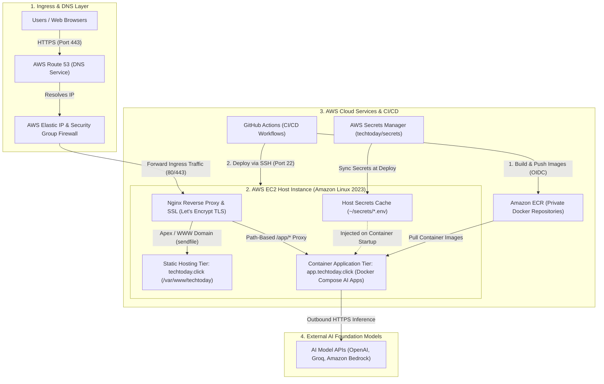
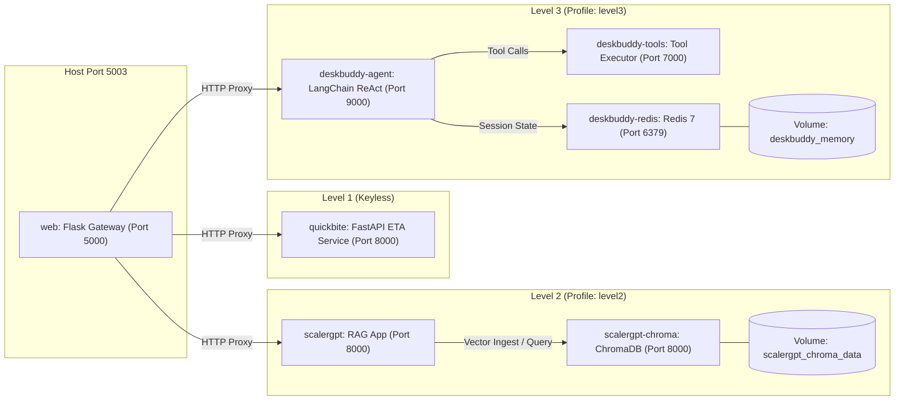
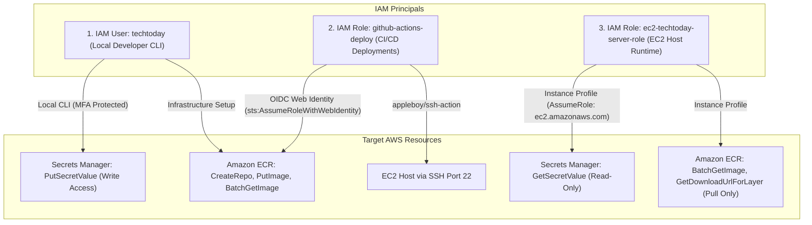
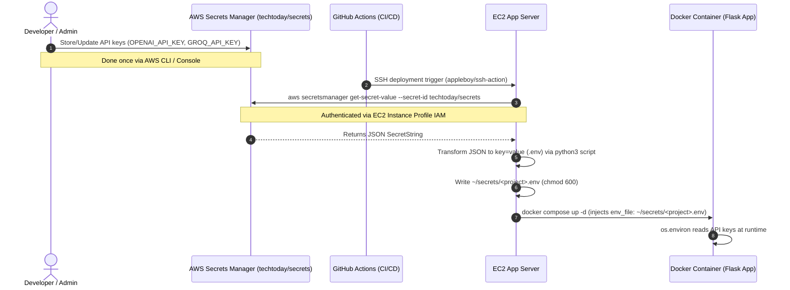
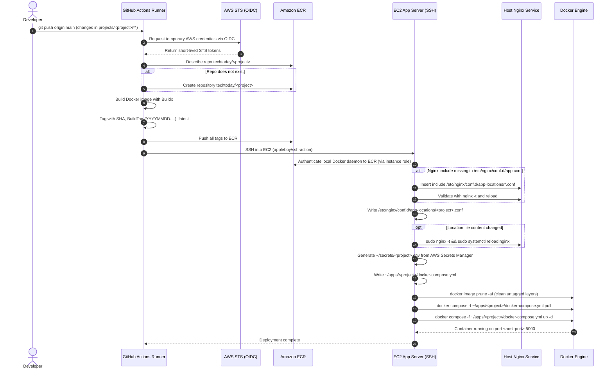
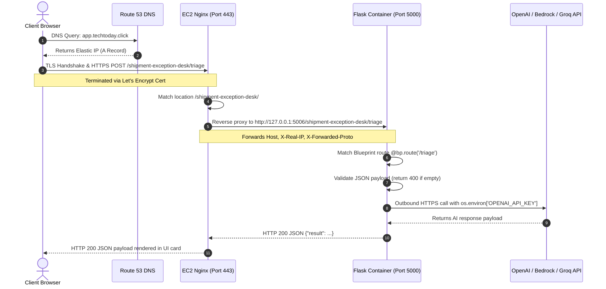
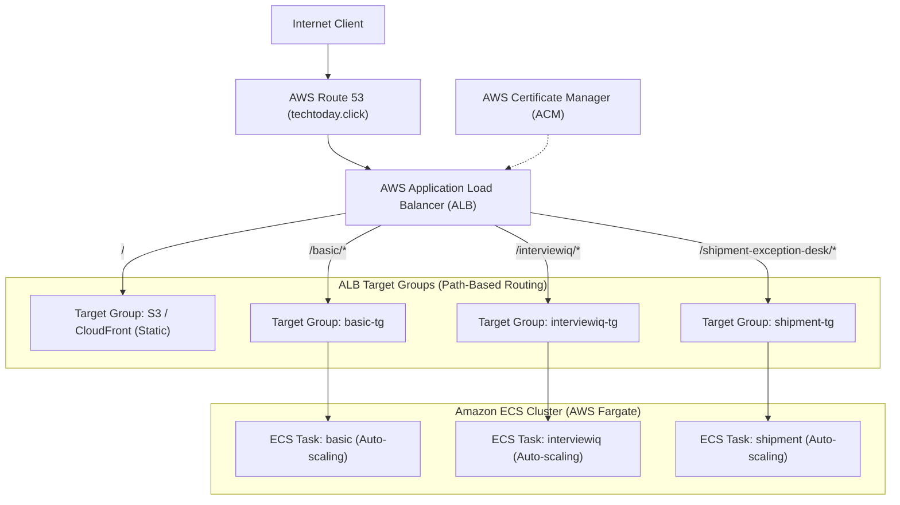

# System Architecture — techtoday.click

Comprehensive architectural specification, infrastructure topology, networking, runtime conventions, security boundaries, CI/CD pipelines, and operational runbooks for the projects in this repository.

---

## 1. Architecture Overview and Core Philosophy

The `techtoday.click` platform is a production cloud environment hosting a portfolio of artificial intelligence applications, agentic systems, interactive labs, and educational study guides.

The primary architectural goal is **maximum operational efficiency and minimal cost footprint without sacrificing production-grade security, isolation, or developer ergonomics**.

### 1.1. Core Architectural Decisions

1. **No AWS Application Load Balancer (ALB):** An AWS ALB incurs a baseline cost of approximately $16 to $25 per month regardless of traffic. Nginx running directly on the EC2 host serves as the high-performance reverse proxy and SSL termination point, reducing infrastructure networking costs to $0.
2. **No AWS ECS or Fargate:** Running containers directly via Docker and Docker Compose on an EC2 instance avoids ECS cluster management fees, private VPC endpoint charges, and per-vCPU/GB Fargate runtime premiums, saving approximately $20 to $40 per month.
3. **Free Automated SSL Certificates:** Let's Encrypt with Certbot automates certificate issuance, renewal, and Nginx configuration for both the apex domain and application subdomains at zero cost. (AWS Certificate Manager certificates cannot be bound directly to EC2 instances without an ALB or CloudFront distribution).
4. **Single Elastic IP with Route 53:** Three DNS A-records in Route 53 point directly to a single static Elastic IP associated with the EC2 host. While attached to a running instance, the Elastic IP is free. Route 53 hosted zone costs are approximately $0.50 per month.
5. **Path-Based Reverse Proxy Routing:** Rather than provisioning separate DNS subdomains, SSL certificates, or cloud infrastructure for every new application, all containerized projects share the `app.techtoday.click` subdomain. Nginx routes traffic by URL path prefix (for example, `/basic/`, `/langchain/`, `/shipment-exception-desk/`) to unique loopback ports on the host.
6. **Isolated Self-Provisioning Deployments:** Each container application is self-contained. On git push, CI/CD workflows automatically create the project's Amazon ECR repository, generate its secrets configuration, provision its isolated Nginx routing block, and launch its isolated Docker Compose stack.
7. **Centralized Secrets with Zero-Commitment Security:** All application API keys are stored centrally in AWS Secrets Manager under `techtoday/secrets`. No credentials exist in Git repositories, Docker image layers, or GitHub Actions secrets. The EC2 instance retrieves and injects secrets into containers at deployment time.

### 1.2. The Dual-Tier Hosting Model

The platform is split into two distinct hosting tiers on the same physical instance:

1. **Static Apex Tier (`techtoday.click` and `www.techtoday.click`):**
   - Serves the main landing page, stylesheets, JavaScript, and comprehensive study guides.
   - Files are stored on the host at `/var/www/techtoday/`.
   - Served directly by Nginx from the filesystem without container overhead, Python runtimes, or database processes.
   - Deployed via `rsync` over SSH from GitHub Actions.
2. **Containerized Application Tier (`app.techtoday.click`):**
   - Serves dynamic AI applications, tool-calling agents, vector database pipelines, and interactive demos.
   - Applications run inside Docker containers listening internally on port `5000`.
   - Each application binds to a distinct EC2 host port in the `500x` range (`127.0.0.1:500x`).
   - Nginx terminates SSL and reverse-proxies requests based on the URL path prefix.

### 1.3. High-Level Fundamental Architecture

The following diagram illustrates the fundamental building blocks of the platform—client routing, host-level dual-tier services, cloud dependencies, CI/CD automation, and external AI integrations—before examining the granular nine-tier infrastructure topology in Section 2:



#### Fundamental Architecture Components
1. **Client & Ingress Layer:** End-user browsers connect securely over HTTPS via AWS Route 53 DNS records, pointing directly to a single static AWS Elastic IP shielded by an EC2 Security Group hypervisor firewall.
2. **Edge Reverse Proxy & TLS (Nginx + Certbot):** Nginx runs natively on the EC2 host as the single entry point, managing automated Let's Encrypt SSL/TLS certificates and routing traffic by domain name and URL path prefix.
3. **Static File Serving Tier (`/var/www/techtoday/`):** High-performance, zero-runtime filesystem delivery for the apex domain landing page, stylesheets, and study guides without Python or database overhead.
4. **Containerized Application Tier (Docker Compose):** Dynamic AI applications, agents, and microservices running inside Docker containers listening on internal loopback ports (`127.0.0.1:500x`) under `app.techtoday.click`.
5. **Secrets Management (AWS Secrets Manager):** Centralized, encrypted store for all production API keys and credentials under `techtoday/secrets`. Secrets are synchronized into isolated host `.env` files during deployment with zero exposure in Git or Docker images.
6. **Container Image Registry (Amazon ECR):** Private ECR repositories storing versioned, production-ready container images for each microservice and AI application.
7. **CI/CD Automation (GitHub Actions):** Workflows authenticating securely via AWS OIDC federation to build images, push to ECR, and execute automated SSH deployments to the host.
8. **External AI Foundation Models:** Containerized AI agents communicate outbound over HTTPS with external LLM APIs (OpenAI, Groq, and Amazon Bedrock).

---

## 2. End-to-End System Topology

The following diagram illustrates the complete architectural topology, from internet clients and Route 53 down to the host OS, Nginx routing, Docker containers, AWS services, and external AI providers.

```mermaid
flowchart TD
    %% TIER 1: CLIENTS
    subgraph Tier1["1. Internet Client Ingress Layer"]
        Browser["User Web Browser / HTTPS Client"]
    end

    %% TIER 2: DNS & GLOBAL ROUTING
    subgraph Tier2["2. AWS DNS & Domain Resolution (Route 53)"]
        direction TB
        R53_Zone["Hosted Zone: techtoday.click (Authoritative DNS - TTL: 300s)"]
        R53_Apex["techtoday.click (Apex A-Record -> Elastic IP)"]
        R53_WWW["www.techtoday.click (WWW A-Record -> Elastic IP)"]
        R53_App["app.techtoday.click (App A-Record -> Elastic IP)"]
        R53_Zone --> R53_Apex & R53_WWW & R53_App
    end

    %% TIER 3: AWS CLOUD PERIMETER & NETWORK
    subgraph Tier3["3. AWS Cloud Network Perimeter (Default VPC: 172.31.0.0/16)"]
        direction TB
        IGW["AWS Internet Gateway (igw)"]
        EIP["Static Elastic IP (Single Public IPv4 Address)"]

        subgraph SG["Hypervisor Firewall: Security Group (techtoday-server-sg)"]
            direction TB
            Port80["Port 80: HTTP (ACME Challenges & HTTP->HTTPS 301 Redirect)"]
            Port443["Port 443: HTTPS (Encrypted Production Web Traffic)"]
            Port22["Port 22: SSH (Admin Terminal & GitHub Actions Deploy)"]
        end
        IGW --> EIP --> SG
    end

    %% TIER 4: HOST OPERATING SYSTEM & REVERSE PROXY
    subgraph Tier4["4. Host OS & Reverse Proxy Layer (Amazon Linux 2023)"]
        direction TB
        Certbot["Certbot Daemon (Let's Encrypt TLS Auto-Renewal)"]
        Nginx["Nginx Web Server & Reverse Proxy Engine"]
        Certbot -. "Manages /etc/letsencrypt/live/*.pem" .-> Nginx

        subgraph VirtualHosts["Nginx Virtual Host Server Blocks"]
            direction TB
            VHostStatic["techtoday.conf (techtoday.click & www.techtoday.click)"]
            VHostApp["app.conf (app.techtoday.click:443 SSL Router)"]
        end
        Nginx --> VHostStatic & VHostApp

        StaticFiles["Static Filesystem: /var/www/techtoday/ (Portfolio Landing Page & Study Guides)"]
        VHostStatic -- "Filesystem Delivery (sendfile)" --> StaticFiles

        AppLocations["Modular Router: /etc/nginx/conf.d/app-locations/*.conf"]
        VHostApp -- "Wildcard Include (*.conf)" --> AppLocations
    end

    %% TIER 5: HOST LOOPBACK ROUTING
    subgraph Tier5["5. Shielded Host Loopback Ports (127.0.0.1 - Zero Public Exposure)"]
        direction TB
        LPort5000["127.0.0.1:5000 (basic)"]
        LPort5001["127.0.0.1:5001 (langchain)"]
        LPort5002["127.0.0.1:5002 (rag)"]
        LPort5003["127.0.0.1:5003 (docker gateway)"]
        LPort5004["127.0.0.1:5004 (aws-strands)"]
        LPort5005["127.0.0.1:5005 (interviewiq)"]
        LPort5006["127.0.0.1:5006 (shipment-exception-desk)"]
    end

    %% TIER 6: DOCKER CONTAINER APPS RUNTIME
    subgraph Tier6["6. Application Runtime Layer (Docker Engine & Docker Compose)"]
        direction TB

        subgraph ModernApps["Isolated Self-Provisioning Stacks (~/apps/[project]/)"]
            direction TB
            AppBasic["basic Container (OpenAI Fundamentals & Playground)"]
            AppLangchain["langchain Container (LangChain LCEL & Agents)"]
            AppRAG["rag Container (ChromaDB + FlashRank Reranker)"]
            AppStrands["aws-strands Container (Bedrock Strands Agents)"]
            AppInterview["interviewiq Container (Groq AI Interview Coach)"]
            AppShipment["shipment-exception-desk Container (Logistics Exception Desk)"]
        end

        subgraph DockerMulti["Multi-Container Microservices Stack (~/docker-compose.yml)"]
            direction TB
            DockerWeb["web: Flask API Gateway (Internal Port 5000)"]
            QuickBite["quickbite: FastAPI ETA Service (Level 1)"]

            subgraph ScalerGPTGroup["Level 2: ScalerGPT Knowledge Retrieval"]
                ScalerGPT["scalergpt: RAG App Service (Port 8000)"]
                ChromaDB["chromadb: Vector Database (Port 8000)"]
                VolChroma[("Named Volume: scalergpt_chroma_data")]
                ScalerGPT <--> ChromaDB
                ChromaDB --- VolChroma
            end

            subgraph DeskBuddyGroup["Level 3: DeskBuddy Agent System"]
                DeskBuddy["deskbuddy-agent: LangChain ReAct (Port 9000)"]
                DeskBuddyTools["deskbuddy-tools: Tool Executor (Port 7000)"]
                RedisMem["deskbuddy-redis: Redis 7 Memory Store (Port 6379)"]
                VolRedis[("Named Volume: deskbuddy_memory")]
                DeskBuddy <--> DeskBuddyTools
                DeskBuddy <--> RedisMem
                RedisMem --- VolRedis
            end

            DockerWeb --> QuickBite & ScalerGPT & DeskBuddy
        end
    end

    %% TIER 7: SECRETS & CLOUD INFRASTRUCTURE
    subgraph Tier7["7. Secrets Management & AWS Identity Layer"]
        direction TB
        SM["AWS Secrets Manager: techtoday/secrets (JSON Store)"]
        EC2_Role["EC2 IAM Instance Role: ec2-techtoday-server-role"]
        LocalSecrets["Host Env Directory: ~/secrets/[project].env (chmod 600)"]
        ECR["Amazon ECR: Private Repositories (techtoday/*)"]

        EC2_Role -. "secretsmanager:GetSecretValue" .-> SM
        SM -- "aws secretsmanager get-secret-value (deploy time)" --> LocalSecrets
        LocalSecrets -. "Injected into containers via env_file" .-> Tier6
        EC2_Role -. "ecr:BatchGetImage & layer pulls" .-> ECR
    end

    %% TIER 8: CI/CD AUTOMATION
    subgraph Tier8["8. Automated CI/CD Pipelines (GitHub Actions & OIDC)"]
        direction TB
        GitHubRepo["GitHub Repository (ai) - main branch"]
        GHA_Workflows["8 Project Workflows (.github/workflows/deploy-*.yml)"]
        GHA_OIDC["IAM Role: github-actions-deploy (OIDC Federation)"]

        GitHubRepo --> GHA_Workflows
        GHA_Workflows -- "OIDC Token Exchange (sts:AssumeRoleWithWebIdentity)" --> GHA_OIDC
        GHA_Workflows -- "Buildx Layer Cache & Image Push" --> ECR
        GHA_Workflows -- "SSH Deploy Execution (Port 22)" --> Tier3
    end

    %% TIER 9: EXTERNAL AI APIS
    subgraph Tier9["9. External AI Foundation Model Providers"]
        direction TB
        OpenAI["OpenAI API (GPT-4o mini, Text Embeddings)"]
        Groq["Groq API (Llama 3 70B, Whisper Audio)"]
        Bedrock["Amazon Bedrock (Converse API, Strands Agents)"]
    end

    %% INTER-TIER FLOWS (TRAFFIC FLOW)
    Browser --> R53_Zone
    R53_Apex & R53_WWW & R53_App --> IGW

    Port80 -- "HTTP Requests" --> Nginx
    Port443 -- "HTTPS Requests" --> Nginx
    Port22 -- "Deployment Commands" --> EC2_Role

    AppLocations -- "proxy_pass /basic/" --> LPort5000 --> AppBasic
    AppLocations -- "proxy_pass /langchain/" --> LPort5001 --> AppLangchain
    AppLocations -- "proxy_pass /rag/" --> LPort5002 --> AppRAG
    AppLocations -- "proxy_pass /docker/" --> LPort5003 --> DockerWeb
    AppLocations -- "proxy_pass /aws-strands/" --> LPort5004 --> AppStrands
    AppLocations -- "proxy_pass /interviewiq/" --> LPort5005 --> AppInterview
    AppLocations -- "proxy_pass /shipment-exception-desk/" --> LPort5006 --> AppShipment

    AppBasic & AppLangchain & AppRAG & DockerWeb & ScalerGPT & DeskBuddy & AppShipment -- "Outbound HTTPS (Port 443)" --> OpenAI
    AppInterview -- "Outbound HTTPS (Port 443)" --> Groq
    AppStrands -- "Outbound SigV4 HTTPS (Port 443)" --> Bedrock
```



---

## 3. AWS Infrastructure and Networking

The infrastructure runs inside the AWS global cloud backbone with resources configured for high availability, tight security perimeter control, and predictable routing.

### 3.1. Route 53 DNS Configuration

The authoritative public hosted zone `techtoday.click` (Hosted Zone ID: `Z0212905113FFTTMPB9AC`) manages all incoming domain queries. Three DNS A-records are configured with a Time-To-Live (TTL) of 300 seconds, verified live against AWS:

1. **`techtoday.click` (Apex Domain):**
   - Type: `A`
   - Target Value: `44.193.134.238` (Elastic IP)
   - TTL: `300` seconds
   - Purpose: Routes public users to the static portfolio homepage.
2. **`www.techtoday.click` (Canonical WWW Subdomain):**
   - Type: `A`
   - Target Value: `44.193.134.238` (Elastic IP)
   - TTL: `300` seconds
   - Purpose: Directs legacy browser traffic to the apex domain via Nginx 301 redirection.
3. **`app.techtoday.click` (Application Subdomain):**
   - Type: `A`
   - Target Value: `44.193.134.238` (Elastic IP)
   - TTL: `300` seconds
   - Purpose: Routes all containerized interactive applications through path-based routing.

### 3.2. Virtual Private Cloud (VPC) and Subnets

1. **VPC:** AWS Default VPC `vpc-0b7f0542d027e78f6` in Region `us-east-1` with IPv4 CIDR block `172.31.0.0/16`.
2. **Subnets:** Public default subnets distributed across availability zones in Region `us-east-1` (for example, `us-east-1a`, `us-east-1b`, `us-east-1c`).
3. **Subnet Routing:** Subnet route tables contain a local route for `172.31.0.0/16` and a default route `0.0.0.0/0` targeting the AWS Internet Gateway (`igw-*`).
4. **IP Assignment:** `Auto-assign public IPv4 address` is enabled on the target subnet, ensuring instance connectivity prior to Elastic IP association.

### 3.3. Elastic IP (Static IPv4)

1. **Allocation:** Allocated from Amazon's pool of public IPv4 addresses (`eipalloc-0f36744b1927a622e`), tagged `Name: Techtoday Elastic IP`.
2. **Public IPv4 Address:** `44.193.134.238`.
3. **Association:** Permanently bound via association ID `eipassoc-005dbb1195133f3c5` to network interface `eni-0676b0fe2cba8b774` on instance `i-047b208deef5652d2`.
4. **Lifecycle Benefit:** Ensures that instance reboots, stops, or replacements do not change the public IP address, preventing DNS propagation delays in Route 53.
5. **Cost:** Incurs $0 cost while continuously attached to a running EC2 instance.

### 3.4. Security Group Rules (`sg-062457d188e85b864`)

The security group (`sg-062457d188e85b864` in VPC `vpc-0b7f0542d027e78f6`) acts as a stateful firewall controlling inbound and outbound network packets at the hypervisor level.

Inbound Rules:

1. **SSH (TCP Port 22):**
   - Source: `0.0.0.0/0` (or locked to an administrative CIDR block).
   - Purpose: Secure terminal shell access for maintenance and GitHub Actions automated deployment execution.
2. **HTTP (TCP Port 80):**
   - Source: `0.0.0.0/0` (Public Internet).
   - Purpose: Mandatory for Let's Encrypt ACME HTTP-01 domain ownership challenges and automatic 301 redirection to HTTPS.
3. **HTTPS (TCP Port 443):**
   - Source: `0.0.0.0/0` (Public Internet).
   - Purpose: Encrypted TLS transport for all web and API traffic.
4. **Self Reference (All Traffic):**
   - Source: `sg-062457d188e85b864`.
   - Purpose: Allows inter-resource communication within the default security group.

Outbound Rules:

1. **All Outbound Traffic (All Protocols / All Ports):**
   - Destination: `0.0.0.0/0`.
   - Purpose: Enables the instance to make external HTTPS calls to OpenAI, Groq, and Bedrock APIs; pull images from Amazon ECR; authenticate with AWS Secrets Manager; and download OS package updates.

Loopback Isolation:

1. **Zero External Access to Application Ports:**
   - Host ports `5000` through `5006`, ChromaDB port `8000`, and Redis port `6379` are **strictly absent** from the security group inbound rules.
   - Application containers bind to the host loopback adapter (`127.0.0.1:<port>`). External clients cannot access backend containers directly, enforcing Nginx as the single mandatory gateway.

### 3.5. EC2 Compute Specification

1. **Server Name:** `techtoday-server` (Instance ID: `i-047b208deef5652d2`).
2. **Operating System:** Amazon Linux 2023 (`al2023-ami-*-x86_64`).
3. **Instance Type:** `t3.medium` (2 vCPUs, 4 GiB RAM) in production, providing sufficient headroom for concurrent vector embeddings, ChromaDB, and Redis operations alongside Flask apps. (Baseline starter instances can run on `t2.micro` with Free Tier).
4. **Networking:** Private IP `172.31.43.213`, Public Elastic IP `44.193.134.238` in Region `us-east-1`.
5. **IAM Instance Profile:** `arn:aws:iam::090232461741:instance-profile/ec2-techtoday-server-profile` (Role: `ec2-techtoday-server-role`).
6. **Storage:** 30 GB gp3 root EBS volume configured with baseline 3,000 IOPS and 125 MB/s throughput.
7. **Authentication:** RSA 2048-bit key pair (`techtoday.pem`) restricted to owner read-only permissions (`chmod 400`). Default login user is `ec2-user`.

---

## 4. Edge Ingress, Reverse Proxy, and SSL

Nginx runs natively as a systemd service on the EC2 host (`systemctl status nginx`). It acts as the frontline web server, terminates TLS encryption, and directs traffic to static directories or internal container ports.

### 4.1. Nginx Directory Structure on EC2

1. `/etc/nginx/nginx.conf`: Base Nginx server configuration, worker process tuning, MIME type mappings, and default logging.
2. `/etc/nginx/conf.d/techtoday.conf`: Virtual host configuration for `techtoday.click` and `www.techtoday.click`.
3. `/etc/nginx/conf.d/app.conf`: Virtual host configuration for `app.techtoday.click`.
4. `/etc/nginx/conf.d/app-locations/`: Directory containing modular, per-project reverse proxy location files (e.g., `shipment-exception-desk.conf`, `interviewiq.conf`, `aws-strands.conf`).
5. `/var/www/techtoday/`: Filesystem root holding static HTML/CSS/JS assets and compiled study notes.

### 4.2. Virtual Host 1: Static Site (`techtoday.conf`)

This configuration serves the apex domain and handles canonical domain redirection.

```nginx
# HTTP Inbound — Redirect all traffic to HTTPS
server {
    listen 80;
    server_name techtoday.click www.techtoday.click;
    return 301 https://$host$request_uri;
}

# HTTPS Inbound — Serve Static Assets
server {
    listen 443 ssl;
    server_name techtoday.click www.techtoday.click;

    ssl_certificate /etc/letsencrypt/live/techtoday.click/fullchain.pem;
    ssl_certificate_key /etc/letsencrypt/live/techtoday.click/privkey.pem;
    include /etc/letsencrypt/options-ssl-nginx.conf;
    ssl_dhparam /etc/letsencrypt/ssl-dhparams.pem;

    root  /var/www/techtoday;
    index index.html;

    location / {
        try_files $uri $uri/ /index.html;
    }

    # Caching headers for static assets
    location ~* \.(css|js|png|jpg|jpeg|gif|ico|svg|pdf)$ {
        expires 7d;
        add_header Cache-Control "public, no-transform";
    }
}
```

### 4.3. Virtual Host 2: Container Application Router (`app.conf`)

This configuration acts as the dynamic router for all containerized applications. It incorporates an automated glob include that loads per-project location files dynamically.

```nginx
# HTTP Inbound — Redirect all traffic to HTTPS
server {
    listen 80;
    server_name app.techtoday.click;
    return 301 https://$host$request_uri;
}

# HTTPS Inbound — Reverse Proxy Router
server {
    listen 443 ssl;
    server_name app.techtoday.click;

    ssl_certificate /etc/letsencrypt/live/app.techtoday.click/fullchain.pem;
    ssl_certificate_key /etc/letsencrypt/live/app.techtoday.click/privkey.pem;
    include /etc/letsencrypt/options-ssl-nginx.conf;
    ssl_dhparam /etc/letsencrypt/ssl-dhparams.pem;

    # Include all modular per-project location files
    include /etc/nginx/conf.d/app-locations/*.conf;

    # Fallback 404 handler for unknown paths
    location / {
        return 404 "Not Found: No application mounted at this path.\n";
    }
}
```

### 4.4. Modular Location Configuration Pattern

Every container application drops an isolated configuration file into `/etc/nginx/conf.d/app-locations/<project-name>.conf`.

Example (`/etc/nginx/conf.d/app-locations/shipment-exception-desk.conf`):

```nginx
location /shipment-exception-desk/ {
    proxy_pass         http://localhost:5006;
    proxy_set_header   Host $host;
    proxy_set_header   X-Real-IP $remote_addr;
    proxy_set_header   X-Forwarded-For $proxy_add_x_forwarded_for;
    proxy_set_header   X-Forwarded-Proto $scheme;

    # Streaming and buffering settings for LLM responses
    proxy_buffering    off;
    proxy_read_timeout 300s;
    proxy_connect_timeout 75s;
}
```

Key Architectural Properties of this Pattern:

1. **Zero Downtime for Sibling Apps:** Adding, updating, or deleting one project's location file requires only `sudo nginx -t && sudo systemctl reload nginx`, which reloads configuration in worker threads without dropping active TCP connections.
2. **Proxy Headers Preservation:**
   - `Host $host`: Preserves the original requested domain (`app.techtoday.click`).
   - `X-Real-IP $remote_addr`: Transmits the true client public IPv4 address to Flask.
   - `X-Forwarded-For $proxy_add_x_forwarded_for`: Appends client and intermediary proxy hops.
   - `X-Forwarded-Proto $scheme`: Tells Flask whether the incoming request was `http` or `https` (preventing redirect loops).
3. **Buffering Disabled (`proxy_buffering off`):** Essential for AI streaming completions (Server-Sent Events / SSE) so tokens reach the browser in real time instead of being buffered until completion.

### 4.5. SSL/TLS Certificate Lifecycle (Let's Encrypt & Certbot)

1. **Certificate Issuance:** Executed via `certbot --nginx -d techtoday.click -d www.techtoday.click` and `certbot --nginx -d app.techtoday.click`.
2. **ACME Validation:** Certbot dynamically creates temporary challenge tokens under `/.well-known/acme-challenge/` over HTTP port 80.
3. **Auto-Renewal Automation:** Amazon Linux 2023 runs a systemd timer (`certbot-renew.timer`) twice daily that invokes `certbot renew`. If a certificate is within 30 days of expiry, Certbot re-challenges, writes new keys, and signals Nginx to reload certificates seamlessly.

### 4.6. AI Input Rate Limiting and Abuse Prevention (`00-rate-limit.conf`)

To protect expensive external AI foundation model APIs (OpenAI, Bedrock, Groq) against denial-of-service, automated scraping, or runaway querying, Nginx enforces rate limiting on prompt submissions at the edge.

1. **HTTP-Level Definition (`/etc/nginx/conf.d/00-rate-limit.conf`):**
   - Prefix Ordering: Named `00-rate-limit.conf` to guarantee it is loaded alphabetically by Nginx before `app.conf` and any server or location blocks.
   - Method Mapping: Uses `map $request_method $ai_post_limit` so only `POST` requests (prompt and input submissions) evaluate to the client's binary IP address (`$binary_remote_addr`). `GET` requests evaluate to empty string `""` and bypass the rate limit completely, ensuring page views, stylesheets, and scripts are never throttled.
   - Memory Zone: A 10 MB shared memory zone (`zone=ai_inputs:10m`) tracks approximately 160,000 active IPv4 addresses simultaneously.
   - Rate Definition: Sets `rate=1r/m` (1 request per minute) as the continuous replenishment rate.
2. **Location-Level Enforcement (`/etc/nginx/conf.d/app-locations/*.conf`):**
   - Burst Allowance: `limit_req zone=ai_inputs burst=9 nodelay;` permits an immediate burst of up to 10 requests upfront (1 base + 9 burst), catering to interactive user experimentation.
   - Instant Rejection: Requests exceeding the burst capacity are immediately rejected with `limit_req_status 429;` (`HTTP 429 Too Many Requests`) without queuing or wasting EC2 worker threads.
   - Replenishment: After the initial burst, the user's quota replenishes at 1 request per minute (up to 60 requests per hour).
3. **JSON Error Response Handling (`/etc/nginx/conf.d/app-locations/00-rate-limit-response.conf`):**
   - Direct JSON Error Routing: Configures `error_page 429 = @rate_limit_error;` inside the SSL server block to redirect throttled requests to internal named location `@rate_limit_error`.
   - Explicit Content-Type: Delivers `Content-Type: application/json` returning `{"error": "Rate limit exceeded (10 requests per hour). Please wait an hour and try again."}` instead of default Nginx HTML error pages.
   - Frontend Interception: Frontend `main.js` files explicitly check `!res.ok`, ensuring any 429 or server errors are rendered in user-friendly banners rather than crashing with `SyntaxError: Unexpected token '<'`.

---

## 5. Application and Container Runtime Architecture

All dynamic projects run as containerized services managed by Docker Engine (`docker-ce`) and Docker Compose (`docker-compose-plugin`).

### 5.1. Runtime Standards and Conventions

1. **Standard Internal Container Port:** Every containerized application listens on port `5000` inside its container (`0.0.0.0:5000`).
2. **Standard Application Entrypoint:** Python Flask applications execute using `python src/python/app.py`.
3. **Restart Policy:** Production containers configure `restart: unless-stopped`, ensuring automatic daemon recovery following EC2 reboots or process crashes.
4. **Loopback Binding:** Compose files map internal port `5000` to an allocated host port in the `500x` range (`"<host-port>:5000"`).

### 5.2. Port Allocation Registry

To prevent port collision across applications on both local development machines and the production EC2 host, ports are strictly registered:

1. **`basic` (AI Fundamentals Lab):**
   - Path Prefix: `/basic`
   - Local Development Port: `8080:5000`
   - EC2 Host Port: `5000:5000`
   - ECR Repository: `techtoday/basic`
   - Technologies: Flask, OpenAI API (GPT-4o mini)
2. **`langchain` (LangChain Lab):**
   - Path Prefix: `/langchain`
   - Local Development Port: `8081:5000`
   - EC2 Host Port: `5001:5000`
   - ECR Repository: `techtoday/langchain`
   - Technologies: Flask, LangChain, LCEL, Memory buffers
3. **`rag` (RAG & Vector Retrieval Lab):**
   - Path Prefix: `/rag`
   - Local Development Port: `8082:5000`
   - EC2 Host Port: `5002:5000`
   - ECR Repository: `techtoday/rag`
   - Technologies: Flask, ChromaDB, HuggingFace embeddings, FlashRank reranker
4. **`docker` (Multi-Container Microservices Lab):**
   - Path Prefix: `/docker`
   - Local Development Port: `8083:5000`
   - EC2 Host Port: `5003:5000`
   - ECR Repositories: `techtoday/docker-{web,quickbite,scalergpt,deskbuddy-agent,deskbuddy-tools}`
   - Technologies: Flask gateway, FastAPI, ChromaDB container, Redis container, Docker Compose profiles
5. **`aws-strands` (Amazon Bedrock Strands Lab):**
   - Path Prefix: `/aws-strands`
   - Local Development Port: `8084:5000`
   - EC2 Host Port: `5004:5000`
   - ECR Repository: `techtoday/aws-strands`
   - Technologies: Flask, AWS Strands Agents SDK, Amazon Bedrock Converse API
6. **`interviewiq` (AI Mock Interview Coach):**
   - Path Prefix: `/interviewiq`
   - Local Development Port: `8085:5000`
   - EC2 Host Port: `5005:5000`
   - ECR Repository: `techtoday/interviewiq`
   - Technologies: Flask, Groq API (Llama 3, Whisper), ReAct tool-calling agent
7. **`shipment-exception-desk` (Logistics Exception Agent):**
   - Path Prefix: `/shipment-exception-desk`
   - Local Development Port: `8086:5000`
   - EC2 Host Port: `5006:5000`
   - ECR Repository: `techtoday/shipment-exception-desk`
   - Technologies: Flask, OpenAI API, Structured exception triage engine
8. **`template` (Starter Reference Implementation):**
   - Path Prefix: `/<project-name>`
   - Starter Local Port: `8090:5000`
   - Next Free Local Development Port: `8087`
   - Next Free EC2 Host Port: `5007`
   - Technologies: Standardized Flask Blueprint, UI shell, and deploy workflow template

### 5.3. Flask Runtime Architecture and `PATH_PREFIX` Convention

Because Nginx forwards the entire path to the upstream container without stripping the project URL segment (e.g. `https://app.techtoday.click/shipment-exception-desk/` is forwarded to `http://localhost:5006/shipment-exception-desk/`), the backend Flask application must natively understand its mounting prefix.

#### 5.3.1. Blueprint Registration with `PATH_PREFIX`

Every application extracts `PATH_PREFIX` from its environment (defaulting to empty for root or isolated tests):

```python
import os
from flask import Flask, Blueprint, render_template, request, jsonify

app = Flask(__name__)
PATH_PREFIX = os.environ.get("PATH_PREFIX", "")

bp = Blueprint("app", __name__)

@bp.route("/")
def index():
    return render_template("index.html", path_prefix=PATH_PREFIX)

@bp.route("/triage", methods=["POST"])
def triage():
    # Process business logic
    return jsonify({"result": "processed"})

# Register blueprint with prefix
app.register_blueprint(bp, url_prefix=PATH_PREFIX)
```

#### 5.3.2. Frontend Hydration and API Routing

1. **HTML Shell Attribute:** In `src/index.html`, the body element is rendered with a data attribute:
   ```html
   <body data-api-base="{{ path_prefix }}">
   ```
2. **Client-Side Discovery:** In `src/js/main.js`, all asynchronous `fetch()` requests read this base attribute:
   ```javascript
   const API = document.body.dataset.apiBase || "";

   async function callApi(endpoint, payload) {
       const response = await fetch(`${API}${endpoint}`, {
           method: "POST",
           headers: { "Content-Type": "application/json" },
           body: JSON.stringify(payload)
       });
       return await response.json();
   }
   ```
3. **Environment Parity:** This design guarantees that the exact same JavaScript code functions locally on `http://localhost:8086/` (where `PATH_PREFIX` is empty or `/`) and in production on `https://app.techtoday.click/shipment-exception-desk/` without conditional domain logic or environment flags in the browser bundle.

### 5.4. Single-Container vs. Multi-Container Topologies

#### 5.4.1. Single-Container Topology (Standard Model)

Used by `basic`, `langchain`, `rag`, `aws-strands`, `interviewiq`, `shipment-exception-desk`, and `template`.
- A single Docker image built from the project's root `Dockerfile`.
- Encapsulates Python 3.11+, dependencies (`requirements.txt`), frontend static files (`src/css`, `src/js`), and backend feature modules (`src/python`).
- Purely stateless compute; persistent state is either stored in memory during an active session or delegated to cloud APIs.

#### 5.4.2. Multi-Container Topology (`projects/docker`)

Demonstrates multi-tier enterprise microservices architectures with Docker Compose profiles, inter-service networking, and persistent volume mounts:



Multi-Container Features:
1. **Docker Compose Profiles:** Profiles (`level2`, `level3`) allow starting services conditionally (`docker compose --profile level2 --profile level3 up -d`).
2. **Internal Bridge Network:** Containers communicate using Docker's internal DNS names (e.g. `http://scalergpt-chroma:8000` and `http://deskbuddy-tools:7000`), completely shielded from host exposure.
3. **Healthcheck Dependency Chaining:** Services utilize `depends_on` with `condition: service_healthy` to guarantee that databases (Redis, ChromaDB) are fully ready to accept socket connections before the consuming applications start.
4. **Persistent Volumes:** Docker named volumes (`scalergpt_chroma_data`, `deskbuddy_memory`) persist vector embeddings and session histories across container recreations and image upgrades.

---

## 6. Security, Identity, and Secrets Management

Security architecture follows the principle of least privilege, zero-trust credential isolation, and automated cryptographic identity federation.

### 6.1. IAM Identities and Permissions

Three distinct IAM principals govern the platform:



#### 6.1.1. Local Admin IAM User (`techtoday`)
- Purpose: Used solely for administrative tasks from the developer's workstation CLI.
- Permissions: Manages EC2 instances, Route 53 zones, and writes API keys to AWS Secrets Manager.
- Protection: Protected by Multi-Factor Authentication (MFA); never used in CI/CD automation.

#### 6.1.2. GitHub Actions OIDC Deploy Role (`github-actions-deploy`)
- Purpose: Assumed dynamically by GitHub Actions runners during automated CI/CD builds.
- Trust Policy:
  ```json
  {
    "Version": "2012-10-17",
    "Statement": [{
      "Effect": "Allow",
      "Principal": {
        "Federated": "arn:aws:iam::090232461741:oidc-provider/token.actions.githubusercontent.com"
      },
      "Action": "sts:AssumeRoleWithWebIdentity",
      "Condition": {
        "StringEquals": { "token.actions.githubusercontent.com:aud": "sts.amazonaws.com" },
        "StringLike": { "token.actions.githubusercontent.com:sub": "repo:pankajspace/*" }
      }
    }]
  }
  ```
- Permissions Policy (`ECRPushAndSSH`):
  - Grants `ecr:GetAuthorizationToken` on `*`.
  - Grants `ecr:CreateRepository` and `ecr:DescribeRepositories` on `arn:aws:ecr:*:090232461741:repository/techtoday/*`.
  - Grants `ecr:PutImage`, `ecr:InitiateLayerUpload`, `ecr:UploadLayerPart`, `ecr:CompleteLayerUpload` on `arn:aws:ecr:*:090232461741:repository/techtoday/*`.
  - Grants `ecr:BatchCheckLayerAvailability`, `ecr:BatchGetImage`, `ecr:GetDownloadUrlForLayer` on `arn:aws:ecr:*:090232461741:repository/techtoday/*`.
- Critical Design Note: Docker Buildx / BuildKit performs a `HEAD` request against the target ECR repository manifest before pushing to verify which layers can be skipped. If read permissions (`BatchGetImage`, `GetDownloadUrlForLayer`) are missing, ECR responds with `403 Forbidden` and the push aborts.

#### 6.1.3. EC2 Instance IAM Role (`ec2-techtoday-server-role`)
- Purpose: Attached to the EC2 host via instance profile `ec2-techtoday-server-profile`.
- Trust Policy: Allows `ec2.amazonaws.com` to assume the role.
- Permissions Policy (`AllowAppSecrets`):
  ```json
  {
    "Version": "2012-10-17",
    "Statement": [
      {
        "Effect": "Allow",
        "Action": ["secretsmanager:GetSecretValue"],
        "Resource": "arn:aws:secretsmanager:*:*:secret:techtoday/*"
      },
      {
        "Effect": "Allow",
        "Action": [
          "ecr:GetAuthorizationToken",
          "ecr:BatchGetImage",
          "ecr:GetDownloadUrlForLayer"
        ],
        "Resource": "*"
      }
    ]
  }
  ```
- Strict Read-Only Boundary: The EC2 instance cannot create ECR repositories, write secrets (`PutSecretValue`), or modify AWS networking. If an EC2 container is compromised, the attacker cannot tamper with AWS cloud infrastructure or secrets.

### 6.2. Secrets Lifecycle and Dynamic Injection

No plain-text credentials or API keys exist within Git repositories, Dockerfiles, container images, or GitHub Actions secrets.



1. **Central Store:** AWS Secrets Manager stores all project keys in a single JSON document named `techtoday/secrets` (containing `OPENAI_API_KEY`, `GROQ_API_KEY`, and future provider keys).
2. **Deployment-Time Generation:** On every deployment, the SSH deploy step on EC2 invokes the AWS CLI to fetch the latest JSON payload, transforms it into standard `.env` syntax, and writes it to `~/secrets/<project-name>.env`.
3. **Filesystem Hardening:** The generated file is locked to the `ec2-user` account with POSIX mode `600` (`chmod 600 ~/secrets/<project-name>.env`).
4. **Container Injection:** Docker Compose references this file via `env_file: - $HOME/secrets/<project-name>.env`. The variables are injected directly into the container's Linux process environment table, accessible via Python's standard `os.environ`.

---

## 7. CI/CD Deployment Pipelines

Deployments are entirely automated using GitHub Actions. Pipelines are idempotent, scoped by project directory paths, and support zero-downtime rolling updates.

### 7.1. Pipeline Matrix Overview

All workflows reside under `.github/workflows/`:

1. **`deploy-techtoday.yml`:** Static site pipeline. Syncs `projects/techtoday/` to `/var/www/techtoday/` via `rsync` over SSH.
2. **`deploy-basic.yml`:** Self-provisioning container pipeline. Auto-provisions ECR, Nginx location with rate limiting, per-project Compose (`~/apps/basic/`), and restarts `basic`.
3. **`deploy-langchain.yml`:** Self-provisioning container pipeline. Auto-provisions ECR, Nginx location with rate limiting, per-project Compose (`~/apps/langchain/`), and restarts `langchain`.
4. **`deploy-rag.yml`:** Self-provisioning container pipeline. Auto-provisions ECR, Nginx location with rate limiting, per-project Compose (`~/apps/rag/`), and restarts `rag`.
5. **`deploy-docker.yml`:** Multi-container pipeline. Builds 5 microservice images with Buildx cache, auto-provisions Nginx location with rate limiting, pulls and restarts stack via Compose profiles (`level2`, `level3`), and runs post-start ingestion.
6. **`deploy-aws-strands.yml`:** Self-provisioning container pipeline. Auto-provisions ECR, Nginx include/location with rate limiting, per-project Compose, and restarts `aws-strands`.
7. **`deploy-interviewiq.yml`:** Self-provisioning container pipeline. Auto-provisions ECR, Nginx include/location with rate limiting, per-project Compose, and restarts `interviewiq`.
8. **`deploy-shipment-exception-desk.yml`:** Self-provisioning container pipeline. Auto-provisions ECR, Nginx include/location with rate limiting, per-project Compose, and restarts `shipment-exception-desk`.

### 7.2. Shared GitHub Actions Secrets

Only five shared secrets are required in GitHub (**Settings → Secrets and variables → Actions**):

1. `AWS_REGION`: The AWS region (e.g. `us-east-1`).
2. `AWS_ACCOUNT_ID`: The 12-digit AWS account identifier.
3. `AWS_DEPLOY_ROLE_ARN`: The ARN of the `github-actions-deploy` IAM role.
4. `EC2_HOST`: The Elastic IP address attached to the EC2 instance.
5. `EC2_SSH_KEY`: The full RSA private key content (`techtoday.pem`).

### 7.3. The Self-Provisioning Deployment Architecture

Modern container applications (`aws-strands`, `interviewiq`, `shipment-exception-desk`, and projects created from `template`) use a self-provisioning CI/CD pattern. On the very first git push of a new project, the pipeline automatically creates every required server-side resource without requiring manual SSH sessions or AWS CLI setup.



Self-Provisioning Execution Steps:

1. **Path-Scoped Trigger:** Filtered by `paths: ['projects/<project-name>/**']`. Unrelated commits do not trigger builds.
2. **OIDC Authentication:** GitHub OIDC provider exchanges the runner's ephemeral JSON Web Token (JWT) for scoped AWS credentials via `aws-actions/configure-aws-credentials@v5`.
3. **Idempotent ECR Repository Creation:**
   ```bash
   aws ecr describe-repositories --repository-names "$ECR_REPOSITORY" --region "$AWS_REGION" >/dev/null 2>&1 \
     || aws ecr create-repository --repository-name "$ECR_REPOSITORY" --region "$AWS_REGION"
   ```
4. **Tri-Tagging Strategy:** Every image is tagged with:
   - Full Git commit SHA (`${{ github.sha }}`) for immutable revision tracking.
   - Human-readable sortable build tag (`YYYYMMDD-HHMMSS-<run>-<short-sha>`) for unambiguous rollbacks.
   - `latest` tag representing the current production release.
5. **Layer Caching:** Workflows utilize Docker Buildx and the GitHub Actions Cache backend (`cache-from: type=gha,scope=<project>`, `cache-to: type=gha,mode=max,scope=<project>`), allowing heavy layer dependencies (such as PyTorch, LangChain, and embedding models) to be restored in seconds rather than rebuilt from scratch.
6. **SSH Connection:** Workflow connects to `$EC2_HOST` as `ec2-user` via `appleboy/ssh-action`.
7. **ECR EC2 Login:** The EC2 host authenticates its local Docker daemon against ECR using its attached IAM instance profile:
   ```bash
   aws ecr get-login-password --region $REGION | docker login --username AWS --password-stdin $ACCOUNT.dkr.ecr.$REGION.amazonaws.com
   ```
8. **Auto-Ensuring Nginx Include:** Inspects `/etc/nginx/conf.d/app.conf`. If the directive `include /etc/nginx/conf.d/app-locations/*.conf;` is missing from the SSL server block, it automatically inserts it, validates syntax via `nginx -t`, and reloads Nginx.
9. **Idempotent Nginx Location Block:** Writes `/etc/nginx/conf.d/app-locations/<project>.conf` to a temporary file and compares it against the destination (`cmp -s`). Nginx is reloaded **only** if the location block configuration has changed.
10. **Secrets Generation:** Queries Secrets Manager, parses keys via Python, and updates `~/secrets/<project>.env` (`chmod 600`).
11. **Isolated Per-Project Docker Compose:** Writes `~/apps/<project>/docker-compose.yml` specifying the latest ECR image, `restart: unless-stopped`, host-to-container port mapping (`500x:5000`), `PATH_PREFIX`, and the env file.
12. **Prune, Pull, and Up:** Prunes dangling untagged images to prevent disk exhaustion, pulls the new image, and recreates the container in detached mode (`docker compose pull && docker compose up -d`).

### 7.4. Unified Self-Provisioning and Multi-Service Compose Model

All single-service container applications (`basic`, `langchain`, `rag`, `aws-strands`, `interviewiq`, and `shipment-exception-desk`) operate under the unified, self-provisioning per-project compose model:

1. **Per-Project Isolation (`~/apps/<project>/`):** Each project owns its own `docker-compose.yml`, mapped to its assigned loopback port (`5000`–`5006`), running with isolated secrets (`~/secrets/<project>.env`).
2. **Automated Location Routing & Rate Limiting:** Each deploy workflow auto-ensures `/etc/nginx/conf.d/00-rate-limit.conf`, prunes legacy inline definitions, and maintains `/etc/nginx/conf.d/app-locations/<project>.conf` with POST rate limiting (`limit_req zone=ai_inputs burst=9 nodelay;`).
3. **Multi-Service Exception (`docker`):** The `docker` project continues to utilize its multi-service profile orchestration on EC2 while also taking advantage of the automated Nginx location routing and rate limiting.

### 7.5. Dual-Branch Environment Strategy (`staging` and `main`)

For complete step-by-step instructions, branch lifecycles, and rollback commands, see [DEPLOYMENT.md](file:///home/pankaj/Workspace/ai/projects/DEPLOYMENT.md).

1. **`staging` Branch:** Serves as the active development and pre-production validation target. Developers commit and push directly to `staging` to build and deploy to EC2, verifying reverse proxy routing, rate limiting rules, and container health on the live host.
2. **`main` Branch:** Represents the protected, stable production release. Once changes on `staging` pass live verification, `staging` is merged into `main` and pushed to trigger production deployment.
3. **Rollback via Force Reset (Way 1):** If changes on `staging` fail or are discarded, `staging` is reset directly to `origin/main` (`git reset --hard origin/main && git push origin staging --force`), which automatically redeploys the stable production version.

---

## 8. Request and Lifecycle Workflows

### 8.1. Client HTTP Request Execution Flow

The sequence below illustrates the complete path of an end-user request calling an AI feature (e.g. submitting a logistics exception report in `shipment-exception-desk`):



### 8.2. Static Asset Delivery Flow

For requests targeting `https://techtoday.click/` or `https://techtoday.click/study/ai-projects/rag-embeddings.html`:

1. Client resolves `techtoday.click` to the Elastic IP.
2. Nginx accepts TCP 443, decrypts TLS using `/etc/letsencrypt/live/techtoday.click/fullchain.pem`.
3. Matches the `techtoday.click` server block in `techtoday.conf`.
4. Checks `/var/www/techtoday/study/ai-projects/rag-embeddings.html` directly from disk via `try_files`.
5. Nginx streams the static HTML or PDF directly to the client socket using the Linux kernel `sendfile` system call. Zero Docker containers or Python processes are invoked.

---

## 9. Operations, Reliability, and Troubleshooting

### 9.1. Rollback Runbook

Every deployment workflow logs a deterministic human-readable build tag to the GitHub Actions job summary:
`YYYYMMDD-HHMMSS-<run_number>-<short_sha>` (for example: `20260907-114520-14-3a7b9c1`).

To roll back a containerized project to a previous build:

1. **Identify the Target Build Tag:**
   - In GitHub, navigate to the repository **Actions** tab.
   - Click the last known stable deployment run for the project and copy the build tag from the summary.
2. **SSH into the EC2 Server:**
   ```bash
   ssh -i techtoday.pem ec2-user@$ELASTIC_IP
   ```
3. **Update the Image Tag:**
   - For a self-provisioning project (e.g. `basic`, `langchain`, `rag`, `shipment-exception-desk`):
     ```bash
     cd ~/apps/<project-name>
     # Edit docker-compose.yml to replace :latest with :<build-tag>
     sed -i 's/:latest/:20260907-114520-14-3a7b9c1/' docker-compose.yml
     docker compose pull
     docker compose up -d
     ```
   - For the multi-service `docker` stack:
     ```bash
     # Edit ~/docker-compose.yml to pin the specific sub-image tag
     docker compose -f ~/docker-compose.yml pull web
     docker compose -f ~/docker-compose.yml up -d --no-deps web
     ```
4. **Verify Rollback:**
   ```bash
   curl -I https://app.techtoday.click/<project-name>/
   ```

### 9.2. Disk Space and Memory Management on t2.micro / t3.small

Because the server runs multiple Docker containers on a resource-constrained instance, strict resource stewardship is enforced:

1. **Automated Dangling Image Cleanup:**
   - Every CI/CD workflow runs `docker image prune -af` or `docker image prune -f` during the deploy step.
   - This removes unreferenced layers, intermediate build caches, and untagged parent images, keeping EBS disk utilization typically below 40%.
2. **Periodic Deep Cleanup:**
   - If disk space exceeds 80% (`df -h /`), run:
     ```bash
     docker system prune -a --volumes -f
     ```
   - Note: Do not remove named volumes containing persistent databases (`scalergpt_chroma_data`, `deskbuddy_memory`).
3. **Linux Swap Space Allocation:**
   - To prevent the Linux kernel Out-Of-Memory (OOM) killer from terminating containers during burst memory spikes on a `t2.micro` (1 GiB RAM), a 2 GB swapfile should be configured:
     ```bash
     sudo dd if=/dev/zero of=/swapfile bs=128M count=16
     sudo chmod 600 /swapfile
     sudo mkswap /swapfile
     sudo swapon /swapfile
     echo '/swapfile swap swap defaults 0 0' | sudo tee -a /etc/fstab
     ```

### 9.3. Common Failure Modes and Remediation

1. **HTTP 502 Bad Gateway:**
   - Symptom: Browser displays `502 Bad Gateway` when accessing `https://app.techtoday.click/<project>/`.
   - Cause 1: Container crashed or failed to start (e.g., Python syntax error or missing environment variable).
     - Fix: Check logs: `docker logs <container-name>` or `docker compose -f ~/apps/<project>/docker-compose.yml logs`.
   - Cause 2: Container entrypoint mismatch.
     - Fix: Ensure the compose service command is `command: python src/python/app.py`.
   - Cause 3: Port mismatch between Nginx location block (`proxy_pass http://localhost:<port>`) and Docker Compose published port.
     - Fix: Verify port in `/etc/nginx/conf.d/app-locations/<project>.conf` matches `docker ps`.
2. **HTTP 404 Not Found on App Root:**
   - Symptom: Accessing `https://app.techtoday.click/<project>` returns 404, but `https://app.techtoday.click/<project>/` works.
   - Cause: Missing trailing slash. Nginx location blocks are defined with trailing slashes (`location /<project>/`).
   - Fix: Ensure URLs include the trailing slash or add a rewrite block in Nginx: `rewrite ^/<project>$ /<project>/ permanent;`.
3. **ECR Push Fails with HTTP 403 Forbidden in GitHub Actions:**
   - Symptom: CI/CD step "Build, tag, and push image to ECR" fails with `unexpected status from HEAD request ... 403 Forbidden`.
   - Cause: The GitHub Actions OIDC deploy role lacks `ecr:BatchGetImage` or `ecr:GetDownloadUrlForLayer`.
   - Fix: Ensure the inline policy on `github-actions-deploy` includes read actions alongside push actions (see Section 6.1.2).
4. **SSH Deployment Hangs or Times Out:**
   - Symptom: GitHub Actions SSH step hangs indefinitely until timing out.
   - Cause: The EC2 security group dropped incoming packets on TCP port 22 because the rule was deleted or the instance IP changed.
   - Fix: Check `techtoday-server-sg` in AWS Console, ensure port 22 is open to `0.0.0.0/0`, and verify `EC2_HOST` in GitHub secrets matches the current Elastic IP.

---

## 10. Architectural Evolution and Scaling Triggers

The current architecture is optimized for cost efficiency, low maintenance overhead, and educational/portfolio workloads. The platform should evolve to an enterprise multi-tier architecture when specific operational thresholds are met.

### 10.1. Scaling Trigger Thresholds

Transition to AWS ECS Fargate and Application Load Balancers when:

1. **Sustained Concurrent Concurrency Exceeds Single Host Limits:** When daily active user traffic creates CPU throttling or memory exhaustion on a `t3.small` / `t3.medium` instance.
2. **Mandatory Blue/Green Zero-Downtime Releases:** When releases require canary routing (e.g. 90% traffic to v1, 10% traffic to v2) or zero dropped TCP connections during heavy WebSocket streaming.
3. **Multi-Region Geolocation Routing:** When latency requirements demand running backend containers across multiple AWS regions (e.g. `us-east-1` and `eu-west-1`) behind AWS Route 53 latency-based routing.
4. **Compliance Isolation Requirements:** When individual projects require dedicated PCI-DSS or HIPAA compliance boundaries, mandating isolated VPCs and dedicated container tasks.

### 10.2. Future Target State (ECS Fargate + ALB)



Benefits of Future Target Architecture:
1. **True Auto-Scaling:** Fargate tasks scale out dynamically from 1 to N based on CPU or request-rate metrics.
2. **Native Health Draining:** The ALB gracefully drains connections from old container revisions before routing to new ones.
3. **Native ACM Integration:** Free automated certificates from AWS Certificate Manager directly terminated on the ALB with zero host-level Certbot management.
