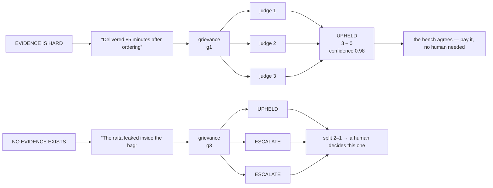
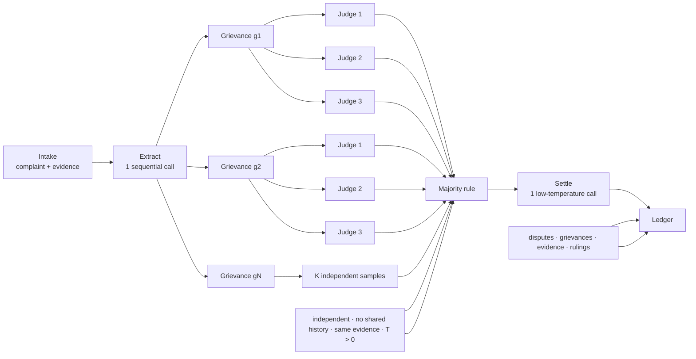

<!--
Source: ai-systems.html
Title: AI Systems Lab — The Refund Bench | TechToday
Theme-color: #0b0d10
Stylesheets: ../dsa/dsa-study.css, ../../site-header.css
Scripts: ../dsa/dsa-study.js
-->

Navigation: [TechToday](../../index.html) · [← AI Projects](ai-projects.html)

Applied AI · Case study · Agentic system design

<a id="the-refund-bench"></a>

# The Refund Bench

A customer types one angry paragraph. Inside it are four separate accusations, some true, some false, one unknowable. An agent must find them, judge each one against evidence, and decide how much money to give back — in under fifteen seconds, without ever paying twice.

Scale · **200 disputes/min at dinner peak** · Budget · **14 LLM calls per dispute** · Hard limit · **₹2,000 auto-approval cap** · SLA · **p50 < 15s · p90 < 30s**

12 Topics • Agentic system design, reliability, and economics

<a id="table-of-contents"></a>

## Table of Contents

1. [Why does a serious court seat three judges?](#s1)
2. [One angry paragraph, four separate accusations](#s2)
3. [Four grievances, twelve rulings, one cheque](#s3)
4. [Four stages, one of which explodes](#s4)
5. [14 calls, and where they go](#s5)
6. [35 KB a dispute, 380 GB a year](#s6)
7. [Submission is synchronous. The work is not.](#s7)
8. [Twenty lines, five landmines](#s8)
9. [Three prompts, and the one line in each that does the work](#s9)
10. [Four decisions people get wrong](#s10)
11. [Two extensions worth the money](#s11)
12. [Six places to seat a bench](#s12)

<a id="s1"></a>

## 1. Why does a serious court seat three judges?

<a id="s1-judges-why-does-a-serious-court-seat-three-judges"></a>

### Why does a serious court seat three judges?

- Section 1 · The hook

Not because three people are smarter than one. Because one judge can have a bad day, misread a document, or carry a blind spot — and there is no way to tell from the outside which day it was. So you seat three, let them rule independently, and count.

A **2–1 split is information**. It tells you the case was genuinely hard, in a way that a single confident ruling never could. A **3–0 ruling is information too** — it tells you this one was clear.

An LLM is a judge who has a different day every time you ask. Same question, same evidence, slightly different answer — because the model samples from a distribution rather than looking anything up. So do what the courts did: **ask three times, independently, and count.**

This is **self-consistency** (Wang et al., 2022). When the model genuinely knows, the reasoning paths converge. When it is guessing, they scatter. The verdict you keep is the majority; the spread becomes your confidence. The cost is exact and brutal: K samples, K times the bill.

> 🎯 **Ask the room.**
>
> **“If the bench splits 2–1 on whether to refund ₹640, and you only get to keep one number — the verdict, or the fact that it was split — which do you keep?”**
>
> The split. A 2–1 upheld and a 3–0 upheld are the same verdict and completely different risks. The whole system exists to keep that difference.



Three independent rulings, temperature 0.5–0.8, no shared history between them. On the right, one judge would happily have approved a refund on a claim nothing can prove. The two dissenters are what send it to a human instead of to the payments API.

> ⚠️ **Production reality.**
>
> Temperature is set per stage, not once. Verification samples need **T > 0**, roughly 0.5–0.8 — at T = 0 all three judges return byte-identical answers and the bench is theatre. Push past 0.8 and rulings go incoherent. Synthesis runs at **low temperature**: that stage writes the customer-facing message and must not invent anything.

<a id="s2"></a>

## 2. One angry paragraph, four separate accusations

<a id="s2-case-one-angry-paragraph-four-separate-accusations"></a>

### One angry paragraph, four separate accusations

- Section 2 · The case

Everything below follows this single dispute. Real ones carry 1–8 grievances; this one has four.

> **DISPUTE** d7a41…c39 · **ORDER** ₹1,840 · **FILED** 21:52 IST
>
> Ordered at 8:15pm and the food showed up at 9:40pm.<sup>g1</sup> We had guests over, it was embarrassing.<sup>✕</sup> Two of the four were missing completely.<sup>g2</sup> The raita had leaked all over the inside of the bag.<sup>g3</sup> And the delivery guy was rude when I asked him about it.<sup>g4</sup> Honestly the worst experience I've had on this app — refund everything.<sup>✕</sup>

upheld rejected escalate not a grievance

<a id="s2-case-two-sentences-were-thrown-away-and-that-is-the-hardest-part"></a>

### Two sentences were thrown away, and that is the hardest part

“We had guests over, it was embarrassing” is context and feeling — there is nothing to check it against. “The worst experience I've had” is an opinion, and “refund everything” is a demand, not a claim. None of them can be true or false, so none of them enter the pipeline.

Which forces the question the entire system rests on, and it has to be answered before a line of code is written: **what counts as a grievance?**

> 🎯 **Ask the room.**
>
> **“Is “the delivery guy was rude” a grievance?”**
>
> Yes — and this is where half the room gets it wrong. It is a *claim about an event*, so it belongs in the pipeline. It is not an opinion like “the food was mediocre.” The fact that you may have no evidence for it does not disqualify it at extraction — that gets decided at **judgement**, not at **extraction**. Confusing those two stages is the most common design error in this system.

So the working definition, and it goes verbatim into the prompt: **a grievance is a statement about something that happened to this order, which evidence could in principle confirm or contradict.** “Arrived at 9:40pm” qualifies. “It was embarrassing” does not.

<a id="s2-case-one-sentence-needed-repair-before-it-could-be-judged"></a>

### One sentence needed repair before it could be judged

“Two of *the four* were missing” cannot be judged on its own — four of what? The extraction prompt demands every grievance be **self-contained**, with references resolved against the order:

| As the customer wrote it | As extracted |
| --- | --- |
| “Two of the four were missing completely.” | “2 of the 4 Hyderabadi Biryani units ordered were not delivered.” |
| “The delivery guy was rude when I asked *him* about *it*.” | “The delivery partner behaved rudely when asked about the missing items.” |

> ⚠️ **Production reality.**
>
> A rule that says “do not use pronouns” tells the model what *not* to do without telling it what to do instead. Name the operation — this is **co-reference resolution**, a task the model already knows by name — and give it the order's line items to resolve against. A prohibition produces refusals; a procedure produces work.

<a id="s3"></a>

## 3. Four grievances, twelve rulings, one cheque

<a id="s3-rulings-four-grievances-twelve-rulings-one-cheque"></a>

### Four grievances, twelve rulings, one cheque

- Section 3 · The bench rules

Each grievance goes to the bench **three times, independently** — no shared history, no chaining. Each judge sees the grievance *and the evidence snapshot*. Twelve calls.

- **g1** Order was delivered 85 minutes after it was placed. *(evidence · placed 20:15 · delivered 21:40 · SLA 45 min)* — votes U,U,U → **upheld** · confidence 0.98 · ₹49
- **g2** 2 of the 4 Hyderabadi Biryani units ordered were not delivered. *(evidence · billed 4 · pickup weight 1.2 kg vs expected 2.4 kg)* — votes U,U,U → **upheld** · confidence 0.91 · ₹640
- **g3** The raita container leaked inside the delivery bag. *(evidence · none — no field records packaging condition)* — votes U,E,E → **escalate** · confidence 0.35 · ₹60?
- **g4** The delivery partner behaved rudely when asked about the missing items. *(evidence · customer rated this partner 5★ at handover, 21:41)* — votes R,R,R → **rejected** · confidence 0.88 · ₹0

| Outcome | Grievances | Amount |
| --- | --- | --- |
| upheld | g1 late delivery, g2 missing items | ₹689 |
| escalate | g3 leaked raita | ₹60 held |
| rejected | g4 rude partner | ₹0 |
| Auto-approved now | under the ₹2,000 cap, so no human needed | ₹689 |

**g4 is the one that earns the system its keep.** A plausible, sympathetic, entirely human-sounding accusation — and the evidence flatly contradicts it: the same customer gave this partner five stars at the door, one minute after handover. A tired support agent at 10pm approves that. The bench does not.

**g3 is the one that shows why you sample three times.** One judge was willing to approve ₹60 on a claim nothing can prove. Two admitted there was nothing to go on. Majority rules, confidence drops to 0.35, and it goes to a human. With a single call you would have had a coin-flip chance of paying out on an unprovable claim — *every time*, at 200 disputes a minute.

> 🎯 **Ask the room.**
>
> **“Which mistake costs more — refunding ₹640 that you did not owe, or refusing ₹640 that you did?”**
>
> The refusal, by a long way. A wrong refund costs you ₹640, once. A wrong refusal costs you a customer — and in food delivery that is thousands of rupees of lifetime value, plus a one-star review. **The errors are asymmetric, so the system should be too.** Which is why the three verdicts are not symmetric either: when unsure, the design never rejects, it escalates.
> ⚠️ **Production reality.**
>
> **Do not trust the confidence score.** It is a number the model generated, not a calibrated probability. Show it to your ops team, log it, chart it — but never branch a payout on it. Branch on the *vote split*, which you computed yourself and can defend.
>
> **The synthesis prompt must say “treat all verdicts as final.”** Without that line, the model re-litigates the bench's ruling while writing the summary — quietly turning a 1–2 escalate into an upheld because the complaint *reads* sympathetic. One sentence in the prompt is what makes the majority actually be the majority.

<a id="s4"></a>

## 4. Four stages, one of which explodes

<a id="s4-stages-four-stages-one-of-which-explodes"></a>

### Four stages, one of which explodes

- Section 4 · Architecture

The pipeline has exactly four logical components. Three of them are a single LLM call each, no matter what you feed them. The fourth is *N × K* of them.



Stage 2 must finish before stage 3 can start — you cannot fan out until you know how many grievances there are. That single sequential call is why wall-clock time is set by the fan-out that follows it, not by the number of stages.

<a id="s4-stages-walk-it-stage-by-stage"></a>

### Walk it stage by stage

Same dispute, one stage at a time. Watch the **cost** on the right — that is the whole story.

#### Stage 1 · Intake & evidence snapshot — 0 LLM calls · ~200 ms

- **In:** The complaint text and the order id.
- **Does:** Hashes the complaint, then **freezes a copy of the evidence** — order lines, delivery timestamps, GPS trail, pickup weight, partner rating. No model touched.
- **Out:**

```text
dispute_id: d7a41…c39
status: RECEIVED
evidence: snapshot @ 21:52
```

> 💡 **Why freeze the evidence?** Because the order record keeps changing — the partner's rating moves, the restaurant edits its bill, a reconciliation job runs overnight. If you re-read evidence during a retry you can get a *different verdict on the same dispute*. Money decisions must be reproducible, so you judge against a frozen copy and keep it.

#### Stage 2 · Extract grievances — 1 LLM call · ~1.5 s

- **In:** The complaint text plus the order's line items, in one prompt.
- **Does:** Keeps checkable accusations, drops feelings and demands, resolves references against the order, records where each sat in the text.
- **Out:**

```text
[
  {"grievance_id":"g2",
   "text":"2 of the 4 Hyderabadi
     Biryani units ordered were
     not delivered.",
   "category":"MISSING_ITEM",
   "span_start":112,
   "span_end":152},
  … g1, g3, g4
]
```

> 💡 **This is the barrier.** Until this returns you do not know whether the dispute has one grievance or eight — so you cannot start the parallel work, and you cannot even size it. One call, and everything waits on it.

#### Stage 3 · Judge by voting — 12 calls · ~4.5 s

- **In:** 4 grievances + the frozen evidence.
- **Does:** Sends every grievance to **K = 3 judges**, each its own request, none aware of the others. Then counts — in plain code, not another LLM call.
- **Out:**

```text
g1 → U,U,U → UPHELD ₹49
g2 → U,U,U → UPHELD ₹640
g3 → U,E,E → ESCALATE ₹60?
g4 → R,R,R → REJECTED ₹0
```

> ⚠️ **This is the stage that explodes.** 4 grievances × 3 judges = 12 calls. A long complaint with 8 grievances = 24. Every extra grievance, and every extra judge, lands here and nowhere else.

#### Stage 4 · Settle — 1 LLM call · ~1 s

- **In:** The complaint plus the four final rulings and amounts.
- **Does:** One call at low temperature, writing the message the customer reads. Forbidden from changing any ruling. The *amount* is computed in code, never by the model.
- **Out:**

```text
status: SETTLED
refund: ₹689
held: ₹60 → agent queue
message: "We've refunded…"
```

> 💡 **The model writes the words; the code writes the cheque.** Never let an LLM produce the number that goes to your payments API — let it produce prose about a number your code already computed and can prove.

<a id="s4-stages-the-same-thing-against-a-clock"></a>

### The same thing, against a clock

*Chart (inline SVG in the HTML page):* Timeline of one dispute. Intake is near-instant, extraction runs to about 1.5 seconds, judging runs from 1.5 to 6 seconds as three successive waves of four parallel calls, and settlement runs to about 7 seconds. A dashed barrier at 1.5 seconds marks where judging can first begin.

The white hairlines inside stage 3 are the waves: 12 calls going out four at a time is 3 rounds, not one burst. Raise the parallelism and that band shortens; add grievances or raise K and it lengthens. The three blue bars never move.

<a id="s4-stages-what-explodes-actually-means"></a>

### What “explodes” actually means

Change the input and only one segment responds. Each bar is the same four stages, drawn to the same scale.

*Chart (inline SVG in the HTML page):* Three stacked bars comparing call budgets. Four grievances with K equals three totals fourteen calls; four grievances with K equals five totals twenty-two; eight grievances with K equals three totals twenty-six. The extraction and settlement segments stay one call wide in every bar while the judging segment grows.

The blue slivers at both ends are identical in all three bars. Adding grievances or raising K stretches only the middle. That asymmetry is why every operational lever — batch size, worker cap, retry policy, the partial-settlement rule — is aimed at stage 3 and ignores the rest.

<a id="s5"></a>

## 5. 14 calls, and where they go

<a id="s5-calls-14-calls-and-where-they-go"></a>

### 14 calls, and where they go

- Section 5 · Number crunching

The formula fits in your head, which is the point of writing it down:

```text
calls = 1 (extract) + N × K (judge) + 1 (settle)

      = 1 + (4 × 3) + 1 = 14 calls per dispute
```

Notice what is *not* in the formula: the vote. Counting three rulings is a `Counter()`, not a model call. Neither is the refund amount — that is a price lookup against the order.

- **Average load** 20/min — disputes across the day
- **Dinner peak** 200/min — 8–10 pm, ten times average
- **Peak call rate** 2,800 — LLM calls per minute

That last number is the one your provider cares about: 200 × 14 = 2,800 calls a minute, sustained for two hours every single evening. Size on the average and you will discover your rate limit during Friday dinner, which is the worst possible time to discover it.

<a id="s5-calls-where-4-5-seconds-comes-from"></a>

### Where “4.5 seconds” comes from

You have 12 calls to make. Each takes about 1–2 seconds. How long until you are done?

**One at a time:**
```text
12 calls × 1.5 sec = 18 seconds
```

Far too slow — there is an angry customer watching a spinner. So you run several at once. **“4-way parallelism” means 4 at a time** — four phone lines, each handling one call, all working simultaneously:

```text
Line A:  call 1   call 5   call 9    3 calls
Line B:  call 2   call 6   call 10   3 calls
Line C:  call 3   call 7   call 11   3 calls
Line D:  call 4   call 8   call 12   3 calls
                                   ────────
                                   12 calls ✓
```

*Chart (inline SVG in the HTML page):* Two arrangements drawn to the same time scale. Twelve calls on one line stretches across eighteen seconds. The same twelve split across four lines of three finishes at four and a half seconds, a quarter of the way along.

Each block is one LLM call, and both rows use the same clock. The four-line version isn't doing less work — it finishes a quarter of the way along because the same 12 blocks are stacked four deep instead of laid end to end.

```text
12 calls ÷ 4 lines = 3 calls per line

3 × 1 sec = 3 seconds   ← if calls run fast
3 × 2 sec = 6 seconds   ← if calls run slow
                        → call it 4.5 seconds typical
```

> **🔑** The
>
> 3
>
> here is
>
> 3 calls per line
>
> — not 3
> seconds.
> Seconds only appear once you multiply by how long a single call takes. Skipping that multiplication is
> why
> this line looks like it came from nowhere.

<a id="s5-calls-why-not-more-lines"></a>

### Why not more lines?

| Lines | Calls per line | Time | Verdict |
| --- | --- | --- | --- |
| 1 | 12 | 12–24 s | customer already gone |
| **4** | **3** | **3–6 s** | the design's choice |
| 12 | 1 | 1–2 s | lovely — for one dispute |

Twelve lines per dispute looks free until you multiply by concurrency. At peak there are roughly **25 disputes in flight at once**. Four lines each is 100 simultaneous requests; twelve lines each is 300. **The parallelism you can afford per dispute is set by your total rate limit divided by your concurrency** — never by what one dispute would like.

<a id="s5-calls-7-seconds-of-work-15-seconds-of-promise"></a>

### 7 seconds of work, 15 seconds of promise

```text
intake        0.2 sec
extraction    1.5 sec
judging       4.5 sec   ← the part above
settlement    1.0 sec
              ────────
              ~7.2 sec
```

So why does the requirement say **p50 < 15 seconds**? Because 7 seconds is an **estimate of the work** and 15 is a **promise to the customer**. The gap absorbs queue wait, 429 retries, the next complaint having 8 grievances instead of 4, and your provider having a slow evening. Set the SLA equal to the estimate and you miss it half the time by definition.

- **Work, typical** ~7 s — what the pipeline costs
- **p50 promise** < 15 s — half of disputes
- **p90 promise** < 30 s — nine in ten

> 🎯 **Ask the room.**
>
> **“The fact-checking case study allowed 90 seconds. This one allows 15. Same architecture — what changed?”**
>
> The person on the other end. A journalist submitting an article will accept “come back in two minutes.” A customer who just got the wrong dinner will not — every extra second on that spinner is a support ticket you are about to receive anyway. **The architecture is identical; the latency budget is a product decision, not an engineering one.**

<a id="s6"></a>

## 6. 35 KB a dispute, 380 GB a year

<a id="s6-data-35-kb-a-dispute-380-gb-a-year"></a>

### 35 KB a dispute, 380 GB a year

- Section 6 · Capacity estimation

The question is narrower than it looks. Not “how big is our data” — but: *when one dispute settles, which rows did we just write?*

Four tables. Count the rows in each.

<a id="s6-data-table-1-disputes-one-row"></a>

### Table 1 — disputes, one row

Id, complaint hash, order id, customer id, status, final amount, timestamps.

```text
1 row × 1 KB = 1 KB
```

<a id="s6-data-table-2-grievances-four-rows"></a>

### Table 2 — grievances, four rows

One per grievance. Text, category, character span, final ruling, vote split, confidence, amount, reasoning.

```text
4 rows × 1.5 KB = 6 KB
```

<a id="s6-data-table-3-evidence-snapshots-one-row"></a>

### Table 3 — evidence_snapshots, one row

The frozen copy — order lines, timestamps, GPS trail, weights, ratings, as they stood at 21:52.

```text
1 row × 3 KB = 3 KB
```

<a id="s6-data-table-4-judge-rulings-twelve-rows"></a>

### Table 4 — judge_rulings, twelve rows

This is the one people forget. You made 12 judging calls and you keep **every single ruling**, not just the winners — the raw JSON each judge returned, around 2 KB:

```text
{"ruling":"ESCALATE","confidence":0.31,
 "reasoning":"No field in the evidence records
  packaging condition on arrival…"}
```

```text
12 rows × 2 KB = 24 KB
```

*Why keep all 12?* Because when a customer escalates, or a regulator asks, or your own ops lead asks why ₹640 left the company — “the bench ruled 3–0” is only credible if you can produce the three rulings. Throw them away and you can never explain a payout again.

<a id="s6-data-add-it-up"></a>

### Add it up

```text
   1 KB   disputes
+  6 KB   grievances
+  3 KB   evidence_snapshots
+ 24 KB   judge_rulings
───────
  34 KB ≈ 35 KB per dispute
```

**Raw rulings are 69% of it.** Same shape as the call budget, same reason: K-sampling dominates both.

<a id="s6-data-scale-it-to-a-day-then-a-year"></a>

### Scale it to a day, then a year

```text
35 KB × 30,000 disputes/day = 1,050,000 KB
1,050,000 KB ÷ 1,000        = 1,050 MB
1,050 MB ÷ 1,000            = ~1 GB per day

1 GB × 365 days             ≈ 380 GB per year
```

> **🔑** And here the answer is
>
> different
>
> from the fact-checking system,
> which landed
> at 51 GB a year and could piggyback on any existing cluster.
>
> 380 GB a year is big enough that you must now make a decision
>
> rather than shrug.

That decision is a **retention policy**, and the four tables want different ones:

| Table | Share | Keep it how long, and why |
| --- | --- | --- |
| `judge_rulings` | 69% | **90 days hot, then cold storage.** You need it while the dispute can still be escalated. After that it is audit material, not working data. |
| `grievances` | 17% | **7 years.** This is the financial record of why money moved. Statutory. |
| `evidence_snapshots` | 9% | **7 years.** Useless without it — the ruling means nothing if you cannot show what it was ruled against. |
| `disputes` | 3% | **7 years.** Tiny, and it is the index into everything else. |

Move the 69% to cold storage after 90 days and your hot footprint drops from 380 GB to about 150 GB a year — which *can* sit on a cluster you already run.

> 🎯 **Ask the room.**
>
> **“We just decided storage is cheap and then spent a whole slide on retention. Why?”**
>
> Because storage is cheap and *queries* are not. 380 GB of raw JSON in your hot path slows every dashboard and every scan that touches the table. Retention is rarely about the disk bill — it is about keeping the working set small enough to stay fast.

<a id="s7"></a>

## 7. Submission is synchronous. The work is not.

<a id="s7-arch-submission-is-synchronous-the-work-is-not"></a>

### Submission is synchronous. The work is not.

- Section 7 · Production shape

Think of a dry cleaner. You hand over a shirt, they write ticket #47, you leave — thirty seconds. The cleaning takes two days. You come back with the ticket and ask if it is ready.

Nobody would accept the alternative: *standing at the counter for two days* because the only way to get your shirt back is to still be there when it is done. That is what a synchronous design is, and at 200 disputes a minute it fails four different ways at once — held-open connections timing out, needing every server and every LLM credit simultaneously, losing all work on a crash, and having nowhere to put a burst.


The counter clerk (REST API) takes the complaint, writes it down, drops the ticket on the pile, and hands you a receipt in 50 ms. Workers pull from the pile when they have capacity. The ledger is how the app answers “is it ready yet?” — and how a crashed worker finds its place again.

| In the diagram | In the dry cleaner |
| --- | --- |
| **APP** | You, standing at the counter |
| **REST API** | The clerk. Writes the ticket, never cleans anything |
| `dispute_id` | Ticket #47 |
| **KAFKA / SQS** | The pile of bags waiting to be worked |
| **WORKER NODE** | The back-office person handling one ticket |
| **LLM PROVIDERS** | The specialist shops they send each item out to — 14 errands per ticket |
| **LEDGER** | The book recording which ticket is at what stage |
| **GET status** (dashed) | You phoning to ask “is #47 ready?” |

**The pile is the part people skip, and it is doing real work.** Two hundred disputes land in a minute and you can process forty at a time. Without a pile you would have to reject a hundred and sixty of them. With a pile, everyone gets a ticket, nothing is dropped, and the last person simply waits longer.

<a id="s7-arch-the-429-and-why-jitter-matters"></a>

### The 429, and why jitter matters

`429` is the HTTP status for **“Too Many Requests.”** At 2,800 calls a minute you will meet it every evening. Three separate ideas in the response:

- **Retry** — don't give up, send it again shortly.
- **Exponential backoff** — wait longer each time: 1 s, then 2, then 4, then 8. Retrying instantly just adds to the flood that refused you.
- **Jitter** — add a random offset to every wait. Without it, forty workers refused at the same instant all wait exactly 2 s, all return at the same instant, and all get refused again — locked in step forever. Backoff lowers the pressure; jitter spreads it out. You need both.

<a id="s7-arch-visibility-timeout-the-trap-that-pays-twice"></a>

### Visibility timeout — the trap that pays twice

When a worker takes a message off SQS, the message is *not* deleted. It is hidden for N seconds. Finish and acknowledge within N and it is removed; let N pass in silence and SQS assumes you died and **puts it back on the pile for someone else.**

Now set N to 10 seconds on a job that takes 30:

```text
t=0s    Worker A takes dispute d7a41…c39
t=10s   A is at grievance 2 of 4 — but N expired
        SQS assumes A died, requeues the dispute
t=11s   Worker B picks up the SAME dispute, starts over
t=20s   SQS does it again → Worker C starts it too
t=30s   Three workers settled the same dispute
        The customer was refunded ₹689 three times.
```

Nobody crashed. The work was fine. **The deadline was just shorter than the job.** In a fact-checking system that bug costs you API credits; here it wires real money out of the company, three times, silently.

Three fixes: set the timeout above your p99; heartbeat with `ChangeMessageVisibility` while you work; or use Kafka, which has no such timeout and lets a consumer hold its partition until it is genuinely done.

> ⚠️ **Production reality.**
>
> The API does two things — write the row, then enqueue the id. If the write succeeds and the enqueue fails, you have a dispute stored that no worker will ever touch, stuck on `RECEIVED` forever while a customer refreshes. Fix it with a **transactional outbox**, or run CDC off the disputes table so the database write *is* the queue event.

<a id="s8"></a>

## 8. Twenty lines, five landmines

<a id="s8-code-twenty-lines-five-landmines"></a>

### Twenty lines, five landmines

- Section 8 · The agentic loop

The pseudocode is the happy path. The annotations are where the money lives.

**pseudocode · agentic loop**
```python
dispute_id = hash(complaint_text + order_id)  # [1]

if ledger.get(dispute_id).status == SETTLED:  # [1]
    return ledger.get(dispute_id).settlement  # never pay twice

evidence = evidence_service.snapshot(order_id)  # [2]
ledger.save(dispute_id, evidence, status=INTAKE)

grievances = grievance_extractor.run(complaint_text, evidence.line_items)  # [3]
ledger.save(dispute_id, grievances, status=JUDGING)

judging_tasks = []  # [4]
for g in grievances:
    for judge_index in range(K):
        judging_tasks.append((g, evidence, judge_index))

rulings = parallel_execute(judge_grievance, judging_tasks,
                          batch_size=BATCH_SIZE)

verdicts = bench.tally(rulings)  # [5]
amount   = pricing.compute(verdicts, evidence)   # code, not LLM  # [5]
if amount > AUTO_APPROVE_CAP:  return escalate(dispute_id)  # [5]
ledger.save(dispute_id, verdicts, amount, status=TALLIED)

message = settlement_writer.run(complaint_text, verdicts, amount)
payments.refund(dispute_id, amount)   # idempotency key = dispute_id
ledger.save(dispute_id, message, status=SETTLED)
```

1. **Idempotency is not an optimisation here — it is the product.** The complaint's own text is its key. In the fact-checker, a duplicate run wasted API credits. Here it *wires money out of the company twice*. The same key is also passed to the payments API, so even a double call at that layer settles once.
2. **Evidence is frozen once, before any judging.** All K judges on all N grievances see the identical snapshot. Re-fetch per call and a retry can legitimately produce a different verdict on the same dispute — which is indefensible when someone asks why.
3. **Grievances are persisted before judging begins.** For resumption and for the customer-facing “here's what we checked.” A crashed worker must not re-extract.
4. **The K judges share nothing.** No conversation history between them. If judge 2 could see judge 1's ruling it would anchor on it — and you would be counting one opinion three times instead of three opinions once.
5. **The bench counts, the pricing table calculates, the cap decides.** Three things the model never touches. It rules on facts; it does not do arithmetic and it does not sign cheques.

<a id="s8-code-being-pessimistic-on-purpose"></a>

### Being pessimistic on purpose

| Failure | Response |
| --- | --- |
| **Worker dies mid-dispute** | State checkpoints per stage and judging is idempotent per grievance, so the job resumes where it stopped instead of re-judging from scratch. |
| **Provider returns 429** | Exponential backoff with jitter. At 2,800 calls a minute this is a daily event, not an incident. |
| **Some grievances never resolve** | Default to escalate — never to rejected. If ≥ 60% resolved and the settled amount is under the cap, pay that part now and send the remainder to an agent. A partial refund plus an honest note beats an error screen. |
| **The total exceeds ₹2,000** | Stop. A human approves. No confidence score, no unanimous bench, no amount of model certainty overrides this — it is a hard ceiling in code, checked before the payments call. |

> 🎯 **Ask the room.**
>
> **“The bench is unanimous, confidence 0.99, and the refund comes to ₹4,500. Ship it?”**
>
> No. And the reason is not that the model might be wrong — it is that **an unbounded automated payout is an unbounded loss when something eventually goes wrong**: a prompt injection in the complaint text, a pricing bug, a bad deploy. The cap does not express distrust of the model. It caps your blast radius. Every agent that can spend money needs one.

<a id="s9"></a>

## 9. Three prompts, and the one line in each that does the work

<a id="s9-prompts-three-prompts-and-the-one-line-in-each-that-does-the-work"></a>

### Three prompts, and the one line in each that does the work

- Section 9 · The prompts

#### 1 · Extraction — the hardest one to get right

**prompt · 1 · extraction**
```text
You are a precise dispute-intake assistant.

Given a customer complaint and the order's line items,
extract every atomic, checkable grievance.

Rules:
- A grievance is a statement about something that happened
  to THIS order, which evidence could confirm or contradict
- Exclude feelings, opinions, demands, and rhetorical questions
- Do NOT judge whether the grievance is true — only extract it
- Each grievance must be self-contained: resolve pronouns and
  vague references against the order's line items
- Assign one category from the enum below
- Return ONLY a JSON array, no preamble, no markdown fences

Categories: LATE_DELIVERY | MISSING_ITEM | WRONG_ITEM |
            QUALITY | PACKAGING | PARTNER_CONDUCT | BILLING

Schema:
[{ "grievance_id": "<uuid>",
   "text": "<the grievance as a standalone sentence>",
   "category": "<one of the above>",
   "span_start": <char offset>, "span_end": <char offset> }]

Complaint:  {{complaint_text}}
Order:      {{line_items_json}}
```

**“Do NOT judge — only extract.”** Without it the model helpfully pre-filters: it silently drops “the delivery guy was rude” because it senses there is no evidence for it, and the grievance never reaches the bench that would have *rejected* it on the 5★ rating. Extraction and judgement are separate stages, and the prompt has to say so. **The spans** are what let the reply underline the exact sentence that was rejected.

#### 2 · Judging — run K times per grievance

**prompt · 2 · judging (K runs)**
```text
You are an impartial claims adjudicator.
Rule on the following grievance using ONLY the evidence given.

Grievance: {{grievance_text}}
Evidence:  {{evidence_snapshot_json}}

Rulings:
- UPHELD:   the evidence supports the grievance
- REJECTED: the evidence contradicts the grievance
- ESCALATE: the evidence is silent or ambiguous on this point

Rules:
- Do not hedge — pick the single best ruling
- Rule ONLY on the evidence provided. Do not reason about what
  is typical, likely, or fair
- If the evidence does not speak to this grievance, the ruling
  is ESCALATE — never REJECTED
- Return ONLY valid JSON, no preamble, no markdown fences

Schema:
{ "ruling": "UPHELD" | "REJECTED" | "ESCALATE",
  "confidence": <float 0.0 to 1.0>,
  "evidence_cited": "<which field(s) decided it>",
  "reasoning": "<one to three sentences>" }
```

**“Silent evidence means ESCALATE, never REJECTED.”** This single line is the asymmetry from earlier, written into the prompt. Absence of proof is not proof of absence — and the cheaper mistake is sending a case to a human, not refusing an honest customer. **`evidence_cited`** earns its place too: it forces the model to name the field it used, which makes a bad ruling debuggable instead of mysterious.

#### 3 · Settlement — once, at low temperature

**prompt · 3 · settlement**
```text
You are a customer-support writer for a food delivery app.

Below is a customer's complaint, the final ruling on each
grievance, and the refund amount already calculated.

Write a 3-4 sentence reply that:
- States the refund amount and when it will arrive
- Names what was resolved and what a colleague will look into
- Acknowledges the experience without grovelling

Rules:
- Do NOT re-adjudicate any ruling — treat all rulings as final
- Do NOT state, recalculate, or negotiate any amount other
  than the one given
- Never blame the restaurant or the delivery partner
- Plain language. No apology more than once.

Complaint: {{complaint_text}}
Rulings:   {{verdicts_json}}
Amount:    {{refund_amount}}
```

**“Treat all rulings as final”** is the most valuable sentence across all three prompts. Without it the model re-litigates the bench while writing — a sympathetic complaint quietly turns a 1–2 escalate into an upheld in the prose, and now your message promises a refund your ledger says you are not paying. **“Do not state any amount other than the one given”** is the same defence pointed at the number.

<a id="s9-prompts-what-the-customer-actually-receives"></a>

### What the customer actually receives

> **OUTBOUND** d7a41…c39 · **SETTLED** 21:52:07 IST
>
> We've refunded ₹689 to your original payment method — ₹640 for the two biryanis that weren't delivered and ₹49 for the delivery fee, since the order arrived well past its estimated time. It should reflect within 3 working days. On the spilled raita, we don't have enough from the order record to settle it automatically, so a colleague will review it and write to you within 24 hours.

Note what the message does *not* do: it doesn't mention g4 at all. Silently dropping a rejected grievance is a deliberate product choice — telling a customer “we checked and you're wrong about the delivery partner” wins you nothing. **The bench's ruling is for your ledger; the customer gets the outcome.**

<a id="s10"></a>

## 10. Four decisions people get wrong

<a id="s10-decisions-four-decisions-people-get-wrong"></a>

### Four decisions people get wrong

- Section 10 · Judgement calls

| Decision | Tempting answer | What it should be |
| --- | --- | --- |
| **How to batch** | Put all 4 grievances in one prompt, ask for 4 rulings. | No. Lost-in-the-middle is real, and a dropped grievance is a refund you silently didn't pay. Use the provider's *batch API* — separate prompts in one request, one output each. Nothing gets skipped. |
| **Batch API vs threads** | Batch endpoints are cheaper, so use them. | Check the SLA first. OpenAI and Azure batch endpoints carry a **24-hour completion window**. For a customer watching a spinner that is unusable — use parallel calls across threads and pay list price. Batch APIs belong to your overnight re-scoring jobs. |
| **Caching rulings** | “Order was late” appears in thousands of disputes — cache the ruling. | **Never.** And this is the sharpest lesson in the system. Caching needs two properties: a homogeneous corpus *and* context-free claims. “ISRO is in Bengaluru” is context-free — true regardless of the article. “Order was late” is *not* — it is true for this order and false for the next one. Homogeneity alone is a trap. |
| **Reasoning models** | Money is involved, so use the thinking model. | Overkill. The grievances are *atomic* by construction and the evidence is handed over pre-fetched — “was 21:40 more than 45 minutes after 20:15” has no reasoning chain to walk. Atomicity plus evidence does the work reasoning would have done, at a fraction of the cost and latency you cannot spare. |

> 🎯 **Ask the room.**
>
> **“The fact-checking case study said caching depends on whether the corpus is homogeneous. Here the corpus is homogeneous and the answer is still no. Was the fact-checker wrong?”**
>
> No — the test was incomplete, and this system is what exposes it. Caching needs homogeneity **and** context-independence. Fact-checking claims are context-free but the corpus is long-tailed. Refund grievances repeat constantly but each one is bound to its own order. Neither caches — for opposite reasons. *That* is the lesson worth carrying out of both case studies.

<a id="s11"></a>

## 11. Two extensions worth the money

<a id="s11-extensions-seat-judges-from-different-courts"></a>

### Seat judges from different courts

- Section 11 · Where it goes next

Three samples from one model share that model's blind spots. If a model systematically reads pickup-weight evidence badly, asking it three times gives you three confident wrong rulings, and the vote launders them into consensus. Seat one GPT judge, one Claude judge, one Kimi judge and the failures stop correlating — the same idea as a random forest, transferred intact.

Then weight them. If one model is measurably better on timestamp arithmetic and another on free-text quality complaints, weight their votes by *category*. The weights come from your own evals and stay somewhat subjective — but a weighted bench across different models is a strictly better estimator than an unweighted bench of one model three times.

<a id="s11-extensions-give-the-judges-a-tool-not-a-snapshot"></a>

### Give the judges a tool, not a snapshot

Today all evidence is fetched up front in stage 1 — which means you fetch everything that *might* be relevant for every dispute, and a grievance about packaging still carries the full GPS trail in its prompt. Give the judge a tool call instead and it fetches only what that grievance needs: `get_delivery_timeline()` for g1, `get_pickup_weight()` for g2.

The architecture does not move. The fan-out, the bench, the checkpointing, the cap, the 60% rule — all of it still holds. Only the inside of `judge_grievance` changes. That is the sign the decomposition was right.

> ⚠️ **Production reality.**
>
> The moment judges fetch their own evidence you have **lost reproducibility** — two runs can see different data. So a tool-using version must log every tool call and its response into the snapshot as it goes. You are not removing the frozen evidence; you are building it lazily.

<a id="s12"></a>

## 12. Six places to seat a bench

<a id="s12-places-six-places-to-seat-a-bench"></a>

### Six places to seat a bench

- Section 12 · Where else this fits

Dispute resolution is one instance of a general pattern: *when the cost of being wrong exceeds the cost of asking again, ask again and count.*

| Use case | What the bench protects you from |
| --- | --- |
| **Insurance claim triage** | The same shape with a bigger cap and a longer clock. Split benches route to a human assessor. |
| **Loan document verification** | One model misreading one figure on one payslip and approving credit against it. |
| **Content moderation appeals** | Inconsistency — the same post restored on Monday and removed on Tuesday. |
| **Invoice / PO matching** | A line item silently skipped in a 40-row invoice, which reconciliation finds three months later. |
| **Code review risk scoring** | A P0 change scored as cosmetic because one sample skimmed the diff. |
| **Financial data extraction** | Tokenisation on numbers. “₹20,000.00” read as “₹2,000,000” because a decimal fell on a token boundary. Three judges catch it; one does not. |

> 🎯 **Close the session.**
>
> **“You now have two systems — a fact checker and a refund adjudicator. Different domains, different numbers, different latency budgets. What is actually the same?”**
>
> `1 + N×K + 1`. A sequential barrier followed by a fan-out. A vote computed in code. A third verdict that means “a human decides.” Checkpoint after every stage, key everything by a content hash, back off with jitter, and never let the model near the arithmetic. **Everything else was a parameter.**
