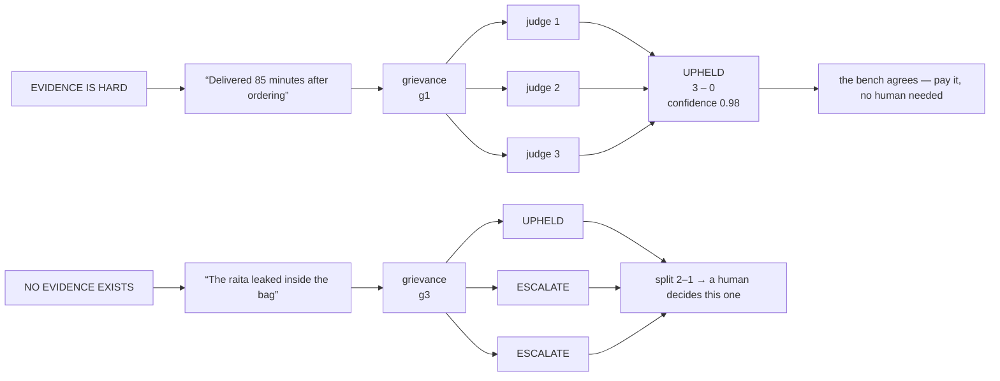
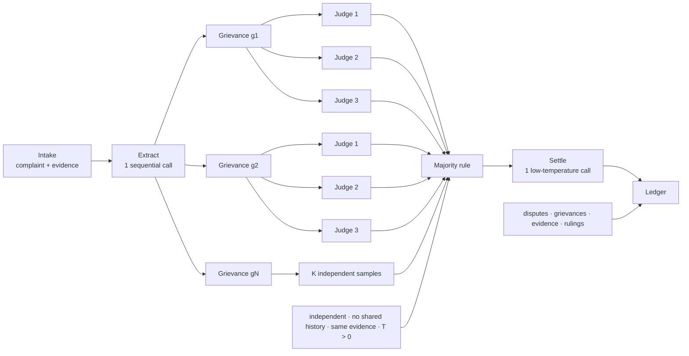
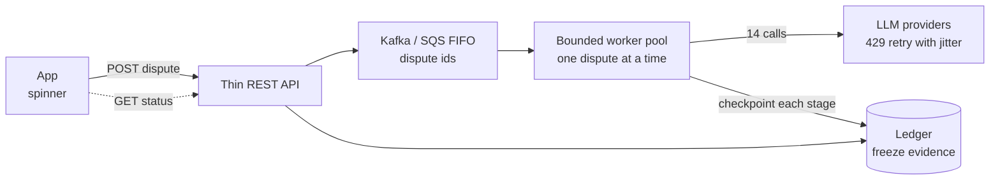

<!--
Source: ai-systems.html
Title: The Refund Bench | TechToday
Theme-color: #0b0d10
Stylesheets: ../dsa/dsa-study.css, ../../site-header.css, ai-demos.css
Scripts: ../dsa/dsa-study.js
-->

Navigation: [TechToday](../../index.html) · [← AI Demos](ai-demos.html)

Applied AI · Case study · Agentic system design

<a id="the-refund-bench"></a>

# The Refund Bench

A customer writes one angry paragraph. It contains four separate claims. Some are true. Some are false. One cannot be checked. An agent must find each claim, compare it with evidence, and decide the refund amount in under fifteen seconds. It must never pay twice.

Scale · **200 disputes/min at dinner peak** · Budget · **14 LLM calls per dispute** · Hard limit · **₹2,000 auto-approval cap** · SLA · **p50 < 15s · p90 < 30s**

12 Topics • Agent design, reliability, and cost

<a id="table-of-contents"></a>

## Table of Contents

1. [Why use three independent judges?](#s1)
2. [One complaint can contain four separate claims](#s2)
3. [Four grievances, twelve rulings, one refund](#s3)
4. [Four stages, and judging grows fastest](#s4)
5. [Where the 14 calls go](#s5)
6. [35 KB a dispute, 380 GB a year](#s6)
7. [Submit fast. Process in the background.](#s7)
8. [Twenty lines of code, five failure points](#s8)
9. [Three prompts and the key line in each one](#s9)
10. [Four choices teams often get wrong](#s10)
11. [Two upgrades worth paying for](#s11)
12. [Six places where a bench helps](#s12)

---

<a id="unit-1"></a>

## Unit 1 — The Multi-Judge Adjudication Pattern

Understand self-consistency voting, claim decomposition, and independent evaluation of compound customer grievances.

<a id="s1"></a>

## 1. Why use three independent judges?

<a id="s1-judges-why-does-a-serious-court-seat-three-judges"></a>

### Why use three independent judges?

- Section 1 · Main idea

Not because three people are always smarter than one. One judge can have a bad day. One judge can misread a document or miss a detail. You cannot see that from the outside. So you seat three judges, let each one decide alone, and count the votes.

A **2–1 split is information**. It tells you the case was hard. A single confident ruling cannot show that. A **3–0 ruling is information too**. It tells you the case was clear.

A large language model (LLM) is like a judge who has a different day each time you ask. You can give the same question and the same evidence and still get a slightly different answer. That happens because the model samples from a distribution, which means it chooses from likely next tokens instead of looking up one fixed answer. So use the court pattern: **ask three times, independently, and count.**

This is **self-consistency** (Wang et al., 2022). When the model has strong evidence, the reasoning paths usually agree. When it is guessing, the answers spread out. The verdict you keep is the majority; the spread becomes your confidence. The cost is simple: K samples cost K times as much.

> 🎯 **Ask the room.**
>
> **“If the bench splits 2–1 on whether to refund ₹640, and you only get to keep one number: the verdict, or the fact that it was split. Which do you keep?”**
>
> Keep the split. A 2–1 upheld and a 3–0 upheld give the same verdict but very different risk. The system exists so you do not lose that difference.



The system uses three independent rulings, temperature 0.5–0.8, and no shared history between judges. On the right, one judge would approve a refund for a claim that has no proof. The two judges who disagree send it to a human instead of the payments API.

> ⚠️ **Production reality.**
>
> Set temperature for each stage, not once for the whole system. Verification samples need **T > 0**, roughly 0.5–0.8. At T = 0 all three judges return byte-identical answers and the bench adds no value. Go above 0.8 and rulings can become unclear. Run synthesis at **low temperature**: that stage writes the message to the customer and must not invent anything.

<a id="s2"></a>

## 2. One complaint can contain four separate claims

<a id="s2-case-one-angry-paragraph-four-separate-accusations"></a>

### One complaint can contain four separate claims

- Section 2 · The case

The rest of the page follows one dispute. Real disputes contain 1–8 grievances. This one has four.

> **DISPUTE** d7a41…c39 · **ORDER** ₹1,840 · **FILED** 21:52 IST
>
> Ordered at 8:15pm and the food showed up at 9:40pm.<sup>g1</sup> We had guests over, it was embarrassing.<sup>✕</sup> Two of the four were missing completely.<sup>g2</sup> The raita had leaked all over the inside of the bag.<sup>g3</sup> And the delivery guy was rude when I asked him about it.<sup>g4</sup> Honestly the worst experience I've had on this app — refund everything.<sup>✕</sup>

upheld rejected escalate not a grievance

<a id="s2-case-two-sentences-were-thrown-away-and-that-is-the-hardest-part"></a>

### Two sentences are not claims

“We had guests over, it was embarrassing” gives context and feeling. There is no evidence to check against it. “The worst experience I've had” is an opinion. “Refund everything” is a demand, not a claim. None of these can be marked true or false, so they do not enter the pipeline.

That leaves the main design question. You must answer it before you write code: **what counts as a grievance?**

> 🎯 **Ask the room.**
>
> **“Is “the delivery guy was rude” a grievance?”**
>
> Yes. Many people get this wrong. It is a *claim about an event*, so it belongs in the pipeline. It is not an opinion like “the food was mediocre.” A lack of evidence does not remove it during extraction. That is decided during **judgement**, not at **extraction**. Mixing up those two stages is the most common design error in this system.

Use this working definition in the prompt: **a grievance is a statement about something that happened to this order, and evidence could in principle confirm or contradict it.** “Arrived at 9:40pm” qualifies. “It was embarrassing” does not.

<a id="s2-case-one-sentence-needed-repair-before-it-could-be-judged"></a>

### One sentence needed missing context

“Two of *the four* were missing” cannot be judged on its own. Four of what? The extraction prompt requires every grievance to be **self-contained**, with references matched to the order:

1. **“Two of the four were missing completely.”**: “2 of the 4 Hyderabadi Biryani units ordered were not delivered.”
2. **“The delivery guy was rude when I asked *him* about *it*.”**: “The delivery partner behaved rudely when asked about the missing items.”
> ⚠️ **Production reality.**
>
> A rule that says “do not use pronouns” tells the model what *not* to do but not what to do instead. Name the operation. This is **co-reference resolution**, a task the model already knows by name. Give it the order's line items to resolve against. A ban creates refusals. A procedure gets useful work.

<a id="s3"></a>

## 3. Four grievances, twelve rulings, one refund

<a id="s3-rulings-four-grievances-twelve-rulings-one-cheque"></a>

### Four grievances, twelve rulings, one refund

- Section 3 · Bench rulings

Each grievance goes to the bench **three times, independently**, with no shared history and no chaining. Each judge sees the grievance *and the evidence snapshot*. Twelve calls.

- **g1** Order was delivered 85 minutes after it was placed. *(evidence · placed 20:15 · delivered 21:40 · SLA 45 min)* — votes U,U,U → **upheld** · confidence 0.98 · ₹49
- **g2** 2 of the 4 Hyderabadi Biryani units ordered were not delivered. *(evidence · billed 4 · pickup weight 1.2 kg vs expected 2.4 kg)* — votes U,U,U → **upheld** · confidence 0.91 · ₹640
- **g3** The raita container leaked inside the delivery bag. *(evidence · none — no field records packaging condition)* — votes U,E,E → **escalate** · confidence 0.35 · ₹60?
- **g4** The delivery partner behaved rudely when asked about the missing items. *(evidence · customer rated this partner 5★ at handover, 21:41)* — votes R,R,R → **rejected** · confidence 0.88 · ₹0

1. **upheld**
   - **Grievances**: g1 late delivery, g2 missing items
   - **Amount**: ₹689
2. **escalate**
   - **Grievances**: g3 leaked raita
   - **Amount**: ₹60 held
3. **rejected**
   - **Grievances**: g4 rude partner
   - **Amount**: ₹0
4. **Auto-approved now**
   - **Grievances**: under the ₹2,000 cap, so no human needed
   - **Amount**: ₹689
**g4 shows why the system matters.** The accusation sounds plausible and sympathetic. The evidence contradicts it: the same customer gave this partner five stars at the door, one minute after handover. A tired support agent at 10pm might approve it. The bench does not.

**g3 shows why you sample three times.** One judge was ready to approve ₹60 on a claim nothing can prove. Two judges said there was not enough evidence. Majority rules, confidence drops to 0.35, and it goes to a human. With one call, you would have a coin-flip chance of paying an unprovable claim every time, at 200 disputes a minute.

> 🎯 **Ask the room.**
>
> **“Which mistake costs more: refunding ₹640 that you did not owe, or refusing ₹640 that you did?”**
>
> The refusal costs more. A wrong refund costs ₹640 once. A wrong refusal can cost a customer. In food delivery that is thousands of rupees of lifetime value, plus a one-star review. **The errors have different costs, so the system should treat them differently.** That is why the three verdicts are not symmetric: when unsure, the design never rejects, it escalates.
> ⚠️ **Production reality.**
>
> **Do not use the confidence score for payout decisions.** The model generated that number. It is not a calibrated probability. Show it to your ops team, log it, and chart it, but never make a payout branch on it. Branch on the *vote split*, which your code computed and you can defend.
>
> **The synthesis prompt must say “treat all verdicts as final.”** Without that line, the model may retry the bench's ruling while it writes the summary. It can quietly turn a 1–2 escalate into an upheld because the complaint *reads* sympathetic. One sentence in the prompt makes the majority stay final.

---

<a id="unit-2"></a>

## Unit 2 — Pipeline Architecture & Resource Budgets

Trace the four pipeline stages, account for 14 parallel LLM calls, and plan audit storage across millions of disputes.

<a id="s4"></a>

## 4. Four stages, and judging grows fastest

<a id="s4-stages-four-stages-one-of-which-explodes"></a>

### Four stages, and judging grows fastest

- Section 4 · Architecture

The pipeline has four logical components. Three always use one LLM call each, no matter what input you give them. The fourth is *N × K* of them.



Stage 2 must finish before stage 3 can start. You cannot fan out until you know how many grievances there are. That one sequential call means wall-clock time depends on the fan-out after it, not on the number of stages.

<a id="s4-stages-walk-it-stage-by-stage"></a>

### Follow the stages one by one

Use the same dispute and look at one stage at a time. Watch the **cost** on the right. That is the main point.

#### Stage 1 · Intake & evidence snapshot — 0 LLM calls · ~200 ms

- **In:** The complaint text and the order id.
- **Does:** Hashes the complaint, then **freezes a copy of the evidence**: order lines, delivery timestamps, GPS trail, pickup weight, partner rating. No model is used.
- **Out:**

```text
dispute_id: d7a41…c39
status: RECEIVED
evidence: snapshot @ 21:52
```

> 💡 **Why freeze the evidence?** The order record keeps changing. The partner's rating moves, the restaurant edits its bill, a reconciliation job runs overnight. If you read evidence again during a retry, you can get a *different verdict on the same dispute*. Money decisions must be reproducible. Judge against a frozen copy and keep it.

#### Stage 2 · Extract grievances — 1 LLM call · ~1.5 s

- **In:** The complaint text plus the order's line items, in one prompt.
- **Does:** Keeps claims that can be checked. Drops feelings and demands. Resolves references against the order. Records where each claim appeared in the text.
- **Out:**

```json
[
  {"grievance_id":"g2",
   "text":"2 of the 4 Hyderabadi
     Biryani units ordered were
     not delivered.",
   "category":"MISSING_ITEM",
   "span_start":112,
   "span_end":152},
  … g1, g3, g4
]
```

> 💡 **This is the barrier.** Until this returns, you do not know whether the dispute has one grievance or eight. So you cannot start or size the parallel work. Everything waits on this one call.

#### Stage 3 · Judge by voting — 12 calls · ~4.5 s

- **In:** 4 grievances + the frozen evidence.
- **Does:** Sends every grievance to **K = 3 judges**, each its own request, none aware of the others. Then code counts the votes. This is not another LLM call.
- **Out:**

```text
g1 → U,U,U → UPHELD ₹49
g2 → U,U,U → UPHELD ₹640
g3 → U,E,E → ESCALATE ₹60?
g4 → R,R,R → REJECTED ₹0
```

> ⚠️ **This is the stage that grows.** 4 grievances × 3 judges = 12 calls. A long complaint with 8 grievances = 24. Every extra grievance and every extra judge adds only to this stage.

#### Stage 4 · Settle — 1 LLM call · ~1 s

- **In:** The complaint plus the four final rulings and amounts.
- **Does:** One low-temperature call writes the message the customer reads. It is not allowed to change any ruling. The *amount* is computed in code, never by the model.
- **Out:**

```text
status: SETTLED
refund: ₹689
held: ₹60 → agent queue
message: "We've refunded…"
```

> 💡 **The model writes the words; the code writes the refund.** Never let an LLM produce the number sent to your payments API. Let it write text about a number your code already computed and can prove.

<a id="s4-stages-the-same-thing-against-a-clock"></a>

### The same stages on a clock

*Chart (inline SVG in the HTML page):* Timeline of one dispute. Intake is near-instant, extraction runs to about 1.5 seconds, judging runs from 1.5 to 6 seconds as three successive waves of four parallel calls, and settlement runs to about 7 seconds. A dashed barrier at 1.5 seconds marks where judging can first begin.

The white lines inside stage 3 show the waves: 12 calls going out four at a time is 3 rounds, not one burst. Raise the parallelism and that band shortens; add grievances or raise K and it lengthens. The three blue bars stay the same.

<a id="s4-stages-what-explodes-actually-means"></a>

### What “grows” means here

Change the input and only one segment changes. Each bar is the same four stages, drawn to the same scale.

*Chart (inline SVG in the HTML page):* Three stacked bars comparing call budgets. Four grievances with K equals three totals fourteen calls; four grievances with K equals five totals twenty-two; eight grievances with K equals three totals twenty-six. The extraction and settlement segments stay one call wide in every bar while the judging segment grows.

The blue slivers at both ends are identical in all three bars. Adding grievances or raising K stretches only the middle segment. That uneven growth is why every operations control, such as batch size, worker cap, retry policy, and the partial-settlement rule, targets stage 3 and not the other stages.

<a id="s5"></a>

## 5. Where the 14 calls go

<a id="s5-calls-14-calls-and-where-they-go"></a>

### Where the 14 calls go

- Section 5 · Call math

The formula is small enough to remember:

```text
calls = 1 (extract) + N × K (judge) + 1 (settle)

      = 1 + (4 × 3) + 1 = 14 calls per dispute
```

Notice what is *not* in the formula: the vote. Counting three rulings is a `Counter()`, not a model call. The refund amount is not one either. That is a price lookup against the order.

- **Average load** 20/min — disputes across the day
- **Dinner peak** 200/min — 8–10 pm, ten times average
- **Peak call rate** 2,800 — LLM calls per minute

Your provider cares about the last number: 200 × 14 = 2,800 calls a minute, sustained for two hours every evening. Plan for the average and you will hit your rate limit during Friday dinner. That is the worst time to learn about it.

<a id="s5-calls-where-4-5-seconds-comes-from"></a>

### Where “4.5 seconds” comes from

You have 12 calls to make. Each takes about 1–2 seconds. How long until you are done?

**One at a time:**
```text
12 calls × 1.5 sec = 18 seconds
```

That is too slow. An angry customer is watching a spinner. So you run several calls at once. **“4-way parallelism” means 4 at a time**: four phone lines, each handling one call, all working at the same time:

```text
Line A:  call 1   call 5   call 9    3 calls
Line B:  call 2   call 6   call 10   3 calls
Line C:  call 3   call 7   call 11   3 calls
Line D:  call 4   call 8   call 12   3 calls
                                   ────────
                                   12 calls ✓
```

*Chart (inline SVG in the HTML page):* Two arrangements drawn to the same time scale. Twelve calls on one line stretches across eighteen seconds. The same twelve split across four lines of three finishes at four and a half seconds, a quarter of the way along.

Each block is one LLM call. Both rows use the same clock. The four-line version does not do less work. It finishes after one quarter of the time because the same 12 blocks are stacked four deep instead of placed end to end.

```text
12 calls ÷ 4 lines = 3 calls per line

3 × 1 sec = 3 seconds   ← if calls run fast
3 × 2 sec = 6 seconds   ← if calls run slow
                        → call it 4.5 seconds typical
```

> 🔑 **Key point.** The 3 means 3 calls per line, not 3 seconds. You get seconds only after you multiply by the time for one call. If you skip that multiplication, the line looks unexplained.

<a id="s5-calls-why-not-more-lines"></a>

### Why not use more lines?

1. **1**
   - **Calls per line**: 12
   - **Time**: 12–24 s
   - **Verdict**: customer already gone
2. **4**
   - **Calls per line**: **3**
   - **Time**: **3–6 s**
   - **Verdict**: the design's choice
3. **12**
   - **Calls per line**: 1
   - **Time**: 1–2 s
   - **Verdict**: useful for one dispute
Twelve lines per dispute looks free until you include concurrency. At peak there are roughly **25 disputes in flight at once**. Four lines each is 100 simultaneous requests; twelve lines each is 300. **Your total rate limit divided by your concurrency sets how much parallelism each dispute can use**, not by what one dispute would prefer.

<a id="s5-calls-7-seconds-of-work-15-seconds-of-promise"></a>

### 7 seconds of work, 15 seconds promised to the customer

```text
intake        0.2 sec
extraction    1.5 sec
judging       4.5 sec   ← the part above
settlement    1.0 sec
              ────────
              ~7.2 sec
```

Why does the requirement say **p50 < 15 seconds**? Because 7 seconds is an **estimate of the work** and 15 is a **promise to the customer**. The gap covers queue wait, 429 retries, complaints with 8 grievances instead of 4, and a slow evening at your provider. Set the SLA equal to the estimate and you will miss it about half the time.

- **Work, typical** ~7 s — what the pipeline costs
- **p50 promise** < 15 s — half of disputes
- **p90 promise** < 30 s — nine in ten

> 🎯 **Ask the room.**
>
> **“The fact-checking case study allowed 90 seconds. This one allows 15. Same architecture. What changed?”**
>
> The person waiting changed. A journalist who submits an article may accept “come back in two minutes.” A customer who got the wrong dinner will not. Each extra second on that spinner can become a support ticket. **The architecture is the same. The latency budget is a product decision, not only an engineering decision.**

<a id="s6"></a>

## 6. 35 KB a dispute, 380 GB a year

<a id="s6-data-35-kb-a-dispute-380-gb-a-year"></a>

### 35 KB a dispute, 380 GB a year

- Section 6 · Capacity estimation

The question is narrower than it looks. Not “how big is our data”. But: *when one dispute settles, which rows did we just write?*

Four tables. Count the rows in each.

<a id="s6-data-table-1-disputes-one-row"></a>

### Table 1 — disputes, one row

Id, complaint hash, order id, customer id, status, final amount, timestamps.

```text
1 row × 1 KB = 1 KB
```

<a id="s6-data-table-2-grievances-four-rows"></a>

### Table 2 — grievances, four rows

One per grievance. Text, category, character span, final ruling, vote split, confidence, amount, reasoning.

```text
4 rows × 1.5 KB = 6 KB
```

<a id="s6-data-table-3-evidence-snapshots-one-row"></a>

### Table 3 — evidence_snapshots, one row

The frozen copy: order lines, timestamps, GPS trail, weights, ratings, as they stood at 21:52.

```text
1 row × 3 KB = 3 KB
```

<a id="s6-data-table-4-judge-rulings-twelve-rows"></a>

### Table 4 — judge_rulings, twelve rows

People often forget this table. You made 12 judging calls and you keep **every ruling**, not just the winners. The raw JSON each judge returned, around 2 KB:

```json
{"ruling":"ESCALATE","confidence":0.31,
 "reasoning":"No field in the evidence records
  packaging condition on arrival…"}
```

```text
12 rows × 2 KB = 24 KB
```

*Why keep all 12?* When a customer escalates, a regulator asks, or your ops lead asks why ₹640 left the company. the statement “the bench ruled 3–0” is credible only if you can show the three rulings. If you throw them away, you cannot explain the payout later.

<a id="s6-data-add-it-up"></a>

### Add it up

```text
   1 KB   disputes
+  6 KB   grievances
+  3 KB   evidence_snapshots
+ 24 KB   judge_rulings
───────
  34 KB ≈ 35 KB per dispute
```

**Raw rulings make up 69% of the data.** The reason is the same as the call budget: K-sampling dominates both.

<a id="s6-data-scale-it-to-a-day-then-a-year"></a>

### Scale it to one day and one year

```text
35 KB × 30,000 disputes/day = 1,050,000 KB
1,050,000 KB ÷ 1,000        = 1,050 MB
1,050 MB ÷ 1,000            = ~1 GB per day

1 GB × 365 days             ≈ 380 GB per year
```

> 🔑 **Key point.** Here the answer is different from the fact-checking system. That system used 51 GB a year and could share an existing cluster. 380 GB a year is large enough that you must make a decision instead of ignoring it.

That decision is a **retention policy**, and the four tables need different rules:

1. **`judge_rulings`**
   - **Share**: 69%
   - **Keep it how long, and why**: **90 days hot, then cold storage.** You need it while the dispute can still be escalated. After that it is audit material, not working data.
2. **`grievances`**
   - **Share**: 17%
   - **Keep it how long, and why**: **7 years.** This is the financial record that explains why money moved. Keep it for the statutory period.
3. **`evidence_snapshots`**
   - **Share**: 9%
   - **Keep it how long, and why**: **7 years.** The ruling is useless without this. The ruling means nothing if you cannot show what it was ruled against.
4. **`disputes`**
   - **Share**: 3%
   - **Keep it how long, and why**: **7 years.** It is tiny, and it indexes everything else.
Move the 69% to cold storage after 90 days and your hot footprint drops from 380 GB to about 150 GB a year. That can fit on a cluster you already run.

> 🎯 **Ask the room.**
>
> **“We just decided storage is cheap and then spent a whole slide on retention. Why?”**
>
> Because storage is cheap but queries are not. 380 GB of raw JSON in your hot path slows every dashboard and every scan that touches the table. Retention is rarely only about the disk bill. It keeps the working set small enough to stay fast.

---

<a id="unit-3"></a>

## Unit 3 — Production Reliability & Prompt Engineering

Design asynchronous background execution, guard against five critical failure points, and craft strict structured prompts.

<a id="s7"></a>

## 7. Submit fast. Process in the background.

<a id="s7-arch-submission-is-synchronous-the-work-is-not"></a>

### Submit fast. Process in the background.

- Section 7 · Production shape

Use a dry cleaner as the analogy. You hand over a shirt. They write ticket #47. You leave in thirty seconds. The cleaning takes two days. You come back with the ticket and ask if it is ready.

Nobody would accept the other design: *standing at the counter for two days* because you must still be there when the shirt is ready. That is a synchronous design. At 200 disputes a minute, it fails in four ways at once: open connections time out, every server and LLM credit must be available at once, a crash loses work, and bursts have nowhere to wait.



The counter clerk, the REST API, takes the complaint, writes it down, drops the ticket on the pile, and gives you a receipt in 50 ms. Workers pull from the pile when they have capacity. The ledger lets the app answer “is it ready yet?” and lets a crashed worker resume from the right place.

1. **APP**: You, standing at the counter
2. **REST API**: The clerk. Writes the ticket, never cleans anything
3. **`dispute_id`**: Ticket #47
4. **KAFKA / SQS**: The pile of bags waiting to be worked
5. **WORKER NODE**: The back-office person handling one ticket
6. **LLM PROVIDERS**: The specialist shops they send each item out to; 14 errands per ticket
7. **LEDGER**: The book recording which ticket is at what stage
8. ****GET status** (dashed)**: You phoning to ask “is #47 ready?”
**Teams often skip the pile, but it does real work.** Two hundred disputes land in a minute and you can process forty at a time. Without a pile, you would have to reject 160 of them. With a pile, everyone gets a ticket, nothing is dropped, and later tickets wait longer.

<a id="s7-arch-the-429-and-why-jitter-matters"></a>

### HTTP 429 and why jitter matters

`429` is the HTTP status for **“Too Many Requests.”** At 2,800 calls a minute, you will see it every evening. The response needs three ideas:

- **Retry** — do not give up. Send the request again shortly.
- **Exponential backoff** — wait longer each time: 1 s, then 2, then 4, then 8. Retrying immediately adds to the same flood that caused the refusal.
- **Jitter** — add a random offset to each wait. Without it, forty workers refused at the same instant all wait exactly 2 s, all return at the same instant, and all get refused again, locked in the same pattern. Backoff lowers pressure. Jitter spreads the retries out. You need both.

<a id="s7-arch-visibility-timeout-the-trap-that-pays-twice"></a>

### Visibility timeout can pay twice

When a worker takes a message from SQS, the message is *not* deleted. It is hidden for N seconds. Finish and acknowledge within N and SQS removes it. Let N pass without a heartbeat and SQS assumes the worker died and **puts it back on the pile for someone else.**

Now set N to 10 seconds for a job that takes 30 seconds:

```text
t=0s    Worker A takes dispute d7a41…c39
t=10s   A is at grievance 2 of 4 — but N expired
        SQS assumes A died, requeues the dispute
t=11s   Worker B picks up the SAME dispute, starts over
t=20s   SQS does it again → Worker C starts it too
t=30s   Three workers settled the same dispute
        The customer was refunded ₹689 three times.
```

Nobody crashed. The work was fine. **The deadline was shorter than the job.** In a fact-checking system, that bug costs API credits. Here it sends real money out of the company three times, silently.

Use three fixes: set the timeout above your p99; send heartbeats with `ChangeMessageVisibility` while you work; or use Kafka, which has no such timeout and lets a consumer keep its partition until the work is done.

> ⚠️ **Production reality.**
>
> The API does two things: write the row, then enqueue the id. If the write succeeds and the enqueue fails, you store a dispute that no worker will touch, stuck on `RECEIVED` forever while a customer refreshes the page. Fix it with a **transactional outbox**, or run CDC from the disputes table so the database write *is* the queue event.

<a id="s8"></a>

## 8. Twenty lines of code, five failure points

<a id="s8-code-twenty-lines-five-landmines"></a>

### Twenty lines of code, five failure points

- Section 8 · The agent loop

The pseudocode shows the happy path. The annotations are where the money lives.

**pseudocode · agentic loop**
```python
dispute_id = hash(complaint_text + order_id)  # [1]

if ledger.get(dispute_id).status == SETTLED:  # [1]
    return ledger.get(dispute_id).settlement  # never pay twice

evidence = evidence_service.snapshot(order_id)  # [2]
ledger.save(dispute_id, evidence, status=INTAKE)

grievances = grievance_extractor.run(complaint_text, evidence.line_items)  # [3]
ledger.save(dispute_id, grievances, status=JUDGING)

judging_tasks = []  # [4]
for g in grievances:
    for judge_index in range(K):
        judging_tasks.append((g, evidence, judge_index))

rulings = parallel_execute(judge_grievance, judging_tasks,
                          batch_size=BATCH_SIZE)

verdicts = bench.tally(rulings)  # [5]
amount   = pricing.compute(verdicts, evidence)   # code, not LLM  # [5]
if amount > AUTO_APPROVE_CAP:  return escalate(dispute_id)  # [5]
ledger.save(dispute_id, verdicts, amount, status=TALLIED)

message = settlement_writer.run(complaint_text, verdicts, amount)
payments.refund(dispute_id, amount)   # idempotency key = dispute_id
ledger.save(dispute_id, message, status=SETTLED)
```

1. **Idempotency is not just an optimization here. It is part of the product.** The complaint text becomes the key. In the fact checker, a duplicate run wasted API credits. Here it can send money out of the company twice. The same key also goes to the payments API, so even two payment calls settle once.
2. **Evidence is frozen once, before any judging.** All K judges on all N grievances see the identical snapshot. Re-fetch per call and a retry can legitimately produce a different verdict on the same dispute, which is indefensible when someone asks why.
3. **Grievances are persisted before judging begins.** Save them for resumption and for the customer-facing “here's what we checked.” A crashed worker must not extract them again.
4. **The K judges share nothing.** No conversation history between them. If judge 2 could see judge 1's ruling, it could anchor on it. You would count one opinion three times instead of three opinions once.
5. **The bench counts, the pricing table calculates, the cap decides.** The model never touches these three things. It rules on facts; it does not do arithmetic and it does not send payments.

<a id="s8-code-being-pessimistic-on-purpose"></a>

### Plan for failures on purpose

1. **Worker dies mid-dispute**: Checkpoint state at each stage. Make judging idempotent per grievance. Then the job resumes where it stopped instead of judging again from the start.
2. **Provider returns 429**: Exponential backoff with jitter. At 2,800 calls a minute, this is a daily event, not an incident.
3. **Some grievances never resolve**: Default to escalate, never to rejected. If ≥ 60% resolved and the settled amount is under the cap, pay that part now and send the remainder to an agent. A partial refund plus an honest note is better than an error screen.
4. **The total exceeds ₹2,000**: Stop. A human approves. No confidence score, unanimous bench, or model certainty overrides this. It is a hard ceiling in code, checked before the payments call.
> 🎯 **Ask the room.**
>
> **“The bench is unanimous, confidence 0.99, and the refund comes to ₹4,500. Ship it?”**
>
> No. The reason is not only that the model might be wrong. It is that **an uncapped automated payout creates uncapped loss when something goes wrong**: a prompt injection in the complaint text, a pricing bug, a bad deploy. The cap is not about distrusting the model. It limits the blast radius. Every agent that can spend money needs a cap.

<a id="s9"></a>

## 9. Three prompts and the key line in each one

<a id="s9-prompts-three-prompts-and-the-one-line-in-each-that-does-the-work"></a>

### Three prompts and the key line in each one

- Section 9 · Prompts

#### 1 · Extraction. The hardest one to get right

**prompt · 1 · extraction**
```text
You are a precise dispute-intake assistant.

Given a customer complaint and the order's line items,
extract every atomic, checkable grievance.

Rules:
- A grievance is a statement about something that happened
  to THIS order, which evidence could confirm or contradict
- Exclude feelings, opinions, demands, and rhetorical questions
- Do NOT judge whether the grievance is true — only extract it
- Each grievance must be self-contained: resolve pronouns and
  vague references against the order's line items
- Assign one category from the enum below
- Return ONLY a JSON array, no preamble, no markdown fences

Categories: LATE_DELIVERY | MISSING_ITEM | WRONG_ITEM |
            QUALITY | PACKAGING | PARTNER_CONDUCT | BILLING

Schema:
[{ "grievance_id": "<uuid>",
   "text": "<the grievance as a standalone sentence>",
   "category": "<one of the above>",
   "span_start": <char offset>, "span_end": <char offset> }]

Complaint:  {{complaint_text}}
Order:      {{line_items_json}}
```

**“Do NOT judge — only extract.”** Without it, the model may pre-filter: it may silently drop “the delivery guy was rude” because it sees no evidence for it, and the grievance never reaches the bench that would have *rejected* it on the 5★ rating. Extraction and judgement are separate stages. The prompt must say so. **The spans** are what let the reply underline the exact sentence that was rejected.

#### 2 · Judging — run K times per grievance

**prompt · 2 · judging (K runs)**
```text
You are an impartial claims adjudicator.
Rule on the following grievance using ONLY the evidence given.

Grievance: {{grievance_text}}
Evidence:  {{evidence_snapshot_json}}

Rulings:
- UPHELD:   the evidence supports the grievance
- REJECTED: the evidence contradicts the grievance
- ESCALATE: the evidence is silent or ambiguous on this point

Rules:
- Do not hedge — pick the single best ruling
- Rule ONLY on the evidence provided. Do not reason about what
  is typical, likely, or fair
- If the evidence does not speak to this grievance, the ruling
  is ESCALATE — never REJECTED
- Return ONLY valid JSON, no preamble, no markdown fences

Schema:
{ "ruling": "UPHELD" | "REJECTED" | "ESCALATE",
  "confidence": <float 0.0 to 1.0>,
  "evidence_cited": "<which field(s) decided it>",
  "reasoning": "<one to three sentences>" }
```

**“Silent evidence means ESCALATE, never REJECTED.”** This line puts the earlier asymmetry into the prompt. Absence of proof is not proof that the claim is false. And the cheaper mistake is sending a case to a human, not refusing an honest customer. **`evidence_cited`** is useful too: it forces the model to name the field it used. That makes a bad ruling debuggable instead of mysterious.

#### 3 · Settlement — once, at low temperature

**prompt · 3 · settlement**
```text
You are a customer-support writer for a food delivery app.

Below is a customer's complaint, the final ruling on each
grievance, and the refund amount already calculated.

Write a 3-4 sentence reply that:
- States the refund amount and when it will arrive
- Names what was resolved and what a colleague will look into
- Acknowledges the experience without grovelling

Rules:
- Do NOT re-adjudicate any ruling — treat all rulings as final
- Do NOT state, recalculate, or negotiate any amount other
  than the one given
- Never blame the restaurant or the delivery partner
- Plain language. No apology more than once.

Complaint: {{complaint_text}}
Rulings:   {{verdicts_json}}
Amount:    {{refund_amount}}
```

**“Treat all rulings as final”** is the most valuable sentence in these prompts. Without it, the model may retry the bench decision while writing. A sympathetic complaint quietly turns a 1–2 escalate into an upheld in the prose. Now the message promises a refund that your ledger says you are not paying. **“Do not state any amount other than the one given”** is the same protection for the number.

<a id="s9-prompts-what-the-customer-actually-receives"></a>

### What the customer actually receives

> **OUTBOUND** d7a41…c39 · **SETTLED** 21:52:07 IST
>
> We've refunded ₹689 to your original payment method. ₹640 for the two biryanis that weren't delivered and ₹49 for the delivery fee, since the order arrived well past its estimated time. It should reflect within 3 working days. On the spilled raita, we don't have enough from the order record to settle it automatically, so a colleague will review it and write to you within 24 hours.

Notice what the message does *not* do: it doesn't mention g4 at all. Leaving out a rejected grievance is a deliberate product choice. Telling a customer “we checked and you're wrong about the delivery partner” does not help. **The bench ruling is for your ledger. The customer gets the outcome.**

---

<a id="unit-4"></a>

## Unit 4 — Architecture Tradeoffs & Expansion

Avoid common production pitfalls, evaluate high-value optimizations, and apply the multi-judge pattern across enterprise domains.

<a id="s10"></a>

## 10. Four choices teams often get wrong

<a id="s10-decisions-four-decisions-people-get-wrong"></a>

### Four choices teams often get wrong

- Section 10 · Design choices

1. **How to batch**
   - **Tempting answer**: Put all 4 grievances in one prompt, ask for 4 rulings.
   - **What it should be**: No. Lost-in-the-middle is real. A dropped grievance is a refund you silently did not pay. Use the provider's *batch API*: separate prompts in one request, one output each. This avoids skipped grievances.
2. **Batch API vs threads**
   - **Tempting answer**: Batch endpoints are cheaper, so use them.
   - **What it should be**: Check the SLA first. OpenAI and Azure batch endpoints carry a **24-hour completion window**. For a customer watching a spinner, that is unusable. Use parallel calls across threads and pay list price. Use batch APIs for overnight re-scoring jobs.
3. **Caching rulings**
   - **Tempting answer**: “Order was late” appears in thousands of disputes — cache the ruling.
   - **What it should be**: **Never.** This is the clearest lesson in the system. Caching needs two properties: a homogeneous corpus *and* context-free claims. “ISRO is in Bengaluru” is context-free. It is true regardless of the article. “Order was late” is *not*. It is true for this order and false for the next one. Homogeneity alone is not enough.
4. **Reasoning models**
   - **Tempting answer**: Money is involved, so use the thinking model.
   - **What it should be**: That is too much. The grievances are *atomic* by design and the evidence is already fetched. “was 21:40 more than 45 minutes after 20:15” does not need a long reasoning chain. Atomic claims plus evidence do the work that longer reasoning would have done, with lower cost and latency.
> 🎯 **Ask the room.**
>
> **“The fact-checking case study said caching depends on whether the corpus is homogeneous. Here the corpus is homogeneous and the answer is still no. Was the fact-checker wrong?”**
>
> No. The test was incomplete. This system shows the missing part. Caching needs homogeneity **and** context-independence. Fact-checking claims are context-free, but the corpus is long-tailed. Refund grievances repeat often, but each one belongs to its own order. Neither case should cache, for opposite reasons. *That* is the lesson worth carrying out of both case studies.

<a id="s11"></a>

## 11. Two upgrades worth paying for

<a id="s11-extensions-seat-judges-from-different-courts"></a>

### Use judges from different model families

- Section 11 · Next upgrades

Three samples from one model share that model's blind spots. If a model often reads pickup-weight evidence badly, asking it three times can give three confident wrong rulings, and the vote makes them look like consensus. Use one GPT judge, one Claude judge, and one Kimi judge. The failures are less likely to match. This is the same idea as a random forest.

Then weight their votes. If one model is better at timestamp arithmetic and another is better at free-text quality complaints, weight votes by *category*. The weights come from your own evals, or tests, and remain somewhat subjective, but a weighted bench across different models estimates better than an unweighted bench of one model sampled three times.

<a id="s11-extensions-give-the-judges-a-tool-not-a-snapshot"></a>

### Give judges a tool, not one large snapshot

Today, stage 1 fetches all evidence up front, so you fetch everything that *might* be relevant for every dispute, and a packaging grievance still carries the full GPS trail in its prompt. Give the judge a tool call instead. It fetches only what that grievance needs: `get_delivery_timeline()` for g1, `get_pickup_weight()` for g2.

The architecture stays the same. The fan-out, bench, checkpointing, cap, and 60% rule all still hold. Only the inside of `judge_grievance` changes. That shows the decomposition was right.

> ⚠️ **Production reality.**
>
> When judges fetch their own evidence, you have **lost reproducibility**. Two runs can see different data. A tool-using version must log every tool call and response into the snapshot as it runs. You are not removing frozen evidence. You are building it lazily.

<a id="s12"></a>

## 12. Six places where a bench helps

<a id="s12-places-six-places-to-seat-a-bench"></a>

### Six places where a bench helps

- Section 12 · Other uses

Dispute resolution is one example of a general pattern: *when being wrong costs more than asking again, ask again and count.*

1. **Insurance claim triage**: The same pattern, with a bigger cap and more time. Split benches send the case to a human assessor.
2. **Loan document verification**: It prevents one model from misreading one figure on one payslip and approving credit from it.
3. **Content moderation appeals**: Inconsistency: the same post restored on Monday and removed on Tuesday.
4. **Invoice / PO matching**: A line item skipped silently in a 40-row invoice, which reconciliation finds three months later.
5. **Code review risk scoring**: A P0 change marked cosmetic because one sample skimmed the diff.
6. **Financial data extraction**: Tokenisation can fail on numbers. “₹20,000.00” read as “₹2,000,000” because a decimal fell on a token boundary. Three judges can catch it; one may not.
> 🎯 **Close the session.**
>
> **“You now have two systems: a fact checker and a refund adjudicator. They use different domains, numbers, and latency budgets. What stays the same?”**
>
> `1 + N×K + 1`. A sequential barrier, followed by a fan-out. A vote computed in code. A third verdict means “a human decides.” Checkpoint after every stage. Key everything by a content hash. Back off with jitter. Never let the model near the arithmetic. **Everything else is a parameter.**
