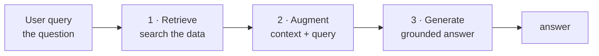
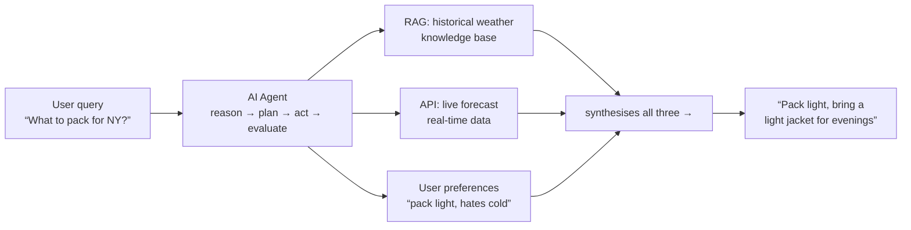
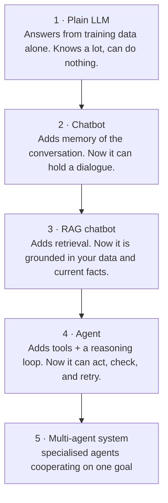
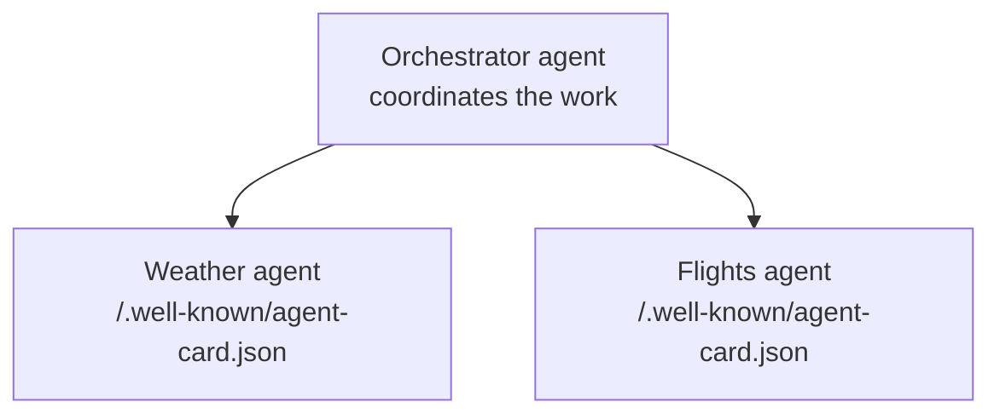
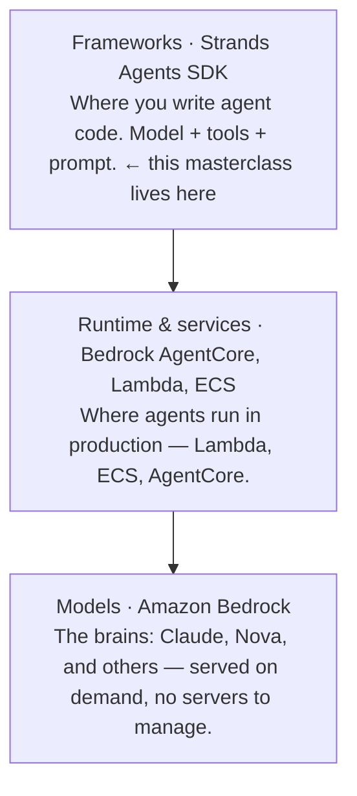
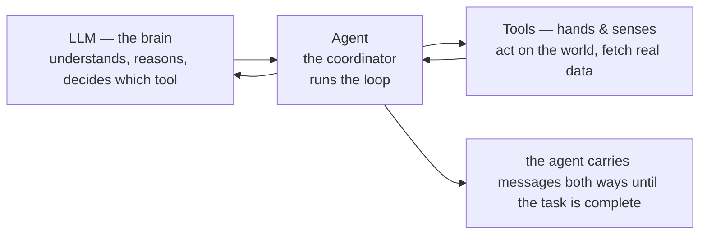
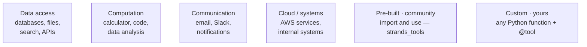
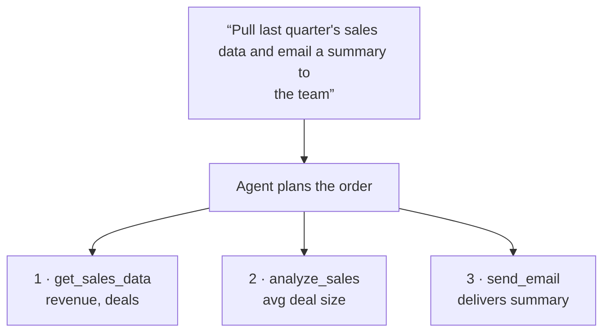

<!--
Source: aws-strands.html
Title: AI Agents on AWS — Strands SDK | TechToday
Theme-color: #0b0d10
Stylesheets: ../dsa/dsa-study.css, ../../site-header.css, ai-demos.css
Scripts: ../dsa/dsa-study.js
-->

Navigation: [TechToday](../../index.html) · [← AI Demos](ai-demos.html)

AI Agents on AWS

<a id="aws-strands"></a>

# From LLM to a *working agent*

This guide helps if you know basic LLMs and agents. It uses simple words, diagrams, and runnable commands. It includes AWS setup and a capstone project.

Level · **Beginner-friendly** · Framework · **AWS Strands SDK** · Model host · **Amazon Bedrock** · Region · **us-east-1**

20 Topics · AI agents, AWS Strands, tools & a travel-assistant capstone

<a id="table-of-contents"></a>

## Table of Contents

1. [AWS setup from zero](#s0)
2. [Why agents exist at all](#s1)
3. [RAG and how it works](#s2)
4. [What is an agent?](#s3)
5. [From LLMs to multi-agent systems](#s4)
6. [Agent protocols — MCP and A2A](#s5)
7. [The AWS agentic stack](#s6)
8. [The Strands SDK and the agentic loop](#s7)
9. [Building a "Hello World" agent](#s8)
10. [LLM, agent, and tools — who does what](#s9)
11. [From function to tool](#s10)
12. [Your first tool-enabled agent — the tip calculator](#s11)
13. [When one tool isn't enough](#s12)
14. [Pre-built community tools](#s13)
15. [AWS integration with use_aws](#s14)
16. [Building custom tools](#s15)
17. [When simple tools aren't enough](#s16)
18. [Project — build a Travel Assistant Agent](#s17)
19. [Every command in one place](#s17b)
20. [Troubleshooting](#s18)

---

<a id="unit-1"></a>

## Unit 1 — Environment & AWS Setup

Configure IAM credentials, request Amazon Bedrock model access, and verify the local Python development environment.

<a id="s0"></a>

## 1. AWS setup from zero

<a id="s0-0-1-create-an-access-key-browser-once"></a>

### 0.1 · Create an access key (browser, once)

Both modules run on your laptop and call AI models hosted on AWS. You need two things: **credentials**, which let your laptop talk to AWS, and **model access**, which lets your AWS account use the models. That is all.

> 💡 **What this costs.** Local code is free. You only pay for model calls per token. These examples cost a fraction of a cent. Nothing runs in the background, so there is nothing to turn off.

Sign in to the AWS console as an admin. Then do this:

1. Use the top search bar. Type **IAM** and open it.
2. In the left menu, open **Users**. Then click your username.
3. Open the **Security credentials** tab.
4. Scroll to **Access keys**. Click **Create access key**.
5. For use case, choose **Command Line Interface (CLI)**. Tick the box. Click **Next**, then **Create access key**.
6. Copy the **Access key ID** and **Secret access key** now. AWS shows the secret only once.

> ⚠️ **Treat the secret like a password.** Never paste it into chat, screenshots, or a Git repo. `aws configure` stores it on your machine in `~/.aws/credentials`. That is the right place for it.

<a id="s0-0-2-connect-your-laptop"></a>

### 0.2 · Connect your laptop

**terminal**

```bash
aws configure
# AWS Access Key ID     → paste the key id
# AWS Secret Access Key → paste the secret
# Default region name   → us-east-1
# Default output format → (press Enter, leave blank)
```

Check that it worked:

**terminal**

```bash
aws sts get-caller-identity
```

A successful command prints your `Account`, `UserId`, and `Arn`. If you get `InvalidClientTokenId`, the key is wrong or turned off. Create a new key and run `aws configure` again.

<a id="s0-0-3-enable-the-models-in-bedrock"></a>

### 0.3 · Enable the models in Bedrock

Models are off by default. In the console, do this:

1. In the top-right region selector, choose **US East (N. Virginia) · us-east-1**.
2. Search for **Bedrock** and open it. In the left menu, open **Model access**.
3. Click **Modify model access**. Tick the models below, then submit.

1. **Amazon Nova Lite**: Module 1 Hello World (cheap, fast)
2. **Claude Haiku 4.5**: Module 1 LangGraph example, Module 2 tools
3. **Claude Sonnet 4.5**: Stronger reasoning. Useful later.
Use the terminal to check which Anthropic models are active in your account:

**terminal**

```bash
aws bedrock list-foundation-models --region us-east-1 \
  --query "modelSummaries[?contains(modelId,'anthropic.claude')].modelId" \
  --output table
```

> ⚠️ **The most common error.** The repo pins older model IDs that AWS has retired. You may see `ResourceNotFoundException … model version has reached the end of its life` or `… marked by provider as Legacy`. **The fix is always the same:** list the active models with the command above, pick one, add the `us.` prefix, and put it in the code. This is a useful skill, not a bug.

<a id="s0-0-4-the-project-folder"></a>

### 0.4 · The project folder

This guide includes all code for both modules. It is already fixed and ready to run. Unzip it anywhere and open the folder in VS Code. **You can rename the folder to whatever you like**; nothing depends on the folder name.

**what's inside**

```text
.
├── GUIDE.html            # this file
├── README.md             # how to run everything
├── config.py             # model IDs — change once, applies everywhere
├── requirements.txt
├── setup.sh / setup.bat
├── 00_check_setup.py     # run this FIRST
├── 01_list_models.py     # use when a model is retired
├── one/             # 2 examples
├── two/             # 9 examples
└── three/             # capstone project
```

<a id="s0-0-5-install-the-packages"></a>

### 0.5 · Install the packages

**terminal · from the project folder**

```bash
# macOS / Linux
./setup.sh

# Windows
setup.bat
```

You can also install the packages manually:

**terminal · manual install**

```bash
python3 --version          # must be 3.10 or higher
python3 -m venv .venv
source .venv/bin/activate   # Windows: .venv\Scripts\activate
pip install --upgrade pip
pip install -r requirements.txt
```

> 💡 **If you are in conda and your prompt shows (base).** The venv keeps this project separate from your conda environment. After activation, you should see `(.venv)` at the start of your prompt. In VS Code, also choose the interpreter: `⌘``⇧``P` → *Python: Select Interpreter* → choose the `.venv` interpreter.

<a id="s0-0-6-run-the-readiness-check"></a>

### 0.6 · Run the readiness check

This command checks Python, packages, credentials, region, and Bedrock access. It makes a real model call. If it passes, all examples should work.

**Run it**

```bash
source .venv/bin/activate
export AWS_DEFAULT_REGION=us-east-1
python 00_check_setup.py
```

> 🔑 **What success looks like.** You should see six `[ OK ]` lines ending with *"All checks passed."* If something fails, the script prints the fix. It may ask you to enable model access, paste fresh credentials, or replace a retired model. Run this before anything else. If it passes, every example in this guide should work.

> 🔑 **Do this before anything else.** Spend 15 minutes on Section 0 before you write agent code. Setup failures are the main reason people stop hands-on AI work. Do not continue until `get-caller-identity` returns your account details.

---

<a id="unit-2"></a>

## Unit 2 — Agent Concepts & Protocols

Understand why agents exist, how they extend RAG, the ReAct reasoning loop, and open standards like MCP and A2A.

<a id="s1"></a>

## 2. Why agents exist at all

<a id="s1-overview"></a>

### Overview

This section frames the guide. A standard LLM has two main limits:

- Knowledge cutoff: it knows only what it learned during training. Ask about yesterday's news and it cannot help.
- No access to your world: it cannot read your company database, check today's weather, or send an email.

You can fix this in two ways without retraining the model:

1. **RAG**
   - **What it adds**: Context from your data
   - **The model becomes…**: An informed *knowledge retriever*
2. **Agents**
   - **What it adds**: The ability to reason and *use tools*
   - **The model becomes…**: An *actor* that gets things done
Here is the key point. Many teams build a RAG system. Then users want the AI to do work, like booking meetings or updating records. Teams struggle to move from passive retrieval to active agents. These modules help you make that shift.

<a id="s2"></a>

## 3. RAG and how it works

<a id="s2-the-full-rag-pipeline"></a>

### The full RAG pipeline

RAG combines an LLM with a search system. It has three steps:

1. Retrieve: search an external knowledge base for information that matches the question.
2. Augment: attach the retrieved context to the original question to make a richer prompt.
3. Generate: the LLM writes the answer using the supplied context.


Diagram 1 — How Retrieval Augmented Generation works

Example: *"Who won the 2024 Nobel Prize in Physics?"* The system queries a real-time news database, finds the fact, adds it to the prompt, and the LLM gives an accurate answer. It can do this even though the fact is after the model's training cutoff.

The next diagram shows the seven stages you use to build a real RAG system.

```mermaid
flowchart LR
  I[INDEXING (done once, ahead of time)]
  L[1 · Load data<br>ingest documents]
  C[2 · Chunk<br>split into pieces]
  E[3 · Embed<br>text → vectors]
  S[4 · Store<br>vector database]
  Q[QUERY TIME (every question)]
  R[5 · Retrieve<br>top-k matches]
  F[6 · Filter & rerank<br>optional quality step]
  G[7 · Generate answer<br>LLM + retrieved context]
  U[→ user]
  I --> L
  L --> C
  C --> E
  E --> S
  S --> Q
  Q --> R
  R --> F
  F --> G
  G --> U
```
Diagram 2 — The RAG pipeline, from raw documents to a final answer

<a id="s2-the-stages-in-plain-language"></a>

### The stages, in plain language

- Load: bring in the documents you want to query.
- Chunk: split the documents into small pieces. This matters for two reasons. Models have a limited context window, and small chunks reduce the lost-in-the-middle effect, where details buried in a long passage get missed.
- Embed: convert each chunk into a vector. A vector is a list of numbers that represents meaning. You can use an embedding model such as Amazon Titan.
- Store: keep chunks and vectors in a vector database that supports similarity search. Common examples are Amazon OpenSearch Service, Pinecone, FAISS, Chroma, and PostgreSQL with pgvector.
- Retrieve: turn the user's question into a vector too. Then pull the top-k most similar chunks, such as k = 3, 5, or 10.
- Filter & rerank: optionally re-sort results for quality. This can improve answers, but it adds cost and complexity.
- Generate: give the retrieved chunks and the original question to the LLM. The LLM writes the final answer.

RAG is an **open-book exam**. The model hasn't memorized the textbook. It reads relevant pages before answering. Chunking sizes each page. Embedding acts as the index.

<a id="s3"></a>

## 4. What is an agent?

<a id="s3-overview"></a>

### Overview

The word *agent* means something that performs a task for you. A working definition is: **AI agents are autonomous software systems that use AI to reason, plan, and carry out tasks** for humans or other systems. Autonomous means they can keep working without step-by-step instructions. They make decisions, adapt to new information, and act.

Their strength is **iterative thinking**. They check results, adjust, and keep working toward a goal. They often use RAG as one part of that workflow.


Diagram 3 — An AI agent as a travel planner, using agentic RAG

Follow this example closely. The agent receives *"What should I pack for New York summer?"*. It does not just look up one fact. It:

1. Uses RAG to get past weather data.
2. Checks live forecast via API.
3. Analyzes user preferences (e.g., pack light, avoid cold).
4. Combines everything into a custom recommendation.

That final synthesis combines three sources into one judgement. This decision-making separates an agent from simple retrieval.

> 🔑 **The key distinction.** **RAG answers questions. Agents accomplish goals.** RAG gives the model better information. An agent gives it the ability to act, check the result, and try again.

<a id="s4"></a>

## 5. From LLMs to multi-agent systems

<a id="s4-overview"></a>

### Overview

Think of this as a progression. Each step adds one capability. Use it to orient yourself if you already know agents a little.


Diagram 4 — Progression from basic LLM capabilities to multi-agent systems

Remember this line: each level adds exactly one thing. First memory, then grounding, then action, then teamwork. If you can name what each level adds, you understand the shape of the field.

<a id="s5"></a>

## 6. Agent protocols — MCP and A2A

<a id="s5-mcp-model-context-protocol"></a>

### MCP — Model Context Protocol

When agents need to reach the outside world or other agents, you need standard connection methods. Two protocols matter. People often confuse them, so compare them side by side.

MCP connects an agent to **tools and data**. A server exposes capabilities. A client, which is your agent, discovers and calls them. Think of it as **USB for AI tools**: plug in a new server and the agent gains new abilities without changing its code.

```mermaid
flowchart LR
  A[Agent (MCP client)<br>has the model<br>and the reasoning]
  S[MCP server<br>• Tools — actions the agent can perform<br>• Resources — data the agent can read<br>• Prompts — reusable prompt templates]
  A -->|1 · what can you do?| S
  S -->|2 · list of tools / resources / prompts| A
```
Diagram 5 — MCP workflow: the client discovers a server's capabilities, then calls them

<a id="s5-a2a-agent-to-agent"></a>

### A2A — Agent to Agent

A2A connects an agent to **other agents**. Each agent publishes an *agent card*. This is a small profile with its name, skills, and contact method. Other agents read the card and send it messages.


Diagram 6 — How A2A works: an orchestrator discovers and messages independent agents

1. **Connects an agent to…**
   - **MCP**: Tools, data, prompts
   - **A2A**: Other agents
2. **The other side is…**
   - **MCP**: A server that exposes capabilities
   - **A2A**: A peer agent with its own reasoning
3. **Discovery via**
   - **MCP**: A list of tools, resources, and prompts
   - **A2A**: The agent card
4. **Analogy**
   - **MCP**: USB port for abilities
   - **A2A**: Colleagues calling each other
Diagram 7 — MCP vs A2A, side by side

> 💡 **Scope note.** Module 1 only introduces these protocols. Building MCP servers and A2A agents is a larger topic. Learn the vocabulary now so it is familiar later. Then move on. Do not build an MCP server today; finish the agent fundamentals first.

---

<a id="unit-3"></a>

## Unit 3 — The AWS Stack & Strands Runtime

Connect Amazon Bedrock foundation models to the AWS Strands SDK and run your first agent loop in code.

<a id="s6"></a>

## 7. The AWS agentic stack

<a id="s6-overview"></a>

### Overview

AWS offers three layers for building agents. Know which layer you are using.


Diagram 8 — The AWS agentic stack and where Strands sits within it

**Amazon Bedrock** is the key service for this guide. It is a managed service, which means AWS runs it for you. It hosts foundation models such as Claude, Nova, and others behind one API. You enabled model access in Section 0. That is what lets your code call these models.

<a id="s7"></a>

## 8. The Strands SDK and the agentic loop

<a id="s7-overview"></a>

### Overview

Strands has three core components: **model**, **tools**, and **prompt**. It also has an agentic feedback loop.

```mermaid
flowchart TD
  U[User prompt<br>“Write a story about…”]
  A[Agent (the coordinator)<br>holds model + tools + prompt]
  M[Model<br>reasons, picks tools]
  T[Tools<br>act on the real world]
  L[↻ the loop repeats until the task is fully addressed]
  F[Final response to user]
  U --> A
  A -->|asks| M
  M -->|“call tool X”| A
  A -->|executes| T
  T -->|result| A
  A --> L
  L --> F
```
Diagram 9 — The Strands agentic loop: agent asks model, model reasons and selects tools, agent executes, results feed back

Here is the loop in plain terms. The agent asks the model. The model reasons, responds, and chooses tools. The agent runs those tools. Results go back into the agent, which may call the model again. This continues until the agent decides the prompt is fully handled. Then it combines the work and returns the result.

> 🔑 **The key sentence.** "A chatbot answers once. An agent keeps going until the job is done." The loop is the difference. Everything else is detail.

<a id="s8"></a>

## 9. Building a "Hello World" agent

<a id="s8-8-1-the-simplest-possible-agent-strands-nova-lite"></a>

### 8.1 · The simplest possible agent — Strands + Nova Lite

> 💡 **How to run every example in this guide.** Run everything from the project root, which is the folder that contains `config.py`. Do not run from inside `one/`. The scripts import shared settings from `config.py`. If you run from a subfolder, you get `ModuleNotFoundError: No module named 'config'`.

**one/01_hello_world_agent.py**

```python
from strands import Agent
from strands.models.bedrock import BedrockModel
from config import NOVA_LITE

# ① nova lite: amazon's cheapest model — ideal for a first run
model = BedrockModel(model_id=NOVA_LITE)

# ② wrap the model in a strands agent
agent = Agent(model=model)

# ③ send one user message and capture the agent's reply
response = agent("Hello! Tell me a fun fact about AI agents.")
# ④ print the reply so learners can see the result
print(response)
```

**Run it**

```bash
python one/01_hello_world_agent.py
```

Four lines make a whole agent. Read each line: choose a model, wrap it in an `Agent`, call the agent like a function, and print the answer. There are no tools yet, so the loop runs exactly once. This is the "before" picture for Module 2.

<a id="s8-8-2-same-idea-in-langgraph-with-a-tool"></a>

### 8.2 · Same idea in LangGraph, with a tool

Strands is not the only framework. This version uses LangGraph and adds a small tool. You can see the loop run more than once.

**one/02_hello_world_langgraph.py**

```python
from langchain.chat_models import init_chat_model
from langchain.tools import tool
from langgraph.prebuilt import create_react_agent
from config import MODEL_ID


# ① define a simple langchain greeting tool
@tool
def greet(name: str) -> str:
    """Greet someone by name."""
    return f"Hello, {name}! Welcome to the world of AI agents."


# ② initialize the llm via bedrock using config.py
llm = init_chat_model(
    MODEL_ID,
    model_provider="bedrock_converse",
)

# ③ create a react agent with the tool so it can decide calls
agent = create_react_agent(model=llm, tools=[greet])

# ④ run the agent with a request that should trigger tool calls
response = agent.invoke(
    {"messages": [{"role": "user", "content": "Please greet Alice and Bob."}]}
)

# ⑤ print every step so you can see the loop
for message in response["messages"]:
    print(f"{message.type}: {message.text}")
```

**Run it**

```bash
python one/02_hello_world_langgraph.py
```

> 🔑 **Expected output.** You will see five lines: `human:` the request · `ai:` (empty) · `tool:` Hello, Alice! · `tool:` Hello, Bob! · `ai:` a summary. The empty `ai:` line means the model chose to use a tool instead of answering. That is the agentic loop from Diagram 9, visible in your terminal.

> 💡 **Model note.** Older tutorials pin `anthropic.claude-3-5-haiku-20241022-v1:0`, which AWS has retired. These files already use the current model through `config.py`, so you do not need to patch anything. If AWS retires a model later, run `python 01_list_models.py`, pick an active model, and change the single line in `config.py`. Every example uses that setting.

---

<a id="unit-4"></a>

## Unit 4 — Tools & Function Calling

Convert Python functions into schema-driven tools, enable multi-tool decision making, and integrate pre-built community and AWS services.

<a id="s9"></a>

## 10. LLM, agent, and tools — who does what

<a id="s9-types-of-tools"></a>

### Types of tools

Use this simple division of labour:

- The LLM is the brain. It understands requests, reasons about what needs to happen, and decides which tools to use.
- Tools are the hands and senses. They perform actions and gather information from the outside world.
- The agent is the coordinator. It manages the conversation between the LLM and the tools.


Diagram 10 — LLM, Agent, and Tools


Diagram 11 — Types of tools an agent can use

<a id="s10"></a>

## 11. From function to tool

<a id="s10-overview"></a>

### Overview

This is the most important idea in this module. Start with a normal Python function that checks whether a server is up:

**plain python — the agent cannot use this**

```python
import requests

def check_server_status(server_url):
    """Check if a server is responding."""
    # ① call the url and report success if it responds in time
    try:
        response = requests.get(server_url, timeout=5)
        return f"Server is up. Status code: {response.status_code}"
    except requests.exceptions.RequestException:
        # ② return a clear status when the request fails
        return "Server is down or unreachable"

# ① use the helper like this with a sample server url
status = check_server_status("https://staging.myapp.com")
# ② print what the helper returned
print(status)
# "Server is up. Status code: 200"
```

If you ask the agent *"Is the staging server running?"*, it says it cannot check server status. The agent cannot discover your function by itself. That is the gap.

The bridge is **function calling**, also called tool use. Add three things:

1. **`@tool` decorator**: Tells Strands to make this function available to agents.
2. **Type hints**: Tell the agent what data types to expect.
3. **A proper docstring**: Describes what the function does, so the agent knows when to use it.
**two/01_function_to_tool.py**

```python
from strands import Agent, tool
import requests

@tool                                              # 1. decorator
def check_server_status(server_url: str) -> str:      # 2. type hints
    """Check if a server is responding by making an HTTP request.

    Args:
        server_url: The URL of the server to check

    Returns:
        A message indicating whether the server is up or down
    """                                           # 3. docstring
    # ① call the server and return success if it responds
    try:
        response = requests.get(server_url, timeout=5)
        return f"Server is up. Status code: {response.status_code}"
    except requests.exceptions.RequestException:
        # ② return a clear down or unreachable message on request errors
        return "Server is down or unreachable"
```

**give it to the agent**

```python
agent = Agent(tools=[check_server_status])
response = agent("Is the staging server running? Check https://httpbin.org/get")
```

**Run it**

```bash
python two/01_function_to_tool.py
```

> 🔑 **The main point.** The docstring is not just a comment. It is the user manual the model reads. The model decides whether to call your tool based on that description. A vague docstring makes the agent unreliable. Try breaking one on purpose: change the docstring to `"Does a thing."` and watch the agent stop calling it. That experiment teaches more than reading alone.

This pattern works for any function. Add `@tool`, give it to your `Agent`, and the agent can execute it.

<a id="s11"></a>

## 12. Your first tool-enabled agent — the tip calculator

<a id="s11-overview"></a>

### Overview

This is a practical, self-contained example from Module 2. You do not need to configure anything external.

**two/01_function_to_tool.py**

```python
from strands import Agent, tool

@tool
def calculate_tip(bill_amount: float, tip_percentage: float, num_people: int = 1) -> dict:
    """Calculate tip and split the bill among people.

    Args:
        bill_amount: Total bill amount in dollars
        tip_percentage: Tip percentage (e.g., 15, 18, 20)
        num_people: Number of people splitting the bill (default: 1)
    """
    # ① compute the tip, total bill, and per-person share from the inputs
    tip = bill_amount * (tip_percentage / 100)
    total = bill_amount + tip
    per_person = total / num_people

    # ② return rounded values so the agent can explain them cleanly
    return {
        "bill": bill_amount,
        "tip": round(tip, 2),
        "total": round(total, 2),
        "per_person": round(per_person, 2)
    }

# ① create an agent that is allowed to call the calculator
agent = Agent(tools=[calculate_tip])

# ② ask in plain english so the model extracts the numbers
response = agent("The bill is $85. What's a 20% tip, and how much does each person pay if we're splitting it 4 ways?")
# ③ print the final natural-language answer
print(response.message['content'][0]['text'])
```

Then show that the agent understands *intent*, not just keywords. All three requests work without extra code:

**two/02_tip_calculator.py**

```python
agent("What's a 15% tip on $42?")
agent("Bill is $120, we want to tip 18%, split between 3 people")
agent("Calculate tip for $67.50 at 20%")
```

**Run it**

```bash
python two/02_tip_calculator.py
```

> 🔑 **Important contrast.** In traditional chatbot development, you would write regex patterns and intent classifiers for those three phrasings. You would also extract the numbers separately. Here you wrote one function with a clear description. The model handled intent recognition and parameter extraction.

<a id="s12"></a>

## 13. When one tool isn't enough

<a id="s12-overview"></a>

### Overview

Scenario: you ask a sales assistant to *"pull last quarter's sales data and email a summary to the team."* That is not one task. It is three tasks: query the database, analyse the numbers, and send an email.

**two/03_multi_tool_sales.py**

```python
from strands import Agent, tool

# ① make sales lookup available as the first tool
@tool
def get_sales_data(quarter: str) -> dict:
    """Retrieve sales data for a specific quarter."""
    return {"revenue": 1250000, "deals": 47, "quarter": quarter}

# ② make the analysis step available as a second tool
@tool
def analyze_sales(revenue: int, deals: int, quarter: str) -> str:
    """Calculate key metrics from sales data."""
    avg_deal = revenue / deals
    return f"Q{quarter}: ${revenue:,} revenue, {deals} deals, ${avg_deal:,.0f} avg deal size"

# ③ make the delivery step available as a third tool
@tool
def send_email(to: str, subject: str, body: str) -> str:
    """Send an email message."""
    return f"Email sent to {to}"

# ④ register all tools with one agent so it can chain them
agent = Agent(tools=[get_sales_data, analyze_sales, send_email])

# ⑤ give one business request and let the agent choose the order
response = agent("Pull last quarter's sales data and email a summary to the team")
```


Diagram 12 — One request, three tools: the agent works out which to call and in what order

You never told the agent the sequence. It recognised that it needed data first, then analysis, then delivery. It chained the tools. That is planning.

**Run it**

```bash
python two/03_multi_tool_sales.py
```

> 💡 **Rule of thumb.** Build focused, single-purpose tools. Do not create one mega-tool that does everything. It becomes harder to maintain, harder for the agent to reason about, and impossible to reuse elsewhere. Small tools combine well. The same `analyze_sales` tool works with data from any source.

<a id="s13"></a>

## 14. Pre-built community tools

<a id="s13-13-1-calculator"></a>

### 13.1 · Calculator

You do not have to write every tool yourself. `strands_tools` includes ready-made tools. Import them and use them.

**two/05_prebuilt_tools.py**

```python
from strands import Agent
from strands_tools import calculator

# ① create an agent with the calculator tool and math-focused instructions
agent = Agent(
    tools=[calculator],
    system_prompt="You are a helpful math assistant."
)

# ② ask several math questions so the same tool can be reused
agent("What's 42 raised to the power of 9?")
agent("Solve the equation x^2 + 5x + 6 = 0")
agent("What's the derivative of sin(x) * cos(x)?")
```

This also introduces the **system prompt**. A system prompt is a standing instruction that shapes the agent's behaviour across every request.

**Run it**

```bash
python two/05_prebuilt_tools.py
```

<a id="s13-13-2-combining-several-pre-built-tools"></a>

### 13.2 · Combining several pre-built tools

This example fetches data from the web, does maths on it, and writes a file. One request uses three tools.

**two/06_multi_prebuilt_tools.py**

```python
import os
from strands import Agent
from strands_tools import http_request, calculator, file_write

# ① create an agent with web, calculator, and file-writing tools
agent = Agent(
    tools=[http_request, calculator, file_write],
    system_prompt="You help with data analysis tasks."
)

# ② turn off interactive tool approval for this unattended demo
os.environ["BYPASS_TOOL_CONSENT"] = "true"

# ③ give one end-to-end request that uses all three tools
agent("""
Fetch stock data from https://query1.finance.yahoo.com/v8/finance/chart/AAPL?interval=1d&range=5d,
extract the latest closing prices,
calculate the average price over the period,
and save the results to stock_summary.txt
""")
```

**Run it**

```bash
python two/06_multi_prebuilt_tools.py
```

> ⚠️ **Explain BYPASS_TOOL_CONSENT before running it.** Some tools are sensitive because they write files or touch cloud resources. Strands pauses and asks for permission before it runs them. Setting `BYPASS_TOOL_CONSENT="true"` turns that prompt off so the cell runs unattended. Treat this as a real safety feature. In production, you often want a human to approve actions. If a cell seems stuck at `[*]`, it is waiting for your `y` at a hidden prompt.

<a id="s14"></a>

## 15. AWS integration with `use_aws`

<a id="s14-overview"></a>

### Overview

One tool can work with many services. `use_aws` translates plain English into AWS API calls.

**two/07_use_aws.py**

```python
from strands import Agent
from strands_tools import use_aws

# ① create an aws assistant with the prebuilt use_aws tool
agent = Agent(
    tools=[use_aws],
    system_prompt="You are an AWS assistant that helps manage cloud resources."
)

# ② ask a read-only cloud question in plain english
agent("List all S3 buckets in my account")
```

The same single tool can handle very different services. Other examples:

**one tool, three services**

```python
# DynamoDB
agent("Look up customer ID 12345 in the DynamoDB customers table and update their email to newemail@example.com")

# Lambda
agent("Invoke the Lambda function 'order-processor' with order ID 67890")
```

> 💡 **Before you run this.** These examples assume the AWS resources already exist in your account. The S3 bucket, DynamoDB table, and Lambda function in the snippets must exist. While you learn, stick to the S3 listing example. It works on any account, even an empty one. An empty list is a valid result, not an error.

Notice what happened. You described what you wanted in plain English. The agent worked out the AWS API calls. You did not write boto3 code, handle AWS responses, or name the exact operation.

**Run it**

```bash
python two/07_use_aws.py
```

> ⚠️ **Handle with care.** `use_aws` can modify real resources. While you learn, stick to read-only requests such as "list" and "describe". Always use a sandbox account, never production. This is why the consent prompt exists. Read it before you type `y`.

---

<a id="unit-5"></a>

## Unit 5 — Custom Tools & Advanced Patterns

Build production custom tools with domain logic, manage state with class-based tools, and execute parallel calls with async tools.

<a id="s15"></a>

## 16. Building custom tools

<a id="s15-overview"></a>

### Overview

When community tools do not fit your need, write your own. This applies to an internal API, a private database, or a new action. Example: an online store checking inventory.

**two/04_custom_tool_inventory.py**

```python
from strands import Agent, tool

@tool
def check_inventory(product_id: str) -> str:
    """Check if a product is in stock.

    Args:
        product_id: The product ID to check (e.g., "PROD-123")
    """
    # ① use a mock table where you'd query your actual database
    inventory = {
        "PROD-123": 15,
        "PROD-456": 0,
        "PROD-789": 8
    }

    # ② pull the requested product quantity, defaulting missing items to zero
    quantity = inventory.get(product_id, 0)

    # ③ return an in-stock message when quantity is positive
    if quantity > 0:
        return f"Product {product_id} is in stock. We have {quantity} units available."
    else:
        # ④ return an out-of-stock message otherwise
        return f"Product {product_id} is currently out of stock."

# ① give the inventory tool to the agent
agent = Agent(tools=[check_inventory])

# ② all of these work because the agent understands intent, not just keywords
agent("Is PROD-123 in stock?")
agent("Do we have PROD-456 available?")
agent("Check inventory for PROD-789")
agent("Can I order PROD-123 right now?")
```

Notice the mock dictionary. In production, you would replace it with real database queries or an API call. The part the agent sees stays the same: decorator, type hints, and docstring.

**Run it**

```bash
python two/04_custom_tool_inventory.py
```

> 🔑 **Exercise: pick one.** Build a tool for a problem you care about. Ideas: check the weather in your city by calling a weather API; validate email format; calculate age from birthdate; calculate BMI; calculate shipping costs from weight and distance. The logic can be simple. The goal is to see how a custom tool fits into the agent workflow.

<a id="s16"></a>

## 17. When simple tools aren't enough

<a id="s16-16-1-the-database-connection-problem-class-based-tools"></a>

### 16.1 · The database connection problem → class-based tools

This module ends with three cases where the plain `@tool` approach starts to strain. Learn them so you can recognise the pattern when it appears. You do not need to memorise them.

Story: your agent has five tools. Each tool opens its own database connection. Your DBA asks, *"Why is your agent opening 50 database connections per minute?"* Each tool call opens and closes a connection. With many users at the same time, the database gets overloaded.

**The fix:** group related tools in a class so they share one connection.

**two/08_class_based_tools.py**

```python
from strands import Agent, tool

class InventoryTools:
    def __init__(self):
        # ① shared resource: all tools access the same data store
        # In production: self.db = connect_to_database()
        self.products = {
            "PROD-123": {"name": "Wireless Mouse", "quantity": 15, "price": 29.99},
            "PROD-456": {"name": "USB-C Hub", "quantity": 0, "price": 49.99},
            "PROD-789": {"name": "Mechanical Keyboard", "quantity": 8, "price": 89.99},
        }

    @tool
    def check_stock(self, product_id: str) -> str:
        """Check product stock level.

        Args:
            product_id: The product ID to check
        """
        # ① find the product in the shared inventory
        product = self.products.get(product_id)
        # ② return a not-found message for unknown ids
        if not product:
            return f"Product {product_id} not found"
        # ③ report stock and price when the product exists
        return f"{product['name']}: {product['quantity']} units at ${product['price']}"

    @tool
    def update_stock(self, product_id: str, quantity: int) -> str:
        """Update product stock quantity.

        Args:
            product_id: The product ID to update
            quantity: New quantity to set
        """
        # ① update the shared inventory when the id exists
        if product_id in self.products:
            self.products[product_id]["quantity"] = quantity
            return f"Updated {product_id} to {quantity} units"
        # ② report not-found when no product matched
        return f"Product {product_id} not found"

# ① create one instance with shared state for multiple tools
inventory = InventoryTools()
# ② register both class methods with the agent
agent = Agent(tools=[inventory.check_stock, inventory.update_stock])

# ③ ask the agent to read and then update inventory through the tools
agent("Check stock for PROD-123")
agent("Update PROD-456 stock to 25 units, then confirm the new level")
```

**Run it**

```bash
python two/08_class_based_tools.py
```

<a id="s16-16-2-slow-sequential-calls-async-tools"></a>

### 16.2 · Slow sequential calls → async tools

If three warehouse lookups take 2 seconds each, running them one after another takes 6 seconds. Make the tool `async` and they run in parallel.

**two/09_async_tools.py**

```python
import asyncio
import time
from strands import Agent, tool

@tool
async def check_warehouse_inventory(product_id: str, warehouse: str) -> dict:
    """Check inventory at a specific warehouse.

    Args:
        product_id: Product ID to check
        warehouse: Warehouse identifier (e.g., "east", "west", "central")
    """
    # ① simulate api call delay with a two-second wait
    await asyncio.sleep(2)

    # ② load mock inventory for each warehouse
    data = {
        "east":    {"PROD-123": 45, "PROD-456": 12},
        "west":    {"PROD-123": 30, "PROD-456": 0},
        "central": {"PROD-123": 60, "PROD-456": 25},
    }

    # ③ read the requested quantity, defaulting missing items to zero
    quantity = data.get(warehouse, {}).get(product_id, 0)
    # ④ return a structured result the agent can compare across warehouses
    return {
        "warehouse": warehouse,
        "product_id": product_id,
        "quantity": quantity
    }

async def main():
    # ① create an agent that can call the async warehouse tool
    agent = Agent(tools=[check_warehouse_inventory])
    # ② start a timer before the agent makes parallel tool calls
    start = time.time()
    # ③ ask for all warehouses so the model can call the tool concurrently
    response = await agent.invoke_async(
        "Can we ship 100 units of PROD-123? Check all warehouses: east, west, and central."
    )
    # ④ calculate and print elapsed time to compare with sequential calls
    elapsed = time.time() - start
    print(response.message['content'][0]['text'])
    print(f"\nTotal time: {elapsed:.1f}s (sequential would be ~6s)")

# ① run the async demo in notebook-style environments
await main()
```

**Run it**

```bash
python two/09_async_tools.py
```

> 🔑 **What to notice.** The printed timing is the lesson: roughly 2 seconds instead of 6. Run it yourself so you see concurrency, not just read about it. The bare `await main()` works in a Jupyter cell. In a plain script, use `asyncio.run(main())`.

---

<a id="unit-6"></a>

## Unit 6 — Capstone Project & Troubleshooting

Combine tools into an end-to-end travel assistant agent, reference runnable commands, and diagnose common Bedrock errors.

<a id="s17"></a>

## 18. Project — build a Travel Assistant Agent

<a id="s17-the-brief"></a>

### The brief

This project mirrors Diagram 3, the travel planner. You finish where Module 1 began, but now you build it yourself. It uses every skill from both modules: custom tools, multiple tools, a pre-built tool, a system prompt, and the agentic loop.

Build an agent that answers: *"I'm going to Goa for 3 days next week with a budget of ₹20,000. What should I pack and what will it cost?"* The agent should reason across weather, packing, and budget before it answers.

1. **`get_weather_forecast`**
   - **Job**: Return conditions for a city and date range
   - **Skill practised**: Custom tool, mock data
2. **`suggest_packing_list`**
   - **Job**: Turn weather and trip length into a packing list
   - **Skill practised**: Tool that consumes another tool's output
3. **`estimate_trip_cost`**
   - **Job**: Estimate rough cost from city, days, and travellers
   - **Skill practised**: Numeric logic and a dict return
4. **`calculator`**
   - **Job**: Budget maths
   - **Skill practised**: Pre-built community tool
<a id="s17-starter-code"></a>

### Starter code

**three/travel_assistant.py**

```python
"""Capstone: Travel Assistant Agent (Modules 1 & 2)."""

from strands import Agent, tool
from strands.models.bedrock import BedrockModel
from strands_tools import calculator


@tool
def get_weather_forecast(city: str, days: int) -> dict:
    """Get the weather forecast for a city over a number of days.

    Args:
        city: Destination city name (e.g., "Goa", "Bangalore")
        days: Number of days in the trip
    """
    # ① use mock data — replace with a real weather api to go further
    forecasts = {
        "goa":       {"high_c": 32, "low_c": 26, "conditions": "humid, occasional showers"},
        "bangalore": {"high_c": 27, "low_c": 18, "conditions": "mild, light evening rain"},
        "jaipur":    {"high_c": 38, "low_c": 25, "conditions": "hot and dry"},
        "manali":    {"high_c": 14, "low_c": 3,  "conditions": "cold, chance of snow"},
    }
    # ② pick matching city weather or a default forecast for unknown cities
    data = forecasts.get(city.lower(), {"high_c": 28, "low_c": 20, "conditions": "moderate"})
    # ③ return the requested city and trip length with forecast fields
    return {"city": city, "days": days, **data}


@tool
def suggest_packing_list(high_c: int, low_c: int, days: int, conditions: str) -> list:
    """Suggest what to pack based on temperatures, trip length and conditions.

    Args:
        high_c: Daytime high in Celsius
        low_c: Night-time low in Celsius
        days: Number of days in the trip
        conditions: Short description of expected weather
    """
    # ① start with essentials based on trip length
    items = [f"{days + 1} sets of clothes", "toiletries", "phone charger"]

    # ② add hot-weather items when daytime temperatures are high
    if high_c >= 30:
        items += ["light cotton clothing", "sunscreen", "sunglasses", "reusable water bottle"]
    # ③ add warm layers when nights are cool or cold
    if low_c <= 15:
        items += ["warm jacket", "thermal layer"]
    elif low_c <= 22:
        items += ["light jacket for evenings"]
    # ④ add rain gear when conditions mention rain or showers
    if "rain" in conditions.lower() or "shower" in conditions.lower():
        items += ["compact umbrella", "quick-dry footwear"]
    # ⑤ add snow gear when snow appears in the forecast
    if "snow" in conditions.lower():
        items += ["gloves", "woollen cap", "waterproof boots"]

    # ⑥ return the final packing checklist
    return items


@tool
def estimate_trip_cost(city: str, days: int, travellers: int = 1) -> dict:
    """Estimate the cost of a trip in Indian rupees.

    Args:
        city: Destination city
        days: Number of days
        travellers: Number of people travelling (default: 1)
    """
    # ① estimate lodging from city-specific nightly rates
    per_night = {"goa": 3500, "bangalore": 3000, "jaipur": 2500, "manali": 2800}
    stay = per_night.get(city.lower(), 3000) * days
    # ② estimate food and local travel for the whole trip
    food = 1200 * days * travellers
    local_travel = 800 * days
    # ③ add the cost categories into one total
    total = stay + food + local_travel

    # ④ return a structured cost breakdown for the agent
    return {
        "city": city,
        "days": days,
        "travellers": travellers,
        "stay_inr": stay,
        "food_inr": food,
        "local_travel_inr": local_travel,
        "total_inr": total,
    }


# ① choose the bedrock model for the capstone agent
model = BedrockModel(model_id="us.anthropic.claude-haiku-4-5-20251001-v1:0")

# ② register weather, packing, cost, and calculator tools
agent = Agent(
    model=model,
    tools=[get_weather_forecast, suggest_packing_list, estimate_trip_cost, calculator],
    system_prompt=(
        "You are a practical travel assistant. "
        "When asked about a trip: check the weather first, then suggest what to pack "
        "based on that weather, then estimate the cost. "
        "Always say whether the trip fits the user's budget, and keep advice concise."
    ),
)

if __name__ == "__main__":
    # ① ask one realistic travel-planning question
    response = agent(
        "I'm going to Goa for 3 days with 2 friends. My budget is 20000 rupees. "
        "What should I pack, and does it fit my budget?"
    )
    # ② print the agent's plan and budget answer
    print(response)
```

**Run it**

```bash
python three/travel_assistant.py

# or ask your own question:
python three/travel_assistant.py "I'm going to Manali for 4 days, budget 15000"
```

<a id="s17-what-to-observe-together"></a>

### What to observe together

Notice that the agent calls `get_weather_forecast` first. Then it feeds those numbers into `suggest_packing_list`. Then it prices the trip and compares it with the budget. Nobody wrote that sequence. The agentic loop worked it out. That is Diagram 9 running in your terminal.

<a id="s17-extension-challenges"></a>

### Extension challenges

- Easy: add a `get_visa_requirements(country)` tool and ask about an international trip.
- Medium: replace the mock weather with a real API call using `requests`. This uses the same pattern from Section 10.
- Medium: regroup the three tools into a `TravelTools` class with shared state, as in Section 16.1.
- Harder: make the weather and cost lookups `async` so a multi-city comparison runs in parallel. See Section 16.2.
- Harder: add `file_write` from `strands_tools` and have the agent save an itinerary to disk.

> 🔑 **How to know you understand it.** You understand these two modules if you can do four things: (1) explain why the docstring matters, (2) add a fourth tool without help, (3) predict which tools the agent will call for a question, and (4) debug a retired-model error on your own.

<a id="s17b"></a>

## 19. Every command in one place

<a id="s17b-setup-once"></a>

### Setup (once)

Use this as a copy-paste reference. Run every command from the project root, which is the folder that contains `config.py`.

**Run it**

```bash
./setup.sh                       # macOS / Linux  (Windows: setup.bat)
source .venv/bin/activate
export AWS_DEFAULT_REGION=us-east-1
python 00_check_setup.py         # verifies everything, makes a real model call
```

<a id="s17b-every-example-in-learning-order"></a>

### Every example, in learning order

**Run it**

```bash
# ---- Module 1 · first agents ----
python one/01_hello_world_agent.py        # simplest agent, no tools
python one/02_hello_world_langgraph.py    # with a tool — watch the loop

# ---- Module 2 · tools ----
python two/01_function_to_tool.py         # THE core idea: @tool
python two/02_tip_calculator.py           # first useful tool agent
python two/03_multi_tool_sales.py         # 3 tools, agent picks the order
python two/04_custom_tool_inventory.py    # build your own tool
python two/05_prebuilt_tools.py           # community tools + system prompt
python two/06_multi_prebuilt_tools.py     # combining several tools
python two/07_use_aws.py                  # one tool, many AWS services
python two/08_class_based_tools.py        # shared-resource pattern
python two/09_async_tools.py              # parallel tools: 2s not 6s

# ---- Module 3 · capstone ----
python three/travel_assistant.py
```

<a id="s17b-helpers"></a>

### Helpers

**Run it**

```bash
python 00_check_setup.py     # run whenever something breaks
python 01_list_models.py     # when a model is retired, pick a new one
aws sts get-caller-identity  # are my credentials alive?
env | grep AWS               # what credentials are actually set?
```

<a id="s18"></a>

## 20. Troubleshooting

<a id="s18-troubleshooting-keep-this-open-while-you-work"></a>

### Troubleshooting — keep this open while you work

1. **`ResourceNotFoundException … end of its life` /<br>`marked by provider as Legacy`<br>**: Retired model. Run `python 01_list_models.py`, pick an active model, and change `MODEL_ID` in `config.py`.
2. **`AccessDeniedException`**: The model is not enabled in Bedrock Model access, or you are using the wrong region. Check both.
3. **`InvalidClientTokenId`**: Credentials are stale or deleted. Create a new access key and rerun `aws configure`.
4. **`ModuleNotFoundError: No module named 'strands'`**: Wrong Python. Activate the venv. In Jupyter, switch the kernel.
5. **Notebook cell stuck on `[*]`**: A tool is waiting for consent. Type `y` at the hidden prompt, or set `BYPASS_TOOL_CONSENT="true"` in an earlier cell.
6. **Terminal shows `quote>` or `:` and seems frozen**: `quote>` means an unclosed quote. Press Ctrl+C. `:` is the AWS CLI pager. Press `q`. Set `export AWS_PAGER=""` to stop it.
7. **Agent ignores your tool**: The docstring is weak, or type hints are missing. Rewrite the description so it says plainly when the tool should be used.
8. **`ModuleNotFoundError: No module named 'config'`**: You ran from inside a subfolder. Run from the project root: `python one/01_hello_world_agent.py`.
9. **Worked yesterday but fails today**: Usually expired SSO credentials. Paste a fresh block, then run `python 00_check_setup.py`.
<a id="s18-the-five-sentences-to-remember"></a>

### The five sentences to remember

1. RAG gives a model better information. Tools give it the ability to act.
2. An agent is a loop: reason → call a tool → read the result → repeat until done.
3. A tool is a Python function plus a decorator, type hints, and a good docstring.
4. The docstring is the model's user manual. Write it for the model, not for yourself.
5. Build small, single-purpose tools. The agent handles the sequence.
