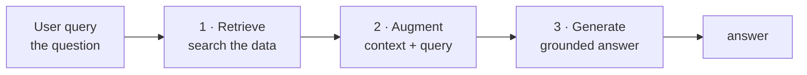
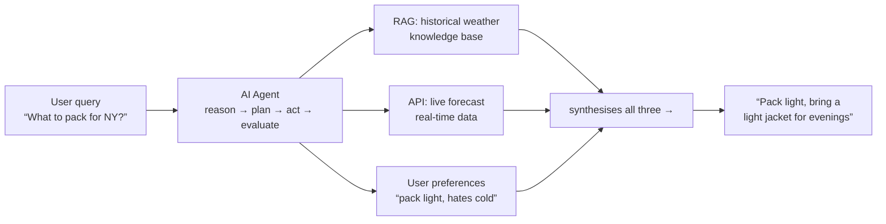
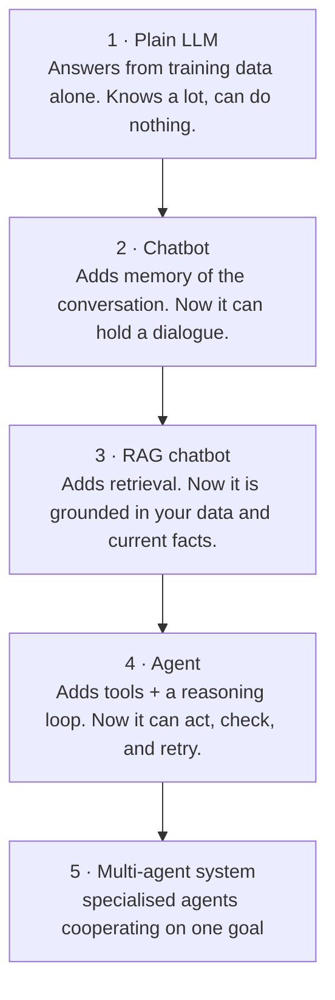
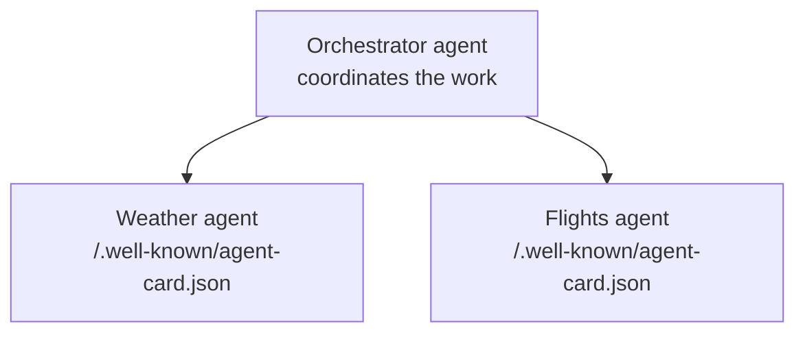
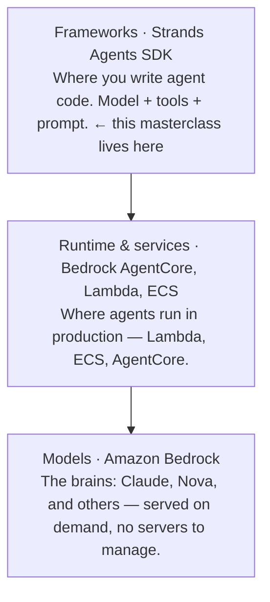
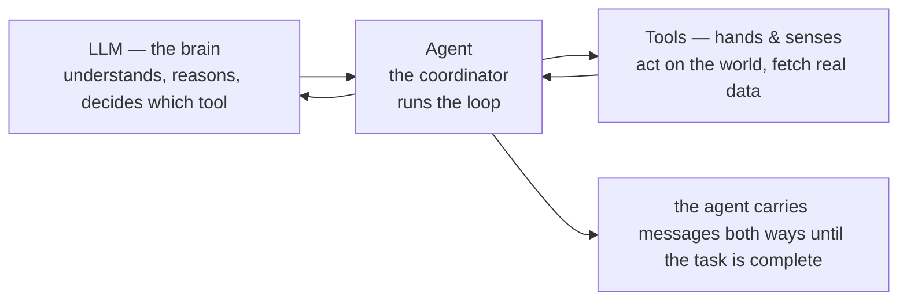
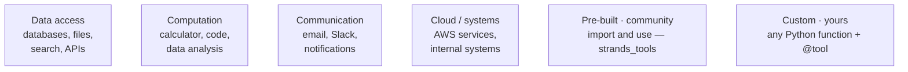
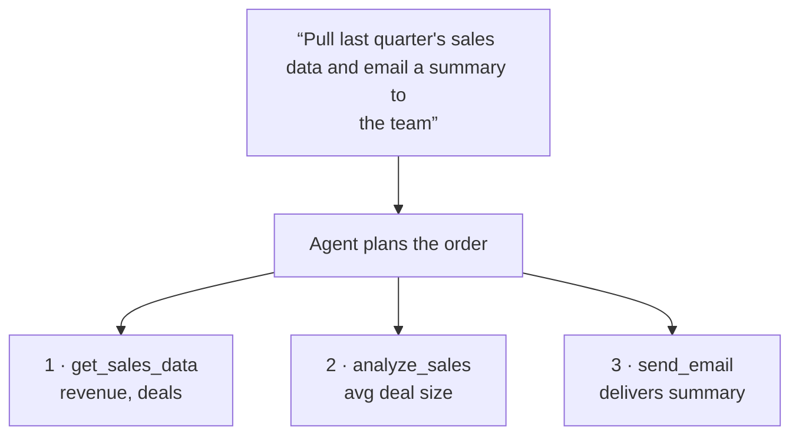

<!--
Source: aws-strands.html
Title: AI Agents on AWS — Strands SDK | TechToday
Theme-color: #0b0d10
Stylesheets: ../dsa/dsa-study.css, ../../site-header.css
Scripts: ../dsa/dsa-study.js
-->

Navigation: [TechToday](../../index.html) · [← AI Demos](ai-demos.html)

Future with Shivank · AI Agents on AWS

<a id="aws-strands"></a>

# From LLM to a *working agent*

A hands-on masterclass for anyone who already knows LLMs and agents at a basic level. Every concept in plain language, every diagram, and a runnable command after each idea — plus AWS setup from scratch and a capstone project.

Level · **Beginner-friendly** · Framework · **AWS Strands SDK** · Model host · **Amazon Bedrock** · Region · **us-east-1**

20 Topics · AI agents, AWS Strands, tools & a travel-assistant capstone

<a id="table-of-contents"></a>

## Table of Contents

1. [AWS setup from zero](#s0)
2. [Why agents exist at all](#s1)
3. [RAG and how it works](#s2)
4. [What is an agent?](#s3)
5. [From LLMs to multi-agent systems](#s4)
6. [Agent protocols — MCP and A2A](#s5)
7. [The AWS agentic stack](#s6)
8. [The Strands SDK and the agentic loop](#s7)
9. [Building a "Hello World" agent](#s8)
10. [LLM, agent, and tools — who does what](#s9)
11. [From function to tool](#s10)
12. [Your first tool-enabled agent — the tip calculator](#s11)
13. [When one tool isn't enough](#s12)
14. [Pre-built community tools](#s13)
15. [AWS integration with `use_aws`](#s14)
16. [Building custom tools](#s15)
17. [When simple tools aren't enough](#s16)
18. [Project — build a Travel Assistant Agent](#s17)
19. [Every command in one place](#s17b)
20. [Troubleshooting](#s18)

<a id="s0"></a>

## 1. AWS setup from zero

<a id="s0-0-1-create-an-access-key-browser-once"></a>

### 0.1 · Create an access key (browser, once)

Section 0 · Setup

Everything in both modules runs on your own laptop and calls AI models hosted on AWS. So there are exactly two things to arrange: **credentials** (so your laptop can talk to AWS) and **model access** (so AWS lets you use the models). Nothing else.

> 💡 **What this costs.** Running code locally is free. You only pay per model call, priced per token — the examples in this entire masterclass cost a fraction of a cent in total. Nothing keeps running in the background, so there is nothing to switch off afterwards.

Signed in to the AWS console as an admin:

1. Top search bar → type IAM → open it.
2. Left menu → Users → click your username.
3. Open the Security credentials tab.
4. Scroll to Access keys → Create access key.
5. Use case → Command Line Interface (CLI) → tick the box → Next → Create access key.
6. Copy the Access key ID and Secret access key now — the secret is shown only once.

> ⚠️ **Treat the secret like a password.** Never paste it into chat, screenshots, or a Git repo. `aws configure` stores it locally in `~/.aws/credentials`, which is where it belongs.

<a id="s0-0-2-connect-your-laptop"></a>

### 0.2 · Connect your laptop

**terminal**

```text
aws configure
# AWS Access Key ID     → paste the key id
# AWS Secret Access Key → paste the secret
# Default region name   → us-east-1
# Default output format → (press Enter, leave blank)
```

Check it worked:

**terminal**

```text
aws sts get-caller-identity
```

Success prints your `Account`, `UserId`, and `Arn`. If you get `InvalidClientTokenId`, the key is wrong or deactivated — create a fresh one and run `aws configure` again.

<a id="s0-0-3-enable-the-models-in-bedrock"></a>

### 0.3 · Enable the models in Bedrock

Models are switched off by default. In the console:

1. Top-right region selector → US East (N. Virginia) · us-east-1.
2. Search Bedrock → open it → left menu → Model access.
3. Modify model access → tick the models below → submit.

| Model | Used for |
| --- | --- |
| Amazon Nova Lite | Module 1 Hello World (cheap, fast) |
| Claude Haiku 4.5 | Module 1 LangGraph example, Module 2 tools |
| Claude Sonnet 4.5 | Heavier reasoning; useful later |

Verify from the terminal which Anthropic models are live in your account:

**terminal**

```text
aws bedrock list-foundation-models --region us-east-1 \
  --query "modelSummaries[?contains(modelId,'anthropic.claude')].modelId" \
  --output table
```

> ⚠️ **The single most common error you will hit.** The repo pins older model IDs that AWS has since retired. You will see `ResourceNotFoundException … model version has reached the end of its life` or `… marked by provider as Legacy`. **The fix is always the same:** list the live models with the command above, pick one, prefix it with `us.`, and swap it into the code. Treat this as a skill worth learning, not as a bug.

<a id="s0-0-4-the-project-folder"></a>

### 0.4 · The project folder

All the code for both modules ships with this guide, already fixed and ready to run. Unzip it anywhere and open the folder in VS Code — **you can rename the folder to whatever you like**, nothing depends on its name.

**what's
              inside**

```text
.
├── GUIDE.html            # this file
├── README.md             # how to run everything
├── config.py             # model IDs — change once, applies everywhere
├── requirements.txt
├── setup.sh / setup.bat
├── 00_check_setup.py     # run this FIRST
├── 01_list_models.py     # use when a model is retired
├── one/             # 2 examples
├── two/             # 9 examples
└── three/             # capstone project
```

<a id="s0-0-5-install-the-packages"></a>

### 0.5 · Install the packages

**terminal · from the
              project folder**

```text
# macOS / Linux
./setup.sh

# Windows
setup.bat
```

Or do it manually if you prefer:

**terminal · manual
              install**

```text
python3 --version          # must be 3.10 or higher
python3 -m venv .venv
source .venv/bin/activate   # Windows: .venv\Scripts\activate
pip install --upgrade pip
pip install -r requirements.txt
```

> 💡 **If you're in conda (your prompt shows (base) ).** The venv keeps this project isolated from your conda environment. After activating you should see `(.venv)` at the front of your prompt. In VS Code, also pick the interpreter: `⌘``⇧``P` → *Python: Select Interpreter* → choose the `.venv` one.

<a id="s0-0-6-run-the-readiness-check"></a>

### 0.6 · Run the readiness check

This is the single most useful command in the whole project. It verifies Python, packages, credentials, region, Bedrock access, **and makes a real model call** — so if it passes, every example will run.

**Run it**

```text
source .venv/bin/activate
export AWS_DEFAULT_REGION=us-east-1
python 00_check_setup.py
```

> 🔑 **What success looks like.** Six `[ OK ]` lines ending with *"All checks passed."* If anything fails it prints the exact fix — enable model access, paste fresh credentials, or swap a retired model. Run this before you touch anything else. If it passes, every example in this guide will work.

> 🔑 **Do this before anything else.** Give Section 0 a proper 15 minutes before you write any agent code. Setup failures are the number-one reason people abandon hands-on AI work. Do not move past this section until `get-caller-identity` returns your account details.

<a id="s1"></a>

## 2. Why agents exist at all

<a id="s1-overview"></a>

### Overview

Section 1 · Module 1 · one

Start here, because it frames everything else. A standard LLM has two hard limits:

- Knowledge cutoff — it only knows what it was trained on. Ask about yesterday's news and it cannot help.
- No access to your world — it cannot read your company database, check today's weather, or send an email.

There are two ways to fix this without retraining the model:

| Approach | What it adds | The model becomes… |
| --- | --- | --- |
| **RAG** | Relevant context fetched from your data | A better-informed *knowledge retriever* |
| **Agents** | The ability to reason and *use tools* | An *actor* that gets things done |

Here is the framing that matters: many teams build a RAG system, then find users want the AI to **actually do the work** — book the meeting, update the record, run the workflow. Moving from passive retriever to active agent is exactly where people get stuck. That is what these two modules fix.

<a id="s2"></a>

## 3. RAG and how it works

<a id="s2-the-full-rag-pipeline"></a>

### The full RAG pipeline

Section 2

RAG combines an LLM with a search system in three steps:

1. Retrieve — search an external knowledge base for information relevant to the question.
2. Augment — glue that retrieved context onto the original question to form a richer prompt.
3. Generate — the LLM answers using the supplied context.



Diagram 1 — How Retrieval Augmented Generation works

For example: *"Who won the 2024 Nobel Prize in Physics?"* The system queries a real-time news database, finds the fact, adds it to the prompt, and the LLM produces an accurate answer — despite that fact being past its training cutoff.

The next diagram expands this into the seven stages of building a real RAG system.

```mermaid
flowchart LR
  I[INDEXING (done once, ahead of time)]
  L[1 · Load data<br>ingest documents]
  C[2 · Chunk<br>split into pieces]
  E[3 · Embed<br>text → vectors]
  S[4 · Store<br>vector database]
  Q[QUERY TIME (every question)]
  R[5 · Retrieve<br>top-k matches]
  F[6 · Filter & rerank<br>optional quality step]
  G[7 · Generate answer<br>LLM + retrieved context]
  U[→ user]
  I --> L
  L --> C
  C --> E
  E --> S
  S --> Q
  Q --> R
  R --> F
  F --> G
  G --> U
```

Diagram 2 — The RAG pipeline, from raw documents to a final answer

<a id="s2-the-stages-in-plain-language"></a>

### The stages, in plain language

- Load — bring in the documents you want to query.
- Chunk — split them into small pieces. Two reasons: models have a limited context window, and it avoids the lost-in-the-middle effect where details buried in a long passage get overlooked.
- Embed — convert each chunk into a vector, a numerical representation of its meaning (using an embedding model such as Amazon Titan).
- Store — keep chunks plus vectors in a vector database that supports similarity search. Common examples: Amazon OpenSearch Service, Pinecone, FAISS, Chroma, PostgreSQL with pgvector.
- Retrieve — turn the user's question into a vector too, and pull the top-k most similar chunks (k = 3, 5, 10…).
- Filter & rerank — optionally re-sort for quality. Improves results but adds cost and complexity.
- Generate — hand the retrieved chunks plus the original question to the LLM, which writes the final answer.

> **Analogy** 📖 — ****Analogy that lands****
>
> RAG is an **open-book exam**. The model hasn't memorised the textbook, but you let it flip to the three most relevant pages before answering. Chunking is deciding how big each page is; embedding is the index at the back that tells you which pages to flip to.

<a id="s3"></a>

## 4. What is an agent?

<a id="s3-overview"></a>

### Overview

Section 3

The word *agent* just means something that performs a task on your behalf. A working definition: **AI agents are autonomous software systems that use AI to reason, plan, and carry out tasks** for humans or other systems. They make decisions, adapt to new information, and act without needing explicit instructions for every step.

What makes them powerful is **iterative thinking** — they evaluate results, adjust, and keep working toward a goal. And they often use RAG *as one part* of that workflow.



Diagram 3 — An AI agent as a travel planner, using agentic RAG

Follow this example closely. The agent takes *"What should I pack for New York summer?"* and it does **not** just look one thing up. It:

1. Uses RAG to retrieve historical weather data
2. Checks a real-time forecast via an API
3. Analyses user preferences (pack light, but avoid being cold)
4. Synthesises all of it into a personalised recommendation

That final synthesis — combining three different sources into a judgement — is the decision-making that separates an agent from simple retrieval.

> 🔑 **The one-line distinction to drill.** **RAG answers questions. Agents accomplish goals.** RAG gives the model better information; an agent gives it the ability to act, check the result, and try again.

<a id="s4"></a>

## 5. From LLMs to multi-agent systems

<a id="s4-overview"></a>

### Overview

Section 4

Think of this as a progression. Each step adds one capability. This is the fastest way to orient yourself if you "sort of know" agents already.



Diagram 4 — Progression from basic LLM capabilities to multi-agent systems

The one line to hold on to: **each level adds exactly one thing.** Memory, then grounding, then action, then teamwork. If you can name what each level adds, you understand the shape of the entire field.

<a id="s5"></a>

## 6. Agent protocols — MCP and A2A

<a id="s5-mcp-model-context-protocol"></a>

### MCP — Model Context Protocol

Section 5

Once agents need to reach the outside world and each other, you need standard ways to connect. Two protocols matter, and they are constantly confused with each other, so compare them side by side.

MCP connects an agent to **tools and data**. A server exposes capabilities; a client (your agent) discovers and calls them. Think of it as **USB for AI tools** — plug in a new server, gain new abilities, without changing your agent's code.

```mermaid
flowchart LR
  A[Agent (MCP client)<br>has the model<br>and the reasoning]
  Q[1 · what can you do?]
  R[2 · list of tools / resources / prompts]
  S[MCP server<br>• Tools — actions the agent can perform<br>• Resources — data the agent can read<br>• Prompts — reusable prompt templates]
  A -->|1 · what can you do?| S
  S -->|2 · list of tools / resources / prompts| A
```

Diagram 5 — MCP workflow: the client discovers a server's capabilities, then calls them

<a id="s5-a2a-agent-to-agent"></a>

### A2A — Agent to Agent

A2A connects an agent to **other agents**. Each agent publishes an *agent card* (a small profile: name, skills, how to talk to it), and other agents read that card and send it messages.



Diagram 6 — How A2A works: an orchestrator discovers and messages independent agents

|  | MCP | A2A |
| --- | --- | --- |
| Connects an agent to… | Tools, data, prompts | Other agents |
| The other side is… | A server exposing capabilities | A peer agent with its own brain |
| Discovery via | Listing tools/resources/prompts | The agent card |
| Analogy | USB port for abilities | Colleagues phoning each other |

Diagram 7 — MCP vs A2A, side by side> 💡 **Scope note.** Module 1 only *introduces* these protocols — building MCP servers and A2A agents is a much larger topic on its own. Learn the vocabulary here so it is familiar later, then move on. Resist the urge to go and build an MCP server today; finish the agent fundamentals first.

<a id="s6"></a>

## 7. The AWS agentic stack

<a id="s6-overview"></a>

### Overview

Section 6

AWS offers three layers for building agents. Always know which layer you are standing on.



Diagram 8 — The AWS agentic stack and where Strands sits within it

**Amazon Bedrock** is the key one for today: it is a managed service that hosts foundation models (Claude, Nova, and more) behind a single API. You enabled model access in Section 0 — that is what makes these models callable from your code.

<a id="s7"></a>

## 8. The Strands SDK and the agentic loop

<a id="s7-overview"></a>

### Overview

Section 7

Put simply: **Strands has three core components — model, tools, and prompt** — plus an agentic feedback loop.

```mermaid
flowchart TD
  U[User prompt<br>“Write a story about…”]
  A[Agent (the coordinator)<br>holds model + tools + prompt]
  M[Model<br>reasons, picks tools]
  T[Tools<br>act on the real world]
  L[↻ the loop repeats until the task is fully addressed]
  F[Final response to user]
  U --> A
  A -->|asks| M
  M -->|“call tool X”| A
  A -->|executes| T
  T -->|result| A
  A --> L
  L --> F
```

Diagram 9 — The Strands agentic loop: agent asks model, model reasons and selects tools, agent executes, results feed back

The loop in plain terms: the agent asks the model; the model reasons, responds, and selects tools; the agent executes those tools; results feed back into the agent, which may re-invoke the model. **This continues until the agent determines the prompt has been fully addressed** — then it compiles everything and returns the result.

> 🔑 **The sentence that makes agents click.** "A chatbot answers once. An agent keeps going until the job is done." The loop *is* the difference. Everything else is detail.

<a id="s8"></a>

## 9. Building a "Hello World" agent

<a id="s8-8-1-the-simplest-possible-agent-strands-nova-lite"></a>

### 8.1 · The simplest possible agent — Strands + Nova Lite

Section 8 · Hands-on

> 💡 **How to run every example in this guide.** Run everything **from the project root** (the folder containing `config.py`) — not from inside `one/`. The scripts import shared settings from `config.py`, so running from a subfolder gives `ModuleNotFoundError: No module named 'config'`.

**one/01_hello_world_agent.py**

```python
from strands import Agent
from strands.models.bedrock import BedrockModel
from config import NOVA_LITE

# Nova Lite: Amazon's cheapest model — ideal for a first run.
model = BedrockModel(model_id=NOVA_LITE)

agent = Agent(model=model)

response = agent("Hello! Tell me a fun fact about AI agents.")
print(response)
```

**Run it**

```text
python one/01_hello_world_agent.py
```

**Four lines is a whole agent.** Read each one: choose a model, wrap it in an `Agent`, call the agent like a function, print the answer. There are no tools here yet, so the loop runs exactly once — this is the "before" picture for Module 2.

<a id="s8-8-2-same-idea-in-langgraph-with-a-tool"></a>

### 8.2 · Same idea in LangGraph, with a tool

Strands is not the only framework. This version uses LangGraph and adds a small tool, so you can watch the loop actually loop.

**one/02_hello_world_langgraph.py**

```python
from langchain.chat_models import init_chat_model
from langchain.tools import tool
from langgraph.prebuilt import create_react_agent
from config import MODEL_ID


# Define a simple tool
@tool
def greet(name: str) -> str:
    """Greet someone by name."""
    return f"Hello, {name}! Welcome to the world of AI agents."


# Initialize the LLM via Bedrock
llm = init_chat_model(
    MODEL_ID,
    model_provider="bedrock_converse",
)

# Create a ReAct agent with the tool
agent = create_react_agent(model=llm, tools=[greet])

# Run the agent
response = agent.invoke(
    {"messages": [{"role": "user", "content": "Please greet Alice and Bob."}]}
)

# Print every step so you can see the loop
for message in response["messages"]:
    print(f"{message.type}: {message.text}")
```

**Run it**

```text
python one/02_hello_world_langgraph.py
```

> 🔑 **Expected output — and the moment it clicks.** You will see five lines: `human:` the request · `ai:` (empty) · `tool:` Hello, Alice! · `tool:` Hello, Bob! · `ai:` a summary. **Stop and unpack this.** The empty `ai:` line is the model *choosing to use a tool instead of answering*. That is the agentic loop from Diagram 9, visible in your terminal.

> 💡 **Note on models — already handled for you.** Older tutorials pin `anthropic.claude-3-5-haiku-20241022-v1:0`, which AWS has since retired. **These files already use the current model** via `config.py`, so there is nothing to patch. If a model is retired in future, run `python 01_list_models.py`, pick a live one, and change the single line in `config.py` — every example picks it up.

<a id="s9"></a>

## 10. LLM, agent, and tools — who does what

<a id="s9-types-of-tools"></a>

### Types of tools

Section 9 · Module 2 · two

The division of labour — the cleanest mental model here:

- The LLM is the brain — it understands requests, reasons about what needs doing, and decides which tools to use.
- Tools are the hands and senses — they perform actions and gather information from the outside world.
- The agent is the coordinator — it manages the conversation between the LLM and the tools.



Diagram 10 — LLM, Agent, and Tools



Diagram 11 — Types of tools an agent can use

<a id="s10"></a>

## 11. From function to tool

<a id="s10-overview"></a>

### Overview

Section 10 · Hands-on

This is the most important idea in this module. Start with an ordinary Python function that checks whether a server is up:

**plain python — the
              agent cannot use this**

```python
import requests

def check_server_status(server_url):
    """Check if a server is responding."""
    try:
        response = requests.get(server_url, timeout=5)
        return f"Server is up. Status code: {response.status_code}"
    except requests.exceptions.RequestException:
        return "Server is down or unreachable"

# You use it like this:
status = check_server_status("https://staging.myapp.com")
print(status)
# "Server is up. Status code: 200"
```

Ask the agent *"Is the staging server running?"* and it replies that it has no ability to check server status. **The agent cannot magically discover your function.** That is the gap.

The bridge is **function calling** (also called tool use). Add three things:

| Add this | Why |
| --- | --- |
| `@tool` decorator | Tells Strands to make this function available to agents |
| Type hints | Tell the agent what data types to expect |
| A proper docstring | Describes what it does, so the agent knows *when* to use it |

**two/01_function_to_tool.py**

```python
from strands import Agent, tool
import requests

@tool                                              # 1. decorator
def check_server_status(server_url: str) -> str:      # 2. type hints
    """Check if a server is responding by making an HTTP request.

    Args:
        server_url: The URL of the server to check

    Returns:
        A message indicating whether the server is up or down
    """                                           # 3. docstring
    try:
        response = requests.get(server_url, timeout=5)
        return f"Server is up. Status code: {response.status_code}"
    except requests.exceptions.RequestException:
        return "Server is down or unreachable"
```

**give it to the
              agent**

```text
agent = Agent(tools=[check_server_status])
response = agent("Is the staging server running? Check https://httpbin.org/get")
```

**Run it**

```text
python two/01_function_to_tool.py
```

> 🔑 **The one thing to take away from this section.** **The docstring is not a comment — it is the user manual the model reads.** The model decides whether to call your tool based on that description alone. Vague docstring, unreliable agent. Deliberately break one: change the docstring to `"Does a thing."` and watch the agent stop calling it. That single experiment will teach you more than any amount of reading.

In short: *this pattern works for any function. Add `@tool`, give it to your Agent, and the agent can now execute it.*

<a id="s11"></a>

## 12. Your first tool-enabled agent — the tip calculator

<a id="s11-overview"></a>

### Overview

Section 11 · Hands-on

A practical, self-contained example from Module 2. Nothing external to configure.

**two/01_function_to_tool.py**

```python
from strands import Agent, tool

@tool
def calculate_tip(bill_amount: float, tip_percentage: float, num_people: int = 1) -> dict:
    """Calculate tip and split the bill among people.

    Args:
        bill_amount: Total bill amount in dollars
        tip_percentage: Tip percentage (e.g., 15, 18, 20)
        num_people: Number of people splitting the bill (default: 1)
    """
    tip = bill_amount * (tip_percentage / 100)
    total = bill_amount + tip
    per_person = total / num_people

    return {
        "bill": bill_amount,
        "tip": round(tip, 2),
        "total": round(total, 2),
        "per_person": round(per_person, 2)
    }

agent = Agent(tools=[calculate_tip])

response = agent("The bill is $85. What's a 20% tip, and how much does each person pay if we're splitting it 4 ways?")
print(response.message['content'][0]['text'])
```

Then show that the agent understands *intent*, not keywords — all three of these work without any extra code:

**two/02_tip_calculator.py**

```python
agent("What's a 15% tip on $42?")
agent("Bill is $120, we want to tip 18%, split between 3 people")
agent("Calculate tip for $67.50 at 20%")
```

**Run it**

```text
python two/02_tip_calculator.py
```

> 🔑 **Contrast worth drawing.** In traditional chatbot development you'd write regex patterns and intent classifiers to handle those three phrasings, and separately extract the numbers. Here you wrote one function with a clear description and the model did the intent recognition *and* the parameter extraction. That is the leap.

<a id="s12"></a>

## 13. When one tool isn't enough

<a id="s12-overview"></a>

### Overview

Section 12

The scenario: you ask a sales assistant to *"pull last quarter's sales data and email a summary to the team."* That is not one task — it is three: query the database, analyse the numbers, send an email.

**two/03_multi_tool_sales.py**

```python
from strands import Agent, tool

@tool
def get_sales_data(quarter: str) -> dict:
    """Retrieve sales data for a specific quarter."""
    return {"revenue": 1250000, "deals": 47, "quarter": quarter}

@tool
def analyze_sales(revenue: int, deals: int, quarter: str) -> str:
    """Calculate key metrics from sales data."""
    avg_deal = revenue / deals
    return f"Q{quarter}: ${revenue:,} revenue, {deals} deals, ${avg_deal:,.0f} avg deal size"

@tool
def send_email(to: str, subject: str, body: str) -> str:
    """Send an email message."""
    return f"Email sent to {to}"

agent = Agent(tools=[get_sales_data, analyze_sales, send_email])

response = agent("Pull last quarter's sales data and email a summary to the team")
```



Diagram 12 — One request, three tools: the agent works out which to call and in what order

You never told the agent the sequence. It recognised it needed data first, then analysis, then delivery — and chained them. That is planning.

**Run it**

```text
python two/03_multi_tool_sales.py
```

> 💡 **Rule of thumb.** Build focused, single-purpose tools. Avoid the temptation to create one mega-tool that does everything: it becomes harder to maintain, harder for the agent to reason about, and impossible to reuse elsewhere. Small tools recombine — the same `analyze_sales` works with data from any source.

<a id="s13"></a>

## 14. Pre-built community tools

<a id="s13-13-1-calculator"></a>

### 13.1 · Calculator

Section 13 · Hands-on

You don't have to write everything. `strands_tools` ships ready-made tools — import and go.

**two/05_prebuilt_tools.py**

```python
from strands import Agent
from strands_tools import calculator

agent = Agent(
    tools=[calculator],
    system_prompt="You are a helpful math assistant."
)

agent("What's 42 raised to the power of 9?")
agent("Solve the equation x^2 + 5x + 6 = 0")
agent("What's the derivative of sin(x) * cos(x)?")
```

Note this also introduces the **system prompt** — standing instructions that shape the agent's behaviour across every request.

**Run it**

```text
python two/05_prebuilt_tools.py
```

<a id="s13-13-2-combining-several-pre-built-tools"></a>

### 13.2 · Combining several pre-built tools

Fetch data from the web, do maths on it, and write a file — one request, three tools.

**two/06_multi_prebuilt_tools.py**

```python
import os
from strands import Agent
from strands_tools import http_request, calculator, file_write

agent = Agent(
    tools=[http_request, calculator, file_write],
    system_prompt="You help with data analysis tasks."
)

os.environ["BYPASS_TOOL_CONSENT"] = "true"

agent("""
Fetch stock data from https://query1.finance.yahoo.com/v8/finance/chart/AAPL?interval=1d&range=5d,
extract the latest closing prices,
calculate the average price over the period,
and save the results to stock_summary.txt
""")
```

**Run it**

```text
python two/06_multi_prebuilt_tools.py
```

> ⚠️ **Explain BYPASS_TOOL_CONSENT before running it.** Some tools are sensitive — they write files or touch cloud resources — so Strands **pauses and asks permission** before running them. Setting `BYPASS_TOOL_CONSENT="true"` turns that prompt off so the cell runs unattended. Teach it as a real safety feature: in production you often *want* a human approving actions. If a cell seems to hang with `[*]`, it is waiting for your `y` at a hidden prompt.

<a id="s14"></a>

## 15. AWS integration with `use_aws`

<a id="s14-overview"></a>

### Overview

Section 14 · Hands-on

One tool, many services. `use_aws` translates plain English into AWS API calls.

**two/07_use_aws.py**

```python
from strands import Agent
from strands_tools import use_aws

agent = Agent(
    tools=[use_aws],
    system_prompt="You are an AWS assistant that helps manage cloud resources."
)

agent("List all S3 buckets in my account")
```

The same single tool handles completely different services — Other examples:

**one tool, three
              services**

```text
# DynamoDB
agent("Look up customer ID 12345 in the DynamoDB customers table and update their email to newemail@example.com")

# Lambda
agent("Invoke the Lambda function 'order-processor' with order ID 67890")
```

> 💡 **Before you run this.** These examples assume the AWS resources already exist in your account. The S3 bucket, DynamoDB table, and Lambda function referenced must exist for the snippets to work. While you are learning, **stick to the S3 listing example** — it works on any account, even an empty one (an empty list is a valid result, not an error).

Notice what just happened: you described what you wanted in plain English, and the agent figured out the AWS API calls. **You didn't write boto3 code, didn't handle AWS responses, and didn't even specify which operation to use.**

**Run it**

```text
python two/07_use_aws.py
```

> ⚠️ **Handle with care.** `use_aws` can *modify* real resources. Stick to read-only requests ("list", "describe") while you learn, and always work in a sandbox account, never production. This is exactly why the consent prompt exists — read it before you type `y`.

<a id="s15"></a>

## 16. Building custom tools

<a id="s15-overview"></a>

### Overview

Section 15 · Hands-on

When community tools don't fit — an internal API, a proprietary database, something new — you write your own. For example: an online store checking inventory.

**two/04_custom_tool_inventory.py**

```python
from strands import Agent, tool

@tool
def check_inventory(product_id: str) -> str:
    """Check if a product is in stock.

    Args:
        product_id: The product ID to check (e.g., "PROD-123")
    """
    # This is where you'd query your actual database
    inventory = {
        "PROD-123": 15,
        "PROD-456": 0,
        "PROD-789": 8
    }

    quantity = inventory.get(product_id, 0)

    if quantity > 0:
        return f"Product {product_id} is in stock. We have {quantity} units available."
    else:
        return f"Product {product_id} is currently out of stock."

agent = Agent(tools=[check_inventory])

# All of these work — the agent understands intent, not just keywords
agent("Is PROD-123 in stock?")
agent("Do we have PROD-456 available?")
agent("Check inventory for PROD-789")
agent("Can I order PROD-123 right now?")
```

Note the mock dictionary: in production you'd replace it with real database queries or an API call. The *agent-facing* part — decorator, type hints, docstring — stays identical either way.

**Run it**

```text
python two/04_custom_tool_inventory.py
```

> 🔑 **Exercise — pick one of these.** Build a tool for a problem you actually care about. Ideas: check the weather in your city (call a weather API) · validate email format · calculate age from birthdate · calculate BMI · calculate shipping costs from weight and distance. *Don't worry if the logic is simple — what matters is seeing how a custom tool fits into the agent workflow.*

<a id="s16"></a>

## 17. When simple tools aren't enough

<a id="s16-16-1-the-database-connection-problem-class-based-tools"></a>

### 16.1 · The database connection problem → class-based tools

Section 16 · Advanced

This module closes with three scenarios where the plain `@tool` approach strains. Learn these as *"recognise it when it happens"*, not as something to memorise.

The story: your agent has five tools, each opening its own database connection. Your DBA messages: *"Why is your agent opening 50 database connections per minute?"* Each tool call opens and closes a connection; multiply by concurrent users and the database drowns.

**The fix:** group related tools in a class so they share one connection.

**two/08_class_based_tools.py**

```python
from strands import Agent, tool

class InventoryTools:
    def __init__(self):
        # Shared resource: all tools access the same data store.
        # In production: self.db = connect_to_database()
        self.products = {
            "PROD-123": {"name": "Wireless Mouse", "quantity": 15, "price": 29.99},
            "PROD-456": {"name": "USB-C Hub", "quantity": 0, "price": 49.99},
            "PROD-789": {"name": "Mechanical Keyboard", "quantity": 8, "price": 89.99},
        }

    @tool
    def check_stock(self, product_id: str) -> str:
        """Check product stock level.

        Args:
            product_id: The product ID to check
        """
        product = self.products.get(product_id)
        if not product:
            return f"Product {product_id} not found"
        return f"{product['name']}: {product['quantity']} units at ${product['price']}"

    @tool
    def update_stock(self, product_id: str, quantity: int) -> str:
        """Update product stock quantity.

        Args:
            product_id: The product ID to update
            quantity: New quantity to set
        """
        if product_id in self.products:
            self.products[product_id]["quantity"] = quantity
            return f"Updated {product_id} to {quantity} units"
        return f"Product {product_id} not found"

# One instance, shared state, multiple tools
inventory = InventoryTools()
agent = Agent(tools=[inventory.check_stock, inventory.update_stock])

agent("Check stock for PROD-123")
agent("Update PROD-456 stock to 25 units, then confirm the new level")
```

**Run it**

```text
python two/08_class_based_tools.py
```

<a id="s16-16-2-slow-sequential-calls-async-tools"></a>

### 16.2 · Slow sequential calls → async tools

If three warehouse lookups take 2 seconds each, doing them one after another costs 6 seconds. Make the tool `async` and they run in parallel.

**two/09_async_tools.py**

```python
import asyncio
import time
from strands import Agent, tool

@tool
async def check_warehouse_inventory(product_id: str, warehouse: str) -> dict:
    """Check inventory at a specific warehouse.

    Args:
        product_id: Product ID to check
        warehouse: Warehouse identifier (e.g., "east", "west", "central")
    """
    # Simulate API call delay
    await asyncio.sleep(2)

    data = {
        "east":    {"PROD-123": 45, "PROD-456": 12},
        "west":    {"PROD-123": 30, "PROD-456": 0},
        "central": {"PROD-123": 60, "PROD-456": 25},
    }

    quantity = data.get(warehouse, {}).get(product_id, 0)
    return {
        "warehouse": warehouse,
        "product_id": product_id,
        "quantity": quantity
    }

async def main():
    agent = Agent(tools=[check_warehouse_inventory])
    start = time.time()
    response = await agent.invoke_async(
        "Can we ship 100 units of PROD-123? Check all warehouses: east, west, and central."
    )
    elapsed = time.time() - start
    print(response.message['content'][0]['text'])
    print(f"\nTotal time: {elapsed:.1f}s (sequential would be ~6s)")

await main()
```

**Run it**

```text
python two/09_async_tools.py
```

> 🔑 **Great demo moment.** The printed timing is the lesson: roughly 2 seconds instead of 6. Run it yourself — you *see* concurrency instead of just reading about it. (The bare `await main()` works in a Jupyter cell; in a plain script use `asyncio.run(main())`.)

<a id="s17"></a>

## 18. Project — build a Travel Assistant Agent

<a id="s17-the-brief"></a>

### The brief

Section 17 · Capstone

This project deliberately mirrors Diagram 3 (the travel planner), so you finish where Module 1 began — except this time you build it yourself. It exercises every skill from both modules: custom tools, multiple tools, a pre-built tool, a system prompt, and the agentic loop.

Build an agent that answers: *"I'm going to Goa for 3 days next week with a budget of ₹20,000. What should I pack and what will it cost?"* — and actually reasons across weather, packing, and budget to answer it.

| Tool | Job | Skill practised |
| --- | --- | --- |
| `get_weather_forecast` | Return conditions for a city and date range | Custom tool, mock data |
| `suggest_packing_list` | Turn weather + trip length into a packing list | Tool that consumes another tool's output |
| `estimate_trip_cost` | Rough cost from city, days, travellers | Numeric logic + dict return |
| `calculator` | Budget maths | Pre-built community tool |

<a id="s17-starter-code"></a>

### Starter code

**three/travel_assistant.py**

```python
"""Capstone: Travel Assistant Agent (Modules 1 & 2)."""

from strands import Agent, tool
from strands.models.bedrock import BedrockModel
from strands_tools import calculator


@tool
def get_weather_forecast(city: str, days: int) -> dict:
    """Get the weather forecast for a city over a number of days.

    Args:
        city: Destination city name (e.g., "Goa", "Bangalore")
        days: Number of days in the trip
    """
    # Mock data — replace with a real weather API to go further
    forecasts = {
        "goa":       {"high_c": 32, "low_c": 26, "conditions": "humid, occasional showers"},
        "bangalore": {"high_c": 27, "low_c": 18, "conditions": "mild, light evening rain"},
        "jaipur":    {"high_c": 38, "low_c": 25, "conditions": "hot and dry"},
        "manali":    {"high_c": 14, "low_c": 3,  "conditions": "cold, chance of snow"},
    }
    data = forecasts.get(city.lower(), {"high_c": 28, "low_c": 20, "conditions": "moderate"})
    return {"city": city, "days": days, **data}


@tool
def suggest_packing_list(high_c: int, low_c: int, days: int, conditions: str) -> list:
    """Suggest what to pack based on temperatures, trip length and conditions.

    Args:
        high_c: Daytime high in Celsius
        low_c: Night-time low in Celsius
        days: Number of days in the trip
        conditions: Short description of expected weather
    """
    items = [f"{days + 1} sets of clothes", "toiletries", "phone charger"]

    if high_c >= 30:
        items += ["light cotton clothing", "sunscreen", "sunglasses", "reusable water bottle"]
    if low_c <= 15:
        items += ["warm jacket", "thermal layer"]
    elif low_c <= 22:
        items += ["light jacket for evenings"]
    if "rain" in conditions.lower() or "shower" in conditions.lower():
        items += ["compact umbrella", "quick-dry footwear"]
    if "snow" in conditions.lower():
        items += ["gloves", "woollen cap", "waterproof boots"]

    return items


@tool
def estimate_trip_cost(city: str, days: int, travellers: int = 1) -> dict:
    """Estimate the cost of a trip in Indian rupees.

    Args:
        city: Destination city
        days: Number of days
        travellers: Number of people travelling (default: 1)
    """
    per_night = {"goa": 3500, "bangalore": 3000, "jaipur": 2500, "manali": 2800}
    stay = per_night.get(city.lower(), 3000) * days
    food = 1200 * days * travellers
    local_travel = 800 * days
    total = stay + food + local_travel

    return {
        "city": city,
        "days": days,
        "travellers": travellers,
        "stay_inr": stay,
        "food_inr": food,
        "local_travel_inr": local_travel,
        "total_inr": total,
    }


model = BedrockModel(model_id="us.anthropic.claude-haiku-4-5-20251001-v1:0")

agent = Agent(
    model=model,
    tools=[get_weather_forecast, suggest_packing_list, estimate_trip_cost, calculator],
    system_prompt=(
        "You are a practical travel assistant. "
        "When asked about a trip: check the weather first, then suggest what to pack "
        "based on that weather, then estimate the cost. "
        "Always say whether the trip fits the user's budget, and keep advice concise."
    ),
)

if __name__ == "__main__":
    response = agent(
        "I'm going to Goa for 3 days with 2 friends. My budget is 20000 rupees. "
        "What should I pack, and does it fit my budget?"
    )
    print(response)
```

**Run it**

```text
python three/travel_assistant.py

# or ask your own question:
python three/travel_assistant.py "I'm going to Manali for 4 days, budget 15000"
```

<a id="s17-what-to-observe-together"></a>

### What to observe together

Notice that the agent calls `get_weather_forecast` **first**, then feeds those numbers into `suggest_packing_list`, then prices the trip and compares against the budget. Nobody wrote that sequence — the agentic loop worked it out. That is Diagram 9, running in your own terminal.

<a id="s17-extension-challenges"></a>

### Extension challenges

- Easy — add a get_visa_requirements(country) tool and ask about an international trip.
- Medium — replace the mock weather with a real API call using requests (this is exactly the pattern from Section 10).
- Medium — regroup the three tools into a TravelTools class with shared state, per Section 16.1.
- Harder — make the weather and cost lookups async so a multi-city comparison runs in parallel (Section 16.2).
- Harder — add file_write from strands_tools and have the agent save an itinerary to disk.

> 🔑 **How to know you have really got it.** You have genuinely understood these two modules if you can: (1) explain why the docstring matters, (2) add a fourth tool without help, (3) predict which tools the agent will call for a given question, and (4) debug a retired-model error on your own.

<a id="s17b"></a>

## 19. Every command in one place

<a id="s17b-setup-once"></a>

### Setup (once)

Section 17b

Copy-paste reference. Run all of these from the project root — the folder containing `config.py`.

**Run it**

```text
./setup.sh                       # macOS / Linux  (Windows: setup.bat)
source .venv/bin/activate
export AWS_DEFAULT_REGION=us-east-1
python 00_check_setup.py         # verifies everything, makes a real model call
```

<a id="s17b-every-example-in-learning-order"></a>

### Every example, in learning order

**Run it**

```text
# ---- Module 1 · first agents ----
python one/01_hello_world_agent.py        # simplest agent, no tools
python one/02_hello_world_langgraph.py    # with a tool — watch the loop

# ---- Module 2 · tools ----
python two/01_function_to_tool.py         # THE core idea: @tool
python two/02_tip_calculator.py           # first useful tool agent
python two/03_multi_tool_sales.py         # 3 tools, agent picks the order
python two/04_custom_tool_inventory.py    # build your own tool
python two/05_prebuilt_tools.py           # community tools + system prompt
python two/06_multi_prebuilt_tools.py     # combining several tools
python two/07_use_aws.py                  # one tool, many AWS services
python two/08_class_based_tools.py        # shared-resource pattern
python two/09_async_tools.py              # parallel tools: 2s not 6s

# ---- Module 3 · capstone ----
python three/travel_assistant.py
```

<a id="s17b-helpers"></a>

### Helpers

**Run it**

```text
python 00_check_setup.py     # run whenever something breaks
python 01_list_models.py     # when a model is retired, pick a new one
aws sts get-caller-identity  # are my credentials alive?
env | grep AWS               # what credentials are actually set?
```

<a id="s18"></a>

## 20. Troubleshooting

<a id="s18-troubleshooting-keep-this-open-while-you-work"></a>

### Troubleshooting — keep this open while you work

Section 18

| Symptom | Cause & fix |
| --- | --- |
| `ResourceNotFoundException … end of its life` / `marked by provider as Legacy` | Retired model. Run `python 01_list_models.py`, pick a live one, change `MODEL_ID` in `config.py`. |
| `AccessDeniedException` | Model not enabled in Bedrock → Model access, or wrong region. Check both. |
| `InvalidClientTokenId` | Credentials stale or deleted. Create a new access key and re-run `aws configure`. |
| `ModuleNotFoundError: No module named 'strands'` | Wrong Python. Activate the venv; in Jupyter, switch the kernel. |
| Notebook cell stuck on `[*]` | A tool is waiting for consent. Type `y` at the hidden prompt, or set `BYPASS_TOOL_CONSENT="true"` in an earlier cell. |
| Terminal shows `quote>` or `:` and seems frozen | `quote>` = unclosed quote, press Ctrl+C. `:` = the AWS CLI pager, press `q`. Set `export AWS_PAGER=""` to stop it. |
| Agent ignores your tool | Weak docstring or missing type hints. Rewrite the description to say plainly when it should be used. |
| `ModuleNotFoundError: No module named 'config'` | You ran from inside a subfolder. Run from the project root: `python one/01_hello_world_agent.py`. |
| Worked yesterday, fails today | Almost always expired SSO credentials. Paste a fresh block, then `python 00_check_setup.py`. |

<a id="s18-the-five-sentences-to-remember"></a>

### The five sentences to remember

1. RAG gives a model better information; tools give it the ability to act.
2. An agent is a loop: reason → call a tool → read the result → repeat until done.
3. A tool is just a Python function plus a decorator, type hints, and a good docstring.
4. The docstring is the model's user manual — write it for the model, not for yourself.
5. Build small, single-purpose tools; the agent handles the sequencing.

