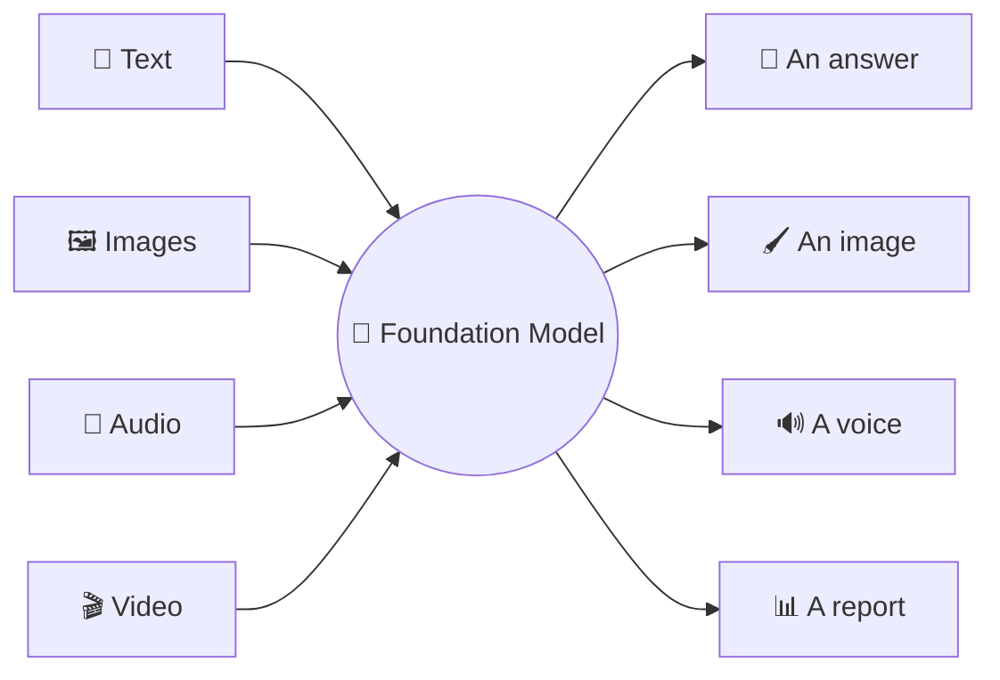
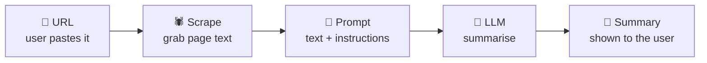

<!--
Source: llms-prompting.html
Title: LLMs & Prompting | TechToday
Theme-color: #0b0d10
Stylesheets: ../dsa/dsa-study.css, ../../site-header.css, ai-demos.css
Scripts: ../dsa/dsa-study.js
-->

Navigation: [TechToday](../../index.html) · [← AI Demos](ai-demos.html)

Beginner friendly · Build and ship today

<a id="llms-and-prompting"></a>

# By the end, you will have shipped *two* AI apps.

You do not need a PhD, advanced math or a machine learning background. In one sitting, you will learn how AI *actually* works. You will also build **two** real apps you can share: an **AI Website Summarizer** and a mini **LLM Arena**.

🧠 How LLMs work · 🪄 The fill-in-the-blank trick · 🛠️ Your first six lines of code · 🎛️ Two AI apps · 🥊 Summarizer + LLM Arena

> 🔑 **The promise.** You start with curiosity. You finish with **two working AI apps** that you can share. That puts you ahead of 99% of people who only *talk* about AI.

**Scaler Academy** — each topic includes worked examples with real inputs and outputs.

8 Topics · Concepts, Worked Examples & Two Mini-Projects

<a id="table-of-contents"></a>

## Table of Contents

1. [Why Now: The AI Inflection](#why)
2. [How LLMs Really Work](#llm)
3. [The Fill-in-the-Blank Trick](#magic)
4. [What You Will Build](#build)
5. [The AI Engineer Role](#aie)
6. [Connect to Models in Code](#connect)
7. [Build & Ship Your Apps](#project)
8. [Where We Go Next](#next)

<a id="why"></a>

## 1. Why AI Is *Everywhere* Now

<a id="why-history"></a>

### 70 Years of AI in Short

**Block 1** ~15 min · the hook

AI is not new. It is **70 years old**. So why did it show up in *your* feed only recently? Two things changed. They changed what *you* can build.

1. **1950s–2000s — AI is a research lab thing.** Decades of slow progress. You needed a PhD, a university, and years to do anything useful.
2. **2017 — The “Transformer” is invented.** A new model design learns language very well. This is the engine inside GPT, Claude, Gemini.
3. **Nov 2022 — ChatGPT launches.** The fastest-adopted product in history. Suddenly everyone can *talk* to AI.
4. **Now → you — anyone can build on top of it.** Giant labs do the hardest part. You *call* their AI with a few lines of code. That is what you will learn here.

> 🔑 **Why this matters now.** Something that used to need **a team + 6 months + a data warehouse** can now be built by **one person in an afternoon** with an internet connection. This cost drop is why “AI Engineer” is one of the fastest-growing jobs on the planet.

<a id="why-shifts"></a>

### The Two Big Shifts

> **Analogy** 🌐 — **1. The model is general-purpose**
>
> Old AI did *one* task, such as spam-or-not. Today's AI does *thousands* — write, summarise, translate, code, answer — all from the same model. One brain, endless uses.

> **Analogy** 🚪 — **2. The barrier to entry is much lower**
>
> You do not build the AI. You *use* it through a simple API. It is like ordering food through an app instead of running a kitchen. If you can call a function, you can build with AI.

> 💡 **Teaching note.** Make this personal: ask the room "what took you forever last week that an AI could've drafted in 30 seconds?" Everyone has an answer. *That* gap is the opportunity we are learning to fill.

<a id="llm"></a>

## 2. What an LLM *Is*

<a id="llm-autocomplete"></a>

### Super-autocomplete

**Block 2** ~25 min

LLM = **Large Language Model**. In simple terms, it does one thing very well: **it predicts the next chunk of text.** Chat, code and summaries all build on that one trick.

> **Analogy** ⌨️ — **The "super-autocomplete" mental model**
>
> Your phone suggests the next word as you type. An LLM is that idea scaled up *a billion times* and trained on much of the internet. Its guesses are good enough to write essays, code and answers.

<a id="llm-tokens"></a>

### First: Words Become Tokens

A model does not read letters or full words. It reads **tokens**, which are pieces roughly ¾ of a word. It thinks in tokens and you pay per token. Here is a worked example.

**Example · Tokenizer playground** — worked output from the tokenizer script

**Input:** `AI Engineering is surprisingly approachable!`

**Tokens:** `AI` `Engi` `neer` `ing` `is` `surp` `risi` `ngly` `appr` `oach` `able` `!`

**12** tokens · **44** characters · **$0.000060** cost @ $5/1M tok

**Rare-word example:** `unbelievableness` becomes `unbe` `liev` `able` `ness`.

**4** tokens · **16** characters · **$0.000020** cost @ $5/1M tok

> 💡 Common words often stay as one token. Rare or long words are cut into pieces. **Rough rule: 1 token ≈ ¾ of a word ≈ 4 characters.**

#### But why tokens — why not just whole words, or single letters?

This is an engineering trade-off. The model needs a fixed list of "things it knows" (its **vocabulary**). Whole words and single letters both cause problems. Tokens sit in the useful middle:

- **❌ One token per word** — There are *millions* of words across all languages, plus names, typos, slang and new words every day. The vocabulary would be too large, and it would fail on a word it had never seen.
- **❌ One token per letter** — There are only ~100 symbols, so the vocabulary is small. But every sentence becomes hundreds of tokens. That is slow and expensive, and the model has to learn spelling from scratch.
- **✅ Tokens (sub-words)** — A vocabulary of ~100k common chunks. Frequent words stay whole. Rare words are built from pieces. This is compact, and it can spell *any* new word.

Here is a concrete example. A rare word still works because it is assembled from familiar pieces:

> **How a rare word gets built:** `"unbelievableness"` → `un` `believ` `able` `ness`
>
> Four known tokens are enough. Meanwhile `"the"`, `"cat"`, `"is"` are each a single token. That is why **tokens were chosen**. One fixed vocabulary can handle every word in every language, even words invented tomorrow.

> 💡 **Why this matters when you build.** English is "cheap" (≈¾ word per token). Code, emojis, and many non-English scripts use *more* tokens per character — so the same sentence in Hindi or Tamil can cost noticeably more tokens than in English. Keep this in mind when you price an app.

<a id="llm-next-token"></a>

### Then It Predicts the Next Token Again and Again

Given the tokens so far, the model gives **every possible next token** a probability. It picks one, adds it, and repeats. That loop *is* “generating text”.

> **Analogy** 🎲 — **Temperature = the creativity dial**
>
> **Low** means the model usually picks the most likely word. The output is focused and repeatable. **High** gives surprising words more chance. The output is more creative and varied. The table shows the probabilities.

**Example · Next-token & temperature** — prompt: "I love building things in ___"

In this example, the model gives six possible next tokens these raw scores (logits): `Python=3.2`, `JavaScript=2.4`, `Rust=1.6`, `public=0.9`, `spreadsheets=0.3`, `bananas=-1.2`.

1. **`0.20`**
   - **What the label means**: ❄️ focused
   - **Probability of each token**: Python 98.2%; JavaScript 1.8%; Rust 0.0%; public 0.0%; spreadsheets 0.0%; bananas 0.0%
2. **`0.70`**
   - **What the label means**: ⚖️ balanced
   - **Probability of each token**: Python 67.8%; JavaScript 21.6%; Rust 6.9%; public 2.5%; spreadsheets 1.1%; bananas 0.1%
3. **`1.50`**
   - **What the label means**: 🔥 creative
   - **Probability of each token**: Python 42.7%; JavaScript 25.0%; Rust 14.7%; public 9.2%; spreadsheets 6.2%; bananas 2.3%
Sampling chooses one token using these probabilities. At low temperature, `Python` almost always wins. At high temperature, lower-ranked words get a real chance.

> 💡 **This is a real engineering choice.** A support bot wants *temperature ≈ 0.2* (consistent). A brainstorming tool wants *≈ 1.0* (varied). You set this early in any real project, including this one.

<a id="llm-memory"></a>

### One More Fact: The Model Has No Memory

Between API calls, an LLM forgets everything. Anything it should "know" in a conversation must be **re-sent every time**, inside a limited **context window** (measured in tokens). This fact explains a large part of AI engineering.

- **🔤 Tokens, not words** — It reads, reasons and bills in tokens.
- **🎯 Predicts next token** — All abilities emerge from this loop.
- **🌡️ Temperature** — Low = focused, high = creative.
- **🪟 No memory** — You resend context each time.

<a id="magic"></a>

## 3. The Fill-in-the-Blank Trick

<a id="magic-self-supervision"></a>

### Self-Supervision: Fill-in-the-Blank

**Block 3** ~15 min · the core idea

Here is the core idea. How do you teach a machine language without humans labelling billions of examples? You let it **play fill-in-the-blank with the entire internet.**

> **Analogy** 📚 — **The old way (slow & expensive)**
>
> Humans hand-label data: "this email = spam", "this review = positive". Accurate, but you need millions of labelled examples. Very slow.

> **Analogy** 🪄 — **The shortcut: self-supervision**
>
> Take any sentence from the web, *hide a word*, and ask the model to guess it. The answer is **already in the text**, so the internet becomes its own teacher. No humans are needed. The model gets trillions of practice questions.

Here is the hidden-word example:

**Example · Guess the hidden word**

1. **`coffee`**
   - **Result**: **Correct**
   - **Feedback from the original example**: Exactly. To know this, the model learned context, grammar and facts about the world. That is self-supervision.
2. **`tea`**
   - **Result**: **Close**
   - **Feedback from the original example**: Reasonable. “Tea” also works, so the model learns that several answers can be good, with different probabilities.
3. **`bicycle`**
   - **Result**: Wrong
   - **Feedback from the original example**: Not quite. Wrong guesses are part of how the model learns.
4. **`sadness`**
   - **Result**: Wrong
   - **Feedback from the original example**: Not quite. After billions of these practice questions, the model gets very good at choosing likely words.
> 💡 The model is trained on this kind of hidden-word task at huge scale.

> 🔑 **Why this changes everything.** The model does this **billions of times**. To guess “coffee”, it has to learn grammar, context, what baristas do, what is hot and what fits in a cup. *Understanding emerges as a side effect of getting very good at fill-in-the-blank.* That is the main idea behind ChatGPT.

> ⚠️ **Keep it honest.** Because it learned by predicting plausible text, an LLM can sometimes produce confident-sounding *wrong* answers — called **hallucinations**. A big part of our job as AI engineers is designing around that (e.g. feeding it real documents — we will see that later). Trust, but verify.

<a id="build"></a>

## 4. What You Can *Build* With AI

<a id="build-multimodal"></a>

### Multimodal: Models With More Senses

**Block 4** ~15 min

First, update your mental model. Modern AI is not just text. It can also see, hear and speak. We call these **foundation models**: one giant general-purpose model that you adapt to many jobs.



*Show it a photo of your fridge → get a recipe. Speak to it → it talks back. Same idea as text, more senses.*

<a id="build-use-cases"></a>

### The 8 Things People Build With AI

Almost every AI product you have seen fits one of these groups. Find *your* idea here:

- **💻 Coding** — Write, explain & fix code. The number 1 use case today. `Copilot · Cursor`
- **✍️ Writing** — Emails, blogs, marketing copy, rewriting. `Jasper · Notion AI`
- **🎨 Image & Video** — Generate art, edit photos, make clips. `Midjourney`
- **🎓 Education** — Personal tutors that explain anything at your pace. `Khanmigo`
- **💬 Chatbots** — Support, sales & assistants that converse. `Intercom Fin`
- **📥 Info Aggregation** — Summarise and search across large amounts of text. `★ this project`
- **🗂️ Data Organization** — Tag, sort & structure messy information. `classification`
- **⚙️ Workflow / Agents** — AI that takes multi-step actions for you. `the frontier`

> 🏢 **Industry spotlight · same skill, different product.** A coding tool, a legal-doc reader, a Swiggy-order chatbot — under the hood they follow the same pattern: *connect to a model, give it the right context, get a useful answer, wrap it in a UI.* Learn that once and each of these 8 becomes buildable.
>
> GitHub Copilot · Harvey · legal · Klarna · support · Khan Academy · tutoring · Perplexity · search

**Here we build a 📥 Info-Aggregation tool** — an AI Website Summarizer. It is simple, useful and easy to share.

<a id="aie"></a>

## 5. Where *You* Fit In

<a id="aie-definition"></a>

### What AI Engineering Means

**Block 5** ~15 min

One line: **AI Engineering is building real products on top of pre-trained models** (GPT, Claude, Gemini) — without training those models yourself.

> **The car analogy.** A Machine Learning engineer **builds the engine**. An AI Engineer **builds the car around an engine someone else already built** — wiring it to your data, your users, your problem, so it actually ships. *You do not forge the engine. You drive.*

<a id="aie-roles"></a>

### Three Roles, Separated Clearly

> **Analogy** 🔧 — **ML / Data Scientist — builds the engine**
>
> Trains models from raw data. Cares about datasets, GPUs, accuracy. "How do I *create* a model?"

> **Analogy** 🚗 — **AI Engineer — builds the car ← you, in this lesson**
>
> Takes a powerful existing model and makes it a product. Cares about prompts, APIs, cost, reliability. "How do I *use* GPT to summarise 10,000 articles a day?"

> **Analogy** 🏗️ — **Software Engineer — builds the road**
>
> The app, the buttons, the database. The AI Engineer is increasingly a software engineer who also speaks fluent "model".

> 🔑 **Why this is accessible.** Giant labs have **already done** the hardest and most expensive part: training the model. You can focus on the product: turning that model into something people use. **Python + an API key is enough to begin.**

<a id="connect"></a>

## 6. Your First Six Lines That Talk to an AI

<a id="connect-setup"></a>

### Step 0 — Set Up Once (~10 min)

**Block 6** ~20 min

Before any code runs, three quick bits of plumbing. Do not worry — it is a one-time setup.

#### ① Install a code editor — Cursor or VS Code

You need one editor to write and run code. Both are free and work identically for this course — pick whichever you like:

> **Analogy** 🆚 — **Cursor vs VS Code — which one?**
>
> **VS Code** is the world's most popular editor (by Microsoft) — rock-solid and widely used. **Cursor** is built *on top of* VS Code with an AI assistant baked in. If you want AI help while coding, pick Cursor; if you want the classic standard, pick VS Code. *Either is totally fine — you only need one.*

1. **Download & install.** **Cursor:** go to `cursor.com` → Download. **VS Code:** go to `code.visualstudio.com` → Download. Install it like any normal app (Windows / Mac / Linux).
2. **Add the Python & Jupyter extensions.** Open your editor → click the *Extensions* icon on the left → search `Python` (by Microsoft) and `Jupyter` → Install both. (Same steps in Cursor and VS Code.)
3. **Open a notebook & pick the kernel.** Open a `.ipynb` file → click *Select Kernel* (top-right) → choose your Python environment. You run a cell with **Shift + Enter**.

#### ② Get your OpenAI API key

An API key is a secret password that lets your code use OpenAI's models (you pay only for what you use — cents for everything here). Here are the setup steps:

**Example · OpenAI Platform key setup** — platform.openai.com/api-keys

1. Sign in to the OpenAI Platform.
2. Add a small amount of credit under *Billing*.
3. Create a new secret key.
4. Copy the key immediately. OpenAI shows a secret key only once.

**Sample key shape:** `sk-proj-A7mQ9rT2vX5nB8cD1eF4gH6jK0pL3sZy`

The original generator used the prefix `sk-proj-` plus 32 random letters or numbers from `A-Z`, `a-z` and `0-9`.

> 💡 Never share an API key or commit it to GitHub. If you prefer a free local option, you can skip this and use **Ollama** later.

#### ③ Put the key in a `.env` file (never in your code)

Create a file literally named `.env` in your project folder, and paste your key inside. Your code reads it from there — so the secret never appears in the code you share.

**.env**

```text
# .env  — keep this file private! Add it to .gitignore
OPENAI_API_KEY=sk-proj-xxxxxxxxxxxxxxxxxxxxxxxx
```

**load_key.py — read it in your code**

```python
# pip install python-dotenv
from dotenv import load_dotenv
# ① load secret values from .env into your environment
load_dotenv()                 # loads everything from .env

# now OpenAI() finds the key automatically — no key in your code 🎉
```

> ⚠️ **🔐 The habit that prevents expensive mistakes.** Add `.env` to your `.gitignore` so it is never uploaded to GitHub. Bots can find leaked keys in minutes and create real bills. Secrets live in `.env`, never in code.

<a id="connect-first-call"></a>

### The Six Lines That Talk to the AI

After setup, calling an LLM is an **API call**. It is like fetching the weather, but the reply is generated by a model. Here is the full example:

**first_call.py**

```python
# pip install python-dotenv
from dotenv import load_dotenv
# pip install openai
from openai import OpenAI
# ① load the API key from .env so the client can find it
load_dotenv()                 # loads everything from .env

# ② create the OpenAI client that will send chat requests
client = OpenAI()   # reads your API key from the environment

# ③ ask the model with a system role and a user question
response = client.chat.completions.create(
    model="gpt-4o-mini",
    messages=[
        {"role": "system", "content": "You are a witty travel guide."},
        {"role": "user",   "content": "Suggest one thing to do in Bangalore."},
    ],
)
# ④ print the assistant message from the first choice
print(response.choices[0].message.content)

# now OpenAI() finds the key automatically — no key in your code 🎉
```

<a id="connect-roles"></a>

### The Three Roles in Chat Models

- `system` — sets the personality and rules — "You are a careful tutor. Never give the full answer." Written once, applies throughout.
- `user` — what the human asks. The actual request.
- `assistant` — the model's reply. To continue a chat, append it back and resend the whole list (remember: no memory!).

**Example · Anatomy of one API round-trip** — one request, one model reply

1. **Your app sends the request.** The request body is `{ "Bangalore?" }`.
2. **The model receives it.** The model changes from idle to thinking.
3. **The service returns a status.** The status is `200 OK`.
4. **Your app reads the assistant message.** Sample response: “Sip filter coffee on an MTR rooftop and watch the city wake up — Bangalore's best 10-minute holiday. ☕”

> 💡 **Response:** “Sip filter coffee on an MTR rooftop and watch the city wake up — Bangalore's best 10-minute holiday. ☕”

> ⚠️ **🔐 Security rule.** Never paste your API key into shared or public code. It is a password to your wallet. Keep it in a `.env` file or environment variable, on the server side only.

> 🏢 **Industry spotlight · the model is swappable.** Change one string: `"gpt-4o-mini"` → a Claude or open-source model — and your whole product runs on a different engine. There's even a **free, runs-on-your-laptop** option (Ollama) that uses this exact same code, just pointed at a local address. You will use it soon.
>
> OpenAI · GPT · Anthropic · Claude · Google · Gemini · Groq · Llama (free & fast) · Ollama · free & local

<a id="connect-groq"></a>

### Bonus: Use the Same Code on Groq + Llama

If you do not want to add billing yet, **Groq** gives you a free API key and runs open models like Meta's **Llama** very fast. Because Groq speaks the same "language" as OpenAI, you change just *two things* — the key and one line — and everything else stays identical:

**groq_call.py**

```python
# pip install openai   (yes — the same library!)
import os
from openai import OpenAI
from dotenv import load_dotenv
# ① load environment variables for the Groq key
load_dotenv()

# ② point the SAME client at Groq instead of OpenAI 👇
client = OpenAI(
    api_key=os.getenv("GROQ_API_KEY"),
    base_url="https://api.groq.com/openai/v1",
)

# ③ ask the Llama model the same travel-guide question
response = client.chat.completions.create(
    model="llama-3.3-70b-versatile",        # a free Llama model on Groq
    messages=[
        {"role": "system", "content": "You are a witty travel guide."},
        {"role": "user",   "content": "Suggest one thing to do in Bangalore."},
    ],
)
# ④ print the assistant message from the first choice
print(response.choices[0].message.content)
```

> **Where to get the key.** Sign up free at `console.groq.com` → *API Keys* → Create key, then add it to your `.env` as `GROQ_API_KEY=gsk_...`. **Notice that little changed** — just the key, the `base_url`, and the model name. This is a key idea in AI Engineering: the model is swappable.

<a id="project"></a>

## 7. Mini-Project: AI Website Summarizer

<a id="project-overview"></a>

### How It Works — the Whole App in One Picture

**Block 7** ~30 min · 🏁 THE BUILD

Now build the app. Our app: **give it any web page URL → it reads the page and hands you a clean summary.** Think of it as a short digest for the internet. It is simple, genuinely useful, and a good first project to share.



*Five boxes. That is a real AI product. Now write each piece.*

<a id="project-scraper"></a>

### Step 1 — Grab the Page Text (the "Scraper")

> 💡 **📦 Treat this one as a black box.** You do **not** need to understand a single line below. This is plain web-scraping (not AI), and there's a library for it. All it does: *take a URL → return the page's readable text as a string.* That is it. Copy it, trust it, move on — the AI part is in Step 2.

**scraper.py**

```python
# pip install requests beautifulsoup4
import requests
from bs4 import BeautifulSoup

HEADERS = {
    "User-Agent": "Mozilla/5.0 (Macintosh; Intel Mac OS X 10_15_7) "
                  "AppleWebKit/537.36 (KHTML, like Gecko) "
                  "Chrome/120.0 Safari/537.36",
    "Accept": "text/html,application/xhtml+xml,application/xml;q=0.9,*/*;q=0.8",
    "Accept-Language": "en-US,en;q=0.9",
}

def fetch_website_contents(url):
    # ① add scheme if the user forgot it
    if not url.startswith(("http://", "https://")):
        url = "https://" + url

    # ② download the page and return a friendly error if it fails
    try:
        response = requests.get(url, headers=HEADERS, timeout=15)
        response.raise_for_status()
    except requests.exceptions.RequestException as e:
        return f"Could not fetch the website. Error: {e}"

    # ③ parse the HTML and keep the page title for context
    soup = BeautifulSoup(response.text, "html.parser")
    title = soup.title.string if soup.title else "No title found"

    # ④ remove page chrome so the summary focuses on useful text
    for tag in soup(["script", "style", "nav", "footer", "header", "img", "input"]):
        tag.decompose()

    # ⑤ turn the cleaned page into text for the model
    text = soup.get_text(separator="\n", strip=True)
    return f"Title: {title}\n\nPage contents:\n{text}"
```

<a id="project-brain"></a>

### Step 2 — The Brain (Prompt + LLM Call)

**summarizer.py**

```python
from openai import OpenAI
from dotenv import load_dotenv
from scraper import fetch_website_contents

# ① load the .env file so OpenAI can read the API key
load_dotenv()          # <-- this reads your .env file
# ② create the model client once so summarize can reuse it
client = OpenAI()

# ③ define the website-summary instructions for the model
system_prompt = """You analyze the contents of a website and
give a short, friendly summary. Ignore navigation menus.
Respond in markdown."""

def summarize(url):
    # ① scrape the page so the model receives text instead of a URL
    website = fetch_website_contents(url)
    # ② send the scraped text to the chat model with the system prompt
    response = client.chat.completions.create(
        model="gpt-4o-mini",
        messages=[
            {"role":"system", "content": system_prompt},
            {"role":"user",   "content": f"Summarize this website:\n\n{website}"},
        ],
    )
    # ③ return only the assistant's written summary
    return response.choices[0].message.content
```

> 🔑 **🪄 The "wow" lever — change the personality.** Edit one line of the `system_prompt` — "give a *snarky, humorous* summary" or "explain it to a 10-year-old" or "respond in Hindi" — and the whole app behaves differently. **That is prompt engineering, and you just learned it.** The example below shows those personalities.

<a id="project-run"></a>

### Steps 3 and 4 — Run It on Your Machine

#### Step 3 — The entry point

A tiny `main.py` asks for a URL and prints the summary:

**main.py**

```python
from summarizer import summarize

# ① ask the learner which website to summarize
url = input("Website URL: ")
# ② summarize that URL and print the model response
print(summarize(url))
```

#### Step 4 — Run it on your machine

Save the three files (`scraper.py`, `summarizer.py`, `main.py`) and your `.env` in one folder. Then open the terminal in Cursor (*Terminal → New Terminal*) and run:

**bash — your project folder**

```text
# 1. install everything you need (one time)
$ pip install openai requests beautifulsoup4 python-dotenv

# 2. run the app
$ python main.py

# 3. paste a URL when asked
Website URL: https://example.com
```

1. **Paste a URL and press Enter.** Try a blog or news site. In a second or two, the summary prints in your terminal. You just used your own AI app.
2. **Stop it anytime.** Press `Ctrl + C` in the terminal to shut the app down; run `python main.py` again for another page.

> 💡 If you hit an error, 90% of the time it is a missing `pip install` or a key not loaded from `.env` — check those two first.

<a id="project-demo"></a>

### Example Run of the Working Version

Below is a sample run of that app. It shows the sample sites, the personalities and the outputs.

**Example · AI Website Summarizer** — sample sites and outputs

1. **🚀 Startup site**: NimbusPay — Payments that just work. NimbusPay is a payments platform built for small Indian businesses who are tired of clunky tools and hidden fees. Accept UPI, cards, and wallets with a single integration that takes ten minutes to set up. Our flat 1% fee means no surprises at the end of the month. NimbusPay also gives you a real-time dashboard so you can see every transaction as it happens. Over 12,000 shops already use NimbusPay to get paid faster. We just launched instant settlements, so your money reaches your bank account the same day instead of waiting three days. Sign up today and your first month is completely free.
2. **📰 News article**: Governments race to regulate AI as adoption surges. Lawmakers around the world are scrambling to write rules for artificial intelligence as the technology spreads into hospitals, banks, and classrooms. Supporters say clear regulation will build public trust and prevent harm. Critics worry that heavy rules could slow innovation and hand an advantage to larger companies who can afford compliance. A new draft framework focuses on transparency, requiring companies to disclose when content is AI-generated. It also demands that high-risk systems, such as those used in hiring or medicine, be tested for bias before launch. Industry groups have asked for more time to adapt. The debate is expected to continue for years as the technology keeps evolving.
3. **✍️ Personal blog**: My journey from teacher to AI engineer. Three years ago I had never written a line of Python. I was a high-school teacher who felt stuck and curious about the AI everyone kept talking about. I started small: one tiny project every weekend, even when they barely worked. The first thing I built was a tool that summarized news articles for my students. It was ugly, but it worked, and that little win changed everything. I kept shipping projects and sharing them online, and slowly people started noticing. Last month I started my first job as an AI engineer at a startup. The lesson I keep repeating to anyone who will listen: you do not need permission or a perfect plan, you just need to build small things often and share them.
4. **Tone**: Intro line
5. **🙂 Friendly**: Here's the gist, in plain English:
6. **😏 Snarky**: Fine, I read it so you do not have to:
7. **🧒 Explain like I'm 5**: Okay, imagine I'm explaining this to a 10-year-old:
8. **💼 Professional**: Executive summary:
9. **Preset**: Top sentences
10. **🚀 Startup site**: NimbusPay — Payments that just work.<br>NimbusPay is a payments platform built for small Indian businesses who are tired of clunky tools and hidden fees.<br>Over 12,000 shops already use NimbusPay to get paid faster.
11. **📰 News article**: Lawmakers around the world are scrambling to write rules for artificial intelligence as the technology spreads into hospitals, banks, and classrooms.<br>Critics worry that heavy rules could slow innovation and hand an advantage to larger companies who can afford compliance.<br>A new draft framework focuses on transparency, requiring companies to disclose when content is AI-generated.
12. **✍️ Personal blog**: I started small: one tiny project every weekend, even when they barely worked.<br>I kept shipping projects and sharing them online, and slowly people started noticing.<br>The lesson I keep repeating to anyone who will listen: you do not need permission or a perfect plan, you just need to build small things often and share them.
The sample outputs come from a simple extractive summarizer, not a model. It normalizes whitespace, keeps sentences with at least four words, ignores common stop words, scores each sentence by word frequency divided by the square root of sentence length, returns up to three top sentences in original order, and uses the highest-scoring sentence as the TL;DR. If no text is supplied, it says “Paste some text or pick a sample first.” If the text is too short, it says “Hmm, that text was too short to summarize.”

> 💡 In the real app, GPT writes a richer summary in full sentences. The flow and personality switch are the same idea.

⚙️ This demo summarizes *in your browser* (a simple method) so it runs with no API key. Your real `summarizer.py` sends the text to GPT for a smarter summary — but the shape, the flow, and the personality switch are exactly what you see here.

> 🏢 **Industry spotlight · summarization is a real product category.** Summarizing news, earnings calls, support threads, legal contracts, research papers, meeting transcripts — it is one of the most-used AI features in companies today. Swap "website" for "PDF", "email thread", or "YouTube transcript" and you've got a dozen more apps from the same code.
>
> News digests · Earnings-call summaries · Meeting notes · Contract review · Research papers

<a id="project-arena"></a>

### 🥊 Bonus Build: an LLM Arena (One Prompt, Two Models, You Judge)

Here is a second mini-project. Inspired by **arena.ai**, where people send one prompt to two AIs and *vote* on the better answer — that is how many people rank AI models. You can build a tiny version with what you already know: **send the same prompt to two models, show both answers side by side.**

**arena.py — the whole idea**

```python
def battle(prompt):
    # ① wrap the learner prompt in the chat format both models expect
    msgs = [{"role": "user", "content": prompt}]

    # ② ask Model A — OpenAI's GPT
    a = openai_client.chat.completions.create(model="gpt-4o-mini", messages=msgs)

    # ③ ask Model B — Llama on Groq (same code, different brain!)
    b = groq_client.chat.completions.create(model="llama-3.3-70b-versatile", messages=msgs)

    # ④ return both answers so the app can compare them
    return a.choices[0].message.content, b.choices[0].message.content
# …now we turn this into a tiny terminal app with 👍/👎 voting 👇
```

#### The full app with A/B voting

**arena_app.py**

```python
# pip install openai python-dotenv
import os
from openai import OpenAI
from dotenv import load_dotenv
# ① load API keys for both providers
load_dotenv()

# ② create one client for OpenAI and one for Groq
openai_client = OpenAI()                                  # uses OPENAI_API_KEY
groq_client   = OpenAI(api_key=os.getenv("GROQ_API_KEY"),
                       base_url="https://api.groq.com/openai/v1")

def ask(client, model, prompt):
    # ① send the prompt to whichever model client was passed in
    r = client.chat.completions.create(
        model=model, messages=[{"role": "user", "content": prompt}])
    # ② return just the assistant text from the first choice
    return r.choices[0].message.content

def battle(prompt):
    # ① ask OpenAI and Groq the same prompt
    a = ask(openai_client, "gpt-4o-mini", prompt)
    b = ask(groq_client, "llama-3.3-70b-versatile", prompt)
    # ② return both answers so the learner can compare them
    return a, b

def vote(label):
    return f"🗳️ Thanks! You voted: {label}"   # in real apps, save this to a file/DB

# ③ read one prompt to send to both models
prompt = input("Ask both models the same thing: ")
# ④ collect both model answers
a, b = battle(prompt)
# ⑤ show both answers before asking for a vote
print("\n🤖 Model A:\n" + a)
print("\n🤖 Model B:\n" + b)

# ⑥ collect the winner and show a thank-you message
choice = input("\nWhich answer was better? (A/B): ").strip().upper()
print(vote(f"👍 Model {choice}"))
```

#### Run it the same way

**bash — your project folder**

```text
# install once, then launch
$ pip install openai python-dotenv
$ python arena_app.py

Ask both models the same thing: Explain recursion in 2 sentences.
```

1. **Type a prompt.** Run the script, type any question, and press *Enter* — both models answer.
2. **Read both answers, then vote 👍 / 👎.** Type `A` or `B` for the answer you liked better — just like on arena.ai.
3. **Record or share it.** A short clip of the battle is perfect for sharing. Stop anytime with `Ctrl + C`.

> 💡 **Why this is a strong first project.** It uses *both* keys you set up (OpenAI + Groq), proves the "brain is swappable" idea in practice, and the side-by-side A/B format is easy to understand. The example below shows the same idea.

**Example · Mini LLM Arena** — one prompt, two model answers, one vote

The demo compares **GPT-4o-mini** from **OpenAI** with **Llama-3.3-70b** from **Groq**. The arena randomly puts GPT on the left or right and hides the names until you vote. It then adds `+1` for a good vote or `-1` for a bad vote. Both scores start at `0`.

1. **Explain recursion to a total beginner, in 2 sentences.**
   - **GPT-4o-mini answer**: Recursion is when a function solves a problem by calling itself on a smaller piece of the same problem, until it hits a simple “base case” it can answer directly. Like a dictionary entry that points to another word — you follow the chain until you reach one you already know.
   - **Llama-3.3-70b answer**: Sure! 😊 Picture standing between two mirrors — you see a smaller copy of yourself, then a smaller one inside that, on and on. Recursion is just a function that keeps calling itself on a tinier version of the task until it is small enough to answer in one go.
2. **Write a catchy tagline for a coffee shop.**
   - **GPT-4o-mini answer**: “Brewed for the moments that matter.” Clean, premium, and it reads well on a cup or a storefront sign.
   - **Llama-3.3-70b answer**: Ooh fun one! Try: “Life's short. The coffee shouldn't be.” ☕ Punchy, a little cheeky, and very shareable.
3. **Is a hotdog a sandwich? Give a definitive answer.**
   - **GPT-4o-mini answer**: Definitive answer: No. A sandwich needs a filling between two separate pieces of bread; a hot dog uses a single, hinged bun — so it forms its own category.
   - **Llama-3.3-70b answer**: Haha, the eternal debate! My verdict: NOT a sandwich. 🌭 The bun is one connected piece, not two slices — so the hot dog stands proudly in a class of its own. 😄
4. **Give me a fun fact about space.**
   - **GPT-4o-mini answer**: A day on Venus is longer than its year: it rotates so slowly that one Venusian day takes ~243 Earth days, while a full orbit of the Sun takes only ~225.
   - **Llama-3.3-70b answer**: Here's a wild one 🚀 — Venus spins so slowly that a single day there lasts LONGER than its whole year! Your birthday could come round before the sun sets. Space is wonderfully weird. ✨
For other prompts, the sample answers describe each style: GPT-4o-mini is “tight and well-structured”; Llama-3.3 on Groq is “warmer, chattier, and lightning fast.” After a vote, the arena shows: “In a real arena, votes like yours pile up across thousands of people to build a public leaderboard.”

> 💡 This is the same blind A/B idea used by public model leaderboards and internal company evaluations.

⚙️ The sample answers on this page are written examples. In your real `arena_app.py`, the two answers come from the actual models — and the voting is exactly how arena.ai builds its public leaderboard.

> 🏢 **Industry spotlight · voting helps rank models.** Side-by-side "blind taste tests" like this — millions of human votes on anonymous model pairs — are how the AI world decides which model is actually best, beyond marketing claims. Companies use the same technique internally to choose which model to ship. This small arena is a real evaluation method in miniature.
>
> Blind A/B votes · Public leaderboards · Model selection · arena.ai

<a id="project-flavours"></a>

### Make the Project Your Own

Same 3-step recipe (input → prompt → output), different idea. Pick whichever feels fun — all are beginner-simple:

- **✉️ Email Subject Liner**Paste an email → get 5 catchy subject lines.
- **📄 CV → Cover Letter**Paste your CV + a job ad → a tailored draft.
- **🏢 Company Brochure**Give a company site → a fun marketing brochure.
- **📺 YouTube Summarizer**Paste a transcript → the key takeaways.
- **🍳 Recipe Formatter**Messy recipe text → clean steps & a shopping list.
- **✈️ Travel Planner**"3 days in Goa" → a day-by-day itinerary.

💡 These are drawn from real beginner projects in your course's community folder — proof that "simple + shipped" beats "complex + someday".

<a id="next"></a>

## 8. A Peek at Where This Is *Going*

<a id="next-langchain"></a>

### 🔗 LangChain — the Toolkit for Bigger Apps

**Block 9** ~15 min · the exciting part

You've built an app that *answers*. The rest of this journey is about apps that **do**. Here's a taste of three things coming up — no need to master them today, just get excited.

Right now you call the API by hand. The moment you want **reusable prompts, multi-step pipelines, memory, or to plug in your own documents**, a framework like **LangChain** saves you re-inventing the wheel. Same idea as today — just with handy connectors:

**langchain_taste.py**

```python
from langchain_openai import ChatOpenAI
from langchain_core.prompts import ChatPromptTemplate

# ① describe how the website text should be summarized
prompt = ChatPromptTemplate.from_template("Summarize this website: {content}")
# ② choose the chat model that will do the writing
model  = ChatOpenAI(model="gpt-4o-mini")

# ③ pipe the prompt into the model to make a reusable chain
chain = prompt | model            # "|" = send the prompt INTO the model
# ④ run the chain with one page's text
chain.invoke({"content": website_text})   # reuse it for any page!
```

> **Analogy** 📚 — **The one to remember: RAG**
>
> "Chat with your own PDFs." You *retrieve* the relevant snippets from your documents and paste them into the prompt — so the AI answers from *your* data, not just its memory. It is the most common real-world pattern, and it tames hallucinations.

<a id="next-agents"></a>

### 🤖 Agents — When the AI Can Take Action

An **agent** is an LLM given **tools** (a calculator, web search, your database) and a **loop**: it thinks, acts, looks at the result, and repeats until done. Step through one:

**Example · ReAct agent · step-through** — question: “Should I carry an umbrella in Bangalore today?”

**💭 Thought**To answer, I need today's weather in Bangalore. I do not have it, so I should use a tool.

**🛠️ Action**Calling tool: `get_weather(city="Bangalore")`

**👀 Observation**Tool returned: `{ rain_chance: 78%, temp: "24°C" }`

**💭 Thought**78% is high. The user should take an umbrella. I have enough to answer.

**✅ Final Answer**Yes — carry an umbrella. There is a 78% chance of rain in Bangalore today, with 24°C and clouds. ☔

> 💡 The status moved through five steps and then ended with “Task complete.”

> 💡 **The leap.** Nobody hard-coded "check the weather" — the agent *decided* to, because we gave it the tool and the goal. That autonomy is the jump from "chatbot" to "agent".

<a id="next-multi-agent"></a>

### 👥 Multi-Agent — a Team of AIs

For bigger jobs, companies split work across specialists that hand off to each other. This example shows a content team writing a short blog post:

**Example · Multi-agent content team** — goal: "Write a short blog post on AI agents"

1. **🧭 Manager**
   - **Role**: Plans & delegates
   - **Message from the original run**: Breaking goal into research → write → review.
2. **🔬 Researcher**
   - **Role**: Finds the facts
   - **Message from the original run**: Found: agents = LLM + tools + loop; used by Cursor, support bots.
3. **✍️ Writer**
   - **Role**: Drafts the post
   - **Message from the original run**: Drafted a hook + insight + CTA.
4. **🔍 Editor**
   - **Role**: Polishes & checks
   - **Message from the original run**: Tightened wording, approved. ✓
> 🤖 AI “agents” aren't sci-fi — they're just an LLM given tools and a loop.
>
> That is how Cursor fixes code and support bots resolve tickets end-to-end.
>
> The shift from chatbots → agents is the biggest change in software this year.
>
> What will you let an agent do for you? 👇

> 🔑 **🚀 Where this path ends.** By the end of the journey, you will build a solution where **several agents collaborate** to solve a real business problem. Companies hire for this work. It rests on the basics here: *connect to a model, give it context, get something useful, ship it.*

- **🧠 LLMs** — Predict next token; tokens, temperature, context.
- **🪄 Self-supervision** — Learned the internet via fill-in-the-blank.
- **🔌 API call** — system / user / assistant.
- **🎛️ You shipped** — Two real AI apps.
