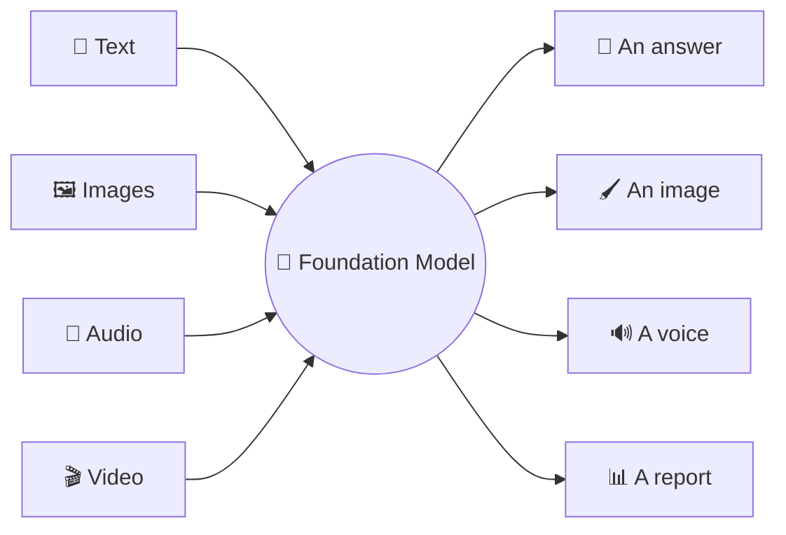
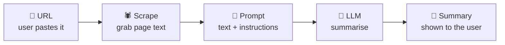

<!--
Source: llms-prompting.html
Title: LLMs & Prompting | TechToday
Theme-color: #0b0d10
Stylesheets: ../dsa/dsa-study.css, ../../site-header.css
Scripts: ../dsa/dsa-study.js
-->

Navigation: [TechToday](../../index.html) · [← AI Demos](ai-demos.html)

Beginner friendly · Build & ship today

<a id="llms-and-prompting"></a>

# By the end of *today*, you'll have shipped *two* AI apps.

No PhD. No math. No machine learning background. In one sitting you'll understand how AI *actually* works — and you'll build **two** real, shareable apps: an **AI Website Summarizer** and a mini **LLM Arena**. Let's go.

🧠 How LLMs really work · 🪄 The "fill-in-the-blank" trick · 🛠️ Your first 6 lines of code · 🎛️ Two real AI apps · 🥊 Summarizer + LLM Arena

> 🔑 **The promise.** You walk in curious. You walk out having **built and shared two working AI apps** — ahead of 99% of people who only *talk* about AI.

**Scaler Academy** — everything below is interactive. **Click the simulators** as we go.

8 Topics · Concepts, Live Simulators & Two Mini-Projects

<a id="table-of-contents"></a>

## Table of Contents

1. [Why Now: The AI Inflection](#why)
2. [How LLMs Really Work](#llm)
3. [The Fill-in-the-Blank Trick](#magic)
4. [What You'll Build](#build)
5. [The AI Engineer Role](#aie)
6. [Connect to Models in Code](#connect)
7. [Build & Ship Your Apps](#project)
8. [Where We Go Next](#next)

<a id="why"></a>

## 1. Why Is AI Suddenly *Everywhere*?

<a id="why-history"></a>

### 70 Years of AI, Compressed

**Block 1** ~15 min · the hook

AI is not new — it's **70 years old**. So why did it explode in *your* feed only recently? Two things changed, and they changed everything about what *you* can build.

1. **1950s–2000s — AI is a research lab thing.** Decades of slow progress. You needed a PhD, a university, and years to do anything useful.
2. **2017 — The "Transformer" is invented.** A new model design that learns language astonishingly well. This is the engine inside GPT, Claude, Gemini.
3. **Nov 2022 — ChatGPT launches.** The fastest-adopted product in history. Suddenly everyone can *talk* to AI.
4. **Now → you — Anyone can build on top of it.** The hardest part is done by giant labs. You just *call* their AI with a few lines of code. That's what you'll learn here.

> 🔑 **🤯 The wow that defines our era.** Something that used to need **a team + 6 months + a data warehouse** can now be built by **one person in an afternoon** with an internet connection. That collapse in cost is why "AI Engineer" is one of the fastest-growing jobs on the planet — and why you're in the right room.

<a id="why-shifts"></a>

### The Two Big Shifts

> **Analogy** 🌐 — **1. The model is general-purpose**
>
> Old AI did *one* task (spam-or-not). Today's AI does *thousands* — write, summarise, translate, code, answer — all from the same model. One brain, endless uses.

> **Analogy** 🚪 — **2. The barrier to entry collapsed**
>
> You don't build the AI. You *use* it through a simple API — like ordering food through an app instead of running a kitchen. If you can call a function, you can build with AI.

> 💡 **🎙️ Speaker note.** Make this personal: ask the room "what took you forever last week that an AI could've drafted in 30 seconds?" Everyone has an answer. *That* gap is the opportunity we're learning to fill.

<a id="llm"></a>

## 2. What Is an LLM, *Really?*

<a id="llm-autocomplete"></a>

### Super-Autocomplete

**Block 2** ~25 min

LLM = **Large Language Model**. Strip the hype and it does exactly one thing, unbelievably well: **it predicts the next chunk of text.** Everything — chat, code, summaries — is built on that single trick.

> **Analogy** ⌨️ — **The "super-autocomplete" mental model**
>
> Your phone suggests the next word as you type. An LLM is that idea scaled up *a billion times* and trained on much of the internet — so its guesses are good enough to write essays, code and answers.

<a id="llm-tokens"></a>

### First: Words Become Tokens

A model doesn't read letters or words — it reads **tokens** (pieces roughly ¾ of a word). It thinks in tokens and you pay per token, so let's *see* them. Type anything:

**Live sim · Tokenizer playground** — type → watch it split into tokens

Your text: AI Engineering is surprisingly approachable!

**0** tokens · **0** characters · **$0** cost @ $5/1M tok

Notice: common words = 1 token; rare/long words get chopped into pieces. **Rough rule: 1 token ≈ ¾ of a word ≈ 4 characters.**

#### But why tokens — why not just whole words, or single letters?

This is a clever engineering trade-off. The model needs a fixed list of "things it knows" (its **vocabulary**). Words and letters both fail at the extremes — tokens sit in the sweet spot:

- **❌ One token per word** — There are *millions* of words across all languages, plus names, typos, slang & new words daily. The vocabulary would be impossibly huge — and it would freeze the first time it met a word it had never seen.
- **❌ One token per letter** — Only ~100 symbols — tiny vocabulary — but now every sentence is hundreds of tokens long. Slow, expensive, and the model has to relearn spelling from scratch every time.
- **✅ Tokens (sub-words)** — A vocabulary of ~100k common chunks. Frequent words stay whole; anything rare is built from pieces. Best of both: compact *and* it can spell out *any* word it's never seen.

Concrete example — a word the model probably never saw in training still works fine, because it's assembled from familiar pieces:

> **How a rare word gets built:** `"unbelievableness"` → `un` `believ` `able` `ness`
>
> Four known tokens, zero panic. Meanwhile `"the"`, `"cat"`, `"is"` are each a single token. That's why **tokens were chosen**: they let one fixed vocabulary handle every word in every language — even ones invented tomorrow.

> 💡 **Why you'll feel this as an engineer.** English is "cheap" (≈¾ word per token). Code, emojis, and many non-English scripts use *more* tokens per character — so the same sentence in Hindi or Tamil can cost noticeably more tokens than in English. Worth knowing when you price an app.

<a id="llm-next-token"></a>

### Then: It Predicts the Next Token — Over and Over

Given the tokens so far, the model scores **every possible next token** with a probability, picks one, adds it, and repeats. That loop *is* "generating text".

> **Analogy** 🎲 — **Temperature = the creativity dial**
>
> **Low** → always pick the most likely word → focused & repeatable. **High** → sometimes pick surprising words → creative & varied. Drag the slider and watch the probabilities reshape:

**Live sim · Next-token & temperature** — prompt: "I love building things in ___"

Temperature `0.7` balanced

*Control:* 🎲 Sample a token

> 💡 **This is a real engineering choice.** A support bot wants *temperature ≈ 0.2* (consistent). A brainstorming tool wants *≈ 1.0* (varied). You'll set this on day one of any real project — including today's.

<a id="llm-memory"></a>

### One More Truth: The Model Has No Memory

Between calls, an LLM forgets everything. Anything it should "know" in a conversation must be **re-sent every time**, inside a limited **context window** (measured in tokens). This one fact quietly explains a huge amount of AI engineering.

- **🔤 Tokens, not words** — It reads, thinks & bills in tokens.
- **🎯 Predicts next token** — All abilities emerge from this loop.
- **🌡️ Temperature** — Low = focused, high = creative.
- **🪟 No memory** — You resend context each time.

<a id="magic"></a>

## 3. The Trick That Made All of This *Possible*

<a id="magic-self-supervision"></a>

### Self-Supervision: Fill-in-the-Blank

**Block 3** ~15 min · the "aha"

Here's the part that makes people go "ohhh". How do you teach a machine language without an army of humans labelling billions of examples? You let it **play fill-in-the-blank with the entire internet.**

> **Analogy** 📚 — **The old way (slow & expensive)**
>
> Humans hand-label data: "this email = spam", "this review = positive". Accurate, but you need millions of labelled examples. Painfully slow.

> **Analogy** 🪄 — **The clever shortcut: self-supervision**
>
> Take any sentence from the web, *hide a word*, and ask the model to guess it. The answer is **already in the text** — so the internet becomes its own teacher. No humans needed. Trillions of free practice questions.

Try being the model for a second — guess the hidden word:

**Live sim · Guess the hidden word**

The barista handed me a hot cup of ______.

Pick the word you think fills the blank.

> 🔑 **🤯 Why this changes everything.** You just did what the model does **billions of times**. To guess "coffee", it had to quietly learn grammar, context, what baristas do, what's hot, what fits in a cup… *Understanding emerges as a side-effect of getting really good at fill-in-the-blank.* That's the whole secret behind ChatGPT.

> ⚠️ **Keep it honest (mention this).** Because it learned by predicting plausible text, an LLM can sometimes produce confident-sounding *wrong* answers — called **hallucinations**. A big part of our job as AI engineers is designing around that (e.g. feeding it real documents — we'll see that later). Trust, but verify.

<a id="build"></a>

## 4. So… What Can You Actually *Build?*

<a id="build-multimodal"></a>

### Multimodal: Models With More Senses

**Block 4** ~15 min

First, a quick upgrade to your mental model. Modern AI isn't just about text anymore — it can also see, hear and speak. We call these **foundation models**: one giant general-purpose brain you adapt to many jobs.



Show it a photo of your fridge → get a recipe. Speak to it → it talks back. Same idea as text, more senses.

<a id="build-use-cases"></a>

### The 8 Things People Build With AI

Almost every AI product you've seen falls into one of these buckets. Find *your* idea here:

- **💻 Coding** — Write, explain & fix code. The #1 use case today. `Copilot · Cursor`
- **✍️ Writing** — Emails, blogs, marketing copy, rewriting. `Jasper · Notion AI`
- **🎨 Image & Video** — Generate art, edit photos, make clips. `Midjourney`
- **🎓 Education** — Personal tutors that explain anything, your pace. `Khanmigo`
- **💬 Chatbots** — Support, sales & assistants that converse. `Intercom Fin`
- **📥 Info Aggregation** — Summarise & search across mountains of text. `★ today's project`
- **🗂️ Data Organization** — Tag, sort & structure messy information. `classification`
- **⚙️ Workflow / Agents** — AI that takes multi-step actions for you. `the frontier`

> 🎯 **Industry spotlight · same skill, different product — the pattern is always the same.** A coding tool, a legal-doc reader, a Swiggy-order chatbot — under the hood they all do one thing: *connect to a model, give it the right context, get a useful answer, wrap it in a UI.* Learn that once (today) and every one of these 8 becomes buildable.
>
> GitHub Copilot · Harvey · legal · Klarna · support · Khan Academy · tutoring · Perplexity · search

**Today we build a 📥 Info-Aggregation tool** — an AI Website Summarizer. Simple, genuinely useful, and very shareable.

<a id="aie"></a>

## 5. So Where Do *You* Fit In?

<a id="aie-definition"></a>

### What Is AI Engineering?

**Block 5** ~15 min

One line: **AI Engineering is building real products on top of pre-trained models** (GPT, Claude, Gemini) — without training those models yourself.

> **The car analogy.** A Machine Learning engineer **builds the engine**. An AI Engineer **builds the car around an engine someone else already built** — wiring it to your data, your users, your problem, so it actually ships. *You don't forge the engine. You drive.*

<a id="aie-roles"></a>

### Three Roles, Cleanly Separated

> **Analogy** 🔧 — **ML / Data Scientist — builds the engine**
>
> Trains models from raw data. Cares about datasets, GPUs, accuracy. "How do I *create* a model?"

> **Analogy** 🚗 — **AI Engineer — builds the car ← you, today**
>
> Takes a powerful existing model and makes it a product. Cares about prompts, APIs, cost, reliability. "How do I *use* GPT to summarise 10,000 articles a day?"

> **Analogy** 🏗️ — **Software Engineer — builds the road**
>
> The app, the buttons, the database. The AI Engineer is increasingly a software engineer who also speaks fluent "model".

> 🔑 **✨ The good news.** The hardest, most expensive part — training the model — is **already done for you** by giant labs. You get to start at the fun part: turning that intelligence into something people use. **Python + an API key is genuinely enough to begin.**

<a id="connect"></a>

## 6. Your First 6 Lines That Talk to an AI

<a id="connect-setup"></a>

### Step 0 — Get Set Up (once, ~10 min)

**Block 6** ~20 min

Before any code runs, three quick bits of plumbing. Don't worry — it's a one-time setup.

#### ① Install a code editor — Cursor or VS Code

You need one editor to write and run code. Both are free and work identically for this course — pick whichever you like:

> **Analogy** 🆚 — **Cursor vs VS Code — which one?**
>
> **VS Code** is the world's most popular editor (by Microsoft) — rock-solid and widely used. **Cursor** is built *on top of* VS Code with an AI assistant baked in. If you want AI help while coding, pick Cursor; if you want the classic standard, pick VS Code. *Either is totally fine — you only need one.*

a. **Download & install.** **Cursor:** go to `cursor.com` → Download. **VS Code:** go to `code.visualstudio.com` → Download. Install like any normal app (Windows / Mac / Linux).
b. **Add the Python & Jupyter extensions.** Open your editor → click the *Extensions* icon on the left → search `Python` (by Microsoft) and `Jupyter` → Install both. (Same steps in Cursor and VS Code.)
c. **Open a notebook & pick the kernel.** Open a `.ipynb` file → click *Select Kernel* (top-right) → choose your Python environment. You run a cell with **Shift + Enter**.

#### ② Get your OpenAI API key

An API key is a secret password that lets your code use OpenAI's models (you pay only for what you use — cents for everything here). Here's the flow, simulated — click through it:

**🔑 OpenAI Platform** — platform.openai.com/api-keys

Sign in, add a little credit under *Billing*, then create a key:

*Control:* + Create new secret key

`your key will appear here…`

⚠️ Copy it now — OpenAI shows a secret key only once. And never share it or commit it to GitHub.

🔁 Prefer free? You can skip this entirely and use **Ollama** (runs on your laptop, no key, same code) — we'll cover it later.

#### ③ Put the key in a `.env` file (never in your code)

Create a file literally named `.env` in your project folder, and paste your key inside. Your code reads it from there — so the secret never appears in the code you share.

.env

```text
# .env  — keep this file private! Add it to .gitignore
OPENAI_API_KEY=sk-proj-xxxxxxxxxxxxxxxxxxxxxxxx
```

load_key.py — read it in your code

```python
# pip install python-dotenv
from dotenv import load_dotenv
# ① load secret values from .env into your environment
load_dotenv()                 # loads everything from .env

# now OpenAI() finds the key automatically — no key in your code 🎉
```

> ⚠️ **🔐 The one habit that saves careers.** Add `.env` to your `.gitignore` so it's never uploaded to GitHub. Leaked keys get found by bots in minutes and can run up real bills. Secrets live in `.env`, never in code.

<a id="connect-first-call"></a>

### The 6 Lines That Actually Talk to the AI

With setup done, calling an LLM is just an **API call** — like fetching the weather, except the reply is intelligence. Here's the whole thing:

first_call.py

```python
# pip install python-dotenv
from dotenv import load_dotenv
# pip install openai
from openai import OpenAI
# ① load the API key from .env so the client can find it
load_dotenv()                 # loads everything from .env

# ② create the OpenAI client that will send chat requests
client = OpenAI()   # reads your API key from the environment

# ③ ask the model with a system role and a user question
response = client.chat.completions.create(
    model="gpt-4o-mini",
    messages=[
        {"role": "system", "content": "You are a witty travel guide."},
        {"role": "user",   "content": "Suggest one thing to do in Bangalore."},
    ],
)
# ④ print the assistant message from the first choice
print(response.choices[0].message.content)


# now OpenAI() finds the key automatically — no key in your code 🎉
```

<a id="connect-roles"></a>

### The 3 "Roles" — the Entire Grammar of Chat Models

- `system` — sets the personality & rules — "You are a careful tutor. Never give the full answer." Written once, applies throughout.
- `user` — what the human asks. The actual request.
- `assistant` — the model's reply. To continue a chat, append it back and resend the whole list (remember: no memory!).

**Live sim · Anatomy of one API round-trip** — press send → watch it travel

🧑‍💻 **Your app** ➜ 🧠 **LLM model**

*Control:* 📤 Send the request

> ⚠️ **🔐 Golden rule.** Never paste your API key into shared/public code — it's a password to your wallet. Keep it in a `.env` file or environment variable, on the server side only.

> 🎯 **Industry spotlight · the model is swappable — same code, different brains.** Change one string — `"gpt-4o-mini"` → a Claude or open-source model — and your whole product runs on a different engine. There's even a **free, runs-on-your-laptop** option (Ollama) that uses this exact same code, just pointed at a local address. We'll meet it soon.
>
> OpenAI · GPT · Anthropic · Claude · Google · Gemini · Groq · Llama (free & fast) · Ollama · free & local

<a id="connect-groq"></a>

### Bonus: the Same Code on a Free, Fast Model (Groq + Llama)

Don't want to add billing yet? **Groq** gives you a free API key and runs open models like Meta's **Llama** incredibly fast. Because Groq speaks the same "language" as OpenAI, you change just *two things* — the key and one line — and everything else stays identical:

groq_call.py

```python
# pip install openai   (yes — the same library!)
import os
from openai import OpenAI
from dotenv import load_dotenv
# ① load environment variables for the Groq key
load_dotenv()

# ② point the SAME client at Groq instead of OpenAI 👇
client = OpenAI(
    api_key=os.getenv("GROQ_API_KEY"),
    base_url="https://api.groq.com/openai/v1",
)

# ③ ask the Llama model the same travel-guide question
response = client.chat.completions.create(
    model="llama-3.3-70b-versatile",        # a free Llama model on Groq
    messages=[
        {"role": "system", "content": "You are a witty travel guide."},
        {"role": "user",   "content": "Suggest one thing to do in Bangalore."},
    ],
)
# ④ print the assistant message from the first choice
print(response.choices[0].message.content)
```

> **Where to get the key.** Sign up free at `console.groq.com` → *API Keys* → Create key, then add it to your `.env` as `GROQ_API_KEY=gsk_...`. **Notice how little changed** — just the key, the `base_url`, and the model name. The whole point of AI Engineering: the brain is swappable.

<a id="project"></a>

## 7. Mini-Project: AI Website Summarizer

<a id="project-overview"></a>

### How It Works — the Whole App in One Picture

**Block 7** ~30 min · 🏁 THE BUILD

Time to build. Our app: **give it any web page URL → it reads the page and hands you a clean summary.** The Reader's Digest of the internet. It's simple, genuinely useful, and exactly the kind of thing that makes a great first project to share.



Five boxes. That's a real AI product. Let's write each piece.

<a id="project-scraper"></a>

### Step 1 — Grab the Page Text (the "Scraper")

> 💡 **📦 Treat this one as a black box.** You do **not** need to understand a single line below. This is plain web-scraping (not AI), and there's a library for it. All it does: *take a URL → return the page's readable text as a string.* That's it. Copy it, trust it, move on — the AI magic is in Step 2.

scraper.py

```python
# pip install requests beautifulsoup4
import requests
from bs4 import BeautifulSoup

HEADERS = {
    "User-Agent": "Mozilla/5.0 (Macintosh; Intel Mac OS X 10_15_7) "
                  "AppleWebKit/537.36 (KHTML, like Gecko) "
                  "Chrome/120.0 Safari/537.36",
    "Accept": "text/html,application/xhtml+xml,application/xml;q=0.9,*/*;q=0.8",
    "Accept-Language": "en-US,en;q=0.9",
}

def fetch_website_contents(url):
    # ① add scheme if the user forgot it
    if not url.startswith(("http://", "https://")):
        url = "https://" + url

    # ② download the page and return a friendly error if it fails
    try:
        response = requests.get(url, headers=HEADERS, timeout=15)
        response.raise_for_status()
    except requests.exceptions.RequestException as e:
        return f"Could not fetch the website. Error: {e}"

    # ③ parse the HTML and keep the page title for context
    soup = BeautifulSoup(response.text, "html.parser")
    title = soup.title.string if soup.title else "No title found"

    # ④ remove page chrome so the summary focuses on useful text
    for tag in soup(["script", "style", "nav", "footer", "header", "img", "input"]):
        tag.decompose()

    # ⑤ turn the cleaned page into text for the model
    text = soup.get_text(separator="\n", strip=True)
    return f"Title: {title}\n\nPage contents:\n{text}"
```

<a id="project-brain"></a>

### Step 2 — The Brain (Prompt + LLM Call)

summarizer.py

```python
from openai import OpenAI
from dotenv import load_dotenv
from scraper import fetch_website_contents

# ① load the .env file so OpenAI can read the API key
load_dotenv()          # <-- this reads your .env file
# ② create the model client once so summarize can reuse it
client = OpenAI()

# ③ define the website-summary instructions for the model
system_prompt = """You analyze the contents of a website and
give a short, friendly summary. Ignore navigation menus.
Respond in markdown."""

def summarize(url):
    # ① scrape the page so the model receives text instead of a URL
    website = fetch_website_contents(url)
    # ② send the scraped text to the chat model with the system prompt
    response = client.chat.completions.create(
        model="gpt-4o-mini",
        messages=[
            {"role":"system", "content": system_prompt},
            {"role":"user",   "content": f"Summarize this website:\n\n{website}"},
        ],
    )
    # ③ return only the assistant's written summary
    return response.choices[0].message.content
```

> 🔑 **🪄 The "wow" lever — change the personality.** Edit one line of the `system_prompt` — "give a *snarky, humorous* summary" or "explain it to a 10-year-old" or "respond in Hindi" — and the whole app behaves differently. **That's prompt engineering, and you just learned it.** Try the personality buttons in the live demo below 👇

<a id="project-run"></a>

### Step 3 & 4 — Run It on Your Machine

#### Step 3 — The entry point

A tiny `main.py` asks for a URL and prints the summary:

main.py

```python
from summarizer import summarize

# ① ask the learner which website to summarize
url = input("Website URL: ")
# ② summarize that URL and print the model response
print(summarize(url))
```

#### Step 4 — Run it on your machine 👇

Save the three files (`scraper.py`, `summarizer.py`, `main.py`) and your `.env` in one folder. Then open the terminal in Cursor (*Terminal → New Terminal*) and run:

bash — your project folder

```text
# 1. install everything you need (one time)
$ pip install openai requests beautifulsoup4 python-dotenv

# 2. run the app
$ python main.py

# 3. paste a URL when asked
Website URL: https://example.com
```

1. **Paste a URL and press Enter.** Try a blog or news site. In a second or two, the summary prints in your terminal. 🎉 You just used your own AI app.
2. **Stop it anytime.** Press `Ctrl + C` in the terminal to shut the app down; run `python main.py` again for another page.

> 💡 🐞 If you hit an error, 90% of the time it's a missing `pip install` or a key not loaded from `.env` — check those two first.

<a id="project-demo"></a>

### Try the Working Version Right Here

Below is a **live, in-browser version** of exactly that app. Pick a sample site (or paste your own text), choose a personality, and hit summarize:

**🔎 AI Website Summarizer** — live demo

Pick a sample "website" · …or paste any article text · Personality (the system prompt)

*Control:* ✨ Summarize

Summary: *Your summary will appear here…*

⚙️ This demo summarizes *in your browser* (a simple method) so it runs with no API key. Your real `summarizer.py` sends the text to GPT for a smarter summary — but the shape, the flow, and the personality switch are exactly what you see here.

> 🎯 **Industry spotlight · you just built a real product category — summarization quietly runs the business world.** Summarizing news, earnings calls, support threads, legal contracts, research papers, meeting transcripts — it's one of the most-used AI features in companies today. Swap "website" for "PDF", "email thread", or "YouTube transcript" and you've got a dozen more apps from the same code.
>
> News digests · Earnings-call summaries · Meeting notes · Contract review · Research papers

<a id="project-arena"></a>

### 🥊 Bonus Build: an LLM Arena (One Prompt, Two Models, You Judge)

Here's a second mini-project that's even more fun to post. Inspired by **arena.ai**, where people send one prompt to two AIs and *vote* on the better answer — that's literally how the world ranks AI models. You can build a tiny version with what you already know: **send the same prompt to two models, show both answers side by side.**

arena.py — the whole idea

```python
def battle(prompt):
    # ① wrap the learner prompt in the chat format both models expect
    msgs = [{"role": "user", "content": prompt}]

    # ② ask Model A — OpenAI's GPT
    a = openai_client.chat.completions.create(model="gpt-4o-mini", messages=msgs)

    # ③ ask Model B — Llama on Groq (same code, different brain!)
    b = groq_client.chat.completions.create(model="llama-3.3-70b-versatile", messages=msgs)

    # ④ return both answers so the app can compare them
    return a.choices[0].message.content, b.choices[0].message.content
# …now we turn this into a tiny terminal app with 👍/👎 voting 👇
```

#### The full app (with 👍 / 👎 voting, like arena)

arena_app.py

```python
# pip install openai python-dotenv
import os
from openai import OpenAI
from dotenv import load_dotenv
# ① load API keys for both providers
load_dotenv()

# ② create one client for OpenAI and one for Groq
openai_client = OpenAI()                                  # uses OPENAI_API_KEY
groq_client   = OpenAI(api_key=os.getenv("GROQ_API_KEY"),
                       base_url="https://api.groq.com/openai/v1")

def ask(client, model, prompt):
    # ① send the prompt to whichever model client was passed in
    r = client.chat.completions.create(
        model=model, messages=[{"role": "user", "content": prompt}])
    # ② return just the assistant text from the first choice
    return r.choices[0].message.content

def battle(prompt):
    # ① ask OpenAI and Groq the same prompt
    a = ask(openai_client, "gpt-4o-mini", prompt)
    b = ask(groq_client, "llama-3.3-70b-versatile", prompt)
    # ② return both answers so the learner can compare them
    return a, b

def vote(label):
    return f"🗳️ Thanks! You voted: {label}"   # in real apps, save this to a file/DB

# ③ read one prompt to send to both models
prompt = input("Ask both models the same thing: ")
# ④ collect both model answers
a, b = battle(prompt)
# ⑤ show both answers before asking for a vote
print("\n🤖 Model A:\n" + a)
print("\n🤖 Model B:\n" + b)

# ⑥ collect the winner and show a thank-you message
choice = input("\nWhich answer was better? (A/B): ").strip().upper()
print(vote(f"👍 Model {choice}"))
```

#### Run it (same as before)

bash — your project folder

```text
# install once, then launch
$ pip install openai python-dotenv
$ python arena_app.py

Ask both models the same thing: Explain recursion in 2 sentences.
```

1. **Type a prompt.** Run the script, type any question, and press *Enter* — both models answer.
2. **Read both answers, then vote 👍 / 👎.** Type `A` or `B` for the answer you liked better — just like on arena.ai.
3. **Screen-record & share.** A short clip of the battle is perfect for sharing. Stop anytime with `Ctrl + C`.

> 💡 **Why this is a brilliant first project.** It uses *both* keys you set up (OpenAI + Groq), proves the "brain is swappable" idea live, and the side-by-side 👍/👎 format is genuinely eye-catching to share. Try the working version below 👇

**🥊 Mini LLM Arena** — live demo

Ask both models the same thing: Explain recursion to a total beginner, in 2 sentences.

Or try: *(sample prompts)*

*Control:* ⚔️ Battle!

Model A — *Control:* 👍 Good · 👎 Bad

Model B — *Control:* 👍 Good · 👎 Bad

**0** GPT-4o-mini score · **0** Llama-3.3 score

⚙️ Responses here are simulated in your browser so it runs key-free. In your real `arena_app.py`, the two answers come from the actual models — and the voting is exactly how arena.ai builds its public leaderboard.

> 🎯 **Industry spotlight · this is how models get ranked — voting is serious science.** Side-by-side "blind taste tests" like this — millions of human votes on anonymous model pairs — are how the AI world decides which model is actually best, beyond marketing claims. Companies use the same technique internally to choose which model to ship. Your toy arena is a real evaluation method in miniature.
>
> Blind A/B votes · Public leaderboards · Model selection · arena.ai

<a id="project-flavours"></a>

### Want a Different Flavour? Make It Yours

Same 3-step recipe (input → prompt → output), different idea. Pick whichever feels fun — all are beginner-simple:

- **✉️ Email Subject Liner** — Paste an email → get 5 catchy subject lines.
- **📄 CV → Cover Letter** — Paste your CV + a job ad → a tailored draft.
- **🏢 Company Brochure** — Give a company site → a fun marketing brochure.
- **📺 YouTube Summarizer** — Paste a transcript → the key takeaways.
- **🍳 Recipe Formatter** — Messy recipe text → clean steps & a shopping list.
- **✈️ Travel Planner** — "3 days in Goa" → a day-by-day itinerary.

💡 These are drawn from real beginner projects in your course's community folder — proof that "simple + shipped" beats "complex + someday".

<a id="next"></a>

## 8. A Peek at Where This Is *Going*

<a id="next-langchain"></a>

### 🔗 LangChain — the Toolkit for Bigger Apps

**Block 9** ~15 min · the exciting part

You've built an app that *answers*. The rest of this journey is about apps that **do**. Here's a taste of three things coming up — no need to master them today, just get excited.

Right now you call the API by hand. The moment you want **reusable prompts, multi-step pipelines, memory, or to plug in your own documents**, a framework like **LangChain** saves you re-inventing the wheel. Same idea as today — just with handy connectors:

langchain_taste.py

```python
from langchain_openai import ChatOpenAI
from langchain_core.prompts import ChatPromptTemplate

# ① describe how the website text should be summarized
prompt = ChatPromptTemplate.from_template("Summarize this website: {content}")
# ② choose the chat model that will do the writing
model  = ChatOpenAI(model="gpt-4o-mini")

# ③ pipe the prompt into the model to make a reusable chain
chain = prompt | model            # "|" = send the prompt INTO the model
# ④ run the chain with one page's text
chain.invoke({"content": website_text})   # reuse it for any page!
```

> **Analogy** 📚 — **The one to remember: RAG**
>
> "Chat with your own PDFs." You *retrieve* the relevant snippets from your documents and paste them into the prompt — so the AI answers from *your* data, not just its memory. It's the most common real-world pattern, and it tames hallucinations.

<a id="next-agents"></a>

### 🤖 Agents — When the AI Can Take Action

An **agent** is an LLM given **tools** (a calculator, web search, your database) and a **loop**: it thinks, acts, looks at the result, and repeats until done. Step through one:

**Live sim · ReAct agent · step-through** — "Should I carry an umbrella in Bangalore today?"

*Control:* ▶ Next step · ↺ Reset

> 💡 **The leap.** Nobody hard-coded "check the weather" — the agent *decided* to, because we gave it the tool and the goal. That autonomy is the jump from "chatbot" to "agent".

<a id="next-multi-agent"></a>

### 👥 Multi-Agent — a Team of AIs

For bigger jobs, we do what companies do: split work across specialists that hand off to each other. Press run and watch a content team write a short blog post:

**Live sim · Multi-agent content team** — goal: "Write a short blog post on AI agents"

*Control:* ▶ Run the team · ↺ Reset

> 🔑 **🚀 Where this course ends.** By the end of the journey, you'll build a solution where **several agents collaborate** to solve a real business problem — the kind of thing companies are hiring for right now. But it all rests on what you did today: *connect to a model, give it context, get something useful, ship it.*

- **🧠 LLMs** — Predict next token; tokens, temperature, context.
- **🪄 Self-supervision** — Learned the internet via fill-in-the-blank.
- **🔌 API call** — system / user / assistant.
- **🎛️ You shipped** — Two real AI apps. 🎉

TechToday Study Library — AI Demos
