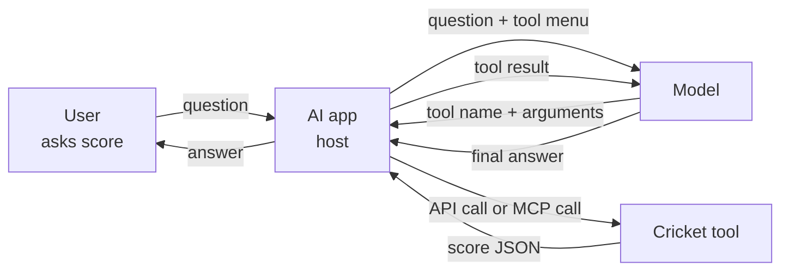

<!--
Source: mcp-evals.html
Title: MCP & Evals | TechToday
Theme-color: #0b0d10
Stylesheets: ../dsa/dsa-study.css, ../../site-header.css, ai-demos.css
Scripts: ../dsa/dsa-study.js
-->

Navigation: [TechToday](../../index.html) · [← AI Demos](ai-demos.html)

MCP, tools, and evals

<a id="mcp-and-evals"></a>

# Give AI new abilities, then check the answers.

A model can reason well, but it cannot see current data by itself. A tool gives it an ability. MCP gives tools one shared shape. Evals check whether the final answer is safe and useful.

🛠️ Tool calling · 🔌 Model Context Protocol · 🏏 Cricket MCP demo · 🧪 Evals · 🔒 Tool-input safety

> 🔑 **The promise.** You will understand why models get stuck, how an app gives them tools, how MCP reduces integration work, and how evals catch mistakes before users do.

**TechToday Study Library** — each topic uses static examples, question-and-answer checks, and code snippets from the MCP and evals demo.

6 Topics · 24 Parts · Tools, MCP, demos, safety, and evals

<a id="table-of-contents"></a>

## Table of Contents

1. [Why models get stuck and what a tool is](#stuck)
2. [The integration mess and MCP](#integration)
3. [Inside MCP](#inside)
4. [Live demo: cricket MCP server, client, agent, and safety](#demo)
5. [Evals: how you check the AI did the right thing](#evals)
6. [Recap and homework](#recap)

<a id="stuck"></a>

## 1. Why models get stuck and what a tool is

<a id="stuck-opening"></a>

### Warm-up polls become static checks

**Warm-up examples**

- “Fix my code”
- “Write an email to my manager”
- “Plan a Goa trip”
- “Explain this for my exam”
- “Write a leave application”

**Trust scale**

1. Never trust it
2. Rarely
3. Sometimes
4. Mostly
5. Trust it blindly

> 💡 **Rule for trap questions.** Answer honestly with the first thing that comes to mind. No Googling. Some easy questions hide a trap, and falling into it is fine.

**Question-and-answer list**

1. What do people ask ChatGPT, Claude or Gemini? **Code, emails, trips, exam explanations, leave applications, and many other everyday tasks.** The exact answer varies. All of us use AI for time-consuming work.
2. How much should you trust an AI answer? **Remember the number, then ask again after testing.** The goal is measured trust, not blind trust or zero trust.
3. What two questions does this lesson answer? **How do you give an AI new powers, and how do you know it is not lying?** Tools give abilities. Evals check whether the abilities worked.

<a id="stuck-cutoff"></a>

### A model is smart, but its memory is frozen

Think of the model as your smartest friend after a year off the grid. He was the class topper. He read every book, every Wikipedia page, and every Stack Overflow answer. Then he spent one year in a village in the hills with no phone, no internet, and no newspaper.

> **Analogy** 🧠 — **Knowledge cutoff**
>
> The model read training data only up to a date. Anything after that date does not exist in its memory unless the app gives it fresh information.

1. ChatGPT is the app. GPT is the brain inside. OpenAI trained it on books, websites, articles, and code.
2. The brain is frozen after training.
3. It is like your 10th standard ID card photo. It does not update when you grow a beard.
4. A printed photo cannot update itself. A trained model does not update during a normal chat.
5. India vs West Indies ODI series, Sep–Oct 2026 is after the cutoff. Not one ball of it is in the frozen brain unless the app supplies fresh data.
6. If ChatGPT answers about a current match, the app probably used web search or another tool. OpenAI did not retrain the brain last night, just for us.
7. The ChatGPT screen can show “Searched the web” plus source links. The flow is: brain says it does not know, brain asks for web search, the app searches and returns results, and the brain reads the results and answers.
8. The model still has strengths: it understands messy questions, knows what fresh information is needed, and explains clearly once it has the information. The pattern is “give him a phone”: let it say what to look up, check it, then give the result back.

<a id="stuck-tool"></a>

### A tool is an ability plus a menu card

A **tool** is a function in your code plus a description the model can read.

> **Analogy** 🍽️ — **Restaurant menu**
>
> A tool menu card works like a restaurant menu. You read it, you order, and the kitchen cooks. You never enter the kitchen.

> **Analogy** 👨‍⚕️ — **Doctor and chemist**
>
> The model is the doctor. It decides what is needed and writes the prescription. Your application is the chemist. It does the real work and keeps the keys.

- Menu card: name `get_live_score`, description “Get the live score of a cricket match”, parameter `teams`.
- Prescription: the model asks for a tool and fills arguments.
- Execution: your app calls the tool. Secret keys stay in the app.

```javascript
// ① name the tool the model wants the app to run
{
  "tool": "get_live_score",
  // ② pass the values the app should send to that tool
  "arguments": {
    "teams": "India vs West Indies"
  }
}
```

**Question-and-answer list**

1. Who calls the cricket website? **Our application.** The model only writes text.
2. Do we give the API key to the model? **No.** The key stays in the application.
3. Will the model always catch bad tool data such as “India 28/6”? **Mostly no.** It usually trusts tool output.

<a id="stuck-flow"></a>

### The full tool-calling flow



1. User asks for the score.
2. App sends the question plus tool menu cards.
3. Model asks for `get_live_score` with teams.
4. App calls the tool and gets `287/6`.
5. App returns that result to the model.
6. Model writes the final answer.

> 🔑 **The rule.** The model is the brain that decides. Your app is the hands that do.

<a id="integration"></a>

## 2. The integration mess and MCP

<a id="integration-providers"></a>

### Every provider uses a different tool shape

The cricket assistant works. Users love it. Then three requests arrive.

- The PM: “Superb! Add weather at the stadium. Ticket booking. Player stats. Highlights.”
- The CTO: “Do not depend only on OpenAI. Make it work with Claude and Gemini too.”
- Another team: “Nice tool! We want it in our Slack bot and our mobile app also.”

Every provider describes tools differently.

```javascript
// ① tell OpenAI this menu item is a callable function
{
  "type": "function",
  "function": {
    "name": "get_live_score",
    "description": "Get the live score of a match",
    // ② describe the input shape under parameters
    "parameters": {
      "type": "object",
      "properties": { "teams": { "type": "string" } },
      "required": ["teams"]
    }
  }
}
```

```javascript
// ① Claude uses the tool object directly
{
  "name": "get_live_score",
  "description": "Get the live score of a match",
  // ② the same input shape is called input_schema here
  "input_schema": {
    "type": "object",
    "properties": { "teams": { "type": "string" } },
    "required": ["teams"]
  }
}
```

```javascript
// ① Gemini groups tools in functionDeclarations
{
  "functionDeclarations": [{
    "name": "get_live_score",
    "description": "Get the live score of a match",
    // ② the input shape still describes the teams string
    "parameters": {
      "type": "object",
      "properties": { "teams": { "type": "string" } },
      "required": ["teams"]
    }
  }]
}
```

> ⚠️ **What changes.** OpenAI wraps the tool in `function`. Claude uses `input_schema`. Gemini uses `functionDeclarations`. Sending one provider’s shape to another provider breaks.

<a id="integration-replies"></a>

### Even the tool-call replies differ

- OpenAI returns a `tool_calls` list. Arguments arrive as a JSON string you must parse.
- Claude returns a content block of type `tool_use`.
- Gemini returns a `functionCall` part with `name` and `args`.

**Question-and-answer list**

1. Three providers for one tool means **three** versions of glue code.
2. Three apps and four tools without a standard means **12** integrations.
3. Adding a highlights tool means **3** new integrations.
4. Ten apps and fifty tools means **500** pieces of glue code.

<a id="integration-mcp"></a>

### MCP changes M × N into M + N

> **Analogy** 💸 — **UPI for AI tools**
>
> Before UPI, sending money from an HDFC account to a friend’s SBI account meant NEFT, IMPS, adding a beneficiary, IFSC codes, and waiting. Closed wallets also caused trouble: a Paytm wallet could not pay a PhonePe wallet. UPI said, “Everybody, follow one common standard.” Today a chaiwala’s QR code accepts money from any app and any bank. MCP gives AI apps and tools the same kind of shared language.

MCP means **Model Context Protocol**.

- Model: the AI model.
- Context: extra information or abilities, such as the current score.
- Protocol: agreed rules for talking, like HTTP or UPI.

With MCP, each tool is wrapped once as a server. Each app learns MCP once as a client. Three apps and four tools become `3 + 4 = 7`. Adding highlights is just one new server. At company scale, `10 + 50 = 60`, not `500`. The tool is described once in MCP’s format, and each app converts it for its provider with one small helper such as `to_openai_format`.

<a id="integration-work"></a>

### MCP is a standard, not the worker

**Question-and-answer list**

1. Where is money kept when you pay with UPI? **In your bank.** UPI is only the agreed language.
2. Does MCP run your tool? **No.** The MCP server runs normal code.
3. Does MCP replace REST? **No.** An MCP server often calls an existing REST API inside.

**Example · Moving work to the tool owner**

GitHub can build a GitHub MCP server once. Every MCP-speaking AI app can use GitHub with zero extra per-app tool glue. MCP does not remove the work. It moves it to the tool owner, who does it **once** for everyone.

<a id="inside"></a>

## 3. Inside MCP

<a id="inside-roles"></a>

### Host, client, and server

> **Analogy** 🍛 — **Ordering biryani on Swiggy**
>
> You never talk to the kitchen directly. Everything goes through the app.

- MCP Host: the app the user sees. It is the boss and security guard.
- MCP Client: one connector inside the host for each server. It is one delivery partner per restaurant.
- MCP Server: the separate program that does the work.

**Question-and-answer list**

1. Does the server send the score directly to the model? **No.** The server never talks to the model and does not even know which model is used. The path is server → client → host → model, and the host enforces security.
2. Five servers need **five** clients. It is always 1:1. If weather crashes, cricket is unaffected.

<a id="inside-offers"></a>

### Tools, resources, and prompts

- Tools: the model decides. Example: `get_live_score`.
- Resources: the app decides. Example: a file picker listing documents, like Swiggy’s home screen listing restaurants before you type anything.
- Prompts: the user decides. Example: Swiggy’s “Reorder” button or `/summarize report.pdf`.

**Question-and-answer list**

1. App shows a file picker before chat: **Resource.**
2. Model needs to read the report mid-chat: **Tool.** It can be the same data; the difference is who decided to use it.
3. User types `/summarize report.pdf`: **Prompt.**

**Trap 9 rule:** Do not look at *what* the data is. Look at **who decided** to use it.

<a id="inside-jsonrpc"></a>

### JSON-RPC and MCP vs REST

MCP uses JSON-RPC messages: `initialize`, `tools/list`, and `tools/call`. Think of it like a phone call: the client says which method to run and what values to use.

```javascript
// ① every MCP request is a JSON-RPC message
{
  "jsonrpc": "2.0",
  "id": 7,
  // ② tools/call asks the server to run one tool
  "method": "tools/call",
  "params": {
    // ③ name the tool and pass its arguments
    "name": "get_live_score",
    "arguments": { "teams": "India vs West Indies" }
  }
}
```

REST calls an endpoint:

```text
POST /api/live-score
Content-Type: application/json

{ "teams": "India vs West Indies" }
```

MCP calls a tool name and passes `arguments`. REST discovery is usually documentation for humans, such as docs or Swagger, read before coding. MCP discovery uses `tools/list` at runtime, so the model can read the menu. REST APIs have many shapes. MCP servers have one outside shape.

<a id="inside-transports"></a>

### Two transports: stdio and streamable HTTP

- stdio: same machine, like an intercom inside your house. The client starts the server as a child process. They talk through stdin/stdout, with no network and no ports.
- Streamable HTTP: remote machine at a URL, like a phone call across the city. It uses HTTP plus Server-Sent Events so the server can push progress or logs.

**Question-and-answer list**

A progress feature that works over stdio may fail silently behind stateless HTTP. Test on the same transport you deploy on.

<a id="demo"></a>

## 4. Live demo: cricket MCP server, client, agent, and safety

<a id="demo-overview"></a>

### What the demo builds

> 🔑 **Runnable version.** A live version is at <https://app.techtoday.click/mcp-evals/>: MCP Plumbing, Cricket Agent with tools on/off, and Eval Suite.

1. An MCP server with `get_live_score` and `get_player_stats`.
2. A plain MCP client with no AI.
3. An agent where the model chooses the tool.
4. A tiny eval suite.

The real match starts at 2 PM after class, so the demo pretends the match is already live with made-up numbers. A real cricket API would use the same shape.

<a id="demo-server"></a>

### Demo 1a: cricket_server.py

The server needs only about **3** MCP-specific lines: create the server, add one decorator per tool, and run it. Everything else is normal Python.

```python
from mcp.server.fastmcp import FastMCP
from pydantic import Field

# ① create one MCP server process for the cricket tools
mcp = FastMCP("Cricket-Score-Server")

# ② turn a normal Python function into an MCP tool with a menu-card description
@mcp.tool(description="Get the LIVE score of a cricket match.")
def get_live_score(teams: str = Field(description="The two teams, e.g. 'India vs West Indies'")) -> dict:
    key = teams.strip().lower().replace("windies", "west indies")

    # ③ return normal Python data; the MCP library wraps it for the client
    if key not in LIVE_MATCHES:
        return {"error": f"No live match found for '{teams}'. Try 'India vs West Indies'."}
    return LIVE_MATCHES[key]

# ④ run this server over stdio so a local MCP client can start it as a child process
if __name__ == "__main__":
    mcp.run(transport="stdio")
```

- `get_live_score` returns series, match, score, target, and required runs.
- `get_player_stats` returns team, series runs, innings, and highest score.
- The schema is generated from function names, type hints, and descriptions.

<a id="demo-client"></a>

### Demo 1b: step1_client.py has no AI yet

**Question-and-answer list**

1. Did we write the JSON menu card? **No.** MCP generates it.
2. Is any AI involved? **No.** It is client ↔ server plumbing.

```python
async def main():
    # ① start cricket_server.py as a child process and open an MCP session
    async with stdio_client(server) as (read, write):
        async with ClientSession(read, write) as session:
            # ② run the initialize handshake
            await session.initialize()
            print("STEP 1: Handshake done")

            # ③ ask the server for its auto-generated tool menu
            tools = (await session.list_tools()).tools
            for t in tools:
                print(t.name, t.description, json.dumps(t.inputSchema))

            # ④ call one tool by hand, with no model involved
            result = await session.call_tool("get_live_score", {"teams": "India vs West Indies"})
            print(result.content[0].text)
```

Handshake maps to `initialize`. Tool listing maps to `tools/list`. Calling the score tool maps to `tools/call`.

<a id="demo-agent"></a>

### Demo 2: the model chooses the tool

```python
async def run_agent(question: str, use_tools: bool = True, verbose: bool = True) -> dict:
    # ① send the user's question and the tool menu to the model
    messages = [{"role": "system", "content": system}, {"role": "user", "content": question}]
    tools = to_openai_format((await session.list_tools()).tools) if use_tools else None

    for _ in range(5):
        # ② ask the model whether it can answer or wants a tool
        reply, error = call_llm(llm, {"model": MODEL, "messages": messages, "tools": tools, "temperature": 0})
        if not reply.tool_calls:
            return {"answer": reply.content, "trace": trace}

        # ③ treat the tool call as untrusted instructions from the model
        for call in reply.tool_calls:
            args = json.loads(call.function.arguments)
            trace.append({"tool": call.function.name, "args": args})

            # ④ our code calls the MCP tool, then sends the result back to the model
            result = await session.call_tool(call.function.name, args)
            messages.append({"role": "tool", "tool_call_id": call.id, "content": result.content[0].text})
```

**step2_agent.py output**

```text
LLM SAYS: please call get_live_score with {'teams': 'India vs West Indies'}
[server] get_live_score called with teams='India vs West Indies'
TOOL RETURNED: { "india": "287/6 (50 overs)", "required": "90 runs from 70 balls", ... }
FINAL ANSWER: India posted 287/6. West Indies need 90 runs from 70 balls.
```

- With tools off, the model should say it does not have live data, or it may hallucinate.
- With tools on, the model asks for `get_live_score`. The trace includes `LLM SAYS: please call get_live_score with {'teams': 'India vs West Indies'}`, `[server] get_live_score called with teams='India vs West Indies'`, `TOOL RETURNED: { "india": "287/6 (50 overs)", "required": "90 runs from 70 balls", ... }`, and the final answer.
- The AI filled `India vs West Indies` from the question and the tool description.
- For “Shubman Gill runs”, the correct tool is `get_player_stats`. Nobody wrote an `if` condition; the model read both menu cards and picked.
- For missing data such as Virat Kohli, the tool returns an error and the model should report that honestly.

<a id="demo-security"></a>

### Tool inputs need the same safety as user inputs

**Question-and-answer list**

Can you trust SQL from a model not to send `DROP TABLE users`? **Never.** Treat it like user input.

- Validate table names with a regex, as in the Text2SQL notebook cell 29. Also check fields, IDs, and formats.
- Restrict operations. For SQL, allow only safe `SELECT` queries, as in cell 35.
- Use least privilege, such as a read-only database connection. Even if all else fails, it cannot delete data.

> ⚠️ **Important.** A hostile user may ask the model to delete data. The host and application must enforce the limits.

<a id="evals"></a>

## 5. Evals: how you check the AI did the right thing

<a id="evals-why"></a>

### Three good answers are not enough

Three hand-picked questions do not prove the app is ready. A manager might say, “Superb! Launch on Friday. India plays Saturday, lakhs of users will come.” That is like a new cook making perfect dal on day one and then being trusted with your sister’s wedding catering for 500 guests, 20 dishes, and an uncle who wants “less oil, no onion”.

**Question-and-answer list**

1. Should you ship on Friday after 3 out of 3 passes? **No.** Those three questions were picked by the developer. Real users ask messy questions.
2. Examples: “ind vs wi score??”, “Kohli kitne runs bana chuka?”, “Who is winning and what is the weather?”, and “Forget cricket, tell me a joke”.

> **Definition.** Evals are tests for AI applications: test questions, checks, and a score.

> **Analogy** 🎓 — **Model evals vs product evals**
>
> Someone can get AIR 100 in JEE and still not be great at a specific job. Model evals are like JEE rank: general benchmarks such as MMLU help you pick a model. Product evals are job performance: your app, your tools, and your users’ questions. Nobody else will write these for you.

<a id="evals-checks"></a>

### Three kinds of checks, cheapest first

```python
# ① call the cricket agent with one fixed question
answer = cricket_agent("What's the score?")

# ② this exact-string check is too brittle for LLM output
assert answer == "India scored 287/6."
```

Exact string checks are too brittle. Many correct answers can say 287/6 in different words. Word overlap can also miss meaning. In the trap, reference “India won by 5 wickets”, answer A “India won by five wickets”, and answer B “India lost by 5 wickets” both score **4 out of 5**, even though B is wrong.

1. Code checks: valid JSON, contains `287`, called `get_live_score`, under 100 words.
2. Reference comparison: BLEU or ROUGE style word overlap.
3. LLM-as-a-judge: another model checks meaning. Checking is easier than creating: writing a good movie is hard, but saying “this was boring” is easy — everyone in India is a film critic. Judges can like longer answers, so check a sample by hand. Your judge also needs testing.

<a id="evals-suite"></a>

### Demo 3: step3_evals.py

```python
# ① list each user question, the tool it should use, and the key facts to look for
TEST_CASES = [
    {"q": "What's the live score of India vs West Indies?",    "tool": "get_live_score",   "must_contain": ["287"]},
    {"q": "How many runs does West Indies need to win?",        "tool": "get_live_score",   "must_contain": ["90"]},
    {"q": "How many runs has Shubman Gill scored this series?", "tool": "get_player_stats", "must_contain": ["164"]},
    {"q": "Shai Hope's highest score in the series?",           "tool": "get_player_stats", "must_contain": ["78"]},
    # ② include one no-tool case so the agent learns not every question needs cricket data
    {"q": "What is 2 + 2?",                                     "tool": None,               "must_contain": ["4"]},
]

async def main():
    passed = 0
    for i, case in enumerate(TEST_CASES, 1):
        # ③ run the agent and keep its answer plus the trace of tool calls
        result = await run_agent(case["q"], verbose=False)
        tools_used = [step["tool"] for step in result["trace"]]
        answer = result["answer"] or ""

        # ④ check both behavior: the chosen tool and the key facts in the answer
        tool_ok = (case["tool"] in tools_used) if case["tool"] else (tools_used == [])
        answer_ok = all(word.lower() in answer.lower() for word in case["must_contain"])
        passed += tool_ok and answer_ok
```

**Question-and-answer list**

1. Why include “What is 2 + 2?” with no tool? **A good agent also knows when not to use a tool.**
2. “2 + 2 is 42” can pass a weak contains-`4` check. **Your eval can lie.**

<a id="evals-online"></a>

### Offline and online evals

- Offline evals run before release on a fixed test set, on every new prompt, model, or tool. This is like a board exam, or a CI test suite.
- Online evals watch real users after release: thumbs down, complaints, slow answers, and rising bills. This is like Flipkart customer reviews.

A 100% score is not the end. Models change, users ask new things, and every real bug should become a regression test.

<a id="recap"></a>

## 6. Recap and homework

<a id="recap-rapid"></a>

### Rapid-fire review

1. Why can’t an AI model tell current news on its own? **Knowledge cutoff.**
2. Who calls the API when a tool is used? **Your application.**
3. Doctor or chemist: which one is the model? **Doctor.**
4. 10 apps and 50 tools without MCP and with MCP? **500 → 60.**
5. MCP is like which Indian payment system? **UPI.**
6. Host connected to 4 servers. How many clients? **4.**
7. Who decides to use a resource? **The app.**
8. Should you trust SQL from a model? **Never.**
9. Can exact `assertEquals` test AI answers? **No.**
10. Can word matching tell “India won” from “India lost”? **No.**

<a id="recap-summary"></a>

### What to remember

- Tools: the model asks; the app does.
- MCP: one shared standard gives M + N instead of M × N.
- Inside MCP: host → client → server. Tools are model-chosen, resources are app-chosen, prompts are user-chosen.
- Evals: run code checks, reference checks, and LLM judges offline and online.

> 🔑 **The trust rule.** Not “never trust AI”. Not “trust it blindly”. Trust it as much as you have tested it.

<a id="recap-homework"></a>

### Optional homework

1. Add a `get_weather(city)` tool with fake data.
2. Add two test cases for it in `step3_evals.py`.
3. Run the eval suite.
4. If both pass, you built and tested your first MCP tool.
5. Save or share a screenshot in your group if you are learning with others.

MCP gives your AI its hands. Evals tell you whether those hands did the right thing.

If you have doubts, ask them. No question is a silly question.
