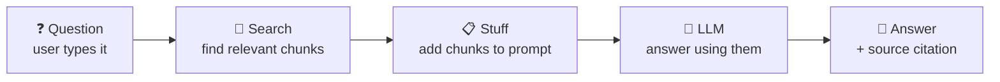
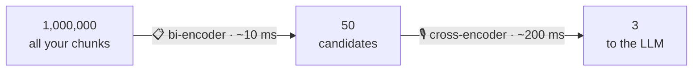
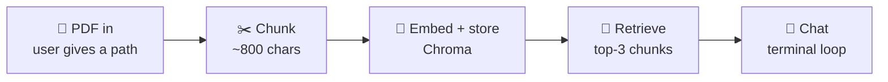

<!--
Source: rag-embeddings.html
Title: RAG & Embeddings | TechToday
Theme-color: #0b0d10
Stylesheets: ../dsa/dsa-study.css, ../../site-header.css, ai-demos.css
Scripts: ../dsa/dsa-study.js
-->

Navigation: [TechToday](../../index.html) · [← AI Demos](ai-demos.html)

RAG · Talk to your own documents

<a id="rag-and-embeddings"></a>

# Stop letting your AI *guess*. Give it a library.

LangChain agents can *act*, but they still do not know **your** data. RAG fixes that. You will build a system that reads your PDFs, finds the right passage for a question, and answers from **real text**. **RAG** is the pattern behind most "chat with your docs" apps.

📚 Embeddings, intuition first · ✂️ Chunking, explained simply · 🗂️ Vector databases · 🎯 Reranking + hybrid search · 📄 Chat-with-your-PDF, shipped

**Scaler Academy** — every example below is shown with data, tables and worked steps.

10 Topics · Concepts, Worked Examples & a Chat-with-your-PDF Project

<a id="table-of-contents"></a>

## Table of Contents

1. [Recap: LLMs & LangChain Agents](#recap)
2. [Why RAG: Beyond Model Memory](#why)
3. [How RAG Works End-to-End](#how)
4. [Embeddings & Vector Space](#emb)
5. [Chunking Strategies](#chunk)
6. [Vector Databases](#vdb)
7. [Build Your RAG Pipeline](#build)
8. [Reranking & Hybrid Search](#rerank)
9. [Chat with Your Documents](#project)
10. [What's Next](#next)

<a id="recap"></a>

## 1. What You Can *Already* Do

<a id="recap-bridge"></a>

### Where You Are, and the Two Problems Left

**Recap** 30 seconds · LLM calls + LangChain agents

✓ Call any LLM (OpenAI, Groq, Ollama) · ✓ Snap a LangChain chain together · ✓ Pass chat history with placeholders · ✓ Build an agent that picks tools

> **Analogy** 🤔 — **But your agent has two real problems**
>
> **1) It doesn't know *your* stuff** — your company's docs, your PDFs, last week's release notes. **2) When it doesn't know, it makes things up** (hallucinates) confidently. What follows is the single biggest fix in AI engineering. Same agent loop — but now it can look things up in a library *you* built.

> 💡 **🎙️ Speaker note · landing the bridge.** If the shop-assistant agent felt unclear, this is the cleanup. Say it plainly: "With agents, the model *chose* a tool. Now the tool is its own library — and the main idea moves from *which tool* to *how do we find the right page?*." That's RAG, in one sentence.

<a id="why"></a>

## 2. Why Does RAG *Exist?*

<a id="why-problems"></a>

### The 4 Problems RAG Solves

**Block 14** ~10 min · the hook

An LLM is a smart intern who finished training a year ago and was never allowed inside your office. RAG fixes both — fresh data, *and* your private data — by handing the intern a relevant page **at question-time**.

- 🗓️ Knowledge cutoff
   The model's training ended months ago. It doesn't know yesterday's RBI rate cut or last week's Budget numbers.
   ✓ RAG: fetch today's article
- 🔒 Private / internal data
   It has never seen your HR policy, your contracts, your product wiki, or your customer tickets — and you can't paste them all into one prompt.
   ✓ RAG: search your docs
- 🌀 Hallucinations
   When unsure, the model invents confident-sounding answers. Bad in customer support, dangerous in legal, fatal in healthcare.
   ✓ RAG: ground in real text
- 🔗 No citations
   Ask "where did you get that?" and a raw LLM has nothing. Real products need
   "see source: page 14"
   .
   ✓ RAG: return the source chunk

> 🔑 **💡 The 1-line definition.** **RAG = Retrieval-Augmented Generation.** Before the model answers, *you* retrieve the most relevant snippets from your own data and stuff them into the prompt. The model then answers *from* those snippets. No retraining. No fine-tuning. Just open-book exam instead of closed-book.

> 🎯 **Industry spotlight · where you've seen this already — almost every "AI feature" you've used is RAG underneath.** Notion AI answering from your workspace, Glean searching your company's apps, Perplexity citing sources, Intercom's Fin support bot, ChatGPT's "search the web", Cursor finding code in your repo, even the new "ask about this PDF" button in your browser — same pattern, every time. Master this, and you can clone any of them.
>
> Notion AI · Glean · Perplexity · Intercom Fin · Cursor · ChatGPT Search

> 💡 **💡 Quick reality-check (mention this).** People sometimes ask: "Why not just fine-tune the model on our data?" Three reasons it's usually wrong: **(1)** expensive and slow to redo every time data changes, **(2)** still can't cite sources, **(3)** still hallucinates. RAG is faster, cheaper, traceable, and almost always the right first move.

<a id="how"></a>

## 3. RAG in One Simple *Picture*

<a id="how-librarian"></a>

### The Smart Librarian

**Block 15** ~10 min · the picture

Forget the buzzwords. The whole pipeline is just **a smart librarian** sitting between your question and the model.

> **Analogy** 📚 — **The library analogy that explains everything**
>
> Imagine you ask your friend a question about a 800-page book they've never read. Bad idea — they'll guess. Smart move? **You find the 3 most relevant pages, hand them over, and *then* ask.** They read the pages and answer confidently with the real text. That's RAG. The "librarian" who finds those 3 pages is the only new thing we're building today.

<a id="how-pipeline"></a>

### The 5-Box Pipeline (Memorise This)



*Boxes 1, 4, 5 you already know from calling an LLM directly. Boxes 2 + 3 are the entire job of everything below.*

> **Two phases · don't confuse them.**
>
> **Phase 1 — Indexing (offline, once):** read your docs → break into chunks → turn each chunk into numbers (embedding) → store in a vector database. Slow, but you only do it when documents change.
>
> **Phase 2 — Querying (online, every question):** turn the question into numbers → find nearest chunks in the database → paste them into the prompt → LLM answers. Milliseconds per query.

> 🔑 **💡 The important idea.** You are *not* retraining the model. The model stays exactly the same `gpt-4o-mini` you called through the raw OpenAI API. We're only changing **what goes into the prompt**. RAG is, at its core, very fancy *prompt engineering* — automated.

<a id="emb"></a>

## 4. Embeddings: Words Become *Coordinates*

<a id="emb-definition"></a>

### What Is an Embedding?

**Block 16** ~25 min · the key idea of this topic

Before we can "search by meaning", we need a way to **turn meaning into numbers**. That's an *embedding*. And once you see what it does, every confusing thing about RAG becomes easier to understand.

> **Definition · keep this in your head.** An **embedding** is a list of numbers (a *vector*) that captures the meaning of a piece of text. Similar meanings ⟶ similar numbers ⟶ nearby points in space. Different meanings ⟶ far apart.

**Example · Vector space** — 2-D map

| Word | x | y | Colour group |
| --- | --- | --- | --- |
| banana | 80 | 90 | #4ec9b0 |
| mango | 60 | 115 | #4ec9b0 |
| grape | 100 | 75 | #4ec9b0 |
| cat | 280 | 80 | #e0af68 |
| dog | 300 | 105 | #e0af68 |
| tiger | 265 | 60 | #e0af68 |
| king | 180 | 175 | #f48771 |
| queen | 215 | 155 | #f48771 |
| man | 120 | 215 | #8cc8ff |
| woman | 160 | 200 | #8cc8ff |
| laptop | 60 | 240 | #c586c0 |
| computer | 90 | 255 | #c586c0 |

**Takeaway.** similar meaning ⟶ nearby points. Fruits cluster together. Animals cluster together. Royalty terms sit near each other. That is the main idea.

<a id="emb-2d-world"></a>

### Imagine a 2D World First — Height & Weight

Forget AI for a second. If I plot people by *height vs weight*, people of similar build end up close together on the chart. Same idea, scaled up. Real embeddings have **384, 768 or even 3072 dimensions** — way more than we can draw — but the principle is identical: *similar ⟶ close, different ⟶ far.*

> **Analogy** 📊 — **"Why so many dimensions?"**
>
> Because meaning is rich. Two words can be similar in many ways at once — *topic, tone, formality, language, sentiment*. Each dimension captures a different axis of similarity. 768 isn't arbitrary; it's just enough to separate millions of distinct ideas.

<a id="emb-arithmetic"></a>

### Embedding Math Works

This example shows why engineers trust embeddings. After training on enough text, vectors carry relationships that you can use in arithmetic. Here are four examples:

**Example · Vector arithmetic** — four known relationships

| Vector equation | Nearest answer |
| --- | --- |
| king − man + woman | queen |
| paris − france + india | delhi |
| tokyo − japan + germany | berlin |
| walking − walk + run | running |

**Takeaway.** Each equation is a real result from GloVe / Word2Vec embeddings. The model did not receive a rule such as "queen is the female king". The pattern comes from the geometry of meaning.

> 🔑 **💡 Why this is the foundation of everything here.** If *woman* and *queen* can be found by simple arithmetic, then "find the chunk most similar to my question" is also just arithmetic — fast, scalable, and runs on commodity hardware. Every RAG system uses exactly this idea. **Search by meaning = nearest point in vector space.**

<a id="emb-mini-map"></a>

### See It in 2D — Same Idea in a Drawing

This is a real word-vector plot reduced from 768 dimensions to 2 so we can draw it. The examples show that the *direction* between related words stays similar:

**Example · Vector space mini-map** — points and directions

| Relationship | Pair A | Pair B | What to notice |
| --- | --- | --- | --- |
| Royalty | king → queen | man → woman | Both arrows point in a similar direction. |
| Capital-of | france → paris | india → delhi | The country-to-capital relationship is a direction. |
| Food vs aeroplane | banana and grape | aeroplane | banana and grape are close. aeroplane is far away, with cos ≈ 0.05. |

**Takeaway.** *capital-of* is encoded as the direction from country → capital. The direction is the relationship.

<a id="emb-cosine"></a>

### The Score We Use: *Cosine Similarity*

Two vectors close together = the *angle* between them is small. The cosine of that angle is our score. It ranges from **-1 (opposite) to +1 (identical)**. Practically: **above 0.7 means "very similar"**, below 0.3 means "barely related". No math needed to use it — just remember: *bigger number = more similar*.

> **Analogy** 📐 — **The clock-hands intuition**
>
> Two clock hands pointing at the same time ⟶ angle = 0 ⟶ cosine = 1 ⟶ perfectly similar. Pointing at 12 and 6 ⟶ angle = 180° ⟶ cosine = −1 ⟶ opposites. We don't care how *long* the hands are, only the angle. That's why text length doesn't break the score.

<a id="emb-meter"></a>

### Example Scores from the Similarity Meter

This example compares pairs of sentences with cosine similarity. It shows the scores for preset pairs and the scoring rules. The scores come from a small built-in table of topics, so common topics look realistic.

**Example · Cosine similarity meter** — preset scores and scoring rules

**Default example.** Sentence A: `A cat is sleeping on the couch.` Sentence B: `A kitten is napping on the sofa.` Score: **0.89**.

| Preset label | Sentence A | Sentence B | Score |
| --- | --- | --- | --- |
| synonyms | A cat is sleeping on the couch. | A kitten is napping on the sofa. | 0.89 |
| paraphrase | I love programming. | I enjoy coding. | 0.86 |
| same city, different names | Flight to Mumbai | Plane to Bombay | 0.92 |
| related concepts | I am hungry | I want food | 0.83 |
| unrelated | I love programming | I hate vegetables | 0.08 |
| totally unrelated | The stock market crashed | A cat is sleeping | 0.04 |

| Baked token pair A | Baked token pair B | Score |
| --- | --- | --- |
| cat sleeping couch | kitten napping sofa | 0.89 |
| cat sleeping couch | dog running park | 0.32 |
| cat sleeping couch | stock market crash | 0.04 |
| love programming | enjoy coding | 0.86 |
| love programming | hate vegetables | 0.08 |
| love programming | i write software | 0.71 |
| flight to mumbai | plane to bombay | 0.92 |
| i am hungry | i want food | 0.83 |
| how to fix bug | debugging tips | 0.79 |

| Score band | Verdict text |
| --- | --- |
| 0.85 to 1.00 | 🟢 Near-synonyms — same meaning, different words. |
| 0.65 to 0.84 | 🟢 Strongly related — same topic. |
| 0.40 to 0.64 | 🟡 Loosely related — shares some concepts. |
| 0.20 to 0.39 | 🟠 Distantly related — barely overlapping. |
| Below 0.20 | 🔴 Unrelated — totally different vector neighbourhoods. |

**Fallback formula for other text.** For text outside the presets, the example scorer lowercases the text, removes punctuation, keeps words longer than 2 characters, counts exact token overlap, checks shared topic buckets, then returns `min(0.97, max(0.02, jaccard * 0.55 + bucketScore + 0.05))`. `bucketScore` is `min(0.75, matchingBuckets * 0.4)`.

| Bucket | Words in this bucket |
| --- | --- |
| food | eat, food, hungry, breakfast, lunch, dinner, meal, restaurant, recipe, cook, tasty, sweet, spicy, rice, dal, curry, biryani |
| animal | cat, dog, kitten, puppy, tiger, lion, animal, pet, bird, fish |
| tech | code, coding, program, programming, software, bug, debug, python, java, laptop, computer, API, LLM, AI |
| travel | flight, plane, travel, journey, trip, vacation, airport, train, bombay, mumbai, delhi, bangalore |
| work | office, meeting, job, work, career, salary, manager, team |
| sleep | sleep, sleeping, nap, napping, rest, tired, bed, couch, sofa |
| money | money, price, cost, stock, market, rupees, dollar, income, wealth |

**Takeaway.** Cosine similarity ranges from −1 to +1. In practice, above 0.7 is very similar. Below 0.3 is barely related.

<a id="emb-code"></a>

### How Do We Actually Get an Embedding? One Function Call.

You don't have to train anything — somebody else already did. Open-source models from Hugging Face (`sentence-transformers`) or APIs from OpenAI / Cohere give you embeddings in one line:

*embeddings.py*

```python
# pip install sentence-transformers
from sentence_transformers import SentenceTransformer

model = SentenceTransformer("all-MiniLM-L6-v2")   # ① free, fast, 384 dims

vec = model.encode("A cat is sleeping on the couch")  # ② that's an embedding!
print(vec.shape)         # → (384,)  — 384 numbers
print(vec[:5])          # → [-0.05, 0.12, 0.41, -0.08, 0.22] (something like that)

# to compare two pieces of text → encode both → take cosine similarity
from numpy import dot
from numpy.linalg import norm

v1 = model.encode("A cat is sleeping on the couch")
v2 = model.encode("A kitten is napping on the sofa")
similarity = dot(v1, v2) / (norm(v1) * norm(v2))   # cosine
print(similarity)       # → 0.87 (very similar 🎉)
```

#### 🔍 Decoder

- ①
   all-MiniLM-L6-v2
   is a tiny but excellent open-source embedding model — runs on your laptop, no API key needed. For production, look at
   BAAI/bge-large-en-v1.5
   (best English) or OpenAI's
   text-embedding-3-small
   (paid, very good multilingual).
- ②
   .encode("text")
   returns the vector. That's the whole API surface — one call, 384 numbers back. Now your text is searchable by meaning.

> 💡 **🎙️ Speaker note · how to pitch this section.** This is the "physics" of RAG. Don't rush. Spend a full 5 minutes letting them play with the meter and the king-queen equation. Once they internalize *"similar meaning = nearby vector"*, everything else here is bookkeeping.

- 📍 Vectors = coordinates
   Every chunk of text gets a point in space.
- 📐 Cosine similarity
   Score from −1 to +1. Bigger = closer.
- 🪄 Math you can do
   king − man + woman ≈ queen. Really.
- ⚡ One function call
   .encode(text)
   — that's it.

<a id="chunk"></a>

## 5. Chunking: Cut the Book into *Snippets*

<a id="chunk-why"></a>

### Why Chunking Decides Everything

**Block 17** ~15 min · the unglamorous part that decides everything

Before we embed anything, we have to cut it up. You can't embed a 200-page PDF as one vector — meaning gets averaged away to mush. So we split it into *chunks*. **How** you chunk decides how good your RAG actually is. Engineers underestimate this; the best ones obsess over it.

> **Analogy** 🍕 — **The pizza-slice analogy**
>
> One whole pizza is hard to share — too big. Cut it into 100 confetti-sized bits and nobody can taste anything. **Slice sizes matter.** Chunks are pizza slices: too big and you lose precision (the relevant bit is buried), too small and you lose context (each crumb is meaningless).

<a id="chunk-strategies"></a>

### The 4 Chunking Strategies Worth Knowing

- 📏 Fixed size
   Every N characters or tokens — done. Very simple, fast, your default.
   Downside:
   chops mid-sentence, mid-table, mid-thought.
   Best for: prototypes, blog posts
- 🔁 Recursive
   Try to split on paragraphs first; if too big, split on sentences; if still too big, on words. A clear fallback ladder. The default in LangChain.
   Best for: most real apps
- 🧠 Semantic
   Embed every sentence; group consecutive sentences that "talk about the same thing". Chunks follow meaning, not size.
   Best for: long flowing prose
- 📑 Structure-aware
   Use the document's own structure — markdown headings, code blocks, HTML sections. Each section becomes a chunk.
   Best for: docs, code, wikis

<a id="chunk-sim"></a>

### Compare All 4 Strategies — Same Text, Four Different Cuts

The same source passage is cut in four ways. The table shows **where the cuts land** and **how chunk shape changes**. The differences are the lesson.

**Example · 4 chunking strategies · same source** — same source, four results

📄 Source · a tiny markdown doc with 3 topics

# Bengaluru Overview ## Tech Industry Bengaluru is known as India's Silicon Valley. Tech parks like Electronic City and Whitefield host thousands of tech companies. Major firms include Infosys, Wipro, and TCS. ## Climate The city sits at 920 meters altitude. This gives it pleasantly cool weather year-round. Average temperatures rarely exceed 30 degrees. ## Food Bengaluru's food scene is legendary. South Indian classics like masala dosa and idli thrive here. Filter coffee shops dot every street corner.

| Strategy | Setting | Output chunks | Stats | What to notice |
| --- | --- | --- | --- | --- |
| Fixed size | 80 characters for the worked example. The old range was 40–240 characters, default 120. | **Chunk 1 (80 chars; mid-word cut)**<br># Bengaluru Overview<br><br>## Tech Industry<br>Bengaluru is known as India's Silicon Val<br><br>**Chunk 2 (80 chars; mid-word cut)**<br>ley. Tech parks like Electronic City and Whitefield host thousands of tech compa<br><br>**Chunk 3 (80 chars; mid-word cut)**<br>nies. Major firms include Infosys, Wipro, and TCS.<br><br>## Climate<br>The city sits at <br><br>**Chunk 4 (80 chars; mid-word cut)**<br>920 meters altitude. This gives it pleasantly cool weather year-round. Average t<br><br>**Chunk 5 (80 chars; mid-word cut)**<br>emperatures rarely exceed 30 degrees.<br><br>## Food<br>Bengaluru's food scene is legenda<br><br>**Chunk 6 (80 chars; mid-word cut)**<br>ry. South Indian classics like masala dosa and idli thrive here. Filter coffee s<br><br>**Chunk 7 (29 chars; mid-word cut)**<br>hops dot every street corner. | 7 chunks; 73 average chars; 7 mid-word cuts | Cuts land at character N. They do not respect words, sentences, or paragraphs. This is cheap to write, but poor for retrieval. |
| Recursive | 80 characters, with paragraph → sentence → word fallback. | **Chunk 1 (20 chars)**<br># Bengaluru Overview<br><br>**Chunk 2 (62 chars)**<br>## Tech Industry<br>Bengaluru is known as India's Silicon Valley.<br><br>**Chunk 3 (80 chars)**<br>Tech parks like Electronic City and Whitefield host thousands of tech companies.<br><br>**Chunk 4 (44 chars)**<br>Major firms include Infosys, Wipro, and TCS.<br><br>**Chunk 5 (48 chars)**<br>## Climate<br>The city sits at 920 meters altitude.<br><br>**Chunk 6 (49 chars)**<br>This gives it pleasantly cool weather year-round.<br><br>**Chunk 7 (46 chars)**<br>Average temperatures rarely exceed 30 degrees.<br><br>**Chunk 8 (44 chars)**<br>## Food<br>Bengaluru's food scene is legendary.<br><br>**Chunk 9 (60 chars)**<br>South Indian classics like masala dosa and idli thrive here.<br><br>**Chunk 10 (44 chars)**<br>Filter coffee shops dot every street corner. | 10 chunks; 50 average chars; 0 mid-word cuts | Same character budget, cleaner cuts. LangChain uses RecursiveCharacterTextSplitter as the safe default for about 90% of RAG apps. |
| Semantic | No size knob. Sentences are tagged by topic and adjacent same-topic sentences are merged. | **tech (171 chars)**<br>Bengaluru is known as India's Silicon Valley. Tech parks like Electronic City and Whitefield host thousands of tech companies. Major firms include Infosys, Wipro, and TCS.<br><br>**climate (134 chars)**<br>The city sits at 920 meters altitude. This gives it pleasantly cool weather year-round. Average temperatures rarely exceed 30 degrees.<br><br>**food (142 chars)**<br>Bengaluru's food scene is legendary. South Indian classics like masala dosa and idli thrive here. Filter coffee shops dot every street corner. | 3 chunks; 3 topics detected; size range 134-171 | Chunks are shaped by meaning, not size. Tech sentences join together. Climate sentences join together. Food sentences join together. |
| Structure-aware | No size knob. Markdown headers set the boundaries. | **Section 1 (20 chars)**<br># Bengaluru Overview<br><br>**Section 2 (188 chars)**<br>## Tech Industry<br>Bengaluru is known as India's Silicon Valley. Tech parks like Electronic City and Whitefield host thousands of tech companies. Major firms include Infosys, Wipro, and TCS.<br><br>**Section 3 (145 chars)**<br>## Climate<br>The city sits at 920 meters altitude. This gives it pleasantly cool weather year-round. Average temperatures rarely exceed 30 degrees.<br><br>**Section 4 (150 chars)**<br>## Food<br>Bengaluru's food scene is legendary. South Indian classics like masala dosa and idli thrive here. Filter coffee shops dot every street corner. | 4 chunks; 4 sections; 126 average chars | Each ## section becomes one chunk with its header attached. This is best for docs, wikis, source code, Markdown, and HTML. |

| Default setting | Computed stats |
| --- | --- |
| Fixed size 120 | 5 chunks; 102 average chars; 2 mid-word cuts |
| Recursive size 120 | 8 chunks; 62 average chars; 0 mid-word cuts |

**Takeaway.** **Recall vs precision.** Big chunks raise recall because the answer is probably inside. They lower precision because there is more extra text. Small chunks raise precision but can split the answer across chunks.

**Read this sequence:** Fixed at size 80 creates mid-word cuts. Recursive at the same size removes those cuts. Semantic creates three chunks that match the three topics. Structure uses the markdown `##` headers as ready-made boundaries.

> **The recall vs precision tradeoff · keep this in mind.** **Big chunks** → high recall (the answer is probably *in* there), but low precision (lots of fluff around it). **Small chunks** → high precision (the chunk is exactly the answer), but low recall (the relevant bit might be split across two chunks and you only pulled one). Most teams sweep chunk size as their first RAG tuning knob.

<a id="chunk-code"></a>

### One Line of Real Code

*chunk.py*

```python
from langchain_text_splitters import RecursiveCharacterTextSplitter

# ① choose chunk size and overlap so nearby context stays connected
splitter = RecursiveCharacterTextSplitter(
    chunk_size=800,        # aim for ~800 chars per chunk
    chunk_overlap=100,     # adjacent chunks share 100 chars (context glue)
)

# ② split the long document into chunks ready for embedding
chunks = splitter.split_text(your_long_document)
# ③ print how many chunks will go into the vector search index
print(len(chunks))    # → e.g. 47 chunks ready to embed
```

> 💡 **💡 Why `chunk_overlap`?** If your question's answer sits exactly at a chunk boundary, you'd miss it. Overlap (50–100 chars) makes sure every sentence appears in at least one chunk fully. Cheap insurance.

<a id="vdb"></a>

## 6. Vector Databases: a Search Engine for *Meaning*

<a id="vdb-definition"></a>

### What a Vector Database Is

**Block 18** ~10 min

You have thousands of embeddings. For every question, you need the top-k nearest ones — *fast*. That's what a vector database does, and that's **all** it does.

> **Analogy** 🗂️ — **One-line definition**
>
> A vector database is a *search engine* where instead of "find documents containing this word", the query is "find vectors closest to *this* vector". Same idea as Google, swapped engine.

<a id="vdb-options"></a>

### The Three Names You'll Hear All the Time

- 🟢 Chroma ★ today
   Open-source, runs in-process (no server!), one
   pip install
   . Perfect for prototypes
   &
   up to ~10M vectors.
   What we'll use today.
- 🔵 Pinecone
   Fully managed SaaS. Zero ops, scales to billions, but paid. The boring-and-reliable choice for production.
- 🟣 Qdrant
   Open-source
   and
   production-grade. Self-host or use their cloud. Great middle ground when you outgrow Chroma.

> 💡 **🎯 Picking one (don't overthink).** Prototyping or under 1M chunks? **Chroma**. Want zero ops & have a budget? **Pinecone**. Need to self-host at scale? **Qdrant** or **Weaviate**. The good news: LangChain wraps all of them with the same interface, so swapping later is a one-line change.

<a id="vdb-operations"></a>

### What It Actually Does — Three Operations

A vector DB is just these three calls:

1. db.add(documents, embeddings)
   — store chunks and their vectors. (Indexing.)
2. db.query(query_vector, k=3)
   — return the 3 chunks whose vectors are closest. (Retrieval.)
3. db.delete(ids)
   — remove chunks when a doc is deleted. That's it. Three calls.

> 🎯 **Industry spotlight · how it stays fast — HNSW, the trick behind every vector DB.** Searching billions of vectors naively means computing billions of distances per query. **HNSW** (Hierarchical Navigable Small World — a 2018 algorithm) builds a "ladder" graph so each query takes only ~log(N) hops. Result: sub-10ms lookups on 100M vectors. You'll never write this yourself — every vector DB ships it built-in.
>
> Chroma · HNSW · Pinecone · proprietary · Qdrant · HNSW · FAISS · IVF + HNSW

<a id="build"></a>

## 7. Build a Real RAG in *30 Lines*

<a id="build-index"></a>

### Step 1 — Index Your Documents (Once)

**Block 19** ~20 min · all four pieces, working together

We've talked about every piece. Now we wire them up. This is the whole pattern — every RAG system you'll see in production is just a fancier version of *this*.

*index.py*

```python
from langchain_text_splitters import RecursiveCharacterTextSplitter
from langchain_huggingface import HuggingFaceEmbeddings
from langchain_chroma import Chroma

# ① load your documents (any text — for now, hardcoded)
docs = [
    "Our return policy allows refunds within 30 days of purchase.",
    "Shipping is free for orders above ₹999 across India.",
    "For corporate orders above 50 units, contact sales@example.com.",
    "Our office is in Indiranagar, Bangalore. Open Mon-Fri 10am-7pm.",
]

# ② split into chunks (small docs here, but production = thousands of pages)
splitter = RecursiveCharacterTextSplitter(chunk_size=500, chunk_overlap=50)
chunks = splitter.create_documents(docs)

# ③ pick an embedding model (free, runs locally, no API key)
embedder = HuggingFaceEmbeddings(model_name="all-MiniLM-L6-v2")

# ④ build the vector store from chunks + embeddings (saves to disk)
db = Chroma.from_documents(chunks, embedder, persist_directory="./chroma_db")

print(f"Indexed {len(chunks)} chunks 🎉")
```

<a id="build-query"></a>

### Step 2 — Ask a Question (Every Time)

*rag.py*

```python
from langchain_huggingface import HuggingFaceEmbeddings
from langchain_chroma import Chroma
from langchain_openai import ChatOpenAI
from langchain_core.prompts import ChatPromptTemplate
from dotenv import load_dotenv
load_dotenv()

# ⑤ open the same vector store we built in step 1
embedder = HuggingFaceEmbeddings(model_name="all-MiniLM-L6-v2")
db       = Chroma(persist_directory="./chroma_db", embedding_function=embedder)
model    = ChatOpenAI(model="gpt-4o-mini", temperature=0)

# ⑥ the prompt: instructions + chunks + question
prompt = ChatPromptTemplate.from_template("""
Answer the question using ONLY the context below. If the context doesn't contain
the answer, say "I don't know." Be concise and quote facts directly.

Context:
{context}

Question: {question}
""")

def rag_answer(question):
    chunks = db.similarity_search(question, k=3)         # ⑦ retrieve top 3
    context = "\n\n".join(c.page_content for c in chunks)
    chain = prompt | model                                # ⑧ same LangChain chain trick
    return chain.invoke({"context": context, "question": question}).content

print(rag_answer("How long do I have to return something?"))
# → "30 days from the purchase date."  ✅ from your data, not a guess
```

#### 🔍 Decoder — the 8 numbered steps

- ①
   Your data. In real life this is PDFs, web pages, Notion exports — anything you can turn into text.
- ②
   Chunk it. Block 17 in action.
   chunk_size=500
   is a sane default.
- ③
   Pick an embedder. We're using a free local one — swap to
   OpenAIEmbeddings()
   for a paid, slightly better version.
- ④
   Chroma.from_documents
   embeds every chunk and stores both the text and the vector. Done once per dataset.
- ⑤
   Reopen the same database. The embeddings are already on disk — no re-encoding.
- ⑥
   The important prompt template. Notice
   "ONLY the context below"
   — this single line is the most important hallucination reducer in RAG.
- ⑦
   similarity_search
   = embed the question, find the 3 nearest chunks, return them. The librarian.
- ⑧
   Same LangChain pipe (
   prompt | model
   ) you used for LangChain chains.
   RAG didn't replace your previous knowledge — it slotted right in.

<a id="build-sim"></a>

### Follow the Pipeline Step by Step

Here is what happens inside `rag_answer("How long do I have to return something?")`. Each item is one step in the RAG flow:

**Example · RAG, step by step** — one question through the pipeline

1. 1 · User question.
   "How long do I have to return something?"
2. 2 · Embed the question.
   Turn the question into a 384-number vector with
   model.encode(question)
   . Think of it as the question's coordinates.
3. 3 · Search the vector DB.
   db.similarity_search(query, k=3)
   finds the 3 nearest chunks:
   refunds within 30 days...
   shipping is free above ₹999
   corporate orders contact sales@
4. 4 · Put the chunks into the prompt.
   The retrieved chunks become
   {context}
   . The question becomes
   {question}
   . One string goes to the LLM.
5. 5 · LLM answers from context.
   GPT-4o-mini replies:
   "You can return items within 30 days of purchase."
   ✅ The answer came from the chunk, not from memory.

**Takeaway.** RAG complete. The same loop runs for every question.

> 🔑 **🎯 Take a moment — this *is* the canonical pattern.** That's it. Every RAG system in the world — from a hobby project to Perplexity — is a variant of these 8 lines. From here we're just making it *better*: smarter retrieval, smarter prompts, multiple passes. The core never changes.

<a id="rerank"></a>

## 8. Make It Better: *Rerank* + *Hybrid* Search

<a id="rerank-two-stage"></a>

### Problem 1: the Top-5 from Vector Search Isn't the *Best* 5

**Block 20** ~15 min · 80% of RAG quality lives here

A vanilla RAG works. A *good* RAG works **well**. The two tricks that close that gap — and that every senior engineer asks about — are *reranking* and *hybrid search*. Both are easy to add.

Embedding similarity is fast, but it sometimes ranks shallow word-matches above deep semantic matches. So we use a **two-stage retrieval** — a fast first pass to narrow down, then a slow accurate pass to pick the real winners.

> **Analogy** 📄 — **Imagine hiring for one open role — with 1,000 applicants**
>
> You can't interview 1,000 people (it would take a year). You also can't pick someone by gut feel from a stack of resumes (you'd hire badly). So you do **two passes**: a fast *resume scan* to shortlist 25, then a real *30-minute interview* with each of those 25. **Bi-encoder and cross-encoder are exactly these two passes.**

- 📋 Bi-encoder · like a resume scan
   Reads the query and the document
   separately
   , turns each into a vector, then compares the two vectors with cosine similarity. The encoder
   never sees them together
   — it judges each "card" alone.
   ⚡
   Fast
   — sub-10ms over millions of docs
   💾
   Pre-computable
   — encode all your docs once, store forever, only encode the query at runtime
   📉
   Shallow
   — misses subtle relevance because the model never compares them side-by-side
   → use it to grab top 50–100 candidates
- 🎙️ Cross-encoder · like a 30-min interview
   Feeds the query
   and
   the document into one transformer
   together
   , lets the model attend to both at once, then outputs a single relevance score. The model can compare them token by token, weigh trade-offs, spot nuance.
   🎯
   Way more accurate
   — sees query↔doc word interactions directly
   🐢
   Slow
   — full transformer run per (query, doc) pair
   ❌
   Not pre-computable
   — each score is pair-specific, you can't cache anything
   → use it to rerank those 50 → top 3



*Funnel total: ~210ms — fast enough for live chat, accurate enough to beat raw vector search by miles.*

> **Remember this — the two-stage pattern is universal.**
>
> **Stage 1 (bi-encoder):** grab top 50-100 candidates from the vector DB. Fast.
>
> **Stage 2 (cross-encoder):** re-score those candidates with a smarter model. Slow per item, but you're only re-scoring 50, not 50 million. Keep the top 3-5 for the LLM.

<a id="rerank-sim"></a>

### Reranking Flips the Order

Same query, same candidates. *Left*: what cosine similarity returned. *Right*: what a cross-encoder reranker returned. The relevant answer rises to the top:

**Example · Reranker · before vs after** — query: "how do I return a defective product?"

stage 1 · vector search (top 5)

1. Our shipping is fast and reliable for all returns.

0.78

2. Refund policy: items can be returned within 30 days.

0.74

3. Return shipping labels are emailed after request.

0.71

4. For damaged or defective items, replacements are sent free of cost.

0.69

5. Our return desk is at the warehouse in Pune.

0.66

➜

stage 2 · cross-encoder rerank

1. For damaged or defective items, replacements are sent free of cost.

0.94

2. Refund policy: items can be returned within 30 days.

0.88

3. Return shipping labels are emailed after request.

0.81

4. Our return desk is at the warehouse in Pune.

0.62

5. Our shipping is fast and reliable for all returns.

0.45

**Takeaway.** Doc #4 does not use the word "return", but it is the best answer for a defective product. Vector search put it at #4. The cross-encoder moved it to #1.

The code to add reranking is short:

*rerank.py*

```python
from sentence_transformers import CrossEncoder

# ① load a cross-encoder that can score a question with one chunk
reranker = CrossEncoder("cross-encoder/ms-marco-MiniLM-L6-v2")   # free, fast

def retrieve_with_rerank(question, top_k=3):
    # ① retrieve more cheap candidates than you finally need
    candidates = db.similarity_search(question, k=25)        # grab 25 cheap candidates
    # ② pair the same question with each candidate chunk for scoring
    pairs = [(question, c.page_content) for c in candidates]
    # ③ score every question chunk pair with the cross-encoder
    scores = reranker.predict(pairs)                          # cross-encoder scores each pair
    # ④ sort by score and return the best chunks
    return [c for _, c in sorted(zip(scores, candidates), reverse=True)[:top_k]]
```

<a id="rerank-keywords"></a>

### Problem 2: Sometimes You Need the *Exact Word*

Pure semantic search ignores keywords. Ask "what's the price of **SKU-4429**?" and the embedding doesn't care about that specific code — it just sees "price" and "product". For codes, names, IDs, dates — **keyword search beats semantic** hands down. The fix isn't to pick one or the other. It's to use *both*, with very different strengths.

> **Analogy** 📚 — **Two librarians, very different strengths**
>
> Remember our librarian from Block 15? She has **two assistants** who search the stacks completely differently. One is a literalist who lives for exact words. The other is a philosopher who lives for meaning. Send your query to the right one and you get great results. **Send your query to *both* — and let them merge their rankings — and you get strong results.** That's hybrid search.

- 🔤 Librarian A · BM25 · the literalist
   Obsessed with
   exact words
   . Type
   "SKU-4429"
   or
   "Article 21"
   and she'll find every single doc containing those exact characters. But ask for
   "running shoes"
   and she'll skip the doc titled
   "marathon footwear"
   — different words, even though same meaning.
   ✅
   Brilliant at
   product codes, SKUs, model numbers, version strings
   ✅
   Brilliant at
   proper nouns, dates, legal references, technical jargon
   ❌
   Blind to
   synonyms, paraphrase, intent — words are just characters to her
   → catches what vector misses
- 🧠 Librarian B · Vector · the philosopher
   Obsessed with
   meaning
   . Ask for
   "running shoes"
   and she surfaces
   "marathon footwear"
   ,
   "jogging trainers"
   , even
   "sneakers for athletes"
   . But ask for
   "SKU-4429"
   and she shrugs — random letters and numbers are just noise to her.
   ✅
   Brilliant at
   natural-language questions, "what's this about?"
   ✅
   Brilliant at
   unclear queries, paraphrase, multilingual matching
   ❌
   Blind to
   exact codes, IDs, technical strings — drowns them in averages
   → catches what BM25 misses

<a id="rerank-hybrid"></a>

### Hybrid = Both Librarians on the Case

Send the same query to *both* librarians at the same time. Each ranks the docs by their own logic. You then **merge their two ranked lists into one** using a tiny formula called **Reciprocal Rank Fusion (RRF)**:

> 🔑 **⚡ Reciprocal Rank Fusion in one line.** For each doc, final score = `1 / (60 + rank in BM25) + 1 / (60 + rank in Vector)`. Docs that *both* librarians ranked highly bubble to the top. Docs only one of them liked still get a fair shot. No tuning, no thresholds, no main idea numbers (well, 60 — but it almost never matters). *That's it.* Used by almost every production RAG system in the wild.

> **Analogy** 🤝 — **Why this works so well in practice**
>
> Real user queries are *messy* — mostly natural language, but sprinkled with technical terms, product codes, names, or jargon the embedding model has never seen. Hybrid covers both halves of every messy query automatically: the natural-language part goes to Vector, the technical-term part goes to BM25, and RRF stitches the answers together. **You're not picking sides — you're using each tool for what it's actually good at.**

<a id="rerank-hybrid-sim"></a>

### Compare Search Methods on *"I Want Running Shoes"*

Same query, three rankings. Librarian A and Librarian B return different top picks. Hybrid merges the rankings:

**Example · BM25 vs Vector vs Hybrid** — query: "I want running shoes"

🔤 BM25

keyword

1. Adidas Ultraboost sneakers · Marathon running shoes

score: 8.40

2. Reebok CrossFit gym shoes

score: 3.10

3. Bata kids school shoes

score: 2.40

4. Nike Air Zoom Pegasus trainers

score: 1.20

Counts word overlap. It likes documents that include "shoes".

🧠 Vector

semantic

1. Nike Air Zoom Pegasus trainers

score: 0.83

2. Asics Gel-Kayano stability trainers

score: 0.78

3. Adidas Ultraboost sneakers · Marathon running shoes

score: 0.71

4. Reebok CrossFit gym shoes

score: 0.55

Understands that "running" relates to jogging and trainers.

⚡ Hybrid

blended

1. Adidas Ultraboost sneakers · Marathon running shoes

fused: 0.0328

2. Nike Air Zoom Pegasus trainers

fused: 0.0325

3. Reebok CrossFit gym shoes

fused: 0.0323

4. Asics Gel-Kayano stability trainers

fused: 0.0318

Reciprocal rank fusion combines both ranked lists. It is a common production default.

> 🎯 **Industry spotlight · this is what the leaderboard chases — every "+10% retrieval quality" paper is one of these tricks.** Reranking + hybrid search are the two single biggest quality wins in RAG. Add them and you go from "demo works" to "production works". Almost every benchmark in the MTEB leaderboard uses some combination. You now know the playbook.
>
> BM25 + Vector · Cross-encoder rerank · Reciprocal rank fusion · Cohere Rerank API

<a id="project"></a>

## 9. Mini-Project: Chat with *Your* PDF

<a id="project-overview"></a>

### The Full App — 4 Files

**Block 21** ~20 min · 🏁 THE BUILD

Time to ship. Point it at any PDF — your resume, a research paper, an annual report, your college notes — and chat with it. Every answer cites the page it came from. This is the project that gets people asking **"how did you build this?"**



*Load → chunk → embed → retrieve → answer. Let's write each piece.*

<a id="project-index"></a>

### Step 1 — Load the PDF & Index It Once

*pdf_chat.py · part 1*

```python
# pip install langchain langchain-openai langchain-chroma langchain-huggingface \
#             langchain-community pypdf sentence-transformers python-dotenv

from langchain_community.document_loaders import PyPDFLoader
from langchain_text_splitters import RecursiveCharacterTextSplitter
from langchain_huggingface import HuggingFaceEmbeddings
from langchain_chroma import Chroma

def build_index(pdf_path):
    pages    = PyPDFLoader(pdf_path).load()                    # ① read all pages
    splitter = RecursiveCharacterTextSplitter(chunk_size=800, chunk_overlap=100)
    chunks   = splitter.split_documents(pages)                # ② chunk them
    embedder = HuggingFaceEmbeddings(model_name="all-MiniLM-L6-v2")
    db       = Chroma.from_documents(chunks, embedder)         # ③ in-memory store
    return db
```

<a id="project-answer"></a>

### Step 2 — Answer with Retrieval + Citations

*pdf_chat.py · part 2*

```python
from langchain_openai import ChatOpenAI
from langchain_core.prompts import ChatPromptTemplate
from dotenv import load_dotenv
# ① load the API key and create the PDF assistant model
load_dotenv()

model = ChatOpenAI(model="gpt-4o-mini", temperature=0)

# ② define the grounded answer prompt and source-citation format
prompt = ChatPromptTemplate.from_template("""
You are a helpful PDF assistant. Answer the question using ONLY the context below.
If the context doesn't contain the answer, say "I couldn't find that in the document."
After your answer, list the page numbers you used as: Sources: page X, page Y.

Context:
{context}

Question: {question}
""")

def ask(db, question):
    # ① retrieve the most relevant PDF chunks for the question
    chunks  = db.similarity_search(question, k=4)
    # ② include page numbers beside each chunk before prompting the model
    context = "\n\n".join(
        f"[page {c.metadata['page']+1}] {c.page_content}" for c in chunks)
    # ③ connect the prompt to the model for this answer
    chain = prompt | model
    # ④ ask the model using only the retrieved PDF context
    return chain.invoke({"context": context, "question": question}).content
```

<a id="project-entry"></a>

### Step 3 — The Entry Point

A tiny `main.py` indexes the PDF once, then answers questions in a loop:

*main.py*

```python
from pdf_chat import build_index, ask

pdf_path = input("Path to your PDF: ")
db = build_index(pdf_path)                 # ① index once, before the chat loop
print("✅ PDF indexed! Ask me anything about it. (blank line to quit)")

while True:
    question = input("\nYou: ").strip()    # ② every question reuses the same index
    if not question:
        break
    print("Bot:", ask(db, question))
```

#### 🔍 Decoder · the 3 small choices that matter

- ①
   build_index
   runs once, before the loop, and the result is kept in
   db
   . Without that, every question would re-index the PDF from scratch (slow!).
- ②
   Indexing only once means each question is instant. This is the same indexing/querying split from Block 15.
- ③
   We pass
   page
   from the chunk metadata into the prompt (in
   ask
   ) — that's how the model knows which page to cite.
   Metadata is RAG's strength.

<a id="project-run"></a>

### Run It

Save `pdf_chat.py` (parts 1 + 2), `main.py` and your `.env` in one folder, then run:

*bash — your project folder*

```text
$ python main.py

Path to your PDF: annual_report.pdf
✅ PDF indexed! Ask me anything about it. (blank line to quit)

You: What was the revenue this year?
```

1. Point it at
   any
   PDF.
   Your resume, the Indian Constitution, your company's HR policy, last quarter's earnings call transcript. Anything text-based.
2. Ask 3 questions.
   One factual ("when was X founded?"), one summary ("what's the main argument?"), one tricky ("compare X and Y"). Notice the citations.
3. Try a question that's NOT in the doc.
   The answer should be
   "I couldn't find that in the document."
   — that's RAG
   refusing to hallucinate
   . Watch for this moment. It's the main point.

<a id="project-demo"></a>

### Walkthrough of the PDF Chat

This walkthrough uses three sample documents that are already indexed. The table shows the documents, example questions, retrieved answers, and the refusal message for questions not in the document:

**Example · Chat with your PDF** — three indexed sample documents

**Index message from the old demo.** `Indexed "📋 HR Policy" — 1 page, ~8 chunks. Ask me anything!` The same pattern applied to each sample document.

| Sample document | Indexed text | Answer keys and answers | Example questions |
| --- | --- | --- | --- |
| 📋 HR Policy | Annual leave: 22 days/year for full-time employees, accrued monthly.<br>Sick leave: 12 days/year, no carry-forward.<br>Work from home: up to 2 days per week with manager approval.<br>Maternity leave: 26 weeks paid as per Indian law.<br>Paternity leave: 10 working days.<br>Reimbursements: internet ₹1500/month, mobile ₹800/month.<br>Notice period: 60 days for senior roles, 30 days for others.<br>Probation: 6 months. Probation extension requires HR approval. | **leave**: Full-time employees get 22 days of annual leave (accrued monthly) plus 12 days of sick leave per year. Sources: page 1.<br>**wfh**: Yes — up to 2 days per week with your manager's approval. Sources: page 1.<br>**work from home**: Yes — up to 2 days per week with your manager's approval. Sources: page 1.<br>**maternity**: 26 weeks of paid maternity leave, in line with Indian law. Sources: page 1.<br>**paternity**: 10 working days of paternity leave. Sources: page 1.<br>**notice**: Notice period is 60 days for senior roles, 30 days for others. Sources: page 1.<br>**reimbursement**: Internet: ₹1500/month. Mobile: ₹800/month. Sources: page 1.<br>**internet**: Internet reimbursement is ₹1500/month. Sources: page 1.<br>**probation**: Probation period is 6 months. Extensions require HR approval. Sources: page 1. | `How many leaves do I get?`, `Can I work from home?`, `What is the notice period?`, `What is the maternity policy?` |
| 💰 TCS Q3 Earnings | Revenue: ₹62,613 cr, up 4.0% YoY in constant currency.<br>Operating margin: 24.6%, up 50 bps QoQ.<br>Net profit: ₹12,380 cr.<br>TCV (Total Contract Value): $13.2 bn, highest in 7 quarters.<br>Headcount: 612,724 employees, net addition of 5,370 this quarter.<br>Attrition: 13.0% (LTM), down from 13.3%.<br>Cash and equivalents: ₹58,200 cr.<br>Dividend: ₹76/share interim declared.<br>BFSI segment grew 3.8%, retail 2.1%, manufacturing 5.9%. | **revenue**: Revenue was ₹62,613 cr, up 4.0% YoY in constant currency. Sources: page 1.<br>**margin**: Operating margin was 24.6%, up 50 basis points quarter-on-quarter. Sources: page 1.<br>**profit**: Net profit was ₹12,380 cr. Sources: page 1.<br>**tcv**: TCV (Total Contract Value) hit $13.2 bn — the highest in 7 quarters. Sources: page 1.<br>**headcount**: 612,724 employees, with a net addition of 5,370 this quarter. Sources: page 1.<br>**attrition**: Attrition (LTM) was 13.0%, down from 13.3%. Sources: page 1.<br>**dividend**: Interim dividend of ₹76 per share was declared. Sources: page 1.<br>**bfsi**: BFSI segment grew 3.8% this quarter. Sources: page 1. | `What was the revenue?`, `How was the operating margin?`, `What is the attrition rate?`, `How big is the latest TCV?` |
| 📜 Indian Constitution (Part III) | Article 14: Equality before law — the State shall not deny equality to any person.<br>Article 15: Prohibition of discrimination on grounds of religion, race, caste, sex or place of birth.<br>Article 19: Six fundamental freedoms — speech, assembly, association, movement, residence, profession.<br>Article 21: Right to life and personal liberty — no person shall be deprived except by procedure established by law.<br>Article 21A: Right to education for children aged 6-14.<br>Article 25: Freedom of conscience and free profession of religion.<br>Article 32: Right to constitutional remedies — Supreme Court can be approached for enforcement. | **article 14**: Article 14 guarantees equality before law — the State shall not deny equality to any person. Sources: page 1.<br>**article 15**: Article 15 prohibits discrimination on grounds of religion, race, caste, sex or place of birth. Sources: page 1.<br>**article 19**: Article 19 grants six fundamental freedoms: speech, assembly, association, movement, residence, and profession. Sources: page 1.<br>**article 21**: Article 21 protects the right to life and personal liberty — no person shall be deprived except by procedure established by law. Sources: page 1.<br>**article 32**: Article 32 is the right to constitutional remedies — citizens can approach the Supreme Court for enforcement of Fundamental Rights. Sources: page 1.<br>**right to education**: Article 21A guarantees the right to education for children aged 6 to 14. Sources: page 1.<br>**religion**: Article 25 guarantees freedom of conscience and free profession of religion. Article 15 prohibits discrimination on grounds of religion. Sources: page 1.<br>**freedom of speech**: Article 19 grants freedom of speech as one of six fundamental freedoms. Sources: page 1. | `What does Article 21 say?`, `Tell me about Article 19`, `What is the right to education?`, `Which article covers religion?` |

**Unknown question response.** `I couldn't find that in the document. 🤷` This is RAG refusing to hallucinate.

**Takeaway.** These sample answers come from a tiny semantic-matching layer, not a model. The real `pdf_chat.py` uses actual embeddings + GPT with the same flow.

> 🎯 **Industry spotlight · this *is* the canonical AI product — you just built the most-shipped AI app of 2024–26.** "Chat with [your docs / your PDF / your codebase / your Notion]" is the single most common AI feature on the market today — and almost all of them are this exact pattern with a more polished UI. ChatGPT's "Browse my files", Claude Projects, Cursor's `@codebase`, Glean, Notion AI — every one of them. You now own the recipe.
>
> Notion AI · Glean · Claude Projects · Cursor @docs · Perplexity Spaces

<a id="project-variations"></a>

### Want a Variation? Pick a Flavour, Swap the PDF

The recipe is the same; the data makes it interesting. Try one of these on your own:

- 📜 Chat with the Constitution
   Index the Indian Constitution PDF. Ask "what are the Fundamental Rights?" with citations.
   data: indiacode.nic.in
- 📊 Chat with an earnings call
   Index TCS or Infosys' last quarterly transcript. Ask about margins, guidance, hiring.
   data: investor relations sites
- 📚 Chat with your textbook
   Index a chapter. Ask exam-style questions. Suddenly: a personalised tutor.
   data: your bookshelf
- 🧾 Chat with company HR policy
   Genuinely useful at your workplace. "How many leaves do I have left?" "What's the WFH policy?"
   data: your HR portal

<a id="next"></a>

## 10. Where This Is *Going*

<a id="next-agentic"></a>

### 🤖 Agentic RAG — When Retrieval Becomes a Decision

**Block 23** ~5 min · what's coming

RAG works. But the frontier is making it *smarter* — and that's where this course leads next.

The RAG you just built always retrieves. But sometimes you don't need to (small talk), and sometimes one retrieval isn't enough (multi-hop questions). **Agentic RAG** = combine the LangChain agent loop with this RAG library. The agent *decides*: "do I need to look this up? Is what I found enough? Should I rewrite my query and try again?"

> **Analogy** 🔁 — **The loop you'll meet next**
>
> *Query → retrieve → grade chunks → if bad, rewrite query, search again → if still bad, ask user for clarification → answer.* Same agent loop you built with LangChain agents, with the RAG librarian as one of its tools.

<a id="next-advanced"></a>

### 📈 Advanced RAG — the Tricks the Senior Engineers Use

- ✍️ HyDE
   Hypothetical Document Embeddings: have the LLM
   imagine
   what the answer would look like, then search for chunks that match the imagined answer. Counter-intuitive, works surprisingly well.
- 🪜 Step-back prompting
   Before searching, ask the LLM to generalize the question. "What's the formula for compound interest in this case?" → "What is compound interest?" → broader, better retrieval.
- 🕸️ Graph RAG
   Build a knowledge graph from your docs (entities + relationships). Now you can answer "who reports to X" by walking the graph, not just searching.
- 📊 RAG evaluation
   How do you measure if your RAG is good? Three metrics:
   relevance
   ,
   faithfulness
   ,
   correctness
   . We'll wire up a real eval pipeline.

> 🔑 **🚀 Where you are right now.** By now you've built a chatbot, an agent, and a RAG system. You understand the four pieces of every AI product — *model · prompt · tool · retrieval*. Almost everything ahead is recombining these four in cleverer ways. You're past the steep part of the curve.

- 📍 Embeddings
   Text → vectors. Similar meaning = nearby.
- ✂️ Chunking
   The unglamorous knob that decides quality.
- 🗂️ Vector DB
   Three calls: add, query, delete.
- 🎯 You shipped
   A real "Chat with your PDF". 🎉

---

TechToday Study Library — AI Demos
