<!--
Source: dsa-advanced-crash-course.html
Title: DSA Advanced Crash Course | TechToday
Description: The advanced DSA patterns interviews actually test — contribution counting, prefix sums, Kadane, two pointers, backtracking, hashing, binary search on answers, linked-list tricks, Morris traversal, heaps, DP and graphs — animated, diagrammed and coded in Python and JavaScript.
Theme-color: #0b0d10
Stylesheets: dsa-study.css, ../../site-header.css
Scripts: dsa-study.js
Body-class: is-crash is-advanced
Back-href: dsa-courses.html
Back-label: DSA Courses
Footer: DSA Advanced
-->

Navigation: [TechToday](../../index.html) · [← DSA Courses](dsa-courses.html)

<a id="dsa-advanced-crash-course"></a>

# Advanced Data Structures & Algorithms

The first DSA crash course taught you the containers. This one teaches the **moves** — the dozen or so patterns that turn an `O(n³)` brute force into a single pass. Each section names the pattern, gives you the mental picture, animates it, and then works through problems from the revision notes in Python and JavaScript. Press **Play** on any animation, or drag its scrubber to step backwards.

> **Key idea**
>
> Almost every advanced problem is a brute force with one wasteful step removed. Before you write any code, ask: **what am I recomputing?** Recomputed sums become a prefix array, recomputed pair checks become two pointers or a hash map, recomputed subproblems become a DP table, and recomputed "is this feasible?" questions become binary search on the answer.

<a id="table-of-contents"></a>

## Table of Contents

1. [Read the Constraints First](#0-read-the-constraints-first)
2. [Array & Subarray Basics](#1-array-subarray-basics)
3. [The Contribution Technique](#2-contribution-technique)
4. [Prefix Sums](#3-prefix-sums)
5. [Carry Forward](#4-carry-forward)
6. [Multiple Approaches: Sum of All Subarray Sums](#5-multiple-approaches-sum-of-all-subarray-sums)
7. [Sliding Window](#6-sliding-window)
8. [Multiple Approaches: Maximum Subarray Sum of Length K](#7-multiple-approaches-maximum-subarray-sum-of-length-k)
9. [Multiple Approaches: Maximum Subarray Sum at Most K](#8-multiple-approaches-maximum-subarray-sum-at-most-k)
10. [Kadane's Algorithm](#9-kadanes-algorithm)
11. [Multiple Approaches: Maximum Subarray Sum](#10-multiple-approaches-maximum-subarray-sum)
12. [Merging Intervals](#11-merging-intervals)
13. [Boyer–Moore Voting](#12-boyer-moore-voting)
14. [Two Pointers](#13-two-pointers)
15. [Matrix Walks](#14-matrix-walks)
16. [Strings](#15-strings)
17. [Bit Manipulation](#16-bit-manipulation)
18. [Prime Numbers](#17-prime-numbers)
19. [Combinatorics](#18-combinatorics)
20. [Multiple Approaches: Pascal's Triangle and nCr mod M](#19-multiple-approaches-pascals-triangle-and-ncr-mod-m)
21. [Recursion](#20-recursion)
22. [Backtracking](#21-backtracking)
23. [Hashing (Set)](#22-hashing-set)
24. [Hashing (Map)](#23-hashing-map)
25. [Sorting Beyond the Library Call](#24-sorting-beyond-the-library-call)
26. [Binary Search on Arrays and on Answers](#25-binary-search-on-arrays-and-answers)
27. [Multiple Approaches: Pair With a Given Sum](#26-multiple-approaches-pair-with-a-given-sum)
28. [Multiple Approaches: The Unique Element Among Pairs](#27-multiple-approaches-the-unique-element-among-pairs)
29. [Linked Lists](#28-linked-lists)
30. [Stacks](#29-stacks)
31. [Queues & Deques](#30-queues-and-deques)
32. [Binary Trees](#31-binary-trees)
33. [Binary Search Trees](#32-binary-search-trees)
34. [Morris Traversal](#33-morris-traversal)
35. [Lowest Common Ancestor](#34-lowest-common-ancestor)
36. [Heaps](#35-heaps)
37. [Greedy Algorithms](#36-greedy-algorithms)
38. [Multiple Approaches: Connecting the Ropes](#37-multiple-approaches-connecting-the-ropes)
39. [Dynamic Programming](#38-dynamic-programming)
40. [Multiple Approaches: Target Sum / Subset Sum](#39-multiple-approaches-target-sum-subset-sum)
41. [Multiple Approaches: Print Valid Parentheses](#40-multiple-approaches-print-valid-parentheses)
42. [Graphs](#41-graphs)
43. [The Whole Thing on One Page](#42-the-whole-thing-on-one-page)

<a id="0-read-the-constraints-first"></a>

## Read the Constraints First

- **Budget per second** `~10^8 ops`
- **Sum 1..N** `N(N+1)/2`
- **Subarrays of size N** `N(N+1)/2`
- **Recursion time** `calls × work`

Every advanced problem hands you its answer in the constraints line. An online judge allows about one second, which the notes put at roughly `10^9` machine instructions — but a loop iteration costs many instructions, so the safe target is **`10^8` iterations or fewer**. Plug `n` into each complexity class and only one or two survive.

> **Analogy** 🧳
>
> **Picture it — packing for a flight with a weight limit**
>
> You do not pack first and weigh later. You look at the limit — 7 kg carry-on — and it immediately rules out the heavy suitcase. `n ≤ 10^5` is the weight limit: it rules out `O(n²)` before you write a line.

| Constraint on `n` | Largest safe complexity | Typical pattern |
| --- | --- | --- |
| `n ≤ 10` | `O(n!)` | permutations, backtracking |
| `n ≤ 20` | `O(2^n)` | subsets, bitmasks |
| `n ≤ 500` | `O(n^3)` | triple loops, interval DP |
| `n ≤ 10^4` | `O(n^2)` | pair loops, 2-D DP |
| `n ≤ 10^6` | `O(n log n)` | sorting, heaps, binary search |
| `n ≤ 10^7` | `O(n)` | one pass: prefix sums, two pointers, Kadane |
| larger | `O(log n)` or `O(1)` | maths, binary search, formulas |

The notes list ten growth rates. Memorise their order, fastest first: `O(1)` → `O(log log n)` → `O(log n)` → `O(√n)` → `O(n)` → `O(n log n)` → `O(n^2)` → `O(n^3)` → `O(2^n)` → `O(n!)`.

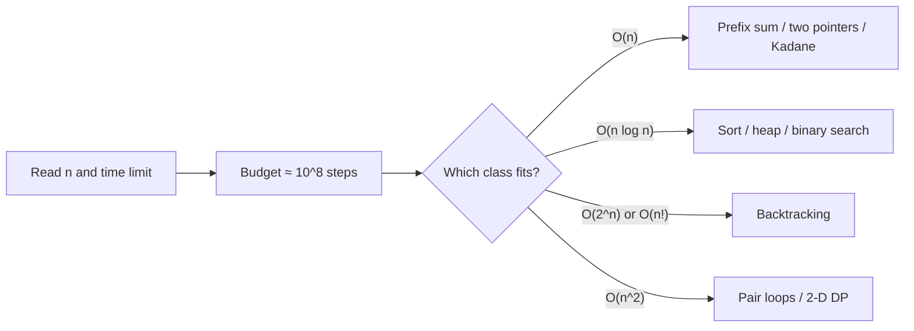

*Pick the complexity class from the constraint, then pick the pattern that achieves it.*

Four counting facts come up constantly, so keep them next to the budget:

1. `[a, b]` inclusive holds `b - a + 1` values; `(a, b)` exclusive holds `b - a - 1`.
2. An array of size `N` has `N(N+1)/2` subarrays and `N - K + 1` subarrays of size exactly `K`.
3. The sum `1 + 2 + … + N` is `N(N+1)/2` — which is why a pair loop is `O(n²)`.
4. For recursion, **time = number of calls × work per call** and **space = deepest chain of calls alive at once**. `fib(n)` makes `O(2ⁿ)` calls but only ever holds `n` frames, so its space is `O(n)`.

> **Tip**
>
> `0` and `1` are neither prime nor composite. Edge cases like these, plus `n = 1`, empty arrays and all-negative arrays, are where most "wrong answer on test 7" failures live.

#### Time complexity, loop by loop

The notes' ten growth rates, each as a loop you can recognise on sight. Count how many times the loop body runs as a function of `n`.

**Problem — Constant time — O(1)**

*What is the time complexity of a function that does the same amount of work whatever the input size?*

There is no loop that depends on `n`, so the work is a fixed number of operations: `O(1)`.

**Solution**

```python
import sys

def constant(n):
    sys.stdout.write(str(n) + " ")

# For example, if n = 10
constant(10)
```

```javascript
function constant(n) {
  process.stdout.write(n + " ");
}

// For example, if n = 10
constant(10);
```

**Problem — Double logarithm — O(log log n)**

*A loop starts at `i = 2` and squares `i` every step until it passes `n`. How many iterations?*

The exponent doubles each step (`2, 4, 16, 256…` = `2^1, 2^2, 2^4, 2^8`), so after `k` steps `i = 2^(2^k)`. It stops when `2^(2^k) ≥ n`, i.e. `k = log log n`. (Starting at `i = 1` would loop forever, since `1 × 1 = 1`.)

**Solution**

```python
import sys

def loglog(n):
    i = 2
    while i <= n:
        sys.stdout.write(str(i) + " ")
        i = i * i

# For example, if n = 128
loglog(128)
```

```javascript
function loglog(n) {
  for (let i = 2; i <= n; i = i * i) {
    process.stdout.write(i + " ");
  }
}

// For example, if n = 128, then i will take values 2, 4, 16
loglog(128);
```

**Problem — Logarithm — O(log n)**

*A loop starts at `i = 1` and doubles `i` until it passes `n`. How many iterations?*

After `k` doublings `i = 2^k`, so the loop stops when `2^k > n`, after `log₂ n` iterations. Halving instead of doubling gives the same count — that is binary search.

**Solution**

```python
import sys

def log2(n):
    # Its a Geometric progression
    i = 1
    while i <= n:
        sys.stdout.write(str(i) + " ")
        i = i * 2

# For example, if n = 128, then i will take values 1, 2, 4, 8, 16, 32, 64, 128
log2(128)
```

```javascript
function log2(n) {
  // Its a Geometric progression
  for (let i = 1; i <= n; i = i * 2) {
    process.stdout.write(i + " ");
  }
}

// For example, if n = 128, then i will take values 1, 2, 4, 8, 16, 32, 64, 128
log2(128);
```

**Problem — Square root — O(√n)**

*A loop runs while `i × i ≤ n`, incrementing `i` by one. How many iterations?*

The condition fails once `i > √n`, so the body runs `√n` times. This is the shape of factor counting and primality checks.

**Solution**

```python
import sys

def sqrt(n):
    # for i in range(1, int(math.isqrt(n)) + 1):
    i = 1
    while i * i <= n:
        sys.stdout.write(str(i * i) + " ")
        i += 1

# For example, if n = 128, then i will take values 1, 4, 9, 16, 25, 36, 49, 64, 81, 100, 121
sqrt(128)

# It can also be written as O(n^(1/2))
```

```javascript
function sqrt(n) {
  // for (let i = 1; i <= Math.sqrt(n); i++) {
  // for (let i = 1; i <= n/i; i++) {
  for (let i = 1; i * i <= n; i++) {
    process.stdout.write(i * i + " ");
  }
}

// For example, if n = 128, then i will take values 1, 4, 9, 16, 25, 36, 49, 64, 81, 100, 121
sqrt(128);

// Its can also be written as O(n^(1/2))
```

**Problem — Linear — O(n)**

*A loop visits each value from 1 to `n` once. What is its complexity?*

One iteration per value: `n` iterations of constant work, `O(n)`.

**Solution**

```python
import sys

def linear(n):
    for i in range(1, n + 1):
        sys.stdout.write(str(i) + " ")

# For example, if n = 10, then i will take values 1, 2, 3, ..., 10
linear(10)
```

```javascript
function linear(n) {
  for (let i = 1; i <= n; i++) {
    process.stdout.write(i + " ");
  }
}

// For example, if n = 10, then i will take values 1, 2, 3, ..., 10
linear(10);
```

**Problem — Linearithmic — O(n log n)**

*An outer loop runs `n` times and an inner loop doubles `j` up to `n`. What is the total?*

The inner loop is `log n` per outer iteration, so the total is `n × log n`. Good sorting algorithms land here.

**Solution**

```python
import sys

def linearithmic(n):
    for i in range(1, n + 1):
        j = 1
        while j <= n:
            sys.stdout.write(str(i) + " ")
            j = j * 2

# For example, if n = 8, then i will take values 1, 2, 3, ..., 8 and j will take values 1, 2, 4, 8
linearithmic(8)
```

```javascript
function linearithmic(n) {
  for (let i = 1; i <= n; i++) {
    for (let j = 1; j <= n; j = j * 2) {
      process.stdout.write(i + " ");
    }
  }
}

// For example, if n = 8, then i will take values 1, 2, 3, ..., 8 and j will take values 1, 2, 4, 8
linearithmic(8);
```

**Problem — Quadratic — O(n²)**

*Two nested loops each run `n` times. How many times does the inner body execute?*

`n` outer iterations × `n` inner iterations = `n²`. Pair checks and simple sorts live here.

**Solution**

```python
import sys

def quadratic(n):
    for i in range(1, n + 1):
        for j in range(1, n + 1):
            sys.stdout.write(str(i + j) + " ")

# For example, if n = 3, then i will take values 1, 2, 3 and j will take values 1, 2, 3
quadratic(3)
```

```javascript
function quadratic(n) {
  for (let i = 1; i <= n; i++) {
    for (let j = 1; j <= n; j++) {
      process.stdout.write(i + j + " ");
    }
  }
}

// For example, if n = 3, then i will take values 1, 2, 3 and j will take values 1, 2, 3
quadratic(3);

// This is equivalent to O(n * n)
```

**Problem — Cubic — O(n³)**

*Three nested loops each run `n` times. What is the complexity?*

`n × n × n = n³` executions of the innermost body — the brute-force "every subarray, summed from scratch" shape.

**Solution**

```python
import sys

def cubic(n):
    for i in range(1, n + 1):
        for j in range(1, n + 1):
            for k in range(1, n + 1):
                sys.stdout.write(str(i + j + k) + " ")

# For example, if n = 3, then i will take values 1, 2, 3
cubic(3)
```

```javascript
function cubic(n) {
  for (let i = 1; i <= n; i++) {
    for (let j = 1; j <= n; j++) {
      for (let k = 1; k <= n; k++) {
        process.stdout.write(i + j + k + " ");
      }
    }
  }
}

// For example, if n = 3, then i will take values 1, 2, 3 and j will take values 1, 2, 3 and k will take values 1, 2, 3
cubic(3);

// This is equivalent to O(n * n * n)
```

**Problem — Exponential — O(2ⁿ)**

*A loop runs from `0` to `2ⁿ - 1` (for example, one iteration per subset). What is its complexity?*

The number of iterations itself is `2ⁿ`, doubling with every extra element. It is only usable up to about `n = 20`.

**Solution**

```python
import sys

def exponential2(n):
    for i in range(2 ** n):
        sys.stdout.write(str(i) + " ")

# For example, if n = 3, then i will take values 0, 1, 2, ..., 7
exponential2(3)
```

```javascript
function exponential2(n) {
    for (let i = 0; i < 2 ** n; i++) {
        process.stdout.write(i + " ");
    }
}
// For example, if n = 3, then i will take values 0, 1, 2, ..., 7
exponential2(3);

function exponential3(n) {
    for (let i = 0; i < 3 ** n; i++) {
        process.stdout.write(i + " "); // Added a space for readability
    }
}
// For example, if n = 3, then i will take values 0, 1, 2, ..., 26
exponential3(3);
```

**Problem — Factorial — O(n!)**

*A recursive function generates every ordering (permutation) of `n` items. What is its complexity?*

There are `n` choices for the first position, `n - 1` for the second, and so on: `n!` leaves. The call stack is only `n` deep, so the space is `O(n)`.

**Solution**

```python
def factorial_complexity(n):
    if n <= 1:
        return

    # Loop runs 'n' times, each iteration making a recursive call
    for i in range(n):
        factorial_complexity(n - 1)

factorial_complexity(3)
```

```javascript
function factorialComplexityRecursive(n) {
    // Base Case: when n reaches 0, we stop
    if (n === 0) {
        // Log a message when the recursion hits the bottom level
        console.log("Leaf reached!");
        // Return to the previous caller to continue the loop or finish
        return;
    }

    // The loop runs 'n' times, creating 'n' branches of recursion
    for (let i = 0; i < n; i++) {
        // Each time the loop runs, it calls itself with (n - 1)
        // This causes the branching factor to decrease by 1 at each depth
        factorialComplexityRecursive(n - 1);
    }
}

// Execute the function with an input of 3
factorialComplexityRecursive(3);

/**
 * COMPLEXITY ANALYSIS:
 * * Time Complexity: O(n!)
 * The total number of calls follows the pattern of n * (n-1) * (n-2)...
 * For n=3, the loop runs 3 times, each calling n=2. Those call n=1,
 * which finally call n=0. This results in exactly 3 * 2 * 1 = 6 leaf executions.
 *
 * * Space Complexity: O(n)
 * This is determined by the maximum depth of the recursive call stack.
 * Since we decrement n by 1 in each call, the stack will grow to a
 * maximum height of 'n' before it starts returning.
 */
```

---

<a id="unit-1"></a>

## Unit 1 — Array Patterns That Kill the Nested Loop

Each pattern in this unit replaces a loop over *all subarrays* or *all pairs* with one pass that carries a little state forward.

<a id="1-array-subarray-basics"></a>

### Array & Subarray Basics

- **Reverse / rotate in place** `O(N)`
- **Subarrays of size N** `N(N+1)/2`
- **Print every subarray** `O(N^3)`

Two warm-ups underpin everything in this unit. **Reversal** with two indices swapping inward is the building block of in-place rotation. **Subarrays** — contiguous slices `A[i..j]` — are what almost every array problem quantifies over, and there are exactly `N(N+1)/2` of them: `N` choices of start, and for start `i`, `N - i` choices of end.

> **Analogy** 📚
>
> **Picture it — a shelf of books**
>
> Reversing the shelf means swapping the two end books and walking inward. A subarray is any run of neighbouring books you can lift out together — you choose where the run starts and where it ends.

```text
Rotate [1, 2, 3, 4, 5, 6, 7] right by k = 3:
reverse all        → [7, 6, 5, 4, 3, 2, 1]
reverse first k    → [5, 6, 7, 4, 3, 2, 1]
reverse the rest   → [5, 6, 7, 1, 2, 3, 4]
```

**From the notes — array & subarray basics problems**

| Problem | Technique | Complexity |
| --- | --- | --- |
| Reverse an array | two indices swapping inward | `O(N)`, `O(1)` space |
| Rotate an array by k | three reversals | `O(N)`, `O(1)` space |
| Print all subarrays | three nested loops | `O(N^3)` |
| Count all subarrays | two loops, or `N(N+1)/2` | `O(N^2)` / `O(1)` |

#### Problems from the notes

Each problem with a solution in Python and JavaScript.

**Problem — Reverse an array in place**

*Reverse an array (or a range `[start, end]` of it) without using another array.*

Swap `A[start]` with `A[end]`, then move both indices inward until they meet. Each element moves once: `O(n)` time, `O(1)` space.

**Solution**

```python
# Reverse the array elements from start to end
def reverse(Arr, start, end):
    i = start
    j = end
    while i < j:
        Arr[i], Arr[j] = Arr[j], Arr[i]
        i += 1
        j -= 1
    return Arr

# Reverse whole array
Arr = [1, 2, 3, 4, 5]
print("Reverse whole array: ", reverse(Arr, 0, len(Arr) - 1))  # [5, 4, 3, 2, 1]

# Reverse array from start index to end index
Arr2 = [1, 2, 3, 4, 5]
print("Reverse array from index 1 to 3: ", reverse(Arr2, 1, 3))  # [1, 4, 3, 2, 5]
```

```javascript
// Reverse the array elements from start to end
function reverse(Arr, start, end){
  let i = start;
  let j = end;
  while(i < j){
    let temp = Arr[i];
    Arr[i] = Arr[j];
    Arr[j] = temp;

    // Alternatively, you can use destructuring assignment
    // [Arr[i], Arr[j]] = [Arr[j], Arr[i]];

    i++;
    j--;
  }

  return Arr;
}

console.log(reverse([1, 2, 3, 4, 5], 0, 4)); // [ 5, 4, 3, 2, 1 ]
console.log(reverse([1, 2, 3, 4, 5], 1, 3)); // [ 1, 4, 3, 2, 5 ]

// - Two pointers move inward, each element is visited at most once.
// - Total swaps = (end - start + 1) / 2 which is O(N).

// - Swap is done in-place using a single temp variable.
```

**Problem — Rotate an array by k positions**

*Rotate an array to the right by `k` positions in place. `[1, 2, 3, 4, 5]`, `k = 2` → `[4, 5, 1, 2, 3]`.*

Reverse the whole array, then reverse the first `k` elements and the remaining `n - k` separately. Take `k % n` first so a large `k` still works.

**Solution**

```python
def rotate_array(A, B):
    # Reverse the array elements from start to end
    def reverse(Arr, start, end):
        i = start
        j = end
        while i < j:
            Arr[i], Arr[j] = Arr[j], Arr[i]
            i += 1
            j -= 1
        return Arr

    n = len(A)
    # If B is greater than n, then we can take B % n
    B = B % n

    # Reverse the whole array
    reverse(A, 0, n - 1)

    # Reverse the first B elements
    reverse(A, 0, B - 1)

    # Reverse the remaining elements
    reverse(A, B, n - 1)

    return A

print(rotate_array([1, 2, 3, 4, 5], 2))  # [4, 5, 1, 2, 3]
print(rotate_array([1, 2, 3, 4, 5], 3))  # [3, 4, 5, 1, 2]
```

```javascript
function rotateArray(A, B) {
    // Reverse the array elements from start to end
    function reverse(Arr, start, end) {
        let i = start;
        let j = end;
        while (i < j) {
            let temp = Arr[i];
            Arr[i] = Arr[j];
            Arr[j] = temp;
            i++;
            j--;
        }
    }

    // Calculate the effective rotation offset as B modulo the array length because rotating by the array's length results in the same array. Also, if B is larger than the array length, we only need to rotate by the remainder. This ensures we don't perform unnecessary rotations.
    let offset = B % A.length;

    reverse(A, 0, A.length - 1); // reverse all elements
    reverse(A, 0, offset - 1); // reverse first half. why we are using (offset - 1), because we are using 0 based index.
    reverse(A, offset, A.length - 1); // reverse second half

    return A;
}

console.log(rotateArray([1, 2, 3, 4, 5], 2)); // [ 4, 5, 1, 2, 3 ]
console.log(rotateArray([1, 2, 3, 4, 5], 8)); // [ 3, 4, 5, 1, 2 ]
console.log(rotateArray([1, 2, 3, 4, 5], 11)); // [ 5, 1, 2, 3, 4 ]

// - Three reverse calls, each traversing a portion of the array.
// - Total elements reversed = N + offset + (N - offset) = 2N, which is O(N).

// - All reversals are done in-place using swaps.
```

**Problem — Print all subarrays**

*Print every subarray of an array. `[1, 2, 3]` → `[1], [1,2], [1,2,3], [2], [2,3], [3]`.*

Choose a start `i`, choose an end `j ≥ i`, and print `A[i..j]` with a third loop. The output itself has `O(n³)` elements, so no faster algorithm exists for *printing* them.

**Solution**

```python
def print_all_subarrays(A):
    result = []
    n = len(A)
    for i in range(n):
        for j in range(i, n):
            subarray = []
            for k in range(i, j + 1):
                subarray.append(A[k])
            result.append(subarray)
    return result

print(print_all_subarrays([1, 2, 3]))
# Output: [[1], [1, 2], [1, 2, 3], [2], [2, 3], [3]]
```

```javascript
function printAllSubarrays(A) {
    const result = [];
    for (let i = 0; i < A.length; i++) {
        for (let j = i; j < A.length; j++) {
            let subarray = [];
            for (let k = i; k <= j; k++) {
                subarray.push(A[k]);
            }
            result.push(subarray);
            // console.log(subarray);
        }
    }
    return result;
}

console.log(printAllSubarrays([1, 2, 3])); // [ [ 1 ], [ 1, 2 ], [ 1, 2, 3 ], [ 2 ], [ 2, 3 ], [ 3 ] ]
console.log(printAllSubarrays([1, 2])); // [ [ 1 ], [ 1, 2 ], [ 2 ] ]

// - Three nested loops: i picks start, j picks end, k iterates from start to end.
// - Total work = sum of all subarray lengths = O(N^3).

// - Storing all N*(N+1)/2 subarrays, with total elements across all subarrays = O(N^3).
```

**Problem — Count all subarrays**

*Count the subarrays of an array of size `n`.*

Two loops over start and end count them in `O(n²)`, but the count is simply `n(n+1)/2`: `n` subarrays start at index 0, `n - 1` at index 1, and so on.

**Solution**

```python
def count_all_subarrays(A):
    count = 0
    n = len(A)
    for i in range(n):
        for j in range(i, n):
            count += 1
    return count

print(count_all_subarrays([1, 2, 3]))  # 6

def count_all_subarrays_formula(A):
    n = len(A)
    return n * (n + 1) // 2

print(count_all_subarrays_formula([1, 2, 3]))  # 6
```

```javascript
function countAllSubarrays(A) {
    let count = 0;
    for (let i = 0; i < A.length; i++) {
        for (let j = i; j < A.length; j++) {
            count++;
        }
    }
    return count;
}
console.log(countAllSubarrays([1, 2, 3])); // 6

// - Two nested loops, outer runs N times, inner runs (N - i) times.
// - Total iterations = N*(N+1)/2 which is O(N^2).

// - Only a single counter variable is used.

function countAllSubarrays(A) {
  const count = (A.length * (A.length + 1)) / 2; // formula for first n natural numbers: N(N+1)/2.
  return count;
}
```

<a id="2-contribution-technique"></a>

### The Contribution Technique

- **Brute force** `O(N^3)`
- **Carry forward** `O(N^2)`
- **Contribution** `O(N)`

"Sum of all subarray sums" tempts you to list every subarray. Flip the question instead: **how many subarrays contain element `i`?** A subarray containing `i` must start somewhere in `[0, i]` — that is `i + 1` choices — and end somewhere in `[i, n-1]` — that is `n - i` choices. Every start pairs with every end, so element `i` appears in `(i + 1) × (n - i)` subarrays and contributes `A[i] × (i + 1) × (n - i)` to the total.

> **Analogy** 📸
>
> **Picture it — counting the group photos you are in**
>
> A photographer shoots every contiguous group of people standing in a row. To count the photos *you* appear in, you do not look at the photos — you count the choices for the left edge (anyone from the first person to you) times the choices for the right edge (anyone from you to the last person).

> **Interactive animation:** `contribution-subarray` — rendered by the page script in the HTML version.

```text
A = [ 3, -2, 4, -1, 2, 6 ]      in how many subarrays is index 1 present?
      0   1  2   3  4  5

start ∈ [0, 1]  → 2 choices        end ∈ [1, 5] → 5 choices
[0,1] [0,2] [0,3] [0,4] [0,5]
[1,1] [1,2] [1,3] [1,4] [1,5]      total = 2 × 5 = 10 = (i + 1) × (n - i)
```

The revision notes solve this one problem four ways — it is the clearest picture of how the same question gets cheaper as you stop recomputing:

| Approach | Time | Space | What it stops recomputing |
| --- | --- | --- | --- |
| Brute force (three loops) | `O(N^3)` | `O(1)` | nothing — re-adds every subarray from scratch |
| Prefix sum | `O(N^2)` | `O(N)` | the inner sum, via `P[j] - P[i-1]` |
| Carry forward | `O(N^2)` | `O(1)` | the inner sum, by extending the previous one |
| Contribution | `O(N)` | `O(1)` | the subarrays themselves — counts them instead |

- **Strength — turns enumeration into arithmetic** — Whenever the answer is a sum over *many groups*, ask how many groups each element belongs to.
- **Weakness — only for additive totals** — "Maximum subarray sum" is not a sum over groups, so contribution does not help; that is Kadane's job.

**Interview question**

*Return the sum of the sums of all subarrays. For `[6, 8, -1]` the subarrays are `[6]`, `[6,8]`, `[6,8,-1]`, `[8]`, `[8,-1]`, `[-1]`, with sums `6 + 14 + 13 + 8 + 7 - 1 = 47`.*

Index 0 appears in `1 × 3 = 3` subarrays, index 1 in `2 × 2 = 4`, index 2 in `3 × 1 = 3`. So the answer is `6·3 + 8·4 + (-1)·3 = 18 + 32 - 3 = 47`, with no subarray ever built.

**Answer — sum of all subarray sums**

```python
def sum_of_all_subarrays_sums(A):
    total = 0
    N = len(A)
    for i in range(N):
        # A[i] sits in (i + 1) * (N - i) subarrays
        total += (i + 1) * (N - i) * A[i]
    return total


print(sum_of_all_subarrays_sums([6, 8, -1]))  # 47
print(sum_of_all_subarrays_sums([1, 2, 3]))   # 20
```

```javascript
function sumOfAllSubarraysSums(A) {
  let sum = 0;
  const N = A.length;
  for (let i = 0; i < N; i++) {
    // index i is present in (i + 1) * (N - i) subarrays
    const subarrayCount = (i + 1) * (N - i);
    sum += A[i] * subarrayCount;
  }
  return sum;
}

console.log(sumOfAllSubarraysSums([6, 8, -1])); // 47
console.log(sumOfAllSubarraysSums([1, 2, 3]));  // 20
```

<a id="contribution-in-2d"></a>

#### The same idea in two dimensions

A submatrix is fixed by two corners: a **top-left** and a **bottom-right**. For a submatrix to contain cell `(i, j)`, its top-left corner must lie in rows `0..i` and columns `0..j` — that is `(i + 1) × (j + 1)` choices — and its bottom-right corner must lie in rows `i..n-1` and columns `j..m-1` — `(n - i) × (m - j)` choices.

```text
frequency(i, j) = [(i + 1) × (j + 1)]  ×  [(n - i) × (m - j)]
                   top-left choices        bottom-right choices

In a 4 × 5 matrix, cell (1, 2):  TL = 2 × 3 = 6,  BR = 3 × 3 = 9,  6 × 9 = 54 submatrices
In an 8 × 10 matrix, cell (3, 4): TL = 4 × 5 = 20, BR = 5 × 6 = 30, 20 × 30 = 600
```

> **Interactive animation:** `contribution-matrix` — rendered by the page script in the HTML version.

**Interview question**

*Given an `N × M` matrix, return the sum of all its submatrix sums. For `[[4, 9, 6], [5, -1, 2]]` the answer is `166`.*

The 2 × 3 grid has 18 submatrices; listing them works but does not scale. The corner count gives each cell's frequency directly: the corners `4, 6, 5, 2` appear in 6 submatrices each and the middle column `9, -1` in 8 each, so the total is `24 + 72 + 36 + 30 - 8 + 12 = 166`.

**Answer — sum of all submatrix sums**

```python
def sum_of_all_submatrices_sums(matrix):
    n = len(matrix)
    m = len(matrix[0])
    total_sum = 0

    for i in range(n):
        for j in range(m):
            top_left_choices = (i + 1) * (j + 1)
            bottom_right_choices = (n - i) * (m - j)
            occurrences = top_left_choices * bottom_right_choices
            total_sum += matrix[i][j] * occurrences

    return total_sum


print(sum_of_all_submatrices_sums([[4, 9, 6], [5, -1, 2]]))  # 166
print(sum_of_all_submatrices_sums([[1, 2], [3, 4]]))         # 40
```

```javascript
function sumOfSubmatricesSums(matrix) {
  const rows = matrix.length;
  const cols = matrix[0].length;
  let sum = 0;

  for (let i = 0; i < rows; i++) {
    for (let j = 0; j < cols; j++) {
      const topLeft = (i + 1) * (j + 1);
      const bottomRight = (rows - i) * (cols - j);
      sum += topLeft * bottomRight * matrix[i][j];
    }
  }
  return sum;
}

console.log(sumOfSubmatricesSums([[4, 9, 6], [5, -1, 2]])); // 166
console.log(sumOfSubmatricesSums([[1, 2], [3, 4]]));        // 40
```

> **Warning**
>
> The frequencies grow like `n²m²/4`. In Java or C++ the product overflows a 32-bit `int` long before the loops get slow — the notes' Java version stores every factor in a `long`. Python integers never overflow, and JavaScript numbers are exact up to `2^53`.

**From the notes — contribution problems**

| Problem | Idea | Complexity |
| --- | --- | --- |
| Sum of all subarray sums | `A[i] × (i+1) × (n-i)` | `O(N)` |
| Sum of all submatrix sums | top-left choices × bottom-right choices | `O(N·M)` |
| Minimize the cost to empty an array | sort descending; `A[i]` is paid `i + 1` times | `O(N log N)` |
| Subarrays with OR 1 | count the complement — all-zero runs — instead (§16) | `O(N)` |

#### More problems from the notes

Every remaining problem from the revision notes for this topic, each with a solution in Python and JavaScript.

**Problem — Minimise the cost to empty an array**

*Removing an element costs the sum of all elements still in the array, including itself. Remove every element in the order that minimises the total cost.*

If elements are removed largest first, the element at sorted position `i` is paid for in `i + 1` removals. Sort descending and add `A[i] × (i + 1)` — contribution counting after a sort. `O(n log n)`.

**Solution**

```python
def min_cost_to_empty_array(arr):
    arr.sort(reverse=True)  # Descending order
    n = len(arr)
    cost = 0
    for i in range(n):
        contribution = arr[i] * (i + 1)
        cost += contribution
    return cost

print(min_cost_to_empty_array([2, 1, 4]))     # 11 (4*1 + 2*2 + 1*3 = 11)
print(min_cost_to_empty_array([3, 5, 1, -3]))  # 2
```

```javascript
function minCostToEmptyArray(arr) {
  arr.sort((a, b) => b - a); // Descending order
  let n = arr.length;
  let cost = 0;
  for (let i = 0; i < n; i++) {
    const contribution = arr[i] * (i + 1);
    cost += contribution;
  }
  return cost;
}

console.log(minCostToEmptyArray([3, 1, 2, 4])); // 20

// - Sorting takes O(N log N). The loop after sorting takes O(N).
// - Dominant term: O(N log N).

// - Sorting is done in-place. Only a few variables (cost, contribution) are used.
```

<a id="3-prefix-sums"></a>

### Prefix Sums

- **Build prefix** `O(N)`
- **Range query** `O(1)`
- **Q range updates** `O(N + Q)`

A prefix array remembers every running total, so any range sum becomes one subtraction instead of a loop. Run the same idea backwards and you get a **difference array**, which defers many range updates and settles them all in one sweep. Both follow one instinct: **never recompute something you had a moment ago.**

> **Analogy** 🚗
>
> **Picture it — the car's odometer**
>
> You never measure the road between two towns. You read the odometer at each town and subtract. A prefix sum array is the odometer: `P[i]` is the total distance up to index `i`, and the sum of `A[l..r]` is `P[r] - P[l-1]`.

```text
A   = [ -3,  6,  2,  4,  5,  2,  8, -9,  3,  1 ]
P   = [ -3,  3,  5,  9, 14, 16, 24, 15, 18, 19 ]      P[i] = P[i-1] + A[i]
idx      0   1   2   3   4   5   6   7   8   9

sum(A[4..8]) = P[8] - P[3] = 18 - 9 = 9            (and P[r] alone when l = 0)
```

**Prefix sum + range sum queries**

```python
def prefix_sum(A, Q):
    psa = [0] * len(A)
    psa[0] = A[0]
    for i in range(1, len(A)):
        psa[i] = psa[i - 1] + A[i]

    ans = []
    for s, e in Q:
        ans.append(psa[e] if s == 0 else psa[e] - psa[s - 1])
    return ans


print(prefix_sum([-3, 6, 2, 4, 5, 2, 8, -9, 3, 1],
                 [[4, 8], [3, 7], [1, 3], [0, 4], [7, 7]]))  # [9, 10, 12, 14, -9]
```

```javascript
function prefixSum(A, Q) {
  const psa = [A[0]];
  for (let i = 1; i < A.length; i++) {
    psa[i] = psa[i - 1] + A[i];
  }
  return Q.map(([left, right]) => (left === 0 ? psa[right] : psa[right] - psa[left - 1]));
}

console.log(prefixSum([-3, 6, 2, 4, 5, 2, 8, -9, 3, 1],
  [[4, 8], [3, 7], [1, 3], [0, 4], [7, 7]])); // [9, 10, 12, 14, -9]
```

<a id="difference-array"></a>

#### Difference arrays — prefix sums run backwards

The **Beggars Outside Temple** family flips the problem: now there are many *range updates* ("give `v` coins to every beggar from `start` to `end`") and one final read. Applying each update directly is `O(n)` per query. Instead, record only where a change **begins** and where it **stops**: `diff[start] += v` and `diff[end + 1] -= v`. A single prefix sweep over `diff` then spreads every update across its range.

> **Interactive animation:** `difference-array` — rendered by the page script in the HTML version.

**Interview question**

*Beggars sit in a row holding `arr[i]` coins. Each devotee `[start, end, value]` gives `value` coins to every beggar in `[start, end]`. Return the final coins per beggar. `arr = [1, 2, 3, 4, 5]`, queries `[[0,2,2], [1,3,3], [2,4,4]]` → `[3, 7, 12, 11, 9]`.*

Mark `+2` at 0 and `-2` at 3, `+3` at 1 and `-3` at 4, `+4` at 2 (the `-4` would land at 5, past the end, so it is dropped). The difference array is `[2, 3, 4, -2, -3]`; its running sum `[2, 5, 9, 7, 4]` is the total gift per beggar; add the starting coins and you get `[3, 7, 12, 11, 9]`. That is `O(n + q)` instead of `O(n · q)`.

**Answer — zero-based range updates (difference array)**

```python
def perform_queries(arr, queries):
    diff = [0] * (len(arr) + 1)
    for start, end, val in queries:
        diff[start] += val       # start adding val here
        diff[end + 1] -= val     # stop adding it after end

    result = [0] * len(arr)
    running_add = 0
    for i in range(len(arr)):
        running_add += diff[i]
        result[i] = arr[i] + running_add
    return result


print(perform_queries([1, 2, 3, 4, 5], [[0, 2, 2], [1, 3, 3], [2, 4, 4]]))  # [3, 7, 12, 11, 9]
```

```javascript
function performQueries(arr, queries) {
  const diffArr = new Array(arr.length).fill(0);
  for (const [start, end, val] of queries) {
    diffArr[start] += val;                                // start adding val here
    if (end + 1 < diffArr.length) diffArr[end + 1] -= val; // stop after end
  }

  const result = [];
  let running = 0;
  for (let i = 0; i < arr.length; i++) {
    running += diffArr[i];
    result.push(arr[i] + running);
  }
  return result;
}

console.log(performQueries([1, 2, 3, 4, 5], [[0, 2, 2], [1, 3, 3], [2, 4, 4]])); // [3, 7, 12, 11, 9]
```

**From the notes — prefix sum problems**

| Problem | Technique | Complexity |
| --- | --- | --- |
| Range sum query | prefix sum | `O(N + Q)` |
| In-place prefix sum | overwrite `A[i] += A[i-1]` | `O(N)`, `O(1)` space |
| Zero-based queries I, II, III (beggars) | difference array + prefix sweep | `O(N + Q)` |

#### More problems from the notes

Every remaining problem from the revision notes for this topic, each with a solution in Python and JavaScript.

**Problem — Build a prefix sum array**

*Build `P` where `P[i] = A[0] + A[1] + … + A[i]`.*

Each prefix is the previous prefix plus one element: `P[i] = P[i-1] + A[i]`. One pass, `O(n)`.

**Solution**

```python
def create_prefix_sum_array(A):
    psa = [0] * len(A)
    psa[0] = A[0]
    for i in range(1, len(A)):
        psa[i] = psa[i - 1] + A[i]
    return psa

print(create_prefix_sum_array([1, 2, 3, 4, 5]))  # [1, 3, 6, 10, 15]
```

```javascript
function createPrefixSumArray(A) {
    const psa = [];
    psa[0] = A[0];
    for (let i = 1; i < A.length; i++) {
        psa[i] = psa[i - 1] + A[i];
    }
    return psa;
}

console.log(createPrefixSumArray([2, 3, 1, 6, 4, 5])); // [2, 5, 6, 12, 16, 21]
```

**Problem — In-place prefix sum**

*Turn an array into its own prefix sum array without extra memory.*

Overwrite as you go: `A[i] += A[i-1]` for `i` from 1. `A[i-1]` already holds its prefix, so `O(n)` time and `O(1)` space.

**Solution**

```python
def in_place_prefix_sum(A):
    for i in range(1, len(A)):
        A[i] = A[i] + A[i - 1]
    return A

print("inPlacePrefixSum", in_place_prefix_sum([1, 2, 3, 4, 5]))  # [1, 3, 6, 10, 15]
```

```javascript
function inPlacePrefixSum(A) {
    for (let i = 1; i < A.length; i++) {
        A[i] = A[i] + A[i - 1];
    }
    return A;
}

console.log("inPlacePrefixSum", inPlacePrefixSum([1, 2, 3, 4, 5])); // [1, 3, 6, 10, 15]
console.log("inPlacePrefixSum", inPlacePrefixSum([1, 2, 3, 4, 5, 6])); // [1, 3, 6, 10, 15, 21]
```

**Problem — Zero-based queries I — add from an index to the end**

*Beggars start with 0 coins. Each query `[start, value]` gives `value` coins to every beggar from `start` to the last one. Return the final coins.*

Record `diff[start] += value` only; the running prefix sum carries each gift to the end of the array. `O(n + q)`.

**Solution**

```python
def perform_queries(arr, queries):
    for start, val in queries:
        arr[start] += val

    # Prefix sum to carry forward values to the end
    for i in range(1, len(arr)):
        arr[i] += arr[i - 1]

    return arr

queries1 = [[1, 3], [0, 2], [4, 1], [0, -3]]
print(perform_queries([0, 0, 0, 0, 0], queries1))  # [-1, 2, 2, 2, 3]

queries2 = [[1, 2], [0, 3], [4, 5], [0, -6]]
print(perform_queries([0, 0, 0, 0, 0], queries2))  # [-3, -1, -1, -1, 4]
```

```javascript
function performQueries(arr, queries) {
  for (let i = 0; i < queries.length; i++) {
    let [start, val] = queries[i];
    // Record val at start; it should affect start through the last index.
    arr[start] += val;
  }
  console.log(arr);
  // Combined changes starting at each index for first example : [-1, 3, 0, 0, 1]
  // Combined changes starting at each index for second example : [-3, 2, 0, 0, 5]

  let prefixSum = [];
  prefixSum[0] = arr[0];
  for (let i = 1; i < arr.length; i++) {
    prefixSum[i] = prefixSum[i - 1] + arr[i];
  }

  return prefixSum; // Final array after applying all queries.
}
let queries = [[1, 3], [0, 2], [4, 1], [0, -3]];
console.log(performQueries([0, 0, 0, 0, 0], queries)); // [-1, 2, 2, 2, 3]
let queries2 = [[1, 2], [0, 3], [4, 5], [0, -6]];
console.log(performQueries([0, 0, 0, 0, 0], queries2)); // [-3, -1, -1, -1, 4]
```

**Problem — Zero-based queries II — add over a range**

*Beggars start with 0 coins. Each query `[start, end, value]` gives `value` coins to every beggar in `[start, end]`. Return the final coins.*

Mark `+value` at `start` and `-value` at `end + 1`, then take one prefix sum over the markers. `O(n + q)`.

**Solution**

```python
def perform_queries(arr, queries):
    n = len(arr)

    for start, end, val in queries:
        arr[start] += val
        if end + 1 < n:
            arr[end + 1] -= val

    # Convert recorded changes into final prefix sums
    prefix_sum = [0] * n
    prefix_sum[0] = arr[0]
    for i in range(1, n):
        prefix_sum[i] = prefix_sum[i - 1] + arr[i]

    return prefix_sum

queries = [[1, 3, 2], [5, 6, -1], [2, 5, 5], [0, 1, 4]]
print(perform_queries([0, 0, 0, 0, 0, 0, 0], queries))  # [4, 6, 7, 7, 5, 4, -1]
```

```javascript
function performQueries(arr, queries) {
    const n = arr.length;

    for (let i = 0; i < queries.length; i++) {
        let [start, end, val] = queries[i];
        arr[start] += val; // Start adding val from this index.
        if (end + 1 < n) { // Stop adding val after the end index.
            arr[end + 1] -= val;
        }
        console.log(arr);
    }

    // Convert the recorded changes into each beggar's final earnings.
    let prefixSum = [];
    prefixSum[0] = arr[0];
    for (let i = 1; i < n; i++) {
        prefixSum[i] = prefixSum[i - 1] + arr[i];
    }

    return prefixSum;
}
let queries = [[1, 3, 2], [5, 6, -1], [2, 5, 5], [0, 1, 4]];
console.log(performQueries([0, 0, 0, 0, 0, 0, 0], queries)); // [4, 6, 7, 7, 5, 4, -1]
```

<a id="4-carry-forward"></a>

### Carry Forward

- **Time** `O(N)`
- **Extra space** `O(1)`

Carry forward is the lightest cousin of a prefix sum: instead of a whole array, carry **one number** from left to right — a count, a running sum, a last-seen index — and update it as each element passes.

> **Analogy** 🔢
>
> **Picture it — a doorman's tally counter**
>
> The doorman does not re-count the room every time someone asks how many guests are inside. One click per arrival, and the answer is always in hand.

To count pairs `(i, j)` with `i < j`, `A[i] = 'a'` and `A[j] = 'g'`, you do not need to look back for every `g` — just remember how many `a`s you have passed.

**Interview question**

*Count the pairs `(i, j)` with `i < j`, `A[i] = 'a'` and `A[j] = 'g'`. `['b','a','a','g','d','c','a','g']` → `5`.*

The first `g` sees two `a`s behind it; the second `g` sees three. `2 + 3 = 5`. One pass, `O(1)` memory — the brute-force pair loop was `O(n²)`.

**Answer — count "ag" pairs with carry forward**

```python
def count_of_pairs(A):
    pair_count = 0
    a_count = 0
    for ch in A:
        if ch == 'a':
            a_count += 1
        elif ch == 'g':
            pair_count += a_count   # every 'a' seen so far pairs with this 'g'
    return pair_count


print(count_of_pairs(['b', 'a', 'a', 'g', 'd', 'c', 'a', 'g']))  # 5
```

```javascript
function countOfPairs(A) {
  let pairCount = 0;
  let aCount = 0;
  for (const ch of A) {
    if (ch === 'a') aCount++;
    else if (ch === 'g') pairCount += aCount; // every 'a' seen so far pairs with this 'g'
  }
  return pairCount;
}

console.log(countOfPairs(['b', 'a', 'a', 'g', 'd', 'c', 'a', 'g'])); // 5
```

**From the notes — carry-forward problems**

| Problem | What is carried | Complexity |
| --- | --- | --- |
| Count "ag" pairs | number of `a`s seen so far | `O(N)` |
| Smallest subarray containing min and max | last-seen index of each | `O(N)` |
| Subarray sums starting at an index; sum of all subarray sums | the running sum | `O(N)` / `O(N^2)` |

#### More problems from the notes

Every remaining problem from the revision notes for this topic, each with a solution in Python and JavaScript.

**Problem — Subarray sums starting at a given index**

*Print the sum of every subarray that starts at index `s`.*

Carry the running sum: extend by one element and print, instead of re-adding the whole subarray. `O(n)`.

**Solution**

```python
def print_subarrays_sums_from_index(A, start_index):
    subarray_sum = 0
    total_sum = 0
    for j in range(start_index, len(A)):
        # we are carrying forward the subarraySum to the next iteration
        subarray_sum += A[j]
        print(f"Sum of subarray from {start_index} to {j} is {subarray_sum}")
        total_sum += subarray_sum
    return total_sum

print("Total sum: " + str(print_subarrays_sums_from_index([1, 2, 3], 0)))
```

```javascript
function printSubarraysSumsFromIndex(A, startIndex) {
    let subarraySum = 0;
    let totalSum = 0;
    for (let j = startIndex; j < A.length; j++) {
        // we are carrying forward the subarraySum of subarray starting from startIndex to end of array
        subarraySum += A[j];
        process.stdout.write(subarraySum + ", "); // Print subarraySum of current subarray
        totalSum += subarraySum; // Keep track of total sum of all subarrays
    }
    process.stdout.write(`(Total: ${totalSum}) `); // Print total sum so far
    console.log(); // New line after printing the subarray
}

printSubarraysSumsFromIndex([1, 2, 3, 4], 1); // [2] [2, 3] [2, 3, 4] // 2, 5, 9, (Total: 16)
printSubarraysSumsFromIndex([1, 2, 3, 4], 2); // [3] [3, 4] // 3, 7, (Total: 10)
printSubarraysSumsFromIndex([1, 2, 3, 4], 0); // [1] [1, 2] [1, 2, 3] [1, 2, 3, 4] // 1, 3, 6, 10, (Total: 20)

// - Single loop from startIndex to end of array, visiting each element once.

// - Only uses two variables (subarraySum, totalSum) regardless of input size.
```

**Problem — Sum of all subarray sums — carry forward**

*Return the total of all subarray sums using carry forward.*

For each start, extend the end one step at a time, adding the new element to a running sum and the running sum to the total. `O(n²)` time, `O(1)` space — the stepping stone between brute force and contribution.

**Solution**

```python
def sum_of_all_subarrays(A):
    total_sum = 0
    n = len(A)
    for i in range(n):
        subarray_sum = 0
        # Calculate sum of subarray starting from i to end of array
        for j in range(i, n):
            # Carry forward the sum of subarray from i to j-1
            subarray_sum += A[j]
            total_sum += subarray_sum
    return total_sum

print(sum_of_all_subarrays([1, 2, 3]))  # 20
print(sum_of_all_subarrays([2, 1, 3]))  # 19
```

```javascript
function sumOfAllSubarrays(A) {
  let totalSum = 0;
  for (let i = 0; i < A.length; i++) {
    let subarraySum = 0;
    // Calculate sum of subarray starting from i to end of array
    for (let j = i; j < A.length; j++) {
      subarraySum += A[j];
      totalSum += subarraySum;
    }
  }
  return totalSum;
}

console.log(sumOfAllSubarrays([1, 2, 3])); // [1] [1, 2] [1, 2, 3], [2] [2, 3], [3] // 1, 3, 6, 2, 5, 3 (Total: 20)
console.log(sumOfAllSubarrays([1, 2, 3, 4])); // [1] [1, 2] [1, 2, 3] [1, 2, 3, 4], [2] [2, 3] [2, 3, 4], [3] [3, 4], [4] // 1, 3, 6, 10, 2, 5, 9, 3, 7, 4 (Total: 50)

// - Outer loop runs N times, inner loop runs (N - i) times for each i.
// - Carry forward avoids the third loop by reusing the running sum.

// - Only uses a few variables (totalSum, subarraySum).
```

**Problem — Smallest subarray containing both the minimum and maximum**

*Return the length of the shortest subarray that contains both the array's minimum and its maximum.*

Scan once, carrying the last index where the minimum and the maximum were seen. Each time you meet one of them, the distance to the last-seen other one is a candidate length. `O(n)`.

**Solution**

```python
# Optimised solution using carry forward technique
def smallest_subarray_containing_min_max(A):
    # Find the minimum and maximum elements of the array
    min_element = min(A)
    max_element = max(A)

    # If min and max are the same, the smallest subarray is of length 1
    if min_element == max_element:
        return 1

    last_min_index = -1
    last_max_index = -1
    min_length = len(A)

    # Iterate through the array to find the smallest subarray
    for i, val in enumerate(A):
        if val == min_element:
            last_min_index = i
            # If we have already seen a max element, calculate length
            if last_max_index != -1:
                min_length = min(min_length, i - last_max_index + 1)
        elif val == max_element:
            last_max_index = i
            # If we have already seen a min element, calculate length
            if last_min_index != -1:
                min_length = min(min_length, i - last_min_index + 1)

    return min_length

print(smallest_subarray_containing_min_max([1, 2, 3, 1, 3, 4, 6, 4, 6, 3]))  # 4
print(smallest_subarray_containing_min_max([2, 2, 2, 2]))  # 1
```

```javascript
// Optimised solution using carry forward technique
function smallestSubarrayContainingMinMax(A) {
  // Find the minimum and maximum elements of the array
  let minElement = Math.min(...A);
  let maxElement = Math.max(...A);

  if (minElement == maxElement) {
    return 1;
  }

  let length = A.length;
  let minIndex = -1;
  let maxIndex = -1;

  // Iterate from right to left and find the length of the smallest subarray containing both the minimum and maximum elements
  for (let i = A.length - 1; i >= 0; i--) {
    if(A[i] == minElement) {
      minIndex = i;
      if (maxIndex != -1) {
        // length = Math.min(length, maxIndex - minIndex + 1); since we are iterating from right to left, maxIndex will always be greater than minIndex
        length = Math.min(length, Math.abs(maxIndex - minIndex) + 1);
      }
    }

    if(A[i] == maxElement) {
      maxIndex = i;
      if (minIndex != -1) {
        // length = Math.min(length, minIndex - maxIndex + 1); since we are iterating from right to left, minIndex will always be greater than maxIndex
        length = Math.min(length, Math.abs(maxIndex - minIndex) + 1);
      }
    }
  }

  return length;
}

console.log("smallestSubarrayContainingMinMax", smallestSubarrayContainingMinMax([1, 2, 3, 1, 3, 4, 6, 4, 6, 3])); // 4
console.log("smallestSubarrayContainingMinMax", smallestSubarrayContainingMinMax([2, 2, 6, 4, 5, 1, 5, 2, 6, 4, 1])); // 3

// - Only a fixed number of variables (minElement, maxElement, minIndex, maxIndex, length).
```

<a id="5-multiple-approaches-sum-of-all-subarray-sums"></a>

### Multiple Approaches: Sum of All Subarray Sums

- **Brute force** `O(N^3)`
- **Prefix sum** `O(N^2)`
- **Carry forward** `O(N^2)`
- **Contribution** `O(N)`

The notes solve one problem with four techniques from this unit. Walking through them in order shows exactly which recomputation each technique removes.

| Approach | Time | Space | Idea |
| --- | --- | --- | --- |
| Brute force | `O(N^3)` | `O(1)` | sum every subarray from scratch |
| Prefix sum | `O(N^2)` | `O(N)` | each subarray sum is `P[j] - P[i-1]` |
| Carry forward | `O(N^2)` | `O(1)` | extend the previous subarray by one element |
| Contribution | `O(N)` | `O(1)` | `A[i]` appears in `(i+1)(n-i)` subarrays |

Three loops: choose the start, choose the end, add the elements in between.

**Approach 1 — Brute force**

```python
def sum_all_subarrays_brute(arr):
    n = len(arr)
    total = 0
    for i in range(n):
        for j in range(i, n):
            for k in range(i, j + 1):
                total += arr[k]
    return total


print(sum_all_subarrays_brute([1, 2, 3]))  # 20
```

```javascript
function sumOfAllSubarrays(A) {
  let sum = 0;
  for (let i = 0; i < A.length; i++) {
    for (let j = i; j < A.length; j++) {
      for (let k = i; k <= j; k++) {
        sum += A[k];
      }
    }
  }
  return sum;
}

console.log(sumOfAllSubarrays([1, 2, 3])); // 20
console.log(sumOfAllSubarrays([1, 2, 3, 4])); // 50
```

Precompute prefix sums so the innermost loop becomes one subtraction.

**Approach 2 — Prefix sum**

```python
def sum_all_subarrays_prefix(arr):
    n = len(arr)
    prefix = [0] * n
    prefix[0] = arr[0]
    for i in range(1, n):
        prefix[i] = prefix[i - 1] + arr[i]
    total = 0
    for i in range(n):
        for j in range(i, n):
            total += prefix[j] - (prefix[i - 1] if i > 0 else 0)
    return total


print(sum_all_subarrays_prefix([1, 2, 3]))  # 20
```

```javascript
function sumOfAllSubarrays(A) {
    // Calculate prefix sum
    let prefixSum = [];
    prefixSum[0] = A[0];
    for (let i = 1; i < A.length; i++) {
        prefixSum[i] = prefixSum[i - 1] + A[i];
    }
    console.log(prefixSum);

    let sum = 0;
    for (let i = 0; i < A.length; i++) {
        for (let j = i; j < A.length; j++) {
            if (i === 0) {
                sum += prefixSum[j];
            } else {
                sum += prefixSum[j] - prefixSum[i - 1];
            }
        }
    }

    return sum;
}

console.log(sumOfAllSubarrays([1, 2, 3])); // 20
console.log(sumOfAllSubarrays([1, 2, 3, 4])); // 50
```

For each start, keep a running sum while the end moves right — no prefix array needed.

**Approach 3 — Carry forward**

```python
def sum_all_subarrays_carry(arr):
    total = 0
    for i in range(len(arr)):
        running = 0
        for j in range(i, len(arr)):
            running += arr[j]          # sum of arr[i..j], extended by one element
            total += running
    return total


print(sum_all_subarrays_carry([1, 2, 3]))  # 20
```

```javascript
function sumOfAllSubarrays(A) {
  let sum = 0;
  for (let i = 0; i < A.length; i++) {
    let subarraySum = 0;
    // Calculate sum of subarray starting from i to end of array
    for (let j = i; j < A.length; j++) {
      subarraySum += A[j];
      sum += subarraySum;
    }
  }

  return sum;
}

console.log(sumOfAllSubarrays([1, 2, 3])); // 20
console.log(sumOfAllSubarrays([1, 2, 3, 4])); // 50
```

Stop enumerating subarrays altogether: each element is added once per subarray containing it.

**Approach 4 — Contribution**

```python
def sum_all_subarrays_contribution(arr):
    n = len(arr)
    return sum(arr[i] * (i + 1) * (n - i) for i in range(n))


print(sum_all_subarrays_contribution([1, 2, 3]))  # 20
```

```javascript
function sumOfAllSubarrays(A) {
  let sum = 0;
  const N = A.length;
  for (let i = 0; i < N; i++) {
    // For each element A[i], it contributes to (i + 1) * (N - i) subarrays
    // In other words index i will be present in (i + 1) * (N - i) subarrays
    const subarrayCount = (i + 1) * (N - i);

    // Contribution of A[i] is A[i] * subarrayCount
    const contribution = A[i] * subarrayCount;

    // Add contribution of A[i] to the total sum
    sum += contribution;
  }
  return sum;
}

console.log(sumOfAllSubarrays([1, 2, 3])); // 20
console.log(sumOfAllSubarrays([1, 2, 3, 4])); // 50
```

<a id="6-sliding-window"></a>

### Sliding Window

- **Slide one step** `O(1)`
- **Whole pass** `O(N)`
- **Extra space** `O(1)`

> **Analogy** 🚆
>
> **Picture it — the view from a train window**
>
> As the train moves, one tree leaves the frame on the left and one enters on the right. You never re-look at the whole landscape — you only notice what changed at the edges.

A **fixed** window of size `K` slides one step at a time: subtract the element that leaves, add the element that enters. A **dynamic** window grows its right edge every step and shrinks its left edge only while the window breaks the rule. Both touch each element at most twice, so both are `O(n)`.

> **Interactive animation:** `sliding-window` — rendered by the page script in the HTML version.

**Fixed window — maximum sum of any K consecutive values**

```python
def max_subarray_sum(A, K):
    window = sum(A[:K])
    best = window
    for end in range(K, len(A)):
        window += A[end] - A[end - K]   # one enters, one leaves
        best = max(best, window)
    return best


print(max_subarray_sum([-3, 4, -2, 5, 3, -2, 8, 2, -1, 4], 5))  # 16
```

```javascript
function maxSubarraySum(A, K) {
  let window = 0;
  for (let i = 0; i < K; i++) window += A[i];
  let best = window;
  for (let end = K; end < A.length; end++) {
    window += A[end] - A[end - K]; // one enters, one leaves
    best = Math.max(best, window);
  }
  return best;
}

console.log(maxSubarraySum([-3, 4, -2, 5, 3, -2, 8, 2, -1, 4], 5)); // 16
```

> **Interactive animation:** `window-count` — rendered by the page script in the HTML version.

**Interview question**

*With only positive numbers, count the subarrays whose sum is strictly less than `K`. `[2, 5, 6]`, `K = 10` → `4` (`[2]`, `[5]`, `[2,5]`, `[6]`).*

Grow the window one element at a time. While its sum is `≥ K`, shrink it from the left. Now every subarray that **ends** at `end` and starts anywhere in `[start, end]` is valid — that is `end - start + 1` new subarrays in one step. Shrinking is safe only because the numbers are positive: removing an element always lowers the sum.

**Answer — count subarrays with sum < K (dynamic window)**

```python
def count_subarrays_with_sum(arr, target_sum):
    count = 0
    current_sum = 0
    start = 0
    for end in range(len(arr)):
        current_sum += arr[end]
        while current_sum >= target_sum and start <= end:
            current_sum -= arr[start]
            start += 1
        count += end - start + 1   # all windows ending at `end`
    return count


print(count_subarrays_with_sum([2, 5, 6], 10))         # 4
print(count_subarrays_with_sum([1, 11, 2, 3, 15], 10))  # 4
```

```javascript
function countSubarraysWithSum(arr, targetSum) {
  let count = 0;
  let currentSum = 0;
  let start = 0;
  for (let end = 0; end < arr.length; end++) {
    currentSum += arr[end];
    while (currentSum >= targetSum && start <= end) {
      currentSum -= arr[start];
      start++;
    }
    count += end - start + 1; // all windows ending at `end`
  }
  return count;
}

console.log(countSubarraysWithSum([2, 5, 6], 10));         // 4
console.log(countSubarraysWithSum([1, 11, 2, 3, 15], 10)); // 4
```

> **Warning**
>
> A dynamic window only works when shrinking always moves the sum in one direction — i.e. **non-negative values**. With negatives, "sum too big, shrink" is no longer safe. The notes switch tools there: prefix sums plus a hash map for exact sums (§22), or a balanced BST for "largest sum ≤ K".

**From the notes — sliding window problems**

| Problem | Window | Complexity |
| --- | --- | --- |
| Count subarrays of length K | fixed | `O(N)` |
| Max sum / given sum with length K | fixed | `O(N)` |
| Max subarray sum ≤ K (positive) | dynamic, track best | `O(N)` |
| Count subarrays with sum < K (positive) | dynamic, add `end - start + 1` | `O(N)` |

#### More problems from the notes

Every remaining problem from the revision notes for this topic, each with a solution in Python and JavaScript.

**Problem — Count subarrays of length K**

*Count (or list) all subarrays of length exactly `K`.*

A window of size `K` slides from start `0` to start `n - K`, so there are `n - K + 1` of them. The notes walk it with `start`/`end` pointers.

**Solution**

```python
def count_subarrays_of_length_k(A, K):
    count = 0
    start = 0
    end = K - 1

    while end < len(A):
        print(f"Start index: {start}, End index: {end}")
        count += 1
        start += 1
        end += 1

    return count

print(count_subarrays_of_length_k([1, 2, 3, 4, 5], 3))  # 3
```

```javascript
function countSubarraysOfLengthK(A, K) {
  let count = 0;
  let start = 0;
  let end = K - 1;

  while (end < A.length) {
    console.log(`Start index: ${start}, End index: ${end}`);
    count++;
    start++;
    end++;
  }

  return count;
}

console.log(countSubarraysOfLengthK([1, 2, 3, 4, 5], 3)); // 3

// - The window slides from start to end, visiting each position once.
// - Total iterations = N - K + 1, which is O(N).

// - Only uses a few variables (count, start, end).

// Alternatively, we can use the formula: Number of subarrays of length K = N - K + 1, where N is the length of the array.
```

**Problem — Subarray with a given sum and length K**

*Does any subarray of length `K` sum to exactly `target`?*

Slide a fixed window, updating the sum by one element in and one out, and compare each window sum with the target. `O(n)`.

**Solution**

```python
def subarray_with_given_sum(arr, subarray_length, target_sum):
    n = len(arr)
    if subarray_length > n:
        return 0

    current_window_sum = 0
    for i in range(subarray_length):
        current_window_sum += arr[i]

    if current_window_sum == target_sum:
        return 1

    start = 1
    end = subarray_length
    while end < n:
        current_window_sum = current_window_sum - arr[start - 1] + arr[end]
        if current_window_sum == target_sum:
            return 1
        start += 1
        end += 1

    return 0

print(subarray_with_given_sum([4, 2, 2, 5, 1], 3, 8))   # 1
print(subarray_with_given_sum([4, 2, 2, 5, 1], 3, 100)) # 0
```

```javascript
function subarrayWithGivenSum(arr, subarrayLength, targetSum) {
  let n = arr.length;
  if (subarrayLength > n) {
    return 0; // If subarrayLength is greater than array size, no valid subarray exists
  }

  // Step 1: Calculate the sum of the first window
  let currentSum = 0;
  for (let i = 0; i < subarrayLength; i++) {
    currentSum += Number(arr[i]);
  }

  // Step 2: Check if the first window matches the sum
  if (currentSum == targetSum) {
    return 1;
  }

  // Step 3: Slide the window
  let start = 0;
  let end = subarrayLength;
  while (end < arr.length) {
    // Add next element, remove first element of the previous window
    currentSum = currentSum - Number(arr[start]) + Number(arr[end]);
    if (currentSum == targetSum) {
      return 1;
    }
    start++;
    end++;
  }

  // Step 4: If no valid window is found, return 0
  return 0;
}

console.log(subarrayWithGivenSum([4, 3, 2, 6, 1], 3, 11)); // 1

// - Only uses a few variables (currentSum, start, end).
```

**Problem — Minimum window substring**

*Given strings `s` and `t`, return the shortest substring of `s` that contains every character of `t` (with multiplicity). `s = "ADOBECODEBANC"`, `t = "ABC"` → `"BANC"`.*

Count what `t` needs in a frequency map. Grow the right edge; when the window covers every needed character (`missing == 0`), shrink from the left as far as it stays valid, recording the best window. Each index enters and leaves once: `O(|s| + |t|)`. The notes list this twice (frequency maps / frequency counts); it is one problem.

**Solution**

```python
from collections import Counter


def min_window(s, t):
    need = Counter(t)
    missing = len(t)                      # characters of t still uncovered
    best = (0, float("inf"))
    left = 0
    for right, ch in enumerate(s):
        if need[ch] > 0:
            missing -= 1
        need[ch] -= 1
        while missing == 0:               # window covers t: try to shrink it
            if right - left < best[1] - best[0]:
                best = (left, right)
            need[s[left]] += 1
            if need[s[left]] > 0:
                missing += 1
            left += 1
    return "" if best[1] == float("inf") else s[best[0]:best[1] + 1]


print(min_window("ADOBECODEBANC", "ABC"))  # BANC
print(min_window("a", "aa"))               # (empty string)
```

```javascript
function minWindow(s, t) {
  const need = new Map();
  for (const ch of t) need.set(ch, (need.get(ch) || 0) + 1);
  let missing = t.length;               // characters of t still uncovered
  let best = [0, Infinity];
  let left = 0;
  for (let right = 0; right < s.length; right++) {
    const ch = s[right];
    if ((need.get(ch) || 0) > 0) missing--;
    need.set(ch, (need.get(ch) || 0) - 1);
    while (missing === 0) {             // window covers t: try to shrink it
      if (right - left < best[1] - best[0]) best = [left, right];
      need.set(s[left], need.get(s[left]) + 1);
      if (need.get(s[left]) > 0) missing++;
      left++;
    }
  }
  return best[1] === Infinity ? "" : s.slice(best[0], best[1] + 1);
}

console.log(minWindow("ADOBECODEBANC", "ABC")); // BANC
console.log(minWindow("a", "aa"));              // (empty string)
```

<a id="7-multiple-approaches-maximum-subarray-sum-of-length-k"></a>

### Multiple Approaches: Maximum Subarray Sum of Length K

- **Brute force** `O(N·K)`
- **Prefix sum** `O(N)`
- **Sliding window** `O(N)`

The same question — the largest sum of any `K` consecutive values — solved three ways. It is the clearest demonstration of why sliding windows exist.

| Approach | Time | Space | Idea |
| --- | --- | --- | --- |
| Brute force | `O(N·K)` | `O(1)` | re-add all K values for every start |
| Prefix sum | `O(N)` | `O(N)` | each window is `P[end] - P[start-1]` |
| Sliding window | `O(N)` | `O(1)` | one value in, one value out |

For every start index, add the next `K` values from scratch. Simple and obviously correct, but every value is re-added up to `K` times.

**Approach 1 — Brute force**

```python
def max_subarray_sum_brute(arr, k):
    max_sum = float("-inf")
    for i in range(len(arr) - k + 1):
        window_sum = 0
        for j in range(i, i + k):
            window_sum += arr[j]
        max_sum = max(max_sum, window_sum)
    return max_sum


print(max_subarray_sum_brute([-3, 4, -2, 5, 3, -2, 8, 2, -1, 4], 5))  # 16
```

```javascript
function maxSubarraySum(A, K) {
    let start = 0;
    let end = K - 1;
    let maxSum = 0;

    while (end < A.length) {
        let currentSubarraySum = 0;

        for (let i = start; i <= end; i++) {
            currentSubarraySum += A[i];
        }

        maxSum = Math.max(maxSum, currentSubarraySum);

        start++;
        end++;
    }

    return maxSum;
}

console.log(maxSubarraySum([1, 2, 3, 4, 5], 3)); // 12
```

Build the prefix array once; then every window sum is a single subtraction. Linear time, but it spends `O(N)` memory on the prefix array.

**Approach 2 — Prefix sum**

```python
def max_subarray_sum_prefix(arr, k):
    prefix = [0] * len(arr)
    prefix[0] = arr[0]
    for i in range(1, len(arr)):
        prefix[i] = prefix[i - 1] + arr[i]
    max_sum = prefix[k - 1]
    for end in range(k, len(arr)):
        max_sum = max(max_sum, prefix[end] - prefix[end - k])
    return max_sum


print(max_subarray_sum_prefix([-3, 4, -2, 5, 3, -2, 8, 2, -1, 4], 5))  # 16
```

```javascript
function maxSubarraySum(A, K) {
    let prefixSum = [A[0]];
    for (let i = 1; i < A.length; i++) {
        prefixSum[i] = prefixSum[i - 1] + A[i];
    }

    // prefixSum = [1, 3, 6, 10, 15] for A = [1, 2, 3, 4, 5]

    let start = 0;
    let end = K - 1;
    let maxSum = 0
    while (end < A.length) {
        let sum;
        if (start === 0) {
            sum = prefixSum[end];
        } else {
            sum = prefixSum[end] - prefixSum[start - 1];
        }
        maxSum = Math.max(maxSum, sum);
        start++;
        end++;
    }

    return maxSum;
}

console.log(maxSubarraySum([1, 2, 3, 4, 5], 3)); // 12
```

Keep only the current window's sum: subtract the value that leaves and add the value that enters. Linear time and constant memory — the best of both.

**Approach 3 — Sliding window**

```python
def max_subarray_sum_window(arr, k):
    window_sum = sum(arr[:k])
    max_sum = window_sum
    for end in range(k, len(arr)):
        window_sum += arr[end] - arr[end - k]
        max_sum = max(max_sum, window_sum)
    return max_sum


print(max_subarray_sum_window([-3, 4, -2, 5, 3, -2, 8, 2, -1, 4], 5))  # 16
```

```javascript
function maxSubarraySum(A, K) {
    let currentWindowSum = 0;
    // Calculate sum of first K elements
    for (let i = 0; i < K; i++) {
        currentWindowSum += A[i];
    }

    let maxSum = currentWindowSum;

    let start = 0;
    let end = K - 1;
    while (end < A.length) {
        currentWindowSum = currentWindowSum - A[start] + A[end];
        maxSum = Math.max(maxSum, currentWindowSum);
        start++;
        end++;
    }

    return maxSum;
}

console.log(maxSubarraySum([1, 2, 3, 4, 5], 3)); // 12
```

<a id="8-multiple-approaches-maximum-subarray-sum-at-most-k"></a>

### Multiple Approaches: Maximum Subarray Sum at Most K

- **Brute force** `O(N^2)`
- **Positive only: dynamic window** `O(N)`
- **With negatives: sorted prefixes** `O(N log N)`

Find the largest subarray sum that does not exceed `K`. With **only positive numbers** a dynamic window solves it in one pass; once **negatives** appear, the window's "shrink when too big" rule breaks and the notes switch to a sorted structure of prefix sums.

| Approach | Time | Space | Idea |
| --- | --- | --- | --- |
| Brute force | `O(N^2)` | `O(1)` | every start, extend the end |
| Dynamic window (positive only) | `O(N)` | `O(1)` | grow right, shrink left while sum > K |
| Sorted prefix sums (negatives allowed) | `O(N log N)` | `O(N)` | smallest earlier prefix ≥ `P - K` |

Try every start and extend the end, keeping a running sum and remembering the best sum that stays `≤ K`. Works for any values.

**Approach 1 — Brute force**

```python
def max_sum_at_most_k_brute(arr, k):
    best = float("-inf")
    for i in range(len(arr)):
        running = 0
        for j in range(i, len(arr)):
            running += arr[j]
            if running <= k:
                best = max(best, running)
    return best


print(max_sum_at_most_k_brute([2, 5, 3, 4, 5], 13))  # 12
print(max_sum_at_most_k_brute([2, -1, 3], 3))        # 3
```

```javascript
function maxSumAtMostKBrute(arr, k) {
  let best = -Infinity;
  for (let i = 0; i < arr.length; i++) {
    let running = 0;
    for (let j = i; j < arr.length; j++) {
      running += arr[j];
      if (running <= k) best = Math.max(best, running);
    }
  }
  return best;
}

console.log(maxSumAtMostKBrute([2, 5, 3, 4, 5], 13)); // 12
console.log(maxSumAtMostKBrute([2, -1, 3], 3));       // 3
```

Grow the right edge; while the sum exceeds `K`, shrink from the left. Positive values guarantee shrinking always lowers the sum, so each index enters and leaves once.

**Approach 2 — Dynamic window — positive numbers only**

```python
def find_max_subarray_sum_optimal(arr, target_sum):
    max_sum = 0
    current_sum = 0
    start = 0

    for end in range(len(arr)):
        current_sum += arr[end]

        # Shrink window if current_sum exceeds target_sum
        while current_sum > target_sum and start <= end:
            current_sum -= arr[start]
            start += 1

        if current_sum <= target_sum:
            max_sum = max(max_sum, current_sum)

    return max_sum

print(find_max_subarray_sum_optimal([1, 2, 3, 4, 5], 10))  # 10
print(find_max_subarray_sum_optimal([2, 1, 3, 4, 5], 12))  # 12
print(find_max_subarray_sum_optimal([2, 2, 2], 1))         # 0
```

```javascript
function findMaxSubarraySumOptimal(arr, targetSum) {
    // Initialize the maximum sum found so far to 0.
    let maxSum = 0;
    // Initialize the sum of the current window to 0.
    let currentSum = 0;
    // Initialize the start pointer of the sliding window.
    let start = 0;
    // Initialize the end pointer of the sliding window.
    let end = 0;

    // Iterate through the array with the 'end' pointer to expand the window.
    while (end < arr.length) {
        // Add the element at the 'end' pointer to the current window's sum.
        currentSum += arr[end];

        // While the current window's sum exceeds targetSum, we need to shrink the window
        // from the left side.
        while (currentSum > targetSum && start <= end) {
            // Subtract the element at the 'start' pointer from the sum.
            currentSum -= arr[start];

            // Move the 'start' pointer one step to the right, effectively shrinking the window.
            start++;
        }

        // After the while loop, currentSum is guaranteed to be <= targetSum.
        // We update our overall maximum sum if the current window's sum is larger.
        maxSum = Math.max(maxSum, currentSum);

        // Move the 'end' pointer one step to the right, effectively expanding the window.
        end++;
    }

    // Return the final maximum sum found.
    return maxSum;
}

const arr1 = [2, 5, 3, 4, 5], targetSum1 = 13;
console.log(`Max sum for [${arr1}] with limit ${targetSum1} is: ${findMaxSubarraySumOptimal(arr1, targetSum1)}`); // 12

const arr2 = [2, 2, 2], targetSum2 = 1;
console.log(`Max sum for [${arr2}] with limit ${targetSum2} is: ${findMaxSubarraySumOptimal(arr2, targetSum2)}`); // 0

// The 'end' pointer iterates through the array once (N steps). The 'start' pointer also moves from left to right and can at most iterate through the array once. In total, each element is visited a constant number of times.

// We only use a few variables (maxSum, currentSum, start, end) to store the state. The space required does not grow with the size of the input array.
```

The sum of `A[i+1..j]` is `P[j] - P[i]`, and we want it `≤ K`, i.e. `P[i] ≥ P[j] - K`. Keep all earlier prefix sums sorted and binary-search for the **smallest** one that is `≥ P[j] - K`: it gives the largest valid sum ending at `j`. The notes use a balanced BST; Python's `bisect` on a sorted list shows the idea (insertion is `O(n)` there — a real balanced BST makes it `O(log n)`).

**Approach 3 — Sorted prefix sums — negatives allowed**

```python
import bisect


def max_sum_at_most_k(arr, k):
    prefixes = [0]                     # sorted prefix sums seen so far
    running = 0
    best = float("-inf")
    for x in arr:
        running += x
        i = bisect.bisect_left(prefixes, running - k)
        if i < len(prefixes):          # smallest earlier prefix >= running - k
            best = max(best, running - prefixes[i])
        bisect.insort(prefixes, running)
    return best


print(max_sum_at_most_k([2, 5, 3, 4, 5], 13))  # 12
print(max_sum_at_most_k([2, -1, 3], 3))        # 3
print(max_sum_at_most_k([5, -4, 5], 5))        # 5
```

```javascript
function maxSumAtMostK(arr, k) {
  const prefixes = [0];                 // sorted prefix sums seen so far
  const lowerBound = (x) => {
    let lo = 0, hi = prefixes.length;
    while (lo < hi) {
      const mid = (lo + hi) >> 1;
      if (prefixes[mid] < x) lo = mid + 1;
      else hi = mid;
    }
    return lo;
  };
  let running = 0;
  let best = -Infinity;
  for (const x of arr) {
    running += x;
    const i = lowerBound(running - k);
    if (i < prefixes.length) best = Math.max(best, running - prefixes[i]);
    prefixes.splice(lowerBound(running), 0, running); // a balanced BST makes this O(log n)
  }
  return best;
}

console.log(maxSumAtMostK([2, 5, 3, 4, 5], 13)); // 12
console.log(maxSumAtMostK([2, -1, 3], 3));       // 3
console.log(maxSumAtMostK([5, -4, 5], 5));       // 5
```

<a id="9-kadanes-algorithm"></a>

### Kadane's Algorithm

- **Time** `O(N)`
- **Extra space** `O(1)`
- **Decision per element** `extend or restart`

At every index, the best subarray **ending here** either continues the best subarray ending at the previous index, or starts fresh at this element: `current = max(A[i], current + A[i])`. The overall answer is the best `current` ever seen. If the running sum drops below zero, it is dead weight for anything that follows — drop it.

> **Analogy** 🎒
>
> **Picture it — a hiker's backpack of souvenirs**
>
> Each town adds a souvenir worth something — or a bill you must carry. If the backpack's total value ever goes negative, carrying it forward can only hurt the next town's total, so you dump it and start with an empty bag.

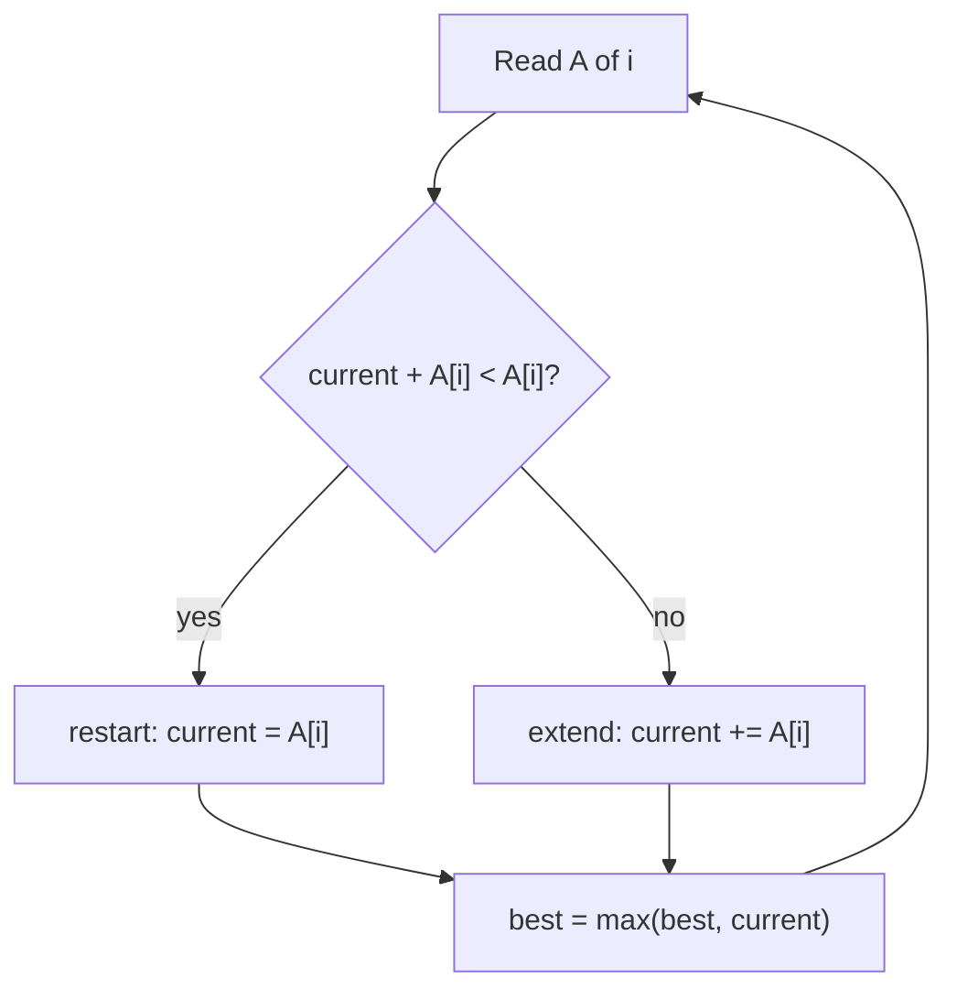

*Kadane's single decision, made once per element.*

> **Interactive animation:** `kadane` — rendered by the page script in the HTML version.

**Interview question**

*Return the maximum subarray sum and the subarray itself. Negative numbers are allowed. `[1, 2, 3, -9, 5]` → sum `6`, subarray `[1, 2, 3]`.*

Keep a running sum and remember where it started (`temp_start`). Whenever the running sum beats the best, record the range `[temp_start, i]`. Whenever it goes negative, reset it to zero and move `temp_start` to `i + 1`. Initialising `best` to `A[0]` (not zero) keeps an all-negative array correct.

**Answer — Kadane with the subarray boundaries**

```python
def find_maximum_subarray_sum(arr):
    max_sum = arr[0]
    curr_sum = 0
    start = end = temp_start = 0

    for i in range(len(arr)):
        curr_sum += arr[i]
        if curr_sum > max_sum:
            max_sum = curr_sum
            start, end = temp_start, i
        if curr_sum < 0:             # dead weight: restart after i
            curr_sum = 0
            temp_start = i + 1

    return {"max_sum": max_sum, "subarray": arr[start:end + 1]}


print(find_maximum_subarray_sum([1, 2, 3, -9, 5]))           # {'max_sum': 6, 'subarray': [1, 2, 3]}
print(find_maximum_subarray_sum([-3, 2, 4, -1, 3, -4, 3]))   # {'max_sum': 8, 'subarray': [2, 4, -1, 3]}
```

```javascript
function findMaximumSubarraySum(arr) {
  let maxSum = arr[0];
  let currSum = 0;
  let start = 0, end = 0, tempStart = 0;

  for (let i = 0; i < arr.length; i++) {
    currSum += arr[i];
    if (currSum > maxSum) {
      maxSum = currSum;
      start = tempStart;
      end = i;
    }
    if (currSum < 0) {        // dead weight: restart after i
      currSum = 0;
      tempStart = i + 1;
    }
  }
  return { maxSum, subarray: arr.slice(start, end + 1) };
}

console.log(findMaximumSubarraySum([1, 2, 3, -9, 5]));         // { maxSum: 6, subarray: [1, 2, 3] }
console.log(findMaximumSubarraySum([-3, 2, 4, -1, 3, -4, 3])); // { maxSum: 8, subarray: [2, 4, -1, 3] }
```

The notes' checklist for spotting a Kadane problem in disguise:

1. Is it a **contiguous** subarray — not a subsequence, not a fixed-size window?
2. Can you make a **local extend-or-restart** decision at each element?
3. Does it need a **transformation** first? Map each value to a gain or a loss, then run Kadane on the gains.
4. Is "extend" based on **structure** (still increasing?) rather than sum? Restart on the condition instead.
5. Does the operation **flip signs**, like multiplication? Track both the running max and the running min.

**Interview question**

*Given a binary string, flip one contiguous substring (0↔1) to maximise the number of 1s. Return the 1-based `[L, R]`, or `[]` if no flip helps. `"010"` → `[1, 1]`.*

Flipping a `0` gains one `1`; flipping a `1` loses one. Map `'0' → +1` and `'1' → -1`, and the best flip is exactly the **maximum-sum subarray** of the mapped values. Starting `max_sum` at `0` means "no flip" wins unless some range strictly helps, and using a strict `>` keeps the lexicographically smallest range.

**Answer — flip, as Kadane on a transformed array**

```python
def flip(A):
    max_sum = current_sum = 0
    start = end = temp_start = 0
    no_change = True

    for i in range(len(A)):
        current_sum += 1 if A[i] == '0' else -1
        if current_sum > max_sum:
            max_sum = current_sum
            start, end = temp_start, i
            no_change = False
        if current_sum < 0:
            current_sum = 0
            temp_start = i + 1

    return [] if no_change else [start + 1, end + 1]


print(flip("010"))  # [1, 1]
print(flip("111"))  # []
print(flip("000"))  # [1, 3]
```

```javascript
function flip(A) {
  let maxSum = 0, currentSum = 0;
  let start = 0, end = 0, tempStart = 0;
  let noChange = true;

  for (let i = 0; i < A.length; i++) {
    currentSum += A[i] === '0' ? 1 : -1;
    if (currentSum > maxSum) {
      maxSum = currentSum;
      start = tempStart;
      end = i;
      noChange = false;
    }
    if (currentSum < 0) {
      currentSum = 0;
      tempStart = i + 1;
    }
  }
  return noChange ? [] : [start + 1, end + 1];
}

console.log(flip("010")); // [1, 1]
console.log(flip("111")); // []
console.log(flip("000")); // [1, 3]
```

**From the notes — Kadane problems**

| Problem | Technique | Complexity |
| --- | --- | --- |
| Maximum subarray sum (brute → prefix → carry → Kadane) | extend or restart | `O(N^3)` → `O(N)` |
| Max subarray sum and the subarray itself | Kadane + `temp_start` | `O(N)` |
| Flip — maximise 1s in a binary string | Kadane on `0 → +1`, `1 → -1` | `O(N)` |

#### More problems from the notes

Every remaining problem from the revision notes for this topic, each with a solution in Python and JavaScript.

**Problem — Max sum contiguous subarray (Kadane, sum only)**

*Return the largest sum of any non-empty contiguous subarray. Negative numbers are allowed.*

The sum-only form of Kadane: keep the best sum ending here and the best overall. `O(n)`, `O(1)`.

**Solution**

```python
def find_maximum_subarray_sum(arr):
    n = len(arr)
    max_sum = arr[0]
    curr_sum = 0

    for i in range(n):
        curr_sum += arr[i]

        if curr_sum > max_sum:
            max_sum = curr_sum

        if curr_sum < 0:
            curr_sum = 0

    return max_sum

print(find_maximum_subarray_sum([1, 2, 3, -9, 5]))           # 6
print(find_maximum_subarray_sum([-3, 2, 4, -1, 3, -4, 3]))  # 8
print(find_maximum_subarray_sum([-2, -3, -1]))               # -1
```

```javascript
function findMaximumSubarraySum(arr) {
  const n = arr.length;

  if (n === 0) return 0;

  let maxSum = arr[0];
  let currSum = 0;

  for (let i = 0; i < n; i++) {
    // Add the current element to the currSum
    currSum += arr[i];

    // Update maxSum if the current currSum is greater
    if (currSum > maxSum) {
      maxSum = currSum;
    }

    if (currSum < 0) {
      currSum = 0;
    }
  }

  return maxSum;
}
console.log(findMaximumSubarraySum([1, 2, 3, -9, 5])); // 6
console.log(findMaximumSubarraySum([-3, 2, 4, -1, 3, -4, 3])); // 8
```

<a id="10-multiple-approaches-maximum-subarray-sum"></a>

### Multiple Approaches: Maximum Subarray Sum

- **Brute force** `O(N^3)`
- **Prefix sum** `O(N^2)`
- **Carry forward** `O(N^2)`
- **Kadane** `O(N)`

The notes open their advanced arrays chapter by solving maximum subarray sum four times, each approach removing one layer of repeated work.

| Approach | Time | Space | Idea |
| --- | --- | --- | --- |
| Brute force | `O(N^3)` | `O(1)` | sum every subarray from scratch |
| Prefix sum | `O(N^2)` | `O(N)` | subarray sum by subtraction |
| Carry forward | `O(N^2)` | `O(1)` | extend a running sum per start |
| Kadane | `O(N)` | `O(1)` | extend or restart at every element |

Every start, every end, and a third loop to add the elements.

**Approach 1 — Brute force**

```python
def find_maximum_subarray_sum(arr):
    n = len(arr)
    max_sum = arr[0]

    for i in range(n):
        for j in range(i, n):
            sub_sum = 0
            for k in range(i, j + 1):
                sub_sum += arr[k]

            if sub_sum > max_sum:
                max_sum = sub_sum

    return max_sum

print(find_maximum_subarray_sum([1, 2, 3, -9, 5]))           # 6
print(find_maximum_subarray_sum([-3, 2, 4, -1, 3, -4, 3]))  # 8
```

```javascript
function findMaximumSubarraySum(arr) {
  const n = arr.length;
  let maxSum = arr[0]; // Initialize maxSum with the first element of the array

  for (let i = 0; i < n; i++) {
    for (let j = i; j < n; j++) {
      let sum = 0;
      for (let k = i; k <= j; k++) {
        sum += arr[k]; // Calculate the sum of the subarray from i to j
      }

      if (sum > maxSum) {
        maxSum = sum; // Update maxSum if the current sum is greater
      }
    }
  }

  return maxSum;
}
console.log(findMaximumSubarraySum([1, 2, 3, -9, 5])); // 6
console.log(findMaximumSubarraySum([-3, 2, 4, -1, 3, -4, 3])); // 8
```

The third loop becomes `P[j] - P[i-1]`.

**Approach 2 — Prefix sum**

```python
def find_maximum_subarray_sum(arr):
    n = len(arr)
    # Step 1: Create Prefix Sum Array
    prefix_sum = [0] * n
    prefix_sum[0] = arr[0]
    for i in range(1, n):
        prefix_sum[i] = prefix_sum[i - 1] + arr[i]

    max_sum = arr[0]

    # Step 2: Iterate through all possible subarrays
    for i in range(n):
        for j in range(i, n):
            # Calculate sum of subarray from i to j using prefix sum
            if i == 0:
                sub_sum = prefix_sum[j]
            else:
                sub_sum = prefix_sum[j] - prefix_sum[i - 1]

            if sub_sum > max_sum:
                max_sum = sub_sum

    return max_sum

print(find_maximum_subarray_sum([1, 2, 3, -9, 5]))           # 6
print(find_maximum_subarray_sum([-3, 2, 4, -1, 3, -4, 3]))  # 8
```

```javascript
function findMaximumSubarraySum(arr) {
  let n = arr.length;
  let prefixSum = [];
  prefixSum[0] = arr[0];
  for (let i = 1; i < n; i++) {
    prefixSum[i] = prefixSum[i - 1] + arr[i];
  }

  let maxSum = arr[0];
  for (let i = 0; i < n; i++) {
    let sum = 0;
    for (let j = i; j < n; j++) {
      if (i === 0) {
        sum = prefixSum[j];
      } else {
        sum = prefixSum[j] - prefixSum[i - 1];
      }

      if (sum > maxSum) {
        maxSum = sum;
      }
    }
  }

  return maxSum;
}
console.log(findMaximumSubarraySum([1, 2, 3, -9, 5])); // 6
console.log(findMaximumSubarraySum([-3, 2, 4, -1, 3, -4, 3])); // 8
```

For each start, carry the running sum as the end moves right.

**Approach 3 — Carry forward**

```python
def find_maximum_subarray_sum(arr):
    max_sum = -float('inf')
    n = len(arr)

    for i in range(n):
        sub_sum = 0
        for j in range(i, n):
            sub_sum += arr[j]  # Carry forward sum from i to j-1
            if sub_sum > max_sum:
                max_sum = sub_sum

    return max_sum

print(find_maximum_subarray_sum([1, 2, 3, -9, 5]))           # 6
print(find_maximum_subarray_sum([-3, 2, 4, -1, 3, -4, 3]))  # 8
```

```javascript
function findMaximumSubarraySum(arr) {
  let maxSum = Number.MIN_SAFE_INTEGER; // or -Infinity
  let n = arr.length;
  for (let i = 0; i < n; i++) {
    let sum = 0;
    for (let j = i; j < n; j++) {
      sum += arr[j];
      if (sum > maxSum) {
        maxSum = sum;
      }
    }
  }

  return maxSum;
}
console.log(findMaximumSubarraySum([1, 2, 3, -9, 5])); // 6
console.log(findMaximumSubarraySum([-3, 2, 4, -1, 3, -4, 3])); // 8
```

One pass: a running sum that resets to zero whenever it turns negative.

**Approach 4 — Kadane's algorithm**

```python
def find_maximum_subarray_sum(arr):
    max_sum = arr[0]
    curr_sum = 0

    for num in arr:
        curr_sum += num

        if curr_sum > max_sum:
            max_sum = curr_sum

        if curr_sum < 0:
            curr_sum = 0

    return max_sum

print(find_maximum_subarray_sum([1, 2, 3, -9, 5]))             # 6
print(find_maximum_subarray_sum([-3, 2, 4, -1, 3, -4, 3]))    # 8
print(find_maximum_subarray_sum([-2, -3, -1]))                 # -1
print(find_maximum_subarray_sum([1, 2, 3, 4, 5]))             # 15
print(find_maximum_subarray_sum([-1, -2, -3, -4, -5]))         # -1
```

```javascript
function findMaximumSubarraySum(arr) {
  const n = arr.length;

  if (n === 0) return 0;

  let maxSum = arr[0];
  let currSum = 0;

  for (let i = 0; i < n; i++) {
    // Add the current element to the currSum
    currSum += arr[i];

    // Update maxSum if the current currSum is greater
    if (currSum > maxSum) {
      maxSum = currSum;
    }

    if (currSum < 0) {
      currSum = 0;
    }
  }

  return maxSum;
}
console.log(findMaximumSubarraySum([1, 2, 3, -9, 5])); // 6
console.log(findMaximumSubarraySum([-3, 2, 4, -1, 3, -4, 3])); // 8
```

<a id="11-merging-intervals"></a>

### Merging Intervals

- **Sort by start** `O(N log N)`
- **Sweep** `O(N)`

> **Analogy** 📅
>
> **Picture it — tidying a shared calendar**
>
> Lay the bookings out in start order. Any meeting that begins before the previous one has ended simply extends that busy block; a gap means the block is finished.

Sort by start time and the problem becomes a single sweep: keep one "open" interval. If the next interval starts **at or before** the open interval's end, they overlap — stretch the end to the larger of the two. Otherwise the open interval is finished; emit it and open the next one. Sorting is the expensive part, `O(N log N)`; the sweep is `O(N)`.

> **Interactive animation:** `merge-intervals` — rendered by the page script in the HTML version.

**Answer — merge overlapping intervals**

```python
def merge_intervals(intervals):
    if not intervals:
        return []
    intervals.sort(key=lambda x: x[0])
    merged = [intervals[0]]
    for curr_start, curr_end in intervals[1:]:
        last_start, last_end = merged[-1]
        if curr_start <= last_end:                       # overlap: stretch
            merged[-1] = [last_start, max(last_end, curr_end)]
        else:                                            # gap: close and open
            merged.append([curr_start, curr_end])
    return merged


print(merge_intervals([[1, 3], [2, 6], [8, 10], [15, 18]]))  # [[1, 6], [8, 10], [15, 18]]
```

```javascript
function mergeIntervals(intervals) {
  if (intervals.length <= 1) return intervals;
  intervals.sort((a, b) => a[0] - b[0]);

  const result = [];
  let [start, end] = intervals[0];
  for (let i = 1; i < intervals.length; i++) {
    const [s, e] = intervals[i];
    if (s <= end) {
      end = Math.max(end, e);   // overlap: stretch
    } else {
      result.push([start, end]); // gap: close and open
      [start, end] = [s, e];
    }
  }
  result.push([start, end]);
  return result;
}

console.log(mergeIntervals([[1, 3], [2, 6], [8, 10], [15, 18]])); // [[1, 6], [8, 10], [15, 18]]
```

> **Tip**
>
> Use `max(last_end, curr_end)`, not `curr_end`. An interval like `[1, 10]` followed by `[2, 3]` overlaps but ends *earlier* — overwriting the end would shrink the merged interval.

**From the notes — interval problems**

| Problem | Technique | Complexity |
| --- | --- | --- |
| Merge overlapping intervals | sort by start, sweep | `O(N log N)` |

#### More problems from the notes

Every remaining problem from the revision notes for this topic, each with a solution in Python and JavaScript.

**Problem — Minimum meeting rooms (Meeting Rooms II)**

*Given meeting intervals `[start, end)`, return the minimum number of rooms so no two overlapping meetings share a room. `[[0,30],[5,10],[15,20]]` → `2`.*

The answer is the maximum number of meetings running at once. Sort all start times and all end times separately and sweep with two pointers: a start before the next end needs a new room; otherwise a room frees up. `O(n log n)`. The notes list this as both "Minimum Meeting Rooms" and "Meeting Rooms II".

**Solution**

```python
def min_meeting_rooms(intervals):
    starts = sorted(s for s, _ in intervals)
    ends = sorted(e for _, e in intervals)
    rooms = best = 0
    j = 0
    for s in starts:
        if s < ends[j]:        # a meeting starts before the earliest one ends
            rooms += 1
        else:                  # reuse the room that just freed up
            j += 1
        best = max(best, rooms)
    return best


print(min_meeting_rooms([[0, 30], [5, 10], [15, 20]]))  # 2
print(min_meeting_rooms([[7, 10], [2, 4]]))             # 1
```

```javascript
function minMeetingRooms(intervals) {
  const starts = intervals.map((iv) => iv[0]).sort((a, b) => a - b);
  const ends = intervals.map((iv) => iv[1]).sort((a, b) => a - b);
  let rooms = 0, best = 0, j = 0;
  for (const s of starts) {
    if (s < ends[j]) rooms++;   // a meeting starts before the earliest one ends
    else j++;                   // reuse the room that just freed up
    best = Math.max(best, rooms);
  }
  return best;
}

console.log(minMeetingRooms([[0, 30], [5, 10], [15, 20]])); // 2
console.log(minMeetingRooms([[7, 10], [2, 4]]));            // 1
```

<a id="12-boyer-moore-voting"></a>

### Boyer–Moore Voting

- **Two passes** `O(N)`
- **Extra space** `O(1)`

A **majority element** appears more than `n / 2` times. Pass 1 keeps a candidate and a counter: a matching element votes `+1`, a different element cancels one vote, and when the counter hits zero the next element becomes the new candidate. Pass 2 counts the candidate to confirm it really is a majority.

> **Analogy** 🗳️
>
> **Picture it — a room where rival voters pair off and leave**
>
> Every time two people who back different candidates meet, they both walk out. If one candidate has more than half the room, their supporters cannot all be paired off — someone is still standing at the end.

> **Interactive animation:** `boyer-moore` — rendered by the page script in the HTML version.

**Answer — majority element (Boyer–Moore)**

```python
def find_majority_element(arr):
    candidate, count = None, 0
    for num in arr:                 # pass 1: pair off different values
        if count == 0:
            candidate, count = num, 1
        elif num == candidate:
            count += 1
        else:
            count -= 1

    freq = sum(1 for num in arr if num == candidate)   # pass 2: verify
    return candidate if freq > len(arr) // 2 else -1


print(find_majority_element([2, 2, 1, 1, 1, 2, 2]))  # 2
print(find_majority_element([1, 2, 3, 4]))           # -1
```

```javascript
function findMajorityElement(arr) {
  let candidate = null;
  let count = 0;
  for (const element of arr) {      // pass 1: pair off different values
    if (count === 0) {
      candidate = element;
      count = 1;
    } else if (element === candidate) count++;
    else count--;
  }

  const occurrences = arr.filter((x) => x === candidate).length; // pass 2: verify
  return occurrences > arr.length / 2 ? candidate : null;
}

console.log(findMajorityElement([2, 2, 1, 1, 1, 2, 2])); // 2
console.log(findMajorityElement([1, 2, 3, 4]));          // null
```

> **Warning**
>
> Pass 1 always leaves *some* candidate, even when no majority exists (`[1, 2, 3, 4]` leaves `4`). Skipping the verification pass is the classic bug.

**From the notes — majority problems**

| Problem | Technique | Complexity |
| --- | --- | --- |
| Majority element (more than n/2 times) | Boyer–Moore voting | `O(N)`, `O(1)` space |

<a id="13-two-pointers"></a>

### Two Pointers

- **Pair sum in sorted array** `O(N)`
- **Rain water** `O(N)`
- **Extra space** `O(1)`

Two indices walk the array and **every comparison rules out a whole group of candidates**. On a sorted array with `L` at the start and `R` at the end: if `A[L] + A[R]` is too big, then `A[R]` is too big with *every* remaining left partner, so `R` can retire. That single observation turns `n²/2` pair checks into at most `n` pointer moves.

> **Analogy** 🌉
>
> **Picture it — two people tuning a see-saw**
>
> One child sits at each end. Too heavy on the right? The right child shuffles inward. Too heavy on the left? The left child shuffles inward. They never need to try every pair of seats — each shuffle is forced by which side is heavier.

> **Interactive animation:** `two-pointers` — rendered by the page script in the HTML version.

The notes solve "does a pair with sum `K` exist in a sorted array?" four ways. The same ladder shows up in interviews, so be ready to walk it out loud (all four are coded side by side in *Multiple Approaches: Pair With a Given Sum*, right after binary search):

| Approach | Time | Space | Why it works |
| --- | --- | --- | --- |
| Brute force | `O(n^2)` | `O(1)` | try every pair |
| Binary search | `O(n log n)` | `O(1)` | for each `A[i]`, search for `K - A[i]` |
| Hash set | `O(n)` | `O(n)` | have I already seen `K - A[i]`? |
| Two pointers | `O(n)` | `O(1)` | sorted order lets each step discard a row of pairs |

- **Strength — opposite ends** — Pair sum, pair count, container problems, palindrome checks: pointers start at both ends and meet in the middle.
- **Strength — same direction** — Pair difference, dedupe, sliding windows: both pointers move right, the gap between them is the state.

**Interview question**

*Count the pairs `i < j` with `A[i] + A[j] = K` in a **sorted array with duplicates**. `[1, 2, 3, 3, 4, 5]`, `K = 6` → `3` (`1+5`, `2+4`, `3+3`).*

When the sum matches and the two values differ, count how many copies of each sit at the pointers and add their **product** — every left copy pairs with every right copy. When the sum matches and the values are equal, everything between the pointers is that same value, so the answer for that block is `c(c-1)/2` and you can stop.

**Answer — count pairs with sum K (duplicates allowed)**

```python
def count_pairs_with_sum_k_duplicates(arr, k):
    left, right = 0, len(arr) - 1
    count = 0
    while left < right:
        curr_sum = arr[left] + arr[right]
        if curr_sum < k:
            left += 1
        elif curr_sum > k:
            right -= 1
        elif arr[left] == arr[right]:          # a block of one value
            n = right - left + 1
            count += n * (n - 1) // 2
            break
        else:
            c_left = 1
            while left + 1 < right and arr[left] == arr[left + 1]:
                c_left += 1
                left += 1
            c_right = 1
            while right - 1 > left and arr[right] == arr[right - 1]:
                c_right += 1
                right -= 1
            count += c_left * c_right          # every left copy × every right copy
            left += 1
            right -= 1
    return count


print(count_pairs_with_sum_k_duplicates([1, 2, 3, 3, 4, 5], 6))     # 3
print(count_pairs_with_sum_k_duplicates([1, 5, 5, 5, 5, 5, 8], 10))  # 10
```

```javascript
function countPairsWithSumDuplicates(arr, k) {
  let left = 0;
  let right = arr.length - 1;
  let count = 0;

  while (left < right) {
    const sum = arr[left] + arr[right];
    if (sum < k) left++;
    else if (sum > k) right--;
    else if (arr[left] === arr[right]) {   // a block of one value
      const n = right - left + 1;
      count += (n * (n - 1)) / 2;
      break;
    } else {
      let leftCount = 1;
      let rightCount = 1;
      while (left < right && arr[left] === arr[left + 1]) { leftCount++; left++; }
      while (left < right && arr[right] === arr[right - 1]) { rightCount++; right--; }
      count += leftCount * rightCount;     // every left copy × every right copy
      left++;
      right--;
    }
  }
  return count;
}

console.log(countPairsWithSumDuplicates([1, 2, 3, 3, 4, 5], 6));     // 3
console.log(countPairsWithSumDuplicates([1, 5, 5, 5, 5, 5, 8], 10)); // 10
```

**Interview question**

*Does a pair with difference exactly `K` exist in a sorted array? `[-3, 0, 1, 3, 6, 8, 11, 14, 21, 25]`, `K = 5` → `true` (`1` and `6`).*

Opposite ends do not work for differences — moving either pointer inward shrinks the gap. Put both pointers on the **left** instead, `L = 0`, `R = 1`. If the gap is too small, move `R` right to widen it; if too big, move `L` right to narrow it; keep `R` strictly ahead of `L`.

**Answer — pair with difference K (same-direction pointers)**

```python
def check_pair_diff_k(arr, k):
    left, right = 0, 1
    while right < len(arr):
        diff = arr[right] - arr[left]
        if diff == k and left != right:
            return True
        if diff < k:
            right += 1          # widen the gap
        else:
            left += 1           # narrow the gap
            if left == right:
                right += 1
    return False


print(check_pair_diff_k([-3, 0, 1, 3, 6, 8, 11, 14, 21, 25], 5))  # True
print(check_pair_diff_k([1, 2, 3, 4, 5], 6))                      # False
```

```javascript
function hasPairWithDifference(arr, k) {
  let left = 0;
  let right = 1;
  while (right < arr.length) {
    const diff = arr[right] - arr[left];
    if (diff === k && left !== right) return true;
    if (diff < k) right++;       // widen the gap
    else left++;                 // narrow the gap
    if (left === right) right++;
  }
  return false;
}

console.log(hasPairWithDifference([-3, 0, 1, 3, 6, 8, 11, 14, 21, 25], 5)); // true
console.log(hasPairWithDifference([1, 2, 3, 4, 5], 6));                     // false
```

<a id="trapping-rain-water"></a>

#### Trapping rain water

Water above bar `i` is `min(leftMax, rightMax) - height[i]`. Precomputing both max arrays costs `O(n)` space. Two pointers remove it: whichever side has the **shorter** bar is the one you can settle, because the other side is guaranteed to have a wall at least that tall. So only the running max on the short side matters.

```text
Height
  4 |                 ###
  3 | ### ~~~ ~~~ ~~~ ###
  2 | ### ~~~ ### ~~~ ### ~~~ ###
  1 | ### ~~~ ### ~~~ ### ~~~ ###
    +-----------------------------
      0   1   2   3   4   5   6      heights = [3, 0, 2, 0, 4, 0, 2]
water: 0   3   1   3   0   2   0      total = 9
```

> **Interactive animation:** `rain-water` — rendered by the page script in the HTML version.

**Answer — trapping rain water with two pointers**

```python
def trap(heights):
    left, right = 0, len(heights) - 1
    left_max = right_max = 0
    water = 0
    while left < right:
        if heights[left] <= heights[right]:      # left side is the short wall
            if heights[left] >= left_max:
                left_max = heights[left]
            else:
                water += left_max - heights[left]
            left += 1
        else:                                    # right side is the short wall
            if heights[right] >= right_max:
                right_max = heights[right]
            else:
                water += right_max - heights[right]
            right -= 1
    return water


print(trap([3, 0, 2, 0, 4, 0, 2]))  # 9
print(trap([5, 4, 1, 4, 3, 2, 7]))  # 11
```

```javascript
function trap(heights) {
  let left = 0, right = heights.length - 1;
  let leftMax = 0, rightMax = 0;
  let water = 0;
  while (left < right) {
    if (heights[left] <= heights[right]) {   // left side is the short wall
      if (heights[left] >= leftMax) leftMax = heights[left];
      else water += leftMax - heights[left];
      left++;
    } else {                                 // right side is the short wall
      if (heights[right] >= rightMax) rightMax = heights[right];
      else water += rightMax - heights[right];
      right--;
    }
  }
  return water;
}

console.log(trap([3, 0, 2, 0, 4, 0, 2])); // 9
console.log(trap([5, 4, 1, 4, 3, 2, 7])); // 11
```

<a id="expand-around-center"></a>

#### Pointers moving outward — longest palindromic substring

Two pointers can also start together and walk **apart**. Every palindrome has a centre: a single character (odd length) or the gap between two characters (even length). Expand from all `2n - 1` centres while the ends match. Each expansion is `O(n)`, so the whole thing is `O(n²)` time and `O(1)` space.

**Answer — longest palindromic substring (expand around centre)**

```python
def longest_palindrome_substring(s):
    def expand(left, right):
        while left >= 0 and right < len(s) and s[left] == s[right]:
            left -= 1
            right += 1
        return right - left - 1             # length of the last matching window

    best = 0
    for i in range(len(s)):
        best = max(best, expand(i, i), expand(i, i + 1))   # odd and even centres
    return best


print(longest_palindrome_substring("abccbad"))  # 6  ("abccba")
print(longest_palindrome_substring("babad"))    # 3
```

```javascript
function longestPalindromeSubstring(str) {
  const expand = (start, end) => {
    let localMax = 0;
    while (start >= 0 && end < str.length && str[start] === str[end]) {
      localMax = end - start + 1;
      start--;
      end++;
    }
    return localMax;
  };

  let maxLen = 0;
  for (let i = 0; i < str.length; i++) {
    maxLen = Math.max(maxLen, expand(i, i), expand(i, i + 1)); // odd and even centres
  }
  return maxLen;
}

console.log(longestPalindromeSubstring("abccbad")); // 6
console.log(longestPalindromeSubstring("babad"));   // 3
```

**From the notes — two-pointer problems**

| Problem | Pointer movement | Complexity |
| --- | --- | --- |
| Pair with sum K exists (sorted, distinct) | opposite ends | `O(N)` |
| Count pairs with sum K — distinct / duplicates | opposite ends + block counting | `O(N)` |
| Pair with difference K exists | same direction | `O(N)` |
| Count pairs with difference K — distinct / duplicates | same direction + block counting | `O(N)` |
| Trapping rain water | opposite ends, settle the shorter wall | `O(N)`, `O(1)` space |
| Palindrome check, reverse vowels | opposite ends | `O(N)` |
| Longest palindromic substring | outward from each centre | `O(N^2)` |

#### More problems from the notes

Every remaining problem from the revision notes for this topic, each with a solution in Python and JavaScript.

**Problem — Count pairs with sum K (sorted, distinct)**

*Count pairs `i < j` with `A[i] + A[j] = K` in a sorted array of distinct values.*

Opposite-end pointers; on a match count it and move both pointers, since with distinct values neither element can pair again. `O(n)`.

**Solution**

```python
def count_pairs_with_sum_k_distinct(arr, k):
    left = 0
    right = len(arr) - 1
    count = 0

    while left < right:
        curr_sum = arr[left] + arr[right]
        if curr_sum == k:
            count += 1
            left += 1
            right -= 1
        elif curr_sum < k:
            left += 1
        else:
            right -= 1

    return count

print(count_pairs_with_sum_k_distinct([1, 2, 3, 4, 5], 5))  # 2 (1+4, 2+3)
```

```javascript
function countPairsWithSum(arr, k) {
  // Initialize the left pointer at the start of the array
  let left = 0;

  // Initialize the right pointer at the end of the array
  let right = arr.length - 1;

  // Initialize a counter to track the number of valid pairs found
  let count = 0;

  // Loop until the two pointers meet
  while (left < right) {
    // Calculate the current sum of the elements at the left and right pointers
    const sum = arr[left] + arr[right];

    // Check if the calculated sum matches the target 'k'
    if (sum === k) {
      // If a match is found, increment the count
      count++;

      // Move the left pointer forward to check the next element
      left++;

      // Move the right pointer backward to check the previous element
      right--;
    }
    // If the sum is less than the target 'k'
    else if (sum < k) {
      // Increment the left pointer to increase the sum (assumes sorted array)
      left++;
    }
    // If the sum is greater than the target 'k'
    else {
      // Decrement the right pointer to decrease the sum
      right--;
    }
  }

  // Return the total count of pairs found
  return count;
}

console.log(countPairsWithSum([1, 2, 3, 4, 5], 6)); // 2 (1+5, 2+4)

// Explanation: The while loop processes the array linearly. The 'left' and 'right' pointers
// move towards each other, touching each element at most once.

// Explanation: The algorithm uses a constant amount of extra space (variables for pointers
// and sum) regardless of the input array size.
```

**Problem — Count pairs with difference K (sorted, distinct)**

*Count pairs `i < j` with `A[j] - A[i] = K` in a sorted array of distinct values.*

Same-direction pointers: widen the gap when it is too small, narrow it when it is too big, and count every exact match. `O(n)`.

**Solution**

```python
def count_pairs_diff_k_distinct(arr, k):
    left = 0
    right = 1
    count = 0
    n = len(arr)

    while right < n:
        diff = arr[right] - arr[left]
        if diff == k and left != right:
            count += 1
            left += 1
            right += 1
        elif diff < k:
            right += 1
        else:
            left += 1
            if left == right:
                right += 1

    return count

print(count_pairs_diff_k_distinct([1, 3, 5, 8, 12], 2))  # 2 ([1, 3], [3, 5])
```

```javascript
function countPairsWithDifference(arr, k) {
  let left = 0; // Initialize the left pointer at the start of the array
  let right = 1; // Initialize the right pointer at the second element
  let count = 0; // Counter to keep track of valid pairs found

  // Continue iterating as long as the right pointer has not reached the end of the array
  while (right < arr.length) {
    // Calculate the difference between the values at the right and left pointers
    const diff = arr[right] - arr[left];

    if (diff === k) {
      // Case 1: Difference matches target 'k'
      count++; // Increment the pair counter
      left++; // Move left pointer forward
      right++; // Move right pointer forward
    } else if (diff < k) {
      // Case 2: Difference is too small
      // Increment right pointer to increase the gap (assuming sorted array)
      right++;
    } else {
      // Case 3: Difference is too large
      // Increment left pointer to shrink the gap
      left++;
      // Edge case: If left catches up to right, increment right to maintain the gap
      if (left === right) right++; // Ensure right pointer is always ahead of left
    }
  }
  return count; // Return the total number of pairs found
}

console.log(countPairsWithDifference([-3, 0, 1, 3, 6, 8, 11, 14, 21, 25], 5)); // 3 (6-1, 11-6, 14-8)

/*
 * COMPLEXITY ANALYSIS:
 *
 * Time Complexity: O(N)
 * - We traverse the array with two pointers ('left' and 'right').
 * - Both pointers move only in the forward direction and never reset.
 * - In the worst case, each element is visited at most twice (once by 'right' and once by 'left').
 * - Therefore, the time complexity is linear relative to the size of the array N.
 *
 * Space Complexity: O(1)
 * - The algorithm operates in constant space.
 * - We only use a few variables ('left', 'right', 'count', 'diff') to store state.
 * - No auxiliary data structures (like Hash Maps or Arrays) are used proportional to the input size.
 */
```

**Problem — Count pairs with difference K (sorted, duplicates)**

*Count pairs with difference exactly `K` when the sorted array may contain duplicates.*

On a match, count the run of equal values at each pointer and add the product of the two run lengths (or `c(c-1)/2` when `K = 0`), then skip past both runs. `O(n)`.

**Solution**

```python
def count_pairs_diff_k_duplicates(arr, k):
    left = 0
    right = 1
    count = 0
    n = len(arr)

    while right < n:
        diff = arr[right] - arr[left]

        if diff < k or left == right:
            right += 1
        elif diff > k:
            left += 1
        else:
            c_left = 1
            while left + 1 < n and arr[left] == arr[left + 1]:
                c_left += 1
                left += 1

            c_right = 1
            while right + 1 < n and arr[right] == arr[right + 1]:
                c_right += 1
                right += 1

            count += c_left * c_right
            left += 1
            right += 1

    return count

print(count_pairs_diff_k_duplicates([1, 1, 3, 3, 5, 5], 2))  # 8
```

```javascript
function countPairsWithDifferenceDuplicates(arr, k) {
  // Store the length of the input array for bounds checking
  const n = arr.length;

  // negative k makes no sense for "difference"
  // If k is negative, return 0 (logic assumes sorted ascending array)
  if (k < 0) return 0;

  // --- Case k === 0: just count each run of duplicates via nC2 ---
  // If the target difference is 0, we look for duplicate numbers
  if (k === 0) {
    let count = 0; // Initialize pair counter
    let i = 0;     // Start iterator at the beginning

    // Iterate through the entire array
    while (i < n) {
      let j = i + 1;

      // find end of this duplicate run
      // Move 'j' forward as long as elements match arr[i]
      while (j < n && arr[j] === arr[i]) j++;

      // Calculate the size of the cluster of identical numbers
      const c = j - i;

      // If there is more than one number, calculate pairs
      if (c > 1) {
        // Add number of combinations (c choose 2) to total count
        count += (c * (c - 1)) / 2;
      }

      // Move the main iterator 'i' to 'j' to process the next distinct number
      i = j;
    }
    // Return the total count for k=0 case
    return count;
  }

  // --- Case k > 0: two‑pointer + cluster counting ---
  let left = 0;   // Initialize left pointer
  let right = 1;  // Initialize right pointer
  let count = 0;  // Initialize total pair counter

  // Loop until the right pointer exceeds the array bounds
  while (right < n) {
    // Calculate the difference between values at the two pointers
    const diff = arr[right] - arr[left];

    // Check if the current difference is smaller than the target k
    if (diff < k) {
      // need a bigger difference
      // Move right pointer to increase the difference (since array is sorted)
      right++;
    } else if (diff > k) {
      // need a smaller difference
      // Move left pointer to decrease the difference
      left++;

      // keep right > left
      // Ensure the right pointer never falls behind or equals the left pointer
      if (left === right) right++;
    } else {
      // diff === k → count how many duplicates at left AND at right
      // Difference matches k. Now handle duplicate values at both ends.

      // 1. Count duplicates for the value at 'left' pointer
      const leftVal = arr[left];
      let i = left;
      // Advance 'i' as long as it matches the value at 'left'
      while (i < n && arr[i] === leftVal) i++;
      // Determine the count of the left cluster
      const leftCount = i - left;

      // 2. Count duplicates for the value at 'right' pointer
      const rightVal = arr[right];
      let j = right;
      // Advance 'j' as long as it matches the value at 'right'
      while (j < n && arr[j] === rightVal) j++;
      // Determine the count of the right cluster
      const rightCount = j - right;

      // every left-duplicate can pair with every right-duplicate
      // Cartesian product: multiply counts to get total combinations for these values
      count += leftCount * rightCount;

      // advance both pointers past these clusters
      // Set pointers to the indices immediately following the processed clusters
      left = i;
      right = j;
    }
  }

  // Return the final calculated count
  return count;
}

console.log(countPairsWithDifferenceDuplicates([-3, 0, 1, 3, 6, 8, 11, 14, 21, 25], 5)); // 3 (6-1, 11-6, 14-8)
console.log(countPairsWithDifferenceDuplicates([-1, 1, 1, 2, 2, 3], 0)); // 2 (1-1, 2-2)
console.log(countPairsWithDifferenceDuplicates([1, 5, 5, 5, 5, 5, 8], 0)); // 10 (5-5, 5 times, nC2 = 5*4/2 = 10)

/**
 * ==========================================================================================
 * COMPLEXITY ANALYSIS
 * ==========================================================================================
 * * Time Complexity: O(N)
 * - The algorithm traverses the array linearly.
 * - In the k=0 case, 'i' and 'j' visit each element once.
 * - In the k>0 case, the 'left' and 'right' pointers (and internal iterators 'i', 'j')
 * move strictly forward from index 0 to N. Each element is processed a constant number of times.
 * - Note: This assumes the input array is already sorted. If sorting is required,
 * the total complexity would be O(N log N).
 * * Space Complexity: O(1)
 * - The algorithm uses a constant amount of auxiliary space for variables
 * (n, count, left, right, diff, i, j, c, etc.).
 * - No extra data structures proportional to the input size are allocated.
 * ==========================================================================================
 */
```

**Problem — Is a string a palindrome?**

*Check whether a string reads the same forwards and backwards.*

Compare the characters at both ends and walk inward; the first mismatch settles it. `O(n)`, `O(1)`.

**Solution**

```python
def is_palindrome(s, start_index, end_index):
    while start_index < end_index:
        if s[start_index] != s[end_index]:
            return False
        start_index += 1
        end_index -= 1
    return True

print(is_palindrome("madam", 0, 4))  # True
print(is_palindrome("apple", 0, 4))  # False
```

```javascript
function isPalindrome(str, startIndex, endIndex) {
  while (startIndex < endIndex) {
    if (str[startIndex] !== str[endIndex]) {
      return false;
    }
    startIndex++;
    endIndex--;
  }

  return true;
}

console.log(isPalindrome("abccbad", 0, 6)); // false
console.log(isPalindrome("abccbad", 1, 4)); // true

// - Two pointers converge toward the center, visiting at most N/2 characters.

// - Only uses two pointer variables (startIndex, endIndex).
```

**Problem — Reverse the vowels of a string**

*Reverse only the vowels in a string, leaving every other character in place. `"hello"` → `"holle"`.*

Two pointers skip inward over consonants and swap whenever both point at vowels. Strings are immutable in Python and JavaScript, so work on a list/array of characters. `O(n)`.

**Solution**

```python
def reverse_vowels(s):
    vowels = {'a', 'e', 'i', 'o', 'u', 'A', 'E', 'I', 'O', 'U'}
    arr = list(s)
    i = 0
    j = len(arr) - 1

    while i < j:
        while i < j and arr[i] not in vowels:
            i += 1
        while i < j and arr[j] not in vowels:
            j -= 1

        if i < j:
            arr[i], arr[j] = arr[j], arr[i]
            i += 1
            j -= 1

    return "".join(arr)

print(reverse_vowels("hello"))     # "holle"
print(reverse_vowels("leetcode"))  # "leotcede"
```

```javascript
function reverseVowels(str) {
    const vowels = ['a', 'e', 'i', 'o', 'u', 'A', 'E', 'I', 'O', 'U'];
    const arr = str.split('');
    let i = 0;
    let j = arr.length - 1;

    while (i < j) {
        if (!vowels.includes(arr[i])) {
            i++;
        } else if (!vowels.includes(arr[j])) {
            j--;
        } else {
            [arr[i], arr[j]] = [arr[j], arr[i]];
            i++;
            j--;
        }
    }

    return arr.join('');
}

console.log(reverseVowels("hello")); // holle
console.log(reverseVowels("leetcode")); // leotcede
console.log(reverseVowels("casio")); // cosia

// - Two pointers converge, each character is visited at most once.
// - vowels.includes() is O(1) for a fixed-size array of 10.

// - str.split('') creates an array of N characters.
// - Strings in JS are immutable, so we need this array to swap characters.
```

<a id="14-matrix-walks"></a>

### Matrix Walks

- **Staircase search** `O(N + M)`
- **Spiral print** `O(N·M)`
- **Rotate 90° in place** `O(N^2)`

A matrix is just an array with two indices, so most "matrix" problems are really about **choosing a walk**: which corner to start from, which direction to move, and when to turn. Pick the right starting cell and a sorted matrix becomes a search tree; pick the right boundaries and a spiral becomes four simple loops.

<a id="staircase-search"></a>

#### Staircase search

In a matrix sorted along every row **and** every column, stand in the **top-right** corner. Everything to your left is smaller, everything below is larger — exactly like the root of a binary search tree. If the value is too big, the whole column below it is too big: step left. If it is too small, the whole row to its left is too small: step down. Each step deletes a row or a column, so at most `N + M` steps.

> **Analogy** 🪜
>
> **Picture it — walking down a staircase in the dark**
>
> From the top-right step you can only go *left* (lower) or *down* (higher). Each step tells you which way is warmer, and you never need to climb back up.

> **Interactive animation:** `staircase` — rendered by the page script in the HTML version.

**Answer — search a row- and column-sorted matrix**

```python
def find_element(matrix, target):
    if not matrix or not matrix[0]:
        return False
    r, c = 0, len(matrix[0]) - 1          # top-right corner
    while r < len(matrix) and c >= 0:
        val = matrix[r][c]
        if val == target:
            return True
        if val > target:
            c -= 1                        # the column below is even bigger
        else:
            r += 1                        # the row to the left is even smaller
    return False


mat = [[1, 4, 7, 11, 15], [2, 5, 8, 12, 19], [3, 6, 9, 16, 22],
       [10, 13, 14, 17, 24], [18, 21, 23, 26, 30]]
print(find_element(mat, 5))   # True
print(find_element(mat, 20))  # False
```

```javascript
function findElement(matrix, target) {
  if (!matrix.length || !matrix[0].length) return false;
  let i = 0;
  let j = matrix[0].length - 1;           // top-right corner
  while (i < matrix.length && j >= 0) {
    const current = matrix[i][j];
    if (current === target) return true;
    if (current < target) i++;            // the row to the left is even smaller
    else j--;                             // the column below is even bigger
  }
  return false;
}

const mat = [[1, 4, 7, 11, 15], [2, 5, 8, 12, 19], [3, 6, 9, 16, 22],
  [10, 13, 14, 17, 24], [18, 21, 23, 26, 30]];
console.log(findElement(mat, 5));  // true
console.log(findElement(mat, 20)); // false
```

The same walk solves **row with the maximum number of 1s** in a matrix of sorted 0/1 rows: start top-right, step left while you see a `1` (that row now holds the record), step down on a `0`.

<a id="spiral"></a>

#### Spiral traversal (the lawn-mowing problem)

Mow a square lawn from the outside in. Each ring is four straight passes of `length` steps — right, down, left, up — and each ring shrinks `length` by 2. If the side is odd, a single centre cell is left when `length` reaches 0.

```text
 1 →  2 →  3    4          ring 1: length 3  →  1 2 3 | 4 8 12 | 16 15 14 | 13 9 5
                ↓          ring 2: length 1  →  6 | 7 | 11 | 10
 5    6 →  7    8
 ↑         ↓    ↓          output: 1 2 3 4 8 12 16 15 14 13 9 5 6 7 11 10
 9   10 ← 11   12
 ↑              ↓
13 ← 14 ← 15 ← 16
```

> **Interactive animation:** `spiral` — rendered by the page script in the HTML version.

**Answer — spiral order of a square matrix**

```python
def print_spiral(matrix):
    row = col = 0
    length = len(matrix) - 1
    result = []
    while length >= 1:
        for _ in range(length):           # right
            result.append(matrix[row][col]); col += 1
        for _ in range(length):           # down
            result.append(matrix[row][col]); row += 1
        for _ in range(length):           # left
            result.append(matrix[row][col]); col -= 1
        for _ in range(length):           # up
            result.append(matrix[row][col]); row -= 1
        row += 1                          # step into the next ring
        col += 1
        length -= 2
    if length == 0:                       # odd side: the centre cell
        result.append(matrix[row][col])
    return result


print(print_spiral([[1, 2, 3, 4], [5, 6, 7, 8], [9, 10, 11, 12], [13, 14, 15, 16]]))
# [1, 2, 3, 4, 8, 12, 16, 15, 14, 13, 9, 5, 6, 7, 11, 10]
```

```javascript
function printSpiral(matrix) {
  let row = 0, col = 0;
  let steps = matrix.length - 1;
  const out = [];
  while (steps > 0) {
    for (let s = 0; s < steps; s++) out.push(matrix[row][col++]); // right
    for (let s = 0; s < steps; s++) out.push(matrix[row++][col]); // down
    for (let s = 0; s < steps; s++) out.push(matrix[row][col--]); // left
    for (let s = 0; s < steps; s++) out.push(matrix[row--][col]); // up
    row++;                                                         // next ring
    col++;
    steps -= 2;
  }
  if (steps === 0) out.push(matrix[row][col]);                     // centre cell
  return out;
}

console.log(printSpiral([[1, 2, 3, 4], [5, 6, 7, 8], [9, 10, 11, 12], [13, 14, 15, 16]]).join(" "));
// 1 2 3 4 8 12 16 15 14 13 9 5 6 7 11 10
```

<a id="rotate-matrix"></a>

#### Rotating 90° clockwise in place

A clockwise rotation is two cheap moves: **transpose** (swap `A[i][j]` with `A[j][i]` above the diagonal) turns columns into rows, then **reverse each row** fixes the direction. Both are in-place swaps, so the extra space is `O(1)`.

```text
1 2 3      transpose      1 4 7      reverse rows      7 4 1
4 5 6     ───────────▶    2 5 8     ─────────────▶     8 5 2
7 8 9                     3 6 9                        9 6 3
```

**Answer — rotate a square matrix 90° clockwise**

```python
def rotate_matrix(matrix):
    n = len(matrix)
    for i in range(n):                  # transpose: only above the diagonal
        for j in range(i + 1, n):
            matrix[i][j], matrix[j][i] = matrix[j][i], matrix[i][j]
    for row in matrix:                  # reverse each row
        row.reverse()
    return matrix


print(rotate_matrix([[1, 2, 3], [4, 5, 6], [7, 8, 9]]))  # [[7, 4, 1], [8, 5, 2], [9, 6, 3]]
```

```javascript
function rotateMatrix(arr) {
  const n = arr.length;
  for (let row = 0; row < n; row++) {          // transpose: only above the diagonal
    for (let col = row + 1; col < n; col++) {
      [arr[row][col], arr[col][row]] = [arr[col][row], arr[row][col]];
    }
  }
  for (const row of arr) row.reverse();        // reverse each row
  return arr;
}

console.log(rotateMatrix([[1, 2, 3], [4, 5, 6], [7, 8, 9]])); // [[7, 4, 1], [8, 5, 2], [9, 6, 3]]
```

> **Warning**
>
> Transposing with `j` starting at `0` instead of `i + 1` swaps every pair **twice** and leaves the matrix unchanged. Only walk the triangle above the diagonal.

**From the notes — matrix problems**

| Problem | Walk | Complexity |
| --- | --- | --- |
| Search a row/column-sorted matrix | staircase from top-right | `O(N + M)` |
| Row with the maximum number of 1s | staircase from top-right | `O(N + M)` |
| Print boundary / whole matrix clockwise | four passes per ring | `O(N·M)` |
| Row-wise and column-wise sums, diagonals, anti-diagonals | plain nested loops | `O(N·M)` |
| Transpose; rotate 90° clockwise | swap above diagonal, then reverse rows | `O(N^2)`, `O(1)` space |

#### More problems from the notes

Every remaining problem from the revision notes for this topic, each with a solution in Python and JavaScript.

**Problem — Create and print a 2D array**

*Create an `N × M` matrix and print it row by row.*

A list of row lists. Build each row separately — `[[0] * m for _ in range(n)]` — because `[[0] * m] * n` repeats one row object `n` times.

**Solution**

```python
rows = 3  # number of rows
cols = 3  # number of columns
arr = [[0] * cols for _ in range(rows)]

for i in range(rows):
    for j in range(cols):
        print(arr[i][j], end=" ")
    print()
```

```javascript
let rows = 3; // number of rows
let cols = 3; // number of columns
let arr = Array.from({ length: rows }, () => new Array(cols).fill(0));

// let str = "";
for (let i = 0; i < rows; i++) {
    for (let j = 0; j < cols; j++) {
        // str += arr[i][j] + " ";
        process.stdout.write(arr[i][j] + " ")
    }
    // str += "\n";
    console.log();
}

// - Two nested loops iterate over all N rows and M columns.

// - The 2D array itself takes N*M space to store.
```

**Problem — Row-wise sums**

*Print the sum of each row of a matrix.*

Outer loop over rows, inner loop accumulates the row. `O(n·m)`.

**Solution**

```python
def row_wise_sum(arr):
    rows = len(arr)
    cols = len(arr[0])
    for i in range(rows):
        row_sum = 0
        for j in range(cols):
            row_sum += arr[i][j]
            print(arr[i][j], end=" ")
        print(f"Row {i} Sum: {row_sum}")

row_wise_sum([[1, 2, 3], [4, 5, 6], [7, 8, 9]])
```

```javascript
function rowWiseSum(arr) {
    let rows = arr.length;
    let cols = arr[0].length;
    // let str = "";
    for (let i = 0; i < rows; i++) {
        let sum = 0;
        for (let j = 0; j < cols; j++) {
            sum += arr[i][j];
        }
        // str += sum + "\n";
        process.stdout.write(sum + " ")
    }
    // console.log(str);
    console.log();
}
console.log(rowWiseSum([[1, 2, 3], [4, 5, 6], [7, 8, 9]])); // 6 15 24

// - Two nested loops: outer iterates N rows, inner iterates M columns.

// - Only a single sum variable is reused per row.
```

**Problem — Column-wise sums**

*Print the sum of each column of a matrix.*

Swap the loop order: outer loop over columns, inner loop over rows. `O(n·m)`.

**Solution**

```python
def col_wise_sum(arr):
    rows = len(arr)
    cols = len(arr[0])
    for j in range(cols):
        col_sum = 0
        for i in range(rows):
            col_sum += arr[i][j]
            print(arr[i][j], end=" ")
        print(f"Col {j} Sum: {col_sum}")

col_wise_sum([[1, 2, 3], [4, 5, 6], [7, 8, 9]])
```

```javascript
function colWiseSum(arr) {
    let rows = arr.length;
    let cols = arr[0].length;
    for (let i = 0; i < rows; i++) {
        let sum = 0;
        for (let j = 0; j < cols; j++) {
            sum += arr[j][i];
        }
        // str += sum + "\n";
        process.stdout.write(sum + " ")
    }
    // console.log(str);
    console.log();
}
console.log(colWiseSum([[1, 2, 3], [4, 5, 6], [7, 8, 9]])); // 12 15 18

// - Two nested loops: outer iterates N columns, inner iterates M rows.

// - Only a single sum variable is reused per column.
```

**Problem — Principal diagonal**

*Print the principal diagonal of a square matrix.*

The principal diagonal is the cells with `row == col`, so one loop over `i` is enough. `O(n)`.

**Solution**

```python
import sys

def print_main_diagonal(arr):
    n = len(arr)
    i = 0
    j = 0
    while i < n and j < n:
        sys.stdout.write(str(arr[i][j]) + " ")
        i += 1
        j += 1
    print()

print_main_diagonal([[1, 2, 3], [4, 5, 6], [7, 8, 9]])  # 1 5 9
```

```javascript
function printMainDiagonal(arr){
  let n = arr.length;
  let i = 0;
  let j = 0;
  while(i < n && j < n){
    process.stdout.write(arr[i][j] + " ")
    i++;
    j++;
  }
}
console.log(printMainDiagonal([[1, 2, 3], [4, 5, 6], [7, 8, 9]])); // 1 5 9

// - Single loop traverses N diagonal elements (where row == col).

// - Only uses two pointer variables (i, j).
```

**Problem — Anti-diagonal**

*Print the anti-diagonal (top-right to bottom-left) of a square matrix.*

Anti-diagonal cells satisfy `row + col = n - 1`, so visit `A[i][n - 1 - i]`. `O(n)`.

**Solution**

```python
import sys

def print_anti_diagonal(arr):
    n = len(arr)
    i = 0
    j = n - 1
    while i < n and j >= 0:
        sys.stdout.write(str(arr[i][j]) + " ")
        i += 1
        j -= 1
    print()

print_anti_diagonal([[1, 2, 3], [4, 5, 6], [7, 8, 9]])  # 3 5 7
```

```javascript
function printAntiDiagonal(arr) {
    let n = arr.length;
    // let str = "";
    let i = 0;
    let j = n - 1;
    while (i < n && j >= 0) {
        // str += arr[i][j] + " ";
        process.stdout.write(arr[i][j] + " ");
        i++;
        j--;
    }

    // console.log(str);
}
const matrix = [
  [1, 2, 3],
  [4, 5, 6],
  [7, 8, 9]
];
console.log(printAntiDiagonal(matrix)); // 3 5 7

// - Single loop traverses N anti-diagonal elements (i goes 0→N-1, j goes N-1→0).

// - Only uses two pointer variables (i, j).
```

**Problem — All anti-diagonals of a rectangular matrix**

*Print every anti-diagonal of an `N × M` matrix, each read from right to left (top to bottom).*

Every anti-diagonal starts on the top row or the last column. From each start, step down-left (`row + 1`, `col - 1`) until you leave the matrix. Every cell is printed once: `O(n·m)`.

**Solution**

```python
import sys

def print_anti_diagonals(arr):
    total_rows = len(arr)
    total_cols = len(arr[0])

    # Print all anti-diagonals starting from the 0th row
    for col in range(total_cols):
        i = 0
        j = col
        while i < total_rows and j >= 0:
            sys.stdout.write(str(arr[i][j]) + " ")
            i += 1
            j -= 1
        print()

    # Print all anti-diagonals starting from the last column (excluding row 0)
    for row in range(1, total_rows):
        i = row
        j = total_cols - 1
        while i < total_rows and j >= 0:
            sys.stdout.write(str(arr[i][j]) + " ")
            i += 1
            j -= 1
        print()

matrix = [
    [1, 2, 3, 4],
    [5, 6, 7, 8],
    [9, 10, 11, 12]
]
print_anti_diagonals(matrix)
```

```javascript
function printAntiDiagonals(arr) {
    let totalRows = arr.length; // Number of rows
    let totalCols = arr[0].length; // Number of columns
    // let str = "";

    // Print all anti-diagonals starting from the top row
    for (let col = 0; col < totalCols; col++) {
        let currentRow = 0;
        let currentCol = col;
        while (currentRow < totalRows && currentCol >= 0) {
            // str += arr[currentRow][currentCol] + " ";
            process.stdout.write(arr[currentRow][currentCol] + " ");
            currentRow++;
            currentCol--;
        }
        // str += "\n";
        console.log();
    }

    // Print all anti-diagonals starting from the rightmost column except the top row
    for (let row = 1; row < totalRows; row++) {
        let currentRow = row;
        let currentCol = totalCols - 1;
        while (currentRow < totalRows && currentCol >= 0) {
            // str += arr[currentRow][currentCol] + " ";
            process.stdout.write(arr[currentRow][currentCol] + " ");
            currentRow++;
            currentCol--;
        }
        // str += "\n";
        console.log();
    }
    // console.log(str);
}

// 3 X 3 Matrix
const matrix = [
    [1, 2, 3],
    [4, 5, 6],
    [7, 8, 9]
]
console.log(printAntiDiagonals(matrix));

// 4 X 4 Matrix
const matrix2 = [
    [11, 12, 13, 14],
    [15, 16, 17, 18],
    [19, 20, 21, 22],
    [23, 24, 25, 26]
]
console.log(printAntiDiagonals(matrix2));

// - Every element in the matrix is visited exactly once across all anti-diagonals.

// - Only pointer variables (i, j, row, col) are used. Output is printed directly.
```

**Problem — Transpose a square matrix**

*Transpose a square matrix in place (swap `A[i][j]` with `A[j][i]`).*

Swap only the cells above the diagonal (`j > i`); visiting both triangles would swap every pair twice and undo the work. `O(n²)`, `O(1)`.

**Solution**

```python
def transpose(matrix):
    size = len(matrix)

    # We only iterate over the UPPER triangle (col starts at row+1, not 0).
    for row in range(size):
        for col in range(row + 1, size):
            # In-place swap
            matrix[row][col], matrix[col][row] = matrix[col][row], matrix[row][col]

    return matrix

matrix = [
    [1, 2, 3],
    [4, 5, 6],
    [7, 8, 9]
]
print(transpose(matrix))
# [[1, 4, 7], [2, 5, 8], [3, 6, 9]]
```

```javascript
function transpose(matrix) {
    let size = matrix.length;

    for (let row = 0; row < size; row++) {
        for (let col = row + 1; col < size; col++) {
            let swapTemp = matrix[row][col];
            matrix[row][col] = matrix[col][row];
            matrix[col][row] = swapTemp;

            // Alternate way using destructuring
            // [matrix[row][col], matrix[col][row]] = [matrix[col][row], matrix[row][col]];
        }
    }
    return matrix;
}

const matrix = [
    [1, 2, 3],
    [4, 5, 6],
    [7, 8, 9]
];
console.log(transpose(matrix));

// - Two nested loops iterate over the upper triangle: N*(N-1)/2 swaps.

// - Swap is done in-place using a single temp variable.
```

**Problem — Row with the maximum number of 1s**

*Each row of a binary matrix is sorted (0s then 1s). Return the index of the row with the most 1s.*

Staircase walk from the top-right: move left while you see a `1` (the current row holds the new record), move down on a `0`. At most `n + m` steps.

**Solution**

```python
def max_ones_row(A):
    rows = len(A)
    cols = len(A[0])
    r = 0
    c = cols - 1
    best_row = -1

    # Start at top-right and move left when 1, down when 0
    while r < rows and c >= 0:
        if A[r][c] == 1:
            best_row = r
            c -= 1
        else:
            r += 1

    return best_row

matrix = [
    [0, 1, 1],
    [0, 0, 1],
    [0, 1, 1]
]
print(max_ones_row(matrix))  # 0
```

```javascript
function maxOnesRow(A) {
  const rows = A.length;
  const cols = A[0].length;

  let maxRow = -1; // To store the row index with the maximum 1s
  let col = cols - 1; // Start from the top-right corner

  // Traverse rows from top to bottom
  for (let row = 0; row < rows; row++) {
    // Move left while there are 1s in the current row
    while (col >= 0 && A[row][col] === 1) {
      col--; // Move left
      maxRow = row; // Update maxRow to the current row
    }
  }

  return maxRow; // Return the row with the maximum number of 1s
}
console.log(maxOnesRow([[0, 1, 1], [0, 0, 1], [0, 1, 1]])); // 0
console.log(maxOnesRow([[0, 1, 1, 1], [0, 0, 1, 1], [0, 1, 1, 1], [0, 0, 0, 1]])); // 0
console.log(maxOnesRow([[0, 0, 0, 0], [0, 0, 1, 1], [0, 1, 1, 1], [1, 1, 1, 1]])); // 3
```

**Problem — Print the boundary clockwise**

*Print the boundary elements of a matrix in clockwise order.*

One ring of the spiral: top row left→right, right column top→bottom, bottom row right→left, left column bottom→top, each pass stopping one short so corners are not printed twice. `O(n + m)`.

**Solution**

```python
def print_boundary(matrix):
    if not matrix:
        return []

    total_rows = len(matrix)
    total_cols = len(matrix[0])
    result = []

    # Top boundary: left to right
    for c in range(total_cols - 1):
        result.append(matrix[0][c])

    # Right boundary: top to bottom
    for r in range(total_rows - 1):
        result.append(matrix[r][total_cols - 1])

    # Bottom boundary: right to left
    for c in range(total_cols - 1, 0, -1):
        result.append(matrix[total_rows - 1][c])

    # Left boundary: bottom to top
    for r in range(total_rows - 1, 0, -1):
        result.append(matrix[r][0])

    return result

matrix = [
    [1, 2, 3],
    [4, 5, 6],
    [7, 8, 9]
]
print(print_boundary(matrix))  # [1, 2, 3, 6, 9, 8, 7, 4]
```

```javascript
function printBoundary(matrix) {
    const totalRows = matrix.length;
    const totalCols = matrix[0].length;
    const boundaryElements = [];

    // Start at the top-left corner
    let row = 0;
    let col = 0;

    // 1. Traverse the Top Boundary (Left to Right)
    // We collect (totalCols - 1) elements, leaving the top-right corner for the next step
    for (let step = 1; step < totalCols; step++) {
        boundaryElements.push(matrix[row][col]);
        col++; // Move right
    }

    // 2. Traverse the Right Boundary (Top to Bottom)
    // We collect (totalRows - 1) elements, leaving the bottom-right corner for the next step
    for (let step = 1; step < totalRows; step++) {
        boundaryElements.push(matrix[row][col]);
        row++; // Move down
    }

    // 3. Traverse the Bottom Boundary (Right to Left)
    // We collect (totalCols - 1) elements, leaving the bottom-left corner for the next step
    for (let step = 1; step < totalCols; step++) {
        boundaryElements.push(matrix[row][col]);
        col--; // Move left
    }

    // 4. Traverse the Left Boundary (Bottom to Top)
    // We collect (totalRows - 1) elements, stopping just below our starting point
    for (let step = 1; step < totalRows; step++) {
        boundaryElements.push(matrix[row][col]);
        row--; // Move up
    }

    return boundaryElements;
}
const matrix = [
    [1, 2, 3, 4],
    [5, 6, 7, 8],
    [9, 10, 11, 12],
    [13, 14, 15, 16]
];
console.log(printBoundary(matrix)); // [1, 2, 3, 4, 8, 12, 16, 15, 14, 13, 9, 5]
```

<a id="15-strings"></a>

### Strings

- **Scan a string** `O(N)`
- **Naive substring match** `O(N·M)`
- **Longest common prefix** `O(N·M)`

A string is an array of characters, so most array techniques carry over directly. Two string-specific facts matter: characters have **numeric codes** (`'a'` is 97, `'A'` is 65, and the gap between cases is exactly 32), and strings are **immutable** in Python and JavaScript, so building a result character by character should use a list and a final `join`.

> **Analogy** 🔤
>
> **Picture it — letter tiles on a rack**
>
> Each tile carries a letter and a number. Toggling case is flipping a tile to its other face; searching for a word is sliding a template along the rack and checking tile by tile.

> **Tip**
>
> Counting substrings that *start* with a vowel does not need the substrings themselves: a vowel at index `i` starts exactly `n - i` substrings — contribution counting again (§2).

**From the notes — strings problems**

| Problem | Technique | Complexity |
| --- | --- | --- |
| Toggle the case of every character | flip with the 32 gap (or XOR bit 5) | `O(N)` |
| Count occurrences of a substring | slide and compare | `O(N·M)` |
| Count substrings starting with a vowel | vowel at `i` starts `n - i` substrings | `O(N)` |
| Longest common prefix of many strings | compare column by column | `O(N·M)` |

#### Problems from the notes

Each problem with a solution in Python and JavaScript.

**Problem — Toggle the case of every character**

*Convert every lowercase letter to uppercase and vice versa. `"Hello"` → `"hELLO"`.*

Upper and lower case letters differ by exactly 32 in their character codes (bit 5), so add or subtract 32 — or XOR with 32. Build the result in a list and join once. `O(n)`.

**Solution**

```python
def toggle_case_string(s):
    result = []
    for ch in s:
        if 'a' <= ch <= 'z':
            result.append(chr(ord(ch) - 32))
        elif 'A' <= ch <= 'Z':
            result.append(chr(ord(ch) + 32))
        else:
            result.append(ch)
    return "".join(result)

print(toggle_case_string("Hello World!"))  # hELLO wORLD!
```

```javascript
function toggleCaseString(str) {
  let result = [];

  for(let ch of str) {
    if (ch >= 'a' && ch <= 'z') {
      result.push(String.fromCharCode(ch.charCodeAt(0) - 32));
      // result.push(ch.toUpperCase());
    } else if (ch >= 'A' && ch <= 'Z') {
      result.push(String.fromCharCode(ch.charCodeAt(0) + 32));
      // result.push(ch.toLowerCase());
    } else {
      result.push(ch);
    }

  }

  return result.join("");
}
console.log(toggleCaseString("Hello")); // hELLO

// - Single loop iterates through each character of the string once.

// - The result array stores N characters before joining into a string.
```

**Problem — Count occurrences of a substring**

*Count how many times `pattern` occurs in `text` (overlapping occurrences count).*

Slide the pattern across every start position and compare character by character. `O(n·m)` in the worst case; linear-time string matching algorithms exist but are beyond these notes.

**Solution**

```python
def count_occurrences(A, sub):
    count = 0
    start = 0
    sub_len = len(sub)
    end = sub_len - 1

    while end < len(A):
        if A[start:end + 1] == sub:
            count += 1
        start += 1
        end += 1

    return count

print(count_occurrences("abcdebcd", "bcd"))   # 2
print(count_occurrences("aaaaa", "aa"))       # 4
```

```javascript
function countOccurrences(A, sub) {
    let count = 0;
    let start = 0;
    let end = sub.length - 1;
    while (end < A.length) {
        // Approach 1: Using substring
        if (A.substring(start, end + 1) === sub) {
            count++;
        }
        start++;
        end++;

    }

    return count;
}

console.log(countOccurrences("bobob", "bob")); // 2
console.log(countOccurrences("aaaa", "aa")); // 3

// - slice() creates a new string of length M on each iteration.
```

**Problem — Count substrings starting with a vowel**

*Count the substrings of a string that start with a vowel. `"ABEC"` → `5`.*

A substring is fixed by its start and end. A vowel at index `i` can end anywhere from `i` to `n - 1`, so it starts `n - i` substrings. Sum over the vowels: `O(n)`.

**Solution**

```python
def count_vowel_substrings(A):
    if not A or len(A) == 0:
        return 0

    n = len(A)
    count = 0
    vowels = {'a', 'e', 'i', 'o', 'u', 'A', 'E', 'I', 'O', 'U'}

    for i in range(n):
        if A[i] in vowels:
            # If A[i] is a vowel, every substring starting at i and ending at j (i <= j < n)
            # is a valid substring. There are (n - i) such substrings.
            count = (count + (n - i)) % 10003

    return count

print(count_vowel_substrings("ABEC"))   # 5
print(count_vowel_substrings("a"))      # 1
print(count_vowel_substrings("b"))      # 0
print(count_vowel_substrings("aeiou"))  # 15
```

```javascript
function countVowelSubstrings(A) {
    // If A is null, undefined, or empty, there are no substrings
    if (!A || A.length === 0) {
        return 0;
    }

    const n = A.length;
    let count = 0;

    // Set of vowels for quick lookup (both lowercase and uppercase)
    const vowels = ['a', 'e', 'i', 'o', 'u', 'A', 'E', 'I', 'O', 'U'];

    // For each character position i...
    for (let i = 0; i < n; i++) {
        // If it's a vowel, then every substring starting at i
        // (of which there are (n - i)) counts toward the total.
        if (vowels.includes(A[i])) {
            count = count + (n - i);
        }
    }

    return count;
}

console.log(countVowelSubstrings(null));      // 0
console.log(countVowelSubstrings(""));        // 0
console.log(countVowelSubstrings("abc"));     // 3 // substrings: "a", "ab", "abc" all start with 'a'
console.log(countVowelSubstrings("baceb"));   // 6 // 'a' at index 1 -> 4 substrings (baceb, aceb, ceb, eb); 'e' at index 3 -> 2 substrings (eb, b)

// - Single loop through the string. vowels.includes() is O(1) for a fixed-size array of 10.

// - The vowels array is a fixed constant (10 elements), does not grow with input.
```

**Problem — Longest common prefix**

*Return the longest prefix shared by every string in an array. `["flower", "flow", "flight"]` → `"fl"`.*

Take the first string as the candidate and compare column by column against every other string, stopping at the first mismatch or the end of the shortest string. `O(total characters)`.

**Solution**

```python
def longest_common_prefix(strs):
    if not strs:
        return ""

    prefix = strs[0]

    for i in range(1, len(strs)):
        # While the current string does not start with the prefix
        while not strs[i].startswith(prefix):
            # Shorten the prefix by removing the last character
            prefix = prefix[:-1]
            if not prefix:
                return ""

    return prefix

print(longest_common_prefix(["flower", "flow", "flight"]))  # "fl"
print(longest_common_prefix(["dog", "racecar", "car"]))     # ""
print(longest_common_prefix(["interspecies", "interstellar", "interstate"]))  # "inters"
```

```javascript
function longestCommonPrefix(strs) {
    // If the input array is empty, return an empty string since no common prefix exists.
    if (strs.length === 0) return "";

    // Initialize the prefix as the first string in the array.
    let prefix = strs[0];

    // Loop over the remaining strings in the array, starting from the second element.
    for (let i = 1; i < strs.length; i++) {
        // Continue looping until the current string starts with the current prefix.
        while (!strs[i].startsWith(prefix)) {
            // If the prefix becomes an empty string, it means no common prefix was found.
            if (prefix === "") return "";

            prefix = prefix.substring(0, prefix.length - 1);
        }
    }

    // Return the common prefix found after examining all strings.
    return prefix;
}
console.log(longestCommonPrefix(["flower", "flow", "flight"])); // fl

// - Only uses the prefix variable (a reference to a substring, no extra data structure).
```

<a id="16-bit-manipulation"></a>

### Bit Manipulation

- **XOR cancels** `x ^ x = 0`
- **Check / set / toggle bit i** `O(1)`
- **Count set bits** `O(log N)`

Integers are arrays of bits, and bitwise operators edit all 32 positions in one instruction. The single most useful fact is that **XOR cancels pairs**: `x ^ x = 0` and `x ^ 0 = x`, and the order of XORs does not matter. The second is that `1 << i` is a mask with only bit `i` set, so every single-bit edit is one operator away.

> **Analogy** 💡
>
> **Picture it — a row of light switches**
>
> A number is a row of 32 switches. OR with a mask forces chosen switches on, AND with a mask keeps only the chosen ones, XOR flips them. Flip the same switch twice and it is back where it started — that is why duplicates vanish under XOR.

| Operation | Expression | Example on `5 = 0101` |
| --- | --- | --- |
| check bit `i` | `(n >> i) & 1` or `n & (1 << i)` | bit 2 of 5 → `1` |
| set bit `i` | `n \| (1 << i)` | set bit 1 → `0111 = 7` |
| unset bit `i` | `n & ~(1 << i)` | unset bit 0 → `0100 = 4` |
| toggle bit `i` | `n ^ (1 << i)` | toggle bit 3 → `1101 = 13` |
| multiply / divide by `2^k` | `n << k`, `n >> k` | `5 << 1 = 10`, `5 >> 1 = 2` |
| even or odd | `n & 1` | `5 & 1 = 1` → odd |

> **Interactive animation:** `bits` — rendered by the page script in the HTML version.

<a id="single-number"></a>

#### The Single Number family

1. **Every element twice, one once** — XOR everything; pairs cancel and the loner survives. `O(N)`, `O(1)`.
2. **Every element three times, one once** — XOR cannot cancel triples. Count, for each of the 32 bit positions, how many numbers have that bit set. Triples contribute a multiple of 3, so `count % 3 != 0` means the loner has that bit.
3. **Every element twice, two once** — XOR everything to get `a ^ b`. Any set bit in it is a position where `a` and `b` differ. Split all numbers by that bit: `a` and `b` land in different groups, every duplicate pair lands together and cancels. XOR each group.

**Interview question**

*Every number appears twice except two. Find both. `[1, 2, 3, 1, 2, 4]` → `[3, 4]`.*

`1^2^3^1^2^4 = 3^4 = 0111`. Its lowest set bit is bit 0, where `3 = 011` has a 1 and `4 = 100` has a 0. Group by bit 0: `{1, 3, 1}` XORs to `3` and `{2, 2, 4}` XORs to `4`.

**Answer — Single Number III**

```python
def single_number_3(arr):
    xor_all = 0
    for num in arr:
        xor_all ^= num                    # = a ^ b

    pos = 0
    while (xor_all & (1 << pos)) == 0:    # first bit where a and b differ
        pos += 1

    group1 = group2 = 0
    for num in arr:
        if num & (1 << pos):
            group1 ^= num
        else:
            group2 ^= num
    return sorted([group1, group2])


print(single_number_3([1, 2, 3, 1, 2, 4]))  # [3, 4]
```

```javascript
function singleNumber3(A) {
  let value = 0;
  for (const num of A) value ^= num;          // = a ^ b

  let setBit = 0;
  while ((value & (1 << setBit)) === 0) setBit++; // first bit where a and b differ

  const result = [0, 0];
  for (const num of A) {
    if (num & (1 << setBit)) result[0] ^= num;
    else result[1] ^= num;
  }
  return result.sort((a, b) => a - b);
}

console.log(singleNumber3([1, 2, 3, 1, 2, 4])); // [3, 4]
```

**Answer — Single Number II (count bits mod 3)**

```python
def single_number_2(arr):
    ans = 0
    for i in range(32):
        count = sum(1 for num in arr if num & (1 << i))
        if count % 3 != 0:
            ans |= 1 << i
    return ans


print(single_number_2([1, 2, 4, 3, 3, 2, 2, 3, 1, 1]))  # 4
```

```javascript
function singleNumber2(nums, k = 3) {
  let result = 0;
  for (let i = 0; i < 32; i++) {
    let count = 0;
    for (const num of nums) if (num & (1 << i)) count++;
    if (count % k !== 0) result |= 1 << i;
  }
  return result;
}

console.log(singleNumber2([1, 2, 4, 3, 3, 2, 2, 3, 1, 1])); // 4
```

<a id="complement-counting"></a>

#### Counting the complement

"Count subarrays whose OR is 1" in a 0/1 array looks like it needs every subarray. But an OR is 0 **only** when every element is 0. So count the easy thing — all-zero subarrays, `k(k+1)/2` per run of `k` zeros — and subtract from the total `n(n+1)/2`.

**Answer — subarrays with OR 1**

```python
def subarrays_with_or_1(arr):
    n = len(arr)
    total = n * (n + 1) // 2
    zero_subarrays = run = 0
    for num in arr:
        if num == 0:
            run += 1
        else:
            zero_subarrays += run * (run + 1) // 2
            run = 0
    zero_subarrays += run * (run + 1) // 2
    return total - zero_subarrays


print(subarrays_with_or_1([0, 0, 1, 1, 0]))  # 11
```

```javascript
function subarraysWithOR1(A) {
  const n = A.length;
  const total = (n * (n + 1)) / 2;
  let zeroSubarrays = 0;
  let run = 0;
  for (const x of A) {
    if (x === 0) run++;
    else {
      zeroSubarrays += (run * (run + 1)) / 2;
      run = 0;
    }
  }
  zeroSubarrays += (run * (run + 1)) / 2;
  return total - zeroSubarrays;
}

console.log(subarraysWithOR1([0, 0, 1, 1, 0])); // 11
```

**From the notes — bit manipulation problems**

| Problem | Idea | Complexity |
| --- | --- | --- |
| Binary ↔ decimal conversion | repeated `% base`, place values | `O(log N)` |
| Even/odd, set bit, count set bits | masks with `1 << i` | `O(1)` / `O(log N)` |
| Single Number I, II, III | XOR cancel; bit counts mod 3; split by differing bit | `O(N)`, `O(1)` space |
| Subarrays with OR 0 / OR 1 | count zero runs, complement | `O(N)` |

#### More problems from the notes

Every remaining problem from the revision notes for this topic, each with a solution in Python and JavaScript.

**Problem — Binary to decimal**

*Convert a binary number written as decimal digits (`1101`) to its value (`13`).*

Peel digits from the right with `% 10` and `// 10`, multiplying each by the next power of two (1, 2, 4, 8…). `O(log n)`.

**Solution**

```python
def binary_to_decimal(n):
    decimal_number = 0
    multiplier = 1
    while n > 0:
        last_digit = n % 10
        n //= 10
        decimal_number += last_digit * multiplier
        multiplier *= 2
    return decimal_number


print(binary_to_decimal(1101))  # 13
```

```javascript
function binaryToDecimal(n) {
  let decimalNumber = 0;
  const base = 2;
  let multiplier = 1;
  while (n > 0) {
    let lastDigit = n % 10;
    n = Math.floor(n / 10);

    decimalNumber += lastDigit * multiplier;
    multiplier *= base; // 1, 2, 4, 8, 16, ...
  }
  console.log(decimalNumber);
  return decimalNumber;
}
binaryToDecimal(1101) // 13
```

**Problem — Decimal to binary**

*Convert a decimal number (`13`) to its binary digits written as a decimal number (`1101`).*

Repeatedly take `n % 2` as the next binary digit and place it with increasing powers of ten. `O(log n)`.

**Solution**

```python
def decimal_to_binary(n):
    binary_number = 0
    multiplier = 1
    while n > 0:
        last_digit = n % 2
        n //= 2
        binary_number += last_digit * multiplier
        multiplier *= 10
    return binary_number


print(decimal_to_binary(13))  # 1101
```

```javascript
function decimalToBinary(n) {
  let binaryNumber = 0;
  const base = 10;
  let multiplier = 1;
  while (n > 0) {
    let lastDigit = n % 2;
    n = Math.floor(n / 2);

    binaryNumber += lastDigit * multiplier;
    multiplier *= base;
  }
  console.log(binaryNumber);
  return binaryNumber;
}
decimalToBinary(13) // 1101
```

**Problem — Even or odd with a bit test**

*Decide whether a number is even or odd without `%`.*

The lowest bit is 1 exactly for odd numbers, so test `n & 1`.

**Solution**

```python
# If the last bit is zero, then number is even, else odd.
def is_even(n):
    return (n & 1) == 0

print(is_even(4))  # True
print(is_even(5))  # False
```

```javascript
// If the last bit is zero, then number is even, else odd.
function isEven(num) {
    return (num & 1) === 0;
}
console.log(isEven(0)); // true // 0000 & 0001 = 0000
console.log(isEven(4)); // true // 0100 & 0001 = 0000
console.log(isEven(5)); // false // 0101 & 0001 = 0001
```

**Problem — The power of the left shift operator**

*Use `1 << i` to set, toggle, check and unset the `i`-th bit of a number.*

`1 << i` is a mask with only bit `i` set: OR sets it, XOR toggles it, AND tests it, and AND with the inverted mask clears it. All `O(1)`.

**Approach 1 — Set ith bit**

```python
def set_bit(n, i):
    # Set ith bit
    return n | (1 << i)

print(set_bit(5, 1))  # 7 (0101 -> 0111)
```

```javascript
function setBit(n, i) {
  // Set ith bit
  n = n | (1 << i);
  return n;
}
console.log(setBit(5, 0)); // 5  // 0101 | 0001 = 0101
console.log(setBit(5, 1)); // 7  // 0101 | 0010 = 0111
console.log(setBit(5, 2)); // 5  // 0101 | 0100 = 0101
console.log(setBit(5, 3)); // 13 // 0101 | 1000 = 1101
```

**Approach 2 — Toggle ith bit**

```python
def toggle_bit(n, i):
    # Toggle ith bit
    return n ^ (1 << i)

print(toggle_bit(5, 1))  # 7 (0101 -> 0111)
print(toggle_bit(7, 1))  # 5 (0111 -> 0101)
```

```javascript
function toggleBit(n, i) {
  // Toggle ith bit
  n = n ^ (1 << i);
  return n;
}
console.log(toggleBit(5, 0)); // 4 // 5 in binary is 0101, toggling 0th bit gives us 0100 which is 4
console.log(toggleBit(5, 1)); // 7 // 5 in binary is 0101, toggling 1st bit gives us 0111 which is 7
console.log(toggleBit(5, 2)); // 1 // 5 in binary is 0101, toggling 2nd bit gives us 0001 which is 1
console.log(toggleBit(5, 3)); // 13 // 5 in binary is 0101, toggling 3rd bit gives us 1101 which is 13
```

**Approach 3 — Check ith bit**

```python
def is_bit_set(n, i):
    return (n & (1 << i)) != 0

print(is_bit_set(5, 0))  # True (bit 0 is 1 in 101)
print(is_bit_set(5, 1))  # False (bit 1 is 0 in 101)
```

```javascript
// Check if ith bit is set or unset
function isBitSet(n, i) {
  if ((n & (1 << i)) != 0) { // ith bit is set
    return true;
  }
  return false; // ith bit is unset
}
console.log(isBitSet(5, 0)); // true // 5 in binary is 0101, 0th bit is set
console.log(isBitSet(5, 1)); // false // 5 in binary is 0101, 1st bit is unset
console.log(isBitSet(5, 2)); // true // 5 in binary is 0101, 2nd bit is set
console.log(isBitSet(5, 3)); // false // 5 in binary is 0101, 3rd bit is unset
```

**Approach 4 — Unset ith bit**

```python
def unset_bit(n, i):
    return n & ~(1 << i)

print(unset_bit(7, 1))  # 5 (0111 -> 0101)
```

```javascript
// Unset ith bit
function unsetBit(n, i) {
  // If ith bit is set, unset it
  if(isBitSet(n, i)) {
    n = n ^ (1 << i);
  }
  return n;
}
console.log(unsetBit(5, 0)); // 4 // 5 in binary is 0101, unsetting 0th bit gives us 0100 which is 4
console.log(unsetBit(5, 1)); // 5 // 5 in binary is 0101, unsetting 1st bit doesn't change it
console.log(unsetBit(5, 2)); // 1 // 5 in binary is 0101, unsetting 2nd bit gives us 0001 which is 1
console.log(unsetBit(5, 3)); // 5 // 5 in binary is 0101, unsetting 3rd bit doesn't change it

// Alternative approach
function unsetBit(n, i) {
  // Unset ith bit
  n = n & ~(1 << i);
  return n;
}
```

**Problem — Single Number I**

*Every element appears twice except one. Find it.*

XOR everything: pairs cancel (`x ^ x = 0`) and the loner survives. `O(n)`, `O(1)`.

**Solution**

```python
def single_number(arr):
    ans = 0
    for num in arr:
        ans ^= num
    return ans

print(single_number([1, 2, 2, 3, 1]))  # 3
```

```javascript
// Using XOR. as XORing a number with itself gives 0, so all same number cancels out each other
// Example: [4, 1, 2, 1, 2] -> (4 ^ 1 ^ 2 ^ 1 ^ 2) -> 4 ^ (1 ^ 1) ^ (2 ^ 2) -> 4 ^ 0 ^ 0 -> 4
function singleNumber(nums) {
  let result = 0;
  for (let num of nums) {
    result ^= num;
  }
  return result;
}
console.log(singleNumber([4, 1, 2, 1, 2])); // 4
console.log(singleNumber([2, 2, 1])); // 1
```

**Problem — Number of 1 bits**

*Count the set bits in a non-negative integer.*

Add `n & 1` and shift right until `n` is 0 — one step per bit, `O(log n)`.

**Solution**

```python
def num_set_bits(A):
    count = 0
    while A > 0:
        count += (A & 1)
        A >>= 1
    return count

print(num_set_bits(11))  # 3 (1011 in binary)
```

```javascript
function numSetBits(A) {
  let count = 0;
  while (A > 0) { // Iterate till A is greater than 0
    count += A & 1; // Check if last bit is set in A and increment count if it is set
    A = A >> 1; // Shift A to right side by 1 bit to check next bit in next iteration
  }
  return count;
}
console.log(numSetBits(11)); // 3 // 1011
console.log(numSetBits(15)); // 4 // 1111
```

**Problem — Set the A-th and B-th bits**

*Starting from 0, set bit `A` and bit `B` and return the number. `A = 3`, `B = 5` → `40`.*

OR in two masks: `(1 << A) | (1 << B)`. If `A == B` the answer is just `1 << A`.

**Solution**

```python
def set_bits(A, B):
    n = 0
    n |= (1 << A)
    n |= (1 << B)
    return n

print(set_bits(3, 5))  # 40 (2^3 + 2^5 = 8 + 32 = 40)
```

```javascript
function setBits(A, B) {
  let n = 0;
  n = n | (1 << A)
  n = n | (1 << B)
  return n;
}
console.log(setBits(3, 5)); // 40 // 00000000 // 1 << 3 = 00001000 = 8, 1 << 5 = 00100000 = 32, 8 | 32 = 00101000 = 40
console.log(setBits(4, 4)); // 16 // 00000000 // 1 << 4 = 00010000 = 16, 1 << 4 = 00010000 = 16, 16 | 16 = 00010000 = 16
```

**Problem — Subarrays with OR 0**

*Count the subarrays of a 0/1 array whose bitwise OR is 0.*

An OR is 0 only when every element is 0, so count the all-zero subarrays: each run of `k` consecutive zeros contributes `k(k+1)/2`. `O(n)`.

**Solution**

```python
def subarrays_with_or_0(arr):
    total_zeros = 0
    zero_count = 0

    for num in arr:
        if num == 0:
            zero_count += 1
        else:
            total_zeros += zero_count * (zero_count + 1) // 2
            zero_count = 0

    total_zeros += zero_count * (zero_count + 1) // 2
    return total_zeros

print(subarrays_with_or_0([1, 0, 0, 0, 1]))  # 6 ([0], [0], [0], [0, 0], [0, 0], [0, 0, 0])
```

```javascript
function subarraysWithOR0(A) {
  // 'totalCount' accumulates the total number of all-zero subarrays
  let totalCount = 0;
  // 'zeroCount' tracks the length of the current contiguous sequence of 0s
  let zeroCount = 0;

  // Iterate through the array to find sequences of 0s
  for (let i = 0; i < A.length; i++) {
    if (A[i] === 0) {
      // Increment the count for the current sequence of 0s
      zeroCount++;
    } else {
      // Non-zero element breaks the sequence of 0s
      // A sequence of length 'k' yields k*(k+1)/2 valid subarrays
      totalCount += (zeroCount * (zeroCount + 1)) / 2;

      // Reset the sequence length for the next potential sequence of 0s
      zeroCount = 0;
    }
  }

  // Account for any sequence of 0s that extends to the end of the array
  totalCount += (zeroCount * (zeroCount + 1)) / 2;

  // Return the accumulated total of valid subarrays
  return totalCount;
}
console.log(subarraysWithOR0([0, 0, 1, 1, 0])); // 4   (runs: [0,0] → 3 subarrays, [0] → 1 subarray)
console.log(subarraysWithOR0([0, 0, 0]));       // 6   (run of 3 zeros → 3*4/2 = 6)
console.log(subarraysWithOR0([1, 0, 0, 1]));    // 3   (run of 2 zeros → 2*3/2 = 3)
console.log(subarraysWithOR0([0, 1]));          // 1   (run of 1 zero  → 1*2/2 = 1)
```

<a id="17-prime-numbers"></a>

### Prime Numbers

- **Prime check** `O(√N)`
- **All primes to N** `O(N log log N)`

Checking one number for primality needs divisors only up to `√n`: factors come in pairs `(i, n/i)` and one of each pair is `≤ √n`. For **all** primes up to `N`, sieve instead: every time you meet an unmarked number `p`, it is prime, so cross out its multiples. Start crossing at `p × p` — every smaller multiple `p × k` with `k < p` was already crossed out by `k`'s own prime factor.

> **Interactive animation:** `sieve` — rendered by the page script in the HTML version.

**Answer — Sieve of Eratosthenes**

```python
def sieve_of_eratosthenes(n):
    is_prime = [True] * (n + 1)
    is_prime[0] = is_prime[1] = False
    p = 2
    while p * p <= n:
        if is_prime[p]:
            for i in range(p * p, n + 1, p):   # smaller multiples already crossed out
                is_prime[i] = False
        p += 1
    return [i for i in range(2, n + 1) if is_prime[i]]


print(sieve_of_eratosthenes(30))  # [2, 3, 5, 7, 11, 13, 17, 19, 23, 29]
```

```javascript
function sieveOfEratosthenes(n) {
  const prime = new Array(n + 1).fill(true);
  prime[0] = prime[1] = false;
  for (let i = 2; i * i <= n; i++) {
    if (!prime[i]) continue;
    for (let j = i * i; j <= n; j += i) prime[j] = false; // smaller multiples already crossed out
  }
  const result = [];
  for (let i = 2; i <= n; i++) if (prime[i]) result.push(i);
  return result;
}

console.log(sieveOfEratosthenes(30)); // [2, 3, 5, 7, 11, 13, 17, 19, 23, 29]
```

**From the notes — prime problems**

| Problem | Idea | Complexity |
| --- | --- | --- |
| Count factors; prime check | test divisors up to `√n` | `O(√N)` |
| Count primes below N (checking each number) | prime check per number | `O(N√N)` |
| Primes from 1 to N; find all primes | Sieve of Eratosthenes | `O(N log log N)` |

#### More problems from the notes

Every remaining problem from the revision notes for this topic, each with a solution in Python and JavaScript.

**Problem — Count the factors of a number**

*Count the divisors of `n`.*

Divisors pair up as `(i, n / i)`, so test `i` only up to `√n` and count 2 per hit — or 1 when `i × i = n`. `O(√n)`.

**Solution**

```python
def count_factors(N):
    # Initialize the count of factors to 0. This variable will store our final result.
    count = 0

    # We iterate from i = 1 up to (and including) the square root of N.
    i = 1
    while i * i <= N:
        # Check if 'i' is a factor of N.
        if N % i == 0:
            # If the divisors are equal (e.g., for N=36, i=6 and N/i=6),
            # it means N is a perfect square. We count this factor only once.
            if i == N // i:
                count += 1
            else:
                # If the divisors are distinct (e.g., for N=36, i=4 and N/i=9),
                # we count both 'i' and its counterpart 'N/i'. Thus, we add 2.
                count += 2
        i += 1

    # Return the total count of factors found.
    return count

print(count_factors(24))  # 8
print(count_factors(36))  # 9
print(count_factors(1))   # 1
print(count_factors(10))  # 4
print(count_factors(100)) # 9
```

```javascript
function countFactors(N) {
  // Initialize the count of factors to 0. This variable will store our final result.
  let count = 0;

  // We iterate from i = 1 up to (and including) the square root of N.
  for (let i = 1; i * i <= N; i++) {
    if (N % i === 0) {
      // If 'i' is a factor, we have found a pair of factors: 'i' and 'N / i'.

      if (i === N / i) {
        count++;
      } else {
        count += 2;
      }
    }
  }
  // Return the total count of factors found.
  return count;
}

// Example calls to demonstrate the function's output.
console.log(`Factors of 5: ${countFactors(5)}`);   // Expected: 2 (Factors are 1, 5)
console.log(`Factors of 16: ${countFactors(16)}`); // Expected: 5 (Factors are 1, 2, 4, 8, 16), 4 is counted once because 4 * 4 = 16
console.log(`Factors of 1: ${countFactors(1)}`);   // Expected: 1 (Factor is 1)
console.log(`Factors of 36: ${countFactors(36)}`); // Expected: 9 (Factors are 1, 2, 3, 4, 6, 9, 12, 18, 36)

// The loop runs approximately sqrt(N) times. This makes the algorithm very efficient,
// especially for large input values of N, compared to a naive O(N) solution.

// The algorithm uses a fixed amount of extra space (for variables 'count' and 'i'),
// regardless of the size of the input N. This is known as constant space complexity.
```

**Problem — Prime check**

*Decide whether `n` is prime.*

A prime has exactly two factors. Search for a divisor up to `√n`; finding none means prime. Remember that 0 and 1 are not prime. `O(√n)`.

**Solution**

```python
def is_prime(N):
    if count_factors(N) == 2:
        return True
    return False

print(is_prime(5))   # True
print(is_prime(10))  # False
print(is_prime(1))   # False (1 is not prime as it has only 1 factor)
```

```javascript
function isPrime(N) {
  if (countFactors(N) == 2) {
    return true;
  }
  return false;
}

console.log(isPrime(5)); // true
console.log(isPrime(10)); // false
console.log(isPrime(1)); // false // 1 is not prime as per the modern theory also it has only 1 factor as per logic
console.log(isPrime(2)); // true

// - Delegates to countFactors which iterates up to sqrt(N).

// - Only uses a constant number of variables.
```

**Problem — Count primes below N (checking each)**

*Count the primes from 1 to `N` by testing each number.*

Run the `O(√n)` prime check on every number: `O(N√N)` in total. The sieve does the same job in `O(N log log N)`.

**Solution**

```python
def count_factors(N):
    count = 0
    i = 1
    while i * i <= N:
        if N % i == 0:
            if i == N // i:
                count += 1
            else:
                count += 2
        i += 1
    return count

def is_prime(N):
    return count_factors(N) == 2

def count_primes(N):
    count = 0
    for i in range(1, N + 1):
        if is_prime(i):
            count += 1
    return count

print(count_primes(5))   # 3 (Primes are 2, 3, 5)
print(count_primes(10))  # 4 (Primes are 2, 3, 5, 7)
print(count_primes(19))  # 8 (Primes are 2, 3, 5, 7, 11, 13, 17, 19)
```

```javascript
function countFactors(N) {
  let count = 0;
  for (let i = 1; i * i <= N; i++) {
    if (N % i === 0) {
      if (i === N / i) { // If i and N/i are same, then count only 1
        count++;
      } else { // Otherwise count both
        count += 2;
      }
    }
  }

  return count;
}

function isPrime(N) {
  if (countFactors(N) == 2) {
    return 1;
  }

  return 0;
}

function countPrimes(A) {
  let count = 0;
  // Start from 2, because 0 and 1 are not prime numbers. We will check for all numbers from 2 to A (inclusive) if they are prime or not.
  for (let i = 2; i <= A; i++) {
    if (isPrime(i) === 1) {
      count++;
    }
  }

  return count;
}

console.log(countPrimes(10)); // 4 // Prime numbers are 2, 3, 5, 7
console.log(countPrimes(20)); // 8 // Prime numbers are 2, 3, 5, 7, 11, 13, 17, 19

// - Only uses a constant number of variables across all function calls.
```

**Problem — Check prime by counting factors**

*Check whether a number is prime by counting how many factors it has.*

Count factors with the `√n` pairing trick; the number is prime exactly when the count is 2.

**Solution**

```python
def count_factors(n):
    count = 0
    i = 1
    while i * i <= n:
        if n % i == 0:
            count += 1
            if i != n // i:
                count += 1
        i += 1
    return count

def is_prime(n):
    return count_factors(n) == 2

print(is_prime(5))   # True
print(is_prime(10))  # False
```

```javascript
function countFactors(n) {
  let count = 0;
  for (let i = 1; i <= (n / i); i++) { // Loop from 1 to sqrt(n)
    if (n % i === 0) { // If i is a factor of n
      if (i == n / i) {
        count++; // If both factors are the same (perfect square), count only once
      } else {
        count += 2; // Otherwise, count both factors
      }
    }
  }
  return count;
}

// Using the countFactors function to check if a number is prime, prime numbers have exactly 2 factors: 1 and itself.
function isPrime(n) {
  if (n <= 1) return false; // 0 and 1 are not prime numbers
  return countFactors(n) === 2; // Check if the number of factors is exactly 2
}

console.log(isPrime(7)); // true
console.log(isPrime(10)); // false
console.log(isPrime(1)); // false
console.log(isPrime(2)); // true
```

**Problem — Find all primes up to N**

*Return every prime up to `N`.*

Sieve of Eratosthenes: cross out multiples of each prime starting at `p²`; the survivors are prime. `O(N log log N)`.

**Solution**

```python
def find_all_primes(n):
    prime = [True] * (n + 1)
    prime[0] = prime[1] = False

    p = 2
    while p * p <= n:
        if prime[p]:
            for i in range(p * p, n + 1, p):
                prime[i] = False
        p += 1

    return [i for i in range(n + 1) if prime[i]]

print(find_all_primes(10))  # [2, 3, 5, 7]
```

```javascript
function findAllPrimes(n) {
  // Initialize a boolean array where index 'i' represents the number 'i'.
  // We assume all numbers are prime (true) initially.
  const primes = Array(n + 1).fill(true); // Create an array to track prime status

  // Edge case: There are no prime numbers smaller than 2.
  if (n < 2) return []; // No primes less than 2

  // Explicitly mark 0 and 1 as non-prime numbers to adhere to mathematical definitions.
  primes[0] = primes[1] = false; // 0 and 1 are not prime numbers

  // Start the sieve process. We only need to check up to the square root of n.
  // Any non-prime number larger than sqrt(n) must have a factor smaller than sqrt(n).
  for (let i = 2; i * i <= n; i++) { // Loop from 2 to sqrt(n)

    // Check if 'i' is still marked as true. If so, it is a prime number.
    if (primes[i]) { // If i is prime

      for (let j = i * i; j <= n; j += i) { // Mark all multiples of i as non-prime
        primes[j] = false;
      }
    }
  }

  return primes.reduce((acc, isPrime, index) => {
    if (isPrime) acc.push(index);
    return acc;
  }, []);
}

console.log(findAllPrimes(7)); // [2, 3, 5, 7]
console.log(findAllPrimes(12)); // [2, 3, 5, 7, 11]

/**
 * Complexity Analysis
 * -------------------
 * Time Complexity: O(n * log(log(n)))
 * - The inner loop runs n/2 + n/3 + n/5 + ... times, which follows the harmonic series of primes.
 * - This mathematical series converges to n * log(log(n)).
 * * Space Complexity: O(n)
 * - We allocate an array of size n + 1 to store the boolean status of every number.
 */
```

<a id="18-combinatorics"></a>

### Combinatorics

- **Permutations** `nPr = n!/(n-r)!`
- **Combinations** `nCr = n!/(r!(n-r)!)`
- **Pascal's triangle** `O(N^2)`

Counting problems ask "how many ways?" without listing the ways. Almost all of them reduce to five rules:

1. **Addition rule (OR)** — choose one of several alternatives: add the counts.
2. **Multiplication rule (AND)** — make choices in sequence: multiply the counts. A restaurant with 3 starters, 2 mains and 2 desserts offers `3 × 2 × 2 = 12` meal combos.
3. **Permutations** — order matters: `nPr = n! / (n - r)!`.
4. **Combinations** — order does not matter: `nCr = nPr / r! = n! / (r! (n - r)!)`.
5. **Pascal's identity** — `nCr = (n-1)Cr + (n-1)C(r-1)`: either the `n`-th item is left out, or it is in and you pick `r - 1` from the rest. Along with `nC0 = nCn = 1`, `nC1 = n` and `nCr = nC(n-r)`.

Pascal's identity is the safe way to compute `nCr % M` for large `n`: the factorial formula needs division, which does not survive `% M`, but the identity only adds.

**Answer — Pascal's triangle (nCr % M)**

```python
def pascal_triangle(n, M=1_000_000_007):
    pascal = [[0] * n for _ in range(n)]
    for i in range(n):
        pascal[i][0] = pascal[i][i] = 1
        for j in range(1, i):
            pascal[i][j] = (pascal[i - 1][j] + pascal[i - 1][j - 1]) % M
    return pascal


for row in pascal_triangle(5):
    print(row)
# [1, 0, 0, 0, 0] ... [1, 4, 6, 4, 1]
```

```javascript
function printPascalTriangle(n, M = 1_000_000_007) {
  const pascal = [...Array(n)].map(() => Array(n).fill(0));
  for (let i = 0; i < n; i++) {
    pascal[i][0] = 1;
    for (let j = 1; j < i; j++) {
      pascal[i][j] = (pascal[i - 1][j] + pascal[i - 1][j - 1]) % M;
    }
    pascal[i][i] = 1;
  }
  return pascal;
}

console.log(printPascalTriangle(5)); // [[1,0,0,0,0], [1,1,0,0,0], [1,2,1,0,0], [1,3,3,1,0], [1,4,6,4,1]]
```

**From the notes — combinatorics problems**

| Problem | Idea | Complexity |
| --- | --- | --- |
| Most varied meal combo | multiplication rule | `O(N)` |
| Pascal's triangle, `nCr % M` | Pascal's identity | `O(N^2)` |

#### More problems from the notes

Every remaining problem from the revision notes for this topic, each with a solution in Python and JavaScript.

**Problem — Most varied meal combo**

*Each restaurant offers some number of starters, mains and desserts. Return the restaurant with the most distinct three-course combos.*

Choosing a starter AND a main AND a dessert is the multiplication rule: combos = starters × mains × desserts. Compute it per restaurant and keep the maximum. `O(n)`.

**Solution**

```python
def most_varied_meal_combo(restaurants):
    max_combo = 0
    best_restaurant = ""

    for restaurant in restaurants:
        cuisines = restaurant.get("cuisines", [])
        combos = len(cuisines)
        if combos > max_combo:
            max_combo = combos
            best_restaurant = restaurant.get("name", "")

    return {"restaurant": best_restaurant, "cuisines_count": max_combo}
```

```javascript
function mostVariedMealCombo(restaurants) {
  let maxCombo = 0;
  let restaurantIndex = -1;

  for (let i = 0; i < restaurants.length; i++) {
    const comboCount = restaurants[i][0] * restaurants[i][1] * restaurants[i][2];
    if (comboCount > maxCombo) {
      maxCombo = comboCount;
      restaurantIndex = i;
    }
  }

  return restaurantIndex;
}

console.log(mostVariedMealCombo([[3, 2, 2], [4, 3, 3], [1, 1, 1]])); // 1 // Restaurant 1 has the most varied meal combo with 36 combinations. That is second restaurant.
```

<a id="19-multiple-approaches-pascals-triangle-and-ncr-mod-m"></a>

### Multiple Approaches: Pascal's Triangle and nCr mod M

- **Pascal's identity** `O(N^2)`
- **nCr formula** `O(N^2)`

Two ways to compute binomial coefficients from the notes: build the whole triangle with Pascal's identity, or compute each `nCr` from its formula.

| Approach | Time | Space | Idea |
| --- | --- | --- | --- |
| 2-D array + Pascal's identity | `O(N^2)` | `O(N^2)` | `C[i][j] = C[i-1][j-1] + C[i-1][j]` |
| nCr formula | `O(N^2)` | `O(1)` per value | `C(n, r) = C(n, r-1) × (n-r+1) / r` |

Each entry is the sum of the two above it. Only additions are used, so the values can be reduced modulo `M` safely at every step.

**Approach 1 — Pascal's triangle with a 2-D array**

```python
def pascal_triangle_2d(n):
    triangle = []
    for i in range(n):
        row = [1] * (i + 1)
        for j in range(1, i):
            row[j] = triangle[i - 1][j - 1] + triangle[i - 1][j]
        triangle.append(row)
    return triangle
```

```javascript
function printPascalTriangle(n) {
  // Define the modulo constant (10^9 + 7) often used in competitive programming
  const M = 1000_000_007;

  // Initialize a 2D array with n rows and n columns filled with 0
  // const pascal = Array.from({ length: n }, () => Array(n).fill(0));

  // Alternatively, you can use spread operator:
  // Create an array of length n, map each element to a new array of length n filled with 0s
  const pascal = [...Array(n)].map(() => Array(n).fill(0));

  // Iterate through each row of the triangle
  for (let i = 0; i < n; i++) {
    pascal[i][0] = 1; // First element of each row is 1

    // Iterate through the inner columns (from the second element up to the second-to-last element)
    for (let j = 1; j < i; j++) {
      // Calculate the current value based on the sum of the two values directly above it
      // Apply modulo operator to handle large numbers
      pascal[i][j] = (pascal[i - 1][j] + pascal[i - 1][j - 1]) % M;
    }

    pascal[i][i] = 1; // Last element of each row is 1
  }

  // Return the constructed 2D array representing Pascal's Triangle
  return pascal;
}

console.log(printPascalTriangle(5));

/*
 * COMPLEXITY ANALYSIS:
 *
 * Time Complexity: O(n^2)
 * - We have nested loops. The outer loop runs 'n' times.
 * - The inner loop runs 'i' times for each iteration of the outer loop (where i goes from 0 to n-1).
 * - Total iterations is roughly sum of 1 to n, which is n(n+1)/2.
 *
 * Space Complexity: O(n^2)
 * - We create a 2D array of size n x n to store the triangle values.
 */
```

Compute a row directly with the multiplicative formula. Exact with big integers; under a modulus the division needs a modular inverse, which is why the identity-based table is preferred for `nCr % M`.

**Approach 2 — nCr formula**

```python
def pascal_row_ncr_single(n):
    row = [1] * (n + 1)
    val = 1
    for k in range(1, n + 1):
        val = val * (n - k + 1) // k
        row[k] = val
    return row
```

```javascript
// nCr = n! / (r! * (n - r)!)

function printPascalTriangleNCr(n) {
  // Loop for each row, starting from row 0 up to n-1
  for (let i = 0; i < n; i++) {
    let val = 1; // Initialize the first value of each row (always 1)

    // Loop for each element in the current row i
    // The number of elements in row i is i + 1
    for (let j = 0; j <= i; j++) {
      process.stdout.write(val + " "); // Print the current value followed by a space

      // Update val to the next coefficient in the row using the iterative formula:
      // next_val = current_val * (row_index - current_element_index) / (current_element_index + 1)
      val = val * ((i - j) / (j + 1)); // Calculate the next value using nCr formula
    }

    console.log(); // Move to the next line after printing each row
  }
}

// Call the function to print 5 rows of Pascal's Triangle
printPascalTriangleNCr(5);

/*
 * Time Complexity: O(n^2)
 * The outer loop runs 'n' times. The inner loop runs 'i + 1' times for each row 'i'.
 * The total number of iterations is the sum of integers from 1 to n, which is n*(n+1)/2.
 * * Space Complexity: O(1)
 * We are not using any extra data structure (like arrays or matrices) to store the triangle values.
 * We only use a few variables (val, i, j) for calculations and print directly to the console.
 */
```

A second formula-based version from the notes, computing each coefficient from factorial-style products.

**Approach 3 — nCr formula, alternative form**

```python
def pascal_triangle_ncr(n):
    return [pascal_row_ncr_single(i) for i in range(n)]
```

```javascript
function printPascalOptimized(numRows) {
    // Outer loop: Iterate through each row from 1 to numRows
    for (let line = 1; line <= numRows; line++) {

        // Initialize the first value of the row, which is always 1
        // (This corresponds to nC0)
        let currentVal = 1;

        // Inner loop: Generate elements for the current row
        // Runs 'line' times because the nth row has n elements
        for (let i = 1; i <= line; i++) {

            // Print the current value
            // Using process.stdout.write to keep numbers on the same line
            process.stdout.write(currentVal + " ");

            currentVal = currentVal * (line - i) / i;
        }

        // Move to the next line after each row is fully printed
        console.log();
    }
}

// Example: Print 5 rows
printPascalOptimized(5);

/*
 * COMPLEXITY ANALYSIS:
 * --------------------
 * Time Complexity: O(N^2)
 * - The outer loop runs 'N' times (where N is numRows).
 * - The inner loop runs 'i' times for each row (1 + 2 + 3 + ... + N).
 * - The total number of iterations is the sum of the first N integers: N*(N+1)/2.
 * - This simplifies to O(N^2).
 *
 * Space Complexity: O(1)
 * - We are not using any auxiliary data structures (like arrays or matrices) to store
 * intermediate results or the triangle structure.
 * - We only use a few variables (line, i, currentVal) to calculate values on the fly.
 * - Note: This excludes the space required for the output buffer.
 */
```

---

<a id="unit-2"></a>

## Unit 2 — Recursion, Hashing, Sorting & Searching

The four general-purpose tools: recursion to break problems down, hashing to remember what you have seen, sorting to create order you can exploit, and binary search to exploit it.

<a id="20-recursion"></a>

### Recursion

- **Time** `calls × work per call`
- **Space** `deepest call chain`
- **Fast power** `O(log N)`

The notes give recursion three steps, and the order matters:

1. **Expectation** — fix exactly what the function returns for its inputs, and never change that meaning midway. `sum(n)` returns `1 + … + n`.
2. **Main logic** — solve the problem *assuming the smaller call already works*. This is the **recursive leap of faith**: do not trace the inner call in your head, just use its answer. `sum(n) = n + sum(n - 1)`.
3. **Base case** — the smallest input you answer directly, with no further call. `sum(0) = 0`.

> **Analogy** 🪆
>
> **Picture it — a manager who delegates**
>
> A manager asked to count 1,000 boxes counts one and asks an assistant, "how many are in the rest?" The manager never checks how the assistant counts — they trust the number, add one, and report up. The last assistant, handed zero boxes, just says "zero". That is the whole of recursion.

Before running it, check: every call moves **strictly closer** to the base case; the base cases cover **every** way to bottom out (`fib` needs both `0` and `1`); edge inputs (negative `n`, empty array, index past the end) are handled; and work done **before** the call runs top-down while work done **after** it runs bottom-up — which is why printing before vs. after the call gives `N..1` vs. `1..N`.

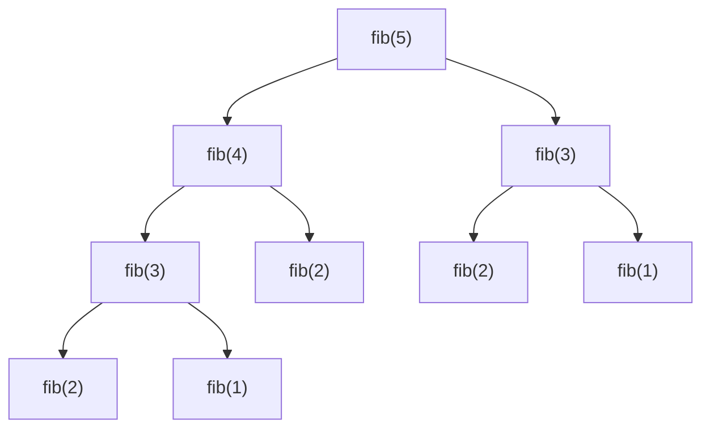

*The recursion tree for `fib(5)` (leaves trimmed). `fib(3)` is solved twice and `fib(2)` three times — count the nodes for time, `O(2ⁿ)`; measure the longest root-to-leaf path for space, `O(n)`.*

> **Interactive animation:** `recursion` — rendered by the page script in the HTML version.

**Interview question**

*Compute `base^exponent` in `O(log n)` time. `fast_power(2, 10)` → `1024`.*

`a^n = (a^(n/2))²` when `n` is even and `a · (a^(n/2))²` when it is odd. Each call halves `n`, so there are `log n` calls. The one trap: compute the half power **once** and store it. Writing `power(a, n/2) * power(a, n/2)` makes two calls per level and quietly brings back `O(n)`.

**Answer — fast power by halving**

```python
def fast_power(base, exponent):
    if exponent == 0:
        return 1
    half = fast_power(base, exponent // 2)   # computed once, reused
    if exponent % 2 == 0:
        return half * half
    return base * half * half


print(fast_power(2, 10))  # 1024
print(fast_power(3, 5))   # 243
```

```javascript
function fastPower(base, exponent) {
  if (exponent === 0) return 1;
  const half = fastPower(base, Math.floor(exponent / 2)); // computed once, reused
  return exponent % 2 === 0 ? half * half : half * half * base;
}

console.log(fastPower(2, 10)); // 1024
console.log(fastPower(3, 5));  // 243
```

**From the notes — recursion problems**

| Problem | Pattern | Complexity |
| --- | --- | --- |
| Sum of 1..N, factorial, sum of digits | linear recursion | `O(N)` / `O(log N)` |
| Print 1..N, N..1, both in one function | work before vs. after the call | `O(N)` |
| Fibonacci — plain / memo / tabulation | tree recursion → DP | `O(2^N)` → `O(N)` |
| Power, fast power | halve the exponent | `O(N)` → `O(log N)` |

#### More problems from the notes

Every remaining problem from the revision notes for this topic, each with a solution in Python and JavaScript.

**Problem — Sum of the first n natural numbers**

*Return `1 + 2 + … + n` recursively.*

`sum(n) = n + sum(n - 1)` with `sum(0) = 0`. `n` calls: `O(n)` time and `O(n)` stack.

**Solution**

```python
def sum_n(n):
    if n == 0:
        return 0
    return n + sum_n(n - 1)

print(sum_n(5))  # 15
```

```javascript
function sum(n) {
  if (n == 0) {
    return 0;
  }

  return n + sum(n - 1);
}
console.log(sum(5)); // 15
```

**Problem — Factorial**

*Return `n!` recursively.*

`fact(n) = n × fact(n - 1)` with `fact(0) = fact(1) = 1`. A straight line of `n` calls — which is also why memoisation does not help it.

**Solution**

```python
def factorial(n):
    if n == 0:
        return 1
    return n * factorial(n - 1)

print(factorial(5))  # 120
```

```javascript
function factorial(n) {
  if (n == 0) {
    return 1;
  }

  return n * factorial(n - 1);
}
console.log(factorial(5)); // 120
```

**Problem — Print 1 to N**

*Print the numbers from 1 to `n` using recursion.*

Recurse first, print after: the deepest call (`1`) prints before the calls above it return.

**Solution**

```python
def increasing(n):
    if n == 0:
        return
    increasing(n - 1)
    print(n, end=" ")

increasing(5)  # 1 2 3 4 5
print()
```

```javascript
function increasing(n) {
  if (n == 0) {
    return;
  }

  increasing(n - 1);

  console.log(n);
}
increasing(5); // 1 2 3 4 5
```

**Problem — Print N to 1**

*Print the numbers from `n` down to 1 using recursion.*

Print first, then recurse: each call prints before handing the smaller problem down.

**Solution**

```python
def decreasing(n):
    if n == 0:
        return
    print(n, end=" ")
    decreasing(n - 1)

decreasing(5)  # 5 4 3 2 1
print()
```

```javascript
function decreasing(n) {
  if (n == 0) {
    return;
  }

  console.log(n);

  decreasing(n - 1);
}
decreasing(5); // 5 4 3 2 1
```

**Problem — Fibonacci — plain recursion**

*Return the `n`-th Fibonacci number with direct recursion.*

Two calls per level: `O(2ⁿ)` time, but only `O(n)` stack because one path is alive at a time.

**Solution**

```python
def fibonacci(n):
    if n <= 1:
        return n
    return fibonacci(n - 1) + fibonacci(n - 2)

print(fibonacci(5))  # 5
print(fibonacci(7))  # 13
```

```javascript
function fibonacci(n) {
  if (n <= 1) {
    return n;
  }

  const first = fibonacci(n - 1);

  const second = fibonacci(n - 2);

  return first + second;
}
console.log(fibonacci(5)); // 5
console.log(fibonacci(6)); // 8
console.log(fibonacci(7)); // 13
```

**Problem — Fibonacci — memoisation**

*Return the `n`-th Fibonacci number, caching results.*

Store each `fib(k)` the first time it is computed; later calls return instantly. `O(n)` time and space.

**Solution**

```python
# TOP-DOWN MEMOIZATION (Recursive + Cache)
def fibonacci_memo(n, memo=None):
    if memo is None:
        memo = {}
    if n <= 1:
        return n
    if n in memo:
        return memo[n]
    memo[n] = fibonacci_memo(n - 1, memo) + fibonacci_memo(n - 2, memo)
    return memo[n]

print(fibonacci_memo(10))  # 55
print(fibonacci_memo(50))  # 12586269025
```

```javascript
function fibonacci(n, memo = {}) {
  // BASE CASE: The smallest subproblems that don't need further breakdown.
  // fib(0) = 0, fib(1) = 1 — these are defined values, not computed.
  if (n <= 1) {
    return n;
  }

  if (memo[n]) {
    return memo[n];
  }

  const first = fibonacci(n - 1, memo);
  const second = fibonacci(n - 2, memo);

  // STORE & RETURN: Cache the result so any future call to fib(n) is O(1).
  // Without this line, we'd recompute fib(n) every time it's needed.
  memo[n] = first + second;

  return memo[n];
}
console.log(fibonacci(5)); // 5
console.log(fibonacci(6)); // 8
console.log(fibonacci(7)); // 13
```

**Problem — Fibonacci — tabulation**

*Return the `n`-th Fibonacci number bottom-up.*

Fill `dp[0..n]` from the base cases upward. `O(n)` time, no recursion depth at all.

**Solution**

```python
# BOTTOM-UP TABULATION (Iterative + Array)
def fibonacci_tab(n):
    if n <= 1:
        return n
    dp = [0] * (n + 1)
    dp[1] = 1
    for i in range(2, n + 1):
        dp[i] = dp[i - 1] + dp[i - 2]
    return dp[n]

print(fibonacci_tab(10))  # 55
```

```javascript
function fibonacci(n) {
  const dp = [0, 1];

  for (let i = 2; i <= n; i++) {
    // Each value is simply the sum of the two preceding values.
    // No recursion, no cache lookups — just a direct array access (O(1) per step).
    dp[i] = dp[i - 1] + dp[i - 2];
  }

  // The answer is now sitting at dp[n], built up from dp[0] and dp[1].
  return dp[n];
}

console.log(fibonacci(5)); // 5
console.log(fibonacci(6)); // 8
console.log(fibonacci(7)); // 13
```

**Problem — Sum of digits**

*Return the sum of the digits of `n` recursively.*

`digits(n) = n % 10 + digits(n // 10)` with `digits(0) = 0`. One call per digit: `O(log n)`.

**Solution**

```python
def sum_of_digits(n):
    if n == 0:
        return 0
    return (n % 10) + sum_of_digits(n // 10)

print(sum_of_digits(12345))  # 15
print(sum_of_digits(46))     # 10
```

```javascript
function sumOfDigits(n) {
  if (n === 0) return 0;
  const lastDigit = n % 10;
  const remainingDigits = Math.floor(n / 10);
  return lastDigit + sumOfDigits(remainingDigits);
}
console.log(sumOfDigits(56789)); // 35
console.log(sumOfDigits(12345)); // 15
console.log(sumOfDigits(0)); // 0
```

**Problem — Print N to 1 and 1 to N in one function**

*Print `n … 1` followed by `1 … n` with a single recursive function.*

Print before the recursive call (descending) and again after it (ascending). The same call prints twice — once on the way down, once on the way back up.

**Solution**

```python
import sys

def dec_inc(A):
    if A == 0:
        return
    sys.stdout.write(str(A) + " ")
    dec_inc(A - 1)
    sys.stdout.write(str(A) + " ")

dec_inc(4)  # 4 3 2 1 1 2 3 4
print()
```

```javascript
function decInc(A) {
  if (A == 0) {
    return 0;
  }
  process.stdout.write(A + " "); // Print the current number before the recursive call, this will handle the decreasing part.
  decInc(A - 1);
  process.stdout.write(A + " "); // Print the current number after the recursive call, this will handle the increasing part.
}

decInc(5); // 5 4 3 2 1 1 2 3 4 5
```

**Problem — Power function**

*Compute `a^n` recursively.*

`pow(a, n) = a × pow(a, n - 1)`: `n` calls, `O(n)`. Fast power (above) halves `n` instead.

**Solution**

```python
def power(base, exponent):
    if exponent == 0:
        return 1
    return base * power(base, exponent - 1)

print(power(2, 3))  # 8
print(power(3, 4))  # 81
```

```javascript
function power(base, exponent) {
  if(exponent === 0) return 1;

  return base * power(base, exponent - 1);
}
console.log(power(2, 3)); // 8
console.log(power(2, 0)); // 1
```

<a id="21-backtracking"></a>

### Backtracking

- **Subsets** `O(2^N · N)`
- **Permutations** `O(N! · N)`
- **Valid parentheses** `O(4^n/√n)`

> **Analogy** 🧶
>
> **Picture it — exploring a maze with a ball of string**
>
> At every fork you pick a corridor and unroll string behind you. At a dead end you wind the string back to the last fork and try the next corridor. Winding back is the "undo" — without it you could never try the other branches.

Backtracking builds a solution one choice at a time, recurses, then **undoes** the choice before trying the next one. Compared with plain recursion, it only builds calls that can still lead to a valid answer. The notes name two styles:

- **Strength — proactive** — Check the rule *before* making a call, so invalid branches are never created. Fewer calls; the rule lives in the loop.
- **Weakness — reactive** — Make every call and reject invalid states at the top of the next call. Simpler to write, but explores more of the tree.

Three words that sound alike decide which template you need:

| Kind | Order matters? | Contiguous? | Example from `[1, 2, 3]` | Count |
| --- | --- | --- | --- | --- |
| Subset | no — `{1,2} = {2,1}` | no | `{1, 3}` | `2^n` |
| Subsequence | yes — keep original order | no | `[1, 3]` | `2^n` |
| Subarray | yes | yes | `[2, 3]` | `n(n+1)/2` |

From "banana", `"bna"` is a valid subset and subsequence but not a subarray; `"nab"` is only a subset. Think of three nested rings: subset (loosest) ⊃ subsequence ⊃ subarray (strictest).

> **Interactive animation:** `backtracking` — rendered by the page script in the HTML version.

**Interview question**

*Return every subset of a set of distinct numbers. `[1, 2, 3]` → 8 subsets.*

Each element offers one binary choice — **take it or leave it** — so the recursion tree has `2^n` leaves and each leaf is a subset. Push the element, recurse, **pop** it (that pop is the backtrack), recurse again without it.

**Answer — all subsets by include / exclude**

```python
def generate_subsets(nums):
    result = []

    def backtrack(index, current):
        if index == len(nums):
            result.append(list(current))    # copy — `current` keeps changing
            return
        current.append(nums[index])          # take nums[index]
        backtrack(index + 1, current)
        current.pop()                        # undo the choice
        backtrack(index + 1, current)        # leave nums[index]

    backtrack(0, [])
    return result


print(generate_subsets([1, 2, 3]))
# [[1, 2, 3], [1, 2], [1, 3], [1], [2, 3], [2], [3], []]
```

```javascript
function subsets(arr) {
  const result = [];
  function generateSubset(index, currentSubset) {
    if (index === arr.length) {
      result.push([...currentSubset]);      // copy — currentSubset keeps changing
      return;
    }
    currentSubset.push(arr[index]);          // take arr[index]
    generateSubset(index + 1, currentSubset);
    currentSubset.pop();                     // undo the choice
    generateSubset(index + 1, currentSubset); // leave arr[index]
  }
  generateSubset(0, []);
  return result;
}

console.log(subsets([1, 2, 3]));
// [[1,2,3], [1,2], [1,3], [1], [2,3], [2], [3], []]
```

**Interview question**

*Generate every valid string of `n` pairs of parentheses. `n = 3` → `((()))`, `(()())`, `(())()`, `()(())`, `()()()`.*

A prefix is still fixable as long as `open ≤ n` and `close ≤ open`. Branch on `'('` and `')'`, and cut any branch that breaks either rule. The count of results is the Catalan number, so the time is about `O(4ⁿ / √n)`; the stack depth is `2n`.

**Answer — valid parentheses (backtracking)**

```python
def generate_parentheses(n):
    result = []

    def backtrack(curr, open_count, close_count):
        if open_count > n or close_count > open_count:   # dead branch
            return
        if len(curr) == 2 * n:
            result.append(curr)
            return
        backtrack(curr + "(", open_count + 1, close_count)
        backtrack(curr + ")", open_count, close_count + 1)

    backtrack("", 0, 0)
    return result


print(generate_parentheses(3))  # ['((()))', '(()())', '(())()', '()(())', '()()()']
```

```javascript
function printValidParenthesis(A) {
  const result = [];
  function backtrack(curr, openCount, closeCount) {
    if (openCount > A || closeCount > openCount) return;  // dead branch
    if (curr.length === 2 * A) {
      result.push(curr);
      return;
    }
    backtrack(curr + "(", openCount + 1, closeCount);
    backtrack(curr + ")", openCount, closeCount + 1);
  }
  backtrack("", 0, 0);
  return result;
}

console.log(printValidParenthesis(3)); // ['((()))', '(()())', '(())()', '()(())', '()()()']
```

Permutations use the same shape with a different choice: at position `index`, **swap** each remaining element into place, recurse on `index + 1`, then swap it back. (The alternative keeps a `visited` array and builds a separate path.)

**Permutations by swapping**

```python
def permute_swapping(nums):
    result = []

    def backtrack(index):
        if index == len(nums):
            result.append(list(nums))
            return
        for i in range(index, len(nums)):
            nums[index], nums[i] = nums[i], nums[index]   # choose
            backtrack(index + 1)
            nums[index], nums[i] = nums[i], nums[index]   # undo

    backtrack(0)
    return result


print(permute_swapping([1, 2, 3]))  # [[1,2,3], [1,3,2], [2,1,3], [2,3,1], [3,2,1], [3,1,2]]
```

```javascript
function permutations(input) {
  const result = [];
  const chars = input.split("");
  function generate(index) {
    if (index === chars.length) {
      result.push(chars.join(""));
      return;
    }
    for (let i = index; i < chars.length; i++) {
      [chars[index], chars[i]] = [chars[i], chars[index]]; // choose
      generate(index + 1);
      [chars[index], chars[i]] = [chars[i], chars[index]]; // undo
    }
  }
  generate(0);
  return result;
}

console.log(permutations("ABC")); // ['ABC', 'ACB', 'BAC', 'BCA', 'CBA', 'CAB']
```

> **Warning**
>
> Appending `current` instead of a **copy** of it is the most common backtracking bug: every stored answer is the same list object, and after all the pops they are all empty.

**From the notes — backtracking problems**

| Problem | Pattern | Complexity |
| --- | --- | --- |
| Print valid parentheses (proactive, reactive, stack, DP) | backtracking with counts | `O(4^n/√n)` |
| Generate all subsets | take / leave | `O(2^N · N)` |
| Permutations (visited array, swapping) | choose / undo | `O(N! · N)` |

#### More problems from the notes

Every remaining problem from the revision notes for this topic, each with a solution in Python and JavaScript.

**Problem — Fitness meets variety — all permutations with a visited array**

*Given a list of distinct activities, print every order in which they can be done.*

Build the order position by position. A `visited` array marks what is already used; choose an unvisited item, recurse, then unmark it. `O(n! · n)`. The notes give several versions, including the swapping one above.

**Approach 1 — version 1**

```python
def fitness_meets_variety(activities):
    result = []
    visited = [False] * len(activities)

    def backtrack(current):
        if len(current) == len(activities):
            result.append(list(current))
            return

        for i in range(len(activities)):
            if not visited[i]:
                visited[i] = True
                current.append(activities[i])
                backtrack(current)
                current.pop()
                visited[i] = False

    backtrack([])
    return result

print(fitness_meets_variety(["Run", "Swim", "Gym"]))
```

```javascript
function permuteExercises(exercises) {
    // Store the length of the input string for easy access
    const n = exercises.length;

    // Create a boolean array initialized to 'false' to track which characters
    // are currently in use in the specific recursion stack
    const visited = Array(n).fill(false);

    function printPermutations(exercises, current) {

        // Base Case: Check if the current permutation is complete
        if (current.length === exercises.length) {
            console.log(current); // Print the valid permutation
            return; // Exit this recursive branch
        }

        for (let i = 0; i < exercises.length; i++) {

            // Check if the character at index 'i' has already been used in this path
            if (visited[i] == false) {

                visited[i] = true; // Mark the exercise as visited so it isn't reused in this branch

                // Recursive Step: Call function again, appending the chosen character
                printPermutations(exercises, current + exercises[i]);

                visited[i] = false; // Backtrack: unmark the exercise as visited so it can be used in the next loop iteration
            }
        }
    }

    // Initial call to start the recursion with an empty string
    printPermutations(exercises, "");
}

permuteExercises('abc');

/*
  Time Complexity: O(N * N!)
  - There are N! (N factorial) permutations.
  - Printing each permutation takes O(N) time (string creation/output).
  - Therefore, total time is proportional to N * N!.

  Space Complexity: O(N)
  - O(N) for the recursion stack depth.
  - O(N) for the 'visited' array.
  - O(N) for the string storage in the stack frames.
*/
```

**Approach 2 — version 2**

```python
def permutations_set(nums):
    result = []

    def backtrack(current, seen):
        if len(current) == len(nums):
            result.append(list(current))
            return

        for num in nums:
            if num not in seen:
                seen.add(num)
                current.append(num)
                backtrack(current, seen)
                current.pop()
                seen.remove(num)

    backtrack([], set())
    return result

print(permutations_set([1, 2, 3]))
```

```javascript
function solution(input) {
  // Initialize an array to store all completed permutations
  const result = [];

  // Store the length of the input string for easy access
  const n = input.length;

  // Sort input to ensure permutations are generated in lexicographical order (optional)
  // Split the string into an array of characters to allow indexing
  const characters = input.split('').sort();

  // Boolean array to keep track of used characters in the current path
  // initialized to false (no characters used yet)
  const used = new Array(n).fill(false);

  function backtrack(currentPath) {
    // Base Case: If the path length equals input length, add to results
    // We join the array back into a string before pushing
    if (currentPath.length === n) {
      result.push(currentPath.join(''));
      return; // Return to the previous stack frame
    }

    // Try to add every unused character to the current path
    for (let i = 0; i < n; i++) {
      // If character is already used in this path, skip it
      if (used[i]) continue;

      // Choose: Mark as used and add to path
      used[i] = true;
      currentPath.push(characters[i]);

      // Explore: Recurse further to fill the next slot in the permutation
      backtrack(currentPath);

      // Un-choose (Backtrack): Remove from path and mark as unused
      // This resets the state for the next iteration of the loop
      currentPath.pop();
      used[i] = false;
    }
  }

  // Start recursion with an empty path
  backtrack([]);

  // Return the array containing all permutations
  return result;
}

console.log(solution("ABC"));
// Expected Output: [ 'ABC', 'ACB', 'BAC', 'BCA', 'CAB', 'CBA' ]

/**
 * Time Complexity Analysis:
 * O(N * N!)
 * - There are N! (factorial) permutations.
 * - For every permutation, we perform O(N) work to join the array into a string and copy it to the result.
 *
 * Space Complexity Analysis:
 * O(N) (Auxiliary Space)
 * - The recursion stack depth goes up to N.
 * - The 'used' array and 'currentPath' array take O(N) space.
 * - Note: If including the space to hold the result, it would be O(N * N!).
 */
```

**Approach 3 — version 3**

```python
def permute_swapping(nums):
    result = []

    def backtrack(index):
        if index == len(nums):
            result.append(list(nums))
            return

        for i in range(index, len(nums)):
            nums[index], nums[i] = nums[i], nums[index]
            backtrack(index + 1)
            nums[index], nums[i] = nums[i], nums[index]

    backtrack(0)
    return result

print(permute_swapping([1, 2, 3]))
```

```javascript
function solution(input) {
  // Initialize an array to hold the final list of permutations
  const result = [];

  // Convert string to array for mutability (swapping)
  // Strings are immutable in JS, so we work with an array of characters
  const characters = input.split('');

  // Store the length of the array to avoid recalculating it
  const n = characters.length;

  function generate(arr, index) {
    // Base Case: If the current index reaches the end, we have a complete permutation
    // This implies all positions 0 to n-1 are fixed
    if (index === n) {
      // Join the array back into a string and add to results
      result.push(arr.join(''));
      // Return to the previous stack frame
      return;
    }

    // Iterate through the array starting from 'index'
    // This loop tries every character from 'index' to end as the character for the current position
    for (let i = index; i < n; i++) {
      // Swap the current element with the element at 'index'
      // This places the character arr[i] into the fixed position 'index'
      [arr[index], arr[i]] = [arr[i], arr[index]];

      // Recurse for the next index
      // Move to the next position (index + 1) to fix the remaining characters
      generate(arr, index + 1);

      [arr[index], arr[i]] = [arr[i], arr[index]];
    }
  }

  // Start the recursion from index 0
  // Begins the process of fixing the first character
  generate(characters, 0);

  // Return the array containing all generated permutations
  return result;
}

// Execute the solution with a test string
console.log(solution("ABC"));
// Expected Output: [ 'ABC', 'ACB', 'BAC', 'BCA', 'CBA', 'CAB' ]
// (Note: Order may vary slightly depending on swap implementation details, but all permutations will be present)

/**
 * Additional Complexity Analysis:
 * * Time Complexity: O(N * N!)
 * - There are N! (N factorial) permutations.
 * - For each permutation, we perform a .join('') operation and a push to the array, which takes O(N) time.
 * - Therefore, total time is O(N * N!).
 * * Space Complexity: O(N) (Auxiliary) / O(N * N!) (Total)
 * - Auxiliary Space: O(N) due to the recursion stack depth (maximum depth is the length of the string).
 * - Total Space: O(N * N!) if we count the space required to store the result array containing all permutations.
 */
```

**Problem — Generate all parentheses II**

*Generate every balanced string of `n` pairs of parentheses.*

The proactive form: add `(` while fewer than `n` are open, add `)` only while it would not close more than were opened. Every leaf reached is valid.

**Solution**

```python
def generate_parentheses_ii(A):
    ans = []

    def solve(curr, open_c, close_c):
        if len(curr) == 2 * A:
            ans.append(curr)
            return

        if open_c < A:
            solve(curr + "(", open_c + 1, close_c)
        if close_c < open_c:
            solve(curr + ")", open_c, close_c + 1)

    solve("", 0, 0)
    return ans

print(generate_parentheses_ii(3))
```

```javascript
function generateParentheses(A) {
  const result = [];

  function backtrack(current, open, close) {
    // Base case: when the current string reaches 2*A length
    if (current.length === 2 * A) {
      result.push(current);
      return;
    }

    // Add open parenthesis if we still have some left
    if (open < A) {
      backtrack(current + '(', open + 1, close);
    }

    // Add close parenthesis only if it won’t lead to invalid sequence
    if (close < open) {
      backtrack(current + ')', open, close + 1);
    }
  }

  backtrack('', 0, 0);
  return result;
}

console.log(generateParentheses(3)); // ["((()))", "(()())", "(())()", "()(())", "()()()"]
```

<a id="22-hashing-set"></a>

### Hashing (Set)

- **add / delete / has (average)** `O(1)`
- **Worst case** `O(n)`
- **Space** `O(n)`
- **Direct address table** `O(1)` time, `O(max_val)` space

When a problem asks *"Have I seen this before?"* or *"Does a valid pair or complement exist?"*, you do not need to store values, counts, or indices. You only need a collection of unique elements with instant membership testing. A **HashSet** provides average `O(1)` insertion, lookup, and deletion by passing elements through a hash function into buckets, resolving collisions via chaining.

> **Analogy** 📋
>
> **Picture it — a velvet rope and a guest list**
>
> The bouncer at a club holds a clipboard with the names of invitees. When a guest arrives, the bouncer scans the list in one quick glance (`has`). If the name is already checked in or absent, the bouncer acts immediately. No drinks ordered, seat numbers, or visit counts are recorded — only presence or absence matters.

> **Interactive animation:** `hash-table` — rendered by the page script in the HTML version.

#### HashSet operations
1. `add(value)` — Add the value to the set: Time Complexity `O(1)` on average, `O(n)` in worst case.
2. `delete(value)` — Delete the value from the set: Time Complexity `O(1)` on average, `O(n)` in worst case.
3. `has(value)` — Check if the value is present in the set: Time Complexity `O(1)` on average, `O(n)` in worst case.
4. `size` — Get the size (count of unique elements) of the set: Time Complexity `O(1)`.

> **Key idea**
>
> **Check before inserting:** When looking for a pair `(x, y)` satisfying a condition (like `x + y = K` or a repeat character), check whether the complement exists in the set *before* adding the current element. This prevents an element from pairing with itself and guarantees a single `O(n)` pass.

**Interview question**

*Find the length of the longest substring with no repeated character. `"cbaabcfedfgh"` → `6` (`"abcfed"`).*

Use a sliding window maintained by a hash set. Extend the right pointer; whenever `s[right]` is already in the set, evict characters from `s[left]` and increment `left` until the duplicate is removed. The set always represents the unique characters in the current window.

**Answer — longest substring without repeating characters**

```python
def length_of_longest_substring(s):
    window = set()
    left = best = 0
    for right, ch in enumerate(s):
        while ch in window:          # evict until ch is unique again
            window.remove(s[left])
            left += 1
        window.add(ch)
        best = max(best, right - left + 1)
    return best


print(length_of_longest_substring("cbaabcfedfgh"))  # 6
print(length_of_longest_substring("abcabcbb"))      # 3
print(length_of_longest_substring("pwwkew"))        # 3
```

```javascript
function lengthOfLongestSubstring(s) {
  const window = new Set();
  let start = 0;
  let best = 0;
  for (let end = 0; end < s.length; end++) {
    while (window.has(s[end])) {    // evict until s[end] is unique again
      window.delete(s[start]);
      start++;
    }
    window.add(s[end]);
    best = Math.max(best, end - start + 1);
  }
  return best;
}

console.log(lengthOfLongestSubstring("cbaabcfedfgh")); // 6
console.log(lengthOfLongestSubstring("abcabcbb"));     // 3
console.log(lengthOfLongestSubstring("pwwkew"));       // 3
```

**Interview question**

*Given an array and target `K`, determine if there exist two elements at distinct indices such that `A[i] + A[j] = K` (Good Pair).*

For each element `x`, its complement is `K - x`. Maintain a set of numbers visited so far. Check `seen.has(K - x)` before inserting `x`; if found, return `1`. If the loop finishes, return `0`.

**Answer — pair with sum K exists (good pair)**

```python
def good_pair(arr, K):
    seen = set()
    for num in arr:
        complement = K - num
        if complement in seen:
            return 1
        seen.add(num)
    return 0


print(good_pair([1, 2, 3, 4], 7))   # 1
print(good_pair([1, 2, 4, 3], 2))   # 0
print(good_pair([1, 9, 3, 4], 4))   # 1
print(good_pair([-2, 1, 5, 8], 3))  # 1 (pair -2, 5)
```

```javascript
function goodPair(arr, K) {
  let set = new Set();

  for (let elem of arr) {
    let complement = K - elem;
    if (set.has(complement)) {
      return 1; // good pair found
    }
    set.add(elem);
  }

  return 0; // no good pair found
}

console.log(goodPair([1, 2, 3, 4], 7)); // 1
console.log(goodPair([1, 2, 4, 3], 2)); // 0
console.log(goodPair([1, 9, 3, 4], 4)); // 1
console.log(goodPair([-2, 1, 5, 8], 3)); // 1 (pair -2, 5)
```

**Interview question**

*Check if there exists a non-empty contiguous subarray whose sum is 0.*

The sum of subarray `A[i..j]` equals prefix sum `P[j] - P[i-1]`. If `P[j] == P[i-1]`, or if any `P[j] == 0`, the subarray sums to 0. Carry forward the running cumulative sum in a Set. If the current sum is 0 or already exists in the set, a zero-sum subarray is found.

**Answer — check if subarray with sum 0 exists**

```python
def subarray_sum_zero(arr):
    seen_sums = set()
    curr_sum = 0
    for num in arr:
        curr_sum += num
        if curr_sum == 0 or curr_sum in seen_sums:
            return True
        seen_sums.add(curr_sum)
    return False


print(subarray_sum_zero([1, 2, 3, 4, 5]))                    # False
print(subarray_sum_zero([4, -1, 1]))                         # True
print(subarray_sum_zero([2, 2, 1, -3, 4, 3, 1, -2, -3, 2])) # True
```

```javascript
function subarraySumZero(arr) {
  let set = new Set();
  let sum = 0;

  for (const num of arr) {
    sum += num;

    if (sum === 0 || set.has(sum)) {
      return true;
    }

    set.add(sum);
  }

  return false;
}

console.log(subarraySumZero([2, 2, 1, -3, 4, 3, 1, -2, -3, 2])); // true
console.log(subarraySumZero([1, 2, 3, 4, 5])); // false
```

#### More problems from the notes — Set

1. **Count of distinct elements** — Insert all elements into a Set; return `set.size` or `len(set)`. Takes `O(n)` time, `O(n)` space.
2. **Element-exists queries with a Direct Address Table** — When the maximum element `M` is small, allocate an array of size `M + 1` filled with `0`. Set `dat[x] = 1` for each element in `arr`. Each query is an `O(1)` index lookup. When values are unbounded or negative, use a Set instead.

**Problem — Count of distinct elements**

*Given an n elements array, find the count of distinct elements in the array.*

Insert every element into a set; duplicate entries collapse automatically. The set size is the distinct count. `O(n)` time, `O(n)` space.

**Solution**

```python
def count_distinct(arr):
    # Python built-in set automatically stores unique elements
    return len(set(arr))


print(count_distinct([1, 2, 2, 3, 4, 4, 5]))  # 5
print(count_distinct([2, 6, 3, 8, 2, 8, 2, 8, 10, 6]))  # 5
```

```javascript
function countDistinct(arr) {
  const set = new Set(arr);
  return set.size;
}

const arr = [2, 6, 3, 8, 2, 8, 2, 8, 10, 6];
console.log(countDistinct(arr)); // 5
console.log(countDistinct([1, 2, 2, 3, 4, 4, 5])); // 5
```

**Problem — Element-exists queries with a Direct Address Table**

*Given an array and a list of queries, check whether each queried element exists in the array.*

A direct address table marks `dat[v] = 1` at index `v` for every value `v` in the array. Queries take `O(1)` index lookups. When values exceed `10^6` or include negatives, use a hash set instead.

**Solution**

```python
def check_elements_queries(arr, queries):
    elements_set = set(arr)
    return [q in elements_set for q in queries]


print(check_elements_queries([1, 5, 3, 7, 2], [5, 4, 2]))  # [True, False, True]
```

```javascript
function checkElementsDAT(arr, queries) {
  let maxVal = -1;
  for (let i = 0; i < arr.length; i++) {
    if (arr[i] > maxVal) maxVal = arr[i];
  }

  const dat = new Array(maxVal + 1).fill(0);
  for (let i = 0; i < arr.length; i++) {
    dat[arr[i]] = 1;
  }

  return queries.map((q) => (q <= maxVal && dat[q] === 1));
}

console.log(checkElementsDAT([2, 4, 11, 15, 6, 8, 14, 9], [4, 10, 17, 14])); // [true, false, false, true]
```

<a id="23-hashing-map"></a>

### Hashing (Map)

- **get / set / delete (average)** `O(1)`
- **Worst case** `O(n)`
- **Load factor** `λ = n / buckets`
- **Rehash threshold** `λ > 2.0`

When you need to remember *more* than just existence — such as frequency of occurrences, earliest index seen, latest index seen, or key-to-value associations — reach for a **HashMap**. A hash map maps keys to values through an array of buckets, resolving collisions via chaining. When the load factor `λ = n / buckets` exceeds a threshold, it automatically **rehashes**: doubling bucket capacity and re-distributing keys to preserve `O(1)` average lookup time.

> **Analogy** 🧥
>
> **Picture it — a coat check with ten hooks**
>
> The attendant hangs your coat on hook `ticket % 10`. Two guests can share a hook — the coats just hang one behind the other. Handing in your ticket (key) gets your specific coat (value). If every hook gets crowded, the attendant installs twice as many hooks and re-hangs everything.

```text
index | chain                       load factor λ = elements / buckets
------+---------------------           = 11 / 10 = 1.1
  0   | 30 → 20
  2   | 42 → 62                     threshold = 2.0
  5   | 45 → 75                     λ > threshold  →  REHASH:
  6   | 36                            double the buckets and re-insert
  7   | 37 → 67                       every key with the new % size
  9   | 99 → 59
```

> **Interactive animation:** `rehash` — rendered by the page script in the HTML version.

The average chain length **is** the load factor. Keep `λ` below a constant and each lookup scans a constant number of nodes, so `get` and `set` stay `O(1)` on average. Rehashing costs `O(n)`, but because the table doubles it happens exponentially rarely — the same amortised argument as a growing array.

#### HashMap operations
1. `set(key, value)` / `put(key, value)` — Set the value for the key: Time Complexity `O(1)` on average, `O(n)` in worst case.
2. `get(key)` — Get the value for the key: Time Complexity `O(1)` on average, `O(n)` in worst case.
3. `delete(key)` — Delete the key-value pair: Time Complexity `O(1)` on average, `O(n)` in worst case.
4. `has(key)` — Check if the key is present in the hashmap: Time Complexity `O(1)` on average, `O(n)` in worst case.
5. `size` — Get the size of the hashmap: Time Complexity `O(1)`.

**A hash map from scratch — array of chains with rehashing**

```python
class HashMap:
    def __init__(self, capacity=4, threshold=2.0):
        self.buckets = [[] for _ in range(capacity)]
        self.size = 0
        self.threshold = threshold

    def _index(self, key):
        return hash(key) % len(self.buckets)

    def put(self, key, value):
        chain = self.buckets[self._index(key)]
        for pair in chain:
            if pair[0] == key:
                pair[1] = value          # key exists: overwrite
                return
        chain.append([key, value])
        self.size += 1
        if self.size / len(self.buckets) > self.threshold:
            self._rehash()

    def get(self, key):
        for k, v in self.buckets[self._index(key)]:
            if k == key:
                return v
        return -1

    def _rehash(self):
        old = self.buckets
        self.buckets = [[] for _ in range(2 * len(old))]
        self.size = 0
        for chain in old:
            for k, v in chain:
                self.put(k, v)


m = HashMap()
for i, word in enumerate(["apple", "kiwi", "fig", "lime", "pear", "plum", "date", "sloe", "yuzu"]):
    m.put(word, i)
print(m.get("plum"), len(m.buckets))  # 5 8
```

```javascript
class HashMap {
  constructor(capacity = 4, threshold = 2.0) {
    this.bucket = Array.from({ length: capacity }, () => []);
    this.size = 0;
    this.threshold = threshold;
  }

  hashFn(key) {
    let hc = 0;
    for (let i = 0; i < key.length; i++) hc = ((hc << 5) - hc + key.charCodeAt(i)) | 0;
    return Math.abs(hc) % this.bucket.length;
  }

  put(key, value) {
    const chain = this.bucket[this.hashFn(key)];
    const pair = chain.find((p) => p.key === key);
    if (pair) {
      pair.value = value;            // key exists: overwrite
      return;
    }
    chain.push({ key, value });
    this.size++;
    if (this.size / this.bucket.length > this.threshold) this.rehash();
  }

  get(key) {
    const pair = this.bucket[this.hashFn(key)].find((p) => p.key === key);
    return pair ? pair.value : -1;
  }

  rehash() {
    const old = this.bucket;
    this.bucket = Array.from({ length: 2 * old.length }, () => []);
    this.size = 0;
    for (const chain of old) for (const p of chain) this.put(p.key, p.value);
  }
}

const m = new HashMap();
["apple", "kiwi", "fig", "lime", "pear", "plum", "date", "sloe", "yuzu"].forEach((w, i) => m.put(w, i));
console.log(m.get("plum"), m.bucket.length); // 5 8
```

<a id="prefix-sum-and-hash-map"></a>

#### The killer combo: prefix sums + a hash map

The sum of `A[i+1..j]` is `P[j] - P[i]`. So "a subarray ending at `j` sums to `K`" means "**some earlier prefix equals `P[j] - K`**". A hash map of prefix sums seen so far answers that in `O(1)`, which handles negative numbers where a sliding window cannot. Seed the map with prefix `0` so subarrays starting at index 0 are counted.

> **Interactive animation:** `prefix-hash` — rendered by the page script in the HTML version.

**Interview question**

*Count the subarrays whose sum is exactly `K`. Negatives allowed. `[2, 3, 9, -4, 1, 5, 6, 2, 5]`, `K = 11` → `3` (`[2,3,9,-4,1]`, `[9,-4,1,5]`, `[5,6]`).*

Walk once, keeping the running sum. At each index add `freq[sum - K]` — the number of earlier prefixes that would make the gap exactly `K` — then record the current sum. Storing **counts** rather than a set matters: with zeros or negatives, the same prefix sum can occur many times, and each occurrence starts a different subarray.

**Answer — count subarrays with sum K**

```python
def count_subarrays_with_sum_k(arr, k):
    freq = {0: 1}                 # the empty prefix
    curr_sum = 0
    count = 0
    for num in arr:
        curr_sum += num
        count += freq.get(curr_sum - k, 0)
        freq[curr_sum] = freq.get(curr_sum, 0) + 1
    return count


print(count_subarrays_with_sum_k([2, 3, 9, -4, 1, 5, 6, 2, 5], 11))  # 3
print(count_subarrays_with_sum_k([1, 0, 1], 1))                     # 4
print(count_subarrays_with_sum_k([0, 0, 0], 0))                     # 6
```

```javascript
function countSubarraysWithSumK(arr, k) {
  const freq = new Map([[0, 1]]);   // the empty prefix
  let currentSum = 0;
  let count = 0;
  for (const num of arr) {
    currentSum += num;
    count += freq.get(currentSum - k) || 0;
    freq.set(currentSum, (freq.get(currentSum) || 0) + 1);
  }
  return count;
}

console.log(countSubarraysWithSumK([2, 3, 9, -4, 1, 5, 6, 2, 5], 11)); // 3
console.log(countSubarraysWithSumK([1, 0, 1], 1));                    // 4
console.log(countSubarraysWithSumK([0, 0, 0], 0));                    // 6
```

**Interview question**

*Return the length of the longest subarray whose sum is 0. `[15, -2, 2, -8, 1, 7, 10, 23]` → `5` (`[-2, 2, -8, 1, 7]`).*

Two equal prefix sums mean everything between them cancels. For the **longest** gap, store only the **first** index at which each prefix sum appears, and never overwrite it. Seed `{0: -1}` so a zero-sum prefix counts from index 0.

**Answer — longest zero-sum subarray**

```python
def longest_subarray_zero_sum(arr):
    first_seen = {0: -1}
    curr_sum = 0
    max_len = 0
    for i, val in enumerate(arr):
        curr_sum += val
        if curr_sum in first_seen:
            max_len = max(max_len, i - first_seen[curr_sum])
        else:
            first_seen[curr_sum] = i        # keep the earliest index only
    return max_len


print(longest_subarray_zero_sum([15, -2, 2, -8, 1, 7, 10, 23]))  # 5
```

```javascript
function longestSubarrayZeroSum(A) {
  const firstSeen = new Map([[0, -1]]);
  let prefixSum = 0;
  let maxLen = 0;
  for (let i = 0; i < A.length; i++) {
    prefixSum += A[i];
    if (firstSeen.has(prefixSum)) maxLen = Math.max(maxLen, i - firstSeen.get(prefixSum));
    else firstSeen.set(prefixSum, i);      // keep the earliest index only
  }
  return maxLen;
}

console.log(longestSubarrayZeroSum([15, -2, 2, -8, 1, 7, 10, 23])); // 5
```

**Interview question**

*Count the pairs `i < j` with `A[i] + A[j] = K`.*

For each element `x`, every earlier occurrence of `K - x` forms a pair: add `freq[K - x]` to your total, then increment `freq[x]`. Storing counts in a hash map allows duplicates to be accounted for in a single pass.

**Answer — count pairs with sum K**

```python
def count_pairs_sum(arr, k):
    freq = dict()
    count = 0
    for num in arr:
        complement = k - num
        count += freq.get(complement, 0)
        freq[num] = freq.get(num, 0) + 1
    return count


print(count_pairs_sum([1, 2, 3, 2, 1], 3))  # 4
print(count_pairs_sum([1, 1, 1], 2))        # 3
```

```javascript
function countPairsSum(arr, k) {
  const target = BigInt(k);
  const map = new Map();
  let count = 0n;

  for (const item of arr) {
    const elem = BigInt(item);
    const need = target - elem;

    if (map.has(need)) {
      count += map.get(need);
    }

    map.set(elem, (map.get(elem) || 0n) + 1n);
  }

  const MOD = 1000_000_007n;
  return Number(count % MOD);
}

console.log(countPairsSum([3, 5, 1, 2], 8)); // 1
console.log(countPairsSum([1, 2, 1, 2], 3)); // 4
```

#### More problems from the notes — Map

1. **Frequency queries** — Build a frequency map of the array in `O(n)`; answer `Q` queries in `O(1)` each. Total `O(n + q)`.
2. **Count subarrays with sum 0** — Maintain prefix sum counts seeded with `{0: 1}`. Add `freq[curr_sum]` at each step. `O(n)`.
3. **Check subarray with sum K exists** — Maintain running sum; check if `curr_sum == K` or `map.has(curr_sum - K)`. `O(n)`.
4. **Common elements in 2 arrays** — Count frequencies of the smaller array into a map. Scan the larger array, outputting on positive count and decrementing. `O(n + m)`.
5. **Minimum distance between equal elements (Shaggy and distances)** — Map storing the last-seen index of each element. When an element repeats, minimize `i - last_seen[x]`. `O(n)`.

**Problem — Frequency queries**

*Given an array and a list of queries, return how many times each queried value occurs.*

Count every value once into a map; each query is then an `O(1)` lookup. `O(n + q)`.

**Solution**

```python
def frequency(arr, queries):
    freq_map = {}
    for num in arr:
        freq_map[num] = freq_map.get(num, 0) + 1

    return [freq_map.get(q, 0) for q in queries]


print(frequency([1, 2, 1, 1], [1, 2]))  # [3, 1]
print(frequency([2, 5, 9, 2, 8], [3, 2]))  # [0, 2]
```

```javascript
function frequency(arr, queries) {
  const map = new Map();
  for (const elem of arr) {
    map.set(elem, (map.get(elem) || 0) + 1);
  }

  const ans = [];
  for (const query of queries) {
    ans.push(map.get(query) || 0);
  }
  return ans;
}

console.log(frequency([2, 6, 3, 8, 2, 8, 2, 8, 10, 6], [2, 8, 3, 5])); // [3, 3, 1, 0]
```

**Problem — Count subarrays with sum 0**

*Count the subarrays whose sum is 0.*

Each earlier occurrence of the current prefix sum closes one zero-sum subarray. Keep prefix-sum counts, seeded with `{0: 1}`. `O(n)`.

**Solution**

```python
from collections import defaultdict


def count_subarrays_with_sum_zero(arr):
    freq = defaultdict(int)
    freq[0] = 1  # Base case for prefix sum 0
    curr_sum = 0
    count = 0

    for num in arr:
        curr_sum += num
        count += freq[curr_sum]
        freq[curr_sum] += 1

    return count


print(count_subarrays_with_sum_zero([1, -1, -2, 2]))     # 3
print(count_subarrays_with_sum_zero([-1, 2, -1]))        # 2
print(count_subarrays_with_sum_zero([0, 0, 0]))          # 6
```

```javascript
function countSubarraysWithSumZero(arr) {
  let map = new Map();
  let sum = 0;
  let count = 0;

  for (const num of arr) {
    sum += num;

    if (sum === 0) {
      count++;
    }

    if (map.has(sum)) {
      count += map.get(sum);
    }

    map.set(sum, (map.get(sum) || 0) + 1);
  }

  return count;
}

console.log(countSubarraysWithSumZero([2, 2, 1, -3, 4, 3, 1, -2, -3, 2])); // 2
console.log(countSubarraysWithSumZero([1, 2, -2, 4, -4])); // 3
```

**Problem — Does a subarray with sum K exist?**

*Is there a subarray whose sum is exactly `K`?*

Keep prefix sums in a map or set; if `curr_sum - K` has been seen (or `curr_sum == K`), the subarray after it sums to `K`. `O(n)`.

**Solution**

```python
def subarray_sum_k(arr, k):
    seen = {0}
    curr_sum = 0

    for num in arr:
        curr_sum += num
        if (curr_sum - k) in seen:
            return True
        seen.add(curr_sum)

    return False


print(subarray_sum_k([10, 2, -2, -20, 10], -10))  # True
print(subarray_sum_k([1, 2, 3], 7))                 # False
```

```javascript
function subarraySumK(arr, k) {
  let map = new Map();
  let sum = 0;

  for (const num of arr) {
    sum += num;

    if (sum === k || map.has(sum - k)) {
      return true;
    }

    map.set(sum, (map.get(sum) || 0) + 1);
  }

  return false;
}

console.log(subarraySumK([2, 3, 9, -4, 1, 5, 6, 2, 5], 11)); // true
console.log(subarraySumK([4, 2, 3, 7, -1, 9, 15, 16, -8], 20)); // true
```

**Problem — Common elements of two arrays**

*Return the elements common to two arrays, including repeats as many times as both contain them.*

Count the first array into a map; walk the second, and whenever a value still has a positive count, output it and decrement. `O(n + m)`.

**Solution**

```python
from collections import Counter


def common_elements(A, B):
    freq_a = Counter(A)
    freq_b = Counter(B)
    ans = []

    for num in freq_a:
        if num in freq_b:
            common_count = min(freq_a[num], freq_b[num])
            ans.extend([num] * common_count)

    return ans


print(common_elements([1, 2, 2, 1], [2, 3, 1, 2]))  # [1, 2, 2]
```

```javascript
function commonElements(A, B) {
  if (B.length < A.length) {
    [A, B] = [B, A];
  }

  const freq = new Map();
  for (const x of A) {
    freq.set(x, (freq.get(x) || 0) + 1);
  }

  const result = [];
  for (const x of B) {
    const c = freq.get(x) || 0;
    if (c > 0) {
      result.push(x);
      freq.set(x, c - 1);
    }
  }

  return result;
}

console.log(commonElements([1, 2, 2, 1], [2, 3, 1, 2])); // [2, 1, 2]
console.log(commonElements([2, 1, 4, 10], [3, 6, 2, 10, 10])); // [2, 10]
```

**Problem — Minimum distance between equal elements (Shaggy and distances)**

*Return the smallest `j - i` such that `A[i] == A[j]` and `i ≠ j`, or `-1` if every value is unique. `[7, 1, 3, 4, 1, 7]` → `3`.*

Walk once, remembering the **last index** each value was seen at. When a value repeats, the gap to its last occurrence is a candidate; the closest pair is always between consecutive occurrences, so the last index is all you need. `O(n)`.

**Solution**

```python
def min_distance_equal(arr):
    last_seen = {}
    best = float("inf")
    for i, x in enumerate(arr):
        if x in last_seen:
            best = min(best, i - last_seen[x])
        last_seen[x] = i                  # only the most recent index matters
    return -1 if best == float("inf") else best


print(min_distance_equal([7, 1, 3, 4, 1, 7]))  # 3
print(min_distance_equal([1, 2, 3]))           # -1
```

```javascript
function minDistanceEqual(arr) {
  const lastSeen = new Map();
  let best = Infinity;
  arr.forEach((x, i) => {
    if (lastSeen.has(x)) best = Math.min(best, i - lastSeen.get(x));
    lastSeen.set(x, i);                  // only the most recent index matters
  });
  return best === Infinity ? -1 : best;
}

console.log(minDistanceEqual([7, 1, 3, 4, 1, 7])); // 3
console.log(minDistanceEqual([1, 2, 3]));          // -1
```


<a id="24-sorting-beyond-the-library-call"></a>

### Sorting Beyond the Library Call

- **Count sort** `O(N + K)`
- **Merge sort** `O(N log N)`
- **Quick sort (average)** `O(N log N)`
- **Quick sort (worst)** `O(N^2)`

You will almost always call the built-in sort. You still need to know how the classic sorts work, because their **pieces** — counting, merging two sorted halves, partitioning around a pivot, custom comparators — are themselves the answer to a whole family of problems.

Two properties decide which sort a situation needs:

- **Strength — stable** — Equal elements keep their original relative order. Merge sort and count sort are stable; quick sort and heap sort are not.
- **Strength — in-place** — Needs only `O(1)` (or `O(log n)` stack) extra memory. Quick sort and heap sort are in-place; merge sort needs an `O(n)` buffer.

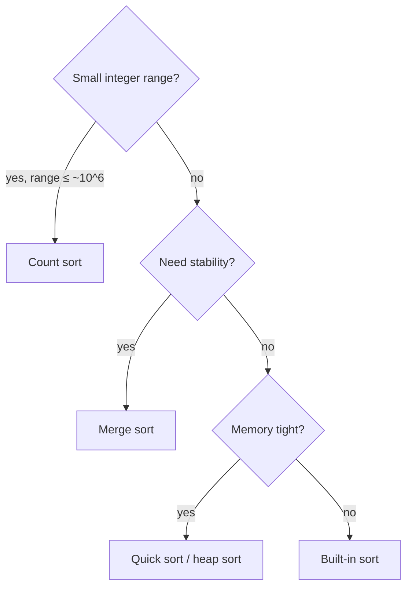

*Which classic sort to reach for — and what its pieces are good for.*

<a id="count-sort"></a>

#### Count sort — sorting without comparing

When values live in a small range, count how often each value occurs, then write them back in order. No comparisons at all, so it beats the `O(n log n)` lower bound. For negative values, shift every index by `min`: value `v` is counted at `v - min`. The notes' rule of thumb: worth it when the range of values is about `10^6` or less.

> **Interactive animation:** `count-sort` — rendered by the page script in the HTML version.

**Answer — count sort with negative numbers**

```python
def count_sort(arr):
    lo, hi = min(arr), max(arr)
    count = [0] * (hi - lo + 1)
    for num in arr:
        count[num - lo] += 1           # shift so the smallest value maps to index 0
    ans = []
    for i, c in enumerate(count):
        ans.extend([i + lo] * c)
    return ans


print(count_sort([-2, 1, 4, 2, -2, 6, 1, -3, 4, -1]))  # [-3, -2, -2, -1, 1, 1, 2, 4, 4, 6]
```

```javascript
function countSort(arr) {
  const min = Math.min(...arr);
  const max = Math.max(...arr);
  const freq = new Array(max - min + 1).fill(0);
  for (const num of arr) freq[num - min]++;   // shift so the smallest value maps to index 0
  const sorted = [];
  freq.forEach((count, i) => {
    for (let c = 0; c < count; c++) sorted.push(i + min);
  });
  return sorted;
}

console.log(countSort([-2, 1, 4, 2, -2, 6, 1, -3, 4, -1])); // [-3, -2, -2, -1, 1, 1, 2, 4, 4, 6]
```

<a id="merge-and-quick"></a>

#### Merge sort and quick sort — two ways to divide

**Merge sort** splits blindly in the middle and does the real work on the way back up: merging two sorted halves is a two-pointer walk that always takes the smaller front element (`<=` keeps it stable). **Quick sort** does the real work on the way down: partition around a pivot so smaller values end up left and larger right, and the pivot lands in its final position. Compute the middle as `lo + (hi - lo) // 2` — the notes flag `(lo + hi) / 2` as an overflow risk in fixed-width languages.

> **Interactive animation:** `sorting` (option=merge) — rendered by the page script in the HTML version.

**Merge sort**

```python
def merge(left, right):
    result, i, j = [], 0, 0
    while i < len(left) and j < len(right):
        if left[i] <= right[j]:        # <= keeps equal elements in order: stable
            result.append(left[i]); i += 1
        else:
            result.append(right[j]); j += 1
    return result + left[i:] + right[j:]


def merge_sort(arr):
    if len(arr) <= 1:
        return arr
    mid = len(arr) // 2
    return merge(merge_sort(arr[:mid]), merge_sort(arr[mid:]))


print(merge_sort([38, 27, 43, 3, 9, 82, 10]))  # [3, 9, 10, 27, 38, 43, 82]
```

```javascript
function mergeTwoSortedArrays(left, right) {
  const merged = [];
  let i = 0, j = 0;
  while (i < left.length && j < right.length) {
    if (left[i] <= right[j]) merged.push(left[i++]); // <= keeps equal elements in order: stable
    else merged.push(right[j++]);
  }
  return merged.concat(left.slice(i), right.slice(j));
}

function mergeSort(arr, lo = 0, hi = arr.length - 1) {
  if (lo >= hi) return [arr[lo]];
  const mid = lo + Math.floor((hi - lo) / 2);
  return mergeTwoSortedArrays(mergeSort(arr, lo, mid), mergeSort(arr, mid + 1, hi));
}

console.log(mergeSort([38, 27, 43, 3, 9, 82, 10])); // [3, 9, 10, 27, 38, 43, 82]
```

> **Interactive animation:** `sorting` (option=quick) — rendered by the page script in the HTML version.

**Quick sort (Lomuto partition, last element as pivot)**

```python
def partition(arr, low, high):
    pivot = arr[high]
    i = low                            # next slot for a value < pivot
    for j in range(low, high):
        if arr[j] < pivot:
            arr[i], arr[j] = arr[j], arr[i]
            i += 1
    arr[i], arr[high] = arr[high], arr[i]   # pivot lands in its final place
    return i


def quick_sort(arr, low=0, high=None):
    if high is None:
        high = len(arr) - 1
    if low < high:
        p = partition(arr, low, high)
        quick_sort(arr, low, p - 1)
        quick_sort(arr, p + 1, high)
    return arr


print(quick_sort([10, 7, 8, 9, 1, 5]))  # [1, 5, 7, 8, 9, 10]
```

```javascript
function getPivotIndex(arr, start, end) {
  const pivot = arr[end];
  let low = start;                      // next slot for a value < pivot
  for (let high = start; high < end; high++) {
    if (arr[high] < pivot) {
      [arr[low], arr[high]] = [arr[high], arr[low]];
      low++;
    }
  }
  [arr[low], arr[end]] = [arr[end], arr[low]]; // pivot lands in its final place
  return low;
}

function quickSort(arr, low = 0, high = arr.length - 1) {
  if (low >= high) return arr;
  const p = getPivotIndex(arr, low, high);
  quickSort(arr, low, p - 1);
  quickSort(arr, p + 1, high);
  return arr;
}

console.log(quickSort([10, 7, 8, 9, 1, 5])); // [1, 5, 7, 8, 9, 10]
```

<a id="custom-comparators"></a>

#### Custom comparators

A comparator answers one question: *should `a` come before `b`?* Return negative for yes, positive for no, zero for a tie. Sorting by factor count and breaking ties by value is just `(factors(a), a)` as a key.

**Interview question**

*Arrange non-negative integers to form the largest possible number. `[989, 9, 767, 11, 1, 0]` → `"99897671110"`.*

Sorting numerically fails (`9` must beat `989`), and sorting as strings fails too (`"3"` vs `"30"`). Compare the **two concatenations**: `a` goes first if `a + b > b + a` as strings. That rule is transitive, so any sort that accepts a comparator produces the answer. Return `"0"` when the largest piece is `0`, so `[0, 0]` does not become `"00"`.

**Answer — largest number with a concatenation comparator**

```python
from functools import cmp_to_key


def largest_number(arr):
    def compare(a, b):
        ab, ba = str(a) + str(b), str(b) + str(a)
        return -1 if ab > ba else (1 if ab < ba else 0)

    result = "".join(str(x) for x in sorted(arr, key=cmp_to_key(compare)))
    return "0" if result[0] == "0" else result


print(largest_number([989, 9, 767, 11, 1, 0]))  # 99897671110
print(largest_number([10, 5, 2, 8, 200]))        # 85220010
```

```javascript
function largestNumber(arr) {
  arr.sort((a, b) => {
    const ab = `${a}${b}`;
    const ba = `${b}${a}`;
    return ab > ba ? -1 : ab < ba ? 1 : 0;
  });
  const result = arr.join("");
  return result[0] === "0" ? "0" : result;
}

console.log(largestNumber([989, 9, 767, 11, 1, 0])); // 99897671110
console.log(largestNumber([10, 5, 2, 8, 200]));      // 85220010
```

**From the notes — sorting problems**

| Problem | Technique | Complexity |
| --- | --- | --- |
| Count sort (positive, negative) | frequency array with offset | `O(N + K)` |
| Merge two sorted arrays; merge sort | two-pointer merge | `O(N)`; `O(N log N)` |
| Sort colours (0s, 1s, 2s) | count the three values | `O(N)` |
| Partition 0s/1s; partition around a pivot | Lomuto partition | `O(N)` |
| Quick sort | partition + recurse | `O(N log N)` avg |
| Sort by number of factors | comparator key `(factors, value)` | `O(N√M + N log N)` |
| Largest number | concatenation comparator | `O(N log N)` |
| Noble integers (distinct / duplicates) | sort, compare value to count of smaller | `O(N log N)` |
| Minimise cost to empty an array | sort descending + contribution | `O(N log N)` |

#### More problems from the notes

Every remaining problem from the revision notes for this topic, each with a solution in Python and JavaScript.

**Problem — Count sort (non-negative values)**

*Sort non-negative integers with a small maximum using counting.*

Count each value into `count[v]`, then write each value out `count[v]` times in increasing order. `O(n + k)` where `k` is the maximum value.

**Solution**

```python
def count_sort_positive(arr):
    if not arr:
        return []

    max_val = max(arr)
    count = [0] * (max_val + 1)

    for num in arr:
        count[num] += 1

    ans = []
    for val, freq in enumerate(count):
        ans.extend([val] * freq)

    return ans

print(count_sort_positive([4, 2, 2, 8, 3, 3, 1]))  # [1, 2, 2, 3, 3, 4, 8]
```

```javascript
function countingSort(inputArray) {
  // 1. Find the maximum value in the array.
  // We need this to determine the size of our frequency array (the range).
  let maxElement = Math.max(...inputArray);

  let frequencyArray = new Array(maxElement + 1).fill(0);

  // 3. Count occurrences of each element.
  // The magic of Counting Sort: The 'value' from the input becomes the 'index' in the frequency array.
  for (const number of inputArray) {
    frequencyArray[number] += 1;
  }

  let sortedArray = [];

  for (let currentNum = 0; currentNum < frequencyArray.length; currentNum++) {

    let count = frequencyArray[currentNum];

    // If count is greater than 0, push that number into the sorted array
    // as many times as it appeared.
    while (count > 0) {
      sortedArray.push(currentNum);
      count--;
    }
  }

  return sortedArray;
}

console.log(countingSort([6, 3, 2, 1, 2, 6, 3, 1, 2, 6])); // [1, 1, 2, 2, 2, 3, 3, 6, 6, 6]
console.log(countingSort([4, 2, 7, 7, 3, 2, 1, 8])); // [1, 2, 2, 3, 4, 7, 7, 8]
console.log(countingSort([7, 6, 2, 15, 12, 12, 11, 3, 3, 2, 1, 7, 9, 11, 12])); // [1, 2, 2, 3, 3, 6, 7, 7, 9, 11, 11, 12, 12, 12, 15]
```

**Problem — Merge two sorted arrays**

*Merge two sorted arrays into one sorted array.*

Two pointers take the smaller front element each step, then copy whatever remains. `O(n + m)` — the heart of merge sort.

**Solution**

```python
def merge_two_sorted_arrays(A, B):
    n = len(A)
    m = len(B)
    merged = []
    i = 0
    j = 0

    while i < n and j < m:
        if A[i] <= B[j]:
            merged.append(A[i])
            i += 1
        else:
            merged.append(B[j])
            j += 1

    while i < n:
        merged.append(A[i])
        i += 1

    while j < m:
        merged.append(B[j])
        j += 1

    return merged

print(merge_two_sorted_arrays([1, 3, 5], [2, 4, 6]))  # [1, 2, 3, 4, 5, 6]
```

```javascript
function mergeSortedArrays(arr) {
  let even = [];
  let odd = [];

  // Iterate through every number in the input array
  for (const num of arr) {
    if (num % 2 === 0) {
      // If divisible by 2, it goes to the 'even' bucket
      even.push(num);
    } else {
      // Otherwise, it goes to the 'odd' bucket
      odd.push(num);
    }
  }

  // Merge the two separated arrays back together
  return mergeTwoSortedArrays(even, odd);
}

function mergeTwoSortedArrays(even, odd) {
  let i = 0; // Pointer for 'even' array
  let j = 0; // Pointer for 'odd' array
  let merged = [];

  // Compare elements at pointers i and j
  while (i < even.length && j < odd.length) {
    if (even[i] < odd[j]) {
      // Even number is smaller, push it and move even pointer
      merged.push(even[i]);
      i++;
    } else {
      // Odd number is smaller, push it and move odd pointer
      merged.push(odd[j]);
      j++;
    }
  }

  // If even array has leftovers, push them
  while (i < even.length) {
    merged.push(even[i]);
    i++;
  }

  // If odd array has leftovers, push them
  while (j < odd.length) {
    merged.push(odd[j]);
    j++;
  }
  return merged;
}

console.log(mergeSortedArrays([1, 5, 2, 4, 9, 6, 8])); // [1, 2, 4, 5, 6, 8, 9]
```

**Problem — Sort colours (0s, 1s and 2s)**

*Sort an array containing only 0, 1 and 2 so equal values are adjacent.*

Count the three values, then overwrite the array with that many 0s, 1s and 2s. `O(n)` time, `O(1)` space.

**Solution**

```python
# Using Counting Sort / Dutch National Flag
def sort_colors(arr):
    count0 = 0
    count1 = 0
    count2 = 0

    for num in arr:
        if num == 0:
            count0 += 1
        elif num == 1:
            count1 += 1
        else:
            count2 += 1

    i = 0
    for _ in range(count0):
        arr[i] = 0
        i += 1
    for _ in range(count1):
        arr[i] = 1
        i += 1
    for _ in range(count2):
        arr[i] = 2
        i += 1

    return arr

print(sort_colors([2, 0, 2, 1, 1, 0]))  # [0, 0, 1, 1, 2, 2]
```

```javascript
// Using count sort
function sortColors(arr) {
  let count = new Array(3).fill(0);
  let ans = [];
  for (const num of arr) {
    count[num]++;
  }

  for (let i = 0; i < count.length; i++) {
    let frequency = count[i];
    while (frequency > 0) {
      ans.push(i);
      frequency--;
    }
  }

  return ans;
}

console.log(sortColors([0, 1, 2, 0, 1, 2])); // [0, 0, 1, 1, 2, 2]
console.log(sortColors([0])); // [0]
```

**Problem — Partition 0s and 1s**

*Move all 0s to the left and all 1s to the right in place.*

The Lomuto idea with pivot "is 0": a write pointer marks where the next 0 goes, and every 0 found is swapped there. `O(n)`.

**Solution**

```python
def partition(arr):
    low = 0
    high = 0
    while high < len(arr):
        if arr[high] == 0:
            arr[low], arr[high] = arr[high], arr[low]
            low += 1
        high += 1
    return arr

print(partition([0, 1, 0, 1, 1, 0]))  # [0, 0, 0, 1, 1, 1]
```

```javascript
function partition(arr) {
  let low = 0;
  let high = 0;
  while (high < arr.length) {
    if (arr[high] === 0) {
      // Swap arr[low] and arr[high]
      [arr[low], arr[high]] = [arr[high], arr[low]];
      low++;
    }
    high++;
  }

  return arr;
}
console.log(partition([1, 0, 1, 1, 0, 0, 1, 0, 1, 0])); // [0, 0, 0, 0, 1, 1, 1, 1, 1, 1]
```

**Problem — Partition around a pivot**

*Rearrange so every element smaller than the pivot is on its left and every larger one on its right, with the pivot in its final position.*

Scan with a read pointer, swapping small elements into a growing "small" region; finally swap the pivot to the region's boundary. This single step is quick sort's engine. `O(n)`.

**Solution**

```python
def partition_array(arr):
    low = 0
    high = 0
    pivot = arr[0]

    while high < len(arr):
        if arr[high] <= pivot:
            arr[low], arr[high] = arr[high], arr[low]
            low += 1
        high += 1

    # Place pivot in its correct position
    arr[0], arr[low - 1] = arr[low - 1], arr[0]
    return arr

print(partition_array([54, 26, 93, 17, 77, 31, 44, 55, 20]))
# [20, 26, 44, 17, 31, 54, 77, 55, 93]
```

```javascript
function partitionArray(arr) {
  let low = 0;
  let high = 0;
  const end = arr.length - 1;
  const pivot = arr[end];
  while (high < end) {
    if (arr[high] < pivot) {
      // Swap arr[low] and arr[high]
      [arr[low], arr[high]] = [arr[high], arr[low]];
      low++;
    }
    high++;
  }

  // Swap arr[low] and arr[end] in the end
  // This step is important to place the pivot in its correct position as pivot is last element
  [arr[low], arr[end]] = [arr[end], arr[low]];

  return arr;
}
console.log(partitionArray([20, 55, 44, 31, 77, 17, 93, 26, 54])); // [17, 20, 26, 31, 44, 55, 93]
```

**Problem — Sort by number of factors**

*Sort numbers by how many factors they have, breaking ties by the value itself.*

Count factors in `O(√v)` each, then sort with the key `(factors, value)`. Precomputing each count once avoids recomputing it inside every comparison.

**Solution**

```python
import math
from functools import cmp_to_key

def get_factors_count(num):
    count = 0
    i = 1
    while i * i <= num:
        if num % i == 0:
            count += 1
            if i != num // i:
                count += 1
        i += 1
    return count

def sort_by_factors(arr):
    # Sort primarily by factor count ascending, secondarily by value ascending
    return sorted(arr, key=lambda x: (get_factors_count(x), x))

print(sort_by_factors([4, 7, 6, 9, 8, 2, 10]))  # [2, 7, 4, 9, 6, 8, 10]
print(sort_by_factors([10, 5, 6, 2, 3, 4]))      # [2, 3, 4, 5, 6, 10]
```

```javascript
function getFactorsCount(num) {
  let count = 0;
  for (let i = 1; i <= Math.sqrt(num); i++) {
    if (num % i === 0) {
      count++;

      if (i !== num / i) {
        count++;
      }
    }
  }
  return count;
}
function sortByFactors(arr) {
  return arr.sort((a, b) => {
    const factorsA = getFactorsCount(a);
    const factorsB = getFactorsCount(b);
    if (factorsA === factorsB) {
      return a - b;
    }
    return factorsA - factorsB;
  });
}
console.log(sortByFactors([4, 7, 6, 9, 8, 2, 10])); // [2, 7, 4, 9, 6, 8, 10]
console.log(sortByFactors([10, 5, 6, 2, 3, 4])); // [2, 3, 4, 5, 6, 10]
```

**Problem — Noble integers (distinct)**

*Count elements `x` such that exactly `x` elements are strictly smaller than `x`. All values are distinct.*

After sorting, exactly `i` elements are smaller than `A[i]`, so `A[i]` is noble when `A[i] == i`. `O(n log n)`.

**Solution**

```python
def count_noble_integers(arr):
    arr.sort()  # Ascending order
    count = 0
    for i in range(len(arr)):
        if arr[i] == i:
            count += 1
    return count

print(count_noble_integers([-1, -5, 3, 5, -10, 4]))  # 3
print(count_noble_integers([-10, 1, 1, 3, 100]))     # 2
```

```javascript
function countNobleIntegers(arr) {
  arr.sort((a, b) => a - b); // Ascending order

  let count = 0;
  for (let i = 0; i < arr.length; i++) {
    // if element is equal to its index then it is a noble integer
    if (arr[i] == i) {
      count++;
    }
  }

  return count;
}

console.log(countNobleIntegers([-3, 0, 2, 5])); // 1 // 2 is noble because count of elements less than 2 is 2 (i.e., -3, 0)
```

**Problem — Noble integers (with duplicates)**

*Count noble integers when values may repeat.*

After sorting, the count of strictly smaller elements only changes when the value changes: carry it forward and update it at the first index of each new value. `O(n log n)`.

**Solution**

```python
def count_noble_integers_duplicates(arr):
    arr.sort()
    count = 0
    smaller_count = 0

    for i in range(len(arr)):
        # If current element is different from previous, update smaller_count
        if i > 0 and arr[i] != arr[i - 1]:
            smaller_count = i

        if arr[i] == smaller_count:
            count += 1

    return count

print(count_noble_integers_duplicates([1, 2, 2, 3]))       # 1
print(count_noble_integers_duplicates([-10, 1, 1, 2, 4, 4, 4, 8, 10]))  # 5
```

```javascript
function countNobleIntegers(arr) {
  // Sort in ascending order so that for any element at index i,
  // all elements before it (indices 0..i-1) are strictly less than or equal to arr[i].
  arr.sort((a, b) => a - b);
  let n = arr.length;
  let count = 0;
  let lessCount = 0;

  if(arr[0] == 0) {
    count++;
  }

  for (let i = 1; i < n; i++) {
    if(arr[i] != arr[i-1]) {
      lessCount = i;
    }
    if(arr[i] == lessCount) {
      count++;
    }
  }

  return count;
}

console.log(countNobleIntegers([0, 2, 2, 3, 3, 6])); // 3 // [0, 3, 3]
console.log(countNobleIntegers([-10, 1, 1, 2, 4, 4, 4, 8, 10])); // 5 // [1, 1, 4, 4, 4]

// - Sorting takes O(N log N). The single pass after sorting takes O(N).
// - Dominant term: O(N log N).

// - Sorting is done in-place. Only a few variables (count, lessCount) are used.
```

<a id="25-binary-search-on-arrays-and-answers"></a>

### Binary Search on Arrays and on Answers

- **On a sorted array** `O(log N)`
- **On an answer range** `O(N log(range))`
- **Extra space** `O(1)`

The notes put it precisely: to search you need **a target and a search space**. Binary search does not need a sorted array — it needs a way to look at the middle and **throw away half** of the space with certainty. On a sorted array the rule is "too small → go right". On an unsorted array it can be "the slope goes down → a valley is to the right". On an **answer range** it is "this answer is feasible → try a smaller one".

> **Analogy** 📖
>
> **Picture it — guessing a number with "higher" or "lower"**
>
> You never guess 1, 2, 3… You guess the middle, and each "higher" or "lower" deletes half the remaining numbers. Binary search on answers is the same game where the referee is a function you write: "can the job be done in 113 minutes? yes → try lower".

> **Interactive animation:** `first-occurrence` — rendered by the page script in the HTML version.

**Interview question**

*Return the index of the first occurrence of `k` in a sorted array, or `-1`. `[3, 6, 9, 9, 9, 19, 20, 23, 27, 27]`, `k = 9` → `2`.*

A normal binary search stops at *any* `9`. To find the **first**, record the match and **keep searching left** (`high = mid - 1`). The loop still halves the range every step, so it stays `O(log n)`. Flip it to `low = mid + 1` for the last occurrence, and `last - first + 1` is the count.

**Answer — first occurrence**

```python
def find_first_occurrence(arr, k):
    low, high = 0, len(arr) - 1
    ans = -1
    while low <= high:
        mid = low + (high - low) // 2
        if arr[mid] == k:
            ans = mid
            high = mid - 1          # a match — but an earlier one may exist
        elif arr[mid] < k:
            low = mid + 1
        else:
            high = mid - 1
    return ans


print(find_first_occurrence([3, 6, 9, 9, 9, 19, 20, 23, 27, 27], 9))   # 2
print(find_first_occurrence([3, 6, 9, 9, 9, 19, 20, 23, 27, 27], 21))  # -1
```

```javascript
function findFirstOccurrence(arr, k) {
  let low = 0;
  let high = arr.length - 1;
  let ans = -1;
  while (low <= high) {
    const mid = low + Math.floor((high - low) / 2);
    if (arr[mid] === k) {
      ans = mid;
      high = mid - 1;               // a match — but an earlier one may exist
    } else if (arr[mid] < k) low = mid + 1;
    else high = mid - 1;
  }
  return ans;
}

console.log(findFirstOccurrence([3, 6, 9, 9, 9, 19, 20, 23, 27, 27], 9));  // 2
console.log(findFirstOccurrence([3, 6, 9, 9, 9, 19, 20, 23, 27, 27], 21)); // -1
```

**Unsorted, but still halvable — a local minimum**

```python
def find_local_minima(arr):
    n = len(arr)
    if n == 1 or arr[0] < arr[1]:
        return arr[0]
    if arr[n - 1] < arr[n - 2]:
        return arr[n - 1]
    low, high = 1, n - 2
    while low <= high:
        mid = low + (high - low) // 2
        if arr[mid] < arr[mid - 1] and arr[mid] < arr[mid + 1]:
            return arr[mid]
        if arr[mid - 1] > arr[mid] > arr[mid + 1]:
            low = mid + 1           # still sloping down: a valley lies to the right
        else:
            high = mid - 1          # sloping up on the left: a valley lies to the left
    return -1


print(find_local_minima([8, 6, 1, 0, 9, 15, 20]))  # 0
print(find_local_minima([3, 6, 1, 0, 9, 15, 8]))   # 3 — the first element already qualifies
```

```javascript
function findLocalMinima(arr) {
  const n = arr.length;
  if (n === 1 || arr[0] < arr[1]) return arr[0];
  if (arr[n - 1] < arr[n - 2]) return arr[n - 1];
  let low = 1;
  let high = n - 2;
  while (low <= high) {
    const mid = low + Math.floor((high - low) / 2);
    if (arr[mid - 1] > arr[mid] && arr[mid] < arr[mid + 1]) return arr[mid];
    if (arr[mid - 1] > arr[mid] && arr[mid] > arr[mid + 1]) low = mid + 1; // valley to the right
    else high = mid - 1;                                                    // valley to the left
  }
  return -1;
}

console.log(findLocalMinima([8, 6, 1, 0, 9, 15, 20])); // 0
console.log(findLocalMinima([3, 6, 1, 0, 9, 15, 8]));  // 3 — the first element already qualifies
```

<a id="binary-search-on-answer"></a>

#### Binary search on the answer

When a problem says "find the **minimum largest** …" or "the **maximum smallest** …", the answer usually has a **monotonic feasibility test**: if 113 minutes is enough to paint the boards, 114 is too. So search the range of possible answers, and at each `mid` run a greedy `O(n)` check. The integer square root is the simplest example: the answer range is `[0, n]` and the test is `mid * mid <= n`.

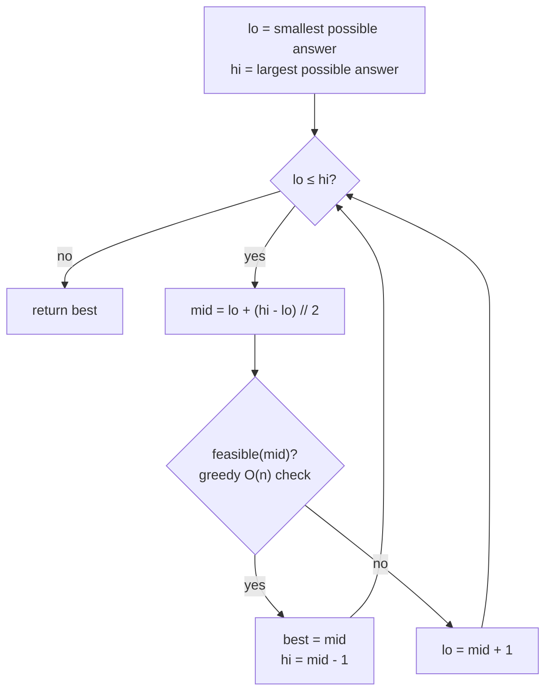

*The template for "minimise the maximum". For "maximise the minimum" (aggressive cows), move `lo = mid + 1` on success instead.*

> **Interactive animation:** `bs-answer` — rendered by the page script in the HTML version.

**Interview question**

*Painter's partition: boards `[12, 34, 67, 90]` must be painted by `2` painters, each taking a contiguous run, one unit of time per unit of length, all working at once. Minimise the finishing time. Answer: `113` (`[12, 34, 67] | [90]`).*

The answer lies between `max(boards) = 90` (someone must paint the longest board) and `sum(boards) = 203` (one painter does everything). For a candidate time `T`, greedily hand boards to the current painter until the next board would push them past `T`, then start a new painter. If the greedy needs `≤ k` painters, `T` works — record it and try smaller.

**Answer — painter's partition (binary search on the answer)**

```python
def is_feasible(boards, painters_available, max_time):
    painters, current = 1, 0
    for board in boards:
        if current + board > max_time:   # this painter is full: start the next one
            painters += 1
            current = board
        else:
            current += board
    return painters <= painters_available


def min_time(boards, painters):
    low, high = max(boards), sum(boards)
    ans = high
    while low <= high:
        mid = low + (high - low) // 2
        if is_feasible(boards, painters, mid):
            ans = mid
            high = mid - 1               # feasible: try to finish sooner
        else:
            low = mid + 1
    return ans


print(min_time([12, 34, 67, 90], 2))  # 113
```

```javascript
function isFeasible(boards, paintersAvailable, maxTime) {
  let painters = 1;
  let current = 0;
  for (const board of boards) {
    if (current + board > maxTime) {    // this painter is full: start the next one
      painters++;
      current = board;
    } else current += board;
  }
  return painters <= paintersAvailable;
}

function minTime(boards, painters) {
  let low = Math.max(...boards);
  let high = boards.reduce((a, b) => a + b, 0);
  let ans = high;
  while (low <= high) {
    const mid = low + Math.floor((high - low) / 2);
    if (isFeasible(boards, painters, mid)) {
      ans = mid;
      high = mid - 1;                   // feasible: try to finish sooner
    } else low = mid + 1;
  }
  return ans;
}

console.log(minTime([12, 34, 67, 90], 2)); // 113
```

**Interview question**

*Aggressive cows: place `3` cows in stalls at `[1, 2, 4, 8, 9]` so the **minimum** distance between any two is as **large** as possible. Answer: `3` (stalls `1, 4, 8`).*

Sort the stalls. The answer is between `1` and `last - first`. For a candidate distance `d`, greedily put a cow in the first stall and each next cow in the first stall at least `d` away. If all cows fit, `d` is achievable — record it and try **larger**.

**Answer — aggressive cows**

```python
def can_place(stalls, dist, cows):
    count, last = 1, stalls[0]
    for pos in stalls[1:]:
        if pos - last >= dist:
            count += 1
            last = pos
            if count >= cows:
                return True
    return count >= cows


def aggressive_cows(stalls, cows):
    stalls.sort()
    low, high = 1, stalls[-1] - stalls[0]
    ans = 0
    while low <= high:
        mid = low + (high - low) // 2
        if can_place(stalls, mid, cows):
            ans = mid
            low = mid + 1                # achievable: push the distance up
        else:
            high = mid - 1
    return ans


print(aggressive_cows([1, 2, 8, 4, 9], 3))  # 3
```

```javascript
function canPlace(stalls, dist, cows) {
  let count = 1;
  let last = stalls[0];
  for (let i = 1; i < stalls.length; i++) {
    if (stalls[i] - last >= dist) {
      count++;
      last = stalls[i];
      if (count >= cows) return true;
    }
  }
  return count >= cows;
}

function aggressiveCows(stalls, cows) {
  stalls.sort((a, b) => a - b);
  let low = 1;
  let high = stalls[stalls.length - 1] - stalls[0];
  let ans = 0;
  while (low <= high) {
    const mid = low + Math.floor((high - low) / 2);
    if (canPlace(stalls, mid, cows)) {
      ans = mid;
      low = mid + 1;                     // achievable: push the distance up
    } else high = mid - 1;
  }
  return ans;
}

console.log(aggressiveCows([1, 2, 8, 4, 9], 3)); // 3
```

> **Tip**
>
> Spot binary search on the answer by its phrasing — "minimum possible maximum", "maximum possible minimum", "least capacity such that", "at most `B` days". Then write two things: the answer range `[lo, hi]` and a greedy `feasible(mid)`. The search loop is always the same.

**From the notes — binary search problems**

| Problem | Search space | Complexity |
| --- | --- | --- |
| Search K in a sorted array; first occurrence | indices | `O(log N)` |
| Local minima; peak element | indices, discard by slope | `O(log N)` |
| Integer square root | answers `[0, n]` | `O(log N)` |
| Painter's partition; email response handlers | answers `[max, sum]`, minimise | `O(N log(sum))` |
| Allocate books; ship packages within B days | answers `[max, sum]`, minimise | `O(N log(sum))` |
| Aggressive cows | answers `[1, max - min]`, maximise | `O(N log(range))` |

#### More problems from the notes

Every remaining problem from the revision notes for this topic, each with a solution in Python and JavaScript.

**Problem — Search for K in a sorted array**

*Return the index of `K` in a sorted array, or `-1`.*

Halve the range on every comparison: `O(log n)`. The notes show it iteratively and recursively.

**Approach 1 — version 1**

```python
def binary_search_iterative(arr, k):
    low = 0
    high = len(arr) - 1

    while low <= high:
        mid = low + (high - low) // 2

        if arr[mid] == k:
            return mid
        elif arr[mid] < k:
            low = mid + 1
        else:
            high = mid - 1

    return -1

print(binary_search_iterative([1, 2, 3, 4, 5, 6, 7], 4))  # 3
print(binary_search_iterative([1, 2, 3, 4, 5, 6, 7], 8))  # -1
```

```javascript
// Iterative implementation of binary search on a sorted array
function binarySearch(arr, k) {
  let low = 0;
  let hign = arr.length - 1;

  while (low <= hign) {
    // Calculate mid index
    const mid = low + Math.floor((hign - low) / 2);

    if (arr[mid] === k) { // or k === arr[mid]
      return mid; // Element found at index mid
    } else if (arr[mid] < k) { // or k > arr[mid]
      low = mid + 1; // Search in the right half
    } else {
      hign = mid - 1; // Search in the left half
    }
  }

  return -1; // Element not found
}

console.log(binarySearch([3, 6, 9, 12, 14, 19, 20, 23, 25, 27], 9)); // 2
console.log(binarySearch([3, 6, 9, 12, 14, 19, 20, 23, 25, 27], 27)); // 9
console.log(binarySearch([3, 6, 9, 12, 14, 19, 20, 23, 25, 27], 21)); // -1
```

**Approach 2 — version 2**

```python
def binary_search_recursive(arr, low, high, k):
    if low > high:
        return -1

    mid = low + (high - low) // 2

    if arr[mid] == k:
        return mid
    elif arr[mid] < k:
        return binary_search_recursive(arr, mid + 1, high, k)
    else:
        return binary_search_recursive(arr, low, mid - 1, k)

arr = [1, 2, 3, 4, 5, 6, 7]
print(binary_search_recursive(arr, 0, len(arr) - 1, 4))  # 3
print(binary_search_recursive(arr, 0, len(arr) - 1, 8))  # -1
```

```javascript
// Recursive implementation of binary search on a sorted array
function binarySearchRecursive(arr, k, low = 0, hign = arr.length - 1) {
    if (low > hign) {
        return -1; // Element not found
    }

    // Calculate mid index
    const mid = low + Math.floor((hign - low) / 2);

    if (arr[mid] === k) { // or k === arr[mid]
        return mid; // Element found at index mid
    } else if (arr[mid] < k) { // or k > arr[mid]
        return binarySearchRecursive(arr, k, mid + 1, hign); // Search in the right half
    } else {
        return binarySearchRecursive(arr, k, low, mid - 1); // Search in the left half
    }
}

console.log(binarySearchRecursive([3, 6, 9, 12, 14, 19, 20, 23, 25, 27], 9)); // 2
console.log(binarySearchRecursive([3, 6, 9, 12, 14, 19, 20, 23, 25, 27], 27)); // 9
console.log(binarySearchRecursive([3, 6, 9, 12, 14, 19, 20, 23, 25, 27], 21)); // -1
```

**Problem — Integer square root**

*Return `⌊√n⌋`.*

Binary search on the answer in `[0, n]`: if `mid²` fits, record it and go right, otherwise go left. `O(log n)`.

**Solution**

```python
def find_square_root(n):
    if n < 0:
        return -1
    if n == 0 or n == 1:
        return n

    low = 0
    high = n
    ans = 1

    while low <= high:
        mid = low + (high - low) // 2

        if mid * mid == n:
            return mid
        elif mid * mid < n:
            ans = mid
            low = mid + 1
        else:
            high = mid - 1

    return ans

print(find_square_root(25))  # 5
print(find_square_root(20))  # 4
print(find_square_root(1))   # 1
```

```javascript
function findSquareRoot(n) {
    // --- SEARCH RANGE ---
    // The square root of 'n' must be between 0 and 'n'.
    let low = 0;
    let high = n;

    let ans = 1;

    while (low <= high) {
        // Calculate the middle point of the current range
        const mid = low + Math.floor((high - low) / 2);

        console.log(`low: ${low}, high: ${high}, mid: ${mid}`);

        // Calculate the square of the middle number
        const square = mid * mid;

        // --- CASE 1: EXACT MATCH ---
        // If mid * mid is exactly n, we found the perfect square root.
        if (square === n) {
            return mid;
        }

        else if (square < n) {
            ans = mid;      // Store current valid guess
            low = mid + 1;  // Try to find a larger number
        }

        else {
            high = mid - 1; // Eliminate the right half
        }
    }

    // If no perfect square was found, return the closest integer (floor)
    // stored in 'ans' from the last valid 'under-shoot'.
    return ans;
}

console.log(findSquareRoot(9));  // 3 (Exact match found)
console.log(findSquareRoot(10)); // 3 (3*3=9 is < 10, but 4*4=16 is > 10. Returns 3)
console.log(findSquareRoot(99)); // 9 (9*9=81 is < 99, but 10*10=100 is > 99. Returns 9)
```

**Problem — Find a peak element**

*Return an element that is not smaller than its neighbours.*

If `A[mid] < A[mid + 1]`, the slope rises to the right, so a peak must exist on that side — move right; otherwise move left. The array need not be sorted. `O(log n)`.

**Solution**

```python
def find_peak(arr):
    n = len(arr)
    if n == 1:
        return arr[0]
    if arr[0] >= arr[1]:
        return arr[0]
    if arr[n - 1] >= arr[n - 2]:
        return arr[n - 1]

    low = 1
    high = n - 2

    while low <= high:
        mid = low + (high - low) // 2

        if arr[mid] >= arr[mid - 1] and arr[mid] >= arr[mid + 1]:
            return arr[mid]
        elif arr[mid - 1] > arr[mid]:
            high = mid - 1
        else:
            low = mid + 1

    return -1

print(find_peak([1, 2, 3, 4, 5]))     # 5
print(find_peak([5, 4, 3, 2, 1]))     # 5
print(find_peak([1, 2, 1, 3, 5, 6, 4])) # 2 or 6
```

```javascript
// Optimized Binary Search Implementation by our way
function findPeak(arr) {
  const n = arr.length;

  if (n === 1) return arr[0]; // If only one element, return it

  if (arr[0] >= arr[1]) return arr[0]; // Check first element

  if (arr[n - 1] >= arr[n - 2]) return arr[n - 1]; // Check last element

  let low = 1;
  let hign = n - 2;
  while (low <= hign) {
    const mid = low + Math.floor((hign - low) / 2); // Calculate mid index

    if (arr[mid] > arr[mid - 1] && arr[mid] > arr[mid + 1]) { // Peak found
      return arr[mid];
    }
    if (arr[mid] < arr[mid - 1]) { //shape is (\ - shape)
      // Search in the left half
      hign = mid - 1;
    } else { // shape is (/ - shape) or (^ - shape)
      // Search in the right half
      low = mid + 1;
    }
  }

  return -1; // No peak found
}

console.log(findPeak([1, 2, 3, 4, 5])); // 5
console.log(findPeak([5, 17, 100, 11])); // 100
console.log(findPeak([1, 1000000000, 1000000000])); // 1000000000

// Alternative Binary Search Implementation
function findPeakElementBinary(A) {
  let low = 0;
  let high = A.length - 1;
  const n = A.length;

  while (low <= high) {
    // Calculate the middle index to avoid overflow
    let mid = Math.floor(low + (high - low) / 2);

    const isGreaterThanLeft = (mid === 0) || (A[mid] >= A[mid - 1]);
    const isGreaterThanRight = (mid === n - 1) || (A[mid] >= A[mid + 1]);

    if (isGreaterThanLeft && isGreaterThanRight) {
      return A[mid];
    }

    // If we are not at a peak, decide which half to explore

    // If the left neighbor is greater, a peak must exist in the left half
    if (mid > 0 && A[mid - 1] > A[mid]) {
      high = mid - 1;
    }
    // Otherwise, the right neighbor is greater (or equal), so explore right
    else {
      low = mid + 1;
    }
  }

  return -1; // Should not be reached
}

console.log(findPeakElementBinary([1, 2, 3, 4, 5])); // 5
console.log(findPeakElementBinary([5, 17, 100, 11])); // 100

// Alternative Binary Search Implementation if Array has Duplicates
function findPeakWithDuplicates(A) {
  let low = 0;
  let high = A.length - 1;

  while (low < high) {
    let mid = Math.floor(low + (high - low) / 2);

    if (A[mid] > A[mid + 1]) {
      // The slope is going down to the right.
      // A peak must be at 'mid' or somewhere to the left.
      high = mid;
    } else if (A[mid] < A[mid + 1]) {
      // The slope is going up to the right.
      // A peak must be to the right.
      low = mid + 1;
    } else {
      high--;
    }
  }

  // low will converge to the peak index
  return A[low];
}

console.log(findPeakWithDuplicates([2, 2, 2, 3, 2, 2])); // 3
console.log(findPeakWithDuplicates([1, 2, 3, 1])); // 3
```

**Problem — Email response handlers**

*Split a sequence of email complexities among `k` handlers, each taking a contiguous block, minimising the heaviest block.*

Painter's partition in disguise: binary search the maximum load between `max(A)` and `sum(A)`, with a greedy feasibility check. `O(n log(sum))`.

**Solution**

```python
def is_feasible_handlers(complexity, max_handlers, max_load):
    handlers = 1
    current_load = 0

    for score in complexity:
        if current_load + score <= max_load:
            current_load += score
        else:
            handlers += 1
            current_load = score
            if handlers > max_handlers:
                return False

    return True

def min_max_response_complexity(complexity, k):
    low = max(complexity)
    high = sum(complexity)
    ans = high

    while low <= high:
        mid = low + (high - low) // 2

        if is_feasible_handlers(complexity, k, mid):
            ans = mid
            high = mid - 1
        else:
            low = mid + 1

    return ans

print(min_max_response_complexity([12, 34, 67, 90], 2))  # 113
```

```javascript
function isFeasible(workLoads, blocksAllowed, maxCapacity) {
    // Start with 1 email handler (block)
    let currentBlocks = 1;

    // Initialize the current workload sum for this handler to 0
    let currentWorkload = 0;

    // Iterate through every email complexity score in the array
    for (let i = 0; i < workLoads.length; i++) {

        // Tentatively add the current email's complexity to the current handler's load
        currentWorkload += workLoads[i];

        // Check if adding this email pushed the handler over the 'maxCapacity' limit
        if (currentWorkload > maxCapacity) {
            // If yes, we must assign this email to a NEW handler (start a new block)
            currentBlocks++;

            // The new handler starts with just this current email's complexity
            currentWorkload = workLoads[i];
        }

        // Optimization check: If we have used more handlers than available (blocksAllowed),
        // this specific 'maxCapacity' capacity is too small to work.
        if (currentBlocks > blocksAllowed) {
            return false; // Return immediately to save maxCapacity
        }
    }

    // If we processed all emails without exceeding 'k' handlers, this capacity is valid
    return true;
}

function minMaxSum(A, k) {
    // Lower Bound: The capacity cannot be smaller than the single largest email.
    // Even with infinite handlers, someone has to take the largest task alone.
    let low = Math.max(...A);

    // Upper Bound: The capacity cannot be larger than the total sum of all emails.
    // This is the worst-case scenario where 1 handler does everything.
    let high = A.reduce((acc, item) => acc + item, 0);

    // Initialize 'ans' to the worst-case (high) as a fallback
    let ans = high;

    // Standard Binary Search loop: continues until the search space collapses
    while (low <= high) {

        // Pick the middle value between low and high to test as our "candidate capacity"
        let mid = low + Math.floor((high - low) / 2);

        // Call the helper to see if 'mid' is a valid capacity for k handlers
        if (isFeasible(A, k, mid)) {
            // SUCCESS: 'mid' is a valid capacity.
            // Store it as a potential answer.
            ans = mid;

            // Try to find an even smaller (better) capacity by eliminating the right half
            high = mid - 1;
        } else {
            // FAILURE: 'mid' was too small (required more than k handlers).
            // We must increase the capacity, so eliminate the left half.
            low = mid + 1;
        }
    }

    // Return the smallest capacity that was marked as feasible
    return ans;
}

// Test Case 1: [1, 2, 3, 4] split into 2 blocks.
// Optimal split: [1, 2, 3] (sum 6) and [4] (sum 4). Max is 6.
console.log(minMaxSum([1, 2, 3, 4], 2)); // Output: 6

// Test Case 2: [1, 2, 3, 4] split into 3 blocks.
// Optimal split: [1, 2], [3], [4]. Max sums are 3, 3, 4. Max is 4.
console.log(minMaxSum([1, 2, 3, 4], 3)); // Output: 4

// Test Case 3: [7, 2, 5, 10, 8] split into 2 blocks.
// Optimal split: [7, 2, 5] (sum 14) and [10, 8] (sum 18). Max is 18.
console.log(minMaxSum([7, 2, 5, 10, 8], 2)); // Output: 18

// N = length of array A (due to the loop in isFeasible)
// S = sum of all elements in A (log(high - low) represents the binary search steps)

// We only store a few integer variables (low, high, mid, ans, blocks, curr).
```

**Problem — Least capacity to ship packages within B days**

*Packages must ship in order; each day's load cannot exceed the ship's capacity. Find the smallest capacity that ships everything within `B` days.*

Binary search the capacity in `[max(weights), sum(weights)]`. For a candidate, greedily fill each day; feasible if the days used are `≤ B`. `O(n log(sum))`.

**Solution**

```python
def can_ship(weights, days, capacity):
    days_needed = 1
    current_weight = 0

    for w in weights:
        if current_weight + w <= capacity:
            current_weight += w
        else:
            days_needed += 1
            current_weight = w
            if days_needed > days:
                return False

    return True

def least_capacity_to_ship(weights, days):
    low = max(weights)
    high = sum(weights)
    ans = high

    while low <= high:
        mid = low + (high - low) // 2

        if can_ship(weights, days, mid):
            ans = mid
            high = mid - 1
        else:
            low = mid + 1

    return ans

print(least_capacity_to_ship([1, 2, 3, 4, 5, 6, 7, 8, 9, 10], 5))  # 15
```

```javascript
function leastCapacityToShip(A, B) {
    // 1. Define the search space boundaries.

    let left = Math.max(...A);

    // Upper Bound (right): In the worst case (1 day), the ship needs to carry
    // all packages at once. So the max capacity needed is the sum of all weights.
    let right = A.reduce((a, b) => a + b, 0);

    function canShip(capacity) {
        let days = 1;      // Start counting from Day 1
        let current = 0;   // Current weight loaded on the ship for this day

        for (let weight of A) {
            // Check if adding the next package exceeds the ship's limit
            if (current + weight > capacity) {
                days++;        // If it exceeds, we must ship what we have and start a new day
                current = 0;   // Reset the current load for the new day
            }
            // Add the package to the current day's load
            // (If we just started a new day, this is the first package of that day)
            current += weight;
        }

        // If the total days required is less than or equal to the limit B,
        // then this capacity is valid/feasible.
        return days <= B;
    }

    // Variable to store the best (smallest) valid capacity found so far.
    let answer = right;

    // 2. Binary Search Loop
    while (left <= right) {
        // Pick a capacity in the middle of our search range
        let mid = Math.floor((left + right) / 2);

        // 3. Check feasibility
        if (canShip(mid)) {
            // If we CAN ship within B days using 'mid' capacity:
            answer = mid;    // Record this as a potential answer
            right = mid - 1; // Try to find an even SMALLER capacity (optimization)
        } else {
            // If we CANNOT ship within B days (took too many days):
            // It means 'mid' capacity is too small. We need a bigger ship.
            left = mid + 1;  // Eliminate the lower half
        }
    }

    return answer;
}

console.log(leastCapacityToShip([1, 2, 3, 4, 5, 6, 7, 8, 9, 10], 5)); // 15

console.log(leastCapacityToShip([1, 2, 3, 1, 1], 4)); // 3
```

**Problem — Allocate books**

*Give each of `m` students a contiguous run of books, minimising the largest number of pages any student reads.*

Same template again — search the page limit, greedily count students needed. Return `-1` if there are fewer books than students. `O(n log(sum))`.

**Solution**

```python
def is_feasible_allocation(A, max_pages, students):
    allocated_students = 1
    current_pages = 0

    for pages in A:
        if current_pages + pages <= max_pages:
            current_pages += pages
        else:
            allocated_students += 1
            current_pages = pages
            if allocated_students > students:
                return False

    return True

def allocate_books(A, B):
    if len(A) < B:
        return -1

    low = max(A)
    high = sum(A)
    ans = -1

    while low <= high:
        mid = low + (high - low) // 2

        if is_feasible_allocation(A, mid, B):
            ans = mid
            high = mid - 1
        else:
            low = mid + 1

    return ans

print(allocate_books([12, 34, 67, 90], 2))  # 113
```

```javascript
function isFeasible(A, dist, k) {
  let students = 1;
  let curr = 0;
  for (let i = 0; i < A.length; i++) {
    curr += A[i];
    if (curr > dist) {
      students++;
      curr = A[i];
    }
    if (students > k) {
      return false;
    }
  }
  return true;
}

function allocateBooks(A, k) {
  // if we have more students than books, impossible
  if (k > A.length) return -1;

  let low = Math.max(...A);
  let high = A.reduce((acc, item) => acc + item, 0);
  let ans = -1;

  while (low <= high) {
    let mid = Math.floor(low + (high - low) / 2);
    if (isFeasible(A, mid, k)) {
      ans = mid;
      high = mid - 1;
    } else {
      low = mid + 1;
    }
  }

  return ans;
}
console.log(allocateBooks([12, 34, 67, 90], 2)); // 113
console.log(allocateBooks([12, 15, 78], 4)); // -1
```

<a id="26-multiple-approaches-pair-with-a-given-sum"></a>

### Multiple Approaches: Pair With a Given Sum

- **Brute force** `O(N^2)`
- **Binary search** `O(N log N)`
- **Hash set** `O(N)`
- **Two pointers** `O(N)`

"Does a sorted array of distinct values contain a pair summing to `K`?" The notes solve it four ways, and together they use three sections of this course — brute force, binary search, hashing and two pointers. It is the classic question for talking an interviewer through trade-offs.

| Approach | Time | Space | Idea |
| --- | --- | --- | --- |
| Brute force | `O(N^2)` | `O(1)` | try every pair |
| Binary search | `O(N log N)` | `O(1)` | search for `K - A[i]` to the right of `i` |
| Hash set | `O(N)` | `O(N)` | has `K - x` been seen? |
| Two pointers | `O(N)` | `O(1)` | sorted order discards a row of pairs per step |

Check every pair `i < j`. Needs no sortedness at all.

**Approach 1 — Brute force**

```python
def pair_sum_brute(arr, target):
    n = len(arr)
    for i in range(n):
        for j in range(i + 1, n):
            if arr[i] + arr[j] == target:
                return True
    return False
```

```javascript
// Using Brute Force:
```

For each `A[i]`, binary-search the rest of the array for `K - A[i]`. Uses the sortedness, but only one element at a time.

**Approach 2 — Binary search**

```python
def pair_sum_bs(arr, target):
    for i, num in enumerate(arr):
        comp = target - num
        # binary search in arr[i+1:]
        lo, hi = i + 1, len(arr) - 1
        while lo <= hi:
            mid = (lo + hi) // 2
            if arr[mid] == comp:
                return True
            elif arr[mid] < comp:
                lo = mid + 1
            else:
                hi = mid - 1
    return False
```

```javascript
// Using Binary Search:
```

Remember what has been seen; each element asks whether its complement already appeared. Linear time, but `O(N)` memory — and it works on unsorted input too.

**Approach 3 — Hash set**

```python
def pair_sum_set(arr, target):
    seen = set()
    for num in arr:
        if target - num in seen:
            return True
        seen.add(num)
    return False
```

```javascript
// Using Hash Set:
```

One pointer at each end: too small moves the left pointer right, too big moves the right pointer left. Linear time and constant memory — the best answer when the array is sorted.

**Approach 4 — Two pointers**

```python
def pair_sum_two_pointers(arr, target):
    lo = 0
    hi = len(arr) - 1
    while lo < hi:
        s = arr[lo] + arr[hi]
        if s == target:
            return True
        elif s < target:
            lo += 1
        else:
            hi -= 1
    return False
```

```javascript
// Using Two Pointers

function hasPairWithSum(arr, k) {
  // Initialize the left pointer at the beginning of the array
  let left = 0;

  // Initialize the right pointer at the very end of the array
  let right = arr.length - 1;

  // Loop until the two pointers meet
  // We use '<' instead of '<=' because we need distinct elements
  while (left < right) {

    // Calculate the current sum of the elements at the two pointer positions
    const sum = arr[left] + arr[right];

    // Check if the current sum matches the target value 'k'
    if (sum === k) {
      return true; // Pair found; return true immediately
    }
    // If current sum is less than target, we need a larger sum
    else if (sum < k) {
      left++; // Move left pointer to the right to increase sum (sorted array assumption)
    }
    // If current sum is greater than target, we need a smaller sum
    else {
      right--; // Move right pointer to the left to decrease sum
    }
  }

  // If the loop completes without returning, no such pair exists
  return false; // No pair found
}

console.log(hasPairWithSum([1, 2, 3, 4, 5], 6)); // true
console.log(hasPairWithSum([1, 2, 3, 4, 5], 10)); // false

/*
 * COMPLEXITY ANALYSIS:
 * --------------------
 * Time Complexity: O(n)
 * - We touch each element at most once. The 'left' pointer only moves right, and
 * the 'right' pointer only moves left. In the worst case, we traverse the entire
 * array once.
 *
 * Space Complexity: O(1)
 * - We only use a constant amount of extra space for variables ('left', 'right', 'sum')
 * regardless of the input array size. We operate in-place.
 */
```

<a id="27-multiple-approaches-the-unique-element-among-pairs"></a>

### Multiple Approaches: The Unique Element Among Pairs

- **XOR** `O(N)`
- **Binary search (sorted)** `O(log N)`

Every element appears twice except one. The notes pair two approaches: XOR, which needs no ordering at all, and binary search, which exploits the structure of a **sorted** array where pairs sit side by side.

| Approach | Time | Space | Idea |
| --- | --- | --- | --- |
| XOR every element | `O(N)` | `O(1)` | pairs cancel, the loner survives |
| Binary search on a sorted array | `O(log N)` | `O(1)` | before the loner, pairs start at even indices |

`x ^ x = 0` and XOR is order-independent, so XOR-ing everything leaves exactly the unpaired value. Works on any order.

**Approach 1 — Bit manipulation (XOR)**

```python
def single_element_xor(arr):
    result = 0
    for x in arr:
        result ^= x
    return result


print(single_element_xor([1, 1, 2, 3, 3, 4, 4]))  # 2
```

```javascript
function singleElementXor(arr) {
  let result = 0;
  for (const x of arr) result ^= x;
  return result;
}

console.log(singleElementXor([1, 1, 2, 3, 3, 4, 4])); // 2
```

In a sorted array, every pair before the loner starts at an **even** index; after the loner, pairs start at odd indices. Move `mid` to an even index and look at its partner: if `A[mid] == A[mid + 1]`, the loner is to the right; otherwise it is at `mid` or to the left. `O(log N)`.

**Approach 2 — Binary search on a sorted array**

```python
def single_element_sorted(arr):
    lo, hi = 0, len(arr) - 1
    while lo < hi:
        mid = lo + (hi - lo) // 2
        if mid % 2 == 1:
            mid -= 1                      # compare pairs that start at even indices
        if arr[mid] == arr[mid + 1]:
            lo = mid + 2                  # pairs intact so far: loner is to the right
        else:
            hi = mid                      # a pair is broken: loner is at mid or left
    return arr[lo]


print(single_element_sorted([1, 1, 2, 3, 3, 4, 4]))  # 2
print(single_element_sorted([3, 3, 7, 7, 10, 11, 11]))  # 10
```

```javascript
function singleElementSorted(arr) {
  let lo = 0, hi = arr.length - 1;
  while (lo < hi) {
    let mid = lo + Math.floor((hi - lo) / 2);
    if (mid % 2 === 1) mid--;            // compare pairs that start at even indices
    if (arr[mid] === arr[mid + 1]) lo = mid + 2; // loner is to the right
    else hi = mid;                       // loner is at mid or to the left
  }
  return arr[lo];
}

console.log(singleElementSorted([1, 1, 2, 3, 3, 4, 4]));    // 2
console.log(singleElementSorted([3, 3, 7, 7, 10, 11, 11])); // 10
```

---

<a id="unit-3"></a>

## Unit 3 — Linked Structures

Nodes joined by pointers. The advanced tricks here are all about what you can do with **two** pointers, **one** stack, or **zero** extra memory.

<a id="28-linked-lists"></a>

### Linked Lists

- **Find middle / detect cycle** `O(N)`, `O(1)` space
- **Insert / delete at a known node (DLL)** `O(1)`
- **LRU get / put** `O(1)`

Most linked-list problems are solved by **pointers moving at different speeds** or **rewiring `next` in place**. Slow moves one node, fast moves two: when fast reaches the end, slow is at the middle (the notes' index `(size + 1) / 2`, so the first middle of an even list). If the list loops, fast eventually laps slow. Reversal is three pointers — `prev`, `curr`, `next` — and every "compare the two halves" problem is middle + reverse.

> **Analogy** 🏃
>
> **Picture it — two runners on a track**
>
> One runner jogs, the other sprints at double speed. On a straight road the sprinter simply finishes first. On a looped track the sprinter comes round and taps the jogger on the shoulder — that tap *proves* there is a loop, without anyone painting marks on the ground.

**Building blocks — node, reverse, middle**

```python
class ListNode:
    def __init__(self, val, next=None):
        self.val = val
        self.next = next


def reverse_linked_list(head):
    prev, curr = None, head
    while curr:
        nxt = curr.next       # save the rest of the list
        curr.next = prev      # flip one arrow
        prev, curr = curr, nxt
    return prev               # the old tail is the new head


def find_middle(head):
    slow = fast = head
    while fast and fast.next:
        slow = slow.next
        fast = fast.next.next
    return slow               # first middle for odd, second for even lengths


head = ListNode(1, ListNode(2, ListNode(3, ListNode(4, ListNode(5)))))
print(find_middle(head).val)          # 3
print(reverse_linked_list(head).val)  # 5
```

```javascript
class ListNode {
  constructor(val, next = null) {
    this.val = val;
    this.next = next;
  }
}

function reverseLinkedList(head) {
  let prev = null;
  let curr = head;
  while (curr) {
    const next = curr.next;   // save the rest of the list
    curr.next = prev;         // flip one arrow
    prev = curr;
    curr = next;
  }
  return prev;                // the old tail is the new head
}

function findMiddle(head) {
  let slow = head, fast = head;
  while (fast && fast.next) {
    slow = slow.next;
    fast = fast.next.next;
  }
  return slow;                // first middle for odd, second for even lengths
}

const head = new ListNode(1, new ListNode(2, new ListNode(3, new ListNode(4, new ListNode(5)))));
console.log(findMiddle(head).val);         // 3
console.log(reverseLinkedList(head).val);  // 5
```

<a id="floyd"></a>

#### Floyd's cycle detection — find it, find its start, remove it

> **Interactive animation:** `floyd-cycle` — rendered by the page script in the HTML version.

Let `a` be the distance from the head to the cycle's first node, `b` the distance from there to where the pointers meet, and `c` the cycle length. At the meeting point slow has walked `a + b` and fast `2(a + b)`, and fast's extra distance is whole laps: `a + b = k·c`. Rearranged, `a = k·c - b` — walking `a` steps from the meeting point lands exactly on the cycle start. So reset one pointer to the head, move both **one** step at a time, and they meet at the start.

```text
1 → 2 → 3 → 4 → 5            a = 2 (head → node 3)
        ↑       ↓            meet after slow walks a + b steps
        ← ← ← ← 6            then: one pointer from head, one from the meeting point,
                             both at speed 1 → they collide at node 3
```

**Interview question**

*Return the node where a linked list's cycle begins, or `None` if there is no cycle. Then remove the cycle.*

Phase 1 is plain detection. Phase 2 uses `a = k·c - b` to walk to the start. To remove the cycle, keep walking from the start until you reach the node whose `next` is the start — that is the last node of the loop — and cut its `next`.

**Answer — cycle start and removal (Floyd)**

```python
def detect_cycle_start(head):
    slow = fast = head
    while fast and fast.next:
        slow, fast = slow.next, fast.next.next
        if slow is fast:
            break
    else:
        return None                   # fast fell off the end: no cycle
    p1, p2 = head, slow
    while p1 is not p2:               # a = k·c - b
        p1, p2 = p1.next, p2.next
    return p1


def remove_cycle(head):
    start = detect_cycle_start(head)
    if start is None:
        return head
    last = start
    while last.next is not start:     # the node that closes the loop
        last = last.next
    last.next = None
    return head


nodes = [ListNode(v) for v in [1, 2, 3, 4, 5, 6]]
for x, y in zip(nodes, nodes[1:]):
    x.next = y
nodes[-1].next = nodes[2]             # 6 → 3 closes the loop
print(detect_cycle_start(nodes[0]).val)  # 3
remove_cycle(nodes[0])
print(nodes[-1].next)                    # None
```

```javascript
function findCycleStart(head) {
  let slow = head, fast = head;
  let hasCycle = false;
  while (fast && fast.next) {
    slow = slow.next;
    fast = fast.next.next;
    if (slow === fast) { hasCycle = true; break; }
  }
  if (!hasCycle) return null;          // fast fell off the end: no cycle
  let p1 = head, p2 = slow;
  while (p1 !== p2) {                  // a = k·c - b
    p1 = p1.next;
    p2 = p2.next;
  }
  return p1;
}

function removeCycle(head) {
  const start = findCycleStart(head);
  if (!start) return head;
  let last = start;
  while (last.next !== start) last = last.next; // the node that closes the loop
  last.next = null;
  return head;
}

const nodes = [1, 2, 3, 4, 5, 6].map((v) => new ListNode(v));
nodes.forEach((n, i) => (n.next = nodes[i + 1] || null));
nodes[5].next = nodes[2];              // 6 → 3 closes the loop
console.log(findCycleStart(nodes[0]).val); // 3
removeCycle(nodes[0]);
console.log(nodes[5].next);                // null
```

**Interview question**

*Is a singly linked list a palindrome, using `O(1)` extra space? `1 → 2 → 2 → 1` → `true`.*

You cannot walk backwards, so make the back half walk forwards: find the middle, **reverse the second half in place**, then compare it node by node with the first half. (Restore it afterwards if the caller still needs the list.)

**Answer — palindrome linked list**

```python
def is_palindrome_list(head):
    slow = fast = head
    while fast and fast.next:          # slow stops at the middle
        slow, fast = slow.next, fast.next.next
    second = reverse_linked_list(slow)
    p1, p2 = head, second
    while p2:
        if p1.val != p2.val:
            return False
        p1, p2 = p1.next, p2.next
    return True


print(is_palindrome_list(ListNode(1, ListNode(2, ListNode(2, ListNode(1))))))  # True
print(is_palindrome_list(ListNode(1, ListNode(2, ListNode(3)))))               # False
```

```javascript
function isPalindrome(head) {
  let slow = head, fast = head;
  while (fast && fast.next) {           // slow stops at the middle
    slow = slow.next;
    fast = fast.next.next;
  }
  let p1 = head;
  let p2 = reverseLinkedList(slow);
  while (p2) {
    if (p1.val !== p2.val) return false;
    p1 = p1.next;
    p2 = p2.next;
  }
  return true;
}

console.log(isPalindrome(new ListNode(1, new ListNode(2, new ListNode(2, new ListNode(1)))))); // true
console.log(isPalindrome(new ListNode(1, new ListNode(2, new ListNode(3)))));                  // false
```

Sorting a linked list uses the same pieces: find the middle, **cut** the list there, merge-sort each half and merge the two sorted halves by splicing nodes — `O(N log N)` time and only `O(log N)` stack, because merging lists needs no buffer.

<a id="lru-cache"></a>

#### Doubly linked list + hash map = LRU cache

A **least-recently-used** cache must, in `O(1)`: find a key, mark it as just used, and evict the stalest key when full. No single structure does all three. A **hash map** finds the node; a **doubly linked list** keeps usage order and can unlink any node in `O(1)` because each node knows its `prev`. Two sentinel nodes, `head` (least recent side) and `tail` (most recent side), remove every empty-list special case.

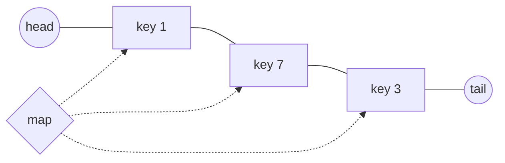

*The map points straight at list nodes. Evict from the `head` side; every `get` or `put` moves its node next to `tail`.*

> **Interactive animation:** `lru-cache` — rendered by the page script in the HTML version.

**Interview question**

*Design an LRU cache with `get(key)` and `put(key, value)`, both `O(1)`. When full, `put` evicts the least recently used key.*

`get`: look up the node, unlink it, re-insert it just before `tail`, return its value. `put` on an existing key does the same and updates the value. `put` on a new key first evicts `head.next` if the cache is full — deleting it from **both** the list and the map — then inserts the new node before `tail`.

**Answer — LRU cache with a doubly linked list and a hash map**

```python
class Node:
    def __init__(self, key, value):
        self.key, self.value = key, value
        self.prev = self.next = None


class LRUCache:
    def __init__(self, capacity):
        self.cap = capacity
        self.map = {}
        self.head, self.tail = Node(-1, -1), Node(-1, -1)   # sentinels
        self.head.next, self.tail.prev = self.tail, self.head

    def _remove(self, node):
        node.prev.next, node.next.prev = node.next, node.prev

    def _add_before_tail(self, node):
        node.prev, node.next = self.tail.prev, self.tail
        self.tail.prev.next = node
        self.tail.prev = node

    def get(self, key):
        if key not in self.map:
            return -1
        node = self.map[key]
        self._remove(node)
        self._add_before_tail(node)          # now the most recently used
        return node.value

    def put(self, key, value):
        if key in self.map:
            node = self.map[key]
            node.value = value
            self._remove(node)
        else:
            if len(self.map) == self.cap:
                lru = self.head.next          # least recently used
                self._remove(lru)
                del self.map[lru.key]
            node = Node(key, value)
            self.map[key] = node
        self._add_before_tail(node)


cache = LRUCache(2)
cache.put(1, 10); cache.put(2, 20)
cache.get(1)                        # 1 becomes most recent
cache.put(3, 30)                    # evicts 2
print(cache.get(2), cache.get(3))   # -1 30
```

```javascript
class Node {
  constructor(key, value) {
    this.key = key;
    this.value = value;
    this.prev = this.next = null;
  }
}

class LRUCache {
  constructor(capacity) {
    this.cap = capacity;
    this.map = new Map();
    this.head = new Node(-1, -1);            // sentinels
    this.tail = new Node(-1, -1);
    this.head.next = this.tail;
    this.tail.prev = this.head;
  }

  removeNode(node) {
    node.prev.next = node.next;
    node.next.prev = node.prev;
  }

  addBeforeTail(node) {
    node.prev = this.tail.prev;
    node.next = this.tail;
    this.tail.prev.next = node;
    this.tail.prev = node;
  }

  get(key) {
    if (!this.map.has(key)) return -1;
    const node = this.map.get(key);
    this.removeNode(node);
    this.addBeforeTail(node);                // now the most recently used
    return node.value;
  }

  put(key, value) {
    if (this.map.has(key)) {
      const node = this.map.get(key);
      node.value = value;
      this.removeNode(node);
      this.addBeforeTail(node);
      return;
    }
    if (this.map.size === this.cap) {
      const lru = this.head.next;            // least recently used
      this.removeNode(lru);
      this.map.delete(lru.key);
    }
    const node = new Node(key, value);
    this.addBeforeTail(node);
    this.map.set(key, node);
  }
}

const cache = new LRUCache(2);
cache.put(1, 10); cache.put(2, 20);
cache.get(1);                                // 1 becomes most recent
cache.put(3, 30);                            // evicts 2
console.log(cache.get(2), cache.get(3));     // -1 30
```

> **Tip**
>
> In Python an `OrderedDict` already is "hash map + doubly linked list": `move_to_end(key)` marks a key as recent and `popitem(last=False)` evicts the oldest. Interviewers usually want the hand-built version first, then accept the shortcut.

**From the notes — linked-list problems**

| Problem | Technique | Complexity |
| --- | --- | --- |
| k-th node, print, search, size, insert at position, delete | walk with a counter | `O(N)` |
| Reverse a linked list | three pointers | `O(N)`, `O(1)` |
| Middle of a linked list | slow / fast | `O(N)`, `O(1)` |
| Merge two sorted lists; sort a list | splice nodes; merge sort | `O(N + M)`; `O(N log N)` |
| Palindrome linked list | middle + reverse second half | `O(N)`, `O(1)` |
| Doubly linked list: insert before tail, delete a node | rewire `prev` and `next` | `O(1)` |
| LRU cache | DLL + hash map | `O(1)` per op |
| Detect cycle; cycle start; remove cycle | Floyd | `O(N)`, `O(1)` |

#### More problems from the notes

Every remaining problem from the revision notes for this topic, each with a solution in Python and JavaScript.

**Problem — A simple linked list**

*Implement a singly linked list with a node class and an append operation.*

Each node stores a value and a `next` reference; appending walks to the last node (or keeps a tail pointer to make it `O(1)`).

**Solution**

```python
class Node:
    def __init__(self, data=0, next=None):
        self.data = data
        self.next = next

class LinkedList:
    def __init__(self):
        self.head = None

    def append(self, data):
        new_node = Node(data)
        if not self.head:
            self.head = new_node
            return
        curr = self.head
        while curr.next:
            curr = curr.next
        curr.next = new_node
```

```javascript
class Node {
    constructor(data) {
        this.data = data; // store the value carried by this node
        this.next = null; // pointer to the next node in the list
    }
}

class LinkedList {
    constructor() {
        this.head = null; // reference to the first node in the list
    }

    append(data) {
        const newNode = new Node(data); // create a new node with the given value
        if (this.head === null) { // if the list is empty
            this.head = newNode; // set new node as head
            return; // exit because append is complete
        }
        let current = this.head; // start traversal from the head
        while (current.next !== null) { // move until the last node
            current = current.next; // advance to the next node
        }
        current.next = newNode; // link the last node to the new node
    }

    display() {
        let current = this.head; // start from the head node
        const values = []; // collect node values for joined output
        while (current) { // traverse until no more nodes
            values.push(current.data); // record the current node's value
            current = current.next; // advance to the next node
        }
        process.stdout.write(values.join(' -> ')); // print values separated by arrows
        console.log(''); // add newline after the list
    }
}

const list = new LinkedList(); // instantiate an empty linked list
list.append(1); // append first value: list = 1
list.append(2); // append second value: list = 1 -> 2
list.append(3); // append third value: list = 1 -> 2 -> 3
list.display(); // 1 -> 2 -> 3

// serialize and print the raw linked list structure
console.log(JSON.stringify(list.head));
// { "data": 1, "next": { "data": 2, "next": { "data": 3, "next": null } } }
```

**Problem — Print a linked list**

*Print every value in a linked list.*

Follow `next` from the head until `null`. `O(n)`.

**Solution**

```python
class ListNode:
    def __init__(self, data=0, next=None):
        self.data = data
        self.next = next

def print_linked_list(head):
    current = head
    while current is not None:
        print(current.data, end=" -> ")
        current = current.next
    print("None")
```

```javascript
class ListNode {
  constructor(data) {
    this.data = data;
    this.next = null;
  }
}

class LinkedList {
  constructor() {
    this.head = null;
  }

  append(data) {
    const newNode = new ListNode(data);
    if (!this.head) {
      this.head = newNode;
      return;
    }

    let current = this.head;
    while (current.next) {
      current = current.next;
    }
    current.next = newNode;
  }

  printList() {
    let current = this.head;
    while (current) {
      process.stdout.write(current.data + " ");
      current = current.next;
    }
    console.log();
  }
}
const list = new LinkedList();
list.append(1);
list.append(2);
list.append(3);
list.append(4);
// {data: 1, next: {data: 2, next: {data: 3, next: {data: 4, next: null}}}}
list.printList(); // 1 2 3 4
```

**Problem — Return the k-th element**

*Return the value of the k-th node (0-based) of a linked list.*

Walk `k` steps from the head, guarding against running off the end. `O(k)`.

**Solution**

```python
class ListNode:
    def __init__(self, val=0, next=None):
        self.val = val
        self.next = next

def get_kth_element(head, k):
    current = head
    for _ in range(k):
        if current is None:
            return None
        current = current.next
    return current
```

```javascript
function getKthElement(head, k) {
  let current = head;

  for (let i = 0; i < k; i++) {
    current = current.next;
  }

  return current.data;
}
const head = { data: 1, next: { data: 2, next: { data: 3, next: { data: 4, next: { data: 5, next: null } } } } };
console.log(getKthElement(head, 2)); // 3
```

**Problem — k-th node in a list**

*Return the k-th node of a list, or report that the list is too short.*

The same walk with a counter; lists have no random access, so reaching position `k` always costs `O(k)`.

**Solution**

```python
class ListNode:
    def __init__(self, data=0, next=None):
        self.data = data
        self.next = next

def get_kth_node(head, k):
    current = head
    idx = 0
    while current is not None:
        if idx == k:
            return current.data
        current = current.next
        idx += 1
    return -1
```

```javascript
class ListNode {
  constructor(data) {
    this.data = data;
    this.next = null;
  }
}

class LinkedList {
  constructor() {
    this.head = null;
  }

  append(data) {
    const newNode = new ListNode(data);
    if (!this.head) {
      this.head = newNode;
      return;
    }
    let current = this.head;
    while (current.next) {
      current = current.next;
    }
    current.next = newNode;
  }

  getKthElement(k) {
    let current = this.head;
    for (let i = 0; i < k; i++) {
      if (!current) return -1; // Out of bounds
      current = current.next;
    }
    return current ? current.data : -1; // Return -1 if out of bounds
  }
}
const list = new LinkedList();
list.append(1);
list.append(3);
list.append(5);
list.append(7);
list.append(9);
console.log(JSON.stringify(list.head)); // Output the original list
// {data: 1, next: {data: 3, next: {data: 5, next: {data: 7, next: {data: 9, next: null}}}}}
console.log(list.getKthElement(2)); // 5
```

**Problem — Is K present in the list?**

*Check whether value `K` appears in a linked list.*

Linear scan from the head. `O(n)`.

**Solution**

```python
def is_value_present(head, k):
    current = head
    while current is not None:
        if current.data == k:
            return True
        current = current.next
    return False
```

```javascript
function isValuePresent(head, k) {
  let current = head;
  while (current !== null) {
    if (current.data === k) {
      return true; // Value found
    }
    current = current.next; // Move to the next node
  }
  return false; // Value not found
}

const head = { data: 1, next: { data: 5, next: { data: 3, next: null } } };
console.log(isValuePresent(head, 3)); // true
console.log(isValuePresent(head, 4)); // false
console.log(isValuePresent(head, 5)); // true
```

**Problem — Insert at position P**

*Insert a node with value `V` at position `P`.*

Position 0 replaces the head. Otherwise walk to the node at `P - 1` and splice the new node between it and its successor. `O(P)`.

**Solution**

```python
def insert_at_position(head, p, v):
    new_node = Node(v)
    if p == 0:
        new_node.next = head
        return new_node

    current = head
    for _ in range(p - 1):
        if current is None:
            break
        current = current.next

    if current is not None:
        new_node.next = current.next
        current.next = new_node

    return head
```

```javascript
function getNodeAtPosition(head, P) {
  let current = head;
  for (let i = 0; i < P && current !== null; i++) {
    current = current.next; // Move to the next node
  }
  return current; // Return the node at position P
}

function insertAtPosition(head, V, P) {
  const newNode = { data: V, next: null };

  if (P === 0) {
    newNode.next = head; // Insert at the head
    return newNode; // Return new head
  }

  const prevNode = getNodeAtPosition(head, P - 1); // Get the node at position P-1
  const nextNode = prevNode.next; // Get the node at position P
  prevNode.next = newNode; // Link the new node to the previous node
  newNode.next = nextNode; // Link the new node to the next node
  return head; // Return the head of the list
}

const head = { data: 1, next: { data: 2, next: { data: 3, next: { data: 5, next: null } } } }; // Create a linked list
console.log(head); // Output the original list
const V = 4; // Value to insert
const P = 1; // Position to insert at
const newHead = insertAtPosition(head, V, P); // Insert the new node
console.log(JSON.stringify(newHead)); // Output the new head of the list
// { data: 1, next: { data: 4, next: { data: 2, next: { data: 3, next: null } } } }
```

**Problem — Size of a linked list**

*Return the number of nodes.*

Count while walking. Keeping a size field updated on insert and delete makes it `O(1)`.

**Solution**

```python
def get_size(head):
    size = 0
    current = head
    while current is not None:
        size += 1
        current = current.next
    return size
```

```javascript
function getSize(head) {
  let size = 0;
  let current = head;
  while (current !== null) {
    size++; // Increment size for each node
    current = current.next; // Move to the next node
  }
  return size; // Return the size of the list
}

const head = { data: 1, next: { data: 2, next: { data: 3, next: null } } }; // Create a linked list
console.log(getSize(head)); // Output the size of the list
```

**Problem — Delete at a position**

*Delete the node at position `P`.*

Deleting the head moves `head` forward; otherwise walk to the node before `P` and point it past the deleted node. `O(P)`.

**Solution**

```python
def delete_node(head, x):
    if head is None:
        return None

    if x == 0:
        return head.next

    current = head
    for _ in range(x - 1):
        if current is None or current.next is None:
            return head
        current = current.next

    if current.next is not None:
        current.next = current.next.next

    return head
```

```javascript
function deleteNode(head, X) {
  if (head === null) return null; // If the list is empty, return null

  if (head.data === X) {
    return head.next; // If the head node is to be deleted, return the next node as the new head
  }

  let current = head;
  while (current.next !== null && current.next.data !== X) {
    current = current.next; // Traverse the list to find the node to delete
  }

  if (current.next !== null) {
    current.next = current.next.next; // Bypass the node to delete it
  }

  return head; // Return the head of the list
}

const head = { data: 1, next: { data: 2, next: { data: 3, next: null } } }; // Create a linked list
console.log(head); // Output the original list
const X = 2; // Value to delete
const newHead = deleteNode(head, X); // Delete the node with value X
console.log(JSON.stringify(newHead)); // Output the new head of the list
// { data: 1, next: { data: 3, next: null } }
```

**Problem — Merge two sorted lists**

*Merge two sorted linked lists by splicing their nodes.*

A dummy head and a tail pointer: repeatedly attach the smaller front node, then attach whatever list remains. `O(n + m)`, `O(1)` extra.

**Solution**

```python
class ListNode:
    def __init__(self, val=0, next=None):
        self.val = val
        self.next = next

def merge_two_lists(l1, l2):
    dummy = ListNode(0)
    curr = dummy

    while l1 and l2:
        if l1.val <= l2.val:
            curr.next = l1
            l1 = l1.next
        else:
            curr.next = l2
            l2 = l2.next
        curr = curr.next

    curr.next = l1 if l1 else l2
    return dummy.next
```

```javascript
function mergeTwoLists(l1, l2) {
    // 1) If either list is empty, return the other immediately.
    if (!l1) return l2;
    if (!l2) return l1;

    // 2) Create a dummy starter node. `current` will build the new list.
    const dummy = { data: 0, next: null };
    let current = dummy;

    // 3) Use two pointers, i for l1 and j for l2.
    let i = l1;
    let j = l2;

    while (i !== null && j !== null) {
        if (i.data < j.data) {
            current.next = i;
            i = i.next;
        } else {
            current.next = j;
            j = j.next;
        }
        current = current.next;
    }

    // 5) At most one of i or j is non-null now.
    //    Append the rest of its nodes in one go.
    if (i) {
        current.next = i;
    } else {
        current.next = j;
    }
    // OR
    // current.next = i || j;

    // 6) Skip the dummy node to return the real head.
    return dummy.next;
}

const l1 = { data: 1, next: { data: 3, next: { data: 4, next: null } } };
const l2 = { data: 2, next: { data: 5, next: { data: 6, next: null } } };
console.log(JSON.stringify(mergeTwoLists(l1, l2)));
// { data: 1, next: { data: 2, next: { data: 3, next: { data: 4, next: { data: 5, next: { data: 6, next: null } } } } } }
```

**Problem — Sort a linked list with merge sort**

*Sort a linked list in `O(n log n)`.*

Find the middle with slow/fast pointers, cut the list there, sort each half recursively and merge. No buffer is needed, so only the `O(log n)` recursion stack is extra.

**Solution**

```python
def sort_list(head):
    if not head or not head.next:
        return head

    # Find middle (tortoise and hare with split before second half)
    prev = None
    slow = head
    fast = head

    while fast and fast.next:
        prev = slow
        slow = slow.next
        fast = fast.next.next

    prev.next = None  # Cut the list into two halves

    left = sort_list(head)
    right = sort_list(slow)

    return merge_two_lists(left, right)
```

```javascript
function mergeSort(head) {
  // Base case: empty list or single node is already sorted
  if (!head || !head.next) return head;

  // 1. Split the list into two halves:
  //    - Find the midpoint (end of left half)
  let mid = getMiddle(head);
  //    - Left half starts at the original head
  let left = head;
  //    - Right half starts at the node after mid
  let right = mid.next;
  //    - Break the link to split into two separate lists
  mid.next = null;

  // 2. Recursively sort each half
  left  = mergeSort(left);
  right = mergeSort(right);

  // 3. Merge the two sorted halves and return the result
  return merge(left, right);
}

function getMiddle(head) {
  // Edge case: empty list
  if (!head) return head;

  // Initialize pointers:
  let slow = head;
  // Start `fast` one step ahead to ensure even-length lists split evenly
  let fast = head.next;

  // Advance `fast` by two and `slow` by one until `fast` cannot move two steps
  while (fast && fast.next) {
    slow = slow.next;
    fast = fast.next.next;
  }

  // `slow` now points to the midpoint
  return slow;
}

function merge(left, right) {
  // Dummy starter node simplifies edge cases
  const dummy = { data: 0, next: null };
  // `tail` will always point to the last node in the merged list
  let tail = dummy;

  // While both lists have nodes, attach the smaller value
  while (left && right) {
  // OR
  // while (left !== null && right !== null) {
    if (left.data < right.data) {
      tail.next = left;
      left = left.next;
    } else {
      tail.next = right;
      right = right.next;
    }
    // Move tail forward to the newly added node
    tail = tail.next;
  }

  // If one list still has nodes left, append them in one go
  tail.next = left || right;

  // Skip the dummy node to return the real head
  return dummy.next;
}

const head = {  data: 4, next: { data: 2, next: { data: 3, next: { data: 1, next: null } } } };
console.log(JSON.stringify(mergeSort(head)));
// {"data":1,"next":{"data":2,"next":{"data":3,"next":{"data":4,"next":null}}}}
```

**Problem — Doubly linked list**

*Implement a doubly linked list node and append.*

Each node keeps `prev` and `next`, so any node can be unlinked in `O(1)` once you hold it.

**Solution**

```python
class DLLNode:
    def __init__(self, data=0):
        self.data = data
        self.next = None
        self.prev = None

class DoublyLinkedList:
    def __init__(self):
        self.head = None
        self.tail = None

    def append(self, data):
        new_node = DLLNode(data)
        if not self.head:
            self.head = self.tail = new_node
        else:
            self.tail.next = new_node
            new_node.prev = self.tail
            self.tail = new_node
```

```javascript
class Node {
    constructor(data) {
        this.data = data;
        this.next = null; // Pointer to the next node
        this.prev = null; // Pointer to the previous node
    }
}

const head = new Node(1);
const second = new Node(2);
const third = new Node(3);
head.prev = null; // Head node has no previous node
head.next = second; // Link first node to second
second.prev = head; // Link second node back to first
second.next = third; // Link second node to third
third.prev = second; // Link third node back to second
third.next = null; // Last node points to null
console.log(head); // { data: 1, next: { data: 2,  next: { data: 3, next: null, prev: [Circular] }, prev: [Circular] }, prev: null }
```

**Problem — Insert just before the tail**

*Insert a node immediately before the tail of a doubly linked list.*

Take the tail's `prev`, wire the new node between it and the tail — four pointer updates, `O(1)`. This is exactly the LRU cache's "mark as most recent".

**Solution**

```python
def insert_before_tail(head, tail, val):
    new_node = DLLNode(val)
    if not tail or not tail.prev:
        return head

    prev_node = tail.prev
    prev_node.next = new_node
    new_node.prev = prev_node
    new_node.next = tail
    tail.prev = new_node

    return head
```

```javascript
function insertNodeBeforeTail(head, tail, newNode) {
    // Identify the node currently situated just before the tail
    const prevNode = tail.prev;

    // Set the new node's next pointer to the tail
    newNode.next = tail;

    // Set the new node's previous pointer to the node we identified as prevNode
    newNode.prev = prevNode;

    // Update the prevNode's next pointer to point to our new node
    prevNode.next = newNode;

    // Update the tail's previous pointer to point to our new node
    tail.prev = newNode;

    // Return the head of the list to maintain reference
    return head;
}

// Initializing the head node
const head = { value: 1, next: { value: 3, next: null, prev: null }, prev: null };

// Setting up the linked list
const tail = head.next; // The node with value 3 is the tail
tail.prev = head;       // Ensure the tail points back to the head

console.log("Original List Head:", head);

// Create the new node to insert
const newNode = { value: 2, next: null, prev: null };

// Execute insertion
const updatedHead = insertNodeBeforeTail(head, tail, newNode);

console.log("Updated List Head:", updatedHead);

// Explanation: The operation involves a constant number of pointer changes regardless of the list size.

// Explanation: We only use a single auxiliary variable (prevNode) to store a reference; no new data structures are created relative to input size.
```

**Problem — Delete a node from a doubly linked list**

*Remove a given node from a doubly linked list.*

Point `node.prev.next` to `node.next` and `node.next.prev` to `node.prev`. `O(1)` — the reason LRU caches use doubly linked lists.

**Solution**

```python
def delete_dll_node(node):
    if not node:
        return
    if node.prev:
        node.prev.next = node.next
    if node.next:
        node.next.prev = node.prev
    node.prev = None
    node.next = None
```

```javascript
// Function to delete a node from a doubly linked list
function deleteNode(nodeToDelete) {
    // Store a reference to the node preceding the target node
    const prevNode = nodeToDelete.prev;

    // Store a reference to the node following the target node
    const nextNode = nodeToDelete.next;

    // Update the previous node's 'next' pointer to skip the node we are deleting
    prevNode.next = nextNode;

    // Update the next node's 'prev' pointer to skip the node we are deleting
    nextNode.prev = prevNode;
}

// Manually constructing the head node with value 1
// It points to a second node (value 2), which points to a third node (value 3)
const head = { value: 1, next: { value: 2, next: { value: 3, next: null, prev: null }, prev: null }, prev: null };

// Setting up the linked list
// Create a reference to the third node (tail) to easily set backward pointers
const tail = head.next.next;

// Link the tail (Node 3) back to Node 2
tail.prev = head.next;

// Link Node 2 back to the Head (Node 1)
head.next.prev = head;

// Link Node 3 back to Node 2 (Ensuring the manual structure in 'head' definition is fully connected)
head.next.next.prev = head.next;

// Log the initial state of the list before deletion
console.log(head);

const nodeToDelete = head.next; // Node with value 2

// Execute the deletion function on the middle node
deleteNode(nodeToDelete);

// Log the state of the list after deletion to verify the links are corrected
console.log(head);
```

**Problem — Detect a cycle**

*Does a linked list contain a cycle?*

Floyd: slow moves one step, fast two; they meet only if there is a loop. `O(n)`, `O(1)`.

**Solution**

```python
def has_cycle(head):
    slow = head
    fast = head

    while fast and fast.next:
        slow = slow.next
        fast = fast.next.next
        if slow == fast:
            return True

    return False
```

```javascript
function hasCycle(head) {
    let slow = head;
    let fast = head;
    let hasCycle = false;
    while (fast.next && fast.next.next) {
        slow = slow.next; // Move slow pointer by 1 step
        fast = fast.next.next; // Move fast pointer by 2 steps
        if (slow === fast) {
            hasCycle = true; // Cycle detected
            break;
        }
    }
    return hasCycle;
}

const head = { value: 1, next: { value: 2, next: null } };
// Setting up the linked list with a cycle
const tail = head.next;
tail.next = head; // Creating a cycle
console.log(hasCycle(head)); // Output: true
```

<a id="29-stacks"></a>

### Stacks

- **push / pop / peek** `O(1)`
- **Nearest smaller for every index** `O(N)`

A **stack** answers "what is the most recent unmatched thing?" — the last opened bracket, the last operand, the closest smaller value to the left. Everything happens at one end, the top, so every operation is `O(1)`.

> **Analogy** 🍽️
>
> **Picture it — a pile of plates**
>
> You take plates off the top of the pile — the last one washed is the first one used. Nobody pulls a plate from the middle.

<a id="expression-evaluation"></a>

#### Brackets and postfix expressions

For balanced brackets, push every opener; on a closer, the top of the stack **must** be its matching opener. For expressions, the notes compare three notations:

```text
Infix:   1 + 2 + 3 * 4 - 5 / 6 + 7 - 8 * 9          operator between operands
Postfix: 1 2 + 3 4 * + 5 6 / - 7 + 8 9 * -          operator after operands
Prefix:  - + - + + 1 2 * 3 4 / 5 6 7 * 8 9          operator before operands
```

Postfix needs no brackets and no precedence rules, which makes it trivial for a stack: push numbers; on an operator, pop two, apply, push the result.

**Interview question**

*Evaluate a postfix expression. `"7 3 5 * +"` → `22`.*

Push `7`, `3`, `5`. On `*`, pop `5` then `3` and push `15`. On `+`, pop `15` then `7` and push `22`. Note the order: the **first** value popped is the **right** operand — it matters for `-` and `/`.

**Answer — evaluate postfix**

```python
def evaluate_postfix(expression):
    stack = []
    for token in expression.split():
        if token in "+-*/":
            right = stack.pop()          # popped first = right operand
            left = stack.pop()
            if token == "+": stack.append(left + right)
            elif token == "-": stack.append(left - right)
            elif token == "*": stack.append(left * right)
            else: stack.append(int(left / right))
        else:
            stack.append(int(token))
    return stack.pop()


print(evaluate_postfix("7 3 5 * +"))           # 22
print(evaluate_postfix("3 5 + 2 - 2 5 * -"))   # -4
```

```javascript
function evaluatePostfix(expression) {
  const stack = [];
  for (const token of expression.split(" ")) {
    if ("+-*/".includes(token)) {
      const right = stack.pop();         // popped first = right operand
      const left = stack.pop();
      if (token === "+") stack.push(left + right);
      else if (token === "-") stack.push(left - right);
      else if (token === "*") stack.push(left * right);
      else stack.push(Math.trunc(left / right));
    } else stack.push(Number(token));
  }
  return stack.pop();
}

console.log(evaluatePostfix("7 3 5 * +"));         // 22
console.log(evaluatePostfix("3 5 + 2 - 2 5 * -")); // -4
```

<a id="monotonic-stack"></a>

#### The monotonic stack — nearest smaller or greater

For each index, find the nearest element to its left that is smaller. Brute force looks back from every index — `O(n²)`. The insight: if `A[j] ≥ A[i]` and `j < i`, then `A[j]` can **never** be the answer for anything to the right of `i` — `A[i]` is both closer and smaller. So pop it. What remains on the stack is always increasing, and its top is the answer.

> **Interactive animation:** `monotonic-stack` — rendered by the page script in the HTML version.

**Interview question**

*For every index, return the index of the nearest smaller element on its left, or `-1`. `[4, 5, 2, 10, 8]` → `[-1, 0, -1, 2, 2]`.*

Every index is pushed once and popped at most once, so the whole pass is `O(n)` even though there is a loop inside a loop.

**Answer — nearest smaller element index on the left**

```python
def nearest_smaller_on_left(arr):
    stack, result = [], []
    for i, val in enumerate(arr):
        while stack and arr[stack[-1]] >= val:   # can never be an answer again
            stack.pop()
        result.append(stack[-1] if stack else -1)
        stack.append(i)
    return result


print(nearest_smaller_on_left([4, 5, 2, 10, 8]))  # [-1, 0, -1, 2, 2]
```

```javascript
function nearestSmallerOnLeft(arr) {
  const stack = [];
  const result = [];
  for (let i = 0; i < arr.length; i++) {
    while (stack.length && arr[stack[stack.length - 1]] >= arr[i]) stack.pop(); // never an answer again
    result.push(stack.length ? stack[stack.length - 1] : -1);
    stack.push(i);
  }
  return result;
}

console.log(nearestSmallerOnLeft([4, 5, 2, 10, 8])); // [-1, 0, -1, 2, 2]
```

| Variant | Scan direction | Pop while top is… |
| --- | --- | --- |
| Nearest smaller on the left | left → right | `≥` current |
| Nearest greater on the left | left → right | `≤` current |
| Nearest smaller on the right | right → left | `≥` current |
| Nearest greater on the right | right → left | `≤` current |

**From the notes — stack problems**

| Problem | Structure | Complexity |
| --- | --- | --- |
| Stack on a static / dynamic array | array + top index | `O(1)` per op |
| Balanced parentheses | stack of openers | `O(N)` |
| Evaluate postfix | operand stack | `O(N)` |
| Nearest smaller / greater on left / right | monotonic stack | `O(N)` |

#### More problems from the notes

Every remaining problem from the revision notes for this topic, each with a solution in Python and JavaScript.

**Problem — Stack on a static array**

*Implement push, pop, peek, size and is-empty on a fixed-size array.*

Keep a `top` index; push writes at `top + 1`, pop reads at `top`. Check for overflow and underflow. All `O(1)`.

**Solution**

```python
class StaticArrayStack:
    def __init__(self, capacity=8):
        self.capacity = capacity
        self.array = [None] * capacity
        self.top_idx = -1

    def push(self, val):
        if self.top_idx == self.capacity - 1:
            raise OverflowError("Stack Overflow")
        self.top_idx += 1
        self.array[self.top_idx] = val

    def pop(self):
        if self.is_empty():
            raise IndexError("Stack Underflow")
        val = self.array[self.top_idx]
        self.top_idx -= 1
        return val

    def peek(self):
        if self.is_empty():
            return None
        return self.array[self.top_idx]

    def is_empty(self):
        return self.top_idx == -1
```

```javascript
class Stack {
  constructor() {
    this.array = new Array(8); // Array to hold stack elements
    this.length = 0; // Current length of the stack
    this.topIndex = -1; // Index of the top element
  }

  push(element) {
    if (this.topIndex === this.array.length - 1) {
      console.log("Stack Overflow");
      return;
    }

    this.topIndex++; // Increment topIndex
    this.array[this.topIndex] = element; // Add element to the top of the stack
    this.length++;
  }

  pop() {
    if (this.topIndex === -1) {
      console.log("Stack Underflow");
      return null;
    }

    const poppedElement = this.array[this.topIndex]; // Get the top element
    this.topIndex--; // Decrement topIndex
    this.length--; // Decrease the length of the stack
    return poppedElement; // Return the popped element
  }

  peek() {
    if (this.topIndex === -1) {
      console.log("Stack is empty");
      return null;
    }

    return this.array[this.topIndex]; // Return the top element without removing it
  }

  size() {
    return this.length; // Return the current length of the stack
  }

  isEmpty() {
    return this.length === 0; // Check if the stack is empty
  }

  display() {
    if (this.isEmpty()) {
      console.log("Stack is empty");
      return;
    }

    for (let i = 0; i <= this.topIndex; i++) {
      process.stdout.write(this.array[i] + " ");
    }
  }
}

const stack = new Stack();
stack.push(10);
stack.push(20);
stack.push(30);
stack.push(40);
stack.push(50);
stack.push(60);
console.log(stack.size()); // 6
console.log(stack.pop()); // 60
console.log(stack.pop()); // 50
console.log(stack.size()); // 4
stack.display(); // 10 20 30 40
```

**Problem — Stack on a dynamic array**

*Implement a stack on a growable array.*

Use the array's own append and pop-from-end, which are amortised `O(1)`. No capacity limit.

**Solution**

```python
class DynamicStack:
    def __init__(self):
        # Using Python built-in list as dynamic stack
        self.stack = []

    def push(self, val):
        self.stack.append(val)

    def pop(self):
        if self.is_empty():
            return None
        return self.stack.pop()

    def peek(self):
        if self.is_empty():
            return None
        return self.stack[-1]

    def is_empty(self):
        return len(self.stack) == 0

    def size(self):
        return len(self.stack)
```

```javascript
class Stack {
  constructor() {
    this.array = []; // Initialize an empty array to hold stack elements
    this.length = 0; // Current length of the stack
    this.topIndex = -1; // Index of the top element
  }

  push(element) {
    this.array.push(element); // Add element to the end of the array
    this.topIndex++; // Increment topIndex
    this.length++; // Increase the length of the stack
  }

  pop() {
    if (this.isEmpty()) {
      console.log("Stack Underflow");
      return null; // Return null if stack is empty
    }
    const poppedElement = this.array.pop(); // Remove the last element from the array
    this.topIndex--; // Decrement topIndex
    this.length--; // Decrease the length of the stack
    return poppedElement; // Return the popped element
  }

  peek() {
    if (this.isEmpty()) {
      console.log("Stack is empty");
      return null; // Return null if stack is empty
    }
    return this.array[this.topIndex]; // Return the last element in the array
  }

  size() {
    return this.length; // Return the current length of the stack
  }

  isEmpty() {
    return this.length === 0; // Check if the stack is empty
  }

  display() {
    if (this.isEmpty()) {
      console.log("Stack is empty");
      return;
    }
    console.log(this.array.join(" ")); // Display all elements in the stack
  }
}

const stack = new Stack();
stack.push(10);
stack.push(20);
stack.push(30);
stack.push(40);
stack.push(50);
stack.push(60);
console.log(stack.size()); // 6
console.log(stack.pop()); // 60
console.log(stack.pop()); // 50
console.log(stack.size()); // 4
stack.display(); // 10 20 30 40
```

**Problem — Balanced brackets**

*Check whether a string of `()`, `{}` and `[]` is balanced.*

Push every opener; each closer must match the stack top, which is popped. The stack must be empty at the end. `O(n)`.

**Solution**

```python
def is_balanced_parentheses(s):
    stack = []
    matching = {')': '(', '}': '{', ']': '['}

    for ch in s:
        if ch in "({[":
            stack.append(ch)
        elif ch in matching:
            if not stack or stack[-1] != matching[ch]:
                return False
            stack.pop()

    return len(stack) == 0

print(is_balanced_parentheses("({[]})"))  # True
print(is_balanced_parentheses("([)]"))    # False
```

```javascript
// Balanced Parentheses Checker
function isMatchingPair(opening, closing) {
  return (opening === '(' && closing === ')') ||
    (opening === '{' && closing === '}') ||
    (opening === '[' && closing === ']');
}

// Function to check if the parentheses in the expression are balanced
function isBalanced(expression) {
  const stack = []; // Here we use an array to simulate the stack

  for (let char of expression) {
    if (char === '(' || char === '{' || char === '[') {
      stack.push(char); // Push opening brackets onto the stack
    } else if (char === ')' || char === '}' || char === ']') {
      if (stack.length === 0) return false; // Stack is empty, unbalanced
      const top = stack[stack.length - 1]; // Get the top element of the stack
      if (!isMatchingPair(top, char)) return false; // Check for matching pairs
      stack.pop(); // Pop the top element if it matches
    }
  }

  return stack.length === 0; // If stack is empty, parentheses are balanced
}

console.log(isBalanced("(){}[]")); // true
console.log(isBalanced("([{}])")); // true
console.log(isBalanced("}{[}")); // false
console.log(isBalanced("(][)")); // false

// Alternative Implementation
function isValidParentheses(s) {
    const stack = [];
    const map = {
        ')': '(',
        ']': '[',
        '}': '{'
    };

    for (let char of s) {
        // If it's a closing bracket
        if (map[char]) {
            // Pop the top element (if stack is empty, topElement will be undefined)
            const topElement = stack.pop();

            // Check if the popped element matches the required opener
            if (topElement !== map[char]) {
                return false;
            }
        } else {
            // It's an opening bracket, push it
            stack.push(char);
        }
    }

    // If the stack is empty, all brackets were matched correctly
    return stack.length === 0;
}

console.log(isValidParentheses("()[]{}")); // true
console.log(isValidParentheses("([)]"));   // false
console.log(isValidParentheses("{[]}"));   // true
```

**Problem — Nearest greater element on the left**

*For each index, return the index of the nearest greater element to its left, or `-1`.*

Monotonic stack scanning left to right, popping while the top is `≤` the current value. `O(n)`.

**Solution**

```python
def next_greater_index_on_left(arr):
    stack = []
    result = []

    for i, val in enumerate(arr):
        while stack and arr[stack[-1]] <= val:
            stack.pop()

        result.append(stack[-1] if stack else -1)
        stack.append(i)

    return result

print(next_greater_index_on_left([4, 5, 2, 10, 8]))  # [-1, -1, 1, -1, 3]
```

```javascript
function nextGreaterIndexOnLeft(arr) {
  const stack = []; // Stack to hold indices of elements
  const result = []; // Array to hold the result

  stack.push(0); // Push the first index onto the stack
  result.push(-1); // The first element has no greater element on the left

  for (let i = 1; i < arr.length; i++) {
    while (stack.length > 0 && arr[stack[stack.length - 1]] <= arr[i]) {
      stack.pop(); // Pop elements from the stack until we find a greater element
    }
    if (stack.length === 0) {
      result.push(-1); // No greater element found, push -1
    } else {
      result.push(stack[stack.length - 1]); // Push the index of the nearest greater element
    }
    stack.push(i); // Push the current index onto the stack
  }
  return result; // Return the result array
}

console.log(nextGreaterIndexOnLeft([10, 16, 5, 9, 12, 8, 25, 7, 13])); // [-1, -1, 1, 1, 1, 4, -1, 6, 6]
console.log(nextGreaterIndexOnLeft([18, 3, 13, 19, 5, 24, 4])); // [-1, 0, 0, -1, 3, -1, 5]
console.log(nextGreaterIndexOnLeft([4, 6, 10, 11, 7, 8, 3, 5])); // [-1, -1, -1, -1, 3, 3, 5, 5]
console.log(nextGreaterIndexOnLeft([4, 5, 2, 10, 8, 2])); // [-1, -1, 1, -1, 3, 4]
```

**Problem — Nearest smaller element on the right**

*For each index, return the index of the nearest smaller element to its right, or `-1`.*

Scan right to left, popping while the top is `≥` the current value. `O(n)`.

**Solution**

```python
def next_smaller_index_on_right(arr):
    n = len(arr)
    stack = []
    result = [n] * n

    for i in range(n - 1, -1, -1):
        while stack and arr[stack[-1]] >= arr[i]:
            stack.pop()

        if stack:
            result[i] = stack[-1]

        stack.append(i)

    return result

print(next_smaller_index_on_right([4, 5, 2, 10, 8]))  # [2, 2, 5, 4, 5]
```

```javascript
function nextSmallerIndexOnRight(arr) {
    const stack = []; // Stack to hold indices of elements
    const result = new Array(arr.length).fill(-1); // Initialize result array with -1

    for (let i = arr.length - 1; i >= 0; i--) {
        console.log(stack, i); // Debug: Print the current state of the stack and current index
        while (stack.length > 0 && arr[stack[stack.length - 1]] >= arr[i]) {
            stack.pop(); // Pop elements from the stack until we find a smaller element
        }
        if (stack.length > 0) {
            result[i] = stack[stack.length - 1]; // Set the index of the nearest smaller element
        }
        stack.push(i); // Push the current index onto the stack
        console.log(stack, i); // Debug: Print the current state of the stack and current index
        console.log("----------"); // Debug: Separator for clarity
    }
    return result; // Return the result array
}

console.log(nextSmallerIndexOnRight([10, 16, 5, 9, 12, 8, 25, 7, 13])); // [2, 2, -1, 5, 5, 7, 7, -1, -1]
console.log(nextSmallerIndexOnRight([18, 3, 13, 19, 5, 24, 4])); // [1, -1, 4, 4, 6, 6, -1]
console.log(nextSmallerIndexOnRight([4, 6, 10, 11, 7, 8, 3, 5])); // [6, 6, 4, 4, 6, 6, -1, -1]
console.log(nextSmallerIndexOnRight([4, 5, 2, 10, 8, 2])); // [2, 2, -1, 4, 5, -1]
```

**Problem — Nearest greater element on the right**

*For each index, return the index of the nearest greater element to its right, or `-1`.*

Scan right to left, popping while the top is `≤` the current value. `O(n)`.

**Solution**

```python
def next_greater_index_on_right(arr):
    n = len(arr)
    stack = []
    result = [n] * n

    for i in range(n - 1, -1, -1):
        while stack and arr[stack[-1]] <= arr[i]:
            stack.pop()

        if stack:
            result[i] = stack[-1]

        stack.append(i)

    return result

print(next_greater_index_on_right([4, 5, 2, 10, 8]))  # [1, 3, 3, 5, 5]
```

```javascript
function nextGreaterIndexOnRight(arr) {
  const stack = []; // Stack to hold indices of elements
  const result = new Array(arr.length).fill(-1); // Initialize result array with -1

  for (let i = arr.length - 1; i >= 0; i--) {
    while (stack.length > 0 && arr[stack[stack.length - 1]] <= arr[i]) {
      stack.pop(); // Pop elements from the stack until we find a greater element
    }
    if (stack.length > 0) {
      result[i] = stack[stack.length - 1]; // Set the index of the nearest greater element
    }
    stack.push(i); // Push the current index onto the stack
  }
  return result; // Return the result array
}

console.log(nextGreaterIndexOnRight([10, 16, 5, 9, 12, 8, 25, 7, 13])); // [1, 6, 3, 4, 6, 6, -1, 8, -1]
console.log(nextGreaterIndexOnRight([18, 3, 13, 19, 5, 24, 4])); // [3, 2, 3, 5, 5, -1, -1]
console.log(nextGreaterIndexOnRight([4, 6, 10, 11, 7, 8, 3, 5])); // [1, 2, 3, -1, 5, -1, 7, -1]
console.log(nextGreaterIndexOnRight([4, 5, 2, 10, 8, 2])); // [1, 3, 3, -1, -1, -1]
```

<a id="30-queues-and-deques"></a>

### Queues & Deques

- **enqueue / dequeue** `O(1)`
- **Sliding window maximum** `O(N)`

A **queue** answers "what arrived first?" A **deque** works at both ends, which is exactly what a sliding window needs: new elements join at the back, expired ones leave at the front.

> **Analogy** 🛒
>
> **Picture it — a line of shoppers**
>
> Shoppers join at the back and leave the checkout from the front. A deque is a line where people can also give up and leave from the back.

The notes build a queue four ways: a dynamic array, a singly linked list with a **tail** pointer (`O(1)` enqueue at the tail, dequeue at the head), and two stacks — either **push-efficient** (move everything only when popping from an empty out-stack, amortised `O(1)`) or **pop-efficient**. A **deque** built on a doubly linked list gives `O(1)` at both ends.

For the maximum of every window of size `k`, keep a deque of **indices whose values are decreasing**. A new element evicts everything smaller from the back — those can never be a maximum while it is in the window. The front is the current maximum; drop it once its index slides out of the window.

> **Interactive animation:** `window-max` — rendered by the page script in the HTML version.

**Interview question**

*Return the maximum of every window of size `k`. `[1, 3, -1, -3, 5, 3, 6, 7]`, `k = 3` → `[3, 3, 5, 5, 6, 7]`.*

**Answer — sliding window maximum with a monotonic deque**

```python
from collections import deque


def sliding_window_maximum(arr, k):
    dq, result = deque(), []
    for i in range(len(arr)):
        while dq and arr[dq[-1]] < arr[i]:   # smaller values can never be a max again
            dq.pop()
        dq.append(i)
        if dq[0] <= i - k:                   # front index slid out of the window
            dq.popleft()
        if i >= k - 1:
            result.append(arr[dq[0]])
    return result


print(sliding_window_maximum([1, 3, -1, -3, 5, 3, 6, 7], 3))  # [3, 3, 5, 5, 6, 7]
```

```javascript
function slidingWindowMax(arr, k) {
  const dq = [];          // indices; values decreasing from front to back
  let front = 0;          // dq[front] is the logical front, so popleft is O(1)
  const result = [];
  for (let i = 0; i < arr.length; i++) {
    while (dq.length > front && arr[dq[dq.length - 1]] < arr[i]) dq.pop();
    dq.push(i);
    if (dq[front] <= i - k) front++;          // front index slid out of the window
    if (i >= k - 1) result.push(arr[dq[front]]);
  }
  return result;
}

console.log(slidingWindowMax([1, 3, -1, -3, 5, 3, 6, 7], 3)); // [3, 3, 5, 5, 6, 7]
```

> **Warning**
>
> `Array.prototype.shift()` in JavaScript is `O(n)` — it re-indexes the array. A queue built on `shift()` inside a loop quietly becomes `O(n²)`. Use a head index (as above), a linked list, or `collections.deque` in Python.

**From the notes — queue and deque problems**

| Problem | Structure | Complexity |
| --- | --- | --- |
| Queue on array, linked list with tail, two stacks | — | `O(1)` amortised |
| Double-ended queue | doubly linked list | `O(1)` per op |
| Sliding window maximum; parking ice-cream truck | monotonic deque | `O(N)` |

#### More problems from the notes

Every remaining problem from the revision notes for this topic, each with a solution in Python and JavaScript.

**Problem — Queue on a dynamic array**

*Implement enqueue, dequeue, peek and is-empty on an array.*

Enqueue appends at the back. Dequeuing from the front of a plain array shifts every element (`O(n)`), so production queues use a head index, a linked list, or a circular buffer.

**Solution**

```python
from collections import deque

class Queue:
    def __init__(self):
        # Python collections.deque provides O(1) append and popleft
        self.queue = deque()

    def enqueue(self, val):
        self.queue.append(val)

    def dequeue(self):
        if self.is_empty():
            return None
        return self.queue.popleft()

    def peek(self):
        if self.is_empty():
            return None
        return self.queue[0]

    def is_empty(self):
        return len(self.queue) == 0

    def size(self):
        return len(self.queue)
```

```javascript
class Queue {
  constructor() {
    this.items = []; // Array to hold queue elements
    this.head = 0; // index for front
    this.tail = 0; // index for end
  }

  // Enqueue: O(1)
  enqueue(element) {
    this.items[this.tail] = element;
    this.tail++;
  }

  // Dequeue: O(n) because we need to shift elements
  dequeue() {
    if (this.isEmpty()) return undefined;

    const item = this.items[this.head];
    delete this.items[this.head];
    this.head++;
    return item;
  }

  // Front: O(1)
  front() {
    return this.isEmpty() ? undefined : this.items[this.head];
  }

  // IsEmpty: O(1)
  isEmpty() {
    return this.size() === 0;
  }

  // Size: O(1)
  size() {
    return this.tail - this.head;
  }
}

const queue = new Queue();
queue.enqueue(1);
queue.enqueue(2);
console.log(queue.size()); // 2
console.log(queue.front()); // 1
console.log(queue.dequeue()); // 1
console.log(queue.front()); // 2
console.log(queue.dequeue()); // 2
console.log(queue.isEmpty()); // true
console.log(queue.size()); // 0
```

**Problem — Queue on a linked list with a tail pointer**

*Implement a queue with `O(1)` enqueue and dequeue using a singly linked list.*

Enqueue at the tail, dequeue at the head. Keeping a tail pointer avoids walking the list; remember to reset the tail when the queue empties.

**Solution**

```python
class Node:
    def __init__(self, data=0, next=None):
        self.data = data
        self.next = next

class LinkedListQueue:
    def __init__(self):
        self.head = None
        self.tail = None
        self._size = 0

    def enqueue(self, data):
        new_node = Node(data)
        if not self.tail:
            self.head = self.tail = new_node
        else:
            self.tail.next = new_node
            self.tail = new_node
        self._size += 1

    def dequeue(self):
        if not self.head:
            return None
        val = self.head.data
        self.head = self.head.next
        if not self.head:
            self.tail = None
        self._size -= 1
        return val

    def is_empty(self):
        return self._size == 0
```

```javascript
class Node {
    constructor(data) {
        this.data = data;
        this.next = null;
    }
}

class Queue {
    constructor() {
        this.head = null;  // Front of the queue
        this.tail = null;  // End of the queue
        this.length = 0;
    }

    // Add an element to the end of the queue - O(1)
    enqueue(data) {
        const newNode = new Node(data);

        if (this.tail === null) {
            // Queue is empty - new node is both head and tail
            // Update the head pointer
            this.head = newNode;
            // Update the tail pointer
            this.tail = newNode;
        } else {
            // Add to the end
            this.tail.next = newNode;
            // Update the tail pointer
            this.tail = newNode;
        }

        this.length++;
        return true;
    }

    // Remove and return element from the front of the queue - O(1)
    dequeue() {
        if (this.isEmpty()) {
            throw new Error("Dequeue from empty queue");
        }

        const data = this.head.data;
        this.head = this.head.next;

        // If queue becomes empty, update tail
        if (this.head === null) {
            this.tail = null;
        }

        this.length--;
        return data;
    }

    // Return the first element without removing it - O(1)
    front() {
        if (this.isEmpty()) {
            throw new Error("Front from empty queue");
        }
        return this.head.data;
    }

    // Check if the queue is empty - O(1)
    isEmpty() {
        return this.head === null;
    }

    // Return the number of elements in the queue - O(1)
    size() {
        return this.length;
    }

    // Display all elements in the queue (for debugging)
    display() {
        if (this.isEmpty()) {
            console.log("Queue is empty");
            return;
        }

        let current = this.head;
        const elements = [];
        while (current) {
            elements.push(current.data);
            current = current.next;
        }
        console.log("Front -> " + elements.join(" -> ") + " -> Rear");
    }
}

const q = new Queue();

console.log("Enqueuing elements: 10, 20, 30, 40");
q.enqueue(10);
q.enqueue(20);
q.enqueue(30);
q.enqueue(40);

console.log(`Queue size: ${q.size()}`); // 4
q.display(); // Front -> 10 -> 20 -> 30 -> 40 -> Rear

console.log(`Front element: ${q.front()}`); // 10

console.log(`Dequeuing: ${q.dequeue()}`); // 10
console.log(`Dequeuing: ${q.dequeue()}`); // 20

console.log(`Queue size after dequeuing: ${q.size()}`); // 2
q.display(); // Front -> 30 -> 40 -> Rear

console.log(`Front element: ${q.front()}`); // 30

console.log(`Is empty? ${q.isEmpty()}`); // false

console.log("Enqueuing 50");
q.enqueue(50);
q.display(); // Front -> 30 -> 40 -> 50 -> Rear

console.log("Dequeuing all elements:");
while (!q.isEmpty()) {
    console.log(`Dequeued: ${q.dequeue()}`); // 30, 40, 50
}

console.log(`Is empty? ${q.isEmpty()}`); // true
console.log(`Queue size: ${q.size()}`); // 0
```

**Problem — Queue with two stacks (push-efficient)**

*Implement a queue using only stack operations, making enqueue cheap.*

Push onto an input stack. On dequeue, if the output stack is empty, pour the whole input stack into it (reversing the order) and pop. Each element moves once: amortised `O(1)`.

**Solution**

```python
class QueueTwoStacksPushEfficient:
    def __init__(self):
        self.s1 = []
        self.s2 = []

    def enqueue(self, x):
        self.s1.append(x)

    def dequeue(self):
        if not self.s2:
            while self.s1:
                self.s2.append(self.s1.pop())
        return self.s2.pop() if self.s2 else None

    def peek(self):
        if not self.s2:
            while self.s1:
                self.s2.append(self.s1.pop())
        return self.s2[-1] if self.s2 else None

    def is_empty(self):
        return not self.s1 and not self.s2
```

```javascript
class Queue {
  constructor() {
    this.stackIn = [];  // Main stack for enqueue // Initialize array to act as the input stack
    this.stackOut = []; // Helper stack for dequeue/front // Initialize array to act as the output/processing stack
  }

  // Enqueue: O(1)
  enqueue(value) {
    // Push the new value onto the input stack (Add to the end of the input list)
    this.stackIn.push(value);
  }

  // Dequeue: Amortized O(1) or O(n) in worst case
  dequeue() {
    // Check if the queue is empty before attempting to remove an element
    if (this.isEmpty()) return undefined;

    // If the output stack is empty, we need to refill it from the input stack
    if (this.stackOut.length === 0) {
      // Transfer only when stackOut is empty
      // Loop while there are still elements in the input stack
      while (this.stackIn.length > 0) {
        // Pop from input (LIFO) and push to output.
        // This reverses the order: the first item entered into stackIn becomes the top of stackOut.
        this.stackOut.push(this.stackIn.pop());
      }
    }

    // Remove and return the top element from the output stack (the oldest element in the queue)
    return this.stackOut.pop();
  }

  // Front: Amortized O(1) or O(n) in worst case
  front() {
    // Check if the queue is empty before attempting to access the front element
    if (this.isEmpty()) return undefined;

    // Just like dequeue, if stackOut is empty, we must transfer elements from stackIn
    if (this.stackOut.length === 0) {
      while (this.stackIn.length > 0) {
        // Move elements from input to output to correct the order
        this.stackOut.push(this.stackIn.pop());
      }
    }

    // Return the top element of stackOut without removing it (peek operation)
    return this.stackOut[this.stackOut.length - 1];
  }

  // IsEmpty: O(1)
  isEmpty() {
    // The queue is empty only if BOTH the input and output stacks contain no elements
    return this.stackIn.length === 0 && this.stackOut.length === 0;
  }

  // Size: O(1)
  size() {
    // The total size is the sum of elements waiting in both stacks
    return this.stackIn.length + this.stackOut.length;
  }
}

// Instantiate the Queue
const q = new Queue();

// Add elements to the queue
q.enqueue(10); // stackIn: [10], stackOut: []
q.enqueue(20); // stackIn: [10, 20], stackOut: []
q.enqueue(30); // stackIn: [10, 20, 30], stackOut: []

// Check the front element
console.log(q.front());    // 10
// Explanation: stackOut is empty, so [10, 20, 30] transfers to stackOut becoming [30, 20, 10]. Top is 10.

// Remove the front element
console.log(q.dequeue());  // 10
// Explanation: Pops 10 from stackOut. stackOut is now [30, 20].

// Check the new front element
console.log(q.front());    // 20
// Explanation: stackOut has items, so we just peek the top (20).

// Check the total size
console.log(q.size());     // 2
// Explanation: stackIn has 0 items + stackOut has 2 items = 2.

// Check if empty
console.log(q.isEmpty());  // false
```

**Problem — Queue with two stacks (pop-efficient)**

*Implement a queue using stacks, making dequeue cheap.*

On every enqueue, move everything to a helper stack, push the new element, and move everything back, so the oldest element is always on top. Enqueue is `O(n)`, dequeue `O(1)`.

**Solution**

```python
class QueueTwoStacksPopEfficient:
    def __init__(self):
        self.s1 = []
        self.s2 = []

    def enqueue(self, x):
        while self.s1:
            self.s2.append(self.s1.pop())
        self.s1.append(x)
        while self.s2:
            self.s1.append(self.s2.pop())

    def dequeue(self):
        return self.s1.pop() if self.s1 else None

    def peek(self):
        return self.s1[-1] if self.s1 else None

    def is_empty(self):
        return len(self.s1) == 0
```

```javascript
class Queue {
  // Initialize the Queue with an empty array to act as the stack
  constructor() {
    this.stack = [];
  }

  // Enqueue: O(n)
  // Adds an item to the queue. Complexity is linear because we move all existing elements.
  enqueue(value) {
    const tempStack = [];

    while (this.stack.length > 0) {
      tempStack.push(this.stack.pop());
    }

    // Step 2: Add the new element at the bottom
    // Now that this.stack is empty, this value sits at index 0.
    this.stack.push(value);

    while (tempStack.length > 0) {
      this.stack.push(tempStack.pop());
    }
  }

  // Dequeue: O(1)
  // Removes the item from the front of the queue.
  dequeue() {
    // Guard clause: Return undefined if queue is empty to prevent errors
    if (this.isEmpty()) return undefined;

    // Because of the work done in enqueue, the "front" of the queue
    // is actually the top of this stack.
    return this.stack.pop();
  }

  // Front: O(1)
  // Peeks at the item at the front of the queue without removing it.
  front() {
    if (this.isEmpty()) return undefined;
    // The last element in the array represents the top of the stack (the front of the queue)
    return this.stack[this.stack.length - 1];
  }

  // IsEmpty: O(1)
  // Checks if the stack has 0 elements.
  isEmpty() {
    return this.stack.length === 0;
  }

  // Size: O(1)
  // Returns the total number of elements.
  size() {
    return this.stack.length;
  }
}

const q = new Queue();

// Adding elements (Expensive operation: moves existing items back and forth)
q.enqueue(1); // Stack: [1]
q.enqueue(2); // Stack becomes [2, 1] (1 is at top/front)
q.enqueue(3); // Stack becomes [3, 2, 1] (1 is at top/front)

console.log(q.front());    // 1 (The oldest element, which is at the top of the stack)
console.log(q.dequeue());  // 1 (Removes top of stack: [3, 2])
console.log(q.front());    // 2 (The new top of stack)
console.log(q.size());     // 2 (Remaining elements: 3 and 2)
console.log(q.isEmpty());  // false
```

**Problem — Double-ended queue**

*Implement a deque supporting insert and remove at both ends.*

A doubly linked list with head and tail pointers gives `O(1)` at both ends.

**Solution**

```python
from collections import deque

# Python built-in deque supports O(1) appends and pops from both sides:
# append(x), appendleft(x), pop(), popleft()
dq = deque()
dq.append(1)
dq.append(2)
dq.appendleft(0)
print(dq)          # deque([0, 1, 2])
print(dq.popleft())# 0
print(dq.pop())    # 2
```

```javascript
// Class representing a single unit in the list
class Node {
  constructor(value) {
    this.value = value; // The data stored in the node
    this.next = null;   // Pointer to the next node in the list
    this.prev = null;   // Pointer to the previous node in the list
  }
}

// Class representing the Double Ended Queue
class Deque {
  constructor() {
    this.head = null; // Front: Points to the first element
    this.tail = null; // Rear: Points to the last element
    this.length = 0;  // Tracks the total number of elements
  }

  // Add element to the front: O(1)
  enqueueFront(value) {
    const newNode = new Node(value); // Create the new node to insert

    // If the list is currently empty, the new node is both head and tail
    if (this.isEmpty()) {
      this.head = this.tail = newNode;
    } else {
      // If not empty, link the new node before the current head
      newNode.next = this.head; // New node points forward to old head
      this.head.prev = newNode; // Old head points backward to new node
      this.head = newNode;      // Update head pointer to the new node
    }

    this.length++; // Increment size
  }

  // Add element to the rear: O(1)
  enqueueRear(value) {
    const newNode = new Node(value); // Create the new node to insert

    // If the list is currently empty, the new node is both head and tail
    if (this.isEmpty()) {
      this.head = this.tail = newNode;
    } else {
      // If not empty, link the new node after the current tail
      newNode.prev = this.tail; // New node points backward to old tail
      this.tail.next = newNode; // Old tail points forward to new node
      this.tail = newNode;      // Update tail pointer to the new node
    }

    this.length++; // Increment size
  }

  // Remove element from the front: O(1)
  dequeueFront() {
    // Guard clause: Cannot remove from an empty list
    if (this.isEmpty()) return undefined;

    const value = this.head.value; // Store value to return later
    this.head = this.head.next;    // Move head pointer forward

    // If list is not empty after removal
    if (this.head) {
      this.head.prev = null; // Remove reference to the old removed node
    } else {
      // If list is now empty, tail must also be null
      this.tail = null;
    }

    this.length--; // Decrement size
    return value;  // Return the removed value
  }

  // Remove element from the rear: O(1)
  dequeueRear() {
    // Guard clause: Cannot remove from an empty list
    if (this.isEmpty()) return undefined;

    const value = this.tail.value; // Store value to return later
    this.tail = this.tail.prev;    // Move tail pointer backward

    // If list is not empty after removal
    if (this.tail) {
      this.tail.next = null; // Remove reference to the old removed node
    } else {
      // If list is now empty, head must also be null
      this.head = null;
    }

    this.length--; // Decrement size
    return value;  // Return the removed value
  }

  // Get front element: O(1)
  front() {
    // Return value if exists, otherwise undefined
    return this.isEmpty() ? undefined : this.head.value;
  }

  // Get rear element: O(1)
  rear() {
    // Return value if exists, otherwise undefined
    return this.isEmpty() ? undefined : this.tail.value;
  }

  // Check if empty: O(1)
  isEmpty() {
    return this.length === 0; // Returns true if length is 0
  }

  // Get size: O(1)
  size() {
    return this.length; // Returns current count of nodes
  }
}

const dq = new Deque();
dq.enqueueRear(10); // List: 10
dq.enqueueFront(5); // List: 5 <-> 10
dq.enqueueRear(15); // List: 5 <-> 10 <-> 15

console.log(dq.front());    // 5
console.log(dq.rear());     // 15
console.log(dq.dequeueFront()); // 5 (List becomes 10 <-> 15)
console.log(dq.dequeueRear());  // 15 (List becomes 10)
console.log(dq.size());     // 1
console.log(dq.isEmpty());  // false
```

**Problem — Parking ice-cream truck**

*An ice-cream truck parks in each window of `B` consecutive positions; report the maximum value in every window.*

This is sliding window maximum: a deque of indices with decreasing values, front = current maximum. `O(n)`.

**Solution**

```python
from collections import deque

def parking_ice_cream_truck(A, B):
    # Same as Sliding Window Maximum
    dq = deque()
    ans = []

    for i in range(len(A)):
        if dq and dq[0] <= i - B:
            dq.popleft()

        while dq and A[dq[-1]] <= A[i]:
            dq.pop()

        dq.append(i)

        if i >= B - 1:
            ans.append(A[dq[0]])

    return ans

print(parking_ice_cream_truck([1, 3, -1, -3, 5, 3, 6, 7], 3))  # [3, 3, 5, 5, 6, 7]
```

```javascript
function maxSlidingWindow(A, B) {
  const n = A.length;

  // Edge case: if B is larger than the array length, return the max of the entire array.
  if (B >= n) {
    let overallMax = A[0];
    for (let i = 1; i < n; i++) {
      if (A[i] > overallMax) overallMax = A[i];
    }
    return [overallMax];
  }

  const result = [];    // Will hold the max of each window
  const dq = [];        // Deque to store indices; A[dq[0]] is the current window’s max

  // 1. Initialize the deque for the first window (indices 0..B-1)
  for (let i = 0; i < B; i++) {
    // Remove from back while A[i] is greater or equal—those smaller/equal can’t be max.
    while (dq.length > 0 && A[dq[dq.length - 1]] <= A[i]) {
      dq.pop();
    }
    dq.push(i);
  }

  // 2. Slide the window from i = B to i = n−1
  for (let i = B; i < n; i++) {
    // (a) The front of deque holds the index of the max for the previous window
    result.push(A[dq[0]]);

    // (b) Remove indices from back while current element ≥ A[dq.back]
    while (dq.length > 0 && A[dq[dq.length - 1]] <= A[i]) {
      dq.pop();
    }

    // (c) Add current index i to the back
    dq.push(i);

    // (d) Remove the front index if it’s out of the current window (i−B)
    if (dq[0] <= i - B) {
      dq.shift();
    }
  }

  // 3. Append the maximum for the final window (ending at index n−1)
  result.push(A[dq[0]]);

  return result;
}

const A1 = [1, 3, -1, -3, 5, 3, 6, 7];
const B1 = 3;
console.log(maxSlidingWindow(A1, B1)); // [3, 3, 5, 5, 6, 7]

const A2 = [1, 2, 3, 4, 2, 7, 1, 3, 6];
const B2 = 6;
console.log(maxSlidingWindow(A2, B2)); // [7, 7, 7, 7]
```

<a id="31-binary-trees"></a>

### Binary Trees

- **Any traversal** `O(N)`
- **Recursion stack** `O(H)`
- **Level-order queue** `O(W)`

Tree problems split into two shapes. **Level-by-level** problems (left view, right view, level order, next pointers) use a queue and process one level per outer loop. **Recursive** problems (height, diameter, path sum) ask each child for a summary and combine the two answers at the parent.

> **Analogy** 🏢
>
> **Picture it — a company org chart**
>
> Level order is a roll call floor by floor. Recursion is every manager asking their two direct reports for a headcount and adding themselves.

> **Interactive animation:** `traversal` (option=level) — rendered by the page script in the HTML version.

**Interview question**

*Return the left view and the right view of a binary tree. For `1 → (2 → 4, 5), (3 → 6, 7)`: left view `[1, 2, 4]`, right view `[1, 3, 7]`.*

Run a level-order traversal, but snapshot `len(queue)` at the start of each level so you know exactly which nodes belong to it. The first node of each level is the left view; the last is the right view.

**Answer — left and right views via level order**

```python
from collections import deque


class TreeNode:
    def __init__(self, val, left=None, right=None):
        self.val, self.left, self.right = val, left, right


def left_and_right_view(root):
    if not root:
        return [], []
    left_view, right_view = [], []
    queue = deque([root])
    while queue:
        level_size = len(queue)            # nodes on this level only
        for i in range(level_size):
            node = queue.popleft()
            if i == 0:
                left_view.append(node.val)
            if i == level_size - 1:
                right_view.append(node.val)
            if node.left:
                queue.append(node.left)
            if node.right:
                queue.append(node.right)
    return left_view, right_view


root = TreeNode(1, TreeNode(2, TreeNode(4), TreeNode(5)), TreeNode(3, TreeNode(6), TreeNode(7)))
print(left_and_right_view(root))  # ([1, 2, 4], [1, 3, 7])
```

```javascript
class TreeNode {
  constructor(val, left = null, right = null) {
    this.val = val;
    this.left = left;
    this.right = right;
  }
}

function leftRightView(root) {
  if (!root) return [[], []];
  const leftView = [], rightView = [];
  let level = [root];
  while (level.length) {
    leftView.push(level[0].val);
    rightView.push(level[level.length - 1].val);
    const next = [];                       // build the next level separately: no shift()
    for (const node of level) {
      if (node.left) next.push(node.left);
      if (node.right) next.push(node.right);
    }
    level = next;
  }
  return [leftView, rightView];
}

const root = new TreeNode(1, new TreeNode(2, new TreeNode(4), new TreeNode(5)),
  new TreeNode(3, new TreeNode(6), new TreeNode(7)));
console.log(leftRightView(root)); // [[1, 2, 4], [1, 3, 7]]
```

The **top view** and **bottom view** add a column number: root at `0`, left child at `col - 1`, right child at `col + 1`. In level order, the **first** node seen in each column is the top view; the **last** is the bottom view. Grouping every node by column gives the **vertical order traversal**.

> **Warning**
>
> The notes' first diameter solution calls `height()` from every node, which is `O(n²)`. Compute height and diameter in the **same** post-order pass — `diameter = max(diameter, left_h + right_h)` right before returning `1 + max(left_h, right_h)` — and it drops to `O(n)`. The same "return one thing, update a global with another" shape solves path sums and balanced-tree checks.

**From the notes — binary tree problems**

| Problem | Technique | Complexity |
| --- | --- | --- |
| Pre-, in-, post-order; iterative inorder | recursion; explicit stack | `O(N)` |
| Level order; left and right view; next pointers | queue, one level per loop | `O(N)` |
| Vertical order; top view; bottom view | level order + column index | `O(N)` |
| Invert a tree; height in edges / nodes | recursion | `O(N)` |
| Diameter | height + diameter in one pass | `O(N)` |
| Path sum; node-to-root path | recursion carrying the path | `O(N)` |

#### More problems from the notes

Every remaining problem from the revision notes for this topic, each with a solution in Python and JavaScript.

**Problem — Pre-order traversal**

*Visit node, left subtree, right subtree.*

Visit before recursing. Useful for copying or serialising a tree's shape. `O(n)`.

**Solution**

```python
def pre_order_traversal(root):
    if root is None:
        return
    print(root.data, end=" ")
    pre_order_traversal(root.left)
    pre_order_traversal(root.right)
```

```javascript
function preOrderTraversal(node) {
    if (node === null) return;
    console.log(node.data); // Visit the node
    preOrderTraversal(node.left); // Traverse left subtree
    preOrderTraversal(node.right); // Traverse right subtree
}

// 1 2 4 5 3 6 7
```

**Problem — In-order traversal**

*Visit left subtree, node, right subtree.*

Visit between the two recursive calls. On a BST this yields sorted order. `O(n)`.

**Solution**

```python
def in_order_traversal(root):
    if root is None:
        return
    in_order_traversal(root.left)
    print(root.data, end=" ")
    in_order_traversal(root.right)
```

```javascript
function inOrderTraversal(node) {
    if (node === null) return;
    inOrderTraversal(node.left); // Traverse left subtree
    console.log(node.data); // Visit the node
    inOrderTraversal(node.right); // Traverse right subtree
}

const root = {
    data: 1,
    left: {
        data: 2,
        left: { data: 4, left: null, right: null },
        right: { data: 5, left: null, right: null }
    },
    right: {
        data: 3,
        left: { data: 6, left: null, right: null },
        right: { data: 7, left: null, right: null }
    }
};

inOrderTraversal(root); // 4 2 5 1 6 3 7
```

**Problem — Post-order traversal**

*Visit left subtree, right subtree, node.*

Visit after both children finish — the order for deleting a tree or combining child results. `O(n)`.

**Solution**

```python
def post_order_traversal(root):
    if root is None:
        return
    post_order_traversal(root.left)
    post_order_traversal(root.right)
    print(root.data, end=" ")
```

```javascript
function postOrderTraversal(node) {
    if (node === null) return;
    postOrderTraversal(node.left); // Traverse left subtree
    postOrderTraversal(node.right); // Traverse right subtree
    console.log(node.data); // Visit the node
}

const root = {
    data: 1,
    left: {
        data: 2,
        left: { data: 4, left: null, right: null },
        right: { data: 5, left: null, right: null }
    },
    right: {
        data: 3,
        left: { data: 6, left: null, right: null },
        right: { data: 7, left: null, right: null }
    }
};

postOrderTraversal(root); // 4 5 2 6 7 3 1
```

**Problem — Iterative in-order traversal**

*Traverse in-order without recursion.*

Simulate the call stack: push nodes while going left, pop one to visit it, then continue from its right child. `O(n)` time, `O(h)` stack.

**Solution**

```python
def iterative_in_order(root):
    stack = []
    curr = root
    result = []

    while curr or stack:
        while curr:
            stack.append(curr)
            curr = curr.left

        curr = stack.pop()
        result.append(curr.data)
        curr = curr.right

    return result
```

```javascript
class Node {
  constructor(data) {
    this.data = data;    // The value of the node
    this.left = null;    // Pointer to the left child
    this.right = null;   // Pointer to the right child
  }
}

class Pair {
  constructor(node, state) {
    this.node = node;    // The current node
    this.state = state;  // 0 = “go to left”, 1 = “visit”, 2 = “go to right/finish”
  }
}

function iterativeInOrderTraversal(root) {
  if (root === null) return;

  const stack = [];
  // Start by pushing the root with state = 0 (i.e. we haven’t visited its left subtree yet)
  stack.push(new Pair(root, 0));

  while (stack.length > 0) {
    const top = stack[stack.length - 1];

    if (top.state === 0) {
      // state 0: “go down to left subtree if it exists”
      if (top.node.left !== null) {
        // push the left child with state = 0
        stack.push(new Pair(top.node.left, 0));
      }
      // mark this node as “next, we should visit it” (state = 1)
      top.state = 1;

    } else if (top.state === 1) {
      // state 1: “we are now visiting the node itself”
      process.stdout.write(top.node.data + " "); // Print the node's data

      // after printing, if there’s a right child, push it to the stack (to traverse its subtree)
      if (top.node.right !== null) {
        stack.push(new Pair(top.node.right, 0));
      }
      // mark this node as “completely done” (state = 2)
      top.state = 2;

    } else {
      // state 2: “we have visited left, printed this node, and visited right”
      // so we can pop it off and go back up
      stack.pop();
    }
  }

  // The traversal is complete, and all nodes have been printed in in-order
  console.log(); // Print a newline at the end
}

const root = new Node(1);
root.left = new Node(2);
root.right = new Node(3);
root.left.left = new Node(4);
root.left.right = new Node(5);
root.right.left = new Node(6);
root.right.right = new Node(7);

iterativeInOrderTraversal(root); // 4 2 5 1 6 3 7
```

**Problem — Iterative level-order traversal**

*Visit the tree level by level from the top.*

A queue holds the current frontier: pop a node, visit it, push its children. `O(n)`.

**Solution**

```python
from collections import deque

def level_order_traversal(root):
    if not root:
        return []

    queue = deque([root])
    result = []

    while queue:
        level_size = len(queue)
        current_level = []

        for _ in range(level_size):
            node = queue.popleft()
            current_level.append(node.data)

            if node.left:
                queue.append(node.left)
            if node.right:
                queue.append(node.right)

        result.append(current_level)

    return result
```

```javascript
class Node {
    constructor(data) {
        this.data = data;    // The value of the node
        this.left = null;    // Pointer to the left child
        this.right = null;   // Pointer to the right child
    }
}

function levelOrderTraversal(root) {
    if (root === null) return;

    const queue = [];
    queue.push(root);

    while (queue.length > 0) {
        const levelSize = queue.length; // Get the number of nodes at the current level
        for (let i = 0; i < levelSize; i++) {
            // Step 1: dequeue the next node
            const node = queue.shift(); // Dequeue the front node

            // Step 2: process the node
            process.stdout.write(node.data + " "); // Print the node's data

            // Step 3: enqueue children for the next level
            // Enqueue the left child if it exists
            if (node.left) queue.push(node.left);
            // Enqueue the right child if it exists
            if (node.right) queue.push(node.right);
        }
    }

    console.log(); // Print a newline after each level
}

// The traversal is complete, and all nodes have been printed level by level
console.log(); // Print a newline at the end

const root = new Node(1);
root.left = new Node(2);
root.right = new Node(3);
root.left.left = new Node(4);
root.left.right = new Node(5);
root.right.left = new Node(6);
root.right.right = new Node(7);

levelOrderTraversal(root); // 1 2 3 4 5 6 7
```

**Problem — Level order, one list per level**

*Return the values of each level as separate lists.*

Snapshot the queue length at the start of each level and pop exactly that many nodes. `O(n)`.

**Solution**

```python
from collections import deque

def level_order(root):
    if not root:
        return []

    queue = deque([root])
    result = []

    while queue:
        level_size = len(queue)
        current_level = []

        for _ in range(level_size):
            node = queue.popleft()
            current_level.append(node.data)
            if node.left:
                queue.append(node.left)
            if node.right:
                queue.append(node.right)

        result.append(current_level)

    return result
```

```javascript
function levelOrderTraversal(root) {
  if (!root) {
    // empty tree → no levels
    return [];
  }

  const result = [];
  const queue  = [root];  // start with root in the queue

  // Process until there are no more nodes to visit
  while (queue.length > 0) {
    const levelSize = queue.length;  // number of nodes at current level
    const levelVals = [];

    // Dequeue exactly `levelSize` nodes to form this level
    for (let i = 0; i < levelSize; i++) {
      // Step 1: dequeue the next node
      const node = queue.shift();    // pop from front of queue // If we are using a proper queue structure, this would be O(1)

      // Step 2: process the node
      levelVals.push(node.val);      // record its value

      // Step 3: enqueue children for the next level
      if (node.left)  queue.push(node.left);
      if (node.right) queue.push(node.right);
    }

    result.push(levelVals);
  }

  return result;
}

// Helper to build a node
function Node(val, left = null, right = null) {
  return { val, left, right };
}

// 1) Empty tree
console.log(
  "Empty tree:",
  levelOrderTraversal(null)
  // Expect []
);

// 2) Single node
const single = Node(1);
console.log(
  "Single node:",
  levelOrderTraversal(single)
  // Expect [[1]]
);

const balanced = Node(
  1,
  Node(2, Node(4), Node(5)),
  Node(3, Node(6), Node(7))
);
console.log(
  "Balanced tree:",
  levelOrderTraversal(balanced)
  // Expect [[1], [2,3], [4,5,6,7]]
);

const skewed = Node(1, Node(2, Node(3)));
console.log(
  "Skewed (left‐chain):",
  levelOrderTraversal(skewed)
  // Expect [[1], [2], [3]]
);

const mixed = Node(1, null, Node(2, Node(3)));
console.log(
  "Mixed shape:",
  levelOrderTraversal(mixed)
  // Expect [[1], [2], [3]]
);
```

**Problem — Next pointers on each level**

*Set every node's `next` pointer to the node on its right at the same level (or `null`).*

Level order, linking each popped node to the next one in the same level. The notes also show an `O(1)`-space version that threads each level using the `next` links already built on the level above.

**Approach 1 — Level Order Traversal + Deque**

```python
from collections import deque

def connect_next_pointers_bfs(root):
    if not root:
        return root

    queue = deque([root])

    while queue:
        level_size = len(queue)
        for i in range(level_size):
            node = queue.popleft()
            if i < level_size - 1:
                node.next = queue[0]

            if node.left:
                queue.append(node.left)
            if node.right:
                queue.append(node.right)

    return root
```

```javascript
// Level Order Traversal using Queue to connect `next` pointers
function Node(val, left = null, right = null, next = null) {
  this.val   = val;
  this.left  = left;
  this.right = right;
  this.next  = next;
}

function connectUsingQueue(root) {
  if (!root) return null;

  // Initialize a FIFO queue and enqueue the root
  const queue = [];
  queue.push(root);

  // Process level by level
  while (queue.length > 0) {
    // Number of nodes at the current level
    const sz = queue.length;
    // `prev` will point to the node we just processed
    let prev = null;

    // Iterate over all nodes in this level
    for (let i = 0; i < sz; i++) {
      // 1) Dequeue the next node
      const node = queue.shift();

      // 2) Link it with the previous node on this level
      if (prev !== null) {
        prev.next = node;
      }
      prev = node;

      // 3) Enqueue its children for the next level
      if (node.left)  queue.push(node.left);
      if (node.right) queue.push(node.right);
    }

    // 4) The last node in the level points to `null`
    prev.next = null;
  }

  return root;
}

function printNextPointers(root) {
  let levelStart = root;
  while (levelStart) {
    let curr = levelStart;
    let line = '';
    while (curr) {
      line += `${curr.val}->${curr.next ? curr.next.val : 'null'}  `;
      curr = curr.next;
    }
    console.log(line.trim());
    levelStart = levelStart.left; // move down one level
  }
}

// 1) Empty tree
console.log('Test 1: Empty tree');
console.log(connectUsingQueue(null));  // Expect: null

// 2) Single node
console.log('\nTest 2: Single node');
const single = new Node(1);
connectUsingQueue(single);
printNextPointers(single);
// Expect:
// 1->null

const perfect = new Node(
  1,
  new Node(2, new Node(4), new Node(5)),
  new Node(3, new Node(6), new Node(7))
);
console.log('\nTest 3: Perfect tree');
connectUsingQueue(perfect);
printNextPointers(perfect);

const skewed = new Node(1, new Node(2, new Node(3)));
console.log('\nTest 4: Skewed‐left tree');
connectUsingQueue(skewed);
printNextPointers(skewed);

const imperfect = new Node(
  10,
  new Node(5, null, new Node(8)),
  new Node(20, null, new Node(25))
);
console.log('\nTest 5: Imperfect tree');
connectUsingQueue(imperfect);
printNextPointers(imperfect);
```

**Approach 2 — Iterative Level-Order Threading**

```python
def connect_next_pointers_constant_space(root):
    if not root:
        return root

    leftmost = root

    while leftmost.left:
        curr = leftmost
        while curr:
            curr.left.next = curr.right
            if curr.next:
                curr.right.next = curr.next.left
            curr = curr.next

        leftmost = leftmost.left

    return root
```

```javascript
var connect = function(root) {
    // Edge case: If the tree is empty, simply return null.
    if (!root) {
        return null;
    }

    // 'leftmost' tracks the first node of the current level we are processing.
    // We start at the root.
    let leftmost = root;

    while (leftmost.left) {

        // 'head' is the iterator that moves across the current level using 'next' pointers.
        let head = leftmost;

        // Iterate across the "current" level to set up pointers for the "next" level.
        while (head) {

            // CONNECTION TYPE 1: Connecting children of the same parent.
            // The left child's next points to the right child.
            head.left.next = head.right;

            if (head.next) {
                head.right.next = head.next.left;
            }

            // Move the iterator to the next node in the current level.
            head = head.next;
        }

        // Move down to the start of the next level.
        leftmost = leftmost.left;
    }

    // Return the root of the modified tree.
    return root;
};

function Node(val, left, right, next) {
    this.val = val === undefined ? null : val;
    this.left = left === undefined ? null : left;
    this.right = right === undefined ? null : right;
    this.next = next === undefined ? null : next;
}

// Helper function to print the tree levels using 'next' pointers to verify correctness
function printLevels(root) {
    let levelStart = root;
    while (levelStart) {
        let curr = levelStart;
        let output = "Level output: ";
        while (curr) {
            output += curr.val + " -> ";
            curr = curr.next;
        }
        output += "NULL";
        console.log(output);
        levelStart = levelStart.left;
    }
}

let root = new Node(1);
root.left = new Node(2);
root.right = new Node(3);
root.left.left = new Node(4);
root.left.right = new Node(5);
root.right.left = new Node(6);
root.right.right = new Node(7);

console.log("Connecting nodes...");
connect(root);

// Verify the connections
printLevels(root);

/*
 * ======================================================================================
 * TEST OUTPUTS
 * ======================================================================================
 * Input Tree:
 * 1
 * /   \
 * 2     3
 * / \   / \
 * 4   5 6   7
 *
 * Execution Trace:
 * 1. Start at Node(1). Connect Node(2) -> Node(3).
 * 2. Move to Node(2). Connect Node(4) -> Node(5).
 * 3. Bridge Node(2) and Node(3). Connect Node(5) -> Node(6).
 * 4. Move to Node(3). Connect Node(6) -> Node(7).
 *
 * Console Output:
 * Connecting nodes...
 * Level output: 1 -> NULL
 * Level output: 2 -> 3 -> NULL
 * Level output: 4 -> 5 -> 6 -> 7 -> NULL
 *
 * ======================================================================================
 * COMPLEXITY ANALYSIS
 * ======================================================================================
 *
 * Time Complexity: O(N)
 * - We traverse every node in the tree exactly once to establish the connections.
 * - N is the total number of nodes in the binary tree.
 *
 * Space Complexity: O(1)
 * - We only use a constant amount of extra space for the pointers ('leftmost', 'head').
 * - We do not use any auxiliary data structures like queues (used in BFS) or
 * system recursion stack (used in DFS), satisfying the problem constraints.
 */
```

**Problem — Vertical order traversal**

*Group nodes by vertical column (root at 0, left child `col - 1`, right child `col + 1`), top to bottom.*

Level order carrying each node's column; append values into a map from column to list, then output columns from the smallest to the largest. `O(n)` plus sorting the column keys.

**Solution**

```python
from collections import defaultdict, deque

def vertical_order_traversal(root):
    if not root:
        return []

    col_map = defaultdict(list)
    queue = deque([(root, 0)])
    min_col = 0
    max_col = 0

    while queue:
        node, col = queue.popleft()
        col_map[col].append(node.data)
        min_col = min(min_col, col)
        max_col = max(max_col, col)

        if node.left:
            queue.append((node.left, col - 1))
        if node.right:
            queue.append((node.right, col + 1))

    return [col_map[c] for c in range(min_col, max_col + 1)]
```

```javascript
function TreeNode(val, left = null, right = null) {
  this.val   = val;
  this.left  = left;
  this.right = right;
}

function verticalOrder1D(root) {
  if (root === null) return [];

  // Queue entries: { node: TreeNode, vno: number }
  const queue = [{ node: root, vno: 0 }];

  // Map from vertical index → array of node values
  const colMap = new Map();
  let minVno = 0, maxVno = 0;

  // BFS traversal
  while (queue.length > 0) {
    const { node, vno } = queue.shift();

    // Append current node's value to its column's list
    if (!colMap.has(vno)) {
      colMap.set(vno, []);
    }
    colMap.get(vno).push(node.val);

    // Update bounds
    minVno = Math.min(minVno, vno);
    maxVno = Math.max(maxVno, vno);

    // Enqueue children with updated vertical indices
    if (node.left !== null)  queue.push({ node: node.left,  vno: vno - 1 });
    if (node.right !== null) queue.push({ node: node.right, vno: vno + 1 });
  }

  // Flatten columns from leftmost to rightmost
  const result = [];
  for (let x = minVno; x <= maxVno; x++) {
    // Concatenate each column's array (guaranteed to exist)
    result.push(...colMap.get(x));
  }
  return result;
}

// Helper to build a node
function build(val, left = null, right = null) {
  return new TreeNode(val, left, right);
}

// 1) Empty tree
console.log("Test 1 – Empty:", verticalOrder1D(null));
// → []

// 2) Single node
const single = build(1);
console.log("Test 2 – Single:", verticalOrder1D(single));
// → [1]

const perfect = build(
  1,
  build(2, build(4), build(5)),
  build(3, build(6), build(7))
);
console.log("Test 3 – Perfect:", verticalOrder1D(perfect));
// → [4, 2, 1, 5, 6, 3, 7]

const unbalanced = build(
  1,
  build(2, null, build(4)),
  build(3, null, build(5))
);
console.log("Test 4 – Unbalanced:", verticalOrder1D(unbalanced));
// → [2, 1, 4, 3, 5]

const complex = build(
  1,
  build(2, build(4, null, build(6)), null),
  build(3, null, build(5, build(7), null))
);
console.log("Test 5 – Complex:", verticalOrder1D(complex));
// → [4, 2, 6, 1, 3, 7, 5]
```

**Problem — Top view**

*Return the first node visible in each vertical column when looking from above.*

Level order with columns; keep only the first node seen per column. `O(n)`.

**Solution**

```python
from collections import deque

def top_view(root):
    if not root:
        return []

    col_map = {}
    queue = deque([(root, 0)])
    min_col = 0
    max_col = 0

    while queue:
        node, col = queue.popleft()
        if col not in col_map:
            col_map[col] = node.data
        min_col = min(min_col, col)
        max_col = max(max_col, col)

        if node.left:
            queue.append((node.left, col - 1))
        if node.right:
            queue.append((node.right, col + 1))

    return [col_map[c] for c in range(min_col, max_col + 1)]
```

```javascript
function TreeNode(val, left = null, right = null) {
  this.val   = val;
  this.left  = left;
  this.right = right;
}

function topView(root) {
  if (root === null) return [];

  // Queue entries: { node: TreeNode, vno: number }
  const queue = [{ node: root, vno: 0 }];

  // Map vno → node.val for the first (topmost) node seen at that vno
  const topMap = new Map();

  // Track min and max vno to know output range
  let minVno = 0, maxVno = 0;

  // Standard BFS
  while (queue.length > 0) {
    const { node, vno } = queue.shift();

    // If this is the first time we've seen this column, record it
    if (!topMap.has(vno)) {
      topMap.set(vno, node.val);
    }

    // Update bounds
    minVno = Math.min(minVno, vno);
    maxVno = Math.max(maxVno, vno);

    // Enqueue children with updated column indices
    if (node.left !== null)  queue.push({ node: node.left,  vno: vno - 1 });
    if (node.right !== null) queue.push({ node: node.right, vno: vno + 1 });
  }

  // Build the result from leftmost column to rightmost
  const result = [];
  for (let x = minVno; x <= maxVno; x++) {
    result.push(topMap.get(x));
  }
  return result;
}

// helper to build nodes
function build(val, left = null, right = null) {
  return new TreeNode(val, left, right);
}

// 1) Empty tree
console.log("Test 1 – Empty:", topView(null));
// → []

// 2) Single node
const single = build(1);
console.log("Test 2 – Single:", topView(single));
// → [1]

const perfect = build(
  1,
  build(2, build(4), build(5)),
  build(3, build(6), build(7))
);
console.log("Test 3 – Perfect:", topView(perfect));
// → [4, 2, 1, 3, 7]
// Explanation: columns -2→-1→0→1→2

const skewedLeft = build(1, build(2, build(3)));
console.log("Test 4 – Skewed Left:", topView(skewedLeft));
// → [3, 2, 1]

const skewedRight = build(1, null, build(2, null, build(3)));
console.log("Test 5 – Skewed Right:", topView(skewedRight));
// → [1, 2, 3]

const mixed = build(
  1,
  build(2, null, build(4)),
  build(3, build(5), null)
);
console.log("Test 6 – Mixed:", topView(mixed));
// → [2, 1, 3]
// Explanation: at col -1 →2, col 0 →1, col +1 →3

const complex = build(
  1,
  build(2, build(4), build(5, null, build(7))),
  build(3, null, build(6, build(8), null))
);
console.log("Test 7 – Complex:", topView(complex));
// → [4, 2, 1, 3, 6]
// Columns: -2→4, -1→2, 0→1, +1→3, +2→6
```

**Problem — Bottom view**

*Return the last node visible in each vertical column when looking from below.*

Level order with columns; overwrite the entry for each column, so the lowest node wins. `O(n)`.

**Solution**

```python
from collections import deque

def bottom_view(root):
    if not root:
        return []

    col_map = {}
    queue = deque([(root, 0)])
    min_col = 0
    max_col = 0

    while queue:
        node, col = queue.popleft()
        col_map[col] = node.data  # Overwrite with later level values
        min_col = min(min_col, col)
        max_col = max(max_col, col)

        if node.left:
            queue.append((node.left, col - 1))
        if node.right:
            queue.append((node.right, col + 1))

    return [col_map[c] for c in range(min_col, max_col + 1)]
```

```javascript
function TreeNode(val, left = null, right = null) {
  this.val   = val;
  this.left  = left;
  this.right = right;
}

function bottomView(root) {
  if (root === null) return [];

  // Queue entries: { node: TreeNode, vno: number }
  const queue = [{ node: root, vno: 0 }];

  // Map from vertical index → bottom‐most node value seen so far
  const bottomMap = new Map();

  // Track min and max vno to know output range
  let minVno = 0, maxVno = 0;

  // Standard BFS
  while (queue.length > 0) {
    const { node, vno } = queue.shift();

    // Overwrite any previous value at this column:
    // the last (deepest) node wins.
    bottomMap.set(vno, node.val);

    // Update bounds
    minVno = Math.min(minVno, vno);
    maxVno = Math.max(maxVno, vno);

    // Enqueue children with updated vertical indices
    if (node.left !== null)  queue.push({ node: node.left,  vno: vno - 1 });
    if (node.right !== null) queue.push({ node: node.right, vno: vno + 1 });
  }

  // Build result from leftmost column to rightmost
  const result = [];
  for (let x = minVno; x <= maxVno; x++) {
    // Each column index must exist in map
    result.push(bottomMap.get(x));
  }
  return result;
}

// Helper to build a node
function build(val, left = null, right = null) {
  return new TreeNode(val, left, right);
}

// 1) Empty tree
console.log("Test 1 – Empty:", bottomView(null));
// → []

// 2) Single node
const single = build(1);
console.log("Test 2 – Single:", bottomView(single));
// → [1]

const perfect = build(
  1,
  build(2, build(4), build(5)),
  build(3, build(6), build(7))
);
console.log("Test 3 – Perfect:", bottomView(perfect));

const unbalanced = build(
  1,
  build(2, null, build(4)),
  build(3, null, build(5))
);
console.log("Test 3 – Unbalanced:", bottomView(unbalanced));
// → [2, 4, 5]
// Explanation col -1→2, col 0→4 (overwrites 1), col +1→5

const complex = build(
  1,
  build(2, build(4), build(5, null, build(7))),
  build(3, null, build(6, build(8), null))
);
console.log("Test 4 – Complex:", bottomView(complex));
```

**Problem — Invert a binary tree**

*Mirror a binary tree by swapping every node's left and right children.*

Visit every node (level order or recursion) and swap its children. `O(n)`.

**Solution**

```python
from collections import deque

def invert_tree(root):
    if not root:
        return None

    queue = deque([root])
    while queue:
        curr = queue.popleft()
        curr.left, curr.right = curr.right, curr.left

        if curr.left:
            queue.append(curr.left)
        if curr.right:
            queue.append(curr.right)

    return root
```

```javascript
function TreeNode(val, left = null, right = null) {
  this.val   = val;
  this.left  = left;
  this.right = right;
}

function invertBinaryTree(root) {
  if (root === null) {
    return null;
  }

  // Swap the children
  const tmp    = root.left;
  root.left    = root.right;
  root.right   = tmp;

  // Recurse on both subtrees
  invertBinaryTree(root.left);
  invertBinaryTree(root.right);

  return root;
}

function levelOrder(root) {
  if (!root) return [];
  const result = [];
  const queue  = [root];
  while (queue.length) {
    const size = queue.length;
    const level = [];
    for (let i = 0; i < size; i++) {
      const node = queue.shift();
      if (node) {
        level.push(node.val);
        queue.push(node.left, node.right);
      } else {
        level.push(null);
      }
    }
    // trim trailing nulls for clarity
    while (level[level.length - 1] === null) {
      level.pop();
    }
    result.push(level);
  }
  return result;
}

// 1) Empty tree
console.log("Test 1 – Empty:", levelOrder(invertBinaryTree(null)));
// → []

// 2) Single node
const single = new TreeNode(1);
console.log("Test 2 – Single before:", levelOrder(single));
invertBinaryTree(single);
console.log("         Single after: ", levelOrder(single));
//    before [[1]], after [[1]]

const perfect = new TreeNode(
  1,
  new TreeNode(2, new TreeNode(4), new TreeNode(5)),
  new TreeNode(3, new TreeNode(6), new TreeNode(7))
);
console.log("Test 3 – Perfect before:", levelOrder(perfect));
invertBinaryTree(perfect);
console.log("         Perfect after: ", levelOrder(perfect));
//    before [[1], [2,3], [4,5,6,7]]
//    after  [[1], [3,2], [7,6,5,4]]

const skewed = new TreeNode(1, new TreeNode(2, new TreeNode(3)));
console.log("Test 4 – Skewed before:", levelOrder(skewed));
invertBinaryTree(skewed);
console.log("Skewed after: ", levelOrder(skewed));
//    before [[1], [2], [3]]
//    after  [[1], [null,2], [null,3]]

const mixed = new TreeNode(
  1,
  new TreeNode(2, null, new TreeNode(4)),
  new TreeNode(3)
);
console.log("Test 5 – Mixed before:", levelOrder(mixed));
invertBinaryTree(mixed);
console.log("         Mixed after: ", levelOrder(mixed));
//    before [[1], [2,3], [null,4]]
//    after  [[1], [3,2], [4,null]]
```

**Problem — Height in edges**

*Return the number of edges on the longest root-to-leaf path.*

`height(null) = -1`, `height(node) = 1 + max(left, right)`. `O(n)`.

**Solution**

```python
def height_in_edges(root):
    if not root or (not root.left and not root.right):
        return 0
    return 1 + max(height_in_edges(root.left), height_in_edges(root.right))
```

```javascript
const heightOfBinaryTreeInEdges = (() => {
  // cache maps each node → its height in edges
  const cache = new WeakMap();

  return function height(root) {
    if (!root) return -1;           // empty tree has height –1 in edges ***
    if (cache.has(root))            // if we’ve seen this node before…
      return cache.get(root);       // …short-circuit to the cached value

    // otherwise compute recursively
    const lh = height(root.left);
    const rh = height(root.right);
    const h  = 1 + Math.max(lh, rh);

    cache.set(root, h);             // store for next time
    return h;
  };
})();

const root = {
    value: 1,
    left: {
        value: 2,
        left: { value: 4, left: null, right: null },
        right: { value: 5, left: null, right: null }
    },
    right: {
        value: 3,
        left: { value: 6, left: null, right: null },
        right: { value: 7, left: null, right: null }
    }
};

const height = heightOfBinaryTreeInEdges(root);
console.log("Height of Binary Tree in terms of Edges:", height);
```

**Problem — Height in nodes**

*Return the number of nodes on the longest root-to-leaf path.*

Same recursion with `height(null) = 0`. `O(n)`.

**Solution**

```python
def height_in_nodes(root):
    if not root:
        return 0
    return 1 + max(height_in_nodes(root.left), height_in_nodes(root.right))
```

```javascript
const heightOfBinaryTreeInNodes = (() => {
    // cache maps each node → its height in nodes
    const cache = new WeakMap();
    return function height(root) {
        if (!root) return 0;            // empty tree has height 0 in nodes ***
        if (cache.has(root))            // if we’ve seen this node before…
        return cache.get(root);         // …short-circuit to the cached value

        // otherwise compute recursively
        const lh = height(root.left);
        const rh = height(root.right);
        const h  = 1 + Math.max(lh, rh);

        cache.set(root, h);             // store for next time
        return h;
    };
})();

const root = {
    value: 1,
    left: {
        value: 2,
        left: { value: 4, left: null, right: null },
        right: { value: 5, left: null, right: null }
    },
    right: {
        value: 3,
        left: { value: 6, left: null, right: null },
        right: { value: 7, left: null, right: null }
    }
};

const height = heightOfBinaryTreeInNodes(root);
console.log("Height of Binary Tree in terms of Nodes:", height);
```

**Problem — Diameter**

*Return the number of edges on the longest path between any two nodes.*

At each node the longest path through it is `left height + right height` (in edges, `+ 2`). The notes compute heights separately (`O(n²)`); computing both in one post-order pass is `O(n)`.

**Solution**

```python
def diameter_of_binary_tree(root):
    max_diameter = 0

    def height(node):
        nonlocal max_diameter
        if not node:
            return 0

        left_h = height(node.left)
        right_h = height(node.right)

        max_diameter = max(max_diameter, left_h + right_h)
        return 1 + max(left_h, right_h)

    height(root)
    return max_diameter
```

```javascript
function TreeNode(val, left, right) {
    // Initialize value, default to 0 if undefined
    this.val = (val === undefined ? 0 : val);
    // Initialize left pointer, default to null
    this.left = (left === undefined ? null : left);
    // Initialize right pointer, default to null
    this.right = (right === undefined ? null : right);
}

var diameterOfBinaryTree = function (root) {
    // Initialize diameter to 0. This variable is accessible via closure
    // by the helper functions below.
    let dia = 0;

    // Helper function to calculate height of a node
    // Returns -1 for null to align with the logic (edges count)
    const height = (node) => {
        // Base case: If node is empty, return -1.
        // This ensures that a leaf node returns 0 ( -1 + 1 = 0 ).
        if (node === null) return -1;

        // Recursively calculate height of left subtree
        const lh = height(node.left);
        // Recursively calculate height of right subtree
        const rh = height(node.right);

        // Current height is max of children + 1 (current level)
        return Math.max(lh, rh) + 1;
    };

    // Helper function to traverse and calculate diameter
    const solveForDia = (node) => {
        // Base case: Stop recursion if node is null
        if (node === null) return;

        const lh = height(node.left);
        const rh = height(node.right);

        // Update diameter: path through current node = lh + rh + 2
        // If lh/rh are -1 (null), the math becomes: -1 + -1 + 2 = 0 (correct for single node)
        dia = Math.max(dia, lh + rh + 2);

        // Recurse on children to check if a longer path exists
        // rooted at the left child or the right child.
        solveForDia(node.left);
        solveForDia(node.right);
    };

    // Start the process from the root
    solveForDia(root);

    // Return the maximum diameter found
    return dia;
};

// --- Helper to run and print tests ---
function runTest(testName, root, expected) {
    const result = diameterOfBinaryTree(root);
    console.log(`Test: ${testName}`);
    console.log(`Expected: ${expected} | Got: ${result}`);
    console.log(result === expected ? "✅ PASS" : "❌ FAIL");
    console.log("---");
}

const tree1 = new TreeNode(1);
tree1.left = new TreeNode(2);
tree1.right = new TreeNode(3);
tree1.left.left = new TreeNode(4);
tree1.left.right = new TreeNode(5);
runTest("Standard Tree", tree1, 3);

const tree2 = new TreeNode(1);
tree2.right = new TreeNode(2);
tree2.right.right = new TreeNode(3);
runTest("Skewed Tree", tree2, 2);

const tree3 = new TreeNode(1);
runTest("Single Node", tree3, 0);

const tree4 = new TreeNode(1);
tree4.left = new TreeNode(2);
tree4.left.left = new TreeNode(3);
tree4.left.right = new TreeNode(4);
tree4.left.left.left = new TreeNode(5);
tree4.left.right.right = new TreeNode(6);

runTest("Diameter not passing through root", tree4, 4);

/**
 * ==========================================
 * COMPLEXITY ANALYSIS
 * ==========================================
 *
 * Time Complexity: O(N^2) (Worst Case)
 * --------------------------------------
 * The function `solveForDia` is called for every node in the tree ($N$ times).
 * Inside each call to `solveForDia`, the `height` function is called.
 * The `height` function traverses all descendants of the current node.
 *
 * - In a balanced tree, the height is $\log N$, leading to $O(N \log N)$.
 * - In a skewed tree (worst case), calculating height for node $i$ takes $O(N-i)$.
 * Summing $(N + (N-1) + ... + 1)$ results in quadratic time complexity: $O(N^2)$.
 *
 * *Note: This can be optimized to O(N) by calculating height and diameter in the same traversal.*
 *
 * Space Complexity: O(N)
 * --------------------------------------
 * The space complexity is determined by the recursion stack depth.
 * - Balanced Tree: The call stack will go up to $O(\log N)$.
 * - Skewed Tree: The call stack will go up to $O(N)$.
 */
```

**Problem — Path sum**

*Is there a root-to-leaf path whose values sum to a target?*

Subtract each node's value from the target on the way down; at a leaf, check whether the remainder is zero. `O(n)`.

**Solution**

```python
def has_path_sum(root, target_sum):
    if not root:
        return False

    if not root.left and not root.right:
        return target_sum == root.data

    remaining = target_sum - root.data
    return has_path_sum(root.left, remaining) or has_path_sum(root.right, remaining)
```

```javascript
// Definition for a binary tree node.
function TreeNode(data, left = null, right = null) {
    this.data = data;   // The value stored in the node
    this.left = left;   // Reference to the left child node
    this.right = right;  // Reference to the right child node
}

function hasPathSum(root, sum) {
    // Base case: empty tree → no path
    // If the node is null, we've gone past a leaf or started with an empty tree.
    if (root === null) {
        return 0;
    }

    // If we're at a leaf, check if its value completes the sum
    // A leaf node is defined by having both left and right children as null.
    if (root.left === null && root.right === null) {
        // Check if the current node's value matches the remaining target sum.
        // If yes, return 1 (true), otherwise 0 (false).
        return root.data === sum ? 1 : 0;
    }

    // Recurse on children with the updated sum
    // Subtract current node's value from the target to find what the subtrees need to sum to.
    const remaining = sum - root.data;

    return (
        hasPathSum(root.left, remaining) ||
        hasPathSum(root.right, remaining)
    );
}

// Helper function to run tests and log results clearly
function test(root, sum, expected) {
    // Execute the algorithm
    const got = hasPathSum(root, sum);

    // Log the output with a visual indicator (✅ or ❌) for correctness
    console.log(
        `hasPathSum(…, ${sum}) = ${got} ` +
        (got === expected ? '✅' : `❌  (expected ${expected})`)
    );
}

const tree1 = new TreeNode(
    5,
    new TreeNode(4, new TreeNode(11, new TreeNode(7), new TreeNode(2))),
    new TreeNode(8, new TreeNode(13), new TreeNode(4, null, new TreeNode(1)))
);
test(tree1, 22, 1);  // 5→4→11→2 sums to 22 (Expected: 1)

const tree2 = new TreeNode(
    5,
    new TreeNode(4, new TreeNode(-11)),
    new TreeNode(8, new TreeNode(-13), new TreeNode(4))
);
test(tree2, -1, 0); // no root-to-leaf path sums to -1 (Expected: 0)

// Edge case: empty tree
// An empty tree (null root) cannot have a path sum, even for sum 0.
test(null, 0, 0);

// Single-node tree
const single = new TreeNode(10);
test(single, 10, 1); // single node matches sum (10 == 10) -> Expected: 1
test(single, 5, 0); // single node (10) does not match sum 5 -> Expected: 0

const tree3 = new TreeNode(-2, null, new TreeNode(-3));
test(tree3, -5, 1); // -2 + -3 = -5 -> Expected: 1
test(tree3, -2, 0); // -2 is not a leaf (it has a right child), so the path doesn't end there -> Expected: 0

const tree4 = new TreeNode(1, new TreeNode(2), new TreeNode(3));
test(tree4, 3, 1); // 1→2 sums to 3
test(tree4, 4, 1); // 1→3 sums to 4
test(tree4, 5, 0); // no path sums to 5

/*
 * Time Complexity Analysis:
 * -------------------------
 * Time Complexity: O(N)
 * Where N is the total number of nodes in the binary tree.
 * In the worst case, the algorithm must visit every node in the tree to determine
 * if a valid path exists (e.g., if the path doesn't exist or is the last one checked).
 *
 * Space Complexity Analysis:
 * --------------------------
 * Space Complexity: O(H)
 * Where H is the height of the tree.
 * This space is used by the recursion call stack.
 * - In the worst case (a skewed tree, e.g., a linked list), H = N, so Space = O(N).
 * - In the best case (a balanced tree), H = log(N), so Space = O(log N).
 */
```

**Problem — Node-to-root path**

*Return the path from a given node up to the root.*

Recurse; when the target is found in a subtree, append the current node on the way back up. `O(n)`.

**Solution**

```python
def node_to_root_path(root, target):
    path = []

    def find_path(node):
        if not node:
            return False

        path.append(node.data)
        if node.data == target:
            return True

        if find_path(node.left) or find_path(node.right):
            return True

        path.pop()
        return False

    if find_path(root):
        return path[::-1]  # Return target to root
    return []
```

```javascript
function nodeToRootPath(root, B) {
    const path = []; // To store the path from node B to root

    // Helper function to perform DFS traversal
    function findPath(node, target) {
        // Base case: if node is null, return false
        // This acts as the termination condition for leaf nodes or empty trees
        if (!node) {
            return false;
        }

        // If we found the target node, add it to the path
        // This is the starting point of the path construction (the target itself)
        if (node.val === target) {
            path.push(node.val); // Add target value to the path array
            return true; // Return true to signal parent nodes that target is found
        }

        // Recur for left subtree
        // Attempt to find the target in the left child
        findPath(node.left, target);

        // Check if the path array has been modified (implies target found in left subtree)
        if (path.length > 0) {
            // If we found the target in the left subtree, add current node to path
            // We append the current node as we backtrack up to the root
            path.push(node.val);
            return true; // Return true to continue the backtracking
        }

        // Recur for right subtree
        // Attempt to find the target in the right child if not found in left
        findPath(node.right, target);

        // Check if the path array has been modified (implies target found in right subtree)
        if (path.length > 0) {
            // If we found the target in the right subtree, add current node to path
            // We append the current node as we backtrack up to the root
            path.push(node.val);
            return true; // Return true to continue the backtracking
        }
    }

    // Start the search from the root
    findPath(root, B); // Start the search from the root

    // Return the path from node B to root
    // The array contains [Target, Parent, Grandparent, ..., Root]
    return path;
}

const root = {
    val: 50,
    left: {
        val: 30,
        left: { val: 10, left: null, right: null },
        right: {
            val: 45,
            left: { val: 40, left: null, right: null },
            right: null
        }
    },
    right: {
        val: 80,
        left: {
            val: 60,
            left: null,
            right: { val: 65, left: null, right: null }
        },
        right: { val: 90, left: null, right: null }
    }
};
const B = 40;
console.log(nodeToRootPath(root, B)); // [40, 45, 30, 50]
```

<a id="32-binary-search-trees"></a>

### Binary Search Trees

- **Search / insert / delete** `O(H)`
- **Balanced height** `O(log N)`
- **Validate** `O(N)`

A BST adds one rule to a binary tree: everything in a node's left subtree is smaller and everything in its right subtree is larger. That gives two superpowers — at every node you know which side a value must be on, and an **inorder walk visits values in sorted order**.

> **Interactive animation:** `bst-search` — rendered by the page script in the HTML version.

Search and insert walk one path. Delete has three cases, and the third is the one people fumble:

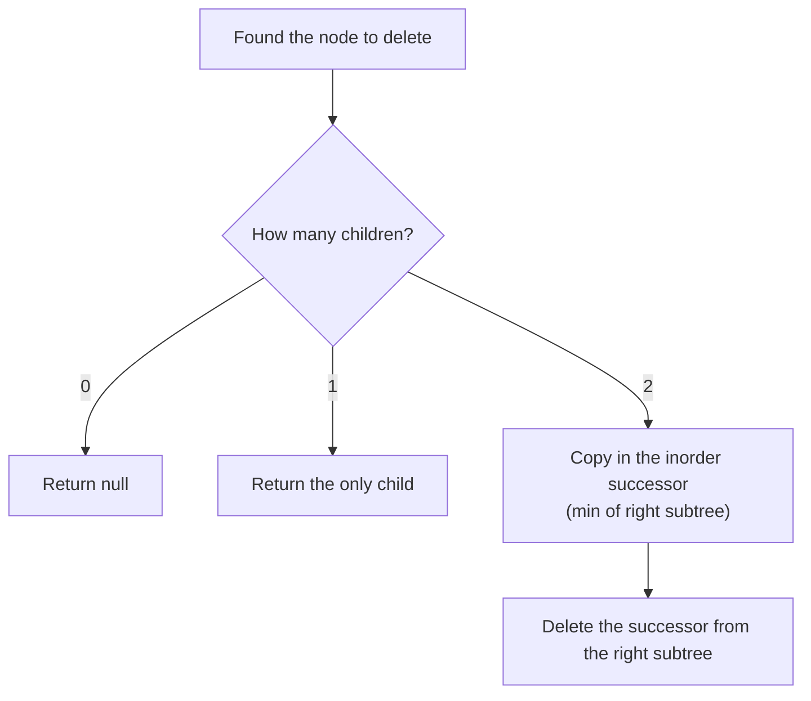

*Deleting from a BST. The successor has no left child, so deleting it falls into case 0 or 1.*

To **validate** a BST, checking each node against its children is not enough — a node deep in the left subtree must also be smaller than the root. Pass down an allowed `(low, high)` range, or check that the inorder sequence is strictly increasing. To **build** a balanced BST from a sorted array, make the middle element the root and recurse on each half.

**BST delete and validate**

```python
def delete_node(root, key):
    if not root:
        return None
    if key < root.val:
        root.left = delete_node(root.left, key)
    elif key > root.val:
        root.right = delete_node(root.right, key)
    else:
        if not root.left:
            return root.right            # 0 or 1 child
        if not root.right:
            return root.left
        succ = root.right                # 2 children: inorder successor
        while succ.left:
            succ = succ.left
        root.val = succ.val
        root.right = delete_node(root.right, succ.val)
    return root


def is_valid_bst(node, low=float("-inf"), high=float("inf")):
    if not node:
        return True
    if not (low < node.val < high):
        return False
    return is_valid_bst(node.left, low, node.val) and is_valid_bst(node.right, node.val, high)


bst = TreeNode(4, TreeNode(2, TreeNode(1), TreeNode(3)), TreeNode(7))
print(is_valid_bst(bst))                   # True
print(delete_node(bst, 2).left.val)        # 3
```

```javascript
function deleteNode(root, k) {
  if (!root) return null;
  if (k < root.val) root.left = deleteNode(root.left, k);
  else if (k > root.val) root.right = deleteNode(root.right, k);
  else {
    if (!root.left) return root.right;     // 0 or 1 child
    if (!root.right) return root.left;
    let succ = root.right;                 // 2 children: inorder successor
    while (succ.left) succ = succ.left;
    root.val = succ.val;
    root.right = deleteNode(root.right, succ.val);
  }
  return root;
}

function isValidBST(node, low = -Infinity, high = Infinity) {
  if (!node) return true;
  if (!(low < node.val && node.val < high)) return false;
  return isValidBST(node.left, low, node.val) && isValidBST(node.right, node.val, high);
}

const bst = new TreeNode(4, new TreeNode(2, new TreeNode(1), new TreeNode(3)), new TreeNode(7));
console.log(isValidBST(bst));              // true
console.log(deleteNode(bst, 2).left.val);  // 3
```

**From the notes — BST problems**

| Problem | Technique | Complexity |
| --- | --- | --- |
| BST search, insert, min, max, delete | walk one path | `O(H)` |
| Check BST | bounds, or strictly increasing inorder | `O(N)` |
| Sorted array → balanced BST | middle as root, recurse | `O(N)` |
| k-th smallest in a BST | inorder, stop at k | `O(H + k)` |

#### More problems from the notes

Every remaining problem from the revision notes for this topic, each with a solution in Python and JavaScript.

**Problem — Search in a BST**

*Return whether a value exists in a BST.*

Go left when the value is smaller, right when larger. `O(h)` — iterative and recursive versions from the notes.

**Approach 1 — version 1**

```python
def search_bst_iterative(root, val):
    curr = root
    while curr:
        if curr.data == val:
            return True
        elif val < curr.data:
            curr = curr.left
        else:
            curr = curr.right
    return False
```

```javascript
// Iterative approach to search in BST

class TreeNode {
  constructor(val = 0, left = null, right = null) {
    this.val = val;
    this.left = left;
    this.right = right;
  }
}

function searchInBST(root, k) {
  while (root !== null) {
    if (root.val === k) {
      return true; // Value found
    } else if (k < root.val) {
      root = root.left; // Search in left subtree
    } else {
      root = root.right; // Search in right subtree
    }
  }

  return false; // Value not found
}

const root = new TreeNode(4, new TreeNode(2, new TreeNode(1), new TreeNode(3)), new TreeNode(7));

console.log(searchInBST(root, 2)); // true
console.log(searchInBST(root, 5)); // false
```

**Approach 2 — version 2**

```python
def search_bst_recursive(root, val):
    if root is None:
        return False
    if root.data == val:
        return True
    elif val < root.data:
        return search_bst_recursive(root.left, val)
    else:
        return search_bst_recursive(root.right, val)
```

```javascript
// Recursive approach to search in BST
class TreeNode {
  constructor(val = 0, left = null, right = null) {
    this.val = val;
    this.left = left;
    this.right = right;
  }
}

function searchInBSTRecursive(root, k) {
  if (root === null) {
    return false; // Base case: value not found
  }

  if (root.val === k) {
    return true; // Value found
  } else if (k < root.val) {
    return searchInBSTRecursive(root.left, k); // Search in left subtree
  } else {
    return searchInBSTRecursive(root.right, k); // Search in right subtree
  }
}

const rootRecursive = new TreeNode(4, new TreeNode(2, new TreeNode(1), new TreeNode(3)), new TreeNode(7));
console.log(searchInBSTRecursive(rootRecursive, 2)); // true
console.log(searchInBSTRecursive(rootRecursive, 5)); // false
```

**Problem — Insert into a BST**

*Insert a value into a BST.*

Walk as if searching; attach the new node where the walk falls off the tree. `O(h)`.

**Approach 1 — version 1**

```python
class TreeNode:
    def __init__(self, data=0):
        self.data = data
        self.left = None
        self.right = None

def insert_bst_recursive(root, val):
    if root is None:
        return TreeNode(val)

    if val < root.data:
        root.left = insert_bst_recursive(root.left, val)
    elif val > root.data:
        root.right = insert_bst_recursive(root.right, val)

    return root
```

```javascript
// Recursive approach to insert into BST

class TreeNode {
    constructor(val = 0, left = null, right = null) {
        this.val = val;
        this.left = left;
        this.right = right;
    }
}

function insertIntoBST(root, k) {
    if (root === null) {
        return new TreeNode(k); // Create a new node if the tree is empty
    }

    if (k <= root.val) {
        root.left = insertIntoBST(root.left, k); // Insert in left subtree
    } else {
        root.right = insertIntoBST(root.right, k); // Insert in right subtree
    }

    return root; // Return the unchanged root
}

const rootInsert = new TreeNode(4, new TreeNode(2, new TreeNode(1), new TreeNode(3)), new TreeNode(7));

console.log(JSON.stringify(insertIntoBST(rootInsert, 5))); // BST with 5 inserted
```

**Approach 2 — version 2**

```python
def insert_bst_iterative(root, val):
    new_node = TreeNode(val)
    if root is None:
        return new_node

    curr = root
    parent = None

    while curr:
        parent = curr
        if val < curr.data:
            curr = curr.left
        elif val > curr.data:
            curr = curr.right
        else:
            return root  # Value already exists

    if val < parent.data:
        parent.left = new_node
    else:
        parent.right = new_node

    return root
```

```javascript
// Iterative approach to insert into BST

class TreeNode {
    constructor(val = 0, left = null, right = null) {
        this.val = val;
        this.left = left;
        this.right = right;
    }
}

function insertIntoBSTIterative(root, k) {
    const newNode = new TreeNode(k);

    // Edge case: If the tree is empty, the new node becomes the root
    if (root === null) {
        return newNode;
    }

    let current = root;
    while (true) {
        if (k <= current.val) {
            // Go Left
            if (current.left === null) {
                current.left = newNode; // Found the spot
                break; // Exit the loop
            }
            current = current.left; // Keep going down
        } else {
            // Go Right
            if (current.right === null) {
                current.right = newNode; // Found the spot
                break; // Exit the loop
            }
            current = current.right; // Keep going down
        }
    }

    return root;
}

const rootInsert = new TreeNode(4, new TreeNode(2, new TreeNode(1), new TreeNode(3)), new TreeNode(7));

insertIntoBSTIterative(rootInsert, 5);
console.log(JSON.stringify(rootInsert));
```

**Problem — Smallest value in a BST**

*Return the minimum value.*

Keep going left until there is no left child. `O(h)`.

**Approach 1 — version 1**

```python
def find_smallest_iterative(root):
    if not root:
        return None
    curr = root
    while curr.left:
        curr = curr.left
    return curr.data
```

```javascript
// Iterative approach to find the smallest value in BST

class TreeNode {
    constructor(val = 0, left = null, right = null) {
        this.val = val;
        this.left = left;
        this.right = right;
    }
}

function findSmallestInBST(root) {
    if (root === null) {
        return null; // Tree is empty
    }

    while (root.left !== null) {
        root = root.left; // Traverse to the leftmost node
    }

    return root.val; // Return the smallest value
}

const rootSmallest = new TreeNode(4, new TreeNode(2, new TreeNode(1), new TreeNode(3)), new TreeNode(7));
console.log(findSmallestInBST(rootSmallest)); // 1

const rootSmallest2 = new TreeNode(4, null, new TreeNode(7));
console.log(findSmallestInBST(rootSmallest2)); // 4
```

**Approach 2 — version 2**

```python
def find_smallest_recursive(root):
    if not root:
        return None
    if not root.left:
        return root.data
    return find_smallest_recursive(root.left)
```

```javascript
// Recursive approach to find the smallest value in BST

class TreeNode {
    constructor(val = 0, left = null, right = null) {
        this.val = val;
        this.left = left;
        this.right = right;
    }
}

function findSmallestInBSTRecursive(root) {
    // Base Case 1: Empty tree
    if (root === null) {
        return null;
    }

    // Base Case 2: If there is no left child, we have found the smallest value (current node)
    if (root.left === null) {
        return root.val;
    }

    // Recursive Step: The smallest value must be in the left subtree
    return findSmallestInBSTRecursive(root.left);
}

const rootSmallest = new TreeNode(4, new TreeNode(2, new TreeNode(1), new TreeNode(3)), new TreeNode(7));
console.log(findSmallestInBSTRecursive(rootSmallest)); // 1

const rootSmallest2 = new TreeNode(4, null, new TreeNode(7));
console.log(findSmallestInBSTRecursive(rootSmallest2)); // 4
```

**Problem — Largest value in a BST**

*Return the maximum value.*

Keep going right until there is no right child. `O(h)`.

**Approach 1 — version 1**

```python
def find_largest_iterative(root):
    if not root:
        return None
    curr = root
    while curr.right:
        curr = curr.right
    return curr.data
```

```javascript
// Iterative approach to find the largest value in BST

class TreeNode {
  constructor(val = 0, left = null, right = null) {
    this.val = val;
    this.left = left;
    this.right = right;
  }
}

function findLargestInBST(root) {
  if (root === null) {
    return null; // Tree is empty
  }

  while (root.right !== null) {
    root = root.right; // Traverse to the rightmost node
  }

  return root.val; // Return the largest value
}

const rootLargest = new TreeNode(4, new TreeNode(2, new TreeNode(1), new TreeNode(3)), new TreeNode(7));
console.log(findLargestInBST(rootLargest)); // 7
```

**Approach 2 — version 2**

```python
def find_largest_recursive(root):
    if not root:
        return None
    if not root.right:
        return root.data
    return find_largest_recursive(root.right)
```

```javascript
// Recursive approach to find the largest value in BST

class TreeNode {
  constructor(val = 0, left = null, right = null) {
    this.val = val;
    this.left = left;
    this.right = right;
  }
}

function findLargestInBSTRecursive(root) {
  // Base Case 1: Empty tree
  if (root === null) {
    return null;
  }

  // Base Case 2: If there is no right child, we found the largest value
  if (root.right === null) {
    return root.val;
  }

  // Recursive Step: The largest value must be in the right subtree
  return findLargestInBSTRecursive(root.right);
}

const rootLargest = new TreeNode(4, new TreeNode(2, new TreeNode(1), new TreeNode(3)), new TreeNode(7));

console.log(findLargestInBSTRecursive(rootLargest)); // 7
```

**Problem — Build a balanced BST from a sorted array**

*Construct a height-balanced BST from a sorted array.*

Make the middle element the root and build each half recursively: both subtrees get half the elements, so the height is `O(log n)`. `O(n)`.

**Solution**

```python
def sorted_array_to_bst(nums):
    def build_bst(left, right):
        if left > right:
            return None
        mid = left + (right - left) // 2
        root = TreeNode(nums[mid])
        root.left = build_bst(left, mid - 1)
        root.right = build_bst(mid + 1, right)
        return root

    return build_bst(0, len(nums) - 1)
```

```javascript
// Definition for a binary tree node.
class TreeNode {
    // Constructor initializes the node value and its children pointers
    constructor(val = 0, left = null, right = null) {
        this.val = val;     // The value of the node
        this.left = left;   // Pointer to the left child
        this.right = right; // Pointer to the right child
    }
}

// Main function to initiate the BST construction
function constructBST(arr) {
    // Call the recursive helper function with the full range of the array
    // low index = 0, high index = last element (arr.length - 1)
    return construct(arr, 0, arr.length - 1);
}

// Helper function to construct the tree recursively
function construct(arr, low, high) {
    // Base Case: If the start index exceeds the end index, the range is invalid/empty.
    if (low > high) {
        return null; // Return null to signify no node exists here
    }

    // Calculate the middle index to determine the root of this subtree.
    // Note: Added Math.floor to ensure an integer index (crucial for JS).
    const mid = Math.floor(low + (high - low) / 2);

    // Create a new TreeNode using the value at the middle index
    const node = new TreeNode(arr[mid]);

    // Recursively build the left subtree using elements before the mid index
    // Range becomes [low, mid - 1]
    node.left = construct(arr, low, mid - 1);

    // Recursively build the right subtree using elements after the mid index
    // Range becomes [mid + 1, high]
    node.right = construct(arr, mid + 1, high);

    // Return the constructed node (root of this subtree) back to the caller
    return node;
}

const sortedArray = [1, 2, 3, 4, 5, 6, 7];
const balancedBST = constructBST(sortedArray);
console.log(JSON.stringify(balancedBST)); // Balanced BST constructed from the sorted array

/*
 * COMPLEXITY ANALYSIS:
 * --------------------
 * Time Complexity: O(N)
 * - We visit every element in the array exactly once to create a corresponding tree node.
 * - Therefore, the time complexity is linear with respect to the number of elements N.
 *
 * Space Complexity: O(N)
 * - O(N) is required to store the output structure (the tree nodes).
 * - Additionally, the recursion stack uses O(log N) space because the tree is balanced.
 * - Total Space: O(N).
 */
```

**Problem — Sorted array to balanced BST**

*Convert a sorted array into a height-balanced BST (the notes' second version).*

The same middle-as-root recursion, written with explicit `lo`/`hi` bounds instead of slicing, which avoids copying subarrays.

**Solution**

```python
class TreeNode:
    def __init__(self, val=0, left=None, right=None):
        self.val = val
        self.left = left
        self.right = right

def sorted_array_to_balanced_bst(arr):
    def helper(left, right):
        if left > right:
            return None
        mid = (left + right) // 2
        node = TreeNode(arr[mid])
        node.left = helper(left, mid - 1)
        node.right = helper(mid + 1, right)
        return node

    return helper(0, len(arr) - 1)
```

```javascript
// Definition for a binary tree node.
class Node {
  constructor(data) {
    this.data = data;
    this.left = null;
    this.right = null;
  }
}

function sortedArrayToBST(A) {
  // Helper that builds tree from A[lo..hi]
  function build(lo, hi) {
    if (lo > hi) return null;              // empty subtree
    const mid = Math.floor((lo + hi) / 2); // pick middle
    const node = new Node(A[mid]);
    node.left  = build(lo,   mid - 1);     // left half
    node.right = build(mid + 1, hi);       // right half
    return node;
  }

  return build(0, A.length - 1);
}
// Input: [1,2,3]
let arr1 = [1, 2, 3];
let bst1 = sortedArrayToBST(arr1);

// Input: [1,2,3,5,10]
let arr2 = [1, 2, 3, 5, 10];
let bst2 = sortedArrayToBST(arr2);

// (You can write a simple traversal to verify structure if you like)
```

**Problem — k-th smallest element in a BST**

*Return the k-th smallest value in a BST.*

An in-order walk visits values in sorted order; stop at the k-th visit. `O(h + k)`.

**Solution**

```python
def kth_smallest(root, k):
    stack = []
    curr = root
    count = 0

    while curr or stack:
        while curr:
            stack.append(curr)
            curr = curr.left

        curr = stack.pop()
        count += 1
        if count == k:
            return curr.data

        curr = curr.right

    return -1
```

```javascript
function kthSmallest(root, k) {
    // Counter for how many nodes have been visited so far
    // Tracks the rank of the current node in the sorted sequence
    let count = 0;

    // Placeholder for the result; remains -Infinity until we hit the kᵗʰ node
    // Acts as a flag to stop recursion once the target is found
    let result = -Infinity;

    function inorder(node, k) {
        // If we've already found the result, or reached a leaf, stop recursing
        // This optimization prevents traversing the rest of the tree once k is found
        if (result !== -Infinity || node === null) {
            return;
        }

        // 1) Traverse left subtree
        // Go deep into the left side to find the smallest available values first
        inorder(node.left, k);

        if (count === k - 1) {
            result = node.val;   // Capture the answer
            return;              // Early exit—no need to traverse further
        }

        // Increment visit count for this node
        // We move past this node, marking it as visited in the sorted order
        count++;

        // 3) Traverse right subtree
        // If result wasn't found in left subtree or current node, check values larger than current
        inorder(node.right, k);
    }

    // Kick off the recursive inorder traversal starting from the root
    inorder(root, k);

    // Return the captured result (still -Infinity if tree has fewer than k nodes)
    return result;
}

// Constructing the BST as per the diagram above
const root = {
    val: 50,
    left: {
        val: 30,
        left: { val: 10, left: null, right: null },
        right: { val: 45, left: { val: 40, left: null, right: null }, right: null }
    },
    right: {
        val: 80,
        left: {
            val: 60,
            left: null,
            right: { val: 65, left: null, right: null }
        },
        right: { val: 90, left: null, right: null }
    }
};

const k = 8;
// Execute the function
console.log(kthSmallest(root, k)); // Output: 80

/**
 * ==========================================
 * COMPLEXITY ANALYSIS
 * ==========================================
 *
 * Time Complexity: O(N)
 * - In the worst case (e.g., finding the largest element or k=N), we might traverse all N nodes.
 * - However, because of the early return optimization, the average time is often O(k).
 *
 * Space Complexity: O(H)
 * - The space complexity is determined by the maximum depth of the recursion stack.
 * - H is the height of the tree.
 * - In a balanced BST, H = log(N).
 * - In a skewed BST (worst case), H = N.
 */
```

**Problem — k-th smallest element (the notes' second version)**

*Return the k-th smallest value in a BST.*

Another in-order solution with a counter that stops the walk as soon as the answer is found.

**Solution**

```python
def kth_smallest_bst(root, k):
    count = 0
    ans = None

    def inorder(node):
        nonlocal count, ans
        if not node or ans is not None:
            return

        inorder(node.left)
        count += 1
        if count == k:
            ans = node.data
            return
        inorder(node.right)

    inorder(root)
    return ans
```

```javascript
// Definition for a BST node using `data` instead of `val`.
function TreeNode(data, left = null, right = null) {
  this.data  = data;
  this.left  = left;
  this.right = right;
}

function kthSmallest(root, B) {
  const stack = [];
  let current = root;
  let count = 0;

  // Continue until we've exhausted nodes or found the Bᵗʰ smallest
  while (current !== null || stack.length > 0) {
    // 1) Go as far left as possible
    while (current !== null) {
      stack.push(current);
      current = current.left;
    }

    // 2) Visit the node on top of the stack
    current = stack.pop();
    count += 1;
    if (count === B) {
      return current.data;
    }

    // 3) Then move to its right subtree
    current = current.right;
  }

  // If B is larger than the number of nodes, return null
  return null;
}

function test(tree, B, expected) {
  const got = kthSmallest(tree, B);
  console.log(
    `kthSmallest(..., ${B}) = ${got} ` +
    (got === expected ? '✅' : `❌  (expected ${expected})`)
  );
}

const bst1 = new TreeNode(2, new TreeNode(1), new TreeNode(3));
test(bst1, 2, 2);  // 2nd smallest is 2

const bst2 = new TreeNode(3, new TreeNode(2, new TreeNode(1)), null);
test(bst2, 1, 1);  // 1st smallest is 1

// Test 3: B out of range
test(bst2, 4, null); // only 3 nodes, so return null

// Test 4: single-node tree
const bst3 = new TreeNode(7);
test(bst3, 1, 7);  // 1st smallest is 7
test(bst3, 2, null); // out of range
```

<a id="33-morris-traversal"></a>

### Morris Traversal

- **Time** `O(N)`
- **Extra space** `O(1)`

Recursive and stack-based inorder both use `O(h)` memory to remember **where to return** after finishing a left subtree. Morris stores that return address inside the tree itself. Before descending left from `curr`, find its **inorder predecessor** — the rightmost node of the left subtree — and point that node's empty `right` at `curr`. That temporary link is a **thread**. Later, when the walk reaches the predecessor and follows its `right`, it arrives back at `curr`, sees the thread already exists, removes it, visits `curr` and goes right.

The rule at each node, straight from the notes:

1. **No left child** → visit `curr`, then move right (along a real edge *or* a thread).
2. **Left child exists** → find the rightmost node of the left subtree (stop if its `right` is `curr`).
   - Its `right` is **empty** → create the thread, move left.
   - Its `right` **is `curr`** → the left subtree is done: remove the thread, visit `curr`, move right.

> **Interactive animation:** `morris` — rendered by the page script in the HTML version.

```text
                 10                    threads (dashed in the animation):
              /      \                   40 → 20,  70 → 50,  80 → 10,  90 → 60
            20        30
           /  \         \              inorder: 40 20 70 50 80 10 30 90 60
         40    50        60
              /  \      /
            70    80  90
```

**Interview question**

*Return the inorder traversal of a binary tree using `O(1)` extra space — no recursion, no stack.*

Every edge is walked at most a constant number of times (down once, back up once through a thread, and once more while searching for predecessors), so the time is still `O(n)`. The tree is modified during the walk but fully restored by the end.

**Answer — Morris inorder traversal**

```python
def morris_inorder(root):
    result = []
    curr = root
    while curr:
        if not curr.left:
            result.append(curr.val)          # rule 1: visit, go right
            curr = curr.right
        else:
            pre = curr.left                  # rule 2: rightmost of left subtree
            while pre.right and pre.right is not curr:
                pre = pre.right
            if pre.right is None:
                pre.right = curr             # create thread, go left
                curr = curr.left
            else:
                pre.right = None             # left side done: remove thread
                result.append(curr.val)
                curr = curr.right
    return result


tree = TreeNode(10,
                TreeNode(20, TreeNode(40), TreeNode(50, TreeNode(70), TreeNode(80))),
                TreeNode(30, None, TreeNode(60, TreeNode(90))))
print(morris_inorder(tree))  # [40, 20, 70, 50, 80, 10, 30, 90, 60]
```

```javascript
function morrisInorder(root) {
  const result = [];
  let curr = root;
  while (curr) {
    if (!curr.left) {
      result.push(curr.val);                 // rule 1: visit, go right
      curr = curr.right;
    } else {
      let pre = curr.left;                   // rule 2: rightmost of left subtree
      while (pre.right && pre.right !== curr) pre = pre.right;
      if (!pre.right) {
        pre.right = curr;                    // create thread, go left
        curr = curr.left;
      } else {
        pre.right = null;                    // left side done: remove thread
        result.push(curr.val);
        curr = curr.right;
      }
    }
  }
  return result;
}

const tree = new TreeNode(10,
  new TreeNode(20, new TreeNode(40), new TreeNode(50, new TreeNode(70), new TreeNode(80))),
  new TreeNode(30, null, new TreeNode(60, new TreeNode(90))));
console.log(morrisInorder(tree)); // [40, 20, 70, 50, 80, 10, 30, 90, 60]
```

Because a BST's inorder is sorted, Morris gives two more problems for free: the **k-th smallest** element is the k-th value visited, and **recovering a BST with two swapped nodes** means spotting the one or two places where the inorder sequence goes down (`prev > curr`) and swapping the first `prev` with the last `curr`.

**From the notes — Morris problems**

| Problem | Technique | Complexity |
| --- | --- | --- |
| Morris inorder traversal | threads to inorder predecessors | `O(N)`, `O(1)` |
| k-th smallest element in a BST | Morris, stop at the k-th visit | `O(N)`, `O(1)` |
| Recover a BST with two swapped nodes | Morris + first/last inversion | `O(N)`, `O(1)` |

#### More problems from the notes

Every remaining problem from the revision notes for this topic, each with a solution in Python and JavaScript.

**Problem — Recover a BST with two swapped nodes**

*Exactly two nodes of a BST had their values swapped. Restore the tree without changing its shape.*

In-order order should be increasing. Walk it (with Morris for `O(1)` space) and record inversions `prev > curr`: the first inversion's `prev` and the last inversion's `curr` are the swapped nodes. Swap their values back.

**Solution**

```python
def recover_bst(root):
    first = None
    second = None
    prev = None

    def inorder(node):
        nonlocal first, second, prev
        if not node:
            return

        inorder(node.left)

        if prev and prev.data > node.data:
            if not first:
                first = prev
            second = node
        prev = node

        inorder(node.right)

    inorder(root)
    if first and second:
        first.data, second.data = second.data, first.data
```

```javascript
// Definition for a binary tree node.
function TreeNode(val, left = null, right = null) {
    this.val = val;
    this.left = left;
    this.right = right;
}

function recoverTree(root) {
    // Pointers to track the specific nodes involved in the violation.
    let first = null;  // Will point to the first node out of order
    let middle = null;  // If the two swapped nodes are adjacent, this is the 2nd
    let last = null;  // If they are non‐adjacent, this is the 2nd
    let prev = null;  // The previously visited node in inorder

    let current = root;

    // Start Morris Traversal Loop
    while (current !== null) {

        // Case 1: If there is no left child, we can visit this node immediately.
        // There is no left subtree to process first.
        if (current.left === null) {
            // “Visit” current: Check for BST violations
            detectViolation(prev, current);

            // Update prev to current before moving to the right
            prev = current;
            // Move to the right child (or follow a thread back up)
            current = current.right;
        } else {
            // Case 2: Left child exists. We must process the left subtree first.
            // Find inorder predecessor of current (rightmost node in left subtree).
            let predecessor = current.left;

            // Keep going right until we hit null (end of subtree) or we hit 'current' (thread exists)
            while (predecessor.right !== null && predecessor.right !== current) {
                predecessor = predecessor.right;
            }

            // Sub-case 2a: No thread exists yet. Create one.
            if (predecessor.right === null) {
                // Thread it: link predecessor → current so we can return here later
                predecessor.right = current;
                // Now that the link is set, move left to continue traversal
                current = current.left;
            } else {
                // Sub-case 2b: Thread exists. This means we finished the left subtree.
                // Thread exists: undo it (restore tree structure)
                predecessor.right = null;

                // Visit current: Check for BST violations now that left side is done
                detectViolation(prev, current);

                // Update prev pointer
                prev = current;
                // Move to the right subtree
                current = current.right;
            }
        }
    }

    // After traversal, swap the two nodes’ values
    // We check which scenario occurred (adjacent vs non-adjacent swaps)
    if (first !== null && last !== null) {
        // Non‐adjacent swap case: The nodes were far apart (two violations found)
        [first.val, last.val] = [last.val, first.val];
    } else if (first !== null && middle !== null) {
        // Adjacent swap case: The nodes were next to each other (only one violation found)
        // 'middle' holds the value that was smaller than 'first'
        [first.val, middle.val] = [middle.val, first.val];
    }

    function detectViolation(prev, curr) {
        // If previous value is greater than current, the sort order is broken
        if (prev !== null && prev.val > curr.val) {
            if (first === null) {
                // First time we see an inversion: mark both nodes
                // 'prev' is the larger node that should be later (candidate 1)
                first = prev;
                // 'curr' might be the smaller node (candidate 2 - adjacent case)
                middle = curr;
            } else {
                // Second inversion: This confirms non-adjacent nodes.
                // 'curr' is the smaller node that should be earlier (candidate 2)
                last = curr;
            }
        }
    }
}

function inorderList(root, arr = []) {
    if (!root) return arr;
    inorderList(root.left, arr);
    arr.push(root.val);
    inorderList(root.right, arr);
    return arr;
}

// The correct inorder should be [1,2,3,4], but currently it is [1,3,2,4]

const root = new TreeNode(3,
    new TreeNode(1),
    new TreeNode(4, new TreeNode(2), null)
);

console.log('Before:', inorderList(root)); // e.g. [1, 3, 2, 4]
recoverTree(root);
console.log('After :', inorderList(root)); // [1, 2, 3, 4]

/*
 * ==========================================
 * COMPLEXITY ANALYSIS
 * ==========================================
 *
 * Time Complexity:  O(N)
 * – We visit every node in the tree.
 * – In Morris Traversal, every edge is traversed at most 2 times (once to find
 * the predecessor and thread, and once to remove the thread).
 * – Therefore, the total time is linear relative to the number of nodes N.
 *
 * Space Complexity: O(1) (Auxiliary)
 * – We only use a constant number of pointers (first, middle, last, prev, current, predecessor).
 * – Crucially, we do not use a recursion stack (which would be O(H)) or an
 * explicit stack array. The tree is modified temporarily during traversal
 * but restored to its original state by the end.
 */
```

<a id="34-lowest-common-ancestor"></a>

### Lowest Common Ancestor

- **In a BST** `O(H)`
- **In a binary tree** `O(N)`

> **Analogy** 🌳
>
> **Picture it — a family tree**
>
> Two cousins trace their parents, grandparents and great-grandparents upwards. The first person who appears on both lists is their lowest common ancestor.

In a **BST**, walk from the root: if both values are smaller, go left; if both are larger, go right; otherwise the two values split here (or one of them *is* here), so this node is the LCA. That is `O(h)` time and `O(1)` space.

In a **general binary tree** there is no ordering to steer by. The notes show two methods: build both **node-to-root paths** and find where they diverge, or recurse — ask each subtree whether it contains `p` or `q`; the first node that hears "yes" from both sides is the LCA.

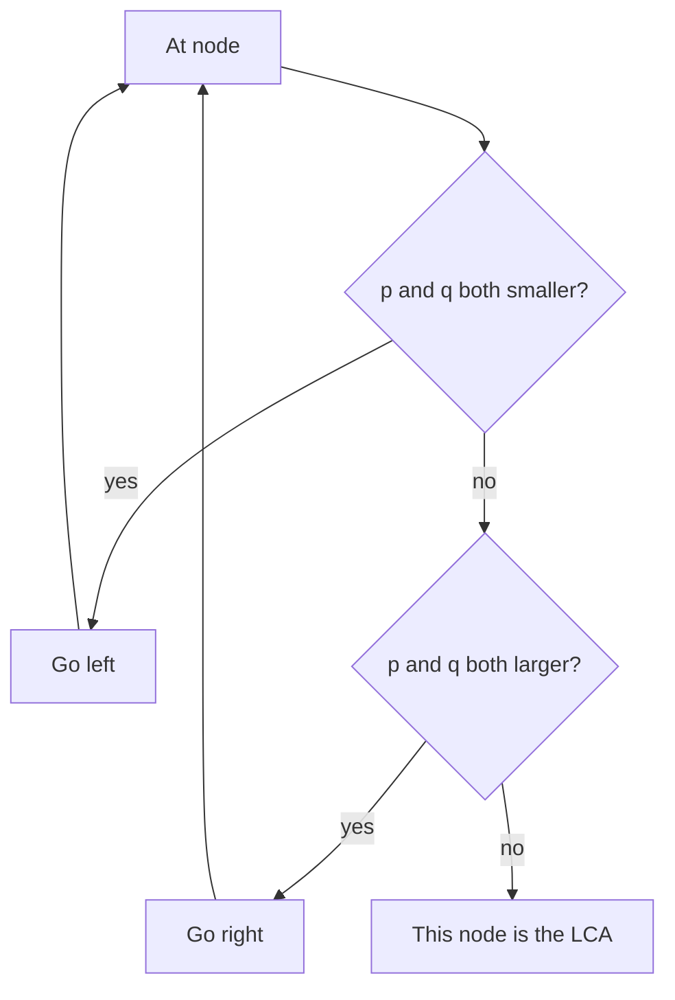

*LCA in a BST: the first node where `p` and `q` stop being on the same side.*

**Answer — LCA in a BST and in any binary tree**

```python
def lca_bst(root, p, q):
    curr = root
    while curr:
        if p < curr.val and q < curr.val:
            curr = curr.left
        elif p > curr.val and q > curr.val:
            curr = curr.right
        else:
            return curr                      # p and q split here
    return None


def lca_binary_tree(root, p, q):
    if not root or root.val in (p, q):
        return root
    left = lca_binary_tree(root.left, p, q)
    right = lca_binary_tree(root.right, p, q)
    if left and right:                       # found on both sides
        return root
    return left or right


bst = TreeNode(6, TreeNode(2, TreeNode(0), TreeNode(4)), TreeNode(8, TreeNode(7), TreeNode(9)))
print(lca_bst(bst, 0, 4).val)                # 2
print(lca_binary_tree(tree, 70, 40).val)     # 20
```

```javascript
function lcaBST(root, p, q) {
  let curr = root;
  while (curr) {
    if (p < curr.val && q < curr.val) curr = curr.left;
    else if (p > curr.val && q > curr.val) curr = curr.right;
    else return curr;                        // p and q split here
  }
  return null;
}

function lcaBinaryTree(root, p, q) {
  if (!root || root.val === p || root.val === q) return root;
  const left = lcaBinaryTree(root.left, p, q);
  const right = lcaBinaryTree(root.right, p, q);
  if (left && right) return root;            // found on both sides
  return left || right;
}

const bst6 = new TreeNode(6, new TreeNode(2, new TreeNode(0), new TreeNode(4)),
  new TreeNode(8, new TreeNode(7), new TreeNode(9)));
console.log(lcaBST(bst6, 0, 4).val);          // 2
console.log(lcaBinaryTree(tree, 70, 40).val); // 20
```

**From the notes — LCA problems**

| Problem | Technique | Complexity |
| --- | --- | --- |
| Node-to-root path | recursion, record on the way back | `O(N)` |
| LCA in a BST (path tracing; optimised walk) | compare paths; steer by value | `O(N)`; `O(H)` |
| LCA in a binary tree ("we are all connected") | node-to-root paths, or recurse both sides | `O(N)` |

#### More problems from the notes

Every remaining problem from the revision notes for this topic, each with a solution in Python and JavaScript.

**Problem — LCA in a BST by path tracing**

*Find the LCA of two values in a BST by comparing their root-to-node paths.*

Record the path to each value, then walk both paths together until they diverge; the last common node is the LCA. `O(h)` time but `O(h)` extra memory — the direct walk above needs none.

**Solution — Path Tracing**

```python
def lca_path_tracing(root, p, q):
    def get_path(node, target):
        if not node:
            return []
        if node.data == target:
            return [node]

        left_path = get_path(node.left, target)
        if left_path:
            return [node] + left_path

        right_path = get_path(node.right, target)
        if right_path:
            return [node] + right_path

        return []

    path_p = get_path(root, p)
    path_q = get_path(root, q)

    lca = None
    for n1, n2 in zip(path_p, path_q):
        if n1.data == n2.data:
            lca = n1
        else:
            break

    return lca
```

```javascript
// Definition for a BST node.
function TreeNode(val, left = null, right = null) {
    // Initialize the value of the node
    this.val = val;
    // Initialize the left child reference
    this.left = left;
    // Initialize the right child reference
    this.right = right;
}

function nodeToRootPath(root, target) {
    // Initialize an empty array to store the path from target to root
    const path = [];

    // Helper function to perform DFS traversal
    function findPath(node) {
        // Base case: if the node is null, we've hit a dead end
        if (!node) return false;

        // Check if the current node is the target we are looking for
        if (node.val === target) {
            // If found, push it to the path and return true to propagate success upwards
            path.push(node.val);
            return true;
        }

        // Search left; if found in the left subtree, record this node too
        // This adds the current node to the path array as the "parent" of the found node
        if (findPath(node.left)) {
            path.push(node.val);
            return true;
        }

        // Search right; likewise
        // If found in the right subtree, add this node to the path
        if (findPath(node.right)) {
            path.push(node.val);
            return true;
        }

        // If target is not found in this branch, return false
        return false;
    }

    // Trigger the helper function starting from the root
    findPath(root);
    // Return the constructed path (or empty array if not found)
    return path;
}

function lowestCommonAncestorBST(root, B, C) {
    // Calculate the path from Node B to the Root
    const pathB = nodeToRootPath(root, B);
    // Calculate the path from Node C to the Root
    const pathC = nodeToRootPath(root, C);

    // If either value is missing, there is no common ancestor
    // If either path array is empty, it implies the node does not exist in the tree
    if (pathB.length === 0 || pathC.length === 0) {
        return null;
    }

    // Compare from the end (the root) backwards
    // Initialize pointer i for pathB at the root end
    let i = pathB.length - 1;
    // Initialize pointer j for pathC at the root end
    let j = pathC.length - 1;
    // Variable to store the last matching node value
    let lca = null;

    while (i >= 0 && j >= 0 && pathB[i] === pathC[j]) {
        // Update LCA to the current matching node
        lca = pathB[i];
        // Move pointers inwards (down the tree from root towards targets)
        i--;
        j--;
    }

    // Return the last node that matched
    return lca;
}

// Constructing the Binary Search Tree for testing
const bst = new TreeNode(
    6,
    new TreeNode(
        2,
        new TreeNode(0),
        new TreeNode(4, new TreeNode(3), new TreeNode(5))
    ),
    new TreeNode(
        8,
        new TreeNode(7),
        new TreeNode(9)
    )
);

// Helper function to run tests and log output
function test(root, x, y, expected) {
    const got = lowestCommonAncestorBST(root, x, y);
    console.log(
        `LCA(${x}, ${y}) = ${got} ` +
        (got === expected ? "✅" : `❌  (expected ${expected})`)
    );
}

test(bst, 2, 8, 6);      // standard: left vs right subtree
test(bst, 2, 4, 2);      // both in left subtree, ancestor is 2
test(bst, 3, 5, 4);      // deeper nodes under 4
test(bst, 0, 5, 2);      // 0→2→... and 5→4→2→...
test(bst, 2, 10, null);  // 10 not in tree
test(bst, 10, 11, null); // both missing
```

---

<a id="unit-4"></a>

## Unit 4 — Heaps, Greedy, DP & Graphs

The heavyweight patterns: always grab the best item (heaps and greedy), remember every subproblem (DP), and walk networks of relationships (graphs).

<a id="35-heaps"></a>

### Heaps

- **Peek min / max** `O(1)`
- **Push / pop** `O(log N)`
- **Build from an array** `O(N)`
- **Heap sort** `O(N log N)`, `O(1)` space

A **heap** is a complete binary tree — every level full except the last, which fills left to right — where every parent is `≤` its children (min-heap) or `≥` them (max-heap). Completeness means it packs into an array with no gaps: the children of index `i` are `2i + 1` and `2i + 2`, and its parent is `(i - 1) // 2`. Push appends at the end and **sifts up**; pop moves the last element to the root and **sifts down**. Both walk one root-to-leaf path, so both are `O(log n)`.

> **Analogy** 🏥
>
> **Picture it — a hospital triage desk**
>
> Patients do not queue in arrival order; the most urgent is always seen next. The nurse does not re-sort the whole waiting room when someone new arrives — they only compare the newcomer with a few people above them. That is a priority queue, and a heap is how it stays cheap.

```text
index:   0   1   2   3   4   5   6          parent(i) = (i - 1) // 2
heap:  [ 2,  5,  3,  9,  6,  4,  8 ]        left(i)   = 2i + 1
                                            right(i)  = 2i + 2
              2
           /     \                           min-heap: every parent ≤ its children
          5       3                          only the ROOT is guaranteed to be the minimum
         / \     / \
        9   6   4   8
```

> **Interactive animation:** `heap` — rendered by the page script in the HTML version.

**A binary min-heap from scratch**

```python
class MinHeap:
    def __init__(self):
        self.heap = []

    def push(self, val):
        h = self.heap
        h.append(val)
        i = len(h) - 1
        while i > 0 and h[i] < h[(i - 1) // 2]:          # sift up
            p = (i - 1) // 2
            h[i], h[p] = h[p], h[i]
            i = p

    def pop(self):
        h = self.heap
        top, last = h[0], h.pop()
        if h:
            h[0] = last
            i = 0
            while True:                                  # sift down
                small, l, r = i, 2 * i + 1, 2 * i + 2
                if l < len(h) and h[l] < h[small]: small = l
                if r < len(h) and h[r] < h[small]: small = r
                if small == i: break
                h[i], h[small] = h[small], h[i]
                i = small
        return top


pq = MinHeap()
for x in [15, 9, 20, 4, 11]:
    pq.push(x)
print(pq.pop(), pq.pop())  # 4 9     (in practice: import heapq; heappush / heappop)
```

```javascript
class MinHeap {
  constructor(compare = (a, b) => a - b) {
    this.data = [];
    this.compare = compare;          // pass (a, b) => b - a for a max-heap
  }
  size() { return this.data.length; }
  peek() { return this.data[0]; }
  push(value) {
    const a = this.data;
    a.push(value);
    let i = a.length - 1;
    while (i > 0) {                                      // sift up
      const p = (i - 1) >> 1;
      if (this.compare(a[i], a[p]) >= 0) break;
      [a[i], a[p]] = [a[p], a[i]];
      i = p;
    }
  }
  pop() {
    const a = this.data;
    const top = a[0];
    const last = a.pop();
    if (a.length) {
      a[0] = last;
      let i = 0;
      while (true) {                                     // sift down
        const l = 2 * i + 1, r = l + 1;
        let m = i;
        if (l < a.length && this.compare(a[l], a[m]) < 0) m = l;
        if (r < a.length && this.compare(a[r], a[m]) < 0) m = r;
        if (m === i) break;
        [a[i], a[m]] = [a[m], a[i]];
        i = m;
      }
    }
    return top;
  }
}

const pq = new MinHeap();
[15, 9, 20, 4, 11].forEach((x) => pq.push(x));
console.log(pq.pop(), pq.pop()); // 4 9
```

<a id="build-heap"></a>

#### Building a heap in O(N), and heap sort

Pushing `n` items one by one costs `O(n log n)`. Building **bottom-up** is cheaper: every leaf (half the array) is already a valid heap, so start at the last non-leaf, `n // 2 - 1`, and sift each node down, walking backwards to the root. Half the nodes do no work, a quarter sink at most one level, an eighth at most two — the total is `n/4 · 1 + n/8 · 2 + … < n`, so the build is `O(n)`.

> **Interactive animation:** `build-heap` — rendered by the page script in the HTML version.

**Heap sort** builds a **max**-heap, then repeatedly swaps the root (the maximum) to the end of the array and sifts the new root down over the shrinking heap. It is `O(n log n)` in every case with `O(1)` extra space — but it is **not stable**, and its jumpy memory access makes it slower in practice than quick sort.

> **Interactive animation:** `sorting` (option=heap) — rendered by the page script in the HTML version.

The notes place heap sort among the sorting families:

| Approach | Time | Extra space | Stable? |
| --- | --- | --- | --- |
| Naive sorts (bubble, selection, insertion) | `O(n^2)` | `O(1)` | bubble and insertion yes, selection no |
| Efficient sorts (merge sort, quick sort) | `O(n log n)` | `O(n)` merge / `O(log n)` quick | merge yes, quick no |
| Heap sort | `O(n log n)` | `O(1)` | no |

A sort is **stable** when equal elements keep their original relative order. Heap sort is not: swapping the root to the end can jump an element over an equal one.

<a id="median-stream"></a>

#### Two heaps: the running median

The notes' median definitions: for an **odd** number of values the median is the middle one; for an **even** number there are two middles — the *lower* median (first middle), the *upper* median (second middle) and the *average* median (their mean), which is what the code below returns.

For a stream of numbers, keep the **smaller half in a max-heap** and the **larger half in a min-heap**, with sizes differing by at most one. The median is then sitting on top: the larger heap's root when the count is odd, the average of both roots when it is even. Each insert is one push plus at most one rebalancing move, `O(log n)`, and reading the median is `O(1)`.

> **Interactive animation:** `median-stream` — rendered by the page script in the HTML version.

**Interview question**

*Numbers arrive one at a time. After each, report the median so far. `5, 15, 1, 3` → `5, 10, 5, 4`.*

Push the new number into the low (max) heap if it is `≤` the low heap's top, otherwise into the high (min) heap. Then rebalance: if low has two more than high, move low's top across, and vice versa. Python's `heapq` is a min-heap only, so the max-heap stores **negated** values.

**Answer — median of a stream with two heaps**

```python
import heapq


class MedianFinder:
    def __init__(self):
        self.low = []    # max-heap of the smaller half (stored negated)
        self.high = []   # min-heap of the larger half

    def add_num(self, num):
        if not self.low or num <= -self.low[0]:
            heapq.heappush(self.low, -num)
        else:
            heapq.heappush(self.high, num)
        if len(self.low) > len(self.high) + 1:           # rebalance
            heapq.heappush(self.high, -heapq.heappop(self.low))
        elif len(self.high) > len(self.low):
            heapq.heappush(self.low, -heapq.heappop(self.high))

    def find_median(self):
        if len(self.low) > len(self.high):
            return float(-self.low[0])
        return (-self.low[0] + self.high[0]) / 2


mf = MedianFinder()
for x in [5, 15, 1, 3]:
    mf.add_num(x)
    print(mf.find_median(), end=" ")  # 5.0 10.0 5.0 4.0
```

```javascript
class MedianFinder {
  constructor() {
    this.low = new MinHeap((a, b) => b - a);  // max-heap of the smaller half
    this.high = new MinHeap();                // min-heap of the larger half
  }
  addNum(num) {
    if (!this.low.size() || num <= this.low.peek()) this.low.push(num);
    else this.high.push(num);
    if (this.low.size() > this.high.size() + 1) this.high.push(this.low.pop()); // rebalance
    else if (this.high.size() > this.low.size()) this.low.push(this.high.pop());
  }
  findMedian() {
    if (this.low.size() > this.high.size()) return this.low.peek();
    return (this.low.peek() + this.high.peek()) / 2;
  }
}

const mf = new MedianFinder();
console.log([5, 15, 1, 3].map((x) => (mf.addNum(x), mf.findMedian()))); // [5, 10, 5, 4]
```

**From the notes — heap problems**

| Problem | Technique | Complexity |
| --- | --- | --- |
| Insert / extract in a min-heap; min- and max-heap classes | sift up / sift down | `O(log N)` |
| Priority queue; heap queries | binary heap | `O(Q log N)` |
| Build a heap from an array (min / max) | sift down from `n/2 - 1` | `O(N)` |
| Heap sort | build max-heap, swap root to end | `O(N log N)`, `O(1)` |
| Median of a stream | max-heap + min-heap | `O(log N)` per insert |

#### More problems from the notes

Every remaining problem from the revision notes for this topic, each with a solution in Python and JavaScript.

**Problem — Insert into a min-heap**

*Insert a value into an array-based min-heap.*

Append at the end and sift up while the value is smaller than its parent at `(i - 1) // 2`. `O(log n)`.

**Solution**

```python
# Insertion in Min-Heap (Manual / Array based)
def insert_min_heap(heap, val):
    heap.append(val)
    curr = len(heap) - 1

    while curr > 0:
        parent = (curr - 1) // 2
        if heap[curr] < heap[parent]:
            heap[curr], heap[parent] = heap[parent], heap[curr]
            curr = parent
        else:
            break

    return heap

h = [1, 5, 3, 7, 9, 8]
print(insert_min_heap(h, 2))
```

```javascript
// Insertion in Min-Heap

// Heap array
const heap = [];

// Insert element into min-heap
function insert(ele) {
    // Add element to end (O(1) amortized)
    // Push the new element to the last index of the array.
    heap.push(ele);
    // Restore heap property (O(log n))
    // Call the helper function to fix the order if the new element is smaller than its parent.
    upheapify();
}

// Restore heap order by moving last element up
function upheapify() {
    let i = heap.length - 1; // start from last index
    // Initialize the pointer 'i' to the index of the newly inserted element.

    // Continue the loop as long as the current node is not the root (index 0).
    while (i > 0) {
        // Calculate the parent's index using the formula (current_index - 1) / 2.
        const parent = Math.floor((i - 1) / 2); // parent index

        // Check if the parent's value is greater than the current child's value for min-heap property.
        if (heap[parent] > heap[i]) {
            // If true, the Min-Heap property is violated.
            // Swap the current node with its parent to restore order.
            [heap[i], heap[parent]] = [heap[parent], heap[i]];

            // Move the pointer 'i' up to the parent's index to continue checking up the tree.
            i = parent; // move up
        } else {
            // If the parent is smaller or equal, the heap property is satisfied.
            // We break out of the loop.
            break;
        }
    }
}

insert(5);
insert(12);
insert(20);
insert(25);
insert(13);
insert(24);
insert(22);
insert(35);
insert(94);
insert(10); // Causes swaps to bubble up from the bottom to index 1.

console.log(heap); // Min-heap array after all insertions
// Expected: [5, 10, 20, 25, 12, 24, 22, 35, 94, 13]

/* * Time Complexity: O(log N)
 * - The height of a complete binary tree with N nodes is log N.
 * - In the worst case (inserting a new minimum), the upheapify process traverses from the leaf to the root.
 * - Therefore, insertion takes logarithmic time relative to the number of elements.
 *
 * Space Complexity: O(N)
 * - The heap requires O(N) space to store the elements in the array.
 * - The iterative upheapify function uses O(1) auxiliary space (no recursion stack).
 */
```

**Problem — Extract the minimum**

*Remove and return the smallest value of a min-heap.*

Swap the root with the last element, remove it, and sift the new root down towards its smaller child. `O(log n)`.

**Solution**

```python
# Extraction in Min-Heap
def extract_min(heap):
    if not heap:
        return None
    if len(heap) == 1:
        return heap.pop()

    min_val = heap[0]
    heap[0] = heap.pop()  # Move last element to root

    # Sift Down (Heapify)
    curr = 0
    n = len(heap)
    while True:
        left = 2 * curr + 1
        right = 2 * curr + 2
        smallest = curr

        if left < n and heap[left] < heap[smallest]:
            smallest = left
        if right < n and heap[right] < heap[smallest]:
            smallest = right

        if smallest != curr:
            heap[curr], heap[smallest] = heap[smallest], heap[curr]
            curr = smallest
        else:
            break

    return min_val

h = [1, 5, 3, 7, 9, 8]
print(extract_min(h))  # 1
```

```javascript
// Removal in Min-Heap

// Heap Removal in Min-Heap

const heap = [];

// Remove and return the min element (root)
function remove() {
    // Edge Case: If the heap is empty, there is nothing to remove.
    if (heap.length === 0) return undefined;

    // The minimum element in a Min-Heap is always at index 0.
    const min = heap[0];

    // Swap root with last element
    // We move the last leaf to the root position to preserve the Complete Binary Tree structure before re-balancing.
    const lastIndex = heap.length - 1;
    [heap[0], heap[lastIndex]] = [heap[lastIndex], heap[0]];

    // Remove last element
    // Now that the minimum element is at the end, we simply pop it off.
    heap.pop();

    downheapify();

    // Return the original minimum value we saved earlier.
    return min;
}

// Downheapify from root
// This function iteratively moves the node at index 0 down until the heap property is restored.
function downheapify() {
    let i = 0; // Start at the root index
    const n = heap.length; // Cache the length of the heap

    // Loop as long as the current node 'i' has at least a left child.
    // In a complete binary tree, if a node has no left child, it is a leaf.
    const leftIndex = 2 * i + 1;
    while (leftIndex < n) { // while left child exists

        // Assume the current node 'i' is the smallest to start with.
        let minIndex = i;

        // Calculate child indices
        const left = 2 * i + 1;
        const right = 2 * i + 2;

        // Compare with Left Child:
        // Check if left child exists AND is smaller than the current smallest (parent).
        if (left < n && heap[left] < heap[minIndex]) {
            minIndex = left; // Update minIndex to left child
        }

        if (right < n && heap[right] < heap[minIndex]) {
            minIndex = right; // Update minIndex to right child
        }

        // If the smallest value is NOT the current parent 'i', we need to swap.
        if (minIndex !== i) {
            // Swap the current node with the smaller child to push the larger value down.
            [heap[i], heap[minIndex]] = [heap[minIndex], heap[i]];

            // Move our pointer 'i' to the child's index to continue checking down the tree.
            i = minIndex;
        } else {
            // If minIndex is still 'i', the parent is smaller than both children.
            // The heap property is satisfied. Break the loop.
            break;
        }
    }
}

heap.push(2, 4, 5, 11, 6, 7, 8, 20);

console.log("Removed min:", remove()); // should remove 2
console.log("Heap after removal:", heap);

/*
 * ==========================================
 * COMPLEXITY ANALYSIS
 * ==========================================
 * * Time Complexity: O(log N)
 * - The remove() operation involves swapping elements and running downheapify().
 * - downheapify() traverses the height of the binary tree.
 * - Since a binary heap is a complete binary tree, the height is log N.
 * - Therefore, the time taken is proportional to the height: O(log N).
 * * Space Complexity: O(1)
 * - The downheapify() function is implemented iteratively using a while loop.
 * - It only uses a constant amount of extra space variables (i, n, minIndex, left, right).
 * - No recursion stack or auxiliary data structures are used.
 * ==========================================
 */
```

**Problem — Min-heap class**

*Implement a min-heap class with push, pop and peek.*

Wrap the two sift operations in a class; Python's `heapq` provides the same operations ready-made.

**Solution**

```python
import heapq

# Approach 1: Using Python's built-in heapq
class MinHeapBuiltin:
    def __init__(self):
        self.heap = []

    def push(self, val):
        heapq.heappush(self.heap, val)

    def pop(self):
        return heapq.heappop(self.heap) if self.heap else None

    def peek(self):
        return self.heap[0] if self.heap else None

    def size(self):
        return len(self.heap)

# Approach 2: Manual Class Implementation
class MinHeap:
    def __init__(self):
        self.heap = []

    def push(self, val):
        self.heap.append(val)
        self._bubble_up(len(self.heap) - 1)

    def pop(self):
        if not self.heap:
            return None
        if len(self.heap) == 1:
            return self.heap.pop()
        root = self.heap[0]
        self.heap[0] = self.heap.pop()
        self._bubble_down(0)
        return root

    def peek(self):
        return self.heap[0] if self.heap else None

    def _bubble_up(self, idx):
        while idx > 0:
            parent = (idx - 1) // 2
            if self.heap[idx] < self.heap[parent]:
                self.heap[idx], self.heap[parent] = self.heap[parent], self.heap[idx]
                idx = parent
            else:
                break

    def _bubble_down(self, idx):
        n = len(self.heap)
        while True:
            left = 2 * idx + 1
            right = 2 * idx + 2
            smallest = idx
            if left < n and self.heap[left] < self.heap[smallest]:
                smallest = left
            if right < n and self.heap[right] < self.heap[smallest]:
                smallest = right
            if smallest != idx:
                self.heap[idx], self.heap[smallest] = self.heap[smallest], self.heap[idx]
                idx = smallest
            else:
                break
```

```javascript
class MinHeap {
    constructor() {
        // Initialize an empty array to store heap elements
        this.heap = [];
    }

    // Get index of parent/children
    // Calculates parent index using the formula (i-1)/2
    getParentIndex(i) { return Math.floor((i - 1) / 2); }
    // Calculates left child index using 2i + 1
    getLeftChildIndex(i) { return 2 * i + 1; }
    // Calculates right child index using 2i + 2
    getRightChildIndex(i) { return 2 * i + 2; }

    // Swap helper
    // Uses ES6 destructuring to swap values at two indices in the array
    swap(i, j) {
        [this.heap[i], this.heap[j]] = [this.heap[j], this.heap[i]];
    }

    // Insert a new value
    insert(value) {
        // Add value to the end of the array (maintains complete tree property)
        this.heap.push(value);
        // Move the value up to its correct position to maintain heap property
        this.heapifyUp();
    }

    // Heapify up (fix after insertion)
    heapifyUp() {
        // Start at the last element added
        let index = this.heap.length - 1;
        // While we aren't at the root and the parent is larger than current element
        while (
            index > 0 &&
            this.heap[this.getParentIndex(index)] > this.heap[index]
        ) {
            // Swap the element with its parent
            this.swap(this.getParentIndex(index), index);
            // Move the index pointer to the parent's position
            index = this.getParentIndex(index);
        }
    }

    // Extract minimum (root)
    extractMin() {
        // If heap is empty, return null
        if (this.heap.length === 0) return null;
        // If only one element, just pop and return it
        if (this.heap.length === 1) return this.heap.pop();

        // Store the root value to return later
        const root = this.heap[0];
        // Remove the last element and place it at the root
        this.heap[0] = this.heap.pop(); // Move last to root
        // Sink the new root down to its correct position
        this.heapifyDown();
        return root;
    }

    // Heapify down (fix after removal)
    heapifyDown() {
        let index = 0;

        // Continue as long as the current node has at least a left child
        while (this.getLeftChildIndex(index) < this.heap.length) {
            // Assume the current node is the smallest
            let smallerChildIndex = index;

            // If left child exists and is smaller than current smaller, update smallerChildIndex
            if (
                this.getLeftChildIndex(index) < this.heap.length &&
                this.heap[this.getLeftChildIndex(index)] < this.heap[smallerChildIndex]
            ) {
                smallerChildIndex = this.getLeftChildIndex(index);
            }

            // If right child exists and is smaller than the current smaller, update smallerChildIndex
            if (
                this.getRightChildIndex(index) < this.heap.length &&
                this.heap[this.getRightChildIndex(index)] < this.heap[smallerChildIndex]
            ) {
                smallerChildIndex = this.getRightChildIndex(index);
            }

            // If the current node is already smaller than its smallest child, we are done
            if (this.heap[index] <= this.heap[smallerChildIndex]) {
                break;
            } else {
                // Otherwise, swap and continue descending the tree
                this.swap(index, smallerChildIndex);
            }

            // Move index pointer to the smaller child's position
            index = smallerChildIndex;
        }
    }

    // Peek min element
    // Returns the root of the heap (the minimum) without removing it
    peek() {
        return this.heap.length > 0 ? this.heap[0] : null;
    }

    // Size of heap
    // Returns the total number of elements currently in the heap
    size() {
        return this.heap.length;
    }
}

const minHeap = new MinHeap();
minHeap.insert(10);
minHeap.insert(5);
minHeap.insert(20);
minHeap.insert(1);
minHeap.insert(15);
console.log(minHeap.peek());       // Output: 1 (smallest element)
console.log(minHeap.extractMin()); // Output: 1
console.log(minHeap.extractMin()); // Output: 5
console.log(minHeap.heap);         // Output: [10, 15, 20]

/**
 * COMPLEXITY ANALYSIS:
 * * Time Complexity:
 * - insert(): O(log n) -> In worst case, we traverse from leaf to root (height of tree).
 * - extractMin(): O(log n) -> In worst case, we traverse from root to leaf.
 * - peek(): O(1) -> Accessing the first element of an array is constant time.
 * - heapifyUp / heapifyDown: O(log n) -> Proportional to the height of the tree.
 * * Space Complexity:
 * - O(n) -> We store 'n' elements in an array.
 */
```

**Problem — Max-heap class**

*Implement a max-heap class.*

Flip every comparison — or, with `heapq`, store negated values.

**Solution**

```python
import heapq

# Using Python's built-in heapq (by storing negated values)
class MaxHeap:
    def __init__(self):
        self.heap = []

    def push(self, val):
        heapq.heappush(self.heap, -val)

    def pop(self):
        if not self.heap:
            return None
        return -heapq.heappop(self.heap)

    def peek(self):
        return -self.heap[0] if self.heap else None

    def size(self):
        return len(self.heap)

max_h = MaxHeap()
for v in [5, 3, 8, 1, 2]:
    max_h.push(v)
print(max_h.pop())  # 8
print(max_h.pop())  # 5
```

```javascript
class MaxHeap {
  constructor() {
    // Initialize an empty array to store heap elements
    this.heap = [];
  }

  // Get index of parent/children
  // Formula: (index - 1) / 2 (rounded down)
  getParentIndex(i) { return Math.floor((i - 1) / 2); }

  // Formula: 2 * index + 1
  getLeftChildIndex(i) { return 2 * i + 1; }

  // Formula: 2 * index + 2
  getRightChildIndex(i) { return 2 * i + 2; }

  // Swap helper
  // Uses ES6 destructuring to swap values at two indices in the array
  swap(i, j) {
    [this.heap[i], this.heap[j]] = [this.heap[j], this.heap[i]];
  }

  // Insert a new value
  insert(value) {
    // Add value to the very end of the heap array
    this.heap.push(value);
    // Bubble the value up to its correct position
    this.heapifyUp();
  }

  // Heapify up (fix after insertion)
  heapifyUp() {
    // Start at the last index
    let index = this.heap.length - 1;
    // While not at root and parent is smaller than current element
    while (
      index > 0 &&
      this.heap[this.getParentIndex(index)] < this.heap[index] // flipped sign
    ) {
      // Swap with parent
      this.swap(this.getParentIndex(index), index);
      // Move index up to the parent's position for the next iteration
      index = this.getParentIndex(index);
    }
  }

  // Extract maximum (root)
  extractMax() {
    // Return null if heap is empty
    if (this.heap.length === 0) return null;
    // If only one element, just pop and return it
    if (this.heap.length === 1) return this.heap.pop();

    // Store the max value to return later
    const root = this.heap[0];
    // Take the last element and move it to the root position
    this.heap[0] = this.heap.pop(); // Move last to root
    // Sink the new root down to maintain heap property
    this.heapifyDown();
    return root;
  }

  // Heapify down (fix after removal)
  heapifyDown() {
    let index = 0;
    // Continue while the current node has at least a left child
    while (this.getLeftChildIndex(index) < this.heap.length) {
      // Assume the current node is the largest
      let largerChildIndex = index;

      // If left child exists and is greater than current larger, update largerChildIndex
      if (
        this.getLeftChildIndex(index) < this.heap.length &&
        this.heap[this.getLeftChildIndex(index)] > this.heap[largerChildIndex]
      ) {
        largerChildIndex = this.getLeftChildIndex(index);
      }

      // If right child exists and is greater than left child, update largerChildIndex
      if (
        this.getRightChildIndex(index) < this.heap.length &&
        this.heap[this.getRightChildIndex(index)] > this.heap[largerChildIndex]
      ) {
        largerChildIndex = this.getRightChildIndex(index);
      }

      // If current node is already larger than its largest child, we are done
      if (this.heap[index] >= this.heap[largerChildIndex]) {
        break;
      } else {
        // Otherwise, swap and move down the tree
        this.swap(index, largerChildIndex);
      }

      // Move index pointer to the larger child's position
      index = largerChildIndex;
    }
  }

  // Peek max element
  // Returns the root (index 0) without removing it
  peek() {
    return this.heap.length > 0 ? this.heap[0] : null;
  }

  // Size of heap
  // Returns the number of elements currently in the heap
  size() {
    return this.heap.length;
  }
}

const maxHeap = new MaxHeap();
maxHeap.insert(10);
maxHeap.insert(5);
maxHeap.insert(20);
maxHeap.insert(1);
maxHeap.insert(15);
console.log(maxHeap.peek());        // Output: 20 (largest element)
console.log(maxHeap.extractMax());  // Output: 20
console.log(maxHeap.extractMax());  // Output: 15
console.log(maxHeap.heap);          // Output: [10, 5, 1]

/**
 * COMPLEXITY ANALYSIS:
 * * TIME COMPLEXITY:
 * - insert(): O(log n) -> In the worst case, we traverse the height of the tree.
 * - extractMax(): O(log n) -> Requires heapifyDown, traversing tree height.
 * - peek(): O(1) -> Simple array access at index 0.
 * - getParent/ChildrenIndex: O(1) -> Basic arithmetic operations.
 * * SPACE COMPLEXITY:
 * - O(n) -> Where n is the number of elements stored in the heap array.
 */
```

**Problem — Priority queue**

*Build a priority queue with add, poll and peek.*

A binary min-heap: add = push, poll = pop the root, peek = read the root. `O(log n)` / `O(1)`.

**Solution**

```python
import heapq

class PriorityQueue:
    def __init__(self):
        self.heap = []

    def add(self, val):
        heapq.heappush(self.heap, val)

    def poll(self):
        return heapq.heappop(self.heap) if self.heap else None

    def peek(self):
        return self.heap[0] if self.heap else None

    def size(self):
        return len(self.heap)

    def is_empty(self):
        return len(self.heap) == 0
```

```javascript
// Using the given MinHeap as-is
class PriorityQueue {
  constructor() {
    // Initialize the internal heap storage using the MinHeap class
    this.heap = new MinHeap();
  }

  // Add an item (priority is the numeric value itself)
  add(value) {
    // Delegates the insertion to the heap's insert method (O(log n))
    this.heap.insert(value);
  }

  // Remove and return the smallest (highest-priority) item
  poll() {
    // Extracts and returns the root element while maintaining heap integrity
    return this.heap.extractMin();
  }

  // Look at the smallest item without removing it
  peek() {
    // Accesses the root element of the heap without modifying the structure
    return this.heap.peek();
  }

  // Number of items
  size() {
    // Returns the current count of elements stored in the heap
    return this.heap.size();
  }

  // Optional helper
  isEmpty() {
    // Returns true if the size is zero, otherwise false
    return this.size() === 0;
  }
}

// Instantiate a new priority queue
const pq = new PriorityQueue();

// Insert values; 3 should become the root as it is the minimum
pq.add(10);
pq.add(3);
pq.add(7);

// Output: 3 (The smallest value currently in the queue)
console.log(pq.peek()); // 3

// Output: 3 (Removes 3, heap re-adjusts so 7 becomes the new root)
console.log(pq.poll()); // 3

// Output: 7 (Removes 7, next smallest value)
console.log(pq.poll()); // 7

// Output: 1 (Only the value 10 remains)
console.log(pq.size()); // 1

/**
 * COMPLEXITY ANALYSIS
 * -------------------
 * TIME COMPLEXITY:
 * - add(): O(log n) -> Because we may need to bubble the element up the height of the tree.
 * - poll(): O(log n) -> Because we must bubble the new root down the height of the tree.
 * - peek(): O(1) -> The minimum element is always at the root/index 0.
 * - size(): O(1) -> Usually tracked by a property or array length.
 * * SPACE COMPLEXITY:
 * - O(n) -> Where n is the number of elements stored in the priority queue.
 */
```

**Problem — Build a heap from an array**

*Turn an arbitrary array into a heap in place.*

Sift down every non-leaf from `n // 2 - 1` down to 0. Most nodes are near the bottom and barely move, so the total is `O(n)`.

**Solution**

```python
def heapify(arr, n, i):
    smallest = i
    left = 2 * i + 1
    right = 2 * i + 2

    if left < n and arr[left] < arr[smallest]:
        smallest = left
    if right < n and arr[right] < arr[smallest]:
        smallest = right

    if smallest != i:
        arr[i], arr[smallest] = arr[smallest], arr[i]
        heapify(arr, n, smallest)

def build_min_heap(arr):
    n = len(arr)
    # Start from last non-leaf node down to root
    for i in range(n // 2 - 1, -1, -1):
        heapify(arr, n, i)
    return arr

print(build_min_heap([5, 13, -2, 11, 27, 31, 0, 19]))
```

```javascript
function buildMinHeap(A) {
  // Get the total number of elements in the array
  const n = A.length;

  // Start from the last non-leaf and sift down to index 0
  // Formula: floor(n / 2) - 1. Nodes after this index are leaves.
  const lastNonLeaf = Math.floor(n / 2) - 1;

  // Iterate backwards from the last internal node up to the root
  for (let parent = lastNonLeaf; parent >= 0; parent--) {
    // Apply the siftDown operation to fix the heap property for the sub-tree rooted at 'parent'
    siftDown(A, parent, n);
  }

  // Return the mutated array which is now a valid Min-Heap
  return A;
}

function siftDown(heap, parent, heapSize) {
  // Continue swapping down until the element is in the correct spot or hits a leaf
  while (true) {
    // Calculate indices for left and right children
    // Left child index: 2 * i + 1
    const left  = 2 * parent + 1;
    // Right child index: 2 * i + 2 (or left + 1)
    const right = left + 1;

    // Assume the current parent is the smallest to start
    let smallest = parent;

    // Compare with Left Child:
    // Check if left child exists AND is smaller than current smallest
    if (left < heapSize && heap[left] < heap[smallest])  smallest = left;

    // Compare with Right Child:
    // Check if right child exists AND is smaller than current smallest
    if (right < heapSize && heap[right] < heap[smallest]) smallest = right;

    // Check if the heap property is already satisfied (parent is smaller than both children)
    if (smallest === parent) break; // heap property satisfied

    // Swap the parent with the smallest child to push the larger value down
    [heap[parent], heap[smallest]] = [heap[smallest], heap[parent]];

    // Update the parent index to the child's index we just swapped with
    // This allows us to continue checking the next level down in the next iteration
    parent = smallest; // continue sifting down
  }
}

//

const A = [5, 13, -2, 11, 27, 31, 0, 19];
console.log(buildMinHeap(A)); // e.g. [-2, 5, 0, 11, 13, 31, 27, 19]

/*
 * ==========================================
 * COMPLEXITY ANALYSIS
 * ==========================================
 * * Time Complexity: O(n)
 * - While siftDown takes O(log n) time, buildMinHeap calls it on n/2 nodes.
 * - However, nodes at the bottom have height 0, and nodes at the top have height log n.
 * - The mathematical series sums to a linear bound O(n), making it more efficient
 * than inserting elements one by one into a heap (which would be O(n log n)).
 * * Space Complexity: O(1)
 * - The algorithm performs the heap construction in-place.
 * - No additional data structures (like a new array) are allocated relative to input size.
 */
```

**Problem — Heap queries**

*Process a list of queries: insert a value, or report and remove the minimum.*

Each query is one heap operation: `O(log n)` each, `O(q log n)` total.

**Solution**

```python
import heapq

def process_heap_queries(queries):
    heap = []
    results = []

    for q in queries:
        op = q[0]
        if op == 1:
            # Insert
            heapq.heappush(heap, q[1])
        elif op == 2:
            # Extract min
            results.append(heapq.heappop(heap) if heap else -1)
        elif op == 3:
            # Get min
            results.append(heap[0] if heap else -1)

    return results
```

```javascript
class MinHeap {
  constructor() {
    // Internal array to store heap elements
    this.h = [];
  }

  // Returns the number of elements in the heap
  size() { return this.h.length; }

  // Returns the smallest element without removing it
  peek() { return this.h[0]; }

  push(x) {
    // Add the new element to the end of the array
    this.h.push(x);
    // Restore heap property by moving the element up to its correct position
    this.siftUp(this.h.length - 1);
  }

  pop() {
    const n = this.h.length;
    // Return undefined if the heap is empty
    if (n === 0) return undefined;
    // If only one element exists, just remove and return it
    if (n === 1) return this.h.pop();

    // Store the root (minimum) value to return later
    const min = this.h[0];
    // Move the last element to the root position
    this.h[0] = this.h.pop();
    // Restore heap property by moving the new root down to its correct position
    this.siftDown(0);
    return min;
  }

  siftUp(i) {
    // Continue moving up until the root is reached
    while (i > 0) {
      // Calculate the parent index using the formula (i-1)/2
      const parent = Math.floor((i - 1) / 2);
      // If the parent is already smaller or equal, the heap property is satisfied
      if (this.h[parent] <= this.h[i]) break;
      // Swap the current element with its parent
      [this.h[parent], this.h[i]] = [this.h[i], this.h[parent]];
      // Update the current index to the parent's index
      i = parent;
    }
  }

  siftDown(i) {
    const n = this.h.length;
    while (true) {
      // Calculate indices for left and right children
      const left = 2 * i + 1;
      const right = left + 1;
      let smallest = i;

      // Check if left child exists and is smaller than the current element
      if (left < n && this.h[left] < this.h[smallest]) smallest = left;
      // Check if right child exists and is smaller than the current smallest
      if (right < n && this.h[right] < this.h[smallest]) smallest = right;

      // If the smallest is still the current index, the heap property is satisfied
      if (smallest === i) break;
      // Swap the current element with the smallest of its children
      [this.h[i], this.h[smallest]] = [this.h[smallest], this.h[i]];
      // Update the current index to the child's index to continue sifting
      i = smallest;
    }
  }
}

function heapQueries(A) {
  // Initialize a new MinHeap instance
  const heap = new MinHeap();
  // Array to collect results from pop operations
  const result = [];

  // Iterate through each query in the input array
  for (const [P, Q] of A) {
    // If P is 1 and Q is -1, it's an extract-min (pop) operation
    if (P === 1 && Q === -1) {
      const minValue = heap.pop();
      // Push -1 to results if heap was empty, otherwise push the min value
      result.push(minValue === undefined ? -1 : minValue);
    }
    // If P is 2 and Q is positive, it's an insert (push) operation
    else if (P === 2 && Q >= 1) {
      heap.push(Q);
    }
  }
  // Return the accumulated results of all extract-min operations
  return result;
}

// Test Case 1: Initial pop (empty), push 2, push 1, pop (returns 1)
console.log(heapQueries([[1, -1], [2, 2], [2, 1], [1, -1]]));          // [-1, 1]

// Test Case 2: Push 5, 3, 1, then pop twice (returns 1 then 3)
console.log(heapQueries([[2, 5], [2, 3], [2, 1], [1, -1], [1, -1]]));   // [1, 3]

/**
 * COMPLEXITY ANALYSIS:
 * * Time Complexity: O(M * log N)
 * - M is the number of queries in the input array A.
 * - Each push/pop operation on the heap takes O(log N) time, where N is the current
 * number of elements in the heap.
 * * Space Complexity: O(N + M)
 * - O(N) to store the elements within the MinHeap array.
 * - O(M) in the worst case for the 'result' array if every query is a pop operation.
 */
```

**Problem — Build a min-heap by down-heapify**

*Convert an array into a min-heap using down-heapify.*

The bottom-up build with a min comparison: children of `i` are `2i + 1` and `2i + 2`. `O(n)`.

**Solution**

```python
import heapq

def build_min_heap_array(arr):
    # Using built-in heapq.heapify
    heapq.heapify(arr)
    return arr

print(build_min_heap_array([9, 4, 7, 1, -2, 6, 5]))
```

```javascript
// Calculate the parent index of a given child index i
// Note: This helper is provided for completeness but not strictly used in the build/down-heap process
const parent = (i) => Math.floor((i - 1) / 2);

// Calculate the left child index of a given parent index i
// Formula: 2*i + 1 maps the 0-indexed array to binary tree structure
const left = (i) => 2 * i + 1;

// Calculate the right child index of a given parent index i
// Formula: 2*i + 2 maps the 0-indexed array to binary tree structure
const right = (i) => 2 * i + 2;

function buildMinHeap(arr) {
    const n = arr.length; // Get the total number of elements

    const lastNonLeaf = Math.floor((n - 2) / 2);
    for (let i = lastNonLeaf; i >= 0; i--) {

        // Fix the min-heap property for subtree rooted at i.
        // As we move backwards (i--), we ensure that every subtree we visit becomes a valid heap.
        downHeapifyMin(arr, i, n);
    }

    return arr; // convenient chaining, though array is modified by reference
}

function downHeapifyMin(arr, i, heapSize) {
    // We use a while loop for an iterative approach to save stack space (vs recursion)
    while (true) {
        let smallest = i; // Assume current node (root of this subtree) is the smallest
        const leftChildIndex = left(i), rightChildIndex = right(i); // Calculate children indices using helpers

        // Check if left child exists (leftChildIndex < heapSize) AND if it is smaller than the current smallest
        // If true, the left child is the new candidate for smallest
        if (leftChildIndex < heapSize && arr[leftChildIndex] < arr[smallest]) smallest = leftChildIndex;

        // Check if right child exists (rightChildIndex < heapSize) AND if it is smaller than the current smallest
        // If true, the right child is the new candidate for smallest
        if (rightChildIndex < heapSize && arr[rightChildIndex] < arr[smallest]) smallest = rightChildIndex;

        // If the smallest is still the current node, the heap property is satisfied for this node
        // No further updates are needed for this path
        if (smallest === i) break;

        // Swap the current node with the smallest child to fix violation.
        // This pushes the larger value down and brings the smaller value up.
        [arr[i], arr[smallest]] = [arr[smallest], arr[i]];

        // Move current index to the child's position (where we just swapped)
        // to continue sifting down the element we just pushed down.
        i = smallest;
    }
}

// Initial unsorted array
const input = [8, 10, 1, 6, 12, 19, 15, 3, 7];

// Build MIN-HEAP
const minHeapArr = [...input]; // Create a shallow copy to preserve input for comparison
buildMinHeap(minHeapArr); // Transform array into min-heap in-place

// Output the result
console.log("MIN-HEAP (array):", minHeapArr);
// Expected Output: [ 1, 3, 8, 6, 12, 19, 15, 10, 7 ] (or similar valid heap structure)

/**
 * ==========================================
 * COMPLEXITY ANALYSIS
 * ==========================================
 * * 1. TIME COMPLEXITY: O(n)
 * - The `downHeapifyMin` function takes O(h) time, where h is the height of the node.
 * - In `buildMinHeap`, we run this for n/2 nodes.
 * - However, most nodes are near the bottom (height 0 or 1). Only the root is at max height.
 * - The sum of heights in a complete binary tree converges to O(n) (specifically bounded by 2n).
 * - Therefore, building a heap is a linear time operation, strictly more efficient than O(n log n).
 * * 2. SPACE COMPLEXITY: O(1)
 * - The algorithm sorts the array in-place.
 * - We use an iterative `while` loop in `downHeapifyMin` instead of recursion,
 * so there is no additional call stack memory overhead.
 * - Only a few auxiliary variables (smallest, leftChildIndex, rightChildIndex) are used.
 */
```

**Problem — Build a max-heap by down-heapify**

*Convert an array into a max-heap.*

The same bottom-up build with the comparison reversed. `O(n)` — and the first phase of heap sort.

**Solution**

```python
def max_heapify(arr, n, i):
    largest = i
    left = 2 * i + 1
    right = 2 * i + 2

    if left < n and arr[left] > arr[largest]:
        largest = left
    if right < n and arr[right] > arr[largest]:
        largest = right

    if largest != i:
        arr[i], arr[largest] = arr[largest], arr[i]
        max_heapify(arr, n, largest)

def build_max_heap(arr):
    n = len(arr)
    for i in range(n // 2 - 1, -1, -1):
        max_heapify(arr, n, i)
    return arr

print(build_max_heap([1, 3, 5, 4, 6, 13, 10, 9, 8, 15, 17]))
```

```javascript
// Calculate the parent index of a given child index i
const parent = (i) => Math.floor((i - 1) / 2);
// Calculate the left child index of a given parent index i
const left = (i) => 2 * i + 1;
// Calculate the right child index of a given parent index i
const right = (i) => 2 * i + 2;

function buildMaxHeap(arr) {
    const n = arr.length; // Get the total number of elements

    const lastNonLeaf = Math.floor((n - 2) / 2);
    for (let i = lastNonLeaf; i >= 0; i--) {
        // Apply the sift-down logic to the current node 'i' to ensure the subtree
        // rooted at 'i' follows max-heap rules.
        downHeapifyMax(arr, i, n); // Fix the max-heap property for subtree at i
    }

    return arr; // Return the mutated array which is now a valid max-heap
}

function downHeapifyMax(arr, i, heapSize) {
    // Loop indefinitely; we will break out manually when the heap property is satisfied
    // or we hit the bottom of the tree.
    while (true) {
        let largest = i; // Assume current node is the largest
        const leftChildIndex = left(i), rightChildIndex = right(i); // Calculate children indices using helper functions

        // Check if the left child exists (leftChildIndex < heapSize) AND if it is greater than the current largest node.
        // If true, update 'largest' to point to the left child index.
        if (leftChildIndex < heapSize && arr[leftChildIndex] > arr[largest]) largest = leftChildIndex;

        // Check if the right child exists (rightChildIndex < heapSize) AND if it is greater than the current largest node.
        // If true, update 'largest' to point to the right child index.
        if (rightChildIndex < heapSize && arr[rightChildIndex] > arr[largest]) largest = rightChildIndex;

        // If the largest index is still the original 'i', it means the parent is larger
        // than both children (or it has no children). The heap property is satisfied.
        if (largest === i) break;

        // Swap the current node (arr[i]) with the largest child (arr[largest]).
        // This moves the smaller value down the tree.
        [arr[i], arr[largest]] = [arr[largest], arr[i]];

        i = largest;
    }
}

// Initial unsorted array
const input = [8, 10, 1, 6, 12, 19, 15, 3, 7];

// Build MAX-HEAP
const maxHeapArr = [...input]; // Create a shallow copy using spread syntax to avoid mutating original 'input'
buildMaxHeap(maxHeapArr); // Transform array into max-heap in-place
console.log("MAX-HEAP (array):", maxHeapArr);
// Expected Output: [ 19, 12, 15, 7, 10, 1, 8, 3, 6 ] (Structure may vary slightly depending on swaps, but root must be 19)

/*
 * COMPLEXITY ANALYSIS:
 * * Time Complexity: O(n)
 * - Although heapify is O(log n), buildMaxHeap performs fewer operations for nodes
 * closer to the bottom. The mathematical summation converges to O(n) (linear time).
 * * Space Complexity: O(1)
 * - The algorithm sorts the heap in-place.
 * - The iterative implementation of downHeapifyMax avoids the stack space overhead
 * of recursion.
 */
```

**Problem — Heap sort**

*Sort an array with heap sort.*

Build a max-heap, then repeatedly swap the root to the end and sift down over the shrinking heap. `O(n log n)`, `O(1)` extra, not stable.

**Solution**

```python
def heap_sort(arr):
    n = len(arr)

    # Step 1: Build max heap
    for i in range(n // 2 - 1, -1, -1):
        max_heapify(arr, n, i)

    # Step 2: Extract elements one by one
    for i in range(n - 1, 0, -1):
        arr[0], arr[i] = arr[i], arr[0]
        max_heapify(arr, i, 0)

    return arr

print(heap_sort([12, 11, 13, 5, 6, 7]))  # [5, 6, 7, 11, 12, 13]
```

```javascript
function heapSort(arr) {
    // Capture the total number of elements to determine heap bounds
    const n = arr.length;

    console.log("--- Initial Array ---"); // LOG
    console.log(`[${arr.join(", ")}]\n`); // LOG

    console.log("--- Phase 1: Building Max Heap ---"); // LOG

    // We start from Math.floor((n - 2) / 2) because indices greater than this are leaf nodes
    // and inherently satisfy the heap property (as they have no children).
    const lastNonLeaf = Math.floor((n - 2) / 2);
    for (let i = lastNonLeaf; i >= 0; i--) {
        // 'Sink' the current node 'i' down to its correct position to form a valid sub-heap
        downHeapify(arr, i, n);
    }

    console.log("Max Heap Constructed: [" + arr.join(", ") + "]\n"); // LOG

    console.log("--- Phase 2: Extraction & Sorting ---"); // LOG

    for (let end = n - 1; end > 0; end--) {
        // The element at arr[0] is guaranteed to be the maximum of the current heap.
        // Swap it with the element at the current 'end' index.

        console.log(`Swap Root (${arr[0]}) with End (${arr[end]}) -> Lock index ${end}`); // LOG

        swap(arr, 0, end);         // Place max at the correct position

        console.log(`   Array state: [${arr.join(", ")}]`); // LOG

        // After swapping, the value at arr[0] is likely smaller than its children, breaking the heap property.
        // We call downHeapify on the root (index 0) considering the new heap size (which is 'end').
        downHeapify(arr, 0, end);  // Restore max-heap property for reduced heap
    }
}

function downHeapify(a, i, heapSize) {
    // Loop until the node reaches a position where it is larger than its children or becomes a leaf
    while (true) {
        let largest = i;                   // Assume current node is largest
        const leftChildIndex = 2 * i + 1;            // Calculate Left child index (standard binary heap formula)
        const rightChildIndex = 2 * i + 2;           // Calculate Right child index

        if (leftChildIndex < heapSize && a[leftChildIndex] > a[largest]) {
            largest = leftChildIndex; // Update largest to left child
        }

        if (rightChildIndex < heapSize && a[rightChildIndex] > a[largest]) {
            largest = rightChildIndex; // Update largest to right child
        }

        // If parent is larger than both children, the heap property is satisfied.
        // We can stop the process.
        if (largest === i) break;

        // Else, swap parent with the larger child to push the smaller value down
        swap(a, i, largest);

        // Update 'i' to the child's index where we just swapped the value.
        // We continue the loop to check if this value needs to sink further down.
        i = largest; // Move downwards
    }
}

function swap(a, i, j) {
    // Use ES6 Destructuring assignment to swap values at indices i and j
    [a[i], a[j]] = [a[j], a[i]];
}

// Initialize an unsorted array for testing
let arr = [13, 7, 6, 10, 5, 2, 1, 9, 14];

// Execute the Heapsort function
heapSort(arr);

// Output the sorted result
console.log("\n--- Final Result ---"); // LOG
console.log("Sorted:", arr); // [1, 2, 5, 6, 7, 9, 10, 13, 14]

/**
 * ==========================================
 * COMPLEXITY ANALYSIS
 * ==========================================
 *
 * Time Complexity:
 * - Best Case: O(n log n) - Even if sorted, we build heap and extract.
 * - Average Case: O(n log n)
 * - Worst Case: O(n log n)
 * Explanation: Building the heap takes O(n). The extraction phase involves n-1 calls
 * to downHeapify, each taking O(log n) (the height of the tree).
 * Total = O(n) + O(n log n) ≈ O(n log n).
 *
 * Space Complexity:
 * - O(1) Auxiliary Space
 * Explanation: The sorting happens in-place within the input array.
 * No additional data structures are allocated proportional to input size.
 * ==========================================
 */
```

**Problem — Sort a K-sorted array (K Places Apart)**

*Every element is at most `K` positions away from where it belongs in sorted order. Sort the array. `[6, 5, 3, 2, 8, 10, 9]`, `K = 3` → `[2, 3, 5, 6, 8, 9, 10]`.*

The smallest remaining element must be among the next `K + 1` candidates, so keep a min-heap of size `K + 1`: push the next element, pop the minimum into the output. `O(n log K)` instead of `O(n log n)`. The notes list this twice ("K-Sorted Array" and "K Places Apart").

**Solution**

```python
import heapq


def sort_k_sorted(arr, k):
    heap = arr[:k + 1]
    heapq.heapify(heap)
    result = []
    for x in arr[k + 1:]:
        result.append(heapq.heappushpop(heap, x))   # smallest of the window of k + 1
    while heap:
        result.append(heapq.heappop(heap))
    return result


print(sort_k_sorted([6, 5, 3, 2, 8, 10, 9], 3))  # [2, 3, 5, 6, 8, 9, 10]
```

```javascript
function sortKSorted(arr, k) {
  const heap = new MinHeap();            // the MinHeap class from the Heaps section
  const result = [];
  for (const x of arr) {
    heap.push(x);
    if (heap.size() > k) result.push(heap.pop()); // smallest of the window of k + 1
  }
  while (heap.size()) result.push(heap.pop());
  return result;
}

console.log(sortKSorted([6, 5, 3, 2, 8, 10, 9], 3)); // [2, 3, 5, 6, 8, 9, 10]
```

<a id="36-greedy-algorithms"></a>

### Greedy Algorithms

- **Sort, then sweep** `O(N log N)`
- **Heap-driven choices** `O(N log N)`

> **Analogy** 🪙
>
> **Picture it — paying with the biggest coin first**
>
> A cashier handing back change grabs the largest coin that fits, again and again, and never reconsiders. With everyday coin sets that is optimal; with odd denominations it can fail — which is exactly why every greedy rule needs a reason it is safe.

A greedy algorithm makes the choice that looks best **right now** and never revisits it. It is correct only when you can argue that some optimal answer starts with that choice — usually by showing that swapping any other first choice for the greedy one never makes things worse. Heaps and sorting are how greedy algorithms find "the best choice right now" quickly.

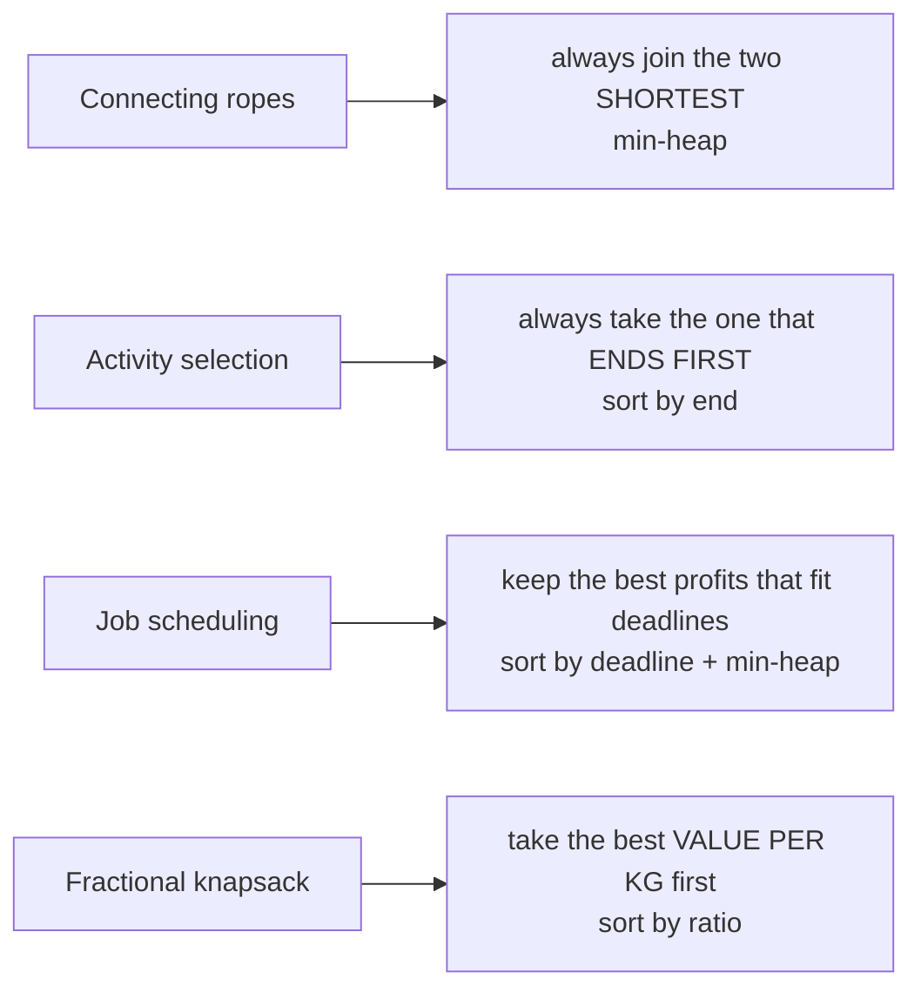

*The greedy choice in each problem from the notes.*

**Interview question**

*Joining two ropes costs the sum of their lengths. Join all ropes into one at minimum total cost. `[4, 3, 2, 6]` → `29`.*

Every rope's length is paid again each time the rope it belongs to is joined, so short ropes should be joined **early** (paid many times) and long ones **late**. Greedily joining the two shortest does exactly that: `2+3 = 5`, then `4+5 = 9`, then `6+9 = 15`, total `5 + 9 + 15 = 29`. A min-heap hands you the two shortest in `O(log n)`.

**Answer — connect ropes with a min-heap**

```python
import heapq


def min_cost_to_connect_ropes(lengths):
    heapq.heapify(lengths)
    total = 0
    while len(lengths) > 1:
        a = heapq.heappop(lengths)
        b = heapq.heappop(lengths)
        total += a + b
        heapq.heappush(lengths, a + b)   # the joined rope goes back in
    return total


print(min_cost_to_connect_ropes([4, 3, 2, 6]))  # 29
```

```javascript
function minCostToConnectRopes(lengths) {
  const pq = new MinHeap();
  lengths.forEach((len) => pq.push(len));
  let total = 0;
  while (pq.size() > 1) {
    const cost = pq.pop() + pq.pop();
    total += cost;
    pq.push(cost);                       // the joined rope goes back in
  }
  return total;
}

console.log(minCostToConnectRopes([4, 3, 2, 6])); // 29
```

**Interview question**

*Each job takes one unit of time and must finish by its deadline. Maximise total profit. Deadlines `[1, 3, 3, 3, 5, 5, 6, 8]`, profits `[5, 2, 7, 1, 4, 3, 8, 1]` → `30`.*

Sort jobs by deadline and walk them in order, tentatively accepting each one into a **min-heap of accepted profits**. If the heap now holds more jobs than the current deadline allows, the schedule is over-full — drop the **least profitable** accepted job. The heap always holds the best set of jobs that fits the deadlines seen so far.

**Answer — job scheduling with a min-heap**

```python
import heapq


def job_scheduling(deadlines, profits):
    jobs = sorted(zip(deadlines, profits))
    heap = []
    for deadline, profit in jobs:
        heapq.heappush(heap, profit)
        if len(heap) > deadline:          # over-full: drop the cheapest job
            heapq.heappop(heap)
    return sum(heap)


print(job_scheduling([1, 3, 3, 3, 5, 5, 6, 8], [5, 2, 7, 1, 4, 3, 8, 1]))  # 30
```

```javascript
function maximizeProfitWithinDeadlines(deadlines, profits) {
  const jobs = deadlines.map((d, i) => [d, profits[i]]).sort((a, b) => a[0] - b[0]);
  const chosen = new MinHeap();
  for (const [deadline, profit] of jobs) {
    chosen.push(profit);
    if (chosen.size() > deadline) chosen.pop(); // over-full: drop the cheapest job
  }
  return chosen.data.reduce((sum, p) => sum + p, 0);
}

console.log(maximizeProfitWithinDeadlines([1, 3, 3, 3, 5, 5, 6, 8], [5, 2, 7, 1, 4, 3, 8, 1])); // 30
```

**Activity selection — finish as many as possible**

```python
def max_activities(activities):
    activities.sort(key=lambda x: x[1])         # earliest end first
    count, last_end = 0, float("-inf")
    for start, end in activities:
        if start >= last_end:                   # does not overlap the last pick
            count += 1
            last_end = end
    return count


print(max_activities([(1, 2), (2, 3), (3, 6), (6, 7), (8, 9), (1, 9)]))  # 5
```

```javascript
function activitySelection(activities) {
  activities.sort((a, b) => a[1] - b[1]);       // earliest end first
  let count = 0;
  let lastEnd = -Infinity;
  for (const [start, end] of activities) {
    if (start >= lastEnd) {                     // does not overlap the last pick
      count++;
      lastEnd = end;
    }
  }
  return count;
}

console.log(activitySelection([[1, 2], [2, 3], [3, 6], [6, 7], [8, 9], [1, 9]])); // 5
```

> **Warning**
>
> Greedy by the obvious key is often wrong. Activity selection by **shortest duration** or **earliest start** both fail on small counter-examples; only **earliest end** is provably safe. Always try to break your greedy rule with a three-item example before coding it.

**From the notes — greedy problems**

| Problem | Greedy choice | Complexity |
| --- | --- | --- |
| Connecting the ropes | join the two shortest (min-heap) | `O(N log N)` |
| Activity selection / finish maximum jobs | earliest end first | `O(N log N)` |
| Job scheduling with deadlines | sort by deadline, keep best profits in a min-heap | `O(N log N)` |
| Fractional knapsack (§37) | best value per weight first | `O(N log N)` |

#### More problems from the notes

Every remaining problem from the revision notes for this topic, each with a solution in Python and JavaScript.

**Problem — Minimum jumps to reach the end (Jump Game II)**

*`A[i]` is the maximum jump length from index `i`. Return the fewest jumps from index 0 to the last index. `[2, 3, 1, 1, 4]` → `2`.*

DP works — `dp[i]` = fewest jumps to reach `i`, relaxing every reachable index — but is `O(n²)`. The greedy view is BFS by levels: all indices reachable with `j` jumps form a range; the farthest index reachable from that range ends the next level. Count levels until the range covers the end. `O(n)`. The notes list this as both "Minimum Jumps" and "Jump Game 2".

**Approach 1 — DP — O(n²)**

```python
def min_jumps_dp(arr):
    n = len(arr)
    dp = [float("inf")] * n
    dp[0] = 0
    for i in range(n):
        for step in range(1, arr[i] + 1):
            if i + step < n:
                dp[i + step] = min(dp[i + step], dp[i] + 1)
    return dp[-1] if dp[-1] != float("inf") else -1


print(min_jumps_dp([2, 3, 1, 1, 4]))  # 2
```

```javascript
function minJumpsDP(arr) {
  const n = arr.length;
  const dp = new Array(n).fill(Infinity);
  dp[0] = 0;
  for (let i = 0; i < n; i++) {
    for (let step = 1; step <= arr[i] && i + step < n; step++) {
      dp[i + step] = Math.min(dp[i + step], dp[i] + 1);
    }
  }
  return dp[n - 1] === Infinity ? -1 : dp[n - 1];
}

console.log(minJumpsDP([2, 3, 1, 1, 4])); // 2
```

**Approach 2 — Greedy — O(n)**

```python
def min_jumps_greedy(arr):
    jumps = 0
    current_end = farthest = 0
    for i in range(len(arr) - 1):
        farthest = max(farthest, i + arr[i])
        if i == current_end:              # finished every index reachable with `jumps`
            if farthest == current_end:
                return -1                 # stuck
            jumps += 1
            current_end = farthest
    return jumps


print(min_jumps_greedy([2, 3, 1, 1, 4]))  # 2
print(min_jumps_greedy([3, 2, 1, 0, 4]))  # -1
```

```javascript
function minJumpsGreedy(arr) {
  let jumps = 0, currentEnd = 0, farthest = 0;
  for (let i = 0; i < arr.length - 1; i++) {
    farthest = Math.max(farthest, i + arr[i]);
    if (i === currentEnd) {              // finished every index reachable with `jumps`
      if (farthest === currentEnd) return -1;
      jumps++;
      currentEnd = farthest;
    }
  }
  return jumps;
}

console.log(minJumpsGreedy([2, 3, 1, 1, 4])); // 2
console.log(minJumpsGreedy([3, 2, 1, 0, 4])); // -1
```

<a id="37-multiple-approaches-connecting-the-ropes"></a>

### Multiple Approaches: Connecting the Ropes

- **Insertion sort** `O(N^2)`
- **Priority queue** `O(N log N)`

The notes solve "join all ropes at minimum cost" twice. Both follow the same greedy rule — always join the two shortest — and differ only in how they find the two shortest each time.

| Approach | Time | Space | Idea |
| --- | --- | --- | --- |
| Keep a sorted list (insertion sort) | `O(N^2)` | `O(1)` | insert each joined rope back in sorted position |
| Min-heap priority queue | `O(N log N)` | `O(N)` | pop two, push their sum |

Sort once, join the first two, and insert the joined rope back into its sorted position — each insertion can shift `O(N)` elements.

**Approach 1 — Sorted list with insertion**

```python
def min_cost_ropes_insertion(ropes):
    if len(ropes) <= 1:
        return 0
    ropes.sort()
    cost = 0
    while len(ropes) > 1:
        c = ropes.pop(0) + ropes.pop(0)
        cost += c
        # Insert c into sorted position
        inserted = False
        for i, r in enumerate(ropes):
            if r >= c:
                ropes.insert(i, c)
                inserted = True
                break
        if not inserted:
            ropes.append(c)
    return cost
```

```javascript
function minCostToConnectRopes(ropes) {
    let totalCost = 0;

    // Initial check: if there's only one rope or none, cost is 0
    if (ropes.length <= 1) return 0;

    // Perform an initial Insertion Sort to get the ropes in order
    insertionSort(ropes);

    // Continue connecting until only one rope remains
    while (ropes.length > 1) {
        // Extract the two smallest ropes (always at index 0 and 1)
        let first = ropes.shift(); // Remove the smallest
        let second = ropes.shift(); // Remove the second smallest

        // The cost for this specific connection
        let currentCost = first + second;

        // Add current connection cost to the total running cost
        totalCost += currentCost;

        // Push the new combined rope back into the array
        ropes.push(currentCost);

        // Re-sort the array to ensure the next two smallest are at the front
        // Since only one element is out of order, Insertion Sort is very efficient here
        insertionSort(ropes);
    }

    return totalCost;
}

// Standard Insertion Sort Implementation
function insertionSort(arr) {
    // Iterate through the array starting from the second element
    for (let i = 1; i < arr.length; i++) {
        // Store the current element to be compared
        let key = arr[i];
        let j = i - 1;

        // Move elements of arr[0..i-1] that are greater than key
        // to one position ahead of their current position
        while (j >= 0 && arr[j] > key) {
            arr[j + 1] = arr[j];
            j = j - 1;
        }
        // Place the key at its correct sorted position
        arr[j + 1] = key;
    }
}

// Test Outputs
const ropes1 = [4, 3, 2, 6];
console.log("Minimum cost for [4, 3, 2, 6]:", minCostToConnectRopes(ropes1));
// Expected: 29 (2+3=5, [4,5,6] -> 4+5=9, [9,6] -> 9+6=15. Total: 5+9+15=29)

const ropes2 = [1, 2, 3, 4, 5];
console.log("Minimum cost for [1, 2, 3, 4, 5]:", minCostToConnectRopes(ropes2));
// Expected: 33

/**
 * TIME COMPLEXITY: O(N^2)
 * The initial insertion sort takes O(N^2). Inside the while loop (which runs N-1 times),
 * we perform another insertion sort. While insertion sort is O(N) for a nearly sorted
 * array (which we have here), the cumulative complexity results in O(N^2).
 * * SPACE COMPLEXITY: O(1)
 * The algorithm sorts the array in-place (or modifies the existing array) and uses
 * a few auxiliary variables, requiring no extra space proportional to the input size.
 */
```

A min-heap returns the two shortest ropes in `O(log N)` each and accepts the joined rope in `O(log N)`.

**Approach 2 — Priority queue**

```python
import heapq

def min_cost_ropes_pq(lengths):
    if not lengths or len(lengths) <= 1:
        return 0
    heapq.heapify(lengths)
    total = 0
    while len(lengths) > 1:
        c = heapq.heappop(lengths) + heapq.heappop(lengths)
        total += c
        heapq.heappush(lengths, c)
    return total
```

```javascript
class PriorityQueue {
    constructor() {
        // Initialize an empty array to store heap elements
        this.heap = [];
    }

    // Helper: Returns the number of elements in the heap
    size() {
        // Return the current length of the underlying array
        return this.heap.length;
    }

    // Adds a new value and "bubbles up" to maintain heap property
    add(val) { // Insertion operation // O(log n)
        // Add to the end of the array
        this.heap.push(val);
        // Move the newly added element up to its correct position to maintain min-heap property
        this.bubbleUp();
    }

    // Removes and returns the smallest value (root) and "bubbles down"
    poll() { // Extraction operation // O(log n)
        // Handle empty heap case
        if (this.size() === 0) return null;
        // If only one element exists, simply remove and return it
        if (this.size() === 1) return this.heap.pop();

        // Store the root (smallest) value to return later
        const min = this.heap[0];
        // Move the last element in the array to the root position
        this.heap[0] = this.heap.pop();
        // Restore heap property by moving the new root down to its correct position
        this.bubbleDown();
        return min;
    }

    // Restoration: Moves the last element up the tree to its correct position to maintain heap property of min-heap
    bubbleUp() {
        // Start tracking from the last element added
        let index = this.heap.length - 1;
        // Continue until the element reaches the root or finds its place
        while (index > 0) {
            // Calculate parent index: floor((i - 1) / 2)
            let parentIndex = Math.floor((index - 1) / 2);
            // If child is smaller than parent, swap them (Violates Min-Heap property)
            if (this.heap[index] < this.heap[parentIndex]) {
                // Perform ES6 array destructuring swap
                [this.heap[index], this.heap[parentIndex]] = [this.heap[parentIndex], this.heap[index]];
                // Update current index to parent's position for next iteration
                index = parentIndex;
            } else {
                // Property is satisfied; stop bubbling up
                break;
            }
        }
    }

    // Restoration: Moves the root element down the tree to its correct position to maintain heap property of min-heap
    bubbleDown() {
        // Start from the root
        let index = 0;
        const length = this.heap.length;

        while (true) {
            // Calculate child indices
            let left = 2 * index + 1;
            let right = 2 * index + 2;
            let swap = null;

            // Compare with left child
            if (left < length) {
                // If left child is smaller than current element, mark for swap
                if (this.heap[left] < this.heap[index]) {
                    swap = left;
                }
            }

            // Compare with right child (must be smaller than both parent and left child)
            if (right < length) {
                if (
                    // Case 1: Right is smaller than parent and no swap with left was planned
                    (swap === null && this.heap[right] < this.heap[index]) ||
                    // Case 2: Right is smaller than the left child
                    (swap !== null && this.heap[right] < this.heap[left])
                ) {
                    swap = right;
                }
            }

            // If no swap index was set, the heap property is restored
            if (swap === null) break;

            // Perform the swap between parent and the smaller child
            [this.heap[index], this.heap[swap]] = [this.heap[swap], this.heap[index]];

            // Update index to the child's position to continue the process
            index = swap;
        }
    }
}

function minCostToConnectRopes(lengths) {
    // Edge case: if no ropes or only one, no connection is possible (cost 0)
    if (!Array.isArray(lengths) || lengths.length <= 1) return 0;

    // Instantiate our priority queue
    const pq = new PriorityQueue();

    // Fill the heap with initial rope lengths
    for (const len of lengths) { // for loop runs O(n) times
        pq.add(len); // each add is O(log n)
    }

    let total = 0;
    // Keep merging until only one combined rope remains
    while (pq.size() > 1) { // while loop runs O(n) times
        // Extract the two smallest elements
        const a = pq.poll(); // each poll is O(log n)
        const b = pq.poll(); // each poll is O(log n)
        // The cost for this step is the sum of the two ropes
        const cost = a + b;
        // Accumulate this step's cost into the total
        total += cost;
        // Put the newly merged rope back into the priority queue
        pq.add(cost); // each add is O(log n)
    }

    // Return the total cost of all connections
    return total;
}

console.log(minCostToConnectRopes([])); // 0
console.log(minCostToConnectRopes([8])); // 0 (nothing to connect)

console.log(minCostToConnectRopes([1, 2, 3])); // 9

console.log(minCostToConnectRopes([4, 3, 2, 6])); // 29

console.log(minCostToConnectRopes([1, 2, 5, 10, 35, 89])); // 224
console.log(minCostToConnectRopes([2, 2, 3, 3])); // 20

/**
 * COMPLEXITY ANALYSIS:
 * * Time Complexity: O(n log n)
 * - Inserting n elements into the heap takes O(n log n).
 * - The while loop runs n-1 times. Inside the loop, `poll()` and `add()`
 * both take O(log n), leading to O(n log n) for the connection phase.
 *
 * * Space Complexity: O(n)
 * - We store all n rope lengths in the priority queue (heap).
 */
```

<a id="38-dynamic-programming"></a>

### Dynamic Programming

- **Time** `states × work per state`
- **Fibonacci** `O(2^N)` → `O(N)`
- **Space-optimised 1-D DP** `O(1)`
- **0/1 knapsack** `O(N·W)`

Dynamic programming is recursion that **remembers**. It applies when a problem has two properties: **optimal substructure** (the best answer is built from the best answers to smaller problems) and **overlapping subproblems** (the same smaller problem is needed again and again). Solve each subproblem once, store it, and the exponential recursion tree collapses to a table.

The notes give two styles:

- **Strength — top-down (memoisation)** — Write the recursion, add a cache. Natural to derive; only computes states you actually need.
- **Strength — bottom-up (tabulation)** — Fill a table from the base cases up. No recursion depth limit, and it exposes when only the last row or two are needed.

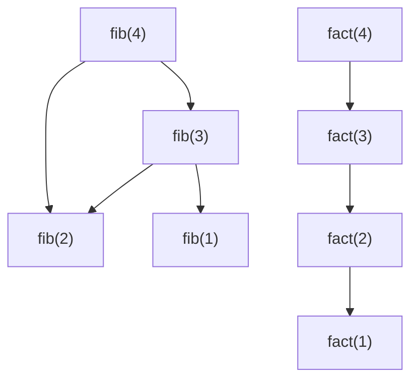

*Left: `fib(2)` is needed by two callers — overlapping subproblems, so caching pays. Right: factorial is a straight line where each value is needed once — caching only wastes memory. The notes list factorial, permutations and plain tree traversal as places where DP does not apply.*

Every DP answer is five decisions, and writing them down before coding is most of the work:

1. **State** — what does `dp[i]` (or `dp[i][j]`) *mean*? Say it in one sentence.
2. **Transition** — how is `dp[i]` built from smaller states? This is the recurrence.
3. **Base cases** — the smallest states you know without computing.
4. **Order** — fill so that every state's dependencies are ready (usually increasing `i`).
5. **Answer** — which cell holds it? Then ask: do I only need the last row? If so, drop to `O(1)` or `O(W)` space.

> **Interactive animation:** `dp-1d` — rendered by the page script in the HTML version.

**Interview question**

*Houses in a row hold money; robbing two adjacent houses triggers the alarm. Maximise the loot. `[2, 7, 9, 3, 1]` → `12` (houses 0, 2 and 4).*

State: `dp[i]` = the best loot from houses `0..i`. At house `i` either **skip** it (keep `dp[i-1]`) or **take** it (`nums[i] + dp[i-2]`, since `i-1` must be skipped). `dp[i]` only needs the previous two values, so two variables replace the array.

**Answer — house robber (space-optimised DP)**

```python
def rob(nums):
    if len(nums) == 1:
        return nums[0]
    prev2, prev1 = nums[0], max(nums[0], nums[1])
    for i in range(2, len(nums)):
        prev2, prev1 = prev1, max(prev1, prev2 + nums[i])   # skip vs take
    return prev1


print(rob([2, 7, 9, 3, 1]))    # 12
print(rob([10, 9, 7, 100]))    # 110
```

```javascript
function houseRobber(houseMoney) {
  if (houseMoney.length === 1) return houseMoney[0];
  let prev2 = houseMoney[0];
  let prev1 = Math.max(houseMoney[0], houseMoney[1]);
  for (let i = 2; i < houseMoney.length; i++) {
    [prev2, prev1] = [prev1, Math.max(prev1, prev2 + houseMoney[i])]; // skip vs take
  }
  return prev1;
}

console.log(houseRobber([2, 7, 9, 3, 1])); // 12
console.log(houseRobber([10, 9, 7, 100])); // 110
```

**Interview question**

*Return the fewest perfect squares that sum to `n`. `12` → `3` (`4 + 4 + 4`); `13` → `2` (`9 + 4`).*

State: `dp[i]` = fewest squares summing to `i`. The last square used is some `j²`, leaving `i - j²`, so `dp[i] = 1 + min(dp[i - j²])` over all `j² ≤ i`. Greedy (take the biggest square) fails: for 12 it picks `9 + 1 + 1 + 1`. There are `n` states with `√n` choices each, so `O(n√n)`.

**Answer — minimum perfect squares (bottom-up)**

```python
def num_squares(n):
    dp = [float("inf")] * (n + 1)
    dp[0] = 0
    for i in range(1, n + 1):
        j = 1
        while j * j <= i:
            dp[i] = min(dp[i], 1 + dp[i - j * j])   # last square is j*j
            j += 1
    return dp[n]


print(num_squares(12), num_squares(13))  # 3 2
```

```javascript
function minSquares(n) {
  const dp = new Array(n + 1).fill(Infinity);
  dp[0] = 0;
  for (let i = 1; i <= n; i++) {
    for (let j = 1; j * j <= i; j++) {
      dp[i] = Math.min(dp[i], 1 + dp[i - j * j]);   // last square is j*j
    }
  }
  return dp[n];
}

console.log(minSquares(12), minSquares(13)); // 3 2
```

Climbing stairs one or two steps at a time is Fibonacci in disguise — `ways(n) = ways(n-1) + ways(n-2)`, because the last move was either a single or a double step.

<a id="dp-on-grids"></a>

#### Two-dimensional DP

When the state needs two numbers — a cell in a grid, a prefix of two strings, an item plus a capacity — the table becomes 2-D. In **unique paths**, a robot moving only right or down reaches `(i, j)` from above or from the left, so `dp[i][j] = dp[i-1][j] + dp[i][j-1]`, with the first row and column all `1`.

> **Interactive animation:** `unique-paths` — rendered by the page script in the HTML version.

**Unique paths and unique BSTs (Catalan numbers)**

```python
def unique_paths(n, m):
    dp = [[1] * m for _ in range(n)]
    for i in range(1, n):
        for j in range(1, m):
            dp[i][j] = dp[i - 1][j] + dp[i][j - 1]   # from above + from the left
    return dp[n - 1][m - 1]


def num_trees(n):
    dp = [0] * (n + 1)
    dp[0] = 1
    for nodes in range(1, n + 1):
        for root in range(1, nodes + 1):             # left size root-1, right size nodes-root
            dp[nodes] += dp[root - 1] * dp[nodes - root]
    return dp[n]


print(unique_paths(3, 3))  # 6
print(num_trees(3))        # 5
```

```javascript
function uniquePaths(n, m) {
  const dp = Array.from({ length: n }, () => new Array(m).fill(1));
  for (let i = 1; i < n; i++) {
    for (let j = 1; j < m; j++) dp[i][j] = dp[i - 1][j] + dp[i][j - 1]; // from above + from the left
  }
  return dp[n - 1][m - 1];
}

function countUniqueBSTs(n) {
  const dp = new Array(n + 1).fill(0);
  dp[0] = 1;
  for (let nodes = 1; nodes <= n; nodes++) {
    for (let root = 1; root <= nodes; root++) dp[nodes] += dp[root - 1] * dp[nodes - root];
  }
  return dp[n];
}

console.log(uniquePaths(3, 3));   // 6
console.log(countUniqueBSTs(3));  // 5
```

The unique-BST count is the **Catalan** recurrence `C(n) = Σ C(i) · C(n-1-i)`: pick a root, and the left and right subtrees are independent smaller problems. The same numbers count valid parenthesis strings from §21.

<a id="knapsack"></a>

#### The knapsack family

Items have a weight and a value; the bag has a capacity. Three variants, three different tools:

| Variant | Items | Tool | Recurrence / rule |
| --- | --- | --- | --- |
| Fractional | divisible | greedy | take the best value-per-weight first |
| 0/1 | take each at most once | DP | `dp[i][w] = max(dp[i-1][w], v + dp[i-1][w - wt])` |
| Unbounded (0-N) | unlimited copies | DP | `dp[i][w] = max(dp[i-1][w], v + dp[i][w - wt])` |

The only difference between the last two is `dp[i-1]` versus `dp[i]` on the "take" side: after taking an item in 0/1 you move on to the previous items; in unbounded you may take the **same** item again.

> **Interactive animation:** `knapsack` — rendered by the page script in the HTML version.

**Interview question**

*0/1 knapsack: with a budget of `6`, item costs `[1, 3, 4, 2]` and happiness `[15, 20, 30, 18]`, maximise total happiness. Answer: `53` (costs 1 + 3 + 2).*

State: `dp[w]` = best value with capacity `w` using the items processed so far. Each row only reads the row above, so one 1-D array suffices — **if you loop `w` from high to low**. Going downwards means `dp[w - wt]` still holds the *previous* row's value, so each item is used at most once. Loop upwards and you have written unbounded knapsack by accident.

**Answer — 0/1 knapsack, subset sum and unbounded knapsack in 1-D**

```python
def knapsack_01(costs, values, budget):
    dp = [0] * (budget + 1)
    for cost, value in zip(costs, values):
        for w in range(budget, cost - 1, -1):    # high → low: each item once
            dp[w] = max(dp[w], value + dp[w - cost])
    return dp[budget]


def subset_sum(arr, target):
    dp = [True] + [False] * target
    for num in arr:
        for j in range(target, num - 1, -1):     # same trick with booleans
            dp[j] = dp[j] or dp[j - num]
    return dp[target]


def unbounded_knapsack(weights, values, capacity):
    dp = [0] * (capacity + 1)
    for wt, val in zip(weights, values):
        for w in range(wt, capacity + 1):        # low → high: reuse allowed
            dp[w] = max(dp[w], val + dp[w - wt])
    return dp[capacity]


print(knapsack_01([1, 3, 4, 2], [15, 20, 30, 18], 6))  # 53
print(subset_sum([3, 34, 4, 12, 5, 2], 9))              # True
print(unbounded_knapsack([1, 50], [1, 30], 100))        # 100
```

```javascript
function knapsack01(costs, values, budget) {
  const dp = new Array(budget + 1).fill(0);
  costs.forEach((cost, i) => {
    for (let w = budget; w >= cost; w--) dp[w] = Math.max(dp[w], values[i] + dp[w - cost]); // high → low
  });
  return dp[budget];
}

function subsetSum(arr, target) {
  const dp = new Array(target + 1).fill(false);
  dp[0] = true;
  for (const num of arr) {
    for (let j = target; j >= num; j--) dp[j] = dp[j] || dp[j - num];
  }
  return dp[target];
}

function unboundedKnapsack(weights, values, capacity) {
  const dp = new Array(capacity + 1).fill(0);
  weights.forEach((wt, i) => {
    for (let w = wt; w <= capacity; w++) dp[w] = Math.max(dp[w], values[i] + dp[w - wt]); // low → high
  });
  return dp[capacity];
}

console.log(knapsack01([1, 3, 4, 2], [15, 20, 30, 18], 6)); // 53
console.log(subsetSum([3, 34, 4, 12, 5, 2], 9));            // true
console.log(unboundedKnapsack([1, 50], [1, 30], 100));      // 100
```

**Fractional knapsack — the greedy contrast**

```python
def fractional_knapsack(values, weights, capacity):
    items = sorted(zip(values, weights), key=lambda x: x[0] / x[1], reverse=True)
    total = 0.0
    for value, weight in items:
        if capacity >= weight:
            capacity -= weight
            total += value
        else:
            total += value * capacity / weight   # take the fraction that fits
            break
    return total


print(fractional_knapsack([200, 250, 150], [20, 50, 10], 70))  # 550.0
```

```javascript
function fractionalKnapsack(values, weights, capacity) {
  const items = values.map((v, i) => [v, weights[i]]).sort((a, b) => b[0] / b[1] - a[0] / a[1]);
  let total = 0;
  for (const [value, weight] of items) {
    if (capacity >= weight) {
      capacity -= weight;
      total += value;
    } else {
      total += (value * capacity) / weight;      // take the fraction that fits
      break;
    }
  }
  return total;
}

console.log(fractionalKnapsack([200, 250, 150], [20, 50, 10], 70)); // 550
```

> **Warning**
>
> Greedy-by-ratio is optimal only when items can be cut. For 0/1 items it fails: capacity `50`, items `(60, 10)`, `(100, 20)`, `(120, 30)` — ratio-greedy takes the first two for `160`, but the second and third give `220`.

**From the notes — DP problems**

| Problem | State | Complexity |
| --- | --- | --- |
| Fibonacci (memo, tabulation, `O(1)` space); climbing stairs | `dp[i]` = answer for `i` | `O(N)` |
| Minimum perfect squares | `dp[i]` = fewest squares for `i` | `O(N√N)` |
| House robber; max sum without adjacent elements (2 × N grid) | `dp[i]` = best loot to `i` | `O(N)` |
| Unique paths in a grid | `dp[i][j]` = ways to reach cell | `O(N·M)` |
| Count A-digit numbers with digit sum B; N-digit numbers | `dp[digits][sum]` | `O(A·B)` |
| Catalan numbers; unique BSTs I and II | `dp[n]` = trees on `n` nodes | `O(N^2)` |
| Target sum / subset sum | `dp[s]` = is sum `s` reachable | `O(N·S)` |
| 0/1 knapsack (customised shopping) | `dp[w]`, high → low | `O(N·W)` |
| Unbounded knapsack | `dp[w]`, low → high | `O(N·W)` |
| Fractional knapsack | greedy by ratio | `O(N log N)` |

#### More problems from the notes

Every remaining problem from the revision notes for this topic, each with a solution in Python and JavaScript.

**Problem — Fibonacci — top-down, bottom-up and O(1) space**

*Return the `n`-th Fibonacci number with each DP style.*

Memoisation caches the recursion; tabulation fills `dp[0..n]` upward; the space-optimised form keeps only the last two values. All `O(n)` time.

**Approach 1 — Top-Down (Memoization)**

```python
def fibonacci_memoized(n):
    memo = {}

    def solve(num):
        if num <= 1:
            return num
        if num in memo:
            return memo[num]

        memo[num] = solve(num - 1) + solve(num - 2)
        return memo[num]

    return solve(n)

print(fibonacci_memoized(10))  # 55
```

```javascript
function fibonacciMemoized(n) {
  // Create a storage array (cache) and initialize with a value indicating 'not computed'.
  // We use an array of size n+1 to store fib(0) through fib(n).
  const storage = new Array(n + 1).fill(-1);

  // Helper function that performs the recursion.
  function solve(num) {
    // Base cases for the Fibonacci sequence.
    if (num <= 1) {
      storage[num] = num; // fib(0) = 0, fib(1) = 1
      return num;
    }

    // If the result for 'num' is already computed, return it from storage.
    if (storage[num] !== -1) {
      return storage[num];
    }

    // If not computed, calculate it recursively.
    const num1 = solve(num - 1);
    const num2 = solve(num - 2);
    const fibNum = num1 + num2;

    // Store the result before returning it.
    storage[num] = fibNum;

    return fibNum;
  }

  return solve(n);
}

console.log(fibonacciMemoized(8)); // expected output: 21
```

**Approach 2 — Bottom-Up (Tabulation)**

```python
def fibonacci_tabulation(n):
    if n <= 1:
        return n

    dp = [0] * (n + 1)
    dp[1] = 1

    for i in range(2, n + 1):
        dp[i] = dp[i - 1] + dp[i - 2]

    return dp[n]

print(fibonacci_tabulation(10))  # 55
```

```javascript
function fibonacciTabulated(n) {
  // Base case: if n is 0 or 1, return n itself.
  if (n <= 1) {
    return n;
  }

  // Create a DP table (array) to store Fibonacci numbers from 0 to n.
  const dpTable = new Array(n + 1);

  // Initialize the first two values of the sequence.
  dpTable[0] = 0;
  dpTable[1] = 1;

  // Iteratively compute Fibonacci numbers from 2 up to n.
  for (let i = 2; i <= n; i++) {
    // Each entry is the sum of the previous two.
    dpTable[i] = dpTable[i - 1] + dpTable[i - 2];
  }

  // The final answer is in the last cell of the table.
  return dpTable[n];
}

// example usage
console.log(fibonacciTabulated(8)); // expected output: 21
```

**Approach 3 — Space-Optimized Bottom-Up**

```python
def fibonacci_space_optimized(n):
    if n <= 1:
        return n

    prev2 = 0
    prev1 = 1

    for _ in range(2, n + 1):
        curr = prev1 + prev2
        prev2 = prev1
        prev1 = curr

    return prev1

print(fibonacci_space_optimized(10))  # 55
```

```javascript
function fibonacciOptimized(n) {
  // Base case: if n is 0 or 1, return n itself.
  if (n <= 1) {
    return n;
  }

  // 'prev2' holds the value of fib(i-2). Initialize to fib(0).
  let prev2 = 0;
  // 'prev1' holds the value of fib(i-1). Initialize to fib(1).
  let prev1 = 1;
  // 'current' will hold the value of fib(i).
  let current;

  // Loop from 2 to n to calculate the remaining numbers.
  for (let i = 2; i <= n; i++) {
    // Calculate the current Fibonacci number.
    current = prev1 + prev2;
    // Update the pointers: prev2 becomes what prev1 was.
    prev2 = prev1;
    // And prev1 becomes the newly calculated current value.
    prev1 = current;
  }

  // The final answer is in 'prev1' (or 'current').
  return prev1;
}

// example usage
console.log(fibonacciOptimized(8)); // expected output: 21
```

**Problem — Count ways to climb stairs**

*With steps of 1 or 2, count the distinct ways to climb `n` stairs.*

`ways(n) = ways(n - 1) + ways(n - 2)` — the last move was a single or a double step. Two variables suffice. `O(n)`.

**Solution — Space-Optimized Bottom-Up**

```python
def climb_stairs(n):
    if n <= 2:
        return n

    prev2 = 1
    prev1 = 2

    for _ in range(3, n + 1):
        curr = prev1 + prev2
        prev2 = prev1
        prev1 = curr

    return prev1

print(climb_stairs(4))  # 5
print(climb_stairs(5))  # 8
```

```javascript
function climbStairs(n) {
    if (n <= 1) {
        return 1;
    }

    // Initialize variables to store the number of ways to reach the previous two steps.
    // 'prev2' holds ways(i-2). For i=2, this is ways(0), which is 1.
    let prev2 = 1;

    // 'prev1' holds ways(i-1). For i=2, this is ways(1), which is 1.
    let prev1 = 1;

    // Declare a variable to store the result for the current step in the loop.
    // 'current' will hold ways(i).
    let current;

    // Loop from 2 to n to build up the solution from the bottom.
    // Loop from 2 to n.
    for (let i = 2; i <= n; i++) {
        // Calculate ways to reach the current step 'i'.
        // The number of ways to reach stair 'i' is the sum of ways to reach i-1 and i-2.
        current = prev1 + prev2;

        prev2 = prev1;

        // The current result becomes the new 'prev1'.
        prev1 = current;
    }

    // After the loop finishes, prev1 holds the result for step n.
    // 'prev1' now holds the total number of ways for n stairs.
    return prev1; // or return current;
}

// Execute the function with a test case of 4 stairs.
console.log(climbStairs(4)); // output: 5

/*
 * COMPLEXITY ANALYSIS:
 *
 * Time Complexity: O(n)
 * - The algorithm runs a single loop from i = 2 to n.
 * - The operations inside the loop (addition and variable assignment) are constant time O(1).
 * - Therefore, the time required grows linearly with the input n.
 *
 * Space Complexity: O(1)
 * - We are not using any data structures (like arrays) that grow with the input size.
 * - We only use a fixed number of variables (prev1, prev2, current, i) regardless of how large n is.
 * - This is an improvement over the standard Dynamic Programming approach which usually takes O(n) space.
 */
```

**Problem — Count A-digit numbers with digit sum B**

*Count the `A`-digit numbers (no leading zero) whose digits sum to `B`, modulo `10^9 + 7`.*

State `(digits left, sum left)`: choose the next digit `d` (1–9 for the first position, 0–9 after) and recurse on `(digits - 1, sum - d)`. Memoisation makes it `O(A · B · 10)`; the notes also give a space-optimised iterative version.

**Approach 1 — Recursion with Memoization (Top-Down DP)**

```python
def count_digit_sum_memo(A, B):
    MOD = 1000000007
    memo = {}

    def solve(digits_left, sum_left):
        if digits_left == 0:
            return 1 if sum_left == 0 else 0
        if sum_left < 0:
            return 0
        if (digits_left, sum_left) in memo:
            return memo[(digits_left, sum_left)]

        ways = 0
        start_digit = 1 if digits_left == A else 0
        for d in range(start_digit, 10):
            if sum_left - d >= 0:
                ways = (ways + solve(digits_left - 1, sum_left - d)) % MOD

        memo[(digits_left, sum_left)] = ways
        return ways

    return solve(A, B)

print(count_digit_sum_memo(2, 4))  # 4 (13, 22, 31, 40)
```

```javascript
function solution(A, B) {
  const MOD = 1000000007;

  const memo = Array.from({ length: A + 1 }, () => Array(B + 1).fill(-1));

  function countWays(len, target) {
    // Base Case: If target sum becomes negative, this path is invalid
    if (target < 0) return 0;

    // Base Case: If no digits left
    if (len === 0) {
      // If sum is exactly 0, we found 1 valid combination (all digits placed successfully)
      return target === 0 ? 1 : 0;
    }

    // Return memoized result if exists
    if (memo[len][target] !== -1) {
      return memo[len][target];
    }

    let count = 0;

    // Iterate through all possible digits (0-9) for the current position
    // Note: This helper allows 0 as a digit because it handles positions after the first.
    for (let digit = 0; digit <= 9; digit++) {
      // Add the ways to form the rest of the number
      // We need (len - 1) digits that sum to (target - digit)
      count = (count + countWays(len - 1, target - digit)) % MOD;
    }

    // Store and return result
    return (memo[len][target] = count);
  }

  // --- Main Logic ---
  let ans = 0;

  // The first digit (Most Significant Digit) cannot be 0.
  // We iterate through 1-9 for the first digit.
  for (let d = 1; d <= 9; d++) {
    if (B - d >= 0) {
      // For the remaining (A - 1) digits, we need to achieve sum (B - d).
      // These subsequent digits can be 0.
      ans = (ans + countWays(A - 1, B - d)) % MOD;
    }
  }

  return ans;
}

console.log(solution(2, 4)); // Expected Output: 4
```

**Approach 2 — Iterative DP with Space Optimization (Bottom-Up)**

```python
def count_digit_sum_iterative(A, B):
    MOD = 1000000007
    dp = [0] * (B + 1)

    # First digit (1 to 9)
    for d in range(1, min(10, B + 1)):
        dp[d] = 1

    for _ in range(2, A + 1):
        next_dp = [0] * (B + 1)
        for s in range(B + 1):
            if dp[s] > 0:
                for d in range(10):
                    if s + d <= B:
                        next_dp[s + d] = (next_dp[s + d] + dp[s]) % MOD
        dp = next_dp

    return dp[B]

print(count_digit_sum_iterative(2, 4))  # 4
```

```javascript
function solution(A, B) {
  const MOD = 1000000007;

  // prev[j] stores the number of ways to form a number
  // with 'i-1' digits having sum 'j'.
  let prev = new Array(B + 1).fill(0);

  // Initialize for the first digit (Length = 1)
  // The first digit must be 1-9 (Leading zeros constraint)
  for (let d = 1; d <= 9; d++) {
    if (d <= B) {
      prev[d] = 1;
    }
  }

  // Iterate from length 2 to A (building up the number of digits)
  for (let i = 2; i <= A; i++) {
    let curr = new Array(B + 1).fill(0);

    // Calculate counts for every possible sum 's' up to B
    for (let s = 0; s <= B; s++) {
      // Try appending digits 0-9 to the previous numbers
      for (let d = 0; d <= 9; d++) {
        if (s - d >= 0) {
          // If we append digit 'd', the previous (i-1) digits must sum to 's - d'
          curr[s] = (curr[s] + prev[s - d]) % MOD;
        }
      }
    }
    // Update prev array for the next iteration
    prev = curr;
  }

  return prev[B];
}

console.log(solution(2, 4)); // Expected Output: 4
```

**Problem — Catalan numbers**

*Compute the `n`-th Catalan number.*

`C(0) = 1` and `C(n) = Σ C(i) · C(n - 1 - i)` — split the structure around a root or a first matched pair. `O(n²)`.

**Approach 1 — Calculating Nth Catalan Number**

```python
def catalan_number(n):
    dp = [0] * (n + 1)
    dp[0] = 1
    dp[1] = 1

    for i in range(2, n + 1):
        for j in range(i):
            dp[i] += dp[j] * dp[i - 1 - j]

    return dp[n]

print(catalan_number(4))  # 14
print(catalan_number(5))  # 42
```

```javascript
function calculateCatalan(n) {
  // Create a DP array to store Catalan numbers from 0 to n.
  const catalan = new Array(n + 1).fill(0);

  // Base cases.
  catalan[0] = 1;
  if (n > 0) {
    catalan[1] = 1;
  }

  // Use the recurrence relation to fill the DP table up to n.
  for (let i = 2; i <= n; i++) {
    // C_i = sum of C_j * C_{i-1-j} for j from 0 to i-1
    for (let j = 0; j < i; j++) {
      catalan[i] += catalan[j] * catalan[i - 1 - j];
    }
  }

  // Return the Nth Catalan number.
  return catalan[n];
}

// Example usage:
console.log(`C_0: ${calculateCatalan(0)}`); // Expected output: 1
console.log(`C_3: ${calculateCatalan(3)}`); // Expected output: 5
console.log(`C_5: ${calculateCatalan(5)}`); // Expected output: 42
```

**Approach 2 — Calculating Nth Catalan Number**

```python
def catalan_formula(n):
    # C(n) = (2n)! / ((n + 1)! * n!)
    c = 1
    for i in range(1, n + 1):
        c = c * (4 * i - 2) // (i + 1)
    return c

print(catalan_formula(4))  # 14
print(catalan_formula(5))  # 42
```

```javascript
function getCatalanNumber(n) {
    // Create an array of size n + 1 to store Catalan numbers from 0 to n
    // We fill with 0 to allow the += addition operation during summation
    let c = new Array(n + 1).fill(0);

    // Base case: C(0) is always 1
    c[0] = 1;

    // Handle edge case where n is 0 to return early
    if (n === 0) return c[0];

    // Base case: C(1) is always 1
    c[1] = 1;

    // Iterate from 2 up to n to fill the DP table incrementally
    for (let i = 2; i <= n; i++) {
        // p1 starts at the beginning of the array (C[0])
        let p1 = 0;
        // p2 starts at the end of the previously computed values (C[i-1])
        let p2 = i - 1;

        // Apply the summation formula: C[i] = C[0]*C[i-1] + C[1]*C[i-2] + ... + C[i-1]*C[0]
        // This loop runs 'i' times for each 'i' in the outer loop
        while (p2 >= 0) {
            // Add the product of the two terms to the current Catalan index
            // Formula: c[i] = Σ (c[p1] * c[p2])
            c[i] += c[p1] * c[p2];

            // Move p1 forward to the next Catalan number
            p1++;
            // Move p2 backward to the previous Catalan number
            p2--;
        }
    }

    // Return the nth Catalan number stored in the DP table after all iterations
    return c[n];
}

console.log(getCatalanNumber(0)); // 1
console.log(getCatalanNumber(3)); // 5
console.log(getCatalanNumber(5)); // 42
console.log(getCatalanNumber(8)); // 1430

/**
 * COMPLEXITY ANALYSIS:
 * * Time Complexity: O(n^2)
 * The outer loop runs (n-1) times. For every iteration 'i', the inner while loop
 * runs 'i' times. This results in a summation: 2 + 3 + ... + n, which simplifies
 * to quadratic time.
 * * Space Complexity: O(n)
 * We allocate a single-dimensional array 'c' of size (n + 1) to store the
 * intermediate results of the Catalan sequence.
*/
```

**Problem — Unique BSTs II**

*Count the structurally unique BSTs on keys `1..n`.*

Choose each key as the root: the left subtree uses the smaller keys and the right the larger, independently — the Catalan recurrence again. `O(n²)`.

**Solution**

```python
def count_unique_bsts(n):
    return num_trees(n)
```

```javascript
function countUniqueBSTs(n) {
    // Guard: if n is negative, there are no valid BST counts to compute
    if (typeof n !== "number" || n < 0) return 0;

    // Create an array catalan where catalan[k] will store C(k), the k-th Catalan number
    const catalan = new Array(n + 1).fill(0);

    // Base case: there is exactly 1 empty BST (useful in the recurrence when a side is empty)
    catalan[0] = 1;

    // Fill catalan[1..n] using the standard Catalan recurrence
    for (let size = 1; size <= n; size++) {
        // Initialize accumulator for C(size)
        let totalForSize = 0;

        // Consider each key position as root:
        // left subtree has i nodes, right subtree has (size - 1 - i) nodes
        for (let leftSize = 0; leftSize <= size - 1; leftSize++) {
            const rightSize = size - 1 - leftSize; // Complementary size for the right subtree

            // Number of unique BSTs for this split is a product of possibilities on both sides
            totalForSize += catalan[leftSize] * catalan[rightSize];
        }

        // Store the computed Catalan value for 'size'
        catalan[size] = totalForSize;
    }

    // The result is the n-th Catalan number
    return catalan[n];
}

// example usage
console.log(countUniqueBSTs(1)); // expected output: 1
console.log(countUniqueBSTs(2)); // expected output: 2
console.log(countUniqueBSTs(3)); // expected output: 5
```

**Problem — Max sum without adjacent elements (2 × N grid)**

*Pick cells from a 2 × N grid to maximise the sum, with no two picked cells adjacent horizontally, vertically or diagonally.*

Two cells in one column are adjacent, so at most one per column — take the column maximum. Neighbouring columns cannot both be used, so it becomes house robber on the column maxima. `O(n)`.

**Solution**

```python
def max_sum_adjacent(matrix):
    # Select max of each column, then adjacent columns cannot both be chosen (House Robber)
    n = len(matrix[0])
    if n == 0:
        return 0

    col_max = [max(matrix[0][i], matrix[1][i]) for i in range(n)]

    if n == 1:
        return col_max[0]

    prev2 = col_max[0]
    prev1 = max(col_max[0], col_max[1])

    for i in range(2, n):
        curr = max(prev1, prev2 + col_max[i])
        prev2 = prev1
        prev1 = curr

    return prev1

print(max_sum_adjacent([[1, 2, 3, 4], [2, 3, 4, 5]]))  # 8 (3 + 5)
```

```javascript
function maxSumWithoutAdjacentIn2xNGrid(grid) {
    // Validate that grid is a proper 2xN matrix
    // Return 0 for invalid or empty inputs as no selection can be made.
    if (
        !Array.isArray(grid) ||
        grid.length !== 2 ||
        !Array.isArray(grid[0]) ||
        !Array.isArray(grid[1]) ||
        grid[0].length !== grid[1].length
    ) {
        return 0;
    }

    // Number of columns (N)
    const numCols = grid[0].length;

    // Edge case: if there are no columns, the max sum is 0.
    if (numCols === 0) return 0;

    // If there is only one column, we can select the larger of the two cells in that column.
    if (numCols === 1) {
        // Safely compute max using Math.max after ensuring they are numbers
        const top = Number(grid[0][0]) || 0;
        const bottom = Number(grid[1][0]) || 0;
        return Math.max(top, bottom);
    }

    // Initialize DP for the first two columns.

    // Column 0 best value
    const bestCol0 = Math.max(Number(grid[0][0]) || 0, Number(grid[1][0]) || 0);
    let prev2 = bestCol0; // dp[0]

    // Column 1 best value
    const bestCol1 = Math.max(Number(grid[0][1]) || 0, Number(grid[1][1]) || 0);
    let prev1 = Math.max(bestCol0, bestCol1); // dp[1] = max(dp[0], bestCol1)

    // Process columns 2..N-1
    for (let col = 2; col < numCols; col++) {
        // Best pick for this column
        const bestHere = Math.max(Number(grid[0][col]) || 0, Number(grid[1][col]) || 0);

        // If we skip this column: value stays prev1 (dp[col-1]).
        // If we take this column: we add bestHere to prev2 (dp[col-2]).
        const take = prev2 + bestHere; // take current column
        const skip = prev1;            // skip current column

        // Current optimal up to 'col'
        const current = Math.max(skip, take);

        // Slide the DP window:
        prev2 = prev1;    // dp[col-2] <- dp[col-1]
        prev1 = current;  // dp[col-1] <- dp[col]
    }

    // prev1 holds dp[N-1], the answer for all columns.
    return prev1;
}

// example usage
const grid1 = [
    [1],
    [2]
];
console.log(maxSumWithoutAdjacentIn2xNGrid(grid1)); // expected output: 2

const grid2 = [
    [1, 2, 3, 4],
    [2, 3, 4, 5]
];
console.log(maxSumWithoutAdjacentIn2xNGrid(grid2)); // expected output: 8
```

**Problem — N-digit numbers with digit sum B**

*Count the `N`-digit numbers whose digits sum to `B`.*

The digit-DP recurrence from the A-digit problem, filled iteratively; prefix sums over the previous row turn the inner loop over digits into `O(1)`. `O(N · B)`.

**Solution**

```python
def count_numbers_with_sum(A, B):
    return count_digit_sum_iterative(A, B)
```

```javascript
function countNDigitNumbersWithSum(totalDigits, targetSum) {
    // Use a fixed modulus as required by the problem
    const MOD = 1_000_000_007;

    // Validate and normalize inputs
    const A = Number(totalDigits) | 0;   // ensure integer
    const B = Number(targetSum) | 0;     // ensure integer

    // Quick boundary checks using min/max digit-sums for A-digit numbers
    if (A <= 0) return 0;                // No digits → no valid A-digit number
    if (B < 1) return 0;                 // Leading digit at least 1 → sum can't be < 1
    if (B > 9 * A) return 0;             // Sum can't exceed 9 per digit

    // dp_prev[s] will represent the number of ways to reach sum s after processing some prefix of digits
    let dp_prev = new Array(B + 1).fill(0);

    // Initialize for the first digit: allowed digits are 1..9
    // For sums 1..9, there's exactly 1 way (choose that digit), provided s <= B
    const firstDigitMax = Math.min(9, B);
    for (let s = 1; s <= firstDigitMax; s++) {
        dp_prev[s] = 1; // One way to get sum s with one digit (that digit equals s)
    }

    // Process remaining digits (positions 2..A), each allowing digits 0..9
    for (let pos = 2; pos <= A; pos++) {
        // Build prefix sums of dp_prev to enable O(1) range sums
        const prefix = new Array(B + 1).fill(0);
        prefix[0] = dp_prev[0] % MOD;
        for (let s = 1; s <= B; s++) {
            // prefix[s] = sum_{k=0..s} dp_prev[k]
            const sumVal = prefix[s - 1] + dp_prev[s];
            prefix[s] = sumVal >= MOD ? sumVal - MOD : sumVal; // fast mod
        }

        // Compute dp_next from dp_prev using digit range [0..9] and prefix sums
        const dp_next = new Array(B + 1).fill(0);
        for (let s = 0; s <= B; s++) {
            // Need sum over dp_prev[s - d] for d in [0..9], s - d >= 0
            // That's dp_prev[s] + dp_prev[s-1] + ... + dp_prev[s-9], clamping at 0
            const left = Math.max(0, s - 9);
            const right = s; // s - 0
            // Range sum using prefix: sum(dp_prev[left..right]) = prefix[right] - prefix[left-1]
            let total = prefix[right];
            if (left > 0) {
                total -= prefix[left - 1];
            }
            // Normalize to [0, MOD)
            if (total < 0) total += MOD;
            dp_next[s] = total;
        }

        // Slide window: next iteration's "previous" becomes current dp
        dp_prev = dp_next;
    }

    // After A digits, the number of ways to have total sum B is dp_prev[B]
    return dp_prev[B] % MOD;
}

// example usage
console.log(countNDigitNumbersWithSum(2, 4)); // expected output: 4 (22, 31, 13, 40)
console.log(countNDigitNumbersWithSum(1, 3)); // expected output: 1 (3)
```

**Problem — 0/1 knapsack — recursion, memoisation, tabulation**

*Customised shopping: with a budget, item costs and happiness values, maximise total happiness buying each item at most once.*

Recursion tries skip/take for every item (`O(2ⁿ)`); memoising on `(item, budget)` or filling the table makes it `O(n · W)`.

**Approach 1 — Recursion (Brute Force)**

```python
def knapsack_01_recursive(values, weights, capacity):
    def solve(idx, rem_cap):
        if idx == len(values) or rem_cap == 0:
            return 0

        # Exclude
        max_val = solve(idx + 1, rem_cap)

        # Include
        if weights[idx] <= rem_cap:
            max_val = max(max_val, values[idx] + solve(idx + 1, rem_cap - weights[idx]))

        return max_val

    return solve(0, capacity)

print(knapsack_01_recursive([60, 100, 120], [10, 20, 30], 50))  # 220
```

```javascript
function maxHappinessRecursive(costs, happiness, budget) {
  const n = costs.length;

  function solve(index, currentBudget) {
    // Base case: If we have considered all items or have no budget left, no more happiness can be added.
    if (index < 0 || currentBudget <= 0) {
      return 0;
    }

    // Choice 1: Reject the current item.
    // We calculate the max happiness possible by skipping this item.
    const rejectHappiness = solve(index - 1, currentBudget);

    // Choice 2: Select the current item (if possible).
    let selectHappiness = 0;
    // Check if the current item's cost is within our budget.
    if (costs[index] <= currentBudget) {
      // If so, calculate the happiness from this choice:
      // current item's happiness + max happiness from the rest of the items with the reduced budget.
      selectHappiness = happiness[index] + solve(index - 1, currentBudget - costs[index]);
    }

    // Return the maximum happiness from either selecting or rejecting the item.
    return Math.max(rejectHappiness, selectHappiness);
  }

  return solve(n - 1, budget);
}

// Example usage
const costs1 = [110, 180, 50, 120, 100];
const happiness1 = [39, 57, 13, 44, 24];
const budget1 = 200;
// Optimal: item 3 (50, 13) + item 4 (120, 44) = cost 170, happiness 57
console.log("Max Happiness (Recursive):", maxHappinessRecursive(costs1, happiness1, budget1)); // 57
```

**Approach 2 — Memoization (Top-down DP)**

```python
def knapsack_01_memo(values, weights, capacity):
    memo = {}

    def solve(idx, rem_cap):
        if idx == len(values) or rem_cap == 0:
            return 0
        if (idx, rem_cap) in memo:
            return memo[(idx, rem_cap)]

        max_val = solve(idx + 1, rem_cap)

        if weights[idx] <= rem_cap:
            max_val = max(max_val, values[idx] + solve(idx + 1, rem_cap - weights[idx]))

        memo[(idx, rem_cap)] = max_val
        return max_val

    return solve(0, capacity)

print(knapsack_01_memo([60, 100, 120], [10, 20, 30], 50))  # 220
```

```javascript
function maxHappinessMemoized(costs, happiness, budget) {
  const n = costs.length;
  // Create a cache to store the results of subproblems. Initialize with -1.
  const memo = Array(n).fill(null).map(() => Array(budget + 1).fill(-1));

  function solve(index, currentBudget) {
    // Base case: No items left or no budget.
    if (index < 0 || currentBudget <= 0) {
      return 0;
    }

    // If the result for this state is already computed, return it from the cache.
    if (memo[index][currentBudget] !== -1) {
      return memo[index][currentBudget];
    }

    // Choice 1: Reject the current item.
    const rejectHappiness = solve(index - 1, currentBudget);

    // Choice 2: Select the current item (if possible).
    let selectHappiness = 0;
    if (costs[index] <= currentBudget) {
      selectHappiness = happiness[index] + solve(index - 1, currentBudget - costs[index]);
    }

    // Store the computed result in the cache before returning.
    memo[index][currentBudget] = Math.max(rejectHappiness, selectHappiness);
    return memo[index][currentBudget];
  }

  return solve(n - 1, budget);
}

// Example usage
const costs2 = [110, 180, 50, 120, 100];
const happiness2 = [39, 57, 13, 44, 24];
const budget2 = 200;
console.log("Max Happiness (Memoized):", maxHappinessMemoized(costs2, happiness2, budget2)); // 57
```

**Approach 3 — Tabulation (Bottom-up DP)**

```python
def knapsack_01_tabulation(values, weights, capacity):
    n = len(values)
    dp = [[0] * (capacity + 1) for _ in range(n + 1)]

    for i in range(1, n + 1):
        for w in range(1, capacity + 1):
            if weights[i - 1] <= w:
                dp[i][w] = max(dp[i - 1][w], values[i - 1] + dp[i - 1][w - weights[i - 1]])
            else:
                dp[i][w] = dp[i - 1][w]

    return dp[n][capacity]

print(knapsack_01_tabulation([60, 100, 120], [10, 20, 30], 50))  # 220
```

```javascript
function maxHappinessTabulation(costs, happiness, budget) {
  const n = costs.length;
  // dp[i][j] = max happiness with first `i` items and budget `j`.
  const dp = Array(n + 1).fill(0).map(() => Array(budget + 1).fill(0));

  // Iterate through each item.
  for (let i = 1; i <= n; i++) {
    const currentCost = costs[i - 1];
    const currentHappiness = happiness[i - 1];

    // Iterate through each possible budget.
    for (let j = 0; j <= budget; j++) {
      // Option 1: Reject the current item.
      // The happiness is the same as the max happiness with the previous i-1 items.
      const rejectHappiness = dp[i - 1][j];

      // Option 2: Select the current item (if budget allows).
      let selectHappiness = 0;
      if (j >= currentCost) {
        // Happiness = current item's happiness + max happiness from previous i-1 items with the remaining budget.
        selectHappiness = currentHappiness + dp[i - 1][j - currentCost];
      }

      // Store the maximum of the two options.
      dp[i][j] = Math.max(rejectHappiness, selectHappiness);
    }
  }

  // The final answer is in the bottom-right cell.
  return dp[n][budget];
}

// Example usage
const costs3 = [110, 180, 50, 120, 100];
const happiness3 = [39, 57, 13, 44, 24];
const budget3 = 200;
console.log("Max Happiness (Tabulation):", maxHappinessTabulation(costs3, happiness3, budget3)); // 57
```

**Problem — Unbounded knapsack — memoisation and tabulation**

*Maximise value within a capacity when each item can be taken any number of times.*

Identical to 0/1 except that taking an item stays on the **same** item: `dp[i][w - wt] + val` instead of `dp[i-1][…]`. `O(n · W)`.

**Approach 1 — 2D DP (Memoization)**

```python
def unbounded_knapsack_memo(values, weights, capacity):
    memo = {}

    def solve(rem_cap):
        if rem_cap == 0:
            return 0
        if rem_cap in memo:
            return memo[rem_cap]

        max_val = 0
        for i in range(len(values)):
            if weights[i] <= rem_cap:
                max_val = max(max_val, values[i] + solve(rem_cap - weights[i]))

        memo[rem_cap] = max_val
        return max_val

    return solve(capacity)

print(unbounded_knapsack_memo([10, 40, 50, 70], [1, 3, 4, 5], 8))  # 110
```

```javascript
function unboundedKnapsackMemoized(weights, values, capacity) {
  const n = weights.length;
  // Create a cache to store results.
  const memo = Array(n).fill(null).map(() => Array(capacity + 1).fill(-1));

  function solve(index, currentCapacity) {
    // Base case: No items or no capacity left.
    if (index < 0 || currentCapacity <= 0) {
      return 0;
    }

    // Return cached result if available.
    if (memo[index][currentCapacity] !== -1) {
      return memo[index][currentCapacity];
    }

    // Choice 1: Reject the current item and move to the next.
    const rejectValue = solve(index - 1, currentCapacity);

    // Choice 2: Select the current item (if it fits).
    let selectValue = 0;
    if (weights[index] <= currentCapacity) {
      // Key difference: Recurse on the *same index* to allow multiple selections of the same item.
      selectValue = values[index] + solve(index, currentCapacity - weights[index]);
    }

    // Cache and return the best outcome.
    memo[index][currentCapacity] = Math.max(rejectValue, selectValue);
    return memo[index][currentCapacity];
  }

  return solve(n - 1, capacity);
}

// Example usage
const weights1 = [1, 50];
const values1 = [1, 30];
const capacity1 = 100;
console.log("Max Value (Unbounded Memoized):", unboundedKnapsackMemoized(weights1, values1, capacity1)); // 100

const weights2 = [3, 4, 7];
const values2 = [2, 5, 1];
const capacity2 = 8;
console.log("Max Value (Unbounded Memoized):", unboundedKnapsackMemoized(weights2, values2, capacity2)); // 10 (4+4)
```

**Approach 2 — 2D DP (Tabulation)**

```python
def unbounded_knapsack_tabulation(values, weights, capacity):
    dp = [0] * (capacity + 1)

    for w in range(1, capacity + 1):
        for i in range(len(values)):
            if weights[i] <= w:
                dp[w] = max(dp[w], values[i] + dp[w - weights[i]])

    return dp[capacity]

print(unbounded_knapsack_tabulation([10, 40, 50, 70], [1, 3, 4, 5], 8))  # 110
```

```javascript
function unboundedKnapsackTabulation(weights, values, capacity) {
  const n = weights.length;
  // dp[i][j] = max value with first `i` items and capacity `j`.
  const dp = Array(n + 1).fill(0).map(() => Array(capacity + 1).fill(0));

  for (let i = 1; i <= n; i++) {
    const currentWeight = weights[i - 1];
    const currentValue = values[i - 1];

    for (let j = 0; j <= capacity; j++) {
      // Choice 1: Reject the item. Value is the same as with i-1 items.
      const rejectValue = dp[i - 1][j];

      // Choice 2: Select the item (if it fits).
      let selectValue = 0;
      if (j >= currentWeight) {
        // Key difference: Use dp[i] (current row) for the subproblem, not dp[i-1].
        // This means we are allowed to use the current item `i` again.
        selectValue = currentValue + dp[i][j - currentWeight];
      }

      dp[i][j] = Math.max(rejectValue, selectValue);
    }
  }

  return dp[n][capacity];
}

// Example usage
const weights3 = [1, 50];
const values3 = [1, 30];
const capacity3 = 100;
console.log("Max Value (Unbounded Tabulation):", unboundedKnapsackTabulation(weights3, values3, capacity3)); // 100

const weights4 = [3, 4, 7];
const values4 = [2, 5, 1];
const capacity4 = 8;
console.log("Max Value (Unbounded Tabulation):", unboundedKnapsackTabulation(weights4, values4, capacity4)); // 10
```

**Problem — Stock buy and sell I — one transaction**

*`prices[i]` is the price on day `i`. Buy once and sell once later to maximise profit (or 0). `[7, 1, 5, 3, 6, 4]` → `5`.*

Carry the cheapest price so far; selling today earns `price - min_price`. Keep the best. `O(n)`.

**Solution**

```python
def max_profit_one(prices):
    min_price = float("inf")
    best = 0
    for p in prices:
        min_price = min(min_price, p)
        best = max(best, p - min_price)
    return best


print(max_profit_one([7, 1, 5, 3, 6, 4]))  # 5
```

```javascript
function maxProfitOne(prices) {
  let minPrice = Infinity, best = 0;
  for (const p of prices) {
    minPrice = Math.min(minPrice, p);
    best = Math.max(best, p - minPrice);
  }
  return best;
}

console.log(maxProfitOne([7, 1, 5, 3, 6, 4])); // 5
```

**Problem — Stock buy and sell II — unlimited transactions (peak–valley)**

*Buy and sell as many times as you like (holding at most one share). `[7, 1, 5, 3, 6, 4]` → `7`.*

Peak–valley: buy at every valley and sell at the next peak. Summing every positive day-to-day rise gives exactly the same total in a single pass — the greedy view. The DP view tracks two states per day, *holding* and *not holding*. The notes list this as "Maximum Profit from Stock Prices", "Stock Buy Sell-II" and "Best Time to Buy and Sell Stock (Greedy / DP)".

**Approach 1 — Greedy — sum every rise**

```python
def max_profit_unlimited(prices):
    return sum(max(0, prices[i] - prices[i - 1]) for i in range(1, len(prices)))


print(max_profit_unlimited([7, 1, 5, 3, 6, 4]))  # 7
```

```javascript
function maxProfitUnlimited(prices) {
  let profit = 0;
  for (let i = 1; i < prices.length; i++) profit += Math.max(0, prices[i] - prices[i - 1]);
  return profit;
}

console.log(maxProfitUnlimited([7, 1, 5, 3, 6, 4])); // 7
```

**Approach 2 — DP — holding / not holding**

```python
def max_profit_unlimited_dp(prices):
    hold, free = float("-inf"), 0
    for p in prices:
        hold, free = max(hold, free - p), max(free, hold + p)
    return free


print(max_profit_unlimited_dp([7, 1, 5, 3, 6, 4]))  # 7
```

```javascript
function maxProfitUnlimitedDP(prices) {
  let hold = -Infinity, free = 0;
  for (const p of prices) [hold, free] = [Math.max(hold, free - p), Math.max(free, hold + p)];
  return free;
}

console.log(maxProfitUnlimitedDP([7, 1, 5, 3, 6, 4])); // 7
```

**Problem — Stock buy and sell III — at most two transactions**

*Maximise profit with at most two buy/sell pairs. `[3, 3, 5, 0, 0, 3, 1, 4]` → `6`.*

Four running states: best balance after the first buy, first sell, second buy, second sell. Each day updates them in that order; the second buy starts from the first sell's profit. `O(n)`, `O(1)`.

**Solution**

```python
def max_profit_two(prices):
    buy1 = buy2 = float("-inf")
    sell1 = sell2 = 0
    for p in prices:
        buy1 = max(buy1, -p)
        sell1 = max(sell1, buy1 + p)
        buy2 = max(buy2, sell1 - p)        # second buy is funded by the first profit
        sell2 = max(sell2, buy2 + p)
    return sell2


print(max_profit_two([3, 3, 5, 0, 0, 3, 1, 4]))  # 6
```

```javascript
function maxProfitTwo(prices) {
  let buy1 = -Infinity, buy2 = -Infinity, sell1 = 0, sell2 = 0;
  for (const p of prices) {
    buy1 = Math.max(buy1, -p);
    sell1 = Math.max(sell1, buy1 + p);
    buy2 = Math.max(buy2, sell1 - p);    // second buy is funded by the first profit
    sell2 = Math.max(sell2, buy2 + p);
  }
  return sell2;
}

console.log(maxProfitTwo([3, 3, 5, 0, 0, 3, 1, 4])); // 6
```

**Problem — Stock buy and sell IV — at most K transactions**

*Maximise profit with at most `K` transactions. `K = 2`, `[3, 2, 6, 5, 0, 3]` → `7`.*

Generalise part III to arrays `buy[1..K]` and `sell[1..K]`. If `K ≥ n / 2`, the limit never binds and the unlimited greedy answer applies. `O(n · K)`.

**Solution**

```python
def max_profit_k(k, prices):
    if k >= len(prices) // 2:              # limit never binds: unlimited transactions
        return sum(max(0, prices[i] - prices[i - 1]) for i in range(1, len(prices)))
    buy = [float("-inf")] * (k + 1)
    sell = [0] * (k + 1)
    for p in prices:
        for t in range(1, k + 1):
            buy[t] = max(buy[t], sell[t - 1] - p)
            sell[t] = max(sell[t], buy[t] + p)
    return sell[k]


print(max_profit_k(2, [3, 2, 6, 5, 0, 3]))  # 7
```

```javascript
function maxProfitK(k, prices) {
  if (k >= Math.floor(prices.length / 2)) {   // limit never binds
    let profit = 0;
    for (let i = 1; i < prices.length; i++) profit += Math.max(0, prices[i] - prices[i - 1]);
    return profit;
  }
  const buy = new Array(k + 1).fill(-Infinity);
  const sell = new Array(k + 1).fill(0);
  for (const p of prices) {
    for (let t = 1; t <= k; t++) {
      buy[t] = Math.max(buy[t], sell[t - 1] - p);
      sell[t] = Math.max(sell[t], buy[t] + p);
    }
  }
  return sell[k];
}

console.log(maxProfitK(2, [3, 2, 6, 5, 0, 3])); // 7
```

<a id="39-multiple-approaches-target-sum-subset-sum"></a>

### Multiple Approaches: Target Sum / Subset Sum

- **Recursion** `O(2^N)`
- **2-D table** `O(N·S)`
- **1-D table** `O(N·S)`

"Can some subset of the array add up to the target?" The notes solve it three ways — the standard path from brute force to a space-optimised DP.

| Approach | Time | Space | Idea |
| --- | --- | --- | --- |
| Recursion (take or skip) | `O(2^N)` | `O(N)` stack | explore every subset |
| 2-D DP table | `O(N·S)` | `O(N·S)` | `dp[i][s]` = first `i` items can make `s` |
| 1-D DP table | `O(N·S)` | `O(S)` | one row, iterate `s` from high to low |

For each element, either include it (subtract from the target) or skip it. Correct but exponential.

**Approach 1 — Recursion**

```python
def target_sum_rec(arr, target):
    def dfs(i, s):
        if s == target:
            return True
        if i >= len(arr) or s > target:
            return False
        return dfs(i + 1, s + arr[i]) or dfs(i + 1, s)

    return dfs(0, 0)
```

```javascript
function targetSumRecursive(arr, target) {
  // Helper function to perform the recursion
  function canPartition(index, currentSum) {
    // Base case: If the current sum equals the target, we found a solution.
    if (currentSum === 0) {
      return true;
    }
    // Base case: If we've run out of numbers or the sum is negative, this path is invalid.
    if (index < 0 || currentSum < 0) {
      return false;
    }

    // Choice 1: Select the current element.
    // We include arr[index] and check if the remaining sum can be found in the rest of the array.
    const included = canPartition(index - 1, currentSum - arr[index]);

    // Choice 2: Reject the current element.
    // We skip arr[index] and check if the sum can be found in the rest of the array.
    const excluded = canPartition(index - 1, currentSum);

    // Return true if either choice leads to a solution.
    return included || excluded;
  }

  // Start the recursion from the last element of the array.
  return canPartition(arr.length - 1, target);
}

// Example usage
const arr1 = [3, 34, 12, 4, 5, 2];
const target1 = 41;
console.log(`Can sum to ${target1}?`, targetSumRecursive(arr1, target1)); // true (34+5+2)

const target2 = 9;
console.log(`Can sum to ${target2}?`, targetSumRecursive(arr1, target2)); // true (4+5 or 3+4+2)

const target3 = 30;
console.log(`Can sum to ${target3}?`, targetSumRecursive(arr1, target3)); // false (no subset)

function targetSumMemoized(arr, target) {
  // A cache to store results of subproblems. Key: "index-sum", Value: boolean
  const memo = new Map();

  function solve(index, currentSum) {
    // Base case: A solution is found
    if (currentSum === 0) {
      return true;
    }
    // Base case: Invalid path (out of bounds or sum is negative)
    if (index < 0 || currentSum < 0) {
      return false;
    }

    // Check if we have already computed the result for this state
    const key = `${index}-${currentSum}`;
    if (memo.has(key)) {
      return memo.get(key);
    }

    // Choice 1: Include the current element
    const included = solve(index - 1, currentSum - arr[index]);

    // Choice 2: Exclude the current element
    const excluded = solve(index - 1, currentSum);

    // Store the result and return
    const result = included || excluded;
    memo.set(key, result);
    return result;
  }

  return solve(arr.length - 1, target);
}

// Example usage
const arr = [3, 34, 12, 4, 5, 2];
const targetSum = 41;
console.log("Memoized Recursive:", targetSumMemoized(arr, targetSum)); // true
```

`dp[i][s]` is true if the first `i` elements can make `s`: skip (`dp[i-1][s]`) or take (`dp[i-1][s - a]`).

**Approach 2 — 2-D tabulation**

```python
def target_sum_tab(arr, target):
    n = len(arr)
    dp = [[False] * (target + 1) for _ in range(n + 1)]
    for i in range(n + 1):
        dp[i][0] = True
    for i in range(1, n + 1):
        for j in range(1, target + 1):
            if arr[i - 1] <= j:
                dp[i][j] = dp[i - 1][j] or dp[i - 1][j - arr[i - 1]]
            else:
                dp[i][j] = dp[i - 1][j]
    return dp[n][target]
```

```javascript
function targetSumTabulation(arr, target) {
  const n = arr.length;
  // dp[i][j] will be true if a sum `j` can be obtained using a subset of the first `i` elements.
  const dp = Array(n + 1).fill(false).map(() => Array(target + 1).fill(false));

  // Base case: A sum of 0 is always possible (by choosing an empty subset).
  for (let i = 0; i <= n; i++) {
    dp[i][0] = true;
  }

  // Iterate through each element
  for (let i = 1; i <= n; i++) {
    const currentElement = arr[i - 1];
    // Iterate through each possible sum
    for (let j = 1; j <= target; j++) {
      // If we don't include the current element, the result is the same as for the previous `i-1` elements.
      const excluded = dp[i - 1][j];

      // If we can include the current element (i.e., the target sum `j` is greater than or equal to it)
      let included = false;
      if (j >= currentElement) {
        // The result is whether we could form the remaining sum `j - currentElement` with the previous `i-1` elements.
        included = dp[i - 1][j - currentElement];
      }

      // The current state is true if we can achieve the sum by either including OR excluding the element.
      dp[i][j] = included || excluded;
    }
  }

  // The final answer is in the bottom-right cell.
  return dp[n][target];
}

// Example usage
const arr4 = [3, 34, 12, 4, 5, 2];
const target4 = 41;
console.log(`Can sum to ${target4}?`, targetSumTabulation(arr4, target4)); // true

const target5 = 30;
console.log(`Can sum to ${target5}?`, targetSumTabulation(arr4, target5)); // false
```

Each row only reads the row above, so keep one row — and loop `s` downwards so every element is used at most once.

**Approach 3 — 1-D space-optimised DP**

```python
def target_sum_space_opt(arr, target):
    dp = [False] * (target + 1)
    dp[0] = True
    for x in arr:
        for j in range(target, x - 1, -1):
            dp[j] = dp[j] or dp[j - x]
    return dp[target]
```

```javascript
function targetSumSpaceOptimized(arr, target) {
  const n = arr.length;
  // dp[j] will be true if sum `j` is achievable.
  let dp = Array(target + 1).fill(false);

  // Base case: A sum of 0 is always possible.
  dp[0] = true;

  // Iterate through each element in the input array.
  for (let i = 0; i < n; i++) {
    const currentElement = arr[i];
    // Iterate backwards from the target sum down to the value of the current element.
    // We go backwards to use the results from the *previous* row (before processing the current element).
    for (let j = target; j >= currentElement; j--) {
      // If sum `j` is not yet achievable, check if it can be achieved by including the current element.
      // This is true if `dp[j - currentElement]` was achievable in the previous step.
      dp[j] = dp[j] || dp[j - currentElement];
    }
  }

  // The final answer is at dp[target].
  return dp[target];
}

// Example usage
const arr6 = [3, 34, 12, 4, 5, 2];
const target6 = 41;
console.log(`Can sum to ${target6}?`, targetSumSpaceOptimized(arr6, target6)); // true

const target7 = 30;
console.log(`Can sum to ${target7}?`, targetSumSpaceOptimized(arr6, target7)); // false
```

<a id="40-multiple-approaches-print-valid-parentheses"></a>

### Multiple Approaches: Print Valid Parentheses

- **Proactive recursion** `O(4^n/√n)`
- **Reactive recursion** `O(4^n/√n)`
- **Iterative stack** `O(4^n/√n)`
- **DP** `O(4^n/√n)`

Generating every balanced string of `n` pairs is solved four ways in the notes, touching recursion, backtracking, stacks and dynamic programming. It is worth seeing them side by side once all four tools are familiar.

| Approach | Time | Space | Idea |
| --- | --- | --- | --- |
| Recursive, proactive | `O(4^n/√n)` | `O(n)` | only branch when the next character keeps the prefix valid |
| Recursive, reactive | `O(4^n/√n)` | `O(n)` | branch always, reject invalid states on entry |
| Iterative with a stack | `O(4^n/√n)` | `O(output)` | the explicit-stack version of the recursion |
| Dynamic programming | `O(4^n/√n)` | `O(output)` | `(inside) + outside` built from smaller counts |

Check the rules before each call: add `(` while fewer than `n` are open, add `)` only while it would not close more than were opened.

**Approach 1 — Recursive proactive approach**

```python
def gen_parens_proactive(n):
    res = []

    def dfs(s, o, c):
        if len(s) == 2 * n:
            res.append(s)
            return
        if o < n:
            dfs(s + "(", o + 1, c)
        if c < o:
            dfs(s + ")", o, c + 1)

    dfs("", 0, 0)
    return res
```

```javascript
// Function to print all valid combinations of parentheses using backtracking proactively
function printValidParenthesis(A) {

  // Helper function to generate combinations recursively
  function proactiveGenerate(openCount, closeCount, currentString) {

    // Base Case: If the string reaches the maximum length (2 * A), it is complete
    if (currentString.length === 2 * A) {
      console.log(currentString); // Output the valid combination
      return; // Backtrack to previous state
    }

    // Decision 1: Add an opening parenthesis if we haven't reached the limit 'A'
    // This is a proactive check to ensure we don't exceed the number of allowed '('
    if (openCount < A) {
      // Recurse with incremented open count and append '('
      proactiveGenerate(openCount + 1, closeCount, currentString + '(');
    }

    if (closeCount < openCount) {
      // Recurse with incremented close count and append ')'
      proactiveGenerate(openCount, closeCount + 1, currentString + ')');
    }
  }

  // Initial call to the recursive function starting with counts at 0
  proactiveGenerate(0, 0, '');
}

printValidParenthesis(2); // (()), ()()
printValidParenthesis(3); // ((())), (()()), (())(), ()(()), ()()()

/*
 * COMPLEXITY ANALYSIS:
 * --------------------
 * Time Complexity: O(4^n / sqrt(n))
 * - The number of valid parenthesis combinations for 'n' pairs is the n-th Catalan number.
 * - Asymptotically, the Catalan number grows as 4^n / (n^(3/2)).
 * - Since we generate every valid string exactly once, the time complexity is proportional to this number.
 *
 * Space Complexity: O(n)
 * - This is determined by the maximum depth of the recursion stack.
 * - In the worst case, the recursion goes to a depth of 2 * n (the length of the string).
 * - Therefore, the space required for the call stack is linear with respect to n.
 */
```

Make both calls every time and let the next call reject a prefix that broke a rule. Simpler code, a larger recursion tree.

**Approach 2 — Recursive reactive approach**

```python
def gen_parens_reactive(n):
    res = []

    def dfs(s):
        open_c = s.count("(")
        close_c = s.count(")")
        if close_c > open_c or open_c > n:
            return
        if len(s) == 2 * n:
            res.append(s)
            return
        dfs(s + "(")
        dfs(s + ")")

    dfs("")
    return res
```

```javascript
// Function to print all valid combinations of parentheses using backtracking reactively
function printValidParenthesisReactive(A) {

  function reactiveGenerate(openCount, closeCount, currentString) {
    if (closeCount > openCount || openCount > A || closeCount > A) {
      return; // Invalid state
    }

    // Base case: Check if we've built a complete valid combination
    // A valid combination has exactly 2*A characters (A open + A close)
    if (currentString.length === 2 * A) {
      console.log(currentString); // Print the valid combination
      return;
    }

    reactiveGenerate(openCount + 1, closeCount, currentString + '(');

    reactiveGenerate(openCount, closeCount + 1, currentString + ')');
  }

  // Start the recursive generation with initial state
  // 0 open parentheses, 0 close parentheses, empty string
  reactiveGenerate(0, 0, '');
}

// Test case 1: Generate all valid combinations for 2 pairs of parentheses
printValidParenthesisReactive(2); // (()), ()()

// Test case 2: Generate all valid combinations for 3 pairs of parentheses
printValidParenthesisReactive(3); // ((())), (()()), (())(), ()((), ()()()

/*
COMPLEXITY ANALYSIS:
====================
TIME COMPLEXITY: O(4^n / sqrt(n)) or approximately O(2^(2n))
- At each step, we make 2 recursive calls (add '(' or add ')')
- Maximum depth of recursion is 2*n (for n pairs)
- Not all branches reach the base case due to pruning
- The actual number of valid combinations is the nth Catalan number: C(n) = (2n)! / ((n+1)! * n!)
- This is bounded by 4^n / (n * sqrt(n))
- Visiting each valid combination takes O(n) time to build the string
- Overall: O(4^n / sqrt(n))

SPACE COMPLEXITY: O(n)
- Recursion stack depth is at most 2*n (maximum string length)
- At each level, we store: openCount, closeCount, and currentString
- currentString grows to maximum length of 2*n
- No additional data structures used
- Therefore, space complexity is O(n) where n is the number of pairs
*/
```

Push `(prefix, open, close)` states onto an explicit stack instead of recursing — useful where recursion depth is limited.

**Approach 3 — Iterative approach using a stack**

```python
def gen_parens_stack(n):
    res = []
    stack = [("", 0, 0)]
    while stack:
        s, o, c = stack.pop()
        if len(s) == 2 * n:
            res.append(s)
            continue
        if c < o:
            stack.append((s + ")", o, c + 1))
        if o < n:
            stack.append((s + "(", o + 1, c))
    return res
```

```javascript
// Function to print all valid combinations of parentheses using an iterative stack
function printValidParenthesisIterative(A) {

  // Initialize the stack with the starting state
  // We use an object to hold the current progress of counts and the string built so far
  const stack = [{ openCount: 0, closeCount: 0, currentString: '' }];

  // Continue processing until there are no more states to explore
  while (stack.length > 0) {

    // Pop the last state added (Depth-First behavior)
    const { openCount, closeCount, currentString } = stack.pop();

    // Base Case: If the string is fully formed (length == 2 * A)
    if (currentString.length === 2 * A) {
      console.log(currentString); // Output result
      continue; // Skip further processing for this path
    }

    // Option 2: Add a closing parenthesis ')' if valid
    // Valid only if we have more open brackets than closed ones
    if (closeCount < openCount) {
      stack.push({
        openCount: openCount,
        closeCount: closeCount + 1,
        currentString: currentString + ')'
      });
    }

    // Option 1: Add an opening parenthesis '(' if valid
    // Valid only if we haven't reached the maximum number of pairs 'A'
    if (openCount < A) {
      stack.push({
        openCount: openCount + 1,
        closeCount: closeCount,
        currentString: currentString + '('
      });
    }
  }
}

printValidParenthesisIterative(2); // (()), ()()
printValidParenthesisIterative(3); // ((())), (()()), (())(), ()(()), ()()()

/*
 * COMPLEXITY ANALYSIS:
 * --------------------
 * Time Complexity: O(4^n / sqrt(n))
 * - Even though we are using a loop, we are still visiting every node in the recursion tree exactly once.
 * - The number of valid nodes is related to the n-th Catalan number.
 * * Space Complexity: O(n)
 * - The space is dictated by the size of the stack.
 * - In a Depth-First Search (DFS) on this specific tree, the stack only holds the path from the root to the current leaf/node.
 * - The maximum depth of the tree is 2 * A (the length of the string).
 * - Therefore, the maximum memory usage for the stack is linear O(n).
 */
```

Every valid string is `(` + a valid string of `j` pairs + `)` + a valid string of `n - 1 - j` pairs. Build the lists for `0..n` pairs bottom-up.

**Approach 4 — Dynamic programming**

```python
def gen_parens_dp(n):
    dp = [[] for _ in range(n + 1)]
    dp[0] = [""]
    for i in range(1, n + 1):
        for j in range(i):
            for l in dp[j]:
                for r in dp[i - 1 - j]:
                    dp[i].append(f"({l}){r}")
    return dp[n]
```

```javascript
// Function to generate valid parentheses using Dynamic Programming
function printValidParenthesisDP(A) {

  // dp array where dp[i] stores an array of all valid strings with i pairs
  const dp = [];

  // Base Case: 0 pairs results in an empty string
  dp[0] = [""];

  // Outer loop: Build solutions from size 1 up to A
  for (let i = 1; i <= A; i++) {
    const currentList = [];

    for (let j = 0; j < i; j++) {

      // Get the list of valid strings for the 'inside' part (size j)
      const insideList = dp[j];

      // Get the list of valid strings for the 'outside' part (remaining size)
      const outsideList = dp[i - 1 - j];

      // Cartesian Product: Combine every valid 'inside' with every valid 'outside'
      for (let inside of insideList) {
        for (let outside of outsideList) {
          // Construct the string: ( LEFT ) RIGHT
          currentList.push("(" + inside + ")" + outside);
        }
      }
    }

    // Store the results for size 'i'
    dp[i] = currentList;
  }

  // The answer is the list accumulated at index A
  // We iterate through the array to print them to match previous output format
  dp[A].forEach(str => console.log(str));
}

printValidParenthesisDP(2); // ()(), (())
printValidParenthesisDP(3); // ()()(), ()(()), (())(), (()()), ((()))

/*
 * COMPLEXITY ANALYSIS:
 * --------------------
 * Time Complexity: O(4^n / sqrt(n))
 * - Similar to the backtracking approach, we generate the n-th Catalan number of strings.
 * - However, the constant factor is higher here due to string concatenation and nested loops.
 * * Space Complexity: O(4^n / sqrt(n))
 * - STRICTLY HIGHER than Backtracking.
 * - In backtracking, we only stored the stack (O(n)).
 * - In DP, we must store *all* intermediate results (dp[0], dp[1]... dp[n-1]) in memory to compute dp[n].
 * - This makes DP less memory efficient for this specific problem compared to backtracking.
 */
```

<a id="41-graphs"></a>

### Graphs

- **BFS / DFS** `O(V + E)`
- **Dijkstra** `O((V + E) log V)`
- **Kruskal MST** `O(E log E)`
- **Topological sort** `O(V + E)`

A graph is vertices joined by edges. The notes classify graphs along five axes, and each one changes which algorithm is legal: **directed or undirected**, **connected or disconnected**, **weighted or unweighted**, **cyclic or acyclic** (a directed acyclic graph is a DAG), and **degree** — in-degree and out-degree for directed graphs. A **simple graph** has no self-loops and no parallel edges. Store sparse graphs as an **adjacency list** (`O(V + E)` space); an adjacency matrix costs `O(V²)` but answers "is there an edge?" in `O(1)`.

> **Analogy** 🗺️
>
> **Picture it — a city map**
>
> Intersections are vertices, roads are edges. One-way streets make it directed, road lengths make it weighted. BFS is a ripple spreading out from a dropped stone; DFS is a maze-walker who follows one corridor to its end before backing up.

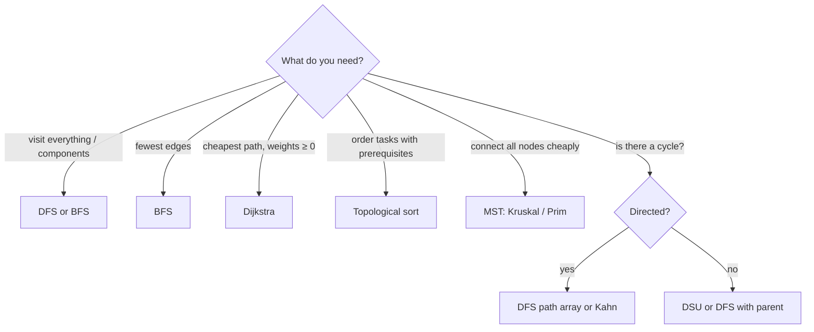

*Choosing a graph algorithm from the question being asked.*

> **Interactive animation:** `graph-traversal` — rendered by the page script in the HTML version.

**Adjacency list, BFS and DFS**

```python
from collections import defaultdict, deque


def build_graph(edges, directed=False):
    adj = defaultdict(list)
    for u, v in edges:
        adj[u].append(v)
        if not directed:
            adj[v].append(u)
    return adj


def bfs(adj, source):
    dist = {source: 0}
    queue = deque([source])
    while queue:
        node = queue.popleft()
        for nxt in adj[node]:
            if nxt not in dist:          # mark when ENQUEUED, not when popped
                dist[nxt] = dist[node] + 1
                queue.append(nxt)
    return dist                          # fewest edges from source


def dfs(adj, node, visited, order):
    visited.add(node)
    order.append(node)
    for nxt in adj[node]:
        if nxt not in visited:
            dfs(adj, nxt, visited, order)
    return order


g = build_graph([(0, 1), (0, 4), (1, 2), (1, 3), (2, 3), (3, 4), (4, 5), (4, 6), (5, 6)])
print(bfs(g, 3))                 # {3: 0, 1: 1, 2: 1, 4: 1, 0: 2, 5: 2, 6: 2}
print(dfs(g, 0, set(), []))      # [0, 1, 2, 3, 4, 5, 6]
```

```javascript
function buildGraph(n, edges, directed = false) {
  const adj = Array.from({ length: n }, () => []);
  for (const [u, v] of edges) {
    adj[u].push(v);
    if (!directed) adj[v].push(u);
  }
  return adj;
}

function bfs(adj, source) {
  const dist = new Array(adj.length).fill(-1);
  dist[source] = 0;
  const queue = [source];
  for (let head = 0; head < queue.length; head++) {   // head index instead of shift()
    const node = queue[head];
    for (const next of adj[node]) {
      if (dist[next] === -1) {           // mark when ENQUEUED, not when popped
        dist[next] = dist[node] + 1;
        queue.push(next);
      }
    }
  }
  return dist;                           // fewest edges from source
}

function dfs(adj, node, visited = new Set(), order = []) {
  visited.add(node);
  order.push(node);
  for (const next of adj[node]) if (!visited.has(next)) dfs(adj, next, visited, order);
  return order;
}

const g = buildGraph(7, [[0, 1], [0, 4], [1, 2], [1, 3], [2, 3], [3, 4], [4, 5], [4, 6], [5, 6]]);
console.log(bfs(g, 3)); // [2, 1, 1, 0, 1, 2, 2]
console.log(dfs(g, 0)); // [0, 1, 2, 3, 4, 5, 6]
```

<a id="cycle-detection"></a>

#### Cycles in a directed graph

In an undirected graph, meeting any visited node other than your parent means a cycle. In a **directed** graph that is not enough — two paths can reach the same node without forming a loop. You need a second array, the **current path** (the recursion stack). Reaching a node that is on the current path is a **back edge**, and a back edge is a cycle.

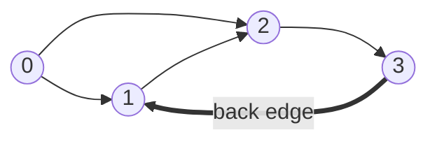

*`0 → 2` and `1 → 2` both reach `2` — no cycle there. `3 → 1` points back into the current path `1 → 2 → 3`: that is the cycle.*

**Answer — detect a cycle in a directed graph (DFS with a path array)**

```python
def has_cycle(n, edges):
    adj = [[] for _ in range(n)]
    for u, v in edges:
        adj[u].append(v)
    visited = [False] * n
    on_path = [False] * n

    def dfs(node):
        visited[node] = on_path[node] = True
        for nxt in adj[node]:
            if on_path[nxt]:
                return True               # back edge into the current path
            if not visited[nxt] and dfs(nxt):
                return True
        on_path[node] = False             # leaving: no longer on the path
        return False

    return any(not visited[i] and dfs(i) for i in range(n))


print(has_cycle(4, [(0, 1), (0, 2), (1, 2), (2, 3), (3, 1)]))  # True
print(has_cycle(4, [(0, 1), (0, 2), (1, 2), (2, 3)]))          # False
```

```javascript
function hasCycle(n, edges) {
  const adj = Array.from({ length: n }, () => []);
  for (const [u, v] of edges) adj[u].push(v);
  const visited = new Array(n).fill(false);
  const onPath = new Array(n).fill(false);

  const dfs = (node) => {
    visited[node] = onPath[node] = true;
    for (const next of adj[node]) {
      if (onPath[next]) return true;       // back edge into the current path
      if (!visited[next] && dfs(next)) return true;
    }
    onPath[node] = false;                  // leaving: no longer on the path
    return false;
  };

  for (let i = 0; i < n; i++) if (!visited[i] && dfs(i)) return true;
  return false;
}

console.log(hasCycle(4, [[0, 1], [0, 2], [1, 2], [2, 3], [3, 1]])); // true
console.log(hasCycle(4, [[0, 1], [0, 2], [1, 2], [2, 3]]));         // false
```

<a id="multisource-bfs"></a>

#### Multi-source BFS — rotten oranges

BFS from **several** sources at once: put every source in the queue at distance 0 before starting. Each wave of the BFS is then one unit of time spreading from all sources simultaneously, and the first time a cell is reached is its distance to the **nearest** source.

> **Interactive animation:** `rotten-oranges` — rendered by the page script in the HTML version.

**Interview question**

*In a grid, `2` is a rotten orange, `1` fresh, `0` empty. Each minute, rot spreads to fresh neighbours (up, down, left, right). Return the minutes until no fresh orange remains, or `-1`. `[[2,1,1],[1,1,0],[0,1,1]]` → `4`.*

Enqueue every rotten orange with time 0 and count the fresh ones. Pop a cell, rot each fresh neighbour, enqueue it with `time + 1`, and decrement the fresh count. The last time popped is the answer — unless fresh oranges remain unreachable, in which case return `-1`.

**Answer — rotten oranges (multi-source BFS)**

```python
from collections import deque


def oranges_rotting(grid):
    rows, cols = len(grid), len(grid[0])
    queue, fresh = deque(), 0
    for r in range(rows):
        for c in range(cols):
            if grid[r][c] == 2:
                queue.append((r, c, 0))      # every source starts at time 0
            elif grid[r][c] == 1:
                fresh += 1
    minutes = 0
    while queue:
        r, c, t = queue.popleft()
        minutes = t
        for dr, dc in ((-1, 0), (1, 0), (0, -1), (0, 1)):
            nr, nc = r + dr, c + dc
            if 0 <= nr < rows and 0 <= nc < cols and grid[nr][nc] == 1:
                grid[nr][nc] = 2
                fresh -= 1
                queue.append((nr, nc, t + 1))
    return minutes if fresh == 0 else -1


print(oranges_rotting([[2, 1, 1], [1, 1, 0], [0, 1, 1]]))  # 4
```

```javascript
function orangesRotting(grid) {
  const rows = grid.length, cols = grid[0].length;
  const queue = [];
  let fresh = 0;
  for (let r = 0; r < rows; r++) {
    for (let c = 0; c < cols; c++) {
      if (grid[r][c] === 2) queue.push([r, c, 0]);   // every source starts at time 0
      else if (grid[r][c] === 1) fresh++;
    }
  }
  let minutes = 0;
  for (let head = 0; head < queue.length; head++) {
    const [r, c, t] = queue[head];
    minutes = t;
    for (const [dr, dc] of [[-1, 0], [1, 0], [0, -1], [0, 1]]) {
      const nr = r + dr, nc = c + dc;
      if (nr >= 0 && nr < rows && nc >= 0 && nc < cols && grid[nr][nc] === 1) {
        grid[nr][nc] = 2;
        fresh--;
        queue.push([nr, nc, t + 1]);
      }
    }
  }
  return fresh === 0 ? minutes : -1;
}

console.log(orangesRotting([[2, 1, 1], [1, 1, 0], [0, 1, 1]])); // 4
```

> **Tip**
>
> BFS finds shortest paths only when every edge costs the same. The notes' "Another BFS" problem has weights of 1 **or** 2 — split each weight-2 edge into two weight-1 edges through a dummy vertex, and plain BFS works again.

<a id="topological-sort"></a>

#### Topological sort — Kahn's algorithm

A topological order lists every node before everything that depends on it. It exists **only for DAGs**. Kahn's algorithm: compute every node's in-degree, enqueue the nodes with in-degree 0 (no prerequisites), and repeatedly pop one, append it to the order and "delete" its outgoing edges by decrementing its neighbours' in-degrees — any neighbour that drops to 0 is now ready. If fewer than `n` nodes come out, the leftovers are stuck on a cycle. Swap the queue for a min-heap to get the lexicographically smallest order.

> **Interactive animation:** `topo-sort` — rendered by the page script in the HTML version.

**Interview question**

*There are `n` courses; `[a, b]` means course `b` must be taken before `a`. Can every course be finished? `4` courses, `[[1,0],[2,0],[3,1],[3,2]]` → `True`, order `0, 1, 2, 3`.*

**Answer — course schedule with Kahn's algorithm**

```python
from collections import deque


def course_order(num_courses, prerequisites):
    adj = [[] for _ in range(num_courses)]
    in_degree = [0] * num_courses
    for course, pre in prerequisites:
        adj[pre].append(course)
        in_degree[course] += 1

    queue = deque(i for i in range(num_courses) if in_degree[i] == 0)
    order = []
    while queue:
        node = queue.popleft()
        order.append(node)
        for nxt in adj[node]:
            in_degree[nxt] -= 1
            if in_degree[nxt] == 0:       # all prerequisites done
                queue.append(nxt)
    return order if len(order) == num_courses else None   # None → cycle


print(course_order(4, [[1, 0], [2, 0], [3, 1], [3, 2]]))  # [0, 1, 2, 3]
print(course_order(2, [[0, 1], [1, 0]]))                  # None
```

```javascript
function courseOrder(numCourses, prerequisites) {
  const adj = Array.from({ length: numCourses }, () => []);
  const inDegree = new Array(numCourses).fill(0);
  for (const [course, pre] of prerequisites) {
    adj[pre].push(course);
    inDegree[course]++;
  }
  const queue = [];
  for (let i = 0; i < numCourses; i++) if (inDegree[i] === 0) queue.push(i);
  for (let head = 0; head < queue.length; head++) {
    for (const next of adj[queue[head]]) {
      if (--inDegree[next] === 0) queue.push(next);    // all prerequisites done
    }
  }
  return queue.length === numCourses ? queue : null;   // null → cycle
}

console.log(courseOrder(4, [[1, 0], [2, 0], [3, 1], [3, 2]])); // [0, 1, 2, 3]
console.log(courseOrder(2, [[0, 1], [1, 0]]));                 // null
```

<a id="minimum-spanning-tree"></a>

#### Minimum spanning tree — Kruskal with union-find

A **spanning tree** connects all `V` vertices with exactly `V - 1` edges and no cycle; the **minimum** one has the smallest total weight. **Kruskal** sorts edges by weight and takes each one unless it would close a cycle — and "would this close a cycle?" is exactly "are both ends already in the same component?", which **union-find** (DSU) answers in near-constant time. **Prim** grows one tree from a start vertex instead, always adding the cheapest edge leaving the tree, using a min-heap.

> **Interactive animation:** `kruskal` — rendered by the page script in the HTML version.

**Answer — cost of construction of bridges (Kruskal + DSU)**

```python
class DSU:
    def __init__(self, n):
        self.parent = list(range(n + 1))
        self.rank = [0] * (n + 1)

    def find(self, i):
        if self.parent[i] != i:
            self.parent[i] = self.find(self.parent[i])   # path compression
        return self.parent[i]

    def union(self, i, j):
        ri, rj = self.find(i), self.find(j)
        if ri == rj:
            return False                                  # same component: a cycle
        if self.rank[ri] < self.rank[rj]:
            ri, rj = rj, ri
        self.parent[rj] = ri                              # union by rank
        if self.rank[ri] == self.rank[rj]:
            self.rank[ri] += 1
        return True


def kruskal_mst(num_nodes, edges):
    dsu = DSU(num_nodes)
    cost = taken = 0
    for u, v, wt in sorted(edges, key=lambda e: e[2]):
        if dsu.union(u, v):
            cost += wt
            taken += 1
            if taken == num_nodes - 1:
                break
    return cost


print(kruskal_mst(4, [[1, 2, 1], [2, 3, 4], [1, 4, 3], [4, 3, 2], [1, 3, 10]]))  # 6
```

```javascript
class DSU {
  constructor(n) {
    this.parent = Array.from({ length: n + 1 }, (_, i) => i);
    this.rank = new Array(n + 1).fill(0);
  }
  find(i) {
    if (this.parent[i] !== i) this.parent[i] = this.find(this.parent[i]); // path compression
    return this.parent[i];
  }
  union(i, j) {
    let ri = this.find(i), rj = this.find(j);
    if (ri === rj) return false;                    // same component: a cycle
    if (this.rank[ri] < this.rank[rj]) [ri, rj] = [rj, ri];
    this.parent[rj] = ri;                           // union by rank
    if (this.rank[ri] === this.rank[rj]) this.rank[ri]++;
    return true;
  }
}

function kruskalMST(numNodes, edges) {
  const dsu = new DSU(numNodes);
  let cost = 0, taken = 0;
  for (const [u, v, wt] of [...edges].sort((a, b) => a[2] - b[2])) {
    if (dsu.union(u, v)) {
      cost += wt;
      if (++taken === numNodes - 1) break;
    }
  }
  return cost;
}

console.log(kruskalMST(4, [[1, 2, 1], [2, 3, 4], [1, 4, 3], [4, 3, 2], [1, 3, 10]])); // 6
```

<a id="dijkstra"></a>

#### Dijkstra — cheapest paths with non-negative weights

Dijkstra is BFS with a priority queue: always settle the unsettled vertex with the smallest known distance, then **relax** its edges (`dist[v] = min(dist[v], dist[u] + w)`). Settling is final because, with no negative edges, no later path can come back cheaper. Stale heap entries are skipped when popped (`d > dist[u]`) instead of being deleted.

> **Interactive animation:** `dijkstra` — rendered by the page script in the HTML version.

**Interview question**

*Seven cities, undirected roads `[[0,1,10], [0,3,40], [1,2,10], [2,3,10], [3,4,2], [4,5,3], [4,6,8], [5,6,3]]`. Shortest distance from city 0 to every city? → `[0, 10, 20, 30, 32, 35, 38]`.*

The direct road `0 → 3` costs 40, but `0 → 1 → 2 → 3` costs 30. Dijkstra settles 1 (10), then 2 (20), then 3 (30) — and when it relaxes from 3 it improves nothing, because 3 was already settled at its best. City 6 is 38 via 5, not 40 via 4 directly.

**Answer — Dijkstra with a binary heap**

```python
import heapq


def dijkstra(n, edges, source):
    adj = [[] for _ in range(n)]
    for u, v, w in edges:
        adj[u].append((v, w))
        adj[v].append((u, w))
    dist = [float("inf")] * n
    dist[source] = 0
    heap = [(0, source)]
    while heap:
        d, u = heapq.heappop(heap)
        if d > dist[u]:
            continue                       # stale entry: u was already settled cheaper
        for v, w in adj[u]:
            if d + w < dist[v]:            # relax
                dist[v] = d + w
                heapq.heappush(heap, (dist[v], v))
    return dist


roads = [[0, 1, 10], [0, 3, 40], [1, 2, 10], [2, 3, 10], [3, 4, 2], [4, 5, 3], [4, 6, 8], [5, 6, 3]]
print(dijkstra(7, roads, 0))  # [0, 10, 20, 30, 32, 35, 38]
```

```javascript
function dijkstra(n, edges, source) {
  const adj = Array.from({ length: n }, () => []);
  for (const [u, v, w] of edges) {
    adj[u].push([v, w]);
    adj[v].push([u, w]);
  }
  const dist = new Array(n).fill(Infinity);
  dist[source] = 0;
  const heap = new MinHeap((a, b) => a[0] - b[0]);   // the MinHeap class from §34
  heap.push([0, source]);
  while (heap.size()) {
    const [d, u] = heap.pop();
    if (d > dist[u]) continue;             // stale entry: u was already settled cheaper
    for (const [v, w] of adj[u]) {
      if (d + w < dist[v]) {               // relax
        dist[v] = d + w;
        heap.push([dist[v], v]);
      }
    }
  }
  return dist;
}

const roads = [[0, 1, 10], [0, 3, 40], [1, 2, 10], [2, 3, 10], [3, 4, 2], [4, 5, 3], [4, 6, 8], [5, 6, 3]];
console.log(dijkstra(7, roads, 0)); // [0, 10, 20, 30, 32, 35, 38]
```

> **Warning**
>
> A single negative edge breaks Dijkstra's "settled means final" guarantee, and it will return wrong distances without any error. It also needs a real priority queue — re-sorting an array on every push, as a quick JavaScript version might, makes each push `O(n log n)`.

**From the notes — graph problems**

| Problem | Technique | Complexity |
| --- | --- | --- |
| Store a graph (matrix, list) | adjacency matrix / list | `O(V^2)` / `O(V + E)` |
| DFS traversal; path in a directed graph | DFS / BFS | `O(V + E)` |
| Cycle in a directed graph | DFS path array, or Kahn | `O(V + E)` |
| BFS traversal with distances | queue | `O(V + E)` |
| Multi-source BFS; rotten oranges | all sources at distance 0 | `O(V + E)` / `O(R·C)` |
| Another BFS (weights 1 or 2) | split weight-2 edges | `O(V + E)` |
| Cost of bridges; commutable islands | Kruskal + DSU; Prim + heap | `O(E log E)` |
| Dijkstra | min-heap, relax edges | `O((V + E) log V)` |
| Topological sort; possibility of finishing | Kahn's algorithm | `O(V + E)` |
| Lexicographically smallest topological order | Kahn with a min-heap | `O((V + E) log V)` |

#### More problems from the notes

Every remaining problem from the revision notes for this topic, each with a solution in Python and JavaScript.

**Problem — Store a graph as an adjacency matrix**

*Build an adjacency matrix from an edge list.*

`graph[u][v] = 1` (or the weight) for each edge, and the mirror entry for undirected graphs. `O(V²)` space, `O(1)` edge lookup.

**Solution — Adjacency Matrix Implementation**

```python
def create_adj_matrix(n, edges, directed=False):
    # Using 1-based indexing
    matrix = [[0] * (n + 1) for _ in range(n + 1)]

    for u, v in edges:
        matrix[u][v] = 1
        if not directed:
            matrix[v][u] = 1

    return matrix
```

```javascript
function createGraphAdjacencyMatrix(edges, numVertices) {
  // Initialize an (n+1)x(n+1) matrix with zeros for 1-based indexing.
  const graph = Array(numVertices + 1).fill(0).map(() => Array(numVertices + 1).fill(0));

  // Iterate through each edge provided.
  for (let i = 0; i < edges.length; i++) {
    // Get the two vertices of the current edge.
    const u = edges[i][0];
    const v = edges[i][1];

    // For an un-directed graph, mark the connection in both directions.
    graph[u][v] = 1; // Edge from u to v
    graph[v][u] = 1; // Edge from v to u
  }

  return graph;
}

// Example usage:
const edges = [[1, 3], [1, 2], [3, 4], [3, 5], [2, 5], [4, 5], [4, 6]];
const n = 6;
console.log(createGraphAdjacencyMatrix(edges, n));
```

**Problem — Store a graph as an adjacency list**

*Build an adjacency list from an edge list.*

`graph[u]` lists `u`'s neighbours. `O(V + E)` space — the default for sparse graphs.

**Solution — Adjacency List Implementation**

```python
from collections import defaultdict

def create_adj_list(edges, directed=False):
    adj = defaultdict(list)

    for edge in edges:
        if len(edge) == 3:
            u, v, wt = edge
            adj[u].append((v, wt))
            if not directed:
                adj[v].append((u, wt))
        else:
            u, v = edge
            adj[u].append(v)
            if not directed:
                adj[v].append(u)

    return adj
```

```javascript
class Pair {
  constructor(neighbor, weight) {
    this.neighbor = neighbor;
    this.weight = weight;
  }
}

function createGraphAdjacencyList(edges, numVertices) {
  // Initialize an array of empty lists. Size is n+1 for 1-based indexing.
  const graph = Array(numVertices + 1).fill(null).map(() => []);

  // Iterate through all edges to build the list.
  for (let i = 0; i < edges.length; i++) {
    // Extract vertices and weight from the edge info.
    const u = edges[i][0];
    const v = edges[i][1];
    const weight = edges[i][2];

    // For an un-directed graph, add an edge from u to v and from v to u.
    graph[u].push(new Pair(v, weight));
    graph[v].push(new Pair(u, weight));
  }
  return graph;
}

// Example usage:
const weightedEdges = [[1, 2, 5], [1, 3, 7], [3, 4, 9]];
const numNodes = 4;
const adjList = createGraphAdjacencyList(weightedEdges, numNodes);
console.log(JSON.stringify(adjList));
```

**Problem — DFS on an undirected graph**

*Visit every vertex with depth-first search, covering all components.*

Recurse into each unvisited neighbour, marking vertices as visited on entry; start a new DFS from every still-unvisited vertex. `O(V + E)`.

**Solution — DFS Traversal**

```python
def dfs_traversal(adj, start_node, num_nodes):
    visited = [False] * (num_nodes + 1)
    traversal = []

    def dfs(node):
        visited[node] = True
        traversal.append(node)
        for neighbor in adj[node]:
            if not visited[neighbor]:
                dfs(neighbor)

    dfs(start_node)
    return traversal
```

```javascript
function DFS(source, graph, visited) {
    // Mark the current source node as visited.
    visited[source] = true;
    process.stdout.write(source + " ");

    // Get all neighbors of the current source node.
    const neighbors = graph[source];

    // Iterate through all neighbors.
    for (const pair of neighbors) {
        const neighborNode = pair.neighbor;
        // If the neighbor has not been visited yet, recursively call DFS on it.
        if (!visited[neighborNode]) {
            DFS(neighborNode, graph, visited);
        }
    }
}

function traverseGraph(graph, numVertices) {
    // Create a boolean array to track visited vertices, initialized to false.
    const visitedDisconnected = new Array(numVertices).fill(false);
    const visitedConnected = new Array(numVertices).fill(false);

    // OPTION 1: Logic for Disconnected Graphs (loops through all nodes)
    for (let i = 0; i < numVertices; i++) {
        if (!visitedDisconnected[i]) {
            DFS(i, graph, visitedDisconnected);
        }
    }
    console.log();

    // OPTION 2: Logic for Connected Graphs (starts strictly from node 0)
    // We pass '0' as the starting source index.
    DFS(0, graph, visitedConnected);
    console.log();
}

// Example usage:
const dfsEdges = [
    [0, 1, 0], [0, 3, 0], [1, 2, 0], [1, 4, 0],
    [2, 4, 0], [3, 4, 0], [4, 5, 0], [4, 6, 0]
];
const dfsNumVertices = 7;

// Create adjacency list
const dfsGraph = Array(dfsNumVertices).fill(null).map(() => []);
for (const edge of dfsEdges) {
    dfsGraph[edge[0]].push({ neighbor: edge[1], weight: edge[2] });
    dfsGraph[edge[1]].push({ neighbor: edge[0], weight: edge[2] });
}

traverseGraph(dfsGraph, dfsNumVertices);
```

**Problem — Cycle in a directed graph — DFS and Kahn**

*Detect a cycle in a directed graph two ways.*

DFS looks for a back edge into the current path. Kahn's algorithm removes in-degree-0 vertices repeatedly; if some vertices are never removed, they sit on a cycle. Both `O(V + E)`.

**Approach 1 — Using Depth First Search (DFS)**

```python
def detect_cycle_dfs(adj, num_nodes):
    visited = [False] * (num_nodes + 1)
    rec_stack = [False] * (num_nodes + 1)

    def dfs(node):
        visited[node] = True
        rec_stack[node] = True

        for neighbor in adj[node]:
            if not visited[neighbor]:
                if dfs(neighbor):
                    return True
            elif rec_stack[neighbor]:
                return True

        rec_stack[node] = False
        return False

    for i in range(1, num_nodes + 1):
        if not visited[i]:
            if dfs(i):
                return True

    return False
```

```javascript
function hasCycleDFS(A, B) {
  // Create an adjacency list to represent the graph.
  // We use A+1 because nodes are 1-indexed.
  const adj = Array.from({ length: A + 1 }, () => []);

  // Populate the adjacency list from the input edge matrix B.
  for (const edge of B) {
    const u = edge[0]; // source node
    const v = edge[1]; // destination node
    adj[u].push(v);
  }

  // visited: keeps track of all visited nodes across all DFS traversals.
  const visited = new Array(A + 1).fill(false);

  // recursionStack: keeps track of nodes in the current DFS path.
  // This is crucial for detecting back edges in a directed graph.
  const recursionStack = new Array(A + 1).fill(false);

  // Helper function to perform DFS traversal from a given node.
  function detectCycle(node) {
    // Mark the current node as visited and add it to the current recursion stack.
    visited[node] = true;
    recursionStack[node] = true;

    // Iterate over all neighbors of the current node.
    for (const neighbor of adj[node]) {
      // If the neighbor has not been visited yet, recursively call DFS.
      if (!visited[neighbor]) {
        // If the recursive call finds a cycle, propagate true up the call stack.
        if (detectCycle(neighbor)) {
          return true;
        }
      }
      // If the neighbor is already in the current recursion stack, we have found a back edge.
      // This indicates a cycle.
      else if (recursionStack[neighbor]) {
        return true;
      }
    }

    // Backtrack: Once we have explored all paths from the current node,
    // remove it from the recursion stack before returning.
    recursionStack[node] = false;

    // No cycle was found in the paths starting from this node.
    return false;
  }

  // Iterate through all nodes to handle disconnected graphs.
  for (let i = 1; i <= A; i++) {
    // If a node has not been visited, start a new DFS traversal.
    if (!visited[i]) {
      // If the DFS traversal finds a cycle, we can immediately return 1.
      if (detectCycle(i)) {
        return 1;
      }
    }
  }

  // If we have traversed the entire graph and found no cycles, return 0.
  return 0;
}

// Example Usage
const A1 = 5;
const B1 = [ [1, 2], [4, 1], [2, 4], [3, 4], [5, 2], [1, 3] ];
console.log(`Cycle detected in graph 1: ${hasCycleDFS(A1, B1)}`); // Expected output: 1

const A2 = 5;
const B2 = [ [1, 2], [2, 3], [3, 4], [4, 5] ];
console.log(`Cycle detected in graph 2: ${hasCycleDFS(A2, B2)}`); // Expected output: 0

// Each vertex and edge is visited once.
// and the recursion stack depth.
```

**Approach 2 — Using BFS (Kahn's Topological Sort Algorithm)**

```python
from collections import deque

def detect_cycle_kahns(adj, num_nodes):
    in_degree = [0] * (num_nodes + 1)
    for u in adj:
        for v in adj[u]:
            in_degree[v] += 1

    queue = deque([i for i in range(1, num_nodes + 1) if in_degree[i] == 0])
    count = 0

    while queue:
        node = queue.popleft()
        count += 1
        for neighbor in adj[node]:
            in_degree[neighbor] -= 1
            if in_degree[neighbor] == 0:
                queue.append(neighbor)

    # If count != num_nodes, there is a cycle
    return count != num_nodes
```

```javascript
function hasCycleBFS(A, B) {
  // Create an adjacency list.
  const adj = Array.from({ length: A + 1 }, () => []);

  // Create an array to store the in-degree of each node.
  const inDegree = new Array(A + 1).fill(0);

  // Build the adjacency list and calculate in-degrees for all nodes.
  for (const edge of B) {
    const u = edge[0];
    const v = edge[1];
    adj[u].push(v);
    inDegree[v]++;
  }

  // Create a queue for the BFS-based topological sort.
  const queue = [];

  // Initialize the queue with all nodes that have an in-degree of 0.
  for (let i = 1; i <= A; i++) {
    if (inDegree[i] === 0) {
      queue.push(i);
    }
  }

  // Count of nodes included in the topological sort.
  let visitedNodesCount = 0;

  // Process nodes from the queue.
  while (queue.length > 0) {
    const node = queue.shift();
    visitedNodesCount++;

    // For each neighbor, reduce its in-degree.
    for (const neighbor of adj[node]) {
      inDegree[neighbor]--;

      // If a neighbor's in-degree becomes 0, add it to the queue.
      if (inDegree[neighbor] === 0) {
        queue.push(neighbor);
      }
    }
  }

  // If the number of nodes in the topological sort is less than the total number
  // of nodes in the graph, then the graph has a cycle.
  return visitedNodesCount < A ? 1 : 0;
}

// Example Usage
const A3 = 5;
const B3 = [ [1, 2], [4, 1], [2, 4], [3, 4], [5, 2], [1, 3] ];
console.log(`Cycle detected in graph 1: ${hasCycleBFS(A3, B3)}`); // Expected output: 1

const A4 = 5;
const B4 = [ [1, 2], [2, 3], [3, 4], [4, 5] ];
console.log(`Cycle detected in graph 2: ${hasCycleBFS(A4, B4)}`); // Expected output: 0

// Building adj list and in-degrees is O(A+M). The while loop processes each vertex and edge once.
```

**Problem — Path in a directed graph**

*Is there a path from a source to a destination?*

BFS or DFS from the source; the destination is reachable exactly when it gets visited. `O(V + E)`.

**Approach 1 — Using Breadth-First Search (BFS)**

```python
from collections import deque

def has_path_bfs(adj, source, dest, num_nodes):
    visited = [False] * (num_nodes + 1)
    queue = deque([source])
    visited[source] = True

    while queue:
        curr = queue.popleft()
        if curr == dest:
            return True
        for neighbor in adj[curr]:
            if not visited[neighbor]:
                visited[neighbor] = True
                queue.append(neighbor)

    return False
```

```javascript
function findPathBFS(A, B) {
  // Build the adjacency list representation of the graph.
  // We use A+1 because nodes are 1-indexed.
  const adj = Array.from({ length: A + 1 }, () => []);
  for (const edge of B) {
    const source = edge[0];
    const destination = edge[1];
    adj[source].push(destination);
  }

  // If A is 1, a path from 1 to 1 trivially exists.
  if (A === 1) {
    return 1;
  }

  // Create a queue for BFS and add the starting node (1).
  const queue = [1];

  // Create a 'visited' array to keep track of visited nodes
  // to prevent cycles and redundant work.
  const visited = new Array(A + 1).fill(false);
  visited[1] = true;

  // Process the queue until it's empty.
  while (queue.length > 0) {
    // Dequeue the current node.
    const currentNode = queue.shift();

    // Iterate through all neighbors of the current node.
    for (const neighbor of adj[currentNode]) {
      // If the neighbor is the destination, we've found a path.
      if (neighbor === A) {
        return 1;
      }
      // If the neighbor has not been visited yet...
      if (!visited[neighbor]) {
        // Mark it as visited.
        visited[neighbor] = true;
        // Enqueue it to be visited later.
        queue.push(neighbor);
      }
    }
  }

  // If the queue becomes empty and we haven't reached node A, no path exists.
  return 0;
}

// Example usage
console.log(findPathBFS(5, [ [1, 2], [4, 1], [2, 4], [3, 4], [5, 2], [1, 3] ])); // 0
console.log(findPathBFS(5, [ [1, 2], [2, 3], [3, 4], [4, 5] ])); // 1

// In the worst case, we visit every node and edge in the connected component of the source.
// queue and visited array.
```

**Approach 2 — Using Depth-First Search (DFS)**

```python
def has_path_dfs(adj, source, dest, num_nodes):
    visited = [False] * (num_nodes + 1)

    def dfs(node):
        if node == dest:
            return True
        visited[node] = True
        for neighbor in adj[node]:
            if not visited[neighbor]:
                if dfs(neighbor):
                    return True
        return False

    return dfs(source)
```

```javascript
function findPathDFS(A, B) {
  // Build the adjacency list representation of the graph.
  const adj = Array.from({ length: A + 1 }, () => []);
  for (const edge of B) {
    const source = edge[0];
    const destination = edge[1];
    adj[source].push(destination);
  }

  // Create a 'visited' array to avoid infinite loops in case of cycles.
  const visited = new Array(A + 1).fill(false);

  // Recursive DFS function to find the path.
  function canReach(currentNode) {
    // If we have reached the destination node, a path exists.
    if (currentNode === A) {
      return true;
    }

    // Mark the current node as visited.
    visited[currentNode] = true;

    // Explore all neighbors of the current node.
    for (const neighbor of adj[currentNode]) {
      // If the neighbor has not been visited, perform DFS from there.
      if (!visited[neighbor]) {
        // If the recursive call finds the path, propagate the result.
        if (canReach(neighbor)) {
          return true;
        }
      }
    }

    // If no path was found from this node's neighbors, return false.
    return false;
  }

  // Start the DFS from the source node (1).
  return canReach(1) ? 1 : 0;
}

// Example usage
console.log(findPathDFS(5, [ [1, 2], [4, 1], [2, 4], [3, 4], [5, 2], [1, 3] ])); // 0
console.log(findPathDFS(5, [ [1, 2], [2, 3], [3, 4], [4, 5] ])); // 1

// Each node and edge is visited at most once.
// and O(A) for the recursion stack in the worst-case (a long chain).
```

**Problem — BFS traversal with distances**

*Traverse a graph breadth-first, reporting each vertex's distance in edges from the source.*

Queue of `(vertex, distance)`; mark vertices visited when they are enqueued. The first time a vertex is reached is along a shortest path. `O(V + E)`.

**Solution — Using Queue**

```python
from collections import deque

def bfs_traversal(adj, start, num_nodes):
    visited = [False] * (num_nodes + 1)
    queue = deque([(start, 0)])  # (node, distance)
    visited[start] = True
    traversal = []

    while queue:
        node, dist = queue.popleft()
        traversal.append((node, dist))

        for neighbor in adj[node]:
            if not visited[neighbor]:
                visited[neighbor] = True
                queue.append((neighbor, dist + 1))

    return traversal
```

```javascript
class BfsPair {
  constructor(vertex, distance) {
    this.vertex = vertex; // The node/vertex identifier
    this.distance = distance; // Distance from the source node
  }
}

function breadthFirstSearch(graph, source) {
  // Get the total number of vertices in the graph.
  const numVertices = graph.length;
  // visited array to keep track of visited nodes. Initialized to false.
  const visited = new Array(numVertices).fill(false);
  // Queue for BFS, storing BfsPair objects.
  const queue = [];

  // Start BFS from the source node.
  // Add the source to the queue with a distance of 0.
  queue.push(new BfsPair(source, 0));
  // Mark the source node as visited.
  visited[source] = true;

  // Loop until the queue is empty.
  while (queue.length > 0) {
    // 1. Remove the first element from the queue.
    const currentPair = queue.shift();
    const currentVertex = currentPair.vertex;
    const currentDistance = currentPair.distance;

    // 2. Work: Print the vertex and its distance from the source.
    console.log(`Vertex: ${currentVertex}, Distance from source: ${currentDistance}`);

    // 3. Add unvisited neighbors to the queue.
    // Get all neighbors of the current vertex.
    const neighbors = graph[currentVertex];
    for (const neighbor of neighbors) {
      // If the neighbor has not been visited yet.
      if (!visited[neighbor]) {
        // Mark the neighbor as visited.
        visited[neighbor] = true;
        // Add the neighbor to the queue with an incremented distance.
        queue.push(new BfsPair(neighbor, currentDistance + 1));
      }
    }
  }
}

// Example Usage:
// Adjacency list for the graph in the diagram.
const adjList = [
  [1, 4],    // 0
  [0, 2, 3], // 1
  [1, 3],    // 2
  [1, 2, 4, 5], // 3
  [0, 3],    // 4
  [3, 6, 7], // 5
  [5],       // 6
  [5]        // 7
];

console.log("BFS starting from source 3:");
breadthFirstSearch(adjList, 3);
```

**Problem — Multi-source BFS**

*Find every vertex's distance to its nearest source when there are several sources.*

Seed the queue with all sources at distance 0 and run one BFS — instead of one BFS per source. `O(V + E)`.

**Solution — Optimized Multisource BFS**

```python
from collections import deque

def multisource_bfs(grid, sources):
    rows = len(grid)
    cols = len(grid[0])
    dist = [[-1] * cols for _ in range(rows)]
    queue = deque()

    for r, c in sources:
        queue.append((r, c))
        dist[r][c] = 0

    dirs = [(-1, 0), (1, 0), (0, -1), (0, 1)]

    while queue:
        r, c = queue.popleft()
        for dr, dc in dirs:
            nr, nc = r + dr, c + dc
            if 0 <= nr < rows and 0 <= nc < cols and dist[nr][nc] == -1:
                dist[nr][nc] = dist[r][c] + 1
                queue.append((nr, nc))

    return dist
```

```javascript
class BfsPair {
  constructor(vertex, distance) {
    this.vertex = vertex; // The node/vertex identifier
    this.distance = distance; // Distance from the source node
  }
}

function multiSourceBfs(graph, sources, destination) {
  // Get the total number of vertices.
  const numVertices = graph.length;
  // Queue for BFS. Using the same BfsPair class from before.
  const queue = [];
  // visited array to track visited nodes.
  const visited = new Array(numVertices).fill(false);

  // 1. Add all source nodes to the queue.
  for (const source of sources) {
    if (source < numVertices) {
      queue.push(new BfsPair(source, 0));
      visited[source] = true;
    }
  }

  // 2. Perform standard BFS.
  while (queue.length > 0) {
    // Remove the current node from the queue.
    const currentPair = queue.shift();
    const currentVertex = currentPair.vertex;
    const currentDistance = currentPair.distance;

    // Check if the current vertex is the destination.
    if (currentVertex === destination) {
      // If it is, we have found the shortest path.
      return currentDistance;
    }

    // Explore neighbors.
    const neighbors = graph[currentVertex] || [];
    for (const neighbor of neighbors) {
      // If a neighbor is not visited.
      if (!visited[neighbor]) {
        // Mark it as visited.
        visited[neighbor] = true;
        // Add it to the queue with incremented distance.
        queue.push(new BfsPair(neighbor, currentDistance + 1));
      }
    }
  }

  // If the loop finishes and the destination was not found, it's unreachable.
  return -1;
}

// Example Usage from the PDF:
// Assuming graph nodes are 0-indexed. Let's map nodes 1-12 to 0-11.
const multiSourceGraph = new Array(12).fill(0).map(() => []);
// Edges based on diagram
multiSourceGraph[9].push(11, 7); // 10 -> 12, 8
multiSourceGraph[11].push(9);     // 12 -> 10
multiSourceGraph[7].push(9, 0, 6); // 8 -> 10, 1, 7
multiSourceGraph[0].push(7, 1);     // 1 -> 8, 2
multiSourceGraph[6].push(7, 5);     // 7 -> 8, 6
multiSourceGraph[1].push(0, 8);     // 2 -> 1, 9
multiSourceGraph[8].push(1);       // 9 -> 2
multiSourceGraph[5].push(6, 4);     // 6 -> 7, 5
multiSourceGraph[4].push(5, 3);     // 5 -> 6, 4
multiSourceGraph[3].push(4, 2);     // 4 -> 5, 3
multiSourceGraph[2].push(3);       // 3 -> 4

// Sources: 10, 1, 5 -> indices 9, 0, 4
const sources = [9, 0, 4];
// Destination: 9 -> index 8
const destination = 8;

const shortestDist = multiSourceBfs(multiSourceGraph, sources, destination);
console.log(`Shortest distance to destination ${destination + 1} is: ${shortestDist}`); // Expected output: 2
```

**Problem — Cost of construction of bridges (Prim)**

*Connect all centres with bridges at minimum total cost.*

A minimum spanning tree. Prim grows one tree from a start vertex, always adding the cheapest edge leaving it, using a min-heap. `O(E log V)`.

**Solution — Prim's Algorithm using Priority Queue**

```python
import heapq
from collections import defaultdict

def prim_mst(num_nodes, edges):
    adj = defaultdict(list)
    for u, v, wt in edges:
        adj[u].append((wt, v))
        adj[v].append((wt, u))

    visited = [False] * (num_nodes + 1)
    min_heap = [(0, 1)]  # (weight, node)
    mst_cost = 0
    edges_count = 0

    while min_heap and edges_count < num_nodes:
        wt, u = heapq.heappop(min_heap)

        if visited[u]:
            continue

        visited[u] = True
        mst_cost += wt
        edges_count += 1

        for weight, neighbor in adj[u]:
            if not visited[neighbor]:
                heapq.heappush(min_heap, (weight, neighbor))

    return mst_cost
```

```javascript
class Edge {
  constructor(u, v, wt) {
    this.u = u;   // Source center
    this.v = v;   // Destination center
    this.wt = wt; // Cost of the road
  }
}

class NeighborPair {
    constructor(neighbor, weight) {
        this.neighbor = neighbor;
        this.weight = weight;
    }
}

class PriorityQueue {
  constructor() {
    this.items = [];
  }
  add(element) {
    this.items.push(element);
    this.items.sort((a, b) => a.wt - b.wt);
  }
  remove() {
    return this.items.shift();
  }
  size() {
    return this.items.length;
  }
}

function findMinConstructionCost(graph) {
  const numVertices = graph.length;
  const visited = new Array(numVertices).fill(false);
  const pq = new PriorityQueue();
  let minCost = 0;
  const startVertex = 0;

  // Add the first center to our network.
  visited[startVertex] = true;

  // Add all potential roads from the starting center to the priority queue.
  for (const pair of graph[startVertex]) {
    pq.add(new Edge(startVertex, pair.neighbor, pair.weight));
  }

  while (pq.size() > 0) {
    // 1. Get the cheapest available road.
    const edge = pq.remove();
    const v = edge.v;
    const wt = edge.wt;

    // 2. If this road leads to an already connected center, skip it.
    if (visited[v] === true) {
      continue;
    }

    // 3. Connect the new center and add the road's cost.
    visited[v] = true;
    minCost += wt;

    // 4. Add all new potential roads from the newly connected center.
    for (const pair of graph[v]) {
      if (visited[pair.neighbor] === false) {
        pq.add(new Edge(v, pair.neighbor, pair.weight));
      }
    }
  }

  return minCost;
}

// Example Usage from the PDF (nodes 1-6 -> indices 0-5)
const centersGraph = new Array(6).fill(0).map(() => []);
centersGraph[0].push(new NeighborPair(1, 7), new NeighborPair(3, 8)); // Center 1
centersGraph[1].push(new NeighborPair(0, 7), new NeighborPair(3, 3), new NeighborPair(2, 6)); // Center 2
centersGraph[2].push(new NeighborPair(1, 6), new NeighborPair(3, 4), new NeighborPair(4, 2), new NeighborPair(5, 5)); // Center 3
centersGraph[3].push(new NeighborPair(0, 8), new NeighborPair(1, 3), new NeighborPair(2, 4), new NeighborPair(4, 3)); // Center 4
centersGraph[4].push(new NeighborPair(2, 2), new NeighborPair(3, 3), new NeighborPair(5, 5)); // Center 5
centersGraph[5].push(new NeighborPair(2, 5), new NeighborPair(4, 5)); // Center 6

const minCost = findMinConstructionCost(centersGraph);
console.log(`Minimum cost to construct the bridges: ${minCost}`); // 20

// We need O(M) space for the augmented edges array and the result array.
// The DSU data structure requires O(N) space for its parent and size arrays.
```

**Problem — Another BFS — edge weights of 1 or 2**

*Find the shortest path when every edge weighs 1 or 2.*

Split each weight-2 edge `u–v` into `u–x–v` through a new dummy vertex `x`. Now every edge weighs 1 and plain BFS gives shortest distances. `O(V + E)`.

**Solution — Graph Transformation + BFS**

```python
from collections import deque

def shortest_path_unweighted(adj, source, dest, num_nodes):
    dist = [-1] * (num_nodes + 1)
    queue = deque([source])
    dist[source] = 0

    while queue:
        curr = queue.popleft()
        if curr == dest:
            return dist[curr]

        for neighbor in adj[curr]:
            if dist[neighbor] == -1:
                dist[neighbor] = dist[curr] + 1
                queue.append(neighbor)

    return -1
```

```javascript
class Pair {
  constructor(vertex, distance) {
    this.vertex = vertex;
    this.distance = distance;
  }
}

function findShortestPathWithWeights12(n, edges, src, dest) {
  // The graph is represented by an adjacency list.
  const graph = new Array(n + edges.length).fill(0).map(() => []);
  let currentVertexCount = n;

  function addEdge(u, v) {
    graph[u].push(v);
    graph[v].push(u);
  }

  // Process the edges and transform the graph.
  for (const edge of edges) {
    const u = edge[0];
    const v = edge[1];
    const weight = edge[2];

    if (weight === 1) {
      // If weight is 1, add a direct edge.
      addEdge(u, v);
    } else {
      // If weight is 2, add a dummy vertex in between.
      const dummyVertex = currentVertexCount;
      // The graph array needs to be large enough for new vertices.
      // We already allocated space for the worst case.
      currentVertexCount++;

      // Add edge from u to the dummy vertex.
      addEdge(u, dummyVertex);
      // Add edge from the dummy vertex to v.
      addEdge(dummyVertex, v);
    }
  }

  // Now, perform a standard BFS on the transformed graph.
  const queue = [];
  const visited = new Array(currentVertexCount).fill(false);

  // Start BFS from the source vertex.
  queue.push(new Pair(src, 0));
  visited[src] = true;

  while (queue.length > 0) {
    // Dequeue the current vertex.
    const currentPair = queue.shift();
    const currentVertex = currentPair.vertex;
    const currentDistance = currentPair.distance;

    // If we have reached the destination, return the distance.
    if (currentVertex === dest) {
      return currentDistance;
    }

    // Explore all neighbors.
    for (const neighbor of graph[currentVertex]) {
      // If the neighbor has not been visited yet.
      if (!visited[neighbor]) {
        // Mark it as visited.
        visited[neighbor] = true;
        // Enqueue it with an incremented distance.
        queue.push(new Pair(neighbor, currentDistance + 1));
      }
    }
  }

  // If the destination is not reachable, return -1.
  return -1;
}

// Example usage from the diagram (simplified)
const n_vertices = 5;
const edge_list = [
  [1, 2, 1], [1, 4, 2], [2, 3, 1],
  [2, 4, 1], [3, 5, 1], [4, 5, 1]
];
const source = 1;
const destination = 5;

// Note: Vertices are 1-based in the problem, let's adjust to 0-based for arrays.
const adjusted_edges = edge_list.map(([u,v,w]) => [u-1, v-1, w]);

console.log(`Shortest path from ${source} to ${destination}:`, findShortestPathWithWeights12(n_vertices, adjusted_edges, source - 1, destination - 1)); // expected output: 3 (path 1->2->4->5)
```

**Problem — Possibility of finishing all courses**

*Given prerequisite pairs, can every course be completed?*

Only if the prerequisite graph has no cycle: Kahn's algorithm must remove every vertex, or DFS must find no back edge. `O(V + E)`.

**Approach 1 — BFS (Kahn's Algorithm for Topological Sort)**

```python
from collections import deque, defaultdict

def can_finish_courses_bfs(num_courses, prerequisites):
    adj = defaultdict(list)
    in_degree = [0] * num_courses

    for dest, src in prerequisites:
        adj[src].append(dest)
        in_degree[dest] += 1

    queue = deque([i for i in range(num_courses) if in_degree[i] == 0])
    finished = 0

    while queue:
        curr = queue.popleft()
        finished += 1
        for nxt in adj[curr]:
            in_degree[nxt] -= 1
            if in_degree[nxt] == 0:
                queue.append(nxt)

    return finished == num_courses

print(can_finish_courses_bfs(2, [[1, 0]]))          # True
print(can_finish_courses_bfs(2, [[1, 0], [0, 1]]))  # False
```

```javascript
function canFinishCoursesBFS(A, B, C) {
  // Number of courses (vertices).
  const numCourses = A;
  // Number of prerequisite pairs (edges).
  const numPrerequisites = B.length;

  // inDegree array to store the number of prerequisites for each course.
  // We use size A+1 to easily handle 1-based indexing for courses.
  const inDegree = new Array(numCourses + 1).fill(0);

  // Adjacency list to represent the course dependency graph.
  // adj[i] will contain a list of courses that have course 'i' as a prerequisite.
  const adj = Array.from({ length: numCourses + 1 }, () => []);

  // Build the graph and populate the inDegree array from the input prerequisites.
  for (let i = 0; i < numPrerequisites; i++) {
    // B[i] is a prerequisite for C[i]. This means there is an edge from B[i] to C[i].
    const prerequisite = B[i];
    const course = C[i];

    // Add an edge from the prerequisite to the course.
    adj[prerequisite].push(course);
    // Increment the in-degree of the course that has a prerequisite.
    inDegree[course]++;
  }

  // Create a queue to store courses with no prerequisites (in-degree of 0).
  const queue = [];
  // Populate the queue with initial courses that can be taken.
  for (let i = 1; i <= numCourses; i++) {
    if (inDegree[i] === 0) {
      queue.push(i);
    }
  }

  // A counter to keep track of the number of courses that are part of the topological sort.
  let finishedCoursesCount = 0;

  // Process the courses in the queue.
  while (queue.length > 0) {
    // Dequeue a course that has no remaining prerequisites.
    const currentCourse = queue.shift();
    // Increment the count of finished courses.
    finishedCoursesCount++;

    // Iterate through all courses that depend on the currentCourse.
    for (const dependentCourse of adj[currentCourse]) {
      // Since currentCourse is now "finished", decrement the prerequisite count for its dependent courses.
      inDegree[dependentCourse]--;

      // If a dependent course now has no prerequisites left, it's ready to be taken. Add it to the queue.
      if (inDegree[dependentCourse] === 0) {
        queue.push(dependentCourse);
      }
    }
  }

  // If the number of finished courses equals the total number of courses,
  // it means a valid topological order exists, and there are no cycles.
  if (finishedCoursesCount === numCourses) {
    return 1; // It is possible to finish all courses.
  } else {
    return 0; // It is not possible due to a cycle.
  }
}

// Example usage:
const A1 = 3, B1 = [1, 2], C1 = [2, 3];
console.log(`Can finish courses for Example 1? ${canFinishCoursesBFS(A1, B1, C1)}`); // Expected output: 1

const A2 = 2, B2 = [1, 2], C2 = [2, 1];
console.log(`Can finish courses for Example 2? ${canFinishCoursesBFS(A2, B2, C2)}`); // Expected output: 0

// We iterate through all edges to build the graph and in-degree array. Then, we visit each vertex and edge once during the BFS traversal.
// We use an adjacency list (O(E)), an in-degree array (O(A)), and a queue (O(A) in the worst case).
```

**Approach 2 — DFS (Depth-First Search) Cycle Detection**

```python
from collections import defaultdict

def can_finish_courses_dfs(num_courses, prerequisites):
    adj = defaultdict(list)
    for dest, src in prerequisites:
        adj[src].append(dest)

    visited = [0] * num_courses  # 0: unvisited, 1: visiting, 2: visited

    def has_cycle(course):
        visited[course] = 1
        for nxt in adj[course]:
            if visited[nxt] == 1:
                return True
            if visited[nxt] == 0 and has_cycle(nxt):
                return True
        visited[course] = 2
        return False

    for c in range(num_courses):
        if visited[c] == 0:
            if has_cycle(c):
                return False

    return True

print(can_finish_courses_dfs(2, [[1, 0]]))  # True
```

```javascript
function canFinishCoursesDFS(A, B, C) {
  // Number of courses (vertices).
  const numCourses = A;
  // Number of prerequisite pairs (edges).
  const numPrerequisites = B.length;

  // Adjacency list to represent the course dependency graph.
  const adj = Array.from({ length: numCourses + 1 }, () => []);

  // Build the graph from the input prerequisites.
  for (let i = 0; i < numPrerequisites; i++) {
    const prerequisite = B[i];
    const course = C[i];
    // Add an edge from the prerequisite to the course.
    adj[prerequisite].push(course);
  }

  // `visited` array tracks nodes that have been visited in any DFS traversal.
  const visited = new Array(numCourses + 1).fill(false);
  // `recursionStack` tracks nodes currently in the recursion stack for the *current* DFS traversal.
  const recursionStack = new Array(numCourses + 1).fill(false);

  // Helper function to perform DFS and detect cycles.
  // It returns true if a cycle is detected, false otherwise.
  const hasCycle = (course) => {
    // Mark the current course as visited and part of the current recursion path.
    visited[course] = true;
    recursionStack[course] = true;

    // Iterate through all courses that depend on the current course.
    for (const dependentCourse of adj[course]) {
      // If the dependent course hasn't been visited yet, perform DFS on it.
      if (!visited[dependentCourse]) {
        // If the recursive call finds a cycle, propagate the result up by returning true.
        if (hasCycle(dependentCourse)) {
          return true;
        }
      }
      // If the dependent course is already in the current recursion stack,
      // we have found a back edge, which indicates a cycle.
      else if (recursionStack[dependentCourse]) {
        return true;
      }
    }

    // Backtrack: Remove the current course from the recursion stack as we are done exploring its path.
    recursionStack[course] = false;
    // No cycle was found in the path starting from this course.
    return false;
  };

  // Iterate through all courses to handle potentially disconnected components in the graph.
  for (let i = 1; i <= numCourses; i++) {
    // If a course has not been visited yet, start a new DFS from it.
    if (!visited[i]) {
      // If the DFS call detects a cycle, it's impossible to finish the courses.
      if (hasCycle(i)) {
        return 0; // Cycle detected, not possible.
      }
    }
  }

  // If we iterate through all courses and their paths without finding any cycles, it's possible.
  return 1;
}

// Example usage:
const A1_dfs = 3, B1_dfs = [1, 2], C1_dfs = [2, 3];
console.log(`Can finish courses for Example 1? ${canFinishCoursesDFS(A1_dfs, B1_dfs, C1_dfs)}`); // Expected output: 1

const A2_dfs = 2, B2_dfs = [1, 2], C2_dfs = [2, 1];
console.log(`Can finish courses for Example 2? ${canFinishCoursesDFS(A2_dfs, B2_dfs, C2_dfs)}`); // Expected output: 0

// Each vertex and edge is visited exactly once across all DFS calls.
// We use an adjacency list (O(E)), visited and recursionStack arrays (O(A)), and the system's recursion stack (O(A) in the worst case for a long chain).
```

**Problem — Lexicographically smallest topological order**

*Return the smallest topological order in dictionary order.*

Kahn's algorithm with a min-heap instead of a queue: among the ready vertices, always take the smallest. `O((V + E) log V)`.

**Solution — Kahn's Algorithm with a Min-Heap**

```python
import heapq
from collections import defaultdict

def topological_sort_lexicographical(num_nodes, edges):
    adj = defaultdict(list)
    in_degree = [0] * (num_nodes + 1)

    for u, v in edges:
        adj[u].append(v)
        in_degree[v] += 1

    # Min-Heap ensures smallest available node is processed first
    min_heap = [i for i in range(1, num_nodes + 1) if in_degree[i] == 0]
    heapq.heapify(min_heap)
    result = []

    while min_heap:
        node = heapq.heappop(min_heap)
        result.append(node)

        for neighbor in adj[node]:
            in_degree[neighbor] -= 1
            if in_degree[neighbor] == 0:
                heapq.heappush(min_heap, neighbor)

    if len(result) != num_nodes:
        return []

    return result
```

```javascript
class MinPriorityQueue {
  constructor() {
    // The heap is an array of numbers.
    this.heap = [];
  }
  // Checks if the heap is empty.
  isEmpty() {
    return this.heap.length === 0;
  }
  // Swaps two elements in the heap.
  swap(i, j) {
    [this.heap[i], this.heap[j]] = [this.heap[j], this.heap[i]];
  }
  // Helper methods to get parent and child indices.
  parent(i) { return Math.floor((i - 1) / 2); }
  leftChild(i) { return 2 * i + 1; }
  rightChild(i) { return 2 * i + 2; }

  enqueue(element) {
    // Add the new element to the end of the array.
    this.heap.push(element);
    // Bubble it up to its correct position.
    this.siftUp(this.heap.length - 1);
  }

  dequeue() {
    // If the heap is empty, there's nothing to remove.
    if (this.isEmpty()) return null;
    // Swap the root with the last element.
    this.swap(0, this.heap.length - 1);
    // Remove the last element (which was the original root).
    const dequeued = this.heap.pop();
    // If the heap is not empty, restore the heap property from the new root.
    if (!this.isEmpty()) {
      this.siftDown(0);
    }
    return dequeued;
  }

  siftUp(i) {
    let parentIndex = this.parent(i);
    // Keep swapping with the parent as long as the element is smaller.
    while (i > 0 && this.heap[i] < this.heap[parentIndex]) {
      this.swap(i, parentIndex);
      i = parentIndex;
      parentIndex = this.parent(i);
    }
  }

  siftDown(i) {
    let minIndex = i;
    const left = this.leftChild(i);
    const right = this.rightChild(i);
    const size = this.heap.length;
    // Find the smallest among the element and its children.
    if (left < size && this.heap[left] < this.heap[minIndex]) minIndex = left;
    if (right < size && this.heap[right] < this.heap[minIndex]) minIndex = right;
    // If the element is not the smallest, swap it with the smallest child and continue.
    if (i !== minIndex) {
      this.swap(i, minIndex);
      this.siftDown(minIndex);
    }
  }
}

function solution(A, B) {
  // Use arrays of size A+1 to handle 1-based indexing of nodes.
  const adj = Array(A + 1).fill(0).map(() => []);
  const inDegree = Array(A + 1).fill(0);

  // Step 1: Build the adjacency list and in-degree array.
  for (const edge of B) {
    const [u, v] = edge;
    // Add an edge from u to v.
    adj[u].push(v);
    // Increment the in-degree of the destination node v.
    inDegree[v]++;
  }

  // Step 2: Initialize the min-heap with all nodes having an in-degree of 0.
  const minHeap = new MinPriorityQueue();
  for (let i = 1; i <= A; i++) {
    if (inDegree[i] === 0) {
      minHeap.enqueue(i);
    }
  }

  // This array will store the final sorted order.
  const result = [];

  // Step 3: Process nodes from the min-heap.
  while (!minHeap.isEmpty()) {
    // Get the smallest available node (guarantees lexicographical order).
    const u = minHeap.dequeue();
    // Add it to our result list.
    result.push(u);

    // Step 4: Update neighbors' in-degrees.
    for (const v of adj[u]) {
      // Since u is processed, it's no longer a prerequisite for v.
      inDegree[v]--;
      // If v now has no prerequisites, it's ready to be processed.
      if (inDegree[v] === 0) {
        minHeap.enqueue(v);
      }
    }
  }

  // Step 5: Check for cycles.
  // A valid topological sort includes all nodes.
  if (result.length === A) {
    return result; // Success, no cycle.
  } else {
    return []; // A cycle was detected.
  }
}

// example usage
const A1 = 6;
const B1 = [ [6, 3], [6, 1], [5, 1], [5, 2], [3, 4], [4, 2] ];
console.log(solution(A1, B1)); // expected output: [5, 6, 1, 3, 4, 2]

const A2 = 3;
const B2 = [ [1, 2], [2, 3], [3, 1] ];
console.log(solution(A2, B2)); // expected output: []

// Building the graph takes O(A + M). The main loop can run up to A times (for each node). Each edge M results in an in-degree update. In the worst case, every node or edge update could lead to a heap operation (enqueue/dequeue), which costs O(log A). Therefore, the complexity is dominated by heap operations.

// The adjacency list requires O(A + M) space. The in-degree array and result array require O(A) space. The min-heap can store up to O(A) nodes.
```

**Problem — Number of islands**

*In a grid of `'1'` (land) and `'0'` (water), count the islands — groups of land connected up, down, left or right.*

Scan every cell; each unvisited land cell starts a new island, and a DFS or BFS from it marks the whole island visited so it is never counted again. Every cell is visited once: `O(R · C)`. The notes list DFS and BFS versions (and the problem twice).

**Approach 1 — DFS**

```python
def num_islands_dfs(grid):
    rows, cols = len(grid), len(grid[0])
    seen = [[False] * cols for _ in range(rows)]

    def dfs(r, c):
        if r < 0 or r >= rows or c < 0 or c >= cols or seen[r][c] or grid[r][c] != "1":
            return
        seen[r][c] = True
        for dr, dc in ((1, 0), (-1, 0), (0, 1), (0, -1)):
            dfs(r + dr, c + dc)

    count = 0
    for r in range(rows):
        for c in range(cols):
            if grid[r][c] == "1" and not seen[r][c]:
                count += 1                # a new island: sink all of it
                dfs(r, c)
    return count


grid = [["1", "1", "0", "0"], ["1", "0", "0", "1"], ["0", "0", "1", "1"]]
print(num_islands_dfs(grid))  # 2
```

```javascript
function numIslandsDFS(grid) {
  const rows = grid.length, cols = grid[0].length;
  const seen = Array.from({ length: rows }, () => new Array(cols).fill(false));
  const dfs = (r, c) => {
    if (r < 0 || r >= rows || c < 0 || c >= cols || seen[r][c] || grid[r][c] !== "1") return;
    seen[r][c] = true;
    dfs(r + 1, c); dfs(r - 1, c); dfs(r, c + 1); dfs(r, c - 1);
  };
  let count = 0;
  for (let r = 0; r < rows; r++) {
    for (let c = 0; c < cols; c++) {
      if (grid[r][c] === "1" && !seen[r][c]) {
        count++;                         // a new island: sink all of it
        dfs(r, c);
      }
    }
  }
  return count;
}

const grid = [["1", "1", "0", "0"], ["1", "0", "0", "1"], ["0", "0", "1", "1"]];
console.log(numIslandsDFS(grid)); // 2
```

**Approach 2 — BFS**

```python
from collections import deque


def num_islands_bfs(grid):
    rows, cols = len(grid), len(grid[0])
    seen = set()
    count = 0
    for r in range(rows):
        for c in range(cols):
            if grid[r][c] != "1" or (r, c) in seen:
                continue
            count += 1
            seen.add((r, c))
            queue = deque([(r, c)])
            while queue:
                cr, cc = queue.popleft()
                for nr, nc in ((cr + 1, cc), (cr - 1, cc), (cr, cc + 1), (cr, cc - 1)):
                    if 0 <= nr < rows and 0 <= nc < cols and grid[nr][nc] == "1" and (nr, nc) not in seen:
                        seen.add((nr, nc))
                        queue.append((nr, nc))
    return count


print(num_islands_bfs([["1", "1", "0", "0"], ["1", "0", "0", "1"], ["0", "0", "1", "1"]]))  # 2
```

```javascript
function numIslandsBFS(grid) {
  const rows = grid.length, cols = grid[0].length;
  const seen = new Set();
  const key = (r, c) => r * cols + c;
  let count = 0;
  for (let r = 0; r < rows; r++) {
    for (let c = 0; c < cols; c++) {
      if (grid[r][c] !== "1" || seen.has(key(r, c))) continue;
      count++;
      seen.add(key(r, c));
      const queue = [[r, c]];
      for (let head = 0; head < queue.length; head++) {
        const [cr, cc] = queue[head];
        for (const [nr, nc] of [[cr + 1, cc], [cr - 1, cc], [cr, cc + 1], [cr, cc - 1]]) {
          if (nr >= 0 && nr < rows && nc >= 0 && nc < cols && grid[nr][nc] === "1" && !seen.has(key(nr, nc))) {
            seen.add(key(nr, nc));
            queue.push([nr, nc]);
          }
        }
      }
    }
  }
  return count;
}

console.log(numIslandsBFS([["1", "1", "0", "0"], ["1", "0", "0", "1"], ["0", "0", "1", "1"]])); // 2
```

**Problem — Shortest distance in a maze (rolling ball)**

*A ball in a grid maze (`0` open, `1` wall) rolls in one direction until it hits a wall. Return the fewest cells travelled from `start` to stop exactly at `dest`, or `-1`.*

Every stop point is a vertex; rolling from it in each of the four directions gives an edge whose weight is the number of cells rolled. Edge weights differ, so use Dijkstra. If you only count **moves** (every roll costs 1), plain BFS suffices — the notes list both variants.

**Solution — Dijkstra over stop points**

```python
import heapq


def shortest_distance(maze, start, dest):
    rows, cols = len(maze), len(maze[0])
    dist = {tuple(start): 0}
    heap = [(0, start[0], start[1])]
    while heap:
        d, r, c = heapq.heappop(heap)
        if [r, c] == dest:
            return d
        if d > dist.get((r, c), float("inf")):
            continue
        for dr, dc in ((1, 0), (-1, 0), (0, 1), (0, -1)):
            nr, nc, steps = r, c, 0
            while 0 <= nr + dr < rows and 0 <= nc + dc < cols and maze[nr + dr][nc + dc] == 0:
                nr, nc, steps = nr + dr, nc + dc, steps + 1   # roll until a wall
            if d + steps < dist.get((nr, nc), float("inf")):
                dist[(nr, nc)] = d + steps
                heapq.heappush(heap, (d + steps, nr, nc))
    return -1


maze = [[0, 0, 1, 0, 0], [0, 0, 0, 0, 0], [0, 0, 0, 1, 0], [1, 1, 0, 1, 1], [0, 0, 0, 0, 0]]
print(shortest_distance(maze, [0, 4], [4, 4]))  # 12
```

```javascript
function shortestDistance(maze, start, dest) {
  const rows = maze.length, cols = maze[0].length;
  const dist = new Map([[start.join(), 0]]);
  const heap = new MinHeap((a, b) => a[0] - b[0]);   // the MinHeap class from the Heaps section
  heap.push([0, start[0], start[1]]);
  while (heap.size()) {
    const [d, r, c] = heap.pop();
    if (r === dest[0] && c === dest[1]) return d;
    if (d > (dist.get(`${r},${c}`) ?? Infinity)) continue;
    for (const [dr, dc] of [[1, 0], [-1, 0], [0, 1], [0, -1]]) {
      let nr = r, nc = c, steps = 0;
      while (nr + dr >= 0 && nr + dr < rows && nc + dc >= 0 && nc + dc < cols && maze[nr + dr][nc + dc] === 0) {
        nr += dr; nc += dc; steps++;     // roll until a wall
      }
      if (d + steps < (dist.get(`${nr},${nc}`) ?? Infinity)) {
        dist.set(`${nr},${nc}`, d + steps);
        heap.push([d + steps, nr, nc]);
      }
    }
  }
  return -1;
}

const maze = [[0, 0, 1, 0, 0], [0, 0, 0, 0, 0], [0, 0, 0, 1, 0], [1, 1, 0, 1, 1], [0, 0, 0, 0, 0]];
console.log(shortestDistance(maze, [0, 4], [4, 4])); // 12
```

**Problem — Valid path through a field of circles**

*A rectangle spans `(0, 0)` to `(x, y)`. There are `N` circles of radius `R` at given centres. Moving one step in any of 8 directions between integer points, can you get from `(0, 0)` to `(x, y)` without touching a circle?*

Treat integer points as grid cells. A point is blocked if it lies within distance `R` of any centre. BFS from `(0, 0)` over unblocked neighbours in 8 directions. The notes give two variants: check blocking on the fly, or precompute an obstacle grid first (faster when points are visited repeatedly). `O(x · y · N)`.

**Solution — BFS with a precomputed obstacle grid**

```python
from collections import deque


def valid_path(x, y, r, centres_x, centres_y):
    blocked = [[any((i - cx) ** 2 + (j - cy) ** 2 <= r * r for cx, cy in zip(centres_x, centres_y))
                for j in range(y + 1)] for i in range(x + 1)]
    if blocked[0][0] or blocked[x][y]:
        return "NO"
    seen = {(0, 0)}
    queue = deque([(0, 0)])
    while queue:
        i, j = queue.popleft()
        if (i, j) == (x, y):
            return "YES"
        for di in (-1, 0, 1):
            for dj in (-1, 0, 1):
                ni, nj = i + di, j + dj
                if 0 <= ni <= x and 0 <= nj <= y and not blocked[ni][nj] and (ni, nj) not in seen:
                    seen.add((ni, nj))
                    queue.append((ni, nj))
    return "NO"


print(valid_path(2, 3, 1, [2], [3]))  # NO  (the destination is inside a circle)
print(valid_path(5, 5, 1, [2], [2]))  # YES
```

```javascript
function validPath(x, y, r, centresX, centresY) {
  const blocked = Array.from({ length: x + 1 }, (_, i) =>
    Array.from({ length: y + 1 }, (_, j) =>
      centresX.some((cx, k) => (i - cx) ** 2 + (j - centresY[k]) ** 2 <= r * r)));
  if (blocked[0][0] || blocked[x][y]) return "NO";
  const seen = new Set(["0,0"]);
  const queue = [[0, 0]];
  for (let head = 0; head < queue.length; head++) {
    const [i, j] = queue[head];
    if (i === x && j === y) return "YES";
    for (let di = -1; di <= 1; di++) {
      for (let dj = -1; dj <= 1; dj++) {
        const ni = i + di, nj = j + dj;
        if (ni >= 0 && ni <= x && nj >= 0 && nj <= y && !blocked[ni][nj] && !seen.has(`${ni},${nj}`)) {
          seen.add(`${ni},${nj}`);
          queue.push([ni, nj]);
        }
      }
    }
  }
  return "NO";
}

console.log(validPath(2, 3, 1, [2], [3])); // NO
console.log(validPath(5, 5, 1, [2], [2])); // YES
```

---

<a id="42-the-whole-thing-on-one-page"></a>

## The Whole Thing on One Page

Most of interview problem-solving is **recognition**: noticing which of about thirty signals is in the problem statement. This table is the index to the whole course.

| If the problem says… | Reach for | Cost | Section |
| --- | --- | --- | --- |
| "sum over all subarrays / submatrices" | contribution counting | `O(N)` | §2 |
| "many range sum queries" | prefix sums | `O(N + Q)` | §3 |
| "many range updates, read once" | difference array | `O(N + Q)` | §3 |
| "count pairs where one comes before the other" | carry forward | `O(N)` | §4 |
| "contiguous, length K" | fixed sliding window | `O(N)` | §6 |
| "longest / count subarrays with a limit, all positive" | dynamic sliding window | `O(N)` | §6 |
| "maximum subarray sum" | Kadane | `O(N)` | §9 |
| "overlapping intervals" | sort by start, sweep | `O(N log N)` | §11 |
| "appears more than n/2 times" | Boyer–Moore | `O(N)` | §12 |
| "sorted array, pair with sum / difference" | two pointers | `O(N)` | §13 |
| "row- and column-sorted matrix" | staircase search | `O(N + M)` | §14 |
| "every element twice except one" | XOR | `O(N)` | §16 |
| "all primes up to N" | sieve | `O(N log log N)` | §17 |
| "number of ways to choose, nCr mod M" | Pascal's identity | `O(N^2)` | §18 |
| "power in logarithmic time" | recursion, halve the exponent | `O(log N)` | §20 |
| "all subsets / permutations / combinations" | backtracking | `O(2^N)` / `O(N!)` | §21 |
| "distinct elements / pair with sum K / unique substring" | hash set | `O(N)` | §22 |
| "subarray with sum K, negatives allowed" | prefix sums + hash map | `O(N)` | §23 |
| "values in a small range" | count sort | `O(N + K)` | §24 |
| "arrange to form the largest …" | custom comparator | `O(N log N)` | §24 |
| "minimum possible maximum" / "maximum possible minimum" | binary search on the answer | `O(N log R)` | §25 |
| "middle, cycle, palindrome of a linked list" | slow / fast pointers | `O(N)`, `O(1)` | §28 |
| "O(1) get and put with eviction" | hash map + DLL (LRU) | `O(1)` | §28 |
| "nearest smaller / greater element" | monotonic stack | `O(N)` | §29 |
| "max of every window" | monotonic deque | `O(N)` | §30 |
| "left / right / top view of a tree" | level order (+ column index) | `O(N)` | §31 |
| "validate, delete or k-th smallest in a BST" | BST ordering, inorder | `O(H)` / `O(N)` | §32 |
| "inorder with O(1) space" | Morris traversal | `O(N)`, `O(1)` | §33 |
| "lowest common ancestor" | steer by value / recurse both sides | `O(H)` / `O(N)` | §34 |
| "k smallest / largest, running median" | heap(s) | `O(N log K)` | §35 |
| "maximum jobs / minimum joining cost" | greedy with sort or heap | `O(N log N)` | §36 |
| "count ways / min cost, choices overlap" | dynamic programming | states × transitions | §38 |
| "budget, weights, values" | knapsack | `O(N·W)` | §38 |
| "fewest steps in a grid or unweighted graph" | BFS / multi-source BFS | `O(V + E)` | §41 |
| "prerequisites / build order" | topological sort | `O(V + E)` | §41 |
| "connect everything cheaply" | MST (Kruskal / Prim) | `O(E log E)` | §41 |
| "cheapest route, non-negative weights" | Dijkstra | `O((V + E) log V)` | §41 |

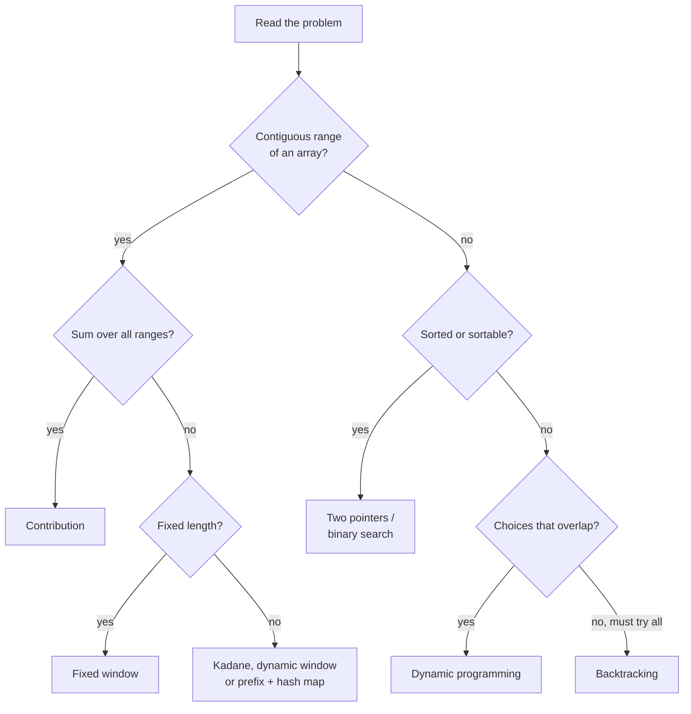

*A first-pass decision tree. When a problem fits more than one branch, start with the cheapest cost.*

> **Key idea**
>
> Say the brute force out loud first, name its cost, then name **what it recomputes**. That one sentence points at the pattern: recomputed sums → prefix or window; recomputed pair checks → two pointers or hash map; recomputed subproblems → DP; recomputed feasibility → binary search on the answer.

<a id="where-to-go-next"></a>

### Where to go next

1. [DSA Crash Course](dsa-crash-course.html) — the structures themselves, if any container in this course felt shaky.
2. [DSA Detailed Course](dsa-detailed-course.html) — every topic from first principles, with proofs and edge cases.
3. [All DSA courses](dsa-courses.html) — the catalog page for this track.

