<!--
Source: dsa-advanced-crash-course.html
Title: DSA Advanced Crash Course | TechToday
Description: The advanced DSA patterns interviews actually test — contribution counting, prefix sums, Kadane, two pointers, backtracking, hashing, binary search on answers, linked-list tricks, Morris traversal, heaps, DP and graphs — animated, diagrammed and coded in Python and JavaScript.
Theme-color: #0b0d10
Stylesheets: dsa-study.css, ../../site-header.css
Scripts: dsa-study.js
Body-class: is-crash is-advanced
Back-href: dsa-courses.html
Back-label: DSA Courses
Footer: DSA Advanced
-->

Navigation: [TechToday](../../index.html) · [← DSA Courses](dsa-courses.html)

<a id="dsa-advanced-crash-course"></a>

# Advanced Data Structures & Algorithms

The first DSA crash course taught you the containers. This one teaches the **moves** — the dozen or so patterns that turn an `O(n³)` brute force into a single pass. Each section names the pattern, gives you the mental picture, animates it, and then works through problems from the revision notes in Python and JavaScript. Press **Play** on any animation, or drag its scrubber to step backwards.

> **Key idea**
>
> Almost every advanced problem is a brute force with one wasteful step removed. Before you write any code, ask: **what am I recomputing?** Recomputed sums become a prefix array, recomputed pair checks become two pointers or a hash map, recomputed subproblems become a DP table, and recomputed "is this feasible?" questions become binary search on the answer.

<a id="table-of-contents"></a>

## Table of Contents

1. [Read the Constraints First](#0-read-the-constraints-first)
2. [The Contribution Technique](#1-contribution-technique)
3. [Prefix Sums, Carry Forward & Sliding Windows](#2-prefix-sums-carry-forward-and-sliding-windows)
4. [Kadane, Intervals & Boyer–Moore](#3-kadane-intervals-and-boyer-moore)
5. [Two Pointers](#4-two-pointers)
6. [Matrix Walks](#5-matrix-walks)
7. [Bits, Primes & Counting](#6-bits-primes-and-counting)
8. [Recursion & Backtracking](#7-recursion-and-backtracking)
9. [Hashing](#8-hashing)
10. [Sorting Beyond the Library Call](#9-sorting-beyond-the-library-call)
11. [Binary Search on Arrays and on Answers](#10-binary-search-on-arrays-and-answers)
12. [Linked Lists](#11-linked-lists)
13. [Stacks & Queues](#12-stacks-and-queues)
14. [Trees, BSTs, Morris & LCA](#13-trees-bsts-morris-and-lca)
15. [Heaps & Greedy](#14-heaps-and-greedy)
16. [Dynamic Programming](#15-dynamic-programming)
17. [Graphs](#16-graphs)
18. [The Whole Thing on One Page](#17-the-whole-thing-on-one-page)

<a id="0-read-the-constraints-first"></a>

## Read the Constraints First

- **Budget per second** `~10^8 ops`
- **Sum 1..N** `N(N+1)/2`
- **Subarrays of size N** `N(N+1)/2`
- **Recursion time** `calls × work`

Every advanced problem hands you its answer in the constraints line. An online judge allows about one second, which the notes put at roughly `10^9` machine instructions — but a loop iteration costs many instructions, so the safe target is **`10^8` iterations or fewer**. Plug `n` into each complexity class and only one or two survive.

> **Analogy** 🧳
>
> **Picture it — packing for a flight with a weight limit**
>
> You do not pack first and weigh later. You look at the limit — 7 kg carry-on — and it immediately rules out the heavy suitcase. `n ≤ 10^5` is the weight limit: it rules out `O(n²)` before you write a line.

| Constraint on `n` | Largest safe complexity | Typical pattern |
| --- | --- | --- |
| `n ≤ 10` | `O(n!)` | permutations, backtracking |
| `n ≤ 20` | `O(2^n)` | subsets, bitmasks |
| `n ≤ 500` | `O(n^3)` | triple loops, interval DP |
| `n ≤ 10^4` | `O(n^2)` | pair loops, 2-D DP |
| `n ≤ 10^6` | `O(n log n)` | sorting, heaps, binary search |
| `n ≤ 10^7` | `O(n)` | one pass: prefix sums, two pointers, Kadane |
| larger | `O(log n)` or `O(1)` | maths, binary search, formulas |

The notes list ten growth rates. Memorise their order, fastest first: `O(1)` → `O(log log n)` → `O(log n)` → `O(√n)` → `O(n)` → `O(n log n)` → `O(n^2)` → `O(n^3)` → `O(2^n)` → `O(n!)`.

```mermaid
flowchart LR
    A[Read n and time limit] --> B["Budget ≈ 10^8 steps"]
    B --> C{Which class fits?}
    C -->|"O(n)"| D[Prefix sum / two pointers / Kadane]:::good
    C -->|"O(n log n)"| E[Sort / heap / binary search]:::good
    C -->|"O(2^n) or O(n!)"| F[Backtracking]:::hl
    C -->|"O(n^2)"| G[Pair loops / 2-D DP]
```

*Pick the complexity class from the constraint, then pick the pattern that achieves it.*

Four counting facts come up constantly, so keep them next to the budget:

1. `[a, b]` inclusive holds `b - a + 1` values; `(a, b)` exclusive holds `b - a - 1`.
2. An array of size `N` has `N(N+1)/2` subarrays and `N - K + 1` subarrays of size exactly `K`.
3. The sum `1 + 2 + … + N` is `N(N+1)/2` — which is why a pair loop is `O(n²)`.
4. For recursion, **time = number of calls × work per call** and **space = deepest chain of calls alive at once**. `fib(n)` makes `O(2ⁿ)` calls but only ever holds `n` frames, so its space is `O(n)`.

> **Tip**
>
> `0` and `1` are neither prime nor composite. Edge cases like these, plus `n = 1`, empty arrays and all-negative arrays, are where most "wrong answer on test 7" failures live.

---

<a id="unit-1"></a>

## Unit 1 — Array Patterns That Kill the Nested Loop

Each pattern in this unit replaces a loop over *all subarrays* or *all pairs* with one pass that carries a little state forward.

<a id="1-contribution-technique"></a>

### The Contribution Technique

- **Brute force** `O(N^3)`
- **Carry forward** `O(N^2)`
- **Contribution** `O(N)`

"Sum of all subarray sums" tempts you to list every subarray. Flip the question instead: **how many subarrays contain element `i`?** A subarray containing `i` must start somewhere in `[0, i]` — that is `i + 1` choices — and end somewhere in `[i, n-1]` — that is `n - i` choices. Every start pairs with every end, so element `i` appears in `(i + 1) × (n - i)` subarrays and contributes `A[i] × (i + 1) × (n - i)` to the total.

> **Analogy** 📸
>
> **Picture it — counting the group photos you are in**
>
> A photographer shoots every contiguous group of people standing in a row. To count the photos *you* appear in, you do not look at the photos — you count the choices for the left edge (anyone from the first person to you) times the choices for the right edge (anyone from you to the last person).

> **Interactive animation:** `contribution-subarray` — rendered by the page script in the HTML version.

```text
A = [ 3, -2, 4, -1, 2, 6 ]      in how many subarrays is index 1 present?
      0   1  2   3  4  5

start ∈ [0, 1]  → 2 choices        end ∈ [1, 5] → 5 choices
[0,1] [0,2] [0,3] [0,4] [0,5]
[1,1] [1,2] [1,3] [1,4] [1,5]      total = 2 × 5 = 10 = (i + 1) × (n - i)
```

The revision notes solve this one problem four ways — it is the clearest picture of how the same question gets cheaper as you stop recomputing:

| Approach | Time | Space | What it stops recomputing |
| --- | --- | --- | --- |
| Brute force (three loops) | `O(N^3)` | `O(1)` | nothing — re-adds every subarray from scratch |
| Prefix sum | `O(N^2)` | `O(N)` | the inner sum, via `P[j] - P[i-1]` |
| Carry forward | `O(N^2)` | `O(1)` | the inner sum, by extending the previous one |
| Contribution | `O(N)` | `O(1)` | the subarrays themselves — counts them instead |

- **Strength — turns enumeration into arithmetic** — Whenever the answer is a sum over *many groups*, ask how many groups each element belongs to.
- **Weakness — only for additive totals** — "Maximum subarray sum" is not a sum over groups, so contribution does not help; that is Kadane's job.

**Interview question**

*Return the sum of the sums of all subarrays. For `[6, 8, -1]` the subarrays are `[6]`, `[6,8]`, `[6,8,-1]`, `[8]`, `[8,-1]`, `[-1]`, with sums `6 + 14 + 13 + 8 + 7 - 1 = 47`.*

Index 0 appears in `1 × 3 = 3` subarrays, index 1 in `2 × 2 = 4`, index 2 in `3 × 1 = 3`. So the answer is `6·3 + 8·4 + (-1)·3 = 18 + 32 - 3 = 47`, with no subarray ever built.

**Answer — sum of all subarray sums**

```python
def sum_of_all_subarrays_sums(A):
    total = 0
    N = len(A)
    for i in range(N):
        # A[i] sits in (i + 1) * (N - i) subarrays
        total += (i + 1) * (N - i) * A[i]
    return total


print(sum_of_all_subarrays_sums([6, 8, -1]))  # 47
print(sum_of_all_subarrays_sums([1, 2, 3]))   # 20
```

```javascript
function sumOfAllSubarraysSums(A) {
  let sum = 0;
  const N = A.length;
  for (let i = 0; i < N; i++) {
    // index i is present in (i + 1) * (N - i) subarrays
    const subarrayCount = (i + 1) * (N - i);
    sum += A[i] * subarrayCount;
  }
  return sum;
}

console.log(sumOfAllSubarraysSums([6, 8, -1])); // 47
console.log(sumOfAllSubarraysSums([1, 2, 3]));  // 20
```

<a id="contribution-in-2d"></a>

#### The same idea in two dimensions

A submatrix is fixed by two corners: a **top-left** and a **bottom-right**. For a submatrix to contain cell `(i, j)`, its top-left corner must lie in rows `0..i` and columns `0..j` — that is `(i + 1) × (j + 1)` choices — and its bottom-right corner must lie in rows `i..n-1` and columns `j..m-1` — `(n - i) × (m - j)` choices.

```text
frequency(i, j) = [(i + 1) × (j + 1)]  ×  [(n - i) × (m - j)]
                   top-left choices        bottom-right choices

In a 4 × 5 matrix, cell (1, 2):  TL = 2 × 3 = 6,  BR = 3 × 3 = 9,  6 × 9 = 54 submatrices
In an 8 × 10 matrix, cell (3, 4): TL = 4 × 5 = 20, BR = 5 × 6 = 30, 20 × 30 = 600
```

> **Interactive animation:** `contribution-matrix` — rendered by the page script in the HTML version.

**Interview question**

*Given an `N × M` matrix, return the sum of all its submatrix sums. For `[[4, 9, 6], [5, -1, 2]]` the answer is `166`.*

The 2 × 3 grid has 18 submatrices; listing them works but does not scale. The corner count gives each cell's frequency directly: the corners `4, 6, 5, 2` appear in 6 submatrices each and the middle column `9, -1` in 8 each, so the total is `24 + 72 + 36 + 30 - 8 + 12 = 166`.

**Answer — sum of all submatrix sums**

```python
def sum_of_all_submatrices_sums(matrix):
    n = len(matrix)
    m = len(matrix[0])
    total_sum = 0

    for i in range(n):
        for j in range(m):
            top_left_choices = (i + 1) * (j + 1)
            bottom_right_choices = (n - i) * (m - j)
            occurrences = top_left_choices * bottom_right_choices
            total_sum += matrix[i][j] * occurrences

    return total_sum


print(sum_of_all_submatrices_sums([[4, 9, 6], [5, -1, 2]]))  # 166
print(sum_of_all_submatrices_sums([[1, 2], [3, 4]]))         # 40
```

```javascript
function sumOfSubmatricesSums(matrix) {
  const rows = matrix.length;
  const cols = matrix[0].length;
  let sum = 0;

  for (let i = 0; i < rows; i++) {
    for (let j = 0; j < cols; j++) {
      const topLeft = (i + 1) * (j + 1);
      const bottomRight = (rows - i) * (cols - j);
      sum += topLeft * bottomRight * matrix[i][j];
    }
  }
  return sum;
}

console.log(sumOfSubmatricesSums([[4, 9, 6], [5, -1, 2]])); // 166
console.log(sumOfSubmatricesSums([[1, 2], [3, 4]]));        // 40
```

> **Warning**
>
> The frequencies grow like `n²m²/4`. In Java or C++ the product overflows a 32-bit `int` long before the loops get slow — the notes' Java version stores every factor in a `long`. Python integers never overflow, and JavaScript numbers are exact up to `2^53`.

**From the notes — contribution problems**

| Problem | Idea | Complexity |
| --- | --- | --- |
| Sum of all subarray sums | `A[i] × (i+1) × (n-i)` | `O(N)` |
| Sum of all submatrix sums | top-left choices × bottom-right choices | `O(N·M)` |
| Minimize the cost to empty an array | sort descending; `A[i]` is paid `i + 1` times | `O(N log N)` |
| Subarrays with OR 1 | count the complement — all-zero runs — instead (§6) | `O(N)` |

<a id="2-prefix-sums-carry-forward-and-sliding-windows"></a>

### Prefix Sums, Carry Forward & Sliding Windows

- **Build prefix** `O(N)`
- **Range query** `O(1)`
- **Q range updates** `O(N + Q)`
- **Slide a window** `O(1)`

Four techniques, one instinct: **never recompute something you had a moment ago.** A prefix array remembers every running total, so any range sum is one subtraction. A difference array defers range updates and settles them in one sweep. Carry forward keeps a single running fact (a count, a last-seen index). A sliding window keeps the sum of the current range and adjusts it by one element at each end.

> **Analogy** 🚗
>
> **Picture it — the car's odometer**
>
> You never measure the road between two towns. You read the odometer at each town and subtract. A prefix sum array is the odometer: `P[i]` is the total distance up to index `i`, and the sum of `A[l..r]` is `P[r] - P[l-1]`.

```text
A   = [ -3,  6,  2,  4,  5,  2,  8, -9,  3,  1 ]
P   = [ -3,  3,  5,  9, 14, 16, 24, 15, 18, 19 ]      P[i] = P[i-1] + A[i]
idx      0   1   2   3   4   5   6   7   8   9

sum(A[4..8]) = P[8] - P[3] = 18 - 9 = 9            (and P[r] alone when l = 0)
```

**Prefix sum + range sum queries**

```python
def prefix_sum(A, Q):
    psa = [0] * len(A)
    psa[0] = A[0]
    for i in range(1, len(A)):
        psa[i] = psa[i - 1] + A[i]

    ans = []
    for s, e in Q:
        ans.append(psa[e] if s == 0 else psa[e] - psa[s - 1])
    return ans


print(prefix_sum([-3, 6, 2, 4, 5, 2, 8, -9, 3, 1],
                 [[4, 8], [3, 7], [1, 3], [0, 4], [7, 7]]))  # [9, 10, 12, 14, -9]
```

```javascript
function prefixSum(A, Q) {
  const psa = [A[0]];
  for (let i = 1; i < A.length; i++) {
    psa[i] = psa[i - 1] + A[i];
  }
  return Q.map(([left, right]) => (left === 0 ? psa[right] : psa[right] - psa[left - 1]));
}

console.log(prefixSum([-3, 6, 2, 4, 5, 2, 8, -9, 3, 1],
  [[4, 8], [3, 7], [1, 3], [0, 4], [7, 7]])); // [9, 10, 12, 14, -9]
```

<a id="difference-array"></a>

#### Difference arrays — prefix sums run backwards

The **Beggars Outside Temple** family flips the problem: now there are many *range updates* ("give `v` coins to every beggar from `start` to `end`") and one final read. Applying each update directly is `O(n)` per query. Instead, record only where a change **begins** and where it **stops**: `diff[start] += v` and `diff[end + 1] -= v`. A single prefix sweep over `diff` then spreads every update across its range.

> **Interactive animation:** `difference-array` — rendered by the page script in the HTML version.

**Interview question**

*Beggars sit in a row holding `arr[i]` coins. Each devotee `[start, end, value]` gives `value` coins to every beggar in `[start, end]`. Return the final coins per beggar. `arr = [1, 2, 3, 4, 5]`, queries `[[0,2,2], [1,3,3], [2,4,4]]` → `[3, 7, 12, 11, 9]`.*

Mark `+2` at 0 and `-2` at 3, `+3` at 1 and `-3` at 4, `+4` at 2 (the `-4` would land at 5, past the end, so it is dropped). The difference array is `[2, 3, 4, -2, -3]`; its running sum `[2, 5, 9, 7, 4]` is the total gift per beggar; add the starting coins and you get `[3, 7, 12, 11, 9]`. That is `O(n + q)` instead of `O(n · q)`.

**Answer — zero-based range updates (difference array)**

```python
def perform_queries(arr, queries):
    diff = [0] * (len(arr) + 1)
    for start, end, val in queries:
        diff[start] += val       # start adding val here
        diff[end + 1] -= val     # stop adding it after end

    result = [0] * len(arr)
    running_add = 0
    for i in range(len(arr)):
        running_add += diff[i]
        result[i] = arr[i] + running_add
    return result


print(perform_queries([1, 2, 3, 4, 5], [[0, 2, 2], [1, 3, 3], [2, 4, 4]]))  # [3, 7, 12, 11, 9]
```

```javascript
function performQueries(arr, queries) {
  const diffArr = new Array(arr.length).fill(0);
  for (const [start, end, val] of queries) {
    diffArr[start] += val;                                // start adding val here
    if (end + 1 < diffArr.length) diffArr[end + 1] -= val; // stop after end
  }

  const result = [];
  let running = 0;
  for (let i = 0; i < arr.length; i++) {
    running += diffArr[i];
    result.push(arr[i] + running);
  }
  return result;
}

console.log(performQueries([1, 2, 3, 4, 5], [[0, 2, 2], [1, 3, 3], [2, 4, 4]])); // [3, 7, 12, 11, 9]
```

<a id="carry-forward"></a>

#### Carry forward — one running fact

Carry forward is the lightest version: instead of a whole array, carry **one number** from left to right. To count pairs `(i, j)` with `i < j`, `A[i] = 'a'` and `A[j] = 'g'`, you do not need to look back for every `g` — just remember how many `a`s you have passed.

**Interview question**

*Count the pairs `(i, j)` with `i < j`, `A[i] = 'a'` and `A[j] = 'g'`. `['b','a','a','g','d','c','a','g']` → `5`.*

The first `g` sees two `a`s behind it; the second `g` sees three. `2 + 3 = 5`. One pass, `O(1)` memory — the brute-force pair loop was `O(n²)`.

**Answer — count "ag" pairs with carry forward**

```python
def count_of_pairs(A):
    pair_count = 0
    a_count = 0
    for ch in A:
        if ch == 'a':
            a_count += 1
        elif ch == 'g':
            pair_count += a_count   # every 'a' seen so far pairs with this 'g'
    return pair_count


print(count_of_pairs(['b', 'a', 'a', 'g', 'd', 'c', 'a', 'g']))  # 5
```

```javascript
function countOfPairs(A) {
  let pairCount = 0;
  let aCount = 0;
  for (const ch of A) {
    if (ch === 'a') aCount++;
    else if (ch === 'g') pairCount += aCount; // every 'a' seen so far pairs with this 'g'
  }
  return pairCount;
}

console.log(countOfPairs(['b', 'a', 'a', 'g', 'd', 'c', 'a', 'g'])); // 5
```

<a id="sliding-windows"></a>

#### Sliding windows — fixed and dynamic

A **fixed** window of size `K` slides one step at a time: subtract the element that leaves, add the element that enters. A **dynamic** window grows its right edge every step and shrinks its left edge only while the window breaks the rule. Both touch each element at most twice, so both are `O(n)`.

> **Interactive animation:** `sliding-window` — rendered by the page script in the HTML version.

**Fixed window — maximum sum of any K consecutive values**

```python
def max_subarray_sum(A, K):
    window = sum(A[:K])
    best = window
    for end in range(K, len(A)):
        window += A[end] - A[end - K]   # one enters, one leaves
        best = max(best, window)
    return best


print(max_subarray_sum([-3, 4, -2, 5, 3, -2, 8, 2, -1, 4], 5))  # 16
```

```javascript
function maxSubarraySum(A, K) {
  let window = 0;
  for (let i = 0; i < K; i++) window += A[i];
  let best = window;
  for (let end = K; end < A.length; end++) {
    window += A[end] - A[end - K]; // one enters, one leaves
    best = Math.max(best, window);
  }
  return best;
}

console.log(maxSubarraySum([-3, 4, -2, 5, 3, -2, 8, 2, -1, 4], 5)); // 16
```

> **Interactive animation:** `window-count` — rendered by the page script in the HTML version.

**Interview question**

*With only positive numbers, count the subarrays whose sum is strictly less than `K`. `[2, 5, 6]`, `K = 10` → `4` (`[2]`, `[5]`, `[2,5]`, `[6]`).*

Grow the window one element at a time. While its sum is `≥ K`, shrink it from the left. Now every subarray that **ends** at `end` and starts anywhere in `[start, end]` is valid — that is `end - start + 1` new subarrays in one step. Shrinking is safe only because the numbers are positive: removing an element always lowers the sum.

**Answer — count subarrays with sum < K (dynamic window)**

```python
def count_subarrays_with_sum(arr, target_sum):
    count = 0
    current_sum = 0
    start = 0
    for end in range(len(arr)):
        current_sum += arr[end]
        while current_sum >= target_sum and start <= end:
            current_sum -= arr[start]
            start += 1
        count += end - start + 1   # all windows ending at `end`
    return count


print(count_subarrays_with_sum([2, 5, 6], 10))         # 4
print(count_subarrays_with_sum([1, 11, 2, 3, 15], 10))  # 4
```

```javascript
function countSubarraysWithSum(arr, targetSum) {
  let count = 0;
  let currentSum = 0;
  let start = 0;
  for (let end = 0; end < arr.length; end++) {
    currentSum += arr[end];
    while (currentSum >= targetSum && start <= end) {
      currentSum -= arr[start];
      start++;
    }
    count += end - start + 1; // all windows ending at `end`
  }
  return count;
}

console.log(countSubarraysWithSum([2, 5, 6], 10));         // 4
console.log(countSubarraysWithSum([1, 11, 2, 3, 15], 10)); // 4
```

> **Warning**
>
> A dynamic window only works when shrinking always moves the sum in one direction — i.e. **non-negative values**. With negatives, "sum too big, shrink" is no longer safe. The notes switch tools there: prefix sums plus a hash map for exact sums (§8), or a balanced BST for "largest sum ≤ K".

**From the notes — prefix, carry-forward and window problems**

| Problem | Technique | Complexity |
| --- | --- | --- |
| Range sum query, in-place prefix sum | prefix sum | `O(N + Q)` |
| Zero-based queries I, II, III (beggars) | difference array + prefix sweep | `O(N + Q)` |
| Count "ag" pairs | carry forward a count | `O(N)` |
| Smallest subarray containing min and max | carry forward last-seen indices | `O(N)` |
| Subarray sums starting at an index | carry forward the running sum | `O(N)` |
| Max sum / given sum with length K | fixed sliding window | `O(N)` |
| Max subarray sum ≤ K (positive) | dynamic window, track best | `O(N)` |
| Count subarrays with sum < K (positive) | dynamic window, add `end - start + 1` | `O(N)` |

<a id="3-kadane-intervals-and-boyer-moore"></a>

### Kadane, Intervals & Boyer–Moore

- **Kadane** `O(N)`
- **Merge intervals** `O(N log N)`
- **Majority vote** `O(N)`

Three one-pass algorithms that each carry a tiny amount of state and make a **local, greedy decision** at every element. Kadane decides *extend or restart*. Interval merging decides *overlap or close*. Boyer–Moore decides *vote for or cancel against*.

<a id="kadane"></a>

#### Kadane's algorithm — extend or restart

At every index, the best subarray **ending here** either continues the best subarray ending at the previous index, or starts fresh at this element: `current = max(A[i], current + A[i])`. The overall answer is the best `current` ever seen. If the running sum drops below zero, it is dead weight for anything that follows — drop it.

> **Analogy** 🎒
>
> **Picture it — a hiker's backpack of souvenirs**
>
> Each town adds a souvenir worth something — or a bill you must carry. If the backpack's total value ever goes negative, carrying it forward can only hurt the next town's total, so you dump it and start with an empty bag.

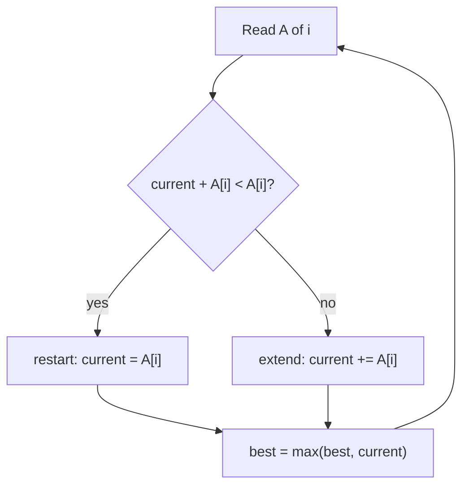

*Kadane's single decision, made once per element.*

> **Interactive animation:** `kadane` — rendered by the page script in the HTML version.

**Interview question**

*Return the maximum subarray sum and the subarray itself. Negative numbers are allowed. `[1, 2, 3, -9, 5]` → sum `6`, subarray `[1, 2, 3]`.*

Keep a running sum and remember where it started (`temp_start`). Whenever the running sum beats the best, record the range `[temp_start, i]`. Whenever it goes negative, reset it to zero and move `temp_start` to `i + 1`. Initialising `best` to `A[0]` (not zero) keeps an all-negative array correct.

**Answer — Kadane with the subarray boundaries**

```python
def find_maximum_subarray_sum(arr):
    max_sum = arr[0]
    curr_sum = 0
    start = end = temp_start = 0

    for i in range(len(arr)):
        curr_sum += arr[i]
        if curr_sum > max_sum:
            max_sum = curr_sum
            start, end = temp_start, i
        if curr_sum < 0:             # dead weight: restart after i
            curr_sum = 0
            temp_start = i + 1

    return {"max_sum": max_sum, "subarray": arr[start:end + 1]}


print(find_maximum_subarray_sum([1, 2, 3, -9, 5]))           # {'max_sum': 6, 'subarray': [1, 2, 3]}
print(find_maximum_subarray_sum([-3, 2, 4, -1, 3, -4, 3]))   # {'max_sum': 8, 'subarray': [2, 4, -1, 3]}
```

```javascript
function findMaximumSubarraySum(arr) {
  let maxSum = arr[0];
  let currSum = 0;
  let start = 0, end = 0, tempStart = 0;

  for (let i = 0; i < arr.length; i++) {
    currSum += arr[i];
    if (currSum > maxSum) {
      maxSum = currSum;
      start = tempStart;
      end = i;
    }
    if (currSum < 0) {        // dead weight: restart after i
      currSum = 0;
      tempStart = i + 1;
    }
  }
  return { maxSum, subarray: arr.slice(start, end + 1) };
}

console.log(findMaximumSubarraySum([1, 2, 3, -9, 5]));         // { maxSum: 6, subarray: [1, 2, 3] }
console.log(findMaximumSubarraySum([-3, 2, 4, -1, 3, -4, 3])); // { maxSum: 8, subarray: [2, 4, -1, 3] }
```

The notes' checklist for spotting a Kadane problem in disguise:

1. Is it a **contiguous** subarray — not a subsequence, not a fixed-size window?
2. Can you make a **local extend-or-restart** decision at each element?
3. Does it need a **transformation** first? Map each value to a gain or a loss, then run Kadane on the gains.
4. Is "extend" based on **structure** (still increasing?) rather than sum? Restart on the condition instead.
5. Does the operation **flip signs**, like multiplication? Track both the running max and the running min.

**Interview question**

*Given a binary string, flip one contiguous substring (0↔1) to maximise the number of 1s. Return the 1-based `[L, R]`, or `[]` if no flip helps. `"010"` → `[1, 1]`.*

Flipping a `0` gains one `1`; flipping a `1` loses one. Map `'0' → +1` and `'1' → -1`, and the best flip is exactly the **maximum-sum subarray** of the mapped values. Starting `max_sum` at `0` means "no flip" wins unless some range strictly helps, and using a strict `>` keeps the lexicographically smallest range.

**Answer — flip, as Kadane on a transformed array**

```python
def flip(A):
    max_sum = current_sum = 0
    start = end = temp_start = 0
    no_change = True

    for i in range(len(A)):
        current_sum += 1 if A[i] == '0' else -1
        if current_sum > max_sum:
            max_sum = current_sum
            start, end = temp_start, i
            no_change = False
        if current_sum < 0:
            current_sum = 0
            temp_start = i + 1

    return [] if no_change else [start + 1, end + 1]


print(flip("010"))  # [1, 1]
print(flip("111"))  # []
print(flip("000"))  # [1, 3]
```

```javascript
function flip(A) {
  let maxSum = 0, currentSum = 0;
  let start = 0, end = 0, tempStart = 0;
  let noChange = true;

  for (let i = 0; i < A.length; i++) {
    currentSum += A[i] === '0' ? 1 : -1;
    if (currentSum > maxSum) {
      maxSum = currentSum;
      start = tempStart;
      end = i;
      noChange = false;
    }
    if (currentSum < 0) {
      currentSum = 0;
      tempStart = i + 1;
    }
  }
  return noChange ? [] : [start + 1, end + 1];
}

console.log(flip("010")); // [1, 1]
console.log(flip("111")); // []
console.log(flip("000")); // [1, 3]
```

<a id="merge-intervals"></a>

#### Merging overlapping intervals

Sort by start time and the problem becomes a single sweep: keep one "open" interval. If the next interval starts **at or before** the open interval's end, they overlap — stretch the end to the larger of the two. Otherwise the open interval is finished; emit it and open the next one. Sorting is the expensive part, `O(N log N)`; the sweep is `O(N)`.

> **Interactive animation:** `merge-intervals` — rendered by the page script in the HTML version.

**Answer — merge overlapping intervals**

```python
def merge_intervals(intervals):
    if not intervals:
        return []
    intervals.sort(key=lambda x: x[0])
    merged = [intervals[0]]
    for curr_start, curr_end in intervals[1:]:
        last_start, last_end = merged[-1]
        if curr_start <= last_end:                       # overlap: stretch
            merged[-1] = [last_start, max(last_end, curr_end)]
        else:                                            # gap: close and open
            merged.append([curr_start, curr_end])
    return merged


print(merge_intervals([[1, 3], [2, 6], [8, 10], [15, 18]]))  # [[1, 6], [8, 10], [15, 18]]
```

```javascript
function mergeIntervals(intervals) {
  if (intervals.length <= 1) return intervals;
  intervals.sort((a, b) => a[0] - b[0]);

  const result = [];
  let [start, end] = intervals[0];
  for (let i = 1; i < intervals.length; i++) {
    const [s, e] = intervals[i];
    if (s <= end) {
      end = Math.max(end, e);   // overlap: stretch
    } else {
      result.push([start, end]); // gap: close and open
      [start, end] = [s, e];
    }
  }
  result.push([start, end]);
  return result;
}

console.log(mergeIntervals([[1, 3], [2, 6], [8, 10], [15, 18]])); // [[1, 6], [8, 10], [15, 18]]
```

> **Tip**
>
> Use `max(last_end, curr_end)`, not `curr_end`. An interval like `[1, 10]` followed by `[2, 3]` overlaps but ends *earlier* — overwriting the end would shrink the merged interval.

<a id="boyer-moore"></a>

#### Boyer–Moore voting — find the majority in O(1) space

A **majority element** appears more than `n / 2` times. Pass 1 keeps a candidate and a counter: a matching element votes `+1`, a different element cancels one vote, and when the counter hits zero the next element becomes the new candidate. Pass 2 counts the candidate to confirm it really is a majority.

> **Analogy** 🗳️
>
> **Picture it — a room where rival voters pair off and leave**
>
> Every time two people who back different candidates meet, they both walk out. If one candidate has more than half the room, their supporters cannot all be paired off — someone is still standing at the end.

> **Interactive animation:** `boyer-moore` — rendered by the page script in the HTML version.

**Answer — majority element (Boyer–Moore)**

```python
def find_majority_element(arr):
    candidate, count = None, 0
    for num in arr:                 # pass 1: pair off different values
        if count == 0:
            candidate, count = num, 1
        elif num == candidate:
            count += 1
        else:
            count -= 1

    freq = sum(1 for num in arr if num == candidate)   # pass 2: verify
    return candidate if freq > len(arr) // 2 else -1


print(find_majority_element([2, 2, 1, 1, 1, 2, 2]))  # 2
print(find_majority_element([1, 2, 3, 4]))           # -1
```

```javascript
function findMajorityElement(arr) {
  let candidate = null;
  let count = 0;
  for (const element of arr) {      // pass 1: pair off different values
    if (count === 0) {
      candidate = element;
      count = 1;
    } else if (element === candidate) count++;
    else count--;
  }

  const occurrences = arr.filter((x) => x === candidate).length; // pass 2: verify
  return occurrences > arr.length / 2 ? candidate : null;
}

console.log(findMajorityElement([2, 2, 1, 1, 1, 2, 2])); // 2
console.log(findMajorityElement([1, 2, 3, 4]));          // null
```

> **Warning**
>
> Pass 1 always leaves *some* candidate, even when no majority exists (`[1, 2, 3, 4]` leaves `4`). Skipping the verification pass is the classic bug.

**From the notes — one-pass greedy problems**

| Problem | Technique | Complexity |
| --- | --- | --- |
| Maximum subarray sum (brute → prefix → carry → Kadane) | extend or restart | `O(N^3)` → `O(N)` |
| Max subarray sum and the subarray itself | Kadane + `temp_start` | `O(N)` |
| Flip — maximise 1s in a binary string | Kadane on `0 → +1`, `1 → -1` | `O(N)` |
| Merge overlapping intervals | sort by start, sweep | `O(N log N)` |
| Majority element | Boyer–Moore voting | `O(N)`, `O(1)` space |

<a id="4-two-pointers"></a>

### Two Pointers

- **Pair sum in sorted array** `O(N)`
- **Rain water** `O(N)`
- **Extra space** `O(1)`

Two indices walk the array and **every comparison rules out a whole group of candidates**. On a sorted array with `L` at the start and `R` at the end: if `A[L] + A[R]` is too big, then `A[R]` is too big with *every* remaining left partner, so `R` can retire. That single observation turns `n²/2` pair checks into at most `n` pointer moves.

> **Analogy** 🌉
>
> **Picture it — two people tuning a see-saw**
>
> One child sits at each end. Too heavy on the right? The right child shuffles inward. Too heavy on the left? The left child shuffles inward. They never need to try every pair of seats — each shuffle is forced by which side is heavier.

> **Interactive animation:** `two-pointers` — rendered by the page script in the HTML version.

The notes solve "does a pair with sum `K` exist in a sorted array?" four ways. The same ladder shows up in interviews, so be ready to walk it out loud:

| Approach | Time | Space | Why it works |
| --- | --- | --- | --- |
| Brute force | `O(n^2)` | `O(1)` | try every pair |
| Binary search | `O(n log n)` | `O(1)` | for each `A[i]`, search for `K - A[i]` |
| Hash set | `O(n)` | `O(n)` | have I already seen `K - A[i]`? |
| Two pointers | `O(n)` | `O(1)` | sorted order lets each step discard a row of pairs |

- **Strength — opposite ends** — Pair sum, pair count, container problems, palindrome checks: pointers start at both ends and meet in the middle.
- **Strength — same direction** — Pair difference, dedupe, sliding windows: both pointers move right, the gap between them is the state.

**Interview question**

*Count the pairs `i < j` with `A[i] + A[j] = K` in a **sorted array with duplicates**. `[1, 2, 3, 3, 4, 5]`, `K = 6` → `3` (`1+5`, `2+4`, `3+3`).*

When the sum matches and the two values differ, count how many copies of each sit at the pointers and add their **product** — every left copy pairs with every right copy. When the sum matches and the values are equal, everything between the pointers is that same value, so the answer for that block is `c(c-1)/2` and you can stop.

**Answer — count pairs with sum K (duplicates allowed)**

```python
def count_pairs_with_sum_k_duplicates(arr, k):
    left, right = 0, len(arr) - 1
    count = 0
    while left < right:
        curr_sum = arr[left] + arr[right]
        if curr_sum < k:
            left += 1
        elif curr_sum > k:
            right -= 1
        elif arr[left] == arr[right]:          # a block of one value
            n = right - left + 1
            count += n * (n - 1) // 2
            break
        else:
            c_left = 1
            while left + 1 < right and arr[left] == arr[left + 1]:
                c_left += 1
                left += 1
            c_right = 1
            while right - 1 > left and arr[right] == arr[right - 1]:
                c_right += 1
                right -= 1
            count += c_left * c_right          # every left copy × every right copy
            left += 1
            right -= 1
    return count


print(count_pairs_with_sum_k_duplicates([1, 2, 3, 3, 4, 5], 6))     # 3
print(count_pairs_with_sum_k_duplicates([1, 5, 5, 5, 5, 5, 8], 10))  # 10
```

```javascript
function countPairsWithSumDuplicates(arr, k) {
  let left = 0;
  let right = arr.length - 1;
  let count = 0;

  while (left < right) {
    const sum = arr[left] + arr[right];
    if (sum < k) left++;
    else if (sum > k) right--;
    else if (arr[left] === arr[right]) {   // a block of one value
      const n = right - left + 1;
      count += (n * (n - 1)) / 2;
      break;
    } else {
      let leftCount = 1;
      let rightCount = 1;
      while (left < right && arr[left] === arr[left + 1]) { leftCount++; left++; }
      while (left < right && arr[right] === arr[right - 1]) { rightCount++; right--; }
      count += leftCount * rightCount;     // every left copy × every right copy
      left++;
      right--;
    }
  }
  return count;
}

console.log(countPairsWithSumDuplicates([1, 2, 3, 3, 4, 5], 6));     // 3
console.log(countPairsWithSumDuplicates([1, 5, 5, 5, 5, 5, 8], 10)); // 10
```

**Interview question**

*Does a pair with difference exactly `K` exist in a sorted array? `[-3, 0, 1, 3, 6, 8, 11, 14, 21, 25]`, `K = 5` → `true` (`1` and `6`).*

Opposite ends do not work for differences — moving either pointer inward shrinks the gap. Put both pointers on the **left** instead, `L = 0`, `R = 1`. If the gap is too small, move `R` right to widen it; if too big, move `L` right to narrow it; keep `R` strictly ahead of `L`.

**Answer — pair with difference K (same-direction pointers)**

```python
def check_pair_diff_k(arr, k):
    left, right = 0, 1
    while right < len(arr):
        diff = arr[right] - arr[left]
        if diff == k and left != right:
            return True
        if diff < k:
            right += 1          # widen the gap
        else:
            left += 1           # narrow the gap
            if left == right:
                right += 1
    return False


print(check_pair_diff_k([-3, 0, 1, 3, 6, 8, 11, 14, 21, 25], 5))  # True
print(check_pair_diff_k([1, 2, 3, 4, 5], 6))                      # False
```

```javascript
function hasPairWithDifference(arr, k) {
  let left = 0;
  let right = 1;
  while (right < arr.length) {
    const diff = arr[right] - arr[left];
    if (diff === k && left !== right) return true;
    if (diff < k) right++;       // widen the gap
    else left++;                 // narrow the gap
    if (left === right) right++;
  }
  return false;
}

console.log(hasPairWithDifference([-3, 0, 1, 3, 6, 8, 11, 14, 21, 25], 5)); // true
console.log(hasPairWithDifference([1, 2, 3, 4, 5], 6));                     // false
```

<a id="trapping-rain-water"></a>

#### Trapping rain water

Water above bar `i` is `min(leftMax, rightMax) - height[i]`. Precomputing both max arrays costs `O(n)` space. Two pointers remove it: whichever side has the **shorter** bar is the one you can settle, because the other side is guaranteed to have a wall at least that tall. So only the running max on the short side matters.

```text
Height
  4 |                 ###
  3 | ### ~~~ ~~~ ~~~ ###
  2 | ### ~~~ ### ~~~ ### ~~~ ###
  1 | ### ~~~ ### ~~~ ### ~~~ ###
    +-----------------------------
      0   1   2   3   4   5   6      heights = [3, 0, 2, 0, 4, 0, 2]
water: 0   3   1   3   0   2   0      total = 9
```

> **Interactive animation:** `rain-water` — rendered by the page script in the HTML version.

**Answer — trapping rain water with two pointers**

```python
def trap(heights):
    left, right = 0, len(heights) - 1
    left_max = right_max = 0
    water = 0
    while left < right:
        if heights[left] <= heights[right]:      # left side is the short wall
            if heights[left] >= left_max:
                left_max = heights[left]
            else:
                water += left_max - heights[left]
            left += 1
        else:                                    # right side is the short wall
            if heights[right] >= right_max:
                right_max = heights[right]
            else:
                water += right_max - heights[right]
            right -= 1
    return water


print(trap([3, 0, 2, 0, 4, 0, 2]))  # 9
print(trap([5, 4, 1, 4, 3, 2, 7]))  # 11
```

```javascript
function trap(heights) {
  let left = 0, right = heights.length - 1;
  let leftMax = 0, rightMax = 0;
  let water = 0;
  while (left < right) {
    if (heights[left] <= heights[right]) {   // left side is the short wall
      if (heights[left] >= leftMax) leftMax = heights[left];
      else water += leftMax - heights[left];
      left++;
    } else {                                 // right side is the short wall
      if (heights[right] >= rightMax) rightMax = heights[right];
      else water += rightMax - heights[right];
      right--;
    }
  }
  return water;
}

console.log(trap([3, 0, 2, 0, 4, 0, 2])); // 9
console.log(trap([5, 4, 1, 4, 3, 2, 7])); // 11
```

<a id="expand-around-center"></a>

#### Pointers moving outward — longest palindromic substring

Two pointers can also start together and walk **apart**. Every palindrome has a centre: a single character (odd length) or the gap between two characters (even length). Expand from all `2n - 1` centres while the ends match. Each expansion is `O(n)`, so the whole thing is `O(n²)` time and `O(1)` space.

**Answer — longest palindromic substring (expand around centre)**

```python
def longest_palindrome_substring(s):
    def expand(left, right):
        while left >= 0 and right < len(s) and s[left] == s[right]:
            left -= 1
            right += 1
        return right - left - 1             # length of the last matching window

    best = 0
    for i in range(len(s)):
        best = max(best, expand(i, i), expand(i, i + 1))   # odd and even centres
    return best


print(longest_palindrome_substring("abccbad"))  # 6  ("abccba")
print(longest_palindrome_substring("babad"))    # 3
```

```javascript
function longestPalindromeSubstring(str) {
  const expand = (start, end) => {
    let localMax = 0;
    while (start >= 0 && end < str.length && str[start] === str[end]) {
      localMax = end - start + 1;
      start--;
      end++;
    }
    return localMax;
  };

  let maxLen = 0;
  for (let i = 0; i < str.length; i++) {
    maxLen = Math.max(maxLen, expand(i, i), expand(i, i + 1)); // odd and even centres
  }
  return maxLen;
}

console.log(longestPalindromeSubstring("abccbad")); // 6
console.log(longestPalindromeSubstring("babad"));   // 3
```

**From the notes — two-pointer problems**

| Problem | Pointer movement | Complexity |
| --- | --- | --- |
| Pair with sum K exists (sorted, distinct) | opposite ends | `O(N)` |
| Count pairs with sum K — distinct / duplicates | opposite ends + block counting | `O(N)` |
| Pair with difference K exists | same direction | `O(N)` |
| Count pairs with difference K — distinct / duplicates | same direction + block counting | `O(N)` |
| Trapping rain water | opposite ends, settle the shorter wall | `O(N)`, `O(1)` space |
| Palindrome check, reverse vowels | opposite ends | `O(N)` |
| Longest palindromic substring | outward from each centre | `O(N^2)` |

<a id="5-matrix-walks"></a>

### Matrix Walks

- **Staircase search** `O(N + M)`
- **Spiral print** `O(N·M)`
- **Rotate 90° in place** `O(N^2)`

A matrix is just an array with two indices, so most "matrix" problems are really about **choosing a walk**: which corner to start from, which direction to move, and when to turn. Pick the right starting cell and a sorted matrix becomes a search tree; pick the right boundaries and a spiral becomes four simple loops.

<a id="staircase-search"></a>

#### Staircase search

In a matrix sorted along every row **and** every column, stand in the **top-right** corner. Everything to your left is smaller, everything below is larger — exactly like the root of a binary search tree. If the value is too big, the whole column below it is too big: step left. If it is too small, the whole row to its left is too small: step down. Each step deletes a row or a column, so at most `N + M` steps.

> **Analogy** 🪜
>
> **Picture it — walking down a staircase in the dark**
>
> From the top-right step you can only go *left* (lower) or *down* (higher). Each step tells you which way is warmer, and you never need to climb back up.

> **Interactive animation:** `staircase` — rendered by the page script in the HTML version.

**Answer — search a row- and column-sorted matrix**

```python
def find_element(matrix, target):
    if not matrix or not matrix[0]:
        return False
    r, c = 0, len(matrix[0]) - 1          # top-right corner
    while r < len(matrix) and c >= 0:
        val = matrix[r][c]
        if val == target:
            return True
        if val > target:
            c -= 1                        # the column below is even bigger
        else:
            r += 1                        # the row to the left is even smaller
    return False


mat = [[1, 4, 7, 11, 15], [2, 5, 8, 12, 19], [3, 6, 9, 16, 22],
       [10, 13, 14, 17, 24], [18, 21, 23, 26, 30]]
print(find_element(mat, 5))   # True
print(find_element(mat, 20))  # False
```

```javascript
function findElement(matrix, target) {
  if (!matrix.length || !matrix[0].length) return false;
  let i = 0;
  let j = matrix[0].length - 1;           // top-right corner
  while (i < matrix.length && j >= 0) {
    const current = matrix[i][j];
    if (current === target) return true;
    if (current < target) i++;            // the row to the left is even smaller
    else j--;                             // the column below is even bigger
  }
  return false;
}

const mat = [[1, 4, 7, 11, 15], [2, 5, 8, 12, 19], [3, 6, 9, 16, 22],
  [10, 13, 14, 17, 24], [18, 21, 23, 26, 30]];
console.log(findElement(mat, 5));  // true
console.log(findElement(mat, 20)); // false
```

The same walk solves **row with the maximum number of 1s** in a matrix of sorted 0/1 rows: start top-right, step left while you see a `1` (that row now holds the record), step down on a `0`.

<a id="spiral"></a>

#### Spiral traversal (the lawn-mowing problem)

Mow a square lawn from the outside in. Each ring is four straight passes of `length` steps — right, down, left, up — and each ring shrinks `length` by 2. If the side is odd, a single centre cell is left when `length` reaches 0.

```text
 1 →  2 →  3    4          ring 1: length 3  →  1 2 3 | 4 8 12 | 16 15 14 | 13 9 5
                ↓          ring 2: length 1  →  6 | 7 | 11 | 10
 5    6 →  7    8
 ↑         ↓    ↓          output: 1 2 3 4 8 12 16 15 14 13 9 5 6 7 11 10
 9   10 ← 11   12
 ↑              ↓
13 ← 14 ← 15 ← 16
```

> **Interactive animation:** `spiral` — rendered by the page script in the HTML version.

**Answer — spiral order of a square matrix**

```python
def print_spiral(matrix):
    row = col = 0
    length = len(matrix) - 1
    result = []
    while length >= 1:
        for _ in range(length):           # right
            result.append(matrix[row][col]); col += 1
        for _ in range(length):           # down
            result.append(matrix[row][col]); row += 1
        for _ in range(length):           # left
            result.append(matrix[row][col]); col -= 1
        for _ in range(length):           # up
            result.append(matrix[row][col]); row -= 1
        row += 1                          # step into the next ring
        col += 1
        length -= 2
    if length == 0:                       # odd side: the centre cell
        result.append(matrix[row][col])
    return result


print(print_spiral([[1, 2, 3, 4], [5, 6, 7, 8], [9, 10, 11, 12], [13, 14, 15, 16]]))
# [1, 2, 3, 4, 8, 12, 16, 15, 14, 13, 9, 5, 6, 7, 11, 10]
```

```javascript
function printSpiral(matrix) {
  let row = 0, col = 0;
  let steps = matrix.length - 1;
  const out = [];
  while (steps > 0) {
    for (let s = 0; s < steps; s++) out.push(matrix[row][col++]); // right
    for (let s = 0; s < steps; s++) out.push(matrix[row++][col]); // down
    for (let s = 0; s < steps; s++) out.push(matrix[row][col--]); // left
    for (let s = 0; s < steps; s++) out.push(matrix[row--][col]); // up
    row++;                                                         // next ring
    col++;
    steps -= 2;
  }
  if (steps === 0) out.push(matrix[row][col]);                     // centre cell
  return out;
}

console.log(printSpiral([[1, 2, 3, 4], [5, 6, 7, 8], [9, 10, 11, 12], [13, 14, 15, 16]]).join(" "));
// 1 2 3 4 8 12 16 15 14 13 9 5 6 7 11 10
```

<a id="rotate-matrix"></a>

#### Rotating 90° clockwise in place

A clockwise rotation is two cheap moves: **transpose** (swap `A[i][j]` with `A[j][i]` above the diagonal) turns columns into rows, then **reverse each row** fixes the direction. Both are in-place swaps, so the extra space is `O(1)`.

```text
1 2 3      transpose      1 4 7      reverse rows      7 4 1
4 5 6     ───────────▶    2 5 8     ─────────────▶     8 5 2
7 8 9                     3 6 9                        9 6 3
```

**Answer — rotate a square matrix 90° clockwise**

```python
def rotate_matrix(matrix):
    n = len(matrix)
    for i in range(n):                  # transpose: only above the diagonal
        for j in range(i + 1, n):
            matrix[i][j], matrix[j][i] = matrix[j][i], matrix[i][j]
    for row in matrix:                  # reverse each row
        row.reverse()
    return matrix


print(rotate_matrix([[1, 2, 3], [4, 5, 6], [7, 8, 9]]))  # [[7, 4, 1], [8, 5, 2], [9, 6, 3]]
```

```javascript
function rotateMatrix(arr) {
  const n = arr.length;
  for (let row = 0; row < n; row++) {          // transpose: only above the diagonal
    for (let col = row + 1; col < n; col++) {
      [arr[row][col], arr[col][row]] = [arr[col][row], arr[row][col]];
    }
  }
  for (const row of arr) row.reverse();        // reverse each row
  return arr;
}

console.log(rotateMatrix([[1, 2, 3], [4, 5, 6], [7, 8, 9]])); // [[7, 4, 1], [8, 5, 2], [9, 6, 3]]
```

> **Warning**
>
> Transposing with `j` starting at `0` instead of `i + 1` swaps every pair **twice** and leaves the matrix unchanged. Only walk the triangle above the diagonal.

**From the notes — matrix problems**

| Problem | Walk | Complexity |
| --- | --- | --- |
| Search a row/column-sorted matrix | staircase from top-right | `O(N + M)` |
| Row with the maximum number of 1s | staircase from top-right | `O(N + M)` |
| Print boundary / whole matrix clockwise | four passes per ring | `O(N·M)` |
| Row-wise and column-wise sums, diagonals, anti-diagonals | plain nested loops | `O(N·M)` |
| Transpose; rotate 90° clockwise | swap above diagonal, then reverse rows | `O(N^2)`, `O(1)` space |

<a id="6-bits-primes-and-counting"></a>

### Bits, Primes & Counting

- **XOR cancels** `x ^ x = 0`
- **Check bit i** `O(1)`
- **Count set bits** `O(log N)`
- **Sieve to N** `O(N log log N)`

Integers are arrays of bits, and bitwise operators edit all 32 positions in one instruction. The single most useful fact is that **XOR cancels pairs**: `x ^ x = 0` and `x ^ 0 = x`, and the order of XORs does not matter. The second is that `1 << i` is a mask with only bit `i` set, so every single-bit edit is one operator away.

> **Analogy** 💡
>
> **Picture it — a row of light switches**
>
> A number is a row of 32 switches. OR with a mask forces chosen switches on, AND with a mask keeps only the chosen ones, XOR flips them. Flip the same switch twice and it is back where it started — that is why duplicates vanish under XOR.

| Operation | Expression | Example on `5 = 0101` |
| --- | --- | --- |
| check bit `i` | `(n >> i) & 1` or `n & (1 << i)` | bit 2 of 5 → `1` |
| set bit `i` | `n \| (1 << i)` | set bit 1 → `0111 = 7` |
| unset bit `i` | `n & ~(1 << i)` | unset bit 0 → `0100 = 4` |
| toggle bit `i` | `n ^ (1 << i)` | toggle bit 3 → `1101 = 13` |
| multiply / divide by `2^k` | `n << k`, `n >> k` | `5 << 1 = 10`, `5 >> 1 = 2` |
| even or odd | `n & 1` | `5 & 1 = 1` → odd |

> **Interactive animation:** `bits` — rendered by the page script in the HTML version.

<a id="single-number"></a>

#### The Single Number family

1. **Every element twice, one once** — XOR everything; pairs cancel and the loner survives. `O(N)`, `O(1)`.
2. **Every element three times, one once** — XOR cannot cancel triples. Count, for each of the 32 bit positions, how many numbers have that bit set. Triples contribute a multiple of 3, so `count % 3 != 0` means the loner has that bit.
3. **Every element twice, two once** — XOR everything to get `a ^ b`. Any set bit in it is a position where `a` and `b` differ. Split all numbers by that bit: `a` and `b` land in different groups, every duplicate pair lands together and cancels. XOR each group.

**Interview question**

*Every number appears twice except two. Find both. `[1, 2, 3, 1, 2, 4]` → `[3, 4]`.*

`1^2^3^1^2^4 = 3^4 = 0111`. Its lowest set bit is bit 0, where `3 = 011` has a 1 and `4 = 100` has a 0. Group by bit 0: `{1, 3, 1}` XORs to `3` and `{2, 2, 4}` XORs to `4`.

**Answer — Single Number III**

```python
def single_number_3(arr):
    xor_all = 0
    for num in arr:
        xor_all ^= num                    # = a ^ b

    pos = 0
    while (xor_all & (1 << pos)) == 0:    # first bit where a and b differ
        pos += 1

    group1 = group2 = 0
    for num in arr:
        if num & (1 << pos):
            group1 ^= num
        else:
            group2 ^= num
    return sorted([group1, group2])


print(single_number_3([1, 2, 3, 1, 2, 4]))  # [3, 4]
```

```javascript
function singleNumber3(A) {
  let value = 0;
  for (const num of A) value ^= num;          // = a ^ b

  let setBit = 0;
  while ((value & (1 << setBit)) === 0) setBit++; // first bit where a and b differ

  const result = [0, 0];
  for (const num of A) {
    if (num & (1 << setBit)) result[0] ^= num;
    else result[1] ^= num;
  }
  return result.sort((a, b) => a - b);
}

console.log(singleNumber3([1, 2, 3, 1, 2, 4])); // [3, 4]
```

**Answer — Single Number II (count bits mod 3)**

```python
def single_number_2(arr):
    ans = 0
    for i in range(32):
        count = sum(1 for num in arr if num & (1 << i))
        if count % 3 != 0:
            ans |= 1 << i
    return ans


print(single_number_2([1, 2, 4, 3, 3, 2, 2, 3, 1, 1]))  # 4
```

```javascript
function singleNumber2(nums, k = 3) {
  let result = 0;
  for (let i = 0; i < 32; i++) {
    let count = 0;
    for (const num of nums) if (num & (1 << i)) count++;
    if (count % k !== 0) result |= 1 << i;
  }
  return result;
}

console.log(singleNumber2([1, 2, 4, 3, 3, 2, 2, 3, 1, 1])); // 4
```

<a id="complement-counting"></a>

#### Counting the complement

"Count subarrays whose OR is 1" in a 0/1 array looks like it needs every subarray. But an OR is 0 **only** when every element is 0. So count the easy thing — all-zero subarrays, `k(k+1)/2` per run of `k` zeros — and subtract from the total `n(n+1)/2`.

**Answer — subarrays with OR 1**

```python
def subarrays_with_or_1(arr):
    n = len(arr)
    total = n * (n + 1) // 2
    zero_subarrays = run = 0
    for num in arr:
        if num == 0:
            run += 1
        else:
            zero_subarrays += run * (run + 1) // 2
            run = 0
    zero_subarrays += run * (run + 1) // 2
    return total - zero_subarrays


print(subarrays_with_or_1([0, 0, 1, 1, 0]))  # 11
```

```javascript
function subarraysWithOR1(A) {
  const n = A.length;
  const total = (n * (n + 1)) / 2;
  let zeroSubarrays = 0;
  let run = 0;
  for (const x of A) {
    if (x === 0) run++;
    else {
      zeroSubarrays += (run * (run + 1)) / 2;
      run = 0;
    }
  }
  zeroSubarrays += (run * (run + 1)) / 2;
  return total - zeroSubarrays;
}

console.log(subarraysWithOR1([0, 0, 1, 1, 0])); // 11
```

<a id="sieve"></a>

#### Primes and the Sieve of Eratosthenes

Checking one number for primality needs divisors only up to `√n`: factors come in pairs `(i, n/i)` and one of each pair is `≤ √n`. For **all** primes up to `N`, sieve instead: every time you meet an unmarked number `p`, it is prime, so cross out its multiples. Start crossing at `p × p` — every smaller multiple `p × k` with `k < p` was already crossed out by `k`'s own prime factor.

> **Interactive animation:** `sieve` — rendered by the page script in the HTML version.

**Answer — Sieve of Eratosthenes**

```python
def sieve_of_eratosthenes(n):
    is_prime = [True] * (n + 1)
    is_prime[0] = is_prime[1] = False
    p = 2
    while p * p <= n:
        if is_prime[p]:
            for i in range(p * p, n + 1, p):   # smaller multiples already crossed out
                is_prime[i] = False
        p += 1
    return [i for i in range(2, n + 1) if is_prime[i]]


print(sieve_of_eratosthenes(30))  # [2, 3, 5, 7, 11, 13, 17, 19, 23, 29]
```

```javascript
function sieveOfEratosthenes(n) {
  const prime = new Array(n + 1).fill(true);
  prime[0] = prime[1] = false;
  for (let i = 2; i * i <= n; i++) {
    if (!prime[i]) continue;
    for (let j = i * i; j <= n; j += i) prime[j] = false; // smaller multiples already crossed out
  }
  const result = [];
  for (let i = 2; i <= n; i++) if (prime[i]) result.push(i);
  return result;
}

console.log(sieveOfEratosthenes(30)); // [2, 3, 5, 7, 11, 13, 17, 19, 23, 29]
```

<a id="combinatorics"></a>

#### Combinatorics in five rules

1. **Addition rule (OR)** — choose one of several alternatives: add the counts.
2. **Multiplication rule (AND)** — make choices in sequence: multiply the counts. A restaurant with 3 starters, 2 mains and 2 desserts offers `3 × 2 × 2 = 12` meal combos.
3. **Permutations** — order matters: `nPr = n! / (n - r)!`.
4. **Combinations** — order does not matter: `nCr = nPr / r! = n! / (r! (n - r)!)`.
5. **Pascal's identity** — `nCr = (n-1)Cr + (n-1)C(r-1)`: either the `n`-th item is left out, or it is in and you pick `r - 1` from the rest. Along with `nC0 = nCn = 1`, `nC1 = n` and `nCr = nC(n-r)`.

Pascal's identity is the safe way to compute `nCr % M` for large `n`: the factorial formula needs division, which does not survive `% M`, but the identity only adds.

**Answer — Pascal's triangle (nCr % M)**

```python
def pascal_triangle(n, M=1_000_000_007):
    pascal = [[0] * n for _ in range(n)]
    for i in range(n):
        pascal[i][0] = pascal[i][i] = 1
        for j in range(1, i):
            pascal[i][j] = (pascal[i - 1][j] + pascal[i - 1][j - 1]) % M
    return pascal


for row in pascal_triangle(5):
    print(row)
# [1, 0, 0, 0, 0] ... [1, 4, 6, 4, 1]
```

```javascript
function printPascalTriangle(n, M = 1_000_000_007) {
  const pascal = [...Array(n)].map(() => Array(n).fill(0));
  for (let i = 0; i < n; i++) {
    pascal[i][0] = 1;
    for (let j = 1; j < i; j++) {
      pascal[i][j] = (pascal[i - 1][j] + pascal[i - 1][j - 1]) % M;
    }
    pascal[i][i] = 1;
  }
  return pascal;
}

console.log(printPascalTriangle(5)); // [[1,0,0,0,0], [1,1,0,0,0], [1,2,1,0,0], [1,3,3,1,0], [1,4,6,4,1]]
```

**From the notes — bits, primes and counting problems**

| Problem | Idea | Complexity |
| --- | --- | --- |
| Binary ↔ decimal conversion | repeated `% base`, place values | `O(log N)` |
| Even/odd, set bit, count set bits | masks with `1 << i` | `O(1)` / `O(log N)` |
| Single Number I, II, III | XOR cancel; bit counts mod 3; split by differing bit | `O(N)`, `O(1)` space |
| Subarrays with OR 0 / OR 1 | count zero runs, complement | `O(N)` |
| Count factors, prime check | test divisors up to `√n` | `O(√N)` |
| All primes to N | Sieve of Eratosthenes | `O(N log log N)` |
| Most varied meal combo | multiplication rule | `O(N)` |
| Pascal's triangle, `nCr % M` | Pascal's identity | `O(N^2)` |

---

<a id="unit-2"></a>

## Unit 2 — Recursion, Hashing, Sorting & Searching

The four general-purpose tools: recursion to break problems down, hashing to remember what you have seen, sorting to create order you can exploit, and binary search to exploit it.

<a id="7-recursion-and-backtracking"></a>

### Recursion & Backtracking

- **Time** `calls × work per call`
- **Space** `deepest call chain`
- **Subsets** `O(2^N · N)`
- **Permutations** `O(N! · N)`

The notes give recursion three steps, and the order matters:

1. **Expectation** — fix exactly what the function returns for its inputs, and never change that meaning midway. `sum(n)` returns `1 + … + n`.
2. **Main logic** — solve the problem *assuming the smaller call already works*. This is the **recursive leap of faith**: do not trace the inner call in your head, just use its answer. `sum(n) = n + sum(n - 1)`.
3. **Base case** — the smallest input you answer directly, with no further call. `sum(0) = 0`.

> **Analogy** 🪆
>
> **Picture it — a manager who delegates**
>
> A manager asked to count 1,000 boxes counts one and asks an assistant, "how many are in the rest?" The manager never checks how the assistant counts — they trust the number, add one, and report up. The last assistant, handed zero boxes, just says "zero". That is the whole of recursion.

Before running it, check: every call moves **strictly closer** to the base case; the base cases cover **every** way to bottom out (`fib` needs both `0` and `1`); edge inputs (negative `n`, empty array, index past the end) are handled; and work done **before** the call runs top-down while work done **after** it runs bottom-up — which is why printing before vs. after the call gives `N..1` vs. `1..N`.

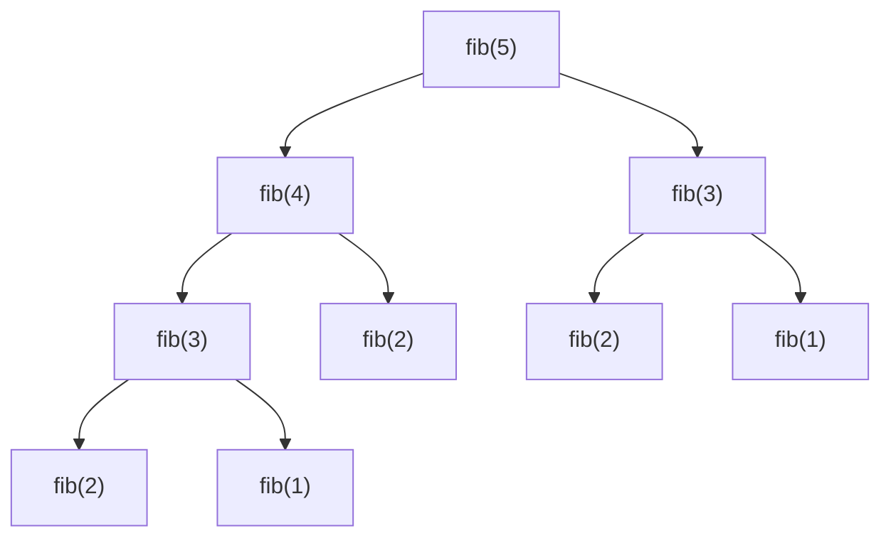

*The recursion tree for `fib(5)` (leaves trimmed). `fib(3)` is solved twice and `fib(2)` three times — count the nodes for time, `O(2ⁿ)`; measure the longest root-to-leaf path for space, `O(n)`.*

> **Interactive animation:** `recursion` — rendered by the page script in the HTML version.

**Interview question**

*Compute `base^exponent` in `O(log n)` time. `fast_power(2, 10)` → `1024`.*

`a^n = (a^(n/2))²` when `n` is even and `a · (a^(n/2))²` when it is odd. Each call halves `n`, so there are `log n` calls. The one trap: compute the half power **once** and store it. Writing `power(a, n/2) * power(a, n/2)` makes two calls per level and quietly brings back `O(n)`.

**Answer — fast power by halving**

```python
def fast_power(base, exponent):
    if exponent == 0:
        return 1
    half = fast_power(base, exponent // 2)   # computed once, reused
    if exponent % 2 == 0:
        return half * half
    return base * half * half


print(fast_power(2, 10))  # 1024
print(fast_power(3, 5))   # 243
```

```javascript
function fastPower(base, exponent) {
  if (exponent === 0) return 1;
  const half = fastPower(base, Math.floor(exponent / 2)); // computed once, reused
  return exponent % 2 === 0 ? half * half : half * half * base;
}

console.log(fastPower(2, 10)); // 1024
console.log(fastPower(3, 5));  // 243
```

<a id="backtracking"></a>

#### Backtracking — recursion that undoes its choices

Backtracking builds a solution one choice at a time, recurses, then **undoes** the choice before trying the next one. Compared with plain recursion, it only builds calls that can still lead to a valid answer. The notes name two styles:

- **Strength — proactive** — Check the rule *before* making a call, so invalid branches are never created. Fewer calls; the rule lives in the loop.
- **Weakness — reactive** — Make every call and reject invalid states at the top of the next call. Simpler to write, but explores more of the tree.

Three words that sound alike decide which template you need:

| Kind | Order matters? | Contiguous? | Example from `[1, 2, 3]` | Count |
| --- | --- | --- | --- | --- |
| Subset | no — `{1,2} = {2,1}` | no | `{1, 3}` | `2^n` |
| Subsequence | yes — keep original order | no | `[1, 3]` | `2^n` |
| Subarray | yes | yes | `[2, 3]` | `n(n+1)/2` |

From "banana", `"bna"` is a valid subset and subsequence but not a subarray; `"nab"` is only a subset. Think of three nested rings: subset (loosest) ⊃ subsequence ⊃ subarray (strictest).

> **Interactive animation:** `backtracking` — rendered by the page script in the HTML version.

**Interview question**

*Return every subset of a set of distinct numbers. `[1, 2, 3]` → 8 subsets.*

Each element offers one binary choice — **take it or leave it** — so the recursion tree has `2^n` leaves and each leaf is a subset. Push the element, recurse, **pop** it (that pop is the backtrack), recurse again without it.

**Answer — all subsets by include / exclude**

```python
def generate_subsets(nums):
    result = []

    def backtrack(index, current):
        if index == len(nums):
            result.append(list(current))    # copy — `current` keeps changing
            return
        current.append(nums[index])          # take nums[index]
        backtrack(index + 1, current)
        current.pop()                        # undo the choice
        backtrack(index + 1, current)        # leave nums[index]

    backtrack(0, [])
    return result


print(generate_subsets([1, 2, 3]))
# [[1, 2, 3], [1, 2], [1, 3], [1], [2, 3], [2], [3], []]
```

```javascript
function subsets(arr) {
  const result = [];
  function generateSubset(index, currentSubset) {
    if (index === arr.length) {
      result.push([...currentSubset]);      // copy — currentSubset keeps changing
      return;
    }
    currentSubset.push(arr[index]);          // take arr[index]
    generateSubset(index + 1, currentSubset);
    currentSubset.pop();                     // undo the choice
    generateSubset(index + 1, currentSubset); // leave arr[index]
  }
  generateSubset(0, []);
  return result;
}

console.log(subsets([1, 2, 3]));
// [[1,2,3], [1,2], [1,3], [1], [2,3], [2], [3], []]
```

**Interview question**

*Generate every valid string of `n` pairs of parentheses. `n = 3` → `((()))`, `(()())`, `(())()`, `()(())`, `()()()`.*

A prefix is still fixable as long as `open ≤ n` and `close ≤ open`. Branch on `'('` and `')'`, and cut any branch that breaks either rule. The count of results is the Catalan number, so the time is about `O(4ⁿ / √n)`; the stack depth is `2n`.

**Answer — valid parentheses (backtracking)**

```python
def generate_parentheses(n):
    result = []

    def backtrack(curr, open_count, close_count):
        if open_count > n or close_count > open_count:   # dead branch
            return
        if len(curr) == 2 * n:
            result.append(curr)
            return
        backtrack(curr + "(", open_count + 1, close_count)
        backtrack(curr + ")", open_count, close_count + 1)

    backtrack("", 0, 0)
    return result


print(generate_parentheses(3))  # ['((()))', '(()())', '(())()', '()(())', '()()()']
```

```javascript
function printValidParenthesis(A) {
  const result = [];
  function backtrack(curr, openCount, closeCount) {
    if (openCount > A || closeCount > openCount) return;  // dead branch
    if (curr.length === 2 * A) {
      result.push(curr);
      return;
    }
    backtrack(curr + "(", openCount + 1, closeCount);
    backtrack(curr + ")", openCount, closeCount + 1);
  }
  backtrack("", 0, 0);
  return result;
}

console.log(printValidParenthesis(3)); // ['((()))', '(()())', '(())()', '()(())', '()()()']
```

Permutations use the same shape with a different choice: at position `index`, **swap** each remaining element into place, recurse on `index + 1`, then swap it back. (The alternative keeps a `visited` array and builds a separate path.)

**Permutations by swapping**

```python
def permute_swapping(nums):
    result = []

    def backtrack(index):
        if index == len(nums):
            result.append(list(nums))
            return
        for i in range(index, len(nums)):
            nums[index], nums[i] = nums[i], nums[index]   # choose
            backtrack(index + 1)
            nums[index], nums[i] = nums[i], nums[index]   # undo

    backtrack(0)
    return result


print(permute_swapping([1, 2, 3]))  # [[1,2,3], [1,3,2], [2,1,3], [2,3,1], [3,2,1], [3,1,2]]
```

```javascript
function permutations(input) {
  const result = [];
  const chars = input.split("");
  function generate(index) {
    if (index === chars.length) {
      result.push(chars.join(""));
      return;
    }
    for (let i = index; i < chars.length; i++) {
      [chars[index], chars[i]] = [chars[i], chars[index]]; // choose
      generate(index + 1);
      [chars[index], chars[i]] = [chars[i], chars[index]]; // undo
    }
  }
  generate(0);
  return result;
}

console.log(permutations("ABC")); // ['ABC', 'ACB', 'BAC', 'BCA', 'CBA', 'CAB']
```

> **Warning**
>
> Appending `current` instead of a **copy** of it is the most common backtracking bug: every stored answer is the same list object, and after all the pops they are all empty.

**From the notes — recursion and backtracking problems**

| Problem | Pattern | Complexity |
| --- | --- | --- |
| Sum of 1..N, factorial, sum of digits | linear recursion | `O(N)` / `O(log N)` |
| Print 1..N, N..1, both in one function | work before vs. after the call | `O(N)` |
| Fibonacci — plain / memo / tabulation | tree recursion → DP | `O(2^N)` → `O(N)` |
| Power, fast power | halve the exponent | `O(N)` → `O(log N)` |
| Print valid parentheses (proactive, reactive, stack, DP) | backtracking with counts | `O(4^n/√n)` |
| Generate all subsets | take / leave | `O(2^N · N)` |
| Permutations (visited array, swapping) | choose / undo | `O(N! · N)` |

<a id="8-hashing"></a>

### Hashing

- **get / set / has (average)** `O(1)`
- **Worst case** `O(n)`
- **Load factor** `λ = n / buckets`

A **direct address table** stores value `v` at index `v` — instant, but a value of `10^9` needs a billion slots. Hashing keeps a small, fixed number of buckets and maps any key into range with a hash function, typically `key % size`. With 10 buckets, `21 → 1`, `42 → 2`, `37 → 7`… and `41 → 1` too — a **collision**. The notes resolve collisions with **chaining**: each bucket holds a linked list.

> **Analogy** 🧥
>
> **Picture it — a coat check with ten hooks**
>
> The attendant hangs your coat on hook `ticket % 10`. Two guests can share a hook — the coats just hang one behind the other. Finding your coat means going to one hook and flipping through a few coats, not searching the whole room. If every hook gets crowded, the attendant installs twice as many hooks and re-hangs everything.

```text
index | chain                       load factor λ = elements / buckets
------+---------------------           = 11 / 10 = 1.1
  0   | 30 → 20
  2   | 42 → 62                     threshold = 2.0
  5   | 45 → 75                     λ > threshold  →  REHASH:
  6   | 36                            double the buckets and re-insert
  7   | 37 → 67                       every key with the new % size
  9   | 99 → 59
```

> **Interactive animation:** `rehash` — rendered by the page script in the HTML version.

The average chain length **is** the load factor. Keep `λ` below a constant and each lookup scans a constant number of nodes, so `get` and `put` stay `O(1)` on average. Rehashing costs `O(n)`, but because the table doubles it happens exponentially rarely — the same amortised argument as a growing array.

**A hash map from scratch — array of chains with rehashing**

```python
class HashMap:
    def __init__(self, capacity=4, threshold=2.0):
        self.buckets = [[] for _ in range(capacity)]
        self.size = 0
        self.threshold = threshold

    def _index(self, key):
        return hash(key) % len(self.buckets)

    def put(self, key, value):
        chain = self.buckets[self._index(key)]
        for pair in chain:
            if pair[0] == key:
                pair[1] = value          # key exists: overwrite
                return
        chain.append([key, value])
        self.size += 1
        if self.size / len(self.buckets) > self.threshold:
            self._rehash()

    def get(self, key):
        for k, v in self.buckets[self._index(key)]:
            if k == key:
                return v
        return -1

    def _rehash(self):
        old = self.buckets
        self.buckets = [[] for _ in range(2 * len(old))]
        self.size = 0
        for chain in old:
            for k, v in chain:
                self.put(k, v)


m = HashMap()
for i, word in enumerate(["apple", "kiwi", "fig", "lime", "pear", "plum", "date", "sloe", "yuzu"]):
    m.put(word, i)
print(m.get("plum"), len(m.buckets))  # 5 8
```

```javascript
class HashMap {
  constructor(capacity = 4, threshold = 2.0) {
    this.bucket = Array.from({ length: capacity }, () => []);
    this.size = 0;
    this.threshold = threshold;
  }

  hashFn(key) {
    let hc = 0;
    for (let i = 0; i < key.length; i++) hc = ((hc << 5) - hc + key.charCodeAt(i)) | 0;
    return Math.abs(hc) % this.bucket.length;
  }

  put(key, value) {
    const chain = this.bucket[this.hashFn(key)];
    const pair = chain.find((p) => p.key === key);
    if (pair) {
      pair.value = value;            // key exists: overwrite
      return;
    }
    chain.push({ key, value });
    this.size++;
    if (this.size / this.bucket.length > this.threshold) this.rehash();
  }

  get(key) {
    const pair = this.bucket[this.hashFn(key)].find((p) => p.key === key);
    return pair ? pair.value : -1;
  }

  rehash() {
    const old = this.bucket;
    this.bucket = Array.from({ length: 2 * old.length }, () => []);
    this.size = 0;
    for (const chain of old) for (const p of chain) this.put(p.key, p.value);
  }
}

const m = new HashMap();
["apple", "kiwi", "fig", "lime", "pear", "plum", "date", "sloe", "yuzu"].forEach((w, i) => m.put(w, i));
console.log(m.get("plum"), m.bucket.length); // 5 8
```

<a id="prefix-sum-and-hash-map"></a>

#### The killer combo: prefix sums + a hash map

The sum of `A[i+1..j]` is `P[j] - P[i]`. So "a subarray ending at `j` sums to `K`" means "**some earlier prefix equals `P[j] - K`**". A hash map of prefix sums seen so far answers that in `O(1)`, which handles negative numbers where a sliding window cannot. Seed the map with prefix `0` so subarrays starting at index 0 are counted.

> **Interactive animation:** `prefix-hash` — rendered by the page script in the HTML version.

**Interview question**

*Count the subarrays whose sum is exactly `K`. Negatives allowed. `[2, 3, 9, -4, 1, 5, 6, 2, 5]`, `K = 11` → `3` (`[2,3,9,-4,1]`, `[9,-4,1,5]`, `[5,6]`).*

Walk once, keeping the running sum. At each index add `freq[sum - K]` — the number of earlier prefixes that would make the gap exactly `K` — then record the current sum. Storing **counts** rather than a set matters: with zeros or negatives, the same prefix sum can occur many times, and each occurrence starts a different subarray.

**Answer — count subarrays with sum K**

```python
def count_subarrays_with_sum_k(arr, k):
    freq = {0: 1}                 # the empty prefix
    curr_sum = 0
    count = 0
    for num in arr:
        curr_sum += num
        count += freq.get(curr_sum - k, 0)
        freq[curr_sum] = freq.get(curr_sum, 0) + 1
    return count


print(count_subarrays_with_sum_k([2, 3, 9, -4, 1, 5, 6, 2, 5], 11))  # 3
print(count_subarrays_with_sum_k([0, 0, 0], 0))                     # 6
```

```javascript
function countSubarraysWithSumK(arr, k) {
  const freq = new Map([[0, 1]]);   // the empty prefix
  let currentSum = 0;
  let count = 0;
  for (const num of arr) {
    currentSum += num;
    count += freq.get(currentSum - k) || 0;
    freq.set(currentSum, (freq.get(currentSum) || 0) + 1);
  }
  return count;
}

console.log(countSubarraysWithSumK([2, 3, 9, -4, 1, 5, 6, 2, 5], 11)); // 3
console.log(countSubarraysWithSumK([0, 0, 0], 0));                    // 6
```

**Interview question**

*Return the length of the longest subarray whose sum is 0. `[15, -2, 2, -8, 1, 7, 10, 23]` → `5` (`[-2, 2, -8, 1, 7]`).*

Two equal prefix sums mean everything between them cancels. For the **longest** gap, store only the **first** index at which each prefix sum appears, and never overwrite it. Seed `{0: -1}` so a zero-sum prefix counts from index 0.

**Answer — longest zero-sum subarray**

```python
def longest_subarray_zero_sum(arr):
    first_seen = {0: -1}
    curr_sum = 0
    max_len = 0
    for i, val in enumerate(arr):
        curr_sum += val
        if curr_sum in first_seen:
            max_len = max(max_len, i - first_seen[curr_sum])
        else:
            first_seen[curr_sum] = i        # keep the earliest index only
    return max_len


print(longest_subarray_zero_sum([15, -2, 2, -8, 1, 7, 10, 23]))  # 5
```

```javascript
function longestSubarrayZeroSum(A) {
  const firstSeen = new Map([[0, -1]]);
  let prefixSum = 0;
  let maxLen = 0;
  for (let i = 0; i < A.length; i++) {
    prefixSum += A[i];
    if (firstSeen.has(prefixSum)) maxLen = Math.max(maxLen, i - firstSeen.get(prefixSum));
    else firstSeen.set(prefixSum, i);      // keep the earliest index only
  }
  return maxLen;
}

console.log(longestSubarrayZeroSum([15, -2, 2, -8, 1, 7, 10, 23])); // 5
```

**Interview question**

*Find the length of the longest substring with no repeated character. `"cbaabcfedfgh"` → `6` (`"abcfed"`).*

A hash **set** holds the characters in the current window. Extend the right edge; while the new character is already in the set, evict characters from the left. The window is always duplicate-free, and each character enters and leaves once — `O(n)`.

**Answer — longest substring without repeating characters**

```python
def length_of_longest_substring(s):
    window = set()
    left = best = 0
    for right, ch in enumerate(s):
        while ch in window:          # evict until ch is unique again
            window.remove(s[left])
            left += 1
        window.add(ch)
        best = max(best, right - left + 1)
    return best


print(length_of_longest_substring("cbaabcfedfgh"))  # 6
print(length_of_longest_substring("abcabcbb"))      # 3
```

```javascript
function lengthOfLongestSubstring(s) {
  const window = new Set();
  let start = 0;
  let best = 0;
  for (let end = 0; end < s.length; end++) {
    while (window.has(s[end])) {    // evict until s[end] is unique again
      window.delete(s[start]);
      start++;
    }
    window.add(s[end]);
    best = Math.max(best, end - start + 1);
  }
  return best;
}

console.log(lengthOfLongestSubstring("cbaabcfedfgh")); // 6
console.log(lengthOfLongestSubstring("abcabcbb"));     // 3
```

**From the notes — hashing problems**

| Problem | Structure | Complexity |
| --- | --- | --- |
| Count distinct elements | set | `O(N)` |
| Pair with sum K exists (good pair) | set of complements | `O(N)` |
| Subarray with sum 0 exists | set of prefix sums | `O(N)` |
| Longest substring without repeats | set + two pointers | `O(N)` |
| Frequency queries; common elements of two arrays | map of counts | `O(N)` |
| Count pairs with sum K | map of counts | `O(N)` |
| Count subarrays with sum 0 / sum K; subarray with sum K exists | map of prefix counts | `O(N)` |
| Longest zero-sum subarray | map of first prefix index | `O(N)` |
| Element exists in Q queries | direct address table | `O(N + Q)` |
| Implement a hash map | array of chains + rehash | `O(1)` average |

<a id="9-sorting-beyond-the-library-call"></a>

### Sorting Beyond the Library Call

- **Count sort** `O(N + K)`
- **Merge sort** `O(N log N)`
- **Quick sort (average)** `O(N log N)`
- **Quick sort (worst)** `O(N^2)`

You will almost always call the built-in sort. You still need to know how the classic sorts work, because their **pieces** — counting, merging two sorted halves, partitioning around a pivot, custom comparators — are themselves the answer to a whole family of problems.

Two properties decide which sort a situation needs:

- **Strength — stable** — Equal elements keep their original relative order. Merge sort and count sort are stable; quick sort and heap sort are not.
- **Strength — in-place** — Needs only `O(1)` (or `O(log n)` stack) extra memory. Quick sort and heap sort are in-place; merge sort needs an `O(n)` buffer.

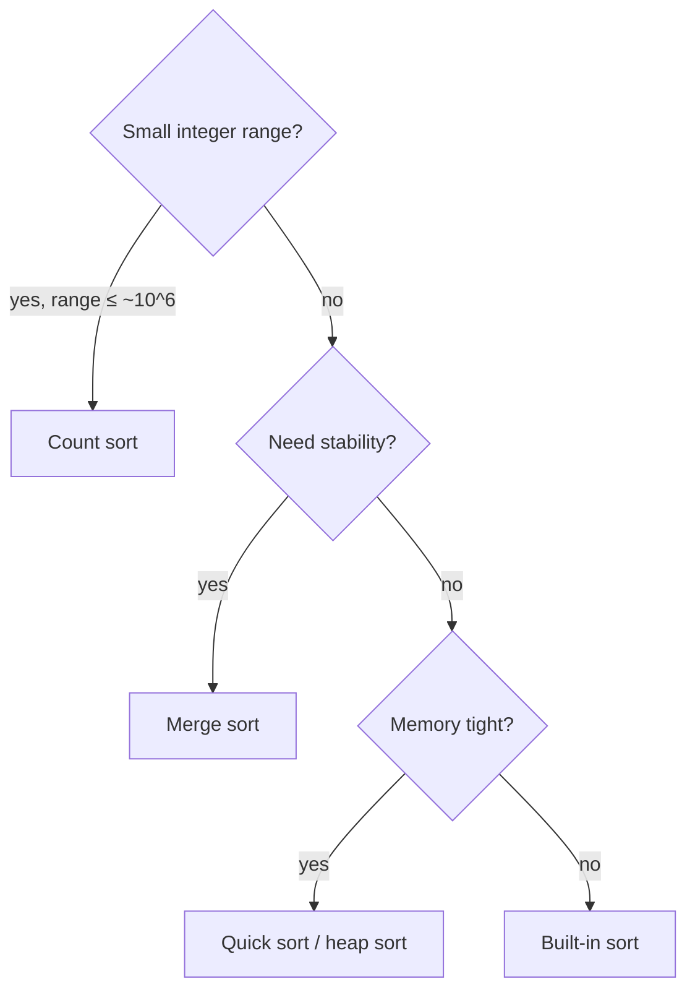

*Which classic sort to reach for — and what its pieces are good for.*

<a id="count-sort"></a>

#### Count sort — sorting without comparing

When values live in a small range, count how often each value occurs, then write them back in order. No comparisons at all, so it beats the `O(n log n)` lower bound. For negative values, shift every index by `min`: value `v` is counted at `v - min`. The notes' rule of thumb: worth it when the range of values is about `10^6` or less.

> **Interactive animation:** `count-sort` — rendered by the page script in the HTML version.

**Answer — count sort with negative numbers**

```python
def count_sort(arr):
    lo, hi = min(arr), max(arr)
    count = [0] * (hi - lo + 1)
    for num in arr:
        count[num - lo] += 1           # shift so the smallest value maps to index 0
    ans = []
    for i, c in enumerate(count):
        ans.extend([i + lo] * c)
    return ans


print(count_sort([-2, 1, 4, 2, -2, 6, 1, -3, 4, -1]))  # [-3, -2, -2, -1, 1, 1, 2, 4, 4, 6]
```

```javascript
function countSort(arr) {
  const min = Math.min(...arr);
  const max = Math.max(...arr);
  const freq = new Array(max - min + 1).fill(0);
  for (const num of arr) freq[num - min]++;   // shift so the smallest value maps to index 0
  const sorted = [];
  freq.forEach((count, i) => {
    for (let c = 0; c < count; c++) sorted.push(i + min);
  });
  return sorted;
}

console.log(countSort([-2, 1, 4, 2, -2, 6, 1, -3, 4, -1])); // [-3, -2, -2, -1, 1, 1, 2, 4, 4, 6]
```

<a id="merge-and-quick"></a>

#### Merge sort and quick sort — two ways to divide

**Merge sort** splits blindly in the middle and does the real work on the way back up: merging two sorted halves is a two-pointer walk that always takes the smaller front element (`<=` keeps it stable). **Quick sort** does the real work on the way down: partition around a pivot so smaller values end up left and larger right, and the pivot lands in its final position. Compute the middle as `lo + (hi - lo) // 2` — the notes flag `(lo + hi) / 2` as an overflow risk in fixed-width languages.

> **Interactive animation:** `sorting` (option=merge) — rendered by the page script in the HTML version.

**Merge sort**

```python
def merge(left, right):
    result, i, j = [], 0, 0
    while i < len(left) and j < len(right):
        if left[i] <= right[j]:        # <= keeps equal elements in order: stable
            result.append(left[i]); i += 1
        else:
            result.append(right[j]); j += 1
    return result + left[i:] + right[j:]


def merge_sort(arr):
    if len(arr) <= 1:
        return arr
    mid = len(arr) // 2
    return merge(merge_sort(arr[:mid]), merge_sort(arr[mid:]))


print(merge_sort([38, 27, 43, 3, 9, 82, 10]))  # [3, 9, 10, 27, 38, 43, 82]
```

```javascript
function mergeTwoSortedArrays(left, right) {
  const merged = [];
  let i = 0, j = 0;
  while (i < left.length && j < right.length) {
    if (left[i] <= right[j]) merged.push(left[i++]); // <= keeps equal elements in order: stable
    else merged.push(right[j++]);
  }
  return merged.concat(left.slice(i), right.slice(j));
}

function mergeSort(arr, lo = 0, hi = arr.length - 1) {
  if (lo >= hi) return [arr[lo]];
  const mid = lo + Math.floor((hi - lo) / 2);
  return mergeTwoSortedArrays(mergeSort(arr, lo, mid), mergeSort(arr, mid + 1, hi));
}

console.log(mergeSort([38, 27, 43, 3, 9, 82, 10])); // [3, 9, 10, 27, 38, 43, 82]
```

> **Interactive animation:** `sorting` (option=quick) — rendered by the page script in the HTML version.

**Quick sort (Lomuto partition, last element as pivot)**

```python
def partition(arr, low, high):
    pivot = arr[high]
    i = low                            # next slot for a value < pivot
    for j in range(low, high):
        if arr[j] < pivot:
            arr[i], arr[j] = arr[j], arr[i]
            i += 1
    arr[i], arr[high] = arr[high], arr[i]   # pivot lands in its final place
    return i


def quick_sort(arr, low=0, high=None):
    if high is None:
        high = len(arr) - 1
    if low < high:
        p = partition(arr, low, high)
        quick_sort(arr, low, p - 1)
        quick_sort(arr, p + 1, high)
    return arr


print(quick_sort([10, 7, 8, 9, 1, 5]))  # [1, 5, 7, 8, 9, 10]
```

```javascript
function getPivotIndex(arr, start, end) {
  const pivot = arr[end];
  let low = start;                      // next slot for a value < pivot
  for (let high = start; high < end; high++) {
    if (arr[high] < pivot) {
      [arr[low], arr[high]] = [arr[high], arr[low]];
      low++;
    }
  }
  [arr[low], arr[end]] = [arr[end], arr[low]]; // pivot lands in its final place
  return low;
}

function quickSort(arr, low = 0, high = arr.length - 1) {
  if (low >= high) return arr;
  const p = getPivotIndex(arr, low, high);
  quickSort(arr, low, p - 1);
  quickSort(arr, p + 1, high);
  return arr;
}

console.log(quickSort([10, 7, 8, 9, 1, 5])); // [1, 5, 7, 8, 9, 10]
```

<a id="custom-comparators"></a>

#### Custom comparators

A comparator answers one question: *should `a` come before `b`?* Return negative for yes, positive for no, zero for a tie. Sorting by factor count and breaking ties by value is just `(factors(a), a)` as a key.

**Interview question**

*Arrange non-negative integers to form the largest possible number. `[989, 9, 767, 11, 1, 0]` → `"99897671110"`.*

Sorting numerically fails (`9` must beat `989`), and sorting as strings fails too (`"3"` vs `"30"`). Compare the **two concatenations**: `a` goes first if `a + b > b + a` as strings. That rule is transitive, so any sort that accepts a comparator produces the answer. Return `"0"` when the largest piece is `0`, so `[0, 0]` does not become `"00"`.

**Answer — largest number with a concatenation comparator**

```python
from functools import cmp_to_key


def largest_number(arr):
    def compare(a, b):
        ab, ba = str(a) + str(b), str(b) + str(a)
        return -1 if ab > ba else (1 if ab < ba else 0)

    result = "".join(str(x) for x in sorted(arr, key=cmp_to_key(compare)))
    return "0" if result[0] == "0" else result


print(largest_number([989, 9, 767, 11, 1, 0]))  # 99897671110
print(largest_number([10, 5, 2, 8, 200]))        # 85220010
```

```javascript
function largestNumber(arr) {
  arr.sort((a, b) => {
    const ab = `${a}${b}`;
    const ba = `${b}${a}`;
    return ab > ba ? -1 : ab < ba ? 1 : 0;
  });
  const result = arr.join("");
  return result[0] === "0" ? "0" : result;
}

console.log(largestNumber([989, 9, 767, 11, 1, 0])); // 99897671110
console.log(largestNumber([10, 5, 2, 8, 200]));      // 85220010
```

**From the notes — sorting problems**

| Problem | Technique | Complexity |
| --- | --- | --- |
| Count sort (positive, negative) | frequency array with offset | `O(N + K)` |
| Merge two sorted arrays; merge sort | two-pointer merge | `O(N)`; `O(N log N)` |
| Sort colours (0s, 1s, 2s) | count the three values | `O(N)` |
| Partition 0s/1s; partition around a pivot | Lomuto partition | `O(N)` |
| Quick sort | partition + recurse | `O(N log N)` avg |
| Sort by number of factors | comparator key `(factors, value)` | `O(N√M + N log N)` |
| Largest number | concatenation comparator | `O(N log N)` |
| Noble integers (distinct / duplicates) | sort, compare value to count of smaller | `O(N log N)` |
| Minimise cost to empty an array | sort descending + contribution | `O(N log N)` |

<a id="10-binary-search-on-arrays-and-answers"></a>

### Binary Search on Arrays and on Answers

- **On a sorted array** `O(log N)`
- **On an answer range** `O(N log(range))`
- **Extra space** `O(1)`

The notes put it precisely: to search you need **a target and a search space**. Binary search does not need a sorted array — it needs a way to look at the middle and **throw away half** of the space with certainty. On a sorted array the rule is "too small → go right". On an unsorted array it can be "the slope goes down → a valley is to the right". On an **answer range** it is "this answer is feasible → try a smaller one".

> **Analogy** 📖
>
> **Picture it — guessing a number with "higher" or "lower"**
>
> You never guess 1, 2, 3… You guess the middle, and each "higher" or "lower" deletes half the remaining numbers. Binary search on answers is the same game where the referee is a function you write: "can the job be done in 113 minutes? yes → try lower".

> **Interactive animation:** `first-occurrence` — rendered by the page script in the HTML version.

**Interview question**

*Return the index of the first occurrence of `k` in a sorted array, or `-1`. `[3, 6, 9, 9, 9, 19, 20, 23, 27, 27]`, `k = 9` → `2`.*

A normal binary search stops at *any* `9`. To find the **first**, record the match and **keep searching left** (`high = mid - 1`). The loop still halves the range every step, so it stays `O(log n)`. Flip it to `low = mid + 1` for the last occurrence, and `last - first + 1` is the count.

**Answer — first occurrence**

```python
def find_first_occurrence(arr, k):
    low, high = 0, len(arr) - 1
    ans = -1
    while low <= high:
        mid = low + (high - low) // 2
        if arr[mid] == k:
            ans = mid
            high = mid - 1          # a match — but an earlier one may exist
        elif arr[mid] < k:
            low = mid + 1
        else:
            high = mid - 1
    return ans


print(find_first_occurrence([3, 6, 9, 9, 9, 19, 20, 23, 27, 27], 9))   # 2
print(find_first_occurrence([3, 6, 9, 9, 9, 19, 20, 23, 27, 27], 21))  # -1
```

```javascript
function findFirstOccurrence(arr, k) {
  let low = 0;
  let high = arr.length - 1;
  let ans = -1;
  while (low <= high) {
    const mid = low + Math.floor((high - low) / 2);
    if (arr[mid] === k) {
      ans = mid;
      high = mid - 1;               // a match — but an earlier one may exist
    } else if (arr[mid] < k) low = mid + 1;
    else high = mid - 1;
  }
  return ans;
}

console.log(findFirstOccurrence([3, 6, 9, 9, 9, 19, 20, 23, 27, 27], 9));  // 2
console.log(findFirstOccurrence([3, 6, 9, 9, 9, 19, 20, 23, 27, 27], 21)); // -1
```

**Unsorted, but still halvable — a local minimum**

```python
def find_local_minima(arr):
    n = len(arr)
    if n == 1 or arr[0] < arr[1]:
        return arr[0]
    if arr[n - 1] < arr[n - 2]:
        return arr[n - 1]
    low, high = 1, n - 2
    while low <= high:
        mid = low + (high - low) // 2
        if arr[mid] < arr[mid - 1] and arr[mid] < arr[mid + 1]:
            return arr[mid]
        if arr[mid - 1] > arr[mid] > arr[mid + 1]:
            low = mid + 1           # still sloping down: a valley lies to the right
        else:
            high = mid - 1          # sloping up on the left: a valley lies to the left
    return -1


print(find_local_minima([8, 6, 1, 0, 9, 15, 20]))  # 0
print(find_local_minima([3, 6, 1, 0, 9, 15, 8]))   # 3 — the first element already qualifies
```

```javascript
function findLocalMinima(arr) {
  const n = arr.length;
  if (n === 1 || arr[0] < arr[1]) return arr[0];
  if (arr[n - 1] < arr[n - 2]) return arr[n - 1];
  let low = 1;
  let high = n - 2;
  while (low <= high) {
    const mid = low + Math.floor((high - low) / 2);
    if (arr[mid - 1] > arr[mid] && arr[mid] < arr[mid + 1]) return arr[mid];
    if (arr[mid - 1] > arr[mid] && arr[mid] > arr[mid + 1]) low = mid + 1; // valley to the right
    else high = mid - 1;                                                    // valley to the left
  }
  return -1;
}

console.log(findLocalMinima([8, 6, 1, 0, 9, 15, 20])); // 0
console.log(findLocalMinima([3, 6, 1, 0, 9, 15, 8]));  // 3 — the first element already qualifies
```

<a id="binary-search-on-answer"></a>

#### Binary search on the answer

When a problem says "find the **minimum largest** …" or "the **maximum smallest** …", the answer usually has a **monotonic feasibility test**: if 113 minutes is enough to paint the boards, 114 is too. So search the range of possible answers, and at each `mid` run a greedy `O(n)` check. The integer square root is the simplest example: the answer range is `[0, n]` and the test is `mid * mid <= n`.

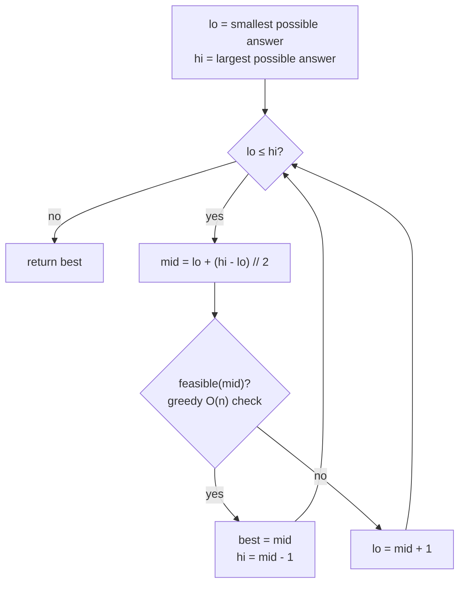

*The template for "minimise the maximum". For "maximise the minimum" (aggressive cows), move `lo = mid + 1` on success instead.*

> **Interactive animation:** `bs-answer` — rendered by the page script in the HTML version.

**Interview question**

*Painter's partition: boards `[12, 34, 67, 90]` must be painted by `2` painters, each taking a contiguous run, one unit of time per unit of length, all working at once. Minimise the finishing time. Answer: `113` (`[12, 34, 67] | [90]`).*

The answer lies between `max(boards) = 90` (someone must paint the longest board) and `sum(boards) = 203` (one painter does everything). For a candidate time `T`, greedily hand boards to the current painter until the next board would push them past `T`, then start a new painter. If the greedy needs `≤ k` painters, `T` works — record it and try smaller.

**Answer — painter's partition (binary search on the answer)**

```python
def is_feasible(boards, painters_available, max_time):
    painters, current = 1, 0
    for board in boards:
        if current + board > max_time:   # this painter is full: start the next one
            painters += 1
            current = board
        else:
            current += board
    return painters <= painters_available


def min_time(boards, painters):
    low, high = max(boards), sum(boards)
    ans = high
    while low <= high:
        mid = low + (high - low) // 2
        if is_feasible(boards, painters, mid):
            ans = mid
            high = mid - 1               # feasible: try to finish sooner
        else:
            low = mid + 1
    return ans


print(min_time([12, 34, 67, 90], 2))  # 113
```

```javascript
function isFeasible(boards, paintersAvailable, maxTime) {
  let painters = 1;
  let current = 0;
  for (const board of boards) {
    if (current + board > maxTime) {    // this painter is full: start the next one
      painters++;
      current = board;
    } else current += board;
  }
  return painters <= paintersAvailable;
}

function minTime(boards, painters) {
  let low = Math.max(...boards);
  let high = boards.reduce((a, b) => a + b, 0);
  let ans = high;
  while (low <= high) {
    const mid = low + Math.floor((high - low) / 2);
    if (isFeasible(boards, painters, mid)) {
      ans = mid;
      high = mid - 1;                   // feasible: try to finish sooner
    } else low = mid + 1;
  }
  return ans;
}

console.log(minTime([12, 34, 67, 90], 2)); // 113
```

**Interview question**

*Aggressive cows: place `3` cows in stalls at `[1, 2, 4, 8, 9]` so the **minimum** distance between any two is as **large** as possible. Answer: `3` (stalls `1, 4, 8`).*

Sort the stalls. The answer is between `1` and `last - first`. For a candidate distance `d`, greedily put a cow in the first stall and each next cow in the first stall at least `d` away. If all cows fit, `d` is achievable — record it and try **larger**.

**Answer — aggressive cows**

```python
def can_place(stalls, dist, cows):
    count, last = 1, stalls[0]
    for pos in stalls[1:]:
        if pos - last >= dist:
            count += 1
            last = pos
            if count >= cows:
                return True
    return count >= cows


def aggressive_cows(stalls, cows):
    stalls.sort()
    low, high = 1, stalls[-1] - stalls[0]
    ans = 0
    while low <= high:
        mid = low + (high - low) // 2
        if can_place(stalls, mid, cows):
            ans = mid
            low = mid + 1                # achievable: push the distance up
        else:
            high = mid - 1
    return ans


print(aggressive_cows([1, 2, 8, 4, 9], 3))  # 3
```

```javascript
function canPlace(stalls, dist, cows) {
  let count = 1;
  let last = stalls[0];
  for (let i = 1; i < stalls.length; i++) {
    if (stalls[i] - last >= dist) {
      count++;
      last = stalls[i];
      if (count >= cows) return true;
    }
  }
  return count >= cows;
}

function aggressiveCows(stalls, cows) {
  stalls.sort((a, b) => a - b);
  let low = 1;
  let high = stalls[stalls.length - 1] - stalls[0];
  let ans = 0;
  while (low <= high) {
    const mid = low + Math.floor((high - low) / 2);
    if (canPlace(stalls, mid, cows)) {
      ans = mid;
      low = mid + 1;                     // achievable: push the distance up
    } else high = mid - 1;
  }
  return ans;
}

console.log(aggressiveCows([1, 2, 8, 4, 9], 3)); // 3
```

> **Tip**
>
> Spot binary search on the answer by its phrasing — "minimum possible maximum", "maximum possible minimum", "least capacity such that", "at most `B` days". Then write two things: the answer range `[lo, hi]` and a greedy `feasible(mid)`. The search loop is always the same.

**From the notes — binary search problems**

| Problem | Search space | Complexity |
| --- | --- | --- |
| Search K in a sorted array; first occurrence | indices | `O(log N)` |
| Local minima; peak element | indices, discard by slope | `O(log N)` |
| Integer square root | answers `[0, n]` | `O(log N)` |
| Painter's partition; email response handlers | answers `[max, sum]`, minimise | `O(N log(sum))` |
| Allocate books; ship packages within B days | answers `[max, sum]`, minimise | `O(N log(sum))` |
| Aggressive cows | answers `[1, max - min]`, maximise | `O(N log(range))` |

---

<a id="unit-3"></a>

## Unit 3 — Linked Structures

Nodes joined by pointers. The advanced tricks here are all about what you can do with **two** pointers, **one** stack, or **zero** extra memory.

<a id="11-linked-lists"></a>

### Linked Lists

- **Find middle / detect cycle** `O(N)`, `O(1)` space
- **Insert / delete at a known node (DLL)** `O(1)`
- **LRU get / put** `O(1)`

Most linked-list problems are solved by **pointers moving at different speeds** or **rewiring `next` in place**. Slow moves one node, fast moves two: when fast reaches the end, slow is at the middle (the notes' index `(size + 1) / 2`, so the first middle of an even list). If the list loops, fast eventually laps slow. Reversal is three pointers — `prev`, `curr`, `next` — and every "compare the two halves" problem is middle + reverse.

> **Analogy** 🏃
>
> **Picture it — two runners on a track**
>
> One runner jogs, the other sprints at double speed. On a straight road the sprinter simply finishes first. On a looped track the sprinter comes round and taps the jogger on the shoulder — that tap *proves* there is a loop, without anyone painting marks on the ground.

**Building blocks — node, reverse, middle**

```python
class ListNode:
    def __init__(self, val, next=None):
        self.val = val
        self.next = next


def reverse_linked_list(head):
    prev, curr = None, head
    while curr:
        nxt = curr.next       # save the rest of the list
        curr.next = prev      # flip one arrow
        prev, curr = curr, nxt
    return prev               # the old tail is the new head


def find_middle(head):
    slow = fast = head
    while fast and fast.next:
        slow = slow.next
        fast = fast.next.next
    return slow               # first middle for odd, second for even lengths


head = ListNode(1, ListNode(2, ListNode(3, ListNode(4, ListNode(5)))))
print(find_middle(head).val)          # 3
print(reverse_linked_list(head).val)  # 5
```

```javascript
class ListNode {
  constructor(val, next = null) {
    this.val = val;
    this.next = next;
  }
}

function reverseLinkedList(head) {
  let prev = null;
  let curr = head;
  while (curr) {
    const next = curr.next;   // save the rest of the list
    curr.next = prev;         // flip one arrow
    prev = curr;
    curr = next;
  }
  return prev;                // the old tail is the new head
}

function findMiddle(head) {
  let slow = head, fast = head;
  while (fast && fast.next) {
    slow = slow.next;
    fast = fast.next.next;
  }
  return slow;                // first middle for odd, second for even lengths
}

const head = new ListNode(1, new ListNode(2, new ListNode(3, new ListNode(4, new ListNode(5)))));
console.log(findMiddle(head).val);         // 3
console.log(reverseLinkedList(head).val);  // 5
```

<a id="floyd"></a>

#### Floyd's cycle detection — find it, find its start, remove it

> **Interactive animation:** `floyd-cycle` — rendered by the page script in the HTML version.

Let `a` be the distance from the head to the cycle's first node, `b` the distance from there to where the pointers meet, and `c` the cycle length. At the meeting point slow has walked `a + b` and fast `2(a + b)`, and fast's extra distance is whole laps: `a + b = k·c`. Rearranged, `a = k·c - b` — walking `a` steps from the meeting point lands exactly on the cycle start. So reset one pointer to the head, move both **one** step at a time, and they meet at the start.

```text
1 → 2 → 3 → 4 → 5            a = 2 (head → node 3)
        ↑       ↓            meet after slow walks a + b steps
        ← ← ← ← 6            then: one pointer from head, one from the meeting point,
                             both at speed 1 → they collide at node 3
```

**Interview question**

*Return the node where a linked list's cycle begins, or `None` if there is no cycle. Then remove the cycle.*

Phase 1 is plain detection. Phase 2 uses `a = k·c - b` to walk to the start. To remove the cycle, keep walking from the start until you reach the node whose `next` is the start — that is the last node of the loop — and cut its `next`.

**Answer — cycle start and removal (Floyd)**

```python
def detect_cycle_start(head):
    slow = fast = head
    while fast and fast.next:
        slow, fast = slow.next, fast.next.next
        if slow is fast:
            break
    else:
        return None                   # fast fell off the end: no cycle
    p1, p2 = head, slow
    while p1 is not p2:               # a = k·c - b
        p1, p2 = p1.next, p2.next
    return p1


def remove_cycle(head):
    start = detect_cycle_start(head)
    if start is None:
        return head
    last = start
    while last.next is not start:     # the node that closes the loop
        last = last.next
    last.next = None
    return head


nodes = [ListNode(v) for v in [1, 2, 3, 4, 5, 6]]
for x, y in zip(nodes, nodes[1:]):
    x.next = y
nodes[-1].next = nodes[2]             # 6 → 3 closes the loop
print(detect_cycle_start(nodes[0]).val)  # 3
remove_cycle(nodes[0])
print(nodes[-1].next)                    # None
```

```javascript
function findCycleStart(head) {
  let slow = head, fast = head;
  let hasCycle = false;
  while (fast && fast.next) {
    slow = slow.next;
    fast = fast.next.next;
    if (slow === fast) { hasCycle = true; break; }
  }
  if (!hasCycle) return null;          // fast fell off the end: no cycle
  let p1 = head, p2 = slow;
  while (p1 !== p2) {                  // a = k·c - b
    p1 = p1.next;
    p2 = p2.next;
  }
  return p1;
}

function removeCycle(head) {
  const start = findCycleStart(head);
  if (!start) return head;
  let last = start;
  while (last.next !== start) last = last.next; // the node that closes the loop
  last.next = null;
  return head;
}

const nodes = [1, 2, 3, 4, 5, 6].map((v) => new ListNode(v));
nodes.forEach((n, i) => (n.next = nodes[i + 1] || null));
nodes[5].next = nodes[2];              // 6 → 3 closes the loop
console.log(findCycleStart(nodes[0]).val); // 3
removeCycle(nodes[0]);
console.log(nodes[5].next);                // null
```

**Interview question**

*Is a singly linked list a palindrome, using `O(1)` extra space? `1 → 2 → 2 → 1` → `true`.*

You cannot walk backwards, so make the back half walk forwards: find the middle, **reverse the second half in place**, then compare it node by node with the first half. (Restore it afterwards if the caller still needs the list.)

**Answer — palindrome linked list**

```python
def is_palindrome_list(head):
    slow = fast = head
    while fast and fast.next:          # slow stops at the middle
        slow, fast = slow.next, fast.next.next
    second = reverse_linked_list(slow)
    p1, p2 = head, second
    while p2:
        if p1.val != p2.val:
            return False
        p1, p2 = p1.next, p2.next
    return True


print(is_palindrome_list(ListNode(1, ListNode(2, ListNode(2, ListNode(1))))))  # True
print(is_palindrome_list(ListNode(1, ListNode(2, ListNode(3)))))               # False
```

```javascript
function isPalindrome(head) {
  let slow = head, fast = head;
  while (fast && fast.next) {           // slow stops at the middle
    slow = slow.next;
    fast = fast.next.next;
  }
  let p1 = head;
  let p2 = reverseLinkedList(slow);
  while (p2) {
    if (p1.val !== p2.val) return false;
    p1 = p1.next;
    p2 = p2.next;
  }
  return true;
}

console.log(isPalindrome(new ListNode(1, new ListNode(2, new ListNode(2, new ListNode(1)))))); // true
console.log(isPalindrome(new ListNode(1, new ListNode(2, new ListNode(3)))));                  // false
```

Sorting a linked list uses the same pieces: find the middle, **cut** the list there, merge-sort each half and merge the two sorted halves by splicing nodes — `O(N log N)` time and only `O(log N)` stack, because merging lists needs no buffer.

<a id="lru-cache"></a>

#### Doubly linked list + hash map = LRU cache

A **least-recently-used** cache must, in `O(1)`: find a key, mark it as just used, and evict the stalest key when full. No single structure does all three. A **hash map** finds the node; a **doubly linked list** keeps usage order and can unlink any node in `O(1)` because each node knows its `prev`. Two sentinel nodes, `head` (least recent side) and `tail` (most recent side), remove every empty-list special case.

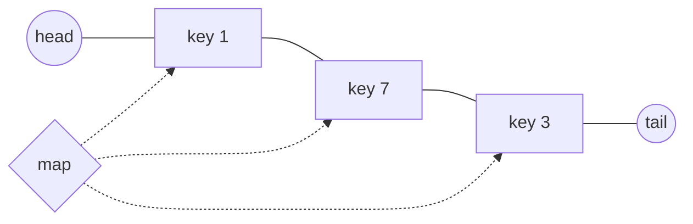

*The map points straight at list nodes. Evict from the `head` side; every `get` or `put` moves its node next to `tail`.*

> **Interactive animation:** `lru-cache` — rendered by the page script in the HTML version.

**Interview question**

*Design an LRU cache with `get(key)` and `put(key, value)`, both `O(1)`. When full, `put` evicts the least recently used key.*

`get`: look up the node, unlink it, re-insert it just before `tail`, return its value. `put` on an existing key does the same and updates the value. `put` on a new key first evicts `head.next` if the cache is full — deleting it from **both** the list and the map — then inserts the new node before `tail`.

**Answer — LRU cache with a doubly linked list and a hash map**

```python
class Node:
    def __init__(self, key, value):
        self.key, self.value = key, value
        self.prev = self.next = None


class LRUCache:
    def __init__(self, capacity):
        self.cap = capacity
        self.map = {}
        self.head, self.tail = Node(-1, -1), Node(-1, -1)   # sentinels
        self.head.next, self.tail.prev = self.tail, self.head

    def _remove(self, node):
        node.prev.next, node.next.prev = node.next, node.prev

    def _add_before_tail(self, node):
        node.prev, node.next = self.tail.prev, self.tail
        self.tail.prev.next = node
        self.tail.prev = node

    def get(self, key):
        if key not in self.map:
            return -1
        node = self.map[key]
        self._remove(node)
        self._add_before_tail(node)          # now the most recently used
        return node.value

    def put(self, key, value):
        if key in self.map:
            node = self.map[key]
            node.value = value
            self._remove(node)
        else:
            if len(self.map) == self.cap:
                lru = self.head.next          # least recently used
                self._remove(lru)
                del self.map[lru.key]
            node = Node(key, value)
            self.map[key] = node
        self._add_before_tail(node)


cache = LRUCache(2)
cache.put(1, 10); cache.put(2, 20)
cache.get(1)                        # 1 becomes most recent
cache.put(3, 30)                    # evicts 2
print(cache.get(2), cache.get(3))   # -1 30
```

```javascript
class Node {
  constructor(key, value) {
    this.key = key;
    this.value = value;
    this.prev = this.next = null;
  }
}

class LRUCache {
  constructor(capacity) {
    this.cap = capacity;
    this.map = new Map();
    this.head = new Node(-1, -1);            // sentinels
    this.tail = new Node(-1, -1);
    this.head.next = this.tail;
    this.tail.prev = this.head;
  }

  removeNode(node) {
    node.prev.next = node.next;
    node.next.prev = node.prev;
  }

  addBeforeTail(node) {
    node.prev = this.tail.prev;
    node.next = this.tail;
    this.tail.prev.next = node;
    this.tail.prev = node;
  }

  get(key) {
    if (!this.map.has(key)) return -1;
    const node = this.map.get(key);
    this.removeNode(node);
    this.addBeforeTail(node);                // now the most recently used
    return node.value;
  }

  put(key, value) {
    if (this.map.has(key)) {
      const node = this.map.get(key);
      node.value = value;
      this.removeNode(node);
      this.addBeforeTail(node);
      return;
    }
    if (this.map.size === this.cap) {
      const lru = this.head.next;            // least recently used
      this.removeNode(lru);
      this.map.delete(lru.key);
    }
    const node = new Node(key, value);
    this.addBeforeTail(node);
    this.map.set(key, node);
  }
}

const cache = new LRUCache(2);
cache.put(1, 10); cache.put(2, 20);
cache.get(1);                                // 1 becomes most recent
cache.put(3, 30);                            // evicts 2
console.log(cache.get(2), cache.get(3));     // -1 30
```

> **Tip**
>
> In Python an `OrderedDict` already is "hash map + doubly linked list": `move_to_end(key)` marks a key as recent and `popitem(last=False)` evicts the oldest. Interviewers usually want the hand-built version first, then accept the shortcut.

**From the notes — linked-list problems**

| Problem | Technique | Complexity |
| --- | --- | --- |
| k-th node, print, search, size, insert at position, delete | walk with a counter | `O(N)` |
| Reverse a linked list | three pointers | `O(N)`, `O(1)` |
| Middle of a linked list | slow / fast | `O(N)`, `O(1)` |
| Merge two sorted lists; sort a list | splice nodes; merge sort | `O(N + M)`; `O(N log N)` |
| Palindrome linked list | middle + reverse second half | `O(N)`, `O(1)` |
| Doubly linked list: insert before tail, delete a node | rewire `prev` and `next` | `O(1)` |
| LRU cache | DLL + hash map | `O(1)` per op |
| Detect cycle; cycle start; remove cycle | Floyd | `O(N)`, `O(1)` |

<a id="12-stacks-and-queues"></a>

### Stacks & Queues

- **push / pop / peek** `O(1)`
- **Nearest smaller for every index** `O(N)`
- **Sliding window maximum** `O(N)`

A **stack** answers "what is the most recent unmatched thing?" — the last opened bracket, the last operand, the closest smaller value to the left. A **queue** answers "what arrived first?" A **deque** does both ends, which is exactly what a sliding window needs: new elements join at the back, expired ones leave at the front.

> **Analogy** 🍽️
>
> **Picture it — a pile of plates vs. a line of shoppers**
>
> You take plates off the top of the pile — the last one washed is the first one used. Shoppers leave the checkout line from the front. A deque is a line where people can also give up and leave from the back.

<a id="expression-evaluation"></a>

#### Brackets and postfix expressions

For balanced brackets, push every opener; on a closer, the top of the stack **must** be its matching opener. For expressions, the notes compare three notations:

```text
Infix:   1 + 2 + 3 * 4 - 5 / 6 + 7 - 8 * 9          operator between operands
Postfix: 1 2 + 3 4 * + 5 6 / - 7 + 8 9 * -          operator after operands
Prefix:  - + - + + 1 2 * 3 4 / 5 6 7 * 8 9          operator before operands
```

Postfix needs no brackets and no precedence rules, which makes it trivial for a stack: push numbers; on an operator, pop two, apply, push the result.

**Interview question**

*Evaluate a postfix expression. `"7 3 5 * +"` → `22`.*

Push `7`, `3`, `5`. On `*`, pop `5` then `3` and push `15`. On `+`, pop `15` then `7` and push `22`. Note the order: the **first** value popped is the **right** operand — it matters for `-` and `/`.

**Answer — evaluate postfix**

```python
def evaluate_postfix(expression):
    stack = []
    for token in expression.split():
        if token in "+-*/":
            right = stack.pop()          # popped first = right operand
            left = stack.pop()
            if token == "+": stack.append(left + right)
            elif token == "-": stack.append(left - right)
            elif token == "*": stack.append(left * right)
            else: stack.append(int(left / right))
        else:
            stack.append(int(token))
    return stack.pop()


print(evaluate_postfix("7 3 5 * +"))           # 22
print(evaluate_postfix("3 5 + 2 - 2 5 * -"))   # -4
```

```javascript
function evaluatePostfix(expression) {
  const stack = [];
  for (const token of expression.split(" ")) {
    if ("+-*/".includes(token)) {
      const right = stack.pop();         // popped first = right operand
      const left = stack.pop();
      if (token === "+") stack.push(left + right);
      else if (token === "-") stack.push(left - right);
      else if (token === "*") stack.push(left * right);
      else stack.push(Math.trunc(left / right));
    } else stack.push(Number(token));
  }
  return stack.pop();
}

console.log(evaluatePostfix("7 3 5 * +"));         // 22
console.log(evaluatePostfix("3 5 + 2 - 2 5 * -")); // -4
```

<a id="monotonic-stack"></a>

#### The monotonic stack — nearest smaller or greater

For each index, find the nearest element to its left that is smaller. Brute force looks back from every index — `O(n²)`. The insight: if `A[j] ≥ A[i]` and `j < i`, then `A[j]` can **never** be the answer for anything to the right of `i` — `A[i]` is both closer and smaller. So pop it. What remains on the stack is always increasing, and its top is the answer.

> **Interactive animation:** `monotonic-stack` — rendered by the page script in the HTML version.

**Interview question**

*For every index, return the index of the nearest smaller element on its left, or `-1`. `[4, 5, 2, 10, 8]` → `[-1, 0, -1, 2, 2]`.*

Every index is pushed once and popped at most once, so the whole pass is `O(n)` even though there is a loop inside a loop.

**Answer — nearest smaller element index on the left**

```python
def nearest_smaller_on_left(arr):
    stack, result = [], []
    for i, val in enumerate(arr):
        while stack and arr[stack[-1]] >= val:   # can never be an answer again
            stack.pop()
        result.append(stack[-1] if stack else -1)
        stack.append(i)
    return result


print(nearest_smaller_on_left([4, 5, 2, 10, 8]))  # [-1, 0, -1, 2, 2]
```

```javascript
function nearestSmallerOnLeft(arr) {
  const stack = [];
  const result = [];
  for (let i = 0; i < arr.length; i++) {
    while (stack.length && arr[stack[stack.length - 1]] >= arr[i]) stack.pop(); // never an answer again
    result.push(stack.length ? stack[stack.length - 1] : -1);
    stack.push(i);
  }
  return result;
}

console.log(nearestSmallerOnLeft([4, 5, 2, 10, 8])); // [-1, 0, -1, 2, 2]
```

| Variant | Scan direction | Pop while top is… |
| --- | --- | --- |
| Nearest smaller on the left | left → right | `≥` current |
| Nearest greater on the left | left → right | `≤` current |
| Nearest smaller on the right | right → left | `≥` current |
| Nearest greater on the right | right → left | `≤` current |

<a id="queues-and-deques"></a>

#### Queues, deques and the sliding-window maximum

The notes build a queue four ways: a dynamic array, a singly linked list with a **tail** pointer (`O(1)` enqueue at the tail, dequeue at the head), and two stacks — either **push-efficient** (move everything only when popping from an empty out-stack, amortised `O(1)`) or **pop-efficient**. A **deque** built on a doubly linked list gives `O(1)` at both ends.

For the maximum of every window of size `k`, keep a deque of **indices whose values are decreasing**. A new element evicts everything smaller from the back — those can never be a maximum while it is in the window. The front is the current maximum; drop it once its index slides out of the window.

> **Interactive animation:** `window-max` — rendered by the page script in the HTML version.

**Interview question**

*Return the maximum of every window of size `k`. `[1, 3, -1, -3, 5, 3, 6, 7]`, `k = 3` → `[3, 3, 5, 5, 6, 7]`.*

**Answer — sliding window maximum with a monotonic deque**

```python
from collections import deque


def sliding_window_maximum(arr, k):
    dq, result = deque(), []
    for i in range(len(arr)):
        while dq and arr[dq[-1]] < arr[i]:   # smaller values can never be a max again
            dq.pop()
        dq.append(i)
        if dq[0] <= i - k:                   # front index slid out of the window
            dq.popleft()
        if i >= k - 1:
            result.append(arr[dq[0]])
    return result


print(sliding_window_maximum([1, 3, -1, -3, 5, 3, 6, 7], 3))  # [3, 3, 5, 5, 6, 7]
```

```javascript
function slidingWindowMax(arr, k) {
  const dq = [];          // indices; values decreasing from front to back
  let front = 0;          // dq[front] is the logical front, so popleft is O(1)
  const result = [];
  for (let i = 0; i < arr.length; i++) {
    while (dq.length > front && arr[dq[dq.length - 1]] < arr[i]) dq.pop();
    dq.push(i);
    if (dq[front] <= i - k) front++;          // front index slid out of the window
    if (i >= k - 1) result.push(arr[dq[front]]);
  }
  return result;
}

console.log(slidingWindowMax([1, 3, -1, -3, 5, 3, 6, 7], 3)); // [3, 3, 5, 5, 6, 7]
```

> **Warning**
>
> `Array.prototype.shift()` in JavaScript is `O(n)` — it re-indexes the array. A queue built on `shift()` inside a loop quietly becomes `O(n²)`. Use a head index (as above), a linked list, or `collections.deque` in Python.

**From the notes — stack and queue problems**

| Problem | Structure | Complexity |
| --- | --- | --- |
| Stack on a static / dynamic array | array + top index | `O(1)` per op |
| Balanced parentheses | stack of openers | `O(N)` |
| Evaluate postfix | operand stack | `O(N)` |
| Nearest smaller / greater on left / right | monotonic stack | `O(N)` |
| Queue on array, linked list with tail, two stacks | — | `O(1)` amortised |
| Double-ended queue | doubly linked list | `O(1)` per op |
| Sliding window maximum; parking ice-cream truck | monotonic deque | `O(N)` |

<a id="13-trees-bsts-morris-and-lca"></a>

### Trees, BSTs, Morris & LCA

- **Any traversal** `O(N)`
- **BST search / insert / delete** `O(H)`
- **Morris inorder space** `O(1)`
- **LCA in a BST** `O(H)`

Tree problems split into two shapes. **Level-by-level** problems (left view, right view, level order, next pointers) use a queue and process one level per outer loop. **Recursive** problems (height, diameter, LCA, path sum) ask each child for a summary and combine the two answers at the parent. BSTs add one superpower: an **inorder walk visits values in sorted order**, and at every node you know which side a value must be on.

> **Analogy** 🏢
>
> **Picture it — a company org chart**
>
> Level order is a roll call floor by floor. Recursion is every manager asking their two direct reports for a headcount and adding themselves. The lowest common ancestor of two employees is the most junior manager both of them report up to.

> **Interactive animation:** `traversal` (option=level) — rendered by the page script in the HTML version.

**Interview question**

*Return the left view and the right view of a binary tree. For `1 → (2 → 4, 5), (3 → 6, 7)`: left view `[1, 2, 4]`, right view `[1, 3, 7]`.*

Run a level-order traversal, but snapshot `len(queue)` at the start of each level so you know exactly which nodes belong to it. The first node of each level is the left view; the last is the right view.

**Answer — left and right views via level order**

```python
from collections import deque


class TreeNode:
    def __init__(self, val, left=None, right=None):
        self.val, self.left, self.right = val, left, right


def left_and_right_view(root):
    if not root:
        return [], []
    left_view, right_view = [], []
    queue = deque([root])
    while queue:
        level_size = len(queue)            # nodes on this level only
        for i in range(level_size):
            node = queue.popleft()
            if i == 0:
                left_view.append(node.val)
            if i == level_size - 1:
                right_view.append(node.val)
            if node.left:
                queue.append(node.left)
            if node.right:
                queue.append(node.right)
    return left_view, right_view


root = TreeNode(1, TreeNode(2, TreeNode(4), TreeNode(5)), TreeNode(3, TreeNode(6), TreeNode(7)))
print(left_and_right_view(root))  # ([1, 2, 4], [1, 3, 7])
```

```javascript
class TreeNode {
  constructor(val, left = null, right = null) {
    this.val = val;
    this.left = left;
    this.right = right;
  }
}

function leftRightView(root) {
  if (!root) return [[], []];
  const leftView = [], rightView = [];
  let level = [root];
  while (level.length) {
    leftView.push(level[0].val);
    rightView.push(level[level.length - 1].val);
    const next = [];                       // build the next level separately: no shift()
    for (const node of level) {
      if (node.left) next.push(node.left);
      if (node.right) next.push(node.right);
    }
    level = next;
  }
  return [leftView, rightView];
}

const root = new TreeNode(1, new TreeNode(2, new TreeNode(4), new TreeNode(5)),
  new TreeNode(3, new TreeNode(6), new TreeNode(7)));
console.log(leftRightView(root)); // [[1, 2, 4], [1, 3, 7]]
```

The **top view** and **bottom view** add a column number: root at `0`, left child at `col - 1`, right child at `col + 1`. In level order, the **first** node seen in each column is the top view; the **last** is the bottom view. Grouping every node by column gives the **vertical order traversal**.

<a id="bst-operations"></a>

#### BST operations

Search and insert walk one path. Delete has three cases, and the third is the one people fumble:

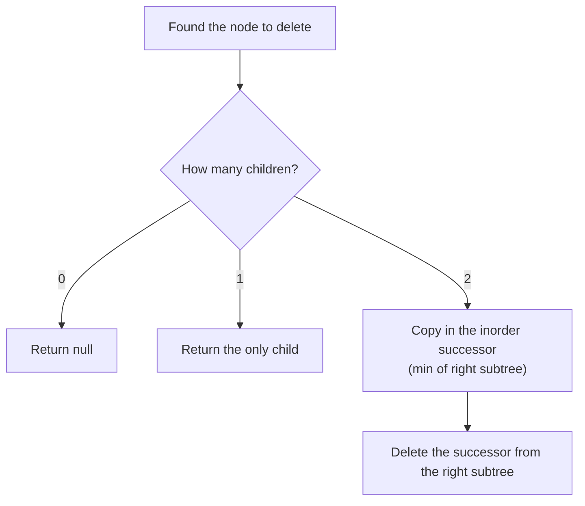

*Deleting from a BST. The successor has no left child, so deleting it falls into case 0 or 1.*

To **validate** a BST, checking each node against its children is not enough — a node deep in the left subtree must also be smaller than the root. Pass down an allowed `(low, high)` range, or check that the inorder sequence is strictly increasing. To **build** a balanced BST from a sorted array, make the middle element the root and recurse on each half.

**BST delete and validate**

```python
def delete_node(root, key):
    if not root:
        return None
    if key < root.val:
        root.left = delete_node(root.left, key)
    elif key > root.val:
        root.right = delete_node(root.right, key)
    else:
        if not root.left:
            return root.right            # 0 or 1 child
        if not root.right:
            return root.left
        succ = root.right                # 2 children: inorder successor
        while succ.left:
            succ = succ.left
        root.val = succ.val
        root.right = delete_node(root.right, succ.val)
    return root


def is_valid_bst(node, low=float("-inf"), high=float("inf")):
    if not node:
        return True
    if not (low < node.val < high):
        return False
    return is_valid_bst(node.left, low, node.val) and is_valid_bst(node.right, node.val, high)


bst = TreeNode(4, TreeNode(2, TreeNode(1), TreeNode(3)), TreeNode(7))
print(is_valid_bst(bst))                   # True
print(delete_node(bst, 2).left.val)        # 3
```

```javascript
function deleteNode(root, k) {
  if (!root) return null;
  if (k < root.val) root.left = deleteNode(root.left, k);
  else if (k > root.val) root.right = deleteNode(root.right, k);
  else {
    if (!root.left) return root.right;     // 0 or 1 child
    if (!root.right) return root.left;
    let succ = root.right;                 // 2 children: inorder successor
    while (succ.left) succ = succ.left;
    root.val = succ.val;
    root.right = deleteNode(root.right, succ.val);
  }
  return root;
}

function isValidBST(node, low = -Infinity, high = Infinity) {
  if (!node) return true;
  if (!(low < node.val && node.val < high)) return false;
  return isValidBST(node.left, low, node.val) && isValidBST(node.right, node.val, high);
}

const bst = new TreeNode(4, new TreeNode(2, new TreeNode(1), new TreeNode(3)), new TreeNode(7));
console.log(isValidBST(bst));              // true
console.log(deleteNode(bst, 2).left.val);  // 3
```

<a id="morris-traversal"></a>

#### Morris inorder traversal — O(1) space

Recursive and stack-based inorder both use `O(h)` memory to remember **where to return** after finishing a left subtree. Morris stores that return address inside the tree itself. Before descending left from `curr`, find its **inorder predecessor** — the rightmost node of the left subtree — and point that node's empty `right` at `curr`. That temporary link is a **thread**. Later, when the walk reaches the predecessor and follows its `right`, it arrives back at `curr`, sees the thread already exists, removes it, visits `curr` and goes right.

The rule at each node, straight from the notes:

1. **No left child** → visit `curr`, then move right (along a real edge *or* a thread).
2. **Left child exists** → find the rightmost node of the left subtree (stop if its `right` is `curr`).
   - Its `right` is **empty** → create the thread, move left.
   - Its `right` **is `curr`** → the left subtree is done: remove the thread, visit `curr`, move right.

> **Interactive animation:** `morris` — rendered by the page script in the HTML version.

```text
                 10                    threads (dashed in the animation):
              /      \                   40 → 20,  70 → 50,  80 → 10,  90 → 60
            20        30
           /  \         \              inorder: 40 20 70 50 80 10 30 90 60
         40    50        60
              /  \      /
            70    80  90
```

**Interview question**

*Return the inorder traversal of a binary tree using `O(1)` extra space — no recursion, no stack.*

Every edge is walked at most a constant number of times (down once, back up once through a thread, and once more while searching for predecessors), so the time is still `O(n)`. The tree is modified during the walk but fully restored by the end.

**Answer — Morris inorder traversal**

```python
def morris_inorder(root):
    result = []
    curr = root
    while curr:
        if not curr.left:
            result.append(curr.val)          # rule 1: visit, go right
            curr = curr.right
        else:
            pre = curr.left                  # rule 2: rightmost of left subtree
            while pre.right and pre.right is not curr:
                pre = pre.right
            if pre.right is None:
                pre.right = curr             # create thread, go left
                curr = curr.left
            else:
                pre.right = None             # left side done: remove thread
                result.append(curr.val)
                curr = curr.right
    return result


tree = TreeNode(10,
                TreeNode(20, TreeNode(40), TreeNode(50, TreeNode(70), TreeNode(80))),
                TreeNode(30, None, TreeNode(60, TreeNode(90))))
print(morris_inorder(tree))  # [40, 20, 70, 50, 80, 10, 30, 90, 60]
```

```javascript
function morrisInorder(root) {
  const result = [];
  let curr = root;
  while (curr) {
    if (!curr.left) {
      result.push(curr.val);                 // rule 1: visit, go right
      curr = curr.right;
    } else {
      let pre = curr.left;                   // rule 2: rightmost of left subtree
      while (pre.right && pre.right !== curr) pre = pre.right;
      if (!pre.right) {
        pre.right = curr;                    // create thread, go left
        curr = curr.left;
      } else {
        pre.right = null;                    // left side done: remove thread
        result.push(curr.val);
        curr = curr.right;
      }
    }
  }
  return result;
}

const tree = new TreeNode(10,
  new TreeNode(20, new TreeNode(40), new TreeNode(50, new TreeNode(70), new TreeNode(80))),
  new TreeNode(30, null, new TreeNode(60, new TreeNode(90))));
console.log(morrisInorder(tree)); // [40, 20, 70, 50, 80, 10, 30, 90, 60]
```

Because a BST's inorder is sorted, Morris gives two more problems for free: the **k-th smallest** element is the k-th value visited, and **recovering a BST with two swapped nodes** means spotting the one or two places where the inorder sequence goes down (`prev > curr`) and swapping the first `prev` with the last `curr`.

<a id="lowest-common-ancestor"></a>

#### Lowest common ancestor

In a **BST**, walk from the root: if both values are smaller, go left; if both are larger, go right; otherwise the two values split here (or one of them *is* here), so this node is the LCA. That is `O(h)` time and `O(1)` space.

In a **general binary tree** there is no ordering to steer by. The notes show two methods: build both **node-to-root paths** and find where they diverge, or recurse — ask each subtree whether it contains `p` or `q`; the first node that hears "yes" from both sides is the LCA.

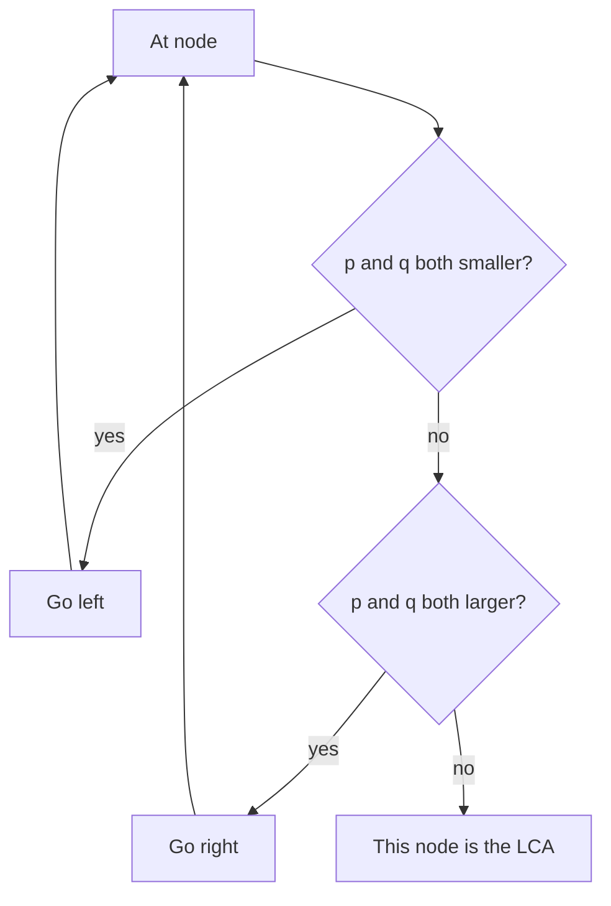

*LCA in a BST: the first node where `p` and `q` stop being on the same side.*

**Answer — LCA in a BST and in any binary tree**

```python
def lca_bst(root, p, q):
    curr = root
    while curr:
        if p < curr.val and q < curr.val:
            curr = curr.left
        elif p > curr.val and q > curr.val:
            curr = curr.right
        else:
            return curr                      # p and q split here
    return None


def lca_binary_tree(root, p, q):
    if not root or root.val in (p, q):
        return root
    left = lca_binary_tree(root.left, p, q)
    right = lca_binary_tree(root.right, p, q)
    if left and right:                       # found on both sides
        return root
    return left or right


bst = TreeNode(6, TreeNode(2, TreeNode(0), TreeNode(4)), TreeNode(8, TreeNode(7), TreeNode(9)))
print(lca_bst(bst, 0, 4).val)                # 2
print(lca_binary_tree(tree, 70, 40).val)     # 20
```

```javascript
function lcaBST(root, p, q) {
  let curr = root;
  while (curr) {
    if (p < curr.val && q < curr.val) curr = curr.left;
    else if (p > curr.val && q > curr.val) curr = curr.right;
    else return curr;                        // p and q split here
  }
  return null;
}

function lcaBinaryTree(root, p, q) {
  if (!root || root.val === p || root.val === q) return root;
  const left = lcaBinaryTree(root.left, p, q);
  const right = lcaBinaryTree(root.right, p, q);
  if (left && right) return root;            // found on both sides
  return left || right;
}

const bst6 = new TreeNode(6, new TreeNode(2, new TreeNode(0), new TreeNode(4)),
  new TreeNode(8, new TreeNode(7), new TreeNode(9)));
console.log(lcaBST(bst6, 0, 4).val);          // 2
console.log(lcaBinaryTree(tree, 70, 40).val); // 20
```

> **Warning**
>
> The notes' first diameter solution calls `height()` from every node, which is `O(n²)`. Compute height and diameter in the **same** post-order pass — `diameter = max(diameter, left_h + right_h)` right before returning `1 + max(left_h, right_h)` — and it drops to `O(n)`. The same "return one thing, update a global with another" shape solves path sums and balanced-tree checks.

**From the notes — tree problems**

| Problem | Technique | Complexity |
| --- | --- | --- |
| Pre-, in-, post-order; iterative inorder | recursion; explicit stack | `O(N)` |
| Level order; left and right view; next pointers | queue, one level per loop | `O(N)` |
| Vertical order; top view; bottom view | level order + column index | `O(N)` |
| Invert a tree; height in edges / nodes | recursion | `O(N)` |
| Diameter | height + diameter in one pass | `O(N)` |
| Path sum; node-to-root path | recursion carrying the path | `O(N)` |
| BST search, insert, min, max, delete | walk one path | `O(H)` |
| Check BST; sorted array → balanced BST | bounds; middle as root | `O(N)` |
| k-th smallest in a BST | inorder (or Morris), stop at k | `O(H + k)` |
| Morris inorder; recover a BST | threads to predecessors | `O(N)`, `O(1)` |
| LCA in a BST; LCA in a binary tree | steer by value; recurse both sides | `O(H)`; `O(N)` |

---

<a id="unit-4"></a>

## Unit 4 — Heaps, Greedy, DP & Graphs

The heavyweight patterns: always grab the best item (heaps and greedy), remember every subproblem (DP), and walk networks of relationships (graphs).

<a id="14-heaps-and-greedy"></a>

### Heaps & Greedy

- **Peek min / max** `O(1)`
- **Push / pop** `O(log N)`
- **Build from an array** `O(N)`
- **Heap sort** `O(N log N)`, `O(1)` space

A **heap** is a complete binary tree — every level full except the last, which fills left to right — where every parent is `≤` its children (min-heap) or `≥` them (max-heap). Completeness means it packs into an array with no gaps: the children of index `i` are `2i + 1` and `2i + 2`, and its parent is `(i - 1) // 2`. Push appends at the end and **sifts up**; pop moves the last element to the root and **sifts down**. Both walk one root-to-leaf path, so both are `O(log n)`.

> **Analogy** 🏥
>
> **Picture it — a hospital triage desk**
>
> Patients do not queue in arrival order; the most urgent is always seen next. The nurse does not re-sort the whole waiting room when someone new arrives — they only compare the newcomer with a few people above them. That is a priority queue, and a heap is how it stays cheap.

```text
index:   0   1   2   3   4   5   6          parent(i) = (i - 1) // 2
heap:  [ 2,  5,  3,  9,  6,  4,  8 ]        left(i)   = 2i + 1
                                            right(i)  = 2i + 2
              2
           /     \                           min-heap: every parent ≤ its children
          5       3                          only the ROOT is guaranteed to be the minimum
         / \     / \
        9   6   4   8
```

> **Interactive animation:** `heap` — rendered by the page script in the HTML version.

**A binary min-heap from scratch**

```python
class MinHeap:
    def __init__(self):
        self.heap = []

    def push(self, val):
        h = self.heap
        h.append(val)
        i = len(h) - 1
        while i > 0 and h[i] < h[(i - 1) // 2]:          # sift up
            p = (i - 1) // 2
            h[i], h[p] = h[p], h[i]
            i = p

    def pop(self):
        h = self.heap
        top, last = h[0], h.pop()
        if h:
            h[0] = last
            i = 0
            while True:                                  # sift down
                small, l, r = i, 2 * i + 1, 2 * i + 2
                if l < len(h) and h[l] < h[small]: small = l
                if r < len(h) and h[r] < h[small]: small = r
                if small == i: break
                h[i], h[small] = h[small], h[i]
                i = small
        return top


pq = MinHeap()
for x in [15, 9, 20, 4, 11]:
    pq.push(x)
print(pq.pop(), pq.pop())  # 4 9     (in practice: import heapq; heappush / heappop)
```

```javascript
class MinHeap {
  constructor(compare = (a, b) => a - b) {
    this.data = [];
    this.compare = compare;          // pass (a, b) => b - a for a max-heap
  }
  size() { return this.data.length; }
  peek() { return this.data[0]; }
  push(value) {
    const a = this.data;
    a.push(value);
    let i = a.length - 1;
    while (i > 0) {                                      // sift up
      const p = (i - 1) >> 1;
      if (this.compare(a[i], a[p]) >= 0) break;
      [a[i], a[p]] = [a[p], a[i]];
      i = p;
    }
  }
  pop() {
    const a = this.data;
    const top = a[0];
    const last = a.pop();
    if (a.length) {
      a[0] = last;
      let i = 0;
      while (true) {                                     // sift down
        const l = 2 * i + 1, r = l + 1;
        let m = i;
        if (l < a.length && this.compare(a[l], a[m]) < 0) m = l;
        if (r < a.length && this.compare(a[r], a[m]) < 0) m = r;
        if (m === i) break;
        [a[i], a[m]] = [a[m], a[i]];
        i = m;
      }
    }
    return top;
  }
}

const pq = new MinHeap();
[15, 9, 20, 4, 11].forEach((x) => pq.push(x));
console.log(pq.pop(), pq.pop()); // 4 9
```

<a id="build-heap"></a>

#### Building a heap in O(N), and heap sort

Pushing `n` items one by one costs `O(n log n)`. Building **bottom-up** is cheaper: every leaf (half the array) is already a valid heap, so start at the last non-leaf, `n // 2 - 1`, and sift each node down, walking backwards to the root. Half the nodes do no work, a quarter sink at most one level, an eighth at most two — the total is `n/4 · 1 + n/8 · 2 + … < n`, so the build is `O(n)`.

> **Interactive animation:** `build-heap` — rendered by the page script in the HTML version.

**Heap sort** builds a **max**-heap, then repeatedly swaps the root (the maximum) to the end of the array and sifts the new root down over the shrinking heap. It is `O(n log n)` in every case with `O(1)` extra space — but it is **not stable**, and its jumpy memory access makes it slower in practice than quick sort.

> **Interactive animation:** `sorting` (option=heap) — rendered by the page script in the HTML version.

<a id="median-stream"></a>

#### Two heaps: the running median

For a stream of numbers, keep the **smaller half in a max-heap** and the **larger half in a min-heap**, with sizes differing by at most one. The median is then sitting on top: the larger heap's root when the count is odd, the average of both roots when it is even. Each insert is one push plus at most one rebalancing move, `O(log n)`, and reading the median is `O(1)`.

> **Interactive animation:** `median-stream` — rendered by the page script in the HTML version.

**Interview question**

*Numbers arrive one at a time. After each, report the median so far. `5, 15, 1, 3` → `5, 10, 5, 4`.*

Push the new number into the low (max) heap if it is `≤` the low heap's top, otherwise into the high (min) heap. Then rebalance: if low has two more than high, move low's top across, and vice versa. Python's `heapq` is a min-heap only, so the max-heap stores **negated** values.

**Answer — median of a stream with two heaps**

```python
import heapq


class MedianFinder:
    def __init__(self):
        self.low = []    # max-heap of the smaller half (stored negated)
        self.high = []   # min-heap of the larger half

    def add_num(self, num):
        if not self.low or num <= -self.low[0]:
            heapq.heappush(self.low, -num)
        else:
            heapq.heappush(self.high, num)
        if len(self.low) > len(self.high) + 1:           # rebalance
            heapq.heappush(self.high, -heapq.heappop(self.low))
        elif len(self.high) > len(self.low):
            heapq.heappush(self.low, -heapq.heappop(self.high))

    def find_median(self):
        if len(self.low) > len(self.high):
            return float(-self.low[0])
        return (-self.low[0] + self.high[0]) / 2


mf = MedianFinder()
for x in [5, 15, 1, 3]:
    mf.add_num(x)
    print(mf.find_median(), end=" ")  # 5.0 10.0 5.0 4.0
```

```javascript
class MedianFinder {
  constructor() {
    this.low = new MinHeap((a, b) => b - a);  // max-heap of the smaller half
    this.high = new MinHeap();                // min-heap of the larger half
  }
  addNum(num) {
    if (!this.low.size() || num <= this.low.peek()) this.low.push(num);
    else this.high.push(num);
    if (this.low.size() > this.high.size() + 1) this.high.push(this.low.pop()); // rebalance
    else if (this.high.size() > this.low.size()) this.low.push(this.high.pop());
  }
  findMedian() {
    if (this.low.size() > this.high.size()) return this.low.peek();
    return (this.low.peek() + this.high.peek()) / 2;
  }
}

const mf = new MedianFinder();
console.log([5, 15, 1, 3].map((x) => (mf.addNum(x), mf.findMedian()))); // [5, 10, 5, 4]
```

<a id="greedy"></a>

#### Greedy — take the locally best choice, never look back

A greedy algorithm makes the choice that looks best **right now** and never revisits it. It is correct only when you can argue that some optimal answer starts with that choice — usually by showing that swapping any other first choice for the greedy one never makes things worse. Heaps and sorting are how greedy algorithms find "the best choice right now" quickly.

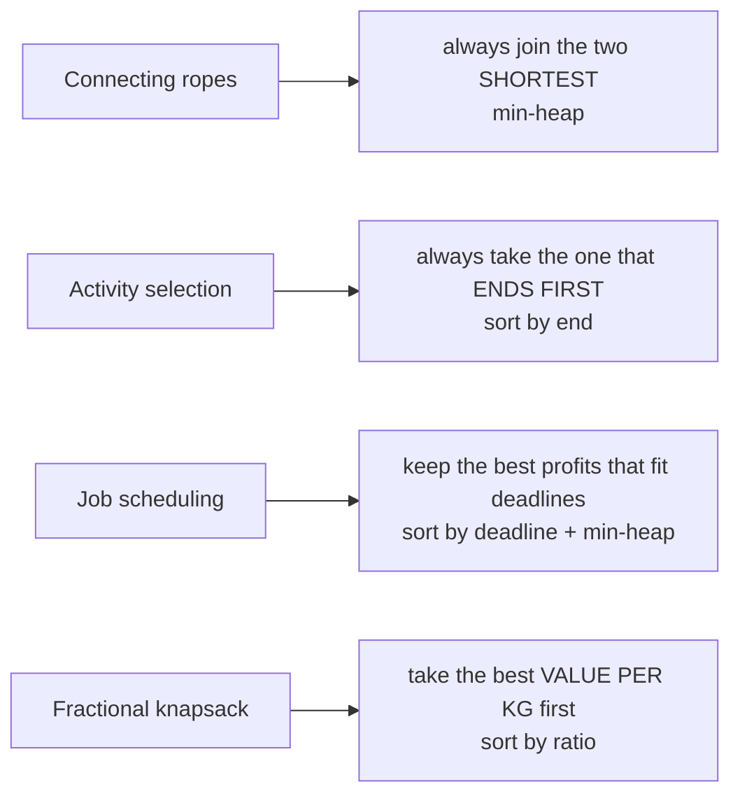

*The greedy choice in each problem from the notes.*

**Interview question**

*Joining two ropes costs the sum of their lengths. Join all ropes into one at minimum total cost. `[4, 3, 2, 6]` → `29`.*

Every rope's length is paid again each time the rope it belongs to is joined, so short ropes should be joined **early** (paid many times) and long ones **late**. Greedily joining the two shortest does exactly that: `2+3 = 5`, then `4+5 = 9`, then `6+9 = 15`, total `5 + 9 + 15 = 29`. A min-heap hands you the two shortest in `O(log n)`.

**Answer — connect ropes with a min-heap**

```python
import heapq


def min_cost_to_connect_ropes(lengths):
    heapq.heapify(lengths)
    total = 0
    while len(lengths) > 1:
        a = heapq.heappop(lengths)
        b = heapq.heappop(lengths)
        total += a + b
        heapq.heappush(lengths, a + b)   # the joined rope goes back in
    return total


print(min_cost_to_connect_ropes([4, 3, 2, 6]))  # 29
```

```javascript
function minCostToConnectRopes(lengths) {
  const pq = new MinHeap();
  lengths.forEach((len) => pq.push(len));
  let total = 0;
  while (pq.size() > 1) {
    const cost = pq.pop() + pq.pop();
    total += cost;
    pq.push(cost);                       // the joined rope goes back in
  }
  return total;
}

console.log(minCostToConnectRopes([4, 3, 2, 6])); // 29
```

**Interview question**

*Each job takes one unit of time and must finish by its deadline. Maximise total profit. Deadlines `[1, 3, 3, 3, 5, 5, 6, 8]`, profits `[5, 2, 7, 1, 4, 3, 8, 1]` → `30`.*

Sort jobs by deadline and walk them in order, tentatively accepting each one into a **min-heap of accepted profits**. If the heap now holds more jobs than the current deadline allows, the schedule is over-full — drop the **least profitable** accepted job. The heap always holds the best set of jobs that fits the deadlines seen so far.

**Answer — job scheduling with a min-heap**

```python
import heapq


def job_scheduling(deadlines, profits):
    jobs = sorted(zip(deadlines, profits))
    heap = []
    for deadline, profit in jobs:
        heapq.heappush(heap, profit)
        if len(heap) > deadline:          # over-full: drop the cheapest job
            heapq.heappop(heap)
    return sum(heap)


print(job_scheduling([1, 3, 3, 3, 5, 5, 6, 8], [5, 2, 7, 1, 4, 3, 8, 1]))  # 30
```

```javascript
function maximizeProfitWithinDeadlines(deadlines, profits) {
  const jobs = deadlines.map((d, i) => [d, profits[i]]).sort((a, b) => a[0] - b[0]);
  const chosen = new MinHeap();
  for (const [deadline, profit] of jobs) {
    chosen.push(profit);
    if (chosen.size() > deadline) chosen.pop(); // over-full: drop the cheapest job
  }
  return chosen.data.reduce((sum, p) => sum + p, 0);
}

console.log(maximizeProfitWithinDeadlines([1, 3, 3, 3, 5, 5, 6, 8], [5, 2, 7, 1, 4, 3, 8, 1])); // 30
```

**Activity selection — finish as many as possible**

```python
def max_activities(activities):
    activities.sort(key=lambda x: x[1])         # earliest end first
    count, last_end = 0, float("-inf")
    for start, end in activities:
        if start >= last_end:                   # does not overlap the last pick
            count += 1
            last_end = end
    return count


print(max_activities([(1, 2), (2, 3), (3, 6), (6, 7), (8, 9), (1, 9)]))  # 5
```

```javascript
function activitySelection(activities) {
  activities.sort((a, b) => a[1] - b[1]);       // earliest end first
  let count = 0;
  let lastEnd = -Infinity;
  for (const [start, end] of activities) {
    if (start >= lastEnd) {                     // does not overlap the last pick
      count++;
      lastEnd = end;
    }
  }
  return count;
}

console.log(activitySelection([[1, 2], [2, 3], [3, 6], [6, 7], [8, 9], [1, 9]])); // 5
```

> **Warning**
>
> Greedy by the obvious key is often wrong. Activity selection by **shortest duration** or **earliest start** both fail on small counter-examples; only **earliest end** is provably safe. Always try to break your greedy rule with a three-item example before coding it.

**From the notes — heap and greedy problems**

| Problem | Technique | Complexity |
| --- | --- | --- |
| Insert / extract in a min-heap; min- and max-heap classes | sift up / sift down | `O(log N)` |
| Priority queue; heap queries | binary heap | `O(Q log N)` |
| Build a heap from an array (min / max) | sift down from `n/2 - 1` | `O(N)` |
| Heap sort | build max-heap, swap root to end | `O(N log N)`, `O(1)` |
| Median of a stream | max-heap + min-heap | `O(log N)` per insert |
| Connecting the ropes | greedy, min-heap | `O(N log N)` |
| Activity selection / finish maximum jobs | greedy, sort by end | `O(N log N)` |
| Job scheduling with deadlines | sort by deadline + min-heap | `O(N log N)` |

<a id="15-dynamic-programming"></a>

### Dynamic Programming

- **Time** `states × work per state`
- **Fibonacci** `O(2^N)` → `O(N)`
- **Space-optimised 1-D DP** `O(1)`
- **0/1 knapsack** `O(N·W)`

Dynamic programming is recursion that **remembers**. It applies when a problem has two properties: **optimal substructure** (the best answer is built from the best answers to smaller problems) and **overlapping subproblems** (the same smaller problem is needed again and again). Solve each subproblem once, store it, and the exponential recursion tree collapses to a table.

The notes give two styles:

- **Strength — top-down (memoisation)** — Write the recursion, add a cache. Natural to derive; only computes states you actually need.
- **Strength — bottom-up (tabulation)** — Fill a table from the base cases up. No recursion depth limit, and it exposes when only the last row or two are needed.

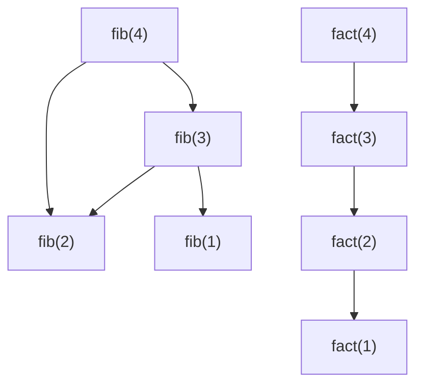

*Left: `fib(2)` is needed by two callers — overlapping subproblems, so caching pays. Right: factorial is a straight line where each value is needed once — caching only wastes memory. The notes list factorial, permutations and plain tree traversal as places where DP does not apply.*

Every DP answer is five decisions, and writing them down before coding is most of the work:

1. **State** — what does `dp[i]` (or `dp[i][j]`) *mean*? Say it in one sentence.
2. **Transition** — how is `dp[i]` built from smaller states? This is the recurrence.
3. **Base cases** — the smallest states you know without computing.
4. **Order** — fill so that every state's dependencies are ready (usually increasing `i`).
5. **Answer** — which cell holds it? Then ask: do I only need the last row? If so, drop to `O(1)` or `O(W)` space.

> **Interactive animation:** `dp-1d` — rendered by the page script in the HTML version.

**Interview question**

*Houses in a row hold money; robbing two adjacent houses triggers the alarm. Maximise the loot. `[2, 7, 9, 3, 1]` → `12` (houses 0, 2 and 4).*

State: `dp[i]` = the best loot from houses `0..i`. At house `i` either **skip** it (keep `dp[i-1]`) or **take** it (`nums[i] + dp[i-2]`, since `i-1` must be skipped). `dp[i]` only needs the previous two values, so two variables replace the array.

**Answer — house robber (space-optimised DP)**

```python
def rob(nums):
    if len(nums) == 1:
        return nums[0]
    prev2, prev1 = nums[0], max(nums[0], nums[1])
    for i in range(2, len(nums)):
        prev2, prev1 = prev1, max(prev1, prev2 + nums[i])   # skip vs take
    return prev1


print(rob([2, 7, 9, 3, 1]))    # 12
print(rob([10, 9, 7, 100]))    # 110
```

```javascript
function houseRobber(houseMoney) {
  if (houseMoney.length === 1) return houseMoney[0];
  let prev2 = houseMoney[0];
  let prev1 = Math.max(houseMoney[0], houseMoney[1]);
  for (let i = 2; i < houseMoney.length; i++) {
    [prev2, prev1] = [prev1, Math.max(prev1, prev2 + houseMoney[i])]; // skip vs take
  }
  return prev1;
}

console.log(houseRobber([2, 7, 9, 3, 1])); // 12
console.log(houseRobber([10, 9, 7, 100])); // 110
```

**Interview question**

*Return the fewest perfect squares that sum to `n`. `12` → `3` (`4 + 4 + 4`); `13` → `2` (`9 + 4`).*

State: `dp[i]` = fewest squares summing to `i`. The last square used is some `j²`, leaving `i - j²`, so `dp[i] = 1 + min(dp[i - j²])` over all `j² ≤ i`. Greedy (take the biggest square) fails: for 12 it picks `9 + 1 + 1 + 1`. There are `n` states with `√n` choices each, so `O(n√n)`.

**Answer — minimum perfect squares (bottom-up)**

```python
def num_squares(n):
    dp = [float("inf")] * (n + 1)
    dp[0] = 0
    for i in range(1, n + 1):
        j = 1
        while j * j <= i:
            dp[i] = min(dp[i], 1 + dp[i - j * j])   # last square is j*j
            j += 1
    return dp[n]


print(num_squares(12), num_squares(13))  # 3 2
```

```javascript
function minSquares(n) {
  const dp = new Array(n + 1).fill(Infinity);
  dp[0] = 0;
  for (let i = 1; i <= n; i++) {
    for (let j = 1; j * j <= i; j++) {
      dp[i] = Math.min(dp[i], 1 + dp[i - j * j]);   // last square is j*j
    }
  }
  return dp[n];
}

console.log(minSquares(12), minSquares(13)); // 3 2
```

Climbing stairs one or two steps at a time is Fibonacci in disguise — `ways(n) = ways(n-1) + ways(n-2)`, because the last move was either a single or a double step.

<a id="dp-on-grids"></a>

#### Two-dimensional DP

When the state needs two numbers — a cell in a grid, a prefix of two strings, an item plus a capacity — the table becomes 2-D. In **unique paths**, a robot moving only right or down reaches `(i, j)` from above or from the left, so `dp[i][j] = dp[i-1][j] + dp[i][j-1]`, with the first row and column all `1`.

> **Interactive animation:** `unique-paths` — rendered by the page script in the HTML version.

**Unique paths and unique BSTs (Catalan numbers)**

```python
def unique_paths(n, m):
    dp = [[1] * m for _ in range(n)]
    for i in range(1, n):
        for j in range(1, m):
            dp[i][j] = dp[i - 1][j] + dp[i][j - 1]   # from above + from the left
    return dp[n - 1][m - 1]


def num_trees(n):
    dp = [0] * (n + 1)
    dp[0] = 1
    for nodes in range(1, n + 1):
        for root in range(1, nodes + 1):             # left size root-1, right size nodes-root
            dp[nodes] += dp[root - 1] * dp[nodes - root]
    return dp[n]


print(unique_paths(3, 3))  # 6
print(num_trees(3))        # 5
```

```javascript
function uniquePaths(n, m) {
  const dp = Array.from({ length: n }, () => new Array(m).fill(1));
  for (let i = 1; i < n; i++) {
    for (let j = 1; j < m; j++) dp[i][j] = dp[i - 1][j] + dp[i][j - 1]; // from above + from the left
  }
  return dp[n - 1][m - 1];
}

function countUniqueBSTs(n) {
  const dp = new Array(n + 1).fill(0);
  dp[0] = 1;
  for (let nodes = 1; nodes <= n; nodes++) {
    for (let root = 1; root <= nodes; root++) dp[nodes] += dp[root - 1] * dp[nodes - root];
  }
  return dp[n];
}

console.log(uniquePaths(3, 3));   // 6
console.log(countUniqueBSTs(3));  // 5
```

The unique-BST count is the **Catalan** recurrence `C(n) = Σ C(i) · C(n-1-i)`: pick a root, and the left and right subtrees are independent smaller problems. The same numbers count valid parenthesis strings from §7.

<a id="knapsack"></a>

#### The knapsack family

Items have a weight and a value; the bag has a capacity. Three variants, three different tools:

| Variant | Items | Tool | Recurrence / rule |
| --- | --- | --- | --- |
| Fractional | divisible | greedy | take the best value-per-weight first |
| 0/1 | take each at most once | DP | `dp[i][w] = max(dp[i-1][w], v + dp[i-1][w - wt])` |
| Unbounded (0-N) | unlimited copies | DP | `dp[i][w] = max(dp[i-1][w], v + dp[i][w - wt])` |

The only difference between the last two is `dp[i-1]` versus `dp[i]` on the "take" side: after taking an item in 0/1 you move on to the previous items; in unbounded you may take the **same** item again.

> **Interactive animation:** `knapsack` — rendered by the page script in the HTML version.

**Interview question**

*0/1 knapsack: with a budget of `6`, item costs `[1, 3, 4, 2]` and happiness `[15, 20, 30, 18]`, maximise total happiness. Answer: `53` (costs 1 + 3 + 2).*

State: `dp[w]` = best value with capacity `w` using the items processed so far. Each row only reads the row above, so one 1-D array suffices — **if you loop `w` from high to low**. Going downwards means `dp[w - wt]` still holds the *previous* row's value, so each item is used at most once. Loop upwards and you have written unbounded knapsack by accident.

**Answer — 0/1 knapsack, subset sum and unbounded knapsack in 1-D**

```python
def knapsack_01(costs, values, budget):
    dp = [0] * (budget + 1)
    for cost, value in zip(costs, values):
        for w in range(budget, cost - 1, -1):    # high → low: each item once
            dp[w] = max(dp[w], value + dp[w - cost])
    return dp[budget]


def subset_sum(arr, target):
    dp = [True] + [False] * target
    for num in arr:
        for j in range(target, num - 1, -1):     # same trick with booleans
            dp[j] = dp[j] or dp[j - num]
    return dp[target]


def unbounded_knapsack(weights, values, capacity):
    dp = [0] * (capacity + 1)
    for wt, val in zip(weights, values):
        for w in range(wt, capacity + 1):        # low → high: reuse allowed
            dp[w] = max(dp[w], val + dp[w - wt])
    return dp[capacity]


print(knapsack_01([1, 3, 4, 2], [15, 20, 30, 18], 6))  # 53
print(subset_sum([3, 34, 4, 12, 5, 2], 9))              # True
print(unbounded_knapsack([1, 50], [1, 30], 100))        # 100
```

```javascript
function knapsack01(costs, values, budget) {
  const dp = new Array(budget + 1).fill(0);
  costs.forEach((cost, i) => {
    for (let w = budget; w >= cost; w--) dp[w] = Math.max(dp[w], values[i] + dp[w - cost]); // high → low
  });
  return dp[budget];
}

function subsetSum(arr, target) {
  const dp = new Array(target + 1).fill(false);
  dp[0] = true;
  for (const num of arr) {
    for (let j = target; j >= num; j--) dp[j] = dp[j] || dp[j - num];
  }
  return dp[target];
}

function unboundedKnapsack(weights, values, capacity) {
  const dp = new Array(capacity + 1).fill(0);
  weights.forEach((wt, i) => {
    for (let w = wt; w <= capacity; w++) dp[w] = Math.max(dp[w], values[i] + dp[w - wt]); // low → high
  });
  return dp[capacity];
}

console.log(knapsack01([1, 3, 4, 2], [15, 20, 30, 18], 6)); // 53
console.log(subsetSum([3, 34, 4, 12, 5, 2], 9));            // true
console.log(unboundedKnapsack([1, 50], [1, 30], 100));      // 100
```

**Fractional knapsack — the greedy contrast**

```python
def fractional_knapsack(values, weights, capacity):
    items = sorted(zip(values, weights), key=lambda x: x[0] / x[1], reverse=True)
    total = 0.0
    for value, weight in items:
        if capacity >= weight:
            capacity -= weight
            total += value
        else:
            total += value * capacity / weight   # take the fraction that fits
            break
    return total


print(fractional_knapsack([200, 250, 150], [20, 50, 10], 70))  # 550.0
```

```javascript
function fractionalKnapsack(values, weights, capacity) {
  const items = values.map((v, i) => [v, weights[i]]).sort((a, b) => b[0] / b[1] - a[0] / a[1]);
  let total = 0;
  for (const [value, weight] of items) {
    if (capacity >= weight) {
      capacity -= weight;
      total += value;
    } else {
      total += (value * capacity) / weight;      // take the fraction that fits
      break;
    }
  }
  return total;
}

console.log(fractionalKnapsack([200, 250, 150], [20, 50, 10], 70)); // 550
```

> **Warning**
>
> Greedy-by-ratio is optimal only when items can be cut. For 0/1 items it fails: capacity `50`, items `(60, 10)`, `(100, 20)`, `(120, 30)` — ratio-greedy takes the first two for `160`, but the second and third give `220`.

**From the notes — DP problems**

| Problem | State | Complexity |
| --- | --- | --- |
| Fibonacci (memo, tabulation, `O(1)` space); climbing stairs | `dp[i]` = answer for `i` | `O(N)` |
| Minimum perfect squares | `dp[i]` = fewest squares for `i` | `O(N√N)` |
| House robber; max sum without adjacent elements (2 × N grid) | `dp[i]` = best loot to `i` | `O(N)` |
| Unique paths in a grid | `dp[i][j]` = ways to reach cell | `O(N·M)` |
| Count A-digit numbers with digit sum B; N-digit numbers | `dp[digits][sum]` | `O(A·B)` |
| Catalan numbers; unique BSTs I and II | `dp[n]` = trees on `n` nodes | `O(N^2)` |
| Target sum / subset sum | `dp[s]` = is sum `s` reachable | `O(N·S)` |
| 0/1 knapsack (customised shopping) | `dp[w]`, high → low | `O(N·W)` |
| Unbounded knapsack | `dp[w]`, low → high | `O(N·W)` |
| Fractional knapsack | greedy by ratio | `O(N log N)` |

<a id="16-graphs"></a>

### Graphs

- **BFS / DFS** `O(V + E)`
- **Dijkstra** `O((V + E) log V)`
- **Kruskal MST** `O(E log E)`
- **Topological sort** `O(V + E)`

A graph is vertices joined by edges. The notes classify graphs along five axes, and each one changes which algorithm is legal: **directed or undirected**, **connected or disconnected**, **weighted or unweighted**, **cyclic or acyclic** (a directed acyclic graph is a DAG), and **degree** — in-degree and out-degree for directed graphs. A **simple graph** has no self-loops and no parallel edges. Store sparse graphs as an **adjacency list** (`O(V + E)` space); an adjacency matrix costs `O(V²)` but answers "is there an edge?" in `O(1)`.

> **Analogy** 🗺️
>
> **Picture it — a city map**
>
> Intersections are vertices, roads are edges. One-way streets make it directed, road lengths make it weighted. BFS is a ripple spreading out from a dropped stone; DFS is a maze-walker who follows one corridor to its end before backing up.

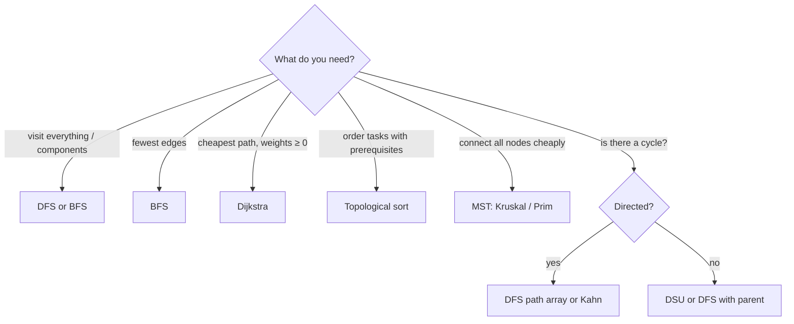

*Choosing a graph algorithm from the question being asked.*

> **Interactive animation:** `graph-traversal` — rendered by the page script in the HTML version.

**Adjacency list, BFS and DFS**

```python
from collections import defaultdict, deque


def build_graph(edges, directed=False):
    adj = defaultdict(list)
    for u, v in edges:
        adj[u].append(v)
        if not directed:
            adj[v].append(u)
    return adj


def bfs(adj, source):
    dist = {source: 0}
    queue = deque([source])
    while queue:
        node = queue.popleft()
        for nxt in adj[node]:
            if nxt not in dist:          # mark when ENQUEUED, not when popped
                dist[nxt] = dist[node] + 1
                queue.append(nxt)
    return dist                          # fewest edges from source


def dfs(adj, node, visited, order):
    visited.add(node)
    order.append(node)
    for nxt in adj[node]:
        if nxt not in visited:
            dfs(adj, nxt, visited, order)
    return order


g = build_graph([(0, 1), (0, 4), (1, 2), (1, 3), (2, 3), (3, 4), (4, 5), (4, 6), (5, 6)])
print(bfs(g, 3))                 # {3: 0, 1: 1, 2: 1, 4: 1, 0: 2, 5: 2, 6: 2}
print(dfs(g, 0, set(), []))      # [0, 1, 2, 3, 4, 5, 6]
```

```javascript
function buildGraph(n, edges, directed = false) {
  const adj = Array.from({ length: n }, () => []);
  for (const [u, v] of edges) {
    adj[u].push(v);
    if (!directed) adj[v].push(u);
  }
  return adj;
}

function bfs(adj, source) {
  const dist = new Array(adj.length).fill(-1);
  dist[source] = 0;
  const queue = [source];
  for (let head = 0; head < queue.length; head++) {   // head index instead of shift()
    const node = queue[head];
    for (const next of adj[node]) {
      if (dist[next] === -1) {           // mark when ENQUEUED, not when popped
        dist[next] = dist[node] + 1;
        queue.push(next);
      }
    }
  }
  return dist;                           // fewest edges from source
}

function dfs(adj, node, visited = new Set(), order = []) {
  visited.add(node);
  order.push(node);
  for (const next of adj[node]) if (!visited.has(next)) dfs(adj, next, visited, order);
  return order;
}

const g = buildGraph(7, [[0, 1], [0, 4], [1, 2], [1, 3], [2, 3], [3, 4], [4, 5], [4, 6], [5, 6]]);
console.log(bfs(g, 3)); // [2, 1, 1, 0, 1, 2, 2]
console.log(dfs(g, 0)); // [0, 1, 2, 3, 4, 5, 6]
```

<a id="cycle-detection"></a>

#### Cycles in a directed graph

In an undirected graph, meeting any visited node other than your parent means a cycle. In a **directed** graph that is not enough — two paths can reach the same node without forming a loop. You need a second array, the **current path** (the recursion stack). Reaching a node that is on the current path is a **back edge**, and a back edge is a cycle.

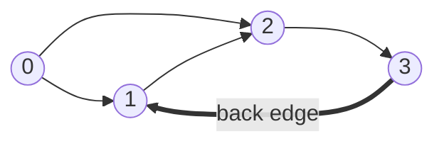

*`0 → 2` and `1 → 2` both reach `2` — no cycle there. `3 → 1` points back into the current path `1 → 2 → 3`: that is the cycle.*

**Answer — detect a cycle in a directed graph (DFS with a path array)**

```python
def has_cycle(n, edges):
    adj = [[] for _ in range(n)]
    for u, v in edges:
        adj[u].append(v)
    visited = [False] * n
    on_path = [False] * n

    def dfs(node):
        visited[node] = on_path[node] = True
        for nxt in adj[node]:
            if on_path[nxt]:
                return True               # back edge into the current path
            if not visited[nxt] and dfs(nxt):
                return True
        on_path[node] = False             # leaving: no longer on the path
        return False

    return any(not visited[i] and dfs(i) for i in range(n))


print(has_cycle(4, [(0, 1), (0, 2), (1, 2), (2, 3), (3, 1)]))  # True
print(has_cycle(4, [(0, 1), (0, 2), (1, 2), (2, 3)]))          # False
```

```javascript
function hasCycle(n, edges) {
  const adj = Array.from({ length: n }, () => []);
  for (const [u, v] of edges) adj[u].push(v);
  const visited = new Array(n).fill(false);
  const onPath = new Array(n).fill(false);

  const dfs = (node) => {
    visited[node] = onPath[node] = true;
    for (const next of adj[node]) {
      if (onPath[next]) return true;       // back edge into the current path
      if (!visited[next] && dfs(next)) return true;
    }
    onPath[node] = false;                  // leaving: no longer on the path
    return false;
  };

  for (let i = 0; i < n; i++) if (!visited[i] && dfs(i)) return true;
  return false;
}

console.log(hasCycle(4, [[0, 1], [0, 2], [1, 2], [2, 3], [3, 1]])); // true
console.log(hasCycle(4, [[0, 1], [0, 2], [1, 2], [2, 3]]));         // false
```

<a id="multisource-bfs"></a>

#### Multi-source BFS — rotten oranges

BFS from **several** sources at once: put every source in the queue at distance 0 before starting. Each wave of the BFS is then one unit of time spreading from all sources simultaneously, and the first time a cell is reached is its distance to the **nearest** source.

> **Interactive animation:** `rotten-oranges` — rendered by the page script in the HTML version.

**Interview question**

*In a grid, `2` is a rotten orange, `1` fresh, `0` empty. Each minute, rot spreads to fresh neighbours (up, down, left, right). Return the minutes until no fresh orange remains, or `-1`. `[[2,1,1],[1,1,0],[0,1,1]]` → `4`.*

Enqueue every rotten orange with time 0 and count the fresh ones. Pop a cell, rot each fresh neighbour, enqueue it with `time + 1`, and decrement the fresh count. The last time popped is the answer — unless fresh oranges remain unreachable, in which case return `-1`.

**Answer — rotten oranges (multi-source BFS)**

```python
from collections import deque


def oranges_rotting(grid):
    rows, cols = len(grid), len(grid[0])
    queue, fresh = deque(), 0
    for r in range(rows):
        for c in range(cols):
            if grid[r][c] == 2:
                queue.append((r, c, 0))      # every source starts at time 0
            elif grid[r][c] == 1:
                fresh += 1
    minutes = 0
    while queue:
        r, c, t = queue.popleft()
        minutes = t
        for dr, dc in ((-1, 0), (1, 0), (0, -1), (0, 1)):
            nr, nc = r + dr, c + dc
            if 0 <= nr < rows and 0 <= nc < cols and grid[nr][nc] == 1:
                grid[nr][nc] = 2
                fresh -= 1
                queue.append((nr, nc, t + 1))
    return minutes if fresh == 0 else -1


print(oranges_rotting([[2, 1, 1], [1, 1, 0], [0, 1, 1]]))  # 4
```

```javascript
function orangesRotting(grid) {
  const rows = grid.length, cols = grid[0].length;
  const queue = [];
  let fresh = 0;
  for (let r = 0; r < rows; r++) {
    for (let c = 0; c < cols; c++) {
      if (grid[r][c] === 2) queue.push([r, c, 0]);   // every source starts at time 0
      else if (grid[r][c] === 1) fresh++;
    }
  }
  let minutes = 0;
  for (let head = 0; head < queue.length; head++) {
    const [r, c, t] = queue[head];
    minutes = t;
    for (const [dr, dc] of [[-1, 0], [1, 0], [0, -1], [0, 1]]) {
      const nr = r + dr, nc = c + dc;
      if (nr >= 0 && nr < rows && nc >= 0 && nc < cols && grid[nr][nc] === 1) {
        grid[nr][nc] = 2;
        fresh--;
        queue.push([nr, nc, t + 1]);
      }
    }
  }
  return fresh === 0 ? minutes : -1;
}

console.log(orangesRotting([[2, 1, 1], [1, 1, 0], [0, 1, 1]])); // 4
```

> **Tip**
>
> BFS finds shortest paths only when every edge costs the same. The notes' "Another BFS" problem has weights of 1 **or** 2 — split each weight-2 edge into two weight-1 edges through a dummy vertex, and plain BFS works again.

<a id="topological-sort"></a>

#### Topological sort — Kahn's algorithm

A topological order lists every node before everything that depends on it. It exists **only for DAGs**. Kahn's algorithm: compute every node's in-degree, enqueue the nodes with in-degree 0 (no prerequisites), and repeatedly pop one, append it to the order and "delete" its outgoing edges by decrementing its neighbours' in-degrees — any neighbour that drops to 0 is now ready. If fewer than `n` nodes come out, the leftovers are stuck on a cycle. Swap the queue for a min-heap to get the lexicographically smallest order.

> **Interactive animation:** `topo-sort` — rendered by the page script in the HTML version.

**Interview question**

*There are `n` courses; `[a, b]` means course `b` must be taken before `a`. Can every course be finished? `4` courses, `[[1,0],[2,0],[3,1],[3,2]]` → `True`, order `0, 1, 2, 3`.*

**Answer — course schedule with Kahn's algorithm**

```python
from collections import deque


def course_order(num_courses, prerequisites):
    adj = [[] for _ in range(num_courses)]
    in_degree = [0] * num_courses
    for course, pre in prerequisites:
        adj[pre].append(course)
        in_degree[course] += 1

    queue = deque(i for i in range(num_courses) if in_degree[i] == 0)
    order = []
    while queue:
        node = queue.popleft()
        order.append(node)
        for nxt in adj[node]:
            in_degree[nxt] -= 1
            if in_degree[nxt] == 0:       # all prerequisites done
                queue.append(nxt)
    return order if len(order) == num_courses else None   # None → cycle


print(course_order(4, [[1, 0], [2, 0], [3, 1], [3, 2]]))  # [0, 1, 2, 3]
print(course_order(2, [[0, 1], [1, 0]]))                  # None
```

```javascript
function courseOrder(numCourses, prerequisites) {
  const adj = Array.from({ length: numCourses }, () => []);
  const inDegree = new Array(numCourses).fill(0);
  for (const [course, pre] of prerequisites) {
    adj[pre].push(course);
    inDegree[course]++;
  }
  const queue = [];
  for (let i = 0; i < numCourses; i++) if (inDegree[i] === 0) queue.push(i);
  for (let head = 0; head < queue.length; head++) {
    for (const next of adj[queue[head]]) {
      if (--inDegree[next] === 0) queue.push(next);    // all prerequisites done
    }
  }
  return queue.length === numCourses ? queue : null;   // null → cycle
}

console.log(courseOrder(4, [[1, 0], [2, 0], [3, 1], [3, 2]])); // [0, 1, 2, 3]
console.log(courseOrder(2, [[0, 1], [1, 0]]));                 // null
```

<a id="minimum-spanning-tree"></a>

#### Minimum spanning tree — Kruskal with union-find

A **spanning tree** connects all `V` vertices with exactly `V - 1` edges and no cycle; the **minimum** one has the smallest total weight. **Kruskal** sorts edges by weight and takes each one unless it would close a cycle — and "would this close a cycle?" is exactly "are both ends already in the same component?", which **union-find** (DSU) answers in near-constant time. **Prim** grows one tree from a start vertex instead, always adding the cheapest edge leaving the tree, using a min-heap.

> **Interactive animation:** `kruskal` — rendered by the page script in the HTML version.

**Answer — cost of construction of bridges (Kruskal + DSU)**

```python
class DSU:
    def __init__(self, n):
        self.parent = list(range(n + 1))
        self.rank = [0] * (n + 1)

    def find(self, i):
        if self.parent[i] != i:
            self.parent[i] = self.find(self.parent[i])   # path compression
        return self.parent[i]

    def union(self, i, j):
        ri, rj = self.find(i), self.find(j)
        if ri == rj:
            return False                                  # same component: a cycle
        if self.rank[ri] < self.rank[rj]:
            ri, rj = rj, ri
        self.parent[rj] = ri                              # union by rank
        if self.rank[ri] == self.rank[rj]:
            self.rank[ri] += 1
        return True


def kruskal_mst(num_nodes, edges):
    dsu = DSU(num_nodes)
    cost = taken = 0
    for u, v, wt in sorted(edges, key=lambda e: e[2]):
        if dsu.union(u, v):
            cost += wt
            taken += 1
            if taken == num_nodes - 1:
                break
    return cost


print(kruskal_mst(4, [[1, 2, 1], [2, 3, 4], [1, 4, 3], [4, 3, 2], [1, 3, 10]]))  # 6
```

```javascript
class DSU {
  constructor(n) {
    this.parent = Array.from({ length: n + 1 }, (_, i) => i);
    this.rank = new Array(n + 1).fill(0);
  }
  find(i) {
    if (this.parent[i] !== i) this.parent[i] = this.find(this.parent[i]); // path compression
    return this.parent[i];
  }
  union(i, j) {
    let ri = this.find(i), rj = this.find(j);
    if (ri === rj) return false;                    // same component: a cycle
    if (this.rank[ri] < this.rank[rj]) [ri, rj] = [rj, ri];
    this.parent[rj] = ri;                           // union by rank
    if (this.rank[ri] === this.rank[rj]) this.rank[ri]++;
    return true;
  }
}

function kruskalMST(numNodes, edges) {
  const dsu = new DSU(numNodes);
  let cost = 0, taken = 0;
  for (const [u, v, wt] of [...edges].sort((a, b) => a[2] - b[2])) {
    if (dsu.union(u, v)) {
      cost += wt;
      if (++taken === numNodes - 1) break;
    }
  }
  return cost;
}

console.log(kruskalMST(4, [[1, 2, 1], [2, 3, 4], [1, 4, 3], [4, 3, 2], [1, 3, 10]])); // 6
```

<a id="dijkstra"></a>

#### Dijkstra — cheapest paths with non-negative weights

Dijkstra is BFS with a priority queue: always settle the unsettled vertex with the smallest known distance, then **relax** its edges (`dist[v] = min(dist[v], dist[u] + w)`). Settling is final because, with no negative edges, no later path can come back cheaper. Stale heap entries are skipped when popped (`d > dist[u]`) instead of being deleted.

> **Interactive animation:** `dijkstra` — rendered by the page script in the HTML version.

**Interview question**

*Seven cities, undirected roads `[[0,1,10], [0,3,40], [1,2,10], [2,3,10], [3,4,2], [4,5,3], [4,6,8], [5,6,3]]`. Shortest distance from city 0 to every city? → `[0, 10, 20, 30, 32, 35, 38]`.*

The direct road `0 → 3` costs 40, but `0 → 1 → 2 → 3` costs 30. Dijkstra settles 1 (10), then 2 (20), then 3 (30) — and when it relaxes from 3 it improves nothing, because 3 was already settled at its best. City 6 is 38 via 5, not 40 via 4 directly.

**Answer — Dijkstra with a binary heap**

```python
import heapq


def dijkstra(n, edges, source):
    adj = [[] for _ in range(n)]
    for u, v, w in edges:
        adj[u].append((v, w))
        adj[v].append((u, w))
    dist = [float("inf")] * n
    dist[source] = 0
    heap = [(0, source)]
    while heap:
        d, u = heapq.heappop(heap)
        if d > dist[u]:
            continue                       # stale entry: u was already settled cheaper
        for v, w in adj[u]:
            if d + w < dist[v]:            # relax
                dist[v] = d + w
                heapq.heappush(heap, (dist[v], v))
    return dist


roads = [[0, 1, 10], [0, 3, 40], [1, 2, 10], [2, 3, 10], [3, 4, 2], [4, 5, 3], [4, 6, 8], [5, 6, 3]]
print(dijkstra(7, roads, 0))  # [0, 10, 20, 30, 32, 35, 38]
```

```javascript
function dijkstra(n, edges, source) {
  const adj = Array.from({ length: n }, () => []);
  for (const [u, v, w] of edges) {
    adj[u].push([v, w]);
    adj[v].push([u, w]);
  }
  const dist = new Array(n).fill(Infinity);
  dist[source] = 0;
  const heap = new MinHeap((a, b) => a[0] - b[0]);   // the MinHeap class from §14
  heap.push([0, source]);
  while (heap.size()) {
    const [d, u] = heap.pop();
    if (d > dist[u]) continue;             // stale entry: u was already settled cheaper
    for (const [v, w] of adj[u]) {
      if (d + w < dist[v]) {               // relax
        dist[v] = d + w;
        heap.push([dist[v], v]);
      }
    }
  }
  return dist;
}

const roads = [[0, 1, 10], [0, 3, 40], [1, 2, 10], [2, 3, 10], [3, 4, 2], [4, 5, 3], [4, 6, 8], [5, 6, 3]];
console.log(dijkstra(7, roads, 0)); // [0, 10, 20, 30, 32, 35, 38]
```

> **Warning**
>
> A single negative edge breaks Dijkstra's "settled means final" guarantee, and it will return wrong distances without any error. It also needs a real priority queue — re-sorting an array on every push, as a quick JavaScript version might, makes each push `O(n log n)`.

**From the notes — graph problems**

| Problem | Technique | Complexity |
| --- | --- | --- |
| Store a graph (matrix, list) | adjacency matrix / list | `O(V^2)` / `O(V + E)` |
| DFS traversal; path in a directed graph | DFS / BFS | `O(V + E)` |
| Cycle in a directed graph | DFS path array, or Kahn | `O(V + E)` |
| BFS traversal with distances | queue | `O(V + E)` |
| Multi-source BFS; rotten oranges | all sources at distance 0 | `O(V + E)` / `O(R·C)` |
| Another BFS (weights 1 or 2) | split weight-2 edges | `O(V + E)` |
| Cost of bridges; commutable islands | Kruskal + DSU; Prim + heap | `O(E log E)` |
| Dijkstra | min-heap, relax edges | `O((V + E) log V)` |
| Topological sort; possibility of finishing | Kahn's algorithm | `O(V + E)` |
| Lexicographically smallest topological order | Kahn with a min-heap | `O((V + E) log V)` |

---

<a id="17-the-whole-thing-on-one-page"></a>

## The Whole Thing on One Page

Most of interview problem-solving is **recognition**: noticing which of about twenty signals is in the problem statement. This table is the index to the whole course.

| If the problem says… | Reach for | Cost | Section |
| --- | --- | --- | --- |
| "sum over all subarrays / submatrices" | contribution counting | `O(N)` | §1 |
| "many range sum queries" | prefix sums | `O(N + Q)` | §2 |
| "many range updates, read once" | difference array | `O(N + Q)` | §2 |
| "contiguous, length K" | fixed sliding window | `O(N)` | §2 |
| "longest / count subarrays with a limit, all positive" | dynamic sliding window | `O(N)` | §2 |
| "maximum subarray sum" | Kadane | `O(N)` | §3 |
| "overlapping intervals" | sort by start, sweep | `O(N log N)` | §3 |
| "appears more than n/2 times" | Boyer–Moore | `O(N)` | §3 |
| "sorted array, pair with sum / difference" | two pointers | `O(N)` | §4 |
| "row- and column-sorted matrix" | staircase search | `O(N + M)` | §5 |
| "every element twice except one" | XOR | `O(N)` | §6 |
| "all primes up to N" | sieve | `O(N log log N)` | §6 |
| "all subsets / permutations / combinations" | backtracking | `O(2^N)` / `O(N!)` | §7 |
| "subarray with sum K, negatives allowed" | prefix sums + hash map | `O(N)` | §8 |
| "values in a small range" | count sort | `O(N + K)` | §9 |
| "arrange to form the largest …" | custom comparator | `O(N log N)` | §9 |
| "minimum possible maximum" / "maximum possible minimum" | binary search on the answer | `O(N log R)` | §10 |
| "middle, cycle, palindrome of a linked list" | slow / fast pointers | `O(N)`, `O(1)` | §11 |
| "O(1) get and put with eviction" | hash map + DLL (LRU) | `O(1)` | §11 |
| "nearest smaller / greater element" | monotonic stack | `O(N)` | §12 |
| "max of every window" | monotonic deque | `O(N)` | §12 |
| "inorder with O(1) space" | Morris traversal | `O(N)`, `O(1)` | §13 |
| "k smallest / largest, running median" | heap(s) | `O(N log K)` | §14 |
| "count ways / min cost, choices overlap" | dynamic programming | states × transitions | §15 |
| "budget, weights, values" | knapsack | `O(N·W)` | §15 |
| "fewest steps in a grid or unweighted graph" | BFS / multi-source BFS | `O(V + E)` | §16 |
| "prerequisites / build order" | topological sort | `O(V + E)` | §16 |
| "connect everything cheaply" | MST (Kruskal / Prim) | `O(E log E)` | §16 |
| "cheapest route, non-negative weights" | Dijkstra | `O((V + E) log V)` | §16 |

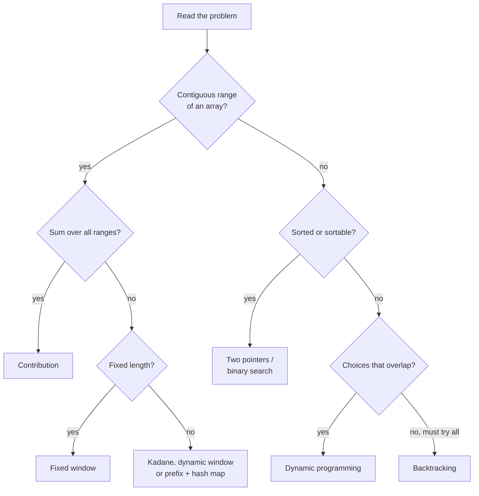

*A first-pass decision tree. When a problem fits more than one branch, start with the cheapest cost.*

> **Key idea**
>
> Say the brute force out loud first, name its cost, then name **what it recomputes**. That one sentence points at the pattern: recomputed sums → prefix or window; recomputed pair checks → two pointers or hash map; recomputed subproblems → DP; recomputed feasibility → binary search on the answer.

<a id="where-to-go-next"></a>

### Where to go next

1. [DSA Crash Course](dsa-crash-course.html) — the structures themselves, if any container in this course felt shaky.
2. [DSA Detailed Course](dsa-detailed-course.html) — every topic from first principles, with proofs and edge cases.
3. [All DSA courses](dsa-courses.html) — the catalog page for this track.

