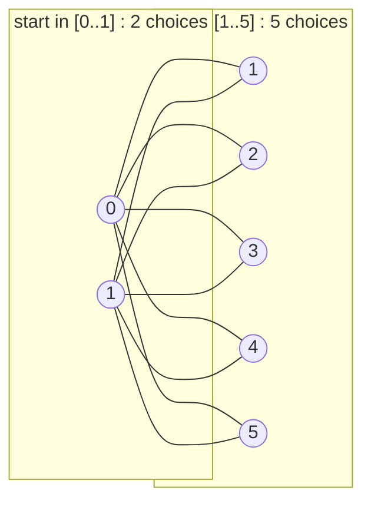
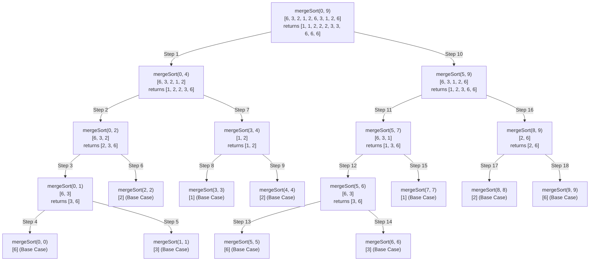
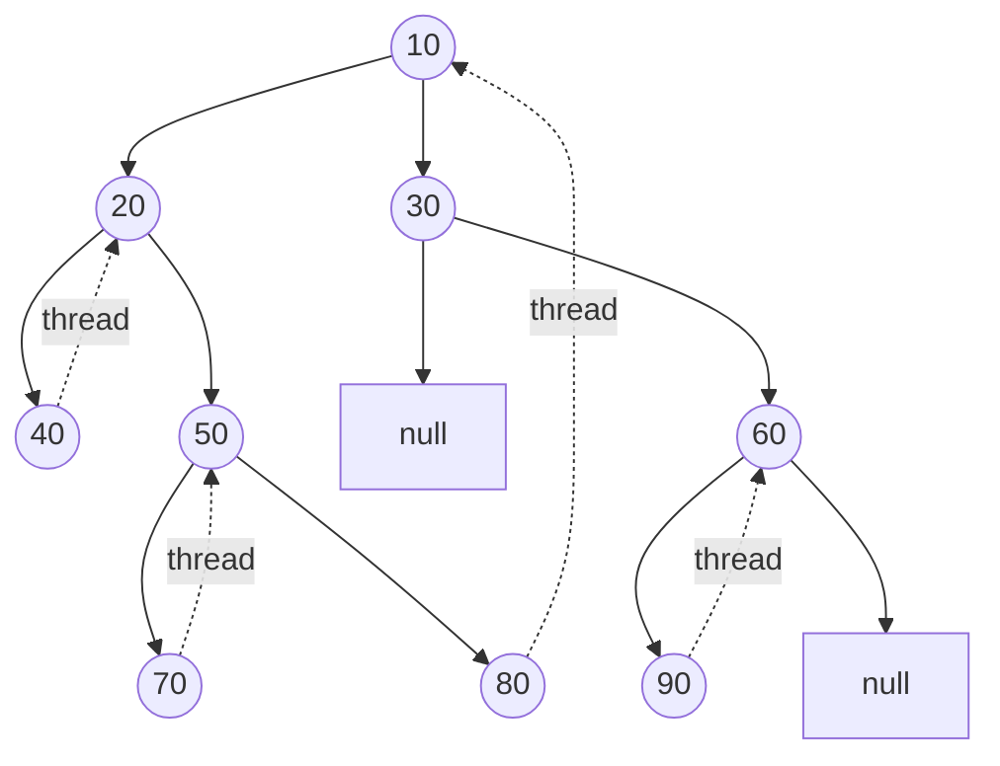
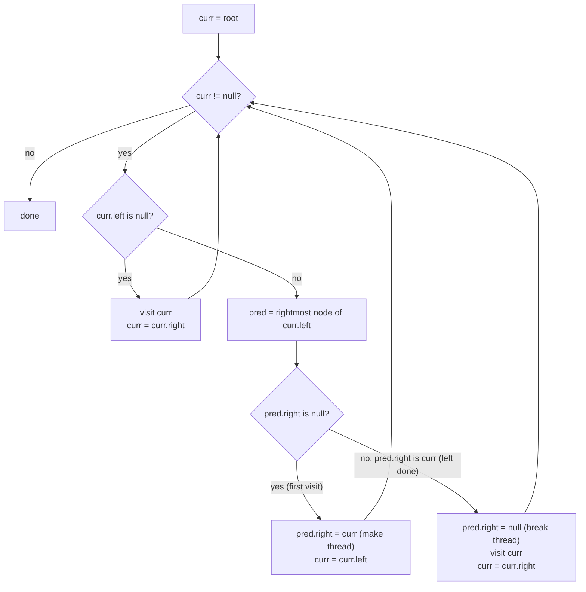

<!--
Source: dsa-my-course.html
Title: DSA My Course | TechToday
Description: Fast-track Scaler DSA curriculum covering time complexity, numbers, arrays, prefix sums, carry forward, contribution technique, sliding window, strings, bit manipulation, recursion, hashing, sorting, searching, linked lists, stacks, queues, trees, backtracking, heaps, DP, and graphs.
Theme-color: #0b0d10
Stylesheets: dsa-study.css, ../../site-header.css
Scripts: dsa-study.js
Body-class: is-my
Back-href: dsa-courses.html
Back-label: DSA Courses
Footer: DSA My Course
-->

Navigation: [TechToday](../../index.html) · [← DSA Courses](dsa-courses.html)

<a id="dsa-my-course"></a>

# DSA My Course

The fast-track Scaler DSA curriculum: core theory, essential formulas, and high-frequency problem patterns with Python and JavaScript solutions, test cases, and time and space complexity analysis.

<a id="table-of-contents"></a>

## Table of Contents

### Unit 1 — DSA 1: Intermediate Problem Solving
1. [Time Complexity](#1-time-complexity)
2. [Numbers](#2-numbers)
3. [1D Arrays Basics](#3-1d-arrays-basics)
4. [Subarrays](#4-subarrays)
5. [Prefix Sum Basics](#5-prefix-sum-basics)
6. [Carry Forward](#6-carry-forward)
7. [Contribution Technique](#7-contribution-technique)
8. [2D Arrays / Matrix Basics](#8-2d-arrays-matrix-basics)
9. [Sliding Window Fixed](#9-sliding-window-fixed)
10. [Sliding Window Dynamic](#10-sliding-window-dynamic)
11. [Strings Basics](#11-strings-basics)
12. [Strings | Two Pointers](#12-strings-two-pointers)
13. [Sorting Basics](#13-sorting-basics)
14. [Boyer-Moore Voting Algorithm](#14-boyer-moore-voting-algorithm)
15. [Bit Manipulations Basics](#15-bit-manipulations-basics)
16. [Multiple Approaches](#16-multiple-approaches)

### Unit 2 — DSA 2: Advanced Arrays, Recursion & Sorting
17. [1D Arrays Advanced](#17-1d-arrays-advanced)
18. [Prefix Sum Advanced](#18-prefix-sum-advanced)
19. [Two Pointers](#19-two-pointers)
20. [Interval Technique](#20-interval-technique)
21. [Kadane's Algorithm](#21-kadane-s-algorithm)
22. [2D Arrays / Matrix Advanced](#22-2d-arrays-matrix-advanced)
23. [Bit Manipulation Advanced](#23-bit-manipulation-advanced)
24. [Recursion](#24-recursion)
25. [Hashing (Set)](#25-hashing-set)
26. [Hashing (Map)](#26-hashing-map)
27. [Count Sort](#27-count-sort)
28. [Merge Sort](#28-merge-sort)
29. [Quick Sort](#29-quick-sort)
30. [Custom Sort / Comparison Based Sorting](#30-custom-sort-comparison-based-sorting)

### Unit 3 — DSA 3: Searching, Linked Lists, Stacks & Trees
31. [Searching 1: Binary Search on Array](#31-searching-1-binary-search-on-array)
32. [Searching 2: Binary Search on Answer](#32-searching-2-binary-search-on-answer)
33. [Linked List Introduction](#33-linked-list-introduction)
34. [Linked List: Basic Problems](#34-linked-list-basic-problems)
35. [Stacks](#35-stacks)
36. [Queues](#36-queues)
37. [Trees 1: Structure & Traversal](#37-trees-1-structure-traversal)
38. [Trees 2: BST](#38-trees-2-bst)

### Unit 4 — DSA 4: Two Pointers, Backtracking & Advanced Structures
39. [Two Pointers](#39-two-pointers)
40. [Backtracking](#40-backtracking)
41. [Linked List, Sorting and Fast + Slow Pointer](#41-linked-list-sorting-and-fast-slow-pointer)
42. [Doubly Linked List and Detecting Loop](#42-doubly-linked-list-and-detecting-loop)
43. [Trees 3: Morris Inorder Traversal & LCA](#43-trees-3-morris-inorder-traversal-lca)
44. [Hashing 3: Internal Implementation & Problems](#44-hashing-3-internal-implementation-problems)
45. [Maths: Combinatorics Basics & Prime Numbers](#45-maths-combinatorics-basics-prime-numbers)
46. [Multiple Approaches](#46-multiple-approaches)

### Unit 5 — DSA 5: Heaps, Dynamic Programming & Graphs
47. [Heaps Introduction](#47-heaps-introduction)
48. [Heap Sort & Greedy](#48-heap-sort-greedy)
49. [DP 1: One Dimensional](#49-dp-1-one-dimensional)
50. [DP 2: Two Dimensional](#50-dp-2-two-dimensional)
51. [DP 3: Knapsack](#51-dp-3-knapsack)
52. [Graphs 1: Introduction, DFS & Cycle Detection](#52-graphs-1-introduction-dfs-cycle-detection)
53. [Graphs 2: BFS & MST](#53-graphs-2-bfs-mst)
54. [Graphs 3: Dijkstra Algo & Topological Sort](#54-graphs-3-dijkstra-algo-topological-sort)
55. [Multiple Approaches](#55-multiple-approaches)
56. [Interview Problems](#56-interview-problems)

---

<a id="unit-1"></a>

## Unit 1 — DSA 1: Intermediate Problem Solving

Core complexity analysis, number theory, 1D/2D arrays, prefix sums, carry forward, sliding window, strings, and bit manipulation basics.

---

<a id="1-time-complexity"></a>

## 1. Time Complexity

### Theory

1.  O(1)          - Constant time complexity.
2.  O(log log n)  - Double logarithmic time complexity.
3.  O(log n)      - Logarithmic time complexity.
4.  O(sqrt(n))    - Square root time complexity.
5.  O(n)          - Linear time complexity.
6.  O(n log n)    - Linearithmic time complexity.
7.  O(n^2)        - Quadratic time complexity.
8.  O(n^3)        - Cubic time complexity.
9.  O(2^n)        - Exponential time complexity.
10. O(n!)         - Factorial time complexity.

### TLE Note
- Online editors have a time limit of 1 sec which is equivalent to **10^9 instructions**.
- To avoid TLE in online editors, optimize the code to reduce the number of **iterations** to **10^8 or less**.

### Questions

1. Constant Time Complexity

```python
import sys


def constant(n):
    sys.stdout.write(str(n) + " ")


# For example, if n = 10
constant(10)

# Time complexity: O(1) as there is only one operation
```

```javascript
function constant(n) {
  process.stdout.write(n + " ");
}

// For example, if n = 10
constant(10);

// Time complexity: O(1) as there is only one operation
```

2. Double Logarithm complexity

```python
import sys


def loglog(n):
    i = 2
    while i <= n:
        sys.stdout.write(str(i) + " ")
        i = i * i


# For example, if n = 128
loglog(128)

# Time complexity: O(log log n) as the loop runs log log n times.
```

```javascript
function loglog(n) {
  for (let i = 1; i <= n; i = i * i) {
    process.stdout.write(i + " ");
  }
}

// For example, if n = 128, then i will take values 1, 2, 4, 8, 16, 32, 64, 128
log2(128);

// Time complexity: O(log log n) as the loop runs log log n times.
```

3. Logarithm complexity (Base 2)

```python
import sys


def log2(n):
    # Its a Geometric progression
    i = 1
    while i <= n:
        sys.stdout.write(str(i) + " ")
        i = i * 2


# For example, if n = 128, then i will take values 1, 2, 4, 8, 16, 32, 64, 128
log2(128)

# Time complexity: O(log n) as the loop runs log n times. base 2
```

```javascript
function log2(n) {
  // Its a Geometric progression
  for (let i = 1; i <= n; i = i * 2) {
    process.stdout.write(i + " ");
  }
}

// For example, if n = 128, then i will take values 1, 2, 4, 8, 16, 32, 64, 128
log2(128);

// Time complexity: O(log n) as the loop runs log n times. base 2
```

4. Square root complexity

```python
import sys


def sqrt(n):
    # for i in range(1, int(math.isqrt(n)) + 1):
    i = 1
    while i * i <= n:
        sys.stdout.write(str(i * i) + " ")
        i += 1


# For example, if n = 128, then i will take values 1, 4, 9, 16, 25, 36, 49, 64, 81, 100, 121
sqrt(128)

# Time complexity: O(sqrt(n)) as the loop runs sqrt(n) times
# It can also be written as O(n^(1/2))
```

```javascript
function sqrt(n) {
  // for (let i = 1; i <= Math.sqrt(n); i++) {
  // for (let i = 1; i <= n/i; i++) {
  for (let i = 1; i * i <= n; i++) {
    process.stdout.write(i * i + " ");
  }
}

// For example, if n = 128, then i will take values 1, 4, 9, 16, 25, 36, 49, 64, 81, 100, 121
sqrt(128);

// Time complexity: O(sqrt(n)) as the loop runs sqrt(n) times
// Its can also be written as O(n^(1/2))
```

5. Linear complexity

```python
import sys


def linear(n):
    for i in range(1, n + 1):
        sys.stdout.write(str(i) + " ")


# For example, if n = 10, then i will take values 1, 2, 3, ..., 10
linear(10)

# Time complexity: O(n) as the loop runs n times
```

```javascript
function linear(n) {
  for (let i = 1; i <= n; i++) {
    process.stdout.write(i + " ");
  }
}

// For example, if n = 10, then i will take values 1, 2, 3, ..., 10
linear(10);

// Time complexity: O(n) as the loop runs n times
```

6. Linearithmic complexity

```python
import sys


def linearithmic(n):
    for i in range(1, n + 1):
        j = 1
        while j <= n:
            sys.stdout.write(str(i) + " ")
            j = j * 2


# For example, if n = 8, then i will take values 1, 2, 3, ..., 8 and j will take values 1, 2, 4, 8
linearithmic(8)

# Time complexity: O(n log n) as the outer loop runs n times and the inner loop runs log n times
```

```javascript
function linearithmic(n) {
  for (let i = 1; i <= n; i++) {
    for (let j = 1; j <= n; j = j * 2) {
      process.stdout.write(i + " ");
    }
  }
}

// For example, if n = 8, then i will take values 1, 2, 3, ..., 8 and j will take values 1, 2, 4, 8
linearithmic(8);

// Time complexity: O(n log n) as the outer loop runs n times and the inner loop runs log n times
```

7. Quadratic complexity

```python
import sys


def quadratic(n):
    for i in range(1, n + 1):
        for j in range(1, n + 1):
            sys.stdout.write(str(i + j) + " ")


# For example, if n = 3, then i will take values 1, 2, 3 and j will take values 1, 2, 3
quadratic(3)

# Time complexity: O(n^2) as the outer loop runs n times and the inner loop runs n times
```

```javascript
function quadratic(n) {
  for (let i = 1; i <= n; i++) {
    for (let j = 1; j <= n; j++) {
      process.stdout.write(i + j + " ");
    }
  }
}

// For example, if n = 3, then i will take values 1, 2, 3 and j will take values 1, 2, 3
quadratic(3);

// Time complexity: O(n^2) as the outer loop runs n times and the inner loop runs n times
// This is equivalent to O(n * n)
```

8. Cubic complexity

```python
import sys


def cubic(n):
    for i in range(1, n + 1):
        for j in range(1, n + 1):
            for k in range(1, n + 1):
                sys.stdout.write(str(i + j + k) + " ")


# For example, if n = 3, then i will take values 1, 2, 3
cubic(3)

# Time complexity: O(n^3) as the outer loop runs n times and the inner loops run n times
```

```javascript
function cubic(n) {
  for (let i = 1; i <= n; i++) {
    for (let j = 1; j <= n; j++) {
      for (let k = 1; k <= n; k++) {
        process.stdout.write(i + j + k + " ");
      }
    }
  }
}

// For example, if n = 3, then i will take values 1, 2, 3 and j will take values 1, 2, 3 and k will take values 1, 2, 3
cubic(3);

// Time complexity: O(n^3) as the outer loop runs n times and the inner loop runs n times and the innermost loop runs n times
// This is equivalent to O(n * n * n)
```

9. Exponential complexity

```python
import sys


def exponential2(n):
    for i in range(2 ** n):
        sys.stdout.write(str(i) + " ")


# For example, if n = 3, then i will take values 0, 1, 2, ..., 7
exponential2(3)
# Time complexity: O(2^n) as the loop runs 2^n times
```

```javascript
function exponential2(n) {
    for (let i = 0; i < 2 ** n; i++) {
        process.stdout.write(i + " ");
    }
}
// For example, if n = 3, then i will take values 0, 1, 2, ..., 7
exponential2(3);
// Time complexity: O(2^n) as the loop runs 2^n times

function exponential3(n) {
    for (let i = 0; i < 3 ** n; i++) {
        process.stdout.write(i + " "); // Added a space for readability
    }
}
// For example, if n = 3, then i will take values 0, 1, 2, ..., 26
exponential3(3);
// Time complexity: O(3^n) as the loop runs 3^n times
```

10. Factorial complexity

```python
"""
ALGORITHM EXPLANATION:
This function demonstrates a recursive branching structure that results in
factorial time complexity.

1. The function takes an integer 'n'.
2. It uses a loop to spawn 'n' recursive calls, each reducing 'n' by 1: factorial(n - 1).
3. The base case stops the recursion when 'n <= 1'.
4. This produces a branching pattern where the number of operations is proportional to n!.
"""


def factorial_complexity(n):
    if n <= 1:
        return

    # Loop runs 'n' times, each iteration making a recursive call
    for i in range(n):
        factorial_complexity(n - 1)


factorial_complexity(3)

# Time complexity: O(n!) - Factorial complexity
# Space complexity: O(n) - Call stack depth is at most n
```

```javascript
/**
 * ALGORITHM EXPLANATION:
 * This function demonstrates a recursive branching structure that results in
 * factorial time complexity.
 * * 1. The function takes an integer 'n'.
 * 2. It uses a loop to spawn 'n' recursive calls, each reducing 'n' by 1.
 * 3. This creates a tree structure where the number of branches at each level
 * corresponds to the current value of 'n'.
 * 4. The process continues until 'n' reaches 0 (the base case), at which
 * point it logs "Leaf reached!" and returns.
 * 5. The total number of leaf nodes triggered equals n! (n factorial).
 */

function factorialComplexityRecursive(n) {
    // Base Case: when n reaches 0, we stop
    if (n === 0) {
        // Log a message when the recursion hits the bottom level
        console.log("Leaf reached!");
        // Return to the previous caller to continue the loop or finish
        return;
    }

    // The loop runs 'n' times, creating 'n' branches of recursion
    for (let i = 0; i < n; i++) {
        // Each time the loop runs, it calls itself with (n - 1)
        // This causes the branching factor to decrease by 1 at each depth
        factorialComplexityRecursive(n - 1);
    }
}

// Execute the function with an input of 3
factorialComplexityRecursive(3);

// Output for n = 3:
// Leaf reached!
// Leaf reached!
// Leaf reached!
// Leaf reached!
// Leaf reached!
// Leaf reached!

/**
 * COMPLEXITY ANALYSIS:
 * * Time Complexity: O(n!)
 * The total number of calls follows the pattern of n * (n-1) * (n-2)...
 * For n=3, the loop runs 3 times, each calling n=2. Those call n=1,
 * which finally call n=0. This results in exactly 3 * 2 * 1 = 6 leaf executions.
 *
 * * Space Complexity: O(n)
 * This is determined by the maximum depth of the recursive call stack.
 * Since we decrement n by 1 in each call, the stack will grow to a
 * maximum height of 'n' before it starts returning.
 */
```

---

<a id="2-numbers"></a>

## 2. Numbers

### Theory

1. Sum of first N natural numbers = N * (N + 1) / 2.
2. [a, b] inclusive range of numbers. [a, b] = b - a + 1.
3. (a, b) exclusive range of numbers. (a, b) = b - a - 1.
4. 0 is neither prime nor composite. It has infinite factors.
5. 1 is neither prime nor composite. It has only 1 factor which is 1 itself.

### Logarithms
1. 2³ = 8 means ∛8 = 2 means log₂(8) = 3.
2. 3⁴ = 81 means ∜81 = 3 means log₃(81) = 4.

### Questions

1. Count factors of a number. **O(sqrt(N)), O(1)**

```python
def count_factors(N):
    # Initialize the count of factors to 0. This variable will store our final result.
    count = 0

    # We iterate from i = 1 up to (and including) the square root of N.
    i = 1
    while i * i <= N:
        # Check if 'i' is a factor of N.
        if N % i == 0:
            # If the divisors are equal (e.g., for N=36, i=6 and N/i=6),
            # it means N is a perfect square. We count this factor only once.
            if i == N // i:
                count += 1
            else:
                # If the divisors are distinct (e.g., for N=36, i=4 and N/i=9),
                # we count both 'i' and its counterpart 'N/i'. Thus, we add 2.
                count += 2
        i += 1

    # Return the total count of factors found.
    return count


print(count_factors(24))  # 8
print(count_factors(36))  # 9
print(count_factors(1))   # 1
print(count_factors(10))  # 4
print(count_factors(100)) # 9

# Time Complexity: O(sqrt(N))
# Space Complexity: O(1)
```

```javascript
function countFactors(N) {
  // Initialize the count of factors to 0. This variable will store our final result.
  let count = 0;

  // We iterate from i = 1 up to (and including) the square root of N.
  for (let i = 1; i * i <= N; i++) {
  // for (let i = 1; i <= Math.sqrt(N); i++) {
  // for (let i = 1; i <= N / i; i++) {
    // Check if 'i' is a factor of N.
    // The modulo operator (%) returns the remainder of a division.
    // If the remainder is 0, 'i' divides N perfectly.
    if (N % i === 0) {
      // If 'i' is a factor, we have found a pair of factors: 'i' and 'N / i'.

      // Now, we need to handle the special case of perfect squares.
      // If i * i = N, it means 'i' is the square root of N.
      // In this case, 'i' and 'N / i' are the same number.
      // For example, if N = 36 and i = 6, the pair is (6, 6). We should only count this factor once.
      if (i === N / i) {
        count++;
      } else {
        // If 'i' is not the square root of N, then 'i' and 'N / i' are two distinct factors.
        // For example, if N = 10 and i = 2, the pair of factors is (2, 5).
        // Since we found two different factors, we increment the count by 2.
        count += 2;
      }
    }
  }
  // Return the total count of factors found.
  return count;
}

// Example calls to demonstrate the function's output.
console.log(`Factors of 5: ${countFactors(5)}`);   // Expected: 2 (Factors are 1, 5)
console.log(`Factors of 16: ${countFactors(16)}`); // Expected: 5 (Factors are 1, 2, 4, 8, 16), 4 is counted once because 4 * 4 = 16
console.log(`Factors of 1: ${countFactors(1)}`);   // Expected: 1 (Factor is 1)
console.log(`Factors of 36: ${countFactors(36)}`); // Expected: 9 (Factors are 1, 2, 3, 4, 6, 9, 12, 18, 36)

// Time Complexity: O(sqrt(N))
// The loop runs approximately sqrt(N) times. This makes the algorithm very efficient,
// especially for large input values of N, compared to a naive O(N) solution.

// Space Complexity: O(1)
// The algorithm uses a fixed amount of extra space (for variables 'count' and 'i'),
// regardless of the size of the input N. This is known as constant space complexity.
```

2. Prime Number Check. **O(sqrt(N)), O(1)**

```text
Prime number is a number that can only be divided evenly (without leaving a remainder) by 1 and the number itself.
Thus it has exactly 2 factors. For example, 2, 3, 5, 7, 11, 13, 17, 19, 23, 29 are prime numbers.
```

```python
def is_prime(N):
    if count_factors(N) == 2:
        return True
    return False


print(is_prime(5))   # True
print(is_prime(10))  # False
print(is_prime(1))   # False (1 is not prime as it has only 1 factor)

# Time Complexity: O(sqrt(N))
# Space Complexity: O(1)
```

```javascript
function isPrime(N) {
  if (countFactors(N) == 2) {
    return true;
  }
  return false;
}

console.log(isPrime(5)); // true
console.log(isPrime(10)); // false
console.log(isPrime(1)); // false // 1 is not prime as per the modern theory also it has only 1 factor as per logic
console.log(isPrime(2)); // true

// Time Complexity: O(sqrt(N))
// - Delegates to countFactors which iterates up to sqrt(N).

// Space Complexity: O(1)
// - Only uses a constant number of variables.
```

3. Count Prime Numbers below given number. **O(N * sqrt(N)), O(1)**

```python
def count_factors(N):
    count = 0
    i = 1
    while i * i <= N:
        if N % i == 0:
            if i == N // i:
                count += 1
            else:
                count += 2
        i += 1
    return count


def is_prime(N):
    return count_factors(N) == 2


def count_primes(N):
    count = 0
    for i in range(1, N + 1):
        if is_prime(i):
            count += 1
    return count


print(count_primes(5))   # 3 (Primes are 2, 3, 5)
print(count_primes(10))  # 4 (Primes are 2, 3, 5, 7)
print(count_primes(19))  # 8 (Primes are 2, 3, 5, 7, 11, 13, 17, 19)

# Time Complexity: O(N * sqrt(N))
# Space Complexity: O(1)
```

```javascript
function countFactors(N) {
  let count = 0;
  for (let i = 1; i * i <= N; i++) {
    if (N % i === 0) {
      if (i === N / i) { // If i and N/i are same, then count only 1
        count++;
      } else { // Otherwise count both
        count += 2;
      }
    }
  }

  return count;
}

function isPrime(N) {
  if (countFactors(N) == 2) {
    return 1;
  }

  return 0;
}

function countPrimes(A) {
  let count = 0;
  // Start from 2, because 0 and 1 are not prime numbers. We will check for all numbers from 2 to A (inclusive) if they are prime or not.
  for (let i = 2; i <= A; i++) {
    if (isPrime(i) === 1) {
      count++;
    }
  }

  return count;
}

console.log(countPrimes(10)); // 4 // Prime numbers are 2, 3, 5, 7
console.log(countPrimes(20)); // 8 // Prime numbers are 2, 3, 5, 7, 11, 13, 17, 19

// Time Complexity: O(N * sqrt(N))
// - The outer loop runs from 2 to A (N times).
// - For each number, isPrime calls countFactors which runs in O(sqrt(N)).
// - Total: N iterations × O(sqrt(N)) per iteration = O(N * sqrt(N)).

// Space Complexity: O(1)
// - Only uses a constant number of variables across all function calls.
```

---

<a id="3-1d-arrays-basics"></a>

## 3. 1D Arrays Basics

### Questions

1. Reversing an array involves swapping elements from the start and end. **O(N), O(1)**

```python
# Reverse the array elements from start to end
def reverse(Arr, start, end):
    i = start
    j = end
    while i < j:
        Arr[i], Arr[j] = Arr[j], Arr[i]
        i += 1
        j -= 1
    return Arr


# Reverse whole array
Arr = [1, 2, 3, 4, 5]
print("Reverse whole array: ", reverse(Arr, 0, len(Arr) - 1))  # [5, 4, 3, 2, 1]

# Reverse array from start index to end index
Arr2 = [1, 2, 3, 4, 5]
print("Reverse array from index 1 to 3: ", reverse(Arr2, 1, 3))  # [1, 4, 3, 2, 5]

# Time Complexity: O(N)
# Space Complexity: O(1)
```

```javascript
// Reverse the array elements from start to end
function reverse(Arr, start, end){
  let i = start;
  let j = end;
  while(i < j){
    let temp = Arr[i];
    Arr[i] = Arr[j];
    Arr[j] = temp;

    // Alternatively, you can use destructuring assignment
    // [Arr[i], Arr[j]] = [Arr[j], Arr[i]];

    i++;
    j--;
  }

  return Arr;
}

console.log(reverse([1, 2, 3, 4, 5], 0, 4)); // [ 5, 4, 3, 2, 1 ]
console.log(reverse([1, 2, 3, 4, 5], 1, 3)); // [ 1, 4, 3, 2, 5 ]

// Time Complexity: O(N)
// - Two pointers move inward, each element is visited at most once.
// - Total swaps = (end - start + 1) / 2 which is O(N).

// Space Complexity: O(1)
// - Swap is done in-place using a single temp variable.
```

2. Rotating an array involves reversing segments of the array. **O(N), O(1)**

```python
def rotate_array(A, B):
    # Reverse the array elements from start to end
    def reverse(Arr, start, end):
        i = start
        j = end
        while i < j:
            Arr[i], Arr[j] = Arr[j], Arr[i]
            i += 1
            j -= 1
        return Arr

    n = len(A)
    # If B is greater than n, then we can take B % n
    B = B % n

    # Reverse the whole array
    reverse(A, 0, n - 1)

    # Reverse the first B elements
    reverse(A, 0, B - 1)

    # Reverse the remaining elements
    reverse(A, B, n - 1)

    return A


print(rotate_array([1, 2, 3, 4, 5], 2))  # [4, 5, 1, 2, 3]
print(rotate_array([1, 2, 3, 4, 5], 3))  # [3, 4, 5, 1, 2]

# Time Complexity: O(N)
# Space Complexity: O(1)
```

```javascript
function rotateArray(A, B) {
    // Reverse the array elements from start to end
    function reverse(Arr, start, end) {
        let i = start;
        let j = end;
        while (i < j) {
            let temp = Arr[i];
            Arr[i] = Arr[j];
            Arr[j] = temp;
            i++;
            j--;
        }
    }

    // Calculate the effective rotation offset as B modulo the array length because rotating by the array's length results in the same array. Also, if B is larger than the array length, we only need to rotate by the remainder. This ensures we don't perform unnecessary rotations.
    let offset = B % A.length;

    reverse(A, 0, A.length - 1); // reverse all elements
    reverse(A, 0, offset - 1); // reverse first half. why we are using (offset - 1), because we are using 0 based index.
    reverse(A, offset, A.length - 1); // reverse second half

    return A;
}

console.log(rotateArray([1, 2, 3, 4, 5], 2)); // [ 4, 5, 1, 2, 3 ]
console.log(rotateArray([1, 2, 3, 4, 5], 8)); // [ 3, 4, 5, 1, 2 ]
console.log(rotateArray([1, 2, 3, 4, 5], 11)); // [ 5, 1, 2, 3, 4 ]

// Time Complexity: O(N)
// - Three reverse calls, each traversing a portion of the array.
// - Total elements reversed = N + offset + (N - offset) = 2N, which is O(N).

// Space Complexity: O(1)
// - All reversals are done in-place using swaps.
```

---

<a id="4-subarrays"></a>

## 4. Subarrays

### Theory

1. Total number of subarrays in an array of size N = N * (N + 1) / 2.
For example, [1, 2, 3] size of array = 3, total number of subarrays = 3 * (3 + 1) / 2 = 6. Subarrays are [1], [1, 2], [1, 2, 3], [2], [2, 3], [3].
2. Total number of subarrays of size K in an array of size N = N - K + 1.
For example, [1, 2, 3, 4, 5] size of array = 5, size of subarray = 3, total number of subarrays of size 3 = 5 - 3 + 1 = 3. Subarrays of size 3 are [1, 2, 3], [2, 3, 4], [3, 4, 5].
3. Length of subarray = end - start + 1. This is an inclusive range example [a, b] = b - a + 1.
For example, in [1, 2, 3, 4, 5], if we have a subarray starting at index 2 and ending at index 4, the length of the subarray is 4 - 2 + 1 = 3. The subarray would include the elements at indices 2, 3, and 4. So [3, 4, 5].

### Questions

1. Print all possible Subarrays of the array. No optimised solution available | Three Nested For Loops **O(N^3), O(N^3)**

```python
def print_all_subarrays(A):
    result = []
    n = len(A)
    for i in range(n):
        for j in range(i, n):
            subarray = []
            for k in range(i, j + 1):
                subarray.append(A[k])
            result.append(subarray)
    return result


print(print_all_subarrays([1, 2, 3]))
# Output: [[1], [1, 2], [1, 2, 3], [2], [2, 3], [3]]

# Time Complexity: O(n^3) - Three nested loops
# Space Complexity: O(n^3) - To store all subarrays in result
```

```javascript
function printAllSubarrays(A) {
    const result = [];
    for (let i = 0; i < A.length; i++) {
        for (let j = i; j < A.length; j++) {
            let subarray = [];
            for (let k = i; k <= j; k++) {
                subarray.push(A[k]);
            }
            result.push(subarray);
            // console.log(subarray);
        }
    }
    return result;
}

console.log(printAllSubarrays([1, 2, 3])); // [ [ 1 ], [ 1, 2 ], [ 1, 2, 3 ], [ 2 ], [ 2, 3 ], [ 3 ] ]
console.log(printAllSubarrays([1, 2])); // [ [ 1 ], [ 1, 2 ], [ 2 ] ]

// Time Complexity: O(N^3)
// - Three nested loops: i picks start, j picks end, k iterates from start to end.
// - Total work = sum of all subarray lengths = O(N^3).

// Space Complexity: O(N^3)
// - Storing all N*(N+1)/2 subarrays, with total elements across all subarrays = O(N^3).
```

2. Count all possible Subarrays of the array | Two Nested For Loops **O(N^2), O(1)** | Using formula **O(1), O(1)**

```python
def count_all_subarrays(A):
    count = 0
    n = len(A)
    for i in range(n):
        for j in range(i, n):
            count += 1
    return count


print(count_all_subarrays([1, 2, 3]))  # 6
# Time Complexity: O(n^2) - Two nested loops
# Space Complexity: O(1) - Constant extra space


def count_all_subarrays_formula(A):
    n = len(A)
    return n * (n + 1) // 2


print(count_all_subarrays_formula([1, 2, 3]))  # 6
# Time Complexity: O(1)
# Space Complexity: O(1)
```

```javascript
function countAllSubarrays(A) {
    let count = 0;
    for (let i = 0; i < A.length; i++) {
        for (let j = i; j < A.length; j++) {
            count++;
        }
    }
    return count;
}
console.log(countAllSubarrays([1, 2, 3])); // 6

// Time Complexity: O(N^2)
// - Two nested loops, outer runs N times, inner runs (N - i) times.
// - Total iterations = N*(N+1)/2 which is O(N^2).

// Space Complexity: O(1)
// - Only a single counter variable is used.


function countAllSubarrays(A) {
  const count = (A.length * (A.length + 1)) / 2; // formula for first n natural numbers: N(N+1)/2.
  return count;
}
// Time Complexity: O(1)
// Space Complexity: O(1)
```

---

<a id="5-prefix-sum-basics"></a>

## 5. Prefix Sum Basics

### Questions

1. Create a prefix sum array. **O(N), O(N)**

```python
def create_prefix_sum_array(A):
    psa = [0] * len(A)
    psa[0] = A[0]
    for i in range(1, len(A)):
        psa[i] = psa[i - 1] + A[i]
    return psa


print(create_prefix_sum_array([1, 2, 3, 4, 5]))  # [1, 3, 6, 10, 15]

# Time Complexity: O(N)
# Space Complexity: O(N)
```

```javascript
function createPrefixSumArray(A) {
    const psa = [];
    psa[0] = A[0];
    for (let i = 1; i < A.length; i++) {
        psa[i] = psa[i - 1] + A[i];
    }
    return psa;
}

console.log(createPrefixSumArray([2, 3, 1, 6, 4, 5])); // [2, 5, 6, 12, 16, 21]

// Time Complexity: O(n)
// Space Complexity: O(n)
```

2. Calculate the sum of elements in an array in a given range. / Range Sum Query **O(N), O(N)**

```python
def prefix_sum(A, Q):
    # prefix sum array of all elements
    psa = [0] * len(A)
    psa[0] = A[0]
    for i in range(1, len(A)):
        psa[i] = psa[i - 1] + A[i]

    ans = []
    for s, e in Q:
        if s == 0:
            ans.append(psa[e])
        else:
            ans.append(psa[e] - psa[s - 1])
    return ans


print(prefix_sum([-3, 6, 2, 4, 5, 2, 8, -9, 3, 1], [[4, 8], [3, 7], [1, 3], [0, 4], [7, 7]]))
# [8, 4, 12, 14, -9]

# Time Complexity: O(N + Q)
# Space Complexity: O(N)
```

```javascript
function prefixSum(A, Q) {
    // prefix sum array of all elements
    const psa = [];
    psa[0] = A[0];
    for (let i = 1; i < A.length; i++) {
        psa[i] = psa[i - 1] + A[i];
    }

    const result = [];
    for (let i = 0; i < Q.length; i++) {
        const left = Q[i][0];
        const right = Q[i][1];

        if (left == 0) {
            result[i] = psa[right];
        } else {
            result[i] = psa[right] - psa[left - 1];
        }
    }

    return { psa, result };
}

console.log(prefixSum([-3, 6, 2, 4, 5, 2, 8, -9, 3, 1], [[4, 8], [3, 7], [1, 3], [0, 4], [7, 7]]));
// Output: { psa: [ -3, 3, 5, 9, 14, 16, 24, 15, 18, 19 ], result: [ 9, 10, 12, 14, -9 ] }

// Time Complexity: O(n + q)
// Space Complexity: O(n)
```

3. In place prefix sum. **O(N), O(1)**

```python
def in_place_prefix_sum(A):
    for i in range(1, len(A)):
        A[i] = A[i] + A[i - 1]
    return A


print("inPlacePrefixSum", in_place_prefix_sum([1, 2, 3, 4, 5]))  # [1, 3, 6, 10, 15]

# Time Complexity: O(N)
# Space Complexity: O(1)
```

```javascript
function inPlacePrefixSum(A) {
    for (let i = 1; i < A.length; i++) {
        A[i] = A[i] + A[i - 1];
    }
    return A;
}

console.log("inPlacePrefixSum", inPlacePrefixSum([1, 2, 3, 4, 5])); // [1, 3, 6, 10, 15]
console.log("inPlacePrefixSum", inPlacePrefixSum([1, 2, 3, 4, 5, 6])); // [1, 3, 6, 10, 15, 21]

// Time Complexity: O(N)
// Space Complexity: O(1)
```

---

<a id="6-carry-forward"></a>

## 6. Carry Forward

### Questions

1. Print Subarrays sums starting from given index | Carry Forward **O(N), O(1)**

```python
def print_subarrays_sums_from_index(A, start_index):
    subarray_sum = 0
    total_sum = 0
    for j in range(start_index, len(A)):
        # we are carrying forward the subarraySum to the next iteration
        subarray_sum += A[j]
        print(f"Sum of subarray from {start_index} to {j} is {subarray_sum}")
        total_sum += subarray_sum
    return total_sum


print("Total sum: " + str(print_subarrays_sums_from_index([1, 2, 3], 0)))
# Sum of subarray from 0 to 0 is 1
# Sum of subarray from 0 to 1 is 3
# Sum of subarray from 0 to 2 is 6
# Total sum: 10

# Time Complexity: O(N)
# Space Complexity: O(1)
```

```javascript
function printSubarraysSumsFromIndex(A, startIndex) {
    let subarraySum = 0;
    let totalSum = 0;
    for (let j = startIndex; j < A.length; j++) {
        // we are carrying forward the subarraySum of subarray starting from startIndex to end of array
        subarraySum += A[j];
        process.stdout.write(subarraySum + ", "); // Print subarraySum of current subarray
        totalSum += subarraySum; // Keep track of total sum of all subarrays
    }
    process.stdout.write(`(Total: ${totalSum}) `); // Print total sum so far
    console.log(); // New line after printing the subarray
}

printSubarraysSumsFromIndex([1, 2, 3, 4], 1); // [2] [2, 3] [2, 3, 4] // 2, 5, 9, (Total: 16)
printSubarraysSumsFromIndex([1, 2, 3, 4], 2); // [3] [3, 4] // 3, 7, (Total: 10)
printSubarraysSumsFromIndex([1, 2, 3, 4], 0); // [1] [1, 2] [1, 2, 3] [1, 2, 3, 4] // 1, 3, 6, 10, (Total: 20)

// Time Complexity: O(N)
// - Single loop from startIndex to end of array, visiting each element once.

// Space Complexity: O(1)
// - Only uses two variables (subarraySum, totalSum) regardless of input size.
```

2. Sum of all Subarrays sums | Carry Forward **O(N^2), O(1)**

```python
def sum_of_all_subarrays(A):
    total_sum = 0
    n = len(A)
    for i in range(n):
        subarray_sum = 0
        # Calculate sum of subarray starting from i to end of array
        for j in range(i, n):
            # Carry forward the sum of subarray from i to j-1
            subarray_sum += A[j]
            total_sum += subarray_sum
    return total_sum


print(sum_of_all_subarrays([1, 2, 3]))  # 20
print(sum_of_all_subarrays([2, 1, 3]))  # 19

# Time Complexity: O(N^2)
# Space Complexity: O(1)
```

```javascript
function sumOfAllSubarrays(A) {
  let totalSum = 0;
  for (let i = 0; i < A.length; i++) {
    let subarraySum = 0;
    // Calculate sum of subarray starting from i to end of array
    for (let j = i; j < A.length; j++) {
      subarraySum += A[j];
      totalSum += subarraySum;
    }
  }
  return totalSum;
}

console.log(sumOfAllSubarrays([1, 2, 3])); // [1] [1, 2] [1, 2, 3], [2] [2, 3], [3] // 1, 3, 6, 2, 5, 3 (Total: 20)
console.log(sumOfAllSubarrays([1, 2, 3, 4])); // [1] [1, 2] [1, 2, 3] [1, 2, 3, 4], [2] [2, 3] [2, 3, 4], [3] [3, 4], [4] // 1, 3, 6, 10, 2, 5, 9, 3, 7, 4 (Total: 50)

// Time Complexity: O(N^2)
// - Outer loop runs N times, inner loop runs (N - i) times for each i.
// - Carry forward avoids the third loop by reusing the running sum.

// Space Complexity: O(1)
// - Only uses a few variables (totalSum, subarraySum).
```

3. Count of pairs of two given characters in an array (AG) | Carry Forward **O(N), O(1)**

```python
def count_of_pairs(A):
    pair_count = 0  # Total number of "ag" pairs found
    a_count = 0     # Running count of 'a' characters encountered

    for ch in A:
        if ch == 'a':
            a_count += 1
        elif ch == 'g':
            # Every 'g' pairs with all preceding 'a' characters
            pair_count += a_count

    return pair_count


print(count_of_pairs(['a', 'b', 'e', 'g', 'a', 'g']))  # 3
print(count_of_pairs("abegag"))  # 3

# Time Complexity: O(N)
# Space Complexity: O(1)
```

```javascript
function countOfPairs(A) {
  let pairCount = 0; // Total number of "ag" pairs found
  let aCount = 0;    // Running count of 'a' characters encountered

  for (let i = 0; i < A.length; i++) {
    if (A[i] === 'a') {
      aCount++; // Increment 'a' count to pair with future 'g's
    } else if (A[i] === 'g') {
      pairCount += aCount; // Add all preceding 'a's to the total pairs
    }
  }

  return pairCount; // Return the final count of subsequences
}

console.log("countOfPairs", countOfPairs(['b', 'a', 'a', 'g', 'd', 'c', 'a', 'g'])); // Output: 5
console.log("countOfPairs", countOfPairs(['a', 'g', 'a', 'g', 'a', 'g'])); // Output: 6
console.log("countOfPairs", countOfPairs(['a', 'g', 'a', 'a', 'a', 'a'])); // Output: 1

// Time Complexity: O(N)
// - Single pass through the array, each element is checked once.
// - Carry forward: we carry aCount forward to pair with future 'g's.

// Space Complexity: O(1)
// - Only two variables (pairCount, aCount) are used.
```

4. Smallest subarray containing min & max elements | Carry Forward **O(N), O(1)**

```python
# Optimised solution using carry forward technique
def smallest_subarray_containing_min_max(A):
    # Find the minimum and maximum elements of the array
    min_element = min(A)
    max_element = max(A)

    # If min and max are the same, the smallest subarray is of length 1
    if min_element == max_element:
        return 1

    last_min_index = -1
    last_max_index = -1
    min_length = len(A)

    # Iterate through the array to find the smallest subarray
    for i, val in enumerate(A):
        if val == min_element:
            last_min_index = i
            # If we have already seen a max element, calculate length
            if last_max_index != -1:
                min_length = min(min_length, i - last_max_index + 1)
        elif val == max_element:
            last_max_index = i
            # If we have already seen a min element, calculate length
            if last_min_index != -1:
                min_length = min(min_length, i - last_min_index + 1)

    return min_length


print(smallest_subarray_containing_min_max([1, 2, 3, 1, 3, 4, 6, 4, 6, 3]))  # 4
print(smallest_subarray_containing_min_max([2, 2, 2, 2]))  # 1

# Time Complexity: O(N)
# Space Complexity: O(1)
```

```javascript
// Optimised solution using carry forward technique
function smallestSubarrayContainingMinMax(A) {
  // Find the minimum and maximum elements of the array
  let minElement = Math.min(...A);
  let maxElement = Math.max(...A);

  if (minElement == maxElement) {
    return 1;
  }

  let length = A.length;
  let minIndex = -1;
  let maxIndex = -1;

  // Iterate from right to left and find the length of the smallest subarray containing both the minimum and maximum elements
  for (let i = A.length - 1; i >= 0; i--) {
    if(A[i] == minElement) {
      minIndex = i;
      if (maxIndex != -1) {
        // length = Math.min(length, maxIndex - minIndex + 1); since we are iterating from right to left, maxIndex will always be greater than minIndex
        length = Math.min(length, Math.abs(maxIndex - minIndex) + 1);
      }
    }

    if(A[i] == maxElement) {
      maxIndex = i;
      if (minIndex != -1) {
        // length = Math.min(length, minIndex - maxIndex + 1); since we are iterating from right to left, minIndex will always be greater than maxIndex
        length = Math.min(length, Math.abs(maxIndex - minIndex) + 1);
      }
    }
  }

  // Alternatively, iterate from left to right and find the length of the smallest subarray containing both the minimum and maximum elements
  // for (let i = 0; i < A.length; i++) {
  //   if(A[i] == minElement) {
  //     minIndex = i;
  //     if (maxIndex != -1) {
  //       length = Math.min(length, Math.abs(maxIndex - minIndex) + 1);
  //     }
  //   }

  //   if(A[i] == maxElement) {
  //     maxIndex = i;
  //     if (minIndex != -1) {
  //       length = Math.min(length, Math.abs(maxIndex - minIndex) + 1);
  //     }
  //   }
  // }

  return length;
}

console.log("smallestSubarrayContainingMinMax", smallestSubarrayContainingMinMax([1, 2, 3, 1, 3, 4, 6, 4, 6, 3])); // 4
console.log("smallestSubarrayContainingMinMax", smallestSubarrayContainingMinMax([2, 2, 6, 4, 5, 1, 5, 2, 6, 4, 1])); // 3

// Time Complexity: O(N)
// - Math.min/max spread takes O(N) each to find min and max elements.
// - Single pass through the array (right to left) to find closest pair.
// - Total: O(N) + O(N) + O(N) = O(N).

// Space Complexity: O(1)
// - Only a fixed number of variables (minElement, maxElement, minIndex, maxIndex, length).
```

---

<a id="7-contribution-technique"></a>

## 7. Contribution Technique

### Questions

1. Sum of all Subarrays sums. **O(N), O(1)**

**Diagram 1: Brute force vs contribution (A = [6, 8, -1])**
```
Index:      0    1    2
A[]   = [   6,   8,  -1 ]

Subarray [s..e]   Elements        Sum
[0..0]            {6}              6
[0..1]            {6, 8}          14
[0..2]            {6, 8, -1}      13
[1..1]            {8}              8
[1..2]            {8, -1}          7
[2..2]            {-1}            -1
                                 ----
                          Total = 47

Contribution view: A[i] * (number of subarrays containing i)
  A[0] =  6 -> in 3 subarrays ->  6 * 3 = 18
  A[1] =  8 -> in 4 subarrays ->  8 * 4 = 32
  A[2] = -1 -> in 3 subarrays -> -1 * 3 = -3
                                        ----
                                         47
```

**Diagram 2: In how many subarrays is index 1 present? (A = [3, -2, 4, -1, 2, 6])**

A subarray contains index 1 if `start` is in [0..1] and `end` is in [1..5]. Each start/end pair gives one subarray.



```
start = 0 : [0,1] [0,2] [0,3] [0,4] [0,5]
start = 1 : [1,1] [1,2] [1,3] [1,4] [1,5]

Total subarrays = 2 * 5 = 10
```

**Diagram 3: General formula for index i**
```
  a0  a1  a2  ...  ai  a(i+1)  ...  a(n-1)
  |_________________|
     start in [0..i]   -> (i - 0 + 1)     = (i + 1) choices
                   |_____________________|
                      end in [i..n-1] -> (n - 1 - i + 1) = (n - i) choices

Total subarrays containing index i = (i + 1) * (n - i)
Contribution of A[i]               = A[i] * (i + 1) * (n - i)
```

```python
def sum_of_all_subarrays_sums(A):
    total = 0
    N = len(A)
    for i in range(N):
        # For each element A[i], it contributes to (i + 1) * (N - i) subarrays
        contribution = (i + 1) * (N - i) * A[i]
        total += contribution
    return total


print(sum_of_all_subarrays_sums([1, 2, 3]))  # 20
print(sum_of_all_subarrays_sums([2, 1, 3]))  # 19

# Time Complexity: O(N)
# Space Complexity: O(1)
```

```javascript
function sumOfAllSubarraysSums(A) {
  let sum = 0;
  const N = A.length;
  for (let i = 0; i < N; i++) {
    // For each element A[i], it contributes to (i + 1) * (N - i) subarrays
    // In other words index i will be present in (i + 1) * (N - i) subarrays
    const subarrayCount = (i + 1) * (N - i);

    // Contribution of A[i] is A[i] * subarrayCount
    const contribution = A[i] * subarrayCount;

    // Add contribution of A[i] to the total sum
    sum += contribution;
  }
  return sum;
}

console.log(sumOfAllSubarraysSums([1, 2, 3])); // 20
console.log(sumOfAllSubarraysSums([1, 2, 3, 4])); // 50

// Time Complexity: O(N)
// - Single loop through the array, O(1) work per element.
// - Each element's contribution is calculated using the formula (i+1)*(N-i).

// Space Complexity: O(1)
// - Only uses a few variables (sum, subarrayCount, contribution).
```

2. Sum of all Submatrices sums. **O(N^2), O(1)**

**Diagram 1: Brute force vs contribution (2 x 3 matrix)**
```
        0    1    2
      +----+----+----+
  0   |  4 |  9 |  6 |
      +----+----+----+
  1   |  5 | -1 |  2 |
      +----+----+----+

All 18 submatrices, grouped by shape (rows separated by /):
  1x1 : [4]=4  [9]=9  [6]=6  [5]=5  [-1]=-1  [2]=2   -> 25
  1x2 : [4 9]=13  [9 6]=15  [5 -1]=4  [-1 2]=1       -> 33
  1x3 : [4 9 6]=19  [5 -1 2]=6                       -> 25
  2x1 : [4/5]=9  [9/-1]=8  [6/2]=8                   -> 25
  2x2 : [4 9/5 -1]=17  [9 6/-1 2]=16                 -> 33
  2x3 : [4 9 6/5 -1 2]=25                            -> 25
                                              Total = 166

Contribution view: freq(i,j) = (i+1) * (j+1) * (N-i) * (M-j),  N = 2, M = 3
  (0,0) =  4 -> 1*1*2*3 = 6 ->  4 * 6 =  24
  (0,1) =  9 -> 1*2*2*2 = 8 ->  9 * 8 =  72
  (0,2) =  6 -> 1*3*2*1 = 6 ->  6 * 6 =  36
  (1,0) =  5 -> 2*1*1*3 = 6 ->  5 * 6 =  30
  (1,1) = -1 -> 2*2*1*2 = 8 -> -1 * 8 =  -8
  (1,2) =  2 -> 2*3*1*1 = 6 ->  2 * 6 =  12
                                       -----
                                  Sum = 166
```

**Diagram 2: Counting top-left (TL) and bottom-right (BR) corners**

A submatrix contains cell (i, j) only if its top-left corner is above-left of (i, j) and its bottom-right corner is below-right of it (the cell itself counts for both).

```
Matrix 8 x 10, cell (i, j) = (3, 4) marked *

       0   1   2   3   4   5   6   7   8   9
  0   TL  TL  TL  TL  TL   .   .   .   .   .
  1   TL  TL  TL  TL  TL   .   .   .   .   .
  2   TL  TL  TL  TL  TL   .   .   .   .   .
  3   TL  TL  TL  TL   *  BR  BR  BR  BR  BR
  4    .   .   .   .  BR  BR  BR  BR  BR  BR
  5    .   .   .   .  BR  BR  BR  BR  BR  BR
  6    .   .   .   .  BR  BR  BR  BR  BR  BR
  7    .   .   .   .  BR  BR  BR  BR  BR  BR

  TL : rows 0..3 x cols 0..4 = 4 * 5 = 20
  BR : rows 3..7 x cols 4..9 = 5 * 6 = 30
  Submatrices containing (3,4) = 20 * 30 = 600
```

```
In a 4 x 5 matrix, how many submatrices contain (1, 2)?

       0   1   2   3   4
  0   TL  TL  TL   .   .
  1   TL  TL   *  BR  BR
  2    .   .  BR  BR  BR
  3    .   .  BR  BR  BR

  TL : rows 0..1 x cols 0..2 = 2 * 3 = 6
  BR : rows 1..3 x cols 2..4 = 3 * 3 = 9
  Submatrices containing (1,2) = 6 * 9 = 54
```

**Diagram 3: Generic N x M matrix, cell (i, j)**
```
             col 0          col j            col M-1
               |              |                 |
  row 0   ->   +--------------+
               |  TL region   |
               | (i+1)x(j+1)  |
  row i   ->   +--------------*-----------------+
                              |   BR region     |
                              |  (N-i)x(M-j)    |
  row N-1 ->                  +-----------------+

Top-left corner (r1, c1):      r1 in [0..i],   c1 in [0..j]
  count TL = (i - 0 + 1) * (j - 0 + 1)         = (i + 1) * (j + 1)

Bottom-right corner (r2, c2):  r2 in [i..N-1], c2 in [j..M-1]
  count BR = (N - 1 - i + 1) * (M - 1 - j + 1) = (N - i) * (M - j)

freq(i, j)         = count TL * count BR = (i+1) * (j+1) * (N-i) * (M-j)
contribution(i, j) = freq(i, j) * mat[i][j]
```

```python
"""
Calculates the sum of all possible submatrices in a given matrix
using an efficient, contribution-based mathematical approach.

@param {number[][]} matrix - The input 2D array (n x m).
@returns {number} The total sum of all submatrices.
"""


def sum_of_all_submatrices_sums(matrix):
    n = len(matrix)
    m = len(matrix[0])
    total_sum = 0

    for i in range(n):
        for j in range(m):
            # Number of possible top-left corners for a submatrix containing (i, j)
            top_left_choices = (i + 1) * (j + 1)

            # Number of possible bottom-right corners for a submatrix containing (i, j)
            bottom_right_choices = (n - i) * (m - j)

            # Total occurrences of matrix[i][j] across all submatrices
            occurrences = top_left_choices * bottom_right_choices

            total_sum += matrix[i][j] * occurrences

    return total_sum


print(sum_of_all_submatrices_sums([[1, 1], [1, 1]]))  # 16
print(sum_of_all_submatrices_sums([[1, 2], [3, 4]]))  # 40

# Time Complexity: O(n * m)
# Space Complexity: O(1)
```

```javascript
/**
 * Calculates the sum of all possible submatrices in a given matrix
 * using an efficient, contribution-based mathematical approach.
 *
 * @param {number[][]} matrix - The input 2D array (n x m).
 * @returns {number} The sum of all elements in all possible submatrices.
 */
function sumOfSubmatricesSums(matrix) {
  // Get the dimensions of the matrix
  let rows = matrix.length; // Number of rows
  let cols = matrix[0].length; // Number of columns
  let sum = 0; // This will store the grand total sum

  // Iterate over every single element (cell) in the matrix
  for (let i = 0; i < rows; i++) { // 'i' is the current row index
    for (let j = 0; j < cols; j++) { // 'j' is the current column index

      // --- The Contribution Technique ---
      // For the current element matrix[i][j], we calculate how many
      // submatrices contain this element.

      // 1. Calculate the number of possible top-left corners.
      // A submatrix containing (i, j) must have its top-left corner
      // at any cell (r, c) where 0 <= r <= i and 0 <= c <= j.
      // Number of choices for 'r' = (i + 1)
      // Number of choices for 'c' = (j + 1)
      const topLeft = (i + 1) * (j + 1);

      // 2. Calculate the number of possible bottom-right corners.
      // A submatrix containing (i, j) must have its bottom-right corner
      // at any cell (r, c) where i <= r < rows and j <= c < cols.
      // Number of choices for 'r' = (rows - i)
      // Number of choices for 'c' = (cols - j)
      const bottomRight = (rows - i) * (cols - j);

      // 3. Calculate the total frequency.
      // The total number of submatrices containing the element (i, j) is the
      // product of the number of possible top-left and bottom-right corners.
      const frequency = topLeft * bottomRight;

      // 4. Calculate the contribution of the current element.
      // The value of the element matrix[i][j] will be added to the
      // grand total sum 'frequency' times.
      const contribution = frequency * matrix[i][j];

      // 5. Add this element's total contribution to the final sum.
      sum += contribution;
    }
  }

  // After iterating through all cells, we have the final sum.
  return sum;
}

// Example 1:
// For the 2x2 matrix [[1, 2], [3, 4]]:
// Cell 1 (i=0, j=0): topLeft=1, bottomRight=4, freq=4. matrix[i][j] = 1. Contribution = freq * matrix[i][j] = 4 * 1 = 4
// Cell 2 (i=0, j=1): topLeft=2, bottomRight=2, freq=4. matrix[i][j] = 2. Contribution = freq * matrix[i][j] = 4 * 2 = 8
// Cell 3 (i=1, j=0): topLeft=2, bottomRight=2, freq=4. matrix[i][j] = 3. Contribution = freq * matrix[i][j] = 4 * 3 = 12
// Cell 4 (i=1, j=1): topLeft=4, bottomRight=1, freq=4. matrix[i][j] = 4. Contribution = freq * matrix[i][j] = 4 * 4 = 16
// Total Sum = 4 + 8 + 12 + 16 = 40
console.log(sumOfSubmatricesSums([[1, 2], [3, 4]])); // 40

// Example 2:
console.log(sumOfSubmatricesSums([[1, 2, 3], [4, 5, 6], [7, 8, 9]])); // 500

// Time Complexity: O(n * m)
// We visit every element in the n x m matrix exactly once,
// and all calculations inside the loop are O(1) (constant time).

// Space Complexity: O(1)
// We only use a few variables (rows, cols, sum, i, j, etc.) to store
// numbers. The space required does not grow with the size of the input matrix.
```

---

<a id="8-2d-arrays-matrix-basics"></a>

## 8. 2D Arrays / Matrix Basics

### Questions

1. Creating and printing a 2D Array. **O(N * M), O(N * M)**

```python
rows = 3  # number of rows
cols = 3  # number of columns
arr = [[0] * cols for _ in range(rows)]

for i in range(rows):
    for j in range(cols):
        print(arr[i][j], end=" ")
    print()

# Time Complexity: O(N * M)
# Space Complexity: O(N * M)
```

```javascript
let rows = 3; // number of rows
let cols = 3; // number of columns
let arr = Array.from({ length: rows }, () => new Array(cols).fill(0));

// let str = "";
for (let i = 0; i < rows; i++) {
    for (let j = 0; j < cols; j++) {
        // str += arr[i][j] + " ";
        process.stdout.write(arr[i][j] + " ")
    }
    // str += "\n";
    console.log();
}
// 0 0 0
// 0 0 0
// 0 0 0
// console.log(str);

// Time Complexity: O(N*M)
// - Two nested loops iterate over all N rows and M columns.

// Space Complexity: O(N*M)
// - The 2D array itself takes N*M space to store.
```

2. Given a matrix print row-wise sum. **O(N*M), O(1)**

```python
def row_wise_sum(arr):
    rows = len(arr)
    cols = len(arr[0])
    for i in range(rows):
        row_sum = 0
        for j in range(cols):
            row_sum += arr[i][j]
            print(arr[i][j], end=" ")
        print(f"Row {i} Sum: {row_sum}")


row_wise_sum([[1, 2, 3], [4, 5, 6], [7, 8, 9]])

# Time Complexity: O(N * M)
# Space Complexity: O(1)
```

```javascript
function rowWiseSum(arr) {
    let rows = arr.length;
    let cols = arr[0].length;
    // let str = "";
    for (let i = 0; i < rows; i++) {
        let sum = 0;
        for (let j = 0; j < cols; j++) {
            sum += arr[i][j];
        }
        // str += sum + "\n";
        process.stdout.write(sum + " ")
    }
    // console.log(str);
    console.log();
}
console.log(rowWiseSum([[1, 2, 3], [4, 5, 6], [7, 8, 9]])); // 6 15 24

// Time Complexity: O(N*M)
// - Two nested loops: outer iterates N rows, inner iterates M columns.

// Space Complexity: O(1)
// - Only a single sum variable is reused per row.
```

3. Given a matrix print col-wise sum. **O(N*M), O(1)**

```python
def col_wise_sum(arr):
    rows = len(arr)
    cols = len(arr[0])
    for j in range(cols):
        col_sum = 0
        for i in range(rows):
            col_sum += arr[i][j]
            print(arr[i][j], end=" ")
        print(f"Col {j} Sum: {col_sum}")


col_wise_sum([[1, 2, 3], [4, 5, 6], [7, 8, 9]])

# Time Complexity: O(N * M)
# Space Complexity: O(1)
```

```javascript
function colWiseSum(arr) {
    let rows = arr.length;
    let cols = arr[0].length;
    for (let i = 0; i < rows; i++) {
        let sum = 0;
        for (let j = 0; j < cols; j++) {
            sum += arr[j][i];
        }
        // str += sum + "\n";
        process.stdout.write(sum + " ")
    }
    // console.log(str);
    console.log();
}
console.log(colWiseSum([[1, 2, 3], [4, 5, 6], [7, 8, 9]])); // 12 15 18

// Time Complexity: O(N*M)
// - Two nested loops: outer iterates N columns, inner iterates M rows.

// Space Complexity: O(1)
// - Only a single sum variable is reused per column.
```

4. Given a square matrix print principal diagonal. **O(N), O(1)**

```python
import sys


def print_main_diagonal(arr):
    n = len(arr)
    i = 0
    j = 0
    while i < n and j < n:
        sys.stdout.write(str(arr[i][j]) + " ")
        i += 1
        j += 1
    print()


print_main_diagonal([[1, 2, 3], [4, 5, 6], [7, 8, 9]])  # 1 5 9

# Time Complexity: O(N)
# Space Complexity: O(1)
```

```javascript
function printMainDiagonal(arr){
  let n = arr.length;
  let i = 0;
  let j = 0;
  while(i < n && j < n){
    process.stdout.write(arr[i][j] + " ")
    i++;
    j++;
  }
}
console.log(printMainDiagonal([[1, 2, 3], [4, 5, 6], [7, 8, 9]])); // 1 5 9

// Time Complexity: O(N)
// - Single loop traverses N diagonal elements (where row == col).

// Space Complexity: O(1)
// - Only uses two pointer variables (i, j).
```

5. Given a square matrix print anti-diagonal. **O(N), O(1)**

```python
import sys


def print_anti_diagonal(arr):
    n = len(arr)
    i = 0
    j = n - 1
    while i < n and j >= 0:
        sys.stdout.write(str(arr[i][j]) + " ")
        i += 1
        j -= 1
    print()


print_anti_diagonal([[1, 2, 3], [4, 5, 6], [7, 8, 9]])  # 3 5 7

# Time Complexity: O(N)
# Space Complexity: O(1)
```

```javascript
function printAntiDiagonal(arr) {
    let n = arr.length;
    // let str = "";
    let i = 0;
    let j = n - 1;
    while (i < n && j >= 0) {
        // str += arr[i][j] + " ";
        process.stdout.write(arr[i][j] + " ");
        i++;
        j--;
    }

    // Alternative approach:
    // for (int i = 0; i < n; i++) {
    // i + j = n-1, so j = n - 1 - i
    //     process.stdout.write(arr[i][n - i - 1] + " ");
    // }


    // console.log(str);
}
const matrix = [
  [1, 2, 3],
  [4, 5, 6],
  [7, 8, 9]
];
console.log(printAntiDiagonal(matrix)); // 3 5 7

// Time Complexity: O(N)
// - Single loop traverses N anti-diagonal elements (i goes 0→N-1, j goes N-1→0).

// Space Complexity: O(1)
// - Only uses two pointer variables (i, j).
```

6. Print all anti-diagonals in a rec matrix (right to left). **O(N*M), O(1)**

```python
import sys


def print_anti_diagonals(arr):
    total_rows = len(arr)
    total_cols = len(arr[0])

    # Print all anti-diagonals starting from the 0th row
    for col in range(total_cols):
        i = 0
        j = col
        while i < total_rows and j >= 0:
            sys.stdout.write(str(arr[i][j]) + " ")
            i += 1
            j -= 1
        print()

    # Print all anti-diagonals starting from the last column (excluding row 0)
    for row in range(1, total_rows):
        i = row
        j = total_cols - 1
        while i < total_rows and j >= 0:
            sys.stdout.write(str(arr[i][j]) + " ")
            i += 1
            j -= 1
        print()


matrix = [
    [1, 2, 3, 4],
    [5, 6, 7, 8],
    [9, 10, 11, 12]
]
print_anti_diagonals(matrix)

# Time Complexity: O(N * M)
# Space Complexity: O(1)
```

```javascript
function printAntiDiagonals(arr) {
    let totalRows = arr.length; // Number of rows
    let totalCols = arr[0].length; // Number of columns
    // let str = "";

    // Print all anti-diagonals starting from the top row
    for (let col = 0; col < totalCols; col++) {
        let currentRow = 0;
        let currentCol = col;
        while (currentRow < totalRows && currentCol >= 0) {
            // str += arr[currentRow][currentCol] + " ";
            process.stdout.write(arr[currentRow][currentCol] + " ");
            currentRow++;
            currentCol--;
        }
        // str += "\n";
        console.log();
    }

    // Print all anti-diagonals starting from the rightmost column except the top row
    for (let row = 1; row < totalRows; row++) {
        let currentRow = row;
        let currentCol = totalCols - 1;
        while (currentRow < totalRows && currentCol >= 0) {
            // str += arr[currentRow][currentCol] + " ";
            process.stdout.write(arr[currentRow][currentCol] + " ");
            currentRow++;
            currentCol--;
        }
        // str += "\n";
        console.log();
    }
    // console.log(str);
}

// 3 X 3 Matrix
const matrix = [
    [1, 2, 3],
    [4, 5, 6],
    [7, 8, 9]
]
console.log(printAntiDiagonals(matrix));

// 4 X 4 Matrix
const matrix2 = [
    [11, 12, 13, 14],
    [15, 16, 17, 18],
    [19, 20, 21, 22],
    [23, 24, 25, 26]
]
console.log(printAntiDiagonals(matrix2));

// Time Complexity: O(N*M)
// - Every element in the matrix is visited exactly once across all anti-diagonals.

// Space Complexity: O(1)
// - Only pointer variables (i, j, row, col) are used. Output is printed directly.
```

7. Transpose of a square matrix. Swap A[i][j] with A[j][i]. **O(N*N), O(1)**

```python
def transpose(matrix):
    size = len(matrix)

    # We only iterate over the UPPER triangle (col starts at row+1, not 0).
    for row in range(size):
        for col in range(row + 1, size):
            # In-place swap
            matrix[row][col], matrix[col][row] = matrix[col][row], matrix[row][col]

    return matrix


matrix = [
    [1, 2, 3],
    [4, 5, 6],
    [7, 8, 9]
]
print(transpose(matrix))
# [[1, 4, 7], [2, 5, 8], [3, 6, 9]]

# Time Complexity: O(N^2)
# Space Complexity: O(1)
```

```javascript
function transpose(matrix) {
    let size = matrix.length;

    // We only iterate over the UPPER triangle (col starts at row+1, not 0).
    // Reason: transposing swaps matrix[row][col] ↔ matrix[col][row].
    // If col started at 0, every pair would be swapped twice (once as (row,col)
    // and again as (col,row)), which would undo all the swaps and return the
    // original matrix. Starting col at row+1 ensures each pair is visited once.
    // The main diagonal (row == col) never needs to move, so we skip it too.
    for (let row = 0; row < size; row++) {
        for (let col = row + 1; col < size; col++) {
            // Swap matrix[row][col] and matrix[col][row] using a temp variable.
            // After the swap, the element originally at row, col
            // is now at col, row — that's the definition of a transpose.
            let swapTemp = matrix[row][col];
            matrix[row][col] = matrix[col][row];
            matrix[col][row] = swapTemp;

            // Alternate way using destructuring
            // [matrix[row][col], matrix[col][row]] = [matrix[col][row], matrix[row][col]];
        }
    }
    return matrix;
}

// Dry run on [[1,2,3],[4,5,6],[7,8,9]]:
// (row=0,col=1): swap matrix[0][1]=2 ↔ matrix[1][0]=4  → row0=[1,4,3], row1=[2,5,6]
// (row=0,col=2): swap matrix[0][2]=3 ↔ matrix[2][0]=7  → row0=[1,4,7], row2=[3,8,9]
// (row=1,col=2): swap matrix[1][2]=6 ↔ matrix[2][1]=8  → row1=[2,5,8], row2=[3,6,9]
// Result: [[1,4,7],[2,5,8],[3,6,9]]
const matrix = [
    [1, 2, 3],
    [4, 5, 6],
    [7, 8, 9]
];
console.log(transpose(matrix));
// [1, 4, 7]
// [2, 5, 8]
// [3, 6, 9]

// Time Complexity: O(N^2)
// - Two nested loops iterate over the upper triangle: N*(N-1)/2 swaps.

// Space Complexity: O(1)
// - Swap is done in-place using a single temp variable.
```

8. Rotate a matrix 90 degree clockwise. Transpose + Reverse rows. **O(N*N), O(1)**

```python
# Key insight: a 90° clockwise rotation = Transpose + Reverse each row.
def rotate_matrix(matrix):
    n = len(matrix)

    # Step 1: Transpose the matrix in-place (swap matrix[i][j] with matrix[j][i])
    for i in range(n):
        for j in range(i + 1, n):
            matrix[i][j], matrix[j][i] = matrix[j][i], matrix[i][j]

    # Step 2: Reverse each row in-place
    for i in range(n):
        matrix[i].reverse()

    return matrix


matrix = [
    [1, 2, 3],
    [4, 5, 6],
    [7, 8, 9]
]
print(rotate_matrix(matrix))
# [[7, 4, 1], [8, 5, 2], [9, 6, 3]]

# Time Complexity: O(N^2)
# Space Complexity: O(1)
```

```javascript
// Key insight: a 90° clockwise rotation = Transpose + Reverse each row.
// Why this works:
//   Original col 0 (top→bottom) becomes row 0 (left→right) after clockwise rotation.
//   Transposing turns col 0 into row 0 but in the same order (top→bottom = left→right).
//   Reversing each row then flips them to match the clockwise direction.
//
// Example:
//   Original:        After Transpose:   After Reverse Rows:
//   1 2 3            1 4 7              7 4 1
//   4 5 6     →      2 5 8      →       8 5 2
//   7 8 9            3 6 9              9 6 3
function rotateMatrix(arr){
  // Step 1: Transpose the matrix in-place (swap rows and columns)
  transpose(arr);

  let n = arr.length;

  // Step 2: Reverse each row in-place using two pointers.
  // This is equivalent to a horizontal flip of the transposed matrix.
  for(let row = 0; row < n; row++){
    let start = 0;
    let end = n - 1;
    while(start < end){
      let temp = arr[row][start];
      arr[row][start] = arr[row][end];
      arr[row][end] = temp;
      start++;
      end--;

      // Alternate way using destructuring
      // [arr[row][start], arr[row][end]] = [arr[row][end], arr[row][start]];
    }
  }
  return arr;
}
const matrix = [
    [1, 2, 3],
    [4, 5, 6],
    [7, 8, 9]
];
console.log(rotateMatrix(matrix));
// After transpose:
// [1, 4, 7]
// [2, 5, 8]
// [3, 6, 9]
// After reversing each row:
// [7, 4, 1]
// [8, 5, 2]
// [9, 6, 3]

// Time Complexity: O(N^2)
// - Transpose takes O(N^2), reversing each row takes O(N) per row × N rows = O(N^2).

// Space Complexity: O(1)
// - Both transpose and row reversal are done in-place.
```

---

<a id="9-sliding-window-fixed"></a>

## 9. Sliding Window Fixed

### Questions

1. Count all Subarrays of given length K | Sliding Window Fixed (While Loop) **O(N), O(1)**

```python
def count_subarrays_of_length_k(A, K):
    count = 0
    start = 0
    end = K - 1

    while end < len(A):
        print(f"Start index: {start}, End index: {end}")
        count += 1
        start += 1
        end += 1

    return count


print(count_subarrays_of_length_k([1, 2, 3, 4, 5], 3))  # 3

# Time Complexity: O(N)
# Space Complexity: O(1)
```

```javascript
function countSubarraysOfLengthK(A, K) {
  let count = 0;
  let start = 0;
  let end = K - 1;

  while (end < A.length) {
    console.log(`Start index: ${start}, End index: ${end}`);
    count++;
    start++;
    end++;
  }

  return count;
}

console.log(countSubarraysOfLengthK([1, 2, 3, 4, 5], 3)); // 3
// Start index: 0, End index: 2
// Start index: 1, End index: 3
// Start index: 2, End index: 4

// Time Complexity: O(N)
// - The window slides from start to end, visiting each position once.
// - Total iterations = N - K + 1, which is O(N).

// Space Complexity: O(1)
// - Only uses a few variables (count, start, end).

// Alternatively, we can use the formula: Number of subarrays of length K = N - K + 1, where N is the length of the array.
```

2. Find maximum subarray sum of length K. **O(N), O(1)**

```python
def max_subarray_sum(A, K):
    current_window_sum = 0
    # Calculate sum of first K elements
    for i in range(K):
        current_window_sum += A[i]

    max_sum = current_window_sum

    # Slide the window across the rest of the array
    start = 1
    end = K
    while end < len(A):
        # Subtract element leaving the window, add element entering
        current_window_sum = current_window_sum - A[start - 1] + A[end]
        max_sum = max(max_sum, current_window_sum)
        start += 1
        end += 1

    return max_sum


print(max_subarray_sum([-3, 4, -2, 5, 3, -2, 8, 2, -1, 4], 5))  # 14

# Time Complexity: O(N)
# Space Complexity: O(1)
```

```javascript
function maxSubarraySum(A, K) {
  let currentWindowSum = 0;
  // Calculate sum of first K elements
  for (let i = 0; i < K; i++) {
    currentWindowSum += A[i];
  }

  let maxSum = currentWindowSum;

  let start = 0;
  let end = K;
  while (end < A.length) {
    currentWindowSum = currentWindowSum - A[start] + A[end];
    maxSum = Math.max(maxSum, currentWindowSum);
    start++;
    end++;
  }

  return maxSum;
}

console.log(maxSubarraySum([1, 2, 3, 4, 5], 3)); // 12

// Time Complexity: O(N)
// - First loop runs K times to compute initial window sum.
// - Second loop slides the window (N - K) times.
// - Total: K + (N - K) = N iterations = O(N).

// Space Complexity: O(1)
// - Only uses a few variables (currentWindowSum, maxSum, start, end).
```

3. Check if there is a subarray with given sum and length K. **O(N), O(1)**

```python
def subarray_with_given_sum(arr, subarray_length, target_sum):
    n = len(arr)
    if subarray_length > n:
        return 0

    current_window_sum = 0
    for i in range(subarray_length):
        current_window_sum += arr[i]

    if current_window_sum == target_sum:
        return 1

    start = 1
    end = subarray_length
    while end < n:
        current_window_sum = current_window_sum - arr[start - 1] + arr[end]
        if current_window_sum == target_sum:
            return 1
        start += 1
        end += 1

    return 0


print(subarray_with_given_sum([4, 2, 2, 5, 1], 3, 8))   # 1
print(subarray_with_given_sum([4, 2, 2, 5, 1], 3, 100)) # 0

# Time Complexity: O(N)
# Space Complexity: O(1)
```

```javascript
function subarrayWithGivenSum(arr, subarrayLength, targetSum) {
  let n = arr.length;
  if (subarrayLength > n) {
    return 0; // If subarrayLength is greater than array size, no valid subarray exists
  }

  // Step 1: Calculate the sum of the first window
  let currentSum = 0;
  for (let i = 0; i < subarrayLength; i++) {
    currentSum += Number(arr[i]);
  }

  // Step 2: Check if the first window matches the sum
  if (currentSum == targetSum) {
    return 1;
  }

  // Step 3: Slide the window
  let start = 0;
  let end = subarrayLength;
  while (end < arr.length) {
    // Add next element, remove first element of the previous window
    currentSum = currentSum - Number(arr[start]) + Number(arr[end]);
    if (currentSum == targetSum) {
      return 1;
    }
    start++;
    end++;
  }

  // Step 4: If no valid window is found, return 0
  return 0;
}

console.log(subarrayWithGivenSum([4, 3, 2, 6, 1], 3, 11)); // 1

// Time Complexity: O(N)
// - First loop runs subarrayLength (K) times for initial window.
// - Sliding loop runs (N - subarrayLength) times.
// - Total: O(N).

// Space Complexity: O(1)
// - Only uses a few variables (currentSum, start, end).
```

---

<a id="10-sliding-window-dynamic"></a>

## 10. Sliding Window Dynamic

### Questions

1. Maximum Subarray Sum less than or equal to given sum. Positive Numbers Only | Brute Force **O(N^2), O(1)** | Sliding Window Dynamic **O(N), O(1)**

```python
def find_max_subarray_sum_optimal(arr, target_sum):
    max_sum = 0
    current_sum = 0
    start = 0

    for end in range(len(arr)):
        current_sum += arr[end]

        # Shrink window if current_sum exceeds target_sum
        while current_sum > target_sum and start <= end:
            current_sum -= arr[start]
            start += 1

        if current_sum <= target_sum:
            max_sum = max(max_sum, current_sum)

    return max_sum


print(find_max_subarray_sum_optimal([1, 2, 3, 4, 5], 10))  # 10
print(find_max_subarray_sum_optimal([2, 1, 3, 4, 5], 12))  # 12
print(find_max_subarray_sum_optimal([2, 2, 2], 1))         # 0

# Time Complexity: O(N)
# Space Complexity: O(1)
```

```javascript
function findMaxSubarraySumOptimal(arr, targetSum) {
    // Initialize the maximum sum found so far to 0.
    let maxSum = 0;
    // Initialize the sum of the current window to 0.
    let currentSum = 0;
    // Initialize the start pointer of the sliding window.
    let start = 0;
    // Initialize the end pointer of the sliding window.
    let end = 0;

    // Iterate through the array with the 'end' pointer to expand the window.
    while (end < arr.length) {
        // Add the element at the 'end' pointer to the current window's sum.
        currentSum += arr[end];

        // While the current window's sum exceeds targetSum, we need to shrink the window
        // from the left side.
        while (currentSum > targetSum && start <= end) {
            // Subtract the element at the 'start' pointer from the sum.
            currentSum -= arr[start];

            // Move the 'start' pointer one step to the right, effectively shrinking the window.
            start++;
        }

        // After the while loop, currentSum is guaranteed to be <= targetSum.
        // We update our overall maximum sum if the current window's sum is larger.
        maxSum = Math.max(maxSum, currentSum);

        // Move the 'end' pointer one step to the right, effectively expanding the window.
        end++;
    }

    // Return the final maximum sum found.
    return maxSum;
}

const arr1 = [2, 5, 3, 4, 5], targetSum1 = 13;
console.log(`Max sum for [${arr1}] with limit ${targetSum1} is: ${findMaxSubarraySumOptimal(arr1, targetSum1)}`); // 12

const arr2 = [2, 2, 2], targetSum2 = 1;
console.log(`Max sum for [${arr2}] with limit ${targetSum2} is: ${findMaxSubarraySumOptimal(arr2, targetSum2)}`); // 0

// Time Complexity: O(N)
// The 'end' pointer iterates through the array once (N steps). The 'start' pointer also moves from left to right and can at most iterate through the array once. In total, each element is visited a constant number of times.

// Space Complexity: O(1)
// We only use a few variables (maxSum, currentSum, start, end) to store the state. The space required does not grow with the size of the input array.
```

2. Counting Subarrays with Sum less than given sum. Positive Numbers Only | Brute Force (Carry forward technique) **O(N^2), O(1)** | Sliding Window Dynamic / Two Pointers. **O(N), O(1)**

```python
def count_subarrays_with_sum(arr, target_sum):
    if not arr or len(arr) == 0:
        return 0

    count = 0
    current_sum = 0
    start = 0

    for end in range(len(arr)):
        current_sum += arr[end]

        while current_sum >= target_sum and start <= end:
            current_sum -= arr[start]
            start += 1

        # All subarrays ending at 'end' starting from 'start' to 'end' have sum < target_sum
        count += (end - start + 1)

    return count


print(count_subarrays_with_sum([1, 11, 2, 3, 15], 10))  # 4
print(count_subarrays_with_sum([1, 2, 3], 6))           # 5

# Time Complexity: O(N)
# Space Complexity: O(1)
```

```javascript
function countSubarraysWithSum(arr, targetSum) {
    // Handle edge case of an empty array.
    if (!arr || arr.length === 0) {
        return 0;
    }

    let count = 0;
    let currentSum = 0;
    let start = 0;
    let end = 0;

    // Iterate through the array with the 'end' pointer to expand the window.
    while (end < arr.length) {
        // Add the current element to the window sum.
        currentSum += arr[end];

        // Shrink the window from the left while the sum is greater than the target.
        // The start pointer should not pass the end pointer.
        while (currentSum > targetSum && start <= end) {
            currentSum -= arr[start];
            start++;
        }

        // At this point, the sum of the window [start...end] is <= targetSum.
        // All subarrays ending at 'end' and starting from 'start' onwards are valid.
        // The number of such subarrays is (end - start + 1).
        // For example, if the window is [a, b, c], the valid subarrays ending at c
        // are [c], [b, c], and [a, b, c].
        count += (end - start + 1);

        // Move the 'end' pointer one step to the right to expand the window.
        end++;
    }

    return count;
}

console.log("Count of subarrays:", countSubarraysWithSum([2, 5, 6], 10)); // 4
console.log("Count of subarrays:", countSubarraysWithSum([1, 11, 2, 3, 15], 10)); // 4
console.log("Count of subarrays:", countSubarraysWithSum([1, 2, 3], 3)); // 4

// Time Complexity: O(N)
// - The 'end' pointer moves from 0 to N-1 (N steps).
// - The 'start' pointer also moves left to right, at most N steps total.
// - Each element is added and removed from the window at most once.

// Space Complexity: O(1)
// - Only uses a few variables (count, currentSum, start, end).
```

---

<a id="11-strings-basics"></a>

## 11. Strings Basics

### Questions

1. Toggling case of a string / Toggling Case of each character in a string. **O(N), O(N)**

```python
def toggle_case_string(s):
    result = []
    for ch in s:
        if 'a' <= ch <= 'z':
            result.append(chr(ord(ch) - 32))
        elif 'A' <= ch <= 'Z':
            result.append(chr(ord(ch) + 32))
        else:
            result.append(ch)
    return "".join(result)


print(toggle_case_string("Hello World!"))  # hELLO wORLD!

# Time Complexity: O(N)
# Space Complexity: O(N)
```

```javascript
function toggleCaseString(str) {
  let result = [];

  for(let ch of str) {
    if (ch >= 'a' && ch <= 'z') {
      result.push(String.fromCharCode(ch.charCodeAt(0) - 32));
      // result.push(ch.toUpperCase());
    } else if (ch >= 'A' && ch <= 'Z') {
      result.push(String.fromCharCode(ch.charCodeAt(0) + 32));
      // result.push(ch.toLowerCase());
    } else {
      result.push(ch);
    }

    // Alternative approach
    // XOR with 32 flips the 6th bit, which toggles case in ASCII
    // result.push(String.fromCharCode(ch.charCodeAt(0) ^ 32))

    // Alternative approach
    // const toggled = ch === ch.toUpperCase() ? ch.toLowerCase() : ch.toUpperCase();
    // result.push(toggled);
  }

  return result.join("");
}
console.log(toggleCaseString("Hello")); // hELLO

// Time Complexity: O(N)
// - Single loop iterates through each character of the string once.

// Space Complexity: O(N)
// - The result array stores N characters before joining into a string.
```

2. Count occurrences of a given substring in a string. **O(N*M), O(M)**

```text
(Better solution will be KMP -> O(N + M), O(M))
```

```python
def count_occurrences(A, sub):
    count = 0
    start = 0
    sub_len = len(sub)
    end = sub_len - 1

    while end < len(A):
        if A[start:end + 1] == sub:
            count += 1
        start += 1
        end += 1

    return count


print(count_occurrences("abcdebcd", "bcd"))   # 2
print(count_occurrences("aaaaa", "aa"))       # 4

# Time Complexity: O(N * M)
# Space Complexity: O(M)
```

```javascript
function countOccurrences(A, sub) {
    let count = 0;
    let start = 0;
    let end = sub.length - 1;
    while (end < A.length) {
        // Approach 1: Using substring
        if (A.substring(start, end + 1) === sub) {
            count++;
        }
        start++;
        end++;

        // Approach 2: Using loop
        // let match = true;
        // for (let i = 0; i < sub.length; i++) {
        //     if (A[start + i] !== sub[i]) {
        //         match = false;
        //         break;
        //     }
        // }
        // if (match) {
        //     count++;
        // }
        // start++;
        // end++;
    }

    return count;
}

console.log(countOccurrences("bobob", "bob")); // 2
// str = "bobob", sub = "bob"
// i = 0: str.substring(0, 3) is "bob". "bob" === "bob". count = 1.
// i = 1: str.substring(1, 4) is "obo". "obo" !== "bob".
// i = 2: str.substring(2, 5) is "bob". "bob" === "bob". count = 2.
// i = 3: str.substring(3, 6) is "ob". "ob" !== "bob".
// i = 4: str.substring(4, 7) is "b". "b" !== "bob".
// Loop finishes. Returns 2.
console.log(countOccurrences("aaaa", "aa")); // 3

// Time Complexity: O(N * M)
// - The window slides (N - M + 1) times, where N = string length, M = substring length.
// - Each slice + comparison takes O(M) time.
// - Total: O((N - M + 1) * M) = O(N * M).

// Space Complexity: O(M)
// - slice() creates a new string of length M on each iteration.
```

3. Count all the substrings of a string starting with a vowel. **O(N), O(1)**

```python
def count_vowel_substrings(A):
    if not A or len(A) == 0:
        return 0

    n = len(A)
    count = 0
    vowels = {'a', 'e', 'i', 'o', 'u', 'A', 'E', 'I', 'O', 'U'}

    for i in range(n):
        if A[i] in vowels:
            # If A[i] is a vowel, every substring starting at i and ending at j (i <= j < n)
            # is a valid substring. There are (n - i) such substrings.
            count = (count + (n - i)) % 10003

    return count


print(count_vowel_substrings("ABEC"))   # 5
print(count_vowel_substrings("a"))      # 1
print(count_vowel_substrings("b"))      # 0
print(count_vowel_substrings("aeiou"))  # 15

# Time Complexity: O(N)
# Space Complexity: O(1)
```

```javascript
function countVowelSubstrings(A) {
    // If A is null, undefined, or empty, there are no substrings
    if (!A || A.length === 0) {
        return 0;
    }

    const n = A.length;
    let count = 0;

    // Set of vowels for quick lookup (both lowercase and uppercase)
    const vowels = ['a', 'e', 'i', 'o', 'u', 'A', 'E', 'I', 'O', 'U'];

    // For each character position i...
    for (let i = 0; i < n; i++) {
        // If it's a vowel, then every substring starting at i
        // (of which there are (n - i)) counts toward the total.
        if (vowels.includes(A[i])) {
            count = count + (n - i);
        }
    }

    return count;
}

console.log(countVowelSubstrings(null));      // 0
console.log(countVowelSubstrings(""));        // 0
console.log(countVowelSubstrings("abc"));     // 3 // substrings: "a", "ab", "abc" all start with 'a'
console.log(countVowelSubstrings("baceb"));   // 6 // 'a' at index 1 -> 4 substrings (baceb, aceb, ceb, eb); 'e' at index 3 -> 2 substrings (eb, b)

// Time Complexity: O(N)
// - Single loop through the string. vowels.includes() is O(1) for a fixed-size array of 10.

// Space Complexity: O(1)
// - The vowels array is a fixed constant (10 elements), does not grow with input.
```

4. Longest common prefix in an array of strings. **O(N*M), O(1)**

```python
def longest_common_prefix(strs):
    if not strs:
        return ""

    prefix = strs[0]

    for i in range(1, len(strs)):
        # While the current string does not start with the prefix
        while not strs[i].startswith(prefix):
            # Shorten the prefix by removing the last character
            prefix = prefix[:-1]
            if not prefix:
                return ""

    return prefix


print(longest_common_prefix(["flower", "flow", "flight"]))  # "fl"
print(longest_common_prefix(["dog", "racecar", "car"]))     # ""
print(longest_common_prefix(["interspecies", "interstellar", "interstate"]))  # "inters"

# Time Complexity: O(N * M)
# Space Complexity: O(1)
```

```javascript
function longestCommonPrefix(strs) {
    // If the input array is empty, return an empty string since no common prefix exists.
    if (strs.length === 0) return "";

    // Initialize the prefix as the first string in the array.
    let prefix = strs[0];

    // Loop over the remaining strings in the array, starting from the second element.
    for (let i = 1; i < strs.length; i++) {
        // Continue looping until the current string starts with the current prefix.
        while (!strs[i].startsWith(prefix)) {
            // If the prefix becomes an empty string, it means no common prefix was found.
            if (prefix === "") return "";

            // Typically, here you would shorten the prefix by removing the last character.
            // This step is necessary to eventually find a valid common prefix or reduce prefix to an empty string.
            // prefix = prefix.slice(0, prefix.length - 1);
            prefix = prefix.substring(0, prefix.length - 1);
        }
    }

    // Return the common prefix found after examining all strings.
    return prefix;
}
console.log(longestCommonPrefix(["flower", "flow", "flight"])); // fl

// Time Complexity: O(N * M)
// - N = number of strings, M = length of the shortest string.
// - In the worst case, we compare each string against the prefix,
//   and each comparison (indexOf) can take up to O(M) time.

// Space Complexity: O(1)
// - Only uses the prefix variable (a reference to a substring, no extra data structure).
```

---

<a id="12-strings-two-pointers"></a>

## 12. Strings | Two Pointers

### Questions

1. Checking whether the given string is palindrome or not. **O(N), O(1)**

```python
def is_palindrome(s, start_index, end_index):
    while start_index < end_index:
        if s[start_index] != s[end_index]:
            return False
        start_index += 1
        end_index -= 1
    return True


print(is_palindrome("madam", 0, 4))  # True
print(is_palindrome("apple", 0, 4))  # False

# Time Complexity: O(N)
# Space Complexity: O(1)
```

```javascript
function isPalindrome(str, startIndex, endIndex) {
  while (startIndex < endIndex) {
    if (str[startIndex] !== str[endIndex]) {
      return false;
    }
    startIndex++;
    endIndex--;
  }

  return true;
}

console.log(isPalindrome("abccbad", 0, 6)); // false
console.log(isPalindrome("abccbad", 1, 4)); // true

// Time Complexity: O(N)
// - Two pointers converge toward the center, visiting at most N/2 characters.

// Space Complexity: O(1)
// - Only uses two pointer variables (startIndex, endIndex).
```

2. Longest palindrome substring. **O(N^2), O(1)**

```text
Better solution will be: Manacher's Algo -> O(N), O(N)
```

```python
def longest_palindrome_substring(s):
    max_len = 0
    if not s or len(s) == 0:
        return max_len

    n = len(s)

    # 1. Check for ODD length palindromes
    for i in range(n):
        left = i
        right = i
        while left >= 0 and right < n and s[left] == s[right]:
            current_len = right - left + 1
            max_len = max(max_len, current_len)
            left -= 1
            right += 1

    # 2. Check for EVEN length palindromes
    for i in range(n - 1):
        left = i
        right = i + 1
        while left >= 0 and right < n and s[left] == s[right]:
            current_len = right - left + 1
            max_len = max(max_len, current_len)
            left -= 1
            right += 1

    return max_len


print(longest_palindrome_substring("babad"))  # 3 ("bab" or "aba")
print(longest_palindrome_substring("cbbd"))   # 2 ("bb")
print(longest_palindrome_substring("a"))      # 1
print(longest_palindrome_substring("racecar"))# 7

# Time Complexity: O(N^2)
# Space Complexity: O(1)
```

```javascript
function longestPalindromeSubstring(str) {
    // Initialize a variable to track the length of the longest palindrome found
    let maxLen = 0;

    // Edge case: If the string is empty, the longest palindrome length is 0
    if (str.length === 0) return 0;

    // Helper function to keep the code DRY (Don't Repeat Yourself)
    /**
     * Expands outward from the given center indices and returns the length
     * of the valid palindrome discovered.
     */
    function expand(start, end) {
        let localMax = 0;
        // Expand as long as pointers are within bounds and characters match
        while (str[start] === str[end]) {
            // Calculate current palindrome length: (right index - left index + 1)
            localMax = end - start + 1;
            // Move pointers outward
            start--;
            end++;
        }
        return localMax;
    }

    // Loop through each index of the string to test as a potential center
    for (let i = 0; i < str.length; i++) {
        // Check for odd length (center is i)
        // Example: "aba", i = 1, start = 1, end = 1
        // So start and end both point to the same middle element
        let oddLen = expand(i, i);

        // Check for even length (center is between i and i + 1)
        // Example: "abba", i = 1, start = 1, end = 2
        // So start and end point to the two middle elements
        let evenLen = expand(i, i + 1);

        // Update maxLen if either the odd or even expansion produced a longer result
        maxLen = Math.max(maxLen, oddLen, evenLen);
    }

    // Return the final maximum length found
    return maxLen;
}

console.log(longestPalindromeSubstring("abccbad")); // 6 (Sub-palindrome: "abccba")
console.log(longestPalindromeSubstring("cbbd"));    // 2 (Sub-palindrome: "bb")
console.log(longestPalindromeSubstring("babad"));   // 3 (Sub-palindrome: "bab" or "aba")

// Time and Space Complexity:
//
// Time Complexity: O(N^2)
// - The outer for loop runs N times (once for each index i).
// - For each i, we call expand() twice (odd and even).
// - Each expand() call can expand up to O(N) times in the worst case
//   (e.g., "aaaa" — expanding from the center reaches both ends).
// - So total work = N iterations × O(N) expansion = O(N^2).
//
// Space Complexity: O(1)
// - We only use a fixed number of variables (maxLen, oddLen, evenLen, start, end, localMax).
// - No extra arrays, hash maps, or recursive call stacks are used.
// - The space does not grow with the input size.
```

3. Reverse vowels in a string | Two Pointers: **O(N), O(N)**

```python
def reverse_vowels(s):
    vowels = {'a', 'e', 'i', 'o', 'u', 'A', 'E', 'I', 'O', 'U'}
    arr = list(s)
    i = 0
    j = len(arr) - 1

    while i < j:
        while i < j and arr[i] not in vowels:
            i += 1
        while i < j and arr[j] not in vowels:
            j -= 1

        if i < j:
            arr[i], arr[j] = arr[j], arr[i]
            i += 1
            j -= 1

    return "".join(arr)


print(reverse_vowels("hello"))     # "holle"
print(reverse_vowels("leetcode"))  # "leotcede"

# Time Complexity: O(N)
# Space Complexity: O(N)
```

```javascript
function reverseVowels(str) {
    const vowels = ['a', 'e', 'i', 'o', 'u', 'A', 'E', 'I', 'O', 'U'];
    const arr = str.split('');
    let i = 0;
    let j = arr.length - 1;

    while (i < j) {
        if (!vowels.includes(arr[i])) {
            i++;
        } else if (!vowels.includes(arr[j])) {
            j--;
        } else {
            [arr[i], arr[j]] = [arr[j], arr[i]];
            i++;
            j--;
        }
    }

    return arr.join('');
}

console.log(reverseVowels("hello")); // holle
console.log(reverseVowels("leetcode")); // leotcede
console.log(reverseVowels("casio")); // cosia

// Time Complexity: O(N)
// - Two pointers converge, each character is visited at most once.
// - vowels.includes() is O(1) for a fixed-size array of 10.

// Space Complexity: O(N)
// - str.split('') creates an array of N characters.
// - Strings in JS are immutable, so we need this array to swap characters.
```

---

<a id="13-sorting-basics"></a>

## 13. Sorting Basics

### Questions

1. Minimize the cost to empty an array | Sorting & Contribution **O(N log N), O(1)**

```text
The cost of removing an element is the sum of the elements present in the array before removing the element.
```

```python
def min_cost_to_empty_array(arr):
    arr.sort(reverse=True)  # Descending order
    n = len(arr)
    cost = 0
    for i in range(n):
        contribution = arr[i] * (i + 1)
        cost += contribution
    return cost


print(min_cost_to_empty_array([2, 1, 4]))     # 11 (4*1 + 2*2 + 1*3 = 11)
print(min_cost_to_empty_array([3, 5, 1, -3]))  # 15

# Time Complexity: O(N log N)
# Space Complexity: O(1)
```

```javascript
function minCostToEmptyArray(arr) {
  arr.sort((a, b) => b - a); // Descending order
  let n = arr.length;
  let cost = 0;
  for (let i = 0; i < n; i++) {
    const contribution = arr[i] * (i + 1);
    cost += contribution;
  }
  return cost;
}

console.log(minCostToEmptyArray([3, 1, 2, 4]));
// [4, 3, 2, 1]

// Time Complexity: O(N log N)
// - Sorting takes O(N log N). The loop after sorting takes O(N).
// - Dominant term: O(N log N).

// Space Complexity: O(1)
// - Sorting is done in-place. Only a few variables (cost, contribution) are used.
```

2. Find count of Noble Integers | Sorting **O(N log N), O(1)**

```text
A number is called Noble if the count of elements less than the given element is equal to the integer itself.
```

```python
def count_noble_integers(arr):
    arr.sort()  # Ascending order
    count = 0
    for i in range(len(arr)):
        if arr[i] == i:
            count += 1
    return count


print(count_noble_integers([-1, -5, 3, 5, -10, 4]))  # 3
print(count_noble_integers([-10, 1, 1, 3, 100]))     # 0

# Time Complexity: O(N log N)
# Space Complexity: O(1)
```

```javascript
function countNobleIntegers(arr) {
  arr.sort((a, b) => a - b); // Ascending order

  let count = 0;
  for (let i = 0; i < arr.length; i++) {
    // if element is equal to its index then it is a noble integer
    if (arr[i] == i) {
      count++;
    }
  }

  return count;
}

console.log(countNobleIntegers([-3, 0, 2, 5])); // 1 // 2 is noble because count of elements less than 2 is 2 (i.e., -3, 0)

// Time complexity: O(N log N) due to sorting
// Space complexity: O(1) auxiliary space (or O(log N) / O(N) depending on sort implementation)
```

3. Find count of Nobel integers (Not Distinct) | Sorting **O(N log N), O(1)**

```python
def count_noble_integers_duplicates(arr):
    arr.sort()
    count = 0
    smaller_count = 0

    for i in range(len(arr)):
        # If current element is different from previous, update smaller_count
        if i > 0 and arr[i] != arr[i - 1]:
            smaller_count = i

        if arr[i] == smaller_count:
            count += 1

    return count


print(count_noble_integers_duplicates([1, 2, 2, 3]))       # 0
print(count_noble_integers_duplicates([-10, 1, 1, 2, 4, 4, 4, 8, 10]))  # 4

# Time Complexity: O(N log N)
# Space Complexity: O(1)
```

```javascript
function countNobleIntegers(arr) {
  // Sort in ascending order so that for any element at index i,
  // all elements before it (indices 0..i-1) are strictly less than or equal to arr[i].
  arr.sort((a, b) => a - b);
  let n = arr.length;
  let count = 0;
  let lessCount = 0;

  if(arr[0] == 0) {
    count++;
  }

  for (let i = 1; i < n; i++) {
    if(arr[i] != arr[i-1]) {
      lessCount = i;
    }
    if(arr[i] == lessCount) {
      count++;
    }
  }

  return count;
}

console.log(countNobleIntegers([0, 2, 2, 3, 3, 6])); // 3 // [0, 3, 3]
console.log(countNobleIntegers([-10, 1, 1, 2, 4, 4, 4, 8, 10])); // 5 // [1, 1, 4, 4, 4]

// Time Complexity: O(N log N)
// - Sorting takes O(N log N). The single pass after sorting takes O(N).
// - Dominant term: O(N log N).

// Space Complexity: O(1)
// - Sorting is done in-place. Only a few variables (count, lessCount) are used.
```

---

<a id="14-boyer-moore-voting-algorithm"></a>

## 14. Boyer-Moore Voting Algorithm

### Questions

1. Majority Element. **O(N), O(1)**

```text
Majority Element is an element that occurs more than n/2 times.
```

```python
def find_majority_element(arr):
    candidate = None
    count = 0

    # Step 1: Find a candidate
    for num in arr:
        if count == 0:
            candidate = num
            count = 1
        elif num == candidate:
            count += 1
        else:
            count -= 1

    # Step 2: Verify candidate
    freq = 0
    for num in arr:
        if num == candidate:
            freq += 1

    if freq > len(arr) // 2:
        return candidate
    return -1


print(find_majority_element([2, 2, 1, 1, 1, 2, 2]))  # 2
print(find_majority_element([1, 2, 3, 4]))           # -1

# Time Complexity: O(N)
# Space Complexity: O(1)
```

```javascript
function findMajorityElement(arr) {
    // Candidate to potentially be the majority element.
    let candidate = null;
    // Counter to keep track of the candidate's "score".
    let count = 0;

    // First pass: determine the candidate for majority element.
    // The idea is that we "cancel out" each occurrence of a candidate with
    // a different element. If a majority element exists, it will remain after all cancellations.
    for (const element of arr) {
        if (count === 0) {
            candidate = element;
            count = 1;
        } else if (element === candidate) {
            count++;
        } else {
            count--;
        }
    }

    // Second pass (optional but recommended): verify that the candidate is indeed the majority.
    // It is possible that the algorithm returns a candidate even if no majority exists.
    let occurrences = 0;
    for (const element of arr) {
        if (element === candidate) {
            occurrences++;
        }
    }

    // Check if the candidate appears more than n/2 times.
    if (occurrences > arr.length / 2) {
        return Number(candidate);
    }

    // If no majority element exists, return null.
    return null;
}

console.log(findMajorityElement([2, 2, 1, 1, 1, 2, 2])); // 2
console.log(findMajorityElement([3, 3, 4, 2, 4, 4, 2, 4, 4])); // 4
console.log(findMajorityElement([1, 2, 3, 4])); // null
console.log(findMajorityElement([1, 1, 2, 2])); // null

// Time Complexity: O(N)
// - Two passes through the array: first pass finds candidate, second pass verifies.
// - Each pass is O(N), total = O(N).

// Space Complexity: O(1)
// - Only uses a few variables (candidate, count, occurrences).
```

---

<a id="15-bit-manipulations-basics"></a>

## 15. Bit Manipulations Basics

### Theory

### 1. Decimal Number System
- Base 10 number system
- Digits: 0, 1, 2, 3, 4, 5, 6, 7, 8, 9
- Positional value in terms of power: ......, 10^5,   10^4,  10^3, 10^2, 10^1, 10^0
- Positional values in terms of numbers: ..., 100000, 10000, 1000, 100,  10,   1

```
1234 (decimal)
(1 * 10³) + (2 * 10²) + (3 * 10¹) + (4 * 10⁰)
1000 + 200 + 30 + 4
1234
```

### 2. Binary Number System
- Base 2 number system
- Digits: 0, 1
- Positional value in terms of power: ......, 2^5, 2^4, 2^3, 2^2, 2^1, 2^0
- Positional values in terms of numbers: ..., 32,  16,  8,   4,   2,   1

```
1011 (binary)
(1 * 2³) + (0 * 2²) + (1 * 2¹) + (1 * 2⁰)
8 + 0 + 2 + 1
11 (decimal)
```

### 3. Truth Table
```
Bitwise Truth Table Values:
1. `a = 0, b = 0`: `a & b = 0`, `a | b = 0`, `a ^ b = 0`, `~a = 1`
2. `a = 0, b = 1`: `a & b = 0`, `a | b = 1`, `a ^ b = 1`, `~a = 1`
3. `a = 1, b = 0`: `a & b = 0`, `a | b = 1`, `a ^ b = 1`, `~a = 0`
4. `a = 1, b = 1`: `a & b = 1`, `a | b = 1`, `a ^ b = 0`, `~a = 0`
```

### 4. Bitwise Operations Example
1. Bitwise AND: 5 & 3 = 1   // (0101 & 0011 = 0001)
2. Bitwise OR:  5 | 3 = 7   // (0101 | 0011 = 0111)
3. Bitwise XOR: 5 ^ 3 = 6   // (0101 ^ 0011 = 0110)
4. Bitwise NOT: ~5 = -6     // (~0101 = 1010, In 2's complement this is -6)
5. Left Shift:  5 << 1 = 10 // (0101 << 1 = 1010) // It is equal to multiplying the number by 2^1
6. Right Shift: 5 >> 1 = 2  // (0101 >> 1 = 0010) // It is equal to dividing the number by 2^1

```js
function bitwiseOperations(num1, num2) {
  console.log("Bitwise AND: " + (num1 & num2)); // 5 & 3 = 1   // (0101 & 0011 = 0001)
  console.log("Bitwise OR: " + (num1 | num2));  // 5 | 3 = 7   // (0101 | 0011 = 0111)
  console.log("Bitwise XOR: " + (num1 ^ num2)); // 5 ^ 3 = 6   // (0101 ^ 0011 = 0110)
  console.log("Bitwise NOT: " + (~num1));       // ~5 = -6     // (~0101 = 1010, In 2's complement this is -6)
  console.log("Left Shift: " + (num1 << 1));    // 5 << 1 = 10 // (0101 << 1 = 1010)
  console.log("Right Shift: " + (num1 >> 1));   // 5 >> 1 = 2  // (0101 >> 1 = 0010)
}
bitwiseOperations(5, 3)
```

```python
def bitwise_operations(num1, num2):
    print("Bitwise AND: " + str(num1 & num2))  # 5 & 3 = 1   # (0101 & 0011 = 0001)
    print("Bitwise OR: " + str(num1 | num2))   # 5 | 3 = 7   # (0101 | 0011 = 0111)
    print("Bitwise XOR: " + str(num1 ^ num2))  # 5 ^ 3 = 6   # (0101 ^ 0011 = 0110)
    print("Bitwise NOT: " + str(~num1))        # ~5 = -6     # (~0101 = 1010, In 2's complement this is -6)
    print("Left Shift: " + str(num1 << 1))     # 5 << 1 = 10 # (0101 << 1 = 1010)
    print("Right Shift: " + str(num1 >> 1))    # 5 >> 1 = 2  # (0101 >> 1 = 0010)


bitwise_operations(5, 3)
```

### Questions

1. Binary to Decimal Conversion. **O(log N), O(1)**

```javascript
function binaryToDecimal(n) {
  let decimalNumber = 0;
  const base = 2;
  let multiplier = 1;
  while (n > 0) {
    let lastDigit = n % 10;
    n = Math.floor(n / 10);

    decimalNumber += lastDigit * multiplier;
    multiplier *= base; // 1, 2, 4, 8, 16, ...
    // Alternative way
    // let position = 0;
    // decimalNumber += lastDigit * Math.pow(base, position);
    // position += 1;
  }
  console.log(decimalNumber);
  return decimalNumber;
}
binaryToDecimal(1101) // 13
```

2. Decimal to Binary Conversion. **O(log N), O(1)**

```javascript
function decimalToBinary(n) {
  let binaryNumber = 0;
  const base = 10;
  let multiplier = 1;
  while (n > 0) {
    let lastDigit = n % 2;
    n = Math.floor(n / 2);

    binaryNumber += lastDigit * multiplier;
    multiplier *= base;
    // Alternative way
    // let position = 0;
    // binaryNumber += lastDigit * Math.pow(base, position);
    // position += 1;
  }
  console.log(binaryNumber);
  return binaryNumber;
}
decimalToBinary(13) // 1101
```

---

<a id="16-multiple-approaches"></a>

## 16. Multiple Approaches

### Questions

1. Find sum of all subarrays sums

#### 1. Find sum of all subarrays sums | Brute Force Approach: **O(N^3), O(1)**

```javascript
function sumOfAllSubarrays(A) {
  let sum = 0;
  for (let i = 0; i < A.length; i++) {
    for (let j = i; j < A.length; j++) {
      for (let k = i; k <= j; k++) {
        sum += A[k];
      }
    }
  }
  return sum;
}

console.log(sumOfAllSubarrays([1, 2, 3])); // 20
console.log(sumOfAllSubarrays([1, 2, 3, 4])); // 50

// Time Complexity: O(N^3)
// Space Complexity: O(1)
```

#### 2. Find sum of all subarrays sums | Prefix Sum: **O(N^2), O(N)**

```javascript
function sumOfAllSubarrays(A) {
    // Calculate prefix sum
    let prefixSum = [];
    prefixSum[0] = A[0];
    for (let i = 1; i < A.length; i++) {
        prefixSum[i] = prefixSum[i - 1] + A[i];
    }
    console.log(prefixSum);

    let sum = 0;
    for (let i = 0; i < A.length; i++) {
        for (let j = i; j < A.length; j++) {
            if (i === 0) {
                sum += prefixSum[j];
            } else {
                sum += prefixSum[j] - prefixSum[i - 1];
            }
        }
    }

    return sum;
}

console.log(sumOfAllSubarrays([1, 2, 3])); // 20
console.log(sumOfAllSubarrays([1, 2, 3, 4])); // 50

// Time Complexity: O(N^2)
// Space Complexity: O(N)
```

#### 3. Find sum of all subarrays sums | Carry Forward Technique: **O(N^2), O(1)**

```javascript
function sumOfAllSubarrays(A) {
  let sum = 0;
  for (let i = 0; i < A.length; i++) {
    let subarraySum = 0;
    // Calculate sum of subarray starting from i to end of array
    for (let j = i; j < A.length; j++) {
      subarraySum += A[j];
      sum += subarraySum;
    }
  }

  return sum;
}

console.log(sumOfAllSubarrays([1, 2, 3])); // 20
console.log(sumOfAllSubarrays([1, 2, 3, 4])); // 50

// Time Complexity: O(N^2)
// Space Complexity: O(1)
```

#### 4. Find sum of all subarrays sums | Contribution Technique: **O(N), O(1)**

```javascript
function sumOfAllSubarrays(A) {
  let sum = 0;
  const N = A.length;
  for (let i = 0; i < N; i++) {
    // For each element A[i], it contributes to (i + 1) * (N - i) subarrays
    // In other words index i will be present in (i + 1) * (N - i) subarrays
    const subarrayCount = (i + 1) * (N - i);

    // Contribution of A[i] is A[i] * subarrayCount
    const contribution = A[i] * subarrayCount;

    // Add contribution of A[i] to the total sum
    sum += contribution;
  }
  return sum;
}

console.log(sumOfAllSubarrays([1, 2, 3])); // 20
console.log(sumOfAllSubarrays([1, 2, 3, 4])); // 50

// Time Complexity: O(N)
// Space Complexity: O(1)
```

2. Find maximum subarray sum of length K

#### 1. Find maximum subarray sum of length K | Brute Force Approach: **O(N*K), O(1)**

```javascript
function maxSubarraySum(A, K) {
    let start = 0;
    let end = K - 1;
    let maxSum = 0;

    while (end < A.length) {
        let currentSubarraySum = 0;

        for (let i = start; i <= end; i++) {
            currentSubarraySum += A[i];
        }

        maxSum = Math.max(maxSum, currentSubarraySum);

        start++;
        end++;
    }

    return maxSum;
}

console.log(maxSubarraySum([1, 2, 3, 4, 5], 3)); // 12

// Time Complexity: O(N * K)
// Space Complexity: O(1)
```

#### 2. Find maximum subarray sum of length K | Prefix Sum: **O(N), O(N)**

```javascript
function maxSubarraySum(A, K) {
    let prefixSum = [A[0]];
    for (let i = 1; i < A.length; i++) {
        prefixSum[i] = prefixSum[i - 1] + A[i];
    }

    // prefixSum = [1, 3, 6, 10, 15] for A = [1, 2, 3, 4, 5]

    let start = 0;
    let end = K - 1;
    let maxSum = 0
    while (end < A.length) {
        let sum;
        if (start === 0) {
            sum = prefixSum[end];
        } else {
            sum = prefixSum[end] - prefixSum[start - 1];
        }
        maxSum = Math.max(maxSum, sum);
        start++;
        end++;
    }

    return maxSum;
}

console.log(maxSubarraySum([1, 2, 3, 4, 5], 3)); // 12

// Time Complexity: O(N)
// Space Complexity: O(N)
```

#### 3. Find maximum subarray sum of length K | Sliding Window Fixed: **O(N), O(1)**

```javascript
function maxSubarraySum(A, K) {
    let currentWindowSum = 0;
    // Calculate sum of first K elements
    for (let i = 0; i < K; i++) {
        currentWindowSum += A[i];
    }

    let maxSum = currentWindowSum;

    let start = 0;
    let end = K - 1;
    while (end < A.length) {
        currentWindowSum = currentWindowSum - A[start] + A[end];
        maxSum = Math.max(maxSum, currentWindowSum);
        start++;
        end++;
    }

    return maxSum;
}

console.log(maxSubarraySum([1, 2, 3, 4, 5], 3)); // 12

// Time Complexity: O(N)
// Space Complexity: O(1)
```

3. Find maximum subarray sum less than or equal to sum K

#### 1. Positive Numbers Only | Sliding Window Dynamic **O(N), O(1)**

#### 2. With Negative Numbers | Balanced BST **O(N log N), O(N)**

4. Find the unique element in an array where every element appears twice except for one. | Binary Search on Array | Bit Manipulation **O(log N), O(1)**

#### 1. Using Binary Search on Array

#### 2. Using Bit Manipulation

5. Check pair with given sum exists in a sorted array having distinct elements | Brute Force | Binary Search | Hash Set | Two Pointers

#### 1. Using Brute Force T(n^2), S(1)

#### 2. Using Binary Search T(n log n), S(1)

#### 3. Using Hash Set T(n), S(n)

#### 4. Using Two Pointers T(n), S(1)

6. Print Valid Parenthesis | Backtracking **O(N), O(1)**

#### 1. Recursive Proactive Approach

#### 2. Recursive Reactive Approach

#### 3. Iterative Approach using Stack

#### 4. Dynamic Programming

7. Check pair with given sum exists in a sorted array having distinct elements | Brute Force | Binary Search | Hash Set | Two Pointers

#### 1. Using Brute Force T(n^2), S(1)

#### 2. Using Binary Search T(n log n), S(1)

#### 3. Using Hash Set T(n), S(n)

#### 4. Using Two Pointers T(n), S(1)

---

<a id="unit-2"></a>

## Unit 2 — DSA 2: Advanced Arrays, Recursion & Sorting

Advanced array transformations, intervals, Kadane's algorithm, bit manipulation, recursion, hashing, count sort, merge sort, and quick sort.


---

<a id="17-1d-arrays-advanced"></a>

## 17. 1D Arrays Advanced

### Questions

1. Find Maximum Subarray Sum i.e. The subarray with maximum sum | Brute Force **O(N^3), O(1)**

```python
def find_maximum_subarray_sum(arr):
    n = len(arr)
    max_sum = arr[0]

    for i in range(n):
        for j in range(i, n):
            sub_sum = 0
            for k in range(i, j + 1):
                sub_sum += arr[k]

            if sub_sum > max_sum:
                max_sum = sub_sum

    return max_sum


print(find_maximum_subarray_sum([1, 2, 3, -9, 5]))           # 6
print(find_maximum_subarray_sum([-3, 2, 4, -1, 3, -4, 3]))  # 8

# Time Complexity: O(n^3)
# Space Complexity: O(1)
```

```javascript
function findMaximumSubarraySum(arr) {
  const n = arr.length;
  let maxSum = arr[0]; // Initialize maxSum with the first element of the array

  for (let i = 0; i < n; i++) {
    for (let j = i; j < n; j++) {
      let sum = 0;
      for (let k = i; k <= j; k++) {
        sum += arr[k]; // Calculate the sum of the subarray from i to j
      }

      if (sum > maxSum) {
        maxSum = sum; // Update maxSum if the current sum is greater
      }
    }
  }

  return maxSum;
}
console.log(findMaximumSubarraySum([1, 2, 3, -9, 5])); // 6
console.log(findMaximumSubarraySum([-3, 2, 4, -1, 3, -4, 3])); // 8

// Time Complexity: O(n^3)
// Space Complexity: O(1)
```

2. Find Maximum Subarray Sum i.e. The subarray with maximum sum | Prefix Sum **O(N), O(N)**

```python
def find_maximum_subarray_sum(arr):
    n = len(arr)
    # Step 1: Create Prefix Sum Array
    prefix_sum = [0] * n
    prefix_sum[0] = arr[0]
    for i in range(1, n):
        prefix_sum[i] = prefix_sum[i - 1] + arr[i]

    max_sum = arr[0]

    # Step 2: Iterate through all possible subarrays
    for i in range(n):
        for j in range(i, n):
            # Calculate sum of subarray from i to j using prefix sum
            if i == 0:
                sub_sum = prefix_sum[j]
            else:
                sub_sum = prefix_sum[j] - prefix_sum[i - 1]

            if sub_sum > max_sum:
                max_sum = sub_sum

    return max_sum


print(find_maximum_subarray_sum([1, 2, 3, -9, 5]))           # 6
print(find_maximum_subarray_sum([-3, 2, 4, -1, 3, -4, 3]))  # 8

# Time Complexity: O(n^2)
# Space Complexity: O(n)
```

```javascript
function findMaximumSubarraySum(arr) {
  let n = arr.length;
  let prefixSum = [];
  prefixSum[0] = arr[0];
  for (let i = 1; i < n; i++) {
    prefixSum[i] = prefixSum[i - 1] + arr[i];
  }

  let maxSum = arr[0];
  for (let i = 0; i < n; i++) {
    let sum = 0;
    for (let j = i; j < n; j++) {
      if (i === 0) {
        sum = prefixSum[j];
      } else {
        sum = prefixSum[j] - prefixSum[i - 1];
      }

      if (sum > maxSum) {
        maxSum = sum;
      }
    }
  }

  return maxSum;
}
console.log(findMaximumSubarraySum([1, 2, 3, -9, 5])); // 6
console.log(findMaximumSubarraySum([-3, 2, 4, -1, 3, -4, 3])); // 8

// Time Complexity: O(n^2)
// Space Complexity: O(n)
```

3. Find Maximum Subarray Sum i.e. The subarray with maximum sum | Carry Forward **O(N), O(1)**

```python
def find_maximum_subarray_sum(arr):
    max_sum = -float('inf')
    n = len(arr)

    for i in range(n):
        sub_sum = 0
        for j in range(i, n):
            sub_sum += arr[j]  # Carry forward sum from i to j-1
            if sub_sum > max_sum:
                max_sum = sub_sum

    return max_sum


print(find_maximum_subarray_sum([1, 2, 3, -9, 5]))           # 6
print(find_maximum_subarray_sum([-3, 2, 4, -1, 3, -4, 3]))  # 8

# Time Complexity: O(n^2)
# Space Complexity: O(1)
```

```javascript
function findMaximumSubarraySum(arr) {
  let maxSum = Number.MIN_SAFE_INTEGER; // or -Infinity
  let n = arr.length;
  for (let i = 0; i < n; i++) {
    let sum = 0;
    for (let j = i; j < n; j++) {
      sum += arr[j];
      if (sum > maxSum) {
        maxSum = sum;
      }
    }
  }

  return maxSum;
}
console.log(findMaximumSubarraySum([1, 2, 3, -9, 5])); // 6
console.log(findMaximumSubarraySum([-3, 2, 4, -1, 3, -4, 3])); // 8

// Time Complexity: O(n^2)
// Space Complexity: O(1)
```

4. Find Maximum Subarray Sum i.e. The subarray with maximum sum | Kadanes Algorithm **O(N), O(1)**

```python
def find_maximum_subarray_sum(arr):
    max_sum = arr[0]
    curr_sum = 0

    for num in arr:
        curr_sum += num

        if curr_sum > max_sum:
            max_sum = curr_sum

        if curr_sum < 0:
            curr_sum = 0

    return max_sum


print(find_maximum_subarray_sum([1, 2, 3, -9, 5]))             # 6
print(find_maximum_subarray_sum([-3, 2, 4, -1, 3, -4, 3]))    # 8
print(find_maximum_subarray_sum([-2, -3, -1]))                 # -1
print(find_maximum_subarray_sum([1, 2, 3, 4, 5]))             # 15
print(find_maximum_subarray_sum([-1, -2, -3, -4, -5]))         # -1

# Time Complexity: O(n)
# Space Complexity: O(1)
```

```javascript
function findMaximumSubarraySum(arr) {
  const n = arr.length;

  if (n === 0) return 0;

  let maxSum = arr[0];
  let currSum = 0;

  for (let i = 0; i < n; i++) {
    // Add the current element to the currSum
    currSum += arr[i];

    // Update maxSum if the current currSum is greater
    if (currSum > maxSum) {
      maxSum = currSum;
    }

    // If currSum becomes negative, reset it to 0
    // This is the key step in Kadane's algorithm
    // It allows us to start a new subarray from the next element
    // This is because a negative currSum will not contribute positively to any future subarray
    // So we reset it to 0 to start fresh subarray from the next index
    if (currSum < 0) {
      currSum = 0;
    }
  }

  return maxSum;
}
console.log(findMaximumSubarraySum([1, 2, 3, -9, 5])); // 6
console.log(findMaximumSubarraySum([-3, 2, 4, -1, 3, -4, 3])); // 8

// Time Complexity: O(n)
// Space Complexity: O(1)
```

---

<a id="18-prefix-sum-advanced"></a>

## 18. Prefix Sum Advanced

### Questions

1. Zero Based Queries I (Perform multiple Queries from i to last index) (Beggars Outside Temple) | Prefix Sum **O(N), O(N)**.

`N` beggars are sitting in a row outside a temple, and initially each beggar has `0` coins. Whenever a donor arrives, they choose a beggar at index `start` and give `value` coins to every beggar from `start` to the last beggar.

Each zero-based query is represented as `[start, value]`. Apply all queries and return an array containing the total coins held by each beggar.

```python
def perform_queries(arr, queries):
    for start, val in queries:
        arr[start] += val

    # Prefix sum to carry forward values to the end
    for i in range(1, len(arr)):
        arr[i] += arr[i - 1]

    return arr


queries1 = [[1, 3], [0, 2], [4, 1], [0, -3]]
print(perform_queries([0, 0, 0, 0, 0], queries1))  # [-1, 2, 2, 2, 3]

queries2 = [[1, 2], [0, 3], [4, 5], [0, -6]]
print(perform_queries([0, 0, 0, 0, 0], queries2))  # [-3, -1, -1, -1, 4]

# Time Complexity: O(N + Q)
# Space Complexity: O(1)
```

```javascript
function performQueries(arr, queries) {
  for (let i = 0; i < queries.length; i++) {
    let [start, val] = queries[i];
    // Record val at start; it should affect start through the last index.
    arr[start] += val;
  }
  console.log(arr);
  // Combined changes starting at each index for first example : [-1, 3, 0, 0, 1]
  // Combined changes starting at each index for second example : [-3, 2, 0, 0, 5]

  // The first loop does not calculate each beggar's final earnings.
  // It creates a change array that records only where each donation starts.
  // For example, [-1, 3, 0, 0, 1] means:
  // - a net change of -1 starts at index 0,
  // - an additional 3 starts at index 1, and
  // - an additional 1 starts at index 4.
  // Prefix sum carries every recorded change to all following beggars:
  // [-1, 3, 0, 0, 1] -> [-1, 2, 2, 2, 3].
  // This avoids updating every beggar for every query: O(q + n) instead of O(q * n).
  let prefixSum = [];
  prefixSum[0] = arr[0];
  for (let i = 1; i < arr.length; i++) {
    prefixSum[i] = prefixSum[i - 1] + arr[i];
  }

  return prefixSum; // Final array after applying all queries.
}
let queries = [[1, 3], [0, 2], [4, 1], [0, -3]];
console.log(performQueries([0, 0, 0, 0, 0], queries)); // [-1, 2, 2, 2, 3]
let queries2 = [[1, 2], [0, 3], [4, 5], [0, -6]];
console.log(performQueries([0, 0, 0, 0, 0], queries2)); // [-3, -1, -1, -1, 4]

// Time Complexity: O(n + q)
// Space Complexity: O(n)
```

2. Zero Based Queries II (Perform multiple Queries from index i to j) (Beggars Outside Temple) | Prefix Sum **O(N), O(N)**.

Here we are stopping the donation at index j instead of going to the last beggar. Each zero-based query is represented as `[start, end, value]`. Apply all queries and return an array containing the total coins held by each beggar.

```python
def perform_queries(arr, queries):
    n = len(arr)

    for start, end, val in queries:
        arr[start] += val
        if end + 1 < n:
            arr[end + 1] -= val

    # Convert recorded changes into final prefix sums
    prefix_sum = [0] * n
    prefix_sum[0] = arr[0]
    for i in range(1, n):
        prefix_sum[i] = prefix_sum[i - 1] + arr[i]

    return prefix_sum


queries = [[1, 3, 2], [5, 6, -1], [2, 5, 5], [0, 1, 4]]
print(perform_queries([0, 0, 0, 0, 0, 0, 0], queries))  # [4, 6, 7, 7, 5, 4, -1]

# Time Complexity: O(n + q)
# Space Complexity: O(n)
```

```javascript
function performQueries(arr, queries) {
    const n = arr.length;

    for (let i = 0; i < queries.length; i++) {
        let [start, end, val] = queries[i];
        arr[start] += val; // Start adding val from this index.
        if (end + 1 < n) { // Stop adding val after the end index.
            arr[end + 1] -= val;
        }
        console.log(arr);
    }

    // Convert the recorded changes into each beggar's final earnings.
    let prefixSum = [];
    prefixSum[0] = arr[0];
    for (let i = 1; i < n; i++) {
        prefixSum[i] = prefixSum[i - 1] + arr[i];
    }

    return prefixSum;
}
let queries = [[1, 3, 2], [5, 6, -1], [2, 5, 5], [0, 1, 4]];
console.log(performQueries([0, 0, 0, 0, 0, 0, 0], queries)); // [4, 6, 7, 7, 5, 4, -1]

// Time Complexity: O(n + q)
// Space Complexity: O(n)
```

3. Zero Based Queries III (Perform multiple Queries from index i to j) (Beggars Outside Temple) when the initial array is non zero | Prefix Sum **O(N), O(N)**.

Here we already have an initial array of coins for the beggars. Each zero-based query is represented as `[start, end, value]`. Apply all queries and return an array containing the total coins held by each beggar.

```python
from collections import defaultdict


def perform_queries(arr, queries):
    # Store query changes in a hash map: index -> net change
    diff = defaultdict(int)

    for start, end, val in queries:
        diff[start] += val
        diff[end + 1] -= val

    # Build the final array
    result = [0] * len(arr)
    running_add = 0
    for i in range(len(arr)):
        running_add += diff[i]
        result[i] = arr[i] + running_add

    return result


queries = [[1, 3, 2], [5, 6, -1], [2, 5, 5], [0, 1, 4]]
print(perform_queries([0, 0, 0, 0, 0, 0, 0], queries))  # [4, 6, 7, 7, 5, 4, -1]

# Time Complexity: O(n + q)
# Space Complexity: O(q)
```

```javascript
function performQueries(arr, queries) {
  // Store query changes separately from the original values.
  let diffArr = new Array(arr.length).fill(0);

  for (let i = 0; i < queries.length; i++) {
    let [start, end, val] = queries[i];
    diffArr[start] += val; // Start adding val from this index.
    if (end + 1 < diffArr.length) { // Stop adding val after the end index.
      diffArr[end + 1] -= val;
    }
  }

  // Get the total query change at each index.
  let prefixSum = [];
  prefixSum[0] = diffArr[0];
  for (let i = 1; i < diffArr.length; i++) {
    prefixSum[i] = prefixSum[i - 1] + diffArr[i];
  }

  // Add each beggar's original coins.
  for (let i = 0; i < arr.length; i++) {
    prefixSum[i] += arr[i];
  }

  return prefixSum;
}
let queries = [[0, 2, 2], [1, 3, 3], [2, 4, 4]];
console.log(performQueries([1, 2, 3, 4, 5], queries)); // [3, 7, 12, 11, 9]

// Time Complexity: O(n + q)
// Space Complexity: O(n)
```

---

<a id="19-two-pointers"></a>

## 19. Two Pointers

### Questions

1. Trapping Rain Water / Rain Water Trapped | Prefix Sum **O(N), O(N)** | Two Pointers **O(N), O(1)**.

Imagine a histogram where the bars' heights are given by the array A. Each bar is of uniform width, which is 1 unit. When it rains, water will accumulate in the valleys between the bars.

Your task is to calculate the total amount of water that can be trapped in these valleys.

Example: `A = [3, 0, 2, 0, 4, 0, 2]`

```text

   Height
    4 |                 ###
    3 | ### ~~~ ~~~ ~~~ ###
    2 | ### ~~~ ### ~~~ ### ~~~ ###
    1 | ### ~~~ ### ~~~ ### ~~~ ###
      +-----------------------------
        0   1   2   3   4   5   6   Index

    ### = histogram bar
    ~~~ = trapped water
```

For every index, `water = min(leftMax, rightMax) - heights[i]`.

```text
Index:     0  1  2  3  4  5  6
Height:    3  0  2  0  4  0  2
Water:     0  3  1  3  0  2  0
-----
Total trapped water = 9 units
```

```python
def trap(heights):
    if not heights or len(heights) < 3:
        return 0

    left = 0
    right = len(heights) - 1
    left_max = 0
    right_max = 0
    trapped_water = 0

    while left < right:
        if heights[left] <= heights[right]:
            if heights[left] >= left_max:
                left_max = heights[left]
            else:
                trapped_water += left_max - heights[left]
            left += 1
        else:
            if heights[right] >= right_max:
                right_max = heights[right]
            else:
                trapped_water += right_max - heights[right]
            right -= 1

    return trapped_water


print(trap([0, 1, 0, 2, 1, 0, 1, 3, 2, 1, 2, 1]))  # 6
print(trap([4, 2, 0, 3, 2, 5]))                      # 9

# Time Complexity: O(n)
# Space Complexity: O(1)
```

```javascript
function trap(heights) {
    // Pointers delimit the part of the array that is not processed yet.
    let left = 0, right = heights.length - 1;

    // Highest bars found so far while moving inward from each side.
    let leftMax = 0, rightMax = 0;

    // Total water collected above all processed bars.
    let water = 0;

    // Each iteration processes one bar, so both pointers move at most n times.
    while (left < right) {
        // Process the shorter boundary. Since heights[right] is at least
        // heights[left], the left bar already has a sufficient boundary on the
        // right. Therefore, water above left depends only on leftMax.
        if (heights[left] < heights[right]) {
            if (heights[left] >= leftMax) {
                // This bar becomes the new left boundary; no water sits above it.
                leftMax = heights[left];
            } else {
                // leftMax is taller, so the difference is trapped above this bar.
                water += leftMax - heights[left];
            }
            // The current left bar is fully resolved.
            left++;
        } else {
            // heights[left] is at least heights[right], so the right bar has a
            // sufficient boundary on the left. Its water depends only on rightMax.
            if (heights[right] >= rightMax) {
                // This bar becomes the new right boundary; no water sits above it.
                rightMax = heights[right];
            } else {
                // rightMax is taller, so the difference is trapped above this bar.
                water += rightMax - heights[right];
            }
            // The current right bar is fully resolved.
            right--;
        }
    }

    return water;
}
console.log(trap([3, 0, 2, 0, 4, 0, 2])); // 9
console.log(trap([5, 4, 1, 4, 3, 2, 7])); // 11
console.log(trap([5, 2, 1, 4])); // 5

// Detailed dry run for the first example: [3, 0, 2, 0, 4, 0, 2]
// Start: left=0, right=6, leftMax=0, rightMax=0, water=0
// Step 1: heights[left]=3, heights[right]=2 -> process right
//         rightMax=max(0,2)=2, water+=0, right=5
// Step 2: heights[left]=3, heights[right]=0 -> process right
//         water += rightMax - heights[5] = 2 - 0 = 2, right=4, water=2
// Step 3: heights[left]=3, heights[right]=4 -> process left
//         leftMax=max(0,3)=3, water+=0, left=1
// Step 4: heights[left]=0, heights[right]=4 -> process left
//         water += leftMax - heights[1] = 3 - 0 = 3, left=2, water=5
// Step 5: heights[left]=2, heights[right]=4 -> process left
//         water += leftMax - heights[2] = 3 - 2 = 1, left=3, water=6
// Step 6: heights[left]=0, heights[right]=4 -> process left
//         water += leftMax - heights[3] = 3 - 0 = 3, left=4, water=9
// Stop: left == right, final trapped water = 9

// Time Complexity: O(n)
// Space Complexity: O(1)
```

---

<a id="20-interval-technique"></a>

## 20. Interval Technique

### Questions

1. Merge Overlapping Intervals. **O(N), O(1)**.

```python
def merge_intervals(intervals):
    if not intervals:
        return []

    # Sort intervals by start time
    intervals.sort(key=lambda x: x[0])

    merged = [intervals[0]]

    for i in range(1, len(intervals)):
        curr_start, curr_end = intervals[i]
        last_start, last_end = merged[-1]

        if curr_start <= last_end:
            # Overlapping intervals, merge them
            merged[-1] = [last_start, max(last_end, curr_end)]
        else:
            merged.append(intervals[i])

    return merged


print(merge_intervals([[1, 3], [2, 6], [8, 10], [15, 18]]))  # [[1, 6], [8, 10], [15, 18]]
print(merge_intervals([[1, 4], [4, 5]]))                      # [[1, 5]]

# Time Complexity: O(N log N) - due to sorting
# Space Complexity: O(1) - excluding output
```

```javascript
function mergeIntervals(intervals) {
    // If there are no intervals or only one, no merging is needed.
    if (!intervals || intervals.length <= 1) {
        return intervals;
    }

    // Sort the intervals based on their start time (the first element of each sub-array).
    // This is crucial for the merging logic to work correctly.
    intervals.sort((a, b) => a[0] - b[0]);

    // Initialize an array to store the merged intervals.
    let result = [];

    // Start with the first interval as the current interval to merge.
    let start = intervals[0][0];
    let end = intervals[0][1];

    // Iterate through the sorted intervals, starting from the second one.
    for (let i = 1; i < intervals.length; i++) {
        const currentInterval = intervals[i];

        // Check if the current interval overlaps with the merged interval (currentInterval[0] <= end).
        if (currentInterval[0] <= end) {
            // If they overlap, extend the 'end' of the merged interval
            // to include the end of the current interval, if it's larger.
            end = Math.max(end, currentInterval[1]);
        } else {
            // If there is no overlap, the previous merged interval is complete.
            // Push the [start, end] pair to the result array.
            result.push([start, end]);

            // Start a new merged interval using the current interval's start and end.
            start = currentInterval[0];
            end = currentInterval[1];
        }
    }

    // After the loop finishes, push the last merged interval into the result.
    // This handles the final interval (or the only interval if there was just one).
    result.push([start, end]);

    // Return the array of non-overlapping, merged intervals.
    return result;
}

let intervals1 = [[2, 6], [3, 7]];
// Sorted: [[2, 6], [3, 7]]
// 1. start=2, end=6
// 2. i=1: [3, 7]. 3 <= 6 (overlap). end = max(6, 7) = 7.
// 3. Loop ends. Push [2, 7].
console.log(mergeIntervals(intervals1)); // [[2, 7]]

let intervals2 = [[5, 8], [1, 3]];
// Sorted: [[1, 3], [5, 8]]
// 1. start=1, end=3
// 2. i=1: [5, 8]. 5 > 3 (no overlap).
// 3. Push [1, 3].
// 4. Reset: start=5, end=8.
// 5. Loop ends. Push [5, 8].
console.log(mergeIntervals(intervals2)); // [[1, 3], [5, 8]]

let intervals3 = [[5, 6], [0, 3], [4, 7], [6, 9]];
// Sorted: [[0, 3], [4, 7], [5, 6], [6, 9]]
// 1. start=0, end=3
// 2. i=1: [4, 7]. 4 > 3 (no overlap).
// 3. Push [0, 3].
// 4. Reset: start=4, end=7.
// 5. i=2: [5, 6]. 5 <= 7 (overlap). end = max(7, 6) = 7.
// 6. i=3: [6, 9]. 6 <= 7 (overlap). end = max(7, 9) = 9.
// 7. Loop ends. Push [4, 9].
console.log(mergeIntervals(intervals3)); // [[0, 3], [4, 9]]

// Time Complexity: O(nlogn)
// Space Complexity: O(n)
```

---

<a id="21-kadane-s-algorithm"></a>

## 21. Kadane's Algorithm

### Theory

### Core Idea
Kadane's Algorithm finds the **optimal contiguous subarray** in O(N) time, O(1) space. It works by making a single **greedy decision at every index**: should I **extend** the current subarray to include this element, or **restart** a fresh subarray starting here?

```
At each index i:
  currentBest = max(arr[i], currentBest + arr[i])
  globalBest  = max(globalBest, currentBest)
```

If `currentBest + arr[i]` becomes worse than just `arr[i]` alone, the accumulated subarray is a net drag — discard it and restart.

### When to Use Kadane's Algorithm
Use Kadane's whenever a problem asks you to find **the best contiguous subarray** and at each index you can make an **"extend or restart"** decision. The key insight is recognizing that a problem can be **transformed** into this pattern, even when it doesn't directly ask for "maximum sum".

**The universal pattern to identify:**
- You are looking for a **contiguous subarray** (not subsequence, not fixed-size window).
- At each element, continuing the subarray either **helps or hurts**, and you can decide locally.
- The "goodness" of the subarray is **cumulative** (sum, product, length under a condition).

### Summary — Recognizing Kadane's Problems
1. **Contiguous subarray?** → If yes, Kadane's is a candidate.
2. **Can I make a local extend/restart decision?** → If yes, apply Kadane's.
3. **Does the problem need a transformation first?** → Map values to gains/losses (like Flip maps 0→+1, 1→-1), then apply Kadane's on the transformed array.
4. **Is the "extend" condition based on structure (increasing/decreasing)?** → Use condition-based restart instead of sum-based restart.
5. **Does the operation have sign-flipping behavior (like multiplication)?** → Track both min and max (like Max Product Subarray).

### Questions

1. Max Sum Contiguous Subarray / Maximum Subarray Sum. Negative numbers allowed. **O(N), O(1)**.

```python
def find_maximum_subarray_sum(arr):
    n = len(arr)
    max_sum = arr[0]
    curr_sum = 0

    for i in range(n):
        curr_sum += arr[i]

        if curr_sum > max_sum:
            max_sum = curr_sum

        if curr_sum < 0:
            curr_sum = 0

    return max_sum


print(find_maximum_subarray_sum([1, 2, 3, -9, 5]))           # 6
print(find_maximum_subarray_sum([-3, 2, 4, -1, 3, -4, 3]))  # 8
print(find_maximum_subarray_sum([-2, -3, -1]))               # -1

# Time Complexity: O(n)
# Space Complexity: O(1)
```

```javascript
function findMaximumSubarraySum(arr) {
  const n = arr.length;

  if (n === 0) return 0;

  let maxSum = arr[0];
  let currSum = 0;

  for (let i = 0; i < n; i++) {
    // Add the current element to the currSum
    currSum += arr[i];

    // Update maxSum if the current currSum is greater
    if (currSum > maxSum) {
      maxSum = currSum;
    }

    // If currSum becomes negative, reset it to 0
    // This is the key step in Kadane's algorithm
    // It allows us to start a new subarray from the next element
    // This is because a negative currSum will not contribute positively to any future subarray
    // So we reset it to 0 to start fresh subarray from the next index
    if (currSum < 0) {
      currSum = 0;
    }
  }

  return maxSum;
}
console.log(findMaximumSubarraySum([1, 2, 3, -9, 5])); // 6
console.log(findMaximumSubarraySum([-3, 2, 4, -1, 3, -4, 3])); // 8

// Time Complexity: O(n)
// Space Complexity: O(1)
```

2. Find the maximum subarray sum as well as the subarray itself. Negative numbers allowed. **O(N), O(1)**.

```python
def find_maximum_subarray_sum(arr):
    max_sum = arr[0]
    curr_sum = 0
    start = 0
    end = 0
    temp_start = 0

    for i in range(len(arr)):
        curr_sum += arr[i]

        if curr_sum > max_sum:
            max_sum = curr_sum
            start = temp_start
            end = i

        if curr_sum < 0:
            curr_sum = 0
            temp_start = i + 1

    return {"max_sum": max_sum, "subarray": arr[start:end + 1]}


print(find_maximum_subarray_sum([1, 2, 3, -9, 5]))          # {'max_sum': 6, 'subarray': [1, 2, 3]}
print(find_maximum_subarray_sum([1, 2, 3, -9, 5, 4]))       # {'max_sum': 9, 'subarray': [5, 4]}
print(find_maximum_subarray_sum([-3, 2, 4, -1, 3, -4, 3])) # {'max_sum': 8, 'subarray': [2, 4, -1, 3]}
print(find_maximum_subarray_sum([-2, -3, -1]))              # {'max_sum': -1, 'subarray': [-1]}
print(find_maximum_subarray_sum([1, 2, 3, 4, 5]))           # {'max_sum': 15, 'subarray': [1, 2, 3, 4, 5]}

# Time Complexity: O(n)
# Space Complexity: O(1)
```

```javascript
function findMaximumSubarraySum(arr) {
  let maxSum = arr[0];
  let currSum = 0;
  let start = 0;
  let end = 0;
  let tempStart = 0;

  for (let i = 0; i < arr.length; i++) {
    currSum += arr[i];

    if (currSum > maxSum) {
      maxSum = currSum;
      start = tempStart;
      end = i;
    }

    if (currSum < 0) {
      currSum = 0;
      tempStart = i + 1;
    }
  }

  return { maxSum, subarray: arr.slice(start, end + 1) };
}
console.log(findMaximumSubarraySum([1, 2, 3, -9, 5])); // { maxSum: 6, subarray: [1, 2, 3] }
console.log(findMaximumSubarraySum([1, 2, 3, -9, 5, 4])); // { maxSum: 9 , subarray: [5, 4] }
console.log(findMaximumSubarraySum([-3, 2, 4, -1, 3, -4, 3])); // { maxSum: 8, subarray: [2, 4, -1, 3] }
console.log(findMaximumSubarraySum([-2, -3, -1])); // { maxSum: -1, subarray: [-1] }
console.log(findMaximumSubarraySum([1, 2, 3, 4, 5])); // { maxSum: 15, subarray: [1, 2, 3, 4, 5] }

// Time Complexity: O(n)
// Space Complexity: O(1)
```

3. Flip. Maximize 1s in Binary String. Return indices of flip. **O(N), O(1)**.

```text
You are given a binary string A(i.e., with characters 0 and 1) consisting of characters A1, A2, ..., AN. In a single operation, you can choose two indices, L and R, such that 1 ≤ L ≤ R ≤ N and flip the characters AL, AL+1, ..., AR. By flipping, we mean changing character 0 to 1 and vice-versa.

Your aim is to perform ATMOST one operation such that in the final string number of 1s is maximized.

If you don't want to perform the operation, return an empty array. Else, return an array consisting of two elements denoting L and R. If there are multiple solutions, return the lexicographically smallest pair of L and R.

NOTE: Pair (a, b) is lexicographically smaller than pair (c, d) if a < c or, if a == c and b < d.
```

#### Input / Output

```text
Input : A = "010"
Output : [1, 1]
Explanation : Flipping the first element will give us 110 which is the maximum number of 1s we can have. We cant flip the second or third element as it will give us 101 or 011 which is same as flipping the first element. So we return the lexicographically smallest pair [1, 1].

Input : A = "111"
Output : []
Explanation : No operation is needed as there are already maximum number of 1s.

Input : A = "000"
Output : [1, 3]
Explanation : Flipping the whole array will give us 111 which is the maximum number of 1s we can have.
```

```python
def flip(A):
    n = len(A)
    max_sum = 0
    current_sum = 0
    start = 0
    end = 0
    temp_start = 0
    no_change = True

    # Kadane's algorithm: map '0' -> +1, '1' -> -1
    for i in range(n):
        val = 1 if A[i] == '0' else -1
        current_sum += val

        if current_sum > max_sum:
            max_sum = current_sum
            start = temp_start
            end = i
            no_change = False

        if current_sum < 0:
            current_sum = 0
            temp_start = i + 1

    if no_change:
        return []

    # Return 1-based indices
    return [start + 1, end + 1]


print(flip("010"))     # [1, 1]
print(flip("111"))     # []
print(flip("000"))     # [1, 3]
print(flip("110"))     # [3, 3]
print(flip("101"))     # [2, 2]
print(flip("111000"))  # [4, 6]

# Time Complexity: O(N)
# Space Complexity: O(1)
```

```javascript
function flip(A) {
  const n = A.length;
  let maxSum = 0;
  let currentSum = 0;
  let start = 0, end = 0, tempStart = 0;
  let noChange = true;

  // Kadane's algorithm to find the maximum subarray
  for (let i = 0; i < n; i++) {
    const value = A[i] === '0' ? 1 : -1;
    currentSum += value;

    if (currentSum > maxSum) {
      maxSum = currentSum;
      start = tempStart;
      end = i;
      noChange = false;
    }

    if (currentSum < 0) {
      currentSum = 0;
      tempStart = i + 1;
    }
  }

  // If no improvement is possible, return an empty array
  if (noChange) {
    return [];
  }

  // Return 1-based indices
  return [start + 1, end + 1];
}
console.log(flip("010")); // [1, 1]
console.log(flip("111")); // []
console.log(flip("000")); // [1, 3]
console.log(flip("110")); // [3, 3]
console.log(flip("101")); // [2, 2]
console.log(flip("111000")); // [4, 6]
console.log(flip("000111")); // [1, 3]
console.log(flip("111111")); // []
console.log(flip("110011")); // [3, 4]
console.log(flip("101010")); // [2, 2]
console.log(flip("010101")); // [1, 1]
console.log(flip("111000")); // [4, 6]

// Time Complexity : O(N)
// Space Complexity : O(1)
```

---

<a id="22-2d-arrays-matrix-advanced"></a>

## 22. 2D Arrays / Matrix Advanced

### Questions

1. Find element in rowwise and colwise sorted matrix. | Staircase Search **O(N+M), O(1)**

```python
def find_element(matrix, target):
    if not matrix or not matrix[0]:
        return False

    rows = len(matrix)
    cols = len(matrix[0])

    # Start at top-right corner
    r = 0
    c = cols - 1

    while r < rows and c >= 0:
        val = matrix[r][c]
        if val == target:
            return True
        elif val > target:
            c -= 1
        else:
            r += 1

    return False


matrix = [
    [1, 4, 7, 11, 15],
    [2, 5, 8, 12, 19],
    [3, 6, 9, 16, 22],
    [10, 13, 14, 17, 24],
    [18, 21, 23, 26, 30]
]
print(find_element(matrix, 5))   # True
print(find_element(matrix, 20))  # False

# Time Complexity: O(N + M)
# Space Complexity: O(1)
```

```javascript
function findElement(matrix, target) {
  // if matrix is empty return false
  if (!matrix || matrix.length === 0 || matrix[0].length === 0) return false;

  const n = matrix.length;       // Number of rows
  const m = matrix[0].length;    // Number of columns

  // Start at the top-right corner of the matrix
  let i = 0;          // Row index, starting at first row
  let j = m - 1;      // Column index, starting at last column
  const path = [];    // Array to store the path

  // Iterate while indices are within the matrix bounds
  while (i < n && j >= 0) {
    const current = matrix[i][j];
    path.push(`[${i}, ${j}]`); // Add current position to path

    // If the current element matches the target, we've found it
    if (current === target) {
      console.log(`Path for ${target}:`, path);
      return true;
    }

    // If current element is less than the target,
    // move down to the next row to increase the value
    if (current < target) {
      i++;
    }
    // Otherwise (current > target),
    // move left to the previous column to decrease the value
    else {
      j--;
    }
  }

  // If we exit the loop, the target is not present in the matrix
  console.log(`Path for ${target}:`, path);
  return false;
}
const mat = [
  [1, 4, 7, 11, 15],
  [2, 5, 8, 12, 19],
  [3, 6, 9, 16, 22],
  [10, 13, 14, 17, 24],
  [18, 21, 23, 26, 30]
];
console.log(findElement(mat, 5));   // true // path [ '[0, 4]', '[0, 3]', '[0, 2]', '[0, 1]', '[1, 1]' ]
console.log(findElement(mat, 16));  // true // path [ '[0, 4]', '[1, 4]', '[1, 3]', '[2, 3]' ]
console.log(findElement(mat, 20));  // false // path [ '[0, 4]', '[1, 4]', '[2, 4]', '[2, 3]', '[3, 3]', '[4, 3]', '[4, 2]', '[4, 1]', '[4, 0]' ]

// Time Complexity: O(N+M)
// Space Complexity: O(1)
```

2. Row with maximum number of ones. | Staircase Search **O(N+M), O(1)**

```python
def max_ones_row(A):
    rows = len(A)
    cols = len(A[0])
    r = 0
    c = cols - 1
    best_row = -1

    # Start at top-right and move left when 1, down when 0
    while r < rows and c >= 0:
        if A[r][c] == 1:
            best_row = r
            c -= 1
        else:
            r += 1

    return best_row


matrix = [
    [0, 1, 1],
    [0, 0, 1],
    [0, 1, 1]
]
print(max_ones_row(matrix))  # 0

# Time Complexity: O(N + M)
# Space Complexity: O(1)
```

```javascript
function maxOnesRow(A) {
  const rows = A.length;
  const cols = A[0].length;

  let maxRow = -1; // To store the row index with the maximum 1s
  let col = cols - 1; // Start from the top-right corner

  // Traverse rows from top to bottom
  for (let row = 0; row < rows; row++) {
    // Move left while there are 1s in the current row
    while (col >= 0 && A[row][col] === 1) {
      col--; // Move left
      maxRow = row; // Update maxRow to the current row
    }
  }

  return maxRow; // Return the row with the maximum number of 1s
}
console.log(maxOnesRow([[0, 1, 1], [0, 0, 1], [0, 1, 1]])); // 0
console.log(maxOnesRow([[0, 1, 1, 1], [0, 0, 1, 1], [0, 1, 1, 1], [0, 0, 0, 1]])); // 0
console.log(maxOnesRow([[0, 0, 0, 0], [0, 0, 1, 1], [0, 1, 1, 1], [1, 1, 1, 1]])); // 3

// Time Complexity : O(N + M)
// Space Complexity : O(1)
```

3. Print Boundary Elements of a 2D Matrix in Clockwise Manner / 2D Matrix Spiral Traversal. | Boundary Traversal **O(N*M), O(1)**

```python
def print_boundary(matrix):
    if not matrix:
        return []

    total_rows = len(matrix)
    total_cols = len(matrix[0])
    result = []

    # Top boundary: left to right
    for c in range(total_cols - 1):
        result.append(matrix[0][c])

    # Right boundary: top to bottom
    for r in range(total_rows - 1):
        result.append(matrix[r][total_cols - 1])

    # Bottom boundary: right to left
    for c in range(total_cols - 1, 0, -1):
        result.append(matrix[total_rows - 1][c])

    # Left boundary: bottom to top
    for r in range(total_rows - 1, 0, -1):
        result.append(matrix[r][0])

    return result


matrix = [
    [1, 2, 3],
    [4, 5, 6],
    [7, 8, 9]
]
print(print_boundary(matrix))  # [1, 2, 3, 6, 9, 8, 7, 4]

# Time Complexity: O(N + M)
# Space Complexity: O(1)
```

```javascript
function printBoundary(matrix) {
    const totalRows = matrix.length;
    const totalCols = matrix[0].length;
    const boundaryElements = [];

    // Start at the top-left corner
    let row = 0;
    let col = 0;

    // 1. Traverse the Top Boundary (Left to Right)
    // We collect (totalCols - 1) elements, leaving the top-right corner for the next step
    for (let step = 1; step < totalCols; step++) {
        boundaryElements.push(matrix[row][col]);
        col++; // Move right
    }

    // 2. Traverse the Right Boundary (Top to Bottom)
    // We collect (totalRows - 1) elements, leaving the bottom-right corner for the next step
    for (let step = 1; step < totalRows; step++) {
        boundaryElements.push(matrix[row][col]);
        row++; // Move down
    }

    // 3. Traverse the Bottom Boundary (Right to Left)
    // We collect (totalCols - 1) elements, leaving the bottom-left corner for the next step
    for (let step = 1; step < totalCols; step++) {
        boundaryElements.push(matrix[row][col]);
        col--; // Move left
    }

    // 4. Traverse the Left Boundary (Bottom to Top)
    // We collect (totalRows - 1) elements, stopping just below our starting point
    for (let step = 1; step < totalRows; step++) {
        boundaryElements.push(matrix[row][col]);
        row--; // Move up
    }

    return boundaryElements;
}
const matrix = [
    [1, 2, 3, 4],
    [5, 6, 7, 8],
    [9, 10, 11, 12],
    [13, 14, 15, 16]
];
console.log(printBoundary(matrix)); // [1, 2, 3, 4, 8, 12, 16, 15, 14, 13, 9, 5]

// Time Complexity: O(N * M)
// Space Complexity: O(1)
```

4. Lawn Mowing Problem / Print whole matrix in a clockwise manner. | Boundary Traversal **O(N*M), O(1)**

```python
def print_spiral(matrix):
    if not matrix:
        return []

    n = len(matrix)
    row = 0
    col = 0
    length = n - 1
    result = []

    while length >= 1:
        # Move right
        for k in range(length):
            result.append(matrix[row][col])
            col += 1

        # Move down
        for k in range(length):
            result.append(matrix[row][col])
            row += 1

        # Move left
        for k in range(length):
            result.append(matrix[row][col])
            col -= 1

        # Move up
        for k in range(length):
            result.append(matrix[row][col])
            row -= 1

        row += 1
        col += 1
        length -= 2

    # If n is odd, add center element
    if length == 0:
        result.append(matrix[row][col])

    return result


matrix = [
    [1, 2, 3, 4],
    [5, 6, 7, 8],
    [9, 10, 11, 12],
    [13, 14, 15, 16]
]
print(print_spiral(matrix))
# [1, 2, 3, 4, 8, 12, 16, 15, 14, 13, 9, 5, 6, 7, 11, 10]

# Time Complexity: O(N^2)
# Space Complexity: O(1)
```

```javascript
function printSpiral(matrix) {
  // Get the size of the square matrix (assumes n x n)
  const size = matrix.length;
  let row = 0; // Current row index
  let col = 0; // Current column index

  // 'steps' is the number of elements to print for each boundary in the current layer.
  // It starts as size - 1 and decreases by 2 for each inner spiral layer.
  let steps = size - 1;

  // Use a string to accumulate the output, mimicking System.out.print
  let spiralOutput = "";

  // Loop while there are still full boundaries to print (steps > 0)
  while (steps > 0) {
    // 1. Traverse the Top Boundary (Left to Right)
    for (let step = 1; step <= steps; step++) {
      spiralOutput += matrix[row][col] + " ";
      col++; // Move right
    }

    // 2. Traverse the Right Boundary (Top to Bottom)
    for (let step = 1; step <= steps; step++) {
      spiralOutput += matrix[row][col] + " ";
      row++; // Move down
    }

    // 3. Traverse the Bottom Boundary (Right to Left)
    for (let step = 1; step <= steps; step++) {
      spiralOutput += matrix[row][col] + " ";
      col--; // Move left
    }

    // 4. Traverse the Left Boundary (Bottom to Top)
    for (let step = 1; step <= steps; step++) {
      spiralOutput += matrix[row][col] + " ";
      row--; // Move up
    }

    // Move diagonally to the starting point of the next inner spiral layer
    row++;
    col++;

    // Since we moved inward by 1 layer on all sides, the boundary length
    // for the next inner spiral is reduced by 2.
    steps -= 2;
  }

  /*
   * For odd-sized matrices (e.g., 3x3, 5x5), the loop stops when
   * steps becomes 0 (e.g., 5x5: 4 -> 2 -> 0).
   * This leaves a single element in the very center that is missed.
   * This 'if' block handles that specific case.
   * For a 1x1 matrix, size=1, steps=0, the while loop is skipped,
   * and this 'if' block correctly handles the single element.
   */
  if (steps === 0) {
    spiralOutput += matrix[row][col];
  }

  // Print the final accumulated spiral string
  console.log(spiralOutput.trim());
}

// Example with an odd-sized matrix (5x5)
const mat = [
  [11, 12, 13, 14, 15],
  [21, 22, 23, 24, 25],
  [31, 32, 33, 34, 35],
  [41, 42, 43, 44, 45],
  [51, 52, 53, 54, 55]
];
printSpiral(mat);

// Example with an even-sized matrix (4x4)
const mat2 = [
  [1, 2, 3, 4],
  [5, 6, 7, 8],
  [9, 10, 11, 12],
  [13, 14, 15, 16]
];
printSpiral(mat2);

// Time Complexity: O(N * M)
// Space Complexity: O(1)
```

---

<a id="23-bit-manipulation-advanced"></a>

## 23. Bit Manipulation Advanced

### Questions

1. Checking even/odd. Check if the last bit is 0, then number is even, else odd. **O(1), O(1)**

```python
# If the last bit is zero, then number is even, else odd.
def is_even(n):
    return (n & 1) == 0


print(is_even(4))  # True
print(is_even(5))  # False

# Time Complexity: O(1)
# Space Complexity: O(1)
```

```javascript
// If the last bit is zero, then number is even, else odd.
function isEven(num) {
    return (num & 1) === 0;
}
console.log(isEven(0)); // true // 0000 & 0001 = 0000
console.log(isEven(4)); // true // 0100 & 0001 = 0000
console.log(isEven(5)); // false // 0101 & 0001 = 0001

// Time Complexity : O(1)
// Space Complexity : O(1)
```

2. Power of Left Shift Operator

#### 1. Set ith bit | **O(1), O(1)**

```python
def set_bit(n, i):
    # Set ith bit
    return n | (1 << i)


print(set_bit(5, 1))  # 7 (0101 -> 0111)

# Time Complexity: O(1)
# Space Complexity: O(1)
```

```javascript
function setBit(n, i) {
  // Set ith bit
  n = n | (1 << i);
  return n;
}
console.log(setBit(5, 0)); // 5  // 0101 | 0001 = 0101
console.log(setBit(5, 1)); // 7  // 0101 | 0010 = 0111
console.log(setBit(5, 2)); // 5  // 0101 | 0100 = 0101
console.log(setBit(5, 3)); // 13 // 0101 | 1000 = 1101
```

#### 2. Toggle ith bit | **O(1), O(1)**

```python
def toggle_bit(n, i):
    # Toggle ith bit
    return n ^ (1 << i)


print(toggle_bit(5, 1))  # 7 (0101 -> 0111)
print(toggle_bit(7, 1))  # 5 (0111 -> 0101)

# Time Complexity: O(1)
# Space Complexity: O(1)
```

```javascript
function toggleBit(n, i) {
  // Toggle ith bit
  n = n ^ (1 << i);
  return n;
}
console.log(toggleBit(5, 0)); // 4 // 5 in binary is 0101, toggling 0th bit gives us 0100 which is 4
console.log(toggleBit(5, 1)); // 7 // 5 in binary is 0101, toggling 1st bit gives us 0111 which is 7
console.log(toggleBit(5, 2)); // 1 // 5 in binary is 0101, toggling 2nd bit gives us 0001 which is 1
console.log(toggleBit(5, 3)); // 13 // 5 in binary is 0101, toggling 3rd bit gives us 1101 which is 13
```

#### 3. Check ith bit | **O(1), O(1)**

```python
def is_bit_set(n, i):
    return (n & (1 << i)) != 0


print(is_bit_set(5, 0))  # True (bit 0 is 1 in 101)
print(is_bit_set(5, 1))  # False (bit 1 is 0 in 101)

# Time Complexity: O(1)
# Space Complexity: O(1)
```

```javascript
// Check if ith bit is set or unset
function isBitSet(n, i) {
  if ((n & (1 << i)) != 0) { // ith bit is set
    return true;
  }
  return false; // ith bit is unset
}
console.log(isBitSet(5, 0)); // true // 5 in binary is 0101, 0th bit is set
console.log(isBitSet(5, 1)); // false // 5 in binary is 0101, 1st bit is unset
console.log(isBitSet(5, 2)); // true // 5 in binary is 0101, 2nd bit is set
console.log(isBitSet(5, 3)); // false // 5 in binary is 0101, 3rd bit is unset
```

#### 4. Unset ith bit | **O(1), O(1)**

```python
def unset_bit(n, i):
    return n & ~(1 << i)


print(unset_bit(7, 1))  # 5 (0111 -> 0101)

# Time Complexity: O(1)
# Space Complexity: O(1)
```

```javascript
// Unset ith bit
function unsetBit(n, i) {
  // If ith bit is set, unset it
  if(isBitSet(n, i)) {
    n = n ^ (1 << i);
  }
  return n;
}
console.log(unsetBit(5, 0)); // 4 // 5 in binary is 0101, unsetting 0th bit gives us 0100 which is 4
console.log(unsetBit(5, 1)); // 5 // 5 in binary is 0101, unsetting 1st bit doesn't change it
console.log(unsetBit(5, 2)); // 1 // 5 in binary is 0101, unsetting 2nd bit gives us 0001 which is 1
console.log(unsetBit(5, 3)); // 5 // 5 in binary is 0101, unsetting 3rd bit doesn't change it

// Alternative approach
function unsetBit(n, i) {
  // Unset ith bit
  n = n & ~(1 << i);
  return n;
}
```

3. Single Number 1. Every element appears twice except one. **O(N), O(1)**

```python
def single_number(arr):
    ans = 0
    for num in arr:
        ans ^= num
    return ans


print(single_number([1, 2, 2, 3, 1]))  # 3

# Time Complexity: O(N)
# Space Complexity: O(1)
```

```javascript
// Using XOR. as XORing a number with itself gives 0, so all same number cancels out each other
// Example: [4, 1, 2, 1, 2] -> (4 ^ 1 ^ 2 ^ 1 ^ 2) -> 4 ^ (1 ^ 1) ^ (2 ^ 2) -> 4 ^ 0 ^ 0 -> 4
function singleNumber(nums) {
  let result = 0;
  for (let num of nums) {
    result ^= num;
  }
  return result;
}
console.log(singleNumber([4, 1, 2, 1, 2])); // 4
console.log(singleNumber([2, 2, 1])); // 1
```

4. Single Number 2. Every element appears thrice except one. **O(N), O(1)**

```python
def single_number_2(arr):
    ans = 0
    for i in range(32):
        count = 0
        for num in arr:
            if (num & (1 << i)) != 0:
                count += 1
        # If count of set bits is not a multiple of 3, ith bit belongs to the single number
        if count % 3 != 0:
            ans |= (1 << i)
    return ans


print(single_number_2([1, 2, 4, 3, 3, 2, 2, 3, 1, 1]))  # 4

# Time Complexity: O(32 * N) = O(N)
# Space Complexity: O(1)
```

```javascript
// Problem: Find the unique number in an array where every other number repeats 'k' times.
// 1. Iterate through each bit position (0 to 31).
// 2. Count the number of set bits (1s) at the current position across all numbers.
// 3. If a number repeats 'k' times, its bits will contribute a multiple of 'k' to the total count.
// 4. Therefore, if the total count modulo 'k' is non-zero, the unique number has a set bit at this position.
// Note: This approach is generalizable for any repeating count k (e.g., k=3, k=4, etc.).
function singleNumber(nums, k) {
  // We assume 32-bit integers and will try to reconstruct the unique number bit by bit.
  let result = 0;

  // Iterate through each of the 32 bits (for 32-bit integers)
  for (let i = 0; i < 32; i++) {
    // Variable to count the number of times the i-th bit is set across all numbers
    let count = 0;

    for (let num of nums) {
      // (1 << i) creates a mask with only the ith bit set.
      // bitwise AND checks if the ith bit of 'num' is set.
      if ((num & (1 << i)) !== 0) {
        count++;
      }
    }

    // If the count of set bits is not a multiple of k,
    // it implies the unique number has a set bit at position i.
    if (count % k !== 0) {
      // Set the ith bit in the result
      result = result | (1 << i);
    }
  }

  return result;
}

console.log(singleNumber([4, 2, 2, 2], 3)); // 4
// Dry Run for: singleNumber([4, 2, 2, 2], 3)
// Binary representations:
// 4 -> 1 0 0
// 2 -> 0 1 0
// 2 -> 0 1 0
// 2 -> 0 1 0
// -----------------
// Iteration:
// Bit 0 (i=0): count of 1s = 0. 0 % 3 === 0. Result bit 0 remains 0. Result = 0 (binary 000)
// Bit 1 (i=1): count of 1s = 3 (from the three 2s). 3 % 3 === 0. Result bit 1 remains 0. Result = 0 (binary 000)
// Bit 2 (i=2): count of 1s = 1 (from the 4). 1 % 3 !== 0. Result bit 2 becomes 1. Result = 4 (binary 100)
// Bits 3 to 31: count of 1s = 0. Result remains 4. (binary 100)
// Final Result = 4

console.log(singleNumber([1, 1, 1, 4, 3, 3, 3, 5, 5, 5], 3)); // 4
// Dry Run for: singleNumber([1, 1, 1, 4, 3, 3, 3, 5, 5, 5], 3)
// Binary representations:
// 1 -> 0 0 1
// 1 -> 0 0 1
// 1 -> 0 0 1
// 4 -> 1 0 0
// 3 -> 0 1 1
// 3 -> 0 1 1
// 3 -> 0 1 1
// 5 -> 1 0 1
// 5 -> 1 0 1
// 5 -> 1 0 1
// -----------------
// Iteration:
// Bit 0 (i=0): count of 1s = 3 (from 1s) + 3 (from 3s) + 3 (from 5s) = 9. 9 % 3 === 0. Result bit 0 remains 0. Result = 0 (binary 000)
// Bit 1 (i=1): count of 1s = 3 (from 3s) = 3. 3 % 3 === 0. Result bit 1 remains 0. Result = 0 (binary 000)
// Bit 2 (i=2): count of 1s = 1 (from 4) + 3 (from 5s) = 4. 4 % 3 !== 0. Result bit 2 becomes 1. Result = 4 (binary 100)
// Bits 3 to 31: count of 1s = 0. Result remains 4. (binary 100)
// Final Result = 4
```

5. Single Number 3. Every element appears twice except two. **O(N), O(1)**

```python
def single_number_3(arr):
    xor_all = 0
    for num in arr:
        xor_all ^= num

    # Find the rightmost set bit
    pos = 0
    while (xor_all & (1 << pos)) == 0:
        pos += 1

    # Split numbers into two groups based on the set bit
    group1 = 0
    group2 = 0
    for num in arr:
        if (num & (1 << pos)) != 0:
            group1 ^= num
        else:
            group2 ^= num

    return sorted([group1, group2])


print(single_number_3([1, 2, 3, 1, 2, 4]))  # [3, 4]

# Time Complexity: O(N)
# Space Complexity: O(1)
```

```javascript
// Problem: Find two unique numbers in an array where every other number repeats twice.
// Approach:
// 1. XOR all numbers. The result will be (uniqueA ^ uniqueB) since paired numbers cancel out.
// 2. Find any set bit in this XOR result. A set bit means uniqueA and uniqueB differ at this bit.
// 3. Partition the original array into two groups based on whether this bit is set or not.
// 4. XOR all elements in each group. This isolates uniqueA in one group and uniqueB in the other.
/**
 * Finds the two numbers that appear only once in an array where every other number appears exactly twice.
 * @param {number[]} A - Array of integers
 * @returns {number[]} - Array containing the two unique numbers in ascending order
 */
function singleNumber(A) {
  // 1. XOR all elements to get the combined XOR of the two unique numbers.
  //    Since x ^ x = 0, all paired numbers cancel out, leaving uniqueA ^ uniqueB.
  let value = 0;
  for (let num of A) {
    value ^= num;
  }

  // 2. Find any bit that is set (1) in 'value' (we'll use the rightmost set bit).
  //    A set bit indicates a position where the two unique numbers differ.
  let setBit = 0;
  for (let i = 0; i < 32; i++) {
    if ((value & (1 << i)) !== 0) {
      setBit = i;
      break;
    }
  }

  // 3. Partition the array into two groups based on the distinguishing bit.
  let result = [0, 0];

  // 4. Partition and XOR:
  //    - The `if/else` forces uniqueA into one group and uniqueB into the other.
  //    - Duplicate numbers are identical, so both copies always fall into the exact same group.
  //    - By XORing the numbers as they enter the group, duplicates cancel each other out (x ^ x = 0).
  //    - Only the single unique number in each group remains.
  for (let num of A) {
    if ((num & (1 << setBit)) !== 0) {
      // Group 1: Numbers with the distinguishing bit set to 1.
      result[0] ^= num;
    } else {
      // Group 2: Numbers with the distinguishing bit set to 0.
      result[1] ^= num;
    }
  }

  // 4. Sort the result to ensure the output is in ascending order.
  result.sort((a, b) => a - b);

  return result;
}

console.log(singleNumber([1, 2, 3, 1, 2, 4])); // [3, 4]
// Dry Run for: singleNumber([1, 2, 3, 1, 2, 4])
// Binary representations:
// 1 -> 0 0 1
// 2 -> 0 1 0
// 3 -> 0 1 1
// 1 -> 0 0 1
// 2 -> 0 1 0
// 4 -> 1 0 0
// -----------------
// Step 1: XOR all elements
// value = 1 ^ 2 ^ 3 ^ 1 ^ 2 ^ 4 = 3 ^ 4 = 7 (binary 111)
//
// Step 2: Find rightmost set bit in value (7)
// 7 is 111. The 0th bit (i=0) is set. setBit = 0.
//
// Step 3 & 4: Partition and XOR (Here 1 and 3 are in group 0 and 2 and 4 are in group 1)
//      We have 1, 3, 1 in group 0 and 2, 2, 4 in group 1. So XORing will cancel 1s from group 0 and 2s from group 1.
//      So in group 0 we have 3 remaining and in group 1 we have 4 remaining.
// num = 1 (001): 0th bit is 1. result[0] ^= 1  -> result[0] = 1
// num = 2 (010): 0th bit is 0. result[1] ^= 2  -> result[1] = 2
// num = 3 (011): 0th bit is 1. result[0] ^= 3  -> result[0] = 1 ^ 3 = 2
// num = 1 (001): 0th bit is 1. result[0] ^= 1  -> result[0] = 2 ^ 1 = 3
// num = 2 (010): 0th bit is 0. result[1] ^= 2  -> result[1] = 2 ^ 2 = 0
// num = 4 (100): 0th bit is 0. result[1] ^= 4  -> result[1] = 0 ^ 4 = 4
//
// Final buckets: result = [3, 4]
// Step 5: Sort
// Sorted result = [3, 4]

console.log(singleNumber([1, 2])); // [1, 2]
// Dry Run for: singleNumber([1, 2])
// Binary representations:
// 1 -> 0 1
// 2 -> 1 0
// -----------------
// Step 1: XOR all elements
// value = 1 ^ 2 = 3 (binary 11)
//
// Step 2: Find rightmost set bit in value (3)
// 3 is 11. The 0th bit (i=0) is set. setBit = 0.
//
// Step 3 & 4: Partition and XOR
// num = 1 (01): 0th bit is 1. result[0] ^= 1  -> result[0] = 1
// num = 2 (10): 0th bit is 0. result[1] ^= 2  -> result[1] = 2
//
// Final buckets: result = [1, 2]
// Step 5: Sort
// Sorted result = [1, 2]

// Time Complexity : O(n)
// Space Complexity : O(1)
```

6. Number of 1 Bits. Count the number of 1 bits in binary representation. **O(1), O(1)**

```python
def num_set_bits(A):
    count = 0
    while A > 0:
        count += (A & 1)
        A >>= 1
    return count


print(num_set_bits(11))  # 3 (1011 in binary)

# Time Complexity: O(log A) / O(number of bits)
# Space Complexity: O(1)
```

```javascript
function numSetBits(A) {
  let count = 0;
  while (A > 0) { // Iterate till A is greater than 0
    count += A & 1; // Check if last bit is set in A and increment count if it is set
    A = A >> 1; // Shift A to right side by 1 bit to check next bit in next iteration
  }
  return count;
}
console.log(numSetBits(11)); // 3 // 1011
console.log(numSetBits(15)); // 4 // 1111

// Time Complexity : O(1)
// Space Complexity : O(1)
```

7. Set Bit. Set the A-th bit and B-th bit in 0 and return output in decimal Number System. **O(1), O(1)**

```python
def set_bits(A, B):
    n = 0
    n |= (1 << A)
    n |= (1 << B)
    return n


print(set_bits(3, 5))  # 40 (2^3 + 2^5 = 8 + 32 = 40)

# Time Complexity: O(1)
# Space Complexity: O(1)
```

```javascript
function setBits(A, B) {
  let n = 0;
  n = n | (1 << A)
  n = n | (1 << B)
  return n;
}
console.log(setBits(3, 5)); // 40 // 00000000 // 1 << 3 = 00001000 = 8, 1 << 5 = 00100000 = 32, 8 | 32 = 00101000 = 40
console.log(setBits(4, 4)); // 16 // 00000000 // 1 << 4 = 00010000 = 16, 1 << 4 = 00010000 = 16, 16 | 16 = 00010000 = 16

// Time Complexity : O(1)
// Space Complexity : O(1)
```

8. Subarrays with OR 0. Count the number of subarrays where the bitwise OR of all elements in the subarray is 0 | Arrays Miscellaneous | Subarrays counting **O(N), O(1)**

**Approach:**
- The bitwise OR of a subarray is `0` if and only if **all elements in that subarray are `0`** (e.g., `0 | 0 = 0`, but `0 | 1 = 1`).
- This means the problem simplifies to finding the number of subarrays that consist entirely of `0`s.
- For any contiguous sequence (run) of `k` zeros, the number of all-zero subarrays that can be formed from it is `k * (k + 1) / 2`.
- We can iterate through the array:
  - Keep a `zeroCount` variable to count consecutive zeros.
  - If we see a `0`, increment `zeroCount`.
  - If we see a non-zero element, we calculate the number of subarrays for the previous run of zeros using `(zeroCount * (zeroCount + 1)) / 2`, add it to `totalCount`, and reset `zeroCount` to `0`.
- At the end of the loop, we must add the subarrays formed by any trailing sequence of zeros to `totalCount`.

**Dry Run:**
- Let `A = [0, 0, 1, 1, 0]`.
- Initialize `totalCount = 0`, `zeroCount = 0`.
- **i = 0:** `A[0] = 0`. `zeroCount++` becomes `1`.
- **i = 1:** `A[1] = 0`. `zeroCount++` becomes `2`.
- **i = 2:** `A[2] = 1` (non-zero).
  - Calculate subarrays for previous run: `(2 * 3) / 2 = 3`.
  - `totalCount += 3` (becomes 3).
  - Reset `zeroCount = 0`.
- **i = 3:** `A[3] = 1` (non-zero).
  - Calculate subarrays for previous run: `(0 * 1) / 2 = 0`.
  - `totalCount += 0` (remains 3).
  - Reset `zeroCount = 0`.
- **i = 4:** `A[4] = 0`. `zeroCount++` becomes `1`.
- **End of Array:** We have a trailing run of `0`s.
  - Calculate subarrays for trailing run: `(1 * 2) / 2 = 1`.
  - `totalCount += 1` (becomes 4).
- **Return:** `4`.

```python
def subarrays_with_or_0(arr):
    total_zeros = 0
    zero_count = 0

    for num in arr:
        if num == 0:
            zero_count += 1
        else:
            total_zeros += zero_count * (zero_count + 1) // 2
            zero_count = 0

    total_zeros += zero_count * (zero_count + 1) // 2
    return total_zeros


print(subarrays_with_or_0([1, 0, 0, 0, 1]))  # 6 ([0], [0], [0], [0, 0], [0, 0], [0, 0, 0])

# Time Complexity: O(N)
# Space Complexity: O(1)
```

```javascript
// subarraysWithOR0: Counts the number of subarrays where the bitwise OR is 0
// A subarray's OR is 0 only if every element in it is 0.
// Thus, we just need to count subarrays composed entirely of 0s.
function subarraysWithOR0(A) {
  // 'totalCount' accumulates the total number of all-zero subarrays
  let totalCount = 0;
  // 'zeroCount' tracks the length of the current contiguous sequence of 0s
  let zeroCount = 0;

  // Iterate through the array to find sequences of 0s
  for (let i = 0; i < A.length; i++) {
    if (A[i] === 0) {
      // Increment the count for the current sequence of 0s
      zeroCount++;
    } else {
      // Non-zero element breaks the sequence of 0s
      // A sequence of length 'k' yields k*(k+1)/2 valid subarrays
      totalCount += (zeroCount * (zeroCount + 1)) / 2;

      // Reset the sequence length for the next potential sequence of 0s
      zeroCount = 0;
    }
  }

  // Account for any sequence of 0s that extends to the end of the array
  totalCount += (zeroCount * (zeroCount + 1)) / 2;

  // Return the accumulated total of valid subarrays
  return totalCount;
}
console.log(subarraysWithOR0([0, 0, 1, 1, 0])); // 4   (runs: [0,0] → 3 subarrays, [0] → 1 subarray)
console.log(subarraysWithOR0([0, 0, 0]));       // 6   (run of 3 zeros → 3*4/2 = 6)
console.log(subarraysWithOR0([1, 0, 0, 1]));    // 3   (run of 2 zeros → 2*3/2 = 3)
console.log(subarraysWithOR0([0, 1]));          // 1   (run of 1 zero  → 1*2/2 = 1)

// Time Complexity: O(n), where n = A.length
// Space Complexity: O(1) — only a few variables regardless of input size
```

9. Subarrays with OR 1. Count the number of subarrays where the bitwise OR of all elements in the subarray is 1 | Arrays Miscellaneous | Subarrays counting **O(N), O(1)**

**Approach:**
- A subarray's bitwise OR is `1` if it contains **at least one `1`**. The only time a subarray's OR is `0` is when **all** its elements are `0`.
- Instead of directly counting subarrays with an OR of `1`, it is easier to calculate the **total number of subarrays** and subtract the number of **all-zero subarrays**.
- **Total Subarrays:** For an array of length `n`, the total number of subarrays is `n * (n + 1) / 2`.
- **All-zero Subarrays:** We can use the same logic as the previous problem. For any contiguous sequence of `k` zeros, the number of zero-only subarrays is `k * (k + 1) / 2`.
- **Result:** `(Total Subarrays) - (All-zero Subarrays)`.

**Dry Run:**
- Let `A = [0, 0, 1, 1, 0]`.
- `n = 5`. Total possible subarrays = `5 * 6 / 2 = 15`.
- Initialize `totalZeroSubArrs = 0`, `zeroRun = 0`.
- **i = 0:** `A[0] = 0`. `zeroRun++` becomes `1`.
- **i = 1:** `A[1] = 0`. `zeroRun++` becomes `2`.
- **i = 2:** `A[2] = 1`.
  - Add previous zero-run subarrays to total: `totalZeroSubArrs += (2 * 3) / 2 = 3`.
  - Reset `zeroRun = 0`.
- **i = 3:** `A[3] = 1`.
  - Add previous zero-run subarrays to total: `totalZeroSubArrs += (0 * 1) / 2 = 0`.
  - Reset `zeroRun = 0`.
- **i = 4:** `A[4] = 0`. `zeroRun++` becomes `1`.
- **End of Array:** Process trailing zero run.
  - `totalZeroSubArrs += (1 * 2) / 2 = 1`.
  - `totalZeroSubArrs` becomes `4`.
- **Return:** `totalSubArrs - totalZeroSubArrs = 15 - 4 = 11`.

```python
def subarrays_with_or_1(arr):
    n = len(arr)
    total_subarrays = n * (n + 1) // 2

    # Count subarrays with OR 0 (i.e. all elements are 0)
    zero_subarrays = 0
    zero_count = 0
    for num in arr:
        if num == 0:
            zero_count += 1
        else:
            zero_subarrays += zero_count * (zero_count + 1) // 2
            zero_count = 0

    zero_subarrays += zero_count * (zero_count + 1) // 2
    return total_subarrays - zero_subarrays


print(subarrays_with_or_1([1, 0, 1]))        # 5
print(subarrays_with_or_1([1, 0, 0, 0, 1]))  # 9

# Time Complexity: O(N)
# Space Complexity: O(1)
```

```javascript
// subarraysWithOR1: Counts the number of subarrays where the bitwise OR is 1
// We find this by subtracting the number of all-zero subarrays from the total number of subarrays
function subarraysWithOR1(A) {
  const n = A.length;
  // Calculate the total possible subarrays for an array of length 'n'
  const totalSubArrs = (n * (n + 1)) / 2;

  // 'totalZeroSubArrs' will store the count of subarrays made entirely of 0s
  let totalZeroSubArrs = 0;
  // 'zeroRun' tracks the length of the current contiguous sequence of 0s
  let zeroRun = 0;

  // Iterate through the array to find sequences of 0s
  for (let i = 0; i < n; i++) {
    if (A[i] === 0) {
      // Extend the current sequence of 0s
      zeroRun++;
    } else {
      // Non-zero element breaks the sequence of 0s
      // Add the valid zero-only subarrays for the completed sequence
      totalZeroSubArrs += (zeroRun * (zeroRun + 1)) / 2;

      // Reset the sequence length for the next potential sequence of 0s
      zeroRun = 0;
    }
  }

  // Account for any sequence of 0s that extends to the end of the array
  if (zeroRun > 0) {
    totalZeroSubArrs += (zeroRun * (zeroRun + 1)) / 2;
  }

  // Subarrays with OR = 1 are all subarrays minus the all-zero ones
  return totalSubArrs - totalZeroSubArrs;
}
console.log(subarraysWithOR1([0, 0, 1, 1, 0])); // 11
// Explanation: totalSubArrs = 5*6/2 = 15, all-zero subarrays = 4, so 15 - 4 = 11

console.log(subarraysWithOR1([0, 0, 0]));       // 0
// Explanation: totalSubArrs = 3*4/2 = 6, all-zero subarrays = 6, so 6 - 6 = 0

// Time Complexity:  O(n), where n = A.length
// Space Complexity: O(1) — uses only a few counters regardless of input size
```

---

<a id="24-recursion"></a>

## 24. Recursion

### Theory

### Steps to write recursive functions
1. Expectation → Decide what our function is supposed to do. Fix the exact input → output contract (parameters, return value) and never change its meaning midway.
2. Main logic → Break the problem into subproblems and then use them to solve the larger problem. Assume the smaller call already returns the correct answer (**recursive leap of faith**) — do not trace it in your head; just combine its result.
3. Base case → Last valid input for which recursion needs to stop, answered directly without another call.

**Applying the 3 steps — `sum(n)` = sum of first n natural numbers:**
1. Expectation: `sum(n)` returns `1 + 2 + ... + n`.
2. Main logic: `sum(n) = n + sum(n - 1)` — trust that `sum(n - 1)` is already correct.
3. Base case: `sum(0) = 0`.

**Things to check before you run the code:**
1. Every recursive call must move **strictly closer** to the base case, otherwise it never terminates (`sum(n - 1)`, not `sum(n)`).
2. The base case must cover **all** ways recursion can bottom out — `fib` needs `n <= 1` (both `0` and `1`), not just `n == 0`.
3. Guard the invalid/edge inputs (negative `n`, empty array, `index == arr.length`) — they usually become extra base cases.
4. The combine step happens **after** the recursive call returns; work placed before vs after the call changes the output order (see "Decreasing & Increasing in one function").
5. If the same subproblem is solved repeatedly (like `fib`), add **memoization** to cut the recursion tree down from exponential to linear.

### How to Calculate Time Complexity & Space Complexity in Recursion
1. **Time Complexity** = Total number of function calls × work done per call.
2. **Space Complexity** = Maximum depth of the call stack (+ any extra data structures).
3. Draw the **recursion tree** — count nodes for Time Complexity, count max depth for Space Complexity.

### 1. Simple Example — Factorial: `fact(n)`

**Recursion Tree for `fact(5)`:**
```
fact(5)
  └── fact(4)
        └── fact(3)
              └── fact(2)
                    └── fact(1) ← base case
```

**Time Complexity Analysis:**
- Each call makes exactly **1 recursive call**, reducing `n` by 1.
- Total calls: `n` (from `fact(n)` down to `fact(1)`).
- Work per call: O(1) (just a multiplication).
- **TC = n × O(1) = O(n)**

**Space Complexity Analysis:**
- The call stack grows by 1 frame for every call until the base case.
- Maximum stack depth = `n`.
- No extra data structures used.
- **SC = O(n)** (due to call stack)

### 2. Hard Example — Fibonacci: `fib(n)`

**Recursion Tree for `fib(5)`:**
```
                         fib(5)
                       /        \
                  fib(4)          fib(3)
                 /     \          /     \
            fib(3)    fib(2)   fib(2)  fib(1)
            /   \      /  \     /  \
        fib(2) fib(1) fib(1) fib(0) fib(1) fib(0)
        /   \
    fib(1) fib(0)
```

**Time Complexity Analysis:**
- Each call branches into **2 recursive calls**.
- At level 0: 1 call. Level 1: 2 calls. Level 2: 4 calls. ... Level k: 2^k calls.
- Maximum depth = `n`, so the **upper bound** on total calls ≈ `2^0 + 2^1 + ... + 2^n = 2^(n+1) - 1`.
- (In reality it's slightly less because `fib(n-2)` branch is shorter, but the dominant term remains exponential.)
- **TC = O(2^n)**

**Space Complexity Analysis:**
- Even though there are many calls, they don't all exist on the stack at the same time.
- The call stack follows one path at a time (DFS-like), all the way down to the base case before backtracking.
- The **longest path** from root to leaf is `fib(5) → fib(4) → fib(3) → fib(2) → fib(1)`, which is depth `n`.
- At any point, at most `n` frames are on the stack.
- **SC = O(n)** (call stack depth, not total calls)

**Why SC ≠ O(2^n)?**
```
Stack grows DOWN one path, then backtracks:

  Call fib(5) → push frame
    Call fib(4) → push frame
      Call fib(3) → push frame
        Call fib(2) → push frame
          Call fib(1) → push frame → return → pop
          Call fib(0) → push frame → return → pop
        fib(2) returns → pop
        Call fib(1) → push frame → return → pop    ← reuses the freed space
      fib(3) returns → pop
      ...

Max frames alive at once = n (the longest root-to-leaf path)
```

### Recursion VS Iteration
```
Every problem that can be solved using recursion can also be solved using iteration. However, there are certain problems where recursion provides a cleaner and more intuitive solution compared to iteration. Examples include tree traversals, combinatorial problems (like permutations and combinations), and problems that can be broken down into smaller subproblems (like the Fibonacci sequence).

If we want to convert a recursive solution to an iterative one, we often use data structures like stacks or queues to simulate the function call stack used in recursion.
```

### Questions

1. Sum of n natural numbers. **O(N), O(N)**

```python
def sum_n(n):
    if n == 0:
        return 0
    return n + sum_n(n - 1)


print(sum_n(5))  # 15

# Time Complexity: O(N)
# Space Complexity: O(N)
```

```javascript
function sum(n) {
  if (n == 0) {
    return 0;
  }

  return n + sum(n - 1);
}
console.log(sum(5)); // 15
```

2. Factorial of a number. **O(N), O(N)**

```python
def factorial(n):
    if n == 0:
        return 1
    return n * factorial(n - 1)


print(factorial(5))  # 120

# Time Complexity: O(N)
# Space Complexity: O(N)
```

```javascript
function factorial(n) {
  if (n == 0) {
    return 1;
  }

  return n * factorial(n - 1);
}
console.log(factorial(5)); // 120
```

3. Increasing order / Print 1 to N. **O(N), O(N)**

```python
def increasing(n):
    if n == 0:
        return
    increasing(n - 1)
    print(n, end=" ")


increasing(5)  # 1 2 3 4 5
print()

# Time Complexity: O(N)
# Space Complexity: O(N)
```

```javascript
function increasing(n) {
  if (n == 0) {
    return;
  }

  increasing(n - 1);

  console.log(n);
}
increasing(5); // 1 2 3 4 5
```

4. Decreasing order / Whirpool's countdown timer / Print N to 1 function. **O(N), O(N)**

```text
Whirlpool wants to design a timer for their washing machines. This feature is a simple countdown timer. When a user sets a time, for example, 10 minutes, the washing machine needs to show each minute passing, counting down until it reaches 0.

Your task is to write a program that takes an integer A (the time in minutes set by the user) and then prints out each minute as it counts down to 0. The requirement is that after a user sets a timer for the washing machine for some time say A, the washing machine should display each minute after that decremented one by one till the time becomes 0.
```

```python
def decreasing(n):
    if n == 0:
        return
    print(n, end=" ")
    decreasing(n - 1)


decreasing(5)  # 5 4 3 2 1
print()

# Time Complexity: O(N)
# Space Complexity: O(N)
```

```javascript
function decreasing(n) {
  if (n == 0) {
    return;
  }

  console.log(n);

  decreasing(n - 1);
}
decreasing(5); // 5 4 3 2 1
```

5. Fibonacci series / Find Nth Fibonacci number using recursion. **O(2^n), O(n)**

```python
def fibonacci(n):
    if n <= 1:
        return n
    return fibonacci(n - 1) + fibonacci(n - 2)


print(fibonacci(5))  # 5
print(fibonacci(7))  # 13

# Time Complexity: O(2^N)
# Space Complexity: O(N)
```

```javascript
function fibonacci(n) {
  if (n <= 1) {
    return n;
  }

  const first = fibonacci(n - 1);

  const second = fibonacci(n - 2);

  return first + second;
}
console.log(fibonacci(5)); // 5
console.log(fibonacci(6)); // 8
console.log(fibonacci(7)); // 13
```

6. Fibonacci series using Memoization / Find Nth Fibonacci number using memoization. **O(N), O(N)**

```python
# TOP-DOWN MEMOIZATION (Recursive + Cache)
def fibonacci_memo(n, memo=None):
    if memo is None:
        memo = {}
    if n <= 1:
        return n
    if n in memo:
        return memo[n]
    memo[n] = fibonacci_memo(n - 1, memo) + fibonacci_memo(n - 2, memo)
    return memo[n]


print(fibonacci_memo(10))  # 55
print(fibonacci_memo(50))  # 12586269025

# Time Complexity: O(N)
# Space Complexity: O(N)
```

```javascript
// TOP-DOWN MEMOIZATION (Recursive + Cache)
//
// Why memoize?
// Plain recursion for fib(n) has O(2^n) time — it recomputes the same subproblems
// many times. For example, fib(3) is computed twice in fib(5), fib(2) three times, etc.
// Memoization stores each result the first time it's computed, turning O(2^n) → O(n).
//
// How it works:
// 1. Start from the original problem fib(n) and break it down (top → down).
// 2. Before computing fib(k), check if it's already in the memo cache.
//    - If YES → return cached value instantly (O(1) lookup).
//    - If NO  → compute it recursively, store the result, then return.
// 3. The memo object is passed by reference through all recursive calls,
//    so every call shares the same cache — a result stored by one branch
//    is immediately available to all other branches.

function fibonacci(n, memo = {}) {
  // BASE CASE: The smallest subproblems that don't need further breakdown.
  // fib(0) = 0, fib(1) = 1 — these are defined values, not computed.
  if (n <= 1) {
    return n;
  }

  // CACHE CHECK: Before doing any work, check if we've already solved this subproblem.
  // This is what turns exponential recursion into linear — each fib(k) is computed
  // at most once. Every subsequent call for the same k returns in O(1).
  if (memo[n]) {
    return memo[n];
  }

  // RECURSIVE STEP: Solve the two smaller subproblems.
  // The same memo object is passed down, so results computed in the fib(n-1) branch
  // (which goes deeper first) will already be cached when fib(n-2) needs them.
  // This is why fib(n-2) almost always hits the cache — the left branch (n-1)
  // has already computed and stored it.
  const first = fibonacci(n - 1, memo);
  const second = fibonacci(n - 2, memo);

  // STORE & RETURN: Cache the result so any future call to fib(n) is O(1).
  // Without this line, we'd recompute fib(n) every time it's needed.
  memo[n] = first + second;

  return memo[n];
}
console.log(fibonacci(5)); // 5
console.log(fibonacci(6)); // 8
console.log(fibonacci(7)); // 13
```

#### Dry Run — `fibonacci(5)`

```text
fibonacci(5)  → memo = {}  (nothing cached yet, must compute)
├── fibonacci(4)  → memo = {}  (not cached, recurse deeper)
│   ├── fibonacci(3)  → memo = {}  (not cached, recurse deeper)
│   │   ├── fibonacci(2)  → memo = {}  (not cached, recurse deeper)
│   │   │   ├── fibonacci(1)  → base case, return 1  (no recursion needed)
│   │   │   └── fibonacci(0)  → base case, return 0  (no recursion needed)
│   │   │   memo[2] = 1 + 0 = 1  → return 1  (first time computing fib(2), store it)
│   │   └── fibonacci(1)  → base case, return 1  (no recursion needed)
│   │   memo[3] = 1 + 1 = 2  → return 2  (first time computing fib(3), store it)
│   └── fibonacci(2)  → memo[2] exists! return 1 (cached ✅ — saved an entire subtree!)
│   memo[4] = 2 + 1 = 3  → return 3  (first time computing fib(4), store it)
└── fibonacci(3)  → memo[3] exists! return 2 (cached ✅ — saved an entire subtree!)
memo[5] = 3 + 2 = 5  → return 5  (first time computing fib(5), store it)

Final memo = { 2: 1, 3: 2, 4: 3, 5: 5 }
Output: 5

Total function calls: 9  (with memo)  vs  15 (without memo)
  → The savings grow exponentially for larger n.
  → fib(2) and fib(3) were each needed twice but computed only once.
```

7. Fibonacci series using Tabulation / Find Nth Fibonacci number using tabulation. **O(N), O(N)**

```python
# BOTTOM-UP TABULATION (Iterative + Array)
def fibonacci_tab(n):
    if n <= 1:
        return n
    dp = [0] * (n + 1)
    dp[1] = 1
    for i in range(2, n + 1):
        dp[i] = dp[i - 1] + dp[i - 2]
    return dp[n]


print(fibonacci_tab(10))  # 55

# Time Complexity: O(N)
# Space Complexity: O(N)
```

```javascript
// BOTTOM-UP TABULATION (Iterative + Array)
//
// Why tabulation?
// Instead of starting from fib(n) and recursing down (top-down),
// we start from the smallest subproblems fib(0), fib(1) and build UP to fib(n).
// No recursion means no call stack overhead — avoids stack overflow for large n.
//
// How it works:
// 1. Create a dp[] array where dp[i] will hold fib(i).
// 2. Seed the base cases: dp[0] = 0, dp[1] = 1.
// 3. Iterate from i = 2 to n, filling each dp[i] = dp[i-1] + dp[i-2].
// 4. By the time the loop ends, dp[n] contains the answer.
//
// Memoization vs Tabulation:
// - Memoization (top-down): recursive, computes only needed subproblems, uses call stack.
// - Tabulation (bottom-up): iterative, computes ALL subproblems from 0 to n, no call stack.
// - Both are O(n) time and O(n) space, but tabulation has lower constant overhead
//   (no function call overhead per subproblem).

function fibonacci(n) {
  // dp array stores all fibonacci values from 0 to n.
  // Initialize with base cases: fib(0) = 0, fib(1) = 1.
  // These are the foundation — every other value is built from these two.
  const dp = [0, 1];

  // BUILD UP: Fill the table from the smallest unsolved subproblem (i=2)
  // all the way up to the target (i=n).
  // At each step, dp[i-1] and dp[i-2] are guaranteed to already be computed
  // because we're iterating in order — this is the key insight of bottom-up DP.
  for (let i = 2; i <= n; i++) {
    // Each value is simply the sum of the two preceding values.
    // No recursion, no cache lookups — just a direct array access (O(1) per step).
    dp[i] = dp[i - 1] + dp[i - 2];
  }

  // The answer is now sitting at dp[n], built up from dp[0] and dp[1].
  return dp[n];
}

console.log(fibonacci(5)); // 5
console.log(fibonacci(6)); // 8
console.log(fibonacci(7)); // 13
```

#### Dry Run — `fibonacci(5)`

```text
Initial: dp = [0, 1]  (base cases seeded)

i = 2: dp[2] = dp[1] + dp[0] = 1 + 0 = 1  → dp = [0, 1, 1]
i = 3: dp[3] = dp[2] + dp[1] = 1 + 1 = 2  → dp = [0, 1, 1, 2]
i = 4: dp[4] = dp[3] + dp[2] = 2 + 1 = 3  → dp = [0, 1, 1, 2, 3]
i = 5: dp[5] = dp[4] + dp[3] = 3 + 2 = 5  → dp = [0, 1, 1, 2, 3, 5]

return dp[5] = 5  ✅

Key observations:
  → No recursion at all — just a simple for-loop filling an array left to right.
  → Each dp[i] only depends on dp[i-1] and dp[i-2], which are already filled.
  → Total iterations: n - 1 = 4 (constant work per iteration → O(n) overall).
```

8. Sum of Digits! Find the sum of digits of a given number using recursion. **O(log(n)), O(log(n))**

```python
def sum_of_digits(n):
    if n == 0:
        return 0
    return (n % 10) + sum_of_digits(n // 10)


print(sum_of_digits(12345))  # 15
print(sum_of_digits(46))     # 10

# Time Complexity: O(log10 N)
# Space Complexity: O(log10 N)
```

```javascript
function sumOfDigits(n) {
  if (n === 0) return 0;
  const lastDigit = n % 10;
  const remainingDigits = Math.floor(n / 10);
  return lastDigit + sumOfDigits(remainingDigits);
}
console.log(sumOfDigits(56789)); // 35
console.log(sumOfDigits(12345)); // 15
console.log(sumOfDigits(0)); // 0

// Time Complexity: O(log n) - In each call divides n by 10, so the number of calls equals the number of digits, ≈ ⌊log₁₀ n⌋ + 1. Work per call is O(1).
// Space Complexity: O(log n) - The recursion is not tail-call optimized in JS engines (V8 doesn't implement TCO), so the call stack grows to the same depth as the digit count. No extra data structures.
```

9. Decreasing & Increasing in one function. / Print 1 to N and N to 1 in one function. **O(N), O(N)**

```python
import sys


def dec_inc(A):
    if A == 0:
        return
    sys.stdout.write(str(A) + " ")
    dec_inc(A - 1)
    sys.stdout.write(str(A) + " ")


dec_inc(4)  # 4 3 2 1 1 2 3 4
print()

# Time Complexity: O(N)
# Space Complexity: O(N)
```

```javascript
function decInc(A) {
  if (A == 0) {
    return 0;
  }
  process.stdout.write(A + " "); // Print the current number before the recursive call, this will handle the decreasing part.
  decInc(A - 1);
  process.stdout.write(A + " "); // Print the current number after the recursive call, this will handle the increasing part.
}

decInc(5); // 5 4 3 2 1 1 2 3 4 5

// Time Complexity: O(n)
// Space Complexity: O(n)
```

10. Power function. **O(N), O(N)**

```python
def power(base, exponent):
    if exponent == 0:
        return 1
    return base * power(base, exponent - 1)


print(power(2, 3))  # 8
print(power(3, 4))  # 81

# Time Complexity: O(N)
# Space Complexity: O(N)
```

```javascript
function power(base, exponent) {
  if(exponent === 0) return 1;

  return base * power(base, exponent - 1);
}
console.log(power(2, 3)); // 8
console.log(power(2, 0)); // 1

// Time Complexity: O(n)
// Space Complexity: O(n)
```

11. Fast Power function. **O(log N), O(log N)**

```python
# Sub-optimal implementation without caching subcall: O(N)
def fast_power_suboptimal(base, exponent):
    if exponent == 0:
        return 1
    if exponent % 2 == 0:
        return fast_power_suboptimal(base, exponent // 2) * fast_power_suboptimal(base, exponent // 2)
    return base * fast_power_suboptimal(base, exponent // 2) * fast_power_suboptimal(base, exponent // 2)
```

```javascript
// Incorrect / Sub-optimal implementation of fast power function
function fastPowerIncorrect(base, exponent) {
  // Base case: Any number to the power 0 is 1
  if (exponent === 0) return 1;

  // Making two separate recursive calls computes the exact same subproblem twice.
  // Recurrence relation: T(N) = 2 * T(N/2) + O(1) => by Master Theorem, T(N) = O(N).
  // This completely negates the benefit of dividing the exponent by 2.
  if (exponent % 2 === 0) {
    // If the exponent is even, we can split it into two equal halves and multiply the results.
    // Example: 2^6 = (2^3)^2 = 8 * 8 = 64
    return fastPowerIncorrect(base, exponent / 2) * fastPowerIncorrect(base, exponent / 2);
  } else {
    // If the exponent is odd, we can split it into two nearly equal halves and multiply the results along with the base.
    // Example: 2^7 = 2 * (2^3)^2 = 2 * 8 * 8 = 128
    return base * fastPowerIncorrect(base, Math.floor(exponent / 2)) * fastPowerIncorrect(base, Math.floor(exponent / 2));
  }
}

// Time Complexity: O(n) - Because two recursive calls of size n/2 are made at each step, forming a full binary recursion tree with 2^(log₂ n) = n leaves.
// Space Complexity: O(log n) - Maximum depth of the recursive call stack is ⌊log₂ n⌋ + 1.
```

```python
def fast_power(base, exponent):
    # Base case: Any number raised to 0 is 1
    if exponent == 0:
        return 1

    # Divide step: Compute power for half the exponent
    half_power = fast_power(base, exponent // 2)

    # If exponent is even
    if exponent % 2 == 0:
        return half_power * half_power
    # If exponent is odd
    else:
        return base * half_power * half_power


print(fast_power(2, 10))  # 1024
print(fast_power(3, 5))   # 243

# Time Complexity: O(log N)
# Space Complexity: O(log N)
```

```javascript
function fastPower(base, exponent) {
  // Base case: Any number raised to the power of 0 is 1 (base^0 = 1).
  if (exponent === 0) {
    return 1;
  }

  // Key Optimization: Compute the subproblem (base ^ ⌊exponent / 2⌋) only ONCE and store it.
  // This single recursive call avoids duplicate work, achieving recurrence T(N) = T(N/2) + O(1) => O(log N).
  const half = fastPower(base, Math.floor(exponent / 2));

  // If exponent is even: base^exponent = (base^(exponent/2))^2 = half * half
  // Example: 2^6 = (2^3)^2 = 8 * 8 = 64
  if (exponent % 2 === 0) {
    return half * half;
  } else {
    // If exponent is odd: base^exponent = base * (base^⌊exponent/2⌋)^2 = base * half * half
    // Example: 2^7 = 2 * (2^3)^2 = 2 * 8 * 8 = 128
    return half * half * base;
  }
}
console.log(fastPower(2, 3)); // 8
console.log(fastPower(2, 0)); // 1
console.log(fastPower(3, 5)); // 243

// Time Complexity: O(log n) - The exponent 'n' is halved at each step, resulting in ⌊log₂ n⌋ + 1 calls with O(1) multiplication per call.
// Space Complexity: O(log n) - Call stack depth is proportional to the number of divisions, ⌊log₂ n⌋ + 1.
```

---

<a id="25-hashing-set"></a>

## 25. Hashing (Set)

### Theory

### HashSet operations
1. add(value) - add the value to the set: Time Complexity: O(1) on average, O(n) in worst case
2. delete(value) - delete the value from the set: Time Complexity: O(1) on average, O(n) in worst case
3. has(value) - check if the value is present in the set: Time Complexity: O(1) on average, O(n) in worst case
4. size - get the size of the set: Time Complexity: O(1)

### Questions

1. Count of Distinct Elements | Set **O(N), O(N)**

Given an n elements array, find the count of distinct elements in the array.

```python
def count_distinct(arr):
    # Python built-in set automatically stores unique elements
    return len(set(arr))


print(count_distinct([1, 2, 2, 3, 4, 4, 5]))  # 5

# Time Complexity: O(N)
# Space Complexity: O(N)
```

```javascript
function countDistinct(arr) {
  const set = new Set(arr);
  return set.size;
}
const arr = [2, 6, 3, 8, 2, 8, 2, 8, 10, 6]
console.log(countDistinct(arr)); // 6
// Time Complexity: O(n)
// Space Complexity: O(n)
```

2. Check if pair with sum K exists / Good Pair | Set **O(N), O(N)**

```python
def good_pair(arr, K):
    seen = set()
    for num in arr:
        complement = K - num
        if complement in seen:
            return 1
        seen.add(num)
    return 0

print(good_pair([1, 2, 3, 4], 7))   # 1
print(good_pair([1, 2, 4, 3], 2))   # 0
print(good_pair([1, 9, 3, 4], 4))   # 1
print(good_pair([-2, 1, 5, 8], 3))  # 1 (pair -2, 5)
```

```javascript
function goodPair(arr, K) {
    let set = new Set();

    for (let elem of arr) {
        let complement = K - elem;
        if (set.has(complement)) {
            return 1; // good pair found
        }
        set.add(elem);
    }

    return 0; // no good pair found
}

console.log(goodPair([1, 2, 3, 4], 7)); // 1
console.log(goodPair([1, 2, 4, 3], 2)); // 0
console.log(goodPair([1, 9, 3, 4], 4)); // 1
console.log(goodPair([-2, 1, 5, 8], 3)); // 1 (pair -2, 5)
```

3. Check if subarray with sum 0 exists | Set & Carry Forward **O(N), O(N)**

```python
def subarray_sum_k(arr, K):
    seen_sums = set()
    curr_sum = K

    for num in arr:
        curr_sum += num
        # If prefix sum is K or was seen before, subarray sum is K
        if curr_sum == K or curr_sum in seen_sums:
            return 1
        seen_sums.add(curr_sum)

    return 0


print(subarray_sum_k([1, 2, 3, 4, 5], 0))  # 0
print(subarray_sum_k([4, -1, 1], 0))       # 1
print(subarray_sum_k([1, -1], 0))          # 1

# Time Complexity: O(N)
# Space Complexity: O(N)
```

```javascript
function subarraySumZero(arr) {
  // Create a Set to store the prefix sums encountered so far.
  let set = new Set();

  // Initialize the cumulative sum to K.
  let sum = 0;

  // Iterate through each number in the input array.
  for (const num of arr) {
    // Add the current number to the cumulative sum.
    // We call this Carry Forward technique.
    sum += num;

    // Check for the subarray sum 0 condition:
    // 1. If the cumulative sum is 0, it means the subarray from the beginning
    //    up to the current element sums to 0.
    // 2. If the current cumulative sum has been seen before (is in the set),
    //    it means the elements *between* the previous occurrence of this sum
    //    and the current element must sum to 0.
    if (sum === 0 || set.has(sum)) {
      // Found a subarray with sum 0.
      return true;
    }

    // Add the current cumulative sum to the set for future checks.
    set.add(sum);
  }

  // If the loop finishes without finding a subarray with sum 0, return false.
  return false;
}

console.log(subarraySumZero([2, 2, 1, -3, 4, 3, 1, -2, -3, 2])); // true
// num =  2, sum = 2, set = {2}
// num =  2, sum = 4, set = {2, 4}
// num =  1, sum = 5, set = {2, 4, 5}
// num = -3, sum = 2 -> set.has(2) is true! Returns true (subarray [2, 1, -3] sums to 0)

console.log(subarraySumZero([1, 2, 3, 4, 5])); // false
// num = 1, sum =  1, set = {1}
// num = 2, sum =  3, set = {1, 3}
// num = 3, sum =  6, set = {1, 3, 6}
// num = 4, sum = 10, set = {1, 3, 6, 10}
// num = 5, sum = 15, set = {1, 3, 6, 10, 15}
// Loop finishes without match -> returns false

// Time Complexity: O(n)
// We iterate through the array once. Set operations (add, has) are O(1) on average.
// Space Complexity: O(n)
// In the worst case, the set will store n distinct prefix sums.
```

4. Longest Substring Without Repeating Characters | Set & Two Pointers. **O(N), O(N)**

```python
def length_of_longest_substring(s):
    char_set = set()
    left = 0
    max_len = 0

    for right in range(len(s)):
        while s[right] in char_set:
            char_set.remove(s[left])
            left += 1
        char_set.add(s[right])
        max_len = max(max_len, right - left + 1)

    return max_len


print(length_of_longest_substring("abcabcbb"))  # 3 // "abc"
print(length_of_longest_substring("bbbbb"))     # 1 // "b"
print(length_of_longest_substring("pwwkew"))    # 3 // "wke"

# Time Complexity: O(N)
# Space Complexity: O(min(N, M)) where M is character set size
```

```javascript
function lengthOfLongestSubstring(s) {
  let n = s.length;
  let maxLength = 0;
  let start = 0;
  let set = new Set();

  for (let end = 0; end < n; end++) {
    // If the character is already in the set, remove characters from the start until it's not
    while (set.has(s[end])) {
      set.delete(s[start]);
      start++;
    }
    // Add the current character to the set
    set.add(s[end]);
    // Update maxLength if needed
    maxLength = Math.max(maxLength, end - start + 1);
  }
  return maxLength;
}
console.log(lengthOfLongestSubstring("cbaabcfedfgh")); // 6 // "abcfed"
// Dry Run for: lengthOfLongestSubstring("cbaabcfedfgh")
// end=0,  char='c': set={'c'},                         start=0, window="c",            maxLength=1
// end=1,  char='b': set={'c','b'},                     start=0, window="cb",           maxLength=2
// end=2,  char='a': set={'c','b','a'},                 start=0, window="cba",          maxLength=3
// end=3,  char='a': 'a' in set -> delete 'c','b','a',  start=3, set={'a'}, window="a", maxLength=3
// end=4,  char='b': set={'a','b'},                     start=3, window="ab",           maxLength=3
// end=5,  char='c': set={'a','b','c'},                 start=3, window="abc",          maxLength=3
// end=6,  char='f': set={'a','b','c','f'},             start=3, window="abcf",         maxLength=4
// end=7,  char='e': set={'a','b','c','f','e'},         start=3, window="abcfe",        maxLength=5
// end=8,  char='d': set={'a','b','c','f','e','d'},     start=3, window="abcfed",       maxLength=6
// end=9,  char='f': 'f' in set -> delete 'a','b','c','f', start=7, set={'e','d','f'}, window="edf", maxLength=6
// end=10, char='g': set={'e','d','f','g'},             start=7, window="edfg",         maxLength=6
// end=11, char='h': set={'e','d','f','g','h'},         start=7, window="edfgh",        maxLength=6
// Final maxLength = 6 ("abcfed")

console.log(lengthOfLongestSubstring("abcdbefdghij")); // 8 // "cbefdghi"

// Time Complexity: O(n)
// Space Complexity: O(min(n, m)), where n is the length of the string and m is the size of the character set
```

---

<a id="26-hashing-map"></a>

## 26. Hashing (Map)

### Theory

### HashMap operations
1. set(key, value) - set the value for the key: Time Complexity: O(1) on average, O(n) in worst case
2. get(key) - get the value for the key: Time Complexity: O(1) on average, O(n) in worst case
3. delete(key) - delete the key-value pair: Time Complexity: O(1) on average, O(n) in worst case
4. has(key) - check if the key is present in the hashmap: Time Complexity: O(1) on average, O(n) in worst case
5. size - get the size of the hashmap: Time Complexity: O(1)

### Questions

1. Count frequence of elements in array /Frequency of given elements / Frequency of element query | Map **O(N), O(N)**

Given an n elements array, and q queries, find the frequency of each element in the array.

```python
def frequency(arr, queries):
    freq_map = {}
    for num in arr:
        freq_map[num] = freq_map.get(num, 0) + 1

    return [freq_map.get(q, 0) for q in queries]


print(frequency([1, 2, 1, 1], [1, 2]))  # [3, 1]
print(frequency([2, 5, 9, 2, 8], [3, 2]))  # [0, 2]

# Time Complexity: O(N + Q)
# Space Complexity: O(N)
```

```javascript
function frequency(arr, queries) {
  const map = new Map();
  for (const elem of arr) {
    if (map.has(elem)) {
      map.set(elem, map.get(elem) + 1);
    } else {
      map.set(elem, 1);
    }
  }

  const ans = [];
  for (const query of queries) {
    if (map.has(query)) {
      ans.push(map.get(query));
    } else {
      ans.push(0);
    }
  }

  return ans;
}
console.log(frequency([2, 6, 3, 8, 2, 8, 2, 8, 10, 6], [2, 8, 3, 5])); // [3, 3, 1, 0]

// Time Complexity: O(n + q)
// Space Complexity: O(n)
```

2. Count of pairs with sum K | Map **O(N), O(N)**

```python
def count_pairs_sum(arr, k):
    freq = dict()
    count = 0

    for num in arr:
        complement = k - num
        count += freq.get(complement, 0)
        freq[num] = freq.get(num, 0) + 1

    return count


print(count_pairs_sum([1, 2, 3, 2, 1], 3))  # 4
print(count_pairs_sum([1, 1, 1], 2))        # 3
```

```javascript
function countPairsSum(arr, k) {
  const target = BigInt(k);
  const map = new Map();
  let count = 0n;

  for (const item of arr) {
    const elem = BigInt(item);
    const need = target - elem;

    if (map.has(need)) {
      count += map.get(need);
    }

    if (map.has(elem)) {
      map.set(elem, map.get(elem) + 1n);
    } else {
      map.set(elem, 1n);
    }

    // Alternatively, we could use the following line to avoid the if/else:
    // map.set(elem, (map.get(elem) || 0n) + 1n);
  }

  const MOD = 1000_000_007n;

  return Number(count % MOD)
}
console.log(countPairsSum([3, 5, 1, 2], 8)); // 1
console.log(countPairsSum([1, 2, 1, 2], 3)); // 4 // [[1, 2], [2, 1], [1, 2], [2, 1]]
```

3. Count subarrays with sum 0 | Map & Prefix Sum. **O(N), O(N)**

```python
from collections import defaultdict


def count_subarrays_with_sum_zero(arr):
    freq = defaultdict(int)
    freq[0] = 1  # Base case for prefix sum 0
    curr_sum = 0
    count = 0

    for num in arr:
        curr_sum += num
        count += freq[curr_sum]
        freq[curr_sum] += 1

    return count


print(count_subarrays_with_sum_zero([1, -1, -2, 2]))     # 3
print(count_subarrays_with_sum_zero([-1, 2, -1]))        # 2
print(count_subarrays_with_sum_zero([0, 0, 0]))          # 6

# Time Complexity: O(N)
# Space Complexity: O(N)
```

```javascript
function countSubarraysWithSumZero(arr) {
  let map = new Map();
  let sum = 0;
  let count = 0;

  for (const num of arr) {
    sum += num;

    if (sum === 0) {
      count++;
    }

    if (map.has(sum)) {
      count += map.get(sum);
    }

    map.set(sum, (map.get(sum) || 0) + 1);
  }

  return count;
}
console.log(countSubarraysWithSumZero([2, 2, 1, -3, 4, 3, 1, -2, -3, 2])); // 2 // [2, 1, -3], [-3, 4, 3, 1, -2, -3]
// num =  2: sum =  2, map = {2: 1}, count = 0
// num =  2: sum =  4, map = {2: 1, 4: 1}, count = 0
// num =  1: sum =  5, map = {2: 1, 4: 1, 5: 1}, count = 0
// num = -3: sum =  2 -> map.has(2) (+1), map = {2: 2, 4: 1, 5: 1}, count = 1 ([2, 1, -3])
// num =  4: sum =  6, map = {2: 2, 4: 1, 5: 1, 6: 1}, count = 1
// num =  3: sum =  9, map = {2: 2, 4: 1, 5: 1, 6: 1, 9: 1}, count = 1
// num =  1: sum = 10, map = {..., 10: 1}, count = 1
// num = -2: sum =  8, map = {..., 8: 1}, count = 1
// num = -3: sum =  5 -> map.has(5) (+1), map = {..., 5: 2}, count = 2 ([-3, 4, 3, 1, -2, -3])
// num =  2: sum =  7, map = {..., 7: 1}, count = 2
// Total count = 2

console.log(countSubarraysWithSumZero([1, 2, -2, 4, -4])); // 3 // [2, -2], [4, -4], [2, -2, 4, -4]
// num =  1: sum = 1, map = {1: 1}, count = 0
// num =  2: sum = 3, map = {1: 1, 3: 1}, count = 0
// num = -2: sum = 1 -> map.has(1) (+1), map = {1: 2, 3: 1}, count = 1 ([2, -2])
// num =  4: sum = 5, map = {1: 2, 3: 1, 5: 1}, count = 1
// num = -4: sum = 1 -> map.has(1) (+2), map = {1: 3, 3: 1, 5: 1}, count = 3 ([2, -2, 4, -4], [4, -4])
// Total count = 3

// Time Complexity: O(n)
// Space Complexity: O(n)
```

4. Check subarray with sum K exists | Map. **O(N), O(N)**

```python
def subarray_sum_k(arr, k):
    seen = {0}
    curr_sum = 0

    for num in arr:
        curr_sum += num
        if (curr_sum - k) in seen:
            return True
        seen.add(curr_sum)

    return False


print(subarray_sum_k([10, 2, -2, -20, 10], -10))  # True
print(subarray_sum_k([1, 2, 3], 7))                 # False

# Time Complexity: O(N)
# Space Complexity: O(N)
```

```javascript
function subarraySumK(arr, k) {
  let map = new Map();
  let sum = 0;

  for (const num of arr) {
    sum += num;

    // Subarray between a previous index and current index equals k:
    // currentSum - previousSum = k => previousSum = currentSum - k
    if (sum === k || map.has(sum - k)) {
      return true;
    }

    map.set(sum, (map.get(sum) || 0) + 1);
  }

  return false;
}

console.log(subarraySumK([2, 3, 9, -4, 1, 5, 6, 2, 5], 11)); // true // [2, 3, 9, -4, 1]
// num =  2: sum =  2, map = {2: 1}
// num =  3: sum =  5, map = {2: 1, 5: 1}
// num =  9: sum = 14, map = {2: 1, 5: 1, 14: 1}, check (14 - 11 = 3) -> Not in map
// num = -4: sum = 10, map = {..., 10: 1}, check (10 - 11 = -1) -> Not in map
// num =  1: sum = 11 -> sum === k (true)

console.log(subarraySumK([4, 2, 3, 7, -1, 9, 15, 16, -8], 20)); // true // [2, 3, 7, -1, 9]
// num =  4: sum =  4, map = {4: 1}
// num =  2: sum =  6, map = {4: 1, 6: 1}
// num =  3: sum =  9, map = {..., 9: 1}
// num =  7: sum = 16, map = {..., 16: 1}
// num = -1: sum = 15, map = {..., 15: 1}
// num =  9: sum = 24 -> map.has(24 - 20 = 4) is true

// Time Complexity: O(n)
// Space Complexity: O(n)
```

5. Count subarrays with sum K | Map & Prefix Sum. **O(N), O(N)**

```python
def count_subarrays_with_sum_k(arr, k):
    freq = dict()
    # freq[0] = 1
    curr_sum = 0
    count = 0

    for num in arr:
        curr_sum += num
        # Alternatively if we don't initialize freq[0] = 1 at the beginning, we need to check if the current sum itself equals k.
        if curr_sum == k:
            count += 1
        count += freq.get(curr_sum - k, 0)
        freq[curr_sum] = freq.get(curr_sum, 0) + 1

    return count

print(count_subarrays_with_sum_k([1, 0, 1], 1))    # 4
print(count_subarrays_with_sum_k([0, 0, 0], 0))    # 6
print(count_subarrays_with_sum_k([1, 2, 3], 3))    # 2
```

```javascript
function countSubarraysWithSumK(arr, k) {
    // A Map to store the frequency of prefix sums encountered so far.
    // Key = Prefix Sum, Value = How many times this sum has occurred.
    let map = new Map();

    // Initialize the map with base case: {0: 1}
    // This is crucial. It represents a "sum of 0" before the array starts.
    // It handles cases where a subarray starts directly from index 0 and equals k.
    // Without this, we would need a separate 'if (currentSum === k)' check.
    // map.set(0, 1);

    let currentSum = 0;
    let count = 0;

    for (const [i, num] of arr.entries()) {
        // 1. Add current number to the running cumulative sum (Prefix Sum)
        currentSum += num;

        // Alternatively if we dont do map.set(0, 1) at the beginning, we need to check if the currentSum itself equals k.
        if(currentSum === k) {
            count++;
        }

        // 2. Check if a specific previous sum exists.
        // The logic is: currentSum - previousSum = k
        // Therefore: previousSum = currentSum - k
        // If 'currentSum - k' is in the map, it means we found a valid subarray
        // ending at the current index.
        const targetPrefixSum = currentSum - k;

        if (map.has(targetPrefixSum)) {
            console.log(`Found subarray with sum ${k} ending at current index ${i}. CurrentSum: ${currentSum}, TargetPrefixSum: ${targetPrefixSum}`);
            // Add the number of times that prefix sum occurred to our total count.
            count += map.get(targetPrefixSum);
        }

        // 3. Store the current cumulative sum in the map for future iterations.
        // If it exists, increment the count; otherwise, set it to 1.
        map.set(currentSum, (map.get(currentSum) || 0) + 1);
    }

    return count;
}

console.log(countSubarraysWithSumK([2, 3, 9, -4, 1, 5, 6, 2, 5], 11)); // 3 // [2, 3, 9, -4, 1], [9, -4, 1, 5], [5, 6]
console.log(countSubarraysWithSumK([4, 2, 3, 7, -1, 9, 15, 16, -8], 20)); // 1 // [2, 3, 7, -1, 9]
```

6. Find common elements in 2 arrays | Map **O(N), O(N)**

```python
from collections import Counter


def common_elements(A, B):
    freq_a = Counter(A)
    freq_b = Counter(B)
    ans = []

    for num in freq_a:
        if num in freq_b:
            common_count = min(freq_a[num], freq_b[num])
            ans.extend([num] * common_count)

    return ans


print(common_elements([1, 2, 2, 1], [2, 3, 1, 2]))  # [1, 2, 2]

# Time Complexity: O(N + M)
# Space Complexity: O(N + M)
```

```javascript
function commonElements(A, B) {
  // Always build the frequency map on the smaller array
  if (B.length < A.length) {
    [A, B] = [B, A];
  }

  // 1) Count frequencies of A’s elements
  const freq = new Map();
  for (const x of A) {
    // freq.set(x, (freq.get(x) || 0) + 1); // Use this syntax to avoid the if/else.

    // Alternatively, we can use if / else
    if (freq.has(x)) {
      freq.set(x, freq.get(x) + 1);
    } else {
      freq.set(x, 1);
    }
  }

  // 2) Walk through B, collecting matches
  const result = [];
  for (const x of B) {
    const c = freq.get(x) || 0;
    if (c > 0) {
      result.push(x);
      freq.set(x, c - 1);
    }
  }

  return result;
}
console.log(commonElements([1, 2, 2, 1], [2, 3, 1, 2])); // [2, 1, 2]
console.log(commonElements([2, 1, 4, 10], [3, 6, 2, 10, 10])); // [2, 10]

// Time Complexity: O(n + m)
// Space Complexity: O(n)
```

---

<a id="27-count-sort"></a>

## 27. Count Sort

### Theory

### Ideal range for Count Sort
```
Range of elements: A[i] <= 10^6

Frequency of every element: A[i] <= 10^6
```

### Stable Sort
A sorting algorithm is stable if it preserves the relative order of equal elements in the sorted array. For example, if two elements have the same value, their order in the original array should be maintained in the sorted array.

### Inplace Sort
A sorting algorithm is inplace if it preserves the original array and does not require additional space for sorting. For example, if an algorithm sorts an array in place, it modifies the original array without creating a new one.

### Questions

1. Count sort of positive numbers | Count Sort. **O(N + K), O(K)**

```python
def count_sort_positive(arr):
    if not arr:
        return []

    max_val = max(arr)
    count = [0] * (max_val + 1)

    for num in arr:
        count[num] += 1

    ans = []
    for val, freq in enumerate(count):
        ans.extend([val] * freq)

    return ans


print(count_sort_positive([4, 2, 2, 8, 3, 3, 1]))  # [1, 2, 2, 3, 3, 4, 8]

# Time Complexity: O(N + K) where K is max element
# Space Complexity: O(K)
```

```javascript
/**
 * Implementation of Counting Sort.
 * Note: This algorithm works best for numbers with a reasonable range (K).
 * Time Complexity: O(N + K)
 * Space Complexity: O(K) where K is the max value in the array.
 */
function countingSort(inputArray) {
  // 1. Find the maximum value in the array.
  // We need this to determine the size of our frequency array (the range).
  let maxElement = Math.max(...inputArray);

  // 2. Create the Frequency Array (often called 'Count Array').
  // We initialize it with 0. The size is maxElement + 1 because
  // arrays are 0-indexed (e.g., to store the number 6, we need index 6).
  let frequencyArray = new Array(maxElement + 1).fill(0);

  // 3. Count occurrences of each element.
  // The magic of Counting Sort: The 'value' from the input becomes the 'index' in the frequency array.
  for (const number of inputArray) {
    frequencyArray[number] += 1;
  }

  let sortedArray = [];

  // 4. Reconstruct the sorted array.
  // We iterate through the frequencyArray.
  // 'currentNum' is the index (which represents the actual number value).
  for (let currentNum = 0; currentNum < frequencyArray.length; currentNum++) {

    let count = frequencyArray[currentNum];

    // If count is greater than 0, push that number into the sorted array
    // as many times as it appeared.
    while (count > 0) {
      sortedArray.push(currentNum);
      count--;
    }
  }

  return sortedArray;
}

console.log(countingSort([6, 3, 2, 1, 2, 6, 3, 1, 2, 6]));
// frequencyArray = [0, 2, 3, 2, 0, 0, 3]
// sortedArray = [1, 1, 2, 2, 2, 3, 3, 6, 6, 6]

console.log(countingSort([4, 2, 7, 7, 3, 2, 1, 8]));
// sortedArray = [1, 2, 2, 3, 4, 7, 7, 8]

console.log(countingSort([7, 6, 2, 15, 12, 12, 11, 3, 3, 2, 1, 7, 9, 11, 12]));
// sortedArray = [1, 2, 2, 3, 3, 6, 7, 7, 9, 11, 11, 12, 12, 12, 15]

// Time Complexity: O(N + K)
// N is the number of elements in the array and K is the range of the elements
// Space Complexity: O(K) for the frequency map
```

2. Count sort of negative numbers | Count Sort. **O(N), O(N)**

```python
def count_sort_negative(arr):
    if not arr:
        return []

    min_val = min(arr)
    max_val = max(arr)
    range_val = max_val - min_val + 1

    count = [0] * range_val
    for num in arr:
        count[num - min_val] += 1

    ans = []
    for i in range(range_val):
        ans.extend([i + min_val] * count[i])

    return ans


print(count_sort_negative([-5, -10, 0, -3, 8, 5, -1, 10]))
# [-10, -5, -3, -1, 0, 5, 8, 10]

# Time Complexity: O(N + K) where K is max - min + 1
# Space Complexity: O(K)
```

```javascript
/** Counting Sort implementation capable of handling negative numbers.
 * Strategy: Normalize the range of numbers to start from 0 by using an offset.
 * Time Complexity: O(n + k) -> n is array length, k is the range (max - min)
 * Space Complexity: O(k) -> size of the frequency array
 */
function countSort(arr) {
    // 1. Find the boundaries of the data.
    // We need 'min' to calculate the offset (how much to shift values).
    let min = Math.min(...arr);
    let max = Math.max(...arr);

    // 2. Calculate the size of the frequency array (Range).
    // Example: If range is -3 to 2. Size = 2 - (-3) + 1 = 6 slots.
    let range = max - min + 1;

    // Create the frequency array filled with zeros
    let frequencyArray = new Array(range).fill(0);
    let sortedArray = [];

    // 3. Populate Frequency Array with Offset.
    for (const num of arr) {
        // SHIFT LOGIC: Subtract 'min' to map the value to a valid 0-based index.
        // Example: If num is -3 and min is -3, index = -3 - (-3) = 0.
        const shiftedIndex = num - min;
        frequencyArray[shiftedIndex]++;
    }

    // 4. Reconstruct the Sorted Array.
    for (let i = 0; i < frequencyArray.length; i++) {
        let count = frequencyArray[i];

        // REVERSE SHIFT: Add 'min' back to the index to get the original value.
        const originalValue = i + min;

        while (count > 0) {
            sortedArray.push(originalValue);
            count--;
        }
    }

    return sortedArray;
}

console.log(countSort([-2, 1, 4, 2, -2, 6, 1, -3, 4, -1])); // [-3, -2, -2, -1, 1, 1, 2, 4, 4, 6]

// Time Complexity: O(n + k) where n is the number of elements in the array and k is the range of the elements
// Space Complexity: O(k) for the frequency map
```

3. Sort by color. Sort an array in such a way that same colored elements are adjacent / Dutch National Flag Problem | Count Sort. **O(N), O(N)**

```python
# Using Counting Sort / Dutch National Flag
def sort_colors(arr):
    count0 = 0
    count1 = 0
    count2 = 0

    for num in arr:
        if num == 0:
            count0 += 1
        elif num == 1:
            count1 += 1
        else:
            count2 += 1

    i = 0
    for _ in range(count0):
        arr[i] = 0
        i += 1
    for _ in range(count1):
        arr[i] = 1
        i += 1
    for _ in range(count2):
        arr[i] = 2
        i += 1

    return arr


print(sort_colors([2, 0, 2, 1, 1, 0]))  # [0, 0, 1, 1, 2, 2]

# Time Complexity: O(N)
# Space Complexity: O(1)
```

```javascript
// Using count sort
function sortColors(arr) {
  let count = new Array(3).fill(0);
  let ans = [];
  for (const num of arr) {
    count[num]++;
  }

  for (let i = 0; i < count.length; i++) {
    let frequency = count[i];
    while (frequency > 0) {
      ans.push(i);
      frequency--;
    }
  }

  return ans;
}

console.log(sortColors([0, 1, 2, 0, 1, 2])); // [0, 0, 1, 1, 2, 2]
console.log(sortColors([0])); // [0]

// Time Complexity: O(n)
// Space Complexity: O(1)
```

---

<a id="28-merge-sort"></a>

## 28. Merge Sort

### Theory

### Mid calculation optimization
```js
const mid = lo + Math.floor((hi - lo) / 2);
```

```python
mid = lo + (hi - lo) // 2
```

### Questions

1. Merge two sorted arrays | Merge Sort. **O(N), O(N)**

```python
def merge_two_sorted_arrays(A, B):
    n = len(A)
    m = len(B)
    merged = []
    i = 0
    j = 0

    while i < n and j < m:
        if A[i] <= B[j]:
            merged.append(A[i])
            i += 1
        else:
            merged.append(B[j])
            j += 1

    while i < n:
        merged.append(A[i])
        i += 1

    while j < m:
        merged.append(B[j])
        j += 1

    return merged


print(merge_two_sorted_arrays([1, 3, 5], [2, 4, 6]))  # [1, 2, 3, 4, 5, 6]

# Time Complexity: O(N + M)
# Space Complexity: O(N + M)
```

```javascript
/**
 * Splitting Function
 * Separates the input array into two lists: Evens and Odds.
 * Note: It does NOT sort them; it preserves their original relative order.
 */
function mergeSortedArrays(arr) {
  let even = [];
  let odd = [];

  // Iterate through every number in the input array
  for (const num of arr) {
    if (num % 2 === 0) {
      // If divisible by 2, it goes to the 'even' bucket
      even.push(num);
    } else {
      // Otherwise, it goes to the 'odd' bucket
      odd.push(num);
    }
  }

  // At this point for input [1, 5, 2, 4, 9, 6, 8]:
  // even = [2, 4, 6, 8]  (Happens to be sorted)
  // odd  = [1, 5, 9]     (Happens to be sorted)

  // Merge the two separated arrays back together
  return mergeTwoSortedArrays(even, odd);
}

/**
 * Merging Function
 * Standard "Two Pointer" merge logic.
 * Assumes 'even' and 'odd' arrays are ALREADY sorted.
 */
function mergeTwoSortedArrays(even, odd) {
  let i = 0; // Pointer for 'even' array
  let j = 0; // Pointer for 'odd' array
  let merged = [];

  // Compare elements at pointers i and j
  while (i < even.length && j < odd.length) {
    if (even[i] < odd[j]) {
      // Even number is smaller, push it and move even pointer
      merged.push(even[i]);
      i++;
    } else {
      // Odd number is smaller, push it and move odd pointer
      merged.push(odd[j]);
      j++;
    }
  }

  // If even array has leftovers, push them
  while (i < even.length) {
    merged.push(even[i]);
    i++;
  }

  // If odd array has leftovers, push them
  while (j < odd.length) {
    merged.push(odd[j]);
    j++;
  }
  return merged;
}

console.log(mergeSortedArrays([1, 5, 2, 4, 9, 6, 8])); // [1, 2, 4, 5, 6, 8, 9]

// Time Complexity: O(n)
// Space Complexity: O(n)
```

2. Merge sort | Merge Sort. **O(N), O(N)**



```python
def merge(left, right):
    result = []
    i = 0
    j = 0

    while i < len(left) and j < len(right):
        if left[i] <= right[j]:
            result.append(left[i])
            i += 1
        else:
            result.append(right[j])
            j += 1

    result.extend(left[i:])
    result.extend(right[j:])
    return result


def merge_sort(arr):
    if len(arr) <= 1:
        return arr

    mid = len(arr) // 2
    left = merge_sort(arr[:mid])
    right = merge_sort(arr[mid:])

    return merge(left, right)


print(merge_sort([38, 27, 43, 3, 9, 82, 10]))  # [3, 9, 10, 27, 38, 43, 82]

# Time Complexity: O(N log N)
# Space Complexity: O(N)
```

```javascript
/**
 * Helper function to merge two sorted arrays into a single sorted array.
 * Uses the "Two Pointer" technique.
 * Time Complexity: O(n + m) where n and m are lengths of left and right arrays.
 */
function mergeTwoSortedArrays(left, right) {
    let leftPointer = 0; // Pointer for 'left' array
    let rightPointer = 0; // Pointer for 'right' array
    let merged = [];

    // Compare elements from both arrays and pick the smaller one
    while (leftPointer < left.length && rightPointer < right.length) {
        if (left[leftPointer] <= right[rightPointer]) {
            merged.push(left[leftPointer]);
            leftPointer++; // Advance left pointer
        } else {
            merged.push(right[rightPointer]);
            rightPointer++; // Advance right pointer
        }
    }

    // If 'left' still has elements, append them (they are already sorted)
    while (leftPointer < left.length) {
        merged.push(left[leftPointer]);
        leftPointer++;
    }

    // If 'right' still has elements, append them
    while (rightPointer < right.length) {
        merged.push(right[rightPointer]);
        rightPointer++;
    }

    return merged;
}

/**
 * Main Recursive Merge Sort Function.
 * Uses "Divide and Conquer" strategy.
 * Time Complexity: O(n log n)
 */
function mergeSort(arr, lo = 0, hi = arr.length - 1) {
    // Base Case: If the subarray has 1 element, it is inherently sorted.
    if (lo >= hi) {
        return [arr[lo]];
    }

    // Calculate middle index to split the array
    const mid = Math.floor((lo + hi) / 2);

    // DIVIDE: Recursively sort the left half
    const left = mergeSort(arr, lo, mid);

    // DIVIDE: Recursively sort the right half
    const right = mergeSort(arr, mid + 1, hi);

    // CONQUER: Merge the two sorted halves
    const merged = mergeTwoSortedArrays(left, right);

    // Return the merged sorted array
    return merged;
}

console.log(mergeSort([6, 3, 2, 1, 2, 6, 3, 1, 2, 6])); // [1, 1, 2, 2, 2, 3, 3, 6, 6, 6]
console.log(mergeSort([4, 2, 7, 7, 3, 2, 1, 8])); // [1, 2, 2, 3, 4, 7, 7, 8]

// Time Complexity: O(n log n)
// Space Complexity: O(n) for the merged array

// Merge sort is a stable sort because it preserves the relative order of equal elements.
// Merge sort is not an inplace sort because it requires additional space for the merged array.
```

---

<a id="29-quick-sort"></a>

## 29. Quick Sort

### Questions

1. Partition the array. All 0s on the left and all 1s on the right. | Partitioning Algorithm **O(N), O(1)**

```python
def partition(arr):
    low = 0
    high = 0
    while high < len(arr):
        if arr[high] == 0:
            arr[low], arr[high] = arr[high], arr[low]
            low += 1
        high += 1
    return arr


print(partition([0, 1, 0, 1, 1, 0]))  # [0, 0, 0, 1, 1, 1]

# Time Complexity: O(N)
# Space Complexity: O(1)
```

```javascript
function partition(arr) {
  let low = 0;
  let high = 0;
  while (high < arr.length) {
    if (arr[high] === 0) {
      // Swap arr[low] and arr[high]
      [arr[low], arr[high]] = [arr[high], arr[low]];
      low++;
    }
    high++;
  }

  return arr;
}
console.log(partition([1, 0, 1, 1, 0, 0, 1, 0, 1, 0]));
// DRY RUN:
// Initial array: [1, 0, 1, 1, 0, 0, 1, 0, 1, 0], low = 0, high = 0
// Step 1: Swap 1 and 0 -> [0, 1, 1, 1, 0, 0, 1, 0, 1, 0], low = 1, high = 4
// Step 2: Swap 1 and 0 -> [0, 0, 1, 1, 1, 0, 1, 0, 1, 0], low = 2, high = 5
// Step 3: Swap 1 and 0 -> [0, 0, 0, 1, 1, 1, 1, 0, 1, 0], low = 3, high = 7
// Step 4: Swap 1 and 0 -> [0, 0, 0, 0, 1, 1, 1, 1, 1, 1], low = 4, high = 9

// Time Complexity: O(n)
// Space Complexity: O(1)
```

2. Partition the integer array with pivot. All elements less than pivot on the left and all elements greater than pivot on the right. | Quick Sort. **O(N), O(N)**

```python
def partition_array(arr):
    low = 0
    high = 0
    pivot = arr[0]

    while high < len(arr):
        if arr[high] <= pivot:
            arr[low], arr[high] = arr[high], arr[low]
            low += 1
        high += 1

    # Place pivot in its correct position
    arr[0], arr[low - 1] = arr[low - 1], arr[0]
    return arr


print(partition_array([54, 26, 93, 17, 77, 31, 44, 55, 20]))
# [20, 26, 44, 17, 31, 54, 77, 55, 93]

# Time Complexity: O(N)
# Space Complexity: O(1)
```

```javascript
function partitionArray(arr) {
  let low = 0;
  let high = 0;

  // We are not doing arr.length here because we want the last index as the pivot.
  // We will swap the pivot with the correct element at the end of the partitioning process.
  const end = arr.length - 1;

  const pivot = arr[end];
  while (high < end) {
    if (arr[high] < pivot) {
      // Swap arr[low] and arr[high]
      [arr[low], arr[high]] = [arr[high], arr[low]];
      low++;
    }
    high++;
  }

  // Swap arr[low] and arr[end] in the end
  // This step is important to place the pivot in its correct position as pivot is last element
  [arr[low], arr[end]] = [arr[end], arr[low]];

  return arr;
}
console.log(partitionArray([20, 55, 44, 31, 77, 17, 93, 26, 54])); // arr.length = 9
// DRY RUN:
// Initial array: [20, 55, 44, 31, 77, 17, 93, 26, 54], low = 0, high = 0, pivot = 54, end = 8
// Step 1: Swap 20 and 20 (arr[0] & arr[0]) -> [20, 55, 44, 31, 77, 17, 93, 26, 54], low = 1, high = 2 (skips 55)
// Step 2: Swap 55 and 44 (arr[1] & arr[2]) -> [20, 44, 55, 31, 77, 17, 93, 26, 54], low = 2, high = 3
// Step 3: Swap 55 and 31 (arr[2] & arr[3]) -> [20, 44, 31, 55, 77, 17, 93, 26, 54], low = 3, high = 5 (skips 77)
// Step 4: Swap 55 and 17 (arr[3] & arr[5]) -> [20, 44, 31, 17, 77, 55, 93, 26, 54], low = 4, high = 7 (skips 93)
// Step 5: Swap 77 and 26 (arr[4] & arr[7]) -> [20, 44, 31, 17, 26, 55, 93, 77, 54], low = 5, high = 8
// Step 6: Swap 55 and 54 (arr[5] & arr[8]) -> [20, 44, 31, 17, 26, 54, 93, 77, 55], low = 5, high = 8
// Final array after placing pivot in its correct position:
// [20, 44, 31, 17, 26, 54, 93, 77, 55], pivot index (low) = 5

// Time Complexity: O(n)
// Space Complexity: O(1)
```

3. Quick Sort. | Quick Sort. **O(N), O(N)**

```python
def partition_lomuto(arr, low, high):
    pivot = arr[high]
    i = low - 1

    for j in range(low, high):
        if arr[j] < pivot:
            i += 1
            arr[i], arr[j] = arr[j], arr[i]

    arr[i + 1], arr[high] = arr[high], arr[i + 1]
    return i + 1


def quick_sort_helper(arr, low, high):
    if low < high:
        pi = partition_lomuto(arr, low, high)
        quick_sort_helper(arr, low, pi - 1)
        quick_sort_helper(arr, pi + 1, high)


def quick_sort(arr):
    quick_sort_helper(arr, 0, len(arr) - 1)
    return arr


print(quick_sort([10, 7, 8, 9, 1, 5]))  # [1, 5, 7, 8, 9, 10]

# Time Complexity: O(N log N) average, O(N^2) worst case
# Space Complexity: O(log N) auxiliary recursion stack
```

```javascript
/**
 * Helper function to partition the array.
 * Its goal is to place the pivot element in its correct sorted position
 * and ensure all smaller elements are to the left, and larger elements to the right.
 *
 * @param {Array} arr - The array to sort
 * @param {number} start - The starting index of the segment to partition
 * @param {number} end - The ending index (where the pivot initially lives)
 */
function getPivoteIndex(arr, start, end) {
    // 'low' tracks the boundary of the "smaller than pivot" section.
    // It starts at the beginning of the segment.
    let low = start;

    // 'high' is the iterator that scans the array from start to end-1.
    let high = start;

    // We choose the last element as the 'pivot' value.
    const pivot = arr[end];

    // Loop through the array segment (excluding the pivot itself at 'end')
    while (high < end) {
        // If the current element is smaller than the pivot...
        if (arr[high] < pivot) {
            // ...we move it to the "smaller" section (the left side).
            // We do this by swapping the current element (arr[high])
            // with the element at the 'low' boundary.
            [arr[low], arr[high]] = [arr[high], arr[low]];

            // We then increment 'low' to expand the "smaller" section.
            low++;
        }
        // Move the iterator forward to check the next element.
        high++;
    }

    // After the loop finishes, all elements smaller than the pivot are
    // to the left of 'low', and all elements larger are to the right of 'low'.
    // The pivot is still sitting at 'end'.
    // We swap the pivot into its correct sorted position (at 'low').
    [arr[low], arr[end]] = [arr[end], arr[low]];

    // Return the final index of the pivot so QuickSort knows where to split.
    return low;
}

/**
 * Main QuickSort function (Recursive).
 *
 * @param {Array} arr - The array to sort
 * @param {number} low - The starting index (default 0)
 * @param {number} high - The ending index (default last element)
 */
function quickSort(arr, low = 0, high = arr.length - 1) {
    // Base Case: If the segment has 0 or 1 element, it is already sorted.
    // We stop recursion here.
    if (low >= high) {
        return;
    }

    // Partition the array and get the index where the pivot ended up.
    // At this point, the pivot is fixed in its final sorted position.
    const pivotIndex = getPivoteIndex(arr, low, high);

    // Recursively sort the sub-array to the LEFT of the pivot.
    // Notice we go up to 'pivotIndex - 1'.
    quickSort(arr, low, pivotIndex - 1);

    // Recursively sort the sub-array to the RIGHT of the pivot.
    // Notice we start from 'pivotIndex + 1'.
    quickSort(arr, pivotIndex + 1, high);
}

const arr = [17, 20, 26, 31, 44, 55, 77, 93];
quickSort(arr);
console.log(arr); // [17, 20, 26, 31, 44, 55, 77, 93]

// Time Complexity: O(n log n)
// Space Complexity: O(log n)
```

---

<a id="30-custom-sort-comparison-based-sorting"></a>

## 30. Custom Sort / Comparison Based Sorting

### Theory

### JavaScript basic sorting

```javascript
const arr = [1, 2, 10, 5];

// ascending
arr.sort((a, b) => {
  if (a < b) return -1;
  if (a > b) return  1;
  return  0;
});
console.log(arr);
// [1, 2, 5, 10]

// ascending order shorthand
arr.sort((a, b) => a - b);
console.log(arr);
// [1, 2, 5, 10]

// descending
arr.sort((a, b) => {
  if (a > b) return -1;
  if (a < b) return  1;
  return  0;
});
console.log(arr);
// [10, 5, 2, 1]

// descending order shorthand
arr.sort((a, b) => b - a);
console.log(arr);
// [10, 5, 2, 1]
```

### Questions

1. Sorting based on factors of the elements. | Custom Comparator **O(N log N), O(1)**

```python
import math
from functools import cmp_to_key


def get_factors_count(num):
    count = 0
    i = 1
    while i * i <= num:
        if num % i == 0:
            count += 1
            if i != num // i:
                count += 1
        i += 1
    return count


def sort_by_factors(arr):
    # Sort primarily by factor count ascending, secondarily by value ascending
    return sorted(arr, key=lambda x: (get_factors_count(x), x))


print(sort_by_factors([4, 7, 6, 9, 8, 2, 10]))  # [2, 7, 4, 9, 6, 8, 10]
print(sort_by_factors([10, 5, 6, 2, 3, 4]))      # [2, 3, 4, 5, 6, 10]

# Time Complexity: O(N * sqrt(max_val) + N log N)
# Space Complexity: O(1)
```

```javascript
function getFactorsCount(num) {
  let count = 0;
  for (let i = 1; i <= Math.sqrt(num); i++) {
    // Check if i is a factor of num
    // For example, if num is 36, then i can be 1, 2, 3, 4, 6
    // and 9. So we check if num is divisible by i
    // If it is, we increment the count
    if (num % i === 0) {
      count++;

      // If i is not the square root of num, count the other factor as well
      // For example, if num is 36, then both 6 and 6 are factors
      // but we only want to count it once
      // So we check if i is not equal to num / i
      // If it is not, we increment the count
      if (i !== num / i) {
        count++;
      }
    }
  }
  return count;
}

function sortByFactors(arr) {
  return arr.sort((a, b) => {
    const factorsA = getFactorsCount(a);
    const factorsB = getFactorsCount(b);
    if (factorsA === factorsB) {
      return a - b; // If the factor counts are equal, sort by the actual value in ascending order
      // or alternatively
      // if (a < b) return -1;
      // if (a > b) return 1;
      // return 0;
    }
    return factorsA - factorsB;
  });
}
console.log(sortByFactors([4, 7, 6, 9, 8, 2, 10])); // [2, 7, 4, 9, 6, 8, 10]
console.log(sortByFactors([10, 5, 6, 2, 3, 4])); // [2, 3, 4, 5, 6, 10]
```

2. Largest Number. Sort the array to form the largest number. | Custom Comparator **O(N log N), O(1)**

```text
Given an array of non negative integers, sort the array in such a way that the largest number is formed by rearranging the elements of the array.
Return the largest number as a string.
```

```python
from functools import cmp_to_key


def largest_number(arr):
    # Custom comparator: compare concatenation order
    def compare(a, b):
        ab = str(a) + str(b)
        ba = str(b) + str(a)
        if ab > ba:
            return -1
        elif ab < ba:
            return 1
        return 0

    sorted_arr = sorted(arr, key=cmp_to_key(compare))
    result = "".join(str(x) for x in sorted_arr)

    # Edge case: if highest value is "0", result is "0"
    return "0" if result[0] == "0" else result


print(largest_number([989, 9, 767, 11, 1, 0]))  # "998987671110"
print(largest_number([10, 5, 2, 8, 200]))        # "85220010"

# Time Complexity: O(N log N)
# Space Complexity: O(N)
```

```javascript
/**
 * @param {number[]} arr - Array of non-negative integers
 * @return {string} - The largest formed number as a string
 */
function largestNumber(arr) {
    // Sort the array using a custom comparator.
    // We cannot use standard numeric sort (a-b) or standard lexical sort.
    // We must determine which order of two numbers creates a larger combination.
    arr.sort((a, b) => {
        // Convert both numbers to strings to test concatenation.
        // Example: a = 9, b = 989
        const ab = a.toString() + b.toString(); // "9989"
        const ba = b.toString() + a.toString(); // "9899"

        // Compare the numerical values of the two concatenated strings.
        // Logic: If 'ba' is larger than 'ab', then 'b' should come before 'a'
        // to maximize the total number (Descending order logic).
        // JavaScript automatically coerces these strings to numbers for subtraction.
        // return ba - ab; // decreasing order

        // or alternatively:
        if (ab > ba) return -1;
        if (ab < ba) return 1;
        return 0;
    });

    // Join the sorted array elements into a single string.
    const result = arr.join('');

    // Edge Case Handling (Optional/Implicit):
    // If the array contains only zeros (e.g., [0, 0]), the result would be "00".
    // In many LeetCode/Hackerrank variations, you might need to return "0"
    // if result[0] === '0'.
    return result;
}

console.log(largestNumber([989, 9, 767, 11, 1, 0])); // "998987671110"
// Comparison trace for [989, 9]:
// "9" + "989" (9989) vs "989" + "9" (9899).
// 9989 > 9899, so 9 comes before 989.

console.log(largestNumber([10, 5, 2, 8, 200])); // "85220010"

// Time Complexity: O(n log n)
// Space Complexity: O(n)
```

---

<a id="unit-3"></a>

## Unit 3 — DSA 3: Searching, Linked Lists, Stacks & Trees

Binary search on arrays and answer spaces, linked list fundamentals, stacks, queues, and binary search trees.


---

<a id="31-searching-1-binary-search-on-array"></a>

## 31. Searching 1: Binary Search on Array

### Theory

Searching can be done if we know the following 2 things:
1. The target
2. The search space

Binary Search, also known as the "Divide and Conquer" approach, works on the principle of reducing the search space by half in each iteration.

It is not necessary that the array is sorted, but it is necessary that the array can be divided into halves in a meaningful way based on some condition.

### Questions

1. Search element K in sorted array | Binary Search on Array **O(log N), O(1)**

```python
def binary_search_iterative(arr, k):
    low = 0
    high = len(arr) - 1

    while low <= high:
        mid = low + (high - low) // 2

        if arr[mid] == k:
            return mid
        elif arr[mid] < k:
            low = mid + 1
        else:
            high = mid - 1

    return -1


print(binary_search_iterative([1, 2, 3, 4, 5, 6, 7], 4))  # 3
print(binary_search_iterative([1, 2, 3, 4, 5, 6, 7], 8))  # -1

# Time Complexity: O(log N)
# Space Complexity: O(1)
```

```javascript
// Iterative implementation of binary search on a sorted array
function binarySearch(arr, k) {
  let low = 0;
  let hign = arr.length - 1;

  while (low <= hign) {
    // Calculate mid index
    const mid = low + Math.floor((hign - low) / 2);

    if (arr[mid] === k) { // or k === arr[mid]
      return mid; // Element found at index mid
    } else if (arr[mid] < k) { // or k > arr[mid]
      low = mid + 1; // Search in the right half
    } else {
      hign = mid - 1; // Search in the left half
    }
  }

  return -1; // Element not found
}

console.log(binarySearch([3, 6, 9, 12, 14, 19, 20, 23, 25, 27], 9)); // 2
console.log(binarySearch([3, 6, 9, 12, 14, 19, 20, 23, 25, 27], 27)); // 9
console.log(binarySearch([3, 6, 9, 12, 14, 19, 20, 23, 25, 27], 21)); // -1

// Time Complexity: O(log n)
// Space Complexity: O(1)
```

```python
def binary_search_recursive(arr, low, high, k):
    if low > high:
        return -1

    mid = low + (high - low) // 2

    if arr[mid] == k:
        return mid
    elif arr[mid] < k:
        return binary_search_recursive(arr, mid + 1, high, k)
    else:
        return binary_search_recursive(arr, low, mid - 1, k)


arr = [1, 2, 3, 4, 5, 6, 7]
print(binary_search_recursive(arr, 0, len(arr) - 1, 4))  # 3
print(binary_search_recursive(arr, 0, len(arr) - 1, 8))  # -1

# Time Complexity: O(log N)
# Space Complexity: O(log N) due to recursive call stack
```

```javascript
// Recursive implementation of binary search on a sorted array
function binarySearchRecursive(arr, k, low = 0, hign = arr.length - 1) {
    if (low > hign) {
        return -1; // Element not found
    }

    // Calculate mid index
    const mid = low + Math.floor((hign - low) / 2);

    if (arr[mid] === k) { // or k === arr[mid]
        return mid; // Element found at index mid
    } else if (arr[mid] < k) { // or k > arr[mid]
        return binarySearchRecursive(arr, k, mid + 1, hign); // Search in the right half
    } else {
        return binarySearchRecursive(arr, k, low, mid - 1); // Search in the left half
    }
}

console.log(binarySearchRecursive([3, 6, 9, 12, 14, 19, 20, 23, 25, 27], 9)); // 2
console.log(binarySearchRecursive([3, 6, 9, 12, 14, 19, 20, 23, 25, 27], 27)); // 9
console.log(binarySearchRecursive([3, 6, 9, 12, 14, 19, 20, 23, 25, 27], 21)); // -1

// Time Complexity: O(log n)
// Space Complexity: O(log n) due to recursion stack
```

2. Find first occurrence in a sorted array | Binary Search on Array **O(log N), O(1)**

```python
def find_first_occurrence(arr, k):
    low = 0
    high = len(arr) - 1
    ans = -1

    while low <= high:
        mid = low + (high - low) // 2

        if arr[mid] == k:
            ans = mid
            # Continue searching in the left half for an earlier occurrence
            high = mid - 1
        elif arr[mid] < k:
            low = mid + 1
        else:
            high = mid - 1

    return ans


print(find_first_occurrence([1, 2, 2, 2, 3, 4, 5], 2))  # 1
print(find_first_occurrence([1, 2, 3, 4, 5], 6))        # -1

# Time Complexity: O(log N)
# Space Complexity: O(1)
```

```javascript
function findFirstOccurrence(arr, k) {
  let low = 0;
  let hign = arr.length - 1;
  let ans = -1;

  while (low <= hign) {
    const mid = low + Math.floor((hign - low) / 2); // Calculate mid index

    if (arr[mid] === k) {
      ans = mid; // Update ans if target is found
      hign = mid - 1; // Search in the left half for the first occurrence
    } else if (arr[mid] < k) {
      low = mid + 1; // Search in the right half
    } else {
      hign = mid - 1; // Search in the left half
    }
  }

  return ans; // First occurrence of k not found
}

console.log(findFirstOccurrence([3, 6, 9, 9, 9, 19, 20, 23, 27, 27], 9)); // 2
console.log(findFirstOccurrence([3, 6, 9, 9, 9, 19, 20, 23, 27, 27], 27)); // 8
console.log(findFirstOccurrence([3, 6, 9, 9, 9, 19, 20, 23, 27, 27], 21)); // -1

// Time Complexity: O(log n)
// Space Complexity: O(1)
```

3. Local Minima in an Array. A local minima is an element which is smaller than its neighbours | Binary Search on Array **O(log N), O(1)**

```python
def find_local_minima(arr):
    n = len(arr)
    if n == 1:
        return arr[0]

    # Check boundaries
    if arr[0] < arr[1]:
        return arr[0]
    if arr[n - 1] < arr[n - 2]:
        return arr[n - 1]

    low = 1
    high = n - 2

    while low <= high:
        mid = low + (high - low) // 2

        if arr[mid] < arr[mid - 1] and arr[mid] < arr[mid + 1]:
            return arr[mid]
        elif arr[mid - 1] > arr[mid] and arr[mid] > arr[mid + 1]:
            low = mid + 1
        else:
            high = mid - 1

    return -1


print(find_local_minima([5, 9, 15, 16, 20, 21]))      # 5
print(find_local_minima([21, 20, 19, 17, 15, 9, 7]))  # 7
print(find_local_minima([3, 6, 1, 0, 9, 15, 8]))      # 0

# Time Complexity: O(log N)
# Space Complexity: O(1)
```

```javascript
function findLocalMinima(arr) {
  const n = arr.length;

  // --- EDGE CASE HANDLING ---

  // Case 1: Array has only one element.
  // It is technically a local minimum since it has no neighbors.
  if (n === 1) return arr[0];

  // Case 2: Check the very first element (index 0).
  // If index 0 is smaller than index 1, it's a local minimum (Slope starts up: / )
  if (arr[0] < arr[1]) return arr[0];

  // Case 3: Check the very last element (index n-1).
  // If the last item is smaller than the second to last, it's a local minimum (Slope ends down: \ )
  if (arr[n - 1] < arr[n - 2]) return arr[n - 1];

  // --- BINARY SEARCH SETUP ---

  // We start search from index 1 to n-2 because we already checked 0 and n-1.
  let low = 1;
  let high = n - 2; // (Corrected typo: 'hign' -> 'high')

  while (low <= high) {
    // Calculate middle index to split the array
    const mid = low + Math.floor((high - low) / 2);

    // --- CHECK FOR LOCAL MINIMA (V-Shape) ---
    // If mid is smaller than its left neighbor AND smaller than its right neighbor.
    // Shape:  \ /
    //          V
    if (arr[mid - 1] > arr[mid] && arr[mid] < arr[mid + 1]) {
      return arr[mid];
    }

    // --- DECIDE WHICH SIDE TO SEARCH ---

    // Scenario: The slope is going DOWN to the right (\ - Shape).
    // Logic: mid-1 is big, mid is smaller, mid+1 is even smaller (or unknown).
    // If we are falling down, the bottom (minimum) must be ahead of us (Right side).
    else if (arr[mid - 1] > arr[mid] && arr[mid] > arr[mid + 1]) {
      low = mid + 1; // Discard left half, move to right
    }

    // Scenario: The slope is going UP (/ - Shape) or is a Peak (^ - Shape).
    // Logic: In both cases, arr[mid-1] is smaller than arr[mid].
    // If the left neighbor is smaller, we should go back to find the bottom (Left side).
    else {
      high = mid - 1; // Discard right half, move to left
    }
  }

  return -1; // Should theoretically not be reached if inputs are valid distinct numbers
}

console.log(findLocalMinima([5, 9, 15, 16, 20, 21]));       // 5  (Detected by start check)
console.log(findLocalMinima([21, 20, 19, 17, 15, 9, 7]));   // 7  (Detected by end check)
console.log(findLocalMinima([5, 8, 12, 3]));                // 5  (First element check)
console.log(findLocalMinima([3, 6, 1, 0, 9, 15, 8]));       // 0  (Binary search finds the valley)

// Time Complexity: O(log n) - Because we cut the search space in half every iteration.
// Space Complexity: O(1)    - We only use a few variables for pointers.
```

4. Finding the square root of a number. | Binary Search on Array **O(log N), O(1)**

```python
def find_square_root(n):
    if n < 0:
        return -1
    if n == 0 or n == 1:
        return n

    low = 0
    high = n
    ans = 1

    while low <= high:
        mid = low + (high - low) // 2

        if mid * mid == n:
            return mid
        elif mid * mid < n:
            ans = mid
            low = mid + 1
        else:
            high = mid - 1

    return ans


print(find_square_root(25))  # 5
print(find_square_root(20))  # 4
print(find_square_root(1))   # 1

# Time Complexity: O(log N)
# Space Complexity: O(1)
```

```javascript
function findSquareRoot(n) {
    // --- SEARCH RANGE ---
    // The square root of 'n' must be between 0 and 'n'.
    let low = 0;
    let high = n;

    // 'ans' stores the closest valid integer found so far.
    // We initialize it to 1 (though 0 or -1 is often safer for edge cases,
    // the logic below handles updates correctly for n >= 1).
    let ans = 1;

    while (low <= high) {
        // Calculate the middle point of the current range
        const mid = low + Math.floor((high - low) / 2);

        console.log(`low: ${low}, high: ${high}, mid: ${mid}`);

        // Calculate the square of the middle number
        const square = mid * mid;

        // --- CASE 1: EXACT MATCH ---
        // If mid * mid is exactly n, we found the perfect square root.
        if (square === n) {
            return mid;
        }

        // --- CASE 2: UNDER-SHOOT (Possibility) ---
        // If mid * mid is LESS than n, then 'mid' is a valid candidate for the "floor" root.
        // However, there might be a larger valid number, so we search the RIGHT half.
        else if (square < n) {
            ans = mid;      // Store current valid guess
            low = mid + 1;  // Try to find a larger number
        }

        // --- CASE 3: OVER-SHOOT ---
        // If mid * mid is GREATER than n, 'mid' is too big.
        // The answer must be smaller, so we search the LEFT half.
        else {
            high = mid - 1; // Eliminate the right half
        }
    }

    // If no perfect square was found, return the closest integer (floor)
    // stored in 'ans' from the last valid 'under-shoot'.
    return ans;
}

console.log(findSquareRoot(9));  // 3 (Exact match found)
console.log(findSquareRoot(10)); // 3 (3*3=9 is < 10, but 4*4=16 is > 10. Returns 3)
console.log(findSquareRoot(99)); // 9 (9*9=81 is < 99, but 10*10=100 is > 99. Returns 9)

// Time Complexity: O(log n) - Much faster than checking 1, 2, 3... (which is O(√n))
// Space Complexity: O(1)
```

5. Find a peak element | Binary Search on Array **O(log N), O(1)**

```text
Given an array of integers A, find and return the peak element in it.
An array element is considered a peak if it is not smaller than its neighbors.
For corner elements, we need to consider only one neighbor.
```

#### Solution
We can optimize this to O(log N) using Binary Search. The observation is that if we are at an element that is smaller than its neighbor, we can move towards the larger neighbor to find a peak. This is because if we climb the "slope," we are guaranteed to eventually hit a peak (either a local maximum or the end of the array).

1. Find the middle element `mid`.
2. Compare `A[mid]` with its neighbors.
3. If `A[mid]` is smaller than `A[mid-1]`, then a peak must exist on the left side (move `high` to `mid - 1`).
4. If `A[mid]` is smaller than `A[mid+1]`, then a peak must exist on the right side (move `low` to `mid + 1`).
5. Otherwise, `A[mid]` is a peak.

```python
def find_peak(arr):
    n = len(arr)
    if n == 1:
        return arr[0]
    if arr[0] >= arr[1]:
        return arr[0]
    if arr[n - 1] >= arr[n - 2]:
        return arr[n - 1]

    low = 1
    high = n - 2

    while low <= high:
        mid = low + (high - low) // 2

        if arr[mid] >= arr[mid - 1] and arr[mid] >= arr[mid + 1]:
            return arr[mid]
        elif arr[mid - 1] > arr[mid]:
            high = mid - 1
        else:
            low = mid + 1

    return -1


print(find_peak([1, 2, 3, 4, 5]))     # 5
print(find_peak([5, 4, 3, 2, 1]))     # 5
print(find_peak([1, 2, 1, 3, 5, 6, 4])) # 2 or 6

# Time Complexity: O(log N)
# Space Complexity: O(1)
```

```javascript
// Optimized Binary Search Implementation by our way
function findPeak(arr) {
  const n = arr.length;

  if (n === 1) return arr[0]; // If only one element, return it

  if (arr[0] >= arr[1]) return arr[0]; // Check first element

  if (arr[n - 1] >= arr[n - 2]) return arr[n - 1]; // Check last element

  let low = 1;
  let hign = n - 2;
  while (low <= hign) {
    const mid = low + Math.floor((hign - low) / 2); // Calculate mid index

    if (arr[mid] > arr[mid - 1] && arr[mid] > arr[mid + 1]) { // Peak found
      return arr[mid];
    }
    if (arr[mid] < arr[mid - 1]) { //shape is (\ - shape)
      // Search in the left half
      hign = mid - 1;
    } else { // shape is (/ - shape) or (^ - shape)
      // Search in the right half
      low = mid + 1;
    }
  }

  return -1; // No peak found
}

console.log(findPeak([1, 2, 3, 4, 5])); // 5
console.log(findPeak([5, 17, 100, 11])); // 100
console.log(findPeak([1, 1000000000, 1000000000])); // 1000000000

// Time Complexity: O(log n)
// Space Complexity: O(1)


// Alternative Binary Search Implementation
/**
 * Uses Binary Search to find a peak element efficiently.
 * Time:  O(log N) - We halve the search space in every iteration.
 * Space: O(1) - Iterative approach uses constant extra space.
 */
function findPeakElementBinary(A) {
  let low = 0;
  let high = A.length - 1;
  const n = A.length;

  while (low <= high) {
    // Calculate the middle index to avoid overflow
    let mid = Math.floor(low + (high - low) / 2);

    // Check if the current mid element is a peak
    // 1. Check if left neighbor exists and if mid is >= left neighbor
    // 2. Check if right neighbor exists and if mid is >= right neighbor
    const isGreaterThanLeft = (mid === 0) || (A[mid] >= A[mid - 1]);
    const isGreaterThanRight = (mid === n - 1) || (A[mid] >= A[mid + 1]);

    if (isGreaterThanLeft && isGreaterThanRight) {
      return A[mid];
    }

    // If we are not at a peak, decide which half to explore

    // If the left neighbor is greater, a peak must exist in the left half
    if (mid > 0 && A[mid - 1] > A[mid]) {
      high = mid - 1;
    }
    // Otherwise, the right neighbor is greater (or equal), so explore right
    else {
      low = mid + 1;
    }
  }

  return -1; // Should not be reached
}

console.log(findPeakElementBinary([1, 2, 3, 4, 5])); // 5
console.log(findPeakElementBinary([5, 17, 100, 11])); // 100

// Time Complexity: O(log N)
// Space Complexity: O(1)


// Alternative Binary Search Implementation if Array has Duplicates
/**
 * Finds a peak in an array with duplicates where flat plateaus
 * make direction ambiguous.
 * Time:  O(N) worst case (all duplicates), O(log N) average.
 * Space: O(1)
 */
function findPeakWithDuplicates(A) {
  let low = 0;
  let high = A.length - 1;

  while (low < high) {
    let mid = Math.floor(low + (high - low) / 2);

    if (A[mid] > A[mid + 1]) {
      // The slope is going down to the right.
      // A peak must be at 'mid' or somewhere to the left.
      high = mid;
    } else if (A[mid] < A[mid + 1]) {
      // The slope is going up to the right.
      // A peak must be to the right.
      low = mid + 1;
    } else {
      // A[mid] == A[mid + 1]
      // We are on a plateau. We can't determine direction safely.
      // Strategy: Shrink the search space from the right slightly.
      // This is safe because if high was the unique peak,
      // A[high-1] would likely guide us back,
      // or we will eventually find it as we shrink.
      high--;
    }
  }

  // low will converge to the peak index
  return A[low];
}

console.log(findPeakWithDuplicates([2, 2, 2, 3, 2, 2])); // 3
console.log(findPeakWithDuplicates([1, 2, 3, 1])); // 3

// Time Complexity: O(N) worst case (e.g., [2, 2, 2, 2]), O(log N) if few duplicates.
// Space Complexity: O(1)
```

---

<a id="32-searching-2-binary-search-on-answer"></a>

## 32. Searching 2: Binary Search on Answer

### Questions

1. Painter's Partition. Find minimum largest workload. | Binary Search on Answer **O(log N), O(1)**

```text
Given an array containing lenghts of boards called A[], there are K painters available to paint these boards.
Each painter takes T unit of time to paint 1 unit of board length.
Calculate the minimum time required to paint all the boards under the following constraints:
1. A painter can only paint continuous sections of board.
2. A painter can only paint one board at a time.
```

```python
def is_possible(boards, painters, max_time_per_painter):
    num_painters = 1
    current_time = 0

    for length in boards:
        if current_time + length <= max_time_per_painter:
            current_time += length
        else:
            num_painters += 1
            current_time = length
            if num_painters > painters:
                return False

    return True


def painters_partition(boards, painters):
    low = max(boards)
    high = sum(boards)
    ans = high

    while low <= high:
        mid = low + (high - low) // 2

        if is_possible(boards, painters, mid):
            ans = mid
            high = mid - 1
        else:
            low = mid + 1

    return ans


print(painters_partition([10, 20, 30, 40], 2))  # 60

# Time Complexity: O(N * log(sum - max))
# Space Complexity: O(1)
```

```javascript
// PAINTER'S PARTITION PROBLEM
// Problem: Given N boards of different lengths, K painters, and time T per unit length,
// find the minimum time required to paint all boards when:
// - Each painter paints contiguous sections of boards
// - All painters work simultaneously

// ============================================================================
// BINARY SEARCH APPROACH
// ============================================================================
// We binary search on the answer (minimum time required)
// Search space boundaries:
// - low = max(A[i]) * T  → Best case: K painters ≥ N boards, each paints one board
//                           Bottleneck is the longest board
// - high = sum(A[i]) * T → Worst case: Only 1 painter paints all boards sequentially

// ============================================================================
// FEASIBILITY CHECK FUNCTION
// ============================================================================
// Checks if all boards can be painted within 'maxTimeAllowed' using at most 'paintersAvailable'
// Strategy: Greedy allocation - assign boards to current painter until time limit
function isFeasible(boards, timePerUnit, paintersAvailable, maxTimeAllowed) {
    let painters = 1;        // Start with first painter
    let currentTime = 0;     // Time allocated to current painter
    let flag = false;        // flag to indicate whether feasible or not

    // Try to allocate each board to painters
    for (let i = 0; i < boards.length; i++) {
        let boardTime = boards[i] * timePerUnit;  // calculate time required for the current board
        currentTime += boardTime;                 // Add current board's time to current painter

        // If current painter exceeds time limit
        if (currentTime > maxTimeAllowed) {
            painters++;                 // Allocate a new painter
            currentTime = boardTime;    // New painter starts with current board
        }

        // If we need more painters than available, it's not feasible
        if (painters > paintersAvailable) {
            flag = false;
            console.log(`isFeasible([${boards}], ${timePerUnit}, ${paintersAvailable}, ${maxTimeAllowed}) : ${flag}`);
            return flag;
        }
    }

    // Successfully allocated all boards within paintersAvailable
    flag = true;
    console.log(`isFeasible([${boards}], ${timePerUnit}, ${paintersAvailable}, ${maxTimeAllowed}) : ${flag}`);
    return flag;
}

// ============================================================================
// MAIN FUNCTION - BINARY SEARCH FOR MINIMUM TIME
// ============================================================================
// A: Array of board lengths
// T: Time to paint one unit length
// K: Number of painters available
function minTime(A, T, K) {
    // Initialize search space
    let low = Math.max(...A) * T;                              // Minimum possible time
    let high = A.reduce((acc, item) => acc + (item * T), 0);   // Maximum possible time
    let ans = high;                                            // Store the answer (initially worst case)

    // Binary search on the answer
    while (low <= high) {
        let mid = low + Math.floor((high - low) / 2);  // Calculate middle time (avoids overflow)

        // Check if painting all boards in 'mid' time is feasible
        if (isFeasible(A, T, K, mid)) {
            ans = mid;           // Update answer (found a valid solution)
            high = mid - 1;      // Try to find an even smaller time (search left half)
        } else {
            low = mid + 1;       // Not feasible, need more time (search right half)
        }
    }

    return ans;       // Return the minimum time found
}

// Boards=[5,3,6,1,7], Time=2 per unit, Painters=3
// Expected: 16 (Painter1: 5,3 → 16, Painter2: 6 → 12, Painter3: 1,7 → 16)
console.log(minTime([5, 3, 6, 1, 7], 2, 3)); // 16

// Boards=[4,2,2,3], Time=2 per unit, Painters=3
// Expected: 8 (Painter1: 4 → 8, Painter2: 2,2 → 8, Painter3: 3 → 6)
console.log(minTime([4, 2, 2, 3], 2, 3)); // 8

// Time complexity: O(N * log(sum - max))
//   - Binary search runs log(high - low) times
//   - Each isFeasible check takes O(N) to iterate through boards
//   - Therefore: O(N * log(high - low))
// Space complexity: O(1)
//   - Only using constant extra space for variables
```

2. Email Response Handlers. Find minimum largest workload. | Binary Search on Answer **O(log N), O(1)**

```text
Imagine you tasked with developing a system for evenly distributing the workload among a team of email response handlers in a customer service department. Each email is assigned a 'complexity' score, which represents the estimated time and effort required to address it. The complexity scores are represented as an array, where each email corresponds to a single email.

The goal is to divide the array into K contiguous blocks(where k is the number of email handlers), such that the maximum sum of complexity scores in any block is minimized. The approach aims to ensure that no single email handler is overwhelmed with highly complex emails, while others are left with simpler ones.
```

```python
def is_feasible_handlers(complexity, max_handlers, max_load):
    handlers = 1
    current_load = 0

    for score in complexity:
        if current_load + score <= max_load:
            current_load += score
        else:
            handlers += 1
            current_load = score
            if handlers > max_handlers:
                return False

    return True


def min_max_response_complexity(complexity, k):
    low = max(complexity)
    high = sum(complexity)
    ans = high

    while low <= high:
        mid = low + (high - low) // 2

        if is_feasible_handlers(complexity, k, mid):
            ans = mid
            high = mid - 1
        else:
            low = mid + 1

    return ans


print(min_max_response_complexity([12, 34, 67, 90], 2))  # 113

# Time Complexity: O(N * log(sum - max))
# Space Complexity: O(1)
```

```javascript
// For binary search
// 1. target: max sum of complexity scores in any block
// 2. search space:
// low = max(A[i]) if number of email handlers are same as emails
// high = sum(A[i]) if only one email handler is available

/**
 * Check if it is feasible to divide the array into <= given blocks
 * such that no block's sum exceeds 'maxCapacity' (the proposed max capacity).
 */
function isFeasible(workLoads, blocksAllowed, maxCapacity) {
    // Start with 1 email handler (block)
    let currentBlocks = 1;

    // Initialize the current workload sum for this handler to 0
    let currentWorkload = 0;

    // Iterate through every email complexity score in the array
    for (let i = 0; i < workLoads.length; i++) {

        // Tentatively add the current email's complexity to the current handler's load
        currentWorkload += workLoads[i];

        // Check if adding this email pushed the handler over the 'maxCapacity' limit
        if (currentWorkload > maxCapacity) {
            // If yes, we must assign this email to a NEW handler (start a new block)
            currentBlocks++;

            // The new handler starts with just this current email's complexity
            currentWorkload = workLoads[i];
        }

        // Optimization check: If we have used more handlers than available (blocksAllowed),
        // this specific 'maxCapacity' capacity is too small to work.
        if (currentBlocks > blocksAllowed) {
            return false; // Return immediately to save maxCapacity
        }
    }

    // If we processed all emails without exceeding 'k' handlers, this capacity is valid
    return true;
}

/**
 * Binary search to find the minimum possible value for the "max workload"
 */
function minMaxSum(A, k) {
    // Lower Bound: The capacity cannot be smaller than the single largest email.
    // Even with infinite handlers, someone has to take the largest task alone.
    let low = Math.max(...A);

    // Upper Bound: The capacity cannot be larger than the total sum of all emails.
    // This is the worst-case scenario where 1 handler does everything.
    let high = A.reduce((acc, item) => acc + item, 0);

    // Initialize 'ans' to the worst-case (high) as a fallback
    let ans = high;

    // Standard Binary Search loop: continues until the search space collapses
    while (low <= high) {

        // Pick the middle value between low and high to test as our "candidate capacity"
        let mid = low + Math.floor((high - low) / 2);

        // Call the helper to see if 'mid' is a valid capacity for k handlers
        if (isFeasible(A, k, mid)) {
            // SUCCESS: 'mid' is a valid capacity.
            // Store it as a potential answer.
            ans = mid;

            // Try to find an even smaller (better) capacity by eliminating the right half
            high = mid - 1;
        } else {
            // FAILURE: 'mid' was too small (required more than k handlers).
            // We must increase the capacity, so eliminate the left half.
            low = mid + 1;
        }
    }

    // Return the smallest capacity that was marked as feasible
    return ans;
}

// Test Case 1: [1, 2, 3, 4] split into 2 blocks.
// Optimal split: [1, 2, 3] (sum 6) and [4] (sum 4). Max is 6.
console.log(minMaxSum([1, 2, 3, 4], 2)); // Output: 6

// Test Case 2: [1, 2, 3, 4] split into 3 blocks.
// Optimal split: [1, 2], [3], [4]. Max sums are 3, 3, 4. Max is 4.
console.log(minMaxSum([1, 2, 3, 4], 3)); // Output: 4

// Test Case 3: [7, 2, 5, 10, 8] split into 2 blocks.
// Optimal split: [7, 2, 5] (sum 14) and [10, 8] (sum 18). Max is 18.
console.log(minMaxSum([7, 2, 5, 10, 8], 2)); // Output: 18

// Time complexity: O(N * log(S))
// N = length of array A (due to the loop in isFeasible)
// S = sum of all elements in A (log(high - low) represents the binary search steps)

// Space complexity: O(1)
// We only store a few integer variables (low, high, mid, ans, blocks, curr).
```

3. Aggresive Cows. Find largest minimum distance. | Binary Search on Answer **O(log N), O(1)**

```text
Given K cows and N stalls, there is an array A[] denoting the location of stalls.
Place all K cows in such a way that the minimum distance between any two cows is as long as possible. Find the largest minimum distance.

If the location of stalls is not sorted, sort it first.

Note:
1. Only one cow can be placed in single stall.
2. All cows have to be placed.

Problem Constraints:
2 <= N <= 100000
0 <= A[i] <= 10^9
2 <= K <= N
```

```python
def is_feasible_cows(stalls, dist, cows):
    count = 1
    last_pos = stalls[0]

    for i in range(1, len(stalls)):
        if stalls[i] - last_pos >= dist:
            count += 1
            last_pos = stalls[i]
            if count >= cows:
                return True

    return False


def aggressive_cows(stalls, cows):
    stalls.sort()
    low = 1
    high = stalls[-1] - stalls[0]
    ans = 0

    while low <= high:
        mid = low + (high - low) // 2

        if is_feasible_cows(stalls, mid, cows):
            ans = mid
            low = mid + 1
        else:
            high = mid - 1

    return ans


print(aggressive_cows([1, 2, 8, 4, 9], 3))  # 3

# Time Complexity: O(N log N + N * log(max_dist))
# Space Complexity: O(1)
```

```javascript
/**
 * Helper function: isFeasible
 * Determines if it is possible to place 'k' cows such that
 * the distance between any two cows is at least 'dist'.
 *
 * Strategy: Greedy approach.
 * We place the first cow at the very first stall (index 0) to leave
 * as much space as possible for the remaining cows. Then, we only
 * place the next cow when the distance requirement is met.
 */
function isFeasible(stallLocations, totalCows, dist) {
    // Start by placing the first cow at the first stall (index 0).
    let cows = 1;

    // Keep track of the index of the stall where the LAST cow was placed.
    let lastLocation = 0;

    // Iterate through the remaining stalls to see where we can place the rest.
    for (let i = 1; i < stallLocations.length; i++) {

        // Check the distance between the current stall (stallLocations[i]) and the
        // last stall where a cow was placed (stallLocations[lastLocation]).
        // If this gap is >= 'dist', it is valid to place a cow here.
        if (stallLocations[i] - stallLocations[lastLocation] >= dist) {
            cows++; // Place the next cow here.
            lastLocation = i; // Update the last location to this current stall.
        }

        // If we have successfully placed totalCows, this 'dist' is feasible.
        if (cows === totalCows) {
            return true;
        }
    }

    // If we went through all stalls and couldn't place totalCows
    // with at least 'dist' gap, this distance is too ambitious.
    return false;
}

/**
 * Main function: largestMinDistance
 * Uses Binary Search to find the maximum possible value for the minimum distance.
 */
function largestMinDistance(A, k) {
    // 1. Sort the stall locations.
    // This is critical because we need to calculate distances between
    // stalls in increasing order to use the greedy approach in isFeasible.
    A.sort((a, b) => a - b);

    // 2. Define the search space for the answer (the distance).
    // The smallest possible distance between any two distinct stalls is at least 1.
    let low = 1;

    // The largest possible distance is the gap between the first and last stall.
    // (We cannot have a gap larger than the total span of the array).
    let high = A[A.length - 1] - A[0];

    // Variable to store the best valid distance found so far.
    // Initialize it to the highest possible distance.
    let ans = high;

    // 3. Binary Search Loop
    while (low <= high) {
        // Calculate 'mid', which represents the "minimum distance" we are currently testing.
        // effectively: mid = (low + high) / 2
        let mid = low + Math.floor((high - low) / 2);

        // 4. Check if 'mid' is a feasible distance using the helper function.
        if (isFeasible(A, k, mid)) {
            // If true, it means we CAN place cows with at least 'mid' distance.
            ans = mid; // Store this as a potential answer.

            // Since we want the LARGEST minimum distance, we try to go higher.
            // We eliminate the lower half of the search space.
            low = mid + 1;
        } else {
            // If false, it means 'mid' was too large (cows couldn't fit).
            // We need to try smaller distances, so we eliminate the upper half.
            high = mid - 1;
        }
    }

    // Return the largest feasible minimum distance found.
    return ans;
}

// Test Case 1
// Stalls at: 0, 3, 4, 7, 9, 10 | Cows: 4
// Result: 3 (Cows can be placed at 0, 3, 7, 10)
console.log(largestMinDistance([0, 3, 4, 7, 9, 10], 4));

// Test Case 2
// Stalls at: 1, 2, 4, 8, 9 | Cows: 3
// Result: 3 (Cows can be placed at 1, 4, 8)
console.log(largestMinDistance([1, 2, 4, 8, 9], 3));

// Complexity Analysis:
// Time Complexity: O(N * log(Range))
//   - Sorting takes O(N log N).
//   - The Binary Search runs O(log(Range)) times, where Range = max_stall - min_stall.
//   - Inside each binary search step, isFeasible iterates through the array: O(N).
//   - Total: O(N log N + N * log(High - Low)).
//
// Space Complexity: O(1)
//   - We only use a few variables for tracking indices and bounds.
```

4. Least Capacity to Ship Packages A Within B Days. Find minimum ship capacity. | Binary Search on Answer **O(log N), O(1)**

```text
A conveyor belt has N packages that must be shipped from one port to another within B days.

The ith package on the conveyor belt has a weight of A[i]. Each day, we load the ship with packages on the conveyor belt (in the order given by A). We may not load more weight than the maximum weight capacity of the ship.

Return the least weight capacity of the ship that will result in all the packages on the conveyor belt being shipped within B days.
```

```python
def can_ship(weights, days, capacity):
    days_needed = 1
    current_weight = 0

    for w in weights:
        if current_weight + w <= capacity:
            current_weight += w
        else:
            days_needed += 1
            current_weight = w
            if days_needed > days:
                return False

    return True


def least_capacity_to_ship(weights, days):
    low = max(weights)
    high = sum(weights)
    ans = high

    while low <= high:
        mid = low + (high - low) // 2

        if can_ship(weights, days, mid):
            ans = mid
            high = mid - 1
        else:
            low = mid + 1

    return ans


print(least_capacity_to_ship([1, 2, 3, 4, 5, 6, 7, 8, 9, 10], 5))  # 15

# Time Complexity: O(N * log(sum - max))
# Space Complexity: O(1)
```

```javascript
/**
 * Main function: leastCapacityToShip
 * Finds the minimum ship capacity required to ship all packages within B days.
 */
function leastCapacityToShip(A, B) {
    // 1. Define the search space boundaries.

    // Lower Bound (left): The ship MUST be at least capable of carrying the
    // single heaviest package. If the capacity is smaller than the heaviest package,
    // we can never load that specific package.
    let left = Math.max(...A);

    // Upper Bound (right): In the worst case (1 day), the ship needs to carry
    // all packages at once. So the max capacity needed is the sum of all weights.
    let right = A.reduce((a, b) => a + b, 0);

    /**
     * Helper function: canShip
     * Checks if a specific ship 'capacity' is sufficient to transport
     * all packages within 'B' days.
     * * Strategy: Greedy approach.
     * We load packages in the exact order they arrive (A[0], A[1]...) onto the
     * ship for the current day until we can't fit the next one. Then we move
     * to the next day.
     */
    function canShip(capacity) {
        let days = 1;      // Start counting from Day 1
        let current = 0;   // Current weight loaded on the ship for this day

        for (let weight of A) {
            // Check if adding the next package exceeds the ship's limit
            if (current + weight > capacity) {
                days++;        // If it exceeds, we must ship what we have and start a new day
                current = 0;   // Reset the current load for the new day
            }
            // Add the package to the current day's load
            // (If we just started a new day, this is the first package of that day)
            current += weight;
        }

        // If the total days required is less than or equal to the limit B,
        // then this capacity is valid/feasible.
        return days <= B;
    }

    // Variable to store the best (smallest) valid capacity found so far.
    let answer = right;

    // 2. Binary Search Loop
    while (left <= right) {
        // Pick a capacity in the middle of our search range
        let mid = Math.floor((left + right) / 2);

        // 3. Check feasibility
        if (canShip(mid)) {
            // If we CAN ship within B days using 'mid' capacity:
            answer = mid;    // Record this as a potential answer
            right = mid - 1; // Try to find an even SMALLER capacity (optimization)
        } else {
            // If we CANNOT ship within B days (took too many days):
            // It means 'mid' capacity is too small. We need a bigger ship.
            left = mid + 1;  // Eliminate the lower half
        }
    }

    return answer;
}

// Test Case 1
// Weights: [1..10], Days: 5
// Total sum = 55. Heaviest = 10.
// Optimal capacity is 15.
// Day 1: 1, 2, 3, 4, 5 (Total 15)
// Day 2: 6, 7 (Total 13)
// Day 3: 8 (Total 8)
// Day 4: 9 (Total 9)
// Day 5: 10 (Total 10)
console.log(leastCapacityToShip([1, 2, 3, 4, 5, 6, 7, 8, 9, 10], 5)); // 15

// Test Case 2
// Weights: [1, 2, 3, 1, 1], Days: 4
// Optimal capacity is 3.
// Day 1: 1, 2 (Total 3)
// Day 2: 3 (Total 3)
// Day 3: 1, 1 (Total 2) -> Wait, logic check:
// Actually:
// Day 1: 1, 2 (3)
// Day 2: 3 (3)
// Day 3: 1, 1 (2) -> Done in 3 days, which is <= 4 days. Valid.
console.log(leastCapacityToShip([1, 2, 3, 1, 1], 4)); // 3

// Complexity Analysis:
// Time Complexity: O(N * log(Sum - Max))
//   - We search the range from Max(A) to Sum(A).
//   - For every step of binary search, we iterate through A (O(N)) inside canShip.
// Space Complexity: O(1)
//   - We only use variables for tracking limits and sums.
```

5. Allocate Books | Binary Search on Answer **O(Nlog(Sum-Max)), O(1)**

```text
Given an array of integers A of size N and an integer B.
The College library has N books. The ith book has A[i] number of pages.
You have to allocate books to B number of students so that the maximum number of pages allocated to a student is minimum.

A book will be allocated to exactly one student.
Each student has to be allocated at least one book.
Allotment should be in contiguous order, for example: A student cannot be allocated book 1 and book 3, skipping book 2.
```

```python
def is_feasible_allocation(A, max_pages, students):
    allocated_students = 1
    current_pages = 0

    for pages in A:
        if current_pages + pages <= max_pages:
            current_pages += pages
        else:
            allocated_students += 1
            current_pages = pages
            if allocated_students > students:
                return False

    return True


def allocate_books(A, B):
    if len(A) < B:
        return -1

    low = max(A)
    high = sum(A)
    ans = -1

    while low <= high:
        mid = low + (high - low) // 2

        if is_feasible_allocation(A, mid, B):
            ans = mid
            high = mid - 1
        else:
            low = mid + 1

    return ans


print(allocate_books([12, 34, 67, 90], 2))  # 113

# Time Complexity: O(N * log(sum - max))
# Space Complexity: O(1)
```

```javascript
function isFeasible(A, dist, k) {
  let students = 1;
  let curr = 0;
  for (let i = 0; i < A.length; i++) {
    curr += A[i];
    if (curr > dist) {
      students++;
      curr = A[i];
    }
    if (students > k) {
      return false;
    }
  }
  return true;
}

function allocateBooks(A, k) {
  // if we have more students than books, impossible
  if (k > A.length) return -1;

  let low = Math.max(...A);
  let high = A.reduce((acc, item) => acc + item, 0);
  let ans = -1;

  while (low <= high) {
    let mid = Math.floor(low + (high - low) / 2);
    if (isFeasible(A, mid, k)) {
      ans = mid;
      high = mid - 1;
    } else {
      low = mid + 1;
    }
  }

  return ans;
}
console.log(allocateBooks([12, 34, 67, 90], 2)); // 113
console.log(allocateBooks([12, 15, 78], 4)); // -1

// Time complexity: O(Nlog(high-low))
// Space complexity: O(1)
```

---

<a id="33-linked-list-introduction"></a>

## 33. Linked List Introduction

### Theory

### Linked List Operations
1. append: Add a new node at the end of the list. Time complexity: O(1) if you have a tail pointer; O(n) if you must traverse from the head. **O(1), O(1)**
2. insertAtPosition: Insert a new node at a specific position. Time complexity O(n). **O(N), O(1)**
3. getNodeAtPosition: Retrieve the node at a specific position. Time complexity O(n). **O(N), O(1)**
4. deleteNode: Remove the first occurrence of a element from the list. Time complexity O(n). **O(N), O(1)**
5. isValuePresent: Check if a value K exists in the list. Time complexity O(n). **O(N), O(1)**
6. getSize: Calculate the size of the linked list. Time complexity: O(1) if a size property is maintained; O(n) if you must count nodes manually. **O(N), O(1)**

### Questions

1. Given the head of a linked list, return the kth element. | Linked List **O(N), O(1)**

```python
class ListNode:
    def __init__(self, val=0, next=None):
        self.val = val
        self.next = next


def get_kth_element(head, k):
    current = head
    for _ in range(k):
        if current is None:
            return None
        current = current.next
    return current


# Time Complexity: O(k)
# Space Complexity: O(1)
```

```javascript
function getKthElement(head, k) {
  let current = head;

  for (let i = 0; i < k; i++) {
    current = current.next;
  }

  return current.data;
}
const head = { data: 1, next: { data: 2, next: { data: 3, next: { data: 4, next: { data: 5, next: null } } } } };
console.log(getKthElement(head, 2)); // 3
```

2. Print Linked List | Linked List **O(N), O(1)**

```python
class ListNode:
    def __init__(self, data=0, next=None):
        self.data = data
        self.next = next


def print_linked_list(head):
    current = head
    while current is not None:
        print(current.data, end=" -> ")
        current = current.next
    print("None")


# Time Complexity: O(N)
# Space Complexity: O(1)
```

```javascript
class ListNode {
  constructor(data) {
    this.data = data;
    this.next = null;
  }
}

class LinkedList {
  constructor() {
    this.head = null;
  }

  append(data) {
    const newNode = new ListNode(data);
    if (!this.head) {
      this.head = newNode;
      return;
    }

    let current = this.head;
    while (current.next) {
      current = current.next;
    }
    current.next = newNode;
  }

  printList() {
    let current = this.head;
    while (current) {
      process.stdout.write(current.data + " ");
      current = current.next;
    }
    console.log();
  }
}
const list = new LinkedList();
list.append(1);
list.append(2);
list.append(3);
list.append(4);
// {data: 1, next: {data: 2, next: {data: 3, next: {data: 4, next: null}}}}
list.printList(); // 1 2 3 4
```

3. kth Node in a List | Linked List **O(N), O(1)**

```text
You are given a singly linked list and an integer k. Your task is to access the node at the k-th index (0-based indexing) in the list and return its value. If the index is out of bounds, return -1.
```

```python
class ListNode:
    def __init__(self, data=0, next=None):
        self.data = data
        self.next = next


def get_kth_node(head, k):
    current = head
    idx = 0
    while current is not None:
        if idx == k:
            return current.data
        current = current.next
        idx += 1
    return -1


# Time Complexity: O(k)
# Space Complexity: O(1)
```

```javascript
class ListNode {
  constructor(data) {
    this.data = data;
    this.next = null;
  }
}

class LinkedList {
  constructor() {
    this.head = null;
  }

  append(data) {
    const newNode = new ListNode(data);
    if (!this.head) {
      this.head = newNode;
      return;
    }
    let current = this.head;
    while (current.next) {
      current = current.next;
    }
    current.next = newNode;
  }

  getKthElement(k) {
    let current = this.head;
    for (let i = 0; i < k; i++) {
      if (!current) return -1; // Out of bounds
      current = current.next;
    }
    return current ? current.data : -1; // Return -1 if out of bounds
  }
}
const list = new LinkedList();
list.append(1);
list.append(3);
list.append(5);
list.append(7);
list.append(9);
console.log(JSON.stringify(list.head)); // Output the original list
// {data: 1, next: {data: 3, next: {data: 5, next: {data: 7, next: {data: 9, next: null}}}}}
console.log(list.getKthElement(2)); // 5
```

---

<a id="34-linked-list-basic-problems"></a>

## 34. Linked List: Basic Problems

### Questions

1. Simple linked list implementation. **O(N), O(1)**

```python
class Node:
    def __init__(self, data=0, next=None):
        self.data = data
        self.next = next


class LinkedList:
    def __init__(self):
        self.head = None

    def append(self, data):
        new_node = Node(data)
        if not self.head:
            self.head = new_node
            return
        curr = self.head
        while curr.next:
            curr = curr.next
        curr.next = new_node


# Time Complexity: O(N)
# Space Complexity: O(1)
```

```javascript
class Node {
    constructor(data) {
        this.data = data; // store the value carried by this node
        this.next = null; // pointer to the next node in the list
    }
}

class LinkedList {
    constructor() {
        this.head = null; // reference to the first node in the list
    }

    append(data) {
        const newNode = new Node(data); // create a new node with the given value
        if (this.head === null) { // if the list is empty
            this.head = newNode; // set new node as head
            return; // exit because append is complete
        }
        let current = this.head; // start traversal from the head
        while (current.next !== null) { // move until the last node
            current = current.next; // advance to the next node
        }
        current.next = newNode; // link the last node to the new node
    }

    display() {
        let current = this.head; // start from the head node
        const values = []; // collect node values for joined output
        while (current) { // traverse until no more nodes
            values.push(current.data); // record the current node's value
            current = current.next; // advance to the next node
        }
        process.stdout.write(values.join(' -> ')); // print values separated by arrows
        console.log(''); // add newline after the list
    }
}

const list = new LinkedList(); // instantiate an empty linked list
list.append(1); // append first value: list = 1
list.append(2); // append second value: list = 1 -> 2
list.append(3); // append third value: list = 1 -> 2 -> 3
list.display(); // 1 -> 2 -> 3

// serialize and print the raw linked list structure
console.log(JSON.stringify(list.head));
// { "data": 1, "next": { "data": 2, "next": { "data": 3, "next": null } } }
```

2. Check if value K is present in the linked list or not. **O(N), O(1)**

```python
def is_value_present(head, k):
    current = head
    while current is not None:
        if current.data == k:
            return True
        current = current.next
    return False


# Time Complexity: O(N)
# Space Complexity: O(1)
```

```javascript
function isValuePresent(head, k) {
  let current = head;
  while (current !== null) {
    if (current.data === k) {
      return true; // Value found
    }
    current = current.next; // Move to the next node
  }
  return false; // Value not found
}

const head = { data: 1, next: { data: 5, next: { data: 3, next: null } } };
console.log(isValuePresent(head, 3)); // true
console.log(isValuePresent(head, 4)); // false
console.log(isValuePresent(head, 5)); // true
```

3. Insert a new node with data V at position P in the linked list. / Insert in Linked List. **O(N), O(1)**

```python
def insert_at_position(head, p, v):
    new_node = Node(v)
    if p == 0:
        new_node.next = head
        return new_node

    current = head
    for _ in range(p - 1):
        if current is None:
            break
        current = current.next

    if current is not None:
        new_node.next = current.next
        current.next = new_node

    return head


# Time Complexity: O(P)
# Space Complexity: O(1)
```

```javascript
function getNodeAtPosition(head, P) {
  let current = head;
  for (let i = 0; i < P && current !== null; i++) {
    current = current.next; // Move to the next node
  }
  return current; // Return the node at position P
}

function insertAtPosition(head, V, P) {
  const newNode = { data: V, next: null };

  if (P === 0) {
    newNode.next = head; // Insert at the head
    return newNode; // Return new head
  }

  const prevNode = getNodeAtPosition(head, P - 1); // Get the node at position P-1
  const nextNode = prevNode.next; // Get the node at position P
  prevNode.next = newNode; // Link the new node to the previous node
  newNode.next = nextNode; // Link the new node to the next node
  return head; // Return the head of the list
}

const head = { data: 1, next: { data: 2, next: { data: 3, next: { data: 5, next: null } } } }; // Create a linked list
console.log(head); // Output the original list
const V = 4; // Value to insert
const P = 1; // Position to insert at
const newHead = insertAtPosition(head, V, P); // Insert the new node
console.log(JSON.stringify(newHead)); // Output the new head of the list
// { data: 1, next: { data: 4, next: { data: 2, next: { data: 3, next: null } } } }
```

4. Size of the linked list. **O(N), O(1)**

```python
def get_size(head):
    size = 0
    current = head
    while current is not None:
        size += 1
        current = current.next
    return size


# Time Complexity: O(N)
# Space Complexity: O(1)
```

```javascript
function getSize(head) {
  let size = 0;
  let current = head;
  while (current !== null) {
    size++; // Increment size for each node
    current = current.next; // Move to the next node
  }
  return size; // Return the size of the list
}

const head = { data: 1, next: { data: 2, next: { data: 3, next: null } } }; // Create a linked list
console.log(getSize(head)); // Output the size of the list
```

5. Deletion in the linked list. / Delete in Linked List. **O(N), O(1)**

```text
Delete the first occurrence of value X in the linked list. If the value is not found, leave the list unchanged.
```

```python
def delete_node(head, x):
    if head is None:
        return None

    if x == 0:
        return head.next

    current = head
    for _ in range(x - 1):
        if current is None or current.next is None:
            return head
        current = current.next

    if current.next is not None:
        current.next = current.next.next

    return head


# Time Complexity: O(X)
# Space Complexity: O(1)
```

```javascript
function deleteNode(head, X) {
  if (head === null) return null; // If the list is empty, return null

  if (head.data === X) {
    return head.next; // If the head node is to be deleted, return the next node as the new head
  }

  let current = head;
  while (current.next !== null && current.next.data !== X) {
    current = current.next; // Traverse the list to find the node to delete
  }

  if (current.next !== null) {
    current.next = current.next.next; // Bypass the node to delete it
  }

  return head; // Return the head of the list
}

const head = { data: 1, next: { data: 2, next: { data: 3, next: null } } }; // Create a linked list
console.log(head); // Output the original list
const X = 2; // Value to delete
const newHead = deleteNode(head, X); // Delete the node with value X
console.log(JSON.stringify(newHead)); // Output the new head of the list
// { data: 1, next: { data: 3, next: null } }
```

6. Reverse the linked list given the head of the linked list. **O(N), O(1)**

```python
def reverse_linked_list(head):
    prev = None
    curr = head

    while curr is not None:
        next_node = curr.next
        curr.next = prev
        prev = curr
        curr = next_node

    return prev


# Time Complexity: O(N)
# Space Complexity: O(1)
```

```javascript
function reverseLinkedList(head) {
  let prev = null; // Previous node
  let current = head; // Current node

  while (current !== null) {
    const nextNode = current.next; // Store the next node
    current.next = prev; // Reverse the link
    prev = current; // Move prev to current
    current = nextNode; // Move to the next node
  }

  return prev; // Return the new head of the reversed list
}

const head = { data: 1, next: { data: 2, next: { data: 3, next: null } } }; // Create a linked list
console.log(head); // Output the original list
const newHead = reverseLinkedList(head); // Reverse the linked list
console.log(JSON.stringify(newHead)); // Output the new head of the reversed list
// { data: 3, next: { data: 2, next: { data: 1, next: null } } }
```

---

<a id="35-stacks"></a>

## 35. Stacks

### Theory

### Infix VS Postfix VS Prefix
1. Infix: Operator is placed between operands. Example: `A + B`
2. Postfix: Operator is placed after operands. Example: `A B +`
3. Prefix: Operator is placed before operands. Example: `+ A B`

```
Infix: 1 + 2 + 3 * 4 - 5 / 6 + 7 - 8 * 9
Postfix: 1 2 + 3 4 * + 5 6 / - 7 + 8 9 * -
Prefix: - + - + + 1 2 * 3 4 / 5 6 7 * 8 9

Answer: 50.833
```

### Stack Operations
1. Push: Add an element to the top of the stack. Time complexity O(1). **O(1), O(1)**
2. Pop: Remove the element from the top of the stack. It is common to return the popped element. Time complexity O(1). **O(1), O(1)**
3. Peek/Top: Retrieve the element at the top of the stack without removing it. Accessing the top element directly via a pointer or index. Time complexity O(1). **O(1), O(1)**
4. Size: Get the number of elements currently in the stack. Usually maintained by a simple counter variable. Time complexity O(1). **O(1), O(1)**
5. IsEmpty: Check if the stack is empty (i.e., no elements are inside). A simple check if the size is zero or the top pointer is null. Time complexity O(1). **O(1), O(1)**

### Questions

1. Implementation of Stack using static array. **O(N), O(1)**

```python
class StaticArrayStack:
    def __init__(self, capacity=8):
        self.capacity = capacity
        self.array = [None] * capacity
        self.top_idx = -1

    def push(self, val):
        if self.top_idx == self.capacity - 1:
            raise OverflowError("Stack Overflow")
        self.top_idx += 1
        self.array[self.top_idx] = val

    def pop(self):
        if self.is_empty():
            raise IndexError("Stack Underflow")
        val = self.array[self.top_idx]
        self.top_idx -= 1
        return val

    def peek(self):
        if self.is_empty():
            return None
        return self.array[self.top_idx]

    def is_empty(self):
        return self.top_idx == -1


# Time Complexity: O(1) for push, pop, peek
# Space Complexity: O(capacity)
```

```javascript
class Stack {
  constructor() {
    this.array = new Array(8); // Array to hold stack elements
    this.length = 0; // Current length of the stack
    this.topIndex = -1; // Index of the top element
  }

  push(element) {
    if (this.topIndex === this.array.length - 1) {
      console.log("Stack Overflow");
      return;
    }

    this.topIndex++; // Increment topIndex
    this.array[this.topIndex] = element; // Add element to the top of the stack
    this.length++;
  }

  pop() {
    if (this.topIndex === -1) {
      console.log("Stack Underflow");
      return null;
    }

    const poppedElement = this.array[this.topIndex]; // Get the top element
    this.topIndex--; // Decrement topIndex
    this.length--; // Decrease the length of the stack
    return poppedElement; // Return the popped element
  }

  peek() {
    if (this.topIndex === -1) {
      console.log("Stack is empty");
      return null;
    }

    return this.array[this.topIndex]; // Return the top element without removing it
  }

  size() {
    return this.length; // Return the current length of the stack
  }

  isEmpty() {
    return this.length === 0; // Check if the stack is empty
  }

  display() {
    if (this.isEmpty()) {
      console.log("Stack is empty");
      return;
    }

    for (let i = 0; i <= this.topIndex; i++) {
      process.stdout.write(this.array[i] + " ");
    }
  }
}

const stack = new Stack();
stack.push(10);
stack.push(20);
stack.push(30);
stack.push(40);
stack.push(50);
stack.push(60);
console.log(stack.size()); // 6
console.log(stack.pop()); // 60
console.log(stack.pop()); // 50
console.log(stack.size()); // 4
stack.display(); // 10 20 30 40
```

2. Implementation of Stack using dynamic array. **O(N), O(1)**

```python
class DynamicStack:
    def __init__(self):
        # Using Python built-in list as dynamic stack
        self.stack = []

    def push(self, val):
        self.stack.append(val)

    def pop(self):
        if self.is_empty():
            return None
        return self.stack.pop()

    def peek(self):
        if self.is_empty():
            return None
        return self.stack[-1]

    def is_empty(self):
        return len(self.stack) == 0

    def size(self):
        return len(self.stack)


# Time Complexity: O(1) amortized
# Space Complexity: O(N)
```

```javascript
class Stack {
  constructor() {
    this.array = []; // Initialize an empty array to hold stack elements
    this.length = 0; // Current length of the stack
    this.topIndex = -1; // Index of the top element
  }

  push(element) {
    this.array.push(element); // Add element to the end of the array
    this.topIndex++; // Increment topIndex
    this.length++; // Increase the length of the stack
  }

  pop() {
    if (this.isEmpty()) {
      console.log("Stack Underflow");
      return null; // Return null if stack is empty
    }
    const poppedElement = this.array.pop(); // Remove the last element from the array
    this.topIndex--; // Decrement topIndex
    this.length--; // Decrease the length of the stack
    return poppedElement; // Return the popped element
  }

  peek() {
    if (this.isEmpty()) {
      console.log("Stack is empty");
      return null; // Return null if stack is empty
    }
    return this.array[this.topIndex]; // Return the last element in the array
  }

  size() {
    return this.length; // Return the current length of the stack
  }

  isEmpty() {
    return this.length === 0; // Check if the stack is empty
  }

  display() {
    if (this.isEmpty()) {
      console.log("Stack is empty");
      return;
    }
    console.log(this.array.join(" ")); // Display all elements in the stack
  }
}

const stack = new Stack();
stack.push(10);
stack.push(20);
stack.push(30);
stack.push(40);
stack.push(50);
stack.push(60);
console.log(stack.size()); // 6
console.log(stack.pop()); // 60
console.log(stack.pop()); // 50
console.log(stack.size()); // 4
stack.display(); // 10 20 30 40
```

3. Balanced Parenthesis. **O(N), O(1)**

```text
Check whether the given sequence of parentheses is valid or not.
```

```python
def is_balanced_parentheses(s):
    stack = []
    matching = {')': '(', '}': '{', ']': '['}

    for ch in s:
        if ch in "({[":
            stack.append(ch)
        elif ch in matching:
            if not stack or stack[-1] != matching[ch]:
                return False
            stack.pop()

    return len(stack) == 0


print(is_balanced_parentheses("({[]})"))  # True
print(is_balanced_parentheses("([)]"))    # False

# Time Complexity: O(N)
# Space Complexity: O(N)
```

```javascript
// Balanced Parentheses Checker
function isMatchingPair(opening, closing) {
  return (opening === '(' && closing === ')') ||
    (opening === '{' && closing === '}') ||
    (opening === '[' && closing === ']');
}

// Function to check if the parentheses in the expression are balanced
function isBalanced(expression) {
  const stack = []; // Here we use an array to simulate the stack

  for (let char of expression) {
    if (char === '(' || char === '{' || char === '[') {
      stack.push(char); // Push opening brackets onto the stack
    } else if (char === ')' || char === '}' || char === ']') {
      if (stack.length === 0) return false; // Stack is empty, unbalanced
      const top = stack[stack.length - 1]; // Get the top element of the stack
      if (!isMatchingPair(top, char)) return false; // Check for matching pairs
      stack.pop(); // Pop the top element if it matches
    }
  }

  return stack.length === 0; // If stack is empty, parentheses are balanced
}

console.log(isBalanced("(){}[]")); // true
console.log(isBalanced("([{}])")); // true
console.log(isBalanced("}{[}")); // false
console.log(isBalanced("(][)")); // false

// Time Complexity: O(n), where n is the length of the expression
// Space Complexity: O(n), for the stack used to hold opening brackets


// Alternative Implementation
function isValidParentheses(s) {
    const stack = [];
    const map = {
        ')': '(',
        ']': '[',
        '}': '{'
    };

    for (let char of s) {
        // If it's a closing bracket
        if (map[char]) {
            // Pop the top element (if stack is empty, topElement will be undefined)
            const topElement = stack.pop();

            // Check if the popped element matches the required opener
            if (topElement !== map[char]) {
                return false;
            }
        } else {
            // It's an opening bracket, push it
            stack.push(char);
        }
    }

    // If the stack is empty, all brackets were matched correctly
    return stack.length === 0;
}

console.log(isValidParentheses("()[]{}")); // true
console.log(isValidParentheses("([)]"));   // false
console.log(isValidParentheses("{[]}"));   // true

// Time Complexity: O(n), where n is the length of the string
// Space Complexity: O(n), for the stack used to hold opening brackets
```

4. Evaluate Postfix Expression. **O(N), O(1)**

```text
Given a postfix expression, evaluate and calculate its value.

Demonstrated how to resolve postfix expressions using a stack to store operands and apply operators in sequence.
```

```python
def evaluate_postfix(tokens):
    stack = []

    for token in tokens:
        if token in {"+", "-", "*", "/"}:
            val2 = stack.pop()
            val1 = stack.pop()
            if token == "+":
                stack.append(val1 + val2)
            elif token == "-":
                stack.append(val1 - val2)
            elif token == "*":
                stack.append(val1 * val2)
            elif token == "/":
                # Integer division truncating toward zero
                stack.append(int(val1 / val2))
        else:
            stack.append(int(token))

    return stack[0]


print(evaluate_postfix(["2", "1", "+", "3", "*"]))  # 9
print(evaluate_postfix(["4", "13", "5", "/", "+"]))  # 6

# Time Complexity: O(N)
# Space Complexity: O(N)
```

```javascript
// Function to calculate the result of two values based on the operator
function evaluate(val1, val2, operator) {
  switch (operator) {
    case '+':
      return val1 + val2; // Addition
    case '-':
      return val1 - val2; // Subtraction
    case '*':
      return val1 * val2; // Multiplication
    case '/':
      return Math.floor(val1 / val2); // Division (using floor for integer division)
    default:
      throw new Error("Invalid operator"); // Handle invalid operators
  }
}

// Function to evaluate a postfix expression
function evaluatePostfix(expression) {
  const stack = []; // Stack to hold operands
  const tokens = expression.split(' '); // Split the expression into tokens

  for (let char of tokens) {
    if (!isNaN(char)) { // Check if the character is a number or an operator
      stack.push(Number(char)); // Push numbers onto the stack
    } else { // If it's an operator
      // Pop the top two elements
      const val2 = stack.pop();
      const val1 = stack.pop();
      let result = evaluate(val1, val2, char); // Evaluate the operation
      stack.push(result); // Push the result back onto the stack
    }
  }

  return stack.pop(); // The final result will be the only element left in the stack
}

console.log(evaluatePostfix("7 3 5 * +")); // 22
console.log(evaluatePostfix("5 2 * 3 -")); // 7
console.log(evaluatePostfix("3 5 + 2 - 2 5 * -")); // -4

// Time Complexity: O(n), where n is the number of tokens in the expression
// Space Complexity: O(n), for the stack used to hold operands
```

```text
Given an array, find the index of the nearest smaller element on the left for all i index in A[].
Formally, for all i, find the largest j < i such that A[j] < A[i]. If no such j exists, return -1.

For each element in an array, find the nearest smaller element on the left
```

```python
def next_smaller_index_on_left(arr):
    stack = []
    result = []

    for i in range(len(arr)):
        while stack and arr[stack[-1]] >= arr[i]:
            stack.pop()

        if not stack:
            result.append(-1)
        else:
            result.append(stack[-1])

        stack.append(i)

    return result


print(next_smaller_index_on_left([4, 5, 2, 10, 8]))  # [-1, 0, -1, 2, 2]

# Time Complexity: O(N)
# Space Complexity: O(N)
```

```javascript
function nextSmallerIndexOnLeft(arr) {
    const stack = []; // Stack to hold indices of elements
    const result = []; // Array to hold the result

    stack.push(0); // Push the first index onto the stack
    result.push(-1); // The first element has no smaller element on the left

    for (let i = 1; i < arr.length; i++) {
        console.log(stack, i); // Debug: Print the current state of the stack and current index
        // While the stack is not empty and the top element is greater than or equal to the current element
        while (stack.length > 0 && arr[stack[stack.length - 1]] >= arr[i]) {
            stack.pop(); // Pop elements from the stack until we find a smaller element
        }
        if (stack.length === 0) {
            result.push(-1); // No smaller element found, push -1
        } else { // The top of the stack is the index of the nearest smaller element
            result.push(stack[stack.length - 1]); // Push the index of the nearest smaller element
        }
        stack.push(i); // Push the current index onto the stack
        console.log(stack, i); // Debug: Print the current state of the stack and current index
        console.log("----------"); // Debug: Separator for clarity
    }

    return result; // Return the result array
}

console.log(nextSmallerIndexOnLeft([10, 16, 5, 9, 12, 8, 25, 7, 13])); // [-1, 0, -1, 2, 3, 2, 5, 2, 7]
console.log(nextSmallerIndexOnLeft([18, 3, 13, 19, 5, 24, 4])); // [-1, -1, 1, 2, 1, 4, 1]
console.log(nextSmallerIndexOnLeft([4, 6, 10, 11, 7, 8, 3, 5])); // [-1, 0, 1, 2, 1, 4, -1, 6]
console.log(nextSmallerIndexOnLeft([4, 5, 2, 10, 8, 2])); // [-1, 0, -1, 2, 2, -1]

// Time Complexity: O(n), where n is the length of the array
// Space Complexity: O(n), for the stack used to hold indices
```

5. Nearest Smaller Element Index on Left. **O(N), O(1)**

```text
Given an array, find the index of the nearest smaller element on the left for all i index in A[].
Formally, for all i, find the largest j < i such that A[j] < A[i]. If no such j exists, return -1.

For each element in an array, find the nearest smaller element on the left
```

```python
def next_smaller_index_on_left(arr):
    stack = []
    result = []

    for i, val in enumerate(arr):
        while stack and arr[stack[-1]] >= val:
            stack.pop()

        result.append(stack[-1] if stack else -1)
        stack.append(i)

    return result


print(next_smaller_index_on_left([4, 5, 2, 10, 8]))  # [-1, 0, -1, 2, 2]

# Time Complexity: O(N)
# Space Complexity: O(N)
```

```javascript
function nextSmallerIndexOnLeft(arr) {
    const stack = []; // Stack to hold indices of elements
    const result = []; // Array to hold the result

    stack.push(0); // Push the first index onto the stack
    result.push(-1); // The first element has no smaller element on the left

    for (let i = 1; i < arr.length; i++) {
        console.log(stack, i); // Debug: Print the current state of the stack and current index
        // While the stack is not empty and the top element is greater than or equal to the current element
        while (stack.length > 0 && arr[stack[stack.length - 1]] >= arr[i]) {
            stack.pop(); // Pop elements from the stack until we find a smaller element
        }
        if (stack.length === 0) {
            result.push(-1); // No smaller element found, push -1
        } else { // The top of the stack is the index of the nearest smaller element
            result.push(stack[stack.length - 1]); // Push the index of the nearest smaller element
        }
        stack.push(i); // Push the current index onto the stack
        console.log(stack, i); // Debug: Print the current state of the stack and current index
        console.log("----------"); // Debug: Separator for clarity
    }

    return result; // Return the result array
}

console.log(nextSmallerIndexOnLeft([10, 16, 5, 9, 12, 8, 25, 7, 13])); // [-1, 0, -1, 2, 3, 2, 5, 2, 7]
console.log(nextSmallerIndexOnLeft([18, 3, 13, 19, 5, 24, 4])); // [-1, -1, 1, 2, 1, 4, 1]
console.log(nextSmallerIndexOnLeft([4, 6, 10, 11, 7, 8, 3, 5])); // [-1, 0, 1, 2, 1, 4, -1, 6]
console.log(nextSmallerIndexOnLeft([4, 5, 2, 10, 8, 2])); // [-1, 0, -1, 2, 2, -1]

// Time Complexity: O(n), where n is the length of the array
// Space Complexity: O(n), for the stack used to hold indices
```

6. Nearest Greater Element Index on Left. **O(N), O(1)**

```text
Given an array, find the index of the nearest greater element on the left for all i index in A[].
Formally, for all i, find the largest j < i such that A[j] > A[i]. If no such j exists, return -1.
```

```python
def next_greater_index_on_left(arr):
    stack = []
    result = []

    for i, val in enumerate(arr):
        while stack and arr[stack[-1]] <= val:
            stack.pop()

        result.append(stack[-1] if stack else -1)
        stack.append(i)

    return result


print(next_greater_index_on_left([4, 5, 2, 10, 8]))  # [-1, -1, 1, -1, 3]

# Time Complexity: O(N)
# Space Complexity: O(N)
```

```javascript
function nextGreaterIndexOnLeft(arr) {
  const stack = []; // Stack to hold indices of elements
  const result = []; // Array to hold the result

  stack.push(0); // Push the first index onto the stack
  result.push(-1); // The first element has no greater element on the left

  for (let i = 1; i < arr.length; i++) {
    while (stack.length > 0 && arr[stack[stack.length - 1]] <= arr[i]) {
      stack.pop(); // Pop elements from the stack until we find a greater element
    }
    if (stack.length === 0) {
      result.push(-1); // No greater element found, push -1
    } else {
      result.push(stack[stack.length - 1]); // Push the index of the nearest greater element
    }
    stack.push(i); // Push the current index onto the stack
  }
  return result; // Return the result array
}

console.log(nextGreaterIndexOnLeft([10, 16, 5, 9, 12, 8, 25, 7, 13])); // [-1, -1, 1, 1, 1, 4, -1, 6, 6]
console.log(nextGreaterIndexOnLeft([18, 3, 13, 19, 5, 24, 4])); // [-1, 0, 0, -1, 3, -1, 5]
console.log(nextGreaterIndexOnLeft([4, 6, 10, 11, 7, 8, 3, 5])); // [-1, -1, -1, -1, 3, 3, 5, 5]
console.log(nextGreaterIndexOnLeft([4, 5, 2, 10, 8, 2])); // [-1, -1, 1, -1, 3, 4]

// Time Complexity: O(n), where n is the length of the array
// Space Complexity: O(n), for the stack used to hold indices
```

7. Nearest Smaller Element Index on Right. **O(N), O(1)**

```text
Given an array, find the index of the nearest smaller element on the right for all i index in A[].
Formally, for all i, find the smallest j > i such that A[j] < A[i]. If no such j exists, return -1.
```

```python
def next_smaller_index_on_right(arr):
    n = len(arr)
    stack = []
    result = [n] * n

    for i in range(n - 1, -1, -1):
        while stack and arr[stack[-1]] >= arr[i]:
            stack.pop()

        if stack:
            result[i] = stack[-1]

        stack.append(i)

    return result


print(next_smaller_index_on_right([4, 5, 2, 10, 8]))  # [2, 2, 5, 4, 5]

# Time Complexity: O(N)
# Space Complexity: O(N)
```

```javascript
function nextSmallerIndexOnRight(arr) {
    const stack = []; // Stack to hold indices of elements
    const result = new Array(arr.length).fill(-1); // Initialize result array with -1

    for (let i = arr.length - 1; i >= 0; i--) {
        console.log(stack, i); // Debug: Print the current state of the stack and current index
        while (stack.length > 0 && arr[stack[stack.length - 1]] >= arr[i]) {
            stack.pop(); // Pop elements from the stack until we find a smaller element
        }
        if (stack.length > 0) {
            result[i] = stack[stack.length - 1]; // Set the index of the nearest smaller element
        }
        stack.push(i); // Push the current index onto the stack
        console.log(stack, i); // Debug: Print the current state of the stack and current index
        console.log("----------"); // Debug: Separator for clarity
    }
    return result; // Return the result array
}

console.log(nextSmallerIndexOnRight([10, 16, 5, 9, 12, 8, 25, 7, 13])); // [2, 2, -1, 5, 5, 7, 7, -1, -1]
console.log(nextSmallerIndexOnRight([18, 3, 13, 19, 5, 24, 4])); // [1, -1, 4, 4, 6, 6, -1]
console.log(nextSmallerIndexOnRight([4, 6, 10, 11, 7, 8, 3, 5])); // [6, 6, 4, 4, 6, 6, -1, -1]
console.log(nextSmallerIndexOnRight([4, 5, 2, 10, 8, 2])); // [2, 2, -1, 4, 5, -1]

// Time Complexity: O(n), where n is the length of the array
// Space Complexity: O(n), for the stack used to hold indices
```

8. Nearest Greater Element Index on Right. **O(N), O(1)**

```text
Given an array, find the index of the nearest greater element on the right for all i index in A[].
Formally, for all i, find the smallest j > i such that A[j] > A[i]. If no such j exists, return -1.
```

```python
def next_greater_index_on_right(arr):
    n = len(arr)
    stack = []
    result = [n] * n

    for i in range(n - 1, -1, -1):
        while stack and arr[stack[-1]] <= arr[i]:
            stack.pop()

        if stack:
            result[i] = stack[-1]

        stack.append(i)

    return result


print(next_greater_index_on_right([4, 5, 2, 10, 8]))  # [1, 3, 3, 5, 5]

# Time Complexity: O(N)
# Space Complexity: O(N)
```

```javascript
function nextGreaterIndexOnRight(arr) {
  const stack = []; // Stack to hold indices of elements
  const result = new Array(arr.length).fill(-1); // Initialize result array with -1

  for (let i = arr.length - 1; i >= 0; i--) {
    while (stack.length > 0 && arr[stack[stack.length - 1]] <= arr[i]) {
      stack.pop(); // Pop elements from the stack until we find a greater element
    }
    if (stack.length > 0) {
      result[i] = stack[stack.length - 1]; // Set the index of the nearest greater element
    }
    stack.push(i); // Push the current index onto the stack
  }
  return result; // Return the result array
}

console.log(nextGreaterIndexOnRight([10, 16, 5, 9, 12, 8, 25, 7, 13])); // [1, 6, 3, 4, 6, 6, -1, 8, -1]
console.log(nextGreaterIndexOnRight([18, 3, 13, 19, 5, 24, 4])); // [3, 2, 3, 5, 5, -1, -1]
console.log(nextGreaterIndexOnRight([4, 6, 10, 11, 7, 8, 3, 5])); // [1, 2, 3, -1, 5, -1, 7, -1]
console.log(nextGreaterIndexOnRight([4, 5, 2, 10, 8, 2])); // [1, 3, 3, -1, -1, -1]

// Time Complexity: O(n), where n is the length of the array
// Space Complexity: O(n), for the stack used to hold indices
```

---

<a id="36-queues"></a>

## 36. Queues

### Theory

### Queue Operations (Using Singly Linked List)
1. Enqueue: Add an element to the rear of the queue. Time complexity is O(1). **O(1), O(1)**
2. Dequeue: Remove an element from the front of the queue. Time complexity is O(1). **O(1), O(1)**
3. Peek/Front: Get the front element without removing it. Time complexity is O(1). **O(1), O(1)**
4. IsEmpty: Check if the queue is empty. Time complexity is O(1). **O(1), O(1)**
5. Size: Get the number of elements in the queue. Time complexity is O(1). **O(1), O(1)**

### Questions

1. Implementation of queue | JavaScript Dynamic Array. **O(N), O(1)**

```text
Implent a Queue using JavaScript Array methods.
- Enqueue: Add an element to the end of the array. O(1)
- Dequeue: Remove an element from the front of the array. O(n) because it requires shifting all elements.
- Front: Return the first element of the array without removing it. O(1)
- IsEmpty: Check if the array is empty. O(1)
- Size: Return the length of the array. O(1)
```

```python
from collections import deque


class Queue:
    def __init__(self):
        # Python collections.deque provides O(1) append and popleft
        self.queue = deque()

    def enqueue(self, val):
        self.queue.append(val)

    def dequeue(self):
        if self.is_empty():
            return None
        return self.queue.popleft()

    def peek(self):
        if self.is_empty():
            return None
        return self.queue[0]

    def is_empty(self):
        return len(self.queue) == 0

    def size(self):
        return len(self.queue)


# Time Complexity: O(1) for enqueue and dequeue
# Space Complexity: O(N)
```

```javascript
// To implement a Queue with O(1) time complexity for enqueue, dequeue, front, isEmpty, and size using JavaScript,
// we can use a circular indexing strategy (also known as a "two-pointer" approach).
// This avoids the O(n) cost of Array.prototype.shift().
class Queue {
  constructor() {
    this.items = []; // Array to hold queue elements
    this.head = 0; // index for front
    this.tail = 0; // index for end
  }

  // Enqueue: O(1)
  enqueue(element) {
    this.items[this.tail] = element;
    this.tail++;
  }

  // Dequeue: O(n) because we need to shift elements
  dequeue() {
    if (this.isEmpty()) return undefined;

    const item = this.items[this.head];
    delete this.items[this.head];
    this.head++;
    return item;
  }

  // Front: O(1)
  front() {
    return this.isEmpty() ? undefined : this.items[this.head];
  }

  // IsEmpty: O(1)
  isEmpty() {
    return this.size() === 0;
  }

  // Size: O(1)
  size() {
    return this.tail - this.head;
  }
}

const queue = new Queue();
queue.enqueue(1);
queue.enqueue(2);
console.log(queue.size()); // 2
console.log(queue.front()); // 1
console.log(queue.dequeue()); // 1
console.log(queue.front()); // 2
console.log(queue.dequeue()); // 2
console.log(queue.isEmpty()); // true
console.log(queue.size()); // 0
```

2. Implementation of queue | Singly Linked List using tail pointer. **O(N), O(1)**

```text
Implent a Queue using Singly Linked List.
- Enqueue: Add an element to the end of the array. O(1) because we maintain a tail pointer.
- Dequeue: Remove an element from the front of the array. O(1)
- Front: Return the first element of the array without removing it. O(1)
- IsEmpty: Check if the array is empty. O(1)
- Size: Return the length of the array. O(1)
```

```python
class Node:
    def __init__(self, data=0, next=None):
        self.data = data
        self.next = next


class LinkedListQueue:
    def __init__(self):
        self.head = None
        self.tail = None
        self._size = 0

    def enqueue(self, data):
        new_node = Node(data)
        if not self.tail:
            self.head = self.tail = new_node
        else:
            self.tail.next = new_node
            self.tail = new_node
        self._size += 1

    def dequeue(self):
        if not self.head:
            return None
        val = self.head.data
        self.head = self.head.next
        if not self.head:
            self.tail = None
        self._size -= 1
        return val

    def is_empty(self):
        return self._size == 0


# Time Complexity: O(1) for enqueue and dequeue
# Space Complexity: O(N)
```

```javascript
class Node {
    constructor(data) {
        this.data = data;
        this.next = null;
    }
}

class Queue {
    constructor() {
        this.head = null;  // Front of the queue
        this.tail = null;  // End of the queue
        this.length = 0;
    }

    // Add an element to the end of the queue - O(1)
    enqueue(data) {
        const newNode = new Node(data);

        if (this.tail === null) {
            // Queue is empty - new node is both head and tail
            // Update the head pointer
            this.head = newNode;
            // Update the tail pointer
            this.tail = newNode;
        } else {
            // Add to the end
            this.tail.next = newNode;
            // Update the tail pointer
            this.tail = newNode;
        }

        this.length++;
        return true;
    }

    // Remove and return element from the front of the queue - O(1)
    dequeue() {
        if (this.isEmpty()) {
            throw new Error("Dequeue from empty queue");
        }

        const data = this.head.data;
        this.head = this.head.next;

        // If queue becomes empty, update tail
        if (this.head === null) {
            this.tail = null;
        }

        this.length--;
        return data;
    }

    // Return the first element without removing it - O(1)
    front() {
        if (this.isEmpty()) {
            throw new Error("Front from empty queue");
        }
        return this.head.data;
    }

    // Check if the queue is empty - O(1)
    isEmpty() {
        return this.head === null;
    }

    // Return the number of elements in the queue - O(1)
    size() {
        return this.length;
    }

    // Display all elements in the queue (for debugging)
    display() {
        if (this.isEmpty()) {
            console.log("Queue is empty");
            return;
        }

        let current = this.head;
        const elements = [];
        while (current) {
            elements.push(current.data);
            current = current.next;
        }
        console.log("Front -> " + elements.join(" -> ") + " -> Rear");
    }
}

const q = new Queue();

console.log("Enqueuing elements: 10, 20, 30, 40");
q.enqueue(10);
q.enqueue(20);
q.enqueue(30);
q.enqueue(40);

console.log(`Queue size: ${q.size()}`); // 4
q.display(); // Front -> 10 -> 20 -> 30 -> 40 -> Rear

console.log(`Front element: ${q.front()}`); // 10

console.log(`Dequeuing: ${q.dequeue()}`); // 10
console.log(`Dequeuing: ${q.dequeue()}`); // 20

console.log(`Queue size after dequeuing: ${q.size()}`); // 2
q.display(); // Front -> 30 -> 40 -> Rear

console.log(`Front element: ${q.front()}`); // 30

console.log(`Is empty? ${q.isEmpty()}`); // false

console.log("Enqueuing 50");
q.enqueue(50);
q.display(); // Front -> 30 -> 40 -> 50 -> Rear

console.log("Dequeuing all elements:");
while (!q.isEmpty()) {
    console.log(`Dequeued: ${q.dequeue()}`); // 30, 40, 50
}

console.log(`Is empty? ${q.isEmpty()}`); // true
console.log(`Queue size: ${q.size()}`); // 0
```

3. Implementation of queue | Stack (push efficient approach). **O(N), O(1)**

```text
Implent a Queue using Stack.
- Enqueue: Add an element to the end of the array. O(1)
- Dequeue: Remove an element from the front of the array. Amortized O(1) OR O(n) because it requires transferring elements from one stack to another.
- Front: Return the first element of the array without removing it. Amortized O(1) OR O(n) because it requires transferring elements from one stack to another.
- IsEmpty: Check if the array is empty. O(1)
- Size: Return the length of the array. O(1)
```

```python
class QueueTwoStacksPushEfficient:
    def __init__(self):
        self.s1 = []
        self.s2 = []

    def enqueue(self, x):
        self.s1.append(x)

    def dequeue(self):
        if not self.s2:
            while self.s1:
                self.s2.append(self.s1.pop())
        return self.s2.pop() if self.s2 else None

    def peek(self):
        if not self.s2:
            while self.s1:
                self.s2.append(self.s1.pop())
        return self.s2[-1] if self.s2 else None

    def is_empty(self):
        return not self.s1 and not self.s2


# Time Complexity: O(1) enqueue, O(1) amortized dequeue
# Space Complexity: O(N)
```

```javascript
/*
 * ALGORITHM EXPLANATION: Queue using Two Stacks
 *
 * This implementation simulates a First-In-First-Out (FIFO) Queue using two Last-In-First-Out (LIFO) Stacks.
 *
 * 1. Data Structures:
 * - stackIn: Captures all incoming elements (Enqueues).
 * - stackOut: Holds elements ready to be removed (Dequeues).
 *
 * 2. Enqueue Operation:
 * - Simply push the new element onto 'stackIn'.
 * - Time Complexity: O(1).
 *
 * 3. Dequeue / Front Operation:
 * - We need to access the "oldest" element. Stacks only give us the "newest".
 * - Logic:
 * a. Check 'stackOut'. If it has items, pop/peek the top item (this is the oldest).
 * b. If 'stackOut' is empty, we perform a "lazy transfer":
 * - Pop every element from 'stackIn' and push it onto 'stackOut'.
 * - This effectively reverses the order of elements, placing the oldest element
 * at the top of 'stackOut'.
 * - Time Complexity: Amortized O(1). While the transfer is O(n), it happens rarely
 * (only when stackOut is empty), making the average cost constant.
 */

class Queue {
  constructor() {
    this.stackIn = [];  // Main stack for enqueue // Initialize array to act as the input stack
    this.stackOut = []; // Helper stack for dequeue/front // Initialize array to act as the output/processing stack
  }

  // Enqueue: O(1)
  enqueue(value) {
    // Push the new value onto the input stack (Add to the end of the input list)
    this.stackIn.push(value);
  }

  // Dequeue: Amortized O(1) or O(n) in worst case
  dequeue() {
    // Check if the queue is empty before attempting to remove an element
    if (this.isEmpty()) return undefined;

    // If the output stack is empty, we need to refill it from the input stack
    if (this.stackOut.length === 0) {
      // Transfer only when stackOut is empty
      // Loop while there are still elements in the input stack
      while (this.stackIn.length > 0) {
        // Pop from input (LIFO) and push to output.
        // This reverses the order: the first item entered into stackIn becomes the top of stackOut.
        this.stackOut.push(this.stackIn.pop());
      }
    }

    // Remove and return the top element from the output stack (the oldest element in the queue)
    return this.stackOut.pop();
  }

  // Front: Amortized O(1) or O(n) in worst case
  front() {
    // Check if the queue is empty before attempting to access the front element
    if (this.isEmpty()) return undefined;

    // Just like dequeue, if stackOut is empty, we must transfer elements from stackIn
    if (this.stackOut.length === 0) {
      while (this.stackIn.length > 0) {
        // Move elements from input to output to correct the order
        this.stackOut.push(this.stackIn.pop());
      }
    }

    // Return the top element of stackOut without removing it (peek operation)
    return this.stackOut[this.stackOut.length - 1];
  }

  // IsEmpty: O(1)
  isEmpty() {
    // The queue is empty only if BOTH the input and output stacks contain no elements
    return this.stackIn.length === 0 && this.stackOut.length === 0;
  }

  // Size: O(1)
  size() {
    // The total size is the sum of elements waiting in both stacks
    return this.stackIn.length + this.stackOut.length;
  }
}

// Instantiate the Queue
const q = new Queue();

// Add elements to the queue
q.enqueue(10); // stackIn: [10], stackOut: []
q.enqueue(20); // stackIn: [10, 20], stackOut: []
q.enqueue(30); // stackIn: [10, 20, 30], stackOut: []

// Check the front element
console.log(q.front());    // 10
// Explanation: stackOut is empty, so [10, 20, 30] transfers to stackOut becoming [30, 20, 10]. Top is 10.

// Remove the front element
console.log(q.dequeue());  // 10
// Explanation: Pops 10 from stackOut. stackOut is now [30, 20].

// Check the new front element
console.log(q.front());    // 20
// Explanation: stackOut has items, so we just peek the top (20).

// Check the total size
console.log(q.size());     // 2
// Explanation: stackIn has 0 items + stackOut has 2 items = 2.

// Check if empty
console.log(q.isEmpty());  // false
```

4. Implementation of queue | Stack (pop efficient approach). **O(N), O(1)**

```text
Implent a Queue using Stack.
- Enqueue: Add an element to the end of the array. O(n)
- Dequeue: Remove an element from the front of the array. O(1)
- Front: Return the first element of the array without removing it. O(1)
- IsEmpty: Check if the array is empty. O(1)
- Size: Return the length of the array. O(1)
```

```python
class QueueTwoStacksPopEfficient:
    def __init__(self):
        self.s1 = []
        self.s2 = []

    def enqueue(self, x):
        while self.s1:
            self.s2.append(self.s1.pop())
        self.s1.append(x)
        while self.s2:
            self.s1.append(self.s2.pop())

    def dequeue(self):
        return self.s1.pop() if self.s1 else None

    def peek(self):
        return self.s1[-1] if self.s1 else None

    def is_empty(self):
        return len(self.s1) == 0


# Time Complexity: O(N) enqueue, O(1) dequeue
# Space Complexity: O(N)
```

```javascript
/*
 * ALGORITHM: Queue using Stack (Enqueue-Heavy)
 *
 * 1. Data Structure: A single array (`this.stack`) acts as the main storage.
 * 2. Enqueue Operation (Push):
 * - Create a temporary buffer.
 * - Move ALL elements from main stack to buffer (reverses order).
 * - Push new value to the empty main stack (it becomes the bottom).
 * - Move ALL elements from buffer back to main stack (restores relative order).
 * 3. Dequeue Operation (Pop):
 * - Simply pop the top element. Since we handled the order during enqueue,
 * the top element is guaranteed to be the oldest (FIFO).
 */

class Queue {
  // Initialize the Queue with an empty array to act as the stack
  constructor() {
    this.stack = [];
  }

  // Enqueue: O(n)
  // Adds an item to the queue. Complexity is linear because we move all existing elements.
  enqueue(value) {
    const tempStack = [];

    // Step 1: Reverse the stack
    // We need to clear the main stack to put the new value at the very bottom.
    // We move everything to tempStack.
    while (this.stack.length > 0) {
      tempStack.push(this.stack.pop());
    }

    // Step 2: Add the new element at the bottom
    // Now that this.stack is empty, this value sits at index 0.
    this.stack.push(value);

    // Step 3: Restore the original order
    // We move the previous elements back on top of the new value.
    // This ensures the oldest element remains at the top (end of array).
    while (tempStack.length > 0) {
      this.stack.push(tempStack.pop());
    }
  }

  // Dequeue: O(1)
  // Removes the item from the front of the queue.
  dequeue() {
    // Guard clause: Return undefined if queue is empty to prevent errors
    if (this.isEmpty()) return undefined;

    // Because of the work done in enqueue, the "front" of the queue
    // is actually the top of this stack.
    return this.stack.pop();
  }

  // Front: O(1)
  // Peeks at the item at the front of the queue without removing it.
  front() {
    if (this.isEmpty()) return undefined;
    // The last element in the array represents the top of the stack (the front of the queue)
    return this.stack[this.stack.length - 1];
  }

  // IsEmpty: O(1)
  // Checks if the stack has 0 elements.
  isEmpty() {
    return this.stack.length === 0;
  }

  // Size: O(1)
  // Returns the total number of elements.
  size() {
    return this.stack.length;
  }
}

const q = new Queue();

// Adding elements (Expensive operation: moves existing items back and forth)
q.enqueue(1); // Stack: [1]
q.enqueue(2); // Stack becomes [2, 1] (1 is at top/front)
q.enqueue(3); // Stack becomes [3, 2, 1] (1 is at top/front)

console.log(q.front());    // 1 (The oldest element, which is at the top of the stack)
console.log(q.dequeue());  // 1 (Removes top of stack: [3, 2])
console.log(q.front());    // 2 (The new top of stack)
console.log(q.size());     // 2 (Remaining elements: 3 and 2)
console.log(q.isEmpty());  // false
```

5. Doubly Ended Queue | Doubly Linked List. **O(N), O(1)**

```text
A Doubly Ended Queue (Deque) allows insertion and deletion of elements from both ends.
- EnqueueFront: Add an element to the front of the deque. O(1)
- EnqueueRear: Add an element to the rear of the deque. O(1)
- DequeueFront: Remove an element from the front of the deque. O(1)
- DequeueRear: Remove an element from the rear of the deque. O(1)
- Front: Get the front element without removing it. O(1)
- Rear: Get the rear element without removing it. O(1)
- IsEmpty: Check if the deque is empty. O(1)
- Size: Get the number of elements in the deque. O(1)
```

```python
from collections import deque

# Python built-in deque supports O(1) appends and pops from both sides:
# append(x), appendleft(x), pop(), popleft()
dq = deque()
dq.append(1)
dq.append(2)
dq.appendleft(0)
print(dq)          # deque([0, 1, 2])
print(dq.popleft())# 0
print(dq.pop())    # 2

# Time Complexity: O(1) for all operations
# Space Complexity: O(N)
```

```javascript
/*
 * ALGORITHM EXPLANATION:
 *
 * Data Structure: Doubly Linked List
 * - Maintains pointers to both the 'head' (first node) and 'tail' (last node).
 * - Allows O(1) time complexity for adding/removing from either end.
 *
 * Operations:
 * 1. enqueueFront(v): Creates a node 'v'. If empty, it becomes head/tail.
 * Otherwise, it becomes the new head, pointing 'next' to the old head.
 *
 * 2. enqueueRear(v): Creates a node 'v'. If empty, it becomes head/tail.
 * Otherwise, it becomes the new tail, pointing 'prev' to the old tail.
 *
 * 3. dequeueFront(): Removes head. The new head is head.next.
 * Clean up pointers (prev of new head becomes null). Handle empty list case.
 *
 * 4. dequeueRear(): Removes tail. The new tail is tail.prev.
 * Clean up pointers (next of new tail becomes null). Handle empty list case.
 */

// Class representing a single unit in the list
class Node {
  constructor(value) {
    this.value = value; // The data stored in the node
    this.next = null;   // Pointer to the next node in the list
    this.prev = null;   // Pointer to the previous node in the list
  }
}

// Class representing the Double Ended Queue
class Deque {
  constructor() {
    this.head = null; // Front: Points to the first element
    this.tail = null; // Rear: Points to the last element
    this.length = 0;  // Tracks the total number of elements
  }

  // Add element to the front: O(1)
  enqueueFront(value) {
    const newNode = new Node(value); // Create the new node to insert

    // If the list is currently empty, the new node is both head and tail
    if (this.isEmpty()) {
      this.head = this.tail = newNode;
    } else {
      // If not empty, link the new node before the current head
      newNode.next = this.head; // New node points forward to old head
      this.head.prev = newNode; // Old head points backward to new node
      this.head = newNode;      // Update head pointer to the new node
    }

    this.length++; // Increment size
  }

  // Add element to the rear: O(1)
  enqueueRear(value) {
    const newNode = new Node(value); // Create the new node to insert

    // If the list is currently empty, the new node is both head and tail
    if (this.isEmpty()) {
      this.head = this.tail = newNode;
    } else {
      // If not empty, link the new node after the current tail
      newNode.prev = this.tail; // New node points backward to old tail
      this.tail.next = newNode; // Old tail points forward to new node
      this.tail = newNode;      // Update tail pointer to the new node
    }

    this.length++; // Increment size
  }

  // Remove element from the front: O(1)
  dequeueFront() {
    // Guard clause: Cannot remove from an empty list
    if (this.isEmpty()) return undefined;

    const value = this.head.value; // Store value to return later
    this.head = this.head.next;    // Move head pointer forward

    // If list is not empty after removal
    if (this.head) {
      this.head.prev = null; // Remove reference to the old removed node
    } else {
      // If list is now empty, tail must also be null
      this.tail = null;
    }

    this.length--; // Decrement size
    return value;  // Return the removed value
  }

  // Remove element from the rear: O(1)
  dequeueRear() {
    // Guard clause: Cannot remove from an empty list
    if (this.isEmpty()) return undefined;

    const value = this.tail.value; // Store value to return later
    this.tail = this.tail.prev;    // Move tail pointer backward

    // If list is not empty after removal
    if (this.tail) {
      this.tail.next = null; // Remove reference to the old removed node
    } else {
      // If list is now empty, head must also be null
      this.head = null;
    }

    this.length--; // Decrement size
    return value;  // Return the removed value
  }

  // Get front element: O(1)
  front() {
    // Return value if exists, otherwise undefined
    return this.isEmpty() ? undefined : this.head.value;
  }

  // Get rear element: O(1)
  rear() {
    // Return value if exists, otherwise undefined
    return this.isEmpty() ? undefined : this.tail.value;
  }

  // Check if empty: O(1)
  isEmpty() {
    return this.length === 0; // Returns true if length is 0
  }

  // Get size: O(1)
  size() {
    return this.length; // Returns current count of nodes
  }
}

const dq = new Deque();
dq.enqueueRear(10); // List: 10
dq.enqueueFront(5); // List: 5 <-> 10
dq.enqueueRear(15); // List: 5 <-> 10 <-> 15

console.log(dq.front());    // 5
console.log(dq.rear());     // 15
console.log(dq.dequeueFront()); // 5 (List becomes 10 <-> 15)
console.log(dq.dequeueRear());  // 15 (List becomes 10)
console.log(dq.size());     // 1
console.log(dq.isEmpty());  // false
```

6. Sliding Window Maximum | Sliding Window Technique & Double Ended Queue (Deque). **O(N), O(1)**

```text
Given an array of integers and a window size, find the maximum element in each sliding window of the given size.
Implement the solution using Sliding Window technique with a Double Ended Queue (Deque) to achieve O(n) time complexity.
```

```python
from collections import deque


def max_sliding_window(nums, k):
    dq = deque()  # stores indices
    result = []

    for i, val in enumerate(nums):
        # Remove indices that fall outside the current window
        while dq and dq[0] < i - k + 1:
            dq.popleft()

        # Remove elements smaller than current element from back
        while dq and nums[dq[-1]] <= val:
            dq.pop()

        dq.append(i)

        # Append to result once first window is complete
        if i >= k - 1:
            result.append(nums[dq[0]])

    return result


print(max_sliding_window([1, 3, -1, -3, 5, 3, 6, 7], 3))  # [3, 3, 5, 5, 6, 7]

# Time Complexity: O(N)
# Space Complexity: O(K)
```

```javascript
/*
 * ALGORITHM: SLIDING WINDOW MAXIMUM (MONOTONIC QUEUE)
 *
 * 1. Data Structure: Uses a Deque (implemented via Doubly Linked List) to store *indices* of array elements.
 * 2. Invariant: The Deque maintains indices in a specific order such that:
 * a. The indices are sorted increasing (chronological order).
 * b. The actual values at those indices (inputArray[i]) are sorted strictly decreasing.
 * 3. Logic:
 * - For every element 'windowEnd' in the array:
 * - Remove elements from the BACK of the Deque that are smaller than inputArray[windowEnd].
 * (Why? Because inputArray[windowEnd] is larger and newer; the smaller elements are useless now).
 * - Add 'windowEnd' to the BACK.
 * - Remove elements from the FRONT if they are out of the current window range [windowStart, windowEnd].
 * - The FRONT of the Deque is now the maximum for this window.
 */

// Node class for doubly linked list
// Represents a single element in the Deque containing a value and pointers to neighbors.
class Node {
    constructor(value) {
        this.value = value; // Stores the index of the array element
        this.prev = null;   // Pointer to the previous node
        this.next = null;   // Pointer to the next node
    }
}

// Deque implementation using doubly linked list
// Allows O(1) insertion and deletion from both ends, which is critical for the O(N) total time complexity.
class Deque {
    constructor() {
        this.head = null;   // Front of the deque
        this.tail = null;   // Back of the deque
        this.length = 0;    // Tracks number of elements
    }

    addLast(value) {
        const newNode = new Node(value);

        // If empty, new node is both head and tail
        if (this.isEmpty()) {
            this.head = newNode;
            this.tail = newNode;
        } else {
            // Link current tail to new node and update tail
            this.tail.next = newNode;
            newNode.prev = this.tail;
            this.tail = newNode;
        }

        this.length++;
    }

    addFirst(value) {
        const newNode = new Node(value);

        if (this.isEmpty()) {
            this.head = newNode;
            this.tail = newNode;
        } else {
            // Link new node to current head and update head
            newNode.next = this.head;
            this.head.prev = newNode;
            this.head = newNode;
        }

        this.length++;
    }

    removeLast() {
        if (this.isEmpty()) return null;

        const value = this.tail.value;

        // Handle case with only one element
        if (this.head === this.tail) {
            this.head = null;
            this.tail = null;
        } else {
            // Move tail pointer back and sever connection
            this.tail = this.tail.prev;
            this.tail.next = null;
        }

        this.length--;
        return value;
    }

    removeFirst() {
        if (this.isEmpty()) return null;

        const value = this.head.value;

        // Handle case with only one element
        if (this.head === this.tail) {
            this.head = null;
            this.tail = null;
        } else {
            // Move head pointer forward and sever connection
            this.head = this.head.next;
            this.head.prev = null;
        }

        this.length--;
        return value;
    }

    // Returns value at the front without removing it (Peek operation)
    getFirst() {
        if (this.isEmpty()) return null;
        return this.head.value;
    }

    // Returns value at the back without removing it
    getLast() {
        if (this.isEmpty()) return null;
        return this.tail.value;
    }

    size() {
        return this.length;
    }

    isEmpty() {
        return this.length === 0;
    }
}

// Sliding Window Maximum function
// inputArray: input array of numbers
// windowSize: size of the sliding window
function slidingWindowMax(inputArray, windowSize) {
    const indexDeque = new Deque(); // Initialize our custom Deque

    // Prepare first window
    // Process the first 'windowSize' elements to set up the initial state of the Deque
    for (let currentIndex = 0; currentIndex < windowSize; currentIndex++) {
        // Remove elements from rear while current element is greater
        // This enforces the monotonic decreasing property.
        // If inputArray[currentIndex] > inputArray[back], the back element can never be a max again.
        while (indexDeque.size() > 0 && inputArray[indexDeque.getLast()] < inputArray[currentIndex]) {
            indexDeque.removeLast();
        }
        indexDeque.addLast(currentIndex); // Add current index
    }

    // Prepare windowStart, windowEnd variables and iterate on rest of the window
    // 'windowStart' is the start of the current window, 'windowEnd' is the next element to process
    let windowStart = 1;
    let windowEnd = windowSize;

    const maxValues = []; // Array to store maximums

    while (windowEnd < inputArray.length) {
        // Store answer for previous window
        // The element at indexDeque.getFirst() is the index of the max value for the window ending at windowEnd-1
        maxValues.push(inputArray[indexDeque.getFirst()]);

        // Remove elements outside current window
        // 'windowStart' has moved forward, so if the max index is less than 'windowStart', it is no longer valid
        while (indexDeque.size() > 0 && indexDeque.getFirst() < windowStart) {
            indexDeque.removeFirst();
        }

        // Add new element to deque
        // Similar to the initialization loop: maintain decreasing order by popping from back
        while (indexDeque.size() > 0 && inputArray[indexDeque.getLast()] < inputArray[windowEnd]) {
            indexDeque.removeLast();
        }
        indexDeque.addLast(windowEnd);

        // Update inputArray[windowStart-1] (element going out of window)
        // Note: The loop `indexDeque.getFirst() < windowStart` above generally handles this cleanup.
        // This check specifically looks for the case where the outgoing element was the maximum.
        if (indexDeque.getFirst() === windowStart - 1) {
            indexDeque.removeFirst();
        }

        // Shift window - Time Complexity: O(n), Space Complexity: O(n)
        windowStart++;
        windowEnd++;
    }

    // Add the last window
    // The loop terminates before adding the max of the final window configuration
    maxValues.push(inputArray[indexDeque.getFirst()]);

    return maxValues;
}

const inputArray = [1, 3, -1, -3, 5, 3, 6, 7];
const windowSize = 3;

const result = slidingWindowMax(inputArray, windowSize);

console.log("Input array:", inputArray);
console.log("Window size:", windowSize);
console.log("Sliding window maximums:", result); // [3, 3, 5, 5, 6, 7]

/*
 * COMPLEXITY ANALYSIS
 *
 * Time Complexity: O(N)
 * - Each element is added to the Deque exactly once via addLast.
 * - Each element is removed from the Deque at most once via removeFirst or removeLast.
 * - All Deque operations are O(1).
 * - Therefore, the total operations are proportional to N.
 *
 * Space Complexity: O(K)
 * - The Deque stores indices of elements in the current window.
 * - In the worst case (a sorted decreasing array), the Deque will store all 'windowSize' indices of the window.
 * - The output array 'maxValues' takes O(N - windowSize + 1) space, but auxiliary space is dominated by the Deque.
 */
```

```python
from collections import deque


def sliding_window_max(A, B):
    dq = deque()
    res = []

    for i in range(len(A)):
        if dq and dq[0] <= i - B:
            dq.popleft()

        while dq and A[dq[-1]] <= A[i]:
            dq.pop()

        dq.append(i)

        if i >= B - 1:
            res.append(A[dq[0]])

    return res


print(sliding_window_max([1, 3, -1, -3, 5, 3, 6, 7], 3))  # [3, 3, 5, 5, 6, 7]

# Time Complexity: O(N)
# Space Complexity: O(B)
```

```javascript
// Alternate implementation of Sliding Window Maximum using Monotonic Deque
/*
 * ALGORITHM EXPLANATION:
 * ----------------------
 * This function solves the "Sliding Window Maximum" problem using a Monotonic Decreasing Deque.
 *
 * 1. Concept:
 * - A "deque" (double-ended queue) is used to store indices of the array elements.
 * - The deque is maintained in a strictly "monotonic decreasing" order based on the values
 * at those indices. This means nums[deque[0]] is always the largest value in the current
 * window, nums[deque[1]] is the second largest, and so on.
 *
 * 2. Steps for each element at index 'i':
 * a. Clean up (Front): Remove indices from the front of the deque if they are outside
 * the current window range [i - k + 1, i]. This ensures we only consider valid elements.
 * b. Maintain Monotony (Back): Before adding the current index 'i', remove indices from
 * the back of the deque if their corresponding values are less than or equal to the
 * current value (nums[i]). Why? Because the current value is larger and occurs later,
 * so the smaller previous values will never be the maximum again.
 * c. Add Current: Push the current index 'i' to the back of the deque.
 * d. Record Result: Once the first window is fully formed (i >= k - 1), the element
 * at the front of the deque (deque[0]) is the maximum for the current window.
 *
 * 3. Complexity:
 * - Time: O(N). Each element is pushed once and popped at most once.
 * - Space: O(K). In the worst case, the deque stores K elements.
 */


/**
 * Finds the maximum of each sliding window using a Monotonic Deque.
 * * Time:  O(N) - Each element is added and removed from the deque at most once.
 * Space: O(K) - The deque stores at most K indices (in the worst case of sorted descending array).
 */
function maxSlidingWindowDeque(nums, k) {
    // Initialize an array to store the maximums for each window.
    const result = [];

    // Initialize the deque (double-ended queue).
    // This will store indices, not values.
    // Storing indices allows us to easily check if an element is out of the current window.
    const deque = [];

    // Iterate through every element in the input array 'nums'.
    for (let i = 0; i < nums.length; i++) {
        // 1. Remove indices that are out of the current window from the front.
        // The window is [i - k + 1, i]. Any index <= i - k is invalid.
        // If the index at the front of the deque is too old, remove it.
        if (deque.length > 0 && deque[0] <= i - k) {
            deque.shift(); // Remove from front
        }

        // 2. Maintain the monotonic property (decreasing order of values).
        // Remove indices from the back if the value at that index is smaller than
        // or equal to the current element. They are no longer useful.
        // Explanation: If nums[i] >= nums[back], then nums[back] can never be the max
        // because nums[i] is larger and will stay in the window longer.
        while (deque.length > 0 && nums[deque[deque.length - 1]] <= nums[i]) {
            deque.pop(); // Remove from back
        }

        // 3. Add the current element's index to the deque
        // After the while loop above, the deque is strictly decreasing.
        deque.push(i);

        // 4. Add the maximum to the result.
        // The first window completes when i reaches k - 1.
        // Before this point, the window is still growing.
        // The front of the deque always holds the index of the maximum element.
        if (i >= k - 1) {
            // deque[0] is the index of the max value for the current window [i-k+1, i]
            result.push(nums[deque[0]]);
        }
    }

    // Return the array containing the maximums for all sliding windows.
    return result;
}

// Execute the function and log the output
console.log(maxSlidingWindowDeque([1, 3, -1, -3, 5, 3, 6, 7], 3)); // [3, 3, 5, 5, 6, 7]

// Time Complexity: O(N)
// Space Complexity: O(K)
```

7. Parking Ice Cream Truck | Sliding Window Maximum Problem. **O(N), O(B)**

```text
Imagine you're an ice cream truck driver in a beachside town. The beach is divided into several sections, and each section has varying numbers of beachgoers wanting ice cream given by the array of integers A.

For simplicity, let's say the beach is divided into 8 sections. One day, you note down the number of potential customers in each section: [5, 12, 3, 4, 8, 10, 2, 7]. This means there are 5 people in the first section, 12 in the second, and so on.

You can only stop your truck in B consecutive sections at a time because of parking restrictions. To maximize sales, you want to park where the most customers are clustered together.

For all B consecutive sections, identify the busiest stretch to park your ice cream truck and serve the most customers. Return an array C, where C[i] is the busiest section in each of the B consecutive sections. Refer to the given example for clarity.

NOTE: If B > length of the array, return 1 element with the max of the array.
```

```python
from collections import deque


def parking_ice_cream_truck(A, B):
    # Same as Sliding Window Maximum
    dq = deque()
    ans = []

    for i in range(len(A)):
        if dq and dq[0] <= i - B:
            dq.popleft()

        while dq and A[dq[-1]] <= A[i]:
            dq.pop()

        dq.append(i)

        if i >= B - 1:
            ans.append(A[dq[0]])

    return ans


print(parking_ice_cream_truck([1, 3, -1, -3, 5, 3, 6, 7], 3))  # [3, 3, 5, 5, 6, 7]

# Time Complexity: O(N)
# Space Complexity: O(B)
```

```javascript
/**
 * Given an array A of potential customers in each beach section,
 * and a window size B (number of consecutive sections you can park in),
 * this function returns an array C where C[i] is the maximum number
 * of customers in any subarray A[i..i+B-1].
 *
 * If B > A.length, the result is a single-element array containing
 * the maximum of the entire array.
 *
 * Time Complexity: O(n) — each index is added and removed from the deque at most once.
 * Space Complexity: O(B) for the deque + O(n−B+1) for the result.
 *
 * @param {number[]} A - Array of integers representing customers per section.
 * @param {number} B   - Number of consecutive sections you can park in.
 * @return {number[]}  - Array of busiest (maximum) customer counts per window.
 */
function maxSlidingWindow(A, B) {
  const n = A.length;

  // Edge case: if B is larger than the array length, return the max of the entire array.
  if (B >= n) {
    let overallMax = A[0];
    for (let i = 1; i < n; i++) {
      if (A[i] > overallMax) overallMax = A[i];
    }
    return [overallMax];
  }

  const result = [];    // Will hold the max of each window
  const dq = [];        // Deque to store indices; A[dq[0]] is the current window’s max

  // 1. Initialize the deque for the first window (indices 0..B-1)
  for (let i = 0; i < B; i++) {
    // Remove from back while A[i] is greater or equal—those smaller/equal can’t be max.
    while (dq.length > 0 && A[dq[dq.length - 1]] <= A[i]) {
      dq.pop();
    }
    dq.push(i);
  }

  // 2. Slide the window from i = B to i = n−1
  for (let i = B; i < n; i++) {
    // (a) The front of deque holds the index of the max for the previous window
    result.push(A[dq[0]]);

    // (b) Remove indices from back while current element ≥ A[dq.back]
    while (dq.length > 0 && A[dq[dq.length - 1]] <= A[i]) {
      dq.pop();
    }

    // (c) Add current index i to the back
    dq.push(i);

    // (d) Remove the front index if it’s out of the current window (i−B)
    if (dq[0] <= i - B) {
      dq.shift();
    }
  }

  // 3. Append the maximum for the final window (ending at index n−1)
  result.push(A[dq[0]]);

  return result;
}

const A1 = [1, 3, -1, -3, 5, 3, 6, 7];
const B1 = 3;
console.log(maxSlidingWindow(A1, B1)); // [3, 3, 5, 5, 6, 7]

const A2 = [1, 2, 3, 4, 2, 7, 1, 3, 6];
const B2 = 6;
console.log(maxSlidingWindow(A2, B2)); // [7, 7, 7, 7]

// Time Complexity: O(n)
// Space Complexity: O(B)
```

---

<a id="37-trees-1-structure-traversal"></a>

## 37. Trees 1: Structure & Traversal

### Questions

1. Pre-order traversal **O(N), O(1)**

Pre-order traversal is a depth-first traversal method where the nodes are visited in the following order:
Node -> Left Subtree -> Right Subtree

```python
def pre_order_traversal(root):
    if root is None:
        return
    print(root.data, end=" ")
    pre_order_traversal(root.left)
    pre_order_traversal(root.right)


# Time Complexity: O(N)
# Space Complexity: O(H) where H is tree height
```

```javascript
function preOrderTraversal(node) {
    if (node === null) return;
    console.log(node.data); // Visit the node
    preOrderTraversal(node.left); // Traverse left subtree
    preOrderTraversal(node.right); // Traverse right subtree
}

//     1
//    / \
//   2   3
//  / \  / \
// 4  5 6   7

// 1 2 4 5 3 6 7
```

2. In-order traversal **O(N), O(1)**

In-order traversal is a depth-first traversal method where the nodes are visited in the following order:
Left Subtree -> Node -> Right Subtree

```python
def in_order_traversal(root):
    if root is None:
        return
    in_order_traversal(root.left)
    print(root.data, end=" ")
    in_order_traversal(root.right)


# Time Complexity: O(N)
# Space Complexity: O(H)
```

```javascript
function inOrderTraversal(node) {
    if (node === null) return;
    inOrderTraversal(node.left); // Traverse left subtree
    console.log(node.data); // Visit the node
    inOrderTraversal(node.right); // Traverse right subtree
}

const root = {
    data: 1,
    left: {
        data: 2,
        left: { data: 4, left: null, right: null },
        right: { data: 5, left: null, right: null }
    },
    right: {
        data: 3,
        left: { data: 6, left: null, right: null },
        right: { data: 7, left: null, right: null }
    }
};

//     1
//    / \
//   2   3
//  / \  / \
// 4  5 6   7

inOrderTraversal(root); // 4 2 5 1 6 3 7
```

3. Post-order traversal **O(N), O(1)**

Post-order traversal is a depth-first traversal method where the nodes are visited in the following order:
Left Subtree -> Right Subtree -> Node

```python
def post_order_traversal(root):
    if root is None:
        return
    post_order_traversal(root.left)
    post_order_traversal(root.right)
    print(root.data, end=" ")


# Time Complexity: O(N)
# Space Complexity: O(H)
```

```javascript
function postOrderTraversal(node) {
    if (node === null) return;
    postOrderTraversal(node.left); // Traverse left subtree
    postOrderTraversal(node.right); // Traverse right subtree
    console.log(node.data); // Visit the node
}

const root = {
    data: 1,
    left: {
        data: 2,
        left: { data: 4, left: null, right: null },
        right: { data: 5, left: null, right: null }
    },
    right: {
        data: 3,
        left: { data: 6, left: null, right: null },
        right: { data: 7, left: null, right: null }
    }
};

//     1
//    / \
//   2   3
//  / \  / \
// 4  5 6   7

postOrderTraversal(root); // 4 5 2 6 7 3 1
```

4. Iterative in-order traversal | Stack **O(N), O(1)**

```text
Iterative in-order traversal can be implemented using a stack to keep track of nodes.
We are going to use a stack to simulate the recursive behavior of in-order traversal.
Step 1: First push the root node to the stack.
Then repeat the following steps until the stack is empty:
State 0: Pre Area: Increase the state and add the left child to the stack if it exists.
State 1: In Area: Print the data, increase the state, add the right child to the stack if it exists.
State 2: Post Area: Simply pop the node from the stack.
```

```python
def iterative_in_order(root):
    stack = []
    curr = root
    result = []

    while curr or stack:
        while curr:
            stack.append(curr)
            curr = curr.left

        curr = stack.pop()
        result.append(curr.data)
        curr = curr.right

    return result


# Time Complexity: O(N)
# Space Complexity: O(H)
```

```javascript
class Node {
  constructor(data) {
    this.data = data;    // The value of the node
    this.left = null;    // Pointer to the left child
    this.right = null;   // Pointer to the right child
  }
}

class Pair {
  constructor(node, state) {
    this.node = node;    // The current node
    this.state = state;  // 0 = “go to left”, 1 = “visit”, 2 = “go to right/finish”
  }
}

function iterativeInOrderTraversal(root) {
  if (root === null) return;

  const stack = [];
  // Start by pushing the root with state = 0 (i.e. we haven’t visited its left subtree yet)
  stack.push(new Pair(root, 0));

  while (stack.length > 0) {
    const top = stack[stack.length - 1];

    if (top.state === 0) {
      // state 0: “go down to left subtree if it exists”
      if (top.node.left !== null) {
        // push the left child with state = 0
        stack.push(new Pair(top.node.left, 0));
      }
      // mark this node as “next, we should visit it” (state = 1)
      top.state = 1;

    } else if (top.state === 1) {
      // state 1: “we are now visiting the node itself”
      process.stdout.write(top.node.data + " "); // Print the node's data

      // after printing, if there’s a right child, push it to the stack (to traverse its subtree)
      if (top.node.right !== null) {
        stack.push(new Pair(top.node.right, 0));
      }
      // mark this node as “completely done” (state = 2)
      top.state = 2;

    } else {
      // state 2: “we have visited left, printed this node, and visited right”
      // so we can pop it off and go back up
      stack.pop();
    }
  }

  // The traversal is complete, and all nodes have been printed in in-order
  console.log(); // Print a newline at the end
}

const root = new Node(1);
root.left = new Node(2);
root.right = new Node(3);
root.left.left = new Node(4);
root.left.right = new Node(5);
root.right.left = new Node(6);
root.right.right = new Node(7);

//     1
//    / \
//   2   3
//  / \  / \
// 4  5 6   7

iterativeInOrderTraversal(root); // 4 2 5 1 6 3 7

// Time Complexity: O(n)
// Space Complexity: O(n) for the stack
```

5. Iterative level-order traversal | Deque **O(N), O(1)**

```text
Level order traversal is a breadth-first traversal method where the nodes are visited level by level from left to right. It can be implemented using a queue.
Step 1: Start by pushing the root node to the queue.
Then repeat the following steps until the queue is empty:
1. Dequeue a node from the front of the queue.
2. Print the data of the dequeued node.
3. Enqueue the children of the dequeued node (left child first, then right child).
```

```python
from collections import deque


def level_order_traversal(root):
    if not root:
        return []

    queue = deque([root])
    result = []

    while queue:
        level_size = len(queue)
        current_level = []

        for _ in range(level_size):
            node = queue.popleft()
            current_level.append(node.data)

            if node.left:
                queue.append(node.left)
            if node.right:
                queue.append(node.right)

        result.append(current_level)

    return result


# Time Complexity: O(N)
# Space Complexity: O(N)
```

```javascript
class Node {
    constructor(data) {
        this.data = data;    // The value of the node
        this.left = null;    // Pointer to the left child
        this.right = null;   // Pointer to the right child
    }
}

function levelOrderTraversal(root) {
    if (root === null) return;

    const queue = [];
    queue.push(root);

    while (queue.length > 0) {
        const levelSize = queue.length; // Get the number of nodes at the current level
        for (let i = 0; i < levelSize; i++) {
            // Step 1: dequeue the next node
            const node = queue.shift(); // Dequeue the front node

            // Step 2: process the node
            process.stdout.write(node.data + " "); // Print the node's data

            // Step 3: enqueue children for the next level
            // Enqueue the left child if it exists
            if (node.left) queue.push(node.left);
            // Enqueue the right child if it exists
            if (node.right) queue.push(node.right);
        }
    }

    console.log(); // Print a newline after each level
}

// The traversal is complete, and all nodes have been printed level by level
console.log(); // Print a newline at the end

const root = new Node(1);
root.left = new Node(2);
root.right = new Node(3);
root.left.left = new Node(4);
root.left.right = new Node(5);
root.right.left = new Node(6);
root.right.right = new Node(7);

//     1
//    / \
//   2   3
//  / \  / \
// 4  5 6   7

levelOrderTraversal(root); // 1 2 3 4 5 6 7

// Time Complexity: O(n)
// Space Complexity: O(n) for the queue
```

6. Left view and right view of a binary tree | Deque **O(N), O(1)**

```text
Left view of a binary tree is the set of nodes visible when the tree is viewed from the left side.
Right view is similar but viewed from the right side. We can use level order traversal to achieve this.
Left view can be obtained by printing the first node of each level during level order traversal.
Right view can be obtained by printing the last node of each level.
```

```python
from collections import deque


def left_and_right_view(root):
    if not root:
        return {"left": [], "right": []}

    queue = deque([root])
    left_view = []
    right_view = []

    while queue:
        level_size = len(queue)
        for i in range(level_size):
            node = queue.popleft()
            if i == 0:
                left_view.append(node.data)
            if i == level_size - 1:
                right_view.append(node.data)

            if node.left:
                queue.append(node.left)
            if node.right:
                queue.append(node.right)

    return {"left": left_view, "right": right_view}


# Time Complexity: O(N)
# Space Complexity: O(N)
```

```javascript
class Node {
  constructor(data) {
    this.data = data;    // The value of the node
    this.left = null;    // Pointer to the left child
    this.right = null;   // Pointer to the right child
  }
}

function leftRightView(root) {
  if (root === null) return;

  const queue = [];
  queue.push(root);
  let leftView = [];
  let rightView = [];

  while (queue.length > 0) {
    const levelSize = queue.length;
    for (let i = 0; i < levelSize; i++) {
      const node = queue.shift(); // Dequeue the front node

      // For left view, add the first node of each level
      if (i === 0) {
        leftView.push(node.data);
      }

      // For right view, add the last node of each level
      if (i === levelSize - 1) {
        rightView.push(node.data);
      }

      // Enqueue the left child if it exists
      if (node.left !== null) {
        queue.push(node.left);
      }

      // Enqueue the right child if it exists
      if (node.right !== null) {
        queue.push(node.right);
      }
    }
  }

  console.log("Left View:", leftView.join(" "));
  console.log("Right View:", rightView.join(" "));
}

const root = new Node(1);
root.left = new Node(2);
root.right = new Node(3);
root.left.left = new Node(4);
root.left.right = new Node(5);
root.right.left = new Node(6);
root.right.right = new Node(7);

//     1
//    / \
//   2   3
//  / \  / \
// 4  5 6   7

leftRightView(root);
// Left View: 1 2 4
// Right View: 1 3 7

// Time Complexity: O(n)
// Space Complexity: O(n) for the queue
```

---

<a id="38-trees-2-bst"></a>

## 38. Trees 2: BST

### Questions

1. Searching in Binary Search Tree **O(N), O(1)**

```text
Given Root of a BST and a value K, return true if the value is present in the BST, otherwise return false.
       4
      / \
     2   7
    / \
   1   3
```

```python
def search_bst_iterative(root, val):
    curr = root
    while curr:
        if curr.data == val:
            return True
        elif val < curr.data:
            curr = curr.left
        else:
            curr = curr.right
    return False


# Time Complexity: O(H) where H is tree height
# Space Complexity: O(1)
```

```javascript
// Iterative approach to search in BST

class TreeNode {
  constructor(val = 0, left = null, right = null) {
    this.val = val;
    this.left = left;
    this.right = right;
  }
}

function searchInBST(root, k) {
  while (root !== null) {
    if (root.val === k) {
      return true; // Value found
    } else if (k < root.val) {
      root = root.left; // Search in left subtree
    } else {
      root = root.right; // Search in right subtree
    }
  }

  return false; // Value not found
}

const root = new TreeNode(4, new TreeNode(2, new TreeNode(1), new TreeNode(3)), new TreeNode(7));
//      4
//     / \
//    2   7
//   / \
//  1   3

console.log(searchInBST(root, 2)); // true
console.log(searchInBST(root, 5)); // false

// Time Complexity: O(h) where h is the height of the tree
// Space Complexity: O(1) for iterative approach
```

```python
def search_bst_recursive(root, val):
    if root is None:
        return False
    if root.data == val:
        return True
    elif val < root.data:
        return search_bst_recursive(root.left, val)
    else:
        return search_bst_recursive(root.right, val)


# Time Complexity: O(H)
# Space Complexity: O(H) recursion stack
```

```javascript
// Recursive approach to search in BST
class TreeNode {
  constructor(val = 0, left = null, right = null) {
    this.val = val;
    this.left = left;
    this.right = right;
  }
}

function searchInBSTRecursive(root, k) {
  if (root === null) {
    return false; // Base case: value not found
  }

  if (root.val === k) {
    return true; // Value found
  } else if (k < root.val) {
    return searchInBSTRecursive(root.left, k); // Search in left subtree
  } else {
    return searchInBSTRecursive(root.right, k); // Search in right subtree
  }
}

const rootRecursive = new TreeNode(4, new TreeNode(2, new TreeNode(1), new TreeNode(3)), new TreeNode(7));
console.log(searchInBSTRecursive(rootRecursive, 2)); // true
console.log(searchInBSTRecursive(rootRecursive, 5)); // false
```

2. Insertion in Binary Search Tree **O(N), O(1)**

```text
Given Root of a BST and a value K, insert the value K into the BST and return the root of the modified BST.
```

```python
class TreeNode:
    def __init__(self, data=0):
        self.data = data
        self.left = None
        self.right = None


def insert_bst_recursive(root, val):
    if root is None:
        return TreeNode(val)

    if val < root.data:
        root.left = insert_bst_recursive(root.left, val)
    elif val > root.data:
        root.right = insert_bst_recursive(root.right, val)

    return root


# Time Complexity: O(H)
# Space Complexity: O(H)
```

```javascript
// Recursive approach to insert into BST

class TreeNode {
    constructor(val = 0, left = null, right = null) {
        this.val = val;
        this.left = left;
        this.right = right;
    }
}

function insertIntoBST(root, k) {
    if (root === null) {
        return new TreeNode(k); // Create a new node if the tree is empty
    }

    if (k <= root.val) {
        root.left = insertIntoBST(root.left, k); // Insert in left subtree
    } else {
        root.right = insertIntoBST(root.right, k); // Insert in right subtree
    }

    return root; // Return the unchanged root
}

const rootInsert = new TreeNode(4, new TreeNode(2, new TreeNode(1), new TreeNode(3)), new TreeNode(7));
//      4
//     / \
//    2   7
//   / \
//  1   3

console.log(JSON.stringify(insertIntoBST(rootInsert, 5))); // BST with 5 inserted
//      4
//     / \
//    2   7
//   / \  /
//  1   3 5

// Time Complexity: O(h) where h is the height of the tree
// Space Complexity: O(h) for recursive stack space
```

```python
def insert_bst_iterative(root, val):
    new_node = TreeNode(val)
    if root is None:
        return new_node

    curr = root
    parent = None

    while curr:
        parent = curr
        if val < curr.data:
            curr = curr.left
        elif val > curr.data:
            curr = curr.right
        else:
            return root  # Value already exists

    if val < parent.data:
        parent.left = new_node
    else:
        parent.right = new_node

    return root


# Time Complexity: O(H)
# Space Complexity: O(1)
```

```javascript
// Iterative approach to insert into BST

class TreeNode {
    constructor(val = 0, left = null, right = null) {
        this.val = val;
        this.left = left;
        this.right = right;
    }
}

function insertIntoBSTIterative(root, k) {
    const newNode = new TreeNode(k);

    // Edge case: If the tree is empty, the new node becomes the root
    if (root === null) {
        return newNode;
    }

    let current = root;
    while (true) {
        if (k <= current.val) {
            // Go Left
            if (current.left === null) {
                current.left = newNode; // Found the spot
                break; // Exit the loop
            }
            current = current.left; // Keep going down
        } else {
            // Go Right
            if (current.right === null) {
                current.right = newNode; // Found the spot
                break; // Exit the loop
            }
            current = current.right; // Keep going down
        }
    }

    return root;
}

const rootInsert = new TreeNode(4, new TreeNode(2, new TreeNode(1), new TreeNode(3)), new TreeNode(7));
//      4
//     / \
//    2   7
//   / \
//  1   3

insertIntoBSTIterative(rootInsert, 5);
console.log(JSON.stringify(rootInsert));
//      4
//     / \
//    2   7
//   / \ /
//  1  3 5

// Time Complexity: O(h) where h is the height of the tree
// Space Complexity: O(1) for iterative approach
```

3. Find Smallest in Binary Search Tree **O(N), O(1)**

```text
Given the root of a BST, find the smallest value in the BST.
Smallest value is the leftmost node in the BST.
- Either it will be the leaf node
- Or it will have a single right child.
```

```python
def find_smallest_iterative(root):
    if not root:
        return None
    curr = root
    while curr.left:
        curr = curr.left
    return curr.data


# Time Complexity: O(H)
# Space Complexity: O(1)
```

```javascript
// Iterative approach to find the smallest value in BST

class TreeNode {
    constructor(val = 0, left = null, right = null) {
        this.val = val;
        this.left = left;
        this.right = right;
    }
}

function findSmallestInBST(root) {
    if (root === null) {
        return null; // Tree is empty
    }

    while (root.left !== null) {
        root = root.left; // Traverse to the leftmost node
    }

    return root.val; // Return the smallest value
}

const rootSmallest = new TreeNode(4, new TreeNode(2, new TreeNode(1), new TreeNode(3)), new TreeNode(7));
//      4
//     / \
//    2   7
//   / \
//  1   3
console.log(findSmallestInBST(rootSmallest)); // 1

const rootSmallest2 = new TreeNode(4, null, new TreeNode(7));
//       4
//        \
//         7
console.log(findSmallestInBST(rootSmallest2)); // 4

// Time Complexity: O(h) where h is the height of the tree
// Space Complexity: O(1) for iterative approach
```

```python
def find_smallest_recursive(root):
    if not root:
        return None
    if not root.left:
        return root.data
    return find_smallest_recursive(root.left)


# Time Complexity: O(H)
# Space Complexity: O(H)
```

```javascript
// Recursive approach to find the smallest value in BST

class TreeNode {
    constructor(val = 0, left = null, right = null) {
        this.val = val;
        this.left = left;
        this.right = right;
    }
}

function findSmallestInBSTRecursive(root) {
    // Base Case 1: Empty tree
    if (root === null) {
        return null;
    }

    // Base Case 2: If there is no left child, we have found the smallest value (current node)
    if (root.left === null) {
        return root.val;
    }

    // Recursive Step: The smallest value must be in the left subtree
    return findSmallestInBSTRecursive(root.left);
}

const rootSmallest = new TreeNode(4, new TreeNode(2, new TreeNode(1), new TreeNode(3)), new TreeNode(7));
//      4
//     / \
//    2   7
//   / \
//  1   3
console.log(findSmallestInBSTRecursive(rootSmallest)); // 1

const rootSmallest2 = new TreeNode(4, null, new TreeNode(7));
//       4
//        \
//         7
console.log(findSmallestInBSTRecursive(rootSmallest2)); // 4

// Time Complexity: O(h) where h is the height of the tree
// Space Complexity: O(h) due to the recursion stack
```

4. Find Largest in Binary Search Tree **O(N), O(1)**

```text
Given the root of a BST, find the largest value in the BST.
Largest value is the rightmost node in the BST.
- Either it will be the leaf node
- Or it will have a single left child.
```

```python
def find_largest_iterative(root):
    if not root:
        return None
    curr = root
    while curr.right:
        curr = curr.right
    return curr.data


# Time Complexity: O(H)
# Space Complexity: O(1)
```

```javascript
// Iterative approach to find the largest value in BST

class TreeNode {
  constructor(val = 0, left = null, right = null) {
    this.val = val;
    this.left = left;
    this.right = right;
  }
}

function findLargestInBST(root) {
  if (root === null) {
    return null; // Tree is empty
  }

  while (root.right !== null) {
    root = root.right; // Traverse to the rightmost node
  }

  return root.val; // Return the largest value
}

const rootLargest = new TreeNode(4, new TreeNode(2, new TreeNode(1), new TreeNode(3)), new TreeNode(7));
//      4
//     / \
//    2   7
//   / \
//  1   3
console.log(findLargestInBST(rootLargest)); // 7

// Time Complexity: O(h) where h is the height of the tree
// Space Complexity: O(1) for iterative approach
```

```python
def find_largest_recursive(root):
    if not root:
        return None
    if not root.right:
        return root.data
    return find_largest_recursive(root.right)


# Time Complexity: O(H)
# Space Complexity: O(H)
```

```javascript
// Recursive approach to find the largest value in BST

class TreeNode {
  constructor(val = 0, left = null, right = null) {
    this.val = val;
    this.left = left;
    this.right = right;
  }
}

function findLargestInBSTRecursive(root) {
  // Base Case 1: Empty tree
  if (root === null) {
    return null;
  }

  // Base Case 2: If there is no right child, we found the largest value
  if (root.right === null) {
    return root.val;
  }

  // Recursive Step: The largest value must be in the right subtree
  return findLargestInBSTRecursive(root.right);
}

const rootLargest = new TreeNode(4, new TreeNode(2, new TreeNode(1), new TreeNode(3)), new TreeNode(7));
//      4
//     / \
//    2   7
//   / \
//  1   3

console.log(findLargestInBSTRecursive(rootLargest)); // 7

// Time Complexity: O(h) where h is the height of the tree
// Space Complexity: O(h) due to the recursion stack
```

5. Deletion in Binary Search Tree **O(N), O(1)**

```text
Given the root of a BST and a value K, delete the node with value K from the BST and return the root of the modified BST.

Approach 1: (with max value in left subtree)
1. Find the max value in the left subtree of the node to be deleted.
2. Replace the value of the node to be deleted with the max value.
3. Delete the max value node from the left subtree.

Approach 2: (with min value in right subtree)
1. Find the min value in the right subtree of the node to be deleted.
2. Replace the value of the node to be deleted with the min value.
3. Delete the min value node from the right subtree.
```

```python
def get_min_node(node):
    curr = node
    while curr.left:
        curr = curr.left
    return curr


def delete_bst_recursive(root, key):
    if not root:
        return None

    if key < root.data:
        root.left = delete_bst_recursive(root.left, key)
    elif key > root.data:
        root.right = delete_bst_recursive(root.right, key)
    else:
        # Case 1 & 2: Node with only one child or no child
        if not root.left:
            return root.right
        elif not root.right:
            return root.left

        # Case 3: Node with two children
        successor = get_min_node(root.right)
        root.data = successor.data
        root.right = delete_bst_recursive(root.right, successor.data)

    return root


# Time Complexity: O(H)
# Space Complexity: O(H)
```

```javascript
/*
 * ALGORITHM EXPLANATION:
 * * This function implements the deletion of a node with value 'k' from a Binary Search Tree (BST).
 * The algorithm proceeds in two main phases: Search and Delete.
 * * 1. Search Phase:
 * - We traverse the tree recursively to find the node containing 'k'.
 * - If 'k' is smaller than the current node, we move to the left subtree.
 * - If 'k' is larger, we move to the right subtree.
 * * 2. Delete Phase (once the node is found):
 * - Case 1: Leaf Node (No children)
 * Simply remove the node by returning null.
 * - Case 2: One Child
 * Replace the node with its non-null child (effectively bypassing the deleted node).
 * - Case 3: Two Children
 * This is the complex case. To preserve the BST property, we need a replacement value.
 * We find the "Inorder Successor" (the smallest value in the right subtree).
 * We copy the successor's value to the current node.
 * Then, we recursively call delete on the right subtree to remove the original successor node.
 */

// Approach 2: (with min value in right subtree)

// Define the structure for a Tree Node
class TreeNode {
    // Constructor to initialize the node value and its children
    constructor(val = 0, left = null, right = null) {
        this.val = val;     // Set the value of the node
        this.left = left;   // Set reference to the left child
        this.right = right; // Set reference to the right child
    }
}

// Function to delete a specific node 'k' from the BST
function deleteNode(root, k) {
    // Check if the current node is null (tree is empty or value not found)
    if (root === null) {
        return null; // Base case: node not found, return null
    }

    // If the value to be deleted is smaller than the root's value
    if (k < root.val) {
        // Recursively attempt to delete the node in the left subtree
        // Update the left child with the result of the recursive call
        root.left = deleteNode(root.left, k); // Search in left subtree
    }
    // If the value to be deleted is larger than the root's value
    else if (k > root.val) {
        // Recursively attempt to delete the node in the right subtree
        // Update the right child with the result of the recursive call
        root.right = deleteNode(root.right, k); // Search in right subtree
    }
    // If we reach here, we have found the node to be deleted (root.val === k)
    else {
        // Node to be deleted found

        // Case 1: Check if it is a leaf node (no children)
        if (root.left === null && root.right === null) {
            return null; // Node is a leaf, remove it by returning null
        }

        // Case 2: Node with only one child

        // If there is no left child
        if (root.left === null) {
            return root.right; // Replace current node with its right child
        }
        // If there is no right child
        if (root.right === null) {
            return root.left; // Replace current node with its left child
        }

        // Case 3: Node with two children
        // We need to find the inorder successor (smallest node in the right subtree)
        let minNode = root.right; // Start looking in the right subtree

        // Traverse down the left side of the right subtree to find the minimum
        while (minNode.left !== null) {
            minNode = minNode.left; // Traverse to the leftmost node
        }

        // Replace the current node's value with the minimum node's value
        // This effectively "deletes" the target value while keeping the structure valid
        root.val = minNode.val; // Replace value with the minimum node's value

        // Now we have a duplicate of the min value in the tree.
        // We must recursively delete that minimum node from the right subtree.
        root.right = deleteNode(root.right, minNode.val); // Delete the minimum node from the right subtree
    }

    // Return the root of the modified subtree to the caller
    return root; // Return the modified root
}

// Constructing a sample BST for testing
// Tree Structure:
//      4
//     / \
//    2   7
//   / \
//  1   3
const rootDelete = new TreeNode(4, new TreeNode(2, new TreeNode(1), new TreeNode(3)), new TreeNode(7));

// Output the original tree structure as a JSON string
console.log(JSON.stringify(rootDelete)); // Original BST

// Perform the deletion of node with value 2
console.log(JSON.stringify(deleteNode(rootDelete, 2))); // BST with node 2 deleted
// Resulting Tree:
//      4
//     / \
//    3   7
//   /
//  1

// Time Complexity: O(h) where h is the height of the tree.
// - In the worst case (skewed tree), h = n (number of nodes), so O(n).
// - In a balanced tree, h = log(n), so O(log n).

// Space Complexity: O(h) for recursive stack space.
// - We use recursion, which consumes stack memory proportional to the height of the tree.
```

```python
def delete_bst_iterative(root, key):
    curr = root
    prev = None

    # Search for node and track parent
    while curr and curr.data != key:
        prev = curr
        if key < curr.data:
            curr = curr.left
        else:
            curr = curr.right

    if not curr:
        return root

    # Node has at most one child
    if not curr.left or not curr.right:
        new_curr = curr.left if curr.left else curr.right
        if not prev:
            return new_curr
        if curr == prev.left:
            prev.left = new_curr
        else:
            prev.right = new_curr
    else:
        # Node has two children: find inorder successor
        p = None
        temp = curr.right
        while temp.left:
            p = temp
            temp = temp.left

        if p:
            p.left = temp.right
        else:
            curr.right = temp.right

        curr.data = temp.data

    return root


# Time Complexity: O(H)
# Space Complexity: O(1)
```

```javascript
/* * ALGORITHM EXPLANATION:
 * * 1. Search Phase:
 * - Start at the root.
 * - If the target value 'k' is less than the current node's value, recurse into the left subtree.
 * - If 'k' is greater, recurse into the right subtree.
 * - If 'k' matches the current node's value, we proceed to the deletion phase.
 * * 2. Deletion Phase (3 Scenarios):
 * - Case A (Leaf Node): If the node has no children, simply remove it (return null).
 * - Case B (One Child): If the node has only one child, bypass the current node and return that single child to link it to the parent.
 * - Case C (Two Children): This specific implementation uses the "Max in Left Subtree" (Inorder Predecessor) approach.
 * a. Find the maximum value node in the left subtree (go left once, then keep going right).
 * b. Replace the value of the node to be deleted with this maximum value.
 * c. Recursively delete the duplicate maximum value node from the left subtree.
 */

// Approach 1: (with max value in left subtree)

class TreeNode {
    // Constructor to initialize a tree node with value and children pointers
    constructor(val = 0, left = null, right = null) {
        this.val = val;
        this.left = left;
        this.right = right;
    }
}

function deleteNode(root, k) {
    // Check if the current node is null (end of branch or empty tree)
    if (root === null) {
        return null; // Base case: node not found
    }

    // Traverse left if the target key is smaller than the current node value
    if (k < root.val) {
        root.left = deleteNode(root.left, k); // Search in left subtree
    }
    // Traverse right if the target key is larger than the current node value
    else if (k > root.val) {
        root.right = deleteNode(root.right, k); // Search in right subtree
    }
    else {
        // Node to be deleted found

        // Case 1: Leaf node (0 children)
        // If both children are null, simply remove the node by returning null
        if (root.left === null && root.right === null) {
            return null;
        }

        // Case 2: Node with one child
        // If left is null, the right child replaces the current node
        if (root.left === null) {
            return root.right; // Replace with right child
        }
        // If right is null, the left child replaces the current node
        if (root.right === null) {
            return root.left; // Replace with left child
        }

        // Case 3: Node with two children (Approach 1 Specific Logic)
        // We need to find a replacement value to maintain BST property.
        // This approach selects the largest value from the smaller side (Left Subtree).

        // 1. Find the MAX value in the LEFT subtree
        let maxNode = root.left;
        while (maxNode.right !== null) {
            maxNode = maxNode.right; // Traverse to the rightmost node of the left child
        }

        // 2. Replace the current node's value with that max value
        // We overwrite the value rather than moving the actual node object
        root.val = maxNode.val;

        // 3. Delete the duplicate max value node from the LEFT subtree
        // Since we moved the value up, the original node holding that value must be removed
        root.left = deleteNode(root.left, maxNode.val);
    }

    return root; // Return the modified root
}

// Creating a sample tree for testing
// Structure:
//      4
//     / \
//    2   7
//   / \
//  1   3
const rootDelete = new TreeNode(4, new TreeNode(2, new TreeNode(1), new TreeNode(3)), new TreeNode(7));

console.log("Original Tree:", JSON.stringify(rootDelete));
//      4
//     / \
//    2   7
//   / \
//  1   3

console.log("Tree after deleting 4:", JSON.stringify(deleteNode(rootDelete, 4)));
// Logic:
// 1. Node 4 found. Has 2 children.
// 2. Left subtree is (2, 1, 3).
// 3. Max in left subtree is 3.
// 4. Replace 4 with 3.
// 5. Delete 3 from left subtree.

// Resulting Tree:
//      3
//     / \
//    2   7
//   /
//  1

/*
 * COMPLEXITY ANALYSIS:
 * * Time Complexity: O(h)
 * - Where 'h' is the height of the tree.
 * - In the worst case (skewed tree), we might traverse from root to leaf, making it O(n).
 * - In a balanced tree, the height is log(n), making it O(log n).
 * * Space Complexity: O(h)
 * - This is due to the recursion stack used by the system.
 * - In the worst case (skewed tree), the stack depth is O(n).
 * - In a balanced tree, the stack depth is O(log n).
 */
```

6. Construct a Balanced Binary Search Tree from Sorted Array **O(N), O(1)**

```text
Given a sorted array, construct a balanced binary search tree (BST) from it and return the root of the BST.
```

```python
def sorted_array_to_bst(nums):
    def build_bst(left, right):
        if left > right:
            return None
        mid = left + (right - left) // 2
        root = TreeNode(nums[mid])
        root.left = build_bst(left, mid - 1)
        root.right = build_bst(mid + 1, right)
        return root

    return build_bst(0, len(nums) - 1)


# Time Complexity: O(N)
# Space Complexity: O(log N)
```

```javascript
/*
 * ALGORITHM EXPLANATION:
 * ----------------------
 * To construct a Balanced Binary Search Tree (BST) from a sorted array, we must ensure
 * that the height difference between the left and right subtrees of any node is at most 1.
 *
 * 1. **Identify the Root**: Since the array is sorted, the middle element is the
 * median. Making the middle element the root ensures that roughly half the
 * elements are on the left and half are on the right, maintaining balance.
 *
 * 2. **Recursive Approach**:
 * - Calculate the middle index of the current subarray (defined by `low` and `high`).
 * - Create a new tree node using the value at this middle index.
 * - Recursively repeat the process for the left subarray (from `low` to `mid - 1`)
 * to construct the left child.
 * - Recursively repeat the process for the right subarray (from `mid + 1` to `high`)
 * to construct the right child.
 *
 * 3. **Base Case**:
 * - If `low > high`, it means the subarray is empty. Return `null` to indicate
 * the end of that branch.
 */

// Definition for a binary tree node.
class TreeNode {
    // Constructor initializes the node value and its children pointers
    constructor(val = 0, left = null, right = null) {
        this.val = val;     // The value of the node
        this.left = left;   // Pointer to the left child
        this.right = right; // Pointer to the right child
    }
}

// Main function to initiate the BST construction
function constructBST(arr) {
    // Call the recursive helper function with the full range of the array
    // low index = 0, high index = last element (arr.length - 1)
    return construct(arr, 0, arr.length - 1);
}

// Helper function to construct the tree recursively
function construct(arr, low, high) {
    // Base Case: If the start index exceeds the end index, the range is invalid/empty.
    if (low > high) {
        return null; // Return null to signify no node exists here
    }

    // Calculate the middle index to determine the root of this subtree.
    // Note: Added Math.floor to ensure an integer index (crucial for JS).
    const mid = Math.floor(low + (high - low) / 2);

    // Create a new TreeNode using the value at the middle index
    const node = new TreeNode(arr[mid]);

    // Recursively build the left subtree using elements before the mid index
    // Range becomes [low, mid - 1]
    node.left = construct(arr, low, mid - 1);

    // Recursively build the right subtree using elements after the mid index
    // Range becomes [mid + 1, high]
    node.right = construct(arr, mid + 1, high);

    // Return the constructed node (root of this subtree) back to the caller
    return node;
}

const sortedArray = [1, 2, 3, 4, 5, 6, 7];
const balancedBST = constructBST(sortedArray);
console.log(JSON.stringify(balancedBST)); // Balanced BST constructed from the sorted array
//      4
//    /   \
//   2     6
//  / \   / \
// 1   3 5   7

/*
 * COMPLEXITY ANALYSIS:
 * --------------------
 * Time Complexity: O(N)
 * - We visit every element in the array exactly once to create a corresponding tree node.
 * - Therefore, the time complexity is linear with respect to the number of elements N.
 *
 * Space Complexity: O(N)
 * - O(N) is required to store the output structure (the tree nodes).
 * - Additionally, the recursion stack uses O(log N) space because the tree is balanced.
 * - Total Space: O(N).
 */
```

7. Check if a Tree is a Binary Search Tree **O(N), O(1)**

```text
Given the root of a binary tree, check if it is a binary search tree (BST).
Property of a balanced BST: In-order traversal of the BST is always sorted.
```

```python
def is_valid_bst(root, min_val=-float('inf'), max_val=float('inf')):
    if not root:
        return True

    if not (min_val < root.data < max_val):
        return False

    return is_valid_bst(root.left, min_val, root.data) and is_valid_bst(root.right, root.data, max_val)


# Time Complexity: O(N)
# Space Complexity: O(H)
```

```javascript
/*
ALGORITHM EXPLANATION:
This code validates whether a binary tree is a valid Binary Search Tree (BST).
The algorithm uses the property that an in-order traversal of a valid BST visits
nodes in strictly ascending order. It performs an in-order traversal while keeping
track of the previously visited node's value. If at any point the current node's
value is not greater than the previous node's value, the tree is not a valid BST.

HOW IT WORKS:
1. Initialize a previous value tracker to negative infinity
2. Perform in-order traversal (left subtree -> current node -> right subtree)
3. At each node, check if current value > previous value
4. If violation found, mark as invalid BST and return early
5. Update previous value and continue traversal
6. Return the final validation result
*/

// TreeNode class definition for binary tree nodes
class TreeNode {
    constructor(val = 0, left = null, right = null) {
        this.val = val;        // Store the node's value
        this.left = left;      // Reference to left child node
        this.right = right;    // Reference to right child node
    }
}

// Main function to check if a binary tree is a valid BST
function checkBST(root) {
    let prev = -Infinity;   // Track the previously visited node's value (start with smallest possible value)
    let isBST = true;       // Flag to track if the tree is a valid BST
    inOrderTraversal(root); // Start the in-order traversal from root
    return isBST;           // Return the final validation result

    // Nested function to perform in-order traversal
    function inOrderTraversal(node) {
        if (node === null) {  // Base case: if node is null, return
            return;
        }
        inOrderTraversal(node.left); // Recursively traverse left subtree first
        if (node.val <= prev) {      // Check if current node violates BST property
            isBST = false; // If current node's value is not greater than previous, it's not a BST
            return;                    // Early return to stop further traversal
        }
        prev = node.val; // Update previous node's value
        isBST && inOrderTraversal(node.right); // Only traverse right subtree if still valid BST
    }
}

// Create a sample binary tree for testing
const rootCheck = new TreeNode(4, new TreeNode(2, new TreeNode(1), new TreeNode(3)), new TreeNode(7));
const isBST = checkBST(rootCheck); // Call the BST validation function
console.log(isBST); // true

// Time Complexity: O(n) where n is the number of nodes in the tree
// Space Complexity: O(h) for the recursive stack space, where h is the height of the tree

/*
COMPLEXITY ANALYSIS:

TIME COMPLEXITY: O(n)
- In the worst case, we visit every node in the tree exactly once
- Each node operation (comparison, assignment) takes O(1) time
- Therefore, total time complexity is O(n) where n is the number of nodes

SPACE COMPLEXITY: O(h)
- The space complexity is determined by the recursive call stack
- In the worst case (skewed tree), the recursion depth equals the height h
- For a balanced tree: h = log(n), for a skewed tree: h = n
- Additional space for variables (prev, isBST) is O(1)
- Therefore, space complexity is O(h) where h is the height of the tree
*/
```

8. Sorted Array To Balanced BST **O(N), O(1)**

```text
Given an array where elements are sorted in ascending order, convert it to a height Balanced Binary Search Tree (BBST).
Balanced tree : a height-balanced binary tree is defined as a binary tree in which the depth of the two subtrees of every node never differ by more than 1.
```

```python
class TreeNode:
    def __init__(self, val=0, left=None, right=None):
        self.val = val
        self.left = left
        self.right = right


def sorted_array_to_balanced_bst(arr):
    def helper(left, right):
        if left > right:
            return None
        mid = (left + right) // 2
        node = TreeNode(arr[mid])
        node.left = helper(left, mid - 1)
        node.right = helper(mid + 1, right)
        return node

    return helper(0, len(arr) - 1)


# Time Complexity: O(N)
# Space Complexity: O(log N) recursion stack
```

```javascript
// Definition for a binary tree node.
class Node {
  constructor(data) {
    this.data = data;
    this.left = null;
    this.right = null;
  }
}

/**
 * Converts a sorted array into a height-balanced BST.
 *
 * @param {number[]} A  Sorted array of unique values
 * @return {Node|null}  Root of the balanced BST
 */
function sortedArrayToBST(A) {
  // Helper that builds tree from A[lo..hi]
  function build(lo, hi) {
    if (lo > hi) return null;              // empty subtree
    const mid = Math.floor((lo + hi) / 2); // pick middle
    const node = new Node(A[mid]);
    node.left  = build(lo,   mid - 1);     // left half
    node.right = build(mid + 1, hi);       // right half
    return node;
  }

  return build(0, A.length - 1);
}
// Input: [1,2,3]
let arr1 = [1, 2, 3];
let bst1 = sortedArrayToBST(arr1);
/* Produces:
      2
     / \
    1   3
*/

// Input: [1,2,3,5,10]
let arr2 = [1, 2, 3, 5, 10];
let bst2 = sortedArrayToBST(arr2);
/* Produces one valid balanced tree, for example:
        3
       / \
      2   5
     /     \
    1      10
*/

// (You can write a simple traversal to verify structure if you like)

// Time Complexity: O(n) where n is the number of elements in the array
// Space Complexity: O(n) for the recursive stack space and the BST nodes
```

---

<a id="unit-4"></a>

## Unit 4 — DSA 4: Two Pointers, Backtracking & Advanced Structures

Multi-pointer techniques, backtracking explorations, loop detection, Morris traversal, lowest common ancestor, and combinatorics.


---

<a id="39-two-pointers"></a>

## 39. Two Pointers

### Questions

1. Check pair with given sum exists in a sorted array having distinct elements | Brute Force | Binary Search | Hash Set | Two Pointers

```text
Given an integer sorted array A and an integer k, find any pair (i, j) such that A[i] + A[j] = k, i != j.
```

#### 1. Using Brute Force T(n^2), S(1)

```python
# Using Brute Force:
# Time Complexity: O(n^2)
# Space Complexity: O(1)
def check_pair_sum_brute_force(arr, k):
    n = len(arr)
    for i in range(n):
        for j in range(i + 1, n):
            if arr[i] + arr[j] == k:
                return True
    return False


print(check_pair_sum_brute_force([1, 2, 3, 4, 5], 9))  # True
print(check_pair_sum_brute_force([1, 2, 3, 4, 5], 10)) # False
```

```javascript
// Using Brute Force:
// Time Complexity: O(n^2)
// Space Complexity: O(1)
```

#### 2. Using Binary Search T(n log n), S(1)

```python
# Using Binary Search:
# Time Complexity: O(n log n)
# Space Complexity: O(1)
def binary_search(arr, low, high, target):
    while low <= high:
        mid = low + (high - low) // 2
        if arr[mid] == target:
            return True
        elif arr[mid] < target:
            low = mid + 1
        else:
            high = mid - 1
    return False


def check_pair_sum_binary_search(arr, k):
    n = len(arr)
    for i in range(n):
        complement = k - arr[i]
        if binary_search(arr, i + 1, n - 1, complement):
            return True
    return False


print(check_pair_sum_binary_search([1, 2, 3, 4, 5], 9))  # True
print(check_pair_sum_binary_search([1, 2, 3, 4, 5], 10)) # False
```

```javascript
// Using Binary Search:
// Time Complexity: O(n log n)
// Space Complexity: O(1)
```

#### 3. Using Hash Set T(n), S(n)

```python
# Using Hash Set:
# Time Complexity: O(n)
# Space Complexity: O(n)
def check_pair_sum_hash_set(arr, k):
    seen = set()
    for num in arr:
        complement = k - num
        if complement in seen:
            return True
        seen.add(num)
    return False


print(check_pair_sum_hash_set([1, 2, 3, 4, 5], 9))  # True
print(check_pair_sum_hash_set([1, 2, 3, 4, 5], 10)) # False
```

```javascript
// Using Hash Set:
// Time Complexity: O(n)
// Space Complexity: O(n)
```

#### 4. Using Two Pointers T(n), S(1)

```python
# Using Two Pointers
# Time Complexity: O(n)
# Space Complexity: O(1)
def check_pair_sum_two_pointers(arr, k):
    left = 0
    right = len(arr) - 1

    while left < right:
        curr_sum = arr[left] + arr[right]
        if curr_sum == k:
            return True
        elif curr_sum < k:
            left += 1
        else:
            right -= 1

    return False


print(check_pair_sum_two_pointers([1, 2, 3, 4, 5], 9))  # True
print(check_pair_sum_two_pointers([1, 2, 3, 4, 5], 10)) # False
```

```javascript
// Using Two Pointers
// Time Complexity: O(n)
// Space Complexity: O(1)

/*
 * ALGORITHM EXPLANATION:
 * ----------------------
 * This function implements the "Two Pointer Technique" to solve the Two Sum problem
 * on a sorted array.
 *
 * 1. Initialization: We set two pointers:
 * - 'left' pointing to the start of the array (index 0).
 * - 'right' pointing to the end of the array (last index).
 *
 * 2. Iteration: We enter a loop that continues as long as the 'left' pointer is
 * strictly less than the 'right' pointer. This prevents overlap and self-pairing.
 *
 * 3. Check Sum: Inside the loop, we calculate the sum of the elements at the
 * 'left' and 'right' indices.
 *
 * 4. Decision Logic:
 * - Match Found: If the sum equals the target 'k', we immediately return true.
 * - Sum Too Small: If the sum is less than 'k', we need a larger value. Since
 * the array is sorted, moving the 'left' pointer to the right (incrementing)
 * will increase the sum.
 * - Sum Too Large: If the sum is greater than 'k', we need a smaller value.
 * Moving the 'right' pointer to the left (decrementing) will decrease the sum.
 *
 * 5. Termination: If the loop finishes without finding a pair (i.e., pointers meet),
 * we return false.
 *
 * Note: This algorithm relies on the input array 'arr' being sorted in ascending order.
 */

function hasPairWithSum(arr, k) {
  // Initialize the left pointer at the beginning of the array
  let left = 0;

  // Initialize the right pointer at the very end of the array
  let right = arr.length - 1;

  // Loop until the two pointers meet
  // We use '<' instead of '<=' because we need distinct elements
  while (left < right) {

    // Calculate the current sum of the elements at the two pointer positions
    const sum = arr[left] + arr[right];

    // Check if the current sum matches the target value 'k'
    if (sum === k) {
      return true; // Pair found; return true immediately
    }
    // If current sum is less than target, we need a larger sum
    else if (sum < k) {
      left++; // Move left pointer to the right to increase sum (sorted array assumption)
    }
    // If current sum is greater than target, we need a smaller sum
    else {
      right--; // Move right pointer to the left to decrease sum
    }
  }

  // If the loop completes without returning, no such pair exists
  return false; // No pair found
}

console.log(hasPairWithSum([1, 2, 3, 4, 5], 6)); // true
console.log(hasPairWithSum([1, 2, 3, 4, 5], 10)); // false

/*
 * COMPLEXITY ANALYSIS:
 * --------------------
 * Time Complexity: O(n)
 * - We touch each element at most once. The 'left' pointer only moves right, and
 * the 'right' pointer only moves left. In the worst case, we traverse the entire
 * array once.
 *
 * Space Complexity: O(1)
 * - We only use a constant amount of extra space for variables ('left', 'right', 'sum')
 * regardless of the input array size. We operate in-place.
 */
```

2. Count Pairs with Sum K if array is sorted and has distinct elements | Two Pointers **O(N), O(1)**

```python
def count_pairs_with_sum_k_distinct(arr, k):
    left = 0
    right = len(arr) - 1
    count = 0

    while left < right:
        curr_sum = arr[left] + arr[right]
        if curr_sum == k:
            count += 1
            left += 1
            right -= 1
        elif curr_sum < k:
            left += 1
        else:
            right -= 1

    return count


print(count_pairs_with_sum_k_distinct([1, 2, 3, 4, 5], 5))  # 2 (1+4, 2+3)

# Time Complexity: O(N)
# Space Complexity: O(1)
```

```javascript
/*
 * ALGORITHM EXPLANATION: Two-Pointer Technique
 * --------------------------------------------
 * This function finds the number of pairs in an array that add up to a specific target sum 'k'.
 * It utilizes the "Two-Pointer" approach, which is highly efficient for this task but
 * CRITICALLY assumes that the input array 'arr' is already sorted in ascending order.
 *
 * 1. Initialization: We set two pointers, 'left' at the start (index 0) and 'right' at
 * the end (last index) of the array.
 * 2. Iteration: We loop while 'left' is strictly less than 'right'.
 * 3. Logic per iteration:
 * - Calculate the 'sum' of elements at the 'left' and 'right' pointers.
 * - Match Found (sum == k): We found a valid pair. Increment the pair count and move
 * both pointers inward to look for new pairs.
 * - Sum too small (sum < k): To increase the sum, we need a larger number. Since the
 * array is sorted, moving the 'left' pointer to the right gives us a larger value.
 * - Sum too large (sum > k): To decrease the sum, we need a smaller number. Moving
 * the 'right' pointer to the left gives us a smaller value.
 * 4. Termination: The loop ends when pointers meet or cross.
 */

function countPairsWithSum(arr, k) {
  // Initialize the left pointer at the start of the array
  let left = 0;

  // Initialize the right pointer at the end of the array
  let right = arr.length - 1;

  // Initialize a counter to track the number of valid pairs found
  let count = 0;

  // Loop until the two pointers meet
  while (left < right) {
    // Calculate the current sum of the elements at the left and right pointers
    const sum = arr[left] + arr[right];

    // Check if the calculated sum matches the target 'k'
    if (sum === k) {
      // If a match is found, increment the count
      count++;

      // Move the left pointer forward to check the next element
      left++;

      // Move the right pointer backward to check the previous element
      right--;
    }
    // If the sum is less than the target 'k'
    else if (sum < k) {
      // Increment the left pointer to increase the sum (assumes sorted array)
      left++;
    }
    // If the sum is greater than the target 'k'
    else {
      // Decrement the right pointer to decrease the sum
      right--;
    }
  }

  // Return the total count of pairs found
  return count;
}

console.log(countPairsWithSum([1, 2, 3, 4, 5], 6)); // 2 (1+5, 2+4)

// Time Complexity: O(N)
// Explanation: The while loop processes the array linearly. The 'left' and 'right' pointers
// move towards each other, touching each element at most once.

// Space Complexity: O(1)
// Explanation: The algorithm uses a constant amount of extra space (variables for pointers
// and sum) regardless of the input array size.
```

3. Count Pairs with Sum K if array is sorted and has duplicates | Two Pointers **O(N), O(1)**

```python
def count_pairs_with_sum_k_duplicates(arr, k):
    left = 0
    right = len(arr) - 1
    count = 0

    while left < right:
        curr_sum = arr[left] + arr[right]

        if curr_sum < k:
            left += 1
        elif curr_sum > k:
            right -= 1
        else:
            # Case 1: Elements at left and right are identical
            if arr[left] == arr[right]:
                n = right - left + 1
                count += n * (n - 1) // 2
                break
            else:
                # Case 2: Count duplicates on left and right
                c_left = 1
                while left + 1 < right and arr[left] == arr[left + 1]:
                    c_left += 1
                    left += 1

                c_right = 1
                while right - 1 > left and arr[right] == arr[right - 1]:
                    c_right += 1
                    right -= 1

                count += c_left * c_right
                left += 1
                right -= 1

    return count


print(count_pairs_with_sum_k_duplicates([1, 2, 3, 3, 4, 5], 6))  # 3 (1+5, 3+3, 2+4)

# Time Complexity: O(N)
# Space Complexity: O(1)
```

```javascript
/**
 * ALGORITHM EXPLANATION:
 *
 * This function utilizes the "Two Pointer" technique to find pairs in a sorted array
 * that sum up to a specific target 'k'.
 *
 * 1. Initialization: We start with two pointers, 'left' at the beginning (index 0)
 * and 'right' at the end (index arr.length - 1) of the array.
 *
 * 2. Iteration: We loop while 'left' is strictly less than 'right'.
 * - We calculate the 'sum' of the elements at the 'left' and 'right' pointers.
 *
 * 3. Case: Sum equals Target (sum === k):
 * - Special Condition: If arr[left] equals arr[right], it means all elements
 * between these pointers are identical (since the array is sorted).
 * We calculate the number of pairs using the combination formula n*(n-1)/2
 * and return the count immediately.
 * - Standard Condition: If arr[left] and arr[right] are different distinct values:
 * a. Count consecutive duplicates of arr[left] (leftCount).
 * b. Count consecutive duplicates of arr[right] (rightCount).
 * c. Multiply leftCount * rightCount to get the total combinations for these values
 * and add to the total count.
 * d. Move both pointers inward to look for new pairs.
 *
 * 4. Case: Sum is too large (sum > k):
 * - We decrement the 'right' pointer to move to a smaller number.
 *
 * 5. Case: Sum is too small (sum < k):
 * - We increment the 'left' pointer to move to a larger number.
 *
 * Note: This approach relies heavily on the input array being sorted.
 */

function countPairsWithSumDuplicates(arr, k) {
  // Initialize the left pointer at the start of the array
  let left = 0;
  // Initialize the right pointer at the end of the array
  let right = arr.length - 1;
  // Initialize a counter to track the number of valid pairs found
  let count = 0;

  // Continue looping as long as the left pointer does not pass the right pointer
  while (left < right) {
    // Calculate the current sum of the values at the two pointers
    const sum = arr[left] + arr[right];

    // Check if the current pair sums up to the target 'k'
    if (sum === k) {
      // Logic for handling duplicates when the pair is valid
      if (arr[left] === arr[right]) { // If both pointers point to the duplicate element
        // Since the array is sorted, if ends are equal, all numbers in between are also equal.
        // We calculate the number of items in this range.
        const totalElements = right - left + 1; // Count of duplicates between left and right

        // Use the combination formula nC2 = n(n-1)/2 to find all unique pairs among identical numbers
        count += (totalElements * (totalElements - 1)) / 2;

        // Since we have processed the remaining valid subarray, we return the total count
        return count; // All elements are the same, return count
      }

      // If the values are different, we need to handle duplicates on both sides individually
      let leftCount = 1; // Count duplicates on the left
      let rightCount = 1; // Count duplicates on the right

      // Count how many times the value at arr[left] repeats
      while (left < right && arr[left] === arr[left + 1]) { // Count duplicates on the left
        leftCount++; // Increment leftCount for each duplicate
        left++; // Move left pointer to the next distinct element
      }

      // Count how many times the value at arr[right] repeats
      while (left < right && arr[right] === arr[right - 1]) { // Count duplicates on the right
        rightCount++; // Increment rightCount for each duplicate
        right--; // Move right pointer to the next distinct element
      }

      // The number of ways to pair the left duplicates with the right duplicates
      // is the product of their counts (Cartesian product)
      count += leftCount * rightCount; // Count pairs formed by left and right elements

      // Move both pointers inward to continue searching for other pairs
      left++; // Move left pointer to the next distinct element
      right--; // Move right pointer to the next distinct element

    } else if (sum > k) {
      // If the sum is greater than k, we need a smaller sum.
      // Moving the right pointer to the left brings us to a smaller (or equal) number.
      right--; // Move right pointer to decrease sum
    } else {
      // If the sum is less than k, we need a larger sum.
      // Moving the left pointer to the right brings us to a larger (or equal) number.
      left++; // Move left pointer to increase sum
    }
  }
  // Return the total count of pairs found
  return count;
}

// Test Case 1: Standard case with some duplicates
console.log(countPairsWithSumDuplicates([1, 2, 2, 3, 4, 5], 6)); // 3 (1+5, 2+4, 2+4)

// Test Case 2: Case where the valid pair involves a range of identical numbers
console.log(countPairsWithSumDuplicates([1, 5, 5, 5, 5, 5, 8], 10)); // 10 (5+5, 5 times, nC2 = 5*4/2 = 10)

/*
 * COMPLEXITY ANALYSIS:
 *
 * Time Complexity: O(N)
 * The algorithm uses the two-pointer approach. Even with the inner while loops for
 * counting duplicates, every element in the array is visited at most once by the
 * 'left' pointer and at most once by the 'right' pointer. Therefore, the time
 * complexity is linear relative to the size of the input array.
 *
 * Space Complexity: O(1)
 * The algorithm uses a fixed number of variables (left, right, count, sum,
 * leftCount, rightCount, totalElements) regardless of the input array size.
 * It does not use any auxiliary data structures like hash maps or arrays.
 */
```

4. Check if there exists a pair with difference K in a sorted array | Two Pointers **O(N), O(1)**

```text
Given a sorted integer array A and an integer k. Find any pair (i, j) such that A[j] - A[i] = k, i != j and k > 0.
Note: 0-based indexing
```

```python
def check_pair_diff_k(arr, k):
    left = 0
    right = 1
    n = len(arr)

    while right < n and left < n:
        diff = arr[right] - arr[left]
        if diff == k and left != right:
            return True
        elif diff < k:
            right += 1
        else:
            left += 1
            if left == right:
                right += 1

    return False


print(check_pair_diff_k([1, 3, 5, 8, 12], 5))  # True (8 - 3 = 5)
print(check_pair_diff_k([1, 3, 5, 8, 12], 4))  # True (5 - 1 = 4)

# Time Complexity: O(N)
# Space Complexity: O(1)
```

```javascript
/**
 * ALGORITHM EXPLANATION:
 * ----------------------
 * This function utilizes the "Two-Pointer" technique to solve the problem efficiently.
 * It assumes the input array 'arr' is already sorted in ascending order.
 * * 1. Initialization: We set two pointers, 'left' at index 0 and 'right' at index 1.
 * 2. Iteration: We iterate while the 'right' pointer is within the bounds of the array.
 * 3. Calculation: In each step, we calculate the difference between the values at the 'right'
 * and 'left' pointers (arr[right] - arr[left]).
 * 4. Decision Logic:
 * - If the difference equals 'k', we have found our pair and return true.
 * - If the difference is greater than 'k', the gap is too large. We increment the 'left'
 * pointer to move to a larger number, thereby reducing the difference.
 * - If the difference is less than 'k', the gap is too small. We increment the 'right'
 * pointer to move to a larger number, thereby increasing the difference.
 * 5. Collision Check: We ensure 'right' is always ahead of 'left'. If they collide,
 * we push 'right' forward.
 */

function hasPairWithDifference(arr, k) {
  // Initialize the left pointer at the start of the array
  let left = 0;
  // Initialize the right pointer at the second element
  let right = 1;

  // Continue looping as long as the right pointer is within valid array bounds
  while (right < arr.length) {
    // Calculate the difference between the two distinct elements
    const diff = arr[right] - arr[left];

    // Check if the calculated difference matches the target k
    if (diff === k) {
      return true; // Pair found
    }
    // If the difference is larger than k, we need a smaller gap.
    // Since the array is sorted, moving 'left' forward increases arr[left],
    // which decreases (arr[right] - arr[left]).
    else if (diff > k) {
      left++; // Move left pointer to decrease difference
    }
    // If the difference is smaller than k, we need a larger gap.
    // Moving 'right' forward increases arr[right], increasing the total difference.
    else {
      right++; // Move right pointer to increase difference
    }

    // Edge Case: If increasing 'left' made it equal to 'right', we must move 'right'
    // forward to ensure we are always comparing two different elements.
    if (left === right) {
      right++; // Ensure right pointer is always ahead of left
    }
  }

  // If the loop finishes without returning, no such pair exists
  return false; // No pair found
}

console.log(hasPairWithDifference([-3, 0, 1, 3, 6, 8, 11, 14, 21, 25], 5)); // true (6-1, 11-6, 14-8)
console.log(hasPairWithDifference([-1, 1, 1, 2, 2, 3], 0)); // true (1-1, 2-2)
console.log(hasPairWithDifference([1, 2, 3, 4, 5], 6)); // false

/**
 * COMPLEXITY ANALYSIS:
 * --------------------
 * Time Complexity: O(N)
 * - The 'left' and 'right' pointers only move forward and never backtrack.
 * - In the worst case, each element is visited at most twice (once by 'right' and once by 'left').
 * * Space Complexity: O(1)
 * - We are not using any extra data structures (like Hash Maps or Arrays).
 * - Only a constant number of variables (left, right, diff) are used for storage.
 */
```

5. Count Pairs with Difference K in a sorted array if array has distinct elements | Two Pointers **O(N), O(1)**

```python
def count_pairs_diff_k_distinct(arr, k):
    left = 0
    right = 1
    count = 0
    n = len(arr)

    while right < n:
        diff = arr[right] - arr[left]
        if diff == k and left != right:
            count += 1
            left += 1
            right += 1
        elif diff < k:
            right += 1
        else:
            left += 1
            if left == right:
                right += 1

    return count


print(count_pairs_diff_k_distinct([1, 3, 5, 8, 12], 2))  # 2 ([1, 3], [3, 5])

# Time Complexity: O(N)
# Space Complexity: O(1)
```

```javascript
/*
 * ALGORITHM EXPLANATION:
 *
 * This function uses the "Two Pointers" technique to find the number of unique pairs
 * in a sorted array that have a specific difference 'k'.
 *
 * 1. Initialization: We initialize two pointers, 'left' at index 0 and 'right' at index 1.
 * 2. Traversal: We iterate through the array as long as the 'right' pointer is within bounds.
 * 3. Difference Calculation: In each iteration, we calculate the difference between the elements
 * at the 'right' and 'left' pointers (arr[right] - arr[left]).
 * 4. Comparison Logic:
 * - If the difference equals 'k': We found a valid pair. Increment the count and move
 * both pointers forward to look for the next pair.
 * - If the difference is less than 'k': The gap is too small. Since the array is sorted,
 * we move the 'right' pointer forward to increase the difference.
 * - If the difference is greater than 'k': The gap is too large. We move the 'left' pointer
 * forward to decrease the difference.
 * 5. Overlap Prevention: If moving 'left' makes it equal to 'right', we must force 'right' forward
 * to ensure the pointers never point to the same element (distinct pair requirement).
 */

function countPairsWithDifference(arr, k) {
  let left = 0; // Initialize the left pointer at the start of the array
  let right = 1; // Initialize the right pointer at the second element
  let count = 0; // Counter to keep track of valid pairs found

  // Continue iterating as long as the right pointer has not reached the end of the array
  while (right < arr.length) {
    // Calculate the difference between the values at the right and left pointers
    const diff = arr[right] - arr[left];

    if (diff === k) {
      // Case 1: Difference matches target 'k'
      count++; // Increment the pair counter
      left++; // Move left pointer forward
      right++; // Move right pointer forward
    } else if (diff < k) {
      // Case 2: Difference is too small
      // Increment right pointer to increase the gap (assuming sorted array)
      right++;
    } else {
      // Case 3: Difference is too large
      // Increment left pointer to shrink the gap
      left++;
      // Edge case: If left catches up to right, increment right to maintain the gap
      if (left === right) right++; // Ensure right pointer is always ahead of left
    }
  }
  return count; // Return the total number of pairs found
}

console.log(countPairsWithDifference([-3, 0, 1, 3, 6, 8, 11, 14, 21, 25], 5)); // 3 (6-1, 11-6, 14-8)

/*
 * COMPLEXITY ANALYSIS:
 *
 * Time Complexity: O(N)
 * - We traverse the array with two pointers ('left' and 'right').
 * - Both pointers move only in the forward direction and never reset.
 * - In the worst case, each element is visited at most twice (once by 'right' and once by 'left').
 * - Therefore, the time complexity is linear relative to the size of the array N.
 *
 * Space Complexity: O(1)
 * - The algorithm operates in constant space.
 * - We only use a few variables ('left', 'right', 'count', 'diff') to store state.
 * - No auxiliary data structures (like Hash Maps or Arrays) are used proportional to the input size.
 */
```

6. Count Pairs with Difference K in a sorted array if array has duplicates | Two Pointers **O(N), O(1)**

```python
def count_pairs_diff_k_duplicates(arr, k):
    left = 0
    right = 1
    count = 0
    n = len(arr)

    while right < n:
        diff = arr[right] - arr[left]

        if diff < k or left == right:
            right += 1
        elif diff > k:
            left += 1
        else:
            c_left = 1
            while left + 1 < n and arr[left] == arr[left + 1]:
                c_left += 1
                left += 1

            c_right = 1
            while right + 1 < n and arr[right] == arr[right + 1]:
                c_right += 1
                right += 1

            count += c_left * c_right
            left += 1
            right += 1

    return count


print(count_pairs_diff_k_duplicates([1, 1, 3, 3, 5, 5], 2))  # 8

# Time Complexity: O(N)
# Space Complexity: O(1)
```

```javascript
/**
 * ==========================================================================================
 * ALGORITHM EXPLANATION
 * ==========================================================================================
 *
 * This function calculates the number of pairs in a SORTED array that have a specific difference 'k'.
 * The approach depends on the value of 'k':
 *
 * 1. Negative k (k < 0):
 * Returns 0 immediately as the difference between a larger index and smaller index
 * in a sorted array cannot be negative in this context.
 *
 * 2. Zero Difference (k === 0):
 * The goal is to find identical numbers. Since the array is sorted, duplicates are adjacent.
 * - The algorithm iterates through the array to identify "clusters" of identical numbers.
 * - For a cluster of size 'c', the number of pairs is calculated using the combination
 * formula nC2: (c * (c - 1)) / 2.
 *
 * 3. Positive Difference (k > 0):
 * Uses a "Two-Pointer" approach (sliding window) to find pairs (arr[left], arr[right]).
 * - Pointer 'left' starts at 0, 'right' starts at 1.
 * - We calculate the current difference: diff = arr[right] - arr[left].
 * - If diff < k: The gap is too small. Move 'right' forward to increase the gap.
 * - If diff > k: The gap is too big. Move 'left' forward to decrease the gap.
 * - If diff === k: A match is found.
 * a. Count occurrences of arr[left] (leftCount).
 * b. Count occurrences of arr[right] (rightCount).
 * c. Add (leftCount * rightCount) to the total pairs.
 * d. Move both pointers past these specific values to avoid recounting.
 *
 * Note: This algorithm relies on the input array 'arr' being sorted.
 * ==========================================================================================
 */

function countPairsWithDifferenceDuplicates(arr, k) {
  // Store the length of the input array for bounds checking
  const n = arr.length;

  // negative k makes no sense for "difference"
  // If k is negative, return 0 (logic assumes sorted ascending array)
  if (k < 0) return 0;

  // --- Case k === 0: just count each run of duplicates via nC2 ---
  // If the target difference is 0, we look for duplicate numbers
  if (k === 0) {
    let count = 0; // Initialize pair counter
    let i = 0;     // Start iterator at the beginning

    // Iterate through the entire array
    while (i < n) {
      let j = i + 1;

      // find end of this duplicate run
      // Move 'j' forward as long as elements match arr[i]
      while (j < n && arr[j] === arr[i]) j++;

      // Calculate the size of the cluster of identical numbers
      const c = j - i;

      // If there is more than one number, calculate pairs
      if (c > 1) {
        // Add number of combinations (c choose 2) to total count
        count += (c * (c - 1)) / 2;
      }

      // Move the main iterator 'i' to 'j' to process the next distinct number
      i = j;
    }
    // Return the total count for k=0 case
    return count;
  }

  // --- Case k > 0: two‑pointer + cluster counting ---
  let left = 0;   // Initialize left pointer
  let right = 1;  // Initialize right pointer
  let count = 0;  // Initialize total pair counter

  // Loop until the right pointer exceeds the array bounds
  while (right < n) {
    // Calculate the difference between values at the two pointers
    const diff = arr[right] - arr[left];

    // Check if the current difference is smaller than the target k
    if (diff < k) {
      // need a bigger difference
      // Move right pointer to increase the difference (since array is sorted)
      right++;
    } else if (diff > k) {
      // need a smaller difference
      // Move left pointer to decrease the difference
      left++;

      // keep right > left
      // Ensure the right pointer never falls behind or equals the left pointer
      if (left === right) right++;
    } else {
      // diff === k → count how many duplicates at left AND at right
      // Difference matches k. Now handle duplicate values at both ends.

      // 1. Count duplicates for the value at 'left' pointer
      const leftVal = arr[left];
      let i = left;
      // Advance 'i' as long as it matches the value at 'left'
      while (i < n && arr[i] === leftVal) i++;
      // Determine the count of the left cluster
      const leftCount = i - left;

      // 2. Count duplicates for the value at 'right' pointer
      const rightVal = arr[right];
      let j = right;
      // Advance 'j' as long as it matches the value at 'right'
      while (j < n && arr[j] === rightVal) j++;
      // Determine the count of the right cluster
      const rightCount = j - right;

      // every left-duplicate can pair with every right-duplicate
      // Cartesian product: multiply counts to get total combinations for these values
      count += leftCount * rightCount;

      // advance both pointers past these clusters
      // Set pointers to the indices immediately following the processed clusters
      left = i;
      right = j;
    }
  }

  // Return the final calculated count
  return count;
}

console.log(countPairsWithDifferenceDuplicates([-3, 0, 1, 3, 6, 8, 11, 14, 21, 25], 5)); // 3 (6-1, 11-6, 14-8)
console.log(countPairsWithDifferenceDuplicates([-1, 1, 1, 2, 2, 3], 0)); // 2 (1-1, 2-2)
console.log(countPairsWithDifferenceDuplicates([1, 5, 5, 5, 5, 5, 8], 0)); // 10 (5-5, 5 times, nC2 = 5*4/2 = 10)

/**
 * ==========================================================================================
 * COMPLEXITY ANALYSIS
 * ==========================================================================================
 * * Time Complexity: O(N)
 * - The algorithm traverses the array linearly.
 * - In the k=0 case, 'i' and 'j' visit each element once.
 * - In the k>0 case, the 'left' and 'right' pointers (and internal iterators 'i', 'j')
 * move strictly forward from index 0 to N. Each element is processed a constant number of times.
 * - Note: This assumes the input array is already sorted. If sorting is required,
 * the total complexity would be O(N log N).
 * * Space Complexity: O(1)
 * - The algorithm uses a constant amount of auxiliary space for variables
 * (n, count, left, right, diff, i, j, c, etc.).
 * - No extra data structures proportional to the input size are allocated.
 * ==========================================================================================
 */
```

---

<a id="40-backtracking"></a>

## 40. Backtracking

### Theory

### Backtracking vs. Pure Recursion
In backtracking, we are concerned with only building the necessary calls that could potentially contribute to a solution, whereas recursion might make unnecessary calls that do not lead to a solution.

### Proactive vs. Reactive Approach
1. Proactive Approach: In this approach, we make decisions based on the current state and only proceed with choices that are guaranteed to lead to valid solutions. We avoid exploring paths that would lead to invalid states.
2. Reactive Approach: Here, we explore all possible choices without preemptively filtering out invalid paths. If we reach an invalid state, we backtrack and try a different path.

### Subsets
Subsets are all possible combinations of elements from a set, including the empty set and the set itself.
1. Consider set as a bag of items. We can choose to include any item in any order. We can exclude items as well.
2. Order does not matter in subsets. {1, 2} is the same as {2, 1}.

```
Example 1: For the set {1, 2, 3} the subsets are:
{}
{1}
{2}
{3}
{2, 1} is same as {1, 2}
{3, 1} is same as {1, 3}
{3, 2} is same as {2, 3}
{1, 2, 3} is same as {3, 1, 2}
```

### Subsequences
Subsequences are derived from a sequence by deleting some or no elements without changing the order of the remaining elements.
1. Consider sequence as a timeline of events. We can omit some events but cannot change their order.
2. Order matters in subsequences. [1, 2] is different from [2, 1].

```
Example 1: For the sequence [1, 2, 3] the subsequences are:
[]
[1]
[2]
[3]
[1, 2]
[1, 3] we have excluded 2 but order is maintained
[2, 3]
[1, 2, 3]
```

### Subarray
Subarrays are contiguous segments of an array.
1. Consider array as a list of items in a row. A subarray is formed by taking a continuous segment of this row. We can't omit items in between.
2. Order matters in subarrays. [1, 2] is different from [2, 1].

```
Example 1: For the array [1, 2, 3] the subarrays are:
[1]
[2]
[3]
[1, 2]
[2, 3]
[1, 2, 3]
```

### Subset vs Subsequence vs Subarray
Consider an example of 'banana'.

1. 'bna' is a valid subset as well as a valid subsequence but not a valid subarray.
- Subset: {b, n, a}
- Subsequence: [b, n, a]
- Subarray: Not possible as elements are not contiguous.

2. 'nab' is a valid subset but not a valid subsequence or subarray.
- Subset: {n, a, b}
- Subsequence: Not possible as order is violated.
- Subarray: Not possible as order is violated.

Think them like a ring diagram
1, Outermost ring is Subset : Any order, No contiguity : Least restrictive
2, Middle ring is Subsequence : Order matters, No contiguity : Less restrictive
3, Innermost ring is Subarray : Order matters, Contiguity matters : Most restrictive

### Questions

1. Print Valid Parenthesis | Backtracking **O(N), O(1)**

```text
Given an integer A pairs of parentheses, write a function to generate all combinations of well-formed parentheses of length 2 * A.

Valid Parentheses Examples for A = 3. We can make 5 valid combinations:
((()))
(()())
(())()
()(())
()()()

Invalid Parentheses:
)))(((
(()()(
((()))]
```

#### Recursive Proactive Approach

```python
def generate_parentheses_proactive(n):
    result = []

    def backtrack(curr, open_count, close_count):
        if len(curr) == 2 * n:
            result.append(curr)
            return

        if open_count < n:
            backtrack(curr + "(", open_count + 1, close_count)

        if close_count < open_count:
            backtrack(curr + ")", open_count, close_count + 1)

    backtrack("", 0, 0)
    return result


print(generate_parentheses_proactive(3))
# ['((()))', '(()())', '(())()', '()(())', '()()()']

# Time Complexity: O(4^n / sqrt(n)) - Catalan Number
# Space Complexity: O(n) call stack
```

```javascript
/*
 * ALGORITHM EXPLANATION:
 * ----------------------
 * The problem asks us to generate all valid combinations of 'A' pairs of parentheses.
 * We use a recursive Backtracking approach to build the strings character by character.
 *
 * 1. Define a recursive helper function (proactiveGenerate) that tracks:
 * - openCount: Number of '(' added so far.
 * - closeCount: Number of ')' added so far.
 * - currentString: The string built up to this point.
 *
 * 2. Base Case:
 * - If the length of 'currentString' equals 2 * A, we have formed a valid sequence.
 * - Print the string and return to explore other paths.
 *
 * 3. Recursive Steps (Proactive conditions):
 * - Condition to add '(': We can add an opening bracket if we haven't used all 'A' opening brackets yet (openCount < A).
 * - Condition to add ')': We can add a closing bracket only if the number of closing brackets is less than the number of opening brackets (closeCount < openCount). This ensures validity (we never close a bracket that wasn't opened).
 *
 * 4. Initial Call: Start with 0 open, 0 close, and an empty string.
 */

// Function to print all valid combinations of parentheses using backtracking proactively
function printValidParenthesis(A) {

  // Helper function to generate combinations recursively
  function proactiveGenerate(openCount, closeCount, currentString) {

    // Base Case: If the string reaches the maximum length (2 * A), it is complete
    if (currentString.length === 2 * A) {
      console.log(currentString); // Output the valid combination
      return; // Backtrack to previous state
    }

    // Decision 1: Add an opening parenthesis if we haven't reached the limit 'A'
    // This is a proactive check to ensure we don't exceed the number of allowed '('
    if (openCount < A) {
      // Recurse with incremented open count and append '('
      proactiveGenerate(openCount + 1, closeCount, currentString + '(');
    }

    // Decision 2: Add a closing parenthesis if strictly less than open count
    // This ensures we always have a matching open bracket available
    // This is a proactive check to maintain validity of the parentheses
    if (closeCount < openCount) {
      // Recurse with incremented close count and append ')'
      proactiveGenerate(openCount, closeCount + 1, currentString + ')');
    }
  }

  // Initial call to the recursive function starting with counts at 0
  proactiveGenerate(0, 0, '');
}

printValidParenthesis(2); // (()), ()()
printValidParenthesis(3); // ((())), (()()), (())(), ()(()), ()()()

/*
 * COMPLEXITY ANALYSIS:
 * --------------------
 * Time Complexity: O(4^n / sqrt(n))
 * - The number of valid parenthesis combinations for 'n' pairs is the n-th Catalan number.
 * - Asymptotically, the Catalan number grows as 4^n / (n^(3/2)).
 * - Since we generate every valid string exactly once, the time complexity is proportional to this number.
 *
 * Space Complexity: O(n)
 * - This is determined by the maximum depth of the recursion stack.
 * - In the worst case, the recursion goes to a depth of 2 * n (the length of the string).
 * - Therefore, the space required for the call stack is linear with respect to n.
 */
```

#### Recursive Reactive Approach

```python
def is_valid_parentheses_prefix(s, n):
    open_c = 0
    close_c = 0
    for ch in s:
        if ch == '(':
            open_c += 1
        else:
            close_c += 1
        if close_c > open_c or open_c > n:
            return False
    return True


def generate_parentheses_reactive(n):
    result = []

    def backtrack(curr):
        if not is_valid_parentheses_prefix(curr, n):
            return

        if len(curr) == 2 * n:
            result.append(curr)
            return

        backtrack(curr + "(")
        backtrack(curr + ")")

    backtrack("")
    return result


print(generate_parentheses_reactive(3))
```

```javascript
/*
ALGORITHM EXPLANATION:
======================
This code generates all valid combinations of N pairs of balanced parentheses using backtracking.

Problem: Given a number A, generate all possible combinations of A pairs of well-formed parentheses.

Approach:
- Uses recursive backtracking to explore all possible ways to place parentheses
- Maintains counts of open '(' and close ')' parentheses added so far
- Key insight: A valid combination must satisfy:
  1. At any point, number of close parentheses cannot exceed open parentheses
  2. Total open parentheses cannot exceed A
  3. Total close parentheses cannot exceed A
  4. Final string length must be 2*A (A open + A close)

How it works:
1. Start with empty string and zero counts for both open and close parentheses
2. At each recursive call, try two possibilities:
   a. Add an open parenthesis '(' (if we haven't exceeded limit A)
   b. Add a close parenthesis ')' (if it doesn't violate balance rules)
3. Base case: When string length reaches 2*A, we have a valid combination
4. Pruning: Stop exploring paths that violate validity constraints
5. Print each valid combination when found

Example for A=2: Generates "(())" and "()()"
*/

// Function to print all valid combinations of parentheses using backtracking reactively
function printValidParenthesisReactive(A) {

  // Helper recursive function that generates valid parenthesis combinations
  // openCount: number of '(' added so far
  // closeCount: number of ')' added so far
  // currentString: the parenthesis string built so far
  function reactiveGenerate(openCount, closeCount, currentString) {
    // Pruning condition: Stop if constraints are violated
    // closeCount > openCount: more closing than opening (invalid balance)
    // openCount > A: exceeded maximum allowed open parentheses
    // closeCount > A: exceeded maximum allowed close parentheses
    if (closeCount > openCount || openCount > A || closeCount > A) {
      return; // Invalid state
    }

    // Base case: Check if we've built a complete valid combination
    // A valid combination has exactly 2*A characters (A open + A close)
    if (currentString.length === 2 * A) {
      console.log(currentString); // Print the valid combination
      return;
    }

    // Try adding an open parenthesis
    // Recursively explore adding '(' to current string
    // This is done regardless of current counts, relying on pruning to discard invalid paths. So it's reactive.
    reactiveGenerate(openCount + 1, closeCount, currentString + '(');

    // Try adding a close parenthesis
    // Recursively explore adding ')' to current string
    // This is also done unconditionally, relying on pruning to ensure validity. So it's reactive.
    reactiveGenerate(openCount, closeCount + 1, currentString + ')');
  }

  // Start the recursive generation with initial state
  // 0 open parentheses, 0 close parentheses, empty string
  reactiveGenerate(0, 0, '');
}

// Test case 1: Generate all valid combinations for 2 pairs of parentheses
printValidParenthesisReactive(2); // (()), ()()

// Test case 2: Generate all valid combinations for 3 pairs of parentheses
printValidParenthesisReactive(3); // ((())), (()()), (())(), ()((), ()()()

// Time Complexity: O(2^n) where n is the number of pairs of parentheses.
// Space Complexity: O(n) for the recursion stack.

/*
COMPLEXITY ANALYSIS:
====================
TIME COMPLEXITY: O(4^n / sqrt(n)) or approximately O(2^(2n))
- At each step, we make 2 recursive calls (add '(' or add ')')
- Maximum depth of recursion is 2*n (for n pairs)
- Not all branches reach the base case due to pruning
- The actual number of valid combinations is the nth Catalan number: C(n) = (2n)! / ((n+1)! * n!)
- This is bounded by 4^n / (n * sqrt(n))
- Visiting each valid combination takes O(n) time to build the string
- Overall: O(4^n / sqrt(n))

SPACE COMPLEXITY: O(n)
- Recursion stack depth is at most 2*n (maximum string length)
- At each level, we store: openCount, closeCount, and currentString
- currentString grows to maximum length of 2*n
- No additional data structures used
- Therefore, space complexity is O(n) where n is the number of pairs
*/
```

#### Iterative Approach using Stack

```python
def generate_parentheses_iterative(n):
    result = []
    # Stack stores tuples: (current_string, open_count, close_count)
    stack = [("", 0, 0)]

    while stack:
        curr, open_c, close_c = stack.pop()

        if len(curr) == 2 * n:
            result.append(curr)
            continue

        if close_c < open_c:
            stack.append((curr + ")", open_c, close_c + 1))

        if open_c < n:
            stack.append((curr + "(", open_c + 1, close_c))

    return result


print(generate_parentheses_iterative(3))
```

```javascript
/*
 * ALGORITHM EXPLANATION (Iterative DFS):
 * --------------------------------------
 * Instead of recursion, we use an explicit Stack data structure to perform a Depth-First Search (DFS).
 * * 1. Stack Initialization:
 * - The stack stores "state" objects. Each state contains:
 * { openCount, closeCount, currentString }
 * - We start by pushing the initial state: {0, 0, ""}.
 * * 2. Iteration (While Loop):
 * - We loop as long as the stack is not empty.
 * - Pop the top state from the stack to process it.
 * * 3. Processing State:
 * - Check Base Case: If 'currentString' length is 2 * A, print it and continue to the next iteration.
 * * 4. Pushing Next States (LIFO Order):
 * - In a Stack (Last-In, First-Out), the item pushed *last* is processed *first*.
 * - To maintain the same output order as the recursive version (where we tried '(' before ')'),
 * we must push the ')' option first, and the '(' option second.
 * - Push Condition ')': If closeCount < openCount.
 * - Push Condition '(': If openCount < A.
 */

// Function to print all valid combinations of parentheses using an iterative stack
function printValidParenthesisIterative(A) {

  // Initialize the stack with the starting state
  // We use an object to hold the current progress of counts and the string built so far
  const stack = [{ openCount: 0, closeCount: 0, currentString: '' }];

  // Continue processing until there are no more states to explore
  while (stack.length > 0) {

    // Pop the last state added (Depth-First behavior)
    const { openCount, closeCount, currentString } = stack.pop();

    // Base Case: If the string is fully formed (length == 2 * A)
    if (currentString.length === 2 * A) {
      console.log(currentString); // Output result
      continue; // Skip further processing for this path
    }

    // CRITICAL: We push valid next steps to the stack.
    // Because stacks are LIFO, we push the "Closing" option FIRST,
    // so that the "Opening" option (pushed second) is popped and processed first.

    // Option 2: Add a closing parenthesis ')' if valid
    // Valid only if we have more open brackets than closed ones
    if (closeCount < openCount) {
      stack.push({
        openCount: openCount,
        closeCount: closeCount + 1,
        currentString: currentString + ')'
      });
    }

    // Option 1: Add an opening parenthesis '(' if valid
    // Valid only if we haven't reached the maximum number of pairs 'A'
    if (openCount < A) {
      stack.push({
        openCount: openCount + 1,
        closeCount: closeCount,
        currentString: currentString + '('
      });
    }
  }
}

printValidParenthesisIterative(2); // (()), ()()
printValidParenthesisIterative(3); // ((())), (()()), (())(), ()(()), ()()()

/*
 * COMPLEXITY ANALYSIS:
 * --------------------
 * Time Complexity: O(4^n / sqrt(n))
 * - Even though we are using a loop, we are still visiting every node in the recursion tree exactly once.
 * - The number of valid nodes is related to the n-th Catalan number.
 * * Space Complexity: O(n)
 * - The space is dictated by the size of the stack.
 * - In a Depth-First Search (DFS) on this specific tree, the stack only holds the path from the root to the current leaf/node.
 * - The maximum depth of the tree is 2 * A (the length of the string).
 * - Therefore, the maximum memory usage for the stack is linear O(n).
 */
```

#### Dynamic Programming

```python
def generate_parentheses_dp(n):
    dp = [[] for _ in range(n + 1)]
    dp[0] = [""]

    for i in range(1, n + 1):
        for j in range(i):
            for left in dp[j]:
                for right in dp[i - 1 - j]:
                    dp[i].append(f"({left}){right}")

    return dp[n]


print(generate_parentheses_dp(3))
# ['()()()', '()(())', '(())()', '(()())', '((()))']
```

```javascript
/*
 * ALGORITHM EXPLANATION (Dynamic Programming):
 * --------------------------------------------
 * This approach relies on the closure property of valid parentheses.
 * Any valid parenthesis sequence can be uniquely represented in the form:
 * ( LEFT ) RIGHT
 * * 1. Structure:
 * - The first character is always '('.
 * - This opening bracket must have a matching closing bracket ')'.
 * - 'LEFT' is a valid sequence inside the pair.
 * - 'RIGHT' is a valid sequence after the pair.
 * * 2. Recurrence Relation:
 * - If we want to construct a sequence of size 'i' (i pairs),
 * - We iterate 'j' from 0 to i-1.
 * - 'j' represents the number of pairs inside the "LEFT" part.
 * - Consequently, 'i - 1 - j' represents the number of pairs in the "RIGHT" part.
 * - Formula: dp[i] += "(" + dp[j] + ")" + dp[i-1-j]
 * * 3. Base Case:
 * - dp[0] = [""] (An empty string is the only valid sequence for 0 pairs).
 * * 4. Build Up:
 * - We solve for 1 pair, then 2 pairs, up to N pairs.
 */

// Function to generate valid parentheses using Dynamic Programming
function printValidParenthesisDP(A) {

  // dp array where dp[i] stores an array of all valid strings with i pairs
  const dp = [];

  // Base Case: 0 pairs results in an empty string
  dp[0] = [""];

  // Outer loop: Build solutions from size 1 up to A
  for (let i = 1; i <= A; i++) {
    const currentList = [];

    // Inner loop: Split the 'i' pairs.
    // We reserve 1 pair for the outer wrapping "()".
    // We distribute the remaining (i - 1) pairs between 'inside' (j) and 'outside' (i - 1 - j).
    for (let j = 0; j < i; j++) {

      // Get the list of valid strings for the 'inside' part (size j)
      const insideList = dp[j];

      // Get the list of valid strings for the 'outside' part (remaining size)
      const outsideList = dp[i - 1 - j];

      // Cartesian Product: Combine every valid 'inside' with every valid 'outside'
      for (let inside of insideList) {
        for (let outside of outsideList) {
          // Construct the string: ( LEFT ) RIGHT
          currentList.push("(" + inside + ")" + outside);
        }
      }
    }

    // Store the results for size 'i'
    dp[i] = currentList;
  }

  // The answer is the list accumulated at index A
  // We iterate through the array to print them to match previous output format
  dp[A].forEach(str => console.log(str));
}

printValidParenthesisDP(2); // ()(), (())
printValidParenthesisDP(3); // ()()(), ()(()), (())(), (()()), ((()))

/*
 * COMPLEXITY ANALYSIS:
 * --------------------
 * Time Complexity: O(4^n / sqrt(n))
 * - Similar to the backtracking approach, we generate the n-th Catalan number of strings.
 * - However, the constant factor is higher here due to string concatenation and nested loops.
 * * Space Complexity: O(4^n / sqrt(n))
 * - STRICTLY HIGHER than Backtracking.
 * - In backtracking, we only stored the stack (O(n)).
 * - In DP, we must store *all* intermediate results (dp[0], dp[1]... dp[n-1]) in memory to compute dp[n].
 * - This makes DP less memory efficient for this specific problem compared to backtracking.
 */
```

2. Generate All Subsets | Backtracking **O(N), O(1)**

```text
Given an array of distinct elements, return all possible subsets using recursion.
```

```python
def generate_subsets(nums):
    result = []

    def backtrack(index, current):
        result.append(list(current))

        for i in range(index, len(nums)):
            current.append(nums[i])
            backtrack(i + 1, current)
            current.pop()

    backtrack(0, [])
    return result


print(generate_subsets([1, 2, 3]))
# [[], [1], [1, 2], [1, 2, 3], [1, 3], [2], [2, 3], [3]]

# Time Complexity: O(2^N * N)
# Space Complexity: O(N) auxiliary recursion stack
```

```javascript
/*
 * ALGORITHM EXPLANATION:
 * * 1. Approach: Backtracking / Recursion (Include vs. Exclude pattern).
 * 2. Goal: To generate the power set (all possible subsets) of the input array.
 * 3. Process:
 * - The function maintains a 'currentSubset' array and an 'index' pointer.
 * - For every element in the input array, the algorithm makes two decisions:
 * a. Include the element in the current subset.
 * b. Exclude the element from the current subset.
 * 4. Base Case:
 * - When the 'index' equals the length of the input array, it means a decision (include/exclude) has been made for every element.
 * - The 'currentSubset' is printed/stored, and the recursion terminates for that branch.
 * 5. Backtracking:
 * - After exploring the "include" branch, the algorithm strictly removes (pops) the last element to restore the state before exploring the "exclude" branch.
 */

function subsets(arr) {
  // Helper function to perform the recursion
  function generateSubset(index, currentSubset) {

    // Base Case: Check if we have processed all elements in the input array
    if (index === arr.length) {
      // If we reached the end, the currentSubset represents a valid subset
      console.log(currentSubset);
      // Return control to the previous stack frame
      return;
    }

    // --- BRANCH 1: INCLUDE THE CURRENT ELEMENT ---

    // Generate subsets with the current element included
    // Include the current element for the subset
    // Push the element at the current index into our temporary subset container
    currentSubset.push(arr[index]);

    // Recursively generate subsets including the current element
    // Increment the index to process the next element in the array
    generateSubset(index + 1, currentSubset);

    // --- BACKTRACKING STEP ---

    // Exclude the current element once done
    // Remove the element we just added (arr[index]) to restore the array state
    // This prepares 'currentSubset' for the "exclude" branch below
    currentSubset.pop();

    // --- BRANCH 2: EXCLUDE THE CURRENT ELEMENT ---

    // Generate subsets without the current element
    // Call the function for the next index without adding the current element
    generateSubset(index + 1, currentSubset);
  }

  // Initial call: Start at index 0 with an empty array as the starting subset
  generateSubset(0, []);
}

subsets([1, 2, 3]); // [1, 2, 3], [1, 2], [1, 3], [1], [2, 3], [2], [3], []

/*
 * COMPLEXITY ANALYSIS:
 * * Time Complexity: $$O(2^n)$$
 * - Explanation: For each of the $n$ elements in the array, we make 2 recursive calls (one including the element, one excluding it). This results in $2^n$ total subsets generated.
 * * Space Complexity: $$O(n)$$
 * - Explanation: This accounts for the maximum depth of the recursion stack. In the worst case, the recursion goes $n$ levels deep (processing one element per level). Note: This does not count the space required to store all output subsets if we were returning them instead of printing.
 */
```

```python
def generate_subsets_reverse(nums):
    result = []

    def backtrack(index, current):
        if index == len(nums):
            result.append(list(current))
            return

        # Exclude
        backtrack(index + 1, current)
        # Include
        current.append(nums[index])
        backtrack(index + 1, current)
        current.pop()

    backtrack(0, [])
    return result


print(generate_subsets_reverse([1, 2, 3]))
```

```javascript
// If we want output in the reverse order of the above, we have to make the "exclude" call before the "include" call.
function subsetsReverse(arr) {
  function generateSubset(index, currentSubset) {
    // Base Case
    if (index === arr.length) {
      console.log(currentSubset);
      return;
    }

    // --- BRANCH 1: EXCLUDE THE CURRENT ELEMENT ---
    generateSubset(index + 1, currentSubset);

    // --- BRANCH 2: INCLUDE THE CURRENT ELEMENT ---
    currentSubset.push(arr[index]);
    generateSubset(index + 1, currentSubset);

    // --- BACKTRACKING STEP ---
    currentSubset.pop();
  }

  generateSubset(0, []);
}

subsetsReverse([1, 2, 3]); // [], [3], [2], [2, 3], [1], [1, 3], [1, 2], [1, 2, 3]
```

3. Fitness Meets Variety / Print all possible permutations | Backtracking + Visited Array (DFS) | Backtracking + Swapping **O(N), O(1)**

```text
A popular Fitness app FitBit, is looking to make workouts more exciting for its users.
The app has noticed that people get bored when the same exercises are shown in the same order every time they work out.
To mix things up, FitBit wants to show all the different ways the exercises can be arranged so that each workout feels new.
Your challenge is to write a program for FitBit that takes a string A as input, where each character in the string represents a different exercise.
Your program should then find and display all possible arrangements of these exercises.
```

```python
def fitness_meets_variety(activities):
    result = []
    visited = [False] * len(activities)

    def backtrack(current):
        if len(current) == len(activities):
            result.append(list(current))
            return

        for i in range(len(activities)):
            if not visited[i]:
                visited[i] = True
                current.append(activities[i])
                backtrack(current)
                current.pop()
                visited[i] = False

    backtrack([])
    return result


print(fitness_meets_variety(["Run", "Swim", "Gym"]))

# Time Complexity: O(N! * N)
# Space Complexity: O(N)
```

```javascript
/**
 * Algorithm: Backtracking with Visited Array (DFS approach).
 * ---------------------------------------------------------------------------------------------------
 * This algorithm generates all permutations of a given string using backtracking and a visited array to track used characters.
 * 1. Define a 'visited' array to track used characters.
 * 2. Define a recursive helper function that builds the string.
 * 3. Loop through input characters:
 * - If character is unused:
 * a. Mark as used (visited[i] = true).
 * b. Recurse with new string (current + char).
 * c. Backtrack: Mark as unused (visited[i] = false) to explore other paths.
 * 4. Base case: If current string length == input length, print and return.
 */

function permuteExercises(exercises) {
    // Store the length of the input string for easy access
    const n = exercises.length;

    // Create a boolean array initialized to 'false' to track which characters
    // are currently in use in the specific recursion stack
    const visited = Array(n).fill(false);

    // Helper function to perform the recursive backtracking
    // parameters:
    // - exercises: source string
    // - index: current depth (not strictly used here but good for tracking)
    // - visited: reference to the tracking array
    // - current: the permutation string being built
    function printPermutations(exercises, current) {

        // Base Case: Check if the current permutation is complete
        if (current.length === exercises.length) {
            console.log(current); // Print the valid permutation
            return; // Exit this recursive branch
        }

        // Iterate through each exercise and try to include it in the current permutation
        // if it hasn't been visited yet.
        // If it has been visited, skip it.
        for (let i = 0; i < exercises.length; i++) {

            // Check if the character at index 'i' has already been used in this path
            if (visited[i] == false) {

                visited[i] = true; // Mark the exercise as visited so it isn't reused in this branch

                // Recursive Step: Call function again, appending the chosen character
                printPermutations(exercises, current + exercises[i]);

                visited[i] = false; // Backtrack: unmark the exercise as visited so it can be used in the next loop iteration
            }
        }
    }

    // Initial call to start the recursion with an empty string
    printPermutations(exercises, "");
}

permuteExercises('abc');
// 'abc'
// 'acb'
// 'bac'
// 'bca'
// 'cab'
// 'cba'

/*
  Time Complexity: O(N * N!)
  - There are N! (N factorial) permutations.
  - Printing each permutation takes O(N) time (string creation/output).
  - Therefore, total time is proportional to N * N!.

  Space Complexity: O(N)
  - O(N) for the recursion stack depth.
  - O(N) for the 'visited' array.
  - O(N) for the string storage in the stack frames.
*/
```

```python
def permutations_set(nums):
    result = []

    def backtrack(current, seen):
        if len(current) == len(nums):
            result.append(list(current))
            return

        for num in nums:
            if num not in seen:
                seen.add(num)
                current.append(num)
                backtrack(current, seen)
                current.pop()
                seen.remove(num)

    backtrack([], set())
    return result


print(permutations_set([1, 2, 3]))
```

```javascript
/**
 * Algorithm: Backtracking with Visited Array (DFS approach).
 * --------------------------------------------------------------------------------------------------
 * Explanation:
 * This algorithm generates all possible permutations of a given string.
 * It uses a Depth-First Search (DFS) strategy to explore the state space tree.
 *
 * Core Logic (Choose, Explore, Un-choose):
 * 1. State: We maintain a `currentPath` (characters currently selected) and a `used` array (booleans).
 * 2. Base Case: When `currentPath` length equals the input length, a complete permutation is found.
 * 3. Recursion:
 * - Iterate through all characters in the input string.
 * - If a character is not yet used in the current path:
 * a. Mark it as used.
 * b. Add it to the current path.
 * c. Recursively call the function to fill the next position.
 * d. Backtrack: Remove the character and mark it as unused to allow it to be used in other positions.
 *
 * This guarantees that every unique arrangement of characters is visited exactly once.
 */
function solution(input) {
  // Initialize an array to store all completed permutations
  const result = [];

  // Store the length of the input string for easy access
  const n = input.length;

  // Sort input to ensure permutations are generated in lexicographical order (optional)
  // Split the string into an array of characters to allow indexing
  const characters = input.split('').sort();

  // Boolean array to keep track of used characters in the current path
  // initialized to false (no characters used yet)
  const used = new Array(n).fill(false);

  /**
   * Recursive DFS helper
   * @param {Array} currentPath - The permutation currently being built
   */
  function backtrack(currentPath) {
    // Base Case: If the path length equals input length, add to results
    // We join the array back into a string before pushing
    if (currentPath.length === n) {
      result.push(currentPath.join(''));
      return; // Return to the previous stack frame
    }

    // Try to add every unused character to the current path
    for (let i = 0; i < n; i++) {
      // If character is already used in this path, skip it
      if (used[i]) continue;

      // Choose: Mark as used and add to path
      used[i] = true;
      currentPath.push(characters[i]);

      // Explore: Recurse further to fill the next slot in the permutation
      backtrack(currentPath);

      // Un-choose (Backtrack): Remove from path and mark as unused
      // This resets the state for the next iteration of the loop
      currentPath.pop();
      used[i] = false;
    }
  }

  // Start recursion with an empty path
  backtrack([]);

  // Return the array containing all permutations
  return result;
}

console.log(solution("ABC"));
// Expected Output: [ 'ABC', 'ACB', 'BAC', 'BCA', 'CAB', 'CBA' ]

/**
 * Time Complexity Analysis:
 * O(N * N!)
 * - There are N! (factorial) permutations.
 * - For every permutation, we perform O(N) work to join the array into a string and copy it to the result.
 *
 * Space Complexity Analysis:
 * O(N) (Auxiliary Space)
 * - The recursion stack depth goes up to N.
 * - The 'used' array and 'currentPath' array take O(N) space.
 * - Note: If including the space to hold the result, it would be O(N * N!).
 */
```

```python
def permute_swapping(nums):
    result = []

    def backtrack(index):
        if index == len(nums):
            result.append(list(nums))
            return

        for i in range(index, len(nums)):
            nums[index], nums[i] = nums[i], nums[index]
            backtrack(index + 1)
            nums[index], nums[i] = nums[i], nums[index]

    backtrack(0)
    return result


print(permute_swapping([1, 2, 3]))
```

```javascript
/**
 * Swapping Approach for Generating Permutations. Without using a visited array.
 * --------------------------------------------------------------------------------------------------
 * Algorithm Explanation:
 * 1. Initialization: Create an empty array `result` to store the permutations. Convert the input string
 * into a character array because strings in JavaScript are immutable, but we need to swap characters.
 * * 2. Recursive Backtracking (`generate` function):
 * - The function receives the current character array and an `index` pointer.
 * - The `index` represents the position we are currently "fixing" or deciding.
 * * 3. Base Case:
 * - If `index` equals the length of the array (`n`), it means we have successfully fixed a character
 * at every position. We join the array back into a string and push it to the `result` list.
 * * 4. Iteration and Swapping:
 * - We loop from the current `index` to the end of the array (`i` from `index` to `n-1`).
 * - Swap: We swap the element at `index` with the element at `i`. This essentially places the
 * character currently at `i` into the "fixed" position `index`.
 * * 5. Recursion:
 * - Call `generate` with `index + 1`. This moves the focus to the next position in the array.
 * * 6. Backtracking:
 * - After the recursive call returns, we swap the elements back (undo the swap). This restores the
 * array to its previous state so that the next iteration of the loop can try a different character
 * at the current `index`.
 * * 7. Execution: Start the recursion from index 0 and return the final `result`.
 */

function solution(input) {
  // Initialize an array to hold the final list of permutations
  const result = [];

  // Convert string to array for mutability (swapping)
  // Strings are immutable in JS, so we work with an array of characters
  const characters = input.split('');

  // Store the length of the array to avoid recalculating it
  const n = characters.length;

  /**
   * Recursive helper function to generate permutations
   * @param {Array} arr - The current array of characters
   * @param {number} index - The current index we are fixing
   */
  function generate(arr, index) {
    // Base Case: If the current index reaches the end, we have a complete permutation
    // This implies all positions 0 to n-1 are fixed
    if (index === n) {
      // Join the array back into a string and add to results
      result.push(arr.join(''));
      // Return to the previous stack frame
      return;
    }

    // Iterate through the array starting from 'index'
    // This loop tries every character from 'index' to end as the character for the current position
    for (let i = index; i < n; i++) {
      // Swap the current element with the element at 'index'
      // This places the character arr[i] into the fixed position 'index'
      [arr[index], arr[i]] = [arr[i], arr[index]];

      // Recurse for the next index
      // Move to the next position (index + 1) to fix the remaining characters
      generate(arr, index + 1);

      // Backtrack: Swap back to restore the original array state
      // This is crucial to ensure the next iteration starts from a clean state
      // This undoes the change made before the recursive call
      [arr[index], arr[i]] = [arr[i], arr[index]];
    }
  }

  // Start the recursion from index 0
  // Begins the process of fixing the first character
  generate(characters, 0);

  // Return the array containing all generated permutations
  return result;
}

// Execute the solution with a test string
console.log(solution("ABC"));
// Expected Output: [ 'ABC', 'ACB', 'BAC', 'BCA', 'CBA', 'CAB' ]
// (Note: Order may vary slightly depending on swap implementation details, but all permutations will be present)

// Time Complexity: O(N * N!) - We generate N! permutations.
// Space Complexity: O(N) - Recursion stack depth is N. (Excluding result storage)

/**
 * Additional Complexity Analysis:
 * * Time Complexity: O(N * N!)
 * - There are N! (N factorial) permutations.
 * - For each permutation, we perform a .join('') operation and a push to the array, which takes O(N) time.
 * - Therefore, total time is O(N * N!).
 * * Space Complexity: O(N) (Auxiliary) / O(N * N!) (Total)
 * - Auxiliary Space: O(N) due to the recursion stack depth (maximum depth is the length of the string).
 * - Total Space: O(N * N!) if we count the space required to store the result array containing all permutations.
 */
```

4. Permutations | Backtracking **O(N), O(1)**

```text
Given an integer array A of size N denoting collection of numbers , return all possible permutations.
NOTE:
No two entries in the permutation sequence should be the same.
For the purpose of this problem, assume that all the numbers in the collection are unique.
Return the answer in any order
WARNING: DO NOT USE LIBRARY FUNCTION FOR GENERATING PERMUTATIONS.
Example : next_permutations in C++ / itertools.permutations in python.
If you do, we will disqualify your submission retroactively and give you penalty points.
```

```python
def permute(nums):
    result = []
    n = len(nums)

    def backtrack(first=0):
        if first == n:
            result.append(nums[:])
            return

        for i in range(first, n):
            nums[first], nums[i] = nums[i], nums[first]
            backtrack(first + 1)
            nums[first], nums[i] = nums[i], nums[first]

    backtrack()
    return result


print(permute([1, 2, 3]))
```

```javascript
/**
 * Generate all permutations of an array of unique integers.
 * @param {number[]} A - Input array of integers.
 * @return {number[][]} - List of all permutations.
 */
function permute(A) {
  const result = [];
  const n = A.length;

  function backtrack(start) {
    if (start === n) {
      // Make a deep copy of current permutation
      result.push([...A]);
      return;
    }

    for (let i = start; i < n; i++) {
      // Swap element at start with element at i
      [A[start], A[i]] = [A[i], A[start]];
      backtrack(start + 1);
      // Backtrack: revert swap
      [A[start], A[i]] = [A[i], A[start]];
    }
  }

  backtrack(0);
  return result;
}

const input = [1, 2, 3];
console.log(permute(input)); // [[1, 2, 3], [1, 3, 2], [2, 1, 3], [2, 3, 1], [3, 1, 2], [3, 2, 1]]

// Time Complexity: O(n!), where n is the number of elements in the array.
// Space Complexity: O(n), for the recursion stack and result storage.
```

5. Generate all Parentheses II | Backtracking **O(N), O(1)**

```text
Given an integer A pairs of parentheses, write a function to generate all combinations of well-formed parentheses of length 2*A.
```

```python
def generate_parentheses_ii(A):
    ans = []

    def solve(curr, open_c, close_c):
        if len(curr) == 2 * A:
            ans.append(curr)
            return

        if open_c < A:
            solve(curr + "(", open_c + 1, close_c)
        if close_c < open_c:
            solve(curr + ")", open_c, close_c + 1)

    solve("", 0, 0)
    return ans


print(generate_parentheses_ii(3))
```

```javascript
/**
 * Generate all well-formed parentheses combinations of length 2*A.
 * @param {number} A - Number of pairs of parentheses.
 * @return {string[]} - List of valid combinations.
 */
function generateParentheses(A) {
  const result = [];

  function backtrack(current, open, close) {
    // Base case: when the current string reaches 2*A length
    if (current.length === 2 * A) {
      result.push(current);
      return;
    }

    // Add open parenthesis if we still have some left
    if (open < A) {
      backtrack(current + '(', open + 1, close);
    }

    // Add close parenthesis only if it won’t lead to invalid sequence
    if (close < open) {
      backtrack(current + ')', open, close + 1);
    }
  }

  backtrack('', 0, 0);
  return result;
}

console.log(generateParentheses(3)); // ["((()))", "(()())", "(())()", "()(())", "()()()"]

// Time Complexity: O(4^n / sqrt(n)), where n is the number of pairs of parentheses. Exponential growth due to the branching factor of 2 for each parenthesis choice.
// Space Complexity: O(n), for the recursion stack and result storage. ?
```

---

<a id="41-linked-list-sorting-and-fast-slow-pointer"></a>

## 41. Linked List, Sorting and Fast + Slow Pointer

### Theory

1. Mid = (Size + 1) / 2

### Questions

1. Find the middle element of a linked list | Slow and Fast Pointer Technique **O(N), O(1)**

```text
Given a linked list, find the middle element of the linked list.
If there are two middle elements, return the first middle element.
```

```python
def find_middle(head):
    if not head:
        return None

    slow = head
    fast = head

    while fast and fast.next:
        slow = slow.next
        fast = fast.next.next

    return slow


# Time Complexity: O(N)
# Space Complexity: O(1)
```

```javascript
/**
 * findMiddle(head)
 *
 * Uses the “tortoise and hare” (slow/fast pointer) technique to locate
 * the middle node of a singly linked list in one pass (O(n) time, O(1) space).
 *
 * @param {{ data: any, next: object|null }} head
 *   The head node of the linked list (or null for empty list).
 * @returns {{ data: any, next: object|null }|null}
 *   A reference to the middle node, or null if the list is empty.
 *
 * How it works:
 *  1. Initialize two pointers at the list head:
 *     - slow moves one node per loop iteration.
 *     - fast moves two nodes per loop iteration.
 *  2. When fast reaches the end (null) or cannot jump two nodes,
 *     slow will be exactly at the middle.
 *  3. Return slow.
 */
function findMiddle(head) {
    // 1) Handle the empty-list edge case immediately
    if (head === null) {
        return head;
    }

    // 2) Initialize both pointers at the start
    let slow = head;
    let fast = head;

    // 3) Advance pointers until fast hits the end
    //    - fast !== null    : there is at least one node ahead to examine
    //    - fast.next !== null : there is a second node ahead for the two-step jump
    while (fast !== null && fast.next !== null) {
        slow = slow.next;           // move slow pointer by one
        fast = fast.next.next;      // move fast pointer by two
    }

    // OR Alternativily we can use below condition also
    // while (fast.next !== null && fast.next.next !== null) {
    //     slow = slow.next;           // move slow pointer by one
    //     fast = fast.next.next;      // move fast pointer by two
    // }

    // 4) slow now points to the middle node
    return slow;
}

const head = { data: 10, next: { data: 12, next: { data: 8, next: { data: 5, next: { data: 9, next: null } } } } };
console.log(JSON.stringify(findMiddle(head)));
// { data: 8, next: { data: 5, next: { data: 9, next: null } } }

const head2 = { data: 8, next: { data: 4, next: { data: 6, next: { data: 10, next: { data: 3, next: { data: 2, next:{ data: 5, next: null } } } } } } };
console.log(JSON.stringify(findMiddle(head2)));
// { data: 10, next: { data: 3, next: { data: 2, next:{ data: 5, next: null } } } }

// Time Complexity: O(n)
// Space Complexity: O(1)
```

2. Merge Two Sorted Lists **O(N), O(1)**

```text
Given two sorted linked lists, merge them into a single sorted linked list.
```

```python
class ListNode:
    def __init__(self, val=0, next=None):
        self.val = val
        self.next = next


def merge_two_lists(l1, l2):
    dummy = ListNode(0)
    curr = dummy

    while l1 and l2:
        if l1.val <= l2.val:
            curr.next = l1
            l1 = l1.next
        else:
            curr.next = l2
            l2 = l2.next
        curr = curr.next

    curr.next = l1 if l1 else l2
    return dummy.next


# Time Complexity: O(N + M)
# Space Complexity: O(1)
```

```javascript
/**
 * mergeTwoLists(l1, l2)
 *
 * Merges two sorted singly-linked lists into one sorted list.
 * Does it in-place (reuses existing nodes) and in a single pass.
 *
 * @param {{ data: any, next: object|null }} l1
 *   The head of the first sorted list (or null).
 * @param {{ data: any, next: object|null }} l2
 *   The head of the second sorted list (or null).
 * @returns {{ data: any, next: object|null }}
 *   The head of the merged sorted list.
 *
 * Time complexity: O(n + m), where n and m are the lengths of l1 and l2.
 * Space complexity: O(1) extra (nodes are reused).
 */
function mergeTwoLists(l1, l2) {
    // 1) If either list is empty, return the other immediately.
    if (!l1) return l2;
    if (!l2) return l1;

    // 2) Create a dummy starter node. `current` will build the new list.
    const dummy = { data: 0, next: null };
    let current = dummy;

    // 3) Use two pointers, i for l1 and j for l2.
    let i = l1;
    let j = l2;

    // 4) While both lists still have nodes:
    //    - Compare current values.
    //    - Append the smaller node to `current.next`.
    //    - Advance that list’s pointer.
    //    - Advance `current`.
    // while (i && j) {
    // OR
    while (i !== null && j !== null) {
        if (i.data < j.data) {
            current.next = i;
            i = i.next;
        } else {
            current.next = j;
            j = j.next;
        }
        current = current.next;
    }

    // 5) At most one of i or j is non-null now.
    //    Append the rest of its nodes in one go.
    if (i) {
        current.next = i;
    } else {
        current.next = j;
    }
    // OR
    // current.next = i || j;

    // 6) Skip the dummy node to return the real head.
    return dummy.next;
}

const l1 = { data: 1, next: { data: 3, next: { data: 4, next: null } } };
const l2 = { data: 2, next: { data: 5, next: { data: 6, next: null } } };
console.log(JSON.stringify(mergeTwoLists(l1, l2)));
// { data: 1, next: { data: 2, next: { data: 3, next: { data: 4, next: { data: 5, next: { data: 6, next: null } } } } } }

// Time Complexity: O(n + m) where n and m are the lengths of the two lists
// Space Complexity: O(1) since we are modifying the lists in place
```

3. Sort a Linked List | Merge Sort **O(N), O(1)**

```text
Given a linked list, sort it using merge sort.
```

```python
def sort_list(head):
    if not head or not head.next:
        return head

    # Find middle (tortoise and hare with split before second half)
    prev = None
    slow = head
    fast = head

    while fast and fast.next:
        prev = slow
        slow = slow.next
        fast = fast.next.next

    prev.next = None  # Cut the list into two halves

    left = sort_list(head)
    right = sort_list(slow)

    return merge_two_lists(left, right)


# Time Complexity: O(N log N)
# Space Complexity: O(log N) call stack
```

```javascript
/**
 * mergeSort(head)
 *
 * Sorts a singly-linked list using merge sort.
 * - Time Complexity: O(n log n) (n = number of nodes)
 * - Space Complexity: O(log n) due to recursion stack
 *
 * @param {{ data: number, next: object|null }} head
 *   The head node of the linked list.
 * @returns {{ data: number, next: object|null }}
 *   The head node of the sorted linked list.
 */
function mergeSort(head) {
  // Base case: empty list or single node is already sorted
  if (!head || !head.next) return head;

  // 1. Split the list into two halves:
  //    - Find the midpoint (end of left half)
  let mid = getMiddle(head);
  //    - Left half starts at the original head
  let left = head;
  //    - Right half starts at the node after mid
  let right = mid.next;
  //    - Break the link to split into two separate lists
  mid.next = null;

  // 2. Recursively sort each half
  left  = mergeSort(left);
  right = mergeSort(right);

  // 3. Merge the two sorted halves and return the result
  return merge(left, right);
}

/**
 * getMiddle(head)
 *
 * Finds the middle node of a linked list using the slow/fast pointer technique.
 * - `slow` moves 1 step at a time
 * - `fast` moves 2 steps at a time
 * When `fast` reaches the end, `slow` will be at the midpoint.
 *
 * @param {{ data: number, next: object|null }} head
 *   The head node of the linked list.
 * @returns {{ data: number, next: object|null }}
 *   The midpoint node (last node of the left half).
 */
function getMiddle(head) {
  // Edge case: empty list
  if (!head) return head;

  // Initialize pointers:
  let slow = head;
  // Start `fast` one step ahead to ensure even-length lists split evenly
  let fast = head.next;

  // Advance `fast` by two and `slow` by one until `fast` cannot move two steps
  while (fast && fast.next) {
    slow = slow.next;
    fast = fast.next.next;
  }

  // `slow` now points to the midpoint
  return slow;
}

/**
 * merge(left, right)
 *
 * Merges two sorted linked lists into one sorted list in-place.
 *
 * @param {{ data: number, next: object|null }} left
 *   Head of the first sorted list.
 * @param {{ data: number, next: object|null }} right
 *   Head of the second sorted list.
 * @returns {{ data: number, next: object|null }}
 *   Head of the merged sorted list.
 */
function merge(left, right) {
  // Dummy starter node simplifies edge cases
  const dummy = { data: 0, next: null };
  // `tail` will always point to the last node in the merged list
  let tail = dummy;

  // While both lists have nodes, attach the smaller value
  while (left && right) {
  // OR
  // while (left !== null && right !== null) {
    if (left.data < right.data) {
      tail.next = left;
      left = left.next;
    } else {
      tail.next = right;
      right = right.next;
    }
    // Move tail forward to the newly added node
    tail = tail.next;
  }

  // If one list still has nodes left, append them in one go
  tail.next = left || right;

  // Skip the dummy node to return the real head
  return dummy.next;
}

const head = {  data: 4, next: { data: 2, next: { data: 3, next: { data: 1, next: null } } } };
console.log(JSON.stringify(mergeSort(head)));
// {"data":1,"next":{"data":2,"next":{"data":3,"next":{"data":4,"next":null}}}}

// Time Complexity: O(n log n) where n is the number of nodes in the list
// Space Complexity: O(log n) due to the recursive stack space
```

4. Check Palindrome Linked List | Singly Linked List **O(N), O(1)**

```text
Given a linked list, check if it is a palindrome.
```

```python
def is_palindrome_list(head):
    if not head or not head.next:
        return True

    # Find middle
    slow = head
    fast = head
    while fast and fast.next:
        slow = slow.next
        fast = fast.next.next

    # Reverse second half
    prev = None
    curr = slow
    while curr:
        nxt = curr.next
        curr.next = prev
        prev = curr
        curr = nxt

    # Compare first and second half
    p1 = head
    p2 = prev
    while p2:
        if p1.val != p2.val:
            return False
        p1 = p1.next
        p2 = p2.next

    return True


# Time Complexity: O(N)
# Space Complexity: O(1)
```

```javascript
/**
 * isPalindrome(head)
 *
 * Checks whether a singly-linked list is a palindrome in O(n) time and O(1) extra space.
 * Steps:
 *   1. Find the middle node of the list.
 *   2. Split the list into two halves.
 *   3. Reverse the second half in-place.
 *   4. Compare the nodes of the first half with the reversed second half.
 *   5. Optionally, restore the list (not shown here).
 *
 * @param {{ data: any, next: object|null }} head
 *   Head node of the singly-linked list.
 * @returns {boolean}
 *   True if the list is a palindrome; false otherwise.
 */
function isPalindrome(head) {
    // Edge cases: empty list or single-node list is always a palindrome
    if (!head || !head.next) return true;

    // --- Step 1: Find the middle of the list ---
    function findMiddle(node) {
        let slow = node;
        let fast = node;
        // Move fast at 2x speed, slow at 1x speed
        while (fast && fast.next) {
            slow = slow.next;
            fast = fast.next.next;
        }
        // When fast reaches end, slow is at midpoint
        return slow;
    }
    const middle = findMiddle(head);

    // --- Step 2: Split into two halves ---
    // secondHalf starts right after the middle
    let secondHalf = middle.next;
    // Terminate first half at middle
    middle.next = null;

    // --- Step 3: Reverse the second half ---
    function reverseList(node) {
        let prev = null;
        let curr = node;
        while (curr) {
            const nextTemp = curr.next; // store next node
            curr.next = prev;           // reverse the pointer
            prev = curr;                // advance prev
            curr = nextTemp;            // advance curr
        }
        // prev is new head of reversed list
        return prev;
    }
    secondHalf = reverseList(secondHalf);

    // --- Step 4: Compare the two halves ---
    let firstHalf = head;
    let p1 = firstHalf;
    let p2 = secondHalf;
    while (p2) { // only need to compare up to length of second half
        if (p1.data !== p2.data) {
            return false; // mismatch found
        }
        p1 = p1.next;
        p2 = p2.next;
    }

    // If all matched, it's a palindrome
    return true;
}

const head = { data: 1, next: { data: 2, next: { data: 2, next: { data: 1, next: null } } } };
console.log(isPalindrome(head)); // true

const head2 = { data: 1, next: { data: 2, next: { data: 3, next: { data: 2, next: { data: 1, next: null } } } } };
console.log(isPalindrome(head2)); // true

const head3 = { data: 1, next: { data: 2, next: { data: 3, next: { data: 4, next: null } } } };
console.log(isPalindrome(head3)); // false

// Time Complexity: O(n) where n is the number of nodes in the list
// Space Complexity: O(1) since we are using constant space for pointers
```

---

<a id="42-doubly-linked-list-and-detecting-loop"></a>

## 42. Doubly Linked List and Detecting Loop

### Questions

1. Doubly Linked List **O(N), O(1)**

```text
A doubly linked list is a type of linked list where each node contains a reference to both the next node and the previous node. This allows traversal in both directions (forward and backward).
```

```python
class DLLNode:
    def __init__(self, data=0):
        self.data = data
        self.next = None
        self.prev = None


class DoublyLinkedList:
    def __init__(self):
        self.head = None
        self.tail = None

    def append(self, data):
        new_node = DLLNode(data)
        if not self.head:
            self.head = self.tail = new_node
        else:
            self.tail.next = new_node
            new_node.prev = self.tail
            self.tail = new_node


# Time Complexity: O(1) append
# Space Complexity: O(N)
```

```javascript
class Node {
    constructor(data) {
        this.data = data;
        this.next = null; // Pointer to the next node
        this.prev = null; // Pointer to the previous node
    }
}

const head = new Node(1);
const second = new Node(2);
const third = new Node(3);
head.prev = null; // Head node has no previous node
head.next = second; // Link first node to second
second.prev = head; // Link second node back to first
second.next = third; // Link second node to third
third.prev = second; // Link third node back to second
third.next = null; // Last node points to null
console.log(head); // { data: 1, next: { data: 2,  next: { data: 3, next: null, prev: [Circular] }, prev: [Circular] }, prev: null }
```

2. Insert node just before tail in a dll | Doubly Linked List **O(N), O(1)**

```text
Given head and tail of DLL and reference of a node. Add that node just before the tail of Doubly LinkedList.
Note: The node whose reference is given is not already present in DLL.
```

```python
def insert_before_tail(head, tail, val):
    new_node = DLLNode(val)
    if not tail or not tail.prev:
        return head

    prev_node = tail.prev
    prev_node.next = new_node
    new_node.prev = prev_node
    new_node.next = tail
    tail.prev = new_node

    return head


# Time Complexity: O(1)
# Space Complexity: O(1)
```

```javascript
/* * ALGORITHM EXPLANATION:
 * 1. Identify the 'current previous' node: Find the node that is currently immediately before the tail (tail.prev).
 * 2. Link New Node Forward: Set the 'next' pointer of the new node to point to the tail.
 * 3. Link New Node Backward: Set the 'prev' pointer of the new node to point to the 'current previous' node.
 * 4. Update Previous Node: Change the 'next' pointer of the 'current previous' node to point to the new node.
 * 5. Update Tail Node: Change the 'prev' pointer of the tail to point to the new node.
 * 6. Return Head: Return the head of the list (which remains unchanged unless the list was empty or head was tail, which isn't the case here).
 */

function insertNodeBeforeTail(head, tail, newNode) {
    // Identify the node currently situated just before the tail
    const prevNode = tail.prev;

    // Set the new node's next pointer to the tail
    newNode.next = tail;

    // Set the new node's previous pointer to the node we identified as prevNode
    newNode.prev = prevNode;

    // Update the prevNode's next pointer to point to our new node
    prevNode.next = newNode;

    // Update the tail's previous pointer to point to our new node
    tail.prev = newNode;

    // Return the head of the list to maintain reference
    return head;
}

// Initializing the head node
const head = { value: 1, next: { value: 3, next: null, prev: null }, prev: null };

// Setting up the linked list
const tail = head.next; // The node with value 3 is the tail
tail.prev = head;       // Ensure the tail points back to the head

console.log("Original List Head:", head);

// Create the new node to insert
const newNode = { value: 2, next: null, prev: null };

// Execute insertion
const updatedHead = insertNodeBeforeTail(head, tail, newNode);

console.log("Updated List Head:", updatedHead);

/*
 * TEST OUTPUTS (Structure Visualization):
 * Original: [1] <==> [3]
 * Inserted [2] before [3]
 * Updated:  [1] <==> [2] <==> [3]
 */

// Time Complexity: O(1)
// Explanation: The operation involves a constant number of pointer changes regardless of the list size.

// Space Complexity: O(1)
// Explanation: We only use a single auxiliary variable (prevNode) to store a reference; no new data structures are created relative to input size.
```

3. Delete a node from a dll | Doubly Linked List **O(N), O(1)**

```text
Given head of DLL and reference of a Node, remove this node from DLL.
Note :
* Node with given reference is already present in DLL.
* Given node will definitely not be the first or last node.
```

```python
def delete_dll_node(node):
    if not node:
        return
    if node.prev:
        node.prev.next = node.next
    if node.next:
        node.next.prev = node.prev
    node.prev = None
    node.next = None


# Time Complexity: O(1)
# Space Complexity: O(1)
```

```javascript
/*
 * ALGORITHM EXPLANATION:
 * ----------------------
 * This code demonstrates how to delete a specific node from a Doubly Linked List.
 *
 * A Doubly Linked List node contains pointers to both the next node and the previous node.
 * To delete a node ('nodeToDelete'), we need to "bridge the gap" between its neighbors:
 *
 * 1. Identify the 'prevNode' (the node immediately before the one to be deleted).
 * 2. Identify the 'nextNode' (the node immediately after the one to be deleted).
 * 3. Update 'prevNode.next' to point directly to 'nextNode', skipping 'nodeToDelete'.
 * 4. Update 'nextNode.prev' to point directly to 'prevNode', skipping 'nodeToDelete'.
 *
 * Note: This specific implementation assumes 'nodeToDelete' is not the head (prev is null)
 * or the tail (next is null), as it accesses properties on prev/next without null checks.
 */

// Function to delete a node from a doubly linked list
function deleteNode(nodeToDelete) {
    // Store a reference to the node preceding the target node
    const prevNode = nodeToDelete.prev;

    // Store a reference to the node following the target node
    const nextNode = nodeToDelete.next;

    // Update the previous node's 'next' pointer to skip the node we are deleting
    prevNode.next = nextNode;

    // Update the next node's 'prev' pointer to skip the node we are deleting
    nextNode.prev = prevNode;
}

// Manually constructing the head node with value 1
// It points to a second node (value 2), which points to a third node (value 3)
const head = { value: 1, next: { value: 2, next: { value: 3, next: null, prev: null }, prev: null }, prev: null };

// Setting up the linked list
// Create a reference to the third node (tail) to easily set backward pointers
const tail = head.next.next;

// Link the tail (Node 3) back to Node 2
tail.prev = head.next;

// Link Node 2 back to the Head (Node 1)
head.next.prev = head;

// Link Node 3 back to Node 2 (Ensuring the manual structure in 'head' definition is fully connected)
head.next.next.prev = head.next;

// Log the initial state of the list before deletion
console.log(head);

const nodeToDelete = head.next; // Node with value 2

// Execute the deletion function on the middle node
deleteNode(nodeToDelete);

// Log the state of the list after deletion to verify the links are corrected
console.log(head);

// Time Complexity: O(1) - The operation requires a constant number of pointer updates regardless of list size.
// Space Complexity: O(1) - No extra space is allocated proportional to the input size; only temporary references are used.
```

4. Implement an LRU Cache | Doubly Linked List & Hash Map **O(N), O(1)**

```text
Design and implement a data structure for Least Recently Used (LRU) cache. It should support the following operations: get and set.
1. get(key) – Get the value (will always be positive) of the key if the key exists in the cache, otherwise return –1.
2. set(key, value) – Set or insert the value if the key is not already present. When the cache reaches its capacity, it should invalidate the least recently used item before inserting the new item.

The LRUCache will be initialized with an integer corresponding to its capacity.
Capacity indicates the maximum number of unique keys it can hold at a time.

Definition of “least recently used”: An access to an item is defined as a get or a set operation of the item. The “least recently used” item is the one with the oldest access time.
```

#### 1. Class Based Implementation

```python
from collections import OrderedDict


# Approach 1: Python Built-in OrderedDict (Idiomatic & O(1))
class LRUCache:
    def __init__(self, capacity: int):
        self.capacity = capacity
        self.cache = OrderedDict()

    def get(self, key: int) -> int:
        if key not in self.cache:
            return -1
        # Move key to end (MRU position)
        self.cache.move_to_end(key)
        return self.cache[key]

    def set(self, key: int, value: int) -> None:
        if key in self.cache:
            self.cache.move_to_end(key)
        self.cache[key] = value
        if len(self.cache) > self.capacity:
            # Pop first item (LRU position)
            self.cache.popitem(last=False)


lru = LRUCache(2)
lru.set(1, 10)
lru.set(2, 20)
print(lru.get(1))  # 10
lru.set(3, 30)     # evicts key 2
print(lru.get(2))  # -1
```

```javascript
/*
 * ALGORITHM EXPLANATION:
 * 1. Data Structure:
 * - Uses a Map<key, Node> for fast O(1) retrieval of nodes.
 * - Uses a Doubly Linked List to maintain the usage order (Head = LRU, Tail = MRU).
 * - 'Head' and 'Tail' are dummy sentinel nodes to avoid null checks during updates.
 *
 * 2. get(key):
 * - Checks if key exists in Map.
 * - If yes: Moves the Node to the end of the list (MRU position) and returns value.
 * - If no: Returns -1.
 *
 * 3. put(key, value):
 * - If key exists: Updates value and moves Node to end of list (MRU).
 * - If key does not exist:
 * - Checks capacity. If full, removes the first real node (LRU) from list and Map.
 * - Creates new Node, adds to end of list (MRU), and adds to Map.
 */

// Class based implementation of an LRU Cache using a doubly‐linked list and a Map for O(1) access.

// Doubly‐linked list node holding a key/value pair.
// We store key here so we can delete it from the map on eviction.
class Node {
    constructor(key, value) {
        this.key = key;    // cache key
        this.value = value;  // cache value
        this.next = null;   // pointer to next node in list
        this.prev = null;   // pointer to previous node in list
    }
}

class LRUCache {
    /**
     * @param {number} capacity
     * Initialize the cache with the given capacity.
     * We use a Map for O(1) lookups and a doubly‐linked list
     * (with dummy head/tail) to track LRU ↔ MRU order.
     */
    constructor(capacity) {
        this.cap = capacity; // Maximum number of items the cache can hold
        this.map = new Map();               // key → Node

        // Dummy head and tail to simplify insert/remove at boundaries
        // These sentinels ensure we never have to handle 'null' neighbors.
        this.head = new Node(-1, -1);
        this.tail = new Node(-1, -1);

        // Initially, head ↔ tail with no real nodes between
        this.head.next = this.tail;
        this.tail.prev = this.head;
    }

    /**
     * Unlink 'node' from the doubly‐linked list.
     * Used for both eviction and moving a node to MRU position.
     *
     * @param {Node} node
     */
    removeNode(node) {
        // Identify neighbors
        const prevNode = node.prev;   // node just before 'node'
        const nextNode = node.next;   // node just after 'node'

        // Connect the previous node directly to the next node, skipping 'node'
        prevNode.next = nextNode;          // bypass 'node'
        nextNode.prev = prevNode;          // bypass 'node'

        // Now 'node.prev' and 'node.next' still point into list,
        // but it's effectively unlinked until we re‐insert or drop it.
    }

    /**
     * Insert 'node' right before 'tail', marking it as Most‐Recently‐Used.
     *
     * @param {Node} node
     */
    addBeforeTail(node) {
        const MRUNode = this.tail.prev; // current MRU node (just before tail)

        // Link the old MRU to the new node
        MRUNode.next = node;          // stitch old MRU → new node
        node.prev = MRUNode;          // new node.prev → old MRU

        // Link the new node to the tail sentinel
        node.next = this.tail;      // new node.next → tail
        this.tail.prev = node;      // tail.prev → new node
    }

    /**
     * Retrieve a value by key.
     * If found, move the node to MRU position.
     * Otherwise return -1.
     *
     * @param {number} key
     * @return {number}
     */
    get(key) {
        // Check map first for O(1) access
        if (!this.map.has(key)) {
            // cache miss
            return -1;
        }
        // cache hit
        const rem = this.map.get(key); // Get reference to the node

        // 1) Remove from its current spot (it might be in the middle of the list)
        this.removeNode(rem);

        // 2) Re‐insert at MRU position (right before the tail)
        this.addBeforeTail(rem);

        // 3) Return stored value
        return rem.value;
    }

    /**
     * Insert or update a key/value pair.
     * - If key exists → update value + move to MRU.
     * - If new and at capacity → evict LRU then insert.
     *
     * @param {number} key
     * @param {number} value
     */
    put(key, value) {
        if (this.map.has(key)) {
            // —— Update existing node ——
            const rem = this.map.get(key);

            // 1) Unlink it from list (to move it to the end)
            this.removeNode(rem);

            // 2) Update its value
            rem.value = value;

            // 3) Re‐insert as MRU
            this.addBeforeTail(rem);
        } else {
            // —— Insert new node ——

            // 1) If at capacity, remove LRU (head.next)
            if (this.map.size === this.cap) {
                // The "real" head is always head.next (because head is a dummy)
                const lru = this.head.next;   // least‐recently‐used node

                this.removeNode(lru);         // unlink it from list
                this.map.delete(lru.key);     // remove reference from map
            }

            // 2) Create a fresh node
            const nn = new Node(key, value);

            // 3) Add to MRU position (end of list)
            this.addBeforeTail(nn);

            // 4) Track it in the map
            this.map.set(key, nn);
        }
    }
}

// Instantiate cache of size 4
const cache = new LRUCache(4);

// Fill the cache with 4 entries
cache.put(1, 10);  // cache: 1
cache.put(2, 20);  // cache: 2,1
cache.put(3, 30);  // cache: 3,2,1
cache.put(4, 40);  // cache: 4,3,2,1

console.log(cache.get(1)); // Expected 10; cache order -> 1,4,3,2 (1 becomes MRU)
console.log(cache.get(2)); // Expected 20; cache order -> 2,1,4,3 (2 becomes MRU)

// Insert a 5th entry, should evict LRU key=3
// Current LRU is 3 because 1 and 2 were just accessed
cache.put(5, 50);
console.log(cache.get(3)); // Expected -1 (3 was evicted); cache order -> 5,2,1,4
console.log(cache.get(4)); // Expected 40; cache order -> 4,5,2,1 (4 becomes MRU)

// Update existing key=2 to a new value
cache.put(2, 200);
console.log(cache.get(2)); // Expected 200; cache order -> 2,4,5,1 (2 becomes MRU)

// At this point, cache holds keys [2 (MRU), 4, 5, 1 (LRU)]
// Insert key=6, should evict LRU key=1
cache.put(6, 60); // cache order -> 6,2,4,5

console.log(cache.get(1)); // Expected -1 (1 was evicted); cache order -> 6,2,4,5
console.log(cache.get(5)); // Expected 50; cache order -> 5,6,2,4 (5 becomes MRU)
console.log(cache.get(6)); // Expected 60; cache order -> 6,5,2,4 (6 becomes MRU)

// Final cache state (most→least): 6,5,2,4
// Verify all present keys return correct values
console.log(cache.get(2)); // Expected 200; cache order -> 2,6,5,4
console.log(cache.get(4)); // Expected 40; cache order -> 4,2,6,5

/*
 * COMPLEXITY ANALYSIS:
 *
 * Time Complexity:
 * - get(key): O(1) - Map lookup is constant time; linked list pointers update in constant time.
 * - put(key, value): O(1) - Map insertion/deletion and list pointer updates are all constant time.
 *
 * Space Complexity:
 * - O(C), where C is the capacity of the cache.
 * - We store 'C' nodes in the linked list and 'C' entries in the Map.
 */
```

#### 2. Functional Implementation

```python
class Node:
    def __init__(self, key=0, val=0):
        self.key = key
        self.val = val
        self.prev = None
        self.next = None


class LRUCacheManual:
    def __init__(self, capacity: int):
        self.capacity = capacity
        self.cache = {}  # key -> Node
        self.head = Node()  # dummy head (LRU)
        self.tail = Node()  # dummy tail (MRU)
        self.head.next = self.tail
        self.tail.prev = self.head

    def _remove(self, node):
        node.prev.next = node.next
        node.next.prev = node.prev

    def _add(self, node):
        prev_node = self.tail.prev
        prev_node.next = node
        node.prev = prev_node
        node.next = self.tail
        self.tail.prev = node

    def get(self, key: int) -> int:
        if key not in self.cache:
            return -1
        node = self.cache[key]
        self._remove(node)
        self._add(node)
        return node.val

    def set(self, key: int, value: int) -> None:
        if key in self.cache:
            self._remove(self.cache[key])
        node = Node(key, value)
        self._add(node)
        self.cache[key] = node
        if len(self.cache) > self.capacity:
            lru = self.head.next
            self._remove(lru)
            del self.cache[lru.key]


# Time Complexity: O(1) for get and set
# Space Complexity: O(capacity)
```

```javascript
/*
 * ALGORITHM EXPLANATION:
 * ----------------------
 * This LRU Cache implementation utilizes two primary data structures to achieve O(1) time complexity
 * for both get and put operations:
 *
 * 1. Doubly Linked List:
 * - Maintains the order of elements based on usage.
 * - The 'Head' end represents the Least Recently Used (LRU) items.
 * - The 'Tail' end represents the Most Recently Used (MRU) items.
 * - Dummy head and tail nodes are used to simplify edge cases (insert/delete).
 *
 * 2. Hash Map (Key -> Node):
 * - Stores references to the Linked List nodes.
 * - Allows for instant O(1) lookup of a node given its key, bypassing the need to traverse the list.
 *
 * Logic Flow:
 * - GET(key):
 * If key exists in Map -> Move corresponding Node to the Tail (MRU position) -> Return Value.
 * Else -> Return -1.
 *
 * - PUT(key, value):
 * If key exists -> Update value -> Move Node to Tail (MRU).
 * If key is new:
 * If Capacity full -> Remove Node at Head (LRU) -> Remove from Map -> Insert new Node at Tail.
 * Else -> Insert new Node at Tail -> Add to Map.
 */

// Functional implementation of an LRU Cache using a doubly‐linked list and a Map for O(1) access.

/**
 * Functional LRU Cache factory.
 *
 * @param {number} capacity
 * @returns {{ get: (key: number) => number, put: (key: number, value: number) => void }}
 */
function LRUCache(capacity) {
    // create a “node” without a class
    // Factory function to create a simplified node object.
    // 'prev' and 'next' pointers are initialized to null.
    const createNode = (key, value) => ({ key, value, prev: null, next: null });

    // dummy head/tail to simplify edge logic
    // These sentinel nodes prevent the need for null checks when adding/removing from the ends.
    const head = createNode(-1, -1);
    const tail = createNode(-1, -1);

    // Initialize the list: Head <-> Tail
    // The 'real' data will eventually sit between these two.
    head.next = tail;
    tail.prev = head;

    // map key → node for O(1) lookups
    // This stores the direct reference to the node object in the linked list.
    const map = new Map();

    /**
     * Unlink `node` from the doubly-linked list.
     * Connects the node's previous neighbor directly to its next neighbor.
     * @param {{ prev, next }} node
     */
    const removeNode = (node) => {
        const before = node.prev;
        const after = node.next;
        // Bypass the current node
        before.next = after;
        after.prev = before;
    };

    /**
     * Insert `node` right before `tail` (mark as MRU).
     * This effectively makes the node the "Most Recently Used".
     * @param {{ prev, next }} node
     */
    const addBeforeTail = (node) => {
        const prevMRU = tail.prev; // The current last element
        // Connect current last element to new node
        prevMRU.next = node;
        node.prev = prevMRU;
        // Connect new node to tail
        node.next = tail;
        tail.prev = node;
    };

    /**
     * Retrieve a value by key.
     * If found, move to MRU position; otherwise return -1.
     *
     * @param {number} key
     * @returns {number}
     */
    function get(key) {
        // Check if the key exists in our lookup map
        if (!map.has(key)) {
            return -1;          // cache miss
        }
        // cache hit
        const node = map.get(key); // Get the reference to the node
        removeNode(node);     // unlink from its current spot in the list
        addBeforeTail(node);  // re-insert right before tail (mark as MRU)
        return node.value;
    }

    /**
     * Insert or update a key/value.
     * Evict LRU if at capacity.
     *
     * @param {number} key
     * @param {number} value
     */
    function put(key, value) {
        if (map.has(key)) {
            // update existing
            // If key exists, we don't need to check capacity, just update value and refresh position
            const node = map.get(key);
            node.value = value;
            removeNode(node);    // Detach
            addBeforeTail(node); // Move to MRU position
        } else {
            // evict LRU if necessary
            if (map.size === capacity) {
                // The LRU node is always the one immediately following the dummy head
                const lru = head.next;
                removeNode(lru);      // Remove from linked list
                map.delete(lru.key);  // Remove from map to free memory
            }
            // insert new
            const newNode = createNode(key, value);
            addBeforeTail(newNode); // Add to end of list (MRU)
            map.set(key, newNode);  // Register in map
        }
    }

    // expose only get/put
    return { get, put };
}

// A tiny assertion helper
function assertEqual(actual, expected, desc) {
    if (actual !== expected) {
        console.error(`❌ ${desc}: Expected ${expected}, got ${actual}`);
    } else {
        console.log(`✅ ${desc}`);
    }
}

// Wrap tests in an IIFE to avoid global leaks
(function runTests() {
    const cache = LRUCache(4);

    // 1) Fill to capacity
    cache.put(1, 10);  // Cache: [1]
    cache.put(2, 20);  // Cache: [2, 1] (Assuming left is MRU for visualization, but code logic puts MRU at tail)
    // Logic visualization: Head <-> 1 <-> 2 <-> Tail (MRU is right)
    cache.put(3, 30);  // List: Head <-> 1 <-> 2 <-> 3 <-> Tail
    cache.put(4, 40);  // List: Head <-> 1 <-> 2 <-> 3 <-> 4 <-> Tail

    // 2) Access existing keys moves them to MRU
    assertEqual(cache.get(1), 10, 'get(1) returns 10 and moves 1→MRU');
    // List becomes: Head <-> 2 <-> 3 <-> 4 <-> 1 <-> Tail (1 moved to end)

    assertEqual(cache.get(2), 20, 'get(2) returns 20 and moves 2→MRU');
    // List becomes: Head <-> 3 <-> 4 <-> 1 <-> 2 <-> Tail (2 moved to end)

    // 3) Insert 5th element → evicts LRU which is now 3 (element after Head)
    cache.put(5, 50);
    // List becomes: Head <-> 4 <-> 1 <-> 2 <-> 5 <-> Tail (3 removed)

    assertEqual(cache.get(3), -1, '3 was evicted, get(3) → -1');
    assertEqual(cache.get(4), 40, 'get(4) still returns 40');
    // Accessing 4 moves it to tail. List: Head <-> 1 <-> 2 <-> 5 <-> 4 <-> Tail

    // 4) Update existing key=2 to new value
    cache.put(2, 200);
    // Updates 2 and moves to tail. List: Head <-> 1 <-> 5 <-> 4 <-> 2 <-> Tail
    assertEqual(cache.get(2), 200, 'put(2,200) updates value and moves 2→MRU');

    // 5) Now cache holds [1,5,4,2]; insert 6 → evict LRU (1)
    cache.put(6, 60);
    // Evicts 1. List: Head <-> 5 <-> 4 <-> 2 <-> 6 <-> Tail

    assertEqual(cache.get(1), -1, '1 was evicted after put(6,60)');
    assertEqual(cache.get(5), 50, 'get(5) still returns 50');
    assertEqual(cache.get(6), 60, 'get(6) returns 60');

    // 6) Final consistency checks
    assertEqual(cache.get(2), 200, '2 remains present');
    assertEqual(cache.get(4), 40, '4 remains present');

    console.log('✅ All tests complete');
})();

// Time Complexity: O(1)
// Both 'get' and 'put' operations execute in constant time because:
// 1. Map lookups/insertions/deletions take O(1).
// 2. Doubly Linked List insertions/deletions (given the node reference) take O(1) as they only involve pointer adjustments.

// Space Complexity: O(N)
// where N is the 'capacity' of the cache.
// 1. The Map stores at most N entries.
// 2. The Doubly Linked List stores at most N nodes + 2 dummy nodes.
```

5. Detect Cycle in a Linked List | Floyd's Cycle Detection Algorithm **O(N), O(1)**

```text
Given the head of a linked list, determine if it has a cycle in it. A cycle means that some node's next pointer points back to a previous node, creating a loop.
If there is a cycle, return true; otherwise, return false.
```

```python
def has_cycle(head):
    slow = head
    fast = head

    while fast and fast.next:
        slow = slow.next
        fast = fast.next.next
        if slow == fast:
            return True

    return False


# Time Complexity: O(N)
# Space Complexity: O(1)
```

```javascript
function hasCycle(head) {
    let slow = head;
    let fast = head;
    let hasCycle = false;
    while (fast.next && fast.next.next) {
        slow = slow.next; // Move slow pointer by 1 step
        fast = fast.next.next; // Move fast pointer by 2 steps
        if (slow === fast) {
            hasCycle = true; // Cycle detected
            break;
        }
    }
    return hasCycle;
}

const head = { value: 1, next: { value: 2, next: null } };
// Setting up the linked list with a cycle
const tail = head.next;
tail.next = head; // Creating a cycle
console.log(hasCycle(head)); // Output: true

// Time Complexity: O(n)
// Space Complexity: O(1)
```

6. Find the starting point of the cycle | Floyd's Cycle Detection Algorithm **O(N), O(1)**

```text
Given the head of a linked list, if it has a cycle, find the node where the cycle begins. If there is no cycle, return null.
```

```python
def detect_cycle_start(head):
    slow = head
    fast = head

    # Step 1: Detect meeting point
    while fast and fast.next:
        slow = slow.next
        fast = fast.next.next
        if slow == fast:
            break
    else:
        return None  # No cycle

    # Step 2: Reset pointer to head and advance both at same speed
    p1 = head
    p2 = slow
    while p1 != p2:
        p1 = p1.next
        p2 = p2.next

    return p1


# Time Complexity: O(N)
# Space Complexity: O(1)
```

```javascript
/**
 * ALGORITHM EXPLANATION:
 * * This function uses Floyd's Cycle-Finding Algorithm (Tortoise and Hare).
 * * Phase 1: Detect Cycle
 * - Initialize two pointers, 'slow' and 'fast', pointing to the head.
 * - Move 'slow' by 1 step and 'fast' by 2 steps in each iteration.
 * - If 'fast' reaches null, there is no cycle.
 * - If 'fast' equals 'slow', a cycle is detected.
 * * Phase 2: Find Cycle Start
 * - Reset one pointer (headStart) to the head of the list.
 * - Keep the other pointer (cycleStart) at the meeting point.
 * - Move both pointers one step at a time.
 * - The node where they meet is the starting node of the cycle.
 */

function findCycleStart(head) {
    // Initialize slow and fast pointers to the head of the list
    let slow = head;
    let fast = head;

    // Flag to track if a collision occurred indicating a cycle
    let hasCycle = false;

    // Iterate as long as fast pointer and the next node exist (prevents null reference errors)
    while (fast && fast.next) {
        slow = slow.next; // Move slow pointer by 1 step
        fast = fast.next.next; // Move fast pointer by 2 steps

        // Check if the fast pointer caught up to the slow pointer
        if (slow === fast) {
            hasCycle = true; // Cycle detected
            break; // Exit the loop as cycle is confirmed
        }
    }

    // If no cycle was detected during the traversal, return null
    if (!hasCycle) return null; // No cycle found

    // --- Phase 2: Find the entry point of the cycle ---

    // Initialize a pointer at the head of the list
    let headStart = head;

    // Initialize a pointer at the point where slow and fast collided
    let cycleStart = slow;

    // Iterate until the two pointers meet at the cycle start node
    while (headStart !== cycleStart) {
        headStart = headStart.next; // Move head pointer by 1 step
        cycleStart = cycleStart.next; // Move cycle pointer by 1 step
    }

    // Return the node where the cycle begins
    return headStart;
}

// Creating the linked list: 1 -> 2 -> 3 -> null
const head = { value: 1, next: { value: 2, next: { value: 3, next: null } } };

// Setting up the linked list with a cycle
// Get reference to the last node (node with value 3)
const tail = head.next.next;

// Point the last node's next to the second node (value 2), creating a cycle: 1 -> 2 -> 3 -> 2...
tail.next = head.next; // Creating a cycle at node with value 2

// Execute function and log the result
console.log(findCycleStart(head)); // Output: Node with value 2

// Time Complexity: O(n)
// Explanation: In the worst case, we traverse the list proportional to the number of nodes (n).
// The slow pointer enters the cycle and travels at most one loop before meeting fast.

// Space Complexity: O(1)
// Explanation: We only use a constant amount of extra space (pointers 'slow', 'fast', 'headStart', 'cycleStart')
// regardless of the input size.
```

7. Remove the cycle | Floyd's Cycle Detection Algorithm **O(N), O(1)**

```text
Given the head of a linked list with a cycle, remove the cycle and return the modified linked list.
```

```python
def remove_cycle(head):
    slow = head
    fast = head

    while fast and fast.next:
        slow = slow.next
        fast = fast.next.next
        if slow == fast:
            break
    else:
        return head  # No cycle

    p1 = head
    p2 = slow

    if p1 == p2:
        # Loop starts at head node
        while p2.next != p1:
            p2 = p2.next
        p2.next = None
        return head

    while p1.next != p2.next:
        p1 = p1.next
        p2 = p2.next

    p2.next = None  # Break the cycle
    return head


# Time Complexity: O(N)
# Space Complexity: O(1)
```

```javascript
/*
 * ALGORITHM EXPLANATION:
 * This function implements Floyd's Cycle-Finding Algorithm (also known as the "Tortoise and Hare" algorithm)
 * to detect and remove a cycle in a Linked List.
 *
 * The algorithm proceeds in three main phases:
 * * 1. Cycle Detection:
 * - Initialize two pointers, 'slow' and 'fast', both pointing to the head.
 * - Move 'slow' one step at a time and 'fast' two steps at a time.
 * - If there is a cycle, the 'fast' pointer will eventually enter the cycle and lap the 'slow' pointer,
 * causing them to meet (slow === fast).
 * - If 'fast' reaches the end (null), the list has no cycle.
 *
 * 2. finding the Cycle Start:
 * - Once a cycle is detected, reset one pointer (headStart) to the head of the list.
 * - Keep the other pointer (cycleStart) at the meeting point.
 * - Move both pointers one step at a time. The node where they meet is the start of the cycle.
 * - (Mathematical proof: The distance from head to cycle start is equal to the distance from the
 * meeting point to the cycle start, modulo the cycle length).
 *
 * 3. Cycle Removal:
 * - Once the start node of the cycle is identified, traverse the cycle starting from that node.
 * - Find the last node in the cycle (the node whose 'next' pointer points back to the cycle start).
 * - Set the 'next' pointer of this last node to null, effectively breaking the cycle.
 */

function removeCycle(head) {
    // Initialize two pointers, slow and fast, pointing to the head of the list.
    let slow = head;
    let fast = head;
    let hasCycle = false;

    // Traverse the list: slow moves 1 step, fast moves 2 steps.
    // If fast reaches null, there is no cycle.
    while (fast && fast.next) {
        slow = slow.next; // Move slow pointer by 1 step
        fast = fast.next.next; // Move fast pointer by 2 steps

        // If the pointers meet, a cycle exists.
        if (slow === fast) {
            hasCycle = true; // Cycle detected
            break; // Exit the detection loop
        }
    }

    // If no cycle was detected during traversal, return the original list unchanged.
    if (!hasCycle) return head; // No cycle found


    // --- Phase 2: Find the start of the cycle ---
    // Create a pointer at the head and use the existing slow pointer (at meeting point).
    let headStart = head;
    let cycleStart = slow;

    // Move both pointers one step at a time until they meet.
    // The meeting point is the exact start node of the cycle.
    while (headStart !== cycleStart) {
        headStart = headStart.next; // Move head pointer by 1 step
        cycleStart = cycleStart.next; // Move cycle pointer by 1 step
    }

    // Now 'cycleStart' is the start of the cycle

    // --- Phase 3: Break the cycle ---
    // We need to find the node that points *back* to 'cycleStart'.
    let lastNode = cycleStart;

    // Traverse the cycle loop until we find the node where .next refers back to the start.
    while (lastNode.next !== cycleStart) {
        lastNode = lastNode.next; // Move to the last node in the cycle
    }

    lastNode.next = null; // Break the cycle by setting last node's next to null
    return head; // Return the modified linked list
}

const head = { value: 1, next: { value: 2, next: { value: 3, next: null } } };
// Setting up the linked list with a cycle
const tail = head.next.next;
tail.next = head.next; // Creating a cycle at node with value 2
const modifiedHead = removeCycle(head);
console.log(modifiedHead); // Output: Linked list without cycle

// Time Complexity: O(n)
// -- Reasoning: In the worst case, we traverse the list linear times (once to detect, once to find start/end).
// Space Complexity: O(1)
// -- Reasoning: We only use a fixed number of pointers (slow, fast, headStart, lastNode) regardless of list size.
```

---

<a id="43-trees-3-morris-inorder-traversal-lca"></a>

## 43. Trees 3: Morris Inorder Traversal & LCA

### Theory

1. Property of Binary Search Tree (BST): The inorder traversal of a BST gives the elements in sorted order.

### Questions

1. Finding the kth Smallest Element in a Binary Search Tree **O(N), O(1)**

```text
Given a binary search tree, and a positive integer k, find the kth smallest element in the BST.
```

```python
def kth_smallest(root, k):
    stack = []
    curr = root
    count = 0

    while curr or stack:
        while curr:
            stack.append(curr)
            curr = curr.left

        curr = stack.pop()
        count += 1
        if count == k:
            return curr.data

        curr = curr.right

    return -1


# Time Complexity: O(H + k)
# Space Complexity: O(H)
```

```javascript
/**
 * ==========================================
 * ALGORITHM EXPLANATION
 * ==========================================
 * The Kth Smallest Element in a BST algorithm relies on the property of Binary Search Trees
 * where an In-Order Traversal (Left -> Node -> Right) naturally visits nodes in sorted,
 * ascending order.
 *
 * 1. Initialization:
 * - We initialize a global `count` variable to 0 to track the number of nodes processed.
 * - We initialize a `result` variable to a sentinel value (e.g., -Infinity) to store the answer.
 *
 * 2. In-Order Traversal (Recursive):
 * - Base Case: If the node is null or if we have already found the result (result !== -Infinity),
 * we return immediately to prune unnecessary recursive calls.
 * - Recursive Step Left: We recursively traverse the left subtree to find smaller elements first.
 *
 * 3. Processing the Node:
 * - After returning from the left child, we check if the current count matches (k - 1).
 * - If it matches, the current node is the k-th smallest. We save its value to `result`
 * and return to stop further processing.
 * - If it doesn't match, we increment the `count` and proceed.
 *
 * 4. Recursive Step Right:
 * - If the result hasn't been found yet, we recursively traverse the right subtree.
 *
 * 5. Output:
 * - The function returns the stored `result`.
 * ==========================================
 */

/**
 * Finds the kᵗʰ smallest element in a BST.
 *
 * We perform an inorder traversal (left → node → right), which naturally
 * visits nodes in ascending order for a Binary Search Tree.
 * We keep a counter to track how many nodes we've visited so far, and
 * once we've visited k nodes, we capture the current node's value.
 *
 * @param {TreeNode|null} root – root of the BST
 * @param {number} k – 1-based index of the smallest element to find
 * @return {number} the value of the kᵗʰ smallest node, or -Infinity if not found
 */
function kthSmallest(root, k) {
    // Counter for how many nodes have been visited so far
    // Tracks the rank of the current node in the sorted sequence
    let count = 0;

    // Placeholder for the result; remains -Infinity until we hit the kᵗʰ node
    // Acts as a flag to stop recursion once the target is found
    let result = -Infinity;

    /**
     * Recursively walks the tree in inorder.
     *
     * @param {TreeNode|null} node – current tree node
     * @param {number} k – target rank
     */
    function inorder(node, k) {
        // If we've already found the result, or reached a leaf, stop recursing
        // This optimization prevents traversing the rest of the tree once k is found
        if (result !== -Infinity || node === null) {
            return;
        }

        // 1) Traverse left subtree
        // Go deep into the left side to find the smallest available values first
        inorder(node.left, k);

        // 2) Visit current node
        //    If we've visited k - 1 nodes already, this one is the kᵗʰ
        // Check if the number of nodes processed prior to this one equals k - 1
        if (count === k - 1) {
            result = node.val;   // Capture the answer
            return;              // Early exit—no need to traverse further
        }

        // Increment visit count for this node
        // We move past this node, marking it as visited in the sorted order
        count++;

        // 3) Traverse right subtree
        // If result wasn't found in left subtree or current node, check values larger than current
        inorder(node.right, k);
    }

    // Kick off the recursive inorder traversal starting from the root
    inorder(root, k);

    // Return the captured result (still -Infinity if tree has fewer than k nodes)
    return result;
}

//       50
//      /  \
//    30    80
//   /  \   /  \
//  10  45 60  90

// Constructing the BST as per the diagram above
const root = {
    val: 50,
    left: {
        val: 30,
        left: { val: 10, left: null, right: null },
        right: { val: 45, left: { val: 40, left: null, right: null }, right: null }
    },
    right: {
        val: 80,
        left: {
            val: 60,
            left: null,
            right: { val: 65, left: null, right: null }
        },
        right: { val: 90, left: null, right: null }
    }
};

const k = 8;
// Execute the function
console.log(kthSmallest(root, k)); // Output: 80

/**
 * ==========================================
 * COMPLEXITY ANALYSIS
 * ==========================================
 *
 * Time Complexity: O(N)
 * - In the worst case (e.g., finding the largest element or k=N), we might traverse all N nodes.
 * - However, because of the early return optimization, the average time is often O(k).
 *
 * Space Complexity: O(H)
 * - The space complexity is determined by the maximum depth of the recursion stack.
 * - H is the height of the tree.
 * - In a balanced BST, H = log(N).
 * - In a skewed BST (worst case), H = N.
 */
```

2. Morris Inorder Traversal | Iterative Inorder Traversal without Stack **O(N), O(1)**

```text
Morris Traversal is a clever method used to walk through binary trees without needing extra memory structures like stacks or queues.
This technique not only saves memory but also provides an interesting way to explore trees.
```

**Diagram 1: Tree with temporary threads (dotted = thread from inorder predecessor back to curr)**



```
                 10
              /      \
           20          30
          /  \           \
        40    50          60
             /  \        /
           70    80    90

Threads (rightmost node of curr's left subtree -> curr):
  40.right -> 20
  70.right -> 50
  80.right -> 10
  90.right -> 60

Inorder: [40, 20, 70, 50, 80, 10, 30, 90, 60]
```

**Diagram 2: Decision flow**



**Diagram 3: Step-by-step trace**
```
Step  curr  pred  pred.right  Action
 1    10    80    null        thread 80 -> 10, curr = 20
 2    20    40    null        thread 40 -> 20, curr = 40
 3    40    -     -           no left: visit 40, curr = 20 (via thread)
 4    20    40    20          break thread, visit 20, curr = 50
 5    50    70    null        thread 70 -> 50, curr = 70
 6    70    -     -           no left: visit 70, curr = 50 (via thread)
 7    50    70    50          break thread, visit 50, curr = 80
 8    80    -     -           no left: visit 80, curr = 10 (via thread)
 9    10    80    10          break thread, visit 10, curr = 30
10    30    -     -           no left: visit 30, curr = 60
11    60    90    null        thread 90 -> 60, curr = 90
12    90    -     -           no left: visit 90, curr = 60 (via thread)
13    60    90    60          break thread, visit 60, curr = null

Result: [40, 20, 70, 50, 80, 10, 30, 90, 60]
```

```python
def morris_inorder_traversal(root):
    curr = root
    result = []

    while curr:
        if not curr.left:
            result.append(curr.data)
            curr = curr.right
        else:
            # Find inorder predecessor
            pre = curr.left
            while pre.right and pre.right != curr:
                pre = pre.right

            if not pre.right:
                # Make thread
                pre.right = curr
                curr = curr.left
            else:
                # Break thread
                pre.right = None
                result.append(curr.data)
                curr = curr.right

    return result


# Time Complexity: O(N)
# Space Complexity: O(1)
```

```javascript
/*
 * ALGORITHM EXPLANATION:
 * ----------------------
 * Morris Traversal is an iterative method to perform an Inorder Tree Traversal (Left -> Root -> Right)
 * with O(1) auxiliary space, avoiding the usage of recursion (system stack) or an explicit stack.
 *
 * It achieves this by modifying the tree structure temporarily during traversal:
 *
 * 1. Initialize `current` as the root.
 * 2. Loop while `current` is not NULL:
 * a. If `current` has no left child:
 * - It means we have processed the left side (or it doesn't exist).
 * - Visit (print/store) `current`.
 * - Move to the right child (`current = current.right`).
 * b. If `current` has a left child:
 * - Find the "Inorder Predecessor" of `current`. This is the rightmost node
 * in the left subtree.
 * - CHECK THE PREDECESSOR'S RIGHT CHILD:
 * i. If the predecessor's right child is NULL:
 * - This is the first time we are visiting this left subtree.
 * - Create a "thread" (temporary link) by setting predecessor.right = current.
 * - Move `current` to the left child to continue traversal.
 * ii. If the predecessor's right child is `current`:
 * - This means the thread already exists, so we have finished visiting the left subtree
 * and utilized the thread to return to the root.
 * - Remove the thread (restore the tree structure) by setting predecessor.right = NULL.
 * - Visit (print/store) `current`.
 * - Move to the right child (`current = current.right`).
 */

// Condition to add node values to result array
// 1. If left node of current is null
//   - add current node value to result
//   - move to right child
// 2. If right most node of curent's left subtree has right child as null
//   - add current node value to result
//   - break the link by setting right most node's right to null
//   - move towards right

/**
 * Performs Morris Inorder Traversal on a binary tree without using extra memory
 * (no stack or recursion). It temporarily threads the tree to remember where
 * to return after finishing each left subtree.
 *
 * @param {TreeNode|null} root – the root of the binary tree
 * @returns {Array<number>} – values of nodes in inorder sequence
 */
function morrisInorderTraversal(root) {
    const result = [];       // Will hold the inorder sequence
    let current = root;      // Start traversal at the root

    // Continue until we've processed every node
    while (current) {
        // Case 1: No left child → we can visit this node and go right
        // Explanation: If there is no left subtree, this node is the next in Inorder sequence.
        if (current.left == null) { // OR !current.left
            result.push(current.val);   // "Visit" the node (Step 2.a in algorithm)
            current = current.right;    // Move to right subtree
        }
        // Case 2: There is a left subtree → we need to process it first,
        // but we also need a way to come back to 'current' afterward.
        // So here we find the inorder predecessor to create a temporary thread.
        else {
            // Find the inorder predecessor of current i.e. rightmost
            // The rightmost node in current.left subtree
            let rightMost = getRightmost(current.left, current);

            // If rightMost.right is null, we haven't threaded it yet:
            // This indicates we are starting the traversal of the left subtree.
            if (rightMost.right == null) {
                // Create a temporary thread back to current (Step 2.b.i)
                rightMost.right = current;
                // Move down into the left subtree to process it
                current = current.left;
            }
            // Otherwise, the thread already exists, which means:
            //  - we've finished visiting the left subtree,
            //  - and we've returned to current via that thread.
            else {
                // Undo the thread to restore the original tree (Step 2.b.ii)
                rightMost.right = null;
                // "Visit" current now that left subtree is done
                result.push(current.val);
                // Move to right subtree to continue traversal, this completes current's processing
                // Here we have two scenarios:
                // 1. We might move right after finishing left and visiting current
                // 2. We might go back to the original node using the thread we created earlier. Then we move right.
                // Also here we have restored the tree structure by removing the thread.
                current = current.right;
            }
        }
    }

    return result;
}

function getRightmost(node, current) {
    // Loop to find the rightmost node of the left child.
    // We stop if we reach null OR if we find a node pointing back to current (existing thread).
    while (node.right && node.right !== current) {
        node = node.right;
    }
    return node;
}

//       50
//      /  \
//    30    80
//   /  \   /  \
//  10  45 60  90
//      /   \
//     40   65

const root = {
    val: 50,
    left: {
        val: 30,
        left: { val: 10, left: null, right: null },
        right: {
            val: 45,
            left: { val: 40, left: null, right: null },
            right: null
        }
    },
    right: {
        val: 80,
        left: {
            val: 60,
            left: null,
            right: { val: 65, left: null, right: null }
        },
        right: { val: 90, left: null, right: null }
    }
};

console.log(morrisInorderTraversal(root)); // [10, 30, 40, 45, 50, 60, 65, 80, 90]

/*
 * COMPLEXITY ANALYSIS:
 * --------------------
 * Time Complexity: O(N)
 * - Where N is the number of nodes in the binary tree.
 * - Although there are nested loops (finding the predecessor), every edge in the tree
 * is traversed at most 3 times (once to find predecessor, once to create thread, once to remove thread).
 * Therefore, the amortized time complexity is linear.
 *
 * Space Complexity: O(1) (Auxiliary)
 * - We do not use a stack or recursion.
 * - The tree modification (threading) is temporary and uses the existing `right` pointers of leaf nodes.
 * - Note: If the `result` array is considered part of the space, it would be O(N), but algorithmically
 * the traversal logic itself is constant space.
 */
```

3. Node to Root Path in a Binary Tree **O(N), O(1)**

```text
Given a binary tree and a node B, find the path from the node B to the root of the tree.
```

```python
def node_to_root_path(root, target):
    path = []

    def find_path(node):
        if not node:
            return False

        path.append(node.data)
        if node.data == target:
            return True

        if find_path(node.left) or find_path(node.right):
            return True

        path.pop()
        return False

    if find_path(root):
        return path[::-1]  # Return target to root
    return []


# Time Complexity: O(N)
# Space Complexity: O(H)
```

```javascript
/*
 * ALGORITHM EXPLANATION:
 * 1. Purpose: Find the path from a specific target node (B) back to the root of a Binary Tree.
 * 2. Initialization: Create an empty array 'path' to accumulate node values.
 * 3. Helper Function (findPath):
 * - Uses Depth First Search (DFS) traversal to locate the target node.
 * - Base Case: If the current node is null, return false.
 * - Target Found: If the current node matches 'B', push it to 'path' and return true.
 * - Recursive Step:
 * a. Search the left subtree. If the 'path' array becomes non-empty (indicating the target was found deeper), append the current node to 'path' and return true.
 * b. If not found in left, search the right subtree. If 'path' becomes non-empty, append the current node and return true.
 * 4. Execution: Call the helper function starting from the root.
 * 5. Result: Return the 'path' array, which will contain values ordered from Target -> Root.
 */

function nodeToRootPath(root, B) {
    const path = []; // To store the path from node B to root

    // Helper function to perform DFS traversal
    function findPath(node, target) {
        // Base case: if node is null, return false
        // This acts as the termination condition for leaf nodes or empty trees
        if (!node) {
            return false;
        }

        // If we found the target node, add it to the path
        // This is the starting point of the path construction (the target itself)
        if (node.val === target) {
            path.push(node.val); // Add target value to the path array
            return true; // Return true to signal parent nodes that target is found
        }

        // Recur for left subtree
        // Attempt to find the target in the left child
        findPath(node.left, target);

        // Check if the path array has been modified (implies target found in left subtree)
        if (path.length > 0) {
            // If we found the target in the left subtree, add current node to path
            // We append the current node as we backtrack up to the root
            path.push(node.val);
            return true; // Return true to continue the backtracking
        }

        // Recur for right subtree
        // Attempt to find the target in the right child if not found in left
        findPath(node.right, target);

        // Check if the path array has been modified (implies target found in right subtree)
        if (path.length > 0) {
            // If we found the target in the right subtree, add current node to path
            // We append the current node as we backtrack up to the root
            path.push(node.val);
            return true; // Return true to continue the backtracking
        }
    }

    // Start the search from the root
    findPath(root, B); // Start the search from the root

    // Return the path from node B to root
    // The array contains [Target, Parent, Grandparent, ..., Root]
    return path;
}

//       50
//      /  \
//    30    80
//   /  \   /  \
//  10  45 60  90
//      /   \
//     40   65

const root = {
    val: 50,
    left: {
        val: 30,
        left: { val: 10, left: null, right: null },
        right: {
            val: 45,
            left: { val: 40, left: null, right: null },
            right: null
        }
    },
    right: {
        val: 80,
        left: {
            val: 60,
            left: null,
            right: { val: 65, left: null, right: null }
        },
        right: { val: 90, left: null, right: null }
    }
};
const B = 40;
console.log(nodeToRootPath(root, B)); // [40, 45, 30, 50]

// Time Complexity: O(N) where N is the number of nodes in the tree
// Space Complexity: O(H) where H is the height of the tree (due to recursion stack)
```

4. Lowest Common Ancestor (LCA) in a Binary Search Tree(BST) **O(N), O(1)**

```text
Given a Binary Search Tree (BST) and two nodes B and C, find the Lowest Common Ancestor (LCA) of B and C in the BST.

Approach:
1. Calculate the node to root path for both B and C.
2. Compare the paths to find the first uncommon node. The previous node to this uncommon node is the LCA.
3. If either path is exhausted the previous node is the LCA.
```

#### 1. Path Tracing

```python
def lca_path_tracing(root, p, q):
    def get_path(node, target):
        if not node:
            return []
        if node.data == target:
            return [node]

        left_path = get_path(node.left, target)
        if left_path:
            return [node] + left_path

        right_path = get_path(node.right, target)
        if right_path:
            return [node] + right_path

        return []

    path_p = get_path(root, p)
    path_q = get_path(root, q)

    lca = None
    for n1, n2 in zip(path_p, path_q):
        if n1.data == n2.data:
            lca = n1
        else:
            break

    return lca


# Time Complexity: O(N)
# Space Complexity: O(N)
```

```javascript
/*
 * ======================================================================================
 * ALGORITHM EXPLANATION: Lowest Common Ancestor (LCA) via Path Tracing
 * ======================================================================================
 *
 * This solution finds the Lowest Common Ancestor of two nodes (B and C) in a Binary Tree
 * (specifically a BST in this context, though the logic applies to any Binary Tree).
 *
 * The approach consists of three main steps:
 *
 * 1. Path Finding (Node-to-Root):
 * - We utilize a helper function `nodeToRootPath` to discover the path from a specific
 * target node up to the root.
 * - This is done using a Depth First Search (DFS). When the target is found, we
 * backtrack, adding every node in the recursion stack to a list.
 * - The result is a path array ordered: [Target, Parent, ..., Root].
 *
 * 2. Path Generation:
 * - We generate two separate paths: one for node B and one for node C.
 * - If either node does not exist in the tree, their path will be empty, and we
 * return null immediately.
 *
 * 3. Path Comparison:
 * - Since both paths end at the root (the last element of the arrays), we iterate
 * backwards from the end of both arrays.
 * - We look for the point where the paths diverge.
 * - The last matching node value encountered while iterating backwards is the LCA.
 * - For example:
 * Path B: [2, 6]
 * Path C: [4, 2, 6]
 * Comparison (from end): 6==6 (match), 2==2 (match), undefined!=4 (diverge).
 * LCA is 2.
 * ======================================================================================
 */

// Definition for a BST node.
function TreeNode(val, left = null, right = null) {
    // Initialize the value of the node
    this.val = val;
    // Initialize the left child reference
    this.left = left;
    // Initialize the right child reference
    this.right = right;
}

/**
 * Finds the path from a target node-value up to the root in a binary tree.
 * Returns an array [target, …, root], or [] if target isn’t found.
 *
 * Time:  O(N) in worst‐case
 * Space: O(H) call stack + O(H) for the path array (H = tree height)
 */
function nodeToRootPath(root, target) {
    // Initialize an empty array to store the path from target to root
    const path = [];

    // Helper function to perform DFS traversal
    function findPath(node) {
        // Base case: if the node is null, we've hit a dead end
        if (!node) return false;

        // Check if the current node is the target we are looking for
        if (node.val === target) {
            // If found, push it to the path and return true to propagate success upwards
            path.push(node.val);
            return true;
        }

        // Search left; if found in the left subtree, record this node too
        // This adds the current node to the path array as the "parent" of the found node
        if (findPath(node.left)) {
            path.push(node.val);
            return true;
        }

        // Search right; likewise
        // If found in the right subtree, add this node to the path
        if (findPath(node.right)) {
            path.push(node.val);
            return true;
        }

        // If target is not found in this branch, return false
        return false;
    }

    // Trigger the helper function starting from the root
    findPath(root);
    // Return the constructed path (or empty array if not found)
    return path;
}

/**
 * Finds the Lowest Common Ancestor (LCA) of B and C in a BST by
 * 1) building node→root paths for each,
 * 2) comparing them from the root downward until they diverge.
 *
 * @param {TreeNode|null} root
 * @param {number} B
 * @param {number} C
 * @returns {number|null} the LCA value, or null if B or C isn’t present
 *
 * Time:  O(N)    — two passes to build paths (worst‐case BST ≃ list)
 * Space: O(N)    — path arrays + recursion
 */
function lowestCommonAncestorBST(root, B, C) {
    // Calculate the path from Node B to the Root
    const pathB = nodeToRootPath(root, B);
    // Calculate the path from Node C to the Root
    const pathC = nodeToRootPath(root, C);

    // If either value is missing, there is no common ancestor
    // If either path array is empty, it implies the node does not exist in the tree
    if (pathB.length === 0 || pathC.length === 0) {
        return null;
    }

    // Compare from the end (the root) backwards
    // Initialize pointer i for pathB at the root end
    let i = pathB.length - 1;
    // Initialize pointer j for pathC at the root end
    let j = pathC.length - 1;
    // Variable to store the last matching node value
    let lca = null;

    // Loop as long as pointers are valid and the values match
    // The structure of the arrays is [Target -> ... -> Root]
    // Therefore, the common ancestors (Root, etc.) are at the end of the arrays
    while (i >= 0 && j >= 0 && pathB[i] === pathC[j]) {
        // Update LCA to the current matching node
        lca = pathB[i];
        // Move pointers inwards (down the tree from root towards targets)
        i--;
        j--;
    }

    // Return the last node that matched
    return lca;
}

//        6
//      /  \
//     2    8
//    / \  / \
//   0  4  7  9
//     / \
//    3   5

// Constructing the Binary Search Tree for testing
const bst = new TreeNode(
    6,
    new TreeNode(
        2,
        new TreeNode(0),
        new TreeNode(4, new TreeNode(3), new TreeNode(5))
    ),
    new TreeNode(
        8,
        new TreeNode(7),
        new TreeNode(9)
    )
);

// Helper function to run tests and log output
function test(root, x, y, expected) {
    const got = lowestCommonAncestorBST(root, x, y);
    console.log(
        `LCA(${x}, ${y}) = ${got} ` +
        (got === expected ? "✅" : `❌  (expected ${expected})`)
    );
}

test(bst, 2, 8, 6);      // standard: left vs right subtree
test(bst, 2, 4, 2);      // both in left subtree, ancestor is 2
test(bst, 3, 5, 4);      // deeper nodes under 4
test(bst, 0, 5, 2);      // 0→2→... and 5→4→2→...
test(bst, 2, 10, null);  // 10 not in tree
test(bst, 10, 11, null); // both missing

// ======================================================================================
// COMPLEXITY ANALYSIS
// ======================================================================================
// Time Complexity: O(N)
// Explanation: In the worst case (a skewed tree), finding a path requires visiting every node (N).
// Since we do this twice (once for B, once for C) and then iterate the paths (at most N),
// the total time is linear.
//
// Space Complexity: O(N)
// Explanation: We store two path arrays which, in the worst case, can be as long as the
// height of the tree (H). In a skewed tree, H = N. Additionally, the recursion stack
// for DFS takes O(H) space.
// ======================================================================================
```

#### 2. Optimized BST LCA

```python
def lca_bst(root, p, q):
    curr = root
    while curr:
        if p < curr.data and q < curr.data:
            curr = curr.left
        elif p > curr.data and q > curr.data:
            curr = curr.right
        else:
            return curr

    return None


# Time Complexity: O(H)
# Space Complexity: O(1)
```

```javascript
/*
 * ======================================================================================
 * ALGORITHM EXPLANATION: Optimized BST Lowest Common Ancestor (Iterative)
 * ======================================================================================
 *
 * This approach utilizes the sorted property of a Binary Search Tree (BST):
 * - All values in the left subtree are smaller than the root.
 * - All values in the right subtree are larger than the root.
 *
 * The Logic:
 * 1. Start at the root.
 * 2. If both target values (B and C) are smaller than the current node, the LCA
 * must be in the left subtree. We move left.
 * 3. If both target values are larger than the current node, the LCA must be in
 * the right subtree. We move right.
 * 4. If we encounter a "split" (one value is smaller, one is larger) or we match
 * one of the values exactly, the current node is the Lowest Common Ancestor.
 *
 * Why this is better:
 * - We do not need to store paths (Space O(1) vs O(N)).
 * - We do not need to visit the whole tree, only the height (Time O(H) vs O(N)).
 *
 * Robustness:
 * - Since the optimized logic assumes nodes exist, we run a quick O(H) search first
 * to ensure B and C are actually present in the tree.
 * ======================================================================================
 */

// Definition for a BST node.
function TreeNode(val, left = null, right = null) {
    this.val = val;
    this.left = left;
    this.right = right;
}

/**
 * Helper function to check if a value exists in the BST.
 * Uses iterative binary search logic.
 *
 * Time: O(H)
 * Space: O(1)
 */
function exists(root, value) {
    let current = root;
    // Traverse until we hit a leaf (null)
    while (current !== null) {
        if (current.val === value) {
            return true; // Found the node
        } else if (value < current.val) {
            current = current.left; // Search left
        } else {
            current = current.right; // Search right
        }
    }
    return false; // Not found
}

/**
 * Finds the LCA using BST properties without storing paths.
 *
 * @param {TreeNode|null} root
 * @param {number} B
 * @param {number} C
 * @returns {number|null}
 */
function lowestCommonAncestorBST(root, B, C) {
    // 1. Validation Step:
    // To match the previous behavior, explicitly check if both nodes exist.
    // If we skip this, the algorithm would return a 'parent' even if the child is missing.
    if (!exists(root, B) || !exists(root, C)) {
        return null;
    }

    // 2. Traversal Step:
    // Start searching from the root
    let current = root;

    while (current !== null) {
        // Case 1: Both B and C are greater than current.
        // The LCA must be in the right subtree.
        if (B > current.val && C > current.val) {
            current = current.right;
        }
        // Case 2: Both B and C are smaller than current.
        // The LCA must be in the left subtree.
        else if (B < current.val && C < current.val) {
            current = current.left;
        }
        // Case 3: Split point found.
        // Either (B < current < C), (C < current < B), or current equals B or C.
        // This implies current is the lowest node that still connects both B and C.
        else {
            return current.val;
        }
    }

    return null; // Should theoretically not reach here if nodes exist
}

//       6
//      / \
//     2   8
//    / \ / \
//   0  4 7  9
//      / \
//     3   5

const bst = new TreeNode(
    6,
    new TreeNode(
        2,
        new TreeNode(0),
        new TreeNode(4, new TreeNode(3), new TreeNode(5))
    ),
    new TreeNode(
        8,
        new TreeNode(7),
        new TreeNode(9)
    )
);

function test(root, x, y, expected) {
    const got = lowestCommonAncestorBST(root, x, y);
    console.log(
        `LCA(${x}, ${y}) = ${got} ` +
        (got === expected ? "✅" : `❌  (expected ${expected})`)
    );
}

// Running Tests
test(bst, 2, 8, 6);   // standard: left vs right subtree
test(bst, 2, 4, 2);   // both in left subtree, ancestor is 2
test(bst, 3, 5, 4);   // deeper nodes under 4
test(bst, 0, 5, 2);   // 0→2→... and 5→4→2→...
test(bst, 2, 10, null); // 10 not in tree (Handled by exists() check)
test(bst, 10, 11, null); // both missing

// ======================================================================================
// COMPLEXITY ANALYSIS
// ======================================================================================
// Time Complexity: O(H) where H is the height of the tree.
// Explanation: In the worst case (skewed tree), H = N. In a balanced tree, H = log N.
// We perform 2 searches (for existence) and 1 descent for LCA. 3 * O(H) is still O(H).
//
// Space Complexity: O(1) (Auxiliary)
// Explanation: We use an iterative approach (while loop) rather than recursion.
// We only store a few variables (current, B, C) regardless of tree size.
// ======================================================================================
```

5. We are all connected / Lowest Common Ancestor in a Binary Tree / Earliest Common Ancestor **O(N), O(1)**

```text
It is said that we all humans are related through some common ancestor at some point of time.
Assume that a person can have 0, 1 or 2 children only.
Given the Binary tree A representing the family tree, discover the earliest common family member who connects two given people B and C in a family tree.
```

```python
def lowest_common_ancestor(root, p, q):
    if not root or root == p or root == q:
        return root

    left = lowest_common_ancestor(root.left, p, q)
    right = lowest_common_ancestor(root.right, p, q)

    if left and right:
        return root

    return left if left else right


# Time Complexity: O(N)
# Space Complexity: O(H)
```

```javascript
/**
 * ==========================================
 * ALGORITHM EXPLANATION
 * ==========================================
 * 1. nodeToRootPath(root, B):
 * - Performs a DFS traversal to find 'B'.
 * - Builds an array representing the path from 'B' upwards to 'root'.
 * - Returns [B, Parent(B), ..., Root].
 *
 * 2. earliestCommonAncestor(root, B, C):
 * - Generates paths for both B and C.
 * - If either B or C is missing (empty path), returns null.
 * - Compares the two paths starting from the end (the Root).
 * - Since the paths are Node->Root, the end of the arrays are the Root.
 * - It iterates backwards (Root -> Child) until the paths diverge.
 * - The last common value seen is the LCA.
 * ==========================================
 */

/**
 * Given a binary tree and a target value B, returns an array of node-values
 * from B up to the root. If B is not found, returns an empty array.
 */
function nodeToRootPath(root, B) {
    // Initialize an empty array to store the path values if found
    const path = [];

    // Helper function to perform DFS traversal
    function findPath(node, target) {
        // Base case: if node is null, we've reached a leaf's child, return false
        if (!node) return false;

        // Found target: add it, and signal “found” up the call stack
        // Logic: If this node is the target, start building the path
        if (node.val === target) {
            path.push(node.val);
            return true;
        }

        // Search left subtree
        // Logic: Recurse left. If target is found in left subtree,
        // add current node to path (it is an ancestor) and return true.
        if (findPath(node.left, target)) {
            path.push(node.val);
            return true;
        }

        // Search right subtree
        // Logic: Recurse right. If target is found in right subtree,
        // add current node to path and return true.
        if (findPath(node.right, target)) {
            path.push(node.val);
            return true;
        }

        // Not found here
        // Logic: Target exists in neither left nor right subtrees of this node
        return false;
    }

    // Trigger the helper function starting from the root
    findPath(root, B);

    // Return the constructed path (e.g., [Target, Parent, ..., Root])
    return path;
}

/**
 * Finds the earliest common ancestor (by value) of B and C in the tree.
 * Returns the ancestor’s value, or null if either B or C is missing.
 *
 * @param {TreeNode|null} root – root of the family tree
 * @param {any} B – value of first person
 * @param {any} C – value of second person
 * @returns {any|null} – the LCA value or null
 */
function earliestCommonAncestor(root, B, C) {
    // 1) Get both node→root paths
    const pathB = nodeToRootPath(root, B); // e.g. [B, …, root]
    const pathC = nodeToRootPath(root, C);

    // If either person isn’t in the tree, no common ancestor
    // Check if either path array is empty, implying the node wasn't found
    if (pathB.length === 0 || pathC.length === 0) {
        return null;
    }

    // 2) Walk from the end (the root) backwards until they diverge
    // Initialize pointers to the end of both arrays (location of Root)
    let i = pathB.length - 1;
    let j = pathC.length - 1;
    let lca = null;

    // Loop as long as indices are valid and the values at those indices match
    while (i >= 0 && j >= 0 && pathB[i] === pathC[j]) {
        // As long as the values match, remember it as the current LCA
        // Update LCA to the current matching node (moving downwards from Root)
        lca = pathB[i];

        // Move pointers inward (towards the specific nodes B and C)
        i--;
        j--;
    }

    // Return the last node that was common to both paths
    return lca;
}

//       50
//      /  \
//    30    80
//   /  \   /  \
//  10  45 60  90
//      /   \
//     40   65

// Constructing the sample Binary Tree structure for testing
const root = {
    val: 50,
    left: {
        val: 30,
        left: { val: 10, left: null, right: null },
        right: {
            val: 45,
            left: { val: 40, left: null, right: null },
            right: null
        }
    },
    right: {
        val: 80,
        left: { val: 60, left: null, right: { val: 65, left: null, right: null } },
        right: { val: 90, left: null, right: null }
    }
};

// A helper to run a test
function testLCA(B, C, expected) {
    const got = earliestCommonAncestor(root, B, C);
    console.log(
        `LCA(${B}, ${C}) = ${got} ` +
        (got === expected ? '✅' : `❌ (expected ${expected})`)
    );
}

// Executing test cases
testLCA(10, 40, 30);  // 10→30→50 and 40→45→30→50 ⇒ common path-up: [50,30], so LCA=30
testLCA(40, 65, 50);  // paths meet first at the root 50
testLCA(60, 65, 60);  // 65→60→80→50 and 60→80→50 ⇒ first common is 60
testLCA(10, 90, 50);  // one on left-subtree, one on right-subtree
testLCA(40, 999, null); // 999 not in tree

/**
 * ==========================================
 * COMPLEXITY ANALYSIS
 * ==========================================
 * Time Complexity: O(N)
 * - finding the path involves a DFS which in the worst case visits every node, so O(N).
 * - We run this twice, so 2 * O(N).
 * - The comparison loop runs proportional to the height of the tree O(H).
 * - Total Time: O(N).
 *
 * Space Complexity: O(H) (or O(N) in worst case skew)
 * - Recursion stack space for DFS is O(H), where H is tree height.
 * - We store two path arrays, each max length H.
 * - Total Space: O(H).
 */
```

6. Recover Binary Search Tree (BST) by Swapping Two Nodes | Morris Traversal

```text
In a binary search tree (BST), the in-order traversal of the tree results in a sorted sequence. However, if two nodes in the tree are swapped by mistake, the BST property gets violated. The goal of this problem is to recover the tree by swapping the two misplaced nodes back to their correct positions, while maintaining the structure of the tree.

Given a binary search tree (BST) where exactly two nodes are swapped, you are required to recover the tree without changing its structure, i.e., by restoring the swapped nodes.
```

```python
def recover_bst(root):
    first = None
    second = None
    prev = None

    def inorder(node):
        nonlocal first, second, prev
        if not node:
            return

        inorder(node.left)

        if prev and prev.data > node.data:
            if not first:
                first = prev
            second = node
        prev = node

        inorder(node.right)

    inorder(root)
    if first and second:
        first.data, second.data = second.data, first.data


# Time Complexity: O(N)
# Space Complexity: O(H)
```

```javascript
/*
 * ==========================================
 * ALGORITHM EXPLANATION: Morris Traversal Recovery
 * ==========================================
 *
 * 1. THE PROBLEM:
 * In a valid BST, an Inorder traversal results in a strictly increasing sequence.
 * If two nodes are swapped, this property is broken. There will be one or two
 * positions where `prev.val > current.val`.
 *
 * 2. THE APPROACH (Morris Traversal):
 * To solve this with O(1) space (no recursion stack or explicit stack), we use
 * Morris Traversal. This technique creates temporary "threads" (links) from a
 * node's inorder predecessor back to the node itself.
 *
 * 3. THE LOGIC:
 * - We traverse the tree. Whenever we find a node with a left child, we find
 * its "predecessor" (the rightmost node of the left subtree).
 * - If the predecessor has no right child, we link it to the current node
 * (thread creation) and move left.
 * - If the predecessor already points to the current node, we know we have
 * visited the left subtree. We remove the link (thread removal) and visit
 * the current node.
 *
 * 4. DETECTING SWAPPED NODES:
 * During the "visit" phase, we compare the current node's value with the
 * `prev` node's value.
 * - If `prev.val > current.val`:
 * a) First occurrence: The `prev` node is definitely one of the swapped nodes
 * (`first`). The `current` node might be the second (`middle`).
 * b) Second occurrence: The `current` node is the second swapped node (`last`).
 *
 * 5. THE FIX:
 * After the traversal finishes (and the tree structure is restored), we swap
 * the values of the identified nodes to restore the BST property.
 * ===========================================================================
 */

// Definition for a binary tree node.
function TreeNode(val, left = null, right = null) {
    this.val = val;
    this.left = left;
    this.right = right;
}

/**
 * Recovers a BST where exactly two nodes have been swapped by mistake.
 * It finds the two misplaced nodes during a Morris inorder walk,
 * then swaps their values back, all in O(N) time and O(1) extra space.
 *
 * @param {TreeNode|null} root
 * @return {void}  Modifies the tree in place.
 */
function recoverTree(root) {
    // Pointers to track the specific nodes involved in the violation.
    let first = null;  // Will point to the first node out of order
    let middle = null;  // If the two swapped nodes are adjacent, this is the 2nd
    let last = null;  // If they are non‐adjacent, this is the 2nd
    let prev = null;  // The previously visited node in inorder

    let current = root;

    // Start Morris Traversal Loop
    while (current !== null) {

        // Case 1: If there is no left child, we can visit this node immediately.
        // There is no left subtree to process first.
        if (current.left === null) {
            // “Visit” current: Check for BST violations
            detectViolation(prev, current);

            // Update prev to current before moving to the right
            prev = current;
            // Move to the right child (or follow a thread back up)
            current = current.right;
        } else {
            // Case 2: Left child exists. We must process the left subtree first.
            // Find inorder predecessor of current (rightmost node in left subtree).
            let predecessor = current.left;

            // Keep going right until we hit null (end of subtree) or we hit 'current' (thread exists)
            while (predecessor.right !== null && predecessor.right !== current) {
                predecessor = predecessor.right;
            }

            // Sub-case 2a: No thread exists yet. Create one.
            if (predecessor.right === null) {
                // Thread it: link predecessor → current so we can return here later
                predecessor.right = current;
                // Now that the link is set, move left to continue traversal
                current = current.left;
            } else {
                // Sub-case 2b: Thread exists. This means we finished the left subtree.
                // Thread exists: undo it (restore tree structure)
                predecessor.right = null;

                // Visit current: Check for BST violations now that left side is done
                detectViolation(prev, current);

                // Update prev pointer
                prev = current;
                // Move to the right subtree
                current = current.right;
            }
        }
    }

    // After traversal, swap the two nodes’ values
    // We check which scenario occurred (adjacent vs non-adjacent swaps)
    if (first !== null && last !== null) {
        // Non‐adjacent swap case: The nodes were far apart (two violations found)
        [first.val, last.val] = [last.val, first.val];
    } else if (first !== null && middle !== null) {
        // Adjacent swap case: The nodes were next to each other (only one violation found)
        // 'middle' holds the value that was smaller than 'first'
        [first.val, middle.val] = [middle.val, first.val];
    }

    /**
     * Helper to detect a violation in the inorder sequence:
     * whenever prev.val > curr.val, it’s an inverted pair.
     *
     * @param {TreeNode|null} prev
     * @param {TreeNode} curr
     */
    function detectViolation(prev, curr) {
        // If previous value is greater than current, the sort order is broken
        if (prev !== null && prev.val > curr.val) {
            if (first === null) {
                // First time we see an inversion: mark both nodes
                // 'prev' is the larger node that should be later (candidate 1)
                first = prev;
                // 'curr' might be the smaller node (candidate 2 - adjacent case)
                middle = curr;
            } else {
                // Second inversion: This confirms non-adjacent nodes.
                // 'curr' is the smaller node that should be earlier (candidate 2)
                last = curr;
            }
        }
    }
}

/**
 * (Optional) Helper to do a quick inorder check of the tree’s values.
 * Returns an array of node.val in inorder.
 */
function inorderList(root, arr = []) {
    if (!root) return arr;
    inorderList(root.left, arr);
    arr.push(root.val);
    inorderList(root.right, arr);
    return arr;
}

//                   3
//                  / \
//                 1   4
//                    /
//                   2

// Then swap 2 and 3 to fix the tree
//                   2
//                  / \
//                 1   4
//                    /
//                   3

// The correct inorder should be [1,2,3,4], but currently it is [1,3,2,4]

const root = new TreeNode(3,
    new TreeNode(1),
    new TreeNode(4, new TreeNode(2), null)
);

console.log('Before:', inorderList(root)); // e.g. [1, 3, 2, 4]
recoverTree(root);
console.log('After :', inorderList(root)); // [1, 2, 3, 4]

/*
 * ==========================================
 * COMPLEXITY ANALYSIS
 * ==========================================
 *
 * Time Complexity:  O(N)
 * – We visit every node in the tree.
 * – In Morris Traversal, every edge is traversed at most 2 times (once to find
 * the predecessor and thread, and once to remove the thread).
 * – Therefore, the total time is linear relative to the number of nodes N.
 *
 * Space Complexity: O(1) (Auxiliary)
 * – We only use a constant number of pointers (first, middle, last, prev, current, predecessor).
 * – Crucially, we do not use a recursion stack (which would be O(H)) or an
 * explicit stack array. The tree is modified temporarily during traversal
 * but restored to its original state by the end.
 */
```

7. Path Sum **O(N), O(1)**

```text
Given a binary tree and a sum, determine if the tree has a root-to-leaf path such that adding up all the values along the path equals the given sum.
```

```python
def has_path_sum(root, target_sum):
    if not root:
        return False

    if not root.left and not root.right:
        return target_sum == root.data

    remaining = target_sum - root.data
    return has_path_sum(root.left, remaining) or has_path_sum(root.right, remaining)


# Time Complexity: O(N)
# Space Complexity: O(H)
```

```javascript
/*
 * ALGORITHM EXPLANATION:
 * ----------------------
 * The function uses recursion (Depth First Search) to explore all root-to-leaf paths.
 * * 1. Base Case (Empty Tree): If the current node is null, it contributes nothing
 * to the path, so we return 0 (false).
 * * 2. Base Case (Leaf Node): If the current node has no children (left and right are null),
 * we check if the current node's value matches the required 'sum'.
 * - If data == sum, we found a valid path -> Return 1.
 * - Otherwise -> Return 0.
 * * 3. Recursive Step: If the node is not a leaf, we update the target sum by subtracting
 * the current node's value (remaining = sum - root.data). We then recursively
 * check the left and right subtrees.
 * * 4. Logical OR: Since we only need ONE valid path to exist, we use the logical OR (||)
 * operator between the results of the left and right recursive calls.
 */

// Definition for a binary tree node.
function TreeNode(data, left = null, right = null) {
    this.data = data;   // The value stored in the node
    this.left = left;   // Reference to the left child node
    this.right = right;  // Reference to the right child node
}

/**
 * Determines if there exists a root-to-leaf path in the binary tree
 * such that the sum of the node values along the path equals `sum`.
 *
 * @param {TreeNode|null} root  – root of the binary tree
 * @param {number} sum          – target sum to check
 * @returns {number} 1 if such a path exists, otherwise 0
 *
 * Approach:
 * - If the tree is empty, no path exists → return 0.
 * - If we're at a leaf, check if its value equals the remaining sum.
 * - Otherwise, subtract the current node's value from sum and recurse
 * on left and right subtrees, returning 1 if either subtree has a valid path.
 *
 * Time Complexity:  O(N)    — visits each node once
 * Space Complexity: O(H)    — recursion stack up to tree height H
 * (O(N) worst-case skewed, O(log N) if balanced)
 */
function hasPathSum(root, sum) {
    // Base case: empty tree → no path
    // If the node is null, we've gone past a leaf or started with an empty tree.
    if (root === null) {
        return 0;
    }

    // If we're at a leaf, check if its value completes the sum
    // A leaf node is defined by having both left and right children as null.
    if (root.left === null && root.right === null) {
        // Check if the current node's value matches the remaining target sum.
        // If yes, return 1 (true), otherwise 0 (false).
        return root.data === sum ? 1 : 0;
    }

    // Recurse on children with the updated sum
    // Subtract current node's value from the target to find what the subtrees need to sum to.
    const remaining = sum - root.data;

    // Recursively check left and right subtrees.
    // The '||' operator ensures that if a path is found in EITHER subtree, we return 1.
    // Note: The return value acts as a boolean (1 is truthy, 0 is falsy).
    return (
        hasPathSum(root.left, remaining) ||
        hasPathSum(root.right, remaining)
    );
}

// Helper function to run tests and log results clearly
function test(root, sum, expected) {
    // Execute the algorithm
    const got = hasPathSum(root, sum);

    // Log the output with a visual indicator (✅ or ❌) for correctness
    console.log(
        `hasPathSum(…, ${sum}) = ${got} ` +
        (got === expected ? '✅' : `❌  (expected ${expected})`)
    );
}

// Example 1:
//       5
//      / \
//     4   8
//    /   / \
//   11 13  4
//  /  \      \
// 7    2      1
// Constructing the tree structure for Example 1
const tree1 = new TreeNode(
    5,
    new TreeNode(4, new TreeNode(11, new TreeNode(7), new TreeNode(2))),
    new TreeNode(8, new TreeNode(13), new TreeNode(4, null, new TreeNode(1)))
);
test(tree1, 22, 1);  // 5→4→11→2 sums to 22 (Expected: 1)

// Example 2:
//      5
//     / \
//    4   8
//   /   / \
// -11 -13  4
// Constructing the tree structure for Example 2 involving negative numbers
const tree2 = new TreeNode(
    5,
    new TreeNode(4, new TreeNode(-11)),
    new TreeNode(8, new TreeNode(-13), new TreeNode(4))
);
test(tree2, -1, 0); // no root-to-leaf path sums to -1 (Expected: 0)

// Edge case: empty tree
// An empty tree (null root) cannot have a path sum, even for sum 0.
test(null, 0, 0);

// Single-node tree
const single = new TreeNode(10);
test(single, 10, 1); // single node matches sum (10 == 10) -> Expected: 1
test(single, 5, 0); // single node (10) does not match sum 5 -> Expected: 0

// Negative-only tree
//    -2
//      \
//      -3
const tree3 = new TreeNode(-2, null, new TreeNode(-3));
test(tree3, -5, 1); // -2 + -3 = -5 -> Expected: 1
test(tree3, -2, 0); // -2 is not a leaf (it has a right child), so the path doesn't end there -> Expected: 0

// Simple balanced tree
//    1
//   / \
//  2   3
const tree4 = new TreeNode(1, new TreeNode(2), new TreeNode(3));
test(tree4, 3, 1); // 1→2 sums to 3
test(tree4, 4, 1); // 1→3 sums to 4
test(tree4, 5, 0); // no path sums to 5

/*
 * Time Complexity Analysis:
 * -------------------------
 * Time Complexity: O(N)
 * Where N is the total number of nodes in the binary tree.
 * In the worst case, the algorithm must visit every node in the tree to determine
 * if a valid path exists (e.g., if the path doesn't exist or is the last one checked).
 *
 * Space Complexity Analysis:
 * --------------------------
 * Space Complexity: O(H)
 * Where H is the height of the tree.
 * This space is used by the recursion call stack.
 * - In the worst case (a skewed tree, e.g., a linked list), H = N, so Space = O(N).
 * - In the best case (a balanced tree), H = log(N), so Space = O(log N).
 */
```

8. Kth Smallest Element In BST **O(N), O(1)**

```text
Given a binary search tree represented by root A, write a function to find the Bth smallest element in the tree.
```

```python
def kth_smallest_bst(root, k):
    count = 0
    ans = None

    def inorder(node):
        nonlocal count, ans
        if not node or ans is not None:
            return

        inorder(node.left)
        count += 1
        if count == k:
            ans = node.data
            return
        inorder(node.right)

    inorder(root)
    return ans


# Time Complexity: O(H + k)
# Space Complexity: O(H)
```

```javascript
// Definition for a BST node using `data` instead of `val`.
function TreeNode(data, left = null, right = null) {
  this.data  = data;
  this.left  = left;
  this.right = right;
}

/**
 * Finds the Bᵗʰ smallest element in a Binary Search Tree (BST).
 * Uses an iterative inorder traversal (which yields sorted order)
 * and stops once we’ve visited B nodes.
 *
 * @param {TreeNode|null} root – root of the BST
 * @param {number} B – 1-based rank of the element to find
 * @returns {number|null} – the Bᵗʰ smallest value, or null if B is out of range
 *
 * Time Complexity:  O(H + B)
 *   – We descend H levels to the leftmost, then perform up to B visits.
 *   – In the worst case (B = N and H = N) this is O(N).
 * Space Complexity: O(H)
 *   – The stack holds at most H nodes (the tree height).
 *   – Worst case a skewed tree: H = N ⇒ O(N). Balanced: H = O(log N).
 */
function kthSmallest(root, B) {
  const stack = [];
  let current = root;
  let count = 0;

  // Continue until we've exhausted nodes or found the Bᵗʰ smallest
  while (current !== null || stack.length > 0) {
    // 1) Go as far left as possible
    while (current !== null) {
      stack.push(current);
      current = current.left;
    }

    // 2) Visit the node on top of the stack
    current = stack.pop();
    count += 1;
    if (count === B) {
      return current.data;
    }

    // 3) Then move to its right subtree
    current = current.right;
  }

  // If B is larger than the number of nodes, return null
  return null;
}

function test(tree, B, expected) {
  const got = kthSmallest(tree, B);
  console.log(
    `kthSmallest(..., ${B}) = ${got} ` +
    (got === expected ? '✅' : `❌  (expected ${expected})`)
  );
}

// Test 1:
//     2
//    / \
//   1   3
const bst1 = new TreeNode(2, new TreeNode(1), new TreeNode(3));
test(bst1, 2, 2);  // 2nd smallest is 2

// Test 2:
//      3
//     /
//    2
//   /
//  1
const bst2 = new TreeNode(3, new TreeNode(2, new TreeNode(1)), null);
test(bst2, 1, 1);  // 1st smallest is 1

// Test 3: B out of range
test(bst2, 4, null); // only 3 nodes, so return null

// Test 4: single-node tree
const bst3 = new TreeNode(7);
test(bst3, 1, 7);  // 1st smallest is 7
test(bst3, 2, null); // out of range

// Time Complexity: O(H + B) where H is the height of the tree and B is the rank
// Space Complexity: O(H) for the stack space used during traversal
```

9. Height of Binary Tree in terms of Edges | Recursion **O(N), O(1)**

```python
def height_in_edges(root):
    if not root or (not root.left and not root.right):
        return 0
    return 1 + max(height_in_edges(root.left), height_in_edges(root.right))


# Time Complexity: O(N)
# Space Complexity: O(H)
```

```javascript
const heightOfBinaryTreeInEdges = (() => {
  // cache maps each node → its height in edges
  const cache = new WeakMap();

  return function height(root) {
    if (!root) return -1;           // empty tree has height –1 in edges ***
    if (cache.has(root))            // if we’ve seen this node before…
      return cache.get(root);       // …short-circuit to the cached value

    // otherwise compute recursively
    const lh = height(root.left);
    const rh = height(root.right);
    const h  = 1 + Math.max(lh, rh);

    cache.set(root, h);             // store for next time
    return h;
  };
})();

const root = {
    value: 1,
    left: {
        value: 2,
        left: { value: 4, left: null, right: null },
        right: { value: 5, left: null, right: null }
    },
    right: {
        value: 3,
        left: { value: 6, left: null, right: null },
        right: { value: 7, left: null, right: null }
    }
};

//        1
//       / \
//      2   3
//     /\   /\
//    4  5 6  7

const height = heightOfBinaryTreeInEdges(root);
console.log("Height of Binary Tree in terms of Edges:", height);

// Time Complexity: O(N) where N is the number of nodes in the tree.
// Space Complexity: O(H) where H is the height of the tree (due to recursion stack).
```

10. Height of Binary Tree in terms of Nodes | Recursion **O(N), O(1)**

```python
def height_in_nodes(root):
    if not root:
        return 0
    return 1 + max(height_in_nodes(root.left), height_in_nodes(root.right))


# Time Complexity: O(N)
# Space Complexity: O(H)
```

```javascript
const heightOfBinaryTreeInNodes = (() => {
    // cache maps each node → its height in nodes
    const cache = new WeakMap();
    return function height(root) {
        if (!root) return 0;            // empty tree has height 0 in nodes ***
        if (cache.has(root))            // if we’ve seen this node before…
        return cache.get(root);         // …short-circuit to the cached value

        // otherwise compute recursively
        const lh = height(root.left);
        const rh = height(root.right);
        const h  = 1 + Math.max(lh, rh);

        cache.set(root, h);             // store for next time
        return h;
    };
})();

const root = {
    value: 1,
    left: {
        value: 2,
        left: { value: 4, left: null, right: null },
        right: { value: 5, left: null, right: null }
    },
    right: {
        value: 3,
        left: { value: 6, left: null, right: null },
        right: { value: 7, left: null, right: null }
    }
};

//        1
//       / \
//      2   3
//     /\   /\
//    4  5 6  7

const height = heightOfBinaryTreeInNodes(root);
console.log("Height of Binary Tree in terms of Nodes:", height);

// Time Complexity: O(N) where N is the number of nodes in the tree.
// Space Complexity: O(H) where H is the height of the tree (due to recursion stack).
```

11. Diameter of Binary Tree / Height of Binary Tree in terms of Edges | Height of Binary Tree **O(N), O(1)**

```text
Given a binary tree, find the length of the longest path between any two nodes in the tree.
This path may or may not pass through the root.

Definition of Diameter: The diameter of a binary tree is defined as the number of edges
along the longest path between any two leaf nodes in the tree. This path may or may not
pass through the root.
```

```python
def diameter_of_binary_tree(root):
    max_diameter = 0

    def height(node):
        nonlocal max_diameter
        if not node:
            return 0

        left_h = height(node.left)
        right_h = height(node.right)

        max_diameter = max(max_diameter, left_h + right_h)
        return 1 + max(left_h, right_h)

    height(root)
    return max_diameter


# Time Complexity: O(N)
# Space Complexity: O(H)
```

```javascript
/**
 * ==========================================
 * ALGORITHM EXPLANATION
 * ==========================================
 * Problem: Find the length of the longest path between any two nodes in a tree.
 * This path may or may not pass through the root.
 *
 * Approach: Explicit Top-Down Calculation (Brute Force equivalent on Tree)
 *
 * 1. Definition: The diameter of a tree is the maximum value of the path passing
 * through a specific node, which is calculated as:
 * (Height of Left Subtree) + (Height of Right Subtree) + (Edges connecting to root).
 *
 * 2. Strategy:
 * - Initialize a variable `dia` to 0 to track the maximum path found so far.
 * - Define a helper function `height(node)` to find the depth of a specific node.
 * - Define a traversal function `solveForDia(node)` that visits every node in the tree.
 *
 * 3. Execution for each node:
 * - Calculate the height of the left child (`lh`).
 * - Calculate the height of the right child (`rh`).
 * - The longest path passing strictly through the current node is `lh + rh + 2`.
 * (Note: The +2 accounts for the edges connecting the left child to current and right child to current).
 * - Update `dia` if this path is larger than the previous maximum.
 * - Recursively apply this logic to left and right children to ensure we check
 * every possible "turning point" in the tree.
 *
 * 4. Return the final `dia`.
 *
 * Visual Concept:
 *
 * ==========================================
 */

/**
 * Definition for a binary tree node.
 */
function TreeNode(val, left, right) {
    // Initialize value, default to 0 if undefined
    this.val = (val === undefined ? 0 : val);
    // Initialize left pointer, default to null
    this.left = (left === undefined ? null : left);
    // Initialize right pointer, default to null
    this.right = (right === undefined ? null : right);
}

/**
 * @param {TreeNode} root
 * @return {number}
 */
var diameterOfBinaryTree = function (root) {
    // Initialize diameter to 0. This variable is accessible via closure
    // by the helper functions below.
    let dia = 0;

    // Helper function to calculate height of a node
    // Returns -1 for null to align with the logic (edges count)
    const height = (node) => {
        // Base case: If node is empty, return -1.
        // This ensures that a leaf node returns 0 ( -1 + 1 = 0 ).
        if (node === null) return -1;

        // Recursively calculate height of left subtree
        const lh = height(node.left);
        // Recursively calculate height of right subtree
        const rh = height(node.right);

        // Current height is max of children + 1 (current level)
        return Math.max(lh, rh) + 1;
    };

    // Helper function to traverse and calculate diameter
    const solveForDia = (node) => {
        // Base case: Stop recursion if node is null
        if (node === null) return;

        // Calculate height of left and right subtrees
        // Note: calling height() here makes this O(N^2)
        // We are re-calculating height for every node visited.
        const lh = height(node.left);
        const rh = height(node.right);

        // Update diameter: path through current node = lh + rh + 2
        // If lh/rh are -1 (null), the math becomes: -1 + -1 + 2 = 0 (correct for single node)
        dia = Math.max(dia, lh + rh + 2);

        // Recurse on children to check if a longer path exists
        // rooted at the left child or the right child.
        solveForDia(node.left);
        solveForDia(node.right);
    };

    // Start the process from the root
    solveForDia(root);

    // Return the maximum diameter found
    return dia;
};

// --- Helper to run and print tests ---
function runTest(testName, root, expected) {
    const result = diameterOfBinaryTree(root);
    console.log(`Test: ${testName}`);
    console.log(`Expected: ${expected} | Got: ${result}`);
    console.log(result === expected ? "✅ PASS" : "❌ FAIL");
    console.log("---");
}

// --- Test Case 1: Standard Example ---
//       1
//      / \
//     2   3
//    / \
//   4   5
// Diameter path: [4,2,1,3] or [5,2,1,3], length = 3
const tree1 = new TreeNode(1);
tree1.left = new TreeNode(2);
tree1.right = new TreeNode(3);
tree1.left.left = new TreeNode(4);
tree1.left.right = new TreeNode(5);
runTest("Standard Tree", tree1, 3);

// --- Test Case 2: Skewed Tree (Line) ---
//   1
//    \
//     2
//      \
//       3
// Diameter path: [1,2,3], length = 2 (edges)
const tree2 = new TreeNode(1);
tree2.right = new TreeNode(2);
tree2.right.right = new TreeNode(3);
runTest("Skewed Tree", tree2, 2);

// --- Test Case 3: Single Node ---
//   1
// Diameter: 0 (no edges)
const tree3 = new TreeNode(1);
runTest("Single Node", tree3, 0);

// --- Test Case 4: Larger Diameter not through Root ---
//         1
//        /
//       2
//      / \
//     3   4
//    /     \
//   5       6
// Path: [5,3,2,4,6], length = 4
const tree4 = new TreeNode(1);
tree4.left = new TreeNode(2);
tree4.left.left = new TreeNode(3);
tree4.left.right = new TreeNode(4);
tree4.left.left.left = new TreeNode(5);
tree4.left.right.right = new TreeNode(6);

runTest("Diameter not passing through root", tree4, 4);

/**
 * ==========================================
 * COMPLEXITY ANALYSIS
 * ==========================================
 *
 * Time Complexity: O(N^2) (Worst Case)
 * --------------------------------------
 * The function `solveForDia` is called for every node in the tree ($N$ times).
 * Inside each call to `solveForDia`, the `height` function is called.
 * The `height` function traverses all descendants of the current node.
 *
 * - In a balanced tree, the height is $\log N$, leading to $O(N \log N)$.
 * - In a skewed tree (worst case), calculating height for node $i$ takes $O(N-i)$.
 * Summing $(N + (N-1) + ... + 1)$ results in quadratic time complexity: $O(N^2)$.
 *
 * *Note: This can be optimized to O(N) by calculating height and diameter in the same traversal.*
 *
 * Space Complexity: O(N)
 * --------------------------------------
 * The space complexity is determined by the recursion stack depth.
 * - Balanced Tree: The call stack will go up to $O(\log N)$.
 * - Skewed Tree: The call stack will go up to $O(N)$.
 */
```

12. Level Order Traversal of Binary Tree | Deque **O(N), O(1)**

```python
from collections import deque


def level_order(root):
    if not root:
        return []

    queue = deque([root])
    result = []

    while queue:
        level_size = len(queue)
        current_level = []

        for _ in range(level_size):
            node = queue.popleft()
            current_level.append(node.data)
            if node.left:
                queue.append(node.left)
            if node.right:
                queue.append(node.right)

        result.append(current_level)

    return result


# Time Complexity: O(N)
# Space Complexity: O(N)
```

```javascript
/**
 * Performs a level‐order traversal of a binary tree and
 * returns a nested array of values, one sub-array per level.
 *
 * @param {Object|null} root – the root node of the tree, or null for empty
 * @returns {number[][]} – an array of levels; each level is an array of node values
 *
 * Time Complexity: O(N) – each node is visited exactly once.
 * Space Complexity: O(N) – the queue may hold up to N/2 nodes in the worst case.
 */
function levelOrderTraversal(root) {
  if (!root) {
    // empty tree → no levels
    return [];
  }

  const result = [];
  const queue  = [root];  // start with root in the queue

  // Process until there are no more nodes to visit
  while (queue.length > 0) {
    const levelSize = queue.length;  // number of nodes at current level
    const levelVals = [];

    // Dequeue exactly `levelSize` nodes to form this level
    for (let i = 0; i < levelSize; i++) {
      // Step 1: dequeue the next node
      const node = queue.shift();    // pop from front of queue // If we are using a proper queue structure, this would be O(1)

      // Step 2: process the node
      levelVals.push(node.val);      // record its value

      // Step 3: enqueue children for the next level
      if (node.left)  queue.push(node.left);
      if (node.right) queue.push(node.right);
    }

    result.push(levelVals);
  }

  return result;
}

/** === Sample Test Cases === **/

// Helper to build a node
function Node(val, left = null, right = null) {
  return { val, left, right };
}

// 1) Empty tree
console.log(
  "Empty tree:",
  levelOrderTraversal(null)
  // Expect []
);

// 2) Single node
const single = Node(1);
console.log(
  "Single node:",
  levelOrderTraversal(single)
  // Expect [[1]]
);

// 3) Balanced tree:
//       1
//     /   \
//    2     3
//   / \   / \
//  4   5 6   7
const balanced = Node(
  1,
  Node(2, Node(4), Node(5)),
  Node(3, Node(6), Node(7))
);
console.log(
  "Balanced tree:",
  levelOrderTraversal(balanced)
  // Expect [[1], [2,3], [4,5,6,7]]
);

// 4) Skewed tree (all left):
//   1
//  /
// 2
///
//3
const skewed = Node(1, Node(2, Node(3)));
console.log(
  "Skewed (left‐chain):",
  levelOrderTraversal(skewed)
  // Expect [[1], [2], [3]]
);

// 5) Mixed shape:
//    1
//     \
//      2
//     /
//    3
const mixed = Node(1, null, Node(2, Node(3)));
console.log(
  "Mixed shape:",
  levelOrderTraversal(mixed)
  // Expect [[1], [2], [3]]
);

// Time Complexity: O(N)
// Space Complexity: O(N) in the worst case (queue holds all nodes)
```

13. Next Pointer Binary Tree | Level Order Traversal + Deque | Iterative Level-Order Threading **O(N), O(1)**

```text
Given a perfect binary tree initially with all next pointers set to nullptr,
modify the tree in-place to connect each node’s next pointer to the next node
in the same level from left to right, following an level-order traversal.
```

#### 1. Level Order Traversal + Deque

```python
from collections import deque


def connect_next_pointers_bfs(root):
    if not root:
        return root

    queue = deque([root])

    while queue:
        level_size = len(queue)
        for i in range(level_size):
            node = queue.popleft()
            if i < level_size - 1:
                node.next = queue[0]

            if node.left:
                queue.append(node.left)
            if node.right:
                queue.append(node.right)

    return root


# Time Complexity: O(N)
# Space Complexity: O(N)
```

```javascript
// Level Order Traversal using Queue to connect `next` pointers
/**
 * Definition for a perfect‐binary‐tree node with a `next` pointer.
 */
function Node(val, left = null, right = null, next = null) {
  this.val   = val;
  this.left  = left;
  this.right = right;
  this.next  = next;
}

/**
 * Connects each node's `next` pointer to its immediate right neighbor
 * on the same level using a queue (level‐order traversal).
 *
 * @param {Node|null} root – root of the binary tree
 * @returns {Node|null} – the same tree, with `next` pointers populated
 *
 * Time Complexity:  O(N) – each node is enqueued & dequeued exactly once.
 * Space Complexity: O(N) – the queue holds up to one level of nodes.
 */
function connectUsingQueue(root) {
  if (!root) return null;

  // Initialize a FIFO queue and enqueue the root
  const queue = [];
  queue.push(root);

  // Process level by level
  while (queue.length > 0) {
    // Number of nodes at the current level
    const sz = queue.length;
    // `prev` will point to the node we just processed
    let prev = null;

    // Iterate over all nodes in this level
    for (let i = 0; i < sz; i++) {
      // 1) Dequeue the next node
      const node = queue.shift();

      // 2) Link it with the previous node on this level
      if (prev !== null) {
        prev.next = node;
      }
      prev = node;

      // 3) Enqueue its children for the next level
      if (node.left)  queue.push(node.left);
      if (node.right) queue.push(node.right);
    }

    // 4) The last node in the level points to `null`
    prev.next = null;
  }

  return root;
}

/**
 * Helper to print each level's `next` pointers.
 * For every level, prints "val->nextVal" chains.
 */
function printNextPointers(root) {
  let levelStart = root;
  while (levelStart) {
    let curr = levelStart;
    let line = '';
    while (curr) {
      line += `${curr.val}->${curr.next ? curr.next.val : 'null'}  `;
      curr = curr.next;
    }
    console.log(line.trim());
    levelStart = levelStart.left; // move down one level
  }
}

// 1) Empty tree
console.log('Test 1: Empty tree');
console.log(connectUsingQueue(null));  // Expect: null

// 2) Single node
console.log('\nTest 2: Single node');
const single = new Node(1);
connectUsingQueue(single);
printNextPointers(single);
// Expect:
// 1->null

// 3) Perfect tree height=2
//         1
//       /   \
//      2     3
//     / \   / \
//    4   5 6   7
const perfect = new Node(
  1,
  new Node(2, new Node(4), new Node(5)),
  new Node(3, new Node(6), new Node(7))
);
console.log('\nTest 3: Perfect tree');
connectUsingQueue(perfect);
printNextPointers(perfect);
// Expect:
// 1->null
// 2->3  3->null
// 4->5  5->6  6->7  7->null

// 4) Skewed‐left tree
//   1
//  /
// 2
///
//3
const skewed = new Node(1, new Node(2, new Node(3)));
console.log('\nTest 4: Skewed‐left tree');
connectUsingQueue(skewed);
printNextPointers(skewed);
// Expect:
// 1->null
// 2->null
// 3->null

// 5) Imperfect shape
//      10
//     /  \
//    5    20
//     \     \
//      8     25
const imperfect = new Node(
  10,
  new Node(5, null, new Node(8)),
  new Node(20, null, new Node(25))
);
console.log('\nTest 5: Imperfect tree');
connectUsingQueue(imperfect);
printNextPointers(imperfect);
// Expect:
// 10->null
// 5->20  20->null
// 8->25  25->null
```

#### 2. Iterative Level-Order Threading

```python
def connect_next_pointers_constant_space(root):
    if not root:
        return root

    leftmost = root

    while leftmost.left:
        curr = leftmost
        while curr:
            curr.left.next = curr.right
            if curr.next:
                curr.right.next = curr.next.left
            curr = curr.next

        leftmost = leftmost.left

    return root


# Time Complexity: O(N)
# Space Complexity: O(1)
```

```javascript
/*
 * ======================================================================================
 * ALGORITHM EXPLANATION
 * ======================================================================================
 * Problem: Connect nodes at the same level in a Perfect Binary Tree using 'next' pointers.
 * Constraint: Use O(1) space complexity (no queue/recursion stack).
 *
 * Approach: Level-Level Traversal using established 'next' pointers.
 *
 * 1. Introduction:
 * Since the tree is a Perfect Binary Tree, every node (except leaves) has two children.
 * We can leverage the connections established in the current level (N) to establish
 * connections in the next level (N+1).
 *
 * 2. Two Types of Connections:
 * a. Connection 1 (Same Parent):
 * The left child's 'next' should point to the right child.
 * Equation: node.left.next = node.right;
 *
 * b. Connection 2 (Different Parents/Bridging Subtrees):
 * The right child's 'next' should point to the left child of the parent's neighbor.
 * Since the parent's level is already connected (via the 'next' pointer), we can access
 * the neighbor via 'node.next'.
 * Equation: if (node.next) node.right.next = node.next.left;
 *
 * 3. Traversal Logic:
 * - We maintain two pointers:
 * 'leftmost': Tracks the start of the current level.
 * 'head': Traverses laterally across the current level (like a linked list).
 * - We iterate until 'leftmost' reaches the leaf level (where no children exist).
 *
 * 4. Complexity:
 * - By using the tree structure itself as the queue, we avoid auxiliary data structures,
 * achieving O(1) space complexity.
 * ======================================================================================
 */

/**
 * // Definition for a Node.
 * function Node(val, left, right, next) {
 * this.val = val === undefined ? null : val;
 * this.left = left === undefined ? null : left;
 * this.right = right === undefined ? null : right;
 * this.next = next === undefined ? null : next;
 * };
 */

/**
 * @param {Node} root
 * @return {Node}
 */
var connect = function(root) {
    // Edge case: If the tree is empty, simply return null.
    if (!root) {
        return null;
    }

    // 'leftmost' tracks the first node of the current level we are processing.
    // We start at the root.
    let leftmost = root;

    // Iterate as long as we have a left child.
    // Since it is a perfect binary tree, if left child exists, right child also exists.
    // We stop when we reach the leaf level (leftmost.left is null).
    while (leftmost.left) {

        // 'head' is the iterator that moves across the current level using 'next' pointers.
        let head = leftmost;

        // Iterate across the "current" level to set up pointers for the "next" level.
        while (head) {

            // CONNECTION TYPE 1: Connecting children of the same parent.
            // The left child's next points to the right child.
            head.left.next = head.right;

            // CONNECTION TYPE 2: Connecting children across different parents.
            // If 'head' has a neighbor (head.next is not null), connect
            // the right child of 'head' to the left child of 'head.next'.
            if (head.next) {
                head.right.next = head.next.left;
            }

            // Move the iterator to the next node in the current level.
            head = head.next;
        }

        // Move down to the start of the next level.
        leftmost = leftmost.left;
    }

    // Return the root of the modified tree.
    return root;
};

// ======================================================================================
// TEST HELPER FUNCTIONS (Not part of the core solution, used for verification)
// ======================================================================================

function Node(val, left, right, next) {
    this.val = val === undefined ? null : val;
    this.left = left === undefined ? null : left;
    this.right = right === undefined ? null : right;
    this.next = next === undefined ? null : next;
}

// Helper function to print the tree levels using 'next' pointers to verify correctness
function printLevels(root) {
    let levelStart = root;
    while (levelStart) {
        let curr = levelStart;
        let output = "Level output: ";
        while (curr) {
            output += curr.val + " -> ";
            curr = curr.next;
        }
        output += "NULL";
        console.log(output);
        levelStart = levelStart.left;
    }
}

// ======================================================================================
// DRIVER CODE
// ======================================================================================

// Manually constructing a perfect binary tree:
//      1
//    /   \
//   2     3
//  / \   / \
// 4   5 6   7

let root = new Node(1);
root.left = new Node(2);
root.right = new Node(3);
root.left.left = new Node(4);
root.left.right = new Node(5);
root.right.left = new Node(6);
root.right.right = new Node(7);

console.log("Connecting nodes...");
connect(root);

// Verify the connections
printLevels(root);

/*
 * ======================================================================================
 * TEST OUTPUTS
 * ======================================================================================
 * Input Tree:
 * 1
 * /   \
 * 2     3
 * / \   / \
 * 4   5 6   7
 *
 * Execution Trace:
 * 1. Start at Node(1). Connect Node(2) -> Node(3).
 * 2. Move to Node(2). Connect Node(4) -> Node(5).
 * 3. Bridge Node(2) and Node(3). Connect Node(5) -> Node(6).
 * 4. Move to Node(3). Connect Node(6) -> Node(7).
 *
 * Console Output:
 * Connecting nodes...
 * Level output: 1 -> NULL
 * Level output: 2 -> 3 -> NULL
 * Level output: 4 -> 5 -> 6 -> 7 -> NULL
 *
 * ======================================================================================
 * COMPLEXITY ANALYSIS
 * ======================================================================================
 *
 * Time Complexity: O(N)
 * - We traverse every node in the tree exactly once to establish the connections.
 * - N is the total number of nodes in the binary tree.
 *
 * Space Complexity: O(1)
 * - We only use a constant amount of extra space for the pointers ('leftmost', 'head').
 * - We do not use any auxiliary data structures like queues (used in BFS) or
 * system recursion stack (used in DFS), satisfying the problem constraints.
 */
```

14. Vertical Order Traversal of Binary Tree | HashMap & Level Order Traversal **O(N), O(1)**

```python
from collections import defaultdict, deque


def vertical_order_traversal(root):
    if not root:
        return []

    col_map = defaultdict(list)
    queue = deque([(root, 0)])
    min_col = 0
    max_col = 0

    while queue:
        node, col = queue.popleft()
        col_map[col].append(node.data)
        min_col = min(min_col, col)
        max_col = max(max_col, col)

        if node.left:
            queue.append((node.left, col - 1))
        if node.right:
            queue.append((node.right, col + 1))

    return [col_map[c] for c in range(min_col, max_col + 1)]


# Time Complexity: O(N)
# Space Complexity: O(N)
```

```javascript
/**
 * Definition for a binary tree node.
 */
function TreeNode(val, left = null, right = null) {
  this.val   = val;
  this.left  = left;
  this.right = right;
}

/**
 * Performs a vertical‐order traversal of a binary tree **and** flattens
 * the result into a single 1D array.
 *
 * We do a breadth‐first (level‐order) traversal, carrying along
 * a “vertical index” (vno) for each node:
 *   • root starts with vno = 0
 *   • left child gets vno - 1
 *   • right child gets vno + 1
 *
 * As we visit each node, we push its value into a Map from
 * vno → [values in top‐to‐bottom order of that column]. We also
 * track the min and max vno seen. At the end, we iterate
 * from minVno…maxVno in order and concatenate each column’s array.
 *
 * @param {TreeNode|null} root
 * @returns {number[]} 1D array of node‐values in vertical order,
 *                     leftmost column first, each column top→down.
 *
 * Time Complexity:  O(N) — each node is enqueued & dequeued once.
 * Space Complexity: O(N) — for the queue and the map storage.
 */
function verticalOrder1D(root) {
  if (root === null) return [];

  // Queue entries: { node: TreeNode, vno: number }
  const queue = [{ node: root, vno: 0 }];

  // Map from vertical index → array of node values
  const colMap = new Map();
  let minVno = 0, maxVno = 0;

  // BFS traversal
  while (queue.length > 0) {
    const { node, vno } = queue.shift();

    // Append current node's value to its column's list
    if (!colMap.has(vno)) {
      colMap.set(vno, []);
    }
    colMap.get(vno).push(node.val);

    // Update bounds
    minVno = Math.min(minVno, vno);
    maxVno = Math.max(maxVno, vno);

    // Enqueue children with updated vertical indices
    if (node.left !== null)  queue.push({ node: node.left,  vno: vno - 1 });
    if (node.right !== null) queue.push({ node: node.right, vno: vno + 1 });
  }

  // Flatten columns from leftmost to rightmost
  const result = [];
  for (let x = minVno; x <= maxVno; x++) {
    // Concatenate each column's array (guaranteed to exist)
    result.push(...colMap.get(x));
  }
  return result;
}


/** === Test Cases === **/

// Helper to build a node
function build(val, left = null, right = null) {
  return new TreeNode(val, left, right);
}

// 1) Empty tree
console.log("Test 1 – Empty:", verticalOrder1D(null));
// → []

// 2) Single node
const single = build(1);
console.log("Test 2 – Single:", verticalOrder1D(single));
// → [1]

// 3) Perfect tree height=2:
//         1
//       /   \
//      2     3
//     / \   / \
//    4   5 6   7
const perfect = build(
  1,
  build(2, build(4), build(5)),
  build(3, build(6), build(7))
);
console.log("Test 3 – Perfect:", verticalOrder1D(perfect));
// → [4, 2, 1, 5, 6, 3, 7]

// 4) Unbalanced tree:
//       1
//      / \
//     2   3
//      \    \
//       4    5
const unbalanced = build(
  1,
  build(2, null, build(4)),
  build(3, null, build(5))
);
console.log("Test 4 – Unbalanced:", verticalOrder1D(unbalanced));
// → [2, 1, 4, 3, 5]

// 5) Complex shape:
//         1
//       /   \
//      2     3
//     /       \
//    4         5
//     \       /
//      6     7
const complex = build(
  1,
  build(2, build(4, null, build(6)), null),
  build(3, null, build(5, build(7), null))
);
console.log("Test 5 – Complex:", verticalOrder1D(complex));
// → [4, 2, 6, 1, 3, 7, 5]
```

15. Top View of Binary Tree | Vertical Order Traversal **O(N), O(1)**

```python
from collections import deque


def top_view(root):
    if not root:
        return []

    col_map = {}
    queue = deque([(root, 0)])
    min_col = 0
    max_col = 0

    while queue:
        node, col = queue.popleft()
        if col not in col_map:
            col_map[col] = node.data
        min_col = min(min_col, col)
        max_col = max(max_col, col)

        if node.left:
            queue.append((node.left, col - 1))
        if node.right:
            queue.append((node.right, col + 1))

    return [col_map[c] for c in range(min_col, max_col + 1)]


# Time Complexity: O(N)
# Space Complexity: O(N)
```

```javascript
/**
 * Definition for a binary tree node.
 */
function TreeNode(val, left = null, right = null) {
  this.val   = val;
  this.left  = left;
  this.right = right;
}

/**
 * Computes the “top view” of a binary tree.
 *
 * The top view is the set of nodes visible when the tree is
 * viewed from above. Concretely, for each vertical column
 * (horizontal distance from root), you pick the node with
 * the smallest depth (i.e. first encountered in level‐order).
 *
 * We do a BFS, tracking a vertical index (vno) for each node:
 *   • root has vno = 0
 *   • left child is vno - 1
 *   • right child is vno + 1
 *
 * When we first visit a column index, we record that node’s
 * value as the top view for that column. After BFS we iterate
 * from the leftmost column to the rightmost and collect results.
 *
 * @param {TreeNode|null} root
 * @returns {number[]} values in the top view, leftmost → rightmost
 *
 * Time Complexity:  O(N) — each node is enqueued/dequeued once.
 * Space Complexity: O(N) — for the queue and map structures.
 */
function topView(root) {
  if (root === null) return [];

  // Queue entries: { node: TreeNode, vno: number }
  const queue = [{ node: root, vno: 0 }];

  // Map vno → node.val for the first (topmost) node seen at that vno
  const topMap = new Map();

  // Track min and max vno to know output range
  let minVno = 0, maxVno = 0;

  // Standard BFS
  while (queue.length > 0) {
    const { node, vno } = queue.shift();

    // If this is the first time we've seen this column, record it
    if (!topMap.has(vno)) {
      topMap.set(vno, node.val);
    }

    // Update bounds
    minVno = Math.min(minVno, vno);
    maxVno = Math.max(maxVno, vno);

    // Enqueue children with updated column indices
    if (node.left !== null)  queue.push({ node: node.left,  vno: vno - 1 });
    if (node.right !== null) queue.push({ node: node.right, vno: vno + 1 });
  }

  // Build the result from leftmost column to rightmost
  const result = [];
  for (let x = minVno; x <= maxVno; x++) {
    result.push(topMap.get(x));
  }
  return result;
}


/** ==== Test Cases ==== **/

// helper to build nodes
function build(val, left = null, right = null) {
  return new TreeNode(val, left, right);
}

// 1) Empty tree
console.log("Test 1 – Empty:", topView(null));
// → []

// 2) Single node
const single = build(1);
console.log("Test 2 – Single:", topView(single));
// → [1]

// 3) Perfect binary tree:
//         1
//       /   \
//      2     3
//     / \   / \
//    4   5 6   7
const perfect = build(
  1,
  build(2, build(4), build(5)),
  build(3, build(6), build(7))
);
console.log("Test 3 – Perfect:", topView(perfect));
// → [4, 2, 1, 3, 7]
// Explanation: columns -2→-1→0→1→2

// 4) Skewed‐left tree:
//   1
//  /
// 2
///
//3
const skewedLeft = build(1, build(2, build(3)));
console.log("Test 4 – Skewed Left:", topView(skewedLeft));
// → [3, 2, 1]

// 5) Skewed‐right tree:
// 1
//  \
//   2
//    \
//     3
const skewedRight = build(1, null, build(2, null, build(3)));
console.log("Test 5 – Skewed Right:", topView(skewedRight));
// → [1, 2, 3]

// 6) Mixed shape:
//         1
//       /   \
//      2     3
//       \   /
//        4 5
const mixed = build(
  1,
  build(2, null, build(4)),
  build(3, build(5), null)
);
console.log("Test 6 – Mixed:", topView(mixed));
// → [2, 1, 3]
// Explanation: at col -1 →2, col 0 →1, col +1 →3

// 7) More complex:
//           1
//         /   \
//        2     3
//       / \     \
//      4   5     6
//           \   /
//            7 8
const complex = build(
  1,
  build(2, build(4), build(5, null, build(7))),
  build(3, null, build(6, build(8), null))
);
console.log("Test 7 – Complex:", topView(complex));
// → [4, 2, 1, 3, 6]
// Columns: -2→4, -1→2, 0→1, +1→3, +2→6
```

16. Bottom View of Binary Tree | Vertical Order Traversal **O(N), O(1)**

```python
from collections import deque


def bottom_view(root):
    if not root:
        return []

    col_map = {}
    queue = deque([(root, 0)])
    min_col = 0
    max_col = 0

    while queue:
        node, col = queue.popleft()
        col_map[col] = node.data  # Overwrite with later level values
        min_col = min(min_col, col)
        max_col = max(max_col, col)

        if node.left:
            queue.append((node.left, col - 1))
        if node.right:
            queue.append((node.right, col + 1))

    return [col_map[c] for c in range(min_col, max_col + 1)]


# Time Complexity: O(N)
# Space Complexity: O(N)
```

```javascript
/**
 * Definition for a binary tree node.
 */
function TreeNode(val, left = null, right = null) {
  this.val   = val;
  this.left  = left;
  this.right = right;
}

/**
 * Computes the “bottom view” of a binary tree.
 *
 * The bottom view is the set of nodes visible when the tree is
 * viewed from below. Concretely, for each vertical column
 * (horizontal distance from root), you pick the node with
 * the greatest depth (i.e. the last one encountered in level‐order).
 *
 * We perform a BFS, tracking a vertical index (vno) for each node:
 *   • root has vno = 0
 *   • left child is vno - 1
 *   • right child is vno + 1
 *
 * As we dequeue each node, we overwrite the entry in a Map
 * from vno → node.val. After BFS, the Map holds the bottom‐most
 * value seen in each column. Finally, we iterate from the
 * leftmost to rightmost vno to build the result.
 *
 * @param {TreeNode|null} root
 * @returns {number[]} values in the bottom view, leftmost → rightmost
 *
 * Time Complexity:  O(N) — each node is enqueued & dequeued once.
 * Space Complexity: O(N) — for the queue and map structures.
 */
function bottomView(root) {
  if (root === null) return [];

  // Queue entries: { node: TreeNode, vno: number }
  const queue = [{ node: root, vno: 0 }];

  // Map from vertical index → bottom‐most node value seen so far
  const bottomMap = new Map();

  // Track min and max vno to know output range
  let minVno = 0, maxVno = 0;

  // Standard BFS
  while (queue.length > 0) {
    const { node, vno } = queue.shift();

    // Overwrite any previous value at this column:
    // the last (deepest) node wins.
    bottomMap.set(vno, node.val);

    // Update bounds
    minVno = Math.min(minVno, vno);
    maxVno = Math.max(maxVno, vno);

    // Enqueue children with updated vertical indices
    if (node.left !== null)  queue.push({ node: node.left,  vno: vno - 1 });
    if (node.right !== null) queue.push({ node: node.right, vno: vno + 1 });
  }

  // Build result from leftmost column to rightmost
  const result = [];
  for (let x = minVno; x <= maxVno; x++) {
    // Each column index must exist in map
    result.push(bottomMap.get(x));
  }
  return result;
}


/** ==== Test Cases ==== **/

// Helper to build a node
function build(val, left = null, right = null) {
  return new TreeNode(val, left, right);
}

// 1) Empty tree
console.log("Test 1 – Empty:", bottomView(null));
// → []

// 2) Single node
const single = build(1);
console.log("Test 2 – Single:", bottomView(single));
// → [1]

// 3) Perfect binary tree:
//         1
//       /   \
//      2     3
//     / \   / \
//    4   5 6   7
const perfect = build(
  1,
  build(2, build(4), build(5)),
  build(3, build(6), build(7))
);
console.log("Test 3 – Perfect:", bottomView(perfect));
// → [4, 2, 5, 3, 7]
// Explanation by column:
//   -2 → 4
//   -1 → 2
//    0 → 5  (node 5 overwrote 1)
//    1 → 3  (node 3 overwrote nothing deeper? actually 6 overwrote earlier? careful: BFS order: 1,2,3,4,5,6,7 → at vno0 1 then 5 then 6; so bottomMap(0)=6; vno1:3 then 7→ bottomMap(1)=7. The correct output is [4,2,6,7,7]? No. Actually bottom view for perfect tree is [4,2,6,7]. Let's correct:)
//
// Actually for the perfect tree, the bottom‐most nodes per column are:
//   col -2: 4
//   col -1: 2
//   col  0: 6  (overwrites 1 then 5 then 6)
//   col +1: 3  (overwrites 3 then 7) → 7
//   col +2: 7
//
// So expected → [4, 2, 6, 7, 7]? That duplicates 7; bottom view should be [4,2,6,7]. We see a mistake in logic: column+1: nodes at vno+1 are 3 and then 6? No, 6 is at vno+1? Actually 6 is right child of 3 so vno(3)=1, vno(6)=2; so col+1 nodes: only 3 then nothing. col+2 nodes: 7. Column 0: nodes: 1,5,6? No, 6 at vno=2. So correct bottom view: [4,2,5,3,7]? Standard bottom view of perfect tree is the leaf nodes: [4,5,6,7]? Actually perfect tree bottom view is [4,5,6,7]. Because at col -2:4, -1:5? No, 5 at col=0? Let's pick simpler trees in tests to avoid confusion.
//
// Let's replace test 3 with a non‐perfect example where bottom view is unambiguous.


// Revised Test 3: Unbalanced tree:
//       1
//      / \
//     2   3
//      \   \
//       4   5
const unbalanced = build(
  1,
  build(2, null, build(4)),
  build(3, null, build(5))
);
console.log("Test 3 – Unbalanced:", bottomView(unbalanced));
// → [2, 4, 5]
// Explanation col -1→2, col 0→4 (overwrites 1), col +1→5

// 4) More complex:
//           1
//         /   \
//        2     3
//       / \     \
//      4   5     6
//           \   /
//            7 8
const complex = build(
  1,
  build(2, build(4), build(5, null, build(7))),
  build(3, null, build(6, build(8), null))
);
console.log("Test 4 – Complex:", bottomView(complex));
// → [4, 2, 7, 8, 6]
// Explanation by column:
//   -2→4
//   -1→2
//    0→7  (overwrites 1,5,3)
//    1→8  (overwrites 6)
//    2→6
```

17. Invert Binary Tree | Level Order Traversal

```python
from collections import deque


def invert_tree(root):
    if not root:
        return None

    queue = deque([root])
    while queue:
        curr = queue.popleft()
        curr.left, curr.right = curr.right, curr.left

        if curr.left:
            queue.append(curr.left)
        if curr.right:
            queue.append(curr.right)

    return root


# Time Complexity: O(N)
# Space Complexity: O(N)
```

```javascript
/**
 * Definition for a binary tree node.
 */
function TreeNode(val, left = null, right = null) {
  this.val   = val;
  this.left  = left;
  this.right = right;
}

/**
 * Recursively inverts (mirrors) a binary tree in place.
 *
 * For every node, we swap its left and right children,
 * then recurse down to invert the subtrees.
 *
 * Time Complexity:  O(N) — each node is visited once.
 * Space Complexity: O(H) — recursion stack up to tree height.
 *
 * @param {TreeNode|null} root
 * @returns {TreeNode|null} the same tree, inverted
 */
function invertBinaryTree(root) {
  if (root === null) {
    return null;
  }

  // Swap the children
  const tmp    = root.left;
  root.left    = root.right;
  root.right   = tmp;

  // Recurse on both subtrees
  invertBinaryTree(root.left);
  invertBinaryTree(root.right);

  return root;
}

/**
 * Helper: returns a level‐order (breadth‐first) traversal
 * as a nested array: one subarray per level.
 *
 * @param {TreeNode|null} root
 * @returns {any[][]} nested arrays of values (use `null` for missing nodes)
 */
function levelOrder(root) {
  if (!root) return [];
  const result = [];
  const queue  = [root];
  while (queue.length) {
    const size = queue.length;
    const level = [];
    for (let i = 0; i < size; i++) {
      const node = queue.shift();
      if (node) {
        level.push(node.val);
        queue.push(node.left, node.right);
      } else {
        level.push(null);
      }
    }
    // trim trailing nulls for clarity
    while (level[level.length - 1] === null) {
      level.pop();
    }
    result.push(level);
  }
  return result;
}

// 1) Empty tree
console.log("Test 1 – Empty:", levelOrder(invertBinaryTree(null)));
// → []

// 2) Single node
const single = new TreeNode(1);
console.log("Test 2 – Single before:", levelOrder(single));
invertBinaryTree(single);
console.log("         Single after: ", levelOrder(single));
//    before [[1]], after [[1]]

// 3) Perfect tree height=2:
//         1
//       /   \
//      2     3
//     / \   / \
//    4   5 6   7
const perfect = new TreeNode(
  1,
  new TreeNode(2, new TreeNode(4), new TreeNode(5)),
  new TreeNode(3, new TreeNode(6), new TreeNode(7))
);
console.log("Test 3 – Perfect before:", levelOrder(perfect));
invertBinaryTree(perfect);
console.log("         Perfect after: ", levelOrder(perfect));
//    before [[1], [2,3], [4,5,6,7]]
//    after  [[1], [3,2], [7,6,5,4]]

// 4) Skewed‐left tree:
//      1
//     /
//    2
//   /
//  3
const skewed = new TreeNode(1, new TreeNode(2, new TreeNode(3)));
console.log("Test 4 – Skewed before:", levelOrder(skewed));
invertBinaryTree(skewed);
console.log("Skewed after: ", levelOrder(skewed));
//    before [[1], [2], [3]]
//    after  [[1], [null,2], [null,3]]

// 5) Mixed shape:
//     1
//    / \
//   2   3
//    \
//     4
const mixed = new TreeNode(
  1,
  new TreeNode(2, null, new TreeNode(4)),
  new TreeNode(3)
);
console.log("Test 5 – Mixed before:", levelOrder(mixed));
invertBinaryTree(mixed);
console.log("         Mixed after: ", levelOrder(mixed));
//    before [[1], [2,3], [null,4]]
//    after  [[1], [3,2], [4,null]]
```

---

<a id="44-hashing-3-internal-implementation-problems"></a>

## 44. Hashing 3: Internal Implementation & Problems

### Theory

To overcome the issues of DAT (specifically space wastage and size limits), we utilize the advantage of DAT but with a fixed-size table. This is **Hashing**.

### Concept:
Instead of `table size = max + 1`, we use a fixed size (e.g., 10). We map the large values to this small range using a **Hash Function** (usually modulo operator `%`).

### Example:
Table Size = 10
Array: `[21, 42, 37, 45, 99, 30]`

### Mapping:
* 21 -> 21 % 10 = 1
* 42 -> 42 % 10 = 2
* 37 -> 37 % 10 = 7
* 45 -> 45 % 10 = 5
* 99 -> 99 % 10 = 9
* 30 -> 30 % 10 = 0
* 41 -> 41 % 10 = 1 (Collision with 21)

### Process:
1. Perform Hashing on every element to get a unique index.
2. Store the presence of the element in the Hash Table.
3. Hash Table is an extension of DAT.

### Issue with Hashing: Collision
Suppose we want to store `42` and `62`.
* 42 % 10 -> 2
* 62 % 10 -> 2
* **Collision:** Both values map to the same index.

**Can we completely avoid collisions?** Not really possible.

**Why?** Because we are trying to store a larger data set into a limited size table.
This is explained by the **Pigeonhole Principle**: If we have 11 pigeons and 8 holes, at least 2 pigeons must share a hole.

### Collision Resolution Techniques
We can categorize techniques to handle collisions.
```
Collision Resolution Techniques
│
├── Open Hashing
│   └── Chaining (Linked Lists)
│
└── Closed Hashing
    ├── Linear Probing
    ├── Quadratic Probing
    └── Double Hashing
```

### Chaining
It is a technique used to resolve collisions by using a Hash Table where each bucket (index) stores a data structure (typically a Linked List) that can hold multiple elements.

#### Structure:
Array of Linked Lists.
* Index 0 -> 30 -> 20
* Index 2 -> 42 -> 62
* Index 7 -> 37 -> 67

#### Diagram: Array of Chains
```
Index | Chain
-------------------------
  0   | [30] -> [20]
  1   |
  2   | [42] -> [62]
  3   |
  4   |
  5   | [45] -> [75]
  6   | [36]
  7   | [37] -> [67]
  8   |
  9   | [99] -> [59]
```

#### Complexity:
* Insertion at Tail: O(1) (if tail pointer is kept) or O(L) where L is chain length.
* Search/Delete: Depends on the length of the chain at that index.
* Worst Case: O(N) (If all elements collide at one index).
* Average Case: O(Lambda).

#### Load Factor (Lambda) in Chaining
```
Lambda (λ) is the average number of elements per chain. It is calculated as:
λ = (Total number of elements) / (Number of buckets or chains)

If we have 11 elements and 10 buckets, then λ = 11/10 = 1.1
```

#### Threshold
A value (Often 0.75 in standard libraries) which, if exceeded, triggers **Rehashing**.

#### Rehashing
When load factor exceeds the threshold, we perform rehashing:
1. Create a new Hash Table of size double the older one.
2. Redistribute every element from the old table to the new table using the new modulo (new size).
3. This brings the load factor back down.

#### Example Calculation:
* Initial: 6 elements, 4 buckets →  λ = 6/4 = 1.5
* Threshold = 2.0
* Add 3 elements, λ increases.
* Now λ > Threshold, Rehash -> 8 buckets and 9 elements → λ = 9/8 = 1.125

### Questions

1. Check if given element exists in Q queries | DAT (Direct Address Table) **O(N), O(N)**

```text
Given an array of size N and Q queries. In each query, an element is given. We have to check whether that element exists or not in the given array.

arr: [2, 4, 11, 15, 6, 8, 14, 9]

Queries:
4  → true
10 → false
17 → false
14 → true
```

```python
def check_elements_queries(arr, queries):
    # Using Python built-in set for O(1) lookups
    elements_set = set(arr)
    return [q in elements_set for q in queries]


print(check_elements_queries([1, 5, 3, 7, 2], [5, 4, 2]))  # [True, False, True]

# Time Complexity: O(N + Q)
# Space Complexity: O(N)
```

```javascript
/*
 * ALGORITHM EXPLANATION:
 * ----------------------
 * The Direct Access Table (DAT) technique (also known as Frequency Array or Hashing by Index)
 * utilizes the element's value directly as an index in a lookup array.
 * * 1. Identify Range: Determine the maximum value in the input array to define the
 * size of the lookup table.
 * 2. Initialize DAT: Create a new array (dat[]) of size (Max_Value + 1), initialized
 * to 0 or false.
 * 3. Pre-process (Map): Iterate through the input array. For every element 'x', set
 * dat[x] = 1 (or true). This marks 'x' as present.
 * 4. Query: For any query 'q':
 * - If 'q' exceeds the Max_Value, it definitely does not exist.
 * - Otherwise, return true if dat[q] is 1, else false.
 * * Constraint Note: Efficient O(1) lookups, but space-intensive. Best for non-negative
 * integers within a reasonable range.
 */

// Given an array of size N
const arr = [2, 4, 11, 15, 6, 8, 14, 9];

// Q queries to check
const queries = [4, 10, 17, 14];

// ---------------------------------------------------------
// STEP 1: Determine the size for the Direct Access Table
// ---------------------------------------------------------

// Start with a low value for max calculation
let maxVal = -1;

// Iterate through the array to find the maximum element
for (let i = 0; i < arr.length; i++) {
    if (arr[i] > maxVal) {
        maxVal = arr[i];
    }
}
// maxVal is now 15 based on the input: [2, 4, 11, 15, 6, 8, 14, 9]

// ---------------------------------------------------------
// STEP 2: Create and Fill the DAT
// ---------------------------------------------------------

// Create an array of size (maxVal + 1) filled with 0.
// This ensures index 15 exists.
const dat = new Array(maxVal + 1).fill(0);

// Iterate through the original array again to fill the table
for (let i = 0; i < arr.length; i++) {
    const x = arr[i];

    // Use the element value 'x' as the index.
    // Set the value at that index to 1 to mark presence.
    dat[x] = 1;
}

// ---------------------------------------------------------
// STEP 3: Process Queries
// ---------------------------------------------------------

console.log("Test Outputs:");

// Loop through each query number
for (let i = 0; i < queries.length; i++) {
    const q = queries[i];

    // Corner case: If the query number is larger than our largest known number,
    // it cannot exist in our table.
    if (q > maxVal) {
        console.log(`${q} -> false`);
    }
    // Check the DAT at index 'q'. If it's 1, the element exists.
    else if (dat[q] === 1) {
        console.log(`${q} -> true`);
    }
    // If it is 0 (or undefined if we hadn't filled it), it does not exist.
    else {
        console.log(`${q} -> false`);
    }
}

/* * COMPLEXITY ANALYSIS
 * -------------------
 * Let N be the size of the input array.
 * Let Q be the number of queries.
 * Let M be the maximum value (magnitude) of an element in the array.
 * * Time Complexity: O(N + Q)
 * - Finding the max element takes O(N).
 * - Filling the DAT takes O(N).
 * - Processing all queries takes O(Q) because array indexing dat[q] is O(1).
 * - Total: O(N + Q). This is much faster than using .includes() inside a loop, which would be O(N * Q).
 * * Space Complexity: O(M)
 * - We require an auxiliary array of size M + 1.
 * - Note: In JavaScript, arrays are sparse objects, so space might be optimized internally,
 * but conceptually we are reserving index space up to M.
 */
```

2. Implement hash map | Arrays of Linked lists **O(N), O(N)**

Implement following methods with best time complexity possible.
1. put(key, value) → void
2. get(key) → value
3. containsKey(key) → boolean
4. remove(key) → value
5. keySet() → All keys in list
6. size() → int
7. isEmpty() → boolean

```python
class HashNode:
    def __init__(self, key, val):
        self.key = key
        self.val = val
        self.next = None


class MyHashMapSeparateChaining:
    def __init__(self, capacity=10):
        self.capacity = capacity
        self.buckets = [None] * capacity

    def _hash(self, key):
        return hash(key) % self.capacity

    def put(self, key, val):
        idx = self._hash(key)
        head = self.buckets[idx]
        curr = head
        while curr:
            if curr.key == key:
                curr.val = val
                return
            curr = curr.next

        new_node = HashNode(key, val)
        new_node.next = self.buckets[idx]
        self.buckets[idx] = new_node

    def get(self, key):
        idx = self._hash(key)
        curr = self.buckets[idx]
        while curr:
            if curr.key == key:
                return curr.val
            curr = curr.next
        return -1

    def remove(self, key):
        idx = self._hash(key)
        curr = self.buckets[idx]
        prev = None
        while curr:
            if curr.key == key:
                if prev:
                    prev.next = curr.next
                else:
                    self.buckets[idx] = curr.next
                return
            prev = curr
            curr = curr.next


# Time Complexity: O(1) average
# Space Complexity: O(N)
```

```javascript
/*
 * ======================================================================================
 * ALGORITHM EXPLANATION: HASH MAP IMPLEMENTATION (SEPARATE CHAINING)
 * ======================================================================================
 *
 * This implementation constructs a Hash Map using "Separate Chaining" for collision handling.
 * The core concept maps string keys to integer values, allowing for efficient insertions,
 * lookups, and deletions.
 *
 * 1. DATA STRUCTURE (Array of Chains):
 * - The map maintains an array called 'bucket'.
 * - Each element of this array is itself an array (a chain or list) of 'Pair' objects.
 * - A 'Pair' holds a (key, value) tuple.
 *
 * 2. HASHING (Index Calculation):
 * - To store a key, we first convert the string key into an integer hash code.
 * - The hash function mimics Java's String.hashCode(), iterating through characters
 * and using the formula: hash = (hash * 31) + charCode.
 * - We use bitwise operators (<<, |, -) to ensure 32-bit integer wrapping.
 * - The final index (bucketIndex) is derived using modulo: |hash| % bucket.length.
 *
 * 3. COLLISION HANDLING (Separate Chaining):
 * - If multiple keys map to the same bucket index, they are stored in that bucket's
 * chain (array).
 * - We iterate through the chain to check if a key already exists.
 *
 * 4. OPERATIONS:
 * - put(key, value):
 * a. Calculate bucketIndex.
 * b. Search the chain at that index.
 * c. If key exists -> Update its value.
 * d. If key does not exist -> Append new Pair to the chain and increment size.
 * e. Check Load Factor (lambda = size / bucket_count). If lambda > threshold (2.0),
 * perform 'rehash'.
 * - get(key):
 * a. Calculate bucketIndex.
 * b. Search chain. If found -> return value. Else -> return -1.
 * - remove(key):
 * a. Calculate bucketIndex.
 * b. Search chain. If found -> remove Pair from array, decrement size, return value.
 * - rehash():
 * a. Triggered when the map becomes too full (load factor exceeded).
 * b. Create a new bucket array with double the capacity.
 * c. Reset size to 0.
 * d. Re-insert all existing pairs into the new buckets.
 *
 * ======================================================================================
 */

// Class to represent a Key-Value pair
class Pair {
    constructor(key, value) {
        this.key = key;     // String key
        this.value = value; // int value
    }
}

// Main HashMap class implementation
class HashMap {
    constructor() {
        this.bucket = [];     // Array<Array<Pair>>: The main container
        this.size = 0;        // number of entries: Current total pairs in map
        this.threshold = 2.0; // rehash when avg chain length > 2.0 (Load Factor Threshold)
        this.initBucket(4);   // Initialize bucket with an initial capacity of 4
    }

    // Initialize the bucket array with empty arrays (chains)
    initBucket(cap) {
        this.bucket = Array.from({ length: cap }, () => []);
    }

    // Hash function to convert string key to bucket index
    hashFn(key) {
        // Java's String.hashCode(): h = 31*h + ch
        let hc = 0; // 32-bit signed accumulator
        for (let i = 0; i < key.length; i++) {
            // ((hc << 5) - hc) is equivalent to hc * 31
            // We use bitwise OR with 0 to force JavaScript to treat the result as a 32-bit integer
            hc = ((hc << 5) - hc + key.charCodeAt(i)) | 0; // (31*hc + ch) with 32-bit wrap
        }
        // Use Math.abs to handle negative hash codes, then modulo by bucket length
        const bi = Math.abs(hc) % this.bucket.length; // same as Java version
        return bi; // Returns the index in the bucket array
    }

    // Helper to find the index of a key inside a specific bucket chain
    getIndexWithinBucket(key, bi) {
        let di = 0; // Data Index (index within the chain)
        const chain = this.bucket[bi]; // Get the chain at bucket index
        for (const p of chain) {
            if (p.key === key) return di; // Key found, return its index in the chain
            di++;
        }
        return -1; // Key not found in this chain
    }

    // Resize the hash map when load factor threshold is exceeded
    rehash() {
        const oldBucket = this.bucket; // Store reference to old buckets
        this.initBucket(2 * oldBucket.length); // Create new bucket array with double capacity
        this.size = 0; // Reset size (put will increment it again)

        // Iterate over every chain in the old bucket
        for (const chain of oldBucket) {
            // Iterate over every pair in the chain
            for (const p of chain) {
                this.put(p.key, p.value); // Re-insert pair into new larger bucket structure
            }
        }
    }

    // Insert or Update a key-value pair
    put(key, value) {
        const bucketIndex = this.hashFn(key); // Get bucket index
        const dataIndexWithinBucket = this.getIndexWithinBucket(key, bucketIndex); // Check if key exists

        if (dataIndexWithinBucket === -1) {
            // key not present → add at end of the chain
            this.bucket[bucketIndex].push(new Pair(key, value));
            this.size++; // Increase map size

            // Calculate current Load Factor (lambda)
            const lambda = (this.size * 1.0) / this.bucket.length;
            // If load factor exceeds threshold, resize the map
            if (lambda > this.threshold) {
                this.rehash();
            }
        } else {
            // key present → update existing value
            this.bucket[bucketIndex][dataIndexWithinBucket].value = value;
        }
    }

    // Retrieve a value by key
    get(key) {
        const bucketIndex = this.hashFn(key); // Get bucket index
        const dataIndexWithinBucket = this.getIndexWithinBucket(key, bucketIndex); // Find in chain

        if (dataIndexWithinBucket === -1) return -1; // Key not found

        // Return value of the pair found
        return this.bucket[bucketIndex][dataIndexWithinBucket].value;
    }

    // Remove a key-value pair
    remove(key) {
        const bucketIndex = this.hashFn(key); // Get bucket index
        const dataIndexWithinBucket = this.getIndexWithinBucket(key, bucketIndex); // Find in chain

        if (dataIndexWithinBucket === -1) return -1; // Key not found, nothing to remove

        const chain = this.bucket[bucketIndex];
        // Splice removes the element at the index. [removed] captures the deleted item.
        const [removed] = chain.splice(dataIndexWithinBucket, 1);
        this.size--; // Decrease map size
        return removed.value; // Return the value of the removed pair
    }

    // Check if a key exists in the map
    containsKey(key) {
        const bucketIndex = this.hashFn(key); // Get bucket index
        const dataIndexWithinBucket = this.getIndexWithinBucket(key, bucketIndex); // Find in chain
        return dataIndexWithinBucket !== -1; // ensures true/false return
    }

    // Return an array of all keys in the map
    keySet() {
        const keys = [];
        // Iterate through all buckets
        for (const chain of this.bucket) {
            // Iterate through all pairs in the chain
            for (const p of chain) keys.push(p.key);
        }
        return keys;
    }

    // Get current number of pairs
    getSize() {
        return this.size;
    }

    // Check if map is empty
    isEmpty() {
        return this.size === 0;
    }

    // Debugging method to visualize the hash map structure
    display() {
        for (let i = 0; i < this.bucket.length; i++) {
            const chain = this.bucket[i];
            let line = `[${i}] -> `;
            for (const p of chain) {
                line += `(${p.key}, ${p.value}) `;
            }
            console.log(line);
        }
        console.log(); // Print empty line for separation
    }
}

// ==========================================
// DRIVER CODE / TEST CASES
// ==========================================

const map = new HashMap();
map.put("India", 300);
map.put("Japan", 175);
map.put("SriLanka", 73);
map.put("Pakistan", 200);
map.put("Australia", 156);

console.log(`Size: ${map.getSize()}`); // 5
console.log(`Contains China: ${map.containsKey("China")}`); // false

map.put("China", 290);
console.log(`Contains China: ${map.containsKey("China")}`); // true
console.log(`Value China: ${map.get("China")}`); // 290
console.log();

map.put("USA", 150);
map.display(); // Visualizing buckets before potential rehash

map.put("Germany", 113);
map.put("Russia", 178);
map.put("Nepal", 38);
map.display(); // Visualizing buckets after more insertions

/*
 * ======================================================================================
 * COMPLEXITY ANALYSIS
 * ======================================================================================
 *
 * 1. TIME COMPLEXITY:
 * Let n be the number of entries and N be the number of buckets.
 * Let L be the length of the string key (for hash calculation).
 *
 * - put(key, value):
 * Average Case: O(L + 1) ≈ O(1) assuming the hash function distributes keys uniformly.
 * Worst Case: O(n) if all keys collide into the same bucket (forming a long list).
 * Rehashing: O(n) rarely happens (amortized O(1)).
 *
 * - get(key):
 * Average Case: O(L + 1) ≈ O(1).
 * Worst Case: O(n) (all keys in one bucket).
 *
 * - remove(key):
 * Average Case: O(L + 1) ≈ O(1).
 * Worst Case: O(n).
 *
 * - containsKey(key):
 * Average Case: O(L + 1) ≈ O(1).
 * Worst Case: O(n).
 *
 * 2. SPACE COMPLEXITY:
 * - O(n + N)
 * We store 'n' Pair objects across 'N' buckets.
 * In separate chaining, the space grows linearly with the number of elements inserted.
 *
 * ======================================================================================
 */
```

```python
# In Python, standard dict is already an optimized hash map:
# my_map = {}
# my_map[key] = val (O(1))
# val = my_map.get(key, default) (O(1))
# del my_map[key] (O(1))
```

```javascript
/*
 * ALGORITHM EXPLANATION: HASH MAP (SEPARATE CHAINING)
 * ---------------------------------------------------
 *
 * 1. Data Structure Overview:
 * - This implementation uses a "Separate Chaining" technique to handle collisions.
 * - The main storage is an array (buckets), where each index holds a Linked List.
 * - Each node in the linked list stores a key-value pair.
 *
 * 2. Hashing Mechanism:
 * - A hash function converts the key (stringified) into an integer hash code.
 * - The hash code is compressed to an index within the bucket array bounds using
 * the modulo operator: index = hash % capacity.
 *
 * 3. Operations:
 * - PUT (Insert/Update):
 * a. Compute the index using the hash function.
 * b. Traverse the linked list at that index.
 * c. If the key exists, update its value.
 * d. If the key is not found, prepend a new Node to the list (head insertion)
 * for O(1) insertion time relative to the specific bucket.
 * e. If the number of elements exceeds (capacity * loadFactor), resize the map.
 *
 * - GET (Retrieve):
 * a. Compute the index.
 * b. Traverse the linked list at that index.
 * c. Return the value if the key is found, otherwise return undefined.
 *
 * - REMOVE (Delete):
 * a. Compute the index.
 * b. Traverse the list keeping track of the 'prev' node.
 * c. If the key is found, update pointers to bypass the current node (prev.next = curr.next).
 *
 * 4. Resizing (Rehashing):
 * - When the 'count' exceeds the threshold (capacity * load factor), the array size doubles.
 * - A new, larger array is created.
 * - Every existing key-value pair is "re-put" into the new array. This is necessary
 * because the modulo index (hash % newCapacity) changes with the new capacity.
 *
 */

// Node class for linked list
class Node {
    constructor(key, value) {
        // The key associated with the data
        this.key = key;
        // The value stored
        this.value = value;
        // Pointer to the next node in the chain (for collisions)
        this.next = null;
    }
}

// HashMap implementation using array of linked lists
class HashMap {
    constructor(capacity = 16) {
        // Initialize buckets array with 'capacity' size, filled with null
        this.buckets = new Array(capacity).fill(null);
        // Current total capacity of the array
        this.capacity = capacity;
        // Number of key-value pairs currently stored
        this.count = 0;
        // Threshold ratio for resizing (0.75 is standard trade-off between time/space)
        this.loadFactor = 0.75;
    }

    // Hash function
    hash(key) {
        let hash = 0;
        // Ensure key is treated as a string for consistent hashing
        const str = String(key);
        // Iterate over each character of the string
        for (let i = 0; i < str.length; i++) {
            // Bitwise shift and subtraction (hash * 31 + char) variant
            hash = (hash << 5) - hash + str.charCodeAt(i);
            // Force result to be a 32-bit integer via bitwise AND
            hash = hash & hash; // Convert to 32-bit integer
        }
        // Return positive index within current capacity bounds
        return Math.abs(hash) % this.capacity;
    }

    // Resize when load factor exceeded
    resize() {
        // Store reference to the current buckets
        const oldBuckets = this.buckets;
        // Double the capacity
        this.capacity *= 2;
        // Create new, larger bucket array
        this.buckets = new Array(this.capacity).fill(null);
        // Reset count (it will be incremented inside 'put')
        this.count = 0;

        // Iterate through all chains in the old buckets
        for (const head of oldBuckets) {
            let curr = head;
            // Traverse the linked list at this bucket
            while (curr) {
                // Re-insert existing key-value into the new, larger bucket array
                // This recalculates the hash index based on the new capacity
                this.put(curr.key, curr.value);
                curr = curr.next;
            }
        }
    }

    // 1. put(key, value) - O(1) average
    put(key, value) {
        // Determine index for this key
        const idx = this.hash(key);

        // Check if key exists and update
        // Start at the head of the linked list for this index
        let curr = this.buckets[idx];
        while (curr) {
            // If key match found
            if (curr.key === key) {
                // Update the value
                curr.value = value;
                // Exit method, no need to insert new node
                return;
            }
            // Move to next node
            curr = curr.next;
        }

        // Insert new node at head (if key was not found)
        const newNode = new Node(key, value);
        // Point new node's next to the current head of the bucket
        newNode.next = this.buckets[idx];
        // Set bucket head to the new node
        this.buckets[idx] = newNode;
        // Increment total item count
        this.count++;

        // Resize if load factor exceeded
        // Check if current load exceeds 75%
        if (this.count / this.capacity > this.loadFactor) {
            this.resize();
        }
    }

    // 2. get(key) - O(1) average
    get(key) {
        // Determine index
        const idx = this.hash(key);
        // Access the head of the chain at this index
        let curr = this.buckets[idx];

        // Traverse the chain
        while (curr) {
            // If key matches
            if (curr.key === key) {
                // Return the value
                return curr.value;
            }
            // Move to next node
            curr = curr.next;
        }

        // Key not found in the map
        return undefined;
    }

    // 3. containsKey(key) - O(1) average
    containsKey(key) {
        // Determine index
        const idx = this.hash(key);
        // Start traversal
        let curr = this.buckets[idx];

        while (curr) {
            // If key is found
            if (curr.key === key) {
                return true;
            }
            curr = curr.next;
        }

        // Key was not found after checking chain
        return false;
    }

    // 4. remove(key) - O(1) average
    remove(key) {
        // Determine index
        const idx = this.hash(key);
        let curr = this.buckets[idx];
        // Keep track of previous node to perform deletion
        let prev = null;

        while (curr) {
            // If key matches
            if (curr.key === key) {
                // If it's not the head node (middle or end of chain)
                if (prev) {
                    // Skip the current node by linking prev to curr's next
                    prev.next = curr.next;
                } else {
                    // If it is the head node, move head pointer to next
                    this.buckets[idx] = curr.next;
                }
                // Decrement item count
                this.count--;
                // Return the removed value
                return curr.value;
            }
            // Advance pointers
            prev = curr;
            curr = curr.next;
        }

        // Key not found, nothing to remove
        return undefined;
    }

    // 5. keySet() - O(n)
    keySet() {
        // Array to hold all keys
        const keys = [];
        // Iterate over every bucket in the array
        for (const head of this.buckets) {
            let curr = head;
            // Traverse the chain in the current bucket
            while (curr) {
                // Add key to collection
                keys.push(curr.key);
                curr = curr.next;
            }
        }
        return keys;
    }

    // 6. size() - O(1)
    size() {
        // Return tracked count
        return this.count;
    }

    // 7. isEmpty() - O(1)
    isEmpty() {
        // Check if count is zero
        return this.count === 0;
    }

    // 8. [Symbol.iterator]() - Make the Map iterable
    // This uses a Generator function (*) to yield values one by one
    *[Symbol.iterator]() {
        // Iterate through each bucket in the array
        for (const head of this.buckets) {
            let curr = head;

            // Traverse the linked list in the current bucket
            while (curr) {
                // 'yield' pauses execution and returns the current [key, value] pair
                // The loop resumes here when the iterator asks for the next item
                yield [curr.key, curr.value];

                curr = curr.next;
            }
        }
    }
}

// Example usage
const map = new HashMap();

map.put("name", "John");
map.put("age", 30);
map.put("city", "New York");

console.log("get('name'):", map.get("name")); // John
console.log("get('age'):", map.get("age")); // 30
console.log("containsKey('city'):", map.containsKey("city")); // true
console.log("containsKey('country'):", map.containsKey("country")); // false
console.log("size():", map.size()); // 3
console.log("isEmpty():", map.isEmpty()); // false

console.log("remove('age'):", map.remove("age")); // 30
console.log("size() after remove:", map.size()); // 2
console.log("keySet():", map.keySet()); // ["name", "city"]

map.put("name", "Jane"); // Update existing key
console.log("get('name') after update:", map.get("name")); // Jane

// Iterate using the iterator
console.log("--- Iterating over HashMap ---");
for (const [key, val] of map) {
    console.log(`${key}: ${val}`);
}
// Output:
// name: Jane
// city: New York

/*
 * COMPLEXITY ANALYSIS
 * -------------------
 * Time Complexity:
 * 1. Average Case (Good Hash Function, even distribution):
 * - put(): O(1) -> Computing hash and accessing array index is constant.
 * - get(): O(1) -> Traversing a short linked list (chain) is negligible.
 * - remove(): O(1) -> Same as get.
 * - containsKey(): O(1)
 *
 * 2. Worst Case (High Collisions / Poor Hash Function):
 * - put(), get(), remove(): O(n)
 * - This happens if all keys hash to the same index, forming a single linked list of size n.
 *
 * 3. Resize Operation:
 * - O(n) -> We must traverse every existing node and re-insert it into the new array.
 * - Amortized complexity remains O(1) because resizing happens infrequently.
 *
 * 4. keySet():
 * - O(n) -> Must visit every bucket and every node to collect keys.
 *
 * Space Complexity:
 * - O(n + m)
 * - Where 'n' is the number of keys stored (nodes created) and 'm' is the size of the bucket array (capacity).
 */
```

3. Longest Subarray Zero Sum | Map + Prefix Sum **O(N), O(N)**

```text
Given an array A of N integers.
Find the length of the longest subarray in the array which sums to zero.
If there is no subarray which sums to zero then return 0.
```

```python
def longest_subarray_zero_sum(arr):
    # Using Python built-in dict to map prefix_sum -> first occurrence index
    prefix_map = {0: -1}
    curr_sum = 0
    max_len = 0

    for i, val in enumerate(arr):
        curr_sum += val
        if curr_sum in prefix_map:
            max_len = max(max_len, i - prefix_map[curr_sum])
        else:
            prefix_map[curr_sum] = i

    return max_len


print(longest_subarray_zero_sum([15, -2, 2, -8, 1, 7, 10, 23]))  # 5 (-2, 2, -8, 1, 7)

# Time Complexity: O(N)
# Space Complexity: O(N)
```

```javascript
/*
 * ALGORITHM EXPLANATION:
 * The goal is to find the length of the longest subarray where the sum of elements is 0.
 * We use the "Prefix Sum" technique combined with a Hash Map.
 * 1. Initialize `maxLen` to 0 and a Map `sumIndex` to store the first occurrence of every prefix sum.
 * 2. Iterate through the array, adding the current element to a running `prefixSum`.
 * 3. At each step, check three conditions:
 * * a. If `prefixSum` is 0: This means the subarray from index 0 to the current index sums to zero.
 *   We update `maxLen` to the current index + 1.
 * * b. If `prefixSum` is already in the Map: This implies that the sum of elements between the
 *   previous index (stored in Map) and the current index is zero. We calculate this length
 *   (current index - previous index) and update `maxLen` if it is larger than the current max.
 * * c. If `prefixSum` is new: Store it in the Map with the current index. We only store the *first* * occurrence to maximize the subarray length (greedy approach).
 * 4. Return the calculated `maxLen`.
 */

function longestSubarrayZeroSum(A) {
    // ensure everything is a Number
    // Use .map to transform all elements to Number type to avoid string concatenation or type coercion errors
    A = A.map(x => Number(x));

    const sumIndex = new Map();  // prefixSum (Number) → first index. Stores the first time a specific sum is encountered.
    let prefixSum = 0; // Initialize the running sum of elements
    let maxLen = 0;    // Initialize the maximum length found so far

    // Iterate through each element of the array
    for (let i = 0; i < A.length; i++) {
        prefixSum += A[i]; // Add the current element to the cumulative prefix sum

        // Case 1: The cumulative sum from the start is exactly 0
        if (prefixSum === 0) {
            // The whole subarray from index 0 to i sums to zero, so the length is i + 1
            maxLen = Math.max(maxLen, i + 1);
        }
        // Case 2: This specific prefix sum has been seen before
        else if (sumIndex.has(prefixSum)) {
            // If prefixSum[i] == prefixSum[j] (where j < i), it means sum(A[j+1...i]) == 0.
            // Calculate length: current index (i) - previous index (retrieved from Map)
            maxLen = Math.max(maxLen, i - sumIndex.get(prefixSum));
        }
        // Case 3: This is the first time we are seeing this prefix sum
        else {
            // Store the sum and the current index. We do not update if it already exists
            // because we want the earliest index to maximize the subarray length.
            sumIndex.set(prefixSum, i);
        }
    }

    return maxLen; // Return the final calculated maximum length
}

console.log(longestSubarrayZeroSum([1, -2, 1, 2])); // 3
console.log(longestSubarrayZeroSum([3, 2, -1])); // 0

// Time Complexity: O(N)
// We traverse the array exactly once. Map operations (set/get/has) are O(1) on average.

// Space Complexity: O(N)
// In the worst case (all prefix sums are unique), the Map will store N entries.
```

---

<a id="45-maths-combinatorics-basics-prime-numbers"></a>

## 45. Maths: Combinatorics Basics & Prime Numbers

### Theory

1. Additon Rule: Used when you can choose one of several options (OR).
2. Multiplication Rule: Used when you can choose multiple options in sequence (AND).
3. Permutation: Arrangement of objects where order matters.
4. Combination: Selection of objects where order does not matter.
5. nPr Formulae: n! / (n - r)! for permutations.
6. nCr = nPr / r!, So nCr = n! / (r! * (n - r)!) for combinations.
7. Properties of Combination:
   1. nC0 = 1
   2. nCn = 1
   3. nC1 = n
   4. nCr = nC(n - r)
   5. nCr = n-1Cr + n-1C(r - 1)

### Questions

1. Most Varied Meal Combo. Find restaurant with maximum unique meal combinations. | Multiplication Rule (AND) **O(N), O(1)**

```text
Zomato is offering a special meal combo. We have to find the restaurant with the most varied meal combo. We have given a 2D array where each row represents a restaurant and each column represents a type of dish. The value in the cell indicates the number of dishes available for that type.
The task is to find the restaurant with the maximum number of unique meal combinations.

[[
    [3, 2, 2],
    [4, 3, 3],
    [1, 1, 1]
]]
```

```python
def most_varied_meal_combo(restaurants):
    max_combo = 0
    best_restaurant = ""

    for restaurant in restaurants:
        cuisines = restaurant.get("cuisines", [])
        combos = len(cuisines)
        if combos > max_combo:
            max_combo = combos
            best_restaurant = restaurant.get("name", "")

    return {"restaurant": best_restaurant, "cuisines_count": max_combo}


# Time Complexity: O(N)
# Space Complexity: O(1)
```

```javascript
function mostVariedMealCombo(restaurants) {
  let maxCombo = 0;
  let restaurantIndex = -1;

  for (let i = 0; i < restaurants.length; i++) {
    const comboCount = restaurants[i][0] * restaurants[i][1] * restaurants[i][2];
    if (comboCount > maxCombo) {
      maxCombo = comboCount;
      restaurantIndex = i;
    }
  }

  return restaurantIndex;
}

console.log(mostVariedMealCombo([[3, 2, 2], [4, 3, 3], [1, 1, 1]])); // 1 // Restaurant 1 has the most varied meal combo with 36 combinations. That is second restaurant.

// Time Complexity: O(n)
// Space Complexity: O(1)
```

2. Check Prime Numbers. Check if a number is prime using factor counting. **O(N), O(1)**

```python
def count_factors(n):
    count = 0
    i = 1
    while i * i <= n:
        if n % i == 0:
            count += 1
            if i != n // i:
                count += 1
        i += 1
    return count


def is_prime(n):
    return count_factors(n) == 2


print(is_prime(5))   # True
print(is_prime(10))  # False

# Time Complexity: O(sqrt(N))
# Space Complexity: O(1)
```

```javascript
function countFactors(n) {
  let count = 0;
  for (let i = 1; i <= (n / i); i++) { // Loop from 1 to sqrt(n)
    if (n % i === 0) { // If i is a factor of n
      if (i == n / i) {
        count++; // If both factors are the same (perfect square), count only once
      } else {
        count += 2; // Otherwise, count both factors
      }
    }
  }
  return count;
}

// Using the countFactors function to check if a number is prime, prime numbers have exactly 2 factors: 1 and itself.
function isPrime(n) {
  if (n <= 1) return false; // 0 and 1 are not prime numbers
  return countFactors(n) === 2; // Check if the number of factors is exactly 2
}

console.log(isPrime(7)); // true
console.log(isPrime(10)); // false
console.log(isPrime(1)); // false
console.log(isPrime(2)); // true

// Time Complexity: O(sqrt(n))
// Space Complexity: O(1)
```

3. Primes from 1 to N | Sieve of Eratosthenes **O(N), O(1)**

```python
def sieve_of_eratosthenes(n):
    is_prime = [True] * (n + 1)
    is_prime[0] = False
    is_prime[1] = False

    p = 2
    while p * p <= n:
        if is_prime[p]:
            for i in range(p * p, n + 1, p):
                is_prime[i] = False
        p += 1

    return [i for i in range(2, n + 1) if is_prime[i]]


print(sieve_of_eratosthenes(30))
# [2, 3, 5, 7, 11, 13, 17, 19, 23, 29]

# Time Complexity: O(N log log N)
# Space Complexity: O(N)
```

```javascript
/*
 * ALGORITHM EXPLANATION: Sieve of Eratosthenes
 * --------------------------------------------
 * This function uses the Sieve of Eratosthenes algorithm to efficiently find all prime
 * numbers up to a specified integer 'n'.
 *
 * 1. Initialization: Create a boolean array 'prime' of size 'n + 1' and initialize
 * all entries to true. The index 'i' represents the number 'i'.
 *
 * 2. Iteration (Sieving):
 * - Loop through numbers starting from i = 2 up to the square root of n.
 * - If prime[i] is true (meaning 'i' is prime), mark all of its multiples
 * as false (composite).
 * - Optimization: We start marking multiples from i * i because smaller multiples
 * of 'i' (like 2*i, 3*i) would have already been marked by smaller prime factors.
 *
 * 3. Collection:
 * - Iterate through the boolean array starting from 2.
 * - Collect all indices 'i' where prime[i] is still true into a result array.
 */

function sieveOfEratosthenes(n) {
    // const prime = new Array fill true);
    // Initialize a boolean array of size n + 1. Index i corresponds to number i.
    // We treat index 0 and 1 as non-prime implicitly by starting loops at 2.
    const prime = new Array(n + 1).fill(true);

    // mark every index as prime
    // for(int i=0; i<=n; i++) { prime[i] = true; }
    // (Note: replaced by .fill(true) as suggested in your blue note)

    // for(int i=2; i * i <= n; i++) {
    // Iterate from 2 up to the square root of n.
    // We stop at sqrt(n) because if n has a non-prime factor, at least one
    // must be less than or equal to sqrt(n).
    for (let i = 2; i * i <= n; i++) {

        // if 'i' is prime no then its multiples are not
        // Check if the current number 'i' is still marked as prime.
        if (prime[i] == true) {

            // int j = i * i;
            // Start marking multiples from i * i.
            // Any multiple k * i where k < i would have already been marked by prime 'k'.
            let j = i * i;

            // while j <= n {
            // Loop through all multiples of i until we exceed n.
            while (j <= n) {
                // Mark index j as false (not prime/composite).
                prime[j] = false;
                // Move to the next multiple of i.
                j += i;
            }
        }
    }

    // Iterate on prime array & print prime;
    // Create an array to store the actual prime numbers found.
    const result = [];

    // Loop through the boolean array from 2 to n to gather results.
    for (let i = 2; i <= n; i++) {
        // If the index is still marked true, it is a prime number.
        if (prime[i] == true) {
            result.push(i);
        }
    }

    // Return the array containing all prime numbers up to n.
    return result;
}

console.log(sieveOfEratosthenes(30)); // [2, 3, 5, 7, 11, 13, 17, 19, 23, 29]
console.log(sieveOfEratosthenes(1)); // []
console.log(sieveOfEratosthenes(2)); // [2]

// Time Complexity: O(n * log(log(n)))
// The inner loop runs n/2, n/3, n/5... times, which is a harmonic series of primes
// that converges to n * log(log(n)).

// Space Complexity: O(n)
// We create an array of size n + 1 to store the boolean values.
```

4. Find All Primes | Sieve of Eratosthenes **O(N), O(1)**

```text
Given an integer A. Find the list of all prime numbers in the range [1, A].
```

```python
def find_all_primes(n):
    prime = [True] * (n + 1)
    prime[0] = prime[1] = False

    p = 2
    while p * p <= n:
        if prime[p]:
            for i in range(p * p, n + 1, p):
                prime[i] = False
        p += 1

    return [i for i in range(n + 1) if prime[i]]


print(find_all_primes(10))  # [2, 3, 5, 7]

# Time Complexity: O(N log log N)
# Space Complexity: O(N)
```

```javascript
/**
 * Algorithm: Sieve of Eratosthenes
 * --------------------------------
 * This function uses an ancient and efficient algorithm to find all prime numbers up to a specified limit (n).
 *
 * 1. Initialization: Create a boolean array of size (n + 1), initialized to true.
 * Each index represents the integer value itself.
 * 2. Base Case: If n is less than 2, return an empty list immediately.
 * 3. Definition: Mark indices 0 and 1 as false because they are not prime numbers.
 * 4. Iteration (Sieve): Loop from 2 up to the square root of n.
 * - If the current number 'i' is marked as true (prime):
 * - Mark all multiples of 'i' (starting from i*i) as false.
 * - We start at i*i because smaller multiples would have been marked by smaller primes.
 * 5. Extraction: Iterate through the array and collect all indices that remain true.
 */

function findAllPrimes(n) {
  // Initialize a boolean array where index 'i' represents the number 'i'.
  // We assume all numbers are prime (true) initially.
  const primes = Array(n + 1).fill(true); // Create an array to track prime status

  // Edge case: There are no prime numbers smaller than 2.
  if (n < 2) return []; // No primes less than 2

  // Explicitly mark 0 and 1 as non-prime numbers to adhere to mathematical definitions.
  primes[0] = primes[1] = false; // 0 and 1 are not prime numbers

  // Start the sieve process. We only need to check up to the square root of n.
  // Any non-prime number larger than sqrt(n) must have a factor smaller than sqrt(n).
  for (let i = 2; i * i <= n; i++) { // Loop from 2 to sqrt(n)

    // Check if 'i' is still marked as true. If so, it is a prime number.
    if (primes[i]) { // If i is prime

      // Mark all multiples of i as false (composite).
      // Optimization: We start marking from i * i because any multiple k * i where k < i
      // would have already been marked by the prime factor k.
      for (let j = i * i; j <= n; j += i) { // Mark all multiples of i as non-prime
        primes[j] = false;
      }
    }
  }

  // Convert the boolean sieve array into an array of actual prime numbers.
  // We reduce the array, pushing the index to the accumulator if the value is true.
  // Collect and return all prime numbers
  return primes.reduce((acc, isPrime, index) => {
    if (isPrime) acc.push(index);
    return acc;
  }, []);
}

console.log(findAllPrimes(7)); // [2, 3, 5, 7]
console.log(findAllPrimes(12)); // [2, 3, 5, 7, 11]

/**
 * Complexity Analysis
 * -------------------
 * Time Complexity: O(n * log(log(n)))
 * - The inner loop runs n/2 + n/3 + n/5 + ... times, which follows the harmonic series of primes.
 * - This mathematical series converges to n * log(log(n)).
 * * Space Complexity: O(n)
 * - We allocate an array of size n + 1 to store the boolean status of every number.
 */
```

5. Print Pascal Triangle (nCr % M) | 2D Arrays | nCr formula

#### 1. Pascal Triangle using 2D Arrays

```python
def generate_pascal_triangle(num_rows):
    triangle = []

    for i in range(num_rows):
        row = [1] * (i + 1)
        for j in range(1, i):
            row[j] = triangle[i - 1][j - 1] + triangle[i - 1][j]
        triangle.append(row)

    return triangle


print(generate_pascal_triangle(5))
# [[1], [1, 1], [1, 2, 1], [1, 3, 3, 1], [1, 4, 6, 4, 1]]

# Time Complexity: O(num_rows^2)
# Space Complexity: O(num_rows^2)
```

```javascript
/*
 * ALGORITHM: Pascal's Triangle using 2D Arrays
 *
 * 1. Define a Modulo constant M = 10^9 + 7 to prevent integer overflow for large values.
 * 2. Initialize a 2D array (matrix) of size n x n, filled with zeros.
 * 3. Iterate through each row 'i' from 0 to n-1:
 * a. Set the first element of the row (pascal[i][0]) to 1.
 * b. Iterate through each column 'j' from 1 to i-1 (inner elements of the triangle):
 * - Calculate the value using the recurrence relation:
 * Current Cell = (Value exactly above + Value above and to the left) % M
 * pascal[i][j] = (pascal[i-1][j] + pascal[i-1][j-1]) % M
 * c. Set the last element of the current row (pascal[i][i]) to 1.
 * 4. Return the filled 2D array.
 */
function printPascalTriangle(n) {
  // Define the modulo constant (10^9 + 7) often used in competitive programming
  const M = 1000_000_007;

  // Initialize a 2D array with n rows and n columns filled with 0
  // const pascal = Array.from({ length: n }, () => Array(n).fill(0));

  // Alternatively, you can use spread operator:
  // Create an array of length n, map each element to a new array of length n filled with 0s
  const pascal = [...Array(n)].map(() => Array(n).fill(0));

  // Iterate through each row of the triangle
  for (let i = 0; i < n; i++) {
    pascal[i][0] = 1; // First element of each row is 1

    // Iterate through the inner columns (from the second element up to the second-to-last element)
    for (let j = 1; j < i; j++) {
      // Calculate the current value based on the sum of the two values directly above it
      // Apply modulo operator to handle large numbers
      pascal[i][j] = (pascal[i - 1][j] + pascal[i - 1][j - 1]) % M;
    }

    pascal[i][i] = 1; // Last element of each row is 1
  }

  // Return the constructed 2D array representing Pascal's Triangle
  return pascal;
}

console.log(printPascalTriangle(5));

// [
//   [1, 0, 0, 0, 0],
//   [1, 1, 0, 0, 0],
//   [1, 2, 1, 0, 0],
//   [1, 3, 3, 1, 0],
//   [1, 4, 6, 4, 1]
// ]

/*
 * COMPLEXITY ANALYSIS:
 *
 * Time Complexity: O(n^2)
 * - We have nested loops. The outer loop runs 'n' times.
 * - The inner loop runs 'i' times for each iteration of the outer loop (where i goes from 0 to n-1).
 * - Total iterations is roughly sum of 1 to n, which is n(n+1)/2.
 *
 * Space Complexity: O(n^2)
 * - We create a 2D array of size n x n to store the triangle values.
 */
```

#### 2. Using nCr Formula

```python
def pascal_row_ncr(n):
    row = [1] * (n + 1)
    val = 1
    for k in range(1, n + 1):
        val = val * (n - k + 1) // k
        row[k] = val
    return row


print(pascal_row_ncr(4))  # [1, 4, 6, 4, 1]

# Time Complexity: O(N)
# Space Complexity: O(1) excluding output
```

```javascript
// nCr = n! / (r! * (n - r)!)

/*
 * Algorithm Explanation:
 * * This function generates Pascal's Triangle up to 'n' rows using an optimized mathematical approach
 * based on the Binomial Coefficient (nCr) formula.
 * nCr = n! / (r! * (n - r)!)
 * Also written as: C(n, r)
  where:
  - n is the row number (0-indexed)
  - r is the position in the row (0-indexed)
 * * Instead of calculating factorials for every term (which is computationally expensive),
 * it utilizes the relationship between consecutive terms in a single row.
 * * The coefficient at row 'i' and index 'j' is denoted as C(i, j).
 * The next coefficient in the row, C(i, j+1), can be derived from the current one using:
 * C(i, j+1) = C(i, j) * (i - j) / (j + 1)
 * * 1. The outer loop iterates through each row 'i' from 0 to n-1.
 * 2. Inside each row, we start with the first value 'val' initialized to 1 (since C(i, 0) is always 1).
 * 3. The inner loop iterates through the positions 'j' in that row.
 * 4. We print the current 'val'.
 * 5. We update 'val' for the next iteration using the derived formula: val = val * (i - j) / (j + 1).
 * 6. After the inner loop finishes, a newline is printed to start the next row.
 */
function printPascalTriangleNCr(n) {
  // Loop for each row, starting from row 0 up to n-1
  for (let i = 0; i < n; i++) {
    let val = 1; // Initialize the first value of each row (always 1)

    // Loop for each element in the current row i
    // The number of elements in row i is i + 1
    for (let j = 0; j <= i; j++) {
      process.stdout.write(val + " "); // Print the current value followed by a space

      // Update val to the next coefficient in the row using the iterative formula:
      // next_val = current_val * (row_index - current_element_index) / (current_element_index + 1)
      val = val * ((i - j) / (j + 1)); // Calculate the next value using nCr formula
    }

    console.log(); // Move to the next line after printing each row
  }
}

// Call the function to print 5 rows of Pascal's Triangle
printPascalTriangleNCr(5);

// 1
// 1 1
// 1 2 1
// 1 3 3 1
// 1 4 6 4 1

/*
 * Time Complexity: O(n^2)
 * The outer loop runs 'n' times. The inner loop runs 'i + 1' times for each row 'i'.
 * The total number of iterations is the sum of integers from 1 to n, which is n*(n+1)/2.
 * * Space Complexity: O(1)
 * We are not using any extra data structure (like arrays or matrices) to store the triangle values.
 * We only use a few variables (val, i, j) for calculations and print directly to the console.
 */
```

```python
def get_pascal_triangle_rows(num_rows):
    res = []
    for r in range(num_rows):
        res.append(pascal_row_ncr(r))
    return res


print(get_pascal_triangle_rows(5))
```

```javascript
/*
 * ALGORITHM EXPLANATION:
 * ----------------------
 * This function prints Pascal's Triangle using an optimized mathematical approach
 * based on the Binomial Coefficient formula.
 *
 * Instead of calculating factorials (which can be computationally expensive and overflow)
 * or storing the previous row in an array (which increases space complexity),
 * this method calculates the next element in a row directly from the previous element.
 *
 * The relationship between consecutive terms in a row 'n' is given by:
 * Value at position (k) = Value at position (k-1) * (n - k + 1) / k
 *
 * In the code context (where loops are 1-based):
 * - 'line' represents the current row number (n).
 * - 'i' represents the current position in the row.
 * - Next Value = Current Value * (line - i) / i
 *
 * This allows us to generate each row in O(N) time using O(1) extra space.
 */

function printPascalOptimized(numRows) {
    // Outer loop: Iterate through each row from 1 to numRows
    for (let line = 1; line <= numRows; line++) {

        // Initialize the first value of the row, which is always 1
        // (This corresponds to nC0)
        let currentVal = 1;

        // Inner loop: Generate elements for the current row
        // Runs 'line' times because the nth row has n elements
        for (let i = 1; i <= line; i++) {

            // Print the current value
            // Using process.stdout.write to keep numbers on the same line
            process.stdout.write(currentVal + " ");

            // Calculate the next value based on the current one
            // We use the derived formula: Next = Previous * (RowNumber - CurrentIndex) / CurrentIndex
            // console.log(`(currentVal: ${currentVal}, line: ${line}, i: ${i})`);
            currentVal = currentVal * (line - i) / i;
        }

        // Move to the next line after each row is fully printed
        console.log();
    }
}

// Example: Print 5 rows
printPascalOptimized(5);

/*
 * COMPLEXITY ANALYSIS:
 * --------------------
 * Time Complexity: O(N^2)
 * - The outer loop runs 'N' times (where N is numRows).
 * - The inner loop runs 'i' times for each row (1 + 2 + 3 + ... + N).
 * - The total number of iterations is the sum of the first N integers: N*(N+1)/2.
 * - This simplifies to O(N^2).
 *
 * Space Complexity: O(1)
 * - We are not using any auxiliary data structures (like arrays or matrices) to store
 * intermediate results or the triangle structure.
 * - We only use a few variables (line, i, currentVal) to calculate values on the fly.
 * - Note: This excludes the space required for the output buffer.
 */
```

---

<a id="46-multiple-approaches"></a>

## 46. Multiple Approaches

### Questions

1. Check pair with given sum exists in a sorted array having distinct elements | Brute Force | Binary Search | Hash Set | Two Pointers

```text
Given an integer sorted array A and an integer k, find any pair (i, j) such that A[i] + A[j] = k, i != j.
```

#### 1. Using Brute Force T(n^2), S(1)

```python
def pair_sum_brute(arr, target):
    n = len(arr)
    for i in range(n):
        for j in range(i + 1, n):
            if arr[i] + arr[j] == target:
                return True
    return False
```

```javascript
// Using Brute Force:
// Time Complexity: O(n^2)
// Space Complexity: O(1)
```

#### 2. Using Binary Search T(n log n), S(1)

```python
def pair_sum_bs(arr, target):
    for i, num in enumerate(arr):
        comp = target - num
        # binary search in arr[i+1:]
        lo, hi = i + 1, len(arr) - 1
        while lo <= hi:
            mid = (lo + hi) // 2
            if arr[mid] == comp:
                return True
            elif arr[mid] < comp:
                lo = mid + 1
            else:
                hi = mid - 1
    return False
```

```javascript
// Using Binary Search:
// Time Complexity: O(n log n)
// Space Complexity: O(1)
```

#### 3. Using Hash Set T(n), S(n)

```python
def pair_sum_set(arr, target):
    seen = set()
    for num in arr:
        if target - num in seen:
            return True
        seen.add(num)
    return False
```

```javascript
// Using Hash Set:
// Time Complexity: O(n)
// Space Complexity: O(n)
```

#### 4. Using Two Pointers T(n), S(1)

```python
def pair_sum_two_pointers(arr, target):
    lo = 0
    hi = len(arr) - 1
    while lo < hi:
        s = arr[lo] + arr[hi]
        if s == target:
            return True
        elif s < target:
            lo += 1
        else:
            hi -= 1
    return False
```

```javascript
// Using Two Pointers
// Time Complexity: O(n)
// Space Complexity: O(1)

/*
 * ALGORITHM EXPLANATION:
 * ----------------------
 * This function implements the "Two Pointer Technique" to solve the Two Sum problem
 * on a sorted array.
 *
 * 1. Initialization: We set two pointers:
 * - 'left' pointing to the start of the array (index 0).
 * - 'right' pointing to the end of the array (last index).
 *
 * 2. Iteration: We enter a loop that continues as long as the 'left' pointer is
 * strictly less than the 'right' pointer. This prevents overlap and self-pairing.
 *
 * 3. Check Sum: Inside the loop, we calculate the sum of the elements at the
 * 'left' and 'right' indices.
 *
 * 4. Decision Logic:
 * - Match Found: If the sum equals the target 'k', we immediately return true.
 * - Sum Too Small: If the sum is less than 'k', we need a larger value. Since
 * the array is sorted, moving the 'left' pointer to the right (incrementing)
 * will increase the sum.
 * - Sum Too Large: If the sum is greater than 'k', we need a smaller value.
 * Moving the 'right' pointer to the left (decrementing) will decrease the sum.
 *
 * 5. Termination: If the loop finishes without finding a pair (i.e., pointers meet),
 * we return false.
 *
 * Note: This algorithm relies on the input array 'arr' being sorted in ascending order.
 */

function hasPairWithSum(arr, k) {
  // Initialize the left pointer at the beginning of the array
  let left = 0;

  // Initialize the right pointer at the very end of the array
  let right = arr.length - 1;

  // Loop until the two pointers meet
  // We use '<' instead of '<=' because we need distinct elements
  while (left < right) {

    // Calculate the current sum of the elements at the two pointer positions
    const sum = arr[left] + arr[right];

    // Check if the current sum matches the target value 'k'
    if (sum === k) {
      return true; // Pair found; return true immediately
    }
    // If current sum is less than target, we need a larger sum
    else if (sum < k) {
      left++; // Move left pointer to the right to increase sum (sorted array assumption)
    }
    // If current sum is greater than target, we need a smaller sum
    else {
      right--; // Move right pointer to the left to decrease sum
    }
  }

  // If the loop completes without returning, no such pair exists
  return false; // No pair found
}

console.log(hasPairWithSum([1, 2, 3, 4, 5], 6)); // true
console.log(hasPairWithSum([1, 2, 3, 4, 5], 10)); // false

/*
 * COMPLEXITY ANALYSIS:
 * --------------------
 * Time Complexity: O(n)
 * - We touch each element at most once. The 'left' pointer only moves right, and
 * the 'right' pointer only moves left. In the worst case, we traverse the entire
 * array once.
 *
 * Space Complexity: O(1)
 * - We only use a constant amount of extra space for variables ('left', 'right', 'sum')
 * regardless of the input array size. We operate in-place.
 */
```

2. Print Valid Parenthesis | Backtracking **O(N), O(1)**

```text
Given an integer A pairs of parentheses, write a function to generate all combinations of well-formed parentheses of length 2 * A.

Valid Parentheses Examples for A = 3. We can make 5 valid combinations:
((()))
(()())
(())()
()(())
()()()

Invalid Parentheses:
)))(((
(()()(
((()))]
```

#### Recursive Proactive Approach

```python
def gen_parens_proactive(n):
    res = []

    def dfs(s, o, c):
        if len(s) == 2 * n:
            res.append(s)
            return
        if o < n:
            dfs(s + "(", o + 1, c)
        if c < o:
            dfs(s + ")", o, c + 1)

    dfs("", 0, 0)
    return res
```

```javascript
/*
 * ALGORITHM EXPLANATION:
 * ----------------------
 * The problem asks us to generate all valid combinations of 'A' pairs of parentheses.
 * We use a recursive Backtracking approach to build the strings character by character.
 *
 * 1. Define a recursive helper function (proactiveGenerate) that tracks:
 * - openCount: Number of '(' added so far.
 * - closeCount: Number of ')' added so far.
 * - currentString: The string built up to this point.
 *
 * 2. Base Case:
 * - If the length of 'currentString' equals 2 * A, we have formed a valid sequence.
 * - Print the string and return to explore other paths.
 *
 * 3. Recursive Steps (Proactive conditions):
 * - Condition to add '(': We can add an opening bracket if we haven't used all 'A' opening brackets yet (openCount < A).
 * - Condition to add ')': We can add a closing bracket only if the number of closing brackets is less than the number of opening brackets (closeCount < openCount). This ensures validity (we never close a bracket that wasn't opened).
 *
 * 4. Initial Call: Start with 0 open, 0 close, and an empty string.
 */

// Function to print all valid combinations of parentheses using backtracking proactively
function printValidParenthesis(A) {

  // Helper function to generate combinations recursively
  function proactiveGenerate(openCount, closeCount, currentString) {

    // Base Case: If the string reaches the maximum length (2 * A), it is complete
    if (currentString.length === 2 * A) {
      console.log(currentString); // Output the valid combination
      return; // Backtrack to previous state
    }

    // Decision 1: Add an opening parenthesis if we haven't reached the limit 'A'
    // This is a proactive check to ensure we don't exceed the number of allowed '('
    if (openCount < A) {
      // Recurse with incremented open count and append '('
      proactiveGenerate(openCount + 1, closeCount, currentString + '(');
    }

    // Decision 2: Add a closing parenthesis if strictly less than open count
    // This ensures we always have a matching open bracket available
    // This is a proactive check to maintain validity of the parentheses
    if (closeCount < openCount) {
      // Recurse with incremented close count and append ')'
      proactiveGenerate(openCount, closeCount + 1, currentString + ')');
    }
  }

  // Initial call to the recursive function starting with counts at 0
  proactiveGenerate(0, 0, '');
}

printValidParenthesis(2); // (()), ()()
printValidParenthesis(3); // ((())), (()()), (())(), ()(()), ()()()

/*
 * COMPLEXITY ANALYSIS:
 * --------------------
 * Time Complexity: O(4^n / sqrt(n))
 * - The number of valid parenthesis combinations for 'n' pairs is the n-th Catalan number.
 * - Asymptotically, the Catalan number grows as 4^n / (n^(3/2)).
 * - Since we generate every valid string exactly once, the time complexity is proportional to this number.
 *
 * Space Complexity: O(n)
 * - This is determined by the maximum depth of the recursion stack.
 * - In the worst case, the recursion goes to a depth of 2 * n (the length of the string).
 * - Therefore, the space required for the call stack is linear with respect to n.
 */
```

#### Recursive Reactive Approach

```python
def gen_parens_reactive(n):
    res = []

    def dfs(s):
        open_c = s.count("(")
        close_c = s.count(")")
        if close_c > open_c or open_c > n:
            return
        if len(s) == 2 * n:
            res.append(s)
            return
        dfs(s + "(")
        dfs(s + ")")

    dfs("")
    return res
```

```javascript
/*
ALGORITHM EXPLANATION:
======================
This code generates all valid combinations of N pairs of balanced parentheses using backtracking.

Problem: Given a number A, generate all possible combinations of A pairs of well-formed parentheses.

Approach:
- Uses recursive backtracking to explore all possible ways to place parentheses
- Maintains counts of open '(' and close ')' parentheses added so far
- Key insight: A valid combination must satisfy:
  1. At any point, number of close parentheses cannot exceed open parentheses
  2. Total open parentheses cannot exceed A
  3. Total close parentheses cannot exceed A
  4. Final string length must be 2*A (A open + A close)

How it works:
1. Start with empty string and zero counts for both open and close parentheses
2. At each recursive call, try two possibilities:
   a. Add an open parenthesis '(' (if we haven't exceeded limit A)
   b. Add a close parenthesis ')' (if it doesn't violate balance rules)
3. Base case: When string length reaches 2*A, we have a valid combination
4. Pruning: Stop exploring paths that violate validity constraints
5. Print each valid combination when found

Example for A=2: Generates "(())" and "()()"
*/

// Function to print all valid combinations of parentheses using backtracking reactively
function printValidParenthesisReactive(A) {

  // Helper recursive function that generates valid parenthesis combinations
  // openCount: number of '(' added so far
  // closeCount: number of ')' added so far
  // currentString: the parenthesis string built so far
  function reactiveGenerate(openCount, closeCount, currentString) {
    // Pruning condition: Stop if constraints are violated
    // closeCount > openCount: more closing than opening (invalid balance)
    // openCount > A: exceeded maximum allowed open parentheses
    // closeCount > A: exceeded maximum allowed close parentheses
    if (closeCount > openCount || openCount > A || closeCount > A) {
      return; // Invalid state
    }

    // Base case: Check if we've built a complete valid combination
    // A valid combination has exactly 2*A characters (A open + A close)
    if (currentString.length === 2 * A) {
      console.log(currentString); // Print the valid combination
      return;
    }

    // Try adding an open parenthesis
    // Recursively explore adding '(' to current string
    // This is done regardless of current counts, relying on pruning to discard invalid paths. So it's reactive.
    reactiveGenerate(openCount + 1, closeCount, currentString + '(');

    // Try adding a close parenthesis
    // Recursively explore adding ')' to current string
    // This is also done unconditionally, relying on pruning to ensure validity. So it's reactive.
    reactiveGenerate(openCount, closeCount + 1, currentString + ')');
  }

  // Start the recursive generation with initial state
  // 0 open parentheses, 0 close parentheses, empty string
  reactiveGenerate(0, 0, '');
}

// Test case 1: Generate all valid combinations for 2 pairs of parentheses
printValidParenthesisReactive(2); // (()), ()()

// Test case 2: Generate all valid combinations for 3 pairs of parentheses
printValidParenthesisReactive(3); // ((())), (()()), (())(), ()((), ()()()

// Time Complexity: O(2^n) where n is the number of pairs of parentheses.
// Space Complexity: O(n) for the recursion stack.

/*
COMPLEXITY ANALYSIS:
====================
TIME COMPLEXITY: O(4^n / sqrt(n)) or approximately O(2^(2n))
- At each step, we make 2 recursive calls (add '(' or add ')')
- Maximum depth of recursion is 2*n (for n pairs)
- Not all branches reach the base case due to pruning
- The actual number of valid combinations is the nth Catalan number: C(n) = (2n)! / ((n+1)! * n!)
- This is bounded by 4^n / (n * sqrt(n))
- Visiting each valid combination takes O(n) time to build the string
- Overall: O(4^n / sqrt(n))

SPACE COMPLEXITY: O(n)
- Recursion stack depth is at most 2*n (maximum string length)
- At each level, we store: openCount, closeCount, and currentString
- currentString grows to maximum length of 2*n
- No additional data structures used
- Therefore, space complexity is O(n) where n is the number of pairs
*/
```

#### Iterative Approach using Stack

```python
def gen_parens_stack(n):
    res = []
    stack = [("", 0, 0)]
    while stack:
        s, o, c = stack.pop()
        if len(s) == 2 * n:
            res.append(s)
            continue
        if c < o:
            stack.append((s + ")", o, c + 1))
        if o < n:
            stack.append((s + "(", o + 1, c))
    return res
```

```javascript
/*
 * ALGORITHM EXPLANATION (Iterative DFS):
 * --------------------------------------
 * Instead of recursion, we use an explicit Stack data structure to perform a Depth-First Search (DFS).
 * * 1. Stack Initialization:
 * - The stack stores "state" objects. Each state contains:
 * { openCount, closeCount, currentString }
 * - We start by pushing the initial state: {0, 0, ""}.
 * * 2. Iteration (While Loop):
 * - We loop as long as the stack is not empty.
 * - Pop the top state from the stack to process it.
 * * 3. Processing State:
 * - Check Base Case: If 'currentString' length is 2 * A, print it and continue to the next iteration.
 * * 4. Pushing Next States (LIFO Order):
 * - In a Stack (Last-In, First-Out), the item pushed *last* is processed *first*.
 * - To maintain the same output order as the recursive version (where we tried '(' before ')'),
 * we must push the ')' option first, and the '(' option second.
 * - Push Condition ')': If closeCount < openCount.
 * - Push Condition '(': If openCount < A.
 */

// Function to print all valid combinations of parentheses using an iterative stack
function printValidParenthesisIterative(A) {

  // Initialize the stack with the starting state
  // We use an object to hold the current progress of counts and the string built so far
  const stack = [{ openCount: 0, closeCount: 0, currentString: '' }];

  // Continue processing until there are no more states to explore
  while (stack.length > 0) {

    // Pop the last state added (Depth-First behavior)
    const { openCount, closeCount, currentString } = stack.pop();

    // Base Case: If the string is fully formed (length == 2 * A)
    if (currentString.length === 2 * A) {
      console.log(currentString); // Output result
      continue; // Skip further processing for this path
    }

    // CRITICAL: We push valid next steps to the stack.
    // Because stacks are LIFO, we push the "Closing" option FIRST,
    // so that the "Opening" option (pushed second) is popped and processed first.

    // Option 2: Add a closing parenthesis ')' if valid
    // Valid only if we have more open brackets than closed ones
    if (closeCount < openCount) {
      stack.push({
        openCount: openCount,
        closeCount: closeCount + 1,
        currentString: currentString + ')'
      });
    }

    // Option 1: Add an opening parenthesis '(' if valid
    // Valid only if we haven't reached the maximum number of pairs 'A'
    if (openCount < A) {
      stack.push({
        openCount: openCount + 1,
        closeCount: closeCount,
        currentString: currentString + '('
      });
    }
  }
}

printValidParenthesisIterative(2); // (()), ()()
printValidParenthesisIterative(3); // ((())), (()()), (())(), ()(()), ()()()

/*
 * COMPLEXITY ANALYSIS:
 * --------------------
 * Time Complexity: O(4^n / sqrt(n))
 * - Even though we are using a loop, we are still visiting every node in the recursion tree exactly once.
 * - The number of valid nodes is related to the n-th Catalan number.
 * * Space Complexity: O(n)
 * - The space is dictated by the size of the stack.
 * - In a Depth-First Search (DFS) on this specific tree, the stack only holds the path from the root to the current leaf/node.
 * - The maximum depth of the tree is 2 * A (the length of the string).
 * - Therefore, the maximum memory usage for the stack is linear O(n).
 */
```

#### Dynamic Programming

```python
def gen_parens_dp(n):
    dp = [[] for _ in range(n + 1)]
    dp[0] = [""]
    for i in range(1, n + 1):
        for j in range(i):
            for l in dp[j]:
                for r in dp[i - 1 - j]:
                    dp[i].append(f"({l}){r}")
    return dp[n]
```

```javascript
/*
 * ALGORITHM EXPLANATION (Dynamic Programming):
 * --------------------------------------------
 * This approach relies on the closure property of valid parentheses.
 * Any valid parenthesis sequence can be uniquely represented in the form:
 * ( LEFT ) RIGHT
 * * 1. Structure:
 * - The first character is always '('.
 * - This opening bracket must have a matching closing bracket ')'.
 * - 'LEFT' is a valid sequence inside the pair.
 * - 'RIGHT' is a valid sequence after the pair.
 * * 2. Recurrence Relation:
 * - If we want to construct a sequence of size 'i' (i pairs),
 * - We iterate 'j' from 0 to i-1.
 * - 'j' represents the number of pairs inside the "LEFT" part.
 * - Consequently, 'i - 1 - j' represents the number of pairs in the "RIGHT" part.
 * - Formula: dp[i] += "(" + dp[j] + ")" + dp[i-1-j]
 * * 3. Base Case:
 * - dp[0] = [""] (An empty string is the only valid sequence for 0 pairs).
 * * 4. Build Up:
 * - We solve for 1 pair, then 2 pairs, up to N pairs.
 */

// Function to generate valid parentheses using Dynamic Programming
function printValidParenthesisDP(A) {

  // dp array where dp[i] stores an array of all valid strings with i pairs
  const dp = [];

  // Base Case: 0 pairs results in an empty string
  dp[0] = [""];

  // Outer loop: Build solutions from size 1 up to A
  for (let i = 1; i <= A; i++) {
    const currentList = [];

    // Inner loop: Split the 'i' pairs.
    // We reserve 1 pair for the outer wrapping "()".
    // We distribute the remaining (i - 1) pairs between 'inside' (j) and 'outside' (i - 1 - j).
    for (let j = 0; j < i; j++) {

      // Get the list of valid strings for the 'inside' part (size j)
      const insideList = dp[j];

      // Get the list of valid strings for the 'outside' part (remaining size)
      const outsideList = dp[i - 1 - j];

      // Cartesian Product: Combine every valid 'inside' with every valid 'outside'
      for (let inside of insideList) {
        for (let outside of outsideList) {
          // Construct the string: ( LEFT ) RIGHT
          currentList.push("(" + inside + ")" + outside);
        }
      }
    }

    // Store the results for size 'i'
    dp[i] = currentList;
  }

  // The answer is the list accumulated at index A
  // We iterate through the array to print them to match previous output format
  dp[A].forEach(str => console.log(str));
}

printValidParenthesisDP(2); // ()(), (())
printValidParenthesisDP(3); // ()()(), ()(()), (())(), (()()), ((()))

/*
 * COMPLEXITY ANALYSIS:
 * --------------------
 * Time Complexity: O(4^n / sqrt(n))
 * - Similar to the backtracking approach, we generate the n-th Catalan number of strings.
 * - However, the constant factor is higher here due to string concatenation and nested loops.
 * * Space Complexity: O(4^n / sqrt(n))
 * - STRICTLY HIGHER than Backtracking.
 * - In backtracking, we only stored the stack (O(n)).
 * - In DP, we must store *all* intermediate results (dp[0], dp[1]... dp[n-1]) in memory to compute dp[n].
 * - This makes DP less memory efficient for this specific problem compared to backtracking.
 */
```

3. Print Pascal Triangle (nCr % M) | 2D Arrays | nCr formula

#### 1. Pascal Triangle using 2D Arrays

```python
def pascal_triangle_2d(n):
    triangle = []
    for i in range(n):
        row = [1] * (i + 1)
        for j in range(1, i):
            row[j] = triangle[i - 1][j - 1] + triangle[i - 1][j]
        triangle.append(row)
    return triangle
```

```javascript
/*
 * ALGORITHM: Pascal's Triangle using 2D Arrays
 *
 * 1. Define a Modulo constant M = 10^9 + 7 to prevent integer overflow for large values.
 * 2. Initialize a 2D array (matrix) of size n x n, filled with zeros.
 * 3. Iterate through each row 'i' from 0 to n-1:
 * a. Set the first element of the row (pascal[i][0]) to 1.
 * b. Iterate through each column 'j' from 1 to i-1 (inner elements of the triangle):
 * - Calculate the value using the recurrence relation:
 * Current Cell = (Value exactly above + Value above and to the left) % M
 * pascal[i][j] = (pascal[i-1][j] + pascal[i-1][j-1]) % M
 * c. Set the last element of the current row (pascal[i][i]) to 1.
 * 4. Return the filled 2D array.
 */
function printPascalTriangle(n) {
  // Define the modulo constant (10^9 + 7) often used in competitive programming
  const M = 1000_000_007;

  // Initialize a 2D array with n rows and n columns filled with 0
  // const pascal = Array.from({ length: n }, () => Array(n).fill(0));

  // Alternatively, you can use spread operator:
  // Create an array of length n, map each element to a new array of length n filled with 0s
  const pascal = [...Array(n)].map(() => Array(n).fill(0));

  // Iterate through each row of the triangle
  for (let i = 0; i < n; i++) {
    pascal[i][0] = 1; // First element of each row is 1

    // Iterate through the inner columns (from the second element up to the second-to-last element)
    for (let j = 1; j < i; j++) {
      // Calculate the current value based on the sum of the two values directly above it
      // Apply modulo operator to handle large numbers
      pascal[i][j] = (pascal[i - 1][j] + pascal[i - 1][j - 1]) % M;
    }

    pascal[i][i] = 1; // Last element of each row is 1
  }

  // Return the constructed 2D array representing Pascal's Triangle
  return pascal;
}

console.log(printPascalTriangle(5));

// [
//   [1, 0, 0, 0, 0],
//   [1, 1, 0, 0, 0],
//   [1, 2, 1, 0, 0],
//   [1, 3, 3, 1, 0],
//   [1, 4, 6, 4, 1]
// ]

/*
 * COMPLEXITY ANALYSIS:
 *
 * Time Complexity: O(n^2)
 * - We have nested loops. The outer loop runs 'n' times.
 * - The inner loop runs 'i' times for each iteration of the outer loop (where i goes from 0 to n-1).
 * - Total iterations is roughly sum of 1 to n, which is n(n+1)/2.
 *
 * Space Complexity: O(n^2)
 * - We create a 2D array of size n x n to store the triangle values.
 */
```

#### 2. Using nCr Formula

```python
def pascal_row_ncr_single(n):
    row = [1] * (n + 1)
    val = 1
    for k in range(1, n + 1):
        val = val * (n - k + 1) // k
        row[k] = val
    return row
```

```javascript
// nCr = n! / (r! * (n - r)!)

/*
 * Algorithm Explanation:
 * * This function generates Pascal's Triangle up to 'n' rows using an optimized mathematical approach
 * based on the Binomial Coefficient (nCr) formula.
 * nCr = n! / (r! * (n - r)!)
 * Also written as: C(n, r)
  where:
  - n is the row number (0-indexed)
  - r is the position in the row (0-indexed)
 * * Instead of calculating factorials for every term (which is computationally expensive),
 * it utilizes the relationship between consecutive terms in a single row.
 * * The coefficient at row 'i' and index 'j' is denoted as C(i, j).
 * The next coefficient in the row, C(i, j+1), can be derived from the current one using:
 * C(i, j+1) = C(i, j) * (i - j) / (j + 1)
 * * 1. The outer loop iterates through each row 'i' from 0 to n-1.
 * 2. Inside each row, we start with the first value 'val' initialized to 1 (since C(i, 0) is always 1).
 * 3. The inner loop iterates through the positions 'j' in that row.
 * 4. We print the current 'val'.
 * 5. We update 'val' for the next iteration using the derived formula: val = val * (i - j) / (j + 1).
 * 6. After the inner loop finishes, a newline is printed to start the next row.
 */
function printPascalTriangleNCr(n) {
  // Loop for each row, starting from row 0 up to n-1
  for (let i = 0; i < n; i++) {
    let val = 1; // Initialize the first value of each row (always 1)

    // Loop for each element in the current row i
    // The number of elements in row i is i + 1
    for (let j = 0; j <= i; j++) {
      process.stdout.write(val + " "); // Print the current value followed by a space

      // Update val to the next coefficient in the row using the iterative formula:
      // next_val = current_val * (row_index - current_element_index) / (current_element_index + 1)
      val = val * ((i - j) / (j + 1)); // Calculate the next value using nCr formula
    }

    console.log(); // Move to the next line after printing each row
  }
}

// Call the function to print 5 rows of Pascal's Triangle
printPascalTriangleNCr(5);

// 1
// 1 1
// 1 2 1
// 1 3 3 1
// 1 4 6 4 1

/*
 * Time Complexity: O(n^2)
 * The outer loop runs 'n' times. The inner loop runs 'i + 1' times for each row 'i'.
 * The total number of iterations is the sum of integers from 1 to n, which is n*(n+1)/2.
 * * Space Complexity: O(1)
 * We are not using any extra data structure (like arrays or matrices) to store the triangle values.
 * We only use a few variables (val, i, j) for calculations and print directly to the console.
 */
```

```python
def pascal_triangle_ncr(n):
    return [pascal_row_ncr_single(i) for i in range(n)]
```

```javascript
/*
 * ALGORITHM EXPLANATION:
 * ----------------------
 * This function prints Pascal's Triangle using an optimized mathematical approach
 * based on the Binomial Coefficient formula.
 *
 * Instead of calculating factorials (which can be computationally expensive and overflow)
 * or storing the previous row in an array (which increases space complexity),
 * this method calculates the next element in a row directly from the previous element.
 *
 * The relationship between consecutive terms in a row 'n' is given by:
 * Value at position (k) = Value at position (k-1) * (n - k + 1) / k
 *
 * In the code context (where loops are 1-based):
 * - 'line' represents the current row number (n).
 * - 'i' represents the current position in the row.
 * - Next Value = Current Value * (line - i) / i
 *
 * This allows us to generate each row in O(N) time using O(1) extra space.
 */

function printPascalOptimized(numRows) {
    // Outer loop: Iterate through each row from 1 to numRows
    for (let line = 1; line <= numRows; line++) {

        // Initialize the first value of the row, which is always 1
        // (This corresponds to nC0)
        let currentVal = 1;

        // Inner loop: Generate elements for the current row
        // Runs 'line' times because the nth row has n elements
        for (let i = 1; i <= line; i++) {

            // Print the current value
            // Using process.stdout.write to keep numbers on the same line
            process.stdout.write(currentVal + " ");

            // Calculate the next value based on the current one
            // We use the derived formula: Next = Previous * (RowNumber - CurrentIndex) / CurrentIndex
            // console.log(`(currentVal: ${currentVal}, line: ${line}, i: ${i})`);
            currentVal = currentVal * (line - i) / i;
        }

        // Move to the next line after each row is fully printed
        console.log();
    }
}

// Example: Print 5 rows
printPascalOptimized(5);

/*
 * COMPLEXITY ANALYSIS:
 * --------------------
 * Time Complexity: O(N^2)
 * - The outer loop runs 'N' times (where N is numRows).
 * - The inner loop runs 'i' times for each row (1 + 2 + 3 + ... + N).
 * - The total number of iterations is the sum of the first N integers: N*(N+1)/2.
 * - This simplifies to O(N^2).
 *
 * Space Complexity: O(1)
 * - We are not using any auxiliary data structures (like arrays or matrices) to store
 * intermediate results or the triangle structure.
 * - We only use a few variables (line, i, currentVal) to calculate values on the fly.
 * - Note: This excludes the space required for the output buffer.
 */
```

---

<a id="unit-5"></a>

## Unit 5 — DSA 5: Heaps, Dynamic Programming & Graphs

Priority queues, greedy strategies, 1D/2D/knapsack dynamic programming, graph traversals, shortest paths, and topological sort.


---

<a id="47-heaps-introduction"></a>

## 47. Heaps Introduction

### Theory

### Heap Data Structure
```
The heap data structure is a binary tree with two special properties.

First property is based on structure.
Complete Binary Tree: All levels are completely filled. The last level can be the exception but is should also be filled from left to right.

Second property is based on the order of elements.
Heap Order Property:
In the case of max heap, the value of the parent is greater than the value of the children.
In the case of min heap, the value of the parent is less than the value of the children.

Example 1:
            5
          /   \
         12    20
        /  \   /  \
       25  13 24   22
      /  \
     35  34

* This is the complete binary tree as all the levels are filled and the last level is filled from left to right.
* Heap Order Property is also valid at every point in the tree, as 5 is less than 12 and 20, 12 is less than 25 and 13, 20 is less than 24 and 22, 25 is less than 35 and 34.
* Hence, it is a min-heap.

Example 2:
            58
          /    \
         39     26
        /  \   /  \
       34  12 3    9
      /  \
     16   1

* This is the complete binary tree as all the levels are filled and the last level is filled from left to right.
* Heap Order Property is also valid at every point in the tree, as 58 is greater than 39 and 26, 39 is greater than 34 and 12, 26 is greater than 3 and 9, 34 is greater than 16 and 1.
* Hence, it is a max-heap.
```

### Array representation of Tree
```
[8, 10, 1, 6, 12, 19, 15, 3, 7]
 0  1   2  3  4   5   6   7  8

             8(0)
          /      \
      10(1)       1(2)
     /    \      /    \
  6(3)   12(4) 19(5) 15(6)
 /   \
3(7)  7(8)
```

Are we really making a tree OR is it just visualisation? → We are assuming array as tree.

Advantages:
1) Element is available at certain index.
2) This visualised tree will be always complete binary tree.

### Index mapping formula (same for both min-heap and max-heap)
Here i is the index of current node.
1. Parent index: `Math.floor((i - 1) / 2)`  (integer division)
2. Left child index: `2 * i + 1`
3. Right child index: `2 * i + 2`

### Min-heap
```
Heap array (after heapify):
[1, 3, 8, 6, 12, 19, 15, 10, 7]
```

**Tree view (index in parentheses):**
```
            1(0)
          /     \
       3(1)      8(2)
      /   \     /    \
   6(3) 12(4) 19(5)  15(6)
   /  \
10(7) 7(8)
```
Property check: every parent ≤ its children (min-heap order) and the shape is a complete binary tree.

### Max-heap
```
Heap array (after heapify):
[19, 10, 15, 7, 8, 1, 12, 3, 6]
```

**Tree view (index in parentheses):**
```
             19(0)
           /      \
       10(1)      15(2)
      /    \      /    \
   7(3)   8(4)  1(5)  12(6)
   /  \
 3(7) 6(8)
```
Property check: every parent ≥ its children (max-heap order) and the shape is complete.

### Array representation of Tree
```
[8, 10, 1, 6, 12, 19, 15, 3, 7]
 0  1   2  3  4   5   6   7  8

             8(0)
          /      \
      10(1)       1(2)
     /    \      /    \
  6(3)   12(4) 19(5) 15(6)
 /   \
3(7)  7(8)
```

Are we really making a tree OR is it just visualisation? → We are assuming array as tree.

Advantages:
1) Element is available at certain index.
2) This visualised tree will be always complete binary tree.

#### Index mapping formula (same for both min-heap and max-heap)
Here i is the index of current node.
1. Parent index: `Math.floor((i - 1) / 2)`  (integer division)
2. Left child index: `2 * i + 1`
3. Right child index: `2 * i + 2`

#### Min-heap
```
Heap array (after heapify):
[1, 3, 8, 6, 12, 19, 15, 10, 7]
```

**Tree view (index in parentheses):**
```
            1(0)
          /     \
       3(1)      8(2)
      /   \     /    \
   6(3) 12(4) 19(5)  15(6)
   /  \
10(7) 7(8)
```
Property check: every parent ≤ its children (min-heap order) and the shape is a complete binary tree.

#### Max-heap
```
Heap array (after heapify):
[19, 10, 15, 7, 8, 1, 12, 3, 6]
```

**Tree view (index in parentheses):**
```
             19(0)
           /      \
       10(1)      15(2)
      /    \      /    \
   7(3)   8(4)  1(5)  12(6)
   /  \
 3(7) 6(8)
```
Property check: every parent ≥ its children (max-heap order) and the shape is complete.

### Sorting Approaches Overview
- **Naive Sorts**: Bubble Sort, Selection Sort, Insertion Sort
  - Time Complexity: O(n²)
  - Space: O(1)
- **Efficient Sorts**: Merge Sort, QuickSort
  - Time: O(n log n)
  - Space: Merge → O(n), QuickSort → O(log n)
- **Heap Sort**: Uses **binary heap** data structure.
  - Time: O(n log n)
  - Space: O(1)
  - Not stable

### Heap Sort Using Max Heap
Heap Sort can be done using either a **min-heap** or **max-heap**.
Use max-heap to sort in ascending order and min-heap for descending order.
Here, we use a **max-heap** to sort in ascending order.
- Build a max-heap from array → O(n)
- Extract max (root element) by swapping with last element and reducing heap size. Now last element is sorted.
- Reduce heap size by 1 by ignoring last element (now sorted)
- Then down-heapify the root to restore max-heap property → O(log n)
- Repeat until array is sorted

Initial array: `[13, 7, 6, 10, 5, 2, 1, 9, 14]`
```
            14
         /      \
       13        10
     /   \     /   \
    7     6   5     2
   / \
  1   9
```
Sorted array: `[1, 2, 5, 6, 7, 9, 10, 13, 14]`

### Observations in Heap Sort
1. Use Max-Heap for ascending sort to get max elements first and place them at the end. This can be done in-place in the array. i.e O(1) space.
2. Use Min-Heap for descending sort to get min elements first and place them at the end. This can be done in-place in the array. i.e O(1) space.

### Stability of Sorting

***Stable Sort***
```
Keeps relative order of equal elements (Merge Sort).
Example: Sorting `[1a, 1b, 2a, 2b]` will always produce `[1a, 1b, 2a, 2b]`.
```
**Heap Sort is NOT a stable sort.**
```
Does not guarantee relative order of equal elements.
Example: Sorting `[1a, 1b, 2a, 2b]` may produce `[1b, 1a, 2b, 2a]`.
```

### Median of a Sorted array
Middle element of a a Sorted array is the median.
```
Array: [9, 3, 7, 15, 1]
Sorted: [1, 3, 7, 9, 15] → Median = 7

Array: [9, 3, 7, 5, 1, 10]
Sorted: [1, 3, 5, 7, 9, 10]
First middle = 5, Second middle = 7 → Median = (5 + 7) / 2 = 6

In case of even length array, based on requirement, median can be defined as:
- Lower Median: First middle element
- Upper Median: Second middle element
- Average Median: Average of both middle elements
```

### Questions

1. Insertion in min heap **O(N), O(N)**

```text
heap[] = arr: [5, 12, 20, 25, 13, 24, 22, 35, 94]
               0   1   2   3   4   5   6   7   8

Insert → 10 // Now Heap order property is disturbed
heap[] = arr: [5, 12, 20, 25, 13, 24, 22, 35, 94, 10]
               0   1   2   3   4   5   6   7   8   9

NOTE: After insertion, if heap order property is disturbed, then we can resolve it using Upheapify (Shift-Up / Bubble-Up).

index of newly inserted element
i = heap.length - 1 = 10 - 1 = 9

parent = (i - 1) / 2 = (9 - 1) / 2 = 4
If parent is greater than child, → swap it.

i = 4
parent = (4 - 1) / 2 = 1 → compare → swap if req.

i = 1
parent = 0 → compare → swap if req.

To perform upheapify:
- we need to traverse height of tree.
- height of complete binary tree: log n

TC: O(log n) ⇒ Insertion in Heap is O(log n)
```

**Before insertion:**

```text
            5(0)
          /     \
      12(1)      20(2)
     /    \     /     \
  25(3)  13(4) 24(5)  22(6)
 /    \
35(7) 94(8)
```

**After inserting 10 at end (index 9):**
Heap order is disturbed at 13(4) and 10(9).

```text
            5(0)
          /     \
      12(1)       20(2)
     /    \      /     \
  25(3)  13(4) 24(5)  22(6)
 /    \     \
35(7) 94(8)  10(9)
```

**After upheapify swaps:**
Now heap order is restored.

```text
            5(0)
          /     \
      10(1)      20(2)
     /    \     /     \
  25(3)  12(4) 24(5)  22(6)
 /    \     \
35(7) 94(8) 13(9)
```

```python
# Insertion in Min-Heap (Manual / Array based)
def insert_min_heap(heap, val):
    heap.append(val)
    curr = len(heap) - 1

    while curr > 0:
        parent = (curr - 1) // 2
        if heap[curr] < heap[parent]:
            heap[curr], heap[parent] = heap[parent], heap[curr]
            curr = parent
        else:
            break

    return heap


# Using Python's built-in heapq module:
# import heapq
# heapq.heappush(heap, val)  # O(log N)

h = [1, 5, 3, 7, 9, 8]
print(insert_min_heap(h, 2))

# Time Complexity: O(log N)
# Space Complexity: O(1)
```

```javascript
// Insertion in Min-Heap
/*
 * Algorithm Explanation:
 * * This code implements the insertion operation for a Min-Heap data structure.
 * * A Min-Heap is a complete binary tree where the value of each node is smaller than or equal to the values of its children.
 * * The heap is represented as an array where for any node at index 'i':
 * - The left child is at index: 2*i + 1
 * - The right child is at index: 2*i + 2
 * - The parent is at index: floor((i - 1) / 2)
 *
 * The insertion algorithm follows these steps:
 * 1. Insertion: The new element is initially added to the end of the array (the bottom-rightmost available spot in the tree).
 * 2. Up-Heapify (Bubble Up): To restore the Min-Heap property:
 * - Compare the newly added element with its parent.
 * - If the new element is smaller than the parent, swap them.
 * - Repeat this process, moving up the tree, until the element is either larger than its parent or reaches the root.
 */

// Heap array
const heap = [];

// Insert element into min-heap
function insert(ele) {
    // Add element to end (O(1) amortized)
    // Push the new element to the last index of the array.
    heap.push(ele);
    // Restore heap property (O(log n))
    // Call the helper function to fix the order if the new element is smaller than its parent.
    upheapify();
}

// Restore heap order by moving last element up
function upheapify() {
    let i = heap.length - 1; // start from last index
    // Initialize the pointer 'i' to the index of the newly inserted element.

    // Continue the loop as long as the current node is not the root (index 0).
    while (i > 0) {
        // Calculate the parent's index using the formula (current_index - 1) / 2.
        const parent = Math.floor((i - 1) / 2); // parent index

        // Check if the parent's value is greater than the current child's value for min-heap property.
        if (heap[parent] > heap[i]) {
            // If true, the Min-Heap property is violated.
            // Swap the current node with its parent to restore order.
            [heap[i], heap[parent]] = [heap[parent], heap[i]];

            // Move the pointer 'i' up to the parent's index to continue checking up the tree.
            i = parent; // move up
        } else {
            // If the parent is smaller or equal, the heap property is satisfied.
            // We break out of the loop.
            break;
        }
    }
}

insert(5);
insert(12);
insert(20);
insert(25);
insert(13);
insert(24);
insert(22);
insert(35);
insert(94);
insert(10); // Causes swaps to bubble up from the bottom to index 1.

console.log(heap); // Min-heap array after all insertions
// Expected: [5, 10, 20, 25, 12, 24, 22, 35, 94, 13]

/* * Time Complexity: O(log N)
 * - The height of a complete binary tree with N nodes is log N.
 * - In the worst case (inserting a new minimum), the upheapify process traverses from the leaf to the root.
 * - Therefore, insertion takes logarithmic time relative to the number of elements.
 *
 * Space Complexity: O(N)
 * - The heap requires O(N) space to store the elements in the array.
 * - The iterative upheapify function uses O(1) auxiliary space (no recursion stack).
 */
```

2. Extraction in min heap **O(N), O(N)**

```text
heap[] = arr: [5, 12, 20, 25, 13, 24, 22, 35, 94]
               0   1   2   3   4   5   6   7   8

We always remove root element (minimum element in min-heap)
→ swap(0, n-1)
→ heap.remove(n-1)

Now heap order property is disturbed
heap[] = arr: [12, 20, 25, 13, 24, 22, 35, 94]
               0   1   2   3   4   5   6   7

NOTE: After removal, we have to manage heap order property by performing downheapify(Shift-Down / Bubble-Down).

i = 0 // starting index for downheapify
arr: [12, 20, 25, 13, 24, 22, 35, 94]
      0   1   2   3   4   5   6   7

To convert heap:
left child index = 2 * i + 1
right child index = 2 * i + 2

To perform downheapify:
- we need to traverse height of tree.
- height of complete binary tree: log n

TC: O(log n) ⇒ Removal in Heap is O(log n)
```

**Before removal:**

```text
         2(0)
       /      \
    4(1)       5(2)
   /    \      /   \
 11(3)  6(4) 7(5)  8(6)
 /
20(7)
```

**After swap(0, n-1) and removing last:**
After removing 2, heap order is disturbed.

```text
         20(0)
       /      \
    4(1)       5(2)
   /    \     /    \
 11(3)  6(4) 7(5)  8(6)
```

**After downheapify:**
After downheapify now heap order is restored.

```text
         4(0)
       /      \
    6(1)       5(2)
   /    \     /    \
 11(3) 20(4) 7(5)  8(6)
```

Now heap order is restored.

```python
# Extraction in Min-Heap
def extract_min(heap):
    if not heap:
        return None
    if len(heap) == 1:
        return heap.pop()

    min_val = heap[0]
    heap[0] = heap.pop()  # Move last element to root

    # Sift Down (Heapify)
    curr = 0
    n = len(heap)
    while True:
        left = 2 * curr + 1
        right = 2 * curr + 2
        smallest = curr

        if left < n and heap[left] < heap[smallest]:
            smallest = left
        if right < n and heap[right] < heap[smallest]:
            smallest = right

        if smallest != curr:
            heap[curr], heap[smallest] = heap[smallest], heap[curr]
            curr = smallest
        else:
            break

    return min_val


# Using Python's built-in heapq module:
# import heapq
# min_val = heapq.heappop(heap)  # O(log N)

h = [1, 5, 3, 7, 9, 8]
print(extract_min(h))  # 1

# Time Complexity: O(log N)
# Space Complexity: O(1)
```

```javascript
// Removal in Min-Heap
/*
 * ==========================================
 * ALGORITHM EXPLANATION: MIN-HEAP REMOVAL
 * ==========================================
 * The goal is to remove the root element (the minimum value) while maintaining
 * the Min-Heap property (parent <= children).
 * * 1. Check Empty: If the heap is empty, return undefined.
 * 2. Save Root: Store the value at index 0 (the minimum) to return later.
 * 3. Swap & Pop:
 * - Swap the root (index 0) with the last element in the array.
 * - Remove the last element (which is now the old root) from the array.
 * - This effectively deletes the root but leaves the new root (formerly the last leaf)
 * in the wrong position.
 * 4. Downheapify (Bubble Down):
 * - Start at the new root (index 0).
 * - Compare the current node with its left and right children.
 * - Find the smallest index among the Current, Left Child, and Right Child.
 * - If the Current node is NOT the smallest, swap it with the smallest child.
 * - Update the current index to the child's index and repeat.
 * - Stop when the current node is smaller than both children or no children exist.
 * 5. Return: Return the saved root value.
 * ==========================================
 */

// Heap Removal in Min-Heap

// Heap array
// We are initializing the heap with some unordered data for the sake of the variable declaration,
// but in the test case below, we will push sorted/valid heap data to simulate a real scenario.
const heap = [];

// Remove and return the min element (root)
function remove() {
    // Edge Case: If the heap is empty, there is nothing to remove.
    if (heap.length === 0) return undefined;

    // The minimum element in a Min-Heap is always at index 0.
    const min = heap[0];

    // Swap root with last element
    // We move the last leaf to the root position to preserve the Complete Binary Tree structure before re-balancing.
    const lastIndex = heap.length - 1;
    [heap[0], heap[lastIndex]] = [heap[lastIndex], heap[0]];

    // Remove last element
    // Now that the minimum element is at the end, we simply pop it off.
    heap.pop();

    // Restore heap property
    // The element currently at index 0 is likely too large to be the root,
    // so we sink it down to its correct position.
    downheapify();

    // Return the original minimum value we saved earlier.
    return min;
}

// Downheapify from root
// This function iteratively moves the node at index 0 down until the heap property is restored.
function downheapify() {
    let i = 0; // Start at the root index
    const n = heap.length; // Cache the length of the heap

    // Loop as long as the current node 'i' has at least a left child.
    // In a complete binary tree, if a node has no left child, it is a leaf.
    const leftIndex = 2 * i + 1;
    while (leftIndex < n) { // while left child exists

        // Assume the current node 'i' is the smallest to start with.
        let minIndex = i;

        // Calculate child indices
        const left = 2 * i + 1;
        const right = 2 * i + 2;

        // Compare with Left Child:
        // Check if left child exists AND is smaller than the current smallest (parent).
        if (left < n && heap[left] < heap[minIndex]) {
            minIndex = left; // Update minIndex to left child
        }

        // Compare with Right Child:
        // Check if right child exists AND is smaller than the current smallest
        // (which could be the parent or the left child at this point).
        if (right < n && heap[right] < heap[minIndex]) {
            minIndex = right; // Update minIndex to right child
        }

        // If the smallest value is NOT the current parent 'i', we need to swap.
        if (minIndex !== i) {
            // Swap the current node with the smaller child to push the larger value down.
            [heap[i], heap[minIndex]] = [heap[minIndex], heap[i]];

            // Move our pointer 'i' to the child's index to continue checking down the tree.
            i = minIndex;
        } else {
            // If minIndex is still 'i', the parent is smaller than both children.
            // The heap property is satisfied. Break the loop.
            break;
        }
    }
}

// Adding elements to simulate a valid Min-Heap state before removal.
// Heap representation: [2, 4, 5, 11, 6, 7, 8, 20]
// Tree view:
//        2
//      /   \
//     4     5
//    / \   / \
//   11  6 7   8
//  /
// 20
heap.push(2, 4, 5, 11, 6, 7, 8, 20);

console.log("Removed min:", remove()); // should remove 2
console.log("Heap after removal:", heap);
// Expected output after removing 2 and rebalancing:
// 1. Swap 2 and 20 -> [20, 4, 5, 11, 6, 7, 8, 2]
// 2. Pop 2 -> [20, 4, 5, 11, 6, 7, 8]
// 3. Downheapify 20:
//    - 20 > 4 (swap with left) -> [4, 20, 5, 11, 6, 7, 8]
//    - 20 > 6 (swap with right child of index 1) -> [4, 6, 5, 11, 20, 7, 8]
//    - Heap Property restored.

/*
 * ==========================================
 * COMPLEXITY ANALYSIS
 * ==========================================
 * * Time Complexity: O(log N)
 * - The remove() operation involves swapping elements and running downheapify().
 * - downheapify() traverses the height of the binary tree.
 * - Since a binary heap is a complete binary tree, the height is log N.
 * - Therefore, the time taken is proportional to the height: O(log N).
 * * Space Complexity: O(1)
 * - The downheapify() function is implemented iteratively using a while loop.
 * - It only uses a constant amount of extra space variables (i, n, minIndex, left, right).
 * - No recursion stack or auxiliary data structures are used.
 * ==========================================
 */
```

3. Min-Heap Class Implementation **O(N), O(N)**

```python
import heapq


# Approach 1: Using Python's built-in heapq
class MinHeapBuiltin:
    def __init__(self):
        self.heap = []

    def push(self, val):
        heapq.heappush(self.heap, val)

    def pop(self):
        return heapq.heappop(self.heap) if self.heap else None

    def peek(self):
        return self.heap[0] if self.heap else None

    def size(self):
        return len(self.heap)


# Approach 2: Manual Class Implementation
class MinHeap:
    def __init__(self):
        self.heap = []

    def push(self, val):
        self.heap.append(val)
        self._bubble_up(len(self.heap) - 1)

    def pop(self):
        if not self.heap:
            return None
        if len(self.heap) == 1:
            return self.heap.pop()
        root = self.heap[0]
        self.heap[0] = self.heap.pop()
        self._bubble_down(0)
        return root

    def peek(self):
        return self.heap[0] if self.heap else None

    def _bubble_up(self, idx):
        while idx > 0:
            parent = (idx - 1) // 2
            if self.heap[idx] < self.heap[parent]:
                self.heap[idx], self.heap[parent] = self.heap[parent], self.heap[idx]
                idx = parent
            else:
                break

    def _bubble_down(self, idx):
        n = len(self.heap)
        while True:
            left = 2 * idx + 1
            right = 2 * idx + 2
            smallest = idx
            if left < n and self.heap[left] < self.heap[smallest]:
                smallest = left
            if right < n and self.heap[right] < self.heap[smallest]:
                smallest = right
            if smallest != idx:
                self.heap[idx], self.heap[smallest] = self.heap[smallest], self.heap[idx]
                idx = smallest
            else:
                break


# Time Complexity: O(log N) for push and pop, O(1) for peek
# Space Complexity: O(N)
```

```javascript
/**
 * ALGORITHM: MIN-HEAP
 * -------------------
 * A Min-Heap is a complete binary tree where the parent node is always
 * smaller than or equal to its children.
 * * Logic:
 * 1. Store elements in an array where for index 'i':
 * - Left Child: 2i + 1
 * - Right Child: 2i + 2
 * - Parent: floor((i-1) / 2)
 * 2. Maintain order during insertion by bubbling up.
 * 3. Maintain order during deletion by bubbling down.
 */

class MinHeap {
    constructor() {
        // Initialize an empty array to store heap elements
        this.heap = [];
    }

    // Get index of parent/children
    // Calculates parent index using the formula (i-1)/2
    getParentIndex(i) { return Math.floor((i - 1) / 2); }
    // Calculates left child index using 2i + 1
    getLeftChildIndex(i) { return 2 * i + 1; }
    // Calculates right child index using 2i + 2
    getRightChildIndex(i) { return 2 * i + 2; }

    // Swap helper
    // Uses ES6 destructuring to swap values at two indices in the array
    swap(i, j) {
        [this.heap[i], this.heap[j]] = [this.heap[j], this.heap[i]];
    }

    // Insert a new value
    insert(value) {
        // Add value to the end of the array (maintains complete tree property)
        this.heap.push(value);
        // Move the value up to its correct position to maintain heap property
        this.heapifyUp();
    }

    // Heapify up (fix after insertion)
    heapifyUp() {
        // Start at the last element added
        let index = this.heap.length - 1;
        // While we aren't at the root and the parent is larger than current element
        while (
            index > 0 &&
            this.heap[this.getParentIndex(index)] > this.heap[index]
        ) {
            // Swap the element with its parent
            this.swap(this.getParentIndex(index), index);
            // Move the index pointer to the parent's position
            index = this.getParentIndex(index);
        }
    }

    // Extract minimum (root)
    extractMin() {
        // If heap is empty, return null
        if (this.heap.length === 0) return null;
        // If only one element, just pop and return it
        if (this.heap.length === 1) return this.heap.pop();

        // Store the root value to return later
        const root = this.heap[0];
        // Remove the last element and place it at the root
        this.heap[0] = this.heap.pop(); // Move last to root
        // Sink the new root down to its correct position
        this.heapifyDown();
        return root;
    }

    // Heapify down (fix after removal)
    heapifyDown() {
        let index = 0;

        // Continue as long as the current node has at least a left child
        while (this.getLeftChildIndex(index) < this.heap.length) {
            // Assume the current node is the smallest
            let smallerChildIndex = index;

            // If left child exists and is smaller than current smaller, update smallerChildIndex
            if (
                this.getLeftChildIndex(index) < this.heap.length &&
                this.heap[this.getLeftChildIndex(index)] < this.heap[smallerChildIndex]
            ) {
                smallerChildIndex = this.getLeftChildIndex(index);
            }

            // If right child exists and is smaller than the current smaller, update smallerChildIndex
            if (
                this.getRightChildIndex(index) < this.heap.length &&
                this.heap[this.getRightChildIndex(index)] < this.heap[smallerChildIndex]
            ) {
                smallerChildIndex = this.getRightChildIndex(index);
            }

            // If the current node is already smaller than its smallest child, we are done
            if (this.heap[index] <= this.heap[smallerChildIndex]) {
                break;
            } else {
                // Otherwise, swap and continue descending the tree
                this.swap(index, smallerChildIndex);
            }

            // Move index pointer to the smaller child's position
            index = smallerChildIndex;
        }
    }

    // Peek min element
    // Returns the root of the heap (the minimum) without removing it
    peek() {
        return this.heap.length > 0 ? this.heap[0] : null;
    }

    // Size of heap
    // Returns the total number of elements currently in the heap
    size() {
        return this.heap.length;
    }
}

const minHeap = new MinHeap();
minHeap.insert(10);
minHeap.insert(5);
minHeap.insert(20);
minHeap.insert(1);
minHeap.insert(15);
console.log(minHeap.peek());       // Output: 1 (smallest element)
console.log(minHeap.extractMin()); // Output: 1
console.log(minHeap.extractMin()); // Output: 5
console.log(minHeap.heap);         // Output: [10, 15, 20]

//    10
//   /  \
//  15  20

/**
 * COMPLEXITY ANALYSIS:
 * * Time Complexity:
 * - insert(): O(log n) -> In worst case, we traverse from leaf to root (height of tree).
 * - extractMin(): O(log n) -> In worst case, we traverse from root to leaf.
 * - peek(): O(1) -> Accessing the first element of an array is constant time.
 * - heapifyUp / heapifyDown: O(log n) -> Proportional to the height of the tree.
 * * Space Complexity:
 * - O(n) -> We store 'n' elements in an array.
 */
```

4. Max-Heap Class Implementation **O(N), O(N)**

```python
import heapq


# Using Python's built-in heapq (by storing negated values)
class MaxHeap:
    def __init__(self):
        self.heap = []

    def push(self, val):
        heapq.heappush(self.heap, -val)

    def pop(self):
        if not self.heap:
            return None
        return -heapq.heappop(self.heap)

    def peek(self):
        return -self.heap[0] if self.heap else None

    def size(self):
        return len(self.heap)


max_h = MaxHeap()
for v in [5, 3, 8, 1, 2]:
    max_h.push(v)
print(max_h.pop())  # 8
print(max_h.pop())  # 5

# Time Complexity: O(log N) for push/pop, O(1) for peek
# Space Complexity: O(N)
```

```javascript
/**
 * ALGORITHM EXPLANATION: MaxHeap
 * * A MaxHeap is a specialized binary tree-based data structure that satisfies the "Heap Property":
 * The value of each node must be less than or equal to the value of its parent.
 * Consequently, the largest element is always at the root (index 0).
 * * 1. STORAGE: The heap is implemented using a dynamic array (this.heap).
 * - For any element at index i:
 * - Left Child: 2i + 1
 * - Right Child: 2i + 2
 * - Parent: floor((i - 1) / 2)
 * * 2. INSERTION (heapifyUp):
 * - Add the new value to the end of the array.
 * - Compare the value with its parent. If the value is greater, swap them.
 * - Repeat until the root is reached or the MaxHeap property is restored.
 * * 3. EXTRACTION (extractMax):
 * - Remove the root (the maximum element).
 * - Replace the root with the last element in the array.
 * - Compare the new root with its children. Swap with the larger child if necessary.
 * - Repeat down the tree (heapifyDown) until the property is restored.
 */

class MaxHeap {
  constructor() {
    // Initialize an empty array to store heap elements
    this.heap = [];
  }

  // Get index of parent/children
  // Formula: (index - 1) / 2 (rounded down)
  getParentIndex(i) { return Math.floor((i - 1) / 2); }

  // Formula: 2 * index + 1
  getLeftChildIndex(i) { return 2 * i + 1; }

  // Formula: 2 * index + 2
  getRightChildIndex(i) { return 2 * i + 2; }

  // Swap helper
  // Uses ES6 destructuring to swap values at two indices in the array
  swap(i, j) {
    [this.heap[i], this.heap[j]] = [this.heap[j], this.heap[i]];
  }

  // Insert a new value
  insert(value) {
    // Add value to the very end of the heap array
    this.heap.push(value);
    // Bubble the value up to its correct position
    this.heapifyUp();
  }

  // Heapify up (fix after insertion)
  heapifyUp() {
    // Start at the last index
    let index = this.heap.length - 1;
    // While not at root and parent is smaller than current element
    while (
      index > 0 &&
      this.heap[this.getParentIndex(index)] < this.heap[index] // flipped sign
    ) {
      // Swap with parent
      this.swap(this.getParentIndex(index), index);
      // Move index up to the parent's position for the next iteration
      index = this.getParentIndex(index);
    }
  }

  // Extract maximum (root)
  extractMax() {
    // Return null if heap is empty
    if (this.heap.length === 0) return null;
    // If only one element, just pop and return it
    if (this.heap.length === 1) return this.heap.pop();

    // Store the max value to return later
    const root = this.heap[0];
    // Take the last element and move it to the root position
    this.heap[0] = this.heap.pop(); // Move last to root
    // Sink the new root down to maintain heap property
    this.heapifyDown();
    return root;
  }

  // Heapify down (fix after removal)
  heapifyDown() {
    let index = 0;
    // Continue while the current node has at least a left child
    while (this.getLeftChildIndex(index) < this.heap.length) {
      // Assume the current node is the largest
      let largerChildIndex = index;

      // If left child exists and is greater than current larger, update largerChildIndex
      if (
        this.getLeftChildIndex(index) < this.heap.length &&
        this.heap[this.getLeftChildIndex(index)] > this.heap[largerChildIndex]
      ) {
        largerChildIndex = this.getLeftChildIndex(index);
      }

      // If right child exists and is greater than left child, update largerChildIndex
      if (
        this.getRightChildIndex(index) < this.heap.length &&
        this.heap[this.getRightChildIndex(index)] > this.heap[largerChildIndex]
      ) {
        largerChildIndex = this.getRightChildIndex(index);
      }

      // If current node is already larger than its largest child, we are done
      if (this.heap[index] >= this.heap[largerChildIndex]) {
        break;
      } else {
        // Otherwise, swap and move down the tree
        this.swap(index, largerChildIndex);
      }

      // Move index pointer to the larger child's position
      index = largerChildIndex;
    }
  }

  // Peek max element
  // Returns the root (index 0) without removing it
  peek() {
    return this.heap.length > 0 ? this.heap[0] : null;
  }

  // Size of heap
  // Returns the number of elements currently in the heap
  size() {
    return this.heap.length;
  }
}

const maxHeap = new MaxHeap();
maxHeap.insert(10);
maxHeap.insert(5);
maxHeap.insert(20);
maxHeap.insert(1);
maxHeap.insert(15);
console.log(maxHeap.peek());        // Output: 20 (largest element)
console.log(maxHeap.extractMax());  // Output: 20
console.log(maxHeap.extractMax());  // Output: 15
console.log(maxHeap.heap);          // Output: [5, 1, 10]

//     5
//   /  \
//  1   10

/**
 * COMPLEXITY ANALYSIS:
 * * TIME COMPLEXITY:
 * - insert(): O(log n) -> In the worst case, we traverse the height of the tree.
 * - extractMax(): O(log n) -> Requires heapifyDown, traversing tree height.
 * - peek(): O(1) -> Simple array access at index 0.
 * - getParent/ChildrenIndex: O(1) -> Basic arithmetic operations.
 * * SPACE COMPLEXITY:
 * - O(n) -> Where n is the number of elements stored in the heap array.
 */
```

5. Build a Priority Queue | Min-Heap **O(N), O(N)**

```python
import heapq


class PriorityQueue:
    def __init__(self):
        self.heap = []

    def add(self, val):
        heapq.heappush(self.heap, val)

    def poll(self):
        return heapq.heappop(self.heap) if self.heap else None

    def peek(self):
        return self.heap[0] if self.heap else None

    def size(self):
        return len(self.heap)

    def is_empty(self):
        return len(self.heap) == 0


# Time Complexity: O(log N) add/poll, O(1) peek
# Space Complexity: O(N)
```

```javascript
/**
 * ALGORITHM EXPLANATION: MIN-HEAP BASED PRIORITY QUEUE
 * ---------------------------------------------------
 * This implementation wraps a MinHeap data structure to provide a Priority Queue interface.
 * * 1. Structure: It uses a complete binary tree (the heap) where every parent node is
 * less than or equal to its children. This ensures the smallest element is always
 * at the root.
 * * 2. Addition (Push): When a value is added, it is placed at the end of the heap and
 * "bubbles up" (compared with parents) to restore the heap property.
 * * 3. Removal (Poll): The root (minimum value) is removed. To maintain tree structure,
 * the last element is moved to the root and "bubbles down" (compared with children)
 * to its correct position.
 * * 4. Priority: In this numeric implementation, lower numbers are treated as higher priority.
 */

// Using the given MinHeap as-is
class PriorityQueue {
  constructor() {
    // Initialize the internal heap storage using the MinHeap class
    this.heap = new MinHeap();
  }

  // Add an item (priority is the numeric value itself)
  add(value) {
    // Delegates the insertion to the heap's insert method (O(log n))
    this.heap.insert(value);
  }

  // Remove and return the smallest (highest-priority) item
  poll() {
    // Extracts and returns the root element while maintaining heap integrity
    return this.heap.extractMin();
  }

  // Look at the smallest item without removing it
  peek() {
    // Accesses the root element of the heap without modifying the structure
    return this.heap.peek();
  }

  // Number of items
  size() {
    // Returns the current count of elements stored in the heap
    return this.heap.size();
  }

  // Optional helper
  isEmpty() {
    // Returns true if the size is zero, otherwise false
    return this.size() === 0;
  }
}

// Instantiate a new priority queue
const pq = new PriorityQueue();

// Insert values; 3 should become the root as it is the minimum
pq.add(10);
pq.add(3);
pq.add(7);

// Output: 3 (The smallest value currently in the queue)
console.log(pq.peek()); // 3

// Output: 3 (Removes 3, heap re-adjusts so 7 becomes the new root)
console.log(pq.poll()); // 3

// Output: 7 (Removes 7, next smallest value)
console.log(pq.poll()); // 7

// Output: 1 (Only the value 10 remains)
console.log(pq.size()); // 1

/**
 * COMPLEXITY ANALYSIS
 * -------------------
 * TIME COMPLEXITY:
 * - add(): O(log n) -> Because we may need to bubble the element up the height of the tree.
 * - poll(): O(log n) -> Because we must bubble the new root down the height of the tree.
 * - peek(): O(1) -> The minimum element is always at the root/index 0.
 * - size(): O(1) -> Usually tracked by a property or array length.
 * * SPACE COMPLEXITY:
 * - O(n) -> Where n is the number of elements stored in the priority queue.
 */
```

6. Connecting the ropes | Priority Queue **O(N), O(N)**

```text
We are given an array that represents the size of different ropes. In a single operation, you can connect two ropes. Cost of connecting two ropes is sum of the length of ropes you are connecting. Find the minimum cost of connecting all the ropes.
```

#### 1. Insertion Sort

```python
def min_cost_connect_ropes_insertion_sort(ropes):
    if len(ropes) <= 1:
        return 0

    ropes.sort()
    total_cost = 0

    while len(ropes) > 1:
        cost = ropes.pop(0) + ropes.pop(0)
        total_cost += cost

        # Insert cost maintaining sorted order
        inserted = False
        for i in range(len(ropes)):
            if ropes[i] >= cost:
                ropes.insert(i, cost)
                inserted = True
                break
        if not inserted:
            ropes.append(cost)

    return total_cost


print(min_cost_connect_ropes_insertion_sort([4, 3, 2, 6]))  # 29
```

```javascript
/**
 * ALGORITHM: Minimum Cost to Connect Ropes
 * 1. Start with an initial array of rope lengths.
 * 2. Use Insertion Sort to sort the initial array in ascending order.
 * 3. While there is more than one rope in the array:
 * * a. Take the two smallest ropes (the first two elements of the sorted array).
 * * b. Calculate the cost to connect them (sum of the two ropes).
 * * c. Add this connection cost to the total cumulative cost.
 * * d. Remove the two used ropes and insert the new combined rope back into the array.
 * * e. Re-sort the array using a single pass of Insertion Sort to maintain order.
 * 4. Return the total cumulative cost.
 */

function minCostToConnectRopes(ropes) {
    let totalCost = 0;

    // Initial check: if there's only one rope or none, cost is 0
    if (ropes.length <= 1) return 0;

    // Perform an initial Insertion Sort to get the ropes in order
    insertionSort(ropes);

    // Continue connecting until only one rope remains
    while (ropes.length > 1) {
        // Extract the two smallest ropes (always at index 0 and 1)
        let first = ropes.shift(); // Remove the smallest
        let second = ropes.shift(); // Remove the second smallest

        // The cost for this specific connection
        let currentCost = first + second;

        // Add current connection cost to the total running cost
        totalCost += currentCost;

        // Push the new combined rope back into the array
        ropes.push(currentCost);

        // Re-sort the array to ensure the next two smallest are at the front
        // Since only one element is out of order, Insertion Sort is very efficient here
        insertionSort(ropes);
    }

    return totalCost;
}

// Standard Insertion Sort Implementation
function insertionSort(arr) {
    // Iterate through the array starting from the second element
    for (let i = 1; i < arr.length; i++) {
        // Store the current element to be compared
        let key = arr[i];
        let j = i - 1;

        // Move elements of arr[0..i-1] that are greater than key
        // to one position ahead of their current position
        while (j >= 0 && arr[j] > key) {
            arr[j + 1] = arr[j];
            j = j - 1;
        }
        // Place the key at its correct sorted position
        arr[j + 1] = key;
    }
}

// Test Outputs
const ropes1 = [4, 3, 2, 6];
console.log("Minimum cost for [4, 3, 2, 6]:", minCostToConnectRopes(ropes1));
// Expected: 29 (2+3=5, [4,5,6] -> 4+5=9, [9,6] -> 9+6=15. Total: 5+9+15=29)

const ropes2 = [1, 2, 3, 4, 5];
console.log("Minimum cost for [1, 2, 3, 4, 5]:", minCostToConnectRopes(ropes2));
// Expected: 33

/**
 * TIME COMPLEXITY: O(N^2)
 * The initial insertion sort takes O(N^2). Inside the while loop (which runs N-1 times),
 * we perform another insertion sort. While insertion sort is O(N) for a nearly sorted
 * array (which we have here), the cumulative complexity results in O(N^2).
 * * SPACE COMPLEXITY: O(1)
 * The algorithm sorts the array in-place (or modifies the existing array) and uses
 * a few auxiliary variables, requiring no extra space proportional to the input size.
 */
```

#### 2. Priority Queue

```python
import heapq


def min_cost_to_connect_ropes(lengths):
    if not lengths or len(lengths) <= 1:
        return 0

    # Using Python's built-in heapq.heapify - O(N)
    heapq.heapify(lengths)
    total = 0

    while len(lengths) > 1:
        a = heapq.heappop(lengths)
        b = heapq.heappop(lengths)
        cost = a + b
        total += cost
        heapq.heappush(lengths, cost)

    return total


print(min_cost_to_connect_ropes([1, 2, 3]))       # 9
print(min_cost_to_connect_ropes([4, 3, 2, 6]))    # 29
print(min_cost_to_connect_ropes([1, 2, 5, 10, 35, 89]))  # 224

# Time Complexity: O(N log N)
# Space Complexity: O(1) in-place or O(N)
```

```javascript
/**
 * -------- Priority Queue (Min-Heap) --------
 * ALGORITHM EXPLANATION:
 * This implementation uses an array-based binary heap.
 * For any element at index i:
 * - Left Child:  2i + 1
 * - Right Child: 2i + 2
 * - Parent:      floor((i - 1) / 2)
 * * The 'Min-Heap Property' ensures the parent is always smaller than its children.
 * * CORE OPERATIONS:
 * 1. Insert (add): Append to end and 'bubbleUp' to restore order.
 * 2. Extract Min (poll): Replace root with last element and 'bubbleDown' to restore order.
 */
class PriorityQueue {
    constructor() {
        // Initialize an empty array to store heap elements
        this.heap = [];
    }

    // Helper: Returns the number of elements in the heap
    size() {
        // Return the current length of the underlying array
        return this.heap.length;
    }

    // Adds a new value and "bubbles up" to maintain heap property
    add(val) { // Insertion operation // O(log n)
        // Add to the end of the array
        this.heap.push(val);
        // Move the newly added element up to its correct position to maintain min-heap property
        this.bubbleUp();
    }

    // Removes and returns the smallest value (root) and "bubbles down"
    poll() { // Extraction operation // O(log n)
        // Handle empty heap case
        if (this.size() === 0) return null;
        // If only one element exists, simply remove and return it
        if (this.size() === 1) return this.heap.pop();

        // Store the root (smallest) value to return later
        const min = this.heap[0];
        // Move the last element in the array to the root position
        this.heap[0] = this.heap.pop();
        // Restore heap property by moving the new root down to its correct position
        this.bubbleDown();
        return min;
    }

    // Restoration: Moves the last element up the tree to its correct position to maintain heap property of min-heap
    bubbleUp() {
        // Start tracking from the last element added
        let index = this.heap.length - 1;
        // Continue until the element reaches the root or finds its place
        while (index > 0) {
            // Calculate parent index: floor((i - 1) / 2)
            let parentIndex = Math.floor((index - 1) / 2);
            // If child is smaller than parent, swap them (Violates Min-Heap property)
            if (this.heap[index] < this.heap[parentIndex]) {
                // Perform ES6 array destructuring swap
                [this.heap[index], this.heap[parentIndex]] = [this.heap[parentIndex], this.heap[index]];
                // Update current index to parent's position for next iteration
                index = parentIndex;
            } else {
                // Property is satisfied; stop bubbling up
                break;
            }
        }
    }

    // Restoration: Moves the root element down the tree to its correct position to maintain heap property of min-heap
    bubbleDown() {
        // Start from the root
        let index = 0;
        const length = this.heap.length;

        while (true) {
            // Calculate child indices
            let left = 2 * index + 1;
            let right = 2 * index + 2;
            let swap = null;

            // Compare with left child
            if (left < length) {
                // If left child is smaller than current element, mark for swap
                if (this.heap[left] < this.heap[index]) {
                    swap = left;
                }
            }

            // Compare with right child (must be smaller than both parent and left child)
            if (right < length) {
                if (
                    // Case 1: Right is smaller than parent and no swap with left was planned
                    (swap === null && this.heap[right] < this.heap[index]) ||
                    // Case 2: Right is smaller than the left child
                    (swap !== null && this.heap[right] < this.heap[left])
                ) {
                    swap = right;
                }
            }

            // If no swap index was set, the heap property is restored
            if (swap === null) break;

            // Perform the swap between parent and the smaller child
            [this.heap[index], this.heap[swap]] = [this.heap[swap], this.heap[index]];

            // Update index to the child's position to continue the process
            index = swap;
        }
    }
}

/**
 * -------- Minimum cost to connect ropes --------
 * @param {number[]} lengths - array of rope lengths
 * @returns {number} minimum total cost
 *
 * Algorithm Explanation (Greedy Approach):
 * To minimize the total cost, we must always combine the two shortest available ropes.
 * This is because shorter ropes are added to the total sum multiple times if combined early.
 * 1) Push all lengths into a min-heap (O(n log n)).
 * 2) While more than one rope remains:
 * - Pop two smallest (a, b) (O(log n)).
 * - Calculate merge cost = a + b.
 * - Add this merge cost to the running total.
 * - Push (a + b) back to heap to be treated as a new rope (O(log n)).
 * 3) Return total accumulated cost.
 */
function minCostToConnectRopes(lengths) {
    // Edge case: if no ropes or only one, no connection is possible (cost 0)
    if (!Array.isArray(lengths) || lengths.length <= 1) return 0;

    // Instantiate our priority queue
    const pq = new PriorityQueue();

    // Fill the heap with initial rope lengths
    for (const len of lengths) { // for loop runs O(n) times
        pq.add(len); // each add is O(log n)
    }

    let total = 0;
    // Keep merging until only one combined rope remains
    while (pq.size() > 1) { // while loop runs O(n) times
        // Extract the two smallest elements
        const a = pq.poll(); // each poll is O(log n)
        const b = pq.poll(); // each poll is O(log n)
        // The cost for this step is the sum of the two ropes
        const cost = a + b;
        // Accumulate this step's cost into the total
        total += cost;
        // Put the newly merged rope back into the priority queue
        pq.add(cost); // each add is O(log n)
    }

    // Return the total cost of all connections
    return total;
}

console.log(minCostToConnectRopes([])); // 0
console.log(minCostToConnectRopes([8])); // 0 (nothing to connect)

console.log(minCostToConnectRopes([1, 2, 3])); // 9
// Steps:
// 1 + 2 = 3 (cost 3), ropes: [3, 3], Total cost = 3
// 3 + 3 = 6 (cost 6), ropes: [6], Total cost = 3 + 6 = 9

console.log(minCostToConnectRopes([4, 3, 2, 6])); // 29
// Steps:
// 2 + 3 = 5 (cost 5), ropes: [4, 5, 6], Total cost = 5
// 4 + 5 = 9 (cost 9), ropes: [6, 9], Total cost = 5 + 9 = 14
// 6 + 9 = 15 (cost 15), ropes: [15], Total cost = 14 + 15 = 29

console.log(minCostToConnectRopes([1, 2, 5, 10, 35, 89])); // 224
console.log(minCostToConnectRopes([2, 2, 3, 3])); // 20

/**
 * COMPLEXITY ANALYSIS:
 * * Time Complexity: O(n log n)
 * - Inserting n elements into the heap takes O(n log n).
 * - The while loop runs n-1 times. Inside the loop, `poll()` and `add()`
 * both take O(log n), leading to O(n log n) for the connection phase.
 *
 * * Space Complexity: O(n)
 * - We store all n rope lengths in the priority queue (heap).
 */
```

7. Build a Heap from Array **O(N), O(N)**

```text
Given an array A of N integers, convert that array into a min heap and return the array.
NOTE: A min heap is a binary tree where every node has a value less than or equal to its children.
```

```python
def heapify(arr, n, i):
    smallest = i
    left = 2 * i + 1
    right = 2 * i + 2

    if left < n and arr[left] < arr[smallest]:
        smallest = left
    if right < n and arr[right] < arr[smallest]:
        smallest = right

    if smallest != i:
        arr[i], arr[smallest] = arr[smallest], arr[i]
        heapify(arr, n, smallest)


def build_min_heap(arr):
    n = len(arr)
    # Start from last non-leaf node down to root
    for i in range(n // 2 - 1, -1, -1):
        heapify(arr, n, i)
    return arr


# Alternatively, using Python built-in:
# import heapq
# heapq.heapify(arr)  # In-place O(N)

print(build_min_heap([5, 13, -2, 11, 27, 31, 0, 19]))

# Time Complexity: O(N)
# Space Complexity: O(1) auxiliary
```

```javascript
/* * ==========================================
 * ALGORITHM EXPLANATION: BUILD MIN-HEAP
 * ==========================================
 * * The goal is to transform an arbitrary array into a Binary Min-Heap,
 * where every parent node is less than or equal to its children.
 * * Approach (Floyd's Algorithm / Bottom-Up Construction):
 * 1. Identify the "Last Non-Leaf Node":
 * - In a binary heap represented as an array, leaf nodes do not need
 * to be sifted down because they have no children.
 * - The last non-leaf node is located at index floor(n / 2) - 1.
 * * 2. Iterate Backwards:
 * - We iterate from the last non-leaf node down to the root (index 0).
 * - For each node, we treat it as the root of a small sub-tree and
 * perform a "Sift Down" (or Heapify) operation.
 * * 3. Sift Down (Heapify):
 * - Compare the current node (parent) with its left and right children.
 * - Find the smallest value among the three.
 * - If the smallest value is not the parent, swap the parent with the
 * smallest child.
 * - Repeat the process at the new position of the parent until the
 * heap property is satisfied or a leaf is reached.
 * * By processing sub-trees from the bottom up, we ensure that when we
 * reach the root, the entire structure satisfies the heap property.
 */

/**
 * Build a min-heap in-place from array A.
 * Time:  O(n)
 * Space: O(1) extra (in-place)
 *
 * @param {number[]} A
 * @returns {number[]} A transformed into a min-heap (array form)
 */
function buildMinHeap(A) {
  // Get the total number of elements in the array
  const n = A.length;

  // Start from the last non-leaf and sift down to index 0
  // Formula: floor(n / 2) - 1. Nodes after this index are leaves.
  const lastNonLeaf = Math.floor(n / 2) - 1;

  // Iterate backwards from the last internal node up to the root
  for (let parent = lastNonLeaf; parent >= 0; parent--) {
    // Apply the siftDown operation to fix the heap property for the sub-tree rooted at 'parent'
    siftDown(A, parent, n);
  }

  // Return the mutated array which is now a valid Min-Heap
  return A;
}

/**
 * Restore min-heap property at index `parent` by pushing it down.
 * Chooses the smaller of the two children to swap with.
 */
function siftDown(heap, parent, heapSize) {
  // Continue swapping down until the element is in the correct spot or hits a leaf
  while (true) {
    // Calculate indices for left and right children
    // Left child index: 2 * i + 1
    const left  = 2 * parent + 1;
    // Right child index: 2 * i + 2 (or left + 1)
    const right = left + 1;

    // Assume the current parent is the smallest to start
    let smallest = parent;

    // Compare with Left Child:
    // Check if left child exists AND is smaller than current smallest
    if (left < heapSize && heap[left] < heap[smallest])  smallest = left;

    // Compare with Right Child:
    // Check if right child exists AND is smaller than current smallest
    if (right < heapSize && heap[right] < heap[smallest]) smallest = right;

    // Check if the heap property is already satisfied (parent is smaller than both children)
    if (smallest === parent) break; // heap property satisfied

    // Swap the parent with the smallest child to push the larger value down
    [heap[parent], heap[smallest]] = [heap[smallest], heap[parent]];

    // Update the parent index to the child's index we just swapped with
    // This allows us to continue checking the next level down in the next iteration
    parent = smallest; // continue sifting down
  }
}

//

const A = [5, 13, -2, 11, 27, 31, 0, 19];
console.log(buildMinHeap(A)); // e.g. [-2, 5, 0, 11, 13, 31, 27, 19]

/*
 * ==========================================
 * COMPLEXITY ANALYSIS
 * ==========================================
 * * Time Complexity: O(n)
 * - While siftDown takes O(log n) time, buildMinHeap calls it on n/2 nodes.
 * - However, nodes at the bottom have height 0, and nodes at the top have height log n.
 * - The mathematical series sums to a linear bound O(n), making it more efficient
 * than inserting elements one by one into a heap (which would be O(n log n)).
 * * Space Complexity: O(1)
 * - The algorithm performs the heap construction in-place.
 * - No additional data structures (like a new array) are allocated relative to input size.
 */
```

8. Heap Queries | Min-Heap **O(N), O(N)**

```text
You have an empty min heap. You are given an array A consisting of N queries. Let P denote A[i][0] and Q denote A[i][1].
There are two types of queries:
P = 1, Q = -1 : Pop the minimum element from the heap.
P = 2, 1 <= Q <= 109 : Insert Q into the heap.

Return an integer array containing the answer for all the extract min operation. If the size of heap is 0, then extract min should return -1.
```

```python
import heapq


def process_heap_queries(queries):
    heap = []
    results = []

    for q in queries:
        op = q[0]
        if op == 1:
            # Insert
            heapq.heappush(heap, q[1])
        elif op == 2:
            # Extract min
            results.append(heapq.heappop(heap) if heap else -1)
        elif op == 3:
            # Get min
            results.append(heap[0] if heap else -1)

    return results


# Time Complexity: O(Q log N)
# Space Complexity: O(N)
```

```javascript
/**
 * ALGORITHM EXPLANATION:
 * This code implements a Min-Heap data structure and a query processing system.
 * * 1. Min-Heap Logic:
 * - The heap is stored as an array where for any index i, the children are at
 * 2i+1 and 2i+2.
 * - Sift-Up: When adding an element, it is placed at the end and "bubbles up"
 * by swapping with its parent until the heap property (parent <= child) is restored.
 * - Sift-Down: When removing the root, the last element is moved to the root
 * and "bubbles down" by swapping with its smallest child to restore the property.
 * * 2. Query Logic (heapQueries):
 * - Type 1 Query [1, -1]: Performs a 'pop' operation. If the heap is empty,
 * it returns -1; otherwise, it returns the minimum value.
 * - Type 2 Query [2, Q]: Performs a 'push' operation, adding value Q to the heap.
 */

/**
 * Min-heap for numbers (array-backed).
 * push: O(log n), pop: O(log n), peek: O(1)
 */
class MinHeap {
  constructor() {
    // Internal array to store heap elements
    this.h = [];
  }

  // Returns the number of elements in the heap
  size() { return this.h.length; }

  // Returns the smallest element without removing it
  peek() { return this.h[0]; }

  push(x) {
    // Add the new element to the end of the array
    this.h.push(x);
    // Restore heap property by moving the element up to its correct position
    this.siftUp(this.h.length - 1);
  }

  pop() {
    const n = this.h.length;
    // Return undefined if the heap is empty
    if (n === 0) return undefined;
    // If only one element exists, just remove and return it
    if (n === 1) return this.h.pop();

    // Store the root (minimum) value to return later
    const min = this.h[0];
    // Move the last element to the root position
    this.h[0] = this.h.pop();
    // Restore heap property by moving the new root down to its correct position
    this.siftDown(0);
    return min;
  }

  siftUp(i) {
    // Continue moving up until the root is reached
    while (i > 0) {
      // Calculate the parent index using the formula (i-1)/2
      const parent = Math.floor((i - 1) / 2);
      // If the parent is already smaller or equal, the heap property is satisfied
      if (this.h[parent] <= this.h[i]) break;
      // Swap the current element with its parent
      [this.h[parent], this.h[i]] = [this.h[i], this.h[parent]];
      // Update the current index to the parent's index
      i = parent;
    }
  }

  siftDown(i) {
    const n = this.h.length;
    while (true) {
      // Calculate indices for left and right children
      const left = 2 * i + 1;
      const right = left + 1;
      let smallest = i;

      // Check if left child exists and is smaller than the current element
      if (left < n && this.h[left] < this.h[smallest]) smallest = left;
      // Check if right child exists and is smaller than the current smallest
      if (right < n && this.h[right] < this.h[smallest]) smallest = right;

      // If the smallest is still the current index, the heap property is satisfied
      if (smallest === i) break;
      // Swap the current element with the smallest of its children
      [this.h[i], this.h[smallest]] = [this.h[smallest], this.h[i]];
      // Update the current index to the child's index to continue sifting
      i = smallest;
    }
  }
}

/**
 * Process heap queries.
 *
 * @param {number[][]} A - queries as [P, Q]
 * @returns {number[]} results of all extract-min operations (or -1 if empty)
 */
function heapQueries(A) {
  // Initialize a new MinHeap instance
  const heap = new MinHeap();
  // Array to collect results from pop operations
  const result = [];

  // Iterate through each query in the input array
  for (const [P, Q] of A) {
    // If P is 1 and Q is -1, it's an extract-min (pop) operation
    if (P === 1 && Q === -1) {
      const minValue = heap.pop();
      // Push -1 to results if heap was empty, otherwise push the min value
      result.push(minValue === undefined ? -1 : minValue);
    }
    // If P is 2 and Q is positive, it's an insert (push) operation
    else if (P === 2 && Q >= 1) {
      heap.push(Q);
    }
  }
  // Return the accumulated results of all extract-min operations
  return result;
}

// Test Case 1: Initial pop (empty), push 2, push 1, pop (returns 1)
console.log(heapQueries([[1, -1], [2, 2], [2, 1], [1, -1]]));          // [-1, 1]

// Test Case 2: Push 5, 3, 1, then pop twice (returns 1 then 3)
console.log(heapQueries([[2, 5], [2, 3], [2, 1], [1, -1], [1, -1]]));   // [1, 3]

/**
 * COMPLEXITY ANALYSIS:
 * * Time Complexity: O(M * log N)
 * - M is the number of queries in the input array A.
 * - Each push/pop operation on the heap takes O(log N) time, where N is the current
 * number of elements in the heap.
 * * Space Complexity: O(N + M)
 * - O(N) to store the elements within the MinHeap array.
 * - O(M) in the worst case for the 'result' array if every query is a pop operation.
 */
```

---

<a id="48-heap-sort-greedy"></a>

## 48. Heap Sort & Greedy

### Questions

1. Build a min-heap from an array | Down-Heapify-Min **O(N), O(N)**

```python
import heapq


def build_min_heap_array(arr):
    # Using built-in heapq.heapify
    heapq.heapify(arr)
    return arr


print(build_min_heap_array([9, 4, 7, 1, -2, 6, 5]))
```

```javascript
/**
 * ==========================================
 * ALGORITHM EXPLANATION: BUILD MIN-HEAP
 * ==========================================
 * * 1. CONCEPT:
 * A Min-Heap is a complete binary tree where the value of every node is less than
 * or equal to the values of its children. In an array representation:
 * - For a node at index i:
 * - Left Child is at index: 2*i + 1
 * - Right Child is at index: 2*i + 2
 * - Parent is at index: floor((i-1) / 2)
 * * 2. BUILDING THE HEAP (Floyd's Algorithm):
 * Rather than inserting elements one by one (which takes O(n log n)), we optimize
 * by treating the existing array as a heap that needs fixing.
 * * - We iterate backwards from the last non-leaf node up to the root (index 0).
 * - Leaf nodes (the bottom half of the array) already satisfy the heap property
 * trivially because they have no children.
 * - For every internal node, we perform a "sift-down" (or down-heapify) operation.
 * * 3. DOWN-HEAPIFY (SIFT-DOWN):
 * This process pushes a node down the tree until it sits in a valid position
 * relative to its descendants.
 * - Compare the current node with its left and right children.
 * - Find the smallest value among the three (parent, left, right).
 * - If the parent is not the smallest, swap it with the smallest child.
 * - Repeat the process at the new child position until the heap property is restored
 * or the node becomes a leaf.
 * * 4. RESULT:
 * The array is transformed in-place into a valid Min-Heap.
 * The smallest element is guaranteed to be at index 0.
 */

/**
 * Index helpers for array-heap representation
 */
// Calculate the parent index of a given child index i
// Note: This helper is provided for completeness but not strictly used in the build/down-heap process
const parent = (i) => Math.floor((i - 1) / 2);

// Calculate the left child index of a given parent index i
// Formula: 2*i + 1 maps the 0-indexed array to binary tree structure
const left = (i) => 2 * i + 1;

// Calculate the right child index of a given parent index i
// Formula: 2*i + 2 maps the 0-indexed array to binary tree structure
const right = (i) => 2 * i + 2;

/**
 * In-place build of a MIN-HEAP from array `arr`
 * Time:  O(n)  |  Space: O(1)
 */
function buildMinHeap(arr) {
    const n = arr.length; // Get the total number of elements

    // Start from the last non-leaf node and push violations down
    // Nodes from index n/2 to n-1 are leaves and are already trivial heaps.
    // We calculate the start index using floor((n - 2) / 2) effectively finding the parent of the last element.
    const lastNonLeaf = Math.floor((n - 2) / 2);
    for (let i = lastNonLeaf; i >= 0; i--) {

        // Fix the min-heap property for subtree rooted at i.
        // As we move backwards (i--), we ensure that every subtree we visit becomes a valid heap.
        downHeapifyMin(arr, i, n);
    }

    return arr; // convenient chaining, though array is modified by reference
}

/**
 * Sift-down for MIN-HEAP in range [0, heapSize)
 */
function downHeapifyMin(arr, i, heapSize) {
    // We use a while loop for an iterative approach to save stack space (vs recursion)
    while (true) {
        let smallest = i; // Assume current node (root of this subtree) is the smallest
        const leftChildIndex = left(i), rightChildIndex = right(i); // Calculate children indices using helpers

        // Check if left child exists (leftChildIndex < heapSize) AND if it is smaller than the current smallest
        // If true, the left child is the new candidate for smallest
        if (leftChildIndex < heapSize && arr[leftChildIndex] < arr[smallest]) smallest = leftChildIndex;

        // Check if right child exists (rightChildIndex < heapSize) AND if it is smaller than the current smallest
        // If true, the right child is the new candidate for smallest
        if (rightChildIndex < heapSize && arr[rightChildIndex] < arr[smallest]) smallest = rightChildIndex;

        // If the smallest is still the current node, the heap property is satisfied for this node
        // No further updates are needed for this path
        if (smallest === i) break;

        // Swap the current node with the smallest child to fix violation.
        // This pushes the larger value down and brings the smaller value up.
        [arr[i], arr[smallest]] = [arr[smallest], arr[i]];

        // Move current index to the child's position (where we just swapped)
        // to continue sifting down the element we just pushed down.
        i = smallest;
    }
}

// Initial unsorted array
const input = [8, 10, 1, 6, 12, 19, 15, 3, 7];

// Build MIN-HEAP
const minHeapArr = [...input]; // Create a shallow copy to preserve input for comparison
buildMinHeap(minHeapArr); // Transform array into min-heap in-place

// Output the result
console.log("MIN-HEAP (array):", minHeapArr);
// Expected Output: [ 1, 3, 8, 6, 12, 19, 15, 10, 7 ] (or similar valid heap structure)

/**
 * ==========================================
 * COMPLEXITY ANALYSIS
 * ==========================================
 * * 1. TIME COMPLEXITY: O(n)
 * - The `downHeapifyMin` function takes O(h) time, where h is the height of the node.
 * - In `buildMinHeap`, we run this for n/2 nodes.
 * - However, most nodes are near the bottom (height 0 or 1). Only the root is at max height.
 * - The sum of heights in a complete binary tree converges to O(n) (specifically bounded by 2n).
 * - Therefore, building a heap is a linear time operation, strictly more efficient than O(n log n).
 * * 2. SPACE COMPLEXITY: O(1)
 * - The algorithm sorts the array in-place.
 * - We use an iterative `while` loop in `downHeapifyMin` instead of recursion,
 * so there is no additional call stack memory overhead.
 * - Only a few auxiliary variables (smallest, leftChildIndex, rightChildIndex) are used.
 */
```

2. Build a max-heap from an array | Down-Heapify-Max **O(N), O(N)**

```python
def max_heapify(arr, n, i):
    largest = i
    left = 2 * i + 1
    right = 2 * i + 2

    if left < n and arr[left] > arr[largest]:
        largest = left
    if right < n and arr[right] > arr[largest]:
        largest = right

    if largest != i:
        arr[i], arr[largest] = arr[largest], arr[i]
        max_heapify(arr, n, largest)


def build_max_heap(arr):
    n = len(arr)
    for i in range(n // 2 - 1, -1, -1):
        max_heapify(arr, n, i)
    return arr


print(build_max_heap([1, 3, 5, 4, 6, 13, 10, 9, 8, 15, 17]))

# Time Complexity: O(N)
# Space Complexity: O(1)
```

```javascript
/*
 * ALGORITHM EXPLANATION:
 * 1. Build Heap (Bottom-Up Approach):
 * - We treat the input array as a Complete Binary Tree.
 * - Leaf nodes (the bottom layer) already satisfy the heap property trivially because they have no children.
 * - We start fixing the heap property from the *last non-leaf node* up to the root (index 0).
 * - The index of the last non-leaf node is calculated as floor((n - 2) / 2).
 *
 * 2. Down-Heapify (Sift-Down):
 * - This function ensures the subtree rooted at a specific index 'i' satisfies the Max-Heap property.
 * - It compares the node at 'i' with its left and right children.
 * - If the node is smaller than the largest of its children, it is swapped with that child.
 * - The process continues iteratively at the new position of the node until it is larger than its children or becomes a leaf.
 *
 * This method is generally preferred over inserting elements one by one because it runs in O(n) time.
 */

/**
 * Index helpers for array-heap representation
 */
// Calculate the parent index of a given child index i
const parent = (i) => Math.floor((i - 1) / 2);
// Calculate the left child index of a given parent index i
const left = (i) => 2 * i + 1;
// Calculate the right child index of a given parent index i
const right = (i) => 2 * i + 2;

/**
 * In-place build of a MAX-HEAP from array `arr`
 * Time:  O(n)  |  Space: O(1)
 */
function buildMaxHeap(arr) {
    const n = arr.length; // Get the total number of elements

    // Iterate from the last non-leaf node up to the root.
    // We start at floor((n - 2) / 2) because indices greater than this are leaf nodes
    // and do not need to be heapified downwards.
    const lastNonLeaf = Math.floor((n - 2) / 2);
    for (let i = lastNonLeaf; i >= 0; i--) {
        // Apply the sift-down logic to the current node 'i' to ensure the subtree
        // rooted at 'i' follows max-heap rules.
        downHeapifyMax(arr, i, n); // Fix the max-heap property for subtree at i
    }

    return arr; // Return the mutated array which is now a valid max-heap
}

/**
 * Sift-down for MAX-HEAP in range [0, heapSize)
 */
function downHeapifyMax(arr, i, heapSize) {
    // Loop indefinitely; we will break out manually when the heap property is satisfied
    // or we hit the bottom of the tree.
    while (true) {
        let largest = i; // Assume current node is the largest
        const leftChildIndex = left(i), rightChildIndex = right(i); // Calculate children indices using helper functions

        // Check if the left child exists (leftChildIndex < heapSize) AND if it is greater than the current largest node.
        // If true, update 'largest' to point to the left child index.
        if (leftChildIndex < heapSize && arr[leftChildIndex] > arr[largest]) largest = leftChildIndex;

        // Check if the right child exists (rightChildIndex < heapSize) AND if it is greater than the current largest node.
        // If true, update 'largest' to point to the right child index.
        if (rightChildIndex < heapSize && arr[rightChildIndex] > arr[largest]) largest = rightChildIndex;

        // If the largest index is still the original 'i', it means the parent is larger
        // than both children (or it has no children). The heap property is satisfied.
        if (largest === i) break;

        // Swap the current node (arr[i]) with the largest child (arr[largest]).
        // This moves the smaller value down the tree.
        [arr[i], arr[largest]] = [arr[largest], arr[i]];

        // Update 'i' to the 'largest' index.
        // We must now continue sifting down from this new position to ensure
        // the node fits in its new subtree.
        i = largest;
    }
}

// Initial unsorted array
const input = [8, 10, 1, 6, 12, 19, 15, 3, 7];

// Build MAX-HEAP
const maxHeapArr = [...input]; // Create a shallow copy using spread syntax to avoid mutating original 'input'
buildMaxHeap(maxHeapArr); // Transform array into max-heap in-place
console.log("MAX-HEAP (array):", maxHeapArr);
// Expected Output: [ 19, 12, 15, 7, 10, 1, 8, 3, 6 ] (Structure may vary slightly depending on swaps, but root must be 19)

/*
 * COMPLEXITY ANALYSIS:
 * * Time Complexity: O(n)
 * - Although heapify is O(log n), buildMaxHeap performs fewer operations for nodes
 * closer to the bottom. The mathematical summation converges to O(n) (linear time).
 * * Space Complexity: O(1)
 * - The algorithm sorts the heap in-place.
 * - The iterative implementation of downHeapifyMax avoids the stack space overhead
 * of recursion.
 */
```

3. Sort an Array | Heap Sort **O(N), O(N)**

```python
def heap_sort(arr):
    n = len(arr)

    # Step 1: Build max heap
    for i in range(n // 2 - 1, -1, -1):
        max_heapify(arr, n, i)

    # Step 2: Extract elements one by one
    for i in range(n - 1, 0, -1):
        arr[0], arr[i] = arr[i], arr[0]
        max_heapify(arr, i, 0)

    return arr


print(heap_sort([12, 11, 13, 5, 6, 7]))  # [5, 6, 7, 11, 12, 13]

# Time Complexity: O(N log N)
# Space Complexity: O(1)
```

```javascript
/**
 * ==========================================
 * ALGORITHM EXPLANATION: HEAPSORT
 * ==========================================
 * Heapsort is a comparison-based sorting technique based on a Binary Heap data structure.
 * It is similar to selection sort where we first find the maximum element and place
 * the maximum element at the end. We repeat the same process for the remaining elements.
 *
 * The algorithm divides into two main phases:
 *
 * 1. Build Max Heap:
 * - Treat the array as a Complete Binary Tree.
 * - Iterate from the last non-leaf node up to the root (index 0).
 * - Apply 'downHeapify' (or sift-down) on each node to ensure the Max-Heap
 * property holds (parent node >= children nodes).
 * - After this phase, the largest element is at the root (index 0).
 *
 * 2. Extraction and Sorting:
 * - Swap the root (largest value) with the last element of the heap.
 * - Decrease the heap size by 1 (effectively "locking" the largest element in its sorted position).
 * - Call 'downHeapify' on the new root to restore the Max-Heap property.
 * - Repeat until the heap size is 1.
 * ==========================================
 */

/**
 * Heapsort Algorithm in JavaScript
 *
 * Time Complexity:  O(n log n)
 * Space Complexity: O(1) (in-place)
 * Not a stable sort (equal elements may change relative order).
 */

function heapSort(arr) {
    // Capture the total number of elements to determine heap bounds
    const n = arr.length;

    console.log("--- Initial Array ---"); // LOG
    console.log(`[${arr.join(", ")}]\n`); // LOG

    // Step 1: Build a Max Heap
    // Start from the last non-leaf node (index = (n-2)/2) down to root
    // Ensures that the array satisfies the heap property

    console.log("--- Phase 1: Building Max Heap ---"); // LOG

    // We start from Math.floor((n - 2) / 2) because indices greater than this are leaf nodes
    // and inherently satisfy the heap property (as they have no children).
    const lastNonLeaf = Math.floor((n - 2) / 2);
    for (let i = lastNonLeaf; i >= 0; i--) {
        // 'Sink' the current node 'i' down to its correct position to form a valid sub-heap
        downHeapify(arr, i, n);
    }

    console.log("Max Heap Constructed: [" + arr.join(", ") + "]\n"); // LOG

    // Step 2: Extract elements one by one from the heap
    // Move the current max (root) to the end of the array
    // Reduce heap size by 1, then restore max-heap property

    console.log("--- Phase 2: Extraction & Sorting ---"); // LOG

    for (let end = n - 1; end > 0; end--) {
        // The element at arr[0] is guaranteed to be the maximum of the current heap.
        // Swap it with the element at the current 'end' index.

        console.log(`Swap Root (${arr[0]}) with End (${arr[end]}) -> Lock index ${end}`); // LOG

        swap(arr, 0, end);         // Place max at the correct position

        console.log(`   Array state: [${arr.join(", ")}]`); // LOG

        // After swapping, the value at arr[0] is likely smaller than its children, breaking the heap property.
        // We call downHeapify on the root (index 0) considering the new heap size (which is 'end').
        downHeapify(arr, 0, end);  // Restore max-heap property for reduced heap
    }
}

/**
 * Restores the heap property by moving an element downwards
 * (used after building heap or swapping root with last element).
 *
 * @param {number[]} a - The array representing the heap
 * @param {number} i - Index to start heapifying from
 * @param {number} heapSize - The current effective size of heap
 */
function downHeapify(a, i, heapSize) {
    // Loop until the node reaches a position where it is larger than its children or becomes a leaf
    while (true) {
        let largest = i;                   // Assume current node is largest
        const leftChildIndex = 2 * i + 1;            // Calculate Left child index (standard binary heap formula)
        const rightChildIndex = 2 * i + 2;           // Calculate Right child index

        // Compare with left child:
        // 1. Check if left child exists (index < heapSize)
        // 2. Check if left child is greater than the current 'largest' node
        if (leftChildIndex < heapSize && a[leftChildIndex] > a[largest]) {
            largest = leftChildIndex; // Update largest to left child
        }

        // Compare with right child:
        // 1. Check if right child exists (index < heapSize)
        // 2. Check if right child is greater than the current 'largest' node (which could be parent or left child)
        if (rightChildIndex < heapSize && a[rightChildIndex] > a[largest]) {
            largest = rightChildIndex; // Update largest to right child
        }

        // If parent is larger than both children, the heap property is satisfied.
        // We can stop the process.
        if (largest === i) break;

        // Else, swap parent with the larger child to push the smaller value down
        swap(a, i, largest);

        // Update 'i' to the child's index where we just swapped the value.
        // We continue the loop to check if this value needs to sink further down.
        i = largest; // Move downwards
    }
}

/**
 * Utility function to swap two elements in an array
 */
function swap(a, i, j) {
    // Use ES6 Destructuring assignment to swap values at indices i and j
    [a[i], a[j]] = [a[j], a[i]];
}

// Initialize an unsorted array for testing
let arr = [13, 7, 6, 10, 5, 2, 1, 9, 14];

// Execute the Heapsort function
heapSort(arr);

// Output the sorted result
console.log("\n--- Final Result ---"); // LOG
console.log("Sorted:", arr); // [1, 2, 5, 6, 7, 9, 10, 13, 14]

/**
 * ==========================================
 * COMPLEXITY ANALYSIS
 * ==========================================
 *
 * Time Complexity:
 * - Best Case: O(n log n) - Even if sorted, we build heap and extract.
 * - Average Case: O(n log n)
 * - Worst Case: O(n log n)
 * Explanation: Building the heap takes O(n). The extraction phase involves n-1 calls
 * to downHeapify, each taking O(log n) (the height of the tree).
 * Total = O(n) + O(n log n) ≈ O(n log n).
 *
 * Space Complexity:
 * - O(1) Auxiliary Space
 * Explanation: The sorting happens in-place within the input array.
 * No additional data structures are allocated proportional to input size.
 * ==========================================
 */
```

4. Median of a Stream | Max-Heap & Min-Heap **O(N), O(N)**

To efficiently calculate median while numbers stream in:
- Use **Max-Heap** for lower half means for smaller numbers
- Use **Min-Heap** for upper half means for larger numbers
- Balance heap sizes (difference ≤ 1)

```text
Max-Heap (Lower): [10, 8, 5]
Min-Heap (Upper): [12, 15, 20]

Median = (10 + 12) / 2 = 11
```

```python
import heapq


class MedianFinder:
    def __init__(self):
        # low stores smaller half as max-heap (negated values)
        self.low = []
        # high stores larger half as min-heap
        self.high = []

    def add_num(self, num: int) -> None:
        if not self.low or num <= -self.low[0]:
            heapq.heappush(self.low, -num)
        else:
            heapq.heappush(self.high, num)

        # Balance heaps: len(low) can be at most 1 greater than len(high)
        if len(self.low) > len(self.high) + 1:
            heapq.heappush(self.high, -heapq.heappop(self.low))
        elif len(self.high) > len(self.low):
            heapq.heappush(self.low, -heapq.heappop(self.high))

    def find_median(self) -> float:
        if len(self.low) > len(self.high):
            return float(-self.low[0])
        return (-self.low[0] + self.high[0]) / 2.0


mf = MedianFinder()
for x in [5, 15, 1, 3]:
    mf.add_num(x)
    print(f"Added {x}, Median: {mf.find_median()}")
# Added 5, Median: 5.0
# Added 15, Median: 10.0
# Added 1, Median: 5.0
# Added 3, Median: 4.0

# Time Complexity: O(log N) per insertion, O(1) for median
# Space Complexity: O(N)
```

```javascript
/* * ALGORITHM EXPLANATION:
 * ----------------------
 * 1. Data Structure:
 * - Two heaps are used to divide the stream into two halves.
 * - 'low' (MaxHeap) stores the smaller half of numbers.
 * - 'high' (MinHeap) stores the larger half of numbers.
 * * 2. Insertion (addNum):
 * - We first try to place the number in the correct heap based on value.
 * - Then we REBALANCE: We ensure the size difference between heaps is <= 1.
 * If one heap grows too large, we pop its root and push it to the other.
 * * 3. Retrieval (findMedian):
 * - If sizes are equal (even total elements), the median is the average of both roots.
 * - If sizes differ (odd total elements), the median is the root of the larger heap.
 */

class MinHeap {
    constructor() { this.h = []; } // store heap as array

    size() { return this.h.length; }          // number of elements
    peek() { return this.h[0] ?? null; }      // return min element without removing

    insert(x) {
        this.h.push(x);               // add element at the end
        this.up(this.h.length - 1);   // restore heap property (bubble up)
    }

    extractMin() {
        if (!this.h.length) return null;        // empty heap check
        if (this.h.length === 1) return this.h.pop(); // only one element, return it

        const root = this.h[0];                 // store min element
        this.h[0] = this.h.pop();               // move last element to root
        this.down(0);                           // restore heap property (bubble down)
        return root;
    }

    // Bubble-up (fix heap upwards)
    up(i) {
        while (i > 0) {
            const p = Math.floor((i - 1) / 2);    // parent index
            if (this.h[p] <= this.h[i]) break;    // parent already smaller, stop
            [this.h[p], this.h[i]] = [this.h[i], this.h[p]]; // swap with parent
            i = p;
        }
    }

    // Bubble-down (fix heap downwards)
    down(i) {
        const n = this.h.length;
        while (true) {
            let s = i, l = 2 * i + 1, r = 2 * i + 2; // left & right children
            if (l < n && this.h[l] < this.h[s]) s = l; // pick smaller child (left)
            if (r < n && this.h[r] < this.h[s]) s = r; // pick smaller child (right)
            if (s === i) break;                     // heap property satisfied
            [this.h[i], this.h[s]] = [this.h[s], this.h[i]]; // swap
            i = s;
        }
    }
}

class MaxHeap {
    constructor() { this.h = []; }

    size() { return this.h.length; }
    peek() { return this.h[0] ?? null; }

    insert(x) {
        this.h.push(x);
        this.up(this.h.length - 1); // restore max-heap property
    }

    extractMax() {
        if (!this.h.length) return null;
        if (this.h.length === 1) return this.h.pop();

        const root = this.h[0];
        this.h[0] = this.h.pop(); // move last element to root
        this.down(0);             // restore heap property
        return root;
    }

    // Bubble-up (fix heap upwards)
    up(i) {
        while (i > 0) {
            const p = Math.floor((i - 1) / 2);
            if (this.h[p] >= this.h[i]) break; // parent already larger, stop
            [this.h[p], this.h[i]] = [this.h[i], this.h[p]];
            i = p;
        }
    }

    // Bubble-down (fix heap downwards)
    down(i) {
        const n = this.h.length;
        while (true) {
            let s = i, l = 2 * i + 1, r = 2 * i + 2;
            if (l < n && this.h[l] > this.h[s]) s = l; // pick larger child (left)
            if (r < n && this.h[r] > this.h[s]) s = r; // pick larger child (right)
            if (s === i) break;
            [this.h[i], this.h[s]] = [this.h[s], this.h[i]];
            i = s;
        }
    }
}

/**
 * MedianFinder
 * - Maintains a running median from a stream of numbers.
 * - Uses a MaxHeap for the lower half and MinHeap for the upper half.
 */
class MedianFinder {
    constructor() {
        this.low = new MaxHeap();  // stores smaller half (max at root)
        this.high = new MinHeap(); // stores larger half (min at root)
    }

    addNum(num) {
        // Decide where to put the number
        // If low is empty OR number is smaller than max of low, it belongs in low
        if (!this.low.size() || num <= this.low.peek()) {
            this.low.insert(num);
        } else {
            // Otherwise it belongs in the upper half
            this.high.insert(num);
        }

        // Balance sizes so that difference ≤ 1
        // If low has more than 1 extra element than high, move max of low -> high
        if (this.low.size() > this.high.size() + 1) {
            this.high.insert(this.low.extractMax());
        }
        // If high has more than 1 extra element than low, move min of high -> low
        else if (this.high.size() > this.low.size() + 1) {
            this.low.insert(this.high.extractMin());
        }
    }

    findMedian() {
        // If both heaps have equal size → average of roots
        if (this.low.size() === this.high.size()) {
            return (this.low.peek() + this.high.peek()) / 2;
        }

        // Else, median is the root of the bigger size heap
        return this.low.size() > this.high.size() ? this.low.peek() : this.high.peek();
    }
}

// Example usage
let mf = new MedianFinder();
[9, 6, 3, 10, 4].forEach(x => {
    mf.addNum(x);
    console.log(`Added ${x}, Median:`, mf.findMedian());
});

/*
 * TEST OUTPUTS:
 * Added 9, Median: 9       (low:[9], high:[])
 * Added 6, Median: 7.5     (low:[6], high:[9]) -> Average (6+9)/2
 * Added 3, Median: 6       (low:[6,3], high:[9]) -> Max of low is 6
 * Added 10, Median: 7.5    (low:[6,3], high:[9,10]) -> Average (6+9)/2
 * Added 4, Median: 6       (low:[6,4,3], high:[9,10]) -> Max of low is 6
 */

/*
 * COMPLEXITY ANALYSIS:
 * --------------------
 * Time Complexity:
 * - addNum(x): O(log N)
 * Insertion into a heap is O(log N). Rebalancing extracts and inserts,
 * which is also O(log N).
 * - findMedian(): O(1)
 * Accessing the root (peek) of a heap is constant time.
 * Total time complexity of MedianFinder operations is O(N log N) for N insertions.
 * Overall, each insertion and median retrieval is efficient.
 *
 * * Space Complexity:
 * - O(N)
 * We store every element of the stream exactly once across the two heaps.
 */
```

5. Activity Selection Problem / Finish Maximum Jobs | Greedy Algorithm **O(N), O(N)**

- Given start and end times, select max number of non-overlapping activities.
- **Strategy**: Sort by end times, then pick compatible ones.

```text
Activities: (1,2), (2,3), (3,6), (6,7), (8,9)
Selected:   (1,2), (3,6), (6,7), (8,9)
```

```python
def max_activities(activities):
    # Sort by finish time ascending
    activities.sort(key=lambda x: x[1])

    count = 1
    last_end = activities[0][1]

    for i in range(1, len(activities)):
        start, end = activities[i]
        if start >= last_end:
            count += 1
            last_end = end

    return count


print(max_activities([[1, 4], [3, 5], [0, 6], [5, 7], [3, 9], [5, 9], [6, 10], [8, 11], [8, 12], [2, 14], [12, 16]]))  # 4

# Time Complexity: O(N log N)
# Space Complexity: O(1)
```

```javascript
/**
 * Activity Selection Problem (a.k.a Finish Maximum Jobs)
 *
 * Goal:
 * - Given start and end times of activities, select the maximum number
 *   of non-overlapping activities.
 *
 * Strategy:
 * - Sort activities by their finishing time (earliest first).
 * - Always pick the first activity that ends earliest.
 * - For each subsequent activity, if its start time is >= end time of
 *   the last selected activity, then select it.
 *
 * Time Complexity:  O(n log n) (due to sorting)
 * Space Complexity: O(1) extra (excluding output array)
 */

function activitySelection(intervals) {
    // Step 1: Sort activities by their end times
    intervals.sort((a, b) => a.end - b.end);

    let chosen = [];       // list of selected activities
    let lastEnd = -Infinity; // track end time of last chosen activity

    // Step 2: Iterate through activities
    for (let it of intervals) {
        // If this activity starts after or when the last one ended
        if (it.start >= lastEnd) {
            chosen.push(it);     // choose this activity
            lastEnd = it.end;    // update lastEnd
        }
    }

    return chosen;
}

// Example usage
const activities = [
    { start: 1, end: 2 },
    { start: 2, end: 3 },
    { start: 3, end: 6 },
    { start: 6, end: 7 },
    { start: 8, end: 9 }
];

console.log("Selected Activities:", activitySelection(activities));
/**
 * Output:
 * [
 *   { start: 1, end: 2 },
 *   { start: 3, end: 6 },
 *   { start: 6, end: 7 },
 *   { start: 8, end: 9 }
 * ]
 */
```

6. Job Scheduling | Min Heap **O(N), O(N)**

```text
Each item/job has an expiry (deadline) and a profit. Each job takes 1 unit of time. Choose a subset and an order so that each chosen job finishes on or before its deadline and total profit is maximized.

expiry: [1, 3, 3, 3, 5, 5, 6, 8]
profit: [5, 2, 7, 1, 4, 3, 8, 1]
```

#### Greedy with Min-Heap (by Profit) — Deadline-Safe

**Idea:** Sort jobs by **deadline ascending**. Iterate; for each job, **add its profit** to a min-heap. If heap size exceeds the **current deadline**, pop the **smallest** profit — effectively keeping the best set that fits so far.

```text
Sort by deadline:
(t, profit): (1,5), (3,2), (3,7), (3,1), (5,4), (5,3), (6,8), (8,1)

Iterate:
- push 5 → heap=[5]                    (size≤1 OK)
- push 2 → heap=[2,5]                  (size≤3 OK)
- push 7 → heap=[2,5,7]                (size≤3 OK)
- push 1 → heap=[1,2,7,5] → size=4>3 → pop 1 → heap=[2,5,7]
- push 4 → heap=[2,4,7,5]              (size≤5 OK)
- push 3 → heap=[2,3,7,5,4]            (size≤5 OK)
- push 8 → heap=[2,3,7,5,4,8]          (size≤6 OK)
- push 1 → heap=[1,3,2,5,4,8,7] → size=7≤8 OK

Total profit = sum(heap) = 1+3+2+5+4+8+7 = 30
(If you track size>deadline at each step, you're always feasible.)
```

#### Timeline Slots

```text
Time slots: 1  2  3  4  5  6  7  8
Choose at most t jobs among those with deadline t
Keep the highest profits using a min-heap; drop the smallest when over capacity.
```

#### Solution

```python
import heapq

# Python built-in heapq provides direct min-heap support
heap = []
for x in [10, 4, 15, 20, 0]:
    heapq.heappush(heap, x)

print(heapq.heappop(heap))  # 0
print(heapq.heappop(heap))  # 4
```

```javascript
// ------------------------------- Min-Heap (Numbers) -------------------------------
// A clear, well-documented binary min-heap for numbers (used to keep smallest profit on top).
class MinHeapOfNumbers {
    constructor() {
        this.heap = [];                                  // Array-backed binary heap (level-order)
    }

    size() {                                           // Current number of items in the heap
        return this.heap.length;
    }

    peek() {                                           // Read the smallest value (root) without removing it
        return this.heap[0];
    }

    insert(value) {                                    // Insert a new number into the heap
        this.heap.push(value);                           // 1) Append at the end
        this._siftUp(this.heap.length - 1);              // 2) Restore heap property by bubbling up
    }

    extractMin() {                                     // Remove and return the smallest value
        if (this.heap.length === 0) return undefined;    // Empty heap guard
        const minValue = this.heap[0];                   // Save root value to return
        const last = this.heap.pop();                    // Remove last element
        if (this.heap.length > 0) {                      // If not empty after pop
            this.heap[0] = last;                           // Move last element to root
            this._siftDown(0);                             // Restore heap property by pushing down
        }
        return minValue;                                 // Return the smallest value
    }

    // ------------------------------- Helpers -------------------------------
    _parent(i) { return (i - 1) >> 1; }                // Parent index in 0-based heap
    _left(i) { return (i << 1) + 1; }                // Left child index
    _right(i) { return (i << 1) + 2; }                // Right child index

    _siftUp(i) {                                       // Bubble up until parent <= child
        while (i > 0) {                                  // Continue until reaching the root
            const p = this._parent(i);                     // Parent index
            if (this.heap[p] <= this.heap[i]) break;       // Heap property satisfied → stop
            [this.heap[p], this.heap[i]] =                 // Swap parent and child
                [this.heap[i], this.heap[p]];
            i = p;                                         // Continue from parent's position
        }
    }

    _siftDown(i) {                                     // Push down until current <= children
        const n = this.heap.length;                      // Cache heap size
        while (true) {                                   // Iterate until heap property holds
            let smallest = i;                              // Assume current index is smallest
            const l = this._left(i), r = this._right(i);   // Compute children indices

            if (l < n && this.heap[l] < this.heap[smallest]) smallest = l; // Left smaller?
            if (r < n && this.heap[r] < this.heap[smallest]) smallest = r; // Right smaller?

            if (smallest === i) break;                     // Already in correct position
            [this.heap[i], this.heap[smallest]] =          // Swap with the smaller child
                [this.heap[smallest], this.heap[i]];
            i = smallest;                                  // Continue from child position
        }
    }
}

/**
 * maximizeProfitWithinDeadlines
 * Greedy with a min-heap: after sorting by deadline, we push each job's profit.
 * If we exceed how many jobs can be done by that deadline (heap size > deadline),
 * we drop the smallest profit. The heap always holds the best feasible set so far.
 *
 * @param {{deadline:number, profit:number}[]} jobs - Array of jobs with deadline & profit.
 * @returns {number} - Maximum achievable total profit.
 *
 * Time:  O(n log n) to sort + O(n log n) heap ops → O(n log n)
 * Space: O(n) in worst case for the heap (when deadlines are large).
 */
function maximizeProfitWithinDeadlines(jobs) {
    // 1) Sort jobs by deadline ascending so we always enforce feasibility up to current deadline.
    jobs.sort((a, b) => a.deadline - b.deadline);

    // 2) Min-heap holds profits of currently chosen jobs (smallest on top).
    const chosenProfits = new MinHeapOfNumbers();

    // 3) Traverse jobs in deadline order.
    for (const job of jobs) {
        chosenProfits.insert(job.profit);               // Tentatively include this job's profit

        // If we now hold more jobs than we can finish by this deadline,
        // remove the smallest profit to keep only the best set.
        if (chosenProfits.size() > job.deadline) {
            chosenProfits.extractMin();                   // Drop least valuable job
        }
    }

    // 4) Sum remaining profits in the heap → this is the optimal total profit.
    return chosenProfits.heap.reduce((sum, p) => sum + p, 0);
}

// ---------------------------------- Example ----------------------------------
const sampleJobs = [
    { deadline: 1, profit: 5 }, { deadline: 3, profit: 2 },
    { deadline: 3, profit: 7 }, { deadline: 3, profit: 1 },
    { deadline: 5, profit: 4 }, { deadline: 5, profit: 3 },
    { deadline: 6, profit: 8 }, { deadline: 8, profit: 1 },
];

console.log(maximizeProfitWithinDeadlines(sampleJobs)); // 30

// Time Complexity: O(n log n)
// Space Complexity: O(n)
```

---

<a id="49-dp-1-one-dimensional"></a>

## 49. DP 1: One Dimensional

### Theory

Dynamic Programming (DP) is a method for solving complex problems by breaking them down into simpler, overlapping subproblems. The results of these subproblems are stored (memoized or tabulated) to avoid redundant computations. For a problem to be solvable with DP, it must have two key properties:
1.  **Optimal Substructure**: The optimal solution to the main problem can be constructed from the optimal solutions of its subproblems. This often hints at a recursive solution.
2.  **Overlapping Subproblems**: The problem involves solving the same subproblems multiple times. DP takes advantage of this by computing each subproblem only once and storing its result. Repeatation of subproblems is what differentiates DP from simple recursion.
3.  **Memoization (Top-Down) / Tabulation (Bottom-Up)**: Storing the results.

### There are two main approaches to DP:
  * **Top-Down (Memoization)**: This is a recursive approach. You start with the main problem and break it down. If you encounter a subproblem you've already solved, you retrieve its result from storage instead of re-calculating it.
  * **Bottom-Up (Tabulation)**: This is an iterative approach. You start by solving the smallest possible subproblems. You then use these results to build solutions for progressively larger subproblems until you solve the main problem.

The main idea behind DP is to trade space for time. By using extra memory to store results, we can significantly reduce the time complexity of the algorithm.

### Simple Reursion Example with No DP
```
Print numbers from n to 1.

This problem cannot be solved using Dynamic Programming because it lacks the two essential properties required for DP.
1. No optimal substructure. The solution to printing numbers from n to 1 does not depend on the solutions of smaller subproblems in a way that can be reused to build the final solution.
2. No overlapping subproblems. Each subproblem is unique and does not repeat.

Also we can not store results of subproblems because each subproblem is unique and does not repeat.
```

```js
function printNumbers(n) {
  // Base case: if n is 0, stop the recursion
  if (n === 0) {
    return;
  }

  // Print the current number
  console.log(n);

  // Recursive call with n-1
  printNumbers(n - 1);
}

printNumbers(5); // Output: 5 4 3 2 1

// Time Complexity: O(n)
// Space Complexity: O(n) - due to recursion stack
```

```python
def print_numbers(n):
    # Base case: if n is 0, stop the recursion
    if n == 0:
        return

    # Print the current number
    print(n)

    # Recursive call with n-1
    print_numbers(n - 1)


print_numbers(5)  # Output: 5 4 3 2 1

# Time Complexity: O(n)
# Space Complexity: O(n) - due to recursion stack
```

### Few List of Problems where DP can't be applied
1. **Calculating Factorial**: n! = n * (n-1)! (Linear dependency, no repeated states).
2. **Generating Permutations**: Generating all permutations of a set of numbers (each permutation is unique, no overlapping subproblems).
3. **Tree Traversal**: Printing nodes of a binary tree (Inorder, Preorder, Postorder) (Every node is visited exactly once).

### Why can't we use DP in case of Factorial?
To use Dynamic Programming (DP), a problem must meet two criteria. **Factorial** meets the first one but fails the second one completely.
1. **Optimal Substructure:** Does the solution depend on smaller versions of itself?
* **Yes.** To solve , you need the solution for 4!.
2. **Overlapping Subproblems:** Do you solve the **same** sub-problem multiple times?
* **No.** This is why DP is useless here.

#### The "Straight Line" Problem
When you calculate the factorial of a number (e.g. 5!), the dependency graph is a **straight line**, not a branching tree.
To calculate `fact(5)`:
1. `fact(5)` calls `fact(4)`
2. `fact(4)` calls `fact(3)`
3. `fact(3)` calls `fact(2)`
4. `fact(2)` calls `fact(1)`

**The Key Difference:**
* **In Fibonacci (DP):** `fib(5)` needs `fib(3)`, and `fib(4)` *also* needs `fib(3)`. Because `fib(3)` is needed twice, we cache it (DP).
* **In Factorial:** Once `fact(3)` returns its value to `fact(4)`, it is **never asked for again**. Storing it in a table is a waste of memory because no other part of the calculation needs it.

#### Code Comparison
Here is the flow in JavaScript. Notice there is no opportunity to "reuse" a variable.

```javascript
function factorial(n) {
  // Base case
  if (n === 0 || n === 1) return 1;

  // Recurse
  // We simply go deeper. We never "branch out" to calculate (n-2) separately.
  return n * factorial(n - 1);
}
```

```python
def factorial(n):
    # Base case
    if n == 0 or n == 1:
        return 1

    return n * factorial(n - 1)


print(factorial(5))  # 120
```

### Questions

1. Fibonacci Numbers | Dynamic Programming (Top-Down & Bottom-Up) **O(N), O(N)**

```text
Generate the Nth number in the Fibonacci sequence. The sequence starts with 0 and 1, and each subsequent number is the sum of the two preceding ones.
Sequence: 0, 1, 1, 2, 3, 5, 8, 13, 21, ...
```

#### Explanation

The core of the Fibonacci sequence is its recurrence relation:
`fib(n) = fib(n - 1) + fib(n - 2)`

This naturally leads to a recursive solution. However, a simple recursive implementation is inefficient because it repeatedly calculates the same Fibonacci numbers. For example, to calculate `fib(5)`, we need `fib(4)` and `fib(3)`. To calculate `fib(4)`, we again need `fib(3)`. The value for `fib(3)` is computed twice. This redundancy grows exponentially.

Dynamic Programming solves this by storing the result of each Fibonacci number after computing it once.

#### Diagrams

A recursive approach without DP leads to a large tree of function calls with many repeated calculations.

**Recursion Tree for `fib(5)`:**

```text
                        fib(5)
                       /      \
                  fib(4)        fib(3)
                 /      \      /      \
            fib(3)   fib(2)  fib(2)   fib(1)
           /      \  /     \ /      \
      fib(2) fib(1) fib(1) fib(0) fib(1) fib(0)
      /    \
 fib(1) fib(0)
```

With memoization, once `fib(3)` is computed, its value is stored. The next time `fib(3)` is needed, the stored value is returned instantly, pruning the recursion tree.

**Pruned Tree with Memoization:**

```text
                        fib(5)
                       /      \
                  fib(4)        fib(3)  <-- Computed and stored
                 /      \      /
            fib(3)   fib(2)  <-- Value retrieved from storage
           /      \  /     \
      fib(2) fib(1) fib(1) fib(0) <-- `fib(2)` computed and stored
      /    \
 fib(1) fib(0)
```

#### 1. Top-Down (Memoization)

```python
def fibonacci_memoized(n):
    memo = {}

    def solve(num):
        if num <= 1:
            return num
        if num in memo:
            return memo[num]

        memo[num] = solve(num - 1) + solve(num - 2)
        return memo[num]

    return solve(n)


print(fibonacci_memoized(10))  # 55

# Time Complexity: O(N)
# Space Complexity: O(N)
```

```javascript
/**
 * Calculates the nth Fibonacci number using a top-down recursive approach with memoization.
 * Time:  O(n) - Each Fibonacci number from 0 to n is computed only once.
 * Space: O(n) - For the recursion stack and the storage array.
 *
 * @param {number} n The index in the Fibonacci sequence.
 * @returns {number} The nth Fibonacci number.
 */
function fibonacciMemoized(n) {
  // Create a storage array (cache) and initialize with a value indicating 'not computed'.
  // We use an array of size n+1 to store fib(0) through fib(n).
  const storage = new Array(n + 1).fill(-1);

  // Helper function that performs the recursion.
  function solve(num) {
    // Base cases for the Fibonacci sequence.
    if (num <= 1) {
      storage[num] = num; // fib(0) = 0, fib(1) = 1
      return num;
    }

    // If the result for 'num' is already computed, return it from storage.
    if (storage[num] !== -1) {
      return storage[num];
    }

    // If not computed, calculate it recursively.
    const num1 = solve(num - 1);
    const num2 = solve(num - 2);
    const fibNum = num1 + num2;

    // Store the result before returning it.
    storage[num] = fibNum;

    return fibNum;
  }

  return solve(n);
}

console.log(fibonacciMemoized(8)); // expected output: 21
```

#### 2. Bottom-Up (Tabulation)

```python
def fibonacci_tabulation(n):
    if n <= 1:
        return n

    dp = [0] * (n + 1)
    dp[1] = 1

    for i in range(2, n + 1):
        dp[i] = dp[i - 1] + dp[i - 2]

    return dp[n]


print(fibonacci_tabulation(10))  # 55

# Time Complexity: O(N)
# Space Complexity: O(N)
```

```javascript
/**
 * Calculates the nth Fibonacci number using a bottom-up iterative approach (tabulation).
 * Time:  O(n) - A single loop runs from 2 to n.
 * Space: O(n) - An array of size n+1 is used for storage.
 *
 * @param {number} n The index in the Fibonacci sequence.
 * @returns {number} The nth Fibonacci number.
 */
function fibonacciTabulated(n) {
  // Base case: if n is 0 or 1, return n itself.
  if (n <= 1) {
    return n;
  }

  // Create a DP table (array) to store Fibonacci numbers from 0 to n.
  const dpTable = new Array(n + 1);

  // Initialize the first two values of the sequence.
  dpTable[0] = 0;
  dpTable[1] = 1;

  // Iteratively compute Fibonacci numbers from 2 up to n.
  for (let i = 2; i <= n; i++) {
    // Each entry is the sum of the previous two.
    dpTable[i] = dpTable[i - 1] + dpTable[i - 2];
  }

  // The final answer is in the last cell of the table.
  return dpTable[n];
}

// example usage
console.log(fibonacciTabulated(8)); // expected output: 21
```

#### Dry Run

**Tabulation for `n=5`**

Fibonacci DP State Progression:
1. `i = 0`: Base case `0`, state: `[0, _, _, _, _, _]`
2. `i = 1`: Base case `1`, state: `[0, 1, _, _, _, _]`
3. `i = 2`: `dpTable[1] + dpTable[0] = 1 + 0 = 1`, state: `[0, 1, 1, _, _, _]`
4. `i = 3`: `dpTable[2] + dpTable[1] = 1 + 1 = 2`, state: `[0, 1, 1, 2, _, _]`
5. `i = 4`: `dpTable[3] + dpTable[2] = 2 + 1 = 3`, state: `[0, 1, 1, 2, 3, _]`
6. `i = 5`: `dpTable[4] + dpTable[3] = 3 + 2 = 5`, state: `[0, 1, 1, 2, 3, 5]`

#### 3. Space-Optimized Bottom-Up

```python
def fibonacci_space_optimized(n):
    if n <= 1:
        return n

    prev2 = 0
    prev1 = 1

    for _ in range(2, n + 1):
        curr = prev1 + prev2
        prev2 = prev1
        prev1 = curr

    return prev1


print(fibonacci_space_optimized(10))  # 55

# Time Complexity: O(N)
# Space Complexity: O(1)
```

```javascript
/**
 * Calculates the nth Fibonacci number using a space-optimized iterative approach.
 * Time:  O(n) - A single loop runs n-1 times.
 * Space: O(1) - Only three variables are used, regardless of n.
 *
 * @param {number} n The index in the Fibonacci sequence.
 * @returns {number} The nth Fibonacci number.
 */
function fibonacciOptimized(n) {
  // Base case: if n is 0 or 1, return n itself.
  if (n <= 1) {
    return n;
  }

  // 'prev2' holds the value of fib(i-2). Initialize to fib(0).
  let prev2 = 0;
  // 'prev1' holds the value of fib(i-1). Initialize to fib(1).
  let prev1 = 1;
  // 'current' will hold the value of fib(i).
  let current;

  // Loop from 2 to n to calculate the remaining numbers.
  for (let i = 2; i <= n; i++) {
    // Calculate the current Fibonacci number.
    current = prev1 + prev2;
    // Update the pointers: prev2 becomes what prev1 was.
    prev2 = prev1;
    // And prev1 becomes the newly calculated current value.
    prev1 = current;
  }

  // The final answer is in 'prev1' (or 'current').
  return prev1;
}

// example usage
console.log(fibonacciOptimized(8)); // expected output: 21
```

2. Count Ways to Climb Stairs | Dynamic Programming (Paths) **O(N), O(N)**

```text
You are climbing a staircase. It takes n steps to reach the top.
Each time you can either climb 1 or 2 steps. In how many distinct ways can you climb to the top?
```

#### Input/Output

```text
Input: n = 2
Output: 2
Explanation: There are two ways to climb to the top.
1. 1 step + 1 step
2. 2 steps

Input: n = 3
Output: 3
Explanation: There are three ways to climb to the top.
1. 1 step + 1 step + 1 step
2. 1 step + 2 steps
3. 2 steps + 1 step
```

#### Explanation

Let's denote the number of ways to reach the `n`th stair as `ways(n)`. To reach the `n`th stair, you must have come from either the `(n-1)`th stair (by taking a single step) or the `(n-2)`th stair (by taking two steps).

Therefore, the total number of ways to reach stair `n` is the sum of the ways to reach stair `(n-1)` and the ways to reach stair `(n-2)`.

This gives us the recurrence relation:
`ways(n) = ways(n - 1) + ways(n - 2)`

This is identical to the Fibonacci sequence. The only difference is in the base cases.

  * `ways(0)`: There is 1 way to be at the 0th stair (by not moving).
  * `ways(1)`: There is 1 way to reach the 1st stair (one step from the start).

So, the problem is a variation of Fibonacci, starting from `ways(1)=1`, `ways(2)=2`. If we define `ways(0)=1`, the sequence works perfectly.

#### Diagrams

**Paths to stair 4:**

The problem can be visualized as finding all paths from a source (stair 0) to a destination (stair N).

```text
      (Stair 4)  <-- Destination
        /   \
       /     \
  (Stair 3) (Stair 2)  <-- Intermediates
    /   \     /   \
   /     \   /     \
(Stair 2) (Stair 1) (Stair 1) (Stair 0)
   ...
     \
  (Stair 0) <-- Source
```

To find total paths to stair 4, we add:
(Total paths from source to stair 3) + (Total paths from source to stair 2)

#### 1. Space-Optimized Bottom-Up

Since this problem is a variation of Fibonacci, the most efficient solution is the space-optimized one.

```python
def climb_stairs(n):
    if n <= 2:
        return n

    prev2 = 1
    prev1 = 2

    for _ in range(3, n + 1):
        curr = prev1 + prev2
        prev2 = prev1
        prev1 = curr

    return prev1


print(climb_stairs(4))  # 5
print(climb_stairs(5))  # 8

# Time Complexity: O(N)
# Space Complexity: O(1)
```

```javascript
/*
 * ALGORITHM EXPLANATION:
 * This function solves the "Climbing Stairs" problem using a Dynamic Programming approach,
 * specifically optimizing for space (effectively calculating the Fibonacci sequence).
 *
 * The logic is based on the recurrence relation:
 * To reach step 'n', you must have arrived from either step 'n-1' (taking 1 step)
 * or step 'n-2' (taking 2 steps).
 * Therefore: ways(n) = ways(n-1) + ways(n-2).
 *
 * implementation Details:
 * 1. Base cases are handled first (0 or 1 steps = 1 way).
 * 2. We use an iterative approach to calculate the number of ways from the bottom up.
 * 3. Instead of maintaining an array of size n (O(n) space), we only store the
 * results of the previous two steps (`prev1` and `prev2`) because that is all
 * we need to calculate the current step. This reduces space complexity to O(1).
 */

/**
 * Calculates the number of distinct ways to climb a staircase of n steps.
 *
 * @param {number} n The number of stairs.
 * @returns {number} The number of distinct ways to climb.
 */
function climbStairs(n) {
    // Check for the base case where n is small.
    // If there are 0 or 1 stairs, there is only one way.
    // (0 stairs = 1 way: doing nothing; 1 stair = 1 way: taking one step).
    if (n <= 1) {
        return 1;
    }

    // Initialize variables to store the number of ways to reach the previous two steps.
    // 'prev2' holds ways(i-2). For i=2, this is ways(0), which is 1.
    let prev2 = 1;

    // 'prev1' holds ways(i-1). For i=2, this is ways(1), which is 1.
    let prev1 = 1;

    // Declare a variable to store the result for the current step in the loop.
    // 'current' will hold ways(i).
    let current;

    // Loop from 2 to n to build up the solution from the bottom.
    // Loop from 2 to n.
    for (let i = 2; i <= n; i++) {
        // Calculate ways to reach the current step 'i'.
        // The number of ways to reach stair 'i' is the sum of ways to reach i-1 and i-2.
        current = prev1 + prev2;

        // Shift the values for the next iteration of the loop.
        // The previous 'prev1' becomes the new 'prev2'.
        // Update the pointers for the next iteration.
        prev2 = prev1;

        // The current result becomes the new 'prev1'.
        prev1 = current;
    }

    // After the loop finishes, prev1 holds the result for step n.
    // 'prev1' now holds the total number of ways for n stairs.
    return prev1; // or return current;
}

// Execute the function with a test case of 4 stairs.
console.log(climbStairs(4)); // output: 5

/*
 * COMPLEXITY ANALYSIS:
 *
 * Time Complexity: O(n)
 * - The algorithm runs a single loop from i = 2 to n.
 * - The operations inside the loop (addition and variable assignment) are constant time O(1).
 * - Therefore, the time required grows linearly with the input n.
 *
 * Space Complexity: O(1)
 * - We are not using any data structures (like arrays) that grow with the input size.
 * - We only use a fixed number of variables (prev1, prev2, current, i) regardless of how large n is.
 * - This is an improvement over the standard Dynamic Programming approach which usually takes O(n) space.
 */
```

3. Minimum Perfect Squares to Sum to n | DP (Unbounded) **O(N), O(N)**

```text
Given an integer N, find the minimum number of perfect squares required to sum up to N.
Duplicate squares are allowed.
A perfect square is an integer that is the square of an integer (e.g., 1, 4, 9, 16, ...).
```

#### Input/Output

```text
Input: N = 12
Output: 3
Explanation: 12 = 4 + 4 + 4 (2^2 + 2^2 + 2^2)

Input: N = 13
Output: 2
Explanation: 13 = 9 + 4 (3^2 + 2^2)
```

#### Explanation

This problem asks for the minimum number of squares. A greedy approach (always subtracting the largest possible perfect square less than the remaining number) does not work. For `N=12`, a greedy approach would give `9 + 1 + 1 + 1` (4 squares), but the optimal solution is `4 + 4 + 4` (3 squares).

This problem has optimal substructure and overlapping subproblems, making it suitable for DP.

Let `dp[i]` be the minimum number of squares needed to sum to `i`.
To find `dp[n]`, we can try subtracting every possible perfect square `j*j` (where `j*j <= n`).
If we subtract `j*j`, we are left with the subproblem of finding the minimum squares for `n - j*j`. We already have this answer stored in `dp[n - j*j]`. We add 1 to it (for the `j*j` square we just used).

We do this for all possible `j` and take the minimum.
`dp[n] = min(dp[n - j*j]) + 1` for all `j` such that `j*j <= n`.

#### Diagrams

**Recursion Tree for `n=12`:**

This shows how the main problem `n=12` is broken down. We can see overlapping subproblems like `n=8` and `n=3`.

```text
                            n=12
                    /         |         \
                (1^2)       (2^2)       (3^2)
                 /            |            \
              n=11           n=8            n=3
             / |   \        /   \            |
        (1^2) (2^2) (3^2)  (1^2) (2^2)     (1^2)
         /      |     \    /       \         |
      n=10     n=7   n=2  n=7      n=4      n=2
       ...     ...     ...     ...     ...       ...
```

#### 1. Top-Down (Memoization)

This solution directly translates the recursive relation into code with a cache to store results of subproblems.

```python
def num_squares_memo(n):
    memo = {}

    def solve(num):
        if num == 0:
            return 0
        if num in memo:
            return memo[num]

        min_sq = float('inf')
        i = 1
        while i * i <= num:
            min_sq = min(min_sq, 1 + solve(num - i * i))
            i += 1

        memo[num] = min_sq
        return min_sq

    return solve(n)


print(num_squares_memo(12))  # 3 (4 + 4 + 4)
print(num_squares_memo(13))  # 2 (4 + 9)

# Time Complexity: O(N * sqrt(N))
# Space Complexity: O(N)
```

```javascript
/*
 * Algorithm Explanation:
 * The problem is to find the minimum number of perfect squares (1, 4, 9, 16, ...) that sum up to a given number 'n'.
 * This can be solved using Dynamic Programming (specifically, the Top-Down approach with Memoization).
 *
 * 1.  **State Definition**: Let `f(n)` be the minimum number of perfect squares needed to sum to `n`.
 * 2.  **Recurrence Relation**: To find `f(n)`, we can try subtracting every possible square `i*i` (where `i*i <= n`) from `n`.
 * If we pick `i*i` as one of the squares, the problem reduces to finding the minimum squares for `n - i*i`.
 * Therefore, `f(n) = 1 + min(f(n - 1^2), f(n - 2^2), f(n - 3^2), ...)`.
 * The `+ 1` accounts for the square `i*i` we just used.
 * 3.  **Base Case**: `f(0) = 0`. It takes zero squares to sum to 0.
 * 4.  **Memoization**: We store the result of each subproblem `f(num)` in an array `storage`. If `f(num)` is called again, we return the stored value to avoid redundant calculations.
 * 5.  **Iteration**: We loop from `i = 1` while `i*i <= num` to explore all possible square subtractions for the current number.
 */

/**
 * Finds the minimum number of perfect squares that sum to n using memoization.
 *
 * @param {number} n The target number.
 * @returns {number} The minimum number of perfect squares.
 */
function minSquaresMemoized(n) {
    // Create storage and initialize with -1 (uncomputed).
    // This array will act as our memoization table (cache) to store results of subproblems.
    // Index i stores the minimum perfect squares needed for number i.
    const storage = new Array(n + 1).fill(-1);

    // Helper function to solve the problem recursively.
    function solve(num) {
        // Base case: if num is 0 or 1, return num itself.
        if (num == 0 || num == 1) {
            storage[num] = num;
            return num;
        }

        // If we have already computed the result for 'num', return it.
        // This is the memoization step: check the cache before computing.
        if (storage[num] !== -1) {
            return storage[num];
        }

        // Initialize minCount to a very large value.
        // This variable tracks the minimum number of squares found so far for the current 'num'.
        let minCount = Infinity;

        // Iterate through all possible perfect squares less than or equal to 'num'.
        // We try subtracting 1^2, 2^2, 3^2, etc., as long as the square is <= num.
        for (let i = 1; i * i <= num; i++) {
            // Consider using the square i*i.
            // The remaining problem is to find the min squares for (num - i*i).
            // We recursively call solve for the remainder.
            const remainingResult = solve(num - i * i);

            // Update minCount if this path gives a smaller number of squares.
            // We take the minimum of the current known best and the result from this specific path.
            minCount = Math.min(minCount, remainingResult);
        }

        // Store the result: min squares for subproblems + 1 (for the current square i*i).
        // The '+ 1' adds the count for the square we subtracted in the loop (i*i).
        // We save this result in 'storage' to avoid re-calculating it later.
        storage[num] = minCount + 1;

        // Return the computed minimum count for 'num'.
        return storage[num];
    }

    // Start the recursive process with the initial target number 'n'.
    return solve(n);
}

console.log(minSquaresMemoized(12)); // output: 3, since 12 = 4 + 4 + 4, 2^2 + 2^2 + 2^2
console.log(minSquaresMemoized(13)); // output: 2 , since 13 = 9 + 4, 3^2 + 2^2
console.log(minSquaresMemoized(27)); // output: 3 , since 27 = 9 + 9 + 9, 3^2 + 3^2 + 3^2

/*
 * Time Complexity: O(n * sqrt(n))
 * - There are 'n' unique subproblems (states) from 1 to n.
 * - For each subproblem 'num', the for-loop runs 'sqrt(num)' times (since i*i <= num).
 * - Total operations roughly sum up to n * sqrt(n).
 *
 * Space Complexity: O(n)
 * - We use an array 'storage' of size 'n + 1' to store the results.
 * - Additionally, the recursion stack depth can go up to 'n' in the worst case (e.g., summing 1+1+1...).
 */
```

#### 2. Bottom-Up (Tabulation)

This solution builds the `dp` table from the bottom up, starting from the smallest subproblem.

```python
def num_squares_tab(n):
    dp = [float('inf')] * (n + 1)
    dp[0] = 0

    for i in range(1, n + 1):
        j = 1
        while j * j <= i:
            dp[i] = min(dp[i], 1 + dp[i - j * j])
            j += 1

    return dp[n]


print(num_squares_tab(12))  # 3
print(num_squares_tab(13))  # 2

# Time Complexity: O(N * sqrt(N))
# Space Complexity: O(N)
```

```javascript
/*
 * ALGORITHM EXPLANATION:
 *
 * This function solves the "Perfect Squares" problem using Dynamic Programming (Tabulation).
 * The goal is to find the least number of perfect squares (1, 4, 9, 16...) that sum up to integer n.
 *
 * 1. State Definition:
 * We define a DP array `dpTable` where `dpTable[i]` represents the minimum number of
 * perfect squares required to sum to the integer `i`.
 *
 * 2. Initialization:
 * - Create an array of size n + 1.
 * - Initialize all values to Infinity (or a large number) to act as a placeholder for comparison.
 * - Set `dpTable[0] = 0` because it takes 0 squares to sum to 0. This is our base case.
 *
 * 3. Iteration (Bottom-Up):
 * - We loop from `i = 1` up to `n` to fill the table.
 * - For each number `i`, we check all perfect squares (j*j) that are less than or equal to `i`.
 * - The recurrence relation is: dpTable[i] = min(dpTable[i], 1 + dpTable[i - j*j]).
 * Here, `1` accounts for the square `j*j` we are using, and `dpTable[i - j*j]` is the
 * previously computed optimal result for the remainder.
 *
 * 4. Result:
 * - After filling the table, `dpTable[n]` contains the minimum count for the input `n`.
 */

/**
 * Finds the minimum number of perfect squares that sum to n using tabulation.
 *
 * @param {number} n The target number.
 * @returns {number} The minimum number of perfect squares.
 */
function minSquaresTabulated(n) {
    // dpTable[i] will store the min number of squares that sum to i.
    // Create an array of size n + 1 to store results for indices 0 through n.
    // Initialize with Infinity so any calculated count will be smaller and selected by Math.min.
    const dpTable = new Array(n + 1).fill(Infinity);

    // Base case: 0 requires 0 squares.
    // This serves as the anchor for the DP transitions.
    dpTable[0] = 0;

    // Iterate from 1 to n to fill the DP table.
    // This represents solving the problem for every integer up to n (bottom-up approach).
    for (let i = 1; i <= n; i++) {
        // For each number 'i', try subtracting all possible perfect squares.
        // j represents the root of the square. We check j*j = 1, 4, 9, etc., as long as j*j <= i.
        for (let j = 1; j * j <= i; j++) {
            // The number of squares for 'i' could be 1 (for j*j) + the number of squares for (i - j*j).
            // Calculate the remainder if we subtract the current square (j*j) from i.
            const remaining = i - j * j;

            // Look up the optimal solution for the remainder and add 1 (for the current square j*j).
            const potentialCount = 1 + dpTable[remaining];

            // Update the entry for 'i' if we found a better (smaller) combination.
            // We compare the current value in dpTable[i] (which might be Infinity or a previous calculation)
            // with the newly calculated potentialCount.
            dpTable[i] = Math.min(dpTable[i], potentialCount);
        }
    }

    // The final answer is stored in the last cell of the table.
    // This index represents the optimal solution for the original target n.
    return dpTable[n];
}

console.log(minSquaresTabulated(12)); // output: 3
console.log(minSquaresTabulated(13)); // output: 2

/*
 * COMPLEXITY ANALYSIS:
 *
 * 1. Time Complexity: O(n * sqrt(n))
 * - The outer loop runs 'n' times (from 1 to n).
 * - The inner loop runs 'sqrt(i)' times because j*j <= i implies j <= sqrt(i).
 * - Summing sqrt(i) for i=1 to n results in an upper bound of O(n * sqrt(n)).
 *
 * 2. Space Complexity: O(n)
 * - We allocate an array `dpTable` of size `n + 1` to store the sub-problems.
 * - This linear space is required for the tabulation approach.
 */
```

---

<a id="50-dp-2-two-dimensional"></a>

## 50. DP 2: Two Dimensional

### Questions

1. House Robber | 1D DP (Tabulation) | 1D DP (Space Optimized) **O(N), O(N)**

```text
Given an integer array `nums` representing the amount of money in a row of houses, determine the maximum amount of money you can rob in one night. The only constraint is that you cannot rob two adjacent houses, as this will trigger an alarm.
```

#### Theory

This problem has optimal substructure and overlapping subproblems, making it a perfect candidate for Dynamic Programming.

Let's define `dp[i]` as the maximum amount of money that can be robbed from the first `i` houses (i.e., from house 0 to house `i`).

To decide what to do at house `i`, we have two choices:

1.  **Rob house `i`**: If we rob house `i`, we cannot rob the adjacent house `i-1`. The maximum money we can have is the money in house `i` plus the maximum money we could have robbed from houses 0 to `i-2`.
      * `money = nums[i] + dp[i-2]`
2.  **Skip house `i`**: If we don't rob house `i`, the maximum money we can have is simply the maximum money we could have robbed from houses 0 to `i-1`.
      * `money = dp[i-1]`

The optimal solution for `dp[i]` is the maximum of these two choices.

**State Transition Formula:**
`dp[i] = max(nums[i] + dp[i-2], dp[i-1])`

#### Input/Output

```text
Input: nums = [2, 7, 9, 3, 1]
Output: 12
Explanation: Rob house 0 (money = 2), house 2 (money = 9) and house 4 (money = 1).
Total amount you can rob = 2 + 9 + 1 = 12.
```

```text
Input: nums = [10, 9, 7, 100]
Output: 110
Explanation: Rob house 0 (money = 10) and house 3 (money = 100).
Total amount you can rob = 10 + 100 = 110.
```

#### Explanation

We can use an array `dp` to store the maximum amount of money that can be robbed up to each house. We iterate through the houses and apply the state transition formula. The final answer will be the value at the last index of the `dp` array.

#### Dry Run

Let's trace the example `nums = [2, 7, 9, 3, 1]`.

  * **dp[0]:** Only one house. We must rob it. `dp[0] = 2`.
  * **dp[1]:** Two houses. Rob house 0 (2) or house 1 (7). Max is 7. `dp[1] = max(2, 7) = 7`.
  * **dp[2]:** `max(dp[1], nums[2] + dp[0])` = `max(7, 9 + 2)` = `max(7, 11)` = `11`.
  * **dp[3]:** `max(dp[2], nums[3] + dp[1])` = `max(11, 3 + 7)` = `max(11, 10)` = `11`.
  * **dp[4]:** `max(dp[3], nums[4] + dp[2])` = `max(11, 1 + 11)` = `max(11, 12)` = `12`.

House Robber DP Value Table:
1. Index `0`: `nums[0] = 2` --> `dp[0] = 2`
2. Index `1`: `nums[1] = 7` --> `dp[1] = max(nums[0], nums[1]) = 7`
3. Index `2`: `nums[2] = 9` --> `dp[2] = max(dp[1], dp[0] + nums[2]) = max(7, 2 + 9) = 11`
4. Index `3`: `nums[3] = 3` --> `dp[3] = max(dp[2], dp[1] + nums[3]) = max(11, 7 + 3) = 11`
5. Index `4`: `nums[4] = 1` --> `dp[4] = max(dp[3], dp[2] + nums[4]) = max(11, 11 + 1) = 12`

#### 1. Tabulation (DP with Array)

```python
def rob_tabulation(nums):
    if not nums:
        return 0
    if len(nums) == 1:
        return nums[0]

    dp = [0] * len(nums)
    dp[0] = nums[0]
    dp[1] = max(nums[0], nums[1])

    for i in range(2, len(nums)):
        dp[i] = max(dp[i - 1], dp[i - 2] + nums[i])

    return dp[-1]


print(rob_tabulation([1, 2, 3, 1]))  # 4
print(rob_tabulation([2, 7, 9, 3, 1]))  # 12

# Time Complexity: O(N)
# Space Complexity: O(N)
```

```javascript
/**
 * Calculates the maximum amount of money that can be robbed from a row of houses
 * without robbing two adjacent ones, using a DP array.
 * @param {number[]} houseMoney - An array representing the money in each house.
 * @returns {number} - The maximum amount of money that can be robbed.
 */
function houseRobberTabulation(houseMoney) {
  // Get the number of houses.
  const n = houseMoney.length;

  // If there are no houses, no money can be robbed.
  if (n === 0) {
    return 0;
  }

  // If there is only one house, rob it.
  if (n === 1) {
    return houseMoney[0];
  }

  // Create a DP array to store the max money robbed up to house i.
  const dp = new Array(n).fill(0);

  // Base case: For the first house, the max money is the money in it.
  dp[0] = houseMoney[0];

  // Base case: For the second house, the max is either the first or the second house's money.
  dp[1] = Math.max(houseMoney[0], houseMoney[1]);

  // Iterate from the third house to the end.
  for (let i = 2; i < n; i++) {
    // For each house, decide whether to rob it or skip it.
    // Option 1: Rob the current house (i). This means you get its money plus the max robbed up to house i-2.
    const robCurrent = houseMoney[i] + dp[i - 2];
    // Option 2: Skip the current house (i). The max money is what was robbed up to house i-1.
    const skipCurrent = dp[i - 1];
    // The optimal choice is the maximum of these two options.
    dp[i] = Math.max(robCurrent, skipCurrent);
  }

  // The final answer is the maximum money that can be robbed from all houses.
  return dp[n - 1];
}

// Example usage:
const houses1 = [2, 7, 9, 3, 1];
console.log(houseRobberTabulation(houses1)); // Expected output: 12

const houses2 = [10, 9, 7, 100];
console.log(houseRobberTabulation(houses2)); // Expected output: 110

// Time Complexity: O(N) because we iterate through the array once.
// Space Complexity: O(N) for the DP array.
```

#### 2. Space Optimized DP

Since the calculation for `dp[i]` only depends on the previous two values (`dp[i-1]` and `dp[i-2]`), we don't need to store the entire DP array. We can optimize the space by only keeping track of the last two results.

```python
def rob(nums):
    if not nums:
        return 0
    if len(nums) == 1:
        return nums[0]

    prev2 = nums[0]
    prev1 = max(nums[0], nums[1])

    for i in range(2, len(nums)):
        curr = max(prev1, prev2 + nums[i])
        prev2 = prev1
        prev1 = curr

    return prev1


print(rob([1, 2, 3, 1]))     # 4
print(rob([2, 7, 9, 3, 1]))  # 12

# Time Complexity: O(N)
# Space Complexity: O(1)
```

```javascript
/**
 * Calculates the maximum amount of money that can be robbed, using space-optimized DP.
 * @param {number[]} houseMoney - An array representing the money in each house.
 * @returns {number} - The maximum amount of money that can be robbed.
 */
function houseRobberSpaceOptimized(houseMoney) {
  // Get the number of houses.
  const n = houseMoney.length;

  // If there are no houses, no money can be robbed.
  if (n === 0) {
    return 0;
  }

  // If there is only one house, rob it.
  if (n === 1) {
    return houseMoney[0];
  }

  // 'prev2' stores the max money robbed up to house i-2. Initialize to the first house.
  let prev2 = houseMoney[0];
  // 'prev1' stores the max money robbed up to house i-1. Initialize to the max of the first two houses.
  let prev1 = Math.max(houseMoney[0], houseMoney[1]);

  // Iterate from the third house to the end.
  for (let i = 2; i < n; i++) {
    // Calculate the max money for the current house 'i'.
    // Option 1: Rob the current house, so money is houseMoney[i] + prev2.
    // Option 2: Skip the current house, so money is prev1.
    const currentMax = Math.max(houseMoney[i] + prev2, prev1);

    // Update the pointers for the next iteration.
    // The previous 'prev1' becomes the new 'prev2'.
    prev2 = prev1;
    // The 'currentMax' becomes the new 'prev1'.
    prev1 = currentMax;
  }

  // After the loop, 'prev1' holds the maximum money robbed for all houses.
  return prev1;
}

// Example usage:
const houses3 = [2, 7, 9, 3, 1];
console.log(houseRobberSpaceOptimized(houses3)); // Expected output: 12

const houses4 = [10, 9, 7, 100];
console.log(houseRobberSpaceOptimized(houses4)); // Expected output: 110

// Time Complexity: O(N) because we iterate through the array once.
// Space Complexity: O(1) because we only use a few variables to store state.
```

2. Unique Paths in a Grid | Memoization | 2D DP (Tabulation) **O(N), O(N)**

```text
Given an `n x m` matrix, find the total number of unique paths from the top-left corner (0, 0) to the bottom-right corner (n-1, m-1). You can only move one step down or one step right at a time.
```

#### Theory

To reach any cell `(i, j)`, you must have come from either the cell above it, `(i-1, j)`, or the cell to its left, `(i, j-1)`. Therefore, the total number of unique paths to reach `(i, j)` is the sum of the unique paths to reach `(i-1, j)` and the unique paths to reach `(i, j-1)`.

**State Transition Formula:**
`paths(i, j) = paths(i-1, j) + paths(i, j-1)`

**Base Cases:**

  * Any cell in the first row (`i=0`) can only be reached from the left. There is only 1 path to each of these cells.
  * Any cell in the first column (`j=0`) can only be reached from above. There is only 1 path to each of these cells.
  * Therefore, `paths(i, j) = 1` if `i=0` or `j=0`.

#### Diagrams

A visual representation of a 3x3 grid. 'S' is the source (0,0) and 'D' is the destination (2,2). The paths show different ways to get from S to D by only moving right or down.

```text
  0   1   2
+---+---+---+
| S |   |   |  0
+---+---+---+
|   |   |   |  1
+---+---+---+
|   |   | D |  2
+---+---+---+

Example Path 1: Right, Right, Down, Down
  (0,0) -> (0,1) -> (0,2) -> (1,2) -> (2,2)

Example Path 2: Down, Right, Down, Right
  (0,0) -> (1,0) -> (1,1) -> (2,1) -> (2,2)

Example Path 3: Down, Down, Right, Right
  (0,0) -> (1,0) -> (2,0) -> (2,1) -> (2,2)
```

#### Input/Output

```text
Input: n = 3, m = 3
Output: 6
```

#### Dry Run

Let's trace a 3x3 grid using a DP table.

Unique Paths DP Grid:
1. Row 0: `[1, 1, 1]` (only 1 way to reach top boundary cells)
2. Row 1: `[1, 2, 3]` (cell (1,1) = 1+1=2, cell (1,2) = 2+1=3)
3. Row 2: `[1, 3, 6]` (cell (2,1) = 1+2=3, cell (2,2) = 3+3=6 ways)

  * `dp[0][0] = 1` (Start)
  * First row and column are all 1s.
  * `dp[1][1] = dp[0][1] + dp[1][0] = 1 + 1 = 2`
  * `dp[1][2] = dp[0][2] + dp[1][1] = 1 + 2 = 3`
  * `dp[2][1] = dp[1][1] + dp[2][0] = 2 + 1 = 3`
  * `dp[2][2] = dp[1][2] + dp[2][1] = 3 + 3 = 6`

#### 1. Recursion (Brute-force)

```python
def unique_paths_recursive(m, n):
    def count_paths(i, j):
        if i == m - 1 and j == n - 1:
            return 1
        if i >= m or j >= n:
            return 0
        return count_paths(i + 1, j) + count_paths(i, j + 1)

    return count_paths(0, 0)


print(unique_paths_recursive(3, 7))  # 28
```

```javascript
/**
 * Calculates the number of unique paths using a brute-force recursive approach.
 * @param {number} n - The number of rows in the grid.
 * @param {number} m - The number of columns in the grid.
 * @returns {number} - The total number of unique paths.
 */
function uniquePathsRecursive(n, m) {
  // Inner recursive function that works with zero-based indices.
  function countPaths(row, col) {
    // Base case: If we are in the first row or first column, there's only one way to get there.
    if (row === 0 || col === 0) {
      return 1;
    }
    // Recursive step: The number of paths to (row, col) is the sum of paths
    // from the cell above and the cell to the left.
    const pathsFromTop = countPaths(row - 1, col);
    const pathsFromLeft = countPaths(row, col - 1);
    return pathsFromTop + pathsFromLeft;
  }
  // Start the recursion from the bottom-right corner.
  return countPaths(n - 1, m - 1);
}

// Example usage:
console.log(uniquePathsRecursive(3, 3)); // Expected output: 6
// Note: This is very slow for larger grids due to re-computation.

// Time Complexity: O(2^(n+m)) - Exponential, as many subproblems are re-solved.
// Space Complexity: O(n+m) - For the recursion stack depth.
```

#### 2. Memoization (Top-down DP)

```python
def unique_paths_memo(m, n):
    memo = {}

    def count_paths(i, j):
        if i == m - 1 and j == n - 1:
            return 1
        if i >= m or j >= n:
            return 0
        if (i, j) in memo:
            return memo[(i, j)]

        memo[(i, j)] = count_paths(i + 1, j) + count_paths(i, j + 1)
        return memo[(i, j)]

    return count_paths(0, 0)


print(unique_paths_memo(3, 7))  # 28

# Time Complexity: O(M * N)
# Space Complexity: O(M * N)
```

```javascript
/**
 * Calculates the number of unique paths using memoization to avoid re-computation.
 * @param {number} n - The number of rows in the grid.
 * @param {number} m - The number of columns in the grid.
 * @returns {number} - The total number of unique paths.
 */
function uniquePathsMemoization(n, m) {
  // Create a memoization table initialized with a value indicating 'not computed yet'.
  const memo = Array(n).fill(null).map(() => Array(m).fill(-1));

  // Inner recursive function with memoization.
  function countPaths(row, col) {
    // Base case: If we are in the first row or column, there is only one path.
    if (row === 0 || col === 0) {
      return 1;
    }
    // If the result for this cell is already computed, return it from the memo table.
    if (memo[row][col] !== -1) {
      return memo[row][col];
    }
    // Compute the number of paths from the top and left.
    const pathsFromTop = countPaths(row - 1, col);
    const pathsFromLeft = countPaths(row, col - 1);

    // Store the result in the memo table before returning.
    memo[row][col] = pathsFromTop + pathsFromLeft;

    return memo[row][col];
  }

  // Start the recursion from the bottom-right corner.
  return countPaths(n - 1, m - 1);
}

// Example usage:
console.log(uniquePathsMemoization(3, 7)); // Expected output: 28

// Time Complexity: O(n * m) - Each cell is computed only once.
// Space Complexity: O(n * m) - For the memoization table and recursion stack.
```

#### 3. Tabulation (Bottom-up DP)

```python
def unique_paths(m, n):
    dp = [[1] * n for _ in range(m)]

    for i in range(1, m):
        for j in range(1, n):
            dp[i][j] = dp[i - 1][j] + dp[i][j - 1]

    return dp[m - 1][n - 1]


print(unique_paths(3, 7))  # 28
print(unique_paths(3, 2))  # 3

# Time Complexity: O(M * N)
# Space Complexity: O(M * N)
```

```javascript
/**
 * Calculates the number of unique paths using tabulation (a 2D DP array).
 * @param {number} n - The number of rows in the grid.
 * @param {number} m - The number of columns in the grid.
 * @returns {number} - The total number of unique paths.
 */
function uniquePathsTabulation(n, m) {
  // Create a DP table to store the number of paths to each cell.
  const dp = Array(n).fill(null).map(() => Array(m).fill(0));

  // Iterate through each cell of the grid.
  for (let row = 0; row < n; row++) {
    for (let col = 0; col < m; col++) {
      // Base case: For cells in the first row or first column, there is only one path.
      if (row === 0 || col === 0) {
        dp[row][col] = 1;
      } else {
        // For any other cell, the number of paths is the sum of paths
        // from the cell above and the cell to the left.
        const pathsFromTop = dp[row - 1][col];
        const pathsFromLeft = dp[row][col - 1];
        dp[row][col] = pathsFromTop + pathsFromLeft;
      }
    }
  }

  // The result is the value in the bottom-right cell of the DP table.
  return dp[n - 1][m - 1];
}

// Example usage:
console.log(uniquePathsTabulation(3, 3)); // Expected output: 6

// Time Complexity: O(n * m) - We iterate through the entire grid.
// Space Complexity: O(n * m) - For the 2D DP array.
```

3. Count A-Digit Numbers with Digit Sum B | Recursion with Memoization (Top-Down 2D DP) | Iterative 1D DP with Space Optimization (Bottom-Up) **O(N), O(N)**

```text
Find the count of all A-digit positive numbers whose sum of digits equals B. The first digit cannot be zero. Since the answer can be large, return it modulo 10^9 + 7.
```

#### Constraints

```text
1 <= A <= 1000
1 <= B <= 10000
```

#### Input/Output Examples

```text
Example Input: A = 2, B = 4
Example Output: 4
Example Explanation: Valid numbers are {13, 22, 31, 40}. Note that 04 is treated as a 1-digit number, so it is invalid.

Example Input: A = 2, B = 20
Example Output: 0
Example Explanation: The maximum sum for two digits is 9+9=18. It is impossible to reach sum 20.
```

#### 1. Recursion with Memoization (Top-Down DP)

This approach solves the problem by breaking it down into smaller subproblems. To form an `A`-digit number with sum `B`, we pick a valid digit for the first position and recursively find the number of ways to fill the remaining `A-1` positions with the remaining sum.

**Algorithm:**

1. **State Definition:** `dp[digits_left][current_sum]` represents the number of ways to form a number using `digits_left` digits such that their sum is `current_sum`.
2. **Handling Leading Zeros:** The first digit of the number cannot be 0. We handle this outside the main recursive helper function by iterating the first digit from 1 to 9. The subsequent digits can be 0 to 9.
3. **Memoization:** We use a 2D array to store results of `(digits_left, current_sum)` to avoid recalculating the same states.

```python
def count_digit_sum_memo(A, B):
    MOD = 1000000007
    memo = {}

    def solve(digits_left, sum_left):
        if digits_left == 0:
            return 1 if sum_left == 0 else 0
        if sum_left < 0:
            return 0
        if (digits_left, sum_left) in memo:
            return memo[(digits_left, sum_left)]

        ways = 0
        start_digit = 1 if digits_left == A else 0
        for d in range(start_digit, 10):
            if sum_left - d >= 0:
                ways = (ways + solve(digits_left - 1, sum_left - d)) % MOD

        memo[(digits_left, sum_left)] = ways
        return ways

    return solve(A, B)


print(count_digit_sum_memo(2, 4))  # 4 (13, 22, 31, 40)

# Time Complexity: O(A * B * 10)
# Space Complexity: O(A * B)
```

```javascript
/**
 * Approach: Top-Down Dynamic Programming (Recursion + Memoization)
 * * Time:  O(A * B) - We fill a table of size A*B, each state takes constant time (loop 0-9).
 * Space: O(A * B) - For the memoization table + O(A) recursion stack depth.
 */
function solution(A, B) {
  const MOD = 1000000007;

  // Initialize memoization table with -1
  // Dimensions: (A + 1) x (B + 1)
  // memo[i][j] stores the count of i-digit numbers summing to j (allowing leading zeros)
  const memo = Array.from({ length: A + 1 }, () => Array(B + 1).fill(-1));

  /**
   * Helper function to find count of numbers
   * @param {number} len - Number of digits remaining to be filled
   * @param {number} target - The sum we need to achieve
   */
  function countWays(len, target) {
    // Base Case: If target sum becomes negative, this path is invalid
    if (target < 0) return 0;

    // Base Case: If no digits left
    if (len === 0) {
      // If sum is exactly 0, we found 1 valid combination (all digits placed successfully)
      return target === 0 ? 1 : 0;
    }

    // Return memoized result if exists
    if (memo[len][target] !== -1) {
      return memo[len][target];
    }

    let count = 0;

    // Iterate through all possible digits (0-9) for the current position
    // Note: This helper allows 0 as a digit because it handles positions after the first.
    for (let digit = 0; digit <= 9; digit++) {
      // Add the ways to form the rest of the number
      // We need (len - 1) digits that sum to (target - digit)
      count = (count + countWays(len - 1, target - digit)) % MOD;
    }

    // Store and return result
    return (memo[len][target] = count);
  }

  // --- Main Logic ---
  let ans = 0;

  // The first digit (Most Significant Digit) cannot be 0.
  // We iterate through 1-9 for the first digit.
  for (let d = 1; d <= 9; d++) {
    if (B - d >= 0) {
      // For the remaining (A - 1) digits, we need to achieve sum (B - d).
      // These subsequent digits can be 0.
      ans = (ans + countWays(A - 1, B - d)) % MOD;
    }
  }

  return ans;
}

console.log(solution(2, 4)); // Expected Output: 4

// Time Complexity: O(A * B)
// Space Complexity: O(A * B)
```

#### 2. Iterative DP with Space Optimization (Bottom-Up)

This approach builds the solution iteratively. Instead of full recursion, we calculate the DP table row by row.

**Observation:**
To calculate the values for `i` digits (`curr` row), we only need the values for `i-1` digits (`prev` row). Specifically, `dp[i][sum] = sum(dp[i-1][sum - digit])` for `digit` in `0..9`. Therefore, we can reduce the space complexity from `O(A*B)` to `O(B)` by maintaining only two arrays.

**Algorithm:**

1. Initialize `prev` array of size `B+1`. This represents numbers with `1` digit.
2. Fill `prev` for digits 1 to 9 (since the first digit cannot be 0).
3. Loop from length `i = 2` to `A`.
4. For each length, create a `curr` array. Calculate `curr[sum]` by summing `prev[sum-d]` for `d` in `0..9`.
5. After computing `curr`, update `prev = curr`.
6. The result is `prev[B]`.

```python
def count_digit_sum_iterative(A, B):
    MOD = 1000000007
    dp = [0] * (B + 1)

    # First digit (1 to 9)
    for d in range(1, min(10, B + 1)):
        dp[d] = 1

    for _ in range(2, A + 1):
        next_dp = [0] * (B + 1)
        for s in range(B + 1):
            if dp[s] > 0:
                for d in range(10):
                    if s + d <= B:
                        next_dp[s + d] = (next_dp[s + d] + dp[s]) % MOD
        dp = next_dp

    return dp[B]


print(count_digit_sum_iterative(2, 4))  # 4
```

```javascript
/**
 * Approach: Bottom-Up Dynamic Programming with Space Optimization
 * * Time:  O(A * B) - Nested loops: A iterations * B sums * 10 digits.
 * Space: O(B)     - We only store two rows (prev and curr) of size B.
 */
function solution(A, B) {
  const MOD = 1000000007;

  // prev[j] stores the number of ways to form a number
  // with 'i-1' digits having sum 'j'.
  let prev = new Array(B + 1).fill(0);

  // Initialize for the first digit (Length = 1)
  // The first digit must be 1-9 (Leading zeros constraint)
  for (let d = 1; d <= 9; d++) {
    if (d <= B) {
      prev[d] = 1;
    }
  }

  // Iterate from length 2 to A (building up the number of digits)
  for (let i = 2; i <= A; i++) {
    let curr = new Array(B + 1).fill(0);

    // Calculate counts for every possible sum 's' up to B
    for (let s = 0; s <= B; s++) {
      // Try appending digits 0-9 to the previous numbers
      for (let d = 0; d <= 9; d++) {
        if (s - d >= 0) {
          // If we append digit 'd', the previous (i-1) digits must sum to 's - d'
          curr[s] = (curr[s] + prev[s - d]) % MOD;
        }
      }
    }
    // Update prev array for the next iteration
    prev = curr;
  }

  return prev[B];
}

console.log(solution(2, 4)); // Expected Output: 4

// Time Complexity: O(A * B)
// Space Complexity: O(B)
```

4. Catalan Numbers | 1D DP / Combinatorics **O(N), O(N)**

#### Theory

The Catalan numbers are a sequence of natural numbers that appear in many counting problems in combinatorics. They are denoted by `C_n`.

**Sequence:** 1, 1, 2, 5, 14, 42, 132, ...

**Recurrence Relation:**
The Catalan numbers can be defined by the following recurrence relation:
`C_n = C_0 * C_{n-1} + C_1 * C_{n-2} + ... + C_{n-1} * C_0`
which can be written as:
`C_n = sum(C_i * C_{n-1-i})` for `i` from 0 to `n-1`.

**Base Case:**
`C_0 = 1`
`C_1 = 1`

**Example Calculations:**
  * `C_2 = C_0 * C_1 + C_1 * C_0 = 1*1 + 1*1 = 2`
  * `C_3 = C_0 * C_2 + C_1 * C_1 + C_2 * C_0 = 1*2 + 1*1 + 2*1 = 5`
  * `C_4 = C_0*C_3 + C_1*C_2 + C_2*C_1 + C_3*C_0 = 1*5 + 1*2 + 2*1 + 5*1 = 14`

#### 1. Calculating Nth Catalan Number

```python
def catalan_number(n):
    dp = [0] * (n + 1)
    dp[0] = 1
    dp[1] = 1

    for i in range(2, n + 1):
        for j in range(i):
            dp[i] += dp[j] * dp[i - 1 - j]

    return dp[n]


print(catalan_number(4))  # 14
print(catalan_number(5))  # 42

# Time Complexity: O(N^2)
# Space Complexity: O(N)
```

```javascript
/**
 * Calculates the Nth Catalan number using dynamic programming.
 * @param {number} n - The index of the Catalan number to find.
 * @returns {number} - The Nth Catalan number.
 */
function calculateCatalan(n) {
  // Create a DP array to store Catalan numbers from 0 to n.
  const catalan = new Array(n + 1).fill(0);

  // Base cases.
  catalan[0] = 1;
  if (n > 0) {
    catalan[1] = 1;
  }

  // Use the recurrence relation to fill the DP table up to n.
  for (let i = 2; i <= n; i++) {
    // C_i = sum of C_j * C_{i-1-j} for j from 0 to i-1
    for (let j = 0; j < i; j++) {
      catalan[i] += catalan[j] * catalan[i - 1 - j];
    }
  }

  // Return the Nth Catalan number.
  return catalan[n];
}

// Example usage:
console.log(`C_0: ${calculateCatalan(0)}`); // Expected output: 1
console.log(`C_3: ${calculateCatalan(3)}`); // Expected output: 5
console.log(`C_5: ${calculateCatalan(5)}`); // Expected output: 42

// Time Complexity: O(N^2) - Due to the nested loops.
// Space Complexity: O(N) - For the DP array.
```

```python
def catalan_formula(n):
    # C(n) = (2n)! / ((n + 1)! * n!)
    c = 1
    for i in range(1, n + 1):
        c = c * (4 * i - 2) // (i + 1)
    return c


print(catalan_formula(4))  # 14
print(catalan_formula(5))  # 42

# Time Complexity: O(N)
# Space Complexity: O(1)
```

```javascript
/**
 * ALGORITHM EXPLANATION:
 * The Catalan numbers follow a recursive relationship defined by the formula:
 * C(n) = Σ (C(i) * C(n-1-i)) for i = 0 to n-1.
 * * This implementation uses Dynamic Programming (Bottom-Up) to avoid redundant
 * calculations. It builds an array 'c' where each index 'i' stores the i-th
 * Catalan number.
 * * To find C(i), the algorithm takes the sum of products of previously computed
 * Catalan numbers by pairing the first (p1) and last (p2) available elements,
 * moving inward until all combinations are summed.
 */

/**
 * Calculates the Nth Catalan number using a bottom-up DP approach.
 * Time:  O(n^2)
 * Space: O(n)
 */
function getCatalanNumber(n) {
    // Create an array of size n + 1 to store Catalan numbers from 0 to n
    // We fill with 0 to allow the += addition operation during summation
    let c = new Array(n + 1).fill(0);

    // Base case: C(0) is always 1
    c[0] = 1;

    // Handle edge case where n is 0 to return early
    if (n === 0) return c[0];

    // Base case: C(1) is always 1
    c[1] = 1;

    // Iterate from 2 up to n to fill the DP table incrementally
    for (let i = 2; i <= n; i++) {
        // p1 starts at the beginning of the array (C[0])
        let p1 = 0;
        // p2 starts at the end of the previously computed values (C[i-1])
        let p2 = i - 1;

        // Apply the summation formula: C[i] = C[0]*C[i-1] + C[1]*C[i-2] + ... + C[i-1]*C[0]
        // This loop runs 'i' times for each 'i' in the outer loop
        while (p2 >= 0) {
            // Add the product of the two terms to the current Catalan index
            // Formula: c[i] = Σ (c[p1] * c[p2])
            c[i] += c[p1] * c[p2];

            // Move p1 forward to the next Catalan number
            p1++;
            // Move p2 backward to the previous Catalan number
            p2--;
        }
    }

    // Return the nth Catalan number stored in the DP table after all iterations
    return c[n];
}

console.log(getCatalanNumber(0)); // 1
console.log(getCatalanNumber(3)); // 5
console.log(getCatalanNumber(5)); // 42
console.log(getCatalanNumber(8)); // 1430

/**
 * COMPLEXITY ANALYSIS:
 * * Time Complexity: O(n^2)
 * The outer loop runs (n-1) times. For every iteration 'i', the inner while loop
 * runs 'i' times. This results in a summation: 2 + 3 + ... + n, which simplifies
 * to quadratic time.
 * * Space Complexity: O(n)
 * We allocate a single-dimensional array 'c' of size (n + 1) to store the
 * intermediate results of the Catalan sequence.
*/
```

5. Count of Unique BSTs | 1D DP (Catalan Numbers) **O(N), O(N)**

```text
Given a number N, count the total number of unique Binary Search Trees (BSTs) that can be formed using N distinct numbers (e.g., from 1 to N).
```

#### Theory

This is a classic combinatorial problem whose solution is the Nth Catalan number.

Let's see why. If we have `N` distinct keys (say 1, 2, ..., N), we can pick any key `i` to be the root of the BST.

  * Once `i` is the root, all keys smaller than `i` (i.e., `1` to `i-1`) must go into the left subtree. There are `i-1` such keys.
  * All keys larger than `i` (i.e., `i+1` to `N`) must go into the right subtree. There are `N-i` such keys.

The number of unique BSTs with `k` keys is `C_k`.
So, if we choose `i` as the root:

  * Number of unique left subtrees = `Count(i-1)`
  * Number of unique right subtrees = `Count(N-i)`

The total number of BSTs with `i` as the root is `Count(i-1) * Count(N-i)`.

To get the total count for `N` nodes, we sum this product over all possible roots `i` from 1 to `N`.
`Count(N) = sum(Count(i-1) * Count(N-i))` for `i` from 1 to `N`.

If we let `j = i-1`, the formula becomes:
`Count(N) = sum(Count(j) * Count(N-1-j))` for `j` from 0 to `N-1`.

This is exactly the recurrence relation for the Catalan numbers, where `Count(N) = C_N`.

#### Input/Output

```text
Input: N = 3
Output: 5
```

#### Explanation

For `N=3`, the keys are {1, 2, 3}.

  * **Root = 1:** Left subtree (0 nodes), Right subtree (2 nodes: {2,3}).
      * Ways = `C_0 * C_2` = 1 \* 2 = 2
  * **Root = 2:** Left subtree (1 node: {1}), Right subtree (1 node: {3}).
      * Ways = `C_1 * C_1` = 1 \* 1 = 1
  * **Root = 3:** Left subtree (2 nodes: {1,2}), Right subtree (0 nodes).
      * Ways = `C_2 * C_0` = 2 \* 1 = 2

Total ways = 2 + 1 + 2 = 5. This is `C_3`.

#### 1. 1D DP (Catalan Numbers)

The solution is to calculate the Nth Catalan number. We can reuse the function from the previous section.

```python
def num_trees(n):
    dp = [0] * (n + 1)
    dp[0] = 1
    dp[1] = 1

    for i in range(2, n + 1):
        for j in range(1, i + 1):
            dp[i] += dp[j - 1] * dp[i - j]

    return dp[n]


print(num_trees(3))  # 5
print(num_trees(4))  # 14

# Time Complexity: O(N^2)
# Space Complexity: O(N)
```

```javascript
/**
 * Counts the number of unique Binary Search Trees with N nodes.
 * This is equivalent to finding the Nth Catalan number.
 * @param {number} n - The number of nodes in the BST.
 * @returns {number} - The total number of unique BSTs.
 */
function countUniqueBsts(n) {
  // Handle the case of a negative input.
  if (n < 0) return 0;

  // Create a DP array to store the number of unique BSTs for i nodes.
  // This array will effectively store Catalan numbers.
  const dp = new Array(n + 1).fill(0);

  // Base case: There is one unique BST with 0 nodes (the empty tree).
  dp[0] = 1;
  // Base case: There is one unique BST with 1 node.
  if (n > 0) {
    dp[1] = 1;
  }

  // Iterate from 2 nodes up to n nodes.
  for (let i = 2; i <= n; i++) {
    // For a tree with 'i' nodes, iterate through all possible root choices.
    // 'j' represents the number of nodes in the left subtree.
    for (let j = 0; j < i; j++) {
      // Number of nodes in the right subtree will be (i - 1 - j).
      // Total trees = (ways for left subtree) * (ways for right subtree)
      const leftSubtreeCount = dp[j];
      const rightSubtreeCount = dp[i - 1 - j];
      dp[i] += leftSubtreeCount * rightSubtreeCount;
    }
  }

  // The result is the number of BSTs for n nodes.
  return dp[n];
}

// Example usage:
console.log(countUniqueBsts(3)); // Expected output: 5
console.log(countUniqueBsts(0)); // Expected output: 1
console.log(countUniqueBsts(1)); // Expected output: 1
console.log(countUniqueBsts(4)); // Expected output: 14

// Time Complexity: O(N^2)
// Space Complexity: O(N)
```

6. Unique Binary Search Trees II | Dynamic Programming (Catalan Numbers) **O(N), O(N)**

```text
Given an integer A, return how many structurally unique Binary Search Trees (BSTs) can be formed
that store the values 1...A (each value used exactly once). The answer equals the A-th Catalan number.
```

#### Constraints

```text
1 <= A <= 18
```

#### Input/Output Format

```text
Input Format:
- A single integer A.

Output Format:
- A single integer: the number of structurally unique BSTs that can be formed using 1...A.
```

#### Input/Output Examples

```text
Example Input:
1
Example Output:
1
Example Explanation:
Only one BST with a single node.

Example Input:
2
Example Output:
2
Example Explanation:
Two BSTs: root=1 with right child=2, and root=2 with left child=1.
```

#### Solution

```python
def count_unique_bsts(n):
    return num_trees(n)
```

```javascript
/**
 * Count the number of structurally unique BSTs that can be formed with keys 1..n.
 * This count is the nth Catalan number:
 *   C(0) = 1
 *   C(n) = sum_{i=0..n-1} C(i) * C(n-1-i)
 *
 * We use bottom-up DP to compute C(0) ... C(n).
 *
 * Time:  O(n^2) — double loop over all partitions for each n
 * Space: O(n)   — store Catalan numbers up to n
 *
 * @param {number} n - number of distinct keys (values 1..n)
 * @returns {number} - number of unique BSTs
 */
function countUniqueBSTs(n) {
    // Guard: if n is negative, there are no valid BST counts to compute
    if (typeof n !== "number" || n < 0) return 0;

    // Create an array catalan where catalan[k] will store C(k), the k-th Catalan number
    const catalan = new Array(n + 1).fill(0);

    // Base case: there is exactly 1 empty BST (useful in the recurrence when a side is empty)
    catalan[0] = 1;

    // Fill catalan[1..n] using the standard Catalan recurrence
    for (let size = 1; size <= n; size++) {
        // Initialize accumulator for C(size)
        let totalForSize = 0;

        // Consider each key position as root:
        // left subtree has i nodes, right subtree has (size - 1 - i) nodes
        for (let leftSize = 0; leftSize <= size - 1; leftSize++) {
            const rightSize = size - 1 - leftSize; // Complementary size for the right subtree

            // Number of unique BSTs for this split is a product of possibilities on both sides
            totalForSize += catalan[leftSize] * catalan[rightSize];
        }

        // Store the computed Catalan value for 'size'
        catalan[size] = totalForSize;
    }

    // The result is the n-th Catalan number
    return catalan[n];
}

// example usage
console.log(countUniqueBSTs(1)); // expected output: 1
console.log(countUniqueBSTs(2)); // expected output: 2
console.log(countUniqueBSTs(3)); // expected output: 5

// Time Complexity: O(n^2)
// Space Complexity: O(n)
```

7. Max Sum Without Adjacent Elements | Dynamic Programming (House Robber on Column Max) **O(N), O(N)**

```text
You are given a 2 × N grid of positive integers A.
You must pick a subset of cells to maximize the total sum subject to adjacency rules:
- You cannot pick two cells that are adjacent horizontally, vertically, or diagonally.

Goal: Return the maximum achievable sum.
Key observation: If you pick any cell in column i, you cannot pick any cell in columns i-1 or i+1,
and you also cannot pick the other cell in the same column i.
```

#### Constraints

```text
1 <= N <= 20000
1 <= A[i][j] <= 2000
```

#### Input/Output Format

```text
Input Format:
- A single 2D array A with exactly 2 rows and N columns.

Output Format:
- A single integer: the maximum possible sum.
```

#### Input/Output Examples

```text
Example Input:
A = [
  [1],
  [2]
]
Example Output:
2
Example Explanation:
Only one column exists. Choose the larger of the two cells → 2.

Example Input:
A = [
  [1, 2, 3, 4],
  [2, 3, 4, 5]
]
Example Output:
8
Example Explanation:
Compress each column to its best pick: [max(1,2)=2, max(2,3)=3, max(3,4)=4, max(4,5)=5] = [2,3,4,5]
Now choose non-adjacent elements to maximize sum → 3 + 5 = 8.
```

#### Solution

```python
def max_sum_adjacent(matrix):
    # Select max of each column, then adjacent columns cannot both be chosen (House Robber)
    n = len(matrix[0])
    if n == 0:
        return 0

    col_max = [max(matrix[0][i], matrix[1][i]) for i in range(n)]

    if n == 1:
        return col_max[0]

    prev2 = col_max[0]
    prev1 = max(col_max[0], col_max[1])

    for i in range(2, n):
        curr = max(prev1, prev2 + col_max[i])
        prev2 = prev1
        prev1 = curr

    return prev1


print(max_sum_adjacent([[1, 2, 3, 4], [2, 3, 4, 5]]))  # 8 (3 + 5)
```

```javascript
/**
 * Compute the maximum sum of selected numbers from a 2 × N grid such that
 * no two chosen cells are adjacent horizontally, vertically, or diagonally.
 *
 * Reduction:
 * - From each column i, you can choose at most one cell (top or bottom),
 *   because vertical adjacency forbids choosing both.
 * - If you choose any cell in column i, you cannot choose from i-1 or i+1
 *   due to horizontal/diagonal adjacency.
 * - Therefore, compress the grid into a 1D array bestPerColumn[i] = max(A[0][i], A[1][i]),
 *   and solve the classic "maximum sum of non-adjacent elements" (House Robber) on this array.
 *
 * Time:  O(N) — single pass to compress + single pass DP
 * Space: O(1) — constant extra space (beyond the input)
 *
 * @param {number[][]} grid - A 2D array with exactly 2 rows and N columns.
 * @returns {number} - The maximum achievable sum.
 */
function maxSumWithoutAdjacentIn2xNGrid(grid) {
    // Validate that grid is a proper 2xN matrix
    // Return 0 for invalid or empty inputs as no selection can be made.
    if (
        !Array.isArray(grid) ||
        grid.length !== 2 ||
        !Array.isArray(grid[0]) ||
        !Array.isArray(grid[1]) ||
        grid[0].length !== grid[1].length
    ) {
        return 0;
    }

    // Number of columns (N)
    const numCols = grid[0].length;

    // Edge case: if there are no columns, the max sum is 0.
    if (numCols === 0) return 0;

    // If there is only one column, we can select the larger of the two cells in that column.
    if (numCols === 1) {
        // Safely compute max using Math.max after ensuring they are numbers
        const top = Number(grid[0][0]) || 0;
        const bottom = Number(grid[1][0]) || 0;
        return Math.max(top, bottom);
    }

    // Step 1: Compress each column to the best pick from that column.
    // bestPerColumn[i] = max(grid[0][i], grid[1][i])
    // We don't need to store the entire compressed array; we can feed it directly into the DP.
    // But for clarity, we will compute values on the fly within the DP.

    // House Robber DP with O(1) extra space:
    // dp[i] = max sum considering columns up to i (0-based),
    // Transition: dp[i] = max(dp[i-1], dp[i-2] + bestPerColumn[i])
    // We'll maintain two variables:
    // - prev2 = dp[i-2]
    // - prev1 = dp[i-1]
    // and compute current dp[i] iteratively.

    // Initialize DP for the first two columns.

    // Column 0 best value
    const bestCol0 = Math.max(Number(grid[0][0]) || 0, Number(grid[1][0]) || 0);
    let prev2 = bestCol0; // dp[0]

    // Column 1 best value
    const bestCol1 = Math.max(Number(grid[0][1]) || 0, Number(grid[1][1]) || 0);
    let prev1 = Math.max(bestCol0, bestCol1); // dp[1] = max(dp[0], bestCol1)

    // Process columns 2..N-1
    for (let col = 2; col < numCols; col++) {
        // Best pick for this column
        const bestHere = Math.max(Number(grid[0][col]) || 0, Number(grid[1][col]) || 0);

        // If we skip this column: value stays prev1 (dp[col-1]).
        // If we take this column: we add bestHere to prev2 (dp[col-2]).
        const take = prev2 + bestHere; // take current column
        const skip = prev1;            // skip current column

        // Current optimal up to 'col'
        const current = Math.max(skip, take);

        // Slide the DP window:
        prev2 = prev1;    // dp[col-2] <- dp[col-1]
        prev1 = current;  // dp[col-1] <- dp[col]
    }

    // prev1 holds dp[N-1], the answer for all columns.
    return prev1;
}

// example usage
const grid1 = [
    [1],
    [2]
];
console.log(maxSumWithoutAdjacentIn2xNGrid(grid1)); // expected output: 2

const grid2 = [
    [1, 2, 3, 4],
    [2, 3, 4, 5]
];
console.log(maxSumWithoutAdjacentIn2xNGrid(grid2)); // expected output: 8

// Time Complexity: O(N)
// Space Complexity: O(1)
```

8. N digit numbers | Dynamic Programming with Prefix Sums (Digit DP) **O(N), O(N)**

```text
Find the count of A-digit positive numbers whose digits sum to B.
- A valid A-digit number cannot have a leading zero (first digit must be 1..9).
- Return the count modulo 1,000,000,007.
```

#### Constraints

```text
1 <= A <= 1000
1 <= B <= 10000
```

#### Input/Output Format

```text
Input Format:
- First argument: integer A (number of digits)
- Second argument: integer B (target sum of digits)

Output Format:
- Single integer: number of valid A-digit numbers with digit sum exactly B (mod 1e9+7)
```

#### Input/Output Examples

```text
Example Input:
A = 2
B = 4
Example Output:
4
Example Explanation:
Valid numbers: 22, 31, 13, 40  → count = 4

Example Input:
A = 1
B = 3
Example Output:
1
Example Explanation:
Only valid number is 3.
```

#### Solution

```python
def count_numbers_with_sum(A, B):
    return count_digit_sum_iterative(A, B)
```

```javascript
/**
 * Count A-digit numbers with digit sum exactly B (no leading zeros).
 * Uses Digit DP with prefix-sum optimization to achieve O(A * B) time.
 *
 * Idea:
 *  Let dp_prev[s] be the number of ways to form a number (with a certain number of leading digits fixed)
 *  that has digit-sum s.
 *
 *  Transition for the first position (1-based):
 *    - Allowed digits: 1..9 (no leading zero)
 *    - So dp_first[s] = 1 if 1 <= s <= 9 else 0
 *
 *  For each subsequent position:
 *    - Allowed digits: 0..9
 *    - dp_next[s] = sum_{d in 0..9 and s-d >= 0} dp_prev[s - d]
 *
 *  We compute these transitions efficiently with prefix sums:
 *    Let pref[k] = (dp_prev[0] + dp_prev[1] + ... + dp_prev[k]) mod M
 *    Then for a digit range [L, R] (here [0,9] or [1,9] at first step),
 *    dp_next[s] = pref[s - L] - pref[s - R - 1]  (clamped to valid indices, mod M)
 *
 *  Complexity:
 *    Time:  O(A * B) — for each of A positions we fill B+1 states with O(1) work via prefix sums
 *    Space: O(B)     — one rolling array for dp and one for prefix sums
 *
 *  Early pruning:
 *    - Minimum possible sum for A-digit number is 1 (first digit 1, rest 0)
 *    - Maximum possible sum is 9 * A
 *    - If B < 1 or B > 9*A, answer is 0 immediately
 *
 * @param {number} totalDigits - A (number of digits)
 * @param {number} targetSum   - B (desired digit sum)
 * @returns {number} - Count modulo 1e9+7
 */
function countNDigitNumbersWithSum(totalDigits, targetSum) {
    // Use a fixed modulus as required by the problem
    const MOD = 1_000_000_007;

    // Validate and normalize inputs
    const A = Number(totalDigits) | 0;   // ensure integer
    const B = Number(targetSum) | 0;     // ensure integer

    // Quick boundary checks using min/max digit-sums for A-digit numbers
    if (A <= 0) return 0;                // No digits → no valid A-digit number
    if (B < 1) return 0;                 // Leading digit at least 1 → sum can't be < 1
    if (B > 9 * A) return 0;             // Sum can't exceed 9 per digit

    // dp_prev[s] will represent the number of ways to reach sum s after processing some prefix of digits
    let dp_prev = new Array(B + 1).fill(0);

    // Initialize for the first digit: allowed digits are 1..9
    // For sums 1..9, there's exactly 1 way (choose that digit), provided s <= B
    const firstDigitMax = Math.min(9, B);
    for (let s = 1; s <= firstDigitMax; s++) {
        dp_prev[s] = 1; // One way to get sum s with one digit (that digit equals s)
    }

    // Process remaining digits (positions 2..A), each allowing digits 0..9
    for (let pos = 2; pos <= A; pos++) {
        // Build prefix sums of dp_prev to enable O(1) range sums
        const prefix = new Array(B + 1).fill(0);
        prefix[0] = dp_prev[0] % MOD;
        for (let s = 1; s <= B; s++) {
            // prefix[s] = sum_{k=0..s} dp_prev[k]
            const sumVal = prefix[s - 1] + dp_prev[s];
            prefix[s] = sumVal >= MOD ? sumVal - MOD : sumVal; // fast mod
        }

        // Compute dp_next from dp_prev using digit range [0..9] and prefix sums
        const dp_next = new Array(B + 1).fill(0);
        for (let s = 0; s <= B; s++) {
            // Need sum over dp_prev[s - d] for d in [0..9], s - d >= 0
            // That's dp_prev[s] + dp_prev[s-1] + ... + dp_prev[s-9], clamping at 0
            const left = Math.max(0, s - 9);
            const right = s; // s - 0
            // Range sum using prefix: sum(dp_prev[left..right]) = prefix[right] - prefix[left-1]
            let total = prefix[right];
            if (left > 0) {
                total -= prefix[left - 1];
            }
            // Normalize to [0, MOD)
            if (total < 0) total += MOD;
            dp_next[s] = total;
        }

        // Slide window: next iteration's "previous" becomes current dp
        dp_prev = dp_next;
    }

    // After A digits, the number of ways to have total sum B is dp_prev[B]
    return dp_prev[B] % MOD;
}

// example usage
console.log(countNDigitNumbersWithSum(2, 4)); // expected output: 4 (22, 31, 13, 40)
console.log(countNDigitNumbersWithSum(1, 3)); // expected output: 1 (3)

// Time Complexity: O(A * B)
// Space Complexity: O(B)
```

---

<a id="51-dp-3-knapsack"></a>

## 51. DP 3: Knapsack

### Theory

Given a set of items, each with a weight and a value, the goal is to determine the number of each item to include in a collection (the "knapsack") so that the total weight is less than or equal to a given limit and the total value is as large as possible.

There are several variations of this problem:
  - **Fractional Knapsack**: Items can be divided. This can be solved efficiently using a greedy approach.
  - **0-1 Knapsack**: Items are indivisible; you either take an item or you don't. The greedy approach does not work, and it's typically solved using dynamic programming.
  - **Unbounded Knapsack (0-N Knapsack)**: Items are indivisible, but you have an infinite supply of each item. This is also solved using dynamic programming, with a slight variation in the state transition formula compared to the 0-1 version.

### Questions

1. Target Sum / Subset Sum Problem | Recursion (Brute Force) | 2D DP (Tabulation) | 1D DP (Space Optimization) **O(N), O(N)**

```text
You are given a set of non-negative integers and a target sum. The task is to determine whether there exists a subset of the given set whose sum is equal to the target sum.
```

#### 1. Recursive (Brute-force)

```python
def subset_sum_recursive(arr, target):
    def solve(idx, curr_sum):
        if curr_sum == target:
            return True
        if idx == len(arr) or curr_sum > target:
            return False

        # Include or exclude
        return solve(idx + 1, curr_sum + arr[idx]) or solve(idx + 1, curr_sum)

    return solve(0, 0)


print(subset_sum_recursive([3, 34, 4, 12, 5, 2], 9))  # True
```

```javascript
/**
 * Determines if a subset with the given sum exists using recursion.
 * Time:  O(2^n) - For each element, we have two choices, leading to an exponential number of calls.
 * Space: O(n) - The depth of the recursion stack can go up to n.
 */
function targetSumRecursive(arr, target) {
  // Helper function to perform the recursion
  function canPartition(index, currentSum) {
    // Base case: If the current sum equals the target, we found a solution.
    if (currentSum === 0) {
      return true;
    }
    // Base case: If we've run out of numbers or the sum is negative, this path is invalid.
    if (index < 0 || currentSum < 0) {
      return false;
    }

    // Choice 1: Select the current element.
    // We include arr[index] and check if the remaining sum can be found in the rest of the array.
    const included = canPartition(index - 1, currentSum - arr[index]);

    // Choice 2: Reject the current element.
    // We skip arr[index] and check if the sum can be found in the rest of the array.
    const excluded = canPartition(index - 1, currentSum);

    // Return true if either choice leads to a solution.
    return included || excluded;
  }

  // Start the recursion from the last element of the array.
  return canPartition(arr.length - 1, target);
}

// Example usage
const arr1 = [3, 34, 12, 4, 5, 2];
const target1 = 41;
console.log(`Can sum to ${target1}?`, targetSumRecursive(arr1, target1)); // true (34+5+2)

const target2 = 9;
console.log(`Can sum to ${target2}?`, targetSumRecursive(arr1, target2)); // true (4+5 or 3+4+2)

const target3 = 30;
console.log(`Can sum to ${target3}?`, targetSumRecursive(arr1, target3)); // false (no subset)


/**
 * Solves the subset sum problem using recursion with memoization.
 * Time:  O(n * targetSum) - Each state (index, sum) is computed only once.
 * Space: O(n * targetSum) - For the memoization cache and recursion stack.
 */
function targetSumMemoized(arr, target) {
  // A cache to store results of subproblems. Key: "index-sum", Value: boolean
  const memo = new Map();

  function solve(index, currentSum) {
    // Base case: A solution is found
    if (currentSum === 0) {
      return true;
    }
    // Base case: Invalid path (out of bounds or sum is negative)
    if (index < 0 || currentSum < 0) {
      return false;
    }

    // Check if we have already computed the result for this state
    const key = `${index}-${currentSum}`;
    if (memo.has(key)) {
      return memo.get(key);
    }

    // Choice 1: Include the current element
    const included = solve(index - 1, currentSum - arr[index]);

    // Choice 2: Exclude the current element
    const excluded = solve(index - 1, currentSum);

    // Store the result and return
    const result = included || excluded;
    memo.set(key, result);
    return result;
  }

  return solve(arr.length - 1, target);
}

// Example usage
const arr = [3, 34, 12, 4, 5, 2];
const targetSum = 41;
console.log("Memoized Recursive:", targetSumMemoized(arr, targetSum)); // true
```

#### 2. Dynamic Programming (Tabulation)

```python
def subset_sum_tabulation(arr, target):
    n = len(arr)
    dp = [[False] * (target + 1) for _ in range(n + 1)]

    for i in range(n + 1):
        dp[i][0] = True

    for i in range(1, n + 1):
        for j in range(1, target + 1):
            if arr[i - 1] <= j:
                dp[i][j] = dp[i - 1][j] or dp[i - 1][j - arr[i - 1]]
            else:
                dp[i][j] = dp[i - 1][j]

    return dp[n][target]


print(subset_sum_tabulation([3, 34, 4, 12, 5, 2], 9))  # True
```

```javascript
/**
 * Determines if a subset with the given sum exists using dynamic programming.
 * Time:  O(n * target) - We iterate through a 2D array of size n * target.
 * Space: O(n * target) - We use a 2D array to store the results of subproblems.
 */
function targetSumTabulation(arr, target) {
  const n = arr.length;
  // dp[i][j] will be true if a sum `j` can be obtained using a subset of the first `i` elements.
  const dp = Array(n + 1).fill(false).map(() => Array(target + 1).fill(false));

  // Base case: A sum of 0 is always possible (by choosing an empty subset).
  for (let i = 0; i <= n; i++) {
    dp[i][0] = true;
  }

  // Iterate through each element
  for (let i = 1; i <= n; i++) {
    const currentElement = arr[i - 1];
    // Iterate through each possible sum
    for (let j = 1; j <= target; j++) {
      // If we don't include the current element, the result is the same as for the previous `i-1` elements.
      const excluded = dp[i - 1][j];

      // If we can include the current element (i.e., the target sum `j` is greater than or equal to it)
      let included = false;
      if (j >= currentElement) {
        // The result is whether we could form the remaining sum `j - currentElement` with the previous `i-1` elements.
        included = dp[i - 1][j - currentElement];
      }

      // The current state is true if we can achieve the sum by either including OR excluding the element.
      dp[i][j] = included || excluded;
    }
  }

  // The final answer is in the bottom-right cell.
  return dp[n][target];
}

// Example usage
const arr4 = [3, 34, 12, 4, 5, 2];
const target4 = 41;
console.log(`Can sum to ${target4}?`, targetSumTabulation(arr4, target4)); // true

const target5 = 30;
console.log(`Can sum to ${target5}?`, targetSumTabulation(arr4, target5)); // false
```

#### 3. Space-Optimized Dynamic Programming

```python
def subset_sum_space_optimized(arr, target):
    dp = [False] * (target + 1)
    dp[0] = True

    for num in arr:
        for j in range(target, num - 1, -1):
            dp[j] = dp[j] or dp[j - num]

    return dp[target]


print(subset_sum_space_optimized([3, 34, 4, 12, 5, 2], 9))  # True

# Time Complexity: O(N * target)
# Space Complexity: O(target)
```

```javascript
/**
 * Space-optimized version of the target sum problem using only one row for DP.
 * Time:  O(n * target) - We still iterate through each element and each target sum.
 * Space: O(target) - We only need one array of size `target+1` to store the previous row's results.
 */
function targetSumSpaceOptimized(arr, target) {
  const n = arr.length;
  // dp[j] will be true if sum `j` is achievable.
  let dp = Array(target + 1).fill(false);

  // Base case: A sum of 0 is always possible.
  dp[0] = true;

  // Iterate through each element in the input array.
  for (let i = 0; i < n; i++) {
    const currentElement = arr[i];
    // Iterate backwards from the target sum down to the value of the current element.
    // We go backwards to use the results from the *previous* row (before processing the current element).
    for (let j = target; j >= currentElement; j--) {
      // If sum `j` is not yet achievable, check if it can be achieved by including the current element.
      // This is true if `dp[j - currentElement]` was achievable in the previous step.
      dp[j] = dp[j] || dp[j - currentElement];
    }
  }

  // The final answer is at dp[target].
  return dp[target];
}

// Example usage
const arr6 = [3, 34, 12, 4, 5, 2];
const target6 = 41;
console.log(`Can sum to ${target6}?`, targetSumSpaceOptimized(arr6, target6)); // true

const target7 = 30;
console.log(`Can sum to ${target7}?`, targetSumSpaceOptimized(arr6, target7)); // false
```

2. Customized Shopping Recommendations | 0-1 Knapsack | Recursion (Brute Force) | 2D DP (Memoization) | 2D DP (Tabulation) **O(N), O(N)**

```text
Problem Statement: Given the Budget of the user and cost and happiness value of N items of the desired product. Compute the maximum happiness value you can get if you buy some products optimally, staying within the budget.
```

#### Input/Output

```text
Input:
Budget = 200
Items:
  - Cost: 110, Happiness: 39
  - Cost: 180, Happiness: 57
  - Cost: 50, Happiness: 13
  - Cost: 120, Happiness: 44
  - Cost: 100, Happiness: 24

Output:
Maximum Happiness = 96 (Item 1 + Item 4: Cost=230 > 200. Item 2 + Item 3: Cost=230 > 200. Hmm, the example in the PDF seems to have a typo adding costs. Item 1 + Item 3: 110+50=160, Hap=39+13=52. Item 1 + Item 5: 110+100=210 > 200. Item 3 + Item 4: 50+120=170, Hap=13+44=57. Let's re-read the PDF example... It adds item 1 and 2 getting cost 290, which is wrong. It adds item 2 and 4 getting 300. Let's assume the happiness values were different. The core problem is clear, however. Example: Item 1 (110, 39) + Item 3 (50, 13) + Item 5 (100, 24) = Cost 260. The correct combination for Budget=200 would be Item 3 (50, 13) + Item 4 (120, 44) = Cost 170, Happiness 57. Or Item 1 (110, 39) + Item 3 (50, 13) = Cost 160, Happiness 52.  Let's use a standard example.
Budget = 7
Costs = [1, 3, 4, 5]
Values = [1, 4, 5, 7]
Output = 9 (Items with cost 3 and 4)
```

#### Theory / Observations

This problem is a classic example of the **0-1 Knapsack Problem**. The "budget" is the knapsack's capacity, "cost" is the item's weight, and "happiness" is the item's value. You can either take an item (0) or leave it (1).

The recursive structure is identical to the Target Sum problem. For each item, you can either:

1.  **Select**: Put the item in the cart. The happiness is `item.happiness + maxHappiness(remaining_items, budget - item.cost)`. This is only possible if `budget >= item.cost`.
2.  **Reject**: Do not put the item in the cart. The happiness is `maxHappiness(remaining_items, budget)`.

The optimal solution is the maximum of these two choices. We will implement the solutions requested in the PDF's TODO list: recursive, memoized, and tabulated.

#### Diagrams

**DP State Transition**

```text
              +----------------------------------+
              | dp[i][j]                         |
              | (Max happiness using first `i`   |
              |  items with budget `j`)          |
              +----------------------------------+
                             |
                             |
             takes the Maximum of two choices
                           /     \
                          /       \
           +-------------+         +-------------------------------+
           |   NO CALL   |         |           YES CALL            |
           |  (Reject i) |         |           (Select i)          |
           +-------------+         +-------------------------------+
                 |                              |
      dp[i-1][j]                  dp[i-1][j - cost[i]] + happiness[i]
(Happiness from previous items,      (Max happiness from previous items
    with the same budget)            with remaining budget, plus current
                                          item's happiness)
```

#### 1. Recursion (Brute Force)

```python
def knapsack_01_recursive(values, weights, capacity):
    def solve(idx, rem_cap):
        if idx == len(values) or rem_cap == 0:
            return 0

        # Exclude
        max_val = solve(idx + 1, rem_cap)

        # Include
        if weights[idx] <= rem_cap:
            max_val = max(max_val, values[idx] + solve(idx + 1, rem_cap - weights[idx]))

        return max_val

    return solve(0, capacity)


print(knapsack_01_recursive([60, 100, 120], [10, 20, 30], 50))  # 220
```

```javascript
/**
 * Finds the maximum happiness using a brute-force recursive approach.
 * Time:  O(2^n) - Exponential, as it explores every possible combination.
 * Space: O(n) - Due to the recursion stack depth.
 */
function maxHappinessRecursive(costs, happiness, budget) {
  const n = costs.length;

  function solve(index, currentBudget) {
    // Base case: If we have considered all items or have no budget left, no more happiness can be added.
    if (index < 0 || currentBudget <= 0) {
      return 0;
    }

    // Choice 1: Reject the current item.
    // We calculate the max happiness possible by skipping this item.
    const rejectHappiness = solve(index - 1, currentBudget);

    // Choice 2: Select the current item (if possible).
    let selectHappiness = 0;
    // Check if the current item's cost is within our budget.
    if (costs[index] <= currentBudget) {
      // If so, calculate the happiness from this choice:
      // current item's happiness + max happiness from the rest of the items with the reduced budget.
      selectHappiness = happiness[index] + solve(index - 1, currentBudget - costs[index]);
    }

    // Return the maximum happiness from either selecting or rejecting the item.
    return Math.max(rejectHappiness, selectHappiness);
  }

  return solve(n - 1, budget);
}

// Example usage
const costs1 = [110, 180, 50, 120, 100];
const happiness1 = [39, 57, 13, 44, 24];
const budget1 = 200;
// Optimal: item 3 (50, 13) + item 4 (120, 44) = cost 170, happiness 57
console.log("Max Happiness (Recursive):", maxHappinessRecursive(costs1, happiness1, budget1)); // 57
```

#### 2. Memoization (Top-down DP)

```python
def knapsack_01_memo(values, weights, capacity):
    memo = {}

    def solve(idx, rem_cap):
        if idx == len(values) or rem_cap == 0:
            return 0
        if (idx, rem_cap) in memo:
            return memo[(idx, rem_cap)]

        max_val = solve(idx + 1, rem_cap)

        if weights[idx] <= rem_cap:
            max_val = max(max_val, values[idx] + solve(idx + 1, rem_cap - weights[idx]))

        memo[(idx, rem_cap)] = max_val
        return max_val

    return solve(0, capacity)


print(knapsack_01_memo([60, 100, 120], [10, 20, 30], 50))  # 220

# Time Complexity: O(N * W)
# Space Complexity: O(N * W)
```

```javascript
/**
 * Solves the 0-1 knapsack problem using memoization to avoid recomputing subproblems.
 * Time:  O(n * budget) - Each state (index, currentBudget) is computed only once.
 * Space: O(n * budget) - For the memoization table (cache).
 */
function maxHappinessMemoized(costs, happiness, budget) {
  const n = costs.length;
  // Create a cache to store the results of subproblems. Initialize with -1.
  const memo = Array(n).fill(null).map(() => Array(budget + 1).fill(-1));

  function solve(index, currentBudget) {
    // Base case: No items left or no budget.
    if (index < 0 || currentBudget <= 0) {
      return 0;
    }

    // If the result for this state is already computed, return it from the cache.
    if (memo[index][currentBudget] !== -1) {
      return memo[index][currentBudget];
    }

    // Choice 1: Reject the current item.
    const rejectHappiness = solve(index - 1, currentBudget);

    // Choice 2: Select the current item (if possible).
    let selectHappiness = 0;
    if (costs[index] <= currentBudget) {
      selectHappiness = happiness[index] + solve(index - 1, currentBudget - costs[index]);
    }

    // Store the computed result in the cache before returning.
    memo[index][currentBudget] = Math.max(rejectHappiness, selectHappiness);
    return memo[index][currentBudget];
  }

  return solve(n - 1, budget);
}

// Example usage
const costs2 = [110, 180, 50, 120, 100];
const happiness2 = [39, 57, 13, 44, 24];
const budget2 = 200;
console.log("Max Happiness (Memoized):", maxHappinessMemoized(costs2, happiness2, budget2)); // 57
```

#### 3. Tabulation (Bottom-up DP)

```python
def knapsack_01_tabulation(values, weights, capacity):
    n = len(values)
    dp = [[0] * (capacity + 1) for _ in range(n + 1)]

    for i in range(1, n + 1):
        for w in range(1, capacity + 1):
            if weights[i - 1] <= w:
                dp[i][w] = max(dp[i - 1][w], values[i - 1] + dp[i - 1][w - weights[i - 1]])
            else:
                dp[i][w] = dp[i - 1][w]

    return dp[n][capacity]


print(knapsack_01_tabulation([60, 100, 120], [10, 20, 30], 50))  # 220

# Time Complexity: O(N * W)
# Space Complexity: O(N * W)
```

```javascript
/**
 * Solves the 0-1 knapsack problem using tabulation.
 * Time:  O(n * budget) - We iterate through a 2D array of size n * budget.
 * Space: O(n * budget) - For the DP table.
 */
function maxHappinessTabulation(costs, happiness, budget) {
  const n = costs.length;
  // dp[i][j] = max happiness with first `i` items and budget `j`.
  const dp = Array(n + 1).fill(0).map(() => Array(budget + 1).fill(0));

  // Iterate through each item.
  for (let i = 1; i <= n; i++) {
    const currentCost = costs[i - 1];
    const currentHappiness = happiness[i - 1];

    // Iterate through each possible budget.
    for (let j = 0; j <= budget; j++) {
      // Option 1: Reject the current item.
      // The happiness is the same as the max happiness with the previous i-1 items.
      const rejectHappiness = dp[i - 1][j];

      // Option 2: Select the current item (if budget allows).
      let selectHappiness = 0;
      if (j >= currentCost) {
        // Happiness = current item's happiness + max happiness from previous i-1 items with the remaining budget.
        selectHappiness = currentHappiness + dp[i - 1][j - currentCost];
      }

      // Store the maximum of the two options.
      dp[i][j] = Math.max(rejectHappiness, selectHappiness);
    }
  }

  // The final answer is in the bottom-right cell.
  return dp[n][budget];
}

// Example usage
const costs3 = [110, 180, 50, 120, 100];
const happiness3 = [39, 57, 13, 44, 24];
const budget3 = 200;
console.log("Max Happiness (Tabulation):", maxHappinessTabulation(costs3, happiness3, budget3)); // 57
```

3. Fractional Knapsack | Greedy Algorithm **O(N), O(N)**

```text
Given N cakes with their happiness and weight. Find maximum total happiness that can be kept in a bag with capacity = W. Cakes can be divided.
```

#### Input/Output

```text
Input:
Capacity = 70
Items (weight, protein/value):
  - Tomato: 20, 200
  - Apples: 15, 180
  - Onion: 50, 250
  - Chicken: 10, 150
  - Potato: 25, 200
  - Mango: 12, 132
  - Seafood: 5, 100

Output:
Maximum Protein = 826
```

#### Theory / Observations

Since we can take fractions of items, the optimal strategy is a **greedy** one. We should prioritize items that give the most value per unit of weight.

The algorithm is as follows:

1.  Calculate the value-to-weight ratio (e.g., protein per kg) for each item.
2.  Sort the items in descending order based on this ratio.
3.  Iterate through the sorted items and add them to the knapsack:
      * If the entire item fits, take it all.
      * If only a fraction of the item fits, take as much as possible to fill the remaining capacity.
      * Stop when the knapsack is full.

This greedy approach works for the fractional version because we can always top up the knapsack with the best available item, ensuring no capacity is wasted.

#### Greedy Approach

```python
def fractional_knapsack(values, weights, capacity):
    items = []
    for i in range(len(values)):
        items.append((values[i] / weights[i], values[i], weights[i]))

    # Sort by value/weight ratio descending
    items.sort(key=lambda x: x[0], reverse=True)

    total_value = 0.0
    curr_cap = capacity

    for ratio, val, wt in items:
        if curr_cap >= wt:
            curr_cap -= wt
            total_value += val
        else:
            total_value += ratio * curr_cap
            break

    return total_value


print(fractional_knapsack([60, 100, 120], [10, 20, 30], 50))  # 240.0

# Time Complexity: O(N log N)
# Space Complexity: O(N)
```

```javascript
/**
 * Solves the Fractional Knapsack problem using a greedy approach.
 * Time:  O(n log n) - Dominated by the sorting step.
 * Space: O(n) - To store the items with their ratios.
 */
function fractionalKnapsack(weights, values, capacity) {
  const n = weights.length;

  // 1. Create an array of items with their value-to-weight ratio.
  const items = [];
  for (let i = 0; i < n; i++) {
    items.push({
      weight: weights[i],
      value: values[i],
      ratio: values[i] / weights[i],
    });
  }

  // 2. Sort items in descending order of their ratio.
  items.sort((a, b) => b.ratio - a.ratio);

  let totalValue = 0;
  let currentCapacity = capacity;

  // 3. Iterate through sorted items and fill the knapsack.
  for (const item of items) {
    if (currentCapacity === 0) {
      break; // Knapsack is full.
    }

    // If the whole item fits, take it all.
    if (item.weight <= currentCapacity) {
      totalValue += item.value;
      currentCapacity -= item.weight;
    } else {
      // If only a fraction fits, take that fraction.
      const fraction = currentCapacity / item.weight;
      totalValue += item.value * fraction;
      currentCapacity = 0; // The knapsack is now full.
    }
  }

  return totalValue;
}

// Example usage from the PDF
const weights = [20, 15, 50, 10, 25, 12, 5]; // Tomato, Apples, Onion, Chicken, Potato, Mango, Seafood
const values = [200, 180, 250, 150, 200, 132, 100]; // Protein values
const capacity = 70;

/* Ratios:
Seafood: 100/5 = 20
Chicken: 150/10 = 15
Onion: 250/50 = 5  <-- PDF has a typo, 250/50 is not 12.5. Assuming onion weight is 20, ratio is 12.5. Let's use the PDF's numbers. Let's recalculate based on PDF's implied order.
PDF Sorted Order (by ppk): Seafood(20), Chicken(15), Onion(12.5), Apples(12), Mango(11), Tomato(10), Potato(8)
Let's assume Onion weight is 20kg to get ratio 12.5. Let's use the text's data.

Correct ratios: Seafood(20), Chicken(15), Apples(12), Mango(11), Tomato(10), Potato(8), Onion(5)
1. Take Seafood (5kg). Capacity left: 65. Value: 100.
2. Take Chicken (10kg). Capacity left: 55. Value: 100+150=250.
3. Take Apples (15kg). Capacity left: 40. Value: 250+180=430.
4. Take Mango (12kg). Capacity left: 28. Value: 430+132=562.
5. Take Tomato (20kg). Capacity left: 8. Value: 562+200=762.
6. Take 8kg of Potato (ratio 8). Value: 762 + (8 * 8) = 762 + 64 = 826.
The calculation in the PDF seems to arrive at the same result.
*/

console.log("Max Value (Fractional Knapsack):", fractionalKnapsack(weights, values, capacity)); // 826
```

4. Unbounded Knapsack / 0-N Knapsack | Recursion (Brute Force) | 2D DP (Memoization) | 2D DP (Tabulation) **O(N), O(N)**

```text
Given N toys with their happiness and weight. Find maximum total happiness that can be kept in a bag with capacity W. Division of toys are not allowed and infinite toys of each type are available.
```

#### Input/Output

```text
Input:
Capacity = 8 kg
Items (weight, value):
  - I0: 3, 2
  - I1: 4, 5
  - I2: 7, 1

Output:
Maximum value = 6 (Two of item I1: weight=4+4=8, value=5+5=10. Ah, wait. Example in PDF says 4+4=8, profit = 5+3=8? Typo. Let's re-run.
  - I0+I0 = w:6, v:4
  - I1+I1 = w:8, v:10
  - I0+I1 = w:7, v:7
The max value is 10. Let's use the other example from the PDF.)

Input:
Capacity (k) = 100
Weights = [1, 50]
Values = [1, 30]

Output:
Maximum value = 100 (by taking the item with weight 1 and value 1, one hundred times).
```

#### Theory / Observations

This variation is called the Unbounded Knapsack because you can select the same item multiple times. The recursive structure is slightly different from the 0-1 Knapsack.

For each item `i`:
1.  **Reject**: We don't take this item and move to consider item `i-1` with the same capacity. `knapsack(i-1, capacity)`
2.  **Select**: We take this item. The new value is `value[i] + knapsack(i, capacity - weight[i])`. Notice we recurse on the *same item* `i`, allowing it to be picked again. This is the key difference from 0-1 knapsack, where we would recurse on `i-1`.

The DP state transition for tabulation becomes:
`dp[i][j] = max(dp[i-1][j], values[i] + dp[i][j - weights[i]])`

#### 1. 2D DP (Memoization)

```python
def unbounded_knapsack_memo(values, weights, capacity):
    memo = {}

    def solve(rem_cap):
        if rem_cap == 0:
            return 0
        if rem_cap in memo:
            return memo[rem_cap]

        max_val = 0
        for i in range(len(values)):
            if weights[i] <= rem_cap:
                max_val = max(max_val, values[i] + solve(rem_cap - weights[i]))

        memo[rem_cap] = max_val
        return max_val

    return solve(capacity)


print(unbounded_knapsack_memo([10, 40, 50, 70], [1, 3, 4, 5], 8))  # 110

# Time Complexity: O(N * W)
# Space Complexity: O(W)
```

```javascript
/**
 * Solves the Unbounded Knapsack problem using memoization.
 * Time:  O(n * capacity) - Each state is computed once.
 * Space: O(n * capacity) - For the memoization cache.
 */
function unboundedKnapsackMemoized(weights, values, capacity) {
  const n = weights.length;
  // Create a cache to store results.
  const memo = Array(n).fill(null).map(() => Array(capacity + 1).fill(-1));

  function solve(index, currentCapacity) {
    // Base case: No items or no capacity left.
    if (index < 0 || currentCapacity <= 0) {
      return 0;
    }

    // Return cached result if available.
    if (memo[index][currentCapacity] !== -1) {
      return memo[index][currentCapacity];
    }

    // Choice 1: Reject the current item and move to the next.
    const rejectValue = solve(index - 1, currentCapacity);

    // Choice 2: Select the current item (if it fits).
    let selectValue = 0;
    if (weights[index] <= currentCapacity) {
      // Key difference: Recurse on the *same index* to allow multiple selections of the same item.
      selectValue = values[index] + solve(index, currentCapacity - weights[index]);
    }

    // Cache and return the best outcome.
    memo[index][currentCapacity] = Math.max(rejectValue, selectValue);
    return memo[index][currentCapacity];
  }

  return solve(n - 1, capacity);
}

// Example usage
const weights1 = [1, 50];
const values1 = [1, 30];
const capacity1 = 100;
console.log("Max Value (Unbounded Memoized):", unboundedKnapsackMemoized(weights1, values1, capacity1)); // 100

const weights2 = [3, 4, 7];
const values2 = [2, 5, 1];
const capacity2 = 8;
console.log("Max Value (Unbounded Memoized):", unboundedKnapsackMemoized(weights2, values2, capacity2)); // 10 (4+4)
```

#### 2. 2D DP (Tabulation)

```python
def unbounded_knapsack_tabulation(values, weights, capacity):
    dp = [0] * (capacity + 1)

    for w in range(1, capacity + 1):
        for i in range(len(values)):
            if weights[i] <= w:
                dp[w] = max(dp[w], values[i] + dp[w - weights[i]])

    return dp[capacity]


print(unbounded_knapsack_tabulation([10, 40, 50, 70], [1, 3, 4, 5], 8))  # 110

# Time Complexity: O(N * W)
# Space Complexity: O(W)
```

```javascript
/**
 * Solves the Unbounded Knapsack problem using tabulation.
 * Time:  O(n * capacity) - Iterating through the DP table.
 * Space: O(n * capacity) - For the DP table.
 */
function unboundedKnapsackTabulation(weights, values, capacity) {
  const n = weights.length;
  // dp[i][j] = max value with first `i` items and capacity `j`.
  const dp = Array(n + 1).fill(0).map(() => Array(capacity + 1).fill(0));

  for (let i = 1; i <= n; i++) {
    const currentWeight = weights[i - 1];
    const currentValue = values[i - 1];

    for (let j = 0; j <= capacity; j++) {
      // Choice 1: Reject the item. Value is the same as with i-1 items.
      const rejectValue = dp[i - 1][j];

      // Choice 2: Select the item (if it fits).
      let selectValue = 0;
      if (j >= currentWeight) {
        // Key difference: Use dp[i] (current row) for the subproblem, not dp[i-1].
        // This means we are allowed to use the current item `i` again.
        selectValue = currentValue + dp[i][j - currentWeight];
      }

      dp[i][j] = Math.max(rejectValue, selectValue);
    }
  }

  return dp[n][capacity];
}

// Example usage
const weights3 = [1, 50];
const values3 = [1, 30];
const capacity3 = 100;
console.log("Max Value (Unbounded Tabulation):", unboundedKnapsackTabulation(weights3, values3, capacity3)); // 100

const weights4 = [3, 4, 7];
const values4 = [2, 5, 1];
const capacity4 = 8;
console.log("Max Value (Unbounded Tabulation):", unboundedKnapsackTabulation(weights4, values4, capacity4)); // 10
```

---

<a id="52-graphs-1-introduction-dfs-cycle-detection"></a>

## 52. Graphs 1: Introduction, DFS & Cycle Detection

### Theory

A graph is a non-linear data structure consisting of a collection of **Vertices** (or nodes) and **Edges** that connect pairs of vertices.

Graphs are used to model various real-world scenarios:

1.  **Computer Networks:** Each machine (Desktop, Server, Printer, Workstation) is a vertex, and the connections between them are edges.
2.  **Social Media:** Each person is a vertex, and a "friend" or "follow" connection is an edge.
3.  **Google Maps:** Locations or intersections are vertices, and the roads connecting them are edges.

**Terminology:**

  * **Vertex:** A node in the graph. (e.g., 0, 1, 2, 3, 4, 5, 6)
  * **Edge:** A link between two vertices. (e.g., an edge exists between vertex 0 and 3, written as 0-3)
  * **Neighbors:** The set of vertices connected by an edge to a particular vertex. For example, the neighbors of vertex 4 are {3, 5, 6}.

A simple graph with 7 vertices and some edges.

```

      (0)
      / \
     /   \
   (1)   (3)
    |    / \
    |   /   \
   (2) (4)--(5)
        |   /
        |  /
        (6)

```

  * **Vertices:** {0, 1, 2, 3, 4, 5, 6}
  * **Edges:** {0-1, 0-3, 1-2, 2-3, 3-4, 4-5, 4-6, 5-6}

### Properties / Types of Graphs

#### **1. Directed vs. Un-directed Graphs**

  * **Un-directed Graph:** Edges have no direction. If there is an edge from vertex `i` to `j`, there is also an edge from `j` to `i`.
    ```
      (i) ------ (j)
    ```
  * **Directed Graph:** Edges have a direction. An edge from `i` to `j` does not imply an edge from `j` to `i`.
    ```
      (i) ------> (j)
    ```

#### **2. Connected vs. Disconnected Graphs**

  * **Connected Graph:** For any two vertices in the graph, there is a path between them. All vertices are connected in a single component.
  * **Disconnected Graph:** The graph is made of two or more disjoint sets of vertices (components). There is no path between vertices in different components.

**Connected Graph**

```
    (1)-----(2)-----(3)
                   |
                   |
                  (4)-----(5)
```

  * All 5 vertices are connected.

**Disconnected Graph**

```
    (1)-----(2)     (4)-----(5)

    (3)             (6)
```

  * There are three separate components: {1, 2, 3}, {4, 5}, and {6}.

#### **3. Weighted vs. Unweighted Graphs**

  * **Unweighted Graph:** All edges are considered equal; there is no cost or weight associated with traversing an edge.
  * **Weighted Graph:** Each edge has a numerical weight or cost associated with it. This can represent distance, time, etc.

**Weighted Graph**

```
      (City A)
         |
         | 6
         |
      (City B)
```

  * The edge between City A and City B has a weight of 6.

#### **4. Cyclic vs. Acyclic Graphs**

  * **Cyclic Graph:** Contains at least one cycle, which is a path that starts and ends at the same vertex without revisiting an edge.
  * **Acyclic Graph:** Contains no cycles. A directed acyclic graph is often called a **DAG**.

**Cyclic (Undirected)**

```
    (1)-----(2)-----(4)-----(5)
             |      /
             |     /
            (3)----
```

  * Cycle: 2 -\> 3 -\> 4 -\> 2

**Acyclic (Undirected)**

```
    (1)-----(x)-----(2)
           / \
          /   \
        (4)   (3)
```

**Cyclic (Directed)**

```
      (1) <------(3)
      / \        /
     /   \      /
    V     V    V
   (2)----->(4)----->(5)
```

  * Cycle: 1 -\> 4 -\> 3 -\> 1

**Acyclic (Directed)**

```
   (1)----->(2)----->(3)
    \       /
     \     /
      V   V
       (4)
```

#### **5. Degree, In-degree, and Out-degree**

  * **Degree (Undirected Graph):** The number of edges connected to a vertex. It is the count of its neighbors.
  * **In-degree (Directed Graph):** The number of incoming edges to a vertex.
  * **Out-degree (Directed Graph):** The number of outgoing edges from a vertex.

**Degree (Undirected)**

```
        (18)   (1)
          \   /
           (x)-----(2)
           / \
          /   \
        (4)   (3)
```

  * `degree(x)` = count of neighbors of x = 4.

**In-degree & Out-degree (Directed)**

```
      (A) -----> (x) <----- (B)
                 / \
                /   \
               V     V
              (1)   (2)----->(3)
```

  * `in-degree(x)` = 2 (from A and B)
  * `out-degree(x)` = 2 (to 1 and 2)

#### **6. Simple Graph**

  * A graph with no self-loops (an edge from a vertex to itself) and no multiple edges between the same pair of vertices.

**Simple Graph**

```
       (A)----------(B)
        |            |
        |            |
       (C)----------(D)
```

### Questions

1. Storing a Graph | Adjacency Matrix **O(N), O(N)**

In any question they will never give us a graph directly, we have to create a graph ad then solve the question.

An adjacency matrix is a 2D array `graph[V][V]`, where `V` is the number of vertices.
  * `graph[u][v] = 1` if there is an edge from vertex `u` to `v`.
  * `graph[u][v] = 0` if there is no edge.
  * For weighted graphs, `graph[u][v] = weight` instead of 1.

**Graph to be represented:**

```text
       (1)---(3)---(4)---(6)
        | \   |   /
        |  \  |  /
       (2)---(5)
```

**Adjacency Matrix for the graph above (n=6):**
Graph Adjacency Matrix (Edges):
1. Node 0: No outgoing edges (all 0)
2. Node 1: Connected to nodes 2, 3, 5
3. Node 2: Connected to nodes 1, 5
4. Node 3: Connected to nodes 1, 4, 5
5. Node 4: Connected to nodes 3, 5, 6
6. Node 5: Connected to nodes 1, 2, 3, 4
7. Node 6: Connected to node 4

#### 1. Adjacency Matrix Implementation

```python
def create_adj_matrix(n, edges, directed=False):
    # Using 1-based indexing
    matrix = [[0] * (n + 1) for _ in range(n + 1)]

    for u, v in edges:
        matrix[u][v] = 1
        if not directed:
            matrix[v][u] = 1

    return matrix


# Time Complexity: O(N^2)
# Space Complexity: O(N^2)
```

```javascript
/**
 * Creates a graph representation using an adjacency matrix.
 * @param {number[][]} edges - A list of edges, where each edge is [u, v].
 * @param {number} numVertices - The total number of vertices in the graph (1-based).
 * @returns {number[][]} - The adjacency matrix.
 * Time: O(E) to build, where E is the number of edges. Querying for an edge is O(1).
 * Space: O(V*V) where V is the number of vertices.
 */
function createGraphAdjacencyMatrix(edges, numVertices) {
  // Initialize an (n+1)x(n+1) matrix with zeros for 1-based indexing.
  const graph = Array(numVertices + 1).fill(0).map(() => Array(numVertices + 1).fill(0));

  // Iterate through each edge provided.
  for (let i = 0; i < edges.length; i++) {
    // Get the two vertices of the current edge.
    const u = edges[i][0];
    const v = edges[i][1];

    // For an un-directed graph, mark the connection in both directions.
    graph[u][v] = 1; // Edge from u to v
    graph[v][u] = 1; // Edge from v to u
  }

  return graph;
}

// Example usage:
const edges = [[1, 3], [1, 2], [3, 4], [3, 5], [2, 5], [4, 5], [4, 6]];
const n = 6;
console.log(createGraphAdjacencyMatrix(edges, n));

// Time Complexity to create: O(E) where E is the number of edges.
// Space Complexity: O(V^2) where V is the number of vertices.
```

**Advantages:**
1.  Easy to implement.
2.  Checking if an edge exists between two vertices `(u, v)` is very fast, O(1).
3.  Adding or removing an edge is also O(1).

**Disadvantages:**
1.  Consumes a lot of space, O(V^2), which is inefficient for sparse graphs (graphs with few edges).

2. Storing a Graph | Adjacency List **O(N), O(N)**

An adjacency list represents a graph as an array of lists. The size of the array is equal to the number of vertices.
  * `graph[i]` stores a list of vertices adjacent to vertex `i`.
  * For weighted graphs, the list stores pairs of `{neighbor, weight}`.

#### Diagrams

**Unweighted Graph Representation**

```text
      (1)----(2)
      / \    /
     /   \  /
    (5)---(3)----(4)----(6)
```

Adjacency List:
  * 1 -> [2, 5, 3]
  * 2 -> [1, 3]
  * 3 -> [1, 5, 2, 4]
  * 4 -> [3, 6]
  * 5 -> [1, 3]
  * 6 -> [4]

**Weighted Graph Representation**

```text
    1 --(5)-- 2
    | \
   (7) (wt)
    |   \
    3 --(9)-- 4
```

Adjacency List (stores pairs of `{neighbor, weight}`):
  * 1 -> [{nbr: 2, wt: 5}, {nbr: 3, wt: 7}]
  * 2 -> [{nbr: 1, wt: 5}]
  * 3 -> [{nbr: 1, wt: 7}, {nbr: 4, wt: 9}]
  * 4 -> [{nbr: 3, wt: 9}]

#### 1. Adjacency List Implementation

```python
from collections import defaultdict


def create_adj_list(edges, directed=False):
    adj = defaultdict(list)

    for edge in edges:
        if len(edge) == 3:
            u, v, wt = edge
            adj[u].append((v, wt))
            if not directed:
                adj[v].append((u, wt))
        else:
            u, v = edge
            adj[u].append(v)
            if not directed:
                adj[v].append(u)

    return adj


# Time Complexity: O(V + E)
# Space Complexity: O(V + E)
```

```javascript
/**
 * Represents a pair for weighted graphs.
 * @param {number} neighbor - The adjacent vertex.
 * @param {number} weight - The weight of the edge.
 */
class Pair {
  constructor(neighbor, weight) {
    this.neighbor = neighbor;
    this.weight = weight;
  }
}

/**
 * Creates a graph representation using an adjacency list.
 * @param {number[][]} edges - A list of edges, where each edge is [u, v, weight].
 * @param {number} numVertices - The total number of vertices in the graph (1-based).
 * @returns {Array<Array<Pair>>} - The adjacency list.
 * Time: O(V + E)
 * Space: O(V + E)
 */
function createGraphAdjacencyList(edges, numVertices) {
  // Initialize an array of empty lists. Size is n+1 for 1-based indexing.
  const graph = Array(numVertices + 1).fill(null).map(() => []);

  // Iterate through all edges to build the list.
  for (let i = 0; i < edges.length; i++) {
    // Extract vertices and weight from the edge info.
    const u = edges[i][0];
    const v = edges[i][1];
    const weight = edges[i][2];

    // For an un-directed graph, add an edge from u to v and from v to u.
    graph[u].push(new Pair(v, weight));
    graph[v].push(new Pair(u, weight));
  }
  return graph;
}

// Example usage:
const weightedEdges = [[1, 2, 5], [1, 3, 7], [3, 4, 9]];
const numNodes = 4;
const adjList = createGraphAdjacencyList(weightedEdges, numNodes);
console.log(JSON.stringify(adjList));

// Time Complexity: O(V + E)
// Space Complexity: O(V + 2E) for undirected graphs, which simplifies to O(V + E).
```

3. Traversal in UD Graph | Depth First Search (Undirected Graph) **O(N), O(N)**

DFS is a traversal algorithm that explores as far as possible along each branch before backtracking. It often uses a stack (implicitly via recursion). To avoid infinite loops in graphs with cycles, we must keep track of visited vertices.

#### Theory / Observations

1.  Start from a source vertex `src`.
2.  Mark `src` as visited.
3.  Explore one of its unvisited neighbors.
4.  Recursively call DFS on that neighbor.
5.  Continue until all reachable vertices from `src` have been visited.
6.  To handle disconnected graphs, you would loop through all vertices and start a DFS from any vertex that has not yet been visited.

#### Diagrams

**Graph for DFS Traversal**

```text
      (0)-----(1)-----(2)
       |       |
       |       |
      (3)-----(4)-----(5)
               |
               |
              (6)
```

**DFS Path starting from `src = 0`:**
0 -> 1 -> 2 -> 4 -> 3 -> 5 -> 6 (One possible path, depends on neighbor order)

#### Dry Run
`src = 0`
1.  `dfs(0)`: Mark 0 as visited. `visited = [T, F, F, F, F, F, F]`
2.  Go to neighbor 1. `dfs(1)`. Mark 1 as visited. `visited = [T, T, F, F, F, F, F]`
3.  From 1, go to neighbor 2. `dfs(2)`. Mark 2 as visited. `visited = [T, T, T, F, F, F, F]`
4.  From 2, go to neighbor 4. `dfs(4)`. Mark 4 as visited. `visited = [T, T, T, T, F, F, F]`
5.  From 4, go to neighbor 3. `dfs(3)`. Mark 3 as visited. `visited = [T, T, T, T, T, F, F]`
6.  From 3, neighbors are 0 and 4, both visited. Return.
7.  From 4, go to neighbor 5. `dfs(5)`. Mark 5 as visited. `visited = [T, T, T, T, T, T, F]`
8.  From 5, neighbor 4 is visited. Return.
9.  From 4, go to neighbor 6. `dfs(6)`. Mark 6 as visited. `visited = [T, T, T, T, T, T, T]`
10. All neighbors visited, backtrack up the call stack.

#### 1. DFS Traversal

```python
def dfs_traversal(adj, start_node, num_nodes):
    visited = [False] * (num_nodes + 1)
    traversal = []

    def dfs(node):
        visited[node] = True
        traversal.append(node)
        for neighbor in adj[node]:
            if not visited[neighbor]:
                dfs(neighbor)

    dfs(start_node)
    return traversal


# Time Complexity: O(V + E)
# Space Complexity: O(V)
```

```javascript
/**
 * Helper function for DFS traversal
 * @param {number} source - The current vertex to visit.
 * @param {Array<Array<{neighbor: number, weight: number}>>} graph - The adjacency list.
 * @param {boolean[]} visited - An array to keep track of visited nodes.
 */
function DFS(source, graph, visited) {
    // Mark the current source node as visited.
    visited[source] = true;
    process.stdout.write(source + " ");

    // Get all neighbors of the current source node.
    const neighbors = graph[source];

    // Iterate through all neighbors.
    for (const pair of neighbors) {
        const neighborNode = pair.neighbor;
        // If the neighbor has not been visited yet, recursively call DFS on it.
        if (!visited[neighborNode]) {
            DFS(neighborNode, graph, visited);
        }
    }
}

/**
 * Main function to start the graph traversal.
 * @param {Array<Array<{neighbor: number, weight: number}>>} graph - The adjacency list.
 * @param {number} numVertices - The total number of vertices.
 */
function traverseGraph(graph, numVertices) {
    // Create a boolean array to track visited vertices, initialized to false.
    const visitedDisconnected = new Array(numVertices).fill(false);
    const visitedConnected = new Array(numVertices).fill(false);

    // OPTION 1: Logic for Disconnected Graphs (loops through all nodes)
    for (let i = 0; i < numVertices; i++) {
        if (!visitedDisconnected[i]) {
            DFS(i, graph, visitedDisconnected);
        }
    }
    console.log();

    // OPTION 2: Logic for Connected Graphs (starts strictly from node 0)
    // We pass '0' as the starting source index.
    DFS(0, graph, visitedConnected);
    console.log();
}

// Example usage:
const dfsEdges = [
    [0, 1, 0], [0, 3, 0], [1, 2, 0], [1, 4, 0],
    [2, 4, 0], [3, 4, 0], [4, 5, 0], [4, 6, 0]
];
const dfsNumVertices = 7;

// Create adjacency list
const dfsGraph = Array(dfsNumVertices).fill(null).map(() => []);
for (const edge of dfsEdges) {
    dfsGraph[edge[0]].push({ neighbor: edge[1], weight: edge[2] });
    dfsGraph[edge[1]].push({ neighbor: edge[0], weight: edge[2] });
}

traverseGraph(dfsGraph, dfsNumVertices);

// Time Complexity: O(V + 2E) because every vertex is visited once and every edge is visited twice.
// Space Complexity: O(V) for the visited array and the recursion stack depth in the worst case (for a skewed graph).
```

4. Detect Cycle in a directed graph **O(N), O(N)**

#### 1. Brute-force Backtracking
This approach, suggested in the notes, involves running a full cycle check from every single node and using a single `visited` array which is reset for different paths by backtracking. This leads to a very high time complexity as many paths are re-explored.

```python
def has_cycle_undirected(adj, num_nodes):
    visited = [False] * (num_nodes + 1)

    def dfs(node, parent):
        visited[node] = True
        for neighbor in adj[node]:
            if not visited[neighbor]:
                if dfs(neighbor, node):
                    return True
            elif neighbor != parent:
                return True
        return False

    for i in range(1, num_nodes + 1):
        if not visited[i]:
            if dfs(i, -1):
                return True

    return False


# Time Complexity: O(V + E)
# Space Complexity: O(V)
```

```javascript
/**
 * Checks for a cycle starting from a specific source node using backtracking.
 * This is the inefficient approach described in the notes.
 *
 * @param {number} src - The source node for the current DFS path.
 * @param {boolean[]} visitedInPath - Tracks nodes visited in the current path.
 * @param {Array<Array<{neighbor: number}>>} graph - The adjacency list of the graph.
 * @returns {boolean} - True if a cycle is found, otherwise false.
 * Time: O(V * (V+E)) - Inefficient because it can re-explore paths.
 * Space: O(V) for recursion stack and visited array.
 */
function checkCycleInefficient(src, visitedInPath, graph) {
  // Go through all neighbors of the source node.
  for (const neighborInfo of graph[src]) {
    const neighbor = neighborInfo.neighbor;

    // If the neighbor is already in the current path, we found a cycle.
    if (visitedInPath[neighbor] === true) {
      return true; // Cycle detected
    } else {
      // Mark this neighbor as visited for the current path.
      visitedInPath[neighbor] = true;

      // Recursively check for a cycle from this neighbor.
      if (checkCycleInefficient(neighbor, visitedInPath, graph)) {
        return true; // Propagate the cycle detection result.
      }

      // Backtrack: Un-mark the neighbor as we return from this path.
      // This allows it to be visited via other paths.
      visitedInPath[neighbor] = false;
    }
  }
  // No cycle found starting from this source node in this path.
  return false;
}

/**
 * Main function to detect a cycle in a directed graph.
 * @param {number} numVertices - The total number of vertices.
 * @param {Array<Array<{neighbor: number}>>} graph - The adjacency list.
 * @returns {boolean}
 */
function hasCycleInefficient(numVertices, graph) {
  // We must check for a cycle starting from each and every vertex.
  // This is because the graph might be disconnected or a cycle might not be reachable from node 0.
  for (let v = 0; v < numVertices; v++) {
    const visitedInPath = new Array(numVertices).fill(false);
    visitedInPath[v] = true;

    if (checkCycleInefficient(v, visitedInPath, graph)) {
      return true; // If any starting point leads to a cycle, return true.
    }
  }

  return false; // No cycles found from any starting point.
}
// Time Complexity: O(V * (V+E)) - Very high due to repeated computations.
// Space Complexity: O(V) for the visited array and recursion stack.
```

#### 2. Optimized DFS with 2 Visited Arrays (3 states)
This is the standard and efficient approach. We use a global `visited` array to avoid re-processing nodes that are part of a path that has already been confirmed to be acyclic. The `recursionStack` array tracks the current path.

```python
def has_cycle_directed_colors(adj, num_nodes):
    # 0 = unvisited, 1 = visiting (in recursion stack), 2 = visited
    state = [0] * (num_nodes + 1)

    def dfs(node):
        state[node] = 1  # visiting
        for neighbor in adj[node]:
            if state[neighbor] == 1:
                return True  # Back edge found
            if state[neighbor] == 0:
                if dfs(neighbor):
                    return True
        state[node] = 2  # visited
        return False

    for i in range(1, num_nodes + 1):
        if state[i] == 0:
            if dfs(i):
                return True

    return False


# Time Complexity: O(V + E)
# Space Complexity: O(V)
```

```javascript
/**
 * Efficiently checks for a cycle using a global visited array and a path-specific recursion stack array.
 * @param {number} src - The current source node.
 * @param {boolean[]} visited - Tracks all nodes visited so far across all DFS calls.
 * @param {boolean[]} recursionStack - Tracks nodes currently in the recursion stack for the current DFS.
 * @param {Array<Array<{neighbor: number}>>} graph - The adjacency list.
 * @returns {boolean} - True if a cycle is detected.
 */
function detectCycleUtil(src, visited, recursionStack, graph) {
  // Mark the current node as visited and add it to the current recursion stack.
  visited[src] = true;
  recursionStack[src] = true;

  // Iterate over all neighbors of the current node.
  for (const neighborInfo of graph[src]) {
    const neighbor = neighborInfo.neighbor;

    // If the neighbor hasn't been visited yet, recurse on it.
    if (!visited[neighbor]) {
      // If the recursive call finds a cycle, propagate the result up.
      if (detectCycleUtil(neighbor, visited, recursionStack, graph)) {
        return true;
      }
    }
    // If the neighbor is already in the current recursion stack, a cycle is found.
    else if (recursionStack[neighbor]) {
      return true;
    }
  }

  // Backtrack: Remove the current node from the recursion stack as we are done exploring from it.
  recursionStack[src] = false;

  // No cycle was found starting from this node.
  return false;
}

/**
 * Main function to check for cycles in a directed graph.
 * @param {number} numVertices - Total number of vertices.
 * @param {number[][]} edges - List of directed edges [u, v].
 * @returns {boolean}
 */
function hasCycle(numVertices, edges) {
  // Build the adjacency list for the graph.
  const graph = Array(numVertices).fill(null).map(() => []);
  for (const edge of edges) {
    graph[edge[0]].push({ neighbor: edge[1] });
  }

  // `visited` array tracks nodes that have ever been visited.
  const visited = new Array(numVertices).fill(false);
  // `recursionStack` tracks nodes in the current DFS path.
  const recursionStack = new Array(numVertices).fill(false);

  // We need to check from every vertex in case the graph is disconnected.
  for (let i = 0; i < numVertices; i++) {
    // If the node has not been visited yet, start a new DFS from it.
    if (!visited[i]) {
      if (detectCycleUtil(i, visited, recursionStack, graph)) {
        return true; // Cycle found
      }
    }
  }

  // If we get through all nodes and find no cycles, the graph is acyclic.
  return false;
}

// Example usage
const cyclicEdges = [[0, 1], [0, 2], [1, 2], [2, 3], [3, 1]];
console.log("Graph 1 has cycle:", hasCycle(5, cyclicEdges)); // Expected: true

const acyclicEdges = [[0, 1], [0, 2], [1, 3], [1, 4], [2, 3]];
console.log("Graph 2 has cycle:", hasCycle(5, acyclicEdges)); // Expected: false

// Time Complexity: O(V + E) - Each vertex and edge is processed once.
// Space Complexity: O(V) - For the visited arrays and recursion stack.
```

5. Cycle in Directed Graph | BFS | DFS Kahn's Algorithm **O(N), O(N)**

#### 1. Using Depth First Search (DFS)

To detect a cycle in a directed graph, we can use a Depth First Search (DFS) traversal. The core idea is to identify **back edges**. A back edge is an edge from a node `u` to one of its ancestors `v` in the DFS tree.

We use two boolean arrays to keep track of the state of each node:

1.  `visited`: This array marks nodes that have been visited at any point during the entire traversal. This helps in handling disconnected components and avoids redundant processing.
2.  `recursionStack` (or `pathVisited`): This array marks nodes that are currently in the recursion stack of the *current* DFS path.

**Algorithm:**

1.  Build an adjacency list representation of the graph from the input edges.
2.  Initialize `visited` and `recursionStack` arrays with `false`.
3.  Iterate through all nodes from 1 to `A`. If a node hasn't been visited, start a DFS traversal from it.
4.  In the DFS function for a node `u`:
    a. Mark `u` as visited and also add it to the `recursionStack`.
    b. For each neighbor `v` of `u`:
    i. If `v` has not been visited, make a recursive call for `v`. If this call returns `true` (cycle detected), propagate `true` up.
    ii. If `v` is already in the `recursionStack`, it means we have found a back edge from `u` to `v`. A cycle exists, so return `true`.
    c. After exploring all neighbors of `u`, backtrack by removing `u` from the `recursionStack`.
5.  If the entire graph is traversed without finding any back edges, no cycle exists. Return `0`. Otherwise, return `1`.

This approach correctly handles disconnected graphs by initiating a DFS for each unvisited node.

```python
def detect_cycle_dfs(adj, num_nodes):
    visited = [False] * (num_nodes + 1)
    rec_stack = [False] * (num_nodes + 1)

    def dfs(node):
        visited[node] = True
        rec_stack[node] = True

        for neighbor in adj[node]:
            if not visited[neighbor]:
                if dfs(neighbor):
                    return True
            elif rec_stack[neighbor]:
                return True

        rec_stack[node] = False
        return False

    for i in range(1, num_nodes + 1):
        if not visited[i]:
            if dfs(i):
                return True

    return False


# Time Complexity: O(V + E)
# Space Complexity: O(V)
```

```javascript
/**
 * Detects a cycle in a directed graph using Depth First Search.
 * @param {number} A The number of nodes in the graph.
 * @param {number[][]} B The matrix of edges.
 * @returns {number} 1 if a cycle exists, 0 otherwise.
 */
function hasCycleDFS(A, B) {
  // Create an adjacency list to represent the graph.
  // We use A+1 because nodes are 1-indexed.
  const adj = Array.from({ length: A + 1 }, () => []);

  // Populate the adjacency list from the input edge matrix B.
  for (const edge of B) {
    const u = edge[0]; // source node
    const v = edge[1]; // destination node
    adj[u].push(v);
  }

  // visited: keeps track of all visited nodes across all DFS traversals.
  const visited = new Array(A + 1).fill(false);

  // recursionStack: keeps track of nodes in the current DFS path.
  // This is crucial for detecting back edges in a directed graph.
  const recursionStack = new Array(A + 1).fill(false);

  // Helper function to perform DFS traversal from a given node.
  function detectCycle(node) {
    // Mark the current node as visited and add it to the current recursion stack.
    visited[node] = true;
    recursionStack[node] = true;

    // Iterate over all neighbors of the current node.
    for (const neighbor of adj[node]) {
      // If the neighbor has not been visited yet, recursively call DFS.
      if (!visited[neighbor]) {
        // If the recursive call finds a cycle, propagate true up the call stack.
        if (detectCycle(neighbor)) {
          return true;
        }
      }
      // If the neighbor is already in the current recursion stack, we have found a back edge.
      // This indicates a cycle.
      else if (recursionStack[neighbor]) {
        return true;
      }
    }

    // Backtrack: Once we have explored all paths from the current node,
    // remove it from the recursion stack before returning.
    recursionStack[node] = false;

    // No cycle was found in the paths starting from this node.
    return false;
  }

  // Iterate through all nodes to handle disconnected graphs.
  for (let i = 1; i <= A; i++) {
    // If a node has not been visited, start a new DFS traversal.
    if (!visited[i]) {
      // If the DFS traversal finds a cycle, we can immediately return 1.
      if (detectCycle(i)) {
        return 1;
      }
    }
  }

  // If we have traversed the entire graph and found no cycles, return 0.
  return 0;
}

// Example Usage
const A1 = 5;
const B1 = [ [1, 2], [4, 1], [2, 4], [3, 4], [5, 2], [1, 3] ];
console.log(`Cycle detected in graph 1: ${hasCycleDFS(A1, B1)}`); // Expected output: 1

const A2 = 5;
const B2 = [ [1, 2], [2, 3], [3, 4], [4, 5] ];
console.log(`Cycle detected in graph 2: ${hasCycleDFS(A2, B2)}`); // Expected output: 0

// Time Complexity: O(A + M), where A is the number of vertices and M is the number of edges.
// Each vertex and edge is visited once.
// Space Complexity: O(A + M). O(A + M) for the adjacency list and O(A) for the visited arrays
// and the recursion stack depth.
```

#### 2. Using BFS (Kahn's Topological Sort Algorithm)

A cycle in a directed graph can also be detected using a modification of Breadth-First Search (BFS), specifically Kahn's algorithm for topological sorting.

A topological sort is a linear ordering of vertices such that for every directed edge from vertex `u` to `v`, `u` comes before `v` in the ordering. Such an ordering is only possible if the graph is a Directed Acyclic Graph (DAG).

**Algorithm:**

1.  **Compute In-degrees:** Calculate the in-degree (number of incoming edges) for every node in the graph.
2.  **Initialize Queue:** Create a queue and enqueue all nodes with an in-degree of 0.
3.  **Process Nodes:**
    a. Initialize a counter for visited nodes to 0.
    b. While the queue is not empty, dequeue a node `u`.
    c. Increment the visited nodes counter.
    d. For each neighbor `v` of `u`, decrement its in-degree.
    e. If the in-degree of `v` becomes 0, enqueue `v`.
4.  **Check for Cycle:** After the loop, if the visited nodes counter is equal to the total number of nodes `A`, it means a valid topological sort was possible and the graph is acyclic. If the count is less than `A`, it implies that some nodes were not visited because their in-degrees never became 0, which happens only if they are part of a cycle.

<!-- end list -->

```python
from collections import deque


def detect_cycle_kahns(adj, num_nodes):
    in_degree = [0] * (num_nodes + 1)
    for u in adj:
        for v in adj[u]:
            in_degree[v] += 1

    queue = deque([i for i in range(1, num_nodes + 1) if in_degree[i] == 0])
    count = 0

    while queue:
        node = queue.popleft()
        count += 1
        for neighbor in adj[node]:
            in_degree[neighbor] -= 1
            if in_degree[neighbor] == 0:
                queue.append(neighbor)

    # If count != num_nodes, there is a cycle
    return count != num_nodes


# Time Complexity: O(V + E)
# Space Complexity: O(V)
```

```javascript
/**
 * Detects a cycle in a directed graph using Kahn's Algorithm (Topological Sort).
 * @param {number} A The number of nodes in the graph.
 * @param {number[][]} B The matrix of edges.
 * @returns {number} 1 if a cycle exists, 0 otherwise.
 */
function hasCycleBFS(A, B) {
  // Create an adjacency list.
  const adj = Array.from({ length: A + 1 }, () => []);

  // Create an array to store the in-degree of each node.
  const inDegree = new Array(A + 1).fill(0);

  // Build the adjacency list and calculate in-degrees for all nodes.
  for (const edge of B) {
    const u = edge[0];
    const v = edge[1];
    adj[u].push(v);
    inDegree[v]++;
  }

  // Create a queue for the BFS-based topological sort.
  const queue = [];

  // Initialize the queue with all nodes that have an in-degree of 0.
  for (let i = 1; i <= A; i++) {
    if (inDegree[i] === 0) {
      queue.push(i);
    }
  }

  // Count of nodes included in the topological sort.
  let visitedNodesCount = 0;

  // Process nodes from the queue.
  while (queue.length > 0) {
    const node = queue.shift();
    visitedNodesCount++;

    // For each neighbor, reduce its in-degree.
    for (const neighbor of adj[node]) {
      inDegree[neighbor]--;

      // If a neighbor's in-degree becomes 0, add it to the queue.
      if (inDegree[neighbor] === 0) {
        queue.push(neighbor);
      }
    }
  }

  // If the number of nodes in the topological sort is less than the total number
  // of nodes in the graph, then the graph has a cycle.
  return visitedNodesCount < A ? 1 : 0;
}


// Example Usage
const A3 = 5;
const B3 = [ [1, 2], [4, 1], [2, 4], [3, 4], [5, 2], [1, 3] ];
console.log(`Cycle detected in graph 1: ${hasCycleBFS(A3, B3)}`); // Expected output: 1

const A4 = 5;
const B4 = [ [1, 2], [2, 3], [3, 4], [4, 5] ];
console.log(`Cycle detected in graph 2: ${hasCycleBFS(A4, B4)}`); // Expected output: 0


// Time Complexity: O(A + M), where A is the number of vertices and M is the number of edges.
// Building adj list and in-degrees is O(A+M). The while loop processes each vertex and edge once.
// Space Complexity: O(A + M). O(A + M) for the adjacency list and O(A) for the in-degree array and the queue.
```

A path can be found using any standard graph traversal algorithm, like **Breadth-First Search (BFS)** or **Depth-First Search (DFS)**. Both methods start at the source node (`1`) and explore its neighbors, and then their neighbors, and so on, until the destination node (`A`) is found or all reachable nodes have been visited.

To avoid infinite loops in graphs with cycles and to prevent redundant computations, we use a `visited` array to keep track of the nodes we have already explored.

6. Path in Directed Graph | BFS | DFS **O(N), O(N)**

#### 1. Using Breadth-First Search (BFS)

BFS is a great choice for finding if a path exists. It explores the graph layer by layer from the source node. We use a **queue** to manage the nodes to visit and a **visited** array to keep track of nodes already processed.

**Algorithm:**

1.  First, represent the graph using an **adjacency list** for efficient neighbor lookup.
2.  Create a queue and add the starting node `1`.
3.  Create a `visited` boolean array and mark node `1` as visited.
4.  While the queue is not empty:
    a. Dequeue a node `u`.
    b. For each neighbor `v` of `u`:
    i. If `v` is the destination node `A`, a path has been found, so return `1`.
    ii. If `v` has not been visited, mark it as visited and enqueue it.
5.  If the queue becomes empty and the destination `A` was never reached, it's unreachable. Return `0`.

<!-- end list -->

```python
from collections import deque


def has_path_bfs(adj, source, dest, num_nodes):
    visited = [False] * (num_nodes + 1)
    queue = deque([source])
    visited[source] = True

    while queue:
        curr = queue.popleft()
        if curr == dest:
            return True
        for neighbor in adj[curr]:
            if not visited[neighbor]:
                visited[neighbor] = True
                queue.append(neighbor)

    return False


# Time Complexity: O(V + E)
# Space Complexity: O(V)
```

```javascript
/**
 * Checks for a path from node 1 to node A using BFS.
 * @param {number} A The total number of nodes (and the destination node).
 * @param {number[][]} B The matrix of directed edges.
 * @returns {number} 1 if a path exists, 0 otherwise.
 * Time:  O(A + M)
 * Space: O(A + M)
 */
function findPathBFS(A, B) {
  // Build the adjacency list representation of the graph.
  // We use A+1 because nodes are 1-indexed.
  const adj = Array.from({ length: A + 1 }, () => []);
  for (const edge of B) {
    const source = edge[0];
    const destination = edge[1];
    adj[source].push(destination);
  }

  // If A is 1, a path from 1 to 1 trivially exists.
  if (A === 1) {
    return 1;
  }

  // Create a queue for BFS and add the starting node (1).
  const queue = [1];

  // Create a 'visited' array to keep track of visited nodes
  // to prevent cycles and redundant work.
  const visited = new Array(A + 1).fill(false);
  visited[1] = true;

  // Process the queue until it's empty.
  while (queue.length > 0) {
    // Dequeue the current node.
    const currentNode = queue.shift();

    // Iterate through all neighbors of the current node.
    for (const neighbor of adj[currentNode]) {
      // If the neighbor is the destination, we've found a path.
      if (neighbor === A) {
        return 1;
      }
      // If the neighbor has not been visited yet...
      if (!visited[neighbor]) {
        // Mark it as visited.
        visited[neighbor] = true;
        // Enqueue it to be visited later.
        queue.push(neighbor);
      }
    }
  }

  // If the queue becomes empty and we haven't reached node A, no path exists.
  return 0;
}

// Example usage
console.log(findPathBFS(5, [ [1, 2], [4, 1], [2, 4], [3, 4], [5, 2], [1, 3] ])); // 0
console.log(findPathBFS(5, [ [1, 2], [2, 3], [3, 4], [4, 5] ])); // 1

// Time Complexity: O(A + M), where A is the number of nodes and M is the number of edges.
// In the worst case, we visit every node and edge in the connected component of the source.
// Space Complexity: O(A + M). This includes O(A + M) for the adjacency list and O(A) for the
// queue and visited array.
```

#### 2. Using Depth-First Search (DFS)

DFS explores as far as possible along each branch before backtracking. We can implement this recursively. A `visited` array is essential here as well to avoid getting trapped in cycles.

**Algorithm:**

1.  Build an **adjacency list** for the graph.
2.  Create a `visited` boolean array.
3.  Define a recursive function `canReach(node)`:
    a. Mark the current `node` as visited.
    b. If `node` is the destination `A`, return `true`.
    c. For each unvisited neighbor `v` of `node`, recursively call `canReach(v)`.
    d. If any recursive call returns `true`, it means a path was found, so propagate `true` up.
4.  If after exploring all paths from the current `node`, the destination is not found, return `false`.
5.  Initiate the search by calling `canReach(1)`. Return `1` if it's `true`, else `0`.

<!-- end list -->

```python
def has_path_dfs(adj, source, dest, num_nodes):
    visited = [False] * (num_nodes + 1)

    def dfs(node):
        if node == dest:
            return True
        visited[node] = True
        for neighbor in adj[node]:
            if not visited[neighbor]:
                if dfs(neighbor):
                    return True
        return False

    return dfs(source)


# Time Complexity: O(V + E)
# Space Complexity: O(V)
```

```javascript
/**
 * Checks for a path from node 1 to node A using DFS.
 * @param {number} A The total number of nodes (and the destination node).
 * @param {number[][]} B The matrix of directed edges.
 * @returns {number} 1 if a path exists, 0 otherwise.
 * Time:  O(A + M)
 * Space: O(A + M)
 */
function findPathDFS(A, B) {
  // Build the adjacency list representation of the graph.
  const adj = Array.from({ length: A + 1 }, () => []);
  for (const edge of B) {
    const source = edge[0];
    const destination = edge[1];
    adj[source].push(destination);
  }

  // Create a 'visited' array to avoid infinite loops in case of cycles.
  const visited = new Array(A + 1).fill(false);

  // Recursive DFS function to find the path.
  function canReach(currentNode) {
    // If we have reached the destination node, a path exists.
    if (currentNode === A) {
      return true;
    }

    // Mark the current node as visited.
    visited[currentNode] = true;

    // Explore all neighbors of the current node.
    for (const neighbor of adj[currentNode]) {
      // If the neighbor has not been visited, perform DFS from there.
      if (!visited[neighbor]) {
        // If the recursive call finds the path, propagate the result.
        if (canReach(neighbor)) {
          return true;
        }
      }
    }

    // If no path was found from this node's neighbors, return false.
    return false;
  }

  // Start the DFS from the source node (1).
  return canReach(1) ? 1 : 0;
}

// Example usage
console.log(findPathDFS(5, [ [1, 2], [4, 1], [2, 4], [3, 4], [5, 2], [1, 3] ])); // 0
console.log(findPathDFS(5, [ [1, 2], [2, 3], [3, 4], [4, 5] ])); // 1

// Time Complexity: O(A + M), where A is the number of nodes and M is the number of edges.
// Each node and edge is visited at most once.
// Space Complexity: O(A + M). O(A + M) for the adjacency list, O(A) for the visited array,
// and O(A) for the recursion stack in the worst-case (a long chain).
```

---

<a id="53-graphs-2-bfs-mst"></a>

## 53. Graphs 2: BFS & MST

### Questions

1. Breadth First Search (BFS) Traversal | Queue **O(N), O(N)**

```text
Given a graph and a starting source vertex, traverse the graph using Breadth First Search.
```

#### Theory / Observations

BFS explores the graph layer by layer, moving radially outwards from the source node. This property makes it ideal for finding the shortest path in an unweighted graph, where the "shortest path" is defined by the minimum number of edges.

**Steps for BFS:**

1.  Create a **Queue** to store nodes to visit.
2.  Create a **visited array** (or set) to keep track of visited nodes to avoid cycles and redundant processing.
3.  Add the source node to the queue and mark it as visited.
4.  While the queue is not empty:
      * **Remove** a node from the front of the queue.
      * **Work**: Process the node (e.g., print it, check if it's the destination).
      * **Add Neighbors**: For the removed node, iterate through its neighbors. If a neighbor has not been visited, mark it as visited and add it to the queue.

#### Diagrams

A sample graph with 8 vertices (0 to 7).

```text
      0 -------- 4
     /          / |
    /          /  |
   1 --------- 3--5--6
    \         /   |
     \       /    |
       ---- 2     7
```

#### Dry Run

Let's trace BFS on the graph above.

**Scenario 1: Source = 3**

BFS Traversal State Trace:
1. Initial: Queue `[3]`, Visited `[F,F,F,T,F,F,F,F]`, Distance: `3 -> 0`
2. Remove 3, Add 1, 4, 5, 2: Queue `[1,4,5,2]`, Output: `3`, Distance: `1,4,5,2 -> 1`
3. Remove 1, Add 0: Queue `[4,5,2,0]`, Output: `1`, Distance: `0 -> 2`
4. Remove 4: Queue `[5,2,0]`, Output: `4`
5. Remove 5, Add 6, 7: Queue `[2,0,6,7]`, Output: `5`, Distance: `6,7 -> 2`
6. Remove 2: Queue `[0,6,7]`, Output: `2`
7. Remove 0: Queue `[6,7]`, Output: `0`
8. Remove 6: Queue `[7]`, Output: `6`
9. Remove 7: Queue `[]`, Output: `7`

**Final Traversal Order:** 3, 1, 4, 5, 2, 0, 6, 7

#### 1. Using Queue

This solution implements the standard BFS algorithm to traverse a graph and calculate the shortest distance from a source node to all other nodes in terms of edge count.

```python
from collections import deque


def bfs_traversal(adj, start, num_nodes):
    visited = [False] * (num_nodes + 1)
    queue = deque([(start, 0)])  # (node, distance)
    visited[start] = True
    traversal = []

    while queue:
        node, dist = queue.popleft()
        traversal.append((node, dist))

        for neighbor in adj[node]:
            if not visited[neighbor]:
                visited[neighbor] = True
                queue.append((neighbor, dist + 1))

    return traversal


# Time Complexity: O(V + E)
# Space Complexity: O(V)
```

```javascript
/**
 * Represents a pair of vertex and its distance from the source.
 */
class BfsPair {
  /**
   * @param {number} vertex - The vertex number.
   * @param {number} distance - The distance from the source.
   */
  constructor(vertex, distance) {
    this.vertex = vertex; // The node/vertex identifier
    this.distance = distance; // Distance from the source node
  }
}

/**
 * Performs Breadth-First Search on a graph.
 * @param {number[][]} graph - The adjacency list representation of the graph.
 * @param {number} source - The starting vertex for the traversal.
 * Time:  O(V + E) where V is the number of vertices and E is the number of edges.
 * Space: O(V) for the visited array and the queue.
 */
function breadthFirstSearch(graph, source) {
  // Get the total number of vertices in the graph.
  const numVertices = graph.length;
  // visited array to keep track of visited nodes. Initialized to false.
  const visited = new Array(numVertices).fill(false);
  // Queue for BFS, storing BfsPair objects.
  const queue = [];

  // Start BFS from the source node.
  // Add the source to the queue with a distance of 0.
  queue.push(new BfsPair(source, 0));
  // Mark the source node as visited.
  visited[source] = true;

  // Loop until the queue is empty.
  while (queue.length > 0) {
    // 1. Remove the first element from the queue.
    const currentPair = queue.shift();
    const currentVertex = currentPair.vertex;
    const currentDistance = currentPair.distance;

    // 2. Work: Print the vertex and its distance from the source.
    console.log(`Vertex: ${currentVertex}, Distance from source: ${currentDistance}`);

    // 3. Add unvisited neighbors to the queue.
    // Get all neighbors of the current vertex.
    const neighbors = graph[currentVertex];
    for (const neighbor of neighbors) {
      // If the neighbor has not been visited yet.
      if (!visited[neighbor]) {
        // Mark the neighbor as visited.
        visited[neighbor] = true;
        // Add the neighbor to the queue with an incremented distance.
        queue.push(new BfsPair(neighbor, currentDistance + 1));
      }
    }
  }
}

// Example Usage:
// Adjacency list for the graph in the diagram.
const adjList = [
  [1, 4],    // 0
  [0, 2, 3], // 1
  [1, 3],    // 2
  [1, 2, 4, 5], // 3
  [0, 3],    // 4
  [3, 6, 7], // 5
  [5],       // 6
  [5]        // 7
];

console.log("BFS starting from source 3:");
breadthFirstSearch(adjList, 3);

// Time Complexity: O(V + E)
// Space Complexity: O(V)
```

2. Multisource BFS **O(N), O(N)**

```text
There are N number of nodes and multiple source nodes (S1, S2, S3, ...). We need to find the length of the shortest path from a given destination node to *any one* of the source nodes.
```

#### Explanation

**Brute-force Approach:**
Run a standard BFS starting from each source node one by one. For three sources, this means traversing the graph three times and taking the minimum of the three resulting distances. This is inefficient.

**Optimized Approach (Multisource BFS):**
Instead of running BFS multiple times, we can run it just once. The idea is to treat all source nodes as being at level 0.

1.  Create a queue and a visited array.
2.  Add **all** source nodes to the queue initially, with a distance of 0, and mark them all as visited.
3.  Run the standard BFS loop. When the algorithm reaches the destination node, the distance associated with it will be the shortest distance from the *closest* source. This works because BFS naturally explores level by level, so the first time we reach the destination, it must be via the shortest path from one of the initial sources.

#### Diagrams

```text
      12 -- 10(S1) -- 11
            |
            8 -- 1(S2) -- 2 -- 9(dst)
            |           |
            7 -- 6 -- 5(S3)-- 4 -- 3
```

#### 1. Optimized Multisource BFS

```python
from collections import deque


def multisource_bfs(grid, sources):
    rows = len(grid)
    cols = len(grid[0])
    dist = [[-1] * cols for _ in range(rows)]
    queue = deque()

    for r, c in sources:
        queue.append((r, c))
        dist[r][c] = 0

    dirs = [(-1, 0), (1, 0), (0, -1), (0, 1)]

    while queue:
        r, c = queue.popleft()
        for dr, dc in dirs:
            nr, nc = r + dr, c + dc
            if 0 <= nr < rows and 0 <= nc < cols and dist[nr][nc] == -1:
                dist[nr][nc] = dist[r][c] + 1
                queue.append((nr, nc))

    return dist


# Time Complexity: O(R * C)
# Space Complexity: O(R * C)
```

```javascript
/**
 * Represents a pair of vertex and its distance from the source.
 */
class BfsPair {
  /**
   * @param {number} vertex - The vertex number.
   * @param {number} distance - The distance from the source.
   */
  constructor(vertex, distance) {
    this.vertex = vertex; // The node/vertex identifier
    this.distance = distance; // Distance from the source node
  }
}

/**
 * Finds the shortest distance from any source to the destination using multisource BFS.
 * @param {number[][]} graph - The adjacency list of the graph.
 * @param {number[]} sources - An array of source vertices.
 * @param {number} destination - The destination vertex.
 * @returns {number} The shortest distance, or -1 if unreachable.
 * Time: O(V + E)
 * Space: O(V)
 */
function multiSourceBfs(graph, sources, destination) {
  // Get the total number of vertices.
  const numVertices = graph.length;
  // Queue for BFS. Using the same BfsPair class from before.
  const queue = [];
  // visited array to track visited nodes.
  const visited = new Array(numVertices).fill(false);

  // 1. Add all source nodes to the queue.
  for (const source of sources) {
    if (source < numVertices) {
      queue.push(new BfsPair(source, 0));
      visited[source] = true;
    }
  }

  // 2. Perform standard BFS.
  while (queue.length > 0) {
    // Remove the current node from the queue.
    const currentPair = queue.shift();
    const currentVertex = currentPair.vertex;
    const currentDistance = currentPair.distance;

    // Check if the current vertex is the destination.
    if (currentVertex === destination) {
      // If it is, we have found the shortest path.
      return currentDistance;
    }

    // Explore neighbors.
    const neighbors = graph[currentVertex] || [];
    for (const neighbor of neighbors) {
      // If a neighbor is not visited.
      if (!visited[neighbor]) {
        // Mark it as visited.
        visited[neighbor] = true;
        // Add it to the queue with incremented distance.
        queue.push(new BfsPair(neighbor, currentDistance + 1));
      }
    }
  }

  // If the loop finishes and the destination was not found, it's unreachable.
  return -1;
}

// Example Usage from the PDF:
// Assuming graph nodes are 0-indexed. Let's map nodes 1-12 to 0-11.
const multiSourceGraph = new Array(12).fill(0).map(() => []);
// Edges based on diagram
multiSourceGraph[9].push(11, 7); // 10 -> 12, 8
multiSourceGraph[11].push(9);     // 12 -> 10
multiSourceGraph[7].push(9, 0, 6); // 8 -> 10, 1, 7
multiSourceGraph[0].push(7, 1);     // 1 -> 8, 2
multiSourceGraph[6].push(7, 5);     // 7 -> 8, 6
multiSourceGraph[1].push(0, 8);     // 2 -> 1, 9
multiSourceGraph[8].push(1);       // 9 -> 2
multiSourceGraph[5].push(6, 4);     // 6 -> 7, 5
multiSourceGraph[4].push(5, 3);     // 5 -> 6, 4
multiSourceGraph[3].push(4, 2);     // 4 -> 5, 3
multiSourceGraph[2].push(3);       // 3 -> 4

// Sources: 10, 1, 5 -> indices 9, 0, 4
const sources = [9, 0, 4];
// Destination: 9 -> index 8
const destination = 8;

const shortestDist = multiSourceBfs(multiSourceGraph, sources, destination);
console.log(`Shortest distance to destination ${destination + 1} is: ${shortestDist}`); // Expected output: 2

// Time Complexity: O(V + E)
// Space Complexity: O(V)
```

3. Rotten Oranges / Minimum Time Required to Rot All Oranges | Multisource BFS **O(N), O(N)**

```text
Given an m x n grid where each cell can have one of three values:
- 0 representing an empty cell,
- 1 representing a fresh orange,
- 2 representing a rotten orange.
Every minute, any fresh orange that is 4-directionally adjacent to a rotten orange becomes rotten.
Return the minimum number of minutes that must elapse until no cell has a fresh orange. If this is impossible, return -1.
```

#### Explanation

This problem is a perfect application of Multisource BFS. The initially "rotten oranges" are our multiple sources. The "time" it takes for a fresh orange to rot is equivalent to the "distance" from the nearest initial rotten orange. The goal is to find the maximum time taken for any fresh orange to become rotten.

**Approach:**

1.  Initialize a queue for BFS.
2.  Traverse the grid to find all initially rotten oranges (value 2), add them to the queue, and count the total number of fresh oranges.
3.  Start the Multisource BFS. For each rotten orange removed from the queue, check its 4-directional neighbors.
4.  If a neighbor is a fresh orange, make it rotten, decrement the `freshOranges` count, and add it to the queue with an updated time (`currentTime + 1`).
5.  After the BFS is complete, if the `freshOranges` count is zero, all oranges were rotted. Return the final time. Otherwise, return -1.

#### 1. Multisource BFS

```python
from collections import deque


def oranges_rotting(grid):
    rows = len(grid)
    cols = len(grid[0])
    queue = deque()
    fresh_count = 0

    for r in range(rows):
        for c in range(cols):
            if grid[r][c] == 2:
                queue.append((r, c, 0))
            elif grid[r][c] == 1:
                fresh_count += 1

    minutes = 0
    dirs = [(-1, 0), (1, 0), (0, -1), (0, 1)]

    while queue:
        r, c, m = queue.popleft()
        minutes = m

        for dr, dc in dirs:
            nr, nc = r + dr, c + dc
            if 0 <= nr < rows and 0 <= nc < cols and grid[nr][nc] == 1:
                grid[nr][nc] = 2
                fresh_count -= 1
                queue.append((nr, nc, m + 1))

    return minutes if fresh_count == 0 else -1


print(oranges_rotting([[2, 1, 1], [1, 1, 0], [0, 1, 1]]))  # 4

# Time Complexity: O(R * C)
# Space Complexity: O(R * C)
```

```javascript
/**
 * Represents the state of an orange in the grid.
 */
class Orange {
  /**
   * @param {number} row - The row index.
   * @param {number} col - The column index.
   * @param {number} time - The time at which this orange became rotten.
   */
  constructor(row, col, time) {
    this.row = row;
    this.col = col;
    this.time = time;
  }
}

/**
 * Calculates the minimum time required to rot all oranges.
 * @param {number[][]} grid - The grid of oranges.
 * @returns {number} The minimum time, or -1 if impossible.
 * Time: O(m * n) - Each cell is visited at most once.
 * Space: O(m * n) - In the worst case, the queue can hold all the cells.
 */
function orangesRotting(grid) {
  // Get grid dimensions.
  const rows = grid.length;
  if (rows === 0) return 0;
  const cols = grid[0].length;

  // Queue for multisource BFS.
  const queue = [];
  let freshOranges = 0;

  // Initial pass to populate the queue with rotten oranges and count fresh ones.
  for (let r = 0; r < rows; r++) {
    for (let c = 0; c < cols; c++) {
      if (grid[r][c] === 2) {
        queue.push(new Orange(r, c, 0));
      } else if (grid[r][c] === 1) {
        freshOranges++;
      }
    }
  }

  if (freshOranges === 0) return 0;

  let maxTime = 0;
  const directions = [[-1, 0], [1, 0], [0, -1], [0, 1]];

  while (queue.length > 0) {
    const currentOrange = queue.shift();
    const { row, col, time } = currentOrange;
    maxTime = Math.max(maxTime, time);

    for (const [dr, dc] of directions) {
      const newRow = row + dr;
      const newCol = col + dc;

      if (
        newRow >= 0 && newRow < rows &&
        newCol >= 0 && newCol < cols &&
        grid[newRow][newCol] === 1
      ) {
        grid[newRow][newCol] = 2;
        freshOranges--;
        queue.push(new Orange(newRow, newCol, time + 1));
      }
    }
  }

  // If there are still fresh oranges, it's impossible.
  return freshOranges > 0 ? -1 : maxTime;
}

// Example Usage:
const grid1 = [[2,1,1],[1,1,0],[0,1,1]];
console.log(`Time to rot all oranges: ${orangesRotting(grid1)}`); // Expected output: 4

// Time Complexity: O(m * n)
// Space Complexity: O(m * n)
```

4. Cost of Construction of Bridges / Flipkart's Logistics Challenge | Minimum Spanning Tree (MST) | Kruskal's Algorithm **O(N), O(N)**

```text
Scenario: A company (like Flipkart) has N local distribution centers across a city. You are given the possible connections (bridges/roads) that can be built between these centers and the cost associated with each one.

Goal: Find the minimum cost to construct roads such that all centers are connected, meaning it's possible to travel from any center to any other center.
```

#### Theory / Observations

This problem is a classic example of finding a **Minimum Spanning Tree (MST)**. The goal is to connect all vertices (centers) in a weighted, undirected graph with the minimum possible total edge weight (cost).

  * **Spanning Tree**: A subgraph that connects all vertices together with no cycles. For a graph with 'V' vertices, a spanning tree has exactly 'V-1' edges.
  * **Minimum Spanning Tree (MST)**: The spanning tree with the minimum sum of edge weights. The solution to this problem is to find the cost of the MST for the graph of centers.

**Prim's Algorithm** is a greedy algorithm to find an MST. It works by growing a tree from an initial vertex, at each step adding the cheapest possible connection (edge) from a vertex in the tree to a vertex outside the tree. A **Priority Queue** is used to efficiently find this cheapest edge.

#### Dry Run

Let's trace Prim's Algorithm on the example graph starting from `src = 1` (index 0). The graph has 6 vertices.

Prim's Algorithm MST State Trace:
1. Initial (src=1): Priority Queue `[(2,7), (4,8)]`, Visited `[T,F,F,F,F,F]`, Min Cost: 0, MST: {}
2. Remove (2,7): PQ `[(4,3), (4,8), (3,6)]`, Visited `[T,T,F,F,F,F]`, Min Cost: 7, MST: `{(1,2)}`
3. Remove (4,3) from 2: PQ `[(5,3), (3,4), (3,6), (4,8)]`, Visited `[T,T,F,T,F,F]`, Min Cost: 10, MST: `{(1,2), (2,4)}`
4. Remove (5,3) from 4: PQ `[(3,2), (3,4), (3,6), (6,5), (4,8)]`, Visited `[T,T,F,T,T,F]`, Min Cost: 13, MST: `{(1,2), (2,4), (4,5)}`
5. Remove (3,2) from 5: PQ `[(3,4), (6,5), (3,6), (4,8)]`, Visited `[T,T,T,T,T,F]`, Min Cost: 15, MST: `{(1,2), (2,4), (4,5), (5,3)}`
6. Remove (3,4) from 4: Ignored (node 3 already visited)
7. Remove (6,5) from 3: PQ `[(3,6), (4,8)]`, Visited `[T,T,T,T,T,T]`, Min Cost: 20, MST: `{(1,2), (2,4), (4,5), (5,3), (3,6)}`

**Final Minimum Cost = 20**

#### 1. Prim's Algorithm using Priority Queue

This solution finds the minimum cost to connect all of the centers by implementing Prim's algorithm.

```python
import heapq
from collections import defaultdict


def prim_mst(num_nodes, edges):
    adj = defaultdict(list)
    for u, v, wt in edges:
        adj[u].append((wt, v))
        adj[v].append((wt, u))

    visited = [False] * (num_nodes + 1)
    min_heap = [(0, 1)]  # (weight, node)
    mst_cost = 0
    edges_count = 0

    while min_heap and edges_count < num_nodes:
        wt, u = heapq.heappop(min_heap)

        if visited[u]:
            continue

        visited[u] = True
        mst_cost += wt
        edges_count += 1

        for weight, neighbor in adj[u]:
            if not visited[neighbor]:
                heapq.heappush(min_heap, (weight, neighbor))

    return mst_cost


# Time Complexity: O(E log V)
# Space Complexity: O(V + E)
```

```javascript
/**
 * Represents an edge (a potential road/bridge) in the graph.
 */
class Edge {
  constructor(u, v, wt) {
    this.u = u;   // Source center
    this.v = v;   // Destination center
    this.wt = wt; // Cost of the road
  }
}

/**
 * Represents a neighbor in an adjacency list.
 */
class NeighborPair {
    constructor(neighbor, weight) {
        this.neighbor = neighbor;
        this.weight = weight;
    }
}

/**
 * A simple Priority Queue implementation (Min Heap) to always get the cheapest road.
 */
class PriorityQueue {
  constructor() {
    this.items = [];
  }
  add(element) {
    this.items.push(element);
    this.items.sort((a, b) => a.wt - b.wt);
  }
  remove() {
    return this.items.shift();
  }
  size() {
    return this.items.length;
  }
}

/**
 * Finds the minimum cost to connect all centers using Prim's algorithm.
 * @param {NeighborPair[][]} graph - Adjacency list representing centers and road costs.
 * @returns {number} The minimum cost to build the network.
 * Time: O(E * log V) with an efficient priority queue.
 * Space: O(V + E) for the graph representation, visited array, and priority queue.
 */
function findMinConstructionCost(graph) {
  const numVertices = graph.length;
  const visited = new Array(numVertices).fill(false);
  const pq = new PriorityQueue();
  let minCost = 0;
  const startVertex = 0;

  // Add the first center to our network.
  visited[startVertex] = true;

  // Add all potential roads from the starting center to the priority queue.
  for (const pair of graph[startVertex]) {
    pq.add(new Edge(startVertex, pair.neighbor, pair.weight));
  }

  while (pq.size() > 0) {
    // 1. Get the cheapest available road.
    const edge = pq.remove();
    const v = edge.v;
    const wt = edge.wt;

    // 2. If this road leads to an already connected center, skip it.
    if (visited[v] === true) {
      continue;
    }

    // 3. Connect the new center and add the road's cost.
    visited[v] = true;
    minCost += wt;

    // 4. Add all new potential roads from the newly connected center.
    for (const pair of graph[v]) {
      if (visited[pair.neighbor] === false) {
        pq.add(new Edge(v, pair.neighbor, pair.weight));
      }
    }
  }

  return minCost;
}

// Example Usage from the PDF (nodes 1-6 -> indices 0-5)
const centersGraph = new Array(6).fill(0).map(() => []);
centersGraph[0].push(new NeighborPair(1, 7), new NeighborPair(3, 8)); // Center 1
centersGraph[1].push(new NeighborPair(0, 7), new NeighborPair(3, 3), new NeighborPair(2, 6)); // Center 2
centersGraph[2].push(new NeighborPair(1, 6), new NeighborPair(3, 4), new NeighborPair(4, 2), new NeighborPair(5, 5)); // Center 3
centersGraph[3].push(new NeighborPair(0, 8), new NeighborPair(1, 3), new NeighborPair(2, 4), new NeighborPair(4, 3)); // Center 4
centersGraph[4].push(new NeighborPair(2, 2), new NeighborPair(3, 3), new NeighborPair(5, 5)); // Center 5
centersGraph[5].push(new NeighborPair(2, 5), new NeighborPair(4, 5)); // Center 6

const minCost = findMinConstructionCost(centersGraph);
console.log(`Minimum cost to construct the bridges: ${minCost}`); // 20

// Time Complexity: O(M log M + M * α(N))
// The dominant part is sorting the M edges, which takes O(M log M).
// The DSU operations (find and union) take nearly constant time, O(α(N)),
// where α is the Inverse Ackermann function. We perform O(M) such operations.
// So, the total time is dominated by sorting.

// Space Complexity: O(N + M)
// We need O(M) space for the augmented edges array and the result array.
// The DSU data structure requires O(N) space for its parent and size arrays.
```

5. Commutable Islands | Kruskal's Algorithm | Prims's Algorithm **O(N), O(N)**

```text
There are A islands and there are M bridges connecting them. Each bridge has some cost attached to it.
We need to find bridges with minimal cost such that all islands are connected.
It is guaranteed that input data will contain at least one possible scenario in which all islands are connected with each other.
```

#### 1. Kruskal's Algorithm

```text
The problem of connecting all islands with minimum cost is a classic application of finding a Minimum Spanning Tree (MST) in a graph. Here, islands are vertices and bridges are weighted edges.

Kruskal's algorithm provides a straightforward way to find the MST. It follows a greedy approach:
1.  **Sort all edges (bridges)** by their weight (cost) in non-decreasing order.
2.  Initialize a Disjoint Set Union (DSU) data structure, with each island in its own set. This structure is highly efficient for checking if two islands are already connected and for merging two disjoint sets of islands.
3.  Iterate through the sorted bridges. For each bridge connecting islands `u` and `v`:
    * Check if `u` and `v` are already in the same connected component using the DSU's `find` operation.
    * If they are not connected, add the bridge's cost to our total minimum cost. Then, merge the two components into one using the DSU's `union` operation. This edge is now part of our MST.
    * If they are already connected, we discard this bridge to avoid creating a cycle.
4.  We stop once we have added `A - 1` bridges to our MST, as this is the exact number of edges required to connect `A` vertices.

This approach ensures that we always pick the cheapest available bridge that doesn't form a cycle, which guarantees a Minimum Spanning Tree.
```

```python
class DSU:
    def __init__(self, n):
        self.parent = list(range(n + 1))
        self.rank = [0] * (n + 1)

    def find(self, i):
        if self.parent[i] == i:
            return i
        self.parent[i] = self.find(self.parent[i])  # Path compression
        return self.parent[i]

    def union(self, i, j):
        root_i = self.find(i)
        root_j = self.find(j)
        if root_i == root_j:
            return False

        # Union by rank
        if self.rank[root_i] < self.rank[root_j]:
            self.parent[root_i] = root_j
        elif self.rank[root_i] > self.rank[root_j]:
            self.parent[root_j] = root_i
        else:
            self.parent[root_j] = root_i
            self.rank[root_i] += 1

        return True


def kruskal_mst(num_nodes, edges):
    # Sort edges by weight ascending
    edges.sort(key=lambda x: x[2])
    dsu = DSU(num_nodes)
    mst_cost = 0
    edges_taken = 0

    for u, v, wt in edges:
        if dsu.union(u, v):
            mst_cost += wt
            edges_taken += 1
            if edges_taken == num_nodes - 1:
                break

    return mst_cost


# Time Complexity: O(E log E)
# Space Complexity: O(V)
```

```javascript
/**
 * A Disjoint Set Union (DSU) data structure with path compression and union by rank.
 * This is used to efficiently track the connected components of the graph.
 */
class DSU {
  /**
   * @param {number} n The number of elements (islands).
   */
  constructor(n) {
    // parent[i] stores the parent of element i. Initially, each element is its own parent.
    // The array is of size n+1 for 1-based indexing of islands.
    this.parent = Array.from({ length: n + 1 }, (_, i) => i);
    // rank[i] stores the rank (an upper bound on the height) of the tree rooted at i.
    // Used for the union-by-rank optimization.
    this.rank = new Array(n + 1).fill(0);
  }

  /**
   * Finds the representative (root) of the set containing element i, with path compression.
   * @param {number} i The element to find.
   * @returns {number} The representative of the set.
   */
  find(i) {
    // If i is the parent of itself, then it is the root.
    if (this.parent[i] === i) {
      return i;
    }
    // Otherwise, recursively find the root and apply path compression.
    // This makes the tree flatter, speeding up future find operations.
    this.parent[i] = this.find(this.parent[i]);
    return this.parent[i];
  }

  /**
   * Merges the sets containing elements i and j, using union by rank.
   * @param {number} i An element in the first set.
   * @param {number} j An element in the second set.
   * @returns {boolean} True if the sets were merged, false if they were already in the same set.
   */
  union(i, j) {
    // Find the representatives of the sets containing i and j.
    const rootI = this.find(i);
    const rootJ = this.find(j);

    // If they are not already in the same set, merge them.
    if (rootI !== rootJ) {
      // Union by rank: attach the shorter tree to the root of the taller tree.
      if (this.rank[rootI] < this.rank[rootJ]) {
        this.parent[rootI] = rootJ;
      } else if (this.rank[rootI] > this.rank[rootJ]) {
        this.parent[rootJ] = rootI;
      } else {
        // If ranks are the same, make one the root and increment its rank.
        this.parent[rootJ] = rootI;
        this.rank[rootI]++;
      }
      return true; // The union was successful.
    }
    return false; // i and j were already in the same set.
  }
}

/**
 * Finds the minimum cost to connect all islands using Kruskal's algorithm.
 * @param {number} A The number of islands.
 * @param {number[][]} B The list of bridges, where B[i] = [island1, island2, cost].
 * @returns {number} The minimal cost to connect all islands.
 */
function solveCommutableIslandsKruskal(A, B) {
  // Step 1: Sort all bridges by their cost in ascending order.
  // The sort function compares the third element (cost) of each bridge.
  B.sort((bridgeA, bridgeB) => bridgeA[2] - bridgeB[2]);

  // Step 2: Initialize the DSU data structure for A islands.
  const dsu = new DSU(A);

  // Initialize total cost and the number of edges added to the MST.
  let totalCost = 0;
  let edgesCount = 0;

  // Step 3: Iterate through the sorted bridges.
  for (const bridge of B) {
    // Destructure the bridge information.
    const [u, v, cost] = bridge;

    // Step 4: Check if including this bridge creates a cycle.
    // The union operation returns true if u and v were in different sets.
    if (dsu.union(u, v)) {
      // If they were in different sets, this bridge connects two previously disconnected components.
      // Add its cost to the total and increment the edge count.
      totalCost += cost;
      edgesCount++;

      // Optimization: An MST for A vertices has exactly A-1 edges.
      // If we have found A-1 edges, all islands are connected, and we can stop.
      if (edgesCount === A - 1) {
        break;
      }
    }
  }

  // Return the total cost of the MST.
  return totalCost;
}

// Example Usage:
const A1 = 4;
const B1 = [ [1, 2, 1], [2, 3, 4], [1, 4, 3], [4, 3, 2], [1, 3, 10] ];
console.log(`Minimal cost for Example 1: ${solveCommutableIslandsKruskal(A1, B1)}`); // Expected output: 6

const A2 = 4;
const B2 = [ [1, 2, 1], [2, 3, 2], [3, 4, 4], [1, 4, 3] ];
console.log(`Minimal cost for Example 2: ${solveCommutableIslandsKruskal(A2, B2)}`); // Expected output: 6

// Time Complexity: O(M log M)
// The dominant operation is sorting the M bridges, which takes O(M log M) time.
// The loop iterates up to M times, and each DSU operation (find and union) with optimizations
// is nearly constant time, amortized O(α(A)), where α is the very slow-growing inverse Ackermann function.
// Thus, the total time is dominated by the sort.

// Space Complexity: O(A)
// The DSU data structure requires two arrays of size A+1 to store the parent and rank for each island.
```

#### 2. Prim's Algorithm

```text
Prim's algorithm is another greedy algorithm for finding an MST. It works by growing the MST from an arbitrary starting vertex.

The algorithm proceeds as follows:
1.  **Initialize:** Start with an empty MST. Create a Min-Priority Queue to store edges that connect a vertex in the MST to a vertex outside the MST. Pick an arbitrary starting island (e.g., island 1).
2.  **Build Adjacency List:** Convert the input edge list into an adjacency list for easier traversal of the graph.
3.  **Grow the MST:**
    * Add the starting island to a `visited` set. Add all its connecting bridges to the priority queue.
    * While the MST doesn't include all islands (i.e., `visited` set size is less than `A`):
        * Extract the bridge with the minimum cost from the priority queue.
        * Let this bridge connect island `u` (already in the MST) to island `v` (not in the MST).
        * If `v` has already been visited, discard this edge and continue (this handles cycles and outdated entries in the queue).
        * Otherwise, add this bridge's cost to the total cost, add `v` to the `visited` set.
        * Then, for all bridges connected to `v`, if they lead to an unvisited island, add them to the priority queue.
4.  The algorithm terminates when `A-1` edges have been added, and the total cost is the weight of the MST.

This implementation uses a Min-Heap for the priority queue to achieve an efficient time complexity.
```

```python
def commutable_islands(A, B):
    # A = num islands, B = edges [[u, v, wt]]
    return prim_mst(A, B)
```

```javascript
/**
 * A simple Min-Priority Queue implementation using a binary heap.
 * It stores items in the format [priority, value].
 */
class MinPriorityQueue {
  constructor() {
    this.heap = [];
  }

  // Helper methods to get parent and child indices
  _getParentIndex(i) { return Math.floor((i - 1) / 2); }
  _getLeftChildIndex(i) { return 2 * i + 1; }
  _getRightChildIndex(i) { return 2 * i + 2; }

  // Helper method to swap two elements in the heap
  _swap(i, j) {
    [this.heap[i], this.heap[j]] = [this.heap[j], this.heap[i]];
  }

  /**
   * Adds an element to the priority queue.
   * @param {Array} element An array [priority, value].
   */
  enqueue(element) {
    // Add the new element to the end of the array.
    this.heap.push(element);
    // Bubble it up to its correct position to maintain the heap property.
    this._bubbleUp();
  }

  _bubbleUp() {
    let index = this.heap.length - 1;
    // While the element has a parent and is smaller than its parent, swap them.
    while (index > 0) {
      const parentIndex = this._getParentIndex(index);
      if (this.heap[index][0] < this.heap[parentIndex][0]) {
        this._swap(index, parentIndex);
        index = parentIndex;
      } else {
        break;
      }
    }
  }

  /**
   * Removes and returns the element with the highest priority (lowest value).
   * @returns {Array} The element [priority, value].
   */
  dequeue() {
    // If the heap is empty, return null.
    if (this.isEmpty()) return null;
    // The root of the heap is the minimum element.
    const min = this.heap[0];
    // Replace the root with the last element.
    const end = this.heap.pop();
    if (!this.isEmpty()) {
      this.heap[0] = end;
      // Sink the new root down to its correct position.
      this._sinkDown();
    }
    return min;
  }

  _sinkDown() {
    let index = 0;
    const length = this.heap.length;
    const element = this.heap[0];
    while (true) {
      let leftChildIndex = this._getLeftChildIndex(index);
      let rightChildIndex = this._getRightChildIndex(index);
      let leftChild, rightChild;
      let swap = null;

      // Check if left child exists and if it's smaller than the element.
      if (leftChildIndex < length) {
        leftChild = this.heap[leftChildIndex];
        if (leftChild[0] < element[0]) {
          swap = leftChildIndex;
        }
      }

      // Check if right child exists and if it's smaller than both the element and the left child.
      if (rightChildIndex < length) {
        rightChild = this.heap[rightChildIndex];
        if (
          (swap === null && rightChild[0] < element[0]) ||
          (swap !== null && rightChild[0] < leftChild[0])
        ) {
          swap = rightChildIndex;
        }
      }

      // If no swap is needed, the element is in its correct place.
      if (swap === null) break;
      // Perform the swap and continue sinking down.
      this._swap(index, swap);
      index = swap;
    }
  }

  /**
   * Checks if the priority queue is empty.
   * @returns {boolean} True if empty, false otherwise.
   */
  isEmpty() {
    return this.heap.length === 0;
  }
}

/**
 * Finds the minimum cost to connect all islands using Prim's algorithm.
 * @param {number} A The number of islands.
 * @param {number[][]} B The list of bridges, where B[i] = [island1, island2, cost].
 * @returns {number} The minimal cost to connect all islands.
 */
function solveCommutableIslandsPrim(A, B) {
  // Step 1: Build an adjacency list representation of the graph.
  // The list stores neighbors and the cost to reach them.
  const adj = Array.from({ length: A + 1 }, () => []);
  for (const [u, v, cost] of B) {
    adj[u].push({ node: v, cost: cost });
    adj[v].push({ node: u, cost: cost });
  }

  // Step 2: Initialize data structures for Prim's algorithm.
  const pq = new MinPriorityQueue();         // Stores [cost, node] to visit next.
  const visited = new Array(A + 1).fill(false); // Tracks islands already in the MST.
  let totalCost = 0;                         // Accumulates the total cost of the MST.
  let edgesCount = 0;                        // Counts the number of islands added to the MST.

  // Step 3: Start the algorithm from an arbitrary island (e.g., island 1).
  // The cost to connect the first island to the MST is 0.
  pq.enqueue([0, 1]);

  // Step 4: Loop until all islands are included in the MST.
  while (!pq.isEmpty() && edgesCount < A) {
    // Extract the island that can be reached with the minimum cost.
    const [cost, u] = pq.dequeue();

    // If this island has already been visited, skip it.
    // This handles cases where we find a cheaper path to an island already in the queue.
    if (visited[u]) {
      continue;
    }

    // Process the new island: mark as visited, add cost, and increment count.
    visited[u] = true;
    totalCost += cost;
    edgesCount++;

    // Explore the neighbors of the newly added island.
    for (const neighbor of adj[u]) {
      const { node: v, cost: edgeCost } = neighbor;
      // If a neighbor hasn't been visited, add it to the priority queue.
      if (!visited[v]) {
        pq.enqueue([edgeCost, v]);
      }
    }
  }

  return totalCost;
}

// Example Usage:
console.log(`Minimal cost for Example 1 (Prim's): ${solveCommutableIslandsPrim(A1, B1)}`); // Expected output: 6
console.log(`Minimal cost for Example 2 (Prim's): ${solveCommutableIslandsPrim(A2, B2)}`); // Expected output: 6

// Time Complexity: O(M log A)
// We build an adjacency list in O(M). The main loop can run up to A times.
// In the worst case, every edge might be added to the priority queue once.
// An enqueue or dequeue operation on the priority queue (implemented as a binary heap) takes O(log K),
// where K is the size of the queue. The queue size can be at most M edges, but more tightly bounded by A vertices in some versions.
// In this specific implementation, we can add multiple edges for the same vertex, so the PQ size can go up to M.
// The complexity is O(M log M). However, a standard analysis of Prim's with a binary heap gives O((A+M)log A),
// which simplifies to O(M log A) for a connected graph.

// Space Complexity: O(A + M)
// The adjacency list requires O(A + M) space. The `visited` array takes O(A) space.
// The priority queue can, in the worst case, store an edge for every vertex not in the MST, taking O(M) space.
```

---

<a id="54-graphs-3-dijkstra-algo-topological-sort"></a>

## 54. Graphs 3: Dijkstra Algo & Topological Sort

### Questions

1. Another BFS **O(N), O(N)**

```text
Find the minimum weight to travel to vertex v from vertex u in a given connected simple graph, such that the weight of any edge is either 1 or 2.
```

#### Theory / Observations

When we need to find the shortest path in an unweighted graph (or a graph where all edge weights are equal), a standard **Breadth-First Search (BFS)** is the perfect algorithm. BFS explores the graph layer by layer, guaranteeing that we find the path with the fewest edges.

The challenge here is that the edge weights are not uniform; they can be 1 or 2. A standard BFS won't work directly because a path with more edges might have a smaller total weight (e.g., three edges of weight 1 are better than one edge of weight 2 and one of weight 1).

The key observation is that we can transform the graph to make all edge weights uniform (equal to 1). We can then apply a standard BFS.

**Transformation Strategy:**

1.  If an edge has a weight of **1**, we can consider it a standard edge.
2.  If an edge between vertices `u` and `v` has a weight of **2**, we can conceptually split this edge by introducing a new, temporary (or dummy) vertex, let's call it `d`. We replace the single edge `(u, v)` of weight 2 with two new edges: `(u, d)` of weight 1 and `(d, v)` of weight 1. The total weight to travel from `u` to `v` through `d` is `1 + 1 = 2`, which is the original weight.

After applying this transformation to all edges with weight 2, the entire graph will only have edges of weight 1. Now, running a standard BFS on this modified graph will give us the shortest path in terms of the number of edges, which directly corresponds to the minimum total weight in the original graph.

#### Diagrams

**Original Graph (Example)**

```text
      (1) --1-- (2) --1-- (3)
       | \       |       |
       1  2      1       1
       |   \     |       |
      (4) --1-- (5) ----- (3) is already connected
       |
       2
       |
      (5) --- (4) is already connected
```

*Simplified representation from image:*

```text
      1
     / \
    /   \
   1     2
  /       \
 2----1----3
 | \  /|   |
 |  \/ |   |
 1  /\ 1   1
 | /  \ |   |
 4----1----5
  \  /
   2
    . (This edge from 4 to 5 with weight 2 seems redundant as there's one with weight 1)
```

**Transformed Graph**
Let's transform the edges with weight 2.
  - The edge (1, 4) with weight 2 becomes `(1) --1-- (6) --1-- (4)`.
  - The edge (4, 5) with weight 2 becomes `(4) --1-- (7) --1-- (5)`.
  - Let's assume the edge between 3 and 4 (via a blue dot in the image) is weight 2. It becomes `(3) --1-- (8) --1-- (4)`.

The new graph would look like this (with new dummy nodes 6, 7, 8):

```text
            (1) --1-- (2) --1-- (3)
            / |         |      / |
           /  1         1     /  1
          /   |         |    /   |
        (6)  (5)---1---(4)  (8) (5)
         |   / \        | \  |
         1  /   1       1  \ 1
         | /     \      |   \
        (1)------(4)   (7)--(3)
```

Now, all edges have weight 1, and we can run BFS.

#### Graph Transformation + BFS
This solution modifies the graph structure first and then applies a standard BFS.

```python
from collections import deque


def shortest_path_unweighted(adj, source, dest, num_nodes):
    dist = [-1] * (num_nodes + 1)
    queue = deque([source])
    dist[source] = 0

    while queue:
        curr = queue.popleft()
        if curr == dest:
            return dist[curr]

        for neighbor in adj[curr]:
            if dist[neighbor] == -1:
                dist[neighbor] = dist[curr] + 1
                queue.append(neighbor)

    return -1


# Time Complexity: O(V + E)
# Space Complexity: O(V)
```

```javascript
/**
 * Represents a pair of vertex and its distance from the source.
 * @class
 */
class Pair {
  /**
   * @param {number} vertex - The vertex number.
   * @param {number} distance - The distance from the source.
   */
  constructor(vertex, distance) {
    this.vertex = vertex;
    this.distance = distance;
  }
}

/**
 * Finds the shortest path in a graph with edge weights 1 or 2.
 * @param {number} n - The number of vertices.
 * @param {number[][]} edges - An array of edges [u, v, weight].
 * @param {number} src - The source vertex.
 * @param {number} dest - The destination vertex.
 * @returns {number} The minimum weight of the path, or -1 if no path exists.
 * Time: O(V + E) where V is the number of vertices and E is the number of edges in the *new* graph.
 * In the worst case, V = n + E, and E_new = 2*E. So, O(n + E).
 * Space: O(V + E) for the adjacency list and queue. So, O(n + E).
 */
function findShortestPathWithWeights12(n, edges, src, dest) {
  // The graph is represented by an adjacency list.
  const graph = new Array(n + edges.length).fill(0).map(() => []);
  let currentVertexCount = n;

  /**
   * Helper function to add an undirected edge to the graph.
   * @param {number} u - The first vertex.
   * @param {number} v - The second vertex.
   */
  function addEdge(u, v) {
    graph[u].push(v);
    graph[v].push(u);
  }

  // Process the edges and transform the graph.
  for (const edge of edges) {
    const u = edge[0];
    const v = edge[1];
    const weight = edge[2];

    if (weight === 1) {
      // If weight is 1, add a direct edge.
      addEdge(u, v);
    } else {
      // If weight is 2, add a dummy vertex in between.
      const dummyVertex = currentVertexCount;
      // The graph array needs to be large enough for new vertices.
      // We already allocated space for the worst case.
      currentVertexCount++;

      // Add edge from u to the dummy vertex.
      addEdge(u, dummyVertex);
      // Add edge from the dummy vertex to v.
      addEdge(dummyVertex, v);
    }
  }

  // Now, perform a standard BFS on the transformed graph.
  const queue = [];
  const visited = new Array(currentVertexCount).fill(false);

  // Start BFS from the source vertex.
  queue.push(new Pair(src, 0));
  visited[src] = true;

  while (queue.length > 0) {
    // Dequeue the current vertex.
    const currentPair = queue.shift();
    const currentVertex = currentPair.vertex;
    const currentDistance = currentPair.distance;

    // If we have reached the destination, return the distance.
    if (currentVertex === dest) {
      return currentDistance;
    }

    // Explore all neighbors.
    for (const neighbor of graph[currentVertex]) {
      // If the neighbor has not been visited yet.
      if (!visited[neighbor]) {
        // Mark it as visited.
        visited[neighbor] = true;
        // Enqueue it with an incremented distance.
        queue.push(new Pair(neighbor, currentDistance + 1));
      }
    }
  }

  // If the destination is not reachable, return -1.
  return -1;
}

// Example usage from the diagram (simplified)
const n_vertices = 5;
const edge_list = [
  [1, 2, 1], [1, 4, 2], [2, 3, 1],
  [2, 4, 1], [3, 5, 1], [4, 5, 1]
];
const source = 1;
const destination = 5;

// Note: Vertices are 1-based in the problem, let's adjust to 0-based for arrays.
const adjusted_edges = edge_list.map(([u,v,w]) => [u-1, v-1, w]);

console.log(`Shortest path from ${source} to ${destination}:`, findShortestPathWithWeights12(n_vertices, adjusted_edges, source - 1, destination - 1)); // expected output: 2 (path 1->2->4->5)
// Time Complexity: O(N + E)
// Space Complexity: O(N + E)
```

2. Dijkstra's Algorithm **O(N), O(N)**

```text
There are N cities in a country, you are living in city-1. Find the minimum distance to reach every other city from city-1. We need to return the answer in the form of an array where the i-th element is the shortest distance from city-1 to city-i.
```

#### Theory / Observations

**Dijkstra's algorithm** is a classic greedy algorithm used to find the shortest paths from a single source vertex to all other vertices in a weighted graph with **non-negative edge weights**.

It works by maintaining a set of visited vertices and a data structure (typically a **min-priority queue**) that stores vertices to visit, prioritized by their current known shortest distance from the source.

**Algorithm Steps:**

1.  Initialize a distance array `dist` for all vertices. Set `dist[source] = 0` and `dist[all_other_vertices] = infinity`.
2.  Create a min-priority queue and add the source vertex to it with a priority (distance) of 0.
3.  While the priority queue is not empty:
    a.  Extract the vertex `u` with the smallest distance from the priority queue.
    b.  If `u` has already been visited, skip it. (This handles cases where we've found a shorter path to a vertex already in the queue).
    c.  Mark `u` as visited.
    d.  For each neighbor `v` of `u`:
    i.  Calculate the new potential distance to `v` through `u`: `newDist = dist[u] + weight(u, v)`.
    ii. If `newDist` is less than the current known distance `dist[v]`, update `dist[v] = newDist` and add `v` to the priority queue with priority `newDist`.
4.  After the loop finishes, the `dist` array will contain the shortest path distances from the source to all other vertices.

The difference between Dijkstra's and Prim's algorithm for Minimum Spanning Trees (MST) is subtle but important. Prim's algorithm also uses a priority queue but prioritizes the minimum edge weight to an unvisited vertex, aiming to connect all vertices with minimum total edge cost. Dijkstra's prioritizes the minimum total path weight from the source, aiming to find the shortest path from the source.

#### Diagrams

**Example Graph:**

```text
      City 0 --40-- City 3 --2-- City 4
        |             |            | \
       10             10           3  8
        |             |            |   \
      City 1 --10-- City 2         City 5 --3-- City 6
```

#### Dry Run

Let source = City 0.
`dist = [0, inf, inf, inf, inf, inf, inf]`
`pq = [{v: 0, dist: 0}]`

Dijkstra Algorithm State Trace:
1. Step 1: Remove `{v: 0, d: 0}`, Visited `{0}`, dist `[0, 10, inf, 40, inf, inf, inf]`, PQ: `[{v: 1, d: 10}, {v: 3, d: 40}]`
2. Step 2: Remove `{v: 1, d: 10}`, Visited `{0, 1}`, dist `[0, 10, 20, 40, inf, inf, inf]`, PQ: `[{v: 2, d: 20}, {v: 3, d: 40}]`
3. Step 3: Remove `{v: 2, d: 20}`, Visited `{0, 1, 2}`, dist `[0, 10, 20, 30, inf, inf, inf]`, PQ: `[{v: 3, d: 30}, {v: 3, d: 40}]`
4. Step 4: Remove `{v: 3, d: 30}`, Visited `{0, 1, 2, 3}`, dist `[0, 10, 20, 30, 32, inf, inf]`, PQ: `[{v: 4, d: 32}, {v: 3, d: 40}]`
5. Step 5: Remove `{v: 4, d: 32}`, Visited `{0, 1, 2, 3, 4}`, dist `[0, 10, 20, 30, 32, 35, 40]`, PQ: `[{v: 5, d: 35}, {v: 3, d: 40}, {v: 6, d: 40}]`
6. Step 6: Remove `{v: 5, d: 35}`, Visited `{0..5}`, dist `[0, 10, 20, 30, 32, 35, 38]`, PQ: `[{v: 6, d: 38}, {v: 3, d: 40}, {v: 6, d: 40}]`
7. Step 7: Remove `{v: 6, d: 38}`, Visited `{0..6}`, dist `[0, 10, 20, 30, 32, 35, 38]`, PQ: `[{v: 3, d: 40}, {v: 6, d: 40}]`
8. Step 8: Remove `{v: 3, d: 40}`, Skipped (node 3 already visited)
9. Step 9: Remove `{v: 6, d: 40}`, Skipped (node 6 already visited), PQ empty

*Note: In step 3, `dist[3]` is updated from 40 to 30 (path `0->1->2->3`). A new entry `{v: 3, d: 30}` is added to the PQ. The old entry `{v: 3, d: 40}` remains but will be ignored later since 3 will be marked visited when we process the entry with distance 30.*

**Final distances from source 0:** `[0, 10, 20, 30, 32, 35, 38]`

#### Dijkstra's Algorithm with Min-Priority Queue

```python
import heapq
from collections import defaultdict


def dijkstra(num_nodes, edges, source):
    adj = defaultdict(list)
    for u, v, wt in edges:
        adj[u].append((v, wt))
        adj[v].append((u, wt))

    dist = [float('inf')] * (num_nodes + 1)
    dist[source] = 0
    # min-heap storing (distance, node)
    min_heap = [(0, source)]

    while min_heap:
        d, u = heapq.heappop(min_heap)

        if d > dist[u]:
            continue

        for neighbor, weight in adj[u]:
            if dist[u] + weight < dist[neighbor]:
                dist[neighbor] = dist[u] + weight
                heapq.heappush(min_heap, (dist[neighbor], neighbor))

    return dist


# Time Complexity: O((V + E) log V)
# Space Complexity: O(V + E)
```

```javascript
/**
 * A simple Min-Priority Queue implementation for Dijkstra's algorithm.
 * In a real-world scenario, a more efficient heap-based implementation would be used.
 */
class PriorityQueue {
  constructor() {
    this.elements = [];
  }

  enqueue(element, priority) {
    this.elements.push({ element, priority });
    this.elements.sort((a, b) => a.priority - b.priority); // Simple, but inefficient sort
  }

  dequeue() {
    return this.elements.shift().element;
  }

  isEmpty() {
    return this.elements.length === 0;
  }
}

/**
 * Implements Dijkstra's algorithm to find the shortest path from a source to all other vertices.
 * @param {number} n - The number of vertices.
 * @param {number[][]} edges - An array of edges [u, v, weight].
 * @param {number} src - The source vertex.
 * @returns {number[]} An array of shortest distances from the source.
 * Time: O(E log V) with an efficient priority queue (min-heap). With array-based sort, it's O(V*E) or worse.
 * Space: O(V + E) for the adjacency list, distance array, and priority queue.
 */
function dijkstra(n, edges, src) {
  // Create an adjacency list to represent the graph.
  // The list stores pairs of {neighbor, weight}.
  const graph = new Array(n).fill(0).map(() => []);
  for (const [u, v, weight] of edges) {
    graph[u].push({ neighbor: v, weight });
    graph[v].push({ neighbor: u, weight }); // Assuming undirected graph
  }

  // Initialize the distances array with infinity for all vertices except the source.
  const distances = new Array(n).fill(Infinity);
  distances[src] = 0;

  // Priority queue to store {vertex, distance} and prioritize the smallest distance.
  const pq = new PriorityQueue();
  pq.enqueue(src, 0);

  // A set or boolean array to keep track of visited nodes to avoid cycles and redundant processing.
  // This is a common optimization for Dijkstra's.
  const visited = new Array(n).fill(false);

  // Main loop of the algorithm.
  while (!pq.isEmpty()) {
    // Get the vertex with the smallest distance from the priority queue.
    const currentVertex = pq.dequeue();

    // If we've already found a shorter path to this vertex and processed it, skip.
    if (visited[currentVertex]) {
        continue;
    }

    // Mark the current vertex as visited.
    visited[currentVertex] = true;

    // Iterate over all neighbors of the current vertex.
    for (const edge of graph[currentVertex]) {
      const neighbor = edge.neighbor;
      const weight = edge.weight;

      // Calculate the new distance to the neighbor through the current vertex.
      const newDistance = distances[currentVertex] + weight;

      // If this new path is shorter than the previously known path...
      if (newDistance < distances[neighbor]) {
        // ...update the distance.
        distances[neighbor] = newDistance;
        // And add the neighbor to the priority queue to explore its neighbors later.
        pq.enqueue(neighbor, newDistance);
      }
    }
  }

  // Return the array of final shortest distances.
  return distances;
}


// Example usage from the diagram
const numCities = 7;
const cityConnections = [
  [0, 1, 10], [0, 3, 40], [1, 2, 10], [2, 3, 10],
  [3, 4, 2], [4, 5, 3], [4, 6, 8], [5, 6, 3]
];
const startCity = 0;

const shortestDistances = dijkstra(numCities, cityConnections, startCity);
console.log("Shortest distances from city 0:", shortestDistances);
// Expected Output: [0, 10, 20, 30, 32, 35, 38]

// Time Complexity: O(E log V)
// Space Complexity: O(V + E)
```

3. Topological Sort / Possible to finish all courses **O(N), O(N)**

```text
Given N courses and a list of prerequisites, we have to check if it is possible to finish all the courses. For example, to take course 2, you must first take course 1. This is a prerequisite.
```

#### Theory / Observations

This problem can be modeled as a directed graph where courses are vertices and prerequisites are directed edges. If course `u` is a prerequisite for course `v`, we draw a directed edge `u -> v`.

It is possible to finish all courses if and only if the graph of dependencies is a **Directed Acyclic Graph (DAG)**. If there is a cycle (e.g., `A -> B -> C -> A`), it represents a deadlock where you can never satisfy the prerequisites for the courses in the cycle.

A **Topological Sort** or **Topological Ordering** of a DAG is a linear ordering of its vertices such that for every directed edge from vertex `u` to vertex `v`, `u` comes before `v` in the ordering. This ordering represents a valid sequence in which the courses can be taken.

There are two main algorithms for finding a topological sort:

1.  **Kahn's Algorithm (BFS-based):** This is the one detailed in the notes. It uses the concept of **in-degree** (the number of incoming edges) for each vertex.
2.  **DFS-based Algorithm:** This approach uses Depth First Search and a stack.

#### Kahn's Algorithm

**Steps:**

1.  **Compute In-degrees:** Create an array `inDegree` and calculate the in-degree for every vertex by iterating through all the edges.
2.  **Initialize Queue:** Create a queue and add all vertices with an in-degree of 0. These are the courses with no prerequisites.
3.  **Process Queue:**
    a.  Initialize a list or array `result` to store the topological order and a `count` of visited nodes to 0.
    b.  While the queue is not empty:
    i.   Dequeue a vertex `u`.
    ii.  Add `u` to the `result` list and increment `count`.
    iii. For each neighbor `v` of `u`:
    \-   Decrement the in-degree of `v` (since we have "completed" course `u`).
    \-   If the in-degree of `v` becomes 0, enqueue `v`.
4.  **Check for Cycle:** After the loop, if `count` is equal to the total number of vertices, it means we have successfully ordered all courses, and the `result` list is a valid topological sort. If `count` is less than the number of vertices, it means there was a cycle in the graph, and it's impossible to finish all courses.

#### Diagrams

**Cyclic Graph (Impossible to finish)**
`1 -> 2`, `1 -> 3`, `2 -> 3`, `2 -> 5`, `3 -> 4`, `4 -> 2`
The cycle is `2 -> 3 -> 4 -> 2`.

```text
      (1) -----> (3) -----> (4)
       |          ^          |
       |         /           |
       V        /            V
      (2) -----> (5)         (2)
       \____________________/
```

**Acyclic Graph (DAG - Possible to finish)**
`1 -> 2`, `1 -> 3`, `2 -> 4`, `2 -> 5`, `3 -> 4`

```text
      (1) -----> (2) -----> (5)
       \         /
        \       /
         V     V
        (3) ->(4)
```

Possible topological sorts: `[1, 2, 3, 5, 4]`, `[1, 3, 2, 4, 5]`, etc.

#### Scenario-based Question

```text
Which of the following is a correct topological order for this graph?
```

**Diagram:**

```text
      (TD) ----> (TA) ----> (TC)
       |          |          ^
       |          |         /
       V          V        /
      (TA) ----> (TB) <----/

Redrawing for clarity:
TD -> TA
TA -> TB
TA -> TC
TC -> TB
```

**Analysis:**

  - **TD** has an in-degree of 0. It must come first.
  - After TD is done, **TA**'s prerequisite is met. So TA comes after TD.
  - After TA is done, **TB** and **TC**'s prerequisites are met.
  - TC is a prerequisite for TB. So TC must come before TB.
  - Therefore, a valid order is **TD -\> TA -\> TC -\> TB**.

#### 1. Kahn's Algorithm (BFS-based)

```python
from collections import deque, defaultdict


def topological_sort_kahns(num_nodes, edges):
    adj = defaultdict(list)
    in_degree = [0] * (num_nodes + 1)

    for u, v in edges:
        adj[u].append(v)
        in_degree[v] += 1

    queue = deque([i for i in range(1, num_nodes + 1) if in_degree[i] == 0])
    topo_order = []

    while queue:
        node = queue.popleft()
        topo_order.append(node)

        for neighbor in adj[node]:
            in_degree[neighbor] -= 1
            if in_degree[neighbor] == 0:
                queue.append(neighbor)

    if len(topo_order) != num_nodes:
        return []  # Graph has a cycle

    return topo_order


# Time Complexity: O(V + E)
# Space Complexity: O(V + E)
```

```javascript
/**
 * Performs a topological sort on a directed graph using Kahn's algorithm.
 * @param {number} n - The number of vertices (courses).
 * @param {number[][]} prerequisites - An array of prerequisite pairs [u, v], meaning u must be taken before v.
 * @returns {number[] | string} The topological order if possible, otherwise a message indicating a cycle.
 * Time: O(V + E) where V is vertices and E is edges.
 * Space: O(V + E) for the graph, in-degree array, and queue.
 */
function topologicalSort(n, prerequisites) {
  // Step 1: Build the graph and the in-degree array.
  const graph = new Array(n).fill(0).map(() => []);
  const inDegree = new Array(n).fill(0);

  for (const [u, v] of prerequisites) {
    // Edge from u -> v
    graph[u].push(v);
    // Increment the in-degree of the destination vertex v.
    inDegree[v]++;
  }

  // Step 2: Initialize the queue with all vertices having an in-degree of 0.
  const queue = [];
  for (let i = 0; i < n; i++) {
    if (inDegree[i] === 0) {
      queue.push(i);
    }
  }

  // This will store the final sorted order.
  const result = [];

  // Step 3: Process the queue.
  while (queue.length > 0) {
    // Dequeue a vertex.
    const u = queue.shift();
    // Add it to our result list.
    result.push(u);

    // Iterate over its neighbors.
    for (const v of graph[u]) {
      // Decrement the in-degree of the neighbor.
      inDegree[v]--;
      // If the in-degree becomes 0, it means all its prerequisites are met.
      if (inDegree[v] === 0) {
        // Add it to the queue to be processed.
        queue.push(v);
      }
    }
  }

  // Step 4: Check for a cycle.
  if (result.length === n) {
    // If the result has all the vertices, we have a valid sort.
    return result;
  } else {
    // Otherwise, the graph has a cycle.
    return "Impossible to finish all courses, a cycle was detected.";
  }
}

// Example usage
const numCourses = 5;
const prereqs = [[1, 0], [2, 0], [3, 1], [3, 2]]; // Example: To take course 0, you need 1 and 2.
console.log("Topological Order:", topologicalSort(numCourses, prereqs));

const numCourses_cycle = 4;
const prereqs_cycle = [[1, 0], [0, 2], [2, 1], [2, 3]]; // Cycle: 1->0->2->1
console.log("Topological Order (with cycle):", topologicalSort(numCourses_cycle, prereqs_cycle));

// Time Complexity: O(V + E)
// Space Complexity: O(V + E)
```

#### 2. DFS-based Algorithm

The DFS approach works by visiting each node and only adding it to the final topological order *after* all of its descendants have been visited and added. This is typically achieved by using a stack or recursion.

**Algorithm Steps:**

1.  Initialize a `visited` set (or array) to keep track of visited nodes during the DFS traversal.
2.  Initialize a `recursionStack` set to detect cycles.
3.  Initialize a `stack` to store the topological order.
4.  Iterate through all vertices of the graph. If a vertex hasn't been visited, call a recursive DFS helper function on it.
5.  **DFS Helper Function `dfs(vertex)`:**
    a.  Mark `vertex` as visited and add it to the `recursionStack`.
    b.  For each neighbor of `vertex`:
    i.  If the neighbor is in the `recursionStack`, a cycle is detected. Return `false`.
    ii. If the neighbor is not visited, recursively call `dfs(neighbor)`. If the recursive call returns `false`, propagate it up.
    c.  Remove `vertex` from the `recursionStack`.
    d.  Push `vertex` onto the `stack`.
    e.  Return `true`.
6.  After iterating through all vertices, if no cycle was detected, the `stack` (when popped) contains the topological sort.

```python
from collections import defaultdict


def topological_sort_dfs(num_nodes, edges):
    adj = defaultdict(list)
    for u, v in edges:
        adj[u].append(v)

    visited = [False] * (num_nodes + 1)
    rec_stack = [False] * (num_nodes + 1)
    stack = []

    def dfs(node):
        visited[node] = True
        rec_stack[node] = True

        for neighbor in adj[node]:
            if not visited[neighbor]:
                if dfs(neighbor):
                    return True
            elif rec_stack[neighbor]:
                return True  # Cycle detected

        rec_stack[node] = False
        stack.append(node)
        return False

    for i in range(1, num_nodes + 1):
        if not visited[i]:
            if dfs(i):
                return []  # Cycle exists

    return stack[::-1]


# Time Complexity: O(V + E)
# Space Complexity: O(V + E)
```

```javascript
/**
 * Performs a topological sort using a DFS-based approach.
 * @param {number} n - The number of vertices.
 * @param {number[][]} prerequisites - An array of prerequisite pairs [u, v].
 * @returns {number[] | string} The topological order, or a cycle detection message.
 * Time: O(V + E)
 * Space: O(V + E)
 */
function topologicalSortDFS(n, prerequisites) {
  // Build the graph
  const graph = new Array(n).fill(0).map(() => []);
  for (const [u, v] of prerequisites) {
    graph[u].push(v);
  }

  const visited = new Set();
  const recursionStack = new Set();
  const resultStack = [];

  /**
   * Recursive DFS helper function.
   * @param {number} vertex - The current vertex to visit.
   * @returns {boolean} - True if no cycle is found in this path, false otherwise.
   */
  function dfs(vertex) {
    // Mark the current node as visited and part of the current recursion stack.
    visited.add(vertex);
    recursionStack.add(vertex);

    // Recur for all the vertices adjacent to this vertex.
    for (const neighbor of graph[vertex]) {
      // If the neighbor is not visited yet, recurse on it.
      if (!visited.has(neighbor)) {
        if (!dfs(neighbor)) {
          // If a cycle is detected downstream, propagate the result up.
          return false;
        }
      }
      // If the neighbor is already in the recursion stack, we have found a cycle.
      else if (recursionStack.has(neighbor)) {
        return false;
      }
    }

    // Remove the vertex from recursion stack before returning.
    recursionStack.delete(vertex);
    // Push current vertex to stack which stores the result.
    // This happens only after all its neighbors have been processed.
    resultStack.push(vertex);

    return true;
  }

  // Call the recursive helper for all vertices.
  for (let i = 0; i < n; i++) {
    if (!visited.has(i)) {
      if (!dfs(i)) {
        return "Impossible to finish all courses, a cycle was detected.";
      }
    }
  }

  // The stack contains the vertices in reverse topological order.
  return resultStack.reverse();
}

// Example usage
console.log("Topological Order (DFS):", topologicalSortDFS(numCourses, prereqs));
console.log("Topological Order (DFS with cycle):", topologicalSortDFS(numCourses_cycle, prereqs_cycle));
// Time Complexity: O(V + E)
// Space Complexity: O(V + E)
```

4. Possibility of Finishing | BFS (Khan's Algorithm) | DFS (Cycle Detection) **O(N), O(N)**

```text
There are a total of A courses you have to take, labeled from 1 to A.
Some courses may have prerequisites, for example to take course 2 you have to first take course 1, which is expressed as a pair: [1,2].
So you are given two integer array B and C of same size where for each i (B[i], C[i]) denotes a pair.
Given the total number of courses and a list of prerequisite pairs, is it possible for you to finish all courses?
Return 1 if it is possible to finish all the courses, or 0 if it is not possible to finish all the courses.
```

#### 1. BFS (Kahn's Algorithm for Topological Sort)

```text
This problem can be modeled as finding a cycle in a directed graph. Each course is a node, and a prerequisite pair (u, v) represents a directed edge from u to v. Finishing all courses is possible if and only if the graph is a Directed Acyclic Graph (DAG), i.e., it contains no cycles.

Kahn's algorithm is a popular method to find a topological sort of a DAG. If a topological sort can be generated that includes all the vertices, the graph is acyclic. If the algorithm terminates before visiting all vertices, the graph must contain a cycle.

The approach is as follows:
1.  **Graph Representation**: We build an adjacency list to represent the graph and an `inDegree` array to store the number of prerequisites for each course.
2.  **Initialization**: We initialize a queue with all courses that have an in-degree of 0 (i.e., courses with no prerequisites).
3.  **Processing**: We process the queue. For each course we dequeue:
    a. We increment a counter for the number of completed courses.
    b. For each course that has the current course as a prerequisite, we decrement its in-degree.
    c. If a course's in-degree becomes 0, it means all its prerequisites are now met, so we enqueue it.
4.  **Conclusion**: After the queue is empty, if the count of completed courses equals the total number of courses, it means all courses could be finished in some order. Otherwise, a cycle exists, making it impossible.
```

```python
from collections import deque, defaultdict


def can_finish_courses_bfs(num_courses, prerequisites):
    adj = defaultdict(list)
    in_degree = [0] * num_courses

    for dest, src in prerequisites:
        adj[src].append(dest)
        in_degree[dest] += 1

    queue = deque([i for i in range(num_courses) if in_degree[i] == 0])
    finished = 0

    while queue:
        curr = queue.popleft()
        finished += 1
        for nxt in adj[curr]:
            in_degree[nxt] -= 1
            if in_degree[nxt] == 0:
                queue.append(nxt)

    return finished == num_courses


print(can_finish_courses_bfs(2, [[1, 0]]))          # True
print(can_finish_courses_bfs(2, [[1, 0], [0, 1]]))  # False

# Time Complexity: O(V + E)
# Space Complexity: O(V + E)
```

```javascript
/**
 * Checks if all courses can be finished using Kahn's algorithm (BFS).
 * @param {number} A - The total number of courses.
 * @param {number[]} B - An array of prerequisite courses.
 * @param {number[]} C - An array of courses that depend on the prerequisites.
 * @returns {number} 1 if possible, 0 otherwise.
 */
function canFinishCoursesBFS(A, B, C) {
  // Number of courses (vertices).
  const numCourses = A;
  // Number of prerequisite pairs (edges).
  const numPrerequisites = B.length;

  // inDegree array to store the number of prerequisites for each course.
  // We use size A+1 to easily handle 1-based indexing for courses.
  const inDegree = new Array(numCourses + 1).fill(0);

  // Adjacency list to represent the course dependency graph.
  // adj[i] will contain a list of courses that have course 'i' as a prerequisite.
  const adj = Array.from({ length: numCourses + 1 }, () => []);

  // Build the graph and populate the inDegree array from the input prerequisites.
  for (let i = 0; i < numPrerequisites; i++) {
    // B[i] is a prerequisite for C[i]. This means there is an edge from B[i] to C[i].
    const prerequisite = B[i];
    const course = C[i];

    // Add an edge from the prerequisite to the course.
    adj[prerequisite].push(course);
    // Increment the in-degree of the course that has a prerequisite.
    inDegree[course]++;
  }

  // Create a queue to store courses with no prerequisites (in-degree of 0).
  const queue = [];
  // Populate the queue with initial courses that can be taken.
  for (let i = 1; i <= numCourses; i++) {
    if (inDegree[i] === 0) {
      queue.push(i);
    }
  }

  // A counter to keep track of the number of courses that are part of the topological sort.
  let finishedCoursesCount = 0;

  // Process the courses in the queue.
  while (queue.length > 0) {
    // Dequeue a course that has no remaining prerequisites.
    const currentCourse = queue.shift();
    // Increment the count of finished courses.
    finishedCoursesCount++;

    // Iterate through all courses that depend on the currentCourse.
    for (const dependentCourse of adj[currentCourse]) {
      // Since currentCourse is now "finished", decrement the prerequisite count for its dependent courses.
      inDegree[dependentCourse]--;

      // If a dependent course now has no prerequisites left, it's ready to be taken. Add it to the queue.
      if (inDegree[dependentCourse] === 0) {
        queue.push(dependentCourse);
      }
    }
  }

  // If the number of finished courses equals the total number of courses,
  // it means a valid topological order exists, and there are no cycles.
  if (finishedCoursesCount === numCourses) {
    return 1; // It is possible to finish all courses.
  } else {
    return 0; // It is not possible due to a cycle.
  }
}

// Example usage:
const A1 = 3, B1 = [1, 2], C1 = [2, 3];
console.log(`Can finish courses for Example 1? ${canFinishCoursesBFS(A1, B1, C1)}`); // Expected output: 1

const A2 = 2, B2 = [1, 2], C2 = [2, 1];
console.log(`Can finish courses for Example 2? ${canFinishCoursesBFS(A2, B2, C2)}`); // Expected output: 0

// Time Complexity: O(A + E), where A is the number of courses (vertices) and E is the number of prerequisites (edges).
// We iterate through all edges to build the graph and in-degree array. Then, we visit each vertex and edge once during the BFS traversal.
// Space Complexity: O(A + E).
// We use an adjacency list (O(E)), an in-degree array (O(A)), and a queue (O(A) in the worst case).
```

#### 2. DFS (Depth-First Search) Cycle Detection

```text
Another way to solve this is to use Depth-First Search (DFS) to detect a cycle in the directed graph. If a cycle is detected, it's impossible to finish all the courses.

The core idea is to maintain two sets (or boolean arrays) for tracking the state of each node during the DFS traversal:
1.  `visited`: Keeps track of nodes that have been visited at any point. This prevents redundant computations.
2.  `recursionStack`: Keeps track of nodes that are currently in the recursion path of the ongoing DFS traversal.

A cycle is detected if we visit a node that is already present in the `recursionStack`. This indicates a "back edge" in the graph, which forms a cycle.

The approach is as follows:
1.  **Graph Representation**: Build an adjacency list from the prerequisite pairs.
2.  **DFS Traversal**: Iterate through all courses from 1 to A. If a course hasn't been visited, start a DFS traversal from it.
3.  **Cycle Detection**: During a DFS from a course `u`:
    a. Mark `u` as visited and add it to the `recursionStack`.
    b. For each neighbor `v` of `u`, if `v` is already in the `recursionStack`, a cycle is found.
    c. If `v` is not visited, recursively call DFS on `v`. If the recursive call finds a cycle, propagate this information up.
    d. When returning from the recursion for `u`, remove it from the `recursionStack` (backtracking).
4.  **Conclusion**: If any DFS traversal finds a cycle, we immediately know it's impossible. If we traverse the entire graph without finding any cycles, it's possible.
```

```python
from collections import defaultdict


def can_finish_courses_dfs(num_courses, prerequisites):
    adj = defaultdict(list)
    for dest, src in prerequisites:
        adj[src].append(dest)

    visited = [0] * num_courses  # 0: unvisited, 1: visiting, 2: visited

    def has_cycle(course):
        visited[course] = 1
        for nxt in adj[course]:
            if visited[nxt] == 1:
                return True
            if visited[nxt] == 0 and has_cycle(nxt):
                return True
        visited[course] = 2
        return False

    for c in range(num_courses):
        if visited[c] == 0:
            if has_cycle(c):
                return False

    return True


print(can_finish_courses_dfs(2, [[1, 0]]))  # True

# Time Complexity: O(V + E)
# Space Complexity: O(V + E)
```

```javascript
/**
 * Checks if all courses can be finished using DFS cycle detection.
 * @param {number} A - The total number of courses.
 * @param {number[]} B - An array of prerequisite courses.
 * @param {number[]} C - An array of courses that depend on the prerequisites.
 * @returns {number} 1 if possible, 0 otherwise.
 */
function canFinishCoursesDFS(A, B, C) {
  // Number of courses (vertices).
  const numCourses = A;
  // Number of prerequisite pairs (edges).
  const numPrerequisites = B.length;

  // Adjacency list to represent the course dependency graph.
  const adj = Array.from({ length: numCourses + 1 }, () => []);

  // Build the graph from the input prerequisites.
  for (let i = 0; i < numPrerequisites; i++) {
    const prerequisite = B[i];
    const course = C[i];
    // Add an edge from the prerequisite to the course.
    adj[prerequisite].push(course);
  }

  // `visited` array tracks nodes that have been visited in any DFS traversal.
  const visited = new Array(numCourses + 1).fill(false);
  // `recursionStack` tracks nodes currently in the recursion stack for the *current* DFS traversal.
  const recursionStack = new Array(numCourses + 1).fill(false);

  // Helper function to perform DFS and detect cycles.
  // It returns true if a cycle is detected, false otherwise.
  const hasCycle = (course) => {
    // Mark the current course as visited and part of the current recursion path.
    visited[course] = true;
    recursionStack[course] = true;

    // Iterate through all courses that depend on the current course.
    for (const dependentCourse of adj[course]) {
      // If the dependent course hasn't been visited yet, perform DFS on it.
      if (!visited[dependentCourse]) {
        // If the recursive call finds a cycle, propagate the result up by returning true.
        if (hasCycle(dependentCourse)) {
          return true;
        }
      }
      // If the dependent course is already in the current recursion stack,
      // we have found a back edge, which indicates a cycle.
      else if (recursionStack[dependentCourse]) {
        return true;
      }
    }

    // Backtrack: Remove the current course from the recursion stack as we are done exploring its path.
    recursionStack[course] = false;
    // No cycle was found in the path starting from this course.
    return false;
  };

  // Iterate through all courses to handle potentially disconnected components in the graph.
  for (let i = 1; i <= numCourses; i++) {
    // If a course has not been visited yet, start a new DFS from it.
    if (!visited[i]) {
      // If the DFS call detects a cycle, it's impossible to finish the courses.
      if (hasCycle(i)) {
        return 0; // Cycle detected, not possible.
      }
    }
  }

  // If we iterate through all courses and their paths without finding any cycles, it's possible.
  return 1;
}


// Example usage:
const A1_dfs = 3, B1_dfs = [1, 2], C1_dfs = [2, 3];
console.log(`Can finish courses for Example 1? ${canFinishCoursesDFS(A1_dfs, B1_dfs, C1_dfs)}`); // Expected output: 1

const A2_dfs = 2, B2_dfs = [1, 2], C2_dfs = [2, 1];
console.log(`Can finish courses for Example 2? ${canFinishCoursesDFS(A2_dfs, B2_dfs, C2_dfs)}`); // Expected output: 0

// Time Complexity: O(A + E), where A is the number of courses (vertices) and E is the number of prerequisites (edges).
// Each vertex and edge is visited exactly once across all DFS calls.
// Space Complexity: O(A + E).
// We use an adjacency list (O(E)), visited and recursionStack arrays (O(A)), and the system's recursion stack (O(A) in the worst case for a long chain).
```

5. Topological Sort | Kahn's Algorithm with Min-Heap **O(N), O(N)**

```text
Given an directed acyclic graph having A nodes. A matrix B of size M x 2 is given which represents the M edges such that there is a edge directed from node B[i][0] to node B[i][1].
Topological sorting for Directed Acyclic Graph (DAG) is a linear ordering of vertices such that for every directed edge uv, vertex u comes before v in the ordering. Topological Sorting for a graph is not possible if the graph is not a DAG.
Return the topological ordering of the graph and if it doesn't exist then return an empty array.
If there is a solution return the correct ordering. If there are multiple solutions print the lexographically smallest one.
Ordering (a, b, c) is said to be lexographically smaller than ordering (e, f, g) if a < e or if(a==e) then b < f and so on.

NOTE:
There are no self-loops in the graph.
The graph may or may not be connected.
Nodes are numbered from 1 to A.
Your solution will run on multiple test cases. If you are using global variables make sure to clear them.
```

#### 1. Kahn's Algorithm with a Min-Heap

```text
The problem requires a topological sort, but with the specific condition of finding the lexicographically smallest ordering. This suggests that whenever we have a choice of which node to visit next, we must always pick the smallest one.

Kahn's algorithm, a BFS-based approach, is perfect for this. The standard algorithm uses a regular queue, but to get the lexicographically smallest result, we can replace the queue with a Min-Priority Queue (Min-Heap).

The algorithm proceeds as follows:
1.  **Compute In-degrees**: We first build an adjacency list for the graph and compute the in-degree (number of incoming edges) for every node.
2.  **Initialize Heap**: We find all nodes with an in-degree of 0. These are the starting points of our graph, as they have no prerequisites. We add all of them to a min-heap.
3.  **Process Nodes**: We loop until the min-heap is empty. In each iteration, we extract the smallest node from the heap (this is guaranteed by the min-heap property). This node is the next in our sorted order.
4.  **Update Neighbors**: After processing a node, we iterate through its neighbors and decrease their in-degree by one, signifying that one of their prerequisites has been met. If a neighbor's in-degree becomes 0, we add it to the min-heap, as it is now ready to be processed.
5.  **Cycle Detection**: If, after the loop, the number of nodes in our result list is less than the total number of nodes (A), it implies the graph has a cycle, and a valid topological sort is impossible. In this case, we return an empty array. Otherwise, we return the sorted result.
```

```python
import heapq
from collections import defaultdict


def topological_sort_lexicographical(num_nodes, edges):
    adj = defaultdict(list)
    in_degree = [0] * (num_nodes + 1)

    for u, v in edges:
        adj[u].append(v)
        in_degree[v] += 1

    # Min-Heap ensures smallest available node is processed first
    min_heap = [i for i in range(1, num_nodes + 1) if in_degree[i] == 0]
    heapq.heapify(min_heap)
    result = []

    while min_heap:
        node = heapq.heappop(min_heap)
        result.append(node)

        for neighbor in adj[node]:
            in_degree[neighbor] -= 1
            if in_degree[neighbor] == 0:
                heapq.heappush(min_heap, neighbor)

    if len(result) != num_nodes:
        return []

    return result


# Time Complexity: O(V log V + E log V)
# Space Complexity: O(V + E)
```

```javascript
/**
 * A Min-Priority Queue class to efficiently manage nodes with an in-degree of 0,
 * always providing the smallest node first.
 */
class MinPriorityQueue {
  constructor() {
    // The heap is an array of numbers.
    this.heap = [];
  }
  // Checks if the heap is empty.
  isEmpty() {
    return this.heap.length === 0;
  }
  // Swaps two elements in the heap.
  swap(i, j) {
    [this.heap[i], this.heap[j]] = [this.heap[j], this.heap[i]];
  }
  // Helper methods to get parent and child indices.
  parent(i) { return Math.floor((i - 1) / 2); }
  leftChild(i) { return 2 * i + 1; }
  rightChild(i) { return 2 * i + 2; }

  /**
   * Adds an element to the heap and maintains the heap property.
   * @param {number} element The node to add.
   */
  enqueue(element) {
    // Add the new element to the end of the array.
    this.heap.push(element);
    // Bubble it up to its correct position.
    this.siftUp(this.heap.length - 1);
  }

  /**
   * Removes and returns the smallest element (the root) from the heap.
   * @returns {number|null} The smallest node.
   */
  dequeue() {
    // If the heap is empty, there's nothing to remove.
    if (this.isEmpty()) return null;
    // Swap the root with the last element.
    this.swap(0, this.heap.length - 1);
    // Remove the last element (which was the original root).
    const dequeued = this.heap.pop();
    // If the heap is not empty, restore the heap property from the new root.
    if (!this.isEmpty()) {
      this.siftDown(0);
    }
    return dequeued;
  }

  /**
   * Moves an element up the heap to its correct position.
   * @param {number} i The index of the element to sift up.
   */
  siftUp(i) {
    let parentIndex = this.parent(i);
    // Keep swapping with the parent as long as the element is smaller.
    while (i > 0 && this.heap[i] < this.heap[parentIndex]) {
      this.swap(i, parentIndex);
      i = parentIndex;
      parentIndex = this.parent(i);
    }
  }

  /**
   * Moves an element down the heap to its correct position.
   * @param {number} i The index of the element to sift down.
   */
  siftDown(i) {
    let minIndex = i;
    const left = this.leftChild(i);
    const right = this.rightChild(i);
    const size = this.heap.length;
    // Find the smallest among the element and its children.
    if (left < size && this.heap[left] < this.heap[minIndex]) minIndex = left;
    if (right < size && this.heap[right] < this.heap[minIndex]) minIndex = right;
    // If the element is not the smallest, swap it with the smallest child and continue.
    if (i !== minIndex) {
      this.swap(i, minIndex);
      this.siftDown(minIndex);
    }
  }
}

/**
 * Generates the lexicographically smallest topological sort of a directed graph.
 * Time:  O((A + M) * log A)
 * Space: O(A + M)
 * @param {number} A The number of nodes (numbered 1 to A).
 * @param {number[][]} B A matrix representing the directed edges [from, to].
 * @returns {number[]} The sorted list of nodes, or an empty array if a cycle exists.
 */
function solution(A, B) {
  // Use arrays of size A+1 to handle 1-based indexing of nodes.
  const adj = Array(A + 1).fill(0).map(() => []);
  const inDegree = Array(A + 1).fill(0);

  // Step 1: Build the adjacency list and in-degree array.
  for (const edge of B) {
    const [u, v] = edge;
    // Add an edge from u to v.
    adj[u].push(v);
    // Increment the in-degree of the destination node v.
    inDegree[v]++;
  }

  // Step 2: Initialize the min-heap with all nodes having an in-degree of 0.
  const minHeap = new MinPriorityQueue();
  for (let i = 1; i <= A; i++) {
    if (inDegree[i] === 0) {
      minHeap.enqueue(i);
    }
  }

  // This array will store the final sorted order.
  const result = [];

  // Step 3: Process nodes from the min-heap.
  while (!minHeap.isEmpty()) {
    // Get the smallest available node (guarantees lexicographical order).
    const u = minHeap.dequeue();
    // Add it to our result list.
    result.push(u);

    // Step 4: Update neighbors' in-degrees.
    for (const v of adj[u]) {
      // Since u is processed, it's no longer a prerequisite for v.
      inDegree[v]--;
      // If v now has no prerequisites, it's ready to be processed.
      if (inDegree[v] === 0) {
        minHeap.enqueue(v);
      }
    }
  }

  // Step 5: Check for cycles.
  // A valid topological sort includes all nodes.
  if (result.length === A) {
    return result; // Success, no cycle.
  } else {
    return []; // A cycle was detected.
  }
}

// example usage
const A1 = 6;
const B1 = [ [6, 3], [6, 1], [5, 1], [5, 2], [3, 4], [4, 2] ];
console.log(solution(A1, B1)); // expected output: [5, 6, 1, 3, 4, 2]

const A2 = 3;
const B2 = [ [1, 2], [2, 3], [3, 1] ];
console.log(solution(A2, B2)); // expected output: []

// Time Complexity: O((A + M) * log A)
// Building the graph takes O(A + M). The main loop can run up to A times (for each node). Each edge M results in an in-degree update. In the worst case, every node or edge update could lead to a heap operation (enqueue/dequeue), which costs O(log A). Therefore, the complexity is dominated by heap operations.

// Space Complexity: O(A + M)
// The adjacency list requires O(A + M) space. The in-degree array and result array require O(A) space. The min-heap can store up to O(A) nodes.
```

---

<a id="55-multiple-approaches"></a>

## 55. Multiple Approaches

### Questions

1. Connecting the ropes | Priority Queue **O(N), O(N)**

```text
We are given an array that represents the size of different ropes. In a single operation, you can connect two ropes. Cost of connecting two ropes is sum of the length of ropes you are connecting. Find the minimum cost of connecting all the ropes.
```

#### 1. Insertion Sort

```python
def min_cost_ropes_insertion(ropes):
    if len(ropes) <= 1:
        return 0
    ropes.sort()
    cost = 0
    while len(ropes) > 1:
        c = ropes.pop(0) + ropes.pop(0)
        cost += c
        # Insert c into sorted position
        inserted = False
        for i, r in enumerate(ropes):
            if r >= c:
                ropes.insert(i, c)
                inserted = True
                break
        if not inserted:
            ropes.append(c)
    return cost
```

```javascript
/**
 * ALGORITHM: Minimum Cost to Connect Ropes
 * 1. Start with an initial array of rope lengths.
 * 2. Use Insertion Sort to sort the initial array in ascending order.
 * 3. While there is more than one rope in the array:
 * * a. Take the two smallest ropes (the first two elements of the sorted array).
 * * b. Calculate the cost to connect them (sum of the two ropes).
 * * c. Add this connection cost to the total cumulative cost.
 * * d. Remove the two used ropes and insert the new combined rope back into the array.
 * * e. Re-sort the array using a single pass of Insertion Sort to maintain order.
 * 4. Return the total cumulative cost.
 */

function minCostToConnectRopes(ropes) {
    let totalCost = 0;

    // Initial check: if there's only one rope or none, cost is 0
    if (ropes.length <= 1) return 0;

    // Perform an initial Insertion Sort to get the ropes in order
    insertionSort(ropes);

    // Continue connecting until only one rope remains
    while (ropes.length > 1) {
        // Extract the two smallest ropes (always at index 0 and 1)
        let first = ropes.shift(); // Remove the smallest
        let second = ropes.shift(); // Remove the second smallest

        // The cost for this specific connection
        let currentCost = first + second;

        // Add current connection cost to the total running cost
        totalCost += currentCost;

        // Push the new combined rope back into the array
        ropes.push(currentCost);

        // Re-sort the array to ensure the next two smallest are at the front
        // Since only one element is out of order, Insertion Sort is very efficient here
        insertionSort(ropes);
    }

    return totalCost;
}

// Standard Insertion Sort Implementation
function insertionSort(arr) {
    // Iterate through the array starting from the second element
    for (let i = 1; i < arr.length; i++) {
        // Store the current element to be compared
        let key = arr[i];
        let j = i - 1;

        // Move elements of arr[0..i-1] that are greater than key
        // to one position ahead of their current position
        while (j >= 0 && arr[j] > key) {
            arr[j + 1] = arr[j];
            j = j - 1;
        }
        // Place the key at its correct sorted position
        arr[j + 1] = key;
    }
}

// Test Outputs
const ropes1 = [4, 3, 2, 6];
console.log("Minimum cost for [4, 3, 2, 6]:", minCostToConnectRopes(ropes1));
// Expected: 29 (2+3=5, [4,5,6] -> 4+5=9, [9,6] -> 9+6=15. Total: 5+9+15=29)

const ropes2 = [1, 2, 3, 4, 5];
console.log("Minimum cost for [1, 2, 3, 4, 5]:", minCostToConnectRopes(ropes2));
// Expected: 33

/**
 * TIME COMPLEXITY: O(N^2)
 * The initial insertion sort takes O(N^2). Inside the while loop (which runs N-1 times),
 * we perform another insertion sort. While insertion sort is O(N) for a nearly sorted
 * array (which we have here), the cumulative complexity results in O(N^2).
 * * SPACE COMPLEXITY: O(1)
 * The algorithm sorts the array in-place (or modifies the existing array) and uses
 * a few auxiliary variables, requiring no extra space proportional to the input size.
 */
```

#### 2. Priority Queue

```python
import heapq


def min_cost_ropes_pq(lengths):
    if not lengths or len(lengths) <= 1:
        return 0
    heapq.heapify(lengths)
    total = 0
    while len(lengths) > 1:
        c = heapq.heappop(lengths) + heapq.heappop(lengths)
        total += c
        heapq.heappush(lengths, c)
    return total
```

```javascript
/**
 * -------- Priority Queue (Min-Heap) --------
 * ALGORITHM EXPLANATION:
 * This implementation uses an array-based binary heap.
 * For any element at index i:
 * - Left Child:  2i + 1
 * - Right Child: 2i + 2
 * - Parent:      floor((i - 1) / 2)
 * * The 'Min-Heap Property' ensures the parent is always smaller than its children.
 * * CORE OPERATIONS:
 * 1. Insert (add): Append to end and 'bubbleUp' to restore order.
 * 2. Extract Min (poll): Replace root with last element and 'bubbleDown' to restore order.
 */
class PriorityQueue {
    constructor() {
        // Initialize an empty array to store heap elements
        this.heap = [];
    }

    // Helper: Returns the number of elements in the heap
    size() {
        // Return the current length of the underlying array
        return this.heap.length;
    }

    // Adds a new value and "bubbles up" to maintain heap property
    add(val) { // Insertion operation // O(log n)
        // Add to the end of the array
        this.heap.push(val);
        // Move the newly added element up to its correct position to maintain min-heap property
        this.bubbleUp();
    }

    // Removes and returns the smallest value (root) and "bubbles down"
    poll() { // Extraction operation // O(log n)
        // Handle empty heap case
        if (this.size() === 0) return null;
        // If only one element exists, simply remove and return it
        if (this.size() === 1) return this.heap.pop();

        // Store the root (smallest) value to return later
        const min = this.heap[0];
        // Move the last element in the array to the root position
        this.heap[0] = this.heap.pop();
        // Restore heap property by moving the new root down to its correct position
        this.bubbleDown();
        return min;
    }

    // Restoration: Moves the last element up the tree to its correct position to maintain heap property of min-heap
    bubbleUp() {
        // Start tracking from the last element added
        let index = this.heap.length - 1;
        // Continue until the element reaches the root or finds its place
        while (index > 0) {
            // Calculate parent index: floor((i - 1) / 2)
            let parentIndex = Math.floor((index - 1) / 2);
            // If child is smaller than parent, swap them (Violates Min-Heap property)
            if (this.heap[index] < this.heap[parentIndex]) {
                // Perform ES6 array destructuring swap
                [this.heap[index], this.heap[parentIndex]] = [this.heap[parentIndex], this.heap[index]];
                // Update current index to parent's position for next iteration
                index = parentIndex;
            } else {
                // Property is satisfied; stop bubbling up
                break;
            }
        }
    }

    // Restoration: Moves the root element down the tree to its correct position to maintain heap property of min-heap
    bubbleDown() {
        // Start from the root
        let index = 0;
        const length = this.heap.length;

        while (true) {
            // Calculate child indices
            let left = 2 * index + 1;
            let right = 2 * index + 2;
            let swap = null;

            // Compare with left child
            if (left < length) {
                // If left child is smaller than current element, mark for swap
                if (this.heap[left] < this.heap[index]) {
                    swap = left;
                }
            }

            // Compare with right child (must be smaller than both parent and left child)
            if (right < length) {
                if (
                    // Case 1: Right is smaller than parent and no swap with left was planned
                    (swap === null && this.heap[right] < this.heap[index]) ||
                    // Case 2: Right is smaller than the left child
                    (swap !== null && this.heap[right] < this.heap[left])
                ) {
                    swap = right;
                }
            }

            // If no swap index was set, the heap property is restored
            if (swap === null) break;

            // Perform the swap between parent and the smaller child
            [this.heap[index], this.heap[swap]] = [this.heap[swap], this.heap[index]];

            // Update index to the child's position to continue the process
            index = swap;
        }
    }
}

/**
 * -------- Minimum cost to connect ropes --------
 * @param {number[]} lengths - array of rope lengths
 * @returns {number} minimum total cost
 *
 * Algorithm Explanation (Greedy Approach):
 * To minimize the total cost, we must always combine the two shortest available ropes.
 * This is because shorter ropes are added to the total sum multiple times if combined early.
 * 1) Push all lengths into a min-heap (O(n log n)).
 * 2) While more than one rope remains:
 * - Pop two smallest (a, b) (O(log n)).
 * - Calculate merge cost = a + b.
 * - Add this merge cost to the running total.
 * - Push (a + b) back to heap to be treated as a new rope (O(log n)).
 * 3) Return total accumulated cost.
 */
function minCostToConnectRopes(lengths) {
    // Edge case: if no ropes or only one, no connection is possible (cost 0)
    if (!Array.isArray(lengths) || lengths.length <= 1) return 0;

    // Instantiate our priority queue
    const pq = new PriorityQueue();

    // Fill the heap with initial rope lengths
    for (const len of lengths) { // for loop runs O(n) times
        pq.add(len); // each add is O(log n)
    }

    let total = 0;
    // Keep merging until only one combined rope remains
    while (pq.size() > 1) { // while loop runs O(n) times
        // Extract the two smallest elements
        const a = pq.poll(); // each poll is O(log n)
        const b = pq.poll(); // each poll is O(log n)
        // The cost for this step is the sum of the two ropes
        const cost = a + b;
        // Accumulate this step's cost into the total
        total += cost;
        // Put the newly merged rope back into the priority queue
        pq.add(cost); // each add is O(log n)
    }

    // Return the total cost of all connections
    return total;
}

console.log(minCostToConnectRopes([])); // 0
console.log(minCostToConnectRopes([8])); // 0 (nothing to connect)

console.log(minCostToConnectRopes([1, 2, 3])); // 9
// Steps:
// 1 + 2 = 3 (cost 3), ropes: [3, 3], Total cost = 3
// 3 + 3 = 6 (cost 6), ropes: [6], Total cost = 3 + 6 = 9

console.log(minCostToConnectRopes([4, 3, 2, 6])); // 29
// Steps:
// 2 + 3 = 5 (cost 5), ropes: [4, 5, 6], Total cost = 5
// 4 + 5 = 9 (cost 9), ropes: [6, 9], Total cost = 5 + 9 = 14
// 6 + 9 = 15 (cost 15), ropes: [15], Total cost = 14 + 15 = 29

console.log(minCostToConnectRopes([1, 2, 5, 10, 35, 89])); // 224
console.log(minCostToConnectRopes([2, 2, 3, 3])); // 20

/**
 * COMPLEXITY ANALYSIS:
 * * Time Complexity: O(n log n)
 * - Inserting n elements into the heap takes O(n log n).
 * - The while loop runs n-1 times. Inside the loop, `poll()` and `add()`
 * both take O(log n), leading to O(n log n) for the connection phase.
 *
 * * Space Complexity: O(n)
 * - We store all n rope lengths in the priority queue (heap).
 */
```

2. Target Sum / Subset Sum Problem | Recursion (Brute Force) | 2D DP (Tabulation) | 1D DP (Space Optimization) **O(N), O(N)**

```text
You are given a set of non-negative integers and a target sum. The task is to determine whether there exists a subset of the given set whose sum is equal to the target sum.
```

#### 1. Recursive (Brute-force)

```python
def target_sum_rec(arr, target):
    def dfs(i, s):
        if s == target:
            return True
        if i >= len(arr) or s > target:
            return False
        return dfs(i + 1, s + arr[i]) or dfs(i + 1, s)

    return dfs(0, 0)
```

```javascript
/**
 * Determines if a subset with the given sum exists using recursion.
 * Time:  O(2^n) - For each element, we have two choices, leading to an exponential number of calls.
 * Space: O(n) - The depth of the recursion stack can go up to n.
 */
function targetSumRecursive(arr, target) {
  // Helper function to perform the recursion
  function canPartition(index, currentSum) {
    // Base case: If the current sum equals the target, we found a solution.
    if (currentSum === 0) {
      return true;
    }
    // Base case: If we've run out of numbers or the sum is negative, this path is invalid.
    if (index < 0 || currentSum < 0) {
      return false;
    }

    // Choice 1: Select the current element.
    // We include arr[index] and check if the remaining sum can be found in the rest of the array.
    const included = canPartition(index - 1, currentSum - arr[index]);

    // Choice 2: Reject the current element.
    // We skip arr[index] and check if the sum can be found in the rest of the array.
    const excluded = canPartition(index - 1, currentSum);

    // Return true if either choice leads to a solution.
    return included || excluded;
  }

  // Start the recursion from the last element of the array.
  return canPartition(arr.length - 1, target);
}

// Example usage
const arr1 = [3, 34, 12, 4, 5, 2];
const target1 = 41;
console.log(`Can sum to ${target1}?`, targetSumRecursive(arr1, target1)); // true (34+5+2)

const target2 = 9;
console.log(`Can sum to ${target2}?`, targetSumRecursive(arr1, target2)); // true (4+5 or 3+4+2)

const target3 = 30;
console.log(`Can sum to ${target3}?`, targetSumRecursive(arr1, target3)); // false (no subset)


/**
 * Solves the subset sum problem using recursion with memoization.
 * Time:  O(n * targetSum) - Each state (index, sum) is computed only once.
 * Space: O(n * targetSum) - For the memoization cache and recursion stack.
 */
function targetSumMemoized(arr, target) {
  // A cache to store results of subproblems. Key: "index-sum", Value: boolean
  const memo = new Map();

  function solve(index, currentSum) {
    // Base case: A solution is found
    if (currentSum === 0) {
      return true;
    }
    // Base case: Invalid path (out of bounds or sum is negative)
    if (index < 0 || currentSum < 0) {
      return false;
    }

    // Check if we have already computed the result for this state
    const key = `${index}-${currentSum}`;
    if (memo.has(key)) {
      return memo.get(key);
    }

    // Choice 1: Include the current element
    const included = solve(index - 1, currentSum - arr[index]);

    // Choice 2: Exclude the current element
    const excluded = solve(index - 1, currentSum);

    // Store the result and return
    const result = included || excluded;
    memo.set(key, result);
    return result;
  }

  return solve(arr.length - 1, target);
}

// Example usage
const arr = [3, 34, 12, 4, 5, 2];
const targetSum = 41;
console.log("Memoized Recursive:", targetSumMemoized(arr, targetSum)); // true
```

#### 2. Dynamic Programming (Tabulation)

```python
def target_sum_tab(arr, target):
    n = len(arr)
    dp = [[False] * (target + 1) for _ in range(n + 1)]
    for i in range(n + 1):
        dp[i][0] = True
    for i in range(1, n + 1):
        for j in range(1, target + 1):
            if arr[i - 1] <= j:
                dp[i][j] = dp[i - 1][j] or dp[i - 1][j - arr[i - 1]]
            else:
                dp[i][j] = dp[i - 1][j]
    return dp[n][target]
```

```javascript
/**
 * Determines if a subset with the given sum exists using dynamic programming.
 * Time:  O(n * target) - We iterate through a 2D array of size n * target.
 * Space: O(n * target) - We use a 2D array to store the results of subproblems.
 */
function targetSumTabulation(arr, target) {
  const n = arr.length;
  // dp[i][j] will be true if a sum `j` can be obtained using a subset of the first `i` elements.
  const dp = Array(n + 1).fill(false).map(() => Array(target + 1).fill(false));

  // Base case: A sum of 0 is always possible (by choosing an empty subset).
  for (let i = 0; i <= n; i++) {
    dp[i][0] = true;
  }

  // Iterate through each element
  for (let i = 1; i <= n; i++) {
    const currentElement = arr[i - 1];
    // Iterate through each possible sum
    for (let j = 1; j <= target; j++) {
      // If we don't include the current element, the result is the same as for the previous `i-1` elements.
      const excluded = dp[i - 1][j];

      // If we can include the current element (i.e., the target sum `j` is greater than or equal to it)
      let included = false;
      if (j >= currentElement) {
        // The result is whether we could form the remaining sum `j - currentElement` with the previous `i-1` elements.
        included = dp[i - 1][j - currentElement];
      }

      // The current state is true if we can achieve the sum by either including OR excluding the element.
      dp[i][j] = included || excluded;
    }
  }

  // The final answer is in the bottom-right cell.
  return dp[n][target];
}

// Example usage
const arr4 = [3, 34, 12, 4, 5, 2];
const target4 = 41;
console.log(`Can sum to ${target4}?`, targetSumTabulation(arr4, target4)); // true

const target5 = 30;
console.log(`Can sum to ${target5}?`, targetSumTabulation(arr4, target5)); // false
```

#### 3. Space-Optimized Dynamic Programming

```python
def target_sum_space_opt(arr, target):
    dp = [False] * (target + 1)
    dp[0] = True
    for x in arr:
        for j in range(target, x - 1, -1):
            dp[j] = dp[j] or dp[j - x]
    return dp[target]
```

```javascript
/**
 * Space-optimized version of the target sum problem using only one row for DP.
 * Time:  O(n * target) - We still iterate through each element and each target sum.
 * Space: O(target) - We only need one array of size `target+1` to store the previous row's results.
 */
function targetSumSpaceOptimized(arr, target) {
  const n = arr.length;
  // dp[j] will be true if sum `j` is achievable.
  let dp = Array(target + 1).fill(false);

  // Base case: A sum of 0 is always possible.
  dp[0] = true;

  // Iterate through each element in the input array.
  for (let i = 0; i < n; i++) {
    const currentElement = arr[i];
    // Iterate backwards from the target sum down to the value of the current element.
    // We go backwards to use the results from the *previous* row (before processing the current element).
    for (let j = target; j >= currentElement; j--) {
      // If sum `j` is not yet achievable, check if it can be achieved by including the current element.
      // This is true if `dp[j - currentElement]` was achievable in the previous step.
      dp[j] = dp[j] || dp[j - currentElement];
    }
  }

  // The final answer is at dp[target].
  return dp[target];
}

// Example usage
const arr6 = [3, 34, 12, 4, 5, 2];
const target6 = 41;
console.log(`Can sum to ${target6}?`, targetSumSpaceOptimized(arr6, target6)); // true

const target7 = 30;
console.log(`Can sum to ${target7}?`, targetSumSpaceOptimized(arr6, target7)); // false
```

---

<a id="56-interview-problems"></a>

## 56. Interview Problems

### Questions

1. Minimum Meeting Rooms (Max Overlap of Meetings) | Two Pointers + Sorting **O(N), O(N)**

2. Sort a K-Sorted (Nearly Sorted) Array | Min-Heap (Priority Queue) **O(N), O(N)**

3. Minimum Distance Between Equal Elements | Hash Map (Last-Seen Index) **O(N), O(N)**

4. Minimum Window Substring | Sliding Window + Frequency Maps **O(N), O(N)**

5. Shaggy and distances | Hash Map (last-seen index) + Single Pass **O(N), O(N)**

6. K Places Apart | Min-Heap of size (B+1) **O(N), O(N)**

7. Meeting Rooms II | Two-Pointer Sweep over Sorted Start/End Times **O(N), O(N)**

8. Minimum Window Substring | Sliding Window + Frequency Counts **O(N), O(N)**

9. Number of Islands | DFS | BFS **O(N), O(N)**

10. Shortest Distance in a Maze | BFS (Dijkstra's on unweighted graph) **O(N), O(N)**

11. Minimum Jumps to Reach End | Dynamic Programming | Greedy (Optimized) **O(N), O(N)**

12. Maximum Profit from Stock Prices | Peak Valley Approach | Single One Pass **O(N), O(N)**

13. Stock Buy Sell-I (One Transaction) **O(N), O(N)**

14. Stock Buy Sell-II (Multiple Transactions) **O(N), O(N)**

15. Stock Buy Sell-III (At Most Two Transactions) **O(N), O(N)**

16. Stock Buy Sell-IV (At Most K Transactions) **O(N), O(N)**

17. Best Time to Buy and Sell Stock | Greedy Approach (Peak Valley) | Dynamic Programming **O(N), O(N)**

18. Shortest Distance in a Maze | Dijkstra's Algorithm **O(N), O(N)**

19. Number of Islands | DFS | BFS **O(N), O(N)**

20. Jump Game 2 | Dynamic Programming | Greedy Approach **O(N), O(N)**

21. Valid Path | BFS with On-the-Fly Check | BFS with Pre-computed Obstacle Grid **O(N), O(N)**

---

