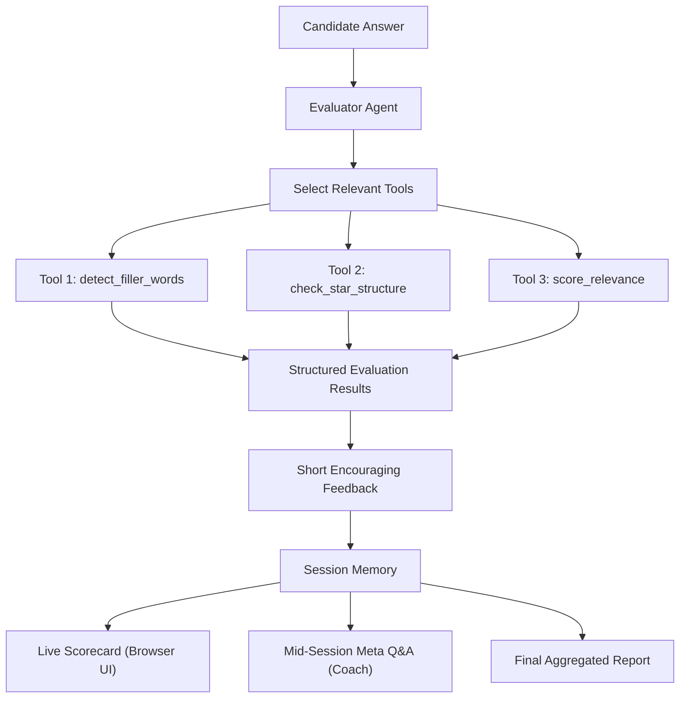
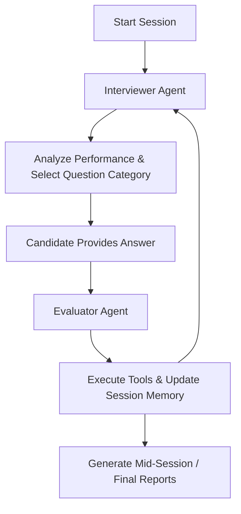

[<- README](../../README.md) | [Notes](InterviewIQ-Class-Notes/)

# AI Infused Learning - 6

# Links
1. [Problem Statement & Project Milestones](https://docs.google.com/document/d/1tzr6V-3UI3kY7NbNmURqvl9GOKjT0y_QZWo5aLwhyxU/edit?tab=t.0#heading=h.ufwicjakpdn8)
2. [Starter Kit](https://drive.google.com/file/d/1Dsg-Ii9-SO8OBAmvIK4XUMIYvpBfhyk1/view)

# My Notes

## 1. Problem Statement

Hiring teams often want a fast, first-pass assessment of a candidate's interview answers before a human reviewer evaluates them.

The goal of this project is to build **InterviewIQ**, an AI-powered mock-interview coach with a working browser interface.

Given a candidate's spoken or written answer to an interview question, InterviewIQ must:
1. **Evaluate the answer using a set of tools**: Run deterministic rule-based analysis (filler words, STAR framework, relevance scoring).
2. **Produce short, encouraging feedback**: Provide constructive, motivating, and actionable feedback.
3. **Remember evaluations across the entire session**: Maintain multi-turn state rather than evaluating only the current turn in isolation.
4. **Answer mid-session progress questions**: Dynamically field meta-questions at any point during the interview (e.g., *"How am I doing so far?"*).
5. **Provide meaningful aggregated insights**: Compute session-level metrics (average relevance, identify the weakest area across all turns) rather than just recapping the last answer.
6. **Surface all functionality in a browser UI**: Deliver the end-to-end experience through a Gradio web interface.

---

## 2. System Architecture & Flows

### Core Evaluator Flow



### Bonus Multi-Agent Orchestrator Flow



---

## 3. Project Requirements (Asks)

### Ask 1 — Build a Tool-Calling Evaluator Agent
Implement an evaluator agent that intelligently decides which evaluation tools are relevant to a candidate's answer and executes them via tool-calling.

The project requires three rule-based tools, each returning a structured dictionary:

1. **`detect_filler_words(answer: str)`**
   - Detects and flags common filler words such as `"um"`, `"like"`, `"basically"`, `"you know"`, `"actually"`.
   - Returns a structured dictionary containing identified filler words, their counts, and total filler count.

2. **`check_star_structure(answer: str)`**
   - Evaluates whether a behavioral interview answer covers the four components of the **STAR** framework:
     1. **Situation**: Context or background.
     2. **Task**: Challenge or responsibility.
     3. **Action**: Steps taken to address the challenge.
     4. **Result**: Outcome, impact, or quantifiable metric.
   - Returns a structured dictionary indicating which components are present vs. missing.

3. **`score_relevance(answer: str, expected_keywords: list[str])`**
   - Scores answer relevance on a scale of **0–100**.
   - Calculates score based on the proportion and density of expected keywords/concepts present in the candidate's answer.
   - Returns a structured dictionary with the score and matched/unmatched keywords.

**Evaluator Agent Behavior:**
1. Read the candidate's answer and the current question context.
2. Determine which evaluation tool(s) are relevant.
3. Call the appropriate tool(s) and receive structured outputs.
4. Interpret the combined tool results.
5. Generate short, encouraging, and actionable feedback for the candidate.

---

### Ask 2 — Session Memory & Aggregated Evaluation

The agent must maintain persistent memory across the entire interview session:
1. **Full-Session Memory**: Store every question, candidate answer, tool outputs, relevance score, and generated feedback across all turns.
2. **Mid-Session Meta-Questions**: The agent must answer progress questions at any point in the interview, including:
   - *"How am I doing so far?"*
   - *"What's my weakest area?"*
   - *"What should I improve?"*
   - *"How has my performance been across the questions?"*
3. **Required Aggregated Analytics**:
   - **Average Relevance Score**: Arithmetic mean of relevance scores across all answered questions up to the current point.
   - **Weakest Area**: The specific question/topic with the lowest relevance score across all answered questions (must not default to just the latest question).

#### Memory Verification (`memory_check.py`)
A verification script is included to test session memory integrity:
1. Evaluates one **strong answer** (high relevance score).
2. Evaluates one **deliberately weak answer** (low relevance score).
3. Asks the agent a meta-question about its weakest area.
4. **Pass Criterion**: The agent identifies the weak answer's question as the weakest area.
5. **Failure Condition**: If the agent names the most recent question regardless of scores, it fails due to recency bias / lack of proper session aggregation.

---

### Ask 3 — Working Gradio Interface (`app.py`)

Build a browser-based user interface using **Gradio** that demonstrates the complete InterviewIQ workflow.

**Required UI Components:**
1. **Current Question Box**: Displays the active interview question.
2. **Candidate Answer Box**: Multi-line text input for candidate responses.
3. **Feedback Panel**: Displays real-time evaluator feedback and tool findings after answer submission.
4. **Live Scorecard**: A dynamically updating summary of all questions answered so far, including relevance scores, filler word counts, and STAR analysis.
5. **Coach / Meta-Question Box**: A free-form conversational input allowing candidates to query their progress anytime during the session.
6. **Final Report Button & Display**: A trigger to generate the final aggregated interview summary showing:
   - Overall average relevance score.
   - Identified weakest area (lowest-scoring question).
   - Comprehensive performance observations and improvement suggestions.

---

### Ask 4 — Bonus: Multi-Agent System (Optional / Ungraded)

Demonstrates orchestrating two specialized agents cooperating in a continuous interview loop:
1. **Interviewer Agent (`interviewer_agent.py`)**:
   - Analyzes candidate performance history.
   - Determines the next category/competency to assess.
   - Selects the appropriate interview question from the bank.
2. **Evaluator Agent (`main.py`)**:
   - Evaluates the candidate's answer using tools.
   - Updates session memory and returns feedback.
3. **Orchestrator Loop (`run_multi_agent.py`)**:
   - Coordinates the cycle: `Interviewer` (selects question) → `Candidate` (answers) → `Evaluator` (evaluates & stores) → `Interviewer` (adapts next question).

---

## 4. Suggested Implementation Approach

Follow this sequential 8-step approach to build and debug InterviewIQ:

1. **Step 1 — Environment & Plumbing**:
   - Create virtual environment, install dependencies (`pip install -r requirements.txt`), set API keys in `.env`.
   - Make a single plain LLM call to verify connectivity.
2. **Step 2 — Implement Tools Standalone**:
   - Write and unit-test `detect_filler_words`, `check_star_structure`, and `score_relevance` as standalone functions before connecting to the LLM.
3. **Step 3 — Wire Tools into Evaluator Agent**:
   - Connect all three tools into the agent tool-calling loop in `main.py`.
   - Verify an end-to-end evaluation of a single turn.
4. **Step 4 — Add Persistent Session Memory**:
   - Implement state management to accumulate turns (question, answer, evaluation, score).
   - Test across multiple consecutive turns.
5. **Step 5 — Implement Aggregated Reporting**:
   - Implement `generate_final_report` computing true session-wide averages and lowest-scoring topic identification.
6. **Step 6 — Implement Mid-Session Meta-Q&A**:
   - Implement `ask_agent` to query the accumulated session memory dynamically at any point.
7. **Step 7 — Validate with Memory Check**:
   - Run `python memory_check.py` to confirm the agent correctly identifies the lowest-scoring question rather than the last turn.
8. **Step 8 — Build the Gradio UI**:
   - Implement `app.py` on top of the validated backend agent logic.

---

## 5. Project Milestones

1. **Milestone 1 — Environment Setup**: Virtual environment created, packages installed, `.env` configured.
2. **Milestone 2 — Plain LLM Call**: Verify baseline LLM API connection.
3. **Milestone 3 — Filler Word Detection**: Implement and unit test `detect_filler_words`.
4. **Milestone 4 — STAR Structure Detection**: Implement and unit test `check_star_structure`.
5. **Milestone 5 — Relevance Scoring**: Implement and unit test `score_relevance`.
6. **Milestone 6 — Tool-Calling Evaluator**: Connect tools to agent in `main.py` for single-turn evaluation.
7. **Milestone 7 — Session Memory**: Multi-turn history tracking across questions.
8. **Milestone 8 — Final Report**: Implement `generate_final_report` with session aggregation.
9. **Milestone 9 — Mid-Session Agent Questions**: Implement `ask_agent` for progress queries.
10. **Milestone 10 — Memory Verification**: Pass `python memory_check.py`.
11. **Milestone 11 — Gradio Application**: Complete browser-based UI in `app.py`.
12. **Milestone 12 — Bonus Multi-Agent System**: Explore `interviewer_agent.py` and `run_multi_agent.py`.

---

## 6. Helper Files & Dependencies

### Core Project Files
1. `.env` / `.env.example`: Environment variables (e.g., `GROQ_API_KEY`, `OPENAI_API_KEY`).
2. `requirements.txt`: Python package requirements (`openai`, `python-dotenv`, `gradio`).
3. `interview_bank.py`: Question bank with expected keywords and categories.
4. `main.py`: Evaluator agent with tool-calling and session memory.
5. `memory_check.py`: Verification test for memory aggregation and recency bias.
6. `app.py`: Gradio web interface.
7. `interviewer_agent.py`: (Bonus) Question selection agent.
8. `run_multi_agent.py`: (Bonus) Multi-agent orchestrator entry point.

### Python Package Dependencies (`requirements.txt`)
```text
openai
python-dotenv
gradio
```

---

## 7. Successful Completion Criteria

The project is considered complete when:
1. `python app.py` launches a functional Gradio UI allowing a user to:
   - Iterate through questions in `interview_bank.py`.
   - Submit responses and view immediate feedback + tool results.
   - View an updated live scorecard across all turns.
   - Ask meta-questions mid-interview and receive memory-aware coaching answers.
   - Generate a final summary with average relevance score and identified weakest area.
2. `python memory_check.py` passes with zero errors, confirming real session memory and aggregation.
